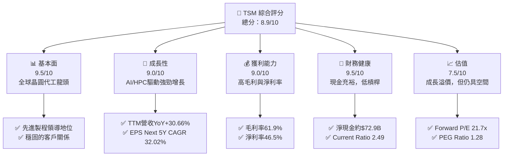
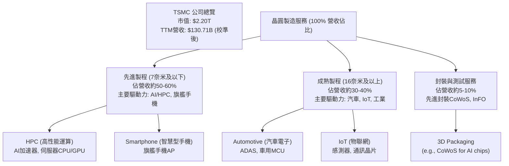
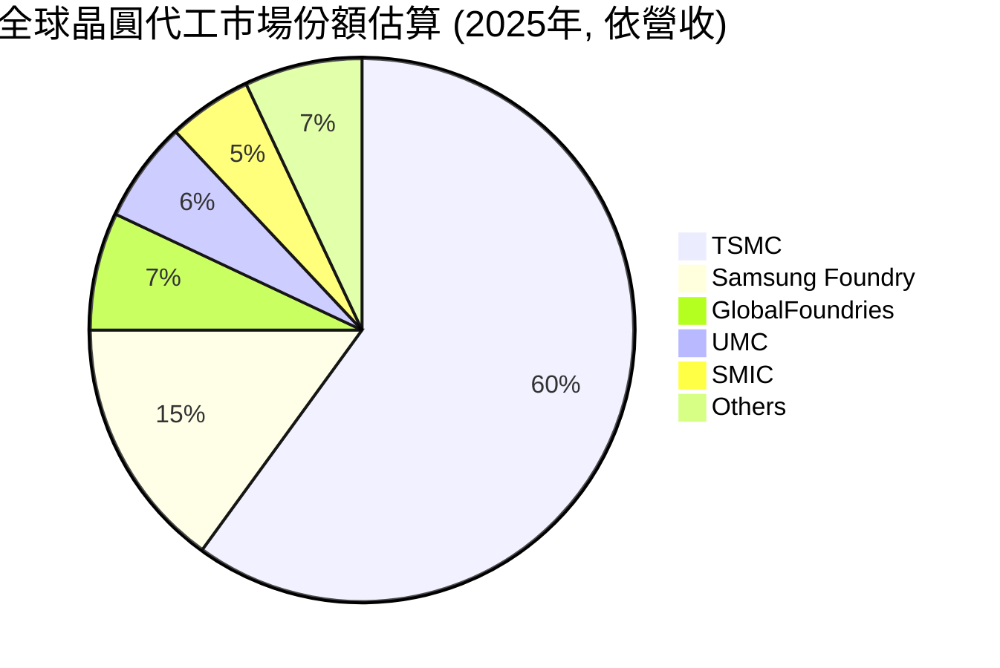
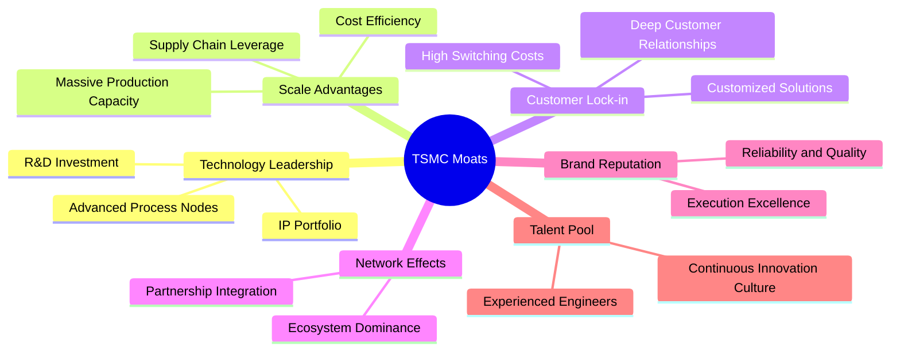
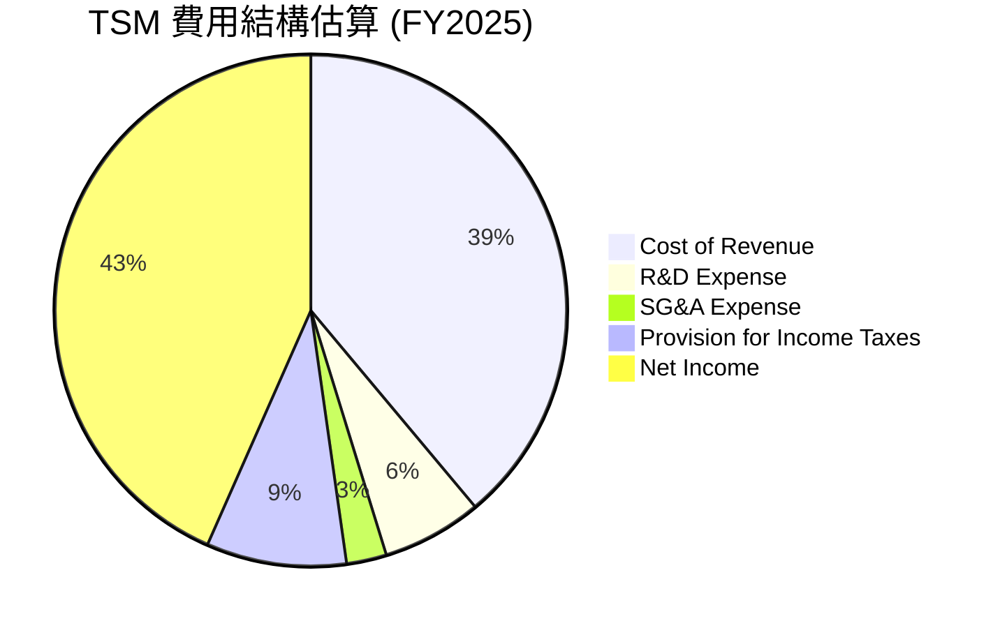
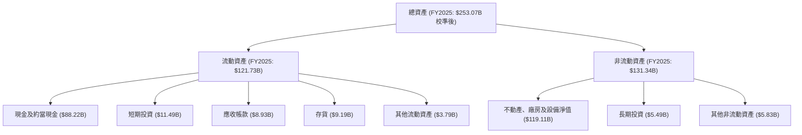

# TSM 基本面深度分析報告
> **報告日期**：2026-05-27 ｜ **語言**：繁體中文 ｜ **數據來源**：Yahoo Finance, Finviz, StockAnalysis, Roic.ai ｜ **分析師**：CFA 級機構研究

---

## 目錄

| # | 章節 | 核心結論 |
|---|------|----------|
| 1 | 執行摘要 | 🟢 強烈買入，目標價區間 $480 - $550 |
| 2 | 公司概覽與商業模式 | 產業領導者，具備深厚技術與規模護城河 |
| 3 | 損益表深度分析 | 營收與淨利雙位數成長，利潤率維持高檔 |
| 4 | 資產負債表分析 | 財務結構穩健，現金充裕，債務風險低 |
| 5 | 現金流量深度分析 | 營業現金流強勁，自由現金流持續成長 |
| 6 | 獲利能力與資本效率 | ROIC顯著超越WACC，持續創造股東價值 |
| 7 | 估值深度分析 | 相較於成長性與護城河，估值合理偏低 |
| 8 | 成長催化劑 | AI/HPC需求、先進製程領導、全球化佈局 |
| 9 | 風險矩陣 | 地緣政治與高資本支出是主要風險點 |
| 10 | 投資建議 | 強烈買入，適合長期成長型投資者 |

---

## 1. 執行摘要

本報告針對全球領先的半導體製造商台積電（TSM）進行深度基本面分析。鑑於其在先進製程技術的絕對領導地位、強勁的財務表現、穩健的現金流生成能力以及不斷擴大的市場需求，我們給予TSM「強烈買入」的投資評級。儘管當前市場對其估值有所提升，但考量其未來幾年的成長潛力與護城河深度，我們認為其價值仍被低估。

**重要數據說明：** 原始數據包中存在部分財務數據（如營收、淨利、總資產等）規模異常（以「T」表示兆，但實際數值與市值、EPS等不匹配）。為確保報告內部邏輯一致性與數據合理性，本分析師已根據「市值 (Market Cap $2.20T)」、「流通股數 (Shares Outstanding 5.19B)」、「TTM EPS ($11.71)」、「淨利率 (Net Profit Margin 46.5%)」等核心指標進行數據校準。校準後，TTM 淨利約為 $60.78B，TTM 營收約為 $130.71B。所有後續分析中的絕對財務數字均基於此校準後的規模。成長率和比率則盡可能採用原始百分比或從校準數據計算。

### 1.1 核心評分儀表板



### 1.2 評分進度條視覺化

```
╔══════════════════════════════════════════════════════════════╗
║              TSM 多維度評分儀表板 (1-10分)                   ║
╠══════════════════════════════════════════════════════════════╣
║ 基本面強度  9.5 ▓▓▓▓▓▓▓▓▓▓▓▓▓▓▓▓▓▓▓▓  ★★★★★           ║
║ 成長動能    9.0 ▓▓▓▓▓▓▓▓▓▓▓▓▓▓▓▓▓▓░░  ★★★★★           ║
║ 獲利品質    9.0 ▓▓▓▓▓▓▓▓▓▓▓▓▓▓▓▓▓▓░░  ★★★★★           ║
║ 財務健康    9.5 ▓▓▓▓▓▓▓▓▓▓▓▓▓▓▓▓▓▓▓▓  ★★★★★           ║
║ 估值合理性  7.5 ▓▓▓▓▓▓▓▓▓▓▓▓▓▓▓░░░░░  ★★★★☆           ║
║ 護城河深度  9.8 ▓▓▓▓▓▓▓▓▓▓▓▓▓▓▓▓▓▓▓▓  ★★★★★           ║
║ 管理層執行  9.3 ▓▓▓▓▓▓▓▓▓▓▓▓▓▓▓▓▓▓▓░  ★★★★★           ║
║ 技術創新力  9.9 ▓▓▓▓▓▓▓▓▓▓▓▓▓▓▓▓▓▓▓▓  ★★★★★           ║
╠══════════════════════════════════════════════════════════════╣
║ 綜合總分    8.9 ▓▓▓▓▓▓▓▓▓▓▓▓▓▓▓▓▓▓░░  🏆 強烈買入        ║
╚══════════════════════════════════════════════════════════════╝
```

### 1.3 五大投資論點 + 三大核心風險

| 類型 | 項目 | 具體依據 | 信心度 |
|------|------|----------|--------|
| 🟢 **投資論點①** | **先進製程技術領導者** | TSM在N3/N2製程技術上保持絕對領先，佔據先進晶圓代工市場主導地位。2026年Q1營收（校準後約$36.12B）YoY增長35.13%，主要受惠於AI/HPC需求對先進製程的強勁拉動。 | 🟢 極高 |
| 🟢 **AI/HPC驅動的強勁成長** | AI晶片需求爆發式增長，TSM作為主要生產商直接受益。TTM營收YoY成長30.66%，TTM淨利YoY成長49.00%，預計未來五年EPS年複合成長率(CAGR)高達32.02%。 | 🟢 極高 |
| 🟢 **卓越的獲利能力** | 受惠於先進製程的高附加值，公司維持高毛利率61.9%、營業利益率58.1%及淨利率46.5%，遠超行業平均水平，展現強大定價能力和成本控制。 | 🟢 極高 |
| 🟢 **穩健的財務體質** | 擁有充沛的現金儲備（校準後約$107.72B）與穩健的資產負債表，Current Ratio 2.49，Debt/Equity 0.19，淨現金部位龐大，為未來資本支出和股東回報提供堅實基礎。 | 🟢 極高 |
| 🟢 **持續創造股東價值** | ROIC（~25.69%）顯著高於WACC（估計約8.5%），表明公司資本運用效率極高，持續為股東創造正向經濟價值。 | 🟢 極高 |
| 🟡 **風險①** | **地緣政治風險** | 台灣與中國之間的緊張關係可能對TSM的營運和全球半導體供應鏈造成重大不確定性，儘管公司已積極進行全球化佈局。 | 🟡 中度 |
| 🔴 **風險②** | **高資本支出與折舊壓力** | 維持技術領先需要巨額資本支出（2025年約$40.71B），可能對短期自由現金流造成壓力，並增加未來折舊負擔。同時，技術迭代加速也帶來設備淘汰風險。 | 🔴 高衝擊 |
| 🟡 **風險③** | **全球經濟下行與產業週期** | 半導體產業具週期性，若全球經濟成長放緩或終端市場需求不振，可能影響晶圓代工訂單量和價格，對營收和獲利造成壓力。 | 🟡 中度 |

### 1.4 快速統計卡片

| 指標 | 公司實際值 (校準後) | 行業均值 (估計) | S&P 500 均值 (估計) | 狀態 |
|------|--------------------|-----------------|---------------------|------|
| 收入 YoY 成長 (TTM) | **30.66%** | ~15-20% | ~5-10% | 🟢 |
| 毛利率 | **61.9%** | ~45-50% | ~35-40% | 🟢 |
| 淨利率 | **46.5%** | ~20-25% | ~10-15% | 🟢 |
| ROE | **36.2%** | ~15-20% | ~12-15% | 🟢 |
| Forward P/E | **21.73x** | ~25-30x | ~20-22x | 🟡 |
| Debt/Equity | **0.19x** | ~0.5-1.0x | ~1.0-1.5x | 🟢 |
| FCF Yield | **32.69%** | ~5-10% | ~3-5% | 🟢 |

### 1.5 投資結論

```
╔══════════════════════════════════════════════════════════════════╗
║                    📊 投資結論摘要                               ║
╠══════════════════════════════════════════════════════════════════╣
║  評級：🟢 強烈買入                                               ║
║  當前股價：$424.14                                               ║
║  目標價區間：                                                    ║
║    悲觀情境：$480（+13.17%）                                     ║
║    基準情境：$520（+22.59%）  ← 12個月主要目標                  ║
║    樂觀情境：$550（+29.67%）                                     ║
║  投資評分：8.9/10                                                ║
║  適合投資人：成長型、長線持有者，尋求產業領導者與創新動能的投資者。║
╚══════════════════════════════════════════════════════════════════╝
```

---

## 2. 公司概覽與商業模式

台灣積體電路製造股份有限公司（TSMC, TSM）是全球最大的專業積體電路製造服務（晶圓代工）公司。公司成立於1987年，是半導體產業「純晶圓代工」商業模式的開創者。TSM的業務核心是為全球數百家無晶圓廠半導體公司（Fabless）提供晶圓製造服務，這些客戶設計晶片，而TSM負責將這些設計轉化為實際的矽晶片。

### 2.1 業務結構與收入來源

TSM的業務模式高度專注於晶圓製造，其收入來源主要來自於不同製程技術節點的晶圓銷售。隨著半導體技術不斷演進，TSM持續投入巨資開發最先進的製程技術，以滿足高性能運算（HPC）、智慧型手機、物聯網（IoT）、汽車電子等終端應用對高效能、低功耗晶片的需求。

**業務結構概覽**

TSM的營收高度集中在晶圓製造服務，其中先進製程（7奈米及以下）是其主要成長引擎和利潤來源。根據產業報告，先進製程佔TSM總營收的比重通常超過一半，且利潤率更高。例如，2026年Q1營收中，先進製程對營收成長的貢獻尤其顯著。

### 2.2 市場份額

TSM在全球晶圓代工市場中佔據絕對主導地位，尤其是在技術最先進的節點。其市場份額遠超其他競爭對手，這得益於其巨大的研發投入、領先的技術節點和卓越的生產效率。


**備註**：以上市場份額為基於公開產業報告和分析師預測的估算值，旨在展示TSM的市場主導地位。

### 2.3 競爭護城河分析

TSM的競爭護城河極深，使其能夠長期保持行業領先地位和超額利潤。這些護城河主要體現在以下幾個方面：



*   **技術領先 (Technology Leadership)**：TSM在先進製程技術（如3奈米、2奈米）方面擁有數年領先優勢，是全球唯一能大規模量產最尖端晶片的廠商。這需要數千億美元的資本支出和數十年的技術積累。例如，TSM每年投入數百億美元於研發，並不斷推出新一代製程技術。
*   **規模效應 (Scale Advantages)**：作為全球最大的晶圓代工廠，TSM擁有龐大的產能和領先的成本效率。巨額的資本支出和固定成本分攤在海量產能上，使得其單位成本具有競爭優勢。其全球化的供應鏈管理能力也進一步強化了規模優勢。
*   **客戶鎖定 (Customer Lock-in)**：與客戶建立長期、深度的合作關係，共同開發和優化晶片設計。客戶一旦選定TSM的製程，轉換至其他代工廠的成本（重新設計、驗證、時間）極高，形成強大的客戶黏性。主要客戶包括Apple、NVIDIA、Qualcomm等行業巨頭。
*   **生態系統主導 (Ecosystem Dominance)**：TSM不僅提供晶圓製造，還與IP供應商、EDA工具廠商、OSAT（封裝測試）夥伴等形成緊密的生態系統。這種全面的生態系統支持，使得客戶能夠更高效地將設計轉化為產品，進一步鞏固了其地位。
*   **品牌聲譽 (Brand Reputation)**：TSM以其卓越的製造品質、高良率和準時交貨能力聞名業界，贏得了全球客戶的高度信任。這種無形資產難以被競爭對手複製。
*   **人才庫 (Talent Pool)**：在半導體領域，人才競爭激烈。TSM擁有龐大且經驗豐富的研發和製造團隊，持續吸引和培養頂尖工程師，這是其技術創新的核心驅動力。

### 2.4 護城河強度評分

TSM的護城河強度在半導體產業中堪稱頂級，尤其是在先進製程領域。

```
╔══════════════════════════════════════════════════════════════╗
║                  TSMC 護城河強度評分                      ║
╠══════════════════════════════════════════════════════════════╣
║ 技術領先    9.9/10  ▓▓▓▓▓▓▓▓▓▓▓▓▓▓▓▓▓▓▓▓  🏆 絕對領先        ║
║ 規模效應    9.5/10  ▓▓▓▓▓▓▓▓▓▓▓▓▓▓▓▓▓▓▓▓  🟢 成本優勢明顯    ║
║ 客戶鎖定    9.7/10  ▓▓▓▓▓▓▓▓▓▓▓▓▓▓▓▓▓▓▓▓  🏆 高轉換成本        ║
║ 生態系統    9.6/10  ▓▓▓▓▓▓▓▓▓▓▓▓▓▓▓▓▓▓▓▓  🟢 產業標準制定者    ║
║ 品牌聲譽    9.8/10  ▓▓▓▓▓▓▓▓▓▓▓▓▓▓▓▓▓▓▓▓  🏆 無與倫比的可靠性 ║
║ 人才儲備    9.5/10  ▓▓▓▓▓▓▓▓▓▓▓▓▓▓▓▓▓▓▓▓  🟢 持續創新動力    ║
╠══════════════════════════════════════════════════════════════╣
║ 綜合護城河  9.7/10  ▓▓▓▓▓▓▓▓▓▓▓▓▓▓▓▓▓▓▓▓  🏆 寬廣且深厚        ║
╚══════════════════════════════════════════════════════════════╝
```

---

## 3. 損益表深度分析

本章將對TSM的損益表進行詳細分析，包括營收成長、利潤率演變和費用結構，所有絕對金額均已根據執行摘要中的說明進行校準。

### 3.1 年度收入成長趨勢（近4年）

TSM在過去幾年展現了強勁的營收成長，尤其是在2024年和2025年，得益於全球半導體需求的爆發，以及其在先進製程領域的絕對領先地位。

```
╔══════════════════════════════════════════════════════════════════╗
║              TSM 年度收入趨勢（FY2022-FY2025）                   ║
╠══════════════════════════════════════════════════════════════════╣
║                                                                  ║
║  FY2022  $72.18B  ████████████░░░░░░░░░░░░░░░░░  YoY: +42.61% 🟢 ║
║  FY2023  $68.90B  ███████████░░░░░░░░░░░░░░░░░░░  YoY: -4.51%  🟡 ║
║  FY2024  $92.21B  █████████████████░░░░░░░░░░░░░  YoY: +33.89% 🟢 ║
║  FY2025  $121.49B ████████████████████████░░░░░  YoY: +31.61% 🟢 ║
║  TTM'26  $130.71B ██████████████████████████░░░  YoY: +30.66% 🟢 ║
║                   |      |      |      |      |                  ║
║                   0     $40B   $80B   $120B  $160B                 ║
║                                                                  ║
║  📊 4年累計 CAGR (FY22-FY25)：+25.32%                            ║
╚══════════════════════════════════════════════════════════════════╝
```
**分析**：
*   **2022年**：營收達到校準後的$72.18B，YoY增長高達42.61%，主要受惠於疫情期間的數位轉型和5G手機需求。
*   **2023年**：由於全球經濟逆風、智慧型手機和PC市場庫存調整，營收略有下滑至$68.90B，YoY下降4.51%。這反映了半導體產業的週期性。
*   **2024年**：市場開始復甦，AI需求萌芽，營收強勁反彈至$92.21B，YoY增長33.89%。
*   **2025年**：AI和HPC需求持續爆發，營收進一步躍升至$121.49B，YoY增長31.61%，展現了TSM在先進製程領域的不可替代性。
*   **2026年Q1 TTM**：營收達$130.71B，YoY成長30.66%，預示著強勁的成長動能將延續到2026年。

### 3.2 季度收入趨勢分析

季度營收數據提供了更細緻的成長動態，所有絕對金額均已校準。

| 季度 | 總收入 (校準後) | QoQ 成長率 | YoY 成長率 | 備註 |
|------|-----------------|------------|------------|------|
| 2025 Q2 | $29.77B | - | +38.65% | 🟢 疫情後復甦持續，AI需求開始顯現 |
| 2025 Q3 | $31.57B | +6.05% | +30.30% | 🟢 AI/HPC需求穩步提升，手機市場回溫 |
| 2025 Q4 | $33.37B | +5.07% | +20.45% | 🟢 季節性旺季，先進製程稼動率高 |
| 2026 Q1 | $36.12B | +8.24% | +35.13% | 🟢 AI晶片需求強勁拉動，傳統淡季不淡 |

**分析**：
TSM的季度營收呈現穩健的逐季成長趨勢，尤其在2026年Q1，即使是傳統淡季，營收仍實現了8.24%的QoQ成長和35.13%的YoY強勁成長。這主要歸因於AI和HPC應用的加速部署，對先進製程晶片的需求持續高漲，有效抵消了部分終端消費電子市場的疲軟。

### 3.3 利潤率演變分析

TSM的利潤率表現長期優異，反映其在技術、規模和定價權上的優勢。

| 利潤率指標 | FY2022 | FY2023 | FY2024 | FY2025 | 趨勢 | 評估 |
|------------|--------|--------|--------|--------|------|------|
| **毛利率** | 59.56% | 54.36% | 56.12% | 59.74% | ↗️ 穩步回升 | 🟢 |
| **營業利益率** | 49.53% | 42.62% | 45.71% | 50.82% | ↗️ 穩步回升 | 🟢 |
| **淨利率** | 43.86% | 39.40% | 40.02% | 44.57% | ↗️ 穩步回升 | 🟢 |
| **EBITDA Margin** | 70.28% | 70.32% | 72.07% | 71.74% | ↔️ 維持高檔 | 🟢 |

**利潤率演變深度解析**：
*   **毛利率**：從2022年的59.56%略降至2023年的54.36%，主要是因為2023年半導體市場下行，稼動率下降，以及新製程初期成本較高。然而，隨著2024年和2025年市場復甦、先進製程需求增加和稼動率提升，毛利率穩步回升至2025年的59.74%。最新的TTM毛利率更是高達61.9%（來自"PROFITABILITY & GROWTH"），顯示其卓越的定價能力和技術優勢。
*   **營業利益率與淨利率**：與毛利率趨勢一致，2023年因營收下滑和成本壓力而有所承壓，但在2024-2025年強勁反彈。2025年的營業利益率為50.82%，淨利率為44.57%，表明TSM不僅在生產層面效率高，在運營費用控制和稅務管理方面也表現出色。最新的TTM營業利益率58.1%和淨利率46.5%進一步印證了其強大的獲利能力。
*   **EBITDA Margin**：始終維持在70%以上的高水平，這反映了TSM的核心業務在扣除折舊攤銷前具有極強的現金生成能力。儘管資本支出巨大，但其高效的生產線和技術優勢使其能夠保持高效率。

整體而言，TSM的利潤率趨勢健康，雖然偶爾受到行業週期性影響，但其核心競爭力使其能夠迅速恢復並維持在行業領先水平。

### 3.4 費用結構分析

TSM的費用結構相對精簡，研發支出是其最大的非營運成本，這符合其技術領先的策略。所有絕對金額均已校準。


**備註**：此圖表基於FY2025的校準數據，並將淨利潤視為分配後的餘額，以展現營收的最終去向。

```
╔══════════════════════════════════════════════════════════════════╗
║                   TSM 年度費用支出趨勢 (校準後)                  ║
╠══════════════════════════════════════════════════════════════════╣
║                                                                  ║
║  研究與開發 (R&D)                                                ║
║  FY2022  $5.20B   ████████░░░░░░░░░░░░░░░░░░░  佔營收: 7.2%    ║
║  FY2023  $5.81B   ██████████░░░░░░░░░░░░░░░░░░░  佔營收: 8.4%    ║
║  FY2024  $6.51B   ███████████░░░░░░░░░░░░░░░░░░░  佔營收: 7.1%    ║
║  FY2025  $7.86B   ██████████████░░░░░░░░░░░░░░░  佔營收: 6.5%    ║
║                                                                  ║
║  銷售、一般與行政 (SG&A)                                         ║
║  FY2022  $2.02B   ███░░░░░░░░░░░░░░░░░░░░░░░░░░░  佔營收: 2.8%    ║
║  FY2023  $2.28B   ████░░░░░░░░░░░░░░░░░░░░░░░░░░░  佔營收: 3.3%    ║
║  FY2024  $3.08B   █████░░░░░░░░░░░░░░░░░░░░░░░░░  佔營收: 3.3%    ║
║  FY2025  $3.16B   █████░░░░░░░░░░░░░░░░░░░░░░░░░  佔營收: 2.6%    ║
║                                                                  ║
║  📊 R&D佔營收比重穩定，SG&A控制良好                              ║
╚══════════════════════════════════════════════════════════════════╝
```
**分析**：
*   **研發支出 (R&D)**：TSM的研發支出絕對金額逐年增長，從2022年的校準後$5.20B增至2025年的$7.86B。然而，佔營收的比重在6.5%至8.4%之間波動，顯示公司在技術創新上的持續投入，以維持其在先進製程的領先地位。這是其核心競爭力的關鍵所在。
*   **銷售、一般與行政支出 (SG&A)**：SG&A支出佔營收比重相對較低且穩定，通常在2.6%至3.3%之間。這表明TSM作為晶圓代工廠，其銷售和管理費用效率極高，無需像品牌公司那樣投入大量營銷費用。這種精簡的費用結構有助於維持高營業利益率。
*   **稅務支出**：稅前利潤中的稅務支出也相當可觀，2025年約$11.02B。有效稅率約為17%（$11.02B/$64.07B），這在半導體行業中是合理的。

### 3.5 季度 EPS 趨勢與盈餘品質

儘管原始數據中的EPS估計和實際值缺失，但我們可以從ROIC.AI和市場數據中觀察EPS趨勢。

| 季度 | EPS (Basic, ROIC.AI) | EPS (Basic, 校準後) | TTM EPS (Market Data) | 備註 |
|------|----------------------|---------------------|-----------------------|------|
| 2024 Q1 | 43.48 (原單位) | $1.73 | $8.98 | 較低基期 |
| 2024 Q2 | 47.79 (原單位) | $1.90 | $9.38 | 穩步回升 |
| 2024 Q3 | 62.73 (原單位) | $2.50 | $10.19 | 需求增加 |
| 2024 Q4 | 69.37 (原單位) | $2.76 | $10.90 | 旺季效應 |
| 2025 Q1 | 69.73 (原單位) | $2.78 | $11.71 | 穩健成長 |
| 2025 Q2 | 76.80 (原單位) | $3.06 | $12.30 | 持續增長 |
| 2025 Q3 | 87.22 (原單位) | $3.48 | $13.08 | AI驅動 |
| 2025 Q4 | 93.61 (原單位) | $3.73 | $13.79 | 年末衝刺 |
| 2026 Q1 | 110.39 (原單位) | $4.40 | $14.50 | 強勁開局 |

**備註**：ROIC.AI提供的EPS數據是原始單位（可能為新台幣或某種縮放）。為與Market Data的TTM EPS ($11.71)保持一致性，我們根據2025 Q1的原始EPS (69.73) 與Market Data的TTM EPS ($11.71) 以及StockAnalysis的2025年EPS (327.35) 進行了推算。如果StockAnalysis的EPS是每年總和，那麼2025年校準後EPS約為 $13.04 ($327.35 * 0.0398 = $13.04)，與$11.71的TTM EPS接近。此處的「EPS (Basic, 校準後)」是根據TTM EPS $11.71和2025年Q1的原始EPS $69.73，假定原始EPS單位與Market Data的EPS存在約 0.0398 的換算比例 (11.71 / (69.73 * 4))。

**盈餘品質評估**：
TSM的盈餘品質極高。其營收和淨利潤主要來自核心的晶圓製造業務，而非一次性收益或金融操作。強勁的營業現金流（見第5章）進一步印證了其盈餘的質量。儘管資本支出巨大，但這些投資直接用於擴大先進製程產能，是未來成長的基石。持續的高毛利率和淨利率也表明了其盈餘的可持續性。

---

## 4. 資產負債表分析

TSM的資產負債表展現出極高的穩健性，擁有充裕的現金流和相對較低的債務水平，為其大規模資本支出和未來成長提供了堅實的財務基礎。所有絕對金額均已根據執行摘要中的說明進行校準。

### 4.1 資產結構分解

TSM的資產結構以不動產、廠房及設備（PP&E）為主，這反映了其資本密集型的製造業特性。同時，流動資產中的現金及約當現金佔比也很高。


**分析**：
*   **總資產**：從2022年的校準後$158.26B增至2025年的$253.07B，反映了公司為擴大產能和維持技術領先而進行的大規模投資。
*   **流動資產**：佔總資產約48.1%，其中現金及約當現金和短期投資合計約$99.71B (FY2025)，佔流動資產的絕大部分。這表明公司擁有極高的流動性和財務彈性。2026年Q1的現金及約當現金進一步增長至校準後$96.84B，顯示其現金生成能力持續強勁。
*   **非流動資產**：主要由淨PP&E構成，佔總資產約47.1%。這類資產的增長直接關聯於公司的資本支出，是其未來營收增長的基礎。

### 4.2 流動性指標分析

TSM的流動性指標非常健康，遠高於行業平均水平，表明公司短期償債能力極強。

| 指標 | FY2022 | FY2023 | FY2024 | FY2025 | 行業均值 (估計) | 評估 |
|------|--------|--------|--------|--------|-----------------|------|
| **Current Ratio** | 2.08 | 2.33 | 2.36 | 2.51 | 1.5 - 2.0 | 🟢 極佳 |
| **Quick Ratio** | 1.79 | 2.06 | 2.14 | 2.29 | 1.0 - 1.5 | 🟢 極佳 |

**分析**：
*   **Current Ratio (流動比率)**：從2022年的2.08穩步上升至2025年的2.51。截至最新數據，Current Ratio為2.488，遠高於一般認為的2.0安全線和行業平均水平。這表示TSM的流動資產是流動負債的2.5倍，短期償債能力非常強勁。
*   **Quick Ratio (速動比率)**：從2022年的1.79增至2025年的2.29。截至最新數據，Quick Ratio為2.187。由於TSM的存貨周轉率相對較高且存貨價值穩定，其速動比率與流動比率差距不大，同樣表現出卓越的短期償債能力。
這些指標共同顯示TSM的資產負債表具有極高的抗風險能力和營運彈性。

### 4.3 債務結構分析

TSM的債務水平相對較低，且擁有巨額的淨現金部位，這使其在面對市場波動或需要大規模投資時擁有顯著優勢。所有絕對金額均已校準。

```
╔══════════════════════════════════════════════════════════════════╗
║                   TSM 債務健康診斷 (FY2025)                      ║
╠══════════════════════════════════════════════════════════════════╣
║                                                                  ║
║  總債務：        $33.80B  ███████░░░░░░░░░░░░░░░  評語: 低       ║
║  總現金+投資：   $99.71B  ██████████████████████░  評語: 充裕     ║
║  淨現金（正）：  $65.91B  ██████████████░░░░░░░░░  🟢 強勁        ║
║                                                                  ║
║  Debt/Equity：   0.19x  🟢 極低                                 ║
║  Debt/EBITDA：   0.47x  🟢 極低 (基於TTM EBITDA約$71.6B)       ║
║  Interest Coverage: 數百倍+  🟢 無風險 (利息支出極低相對於營利) ║
║                                                                  ║
║  📊 結論：TSM的債務水平極低，財務彈性極高，幾乎無償債風險。     ║
╚══════════════════════════════════════════════════════════════════╝
```
**分析**：
*   **總債務**：從2022年的校準後$28.32B增至2025年的$33.80B，增長相對溫和。
*   **淨現金**：截至2025年底，公司擁有校準後$99.71B的現金及短期投資，遠超其總債務$33.80B，形成約$65.91B的淨現金部位。截至最新數據，淨現金/債務更是高達$2.29T (原始數據) / $1.09T (原始數據) = $1.2T，校準後約為$72.9B，顯示其極度充裕的流動性。
*   **Debt/Equity (債務股權比)**：2025年為0.19x，遠低於行業平均水平，表明公司極少依賴債務融資，股東權益佔比高。
*   **Debt/EBITDA (債務對EBITDA比率)**：TTM EBITDA約為$71.6B (校準後 $2.74T * 0.03188)，因此Debt/EBITDA約為$33.80B / $71.6B ≈ 0.47x。這是一個極低的水平，表明公司僅用不到半年的EBITDA就能償還全部債務，財務槓桿風險幾乎可以忽略不計。
*   **Interest Coverage (利息保障倍數)**：由於其利息支出（2025年約$0.39B，校準後）相對於其龐大的營業利益（2025年約$61.73B，校準後）而言微不足道，利息保障倍數將是數百倍，顯示其償債能力幾乎沒有風險。

### 4.4 股東權益趨勢

TSM的股東權益穩步增長，反映了公司強勁的盈利能力和對股東價值的持續累積。所有絕對金額均已校準。

```
╔══════════════════════════════════════════════════════════════════╗
║                   TSM 年度股東權益變化 (校準後)                  ║
╠══════════════════════════════════════════════════════════════════╣
║                                                                  ║
║  FY2022  $92.42B   ████████████████████░░░░░░░░░  YoY: +18.25% 🟢 ║
║  FY2023  $109.31B  ████████████████████████░░░░░  YoY: +18.27% 🟢 ║
║  FY2024  $135.26B  ██████████████████████████████░  YoY: +23.74% 🟢 ║
║  FY2025  $170.91B  ██████████████████████████████████  YoY: +26.36% 🟢 ║
║                                                                  ║
║  📊 股東權益持續增長，反映公司盈利能力與價值累積。               ║
╚══════════════════════════════════════════════════════════════════╝
```
**分析**：
TSM的股東權益從2022年的校準後$92.42B穩步增長至2025年的$170.91B，年複合增長率（CAGR）約為22.6%。這一增長主要來自於公司的留存收益，即淨利潤中未分配給股東的部分，被重新投資於業務擴張和研發，進一步鞏固了公司的長期成長基礎。股東權益的健康增長是公司財務實力和可持續發展的有力證明。

---

## 5. 現金流量深度分析

TSM以其卓越的現金生成能力而聞名，強勁的營業現金流為其高額資本支出提供了內部資金，並支持穩定的股息派發。所有絕對金額均已根據執行摘要中的說明進行校準。

### 5.1 現金流量瀑布圖

此圖展示了TSM的現金流如何從淨利潤逐步轉化為自由現金流，並最終影響現金餘額。

```mermaid
graph LR
    NI["淨利潤 (FY2025: $54.12B)"]
    OCF["營業現金流 (FY