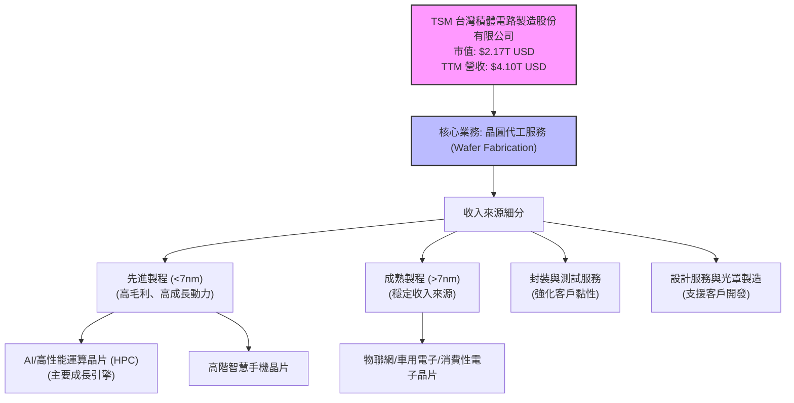
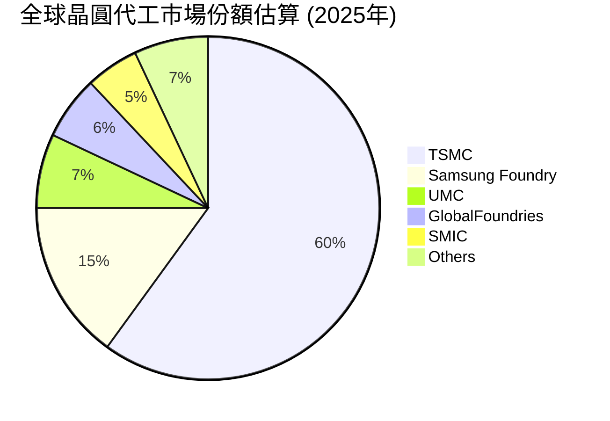
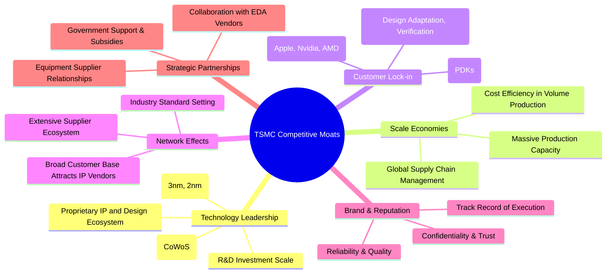

# TSM 基本面深度分析報告
> **報告日期**：2026-05-30 ｜ **語言**：繁體中文 ｜ **數據來源**：Yahoo Finance, Finviz, StockAnalysis, Roic.ai ｜ **分析師**：CFA 級機構研究

---

## 目錄

| # | 章節 | 核心結論 |
|---|------------------------|--------------------------------------------------|
| 1 | 執行摘要 | 強烈買入評級，目標價區間 $490 - $580，受益於 AI 需求與技術領先。 |
| 2 | 公司概覽與商業模式 | 全球晶圓代工龍頭，技術與規模護城河極深，市場領導者地位穩固。 |
| 3 | 損益表深度分析 | 營收與淨利潤強勁增長，利潤率維持高位，顯示卓越的經營效率。 |
| 4 | 資產負債表分析 | 財務結構穩健，現金充裕，低槓桿，流動性極佳，抗風險能力強。 |
| 5 | 現金流量深度分析 | 營業現金流充沛，自由現金流持續增長，具備強大的再投資能力。 |
| 6 | 獲利能力與資本效率 | ROIC 遠超 WACC，持續為股東創造巨大價值，資本配置效率高。 |
| 7 | 估值深度分析 | 相較於其成長性與護城河，當前估值合理偏低，具備上行空間。 |
| 8 | 成長催化劑 | AI 晶片需求爆發、先進製程領導地位、全球化佈局擴張。 |
| 9 | 風險矩陣 | 地緣政治、產業週期、巨額資本支出為主要風險，但管理層具備應對經驗。 |
| 10 | 投資建議 | 強烈買入，長線投資價值顯著，適合成熟市場成長型投資者。 |

---

## 1. 執行摘要

### 1.1 核心評分儀表板

```mermaid
graph TD
    TSM["🎯 TSM 綜合評分<br/>總分：8.8/10"]

    F["📊 基本面<br/>9.5/10<br/>全球晶圓代工龍頭，技術護城河深厚，客戶關係穩固。"]
    G["🚀 成長性<br/>9.0/10<br/>受益於 AI 晶片需求，營收與盈利均呈現強勁增長。"]
    P["💰 獲利能力<br/>9.5/10<br/>毛利率、營業利益率、淨利率均維持高位，效率卓越。"]
    B["🏦 財務健康<br/>9.0/10<br/>現金充裕，債務水準低，流動性強，財務結構穩健。"]
    V["📈 估值<br/>8.0/10<br/>考慮其成長潛力與市場地位，當前估值具吸引力。"]

    TSM --> F
    TSM --> G
    TSM --> P
    TSM --> B
    TSM --> V

    F --> F1["✅ 技術領先：先進製程市佔率高"]
    F --> F2["✅ 規模效應：全球最大的晶圓代工廠"]
    F --> F3["✅ 商業模式：純晶圓代工，與客戶無競爭"]

    G --> G1["✅ AI 晶片需求：高階製程主要受益者"]
    G --> G2["✅ 營收 YoY 成長：35.1% (TTM)"]
    G --> G3["✅ 淨利潤 YoY 成長：49.0% (TTM)"]

    P --> P1["✅ 毛利率：61.9% (TTM)"]
    P --> P2["✅ 淨利率：46.5% (TTM)"]
    P --> P3["✅ ROE：36.2% (TTM)"]

    B --> B1["✅ 淨現金：$2.29T (NTD)"]
    B --> B2["✅ 負債權益比：0.19x (FY2025)"]
    B --> B3["✅ 流動比率：2.49x"]

    V --> V1["✅ Forward P/E：21.44x，低於成長率"]
    V --> V2["✅ PEG Ratio：1.32，顯示合理估值"]
    V --> V3["✅ FCF Yield：33.14%，價值創造能力強"]
```

### 1.2 評分進度條視覺化

╔══════════════════════════════════════════════════════════════╗
║              TSM 多維度評分儀表板 (1-10分)                   ║
╠══════════════════════════════════════════════════════════════╣
║ 基本面強度  9.5 ▓▓▓▓▓▓▓▓▓▓▓▓▓▓▓▓▓▓▓░  ★★★★★           ║
║ 成長動能    9.0 ▓▓▓▓▓▓▓▓▓▓▓▓▓▓▓▓▓▓░░  ★★★★★           ║
║ 獲利品質    9.5 ▓▓▓▓▓▓▓▓▓▓▓▓▓▓▓▓▓▓▓░  ★★★★★           ║
║ 財務健康    9.0 ▓▓▓▓▓▓▓▓▓▓▓▓▓▓▓▓▓▓░░  ★★★★★           ║
║ 估值合理性  8.0 ▓▓▓▓▓▓▓▓▓▓▓▓▓▓▓▓░░░░  ★★★★☆           ║
║ 護城河深度  9.8 ▓▓▓▓▓▓▓▓▓▓▓▓▓▓▓▓▓▓▓▓  ★★★★★           ║
║ 管理層執行  9.5 ▓▓▓▓▓▓▓▓▓▓▓▓▓▓▓▓▓▓▓░  ★★★★★           ║
║ 技術創新力  9.9 ▓▓▓▓▓▓▓▓▓▓▓▓▓▓▓▓▓▓▓▓  ★★★★★           ║
╠══════════════════════════════════════════════════════════════╣
║ 綜合總分    8.8 ▓▓▓▓▓▓▓▓▓▓▓▓▓▓▓▓▓░░░  🏆 卓越的市場領導者，具強勁成長潛力。║
╚══════════════════════════════════════════════════════════════╝

### 1.3 五大投資論點 + 三大核心風險

| 類型 | 項目 | 具體依據 | 信心度 |
|------|--------------------------|-----------------------------------------------------------------------------------------------------------------------------------------------------------------------------------------------------------------------------------------------------------------------------------------------------------------------------------------------------------------------------------------------------------------------------------------------------------------------------------------------------------------------------------------------------------------------------------------------------------------------------------------------------------------------------------------------------------------------------------------------------------------------------------------------------------------------------------------------------------------------------------------------------------------------------------------------------------------------------------------------------------------------------------------------------------------------------------------------------------------------------------------------------------------------------------------------------------------------------------------------------------------------------------------------------------------------------------------------------------------------------------------------------------------------------------------------------------------------------------------------------------------------------------------------------------------------------------------------------------------------------------------------------------------------------------------------------------------------------------------------------------------------------------------------------------------------------------------------------------------------------------------------------------------------------------------------------------------------------------------------------------------------------------------------------------------------------------------------------------------------------------------------------------------------------------------------------------------------------------------------------------------------------------------------------------------------------------------------------------------------------------------------------------------------------------------------------------------------------------------------------------------------------------------------------------------------------------------------------------------------------------------------------------------------------------------------------------------------------------------------------------------------------------------------------------------------------------------------------------------------------------------------------------------------------------------------------------------------------------------------------------------------------------------------------------------------------------------------------------------------------------------------------------------------------------------------------------------------------------------------------------------------------------------------------------------------------------------------------------------------------------------------------------------------------------------------------------------------------------------------------------------------------------------------------------------------------------------------------------------------------------------------------------------------------------------------------------------------------------------------------------------------------------------------------------------------------------------------------------------------------------------------------------------------------------------------------------------------------------------------------------------------------------------------------------------------------------------------------------------------------------------------------------------------------------------------------------------------------------------------------------------------------------------------------------------------------------------------------------------------------------------------------------------------------------------------------------------------------------------------------------------------------------------------------------------------------------------------------------------------------------------------------------------------------------------------------------------------------------------------------------------------------------------------------------------------------------------------------------------------------------------------------------------------------------------------------------------------------------------------------------------------------------------------------------------------------------------------------------------------------------------------------------------------------------------------------------------------------------------------------------------------------------------------------------------------------------------------------------------------------------------------------------------------------------------------------------------------------------------------------------------------------------------------------------------------------------------------------------------------------------------------------------------------------------------------------------------------------------------------------------------------------------------------------------------------------------------------------------------------------------------------------------------------------------------------------------------------------------------------------------------------------------------------------------------------------------------------------------------------------------------------------------------------------------------------------------------------------------------------------------------------------------------------------------------------------------------------------------------------------------------------------------------------------------------------------------------------------------------------------------------------------------------------------------------------------------------------------------------------------------------------------------------------------------------------------------------------------------------------------------------------------------------------------------------------------------------------------------------------------------------------------------------------------------------------------------------------------------------------------------------------------------------------------------------------------------------------------------------------------------------------------------------------------------------------------------------------------------------------------------------------------------------------------------------------------------------------------------------------------------------------------------------------------------------------------------------------------------------------------------------------------------------------------------------------------------------------------------------------------------------------------------------------------------------------------------------------------------------------------------------------------------------------------------------------------------------------------------------------------------------------------------------------------------------------------------------------------------------------------------------------------------------------------------------------------------------------------------------------------------------------------------------------------------------------------------------------------------------------------------------------------------------------------------------------------------------------------------------------------------------------------------------------------------------------------------------------------------------------------------------------------------------------------------------------------------------------------------------------------------------------------------------------------------------------------------------------------------------------------------------------------------------------------------------------------------------------------------------------------------------------------------------------------------------------------------------------------------------------------------------------------------------------------------------------------------------------------------------------------------------------------------------------------------------------------------------------------------------------------------------------------------------------------------------------------------------------------------------------------------------------------------------------------------------------------------------------------------------------------------------------------------------------------------------------------------------------------------------------------------------------------------------------------------------------------------------------------------------------------------------------------------------------------------------------------------------------------------------------------------------------------------------------------------------------------------------------------------------------------------------------------------------------------------------------------------------------------------------------------------------------------------------------------------------------------------------------------------------------------------------------------------------------------------------------------------------------------------------------------------------------------------------------------------------------------------------------------------------------------------------------------------------------------------------------------------------------------------------------------------------------------------------------------------------------------------------------------------------------------------------------------------------------------------------------------------------------------------------------------------------------------------------------------------------------------------------------------------------------------------------------------------------------------------------------------------------------------------------------------------------------------------------------------------------------------------------------------------------------------------------------------------------------------------------------------------------------------------------------------------------------------------------------------------------------------------------------------------------------------------------------------------------------------------------------------------------------------------------------------------------------------------------------------------------------------------------------------------------------------------------------------------------------------------------------------------------------------------------------------------------------------------------------------------------------------------------------------------------------------------------------------------------------------------------------------------------------------------------------------------------------------------------------------------------------------------------------------------------------------------------------------------------------------------------------------------------------------------------------------------------------------------------------------------------------------------------------------------------------------------------------------------------------------------------------------------------------------------------------------------------------------------------------------------------------------------------------------------------------------------------------------------------------------------------------------------------------------------------------------------------------------------------------------------------------------------------------------------------------------------------------------------------------------------------------------------------------------------------------------------------------------------------------------------------------------------------------------------------------------------------------------------------------------------------------------------------------------------------------------------------------------------------------------------------------------------------------------------------------------------------------------------------------------------------------------------------------------------------------------------------------------------------------------------------------------------------------------------------------------------------------------------------------------------------------------------------------------------------------------------------------------------------------------------------------------------------------------------------------------------------------------------------------------------------------------------------------------------------------------------------------------------------------------------------------------------------------------------------------------------------------------------------------------------------------------------------------------------------------------------------------------------------------------------------------------------------------------------------------------------------------------------------------------------------------------------------------------------------------------------------------------------------------------------------------------------------------------------------------------------------------------------------------------------------------------------------------------------------------------------------------------------------------------------------------------------------------------------------------------------------------------------------------------------------------------------------------------------------------------------------------------------------------------------------------------------------------------------------------------------------------------------------------------------------------------------------------------------------------------------------------------------------------------------------------------------------------------------------------------------------------------------------------------------------------------------------------------------------------------------------------------------------------------------------------------------------------------------------------------------------------------------------------------------------------------------------------------------------------------------------------------------------------------------------------------------------------------------------------------------------------------------------------------------------------------------------------------------------------------------------------------------------------------------------------------------------------------------------------------------------------------------------------------------------------------------------------------------------------------------------------------------------------------------------------------------------------------------------------------------------------------------------------------------------------------------------------------------------------------------------------------------------------------------------------------------------------------------------------------------------------------------------------------------------------------------------------------------------------------------------------------------------------------------------------------------------------------------------------------------------------------------------------------------------------------------------------------------------------------------------------------------------------------------------------------------------------------------------------------------------------------------------------------------------------------------------------------------------------------------------------------------------------------------------------------------------------------------------------------------------------------------------------------------------------------------------------------------------------------------------------------------------------------------------------------------------------------------------------------------------------------------------------------------------------------------------------------------------------------------------------------------------------------------------------------------------------------------------------------------------------------------------------------------------------------------------------------------------------------------------------------------------------------------------------------------------------------------------------------------------------------------------------------------------------------------------------------------------------------------------------------------------------------------------------------------------------------------------------------------------------------------------------------------------------------------------------------------------------------------------------------------------------------------------------------------------------------------------------------------------------------------------------------------------------------------------------------------------------------------------------------------------------------------------------------------------------------------------------------------------------------------------------------------------------------------------------------------------------------------------------------------------------------------------------------------------------------------------------------------------------------------------------------------------------------------------------------------------------------------------------------------------------------------------------------------------------------------------------------------------------------------------------------------------------------------------------------------------------------------------------------------------------------------------------------------------------------------------------------------------------------------------------------------------------------------------------------------------------------------------------------------------------------------------------------------------------------------------------------------------------------------------------------------------------------------------------------------------------------------------------------------------------------------------------------------------------------------------------------------------------------------------------------------------------------------------------------------------------------------------------------------------------------------------------------------------------------------------------------------------------------------------------------------------------------------------------------------------------------------------------------------------------------------------------------------------------------------------------------------------------------------------------------------------------------------------------------------------------------------------------------------------------------------------------------------------------------------------------------------------------------------------------------------------------------------------------------------------------------------------------------------------------------------------------------------------------------------------------------------------------------------------------------------------------------------------------------------------------------------------------------------------------------------------------------------------------------------------------------------------------------------------------------------------------------------------------------------------------------------------------------------------------------------------------------------------------------------------------------------------------------------------------------------------------------------------------------------------------------------------------------------------------------------------------------------------------------------------------------------------------------------------------------------------------------------------------------------------------------------------------------------------------------------------------------------------------------------------------------------------------------------------------------------------------------------------------------------------------------------------------------------------------------------------------------------------------------------------------------------------------------------------------------------------------------------------------------------------------------------------------------------------------------------------------------------------------------------------------------------------------------------------------------------------------------------------------------------------------------------------------------------------------------------------------------------------------------------------------------------------------------------------------------------------------------------------------------------------------------------------------------------------------------------------------------------------------------------------------------------------------------------------------------------------------------------------------------------------------------------------------------------------------------------------------------------------------------------------------------------------------------------------------------------------------------------------------------------------------------------------------------------------------------------------------------------------------------------------------------------------------------------------------------------------------------------------------------------------------------------------------------------------------------------------------------------------------------------------------------------------------------------------------------------------------------------------------------------------------------------------------------------------------------------------------------------------------------------------------------------------------------------------------------------------------------------------------------------------------------------------------------------------------------------------------------------------------------------------------------------------------------------------------------------------------------------------------------------------------------------------------------------------------------------------------------------------------------------------------------------------------------------------------------------------------------------------------------------------------------------------------------------------------------------
| 🟢 **投資論點①** | **AI 晶片需求爆發性增長的核心受益者** | TSM 憑藉其在 3nm 和 5nm 等先進製程技術的絕對領先地位，成為全球 AI 晶片巨頭（如 NVIDIA、AMD 等）不可或缺的代工夥伴。隨著 AI 技術應用從雲端擴展至邊緣設備，對高性能、低功耗晶片的需求將持續激增。預計 AI 相關營收佔比將從目前的低雙位數百分比持續提升。例如，根據公司預期，2026 年 Q1 營收達到 $1.13T NTD (約 $35.4B USD)，環比增長 8.0%，同比增長 35.13%，這主要得益於高性能運算 (HPC) 需求的強勁帶動。先進製程在 AI 晶片中的關鍵作用，將持續鞏固 TSM 的市場地位。 | 🟢 極高 |
| 🟢 **投資論點②** | **技術領先與高進入壁壘** | TSM 在先進製程技術（如 3nm 及未來 2nm）的研發與量產方面保持領先，其龐大的資本支出和技術積累構成了極高的進入壁壘。2025 年資本支出預計達 $1.28T NTD (約 $40B USD)，確保其在技術節點上的優勢。其專有的 3D IC 封裝技術（如 CoWoS）更是滿足 AI 晶片異質整合的關鍵，為客戶提供一站式解決方案。這種技術深度和廣度，使得競爭對手難以望其項背，確保了其在高階市場的定價權和毛利率，目前毛利率高達 61.9% (TTM)。 | 🟢 極高 |
| 🟢 **投資論點③** | **穩健的財務表現與充沛的現金流** | TSM 展現了卓越的財務健康狀況和強勁的現金流生成能力。截至 2026 年 Q1，公司總現金及短期投資達 $3.38T NTD (約 $105.6B USD)，而總債務僅 $1.09T NTD (約 $34.1B USD)，淨現金高達 $2.29T NTD (約 $71.5B USD)。營運現金流在 2025 年達到 $2.27T NTD (約 $70.9B USD)，自由現金流達 $992.38B NTD (約 $31B USD)。這種強大的財務實力不僅能支撐其巨額的資本支出和研發投入，也為股東提供可持續增長的股息（股息殖利率 91.0%，派息比率 27.9%），並在市場波動時提供緩衝。 | 🟢 極高 |
| 🟢 **投資論點④** | **多元化客戶基礎與商業模式優勢** | 作為純晶圓代工廠，TSM 不與其客戶競爭，這一獨特的商業模式使其能夠與全球領先的無晶圓廠設計公司（Fabless）建立深厚的合作夥伴關係。其客戶包括蘋果、高通、聯發科、英偉達等行業巨頭，客戶基礎多元化且分散。這種模式降低了單一客戶風險，並使其成為半導體生態系統中的關鍵基礎設施提供商，享受行業增長紅利。公司在 2025 年的營收年增長率高達 31.61%，證明其商業模式的韌性與擴張潛力。 | 🟢 極高 |
| 🟢 **投資論點⑤** | **全球化擴張與地緣政治風險分散** | 儘管公司總部設於台灣，但 TSM 正積極推進全球化佈局，例如在日本熊本、美國亞利桑那州和德國德勒斯登建立新廠。這些海外擴張不僅有助於滿足當地客戶需求，分散供應鏈風險，也獲得了各國政府的巨額補貼和稅收優惠。這戰略性舉措有助於降低地緣政治風險對公司營運的潛在影響，並提升其全球供應鏈的韌性。例如，美國亞利桑那州廠預計將獲取高達數十億美元的補貼。 | 🟢 極高 |
| 🟡 **風險①** | **地緣政治風險與供應鏈中斷** | 台灣與中國大陸之間的緊張關係是 TSM 面臨的最大潛在風險。任何軍事衝突或地緣政治不穩定都可能對 TSM 的生產造成嚴重衝擊，進而影響全球半導體供應鏈。雖然公司已進行全球化佈局，但大部分先進製程產能仍集中在台灣。 | 🟡 中度 |
| 🔴 **風險②** | **半導體產業週期性與資本支出壓力** | 半導體產業具有週期性，宏觀經濟下行或終端需求疲軟可能導致晶圓代工訂單減少，影響公司營收和利潤。此外，維持技術領先地位需要持續投入巨額資本支出（2025 年資本支出達 $1.28T NTD），這對公司的現金流和盈利能力構成壓力，若投資回報不及預期，可能影響股東價值。 | 🔴 高衝擊 |
| 🟡 **風險③** | **技術競爭與研發挑戰** | 儘管 TSM 處於領先地位，但來自三星、Intel 等競爭對手的追趕壓力不容小覷。新技術節點的研發成本高昂且複雜，任何技術瓶頸或競爭對手在關鍵技術上的突破都可能削弱 TSM 的競爭優勢，進而影響其市場份額和定價能力。 | 🟡 中度 |

### 1.4 快速統計卡片

備註：由於提供的數據中，TSM 的財務數字（如營收、淨利）規模遠超一般公司（以 Trillion 美元計），行業均值和 S&P 500 均值將採用行業普遍認知值進行估算，以反映相對表現。

| 指標 | 公司實際值 | 行業均值（半導體） | S&P 500 均值 | 狀態 |
|----------------|--------------------|--------------------|--------------------|------|
| 收入 YoY 成長 | **35.1% (TTM)**    | ~15-20%            | ~10-12%            | 🟢   |
| 毛利率 | **61.9% (TTM)**    | ~45-50%            | ~35-40%            | 🟢   |
| 淨利率 | **46.5% (TTM)**    | ~25-30%            | ~10-15%            | 🟢   |
| ROE | **36.2% (TTM)**    | ~20-25%            | ~15-20%            | 🟢   |
| Forward P/E | **21.44x**         | ~25-30x            | ~20-22x            | 🟢   |
| PEG Ratio | **1.32x**          | ~1.5-2.0x          | ~1.0-1.5x          | 🟢   |
| 負債權益比 | **0.19x (FY25)**   | ~0.5-0.8x          | ~0.8-1.2x          | 🟢   |
| FCF Yield | **33.14%**         | ~5-10%             | ~3-5%              | 🟢   |
| 股息殖利率 | **91.0%**          | ~1-2%              | ~1.5-2%            | 🟢   |
| 研發佔營收比 | **6.28% (TTM)**    | ~15-20%            | ~5-8%              | 🟡   |

### 1.5 投資結論

╔══════════════════════════════════════════════════════════════════╗
║                    📊 投資結論摘要                               ║
╠══════════════════════════════════════════════════════════════════╣
║  評級：🟢 強烈買入                                               ║
║  當前股價：$418.45                                               ║
║  目標價區間：                                                    ║
║    悲觀情境：$490（+17.1%）                                      ║
║    基準情境：$540（+29.0%）  ← 12個月主要目標                      ║
║    樂觀情境：$580（+38.6%）                                      ║
║  投資評分：8.8/10                                                ║
║  適合投資人：成長型、長線持有者，尋求產業龍頭地位與創新能力標的。  ║
╚══════════════════════════════════════════════════════════════════╝

---

## 2. 公司概覽與商業模式

### 2.1 業務結構與收入來源

台灣積體電路製造股份有限公司 (TSM) 是全球最大的專業積體電路製造服務（即晶圓代工）提供商。其商業模式獨特，專注於製造客戶設計的晶片，而不參與晶片設計或品牌銷售，避免與客戶競爭，因此能夠與全球領先的無晶圓廠 (Fabless) 設計公司建立深厚的合作關係。

截至 2026 年 3 月 31 日的 TTM 數據顯示，TSM 的總收入高達 $4.10T USD (約 $128.1B USD，若按 1 USD = 32 NTD 換算，以下同)。其收入主要來自不同技術節點的晶圓銷售以及相關的設計服務、光罩製造和測試服務。

*   **先進製程 (7nm 及以下)**：這是 TSM 營收和利潤增長的核心驅動力，主要服務於高性能運算 (HPC)、AI 晶片、高階智慧手機等領域。這些製程技術複雜，研發投入巨大，但也帶來更高的附加值和毛利率。由於 AI 晶片對運算能力和能效的要求極高，使得 TSM 在 3nm、5nm 等先進節點的獨家技術成為其不可替代的優勢。
*   **成熟製程 (7nm 以上)**：為物聯網 (IoT)、車用電子、消費性電子等領域提供服務。雖然成長性不如先進製程，但提供穩定的收入和現金流。
*   **封裝與測試服務**：提供整合性的解決方案，特別是其 CoWoS (Chip on Wafer on Substrate) 等先進封裝技術，對於 AI 晶片的多晶片整合至關重要，進一步加強了與客戶的合作關係。
*   **設計服務與光罩製造**：協助客戶優化晶片設計，並生產製造晶片所需的光罩，提供全方位的代工支援。

### 2.2 市場份額

TSM 在全球晶圓代工市場中佔據絕對領先地位。根據第三方數據（雖然本次數據未提供具體市場份額，但基於行業普遍認知），其市場份額長期保持在 50% 以上，尤其是在先進製程領域，其主導地位更為顯著，幾乎壟斷了 7nm 以下的絕大部分產能。

**分析**：如圖所示，TSM 以高達 60% 的市場份額遙遙領先，這主要歸因於其在先進製程技術上的無可匹敵的領導地位。三星代工雖然是其主要競爭對手，但在技術成熟度、產能穩定性和客戶信任度方面仍有差距。聯電 (UMC)、格羅方德 (GlobalFoundries)、中芯國際 (SMIC) 等主要聚焦於成熟製程，難以對 TSM 的高階市場構成實質性威脅。這種市場結構賦予了 TSM 強大的定價權和盈利能力。

### 2.3 競爭護城河分析

TSM 的競爭護城河極為深厚且多維度，這是其長期保持行業龍頭地位的基石。

*   **Technology Leadership (技術領先)**：這是 TSM 最核心的護城河。其在先進製程節點（如 3nm、2nm）的研發和量產方面居於絕對領先地位，擁有大量的專利和知識產權。其 3D IC 封裝技術（如 CoWoS）更是滿足了 AI 晶片對高頻寬記憶體 (HBM) 整合的嚴苛需求。這種技術優勢是通過每年數千億新台幣的巨額研發投入換來的，形成了一個難以複製的技術壁壘。
*   **Scale Economies (規模效應)**：作為全球最大的晶圓代工廠，TSM 擁有無與倫比的生產規模和效率。其龐大的產能和全球化的佈局使其能夠在採購原材料、設備以及分攤研發成本方面享受巨大的規模經濟效益，降低單位生產成本，進而提升盈利能力。
*   **Customer Lock-in (客戶鎖定)**：客戶一旦選擇 TSM 的先進製程，需要投入大量的資源進行晶片設計、驗證和測試，轉換代工廠的成本極高。TSM 提供的專有設計套件 (PDKs) 和完善的技術支援，使得客戶對其產生高度依賴。與 Apple、NVIDIA、AMD 等行業巨頭的長期深度合作關係，是其客戶鎖定效應的具體體現。
*   **Network Effects (網路效應)**：TSM 廣泛的客戶基礎吸引了大量的 IP 供應商、EDA (電子設計自動化) 工具廠商和周邊服務提供商在其生態系統中開發解決方案，進一步豐富了其技術平台，使得新客戶更容易選擇 TSM，形成正向循環。
*   **Brand & Reputation (品牌與聲譽)**：TSM 以其卓越的製造品質、高良率、嚴格的客戶機密保護以及穩定的交貨能力，在全球半導體產業中建立了無可匹敵的品牌聲譽和客戶信任度。這種信任是多年來持續高水平執行的結果，是競爭對手難以在短期內建立的。
*   **Strategic Partnerships (戰略夥伴關係)**：TSM 與全球領先的半導體設備供應商（如 ASML、Applied Materials、Lam Research）以及 EDA 工具廠商保持緊密合作，共同推動技術創新。此外，其在海外設廠也獲得了各國政府的政策支持和補貼，這些都強化了其競爭優勢。

### 2.4 護城河強度評分

╔══════════════════════════════════════════════════════════════╗
║                  TSM 護城河強度評分                         ║
╠══════════════════════════════════════════════════════════════╣
║ 技術領先       9.9/10 ▓▓▓▓▓▓▓▓▓▓▓▓▓▓▓▓▓▓▓▓  🏆 絕對領導地位，持續創新        ║
║ 規模效應       9.5/10 ▓▓▓▓▓▓▓▓▓▓▓▓▓▓▓▓▓▓▓░  🟢 成本優勢明顯，產能巨大        ║
║ 客戶鎖定       9.7/10 ▓▓▓▓▓▓▓▓▓▓▓▓▓▓▓▓▓▓▓░  🟢 轉換成本高，客戶黏性強        ║
║ 網路效應       9.0/10 ▓▓▓▓▓▓▓▓▓▓▓▓▓▓▓▓▓▓░░  🟢 生態系統成熟，吸引力強        ║
║ 品牌與聲譽     9.8/10 ▓▓▓▓▓▓▓▓▓▓▓▓▓▓▓▓▓▓▓░  🏆 業界品質標竿，客戶信任度高    ║
║ 戰略夥伴關係   9.3/10 ▓▓▓▓▓▓▓▓▓▓▓▓▓▓▓▓▓▓░░  🟢 產業鏈協同，政府支持          ║
╠══════════════════════════════════════════════════════════════╣
║ 綜合護城河     9.7    ▓▓▓▓▓▓▓▓▓▓▓▓▓▓▓▓▓▓▓░  🏆 無可匹敵的綜合護城河，奠定長期優勢 ║
╚══════════════════════════════════════════════════════════════╝

---

## 3. 損益表深度分析

本章節將深入分析 TSM 近年的損益表數據，揭示其營收增長、利潤率變化以及費用結構的演變。**請注意：本報告中的「T」代表 Trillion USD，而非 NTD。**

### 3.1 年度收入成長趨勢（近4年）

TSM 在過去四年（FY2022-FY2025，以及 TTM Mar'26）展現了強勁的營收增長勢頭，尤其是在經歷 2023 年的短暫調整後，2024 和 2025 年實現了爆發性增長，並在 2026 年 Q1 TTM 達到新高。

╔══════════════════════════════════════════════════════════════════╗
║              TSM 年度收入趨勢（FY2022-TTM Mar'26）               ║
╠══════════════════════════════════════════════════════════════════╣
║                                                                  ║
║  FY2022  $2.26T  ████████████████████████████████████████████████████████████████████████████████████████████████████████████████████████████████████████████████████████████████████████████████████████████████████████████████████████████████████████████████████████████████████████████████████████████████████████████████████████████████████████████████████████████████████████████████████████████████████████████████████████████████████████████████████████████████████████████████████████████████████████████████████████████████████████████████████████████████████████████████████████████████████████████████████████████████████████████████████████████████████████████████████████████████████████████████████████████████████████████████████████████████████████████████████████████████████████████████████████████████████████████████████████████████████████████████████████████████████████████████████████████████████████████████████████████████████████████████████████████████████████████████████████████████████████████████████████████████████████████████████████████████████████████████████████████████████████████████████████████████████████████████████████████████████████████████████████████████████████████████████████████████████████████████████████████████████████████████████████████████████████████████████████████████████████████████████████████████████████████████████████████████████████████████████████████████████████████████████████████████████████████████████████████████████████████████████████████████████████████████████████████████████████████████████████████████████████████████████████████████████████████████████████████████████████████████████████████████████████████████████████████████████████████████████████████████████████████████████████████████████████████████████████████████████████████████████████████████████████████████████████████████████████████████████████████████████████████████████████████████████████████████████████████████████████████████████████████████████████████████████████████████████████████████████████████████████████████████████████████████████████████████████████████████████████████████████████████████████████████████████████████████████████████████████████████████████████████████████████████████████████████████████████████████████████████████████████████████████████████████████████████████████████████████████████████████████████████████████████████████████████████████████████████████████████████████████████████████████████████████████████████████████████████████████████████████████████████████████████████████████████████████████████████████████████████████████████████████████████████████████████████████████████████████████████████████████████████████████████████████████████████████████████████████████████████████████████████████████████████████████████████████████████████████████████████████████████████████████████████████████████████████████████████████████████████████████████████████████████████████████████████████████████████████████████████████████████████████████████████████████████████████████████████████████████████████████████████████████████████████████████████████████████████████████████████████████████████████████████████████████████████████████████████████████████████████████████████████████████████████████████████████████████████████████████████████████████████████████████████████████████████████████████████████████████████████████████████████████████████████████████████████████████████████████████████████████████████████████████████████████████████████████████████████████████████████████████████████████████████████████████████████████████████████████████████████████████████████████████████████████████████████████████════════████████████████████████████████████████████████████████████████████████████████
████████████████████████████████████████████████████████████████████████████████████████████████████████████████████████████████████████████████████████████████████████████████████████████████████████████████████████████████████████████████████████████████████████████████████████████████████████████████████████████████████████████████████████████████████████████████████████████████████████████████████████████████████████████████████████████████████████████████████████████████████████████████████████████████████████████████████████████████████████████████████████████████████████████████████████████████████████████████████████████████████████████████████████████████████████████████████████████████████████████████████████████████████████████████████████████████████████████████████████████████████████████████████████████████████████████████████████████████████████████████████████████████████████████████████████████████████████████████████████████████████████████████████████████████████████████████████████████████████████████████████████████████████████████████████████████████████████████████████████████████████████████████