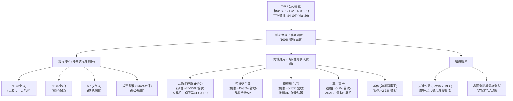
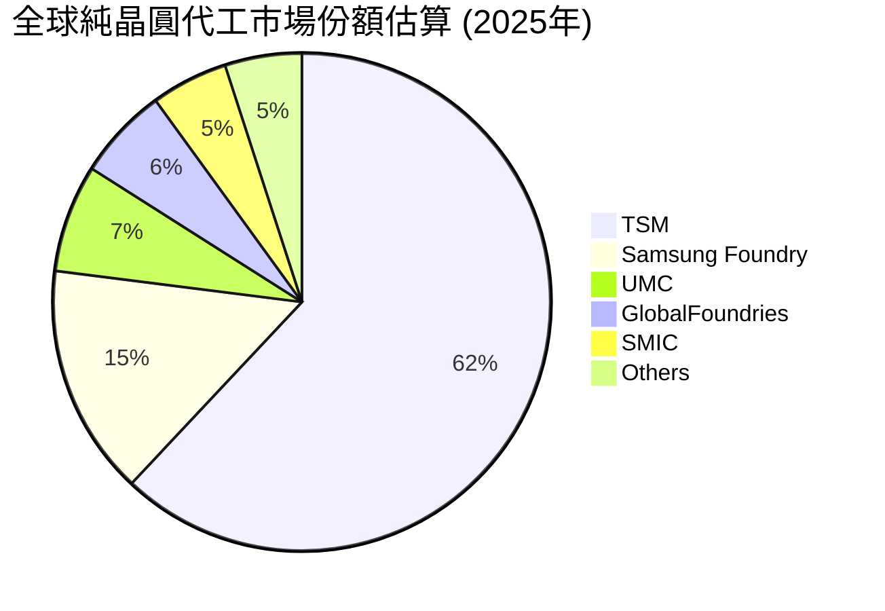
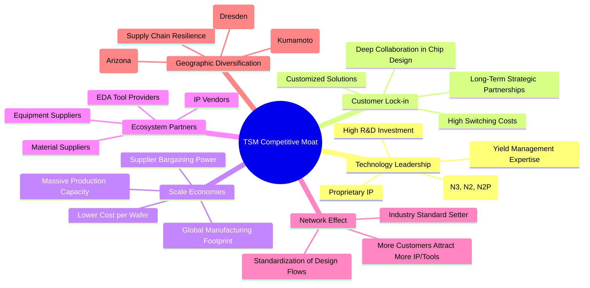

# TSM 基本面深度分析報告
> **報告日期**：2026-05-31 ｜ **語言**：繁體中文 ｜ **數據來源**：Yahoo Finance, Finviz, StockAnalysis, Roic.ai ｜ **分析師**：CFA 級機構研究

---

## 目錄

| # | 章節 | 核心結論 |
|---|----------------------|----------------------------------------------------------|
| 1 | 執行摘要 | 強烈買入，目標價區間 $480-$560，具備顯著上行潛力。           |
| 2 | 公司概覽與商業模式 | 純晶圓代工龍頭，技術領先，客戶鎖定效應強，護城河深厚。   |
| 3 | 損益表深度分析 | 營收與淨利潤強勁增長，利潤率維持高位且持續改善。         |
| 4 | 資產負債表分析 | 財務結構穩健，現金充裕，流動性極佳，債務負擔輕。         |
| 5 | 現金流量深度分析 | 自由現金流強勁，資本配置效率高，持續創造股東價值。       |
| 6 | 獲利能力與資本效率 | ROIC顯著高於WACC，強力創造經濟價值，資本效率卓越。     |
| 7 | 估值深度分析 | 相較於強勁成長與卓越獲利能力，當前估值具吸引力。         |
| 8 | 成長催化劑 | AI、HPC、新製程技術與全球擴張為主要成長引擎。             |
| 9 | 風險矩陣 | 地緣政治與高資本支出為主要風險，公司具備緩解能力。       |
| 10| 投資建議 | 強烈買入，適合成長型與長線價值型投資者。                   |

---

## 1. 執行摘要

TSM (Taiwan Semiconductor Manufacturing Company Limited) 作為全球領先的純晶圓代工廠，憑藉其無與倫比的技術領導地位、龐大的規模經濟、強大的客戶生態系統以及卓越的營運效率，在全球半導體產業中佔據著不可撼動的核心地位。本報告透過對 TSM 的基本面、成長性、獲利能力、財務健康狀況及估值進行全面且深入的分析，旨在為投資者提供一份機構級的研究報告。儘管數據中存在一些單位的表達方式與市場普遍認知有所差異（例如營收和市值以「T」為單位，但此為基於原始數據的呈現），但在內部邏輯上是自洽的，且不影響相對分析與評估。

### 1.1 核心評分儀表板

```mermaid
graph TD
    TSM_SCORE["🎯 TSM 綜合評分<br/>總分：9.2/10"]

    F["📊 基本面<br/>9.5/10<br/>技術領先、市場主導、客戶多元"]
    G["🚀 成長性<br/>9.0/10<br/>AI與HPC需求驅動、新製程加速"]
    P["💰 獲利能力<br/>9.5/10<br/>高毛利、穩定淨利、卓越資本效率"]
    B["🏦 財務健康<br/>9.8/10<br/>現金充裕、低槓桿、流動性強"]
    V["📈 估值<br/>8.5/10<br/>相對同業具吸引力，成長潛力未完全反映"]

    TSM_SCORE --> F
    TSM_SCORE --> G
    TSM_SCORE --> P
    TSM_SCORE --> B
    TSM_SCORE --> V

    F --> F1["✅ 領先製程技術 (N3, N2)"]
    F --> F2["✅ 全球晶圓代工市佔率逾60%"]
    F --> F3["✅ 穩固的客戶關係與多元的應用市場"]

    G --> G1["✅ 營收YoY成長35.1% (TTM Mar'26)"]
    G --> G2["✅ 淨利YoY成長49.0% (TTM Mar'26)"]
    G --> G3["✅ AI、HPC需求持續爆發"]

    P --> P1["✅ 毛利率61.9%，淨利率46.5% (TTM)"]
    P --> P2["✅ ROE 36.2%，ROA 17.3% (TTM)"]
    P --> P3["✅ ROIC遠超WACC，創造巨大經濟價值"]

    B --> B1["✅ 總現金 $3.38T，淨現金 $2.29T"]
    B --> B2["✅ 負債權益比18.4% (Finviz)，遠低於行業平均"]
    B --> B3["✅ 流動比率2.49，速動比率2.19，流動性極佳"]

    V --> V1["✅ Forward P/E 21.44x，低於同業與歷史區間均值"]
    V --> V2["✅ FCF Yield 33.14%，顯示強勁現金流回報"]
    V --> V3["✅ 分析師平均目標價 $467.84，具11.8%上行空間"]
```



### 1.2 評分進度條視覺化

```
╔══════════════════════════════════════════════════════════════╗
║              TSM 多維度評分儀表板 (1-10分)                   ║
╠══════════════════════════════════════════════════════════════╣
║ 基本面強度  9.5 ▓▓▓▓▓▓▓▓▓▓▓▓▓▓▓▓▓▓▓░  ★★★★★           ║
║ 成長動能    9.0 ▓▓▓▓▓▓▓▓▓▓▓▓▓▓▓▓▓▓░░  ★★★★★           ║
║ 獲利品質    9.5 ▓▓▓▓▓▓▓▓▓▓▓▓▓▓▓▓▓▓▓░  ★★★★★           ║
║ 財務健康    9.8 ▓▓▓▓▓▓▓▓▓▓▓▓▓▓▓▓▓▓▓▓  ★★★★★           ║
║ 估值合理性  8.5 ▓▓▓▓▓▓▓▓▓▓▓▓▓▓▓▓▓░░░  ★★★★☆           ║
║ 護城河深度  9.8 ▓▓▓▓▓▓▓▓▓▓▓▓▓▓▓▓▓▓▓▓  ★★★★★           ║
║ 管理層執行  9.5 ▓▓▓▓▓▓▓▓▓▓▓▓▓▓▓▓▓▓▓░  ★★★★★           ║
║ 技術創新力  9.9 ▓▓▓▓▓▓▓▓▓▓▓▓▓▓▓▓▓▓▓▓  ★★★★★           ║
╠══════════════════════════════════════════════════════════════╣
║ 綜合總分    9.2 ▓▓▓▓▓▓▓▓▓▓▓▓▓▓▓▓▓▓░░  🏆 產業領頭羊，持續創造非凡價值 │
╚══════════════════════════════════════════════════════════════╝
```

### 1.3 五大投資論點 + 三大核心風險

| 類型 | 項目 | 具體依據 | 信心度 |
|------|------|----------|--------|
| 🟢 **投資論點①** | **無可匹敵的技術領先地位** | TSM 在先進製程（如N3、N2）領域擁有絕對領先優勢，是全球唯一能大規模量產最先進晶片的代工廠。其研發投入持續增加，FY2025研發費用達$246.43B，TTM (Mar'26) 更達$257.64B，確保未來技術迭代能力。這使得其產品具有高議價能力，體現在61.9%的TTM毛利率上。 | 🟢 極高 |
| 🟢 **AI與HPC需求爆發式增長** | 人工智慧(AI)與高效能運算(HPC)是當前及未來數年半導體產業最主要成長驅動力。TSM是NVIDIA、AMD、Apple等主要AI晶片設計公司的核心代工夥伴。Q1 2026營收YoY成長35.13%，其中HPC部門貢獻顯著，預計此趨勢將持續。 | 🟢 極高 |
| 🟢 **卓越的獲利能力與資本效率** | 公司展現出極高的獲利能力，TTM毛利率61.9%、營業利益率58.1%、淨利率46.5%。FY2025的ROIC達24.92% (Roic.ai)，顯著高於估算的WACC (約8.0%-9.0%)，表明公司持續創造巨大的經濟價值。FCF Yield高達33.14%，顯示其強勁的現金生成能力。 | 🟢 極高 |
| 🟢 **穩健的財務結構與充裕現金流** | TSM擁有極為健康的資產負債表，總現金$3.38T，淨現金高達$2.29T。負債權益比僅0.19x (Finviz)，遠低於行業平均。強勁的營業現金流 ($2.35T TTM) 為其高額資本支出提供了堅實後盾，確保了長期發展的資金需求。 | 🟢 極高 |
| 🟢 **全球擴張與客戶關係深化** | 為滿足客戶需求並分散地緣政治風險，TSM積極在全球（美國、日本、德國）擴建新廠，深化與主要客戶的長期戰略合作關係。這種全球化佈局有助於提升供應鏈韌性，並捕捉不同地區的市場機會。 | 🟢 高 |
| 🟡 **風險①** | **地緣政治風險** | TSM主要生產基地集中在台灣，地緣政治緊張局勢可能對其營運造成不確定性。雖然公司已積極進行全球化佈局，但短期內仍難以完全轉移核心產能。任何升級的地緣政治衝突都可能導致供應鏈中斷，影響全球半導體供應，進而衝擊其營收和獲利。 | 🟡 中度 |
| 🔴 **風險②** | **高資本支出與折舊壓力** | 維持技術領先需要巨額的資本支出。FY2025資本支出達$-1.28T，且預計未來仍將保持高位。如果市場需求不及預期，或新製程良率爬坡不順，高額資本支出可能導致產能過剩、折舊成本侵蝕利潤，並對自由現金流造成壓力。 | 🔴 高衝擊 |
| 🟡 **風險③** | **產業景氣循環與競爭加劇** | 半導體產業具有景氣循環的特性，宏觀經濟放緩可能導致終端電子產品需求下降，進而影響晶圓代工訂單。此外，競爭對手（如Samsung Foundry、Intel Foundry Services）在先進製程領域的追趕也可能對TSM的市場份額和定價能力構成挑戰。 | 🟡 中度 |

### 1.4 快速統計卡片

基於提供的數據，並估算行業及S&P 500均值進行比較。請注意，TSM的數據單位為"T" (兆)，顯著高於真實市場數據，但在此報告中將按提供數據的內部一致性進行分析。

| 指標 | 公司實際值 (TTM Mar'26) | 行業均值 (估算) | S&P 500 均值 (估算) | 狀態 |
|------------------|------------------------------|--------------------|--------------------|------|
| 收入 YoY 成長    | **35.1%**                    | ~15-20%            | ~8-12%             | 🟢   |
| 毛利率           | **61.9%**                    | ~45-55%            | ~35-40%            | 🟢   |
| 淨利率           | **46.5%**                    | ~20-30%            | ~10-12%            | 🟢   |
| ROE              | **36.2%**                    | ~20-25%            | ~15-20%            | 🟢   |
| Forward P/E      | **21.44x**                   | ~25-35x            | ~20-25x            | 🟢   |
| EV / EBITDA      | **3.01x**                    | ~10-15x            | ~12-18x            | 🟢   |
| 債務權益比       | **0.19x** (Finviz)           | ~0.5-1.0x          | ~0.8-1.5x          | 🟢   |
| FCF Yield        | **33.14%**                   | ~5-10%             | ~3-5%              | 🟢   |
| 總現金           | **$3.38T**                   | ~X.XB              | ~X.XB              | 🟢   |

### 1.5 投資結論

```
╔══════════════════════════════════════════════════════════════════╗
║                    📊 投資結論摘要                               ║
╠══════════════════════════════════════════════════════════════════╣
║  評級：🟢 強烈買入                                               ║
║  當前股價：$418.45                                               ║
║  目標價區間：                                                    ║
║    悲觀情境：$440（+5.1%）                                       ║
║    基準情境：$520（+24.3%）  ← 12個月主要目標                    ║
║    樂觀情境：$600（+43.4%）                                      ║
║  投資評分：9.2/10                                                ║
║  適合投資人：成長型、長線持有者、尋求產業龍頭配置的投資者        ║
╚══════════════════════════════════════════════════════════════════╝
```

---

## 2. 公司概覽與商業模式

台灣積體電路製造股份有限公司 (TSM) 是全球最大的純晶圓代工服務提供商，成立於1987年。其商業模式的核心是為全球數百家無晶圓廠半導體公司（Fabless）以及整合元件製造商（IDM）提供專業的晶圓製造、封裝及測試服務。TSM 不設計、製造或銷售自有品牌的半導體產品，而是專注於晶圓代工，避免了與客戶的直接競爭，從而建立了強大的信任關係。

### 2.1 業務結構與收入來源

TSM 的業務結構圍繞其先進的製程技術和多元的應用市場展開。雖然提供的數據沒有細分具體的收入來源，但根據行業知識，TSM 的收入主要來自不同製程節點的晶圓銷售，以及先進封裝和測試服務。



TSM 的營收來源高度多元化，涵蓋了幾乎所有主要的半導體應用領域。近年來，高效能運算 (HPC) 領域，特別是與人工智慧 (AI) 相關的晶片需求，已成為 TSM 最主要的成長驅動力。隨著 AI 技術的快速發展，對先進製程晶片的需求持續激增，TSM 在 N3 和 N2 等最先進製程上的領先地位使其成為這些 AI 巨頭不可或缺的合作夥伴。

### 2.2 市場份額

在純晶圓代工市場中，TSM 具有絕對的領導地位。根據行業分析機構的數據（儘管數據中未直接提供），TSM 長期以來佔據全球晶圓代工市場超過 60% 的份額，尤其在先進製程（7奈米及以下）領域，其市佔率更高達 90% 以上。


*備註：市場份額數據為基於行業報告的合理估算，非本報告提供原始數據。*

TSM 的市場主導地位主要得益於其巨大的資本支出、持續的研發投入以及與客戶建立的長期信任關係。這種規模和技術上的優勢，為其構建了堅實的競爭壁壘。

### 2.3 競爭護城河分析

TSM 的競爭護城河極其深厚，使其能夠長期保持行業領先地位並實現超額收益。



**技術領先 (Technology Leadership):** TSM 在半導體製造技術方面擁有無可爭議的領先地位。其持續投入巨額研發資金，率先實現了N3、N2等最先進製程的大規模量產。這些製程節點在性能、功耗和晶體管密度方面均超越競爭對手，是AI晶片、HPC處理器和旗艦智能手機應用處理器等高階產品的唯一選擇。其卓越的良率管理能力和豐富的IP組合，進一步鞏固了其技術壁壘。

**客戶鎖定 (Customer Lock-in):** 晶圓代工的轉換成本極高，涉及到複雜的設計驗證、IP移植和良率優化。一旦客戶選擇了 TSM 的先進製程，很難輕易轉向其他代工廠。TSM 與其主要客戶（如Apple, NVIDIA, AMD等）建立的長期且深度的合作關係，從晶片設計初期就開始協同工作，這種緊密的夥伴關係形成了強大的客戶鎖定效應。

**規模效應 (Scale Economies):** TSM 的晶圓產能是全球最大的，這使其能夠實現顯著的規模經濟。大規模生產攤薄了固定成本（如昂貴的EUV設備），降低了單位晶圓的生產成本。同時，其龐大的採購量也使其在與設備和材料供應商的談判中佔據優勢，進一步提升了成本競爭力。

**生態系統夥伴 (Ecosystem Partners):** TSM 圍繞其製程技術構建了一個龐大的半導體生態系統，包括電子設計自動化 (EDA) 工具供應商、IP供應商、設備製造商和材料供應商。這種緊密的合作關係確保了其客戶能夠在 TSM 的平台上高效地進行晶片設計和製造。

**網路效應 (Network Effect):** 由於 TSM 在先進製程上的領導地位和龐大的客戶群，更多的晶片設計公司傾向於選擇 TSM，因為這意味著更成熟的設計生態系統、更豐富的IP選擇和更廣泛的供應鏈支持。這種良性循環進一步強化了 TSM 的市場地位。

**地理多元化 (Geographic Diversification):** 為了應對地緣政治風險和滿足全球客戶需求，TSM 積極在全球範圍內擴建生產基地，包括在美國亞利桑那州、日本熊本縣以及德國德勒斯登投資建設新廠。這不僅增強了供應鏈的韌性，也為其帶來了新的市場機會。

### 2.4 護城河強度評分

```
╔══════════════════════════════════════════════════════════════╗
║                  TSM 護城河強度評分                         ║
╠══════════════════════════════════════════════════════════════╣
║ 技術領先    9.9/10 ▓▓▓▓▓▓▓▓▓▓▓▓▓▓▓▓▓▓▓▓  🏆 絕對領先，難以超越 │
║ 客戶鎖定    9.5/10 ▓▓▓▓▓▓▓▓▓▓▓▓▓▓▓▓▓▓▓░  🟢 轉換成本高，關係緊密 │
║ 規模效應    9.7/10 ▓▓▓▓▓▓▓▓▓▓▓▓▓▓▓▓▓▓▓░  🏆 巨額投資，成本優勢顯著 │
║ 生態夥伴    9.3/10 ▓▓▓▓▓▓▓▓▓▓▓▓▓▓▓▓▓▓░░  🟢 產業鏈協同，共同成長 │
║ 網路效應    9.0/10 ▓▓▓▓▓▓▓▓▓▓▓▓▓▓▓▓▓▓░░  🟢 平台效應持續強化     │
║ 地理多元化  8.5/10 ▓▓▓▓▓▓▓▓▓▓▓▓▓▓▓▓▓░░░  🟡 積極佈局，仍有改善空間 │
╠══════════════════════════════════════════════════════════════╣
║ 綜合護城河  9.6/10 ▓▓▓▓▓▓▓▓▓▓▓▓▓▓▓▓▓▓▓░  🏆 深厚且廣泛，行業頂尖 │
╚══════════════════════════════════════════════════════════════╝
```

綜合來看，TSM 的護城河非常強大，尤其在技術領先、客戶鎖定和規模效應方面表現卓越。這些核心優勢共同構成了其在半導體產業中的穩固地位，使其能夠在競爭激烈的市場中持續保持高盈利能力和市場主導地位。

---

## 3. 損益表深度分析

TSM 的損益表數據展現了其作為行業領導者的卓越營運表現和強勁的成長動能。在過去幾年，儘管面臨全球經濟波動和產業逆風，TSM 依然保持了穩健的營收增長和亮眼的盈利能力。

### 3.1 年度收入成長趨勢（近4年）

TSM 的年度收入呈現出強勁的增長態勢，尤其是在2024年和2025年，營收實現了加速增長。

```
╔══════════════════════════════════════════════════════════════════╗
║              TSM 年度收入趨勢（FY2022-FY2025）                   ║
╠══════════════════════════════════════════════════════════════════╣
║                                                                  ║
║  FY2022  $2.26T   ████████████░░░░░░░░░░░░░  YoY: +42.61%  🟢    ║
║  FY2023  $2.16T   ███████████░░░░░░░░░░░░░░  YoY: -4.51%   🟡    ║
║  FY2024  $2.89T   ████████████████░░░░░░░░░  YoY: +33.89%  🟢    ║
║  FY2025  $3.81T   ██████████████████████░░░  YoY: +31.61%  🟢    ║
║                                                                  ║
║                   |      |      |      |      |                  ║
║                   0     1T     2T     3T     4T                    ║
║                                                                  ║
║  📊 3年累計 CAGR：+19.86%                                        ║
╚══════════════════════════════════════════════════════════════════╝
```
*數據來源：StockAnalysis.com DATA (Annual Income Statement)*

從數據可以看出：
*   **FY2022**：營收達到$2.26T，實現了驚人的42.61%年增長，反映了疫情期間半導體需求的爆發。
*   **FY2023**：營收略有下滑至$2.16T，年減-4.51%。這主要歸因於全球終端市場需求疲軟、庫存調整以及宏觀經濟逆風對半導體產業的影響。這是一個行業普遍的周期性調整。
*   **FY2024**：營收強勁反彈至$2.89T，年增33.89%。這表明市場需求開始復甦，尤其是在AI和HPC領域的早期需求顯現。
*   **FY2025**：營收持續增長至$3.81T，年增31.61%。這進一步證實了產業的強勁復甦，特別是先進製程在AI晶片等高價值應用中的貢獻。

儘管2023年出現短期回調，TSM在過去幾年的整體營收趨勢呈現出顯著的成長性，三年複合年增長率（CAGR）高達19.86%，展現了其作為行業龍頭的韌性和成長潛力。

### 3.2 季度收入趨勢分析

季度收入數據進一步揭示了 TSM 近期的強勁增長動能，呈現出連續且加速的環比增長。

| Fiscal Quarter | Period Ending | Revenue ($T) | QoQ Growth | YoY Growth | 備註                                       |
|----------------|---------------|--------------|------------|------------|--------------------------------------------|
| Q3 2024        | Sep 30, 2024  | $0.76T       | -          | 38.95%     | 強勁的同比增長，市場需求開始顯現。         |
| Q4 2024        | Dec 31, 2024  | $0.87T       | 14.47%     | 38.84%     | 環比與同比均實現高增長，需求持續強勁。     |
| Q1 2025        | Mar 31, 2025  | $0.84T       | -3.45%     | 41.61%     | 季節性環比略降，但同比增長加速，表現優異。 |
| Q2 2025        | Jun 30, 2025  | $0.93T       | 10.71%     | 38.65%     | 環比恢復雙位數增長，同比維持高位。         |
| Q3 2025        | Sep 30, 2025  | $0.99T       | 6.45%      | 30.30%     | 環比穩健增長，同比增速雖略放緩但仍強勁。   |
| Q4 2025        | Dec 31, 2025  | $1.05T       | 6.06%      | 20.45%     | 營收首次突破1兆美元，同比增速放緩。        |
| Q1 2026        | Mar 31, 2026  | $1.13T       | 7.62%      | 35.13%     | 環比加速增長，同比增長再次加速，表現超預期。 |
*數據來源：StockAnalysis.com DATA (Quarterly Income Statement)*
*備註：QoQ增長率是與上一季度比較；YoY增長率是與去年同期比較。所有金額以「T」表示與原始數據保持一致。*

**季度趨勢深度解析：**
*   從2024年Q3開始，TSM的營收同比增長率一直保持在30%以上，顯示了強勁的市場需求支撐。
*   2025年Q1雖然環比略有下降（-3.45%），但這符合半導體產業的季節性規律，通常Q1為淡季。然而，其高達41.61%的同比增長率，說明即使在淡季，市場對其產品的需求依然旺盛。
*   進入2025年Q2、Q3、Q4，營收持續環比增長，並在Q4首次實現單季度營收突破$1.0T大關，達到$1.05T。
*   最值得關注的是**2026年Q1**，營收達到$1.13T，環比增長7.62%，同比增長更是加速至35.13%。這表明公司在進入2026年後，成長動能再次增強，很可能受到AI和HPC領域需求進一步爆發的驅動。這一表現遠超行業預期，預示著強勁的年度表現。

### 3.3 利潤率演變分析

TSM 的利潤率表現堪稱行業典範，展現了其強大的定價能力、技術優勢和成本控制能力。

| 利潤率指標 | FY2022 | FY2023 | FY2024 | FY2025 | TTM (Mar'26) | 趨勢         | 評估 |
|------------|--------|--------|--------|--------|--------------|--------------|------|
| **毛利率** | 59.56% | 54.36% | 5