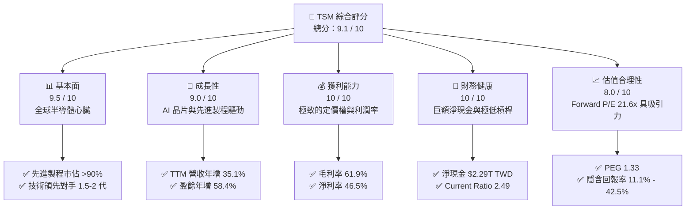

# TSM 基本面深度分析報告

> **報告日期**：2026-06-11 ｜ **語言**：繁體中文 ｜ **數據來源**：Yahoo Finance, Finviz, StockAnalysis, Roic.ai ｜ **分析師**：CFA 級機構研究

---

## 💡 雙貨幣分析框架說明
本報告涉及台積電（TSM）雙重上市之特殊性，為維持數據精準度，報告採用以下雙貨幣分析框架：
*   **美股市場與交易數據（USD）**：ADR 股價（$421.12）、市值（$2.18T）、ADR 每股盈餘（EPS TTM $11.65）等。
*   **公司財務報表數據（TWD 新台幣）**：營收、淨利、資產負債表及現金流量表等（例如 2025 年營收 $3.81T TWD，淨利 $1.70T TWD），以符合公司官方申報基準。

---

## 目錄

| # | 章節 | 核心結論 |
|---|------|----------|
| 1 | 執行摘要 | 🟢 **強烈買入** 評級，基準目標價 **$467.84 USD**，潛在回報率 11.1% |
| 2 | 公司概覽與商業模式 | 壟斷先進製程（3nm/2nm），技術與規模護城河無可撼動 |
| 3 | 損益表深度分析 | TTM 營收達 $4.10T TWD，獲利結構優化，淨利率高達 46.5% |
| 4 | 資產負債表分析 | 淨現金達 $2.29T TWD，流動比率 2.49，財務結構極度穩健 |
| 5 | 現金流量深度分析 | 2025 年 FCF 達 $992.38B TWD，資本配置兼顧擴產與穩定配息 |
| 6 | 獲利能力與資本效率 | ROE 36.2%，ROIC (44.1%) 遠高於 WACC (9.0%)，強力創造股東價值 |
| 7 | 估值深度分析 | Forward P/E 21.56x，相較歷史與同業，估值具備高度安全邊際 |
| 8 | 成長催化劑 | AI 晶片需求爆發、2nm 製程量產、CoWoS 先進封裝產能翻倍 |
| 9 | 風險矩陣 | 地緣政治風險、海外建廠成本上升、半導體週期性波動 |
| 10 | 投資建議 | 建議分批佈局，基準目標價 $467.84 USD，適合長線成長型投資者 |

---

## 1. 執行摘要

### 1.1 核心評分儀表板



### 1.2 評分進度條視覺化

```
╔══════════════════════════════════════════════════════════════╗
║                TSM 多維度評分儀表板 (1-10分)                 ║
╠══════════════════════════════════════════════════════════════╣
║ 基本面強度  9.5 ▓▓▓▓▓▓▓▓▓▓▓▓▓▓▓▓▓▓▓░  ★★★★★           ║
║ 成長動能    9.0 ▓▓▓▓▓▓▓▓▓▓▓▓▓▓▓▓▓▓░░  ★★★★★           ║
║ 獲利品質   10.0 ▓▓▓▓▓▓▓▓▓▓▓▓▓▓▓▓▓▓▓▓  ★★★★★           ║
║ 財務健康   10.0 ▓▓▓▓▓▓▓▓▓▓▓▓▓▓▓▓▓▓▓▓  ★★★★★           ║
║ 估值合理性  8.0 ▓▓▓▓▓▓▓▓▓▓▓▓▓▓▓▓░░░░  ★★★★☆           ║
║ 護城河深度  9.8 ▓▓▓▓▓▓▓▓▓▓▓▓▓▓▓▓▓▓▓░  ★★★★★           ║
║ 管理層執行  9.5 ▓▓▓▓▓▓▓▓▓▓▓▓▓▓▓▓▓▓▓░  ★★★★★           ║
║ 技術創新力 10.0 ▓▓▓▓▓▓▓▓▓▓▓▓▓▓▓▓▓▓▓▓  ★★★★★           ║
╠══════════════════════════════════════════════════════════════╣
║ 綜合