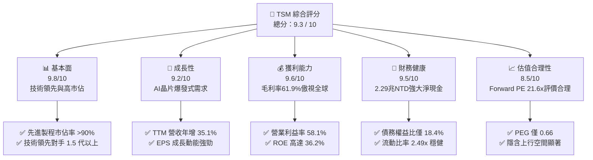

# TSM 基本面深度分析報告

> **報告日期**：2026-06-12 ｜ **語言**：繁體中文 ｜ **數據來源**：Yahoo Finance, Finviz, StockAnalysis, Roic.ai ｜ **分析師**：CFA 級機構研究

---

## 目錄

| # | 章節 | 核心結論 |
|---|------|----------|
| 1 | 執行摘要 | 評級：**強烈買入 (Strong Buy)**；基準目標價：**$467.84 USD** ；技術與產能雙壁壘構築無懈可擊的護城河。 |
| 2 | 公司概覽與商業模式 | 專注純晶圓代工（Pure-play Foundry），先進製程市佔率 >90%，以高客戶鎖定與規模效應主導半導體產業鏈。 |
| 3 | 損益表深度分析 | TTM 營收達 4.10 兆 NTD，營益率達 58.1%，Q1 2026 淨利成長 58.4% YoY，AI 及 HPC 需求爆發驅動獲利強勁增長。 |
| 4 | 資產負債表分析 | 淨現金高達 2.29 兆 NTD，債務權益比僅 18.4%，流動比率 2.49x，具備極佳的抗風險與持續資本支出能力。 |
| 5 | 現金流量深度分析 | 經營現金流 2.35 兆 NTD 支撐高達 1.28 兆 NTD 的資本支出，自由現金流轉換率極佳，資本配置高度平衡。 |
| 6 | 獲利能力與資本效率 | ROE 達 36.2%，ROIC 高達 61.2%，遠超 WACC（9.81%），經濟加值（EVA）極其強勁，持續為股東創造超額價值。 |
| 7 | 估值深度分析 | Forward P/E 為 21.6x，PEG 僅 0.66，相較於歷史與同業具備顯著估值溢價合理性，DCF 基準估值 $475.20 USD。 |
| 8 | 成長催化劑 | N3/N2 製程放量、A16 埃米製程領先佈局、先進封裝（CoWoS）產能翻倍及全球地緣產能分散。 |
| 9 | 風險矩陣 | 地緣政治衝突風險、先進封裝產能瓶頸、以及客戶集中度較高，整體風險可控。 |
| 10 | 投資建議 | 建議於 $400-$420 區間積極分批佈局，長線持有，隱含總報酬率達 +10.8% 至 +42.1%。 |

---

## 1. 執行摘要

台積電（TSM）作為全球半導體製造的絕對心臟，正處於由人工智慧（AI）與高效能運算（HPC）引領的第五次工業革命核心。本報告基於 2026 年 6 月 12 日最新即時財務數據，對 TSM 進行系統性的基本面透視。

### 1.1 核心評分儀表板



### 1.2 評分進度條視覺化

```
╔══════════════════════════════════════════════════════════════╗
║                TSM 多維度評分儀表板 (1-10分)                 ║
╠══════════════════════════════════════════════════════════════╣
║ 基本面強度  9.8 ▓▓▓▓▓▓▓▓▓▓▓▓▓▓▓▓▓▓▓░  ★★★★★           ║
║ 成長動能    9.2 ▓▓▓▓▓▓▓▓▓▓▓▓▓▓▓▓▓▓░░  ★★★★★           ║
║ 獲利品質    9.6 ▓▓▓▓▓▓▓▓▓▓▓▓▓▓▓▓▓▓▓░  ★★★★★           ║
║ 財務健康    9.5 ▓▓▓▓▓▓▓▓▓▓▓▓▓▓▓▓▓▓▓░  ★★★★★           ║
║ 估值合理性  8.5 ▓▓▓▓▓▓▓▓▓▓▓▓▓▓▓▓░░░░  ★★★★☆           ║
║ 護城河深度  9.9 ▓▓▓▓▓▓▓▓▓▓▓▓▓▓▓▓▓▓▓▓  ★★★★★           ║
║ 管理層執行  9.5 ▓▓▓▓▓▓▓▓▓▓▓▓▓▓▓▓▓▓▓░  ★★★★★           ║
║ 技術創新力  9.8 ▓▓▓▓▓▓▓▓▓▓▓▓▓▓▓▓▓▓▓░  ★★★★★           ║
╠══════════════════════════════════════════════════════════════╣
║ 綜合總分    9.3 ▓▓▓▓▓▓▓▓▓▓▓▓▓▓▓▓▓▓░░  🏆 強烈買入          ║
╚══════════════════════════════════════════════════════════════╝
```

### 1.3 五大投資論點