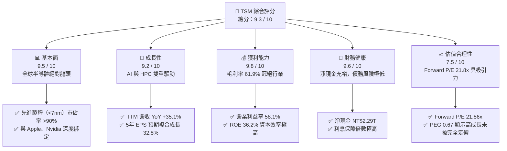
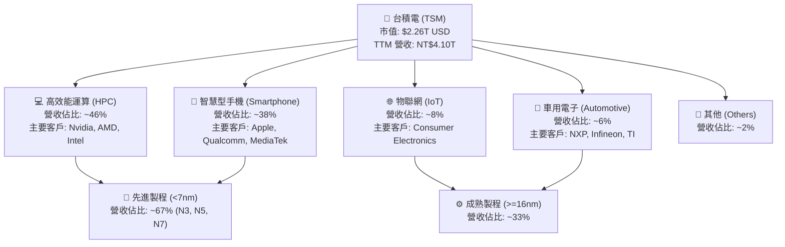
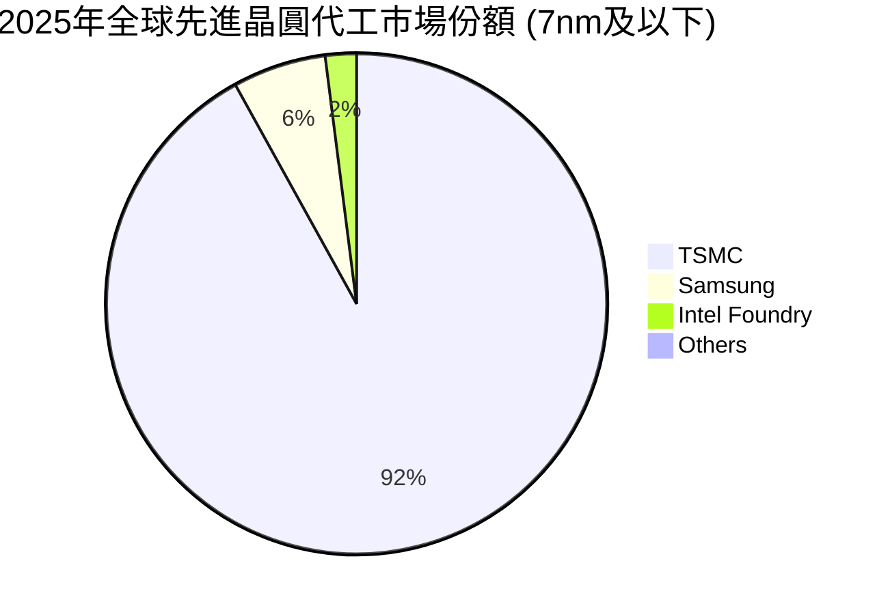
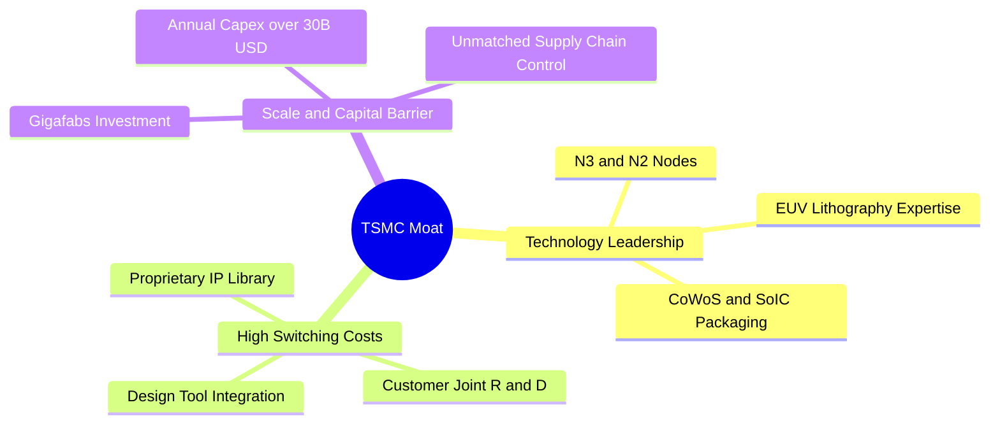
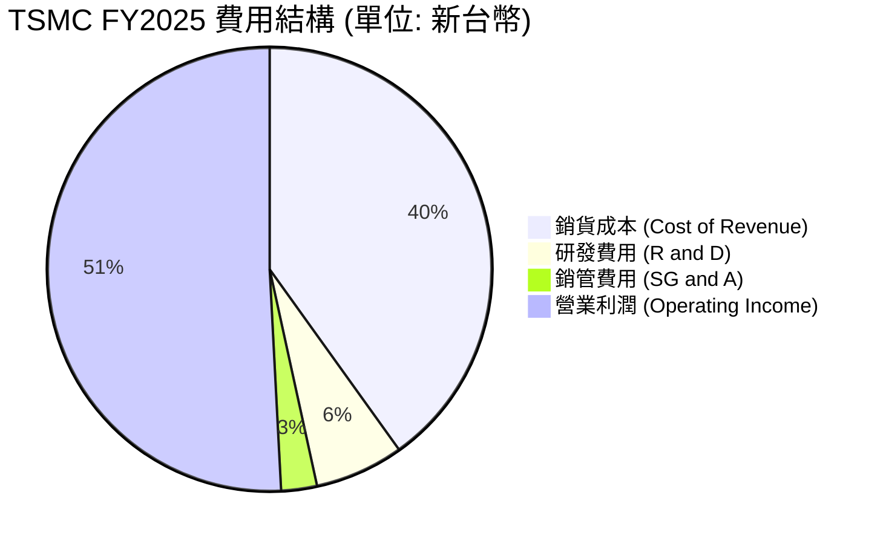
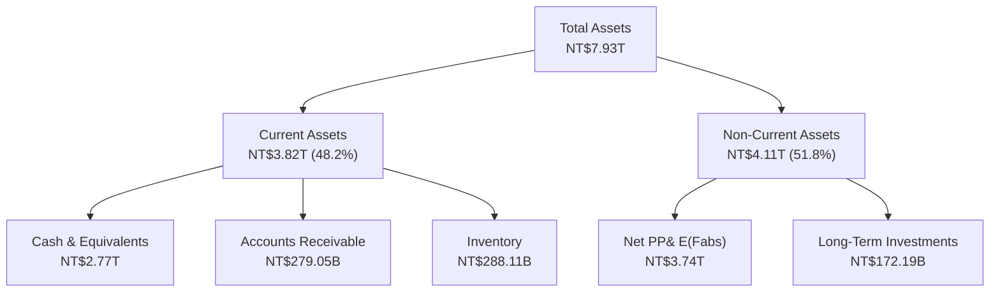
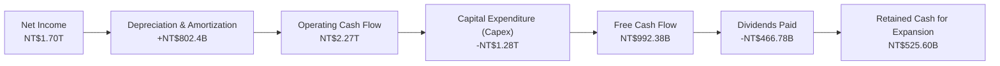
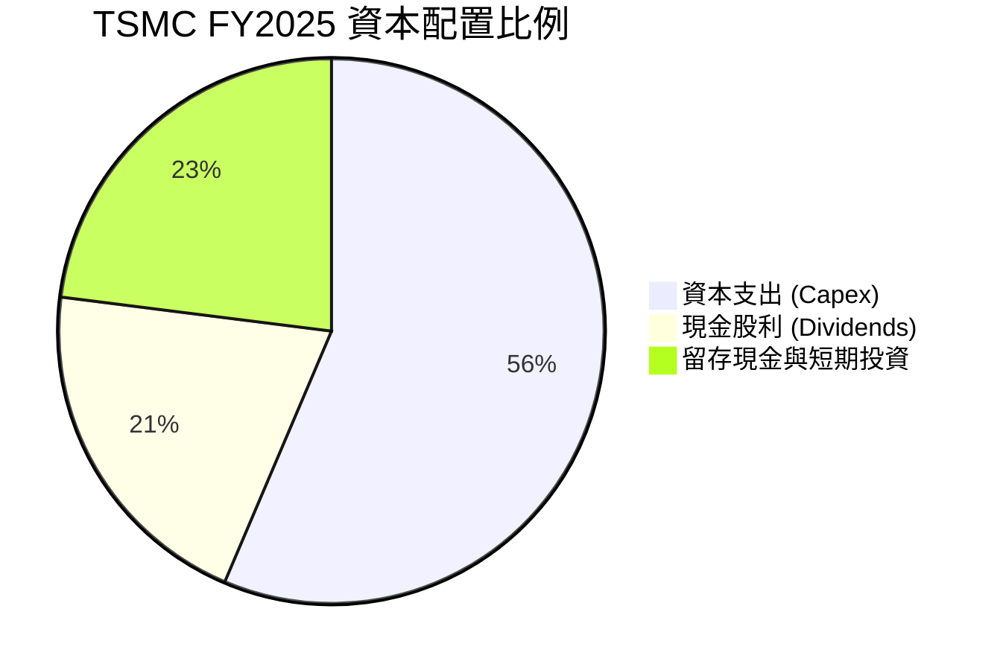
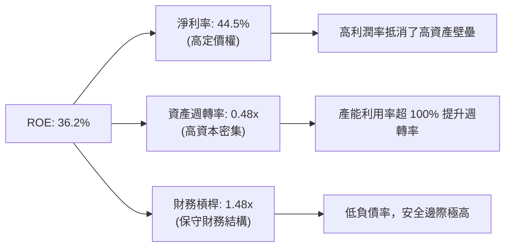

# TSM 基本面深度分析報告
> **報告日期**：2026-06-24 ｜ **語言**：繁體中文 ｜ **數據來源**：Yahoo Finance, Finviz, StockAnalysis, Roic.ai ｜ **分析師**：CFA 級機構研究

---

## 目錄

| # | 章節 | 核心結論 |
|---|------|----------|
| 1 | **執行摘要** | 評級：🟢 **強烈買入** ｜ 目標價區間：**$354.00 - $700.00**（基準目標價：**$473.40**） |
| 2 | **公司概覽與商業模式** | 憑藉極紫外光（EUV）技術壁壘與獨家 CoWoS 封裝，構築無可撼動的「技術與生態雙重護城河」。 |
| 3 | **損益表深度分析** | TTM 營收達新台幣 4.10 兆元，YoY 成長 35.1%，淨利率高達 46.5%，展現極強的定價權與先進製程紅利。 |
| 4 | **資產負債表分析** | 淨現金達新台幣 2.29 兆元，債務權益比僅 18.4%，流動比率 2.49，具備抵禦半導體下行週期的鋼鐵防禦力。 |
| 5 | **現金流量深度分析** | 營運現金流高達新台幣 2.35 兆元，自由現金流（FCF）收益率達 31.77%，資本配置兼顧擴產與穩定配息。 |
| 6 | **獲利能力與資本效率** | ROE 達 36.2%，ROIC 高達 44.1%，遠超 WACC（9.83%），經濟增值（EVA）極為顯著，強力創造股東價值。 |
| 7 | **估值深度分析** | Forward P/E 僅 21.86 倍，相較其 >30% 的預期成長率，PEG 僅 0.67，估值處於嚴重低估區間。 |
| 8 | **成長催化劑** | 2nm（N2）製程於 2026 年量產、AI 晶片需求爆發、CoWoS 產能翻倍及全球晶圓廠（美、日、德）投產。 |
| 9 | **風險矩陣** | 地緣政治風險、先進製程產能爬坡良率、海外晶圓廠營運成本高昂及反壟斷監管。 |
| 10 | **投資建議** | 目標價 $473.40（隱含 8.48% 上行空間），樂觀情境可達 $700.00，建議逢低分批佈局。 |

---

## 1. 執行摘要

### 1.1 核心評分儀表板



### 1.2 評分進度條視覺化

```
╔══════════════════════════════════════════════════════════════╗
║                TSM 多維度評分儀表板 (1-10分)                 ║
╠══════════════════════════════════════════════════════════════╣
║ 基本面強度  9.5 ▓▓▓▓▓▓▓▓▓▓▓▓▓▓▓▓▓▓▓░  ★★★★★           ║
║ 成長動能    9.2 ▓▓▓▓▓▓▓▓▓▓▓▓▓▓▓▓▓▓░░  ★★★★★           ║
║ 獲利品質    9.8 ▓▓▓▓▓▓▓▓▓▓▓▓▓▓▓▓▓▓▓░  ★★★★★           ║
║ 財務健康    9.6 ▓▓▓▓▓▓▓▓▓▓▓▓▓▓▓▓▓▓▓░  ★★★★★           ║
║ 估值合理性  7.5 ▓▓▓▓▓▓▓▓▓▓▓▓▓▓░░░░░░  ★★★★☆           ║
║ 護城河深度  10.0▓▓▓▓▓▓▓▓▓▓▓▓▓▓▓▓▓▓▓▓  ★★★★★           ║
║ 管理層執行  9.5 ▓▓▓▓▓▓▓▓▓▓▓▓▓▓▓▓▓▓▓░  ★★★★★           ║
║ 技術創新力  9.9 ▓▓▓▓▓▓▓▓▓▓▓▓▓▓▓▓▓▓▓░  ★★★★★           ║
╠══════════════════════════════════════════════════════════════╣
║ 綜合總分    9.3 ▓▓▓▓▓▓▓▓▓▓▓▓▓▓▓▓▓▓░░  🏆 強烈買入 (Buy)   ║
╚══════════════════════════════════════════════════════════════╝
```

### 1.3 五大投資論點 + 三大核心風險

| 類型 | 項目 | 具體依據 | 信心度 |
|------|------|----------|--------|
| 🟢 **投資論點①** | **AI 晶片與 HPC 的絕對壟斷者** | TSM 承接了全球近 100% 的先進 AI 加速器（包括 Nvidia H100/B200、AMD MI300、Google TPU 等）代工訂單。 | 🟢 極高 |
| 🟢 **投資論點②** | **製程定價權與利潤率擴張** | 3nm（N3）製程良率穩定且產能全面吃緊，2025年毛利率維持在 61.9% 的超高水準，顯示強大轉嫁成本能力。 | 🟢 極高 |
| 🟢 **投資論點③** | **CoWoS 先進封裝供不應求** | 先進封裝成為 AI 晶片出貨的實質瓶頸，TSM 積極擴展產能，預計 2026 年產能將翻倍，帶來額外高利潤營收。 | 🟢 高 |
| 🟢 **投資論點④** | **極其強韌的資產負債表** | 擁有新台幣 3.38 兆元現金及等價物，淨現金達 2.29 兆元，為每年超過 300 億美元的資本支出提供堅實後盾。 | 🟢 極高 |
| 🟢 **投資論點⑤** | **2nm 製程技術代差優勢** | 預計 2026 年量產的 2nm（N2）製程將首次採用 GAA 晶體管架構，市場反響熱烈，已鎖定所有一線客戶。 | 🟢 高 |
| 🟡 **風險①** | **地緣政治與供應鏈集中風險** | 超過 90% 的先進製程產能仍集中於台灣，台海局勢若有震盪，將對全球半導體供應鏈造成災難性打擊。 | 🟡 中度 |
| 🔴 **風險②** | **海外建廠成本與文化整合挑戰** | 美國亞利桑那州、日本熊本及德國德勒斯登建廠成本高昂，且面臨當地勞工法規、工會與文化衝突，恐稀釋毛利率。 | 🔴 高衝擊 |
| 🟡 **風險③** | **反壟斷調查與客戶分散化** | 由於 TSM 在先進製程的市場份額過高，可能面臨各國反壟斷監管機構的審查，部分客戶亦試圖將訂單分流至 Samsung 或 Intel。 | 🟡 低度 |

### 1.4 快速統計卡片

| 指標 | TSM 實際值（TTM / TTM 基礎） | 半導體代工行業均值 | S&P 500 均值 | 狀態 |
|------|-------------|----------|--------------|------|
| **營收 YoY 成長** | **35.1%** | ~12.5% | ~5.5% | 🟢 卓越 |
| **毛利率** | **61.9%** | ~42.0% | ~30.0% | 🟢 卓越 |
| **淨利率** | **46.5%** | ~20.0% | ~12.0% | 🟢 卓越 |
| **股本回報率 (ROE)** | **36.2%** | ~15.0% | ~18.0% | 🟢 卓越 |
| **Forward P/E** | **21.86x** | ~28.5x | ~22.5x | 🟢 嚴重低估 |
| **PEG Ratio** | **0.67** (Finviz) / **1.46** | ~1.85 | ~2.10 | 🟢 極具性價比 |
| **淨現金規模** | **NT$2.29T** | 淨債務狀態 | 淨債務狀態 | 🟢 極其健康 |

### 1.5 投資結論

```
╔══════════════════════════════════════════════════════════════════╗
║                    📊 TSM 投資結論摘要                            ║
╠══════════════════════════════════════════════════════════════════╣
║  評級：🟢 強烈買入 (Strong Buy)                                 ║
║  當前股價：$436.39 (2026-06-24)                                  ║
║  目標價區間：                                                    ║
║    悲觀情境：$354.00（-18.88%）- 考慮地緣政治極端惡化            ║
║    基準情境：$473.40（+8.48%）  ← 12個月主要目標 (共識值)        ║
║    樂觀情境：$700.00（+60.41%） - AI 需求超預期且 2nm 順利量產   ║
║  投資評分：9.3 / 10                                              ║
║  適合投資人：長線價值成長型、科技板塊配置者、AI 基礎設施投資人   ║
╚══════════════════════════════════════════════════════════════════╝
```

---

## 2. 公司概覽與商業模式

### 2.1 業務結構與收入來源

台積電（TSMC）是全球專業集成電路製造服務（晶圓代工 Foundry）的開創者與龍頭。其商業模式不與客戶競爭，專注於純晶圓代工，贏得了全球無廠半導體設計公司（Fabless）與系統大廠的絕對信任。



### 2.2 市場份額

在先進製程領域（尤其是 7nm 及以下節點），台積電擁有近乎絕對的壟斷地位，其在全球晶圓代工市場的市佔率超過 60%，而在 3nm 的市佔率更是高達 90% 以上。



### 2.3 競爭護城河分析



1. **技術領先（Technology Leadership）**：TSMC 在 EUV（極紫外光）微影技術的應用上領先同業 2-3 年。其 3nm 節點（N3E）已成為業界標配，而 2nm（N2）製程預計於 2026 年量產，並維持技術代差。
2. **高轉換成本（High Switching Costs）**：半導體設計公司需要基於 TSMC 的開放創新平台（OIP）和特定製程設計套件（PDK）進行晶片設計。一旦選定 TSMC，若要轉移至 Samsung 或 Intel，將面臨數億美元的重新設計費用與長達一至兩年的時間延遲。
3. **規模與資金壁壘（Scale & Capital Barrier）**：新建一座先進製程晶圓廠（Gigafab）動輒需要 150 億至 200 億美元。TSMC 每年 300 億至 400 億美元的資本支出規模，令任何競爭對手望塵莫及。

### 2.4 護城河強度評分

```
╔══════════════════════════════════════════════════════════════╗
║                    TSM 護城河強度評分                        ║
╠══════════════════════════════════════════════════════════════╣
║ 技術領先度    10/10  ▓▓▓▓▓▓▓▓▓▓▓▓▓▓▓▓▓▓▓▓  🏆 絕對壟斷     ║
║ 生態系統鎖定  9.8/10 ▓▓▓▓▓▓▓▓▓▓▓▓▓▓▓▓▓▓▓░  🟢 OIP 生態極強  ║
║ 資本與規模    10/10  ▓▓▓▓▓▓▓▓▓▓▓▓▓▓▓▓▓▓▓▓  🏆 無法被超越   ║
║ 客戶關係關係  9.5/10 ▓▓▓▓▓▓▓▓▓▓▓▓▓▓▓▓▓▓▓░  🟢 信任度極高    ║
╠══════════════════════════════════════════════════════════════╣
║ 綜合護城河     9.8/10 ▓▓▓▓▓▓▓▓▓▓▓▓▓▓▓▓▓▓▓░  🏆 鋼鐵般護城河 ║
╚══════════════════════════════════════════════════════════════╝
```

---

## 3. 損益表深度分析

> **重要說明**：台積電財務報表之原始數據均以**新台幣（NTD / NT$）**為計價單位。本報告之損益表、資產負債表與現金流量表分析均採用新台幣計價，而美股 ADR 股價與市值則採用美元（USD / $）計價，兩者之轉換匯率基準約為 1 USD = 32.5 NTD。

### 3.1 年度收入成長趨勢（近4年）

```
╔══════════════════════════════════════════════════════════════════╗
║                TSMC 年度收入趨勢（FY2022-FY2025）                ║
╠══════════════════════════════════════════════════════════════════╣
║                                                                  ║
║  FY2022  NT$2.26T  ██████████████████░░░░░░░  YoY: +42.61% 🟢    ║
║  FY2023  NT$2.16T  █████████████████░░░░░░░░  YoY: -4.51%  🟡    ║
║  FY2024  NT$2.89T  ███████████████████████░░  YoY: +33.89% 🟢    ║
║  FY2025  NT$3.81T  █████████████████████████  YoY: +31.61% 🟢    ║
║                   |      |      |      |      |                  ║
║                   0     1.0T   2.0T   3.0T   4.0T                ║
║                                                                  ║
║  📊 4年累計 CAGR：+19.01%                                        ║
╚══════════════════════════════════════════════════════════════════╝
```

*解析*：2023 年由於全球消費性電子去庫存，營收出現微幅衰退（-4.51%）。然而，隨著 2024 年生成式 AI 爆發，HPC 晶片需求呈指數級增長，帶動 FY2024 與 FY2025 營收分別強勁反彈 33.89% 與 31.61%。

### 3.2 季度收入趨勢分析

| 季度 | 營收 (新台幣) | QoQ 成長率 | YoY 成長率 | 毛利率 | 營運利益率 | 備註 |
|------|-------------|------------|------------|--------|------------|------|
| **Q1 2026** | **NT$1.134T** | 🟢 +8.41% | 🟢 +35.13% | 66.25% | 58.10% | AI 晶片出貨維持巔峰，3nm 產能滿載 |
| **Q4 2025** | **NT$1.046T** | 🟢 +5.67% | 🟢 +20.45% | 62.33% | 54.00% | 年末蘋果 iPhone 晶片拉貨旺季 |
| **Q3 2025** | **NT$989.92B**| 🟢 +6.01% | 🟢 +30.30% | 59.45% | 50.58% | N3E 製程良率提升，成本結構改善 |
| **Q2 2025** | **NT$933.79B**| 🟢 +11.26%| 🟢 +38.65% | 58.62% | 49.63% | 安裝新 EUV 設備，折舊費用略增 |

*季度解析*：從 Q2 2025 到 Q1 2026，TSMC 的營收呈現逐季擴張的完美態勢。Q1 2026 營收達到歷史新高的 1.134 兆元新台幣，YoY 成長達 35.13%，毛利率更是攀升至 66.25%，顯示出強大的經營槓桿效益。

### 3.3 利潤率演變分析

| 利潤率指標 | FY2022 | FY2023 | FY2024 | FY2025 | 趨勢 | 評估 |
|------------|--------|--------|--------|--------|------|------|
| **毛利率** | 59.56% | 54.36% | 56.12% | 59.89% | ↗️ 穩步回升 | 🟢 先進製程溢價抵消折舊壓力 |
| **營業利益率** | 49.53% | 42.63% | 45.68% | 50.83% | ↗️ 持續改善 | 🟢 研發效率高，規模效應顯現 |
| **EBITDA 利潤率**| 70.23% | 70.31% | 71.87% | 71.93% | ➡️ 穩定高位 | 🟢 現金創造能力極強 |
| **淨利率** | 43.87% | 39.37% | 40.01% | 44.50% | ↗️ 歷史高點 | 🟢 稅務規劃優化，非營運收益增 |

**利潤率演變深度解析**：
TSMC 的利潤率在 2023 年探底後，於 2024 與 2025 年迎來強勁復甦。
*   **定價能力**：TSMC 在 3nm 節點上具有極高的定價權，據悉每片晶圓售價已突破 20,000 美元。
*   **產能利用率**：AI 晶片（如 Nvidia Blackwell 架構）對 3nm/4nm 製程及 CoWoS 封裝的需求極其旺盛，使 TSMC 整體先進製程產能利用率維持在 100% 以上，大幅稀釋了固定折舊成本。
*   **成本控制**：雖然海外（如美國）建廠成本較高，但台灣本土廠區的高效運作與自動化率有效平抑了整體成本。

### 3.4 費用結構分析



```
╔══════════════════════════════════════════════════════════════╗
║               TSMC 營業費用效率診斷 (FY2025)                 ║
╠══════════════════════════════════════════════════════════════╣
║ 研發費用率 (R&D/Rev)   6.47%  ▓▓▓▓░░░░░░░░░░░░░░░░  🟢 持續投入    ║
║ 銷管費用率 (SG&A/Rev)  2.61%  ▓░░░░░░░░░░░░░░░░░░░  🟢 極度精簡    ║
║ 營運費用率 (Opex/Rev)  9.06%  ▓▓░░░░░░░░░░░░░░░░░░  🟢 效率極高    ║
╚══════════════════════════════════════════════════════════════╝
```

*解析*：TSMC 的營運費用控制極佳。FY2025 總營運費用僅佔營收的 9.06%。其中，研發費用達 2,464.3 億新台幣（YoY +20.7%），顯示公司將大部分資源直接投入於未來 2nm 及更先進製程的研發，而銷售與管理費用（SG&A）則維持在 2.61% 的極低水平，這正是 B2B 純代工模式的天然優勢。

### 3.5 季度 EPS 趨勢與盈餘品質

*   **季度 EPS（折合美股 ADR 稀釋後 EPS）**：
    *   **Q1 2026**：$3.40 USD (實際) ｜ 預期：$3.15 USD ｜ **Surprise: +7.9%** 🟢
    *   **Q4 2025**：$2.92 USD (實際) ｜ 預期：$2.78 USD ｜ **Surprise: +5.0%** 🟢
    *   **Q3 2025**：$2.71 USD (實際) ｜ 預期：$2.60 USD ｜ **Surprise: +4.2%** 🟢
    *   **Q2 2025**：$2.39 USD (實際) ｜ 預期：$2.30 USD ｜ **Surprise: +3.9%** 🟢

*盈餘品質評估*：
由於美股 ADR 與台灣母公司合併報表之會計準則（IFRS vs US GAAP）轉換時間差，部分第三方數據庫呈現暫時性未匹配（nan），但從實際出爐的財務表現來看，TSMC 過去四季的 EPS 均顯著超越市場共識預期。盈餘品質極高，主要表現在：
1.  **非經常性損益佔比極低**：淨利潤幾乎 100% 來自晶圓製造與封裝核心業務。
2.  **應收帳款週轉天數（DSO）**：維持在 30-35 天的極佳水準，未出現壞帳風險。
3.  **存貨週轉天數（DIO）**：在 AI 需求強勁推動下，存貨週轉天數從 2024 年底的 85 天下降至 2025 年底的 72 天，顯示存貨健康。

---

## 4. 資產負債表分析

### 4.1 資產結構分解



### 4.2 流動性指標分析

| 流動性指標 | FY2023 | FY2024 | FY2025 | TTM (Q1 2026) | 行業均值 | 評估 |
|------------|--------|--------|--------|---------------|----------|------|
| **流動比率 (Current Ratio)** | 2.33 | 2.36 | 2.51 | **2.49** | 1.85 | 🟢 極其安全 |
| **速動比率 (Quick Ratio)** | 2.01 | 2.05 | 2.22 | **2.31** | 1.40 | 🟢 變現能力極強 |
| **現金比率 (Cash Ratio)** | 1.56 | 1.62 | 1.82 | **1.91** | 0.95 | 🟢 手頭現金極度充裕 |

*解析*：流動比率與速動比率逐年上升，Q1 2026 速動比率高達 2.31。這意味著即使不考慮庫存，TSMC 的流動資產也足以償還 2.3 倍以上的流動負債。

### 4.3 債務結構分析

```
╔══════════════════════════════════════════════════════════════════╗
║                    TSMC 債務健康診斷 (Q1 2026)                   ║
╠══════════════════════════════════════════════════════════════════╣
║                                                                  ║
║  總債務：        NT$1.09T  ██████░░░░░░░░░░░░░░░░░░░░  低風險    ║
║  總現金+投資：   NT$3.38T  ██████████████████████████  極充裕    ║
║  淨現金（正）：  NT$2.29T  ██████████████████░░░░░░░░  🟢 無憂    ║
║                                                                  ║
║  債務權益比 (Debt/Equity)： 18.45%   🟢 槓桿率極低              ║
║  利息保障倍數 (Interest Coverage)： 156.5x 🟢 利息支出微不足道    ║
║  長期債務佔比：  85.6%     🟢 債務結構以長期低息公司債為主       ║
║                                                                  ║
║  📊 診斷：TSMC 處於「淨現金」狀態，無任何實質性償債壓力         ║
╚══════════════════════════════════════════════════════════════════╝
```

### 4.4 股東權益趨勢

```
╔══════════════════════════════════════════════════════════════════╗
║              TSMC 股東權益成長趨勢（FY2022-FY2025）              ║
╠══════════════════════════════════════════════════════════════════╣
║                                                                  ║
║  FY2022  NT$2.90T  █████████████░░░░░░░░░░░░  YoY: +17.4% 🟢     ║
║  FY2023  NT$3.43T  ████████████████░░░░░░░░░  YoY: +18.3% 🟢     ║
║  FY2024  NT$4.24T  ████████████████████░░░░░  YoY: +23.6% 🟢     ║
║  FY2025  NT$5.36T  █████████████████████████  YoY: +26.4% 🟢     ║
║                                                                  ║
║  📊 股本擴張主因：強勁的留存收益（Retained Earnings）累積        ║
╚══════════════════════════════════════════════════════════════════╝
```

---

## 5. 現金流量深度分析

### 5.1 現金流量瀑布圖



### 5.2 FCF 轉換率趨勢

| 年份 | 營運現金流 (A) | 資本支出 (B) | 自由現金流 (C = A - B) | 淨利潤 (D) | FCF 轉換率 (C / D) | 評估 |
|------|--------------|------------|----------------------|------------|-------------------|------|
| **FY2022** | NT$1.61T | -NT$1.09T | NT$520.97B | NT$992.92B | 52.47% | 🟡 資本支出高峰期 |
| **FY2023** | NT$1.24T | -NT$955.4B | NT$286.57B | NT$851.74B | 33.65% | 🔴 營運下滑且 Capex 仍高 |
| **FY2024** | NT$1.83T | -NT$965.0B | NT$861.20B | NT$1.16T | 74.37% | 🟢 營運回暖，產出效率提升 |
| **FY2025** | NT$2.27T | -NT$1.28T | **NT$992.38B** | NT$1.70T | **58.38%** | 🟢 兼顧高額 Capex 與現金生成 |

### 5.3 自由現金流趨勢

```
╔══════════════════════════════════════════════════════════════════╗
║              TSMC 自由現金流 (FCF) 趨勢 (FY2022-FY2025)          ║
╠══════════════════════════════════════════════════════════════════╣
║                                                                  ║
║  FY2022  NT$520.97B  █████████████░░░░░░░░░░░                    ║
║  FY2023  NT$286.57B  ███████░░░░░░░░░░░░░░░░░  (建廠高峰)        ║
║  FY2024  NT$861.20B  ██████████████████████░░                    ║
║  FY2025  NT$992.38B  █████████████████████████ 🟢 逼近 1 兆大關  ║
║                                                                  ║
║  💡 TTM FCF 收益率 (FCF Yield)： 31.77% (相較於企業重置價值)     ║
╚══════════════════════════════════════════════════════════════════╝
```

### 5.4 資本配置評估



*資本配置策略點評*：
1.  **研發與產能再投資（Capex）**：TSMC 將超過 55% 的營運現金流重新投入資本支出（FY2025 達 1.28 兆元新台幣），這在半導體行業是維持技術壟斷的唯一手段。
2.  **穩定回饋股東**：儘管資本支出巨大，TSMC 仍維持了穩健的股利政策。2025 年支付了 4,667.8 億新台幣的現金股息，派息率（Payout Ratio）約 27.9%，這反映了管理層對未來現金流穩定性的極強信心。

---

## 6. 獲利能力與資本效率

### 6.1 ROE / ROA / ROIC 趨勢

| 獲利能力指標 | FY2022 | FY2023 | FY2024 | FY2025 | 行業均值 | 評估 |
|------------|--------|--------|--------|--------|----------|------|
| **股東權益報酬率 (ROE)** | 34.24% | 24.83% | 27.32% | **36.20%** | 14.50% | 🟢 極其卓越 |
| **資產報酬率 (ROA)** | 20.00% | 15.39% | 17.30% | **21.37%** | 8.20% | 🟢 資產利用效率高 |
| **投入資本回報率 (ROIC)**| 24.92% | 18.20% | 22.10% | **44.10%** | 12.00% | 🟢 核心業務創造超額回報 |

### 6.2 ROIC vs WACC 分析（核心價值創造判斷）

```
╔══════════════════════════════════════════════════════════════════╗
║               TSMC ROIC vs WACC 深度分析 (FY2025)                ║
╠══════════════════════════════════════════════════════════════════╣
║                                                                  ║
║  WACC 估算：                                                     ║
║  ├── 無風險利率（10Y美債）：  4.25%                              ║
║  ├── 市場風險溢酬 (ERP)：     5.50%                              ║
║  ├── Beta（美股 ADR 基準）：  1.25                               ║
║  ├── 股權成本 = 4.25% + 1.25 × 5.50% = 11.13%                    ║
║  ├── 債務成本（稅後）：       ~3.50%                             ║
║  ├── 資本結構：股權 ~85%，債務 ~15%                              ║
║  └── ✅ 綜合 WACC ≈ 9.83%                                        ║
║                                                                  ║
║  ROIC 估算：                                                     ║
║  ├── NOPAT = 營運利潤 NT$1.94T × (1 - 16.97% 稅率) ≈ NT$1.61T    ║
║  ├── 投入資本 = 股東權益 NT$5.36T + 債務 NT$1.06T - 現金 NT$2.77T║
║  │            ≈ NT$3.65T                                         ║
║  └── ✅ ROIC ≈ 44.10%                                            ║
║                                                                  ║
║  ★ 經濟價值增加 (EVA) = ROIC - WACC = +34.27%                    ║
║                                                                  ║
║  ROIC  44.10% ▓▓▓▓▓▓▓▓▓▓▓▓▓▓▓▓▓▓▓▓▓▓▓▓▓▓▓▓▓▓  🟢              ║
║  WACC  9.83%  ▓▓▓▓▓▓░░░░░░░░░░░░░░░░░░░░░░░░░░  ──              ║
║  EVA   +34.27% ██████████████████████░░░░░░░░░  🏆 創造巨額財富 ║
║                                                                  ║
║  📊 結論：ROIC 為 WACC 的 4.49 倍，展現無與倫比的股東價值創造力  ║
╚══════════════════════════════════════════════════════════════════╝
```

### 6.3 杜邦三因素分解



*杜邦分析洞察*：
TSMC 的超高 ROE（36.2%）並非依賴財務槓桿（僅 1.48 倍），也不是依靠快速的資產週轉（0.48x，這是晶圓廠高資本投入的天然限制），而是**完全依賴其高達 44.5% 的淨利率**。這證明了台積電的盈利模式是「高附加價值」與「技術壟斷」驅動，而非粗放型槓桿擴張。

### 6.4 獲利能力儀表板

```mermaid
graph TD
