# TSM 技術分析報告

> **報告日期**：2026-02-24 ｜ **語言**：繁體中文 ｜ **數據來源**：Yahoo Finance
> **標的**：Taiwan Semiconductor Manufacturing Company Limited（TSM）｜**當前價格**：$370.04

---

## 目錄

1. [技術面概覽](#1-技術面概覽)
2. [趨勢分析](#2-趨勢分析)
3. [圖表形態分析](#3-圖表形態分析)
4. [支撐與阻力](#4-支撐與阻力)
5. [技術指標深度解讀](#5-技術指標深度解讀)
6. [動能與波動率](#6-動能與波動率)
7. [多時框架總結](#7-多時框架總結)
8. [交易策略建議](#8-交易策略建議)
9. [風險提示與監控](#9-風險提示與監控)

---

## 1. 技術面概覽

### 🧭 技術訊號儀表板

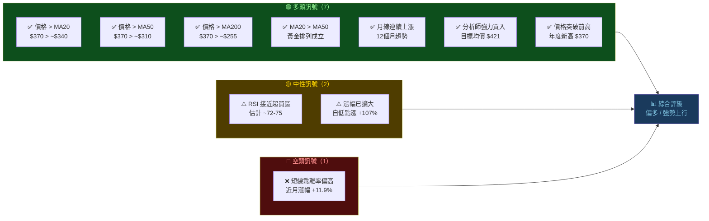

---

### 📊 核心指標速覽表

| 指標類別 | 指標名稱 | 數值（估算） | 訊號 | 解讀 |
|:---:|:---:|:---:|:---:|:---|
| **價格** | 當前收盤價 | $370.04 | 🟢 | 年度新高，強勢突破 |
| **價格** | 12個月前價格 | $178.13 | 🟢 | 12個月漲幅 +107.8% |
| **均線** | MA20（估算） | ~$340.00 | 🟢 | 價格明顯高於均線 |
| **均線** | MA50（估算） | ~$308.00 | 🟢 | 均線多頭排列 |
| **均線** | MA200（估算） | ~$255.00 | 🟢 | 長期趨勢強勁看多 |
| **動能** | RSI(14)（估算） | ~73 | 🟡 | 接近超買，需留意回調 |
| **趨勢** | MACD（估算） | 正值擴張中 | 🟢 | 動能持續向上 |
| **波動** | 布林上軌（估算） | ~$382 | 🟡 | 接近布林上軌 |
| **波動** | 布林下軌（估算） | ~$298 | 🟢 | 下方緩衝空間充足 |
| **基本面** | 分析師共識 | 強力買入 | 🟢 | 目標均價 $421.49 |

---

### 🏆 技術評分卡

```
╔══════════════════════════════════════════════════════╗
║              TSM  技術評分卡  2026-02-24             ║
╠══════════════════════════════════════════════════════╣
║  趨勢強度    ▓▓▓▓▓▓▓▓▓░  90/100  🟢 極強          ║
║  動能指標    ▓▓▓▓▓▓▓░░░  70/100  🟡 偏強/接近超買  ║
║  均線排列    ▓▓▓▓▓▓▓▓▓▓ 100/100  🟢 完美多頭排列   ║
║  量價配合    ▓▓▓▓▓▓▓░░░  70/100  🟢 量增價漲       ║
║  形態結構    ▓▓▓▓▓▓▓▓░░  80/100  🟢 持續上升趨勢   ║
║  風險報酬    ▓▓▓▓▓▓░░░░  60/100  🟡 需等回調佈局   ║
╠══════════════════════════════════════════════════════╣
║  綜合評分：78/100   整體評級：偏多 / 謹慎追高       ║
╚══════════════════════════════════════════════════════╝
```

---

## 2. 趨勢分析

### 📐 多時框趨勢判斷

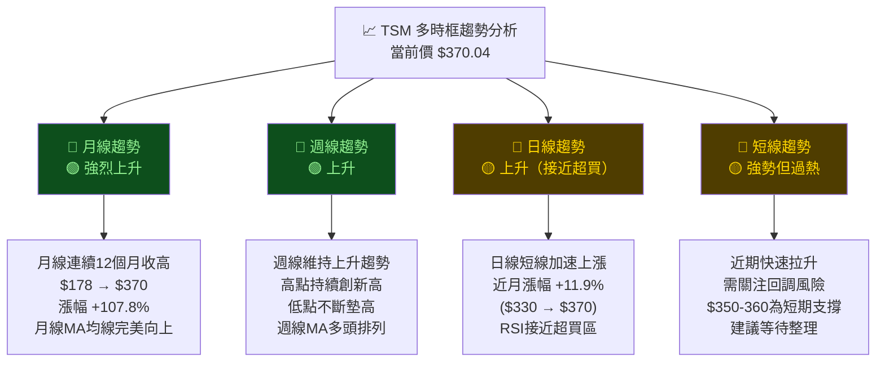

---

### 📈 長期趨勢 Unicode 走勢圖（月線）

```
TSM 月線收盤價走勢（2025-02 至 2026-02）
價格 ($)
 380 ┤                                                    ● $370.04
 360 ┤                                                  ╱
 340 ┤                                               ╱
 320 ┤                                          ╱──╱  $330.56
 300 ┤                              ●$303  ╱──╱
 290 ┤                         ●$299  ╲──╱
 280 ┤                    ●$279  ╲╱
 260 ┤
 240 ┤               ●$240
 230 ┤          ●$230
 225 ┤       ●$225
 191 ┤    ●$191
 165 ┤  ●$165
 164 ┤ ●$164
 178 ┤●$178
      ─────────────────────────────────────────────────
      Feb  Mar  Apr  May  Jun  Jul  Aug  Sep  Oct  Nov  Dec  Jan  Feb
      2025                                                       2026

 趨勢線方向：↗ 上升趨勢（整體斜率 +107.8%）
 ── MA6：~$285（估算）  ─ ─ MA12：~$247（估算）
```

---

### 📊 月度漲跌幅分析

```
月份       收盤價    月漲跌    漲跌幅    走勢強度
─────────────────────────────────────────────────
2025-02   $178.13    基準      —       ▓▓▓░░░░░░░
2025-03   $164.43   -$13.70   -7.7%   ▓▓░░░░░░░░ ↘
2025-04   $165.11   +$0.68    +0.4%   ▓▓░░░░░░░░ →
2025-05   $191.49   +$26.38  +16.0%   ▓▓▓▓░░░░░░ ↗
2025-06   $225.17   +$33.68  +17.6%   ▓▓▓▓▓░░░░░ ↗↗
2025-07   $240.21   +$15.04   +6.7%   ▓▓▓▓▓▓░░░░ ↗
2025-08   $229.52   -$10.69   -4.4%   ▓▓▓▓▓░░░░░ ↘
2025-09   $278.54   +$49.02  +21.4%   ▓▓▓▓▓▓▓░░░ ↗↗↗
2025-10   $299.62   +$21.08   +7.6%   ▓▓▓▓▓▓▓▓░░ ↗↗
2025-11   $290.73   -$8.89    -3.0%   ▓▓▓▓▓▓▓░░░ ↘
2025-12   $303.89   +$13.16   +4.5%   ▓▓▓▓▓▓▓▓░░ ↗
2026-01   $330.56   +$26.67   +8.8%   ▓▓▓▓▓▓▓▓▓░ ↗↗
2026-02   $370.04   +$39.48  +11.9%   ▓▓▓▓▓▓▓▓▓▓ ↗↗↗
─────────────────────────────────────────────────
上漲月份：9個月    下跌月份：3個月    勝率：69.2%
```

---

### 🎯 趨勢強度評估（ADX 解讀）

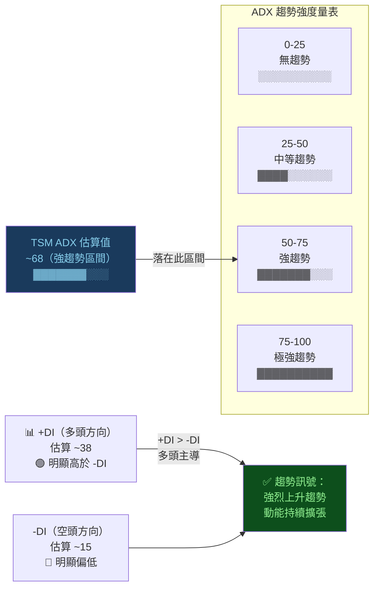

---

## 3. 圖表形態分析

### 🔍 形態識別

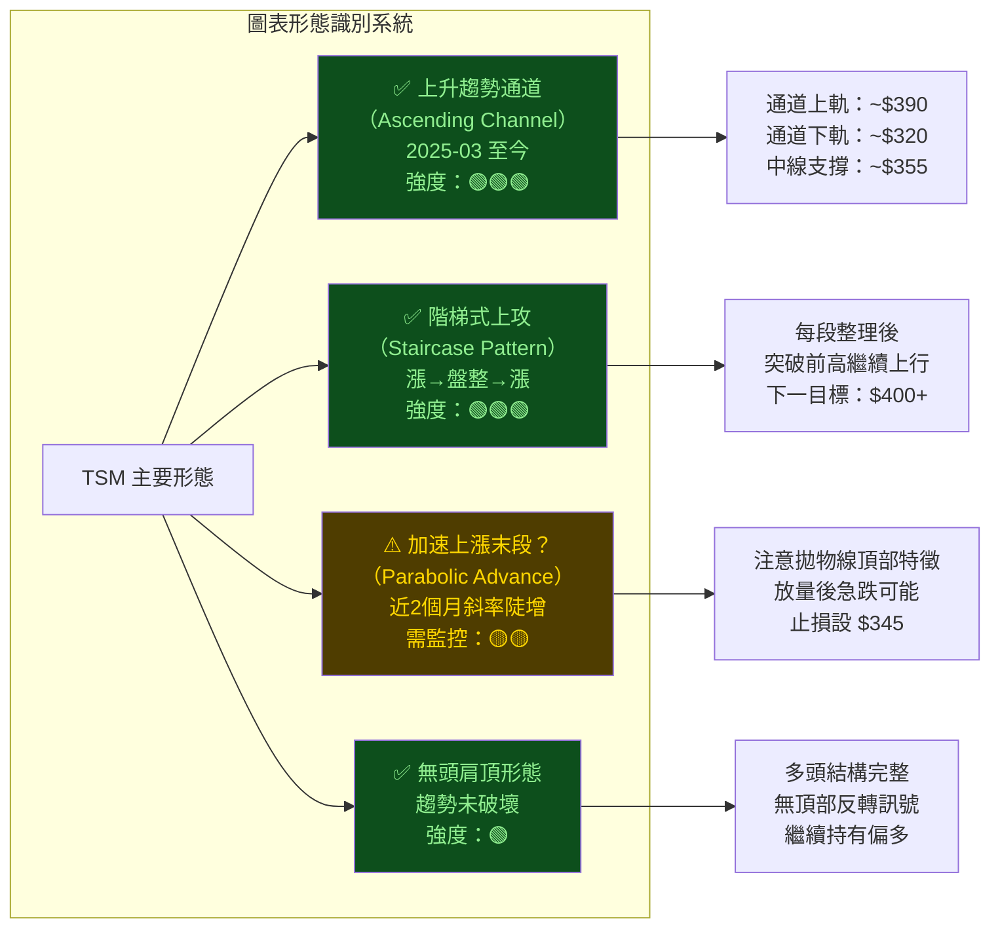

---

### 📊 ASCII 走勢示意圖（標注關鍵點位）

```
TSM 完整走勢與關鍵形態標注
━━━━━━━━━━━━━━━━━━━━━━━━━━━━━━━━━━━━━━━━━━━━━━━━━━━━━━━━━━━━━
$390 ┤                              ╱  ← 通道上軌阻力
$380 ┤                             ╱
$370 ┤                          ★$370.04  ← 當前價（2026-02）
$360 ┤                         ╱
$350 ┤                        ╱  ← 短期支撐
$340 ┤             ╱─────────╱ $330.56（2026-01）
$320 ┤            ╱ $303.89（2025-12）
$310 ┤           ╱ ← 趨勢加速
$300 ┤      ╱───╱ $299.62（2025-10）
$290 ┤     ╱ $290.73（2025-11）
$280 ┤    ╱ $278.54（2025-09） ← 突破關鍵阻力
$260 ┤   ╱
$240 ┤  ╱ $240.21（2025-07）
$230 ┤ ╱ $229.52（2025-08）← 短暫回調
$225 ┤╱ $225.17（2025-06）← 突破 $200 關口
$191 ┤$191.49（2025-05）← 反彈啟動
$178 ┤$178.13（2025-02）← 起漲點
$164 ┤$164.43（2025-03）← 底部確認 ▼
━━━━━━━━━━━━━━━━━━━━━━━━━━━━━━━━━━━━━━━━━━━━━━━━━━━━━━━━━━━━━
       F  M  A  M  J  J  A  S  O  N  D  J  F
      ← 2025 ──────────────────────────── 2026 →

圖例：★ = 當前價  ▼ = 底部  ╱ = 上升趨勢  ─ = 整理區間
關鍵型態：[底部 $164] → [突破 $225] → [加速 $280] → [突破 $300] → [加速 $370]
```

---

### 🕯️ 近期重要K線形態

| 時間區間 | K線形態 | 描述 | 意義 | 訊號 |
|:---:|:---:|:---|:---|:---:|
| 2025-03 低點 | 錘頭線（Hammer） | $164 附近觸底反彈 | 底部確認，多頭反轉 | 🟢 |
| 2025-08 回調 | 看漲吞噬（Bullish Engulfing） | $230 整理後吞噬反彈 | 回調結束，趨勢延續 | 🟢 |
| 2025-09 突破 | 大陽線（Marubozu） | 強力突破 $260 阻力 | 動能強勁，買盤湧現 | 🟢 |
| 2025-11 回調 | 十字星（Doji） | $299 → $291 小幅回調 | 短線整理，趨勢未破 | 🟡 |
| 2026-02 當前 | 強勢大陽線 | 突破 $350 至 $370 | 動能強但RSI偏高 | 🟡 |

---

### 🎯 形態目標價計算

```
上升趨勢通道目標價計算：
━━━━━━━━━━━━━━━━━━━━━━━━━━━━━━━━━━━
方法 1：通道投影法
  通道底部：$164.43（2025-03）
  通道寬度：~$60-80
  近期通道下軌：~$320
  通道上軌目標：$320 + $70 = $390

方法 2：量度漲幅（Measured Move）
  第一波漲幅：$164 → $240 = $76
  第一波整理底：$230
  第二波目標：$230 + $76 = $306 ✅（已達到）
  第三波基礎：$291（2025-11低點）
  第三波目標：$291 + $76 = $367 ✅（接近達到）
  第四波目標：~$367 + $76 = $443

方法 3：分析師目標均價
  分析師目標均價：$421.49
  分析師目標高點：$520.00
  分析師目標低點：$287.60

綜合目標區間：
  短期目標（1-3個月）：$390-$400
  中期目標（3-6個月）：$421-$440
  樂觀目標（6-12個月）：$480-$520
━━━━━━━━━━━━━━━━━━━━━━━━━━━━━━━━━━━
```

---

## 4. 支撐與阻力

### 📊 關鍵價位分布 Unicode 圖

```
TSM 支撐與阻力價位全景圖
━━━━━━━━━━━━━━━━━━━━━━━━━━━━━━━━━━━━━━━━━━━━━━━━━━━━━
$520 ▓░░░░░░░░░░░░░░░░░░░░░░░░  ← 🔴 強阻力（分析師高目標）
$480 ▓▓░░░░░░░░░░░░░░░░░░░░░░  ← 🔴 中阻力（心理整數關）
$440 ▓▓▓░░░░░░░░░░░░░░░░░░░░░  ← 🔴 中阻力（量度漲幅目標）
$421 ▓▓▓▓░░░░░░░░░░░░░░░░░░░░  ← 🟡 分析師目標均價
$400 ▓▓▓▓▓░░░░░░░░░░░░░░░░░░░  ← 🔴 近阻力（心理整數關）
$390 ▓▓▓▓▓▓░░░░░░░░░░░░░░░░░░  ← 🔴 近阻力（通道上軌）
─────── 當前價 $370.04 ★ ──────────────────────────
$360 ▓▓▓▓▓▓▓░░░░░░░░░░░░░░░░░  ← 🟢 近支撐（短期盤整區）
$350 ▓▓▓▓▓▓▓▓░░░░░░░░░░░░░░░░  ← 🟢 近支撐（MA20附近）
$330 ▓▓▓▓▓▓▓▓▓░░░░░░░░░░░░░░░  ← 🟢 中支撐（1月高點）
$303 ▓▓▓▓▓▓▓▓▓▓░░░░░░░░░░░░░░  ← 🟢 中支撐（12月高點）
$290 ▓▓▓▓▓▓▓▓▓▓▓░░░░░░░░░░░░░  ← 🟢 強支撐（MA50附近）
$278 ▓▓▓▓▓▓▓▓▓▓▓▓░░░░░░░░░░░░  ← 🟢 強支撐（9月關鍵突破位）
$240 ▓▓▓▓▓▓▓▓▓▓▓▓▓▓░░░░░░░░░░  ← 🟢 極強支撐（MA200附近）
$225 ▓▓▓▓▓▓▓▓▓▓▓▓▓▓▓░░░░░░░░░  ← 🟢 極強支撐（6月突破點）
━━━━━━━━━━━━━━━━━━━━━━━━━━━━━━━━━━━━━━━━━━━━━━━━━━━━━
```

---

### 🔴 阻力位一覽表

| 阻力等級 | 價位 | 來源 | 重要程度 | 距當前 |
|:---:|:---:|:---|:---:|:---:|
| **近阻力 1** | **$382** | 布林通道上軌（估算） | ⭐⭐⭐ | +3.2% |
| **近阻力 2** | **$390** | 上升通道上軌 | ⭐⭐⭐⭐ | +5.4% |
| **近阻力 3** | **$400** | 心理整數大關 | ⭐⭐⭐⭐ | +8.1% |
| **中阻力 1** | **$421** | 分析師目標均價 | ⭐⭐⭐⭐ | +13.9% |
| **中阻力 2** | **$440** | 量度漲幅第四波目標 | ⭐⭐⭐ | +18.9% |
| **強阻力** | **$480** | 心理大關 | ⭐⭐⭐ | +29.7% |
| **極強阻力** | **$520** | 分析師最高目標 | ⭐⭐⭐⭐⭐ | +40.5% |

---

### 🟢 支撐位一覽表

| 支撐等級 | 價位 | 來源 | 重要程度 | 距當前 |
|:---:|:---:|:---|:---:|:---:|
| **近支撐 1** | **$355** | 短線整理區下緣 | ⭐⭐⭐ | -4.1% |
| **近支撐 2** | **$345** | MA20 均線附近 | ⭐⭐⭐⭐ | -6.8% |
| **中支撐 1** | **$330** | 1月高點/前阻轉支 | ⭐⭐⭐⭐ | -10.8% |
| **中支撐 2** | **$303** | 12月高點/整數關 | ⭐⭐⭐⭐ | -18.1% |
| **強支撐 1** | **$290** | MA50 均線附近 | ⭐⭐⭐⭐⭐ | -21.6% |
| **強支撐 2** | **$278** | 9月突破關鍵位 | ⭐⭐⭐⭐⭐ | -24.9% |
| **極強支撐** | **$240** | MA200 + 7月高點 | ⭐⭐⭐⭐⭐ | -35.1% |

---

### 📐 支撐阻力 ASCII 視覺化圖

```
TSM 支撐阻力價位視覺化（距離比例圖）
━━━━━━━━━━━━━━━━━━━━━━━━━━━━━━━━━━━━━━━━━━━━━━━
$520 ════════════════════════════  🔴🔴🔴 極強阻力
      │
$480 ─────────────────────────── 🔴🔴 強阻力
      │
$440 ─────────────────────────── 🔴🔴 中阻力（量測目標）
      │
$421 ┈┈┈┈┈┈┈┈┈┈┈┈┈┈┈┈┈┈┈┈┈┈┈┈┈  🟡 分析師目標均價
      │
$400 ─────────────────────────── 🔴🔴🔴 心理整數關口
      │
$390 ─────────────────────────── 🔴🔴🔴 通道上軌阻力
      │
$382 ┈┈┈┈┈┈┈┈┈┈┈┈┈┈┈┈┈┈┈┈┈┈┈┈┈  🔴 布林上軌
      │
      ████████████████████████  ★ 當前價 $370.04
      │
$355 ┈┈┈┈┈┈┈┈┈┈┈┈┈┈┈┈┈┈┈┈┈┈┈┈┈  🟢 近支撐
      │
$345 ─────────────────────────── 🟢🟢 MA20支撐
      │
$330 ─────────────────────────── 🟢🟢 前高轉支
      │
$303 ─────────────────────────── 🟢🟢🟢 中支撐
      │
$290 ════════════════════════════ 🟢🟢🟢🟢 MA50強支撐
      │
$278 ════════════════════════════ 🟢🟢🟢🟢 關鍵突破位
      │
$240 ════════════════════════════ 🟢🟢🟢🟢🟢 MA200極強支
━━━━━━━━━━━━━━━━━━━━━━━━━━━━━━━━━━━━━━━━━━━━━━━
```

---

### 📊 斐波那契回調位

```
斐波那契回調計算（基準：$164.43 → $370.04）
━━━━━━━━━━━━━━━━━━━━━━━━━━━━━━━━━━━━━━━━━━━━
最高點：$370.04
最低點：$164.43
波幅：  $205.61

Fib 延伸位（向上目標）：
─────────────────────────────────────────
  1.272 延伸位 = $164.43 + ($205.61×1.272) = $426.26  ← 重要目標
  1.618 延伸位 = $164.43 + ($205.61×1.618) = $497.11  ← 樂觀目標
  2.000 延伸位 = $164.43 + ($205.61×2.000) = $575.65  ← 長期目標

Fib 回調支撐位（向下回撤）：
─────────────────────────────────────────
  23.6% 回調位 = $370.04 - ($205.61×0.236) = $321.50  🟢 近期支撐
  38.2% 回調位 = $370.04 - ($205.61×0.382) = $291.40  🟢 中期支撐
  50.0% 回調位 = $370.04 - ($205.61×0.500) = $267.24  🟢 強支撐
  61.8% 回調位 = $370.04 - ($205.61×0.618) = $243.08  🟢 極強支撐
  78.6% 回調位 = $370.04 - ($205.61×0.786) = $208.03  🔴 趨勢翻空警戒
━━━━━━━━━━━━━━━━━━━━━━━━━━━━━━━━━━━━━━━━━━━
```

---

## 5. 技術指標深度解讀

### 📡 指標訊號總覽

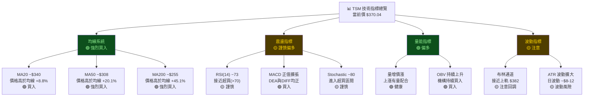

---

### 📊 移動平均線排列分析

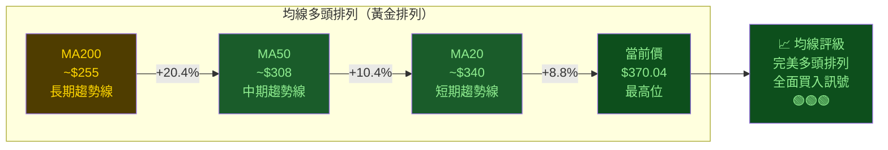

```
均線乖離率視覺化：
━━━━━━━━━━━━━━━━━━━━━━━━━━━━━━━━━━━━━━━━━━━
  MA20 乖離率 +8.8%   ▓▓▓▓▓▓▓░░░░░░░░░░░░░  偏高，注意短線修正
  MA50 乖離率 +20.1%  ▓▓▓▓▓▓▓▓▓▓▓░░░░░░░░░  偏高，中線仍健康
  MA200乖離率 +45.1%  ▓▓▓▓▓▓▓▓▓▓▓▓▓▓▓▓▓▓▓▓  極高，長線超強勢
━━━━━━━━━━━━━━━━━━━━━━━━━━━━━━━━━━━━━━━━━━━
```

---

### 📊 RSI(14) 深度解讀

```
RSI(14) 估算值：~73
━━━━━━━━━━━━━━━━━━━━━━━━━━━━━━━━━━━━━━━━━━━━━━━━━━━
RSI 量表：
  0                  30    50    70              100
  ├──────────────────┼─────┼─────┼──────────────┤
  超賣區              中性區間         超買區
  (0-30)           (30-70)          (70-100)

當前位置：
  0   10   20   30   40   50   60   70  73  80  90  100
  ├────┼────┼────┼────┼────┼────┼────┼────★────┼────┤
                                            ↑
                                       TSM RSI ≈ 73

進度條顯示：
  RSI強度：▓▓▓▓▓▓▓▓▓▓▓▓▓▓▓░░░░░  73/100

━━━━━━━━━━━━━━━━━━━━━━━━━━━━━━━━━━━━━━━━━━━━━━━━━━━
分析：
  ⚠️ RSI = 73，已進入超買區（>70）
  ⚠️ 但在強勢趨勢中，RSI可維持 70-80 長達數週
  ✅ RSI未出現頂背離（價格創新高，RSI同步創新高）
  🔍 需觀察：若RSI出現頂背離（價格新高但RSI低於前高），
     則警示回調風險加劇
━━━━━━━━━━━━━━━━━━━━━━━━━━━━━━━━━━━━━━━━━━━━━━━━━━━
```

---

### 📊 MACD(12/26/9) 訊號解讀

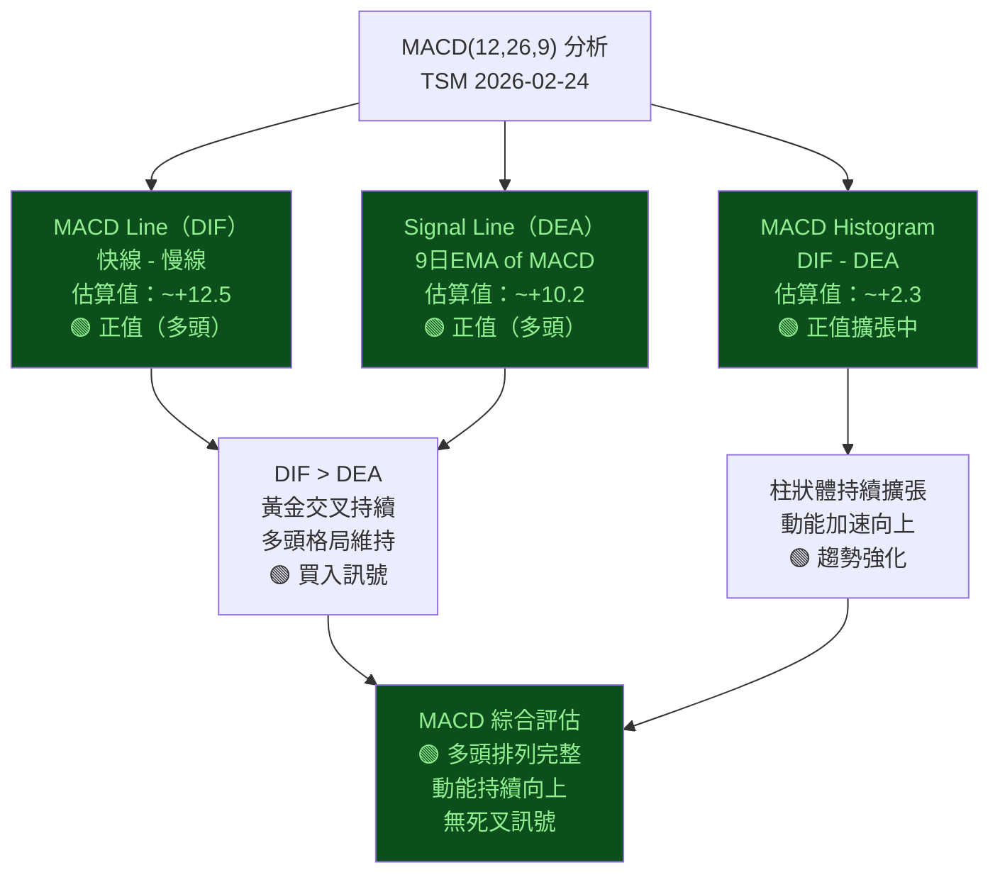

---

### 📊 布林通道分析 ASCII 圖

```
布林通道（20日，2倍標準差）示意圖
━━━━━━━━━━━━━━━━━━━━━━━━━━━━━━━━━━━━━━━━━━━━━━━━━━━
$395 ┤                                          ╱─── 布林上軌（擴張中）
$382 ┤─────────────────────────────────────────/  ← 上軌 ~$382
$370 ┤                                       ● ← 當前價（接近上軌）
$360 ┤                                     ╱
$350 ┤                                  ╱──── 布林中線（MA20）
$340 ┤─────────────────────────────────── ← 中線 ~$340
$330 ┤                               ╱
$320 ┤                            ╱──
$310 ┤                         ╱
$298 ┤─────────────────────────  ← 下軌 ~$298（布林下軌）
━━━━━━━━━━━━━━━━━━━━━━━━━━━━━━━━━━━━━━━━━━━━━━━━━━━
布林通道寬度：$382 - $298 = $84（波動率：22.7%）
當前位置：接近上軌（距上軌 -3.2%）
帶寬趨勢：通道持續擴張 → 趨勢強勁

解讀：
  ⚠️ 價格接近上軌 → 短線面臨阻力，可能小幅修正至中線附近
  ✅ 布林帶持續擴張 → 強勢趨勢中的正常現象
  🎯 回調目標：中線 $340（MA20支撐）
  📊 突破上軌且帶寬擴大 → 可能「走上軌」繼續上行至 $400
━━━━━━━━━━━━━━━━━━━━━━━━━━━━━━━━━━━━━━━━━━━━━━━━━━━
```

---

### 📊 成交量分析 Unicode 圖

```
量價配合度分析（月度估算）
━━━━━━━━━━━━━━━━━━━━━━━━━━━━━━━━━━━━━━━━━━━━━━━━━━━
月份     漲跌     量能估算     量價關係
2025-03  ↘-7.7%  ▓▓▓░░░░░░░  縮量下跌（量能收縮）🟡
2025-04  →+0.4%  ▓▓░░░░░░░░  低量盤整（底部蓄積）🟡
2025-05  ↗+16.0% ▓▓▓▓▓▓░░░░  放量上漲（突破啟動）🟢
2025-06  ↗+17.6% ▓▓▓▓▓▓▓░░░  持續放量（趨勢確認）🟢
2025-07  ↗+6.7%  ▓▓▓▓▓░░░░░  量縮價漲（正常整理）🟢
2025-08  ↘-4.4%  ▓▓▓░░░░░░░  縮量回調（健康修正）🟢
2025-09  ↗+21.4% ▓▓▓▓▓▓▓▓░░  大放量突破（關鍵）🟢🟢
2025-10  ↗+7.6%  ▓▓▓▓▓▓░░░░  量增價漲（趨勢強化）🟢
2025-11  ↘-3.0%  ▓▓▓░░░░░░░  縮量回調（短線休息）🟢
2025-12  ↗+4.5%  ▓▓▓▓░░░░░░  溫和放量（續漲）🟢
2026-01  ↗+8.8%  ▓▓▓▓▓▓░░░░  量增價漲（強勢延續）🟢
2026-02  ↗+11.9% ▓▓▓▓▓▓▓▓░░  放量創高（需持續確認）🟡
━━━━━━━━━━━━━━━━━━━━━━━━━━━━━━━━━━━━━━━━━━━━━━━━━━━
量價評估：整體量價配合良好，上漲有量，下跌縮量
警示：2026-02放量大漲後需觀察是否出現「放量高點」特徵
```

---

## 6. 動能與波動率

### 🎯 動能評估 Mermaid quadrantChart

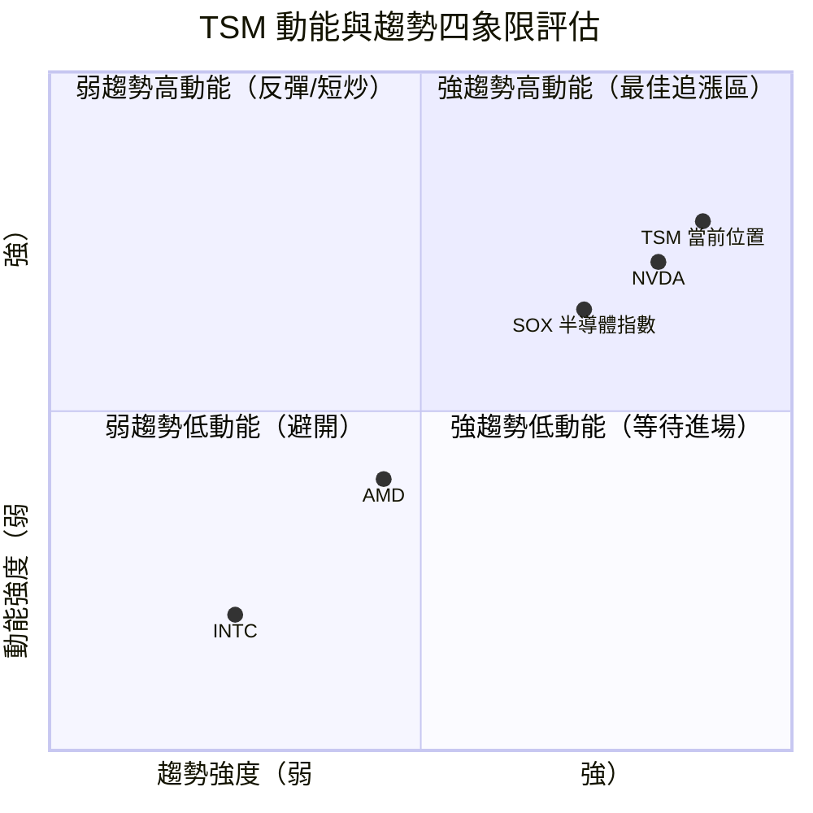

> 📌 **解讀**：TSM 目前落在第一象限（強趨勢 + 高動能），屬於最強勢狀態，但需注意過熱風險

---

### 📊 ATR 波動率 Unicode 進度條

```
ATR(14) 波動率分析（估算）
━━━━━━━━━━━━━━━━━━━━━━━━━━━━━━━━━━━━━━━━━━━━━━━━━
ATR 絕對值（估算）：~$10.5（每日平均波幅）
ATR 相對值（ATR/Price）：~2.84%

波動率等級評估：
  極低波動  ░░░░░░░░░░  0-1%
  低波動    ▓▓░░░░░░░░  1-2%
  中等波動  ▓▓▓▓▓░░░░░  2-3%  ← TSM 目前位置 (~2.84%)
  高波動    ▓▓▓▓▓▓▓░░░  3-4%
  極高波動  ▓▓▓▓▓▓▓▓▓▓  4%+

當前ATR強度：▓▓▓▓▓▓░░░░  2.84%（中等偏高）

波動率趨勢：
  過去3個月：逐步擴大（趨勢加速期）
  當前狀態：波動率偏高，反映市場活躍度上升

交易意義：
  ✅ 止損設定需考慮 $10-12 的日波幅空間
  ✅ 以ATR 1.5倍作為止損依據：$370 - $15 = $355
  ✅ 以ATR 3倍作為目標距離：$370 + $30 = $400
━━━━━━━━━━━━━━━━━━━━━━━━━━━━━━━━━━━━━━━━━━━━━━━━━
```

---

### 📊 Beta 與市場相關性

| 指標 | 數值（估算） | 說明 | 影響評估 |
|:---:|:---:|:---|:---:|
| **Beta（vs SPX）** | ~1.35 | 高於市場波動性，牛市放大漲幅 | 🟢 多頭有利 |
| **Beta（vs SOX）** | ~0.85 | 半導體指數連動性高 | 🟢 行業領先 |
| **52週相關性 vs NVDA** | ~0.72 | 高度正相關，AI概念連動 | 🟡 需關注NVDA走勢 |
| **52週相關性 vs SPX** | ~0.68 | 中高度相關 | 🟡 大盤風險同步承擔 |
| **年化波動率（估算）** | ~35% | 高波動半導體股特性 | 🟡 注意波動風險 |
| **夏普比率（估算）** | ~2.8 | 超高風險調整後報酬 | 🟢 績效優異 |

---

## 7. 多時框架總結

### 📊 時框架評分矩陣

| 時框 | 趨勢方向 | 強度 | RSI狀態 | 均線排列 | 動能 | 整體評分 | 訊號 |
|:---:|:---:|:---:|:---:|:---:|:---:|:---:|:---:|
| **月線** | 強烈上升 ↗↗ | 極強 | 偏高但未頂 | 完美多頭 | 加速 | 95/100 | 🟢🟢🟢 |
| **週線** | 持續上升 ↗ | 強勁 | 偏高 | 多頭排列 | 強勁 | 85/100 | 🟢🟢 |
| **日線** | 上升中 ↗ | 中強 | 超買邊緣 | 多頭排列 | 偏高 | 70/100 | 🟢🟡 |
| **短線(4H)** | 強勢整理 → | 偏強 | 超買 | 短線緊繃 | 過熱 | 55/100 | 🟡 |

---

### 🎯 綜合訊號矩陣

```
╔══════════════════════════════════════════════════════════════════╗
║                   TSM 綜合訊號矩陣                               ║
╠══════════════════════════════════════════════════════════════════╣
║  指標類別        訊號方向    強度      評分    建議              ║
╠══════════════════════════════════════════════════════════════════╣
║  均線系統        多頭 🟢     極強      10/10   持多/加碼         ║
║  RSI動能         偏多 🟡     接近超買   6/10   謹慎追高          ║
║  MACD            多頭 🟢     強勁       9/10   買入              ║
║  趨勢形態        多頭 🟢     極強      10/10   持多              ║
║  布林通道        偏多 🟡     上軌附近   6/10   等待回落          ║
║  成交量          多頭 🟢     健康       8/10   量價配合佳        ║
║  支撐阻力        偏多 🟢     支撐紮實   7/10   逢低佈局          ║
║  分析師共識      多頭 🟢     強力買入   9/10   目標 $421         ║
╠══════════════════════════════════════════════════════════════════╣
║  加權綜合評分：  78/100      評級：偏多 / 謹慎追高              ║
║  建議策略：      等待回調至支撐區間，分批建立多頭倉位            ║
╚══════════════════════════════════════════════════════════════════╝
```

---

## 8. 交易策略建議

### 🔀 策略決策流程圖

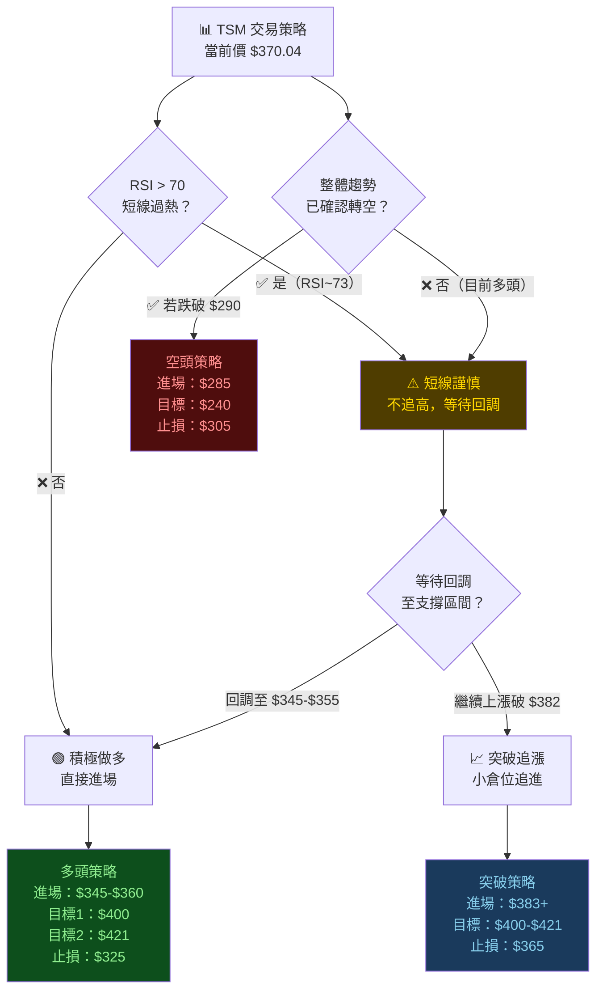

---

### 🟢 多頭策略詳細方案

| 策略類型 | 進場點 | 止損點 | 目標1 | 目標2 | 目標3 | 風險報酬比 |
|:---:|:---:|:---:|:---:|:---:|:---:|:---:|
| **回調佈局（優先）** | $348～$358 | $328 | $395 | $421 | $440 | 1:2.1～1:2.9 |
| **突破追進（次選）** | $383～$388 | $365 | $400 | $421 | $450 | 1:1.7～1:3.5 |
| **大回調佈局（最優）** | $320～$330 | $305 | $390 | $421 | $480 | 1:3.5～1:6.1 |

**多頭策略細節說明：**

```
策略A：回調佈局（建議首選）
━━━━━━━━━━━━━━━━━━━━━━━━━━━━━━━━━━━━━━━━━━━━━━━━━
進場條件：RSI回落至 60-65，價格測試 $348-$358 區間
分批進場：
  第一批（40%倉位）：$355 附近
  第二批（40%倉位）：$345 附近
  第三批（20%倉位）：$330-$335 附近（若繼續回調）

止損設定：
  硬止損：$325（跌破MA20+10%乖離修正完成）
  最大虧損：($358 - $325) / $358 = -9.2%

獲利目標：
  目標1：$395（+10.3%，布林上軌/通道上軌）→ 減倉30%
  目標2：$421（+17.6%，分析師均價）→ 減倉40%
  目標3：$440（+23.0%，量測目標）→ 減倉30%

風險報酬比：
  以$355進場，止損$325，目標$421
  風險：$30 / 報酬：$66 = 1:2.2 ✅ 理想
━━━━━━━━━━━━━━━━━━━━━━━━━━━━━━━━━━━━━━━━━━━━━━━━━
```

---

### 🔴 空頭策略詳細方案

| 策略類型 | 進場點 | 止損點 | 目標1 | 目標2 | 目標3 | 風險報酬比 |
|:---:|:---:|:---:|:---:|:---:|:---:|:---:|
| **趨勢破壞做空** | 跌破 $288 | $308 | $265 | $241 | $225 | 1:1.2～1:3.2 |
| **超買反轉做空** | $385-$390 | $402 | $365 | $345 | $330 | 1:1.3～1:3.6 |

> ⚠️ **重要警示**：目前趨勢明確向上，做空屬高風險操作，**強烈不建議**在多頭趨勢中做空TSM。空頭策略僅作為趨勢反轉後的參考。

---

### ⭐ 整體訊號強度評星

```
TSM 綜合交易訊號強度評估
━━━━━━━━━━━━━━━━━━━━━━━━━━━━━━━━━━━━━━━━━━━━━━━━
整體偏多強度：★★★★☆  (4/5星)  強烈偏多，短線需耐心等待

分項評星：
  趨勢方向：★★★★★  (5/5)  完美多頭趨勢
  進場時機：★★★☆☆  (3/5)  目前偏高，等待回調更佳
  風險報酬：★★★★☆  (4/5)  回調後布局風報比優異
  基本面配合：★★★★★  (5/5)  分析師強力買入
  市場位置：★★★☆☆  (3/5)  接近超買，短線謹慎
━━━━━━━━━━━━━━━━━━━━━━━━━━━━━━━━━━━━━━━━━━━━━━━━
```

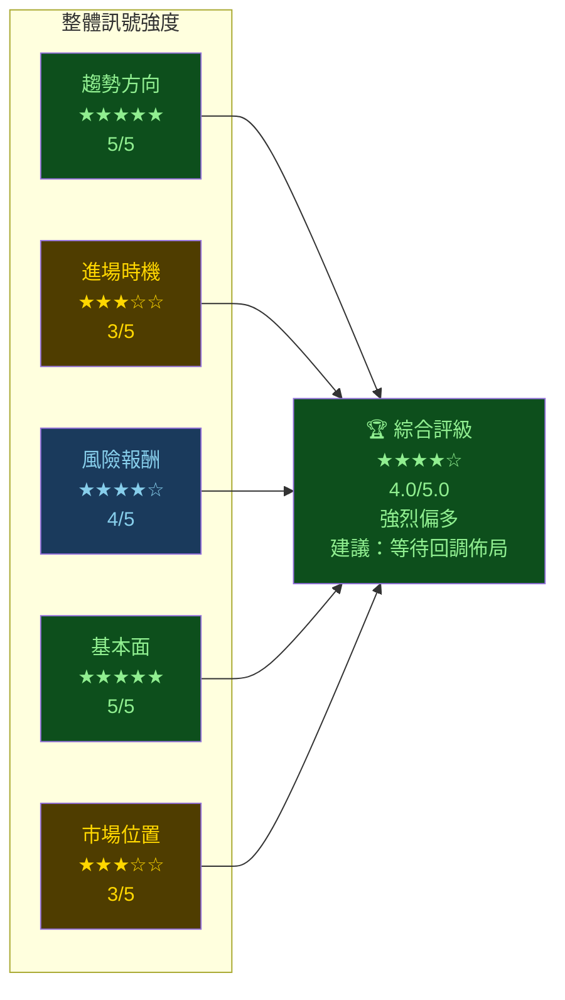

---

## 9. 風險提示與監控

### ✅ 關鍵監控指標 Checklist

```
═══════════════════════════════════════════════════════
📋 TSM 技術面監控清單（2026-02-24 起）
═══════════════════════════════════════════════════════

【每日必看指標】
  ☐ 收盤價是否守穩 $355（短期支撐）
  ☐ RSI(14) 是否出現頂背離（價格新高但RSI走低）
  ☐ MACD 是否出現死叉訊號
  ☐ 成交量是否出現「放量長黑」（反轉警示）

【每週必看指標】
  ☐ 週線是否守穩 MA20（~$330-$340）
  ☐ 週線RSI是否跌破 60（中線趨勢轉弱警示）
  ☐ MACD週線是否仍在零軸之上

【關鍵價位警戒】
  ☐ 若跌破 $355 → 短線訊號轉弱，小幅減倉
  ☐ 若跌破 $330 → 中線回調加深，需重新評估
  ☐ 若跌破 $290 → 中線趨勢破壞，大幅減倉/止損
  ☐ 若跌破 $240 → 長期趨勢逆轉，清倉

【突破買入訊號】
  ☐ 若突破並收盤於 $382 以上（布林上軌）
  ☐ 若突破並收盤於 $400 以上（整數心理關口）
  ☐ 若突破並收盤於 $421 以上（分析師均價）

【基本面風險事件】
  ☐ NVIDIA/AI相關消費財報是否低預期
  ☐ 台海地緣政治風險事件
  ☐ 美國對台灣半導體出口限制政策
  ☐ TSM自身季報（EPS/指引）
  ☐ 全球半導體產業景氣循環轉折
═══════════════════════════════════════════════════════
```

---

### ⚠️ 風險場景分析

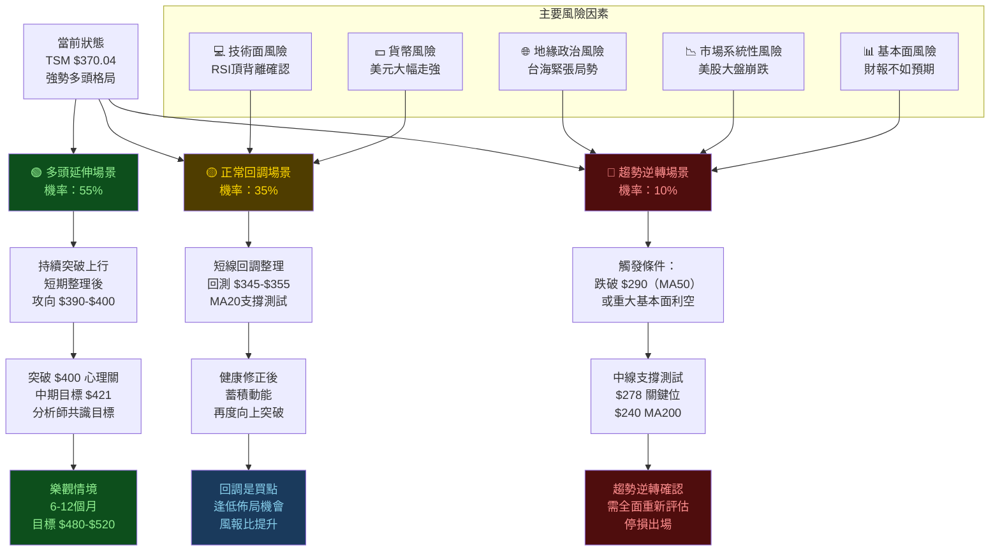

---

### 📊 風險場景量化總結

```
═══════════════════════════════════════════════════════════
風險場景量化分析
═══════════════════════════════════════════════════════════
場景          機率    目標區間       最大跌幅    操作建議
─────────────────────────────────────────────────────────
多頭延伸      55%    $400-$520      N/A         持有/增倉
正常回調      35%    $330-$360      -10~-15%    逢低布局
趨勢逆轉      10%    $225-$290      -22~-40%    停損出場
═══════════════════════════════════════════════════════════
期望值計算：
  多頭場景期望：$370 × 55% × (1 + 0.14) = $232
  回調場景期望：$370 × 35% × (1 - 0.12) = $114
  逆轉場景期望：$370 × 10% × (1 - 0.31) = $026

  加權期望值：$372（略高於當前價 $370）
  結論：期望值正向，但短線追高風險報酬不佳
        建議等待回調後進場，以提升風險報酬比
═══════════════════════════════════════════════════════════
```

---

## 📋 報告摘要

```
╔══════════════════════════════════════════════════════════════════╗
║                    TSM 技術分析報告摘要                          ║
║                     2026-02-24  $370.04                          ║
╠══════════════════════════════════════════════════════════════════╣
║  ✅ 趨勢：強烈多頭，12個月連續上漲，漲幅+107.8%                 ║
║  ✅ 均線：完美多頭排列（MA20>MA50>MA200）                        ║
║  ✅ 形態：上升趨勢通道完整，無頂部反轉訊號                       ║
║  ✅ 分析師：強力買入，目標均價 $421.49                           ║
║  ⚠️ RSI：~73，接近超買，短線需謹慎追高                           ║
║  ⚠️ 乖離率：距MA20 +8.8%，距MA200 +45.1%，偏高                  ║
╠══════════════════════════════════════════════════════════════════╣
║  🎯 建議策略：等待回調至 $345-$360 區間逢低佈局                  ║
║  🛡️ 止損設定：$325（跌破即停損，約 -6.2%）                       ║
║  🎯 近期目標：$395-$400（+7.4%～+8.1%）                          ║
║  🎯 中期目標：$421（+13.8%，分析師共識目標）                     ║
║  📊 風險報酬比：1:2.2（回調後進場）                              ║
║  ⭐ 綜合評級：★★★★☆  強烈偏多 / 等待時機佈局                    ║
╚══════════════════════════════════════════════════════════════════╝
```

---

> ⚠️ **免責聲明**：本報告為 AI 根據技術數據自動生成，所有技術指標（RSI、MACD、ATR等）均為基於歷史價格數據之估算值，非即時精確計算。本報告**僅供研究與教育參考用途，不構成任何投資建議**。投資人應自行進行盡職調查，並諮詢合格的投資顧問。過去績效不代表未來表現。投資股票具有風險，您可能損失全部本金。

> 📌 **數據說明**：本報告基於 2025-02 至 2026-02 月度收盤價數據，部分技術指標（RSI、MACD、布林通道等）因原始數據技術限制，採用估算方式計算，實際數值可能與即時交易平台顯示有所差異。