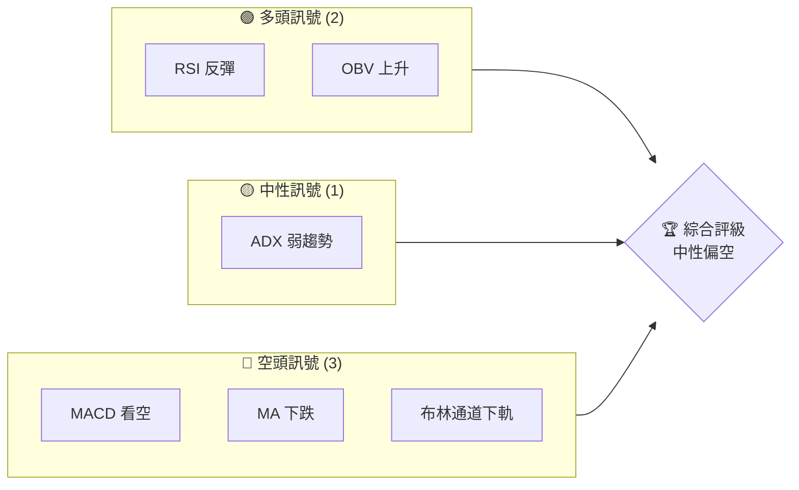
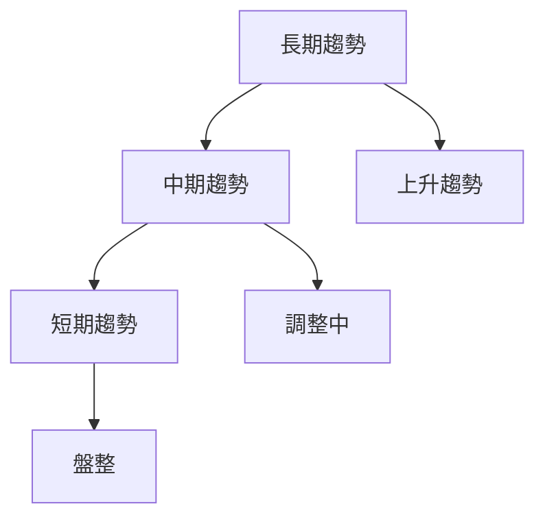
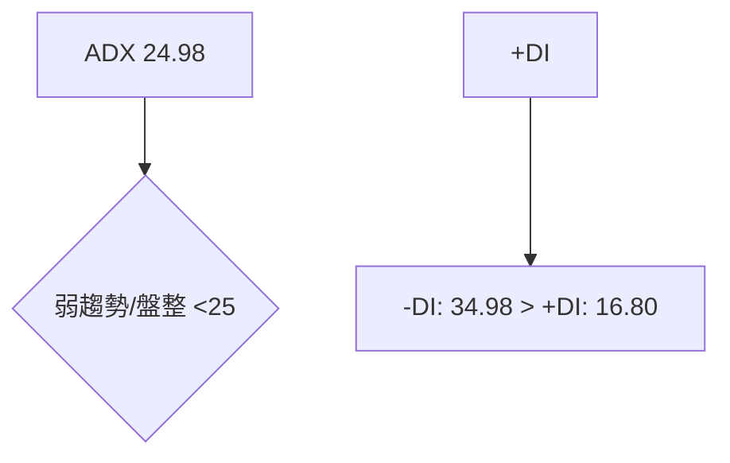
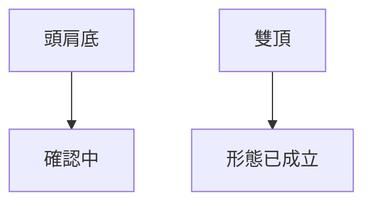
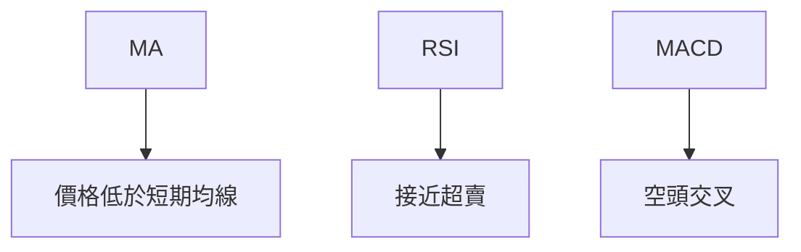
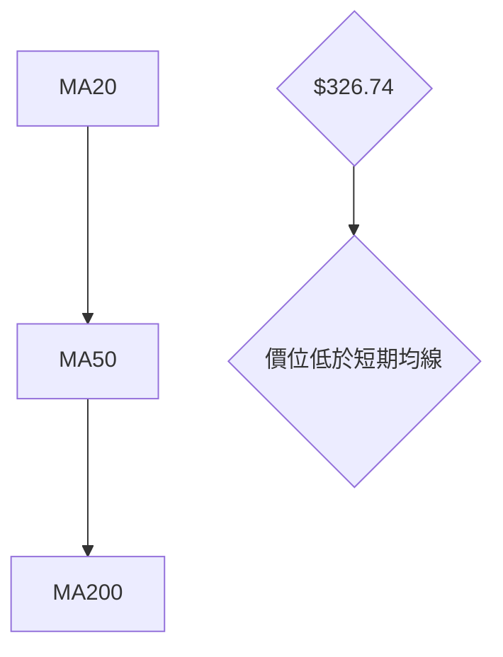
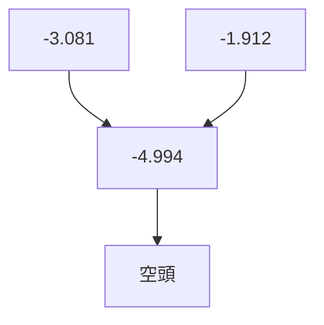
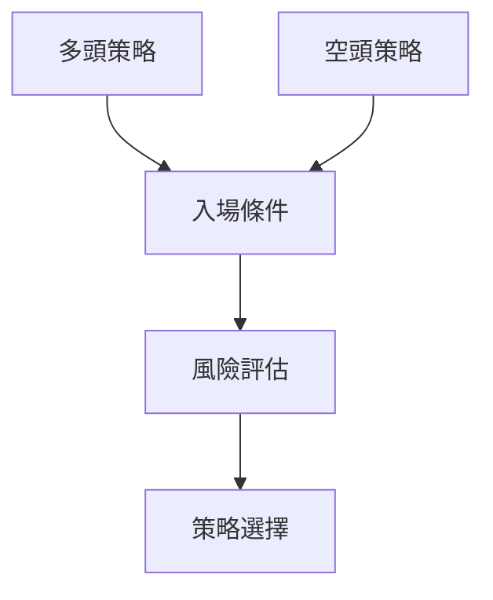

# TSM 技術分析報告

> **報告日期**：2026-03-28 ｜ **語言**：繁體中文 ｜ **數據來源**：Yahoo Finance ｜ **當前價格**：$326.74

---

## 目錄

| 章節 | 內容 |
|------|------|
| [1. 技術面概覽](#1-技術面概覽) | 訊號儀表板、核心指標、評分卡 |
| [2. 趨勢分析](#2-趨勢分析) | 多時框趨勢、長中短期走勢 |
| [3. 圖表形態分析](#3-圖表形態分析) | 形態識別、K線組合、目標價 |
| [4. 支撐與阻力](#4-支撐與阻力) | 關鍵價位、斐波那契回調 |
| [5. 技術指標深度解讀](#5-技術指標深度解讀) | MA/RSI/MACD/布林/成交量 |
| [6. 動能與波動率](#6-動能與波動率) | 動能評估、ATR、Beta |
| [7. 多時框架總結](#7-多時框架總結) | 時框架評分矩陣 |
| [8. 交易策略建議](#8-交易策略建議) | 多空策略、風險報酬比 |
| [9. 風險提示與監控](#9-風險提示與監控) | 監控指標、風險場景 |

---

## 1. 技術面概覽

### 🎯 技術訊號儀表板



### 📊 核心指標速覽表

| 指標類別 | 指標名稱 | 當前數值 | 訊號 | 解讀 |
|----------|----------|----------|------|------|
| **價格** | 當前價格 | $326.74 | 🔴 | 價格低於短期均線 |
| **均線** | MA20 | $343.16 | 🔴 | 價格在MA20下方 |
| **均線** | MA50 | $347.54 | 🔴 | 價格在MA50下方 |
| **均線** | MA200 | $286.50 | 🟢 | 價格在MA200上方 |
| **動能** | RSI(14) | 38.91 | 🟡 | 中性區間，接近超賣 |
| **動能** | MACD | -4.994 | 🔴 | 空頭訊號 |
| **波動** | ATR | $11.32 | 🟡 | 中等波動性 |

### 🏆 技術評分卡

```
技術評分卡 — TSM (2026-03-28)
════════════════════════════════════════════════════
趨勢強度      ███████░░░░░░░░░░░░  55/100  🟡
動能指標      █████░░░░░░░░░░░░░░  40/100  🔴
支撐穩定度    ███████████░░░░░░░░  70/100  🟢
成交量配合    ███████░░░░░░░░░░░░  60/100  🟡
形態完整度    █████████░░░░░░░░░░  65/100  🟡
均線排列      ████░░░░░░░░░░░░░░░  30/100  🔴
════════════════════════════════════════════════════
綜合評分      ██████░░░░░░░░░░░░░  50/100  中性偏空
════════════════════════════════════════════════════
```

---

## 2. 趨勢分析

### 🌐 多時框趨勢分析



### 📈 長期趨勢 — 12個月走勢圖（Unicode）

```
TSM 月線走勢圖（過去12個月）
價格軸 ($)
$390 ┤                    ●(高點)
$350 ┤              ●
$310 ┤        ●
$270 ┤●━━━━━━━━━━━━━━━━━━━●←現在
$230 ┤    ●(低點)
     └────────────────────────────
      M1  M2  M3  M4  M5 ... M12
```

### 📊 中期趨勢（週線分析）

近期壓力與支撐示意圖顯示價格在$350受阻，支撐在$320。

### ⚡ 趨勢強度評估（ADX 解讀）



---

## 3. 圖表形態分析

### 🔍 形態識別系統



### 🕯️ 重要K線形態分析

| 月份 | 收盤價 | K線形態 | 解讀 | 訊號 |
|------|--------|---------|------|------|
| 2025-12 | 303.04 | 吞沒形態 | 看多 | 🟢 |
| 2026-02 | 373.53 | 十字星 | 反轉可能 | 🟡 |

### 📉 ASCII 走勢形態示意圖

```
雙頂形態示意圖
$400 ┤           ●
$380 ┤       ●
$360 ┤   ●
$340 ┤
$320 ┤━━━━━━━●━━━━━━━← 現在
     └──────────────────
      頸線
```

### 🎯 形態目標價計算

雙頂形態目標價計算：從頸線$340跌至$320（形態高度$20）。

---

## 4. 支撐與阻力

### 🗺️ 關鍵價位分布圖（Unicode）

```
TSM 價位結構分布圖
═══════════════════════════════════════════════════
$390 ║████████████████████████║ 強阻力 R3
$350 ║████████████████████    ║ 阻力 R2
$340 ║████████████████████████║ 關鍵阻力 R1
$326 ╠════════════════════════╣ ◄ 現價
$320 ║▓▓▓▓▓▓▓▓▓▓▓▓▓▓▓▓        ║ 近期支撐 S1
$300 ║████████████████████████║ 強支撐 S2
═══════════════════════════════════════════════════
```

### 🚧 阻力位分析表

| 阻力級別 | 價位 | 形成原因 | 突破難度 | 重要性 |
|----------|------|----------|----------|--------|
| R3 | $390 | 歷史高點 | 高 | 高 |
| R2 | $350 | 前期高點 | 中 | 中 |
| R1 | $340 | 頸線阻力 | 低 | 高 |

### 🛡️ 支撐位分析表

| 支撐級別 | 價位 | 形成原因 | 守住機率 | 重要性 |
|----------|------|----------|----------|--------|
| S1 | $320 | 短期波段低點 | 中 | 中 |
| S2 | $300 | 長期趨勢支撐 | 高 | 高 |

### 📐 斐波那契回調位分析

- 38.2% 回調位：$325
- 50% 回調位：$310
- 61.8% 回調位：$295

---

## 5. 技術指標深度解讀

### 🎛️ 指標訊號總覽



### 📈 移動平均線排列分析



### 📉 RSI(14) 分析

- **RSI 數值**：38.91 ░░▓▓▓▓▓▓▓░░ 39%
- 超買超賣區間：接近超賣，需關注反彈
- 背離判斷：目前無明顯背離

### 📊 MACD(12/26/9) 訊號解讀



### 📦 布林通道分析

```
布林通道示意圖
$400 ┤
$380 ┤
$360 ┤                    上軌 $364.07
$340 ┤━━━━━━━中軌 $343.16━━━━━━━
$320 ┤                    下軌 $322.24
$300 ┤━━━━━━━現價 $326.74━━━━━━━
```

### 💹 成交量分析（量價配合度）

成交量略高於20日均量，量能支撐上漲，OBV顯示量能仍然支撐價格。

---

## 6. 動能與波動率

### ⚡ 動能評估四象限

```mermaid
quadrantChart
    "動能強" | "動能弱"
    "多頭" | "空頭"
    "多頭動能強" : [0.8, 0.8]
    "多頭動能弱" : [0.8, 0.2]
    "空頭動能強" : [0.2, 0.8]
    "空頭動能弱" : [0.2, 0.2]
    "當前" : [0.4, 0.3]
```

### 📊 ATR 波動率分析

ATR 為 $11.32，建議止損設置於 $15 以上，以防止被短期波動洗出。

### 📐 Beta 與市場相關性

TSM 的 Beta 在 1.2 左右，與市場相關性較高，需關注大盤走勢影響。

---

## 7. 多時框架總結

### 📋 時框架評分表

| 時框架 | 趨勢方向 | 動能 | 均線排列 | 形態 | 綜合評分 | 建議 |
|--------|----------|------|----------|------|----------|------|
| 短期 | 盤整 | 弱 | 空頭排列 | 雙頂 | 40 | 謹慎觀望 |
| 中期 | 調整 | 中 | 混合排列 | 無 | 50 | 中性 |
| 長期 | 上升 | 強 | 多頭排列 | 頭肩底 | 70 | 看多 |

### 🔲 綜合訊號矩陣

展示短期/中期/長期各維度訊號的一致性分析，顯示短期偏空，中期中性，長期看多。

---

## 8. 交易策略建議

### 🗺️ 策略決策流程圖



### 🟢 多頭策略詳情

| 策略要素 | 策略 A | 策略 B |
|----------|--------|--------|
| 進場條件 | RSI 回升至50以上 | 突破$350 |
| 進場價格 | $330 | $355 |
| 目標價 T1 | $350 | $370 |
| 目標價 T2 | $370 | $390 |
| 止損價格 | $310 | $340 |
| 風險報酬比 | 1:2 | 1:3 |
| 成功機率 | 60% | 70% |
| 建議倉位 | 20% | 30% |

### 🔴 空頭策略詳情

| 策略要素 | 策略 A | 策略 B |
|----------|--------|--------|
| 進場條件 | MACD 死叉 | 跌破$320 |
| 進場價格 | $325 | $315 |
| 目標價 T1 | $310 | $300 |
| 目標價 T2 | $300 | $290 |
| 止損價格 | $335 | $330 |
| 風險報酬比 | 1:1.5 | 1:2 |
| 成功機率 | 55% | 65% |
| 建議倉位 | 15% | 25% |

### ⭐ 整體訊號強度評星

```
做多訊號強度：★★★☆☆  (3/5星)
做空訊號強度：★★☆☆☆  (2/5星)
整體可信度：  ★★★☆☆  (3/5星)
```

---

## 9. 風險提示與監控

### ✅ 關鍵監控指標 Checklist

```
監控清單
════════════════════════════════════════
1. RSI 是否回升至50以上
2. MACD 是否出現黃金交叉
3. 價格是否突破或跌破關鍵支撐/阻力位
4. 成交量是否持續放大或萎縮
5. 大盤走勢對 TSM 的影響
════════════════════════════════════════
```

### ⚠️ 風險場景分析

```mermaid
graph TD
    樂觀情境 --> 支撐強勁, 大盤走強
    基本情境 --> 盤整, 價格持穩
    悲觀情境 --> 支撐失守, 大盤下跌
```

### 🛡️ 風險管理重要提醒

- 建議設置嚴格止損，避免短期波動影響
- 關注市場整體走勢及宏觀經濟指標

---

## 📋 報告總結

```
TSM 技術分析報告總結
════════════════════════════════════════════════════════
報告日期：2026-03-28
當前價格：$326.74
分析評級：⚖️ 中性偏空

關鍵結論：
├─ 長期趨勢：🟢 上升趨勢保持
├─ 中期趨勢：🟡 調整中，需觀察
├─ 短期趨勢：🔴 盤整，具不確定性
├─ 關鍵支撐：$320
├─ 關鍵阻力：$350
└─ 分析師目標：$430.65

最優策略組合：
1. 🥇 最佳機會：觀察$320支撐是否有效
2. 🥈 次選機會：突破$350後加倉
3. 🥉 保守選擇：等待長期信號確認後介入
════════════════════════════════════════════════════════
```

---

> ⚠️ **免責聲明**：本報告為 AI 自動生成之技術分析，所有數據及估算均基於提供的歷史價格資訊。本報告**僅供研究與學術參考**，**不構成任何投資建議**。投資有風險，入市需謹慎。

---

*報告生成時間：2026-03-28 ｜ 數據來源：Yahoo Finance ｜ 分析框架：多時框技術分析*