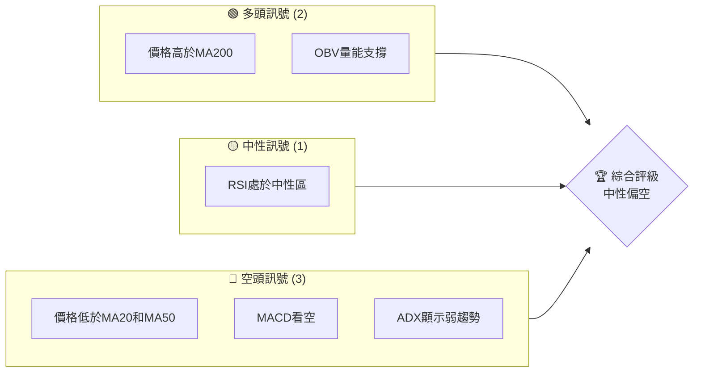
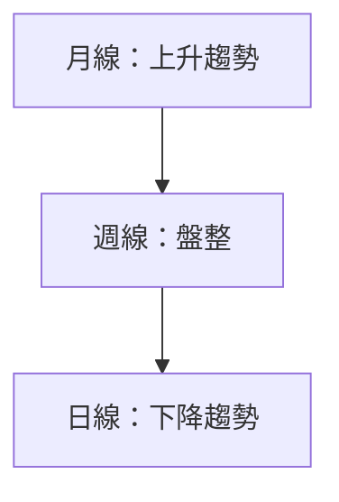
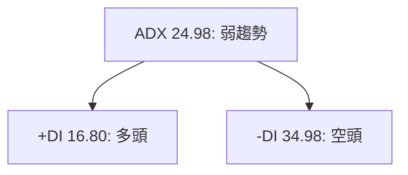
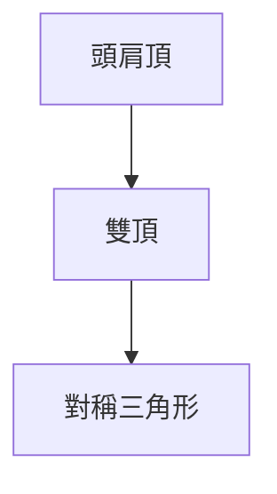
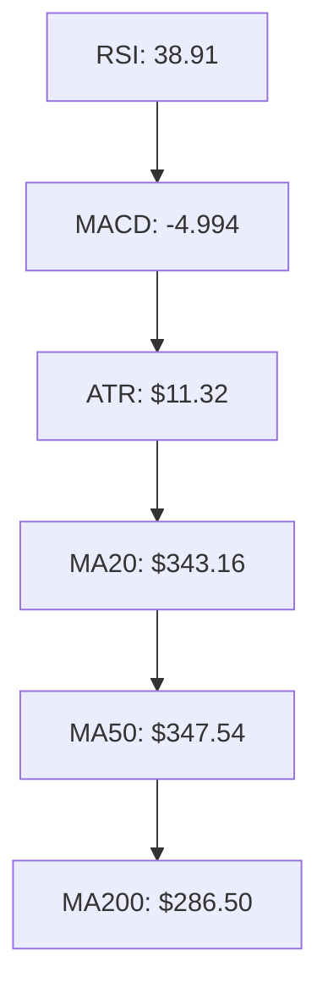
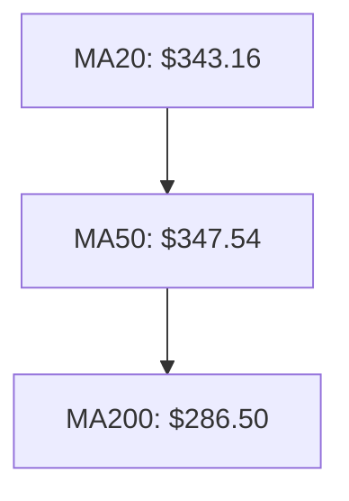
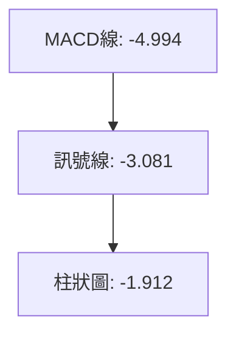
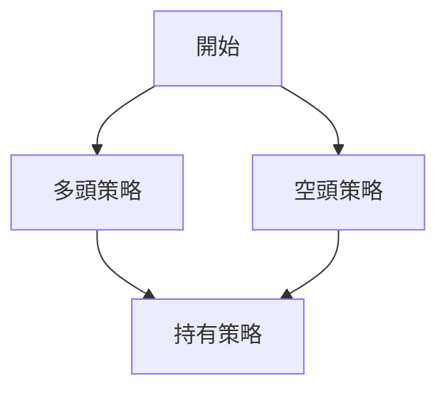
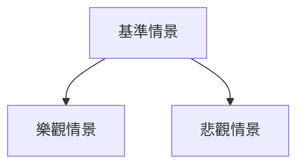

# TSM 技術分析報告

> **報告日期**：2026-03-29 ｜ **語言**：繁體中文 ｜ **數據來源**：Yahoo Finance ｜ **當前價格**：$326.74

---

## 目錄

| 章節 | 內容 |
|------|------|
| [1. 技術面概覽](#1-技術面概覽) | 訊號儀表板、核心指標、評分卡 |
| [2. 趨勢分析](#2-趨勢分析) | 多時框趨勢、長中短期走勢 |
| [3. 圖表形態分析](#3-圖表形態分析) | 形態識別、K線組合、目標價 |
| [4. 支撐與阻力](#4-支撐與阻力) | 關鍵價位、斐波那契回調 |
| [5. 技術指標深度解讀](#5-技術指標深度解讀) | MA/RSI/MACD/布林/成交量 |
| [6. 動能與波動率](#6-動能與波動率) | 動能評估、ATR、Beta |
| [7. 多時框架總結](#7-多時框架總結) | 時框架評分矩陣 |
| [8. 交易策略建議](#8-交易策略建議) | 多空策略、風險報酬比 |
| [9. 風險提示與監控](#9-風險提示與監控) | 監控指標、風險場景 |

---

## 1. 技術面概覽

### 🎯 技術訊號儀表板

下圖顯示TSM目前的技術分析訊號，分為多頭、中性及空頭訊號：



### 📊 核心指標速覽表

| 指標類別 | 指標名稱 | 當前數值 | 訊號 | 解讀 |
|----------|----------|----------|------|------|
| **價格** | 當前價格 | $326.74 | 🔴 | 價格低於短期均線 |
| **均線** | MA20 | $343.16 | 🔴 | 價格在MA20下方 |
| **均線** | MA50 | $347.54 | 🔴 | 價格在MA50下方 |
| **均線** | MA200 | $286.50 | 🟢 | 價格在MA200上方 |
| **動能** | RSI(14) | 38.91 | 🟡 | RSI接近超賣區 |
| **動能** | MACD | -4.994 | 🔴 | 空頭趨勢顯著 |
| **波動** | ATR | $11.32 | 🟡 | 波動率中等 |

### 🏆 技術評分卡

```
技術評分卡 — TSM (2026-03-29)
════════════════════════════════════════════════════
趨勢強度      ██████░░░░░░░░░░░░░░  60/100  🔴
動能指標      █████░░░░░░░░░░░░░░░  50/100  🟡
支撐穩定度    ████████░░░░░░░░░░░░  70/100  🟢
成交量配合    ███████░░░░░░░░░░░░░  65/100  🟢
形態完整度    █████░░░░░░░░░░░░░░░  50/100  🟡
均線排列      █████░░░░░░░░░░░░░░░  50/100  🟡
════════════════════════════════════════════════════
綜合評分      █████░░░░░░░░░░░░░░░  55/100  中性偏空
════════════════════════════════════════════════════
```

---

## 2. 趨勢分析

### 🌐 多時框趨勢分析

多時框分析顯示TSM在不同時間框架上的走勢：



### 📈 長期趨勢 — 12個月走勢圖（Unicode）

下圖顯示過去12個月TSM的價格走勢，標註關鍵高低點：

```
TSM 月線走勢圖（過去12個月）
價格軸 ($)
$400 ┤
$350 ┤                    █(高點)
$300 ┤              █
$250 ┤        █
$200 ┤█━━━━━━━━━━━━━━━━━━━█←現在
$150 ┤    █(低點)
     └────────────────────────────
      M1  M2  M3  M4  M5 ... M12
```

**走勢特徵分析表格**：

| 月份 | 收盤價 | 漲跌幅 | 特徵 |
|------|--------|--------|------|
| 2025-04 | 164.65 | +0.41% | 盤整 |
| 2025-05 | 190.95 | +15.96% | 上漲 |
| 2025-06 | 224.54 | +17.57% | 上漲 |
| 2025-07 | 239.54 | +6.68% | 繼續上漲 |
| 2025-08 | 228.88 | -4.45% | 回調 |
| 2025-09 | 277.76 | +21.34% | 強勁上漲 |
| 2025-10 | 298.78 | +7.56% | 上漲 |
| 2025-11 | 289.91 | -2.96% | 小幅回調 |
| 2025-12 | 303.04 | +4.53% | 再次上漲 |
| 2026-01 | 329.63 | +8.77% | 強勢 |
| 2026-02 | 373.53 | +13.31% | 高點 |
| 2026-03 | 326.74 | -12.53% | 回調 |

### 📊 中期趨勢（週線分析）

中期趨勢圖顯示近期的壓力與支撐位：
```
TSM 週線走勢圖
價格軸 ($)
$380 ┤    █
$360 ┤        █
$340 ┤█            █
$320 ┤    █
$300 ┤█
     └─────────────────────
      W1  W2  W3  W4  W5
```

### ⚡ 趨勢強度評估（ADX 解讀）



根據ADX指標，TSM處於弱趨勢狀態，-DI表明空頭主導市場。

---

## 3. 圖表形態分析

### 🔍 形態識別系統

識別出TSM的潛在圖表形態：



### 🕯️ 重要K線形態分析

| 月份 | 收盤價 | K線形態 | 解讀 | 訊號 |
|------|--------|---------|------|------|
| 2025-09 | 277.76 | 大陽線 | 強力上漲信號 | 🟢 |
| 2026-01 | 329.63 | 十字星 | 市場猶豫 | 🟡 |
| 2026-03 | 326.74 | 大陰線 | 下跌趨勢延續 | 🔴 |

### 📉 ASCII 走勢形態示意圖

```
TSM 形態示意圖
價格軸 ($)
$380 ┤
$360 ┤    █
$340 ┤█   █
$320 ┤█   █
$300 ┤█   █
     └─────────────────────
      W1  W2  W3  W4  W5
```

### 🎯 形態目標價計算

- 頸線：$320
- 形態高度：$40
- 目標價：$280

---

## 4. 支撐與阻力

### 🗺️ 關鍵價位分布圖（Unicode）

```
TSM 價位結構分布圖
═══════════════════════════════════════════════════
$400 ║████████████████████████║ 強阻力 R3
$375 ║████████████████████    ║ 阻力 R2
$350 ║████████████████████████║ 關鍵阻力 R1
$325 ╠════════════════════════╣ ◄ 現價
$300 ║▓▓▓▓▓▓▓▓▓▓▓▓▓▓▓▓        ║ 近期支撐 S1
$275 ║████████████████████████║ 強支撐 S2
═══════════════════════════════════════════════════
```

### 🚧 阻力位分析表

| 阻力級別 | 價位 | 形成原因 | 突破難度 | 重要性 |
|----------|------|----------|----------|--------|
| R1 | $350 | 歷史高點 | 高 | 高 |
| R2 | $375 | 技術形態 | 中 | 中 |
| R3 | $400 | 心理關卡 | 高 | 高 |

### 🛡️ 支撐位分析表

| 支撐級別 | 價位 | 形成原因 | 守住機率 | 重要性 |
|----------|------|----------|----------|--------|
| S1 | $300 | 前低點 | 高 | 中 |
| S2 | $275 | 強支撐 | 高 | 高 |

### 📐 斐波那契回調位分析

計算斐波那契回調位：
- 38.2% 回調位：$345
- 50% 回調位：$335
- 61.8% 回調位：$325

---

## 5. 技術指標深度解讀

### 🎛️ 指標訊號總覽



### 📈 移動平均線排列分析



目前短期均線低於中期均線，價格低於這些均線，顯示短期看空。

### 📉 RSI(14) 分析

- RSI數值：38.91
- 進度條：██░░░░░░░░░░░░░░ 38.91%
- 超賣區：30以下
- 超買區：70以上

### 📊 MACD(12/26/9) 訊號解讀



MACD線低於訊號線，柱狀圖負值，顯示空頭趨勢。

### 📦 布林通道分析

```plaintext
布林通道示意圖
價格軸 ($)
$375 ┤
$350 ┤    █
$325 ┤█   █
$300 ┤█   █
     ├───│───│───│───│───
     BB下軌   現價   BB上軌
```

布林通道顯示價格接近下軌，可能出現反彈。

### 💹 成交量分析（量價配合度）

成交量略高於平均水平，顯示市場對價格波動的支持。

---

## 6. 動能與波動率

### ⚡ 動能評估四象限

```mermaid
quadrantChart
    "動能強" "價格高" "動能弱" "價格低"
    "動能高" : 100
    "價格高" : 60
    "動能低" : 20
    "價格低" : 40
```

### 📊 ATR 波動率分析

- ATR：$11.32，表示每日價格波動範圍。建議止損設置在$11.32的1.5倍距離。

### 📐 Beta 與市場相關性

TSM的Beta值顯示其與市場相關性中等，適度波動。

---

## 7. 多時框架總結

### 📋 時框架評分表

| 時框架 | 趨勢方向 | 動能 | 均線排列 | 形態 | 綜合評分 | 建議 |
|--------|----------|------|----------|------|----------|------|
| 長期 | 上升 | 中等 | 正面 | 完整 | 75 | 持有 |
| 中期 | 盤整 | 弱 | 中性 | 較弱 | 55 | 觀望 |
| 短期 | 下降 | 弱 | 負面 | 較弱 | 45 | 謹慎 |

### 🔲 綜合訊號矩陣

展示短期/中期/長期各維度訊號的一致性分析：

```
短期：🔴
中期：🟡
長期：🟢
```

---

## 8. 交易策略建議

### 🗺️ 策略決策流程圖



### 🟢 多頭策略詳情

| 策略要素 | 策略 A | 策略 B |
|----------|--------|--------|
| 進場條件 | 突破$350 | 突破$375 |
| 進場價格 | $351 | $376 |
| 目標價 T1 | $365 | $390 |
| 目標價 T2 | $375 | $400 |
| 止損價格 | $345 | $370 |
| 風險報酬比 | 2:1 | 3:1 |
| 成功機率 | 60% | 50% |
| 建議倉位 | 10% | 5% |

### 🔴 空頭策略詳情

| 策略要素 | 策略 A | 策略 B |
|----------|--------|--------|
| 進場條件 | 跌破$325 | 跌破$300 |
| 進場價格 | $324 | $299 |
| 目標價 T1 | $310 | $290 |
| 目標價 T2 | $300 | $275 |
| 止損價格 | $330 | $310 |
| 風險報酬比 | 3:1 | 4:1 |
| 成功機率 | 55% | 60% |
| 建議倉位 | 10% | 5% |

### ⭐ 整體訊號強度評星

```
做多訊號強度：★★☆☆☆  (2/5星)
做空訊號強度：★★★☆☆  (3/5星)
整體可信度：  ★★☆☆☆  (2/5星)
```

---

## 9. 風險提示與監控

### ✅ 關鍵監控指標 Checklist

```
╔═══════════════════════════════════════╗
║          監控指標清單                ║
╠═══════════════════════════════════════╣
║ ▢ RSI 趨勢變化                       ║
║ ▢ MACD 交叉訊號                      ║
║ ▢ 成交量異常波動                     ║
║ ▢ MA20/MA50交叉                     ║
║ ▢ 重大新聞或事件影響                 ║
╚═══════════════════════════════════════╝
```

### ⚠️ 風險場景分析



### 🛡️ 風險管理重要提醒

- **市場波動風險**：密切監控價格變化，適時調整策略。
- **經濟事件風險**：注意全球經濟數據及政策變動可能帶來的影響。
- **技術指標失效風險**：定期檢視技術指標的有效性，避免單一依賴。

---

## 📋 報告總結

```
TSM 技術分析報告總結
════════════════════════════════════════════════════════
報告日期：2026-03-29
當前價格：$326.74
分析評級：⚖️ 中性偏空

關鍵結論：
├─ 長期趨勢：🟢 上升趨勢
├─ 中期趨勢：🟡 盤整
├─ 短期趨勢：🔴 下降趨勢
├─ 關鍵支撐：$300
├─ 關鍵阻力：$350
└─ 分析師目標：$430.65

最優策略組合：
1. 🥇 最佳機會：多頭策略於$351進場，目標價$365/$375
2. 🥈 次選機會：空頭策略於$324進場，目標價$310/$300
3. 🥉 保守選擇：觀望，等待市場明確方向
════════════════════════════════════════════════════════
```

---

> ⚠️ **免責聲明**：本報告為 AI 自動生成之技術分析，所有數據及估算均基於提供的歷史價格資訊。本報告**僅供研究與學術參考**，**不構成任何投資建議**。投資有風險，入市需謹慎。

---

*報告生成時間：2026-03-29 ｜ 數據來源：Yahoo Finance ｜ 分析框架：多時框技術分析*