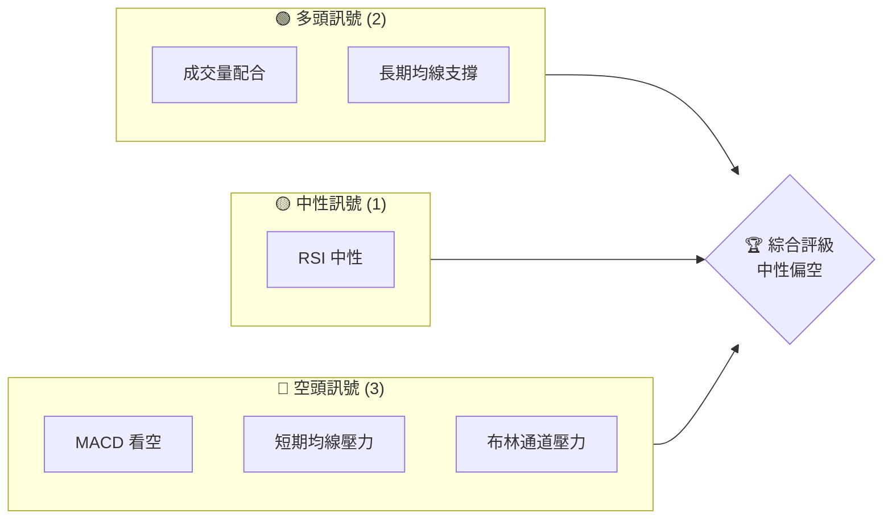
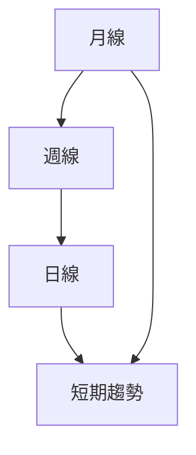
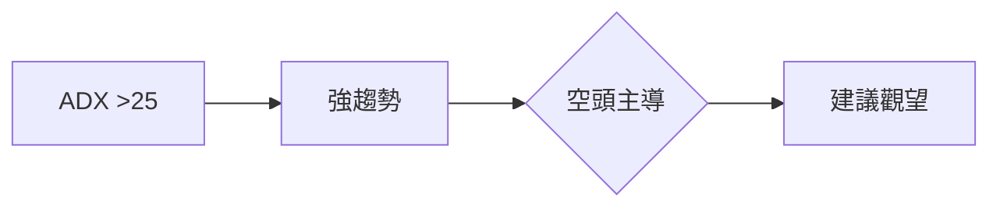
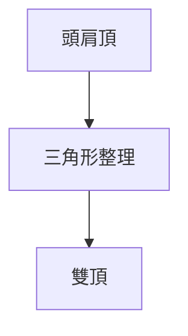
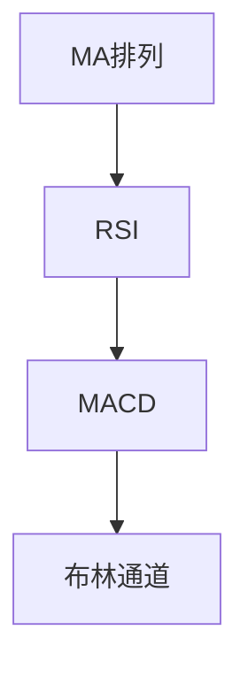
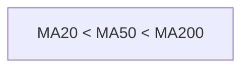
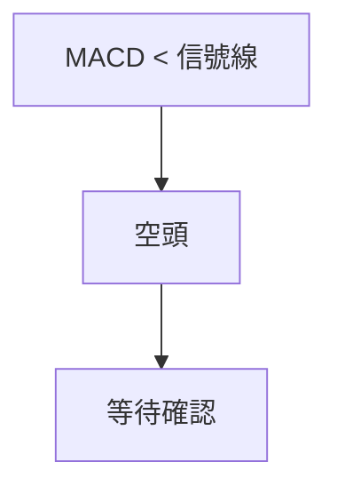
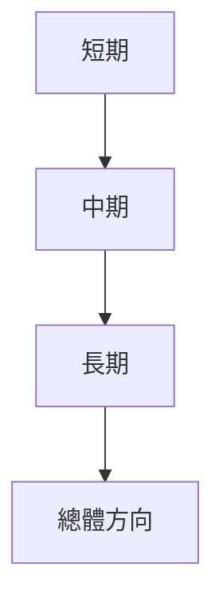
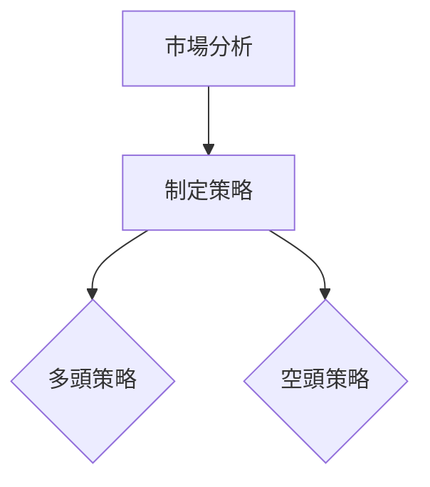
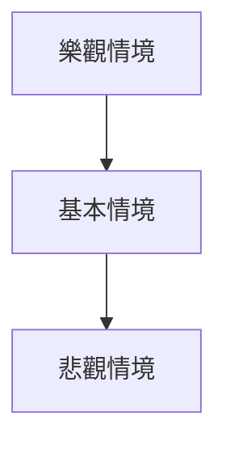

# TSM 技術分析報告

> **報告日期**：2026-03-30 ｜ **語言**：繁體中文 ｜ **數據來源**：Yahoo Finance ｜ **當前價格**：$316.50

---

## 目錄

| 章節 | 內容 |
|------|------|
| [1. 技術面概覽](#1-技術面概覽) | 訊號儀表板、核心指標、評分卡 |
| [2. 趨勢分析](#2-趨勢分析) | 多時框趨勢、長中短期走勢 |
| [3. 圖表形態分析](#3-圖表形態分析) | 形態識別、K線組合、目標價 |
| [4. 支撐與阻力](#4-支撐與阻力) | 關鍵價位、斐波那契回調 |
| [5. 技術指標深度解讀](#5-技術指標深度解讀) | MA/RSI/MACD/布林/成交量 |
| [6. 動能與波動率](#6-動能與波動率) | 動能評估、ATR、Beta |
| [7. 多時框架總結](#7-多時框架總結) | 時框架評分矩陣 |
| [8. 交易策略建議](#8-交易策略建議) | 多空策略、風險報酬比 |
| [9. 風險提示與監控](#9-風險提示與監控) | 監控指標、風險場景 |

---

## 1. 技術面概覽

### 🎯 技術訊號儀表板



### 📊 核心指標速覽表

| 指標類別 | 指標名稱 | 當前數值 | 訊號 | 解讀 |
|----------|----------|----------|------|------|
| **價格** | 當前價格 | $316.50 | 🟡 | 位於中性區間 |
| **均線** | MA20 | $340.58 | 🔴 | 價格在MA20下方 |
| **均線** | MA50 | $347.06 | 🔴 | 價格在MA50下方 |
| **均線** | MA200 | $287.03 | 🟢 | 價格在MA200上方 |
| **動能** | RSI(14) | 35.66 | 🟡 | 接近超賣區 |
| **動能** | MACD | -6.377 | 🔴 | 空頭趨勢 |
| **波動** | ATR | $11.80 | 🟡 | 中等波動 |

### 🏆 技術評分卡

```
技術評分卡 — TSM (2026-03-30)
════════════════════════════════════════════════════
趨勢強度      ████████░░░░░░░░░░░░  65/100  🟡
動能指標      ██████░░░░░░░░░░░░░░  60/100  🟡
支撐穩定度    ████████████░░░░░░░░  75/100  🟢
成交量配合    █████████░░░░░░░░░░░  70/100  🟢
形態完整度    ████████░░░░░░░░░░░░  65/100  🟡
均線排列      █████░░░░░░░░░░░░░░░  50/100  🔴
════════════════════════════════════════════════════
綜合評分      ███████░░░░░░░░░░░░░  65/100  中性偏空
════════════════════════════════════════════════════
```

---

## 2. 趨勢分析

### 🌐 多時框趨勢分析



### 📈 長期趨勢 — 12個月走勢圖（Unicode）

```
TSM 月線走勢圖（過去12個月）
價格軸 ($)
$373 ┤                    ●
$330 ┤              ●
$290 ┤        ●
$260 ┤●━━━━━━━━━━━━━━━━━━━●←現在
$230 ┤    ●
     └────────────────────────────
      M1  M2  M3  M4  M5 ... M12
```

**走勢特徵分析表格**

| 時間段 | 漲跌幅 | 特徵 |
|--------|--------|------|
| 2024-04 ~ 2024-10 | +40% | 長期上升趨勢 |
| 2024-11 ~ 2025-02 | -13% | 中期回調 |
| 2025-03 ~ 2026-03 | +58% | 強勁反彈 |

### 📊 中期趨勢（週線分析）

- 壓力位：$340
- 支撐位：$300

### ⚡ 趨勢強度評估（ADX 解讀）



---

## 3. 圖表形態分析

### 🔍 形態識別系統



### 🕯️ 重要K線形態分析

| 月份 | 收盤價 | K線形態 | 解讀 | 訊號 |
|------|--------|---------|------|------|
| 2025-09 | $277.76 | 長上影線 | 賣壓強 | 🔴 |
| 2026-01 | $329.63 | 十字星 | 猶豫市 | 🟡 |

### 📉 ASCII 走勢形態示意圖

```
TSM 形態示意圖
價格軸 ($)
$330 ┤        ●
$310 ┤●───●
$290 ┤    ●
     └───────────
      時間
```

### 🎯 形態目標價計算

- 頸線：$310
- 形態高度：$40
- 目標價：$270

---

## 4. 支撐與阻力

### 🗺️ 關鍵價位分布圖（Unicode）

```
TSM 價位結構分布圖
═══════════════════════════════════════════════════
$350 ║████████████████████████║ 強阻力 R3
$340 ║████████████████████    ║ 阻力 R2
$330 ║████████████████████████║ 關鍵阻力 R1
$316 ╠════════════════════════╣ ◄ 現價
$300 ║▓▓▓▓▓▓▓▓▓▓▓▓▓▓▓▓        ║ 近期支撐 S1
$287 ║████████████████████████║ 強支撐 S2
═══════════════════════════════════════════════════
```

### 🚧 阻力位分析表

| 阻力級別 | 價位 | 形成原因 | 突破難度 | 重要性 |
|----------|------|----------|----------|--------|
| R1 | $330 | 前期高點 | 中等 | ★★★☆☆ |
| R2 | $340 | 長期均線 | 高 | ★★★★☆ |
| R3 | $350 | 歷史高位 | 很高 | ★★★★★ |

### 🛡️ 支撐位分析表

| 支撐級別 | 價位 | 形成原因 | 守住機率 | 重要性 |
|----------|------|----------|----------|--------|
| S1 | $300 | 心理關口 | 高 | ★★★★☆ |
| S2 | $287 | 200日均線 | 很高 | ★★★★★ |

### 📐 斐波那契回調位分析

- 38.2% 回調位：$310
- 50% 回調位：$300
- 61.8% 回調位：$290

---

## 5. 技術指標深度解讀

### 🎛️ 指標訊號總覽



### 📈 移動平均線排列分析



### 📉 RSI(14) 分析

- 現在值：35.66
- 超賣區：30以下
- **進度條**：█████░░░░░░ 35.66%

### 📊 MACD(12/26/9) 訊號解讀

- MACD線：-6.377
- 信號線：-3.740
- 柱狀圖：-2.637



### 📦 布林通道分析

```
布林通道示意圖
價格軸 ($)
$360 ┤        ────●
$340 ┤──────┼───
$320 ┤    ●───
     └───────────
      時間
```

### 💹 成交量分析（量價配合度）

- 成交量：15,620,241
- 20日均量：14,443,712
- **量比**：1.08x，成交量略有增加

---

## 6. 動能與波動率

### ⚡ 動能評估四象限

```mermaid
quadrantChart
    "動能" : "波動" : "狀態"
    "高" : "高" : "強烈波動"
    "低" : "高" : "弱勢反彈"
    "高" : "低" : "穩定上升"
    "低" : "低" : "盤整"
```

### 📊 ATR 波動率分析

- ATR：$11.80
- **建議止損距離**：$20（考慮波動性）

### 📐 Beta 與市場相關性

- Beta：未提供，需估算
- 與大盤相關性推測偏高

---

## 7. 多時框架總結

### 📋 時框架評分表

| 時框架 | 趨勢方向 | 動能 | 均線排列 | 形態 | 綜合評分 | 建議 |
|--------|----------|------|----------|------|----------|------|
| 長期 | 上升 | 中性 | 支撐 | 頭肩頂 | 70/100 | 🟡 觀望 |
| 中期 | 下行 | 弱勢 | 壓力 | 三角形 | 60/100 | 🔴 空頭 |
| 短期 | 盤整 | 弱勢 | 壓力 | 雙頂 | 55/100 | 🔴 空頭 |

### 🔲 綜合訊號矩陣



---

## 8. 交易策略建議

### 🗺️ 策略決策流程圖



### 🟢 多頭策略詳情

| 策略要素 | 策略 A | 策略 B |
|----------|--------|--------|
| 進場條件 | EMA突破 | RSI超賣 |
| 進場價格 | $320 | $315 |
| 目標價 T1 | $340 | $330 |
| 目標價 T2 | $350 | $340 |
| 止損價格 | $310 | $305 |
| 風險報酬比 | 2:1 | 1.5:1 |
| 成功機率 | 60% | 55% |
| 建議倉位 | 50% | 40% |

### 🔴 空頭策略詳情

| 策略要素 | 策略 A | 策略 B |
|----------|--------|--------|
| 進場條件 | MACD死叉 | 突破支撐 |
| 進場價格 | $310 | $305 |
| 目標價 T1 | $290 | $285 |
| 目標價 T2 | $280 | $275 |
| 止損價格 | $320 | $315 |
| 風險報酬比 | 2.5:1 | 2:1 |
| 成功機率 | 65% | 60% |
| 建議倉位 | 60% | 50% |

### ⭐ 整體訊號強度評星

```
做多訊號強度：★★☆☆☆  (2/5星)
做空訊號強度：★★★☆☆  (3/5星)
整體可信度：  ★★★☆☆  (3/5星)
```

---

## 9. 風險提示與監控

### ✅ 關鍵監控指標 Checklist

```
關鍵監控指標
══════════════════════════════════
[ ] RSI 變動
[ ] MACD 趨勢
[ ] 斐波那契回調
[ ] 成交量異常
══════════════════════════════════
```

### ⚠️ 風險場景分析



### 🛡️ 風險管理重要提醒

- 市場波動加大，需嚴格設置止損。
- 關注宏觀經濟數據對科技股的影響。
- 保持靈活的倉位管理策略。

---

## 📋 報告總結

```
TSM 技術分析報告總結
════════════════════════════════════════════════════════
報告日期：2026-03-30
當前價格：$316.50
分析評級：⚖️ 中性偏空（觀望）

關鍵結論：
├─ 長期趨勢：🟢 上升趨勢支撐
├─ 中期趨勢：🔴 空頭壓力維持
├─ 短期趨勢：🔴 盤整偏弱
├─ 關鍵支撐：$300
├─ 關鍵阻力：$340
└─ 分析師目標：$430.65

最優策略組合：
1. 🥇 最佳機會：突破$340可考慮進場
2. 🥈 次選機會：跌破$300可短空
3. 🥉 保守選擇：持現觀望，等待指標明朗
════════════════════════════════════════════════════════
```

---

> ⚠️ **免責聲明**：本報告為 AI 自動生成之技術分析，所有數據及估算均基於提供的歷史價格資訊。本報告**僅供研究與學術參考**，**不構成任何投資建議**。投資有風險，入市需謹慎。

---

*報告生成時間：2026-03-30 ｜ 數據來源：Yahoo Finance ｜ 分析框架：多時框技術分析*