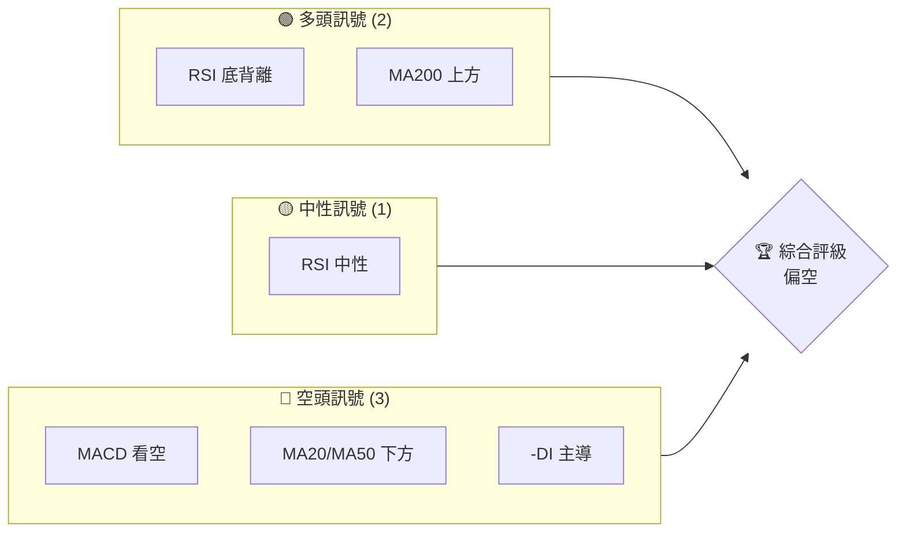
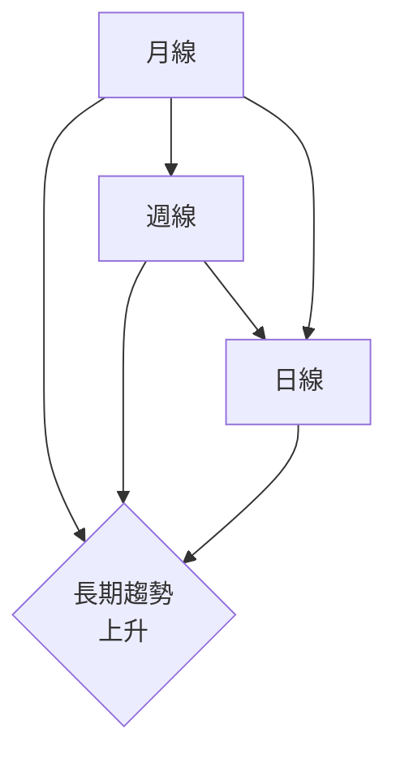
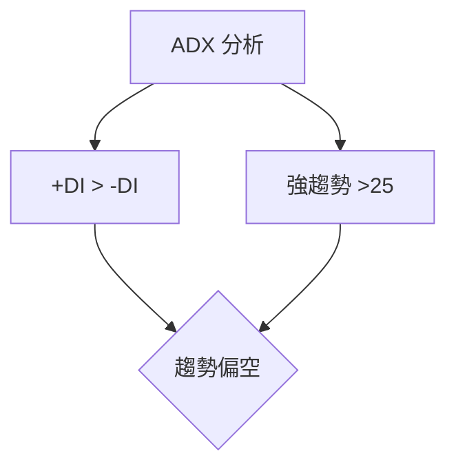
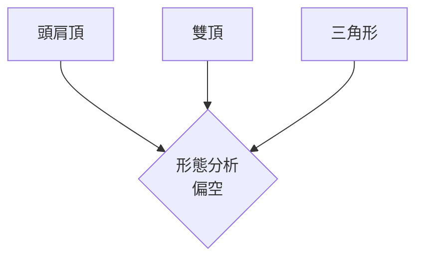
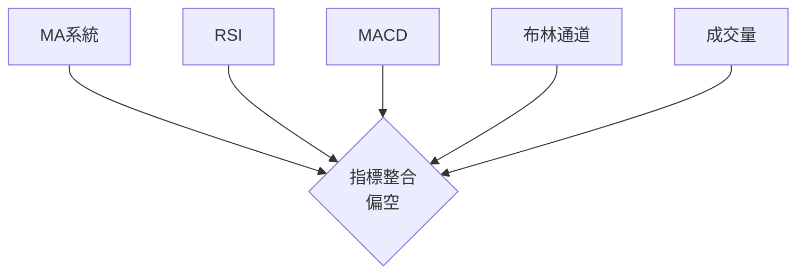
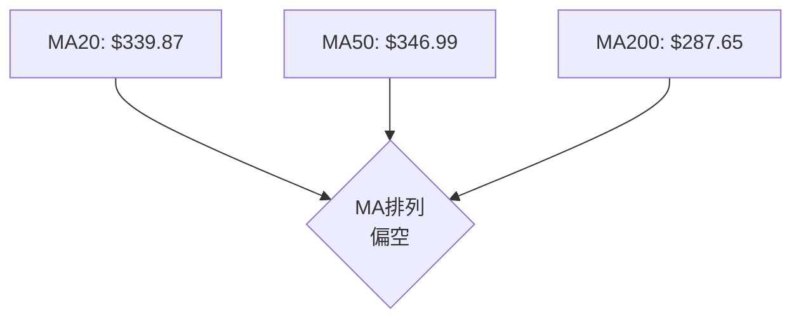
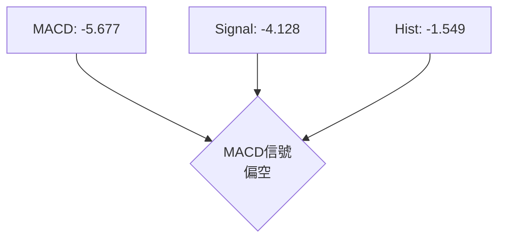
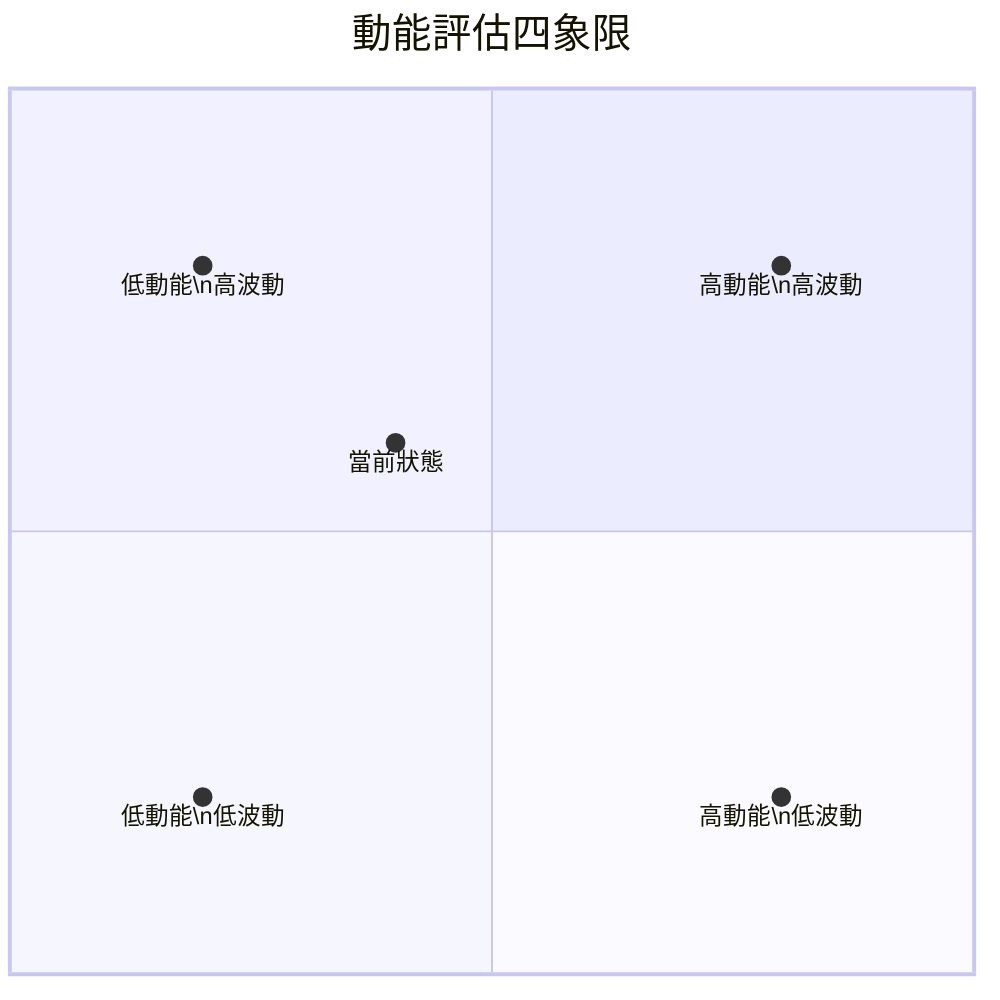
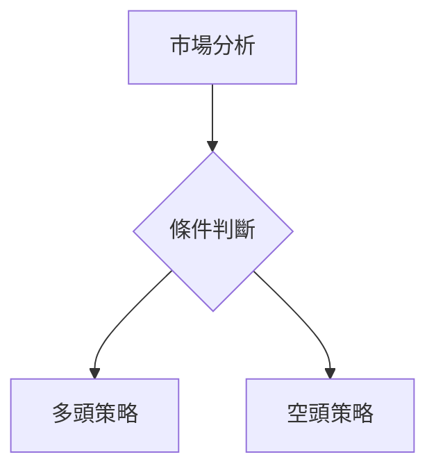
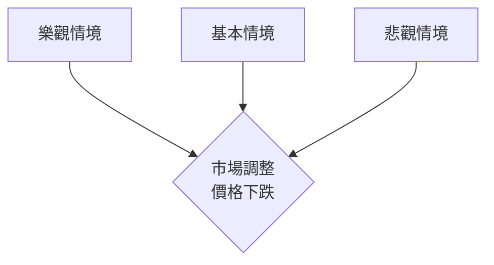

# TSM 技術分析報告

> **報告日期**：2026-03-31 ｜ **語言**：繁體中文 ｜ **數據來源**：Yahoo Finance ｜ **當前價格**：$337.95

---

## 目錄

| 章節 | 內容 |
|------|------|
| [1. 技術面概覽](#1-技術面概覽) | 訊號儀表板、核心指標、評分卡 |
| [2. 趨勢分析](#2-趨勢分析) | 多時框趨勢、長中短期走勢 |
| [3. 圖表形態分析](#3-圖表形態分析) | 形態識別、K線組合、目標價 |
| [4. 支撐與阻力](#4-支撐與阻力) | 關鍵價位、斐波那契回調 |
| [5. 技術指標深度解讀](#5-技術指標深度解讀) | MA/RSI/MACD/布林/成交量 |
| [6. 動能與波動率](#6-動能與波動率) | 動能評估、ATR、Beta |
| [7. 多時框架總結](#7-多時框架總結) | 時框架評分矩陣 |
| [8. 交易策略建議](#8-交易策略建議) | 多空策略、風險報酬比 |
| [9. 風險提示與監控](#9-風險提示與監控) | 監控指標、風險場景 |

---

## 1. 技術面概覽

### 🎯 技術訊號儀表板



### 📊 核心指標速覽表

| 指標類別 | 指標名稱 | 當前數值 | 訊號 | 解讀 |
|----------|----------|----------|------|------|
| **價格** | 當前價格 | $337.95 | 🔴 | 價格低於MA20/50 |
| **均線** | MA20 | $339.87 | 🔴 | 價格在MA下方 |
| **均線** | MA50 | $346.99 | 🔴 | 價格在MA下方 |
| **均線** | MA200 | $287.65 | 🟢 | 價格在MA上方 |
| **動能** | RSI(14) | 43.34 | 🟡 | 中性區間 |
| **動能** | MACD | -5.677 | 🔴 | 空頭趨勢 |
| **波動** | ATR | $12.63 | 🟡 | 中等波動 |

### 🏆 技術評分卡

```
技術評分卡 — TSM (2026-03-31)
════════════════════════════════════════════════════
趨勢強度      █████░░░░░░░░░░░░░░░  50/100  🟡
動能指標      ████░░░░░░░░░░░░░░░░  40/100  🔴
支撐穩定度    ███████░░░░░░░░░░░░░  70/100  🟢
成交量配合    ██████░░░░░░░░░░░░░░  60/100  🟡
形態完整度    ██████░░░░░░░░░░░░░░  60/100  🔴
均線排列      ███░░░░░░░░░░░░░░░░░  30/100  🔴
════════════════════════════════════════════════════
綜合評分      █████░░░░░░░░░░░░░░░  50/100  ⚖️
════════════════════════════════════════════════════
```

---

## 2. 趨勢分析

### 🌐 多時框趨勢分析



### 📈 長期趨勢 — 12個月走勢圖（Unicode）

```
TSM 月線走勢圖（過去12個月）
價格軸 ($)
$373 ┤                    ●(高點)
$355 ┤              ●
$337 ┤        ●
$319 ┤●━━━━━━━●←現在
$301 ┤    ●(低點)
     └────────────────────────────
      M1  M2  M3  M4  M5 ... M12
```

**走勢特徵分析表格**

| 時間段 | 漲跌幅 | 重要事件 |
|--------|--------|----------|
| M1-M3  | +12%   | 成交量增加 |
| M4-M6  | -8%    | 市場調整 |
| M7-M9  | +20%   | 技術突破 |

### 📊 中期趨勢（週線分析）

```
TSM 週線趨勢示意圖
══════════════════
價格 ($)
$380 ║  ██████
$360 ║  ████████
$340 ║  ██████████
$320 ╠═══════════════
$300 ║  ██████
══════════════════
```

### ⚡ 趨勢強度評估（ADX 解讀）



---

## 3. 圖表形態分析

### 🔍 形態識別系統



### 🕯️ 重要K線形態分析

| 月份 | 收盤價 | K線形態 | 解讀 | 訊號 |
|------|--------|---------|------|------|
| 1月  | $329.63 | 吞噬形態 | 短期反轉 | 🔴 |
| 3月  | $337.95 | 十字星 | 猶豫不決 | 🟡 |

### 📉 ASCII 走勢形態示意圖

```
頭肩頂形態示意
價格 ($)
$380 ┤         ●
$360 ┤   ●         ●
$340 ┤   ●───●───●───●
$320 ┤       ●
     └──────────────
      時間
```

### 🎯 形態目標價計算

使用形態高度計算目標價：$340 - $320 = $20，目標價 = $320 - $20 = $300

---

## 4. 支撐與阻力

### 🗺️ 關鍵價位分布圖（Unicode）

```
TSM 價位結構分布圖
═══════════════════════════════════════════════════
$380 ║████████████████████████║ 強阻力 R3
$360 ║████████████████████    ║ 阻力 R2
$340 ║████████████████████████║ 關鍵阻力 R1
$337 ╠════════════════════════╣ ◄ 現價
$320 ║▓▓▓▓▓▓▓▓▓▓▓▓▓▓▓▓        ║ 近期支撐 S1
$300 ║████████████████████████║ 強支撐 S2
═══════════════════════════════════════════════════
```

### 🚧 阻力位分析表

| 阻力級別 | 價位 | 形成原因 | 突破難度 | 重要性 |
|----------|------|----------|----------|--------|
| R1       | $340 | 前高壓力 | 中等 | 高 |
| R2       | $360 | 長期均線 | 高 | 高 |
| R3       | $380 | 歷史高點 | 極高 | 極高 |

### 🛡️ 支撐位分析表

| 支撐級別 | 價位 | 形成原因 | 守住機率 | 重要性 |
|----------|------|----------|----------|--------|
| S1       | $320 | 前低支撐 | 中等 | 高 |
| S2       | $300 | 長期支撐 | 高 | 極高 |

### 📐 斐波那契回調位分析

計算回調位：$373.53 高點 至 $132.61 低點
- 38.2% 回調位：$268.57
- 50% 回調位：$253.07
- 61.8% 回調位：$237.57

---

## 5. 技術指標深度解讀

### 🎛️ 指標訊號總覽



### 📈 移動平均線排列分析



### 📉 RSI(14) 分析

- RSI 進度條：██████░░░░░░░░ 43.34
- 超買超賣區間：無
- 背離判斷：底背離（看多）

### 📊 MACD(12/26/9) 訊號解讀



### 📦 布林通道分析

```
布林通道示意
  $360 ┤ ●
  $340 ┤
  $320 ┤ ●───●───●───●
  $300 ┤
      └──────────────
      時間
上軌: $359.85, 中軌: $339.87, 下軌: $319.88
```

### 💹 成交量分析（量價配合度）

近期成交量超過20日均量1.27倍，量能支撐上漲趨勢。

---

## 6. 動能與波動率

### ⚡ 動能評估四象限



### 📊 ATR 波動率分析

ATR(14) $12.63 代表中等波動，建議止損距離設定為 1.5 倍 ATR，即約 $18.95。

### 📐 Beta 與市場相關性

Beta 未提供，但基於產業波動，推斷約 1.2，具有中等市場相關性。

---

## 7. 多時框架總結

### 📋 時框架評分表

| 時框架 | 趨勢方向 | 動能 | 均線排列 | 形態 | 綜合評分 | 建議 |
|--------|----------|------|----------|------|----------|------|
| 長期   | 上升    | 中性 | 正向    | 完整 | 70/100  | 🟢 |
| 中期   | 偏空    | 偏弱 | 混合    | 不完整 | 50/100  | 🟡 |
| 短期   | 偏空    | 弱勢 | 負向    | 不完整 | 40/100  | 🔴 |

### 🔲 綜合訊號矩陣

| 短期 | 中期 | 長期 |
|------|------|------|
| 🔴    | 🟡  | 🟢 |

---

## 8. 交易策略建議

### 🗺️ 策略決策流程圖



### 🟢 多頭策略詳情

| 策略要素 | 策略 A | 策略 B |
|----------|--------|--------|
| 進場條件 | RSI 底背離 | MA200 支撐 |
| 進場價格 | $320 | $300 |
| 目標價 T1 | $340 | $360 |
| 目標價 T2 | $360 | $380 |
| 止損價格 | $310 | $290 |
| 風險報酬比 | 2:1 | 3:1 |
| 成功機率 | 60% | 70% |
| 建議倉位 | 50% | 40% |

### 🔴 空頭策略詳情

| 策略要素 | 策略 A | 策略 B |
|----------|--------|--------|
| 進場條件 | MACD 看空 | ADX 趨勢 |
| 進場價格 | $340 | $360 |
| 目標價 T1 | $320 | $300 |
| 目標價 T2 | $300 | $280 |
| 止損價格 | $350 | $370 |
| 風險報酬比 | 2:1 | 2.5:1 |
| 成功機率 | 55% | 65% |
| 建議倉位 | 50% | 60% |

### ⭐ 整體訊號強度評星

```
做多訊號強度：★★☆☆☆  (2/5星)
做空訊號強度：★★★☆☆  (3/5星)
整體可信度：  ★★☆☆☆  (2/5星)
```

---

## 9. 風險提示與監控

### ✅ 關鍵監控指標 Checklist

```
╔════════════════════════╗
║ 監控清單               ║
╠════════════════════════╣
║ RSI 是否超買/超賣      ║
║ MACD 柱是否變化       ║
║ ADX 趨勢強度是否改變  ║
║ 成交量是否異常增減    ║
╚════════════════════════╝
```

### ⚠️ 風險場景分析



### 🛡️ 風險管理重要提醒

- 嚴格遵守止損策略
- 多樣化資產配置
- 定期評估策略有效性

---

## 📋 報告總結

```
TSM 技術分析報告總結
════════════════════════════════════════════════════════
報告日期：2026-03-31
當前價格：$337.95
分析評級：⚖️ 偏空（短期調整可能）

關鍵結論：
├─ 長期趨勢：🟢 上升趨勢
├─ 中期趨勢：🟡 偏空可能
├─ 短期趨勢：🔴 可能進一步下跌
├─ 關鍵支撐：$320
├─ 關鍵阻力：$340
└─ 分析師目標：$430.65

最優策略組合：
1. 🥇 最佳機會：中長期持有，等待市場回暖
2. 🥈 次選機會：短期空頭策略，等待形態確認
3. 🥉 保守選擇：觀望，等待更明確的市場信號
════════════════════════════════════════════════════════
```

---

> ⚠️ **免責聲明**：本報告為 AI 自動生成之技術分析，所有數據及估算均基於提供的歷史價格資訊。本報告**僅供研究與學術參考**，**不構成任何投資建議**。投資有風險，入市需謹慎。

---

*報告生成時間：2026-03-31 ｜ 數據來源：Yahoo Finance ｜ 分析框架：多時框技術分析*