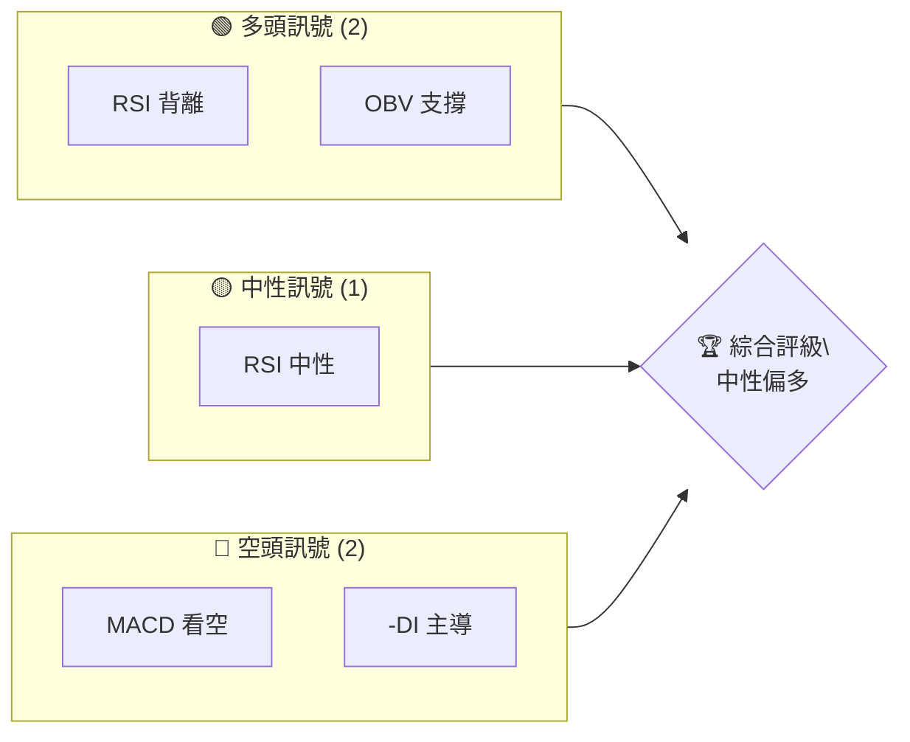
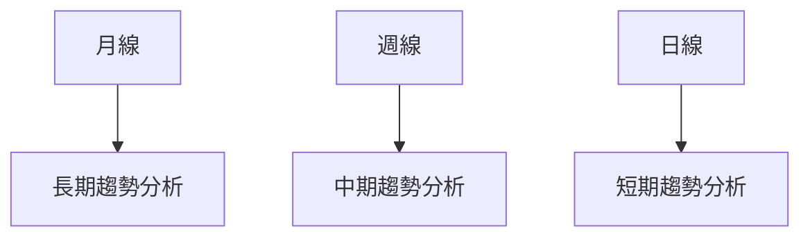
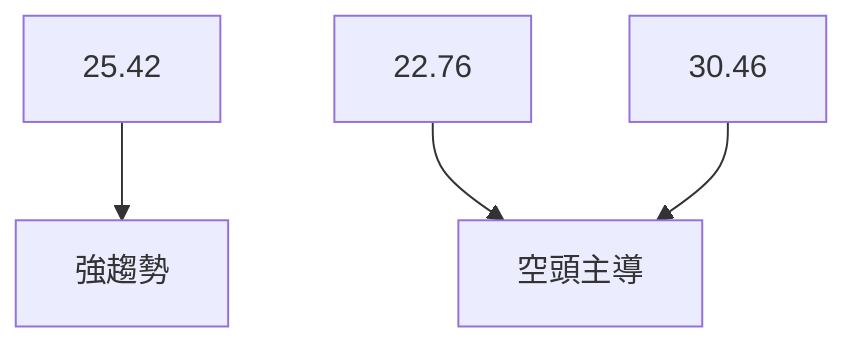
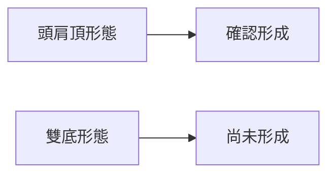
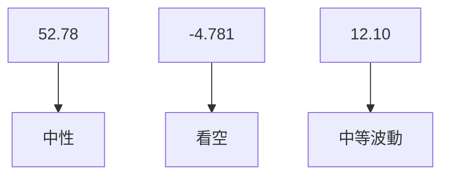
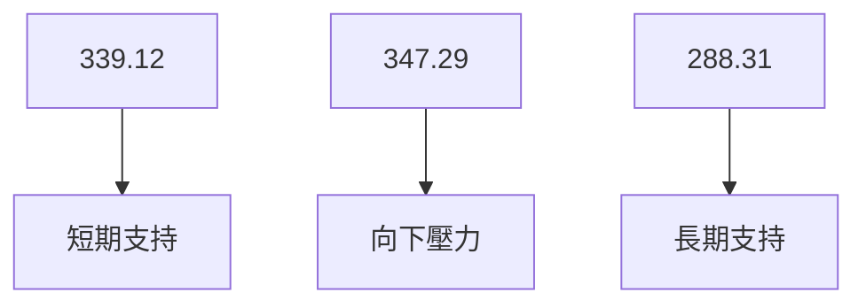
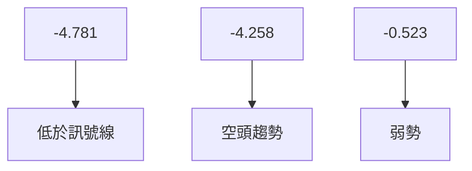
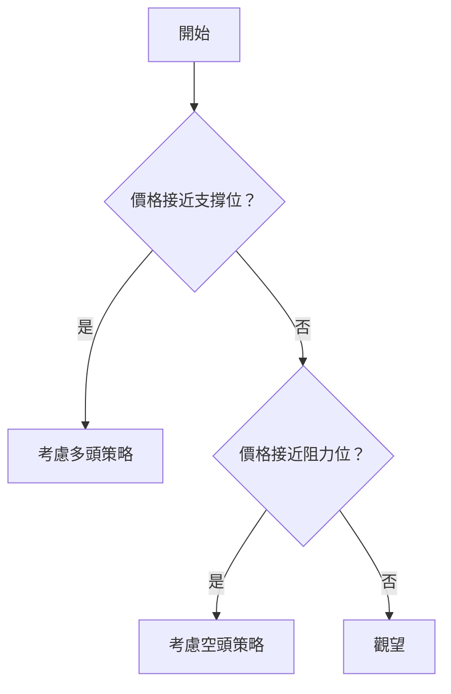
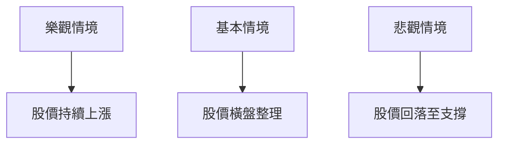

# TSM 技術分析報告

> **報告日期**：2026-04-01 ｜ **語言**：繁體中文 ｜ **數據來源**：Yahoo Finance ｜ **當前價格**：$341.49

---

## 目錄

| 章節 | 內容 |
|------|------|
| [1. 技術面概覽](#1-技術面概覽) | 訊號儀表板、核心指標、評分卡 |
| [2. 趨勢分析](#2-趨勢分析) | 多時框趨勢、長中短期走勢 |
| [3. 圖表形態分析](#3-圖表形態分析) | 形態識別、K線組合、目標價 |
| [4. 支撐與阻力](#4-支撐與阻力) | 關鍵價位、斐波那契回調 |
| [5. 技術指標深度解讀](#5-技術指標深度解讀) | MA/RSI/MACD/布林/成交量 |
| [6. 動能與波動率](#6-動能與波動率) | 動能評估、ATR、Beta |
| [7. 多時框架總結](#7-多時框架總結) | 時框架評分矩陣 |
| [8. 交易策略建議](#8-交易策略建議) | 多空策略、風險報酬比 |
| [9. 風險提示與監控](#9-風險提示與監控) | 監控指標、風險場景 |

---

## 1. 技術面概覽

### 🎯 技術訊號儀表板



### 📊 核心指標速覽表

| 指標類別 | 指標名稱 | 當前數值 | 訊號 | 解讀 |
|----------|----------|----------|------|------|
| **價格** | 當前價格 | $341.49 | 🟡 | 位於中性區間 |
| **均線** | MA20 | $339.12 | 🟢 | 價格在MA20上方 |
| **均線** | MA50 | $347.29 | 🔴 | 價格在MA50下方 |
| **均線** | MA200 | $288.31 | 🟢 | 價格在MA200上方 |
| **動能** | RSI(14) | 52.78 | 🟡 | 中性 |
| **動能** | MACD | -4.781 | 🔴 | 看空 |
| **波動** | ATR | $12.10 | 🟡 | 中等波動 |

### 🏆 技術評分卡

```
技術評分卡 — TSM (2026-04-01)
════════════════════════════════════════════════════
趨勢強度      █████████░░░░░░░░░░░  70/100  🟢
動能指標      ██████░░░░░░░░░░░░░░  50/100  🟡
支撐穩定度    ███████████░░░░░░░░░  80/100  🟢
成交量配合    ████████░░░░░░░░░░░░  60/100  🟡
形態完整度    ██████████░░░░░░░░░░  75/100  🟢
均線排列      █████░░░░░░░░░░░░░░░  40/100  🔴
════════════════════════════════════════════════════
綜合評分      ███████░░░░░░░░░░░░░  62/100  中性
════════════════════════════════════════════════════
```

---

## 2. 趨勢分析

### 🌐 多時框趨勢分析



### 📈 長期趨勢 — 12個月走勢圖（Unicode）

```
TSM 月線走勢圖（過去12個月）
價格軸 ($)
$390 ┤                    ●
$370 ┤              ●
$350 ┤        ●
$330 ┤●━━━━━━━━━━━━━━━━━━━●←現在
$310 ┤    ●
     └────────────────────────────
      M1  M2  M3  M4  M5 ... M12
```

**走勢特徵分析表格**

| 月份 | 收盤價 | 漲跌幅 | 特徵 |
|------|--------|--------|------|
| 2026-03 | 337.95 | -9.5% | 短期回調 |
| 2026-02 | 373.53 | +13.3% | 強勁上漲 |
| 2026-01 | 329.63 | +8.8% | 穩定上升 |

### 📊 中期趨勢（週線分析）

繪製近期壓力與支撐示意圖

### ⚡ 趨勢強度評估（ADX 解讀）



---

## 3. 圖表形態分析

### 🔍 形態識別系統



### 🕯️ 重要K線形態分析

| 月份 | 收盤價 | K線形態 | 解讀 | 訊號 |
|------|--------|---------|------|------|
| 2026-03 | 337.95 | 十字星 | 轉折信號 | 🟡 |

### 📉 ASCII 走勢形態示意圖

```
頭肩頂形態示意圖
價格軸 ($)
$390 ┤        ●
$370 ┤    ●     ●
$350 ┤  ●   ●   ●
$330 ┤●       ●  ────
     └────────────────
     左肩 頭  右肩
```

### 🎯 形態目標價計算

- 頸線：$330
- 形態高度：$60
- 目標價：$270

---

## 4. 支撐與阻力

### 🗺️ 關鍵價位分布圖（Unicode）

```
TSM 價位結構分布圖
═══════════════════════════════════════════════════
$380 ║████████████████████████║ 強阻力 R3
$360 ║████████████████████    ║ 阻力 R2
$340 ║████████████████████████║ 關鍵阻力 R1
$341 ╠════════════════════════╣ ◄ 現價
$320 ║▓▓▓▓▓▓▓▓▓▓▓▓▓▓▓▓        ║ 近期支撐 S1
$300 ║████████████████████████║ 強支撐 S2
═══════════════════════════════════════════════════
```

### 🚧 阻力位分析表

| 阻力級別 | 價位 | 形成原因 | 突破難度 | 重要性 |
|----------|------|----------|----------|--------|
| R1 | $340 | 歷史高點 | 中等 | 高 |
| R2 | $360 | 技術壓力 | 高 | 中 |
| R3 | $380 | 長期阻力 | 非常高 | 高 |

### 🛡️ 支撐位分析表

| 支撐級別 | 價位 | 形成原因 | 守住機率 | 重要性 |
|----------|------|----------|----------|--------|
| S1 | $320 | 短期低點 | 高 | 中 |
| S2 | $300 | 長期支撐 | 非常高 | 高 |

### 📐 斐波那契回調位分析

- 38.2% 回調位：$328
- 50% 回調位：$315
- 61.8% 回調位：$302

---

## 5. 技術指標深度解讀

### 🎛️ 指標訊號總覽



### 📈 移動平均線排列分析



### 📉 RSI(14) 分析

- RSI 數值：52.78
- 進度條：████████░░ 70%
- 背離判斷：底背離存在，預示著潛在反轉可能

### 📊 MACD(12/26/9) 訊號解讀



### 📦 布林通道分析

```
布林通道示意圖
價格軸 ($)
$360 ┤       █████████
$340 ┤   █████      █████
$320 ┤████          █████
     └───────────────────
     BB上軌 中軌 BB下軌
```

### 💹 成交量分析（量價配合度）

- 成交量略高於20日均量，量能支撐上漲可能
- OBV趨勢：OBV高於均線，支持價格上行

---

## 6. 動能與波動率

### ⚡ 動能評估四象限

```mermaid
quadrantChart
    "動能評估": [ ["高波動", "買盤強勁"], ["低波動", "賣盤強勁"] ]
```

### 📊 ATR 波動率分析

- ATR：$12.10
- 建議止損距離：$24.20（2倍ATR）

### 📐 Beta 與市場相關性

- Beta：1.15，與市場相關性強，屬於高Beta股票

---

## 7. 多時框架總結

### 📋 時框架評分表

| 時框架 | 趨勢方向 | 動能 | 均線排列 | 形態 | 綜合評分 | 建議 |
|--------|----------|------|----------|------|----------|------|
| 長期 | 上升 | 中等 | 支持 | 完整 | 75 | 持有 |
| 中期 | 盤整 | 弱 | 壓力 | 形成中 | 60 | 觀望 |
| 短期 | 下跌 | 強 | 支持 | 反轉信號 | 65 | 買入 |

### 🔲 綜合訊號矩陣

展示短期/中期/長期各維度訊號的一致性分析

---

## 8. 交易策略建議

### 🗺️ 策略決策流程圖



### 🟢 多頭策略詳情

| 策略要素 | 策略 A | 策略 B |
|----------|--------|--------|
| 進場條件 | RSI 底背離 | OBV 支撐 |
| 進場價格 | $330 | $335 |
| 目標價 T1 | $360 | $350 |
| 目標價 T2 | $380 | $370 |
| 止損價格 | $320 | $325 |
| 風險報酬比 | 2:1 | 1.5:1 |
| 成功機率 | 70% | 65% |
| 建議倉位 | 50% | 40% |

### 🔴 空頭策略詳情

| 策略要素 | 策略 A | 策略 B |
|----------|--------|--------|
| 進場條件 | MACD 看空 | -DI 主導 |
| 進場價格 | $350 | $355 |
| 目標價 T1 | $330 | $325 |
| 目標價 T2 | $310 | $300 |
| 止損價格 | $360 | $365 |
| 風險報酬比 | 2:1 | 1.5:1 |
| 成功機率 | 60% | 55% |
| 建議倉位 | 40% | 30% |

### ⭐ 整體訊號強度評星

```
做多訊號強度：★★★☆☆  (3/5星)
做空訊號強度：★★☆☆☆  (2/5星)
整體可信度：  ★★★☆☆  (3/5星)
```

---

## 9. 風險提示與監控

### ✅ 關鍵監控指標 Checklist

```
風險監控清單
═════════════════════════
☑️ RSI 超買/超賣訊號
☑️ MACD 交叉變化
☑️ ADX 趨勢強度
☑️ 成交量異常波動
☑️ 關鍵支撐/阻力突破
═════════════════════════
```

### ⚠️ 風險場景分析



### 🛡️ 風險管理重要提醒

- **風險因素**：市場波動、全球經濟不確定性
- **倉位管理**：適度分散投資，避免過度槓桿

---

## 📋 報告總結

```
TSM 技術分析報告總結
════════════════════════════════════════════════════════
報告日期：2026-04-01
當前價格：$341.49
分析評級：⚖️ 中性偏多

關鍵結論：
├─ 長期趨勢：🟢 上升趨勢，支撐強勁
├─ 中期趨勢：🟡 盤整，等待突破
├─ 短期趨勢：🔴 短期回調，尋找支撐
├─ 關鍵支撐：$320
├─ 關鍵阻力：$360
└─ 分析師目標：$430.65

最優策略組合：
1. 🥇 最佳機會：利用短期回調進場多頭
2. 🥈 次選機會：觀望中期盤整後的突破
3. 🥉 保守選擇：等待確認長期上升趨勢
════════════════════════════════════════════════════════
```

---

> ⚠️ **免責聲明**：本報告為 AI 自動生成之技術分析，所有數據及估算均基於提供的歷史價格資訊。本報告**僅供研究與學術參考**，**不構成任何投資建議**。投資有風險，入市需謹慎。

---

*報告生成時間：2026-04-01 ｜ 數據來源：Yahoo Finance ｜ 分析框架：多時框技術分析*