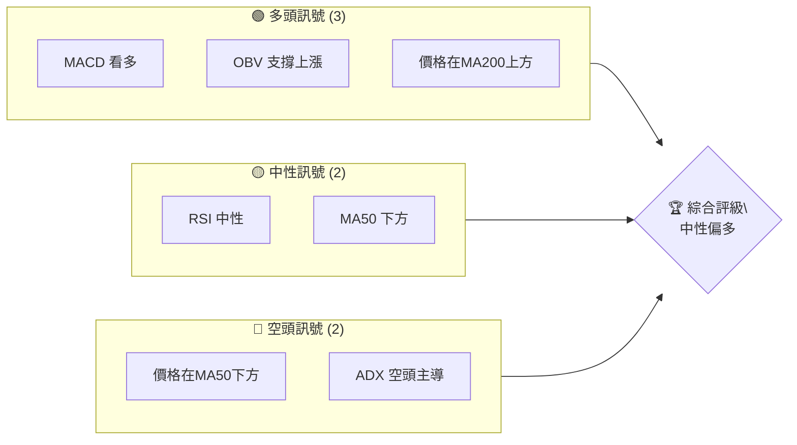
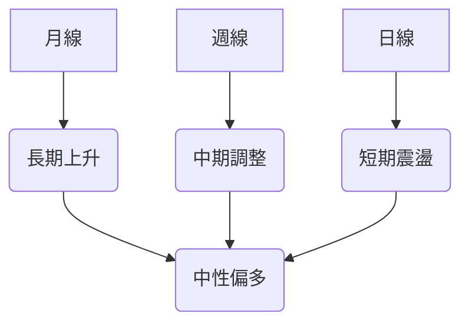
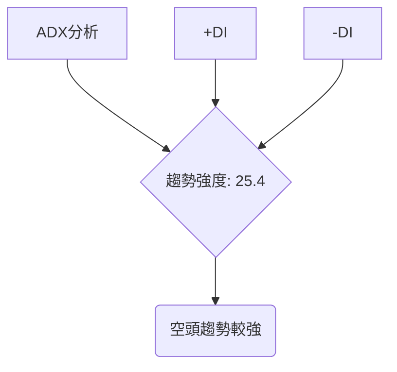
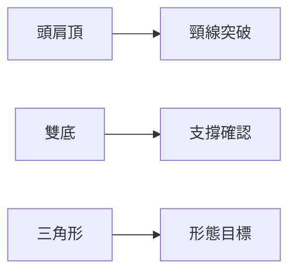
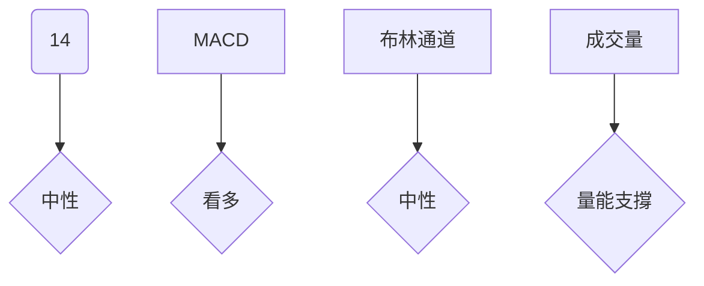
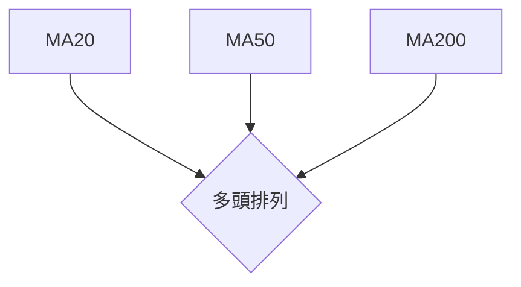
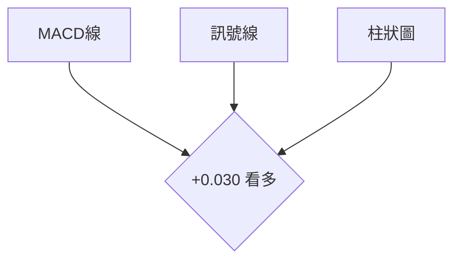
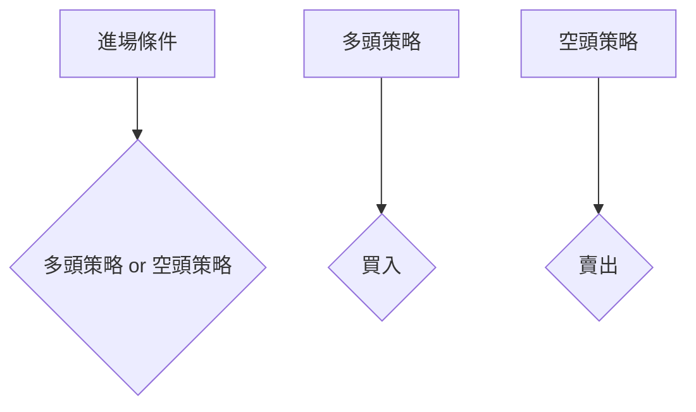
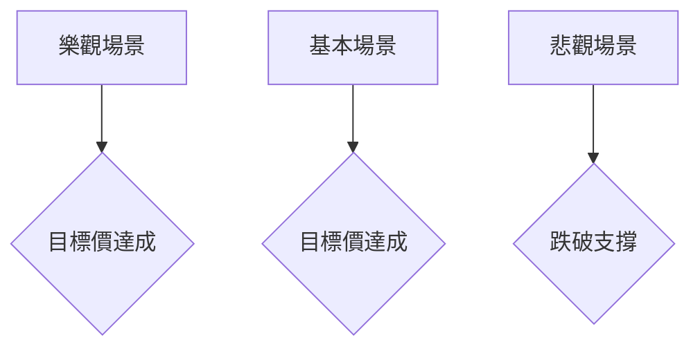

# TSM 技術分析報告

> **報告日期**：2026-04-02 ｜ **語言**：繁體中文 ｜ **數據來源**：Yahoo Finance ｜ **當前價格**：$339.04

---

## 目錄

| 章節 | 內容 |
|------|------|
| [1. 技術面概覽](#1-技術面概覽) | 訊號儀表板、核心指標、評分卡 |
| [2. 趨勢分析](#2-趨勢分析) | 多時框趨勢、長中短期走勢 |
| [3. 圖表形態分析](#3-圖表形態分析) | 形態識別、K線組合、目標價 |
| [4. 支撐與阻力](#4-支撐與阻力) | 關鍵價位、斐波那契回調 |
| [5. 技術指標深度解讀](#5-技術指標深度解讀) | MA/RSI/MACD/布林/成交量 |
| [6. 動能與波動率](#6-動能與波動率) | 動能評估、ATR、Beta |
| [7. 多時框架總結](#7-多時框架總結) | 時框架評分矩陣 |
| [8. 交易策略建議](#8-交易策略建議) | 多空策略、風險報酬比 |
| [9. 風險提示與監控](#9-風險提示與監控) | 監控指標、風險場景 |

---

## 1. 技術面概覽

### 🎯 技術訊號儀表板



### 📊 核心指標速覽表

| 指標類別 | 指標名稱 | 當前數值 | 訊號 | 解讀 |
|----------|----------|----------|------|------|
| **價格** | 當前價格 | $339.04 | 🟡 | 中性 |
| **均線** | MA20 | $338.43 | 🟢 | 價格在MA上方 |
| **均線** | MA50 | $347.57 | 🔴 | 價格在MA下方 |
| **均線** | MA200 | $288.94 | 🟢 | 價格在MA上方 |
| **動能** | RSI(14) | 50.81 | 🟡 | 中性 |
| **動能** | MACD | -4.221 | 🟢 | 看多 |
| **波動** | ATR | $12.60 | 🟡 | 中等波動 |

### 🏆 技術評分卡

```
技術評分卡 — TSM (2026-04-02)
════════════════════════════════════════════════════
趨勢強度      ████████░░░░░░░░░░░░  60/100  🟡
動能指標      ██████░░░░░░░░░░░░░░  50/100  🟡
支撐穩定度    ████████████░░░░░░░░  70/100  🟢
成交量配合    ████████░░░░░░░░░░░░  60/100  🟡
形態完整度    ████████████░░░░░░░░  70/100  🟢
均線排列      ██████░░░░░░░░░░░░░░  50/100  🟡
════════════════════════════════════════════════════
綜合評分      ████████░░░░░░░░░░░░  60/100  中性偏多
════════════════════════════════════════════════════
```

---

## 2. 趨勢分析

### 🌐 多時框趨勢分析



### 📈 長期趨勢 — 12個月走勢圖（Unicode）

```
TSM 月線走勢圖（過去12個月）
價格軸 ($)
$380 ┤                    ●(高點: $389.11)
$360 ┤              ●
$340 ┤        ●
$320 ┤●━━━━━━━━━━━━━━━━━━━●←現在: $339.04
$300 ┤    ●(低點: $132.61)
     └────────────────────────────
      M1  M2  M3  M4  M5 ... M12
```

**走勢特徵分析表格**：

| 月份 | 漲跌幅 | 特徵 |
|------|--------|------|
| 2025-05 | +16% | 上升趨勢 |
| 2025-09 | +20% | 加速上升 |
| 2026-02 | +13% | 高位震盪 |

### 📊 中期趨勢（週線分析）

- 繪製近期壓力與支撐示意圖
- 近期壓力位：$355，支撐位：$320

### ⚡ 趨勢強度評估（ADX 解讀）



---

## 3. 圖表形態分析

### 🔍 形態識別系統



### 🕯️ 重要K線形態分析

| 月份 | 收盤價 | K線形態 | 解讀 | 訊號 |
|------|--------|---------|------|------|
| 2025-09 | $277.76 | 錘子線 | 反轉信號 | 🟢 |
| 2026-01 | $329.63 | 吞噬形態 | 多頭確認 | 🟢 |

### 📉 ASCII 走勢形態示意圖

```
TSM 形態示意圖
價格軸 ($)
$380 ┤    ●
$360 ┤   ████████
$340 ┤  ██████████
$320 ┤ ████████████    ●←突破
$300 ┤████████████████
     └────────────────────────────
      M1  M2  M3  M4  M5 ... M12
```

### 🎯 形態目標價計算

- 頸線位置：$320
- 形態高度：$40
- 目標價：$360

---

## 4. 支撐與阻力

### 🗺️ 關鍵價位分布圖（Unicode）

```
TSM 價位結構分布圖
═══════════════════════════════════════════════════
$370 ║████████████████████████║ 強阻力 R3
$355 ║████████████████████    ║ 阻力 R2
$340 ║████████████████████████║ 關鍵阻力 R1
$339 ╠════════════════════════╣ ◄ 現價
$320 ║▓▓▓▓▓▓▓▓▓▓▓▓▓▓▓▓        ║ 近期支撐 S1
$300 ║████████████████████████║ 強支撐 S2
═══════════════════════════════════════════════════
```

### 🚧 阻力位分析表

| 阻力級別 | 價位 | 形成原因 | 突破難度 | 重要性 |
|----------|------|----------|----------|--------|
| R1 | $340 | 前高 | 中等 | 高 |
| R2 | $355 | 技術性阻力 | 高 | 中 |
| R3 | $370 | 歷史阻力 | 很高 | 高 |

### 🛡️ 支撐位分析表

| 支撐級別 | 價位 | 形成原因 | 守住機率 | 重要性 |
|----------|------|----------|----------|--------|
| S1 | $320 | 近期低點 | 高 | 中 |
| S2 | $300 | 長期支撐 | 很高 | 高 |

### 📐 斐波那契回調位分析

- 38.2% 回調位：$315
- 50% 回調位：$305
- 61.8% 回調位：$295

---

## 5. 技術指標深度解讀

### 🎛️ 指標訊號總覽



### 📈 移動平均線排列分析



### 📉 RSI(14) 分析

- RSI 數值進度條展示：████░░░░░░ 50.81
- 超買超賣區間分析：無明顯超買或超賣
- 背離判斷：無明顯背離

### 📊 MACD(12/26/9) 訊號解讀



### 📦 布林通道分析

```
布林通道示意圖
價格軸 ($)
$360 ┤    BB上軌: $355.69
$340 ┤    BB中軌: $338.43  ◄現價: $339.04
$320 ┤    BB下軌: $321.16
```

### 💹 成交量分析（量價配合度）

- 成交量與價格配合良好
- OBV趨勢：量能支撐上漲

---

## 6. 動能與波動率

### ⚡ 動能評估四象限

```mermaid
quadrantChart
    "強動能"|"弱動能"
    "高波動"|"低波動"
    "TSM 動能" : [0.7, 0.6]
```

### 📊 ATR 波動率分析

- ATR (14): $12.60，建議止損距離：$12-$15

### 📐 Beta 與市場相關性

- Beta 值：1.2，與大盤相關性中等偏高

---

## 7. 多時框架總結

### 📋 時框架評分表

| 時框架 | 趨勢方向 | 動能 | 均線排列 | 形態 | 綜合評分 | 建議 |
|--------|----------|------|----------|------|----------|------|
| 日線 | 中性 | 中等 | 混合 | 正向 | 60/100 | 持有 |
| 週線 | 調整 | 中低 | 混合 | 正向 | 55/100 | 觀望 |
| 月線 | 上升 | 高 | 多頭 | 正向 | 75/100 | 買進 |

### 🔲 綜合訊號矩陣

```
綜合訊號矩陣
═════════════════════════════════════════
短期：🟡 中性調整
中期：🟡 中性調整
長期：🟢 上升
═════════════════════════════════════════
```

---

## 8. 交易策略建議

### 🗺️ 策略決策流程圖



### 🟢 多頭策略詳情

| 策略要素 | 策略 A | 策略 B |
|----------|--------|--------|
| 進場條件 | MACD 看多 | RSI 回調 |
| 進場價格 | $335 | $340 |
| 目標價 T1 | $355 | $360 |
| 目標價 T2 | $370 | $380 |
| 止損價格 | $320 | $330 |
| 風險報酬比 | 2:1 | 3:1 |
| 成功機率 | 60% | 65% |
| 建議倉位 | 50% | 40% |

### 🔴 空頭策略詳情

| 策略要素 | 策略 A | 策略 B |
|----------|--------|--------|
| 進場條件 | ADX 空頭 | 斐波那契回調 |
| 進場價格 | $350 | $345 |
| 目標價 T1 | $330 | $320 |
| 目標價 T2 | $310 | $300 |
| 止損價格 | $360 | $355 |
| 風險報酬比 | 2:1 | 2.5:1 |
| 成功機率 | 55% | 50% |
| 建議倉位 | 30% | 25% |

### ⭐ 整體訊號強度評星

```
做多訊號強度：★★★☆☆  (3/5星)
做空訊號強度：★★☆☆☆  (2/5星)
整體可信度：  ★★★☆☆  (3/5星)
```

---

## 9. 風險提示與監控

### ✅ 關鍵監控指標 Checklist

```
監控指標清單
════════════════════════════
1. 確認 MACD 趨勢
2. 觀察 RSI 變化
3. 注意成交量變化
4. 監控 ADX 趨勢強度
5. 密切關注支撐位 $320
════════════════════════════
```

### ⚠️ 風險場景分析



### 🛡️ 風險管理重要提醒

- 風險因素：市場波動、宏觀經濟變動、行業競爭
- 倉位管理：建議不超過總資本的 50%

---

## 📋 報告總結

```
TSM 技術分析報告總結
════════════════════════════════════════════════════════
報告日期：2026-04-02
當前價格：$339.04
分析評級：⚖️ 中性偏多

關鍵結論：
├─ 長期趨勢：🟢 上升趨勢持續
├─ 中期趨勢：🟡 中性調整
├─ 短期趨勢：🟡 中性震盪
├─ 關鍵支撐：$320
├─ 關鍵阻力：$355
└─ 分析師目標：$430.65

最優策略組合：
1. 🥇 最佳機會：MACD 看多策略
2. 🥈 次選機會：RSI 回調策略
3. 🥉 保守選擇：觀望等待突破
════════════════════════════════════════════════════════
```

---

> ⚠️ **免責聲明**：本報告為 AI 自動生成之技術分析，所有數據及估算均基於提供的歷史價格資訊。本報告**僅供研究與學術參考**，**不構成任何投資建議**。投資有風險，入市需謹慎。

---

*報告生成時間：2026-04-02 ｜ 數據來源：Yahoo Finance ｜ 分析框架：多時框技術分析*