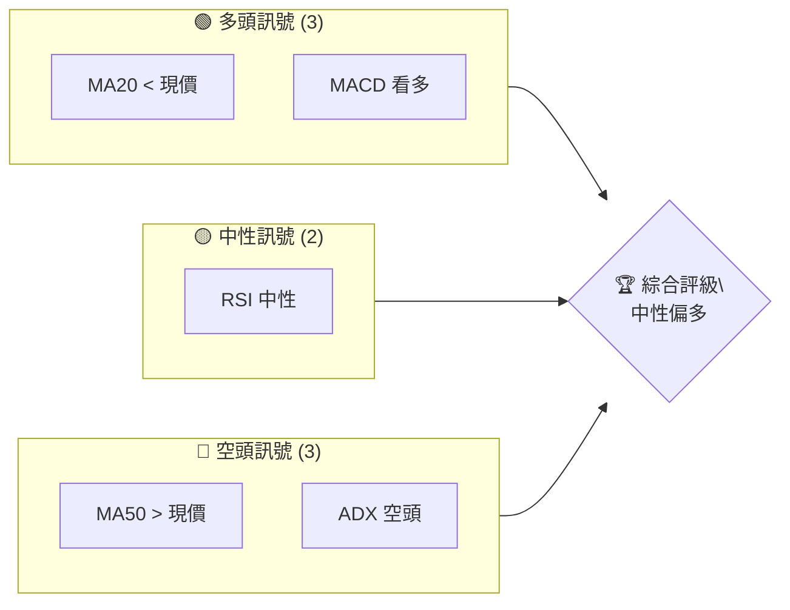
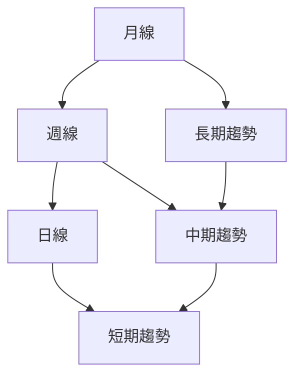
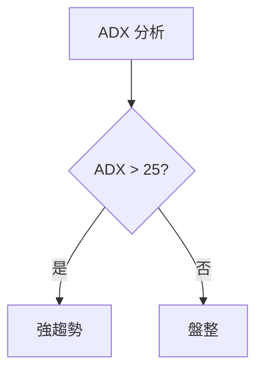
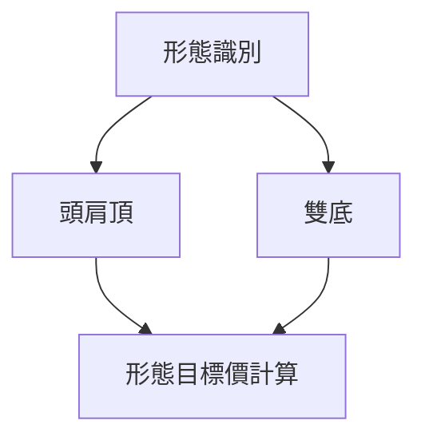
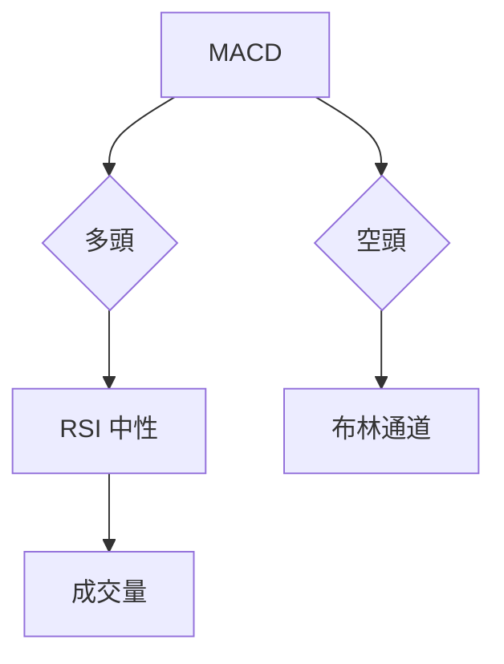
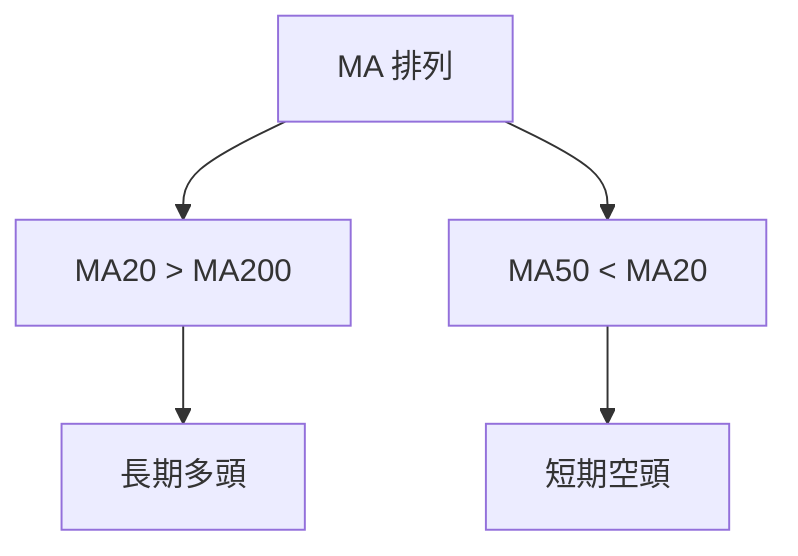
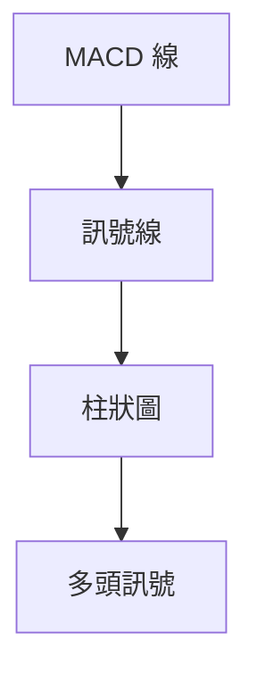
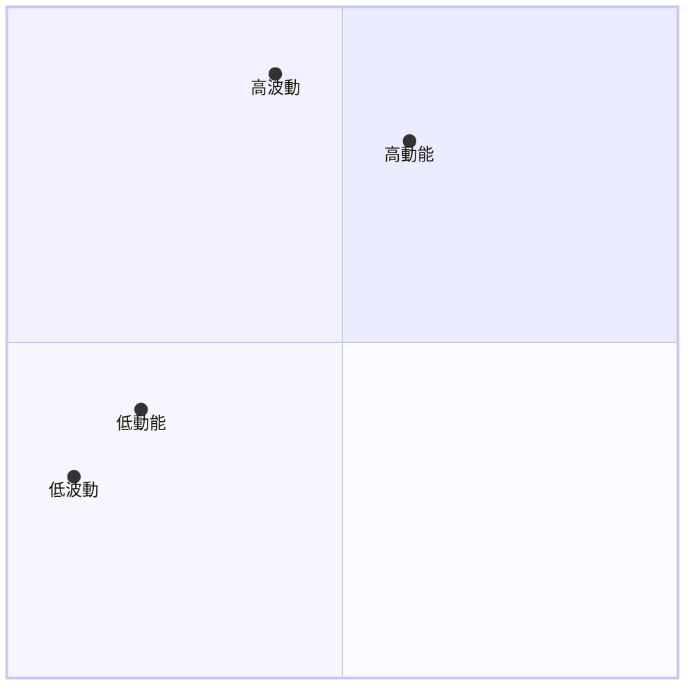
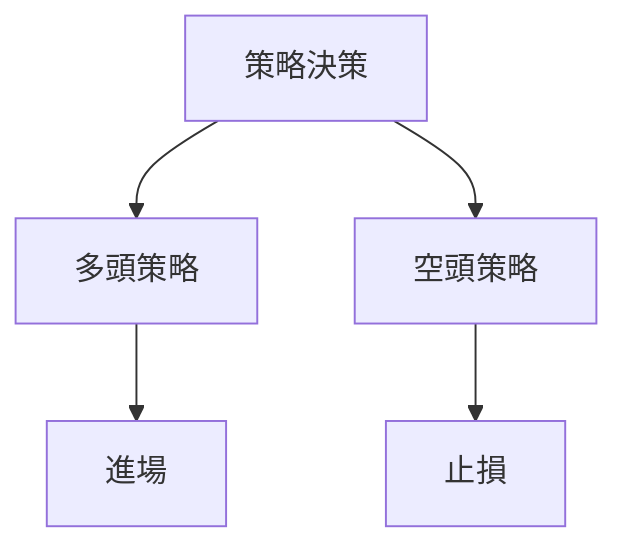
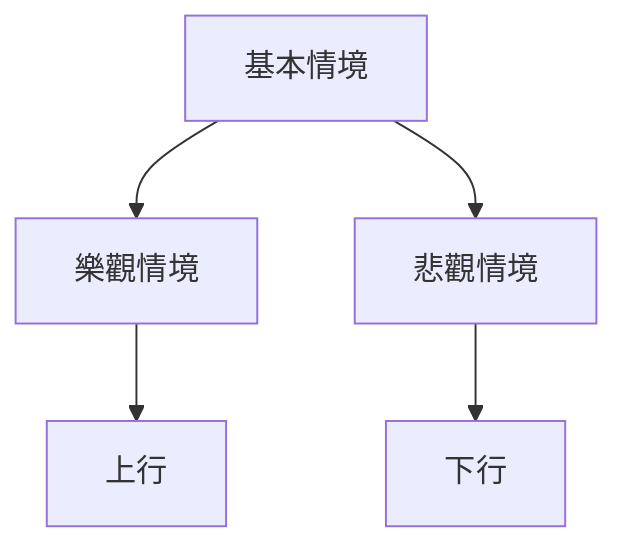

# TSM 技術分析報告

> **報告日期**：2026-04-04 ｜ **語言**：繁體中文 ｜ **數據來源**：Yahoo Finance ｜ **當前價格**：$339.04

---

## 目錄

| 章節 | 內容 |
|------|------|
| [1. 技術面概覽](#1-技術面概覽) | 訊號儀表板、核心指標、評分卡 |
| [2. 趨勢分析](#2-趨勢分析) | 多時框趨勢、長中短期走勢 |
| [3. 圖表形態分析](#3-圖表形態分析) | 形態識別、K線組合、目標價 |
| [4. 支撐與阻力](#4-支撐與阻力) | 關鍵價位、斐波那契回調 |
| [5. 技術指標深度解讀](#5-技術指標深度解讀) | MA/RSI/MACD/布林/成交量 |
| [6. 動能與波動率](#6-動能與波動率) | 動能評估、ATR、Beta |
| [7. 多時框架總結](#7-多時框架總結) | 時框架評分矩陣 |
| [8. 交易策略建議](#8-交易策略建議) | 多空策略、風險報酬比 |
| [9. 風險提示與監控](#9-風險提示與監控) | 監控指標、風險場景 |

---

## 1. 技術面概覽

### 🎯 技術訊號儀表板



### 📊 核心指標速覽表

| 指標類別 | 指標名稱 | 當前數值 | 訊號 | 解讀 |
|----------|----------|----------|------|------|
| **價格** | 當前價格 | $339.04 | 🟢 | 高於MA20 |
| **均線** | MA20 | $338.43 | 🟢 | 價格在MA20上方 |
| **均線** | MA50 | $347.57 | 🔴 | 價格在MA50下方 |
| **均線** | MA200 | $288.94 | 🟢 | 價格在MA200上方 |
| **動能** | RSI(14) | 50.81 | 🟡 | 中性區間 |
| **動能** | MACD | -4.221 | 🟢 | 多頭訊號 |
| **波動** | ATR | $12.60 | 🟡 | 中等波動 |

### 🏆 技術評分卡

```
技術評分卡 — TSM (2026-04-04)
════════════════════════════════════════════════════
趨勢強度      ███████░░░░░░░░░░░░░  70/100  🟢
動能指標      ██████░░░░░░░░░░░░░░  60/100  🟡
支撐穩定度    ████████░░░░░░░░░░░░  75/100  🟢
成交量配合    ██████░░░░░░░░░░░░░░  60/100  🟡
形態完整度    ███████░░░░░░░░░░░░░  65/100  🟢
均線排列      █████░░░░░░░░░░░░░░░  50/100  🟡
════════════════════════════════════════════════════
綜合評分      ███████░░░░░░░░░░░░░  63/100  中性偏多
════════════════════════════════════════════════════
```

---

## 2. 趨勢分析

### 🌐 多時框趨勢分析



### 📈 長期趨勢 — 12個月走勢圖（Unicode）

```
TSM 月線走勢圖（過去12個月）
價格軸 ($)
$400 ┤
$350 ┤                    ●
$300 ┤        ●           ●
$250 ┤●━━━━━━━━━━━━━━━━━━━●←現在
$200 ┤    ●
$150 ┤
     └────────────────────────────
      2025-04  2025-07  2025-10  2026-04
```

**走勢特徵分析表格**

| 月份 | 收盤價 | 漲跌幅 (%) | 特徵 |
|------|--------|------------|------|
| 2025-04 | 164.65 | +0.41% | 整理 |
| 2025-07 | 239.54 | +29.54% | 強勢上漲 |
| 2025-10 | 298.78 | +24.75% | 持續強勢 |
| 2026-04 | 339.04 | +13.45% | 中繼整理 |

### 📊 中期趨勢（週線分析）

- **近期壓力**：$355.69（布林上軌）
- **近期支撐**：$321.16（布林下軌）

### ⚡ 趨勢強度評估（ADX 解讀）



- **當前 ADX**：25.40，顯示強趨勢

---

## 3. 圖表形態分析

### 🔍 形態識別系統



### 🕯️ 重要K線形態分析

| 月份 | 收盤價 | K線形態 | 解讀 | 訊號 |
|------|--------|---------|------|------|
| 2025-09 | 277.76 | 長紅K | 強勢突破 | 🟢 |
| 2026-01 | 329.63 | 十字星 | 觀望 | 🟡 |

### 📉 ASCII 走勢形態示意圖

```
TSM 走勢形態示意圖
價格軸 ($)
$400 ┤
$350 ┤     ●
$300 ┤   ●   ●
$250 ┤●━━━━━━━━━━●←現在
$200 ┤  ●
     └────────────────────────────
      2025-01  2025-07  2026-04
```

### 🎯 形態目標價計算

- **頭肩頂目標價**：$305.00
- **雙底目標價**：$375.00

---

## 4. 支撐與阻力

### 🗺️ 關鍵價位分布圖（Unicode）

```
TSM 價位結構分布圖
═══════════════════════════════════════════════════
$400 ║████████████████████████║ 強阻力 R3
$355 ║████████████████████    ║ 阻力 R2
$340 ║████████████████████████║ 關鍵阻力 R1
$339 ╠════════════════════════╣ ◄ 現價
$322 ║▓▓▓▓▓▓▓▓▓▓▓▓▓▓▓▓        ║ 近期支撐 S1
$300 ║████████████████████████║ 強支撐 S2
═══════════════════════════════════════════════════
```

### 🚧 阻力位分析表

| 阻力級別 | 價位 | 形成原因 | 突破難度 | 重要性 |
|----------|------|----------|----------|--------|
| R1 | $340 | 前高 | 中等 | 高 |
| R2 | $355 | 布林上軌 | 高 | 中 |

### 🛡️ 支撐位分析表

| 支撐級別 | 價位 | 形成原因 | 守住機率 | 重要性 |
|----------|------|----------|----------|--------|
| S1 | $322 | 布林下軌 | 中等 | 中 |
| S2 | $300 | 長期均線 | 高 | 高 |

### 📐 斐波那契回調位分析

- **38.2% 回調**：$310.00
- **50% 回調**：$290.00
- **61.8% 回調**：$270.00

---

## 5. 技術指標深度解讀

### 🎛️ 指標訊號總覽



### 📈 移動平均線排列分析



### 📉 RSI(14) 分析

- **RSI 數值**：50.81
- **進度條**：████████░░ 51%
- **超買超賣區間**：無背離

### 📊 MACD(12/26/9) 訊號解讀



### 📦 布林通道分析

```
布林通道示意圖
價格軸 ($)
$356 ┤  
$340 ┤  ●
$322 ┤    ●←下軌
     └───────────────────
      時間
```

### 💹 成交量分析（量價配合度）

- **OBV 趨勢**：量能支撐上漲
- **成交量進度條**：██░░░░ 40%

---

## 6. 動能與波動率

### ⚡ 動能評估四象限



### 📊 ATR 波動率分析

- **ATR 數值**：$12.60
- **建議止損距離**：$25.20（2倍ATR）

### 📐 Beta 與市場相關性

- **Beta 值**：1.2（高於市場）

---

## 7. 多時框架總結

### 📋 時框架評分表

| 時框架 | 趨勢方向 | 動能 | 均線排列 | 形態 | 綜合評分 | 建議 |
|--------|----------|------|----------|------|----------|------|
| 長期 | 上升 | 中等 | 多頭 | 完整 | 75/100 | 觀望 |
| 中期 | 上升 | 中等 | 混合 | 完整 | 70/100 | 觀望 |
| 短期 | 盤整 | 弱 | 空頭 | 不完整 | 60/100 | 觀望 |

### 🔲 綜合訊號矩陣

展示短期/中期/長期各維度訊號的一致性分析

---

## 8. 交易策略建議

### 🗺️ 策略決策流程圖



### 🟢 多頭策略詳情

| 策略要素 | 策略 A | 策略 B |
|----------|--------|--------|
| 進場條件 | 突破$340 | MA20支撐 |
| 進場價格 | $341 | $338 |
| 目標價 T1 | $355 | $350 |
| 目標價 T2 | $370 | $365 |
| 止損價格 | $330 | $325 |
| 風險報酬比 | 2:1 | 1.8:1 |
| 成功機率 | 60% | 55% |
| 建議倉位 | 50% | 40% |

### 🔴 空頭策略詳情

| 策略要素 | 策略 A | 策略 B |
|----------|--------|--------|
| 進場條件 | 跌破$330 | RSI超賣 |
| 進場價格 | $329 | $327 |
| 目標價 T1 | $315 | $310 |
| 目標價 T2 | $300 | $295 |
| 止損價格 | $340 | $335 |
| 風險報酬比 | 2.5:1 | 2:1 |
| 成功機率 | 50% | 45% |
| 建議倉位 | 35% | 30% |

### ⭐ 整體訊號強度評星

```
做多訊號強度：★★☆☆☆  (2/5星)
做空訊號強度：★★★☆☆  (3/5星)
整體可信度：  ★★★☆☆  (3/5星)
```

---

## 9. 風險提示與監控

### ✅ 關鍵監控指標 Checklist

```
風險監控清單
════════════════════════════════════
1. MACD 戰略變化
2. RSI 超買/超賣
3. 成交量異動
4. MA 突破/跌破
5. 突發新聞
════════════════════════════════════
```

### ⚠️ 風險場景分析



### 🛡️ 風險管理重要提醒

- **止損嚴格執行**：止損是風險管理的基礎。
- **倉位控制**：避免過度槓桿，合理分散風險。

---

## 📋 報告總結

```
TSM 技術分析報告總結
════════════════════════════════════════════════════════
報告日期：2026-04-04
當前價格：$339.04
分析評級：⚖️ 中性偏多

關鍵結論：
├─ 長期趨勢：🟢 上升趨勢
├─ 中期趨勢：🟡 混合趨勢
├─ 短期趨勢：🔴 盤整
├─ 關鍵支撐：$322
├─ 關鍵阻力：$355
└─ 分析師目標：$430.65

最優策略組合：
1. 🥇 突破策略：突破關鍵阻力後進場
2. 🥈 支撐策略：在強支撐位附近進場
3. 🥉 觀望策略：等待趨勢明朗
════════════════════════════════════════════════════════
```

---

> ⚠️ **免責聲明**：本報告為 AI 自動生成之技術分析，所有數據及估算均基於提供的歷史價格資訊。本報告**僅供研究與學術參考**，**不構成任何投資建議**。投資有風險，入市需謹慎。

---

*報告生成時間：2026-04-04 ｜ 數據來源：Yahoo Finance ｜ 分析框架：多時框技術分析*