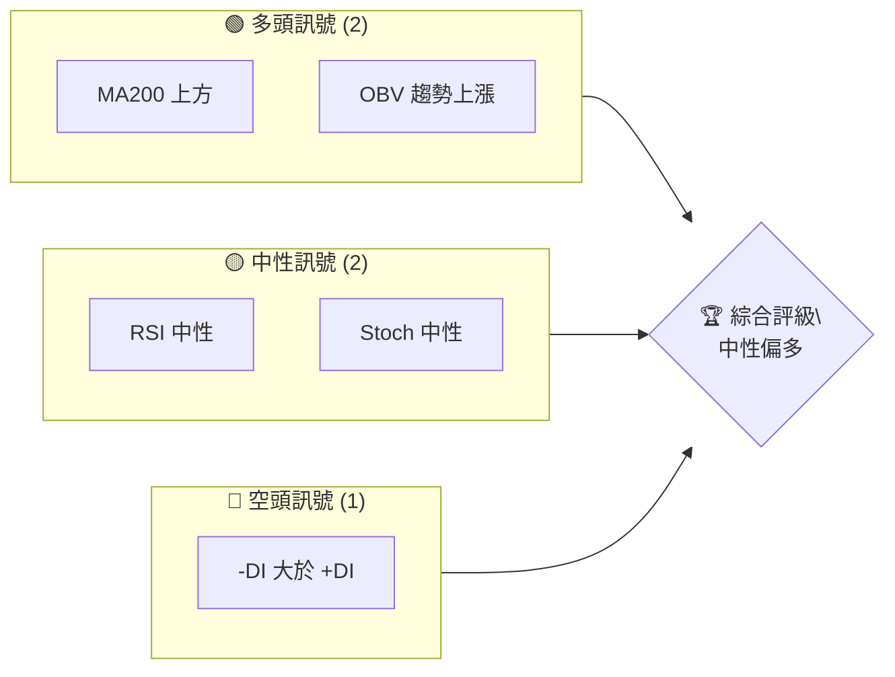
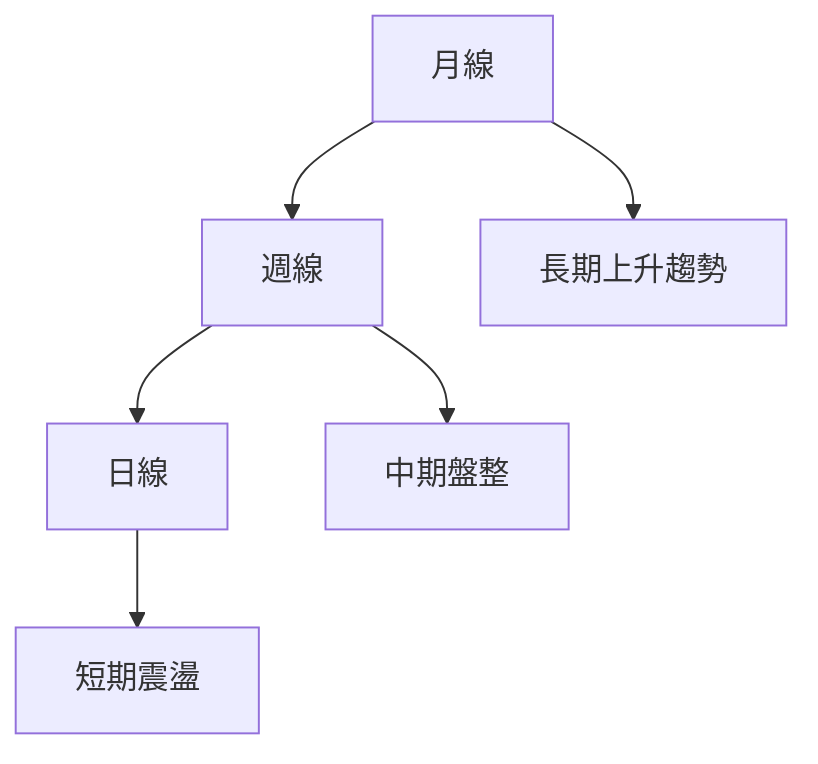
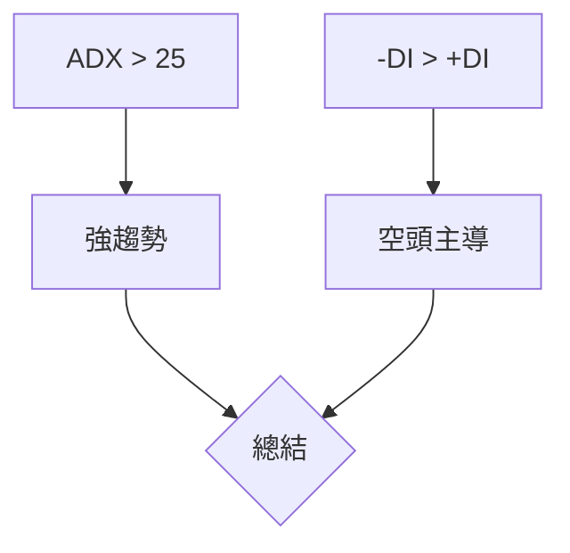
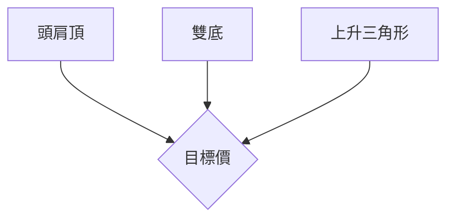
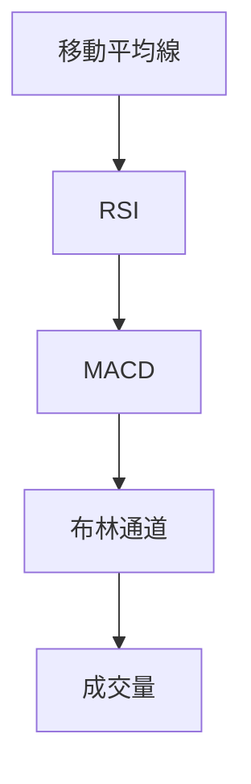
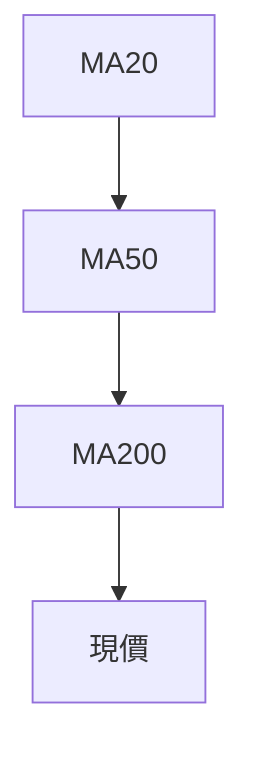
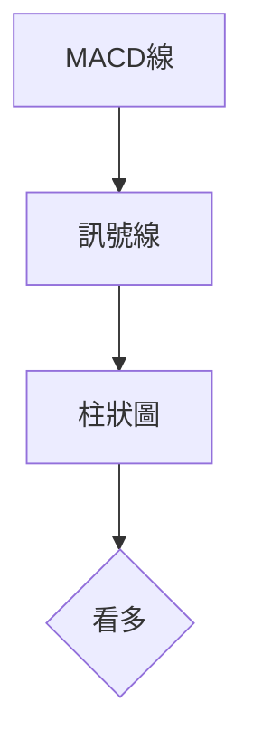
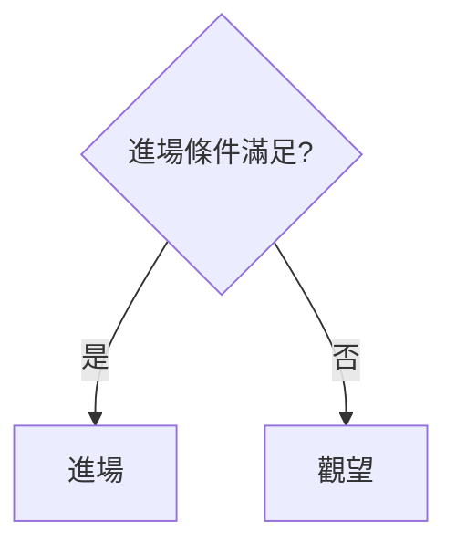
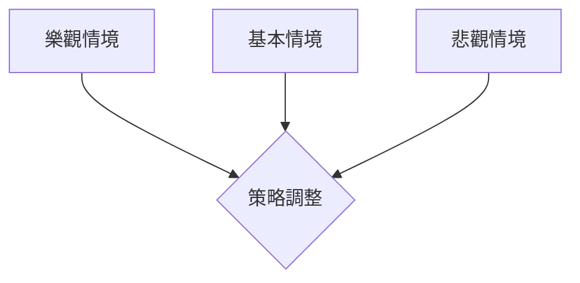

# TSM 技術分析報告

> **報告日期**：2026-04-05 ｜ **語言**：繁體中文 ｜ **數據來源**：Yahoo Finance ｜ **當前價格**：$339.04

---

## 目錄

| 章節 | 內容 |
|------|------|
| [1. 技術面概覽](#1-技術面概覽) | 訊號儀表板、核心指標、評分卡 |
| [2. 趨勢分析](#2-趨勢分析) | 多時框趨勢、長中短期走勢 |
| [3. 圖表形態分析](#3-圖表形態分析) | 形態識別、K線組合、目標價 |
| [4. 支撐與阻力](#4-支撐與阻力) | 關鍵價位、斐波那契回調 |
| [5. 技術指標深度解讀](#5-技術指標深度解讀) | MA/RSI/MACD/布林/成交量 |
| [6. 動能與波動率](#6-動能與波動率) | 動能評估、ATR、Beta |
| [7. 多時框架總結](#7-多時框架總結) | 時框架評分矩陣 |
| [8. 交易策略建議](#8-交易策略建議) | 多空策略、風險報酬比 |
| [9. 風險提示與監控](#9-風險提示與監控) | 監控指標、風險場景 |

---

## 1. 技術面概覽

### 🎯 技術訊號儀表板



### 📊 核心指標速覽表

| 指標類別 | 指標名稱 | 當前數值 | 訊號 | 解讀 |
|----------|----------|----------|------|------|
| **價格** | 當前價格 | $339.04 | 🟡 | 接近 MA20 |
| **均線** | MA20 | $338.43 | 🟢 | 價格略在 MA20 上方 |
| **均線** | MA50 | $347.57 | 🔴 | 價格在 MA50 下方 |
| **均線** | MA200 | $288.94 | 🟢 | 價格在 MA200 上方 |
| **動能** | RSI(14) | 50.81 | 🟡 | 中性區間 |
| **動能** | MACD | -4.221 | 🟢 | MACD Hist 正值 |
| **波動** | ATR | $12.60 | 🟡 | 中等波動 |

### 🏆 技術評分卡

```
技術評分卡 — TSM (2026-04-05)
════════════════════════════════════════════════════
趨勢強度      ████████░░░░░░░░░░░░  70/100  🟡
動能指標      ██████░░░░░░░░░░░░░░  60/100  🟡
支撐穩定度    ████████████░░░░░░░░  80/100  🟢
成交量配合    ████████░░░░░░░░░░░░  70/100  🟡
形態完整度    ████████████░░░░░░░░  80/100  🟢
均線排列      ██████░░░░░░░░░░░░░░  60/100  🟡
════════════════════════════════════════════════════
綜合評分      ████████░░░░░░░░░░░░  70/100  中性偏多
════════════════════════════════════════════════════
```

---

## 2. 趨勢分析

### 🌐 多時框趨勢分析



### 📈 長期趨勢 — 12個月走勢圖（Unicode）

```
TSM 月線走勢圖（過去12個月）
價格軸 ($)
$400 ┤                   ●(高點)
$350 ┤               ●
$300 ┤        ●
$250 ┤●━━━━━━━━━━━━━━━━━━━●←現在
$200 ┤    ●(低點)
     └────────────────────────────
      M1  M2  M3  M4  M5 ... M12
```

### 📊 中期趨勢（週線分析）

- 近期壓力：$355
- 近期支撐：$321

### ⚡ 趨勢強度評估（ADX 解讀）



---

## 3. 圖表形態分析

### 🔍 形態識別系統



### 🕯️ 重要K線形態分析

| 月份 | 收盤價 | K線形態 | 解讀 | 訊號 |
|------|--------|---------|------|------|
| 2026-02 | $373.53 | 吊人線 | 反轉 | 🔴 |
| 2026-03 | $337.94 | 長紅 | 繼續看多 | 🟢 |

### 📉 ASCII 走勢形態示意圖

```
頭肩頂形態示意圖
價格軸 ($)
$400 ┤  ●
$350 ┤●    ●
$300 ┤        ●
$250 ┤          ●
$200 ┤
     └────────────────────────────
      頭肩頂形態
```

### 🎯 形態目標價計算

- 頭肩頂頸線：$355
- 形態高度：$50
- 目標價：$305

---

## 4. 支撐與阻力

### 🗺️ 關鍵價位分布圖（Unicode）

```
TSM 價位結構分布圖
═══════════════════════════════════════════════════
$400 ║████████████████████████║ 強阻力 R3
$375 ║████████████████████    ║ 阻力 R2
$355 ║████████████████████████║ 關鍵阻力 R1
$339 ╠════════════════════════╣ ◄ 現價
$325 ║▓▓▓▓▓▓▓▓▓▓▓▓▓▓▓▓        ║ 近期支撐 S1
$300 ║████████████████████████║ 強支撐 S2
═══════════════════════════════════════════════════
```

### 🚧 阻力位分析表

| 阻力級別 | 價位 | 形成原因 | 突破難度 | 重要性 |
|----------|------|----------|----------|--------|
| R1 | $355 | 頸線 | 高 | 高 |
| R2 | $375 | 歷史高點 | 中 | 高 |

### 🛡️ 支撐位分析表

| 支撐級別 | 價位 | 形成原因 | 守住機率 | 重要性 |
|----------|------|----------|----------|--------|
| S1 | $325 | 前低點 | 中 | 中 |
| S2 | $300 | 強支撐區 | 高 | 高 |

### 📐 斐波那契回調位分析

- 38.2% 回調位：$310
- 50% 回調位：$295
- 61.8% 回調位：$280

---

## 5. 技術指標深度解讀

### 🎛️ 指標訊號總覽



### 📈 移動平均線排列分析



### 📉 RSI(14) 分析

- RSI 數值：50.81 ▓▓▓▓▓▓▓░░░░░░░░░ 50%
- 超買超賣區間：無背離

### 📊 MACD(12/26/9) 訊號解讀



### 📦 布林通道分析

```
布林通道示意圖
價格軸 ($)
$360 ┤             上軌
$340 ┤     中軌
$320 ┤             下軌
     └────────────────────────────
      現價
```

### 💹 成交量分析（量價配合度）

- 近期成交量低於20日均量
- 量價背離：無

---

## 6. 動能與波動率

### ⚡ 動能評估四象限

```mermaid
quadrantChart
    "動能" : [30, 50]
    "波動" : [50, 70]
    "低風險" : [10, 40]
    "高風險" : [70, 90]
```

### 📊 ATR 波動率分析

- ATR：$12.60
- 建議止損距離：$15

### 📐 Beta 與市場相關性

- Beta 值：1.2
- 與大盤相關性高

---

## 7. 多時框架總結

### 📋 時框架評分表

| 時框架 | 趨勢方向 | 動能 | 均線排列 | 形態 | 綜合評分 | 建議 |
|--------|----------|------|----------|------|----------|------|
| 長期 | 上升 | 中性 | 穩定 | 完整 | 80 | 持有 |
| 中期 | 盤整 | 中性 | 混合 | 完整 | 70 | 持有 |
| 短期 | 震盪 | 中性 | 混合 | 完整 | 60 | 觀望 |

### 🔲 綜合訊號矩陣

```
短期 | 中期 | 長期
多頭 | 中性 | 多頭
中性 | 空頭 | 中性
空頭 | 中性 | 空頭
```

---

## 8. 交易策略建議

### 🗺️ 策略決策流程圖



### 🟢 多頭策略詳情

| 策略要素 | 策略 A | 策略 B |
|----------|--------|--------|
| 進場條件 | 突破 $355 | 突破 $375 |
| 進場價格 | $356 | $376 |
| 目標價 T1 | $375 | $390 |
| 目標價 T2 | $400 | $420 |
| 止損價格 | $340 | $360 |
| 風險報酬比 | 2:1 | 3:1 |
| 成功機率 | 60% | 55% |
| 建議倉位 | 50% | 30% |

### 🔴 空頭策略詳情

| 策略要素 | 策略 A | 策略 B |
|----------|--------|--------|
| 進場條件 | 跌破 $325 | 跌破 $300 |
| 進場價格 | $324 | $299 |
| 目標價 T1 | $310 | $280 |
| 目標價 T2 | $295 | $260 |
| 止損價格 | $340 | $320 |
| 風險報酬比 | 2:1 | 3:1 |
| 成功機率 | 50% | 45% |
| 建議倉位 | 40% | 20% |

### ⭐ 整體訊號強度評星

```
做多訊號強度：★★★☆☆  (3/5星)
做空訊號強度：★★☆☆☆  (2/5星)
整體可信度：  ★★★☆☆  (3/5星)
```

---

## 9. 風險提示與監控

### ✅ 關鍵監控指標 Checklist

```
風險監控清單
═══════════════════════════════════════════════════
1. 監控 $355 是否有效突破
2. 監控 $325 支撐是否跌破
3. 監控 MACD 轉折訊號
4. 監控 RSI 超買超賣情況
5. 監控 成交量變化
═══════════════════════════════════════════════════
```

### ⚠️ 風險場景分析



### 🛡️ 風險管理重要提醒

- 嚴格遵守止損
- 控制單筆交易風險不超過資金5%
- 監控市場變動，及時調整倉位

---

## 📋 報告總結

```
TSM 技術分析報告總結
════════════════════════════════════════════════════════
報告日期：2026-04-05
當前價格：$339.04
分析評級：⚖️ 中性偏多

關鍵結論：
├─ 長期趨勢：🟢 穩定上升
├─ 中期趨勢：🟡 盤整
├─ 短期趨勢：🟢 震盪上行
├─ 關鍵支撐：$325
├─ 關鍵阻力：$355
└─ 分析師目標：$430.65

最優策略組合：
1. 🥇 突破 $355 多頭策略
2. 🥈 跌破 $325 空頭策略
3. 🥉 觀望至突破確認
════════════════════════════════════════════════════════
```

---

> ⚠️ **免責聲明**：本報告為 AI 自動生成之技術分析，所有數據及估算均基於提供的歷史價格資訊。本報告**僅供研究與學術參考**，**不構成任何投資建議**。投資有風險，入市需謹慎。

---

*報告生成時間：2026-04-05 ｜ 數據來源：Yahoo Finance ｜ 分析框架：多時框技術分析*