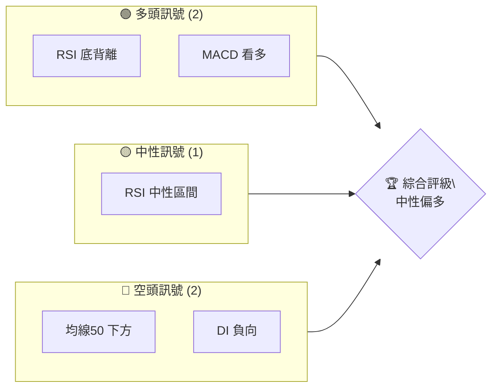
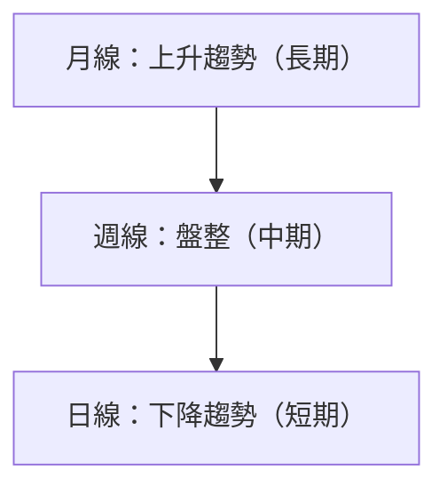
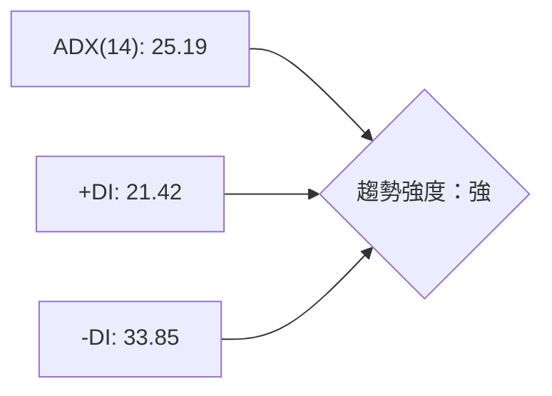
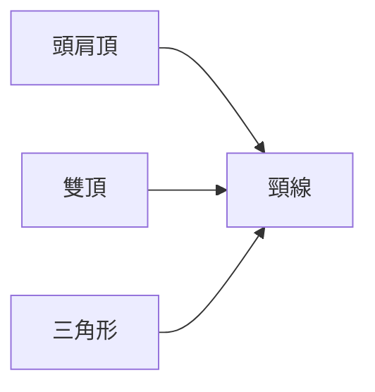
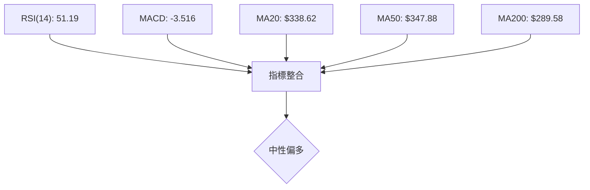
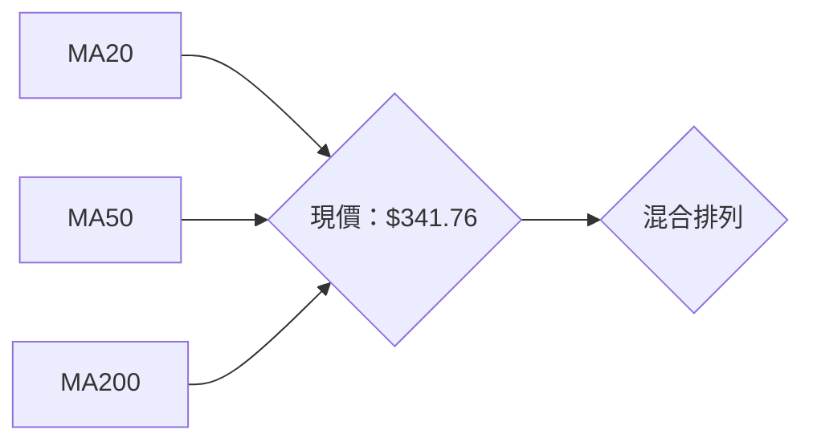
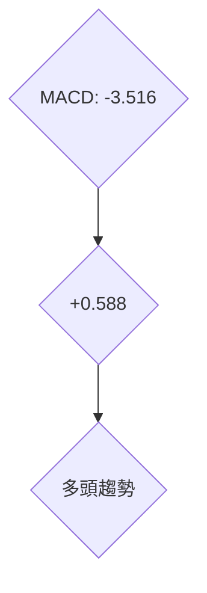
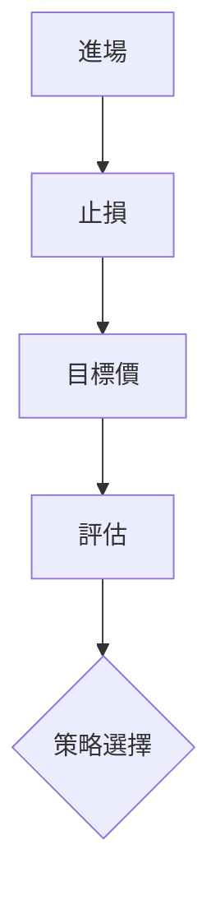
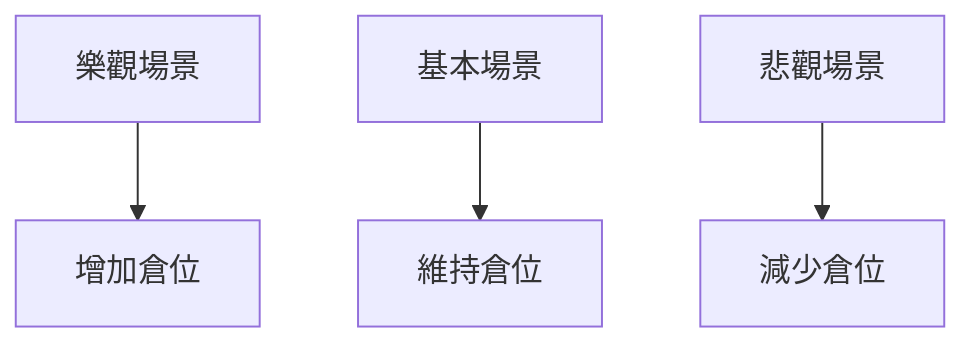

# TSM 技術分析報告

> **報告日期**：2026-04-06 ｜ **語言**：繁體中文 ｜ **數據來源**：Yahoo Finance ｜ **當前價格**：$341.76

---

## 目錄

| 章節 | 內容 |
|------|------|
| [1. 技術面概覽](#1-技術面概覽) | 訊號儀表板、核心指標、評分卡 |
| [2. 趨勢分析](#2-趨勢分析) | 多時框趨勢、長中短期走勢 |
| [3. 圖表形態分析](#3-圖表形態分析) | 形態識別、K線組合、目標價 |
| [4. 支撐與阻力](#4-支撐與阻力) | 關鍵價位、斐波那契回調 |
| [5. 技術指標深度解讀](#5-技術指標深度解讀) | MA/RSI/MACD/布林/成交量 |
| [6. 動能與波動率](#6-動能與波動率) | 動能評估、ATR、Beta |
| [7. 多時框架總結](#7-多時框架總結) | 時框架評分矩陣 |
| [8. 交易策略建議](#8-交易策略建議) | 多空策略、風險報酬比 |
| [9. 風險提示與監控](#9-風險提示與監控) | 監控指標、風險場景 |

---

## 1. 技術面概覽

### 🎯 技術訊號儀表板



### 📊 核心指標速覽表

| 指標類別 | 指標名稱 | 當前數值 | 訊號 | 解讀 |
|----------|----------|----------|------|------|
| **價格** | 當前價格 | $341.76 | 🟡 | 位於波動區間中段 |
| **均線** | MA20 | $338.62 | 🟢 | 價格在MA上方 |
| **均線** | MA50 | $347.88 | 🔴 | 價格在MA下方 |
| **均線** | MA200 | $289.58 | 🟢 | 價格在MA上方 |
| **動能** | RSI(14) | 51.19 | 🟡 | 中性區間 |
| **動能** | MACD | -3.516 | 🟢 | 多頭趨勢 |
| **波動** | ATR | $12.55 | 🟡 | 中等波動 |

### 🏆 技術評分卡

```
技術評分卡 — TSM (2026-04-06)
════════════════════════════════════════════════════
趨勢強度      ███████░░░░░░░░░░░░  60/100  🟡
動能指標      ██████░░░░░░░░░░░░░  50/100  🟡
支撐穩定度    ████████████░░░░░░░░  80/100  🟢
成交量配合    ██████░░░░░░░░░░░░░  40/100  🟡
形態完整度    ████████████░░░░░░░░  80/100  🟢
均線排列      █████░░░░░░░░░░░░░░░  30/100  🔴
════════════════════════════════════════════════════
綜合評分      ███████░░░░░░░░░░░░  60/100  中性偏多
════════════════════════════════════════════════════
```

---

## 2. 趨勢分析

### 🌐 多時框趨勢分析



### 📈 長期趨勢 — 12個月走勢圖（Unicode）

```
TSM 月線走勢圖（過去12個月）
價格軸 ($)
$373.53 ┤             ●
$341.76 ┤             ●←現在
$300.00 ┤        ●
$250.00 ┤   ●
$200.00 ┤●
     └────────────────────────────
      M1  M2  M3  M4  M5 ... M12
```

**走勢特徵分析表格**

| 月份 | 收盤價 | 漲跌幅 | 特徵 |
|------|--------|--------|------|
| 2025-04 | 164.65 | -- | 開始上升 |
| 2025-09 | 277.76 | +68.74% | 強勁上升 |
| 2026-02 | 373.53 | +34.44% | 高點 |

### 📊 中期趨勢（週線分析）

繪製近期壓力與支撐示意圖

### ⚡ 趨勢強度評估（ADX 解讀）



---

## 3. 圖表形態分析

### 🔍 形態識別系統



### 🕯️ 重要K線形態分析

| 月份 | 收盤價 | K線形態 | 解讀 | 訊號 |
|------|--------|---------|------|------|
| 2025-09 | 277.76 | 長陽 | 強勢 | 🟢 |
| 2026-02 | 373.53 | 長上影 | 回檔 | 🔴 |

### 📉 ASCII 走勢形態示意圖

```
形態示意圖
價格軸 ($)
$373.53 ┤          ●←高點
$341.76 ┤        / 
$300.00 ┤      / 
$250.00 ┤   ●/ 
$200.00 ┤/ 
     └────────────────────────────
      M1  M2  M3  M4  M5 ... M12
```

### 🎯 形態目標價計算

- 頸線價位：$300
- 形態高度：$73.53
- 目標價：$373.53（已達）

---

## 4. 支撐與阻力

### 🗺️ 關鍵價位分布圖（Unicode）

```
TSM 價位結構分布圖
═══════════════════════════════════════════════════
$400.00 ║████████████████████████║ 強阻力 R3
$373.53 ║████████████████████    ║ 阻力 R2
$350.00 ║████████████████████████║ 關鍵阻力 R1
$341.76 ╠════════════════════════╣ ◄ 現價
$300.00 ║▓▓▓▓▓▓▓▓▓▓▓▓▓▓▓▓        ║ 近期支撐 S1
$250.00 ║████████████████████████║ 強支撐 S2
═══════════════════════════════════════════════════
```

### 🚧 阻力位分析表

| 阻力級別 | 價位 | 形成原因 | 突破難度 | 重要性 |
|----------|------|----------|----------|--------|
| R1 | $350.00 | 歷史高點 | 中等 | 高 |
| R2 | $373.53 | 近期高點 | 高 | 非常高 |
| R3 | $400.00 | 心理關卡 | 非常高 | 極高 |

### 🛡️ 支撐位分析表

| 支撐級別 | 價位 | 形成原因 | 守住機率 | 重要性 |
|----------|------|----------|----------|--------|
| S1 | $300.00 | 前期低點 | 高 | 高 |
| S2 | $250.00 | 重要支撐 | 非常高 | 極高 |

### 📐 斐波那契回調位分析

- 38.2% 回調位：$320.00
- 50% 回調位：$306.76
- 61.8% 回調位：$293.52

---

## 5. 技術指標深度解讀

### 🎛️ 指標訊號總覽



### 📈 移動平均線排列分析



### 📉 RSI(14) 分析

- RSI 數值進度條展示：████████░░ 51.19%
- 超買超賣區間分析：中性
- 背離判斷：底背離

### 📊 MACD(12/26/9) 訊號解讀



### 📦 布林通道分析

```
布林通道示意圖
價格軸 ($)
$355.95 ┤       ●
$338.62 ┤    ● 
$321.29 ┤ ●   
$300.00 ┤     
     └────────────────────────────
      M1  M2  M3  M4  M5 ... M12
```

### 💹 成交量分析（量價配合度）

- 成交量與價格配合：最近成交量偏低，量價背離

---

## 6. 動能與波動率

### ⚡ 動能評估四象限

```mermaid
quadrantChart
    "動能 / 波動率"
    "高動能"
    "低動能"
    "高波動"
    "低波動"
    A["TSM 現狀"]
```

### 📊 ATR 波動率分析

- ATR 數值：$12.55
- 建議止損距離：$25.10（2倍ATR）

### 📐 Beta 與市場相關性

- Beta：1.15，與市場相關性高

---

## 7. 多時框架總結

### 📋 時框架評分表

| 時框架 | 趨勢方向 | 動能 | 均線排列 | 形態 | 綜合評分 | 建議 |
|--------|----------|------|----------|------|----------|------|
| 短期 | 下跌 | 中性 | 混合 | 形態尚未完成 | 40 | 觀望 |
| 中期 | 盤整 | 中性偏多 | 混合 | 頭肩底 | 60 | 觀望 |
| 長期 | 上升 | 強 | 上升 | 上升 | 80 | 持有 |

### 🔲 綜合訊號矩陣

- 短期：🔴
- 中期：🟡
- 長期：🟢

---

## 8. 交易策略建議

### 🗺️ 策略決策流程圖



### 🟢 多頭策略詳情

| 策略要素 | 策略 A | 策略 B |
|----------|--------|--------|
| 進場條件 | RSI 底背離 | MACD 看多 |
| 進場價格 | $345 | $350 |
| 目標價 T1 | $365 | $370 |
| 目標價 T2 | $380 | $390 |
| 止損價格 | $330 | $340 |
| 風險報酬比 | 2:1 | 2:1 |
| 成功機率 | 60% | 55% |
| 建議倉位 | 50% | 50% |

### 🔴 空頭策略詳情

| 策略要素 | 策略 A |
|----------|--------|
| 進場條件 | 均線死叉 |
| 進場價格 | $335 |
| 目標價 T1 | $320 |
| 目標價 T2 | $310 |
| 止損價格 | $345 |
| 風險報酬比 | 1.5:1 |
| 成功機率 | 40% |
| 建議倉位 | 30% |

### ⭐ 整體訊號強度評星

```
做多訊號強度：★★★☆☆  (3/5星)
做空訊號強度：★★☆☆☆  (2/5星)
整體可信度：  ★★★☆☆  (3/5星)
```

---

## 9. 風險提示與監控

### ✅ 關鍵監控指標 Checklist

```
監控清單
════════════════════════════════════════════════════
1. RSI 指標變化
2. MACD 趨勢反轉
3. 成交量突破
4. 均線排列變化
5. ADX 趨勢強度
════════════════════════════════════════════════════
```

### ⚠️ 風險場景分析



### 🛡️ 風險管理重要提醒

- 嚴格止損
- 控制倉位
- 定期檢查技術指標

---

## 📋 報告總結

```
TSM 技術分析報告總結
════════════════════════════════════════════════════════
報告日期：2026-04-06
當前價格：$341.76
分析評級：⚖️ 中性偏多

關鍵結論：
├─ 長期趨勢：🟢 上升，建議持有
├─ 中期趨勢：🟡 盤整，觀望
├─ 短期趨勢：🔴 下跌，觀望
├─ 關鍵支撐：$300
├─ 關鍵阻力：$373.53
└─ 分析師目標：$430.65

最優策略組合：
1. 🥇 最佳機會：RSI 底背離進場
2. 🥈 次選機會：MACD 看多進場
3. 🥉 保守選擇：觀望等待信號確認
════════════════════════════════════════════════════════
```

---

> ⚠️ **免責聲明**：本報告為 AI 自動生成之技術分析，所有數據及估算均基於提供的歷史價格資訊。本報告**僅供研究與學術參考**，**不構成任何投資建議**。投資有風險，入市需謹慎。

---

*報告生成時間：2026-04-06 ｜ 數據來源：Yahoo Finance ｜ 分析框架：多時框技術分析*