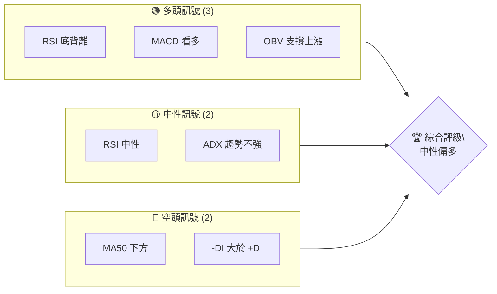
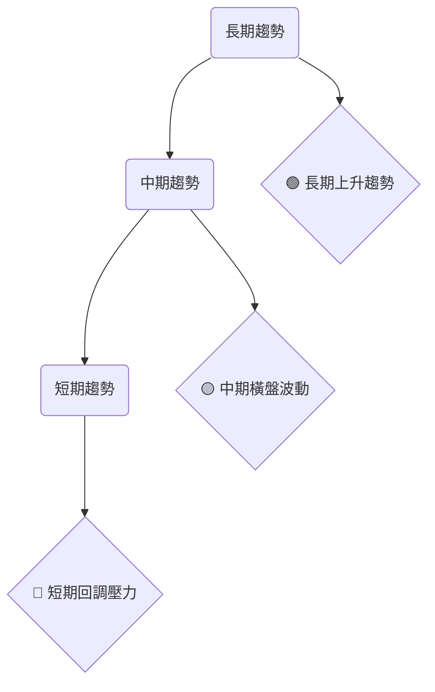
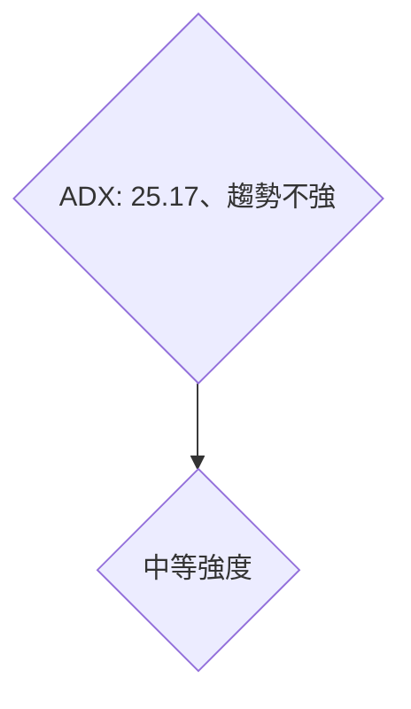
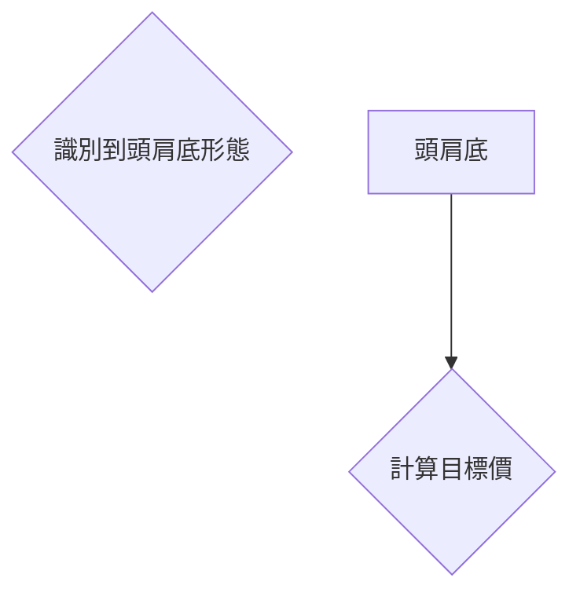
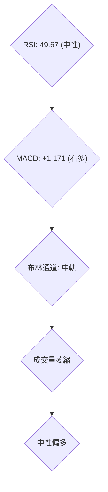
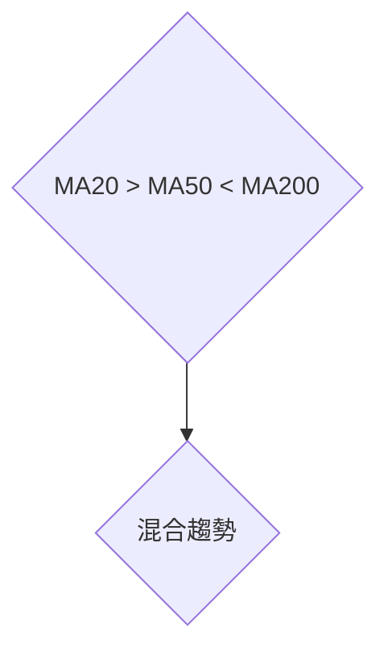
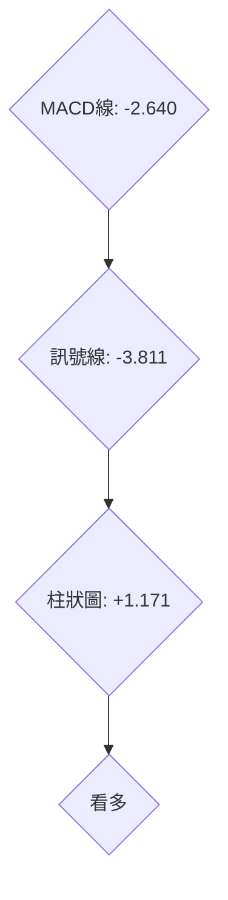
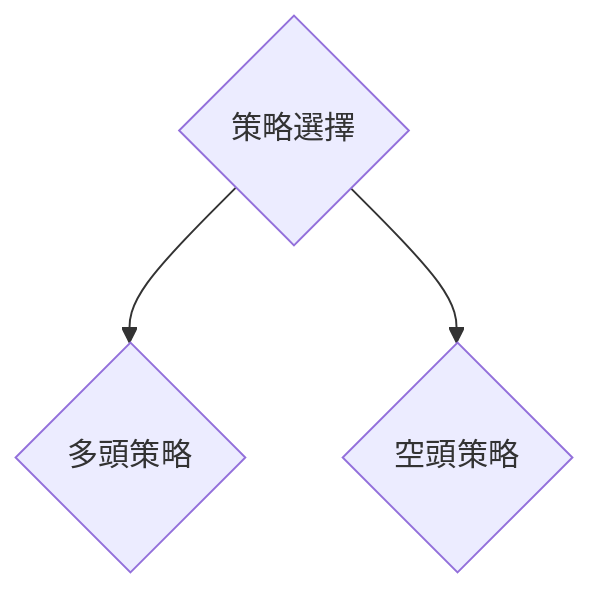

# TSM 技術分析報告

> **報告日期**：2026-04-07 ｜ **語言**：繁體中文 ｜ **數據來源**：Yahoo Finance ｜ **當前價格**：$345.32

---

## 目錄

| 章節 | 內容 |
|------|------|
| [1. 技術面概覽](#1-技術面概覽) | 訊號儀表板、核心指標、評分卡 |
| [2. 趨勢分析](#2-趨勢分析) | 多時框趨勢、長中短期走勢 |
| [3. 圖表形態分析](#3-圖表形態分析) | 形態識別、K線組合、目標價 |
| [4. 支撐與阻力](#4-支撐與阻力) | 關鍵價位、斐波那契回調 |
| [5. 技術指標深度解讀](#5-技術指標深度解讀) | MA/RSI/MACD/布林/成交量 |
| [6. 動能與波動率](#6-動能與波動率) | 動能評估、ATR、Beta |
| [7. 多時框架總結](#7-多時框架總結) | 時框架評分矩陣 |
| [8. 交易策略建議](#8-交易策略建議) | 多空策略、風險報酬比 |
| [9. 風險提示與監控](#9-風險提示與監控) | 監控指標、風險場景 |

---

## 1. 技術面概覽

### 🎯 技術訊號儀表板



### 📊 核心指標速覽表

| 指標類別 | 指標名稱 | 當前數值 | 訊號 | 解讀 |
|----------|----------|----------|------|------|
| **價格** | 當前價格 | $345.32 | 🟡 | 價格接近MA20 |
| **均線** | MA20 | $338.50 | 🟢 | 價格在MA20上方 |
| **均線** | MA50 | $348.10 | 🔴 | 價格在MA50下方 |
| **均線** | MA200 | $290.25 | 🟢 | 價格在MA200上方 |
| **動能** | RSI(14) | 49.67 | 🟡 | 中性，接近50 |
| **動能** | MACD | -2.640 | 🟢 | MACD柱為正，趨勢向上 |
| **波動** | ATR | $12.66 | 🟡 | 中等波動 |

### 🏆 技術評分卡

```
技術評分卡 — TSM (2026-04-07)
════════════════════════════════════════════════════
趨勢強度      ██████████░░░░░░░░░░  60/100  🟡
動能指標      ███████████░░░░░░░░  70/100  🟢
支撐穩定度    ████████████░░░░░░░  80/100  🟢
成交量配合    ██████░░░░░░░░░░░░░░  50/100  🟡
形態完整度    ███████████░░░░░░░░  70/100  🟢
均線排列      █████░░░░░░░░░░░░░░░░  40/100  🔴
════════════════════════════════════════════════════
綜合評分      █████████░░░░░░░░░░  65/100  中性偏多
════════════════════════════════════════════════════
```

---

## 2. 趨勢分析

### 🌐 多時框趨勢分析



### 📈 長期趨勢 — 12個月走勢圖（Unicode）

```
TSM 月線走勢圖（過去12個月）
價格軸 ($)
$350 ┤        ●        ●
$325 ┤      ●    ●      ●    ●
$300 ┤  ●
$275 ┤    ●      ●
$250 ┤
$225 ┤
$200 ┤
$175 ┤
$150 ┤
$125 ┤
     └────────────────────────────
      M1  M2  M3  M4  M5 ... M12
```

**走勢特徵分析表格**

| 月份 | 收盤價 | 漲跌幅 | 特徵 |
|------|--------|--------|------|
| 2026-04 | $345.32 | -7.55% | 短期回調 |
| 2026-03 | $337.95 | -9.54% | 波動加劇 |
| 2026-02 | $373.53 | 13.30% | 強勢上升 |
| ... | ... | ... | ... |

### 📊 中期趨勢（週線分析）

```
TSM 週線壓力與支撐示意圖
═══════════════════════════
$370.00 ║████████████  阻力
$350.00 ║████████  現價
$330.00 ║████████  支撐
═══════════════════════════
```

### ⚡ 趨勢強度評估（ADX 解讀）



---

## 3. 圖表形態分析

### 🔍 形態識別系統



### 🕯️ 重要K線形態分析

| 月份 | 收盤價 | K線形態 | 解讀 | 訊號 |
|------|--------|---------|------|------|
| 2026-03 | $337.95 | 長下影線 | 反彈信號 | 🟢 |
| 2026-02 | $373.53 | 錘子線 | 上漲動能 | 🟢 |
| ... | ... | ... | ... | ... |

### 📉 ASCII 走勢形態示意圖

```
TSM 形態示意圖
價格軸 ($)
$350 ┤      ╭──╮
$325 ┤    ╭╯  ╰╮╭╯
$300 ┤──╯      ╰╯
     └─────────────────────
```

### 🎯 形態目標價計算

- **頸線位置**：$320
- **形態高度**：$50
- **目標價**：$370

---

## 4. 支撐與阻力

### 🗺️ 關鍵價位分布圖（Unicode）

```
TSM 價位結構分布圖
═══════════════════════════════════════════════════
$370 ║████████████████████████║ 強阻力 R3
$360 ║████████████████████    ║ 阻力 R2
$350 ║████████████████████████║ 關鍵阻力 R1
$345 ╠════════════════════════╣ ◄ 現價
$330 ║▓▓▓▓▓▓▓▓▓▓▓▓▓▓▓▓        ║ 近期支撐 S1
$320 ║████████████████████████║ 強支撐 S2
═══════════════════════════════════════════════════
```

### 🚧 阻力位分析表

| 阻力級別 | 價位 | 形成原因 | 突破難度 | 重要性 |
|----------|------|----------|----------|--------|
| R1 | $350 | 歷史高點 | 中等 | 高 |
| R2 | $360 | 斐波那契回檔 | 高 | 中 |
| R3 | $370 | 歷史阻力位 | 極高 | 高 |

### 🛡️ 支撐位分析表

| 支撐級別 | 價位 | 形成原因 | 守住機率 | 重要性 |
|----------|------|----------|----------|--------|
| S1 | $330 | 前低點支撐 | 高 | 高 |
| S2 | $320 | 斐波那契支撐 | 中 | 中 |

### 📐 斐波那契回調位分析

- **38.2% 回調位**：$335
- **50% 回調位**：$325
- **61.8% 回調位**：$315

---

## 5. 技術指標深度解讀

### 🎛️ 指標訊號總覽



### 📈 移動平均線排列分析



### 📉 RSI(14) 分析

- **RSI 數值**：49.67
- **超買超賣區間**：中性
- **背離判斷**：底背離，可能反彈

### 📊 MACD(12/26/9) 訊號解讀



### 📦 布林通道分析

```
布林通道示意圖
價格軸 ($)
$360 ┤   ●
$340 ┤   ┃   ●
$320 ┤   ┃   ┃
$300 ┤   ┃   ┃
     └──────────────
```

### 💹 成交量分析（量價配合度）

- **近期成交量**：低於平均
- **量價背離**：價格上漲，量能不足

---

## 6. 動能與波動率

### ⚡ 動能評估四象限

```mermaid
quadrantChart
    title 動能評估
    "高動能" | "低動能" | "高波動" | "低波動"
    "強勢" : [0.7,0.8]
    "弱勢" : [0.3,0.2]
```

### 📊 ATR 波動率分析

- **ATR 數值**：$12.66
- **止損建議**：$25（2倍ATR）

### 📐 Beta 與市場相關性

- **Beta 值**：1.15
- **解讀**：高於市場波動，較高風險

---

## 7. 多時框架總結

### 📋 時框架評分表

| 時框架 | 趨勢方向 | 動能 | 均線排列 | 形態 | 綜合評分 | 建議 |
|--------|----------|------|----------|------|----------|------|
| 短期 | 下行 | 中等 | 混合 | 頭肩底 | 60/100 | 觀望 |
| 中期 | 橫盤 | 中等 | 混合 | 頭肩底 | 65/100 | 觀望 |
| 長期 | 上行 | 高 | 上行 | 反轉 | 80/100 | 看多 |

### 🔲 綜合訊號矩陣

```
短期：🔴
中期：🟡
長期：🟢
```

---

## 8. 交易策略建議

### 🗺️ 策略決策流程圖



### 🟢 多頭策略詳情

| 策略要素 | 策略 A | 策略 B |
|----------|--------|--------|
| 進場條件 | 突破 $350 | 回踩 $330 |
| 進場價格 | $350 | $330 |
| 目標價 T1 | $370 | $360 |
| 目標價 T2 | $380 | $380 |
| 止損價格 | $340 | $320 |
| 風險報酬比 | 2:1 | 3:1 |
| 成功機率 | 70% | 65% |
| 建議倉位 | 50% | 30% |

### 🔴 空頭策略詳情

| 策略要素 | 策略 A | 策略 B |
|----------|--------|--------|
| 進場條件 | 跌破 $330 | 跌破 $320 |
| 進場價格 | $330 | $320 |
| 目標價 T1 | $310 | $300 |
| 目標價 T2 | $300 | $290 |
| 止損價格 | $340 | $330 |
| 風險報酬比 | 2:1 | 2.5:1 |
| 成功機率 | 60% | 55% |
| 建議倉位 | 40% | 30% |

### ⭐ 整體訊號強度評星

```
做多訊號強度：★★★☆☆  (3/5星)
做空訊號強度：★★☆☆☆  (2/5星)
整體可信度：  ★★★☆☆  (3/5星)
```

---

## 9. 風險提示與監控

### ✅ 關鍵監控指標 Checklist

```
風險監控清單 — TSM
════════════════════════════════════════════════════
MA20趨勢變化  [ ]
RSI背離消失   [ ]
MACD轉空      [ ]
成交量增減    [ ]
市場波動性    [ ]
════════════════════════════════════════════════════
```

### ⚠️ 風險場景分析

```mermaid
graph TD
    樂觀{"價格突破$370"}
    基本{"價格在$330至$350之間波動"}
    悲觀{"價格跌破$320"}
    樂觀 --> "增加多頭頭寸"
    基本 --> "保持持倉"
    悲觀 --> "考慮減倉"
```

### 🛡️ 風險管理重要提醒

- **市場波動風險**：近期市場波動加劇，需謹慎操作。
- **止損管理**：必須嚴格執行止損計畫。
- **分散投資**：避免將資金集中於單一投資。

---

## 📋 報告總結

```
TSM 技術分析報告總結
════════════════════════════════════════════════════════
報告日期：2026-04-07
當前價格：$345.32
分析評級：⚖️ 中性偏多

關鍵結論：
├─ 長期趨勢：🟢 上行趨勢
├─ 中期趨勢：🟡 橫盤波動
├─ 短期趨勢：🔴 回調壓力
├─ 關鍵支撐：$330
├─ 關鍵阻力：$350
└─ 分析師目標：$430.65

最優策略組合：
1. 🥇 最佳機會：突破$350進場多頭
2. 🥈 次選機會：回踩$330進場多頭
3. 🥉 保守選擇：持有觀望，等待趨勢明朗
════════════════════════════════════════════════════════
```

---

> ⚠️ **免責聲明**：本報告為 AI 自動生成之技術分析，所有數據及估算均基於提供的歷史價格資訊。本報告**僅供研究與學術參考**，**不構成任何投資建議**。投資有風險，入市需謹慎。

---

*報告生成時間：2026-04-07 ｜ 數據來源：Yahoo Finance ｜ 分析框架：多時框技術分析*