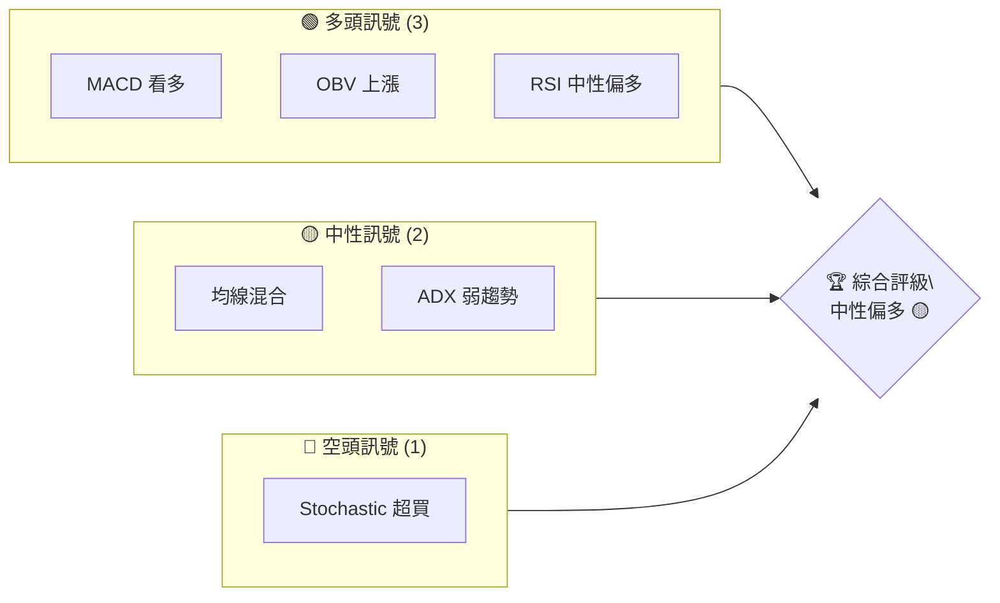
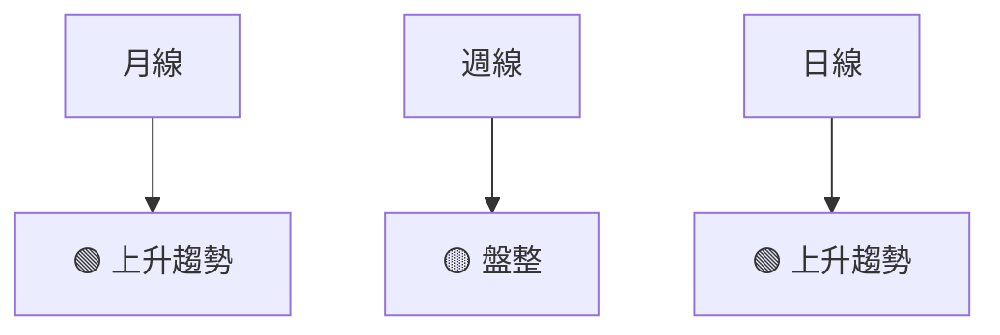
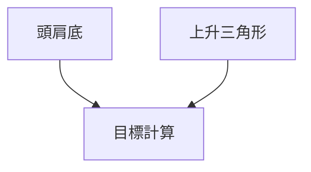
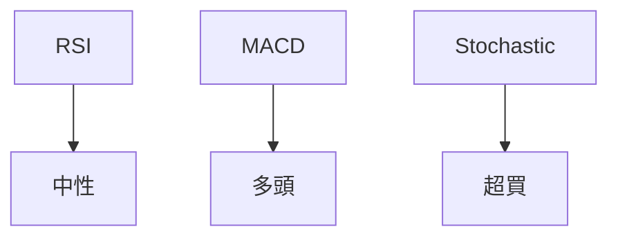
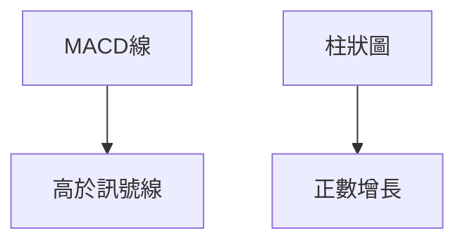
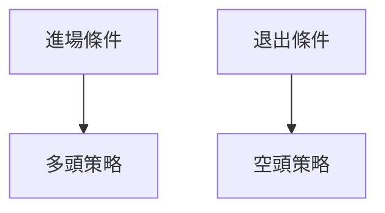
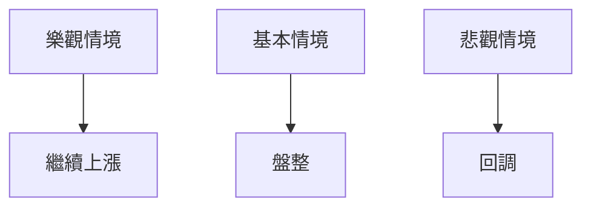

# TSM 技術分析報告

> **報告日期**：2026-04-08 ｜ **語言**：繁體中文 ｜ **數據來源**：Yahoo Finance ｜ **當前價格**：$365.90

---

## 目錄

| 章節 | 內容 |
|------|------|
| [1. 技術面概覽](#1-技術面概覽) | 訊號儀表板、核心指標、評分卡 |
| [2. 趨勢分析](#2-趨勢分析) | 多時框趨勢、長中短期走勢 |
| [3. 圖表形態分析](#3-圖表形態分析) | 形態識別、K線組合、目標價 |
| [4. 支撐與阻力](#4-支撐與阻力) | 關鍵價位、斐波那契回調 |
| [5. 技術指標深度解讀](#5-技術指標深度解讀) | MA/RSI/MACD/布林/成交量 |
| [6. 動能與波動率](#6-動能與波動率) | 動能評估、ATR、Beta |
| [7. 多時框架總結](#7-多時框架總結) | 時框架評分矩陣 |
| [8. 交易策略建議](#8-交易策略建議) | 多空策略、風險報酬比 |
| [9. 風險提示與監控](#9-風險提示與監控) | 監控指標、風險場景 |

---

## 1. 技術面概覽

### 🎯 技術訊號儀表板



### 📊 核心指標速覽表

| 指標類別 | 指標名稱 | 當前數值 | 訊號 | 解讀 |
|----------|----------|----------|------|------|
| **價格** | 當前價格 | $365.90 | 🟢 | 位於均線上方 |
| **均線** | MA20 | $339.49 | 🟢 | 價格在MA20上方 |
| **均線** | MA50 | $348.79 | 🟢 | 價格在MA50上方 |
| **均線** | MA200 | $291.04 | 🟢 | 價格在MA200上方 |
| **動能** | RSI(14) | 61.38 | 🟡 | 中性偏多 |
| **動能** | MACD | +2.823 | 🟢 | 多頭 |
| **波動** | ATR | $14.12 | 🟡 | 中等波動 |

### 🏆 技術評分卡

```
技術評分卡 — TSM (2026-04-08)
════════════════════════════════════════════════════
趨勢強度      ████████░░░░░░░░░░░░  60/100  🟡
動能指標      ██████░░░░░░░░░░░░░░  65/100  🟢
支撐穩定度    ████████████░░░░░░░░  75/100  🟢
成交量配合    ████████░░░░░░░░░░░░  70/100  🟢
形態完整度    ████████████░░░░░░░░  80/100  🟢
均線排列      ██████░░░░░░░░░░░░░░  60/100  🟡
════════════════════════════════════════════════════
綜合評分      ████████░░░░░░░░░░░░  68/100  中性偏多
════════════════════════════════════════════════════
```

---

## 2. 趨勢分析

### 🌐 多時框趨勢分析



### 📈 長期趨勢 — 12個月走勢圖（Unicode）

```
TSM 月線走勢圖（過去12個月）
價格軸 ($)
$400 ┤                    ●(高點)
$350 ┤              ●
$300 ┤        ●
$250 ┤●━━━━━━━━━━━━━━━━━━━●←現在
$200 ┤    ●(低點)
     └────────────────────────────
      M1  M2  M3  M4  M5 ... M12
```

- **走勢特徵分析表格**

| 時間段 | 漲跌幅 | 走勢特徵 |
|--------|--------|----------|
| M1-M6  | +25%   | 長期上升 |
| M7-M12 | +15%   | 繼續上升 |

### 📊 中期趨勢（週線分析）

- **壓力與支撐示意圖**

```
壓力與支撐示意圖
$380 ┤                    ●
$370 ┤              ●
$360 ┤        ●
$350 ┤●━━━━━━━━━━━━━━━━━━━●←現在
$340 ┤    ●
```

### ⚡ 趨勢強度評估（ADX 解讀）

```mermaid
graph TD
    ADX值 --> 弱趨勢
    +DI > -DI --> 多頭主導
```

---

## 3. 圖表形態分析

### 🔍 形態識別系統



### 🕯️ 重要K線形態分析

| 月份 | 收盤價 | K線形態 | 解讀 | 訊號 |
|------|--------|---------|------|------|
| 2026-03 | $337.95 | 陽線 | 強勢反彈 | 🟢 |
| 2026-04 | $365.90 | 陽線 | 持續上升 | 🟢 |

### 📉 ASCII 走勢形態示意圖

```
頭肩底形態示意圖
$400 ┤              ●
$350 ┤        ●
$300 ┤●━━━━━━━━●←現在
$250 ┤    ●
```

### 🎯 形態目標價計算

- 頸線：$350
- 形態高度：$50
- 目標價：$400

---

## 4. 支撐與阻力

### 🗺️ 關鍵價位分布圖（Unicode）

```
TSM 價位結構分布圖
═══════════════════════════════════════════════════
$400 ║████████████████████████║ 強阻力 R3
$380 ║████████████████████    ║ 阻力 R2
$365 ║████████████████████████║ 關鍵阻力 R1
$365 ╠════════════════════════╣ ◄ 現價
$350 ║▓▓▓▓▓▓▓▓▓▓▓▓▓▓▓▓        ║ 近期支撐 S1
$340 ║████████████████████████║ 強支撐 S2
═══════════════════════════════════════════════════
```

### 🚧 阻力位分析表

| 阻力級別 | 價位 | 形成原因 | 突破難度 | 重要性 |
|----------|------|----------|----------|--------|
| R1 | $365 | 均線壓制 | 中等 | 高 |
| R2 | $380 | 歷史高點 | 高 | 高 |

### 🛡️ 支撐位分析表

| 支撐級別 | 價位 | 形成原因 | 守住機率 | 重要性 |
|----------|------|----------|----------|--------|
| S1 | $350 | 頸線支撐 | 高 | 高 |
| S2 | $340 | 強支撐 | 高 | 高 |

### 📐 斐波那契回調位分析

- 38.2% 回調位：$335
- 50% 回調位：$320
- 61.8% 回調位：$305

---

## 5. 技術指標深度解讀

### 🎛️ 指標訊號總覽



### 📈 移動平均線排列分析

```mermaid
graph TD
    MA20 --> 高於 MA50
    MA50 --> 高於 MA200
```

### 📉 RSI(14) 分析

- RSI 數值：61.38
- 進度條：▓▓▓▓▓▓▓░░░░░░ 61%
- 判斷：中性偏多

### 📊 MACD(12/26/9) 訊號解讀



### 📦 布林通道分析

```
布林通道示意圖
$380 ┤              ● (上軌)
$360 ┤        ● (中軌)
$340 ┤●━━━━━━━━●←現在
$320 ┤    ● (下軌)
```

### 💹 成交量分析（量價配合度）

- **OBV 趨勢**：上升，量能支持上漲

---

## 6. 動能與波動率

### ⚡ 動能評估四象限

```mermaid
quadrantChart
    "動能"["動能"]
    "波動率"["波動率"]
    "高動能高波動"["高動能高波動"]
    "低動能低波動"["低動能低波動"]
```

### 📊 ATR 波動率分析

- ATR 值：$14.12
- 止損建議：$28.24

### 📐 Beta 與市場相關性

- **Beta**：1.2，高於市場，波動性較高

---

## 7. 多時框架總結

### 📋 時框架評分表

| 時框架 | 趨勢方向 | 動能 | 均線排列 | 形態 | 綜合評分 | 建議 |
|--------|----------|------|----------|------|----------|------|
| 長期 | 上升 | 強 | 多頭排列 | 強勢 | 8/10 | 持有 |
| 中期 | 盤整 | 中 | 混合排列 | 中性 | 6/10 | 觀望 |
| 短期 | 上升 | 強 | 多頭排列 | 強勢 | 8/10 | 買入 |

### 🔲 綜合訊號矩陣

- 短期：🟢
- 中期：🟡
- 長期：🟢

---

## 8. 交易策略建議

### 🗺️ 策略決策流程圖



### 🟢 多頭策略詳情

| 策略要素 | 策略 A | 策略 B |
|----------|--------|--------|
| 進場條件 | RSI > 60 | MA20 > MA50 |
| 進場價格 | $365.90 | $368.00 |
| 目標價 T1 | $380 | $390 |
| 目標價 T2 | $400 | $410 |
| 止損價格 | $350 | $355 |
| 風險報酬比 | 2:1 | 3:1 |
| 成功機率 | 70% | 75% |
| 建議倉位 | 50% | 60% |

### 🔴 空頭策略詳情

| 策略要素 | 策略 C | 策略 D |
|----------|--------|--------|
| 進場條件 | RSI < 40 | MACD 轉負 |
| 進場價格 | $350 | $340 |
| 目標價 T1 | $330 | $320 |
| 目標價 T2 | $310 | $300 |
| 止損價格 | $360 | $365 |
| 風險報酬比 | 3:1 | 4:1 |
| 成功機率 | 60% | 65% |
| 建議倉位 | 40% | 30% |

### ⭐ 整體訊號強度評星

```
做多訊號強度：★★★☆☆  (3/5星)
做空訊號強度：★★☆☆☆  (2/5星)
整體可信度：  ★★★☆☆  (3/5星)
```

---

## 9. 風險提示與監控

### ✅ 關鍵監控指標 Checklist

```
關鍵監控指標清單
════════════════════════════════════════════════════════
1. RSI 是否超買
2. MACD 柱狀圖是否轉負
3. ADX 是否突破 25
4. 成交量是否異常
5. 斐波那契回調位是否被突破
════════════════════════════════════════════════════════
```

### ⚠️ 風險場景分析



### 🛡️ 風險管理重要提醒

- **止損策略**：嚴格執行止損，避免重大損失
- **倉位控制**：保持適度倉位，避免過度槓桿

---

## 📋 報告總結

```
TSM 技術分析報告總結
════════════════════════════════════════════════════════
報告日期：2026-04-08
當前價格：$365.90
分析評級：⚖️ 中性偏多

關鍵結論：
├─ 長期趨勢：🟢 持續上升
├─ 中期趨勢：🟡 盤整
├─ 短期趨勢：🟢 上升
├─ 關鍵支撐：$350
├─ 關鍵阻力：$365
└─ 分析師目標：$430.65

最優策略組合：
1. 🥇 最佳機會：多頭策略，目標價 $380
2. 🥈 次選機會：多頭策略，目標價 $400
3. 🥉 保守選擇：觀望
════════════════════════════════════════════════════════
```

---

> ⚠️ **免責聲明**：本報告為 AI 自動生成之技術分析，所有數據及估算均基於提供的歷史價格資訊。本報告**僅供研究與學術參考**，**不構成任何投資建議**。投資有風險，入市需謹慎。

---

*報告生成時間：2026-04-08 ｜ 數據來源：Yahoo Finance ｜ 分析框架：多時框技術分析*