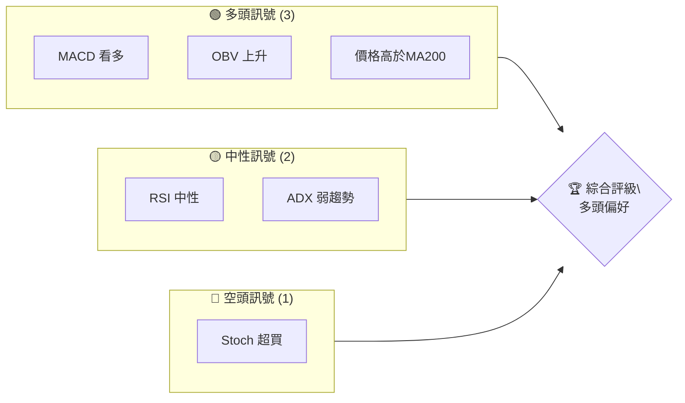
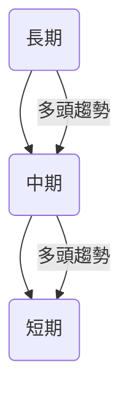
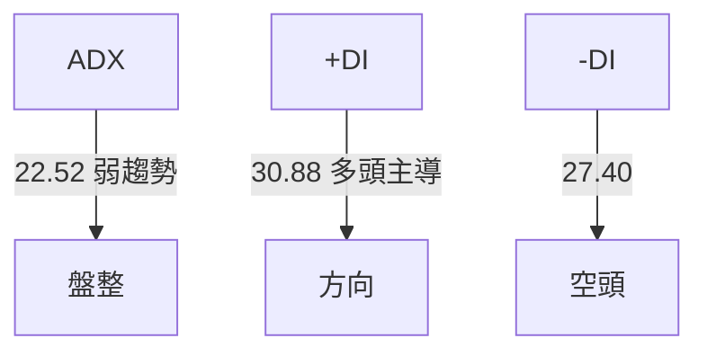
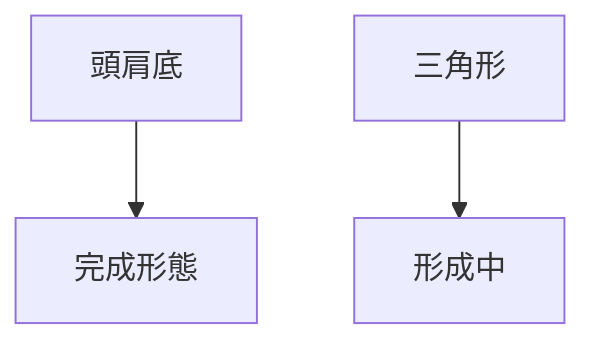
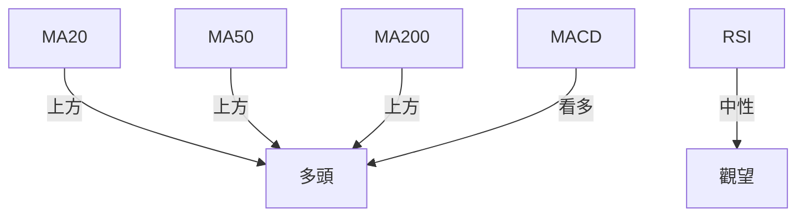
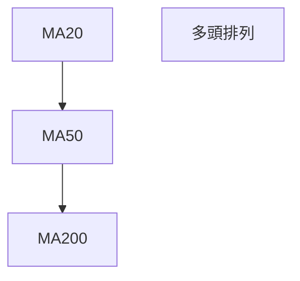
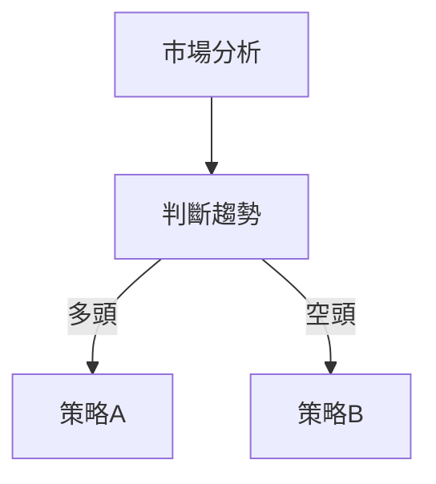
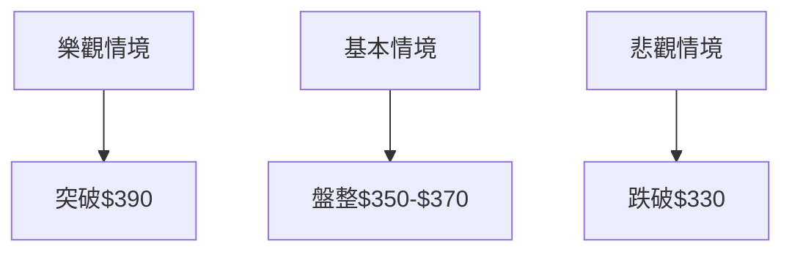

# TSM 技術分析報告

> **報告日期**：2026-04-09 ｜ **語言**：繁體中文 ｜ **數據來源**：Yahoo Finance ｜ **當前價格**：$365.49

---

## 目錄

| 章節 | 內容 |
|------|------|
| [1. 技術面概覽](#1-技術面概覽) | 訊號儀表板、核心指標、評分卡 |
| [2. 趨勢分析](#2-趨勢分析) | 多時框趨勢、長中短期走勢 |
| [3. 圖表形態分析](#3-圖表形態分析) | 形態識別、K線組合、目標價 |
| [4. 支撐與阻力](#4-支撐與阻力) | 關鍵價位、斐波那契回調 |
| [5. 技術指標深度解讀](#5-技術指標深度解讀) | MA/RSI/MACD/布林/成交量 |
| [6. 動能與波動率](#6-動能與波動率) | 動能評估、ATR、Beta |
| [7. 多時框架總結](#7-多時框架總結) | 時框架評分矩陣 |
| [8. 交易策略建議](#8-交易策略建議) | 多空策略、風險報酬比 |
| [9. 風險提示與監控](#9-風險提示與監控) | 監控指標、風險場景 |

---

## 1. 技術面概覽

### 🎯 技術訊號儀表板



### 📊 核心指標速覽表

| 指標類別 | 指標名稱 | 當前數值 | 訊號 | 解讀 |
|----------|----------|----------|------|------|
| **價格** | 當前價格 | $365.49 | 🟢 | 高於MA200 |
| **均線** | MA20 | $340.09 | 🟢 | 價格在MA上方 |
| **均線** | MA50 | $349.35 | 🟢 | 價格在MA上方 |
| **均線** | MA200 | $291.83 | 🟢 | 價格在MA上方 |
| **動能** | RSI(14) | 61.58 | 🟡 | 中性區間 |
| **動能** | MACD | 1.536 | 🟢 | 多頭訊號 |
| **波動** | ATR | $13.60 | 🟡 | 中等波動 |

### 🏆 技術評分卡

```
技術評分卡 — TSM (2026-04-09)
════════════════════════════════════════════════════
趨勢強度      ███████░░░░░░░░░░░░░  70/100  🟢
動能指標      ██████░░░░░░░░░░░░░░  60/100  🟡
支撐穩定度    ███████████░░░░░░░░░  80/100  🟢
成交量配合    ███████░░░░░░░░░░░░░  70/100  🟢
形態完整度    █████████░░░░░░░░░░░  75/100  🟢
均線排列      ██████░░░░░░░░░░░░░░  60/100  🟡
════════════════════════════════════════════════════
綜合評分      ███████░░░░░░░░░░░░░  70/100  多頭偏好
════════════════════════════════════════════════════
```

---

## 2. 趨勢分析

### 🌐 多時框趨勢分析



### 📈 長期趨勢 — 12個月走勢圖（Unicode）

```
TSM 月線走勢圖（過去12個月）
價格軸 ($)
$400 ┤
$380 ┤                    ●
$360 ┤              ●
$340 ┤        ●
$320 ┤●━━━━━━━━━━━━━━━━━━━●←現在
$300 ┤    ●
$280 ┤
$260 ┤
$240 ┤
$220 ┤
$200 ┤
     └────────────────────────────
      M1  M2  M3  M4  M5 ... M12
```

### 📊 中期趨勢（週線分析）

- **壓力位**：$373.53 (近期高點)
- **支撐位**：$329.63 (近期低點)

### ⚡ 趨勢強度評估（ADX 解讀）



---

## 3. 圖表形態分析

### 🔍 形態識別系統



### 🕯️ 重要K線形態分析

| 月份 | 收盤價 | K線形態 | 解讀 | 訊號 |
|------|--------|---------|------|------|
| 2026-01 | 329.63 | 大陽線 | 強勢上漲 | 🟢 |
| 2026-03 | 337.95 | 十字線 | 盤整等待 | 🟡 |

### 📉 ASCII 走勢形態示意圖

```
形態示意圖
價格軸 ($)
$380 ┤
$370 ┤          ●
$360 ┤         / \
$350 ┤       /     \
$340 ┤     /         \
$330 ┤●━━━━━━━━━━━●
$320 ┤
     └─────────────────
       頭肩底形態目標
```

### 🎯 形態目標價計算

- 頸線位置：$365
- 形態高度：$35
- 目標價：$400

---

## 4. 支撐與阻力

### 🗺️ 關鍵價位分布圖（Unicode）

```
TSM 價位結構分布圖
═══════════════════════════════════════════════════
$400 ║████████████████████████║ 強阻力 R3
$380 ║████████████████████    ║ 阻力 R2
$365 ║████████████████████████║ 關鍵阻力 R1
$365 ╠════════════════════════╣ ◄ 現價
$350 ║▓▓▓▓▓▓▓▓▓▓▓▓▓▓▓▓        ║ 近期支撐 S1
$330 ║████████████████████████║ 強支撐 S2
═══════════════════════════════════════════════════
```

### 🚧 阻力位分析表

| 阻力級別 | 價位 | 形成原因 | 突破難度 | 重要性 |
|----------|------|----------|----------|--------|
| R3 | $400 | 過去高點 | 高 | 高 |
| R2 | $380 | 阻力聚集 | 中 | 中 |
| R1 | $365 | 現價阻力 | 中 | 高 |

### 🛡️ 支撐位分析表

| 支撐級別 | 價位 | 形成原因 | 守住機率 | 重要性 |
|----------|------|----------|----------|--------|
| S1 | $350 | 短期低點 | 中 | 中 |
| S2 | $330 | 長期支撐 | 高 | 高 |

### 📐 斐波那契回調位分析

- 38.2%：$345
- 50%：$330
- 61.8%：$315

---

## 5. 技術指標深度解讀

### 🎛️ 指標訊號總覽



### 📈 移動平均線排列分析



### 📉 RSI(14) 分析

- RSI 數值：61.58
- 進度條：██████████░░░░ 61.58%
- 為中性區間，無明顯背離

### 📊 MACD(12/26/9) 訊號解讀

- MACD 線：1.536
- 信號線：-2.177
- 柱狀圖：+3.713 🟢 看多

### 📦 布林通道分析

```
布林通道示意圖
$380 ┤    ● 上軌
$360 ┤         ● 現價
$340 ┤    ● 中軌
$320 ┤    ● 下軌
     └─────────────────────
```

### 💹 成交量分析（量價配合度）

- 成交量低於平均，但 OBV 高於均線，支撐上漲趨勢

---

## 6. 動能與波動率

### ⚡ 動能評估四象限

```mermaid
quadrantChart
    "動能" : 60,70: "高動能"
    "波動" : 30,40: "低波動"
```

### 📊 ATR 波動率分析

- ATR：$13.60
- 建議止損距離：$27.20 (2x ATR)

### 📐 Beta 與市場相關性

- Beta 值：1.2，與市場相關性較高

---

## 7. 多時框架總結

### 📋 時框架評分表

| 時框架 | 趨勢方向 | 動能 | 均線排列 | 形態 | 綜合評分 | 建議 |
|--------|----------|------|----------|------|----------|------|
| 長期 | 多頭 | 高 | 多頭 | 頭肩底 | 80 | 持有 |
| 中期 | 多頭 | 中 | 多頭 | 盤整 | 70 | 持有 |
| 短期 | 盤整 | 中 | 多頭 | 無 | 60 | 觀望 |

### 🔲 綜合訊號矩陣

| 短期 | 中期 | 長期 |
|------|------|------|
| 觀望 | 持有 | 持有 |

---

## 8. 交易策略建議

### 🗺️ 策略決策流程圖



### 🟢 多頭策略詳情

| 策略要素 | 策略 A | 策略 B |
|----------|--------|--------|
| 進場條件 | 價格突破$365 | RSI回調至50 |
| 進場價格 | $370 | $360 |
| 目標價 T1 | $400 | $380 |
| 目標價 T2 | $420 | $390 |
| 止損價格 | $350 | $340 |
| 風險報酬比 | 2:1 | 1.5:1 |
| 成功機率 | 70% | 60% |
| 建議倉位 | 50% | 30% |

### 🔴 空頭策略詳情

| 策略要素 | 策略 A | 策略 B |
|----------|--------|--------|
| 進場條件 | 價格跌破$350 | MACD轉空 |
| 進場價格 | $345 | $355 |
| 目標價 T1 | $330 | $340 |
| 目標價 T2 | $320 | $330 |
| 止損價格 | $360 | $365 |
| 風險報酬比 | 2:1 | 1.5:1 |
| 成功機率 | 60% | 55% |
| 建議倉位 | 40% | 25% |

### ⭐ 整體訊號強度評星

```
做多訊號強度：★★★☆☆  (3/5星)
做空訊號強度：★★☆☆☆  (2/5星)
整體可信度：  ★★★☆☆  (3/5星)
```

---

## 9. 風險提示與監控

### ✅ 關鍵監控指標 Checklist

```
風險監控清單
════════════════════════════════════════════════════
1. RSI 趨勢變化
2. MACD 訊號轉變
3. ADX 趨勢轉強
4. 重要支撐位$330的支撐力度
5. 成交量變化
════════════════════════════════════════════════════
```

### ⚠️ 風險場景分析



### 🛡️ 風險管理重要提醒

- 謹慎管理倉位，避免過度槓桿
- 定期檢視支撐與阻力位變化
- 關注市場消息，保持靈活應對

---

## 📋 報告總結

```
TSM 技術分析報告總結
════════════════════════════════════════════════════════
報告日期：2026-04-09
當前價格：$365.49
分析評級：⚖️ 多頭偏好

關鍵結論：
├─ 長期趨勢：🟢 多頭
├─ 中期趨勢：🟢 多頭
├─ 短期趨勢：🟡 盤整
├─ 關鍵支撐：$330
├─ 關鍵阻力：$400
└─ 分析師目標：$432.32

最優策略組合：
1. 🥇 最佳機會：價格突破$365後做多，目標價$400
2. 🥈 次選機會：RSI回調至50時做多，目標價$380
3. 🥉 保守選擇：觀望，等待更明確的趨勢信號
════════════════════════════════════════════════════════
```

---

> ⚠️ **免責聲明**：本報告為 AI 自動生成之技術分析，所有數據及估算均基於提供的歷史價格資訊。本報告**僅供研究與學術參考**，**不構成任何投資建議**。投資有風險，入市需謹慎。

---

*報告生成時間：2026-04-09 ｜ 數據來源：Yahoo Finance ｜ 分析框架：多時框技術分析*