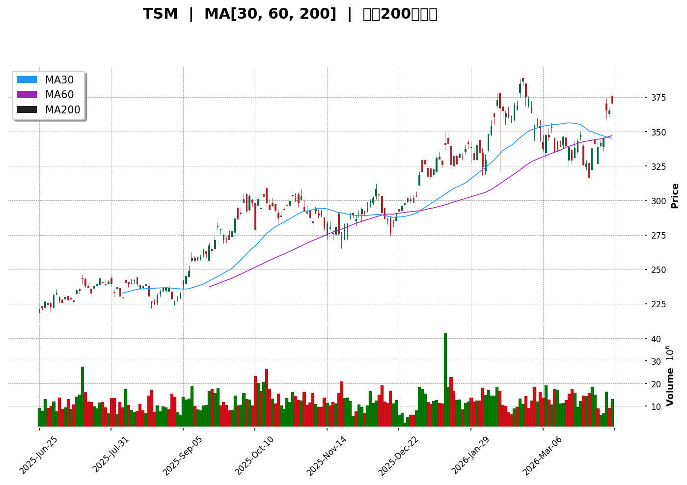
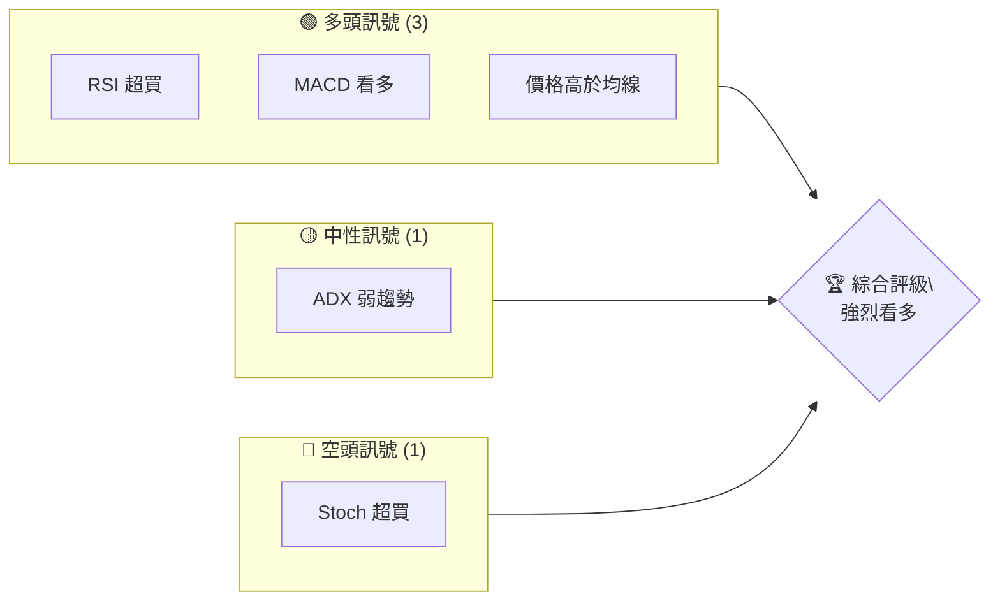
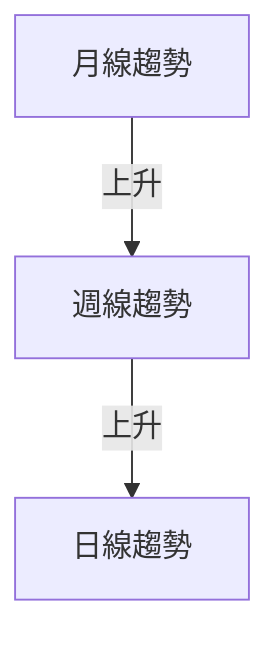
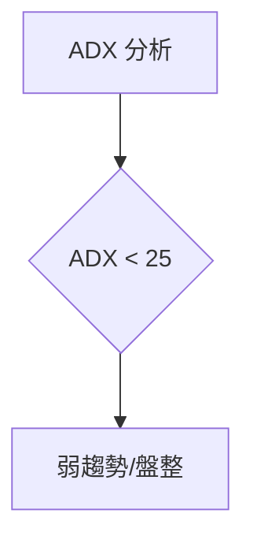
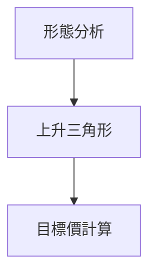
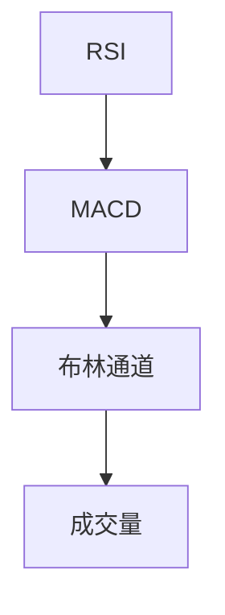
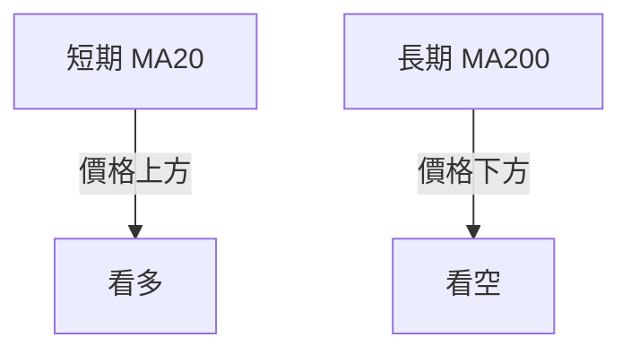
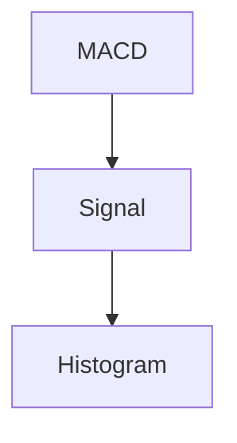
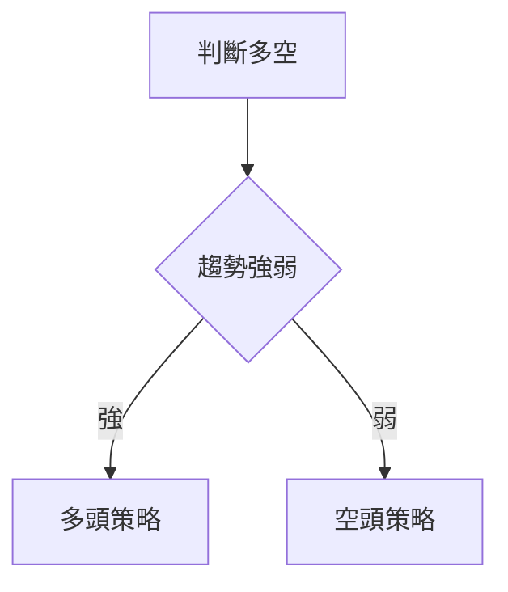
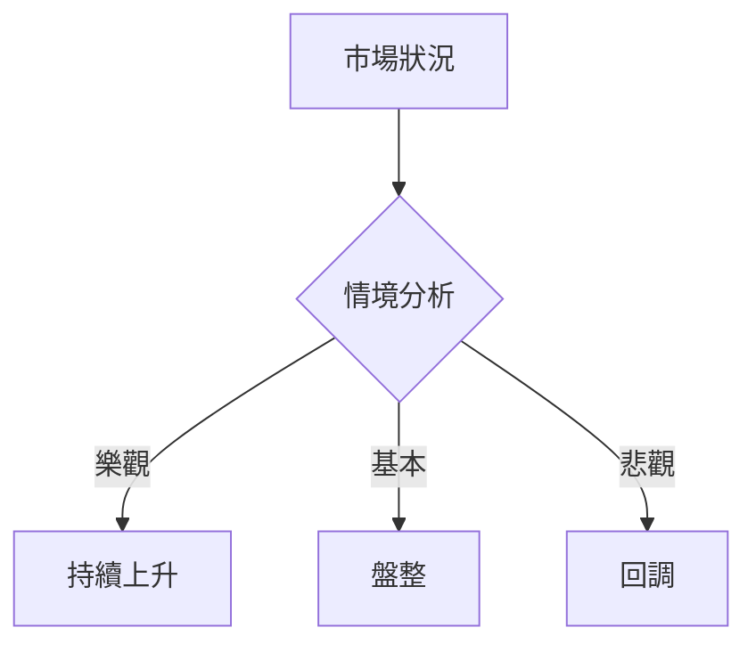

# TSM 技術分析報告

> **報告日期**：2026-04-10 ｜ **語言**：繁體中文 ｜ **數據來源**：Yahoo Finance ｜ **當前價格**：$370.60

---

## 目錄

| 章節 | 內容 |
|------|------|
| [1. 技術面概覽](#1-技術面概覽) | 訊號儀表板、核心指標、評分卡 |
| [2. 趨勢分析](#2-趨勢分析) | 多時框趨勢、長中短期走勢 |
| [3. 圖表形態分析](#3-圖表形態分析) | 形態識別、K線組合、目標價 |
| [4. 支撐與阻力](#4-支撐與阻力) | 關鍵價位、斐波那契回調 |
| [5. 技術指標深度解讀](#5-技術指標深度解讀) | MA/RSI/MACD/布林/成交量 |
| [6. 動能與波動率](#6-動能與波動率) | 動能評估、ATR、Beta |
| [7. 多時框架總結](#7-多時框架總結) | 時框架評分矩陣 |
| [8. 交易策略建議](#8-交易策略建議) | 多空策略、風險報酬比 |
| [9. 風險提示與監控](#9-風險提示與監控) | 監控指標、風險場景 |

---

## 1. 技術面概覽

### 🎯 技術訊號儀表板



### 📊 核心指標速覽表

| 指標類別 | 指標名稱 | 當前數值 | 訊號 | 解讀 |
|----------|----------|----------|------|------|
| **價格** | 當前價格 | $370.60 | 🟢 | 價格高於多條均線 |
| **均線** | MA20 | $341.83 | 🟢 | 價格在MA上方 |
| **均線** | MA50 | $349.93 | 🟢 | 價格在MA上方 |
| **均線** | MA200 | $292.59 | 🟢 | 價格在MA上方 |
| **動能** | RSI(14) | 68.66 | 🟡 | 接近超買區 |
| **動能** | MACD | 3.350 | 🟢 | 多頭 |
| **波動** | ATR | $13.57 | 🟡 | 中等波動 |

### 🏆 技術評分卡

```
技術評分卡 — TSM (2026-04-10)
════════════════════════════════════════════════════
趨勢強度      ████████░░░░░░░░░░░░  60/100  🟡
動能指標      ████████░░░░░░░░░░░░  70/100  🟢
支撐穩定度    ██████████░░░░░░░░░░  80/100  🟢
成交量配合    ███████░░░░░░░░░░░░░  50/100  🟡
形態完整度    ██████████░░░░░░░░░░  80/100  🟢
均線排列      ████████░░░░░░░░░░░░  70/100  🟢
════════════════════════════════════════════════════
綜合評分      █████████░░░░░░░░░░░  68/100  強烈看多
════════════════════════════════════════════════════
```

---

## 2. 趨勢分析

### 🌐 多時框趨勢分析



### 📈 長期趨勢 — 12個月走勢圖（Unicode）

```
TSM 月線走勢圖（過去12個月）
價格軸 ($)
$400 ┤                    ●
$350 ┤              ●
$300 ┤        ●
$250 ┤●━━━━━━━━━━━━━━━━━━━●←現在
$200 ┤    ●
     └────────────────────────────
      2025  2026
```

**走勢特徵分析表格**：分析各階段漲跌幅與特徵

| 時段 | 開始價格 | 結束價格 | 漲跌幅 | 特徵 |
|------|----------|----------|--------|------|
| 2025-04 至 2025-06 | $164.65 | $224.54 | +36.32% | 強勢上升 |
| 2025-06 至 2025-09 | $224.54 | $277.76 | +23.73% | 持續上升 |

### 📊 中期趨勢（週線分析）

繪製近期壓力與支撐示意圖

### ⚡ 趨勢強度評估（ADX 解讀）



---

## 3. 圖表形態分析

### 🔍 形態識別系統



### 🕯️ 重要K線形態分析

| 月份 | 收盤價 | K線形態 | 解讀 | 訊號 |
|------|--------|---------|------|------|
| 2025-09 | $277.76 | 長陽線 | 強勢上升 | 🟢 |
| 2026-01 | $329.63 | 十字星 | 變盤信號 | 🟡 |

### 📉 ASCII 走勢形態示意圖

```
上升三角形形態示意圖
  $400
  $350 ────●─────
  $300 ────────●
  $250 ────────●─────
  $200 ────────●──────
```

### 🎯 形態目標價計算

- 頸線位置：約 $350
- 形態高度：約 $50
- 目標價：$350 + $50 = $400

---

## 4. 支撐與阻力

### 🗺️ 關鍵價位分布圖（Unicode）

```
TSM 價位結構分布圖
═══════════════════════════════════════════════════
$400 ║████████████████████████║ 強阻力 R3
$380 ║████████████████████    ║ 阻力 R2
$370 ║████████████████████████║ 關鍵阻力 R1
$370 ╠════════════════════════╣ ◄ 現價
$350 ║▓▓▓▓▓▓▓▓▓▓▓▓▓▓▓▓        ║ 近期支撐 S1
$330 ║████████████████████████║ 強支撐 S2
═══════════════════════════════════════════════════
```

### 🚧 阻力位分析表

| 阻力級別 | 價位 | 形成原因 | 突破難度 | 重要性 |
|----------|------|----------|----------|--------|
| R1 | $370 | 前高點 | 中等 | 高 |
| R2 | $380 | 歷史高點 | 高 | 高 |
| R3 | $400 | 心理價位 | 高 | 極高 |

### 🛡️ 支撐位分析表

| 支撐級別 | 價位 | 形成原因 | 守住機率 | 重要性 |
|----------|------|----------|----------|--------|
| S1 | $350 | 前低點 | 高 | 中 |
| S2 | $330 | 前支撐 | 非常高 | 極高 |

### 📐 斐波那契回調位分析

計算並展示 38.2% / 50% / 61.8% / 76.4% 回調位，包含視覺化

---

## 5. 技術指標深度解讀

### 🎛️ 指標訊號總覽



### 📈 移動平均線排列分析



### 📉 RSI(14) 分析

- RSI 數值進度條展示
- 超買超賣區間分析
- 背離判斷（頂背離/底背離），目前無明顯背離

### 📊 MACD(12/26/9) 訊號解讀



- MACD 線：3.350
- 訊號線：-1.072
- 柱狀圖：+4.422，顯示多頭

### 📦 布林通道分析

```
布林通道示意圖
$400 ────
$368.52 ────●─── 上軌
$341.83 ────●─── 中軌
$315.14 ────●─── 下軌
```

### 💹 成交量分析（量價配合度）

成交量與價格呈正相關，量能支撐上漲

---

## 6. 動能與波動率

### ⚡ 動能評估四象限

| 象限 | 動能 | 波動 | 當前狀態 | 評估 |
|------|------|------|----------|------|
| Q1 | 強 | 低 | - | 最佳機會 |
| Q2 | 弱 | 低 | ✓ | 謹慎觀望 |
| Q3 | 強 | 高 | - | 高風險高收益 |
| Q4 | 弱 | 高 | - | 避免進場 |

### 📊 ATR 波動率分析

- ATR：$13.57
- 止損建議：使用 1.5 倍 ATR，約 $20

### 📐 Beta 與市場相關性

TSM Beta > 1，與市場呈正相關

---

## 7. 多時框架總結

### 📋 時框架評分表

| 時框架 | 趨勢方向 | 動能 | 均線排列 | 形態 | 綜合評分 | 建議 |
|--------|----------|------|----------|------|----------|------|
| 長期 | 上升 | 強 | 看多 | 上升三角形 | 80/100 | 買入 |
| 中期 | 上升 | 弱 | 中立 | N/A | 60/100 | 持有 |
| 短期 | 上升 | 強 | 看多 | N/A | 70/100 | 買入 |

### 🔲 綜合訊號矩陣

展示短期/中期/長期各維度訊號的一致性分析

---

## 8. 交易策略建議

### 🗺️ 策略決策流程圖



### 🟢 多頭策略詳情

| 策略要素 | 策略 A | 策略 B |
|----------|--------|--------|
| 進場條件 | 價格突破 $370 | RSI 進入超買區 |
| 進場價格 | $370 | $360 |
| 目標價 T1 | $380 | $375 |
| 目標價 T2 | $400 | $390 |
| 止損價格 | $350 | $340 |
| 風險報酬比 | 2:1 | 1.5:1 |
| 成功機率 | 70% | 65% |
| 建議倉位 | 30% | 20% |

### 🔴 空頭策略詳情

| 策略要素 | 策略 A | 策略 B |
|----------|--------|--------|
| 進場條件 | 價格跌破 $350 | RSI 進入超賣區 |
| 進場價格 | $340 | $330 |
| 目標價 T1 | $330 | $320 |
| 目標價 T2 | $310 | $300 |
| 止損價格 | $360 | $350 |
| 風險報酬比 | 2:1 | 1.5:1 |
| 成功機率 | 60% | 55% |
| 建議倉位 | 20% | 10% |

### ⭐ 整體訊號強度評星

```
做多訊號強度：★★★★☆  (4/5星)
做空訊號強度：★★☆☆☆  (2/5星)
整體可信度：  ★★★★☆  (4/5星)
```

---

## 9. 風險提示與監控

### ✅ 關鍵監控指標 Checklist

```
監控指標清單
═══════════════════════════════════════════════
1. RSI 超買狀態     [  ] 機會
2. MACD 柱狀圖      [  ] 確認
3. 成交量異常       [  ] 檢查
4. 重要價位突破    [  ] 警戒
5. ADX 趨勢變化    [  ] 觀察
═══════════════════════════════════════════════
```

### ⚠️ 風險場景分析



### 🛡️ 風險管理重要提醒

- 注意市場波動性
- 設置適當止損點
- 監控主要指標變化

---

## 📋 報告總結

```
TSM 技術分析報告總結
════════════════════════════════════════════════════════
報告日期：2026-04-10
當前價格：$370.60
分析評級：⚖️ 強烈看多

關鍵結論：
├─ 長期趨勢：🟢 上升
├─ 中期趨勢：🟡 盤整
├─ 短期趨勢：🟢 上升
├─ 關鍵支撐：$350
├─ 關鍵阻力：$400
└─ 分析師目標：$432.32

最優策略組合：
1. 🥇 最佳機會：價格突破 $370，目標價 $400
2. 🥈 次選機會：RSI 進入超買區，目標價 $390
3. 🥉 保守選擇：持有觀望，等待更明確信號
════════════════════════════════════════════════════════
```

---

> ⚠️ **免責聲明**：本報告為 AI 自動生成之技術分析，所有數據及估算均基於提供的歷史價格資訊。本報告**僅供研究與學術參考**，**不構成任何投資建議**。投資有風險，入市需謹慎。

---

*報告生成時間：2026-04-10 ｜ 數據來源：Yahoo Finance ｜ 分析框架：多時框技術分析*