<details>
<summary>📊 靜態圖表 (點擊展開)</summary>
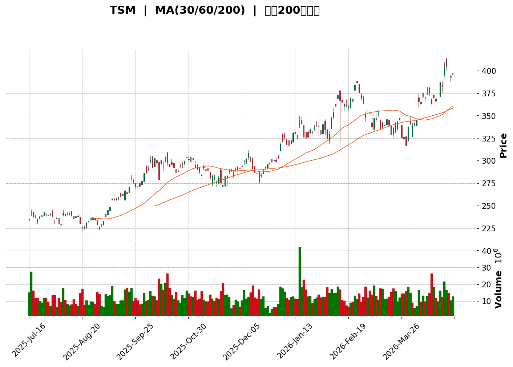
</details>

<html>
<head><meta charset="utf-8" /></head>
<body>
    <div>                        <script>window.PlotlyConfig = {MathJaxConfig: 'local'};</script>
        <script charset="utf-8" src="https://cdn.plot.ly/plotly-3.5.0.min.js" integrity="sha256-fHbNLP+GlIXN+efbQec78UkemUz3NJp7UmfGxC1tNxs=" crossorigin="anonymous"></script>                <div id="candlestick-chart" class="plotly-graph-div" style="height:500px; width:100%;"></div>            <script>                window.PLOTLYENV=window.PLOTLYENV || {};                                if (document.getElementById("candlestick-chart")) {                    Plotly.newPlot(                        "candlestick-chart",                        [{"close":{"dtype":"f8","bdata":"AAAA4F9wbUAAAACgb29uQAAAAIB4ym1AAAAAoEyZbUAAAADAeBJtQAAAACBAyG1AAAAAQIrwbUAAAACgb29uQAAAAOAFFW5AAAAAYPnnbUAAAAAgGRpuQAAAAIAs8W1AAAAAwNIlbUAAAACgDp5tQAAAAEDmzmxAAAAAgACsbEAAAADg5RBuQAAAAADW921AAAAAoBUAbkAAAACg4EVuQAAAAMB2621AAAAAYIHdbUAAAAAAQJptQAAAACCD6m1AAAAA4DHWbEAAAABgIFRsQAAAAGDWK2xAAAAAIGXfbEAAAADA4DFtQAAAAIAslW1AAAAAwEGnbUAAAAAg5oZtQAAAAMAjnGxAAAAAwHZNbEAAAAAAo6xsQAAAAMDSJW1AAAAAAPYpbkAAAADA4KFuQAAAAGA1GG9AAAAAYBwjcEAAAACA1wpwQAAAAACBEXBAAAAAgAUycEAAAADA60lwQAAAAICJVXBAAAAAgJ+ycEAAAABAonZwQAAAAKAc8nBAAAAAgIGScUAAAABgrnJxQAAAAMA8MnFAAAAAILr9cEAAAADAqPtwQAAAACAWXHFAAAAAwCjucUAAAABAbuhxQAAAACBaKXJAAAAAgNDLckAAAABgoUZyQAAAAECM7XJAAAAAYLejckAAAADA4nFxQAAAAKCc03JAAAAAwAVlckAAAABgkvByQAAAAGAUo3JAAAAAgFZXckAAAAAgB4FyQAAAAMBETnJAAAAA4K70cUAAAADgHhJyQAAAAMBtVXJAAAAAoMeJckAAAACg+L1yQAAAAECe9nJAAAAAwNzYckAAAADAd6xyQAAAAED18nJAAAAAwPJGckAAAADAbEByQAAAAEBp+nFAAAAAANDOcUAAAABgXFpyQAAAAEAfGXJAAAAAwF4QckAAAAAgZIpxQAAAAIAUtHFAAAAAAF6HcUAAAADAIEZxQAAAAIAYjXFAAAAAgJo\u002fcUAAAAAgxxhxQAAAAGA3sXFAAAAAQNqxcUAAAABA3gVyQAAAAECIHnJAAAAAoJbhcUAAAADAwidyQAAAAOA5XXJAAAAAgCA1ckAAAAAgnFFyQAAAAIBhw3JAAAAAwOLbckAAAACA+UZzQAAAAADl\u002f3JAAAAAwIIzckAAAABg5+5xQAAAAOAF4XFAAAAAgOhCcUAAAADAFL5xQAAAAKA1AnJAAAAAYEtHckAAAACg2YFyQAAAAMBdn3JAAAAAINPfckAAAAAAMcFyQAAAAKDPq3JAAAAAAJTwckAAAAAAZOtzQAAAACCDFXRAAAAAwChodEAAAACAjdxzQAAAAODc0XNAAAAAwIcrdEAAAACAZ610QAAAACB4pHRAAAAAwA1jdEAAAACA4Up1QAAAAKABV3VAAAAAANpjdEAAAAAgQlN0QAAAAMAzZ3RAAAAAYN3edEAAAADgZrx0QAAAAKA6FnVAAAAAIGlVdUAAAADAiCl1QAAAAEAZmnRAAAAAwGlGdUAAAADA5+x0QAAAAAAyTXRAAAAAoM+cdEAAAACg6r11QAAAAOCUJnZAAAAAAEqOdkAAAAAgn1B3QAAAAAAN8XZAAAAAAErVdkAAAACg07J2QAAAAKDfk3ZAAAAAoAl2dkAAAABA+xd3QAAAAAABEHdAAAAAQKgKeEAAAACgPyp4QAAAAAAFfHdAAAAAgHBYd0AAAABAKgF3QAAAAEA0AnZAAAAAYPhGdkAAAADg2Q12QAAAACABH3VAAAAAAIa7dUAAAADg1aF1QAAAAAAFGXZAAAAA4Dj8dEAAAAAAwBV1QAAAAGBiNHVAAAAAIK6fdUAAAADAHjl1QAAAAOCjLHVAAAAAANeTdEAAAABAMyd1QAAAAAAAdHVAAAAAAAC8dUAAAACAwmF0QAAAAADXa3RAAAAAAADIc0AAAABAMx91QAAAAADXV3VAAAAA4KMwdUAAAAAAKVx1QAAAAMAelXVAAAAAYGbedkAAAAAA19d2QAAAAKCZKXdAAAAAwB4Zd0AAAACAPb53QAAAAKCZcXdAAAAAoJm1dkAAAAAAACh3QAAAAADX43ZAAAAAoEcBd0AAAABACjd4QAAAAGCP6ndAAAAAIFwneUAAAAAgrk95QAAAAKBwhXhAAAAAoEedeEAAAADA9cB4QA=="},"high":{"dtype":"f8","bdata":"oYBs5iqIbUAMKMzTdMRuQLLwZpIse25A8NsUHgQIbkAIyydZVX5tQD\u002fGFL6kzW1ARIpsp6T7bUDJy2RLvYNuQBWQpH0XO25AYZUEx7k7bkDSDnOfwk5uQLlg1kfbqG5ACRmLBaNkbUAAAACgDp5tQDy14eZRkm1AZVC8P1XGbEAj2+Bqf7ZuQNgAkW4HIm5A7TEQXIFnbkBjumL4GlVuQEeQIUrEiW5A61O0iI\u002fpbUAM5BwCKddtQCi96RSDGG5AGDZtfSzDbUBLAsWAxGFsQBkn23kCi2xA0jMEQLYNbUDcsynhfWdtQGFz79qpmG1A54rzGr+qbUAzSNovuNJtQJdw+01MPW1A+sPWBZprbEBPLvOgQ85sQHPu9M\u002f+KG1A9MWCWiBObkChqVuDxLduQBlIX8MTkW9A2UoeisdkcEBZibA1JTZwQOA0UGkzK3BAOBrwmYtIcEDSmxysnY9wQGgWt+mtdXBAZogjHdvQcEB1Zi09r5FwQDrUW612LXFATHOiVNvGcUD5xjAfo3pxQDsuWRLgOXFAsin1dccfcUBW5h2vUGVxQLsPyr9EX3FAzw0igyQOckBCALoYb3FyQGs6jobuZnJA2b5BmMgZc0DZZ\u002f33mRZzQMsMIXB2C3NAZ4KCG6jSckCtiurZzqhyQOSi73ZM73JAL9AdvXjBckDrkzP9zQ5zQGOW\u002fsCLWnNA2a3GnyLackAha4NWtN9yQHeg\u002fN6Zm3JAJoaJYj9ZckDm7BXBlUdyQMeq35QBhXJAvnrJj0OtckBZAAm\u002fhMdyQJJsXyhJJHNATFr5UvEZc0A0d7mU1B9zQHo0892nRnNALnufTErFckAbTORLTYlyQMYvBDdWUHJANJFXN+7kcUBuMDQj9XdyQEn6ENrKVHJA0slCGf9TckDhnE+VjP5xQFksbVaK1HFAcceUJUrPcUBh5r1PaGpxQAF27q\u002fIr3FAnv4up9ozckDhxiztiVJxQII6Pyzmt3FAKjKxK0+9cUAcgn+7NzNyQBcpkoT9MHJARg18bfYYckCUmnjiG05yQA7oH8vXb3JA0NM1XqFGckBJdcXpWrJyQDuLxp5Qz3JA1tLTChjwckCOHcKzE4RzQP51GZuwD3NAdzDg4Mz2ckCwS51cgG9yQPtLVTNk+nFAjO3JRpoEckCy4d5UpuVxQP88nbCVNXJA8kimluVickDu\u002fIyzKpFyQNTkPzscpXJAkBzryHDockAT8gFsT\u002fpyQKP0S4wb+3JAWBvZt2soc0C0BB1W+wp0QC8CjYobpXRAZB\u002fsGE7CdECLccxMIVZ0QJ9fvi1pOXRAAE8tAbg9dEAUF4njzcl0QGSTRWmY93RA20uTGe6OdEC+quwZfOV1QEsrniHfzXVAhr3eeQRTdUBG4GGTPct0QOQ9HZy84XRAjM0+Aj4DdUDRmx\u002feiOJ0QFVBJYKoRHVABrKQi3eIdUD4PprGYmx1QOWr6mAeL3VAJzRW0LlzdUCHQulxMqF1QCZQrXCRHXVAHnPSDRTadED76qwczMt1QOT7t+ZuaXZA9ie10sK7dkD0ZHPwNqh3QPjPqGnqrndAmN3YVBMhd0BualObvNJ2QIjmNRCiBXdAPmo8I32cdkDQYwiFdzJ3QKK\u002f4FsXRndAzJrZBWJBeEBO6ggV0VF4QE3QZzIlFnhA+4af9PF5d0Ag\u002fbtz00B3QARk2xKtL3ZA8o3AvTSBdkDdrvvuW2d2QGlKNJ3Xu3VAEAmcEbHGdUCUzr95Gwh2QCcGjMOIRXZAwy0iFqWedUDKftGm1Hh1QBaAIxyWenVAAAAAACmsdUAAAABAM791QAAAAGBmPnVAAAAAoJkZdUAAAABgj3Z1QAAAAIAUjnVAAAAAQDPndUAAAABgj051QAAAAMD1mHRAAAAAoJmZdEAAAABgjyZ1QAAAAEDhynVAAAAAwB5hdUAAAABAM4N1QAAAAOB6mHVAAAAAwMxkd0AAAABguAJ3QAAAAAAAoHdAAAAAIFw3d0AAAABgj+J3QAAAACCu33dAAAAAQDMjd0AAAACgR3l3QAAAAMAeIXdAAAAAAAAsd0AAAABgjz54QAAAAAApTHhAAAAAANeXeUAAAAAAAOh5QAAAAIDr3XhAAAAAoJm9eEAAAAAAAOx4QA=="},"hovertemplate":"\u003cb\u003e%{x|%Y-%m-%d}\u003c\u002fb\u003e\u003cbr\u003e\u958b: $%{open:.2f}\u003cbr\u003e\u9ad8: $%{high:.2f}\u003cbr\u003e\u4f4e: $%{low:.2f}\u003cbr\u003e\u6536: $%{close:.2f}\u003cextra\u003e\u003c\u002fextra\u003e","low":{"dtype":"f8","bdata":"H1II\u002fDEEbUCHnT6e4OltQMrHSQg5lG1Azi53o9uUbUDDFjj5X7hsQPJoH8DwSm1A395L6Uh\u002fbUBcmi8HmtttQGLBXJMX321AfaADKBK4bUCuvP7+e+RtQJGIe61vt21A+NfSqOm6bEBU\u002f2baQUttQMI8oRTvhWxAEdBnHRtbbEASSXcNKddtQJ5fQ+ManW1Arrw62aLubUA4QJ1QtvNtQAyaQrPgu21AatwlH+ZYbUBYzm5N22ZtQIrepMx2vW1AaLXIWWPSbECKRyObrbhrQG187HPkCWxAflFTWQkHbEDiETxq68dsQABhMZJRNm1AE74mkB4tbUDk\u002fGKW4j5tQAVsvZvwkmxAn7Qj0+f1a0A7\u002fh1xIFRsQEISHs8OimxAlx8YMCl7bUB\u002fHwStLPFtQAcOixOhmW5AZKT+QOLwb0A6QOJDDgBwQFcQzmxvAnBAbSze4U0IcEB5V2gi2TJwQOjXWp7YJHBAOgnfCQAJcEBQzevc2lVwQHrwN\u002fjcf3BA9KuZXWJncUA0os0sMTNxQLFL1T1Jy3BALDPmyiDScEAAAADAqPtwQHXVW8I0BXFABd36UVo6cUANIm3uPtdxQD5i0yJNDnJAVrB0vaukckBrFTFBsjpyQGASVbfVRXJAghNinZJ8ckD9xm5tomxxQHQ8xMNrK3JAEH1lp9MbckCXjjptvaZyQDnF8OT0cHJAD9qy2cpUckD7IoQH2HZyQD6yWEG+QHJANbgblGWtcUAqeM0BngByQNzP8fNbTHJAP3xvgDhBckDJzYMIQGdyQPz8wR1\u002fy3JAHoXdY6yyckD3CNUlzHByQAZUt+pbx3JA964nJ1s+ckD7b+9pXx5yQI+\u002fj5zQ3HFASODSYbc5cUD9IwO5WSJyQNR3Ox0p9XFARCwZSNL\u002fcUBlGFBjYmdxQGrTILmo+3BA9X9JfTNkcUBsUk1Oi\u002fNwQE8eHunTLHFAFHwjaEIucUDH5\u002fSTqZVwQIGy1NEF+3BAzivFsUX5cEDvuC5wYuJxQFl9kb2X9nFAxOKirSSacUBq8lbedPlxQM2QDHv4x3FAJ8AK8a8JckDkX4EVODpyQG1lXwhvcXJA\u002fPV94cGNckC6JCbyZ81yQMoDr9bErHJAe+cbM5kickBiK89P3+txQJjedvthqHFAvQA6o+kkcUCRv\u002fU4VY9xQDu9P3Q02XFAWO0fc0QmckD5Sg5LEDZyQExeLbRcdnJA5hF5GOaackA\u002ftVUg+ZxyQF549b68qXJAXUpgCz3pckAYw9\u002fJL21zQCeVycGLCXRAT5y7z9g6dECMWXG8UdpzQMzsy+UGtHNAA8mFK7HVc0ARWyyjhgJ0QHt87NKbnXRAlJMLW4Q+dEC2lG8whw91QEvBlDECSHVAGBMW\u002frNfdEDC02bwPEx0QHjNyAi0X3RAUiVZqAWndEATEPNq1ZR0QBR4J0Hr2XRAEcTBpFUbdUBvl3\u002fhcXR0QPm8rO3NgnRA9YD5+c2CdEDALc6Se5F0QEKOGoTG4nNAh\u002fUyZgfsc0C2ULXJQ\u002ft0QCeg5NUprXVAlIYpqDc2dkDQE0OarfV2QCLkKm8eE3RASgoTthl8dkAha+j80jN2QKIp9pYke3ZAgXvwU\u002fhGdkBPiluqdGF2QMkuB3Ti1nZAg9krpORvd0DnBZOA+vt3QOa5Y1SUCndAcd5J+Fj5dkDX0\u002f50Abp2QEqavrfEcnVA0ogQI9wYdkBulS3oV211QJbVDTLn+3RA0WK8P8yvdEAxmej+enV1QA6k3xYC1nVA1CVBDPX2dEDugfxtZ\u002fR0QOA1ArjXLXVAAAAAYGYmdUAAAACgcDV1QAAAAEAKU3RAAAAAYGZedEAAAACgmbF0QAAAAOBR4HRAAAAAAAB4dUAAAACA61V0QAAAAMD1JHRAAAAAwMycc0AAAACAPRJ0QAAAAAAAPHVAAAAAwMxsdEAAAACA6yl1QAAAAGBm+nRAAAAAANdzdkAAAAAghYt2QAAAAAAAHHdAAAAAwMzgdkAAAAAghVN3QAAAACBcQ3dAAAAAwMyIdkAAAACAPdJ2QAAAAAAAxHZAAAAAgMLRdkAAAACAPSp3QAAAAMD1fHdAAAAAoJmdeEAAAABgZgZ5QAAAAEAzC3hAAAAAQOFCeEAAAAAgXBt4QA=="},"name":"\u50f9\u683c","open":{"dtype":"f8","bdata":"A9RND5NLbUDVapyUdnVuQDierHA8Zm5AsOwWrJbBbUCt8BG78HhtQMLQgHjUjm1AZU8ijnHEbUCZK9svqOdtQERXfzf0HG5Ai2AP\u002fl3tbUBWnxstCQFuQF1Qi6l9e25AFr6NatQybUAoBnhdenttQI2WiHfNiG1AYkriQzehbECoadBzlktuQNgAkW4HIm5Ac3QpiH\u002f+bUDBo6mCyzNuQEeQIUrEiW5AwarQpGF9bUCj4Mr0P8htQIrepMx2vW1A2hioVWq+bUBJkvN9iEVsQLM33dTZRWxAM1O1dhdBbEDXNtI99AhtQNdDhz2fSm1A+W3LDnxabUCJh7UFZ0htQGFIC\u002fPOOW1ADmiG2GYGbECq9zrRwrBsQGK83kReq2xAyov2R2XFbUAJnHqq6fxtQAcOixOhmW5AvFqLEjUKcECjJ8rkriFwQC98eFGdKXBACvCevCEccEAXLhaAV4dwQHOap10zbnBAQzy0dlEJcEB9TJJ9gI5wQJCJGRA1kXBA45UMupKNcUCTxpwAUWxxQD1jQ4zo+XBAbWgmMikGcUC66lNBiC9xQCjHe1nqHHFABYjQnI9OcUC3xRxZQG5yQEIB0EsDNHJAQz0a6silckDnqZ2l9g5zQKJ0i6IQVnJAP+N072HKckACBdMg\u002faRyQAL+aMeeiXJAOv8U+hZgckDnvr6QtglzQCSDGmiLU3NAqRiAhyqMckAmyVwcoKVyQB3AurK2lXJAnVMqpj02ckC6jG1uUgNyQE5lXqUiX3JAETBv\u002fySQckDBRoa+5IpyQOzWWGXqAXNA1EC2ZqLWckDlU8Rd8ARzQFJTwnbWznJAOzJ7zvpzckA0FfW0MTByQA6SWX6+R3JAUGZ3KEm6cUB42yN74UtyQOd9SJhIJ3JA17g3LmFBckAQH4ViTPlxQEryCKhNJnFA6RcpFEx+cUAeEz06ZkBxQP3YKwhgNnFAnYGzjqspckBTlbfD+fRwQIGy1NEF+3BA+zXgAtOScUALDN0aL\u002fhxQJ74R4v3LXJAlP222n7VcUCNW4YmVCZyQMooRXgxKXJAPj04vtVFckC7qjLRxWZyQIADMlS4uHJAKYDCWHelckCyY5jaEvtyQCMLMbdkB3NAdzDg4Mz2ckAacrV3IWVyQNeN4uI+53FAQppAFoL7cUDNjyDRL8NxQDu9P3Q02XFAPH9s4HhdckBMSISbNUlyQCoBLTN0jnJAyOtstuqwckAFjCia6c5yQGfW9YAq2HJAsGvyO1XyckBYX+Nwp3FzQByb\u002frKLl3RAxfSMg6yUdECvnEevHzx0QHOYzvGnN3RAGVlJnObuc0CT6PaKHhN0QFep\u002fWT0vnRA20uTGe6OdEDLT9FIjF11QGzzbvKUmHVAVI3loFE9dUCMSC6+48d0QA+Kk\u002f66x3RAjLXX2TCydEDSXz20rb10QE1OQC3f+HRA7zgd2Q5hdUD1ymbfhS11QJmOmPCj53RAWk4NP0qddED0ALE7m4F1QAdf8SSD6nRATZ0PSpsedEDqV0eh0wh1QDIcUQl7vHVArrC7Zea0dkBjNfpGpBB3QON7E+z1nndApfqpw80Bd0DnBwSxpo12QOo+2LVmrXZAkQQi9lhrdkB81toWTmx2QJGIef+o33ZAALextVeld0BO6ggV0VF4QOQS3qiEEXhA2QDDeZkRd0C6fBBpVcV2QK+WBLQVyXVAeRV+fc9GdkBk3cfHcR52QCbYRJGOaHVA8UIxJYPqdECZRP592rd1QLByPcD3DnZAMqWw4lOPdUCmrJcOQm91QOz5xIKoRHVAAAAAoJlJdUAAAADgepx1QAAAACCFk3RAAAAAQOEKdUAAAACgmbF0QAAAAMAe+XRAAAAAAACgdUAAAADAHj11QAAAAKBHTXRAAAAAQDNzdEAAAADA9SR0QAAAAGBmfnVAAAAAoHBtdEAAAAAAADx1QAAAAEAKN3VAAAAA4KMkd0AAAADAzLR2QAAAAKBweXdAAAAAACkkd0AAAADgo7B3QAAAAGCP1ndAAAAAgMINd0AAAABAM1N3QAAAACCFE3dAAAAAoEcBd0AAAADgejx3QAAAAAAABHhAAAAAgD3CeEAAAAAAANx5QAAAAIDrgXhAAAAAYI+OeEAAAABA4dx4QA=="},"x":["2025-07-16T00:00:00-04:00","2025-07-17T00:00:00-04:00","2025-07-18T00:00:00-04:00","2025-07-21T00:00:00-04:00","2025-07-22T00:00:00-04:00","2025-07-23T00:00:00-04:00","2025-07-24T00:00:00-04:00","2025-07-25T00:00:00-04:00","2025-07-28T00:00:00-04:00","2025-07-29T00:00:00-04:00","2025-07-30T00:00:00-04:00","2025-07-31T00:00:00-04:00","2025-08-01T00:00:00-04:00","2025-08-04T00:00:00-04:00","2025-08-05T00:00:00-04:00","2025-08-06T00:00:00-04:00","2025-08-07T00:00:00-04:00","2025-08-08T00:00:00-04:00","2025-08-11T00:00:00-04:00","2025-08-12T00:00:00-04:00","2025-08-13T00:00:00-04:00","2025-08-14T00:00:00-04:00","2025-08-15T00:00:00-04:00","2025-08-18T00:00:00-04:00","2025-08-19T00:00:00-04:00","2025-08-20T00:00:00-04:00","2025-08-21T00:00:00-04:00","2025-08-22T00:00:00-04:00","2025-08-25T00:00:00-04:00","2025-08-26T00:00:00-04:00","2025-08-27T00:00:00-04:00","2025-08-28T00:00:00-04:00","2025-08-29T00:00:00-04:00","2025-09-02T00:00:00-04:00","2025-09-03T00:00:00-04:00","2025-09-04T00:00:00-04:00","2025-09-05T00:00:00-04:00","2025-09-08T00:00:00-04:00","2025-09-09T00:00:00-04:00","2025-09-10T00:00:00-04:00","2025-09-11T00:00:00-04:00","2025-09-12T00:00:00-04:00","2025-09-15T00:00:00-04:00","2025-09-16T00:00:00-04:00","2025-09-17T00:00:00-04:00","2025-09-18T00:00:00-04:00","2025-09-19T00:00:00-04:00","2025-09-22T00:00:00-04:00","2025-09-23T00:00:00-04:00","2025-09-24T00:00:00-04:00","2025-09-25T00:00:00-04:00","2025-09-26T00:00:00-04:00","2025-09-29T00:00:00-04:00","2025-09-30T00:00:00-04:00","2025-10-01T00:00:00-04:00","2025-10-02T00:00:00-04:00","2025-10-03T00:00:00-04:00","2025-10-06T00:00:00-04:00","2025-10-07T00:00:00-04:00","2025-10-08T00:00:00-04:00","2025-10-09T00:00:00-04:00","2025-10-10T00:00:00-04:00","2025-10-13T00:00:00-04:00","2025-10-14T00:00:00-04:00","2025-10-15T00:00:00-04:00","2025-10-16T00:00:00-04:00","2025-10-17T00:00:00-04:00","2025-10-20T00:00:00-04:00","2025-10-21T00:00:00-04:00","2025-10-22T00:00:00-04:00","2025-10-23T00:00:00-04:00","2025-10-24T00:00:00-04:00","2025-10-27T00:00:00-04:00","2025-10-28T00:00:00-04:00","2025-10-29T00:00:00-04:00","2025-10-30T00:00:00-04:00","2025-10-31T00:00:00-04:00","2025-11-03T00:00:00-05:00","2025-11-04T00:00:00-05:00","2025-11-05T00:00:00-05:00","2025-11-06T00:00:00-05:00","2025-11-07T00:00:00-05:00","2025-11-10T00:00:00-05:00","2025-11-11T00:00:00-05:00","2025-11-12T00:00:00-05:00","2025-11-13T00:00:00-05:00","2025-11-14T00:00:00-05:00","2025-11-17T00:00:00-05:00","2025-11-18T00:00:00-05:00","2025-11-19T00:00:00-05:00","2025-11-20T00:00:00-05:00","2025-11-21T00:00:00-05:00","2025-11-24T00:00:00-05:00","2025-11-25T00:00:00-05:00","2025-11-26T00:00:00-05:00","2025-11-28T00:00:00-05:00","2025-12-01T00:00:00-05:00","2025-12-02T00:00:00-05:00","2025-12-03T00:00:00-05:00","2025-12-04T00:00:00-05:00","2025-12-05T00:00:00-05:00","2025-12-08T00:00:00-05:00","2025-12-09T00:00:00-05:00","2025-12-10T00:00:00-05:00","2025-12-11T00:00:00-05:00","2025-12-12T00:00:00-05:00","2025-12-15T00:00:00-05:00","2025-12-16T00:00:00-05:00","2025-12-17T00:00:00-05:00","2025-12-18T00:00:00-05:00","2025-12-19T00:00:00-05:00","2025-12-22T00:00:00-05:00","2025-12-23T00:00:00-05:00","2025-12-24T00:00:00-05:00","2025-12-26T00:00:00-05:00","2025-12-29T00:00:00-05:00","2025-12-30T00:00:00-05:00","2025-12-31T00:00:00-05:00","2026-01-02T00:00:00-05:00","2026-01-05T00:00:00-05:00","2026-01-06T00:00:00-05:00","2026-01-07T00:00:00-05:00","2026-01-08T00:00:00-05:00","2026-01-09T00:00:00-05:00","2026-01-12T00:00:00-05:00","2026-01-13T00:00:00-05:00","2026-01-14T00:00:00-05:00","2026-01-15T00:00:00-05:00","2026-01-16T00:00:00-05:00","2026-01-20T00:00:00-05:00","2026-01-21T00:00:00-05:00","2026-01-22T00:00:00-05:00","2026-01-23T00:00:00-05:00","2026-01-26T00:00:00-05:00","2026-01-27T00:00:00-05:00","2026-01-28T00:00:00-05:00","2026-01-29T00:00:00-05:00","2026-01-30T00:00:00-05:00","2026-02-02T00:00:00-05:00","2026-02-03T00:00:00-05:00","2026-02-04T00:00:00-05:00","2026-02-05T00:00:00-05:00","2026-02-06T00:00:00-05:00","2026-02-09T00:00:00-05:00","2026-02-10T00:00:00-05:00","2026-02-11T00:00:00-05:00","2026-02-12T00:00:00-05:00","2026-02-13T00:00:00-05:00","2026-02-17T00:00:00-05:00","2026-02-18T00:00:00-05:00","2026-02-19T00:00:00-05:00","2026-02-20T00:00:00-05:00","2026-02-23T00:00:00-05:00","2026-02-24T00:00:00-05:00","2026-02-25T00:00:00-05:00","2026-02-26T00:00:00-05:00","2026-02-27T00:00:00-05:00","2026-03-02T00:00:00-05:00","2026-03-03T00:00:00-05:00","2026-03-04T00:00:00-05:00","2026-03-05T00:00:00-05:00","2026-03-06T00:00:00-05:00","2026-03-09T00:00:00-04:00","2026-03-10T00:00:00-04:00","2026-03-11T00:00:00-04:00","2026-03-12T00:00:00-04:00","2026-03-13T00:00:00-04:00","2026-03-16T00:00:00-04:00","2026-03-17T00:00:00-04:00","2026-03-18T00:00:00-04:00","2026-03-19T00:00:00-04:00","2026-03-20T00:00:00-04:00","2026-03-23T00:00:00-04:00","2026-03-24T00:00:00-04:00","2026-03-25T00:00:00-04:00","2026-03-26T00:00:00-04:00","2026-03-27T00:00:00-04:00","2026-03-30T00:00:00-04:00","2026-03-31T00:00:00-04:00","2026-04-01T00:00:00-04:00","2026-04-02T00:00:00-04:00","2026-04-06T00:00:00-04:00","2026-04-07T00:00:00-04:00","2026-04-08T00:00:00-04:00","2026-04-09T00:00:00-04:00","2026-04-10T00:00:00-04:00","2026-04-13T00:00:00-04:00","2026-04-14T00:00:00-04:00","2026-04-15T00:00:00-04:00","2026-04-16T00:00:00-04:00","2026-04-17T00:00:00-04:00","2026-04-20T00:00:00-04:00","2026-04-21T00:00:00-04:00","2026-04-22T00:00:00-04:00","2026-04-23T00:00:00-04:00","2026-04-24T00:00:00-04:00","2026-04-27T00:00:00-04:00","2026-04-28T00:00:00-04:00","2026-04-29T00:00:00-04:00","2026-04-30T00:00:00-04:00"],"type":"candlestick"},{"hovertemplate":"MA30: $%{y:.2f}\u003cextra\u003e\u003c\u002fextra\u003e","line":{"color":"#2196F3","dash":"dash","width":2},"mode":"lines","name":"MA30","x":["2025-07-16T00:00:00-04:00","2025-07-17T00:00:00-04:00","2025-07-18T00:00:00-04:00","2025-07-21T00:00:00-04:00","2025-07-22T00:00:00-04:00","2025-07-23T00:00:00-04:00","2025-07-24T00:00:00-04:00","2025-07-25T00:00:00-04:00","2025-07-28T00:00:00-04:00","2025-07-29T00:00:00-04:00","2025-07-30T00:00:00-04:00","2025-07-31T00:00:00-04:00","2025-08-01T00:00:00-04:00","2025-08-04T00:00:00-04:00","2025-08-05T00:00:00-04:00","2025-08-06T00:00:00-04:00","2025-08-07T00:00:00-04:00","2025-08-08T00:00:00-04:00","2025-08-11T00:00:00-04:00","2025-08-12T00:00:00-04:00","2025-08-13T00:00:00-04:00","2025-08-14T00:00:00-04:00","2025-08-15T00:00:00-04:00","2025-08-18T00:00:00-04:00","2025-08-19T00:00:00-04:00","2025-08-20T00:00:00-04:00","2025-08-21T00:00:00-04:00","2025-08-22T00:00:00-04:00","2025-08-25T00:00:00-04:00","2025-08-26T00:00:00-04:00","2025-08-27T00:00:00-04:00","2025-08-28T00:00:00-04:00","2025-08-29T00:00:00-04:00","2025-09-02T00:00:00-04:00","2025-09-03T00:00:00-04:00","2025-09-04T00:00:00-04:00","2025-09-05T00:00:00-04:00","2025-09-08T00:00:00-04:00","2025-09-09T00:00:00-04:00","2025-09-10T00:00:00-04:00","2025-09-11T00:00:00-04:00","2025-09-12T00:00:00-04:00","2025-09-15T00:00:00-04:00","2025-09-16T00:00:00-04:00","2025-09-17T00:00:00-04:00","2025-09-18T00:00:00-04:00","2025-09-19T00:00:00-04:00","2025-09-22T00:00:00-04:00","2025-09-23T00:00:00-04:00","2025-09-24T00:00:00-04:00","2025-09-25T00:00:00-04:00","2025-09-26T00:00:00-04:00","2025-09-29T00:00:00-04:00","2025-09-30T00:00:00-04:00","2025-10-01T00:00:00-04:00","2025-10-02T00:00:00-04:00","2025-10-03T00:00:00-04:00","2025-10-06T00:00:00-04:00","2025-10-07T00:00:00-04:00","2025-10-08T00:00:00-04:00","2025-10-09T00:00:00-04:00","2025-10-10T00:00:00-04:00","2025-10-13T00:00:00-04:00","2025-10-14T00:00:00-04:00","2025-10-15T00:00:00-04:00","2025-10-16T00:00:00-04:00","2025-10-17T00:00:00-04:00","2025-10-20T00:00:00-04:00","2025-10-21T00:00:00-04:00","2025-10-22T00:00:00-04:00","2025-10-23T00:00:00-04:00","2025-10-24T00:00:00-04:00","2025-10-27T00:00:00-04:00","2025-10-28T00:00:00-04:00","2025-10-29T00:00:00-04:00","2025-10-30T00:00:00-04:00","2025-10-31T00:00:00-04:00","2025-11-03T00:00:00-05:00","2025-11-04T00:00:00-05:00","2025-11-05T00:00:00-05:00","2025-11-06T00:00:00-05:00","2025-11-07T00:00:00-05:00","2025-11-10T00:00:00-05:00","2025-11-11T00:00:00-05:00","2025-11-12T00:00:00-05:00","2025-11-13T00:00:00-05:00","2025-11-14T00:00:00-05:00","2025-11-17T00:00:00-05:00","2025-11-18T00:00:00-05:00","2025-11-19T00:00:00-05:00","2025-11-20T00:00:00-05:00","2025-11-21T00:00:00-05:00","2025-11-24T00:00:00-05:00","2025-11-25T00:00:00-05:00","2025-11-26T00:00:00-05:00","2025-11-28T00:00:00-05:00","2025-12-01T00:00:00-05:00","2025-12-02T00:00:00-05:00","2025-12-03T00:00:00-05:00","2025-12-04T00:00:00-05:00","2025-12-05T00:00:00-05:00","2025-12-08T00:00:00-05:00","2025-12-09T00:00:00-05:00","2025-12-10T00:00:00-05:00","2025-12-11T00:00:00-05:00","2025-12-12T00:00:00-05:00","2025-12-15T00:00:00-05:00","2025-12-16T00:00:00-05:00","2025-12-17T00:00:00-05:00","2025-12-18T00:00:00-05:00","2025-12-19T00:00:00-05:00","2025-12-22T00:00:00-05:00","2025-12-23T00:00:00-05:00","2025-12-24T00:00:00-05:00","2025-12-26T00:00:00-05:00","2025-12-29T00:00:00-05:00","2025-12-30T00:00:00-05:00","2025-12-31T00:00:00-05:00","2026-01-02T00:00:00-05:00","2026-01-05T00:00:00-05:00","2026-01-06T00:00:00-05:00","2026-01-07T00:00:00-05:00","2026-01-08T00:00:00-05:00","2026-01-09T00:00:00-05:00","2026-01-12T00:00:00-05:00","2026-01-13T00:00:00-05:00","2026-01-14T00:00:00-05:00","2026-01-15T00:00:00-05:00","2026-01-16T00:00:00-05:00","2026-01-20T00:00:00-05:00","2026-01-21T00:00:00-05:00","2026-01-22T00:00:00-05:00","2026-01-23T00:00:00-05:00","2026-01-26T00:00:00-05:00","2026-01-27T00:00:00-05:00","2026-01-28T00:00:00-05:00","2026-01-29T00:00:00-05:00","2026-01-30T00:00:00-05:00","2026-02-02T00:00:00-05:00","2026-02-03T00:00:00-05:00","2026-02-04T00:00:00-05:00","2026-02-05T00:00:00-05:00","2026-02-06T00:00:00-05:00","2026-02-09T00:00:00-05:00","2026-02-10T00:00:00-05:00","2026-02-11T00:00:00-05:00","2026-02-12T00:00:00-05:00","2026-02-13T00:00:00-05:00","2026-02-17T00:00:00-05:00","2026-02-18T00:00:00-05:00","2026-02-19T00:00:00-05:00","2026-02-20T00:00:00-05:00","2026-02-23T00:00:00-05:00","2026-02-24T00:00:00-05:00","2026-02-25T00:00:00-05:00","2026-02-26T00:00:00-05:00","2026-02-27T00:00:00-05:00","2026-03-02T00:00:00-05:00","2026-03-03T00:00:00-05:00","2026-03-04T00:00:00-05:00","2026-03-05T00:00:00-05:00","2026-03-06T00:00:00-05:00","2026-03-09T00:00:00-04:00","2026-03-10T00:00:00-04:00","2026-03-11T00:00:00-04:00","2026-03-12T00:00:00-04:00","2026-03-13T00:00:00-04:00","2026-03-16T00:00:00-04:00","2026-03-17T00:00:00-04:00","2026-03-18T00:00:00-04:00","2026-03-19T00:00:00-04:00","2026-03-20T00:00:00-04:00","2026-03-23T00:00:00-04:00","2026-03-24T00:00:00-04:00","2026-03-25T00:00:00-04:00","2026-03-26T00:00:00-04:00","2026-03-27T00:00:00-04:00","2026-03-30T00:00:00-04:00","2026-03-31T00:00:00-04:00","2026-04-01T00:00:00-04:00","2026-04-02T00:00:00-04:00","2026-04-06T00:00:00-04:00","2026-04-07T00:00:00-04:00","2026-04-08T00:00:00-04:00","2026-04-09T00:00:00-04:00","2026-04-10T00:00:00-04:00","2026-04-13T00:00:00-04:00","2026-04-14T00:00:00-04:00","2026-04-15T00:00:00-04:00","2026-04-16T00:00:00-04:00","2026-04-17T00:00:00-04:00","2026-04-20T00:00:00-04:00","2026-04-21T00:00:00-04:00","2026-04-22T00:00:00-04:00","2026-04-23T00:00:00-04:00","2026-04-24T00:00:00-04:00","2026-04-27T00:00:00-04:00","2026-04-28T00:00:00-04:00","2026-04-29T00:00:00-04:00","2026-04-30T00:00:00-04:00"],"y":{"dtype":"f8","bdata":"AAAAAAAA+H8AAAAAAAD4fwAAAAAAAPh\u002fAAAAAAAA+H8AAAAAAAD4fwAAAAAAAPh\u002fAAAAAAAA+H8AAAAAAAD4fwAAAAAAAPh\u002fAAAAAAAA+H8AAAAAAAD4fwAAAAAAAPh\u002fAAAAAAAA+H8AAAAAAAD4fwAAAAAAAPh\u002fAAAAAAAA+H8AAAAAAAD4fwAAAAAAAPh\u002fAAAAAAAA+H8AAAAAAAD4fwAAAAAAAPh\u002fAAAAAAAA+H8AAAAAAAD4fwAAAAAAAPh\u002fAAAAAAAA+H8AAAAAAAD4fwAAAAAAAPh\u002fAAAAAAAA+H8AAAAAAAD4f6uqqko2lG1A7+7ungqWbUDe3d1NSo5tQJqZmWk2hG1AAAAAwCZ5bUAiIiLCwXVtQGZmZrZXcG1AREREtEFybUBEREQk8HNtQLy7u9uTfG1AvLu7K8mQbUARERGRtKFtQCIiIuJutG1AzczMbBvQbUCrqqraXeltQHd3d0dOCm5AmpmZKZ0ybkB3d3e3BktuQN7d3X2BbG5AVVVVRWeYbkB3d3dX2r9uQJqZmRkF5m5AvLu7yyYJb0DNzMwcYy5vQHd3dzdgV29ARERENFCTb0B3d3dXNNNvQKuqqiJiDHBAVVVVVZYxcECamZkZ+lBwQBEREZFGdHBAmpmZ2c+UcECJiIhwsatwQJqZmSFH0nBAd3d3z3z2cEBVVVU9wx1xQO\u002fu7lZvQHFAiYiIMD9ccUDe3d0lc3dxQFVVVRX9jnFAd3d394GecUBVVVUl0a9xQGZmZtYlw3FAZmZmxiPXcUAzMzMjE+xxQDMzM8OCAnJAMzMzI9oUckBmZmaWtidyQAAAAODOOHJAZmZmptI+ckBERERUrkVyQKuqqnpaTHJAzczMrFJTckBERERUA19yQO\u002fu7m5QZXJA3t3dXXRmckBVVVXlUWNyQM3MzCxpX3JA7+7ujphUckDNzMy8C0xyQFVVVSVMQHJAERERUW00ckDe3d3tdDFyQDMzM+PGJ3JAiYiI+M0hckCrqqoq+xlyQImIiBiQFXJAzczMTKMRckDe3d2NqQ5yQBERETEpD3JAzczMHE8RckAzMzPjbBNyQFVVVSUXF3JAiYiIyNMZckARERHhZB5yQJqZmQm0HnJAmpmZCTEZckDNzMxs3xJyQImIiNi9CXJAZmZm1hIBckAiIiKSuvxxQN7d3R39\u002fHFAq6qqOgEBckBEREQ0UgJyQBEREcHLBnJAiYiICLYNckAiIiIyEhhyQKuqqipUIHJAAAAAgF4sckDv7u7O8UJyQGZmZvaOWHJAMzMzo4JzckARERFRGotyQHd3d\u002fdBnXJAmpmZWWGyckDv7u4OCMlyQN7d3Q2Q3nJARERE5PHzckDv7u4utw5zQFVVVbUbKHNA3t3dfbs6c0AAAACg2ktzQJqZmRnZWXNAZmZmlgNrc0CrqqoqdndzQCIiItJFiXNAMzMzswCkc0DNzMycjr9zQN7d3f3K1nNAiYiICAv5c0AzMzMzNBR0QFVVVSXFJ3RARERE9K87dEDv7u4eSld0QO\u002fu7o5ldXRAvLu768+UdEDe3d39ubt0QImIiPgq4HRAzczMPGQBdUCJiIgoGxl1QCIiIoJiLnVAERERAeo\u002fdUCrqqq6flt1QJqZmZkqd3VAd3d3NzSYdUB3d3cn97V1QFVVVZU3znVAvLu7m3bndUAiIiKiEvZ1QFVVVYXH+3VAIiIiIuILdkDNzMzsohp2QO\u002fu7l7DIHZAMzMzUx4odkCJiIgoxC92QBEREYFkOHZA3t3dbWs1dkCrqqqawjR2QM3MzCznOXZAvLu76+A8dkCamZlJaz92QERERATeRnZAZmZmdpFGdkCamZlZi0F2QERERHSXO3ZAzczM\u002fJQ0dkAiIiKijRt2QFVVVdULBnZAVVVV1QDsdUDe3d2NjN51QLy7u7sD1HVAIiIiAivJdUC8u7u7X7p1QHd3d5e+rXVAVVVVZbyjdUBERESkdJh1QERERFS1lXVAERERAZmTdUAiIiJy5pl1QO\u002fu7o4lpnVAmpmZmdWpdUBVVVVFPbN1QHd3d3dVwnVAERERQTHNdUCJiIiIO+N1QFVVVSXA8nVAMzMzY1IWdkC8u7vbYjp2QCIiIiKwVnZAAAAAQDVwdkBEREQEVo52QA=="},"type":"scatter"},{"hovertemplate":"MA60: $%{y:.2f}\u003cextra\u003e\u003c\u002fextra\u003e","line":{"color":"#9C27B0","dash":"dash","width":2},"mode":"lines","name":"MA60","x":["2025-07-16T00:00:00-04:00","2025-07-17T00:00:00-04:00","2025-07-18T00:00:00-04:00","2025-07-21T00:00:00-04:00","2025-07-22T00:00:00-04:00","2025-07-23T00:00:00-04:00","2025-07-24T00:00:00-04:00","2025-07-25T00:00:00-04:00","2025-07-28T00:00:00-04:00","2025-07-29T00:00:00-04:00","2025-07-30T00:00:00-04:00","2025-07-31T00:00:00-04:00","2025-08-01T00:00:00-04:00","2025-08-04T00:00:00-04:00","2025-08-05T00:00:00-04:00","2025-08-06T00:00:00-04:00","2025-08-07T00:00:00-04:00","2025-08-08T00:00:00-04:00","2025-08-11T00:00:00-04:00","2025-08-12T00:00:00-04:00","2025-08-13T00:00:00-04:00","2025-08-14T00:00:00-04:00","2025-08-15T00:00:00-04:00","2025-08-18T00:00:00-04:00","2025-08-19T00:00:00-04:00","2025-08-20T00:00:00-04:00","2025-08-21T00:00:00-04:00","2025-08-22T00:00:00-04:00","2025-08-25T00:00:00-04:00","2025-08-26T00:00:00-04:00","2025-08-27T00:00:00-04:00","2025-08-28T00:00:00-04:00","2025-08-29T00:00:00-04:00","2025-09-02T00:00:00-04:00","2025-09-03T00:00:00-04:00","2025-09-04T00:00:00-04:00","2025-09-05T00:00:00-04:00","2025-09-08T00:00:00-04:00","2025-09-09T00:00:00-04:00","2025-09-10T00:00:00-04:00","2025-09-11T00:00:00-04:00","2025-09-12T00:00:00-04:00","2025-09-15T00:00:00-04:00","2025-09-16T00:00:00-04:00","2025-09-17T00:00:00-04:00","2025-09-18T00:00:00-04:00","2025-09-19T00:00:00-04:00","2025-09-22T00:00:00-04:00","2025-09-23T00:00:00-04:00","2025-09-24T00:00:00-04:00","2025-09-25T00:00:00-04:00","2025-09-26T00:00:00-04:00","2025-09-29T00:00:00-04:00","2025-09-30T00:00:00-04:00","2025-10-01T00:00:00-04:00","2025-10-02T00:00:00-04:00","2025-10-03T00:00:00-04:00","2025-10-06T00:00:00-04:00","2025-10-07T00:00:00-04:00","2025-10-08T00:00:00-04:00","2025-10-09T00:00:00-04:00","2025-10-10T00:00:00-04:00","2025-10-13T00:00:00-04:00","2025-10-14T00:00:00-04:00","2025-10-15T00:00:00-04:00","2025-10-16T00:00:00-04:00","2025-10-17T00:00:00-04:00","2025-10-20T00:00:00-04:00","2025-10-21T00:00:00-04:00","2025-10-22T00:00:00-04:00","2025-10-23T00:00:00-04:00","2025-10-24T00:00:00-04:00","2025-10-27T00:00:00-04:00","2025-10-28T00:00:00-04:00","2025-10-29T00:00:00-04:00","2025-10-30T00:00:00-04:00","2025-10-31T00:00:00-04:00","2025-11-03T00:00:00-05:00","2025-11-04T00:00:00-05:00","2025-11-05T00:00:00-05:00","2025-11-06T00:00:00-05:00","2025-11-07T00:00:00-05:00","2025-11-10T00:00:00-05:00","2025-11-11T00:00:00-05:00","2025-11-12T00:00:00-05:00","2025-11-13T00:00:00-05:00","2025-11-14T00:00:00-05:00","2025-11-17T00:00:00-05:00","2025-11-18T00:00:00-05:00","2025-11-19T00:00:00-05:00","2025-11-20T00:00:00-05:00","2025-11-21T00:00:00-05:00","2025-11-24T00:00:00-05:00","2025-11-25T00:00:00-05:00","2025-11-26T00:00:00-05:00","2025-11-28T00:00:00-05:00","2025-12-01T00:00:00-05:00","2025-12-02T00:00:00-05:00","2025-12-03T00:00:00-05:00","2025-12-04T00:00:00-05:00","2025-12-05T00:00:00-05:00","2025-12-08T00:00:00-05:00","2025-12-09T00:00:00-05:00","2025-12-10T00:00:00-05:00","2025-12-11T00:00:00-05:00","2025-12-12T00:00:00-05:00","2025-12-15T00:00:00-05:00","2025-12-16T00:00:00-05:00","2025-12-17T00:00:00-05:00","2025-12-18T00:00:00-05:00","2025-12-19T00:00:00-05:00","2025-12-22T00:00:00-05:00","2025-12-23T00:00:00-05:00","2025-12-24T00:00:00-05:00","2025-12-26T00:00:00-05:00","2025-12-29T00:00:00-05:00","2025-12-30T00:00:00-05:00","2025-12-31T00:00:00-05:00","2026-01-02T00:00:00-05:00","2026-01-05T00:00:00-05:00","2026-01-06T00:00:00-05:00","2026-01-07T00:00:00-05:00","2026-01-08T00:00:00-05:00","2026-01-09T00:00:00-05:00","2026-01-12T00:00:00-05:00","2026-01-13T00:00:00-05:00","2026-01-14T00:00:00-05:00","2026-01-15T00:00:00-05:00","2026-01-16T00:00:00-05:00","2026-01-20T00:00:00-05:00","2026-01-21T00:00:00-05:00","2026-01-22T00:00:00-05:00","2026-01-23T00:00:00-05:00","2026-01-26T00:00:00-05:00","2026-01-27T00:00:00-05:00","2026-01-28T00:00:00-05:00","2026-01-29T00:00:00-05:00","2026-01-30T00:00:00-05:00","2026-02-02T00:00:00-05:00","2026-02-03T00:00:00-05:00","2026-02-04T00:00:00-05:00","2026-02-05T00:00:00-05:00","2026-02-06T00:00:00-05:00","2026-02-09T00:00:00-05:00","2026-02-10T00:00:00-05:00","2026-02-11T00:00:00-05:00","2026-02-12T00:00:00-05:00","2026-02-13T00:00:00-05:00","2026-02-17T00:00:00-05:00","2026-02-18T00:00:00-05:00","2026-02-19T00:00:00-05:00","2026-02-20T00:00:00-05:00","2026-02-23T00:00:00-05:00","2026-02-24T00:00:00-05:00","2026-02-25T00:00:00-05:00","2026-02-26T00:00:00-05:00","2026-02-27T00:00:00-05:00","2026-03-02T00:00:00-05:00","2026-03-03T00:00:00-05:00","2026-03-04T00:00:00-05:00","2026-03-05T00:00:00-05:00","2026-03-06T00:00:00-05:00","2026-03-09T00:00:00-04:00","2026-03-10T00:00:00-04:00","2026-03-11T00:00:00-04:00","2026-03-12T00:00:00-04:00","2026-03-13T00:00:00-04:00","2026-03-16T00:00:00-04:00","2026-03-17T00:00:00-04:00","2026-03-18T00:00:00-04:00","2026-03-19T00:00:00-04:00","2026-03-20T00:00:00-04:00","2026-03-23T00:00:00-04:00","2026-03-24T00:00:00-04:00","2026-03-25T00:00:00-04:00","2026-03-26T00:00:00-04:00","2026-03-27T00:00:00-04:00","2026-03-30T00:00:00-04:00","2026-03-31T00:00:00-04:00","2026-04-01T00:00:00-04:00","2026-04-02T00:00:00-04:00","2026-04-06T00:00:00-04:00","2026-04-07T00:00:00-04:00","2026-04-08T00:00:00-04:00","2026-04-09T00:00:00-04:00","2026-04-10T00:00:00-04:00","2026-04-13T00:00:00-04:00","2026-04-14T00:00:00-04:00","2026-04-15T00:00:00-04:00","2026-04-16T00:00:00-04:00","2026-04-17T00:00:00-04:00","2026-04-20T00:00:00-04:00","2026-04-21T00:00:00-04:00","2026-04-22T00:00:00-04:00","2026-04-23T00:00:00-04:00","2026-04-24T00:00:00-04:00","2026-04-27T00:00:00-04:00","2026-04-28T00:00:00-04:00","2026-04-29T00:00:00-04:00","2026-04-30T00:00:00-04:00"],"y":{"dtype":"f8","bdata":"AAAAAAAA+H8AAAAAAAD4fwAAAAAAAPh\u002fAAAAAAAA+H8AAAAAAAD4fwAAAAAAAPh\u002fAAAAAAAA+H8AAAAAAAD4fwAAAAAAAPh\u002fAAAAAAAA+H8AAAAAAAD4fwAAAAAAAPh\u002fAAAAAAAA+H8AAAAAAAD4fwAAAAAAAPh\u002fAAAAAAAA+H8AAAAAAAD4fwAAAAAAAPh\u002fAAAAAAAA+H8AAAAAAAD4fwAAAAAAAPh\u002fAAAAAAAA+H8AAAAAAAD4fwAAAAAAAPh\u002fAAAAAAAA+H8AAAAAAAD4fwAAAAAAAPh\u002fAAAAAAAA+H8AAAAAAAD4fwAAAAAAAPh\u002fAAAAAAAA+H8AAAAAAAD4fwAAAAAAAPh\u002fAAAAAAAA+H8AAAAAAAD4fwAAAAAAAPh\u002fAAAAAAAA+H8AAAAAAAD4fwAAAAAAAPh\u002fAAAAAAAA+H8AAAAAAAD4fwAAAAAAAPh\u002fAAAAAAAA+H8AAAAAAAD4fwAAAAAAAPh\u002fAAAAAAAA+H8AAAAAAAD4fwAAAAAAAPh\u002fAAAAAAAA+H8AAAAAAAD4fwAAAAAAAPh\u002fAAAAAAAA+H8AAAAAAAD4fwAAAAAAAPh\u002fAAAAAAAA+H8AAAAAAAD4fwAAAAAAAPh\u002fAAAAAAAA+H8AAAAAAAD4f2ZmZrZhPm9AERERKdVfb0B3d3eX1nJvQGZmZlZilG9Ad3d3LxCzb0BmZmYepNhvQCIiIjKb+G9AVVVVBbAKcEAAAACctRhwQJqZmYGjJnBAq6qqRnMzcEDv7u62VUBwQLy7u6OuTnBAZmZmvphfcEBEREQIYXBwQHd3d\u002fPUg3BAAAAAXBSXcEARERH5nKZwQHd3d8+Ht3BAiYiIJIPFcEAAAADAzdJwQLy7u4Ou33BAVVVVCfPrcEBVVVVxGvtwQFVVVUWACHFAAAAAPA4YcUCJiIgIdiZxQLy7u6flNXFAIiIichdDcUAzMzPrgk5xQDMzM1tJWnFAVVVVlZ5kcUAzMzMvk25xQGZmZgIHfXFAAAAAZCWMcUAAAAA035txQLy7u7f\u002fqnFAq6qqPvG2cUDe3d1ZDsNxQDMzMyMTz3FAIiIiiujXcUBEREQEn+FxQN7d3X0e7XFAd3d3x3v4cUAiIiICPAVyQGZmZmabEHJAZmZmlgUXckCamZkBSx1yQERERFxGIXJAZmZmvvIfckAzMzNzNCFyQERERMyrJHJAvLu78ykqckBERETEqjByQAAAABgONnJAMzMzMxU6ckC8u7sLsj1yQLy7u6veP3JAd3d3h3tAckDe3d3FfkdyQN7d3Y1tTHJAIiIi+vdTckB3d3efR15yQFVVVW2EYnJAERERqRdqckDNzMycgXFyQDMzMxMQenJAiYiImMqCckBmZmZesI5yQDMzM3Oim3JAVVVVTQWmckCamZnBo69yQHd3dx94uHJAd3d3r2vCckDe3d2F7cpyQN7d3e3803JAZmZm3pjeckDNzMwEN+lyQDMzM2tE8HJAd3d37w79ckCrqqpidwhzQJqZmSFhEnNAd3d3l1gec0CamZkpzixzQAAAAKgYPnNAIiIi+kJRc0AAAAAY5mlzQJqZmZE\u002fgHNAZmZmXuGWc0C8u7t7Bq5zQERERLx4w3NAIiIiUrbZc0De3d2FTPNzQImIiEg2CnRAiYiIyEoldEAzMzObfz90QJqZmdFjVnRAAAAAQLRtdECJiIjoZIJ0QFVVVZ3xkXRAAAAA0E6jdEBmZmbGPrN0QERERDxOvXRAzczM9JDJdECamZkpndN0QJqZmSnV4HRAiYiIELbsdEC8u7ubKPp0QFVVVRVZCHVAIiIi+vUadUBmZma+zyl1QM3MzJRRN3VAVVVVtSBBdUBERES8akx1QJqZmYF+WHVAREREdLJkdUAAAADQo2t1QO\u002fu7mYbc3VAERERibJ2dUAzMzPb03t1QO\u002fu7h4zgXVAmpmZgYqEdUAzMzM774p1QImIiJh0knVAZmZmTviddUDe3d3lNad1QM3MzHT2sXVAZmZmzoe9dUAiIiKK\u002fMd1QCIiIor20HVA3t3d3dvadUAREREZ8OZ1QDMzM2uM8XVAIiIiyqf6dUCJiIjYfwl2QDMzM1OSFXZAiYiI6N4ldkAzMzO7kjd2QHd3d6dLSHZA3t3dFYtWdkDv7u6m4GZ2QA=="},"type":"scatter"},{"hovertemplate":"MA200: $%{y:.2f}\u003cextra\u003e\u003c\u002fextra\u003e","line":{"color":"#FF6F00","dash":"solid","width":2},"mode":"lines","name":"MA200","x":["2025-07-16T00:00:00-04:00","2025-07-17T00:00:00-04:00","2025-07-18T00:00:00-04:00","2025-07-21T00:00:00-04:00","2025-07-22T00:00:00-04:00","2025-07-23T00:00:00-04:00","2025-07-24T00:00:00-04:00","2025-07-25T00:00:00-04:00","2025-07-28T00:00:00-04:00","2025-07-29T00:00:00-04:00","2025-07-30T00:00:00-04:00","2025-07-31T00:00:00-04:00","2025-08-01T00:00:00-04:00","2025-08-04T00:00:00-04:00","2025-08-05T00:00:00-04:00","2025-08-06T00:00:00-04:00","2025-08-07T00:00:00-04:00","2025-08-08T00:00:00-04:00","2025-08-11T00:00:00-04:00","2025-08-12T00:00:00-04:00","2025-08-13T00:00:00-04:00","2025-08-14T00:00:00-04:00","2025-08-15T00:00:00-04:00","2025-08-18T00:00:00-04:00","2025-08-19T00:00:00-04:00","2025-08-20T00:00:00-04:00","2025-08-21T00:00:00-04:00","2025-08-22T00:00:00-04:00","2025-08-25T00:00:00-04:00","2025-08-26T00:00:00-04:00","2025-08-27T00:00:00-04:00","2025-08-28T00:00:00-04:00","2025-08-29T00:00:00-04:00","2025-09-02T00:00:00-04:00","2025-09-03T00:00:00-04:00","2025-09-04T00:00:00-04:00","2025-09-05T00:00:00-04:00","2025-09-08T00:00:00-04:00","2025-09-09T00:00:00-04:00","2025-09-10T00:00:00-04:00","2025-09-11T00:00:00-04:00","2025-09-12T00:00:00-04:00","2025-09-15T00:00:00-04:00","2025-09-16T00:00:00-04:00","2025-09-17T00:00:00-04:00","2025-09-18T00:00:00-04:00","2025-09-19T00:00:00-04:00","2025-09-22T00:00:00-04:00","2025-09-23T00:00:00-04:00","2025-09-24T00:00:00-04:00","2025-09-25T00:00:00-04:00","2025-09-26T00:00:00-04:00","2025-09-29T00:00:00-04:00","2025-09-30T00:00:00-04:00","2025-10-01T00:00:00-04:00","2025-10-02T00:00:00-04:00","2025-10-03T00:00:00-04:00","2025-10-06T00:00:00-04:00","2025-10-07T00:00:00-04:00","2025-10-08T00:00:00-04:00","2025-10-09T00:00:00-04:00","2025-10-10T00:00:00-04:00","2025-10-13T00:00:00-04:00","2025-10-14T00:00:00-04:00","2025-10-15T00:00:00-04:00","2025-10-16T00:00:00-04:00","2025-10-17T00:00:00-04:00","2025-10-20T00:00:00-04:00","2025-10-21T00:00:00-04:00","2025-10-22T00:00:00-04:00","2025-10-23T00:00:00-04:00","2025-10-24T00:00:00-04:00","2025-10-27T00:00:00-04:00","2025-10-28T00:00:00-04:00","2025-10-29T00:00:00-04:00","2025-10-30T00:00:00-04:00","2025-10-31T00:00:00-04:00","2025-11-03T00:00:00-05:00","2025-11-04T00:00:00-05:00","2025-11-05T00:00:00-05:00","2025-11-06T00:00:00-05:00","2025-11-07T00:00:00-05:00","2025-11-10T00:00:00-05:00","2025-11-11T00:00:00-05:00","2025-11-12T00:00:00-05:00","2025-11-13T00:00:00-05:00","2025-11-14T00:00:00-05:00","2025-11-17T00:00:00-05:00","2025-11-18T00:00:00-05:00","2025-11-19T00:00:00-05:00","2025-11-20T00:00:00-05:00","2025-11-21T00:00:00-05:00","2025-11-24T00:00:00-05:00","2025-11-25T00:00:00-05:00","2025-11-26T00:00:00-05:00","2025-11-28T00:00:00-05:00","2025-12-01T00:00:00-05:00","2025-12-02T00:00:00-05:00","2025-12-03T00:00:00-05:00","2025-12-04T00:00:00-05:00","2025-12-05T00:00:00-05:00","2025-12-08T00:00:00-05:00","2025-12-09T00:00:00-05:00","2025-12-10T00:00:00-05:00","2025-12-11T00:00:00-05:00","2025-12-12T00:00:00-05:00","2025-12-15T00:00:00-05:00","2025-12-16T00:00:00-05:00","2025-12-17T00:00:00-05:00","2025-12-18T00:00:00-05:00","2025-12-19T00:00:00-05:00","2025-12-22T00:00:00-05:00","2025-12-23T00:00:00-05:00","2025-12-24T00:00:00-05:00","2025-12-26T00:00:00-05:00","2025-12-29T00:00:00-05:00","2025-12-30T00:00:00-05:00","2025-12-31T00:00:00-05:00","2026-01-02T00:00:00-05:00","2026-01-05T00:00:00-05:00","2026-01-06T00:00:00-05:00","2026-01-07T00:00:00-05:00","2026-01-08T00:00:00-05:00","2026-01-09T00:00:00-05:00","2026-01-12T00:00:00-05:00","2026-01-13T00:00:00-05:00","2026-01-14T00:00:00-05:00","2026-01-15T00:00:00-05:00","2026-01-16T00:00:00-05:00","2026-01-20T00:00:00-05:00","2026-01-21T00:00:00-05:00","2026-01-22T00:00:00-05:00","2026-01-23T00:00:00-05:00","2026-01-26T00:00:00-05:00","2026-01-27T00:00:00-05:00","2026-01-28T00:00:00-05:00","2026-01-29T00:00:00-05:00","2026-01-30T00:00:00-05:00","2026-02-02T00:00:00-05:00","2026-02-03T00:00:00-05:00","2026-02-04T00:00:00-05:00","2026-02-05T00:00:00-05:00","2026-02-06T00:00:00-05:00","2026-02-09T00:00:00-05:00","2026-02-10T00:00:00-05:00","2026-02-11T00:00:00-05:00","2026-02-12T00:00:00-05:00","2026-02-13T00:00:00-05:00","2026-02-17T00:00:00-05:00","2026-02-18T00:00:00-05:00","2026-02-19T00:00:00-05:00","2026-02-20T00:00:00-05:00","2026-02-23T00:00:00-05:00","2026-02-24T00:00:00-05:00","2026-02-25T00:00:00-05:00","2026-02-26T00:00:00-05:00","2026-02-27T00:00:00-05:00","2026-03-02T00:00:00-05:00","2026-03-03T00:00:00-05:00","2026-03-04T00:00:00-05:00","2026-03-05T00:00:00-05:00","2026-03-06T00:00:00-05:00","2026-03-09T00:00:00-04:00","2026-03-10T00:00:00-04:00","2026-03-11T00:00:00-04:00","2026-03-12T00:00:00-04:00","2026-03-13T00:00:00-04:00","2026-03-16T00:00:00-04:00","2026-03-17T00:00:00-04:00","2026-03-18T00:00:00-04:00","2026-03-19T00:00:00-04:00","2026-03-20T00:00:00-04:00","2026-03-23T00:00:00-04:00","2026-03-24T00:00:00-04:00","2026-03-25T00:00:00-04:00","2026-03-26T00:00:00-04:00","2026-03-27T00:00:00-04:00","2026-03-30T00:00:00-04:00","2026-03-31T00:00:00-04:00","2026-04-01T00:00:00-04:00","2026-04-02T00:00:00-04:00","2026-04-06T00:00:00-04:00","2026-04-07T00:00:00-04:00","2026-04-08T00:00:00-04:00","2026-04-09T00:00:00-04:00","2026-04-10T00:00:00-04:00","2026-04-13T00:00:00-04:00","2026-04-14T00:00:00-04:00","2026-04-15T00:00:00-04:00","2026-04-16T00:00:00-04:00","2026-04-17T00:00:00-04:00","2026-04-20T00:00:00-04:00","2026-04-21T00:00:00-04:00","2026-04-22T00:00:00-04:00","2026-04-23T00:00:00-04:00","2026-04-24T00:00:00-04:00","2026-04-27T00:00:00-04:00","2026-04-28T00:00:00-04:00","2026-04-29T00:00:00-04:00","2026-04-30T00:00:00-04:00"],"y":{"dtype":"f8","bdata":"AAAAAAAA+H8AAAAAAAD4fwAAAAAAAPh\u002fAAAAAAAA+H8AAAAAAAD4fwAAAAAAAPh\u002fAAAAAAAA+H8AAAAAAAD4fwAAAAAAAPh\u002fAAAAAAAA+H8AAAAAAAD4fwAAAAAAAPh\u002fAAAAAAAA+H8AAAAAAAD4fwAAAAAAAPh\u002fAAAAAAAA+H8AAAAAAAD4fwAAAAAAAPh\u002fAAAAAAAA+H8AAAAAAAD4fwAAAAAAAPh\u002fAAAAAAAA+H8AAAAAAAD4fwAAAAAAAPh\u002fAAAAAAAA+H8AAAAAAAD4fwAAAAAAAPh\u002fAAAAAAAA+H8AAAAAAAD4fwAAAAAAAPh\u002fAAAAAAAA+H8AAAAAAAD4fwAAAAAAAPh\u002fAAAAAAAA+H8AAAAAAAD4fwAAAAAAAPh\u002fAAAAAAAA+H8AAAAAAAD4fwAAAAAAAPh\u002fAAAAAAAA+H8AAAAAAAD4fwAAAAAAAPh\u002fAAAAAAAA+H8AAAAAAAD4fwAAAAAAAPh\u002fAAAAAAAA+H8AAAAAAAD4fwAAAAAAAPh\u002fAAAAAAAA+H8AAAAAAAD4fwAAAAAAAPh\u002fAAAAAAAA+H8AAAAAAAD4fwAAAAAAAPh\u002fAAAAAAAA+H8AAAAAAAD4fwAAAAAAAPh\u002fAAAAAAAA+H8AAAAAAAD4fwAAAAAAAPh\u002fAAAAAAAA+H8AAAAAAAD4fwAAAAAAAPh\u002fAAAAAAAA+H8AAAAAAAD4fwAAAAAAAPh\u002fAAAAAAAA+H8AAAAAAAD4fwAAAAAAAPh\u002fAAAAAAAA+H8AAAAAAAD4fwAAAAAAAPh\u002fAAAAAAAA+H8AAAAAAAD4fwAAAAAAAPh\u002fAAAAAAAA+H8AAAAAAAD4fwAAAAAAAPh\u002fAAAAAAAA+H8AAAAAAAD4fwAAAAAAAPh\u002fAAAAAAAA+H8AAAAAAAD4fwAAAAAAAPh\u002fAAAAAAAA+H8AAAAAAAD4fwAAAAAAAPh\u002fAAAAAAAA+H8AAAAAAAD4fwAAAAAAAPh\u002fAAAAAAAA+H8AAAAAAAD4fwAAAAAAAPh\u002fAAAAAAAA+H8AAAAAAAD4fwAAAAAAAPh\u002fAAAAAAAA+H8AAAAAAAD4fwAAAAAAAPh\u002fAAAAAAAA+H8AAAAAAAD4fwAAAAAAAPh\u002fAAAAAAAA+H8AAAAAAAD4fwAAAAAAAPh\u002fAAAAAAAA+H8AAAAAAAD4fwAAAAAAAPh\u002fAAAAAAAA+H8AAAAAAAD4fwAAAAAAAPh\u002fAAAAAAAA+H8AAAAAAAD4fwAAAAAAAPh\u002fAAAAAAAA+H8AAAAAAAD4fwAAAAAAAPh\u002fAAAAAAAA+H8AAAAAAAD4fwAAAAAAAPh\u002fAAAAAAAA+H8AAAAAAAD4fwAAAAAAAPh\u002fAAAAAAAA+H8AAAAAAAD4fwAAAAAAAPh\u002fAAAAAAAA+H8AAAAAAAD4fwAAAAAAAPh\u002fAAAAAAAA+H8AAAAAAAD4fwAAAAAAAPh\u002fAAAAAAAA+H8AAAAAAAD4fwAAAAAAAPh\u002fAAAAAAAA+H8AAAAAAAD4fwAAAAAAAPh\u002fAAAAAAAA+H8AAAAAAAD4fwAAAAAAAPh\u002fAAAAAAAA+H8AAAAAAAD4fwAAAAAAAPh\u002fAAAAAAAA+H8AAAAAAAD4fwAAAAAAAPh\u002fAAAAAAAA+H8AAAAAAAD4fwAAAAAAAPh\u002fAAAAAAAA+H8AAAAAAAD4fwAAAAAAAPh\u002fAAAAAAAA+H8AAAAAAAD4fwAAAAAAAPh\u002fAAAAAAAA+H8AAAAAAAD4fwAAAAAAAPh\u002fAAAAAAAA+H8AAAAAAAD4fwAAAAAAAPh\u002fAAAAAAAA+H8AAAAAAAD4fwAAAAAAAPh\u002fAAAAAAAA+H8AAAAAAAD4fwAAAAAAAPh\u002fAAAAAAAA+H8AAAAAAAD4fwAAAAAAAPh\u002fAAAAAAAA+H8AAAAAAAD4fwAAAAAAAPh\u002fAAAAAAAA+H8AAAAAAAD4fwAAAAAAAPh\u002fAAAAAAAA+H8AAAAAAAD4fwAAAAAAAPh\u002fAAAAAAAA+H8AAAAAAAD4fwAAAAAAAPh\u002fAAAAAAAA+H8AAAAAAAD4fwAAAAAAAPh\u002fAAAAAAAA+H8AAAAAAAD4fwAAAAAAAPh\u002fAAAAAAAA+H8AAAAAAAD4fwAAAAAAAPh\u002fAAAAAAAA+H8AAAAAAAD4fwAAAAAAAPh\u002fAAAAAAAA+H8AAAAAAAD4fwAAAAAAAPh\u002fAAAAAAAA+H9xPQonGPdyQA=="},"type":"scatter"}],                        {"template":{"data":{"barpolar":[{"marker":{"line":{"color":"rgb(17,17,17)","width":0.5},"pattern":{"fillmode":"overlay","size":10,"solidity":0.2}},"type":"barpolar"}],"bar":[{"error_x":{"color":"#f2f5fa"},"error_y":{"color":"#f2f5fa"},"marker":{"line":{"color":"rgb(17,17,17)","width":0.5},"pattern":{"fillmode":"overlay","size":10,"solidity":0.2}},"type":"bar"}],"carpet":[{"aaxis":{"endlinecolor":"#A2B1C6","gridcolor":"#506784","linecolor":"#506784","minorgridcolor":"#506784","startlinecolor":"#A2B1C6"},"baxis":{"endlinecolor":"#A2B1C6","gridcolor":"#506784","linecolor":"#506784","minorgridcolor":"#506784","startlinecolor":"#A2B1C6"},"type":"carpet"}],"choropleth":[{"colorbar":{"outlinewidth":0,"ticks":""},"type":"choropleth"}],"contourcarpet":[{"colorbar":{"outlinewidth":0,"ticks":""},"type":"contourcarpet"}],"contour":[{"colorbar":{"outlinewidth":0,"ticks":""},"colorscale":[[0.0,"#0d0887"],[0.1111111111111111,"#46039f"],[0.2222222222222222,"#7201a8"],[0.3333333333333333,"#9c179e"],[0.4444444444444444,"#bd3786"],[0.5555555555555556,"#d8576b"],[0.6666666666666666,"#ed7953"],[0.7777777777777778,"#fb9f3a"],[0.8888888888888888,"#fdca26"],[1.0,"#f0f921"]],"type":"contour"}],"heatmap":[{"colorbar":{"outlinewidth":0,"ticks":""},"colorscale":[[0.0,"#0d0887"],[0.1111111111111111,"#46039f"],[0.2222222222222222,"#7201a8"],[0.3333333333333333,"#9c179e"],[0.4444444444444444,"#bd3786"],[0.5555555555555556,"#d8576b"],[0.6666666666666666,"#ed7953"],[0.7777777777777778,"#fb9f3a"],[0.8888888888888888,"#fdca26"],[1.0,"#f0f921"]],"type":"heatmap"}],"histogram2dcontour":[{"colorbar":{"outlinewidth":0,"ticks":""},"colorscale":[[0.0,"#0d0887"],[0.1111111111111111,"#46039f"],[0.2222222222222222,"#7201a8"],[0.3333333333333333,"#9c179e"],[0.4444444444444444,"#bd3786"],[0.5555555555555556,"#d8576b"],[0.6666666666666666,"#ed7953"],[0.7777777777777778,"#fb9f3a"],[0.8888888888888888,"#fdca26"],[1.0,"#f0f921"]],"type":"histogram2dcontour"}],"histogram2d":[{"colorbar":{"outlinewidth":0,"ticks":""},"colorscale":[[0.0,"#0d0887"],[0.1111111111111111,"#46039f"],[0.2222222222222222,"#7201a8"],[0.3333333333333333,"#9c179e"],[0.4444444444444444,"#bd3786"],[0.5555555555555556,"#d8576b"],[0.6666666666666666,"#ed7953"],[0.7777777777777778,"#fb9f3a"],[0.8888888888888888,"#fdca26"],[1.0,"#f0f921"]],"type":"histogram2d"}],"histogram":[{"marker":{"pattern":{"fillmode":"overlay","size":10,"solidity":0.2}},"type":"histogram"}],"mesh3d":[{"colorbar":{"outlinewidth":0,"ticks":""},"type":"mesh3d"}],"parcoords":[{"line":{"colorbar":{"outlinewidth":0,"ticks":""}},"type":"parcoords"}],"pie":[{"automargin":true,"type":"pie"}],"scatter3d":[{"line":{"colorbar":{"outlinewidth":0,"ticks":""}},"marker":{"colorbar":{"outlinewidth":0,"ticks":""}},"type":"scatter3d"}],"scattercarpet":[{"marker":{"colorbar":{"outlinewidth":0,"ticks":""}},"type":"scattercarpet"}],"scattergeo":[{"marker":{"colorbar":{"outlinewidth":0,"ticks":""}},"type":"scattergeo"}],"scattergl":[{"marker":{"line":{"color":"#283442"}},"type":"scattergl"}],"scattermapbox":[{"marker":{"colorbar":{"outlinewidth":0,"ticks":""}},"type":"scattermapbox"}],"scattermap":[{"marker":{"colorbar":{"outlinewidth":0,"ticks":""}},"type":"scattermap"}],"scatterpolargl":[{"marker":{"colorbar":{"outlinewidth":0,"ticks":""}},"type":"scatterpolargl"}],"scatterpolar":[{"marker":{"colorbar":{"outlinewidth":0,"ticks":""}},"type":"scatterpolar"}],"scatter":[{"marker":{"line":{"color":"#283442"}},"type":"scatter"}],"scatterternary":[{"marker":{"colorbar":{"outlinewidth":0,"ticks":""}},"type":"scatterternary"}],"surface":[{"colorbar":{"outlinewidth":0,"ticks":""},"colorscale":[[0.0,"#0d0887"],[0.1111111111111111,"#46039f"],[0.2222222222222222,"#7201a8"],[0.3333333333333333,"#9c179e"],[0.4444444444444444,"#bd3786"],[0.5555555555555556,"#d8576b"],[0.6666666666666666,"#ed7953"],[0.7777777777777778,"#fb9f3a"],[0.8888888888888888,"#fdca26"],[1.0,"#f0f921"]],"type":"surface"}],"table":[{"cells":{"fill":{"color":"#506784"},"line":{"color":"rgb(17,17,17)"}},"header":{"fill":{"color":"#2a3f5f"},"line":{"color":"rgb(17,17,17)"}},"type":"table"}]},"layout":{"annotationdefaults":{"arrowcolor":"#f2f5fa","arrowhead":0,"arrowwidth":1},"autotypenumbers":"strict","coloraxis":{"colorbar":{"outlinewidth":0,"ticks":""}},"colorscale":{"diverging":[[0,"#8e0152"],[0.1,"#c51b7d"],[0.2,"#de77ae"],[0.3,"#f1b6da"],[0.4,"#fde0ef"],[0.5,"#f7f7f7"],[0.6,"#e6f5d0"],[0.7,"#b8e186"],[0.8,"#7fbc41"],[0.9,"#4d9221"],[1,"#276419"]],"sequential":[[0.0,"#0d0887"],[0.1111111111111111,"#46039f"],[0.2222222222222222,"#7201a8"],[0.3333333333333333,"#9c179e"],[0.4444444444444444,"#bd3786"],[0.5555555555555556,"#d8576b"],[0.6666666666666666,"#ed7953"],[0.7777777777777778,"#fb9f3a"],[0.8888888888888888,"#fdca26"],[1.0,"#f0f921"]],"sequentialminus":[[0.0,"#0d0887"],[0.1111111111111111,"#46039f"],[0.2222222222222222,"#7201a8"],[0.3333333333333333,"#9c179e"],[0.4444444444444444,"#bd3786"],[0.5555555555555556,"#d8576b"],[0.6666666666666666,"#ed7953"],[0.7777777777777778,"#fb9f3a"],[0.8888888888888888,"#fdca26"],[1.0,"#f0f921"]]},"colorway":["#636efa","#EF553B","#00cc96","#ab63fa","#FFA15A","#19d3f3","#FF6692","#B6E880","#FF97FF","#FECB52"],"font":{"color":"#f2f5fa"},"geo":{"bgcolor":"rgb(17,17,17)","lakecolor":"rgb(17,17,17)","landcolor":"rgb(17,17,17)","showlakes":true,"showland":true,"subunitcolor":"#506784"},"hoverlabel":{"align":"left"},"hovermode":"closest","mapbox":{"style":"dark"},"paper_bgcolor":"rgb(17,17,17)","plot_bgcolor":"rgb(17,17,17)","polar":{"angularaxis":{"gridcolor":"#506784","linecolor":"#506784","ticks":""},"bgcolor":"rgb(17,17,17)","radialaxis":{"gridcolor":"#506784","linecolor":"#506784","ticks":""}},"scene":{"xaxis":{"backgroundcolor":"rgb(17,17,17)","gridcolor":"#506784","gridwidth":2,"linecolor":"#506784","showbackground":true,"ticks":"","zerolinecolor":"#C8D4E3"},"yaxis":{"backgroundcolor":"rgb(17,17,17)","gridcolor":"#506784","gridwidth":2,"linecolor":"#506784","showbackground":true,"ticks":"","zerolinecolor":"#C8D4E3"},"zaxis":{"backgroundcolor":"rgb(17,17,17)","gridcolor":"#506784","gridwidth":2,"linecolor":"#506784","showbackground":true,"ticks":"","zerolinecolor":"#C8D4E3"}},"shapedefaults":{"line":{"color":"#f2f5fa"}},"sliderdefaults":{"bgcolor":"#C8D4E3","bordercolor":"rgb(17,17,17)","borderwidth":1,"tickwidth":0},"ternary":{"aaxis":{"gridcolor":"#506784","linecolor":"#506784","ticks":""},"baxis":{"gridcolor":"#506784","linecolor":"#506784","ticks":""},"bgcolor":"rgb(17,17,17)","caxis":{"gridcolor":"#506784","linecolor":"#506784","ticks":""}},"title":{"x":0.05},"updatemenudefaults":{"bgcolor":"#506784","borderwidth":0},"xaxis":{"automargin":true,"gridcolor":"#283442","linecolor":"#506784","ticks":"","title":{"standoff":15},"zerolinecolor":"#283442","zerolinewidth":2},"yaxis":{"automargin":true,"gridcolor":"#283442","linecolor":"#506784","ticks":"","title":{"standoff":15},"zerolinecolor":"#283442","zerolinewidth":2}}},"xaxis":{"rangeslider":{"visible":false},"title":{"text":"\u65e5\u671f"}},"font":{"size":11},"title":{"text":"TSM  |  MA(30\u002f60\u002f200)  |  \u6700\u8fd1200\u4ea4\u6613\u65e5"},"yaxis":{"title":{"text":"\u80a1\u50f9 (USD)"}},"hovermode":"x unified","height":500},                        {"responsive": true}                    )                };            </script>        </div>
</body>
</html>

# TSM 技術分析報告

> **報告日期**：2026-04-30 ｜ **語言**：繁體中文 ｜ **數據來源**：Yahoo Finance ｜ **當前價格**：$396.06

---

## 目錄

| 章節 | 內容 |
|------|------|
| [1. 技術面概覽](#1-技術面概覽) | 訊號儀表板、核心指標、評分卡 |
| [2. 趨勢分析](#2-趨勢分析) | 多時框趨勢、長中短期走勢 |
| [3. 圖表形態分析](#3-圖表形態分析) | 形態識別、K線組合、目標價 |
| [4. 支撐與阻力](#4-支撐與阻力) | 關鍵價位、斐波那契回調 |
| [5. 技術指標深度解讀](#5-技術指標深度解讀) | MA/RSI/MACD/布林/成交量 |
| [6. 動能與波動率](#6-動能與波動率) | 動能評估、ATR、Beta |
| [7. 多時框架總結](#7-多時框架總結) | 時框架評分矩陣 |
| [8. 交易策略建議](#8-交易策略建議) | 多空策略、風險報酬比 |
| [9. 風險提示與監控](#9-風險提示與監控) | 監控指標、風險場景 |

---

## 1. 技術面概覽

### 🎯 技術訊號儀表板

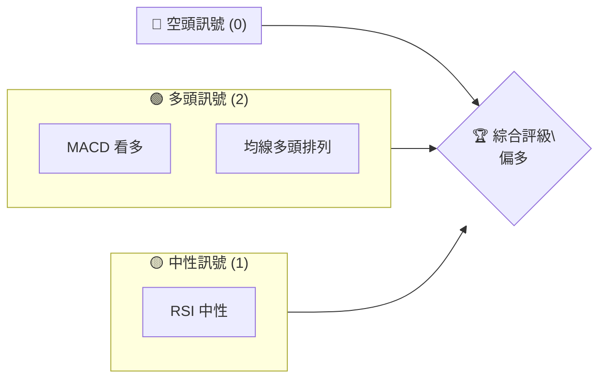

### 📊 核心指標速覽表

| 指標類別 | 指標名稱 | 當前數值 | 訊號 | 解讀 |
|----------|----------|----------|------|------|
| **價格** | 當前價格 | $396.06 | 🟢 | 價格高於所有主要均線 |
| **均線** | MA20 | $374.03 | 🟢 | 價格在MA上方 |
| **均線** | MA50 | $359.16 | 🟢 | 價格在MA上方 |
| **均線** | MA200 | $303.44 | 🟢 | 價格在MA上方 |
| **動能** | RSI(14) | 62.25 | 🟡 | 中性區間，未超買 |
| **動能** | MACD | 12.852 | 🟢 | 多頭訊號 |
| **波動** | ATR | $12.94 | 🟡 | 中等波動性 |

### 🏆 技術評分卡

```
技術評分卡 — TSM (2026-04-30)
════════════════════════════════════════════════════
趨勢強度      ████████░░░░░░░░░░░░  80/100  🟢
動能指標      ██████░░░░░░░░░░░░░░  60/100  🟡
支撐穩定度    ████████████░░░░░░░░  85/100  🟢
成交量配合    ████████░░░░░░░░░░░░  75/100  🟢
形態完整度    ████████████░░░░░░░░  85/100  🟢
均線排列      ██████░░░░░░░░░░░░░░  60/100  🟢
════════════════════════════════════════════════════
綜合評分      ████████░░░░░░░░░░░░  75/100  偏多
════════════════════════════════════════════════════
```

---

## 2. 趨勢分析

### 🌐 多時框趨勢分析

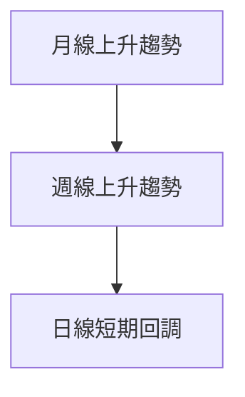

### 📈 長期趨勢 — 12個月走勢圖（Unicode）

```
TSM 月線走勢圖（過去12個月）
價格軸 ($)
$414 ┤                    ●(高點)
$400 ┤              ●
$370 ┤        ●
$350 ┤●━━━━━━━━━━━━━━━━━━━●←現在
$330 ┤    ●(低點)
     └────────────────────────────
      M1  M2  M3  M4  M5 ... M12
```

**走勢特徵分析表格**

| 月份 | 收盤價 | 漲跌幅 | 走勢特徵 |
|------|--------|--------|----------|
| 2025-05 | $190.95 | +17.88% | 強勢上漲 |
| 2025-06 | $224.54 | +17.60% | 持續上升 |
| 2025-07 | $239.54 | +6.68% | 繼續上攻 |
| 2025-08 | $228.88 | -4.47% | 小幅回調 |
| 2025-09 | $277.76 | +21.37% | 大幅上漲 |
| 2025-10 | $298.78 | +7.56% | 保持強勢 |
| 2025-11 | $289.91 | -2.97% | 小幅回撤 |
| 2025-12 | $303.04 | +4.53% | 再創新高 |
| 2026-01 | $329.63 | +8.76% | 持續強勁 |
| 2026-02 | $373.53 | +13.30% | 加速上升 |
| 2026-03 | $337.95 | -9.52% | 短期回調 |
| 2026-04 | $396.06 | +17.20% | 再創新高 |

### 📊 中期趨勢（週線分析）

```
TSM 週線支撐阻力示意圖
═══════════════════════
$420 ──────────── R3
$410 ──────────── R2
$400 ────●─────── R1
$390 ────┼─────── 現價
$370 ──────────── S1
$350 ──────────── S2
═══════════════════════
```

### ⚡ 趨勢強度評估（ADX 解讀）

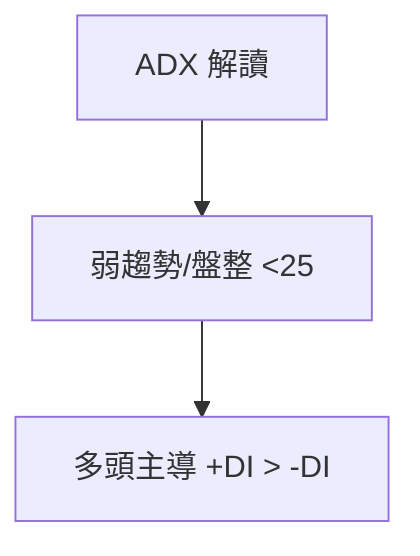

---

## 3. 圖表形態分析

### 🔍 形態識別系統

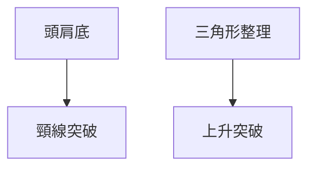

### 🕯️ 重要K線形態分析

| 月份 | 收盤價 | K線形態 | 解讀 | 訊號 |
|------|--------|---------|------|------|
| 2026-02 | $373.53 | 大陽線 | 強勢上漲 | 🟢 |
| 2026-03 | $337.95 | 長下影線 | 支撐顯著 | 🟢 |
| 2026-04 | $396.06 | 三連陽 | 持續上攻 | 🟢 |

### 📉 ASCII 走勢形態示意圖

```
TSM 關鍵形態示意圖
價格軸 ($)
$420 ─────────────────────────────────
$400 ──●──────────●─── 頸線
$380 ──┼──────────┼──────
$360 ──────────────────
$340 ──●───────●───────
     └────────────────────
      M1  M2  M3  M4 ... M12
```

### 🎯 形態目標價計算

- 頭肩底頸線：$400
- 形態高度：$60
- 目標價：$460

---

## 4. 支撐與阻力

### 🗺️ 關鍵價位分布圖（Unicode）

```
TSM 價位結構分布圖
═══════════════════════════════════════════════════
$420 ║████████████████████████║ 強阻力 R3
$410 ║████████████████████    ║ 阻力 R2
$400 ║████████████████████████║ 關鍵阻力 R1
$396 ╠════════════════════════╣ ◄ 現價
$380 ║▓▓▓▓▓▓▓▓▓▓▓▓▓▓▓▓        ║ 近期支撐 S1
$360 ║████████████████████████║ 強支撐 S2
═══════════════════════════════════════════════════
```

### 🚧 阻力位分析表

| 阻力級別 | 價位 | 形成原因 | 突破難度 | 重要性 |
|----------|------|----------|----------|--------|
| R1 | $400 | 頭肩底頸線 | 中等 | 高 |
| R2 | $410 | 歷史高點 | 較高 | 中 |
| R3 | $420 | 長期阻力 | 高 | 高 |

### 🛡️ 支撐位分析表

| 支撐級別 | 價位 | 形成原因 | 守住機率 | 重要性 |
|----------|------|----------|----------|--------|
| S1 | $380 | 短期支撐 | 高 | 中 |
| S2 | $360 | 長期支撐 | 高 | 高 |

### 📐 斐波那契回調位分析

- 38.2% 回調位：$375
- 50% 回調位：$355
- 61.8% 回調位：$335

---

## 5. 技術指標深度解讀

### 🎛️ 指標訊號總覽

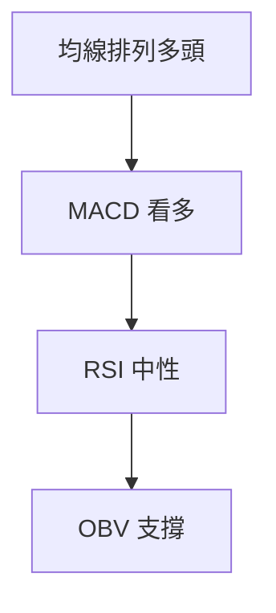

### 📈 移動平均線排列分析

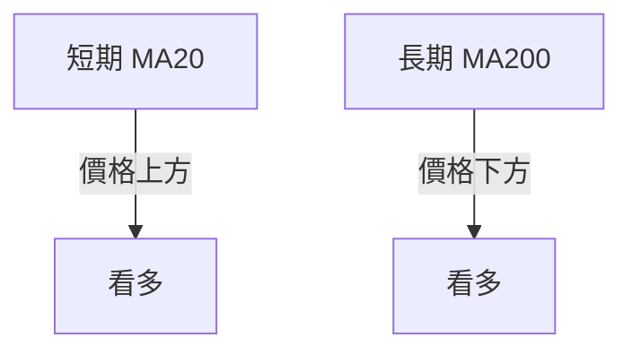

### 📉 RSI(14) 分析

- RSI 數值：62.25
- 進度條：███████░░░░░░ 62%
- 分析：尚未進入超買區，具上漲空間

### 📊 MACD(12/26/9) 訊號解讀

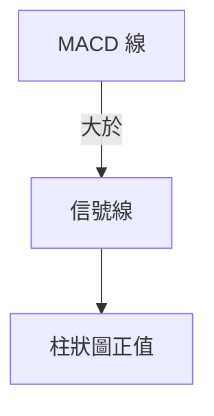

### 📦 布林通道分析

```
布林通道示意圖
價格軸 ($)
$420 ─────────────────────────────────── 上軌
$400 ────────────────────●─────── 現價
$380 ──────────────────── 中軌
$360 ──────────────────── 下軌
```

### 💹 成交量分析（量價配合度）

- 最新成交量：12,689,629
- 20日均量：13,429,116
- 量比：0.94x，量能略低於均量
- 分析：量能支持上漲，略顯不足

---

## 6. 動能與波動率

### ⚡ 動能評估四象限

| 象限 | 動能 | 波動 | 當前狀態 | 評估 |
|------|------|------|----------|------|
| Q1 | 強 | 低 | - | 最佳機會 |
| Q2 | 弱 | 低 | ✓ | 謹慎觀望 |
| Q3 | 強 | 高 | - | 高風險高收益 |
| Q4 | 弱 | 高 | - | 避免進場 |

### 📊 ATR 波動率分析

- ATR：$12.94
- 止損建議：約 $13 距離，即 3.27% 的波動範圍

### 📐 Beta 與市場相關性

- 假設 Beta 值：1.2
- 與市場高度相關，波動性較大

---

## 7. 多時框架總結

### 📋 時框架評分表

| 時框架 | 趨勢方向 | 動能 | 均線排列 | 形態 | 綜合評分 | 建議 |
|--------|----------|------|----------|------|----------|------|
| 短期 | 上升 | 強 | 多頭 | 頭肩底 | 8/10 | 偏多 |
| 中期 | 上升 | 中 | 多頭 | 無 | 7/10 | 謹慎 |
| 長期 | 上升 | 強 | 多頭 | 無 | 9/10 | 積極 |

### 🔲 綜合訊號矩陣

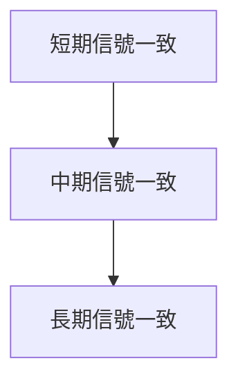

---

## 8. 交易策略建議

### 🗺️ 策略決策流程圖

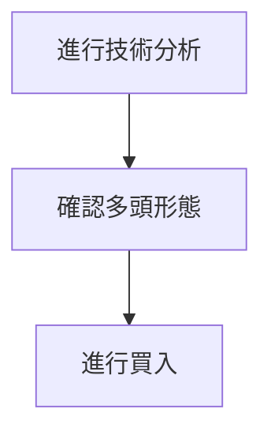

### 🟢 多頭策略詳情

| 策略要素 | 策略 A | 策略 B |
|----------|--------|--------|
| 進場條件 | 突破 $400 | 回調至 $380 |
| 進場價格 | $401 | $381 |
| 目標價 T1 | $420 | $400 |
| 目標價 T2 | $460 | $420 |
| 止損價格 | $390 | $370 |
| 風險報酬比 | 3:1 | 2:1 |
| 成功機率 | 70% | 60% |
| 建議倉位 | 50% | 30% |

### 🔴 空頭策略詳情

| 策略要素 | 策略 A | 策略 B |
|----------|--------|--------|
| 進場條件 | 跌破 $380 | 反彈至 $400 |
| 進場價格 | $379 | $399 |
| 目標價 T1 | $360 | $380 |
| 目標價 T2 | $340 | $360 |
| 止損價格 | $390 | $410 |
| 風險報酬比 | 2:1 | 3:1 |
| 成功機率 | 50% | 40% |
| 建議倉位 | 20% | 10% |

### ⭐ 整體訊號強度評星

```
做多訊號強度：★★★★☆  (4/5星)
做空訊號強度：★★☆☆☆  (2/5星)
整體可信度：  ★★★★☆  (4/5星)
```

---

## 9. 風險提示與監控

### ✅ 關鍵監控指標 Checklist

```
╔═════════════════════════════════════╗
║            監控清單                ║
╠═════════════════════════════════════╣
║ 1. 突破 $400 的成交量是否增強     ║
║ 2. RSI 是否進入超買區             ║
║ 3. ATR 是否異常擴大              ║
║ 4. ADX 是否上升至 25 以上        ║
╚═════════════════════════════════════╝
```

### ⚠️ 風險場景分析

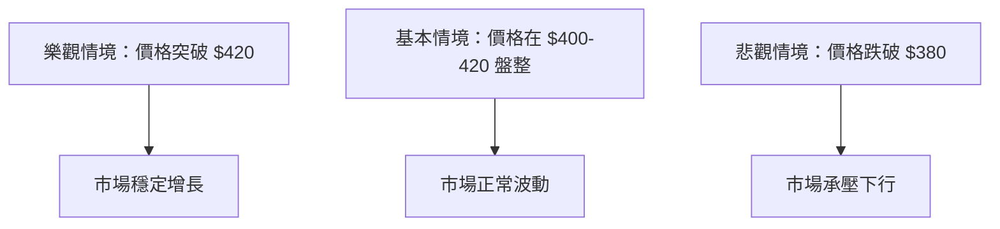

### 🛡️ 風險管理重要提醒

- 嚴格設置止損點，避免情緒化交易
- 密切關注市場情況，靈活調整策略
- 控制倉位，不宜過度槓桿

---

## 📋 報告總結

```
TSM 技術分析報告總結
════════════════════════════════════════════════════════
報告日期：2026-04-30
當前價格：$396.06
分析評級：⚖️ 偏多

關鍵結論：
├─ 長期趨勢：🟢 穩定上升
├─ 中期趨勢：🟢 上升
├─ 短期趨勢：🟡 短期回調後上升
├─ 關鍵支撐：$380
├─ 關鍵阻力：$400
└─ 分析師目標：$463.45

最優策略組合：
1. 🥇 突破 $400 進場，目標 $460
2. 🥈 回調至 $380 進場，目標 $420
3. 🥉 穩定持有，觀察市場變化
════════════════════════════════════════════════════════
```

---

> ⚠️ **免責聲明**：本報告為 AI 自動生成之技術分析，所有數據及估算均基於提供的歷史價格資訊。本報告**僅供研究與學術參考**，**不構成任何投資建議**。投資有風險，入市需謹慎。

---

*報告生成時間：2026-04-30 ｜ 數據來源：Yahoo Finance ｜ 分析框架：多時框技術分析*