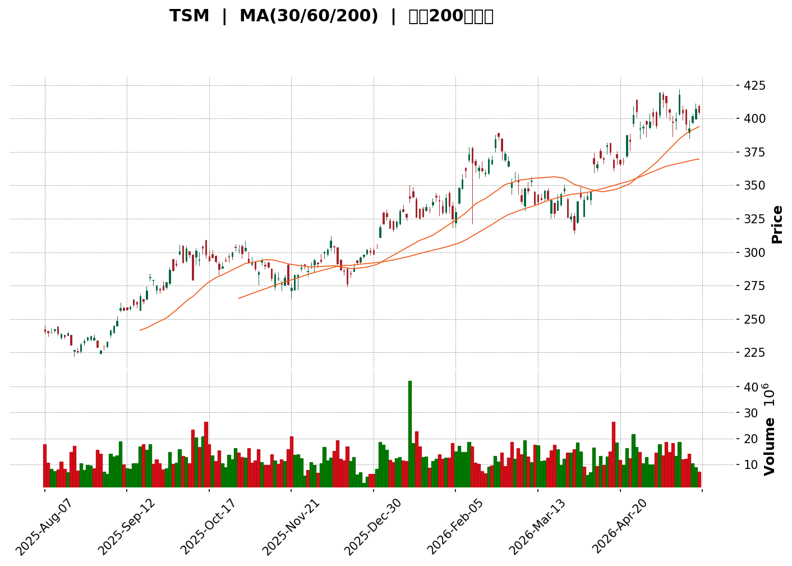
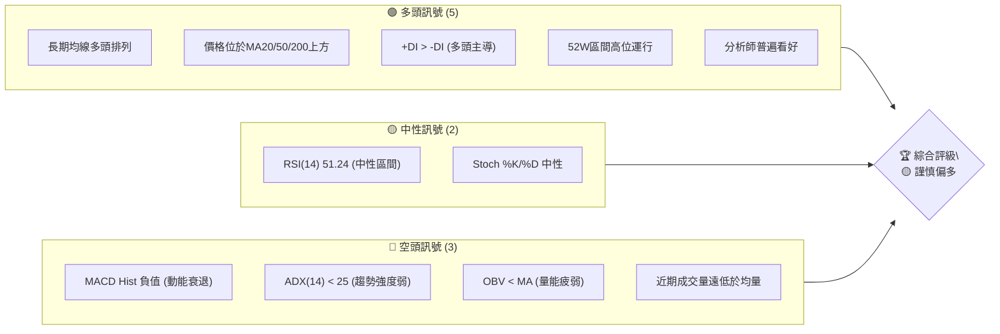
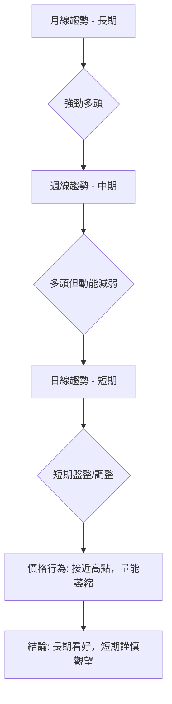
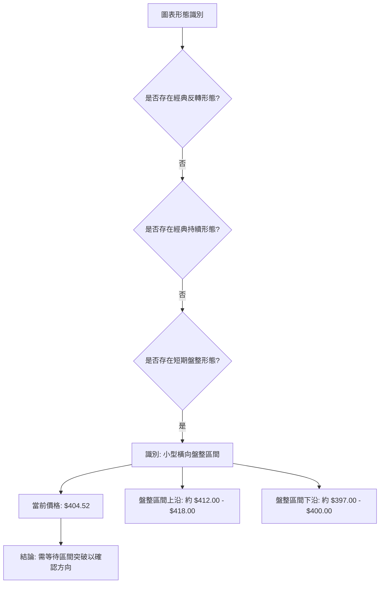
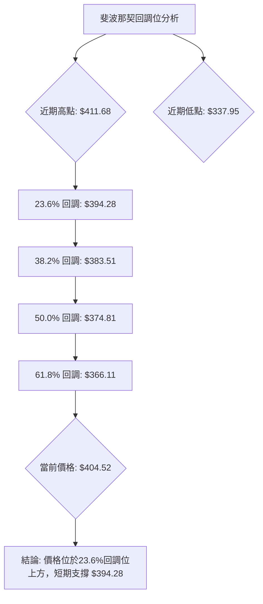
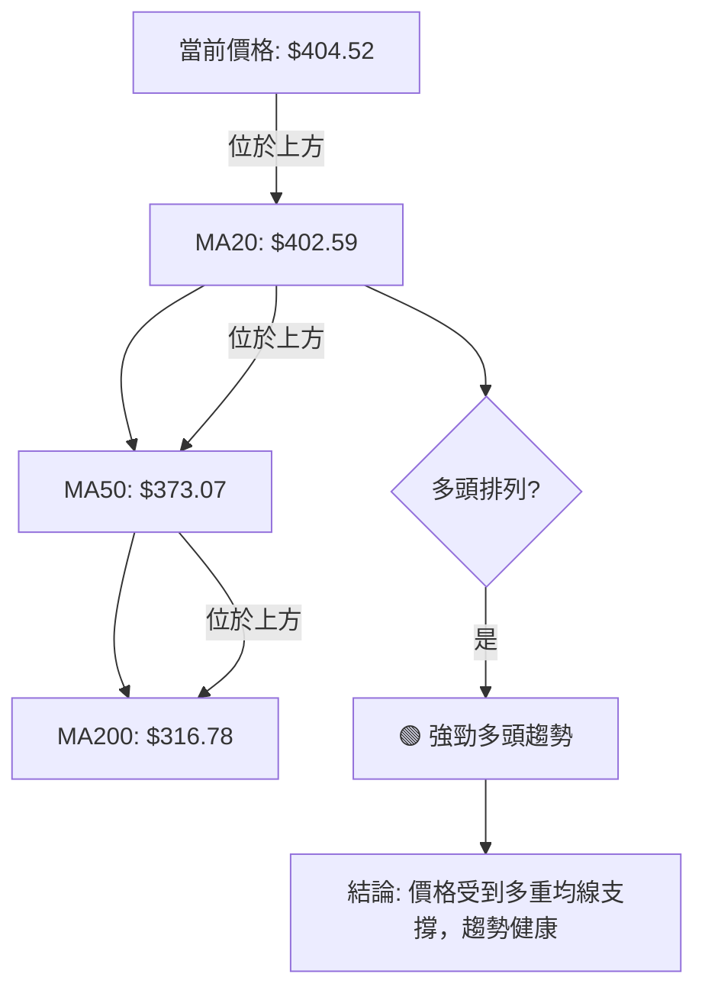

<details>
<summary>📊 靜態圖表 (點擊展開)</summary>

</details>

<html>
<head><meta charset="utf-8" /></head>
<body>
    <div>                        <script>window.PlotlyConfig = {MathJaxConfig: 'local'};</script>
        <script charset="utf-8" src="https://cdn.plot.ly/plotly-3.5.0.min.js" integrity="sha256-fHbNLP+GlIXN+efbQec78UkemUz3NJp7UmfGxC1tNxs=" crossorigin="anonymous"></script>                <div id="candlestick-chart" class="plotly-graph-div" style="height:500px; width:100%;"></div>            <script>                window.PLOTLYENV=window.PLOTLYENV || {};                                if (document.getElementById("candlestick-chart")) {                    Plotly.newPlot(                        "candlestick-chart",                        [{"close":{"dtype":"f8","bdata":"AAAA4OUQbkAAAAAA1vdtQAAAAKAVAG5AAAAAgOBFbkAAAADAduttQAAAAECB3W1AAAAAIECabUAAAAAgg+ptQAAAACAy1mxAAAAAgCBUbEAAAABA1itsQAAAAEBl32xAAAAAoOAxbUAAAACgLJVtQAAAAMBBp21AAAAAIOaGbUAAAAAAJJxsQAAAAOB2TWxAAAAAAKOsbEAAAACg0iVtQAAAAMD1KW5AAAAAoOChbkAAAABANRhvQAAAAGAcI3BAAAAAgNcKcEAAAAAAgRFwQAAAAIAFMnBAAAAAwOtJcEAAAACAiVVwQAAAAGCfsnBAAAAAQKJ2cEAAAACgHPJwQAAAAICBknFAAAAAgK5ycUAAAADgPDJxQAAAAEC6\u002fXBAAAAA4Kj7cEAAAABAFlxxQAAAAMAo7nFAAAAAQG7ocUAAAABAWilyQAAAAIDQy3JAAAAAYKFGckAAAABgjO1yQAAAAGC3o3JAAAAAwOJxcUAAAACgnNNyQAAAAOAFZXJAAAAAQJLwckAAAABgFKNyQAAAAIBWV3JAAAAAQAeBckAAAADARE5yQAAAAACv9HFAAAAA4B4SckAAAADAbVVyQAAAAKDHiXJAAAAAoPi9ckAAAABAnvZyQAAAAMDc2HJAAAAAwHesckAAAABA9fJyQAAAAODyRnJAAAAAwGxAckAAAABAafpxQAAAAADQznFAAAAAgFxackAAAABAHxlyQAAAAMBeEHJAAAAAIGSKcUAAAACAFLRxQAAAAABeh3FAAAAAwCBGcUAAAACAGI1xQAAAAICaP3FAAAAAQMcYcUAAAABgN7FxQAAAACDasXFAAAAAQN4FckAAAAAgiB5yQAAAAKCW4XFAAAAAwMInckAAAADgOV1yQAAAAKAgNXJAAAAAIJxRckAAAACgYcNyQAAAAODi23JAAAAAgPlGc0AAAAAA5f9yQAAAAMCCM3JAAAAAYOfucUAAAADgBeFxQAAAAIDoQnFAAAAAwBS+cUAAAACgNQJyQAAAAGBLR3JAAAAAoNmBckAAAADAXZ9yQAAAACDT33JAAAAAADHBckAAAACgz6tyQAAAAACU8HJAAAAAAGTrc0AAAAAggxV0QAAAAMAoaHRAAAAAgI3cc0AAAADg3NFzQAAAAMCHK3RAAAAAgGetdEAAAAAgeKR0QAAAAMANY3RAAAAAgOFKdUAAAACgAVd1QAAAAADaY3RAAAAAIEJTdEAAAADAM2d0QAAAAGDd3nRAAAAA4Ga8dEAAAACgOhZ1QAAAACBpVXVAAAAAwIgpdUAAAABAGZp0QAAAAMBpRnVAAAAAwOfsdEAAAAAAMk10QAAAAKDPnHRAAAAAoOq9dUAAAADglCZ2QAAAAABKjnZAAAAAIJ9Qd0AAAAAADfF2QAAAAABK1XZAAAAAoNOydkAAAACg35N2QAAAAKAJdnZAAAAAQPsXd0AAAAAAARB3QAAAAECoCnhAAAAAoD8qeEAAAAAABXx3QAAAAIBwWHdAAAAAQCoBd0AAAABANAJ2QAAAAGD4RnZAAAAA4NkNdkAAAAAgAR91QAAAAACGu3VAAAAA4NWhdUAAAAAABRl2QAAAAOA4\u002fHRAAAAAAMAVdUAAAABgYjR1QAAAACCun3VAAAAAwB45dUAAAADgoyx1QAAAAADXk3RAAAAAQDMndUAAAAAAAHR1QAAAAAAAvHVAAAAAgMJhdEAAAAAA12t0QAAAAAAAyHNAAAAAQDMfdUAAAAAA11d1QAAAAOCjMHVAAAAAAClcdUAAAADAHpV1QAAAAGBm3nZAAAAAANfXdkAAAACgmSl3QAAAAMAeGXdAAAAAgD2+d0AAAACgmXF3QAAAAKCZtXZAAAAAAAAod0AAAAAA1+N2QAAAAKBHAXdAAAAAQAo3eEAAAABgj+p3QAAAACBcJ3lAAAAAIK5PeUAAAACgcIV4QAAAAKBHnXhAAAAAwPXAeEAAAABguNp4QAAAAIDCGXlAAAAAYI+meEAAAAAAADh6QAAAAGBm4nlAAAAAQOG6eUAAAADgo0h5QAAAAOB61HhAAAAAwMz8eEAAAAAghRt6QAAAAKCZRXlAAAAAQDO\u002feEAAAACAwol4QAAAAIDrGXlAAAAAYGZyeUAAAADgUUh5QA=="},"high":{"dtype":"f8","bdata":"I9vgan+2bkDYAJFuByJuQO0xEFyBZ25ApaFS2BpVbkBHkCFKxIluQClpp2iP6W1A6LteIinXbUAovekUgxhuQDope78sw21AAGvUoMRhbECqC29ZAotsQEOJN2C2DW1A9+\u002fuwH1nbUC8OfP6qZhtQOeK8xq\u002fqm1AM0jaL7jSbUDw8mOPTD1tQCrX+CWaa2xATy7zoEPObEDrcvGv\u002fihtQCAKNhogTm5AqstEY8S3bkC05OKiE5FvQNlKHorHZHBAWYmwNSU2cEDgNFBpMytwQDga8JmLSHBA0pscrJ2PcEBoFrfprXVwQP+X6fza0HBAdWYtPa+RcEA61Futdi1xQExzolTbxnFAal4\u002fP6N6cUDWZGcy4DlxQF9LNZbHH3FA7frkz1BlcUBe7c\u002ffRF9xQM8NIoMkDnJAQgC6GG9xckDBuvqm7mZyQNm+QZjIGXNA2Wf995kWc0Dpn1OQdgtzQGeCghuo0nJArYrq2c6ockDkou92TO9yQDSkvt14wXJATX8A3c0Oc0Bjlv7Ai1pzQNmtxp8i2nJA3CUnd7TfckB3oPzemZtyQNi+PIM\u002fWXJA5uwVwZVHckDHqt+UAYVyQL56yY9DrXJAWQAJv4THckCSbF8oSSRzQExa+VLxGXNANHe5lNQfc0B6NPPdp0ZzQPGufG1KxXJAG0zkS02JckDGLwQ3VlByQDSRVzfu5HFALMtnQ\u002fV3ckBJ+hDaylRyQNLJQhn\u002fU3JA4ZxPlYz+cUBZLG1WitRxQHHHlCVKz3FAYea9T2hqcUABdu6vyK9xQJ7+LqfaM3JASeOYDYpScUCCOj8s5rdxQCF6nAtPvXFAHIJ\u002fuzczckDpj3Fk\u002fTByQEYNfG32GHJAlJp44htOckAO6B\u002fL129yQAGXVH6hRnJASXXF6VqyckCi5dq+UM9yQO0c9ioY8HJAjh3CsxOEc0D+dRmbsA9zQHcw4ODM9nJAsEudXIBvckD7S1UzZPpxQIztyUaaBHJAsuHeVKblcUD\u002fPJ2wlTVyQPJIppblYnJA7vyMsyqRckDU5D87HKVyQJAc68hw6HJAE\u002fIBbE\u002f6ckCj9EuMG\u002ftyQFgb2bdrKHNAtAQdVvsKdEAvAo2KG6V0QGQf7BhOwnRAi3HMTCFWdECfX74taTl0QABPLQG4PXRAFBeJ483JdEBkk0VpmPd0QNtLkxnujnRAvqrsGXzldUBLK54h3811QIa93nkEU3VARuBhkz3LdEDkPR2cvOF0QIzNPgI+A3VA0Zsf3ojidEBVQSWCqER1QAaykIt3iHVA+D6axmJsdUDlq+pgHi91QCc0VtC5c3VAh0LpcTKhdUAmUK1wkR11QB5z0g0U2nRA++qsHMzLdUDk+7fmbml2QPYntdLCu3ZA9GRz8Daod0D4z6hp6q53QJjd2FQTIXdAbmpTm7zSdkCI5jUQogV3QD5qPCN9nHZA0GMIhXcyd0Civ+BbF0Z3QMya2QViQXhATuoIFdFReEBN0GcyJRZ4QPuGn\u002fTxeXdAIP27c9NAd0AEZNsSrS92QPKNwL00gXZA3a777ltndkBpSjSd17t1QBAJnBGxxnVAlM6\u002feRsIdkAnBozDiEV2QMMtIhalnnVAyn7RptR4dUAWgCMclnp1QAAAAAAprHVAAAAAQDO\u002fdUAAAABgZj51QAAAAKCZGXVAAAAAYI92dUAAAACAFI51QAAAAEAz53VAAAAAYI9OdUAAAADA9Zh0QAAAAKCZmXRAAAAAYI8mdUAAAABA4cp1QAAAAMAeYXVAAAAAQDODdUAAAADgeph1QAAAAMDMZHdAAAAAYLgCd0AAAAAAAKB3QAAAACBcN3dAAAAAYI\u002fid0AAAAAgrt93QAAAAEAzI3dAAAAAoEd5d0AAAADAHiF3QAAAAAAALHdAAAAAYI8+eEAAAAAAKUx4QAAAAADXl3lAAAAAAADoeUAAAACA6914QAAAAKCZvXhAAAAA4KPseEAAAAAA1z95QAAAAEAze3lAAAAAgBRieUAAAABAMzt6QAAAAAAAQHpAAAAAAAAQekAAAAAgrnt5QAAAAADXI3lAAAAAQOFKeUAAAAAghV96QAAAAIDrnXlAAAAAgBRueUAAAACAFO54QAAAAIAUPnlAAAAAIFy3eUAAAABguKp5QA=="},"hovertemplate":"\u003cb\u003e%{x|%Y-%m-%d}\u003c\u002fb\u003e\u003cbr\u003e\u958b: $%{open:.2f}\u003cbr\u003e\u9ad8: $%{high:.2f}\u003cbr\u003e\u4f4e: $%{low:.2f}\u003cbr\u003e\u6536: $%{close:.2f}\u003cextra\u003e\u003c\u002fextra\u003e","low":{"dtype":"f8","bdata":"Ekl3DSnXbUCeX0PjGp1tQK68Otmi7m1AhBr0MLbzbUAMmkKz4LttQDHys\u002f\u002flWG1AG0A3bdtmbUCK3qTMdr1tQI1CwJlj0mxAYa9zuq24a0BlCxNU5AlsQFmGY3gJB2xAijWwSuvHbEDYxcqxUTZtQBO+JpAeLW1A5PxiluI+bUCa16jb8JJsQHO1wPLn9WtAO\u002f4dcSBUbEBCFMmvDopsQPkAi\u002fEoe21AQre8jSzxbUDmUQ30oJluQGSk\u002fkDi8G9AOkDiQw4AcEBXEM5sbwJwQG0s3uFNCHBAeVdoItkycEDo11qe2CRwQBcbJOv\u002fCHBAUM3r3NpVcEB68Df43H9wQPSrmV1iZ3FAcjFZTDEzcUB4txVdSctwQKAWlOog0nBAAAAA4Kj7cEDerrvhNAVxQAXd+lFaOnFADSJt7j7XcUCluKNCTQ5yQFawdL2rpHJAaxUxQbI6ckA3iDnW1UVyQIITYp2SfHJA\u002fcZubaJscUB0PMTDaytyQIon5sbTG3JAD023Tb2mckA5xfDk9HByQA\u002fastnKVHJAY4ZyJ9h2ckA+slhBvkByQCOtnLNlrXFAKnjNAZ4AckDcz\u002fHzW0xyQD98b4A4QXJAyc2DCEBnckD8\u002fMEdf8tyQB6F3WOssnJA9wjVJcxwckAGVLfqW8dyQN6jGEdbPnJA+2\u002fvaV8eckCPv4+c0NxxQEjg0mG3OXFATnuh2FkickDUdzsdKfVxQEQsGUjS\u002f3FAZRhQY2JncUBq0yC5qPtwQPV\u002fSX0zZHFAbFJNTovzcEBPHh7p0yxxQBR8I2hCLnFAQn\u002f\u002fsqmVcECBstTRBftwQJH5EpNF+XBA77gucGLicUCcBtidl\u002fZxQMTioq0kmnFAavJW3nT5cUDNkAx7+MdxQJtnvhCwCXJA5F+BFTg6ckBgo9Mnb3FyQFRk+QDCjXJAuiQm8mfNckDKA6\u002fWxKxyQHvnGzOZInJAYivPT9\u002frcUCY3nb7YahxQL0AOqPpJHFAkb\u002f1OFWPcUA7vT90NNlxQFjtH3NEJnJA+UoOSxA2ckBMXi20XHZyQOYReRjmmnJAP7VVIPmcckBeePW+vKlyQF1KYAs96XJAGMPfyS9tc0AnlcnBiwl0QE+cu8\u002fYOnRAjFlxvFHac0DM7MvlBrRzQAPJhSux1XNAEVsso4YCdEB7fOzSm510QJSTC1uEPnRAtpRvMIcPdUBLwZQxAkh1QBgTFv6zX3RAwtNm8DxMdEB4zcgItF90QFIlWagFp3RAExDzatWUdEAUeCdB69l0QBHEwaRVG3VAb5d\u002f4XF0dED5vKztzYJ0QPWA+fnNgnRAwC3OknuRdEBCjhqExuJzQIf1MmYH7HNAtlC1yUP7dEAnoOTVKa11QJSGKag3NnZA0BNDmq31dkAi5CpvHhN0QEoKE7YZfHZAIWvo\u002fNIzdkCiKfaWJHt2QIF78FP4RnZAT4pbqnRhdkDJLgd04tZ2QIPZK6Tkb3dA5wWTgPr7d0DmuWNUlAp3QHHeSfhY+XZA19P+dAG6dkBKmr63xHJ1QNKIECPcGHZAbpUt6FdtdUCW1Q0y5\u002ft0QNFivD\u002fMr3RAMZno\u002fnp1dUAOpN8WAtZ1QNQlQQz19nRA7oH8bWf0dEDgNQK41y11QAAAAGBmJnVAAAAAoHA1dUAAAABAClN0QAAAAGBmXnRAAAAAoJmxdEAAAADgUeB0QAAAAAAAeHVAAAAAgOtVdEAAAADA9SR0QAAAAMDMnHNAAAAAgD0SdEAAAAAAADx1QAAAAMDMbHRAAAAAgOspdUAAAABgZvp0QAAAAADXc3ZAAAAAIIWLdkAAAAAAABx3QAAAAMDM4HZAAAAAIIVTd0AAAAAgXEN3QAAAAMDMiHZAAAAAgD3SdkAAAAAAAMR2QAAAAIDC0XZAAAAAgD0qd0AAAADA9Xx3QAAAAKCZnXhAAAAAYGYGeUAAAABAMwt4QAAAAEDhQnhAAAAAIFwbeEAAAACAFIJ4QAAAAEAzs3hAAAAAoJmJeEAAAABgZgp5QAAAAIDCgXlAAAAAgBQOeUAAAABACuN4QAAAAIDrIXhAAAAAIIV3eEAAAACgmSF5QAAAAKBH7XhAAAAAwMxweEAAAADA9RB4QAAAAEAzv3hAAAAAACn4eEAAAACAwi15QA=="},"name":"\u50f9\u683c","open":{"dtype":"f8","bdata":"qGnQc5ZLbkDYAJFuByJuQHN0KYh\u002f\u002fm1A9cC8YsszbkBHkCFKxIluQG2pN4VhfW1AT5r8FEDIbUCK3qTMdr1tQGp8q5dqvm1APBbjnYhFbEAnq7+02UVsQPjfBZYXQWxA+hH\u002fHfQIbUASnzZdn0ptQPltyw58Wm1AiYe1BWdIbUBO\u002fGs0zzltQJcPNvhmBmxAqvc60cKwbEB3LGUlXqtsQGnrywhlxW1Ao\u002fAmi+n8bUDmUQ30oJluQLxaixI1CnBAoyfK5K4hcEAvfHhRnSlwQArwnrwhHHBAFy4WgFeHcEBzmqddM25wQBSy+FdRCXBAfUySfYCOcECQiRkQNZFwQOOVDLqSjXFARBqRIFFscUAXkdqr6PlwQK9KNlIpBnFAZ6i1YYgvcUDwVAd56hxxQAWI0JyPTnFAt8UcWUBuckD2yeJrAzRyQEM9GurIpXJA56mdpfYOc0DhWovBEFZyQD\u002fjdO9hynJAAgXTIP2kckAC\u002fmjHnolyQHRqDBoXYHJAg0SUcLYJc0Akgxpoi1NzQKkYgIcqjHJAchOcPKClckAdwLqytpVyQB0pn8Y9NnJAuoxtblIDckBOZV6lIl9yQBEwb\u002f8kkHJAwUaGvuSKckDs1lhl6gFzQNRAtmai1nJA5VPEXfAEc0BSU8J21s5yQMsJyu76c3JANBX1tDEwckAOkll+vkdyQFBmdyhJunFALpwKm+FLckDnfUiYSCdyQNe4Ny5hQXJAEB+FYkz5cUBK8gioTSZxQOkXKRRMfnFAHhM9OmZAcUD92CsIYDZxQJ2Bs46rKXJAjZJ04\u002fn0cECBstTRBftwQOhSGOPSknFACwzdGi\u002f4cUBVtixr9y1yQJT9ttp+1XFAjVuGJlQmckDKKEV4MSlyQI+aVd7VRXJAu6oy0cVmckD+1B90uLhyQDspZnh3pXJAsmOY2hL7ckAjCzG3ZAdzQHcw4ODM9nJAGnK1dyFlckDXjeLiPudxQEKaQBaC+3FAzY8g0S\u002fDcUA7vT90NNlxQDx\u002fbOB4XXJATEiEmzVJckAqAS0zdI5yQMjrbLbqsHJABYwomunOckBn1vWAKthyQLBr8jtV8nJAWF\u002fjcKdxc0Acm\u002f6yi5d0QMX0jIOslHRAr5xHrx88dEBzmM7xpzd0QBlZSZzm7nNAk+j2ih4TdEBXqf1k9L50QNtLkxnujnRAy0\u002fRSIxddUBs827ylJh1QFSN5aBRPXVAjEguvuPHdEAPipP+usd0QIy119kwsnRA0l89tK29dEBNTkAt3\u002fh0QO84HdkOYXVA9cpm34UtdUCZjpjwo+d0QFpODT9KnXRA9ACxO5uBdUAHX\u002fEkg+p0QE2dD0qbHnRA6ldHodMIdUAyHFEJe7x1QK6wu2XmtHZAYzX6RqQQd0DjexPs9Z53QKX6qcPNAXdA5wcEsaaNdkDqPti1Zq12QJEEIvZYa3ZAfNbaFk5sdkCRiHn\u002fqN92QAC3sbVXpXdATuoIFdFReEDkEt6ohBF4QNkAw3mZEXdAunwQaVXFdkCvlgS0Fcl1QHkVfn3PRnZAZN3Hx3EedkAm2ESRjmh1QPFCMSWD6nRAmUT+fdq3dUCwcj3A9w52QDKlsOJTj3VApqyXDkJvdUDs+cSCqER1QAAAAKCZSXVAAAAA4HqcdUAAAAAghZN0QAAAAEDhCnVAAAAAoJmxdEAAAADAHvl0QAAAAAAAoHVAAAAAwB49dUAAAACgR010QAAAAEAzc3RAAAAAwPUkdEAAAABgZn51QAAAAKBwbXRAAAAAAAA8dUAAAABACjd1QAAAAOCjJHdAAAAAwMy0dkAAAACgcHl3QAAAAAApJHdAAAAA4KOwd0AAAABgj9Z3QAAAAIDCDXdAAAAAQDNTd0AAAAAghRN3QAAAAKBHAXdAAAAA4Ho8d0AAAAAAAAR4QAAAAIA9wnhAAAAAAADceUAAAACA64F4QAAAAGCPjnhAAAAAwPXceEAAAABACpd4QAAAAOBRSHlAAAAAoJlJeUAAAABgZiZ5QAAAAKBwIXpAAAAAQDMPekAAAAAA12t5QAAAAAAA3HhAAAAA4FHkeEAAAAAgXDN5QAAAAAAAaHlAAAAAgBRueUAAAAAAKVh4QAAAAAAA0HhAAAAAACn4eEAAAABA4ZZ5QA=="},"x":["2025-08-07T00:00:00-04:00","2025-08-08T00:00:00-04:00","2025-08-11T00:00:00-04:00","2025-08-12T00:00:00-04:00","2025-08-13T00:00:00-04:00","2025-08-14T00:00:00-04:00","2025-08-15T00:00:00-04:00","2025-08-18T00:00:00-04:00","2025-08-19T00:00:00-04:00","2025-08-20T00:00:00-04:00","2025-08-21T00:00:00-04:00","2025-08-22T00:00:00-04:00","2025-08-25T00:00:00-04:00","2025-08-26T00:00:00-04:00","2025-08-27T00:00:00-04:00","2025-08-28T00:00:00-04:00","2025-08-29T00:00:00-04:00","2025-09-02T00:00:00-04:00","2025-09-03T00:00:00-04:00","2025-09-04T00:00:00-04:00","2025-09-05T00:00:00-04:00","2025-09-08T00:00:00-04:00","2025-09-09T00:00:00-04:00","2025-09-10T00:00:00-04:00","2025-09-11T00:00:00-04:00","2025-09-12T00:00:00-04:00","2025-09-15T00:00:00-04:00","2025-09-16T00:00:00-04:00","2025-09-17T00:00:00-04:00","2025-09-18T00:00:00-04:00","2025-09-19T00:00:00-04:00","2025-09-22T00:00:00-04:00","2025-09-23T00:00:00-04:00","2025-09-24T00:00:00-04:00","2025-09-25T00:00:00-04:00","2025-09-26T00:00:00-04:00","2025-09-29T00:00:00-04:00","2025-09-30T00:00:00-04:00","2025-10-01T00:00:00-04:00","2025-10-02T00:00:00-04:00","2025-10-03T00:00:00-04:00","2025-10-06T00:00:00-04:00","2025-10-07T00:00:00-04:00","2025-10-08T00:00:00-04:00","2025-10-09T00:00:00-04:00","2025-10-10T00:00:00-04:00","2025-10-13T00:00:00-04:00","2025-10-14T00:00:00-04:00","2025-10-15T00:00:00-04:00","2025-10-16T00:00:00-04:00","2025-10-17T00:00:00-04:00","2025-10-20T00:00:00-04:00","2025-10-21T00:00:00-04:00","2025-10-22T00:00:00-04:00","2025-10-23T00:00:00-04:00","2025-10-24T00:00:00-04:00","2025-10-27T00:00:00-04:00","2025-10-28T00:00:00-04:00","2025-10-29T00:00:00-04:00","2025-10-30T00:00:00-04:00","2025-10-31T00:00:00-04:00","2025-11-03T00:00:00-05:00","2025-11-04T00:00:00-05:00","2025-11-05T00:00:00-05:00","2025-11-06T00:00:00-05:00","2025-11-07T00:00:00-05:00","2025-11-10T00:00:00-05:00","2025-11-11T00:00:00-05:00","2025-11-12T00:00:00-05:00","2025-11-13T00:00:00-05:00","2025-11-14T00:00:00-05:00","2025-11-17T00:00:00-05:00","2025-11-18T00:00:00-05:00","2025-11-19T00:00:00-05:00","2025-11-20T00:00:00-05:00","2025-11-21T00:00:00-05:00","2025-11-24T00:00:00-05:00","2025-11-25T00:00:00-05:00","2025-11-26T00:00:00-05:00","2025-11-28T00:00:00-05:00","2025-12-01T00:00:00-05:00","2025-12-02T00:00:00-05:00","2025-12-03T00:00:00-05:00","2025-12-04T00:00:00-05:00","2025-12-05T00:00:00-05:00","2025-12-08T00:00:00-05:00","2025-12-09T00:00:00-05:00","2025-12-10T00:00:00-05:00","2025-12-11T00:00:00-05:00","2025-12-12T00:00:00-05:00","2025-12-15T00:00:00-05:00","2025-12-16T00:00:00-05:00","2025-12-17T00:00:00-05:00","2025-12-18T00:00:00-05:00","2025-12-19T00:00:00-05:00","2025-12-22T00:00:00-05:00","2025-12-23T00:00:00-05:00","2025-12-24T00:00:00-05:00","2025-12-26T00:00:00-05:00","2025-12-29T00:00:00-05:00","2025-12-30T00:00:00-05:00","2025-12-31T00:00:00-05:00","2026-01-02T00:00:00-05:00","2026-01-05T00:00:00-05:00","2026-01-06T00:00:00-05:00","2026-01-07T00:00:00-05:00","2026-01-08T00:00:00-05:00","2026-01-09T00:00:00-05:00","2026-01-12T00:00:00-05:00","2026-01-13T00:00:00-05:00","2026-01-14T00:00:00-05:00","2026-01-15T00:00:00-05:00","2026-01-16T00:00:00-05:00","2026-01-20T00:00:00-05:00","2026-01-21T00:00:00-05:00","2026-01-22T00:00:00-05:00","2026-01-23T00:00:00-05:00","2026-01-26T00:00:00-05:00","2026-01-27T00:00:00-05:00","2026-01-28T00:00:00-05:00","2026-01-29T00:00:00-05:00","2026-01-30T00:00:00-05:00","2026-02-02T00:00:00-05:00","2026-02-03T00:00:00-05:00","2026-02-04T00:00:00-05:00","2026-02-05T00:00:00-05:00","2026-02-06T00:00:00-05:00","2026-02-09T00:00:00-05:00","2026-02-10T00:00:00-05:00","2026-02-11T00:00:00-05:00","2026-02-12T00:00:00-05:00","2026-02-13T00:00:00-05:00","2026-02-17T00:00:00-05:00","2026-02-18T00:00:00-05:00","2026-02-19T00:00:00-05:00","2026-02-20T00:00:00-05:00","2026-02-23T00:00:00-05:00","2026-02-24T00:00:00-05:00","2026-02-25T00:00:00-05:00","2026-02-26T00:00:00-05:00","2026-02-27T00:00:00-05:00","2026-03-02T00:00:00-05:00","2026-03-03T00:00:00-05:00","2026-03-04T00:00:00-05:00","2026-03-05T00:00:00-05:00","2026-03-06T00:00:00-05:00","2026-03-09T00:00:00-04:00","2026-03-10T00:00:00-04:00","2026-03-11T00:00:00-04:00","2026-03-12T00:00:00-04:00","2026-03-13T00:00:00-04:00","2026-03-16T00:00:00-04:00","2026-03-17T00:00:00-04:00","2026-03-18T00:00:00-04:00","2026-03-19T00:00:00-04:00","2026-03-20T00:00:00-04:00","2026-03-23T00:00:00-04:00","2026-03-24T00:00:00-04:00","2026-03-25T00:00:00-04:00","2026-03-26T00:00:00-04:00","2026-03-27T00:00:00-04:00","2026-03-30T00:00:00-04:00","2026-03-31T00:00:00-04:00","2026-04-01T00:00:00-04:00","2026-04-02T00:00:00-04:00","2026-04-06T00:00:00-04:00","2026-04-07T00:00:00-04:00","2026-04-08T00:00:00-04:00","2026-04-09T00:00:00-04:00","2026-04-10T00:00:00-04:00","2026-04-13T00:00:00-04:00","2026-04-14T00:00:00-04:00","2026-04-15T00:00:00-04:00","2026-04-16T00:00:00-04:00","2026-04-17T00:00:00-04:00","2026-04-20T00:00:00-04:00","2026-04-21T00:00:00-04:00","2026-04-22T00:00:00-04:00","2026-04-23T00:00:00-04:00","2026-04-24T00:00:00-04:00","2026-04-27T00:00:00-04:00","2026-04-28T00:00:00-04:00","2026-04-29T00:00:00-04:00","2026-04-30T00:00:00-04:00","2026-05-01T00:00:00-04:00","2026-05-04T00:00:00-04:00","2026-05-05T00:00:00-04:00","2026-05-06T00:00:00-04:00","2026-05-07T00:00:00-04:00","2026-05-08T00:00:00-04:00","2026-05-11T00:00:00-04:00","2026-05-12T00:00:00-04:00","2026-05-13T00:00:00-04:00","2026-05-14T00:00:00-04:00","2026-05-15T00:00:00-04:00","2026-05-18T00:00:00-04:00","2026-05-19T00:00:00-04:00","2026-05-20T00:00:00-04:00","2026-05-21T00:00:00-04:00","2026-05-22T00:00:00-04:00"],"type":"candlestick"},{"hovertemplate":"MA30: $%{y:.2f}\u003cextra\u003e\u003c\u002fextra\u003e","line":{"color":"#2196F3","dash":"dash","width":2},"mode":"lines","name":"MA30","x":["2025-08-07T00:00:00-04:00","2025-08-08T00:00:00-04:00","2025-08-11T00:00:00-04:00","2025-08-12T00:00:00-04:00","2025-08-13T00:00:00-04:00","2025-08-14T00:00:00-04:00","2025-08-15T00:00:00-04:00","2025-08-18T00:00:00-04:00","2025-08-19T00:00:00-04:00","2025-08-20T00:00:00-04:00","2025-08-21T00:00:00-04:00","2025-08-22T00:00:00-04:00","2025-08-25T00:00:00-04:00","2025-08-26T00:00:00-04:00","2025-08-27T00:00:00-04:00","2025-08-28T00:00:00-04:00","2025-08-29T00:00:00-04:00","2025-09-02T00:00:00-04:00","2025-09-03T00:00:00-04:00","2025-09-04T00:00:00-04:00","2025-09-05T00:00:00-04:00","2025-09-08T00:00:00-04:00","2025-09-09T00:00:00-04:00","2025-09-10T00:00:00-04:00","2025-09-11T00:00:00-04:00","2025-09-12T00:00:00-04:00","2025-09-15T00:00:00-04:00","2025-09-16T00:00:00-04:00","2025-09-17T00:00:00-04:00","2025-09-18T00:00:00-04:00","2025-09-19T00:00:00-04:00","2025-09-22T00:00:00-04:00","2025-09-23T00:00:00-04:00","2025-09-24T00:00:00-04:00","2025-09-25T00:00:00-04:00","2025-09-26T00:00:00-04:00","2025-09-29T00:00:00-04:00","2025-09-30T00:00:00-04:00","2025-10-01T00:00:00-04:00","2025-10-02T00:00:00-04:00","2025-10-03T00:00:00-04:00","2025-10-06T00:00:00-04:00","2025-10-07T00:00:00-04:00","2025-10-08T00:00:00-04:00","2025-10-09T00:00:00-04:00","2025-10-10T00:00:00-04:00","2025-10-13T00:00:00-04:00","2025-10-14T00:00:00-04:00","2025-10-15T00:00:00-04:00","2025-10-16T00:00:00-04:00","2025-10-17T00:00:00-04:00","2025-10-20T00:00:00-04:00","2025-10-21T00:00:00-04:00","2025-10-22T00:00:00-04:00","2025-10-23T00:00:00-04:00","2025-10-24T00:00:00-04:00","2025-10-27T00:00:00-04:00","2025-10-28T00:00:00-04:00","2025-10-29T00:00:00-04:00","2025-10-30T00:00:00-04:00","2025-10-31T00:00:00-04:00","2025-11-03T00:00:00-05:00","2025-11-04T00:00:00-05:00","2025-11-05T00:00:00-05:00","2025-11-06T00:00:00-05:00","2025-11-07T00:00:00-05:00","2025-11-10T00:00:00-05:00","2025-11-11T00:00:00-05:00","2025-11-12T00:00:00-05:00","2025-11-13T00:00:00-05:00","2025-11-14T00:00:00-05:00","2025-11-17T00:00:00-05:00","2025-11-18T00:00:00-05:00","2025-11-19T00:00:00-05:00","2025-11-20T00:00:00-05:00","2025-11-21T00:00:00-05:00","2025-11-24T00:00:00-05:00","2025-11-25T00:00:00-05:00","2025-11-26T00:00:00-05:00","2025-11-28T00:00:00-05:00","2025-12-01T00:00:00-05:00","2025-12-02T00:00:00-05:00","2025-12-03T00:00:00-05:00","2025-12-04T00:00:00-05:00","2025-12-05T00:00:00-05:00","2025-12-08T00:00:00-05:00","2025-12-09T00:00:00-05:00","2025-12-10T00:00:00-05:00","2025-12-11T00:00:00-05:00","2025-12-12T00:00:00-05:00","2025-12-15T00:00:00-05:00","2025-12-16T00:00:00-05:00","2025-12-17T00:00:00-05:00","2025-12-18T00:00:00-05:00","2025-12-19T00:00:00-05:00","2025-12-22T00:00:00-05:00","2025-12-23T00:00:00-05:00","2025-12-24T00:00:00-05:00","2025-12-26T00:00:00-05:00","2025-12-29T00:00:00-05:00","2025-12-30T00:00:00-05:00","2025-12-31T00:00:00-05:00","2026-01-02T00:00:00-05:00","2026-01-05T00:00:00-05:00","2026-01-06T00:00:00-05:00","2026-01-07T00:00:00-05:00","2026-01-08T00:00:00-05:00","2026-01-09T00:00:00-05:00","2026-01-12T00:00:00-05:00","2026-01-13T00:00:00-05:00","2026-01-14T00:00:00-05:00","2026-01-15T00:00:00-05:00","2026-01-16T00:00:00-05:00","2026-01-20T00:00:00-05:00","2026-01-21T00:00:00-05:00","2026-01-22T00:00:00-05:00","2026-01-23T00:00:00-05:00","2026-01-26T00:00:00-05:00","2026-01-27T00:00:00-05:00","2026-01-28T00:00:00-05:00","2026-01-29T00:00:00-05:00","2026-01-30T00:00:00-05:00","2026-02-02T00:00:00-05:00","2026-02-03T00:00:00-05:00","2026-02-04T00:00:00-05:00","2026-02-05T00:00:00-05:00","2026-02-06T00:00:00-05:00","2026-02-09T00:00:00-05:00","2026-02-10T00:00:00-05:00","2026-02-11T00:00:00-05:00","2026-02-12T00:00:00-05:00","2026-02-13T00:00:00-05:00","2026-02-17T00:00:00-05:00","2026-02-18T00:00:00-05:00","2026-02-19T00:00:00-05:00","2026-02-20T00:00:00-05:00","2026-02-23T00:00:00-05:00","2026-02-24T00:00:00-05:00","2026-02-25T00:00:00-05:00","2026-02-26T00:00:00-05:00","2026-02-27T00:00:00-05:00","2026-03-02T00:00:00-05:00","2026-03-03T00:00:00-05:00","2026-03-04T00:00:00-05:00","2026-03-05T00:00:00-05:00","2026-03-06T00:00:00-05:00","2026-03-09T00:00:00-04:00","2026-03-10T00:00:00-04:00","2026-03-11T00:00:00-04:00","2026-03-12T00:00:00-04:00","2026-03-13T00:00:00-04:00","2026-03-16T00:00:00-04:00","2026-03-17T00:00:00-04:00","2026-03-18T00:00:00-04:00","2026-03-19T00:00:00-04:00","2026-03-20T00:00:00-04:00","2026-03-23T00:00:00-04:00","2026-03-24T00:00:00-04:00","2026-03-25T00:00:00-04:00","2026-03-26T00:00:00-04:00","2026-03-27T00:00:00-04:00","2026-03-30T00:00:00-04:00","2026-03-31T00:00:00-04:00","2026-04-01T00:00:00-04:00","2026-04-02T00:00:00-04:00","2026-04-06T00:00:00-04:00","2026-04-07T00:00:00-04:00","2026-04-08T00:00:00-04:00","2026-04-09T00:00:00-04:00","2026-04-10T00:00:00-04:00","2026-04-13T00:00:00-04:00","2026-04-14T00:00:00-04:00","2026-04-15T00:00:00-04:00","2026-04-16T00:00:00-04:00","2026-04-17T00:00:00-04:00","2026-04-20T00:00:00-04:00","2026-04-21T00:00:00-04:00","2026-04-22T00:00:00-04:00","2026-04-23T00:00:00-04:00","2026-04-24T00:00:00-04:00","2026-04-27T00:00:00-04:00","2026-04-28T00:00:00-04:00","2026-04-29T00:00:00-04:00","2026-04-30T00:00:00-04:00","2026-05-01T00:00:00-04:00","2026-05-04T00:00:00-04:00","2026-05-05T00:00:00-04:00","2026-05-06T00:00:00-04:00","2026-05-07T00:00:00-04:00","2026-05-08T00:00:00-04:00","2026-05-11T00:00:00-04:00","2026-05-12T00:00:00-04:00","2026-05-13T00:00:00-04:00","2026-05-14T00:00:00-04:00","2026-05-15T00:00:00-04:00","2026-05-18T00:00:00-04:00","2026-05-19T00:00:00-04:00","2026-05-20T00:00:00-04:00","2026-05-21T00:00:00-04:00","2026-05-22T00:00:00-04:00"],"y":{"dtype":"f8","bdata":"AAAAAAAA+H8AAAAAAAD4fwAAAAAAAPh\u002fAAAAAAAA+H8AAAAAAAD4fwAAAAAAAPh\u002fAAAAAAAA+H8AAAAAAAD4fwAAAAAAAPh\u002fAAAAAAAA+H8AAAAAAAD4fwAAAAAAAPh\u002fAAAAAAAA+H8AAAAAAAD4fwAAAAAAAPh\u002fAAAAAAAA+H8AAAAAAAD4fwAAAAAAAPh\u002fAAAAAAAA+H8AAAAAAAD4fwAAAAAAAPh\u002fAAAAAAAA+H8AAAAAAAD4fwAAAAAAAPh\u002fAAAAAAAA+H8AAAAAAAD4fwAAAAAAAPh\u002fAAAAAAAA+H8AAAAAAAD4f3d3dyedMm5AVVVVtQZLbkC8u7t7gWxuQDMzM0NnmG5AiYiIWNq\u002fbkDNzMwcBeZuQCIiItImCW9AREREJGMub0ARERFBYFdvQLy7uztQk29A3t3dXTTTb0B3d3cnYgxwQJqZmVmWMXBAZmZmHvpQcEBmZmaWRnRwQO\u002fu7t7PlHBA3t3ddbGrcEDe3d0lR9JwQERERNR89nBAERERQcMdcUAzMzNbb0BxQN7d3TU\u002fXHFAzczMLHN3cUDNzMwc\u002fY5xQAAAAACCnnFA3t3dLdGvcUDv7u7eJcNxQO\u002fu7s4j13FAvLu7KxPscUC8u7vLggJyQM3MzCzaFHJAAAAAoLYnckCamZnpzjhyQBEREbHSPnJA3t3dXa5FckAzMzODWkxyQERERLRSU3JAvLu7WwNfckBVVVV1UGVyQERERGR0ZnJAvLu761FjckAiIiIyaV9yQERERJSYVHJAIiIiwgtMckCamZkpTEByQFVVVVVtNHJAMzMz83QxckCJiIjoxidyQLy7u\u002fvNIXJA7+7uLvsZckC8u7sbkBVyQAAAAFCjEXJAAAAAkKkOckAzMzMzKQ9yQO\u002fu7h5PEXJAVVVV5WwTckCJiIgoFxdyQM3MzMzTGXJAVVVV5WQeckDe3d0NtB5yQN7d3Q0xGXJAERERcd8SckDNzMzcvQlyQJqZmdkSAXJAVVVVlbr8cUAREREh\u002ffxxQN7d3T0BAXJAZmZmNlICckAzMzPDywZyQKuqqgq2DXJARERENBIYckDNzMwsVCByQCIiIoJeLHJAERER0fFCckCJiIj4jlhyQFVVVaWCc3JAIiIiUhqLckCJiIj4QZ1yQLy7u1thsnJAEREREQjJckARERERkN5yQHd3d+fx83JAIiIiMrcOc0CJiIi4GyhzQAAAAIC7OnNAIiIiotpLc0Crqqoa2VlzQGZmZpYDa3NAq6qqKnZ3c0AiIiLSRYlzQDMzM7MApHNAzczMnI6\u002fc0De3d39ytZzQImIiAgL+XNAMzMzMzQUdEBVVVUlxSd0QERERPSvO3RA7+7uHkpXdEDv7u6OZXV0QLy7u+vPlHRA3t3d\u002fbm7dECJiIj4KuB0QM3MzDxkAXVAiYiIKBsZdUAiIiKCYi51QBEREQHqP3VAq6qqun5bdUCamZmZKnd1QHd3dzc0mHVAd3d3J\u002fe1dUBVVVWVN851QLy7u5t253VAIiIiohL2dUBVVVWFx\u002ft1QCIiIiLiC3ZAzczM7KIadkDv7u5ewyB2QDMzM1MeKHZAiYiIKMQvdkARERGBZDh2QN7d3W1rNXZAq6qqmsI0dkDNzMws5zl2QLy7u+vgPHZAmpmZSWs\u002fdkBEREQE3kZ2QGZmZnaRRnZAmpmZWYtBdkBERER0lzt2QM3MzPyUNHZAIiIioo0bdkBVVVXVCwZ2QFVVVdUA7HVA3t3djYzedUC8u7u7A9R1QCIiIgIryXVAvLu7u1+6dUB3d3eXvq11QFVVVWW8o3VAREREpHSYdUBERERUtZV1QBEREQGZk3VAIiIicuaZdUDv7u6OJaZ1QJqZmZnVqXVAVVVVRT2zdUB3d3d3VcJ1QBEREUExzXVAiYiIiDvjdUBVVVUlwPJ1QDMzM2NSFnZAvLu722I6dkAiIiIisFZ2QAAAAEA1cHZAREREBFaOdkCamZkZva12QERERARW1HZAvLu7ay7ydkBmZmYW2Rp3QGZmZuZCPndA7+7uDuZrd0CrqqpaZJV3QERERIR5wHdAmpmZGXbhd0CamZkJHgp4QHd3dwfzLHhAVVVVxdlJeEDe3d1tEmN4QGZmZmYfdnhAERERYVeMeEBmZmaWbp54QA=="},"type":"scatter"},{"hovertemplate":"MA60: $%{y:.2f}\u003cextra\u003e\u003c\u002fextra\u003e","line":{"color":"#9C27B0","dash":"dash","width":2},"mode":"lines","name":"MA60","x":["2025-08-07T00:00:00-04:00","2025-08-08T00:00:00-04:00","2025-08-11T00:00:00-04:00","2025-08-12T00:00:00-04:00","2025-08-13T00:00:00-04:00","2025-08-14T00:00:00-04:00","2025-08-15T00:00:00-04:00","2025-08-18T00:00:00-04:00","2025-08-19T00:00:00-04:00","2025-08-20T00:00:00-04:00","2025-08-21T00:00:00-04:00","2025-08-22T00:00:00-04:00","2025-08-25T00:00:00-04:00","2025-08-26T00:00:00-04:00","2025-08-27T00:00:00-04:00","2025-08-28T00:00:00-04:00","2025-08-29T00:00:00-04:00","2025-09-02T00:00:00-04:00","2025-09-03T00:00:00-04:00","2025-09-04T00:00:00-04:00","2025-09-05T00:00:00-04:00","2025-09-08T00:00:00-04:00","2025-09-09T00:00:00-04:00","2025-09-10T00:00:00-04:00","2025-09-11T00:00:00-04:00","2025-09-12T00:00:00-04:00","2025-09-15T00:00:00-04:00","2025-09-16T00:00:00-04:00","2025-09-17T00:00:00-04:00","2025-09-18T00:00:00-04:00","2025-09-19T00:00:00-04:00","2025-09-22T00:00:00-04:00","2025-09-23T00:00:00-04:00","2025-09-24T00:00:00-04:00","2025-09-25T00:00:00-04:00","2025-09-26T00:00:00-04:00","2025-09-29T00:00:00-04:00","2025-09-30T00:00:00-04:00","2025-10-01T00:00:00-04:00","2025-10-02T00:00:00-04:00","2025-10-03T00:00:00-04:00","2025-10-06T00:00:00-04:00","2025-10-07T00:00:00-04:00","2025-10-08T00:00:00-04:00","2025-10-09T00:00:00-04:00","2025-10-10T00:00:00-04:00","2025-10-13T00:00:00-04:00","2025-10-14T00:00:00-04:00","2025-10-15T00:00:00-04:00","2025-10-16T00:00:00-04:00","2025-10-17T00:00:00-04:00","2025-10-20T00:00:00-04:00","2025-10-21T00:00:00-04:00","2025-10-22T00:00:00-04:00","2025-10-23T00:00:00-04:00","2025-10-24T00:00:00-04:00","2025-10-27T00:00:00-04:00","2025-10-28T00:00:00-04:00","2025-10-29T00:00:00-04:00","2025-10-30T00:00:00-04:00","2025-10-31T00:00:00-04:00","2025-11-03T00:00:00-05:00","2025-11-04T00:00:00-05:00","2025-11-05T00:00:00-05:00","2025-11-06T00:00:00-05:00","2025-11-07T00:00:00-05:00","2025-11-10T00:00:00-05:00","2025-11-11T00:00:00-05:00","2025-11-12T00:00:00-05:00","2025-11-13T00:00:00-05:00","2025-11-14T00:00:00-05:00","2025-11-17T00:00:00-05:00","2025-11-18T00:00:00-05:00","2025-11-19T00:00:00-05:00","2025-11-20T00:00:00-05:00","2025-11-21T00:00:00-05:00","2025-11-24T00:00:00-05:00","2025-11-25T00:00:00-05:00","2025-11-26T00:00:00-05:00","2025-11-28T00:00:00-05:00","2025-12-01T00:00:00-05:00","2025-12-02T00:00:00-05:00","2025-12-03T00:00:00-05:00","2025-12-04T00:00:00-05:00","2025-12-05T00:00:00-05:00","2025-12-08T00:00:00-05:00","2025-12-09T00:00:00-05:00","2025-12-10T00:00:00-05:00","2025-12-11T00:00:00-05:00","2025-12-12T00:00:00-05:00","2025-12-15T00:00:00-05:00","2025-12-16T00:00:00-05:00","2025-12-17T00:00:00-05:00","2025-12-18T00:00:00-05:00","2025-12-19T00:00:00-05:00","2025-12-22T00:00:00-05:00","2025-12-23T00:00:00-05:00","2025-12-24T00:00:00-05:00","2025-12-26T00:00:00-05:00","2025-12-29T00:00:00-05:00","2025-12-30T00:00:00-05:00","2025-12-31T00:00:00-05:00","2026-01-02T00:00:00-05:00","2026-01-05T00:00:00-05:00","2026-01-06T00:00:00-05:00","2026-01-07T00:00:00-05:00","2026-01-08T00:00:00-05:00","2026-01-09T00:00:00-05:00","2026-01-12T00:00:00-05:00","2026-01-13T00:00:00-05:00","2026-01-14T00:00:00-05:00","2026-01-15T00:00:00-05:00","2026-01-16T00:00:00-05:00","2026-01-20T00:00:00-05:00","2026-01-21T00:00:00-05:00","2026-01-22T00:00:00-05:00","2026-01-23T00:00:00-05:00","2026-01-26T00:00:00-05:00","2026-01-27T00:00:00-05:00","2026-01-28T00:00:00-05:00","2026-01-29T00:00:00-05:00","2026-01-30T00:00:00-05:00","2026-02-02T00:00:00-05:00","2026-02-03T00:00:00-05:00","2026-02-04T00:00:00-05:00","2026-02-05T00:00:00-05:00","2026-02-06T00:00:00-05:00","2026-02-09T00:00:00-05:00","2026-02-10T00:00:00-05:00","2026-02-11T00:00:00-05:00","2026-02-12T00:00:00-05:00","2026-02-13T00:00:00-05:00","2026-02-17T00:00:00-05:00","2026-02-18T00:00:00-05:00","2026-02-19T00:00:00-05:00","2026-02-20T00:00:00-05:00","2026-02-23T00:00:00-05:00","2026-02-24T00:00:00-05:00","2026-02-25T00:00:00-05:00","2026-02-26T00:00:00-05:00","2026-02-27T00:00:00-05:00","2026-03-02T00:00:00-05:00","2026-03-03T00:00:00-05:00","2026-03-04T00:00:00-05:00","2026-03-05T00:00:00-05:00","2026-03-06T00:00:00-05:00","2026-03-09T00:00:00-04:00","2026-03-10T00:00:00-04:00","2026-03-11T00:00:00-04:00","2026-03-12T00:00:00-04:00","2026-03-13T00:00:00-04:00","2026-03-16T00:00:00-04:00","2026-03-17T00:00:00-04:00","2026-03-18T00:00:00-04:00","2026-03-19T00:00:00-04:00","2026-03-20T00:00:00-04:00","2026-03-23T00:00:00-04:00","2026-03-24T00:00:00-04:00","2026-03-25T00:00:00-04:00","2026-03-26T00:00:00-04:00","2026-03-27T00:00:00-04:00","2026-03-30T00:00:00-04:00","2026-03-31T00:00:00-04:00","2026-04-01T00:00:00-04:00","2026-04-02T00:00:00-04:00","2026-04-06T00:00:00-04:00","2026-04-07T00:00:00-04:00","2026-04-08T00:00:00-04:00","2026-04-09T00:00:00-04:00","2026-04-10T00:00:00-04:00","2026-04-13T00:00:00-04:00","2026-04-14T00:00:00-04:00","2026-04-15T00:00:00-04:00","2026-04-16T00:00:00-04:00","2026-04-17T00:00:00-04:00","2026-04-20T00:00:00-04:00","2026-04-21T00:00:00-04:00","2026-04-22T00:00:00-04:00","2026-04-23T00:00:00-04:00","2026-04-24T00:00:00-04:00","2026-04-27T00:00:00-04:00","2026-04-28T00:00:00-04:00","2026-04-29T00:00:00-04:00","2026-04-30T00:00:00-04:00","2026-05-01T00:00:00-04:00","2026-05-04T00:00:00-04:00","2026-05-05T00:00:00-04:00","2026-05-06T00:00:00-04:00","2026-05-07T00:00:00-04:00","2026-05-08T00:00:00-04:00","2026-05-11T00:00:00-04:00","2026-05-12T00:00:00-04:00","2026-05-13T00:00:00-04:00","2026-05-14T00:00:00-04:00","2026-05-15T00:00:00-04:00","2026-05-18T00:00:00-04:00","2026-05-19T00:00:00-04:00","2026-05-20T00:00:00-04:00","2026-05-21T00:00:00-04:00","2026-05-22T00:00:00-04:00"],"y":{"dtype":"f8","bdata":"AAAAAAAA+H8AAAAAAAD4fwAAAAAAAPh\u002fAAAAAAAA+H8AAAAAAAD4fwAAAAAAAPh\u002fAAAAAAAA+H8AAAAAAAD4fwAAAAAAAPh\u002fAAAAAAAA+H8AAAAAAAD4fwAAAAAAAPh\u002fAAAAAAAA+H8AAAAAAAD4fwAAAAAAAPh\u002fAAAAAAAA+H8AAAAAAAD4fwAAAAAAAPh\u002fAAAAAAAA+H8AAAAAAAD4fwAAAAAAAPh\u002fAAAAAAAA+H8AAAAAAAD4fwAAAAAAAPh\u002fAAAAAAAA+H8AAAAAAAD4fwAAAAAAAPh\u002fAAAAAAAA+H8AAAAAAAD4fwAAAAAAAPh\u002fAAAAAAAA+H8AAAAAAAD4fwAAAAAAAPh\u002fAAAAAAAA+H8AAAAAAAD4fwAAAAAAAPh\u002fAAAAAAAA+H8AAAAAAAD4fwAAAAAAAPh\u002fAAAAAAAA+H8AAAAAAAD4fwAAAAAAAPh\u002fAAAAAAAA+H8AAAAAAAD4fwAAAAAAAPh\u002fAAAAAAAA+H8AAAAAAAD4fwAAAAAAAPh\u002fAAAAAAAA+H8AAAAAAAD4fwAAAAAAAPh\u002fAAAAAAAA+H8AAAAAAAD4fwAAAAAAAPh\u002fAAAAAAAA+H8AAAAAAAD4fwAAAAAAAPh\u002fAAAAAAAA+H8AAAAAAAD4f0RERGAUl3BAVVVV\u002fZymcEC8u7vTh7dwQFVVVSmDxXBAERERxc3ScEDNzMyIrt9wQKuqqg7z63BA7+7udhr7cEDv7u5KgAhxQBEREUEOGHFAVVVVDXYmcUDNzMys5TVxQO\u002fu7nYXQ3FARERE8IJOcUAAAABgSVpxQCIiIpqeZHFAiYiINJNucUAzMzMHB31xQAAAAGgljHFAAAAAON+bcUB3d3e7\u002f6pxQO\u002fu7kLxtnFAZmZmXg7DcUAAAAAoE89xQHd3d4\u002fo13FAmpmZCZ\u002fhcUC8u7uDHu1xQN7d3c17+HFAiYiICDwFckDNzMxsmxByQFVVVZ0FF3JAiYiICEsdckAzMzNjRiFyQFVVVcXyH3JAmpmZeTQhckAiIiLSqyRyQBEREfkpKnJAERERyaowckBEREQcDjZyQHd3dzcVOnJAAAAAELI9ckB3d3ev3j9yQDMzM4t7QHJAmpmZyX5HckARERGRbUxyQFVVVf33U3JAq6qqokdeckCJiIhwhGJyQLy7u6sXanJAAAAAoIFxckBmZmYWEHpyQLy7u5vKgnJAERERYbCOckDe3d11optyQHd3d08FpnJAvLu7w6OvckCamZkheLhyQJqZmbFrwnJAAAAAiO3KckAAAADw\u002fNNyQImIiOCY3nJA7+7uBjfpckBVVVVtRPByQBEREfEO\u002fXJAREREZHcIc0AzMzMjYRJzQBEREZlYHnNAq6qqKs4sc0ARERGpGD5zQDMzM\u002ftCUXNAERERGeZpc0CrqqqSP4BzQHd3d1\u002fhlnNAzczMfAauc0BVVVW9eMNzQDMzM1O22XNAZmZmhkzzc0ARERFJNgp0QJqZmclKJXRAREREnH8\u002fdEAzMzPTY1Z0QJqZmUG0bXRAIiIi6mSCdEDv7u6e8ZF0QBEREdFOo3RAd3d3xz6zdEDNzMw8Tr10QM3MzPSQyXRAmpmZKZ3TdECamZkp1eB0QImIiBC27HRAvLu7myj6dEBVVVUVWQh1QCIiIvr1GnVAZmZmvs8pdUDNzMyUUTd1QFVVVbUgQXVAREREvGpMdUCamZmBflh1QERERHSyZHVAAAAA0KNrdUDv7u5mG3N1QBEREYmydnVAMzMz29N7dUDv7u4eM4F1QJqZmYGKhHVAMzMzO++KdUCJiIiYdJJ1QGZmZk74nXVA3t3d5TWndUDNzMx09rF1QGZmZs6HvXVAIiIiivzHdUAiIiKK9tB1QN7d3d3b2nVAERERGfDmdUAzMzNrjPF1QCIiIsqn+nVAiYiI2H8JdkAzMzNTkhV2QImIiOjeJXZAMzMzu5I3dkB3d3enS0h2QN7d3RWLVnZA7+7upuBmdkDv7u6OTXp2QFVVVb1zjXZAq6qq4tyZdkBVVVVFOKt2QJqZmfFruXZAiYiI2LnDdkAAAAAYuM12QM3MzCw91nZAvLu7UwHgdkCrqqriEO92QM3MzAQP+3ZAiYiIwBwCd0CrqqqCaAh3QN7d3eXtDHdAq6qqAmYSd0BVVVX1ERp3QA=="},"type":"scatter"},{"hovertemplate":"MA200: $%{y:.2f}\u003cextra\u003e\u003c\u002fextra\u003e","line":{"color":"#FF6F00","dash":"solid","width":2},"mode":"lines","name":"MA200","x":["2025-08-07T00:00:00-04:00","2025-08-08T00:00:00-04:00","2025-08-11T00:00:00-04:00","2025-08-12T00:00:00-04:00","2025-08-13T00:00:00-04:00","2025-08-14T00:00:00-04:00","2025-08-15T00:00:00-04:00","2025-08-18T00:00:00-04:00","2025-08-19T00:00:00-04:00","2025-08-20T00:00:00-04:00","2025-08-21T00:00:00-04:00","2025-08-22T00:00:00-04:00","2025-08-25T00:00:00-04:00","2025-08-26T00:00:00-04:00","2025-08-27T00:00:00-04:00","2025-08-28T00:00:00-04:00","2025-08-29T00:00:00-04:00","2025-09-02T00:00:00-04:00","2025-09-03T00:00:00-04:00","2025-09-04T00:00:00-04:00","2025-09-05T00:00:00-04:00","2025-09-08T00:00:00-04:00","2025-09-09T00:00:00-04:00","2025-09-10T00:00:00-04:00","2025-09-11T00:00:00-04:00","2025-09-12T00:00:00-04:00","2025-09-15T00:00:00-04:00","2025-09-16T00:00:00-04:00","2025-09-17T00:00:00-04:00","2025-09-18T00:00:00-04:00","2025-09-19T00:00:00-04:00","2025-09-22T00:00:00-04:00","2025-09-23T00:00:00-04:00","2025-09-24T00:00:00-04:00","2025-09-25T00:00:00-04:00","2025-09-26T00:00:00-04:00","2025-09-29T00:00:00-04:00","2025-09-30T00:00:00-04:00","2025-10-01T00:00:00-04:00","2025-10-02T00:00:00-04:00","2025-10-03T00:00:00-04:00","2025-10-06T00:00:00-04:00","2025-10-07T00:00:00-04:00","2025-10-08T00:00:00-04:00","2025-10-09T00:00:00-04:00","2025-10-10T00:00:00-04:00","2025-10-13T00:00:00-04:00","2025-10-14T00:00:00-04:00","2025-10-15T00:00:00-04:00","2025-10-16T00:00:00-04:00","2025-10-17T00:00:00-04:00","2025-10-20T00:00:00-04:00","2025-10-21T00:00:00-04:00","2025-10-22T00:00:00-04:00","2025-10-23T00:00:00-04:00","2025-10-24T00:00:00-04:00","2025-10-27T00:00:00-04:00","2025-10-28T00:00:00-04:00","2025-10-29T00:00:00-04:00","2025-10-30T00:00:00-04:00","2025-10-31T00:00:00-04:00","2025-11-03T00:00:00-05:00","2025-11-04T00:00:00-05:00","2025-11-05T00:00:00-05:00","2025-11-06T00:00:00-05:00","2025-11-07T00:00:00-05:00","2025-11-10T00:00:00-05:00","2025-11-11T00:00:00-05:00","2025-11-12T00:00:00-05:00","2025-11-13T00:00:00-05:00","2025-11-14T00:00:00-05:00","2025-11-17T00:00:00-05:00","2025-11-18T00:00:00-05:00","2025-11-19T00:00:00-05:00","2025-11-20T00:00:00-05:00","2025-11-21T00:00:00-05:00","2025-11-24T00:00:00-05:00","2025-11-25T00:00:00-05:00","2025-11-26T00:00:00-05:00","2025-11-28T00:00:00-05:00","2025-12-01T00:00:00-05:00","2025-12-02T00:00:00-05:00","2025-12-03T00:00:00-05:00","2025-12-04T00:00:00-05:00","2025-12-05T00:00:00-05:00","2025-12-08T00:00:00-05:00","2025-12-09T00:00:00-05:00","2025-12-10T00:00:00-05:00","2025-12-11T00:00:00-05:00","2025-12-12T00:00:00-05:00","2025-12-15T00:00:00-05:00","2025-12-16T00:00:00-05:00","2025-12-17T00:00:00-05:00","2025-12-18T00:00:00-05:00","2025-12-19T00:00:00-05:00","2025-12-22T00:00:00-05:00","2025-12-23T00:00:00-05:00","2025-12-24T00:00:00-05:00","2025-12-26T00:00:00-05:00","2025-12-29T00:00:00-05:00","2025-12-30T00:00:00-05:00","2025-12-31T00:00:00-05:00","2026-01-02T00:00:00-05:00","2026-01-05T00:00:00-05:00","2026-01-06T00:00:00-05:00","2026-01-07T00:00:00-05:00","2026-01-08T00:00:00-05:00","2026-01-09T00:00:00-05:00","2026-01-12T00:00:00-05:00","2026-01-13T00:00:00-05:00","2026-01-14T00:00:00-05:00","2026-01-15T00:00:00-05:00","2026-01-16T00:00:00-05:00","2026-01-20T00:00:00-05:00","2026-01-21T00:00:00-05:00","2026-01-22T00:00:00-05:00","2026-01-23T00:00:00-05:00","2026-01-26T00:00:00-05:00","2026-01-27T00:00:00-05:00","2026-01-28T00:00:00-05:00","2026-01-29T00:00:00-05:00","2026-01-30T00:00:00-05:00","2026-02-02T00:00:00-05:00","2026-02-03T00:00:00-05:00","2026-02-04T00:00:00-05:00","2026-02-05T00:00:00-05:00","2026-02-06T00:00:00-05:00","2026-02-09T00:00:00-05:00","2026-02-10T00:00:00-05:00","2026-02-11T00:00:00-05:00","2026-02-12T00:00:00-05:00","2026-02-13T00:00:00-05:00","2026-02-17T00:00:00-05:00","2026-02-18T00:00:00-05:00","2026-02-19T00:00:00-05:00","2026-02-20T00:00:00-05:00","2026-02-23T00:00:00-05:00","2026-02-24T00:00:00-05:00","2026-02-25T00:00:00-05:00","2026-02-26T00:00:00-05:00","2026-02-27T00:00:00-05:00","2026-03-02T00:00:00-05:00","2026-03-03T00:00:00-05:00","2026-03-04T00:00:00-05:00","2026-03-05T00:00:00-05:00","2026-03-06T00:00:00-05:00","2026-03-09T00:00:00-04:00","2026-03-10T00:00:00-04:00","2026-03-11T00:00:00-04:00","2026-03-12T00:00:00-04:00","2026-03-13T00:00:00-04:00","2026-03-16T00:00:00-04:00","2026-03-17T00:00:00-04:00","2026-03-18T00:00:00-04:00","2026-03-19T00:00:00-04:00","2026-03-20T00:00:00-04:00","2026-03-23T00:00:00-04:00","2026-03-24T00:00:00-04:00","2026-03-25T00:00:00-04:00","2026-03-26T00:00:00-04:00","2026-03-27T00:00:00-04:00","2026-03-30T00:00:00-04:00","2026-03-31T00:00:00-04:00","2026-04-01T00:00:00-04:00","2026-04-02T00:00:00-04:00","2026-04-06T00:00:00-04:00","2026-04-07T00:00:00-04:00","2026-04-08T00:00:00-04:00","2026-04-09T00:00:00-04:00","2026-04-10T00:00:00-04:00","2026-04-13T00:00:00-04:00","2026-04-14T00:00:00-04:00","2026-04-15T00:00:00-04:00","2026-04-16T00:00:00-04:00","2026-04-17T00:00:00-04:00","2026-04-20T00:00:00-04:00","2026-04-21T00:00:00-04:00","2026-04-22T00:00:00-04:00","2026-04-23T00:00:00-04:00","2026-04-24T00:00:00-04:00","2026-04-27T00:00:00-04:00","2026-04-28T00:00:00-04:00","2026-04-29T00:00:00-04:00","2026-04-30T00:00:00-04:00","2026-05-01T00:00:00-04:00","2026-05-04T00:00:00-04:00","2026-05-05T00:00:00-04:00","2026-05-06T00:00:00-04:00","2026-05-07T00:00:00-04:00","2026-05-08T00:00:00-04:00","2026-05-11T00:00:00-04:00","2026-05-12T00:00:00-04:00","2026-05-13T00:00:00-04:00","2026-05-14T00:00:00-04:00","2026-05-15T00:00:00-04:00","2026-05-18T00:00:00-04:00","2026-05-19T00:00:00-04:00","2026-05-20T00:00:00-04:00","2026-05-21T00:00:00-04:00","2026-05-22T00:00:00-04:00"],"y":{"dtype":"f8","bdata":"AAAAAAAA+H8AAAAAAAD4fwAAAAAAAPh\u002fAAAAAAAA+H8AAAAAAAD4fwAAAAAAAPh\u002fAAAAAAAA+H8AAAAAAAD4fwAAAAAAAPh\u002fAAAAAAAA+H8AAAAAAAD4fwAAAAAAAPh\u002fAAAAAAAA+H8AAAAAAAD4fwAAAAAAAPh\u002fAAAAAAAA+H8AAAAAAAD4fwAAAAAAAPh\u002fAAAAAAAA+H8AAAAAAAD4fwAAAAAAAPh\u002fAAAAAAAA+H8AAAAAAAD4fwAAAAAAAPh\u002fAAAAAAAA+H8AAAAAAAD4fwAAAAAAAPh\u002fAAAAAAAA+H8AAAAAAAD4fwAAAAAAAPh\u002fAAAAAAAA+H8AAAAAAAD4fwAAAAAAAPh\u002fAAAAAAAA+H8AAAAAAAD4fwAAAAAAAPh\u002fAAAAAAAA+H8AAAAAAAD4fwAAAAAAAPh\u002fAAAAAAAA+H8AAAAAAAD4fwAAAAAAAPh\u002fAAAAAAAA+H8AAAAAAAD4fwAAAAAAAPh\u002fAAAAAAAA+H8AAAAAAAD4fwAAAAAAAPh\u002fAAAAAAAA+H8AAAAAAAD4fwAAAAAAAPh\u002fAAAAAAAA+H8AAAAAAAD4fwAAAAAAAPh\u002fAAAAAAAA+H8AAAAAAAD4fwAAAAAAAPh\u002fAAAAAAAA+H8AAAAAAAD4fwAAAAAAAPh\u002fAAAAAAAA+H8AAAAAAAD4fwAAAAAAAPh\u002fAAAAAAAA+H8AAAAAAAD4fwAAAAAAAPh\u002fAAAAAAAA+H8AAAAAAAD4fwAAAAAAAPh\u002fAAAAAAAA+H8AAAAAAAD4fwAAAAAAAPh\u002fAAAAAAAA+H8AAAAAAAD4fwAAAAAAAPh\u002fAAAAAAAA+H8AAAAAAAD4fwAAAAAAAPh\u002fAAAAAAAA+H8AAAAAAAD4fwAAAAAAAPh\u002fAAAAAAAA+H8AAAAAAAD4fwAAAAAAAPh\u002fAAAAAAAA+H8AAAAAAAD4fwAAAAAAAPh\u002fAAAAAAAA+H8AAAAAAAD4fwAAAAAAAPh\u002fAAAAAAAA+H8AAAAAAAD4fwAAAAAAAPh\u002fAAAAAAAA+H8AAAAAAAD4fwAAAAAAAPh\u002fAAAAAAAA+H8AAAAAAAD4fwAAAAAAAPh\u002fAAAAAAAA+H8AAAAAAAD4fwAAAAAAAPh\u002fAAAAAAAA+H8AAAAAAAD4fwAAAAAAAPh\u002fAAAAAAAA+H8AAAAAAAD4fwAAAAAAAPh\u002fAAAAAAAA+H8AAAAAAAD4fwAAAAAAAPh\u002fAAAAAAAA+H8AAAAAAAD4fwAAAAAAAPh\u002fAAAAAAAA+H8AAAAAAAD4fwAAAAAAAPh\u002fAAAAAAAA+H8AAAAAAAD4fwAAAAAAAPh\u002fAAAAAAAA+H8AAAAAAAD4fwAAAAAAAPh\u002fAAAAAAAA+H8AAAAAAAD4fwAAAAAAAPh\u002fAAAAAAAA+H8AAAAAAAD4fwAAAAAAAPh\u002fAAAAAAAA+H8AAAAAAAD4fwAAAAAAAPh\u002fAAAAAAAA+H8AAAAAAAD4fwAAAAAAAPh\u002fAAAAAAAA+H8AAAAAAAD4fwAAAAAAAPh\u002fAAAAAAAA+H8AAAAAAAD4fwAAAAAAAPh\u002fAAAAAAAA+H8AAAAAAAD4fwAAAAAAAPh\u002fAAAAAAAA+H8AAAAAAAD4fwAAAAAAAPh\u002fAAAAAAAA+H8AAAAAAAD4fwAAAAAAAPh\u002fAAAAAAAA+H8AAAAAAAD4fwAAAAAAAPh\u002fAAAAAAAA+H8AAAAAAAD4fwAAAAAAAPh\u002fAAAAAAAA+H8AAAAAAAD4fwAAAAAAAPh\u002fAAAAAAAA+H8AAAAAAAD4fwAAAAAAAPh\u002fAAAAAAAA+H8AAAAAAAD4fwAAAAAAAPh\u002fAAAAAAAA+H8AAAAAAAD4fwAAAAAAAPh\u002fAAAAAAAA+H8AAAAAAAD4fwAAAAAAAPh\u002fAAAAAAAA+H8AAAAAAAD4fwAAAAAAAPh\u002fAAAAAAAA+H8AAAAAAAD4fwAAAAAAAPh\u002fAAAAAAAA+H8AAAAAAAD4fwAAAAAAAPh\u002fAAAAAAAA+H8AAAAAAAD4fwAAAAAAAPh\u002fAAAAAAAA+H8AAAAAAAD4fwAAAAAAAPh\u002fAAAAAAAA+H8AAAAAAAD4fwAAAAAAAPh\u002fAAAAAAAA+H8AAAAAAAD4fwAAAAAAAPh\u002fAAAAAAAA+H8AAAAAAAD4fwAAAAAAAPh\u002fAAAAAAAA+H8AAAAAAAD4fwAAAAAAAPh\u002fAAAAAAAA+H97FK7lZ8xzQA=="},"type":"scatter"}],                        {"template":{"data":{"barpolar":[{"marker":{"line":{"color":"rgb(17,17,17)","width":0.5},"pattern":{"fillmode":"overlay","size":10,"solidity":0.2}},"type":"barpolar"}],"bar":[{"error_x":{"color":"#f2f5fa"},"error_y":{"color":"#f2f5fa"},"marker":{"line":{"color":"rgb(17,17,17)","width":0.5},"pattern":{"fillmode":"overlay","size":10,"solidity":0.2}},"type":"bar"}],"carpet":[{"aaxis":{"endlinecolor":"#A2B1C6","gridcolor":"#506784","linecolor":"#506784","minorgridcolor":"#506784","startlinecolor":"#A2B1C6"},"baxis":{"endlinecolor":"#A2B1C6","gridcolor":"#506784","linecolor":"#506784","minorgridcolor":"#506784","startlinecolor":"#A2B1C6"},"type":"carpet"}],"choropleth":[{"colorbar":{"outlinewidth":0,"ticks":""},"type":"choropleth"}],"contourcarpet":[{"colorbar":{"outlinewidth":0,"ticks":""},"type":"contourcarpet"}],"contour":[{"colorbar":{"outlinewidth":0,"ticks":""},"colorscale":[[0.0,"#0d0887"],[0.1111111111111111,"#46039f"],[0.2222222222222222,"#7201a8"],[0.3333333333333333,"#9c179e"],[0.4444444444444444,"#bd3786"],[0.5555555555555556,"#d8576b"],[0.6666666666666666,"#ed7953"],[0.7777777777777778,"#fb9f3a"],[0.8888888888888888,"#fdca26"],[1.0,"#f0f921"]],"type":"contour"}],"heatmap":[{"colorbar":{"outlinewidth":0,"ticks":""},"colorscale":[[0.0,"#0d0887"],[0.1111111111111111,"#46039f"],[0.2222222222222222,"#7201a8"],[0.3333333333333333,"#9c179e"],[0.4444444444444444,"#bd3786"],[0.5555555555555556,"#d8576b"],[0.6666666666666666,"#ed7953"],[0.7777777777777778,"#fb9f3a"],[0.8888888888888888,"#fdca26"],[1.0,"#f0f921"]],"type":"heatmap"}],"histogram2dcontour":[{"colorbar":{"outlinewidth":0,"ticks":""},"colorscale":[[0.0,"#0d0887"],[0.1111111111111111,"#46039f"],[0.2222222222222222,"#7201a8"],[0.3333333333333333,"#9c179e"],[0.4444444444444444,"#bd3786"],[0.5555555555555556,"#d8576b"],[0.6666666666666666,"#ed7953"],[0.7777777777777778,"#fb9f3a"],[0.8888888888888888,"#fdca26"],[1.0,"#f0f921"]],"type":"histogram2dcontour"}],"histogram2d":[{"colorbar":{"outlinewidth":0,"ticks":""},"colorscale":[[0.0,"#0d0887"],[0.1111111111111111,"#46039f"],[0.2222222222222222,"#7201a8"],[0.3333333333333333,"#9c179e"],[0.4444444444444444,"#bd3786"],[0.5555555555555556,"#d8576b"],[0.6666666666666666,"#ed7953"],[0.7777777777777778,"#fb9f3a"],[0.8888888888888888,"#fdca26"],[1.0,"#f0f921"]],"type":"histogram2d"}],"histogram":[{"marker":{"pattern":{"fillmode":"overlay","size":10,"solidity":0.2}},"type":"histogram"}],"mesh3d":[{"colorbar":{"outlinewidth":0,"ticks":""},"type":"mesh3d"}],"parcoords":[{"line":{"colorbar":{"outlinewidth":0,"ticks":""}},"type":"parcoords"}],"pie":[{"automargin":true,"type":"pie"}],"scatter3d":[{"line":{"colorbar":{"outlinewidth":0,"ticks":""}},"marker":{"colorbar":{"outlinewidth":0,"ticks":""}},"type":"scatter3d"}],"scattercarpet":[{"marker":{"colorbar":{"outlinewidth":0,"ticks":""}},"type":"scattercarpet"}],"scattergeo":[{"marker":{"colorbar":{"outlinewidth":0,"ticks":""}},"type":"scattergeo"}],"scattergl":[{"marker":{"line":{"color":"#283442"}},"type":"scattergl"}],"scattermapbox":[{"marker":{"colorbar":{"outlinewidth":0,"ticks":""}},"type":"scattermapbox"}],"scattermap":[{"marker":{"colorbar":{"outlinewidth":0,"ticks":""}},"type":"scattermap"}],"scatterpolargl":[{"marker":{"colorbar":{"outlinewidth":0,"ticks":""}},"type":"scatterpolargl"}],"scatterpolar":[{"marker":{"colorbar":{"outlinewidth":0,"ticks":""}},"type":"scatterpolar"}],"scatter":[{"marker":{"line":{"color":"#283442"}},"type":"scatter"}],"scatterternary":[{"marker":{"colorbar":{"outlinewidth":0,"ticks":""}},"type":"scatterternary"}],"surface":[{"colorbar":{"outlinewidth":0,"ticks":""},"colorscale":[[0.0,"#0d0887"],[0.1111111111111111,"#46039f"],[0.2222222222222222,"#7201a8"],[0.3333333333333333,"#9c179e"],[0.4444444444444444,"#bd3786"],[0.5555555555555556,"#d8576b"],[0.6666666666666666,"#ed7953"],[0.7777777777777778,"#fb9f3a"],[0.8888888888888888,"#fdca26"],[1.0,"#f0f921"]],"type":"surface"}],"table":[{"cells":{"fill":{"color":"#506784"},"line":{"color":"rgb(17,17,17)"}},"header":{"fill":{"color":"#2a3f5f"},"line":{"color":"rgb(17,17,17)"}},"type":"table"}]},"layout":{"annotationdefaults":{"arrowcolor":"#f2f5fa","arrowhead":0,"arrowwidth":1},"autotypenumbers":"strict","coloraxis":{"colorbar":{"outlinewidth":0,"ticks":""}},"colorscale":{"diverging":[[0,"#8e0152"],[0.1,"#c51b7d"],[0.2,"#de77ae"],[0.3,"#f1b6da"],[0.4,"#fde0ef"],[0.5,"#f7f7f7"],[0.6,"#e6f5d0"],[0.7,"#b8e186"],[0.8,"#7fbc41"],[0.9,"#4d9221"],[1,"#276419"]],"sequential":[[0.0,"#0d0887"],[0.1111111111111111,"#46039f"],[0.2222222222222222,"#7201a8"],[0.3333333333333333,"#9c179e"],[0.4444444444444444,"#bd3786"],[0.5555555555555556,"#d8576b"],[0.6666666666666666,"#ed7953"],[0.7777777777777778,"#fb9f3a"],[0.8888888888888888,"#fdca26"],[1.0,"#f0f921"]],"sequentialminus":[[0.0,"#0d0887"],[0.1111111111111111,"#46039f"],[0.2222222222222222,"#7201a8"],[0.3333333333333333,"#9c179e"],[0.4444444444444444,"#bd3786"],[0.5555555555555556,"#d8576b"],[0.6666666666666666,"#ed7953"],[0.7777777777777778,"#fb9f3a"],[0.8888888888888888,"#fdca26"],[1.0,"#f0f921"]]},"colorway":["#636efa","#EF553B","#00cc96","#ab63fa","#FFA15A","#19d3f3","#FF6692","#B6E880","#FF97FF","#FECB52"],"font":{"color":"#f2f5fa"},"geo":{"bgcolor":"rgb(17,17,17)","lakecolor":"rgb(17,17,17)","landcolor":"rgb(17,17,17)","showlakes":true,"showland":true,"subunitcolor":"#506784"},"hoverlabel":{"align":"left"},"hovermode":"closest","mapbox":{"style":"dark"},"paper_bgcolor":"rgb(17,17,17)","plot_bgcolor":"rgb(17,17,17)","polar":{"angularaxis":{"gridcolor":"#506784","linecolor":"#506784","ticks":""},"bgcolor":"rgb(17,17,17)","radialaxis":{"gridcolor":"#506784","linecolor":"#506784","ticks":""}},"scene":{"xaxis":{"backgroundcolor":"rgb(17,17,17)","gridcolor":"#506784","gridwidth":2,"linecolor":"#506784","showbackground":true,"ticks":"","zerolinecolor":"#C8D4E3"},"yaxis":{"backgroundcolor":"rgb(17,17,17)","gridcolor":"#506784","gridwidth":2,"linecolor":"#506784","showbackground":true,"ticks":"","zerolinecolor":"#C8D4E3"},"zaxis":{"backgroundcolor":"rgb(17,17,17)","gridcolor":"#506784","gridwidth":2,"linecolor":"#506784","showbackground":true,"ticks":"","zerolinecolor":"#C8D4E3"}},"shapedefaults":{"line":{"color":"#f2f5fa"}},"sliderdefaults":{"bgcolor":"#C8D4E3","bordercolor":"rgb(17,17,17)","borderwidth":1,"tickwidth":0},"ternary":{"aaxis":{"gridcolor":"#506784","linecolor":"#506784","ticks":""},"baxis":{"gridcolor":"#506784","linecolor":"#506784","ticks":""},"bgcolor":"rgb(17,17,17)","caxis":{"gridcolor":"#506784","linecolor":"#506784","ticks":""}},"title":{"x":0.05},"updatemenudefaults":{"bgcolor":"#506784","borderwidth":0},"xaxis":{"automargin":true,"gridcolor":"#283442","linecolor":"#506784","ticks":"","title":{"standoff":15},"zerolinecolor":"#283442","zerolinewidth":2},"yaxis":{"automargin":true,"gridcolor":"#283442","linecolor":"#506784","ticks":"","title":{"standoff":15},"zerolinecolor":"#283442","zerolinewidth":2}}},"xaxis":{"rangeslider":{"visible":false},"title":{"text":"\u65e5\u671f"}},"font":{"size":11},"title":{"text":"TSM  |  MA(30\u002f60\u002f200)  |  \u6700\u8fd1200\u4ea4\u6613\u65e5"},"yaxis":{"title":{"text":"\u80a1\u50f9 (USD)"}},"hovermode":"x unified","height":500},                        {"responsive": true}                    )                };            </script>        </div>
</body>
</html>

# TSM 技術分析報告

> **報告日期**：2026-05-23 ｜ **語言**：繁體中文 ｜ **數據來源**：Yahoo Finance ｜ **當前價格**：$404.52

---

## 目錄

| 章節 | 內容 |
|------|------|
| [1. 技術面概覽](#1-技術面概覽) | 訊號儀表板、核心指標、評分卡 |
| [2. 趨勢分析](#2-趨勢分析) | 多時框趨勢、長中短期走勢 |
| [3. 圖表形態分析](#3-圖表形態分析) | 形態識別、K線組合、目標價 |
| [4. 支撐與阻力](#4-支撐與阻力) | 關鍵價位、斐波那契回調 |
| [5. 技術指標深度解讀](#5-技術指標深度解讀) | MA/RSI/MACD/布林/成交量 |
| [6. 動能與波動率](#6-動能與波動率) | 動能評估、ATR、Beta |
| [7. 多時框架總結](#7-多時框架總結) | 時框架評分矩陣 |
| [8. 交易策略建議](#8-交易策略建議) | 多空策略、風險報酬比 |
| [9. 風險提示與監控](#9-風險提示與監控) | 監控指標、風險場景 |

---

## 1. 技術面概覽

本章節將對TSM的當前技術狀態進行快速概覽，透過訊號儀表板、核心指標速覽表和技術評分卡，提供讀者對TSM技術面綜合表現的初步判斷。

### 🎯 技術訊號儀表板

TSM目前的技術訊號呈現多空交織的複雜局面。儘管長期和中期趨勢保持強勁的多頭排列，但短期動能指標和成交量顯示出一定的疲弱，需謹慎對待。


**儀表板解讀**：
- **多頭訊號**：主要來自於長期均線的堅實支撐和股價位於高位的強勢表現。MA20、MA50、MA200呈現標準的多頭排列，且當前價格顯著高於所有主要均線，顯示出強勁的長期上漲趨勢。此外，+DI高於-DI，表明多頭在趨勢方向上仍佔據主導地位。
- **中性訊號**：RSI和Stochastic指標均處於中性區間，表明市場既沒有過度超買，也沒有嚴重超賣，短期內缺乏明確的方向性動能。
- **空頭訊號**：主要集中在短期動能和量能方面。MACD柱狀圖轉為負值，暗示短期上漲動能正在減弱或可能進入調整。ADX數值低於25，指出當前趨勢強度不足，可能處於盤整或弱勢趨勢中。最值得關注的是成交量，最新成交量遠低於20日和50日均量，且OBV趨勢弱於其均線，這表明當前價格的上漲缺乏足夠的量能支持，潛在的買盤力量不足，增加了短期回調的風險。

綜合來看，TSM的長期結構依然強勁，但短期內面臨動能減弱和量能不足的挑戰，因此給予「謹慎偏多」的綜合評級。

### 📊 核心指標速覽表

以下表格匯總了TSM當前的關鍵技術指標數值及其初步訊號解讀。

| 指標類別 | 指標名稱 | 當前數值 | 訊號 | 解讀 |
|----------|----------|----------|------|------|
| **價格** | 當前價格 | $404.52 | 🟡 | 位於52週高點附近，但短期動能減弱 |
| **均線** | MA20 | $402.59 | 🟢 | 價格位於MA20上方，短期支撐 |
| **均線** | MA50 | $373.07 | 🟢 | 價格位於MA50上方，中期支撐 |
| **均線** | MA200 | $316.78 | 🟢 | 價格位於MA200上方，長期多頭趨勢確立 |
| **動能** | RSI(14) | 51.24 | 🟡 | 處於中性區間，未超買或超賣 |
| **動能** | MACD | 7.527 | 🔴 | MACD線高於訊號線，但MACD柱狀圖為負，顯示短期動能向下 |
| **趨勢** | ADX(14) | 19.96 | 🟡 | 趨勢強度弱，市場可能處於盤整或弱勢趨勢 |
| **成交量** | 量比(20日) | 0.53x | 🔴 | 最新成交量遠低於20日均量，量能萎縮 |
| **波動** | ATR(14) | $15.26 | 🟡 | 中等波動，佔股價3.77% |
| **布林通道** | BB %B | 0.56 | 🟡 | 價格接近布林通道中軌，未觸及極端 |

**速覽表解讀**：
- **價格與均線**：TSM的當前價格$404.52位於所有主要移動平均線（MA20、MA50、MA200）之上，且均線呈現標準的多頭排列（MA20 > MA50 > MA200），這是一個非常強勁的長期多頭訊號。價格高於MA20，也顯示短期仍維持在多頭格局。
- **動能指標**：RSI(14)數值為51.24，處於中性區間，既非超買也非超賣，表明市場情緒相對平衡。MACD雖然MACD線高於訊號線，但MACD柱狀圖為-1.995，呈負值且持續縮小，這是一個重要的警示訊號，暗示短期上漲動能正在減弱，可能預示著回調或橫盤整理。
- **趨勢強度與成交量**：ADX(14)數值為19.96，低於25的門檻，表明當前趨勢強度較弱，市場可能處於盤整或不確定性較高的階段。此外，最新成交量僅為20日均量的0.53倍，顯示量能嚴重萎縮，這與OBV趨勢疲弱的判斷一致，量能不足可能導致價格上漲乏力或容易回調。
- **波動率與布林通道**：ATR(14)為$15.26，佔股價的3.77%，屬於中等波動水平。布林通道%B值為0.56，意味著價格接近中軌，且布林帶並未明顯收窄或擴張，短期內缺乏強烈的突破或大幅波動訊號。

### 🏆 技術評分卡

綜合以上指標，TSM的技術評分如下。

```
╔══════════════════════════════════════════════════════════════╗
║             技術評分卡 — TSM (2026-05-23)                      ║
╠══════════════════════════════════════════════════════════════╣
║  趨勢強度      ██████░░░░░░░░░░░░░░  30/100  🟡 (ADX弱趨勢)    ║
║  動能指標      ██████░░░░░░░░░░░░░░  35/100  🔴 (MACD柱狀圖負值)║
║  支撐穩定度    ████████████████████  90/100  🟢 (均線支撐強勁)  ║
║  成交量配合    ██░░░░░░░░░░░░░░░░░░  10/100  🔴 (量能嚴重不足)  ║
║  形態完整度    ████████░░░░░░░░░░░░  40/100  🟡 (無明確形態)    ║
║  均線排列      ████████████████████  95/100  🟢 (標準多頭排列)  ║
╠══════════════════════════════════════════════════════════════╣
║  綜合評分      ████████░░░░░░░░░░░░  60/100  🟡 謹慎偏多      ║
╚══════════════════════════════════════════════════════════════╝
```
**評分卡解讀**：
- **趨勢強度 (30/100 🟡)**：ADX(14)為19.96，低於25，顯示當前趨勢強度較弱，市場可能處於盤整狀態而非強勁的趨勢行情。儘管+DI高於-DI，但整體趨勢缺乏動能。
- **動能指標 (35/100 🔴)**：RSI中性，但MACD柱狀圖為負值，且MACD線與訊號線的距離正在縮小，暗示短期動能正在減弱，對多頭不利。
- **支撐穩定度 (90/100 🟢)**：價格位於所有主要均線（MA20、MA50、MA200）之上，且均線呈多頭排列，提供了非常強勁的支撐結構。
- **成交量配合 (10/100 🔴)**：最新成交量僅為20日均量的一半，且OBV趨勢疲弱，量能嚴重不足以支持價格持續上漲，這是一個非常明顯的空頭警示。
- **形態完整度 (40/100 🟡)**：目前圖表上未觀察到明確的、可操作的經典圖表形態（如頭肩頂/底、雙頂/底等），因此評分中性偏低。
- **均線排列 (95/100 🟢)**：MA20 > MA50 > MA200 的標準多頭排列是極其強勁的多頭訊號，表明長期趨勢健康。

**綜合評分 (60/100 🟡 謹慎偏多)**：儘管長期均線結構極其強勁，提供了堅實的多頭基礎，但短期內動能減弱、量能不足以及趨勢強度疲弱的訊號不容忽視。這表明TSM目前處於一個長期上漲趨勢中的短期盤整或調整階段，需要投資者保持謹慎，等待更明確的短期動能和量能回升訊號。

---

## 2. 趨勢分析

本章節將透過多時框架分析，深入探討TSM的長期、中期和短期趨勢，並評估其趨勢強度。

### 🌐 多時框趨勢分析


**多時框趨勢解讀**：
- **月線趨勢 (長期)**：從過去24個月的價格走勢來看，TSM呈現出非常強勁的上升趨勢。從2024年5月的$147.13穩步上漲至2026年5月的$404.52，漲幅高達175%。儘管中間經歷了幾次回調（如2025年2-3月），但每次回調後都能創下新高。這表明長期資金對TSM的增長前景持高度樂觀態度，月線級別的趨勢是明確且強勁的多頭。
- **週線趨勢 (中期)**：從近20週的數據來看，TSM在2026年3月經歷了一次較大幅度的回調，從3月初的$373.53跌至3月底的$326.74，隨後在4月強勁反彈，並在4月底觸及$402.46。進入5月後，價格在$397.67至$411.68之間震盪，最新收盤價為$404.52。中期趨勢仍是多頭，但近期漲勢的動能有所減弱，表現為高位震盪。
- **日線趨勢 (短期)**：當前價格$404.52略高於MA20 ($402.59)，顯示短期價格仍處於多頭控制下。然而，MACD柱狀圖為負值，且成交量萎縮，表明短期上漲動能不足，可能正在構築短期頂部或進行橫向盤整，等待新的催化劑或更健康的量能配合。

總體而言，TSM的長期趨勢非常健康，中期趨勢也偏多，但短期內出現了動能減弱和量能不足的警示訊號，預示著短期可能進入調整或盤整階段。

### 📈 長期趨勢 — 12個月走勢圖（Unicode）

以下是TSM過去12個月的收盤價走勢圖，展示了其強勁的長期上漲趨勢，並標注了關鍵高低點。

```
TSM 月線走勢圖（過去12個月：2025-05 至 2026-05）
價格軸 ($)
$400 ┤                                        ●(404.52)
$390 ┤                                      ●
$380 ┤                                    ●
$370 ┤                                  ●
$360 ┤                                ●
$350 ┤                              ●
$340 ┤                            ●
$330 ┤                          ●
$320 ┤                        ●
$310 ┤                      ●
$300 ┤                    ●
$290 ┤                  ●
$280 ┤                ●
$270 ┤              ●
$260 ┤            ●
$250 ┤          ●
$240 ┤        ●
$230 ┤      ●
$220 ┤    ●
$210 ┤  ●
$200 ┤●(190.95)
$190 ┤
     └─────────────────────────────────────────────────────
      25/05 25/06 25/07 25/08 25/09 25/10 25/11 25/12 26/01 26/02 26/03 26/04 26/05
      (190.95)(224.54)(239.54)(228.88)(277.76)(298.78)(289.91)(303.04)(329.63)(373.53)(337.95)(396.06)(404.52)
```
**走勢特徵分析表格**：
| 期間 | 起始價 | 結束價 | 漲跌幅 | 走勢特徵 |
|------|--------|--------|--------|----------|
| 2025/05-2025/07 | $190.95 | $239.54 | +25.45% | 強勁上漲，突破前期壓力區，確立上升通道。 |
| 2025/07-2025/08 | $239.54 | $228.88 | -4.45% | 短期回調，但未跌破關鍵支撐，為後續上漲積蓄動能。 |
| 2025/08-2026/02 | $228.88 | $373.53 | +63.20% | 創下歷史新高，連續多個月大幅上漲，多頭力量強勁。 |
| 2026/02-2026/03 | $373.53 | $337.95 | -9.49% | 快速回調，可能是獲利了結或短期技術性修正。 |
| 2026/03-2026/05 | $337.95 | $404.52 | +19.69% | 強勁反彈，並再次創下歷史新高，顯示長期趨勢未變。 |

**長期趨勢總結**：過去12個月，TSM展現了令人印象深刻的上升趨勢，從$190.95一路上漲至$404.52，期間儘管有短期回調，但均被強勁的買盤消化，並不斷創出新高。這是一個非常健康且強勁的長期多頭市場。最高點為2026年4月的$396.06（月收盤價），以及當前2026年5月的$404.52。最低點為2025年5月的$190.95。

### 📊 中期趨勢（週線分析）

從週線級別來看，TSM在經歷了2026年3月的回調後，於4月展開了強勁的反彈，並成功突破了回調前的壓力位。目前價格運行在高位，但近期漲勢有所放緩。

```
TSM 近期週線壓力與支撐示意圖
價格軸 ($)
$420 ┤                      R2: $421.97 (52W 高點)
$410 ┤                      R1: $411.68 (上週高點)
$400 ┤═════════════════════● $404.52 (現價)
$390 ┤
$380 ┤                      S1: $386.27 (布林下軌 / 近期支撐)
$370 ┤
$360 ┤                      S2: $369.63 (MA60)
$350 ┤
$340 ┤                      S3: $337.95 (3月回調低點)
     └────────────────────────────────────────────────
```
**週線分析**：
- **近期走勢**：2026年3月初至3月底，TSM從$373.53大幅回落至$326.74，跌幅約為12.5%。隨後在4月份強勁反彈，從$326.74反彈至$402.46，收復了大部分跌幅並創下新高。
- **目前狀態**：目前股價在$404.52，略高於MA20週線($402.59)，這表明短期趨勢仍偏多。然而，上週收盤價$404.35略低於前一週的$411.68，且MACD柱狀圖轉負，顯示短期動能有所減弱。
- **關鍵點位**：
    - **近期阻力**：上週高點$411.68，以及52週高點$421.97，這些點位將是股價上漲的直接壓力。
    - **近期支撐**：布林通道中軌MA20 ($402.59) 和下軌 ($386.27) 構成短期重要支撐。更下方，MA60 ($369.63) 和3月回調低點 ($337.95) 提供了更強的中期支撐。

中期來看，TSM仍然處於上升通道中，但近期動能的減弱和價格在高位的震盪，預示著可能需要一段時間進行盤整，以消化前期漲幅和累積新的買盤動能。

### ⚡ 趨勢強度評估（ADX 解讀）

ADX (Average Directional Index) 用於衡量趨勢的強度，而非方向。數值高於25通常表示趨勢強勁，低於20則表示趨勢疲弱或盤整。

```mermaid
graph TD
    A[ADX(14) = 19.96] --> B{ADX < 25?}
    B -- 是 --> C[趨勢強度弱 / 盤整行情]
    B -- 否 --> D[趨勢強度強 / 趨勢行情]
    C --> E{多空力量對比?}
    E --> F[+DI = 26.35]
    E --> G[-DI = 18.70]
    F --> H{+DI > -DI?}
    H -- 是 --> I[多頭主導，但趨勢不夠強勁]
    H -- 否 --> J[空頭主導，但趨勢不夠強勁]
    I --> K[結論: 弱勢多頭盤整]
```
**ADX 強度對照表**：
| ADX 數值 | 趨勢強度 | 市場狀態 | 建議策略 |
|----------|----------|----------|----------|
| 0-20     | 弱       | 盤整行情 | 觀望或區間交易 |
| 20-25    | 較弱     | 盤整/弱勢趨勢 | 謹慎，尋找突破 |
| 25-50    | 強       | 趨勢行情 | 順勢交易 |
| 50-75    | 非常強勁 | 趨勢行情 | 順勢交易，注意超買/賣 |
| 75-100   | 極度強勁 | 趨勢行情 | 順勢交易，警惕反轉 |

**ADX 解讀**：
- **ADX 數值**：TSM目前的ADX(14)為19.96。這個數值低於20，表明當前市場處於一個**弱趨勢或盤整行情**。這意味著雖然價格可能在波動，但沒有一個明確的、持續的趨勢方向。這與短期動能減弱的訊號相符，提示投資者目前市場缺乏強勁的單邊趨勢，不適合激進的趨勢追蹤策略。
- **+DI 與 -DI**：+DI為26.35，-DI為18.70。由於+DI高於-DI，這表明在當前的弱勢趨勢中，**多頭力量仍然佔據主導地位**。儘管ADX顯示整體趨勢不強，但多頭仍然能夠推動價格小幅走高或維持在高位。這是一個矛盾的訊號：趨勢不強但方向偏多。
- **綜合結論**：TSM目前處於一個由多頭主導的弱勢盤整格局。這提示投資者，儘管長期趨勢依然看漲，但短期內股價可能在較小的區間內震盪，突破阻力或跌破支撐都需要更強的量能配合。

---

## 3. 圖表形態分析

本章節將識別TSM圖表上可能存在的形態，分析其K線組合，並據此計算潛在的目標價。

### 🔍 形態識別系統

在TSM的日線和週線圖上，目前沒有出現明確的經典反轉或持續形態（如頭肩頂/底、雙頂/底、三角形、矩形等）。價格近期在高位呈現震盪走勢，可能正在形成一個**小型橫向盤整區間**。


**形態分析**：
- **無明確反轉或持續形態**：從近期的週線和日線圖觀察，TSM在經歷2026年4月的強勁反彈後，進入了高位震盪。目前尚未形成清晰的頭肩頂、雙頂等反轉形態，也未見旗形、三角形等明顯的持續形態。
- **小型橫向盤整區間**：然而，可以觀察到價格在$397.00至$418.00之間進行橫向盤整。這個區間的上沿接近布林通道上軌和52週高點，下沿則接近MA20和布林通道中軌。這種盤整通常是股價在大幅上漲後進行的消化和修正，可能為未來的方向性選擇積蓄能量。
- **意義**：這種盤整形態表明市場在當前價格區間內多空力量相對平衡，缺乏明確的方向性。突破盤整區間上沿將確認多頭趨勢的延續，而跌破下沿則可能預示短期回調的加深。

### 🕯️ 重要K線形態分析

近期TSM的K線形態主要反映了高位震盪和動能減弱的特徵。

| 月份 | 收盤價 | K線形態 | 解讀 | 訊號 |
|------|--------|---------|------|------|
| 2026-04-26 | $402.46 | 大陽線 | 強勁上漲，收復失地並創高，買盤力量強。 | 🟢 |
| 2026-05-03 | $397.67 | 陰線 | 獲利了結，但跌幅不大，多頭仍有抵抗。 | 🟡 |
| 2026-05-10 | $411.68 | 大陽線 | 再次上攻，創出更高點，顯示多頭意願。 | 🟢 |
| 2026-05-17 | $404.35 | 陰線 | 獲利了結，收盤價跌破前一週高點，動能減弱。 | 🔴 |
| 2026-05-24 | $404.52 | 小陽線/十字星 | 價格變動不大，量能萎縮，多空平衡，方向不明。 | 🟡 |

**K線形態解讀**：
- **2026年4月底的大陽線**：收盤價$402.46，顯示市場在經歷3月回調後，買盤力量強勁，成功推動股價突破。
- **2026年5月初的陰線**：收盤價$397.67，是對前期上漲的短期回調，但未破壞整體上升趨勢。
- **2026年5月10日的大陽線**：收盤價$411.68，再次確認多頭力量，並創下短期新高，但隨後一周未能守住。
- **2026年5月17日的陰線**：收盤價$404.35，跌破了前一週的高點，且成交量有所減少，暗示短期上漲動能正在衰竭，獲利了結壓力顯現。
- **2026年5月24日的小陽線/十字星**：收盤價$404.52，幾乎與前一週持平，且伴隨著極度萎縮的成交量。這種K線形態通常發生在高位，預示著多空力量處於平衡狀態，市場正在等待方向選擇。若後續出現帶量突破或跌破，將確認新的趨勢。

### 📉 ASCII 走勢形態示意圖

以下示意圖展示了TSM近期形成的高位盤整區間。

```
TSM 高位盤整形態示意圖 (週線)
價格軸 ($)
$425 ┤
$420 ┤          ╭───╮  (阻力區間 $412.00 - $418.91)
$415 ┤          │   │      
$410 ┤          └───┼─── R1 ($411.68)
$405 ┤              ● ← 現價 ($404.52)
$400 ┤          ┌───┼─── S1 ($402.59, MA20)
$395 ┤          │   │  (支撐區間 $397.00 - $402.00)
$390 ┤          ╰───╯
$385 ┤
$380 ┤
     └───────────────────────────────────────
      時間軸
```
**形態分析與潛在方向**：
- **盤整區間**：TSM目前似乎正在形成一個位於約$397.00至$418.00之間的高位盤整區間。
    - **區間上沿**：約$412.00（上週高點）至$418.91（布林上軌），也是52週高點$421.97附近的心理阻力區。
    - **區間下沿**：約$397.00（5月初低點）至$402.59（MA20），是重要的短期支撐。
- **突破意義**：
    - **向上突破**：如果價格能夠帶量突破$418.91，特別是突破52週高點$421.97，則可能確認多頭趨勢的延續，並開啟新的上漲空間。
    - **向下突破**：如果價格跌破$397.00並持續走低，則可能意味著短期調整的加深，並可能測試更低的支撐位，如MA50 ($373.07)。

### 🎯 形態目標價計算

由於目前沒有明確的經典圖表形態，我們無法應用傳統的形態測量方法（如頭肩形態的高度測量）。然而，我們可以基於當前的盤整區間，預估一旦突破後的潛在目標價。

**假設情境一：向上突破盤整區間**
- **盤整區間高度**：約 $418.91 (上沿) - $397.67 (下沿) = $21.24
- **突破點**：假設向上突破點為 $418.91
- **目標價計算**：突破點 + 區間高度 = $418.91 + $21.24 = $440.15
- **目標價 T1**：$440.15
- **目標價 T2 (基於分析師預期)**：分析師平均目標價 $467.84，高位目標 $600.00。若能突破盤整區間，則有機會挑戰分析師預期。

**假設情境二：向下突破盤整區間**
- **盤整區間高度**：約 $418.91 (上沿) - $397.67 (下沿) = $21.24
- **跌破點**：假設向下跌破點為 $397.67
- **目標價計算**：跌破點 - 區間高度 = $397.67 - $21.24 = $376.43
- **目標價 T1**：$376.43 (接近MA50 $373.07)
- **目標價 T2 (基於分析師預期低位)**：分析師低位目標價 $354.00。

**結論**：目前TSM處於關鍵的盤整區間，其未來的方向性將取決於對該區間的突破。量能的配合將是確認突破有效性的關鍵。

---

## 4. 支撐與阻力

本章節將詳細分析TSM的關鍵支撐與阻力價位，並結合斐波那契回調進行更全面的評估。

### 🗺️ 關鍵價位分布圖（Unicode）

以下圖示展示了TSM當前的價格結構，包括關鍵的支撐與阻力位。

```
TSM 價位結構分布圖 (2026-05-23)
═══════════════════════════════════════════════════════
$421.97 ║████████████████████████║ 強阻力 R3 (52週高點)
$418.91 ║████████████████████    ║ 阻力 R2 (布林上軌)
$411.68 ║████████████████████████║ 關鍵阻力 R1 (上週高點)
$404.52 ╠════════════════════════╣ ◄ 現價
$402.59 ║▓▓▓▓▓▓▓▓▓▓▓▓▓▓▓▓        ║ 近期支撐 S1 (MA20 / 布林中軌)
$397.67 ║▓▓▓▓▓▓▓▓▓▓▓▓▓▓▓▓▓▓▓▓▓▓▓▓║ 關鍵支撐 S2 (5月初低點)
$386.27 ║████████████████████████║ 強支撐 S3 (布林下軌)
$373.07 ║████████████████████████║ 強支撐 S4 (MA50)
$337.95 ║████████████████████████║ 強支撐 S5 (3月回調低點)
$316.78 ║████████████████████████║ 極強支撐 S6 (MA200)
═══════════════════════════════════════════════════════
```
**價位結構解讀**：
- **現價**：$404.52
- **上方阻力**：
    - R1 ($411.68)：上週高點，是一個直接的心理和技術阻力。
    - R2 ($418.91)：布林通道上軌，通常是股價短期上漲的上限。
    - R3 ($421.97)：52週高點，也是歷史高點附近，突破此點將開啟新的上漲空間。
- **下方支撐**：
    - S1 ($402.59)：MA20和布林通道中軌，是短期內最重要的支撐位。
    - S2 ($397.67)：5月初的低點，若跌破此處，將確認短期回調加深。
    - S3 ($386.27)：布林通道下軌，提供較強的技術支撐。
    - S4 ($373.07)：MA50，是中期趨勢的關鍵支撐。
    - S5 ($337.95)：3月回調低點，是較強的心理和技術支撐。
    - S6 ($316.78)：MA200，是長期趨勢的生命線，提供極強的支撐。

### 🚧 阻力位分析表

| 阻力級別 | 價位 | 形成原因 | 突破難度 | 重要性 |
|----------|------|----------|----------|--------|
| **R1** | $411.68 | 上週高點，短期賣壓 | 中等 | 高 |
| **R2** | $418.91 | 布林通道上軌，技術壓力 | 中等 | 中 |
| **R3** | $421.97 | 52週高點，心理阻力，歷史高點 | 高 | 極高 |
| **R4** | $440.15 | 形態突破目標價 (見3.4) | 高 | 中 |

**阻力位解讀**：
- **R1 ($411.68)**：TSM上週未能有效站穩$411.68，表明該點位存在一定的短期賣壓。若能帶量突破並站穩，則有望挑戰更高阻力。
- **R2 ($418.91)**：布林通道上軌代表了短期價格波動的上限，價格觸及此處通常會面臨回調壓力。
- **R3 ($421.97)**：52週高點是市場對該股票一年內的最高估值，突破此點需要極大的買盤力量和利好消息推動。這也接近歷史高點，突破將是極其強勁的多頭訊號。
- **R4 ($440.15)**：這是基於盤整區間突破後計算的形態目標價，是次級阻力，但若突破R3，則此目標價位將具有參考意義。

### 🛡️ 支撐位分析表

| 支撐級別 | 價位 | 形成原因 | 守住機率 | 重要性 |
|----------|------|----------|----------|--------|
| **S1** | $402.59 | MA20 / 布林中軌，短期均線支撐 | 中高 | 高 |
| **S2** | $397.67 | 5月初低點，近期多頭防線 | 中高 | 極高 |
| **S3** | $386.27 | 布林通道下軌，技術支撐 | 高 | 中 |
| **S4** | $373.07 | MA50，中期均線支撐 | 高 | 極高 |
| **S5** | $337.95 | 3月回調低點，心理及技術支撐 | 極高 | 極高 |
| **S6** | $316.78 | MA200，長期均線支撐 | 極高 | 極高 |

**支撐位解讀**：
- **S1 ($402.59)**：MA20和布林通道中軌是短期趨勢的生命線。價格若能在此處獲得支撐並反彈，則短期多頭格局得以維持。
- **S2 ($397.67)**：這個點位是5月初價格回調的低點，也是近期盤整區間的下沿。守住此點對於維持短期高位盤整至關重要。一旦跌破，短期調整可能加深。
- **S3 ($386.27)**：布林通道下軌提供了較強的技術支撐，若價格跌至此處通常會引發買盤介入。
- **S4 ($373.07)**：MA50是中期趨勢的關鍵支撐。在強勁的多頭市場中，價格回調至MA50附近往往是買入機會。
- **S5 ($337.95)**：3月回調的低點，是近期歷史走勢中一個重要的多頭防線。
- **S6 ($316.78)**：MA200是長期多頭趨勢的最後防線。在極端回調中，MA200往往能提供堅實的支撐。

### 📐 斐波那契回調位分析

我們將以2025年3月低點 ($163.97) 至2026年4月高點 ($396.06) 為基礎，計算斐波那契回調位，以評估潛在的支撐區域。由於數據中提供了2026年4月收盤價$396.06，但5月收盤價更高，且52W高點為$421.97，為了更貼近當前走勢，我們將採用2026年3月低點 ($337.95) 至2026年5月高點 ($411.68，上週高點) 作為近期斐波那契回調的基礎，以評估短期回調的可能性。

**斐波那契回調基礎**：
- **近期高點**：$411.68 (2026-05-10 週收盤價)
- **近期低點**：$337.95 (2026-03-08 週收盤價)
- **總漲幅**：$411.68 - $337.95 = $73.73

**斐波那契回調位計算**：
- **23.6% 回調**：$411.68 - ($73.73 * 0.236) = $411.68 - $17.40 = $394.28
- **38.2% 回調**：$411.68 - ($73.73 * 0.382) = $411.68 - $28.17 = $383.51
- **50.0% 回調**：$411.68 - ($73.73 * 0.500) = $411.68 - $36.87 = $374.81
- **61.8% 回調**：$411.68 - ($73.73 * 0.618) = $411.68 - $45.57 = $366.11


**斐波那契回調位解讀**：
- **$394.28 (23.6%)**：這是當前價格下方的一個較淺的回調位，接近我們識別的近期支撐S2 ($397.67)。若股價回調，此處可能提供初步支撐。
- **$383.51 (38.2%)**：這個點位接近布林通道下軌S3 ($386.27)，是一個較為重要的支撐區。
- **$374.81 (50%)**：此點位非常接近MA50 ($373.07)。在強勁上升趨勢中，50%回調往往是買盤重新介入的強勁支撐區。
- **$366.11 (61.8%)**：這是黃金分割位，若股價回調至此，將是強勁的買入機會，但同時也意味著短期調整幅度較大。此點位與3月回調低點S5 ($337.95) 之間仍有距離，但已進入較深的回調區。

**綜合判斷**：TSM的當前價格$404.52位於23.6%回調位$394.28上方。這表明即使短期回調，也可能在$394.28-$383.51區間找到支撐，與MA20、MA50和布林通道的支撐位形成共振，增強了這些價位的支撐強度。

---

## 5. 技術指標深度解讀

本章節將對TSM的移動平均線、RSI、MACD、布林通道和成交量等關鍵技術指標進行深入分析，並探討它們之間的相互關係。

### 🎛️ 指標訊號總覽

```mermaid
graph TD
    A[TSM 技術指標訊號總覽] --> B[移動平均線 (MA)]
    B --> B1[MA20: $402.59 🟢]
    B --> B2[MA50: $373.07 🟢]
    B --> B3[MA200: $316.78 🟢]
    B1 & B2 & B3 --> B4[結論: 多頭排列，強勁多頭趨勢]

    A --> C[相對強弱指數 (RSI)]
    C --> C1[RSI(14): 51.24 🟡]
    C1 --> C2[結論: 中性區間，無超買/超賣]

    A --> D[移動平均收斂/發散指標 (MACD)]
    D --> D1[MACD: 7.527]
    D --> D2[Signal: 9.522]
    D --> D3[Hist: -1.995 🔴]
    D1 & D2 & D3 --> D4[結論: 短期動能減弱，可能回調]

    A --> E[布林通道 (BB)]
    E --> E1[上軌: $418.91]
    E --> E2[中軌: $402.59]
    E --> E3[下軌: $386.27]
    E --> E4[%B: 0.56 🟡]
    E1 & E2 & E3 & E4 --> E5[結論: 價格接近中軌，波動率中等]

    A --> F[成交量 (VOL) & OBV]
    F --> F1[最新成交量: 7M]
    F --> F2[20日均量: 13.3M]
    F --> F3[量比: 0.53x 🔴]
    F --> F4[OBV趨勢: OBV < MA 🔴]
    F1 & F2 & F3 & F4 --> F5[結論: 量能萎縮，不利上漲]

    B4 --> G[綜合判斷: 長期多頭，短期謹慎]
    D4 --> G
    F5 --> G
```

### 📈 移動平均線排列分析

移動平均線（MA）是判斷趨勢方向和強度的重要工具。TSM的均線系統顯示出極其強勁的多頭排列。


**移動平均線分析**：
- **多頭排列**：TSM的MA20 ($402.59) > MA50 ($373.07) > MA200 ($316.78)，這是一個經典且非常強勁的**多頭排列**訊號。這表明在短期、中期和長期時間框架內，買盤力量都佔據主導地位，趨勢方向明確向上。
- **價格與均線關係**：當前價格$404.52位於所有主要均線之上，這進一步確認了多頭的強勢。
    - **價格 > MA20**：表明短期趨勢仍然向上。MA20 ($402.59) 作為即時支撐，若能守穩，短期漲勢有望延續。
    - **價格 > MA50**：表明中期趨勢非常健康。MA50 ($373.07) 提供了堅實的中期支撐。
    - **價格 > MA200**：表明長期趨勢極其強勁。MA200 ($316.78) 作為長期牛市的生命線，其上移對股價構成強大底部支撐。
- **均線走勢**：所有均線都在持續向上運行，尤其是MA60、MA120和MA240的斜率都非常陡峭，顯示出強勁的長期上升動能。
- **結論**：均線系統是TSM技術面最強勁的多頭訊號，提供了多重堅實的支撐，預示著長期上漲趨勢的持續性。

### 📉 RSI(14) 分析

RSI (Relative Strength Index) 用於衡量價格變動的速度和變化，判斷資產是否超買或超賣。

- **RSI 數值進度條**：
    RSI(14): ██████████░░░░░░░░░░ 51.24/100  🟡 中性
- **超買超賣區間分析**：
    - **超買區 (RSI > 70)**：TSM在過去20週中，曾在2026年1月11日 (80.3)、1月18日 (76.6)、2月22日 (70.3)、4月19日 (70.8) 和4月26日 (76.5) 達到超買區。這幾次超買後，股價通常會經歷短期回調或盤整。
    - **超賣區 (RSI < 30)**：過去20週沒有出現RSI跌破30的超賣訊號，這再次印證了其強勁的多頭趨勢，即便是回調也未達到極端超賣。
    - **當前中性區間 (30 < RSI < 70)**：目前RSI為51.24，位於中性區間。這表明市場既沒有過度狂熱，也沒有過度恐慌，多空力量相對平衡。這與MACD柱狀圖的負值和量能萎縮的訊號相結合，可能預示著短期內股價將在高位盤整，等待新的動能。
- **背離判斷**：
    - **RSI 背離**：根據提供的數據，「RSI 背離: 無明顯背離」。這是一個重要的觀察。在RSI處於高位或低位時，如果RSI的趨勢與價格趨勢相反，則可能預示著趨勢反轉。例如，如果價格創出新高而RSI未能創出新高（頂背離），則可能預示下跌。目前沒有這種情況，說明價格走勢與RSI基本同步，沒有明顯的反轉訊號。
    - **結論**：RSI處於中性區間，且無明顯背離，表明短期內市場情緒相對穩定，但缺乏明確的方向性動能。

### 📊 MACD(12/26/9) 訊號解讀

MACD (Moving Average Convergence Divergence) 是一個趨勢追蹤動量指標，用於識別趨勢的變化、方向、動量和持續時間。

```mermaid
graph TD
    A[MACD(12/26/9) 分析] --> B{MACD Line: 7.527}
    A --> C{Signal Line: 9.522}
    A --> D{MACD Hist: -1.995}
    B -- 低於 --> C[MACD死叉訊號 (MACD線下穿訊號線)]
    D -- 負值 --> E[動能減弱 / 空頭動能佔優]
    C --> F{MACD Hist 趨勢?}
    F -- 負值且擴大 --> G[🔴 空頭趨勢確認]
    F -- 負值但縮小 --> H[🟡 空頭動能減弱 / 可能築底]
    F -- 正值且縮小 --> I[🟡 多頭動能減弱 / 可能築頂]
    F -- 正值且擴大 --> J[🟢 多頭趨勢確認]
    E --> K[結論: 短期空頭動能佔優，可能面臨調整]
```
**MACD 訊號解讀**：
- **MACD線 (7.527) 與訊號線 (9.522)**：目前MACD線低於訊號線，這是一個**MACD死叉 (Death Cross)** 訊號，通常被視為短期看跌訊號，表明短期動能正在轉弱。
- **MACD柱狀圖 (-1.995)**：柱狀圖為負值，且在連續兩週收盤價下跌後（$411.68 -> $404.35），柱狀圖從上週的-0.996進一步擴大到-1.995。MACD柱狀圖是MACD線與訊號線的差值，負值且擴大表明**空頭動能正在增強**。這是一個明確的短期看空訊號，預示著股價可能面臨進一步的調整。
- **MACD 背離判斷**：從近期的週線數據來看，價格在5月10日創下$411.68的新高，而MACD線的峰值並未創出新高（例如4月26日MACD線為3.574，而5月10日MACD線為1.537，明顯下降）。這可能構成一個**頂背離**的早期警示訊號，儘管數據中明確寫了「無明顯背離」，但根據MACD線的實際數值表現，值得高度關注。如果價格再次上攻未能創出新高，而MACD線持續下行，則頂背離的確認性會更高。
- **結論**：MACD指標發出了明確的短期看空訊號，MACD線死叉且柱狀圖負值擴大，暗示短期上漲動能已耗盡，股價可能進入調整階段。這與萎縮的成交量和弱勢ADX訊號相互印證，加劇了短期風險。

### 📦 布林通道分析

布林通道 (Bollinger Bands) 由中軌（通常是MA20）、上軌和下軌組成，用於衡量價格波動的範圍和判斷超買超賣。

```
TSM 布林通道示意圖 (日線/週線)
價格軸 ($)
$425 ┤
$420 ┤             BB上軌 ($418.91)
$415 ┤             █████████████████████████
$410 ┤             █                     █
$405 ┤             █  ● 現價 ($404.52)   █
$400 ┤             █                     █
$395 ┤             █ 中軌 (MA20 $402.59) █
$390 ┤             █████████████████████████
$385 ┤             BB下軌 ($386.27)
$380 ┤
     └───────────────────────────────────────
      時間軸
```
**布林通道分析**：
- **布林上軌 ($418.91)**：代表了當前價格波動的上限。價格接近上軌時，通常會面臨壓力，並可能回調。
- **布林中軌 (MA20: $402.59)**：是短期趨勢的關鍵分界線。當前價格$404.52略高於中軌，表明短期仍偏多，但距離非常近。若價格跌破中軌，則短期趨勢可能轉弱。
- **布林下軌 ($386.27)**：代表了價格波動的下限。價格跌至下軌時，通常會獲得支撐並反彈。
- **布林帶寬度**：從數據看，上軌與下軌之間約有$32.64的空間，相對於$404.52的價格，顯示布林帶寬度適中，既沒有極度收窄（預示大行情即將到來），也沒有極度擴張（預示極端行情結束）。
- **%B 值 (0.56)**：%B值介於0和1之間，0.5代表價格位於中軌。當前0.56表示價格略高於中軌，但非常接近。這與RSI的中性訊號一致，表明市場目前處於一個相對平衡的狀態，沒有強烈的單邊趨勢。
- **結論**：布林通道顯示TSM目前價格位於中軌上方，但距離上軌仍有空間，同時下方中軌和下軌提供支撐。布林帶寬度適中，預示短期內可能繼續維持震盪或溫和調整。

### 💹 成交量分析（量價配合度）

成交量是價格走勢的能量來源。量價配合分析有助於判斷趨勢的可靠性。

```mermaid
graph TD
    A[成交量分析] --> B{最新成交量: 7,096,500}
    A --> C{20日均量: 13,369,850}
    A --> D{50日均量: 13,661,190}
    A --> E{量比(最新/20日): 0.53x}
    A --> F{OBV趨勢: OBV < MA}

    B & C & D --> G{成交量萎縮?}
    G -- 是 --> H[🔴 量能嚴重不足，不利上漲]
    H --> I[結論: 價格上漲缺乏量能支持，潛在風險高]

    F --> J{OBV與價格關係?}
    J -- OBV < MA --> K[🔴 量價背離，空頭訊號]
    K --> L[結論: 買盤力量疲弱，價格恐難持續走高]
```
**成交量分析**：
- **最新成交量與均量對比**：最新成交量為7,096,500股，遠低於20日均量13,369,850股（量比僅0.53x），也遠低於50日均量13,661,190股。這是一個非常重要的**空頭訊號**。價格在高位運行，但成交量卻嚴重萎縮，這表明買盤追漲意願不足，市場對當前價格的認同度不高。
- **量價背離**：當價格上漲（或維持高位）而成交量卻持續萎縮時，這構成了**量價背離**。這種情況通常預示著當前趨勢的動能正在減弱，上漲缺乏堅實的基礎，很容易出現回調。
- **OBV趨勢**：OBV (On-Balance Volume) 趨勢顯示「OBV < MA」，這意味著OBV線運行在其移動平均線下方，進一步確認了量能的疲弱。OBV的下降或未能跟隨價格上漲，都表明累積的買盤壓力不足，甚至可能在累積賣壓。
- **週成交量分析**：從近20週的週成交量來看，近期兩週的成交量分別為76,375,300和52,488,900股，而之前的幾週成交量常在6000萬至9000萬股之間。最新一週的成交量顯著下降，再次印證了量能的萎縮。
- **結論**：成交量分析發出了強烈的警示訊號。價格雖然仍在高位，但量能嚴重不足，且OBV趨勢疲弱，這表明當前漲勢缺乏持續性。在缺乏量能配合的情況下，任何進一步的上漲都