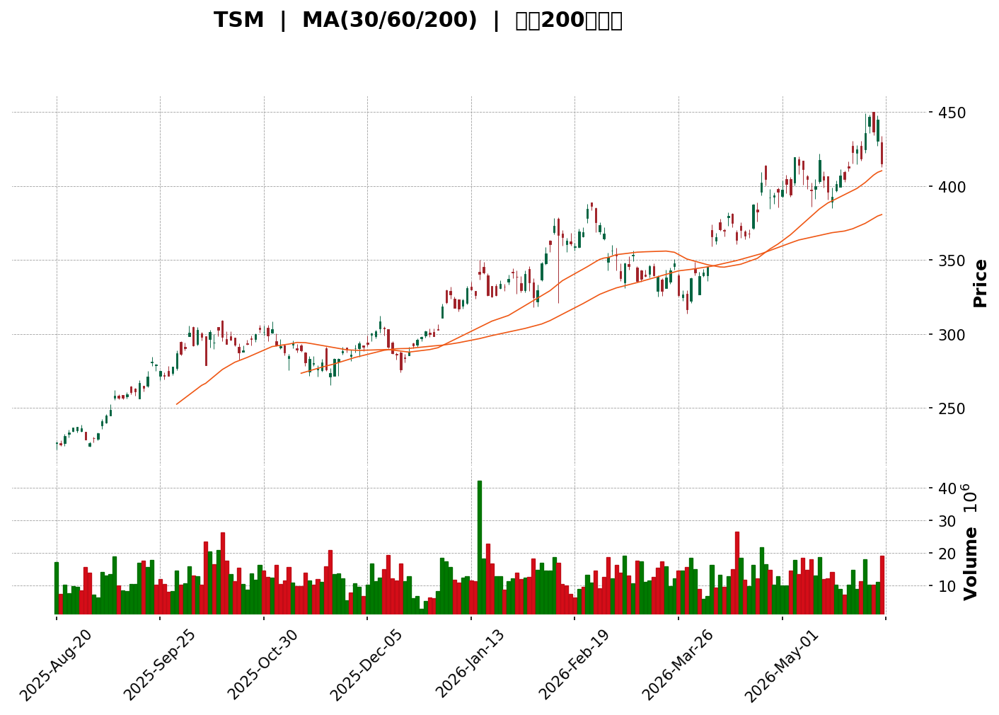
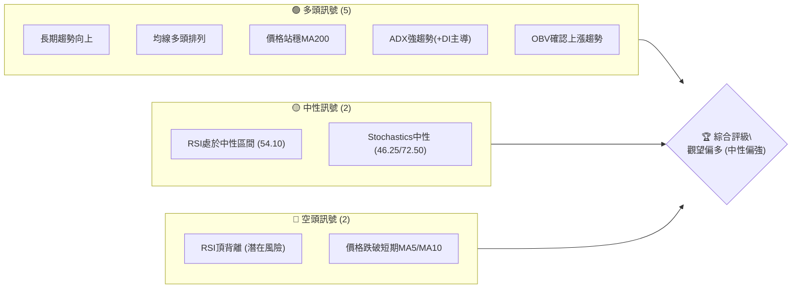
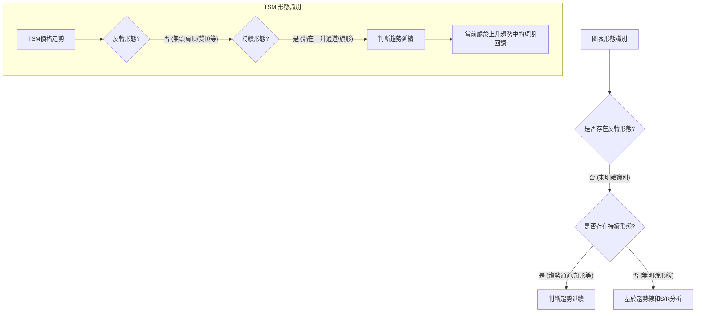

<details>
<summary>📊 靜態圖表 (點擊展開)</summary>

</details>

<html>
<head><meta charset="utf-8" /></head>
<body>
    <div style="height:500px; width:100%;">                        <script>window.PlotlyConfig = {MathJaxConfig: 'local'};</script>
        <script charset="utf-8" src="https://cdn.plot.ly/plotly-3.6.0.min.js" integrity="sha256-QaOVwtVY0T02VaHrr6pnoHLCwayMJp4O5n4YyaE3rJk=" crossorigin="anonymous"></script>                <div id="candlestick-chart" class="plotly-graph-div" style="height:100%; width:100%;"></div>            <script>                window.PLOTLYENV=window.PLOTLYENV || {};                                if (document.getElementById("candlestick-chart")) {                    Plotly.newPlot(                        "candlestick-chart",                        [{"close":{"dtype":"f8","bdata":"AAAAgCBUbEAAAABA1itsQAAAAEBl32xAAAAAoOAxbUAAAACgLJVtQAAAAMBBp21AAAAAAOaGbUAAAADgI5xsQAAAAAB3TWxAAAAAAKOsbEAAAACg0iVtQAAAAMD1KW5AAAAAoOChbkAAAABANRhvQAAAAGAcI3BAAAAAgNcKcEAAAAAAgRFwQAAAAGAFMnBAAAAAwOtJcEAAAACAiVVwQAAAAICfsnBAAAAAQKJ2cEAAAACgHPJwQAAAAICBknFAAAAAYK5ycUAAAADAPDJxQAAAACC6\u002fXBAAAAAwKj7cEAAAAAgFlxxQAAAAMAo7nFAAAAAQG7ocUAAAAAgWilyQAAAAIDQy3JAAAAAYKFGckAAAABAjO1yQAAAAGC3o3JAAAAAwOJxcUAAAACgnNNyQAAAAMAFZXJAAAAAYJLwckAAAABgFKNyQAAAAIBWV3JAAAAAIAeBckAAAADARE5yQAAAAOCu9HFAAAAA4B4SckAAAADAbVVyQAAAAKDHiXJAAAAAoPi9ckAAAABAnvZyQAAAAMDc2HJAAAAAwHesckAAAABA9fJyQAAAAMDyRnJAAAAAwGxAckAAAABAafpxQAAAAADQznFAAAAAYFxackAAAABAHxlyQAAAAMBeEHJAAAAAIGSKcUAAAACAFLRxQAAAAABeh3FAAAAAwCBGcUAAAACAGI1xQAAAAICaP3FAAAAAIMcYcUAAAABgN7FxQAAAAEDasXFAAAAAQN4FckAAAABAiB5yQAAAAKCW4XFAAAAAwMInckAAAADgOV1yQAAAAIAgNXJAAAAAIJxRckAAAACAYcNyQAAAAMDi23JAAAAAgPlGc0AAAAAA5f9yQAAAAMCCM3JAAAAAYOfucUAAAADgBeFxQAAAAIDoQnFAAAAAwBS+cUAAAACgNQJyQAAAAGBLR3JAAAAAoNmBckAAAADAXZ9yQAAAACDT33JAAAAAADHBckAAAACgz6tyQAAAAACU8HJAAAAAAGTrc0AAAAAggxV0QAAAAMAoaHRAAAAAgI3cc0AAAADg3NFzQAAAAMCHK3RAAAAAgGetdEAAAAAgeKR0QAAAAMANY3RAAAAAgOFKdUAAAACgAVd1QAAAAADaY3RAAAAAIEJTdEAAAADAM2d0QAAAAGDd3nRAAAAA4Ga8dEAAAACgOhZ1QAAAACBpVXVAAAAAwIgpdUAAAABAGZp0QAAAAMBpRnVAAAAAwOfsdEAAAAAAMk10QAAAAKDPnHRAAAAAoOq9dUAAAADglCZ2QAAAAABKjnZAAAAAIJ9Qd0AAAAAADfF2QAAAAABK1XZAAAAAoNOydkAAAACg35N2QAAAAKAJdnZAAAAAQPsXd0AAAAAAARB3QAAAAECoCnhAAAAAoD8qeEAAAAAABXx3QAAAAIBwWHdAAAAAQCoBd0AAAABANAJ2QAAAAGD4RnZAAAAA4NkNdkAAAAAgAR91QAAAAACGu3VAAAAA4NWhdUAAAAAABRl2QAAAAOA4\u002fHRAAAAAAMAVdUAAAABgYjR1QAAAACCun3VAAAAAwB45dUAAAADgoyx1QAAAAADXk3RAAAAAQDMndUAAAAAAAHR1QAAAAAAAvHVAAAAAgMJhdEAAAAAA12t0QAAAAAAAyHNAAAAAQDMfdUAAAAAA11d1QAAAAOCjMHVAAAAAAClcdUAAAADAHpV1QAAAAGBm3nZAAAAAANfXdkAAAACgmSl3QAAAAMAeGXdAAAAAgD2+d0AAAACgmXF3QAAAAKCZtXZAAAAAAAAod0AAAAAA1+N2QAAAAKBHAXdAAAAAQAo3eEAAAABgj+p3QAAAACBcJ3lAAAAAIK5PeUAAAACgcIV4QAAAAKBHnXhAAAAAwPXAeEAAAABguNp4QAAAAIDCGXlAAAAAYI+meEAAAAAAADh6QAAAAGBm4nlAAAAAQOG6eUAAAADgo0h5QAAAAOB61HhAAAAAwMz8eEAAAAAghRt6QAAAAKCZRXlAAAAAQDO\u002feEAAAACAwol4QAAAAIDrGXlAAAAAYGZyeUAAAADgUUh5QAAAAMAexXlAAAAAIK5rekAAAACAwo16QAAAAEAzJ3pAAAAAgBQ6e0AAAABACut7QAAAAEAKS3tAAAAAYLjOe0AAAABguPJ5QA=="},"high":{"dtype":"f8","bdata":"AGvUoMRhbECqC29ZAotsQEOJN2C2DW1A9+\u002fuwH1nbUC8OfP6qZhtQOeK8xq\u002fqm1AbxyID7jSbUDDsa9uTD1tQFjqGkaaa2xATy7zoEPObEDrcvGv\u002fihtQCAKNhogTm5AqstEY8S3bkC05OKiE5FvQNlKHorHZHBAWYmwNSU2cEDgNFBpMytwQCaZw3mLSHBA0pscrJ2PcEBoFrfprXVwQGaIIx3b0HBAdWYtPa+RcEA61Futdi1xQExzolTbxnFA+cYwH6N6cUA7LlkS4DlxQLIp9XXHH3FAVuYdr1BlcUC7D8q\u002fRF9xQM8NIoMkDnJAQgC6GG9xckBrOo6G7mZyQNm+QZjIGXNA2Wf995kWc0DLDCFwdgtzQGeCghuo0nJArYrq2c6ockDkou92TO9yQC\u002fQHb14wXJA65Mz\u002fc0Oc0Bjlv7Ai1pzQNmtxp8i2nJAIWuDVrTfckB3oPzemZtyQCaGiWI\u002fWXJA5uwVwZVHckDHqt+UAYVyQL56yY9DrXJAWQAJv4THckCSbF8oSSRzQExa+VLxGXNANHe5lNQfc0B6NPPdp0ZzQC57n0xKxXJAG0zkS02JckDGLwQ3VlByQDSRVzfu5HFAbjA0I\u002fV3ckBJ+hDaylRyQNLJQhn\u002fU3JA4ZxPlYz+cUBZLG1WitRxQHHHlCVKz3FAYea9T2hqcUABdu6vyK9xQJ7+LqfaM3JA4cYs7YlScUCCOj8s5rdxQCoysStPvXFAHIJ\u002fuzczckAXKZKE\u002fTByQEYNfG32GHJAlJp44htOckAO6B\u002fL129yQNDTNV6hRnJASXXF6VqyckA7i8aeUM9yQNbS0woY8HJAjh3CsxOEc0D+dRmbsA9zQHcw4ODM9nJAsEudXIBvckD7S1UzZPpxQIztyUaaBHJAsuHeVKblcUD\u002fPJ2wlTVyQPJIppblYnJA7vyMsyqRckDU5D87HKVyQJAc68hw6HJAE\u002fIBbE\u002f6ckCj9EuMG\u002ftyQFgb2bdrKHNAtAQdVvsKdEAvAo2KG6V0QGQf7BhOwnRAi3HMTCFWdECfX74taTl0QABPLQG4PXRAFBeJ483JdEBkk0VpmPd0QNtLkxnujnRAvqrsGXzldUBLK54h3811QIa93nkEU3VARuBhkz3LdEDkPR2cvOF0QIzNPgI+A3VA0Zsf3ojidEBVQSWCqER1QAaykIt3iHVA+D6axmJsdUDlq+pgHi91QCc0VtC5c3VAh0LpcTKhdUAmUK1wkR11QB5z0g0U2nRA++qsHMzLdUDk+7fmbml2QPYntdLCu3ZA9GRz8Daod0D4z6hp6q53QJjd2FQTIXdAbmpTm7zSdkCI5jUQogV3QD5qPCN9nHZA0GMIhXcyd0Civ+BbF0Z3QMya2QViQXhATuoIFdFReEBN0GcyJRZ4QPuGn\u002fTxeXdAIP27c9NAd0AEZNsSrS92QPKNwL00gXZA3a777ltndkBpSjSd17t1QBAJnBGxxnVAlM6\u002feRsIdkAnBozDiEV2QMMtIhalnnVAyn7RptR4dUAWgCMclnp1QAAAAAAprHVAAAAAQDO\u002fdUAAAABgZj51QAAAAKCZGXVAAAAAYI92dUAAAACAFI51QAAAAEAz53VAAAAAYI9OdUAAAADA9Zh0QAAAAKCZmXRAAAAAYI8mdUAAAABA4cp1QAAAAMAeYXVAAAAAQDODdUAAAADgeph1QAAAAMDMZHdAAAAAYLgCd0AAAAAAAKB3QAAAACBcN3dAAAAAYI\u002fid0AAAAAgrt93QAAAAEAzI3dAAAAAoEd5d0AAAADAHiF3QAAAAAAALHdAAAAAYI8+eEAAAAAAKUx4QAAAAADXl3lAAAAAAADoeUAAAACA6914QAAAAKCZvXhAAAAA4KPseEAAAAAA1z95QAAAAEAze3lAAAAAgBRieUAAAABAMzt6QAAAAAAAQHpAAAAAAAAQekAAAAAgrnt5QAAAAADXI3lAAAAAQOFKeUAAAAAghV96QAAAAIDrnXlAAAAAgBRueUAAAACAFO54QAAAAIAUPnlAAAAAIFy3eUAAAABguKp5QAAAAADXB3pAAAAAwMzoekAAAACgmbl6QAAAAEAK53pAAAAAgD0WfEAAAACAFAZ8QAAAAGCPInxAAAAAACkAfEAAAABgZh57QA=="},"hovertemplate":"\u003cb\u003e%{x|%Y-%m-%d}\u003c\u002fb\u003e\u003cbr\u003e\u958b: $%{open:.2f}\u003cbr\u003e\u9ad8: $%{high:.2f}\u003cbr\u003e\u4f4e: $%{low:.2f}\u003cbr\u003e\u6536: $%{close:.2f}\u003cextra\u003e\u003c\u002fextra\u003e","low":{"dtype":"f8","bdata":"Ya9zuq24a0BlCxNU5AlsQFmGY3gJB2xAijWwSuvHbEDYxcqxUTZtQBO+JpAeLW1AgwixduI+bUDPIbO78JJsQEW2XRLo9WtAO\u002f4dcSBUbEBCFMmvDopsQPkAi\u002fEoe21AQre8jSzxbUDmUQ30oJluQGSk\u002fkDi8G9AOkDiQw4AcEBXEM5sbwJwQPaZMMJNCHBAeVdoItkycEDo11qe2CRwQDoJ3wkACXBAUM3r3NpVcEB68Df43H9wQPSrmV1iZ3FANKLNLDEzcUCxS9U9SctwQCwz5sog0nBAAAAAwKj7cEB11VvCNAVxQAXd+lFaOnFADSJt7j7XcUA+YtMiTQ5yQFawdL2rpHJAaxUxQbI6ckBgElW31UVyQIITYp2SfHJA\u002fcZubaJscUB0PMTDaytyQBB9ZafTG3JAl446bb2mckA5xfDk9HByQA\u002fastnKVHJA+yKEB9h2ckA+slhBvkByQDW4G5RlrXFAKnjNAZ4AckDcz\u002fHzW0xyQD98b4A4QXJAyc2DCEBnckD8\u002fMEdf8tyQB6F3WOssnJA9wjVJcxwckAGVLfqW8dyQPeuJydbPnJA+2\u002fvaV8eckCPv4+c0NxxQEjg0mG3OXFA\u002fSMDuVkickDUdzsdKfVxQEQsGUjS\u002f3FAZRhQY2JncUBq0yC5qPtwQPV\u002fSX0zZHFAbFJNTovzcEBPHh7p0yxxQBR8I2hCLnFAx+f0k6mVcECBstTRBftwQM4rxbFF+XBA77gucGLicUBZfZG9l\u002fZxQMTioq0kmnFAavJW3nT5cUDNkAx7+MdxQCfACvGvCXJA5F+BFTg6ckBtZV8Ib3FyQPz1feHBjXJAuiQm8mfNckDKA6\u002fWxKxyQHvnGzOZInJAYivPT9\u002frcUCY3nb7YahxQL0AOqPpJHFAkb\u002f1OFWPcUA7vT90NNlxQFjtH3NEJnJA+UoOSxA2ckBMXi20XHZyQOYReRjmmnJAP7VVIPmcckBeePW+vKlyQF1KYAs96XJAGMPfyS9tc0AnlcnBiwl0QE+cu8\u002fYOnRAjFlxvFHac0DM7MvlBrRzQAPJhSux1XNAEVsso4YCdEB7fOzSm510QJSTC1uEPnRAtpRvMIcPdUBLwZQxAkh1QBgTFv6zX3RAwtNm8DxMdEB4zcgItF90QFIlWagFp3RAExDzatWUdEAUeCdB69l0QBHEwaRVG3VAb5d\u002f4XF0dED5vKztzYJ0QPWA+fnNgnRAwC3OknuRdEBCjhqExuJzQIf1MmYH7HNAtlC1yUP7dEAnoOTVKa11QJSGKag3NnZA0BNDmq31dkAi5CpvHhN0QEoKE7YZfHZAIWvo\u002fNIzdkCiKfaWJHt2QIF78FP4RnZAT4pbqnRhdkDJLgd04tZ2QIPZK6Tkb3dA5wWTgPr7d0DmuWNUlAp3QHHeSfhY+XZA19P+dAG6dkBKmr63xHJ1QNKIECPcGHZAbpUt6FdtdUCW1Q0y5\u002ft0QNFivD\u002fMr3RAMZno\u002fnp1dUAOpN8WAtZ1QNQlQQz19nRA7oH8bWf0dEDgNQK41y11QAAAAGBmJnVAAAAAoHA1dUAAAABAClN0QAAAAGBmXnRAAAAAoJmxdEAAAADgUeB0QAAAAAAAeHVAAAAAgOtVdEAAAADA9SR0QAAAAMDMnHNAAAAAgD0SdEAAAAAAADx1QAAAAMDMbHRAAAAAgOspdUAAAABgZvp0QAAAAADXc3ZAAAAAIIWLdkAAAAAAABx3QAAAAMDM4HZAAAAAIIVTd0AAAAAgXEN3QAAAAMDMiHZAAAAAgD3SdkAAAAAAAMR2QAAAAIDC0XZAAAAAgD0qd0AAAADA9Xx3QAAAAKCZnXhAAAAAYGYGeUAAAABAMwt4QAAAAEDhQnhAAAAAIFwbeEAAAACAFIJ4QAAAAEAzs3hAAAAAoJmJeEAAAABgZgp5QAAAAIDCgXlAAAAAgBQOeUAAAABACuN4QAAAAIDrIXhAAAAAIIV3eEAAAACgmSF5QAAAAKBH7XhAAAAAwMxweEAAAADA9RB4QAAAAEAzv3hAAAAAACn4eEAAAACAwi15QAAAAMAeoXlAAAAAgBT2eUAAAAAgXOt5QAAAAAAAFHpAAAAAAABoekAAAAAAKUB7QAAAAOB6KHtAAAAAwMy0ekAAAADgo8x5QA=="},"name":"\u50f9\u683c","open":{"dtype":"f8","bdata":"PBbjnYhFbEAnq7+02UVsQPjfBZYXQWxA+hH\u002fHfQIbUASnzZdn0ptQPltyw58Wm1AqEL55WZIbUBXorsTzzltQCC35RdnBmxAqvc60cKwbEB3LGUlXqtsQGnrywhlxW1Ao\u002fAmi+n8bUDmUQ30oJluQLxaixI1CnBAoyfK5K4hcEAvfHhRnSlwQFkwypwhHHBAFy4WgFeHcEBzmqddM25wQEM8tHZRCXBAfUySfYCOcECQiRkQNZFwQOOVDLqSjXFAk8acAFFscUA9Y0OM6PlwQG1oJjIpBnFAuupTQYgvcUAox3tZ6hxxQAWI0JyPTnFAt8UcWUBuckBCAdBLAzRyQEM9GurIpXJA56mdpfYOc0CidIuiEFZyQD\u002fjdO9hynJAAgXTIP2kckAC\u002fmjHnolyQDr\u002fFPoWYHJA576+kLYJc0Akgxpoi1NzQKkYgIcqjHJAJslcHKClckAdwLqytpVyQJ1TKqY9NnJAuoxtblIDckBOZV6lIl9yQBEwb\u002f8kkHJAwUaGvuSKckDs1lhl6gFzQNRAtmai1nJA5VPEXfAEc0BSU8J21s5yQDsye876c3JANBX1tDEwckAOkll+vkdyQFBmdyhJunFAeNsje+FLckDnfUiYSCdyQNe4Ny5hQXJAEB+FYkz5cUBK8gioTSZxQOkXKRRMfnFAHhM9OmZAcUD92CsIYDZxQJ2Bs46rKXJAU5W3w\u002fn0cECBstTRBftwQPs14ALTknFACwzdGi\u002f4cUCe+EeL9y1yQJT9ttp+1XFAjVuGJlQmckDKKEV4MSlyQD49OL7VRXJAu6oy0cVmckCAAzJUuLhyQCmAwlh3pXJAsmOY2hL7ckAjCzG3ZAdzQHcw4ODM9nJAGnK1dyFlckDXjeLiPudxQEKaQBaC+3FAzY8g0S\u002fDcUA7vT90NNlxQDx\u002fbOB4XXJATEiEmzVJckAqAS0zdI5yQMjrbLbqsHJABYwomunOckBn1vWAKthyQLBr8jtV8nJAWF\u002fjcKdxc0Acm\u002f6yi5d0QMX0jIOslHRAr5xHrx88dEBzmM7xpzd0QBlZSZzm7nNAk+j2ih4TdEBXqf1k9L50QNtLkxnujnRAy0\u002fRSIxddUBs827ylJh1QFSN5aBRPXVAjEguvuPHdEAPipP+usd0QIy119kwsnRA0l89tK29dEBNTkAt3\u002fh0QO84HdkOYXVA9cpm34UtdUCZjpjwo+d0QFpODT9KnXRA9ACxO5uBdUAHX\u002fEkg+p0QE2dD0qbHnRA6ldHodMIdUAyHFEJe7x1QK6wu2XmtHZAYzX6RqQQd0DjexPs9Z53QKX6qcPNAXdA5wcEsaaNdkDqPti1Zq12QJEEIvZYa3ZAfNbaFk5sdkCRiHn\u002fqN92QAC3sbVXpXdATuoIFdFReEDkEt6ohBF4QNkAw3mZEXdAunwQaVXFdkCvlgS0Fcl1QHkVfn3PRnZAZN3Hx3EedkAm2ESRjmh1QPFCMSWD6nRAmUT+fdq3dUCwcj3A9w52QDKlsOJTj3VApqyXDkJvdUDs+cSCqER1QAAAAKCZSXVAAAAA4HqcdUAAAAAghZN0QAAAAEDhCnVAAAAAoJmxdEAAAADAHvl0QAAAAAAAoHVAAAAAwB49dUAAAACgR010QAAAAEAzc3RAAAAAwPUkdEAAAABgZn51QAAAAKBwbXRAAAAAAAA8dUAAAABACjd1QAAAAOCjJHdAAAAAwMy0dkAAAACgcHl3QAAAAAApJHdAAAAA4KOwd0AAAABgj9Z3QAAAAIDCDXdAAAAAQDNTd0AAAAAghRN3QAAAAKBHAXdAAAAA4Ho8d0AAAAAAAAR4QAAAAIA9wnhAAAAAAADceUAAAACA64F4QAAAAGCPjnhAAAAAwPXceEAAAABACpd4QAAAAOBRSHlAAAAAoJlJeUAAAABgZiZ5QAAAAKBwIXpAAAAAQDMPekAAAAAA12t5QAAAAAAA3HhAAAAA4FHkeEAAAAAgXDN5QAAAAAAAaHlAAAAAgBRueUAAAAAAKVh4QAAAAAAA0HhAAAAAACn4eEAAAABA4ZZ5QAAAAIDr0XlAAAAA4FGwekAAAAAghWN6QAAAAMAesXpAAAAAgBSOekAAAACgR4l7QAAAAADXH3xAAAAAgBTqekAAAADgUdx6QA=="},"x":["2025-08-20T00:00:00-04:00","2025-08-21T00:00:00-04:00","2025-08-22T00:00:00-04:00","2025-08-25T00:00:00-04:00","2025-08-26T00:00:00-04:00","2025-08-27T00:00:00-04:00","2025-08-28T00:00:00-04:00","2025-08-29T00:00:00-04:00","2025-09-02T00:00:00-04:00","2025-09-03T00:00:00-04:00","2025-09-04T00:00:00-04:00","2025-09-05T00:00:00-04:00","2025-09-08T00:00:00-04:00","2025-09-09T00:00:00-04:00","2025-09-10T00:00:00-04:00","2025-09-11T00:00:00-04:00","2025-09-12T00:00:00-04:00","2025-09-15T00:00:00-04:00","2025-09-16T00:00:00-04:00","2025-09-17T00:00:00-04:00","2025-09-18T00:00:00-04:00","2025-09-19T00:00:00-04:00","2025-09-22T00:00:00-04:00","2025-09-23T00:00:00-04:00","2025-09-24T00:00:00-04:00","2025-09-25T00:00:00-04:00","2025-09-26T00:00:00-04:00","2025-09-29T00:00:00-04:00","2025-09-30T00:00:00-04:00","2025-10-01T00:00:00-04:00","2025-10-02T00:00:00-04:00","2025-10-03T00:00:00-04:00","2025-10-06T00:00:00-04:00","2025-10-07T00:00:00-04:00","2025-10-08T00:00:00-04:00","2025-10-09T00:00:00-04:00","2025-10-10T00:00:00-04:00","2025-10-13T00:00:00-04:00","2025-10-14T00:00:00-04:00","2025-10-15T00:00:00-04:00","2025-10-16T00:00:00-04:00","2025-10-17T00:00:00-04:00","2025-10-20T00:00:00-04:00","2025-10-21T00:00:00-04:00","2025-10-22T00:00:00-04:00","2025-10-23T00:00:00-04:00","2025-10-24T00:00:00-04:00","2025-10-27T00:00:00-04:00","2025-10-28T00:00:00-04:00","2025-10-29T00:00:00-04:00","2025-10-30T00:00:00-04:00","2025-10-31T00:00:00-04:00","2025-11-03T00:00:00-05:00","2025-11-04T00:00:00-05:00","2025-11-05T00:00:00-05:00","2025-11-06T00:00:00-05:00","2025-11-07T00:00:00-05:00","2025-11-10T00:00:00-05:00","2025-11-11T00:00:00-05:00","2025-11-12T00:00:00-05:00","2025-11-13T00:00:00-05:00","2025-11-14T00:00:00-05:00","2025-11-17T00:00:00-05:00","2025-11-18T00:00:00-05:00","2025-11-19T00:00:00-05:00","2025-11-20T00:00:00-05:00","2025-11-21T00:00:00-05:00","2025-11-24T00:00:00-05:00","2025-11-25T00:00:00-05:00","2025-11-26T00:00:00-05:00","2025-11-28T00:00:00-05:00","2025-12-01T00:00:00-05:00","2025-12-02T00:00:00-05:00","2025-12-03T00:00:00-05:00","2025-12-04T00:00:00-05:00","2025-12-05T00:00:00-05:00","2025-12-08T00:00:00-05:00","2025-12-09T00:00:00-05:00","2025-12-10T00:00:00-05:00","2025-12-11T00:00:00-05:00","2025-12-12T00:00:00-05:00","2025-12-15T00:00:00-05:00","2025-12-16T00:00:00-05:00","2025-12-17T00:00:00-05:00","2025-12-18T00:00:00-05:00","2025-12-19T00:00:00-05:00","2025-12-22T00:00:00-05:00","2025-12-23T00:00:00-05:00","2025-12-24T00:00:00-05:00","2025-12-26T00:00:00-05:00","2025-12-29T00:00:00-05:00","2025-12-30T00:00:00-05:00","2025-12-31T00:00:00-05:00","2026-01-02T00:00:00-05:00","2026-01-05T00:00:00-05:00","2026-01-06T00:00:00-05:00","2026-01-07T00:00:00-05:00","2026-01-08T00:00:00-05:00","2026-01-09T00:00:00-05:00","2026-01-12T00:00:00-05:00","2026-01-13T00:00:00-05:00","2026-01-14T00:00:00-05:00","2026-01-15T00:00:00-05:00","2026-01-16T00:00:00-05:00","2026-01-20T00:00:00-05:00","2026-01-21T00:00:00-05:00","2026-01-22T00:00:00-05:00","2026-01-23T00:00:00-05:00","2026-01-26T00:00:00-05:00","2026-01-27T00:00:00-05:00","2026-01-28T00:00:00-05:00","2026-01-29T00:00:00-05:00","2026-01-30T00:00:00-05:00","2026-02-02T00:00:00-05:00","2026-02-03T00:00:00-05:00","2026-02-04T00:00:00-05:00","2026-02-05T00:00:00-05:00","2026-02-06T00:00:00-05:00","2026-02-09T00:00:00-05:00","2026-02-10T00:00:00-05:00","2026-02-11T00:00:00-05:00","2026-02-12T00:00:00-05:00","2026-02-13T00:00:00-05:00","2026-02-17T00:00:00-05:00","2026-02-18T00:00:00-05:00","2026-02-19T00:00:00-05:00","2026-02-20T00:00:00-05:00","2026-02-23T00:00:00-05:00","2026-02-24T00:00:00-05:00","2026-02-25T00:00:00-05:00","2026-02-26T00:00:00-05:00","2026-02-27T00:00:00-05:00","2026-03-02T00:00:00-05:00","2026-03-03T00:00:00-05:00","2026-03-04T00:00:00-05:00","2026-03-05T00:00:00-05:00","2026-03-06T00:00:00-05:00","2026-03-09T00:00:00-04:00","2026-03-10T00:00:00-04:00","2026-03-11T00:00:00-04:00","2026-03-12T00:00:00-04:00","2026-03-13T00:00:00-04:00","2026-03-16T00:00:00-04:00","2026-03-17T00:00:00-04:00","2026-03-18T00:00:00-04:00","2026-03-19T00:00:00-04:00","2026-03-20T00:00:00-04:00","2026-03-23T00:00:00-04:00","2026-03-24T00:00:00-04:00","2026-03-25T00:00:00-04:00","2026-03-26T00:00:00-04:00","2026-03-27T00:00:00-04:00","2026-03-30T00:00:00-04:00","2026-03-31T00:00:00-04:00","2026-04-01T00:00:00-04:00","2026-04-02T00:00:00-04:00","2026-04-06T00:00:00-04:00","2026-04-07T00:00:00-04:00","2026-04-08T00:00:00-04:00","2026-04-09T00:00:00-04:00","2026-04-10T00:00:00-04:00","2026-04-13T00:00:00-04:00","2026-04-14T00:00:00-04:00","2026-04-15T00:00:00-04:00","2026-04-16T00:00:00-04:00","2026-04-17T00:00:00-04:00","2026-04-20T00:00:00-04:00","2026-04-21T00:00:00-04:00","2026-04-22T00:00:00-04:00","2026-04-23T00:00:00-04:00","2026-04-24T00:00:00-04:00","2026-04-27T00:00:00-04:00","2026-04-28T00:00:00-04:00","2026-04-29T00:00:00-04:00","2026-04-30T00:00:00-04:00","2026-05-01T00:00:00-04:00","2026-05-04T00:00:00-04:00","2026-05-05T00:00:00-04:00","2026-05-06T00:00:00-04:00","2026-05-07T00:00:00-04:00","2026-05-08T00:00:00-04:00","2026-05-11T00:00:00-04:00","2026-05-12T00:00:00-04:00","2026-05-13T00:00:00-04:00","2026-05-14T00:00:00-04:00","2026-05-15T00:00:00-04:00","2026-05-18T00:00:00-04:00","2026-05-19T00:00:00-04:00","2026-05-20T00:00:00-04:00","2026-05-21T00:00:00-04:00","2026-05-22T00:00:00-04:00","2026-05-26T00:00:00-04:00","2026-05-27T00:00:00-04:00","2026-05-28T00:00:00-04:00","2026-05-29T00:00:00-04:00","2026-06-01T00:00:00-04:00","2026-06-02T00:00:00-04:00","2026-06-03T00:00:00-04:00","2026-06-04T00:00:00-04:00","2026-06-05T00:00:00-04:00"],"type":"candlestick"},{"hovertemplate":"MA30: $%{y:.2f}\u003cextra\u003e\u003c\u002fextra\u003e","line":{"color":"#2196F3","dash":"dash","width":2},"mode":"lines","name":"MA30","x":["2025-08-20T00:00:00-04:00","2025-08-21T00:00:00-04:00","2025-08-22T00:00:00-04:00","2025-08-25T00:00:00-04:00","2025-08-26T00:00:00-04:00","2025-08-27T00:00:00-04:00","2025-08-28T00:00:00-04:00","2025-08-29T00:00:00-04:00","2025-09-02T00:00:00-04:00","2025-09-03T00:00:00-04:00","2025-09-04T00:00:00-04:00","2025-09-05T00:00:00-04:00","2025-09-08T00:00:00-04:00","2025-09-09T00:00:00-04:00","2025-09-10T00:00:00-04:00","2025-09-11T00:00:00-04:00","2025-09-12T00:00:00-04:00","2025-09-15T00:00:00-04:00","2025-09-16T00:00:00-04:00","2025-09-17T00:00:00-04:00","2025-09-18T00:00:00-04:00","2025-09-19T00:00:00-04:00","2025-09-22T00:00:00-04:00","2025-09-23T00:00:00-04:00","2025-09-24T00:00:00-04:00","2025-09-25T00:00:00-04:00","2025-09-26T00:00:00-04:00","2025-09-29T00:00:00-04:00","2025-09-30T00:00:00-04:00","2025-10-01T00:00:00-04:00","2025-10-02T00:00:00-04:00","2025-10-03T00:00:00-04:00","2025-10-06T00:00:00-04:00","2025-10-07T00:00:00-04:00","2025-10-08T00:00:00-04:00","2025-10-09T00:00:00-04:00","2025-10-10T00:00:00-04:00","2025-10-13T00:00:00-04:00","2025-10-14T00:00:00-04:00","2025-10-15T00:00:00-04:00","2025-10-16T00:00:00-04:00","2025-10-17T00:00:00-04:00","2025-10-20T00:00:00-04:00","2025-10-21T00:00:00-04:00","2025-10-22T00:00:00-04:00","2025-10-23T00:00:00-04:00","2025-10-24T00:00:00-04:00","2025-10-27T00:00:00-04:00","2025-10-28T00:00:00-04:00","2025-10-29T00:00:00-04:00","2025-10-30T00:00:00-04:00","2025-10-31T00:00:00-04:00","2025-11-03T00:00:00-05:00","2025-11-04T00:00:00-05:00","2025-11-05T00:00:00-05:00","2025-11-06T00:00:00-05:00","2025-11-07T00:00:00-05:00","2025-11-10T00:00:00-05:00","2025-11-11T00:00:00-05:00","2025-11-12T00:00:00-05:00","2025-11-13T00:00:00-05:00","2025-11-14T00:00:00-05:00","2025-11-17T00:00:00-05:00","2025-11-18T00:00:00-05:00","2025-11-19T00:00:00-05:00","2025-11-20T00:00:00-05:00","2025-11-21T00:00:00-05:00","2025-11-24T00:00:00-05:00","2025-11-25T00:00:00-05:00","2025-11-26T00:00:00-05:00","2025-11-28T00:00:00-05:00","2025-12-01T00:00:00-05:00","2025-12-02T00:00:00-05:00","2025-12-03T00:00:00-05:00","2025-12-04T00:00:00-05:00","2025-12-05T00:00:00-05:00","2025-12-08T00:00:00-05:00","2025-12-09T00:00:00-05:00","2025-12-10T00:00:00-05:00","2025-12-11T00:00:00-05:00","2025-12-12T00:00:00-05:00","2025-12-15T00:00:00-05:00","2025-12-16T00:00:00-05:00","2025-12-17T00:00:00-05:00","2025-12-18T00:00:00-05:00","2025-12-19T00:00:00-05:00","2025-12-22T00:00:00-05:00","2025-12-23T00:00:00-05:00","2025-12-24T00:00:00-05:00","2025-12-26T00:00:00-05:00","2025-12-29T00:00:00-05:00","2025-12-30T00:00:00-05:00","2025-12-31T00:00:00-05:00","2026-01-02T00:00:00-05:00","2026-01-05T00:00:00-05:00","2026-01-06T00:00:00-05:00","2026-01-07T00:00:00-05:00","2026-01-08T00:00:00-05:00","2026-01-09T00:00:00-05:00","2026-01-12T00:00:00-05:00","2026-01-13T00:00:00-05:00","2026-01-14T00:00:00-05:00","2026-01-15T00:00:00-05:00","2026-01-16T00:00:00-05:00","2026-01-20T00:00:00-05:00","2026-01-21T00:00:00-05:00","2026-01-22T00:00:00-05:00","2026-01-23T00:00:00-05:00","2026-01-26T00:00:00-05:00","2026-01-27T00:00:00-05:00","2026-01-28T00:00:00-05:00","2026-01-29T00:00:00-05:00","2026-01-30T00:00:00-05:00","2026-02-02T00:00:00-05:00","2026-02-03T00:00:00-05:00","2026-02-04T00:00:00-05:00","2026-02-05T00:00:00-05:00","2026-02-06T00:00:00-05:00","2026-02-09T00:00:00-05:00","2026-02-10T00:00:00-05:00","2026-02-11T00:00:00-05:00","2026-02-12T00:00:00-05:00","2026-02-13T00:00:00-05:00","2026-02-17T00:00:00-05:00","2026-02-18T00:00:00-05:00","2026-02-19T00:00:00-05:00","2026-02-20T00:00:00-05:00","2026-02-23T00:00:00-05:00","2026-02-24T00:00:00-05:00","2026-02-25T00:00:00-05:00","2026-02-26T00:00:00-05:00","2026-02-27T00:00:00-05:00","2026-03-02T00:00:00-05:00","2026-03-03T00:00:00-05:00","2026-03-04T00:00:00-05:00","2026-03-05T00:00:00-05:00","2026-03-06T00:00:00-05:00","2026-03-09T00:00:00-04:00","2026-03-10T00:00:00-04:00","2026-03-11T00:00:00-04:00","2026-03-12T00:00:00-04:00","2026-03-13T00:00:00-04:00","2026-03-16T00:00:00-04:00","2026-03-17T00:00:00-04:00","2026-03-18T00:00:00-04:00","2026-03-19T00:00:00-04:00","2026-03-20T00:00:00-04:00","2026-03-23T00:00:00-04:00","2026-03-24T00:00:00-04:00","2026-03-25T00:00:00-04:00","2026-03-26T00:00:00-04:00","2026-03-27T00:00:00-04:00","2026-03-30T00:00:00-04:00","2026-03-31T00:00:00-04:00","2026-04-01T00:00:00-04:00","2026-04-02T00:00:00-04:00","2026-04-06T00:00:00-04:00","2026-04-07T00:00:00-04:00","2026-04-08T00:00:00-04:00","2026-04-09T00:00:00-04:00","2026-04-10T00:00:00-04:00","2026-04-13T00:00:00-04:00","2026-04-14T00:00:00-04:00","2026-04-15T00:00:00-04:00","2026-04-16T00:00:00-04:00","2026-04-17T00:00:00-04:00","2026-04-20T00:00:00-04:00","2026-04-21T00:00:00-04:00","2026-04-22T00:00:00-04:00","2026-04-23T00:00:00-04:00","2026-04-24T00:00:00-04:00","2026-04-27T00:00:00-04:00","2026-04-28T00:00:00-04:00","2026-04-29T00:00:00-04:00","2026-04-30T00:00:00-04:00","2026-05-01T00:00:00-04:00","2026-05-04T00:00:00-04:00","2026-05-05T00:00:00-04:00","2026-05-06T00:00:00-04:00","2026-05-07T00:00:00-04:00","2026-05-08T00:00:00-04:00","2026-05-11T00:00:00-04:00","2026-05-12T00:00:00-04:00","2026-05-13T00:00:00-04:00","2026-05-14T00:00:00-04:00","2026-05-15T00:00:00-04:00","2026-05-18T00:00:00-04:00","2026-05-19T00:00:00-04:00","2026-05-20T00:00:00-04:00","2026-05-21T00:00:00-04:00","2026-05-22T00:00:00-04:00","2026-05-26T00:00:00-04:00","2026-05-27T00:00:00-04:00","2026-05-28T00:00:00-04:00","2026-05-29T00:00:00-04:00","2026-06-01T00:00:00-04:00","2026-06-02T00:00:00-04:00","2026-06-03T00:00:00-04:00","2026-06-04T00:00:00-04:00","2026-06-05T00:00:00-04:00"],"y":{"dtype":"f8","bdata":"AAAAAAAA+H8AAAAAAAD4fwAAAAAAAPh\u002fAAAAAAAA+H8AAAAAAAD4fwAAAAAAAPh\u002fAAAAAAAA+H8AAAAAAAD4fwAAAAAAAPh\u002fAAAAAAAA+H8AAAAAAAD4fwAAAAAAAPh\u002fAAAAAAAA+H8AAAAAAAD4fwAAAAAAAPh\u002fAAAAAAAA+H8AAAAAAAD4fwAAAAAAAPh\u002fAAAAAAAA+H8AAAAAAAD4fwAAAAAAAPh\u002fAAAAAAAA+H8AAAAAAAD4fwAAAAAAAPh\u002fAAAAAAAA+H8AAAAAAAD4fwAAAAAAAPh\u002fAAAAAAAA+H8AAAAAAAD4fwAAADBQk29AIiIiUjTTb0CJiIggYgxwQKuqqlKWMXBAd3d3F\u002fpQcEBmZmaORnRwQO\u002fu7tbPlHBAZmZmbrGrcEDv7u4eR9JwQLy7u8t89nBAmpmZOcMdcUC8u7tTb0BxQGZmZi4\u002fXHFAREREJHN3cUBEREQU\u002fY5xQGZmZvaBnnFAREREJNGvcUBVVVXVJcNxQGZmZsYj13FAMzMzIxPscUAzMzPDggJyQDMzMyPaFHJAZmZmlrYnckAAAADgzjhyQGZmZqbSPnJAREREVK5FckCrqqp6WkxyQM3MzKxSU3JAREREVANfckDv7u5uUGVyQN7d3V10ZnJAVVVV5VFjckDNzMwsaV9yQO\u002fu7o6YVHJAzczMvAtMckBVVVUlTEByQBEREVFtNHJA3t3d7XQxckAzMzPjxidyQImIiPjNIXJAq6qqKvsZckCJiIgYkBVyQM3MzEyjEXJA3t3djakOckARERExKQ9yQM3MzBxPEXJAMzMz42wTckBVVVUlFxdyQImIiMjTGXJAERER4WQeckCamZkJtB5yQJqZmQkxGXJAzczMbN8SckCJiIjYvQlyQGZmZtYSAXJAIiIikrr8cUDe3d0d\u002ffxxQKuqqjoBAXJARERENFICckARERHBywZyQImIiAi2DXJAIiIiMhIYckCrqqoqVCByQAAAAIBeLHJA7+7uzvFCckBmZmb2jlhyQDMzM6OCc3JAERERURqLckB3d3f3QZ1yQJqZmVlhsnJA7+7uDgjJckDe3d0NkN5yQEREROTx83JA7+7uLrcOc0BVVVW1GyhzQN7d3X27OnNAAAAAoNpLc0CamZkZ2VlzQGZmZpYDa3NAq6qqKnZ3c0AiIiLSRYlzQDMzM7MApHNAzczMnI6\u002fc0De3d39ytZzQImIiAgL+XNAMzMzMzQUdEBVVVUlxSd0QERERPSvO3RA7+7uHkpXdEDv7u6OZXV0QLy7u+vPlHRA3t3d\u002fbm7dECJiIj4KuB0QM3MzDxkAXVAiYiIKBsZdUAiIiKCYi51QBEREQHqP3VAq6qqun5bdUCamZmZKnd1QHd3dzc0mHVAd3d3J\u002fe1dUBVVVWVN851QLy7u5t253VAIiIiohL2dUBVVVWFx\u002ft1QCIiIiLiC3ZAzczM7KIadkDv7u5ewyB2QDMzM1MeKHZAiYiIKMQvdkARERGBZDh2QN7d3W1rNXZAq6qqmsI0dkDNzMws5zl2QLy7u+vgPHZAmpmZSWs\u002fdkBEREQE3kZ2QGZmZnaRRnZAmpmZWYtBdkBERER0lzt2QM3MzPyUNHZAIiIioo0bdkBVVVXVCwZ2QFVVVdUA7HVA3t3djYzedUC8u7u7A9R1QCIiIgIryXVAvLu7u1+6dUB3d3eXvq11QFVVVWW8o3VAREREpHSYdUBERERUtZV1QBEREQGZk3VAIiIicuaZdUDv7u6OJaZ1QJqZmZnVqXVAVVVVRT2zdUB3d3d3VcJ1QBEREUExzXVAiYiIiDvjdUBVVVUlwPJ1QDMzM2NSFnZAvLu722I6dkAiIiIisFZ2QAAAAEA1cHZAREREBFaOdkCamZkZva12QERERARW1HZAvLu7ay7ydkBmZmYW2Rp3QGZmZuZCPndA7+7uDuZrd0CrqqpaZJV3QERERIR5wHdAmpmZGXbhd0CamZkJHgp4QHd3dwfzLHhAVVVVxdlJeEDe3d1tEmN4QGZmZmYfdnhAERERYVeMeEBmZmaWbp54QDMzM2M7tXhAmpmZeRTMeEDv7u5enuZ4QLy7u1sBBHlAZmZmxr0meUAiIiLipVF5QAAAAHA9dnlAAAAAYOWUeUAzMzMTPKZ5QA=="},"type":"scatter"},{"hovertemplate":"MA60: $%{y:.2f}\u003cextra\u003e\u003c\u002fextra\u003e","line":{"color":"#9C27B0","dash":"dash","width":2},"mode":"lines","name":"MA60","x":["2025-08-20T00:00:00-04:00","2025-08-21T00:00:00-04:00","2025-08-22T00:00:00-04:00","2025-08-25T00:00:00-04:00","2025-08-26T00:00:00-04:00","2025-08-27T00:00:00-04:00","2025-08-28T00:00:00-04:00","2025-08-29T00:00:00-04:00","2025-09-02T00:00:00-04:00","2025-09-03T00:00:00-04:00","2025-09-04T00:00:00-04:00","2025-09-05T00:00:00-04:00","2025-09-08T00:00:00-04:00","2025-09-09T00:00:00-04:00","2025-09-10T00:00:00-04:00","2025-09-11T00:00:00-04:00","2025-09-12T00:00:00-04:00","2025-09-15T00:00:00-04:00","2025-09-16T00:00:00-04:00","2025-09-17T00:00:00-04:00","2025-09-18T00:00:00-04:00","2025-09-19T00:00:00-04:00","2025-09-22T00:00:00-04:00","2025-09-23T00:00:00-04:00","2025-09-24T00:00:00-04:00","2025-09-25T00:00:00-04:00","2025-09-26T00:00:00-04:00","2025-09-29T00:00:00-04:00","2025-09-30T00:00:00-04:00","2025-10-01T00:00:00-04:00","2025-10-02T00:00:00-04:00","2025-10-03T00:00:00-04:00","2025-10-06T00:00:00-04:00","2025-10-07T00:00:00-04:00","2025-10-08T00:00:00-04:00","2025-10-09T00:00:00-04:00","2025-10-10T00:00:00-04:00","2025-10-13T00:00:00-04:00","2025-10-14T00:00:00-04:00","2025-10-15T00:00:00-04:00","2025-10-16T00:00:00-04:00","2025-10-17T00:00:00-04:00","2025-10-20T00:00:00-04:00","2025-10-21T00:00:00-04:00","2025-10-22T00:00:00-04:00","2025-10-23T00:00:00-04:00","2025-10-24T00:00:00-04:00","2025-10-27T00:00:00-04:00","2025-10-28T00:00:00-04:00","2025-10-29T00:00:00-04:00","2025-10-30T00:00:00-04:00","2025-10-31T00:00:00-04:00","2025-11-03T00:00:00-05:00","2025-11-04T00:00:00-05:00","2025-11-05T00:00:00-05:00","2025-11-06T00:00:00-05:00","2025-11-07T00:00:00-05:00","2025-11-10T00:00:00-05:00","2025-11-11T00:00:00-05:00","2025-11-12T00:00:00-05:00","2025-11-13T00:00:00-05:00","2025-11-14T00:00:00-05:00","2025-11-17T00:00:00-05:00","2025-11-18T00:00:00-05:00","2025-11-19T00:00:00-05:00","2025-11-20T00:00:00-05:00","2025-11-21T00:00:00-05:00","2025-11-24T00:00:00-05:00","2025-11-25T00:00:00-05:00","2025-11-26T00:00:00-05:00","2025-11-28T00:00:00-05:00","2025-12-01T00:00:00-05:00","2025-12-02T00:00:00-05:00","2025-12-03T00:00:00-05:00","2025-12-04T00:00:00-05:00","2025-12-05T00:00:00-05:00","2025-12-08T00:00:00-05:00","2025-12-09T00:00:00-05:00","2025-12-10T00:00:00-05:00","2025-12-11T00:00:00-05:00","2025-12-12T00:00:00-05:00","2025-12-15T00:00:00-05:00","2025-12-16T00:00:00-05:00","2025-12-17T00:00:00-05:00","2025-12-18T00:00:00-05:00","2025-12-19T00:00:00-05:00","2025-12-22T00:00:00-05:00","2025-12-23T00:00:00-05:00","2025-12-24T00:00:00-05:00","2025-12-26T00:00:00-05:00","2025-12-29T00:00:00-05:00","2025-12-30T00:00:00-05:00","2025-12-31T00:00:00-05:00","2026-01-02T00:00:00-05:00","2026-01-05T00:00:00-05:00","2026-01-06T00:00:00-05:00","2026-01-07T00:00:00-05:00","2026-01-08T00:00:00-05:00","2026-01-09T00:00:00-05:00","2026-01-12T00:00:00-05:00","2026-01-13T00:00:00-05:00","2026-01-14T00:00:00-05:00","2026-01-15T00:00:00-05:00","2026-01-16T00:00:00-05:00","2026-01-20T00:00:00-05:00","2026-01-21T00:00:00-05:00","2026-01-22T00:00:00-05:00","2026-01-23T00:00:00-05:00","2026-01-26T00:00:00-05:00","2026-01-27T00:00:00-05:00","2026-01-28T00:00:00-05:00","2026-01-29T00:00:00-05:00","2026-01-30T00:00:00-05:00","2026-02-02T00:00:00-05:00","2026-02-03T00:00:00-05:00","2026-02-04T00:00:00-05:00","2026-02-05T00:00:00-05:00","2026-02-06T00:00:00-05:00","2026-02-09T00:00:00-05:00","2026-02-10T00:00:00-05:00","2026-02-11T00:00:00-05:00","2026-02-12T00:00:00-05:00","2026-02-13T00:00:00-05:00","2026-02-17T00:00:00-05:00","2026-02-18T00:00:00-05:00","2026-02-19T00:00:00-05:00","2026-02-20T00:00:00-05:00","2026-02-23T00:00:00-05:00","2026-02-24T00:00:00-05:00","2026-02-25T00:00:00-05:00","2026-02-26T00:00:00-05:00","2026-02-27T00:00:00-05:00","2026-03-02T00:00:00-05:00","2026-03-03T00:00:00-05:00","2026-03-04T00:00:00-05:00","2026-03-05T00:00:00-05:00","2026-03-06T00:00:00-05:00","2026-03-09T00:00:00-04:00","2026-03-10T00:00:00-04:00","2026-03-11T00:00:00-04:00","2026-03-12T00:00:00-04:00","2026-03-13T00:00:00-04:00","2026-03-16T00:00:00-04:00","2026-03-17T00:00:00-04:00","2026-03-18T00:00:00-04:00","2026-03-19T00:00:00-04:00","2026-03-20T00:00:00-04:00","2026-03-23T00:00:00-04:00","2026-03-24T00:00:00-04:00","2026-03-25T00:00:00-04:00","2026-03-26T00:00:00-04:00","2026-03-27T00:00:00-04:00","2026-03-30T00:00:00-04:00","2026-03-31T00:00:00-04:00","2026-04-01T00:00:00-04:00","2026-04-02T00:00:00-04:00","2026-04-06T00:00:00-04:00","2026-04-07T00:00:00-04:00","2026-04-08T00:00:00-04:00","2026-04-09T00:00:00-04:00","2026-04-10T00:00:00-04:00","2026-04-13T00:00:00-04:00","2026-04-14T00:00:00-04:00","2026-04-15T00:00:00-04:00","2026-04-16T00:00:00-04:00","2026-04-17T00:00:00-04:00","2026-04-20T00:00:00-04:00","2026-04-21T00:00:00-04:00","2026-04-22T00:00:00-04:00","2026-04-23T00:00:00-04:00","2026-04-24T00:00:00-04:00","2026-04-27T00:00:00-04:00","2026-04-28T00:00:00-04:00","2026-04-29T00:00:00-04:00","2026-04-30T00:00:00-04:00","2026-05-01T00:00:00-04:00","2026-05-04T00:00:00-04:00","2026-05-05T00:00:00-04:00","2026-05-06T00:00:00-04:00","2026-05-07T00:00:00-04:00","2026-05-08T00:00:00-04:00","2026-05-11T00:00:00-04:00","2026-05-12T00:00:00-04:00","2026-05-13T00:00:00-04:00","2026-05-14T00:00:00-04:00","2026-05-15T00:00:00-04:00","2026-05-18T00:00:00-04:00","2026-05-19T00:00:00-04:00","2026-05-20T00:00:00-04:00","2026-05-21T00:00:00-04:00","2026-05-22T00:00:00-04:00","2026-05-26T00:00:00-04:00","2026-05-27T00:00:00-04:00","2026-05-28T00:00:00-04:00","2026-05-29T00:00:00-04:00","2026-06-01T00:00:00-04:00","2026-06-02T00:00:00-04:00","2026-06-03T00:00:00-04:00","2026-06-04T00:00:00-04:00","2026-06-05T00:00:00-04:00"],"y":{"dtype":"f8","bdata":"AAAAAAAA+H8AAAAAAAD4fwAAAAAAAPh\u002fAAAAAAAA+H8AAAAAAAD4fwAAAAAAAPh\u002fAAAAAAAA+H8AAAAAAAD4fwAAAAAAAPh\u002fAAAAAAAA+H8AAAAAAAD4fwAAAAAAAPh\u002fAAAAAAAA+H8AAAAAAAD4fwAAAAAAAPh\u002fAAAAAAAA+H8AAAAAAAD4fwAAAAAAAPh\u002fAAAAAAAA+H8AAAAAAAD4fwAAAAAAAPh\u002fAAAAAAAA+H8AAAAAAAD4fwAAAAAAAPh\u002fAAAAAAAA+H8AAAAAAAD4fwAAAAAAAPh\u002fAAAAAAAA+H8AAAAAAAD4fwAAAAAAAPh\u002fAAAAAAAA+H8AAAAAAAD4fwAAAAAAAPh\u002fAAAAAAAA+H8AAAAAAAD4fwAAAAAAAPh\u002fAAAAAAAA+H8AAAAAAAD4fwAAAAAAAPh\u002fAAAAAAAA+H8AAAAAAAD4fwAAAAAAAPh\u002fAAAAAAAA+H8AAAAAAAD4fwAAAAAAAPh\u002fAAAAAAAA+H8AAAAAAAD4fwAAAAAAAPh\u002fAAAAAAAA+H8AAAAAAAD4fwAAAAAAAPh\u002fAAAAAAAA+H8AAAAAAAD4fwAAAAAAAPh\u002fAAAAAAAA+H8AAAAAAAD4fwAAAAAAAPh\u002fAAAAAAAA+H8AAAAAAAD4f+\u002fu7joOGHFAMzMzB3YmcUCrqqqm5TVxQM3MzHAXQ3FAIiIi6oJOcUDe3d1ZSVpxQAAAAJSeZHFAIiIiLpNucUAREREBB31xQCIiImIljHFAIiIiMt+bcUAiIiK2\u002f6pxQJqZmT3xtnFAERERWQ7DcUCrqqoiE89xQJqZmYno13FAvLu7A5\u002fhcUBVVVV9Hu1xQHd3d8d7+HFAIiIiAjwFckBmZmZmmxByQGZmZpYFF3JAmpmZAUsdckBERERcRiFyQGZmZr7yH3JAMzMzczQhckBERETMqyRyQLy7u\u002fMpKnJARERExKowckAAAAAYDjZyQDMzMzMVOnJAvLu7C7I9ckC8u7ur3j9yQHd3d4d7QHJA3t3dxX5HckDe3d2NbUxyQCIiIvr3U3JAd3d3n0deckBVVVVthGJyQBEREakXanJAzczMnIFxckAzMzMTEHpyQImIiJjKgnJAZmZmXrCOckAzMzNzoptyQFVVVU0FpnJAmpmZwaOvckB3d3cfeLhyQHd3d69rwnJA3t3dhe3KckDe3d3t\u002fNNyQGZmZt6Y3nJAzczMBDfpckAzMzNrRPByQHd3d+8O\u002fXJAq6qqYncIc0CamZkhYRJzQHd3d5dYHnNAmpmZKc4sc0AAAACoGD5zQCIiIvpCUXNAAAAAGOZpc0CamZmRP4BzQGZmZl7hlnNAvLu7ewauc0BERES8eMNzQCIiIlK22XNA3t3dhUzzc0CJiIhINgp0QImIiMhKJXRAMzMzm38\u002fdECamZnRY1Z0QAAAAEC0bXRAiYiI6GSCdEBVVVWd8ZF0QAAAANBOo3RAZmZmxj6zdEBEREQ8Tr10QM3MzPSQyXRAmpmZKZ3TdECamZkp1eB0QImIiBC27HRAvLu7myj6dEBVVVUVWQh1QCIiIvr1GnVAZmZmvs8pdUDNzMyUUTd1QFVVVbUgQXVAREREvGpMdUCamZmBflh1QERERHSyZHVAAAAA0KNrdUDv7u5mG3N1QBEREYmydnVAMzMz29N7dUDv7u4eM4F1QJqZmYGKhHVAMzMzO++KdUCJiIiYdJJ1QGZmZk74nXVA3t3d5TWndUDNzMx09rF1QGZmZs6HvXVAIiIiivzHdUAiIiKK9tB1QN7d3d3b2nVAERERGfDmdUAzMzNrjPF1QCIiIsqn+nVAiYiI2H8JdkAzMzNTkhV2QImIiOjeJXZAMzMzu5I3dkB3d3enS0h2QN7d3RWLVnZA7+7upuBmdkDv7u6OTXp2QFVVVb1zjXZAq6qq4tyZdkBVVVVFOKt2QJqZmfFruXZAiYiI2LnDdkAAAAAYuM12QM3MzCw91nZAvLu7UwHgdkCrqqriEO92QM3MzAQP+3ZAiYiIwBwCd0CrqqqCaAh3QN7d3eXtDHdAq6qqAmYSd0BVVVX1ERp3QCIiIjJqJHdA3t3ddf0yd0Dv7u72YUZ3QKuqqnrrVndA3t3dhf1sd0DNzMys\u002fYl3QImIiFi3oXdAREREdBC8d0BEREQcfsx3QA=="},"type":"scatter"},{"hovertemplate":"MA200: $%{y:.2f}\u003cextra\u003e\u003c\u002fextra\u003e","line":{"color":"#FF6F00","dash":"solid","width":2},"mode":"lines","name":"MA200","x":["2025-08-20T00:00:00-04:00","2025-08-21T00:00:00-04:00","2025-08-22T00:00:00-04:00","2025-08-25T00:00:00-04:00","2025-08-26T00:00:00-04:00","2025-08-27T00:00:00-04:00","2025-08-28T00:00:00-04:00","2025-08-29T00:00:00-04:00","2025-09-02T00:00:00-04:00","2025-09-03T00:00:00-04:00","2025-09-04T00:00:00-04:00","2025-09-05T00:00:00-04:00","2025-09-08T00:00:00-04:00","2025-09-09T00:00:00-04:00","2025-09-10T00:00:00-04:00","2025-09-11T00:00:00-04:00","2025-09-12T00:00:00-04:00","2025-09-15T00:00:00-04:00","2025-09-16T00:00:00-04:00","2025-09-17T00:00:00-04:00","2025-09-18T00:00:00-04:00","2025-09-19T00:00:00-04:00","2025-09-22T00:00:00-04:00","2025-09-23T00:00:00-04:00","2025-09-24T00:00:00-04:00","2025-09-25T00:00:00-04:00","2025-09-26T00:00:00-04:00","2025-09-29T00:00:00-04:00","2025-09-30T00:00:00-04:00","2025-10-01T00:00:00-04:00","2025-10-02T00:00:00-04:00","2025-10-03T00:00:00-04:00","2025-10-06T00:00:00-04:00","2025-10-07T00:00:00-04:00","2025-10-08T00:00:00-04:00","2025-10-09T00:00:00-04:00","2025-10-10T00:00:00-04:00","2025-10-13T00:00:00-04:00","2025-10-14T00:00:00-04:00","2025-10-15T00:00:00-04:00","2025-10-16T00:00:00-04:00","2025-10-17T00:00:00-04:00","2025-10-20T00:00:00-04:00","2025-10-21T00:00:00-04:00","2025-10-22T00:00:00-04:00","2025-10-23T00:00:00-04:00","2025-10-24T00:00:00-04:00","2025-10-27T00:00:00-04:00","2025-10-28T00:00:00-04:00","2025-10-29T00:00:00-04:00","2025-10-30T00:00:00-04:00","2025-10-31T00:00:00-04:00","2025-11-03T00:00:00-05:00","2025-11-04T00:00:00-05:00","2025-11-05T00:00:00-05:00","2025-11-06T00:00:00-05:00","2025-11-07T00:00:00-05:00","2025-11-10T00:00:00-05:00","2025-11-11T00:00:00-05:00","2025-11-12T00:00:00-05:00","2025-11-13T00:00:00-05:00","2025-11-14T00:00:00-05:00","2025-11-17T00:00:00-05:00","2025-11-18T00:00:00-05:00","2025-11-19T00:00:00-05:00","2025-11-20T00:00:00-05:00","2025-11-21T00:00:00-05:00","2025-11-24T00:00:00-05:00","2025-11-25T00:00:00-05:00","2025-11-26T00:00:00-05:00","2025-11-28T00:00:00-05:00","2025-12-01T00:00:00-05:00","2025-12-02T00:00:00-05:00","2025-12-03T00:00:00-05:00","2025-12-04T00:00:00-05:00","2025-12-05T00:00:00-05:00","2025-12-08T00:00:00-05:00","2025-12-09T00:00:00-05:00","2025-12-10T00:00:00-05:00","2025-12-11T00:00:00-05:00","2025-12-12T00:00:00-05:00","2025-12-15T00:00:00-05:00","2025-12-16T00:00:00-05:00","2025-12-17T00:00:00-05:00","2025-12-18T00:00:00-05:00","2025-12-19T00:00:00-05:00","2025-12-22T00:00:00-05:00","2025-12-23T00:00:00-05:00","2025-12-24T00:00:00-05:00","2025-12-26T00:00:00-05:00","2025-12-29T00:00:00-05:00","2025-12-30T00:00:00-05:00","2025-12-31T00:00:00-05:00","2026-01-02T00:00:00-05:00","2026-01-05T00:00:00-05:00","2026-01-06T00:00:00-05:00","2026-01-07T00:00:00-05:00","2026-01-08T00:00:00-05:00","2026-01-09T00:00:00-05:00","2026-01-12T00:00:00-05:00","2026-01-13T00:00:00-05:00","2026-01-14T00:00:00-05:00","2026-01-15T00:00:00-05:00","2026-01-16T00:00:00-05:00","2026-01-20T00:00:00-05:00","2026-01-21T00:00:00-05:00","2026-01-22T00:00:00-05:00","2026-01-23T00:00:00-05:00","2026-01-26T00:00:00-05:00","2026-01-27T00:00:00-05:00","2026-01-28T00:00:00-05:00","2026-01-29T00:00:00-05:00","2026-01-30T00:00:00-05:00","2026-02-02T00:00:00-05:00","2026-02-03T00:00:00-05:00","2026-02-04T00:00:00-05:00","2026-02-05T00:00:00-05:00","2026-02-06T00:00:00-05:00","2026-02-09T00:00:00-05:00","2026-02-10T00:00:00-05:00","2026-02-11T00:00:00-05:00","2026-02-12T00:00:00-05:00","2026-02-13T00:00:00-05:00","2026-02-17T00:00:00-05:00","2026-02-18T00:00:00-05:00","2026-02-19T00:00:00-05:00","2026-02-20T00:00:00-05:00","2026-02-23T00:00:00-05:00","2026-02-24T00:00:00-05:00","2026-02-25T00:00:00-05:00","2026-02-26T00:00:00-05:00","2026-02-27T00:00:00-05:00","2026-03-02T00:00:00-05:00","2026-03-03T00:00:00-05:00","2026-03-04T00:00:00-05:00","2026-03-05T00:00:00-05:00","2026-03-06T00:00:00-05:00","2026-03-09T00:00:00-04:00","2026-03-10T00:00:00-04:00","2026-03-11T00:00:00-04:00","2026-03-12T00:00:00-04:00","2026-03-13T00:00:00-04:00","2026-03-16T00:00:00-04:00","2026-03-17T00:00:00-04:00","2026-03-18T00:00:00-04:00","2026-03-19T00:00:00-04:00","2026-03-20T00:00:00-04:00","2026-03-23T00:00:00-04:00","2026-03-24T00:00:00-04:00","2026-03-25T00:00:00-04:00","2026-03-26T00:00:00-04:00","2026-03-27T00:00:00-04:00","2026-03-30T00:00:00-04:00","2026-03-31T00:00:00-04:00","2026-04-01T00:00:00-04:00","2026-04-02T00:00:00-04:00","2026-04-06T00:00:00-04:00","2026-04-07T00:00:00-04:00","2026-04-08T00:00:00-04:00","2026-04-09T00:00:00-04:00","2026-04-10T00:00:00-04:00","2026-04-13T00:00:00-04:00","2026-04-14T00:00:00-04:00","2026-04-15T00:00:00-04:00","2026-04-16T00:00:00-04:00","2026-04-17T00:00:00-04:00","2026-04-20T00:00:00-04:00","2026-04-21T00:00:00-04:00","2026-04-22T00:00:00-04:00","2026-04-23T00:00:00-04:00","2026-04-24T00:00:00-04:00","2026-04-27T00:00:00-04:00","2026-04-28T00:00:00-04:00","2026-04-29T00:00:00-04:00","2026-04-30T00:00:00-04:00","2026-05-01T00:00:00-04:00","2026-05-04T00:00:00-04:00","2026-05-05T00:00:00-04:00","2026-05-06T00:00:00-04:00","2026-05-07T00:00:00-04:00","2026-05-08T00:00:00-04:00","2026-05-11T00:00:00-04:00","2026-05-12T00:00:00-04:00","2026-05-13T00:00:00-04:00","2026-05-14T00:00:00-04:00","2026-05-15T00:00:00-04:00","2026-05-18T00:00:00-04:00","2026-05-19T00:00:00-04:00","2026-05-20T00:00:00-04:00","2026-05-21T00:00:00-04:00","2026-05-22T00:00:00-04:00","2026-05-26T00:00:00-04:00","2026-05-27T00:00:00-04:00","2026-05-28T00:00:00-04:00","2026-05-29T00:00:00-04:00","2026-06-01T00:00:00-04:00","2026-06-02T00:00:00-04:00","2026-06-03T00:00:00-04:00","2026-06-04T00:00:00-04:00","2026-06-05T00:00:00-04:00"],"y":{"dtype":"f8","bdata":"AAAAAAAA+H8AAAAAAAD4fwAAAAAAAPh\u002fAAAAAAAA+H8AAAAAAAD4fwAAAAAAAPh\u002fAAAAAAAA+H8AAAAAAAD4fwAAAAAAAPh\u002fAAAAAAAA+H8AAAAAAAD4fwAAAAAAAPh\u002fAAAAAAAA+H8AAAAAAAD4fwAAAAAAAPh\u002fAAAAAAAA+H8AAAAAAAD4fwAAAAAAAPh\u002fAAAAAAAA+H8AAAAAAAD4fwAAAAAAAPh\u002fAAAAAAAA+H8AAAAAAAD4fwAAAAAAAPh\u002fAAAAAAAA+H8AAAAAAAD4fwAAAAAAAPh\u002fAAAAAAAA+H8AAAAAAAD4fwAAAAAAAPh\u002fAAAAAAAA+H8AAAAAAAD4fwAAAAAAAPh\u002fAAAAAAAA+H8AAAAAAAD4fwAAAAAAAPh\u002fAAAAAAAA+H8AAAAAAAD4fwAAAAAAAPh\u002fAAAAAAAA+H8AAAAAAAD4fwAAAAAAAPh\u002fAAAAAAAA+H8AAAAAAAD4fwAAAAAAAPh\u002fAAAAAAAA+H8AAAAAAAD4fwAAAAAAAPh\u002fAAAAAAAA+H8AAAAAAAD4fwAAAAAAAPh\u002fAAAAAAAA+H8AAAAAAAD4fwAAAAAAAPh\u002fAAAAAAAA+H8AAAAAAAD4fwAAAAAAAPh\u002fAAAAAAAA+H8AAAAAAAD4fwAAAAAAAPh\u002fAAAAAAAA+H8AAAAAAAD4fwAAAAAAAPh\u002fAAAAAAAA+H8AAAAAAAD4fwAAAAAAAPh\u002fAAAAAAAA+H8AAAAAAAD4fwAAAAAAAPh\u002fAAAAAAAA+H8AAAAAAAD4fwAAAAAAAPh\u002fAAAAAAAA+H8AAAAAAAD4fwAAAAAAAPh\u002fAAAAAAAA+H8AAAAAAAD4fwAAAAAAAPh\u002fAAAAAAAA+H8AAAAAAAD4fwAAAAAAAPh\u002fAAAAAAAA+H8AAAAAAAD4fwAAAAAAAPh\u002fAAAAAAAA+H8AAAAAAAD4fwAAAAAAAPh\u002fAAAAAAAA+H8AAAAAAAD4fwAAAAAAAPh\u002fAAAAAAAA+H8AAAAAAAD4fwAAAAAAAPh\u002fAAAAAAAA+H8AAAAAAAD4fwAAAAAAAPh\u002fAAAAAAAA+H8AAAAAAAD4fwAAAAAAAPh\u002fAAAAAAAA+H8AAAAAAAD4fwAAAAAAAPh\u002fAAAAAAAA+H8AAAAAAAD4fwAAAAAAAPh\u002fAAAAAAAA+H8AAAAAAAD4fwAAAAAAAPh\u002fAAAAAAAA+H8AAAAAAAD4fwAAAAAAAPh\u002fAAAAAAAA+H8AAAAAAAD4fwAAAAAAAPh\u002fAAAAAAAA+H8AAAAAAAD4fwAAAAAAAPh\u002fAAAAAAAA+H8AAAAAAAD4fwAAAAAAAPh\u002fAAAAAAAA+H8AAAAAAAD4fwAAAAAAAPh\u002fAAAAAAAA+H8AAAAAAAD4fwAAAAAAAPh\u002fAAAAAAAA+H8AAAAAAAD4fwAAAAAAAPh\u002fAAAAAAAA+H8AAAAAAAD4fwAAAAAAAPh\u002fAAAAAAAA+H8AAAAAAAD4fwAAAAAAAPh\u002fAAAAAAAA+H8AAAAAAAD4fwAAAAAAAPh\u002fAAAAAAAA+H8AAAAAAAD4fwAAAAAAAPh\u002fAAAAAAAA+H8AAAAAAAD4fwAAAAAAAPh\u002fAAAAAAAA+H8AAAAAAAD4fwAAAAAAAPh\u002fAAAAAAAA+H8AAAAAAAD4fwAAAAAAAPh\u002fAAAAAAAA+H8AAAAAAAD4fwAAAAAAAPh\u002fAAAAAAAA+H8AAAAAAAD4fwAAAAAAAPh\u002fAAAAAAAA+H8AAAAAAAD4fwAAAAAAAPh\u002fAAAAAAAA+H8AAAAAAAD4fwAAAAAAAPh\u002fAAAAAAAA+H8AAAAAAAD4fwAAAAAAAPh\u002fAAAAAAAA+H8AAAAAAAD4fwAAAAAAAPh\u002fAAAAAAAA+H8AAAAAAAD4fwAAAAAAAPh\u002fAAAAAAAA+H8AAAAAAAD4fwAAAAAAAPh\u002fAAAAAAAA+H8AAAAAAAD4fwAAAAAAAPh\u002fAAAAAAAA+H8AAAAAAAD4fwAAAAAAAPh\u002fAAAAAAAA+H8AAAAAAAD4fwAAAAAAAPh\u002fAAAAAAAA+H8AAAAAAAD4fwAAAAAAAPh\u002fAAAAAAAA+H8AAAAAAAD4fwAAAAAAAPh\u002fAAAAAAAA+H8AAAAAAAD4fwAAAAAAAPh\u002fAAAAAAAA+H8AAAAAAAD4fwAAAAAAAPh\u002fAAAAAAAA+H8AAAAAAAD4fwAAAAAAAPh\u002fAAAAAAAA+H8zMzMxMlV0QA=="},"type":"scatter"}],                        {"template":{"data":{"barpolar":[{"marker":{"line":{"color":"rgb(17,17,17)","width":0.5},"pattern":{"fillmode":"overlay","size":10,"solidity":0.2}},"type":"barpolar"}],"bar":[{"error_x":{"color":"#f2f5fa"},"error_y":{"color":"#f2f5fa"},"marker":{"line":{"color":"rgb(17,17,17)","width":0.5},"pattern":{"fillmode":"overlay","size":10,"solidity":0.2}},"type":"bar"}],"carpet":[{"aaxis":{"endlinecolor":"#A2B1C6","gridcolor":"#506784","linecolor":"#506784","minorgridcolor":"#506784","startlinecolor":"#A2B1C6"},"baxis":{"endlinecolor":"#A2B1C6","gridcolor":"#506784","linecolor":"#506784","minorgridcolor":"#506784","startlinecolor":"#A2B1C6"},"type":"carpet"}],"choropleth":[{"colorbar":{"outlinewidth":0,"ticks":""},"type":"choropleth"}],"contourcarpet":[{"colorbar":{"outlinewidth":0,"ticks":""},"type":"contourcarpet"}],"contour":[{"colorbar":{"outlinewidth":0,"ticks":""},"colorscale":[[0.0,"#0d0887"],[0.1111111111111111,"#46039f"],[0.2222222222222222,"#7201a8"],[0.3333333333333333,"#9c179e"],[0.4444444444444444,"#bd3786"],[0.5555555555555556,"#d8576b"],[0.6666666666666666,"#ed7953"],[0.7777777777777778,"#fb9f3a"],[0.8888888888888888,"#fdca26"],[1.0,"#f0f921"]],"type":"contour"}],"heatmap":[{"colorbar":{"outlinewidth":0,"ticks":""},"colorscale":[[0.0,"#0d0887"],[0.1111111111111111,"#46039f"],[0.2222222222222222,"#7201a8"],[0.3333333333333333,"#9c179e"],[0.4444444444444444,"#bd3786"],[0.5555555555555556,"#d8576b"],[0.6666666666666666,"#ed7953"],[0.7777777777777778,"#fb9f3a"],[0.8888888888888888,"#fdca26"],[1.0,"#f0f921"]],"type":"heatmap"}],"histogram2dcontour":[{"colorbar":{"outlinewidth":0,"ticks":""},"colorscale":[[0.0,"#0d0887"],[0.1111111111111111,"#46039f"],[0.2222222222222222,"#7201a8"],[0.3333333333333333,"#9c179e"],[0.4444444444444444,"#bd3786"],[0.5555555555555556,"#d8576b"],[0.6666666666666666,"#ed7953"],[0.7777777777777778,"#fb9f3a"],[0.8888888888888888,"#fdca26"],[1.0,"#f0f921"]],"type":"histogram2dcontour"}],"histogram2d":[{"colorbar":{"outlinewidth":0,"ticks":""},"colorscale":[[0.0,"#0d0887"],[0.1111111111111111,"#46039f"],[0.2222222222222222,"#7201a8"],[0.3333333333333333,"#9c179e"],[0.4444444444444444,"#bd3786"],[0.5555555555555556,"#d8576b"],[0.6666666666666666,"#ed7953"],[0.7777777777777778,"#fb9f3a"],[0.8888888888888888,"#fdca26"],[1.0,"#f0f921"]],"type":"histogram2d"}],"histogram":[{"marker":{"pattern":{"fillmode":"overlay","size":10,"solidity":0.2}},"type":"histogram"}],"mesh3d":[{"colorbar":{"outlinewidth":0,"ticks":""},"type":"mesh3d"}],"parcoords":[{"line":{"colorbar":{"outlinewidth":0,"ticks":""}},"type":"parcoords"}],"pie":[{"automargin":true,"type":"pie"}],"scatter3d":[{"line":{"colorbar":{"outlinewidth":0,"ticks":""}},"marker":{"colorbar":{"outlinewidth":0,"ticks":""}},"type":"scatter3d"}],"scattercarpet":[{"marker":{"colorbar":{"outlinewidth":0,"ticks":""}},"type":"scattercarpet"}],"scattergeo":[{"marker":{"colorbar":{"outlinewidth":0,"ticks":""}},"type":"scattergeo"}],"scattergl":[{"marker":{"line":{"color":"#283442"}},"type":"scattergl"}],"scattermapbox":[{"marker":{"colorbar":{"outlinewidth":0,"ticks":""}},"type":"scattermapbox"}],"scattermap":[{"marker":{"colorbar":{"outlinewidth":0,"ticks":""}},"type":"scattermap"}],"scatterpolargl":[{"marker":{"colorbar":{"outlinewidth":0,"ticks":""}},"type":"scatterpolargl"}],"scatterpolar":[{"marker":{"colorbar":{"outlinewidth":0,"ticks":""}},"type":"scatterpolar"}],"scatter":[{"marker":{"line":{"color":"#283442"}},"type":"scatter"}],"scatterternary":[{"marker":{"colorbar":{"outlinewidth":0,"ticks":""}},"type":"scatterternary"}],"surface":[{"colorbar":{"outlinewidth":0,"ticks":""},"colorscale":[[0.0,"#0d0887"],[0.1111111111111111,"#46039f"],[0.2222222222222222,"#7201a8"],[0.3333333333333333,"#9c179e"],[0.4444444444444444,"#bd3786"],[0.5555555555555556,"#d8576b"],[0.6666666666666666,"#ed7953"],[0.7777777777777778,"#fb9f3a"],[0.8888888888888888,"#fdca26"],[1.0,"#f0f921"]],"type":"surface"}],"table":[{"cells":{"fill":{"color":"#506784"},"line":{"color":"rgb(17,17,17)"}},"header":{"fill":{"color":"#2a3f5f"},"line":{"color":"rgb(17,17,17)"}},"type":"table"}]},"layout":{"annotationdefaults":{"arrowcolor":"#f2f5fa","arrowhead":0,"arrowwidth":1},"autotypenumbers":"strict","coloraxis":{"colorbar":{"outlinewidth":0,"ticks":""}},"colorscale":{"diverging":[[0,"#8e0152"],[0.1,"#c51b7d"],[0.2,"#de77ae"],[0.3,"#f1b6da"],[0.4,"#fde0ef"],[0.5,"#f7f7f7"],[0.6,"#e6f5d0"],[0.7,"#b8e186"],[0.8,"#7fbc41"],[0.9,"#4d9221"],[1,"#276419"]],"sequential":[[0.0,"#0d0887"],[0.1111111111111111,"#46039f"],[0.2222222222222222,"#7201a8"],[0.3333333333333333,"#9c179e"],[0.4444444444444444,"#bd3786"],[0.5555555555555556,"#d8576b"],[0.6666666666666666,"#ed7953"],[0.7777777777777778,"#fb9f3a"],[0.8888888888888888,"#fdca26"],[1.0,"#f0f921"]],"sequentialminus":[[0.0,"#0d0887"],[0.1111111111111111,"#46039f"],[0.2222222222222222,"#7201a8"],[0.3333333333333333,"#9c179e"],[0.4444444444444444,"#bd3786"],[0.5555555555555556,"#d8576b"],[0.6666666666666666,"#ed7953"],[0.7777777777777778,"#fb9f3a"],[0.8888888888888888,"#fdca26"],[1.0,"#f0f921"]]},"colorway":["#636efa","#EF553B","#00cc96","#ab63fa","#FFA15A","#19d3f3","#FF6692","#B6E880","#FF97FF","#FECB52"],"font":{"color":"#f2f5fa"},"geo":{"bgcolor":"rgb(17,17,17)","lakecolor":"rgb(17,17,17)","landcolor":"rgb(17,17,17)","showlakes":true,"showland":true,"subunitcolor":"#506784"},"hoverlabel":{"align":"left"},"hovermode":"closest","mapbox":{"style":"dark"},"paper_bgcolor":"rgb(17,17,17)","plot_bgcolor":"rgb(17,17,17)","polar":{"angularaxis":{"gridcolor":"#506784","linecolor":"#506784","ticks":""},"bgcolor":"rgb(17,17,17)","radialaxis":{"gridcolor":"#506784","linecolor":"#506784","ticks":""}},"scene":{"xaxis":{"backgroundcolor":"rgb(17,17,17)","gridcolor":"#506784","gridwidth":2,"linecolor":"#506784","showbackground":true,"ticks":"","zerolinecolor":"#C8D4E3"},"yaxis":{"backgroundcolor":"rgb(17,17,17)","gridcolor":"#506784","gridwidth":2,"linecolor":"#506784","showbackground":true,"ticks":"","zerolinecolor":"#C8D4E3"},"zaxis":{"backgroundcolor":"rgb(17,17,17)","gridcolor":"#506784","gridwidth":2,"linecolor":"#506784","showbackground":true,"ticks":"","zerolinecolor":"#C8D4E3"}},"shapedefaults":{"line":{"color":"#f2f5fa"}},"sliderdefaults":{"bgcolor":"#C8D4E3","bordercolor":"rgb(17,17,17)","borderwidth":1,"tickwidth":0},"ternary":{"aaxis":{"gridcolor":"#506784","linecolor":"#506784","ticks":""},"baxis":{"gridcolor":"#506784","linecolor":"#506784","ticks":""},"bgcolor":"rgb(17,17,17)","caxis":{"gridcolor":"#506784","linecolor":"#506784","ticks":""}},"title":{"x":0.05},"updatemenudefaults":{"bgcolor":"#506784","borderwidth":0},"xaxis":{"automargin":true,"gridcolor":"#283442","linecolor":"#506784","ticks":"","title":{"standoff":15},"zerolinecolor":"#283442","zerolinewidth":2},"yaxis":{"automargin":true,"gridcolor":"#283442","linecolor":"#506784","ticks":"","title":{"standoff":15},"zerolinecolor":"#283442","zerolinewidth":2}}},"xaxis":{"rangeslider":{"visible":false},"title":{"text":"\u65e5\u671f"}},"font":{"size":11},"title":{"text":"TSM  |  MA(30\u002f60\u002f200)  |  \u6700\u8fd1200\u4ea4\u6613\u65e5"},"yaxis":{"title":{"text":"\u80a1\u50f9 (USD)"}},"hovermode":"x unified","height":500},                        {"responsive": true}                    )                };            </script>        </div>
</body>
</html>

# TSM 技術分析報告

> **報告日期**：2026-06-05 ｜ **語言**：繁體中文 ｜ **數據來源**：Yahoo Finance ｜ **當前價格**：$415.17

---

## 目錄

| 章節 | 內容 |
|------|------|
| [1. 技術面概覽](#1-技術面概覽) | 訊號儀表板、核心指標、評分卡 |
| [2. 趨勢分析](#2-趨勢分析) | 多時框趨勢、長中短期走勢 |
| [3. 圖表形態分析](#3-圖表形態分析) | 形態識別、K線組合、目標價 |
| [4. 支撐與阻力](#4-支撐與阻力) | 關鍵價位、斐波那契回調 |
| [5. 技術指標深度解讀](#5-技術指標深度解讀) | MA/RSI/MACD/布林/成交量 |
| [6. 動能與波動率](#6-動能與波動率) | 動能評估、ATR、Beta |
| [7. 多時框架總結](#7-多時框架總結) | 時框架評分矩陣 |
| [8. 交易策略建議](#8-交易策略建議) | 多空策略、風險報酬比 |
| [9. 風險提示與監控](#9-風險提示與監控) | 監控指標、風險場景 |

---

## 1. 技術面概覽

本章節旨在提供TSM技術面的快速概覽，透過視覺化儀表板、核心指標速覽及綜合評分卡，幫助投資者迅速掌握當前市場訊號與潛在機會。

### 🎯 技術訊號儀表板

TSM目前的技術訊號呈現多空交織的複雜局面。儘管長期趨勢強勁且均線系統保持多頭排列，但短期動能指標已出現警示訊號，特別是RSI的頂背離現象，暗示上升動能可能正在減弱。成交量配合良好，顯示市場對當前價格水平仍有支撐。


**儀表板解讀**：
*   **多頭訊號**：數量佔優，主要反映TSM在長期與中期上的強勁表現，包括穩固的多頭均線排列、價格對關鍵長期均線的有效支撐以及趨勢指標ADX的確認。OBV的趨勢也支持當前上漲。
*   **中性訊號**：RSI和Stochastics等動能指標目前處於中性區域，既未超買也未超賣，表明短期內市場情緒可能在調整或蓄勢。
*   **空頭訊號**：雖然數量較少，但RSI頂背離是一個重要的警示。此外，價格近期跌破了極短期移動平均線（MA5和MA10），這可能預示著短期回調的開始。

綜合來看，TSM的長期和中期結構依然偏多，但短期內需要警惕動能減弱和潛在的回調風險。

### 📊 核心指標速覽表

以下表格匯總了TSM當前的關鍵技術指標數據及其初步解讀，提供了一個快速判斷市場狀態的視角。

| 指標類別 | 指標名稱 | 當前數值 | 訊號 | 解讀 |
|----------|----------|----------|------|------|
| **價格** | 當前價格 | $415.17 | 🟢 | 位於52週高點區間86%，接近歷史高位 |
| **均線** | MA20 | $414.73 | 🟢 | 價格略高於MA20，短期支撐有效 |
| **均線** | MA50 | $389.03 | 🟢 | 價格遠高於MA50，中期趨勢強勁 |
| **均線** | MA200 | $325.32 | 🟢 | 價格大幅高於MA200，長期趨勢非常強勁 |
| **動能** | RSI(14) | 54.10 | 🟡 | 處於中性區間，未超買或超賣，但存在頂背離風險 |
| **動能** | MACD | 12.003 | 🟢 | MACD線高於訊號線，柱狀圖為正，動能偏多 |
| **趨勢** | ADX(14) | 27.54 | 🟢 | 趨勢強度較強 (>25)，多頭主導 (+DI > -DI) |
| **波動** | ATR(14) | $16.37 | 🟡 | 每日波動約3.94%，屬於中高波動性股票 |
| **成交量** | 量比(20日) | 1.46x | 🟢 | 當日成交量高於20日均量，市場活躍 |
| **成交量** | OBV趨勢 | OBV > MA | 🟢 | 成交量確認價格上漲趨勢，量價配合良好 |
| **布林通道** | BB %B | 0.51 | 🟡 | 價格接近布林通道中軌，處於通道中段 |

### 🏆 技術評分卡

本評分卡綜合衡量了TSM在各個技術分析維度上的表現，並以進度條和顏色標記直觀呈現，提供一個量化的綜合評估。

```
技術評分卡 — TSM (2026-06-05)
════════════════════════════════════════════════════
趨勢強度      ████████████████░░░░  80/100  🟢
動能指標      ████████░░░░░░░░░░░░  60/100  🟡
支撐穩定度    ██████████████████░░  90/100  🟢
成交量配合    ██████████████░░░░░░  75/100  🟢
形態完整度    ██████░░░░░░░░░░░░░░  50/100  🟡
均線排列      ████████████████████  95/100  🟢
════════════════════════════════════════════════════
綜合評分      ██████████████░░░░░░  77/100  🟢 偏強
════════════════════════════════════════════════════
```
**評分卡解讀**：
*   **趨勢強度 (80/100 🟢)**：ADX值為27.54，顯示趨勢強度較高，且+DI顯著高於-DI，確認了多頭趨勢的強勁。
*   **動能指標 (60/100 🟡)**：MACD表現為多頭，但RSI存在頂背離，且RSI本身處於中性區域，顯示動能存在潛在放緩風險，因此評為中性偏多。
*   **支撐穩定度 (90/100 🟢)**：價格遠高於MA50和MA200，且MA20提供即時支撐，顯示下方支撐非常穩固。布林下軌也提供遠期支撐。
*   **成交量配合 (75/100 🟢)**：當前成交量高於20日均量，OBV趨勢向上，量價配合良好，確認上漲趨勢的有效性。
*   **形態完整度 (50/100 🟡)**：目前未識別出明顯的經典反轉或持續形態，價格主要沿趨勢線運行，短期內有小幅回調，因此評為中性。
*   **均線排列 (95/100 🟢)**：MA20 > MA50 > MA200的完美多頭排列，是極其強勁的看漲訊號，顯示各週期均線都支持當前上漲趨勢。

**綜合評分 (77/100 🟢 偏強)**：整體而言，TSM的技術面呈現強勁的多頭趨勢，尤其在長期和中期表現上非常穩固。儘管短期動能存在一些警示（RSI頂背離），但主要指標仍指向正面。這表明TSM目前處於健康的上升通道中，但短期內可能面臨調整壓力。

---

## 2. 趨勢分析

趨勢分析是技術分析的核心，本章節將從多時框架深入剖析TSM的價格走勢，以識別其長期、中期及短期趨勢，並評估趨勢的強度與方向。

### 🌐 多時框趨勢分析

通過觀察不同時間尺度的趨勢，我們可以更全面地理解TSM的市場行為，避免被短期波動所迷惑。

```mermaid
graph TD
    A[長期趨勢: 月線/年線] --> B{趨勢方向?}
    B -->|強勁多頭| C[中期趨勢: 週線/月線]
    B -->|不明/盤整| D[短期趨勢: 日線/小時線]

    C --> E{趨勢方向?}
    E -->|健康多頭| F[短期趨勢: 日線/小時線]
    E -->|短期回調/盤整| D

    D --> G{趨勢方向?}
    G -->|短期反彈/上漲| H[潛在進場點]
    G -->|短期下跌/回調| I[觀察支撐位]

    subgraph TSM 多時框趨勢
        A_TSM[TSM 長期 (24個月): 🟢 強勁上漲] --> B_TSM{趨勢判斷}
        B_TSM --> C_TSM[TSM 中期 (6個月): 🟢 健康上漲]
        C_TSM --> D_TSM[TSM 短期 (1個月): 🟡 短期回調/盤整]
        D_TSM --> E_TSM[當前價格 $415.17: 位於短期支撐區間]
    end

    A_TSM --> C_TSM
    C_TSM --> D_TSM
```
**多時框趨勢解讀**：
*   **長期趨勢 (月線/年線)**：從過去24個月的價格歷史數據來看，TSM展現出非常強勁且持續的上升趨勢。股價從2024年6月的$169.85一路攀升至2026年5月的$418.45，漲幅超過146%。儘管中間有短期回調，但每次都能快速收復並創出新高，形成了清晰的上升通道。MA200位於$325.32，股價遠高於此，進一步確認了長期牛市格局。
*   **中期趨勢 (週線/月線)**：在過去6個月（2025年12月至2026年5月），TSM股價從$303.04上漲至$418.45，漲幅約38%。中間經歷了2026年3月從$373.53回調至$326.74的較大調整，但隨後迅速反彈並創下新高。這顯示中期動能充沛，回調是健康的洗盤行為，並未改變上升趨勢。MA50位於$389.03，股價穩定運行在其上方，中期趨勢為強勁多頭。
*   **短期趨勢 (日線/週線近期)**：在最近一個月（2026年5月至2026年6月），TSM股價從$418.45小幅回調至$415.17。當前價格略低於MA5 ($435.82) 和MA10 ($426.20)，但仍高於MA20 ($414.73)。這表明短期內存在一定的獲利回吐壓力或技術性調整，但尚未跌破關鍵的短期支撐MA20。短期走勢從強勢上漲轉為高位盤整或溫和回調。

### 📈 長期趨勢 — 12個月走勢圖（Unicode）

下圖展示了TSM過去12個月的月線收盤價走勢，清晰呈現了其長期的強勁上升軌跡，並標注了關鍵的高點和低點。

```
TSM 月線走勢圖（過去12個月）
價格軸 ($)
$450 ┤                                                ●(418.45)
$425 ┤                                            ●(415.17)
$400 ┤                                      ●(396.06)
$375 ┤                                  ●(373.53)
$350 ┤                          ●(337.95)
$325 ┤                      ●(329.63)
$300 ┤              ●(303.04)
$275 ┤          ●(298.78)
$250 ┤        ●(277.76)
$225 ┤    ●(239.54)
$200 ┤●(224.54)
$175 ┤
     └────────────────────────────────────────────────────────
      2025-06 2025-07 2025-08 2025-09 2025-10 2025-11 2025-12 2026-01 2026-02 2026-03 2026-04 2026-05 2026-06
```
**走勢特徵分析表格**：
| 階段 | 時間區間 | 價格區間 | 漲跌幅 | 走勢特徵 | 評估 |
|------|----------|----------|--------|----------|------|
| **強勢啟動** | 2025-06 ~ 2025-07 | $224.54 ~ $239.54 | +6.68% | 從底部區域快速脫離，確立上升趨勢。 | 🟢 趨勢形成 |
| **震盪上行** | 2025-08 ~ 2025-09 | $228.88 ~ $277.76 | +21.35% | 經歷小幅回調後再次加速上漲，動能強勁。 | 🟢 趨勢確認 |
| **穩步攀升** | 2025-10 ~ 2025-12 | $298.78 ~ $303.04 | +1.43% | 進入300美元區間，漲幅趨緩但仍創新高。 | 🟢 趨勢延續 |
| **加速上漲** | 2026-01 ~ 2026-02 | $329.63 ~ $373.53 | +13.32% | 動能顯著增強，快速突破多個阻力位。 | 🟢 趨勢加速 |
| **健康回調** | 2026-03 | $337.95 | -9.46% | 獲利回吐導致較大幅度回調，但未破壞長期趨勢。 | 🟡 趨勢調整 |
| **強勁反彈** | 2026-04 ~ 2026-05 | $396.06 ~ $418.45 | +5.67% | 快速收復失地並創歷史新高，顯示買盤強勁。 | 🟢 趨勢恢復 |
| **高位盤整** | 2026-06 (截至今日) | $415.17 | -0.78% | 高位小幅回調，處於短期調整階段。 | 🟡 短期調整 |

### 📊 中期趨勢（週線分析）

中期趨勢主要關注過去數週至數月的價格行為，識別近期市場情緒和主要支撐阻力。

```
TSM 近期週線壓力與支撐示意圖
價格 ($)
$450.16 ┤─────────────────────────────────────────── R2 (52W 高點)
        │                                             
$447.08 ┤─────────────────────────────────────────── BB上軌
        │                                             
$426.20 ┤─────────┐  近期壓力區間                     R1 (MA10)
$418.45 ┤         │  (前高點)                          
$415.17 ├───●────┘◄ 現價
$414.73 ┤─────────┐  近期支撐區間                     S1 (MA20)
        │         │                                   
$389.03 ┤─────────┘                                   S2 (MA50)
        │                                             
$382.38 ┤─────────────────────────────────────────── BB下軌
        │                                             
$325.32 ┤─────────────────────────────────────────── S3 (MA200)
        │                                             
$326.74 ┤─────────────────────────────────────────── S4 (近期低點)
        │                                             
$199.81 ┤─────────────────────────────────────────── S5 (52W 低點)
        └───────────────────────────────────────────
```
**中期趨勢分析**：
TSM的中期趨勢仍然強勁。價格目前位於$415.17，略低於5月31日的高點$418.45，顯示短期內有輕微回調。然而，股價仍穩固地運行在MA20 ($414.73)、MA50 ($389.03) 和MA200 ($325.32) 之上，且均線呈多頭排列。這表明中期買盤力量依然佔據主導地位。

近期主要的阻力位集中在前高點$418.45以及布林通道上軌$447.08和52週高點$450.16。這些價位將是TSM進一步上漲需要突破的挑戰。
中期支撐位則落在MA20 ($414.73) 附近，這是第一個需要關注的支撐。更強的支撐位於MA50 ($389.03) 和布林通道下軌$382.38。若跌破這些水平，則需要關注3月底的低點$326.74，該點同時也靠近MA200，形成一個強大的長期支撐區間。

### ⚡ 趨勢強度評估（ADX 解讀）

ADX (Average Directional Index) 用於衡量趨勢的強度，而非方向。結合+DI和-DI，我們可以判斷趨勢的方向和主導方。

```mermaid
graph TD
    A[ADX 指標分析] --> B{ADX 值 > 25?}
    B -- 是 --> C[強趨勢市場]
    B -- 否 --> D[弱趨勢/盤整市場]

    C --> E{+DI > -DI?}
    E -- 是 --> F[🟢 多頭主導的強趨勢]
    E -- 否 --> G[🔴 空頭主導的強趨勢]

    D --> H{+DI ~= -DI?}
    H -- 是 --> I[🟡 盤整/震盪行情]
    H -- 否 --> J[無明顯趨勢]

    subgraph TSM ADX 分析
        TSM_ADX[ADX(14): 27.54] --> TSM_B{> 25?}
        TSM_B -- 是 --> TSM_C[強趨勢市場]
        TSM_C --> TSM_E{+DI: 23.86 > -DI: 17.33?}
        TSM_E -- 是 --> TSM_F[🟢 多頭主導的強趨勢]
    end
```
**ADX 強度對照表**：
| ADX 數值範圍 | 趨勢強度 | 市場行為 |
|---------------|----------|----------|
| 0-20          | 弱趨勢   | 盤整、無方向 |
| 20-25         | 趨勢形成 | 趨勢初現，動能積聚 |
| **25-50**     | **強趨勢** | **方向明確，動能強勁** |
| 50-75         | 極強趨勢 | 趨勢加速，可能過熱 |
| 75-100        | 超強趨勢 | 極端趨勢，反轉風險高 |

**TSM ADX 解讀**：
*   **ADX(14) = 27.54**：此數值高於25，明確指出TSM目前處於**強趨勢市場**。這意味著股價的變動方向是明確的，而非無序的盤整。
*   **+DI = 23.86, -DI = 17.33**：+DI顯著高於-DI，表明**多頭力量在當前強趨勢中佔據主導地位**。這進一步確認了TSM的上升趨勢是得到動能支持的。

**結論**：結合ADX、+DI和-DI的分析，TSM目前正經歷一個由多頭主導的強勁上升趨勢。這是一個利於順勢操作的市場環境，但由於ADX值已在25以上，需留意趨勢可能進入成熟期，並非趨勢剛啟動的階段。

---

## 3. 圖表形態分析

圖表形態是價格行為的視覺化表現，能夠揭示市場參與者的心理預期和潛在的價格轉折點或延續模式。本章節將識別TSM圖表中的關鍵形態，並據此推導可能的價格目標。

### 🔍 形態識別系統

從提供的月線和週線收盤價數據來看，TSM的價格走勢主要表現為一個強勁且持續的上升趨勢。在這種趨勢中，通常會觀察到一些持續形態，而非反轉形態。目前從給定的數據中，沒有明確的經典反轉形態（如頭肩頂、雙頂等）或複雜的持續形態（如三角形收斂）。然而，我們可以將其視為一個健康的趨勢延續模式。


**形態識別結論**：
基於提供的月度收盤價和近期週線數據，TSM目前沒有形成明顯的經典反轉形態，如頭肩頂、雙頂或多重頂。這是一個積極的訊號，表明當前的上升趨勢尚未面臨重大的結構性威脅。
相反，股價自2024年中以來呈現出階梯式上漲，每次回調後都能創出新高，這更符合**上升趨勢通道 (Ascending Channel)** 或一系列**旗形/三角旗形 (Flag/Pennant)** 等持續形態的特徵，儘管僅憑收盤價難以精確繪製這些形態。近期的高位盤整可以被視為在強勁上漲後的**健康調整**，為下一波上漲積蓄動能。

### 🕯️ 重要K線形態分析

分析近20週的週線收盤價數據，我們可以觀察到一些關鍵的K線走勢，儘管沒有詳細的開盤、最高、最低價，但收盤價的變化仍能提供有價值的線索。

| 月份 (週結束日) | 收盤價 | RSI | MACD柱 | 週成交量 | K線形態 (根據收盤價推斷) | 解讀 | 訊號 |
|-----------------|--------|-----|--------|----------|----------------------------|------|------|
| 2026-02-01      | $329.63 | 54.5 | -0.675 | 57,957,500 | 小陰線/十字星 | 價格下跌，動能減弱，可能為反彈前的震盪。 | 🟡 |
| 2026-02-15      | $365.33 | 66.2 | +2.445 | 75,171,900 | 強勁陽線 | 價格大幅上漲，MACD柱轉正，動能恢復。 | 🟢 |
| 2026-03-08      | $337.94 | 35.0 | -4.862 | 73,335,700 | 大陰線 | 價格大幅下跌，RSI進入弱勢區，MACD柱為負，獲利回吐明顯。 | 🔴 |
| 2026-03-22      | $329.24 | 31.0 | -3.187 | 68,026,500 | 陰線 | 價格持續下跌，RSI接近超賣區，下跌動能仍存。 | 🔴 |
| 2026-04-05      | $339.04 | 50.8 | +0.030 | 58,234,200 | 陽線 | 價格反彈，MACD柱轉正，RSI脫離超賣區，止跌企穩。 | 🟢 |
| 2026-04-19      | $370.50 | 70.8 | +3.130 | 82,236,500 | 強勁陽線 | 價格加速上漲，RSI進入超買區，動能強勁。 | 🟢 |
| 2026-04-26      | $402.46 | 76.5 | +3.574 | 71,592,200 | 大陽線 | 價格突破400美元，RSI超買且MACD柱放大，極度強勢。 | 🟢 |
| 2026-05-17      | $404.35 | 49.7 | -0.996 | 76,375,300 | 陰線 | 價格回調，RSI跌回中性區，MACD柱轉負，顯示短期壓力。 | 🔴 |
| 2026-05-24      | $404.52 | 51.2 | -1.995 | 52,504,300 | 小陽線/十字星 | 價格小幅波動，MACD柱繼續為負，下跌動能放緩。 | 🟡 |
| 2026-05-31      | $418.45 | 53.3 | +0.303 | 44,965,700 | 強勁陽線 | 價格再次上漲並創近期新高，MACD柱轉正，買盤恢復。 | 🟢 |
| 2026-06-07      | $415.17 | 54.1 | +0.509 | 68,414,822 | 小陰線 | 價格小幅回落，但仍高於MA20，短期調整。 | 🟡 |

**分析總結**：
TSM在過去20週的走勢中，經歷了從3月份的深度回調到4-5月份的強勁反彈並創出新高的過程。
*   3月份的回調顯示了較大的賣壓，但RSI接近超賣區提供了潛在反彈的基礎。
*   4-5月份的反彈則表現出極強的買盤動能，連續的陽線和MACD柱的放大確認了這一點，RSI也迅速進入超買區。
*   最近兩週（5月31日至6月7日）的價格行為顯示，在創下新高$418.45後，股價出現了輕微回調至$415.17。儘管RSI和MACD柱仍偏多，但價格未能持續上漲，且RSI存在頂背離，這需要引起警惕。這可能是一個在高位進行盤整或技術性回調的訊號。

### 📉 ASCII 走勢形態示意圖

以下示意圖描繪了TSM近期從3月底低點反彈至當前高位的走勢，並標示了潛在的上升通道和近期的高點回調。

```
TSM 近期走勢形態示意圖（2026年3月-6月）
價格 ($)
$420 ┤                                      ● (418.45)
$410 ┤                                   ╲  (現價 415.17)
$400 ┤                                    ●
$390 ┤                                  ╱
$380 ┤                                ╱
$370 ┤                            ●
$360 ┤                          ╱
$350 ┤                        ╱
$340 ┤                    ●
$330 ┤                  ╱
$320 ┤●─────────────────
     └───────────────────────────────────────────────────────────
      2026-03-29 (326.74)                       2026-05-31 (418.45)  2026-06-07 (415.17)
```
**形態分析**：
圖中可見，TSM自3月底的低點$326.74以來，形成了一個明顯的V型反轉或更廣義的**上升趨勢通道**。價格在經歷了3月份的深度回調後，迅速收復失地，並在5月底創下$418.45的新高。當前價格$415.17略有回落，但仍保持在上升趨勢線之上。這種走勢通常被視為健康的上升趨勢中的短期調整。

潛在的**旗形 (Flag)** 或**三角旗形 (Pennant)** 可能正在形成，如果價格在高位進行窄幅整理，隨後再次向上突破，則將確認趨勢延續。反之，如果價格跌破關鍵支撐，則可能進入更深度的調整。

### 🎯 形態目標價計算

由於缺乏明確的經典圖表形態來計算目標價，我們將主要依賴**趨勢延續理論**和**斐波那契擴展 (Fibonacci Extension)** 來設定目標價，並結合歷史高點和分析師目標價作為參考。

**基於近期反彈波段的斐波那契擴展**：
我們選擇從2026年3月29日的低點$326.74作為波段起點 (A)，到2026年5月31日的高點$418.45作為波段終點 (B)，並假設近期回調結束後將再次上漲。

*   **波段長度**：$418.45 - $326.74 = $91.71

**斐波那契擴展目標價**：
*   **1.272 擴展**：$418.45 + ($91.71 * 0.272) = $418.45 + $24.94 = **$443.39**
*   **1.382 擴展**：$418.45 + ($91.71 * 0.382) = $418.45 + $35.04 = **$453.49**
*   **1.618 擴展**：$418.45 + ($91.71 * 0.618) = $418.45 + $56.69 = **$475.14**

**其他目標價參考**：
*   **52週高點阻力**：$450.16 (若突破則為重要訊號)
*   **分析師平均目標價**：$467.84
*   **分析師高目標價**：$600.00 (長期潛力)

**結論**：
基於斐波那契擴展，TSM的短期上漲目標可能落在**$443.39**至**$453.49**區間，這與布林通道上軌($447.08)和52週高點($450.16)形成強烈的阻力區。若能有效突破此區間，則下一個潛在目標將是斐波那契1.618擴展位**$475.14**，並可能進一步挑戰分析師的平均目標價$467.84。

---

## 4. 支撐與阻力

支撐與阻力是技術分析的基石，它們代表著買賣雙方力量的平衡點。識別這些關鍵價位對於制定交易策略至關重要。

### 🗺️ 關鍵價位分布圖（Unicode）

以下圖表直觀展示了TSM當前的價格結構，包括關鍵的支撐與阻力位。

```
TSM 價位結構分布圖 (當前價格 $415.17)
═══════════════════════════════════════════════════
$600.00 ║████████████████████████║ 極強阻力 R4 (分析師高目標)
$467.84 ║████████████████████    ║ 強阻力 R3 (分析師平均目標)
$450.16 ║████████████████████████║ 關鍵阻力 R2 (52週高點)
$447.08 ║████████████████████    ║ 阻力 R1.5 (布林上軌)
$418.45 ║████████████████████████║ 阻力 R1 (近期高點)
$415.17 ╠════════════════════════╣ ◄ 現價
$414.73 ║▓▓▓▓▓▓▓▓▓▓▓▓▓▓▓▓        ║ 近期支撐 S1 (MA20)
$389.03 ║████████████████████████║ 強支撐 S2 (MA50)
$383.41 ║████████████████████    ║ 支撐 S2.5 (斐波那契38.2%)
$382.38 ║████████████████████████║ 強支撐 S3 (布林下軌)
$372.59 ║████████████████████    ║ 支撐 S3.5 (斐波那契50%)
$361.76 ║████████████████████████║ 支撐 S4 (斐波那契61.8%)
$326.74 ║████████████████████    ║ 關鍵支撐 S5 (近期回調低點)
$325.32 ║████████████████████████║ 極強支撐 S6 (MA200)
$199.81 ║▓▓▓▓▓▓▓▓▓▓▓▓▓▓▓▓        ║ 歷史支撐 S7 (52週低點)
═══════════════════════════════════════════════════
```

### 🚧 阻力位分析表

阻力位是價格上漲時可能遭遇賣壓的水平，突破阻力位通常預示著新一輪的上漲。

| 阻力級別 | 價位 | 形成原因 | 突破難度 | 重要性 |
|----------|------|----------|----------|--------|
| **R1**   | $418.45 | 2026年5月31日近期高點 | 中等 | 短期突破訊號 |
| **R1.5** | $447.08 | 布林通道上軌 | 中等偏高 | 價格波動上限 |
| **R2**   | $450.16 | 52週高點 (歷史高點) | 高 | 歷史性突破訊號，打開上漲空間 |
| **R3**   | $467.84 | 分析師平均目標價 | 高 | 市場共識目標，強心理阻力 |
| **R4**   | $600.00 | 分析師高目標價 | 極高 | 長期潛力空間，強心理阻力 |

**阻力位解讀**：
*   **$418.45 (R1)** 是TSM近期創下的高點，也是當前價格上漲面臨的第一道關卡。成功突破此點將意味著短期回調結束，並可能測試更高的阻力。
*   **$447.08 (R1.5)** 是布林通道上軌，代表價格在正常波動範圍內的上限。
*   **$450.16 (R2)** 是52週高點，也是歷史高點。此位置具有極強的心理和技術阻力。一旦有效突破並站穩，將開啟TSM股價的新篇章，潛在的上漲空間將被打開。
*   **$467.84 (R3)** 是分析師的平均目標價，代表了市場對TSM未來價值的普遍預期，在股價接近時會形成心理阻力。
*   **$600.00 (R4)** 則是分析師的最高目標價，代表了極其樂觀的預期，是長期潛在的阻力。

### 🛡️ 支撐位分析表

支撐位是價格下跌時可能獲得買盤支撐的水平，守住支撐位有助於維持趨勢。

| 支撐級別 | 價位 | 形成原因 | 守住機率 | 重要性 |
|----------|------|----------|----------|--------|
| **S1**   | $414.73 | 20日移動平均線 (MA20) | 高 | 短期趨勢生命線，即時支撐 |
| **S2**   | $389.03 | 50日移動平均線 (MA50) | 較高 | 中期趨勢支撐，重要性較高 |
| **S2.5** | $383.41 | 斐波那契38.2%回調位 | 較高 | 近期反彈波段的關鍵回調位 |
| **S3**   | $382.38 | 布林通道下軌 | 較高 | 價格波動下限，超賣區邊緣 |
| **S3.5** | $372.59 | 斐波那契50%回調位 | 中等 | 判斷回調深度的關鍵位 |
| **S4**   | $361.76 | 斐波那契61.8%回調位 | 中等 | 若跌破則回調較深，需警惕 |
| **S5**   | $326.74 | 2026年3月29日近期回調低點 | 高 | 近期強勁反彈的起點，心理支撐 |
| **S6**   | $325.32 | 200日移動平均線 (MA200) | 極高 | 長期趨勢生命線，極強支撐 |
| **S7**   | $199.81 | 52週低點 | 極高 | 歷史性強支撐，跌破則趨勢反轉 |

**支撐位解讀**：
*   **$414.73 (S1)** 是MA20，非常接近當前價格。這是TSM短期趨勢的生命線，若能守住此位，則短期調整可能較淺。
*   **$389.03 (S2)** 是MA50，是中期趨勢的重要支撐。若價格回調至此並獲得支撐，將是健康的買入機會。
*   **$383.41 (S2.5)** 和 **$382.38 (S3)** 斐波那契38.2%回調位和布林下軌形成一個重疊的強支撐區，此處的反彈可能性較高。
*   **$372.59 (S3.5)** 和 **$361.76 (S4)** 斐波那契50%和61.8%回調位，如果價格跌破S2/S3區間，這些將是判斷回調深度的關鍵點。
*   **$326.74 (S5)** 是3月底的低點，也是近期強勁反彈的起點，具有重要的心理和技術支撐意義。
*   **$325.32 (S6)** 是MA200，這是長期趨勢的終極生命線。只要股價維持在此之上，長期牛市格局就難以改變。該價位與S5非常接近，形成一個極強的支撐區。
*   **$199.81 (S7)** 是52週低點，是長期的極強支撐，但價格已大幅遠離此位，短期內觸及的可能性極低。

### 📐 斐波那契回調位分析

斐波那契回調位是預測價格回調幅度的常用工具。我們將基於最近一次重要的上漲波段進行計算。
**選取波段**：從2026年3月29日的近期低點 ($326.74) 至2026年5月31日的近期高點 ($418.45)。
**波段總幅度**：$418.45 - $326.74 = $91.71

```mermaid
graph TD
    A[斐波那契回調分析] --> B{選擇主要波段: $326.74 (低點) -> $418.45 (高點)}
    B --> C[計算回調位]
    C --> D1[$418.45 - (0.382 * $91.71) = $383.41 (38.2% 回調)]
    C --> D2[$418.45 - (0.500 * $91.71) = $372.59 (50.0% 回調)]
    C --> D3[$418.45 - (0.618 * $91.71) = $361.76 (61.8% 回調)]
    D1 --> E[關鍵支撐]
    D2 --> E
    D3 --> E
    E --> F[當前價格 $415.17, 位於38.2%回調位上方]
```
**斐波那契回調位詳情**：
*   **38.2% 回調位**：$418.45 - ($91.71 * 0.382) = **$383.41**
    *   **解讀**：這是淺度回調的標誌。如果價格在此處獲得支撐並反彈，表明市場情緒依然非常強勁，上漲趨勢將迅速恢復。此位置與布林通道下軌($382.38)以及MA50($389.03)非常接近，形成一個重要的支撐區。
*   **50% 回調位**：$418.45 - ($91.71 * 0.500) = **$372.59**
    *   **解讀**：如果價格跌破38.2%回調位，50%回調位將成為下一個關鍵支撐。跌至此處表明市場調整幅度加大，但仍被視為健康回調範圍內。
*   **61.8% 回調位**：$418.45 - ($91.71 * 0.618) = **$361.76**
    *   **解讀**：這是黃金分割回調位。如果價格回調至此，表明近期上漲動能已大幅減弱，但只要能在此處止跌反彈，長期趨勢仍有望保持。跌破此位將暗示更深度的調整，甚至可能測試MA200。

**結論**：當前價格$415.17位於所有斐波那契回調位上方，顯示其仍處於上漲波段的強勢區域。最近的回調尚未觸及38.2%回調位，表明買盤在更高位置就已經介入。**$383.41**將是TSM在短期調整中需要重點關注的關鍵支撐區域。

---

## 5. 技術指標深度解讀

本章節將對TSM的各項技術指標進行詳盡分析，包括移動平均線、RSI、MACD、布林通道和成交量，並探討它們之間的相互確認或矛盾之處。

### 🎛️ 指標訊號總覽

以下Mermaid圖表展示了各主要技術指標當前提供的訊號及其綜合影響，有助於理解整體市場情緒。

```mermaid
graph TD
    A[價格行為 $415.17] --> B[移動平均線 MA]
    A --> C[相對強弱指數 RSI]
    A --> D[異同移動平均線 MACD]
    A --> E[布林通道 BBands]
    A --> F[成交量 Volume]
    A --> G[趨勢強度 ADX]

    B --> B1{MA20>MA50>MA200: 🟢 多頭排列}
    B --> B2{價格 > 所有MA: 🟢 強勢}

    C --> C