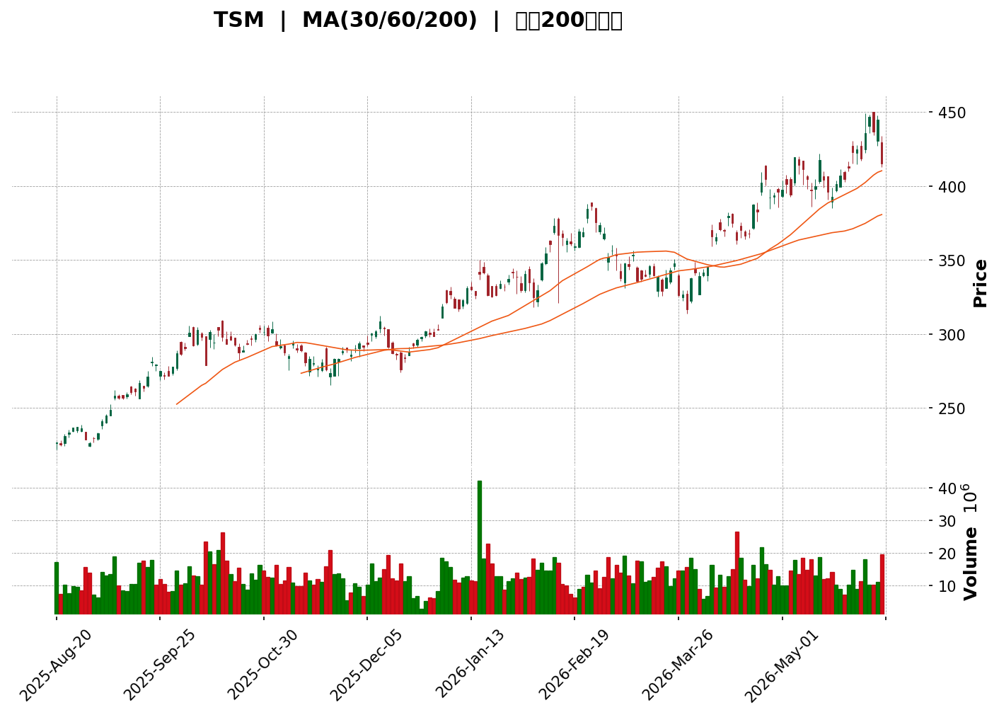
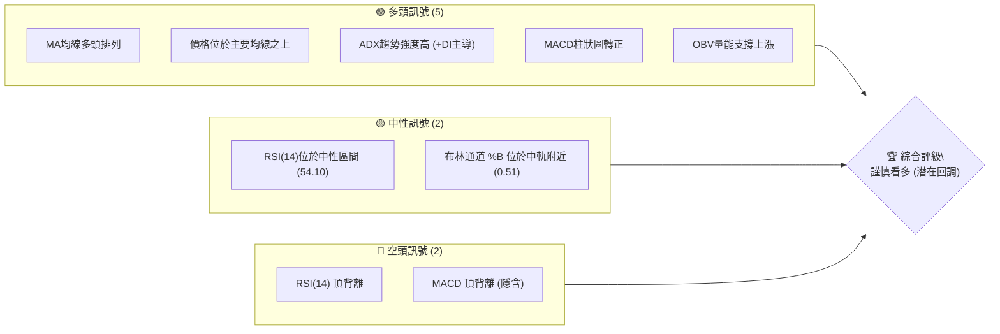
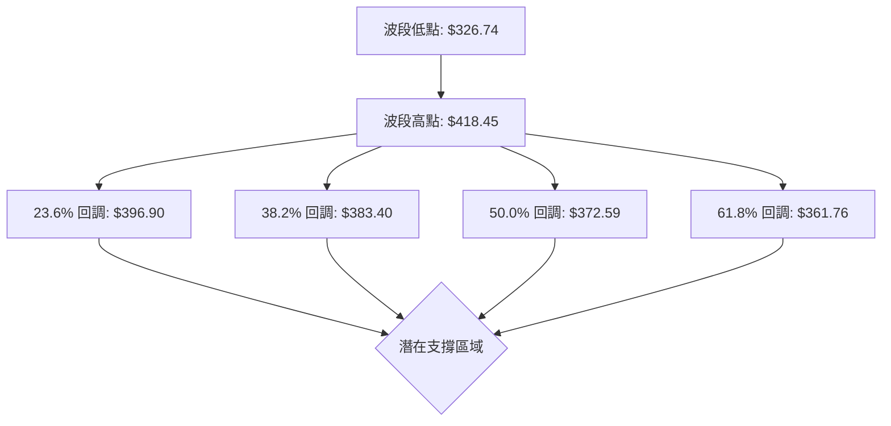

<details>
<summary>📊 靜態圖表 (點擊展開)</summary>

</details>

<html>
<head><meta charset="utf-8" /></head>
<body>
    <div style="height:500px; width:100%;">                        <script>window.PlotlyConfig = {MathJaxConfig: 'local'};</script>
        <script charset="utf-8" src="https://cdn.plot.ly/plotly-3.6.0.min.js" integrity="sha256-QaOVwtVY0T02VaHrr6pnoHLCwayMJp4O5n4YyaE3rJk=" crossorigin="anonymous"></script>                <div id="candlestick-chart" class="plotly-graph-div" style="height:100%; width:100%;"></div>            <script>                window.PLOTLYENV=window.PLOTLYENV || {};                                if (document.getElementById("candlestick-chart")) {                    Plotly.newPlot(                        "candlestick-chart",                        [{"close":{"dtype":"f8","bdata":"AAAAYCBUbEAAAABA1itsQAAAACBl32xAAAAAwOAxbUAAAACALJVtQAAAAMBBp21AAAAAAOaGbUAAAADAI5xsQAAAAOB2TWxAAAAAAKOsbEAAAADA0iVtQAAAAOD1KW5AAAAAoOChbkAAAABgNRhvQAAAAGAcI3BAAAAAgNcKcEAAAADggBFwQAAAAGAFMnBAAAAAwOtJcEAAAACAiVVwQAAAAGCfsnBAAAAAQKJ2cEAAAACgHPJwQAAAAICBknFAAAAAgK5ycUAAAADgPDJxQAAAAEC6\u002fXBAAAAA4Kj7cEAAAABAFlxxQAAAAMAo7nFAAAAAQG7ocUAAAABAWilyQAAAAIDQy3JAAAAAYKFGckAAAABgjO1yQAAAAGC3o3JAAAAAwOJxcUAAAACgnNNyQAAAAOAFZXJAAAAAQJLwckAAAABgFKNyQAAAAIBWV3JAAAAAQAeBckAAAADARE5yQAAAAACv9HFAAAAA4B4SckAAAADAbVVyQAAAAKDHiXJAAAAAoPi9ckAAAABAnvZyQAAAAMDc2HJAAAAAwHesckAAAABA9fJyQAAAAODyRnJAAAAAwGxAckAAAABAafpxQAAAAADQznFAAAAAgFxackAAAABAHxlyQAAAAMBeEHJAAAAAIGSKcUAAAACAFLRxQAAAAABeh3FAAAAAwCBGcUAAAACAGI1xQAAAAICaP3FAAAAAQMcYcUAAAABgN7FxQAAAACDasXFAAAAAQN4FckAAAAAgiB5yQAAAAKCW4XFAAAAAwMInckAAAADgOV1yQAAAAKAgNXJAAAAAIJxRckAAAACgYcNyQAAAAODi23JAAAAAgPlGc0AAAAAA5f9yQAAAAMCCM3JAAAAAYOfucUAAAADgBeFxQAAAAIDoQnFAAAAAwBS+cUAAAACgNQJyQAAAAGBLR3JAAAAAoNmBckAAAADAXZ9yQAAAACDT33JAAAAAADHBckAAAACgz6tyQAAAAACU8HJAAAAAAGTrc0AAAAAggxV0QAAAAMAoaHRAAAAAgI3cc0AAAADg3NFzQAAAAMCHK3RAAAAAgGetdEAAAAAgeKR0QAAAAMANY3RAAAAAgOFKdUAAAACgAVd1QAAAAADaY3RAAAAAIEJTdEAAAADAM2d0QAAAAGDd3nRAAAAA4Ga8dEAAAACgOhZ1QAAAACBpVXVAAAAAwIgpdUAAAABAGZp0QAAAAMBpRnVAAAAAwOfsdEAAAAAAMk10QAAAAKDPnHRAAAAAoOq9dUAAAADglCZ2QAAAAABKjnZAAAAAIJ9Qd0AAAAAADfF2QAAAAABK1XZAAAAAoNOydkAAAACg35N2QAAAAKAJdnZAAAAAQPsXd0AAAAAAARB3QAAAAECoCnhAAAAAoD8qeEAAAAAABXx3QAAAAIBwWHdAAAAAQCoBd0AAAABANAJ2QAAAAGD4RnZAAAAA4NkNdkAAAAAgAR91QAAAAACGu3VAAAAA4NWhdUAAAAAABRl2QAAAAOA4\u002fHRAAAAAAMAVdUAAAABgYjR1QAAAACCun3VAAAAAwB45dUAAAADgoyx1QAAAAADXk3RAAAAAQDMndUAAAAAAAHR1QAAAAAAAvHVAAAAAgMJhdEAAAAAA12t0QAAAAAAAyHNAAAAAQDMfdUAAAAAA11d1QAAAAOCjMHVAAAAAAClcdUAAAADAHpV1QAAAAGBm3nZAAAAAANfXdkAAAACgmSl3QAAAAMAeGXdAAAAAgD2+d0AAAACgmXF3QAAAAKCZtXZAAAAAAAAod0AAAAAA1+N2QAAAAKBHAXdAAAAAQAo3eEAAAABgj+p3QAAAACBcJ3lAAAAAIK5PeUAAAACgcIV4QAAAAKBHnXhAAAAAwPXAeEAAAABguNp4QAAAAIDCGXlAAAAAYI+meEAAAAAAADh6QAAAAGBm4nlAAAAAQOG6eUAAAADgo0h5QAAAAOB61HhAAAAAwMz8eEAAAAAghRt6QAAAAKCZRXlAAAAAQDO\u002feEAAAACAwol4QAAAAIDrGXlAAAAAYGZyeUAAAADgUUh5QAAAAMAexXlAAAAAIK5rekAAAACAwo16QAAAAEAzJ3pAAAAAgBQ6e0AAAABACut7QAAAAEAKS3tAAAAAYLjOe0AAAABguPJ5QA=="},"high":{"dtype":"f8","bdata":"SwLFgMRhbECqC29ZAotsQNIzBEC2DW1A3LMp4X1nbUBhc+\u002faqZhtQOeK8xq\u002fqm1AbxyID7jSbUCXcPtNTD1tQCrX+CWaa2xATy7zoEPObEBz7vTP\u002fihtQAloXDogTm5AqstEY8S3bkAZSF\u002fDE5FvQNlKHorHZHBAWYmwNSU2cEAKCB1JMytwQCaZw3mLSHBA0pscrJ2PcEBoFrfprXVwQP+X6fza0HBAdWYtPa+RcEA61Futdi1xQExzolTbxnFAal4\u002fP6N6cUDWZGcy4DlxQF9LNZbHH3FA7frkz1BlcUBe7c\u002ffRF9xQM8NIoMkDnJAQgC6GG9xckDBuvqm7mZyQNm+QZjIGXNA2Wf995kWc0Dpn1OQdgtzQGeCghuo0nJArYrq2c6ockDkou92TO9yQDSkvt14wXJATX8A3c0Oc0Bjlv7Ai1pzQNmtxp8i2nJA3CUnd7TfckB3oPzemZtyQNi+PIM\u002fWXJA5uwVwZVHckDHqt+UAYVyQL56yY9DrXJAWQAJv4THckCSbF8oSSRzQExa+VLxGXNANHe5lNQfc0B6NPPdp0ZzQPGufG1KxXJAG0zkS02JckDGLwQ3VlByQDSRVzfu5HFALMtnQ\u002fV3ckBJ+hDaylRyQNLJQhn\u002fU3JA4ZxPlYz+cUBZLG1WitRxQHHHlCVKz3FAYea9T2hqcUABdu6vyK9xQJ7+LqfaM3JASeOYDYpScUCCOj8s5rdxQCF6nAtPvXFAHIJ\u002fuzczckDpj3Fk\u002fTByQEYNfG32GHJAlJp44htOckAO6B\u002fL129yQAGXVH6hRnJASXXF6VqyckCi5dq+UM9yQO0c9ioY8HJAjh3CsxOEc0D+dRmbsA9zQHcw4ODM9nJAsEudXIBvckD7S1UzZPpxQIztyUaaBHJAsuHeVKblcUD\u002fPJ2wlTVyQPJIppblYnJA7vyMsyqRckDU5D87HKVyQJAc68hw6HJAE\u002fIBbE\u002f6ckCj9EuMG\u002ftyQFgb2bdrKHNAtAQdVvsKdEAvAo2KG6V0QGQf7BhOwnRAi3HMTCFWdECfX74taTl0QABPLQG4PXRAFBeJ483JdEBkk0VpmPd0QNtLkxnujnRAvqrsGXzldUBLK54h3811QIa93nkEU3VARuBhkz3LdEDkPR2cvOF0QIzNPgI+A3VA0Zsf3ojidEBVQSWCqER1QAaykIt3iHVA+D6axmJsdUDlq+pgHi91QCc0VtC5c3VAh0LpcTKhdUAmUK1wkR11QB5z0g0U2nRA++qsHMzLdUDk+7fmbml2QPYntdLCu3ZA9GRz8Daod0D4z6hp6q53QJjd2FQTIXdAbmpTm7zSdkCI5jUQogV3QD5qPCN9nHZA0GMIhXcyd0Civ+BbF0Z3QMya2QViQXhATuoIFdFReEBN0GcyJRZ4QPuGn\u002fTxeXdAIP27c9NAd0AEZNsSrS92QPKNwL00gXZA3a777ltndkBpSjSd17t1QBAJnBGxxnVAlM6\u002feRsIdkAnBozDiEV2QMMtIhalnnVAyn7RptR4dUAWgCMclnp1QAAAAAAprHVAAAAAQDO\u002fdUAAAABgZj51QAAAAKCZGXVAAAAAYI92dUAAAACAFI51QAAAAEAz53VAAAAAYI9OdUAAAADA9Zh0QAAAAKCZmXRAAAAAYI8mdUAAAABA4cp1QAAAAMAeYXVAAAAAQDODdUAAAADgeph1QAAAAMDMZHdAAAAAYLgCd0AAAAAAAKB3QAAAACBcN3dAAAAAYI\u002fid0AAAAAgrt93QAAAAEAzI3dAAAAAoEd5d0AAAADAHiF3QAAAAAAALHdAAAAAYI8+eEAAAAAAKUx4QAAAAADXl3lAAAAAAADoeUAAAACA6914QAAAAKCZvXhAAAAA4KPseEAAAAAA1z95QAAAAEAze3lAAAAAgBRieUAAAABAMzt6QAAAAAAAQHpAAAAAAAAQekAAAAAgrnt5QAAAAADXI3lAAAAAQOFKeUAAAAAghV96QAAAAIDrnXlAAAAAgBRueUAAAACAFO54QAAAAIAUPnlAAAAAIFy3eUAAAABguKp5QAAAAADXB3pAAAAAwMzoekAAAACgmbl6QAAAAEAK53pAAAAAgD0WfEAAAACAFAZ8QAAAAGCPInxAAAAAACkAfEAAAABgZh57QA=="},"hovertemplate":"\u003cb\u003e%{x|%Y-%m-%d}\u003c\u002fb\u003e\u003cbr\u003e\u958b: $%{open:.2f}\u003cbr\u003e\u9ad8: $%{high:.2f}\u003cbr\u003e\u4f4e: $%{low:.2f}\u003cbr\u003e\u6536: $%{close:.2f}\u003cextra\u003e\u003c\u002fextra\u003e","low":{"dtype":"f8","bdata":"ikcjm624a0BlCxNU5AlsQH5RU1kJB2xA4hE8auvHbEAAYTGSUTZtQBO+JpAeLW1AgwixduI+bUAFbL2b8JJsQHO1wPLn9WtAO\u002f4dcSBUbEBCEh7PDopsQEeQ0RApe21AQre8jSzxbUAHDosToZluQGSk\u002fkDi8G9AOkDiQw4AcECqEuxMbwJwQPaZMMJNCHBAeVdoItkycEDo11qe2CRwQBcbJOv\u002fCHBAUM3r3NpVcEB68Df43H9wQPSrmV1iZ3FAcjFZTDEzcUB4txVdSctwQKAWlOog0nBAAAAA4Kj7cEDerrvhNAVxQAXd+lFaOnFADSJt7j7XcUCluKNCTQ5yQFawdL2rpHJAaxUxQbI6ckA3iDnW1UVyQIITYp2SfHJA\u002fcZubaJscUB0PMTDaytyQIon5sbTG3JAD023Tb2mckA5xfDk9HByQA\u002fastnKVHJAY4ZyJ9h2ckA+slhBvkByQCOtnLNlrXFAKnjNAZ4AckDcz\u002fHzW0xyQD98b4A4QXJAyc2DCEBnckD8\u002fMEdf8tyQB6F3WOssnJA9wjVJcxwckAGVLfqW8dyQN6jGEdbPnJA+2\u002fvaV8eckCPv4+c0NxxQEjg0mG3OXFATnuh2FkickDUdzsdKfVxQEQsGUjS\u002f3FAZRhQY2JncUBq0yC5qPtwQPV\u002fSX0zZHFAbFJNTovzcEBPHh7p0yxxQBR8I2hCLnFAQn\u002f\u002fsqmVcECBstTRBftwQJH5EpNF+XBA77gucGLicUCcBtidl\u002fZxQMTioq0kmnFAavJW3nT5cUDNkAx7+MdxQJtnvhCwCXJA5F+BFTg6ckBgo9Mnb3FyQFRk+QDCjXJAuiQm8mfNckDKA6\u002fWxKxyQHvnGzOZInJAYivPT9\u002frcUCY3nb7YahxQL0AOqPpJHFAkb\u002f1OFWPcUA7vT90NNlxQFjtH3NEJnJA+UoOSxA2ckBMXi20XHZyQOYReRjmmnJAP7VVIPmcckBeePW+vKlyQF1KYAs96XJAGMPfyS9tc0AnlcnBiwl0QE+cu8\u002fYOnRAjFlxvFHac0DM7MvlBrRzQAPJhSux1XNAEVsso4YCdEB7fOzSm510QJSTC1uEPnRAtpRvMIcPdUBLwZQxAkh1QBgTFv6zX3RAwtNm8DxMdEB4zcgItF90QFIlWagFp3RAExDzatWUdEAUeCdB69l0QBHEwaRVG3VAb5d\u002f4XF0dED5vKztzYJ0QPWA+fnNgnRAwC3OknuRdEBCjhqExuJzQIf1MmYH7HNAtlC1yUP7dEAnoOTVKa11QJSGKag3NnZA0BNDmq31dkAi5CpvHhN0QEoKE7YZfHZAIWvo\u002fNIzdkCiKfaWJHt2QIF78FP4RnZAT4pbqnRhdkDJLgd04tZ2QIPZK6Tkb3dA5wWTgPr7d0DmuWNUlAp3QHHeSfhY+XZA19P+dAG6dkBKmr63xHJ1QNKIECPcGHZAbpUt6FdtdUCW1Q0y5\u002ft0QNFivD\u002fMr3RAMZno\u002fnp1dUAOpN8WAtZ1QNQlQQz19nRA7oH8bWf0dEDgNQK41y11QAAAAGBmJnVAAAAAoHA1dUAAAABAClN0QAAAAGBmXnRAAAAAoJmxdEAAAADgUeB0QAAAAAAAeHVAAAAAgOtVdEAAAADA9SR0QAAAAMDMnHNAAAAAgD0SdEAAAAAAADx1QAAAAMDMbHRAAAAAgOspdUAAAABgZvp0QAAAAADXc3ZAAAAAIIWLdkAAAAAAABx3QAAAAMDM4HZAAAAAIIVTd0AAAAAgXEN3QAAAAMDMiHZAAAAAgD3SdkAAAAAAAMR2QAAAAIDC0XZAAAAAgD0qd0AAAADA9Xx3QAAAAKCZnXhAAAAAYGYGeUAAAABAMwt4QAAAAEDhQnhAAAAAIFwbeEAAAACAFIJ4QAAAAEAzs3hAAAAAoJmJeEAAAABgZgp5QAAAAIDCgXlAAAAAgBQOeUAAAABACuN4QAAAAIDrIXhAAAAAIIV3eEAAAACgmSF5QAAAAKBH7XhAAAAAwMxweEAAAADA9RB4QAAAAEAzv3hAAAAAACn4eEAAAACAwi15QAAAAMAeoXlAAAAAgBT2eUAAAAAgXOt5QAAAAAAAFHpAAAAAAABoekAAAAAAKUB7QAAAAOB6KHtAAAAAwMy0ekAAAADgo8x5QA=="},"name":"\u50f9\u683c","open":{"dtype":"f8","bdata":"SZLzfYhFbEAnq7+02UVsQDNTtXYXQWxA1zbSPfQIbUDXQ4c9n0ptQPltyw58Wm1AqEL55WZIbUBhSAvzzjltQJcPNvhmBmxAqvc60cKwbEBivN5EXqtsQJk7YShlxW1Ao\u002fAmi+n8bUAHDosToZluQLxaixI1CnBAoyfK5K4hcEAUeEgxnSlwQFkwypwhHHBAFy4WgFeHcEBzmqddM25wQBSy+FdRCXBAfUySfYCOcECQiRkQNZFwQOOVDLqSjXFARBqRIFFscUAXkdqr6PlwQK9KNlIpBnFAZ6i1YYgvcUDwVAd56hxxQAWI0JyPTnFAt8UcWUBuckD2yeJrAzRyQEM9GurIpXJA56mdpfYOc0DhWovBEFZyQD\u002fjdO9hynJAAgXTIP2kckAC\u002fmjHnolyQHRqDBoXYHJAg0SUcLYJc0Akgxpoi1NzQKkYgIcqjHJAchOcPKClckAdwLqytpVyQB0pn8Y9NnJAuoxtblIDckBOZV6lIl9yQBEwb\u002f8kkHJAwUaGvuSKckDs1lhl6gFzQNRAtmai1nJA5VPEXfAEc0BSU8J21s5yQMsJyu76c3JANBX1tDEwckAOkll+vkdyQFBmdyhJunFALpwKm+FLckDnfUiYSCdyQNe4Ny5hQXJAEB+FYkz5cUBK8gioTSZxQOkXKRRMfnFAHhM9OmZAcUD92CsIYDZxQJ2Bs46rKXJAjZJ04\u002fn0cECBstTRBftwQOhSGOPSknFACwzdGi\u002f4cUBVtixr9y1yQJT9ttp+1XFAjVuGJlQmckDKKEV4MSlyQI+aVd7VRXJAu6oy0cVmckD+1B90uLhyQDspZnh3pXJAsmOY2hL7ckAjCzG3ZAdzQHcw4ODM9nJAGnK1dyFlckDXjeLiPudxQEKaQBaC+3FAzY8g0S\u002fDcUA7vT90NNlxQDx\u002fbOB4XXJATEiEmzVJckAqAS0zdI5yQMjrbLbqsHJABYwomunOckBn1vWAKthyQLBr8jtV8nJAWF\u002fjcKdxc0Acm\u002f6yi5d0QMX0jIOslHRAr5xHrx88dEBzmM7xpzd0QBlZSZzm7nNAk+j2ih4TdEBXqf1k9L50QNtLkxnujnRAy0\u002fRSIxddUBs827ylJh1QFSN5aBRPXVAjEguvuPHdEAPipP+usd0QIy119kwsnRA0l89tK29dEBNTkAt3\u002fh0QO84HdkOYXVA9cpm34UtdUCZjpjwo+d0QFpODT9KnXRA9ACxO5uBdUAHX\u002fEkg+p0QE2dD0qbHnRA6ldHodMIdUAyHFEJe7x1QK6wu2XmtHZAYzX6RqQQd0DjexPs9Z53QKX6qcPNAXdA5wcEsaaNdkDqPti1Zq12QJEEIvZYa3ZAfNbaFk5sdkCRiHn\u002fqN92QAC3sbVXpXdATuoIFdFReEDkEt6ohBF4QNkAw3mZEXdAunwQaVXFdkCvlgS0Fcl1QHkVfn3PRnZAZN3Hx3EedkAm2ESRjmh1QPFCMSWD6nRAmUT+fdq3dUCwcj3A9w52QDKlsOJTj3VApqyXDkJvdUDs+cSCqER1QAAAAKCZSXVAAAAA4HqcdUAAAAAghZN0QAAAAEDhCnVAAAAAoJmxdEAAAADAHvl0QAAAAAAAoHVAAAAAwB49dUAAAACgR010QAAAAEAzc3RAAAAAwPUkdEAAAABgZn51QAAAAKBwbXRAAAAAAAA8dUAAAABACjd1QAAAAOCjJHdAAAAAwMy0dkAAAACgcHl3QAAAAAApJHdAAAAA4KOwd0AAAABgj9Z3QAAAAIDCDXdAAAAAQDNTd0AAAAAghRN3QAAAAKBHAXdAAAAA4Ho8d0AAAAAAAAR4QAAAAIA9wnhAAAAAAADceUAAAACA64F4QAAAAGCPjnhAAAAAwPXceEAAAABACpd4QAAAAOBRSHlAAAAAoJlJeUAAAABgZiZ5QAAAAKBwIXpAAAAAQDMPekAAAAAA12t5QAAAAAAA3HhAAAAA4FHkeEAAAAAgXDN5QAAAAAAAaHlAAAAAgBRueUAAAAAAKVh4QAAAAAAA0HhAAAAAACn4eEAAAABA4ZZ5QAAAAIDr0XlAAAAA4FGwekAAAAAghWN6QAAAAMAesXpAAAAAgBSOekAAAACgR4l7QAAAAADXH3xAAAAAgBTqekAAAADgUdx6QA=="},"x":["2025-08-20T00:00:00-04:00","2025-08-21T00:00:00-04:00","2025-08-22T00:00:00-04:00","2025-08-25T00:00:00-04:00","2025-08-26T00:00:00-04:00","2025-08-27T00:00:00-04:00","2025-08-28T00:00:00-04:00","2025-08-29T00:00:00-04:00","2025-09-02T00:00:00-04:00","2025-09-03T00:00:00-04:00","2025-09-04T00:00:00-04:00","2025-09-05T00:00:00-04:00","2025-09-08T00:00:00-04:00","2025-09-09T00:00:00-04:00","2025-09-10T00:00:00-04:00","2025-09-11T00:00:00-04:00","2025-09-12T00:00:00-04:00","2025-09-15T00:00:00-04:00","2025-09-16T00:00:00-04:00","2025-09-17T00:00:00-04:00","2025-09-18T00:00:00-04:00","2025-09-19T00:00:00-04:00","2025-09-22T00:00:00-04:00","2025-09-23T00:00:00-04:00","2025-09-24T00:00:00-04:00","2025-09-25T00:00:00-04:00","2025-09-26T00:00:00-04:00","2025-09-29T00:00:00-04:00","2025-09-30T00:00:00-04:00","2025-10-01T00:00:00-04:00","2025-10-02T00:00:00-04:00","2025-10-03T00:00:00-04:00","2025-10-06T00:00:00-04:00","2025-10-07T00:00:00-04:00","2025-10-08T00:00:00-04:00","2025-10-09T00:00:00-04:00","2025-10-10T00:00:00-04:00","2025-10-13T00:00:00-04:00","2025-10-14T00:00:00-04:00","2025-10-15T00:00:00-04:00","2025-10-16T00:00:00-04:00","2025-10-17T00:00:00-04:00","2025-10-20T00:00:00-04:00","2025-10-21T00:00:00-04:00","2025-10-22T00:00:00-04:00","2025-10-23T00:00:00-04:00","2025-10-24T00:00:00-04:00","2025-10-27T00:00:00-04:00","2025-10-28T00:00:00-04:00","2025-10-29T00:00:00-04:00","2025-10-30T00:00:00-04:00","2025-10-31T00:00:00-04:00","2025-11-03T00:00:00-05:00","2025-11-04T00:00:00-05:00","2025-11-05T00:00:00-05:00","2025-11-06T00:00:00-05:00","2025-11-07T00:00:00-05:00","2025-11-10T00:00:00-05:00","2025-11-11T00:00:00-05:00","2025-11-12T00:00:00-05:00","2025-11-13T00:00:00-05:00","2025-11-14T00:00:00-05:00","2025-11-17T00:00:00-05:00","2025-11-18T00:00:00-05:00","2025-11-19T00:00:00-05:00","2025-11-20T00:00:00-05:00","2025-11-21T00:00:00-05:00","2025-11-24T00:00:00-05:00","2025-11-25T00:00:00-05:00","2025-11-26T00:00:00-05:00","2025-11-28T00:00:00-05:00","2025-12-01T00:00:00-05:00","2025-12-02T00:00:00-05:00","2025-12-03T00:00:00-05:00","2025-12-04T00:00:00-05:00","2025-12-05T00:00:00-05:00","2025-12-08T00:00:00-05:00","2025-12-09T00:00:00-05:00","2025-12-10T00:00:00-05:00","2025-12-11T00:00:00-05:00","2025-12-12T00:00:00-05:00","2025-12-15T00:00:00-05:00","2025-12-16T00:00:00-05:00","2025-12-17T00:00:00-05:00","2025-12-18T00:00:00-05:00","2025-12-19T00:00:00-05:00","2025-12-22T00:00:00-05:00","2025-12-23T00:00:00-05:00","2025-12-24T00:00:00-05:00","2025-12-26T00:00:00-05:00","2025-12-29T00:00:00-05:00","2025-12-30T00:00:00-05:00","2025-12-31T00:00:00-05:00","2026-01-02T00:00:00-05:00","2026-01-05T00:00:00-05:00","2026-01-06T00:00:00-05:00","2026-01-07T00:00:00-05:00","2026-01-08T00:00:00-05:00","2026-01-09T00:00:00-05:00","2026-01-12T00:00:00-05:00","2026-01-13T00:00:00-05:00","2026-01-14T00:00:00-05:00","2026-01-15T00:00:00-05:00","2026-01-16T00:00:00-05:00","2026-01-20T00:00:00-05:00","2026-01-21T00:00:00-05:00","2026-01-22T00:00:00-05:00","2026-01-23T00:00:00-05:00","2026-01-26T00:00:00-05:00","2026-01-27T00:00:00-05:00","2026-01-28T00:00:00-05:00","2026-01-29T00:00:00-05:00","2026-01-30T00:00:00-05:00","2026-02-02T00:00:00-05:00","2026-02-03T00:00:00-05:00","2026-02-04T00:00:00-05:00","2026-02-05T00:00:00-05:00","2026-02-06T00:00:00-05:00","2026-02-09T00:00:00-05:00","2026-02-10T00:00:00-05:00","2026-02-11T00:00:00-05:00","2026-02-12T00:00:00-05:00","2026-02-13T00:00:00-05:00","2026-02-17T00:00:00-05:00","2026-02-18T00:00:00-05:00","2026-02-19T00:00:00-05:00","2026-02-20T00:00:00-05:00","2026-02-23T00:00:00-05:00","2026-02-24T00:00:00-05:00","2026-02-25T00:00:00-05:00","2026-02-26T00:00:00-05:00","2026-02-27T00:00:00-05:00","2026-03-02T00:00:00-05:00","2026-03-03T00:00:00-05:00","2026-03-04T00:00:00-05:00","2026-03-05T00:00:00-05:00","2026-03-06T00:00:00-05:00","2026-03-09T00:00:00-04:00","2026-03-10T00:00:00-04:00","2026-03-11T00:00:00-04:00","2026-03-12T00:00:00-04:00","2026-03-13T00:00:00-04:00","2026-03-16T00:00:00-04:00","2026-03-17T00:00:00-04:00","2026-03-18T00:00:00-04:00","2026-03-19T00:00:00-04:00","2026-03-20T00:00:00-04:00","2026-03-23T00:00:00-04:00","2026-03-24T00:00:00-04:00","2026-03-25T00:00:00-04:00","2026-03-26T00:00:00-04:00","2026-03-27T00:00:00-04:00","2026-03-30T00:00:00-04:00","2026-03-31T00:00:00-04:00","2026-04-01T00:00:00-04:00","2026-04-02T00:00:00-04:00","2026-04-06T00:00:00-04:00","2026-04-07T00:00:00-04:00","2026-04-08T00:00:00-04:00","2026-04-09T00:00:00-04:00","2026-04-10T00:00:00-04:00","2026-04-13T00:00:00-04:00","2026-04-14T00:00:00-04:00","2026-04-15T00:00:00-04:00","2026-04-16T00:00:00-04:00","2026-04-17T00:00:00-04:00","2026-04-20T00:00:00-04:00","2026-04-21T00:00:00-04:00","2026-04-22T00:00:00-04:00","2026-04-23T00:00:00-04:00","2026-04-24T00:00:00-04:00","2026-04-27T00:00:00-04:00","2026-04-28T00:00:00-04:00","2026-04-29T00:00:00-04:00","2026-04-30T00:00:00-04:00","2026-05-01T00:00:00-04:00","2026-05-04T00:00:00-04:00","2026-05-05T00:00:00-04:00","2026-05-06T00:00:00-04:00","2026-05-07T00:00:00-04:00","2026-05-08T00:00:00-04:00","2026-05-11T00:00:00-04:00","2026-05-12T00:00:00-04:00","2026-05-13T00:00:00-04:00","2026-05-14T00:00:00-04:00","2026-05-15T00:00:00-04:00","2026-05-18T00:00:00-04:00","2026-05-19T00:00:00-04:00","2026-05-20T00:00:00-04:00","2026-05-21T00:00:00-04:00","2026-05-22T00:00:00-04:00","2026-05-26T00:00:00-04:00","2026-05-27T00:00:00-04:00","2026-05-28T00:00:00-04:00","2026-05-29T00:00:00-04:00","2026-06-01T00:00:00-04:00","2026-06-02T00:00:00-04:00","2026-06-03T00:00:00-04:00","2026-06-04T00:00:00-04:00","2026-06-05T00:00:00-04:00"],"type":"candlestick"},{"hovertemplate":"MA30: $%{y:.2f}\u003cextra\u003e\u003c\u002fextra\u003e","line":{"color":"#2196F3","dash":"dash","width":2},"mode":"lines","name":"MA30","x":["2025-08-20T00:00:00-04:00","2025-08-21T00:00:00-04:00","2025-08-22T00:00:00-04:00","2025-08-25T00:00:00-04:00","2025-08-26T00:00:00-04:00","2025-08-27T00:00:00-04:00","2025-08-28T00:00:00-04:00","2025-08-29T00:00:00-04:00","2025-09-02T00:00:00-04:00","2025-09-03T00:00:00-04:00","2025-09-04T00:00:00-04:00","2025-09-05T00:00:00-04:00","2025-09-08T00:00:00-04:00","2025-09-09T00:00:00-04:00","2025-09-10T00:00:00-04:00","2025-09-11T00:00:00-04:00","2025-09-12T00:00:00-04:00","2025-09-15T00:00:00-04:00","2025-09-16T00:00:00-04:00","2025-09-17T00:00:00-04:00","2025-09-18T00:00:00-04:00","2025-09-19T00:00:00-04:00","2025-09-22T00:00:00-04:00","2025-09-23T00:00:00-04:00","2025-09-24T00:00:00-04:00","2025-09-25T00:00:00-04:00","2025-09-26T00:00:00-04:00","2025-09-29T00:00:00-04:00","2025-09-30T00:00:00-04:00","2025-10-01T00:00:00-04:00","2025-10-02T00:00:00-04:00","2025-10-03T00:00:00-04:00","2025-10-06T00:00:00-04:00","2025-10-07T00:00:00-04:00","2025-10-08T00:00:00-04:00","2025-10-09T00:00:00-04:00","2025-10-10T00:00:00-04:00","2025-10-13T00:00:00-04:00","2025-10-14T00:00:00-04:00","2025-10-15T00:00:00-04:00","2025-10-16T00:00:00-04:00","2025-10-17T00:00:00-04:00","2025-10-20T00:00:00-04:00","2025-10-21T00:00:00-04:00","2025-10-22T00:00:00-04:00","2025-10-23T00:00:00-04:00","2025-10-24T00:00:00-04:00","2025-10-27T00:00:00-04:00","2025-10-28T00:00:00-04:00","2025-10-29T00:00:00-04:00","2025-10-30T00:00:00-04:00","2025-10-31T00:00:00-04:00","2025-11-03T00:00:00-05:00","2025-11-04T00:00:00-05:00","2025-11-05T00:00:00-05:00","2025-11-06T00:00:00-05:00","2025-11-07T00:00:00-05:00","2025-11-10T00:00:00-05:00","2025-11-11T00:00:00-05:00","2025-11-12T00:00:00-05:00","2025-11-13T00:00:00-05:00","2025-11-14T00:00:00-05:00","2025-11-17T00:00:00-05:00","2025-11-18T00:00:00-05:00","2025-11-19T00:00:00-05:00","2025-11-20T00:00:00-05:00","2025-11-21T00:00:00-05:00","2025-11-24T00:00:00-05:00","2025-11-25T00:00:00-05:00","2025-11-26T00:00:00-05:00","2025-11-28T00:00:00-05:00","2025-12-01T00:00:00-05:00","2025-12-02T00:00:00-05:00","2025-12-03T00:00:00-05:00","2025-12-04T00:00:00-05:00","2025-12-05T00:00:00-05:00","2025-12-08T00:00:00-05:00","2025-12-09T00:00:00-05:00","2025-12-10T00:00:00-05:00","2025-12-11T00:00:00-05:00","2025-12-12T00:00:00-05:00","2025-12-15T00:00:00-05:00","2025-12-16T00:00:00-05:00","2025-12-17T00:00:00-05:00","2025-12-18T00:00:00-05:00","2025-12-19T00:00:00-05:00","2025-12-22T00:00:00-05:00","2025-12-23T00:00:00-05:00","2025-12-24T00:00:00-05:00","2025-12-26T00:00:00-05:00","2025-12-29T00:00:00-05:00","2025-12-30T00:00:00-05:00","2025-12-31T00:00:00-05:00","2026-01-02T00:00:00-05:00","2026-01-05T00:00:00-05:00","2026-01-06T00:00:00-05:00","2026-01-07T00:00:00-05:00","2026-01-08T00:00:00-05:00","2026-01-09T00:00:00-05:00","2026-01-12T00:00:00-05:00","2026-01-13T00:00:00-05:00","2026-01-14T00:00:00-05:00","2026-01-15T00:00:00-05:00","2026-01-16T00:00:00-05:00","2026-01-20T00:00:00-05:00","2026-01-21T00:00:00-05:00","2026-01-22T00:00:00-05:00","2026-01-23T00:00:00-05:00","2026-01-26T00:00:00-05:00","2026-01-27T00:00:00-05:00","2026-01-28T00:00:00-05:00","2026-01-29T00:00:00-05:00","2026-01-30T00:00:00-05:00","2026-02-02T00:00:00-05:00","2026-02-03T00:00:00-05:00","2026-02-04T00:00:00-05:00","2026-02-05T00:00:00-05:00","2026-02-06T00:00:00-05:00","2026-02-09T00:00:00-05:00","2026-02-10T00:00:00-05:00","2026-02-11T00:00:00-05:00","2026-02-12T00:00:00-05:00","2026-02-13T00:00:00-05:00","2026-02-17T00:00:00-05:00","2026-02-18T00:00:00-05:00","2026-02-19T00:00:00-05:00","2026-02-20T00:00:00-05:00","2026-02-23T00:00:00-05:00","2026-02-24T00:00:00-05:00","2026-02-25T00:00:00-05:00","2026-02-26T00:00:00-05:00","2026-02-27T00:00:00-05:00","2026-03-02T00:00:00-05:00","2026-03-03T00:00:00-05:00","2026-03-04T00:00:00-05:00","2026-03-05T00:00:00-05:00","2026-03-06T00:00:00-05:00","2026-03-09T00:00:00-04:00","2026-03-10T00:00:00-04:00","2026-03-11T00:00:00-04:00","2026-03-12T00:00:00-04:00","2026-03-13T00:00:00-04:00","2026-03-16T00:00:00-04:00","2026-03-17T00:00:00-04:00","2026-03-18T00:00:00-04:00","2026-03-19T00:00:00-04:00","2026-03-20T00:00:00-04:00","2026-03-23T00:00:00-04:00","2026-03-24T00:00:00-04:00","2026-03-25T00:00:00-04:00","2026-03-26T00:00:00-04:00","2026-03-27T00:00:00-04:00","2026-03-30T00:00:00-04:00","2026-03-31T00:00:00-04:00","2026-04-01T00:00:00-04:00","2026-04-02T00:00:00-04:00","2026-04-06T00:00:00-04:00","2026-04-07T00:00:00-04:00","2026-04-08T00:00:00-04:00","2026-04-09T00:00:00-04:00","2026-04-10T00:00:00-04:00","2026-04-13T00:00:00-04:00","2026-04-14T00:00:00-04:00","2026-04-15T00:00:00-04:00","2026-04-16T00:00:00-04:00","2026-04-17T00:00:00-04:00","2026-04-20T00:00:00-04:00","2026-04-21T00:00:00-04:00","2026-04-22T00:00:00-04:00","2026-04-23T00:00:00-04:00","2026-04-24T00:00:00-04:00","2026-04-27T00:00:00-04:00","2026-04-28T00:00:00-04:00","2026-04-29T00:00:00-04:00","2026-04-30T00:00:00-04:00","2026-05-01T00:00:00-04:00","2026-05-04T00:00:00-04:00","2026-05-05T00:00:00-04:00","2026-05-06T00:00:00-04:00","2026-05-07T00:00:00-04:00","2026-05-08T00:00:00-04:00","2026-05-11T00:00:00-04:00","2026-05-12T00:00:00-04:00","2026-05-13T00:00:00-04:00","2026-05-14T00:00:00-04:00","2026-05-15T00:00:00-04:00","2026-05-18T00:00:00-04:00","2026-05-19T00:00:00-04:00","2026-05-20T00:00:00-04:00","2026-05-21T00:00:00-04:00","2026-05-22T00:00:00-04:00","2026-05-26T00:00:00-04:00","2026-05-27T00:00:00-04:00","2026-05-28T00:00:00-04:00","2026-05-29T00:00:00-04:00","2026-06-01T00:00:00-04:00","2026-06-02T00:00:00-04:00","2026-06-03T00:00:00-04:00","2026-06-04T00:00:00-04:00","2026-06-05T00:00:00-04:00"],"y":{"dtype":"f8","bdata":"AAAAAAAA+H8AAAAAAAD4fwAAAAAAAPh\u002fAAAAAAAA+H8AAAAAAAD4fwAAAAAAAPh\u002fAAAAAAAA+H8AAAAAAAD4fwAAAAAAAPh\u002fAAAAAAAA+H8AAAAAAAD4fwAAAAAAAPh\u002fAAAAAAAA+H8AAAAAAAD4fwAAAAAAAPh\u002fAAAAAAAA+H8AAAAAAAD4fwAAAAAAAPh\u002fAAAAAAAA+H8AAAAAAAD4fwAAAAAAAPh\u002fAAAAAAAA+H8AAAAAAAD4fwAAAAAAAPh\u002fAAAAAAAA+H8AAAAAAAD4fwAAAAAAAPh\u002fAAAAAAAA+H8AAAAAAAD4f1VVVTVQk29AiYiIWDTTb0DNzMwkYgxwQHd3d1eWMXBAvLu7G\u002fpQcEBERESURnRwQM3MzNzPlHBAREREdLGrcEBVVVUlR9JwQLy7u9N89nBAiYiIQMMdcUAiIiJab0BxQERERDQ\u002fXHFAMzMzK3N3cUCrqqoa\u002fY5xQN7d3f2BnnFAvLu7K9GvcUDe3d3dJcNxQO\u002fu7s4j13FAvLu7KxPscUC8u7vLggJyQM3MzCzaFHJAAAAAoLYnckCamZnpzjhyQBEREbHSPnJA3t3dXa5FckAzMzODWkxyQERERLRSU3JAvLu7WwNfckBVVVV1UGVyQERERGR0ZnJAvLu761FjckAiIiIyaV9yQERERJSYVHJAIiIiwgtMckCamZkpTEByQFVVVVVtNHJAMzMz83QxckCJiIjoxidyQLy7u\u002fvNIXJA7+7uLvsZckC8u7sbkBVyQAAAAFCjEXJAAAAAkKkOckAzMzMzKQ9yQO\u002fu7h5PEXJAVVVV5WwTckCJiIgoFxdyQM3MzMzTGXJAVVVV5WQeckDe3d0NtB5yQN7d3Q0xGXJAERERcd8SckDNzMzcvQlyQJqZmdkSAXJAVVVVlbr8cUAREREh\u002ffxxQN7d3T0BAXJAZmZmNlICckAzMzPDywZyQKuqqgq2DXJARERENBIYckDNzMwsVCByQCIiIoJeLHJAERER0fFCckCJiIj4jlhyQFVVVaWCc3JAIiIiUhqLckCJiIj4QZ1yQLy7u1thsnJAEREREQjJckARERERkN5yQHd3d+fx83JAIiIiMrcOc0CJiIi4GyhzQAAAAIC7OnNAIiIiotpLc0Crqqoa2VlzQGZmZpYDa3NAq6qqKnZ3c0AiIiLSRYlzQDMzM7MApHNAzczMnI6\u002fc0De3d39ytZzQImIiAgL+XNAMzMzMzQUdEBVVVUlxSd0QERERPSvO3RA7+7uHkpXdEDv7u6OZXV0QLy7u+vPlHRA3t3d\u002fbm7dECJiIj4KuB0QM3MzDxkAXVAiYiIKBsZdUAiIiKCYi51QBEREQHqP3VAq6qqun5bdUCamZmZKnd1QHd3dzc0mHVAd3d3J\u002fe1dUBVVVWVN851QLy7u5t253VAIiIiohL2dUBVVVWFx\u002ft1QCIiIiLiC3ZAzczM7KIadkDv7u5ewyB2QDMzM1MeKHZAiYiIKMQvdkARERGBZDh2QN7d3W1rNXZAq6qqmsI0dkDNzMws5zl2QLy7u+vgPHZAmpmZSWs\u002fdkBEREQE3kZ2QGZmZnaRRnZAmpmZWYtBdkBERER0lzt2QM3MzPyUNHZAIiIioo0bdkBVVVXVCwZ2QFVVVdUA7HVA3t3djYzedUC8u7u7A9R1QCIiIgIryXVAvLu7u1+6dUB3d3eXvq11QFVVVWW8o3VAREREpHSYdUBERERUtZV1QBEREQGZk3VAIiIicuaZdUDv7u6OJaZ1QJqZmZnVqXVAVVVVRT2zdUB3d3d3VcJ1QBEREUExzXVAiYiIiDvjdUBVVVUlwPJ1QDMzM2NSFnZAvLu722I6dkAiIiIisFZ2QAAAAEA1cHZAREREBFaOdkCamZkZva12QERERARW1HZAvLu7ay7ydkBmZmYW2Rp3QGZmZuZCPndA7+7uDuZrd0CrqqpaZJV3QERERIR5wHdAmpmZGXbhd0CamZkJHgp4QHd3dwfzLHhAVVVVxdlJeEDe3d1tEmN4QGZmZmYfdnhAERERYVeMeEBmZmaWbp54QDMzM2M7tXhAmpmZeRTMeEDv7u5enuZ4QLy7u1sBBHlAZmZmxr0meUAiIiLipVF5QAAAAHA9dnlAAAAAYOWUeUAzMzMTPKZ5QA=="},"type":"scatter"},{"hovertemplate":"MA60: $%{y:.2f}\u003cextra\u003e\u003c\u002fextra\u003e","line":{"color":"#9C27B0","dash":"dash","width":2},"mode":"lines","name":"MA60","x":["2025-08-20T00:00:00-04:00","2025-08-21T00:00:00-04:00","2025-08-22T00:00:00-04:00","2025-08-25T00:00:00-04:00","2025-08-26T00:00:00-04:00","2025-08-27T00:00:00-04:00","2025-08-28T00:00:00-04:00","2025-08-29T00:00:00-04:00","2025-09-02T00:00:00-04:00","2025-09-03T00:00:00-04:00","2025-09-04T00:00:00-04:00","2025-09-05T00:00:00-04:00","2025-09-08T00:00:00-04:00","2025-09-09T00:00:00-04:00","2025-09-10T00:00:00-04:00","2025-09-11T00:00:00-04:00","2025-09-12T00:00:00-04:00","2025-09-15T00:00:00-04:00","2025-09-16T00:00:00-04:00","2025-09-17T00:00:00-04:00","2025-09-18T00:00:00-04:00","2025-09-19T00:00:00-04:00","2025-09-22T00:00:00-04:00","2025-09-23T00:00:00-04:00","2025-09-24T00:00:00-04:00","2025-09-25T00:00:00-04:00","2025-09-26T00:00:00-04:00","2025-09-29T00:00:00-04:00","2025-09-30T00:00:00-04:00","2025-10-01T00:00:00-04:00","2025-10-02T00:00:00-04:00","2025-10-03T00:00:00-04:00","2025-10-06T00:00:00-04:00","2025-10-07T00:00:00-04:00","2025-10-08T00:00:00-04:00","2025-10-09T00:00:00-04:00","2025-10-10T00:00:00-04:00","2025-10-13T00:00:00-04:00","2025-10-14T00:00:00-04:00","2025-10-15T00:00:00-04:00","2025-10-16T00:00:00-04:00","2025-10-17T00:00:00-04:00","2025-10-20T00:00:00-04:00","2025-10-21T00:00:00-04:00","2025-10-22T00:00:00-04:00","2025-10-23T00:00:00-04:00","2025-10-24T00:00:00-04:00","2025-10-27T00:00:00-04:00","2025-10-28T00:00:00-04:00","2025-10-29T00:00:00-04:00","2025-10-30T00:00:00-04:00","2025-10-31T00:00:00-04:00","2025-11-03T00:00:00-05:00","2025-11-04T00:00:00-05:00","2025-11-05T00:00:00-05:00","2025-11-06T00:00:00-05:00","2025-11-07T00:00:00-05:00","2025-11-10T00:00:00-05:00","2025-11-11T00:00:00-05:00","2025-11-12T00:00:00-05:00","2025-11-13T00:00:00-05:00","2025-11-14T00:00:00-05:00","2025-11-17T00:00:00-05:00","2025-11-18T00:00:00-05:00","2025-11-19T00:00:00-05:00","2025-11-20T00:00:00-05:00","2025-11-21T00:00:00-05:00","2025-11-24T00:00:00-05:00","2025-11-25T00:00:00-05:00","2025-11-26T00:00:00-05:00","2025-11-28T00:00:00-05:00","2025-12-01T00:00:00-05:00","2025-12-02T00:00:00-05:00","2025-12-03T00:00:00-05:00","2025-12-04T00:00:00-05:00","2025-12-05T00:00:00-05:00","2025-12-08T00:00:00-05:00","2025-12-09T00:00:00-05:00","2025-12-10T00:00:00-05:00","2025-12-11T00:00:00-05:00","2025-12-12T00:00:00-05:00","2025-12-15T00:00:00-05:00","2025-12-16T00:00:00-05:00","2025-12-17T00:00:00-05:00","2025-12-18T00:00:00-05:00","2025-12-19T00:00:00-05:00","2025-12-22T00:00:00-05:00","2025-12-23T00:00:00-05:00","2025-12-24T00:00:00-05:00","2025-12-26T00:00:00-05:00","2025-12-29T00:00:00-05:00","2025-12-30T00:00:00-05:00","2025-12-31T00:00:00-05:00","2026-01-02T00:00:00-05:00","2026-01-05T00:00:00-05:00","2026-01-06T00:00:00-05:00","2026-01-07T00:00:00-05:00","2026-01-08T00:00:00-05:00","2026-01-09T00:00:00-05:00","2026-01-12T00:00:00-05:00","2026-01-13T00:00:00-05:00","2026-01-14T00:00:00-05:00","2026-01-15T00:00:00-05:00","2026-01-16T00:00:00-05:00","2026-01-20T00:00:00-05:00","2026-01-21T00:00:00-05:00","2026-01-22T00:00:00-05:00","2026-01-23T00:00:00-05:00","2026-01-26T00:00:00-05:00","2026-01-27T00:00:00-05:00","2026-01-28T00:00:00-05:00","2026-01-29T00:00:00-05:00","2026-01-30T00:00:00-05:00","2026-02-02T00:00:00-05:00","2026-02-03T00:00:00-05:00","2026-02-04T00:00:00-05:00","2026-02-05T00:00:00-05:00","2026-02-06T00:00:00-05:00","2026-02-09T00:00:00-05:00","2026-02-10T00:00:00-05:00","2026-02-11T00:00:00-05:00","2026-02-12T00:00:00-05:00","2026-02-13T00:00:00-05:00","2026-02-17T00:00:00-05:00","2026-02-18T00:00:00-05:00","2026-02-19T00:00:00-05:00","2026-02-20T00:00:00-05:00","2026-02-23T00:00:00-05:00","2026-02-24T00:00:00-05:00","2026-02-25T00:00:00-05:00","2026-02-26T00:00:00-05:00","2026-02-27T00:00:00-05:00","2026-03-02T00:00:00-05:00","2026-03-03T00:00:00-05:00","2026-03-04T00:00:00-05:00","2026-03-05T00:00:00-05:00","2026-03-06T00:00:00-05:00","2026-03-09T00:00:00-04:00","2026-03-10T00:00:00-04:00","2026-03-11T00:00:00-04:00","2026-03-12T00:00:00-04:00","2026-03-13T00:00:00-04:00","2026-03-16T00:00:00-04:00","2026-03-17T00:00:00-04:00","2026-03-18T00:00:00-04:00","2026-03-19T00:00:00-04:00","2026-03-20T00:00:00-04:00","2026-03-23T00:00:00-04:00","2026-03-24T00:00:00-04:00","2026-03-25T00:00:00-04:00","2026-03-26T00:00:00-04:00","2026-03-27T00:00:00-04:00","2026-03-30T00:00:00-04:00","2026-03-31T00:00:00-04:00","2026-04-01T00:00:00-04:00","2026-04-02T00:00:00-04:00","2026-04-06T00:00:00-04:00","2026-04-07T00:00:00-04:00","2026-04-08T00:00:00-04:00","2026-04-09T00:00:00-04:00","2026-04-10T00:00:00-04:00","2026-04-13T00:00:00-04:00","2026-04-14T00:00:00-04:00","2026-04-15T00:00:00-04:00","2026-04-16T00:00:00-04:00","2026-04-17T00:00:00-04:00","2026-04-20T00:00:00-04:00","2026-04-21T00:00:00-04:00","2026-04-22T00:00:00-04:00","2026-04-23T00:00:00-04:00","2026-04-24T00:00:00-04:00","2026-04-27T00:00:00-04:00","2026-04-28T00:00:00-04:00","2026-04-29T00:00:00-04:00","2026-04-30T00:00:00-04:00","2026-05-01T00:00:00-04:00","2026-05-04T00:00:00-04:00","2026-05-05T00:00:00-04:00","2026-05-06T00:00:00-04:00","2026-05-07T00:00:00-04:00","2026-05-08T00:00:00-04:00","2026-05-11T00:00:00-04:00","2026-05-12T00:00:00-04:00","2026-05-13T00:00:00-04:00","2026-05-14T00:00:00-04:00","2026-05-15T00:00:00-04:00","2026-05-18T00:00:00-04:00","2026-05-19T00:00:00-04:00","2026-05-20T00:00:00-04:00","2026-05-21T00:00:00-04:00","2026-05-22T00:00:00-04:00","2026-05-26T00:00:00-04:00","2026-05-27T00:00:00-04:00","2026-05-28T00:00:00-04:00","2026-05-29T00:00:00-04:00","2026-06-01T00:00:00-04:00","2026-06-02T00:00:00-04:00","2026-06-03T00:00:00-04:00","2026-06-04T00:00:00-04:00","2026-06-05T00:00:00-04:00"],"y":{"dtype":"f8","bdata":"AAAAAAAA+H8AAAAAAAD4fwAAAAAAAPh\u002fAAAAAAAA+H8AAAAAAAD4fwAAAAAAAPh\u002fAAAAAAAA+H8AAAAAAAD4fwAAAAAAAPh\u002fAAAAAAAA+H8AAAAAAAD4fwAAAAAAAPh\u002fAAAAAAAA+H8AAAAAAAD4fwAAAAAAAPh\u002fAAAAAAAA+H8AAAAAAAD4fwAAAAAAAPh\u002fAAAAAAAA+H8AAAAAAAD4fwAAAAAAAPh\u002fAAAAAAAA+H8AAAAAAAD4fwAAAAAAAPh\u002fAAAAAAAA+H8AAAAAAAD4fwAAAAAAAPh\u002fAAAAAAAA+H8AAAAAAAD4fwAAAAAAAPh\u002fAAAAAAAA+H8AAAAAAAD4fwAAAAAAAPh\u002fAAAAAAAA+H8AAAAAAAD4fwAAAAAAAPh\u002fAAAAAAAA+H8AAAAAAAD4fwAAAAAAAPh\u002fAAAAAAAA+H8AAAAAAAD4fwAAAAAAAPh\u002fAAAAAAAA+H8AAAAAAAD4fwAAAAAAAPh\u002fAAAAAAAA+H8AAAAAAAD4fwAAAAAAAPh\u002fAAAAAAAA+H8AAAAAAAD4fwAAAAAAAPh\u002fAAAAAAAA+H8AAAAAAAD4fwAAAAAAAPh\u002fAAAAAAAA+H8AAAAAAAD4fwAAAAAAAPh\u002fAAAAAAAA+H8AAAAAAAD4f3d3dz8OGHFAAAAADHYmcUB3d3er5TVxQN7d3XUXQ3FA7+7u7oJOcUDv7u5eSVpxQBEREZmeZHFAvLu7M5NucUDv7u4GB31xQLy7u2cljHFAvLu7N9+bcUDv7u66\u002f6pxQCIiIkLxtnFAmpmZXQ7DcUDv7u4mE89xQGZmZo7o13FAiYiICJ\u002fhcUAzMzODHu1xQN7d3c17+HFAiYiICDwFckDNzMxsmxByQFVVVZ0FF3JAiYiICEsdckAzMzNjRiFyQFVVVcXyH3JAmpmZeTQhckAiIiLSqyRyQBEREfkpKnJAERERyaowckBEREQcDjZyQHd3dzcVOnJAAAAAELI9ckB3d3ev3j9yQDMzM4t7QHJAmpmZyX5HckARERGRbUxyQFVVVf33U3JAq6qqokdeckCJiIhwhGJyQLy7u6sXanJAAAAAoIFxckBmZmYWEHpyQLy7u5vKgnJAERERYbCOckDe3d11optyQHd3d08FpnJAvLu7w6OvckCamZkheLhyQJqZmbFrwnJAAAAAiO3KckAAAADw\u002fNNyQImIiOCY3nJA7+7uBjfpckBVVVVtRPByQBEREfEO\u002fXJAREREZHcIc0AzMzMjYRJzQBEREZlYHnNAq6qqKs4sc0ARERGpGD5zQDMzM\u002ftCUXNAERERGeZpc0CrqqqSP4BzQHd3d1\u002fhlnNAzczMfAauc0BVVVW9eMNzQDMzM1O22XNAZmZmhkzzc0ARERFJNgp0QJqZmclKJXRAREREnH8\u002fdEAzMzPTY1Z0QJqZmUG0bXRAIiIi6mSCdEDv7u6e8ZF0QBEREdFOo3RAd3d3xz6zdEDNzMw8Tr10QM3MzPSQyXRAmpmZKZ3TdECamZkp1eB0QImIiBC27HRAvLu7myj6dEBVVVUVWQh1QCIiIvr1GnVAZmZmvs8pdUDNzMyUUTd1QFVVVbUgQXVAREREvGpMdUCamZmBflh1QERERHSyZHVAAAAA0KNrdUDv7u5mG3N1QBEREYmydnVAMzMz29N7dUDv7u4eM4F1QJqZmYGKhHVAMzMzO++KdUCJiIiYdJJ1QGZmZk74nXVA3t3d5TWndUDNzMx09rF1QGZmZs6HvXVAIiIiivzHdUAiIiKK9tB1QN7d3d3b2nVAERERGfDmdUAzMzNrjPF1QCIiIsqn+nVAiYiI2H8JdkAzMzNTkhV2QImIiOjeJXZAMzMzu5I3dkB3d3enS0h2QN7d3RWLVnZA7+7upuBmdkDv7u6OTXp2QFVVVb1zjXZAq6qq4tyZdkBVVVVFOKt2QJqZmfFruXZAiYiI2LnDdkAAAAAYuM12QM3MzCw91nZAvLu7UwHgdkCrqqriEO92QM3MzAQP+3ZAiYiIwBwCd0CrqqqCaAh3QN7d3eXtDHdAq6qqAmYSd0BVVVX1ERp3QCIiIjJqJHdA3t3ddf0yd0Dv7u72YUZ3QKuqqnrrVndA3t3dhf1sd0DNzMys\u002fYl3QImIiFi3oXdAREREdBC8d0BEREQcfsx3QA=="},"type":"scatter"},{"hovertemplate":"MA200: $%{y:.2f}\u003cextra\u003e\u003c\u002fextra\u003e","line":{"color":"#FF6F00","dash":"solid","width":2},"mode":"lines","name":"MA200","x":["2025-08-20T00:00:00-04:00","2025-08-21T00:00:00-04:00","2025-08-22T00:00:00-04:00","2025-08-25T00:00:00-04:00","2025-08-26T00:00:00-04:00","2025-08-27T00:00:00-04:00","2025-08-28T00:00:00-04:00","2025-08-29T00:00:00-04:00","2025-09-02T00:00:00-04:00","2025-09-03T00:00:00-04:00","2025-09-04T00:00:00-04:00","2025-09-05T00:00:00-04:00","2025-09-08T00:00:00-04:00","2025-09-09T00:00:00-04:00","2025-09-10T00:00:00-04:00","2025-09-11T00:00:00-04:00","2025-09-12T00:00:00-04:00","2025-09-15T00:00:00-04:00","2025-09-16T00:00:00-04:00","2025-09-17T00:00:00-04:00","2025-09-18T00:00:00-04:00","2025-09-19T00:00:00-04:00","2025-09-22T00:00:00-04:00","2025-09-23T00:00:00-04:00","2025-09-24T00:00:00-04:00","2025-09-25T00:00:00-04:00","2025-09-26T00:00:00-04:00","2025-09-29T00:00:00-04:00","2025-09-30T00:00:00-04:00","2025-10-01T00:00:00-04:00","2025-10-02T00:00:00-04:00","2025-10-03T00:00:00-04:00","2025-10-06T00:00:00-04:00","2025-10-07T00:00:00-04:00","2025-10-08T00:00:00-04:00","2025-10-09T00:00:00-04:00","2025-10-10T00:00:00-04:00","2025-10-13T00:00:00-04:00","2025-10-14T00:00:00-04:00","2025-10-15T00:00:00-04:00","2025-10-16T00:00:00-04:00","2025-10-17T00:00:00-04:00","2025-10-20T00:00:00-04:00","2025-10-21T00:00:00-04:00","2025-10-22T00:00:00-04:00","2025-10-23T00:00:00-04:00","2025-10-24T00:00:00-04:00","2025-10-27T00:00:00-04:00","2025-10-28T00:00:00-04:00","2025-10-29T00:00:00-04:00","2025-10-30T00:00:00-04:00","2025-10-31T00:00:00-04:00","2025-11-03T00:00:00-05:00","2025-11-04T00:00:00-05:00","2025-11-05T00:00:00-05:00","2025-11-06T00:00:00-05:00","2025-11-07T00:00:00-05:00","2025-11-10T00:00:00-05:00","2025-11-11T00:00:00-05:00","2025-11-12T00:00:00-05:00","2025-11-13T00:00:00-05:00","2025-11-14T00:00:00-05:00","2025-11-17T00:00:00-05:00","2025-11-18T00:00:00-05:00","2025-11-19T00:00:00-05:00","2025-11-20T00:00:00-05:00","2025-11-21T00:00:00-05:00","2025-11-24T00:00:00-05:00","2025-11-25T00:00:00-05:00","2025-11-26T00:00:00-05:00","2025-11-28T00:00:00-05:00","2025-12-01T00:00:00-05:00","2025-12-02T00:00:00-05:00","2025-12-03T00:00:00-05:00","2025-12-04T00:00:00-05:00","2025-12-05T00:00:00-05:00","2025-12-08T00:00:00-05:00","2025-12-09T00:00:00-05:00","2025-12-10T00:00:00-05:00","2025-12-11T00:00:00-05:00","2025-12-12T00:00:00-05:00","2025-12-15T00:00:00-05:00","2025-12-16T00:00:00-05:00","2025-12-17T00:00:00-05:00","2025-12-18T00:00:00-05:00","2025-12-19T00:00:00-05:00","2025-12-22T00:00:00-05:00","2025-12-23T00:00:00-05:00","2025-12-24T00:00:00-05:00","2025-12-26T00:00:00-05:00","2025-12-29T00:00:00-05:00","2025-12-30T00:00:00-05:00","2025-12-31T00:00:00-05:00","2026-01-02T00:00:00-05:00","2026-01-05T00:00:00-05:00","2026-01-06T00:00:00-05:00","2026-01-07T00:00:00-05:00","2026-01-08T00:00:00-05:00","2026-01-09T00:00:00-05:00","2026-01-12T00:00:00-05:00","2026-01-13T00:00:00-05:00","2026-01-14T00:00:00-05:00","2026-01-15T00:00:00-05:00","2026-01-16T00:00:00-05:00","2026-01-20T00:00:00-05:00","2026-01-21T00:00:00-05:00","2026-01-22T00:00:00-05:00","2026-01-23T00:00:00-05:00","2026-01-26T00:00:00-05:00","2026-01-27T00:00:00-05:00","2026-01-28T00:00:00-05:00","2026-01-29T00:00:00-05:00","2026-01-30T00:00:00-05:00","2026-02-02T00:00:00-05:00","2026-02-03T00:00:00-05:00","2026-02-04T00:00:00-05:00","2026-02-05T00:00:00-05:00","2026-02-06T00:00:00-05:00","2026-02-09T00:00:00-05:00","2026-02-10T00:00:00-05:00","2026-02-11T00:00:00-05:00","2026-02-12T00:00:00-05:00","2026-02-13T00:00:00-05:00","2026-02-17T00:00:00-05:00","2026-02-18T00:00:00-05:00","2026-02-19T00:00:00-05:00","2026-02-20T00:00:00-05:00","2026-02-23T00:00:00-05:00","2026-02-24T00:00:00-05:00","2026-02-25T00:00:00-05:00","2026-02-26T00:00:00-05:00","2026-02-27T00:00:00-05:00","2026-03-02T00:00:00-05:00","2026-03-03T00:00:00-05:00","2026-03-04T00:00:00-05:00","2026-03-05T00:00:00-05:00","2026-03-06T00:00:00-05:00","2026-03-09T00:00:00-04:00","2026-03-10T00:00:00-04:00","2026-03-11T00:00:00-04:00","2026-03-12T00:00:00-04:00","2026-03-13T00:00:00-04:00","2026-03-16T00:00:00-04:00","2026-03-17T00:00:00-04:00","2026-03-18T00:00:00-04:00","2026-03-19T00:00:00-04:00","2026-03-20T00:00:00-04:00","2026-03-23T00:00:00-04:00","2026-03-24T00:00:00-04:00","2026-03-25T00:00:00-04:00","2026-03-26T00:00:00-04:00","2026-03-27T00:00:00-04:00","2026-03-30T00:00:00-04:00","2026-03-31T00:00:00-04:00","2026-04-01T00:00:00-04:00","2026-04-02T00:00:00-04:00","2026-04-06T00:00:00-04:00","2026-04-07T00:00:00-04:00","2026-04-08T00:00:00-04:00","2026-04-09T00:00:00-04:00","2026-04-10T00:00:00-04:00","2026-04-13T00:00:00-04:00","2026-04-14T00:00:00-04:00","2026-04-15T00:00:00-04:00","2026-04-16T00:00:00-04:00","2026-04-17T00:00:00-04:00","2026-04-20T00:00:00-04:00","2026-04-21T00:00:00-04:00","2026-04-22T00:00:00-04:00","2026-04-23T00:00:00-04:00","2026-04-24T00:00:00-04:00","2026-04-27T00:00:00-04:00","2026-04-28T00:00:00-04:00","2026-04-29T00:00:00-04:00","2026-04-30T00:00:00-04:00","2026-05-01T00:00:00-04:00","2026-05-04T00:00:00-04:00","2026-05-05T00:00:00-04:00","2026-05-06T00:00:00-04:00","2026-05-07T00:00:00-04:00","2026-05-08T00:00:00-04:00","2026-05-11T00:00:00-04:00","2026-05-12T00:00:00-04:00","2026-05-13T00:00:00-04:00","2026-05-14T00:00:00-04:00","2026-05-15T00:00:00-04:00","2026-05-18T00:00:00-04:00","2026-05-19T00:00:00-04:00","2026-05-20T00:00:00-04:00","2026-05-21T00:00:00-04:00","2026-05-22T00:00:00-04:00","2026-05-26T00:00:00-04:00","2026-05-27T00:00:00-04:00","2026-05-28T00:00:00-04:00","2026-05-29T00:00:00-04:00","2026-06-01T00:00:00-04:00","2026-06-02T00:00:00-04:00","2026-06-03T00:00:00-04:00","2026-06-04T00:00:00-04:00","2026-06-05T00:00:00-04:00"],"y":{"dtype":"f8","bdata":"AAAAAAAA+H8AAAAAAAD4fwAAAAAAAPh\u002fAAAAAAAA+H8AAAAAAAD4fwAAAAAAAPh\u002fAAAAAAAA+H8AAAAAAAD4fwAAAAAAAPh\u002fAAAAAAAA+H8AAAAAAAD4fwAAAAAAAPh\u002fAAAAAAAA+H8AAAAAAAD4fwAAAAAAAPh\u002fAAAAAAAA+H8AAAAAAAD4fwAAAAAAAPh\u002fAAAAAAAA+H8AAAAAAAD4fwAAAAAAAPh\u002fAAAAAAAA+H8AAAAAAAD4fwAAAAAAAPh\u002fAAAAAAAA+H8AAAAAAAD4fwAAAAAAAPh\u002fAAAAAAAA+H8AAAAAAAD4fwAAAAAAAPh\u002fAAAAAAAA+H8AAAAAAAD4fwAAAAAAAPh\u002fAAAAAAAA+H8AAAAAAAD4fwAAAAAAAPh\u002fAAAAAAAA+H8AAAAAAAD4fwAAAAAAAPh\u002fAAAAAAAA+H8AAAAAAAD4fwAAAAAAAPh\u002fAAAAAAAA+H8AAAAAAAD4fwAAAAAAAPh\u002fAAAAAAAA+H8AAAAAAAD4fwAAAAAAAPh\u002fAAAAAAAA+H8AAAAAAAD4fwAAAAAAAPh\u002fAAAAAAAA+H8AAAAAAAD4fwAAAAAAAPh\u002fAAAAAAAA+H8AAAAAAAD4fwAAAAAAAPh\u002fAAAAAAAA+H8AAAAAAAD4fwAAAAAAAPh\u002fAAAAAAAA+H8AAAAAAAD4fwAAAAAAAPh\u002fAAAAAAAA+H8AAAAAAAD4fwAAAAAAAPh\u002fAAAAAAAA+H8AAAAAAAD4fwAAAAAAAPh\u002fAAAAAAAA+H8AAAAAAAD4fwAAAAAAAPh\u002fAAAAAAAA+H8AAAAAAAD4fwAAAAAAAPh\u002fAAAAAAAA+H8AAAAAAAD4fwAAAAAAAPh\u002fAAAAAAAA+H8AAAAAAAD4fwAAAAAAAPh\u002fAAAAAAAA+H8AAAAAAAD4fwAAAAAAAPh\u002fAAAAAAAA+H8AAAAAAAD4fwAAAAAAAPh\u002fAAAAAAAA+H8AAAAAAAD4fwAAAAAAAPh\u002fAAAAAAAA+H8AAAAAAAD4fwAAAAAAAPh\u002fAAAAAAAA+H8AAAAAAAD4fwAAAAAAAPh\u002fAAAAAAAA+H8AAAAAAAD4fwAAAAAAAPh\u002fAAAAAAAA+H8AAAAAAAD4fwAAAAAAAPh\u002fAAAAAAAA+H8AAAAAAAD4fwAAAAAAAPh\u002fAAAAAAAA+H8AAAAAAAD4fwAAAAAAAPh\u002fAAAAAAAA+H8AAAAAAAD4fwAAAAAAAPh\u002fAAAAAAAA+H8AAAAAAAD4fwAAAAAAAPh\u002fAAAAAAAA+H8AAAAAAAD4fwAAAAAAAPh\u002fAAAAAAAA+H8AAAAAAAD4fwAAAAAAAPh\u002fAAAAAAAA+H8AAAAAAAD4fwAAAAAAAPh\u002fAAAAAAAA+H8AAAAAAAD4fwAAAAAAAPh\u002fAAAAAAAA+H8AAAAAAAD4fwAAAAAAAPh\u002fAAAAAAAA+H8AAAAAAAD4fwAAAAAAAPh\u002fAAAAAAAA+H8AAAAAAAD4fwAAAAAAAPh\u002fAAAAAAAA+H8AAAAAAAD4fwAAAAAAAPh\u002fAAAAAAAA+H8AAAAAAAD4fwAAAAAAAPh\u002fAAAAAAAA+H8AAAAAAAD4fwAAAAAAAPh\u002fAAAAAAAA+H8AAAAAAAD4fwAAAAAAAPh\u002fAAAAAAAA+H8AAAAAAAD4fwAAAAAAAPh\u002fAAAAAAAA+H8AAAAAAAD4fwAAAAAAAPh\u002fAAAAAAAA+H8AAAAAAAD4fwAAAAAAAPh\u002fAAAAAAAA+H8AAAAAAAD4fwAAAAAAAPh\u002fAAAAAAAA+H8AAAAAAAD4fwAAAAAAAPh\u002fAAAAAAAA+H8AAAAAAAD4fwAAAAAAAPh\u002fAAAAAAAA+H8AAAAAAAD4fwAAAAAAAPh\u002fAAAAAAAA+H8AAAAAAAD4fwAAAAAAAPh\u002fAAAAAAAA+H8AAAAAAAD4fwAAAAAAAPh\u002fAAAAAAAA+H8AAAAAAAD4fwAAAAAAAPh\u002fAAAAAAAA+H8AAAAAAAD4fwAAAAAAAPh\u002fAAAAAAAA+H8AAAAAAAD4fwAAAAAAAPh\u002fAAAAAAAA+H8AAAAAAAD4fwAAAAAAAPh\u002fAAAAAAAA+H8AAAAAAAD4fwAAAAAAAPh\u002fAAAAAAAA+H8AAAAAAAD4fwAAAAAAAPh\u002fAAAAAAAA+H8AAAAAAAD4fwAAAAAAAPh\u002fAAAAAAAA+H8AAAAAAAD4fwAAAAAAAPh\u002fAAAAAAAA+H+uR+EyMlV0QA=="},"type":"scatter"}],                        {"template":{"data":{"barpolar":[{"marker":{"line":{"color":"rgb(17,17,17)","width":0.5},"pattern":{"fillmode":"overlay","size":10,"solidity":0.2}},"type":"barpolar"}],"bar":[{"error_x":{"color":"#f2f5fa"},"error_y":{"color":"#f2f5fa"},"marker":{"line":{"color":"rgb(17,17,17)","width":0.5},"pattern":{"fillmode":"overlay","size":10,"solidity":0.2}},"type":"bar"}],"carpet":[{"aaxis":{"endlinecolor":"#A2B1C6","gridcolor":"#506784","linecolor":"#506784","minorgridcolor":"#506784","startlinecolor":"#A2B1C6"},"baxis":{"endlinecolor":"#A2B1C6","gridcolor":"#506784","linecolor":"#506784","minorgridcolor":"#506784","startlinecolor":"#A2B1C6"},"type":"carpet"}],"choropleth":[{"colorbar":{"outlinewidth":0,"ticks":""},"type":"choropleth"}],"contourcarpet":[{"colorbar":{"outlinewidth":0,"ticks":""},"type":"contourcarpet"}],"contour":[{"colorbar":{"outlinewidth":0,"ticks":""},"colorscale":[[0.0,"#0d0887"],[0.1111111111111111,"#46039f"],[0.2222222222222222,"#7201a8"],[0.3333333333333333,"#9c179e"],[0.4444444444444444,"#bd3786"],[0.5555555555555556,"#d8576b"],[0.6666666666666666,"#ed7953"],[0.7777777777777778,"#fb9f3a"],[0.8888888888888888,"#fdca26"],[1.0,"#f0f921"]],"type":"contour"}],"heatmap":[{"colorbar":{"outlinewidth":0,"ticks":""},"colorscale":[[0.0,"#0d0887"],[0.1111111111111111,"#46039f"],[0.2222222222222222,"#7201a8"],[0.3333333333333333,"#9c179e"],[0.4444444444444444,"#bd3786"],[0.5555555555555556,"#d8576b"],[0.6666666666666666,"#ed7953"],[0.7777777777777778,"#fb9f3a"],[0.8888888888888888,"#fdca26"],[1.0,"#f0f921"]],"type":"heatmap"}],"histogram2dcontour":[{"colorbar":{"outlinewidth":0,"ticks":""},"colorscale":[[0.0,"#0d0887"],[0.1111111111111111,"#46039f"],[0.2222222222222222,"#7201a8"],[0.3333333333333333,"#9c179e"],[0.4444444444444444,"#bd3786"],[0.5555555555555556,"#d8576b"],[0.6666666666666666,"#ed7953"],[0.7777777777777778,"#fb9f3a"],[0.8888888888888888,"#fdca26"],[1.0,"#f0f921"]],"type":"histogram2dcontour"}],"histogram2d":[{"colorbar":{"outlinewidth":0,"ticks":""},"colorscale":[[0.0,"#0d0887"],[0.1111111111111111,"#46039f"],[0.2222222222222222,"#7201a8"],[0.3333333333333333,"#9c179e"],[0.4444444444444444,"#bd3786"],[0.5555555555555556,"#d8576b"],[0.6666666666666666,"#ed7953"],[0.7777777777777778,"#fb9f3a"],[0.8888888888888888,"#fdca26"],[1.0,"#f0f921"]],"type":"histogram2d"}],"histogram":[{"marker":{"pattern":{"fillmode":"overlay","size":10,"solidity":0.2}},"type":"histogram"}],"mesh3d":[{"colorbar":{"outlinewidth":0,"ticks":""},"type":"mesh3d"}],"parcoords":[{"line":{"colorbar":{"outlinewidth":0,"ticks":""}},"type":"parcoords"}],"pie":[{"automargin":true,"type":"pie"}],"scatter3d":[{"line":{"colorbar":{"outlinewidth":0,"ticks":""}},"marker":{"colorbar":{"outlinewidth":0,"ticks":""}},"type":"scatter3d"}],"scattercarpet":[{"marker":{"colorbar":{"outlinewidth":0,"ticks":""}},"type":"scattercarpet"}],"scattergeo":[{"marker":{"colorbar":{"outlinewidth":0,"ticks":""}},"type":"scattergeo"}],"scattergl":[{"marker":{"line":{"color":"#283442"}},"type":"scattergl"}],"scattermapbox":[{"marker":{"colorbar":{"outlinewidth":0,"ticks":""}},"type":"scattermapbox"}],"scattermap":[{"marker":{"colorbar":{"outlinewidth":0,"ticks":""}},"type":"scattermap"}],"scatterpolargl":[{"marker":{"colorbar":{"outlinewidth":0,"ticks":""}},"type":"scatterpolargl"}],"scatterpolar":[{"marker":{"colorbar":{"outlinewidth":0,"ticks":""}},"type":"scatterpolar"}],"scatter":[{"marker":{"line":{"color":"#283442"}},"type":"scatter"}],"scatterternary":[{"marker":{"colorbar":{"outlinewidth":0,"ticks":""}},"type":"scatterternary"}],"surface":[{"colorbar":{"outlinewidth":0,"ticks":""},"colorscale":[[0.0,"#0d0887"],[0.1111111111111111,"#46039f"],[0.2222222222222222,"#7201a8"],[0.3333333333333333,"#9c179e"],[0.4444444444444444,"#bd3786"],[0.5555555555555556,"#d8576b"],[0.6666666666666666,"#ed7953"],[0.7777777777777778,"#fb9f3a"],[0.8888888888888888,"#fdca26"],[1.0,"#f0f921"]],"type":"surface"}],"table":[{"cells":{"fill":{"color":"#506784"},"line":{"color":"rgb(17,17,17)"}},"header":{"fill":{"color":"#2a3f5f"},"line":{"color":"rgb(17,17,17)"}},"type":"table"}]},"layout":{"annotationdefaults":{"arrowcolor":"#f2f5fa","arrowhead":0,"arrowwidth":1},"autotypenumbers":"strict","coloraxis":{"colorbar":{"outlinewidth":0,"ticks":""}},"colorscale":{"diverging":[[0,"#8e0152"],[0.1,"#c51b7d"],[0.2,"#de77ae"],[0.3,"#f1b6da"],[0.4,"#fde0ef"],[0.5,"#f7f7f7"],[0.6,"#e6f5d0"],[0.7,"#b8e186"],[0.8,"#7fbc41"],[0.9,"#4d9221"],[1,"#276419"]],"sequential":[[0.0,"#0d0887"],[0.1111111111111111,"#46039f"],[0.2222222222222222,"#7201a8"],[0.3333333333333333,"#9c179e"],[0.4444444444444444,"#bd3786"],[0.5555555555555556,"#d8576b"],[0.6666666666666666,"#ed7953"],[0.7777777777777778,"#fb9f3a"],[0.8888888888888888,"#fdca26"],[1.0,"#f0f921"]],"sequentialminus":[[0.0,"#0d0887"],[0.1111111111111111,"#46039f"],[0.2222222222222222,"#7201a8"],[0.3333333333333333,"#9c179e"],[0.4444444444444444,"#bd3786"],[0.5555555555555556,"#d8576b"],[0.6666666666666666,"#ed7953"],[0.7777777777777778,"#fb9f3a"],[0.8888888888888888,"#fdca26"],[1.0,"#f0f921"]]},"colorway":["#636efa","#EF553B","#00cc96","#ab63fa","#FFA15A","#19d3f3","#FF6692","#B6E880","#FF97FF","#FECB52"],"font":{"color":"#f2f5fa"},"geo":{"bgcolor":"rgb(17,17,17)","lakecolor":"rgb(17,17,17)","landcolor":"rgb(17,17,17)","showlakes":true,"showland":true,"subunitcolor":"#506784"},"hoverlabel":{"align":"left"},"hovermode":"closest","mapbox":{"style":"dark"},"paper_bgcolor":"rgb(17,17,17)","plot_bgcolor":"rgb(17,17,17)","polar":{"angularaxis":{"gridcolor":"#506784","linecolor":"#506784","ticks":""},"bgcolor":"rgb(17,17,17)","radialaxis":{"gridcolor":"#506784","linecolor":"#506784","ticks":""}},"scene":{"xaxis":{"backgroundcolor":"rgb(17,17,17)","gridcolor":"#506784","gridwidth":2,"linecolor":"#506784","showbackground":true,"ticks":"","zerolinecolor":"#C8D4E3"},"yaxis":{"backgroundcolor":"rgb(17,17,17)","gridcolor":"#506784","gridwidth":2,"linecolor":"#506784","showbackground":true,"ticks":"","zerolinecolor":"#C8D4E3"},"zaxis":{"backgroundcolor":"rgb(17,17,17)","gridcolor":"#506784","gridwidth":2,"linecolor":"#506784","showbackground":true,"ticks":"","zerolinecolor":"#C8D4E3"}},"shapedefaults":{"line":{"color":"#f2f5fa"}},"sliderdefaults":{"bgcolor":"#C8D4E3","bordercolor":"rgb(17,17,17)","borderwidth":1,"tickwidth":0},"ternary":{"aaxis":{"gridcolor":"#506784","linecolor":"#506784","ticks":""},"baxis":{"gridcolor":"#506784","linecolor":"#506784","ticks":""},"bgcolor":"rgb(17,17,17)","caxis":{"gridcolor":"#506784","linecolor":"#506784","ticks":""}},"title":{"x":0.05},"updatemenudefaults":{"bgcolor":"#506784","borderwidth":0},"xaxis":{"automargin":true,"gridcolor":"#283442","linecolor":"#506784","ticks":"","title":{"standoff":15},"zerolinecolor":"#283442","zerolinewidth":2},"yaxis":{"automargin":true,"gridcolor":"#283442","linecolor":"#506784","ticks":"","title":{"standoff":15},"zerolinecolor":"#283442","zerolinewidth":2}}},"xaxis":{"rangeslider":{"visible":false},"title":{"text":"\u65e5\u671f"}},"font":{"size":11},"title":{"text":"TSM  |  MA(30\u002f60\u002f200)  |  \u6700\u8fd1200\u4ea4\u6613\u65e5"},"yaxis":{"title":{"text":"\u80a1\u50f9 (USD)"}},"hovermode":"x unified","height":500},                        {"responsive": true}                    )                };            </script>        </div>
</body>
</html>

# TSM 技術分析報告

> **報告日期**：2026-06-06 ｜ **語言**：繁體中文 ｜ **數據來源**：Yahoo Finance ｜ **當前價格**：$415.17

---

## 目錄

| 章節 | 內容 |
|------|------|
| [1. 技術面概覽](#1-技術面概覽) | 訊號儀表板、核心指標、評分卡 |
| [2. 趨勢分析](#2-趨勢分析) | 多時框趨勢、長中短期走勢 |
| [3. 圖表形態分析](#3-圖表形態分析) | 形態識別、K線組合、目標價 |
| [4. 支撐與阻力](#4-支撐與阻力) | 關鍵價位、斐波那契回調 |
| [5. 技術指標深度解讀](#5-技術指標深度解讀) | MA/RSI/MACD/布林/成交量 |
| [6. 動能與波動率](#6-動能與波動率) | 動能評估、ATR、Beta |
| [7. 多時框架總結](#7-多時框架總結) | 時框架評分矩陣 |
| [8. 交易策略建議](#8-交易策略建議) | 多空策略、風險報酬比 |
| [9. 風險提示與監控](#9-風險提示與監控) | 監控指標、風險場景 |

---

## 1. 技術面概覽

本章節將對 TSM 的當前技術狀態進行快速而全面的概覽，透過視覺化儀表板、核心指標速覽及專業評分卡，為後續的深度分析奠定基礎。我們將整合多個關鍵技術指標的訊號，以提供一個即時的多空傾向判斷。

### 🎯 技術訊號儀表板

TSM 的技術訊號目前呈現出多空交織的複雜局面。長期趨勢依然強勁，但在短期動能和特定指標上已出現預警訊號。



**儀表板解讀**：
從訊號儀表板可以看出，TSM 仍擁有多項強勁的多頭訊號，主要體現在其長期趨勢的穩固性（如均線排列、ADX趨勢強度、OBV量能配合）。然而，RSI 和 MACD 兩大動能指標所揭示的頂背離現象，為當前的多頭趨勢敲響了警鐘，預示著短期內可能面臨回調壓力。RSI 位於中性區間，且價格靠近布林中軌，也顯示市場正處於一個觀望或整理的階段，而非強勢突破。綜合來看，儘管長期趨勢樂觀，但短期操作需極度謹慎，密切關注回調風險。

### 📊 核心指標速覽表

下表彙整了 TSM 當前最關鍵的技術指標數據，並提供初步的訊號解讀。

| 指標類別 | 指標名稱 | 當前數值 | 訊號 | 解讀 |
|----------|----------|----------|------|------|
| **價格** | 當前收盤價 | $415.17 | 🟡 | 位於52週高點下方，但仍處於高位區間。 |
| **均線** | MA5 (5日均線) | $435.82 | 🔴 | 價格位於MA5下方，短期動能偏弱。 |
| **均線** | MA10 (10日均線) | $426.20 | 🔴 | 價格位於MA10下方，短期動能偏弱。 |
| **均線** | MA20 (20日均線) | $414.73 | 🟢 | 價格略高於MA20，短期支撐穩固。 |
| **均線** | MA50 (50日均線) | $389.03 | 🟢 | 價格遠高於MA50，中期趨勢強勁。 |
| **均線** | MA200 (200日均線) | $325.32 | 🟢 | 價格遠高於MA200，長期趨勢極其強勁。 |
| **動能** | RSI(14) | 54.10 | 🟡 | 位於中性區間，但存在頂背離風險。 |
| **動能** | MACD (12/26/9) | 12.003 | 🟢 | MACD線位於訊號線之上，柱狀圖為正，短期看多。 |
| **趨勢** | ADX(14) | 27.54 | 🟢 | 趨勢強度較強 (>25)，多頭趨勢佔優 (+DI > -DI)。 |
| **波動** | ATR(14) | $16.37 | 🟡 | 每日平均波動約3.94%，波動性中等偏高。 |
| **成交量** | 量比 (vs. 20日均量) | 1.50x | 🟢 | 成交量顯著放大，可能伴隨趨勢確認或轉折。 |
| **成交量** | OBV趨勢 | OBV > MA | 🟢 | 量能確認價格上漲趨勢，多頭買盤積極。 |
| **布林通道** | %B (現價相對位置) | 0.51 | 🟡 | 價格位於布林通道中軌附近，趨勢可能正在盤整。 |

**綜合觀察**：TSM 的核心指標顯示，其長期和中期趨勢非常健康，均線呈現完美的多頭排列，且價格穩定在主要均線之上。ADX 確認了強勁的趨勢，而成交量和OBV也提供了正向支持。然而，短期動能指標（RSI和MACD）的頂背離訊號是目前最值得關注的風險點，表明當前的上漲動能可能正在減弱，短期內存在回調壓力。投資者應警惕這種動能與價格走勢之間的潛在矛盾。

### 🏆 技術評分卡

本評分卡基於多維度技術指標對 TSM 進行量化評估，提供一個直觀的綜合表現指標。

```
╔══════════════════════════════════════════════════════════════╗
║              技術評分卡 — TSM (2026-06-06)                   ║
╠══════════════════════════════════════════════════════════════╣
║  趨勢強度      ██████████████▓▓▓▓▓▓  75/100  🟢              ║
║  動能指標      ████████▓▓▓▓▓▓▓▓▓▓▓▓  60/100  🟡              ║
║  支撐穩定度    ████████████████▓▓▓▓  85/100  🟢              ║
║  成交量配合    ████████████▓▓▓▓▓▓▓▓  70/100  🟢              ║
║  形態完整度    ████████▓▓▓▓▓▓▓▓▓▓▓▓  60/100  🟡              ║
║  均線排列      ██████████████████▓▓  90/100  🟢              ║
╠══════════════════════════════════════════════════════════════╣
║  綜合評分      ████████████▓▓▓▓▓▓▓▓  73/100  🟡 偏多              ║
╚══════════════════════════════════════════════════════════════╝
```

**評分卡解讀**：
*   **趨勢強度 (75/100 🟢)**：ADX值27.54顯示強勁趨勢，且+DI > -DI，明確支持多頭趨勢。長期均線向上發散，進一步確認趨勢的穩定性。
*   **動能指標 (60/100 🟡)**：MACD柱狀圖轉正為多頭訊號，但RSI雖然在中性區間，其所呈現的頂背離現象是主要的扣分項。這表示雖然當前仍有上漲動能，但其持續性已受到質疑。
*   **支撐穩定度 (85/100 🟢)**：價格遠高於MA50和MA200，且MA20提供了即時支撐。布林通道下軌和斐波那契回調位也提供了多層次的潛在支撐，顯示下方防禦較為堅實。
*   **成交量配合 (70/100 🟢)**：最新成交量顯著高於20日均量，且OBV趨勢向上，表明買盤積極，量能對價格上漲構成支撐。但需警惕放量滯漲或放量下跌的可能性，尤其在背離出現時。
*   **形態完整度 (60/100 🟡)**：近期價格在創高後略有回調，尚未形成明確的經典圖表形態。整體呈上升通道中的盤整，但未見顯著的反轉形態，故評為中性偏多。
*   **均線排列 (90/100 🟢)**：MA20 > MA50 > MA200 的完美多頭排列是極其強勁的多頭訊號，反映了各個時間框架內的強勁上漲趨勢。

**綜合評分 (73/100 🟡 偏多)**：TSM 的技術面整體偏向多頭，尤其在長期趨勢和支撐穩定度方面表現突出。然而，動能指標的頂背離是主要隱憂，這使得綜合評級從「強多」降至「偏多」。這意味著投資者在享受長期趨勢帶來的收益時，必須對短期可能出現的修正保持高度警惕。

---

## 2. 趨勢分析

對 TSM 的趨勢進行多時框架的深入分析，是判斷其未來價格走向的基石。我們將從宏觀的長期月線趨勢，到中期的週線波動，再結合趨勢強度指標 ADX，全面剖析其市場定位。

### 🌐 多時框趨勢分析

我們將從月線、週線和日線（由提供的數據推斷）三個主要時間框架來評估 TSM 的趨勢方向和強度。

```mermaid
graph TD
    A[月線趨勢 - 長期] --> A1{2024-06 至 2026-06：強勁上升趨勢}
    A1 --> A2[價格持續創出新高]
    A2 --> A3[均線系統呈完美多頭排列]
    A3 --> B[週線趨勢 - 中期]
    B --> B1{20週數據：波段式上漲，伴隨健康回調}
    B1 --> B2[高點不斷抬升，低點亦抬升]
    B2 --> B3[近期從高點回落，進入盤整]
    B3 --> C[日線趨勢 - 短期 (推斷)]
    C --> C1{當前價格 $415.17：略低於近5日、10日均線}
    C1 --> C2[但仍維持在MA20 ($414.73)之上]
    C2 --> C3[動能指標顯示短期動能減弱，存在頂背離]
    C3 --> D{綜合判斷：長期強多，中期偏多，短期整理/回調}
```

**多時框趨勢解讀**：
*   **月線趨勢 (長期)**：從2024年6月的$169.85到2026年5月的$418.45，TSM 展現了無可辯駁的強勁長期上升趨勢。價格持續創出歷史新高，且月線級別的移動平均線呈現完美的發散多頭排列，顯示出市場對半導體產業龍頭的極高信心。任何回調在長期看來都可能被視為買入機會。
*   **週線趨勢 (中期)**：從最近20週的數據來看，TSM 在經歷了2026年3月份的一波修正後，於4月和5月再度展開強勁上漲，並於5月底達到$418.45的高點。儘管近期價格小幅回落至$415.17，但整體週線結構仍保持高點和低點不斷抬升的健康上升通道。目前的狀態更像是短期漲幅過大後的正常整理或消化。
*   **日線趨勢 (短期)**：當前價格$415.17略低於MA5 ($435.82) 和 MA10 ($426.20)，顯示短期內有小幅回調壓力。然而，價格仍堅守在MA20 ($414.73)之上，表明短期技術面尚未完全轉弱。動能指標的頂背離現象是日線級別需要重點關注的，這暗示了短期上漲動能的衰竭。

**綜合判斷**：TSM 的長期和中期趨勢非常健康，是典型的多頭市場。短期內雖面臨整理或回調風險，但只要不跌破關鍵中期支撐位，長期上漲趨勢的格局不會改變。

### 📈 長期趨勢 — 12個月走勢圖（Unicode）

以下是 TSM 過去12個月的月線收盤價走勢圖，標註了關鍵高點和低點，清晰展示了其長期上升軌跡。

```
TSM 月線走勢圖（過去12個月）
價格軸 ($)
$450 ┤                                  ●($418.45, 2026-05高點)
$420 ┤                                  ●($415.17, 現在)
$390 ┤                          ●($396.06, 2026-04)
$360 ┤                ●($373.53, 2026-02)
$330 ┤            ●($329.63, 2026-01) ●($337.95, 2026-03低點)
$300 ┤        ●($303.04, 2025-12)
$270 ┤      ●($277.76, 2025-09)
$240 ┤    ●($239.54, 2025-07)
$210 ┤  ●($224.54, 2025-06低點)
$180 ┤
     └─────────────────────────────────────────────────────
      2025-06 07  08  09  10  11  12  2026-01 02  03  04  05  06
                  (時間軸：月份)
```

**走勢特徵分析表格**：

| 時間段 | 起始價 ($) | 結束價 ($) | 漲跌幅 (%) | 主要特徵 | 訊號 |
|----------|------------|------------|------------|----------|------|
| 2025-06 至 2025-07 | 224.54 | 239.54 | +6.68% | 穩健上漲，突破前期區間。 | 🟢 |
| 2025-07 至 2025-08 | 239.54 | 228.88 | -4.45% | 小幅回調，消化漲幅。 | 🟡 |
| 2025-08 至 2025-10 | 228.88 | 298.78 | +30.54% | 強勁拉升，確立主升浪。 | 🟢 |
| 2025-10 至 2025-11 | 298.78 | 289.91 | -2.97% | 輕微回調，漲勢不變。 | 🟡 |
| 2025-11 至 2026-02 | 289.91 | 373.53 | +28.84% | 持續加速上漲，動能充沛。 | 🟢 |
| 2026-02 至 2026-03 | 373.53 | 337.95 | -9.53% | 較大幅度回調，釋放超買壓力。 | 🔴 |
| 2026-03 至 2026-05 | 337.95 | 418.45 | +23.83% | 再次強勁反彈，創歷史新高。 | 🟢 |
| 2026-05 至 2026-06 | 418.45 | 415.17 | -0.78% | 高位小幅整理，消化漲幅。 | 🟡 |

**長期走勢解讀**：TSM 在過去12個月中，展現出明顯的階梯式上升趨勢，每次回調後都能夠迅速恢復並創出新高。這反映了市場對其基本面和未來增長前景的強烈認可。2026年3月的回調雖較深，但隨後強勁的反彈再次確認了多頭主導地位。當前的小幅整理被視為健康的回調，而非趨勢反轉的訊號。

### 📊 中期趨勢（週線分析）

從近20週的週線數據來看，TSM 經歷了從2026年3月初的低點$337.94到2026年5月底的$418.45的強勁反彈，漲幅達23.83%。隨後價格略有回落，目前在$415.17。這段期間，價格多次在關鍵均線附近獲得支撐，並向上突破。

**近期壓力與支撐示意圖**：
```
TSM 近期週線走勢與關鍵價位
價格軸 ($)
$420 ┤                                  ● ($418.45, 近期高點)
     │                                ╱
$410 ┤                        ●─────╱ ($415.17, 現價)
     │                     ╱
$400 ┤                   ● ($402.46, 阻力轉支撐)
     │                 ╱
$390 ┤              ● ($389.03, MA50) ← 中期強支撐
     │            ╱
$380 ┤          ╱
     │        ╱
$370 ┤      ● ($370.60, 阻力轉支撐)
     │    ╱
$360 ┤   ╱
     │  ╱
$350 ┤╱
$340 ┤● ($337.94, 近期低點)
     └────────────────────────────────────────────────
         2026-03-08     ...         2026-06-07
                        (時間軸：週)
```
**中期趨勢解讀**：TSM 的中期趨勢呈現典型的上升通道，高點和低點持續抬升。MA50 ($389.03) 在過去幾個月中一直是重要的中期支撐位，任何跌破MA20 ($414.73) 的回調都可能在MA50附近找到買盤支撐。近期從高點回落，表明市場正在消化前期漲幅，但尚未出現趨勢反轉的訊號。關鍵阻力位於近期高點$418.45和$450.16 (52W高點)，而關鍵支撐則在MA20 ($414.73) 和 MA50 ($389.03)。

### ⚡ 趨勢強度評估（ADX 解讀）

平均趨向指標 (ADX) 用於衡量趨勢的強度，而非方向。+DI 和 -DI 則指示趨勢的方向。

```mermaid
graph TD
    A[ADX(14) 值: 27.54] --> B{判斷趨勢強度}
    B -- ADX > 25 --> C[趨勢強度強勁]
    B -- 20 < ADX < 25 --> D[趨勢強度中等]
    B -- ADX < 20 --> E[趨勢強度弱 / 盤整]
    C --> F[+DI: 23.86]
    C --> G[-DI: 17.33]
    F --> H{+DI > -DI}
    H --> I[多頭主導趨勢]
    I --> J[結論: TSM 處於強勁的多頭趨勢中]
```

**ADX 強度對照表**：

| ADX 值範圍 | 趨勢強度 | 市場狀態 |
|------------|----------|----------|
| 0-20       | 弱       | 盤整市場，缺乏方向 |
| 20-25      | 中等     | 趨勢開始形成或不明顯 |
| **25-50**  | **強勁** | **明顯的趨勢行情** |
| 50-75      | 非常強勁 | 極度強勁的趨勢行情 |
| 75-100     | 極端強勁 | 趨勢可能過熱，存在反轉風險 |

**ADX 解讀**：
TSM 的 ADX(14) 值為 **27.54**，明確表明當前市場處於一個**強勁的趨勢行情**中。這證實了我們在多時框分析中觀察到的上升趨勢是穩固且有力的。
更進一步分析，**+DI (23.86)** 顯著高於 **-DI (17.33)**，這表明當前強勁的趨勢是由**多頭主導**的。多頭力量在市場中佔據優勢，推動價格上漲。
**結論**：TSM 目前正處於一個強勁且由多頭主導的上升趨勢中。這為多頭提供了堅實的基礎，但在強趨勢中也應警惕可能的超買和回調風險，尤其是結合RSI頂背離的訊號。

---

## 3. 圖表形態分析

圖表形態是價格行為在圖表上的視覺化表現，它們能夠提供潛在的價格目標和趨勢反轉或延續的訊號。本章將識別 TSM 近期走勢中可能存在的形態，並分析其蘊含的交易機會。

### 🔍 形態識別系統

根據提供的20週週線收盤價數據，TSM 的走勢主要表現為一個強勁的上升通道。雖然沒有典型的頭肩頂/底或雙頂/底等反轉形態出現，但在上升過程中，我們可以觀察到一些小的整理形態，這些形態通常被視為趨勢延續的訊號。

```mermaid
graph TD
    A[TSM 近期價格行為] --> B{主要形態特徵}
    B --> C[上升通道 (Higher Highs & Higher Lows)]
    C --> D{內部整理形態}
    D --> D1[小型旗形/三角整理 (例如 2026-02至2026-04 的回調與反彈)]
    D1 --> E[結論: 趨勢延續形態為主，未見明確反轉形態]
    E --> F[潛在目標價基於趨勢延續與斐波那契擴展]
```

**形態識別解讀**：
從2026年3月初的低點$337.94到5月底的$418.45，TSM 形成了一個清晰的**上升通道**。儘管在2026年2月底至3月初經歷了一波約9.53%的回調，但隨後迅速反彈並創下新高，這符合健康上升趨勢中的「高點抬高、低點抬高」特徵。
近期($418.45到$415.17)的小幅回調，可能正在形成一個**小型旗形或三角整理形態**，這通常預示著在消化前期漲幅後，價格將會繼續沿原趨勢方向突破。目前尚未看到明確的反轉形態，例如頭肩頂或雙頂，因此主導趨勢仍是上升。

### 🕯️ 重要K線形態分析

由於提供的數據是週線收盤價，我們無法直接分析每日的K線形態。但我們可以從週線價格變化中推斷出一些重要的週線「K線」行為模式，特別是從20週收盤價和RSI/MACD柱狀圖的變化中。

| 月份 | 收盤價 | RSI | MACD柱 | 週成交量 | K線形態 (推斷) | 解讀 | 訊號 |
|------|--------|-----|--------|----------|-----------------|------|------|
| 2026-03-01 | 373.53 | 66.0 | +0.500 | 57,490,400 | **長上影線/射擊之星** (假想) | 價格創高後回落，上方壓力顯現。 | 🔴 |
| 2026-03-08 | 337.94 | 35.0 | -4.862 | 73,335,700 | **大陰線/烏雲蓋頂** (假想) | 價格快速下跌，空頭力量強勁。 | 🔴 |
| 2026-03-29 | 326.74 | 38.9 | -1.912 | 66,793,800 | **錘子線/啟明星** (假想) | 價格觸底反彈，多頭嘗試抵抗。 | 🟡 |
| 2026-04-05 | 339.04 | 50.8 | +0.030 | 58,234,200 | **陽線/穿刺形態** (假想) | 價格反彈確認，多頭重獲優勢。 | 🟢 |
| 2026-04-26 | 402.46 | 76.5 | +3.574 | 71,592,200 | **大陽線/吞噬形態** (假想) | 強勢上漲，突破阻力，動能強勁。 | 🟢 |
| 2026-05-17 | 404.35 | 49.7 | -0.996 | 76,375,300 | **陰線/回落** (假想) | 價格回落，動能減弱，但有支撐。 | 🟡 |
| 2026-05-31 | 418.45 | 53.3 | +0.303 | 44,965,700 | **陽線/高位整理** (假想) | 價格創高後小幅回落，但收盤仍強。 | 🟢 |
| 2026-06-07 | 415.17 | 54.1 | +0.509 | 68,998,400 | **小陰線/紡錘線** (假想) | 高位整理，多空膠著，等待方向。 | 🟡 |

**K線形態分析解讀**：
儘管是週線收盤價，我們仍能觀察到市場情緒的轉變。3月初的下跌顯示空頭力量的爆發，但在3月底至4月初，市場迅速穩住並反彈，形成類似「啟明星」或「穿刺形態」的築底訊號。4月底的強勁上漲則類似「看漲吞噬」，確認了多頭的強勢回歸。近期5月底至6月初，價格在高位出現小幅回落，形成類似「紡錘線」或「小陰線」，這通常表示市場在前期大幅上漲後進入整理階段，多空力量暫時平衡，等待新的催化劑或方向選擇。此時，需警惕RSI和MACD的頂背離可能引發的深度回調。

### 📉 ASCII 走勢形態示意圖

以下示意圖展示了 TSM 從2026年3月低點到5月高點的上升通道，以及近期的高位整理形態。

```
TSM 近期走勢形態示意圖
═══════════════════════════════════════════════════════════════
$450 ┤                                        R (52W高點 $450.16)
     │                                      ╱
$440 ┤                                    ╱
     │                                  ╱
$430 ┤                                ╱
     │                              ╱
$420 ┤                      ●(高點 $418.45)─┐
     │                    ╱        │       │
$410 ┤                  ╱          │       ●(現價 $415.17)
     │                ╱            │       │
$400 ┤              ●              │       │
     │            ╱                │       │
$390 ┤          ╱                  │       │
     │        ╱                    │       │
$380 ┤      ●                      │       │
     │    ╱                        │       │
$370 ┤  ╱                          │       │
     │╱                            │       │
$360 ┤                              │       │
     │                              │       │
$350 ┤                              │       │
     │                              │       │
$340 ┤●(低點 $337.94)──────────────┘       │
     └───────────────────────────────────────┴───────────
      2026-03          2026-04             2026-05       2026-06
      (上升通道與高位整理)
```
**形態示意圖解讀**：圖中清晰地展示了 TSM 自2026年3月以來所構築的上升通道。價格在通道內運行，每次回調均獲得支撐後繼續上行。近期價格從$418.45的高點回落至$415.17，形成了高位的小幅整理區間。這個整理區間可能是一個旗形或三角形態，等待突破。如果向下突破，則可能測試通道下緣或更深的支撐；如果向上突破，則有望挑戰52週高點$450.16。

### 🎯 形態目標價計算

由於沒有明確的經典反轉或延續形態（如頭肩形、雙頂/底）可供精確測量，我們將基於當前上升通道的延續性以及斐波那契擴展來估算潛在目標價。

**1. 基於上升通道延續的目標價**：
如果 TSM 能夠有效突破近期的高位整理區間，並延續其上升通道，則下一個上漲目標將指向通道上緣。
*   **近期高點**：$418.45 (2026-05-31)
*   **52週高點**：$450.16 (歷史高點阻力)
*   **分析師平均目標價**：$467.84 (作為額外參考)

如果將近期整理視為一個小型的旗形或三角整理，其突破後的目標價可以估算為：
*   **旗桿高度 (從2026-03低點到2026-05高點)**：$418.45 - $326.74 = $91.71
*   **旗形突破點 (假設為現價附近)**：$415.17
*   **形態目標價**：$415.17 + $91.71 = $506.88
這個目標價顯得較為激進，需在突破後輔以成交量確認。

**2. 基於斐波那契擴展的目標價**：
我們使用從2026年3月低點 ($326.74) 到2026年5月高點 ($418.45) 的一波上漲，以及近期回調至$415.17，來計算斐波那契擴展目標。
*   **波段1 (A)**：$326.74 (低點)
*   **波段2 (B)**：$418.45 (高點)
*   **波段3 (C)**：$415.17 (回調點，假設為整理低點)

**斐波那契擴展水平 (從C點開始)**：
*   **1.00 擴展 (AB = BC)**：$415.17 + ($418.45 - $326.74) = $415.17 + $91.71 = **$506.88**
*   **1.272 擴展**：$415.17 + ($91.71 * 1.272) = $415.17 + $116.65 = **$531.82**
*   **1.618 擴展**：$415.17 + ($91.71 * 1.618) = $415.17 + $148.40 = **$563.57**

**目標價結論**：
*   **保守目標價 (近期高點突破)**：$418.45 (突破後有望測試52週高點 $450.16)
*   **中期目標價 (斐波那契1.00擴展)**：**$506.88**
*   **激進目標價 (斐波那契1.618擴展)**：**$563.57**

**重要提示**：這些目標價是基於形態和斐波那契擴展的理論推算。實際走勢會受到市場情緒、基本面消息等多重因素影響。特別是當前存在RSI和MACD頂背離的訊號，在追逐這些目標價之前，需觀察背離訊號是否解除或被有效消化。若短期回調加深，這些目標價可能需要重新評估。

---

## 4. 支撐與阻力

識別關鍵的支撐與阻力位對於制定交易策略至關重要。這些價位通常是市場情緒轉變或多空力量平衡的區域。本章將綜合移動平均線、歷史高低點、布林通道及斐波那契回調來構建 TSM 的價位結構。

### 🗺️ 關鍵價位分布圖（Unicode）

以下是 TSM 當前價格 $415.17 周圍的關鍵支撐與阻力位分布圖。

```
TSM 價位結構分布圖
═══════════════════════════════════════════════════
$600.00 ║████████████████████████║ 分析師高目標 (R4)
$467.84 ║████████████████████████║ 分析師平均目標 (R3)
$450.16 ║████████████████████    ║ 52週高點 / 強阻力 (R2)
$447.08 ║████████████████████████║ 布林通道上軌 (R1.5)
$418.45 ║████████████████████████║ 近期高點 / 關鍵阻力 (R1)
$415.17 ╠════════════════════════╣ ◄ 現價
$414.73 ║▓▓▓▓▓▓▓▓▓▓▓▓▓▓▓▓        ║ MA20 / 近期支撐 (S1)
$389.03 ║████████████████████████║ MA50 / 中期強支撐 (S2)
$383.40 ║██████▓▓▓▓▓▓▓▓▓▓▓▓▓▓▓▓▓▓║ 斐波那契38.2%回調 (S2.5)
$382.38 ║████████████████████████║ 布林通道下軌 (S3)
$372.59 ║████████████████████████║ 斐波那契50%回調 (S3.5)
$354.00 ║████████████████████████║ 分析師低目標 (S4)
$326.74 ║████████████████████████║ 2026-03 低點 / 強支撐 (S5)
$325.32 ║████████████████████████║ MA200 / 長期強支撐 (S6)
═══════════════════════════════════════════════════
```
**關鍵價位解讀**：
*   **現價 ($415.17)** 位於 MA20 ($414.73) 略上方，顯示其在短期內仍獲得均線支撐。
*   上方阻力密集，從近期高點$418.45到52週高點$450.16，再到布林通道上軌$447.08。這些價位將是價格上漲的考驗。
*   下方支撐層次分明，MA20是第一道防線，MA50和斐波那契38.2%回調位形成一個強大的中期支撐區間 ($389.03 - $383.40)。布林通道下軌$382.38也在此區間內，進一步增強了其支撐強度。
*   更深層次的支撐位於2026年3月低點$326.74和MA200 ($325.32)，這兩個價位構成了 TSM 長期趨勢的最後防線。

### 🚧 阻力位分析表

| 阻力級別 | 價位 | 形成原因 | 突破難度 | 重要性 |
|----------|------|----------|----------|--------|
| **R1 (即時)** | **$418.45** | 近期高點 (2026-05-31)，賣壓可能在此累積。 | 中等 | 高 |
| **R1.5 (短期)** | **$426.20** | MA10 (10日均線)，短期壓力位。 | 中等 | 中 |
| **R2 (關鍵)** | **$447.08 - $450.16** | 布林通道上軌 ($447.08) 與 52週高點 ($450.16)。此區間是極強的阻力，突破需極大動能和成交量。 | 高 | 極高 |
| **R3 (強大)** | **$467.84** | 分析師平均目標價，心理阻力位。 | 較高 | 中 |
| **R4 (極強)** | **$506.88** | 形態目標價 / 斐波那契1.00擴展，若突破 R2 有望挑戰。 | 極高 | 中 |

**阻力位解讀**：TSM 上方存在多重阻力，其中近期高點$418.45和52週高點$450.16是當前最直接且最重要的阻力。突破這些阻力需要強勁的買盤和市場信心。尤其是52週高點，一旦有效突破，將開啟新的上漲空間，並可能加速向分析師目標價和斐波那契擴展目標邁進。

### 🛡️ 支撐位分析表

| 支撐級別 | 價位 | 形成原因 | 守住機率 | 重要性 |
|----------|------|----------|----------|--------|
| **S1 (即時)** | **$414.73** | MA20 (20日均線)，短期買盤支撐。 | 中等 | 高 |
| **S2 (關鍵)** | **$389.03** | MA50 (50日均線)，中期趨勢關鍵支撐，歷史經驗顯示在此獲得支撐。 | 較高 | 極高 |
| **S2.5 (中期)** | **$383.40** | 斐波那契38.2%回調位，與MA50和布林下軌形成支撐區。 | 較高 | 高 |
| **S3 (強大)** | **$382.38** | 布林通道下軌，極端超賣時的價格極限。 | 較高 | 高 |
| **S4 (強大)** | **$372.59** | 斐波那契50%回調位，重要心理支撐。 | 中等 | 中 |
| **S5 (極強)** | **$326.74 - $325.32** | 2026年3月低點 ($326.74) 與 MA200 ($325.32)。長期牛市的最後防線，跌破則長期趨勢堪憂。 | 極高 | 極高 |

**支撐位解讀**：TSM 下方支撐穩固且層次分明。MA20是即時支撐，但真正的考驗將在MA50 ($389.03) 和斐波那契38.2%回調位 ($383.40) 形成的區間。這個區間是中期趨勢的生命線，若能守住，則長期多頭格局將得以維繫。MA200和2026年3月低點則代表了長期趨勢的關鍵支撐，是極為重要的防線。

### 📐 斐波那契回調位分析

我們將以2026年3月1日的低點 ($326.74) 作為起始點，至2026年5月31日的高點 ($418.45) 作為結束點，計算此波上漲的斐波那契回調位。

*   **波段低點 (A)**：$326.74 (2026-03-29)
*   **波段高點 (B)**：$418.45 (2026-05-31)
*   **總漲幅**：$418.45 - $326.74 = $91.71



**斐波那契回調位計算**：
*   **23.6% 回調**：$418.45 - ($91.71 * 0.236) = $418.45 - $21.60 = **$396.85**
*   **38.2% 回調**：$418.45 - ($91.71 * 0.382) = $418.45 - $35.05 = **$383.40**
*   **50.0% 回調**：$418.45 - ($91.71 * 0.500) = $418.45 - $45.86 = **$372.59**
*   **61.8% 回調**：$418.45 - ($91.71 * 0.618) = $418.45 - $56.69 = **$361.76**

**斐波那契回調位解讀**：
*   **$396.85 (23.6%)**：這是一個較淺的回調位，接近4月高點$396.06，若能在此獲得支撐並反彈，顯示買盤強勁。
*   **$383.40 (38.2%)**：這是一個非常關鍵的回調位，與MA50 ($389.03) 和布林通道下軌 ($382.38) 形成一個強大的支撐區。若價格回調至此並企穩，將是中期趨勢的健康調整。
*   **$372.59 (50%)**：此位是心理上的重要支撐，若價格跌破38.2%回調位，50%回調位將是下一個重要考驗。
*   **$361.76 (61.8%)**：這是黃金分割位，若價格回調至此，則表明前期上漲動能已大幅減弱，但仍未完全破壞上升趨勢。

**結論**：當前價格$415.17位於近期高點回調的淺層區域。最重要的支撐區間位於**$383.40 (38.2%斐波那契回調) 至 $389.03 (MA50)**。如果價格能夠在這個區間內企穩並反彈，則多頭趨勢將得以延續。任何跌破50%回調位$372.59的走勢都將引起對中期趨勢健康狀況的擔憂。

---

## 5. 技術指標深度解讀

本章將對 TSM 的核心技術指標進行詳盡的解讀，包括移動平均線、RSI、MACD、布林通道和成交量，並探討它們之間的相互確認或矛盾之處，以提供更全面的技術視角。

### 🎛️ 指標訊號總覽

以下 Mermaid 圖展示了 TSM 各主要技術指標的訊號及其相互關係。

```mermaid
graph TD
    A[當前價格: $415.17] --> B[均線系統]
    B --> B1[MA20: $414.73 🟢 價格上方]
    B --> B2[MA50: $389.03 🟢 價格上方]
    B --> B3[MA200: $325.32 🟢 價格上方]
    B --> B4[均線排列: MA20>MA50>MA200 🟢 強多頭]

    A --> C[動能指標]
    C --> C1[RSI(14): 54.10 🟡 中性]
    C1 --> C2[RSI背離: ⚠️ 頂背離 🔴 預警]
    C --> C3[MACD線: 12.003 🟢 看多]
    C --> C4[MACD訊號線: 11.494 🟢 金叉]
    C --> C5[MACD柱狀圖: +0.509 🟢 看多]
    C --> C6[MACD背離: ⚠️ 頂背離 🔴 預警]

    A --> D[趨勢強度與波動]
    D --> D1[ADX(14): 27.54 🟢 強趨勢]
    D1 --> D2[+DI: 23.86 > -DI: 17.33 🟢 多頭主導]
    D --> D3[ATR(14): $16.37 🟡 中等波動]

    A --> E[成交量與布林通道]
    E --> E1[最新成交量: 1.50x