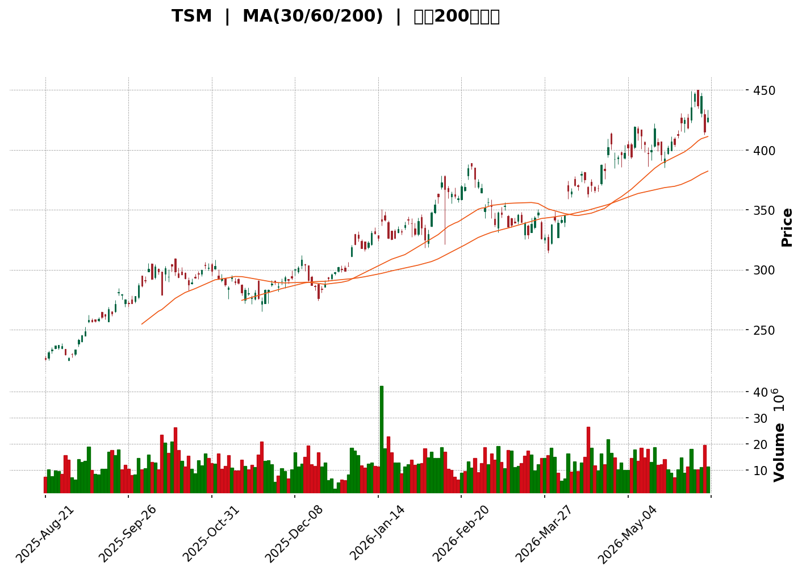
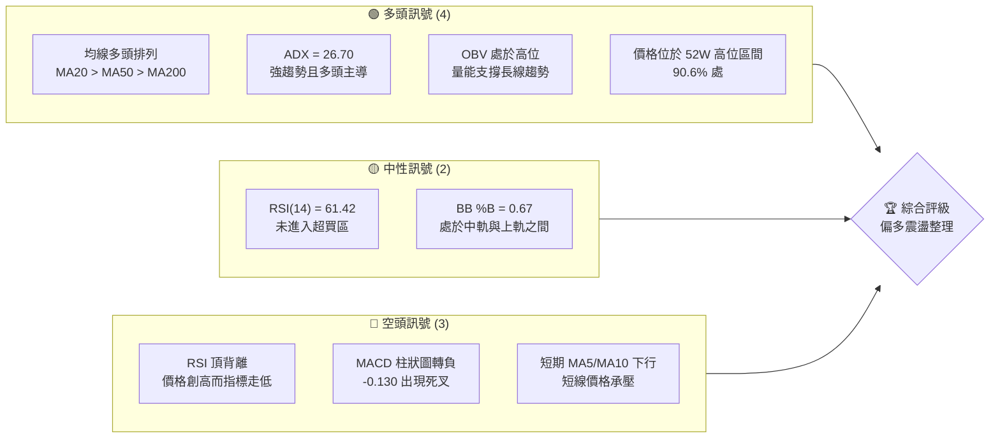
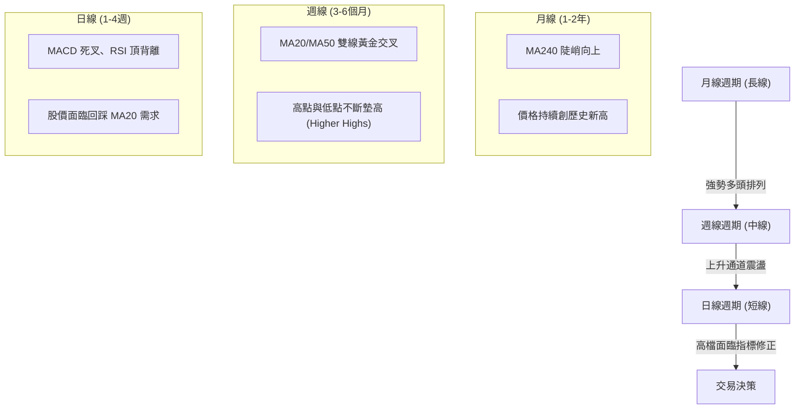
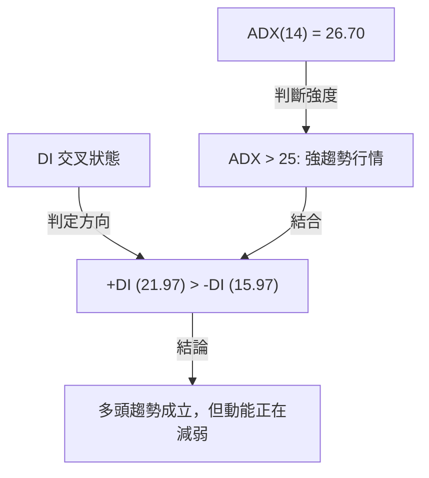
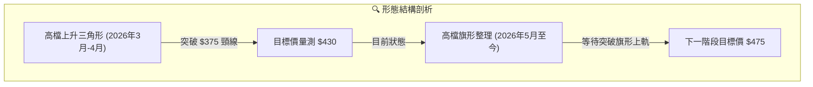

<details>
<summary>📊 靜態圖表 (點擊展開)</summary>

</details>

<html>
<head><meta charset="utf-8" /></head>
<body>
    <div style="height:500px; width:100%;">                        <script>window.PlotlyConfig = {MathJaxConfig: 'local'};</script>
        <script charset="utf-8" src="https://cdn.plot.ly/plotly-3.6.0.min.js" integrity="sha256-QaOVwtVY0T02VaHrr6pnoHLCwayMJp4O5n4YyaE3rJk=" crossorigin="anonymous"></script>                <div id="candlestick-chart" class="plotly-graph-div" style="height:100%; width:100%;"></div>            <script>                window.PLOTLYENV=window.PLOTLYENV || {};                                if (document.getElementById("candlestick-chart")) {                    Plotly.newPlot(                        "candlestick-chart",                        [{"close":{"dtype":"f8","bdata":"AAAAYNYrbEAAAAAgZd9sQAAAAMDgMW1AAAAAgCyVbUAAAADAQadtQAAAACDmhm1AAAAAwCOcbEAAAADAdk1sQAAAAACjrGxAAAAAwNIlbUAAAAAA9iluQAAAAMDgoW5AAAAAYDUYb0AAAABgHCNwQAAAAIDXCnBAAAAAAIERcEAAAACABTJwQAAAAMDrSXBAAAAAgIlVcEAAAACAn7JwQAAAAECidnBAAAAAoBzycEAAAACAgZJxQAAAAGCucnFAAAAAwDwycUAAAAAguv1wQAAAAMCo+3BAAAAAIBZccUAAAADAKO5xQAAAAEBu6HFAAAAAIFopckAAAACA0MtyQAAAAGChRnJAAAAAQIztckAAAABgt6NyQAAAAMDicXFAAAAAoJzTckAAAADABWVyQAAAAGCS8HJAAAAAYBSjckAAAACAVldyQAAAACAHgXJAAAAAwEROckAAAADgrvRxQAAAAOAeEnJAAAAAwG1VckAAAACgx4lyQAAAAKD4vXJAAAAAQJ72ckAAAADA3NhyQAAAAMB3rHJAAAAAQPXyckAAAADA8kZyQAAAAMBsQHJAAAAAQGn6cUAAAAAA0M5xQAAAAGBcWnJAAAAAQB8ZckAAAADAXhByQAAAACBkinFAAAAAgBS0cUAAAAAAXodxQAAAAMAgRnFAAAAAgBiNcUAAAACAmj9xQAAAACDHGHFAAAAAYDexcUAAAABA2rFxQAAAAEDeBXJAAAAAQIgeckAAAACgluFxQAAAAMDCJ3JAAAAA4DldckAAAACAIDVyQAAAACCcUXJAAAAAgGHDckAAAADA4ttyQAAAAID5RnNAAAAAAOX\u002fckAAAADAgjNyQAAAAGDn7nFAAAAA4AXhcUAAAACA6EJxQAAAAMAUvnFAAAAAoDUCckAAAABgS0dyQAAAAKDZgXJAAAAAwF2fckAAAAAg099yQAAAAAAxwXJAAAAAoM+rckAAAAAAlPByQAAAAABk63NAAAAAIIMVdEAAAADAKGh0QAAAAICN3HNAAAAA4NzRc0AAAADAhyt0QAAAAIBnrXRAAAAAIHikdEAAAADADWN0QAAAAIDhSnVAAAAAoAFXdUAAAAAA2mN0QAAAACBCU3RAAAAAwDNndEAAAABg3d50QAAAAOBmvHRAAAAAoDoWdUAAAAAgaVV1QAAAAMCIKXVAAAAAQBmadEAAAADAaUZ1QAAAAMDn7HRAAAAAADJNdEAAAACgz5x0QAAAAKDqvXVAAAAA4JQmdkAAAAAASo52QAAAACCfUHdAAAAAAA3xdkAAAAAAStV2QAAAAKDTsnZAAAAAoN+TdkAAAACgCXZ2QAAAAED7F3dAAAAAAAEQd0AAAABAqAp4QAAAAKA\u002fKnhAAAAAAAV8d0AAAACAcFh3QAAAAEAqAXdAAAAAQDQCdkAAAABg+EZ2QAAAAODZDXZAAAAAIAEfdUAAAAAAhrt1QAAAAODVoXVAAAAAAAUZdkAAAADgOPx0QAAAAADAFXVAAAAAYGI0dUAAAAAgrp91QAAAAMAeOXVAAAAA4KMsdUAAAAAA15N0QAAAAEAzJ3VAAAAAAAB0dUAAAAAAALx1QAAAAIDCYXRAAAAAANdrdEAAAAAAAMhzQAAAAEAzH3VAAAAAANdXdUAAAADgozB1QAAAAAApXHVAAAAAwB6VdUAAAABgZt52QAAAAADX13ZAAAAAoJkpd0AAAADAHhl3QAAAAIA9vndAAAAAoJlxd0AAAACgmbV2QAAAAAAAKHdAAAAAANfjdkAAAACgRwF3QAAAAEAKN3hAAAAAYI\u002fqd0AAAAAgXCd5QAAAACCuT3lAAAAAoHCFeEAAAACgR514QAAAAMD1wHhAAAAAYLjaeEAAAACAwhl5QAAAAGCPpnhAAAAAAAA4ekAAAABgZuJ5QAAAAEDhunlAAAAA4KNIeUAAAADgetR4QAAAAMDM\u002fHhAAAAAIIUbekAAAACgmUV5QAAAAEAzv3hAAAAAgMKJeEAAAACA6xl5QAAAAGBmcnlAAAAA4FFIeUAAAADAHsV5QAAAACCua3pAAAAAgMKNekAAAABAMyd6QAAAAIAUOntAAAAAQArre0AAAABACkt7QAAAAGC4zntAAAAAYLjyeUAAAADAzKx6QA=="},"high":{"dtype":"f8","bdata":"GSfbeQKLbEDSMwRAtg1tQNyzKeF9Z21AYXPv2qmYbUDnivMav6ptQDNI2i+40m1Al3D7TUw9bUD6w9YFmmtsQE8u86BDzmxAc+70z\u002f4obUD0xYJaIE5uQKGpW4PEt25AGUhfwxORb0DZSh6Kx2RwQFmJsDUlNnBA4DRQaTMrcEA4GvCZi0hwQNKbHKydj3BAaBa36a11cEBmiCMd29BwQHVmLT2vkXBAOtRbrXYtcUBMc6JU28ZxQPnGMB+jenFAOy5ZEuA5cUCyKfV1xx9xQFbmHa9QZXFAuw\u002fKv0RfcUDPDSKDJA5yQEIAuhhvcXJAazqOhu5mckDZvkGYyBlzQNln\u002ffeZFnNAywwhcHYLc0BngoIbqNJyQK2K6tnOqHJA5KLvdkzvckAv0B29eMFyQOuTM\u002f3NDnNAY5b+wItac0DZrcafItpyQCFrg1a033JAd6D83pmbckAmholiP1lyQObsFcGVR3JAx6rflAGFckC+esmPQ61yQFkACb+Ex3JAkmxfKEkkc0BMWvlS8RlzQDR3uZTUH3NAejTz3adGc0Aue59MSsVyQBtM5EtNiXJAxi8EN1ZQckA0kVc37uRxQG4wNCP1d3JASfoQ2spUckDSyUIZ\u002f1NyQOGcT5WM\u002fnFAWSxtVorUcUBxx5QlSs9xQGHmvU9oanFAAXbur8ivcUCe\u002fi6n2jNyQOHGLO2JUnFAgjo\u002fLOa3cUAqMrErT71xQByCf7s3M3JAFymShP0wckBGDXxt9hhyQJSaeOIbTnJADugfy9dvckDQ0zVeoUZyQEl1xelasnJAO4vGnlDPckDW0tMKGPByQI4dwrMThHNA\u002fnUZm7APc0B3MODgzPZyQLBLnVyAb3JA+0tVM2T6cUCM7clGmgRyQLLh3lSm5XFA\u002fzydsJU1ckDySKaW5WJyQO78jLMqkXJA1OQ\u002fOxylckCQHOvIcOhyQBPyAWxP+nJAo\u002fRLjBv7ckBYG9m3ayhzQLQEHVb7CnRALwKNihuldEBkH+wYTsJ0QItxzEwhVnRAn1++LWk5dEAATy0BuD10QBQXiePNyXRAZJNFaZj3dEDbS5MZ7o50QL6q7Bl85XVASyueId\u002fNdUCGvd55BFN1QEbgYZM9y3RA5D0dnLzhdECMzT4CPgN1QNGbH96I4nRAVUElgqhEdUAGspCLd4h1QPg+msZibHVA5avqYB4vdUAnNFbQuXN1QIdC6XEyoXVAJlCtcJEddUAec9INFNp0QPvqrBzMy3VA5Pu35m5pdkD2J7XSwrt2QPRkc\u002fA2qHdA+M+oaequd0CY3dhUEyF3QG5qU5u80nZAiOY1EKIFd0A+ajwjfZx2QNBjCIV3MndAor\u002fgWxdGd0DMmtkFYkF4QE7qCBXRUXhATdBnMiUWeED7hp\u002f08Xl3QCD9u3PTQHdABGTbEq0vdkDyjcC9NIF2QN2u++5bZ3ZAaUo0nde7dUAQCZwRscZ1QJTOv3kbCHZAJwaMw4hFdkDDLSIWpZ51QMp+0abUeHVAFoAjHJZ6dUAAAAAAKax1QAAAAEAzv3VAAAAAYGY+dUAAAACgmRl1QAAAAGCPdnVAAAAAgBSOdUAAAABAM+d1QAAAAGCPTnVAAAAAwPWYdEAAAACgmZl0QAAAAGCPJnVAAAAAQOHKdUAAAADAHmF1QAAAAEAzg3VAAAAA4HqYdUAAAADAzGR3QAAAAGC4AndAAAAAAACgd0AAAAAgXDd3QAAAAGCP4ndAAAAAIK7fd0AAAABAMyN3QAAAAKBHeXdAAAAAwB4hd0AAAAAAACx3QAAAAGCPPnhAAAAAAClMeEAAAAAA15d5QAAAAAAA6HlAAAAAgOvdeEAAAACgmb14QAAAAOCj7HhAAAAAANc\u002feUAAAABAM3t5QAAAAIAUYnlAAAAAQDM7ekAAAAAAAEB6QAAAAAAAEHpAAAAAIK57eUAAAAAA1yN5QAAAAEDhSnlAAAAAIIVfekAAAACA6515QAAAAIAUbnlAAAAAgBTueEAAAACAFD55QAAAACBct3lAAAAAYLiqeUAAAAAA1wd6QAAAAMDM6HpAAAAAoJm5ekAAAABACud6QAAAAIA9FnxAAAAAgBQGfEAAAABgjyJ8QAAAAAApAHxAAAAAYGYee0AAAADA9Rx7QA=="},"hovertemplate":"\u003cb\u003e%{x|%Y-%m-%d}\u003c\u002fb\u003e\u003cbr\u003e\u958b: $%{open:.2f}\u003cbr\u003e\u9ad8: $%{high:.2f}\u003cbr\u003e\u4f4e: $%{low:.2f}\u003cbr\u003e\u6536: $%{close:.2f}\u003cextra\u003e\u003c\u002fextra\u003e","low":{"dtype":"f8","bdata":"bXzsc+QJbEB+UVNZCQdsQOIRPGrrx2xAAGExklE2bUATviaQHi1tQOT8YpbiPm1ABWy9m\u002fCSbECftCPT5\u002fVrQDv+HXEgVGxAQhIezw6KbECXHxgwKXttQH8fBK0s8W1ABw6LE6GZbkBkpP5A4vBvQDpA4kMOAHBAVxDObG8CcEBtLN7hTQhwQHlXaCLZMnBA6NdantgkcEA6Cd8JAAlwQFDN69zaVXBAevA3+Nx\u002fcED0q5ldYmdxQDSizSwxM3FAsUvVPUnLcEAsM+bKINJwQAAAAMCo+3BAddVbwjQFcUAF3fpRWjpxQA0ibe4+13FAPmLTIk0OckBWsHS9q6RyQGsVMUGyOnJAYBJVt9VFckCCE2KdknxyQP3Gbm2ibHFAdDzEw2srckAQfWWn0xtyQJeOOm29pnJAOcXw5PRwckAP2rLZylRyQPsihAfYdnJAPrJYQb5AckA1uBuUZa1xQCp4zQGeAHJA3M\u002fx81tMckA\u002ffG+AOEFyQMnNgwhAZ3JA\u002fPzBHX\u002fLckAehd1jrLJyQPcI1SXMcHJABlS36lvHckD3ricnWz5yQPtv72lfHnJAj7+PnNDccUBI4NJhtzlxQP0jA7lZInJA1Hc7HSn1cUBELBlI0v9xQGUYUGNiZ3FAatMguaj7cED1f0l9M2RxQGxSTU6L83BATx4e6dMscUAUfCNoQi5xQMfn9JOplXBAgbLU0QX7cEDOK8WxRflwQO+4LnBi4nFAWX2RvZf2cUDE4qKtJJpxQGryVt50+XFAzZAMe\u002fjHcUAnwArxrwlyQORfgRU4OnJAbWVfCG9xckD89X3hwY1yQLokJvJnzXJAygOv1sSsckB75xszmSJyQGIrz0\u002ff63FAmN52+2GocUC9ADqj6SRxQJG\u002f9ThVj3FAO70\u002fdDTZcUBY7R9zRCZyQPlKDksQNnJATF4ttFx2ckDmEXkY5ppyQD+1VSD5nHJAXnj1vrypckBdSmALPelyQBjD38kvbXNAJ5XJwYsJdEBPnLvP2Dp0QIxZcbxR2nNAzOzL5Qa0c0ADyYUrsdVzQBFbLKOGAnRAe3zs0puddECUkwtbhD50QLaUbzCHD3VAS8GUMQJIdUAYExb+s190QMLTZvA8THRAeM3ICLRfdEBSJVmoBad0QBMQ82rVlHRAFHgnQevZdEARxMGkVRt1QG+Xf+FxdHRA+bys7c2CdED1gPn5zYJ0QMAtzpJ7kXRAQo4ahMbic0CH9TJmB+xzQLZQtclD+3RAJ6Dk1SmtdUCUhimoNzZ2QNATQ5qt9XZAIuQqbx4TdEBKChO2GXx2QCFr6PzSM3ZAoin2liR7dkCBe\u002fBT+EZ2QE+KW6p0YXZAyS4HdOLWdkCD2Suk5G93QOcFk4D6+3dA5rljVJQKd0Bx3kn4WPl2QNfT\u002fnQBunZASpq+t8RydUDSiBAj3Bh2QG6VLehXbXVAltUNMuf7dEDRYrw\u002fzK90QDGZ6P56dXVADqTfFgLWdUDUJUEM9fZ0QO6B\u002fG1n9HRA4DUCuNctdUAAAABgZiZ1QAAAAKBwNXVAAAAAQApTdEAAAABgZl50QAAAAKCZsXRAAAAA4FHgdEAAAAAAAHh1QAAAAIDrVXRAAAAAwPUkdEAAAADAzJxzQAAAAIA9EnRAAAAAAAA8dUAAAADAzGx0QAAAAIDrKXVAAAAAYGb6dEAAAAAA13N2QAAAACCFi3ZAAAAAAAAcd0AAAADAzOB2QAAAACCFU3dAAAAAIFxDd0AAAADAzIh2QAAAAIA90nZAAAAAAADEdkAAAACAwtF2QAAAAIA9KndAAAAAwPV8d0AAAACgmZ14QAAAAGBmBnlAAAAAQDMLeEAAAABA4UJ4QAAAACBcG3hAAAAAgBSCeEAAAABAM7N4QAAAAKCZiXhAAAAAYGYKeUAAAACAwoF5QAAAAIAUDnlAAAAAQArjeEAAAACA6yF4QAAAACCFd3hAAAAAoJkheUAAAACgR+14QAAAAMDMcHhAAAAAwPUQeEAAAABAM794QAAAAAAp+HhAAAAAgMIteUAAAADAHqF5QAAAAIAU9nlAAAAAIFzreUAAAAAAABR6QAAAAAAAaHpAAAAAAClAe0AAAADgeih7QAAAAMDMtHpAAAAA4KPMeUAAAADgo2h6QA=="},"name":"\u50f9\u683c","open":{"dtype":"f8","bdata":"szfd1NlFbEAzU7V2F0FsQNc20j30CG1A10OHPZ9KbUD5bcsOfFptQImHtQVnSG1AYUgL8845bUAOaIbYZgZsQKr3OtHCsGxAYrzeRF6rbEDKi\u002fZHZcVtQAmceqrp\u002fG1ABw6LE6GZbkC8WosSNQpwQKMnyuSuIXBAL3x4UZ0pcEAK8J68IRxwQBcuFoBXh3BAc5qnXTNucEBDPLR2UQlwQH1Mkn2AjnBAkIkZEDWRcEDjlQy6ko1xQJPGnABRbHFAPWNDjOj5cEBtaCYyKQZxQLrqU0GIL3FAKMd7WeoccUAFiNCcj05xQLfFHFlAbnJAQgHQSwM0ckBDPRrqyKVyQOepnaX2DnNAonSLohBWckA\u002f43TvYcpyQAIF0yD9pHJAAv5ox56JckA6\u002fxT6FmByQOe+vpC2CXNAJIMaaItTc0CpGICHKoxyQCbJXBygpXJAHcC6sraVckCdUyqmPTZyQLqMbW5SA3JATmVepSJfckARMG\u002f\u002fJJByQMFGhr7kinJA7NZYZeoBc0DUQLZmotZyQOVTxF3wBHNAUlPCdtbOckA7MnvO+nNyQDQV9bQxMHJADpJZfr5HckBQZncoSbpxQHjbI3vhS3JA531ImEgnckDXuDcuYUFyQBAfhWJM+XFASvIIqE0mcUDpFykUTH5xQB4TPTpmQHFA\u002fdgrCGA2cUCdgbOOqylyQFOVt8P59HBAgbLU0QX7cED7NeAC05JxQAsM3Rov+HFAnvhHi\u002fctckCU\u002fbbaftVxQI1bhiZUJnJAyihFeDEpckA+PTi+1UVyQLuqMtHFZnJAgAMyVLi4ckApgMJYd6VyQLJjmNoS+3JAIwsxt2QHc0B3MODgzPZyQBpytXchZXJA143i4j7ncUBCmkAWgvtxQM2PINEvw3FAO70\u002fdDTZcUA8f2zgeF1yQExIhJs1SXJAKgEtM3SOckDI62y26rByQAWMKJrpznJAZ9b1gCrYckCwa\u002fI7VfJyQFhf43CncXNAHJv+souXdEDF9IyDrJR0QK+cR68fPHRAc5jO8ac3dEAZWUmc5u5zQJPo9ooeE3RAV6n9ZPS+dEDbS5MZ7o50QMtP0UiMXXVAbPNu8pSYdUBUjeWgUT11QIxILr7jx3RAD4qT\u002frrHdECMtdfZMLJ0QNJfPbStvXRATU5ALd\u002f4dEDvOB3ZDmF1QPXKZt+FLXVAmY6Y8KPndEBaTg0\u002fSp10QPQAsTubgXVAB1\u002fxJIPqdEBNnQ9Kmx50QOpXR6HTCHVAMhxRCXu8dUCusLtl5rR2QGM1+kakEHdA43sT7PWed0Cl+qnDzQF3QOcHBLGmjXZA6j7YtWatdkCRBCL2WGt2QHzW2hZObHZAkYh5\u002f6jfdkAAt7G1V6V3QE7qCBXRUXhA5BLeqIQReEDZAMN5mRF3QLp8EGlVxXZAr5YEtBXJdUB5FX59z0Z2QGTdx8dxHnZAJthEkY5odUDxQjElg+p0QJlE\u002fn3at3VAsHI9wPcOdkAypbDiU491QKaslw5Cb3VA7PnEgqhEdUAAAACgmUl1QAAAAOB6nHVAAAAAIIWTdEAAAABA4Qp1QAAAAKCZsXRAAAAAwB75dEAAAAAAAKB1QAAAAMAePXVAAAAAoEdNdEAAAABAM3N0QAAAAMD1JHRAAAAAYGZ+dUAAAACgcG10QAAAAAAAPHVAAAAAQAo3dUAAAADgoyR3QAAAAMDMtHZAAAAAoHB5d0AAAAAAKSR3QAAAAOCjsHdAAAAAYI\u002fWd0AAAACAwg13QAAAAEAzU3dAAAAAIIUTd0AAAACgRwF3QAAAAOB6PHdAAAAAAAAEeEAAAACAPcJ4QAAAAAAA3HlAAAAAgOuBeEAAAABgj454QAAAAMD13HhAAAAAQAqXeEAAAADgUUh5QAAAAKCZSXlAAAAAYGYmeUAAAACgcCF6QAAAAEAzD3pAAAAAANdreUAAAAAAANx4QAAAAOBR5HhAAAAAIFwzeUAAAAAAAGh5QAAAAIAUbnlAAAAAAClYeEAAAAAAANB4QAAAAAAp+HhAAAAAQOGWeUAAAACA69F5QAAAAOBRsHpAAAAAIIVjekAAAADAHrF6QAAAAIAUjnpAAAAAoEeJe0AAAAAA1x98QAAAAIAU6npAAAAA4FHcekAAAADgUXx6QA=="},"x":["2025-08-21T00:00:00-04:00","2025-08-22T00:00:00-04:00","2025-08-25T00:00:00-04:00","2025-08-26T00:00:00-04:00","2025-08-27T00:00:00-04:00","2025-08-28T00:00:00-04:00","2025-08-29T00:00:00-04:00","2025-09-02T00:00:00-04:00","2025-09-03T00:00:00-04:00","2025-09-04T00:00:00-04:00","2025-09-05T00:00:00-04:00","2025-09-08T00:00:00-04:00","2025-09-09T00:00:00-04:00","2025-09-10T00:00:00-04:00","2025-09-11T00:00:00-04:00","2025-09-12T00:00:00-04:00","2025-09-15T00:00:00-04:00","2025-09-16T00:00:00-04:00","2025-09-17T00:00:00-04:00","2025-09-18T00:00:00-04:00","2025-09-19T00:00:00-04:00","2025-09-22T00:00:00-04:00","2025-09-23T00:00:00-04:00","2025-09-24T00:00:00-04:00","2025-09-25T00:00:00-04:00","2025-09-26T00:00:00-04:00","2025-09-29T00:00:00-04:00","2025-09-30T00:00:00-04:00","2025-10-01T00:00:00-04:00","2025-10-02T00:00:00-04:00","2025-10-03T00:00:00-04:00","2025-10-06T00:00:00-04:00","2025-10-07T00:00:00-04:00","2025-10-08T00:00:00-04:00","2025-10-09T00:00:00-04:00","2025-10-10T00:00:00-04:00","2025-10-13T00:00:00-04:00","2025-10-14T00:00:00-04:00","2025-10-15T00:00:00-04:00","2025-10-16T00:00:00-04:00","2025-10-17T00:00:00-04:00","2025-10-20T00:00:00-04:00","2025-10-21T00:00:00-04:00","2025-10-22T00:00:00-04:00","2025-10-23T00:00:00-04:00","2025-10-24T00:00:00-04:00","2025-10-27T00:00:00-04:00","2025-10-28T00:00:00-04:00","2025-10-29T00:00:00-04:00","2025-10-30T00:00:00-04:00","2025-10-31T00:00:00-04:00","2025-11-03T00:00:00-05:00","2025-11-04T00:00:00-05:00","2025-11-05T00:00:00-05:00","2025-11-06T00:00:00-05:00","2025-11-07T00:00:00-05:00","2025-11-10T00:00:00-05:00","2025-11-11T00:00:00-05:00","2025-11-12T00:00:00-05:00","2025-11-13T00:00:00-05:00","2025-11-14T00:00:00-05:00","2025-11-17T00:00:00-05:00","2025-11-18T00:00:00-05:00","2025-11-19T00:00:00-05:00","2025-11-20T00:00:00-05:00","2025-11-21T00:00:00-05:00","2025-11-24T00:00:00-05:00","2025-11-25T00:00:00-05:00","2025-11-26T00:00:00-05:00","2025-11-28T00:00:00-05:00","2025-12-01T00:00:00-05:00","2025-12-02T00:00:00-05:00","2025-12-03T00:00:00-05:00","2025-12-04T00:00:00-05:00","2025-12-05T00:00:00-05:00","2025-12-08T00:00:00-05:00","2025-12-09T00:00:00-05:00","2025-12-10T00:00:00-05:00","2025-12-11T00:00:00-05:00","2025-12-12T00:00:00-05:00","2025-12-15T00:00:00-05:00","2025-12-16T00:00:00-05:00","2025-12-17T00:00:00-05:00","2025-12-18T00:00:00-05:00","2025-12-19T00:00:00-05:00","2025-12-22T00:00:00-05:00","2025-12-23T00:00:00-05:00","2025-12-24T00:00:00-05:00","2025-12-26T00:00:00-05:00","2025-12-29T00:00:00-05:00","2025-12-30T00:00:00-05:00","2025-12-31T00:00:00-05:00","2026-01-02T00:00:00-05:00","2026-01-05T00:00:00-05:00","2026-01-06T00:00:00-05:00","2026-01-07T00:00:00-05:00","2026-01-08T00:00:00-05:00","2026-01-09T00:00:00-05:00","2026-01-12T00:00:00-05:00","2026-01-13T00:00:00-05:00","2026-01-14T00:00:00-05:00","2026-01-15T00:00:00-05:00","2026-01-16T00:00:00-05:00","2026-01-20T00:00:00-05:00","2026-01-21T00:00:00-05:00","2026-01-22T00:00:00-05:00","2026-01-23T00:00:00-05:00","2026-01-26T00:00:00-05:00","2026-01-27T00:00:00-05:00","2026-01-28T00:00:00-05:00","2026-01-29T00:00:00-05:00","2026-01-30T00:00:00-05:00","2026-02-02T00:00:00-05:00","2026-02-03T00:00:00-05:00","2026-02-04T00:00:00-05:00","2026-02-05T00:00:00-05:00","2026-02-06T00:00:00-05:00","2026-02-09T00:00:00-05:00","2026-02-10T00:00:00-05:00","2026-02-11T00:00:00-05:00","2026-02-12T00:00:00-05:00","2026-02-13T00:00:00-05:00","2026-02-17T00:00:00-05:00","2026-02-18T00:00:00-05:00","2026-02-19T00:00:00-05:00","2026-02-20T00:00:00-05:00","2026-02-23T00:00:00-05:00","2026-02-24T00:00:00-05:00","2026-02-25T00:00:00-05:00","2026-02-26T00:00:00-05:00","2026-02-27T00:00:00-05:00","2026-03-02T00:00:00-05:00","2026-03-03T00:00:00-05:00","2026-03-04T00:00:00-05:00","2026-03-05T00:00:00-05:00","2026-03-06T00:00:00-05:00","2026-03-09T00:00:00-04:00","2026-03-10T00:00:00-04:00","2026-03-11T00:00:00-04:00","2026-03-12T00:00:00-04:00","2026-03-13T00:00:00-04:00","2026-03-16T00:00:00-04:00","2026-03-17T00:00:00-04:00","2026-03-18T00:00:00-04:00","2026-03-19T00:00:00-04:00","2026-03-20T00:00:00-04:00","2026-03-23T00:00:00-04:00","2026-03-24T00:00:00-04:00","2026-03-25T00:00:00-04:00","2026-03-26T00:00:00-04:00","2026-03-27T00:00:00-04:00","2026-03-30T00:00:00-04:00","2026-03-31T00:00:00-04:00","2026-04-01T00:00:00-04:00","2026-04-02T00:00:00-04:00","2026-04-06T00:00:00-04:00","2026-04-07T00:00:00-04:00","2026-04-08T00:00:00-04:00","2026-04-09T00:00:00-04:00","2026-04-10T00:00:00-04:00","2026-04-13T00:00:00-04:00","2026-04-14T00:00:00-04:00","2026-04-15T00:00:00-04:00","2026-04-16T00:00:00-04:00","2026-04-17T00:00:00-04:00","2026-04-20T00:00:00-04:00","2026-04-21T00:00:00-04:00","2026-04-22T00:00:00-04:00","2026-04-23T00:00:00-04:00","2026-04-24T00:00:00-04:00","2026-04-27T00:00:00-04:00","2026-04-28T00:00:00-04:00","2026-04-29T00:00:00-04:00","2026-04-30T00:00:00-04:00","2026-05-01T00:00:00-04:00","2026-05-04T00:00:00-04:00","2026-05-05T00:00:00-04:00","2026-05-06T00:00:00-04:00","2026-05-07T00:00:00-04:00","2026-05-08T00:00:00-04:00","2026-05-11T00:00:00-04:00","2026-05-12T00:00:00-04:00","2026-05-13T00:00:00-04:00","2026-05-14T00:00:00-04:00","2026-05-15T00:00:00-04:00","2026-05-18T00:00:00-04:00","2026-05-19T00:00:00-04:00","2026-05-20T00:00:00-04:00","2026-05-21T00:00:00-04:00","2026-05-22T00:00:00-04:00","2026-05-26T00:00:00-04:00","2026-05-27T00:00:00-04:00","2026-05-28T00:00:00-04:00","2026-05-29T00:00:00-04:00","2026-06-01T00:00:00-04:00","2026-06-02T00:00:00-04:00","2026-06-03T00:00:00-04:00","2026-06-04T00:00:00-04:00","2026-06-05T00:00:00-04:00","2026-06-08T00:00:00-04:00"],"type":"candlestick"},{"hovertemplate":"MA30: $%{y:.2f}\u003cextra\u003e\u003c\u002fextra\u003e","line":{"color":"#2196F3","dash":"dash","width":2},"mode":"lines","name":"MA30","x":["2025-08-21T00:00:00-04:00","2025-08-22T00:00:00-04:00","2025-08-25T00:00:00-04:00","2025-08-26T00:00:00-04:00","2025-08-27T00:00:00-04:00","2025-08-28T00:00:00-04:00","2025-08-29T00:00:00-04:00","2025-09-02T00:00:00-04:00","2025-09-03T00:00:00-04:00","2025-09-04T00:00:00-04:00","2025-09-05T00:00:00-04:00","2025-09-08T00:00:00-04:00","2025-09-09T00:00:00-04:00","2025-09-10T00:00:00-04:00","2025-09-11T00:00:00-04:00","2025-09-12T00:00:00-04:00","2025-09-15T00:00:00-04:00","2025-09-16T00:00:00-04:00","2025-09-17T00:00:00-04:00","2025-09-18T00:00:00-04:00","2025-09-19T00:00:00-04:00","2025-09-22T00:00:00-04:00","2025-09-23T00:00:00-04:00","2025-09-24T00:00:00-04:00","2025-09-25T00:00:00-04:00","2025-09-26T00:00:00-04:00","2025-09-29T00:00:00-04:00","2025-09-30T00:00:00-04:00","2025-10-01T00:00:00-04:00","2025-10-02T00:00:00-04:00","2025-10-03T00:00:00-04:00","2025-10-06T00:00:00-04:00","2025-10-07T00:00:00-04:00","2025-10-08T00:00:00-04:00","2025-10-09T00:00:00-04:00","2025-10-10T00:00:00-04:00","2025-10-13T00:00:00-04:00","2025-10-14T00:00:00-04:00","2025-10-15T00:00:00-04:00","2025-10-16T00:00:00-04:00","2025-10-17T00:00:00-04:00","2025-10-20T00:00:00-04:00","2025-10-21T00:00:00-04:00","2025-10-22T00:00:00-04:00","2025-10-23T00:00:00-04:00","2025-10-24T00:00:00-04:00","2025-10-27T00:00:00-04:00","2025-10-28T00:00:00-04:00","2025-10-29T00:00:00-04:00","2025-10-30T00:00:00-04:00","2025-10-31T00:00:00-04:00","2025-11-03T00:00:00-05:00","2025-11-04T00:00:00-05:00","2025-11-05T00:00:00-05:00","2025-11-06T00:00:00-05:00","2025-11-07T00:00:00-05:00","2025-11-10T00:00:00-05:00","2025-11-11T00:00:00-05:00","2025-11-12T00:00:00-05:00","2025-11-13T00:00:00-05:00","2025-11-14T00:00:00-05:00","2025-11-17T00:00:00-05:00","2025-11-18T00:00:00-05:00","2025-11-19T00:00:00-05:00","2025-11-20T00:00:00-05:00","2025-11-21T00:00:00-05:00","2025-11-24T00:00:00-05:00","2025-11-25T00:00:00-05:00","2025-11-26T00:00:00-05:00","2025-11-28T00:00:00-05:00","2025-12-01T00:00:00-05:00","2025-12-02T00:00:00-05:00","2025-12-03T00:00:00-05:00","2025-12-04T00:00:00-05:00","2025-12-05T00:00:00-05:00","2025-12-08T00:00:00-05:00","2025-12-09T00:00:00-05:00","2025-12-10T00:00:00-05:00","2025-12-11T00:00:00-05:00","2025-12-12T00:00:00-05:00","2025-12-15T00:00:00-05:00","2025-12-16T00:00:00-05:00","2025-12-17T00:00:00-05:00","2025-12-18T00:00:00-05:00","2025-12-19T00:00:00-05:00","2025-12-22T00:00:00-05:00","2025-12-23T00:00:00-05:00","2025-12-24T00:00:00-05:00","2025-12-26T00:00:00-05:00","2025-12-29T00:00:00-05:00","2025-12-30T00:00:00-05:00","2025-12-31T00:00:00-05:00","2026-01-02T00:00:00-05:00","2026-01-05T00:00:00-05:00","2026-01-06T00:00:00-05:00","2026-01-07T00:00:00-05:00","2026-01-08T00:00:00-05:00","2026-01-09T00:00:00-05:00","2026-01-12T00:00:00-05:00","2026-01-13T00:00:00-05:00","2026-01-14T00:00:00-05:00","2026-01-15T00:00:00-05:00","2026-01-16T00:00:00-05:00","2026-01-20T00:00:00-05:00","2026-01-21T00:00:00-05:00","2026-01-22T00:00:00-05:00","2026-01-23T00:00:00-05:00","2026-01-26T00:00:00-05:00","2026-01-27T00:00:00-05:00","2026-01-28T00:00:00-05:00","2026-01-29T00:00:00-05:00","2026-01-30T00:00:00-05:00","2026-02-02T00:00:00-05:00","2026-02-03T00:00:00-05:00","2026-02-04T00:00:00-05:00","2026-02-05T00:00:00-05:00","2026-02-06T00:00:00-05:00","2026-02-09T00:00:00-05:00","2026-02-10T00:00:00-05:00","2026-02-11T00:00:00-05:00","2026-02-12T00:00:00-05:00","2026-02-13T00:00:00-05:00","2026-02-17T00:00:00-05:00","2026-02-18T00:00:00-05:00","2026-02-19T00:00:00-05:00","2026-02-20T00:00:00-05:00","2026-02-23T00:00:00-05:00","2026-02-24T00:00:00-05:00","2026-02-25T00:00:00-05:00","2026-02-26T00:00:00-05:00","2026-02-27T00:00:00-05:00","2026-03-02T00:00:00-05:00","2026-03-03T00:00:00-05:00","2026-03-04T00:00:00-05:00","2026-03-05T00:00:00-05:00","2026-03-06T00:00:00-05:00","2026-03-09T00:00:00-04:00","2026-03-10T00:00:00-04:00","2026-03-11T00:00:00-04:00","2026-03-12T00:00:00-04:00","2026-03-13T00:00:00-04:00","2026-03-16T00:00:00-04:00","2026-03-17T00:00:00-04:00","2026-03-18T00:00:00-04:00","2026-03-19T00:00:00-04:00","2026-03-20T00:00:00-04:00","2026-03-23T00:00:00-04:00","2026-03-24T00:00:00-04:00","2026-03-25T00:00:00-04:00","2026-03-26T00:00:00-04:00","2026-03-27T00:00:00-04:00","2026-03-30T00:00:00-04:00","2026-03-31T00:00:00-04:00","2026-04-01T00:00:00-04:00","2026-04-02T00:00:00-04:00","2026-04-06T00:00:00-04:00","2026-04-07T00:00:00-04:00","2026-04-08T00:00:00-04:00","2026-04-09T00:00:00-04:00","2026-04-10T00:00:00-04:00","2026-04-13T00:00:00-04:00","2026-04-14T00:00:00-04:00","2026-04-15T00:00:00-04:00","2026-04-16T00:00:00-04:00","2026-04-17T00:00:00-04:00","2026-04-20T00:00:00-04:00","2026-04-21T00:00:00-04:00","2026-04-22T00:00:00-04:00","2026-04-23T00:00:00-04:00","2026-04-24T00:00:00-04:00","2026-04-27T00:00:00-04:00","2026-04-28T00:00:00-04:00","2026-04-29T00:00:00-04:00","2026-04-30T00:00:00-04:00","2026-05-01T00:00:00-04:00","2026-05-04T00:00:00-04:00","2026-05-05T00:00:00-04:00","2026-05-06T00:00:00-04:00","2026-05-07T00:00:00-04:00","2026-05-08T00:00:00-04:00","2026-05-11T00:00:00-04:00","2026-05-12T00:00:00-04:00","2026-05-13T00:00:00-04:00","2026-05-14T00:00:00-04:00","2026-05-15T00:00:00-04:00","2026-05-18T00:00:00-04:00","2026-05-19T00:00:00-04:00","2026-05-20T00:00:00-04:00","2026-05-21T00:00:00-04:00","2026-05-22T00:00:00-04:00","2026-05-26T00:00:00-04:00","2026-05-27T00:00:00-04:00","2026-05-28T00:00:00-04:00","2026-05-29T00:00:00-04:00","2026-06-01T00:00:00-04:00","2026-06-02T00:00:00-04:00","2026-06-03T00:00:00-04:00","2026-06-04T00:00:00-04:00","2026-06-05T00:00:00-04:00","2026-06-08T00:00:00-04:00"],"y":{"dtype":"f8","bdata":"AAAAAAAA+H8AAAAAAAD4fwAAAAAAAPh\u002fAAAAAAAA+H8AAAAAAAD4fwAAAAAAAPh\u002fAAAAAAAA+H8AAAAAAAD4fwAAAAAAAPh\u002fAAAAAAAA+H8AAAAAAAD4fwAAAAAAAPh\u002fAAAAAAAA+H8AAAAAAAD4fwAAAAAAAPh\u002fAAAAAAAA+H8AAAAAAAD4fwAAAAAAAPh\u002fAAAAAAAA+H8AAAAAAAD4fwAAAAAAAPh\u002fAAAAAAAA+H8AAAAAAAD4fwAAAAAAAPh\u002fAAAAAAAA+H8AAAAAAAD4fwAAAAAAAPh\u002fAAAAAAAA+H8AAAAAAAD4f3d3d1c0029Aq6qqImIMcEBVVVVVljFwQJqZmRn6UHBAERERkUZ0cECamZnZz5RwQImIiHCxq3BAmpmZIUfScEB3d3fPfPZwQFVVVT3DHXFA7+7uVm9AcUCJiIgwP1xxQN7d3SVzd3FAVVVVFf2OcUB3d3f3gZ5xQFVVVSXRr3FAZmZm1iXDcUBmZmbGI9dxQDMzMyMT7HFAMzMzw4ICckAzMzMj2hRyQGZmZpa2J3JAAAAA4M44ckBmZmam0j5yQERERFSuRXJAq6qqelpMckDNzMysUlNyQERERFQDX3JA7+7ublBlckDe3d1ddGZyQFVVVeVRY3JAzczMLGlfckDv7u6OmFRyQM3MzLwLTHJAVVVVJUxAckARERFRbTRyQN7d3e10MXJAMzMz48YnckCJiIj4zSFyQKuqqir7GXJAiYiIGJAVckDNzMxMoxFyQN7d3Y2pDnJAERERMSkPckDNzMwcTxFyQDMzM+NsE3JAVVVVJRcXckCJiIjI0xlyQBEREeFkHnJAmpmZCbQeckCamZkJMRlyQM3MzGzfEnJAiYiI2L0JckBmZmbWEgFyQCIiIpK6\u002fHFA3t3dHf38cUCrqqo6AQFyQERERDRSAnJAERERwcsGckCJiIgItg1yQCIiIjISGHJAq6qqKlQgckAAAACAXixyQO\u002fu7s7xQnJAZmZm9o5YckAzMzOjgnNyQBEREVEai3JAd3d390GdckCamZlZYbJyQO\u002fu7g4IyXJA3t3dDZDeckBERETk8fNyQO\u002fu7i63DnNAVVVVtRsoc0De3d19uzpzQAAAAKDaS3NAmpmZGdlZc0BmZmaWA2tzQKuqqip2d3NAIiIi0kWJc0AzMzOzAKRzQM3MzJyOv3NA3t3d\u002fcrWc0CJiIgIC\u002flzQDMzMzM0FHRAVVVVJcUndEBERET0rzt0QO\u002fu7h5KV3RA7+7ujmV1dEC8u7vrz5R0QN7d3f25u3RAiYiI+CrgdEDNzMw8ZAF1QImIiCgbGXVAIiIigmIudUAREREB6j91QKuqqrp+W3VAmpmZmSp3dUB3d3c3NJh1QHd3dyf3tXVAVVVVlTfOdUC8u7ubdud1QCIiIqIS9nVAVVVVhcf7dUAiIiIi4gt2QM3MzOyiGnZA7+7uXsMgdkAzMzNTHih2QImIiCjEL3ZAERERgWQ4dkDe3d1tazV2QKuqqprCNHZAzczMLOc5dkC8u7vr4Dx2QJqZmUlrP3ZAREREBN5GdkBmZmZ2kUZ2QJqZmVmLQXZAREREdJc7dkDNzMz8lDR2QCIiIqKNG3ZAVVVV1QsGdkBVVVXVAOx1QN7d3Y2M3nVAvLu7uwPUdUAiIiICK8l1QLy7u7tfunVAd3d3l76tdUBVVVVlvKN1QERERKR0mHVAREREVLWVdUAREREBmZN1QCIiInLmmXVA7+7ujiWmdUCamZmZ1al1QFVVVUU9s3VAd3d3d1XCdUARERFBMc11QImIiIg743VAVVVVJcDydUAzMzNjUhZ2QLy7u9tiOnZAIiIiIrBWdkAAAABANXB2QERERARWjnZAmpmZGb2tdkBEREQEVtR2QLy7u2su8nZAZmZmFtkad0BmZmbmQj53QO\u002fu7g7ma3dAq6qqWmSVd0BERESEecB3QJqZmRl24XdAmpmZCR4KeEB3d3cH8yx4QFVVVcXZSXhA3t3dbRJjeEBmZmZmH3Z4QBEREWFXjHhAZmZmlm6eeEAzMzNjO7V4QJqZmXkUzHhA7+7uXp7meEC8u7tbAQR5QGZmZsa9JnlAIiIi4qVReUAAAABwPXZ5QAAAAGDllHlAMzMzEzymeUC8u7tLN7N5QA=="},"type":"scatter"},{"hovertemplate":"MA60: $%{y:.2f}\u003cextra\u003e\u003c\u002fextra\u003e","line":{"color":"#9C27B0","dash":"dash","width":2},"mode":"lines","name":"MA60","x":["2025-08-21T00:00:00-04:00","2025-08-22T00:00:00-04:00","2025-08-25T00:00:00-04:00","2025-08-26T00:00:00-04:00","2025-08-27T00:00:00-04:00","2025-08-28T00:00:00-04:00","2025-08-29T00:00:00-04:00","2025-09-02T00:00:00-04:00","2025-09-03T00:00:00-04:00","2025-09-04T00:00:00-04:00","2025-09-05T00:00:00-04:00","2025-09-08T00:00:00-04:00","2025-09-09T00:00:00-04:00","2025-09-10T00:00:00-04:00","2025-09-11T00:00:00-04:00","2025-09-12T00:00:00-04:00","2025-09-15T00:00:00-04:00","2025-09-16T00:00:00-04:00","2025-09-17T00:00:00-04:00","2025-09-18T00:00:00-04:00","2025-09-19T00:00:00-04:00","2025-09-22T00:00:00-04:00","2025-09-23T00:00:00-04:00","2025-09-24T00:00:00-04:00","2025-09-25T00:00:00-04:00","2025-09-26T00:00:00-04:00","2025-09-29T00:00:00-04:00","2025-09-30T00:00:00-04:00","2025-10-01T00:00:00-04:00","2025-10-02T00:00:00-04:00","2025-10-03T00:00:00-04:00","2025-10-06T00:00:00-04:00","2025-10-07T00:00:00-04:00","2025-10-08T00:00:00-04:00","2025-10-09T00:00:00-04:00","2025-10-10T00:00:00-04:00","2025-10-13T00:00:00-04:00","2025-10-14T00:00:00-04:00","2025-10-15T00:00:00-04:00","2025-10-16T00:00:00-04:00","2025-10-17T00:00:00-04:00","2025-10-20T00:00:00-04:00","2025-10-21T00:00:00-04:00","2025-10-22T00:00:00-04:00","2025-10-23T00:00:00-04:00","2025-10-24T00:00:00-04:00","2025-10-27T00:00:00-04:00","2025-10-28T00:00:00-04:00","2025-10-29T00:00:00-04:00","2025-10-30T00:00:00-04:00","2025-10-31T00:00:00-04:00","2025-11-03T00:00:00-05:00","2025-11-04T00:00:00-05:00","2025-11-05T00:00:00-05:00","2025-11-06T00:00:00-05:00","2025-11-07T00:00:00-05:00","2025-11-10T00:00:00-05:00","2025-11-11T00:00:00-05:00","2025-11-12T00:00:00-05:00","2025-11-13T00:00:00-05:00","2025-11-14T00:00:00-05:00","2025-11-17T00:00:00-05:00","2025-11-18T00:00:00-05:00","2025-11-19T00:00:00-05:00","2025-11-20T00:00:00-05:00","2025-11-21T00:00:00-05:00","2025-11-24T00:00:00-05:00","2025-11-25T00:00:00-05:00","2025-11-26T00:00:00-05:00","2025-11-28T00:00:00-05:00","2025-12-01T00:00:00-05:00","2025-12-02T00:00:00-05:00","2025-12-03T00:00:00-05:00","2025-12-04T00:00:00-05:00","2025-12-05T00:00:00-05:00","2025-12-08T00:00:00-05:00","2025-12-09T00:00:00-05:00","2025-12-10T00:00:00-05:00","2025-12-11T00:00:00-05:00","2025-12-12T00:00:00-05:00","2025-12-15T00:00:00-05:00","2025-12-16T00:00:00-05:00","2025-12-17T00:00:00-05:00","2025-12-18T00:00:00-05:00","2025-12-19T00:00:00-05:00","2025-12-22T00:00:00-05:00","2025-12-23T00:00:00-05:00","2025-12-24T00:00:00-05:00","2025-12-26T00:00:00-05:00","2025-12-29T00:00:00-05:00","2025-12-30T00:00:00-05:00","2025-12-31T00:00:00-05:00","2026-01-02T00:00:00-05:00","2026-01-05T00:00:00-05:00","2026-01-06T00:00:00-05:00","2026-01-07T00:00:00-05:00","2026-01-08T00:00:00-05:00","2026-01-09T00:00:00-05:00","2026-01-12T00:00:00-05:00","2026-01-13T00:00:00-05:00","2026-01-14T00:00:00-05:00","2026-01-15T00:00:00-05:00","2026-01-16T00:00:00-05:00","2026-01-20T00:00:00-05:00","2026-01-21T00:00:00-05:00","2026-01-22T00:00:00-05:00","2026-01-23T00:00:00-05:00","2026-01-26T00:00:00-05:00","2026-01-27T00:00:00-05:00","2026-01-28T00:00:00-05:00","2026-01-29T00:00:00-05:00","2026-01-30T00:00:00-05:00","2026-02-02T00:00:00-05:00","2026-02-03T00:00:00-05:00","2026-02-04T00:00:00-05:00","2026-02-05T00:00:00-05:00","2026-02-06T00:00:00-05:00","2026-02-09T00:00:00-05:00","2026-02-10T00:00:00-05:00","2026-02-11T00:00:00-05:00","2026-02-12T00:00:00-05:00","2026-02-13T00:00:00-05:00","2026-02-17T00:00:00-05:00","2026-02-18T00:00:00-05:00","2026-02-19T00:00:00-05:00","2026-02-20T00:00:00-05:00","2026-02-23T00:00:00-05:00","2026-02-24T00:00:00-05:00","2026-02-25T00:00:00-05:00","2026-02-26T00:00:00-05:00","2026-02-27T00:00:00-05:00","2026-03-02T00:00:00-05:00","2026-03-03T00:00:00-05:00","2026-03-04T00:00:00-05:00","2026-03-05T00:00:00-05:00","2026-03-06T00:00:00-05:00","2026-03-09T00:00:00-04:00","2026-03-10T00:00:00-04:00","2026-03-11T00:00:00-04:00","2026-03-12T00:00:00-04:00","2026-03-13T00:00:00-04:00","2026-03-16T00:00:00-04:00","2026-03-17T00:00:00-04:00","2026-03-18T00:00:00-04:00","2026-03-19T00:00:00-04:00","2026-03-20T00:00:00-04:00","2026-03-23T00:00:00-04:00","2026-03-24T00:00:00-04:00","2026-03-25T00:00:00-04:00","2026-03-26T00:00:00-04:00","2026-03-27T00:00:00-04:00","2026-03-30T00:00:00-04:00","2026-03-31T00:00:00-04:00","2026-04-01T00:00:00-04:00","2026-04-02T00:00:00-04:00","2026-04-06T00:00:00-04:00","2026-04-07T00:00:00-04:00","2026-04-08T00:00:00-04:00","2026-04-09T00:00:00-04:00","2026-04-10T00:00:00-04:00","2026-04-13T00:00:00-04:00","2026-04-14T00:00:00-04:00","2026-04-15T00:00:00-04:00","2026-04-16T00:00:00-04:00","2026-04-17T00:00:00-04:00","2026-04-20T00:00:00-04:00","2026-04-21T00:00:00-04:00","2026-04-22T00:00:00-04:00","2026-04-23T00:00:00-04:00","2026-04-24T00:00:00-04:00","2026-04-27T00:00:00-04:00","2026-04-28T00:00:00-04:00","2026-04-29T00:00:00-04:00","2026-04-30T00:00:00-04:00","2026-05-01T00:00:00-04:00","2026-05-04T00:00:00-04:00","2026-05-05T00:00:00-04:00","2026-05-06T00:00:00-04:00","2026-05-07T00:00:00-04:00","2026-05-08T00:00:00-04:00","2026-05-11T00:00:00-04:00","2026-05-12T00:00:00-04:00","2026-05-13T00:00:00-04:00","2026-05-14T00:00:00-04:00","2026-05-15T00:00:00-04:00","2026-05-18T00:00:00-04:00","2026-05-19T00:00:00-04:00","2026-05-20T00:00:00-04:00","2026-05-21T00:00:00-04:00","2026-05-22T00:00:00-04:00","2026-05-26T00:00:00-04:00","2026-05-27T00:00:00-04:00","2026-05-28T00:00:00-04:00","2026-05-29T00:00:00-04:00","2026-06-01T00:00:00-04:00","2026-06-02T00:00:00-04:00","2026-06-03T00:00:00-04:00","2026-06-04T00:00:00-04:00","2026-06-05T00:00:00-04:00","2026-06-08T00:00:00-04:00"],"y":{"dtype":"f8","bdata":"AAAAAAAA+H8AAAAAAAD4fwAAAAAAAPh\u002fAAAAAAAA+H8AAAAAAAD4fwAAAAAAAPh\u002fAAAAAAAA+H8AAAAAAAD4fwAAAAAAAPh\u002fAAAAAAAA+H8AAAAAAAD4fwAAAAAAAPh\u002fAAAAAAAA+H8AAAAAAAD4fwAAAAAAAPh\u002fAAAAAAAA+H8AAAAAAAD4fwAAAAAAAPh\u002fAAAAAAAA+H8AAAAAAAD4fwAAAAAAAPh\u002fAAAAAAAA+H8AAAAAAAD4fwAAAAAAAPh\u002fAAAAAAAA+H8AAAAAAAD4fwAAAAAAAPh\u002fAAAAAAAA+H8AAAAAAAD4fwAAAAAAAPh\u002fAAAAAAAA+H8AAAAAAAD4fwAAAAAAAPh\u002fAAAAAAAA+H8AAAAAAAD4fwAAAAAAAPh\u002fAAAAAAAA+H8AAAAAAAD4fwAAAAAAAPh\u002fAAAAAAAA+H8AAAAAAAD4fwAAAAAAAPh\u002fAAAAAAAA+H8AAAAAAAD4fwAAAAAAAPh\u002fAAAAAAAA+H8AAAAAAAD4fwAAAAAAAPh\u002fAAAAAAAA+H8AAAAAAAD4fwAAAAAAAPh\u002fAAAAAAAA+H8AAAAAAAD4fwAAAAAAAPh\u002fAAAAAAAA+H8AAAAAAAD4fwAAAAAAAPh\u002fAAAAAAAA+H8AAAAAAAD4f4mIiAh2JnFAvLu7p+U1cUAiIiJyF0NxQDMzM+uCTnFAMzMzW0lacUBVVVWVnmRxQDMzMy+TbnFAZmZmAgd9cUAAAABkJYxxQAAAADTfm3FAvLu7t\u002f+qcUCrqqo+8bZxQN7d3VkOw3FAMzMzIxPPcUAiIiKK6NdxQERERASf4XFA3t3dfR7tcUB3d3fHe\u002fhxQCIiIgI8BXJAZmZmZpsQckBmZmaWBRdyQJqZmQFLHXJAREREXEYhckBmZma+8h9yQDMzM3M0IXJAREREzKskckC8u7vzKSpyQERERMSqMHJAAAAAGA42ckAzMzMzFTpyQLy7uwuyPXJAvLu7q94\u002fckB3d3eHe0ByQN7d3cV+R3JA3t3djW1MckAiIiL691NyQHd3d59HXnJAVVVVbYRickARERGpF2pyQM3MzJyBcXJAMzMzExB6ckCJiIiYyoJyQGZmZl6wjnJAMzMzc6KbckBVVVVNBaZyQJqZmcGjr3JAd3d3H3i4ckB3d3eva8JyQN7d3YXtynJA3t3d7fzTckBmZmbemN5yQM3MzAQ36XJAMzMza0TwckB3d3fvDv1yQKuqqmJ3CHNAmpmZIWESc0B3d3eXWB5zQJqZmSnOLHNAAAAAqBg+c0AiIiL6QlFzQAAAABjmaXNAmpmZkT+Ac0BmZmZe4ZZzQLy7u3sGrnNAREREvHjDc0AiIiJSttlzQN7d3YVM83NAiYiISDYKdECJiIjISiV0QDMzM5t\u002fP3RAmpmZ0WNWdEAAAABAtG10QImIiOhkgnRAVVVVnfGRdEAAAADQTqN0QGZmZsY+s3RAREREPE69dEDNzMz0kMl0QJqZmSmd03RAmpmZKdXgdECJiIgQtux0QLy7u5so+nRAVVVVFVkIdUAiIiL69Rp1QGZmZr7PKXVAzczMlFE3dUBVVVW1IEF1QERERLxqTHVAmpmZgX5YdUBERER0smR1QAAAANCja3VA7+7uZhtzdUARERGJsnZ1QDMzM9vTe3VA7+7uHjOBdUCamZmBioR1QDMzMzvvinVAiYiImHSSdUBmZmZO+J11QN7d3eU1p3VAzczMdPaxdUBmZmbOh711QCIiIor8x3VAIiIiivbQdUDe3d3d29p1QBERERnw5nVAMzMza4zxdUAiIiLKp\u002fp1QImIiNh\u002fCXZAMzMzU5IVdkCJiIjo3iV2QDMzM7uSN3ZAd3d3p0tIdkDe3d0Vi1Z2QO\u002fu7qbgZnZA7+7ujk16dkBVVVW9c412QKuqquLcmXZAVVVVRTirdkCamZnxa7l2QImIiNi5w3ZAAAAAGLjNdkDNzMwsPdZ2QLy7u1MB4HZAq6qq4hDvdkDNzMwED\u002ft2QImIiMAcAndAq6qqgmgId0De3d3l7Qx3QKuqqgJmEndAVVVV9REad0AiIiIyaiR3QN7d3XX9MndA7+7u9mFGd0Crqqp661Z3QN7d3YX9bHdAzczMrP2Jd0CJiIhYt6F3QERERHQQvHdAREREHH7Md0B3d3fXxOR3QA=="},"type":"scatter"},{"hovertemplate":"MA200: $%{y:.2f}\u003cextra\u003e\u003c\u002fextra\u003e","line":{"color":"#FF6F00","dash":"solid","width":2},"mode":"lines","name":"MA200","x":["2025-08-21T00:00:00-04:00","2025-08-22T00:00:00-04:00","2025-08-25T00:00:00-04:00","2025-08-26T00:00:00-04:00","2025-08-27T00:00:00-04:00","2025-08-28T00:00:00-04:00","2025-08-29T00:00:00-04:00","2025-09-02T00:00:00-04:00","2025-09-03T00:00:00-04:00","2025-09-04T00:00:00-04:00","2025-09-05T00:00:00-04:00","2025-09-08T00:00:00-04:00","2025-09-09T00:00:00-04:00","2025-09-10T00:00:00-04:00","2025-09-11T00:00:00-04:00","2025-09-12T00:00:00-04:00","2025-09-15T00:00:00-04:00","2025-09-16T00:00:00-04:00","2025-09-17T00:00:00-04:00","2025-09-18T00:00:00-04:00","2025-09-19T00:00:00-04:00","2025-09-22T00:00:00-04:00","2025-09-23T00:00:00-04:00","2025-09-24T00:00:00-04:00","2025-09-25T00:00:00-04:00","2025-09-26T00:00:00-04:00","2025-09-29T00:00:00-04:00","2025-09-30T00:00:00-04:00","2025-10-01T00:00:00-04:00","2025-10-02T00:00:00-04:00","2025-10-03T00:00:00-04:00","2025-10-06T00:00:00-04:00","2025-10-07T00:00:00-04:00","2025-10-08T00:00:00-04:00","2025-10-09T00:00:00-04:00","2025-10-10T00:00:00-04:00","2025-10-13T00:00:00-04:00","2025-10-14T00:00:00-04:00","2025-10-15T00:00:00-04:00","2025-10-16T00:00:00-04:00","2025-10-17T00:00:00-04:00","2025-10-20T00:00:00-04:00","2025-10-21T00:00:00-04:00","2025-10-22T00:00:00-04:00","2025-10-23T00:00:00-04:00","2025-10-24T00:00:00-04:00","2025-10-27T00:00:00-04:00","2025-10-28T00:00:00-04:00","2025-10-29T00:00:00-04:00","2025-10-30T00:00:00-04:00","2025-10-31T00:00:00-04:00","2025-11-03T00:00:00-05:00","2025-11-04T00:00:00-05:00","2025-11-05T00:00:00-05:00","2025-11-06T00:00:00-05:00","2025-11-07T00:00:00-05:00","2025-11-10T00:00:00-05:00","2025-11-11T00:00:00-05:00","2025-11-12T00:00:00-05:00","2025-11-13T00:00:00-05:00","2025-11-14T00:00:00-05:00","2025-11-17T00:00:00-05:00","2025-11-18T00:00:00-05:00","2025-11-19T00:00:00-05:00","2025-11-20T00:00:00-05:00","2025-11-21T00:00:00-05:00","2025-11-24T00:00:00-05:00","2025-11-25T00:00:00-05:00","2025-11-26T00:00:00-05:00","2025-11-28T00:00:00-05:00","2025-12-01T00:00:00-05:00","2025-12-02T00:00:00-05:00","2025-12-03T00:00:00-05:00","2025-12-04T00:00:00-05:00","2025-12-05T00:00:00-05:00","2025-12-08T00:00:00-05:00","2025-12-09T00:00:00-05:00","2025-12-10T00:00:00-05:00","2025-12-11T00:00:00-05:00","2025-12-12T00:00:00-05:00","2025-12-15T00:00:00-05:00","2025-12-16T00:00:00-05:00","2025-12-17T00:00:00-05:00","2025-12-18T00:00:00-05:00","2025-12-19T00:00:00-05:00","2025-12-22T00:00:00-05:00","2025-12-23T00:00:00-05:00","2025-12-24T00:00:00-05:00","2025-12-26T00:00:00-05:00","2025-12-29T00:00:00-05:00","2025-12-30T00:00:00-05:00","2025-12-31T00:00:00-05:00","2026-01-02T00:00:00-05:00","2026-01-05T00:00:00-05:00","2026-01-06T00:00:00-05:00","2026-01-07T00:00:00-05:00","2026-01-08T00:00:00-05:00","2026-01-09T00:00:00-05:00","2026-01-12T00:00:00-05:00","2026-01-13T00:00:00-05:00","2026-01-14T00:00:00-05:00","2026-01-15T00:00:00-05:00","2026-01-16T00:00:00-05:00","2026-01-20T00:00:00-05:00","2026-01-21T00:00:00-05:00","2026-01-22T00:00:00-05:00","2026-01-23T00:00:00-05:00","2026-01-26T00:00:00-05:00","2026-01-27T00:00:00-05:00","2026-01-28T00:00:00-05:00","2026-01-29T00:00:00-05:00","2026-01-30T00:00:00-05:00","2026-02-02T00:00:00-05:00","2026-02-03T00:00:00-05:00","2026-02-04T00:00:00-05:00","2026-02-05T00:00:00-05:00","2026-02-06T00:00:00-05:00","2026-02-09T00:00:00-05:00","2026-02-10T00:00:00-05:00","2026-02-11T00:00:00-05:00","2026-02-12T00:00:00-05:00","2026-02-13T00:00:00-05:00","2026-02-17T00:00:00-05:00","2026-02-18T00:00:00-05:00","2026-02-19T00:00:00-05:00","2026-02-20T00:00:00-05:00","2026-02-23T00:00:00-05:00","2026-02-24T00:00:00-05:00","2026-02-25T00:00:00-05:00","2026-02-26T00:00:00-05:00","2026-02-27T00:00:00-05:00","2026-03-02T00:00:00-05:00","2026-03-03T00:00:00-05:00","2026-03-04T00:00:00-05:00","2026-03-05T00:00:00-05:00","2026-03-06T00:00:00-05:00","2026-03-09T00:00:00-04:00","2026-03-10T00:00:00-04:00","2026-03-11T00:00:00-04:00","2026-03-12T00:00:00-04:00","2026-03-13T00:00:00-04:00","2026-03-16T00:00:00-04:00","2026-03-17T00:00:00-04:00","2026-03-18T00:00:00-04:00","2026-03-19T00:00:00-04:00","2026-03-20T00:00:00-04:00","2026-03-23T00:00:00-04:00","2026-03-24T00:00:00-04:00","2026-03-25T00:00:00-04:00","2026-03-26T00:00:00-04:00","2026-03-27T00:00:00-04:00","2026-03-30T00:00:00-04:00","2026-03-31T00:00:00-04:00","2026-04-01T00:00:00-04:00","2026-04-02T00:00:00-04:00","2026-04-06T00:00:00-04:00","2026-04-07T00:00:00-04:00","2026-04-08T00:00:00-04:00","2026-04-09T00:00:00-04:00","2026-04-10T00:00:00-04:00","2026-04-13T00:00:00-04:00","2026-04-14T00:00:00-04:00","2026-04-15T00:00:00-04:00","2026-04-16T00:00:00-04:00","2026-04-17T00:00:00-04:00","2026-04-20T00:00:00-04:00","2026-04-21T00:00:00-04:00","2026-04-22T00:00:00-04:00","2026-04-23T00:00:00-04:00","2026-04-24T00:00:00-04:00","2026-04-27T00:00:00-04:00","2026-04-28T00:00:00-04:00","2026-04-29T00:00:00-04:00","2026-04-30T00:00:00-04:00","2026-05-01T00:00:00-04:00","2026-05-04T00:00:00-04:00","2026-05-05T00:00:00-04:00","2026-05-06T00:00:00-04:00","2026-05-07T00:00:00-04:00","2026-05-08T00:00:00-04:00","2026-05-11T00:00:00-04:00","2026-05-12T00:00:00-04:00","2026-05-13T00:00:00-04:00","2026-05-14T00:00:00-04:00","2026-05-15T00:00:00-04:00","2026-05-18T00:00:00-04:00","2026-05-19T00:00:00-04:00","2026-05-20T00:00:00-04:00","2026-05-21T00:00:00-04:00","2026-05-22T00:00:00-04:00","2026-05-26T00:00:00-04:00","2026-05-27T00:00:00-04:00","2026-05-28T00:00:00-04:00","2026-05-29T00:00:00-04:00","2026-06-01T00:00:00-04:00","2026-06-02T00:00:00-04:00","2026-06-03T00:00:00-04:00","2026-06-04T00:00:00-04:00","2026-06-05T00:00:00-04:00","2026-06-08T00:00:00-04:00"],"y":{"dtype":"f8","bdata":"AAAAAAAA+H8AAAAAAAD4fwAAAAAAAPh\u002fAAAAAAAA+H8AAAAAAAD4fwAAAAAAAPh\u002fAAAAAAAA+H8AAAAAAAD4fwAAAAAAAPh\u002fAAAAAAAA+H8AAAAAAAD4fwAAAAAAAPh\u002fAAAAAAAA+H8AAAAAAAD4fwAAAAAAAPh\u002fAAAAAAAA+H8AAAAAAAD4fwAAAAAAAPh\u002fAAAAAAAA+H8AAAAAAAD4fwAAAAAAAPh\u002fAAAAAAAA+H8AAAAAAAD4fwAAAAAAAPh\u002fAAAAAAAA+H8AAAAAAAD4fwAAAAAAAPh\u002fAAAAAAAA+H8AAAAAAAD4fwAAAAAAAPh\u002fAAAAAAAA+H8AAAAAAAD4fwAAAAAAAPh\u002fAAAAAAAA+H8AAAAAAAD4fwAAAAAAAPh\u002fAAAAAAAA+H8AAAAAAAD4fwAAAAAAAPh\u002fAAAAAAAA+H8AAAAAAAD4fwAAAAAAAPh\u002fAAAAAAAA+H8AAAAAAAD4fwAAAAAAAPh\u002fAAAAAAAA+H8AAAAAAAD4fwAAAAAAAPh\u002fAAAAAAAA+H8AAAAAAAD4fwAAAAAAAPh\u002fAAAAAAAA+H8AAAAAAAD4fwAAAAAAAPh\u002fAAAAAAAA+H8AAAAAAAD4fwAAAAAAAPh\u002fAAAAAAAA+H8AAAAAAAD4fwAAAAAAAPh\u002fAAAAAAAA+H8AAAAAAAD4fwAAAAAAAPh\u002fAAAAAAAA+H8AAAAAAAD4fwAAAAAAAPh\u002fAAAAAAAA+H8AAAAAAAD4fwAAAAAAAPh\u002fAAAAAAAA+H8AAAAAAAD4fwAAAAAAAPh\u002fAAAAAAAA+H8AAAAAAAD4fwAAAAAAAPh\u002fAAAAAAAA+H8AAAAAAAD4fwAAAAAAAPh\u002fAAAAAAAA+H8AAAAAAAD4fwAAAAAAAPh\u002fAAAAAAAA+H8AAAAAAAD4fwAAAAAAAPh\u002fAAAAAAAA+H8AAAAAAAD4fwAAAAAAAPh\u002fAAAAAAAA+H8AAAAAAAD4fwAAAAAAAPh\u002fAAAAAAAA+H8AAAAAAAD4fwAAAAAAAPh\u002fAAAAAAAA+H8AAAAAAAD4fwAAAAAAAPh\u002fAAAAAAAA+H8AAAAAAAD4fwAAAAAAAPh\u002fAAAAAAAA+H8AAAAAAAD4fwAAAAAAAPh\u002fAAAAAAAA+H8AAAAAAAD4fwAAAAAAAPh\u002fAAAAAAAA+H8AAAAAAAD4fwAAAAAAAPh\u002fAAAAAAAA+H8AAAAAAAD4fwAAAAAAAPh\u002fAAAAAAAA+H8AAAAAAAD4fwAAAAAAAPh\u002fAAAAAAAA+H8AAAAAAAD4fwAAAAAAAPh\u002fAAAAAAAA+H8AAAAAAAD4fwAAAAAAAPh\u002fAAAAAAAA+H8AAAAAAAD4fwAAAAAAAPh\u002fAAAAAAAA+H8AAAAAAAD4fwAAAAAAAPh\u002fAAAAAAAA+H8AAAAAAAD4fwAAAAAAAPh\u002fAAAAAAAA+H8AAAAAAAD4fwAAAAAAAPh\u002fAAAAAAAA+H8AAAAAAAD4fwAAAAAAAPh\u002fAAAAAAAA+H8AAAAAAAD4fwAAAAAAAPh\u002fAAAAAAAA+H8AAAAAAAD4fwAAAAAAAPh\u002fAAAAAAAA+H8AAAAAAAD4fwAAAAAAAPh\u002fAAAAAAAA+H8AAAAAAAD4fwAAAAAAAPh\u002fAAAAAAAA+H8AAAAAAAD4fwAAAAAAAPh\u002fAAAAAAAA+H8AAAAAAAD4fwAAAAAAAPh\u002fAAAAAAAA+H8AAAAAAAD4fwAAAAAAAPh\u002fAAAAAAAA+H8AAAAAAAD4fwAAAAAAAPh\u002fAAAAAAAA+H8AAAAAAAD4fwAAAAAAAPh\u002fAAAAAAAA+H8AAAAAAAD4fwAAAAAAAPh\u002fAAAAAAAA+H8AAAAAAAD4fwAAAAAAAPh\u002fAAAAAAAA+H8AAAAAAAD4fwAAAAAAAPh\u002fAAAAAAAA+H8AAAAAAAD4fwAAAAAAAPh\u002fAAAAAAAA+H8AAAAAAAD4fwAAAAAAAPh\u002fAAAAAAAA+H8AAAAAAAD4fwAAAAAAAPh\u002fAAAAAAAA+H8AAAAAAAD4fwAAAAAAAPh\u002fAAAAAAAA+H8AAAAAAAD4fwAAAAAAAPh\u002fAAAAAAAA+H8AAAAAAAD4fwAAAAAAAPh\u002fAAAAAAAA+H8AAAAAAAD4fwAAAAAAAPh\u002fAAAAAAAA+H8AAAAAAAD4fwAAAAAAAPh\u002fAAAAAAAA+H8AAAAAAAD4fwAAAAAAAPh\u002fAAAAAAAA+H+kcD2yNWV0QA=="},"type":"scatter"}],                        {"template":{"data":{"barpolar":[{"marker":{"line":{"color":"rgb(17,17,17)","width":0.5},"pattern":{"fillmode":"overlay","size":10,"solidity":0.2}},"type":"barpolar"}],"bar":[{"error_x":{"color":"#f2f5fa"},"error_y":{"color":"#f2f5fa"},"marker":{"line":{"color":"rgb(17,17,17)","width":0.5},"pattern":{"fillmode":"overlay","size":10,"solidity":0.2}},"type":"bar"}],"carpet":[{"aaxis":{"endlinecolor":"#A2B1C6","gridcolor":"#506784","linecolor":"#506784","minorgridcolor":"#506784","startlinecolor":"#A2B1C6"},"baxis":{"endlinecolor":"#A2B1C6","gridcolor":"#506784","linecolor":"#506784","minorgridcolor":"#506784","startlinecolor":"#A2B1C6"},"type":"carpet"}],"choropleth":[{"colorbar":{"outlinewidth":0,"ticks":""},"type":"choropleth"}],"contourcarpet":[{"colorbar":{"outlinewidth":0,"ticks":""},"type":"contourcarpet"}],"contour":[{"colorbar":{"outlinewidth":0,"ticks":""},"colorscale":[[0.0,"#0d0887"],[0.1111111111111111,"#46039f"],[0.2222222222222222,"#7201a8"],[0.3333333333333333,"#9c179e"],[0.4444444444444444,"#bd3786"],[0.5555555555555556,"#d8576b"],[0.6666666666666666,"#ed7953"],[0.7777777777777778,"#fb9f3a"],[0.8888888888888888,"#fdca26"],[1.0,"#f0f921"]],"type":"contour"}],"heatmap":[{"colorbar":{"outlinewidth":0,"ticks":""},"colorscale":[[0.0,"#0d0887"],[0.1111111111111111,"#46039f"],[0.2222222222222222,"#7201a8"],[0.3333333333333333,"#9c179e"],[0.4444444444444444,"#bd3786"],[0.5555555555555556,"#d8576b"],[0.6666666666666666,"#ed7953"],[0.7777777777777778,"#fb9f3a"],[0.8888888888888888,"#fdca26"],[1.0,"#f0f921"]],"type":"heatmap"}],"histogram2dcontour":[{"colorbar":{"outlinewidth":0,"ticks":""},"colorscale":[[0.0,"#0d0887"],[0.1111111111111111,"#46039f"],[0.2222222222222222,"#7201a8"],[0.3333333333333333,"#9c179e"],[0.4444444444444444,"#bd3786"],[0.5555555555555556,"#d8576b"],[0.6666666666666666,"#ed7953"],[0.7777777777777778,"#fb9f3a"],[0.8888888888888888,"#fdca26"],[1.0,"#f0f921"]],"type":"histogram2dcontour"}],"histogram2d":[{"colorbar":{"outlinewidth":0,"ticks":""},"colorscale":[[0.0,"#0d0887"],[0.1111111111111111,"#46039f"],[0.2222222222222222,"#7201a8"],[0.3333333333333333,"#9c179e"],[0.4444444444444444,"#bd3786"],[0.5555555555555556,"#d8576b"],[0.6666666666666666,"#ed7953"],[0.7777777777777778,"#fb9f3a"],[0.8888888888888888,"#fdca26"],[1.0,"#f0f921"]],"type":"histogram2d"}],"histogram":[{"marker":{"pattern":{"fillmode":"overlay","size":10,"solidity":0.2}},"type":"histogram"}],"mesh3d":[{"colorbar":{"outlinewidth":0,"ticks":""},"type":"mesh3d"}],"parcoords":[{"line":{"colorbar":{"outlinewidth":0,"ticks":""}},"type":"parcoords"}],"pie":[{"automargin":true,"type":"pie"}],"scatter3d":[{"line":{"colorbar":{"outlinewidth":0,"ticks":""}},"marker":{"colorbar":{"outlinewidth":0,"ticks":""}},"type":"scatter3d"}],"scattercarpet":[{"marker":{"colorbar":{"outlinewidth":0,"ticks":""}},"type":"scattercarpet"}],"scattergeo":[{"marker":{"colorbar":{"outlinewidth":0,"ticks":""}},"type":"scattergeo"}],"scattergl":[{"marker":{"line":{"color":"#283442"}},"type":"scattergl"}],"scattermapbox":[{"marker":{"colorbar":{"outlinewidth":0,"ticks":""}},"type":"scattermapbox"}],"scattermap":[{"marker":{"colorbar":{"outlinewidth":0,"ticks":""}},"type":"scattermap"}],"scatterpolargl":[{"marker":{"colorbar":{"outlinewidth":0,"ticks":""}},"type":"scatterpolargl"}],"scatterpolar":[{"marker":{"colorbar":{"outlinewidth":0,"ticks":""}},"type":"scatterpolar"}],"scatter":[{"marker":{"line":{"color":"#283442"}},"type":"scatter"}],"scatterternary":[{"marker":{"colorbar":{"outlinewidth":0,"ticks":""}},"type":"scatterternary"}],"surface":[{"colorbar":{"outlinewidth":0,"ticks":""},"colorscale":[[0.0,"#0d0887"],[0.1111111111111111,"#46039f"],[0.2222222222222222,"#7201a8"],[0.3333333333333333,"#9c179e"],[0.4444444444444444,"#bd3786"],[0.5555555555555556,"#d8576b"],[0.6666666666666666,"#ed7953"],[0.7777777777777778,"#fb9f3a"],[0.8888888888888888,"#fdca26"],[1.0,"#f0f921"]],"type":"surface"}],"table":[{"cells":{"fill":{"color":"#506784"},"line":{"color":"rgb(17,17,17)"}},"header":{"fill":{"color":"#2a3f5f"},"line":{"color":"rgb(17,17,17)"}},"type":"table"}]},"layout":{"annotationdefaults":{"arrowcolor":"#f2f5fa","arrowhead":0,"arrowwidth":1},"autotypenumbers":"strict","coloraxis":{"colorbar":{"outlinewidth":0,"ticks":""}},"colorscale":{"diverging":[[0,"#8e0152"],[0.1,"#c51b7d"],[0.2,"#de77ae"],[0.3,"#f1b6da"],[0.4,"#fde0ef"],[0.5,"#f7f7f7"],[0.6,"#e6f5d0"],[0.7,"#b8e186"],[0.8,"#7fbc41"],[0.9,"#4d9221"],[1,"#276419"]],"sequential":[[0.0,"#0d0887"],[0.1111111111111111,"#46039f"],[0.2222222222222222,"#7201a8"],[0.3333333333333333,"#9c179e"],[0.4444444444444444,"#bd3786"],[0.5555555555555556,"#d8576b"],[0.6666666666666666,"#ed7953"],[0.7777777777777778,"#fb9f3a"],[0.8888888888888888,"#fdca26"],[1.0,"#f0f921"]],"sequentialminus":[[0.0,"#0d0887"],[0.1111111111111111,"#46039f"],[0.2222222222222222,"#7201a8"],[0.3333333333333333,"#9c179e"],[0.4444444444444444,"#bd3786"],[0.5555555555555556,"#d8576b"],[0.6666666666666666,"#ed7953"],[0.7777777777777778,"#fb9f3a"],[0.8888888888888888,"#fdca26"],[1.0,"#f0f921"]]},"colorway":["#636efa","#EF553B","#00cc96","#ab63fa","#FFA15A","#19d3f3","#FF6692","#B6E880","#FF97FF","#FECB52"],"font":{"color":"#f2f5fa"},"geo":{"bgcolor":"rgb(17,17,17)","lakecolor":"rgb(17,17,17)","landcolor":"rgb(17,17,17)","showlakes":true,"showland":true,"subunitcolor":"#506784"},"hoverlabel":{"align":"left"},"hovermode":"closest","mapbox":{"style":"dark"},"paper_bgcolor":"rgb(17,17,17)","plot_bgcolor":"rgb(17,17,17)","polar":{"angularaxis":{"gridcolor":"#506784","linecolor":"#506784","ticks":""},"bgcolor":"rgb(17,17,17)","radialaxis":{"gridcolor":"#506784","linecolor":"#506784","ticks":""}},"scene":{"xaxis":{"backgroundcolor":"rgb(17,17,17)","gridcolor":"#506784","gridwidth":2,"linecolor":"#506784","showbackground":true,"ticks":"","zerolinecolor":"#C8D4E3"},"yaxis":{"backgroundcolor":"rgb(17,17,17)","gridcolor":"#506784","gridwidth":2,"linecolor":"#506784","showbackground":true,"ticks":"","zerolinecolor":"#C8D4E3"},"zaxis":{"backgroundcolor":"rgb(17,17,17)","gridcolor":"#506784","gridwidth":2,"linecolor":"#506784","showbackground":true,"ticks":"","zerolinecolor":"#C8D4E3"}},"shapedefaults":{"line":{"color":"#f2f5fa"}},"sliderdefaults":{"bgcolor":"#C8D4E3","bordercolor":"rgb(17,17,17)","borderwidth":1,"tickwidth":0},"ternary":{"aaxis":{"gridcolor":"#506784","linecolor":"#506784","ticks":""},"baxis":{"gridcolor":"#506784","linecolor":"#506784","ticks":""},"bgcolor":"rgb(17,17,17)","caxis":{"gridcolor":"#506784","linecolor":"#506784","ticks":""}},"title":{"x":0.05},"updatemenudefaults":{"bgcolor":"#506784","borderwidth":0},"xaxis":{"automargin":true,"gridcolor":"#283442","linecolor":"#506784","ticks":"","title":{"standoff":15},"zerolinecolor":"#283442","zerolinewidth":2},"yaxis":{"automargin":true,"gridcolor":"#283442","linecolor":"#506784","ticks":"","title":{"standoff":15},"zerolinecolor":"#283442","zerolinewidth":2}}},"xaxis":{"rangeslider":{"visible":false},"title":{"text":"\u65e5\u671f"}},"font":{"size":11},"title":{"text":"TSM  |  MA(30\u002f60\u002f200)  |  \u6700\u8fd1200\u4ea4\u6613\u65e5"},"yaxis":{"title":{"text":"\u80a1\u50f9 (USD)"}},"hovermode":"x unified","height":500},                        {"responsive": true}                    )                };            </script>        </div>
</body>
</html>

# TSM 技術分析報告

> **報告日期**：2026-06-08 ｜ **語言**：繁體中文 ｜ **數據來源**：Yahoo Finance ｜ **當前價格**：$426.80

---

## 目錄

| 章節 | 內容 |
|------|------|
| [1. 技術面概覽](#1-技術面概覽) | 訊號儀表板、核心指標、評分卡 |
| [2. 趨勢分析](#2-趨勢分析) | 多時框趨勢、長中短期走勢 |
| [3. 圖表形態分析](#3-圖表形態分析) | 形態識別、K線組合、目標價 |
| [4. 支撐與阻力](#4-支撐與阻力) | 關鍵價位、斐波那契回調 |
| [5. 技術指標深度解讀](#5-技術指標深度解讀) | MA/RSI/MACD/布林/成交量 |
| [6. 動能與波動率](#6-動能與波動率) | 動能評估、ATR、Beta |
| [7. 多時框架總結](#7-多時框架總結) | 時框架評分矩陣 |
| [8. 交易策略建議](#8-交易策略建議) | 多空策略、風險報酬比 |
| [9. 風險提示與監控](#9-風險提示與監控) | 監控指標、風險場景 |
| [10. 報告總結](#-報告總結) | 核心結論與最佳策略組合 |

---

## 1. 技術面概覽

### 🎯 技術訊號儀表板

TSM 目前整體技術面呈現**中長線極度看多，但短線面臨修正壓力**的格局。均線系統呈現完美的多頭排列，但動能指標出現了顯著的頂背離，暗示短期內多頭動能有所衰竭。



### 📊 核心指標速覽表

| 指標類別 | 指標名稱 | 當前數值 | 訊號 | 解讀 |
|----------|----------|----------|------|------|
| **價格** | 當前價格 | $426.80 | 🟡 中性 | 價格處於高檔整理，今日微幅回落，短期均線下彎 |
| **均線** | MA20 | $415.49 | 🟢 看多 | 價格運行於 MA20 之上，MA20 呈上揚趨勢，為關鍵支撐 |
| **均線** | MA50 | $391.04 | 🟢 看多 | 中期生命線，斜率向上，提供極強的中期支撐力道 |
| **均線** | MA200 | $326.33 | 🟢 看多 | 長期牛熊分界線，斜率極陡峭，長線多頭格局無虞 |
| **動能** | RSI(14) | 61.42 | 🔴 看空 | 數值偏多，但與股價創高形成**⚠️ 頂背離**，防範回檔 |
| **動能** | MACD | 11.332 | 🔴 看空 | MACD 線低於信號線 (11.462)，柱狀圖轉負 (-0.130) |
| **波動** | ATR(14) | $16.57 | 🟡 中性 | 波動率佔股價 3.88%，處於中高水平，操作需留出足夠空間 |
| **趨勢** | ADX(14) | 26.70 | 🟢 看多 | ADX > 25 且 +DI (21.97) > -DI (15.97)，多頭趨勢成立 |
| **量能** | OBV | 穩定上揚 | 🟢 看多 | OBV 高於其移動平均線，量能並未隨短線價格回檔而潰散 |

### 🏆 技術評分卡

╔══════════════════════════════════════════════════════════════╗
║             技術評分卡 — TSM (2026-06-08)                    ║
╠══════════════════════════════════════════════════════════════╣
║ 趨勢強度      ██████████████░░░░░░  70/100  🟢 強勁多頭      ║
║ 動能指標      ████████░░░░░░░░░░░░  40/100  🔴 出現背離      ║
║ 支撐穩定度    ████████████████░░░░  80/100  🟢 均線支撐強    ║
║ 成交量配合    ████████████░░░░░░░░  60/100  🟡 量能稍有退潮  ║
║ 形態完整度    ██████████████░░░░░░  70/100  🟢 高檔上升通道  ║
║ 均線排列      ██████████████████░░  90/100  🟢 完美多頭排列  ║
╠══════════════════════════════════════════════════════════════╣
║ 綜合評分      █████████████░░░░░░░  68/100  🟡 偏多整理      ║
╚══════════════════════════════════════════════════════════════╝

---

## 2. 趨勢分析

### 🌐 多時框趨勢分析

技術分析的核心在於「大週期看方向，小週期找進場點」。透過多時框架的梳理，我們能更清晰地看清 TSM 的全貌：



### 📈 長期趨勢 — 12個月走勢圖（Unicode）

以下為 TSM 過去 12 個月（2025-07 至 2026-06）的收盤走勢圖，可以清晰看出股價呈現極為流暢的上升階梯：

```
TSM 月線走勢圖（過去12個月）
價格軸 ($)
$430 ┤                                                 ● (2026-06: $426.80)
$410 ┤                                             ●
$390 ┤                                         ●
$370 ┤                                 ●
$350 ┤                             ●
$330 ┤                         ●
$310 ┤                     ●
$290 ┤             ●   ●
$270 ┤         ●
$250 ┤     ●
$230 ┤ ●━━━━━
     └─┬───┬───┬───┬───┬───┬───┬───┬───┬───┬───┬───┬───
      07/  08/ 09/ 10/ 11/ 12/ 01/ 02/ 03/ 04/ 05/ 06/ (月份)
      25   25  25  25  25  25  26  26  26  26  26  26
```

#### 走勢特徵分析表：

| 階段 | 期間 | 起點-終點價格 | 累計漲跌幅 | 走勢特徵描述 |
|------|------|---------------|------------|--------------|
| **奠定基石** | 2025-07 ~ 2025-08 | $239.54 → $228.88 | -4.45% | 高檔健康回檔，在 $220 附近獲得強力支撐。 |
| **主升段開啟**| 2025-09 ~ 2025-12 | $277.76 → $303.04 | +9.10% | 成功站上 $300 大關，成交量溫和放大，呈現多頭緩步推升。 |
| **加速噴發** | 2026-01 ~ 2026-02 | $329.63 → $373.53 | +13.32% | 股價加速上揚，突破前高後引發軋空行情，創下當時歷史新高。 |
| **洗盤整理** | 2026-03 | $373.53 → $337.95 | -9.53% | 出現獲利回吐，股價回踩 MA60 ($337.95) 進行籌碼沉澱。 |
| **二次主升** | 2026-04 ~ 2026-06 | $396.06 → $426.80 | +7.76% | 買盤重新進場，強勢跳空突破 $400 關卡，目前逼近歷史高點 $450.16。 |

### 📊 中期趨勢（週線分析）

從週線結構來看，TSM 目前運行於一個非常完美的**標準上升通道（Ascending Channel）**之中。

```
TSM 週線通道示意圖
=================================================== 軌道上軌 (阻力 $448-$450)
               /            /            ● (現價 $426.80)
              /   ●        /   ●        /
             /   / \      /   / \      /
            /   /   \    /   /   \    /
           /   /     ●  /   /     ●  /
          /   /        /   /        /
=================================================== 軌道下軌 (支撐 $390-$395)
```

*   **上軌阻力**：目前位於 $448.24 - $450.16 區間，此處也是 52 週高點所在，短線多頭在此處遭遇獲利回吐賣壓。
*   **下軌支撐**：目前位於 $391.04（與 MA50 重合）至 $400.00 心理關卡，此處為中期多頭的防守底線。

### ⚡ 趨勢強度評估（ADX 解讀）

我們採用 14 日平均趨向指標 (ADX) 來評估當前趨勢的強度與方向：



#### ADX 趨勢強度對照表：

*   **ADX < 20**：無趨勢/盤整（不適用趨勢跟隨策略）
*   **20 < ADX < 25**：趨勢初生（可開始布局）
*   **25 < ADX < 40**：**強趨勢（TSM 當前處於 26.70，極適合採用均線跟隨策略）** ▓▓▓▓▓▓▓▓▓▓▓▓▓▓░░░░░░ 70%
*   **ADX > 40**：極強趨勢（防範趨勢過度延伸後的回撤）

---

## 3. 圖表形態分析

### 🔍 形態識別系統

在日線圖上，TSM 展現出了經典的**「高檔上升三角形」**與**「旗形（Bull Flag）」**交替出現的特徵。這是一種非常典型的主升段強勢整理形態。



### 🕯️ 重要K線形態分析

觀察最近幾個月的收盤與K線變化，可以發現幾處關鍵的轉折訊號：

| 月份 | 收盤價 | K線形態 | 解讀 | 訊號 |
|------|--------|---------|------|------|
| **2026-02** | $373.53 | **長上影線射擊之星** | 股價短線衝高至 $373 以上，遭遇強烈賣壓，預示短線將進入修正。 | 🔴 短期見頂 |
| **2026-03** | $337.95 | **錘頭線 (Hammer)** | 股價下探至 $326.74 後獲得強力買盤支撐，收盤收復失土，確認底部支撐。 | 🟢 止跌訊號 |
| **2026-04** | $396.06 | **大陽線突破** | 帶量突破前高 $373.53，並一舉站上 $390 關卡，開啟新一波多頭。 | 🟢 強勢突破 |
| **2026-05** | $418.45 | **高檔十字星 (Doji)** | 在 $410-$420 區間多空拉鋸，成交量略微萎縮，顯示高檔追高意願降低。 | 🟡 觀望整理 |
| **2026-06** | $426.80 | **高檔震盪小陰小陽** | 股價創下 $450.16 歷史新高後回落，目前於 MA20 ($415.49) 上方進行窄幅震盪。 | 🟡 蓄勢待變 |

### 📉 ASCII 走勢形態示意圖

```
TSM 日線「高檔旗形」形態示意圖
 價格 ($)
 $450 ┤             ▲ (歷史高點 $450.16)
      │            / \
 $440 ┤           /   \  ◀─── 旗面阻力線 (Flag Resistance)
      │          /     ▼
 $430 ┤         /       \     ● (現價 $426.80)
      │        /         \   /
 $420 ┤       /           ▼ ◀─── 旗面支撐線 (Flag Support)
      │      /
 $410 ┤     /   ◀─── 旗桿 (Flagpole)
      │    /
 $400 ┤   /
      └─────────────────────────────────── 時間
```

*   **旗桿高度**：$339.04（4月5日低點）至 $450.16（52週高點），高度為 **$111.12**。
*   **旗面整理區間**：$415.00 - $440.00。

### 🎯 形態目標價計算

根據經典圖表形態學，當旗形整理結束並向上突破旗面阻力線（目前約 $435.00）時，其量測目標價計算如下：

$$\text{目標價} = \text{突破點} + \text{旗桿高度} \times 0.618 \ (\text{保守目標})$$
$$\text{目標價} = \$435.00 + (\$111.12 \times 0.618) = \$503.67$$

$$\text{目標價} = \text{突破點} + \text{旗桿高度} \times 1.000 \ (\text{積極目標})$$
$$\text{目標價} = \$435.00 + \$111.12 = \$546.12$$

---

## 4. 支撐與阻力

### 🗺️ 關鍵價位分布圖（Unicode）

透過成交量密集區（Volume Profile）與歷史高低點分析，我們繪製出以下 TSM 的價位結構分布圖：

```
TSM 價位結構分布圖
═══════════════════════════════════════════════════
$467.84 ║                                        ║ 分析師共識中值 (長線目標)
$450.16 ║████████████████████████████████████████║ 歷史歷史高點 / 強阻力 R3
$440.00 ║████████████████████████████            ║ 整數關卡 / 阻力 R2
$434.05 ║██████████████████                      ║ MA5 壓力位 / 近期阻力 R1
$426.80 ╠════════════════════════════════════════╣ ◄ 當前收盤價 (現價)
$415.49 ║▓▓▓▓▓▓▓▓▓▓▓▓▓▓▓▓▓▓▓▓▓▓▓▓▓▓▓▓▓▓          ║ MA20 / 密集區支撐 S1
$403.01 ║▓▓▓▓▓▓▓▓▓▓▓▓▓▓▓▓▓▓▓▓▓▓▓▓▓▓▓▓▓▓▓▓▓▓▓▓▓  ║ 斐波那契 38.2% / 強支撐 S2
$391.04 ║▓▓▓▓▓▓▓▓▓▓▓▓▓▓▓▓▓▓▓▓▓▓▓▓▓▓▓▓▓▓▓▓▓▓▓▓▓▓▓║ MA50 生命線 / 關鍵支撐 S3
$326.33 ║▓▓▓▓▓▓▓▓▓▓▓▓▓▓                          ║ MA200 牛熊線 / 長期底線 S4
═══════════════════════════════════════════════════
```

### 🚧 阻力位分析表

| 阻力級別 | 價位 | 形成原因 | 突破難度 | 重要性 |
|----------|------|----------|----------|--------|
| **近期阻力 R1** | **$434.05** | 5日均線 (MA5) 扣抵位置，短線下彎的均線壓力。 | 🟢 輕微 | 短線多空拉鋸位，站穩此處方能緩解短線下行壓力。 |
| **關鍵阻力 R2** | **$448.24** | 布林通道上軌，通常為波動率的極限邊界。 | 🟡 中等 | 觸及此處通常會引發短線指標超買，伴隨獲利回吐。 |
| **強阻力 R3** | **$450.16** | 52週歷史最高點，整數心理大關，累積大量解套與獲利盤。 | 🔴 極高 | 必須配合成交量放大至 20日均量的 1.5倍 以上才能有效突破。 |

### 🛡️ 支撐位分析表

| 支撐級別 | 價位 | 形成原因 | 守住機率 | 重要性 |
|----------|------|----------|----------|--------|
| **近期支撐 S1** | **$415.49** | 20日均線 (MA20) 與布林通道中軌重合，為短線多頭防禦首站。 | 🟡 中等 | 此處若跌破，日線級別將由強勢上漲轉為高檔震盪。 |
| **強支撐 S2** | **$403.01** | 斐波那契 38.2% 回撤位，接近 $400 整數心理關卡。 | 🟢 高 | 此處為極佳的「逢低買進 (Buy the Dip)」黃金點位。 |
| **關鍵支撐 S3** | **$391.04** | 50日均線 (MA50) 生命線，中期趨勢的多空分水嶺。 | 🟢 極高 | 中期波段投資者的最後防線，不容失守。 |
| **長期底線 S4** | **$326.33** | 200日均線 (MA200)，長線牛市的基石。 | 🟢 絕對守住 | 除非發生系統性金融風暴，否則此處具有極強的長線買盤支撐。 |

### 📐 斐波那契回調位分析

我們以 2026-03 的波段起點低點 **$326.74** 至 2026