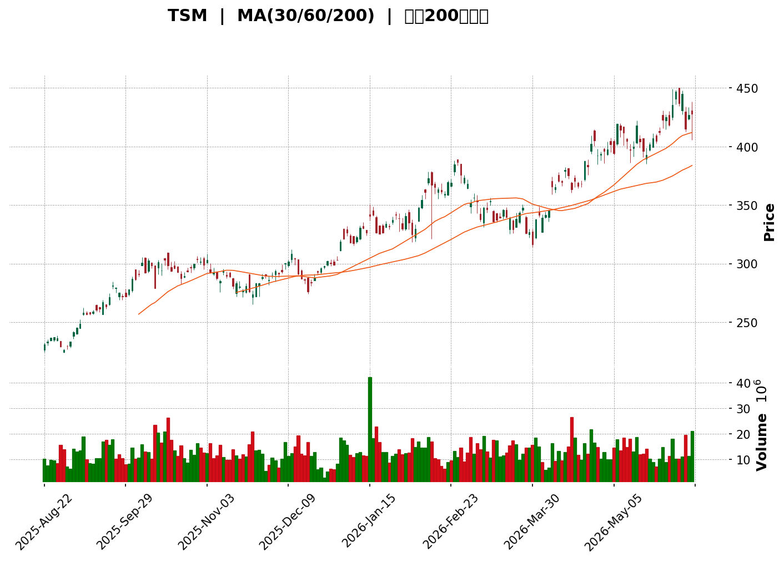
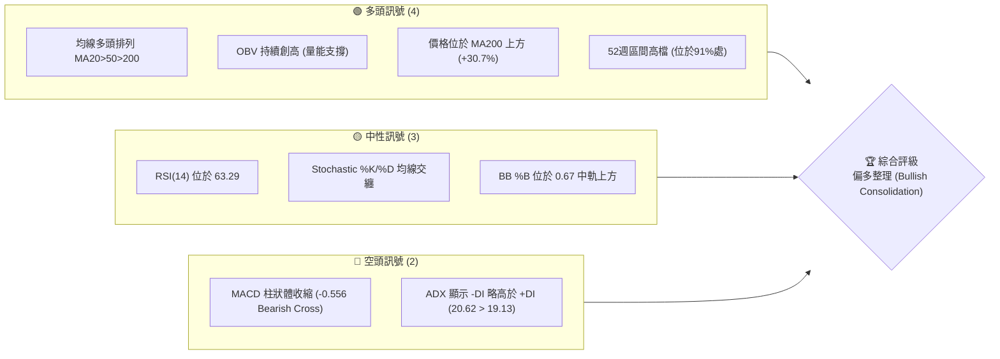
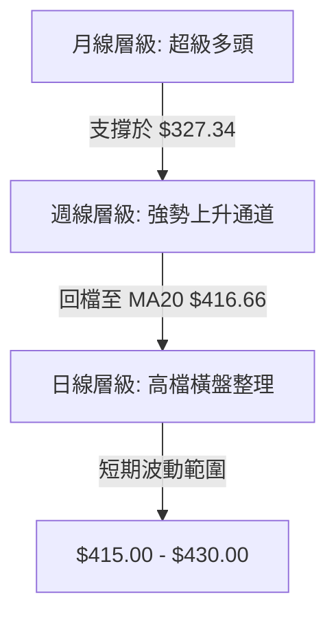
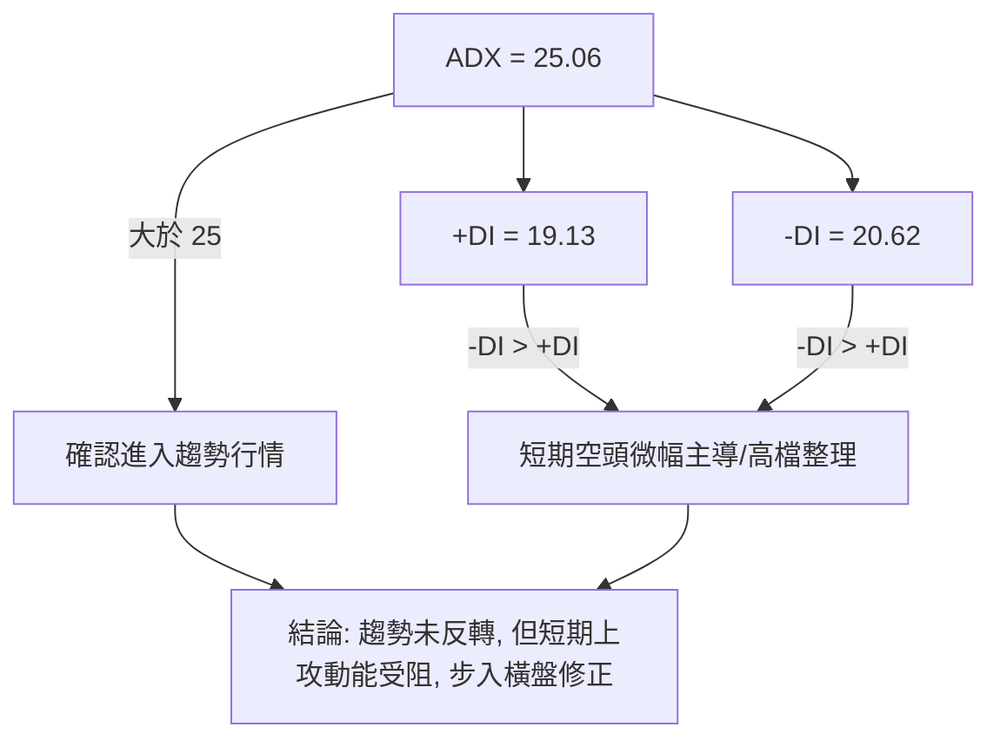
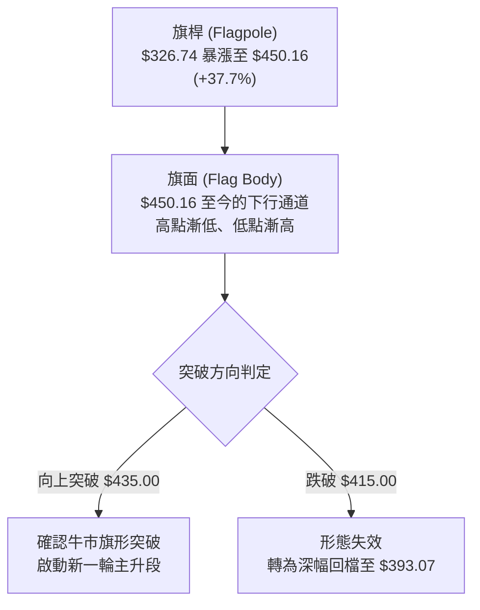
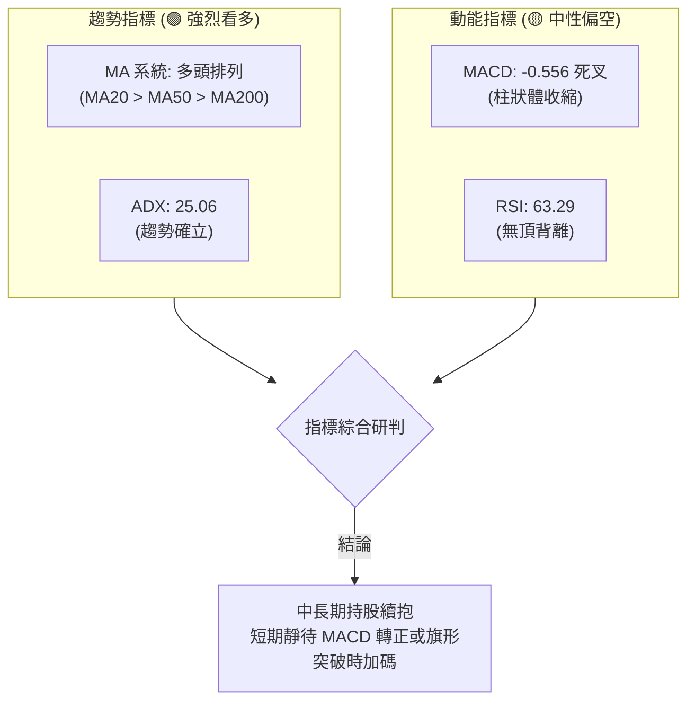

<details>
<summary>📊 靜態圖表 (點擊展開)</summary>

</details>

<html>
<head><meta charset="utf-8" /></head>
<body>
    <div style="height:500px; width:100%;">                        <script>window.PlotlyConfig = {MathJaxConfig: 'local'};</script>
        <script charset="utf-8" src="https://cdn.plot.ly/plotly-3.6.0.min.js" integrity="sha256-QaOVwtVY0T02VaHrr6pnoHLCwayMJp4O5n4YyaE3rJk=" crossorigin="anonymous"></script>                <div id="candlestick-chart" class="plotly-graph-div" style="height:100%; width:100%;"></div>            <script>                window.PLOTLYENV=window.PLOTLYENV || {};                                if (document.getElementById("candlestick-chart")) {                    Plotly.newPlot(                        "candlestick-chart",                        [{"close":{"dtype":"f8","bdata":"AAAAQGXfbEAAAACg4DFtQAAAAKAslW1AAAAAwEGnbUAAAAAA5oZtQAAAAOAjnGxAAAAAAHdNbEAAAAAAo6xsQAAAAKDSJW1AAAAAwPUpbkAAAACg4KFuQAAAAEA1GG9AAAAAYBwjcEAAAACA1wpwQAAAAACBEXBAAAAAYAUycEAAAADA60lwQAAAAICJVXBAAAAAgJ+ycEAAAABAonZwQAAAAKAc8nBAAAAAgIGScUAAAABgrnJxQAAAAMA8MnFAAAAAILr9cEAAAADAqPtwQAAAACAWXHFAAAAAwCjucUAAAABAbuhxQAAAACBaKXJAAAAAgNDLckAAAABgoUZyQAAAAECM7XJAAAAAYLejckAAAADA4nFxQAAAAKCc03JAAAAAwAVlckAAAABgkvByQAAAAGAUo3JAAAAAgFZXckAAAAAgB4FyQAAAAMBETnJAAAAA4K70cUAAAADgHhJyQAAAAMBtVXJAAAAAoMeJckAAAACg+L1yQAAAAECe9nJAAAAAwNzYckAAAADAd6xyQAAAAED18nJAAAAAwPJGckAAAADAbEByQAAAAEBp+nFAAAAAANDOcUAAAABgXFpyQAAAAEAfGXJAAAAAwF4QckAAAAAgZIpxQAAAAIAUtHFAAAAAAF6HcUAAAADAIEZxQAAAAIAYjXFAAAAAgJo\u002fcUAAAAAgxxhxQAAAAGA3sXFAAAAAQNqxcUAAAABA3gVyQAAAAECIHnJAAAAAoJbhcUAAAADAwidyQAAAAOA5XXJAAAAAgCA1ckAAAAAgnFFyQAAAAIBhw3JAAAAAwOLbckAAAACA+UZzQAAAAADl\u002f3JAAAAAwIIzckAAAABg5+5xQAAAAOAF4XFAAAAAgOhCcUAAAADAFL5xQAAAAKA1AnJAAAAAYEtHckAAAACg2YFyQAAAAMBdn3JAAAAAINPfckAAAAAAMcFyQAAAAKDPq3JAAAAAAJTwckAAAAAAZOtzQAAAACCDFXRAAAAAwChodEAAAACAjdxzQAAAAODc0XNAAAAAwIcrdEAAAACAZ610QAAAACB4pHRAAAAAwA1jdEAAAACA4Up1QAAAAKABV3VAAAAAANpjdEAAAAAgQlN0QAAAAMAzZ3RAAAAAYN3edEAAAADgZrx0QAAAAKA6FnVAAAAAIGlVdUAAAADAiCl1QAAAAEAZmnRAAAAAwGlGdUAAAADA5+x0QAAAAAAyTXRAAAAAoM+cdEAAAACg6r11QAAAAOCUJnZAAAAAAEqOdkAAAAAgn1B3QAAAAAAN8XZAAAAAAErVdkAAAACg07J2QAAAAKDfk3ZAAAAAoAl2dkAAAABA+xd3QAAAAAABEHdAAAAAQKgKeEAAAACgPyp4QAAAAAAFfHdAAAAAgHBYd0AAAABAKgF3QAAAAEA0AnZAAAAAYPhGdkAAAADg2Q12QAAAACABH3VAAAAAAIa7dUAAAADg1aF1QAAAAAAFGXZAAAAA4Dj8dEAAAAAAwBV1QAAAAGBiNHVAAAAAIK6fdUAAAADAHjl1QAAAAOCjLHVAAAAAANeTdEAAAABAMyd1QAAAAAAAdHVAAAAAAAC8dUAAAACAwmF0QAAAAADXa3RAAAAAAADIc0AAAABAMx91QAAAAADXV3VAAAAA4KMwdUAAAAAAKVx1QAAAAMAelXVAAAAAYGbedkAAAAAA19d2QAAAAKCZKXdAAAAAwB4Zd0AAAACAPb53QAAAAKCZcXdAAAAAoJm1dkAAAAAAACh3QAAAAADX43ZAAAAAoEcBd0AAAABACjd4QAAAAGCP6ndAAAAAIFwneUAAAAAgrk95QAAAAKBwhXhAAAAAoEedeEAAAADA9cB4QAAAAGC42nhAAAAAgMIZeUAAAABgj6Z4QAAAAAAAOHpAAAAAYGbieUAAAABA4bp5QAAAAOCjSHlAAAAA4HrUeEAAAADAzPx4QAAAACCFG3pAAAAAoJlFeUAAAABAM794QAAAAIDCiXhAAAAAgOsZeUAAAABgZnJ5QAAAAOBRSHlAAAAAwB7FeUAAAAAgrmt6QAAAAIDCjXpAAAAAQDMnekAAAACAFDp7QAAAAEAK63tAAAAAQApLe0AAAABguM57QAAAAGC48nlAAAAAwMysekAAAABguL56QA=="},"high":{"dtype":"f8","bdata":"Q4k3YLYNbUD37+7AfWdtQLw58\u002fqpmG1A54rzGr+qbUBvHIgPuNJtQMOxr25MPW1AWOoaRpprbEBPLvOgQ85sQOty8a\u002f+KG1AIAo2GiBObkCqy0RjxLduQLTk4qITkW9A2UoeisdkcEBZibA1JTZwQOA0UGkzK3BAJpnDeYtIcEDSmxysnY9wQGgWt+mtdXBAZogjHdvQcEB1Zi09r5FwQDrUW612LXFATHOiVNvGcUD5xjAfo3pxQDsuWRLgOXFAsin1dccfcUBW5h2vUGVxQLsPyr9EX3FAzw0igyQOckBCALoYb3FyQGs6jobuZnJA2b5BmMgZc0DZZ\u002f33mRZzQMsMIXB2C3NAZ4KCG6jSckCtiurZzqhyQOSi73ZM73JAL9AdvXjBckDrkzP9zQ5zQGOW\u002fsCLWnNA2a3GnyLackAha4NWtN9yQHeg\u002fN6Zm3JAJoaJYj9ZckDm7BXBlUdyQMeq35QBhXJAvnrJj0OtckBZAAm\u002fhMdyQJJsXyhJJHNATFr5UvEZc0A0d7mU1B9zQHo0892nRnNALnufTErFckAbTORLTYlyQMYvBDdWUHJANJFXN+7kcUBuMDQj9XdyQEn6ENrKVHJA0slCGf9TckDhnE+VjP5xQFksbVaK1HFAcceUJUrPcUBh5r1PaGpxQAF27q\u002fIr3FAnv4up9ozckDhxiztiVJxQII6Pyzmt3FAKjKxK0+9cUAcgn+7NzNyQBcpkoT9MHJARg18bfYYckCUmnjiG05yQA7oH8vXb3JA0NM1XqFGckBJdcXpWrJyQDuLxp5Qz3JA1tLTChjwckCOHcKzE4RzQP51GZuwD3NAdzDg4Mz2ckCwS51cgG9yQPtLVTNk+nFAjO3JRpoEckCy4d5UpuVxQP88nbCVNXJA8kimluVickDu\u002fIyzKpFyQNTkPzscpXJAkBzryHDockAT8gFsT\u002fpyQKP0S4wb+3JAWBvZt2soc0C0BB1W+wp0QC8CjYobpXRAZB\u002fsGE7CdECLccxMIVZ0QJ9fvi1pOXRAAE8tAbg9dEAUF4njzcl0QGSTRWmY93RA20uTGe6OdEC+quwZfOV1QEsrniHfzXVAhr3eeQRTdUBG4GGTPct0QOQ9HZy84XRAjM0+Aj4DdUDRmx\u002feiOJ0QFVBJYKoRHVABrKQi3eIdUD4PprGYmx1QOWr6mAeL3VAJzRW0LlzdUCHQulxMqF1QCZQrXCRHXVAHnPSDRTadED76qwczMt1QOT7t+ZuaXZA9ie10sK7dkD0ZHPwNqh3QPjPqGnqrndAmN3YVBMhd0BualObvNJ2QIjmNRCiBXdAPmo8I32cdkDQYwiFdzJ3QKK\u002f4FsXRndAzJrZBWJBeEBO6ggV0VF4QE3QZzIlFnhA+4af9PF5d0Ag\u002fbtz00B3QARk2xKtL3ZA8o3AvTSBdkDdrvvuW2d2QGlKNJ3Xu3VAEAmcEbHGdUCUzr95Gwh2QCcGjMOIRXZAwy0iFqWedUDKftGm1Hh1QBaAIxyWenVAAAAAACmsdUAAAABAM791QAAAAGBmPnVAAAAAoJkZdUAAAABgj3Z1QAAAAIAUjnVAAAAAQDPndUAAAABgj051QAAAAMD1mHRAAAAAoJmZdEAAAABgjyZ1QAAAAEDhynVAAAAAwB5hdUAAAABAM4N1QAAAAOB6mHVAAAAAwMxkd0AAAABguAJ3QAAAAAAAoHdAAAAAIFw3d0AAAABgj+J3QAAAACCu33dAAAAAQDMjd0AAAACgR3l3QAAAAMAeIXdAAAAAAAAsd0AAAABgjz54QAAAAAApTHhAAAAAANeXeUAAAAAAAOh5QAAAAIDr3XhAAAAAoJm9eEAAAADgo+x4QAAAAADXP3lAAAAAQDN7eUAAAACAFGJ5QAAAAEAzO3pAAAAAAABAekAAAAAAABB6QAAAACCue3lAAAAAANcjeUAAAABA4Up5QAAAACCFX3pAAAAAgOudeUAAAACAFG55QAAAAIAU7nhAAAAAgBQ+eUAAAAAgXLd5QAAAAGC4qnlAAAAAANcHekAAAADAzOh6QAAAAKCZuXpAAAAAQArnekAAAACAPRZ8QAAAAIAUBnxAAAAAYI8ifEAAAAAAKQB8QAAAAGBmHntAAAAAwPUce0AAAACgkGJ7QA=="},"hovertemplate":"\u003cb\u003e%{x|%Y-%m-%d}\u003c\u002fb\u003e\u003cbr\u003e\u958b: $%{open:.2f}\u003cbr\u003e\u9ad8: $%{high:.2f}\u003cbr\u003e\u4f4e: $%{low:.2f}\u003cbr\u003e\u6536: $%{close:.2f}\u003cextra\u003e\u003c\u002fextra\u003e","low":{"dtype":"f8","bdata":"WYZjeAkHbECKNbBK68dsQNjFyrFRNm1AE74mkB4tbUCDCLF24j5tQM8hs7vwkmxARbZdEuj1a0A7\u002fh1xIFRsQEIUya8OimxA+QCL8Sh7bUBCt7yNLPFtQOZRDfSgmW5AZKT+QOLwb0A6QOJDDgBwQFcQzmxvAnBA9pkwwk0IcEB5V2gi2TJwQOjXWp7YJHBAOgnfCQAJcEBQzevc2lVwQHrwN\u002fjcf3BA9KuZXWJncUA0os0sMTNxQLFL1T1Jy3BALDPmyiDScEAAAADAqPtwQHXVW8I0BXFABd36UVo6cUANIm3uPtdxQD5i0yJNDnJAVrB0vaukckBrFTFBsjpyQGASVbfVRXJAghNinZJ8ckD9xm5tomxxQHQ8xMNrK3JAEH1lp9MbckCXjjptvaZyQDnF8OT0cHJAD9qy2cpUckD7IoQH2HZyQD6yWEG+QHJANbgblGWtcUAqeM0BngByQNzP8fNbTHJAP3xvgDhBckDJzYMIQGdyQPz8wR1\u002fy3JAHoXdY6yyckD3CNUlzHByQAZUt+pbx3JA964nJ1s+ckD7b+9pXx5yQI+\u002fj5zQ3HFASODSYbc5cUD9IwO5WSJyQNR3Ox0p9XFARCwZSNL\u002fcUBlGFBjYmdxQGrTILmo+3BA9X9JfTNkcUBsUk1Oi\u002fNwQE8eHunTLHFAFHwjaEIucUDH5\u002fSTqZVwQIGy1NEF+3BAzivFsUX5cEDvuC5wYuJxQFl9kb2X9nFAxOKirSSacUBq8lbedPlxQM2QDHv4x3FAJ8AK8a8JckDkX4EVODpyQG1lXwhvcXJA\u002fPV94cGNckC6JCbyZ81yQMoDr9bErHJAe+cbM5kickBiK89P3+txQJjedvthqHFAvQA6o+kkcUCRv\u002fU4VY9xQDu9P3Q02XFAWO0fc0QmckD5Sg5LEDZyQExeLbRcdnJA5hF5GOaackA\u002ftVUg+ZxyQF549b68qXJAXUpgCz3pckAYw9\u002fJL21zQCeVycGLCXRAT5y7z9g6dECMWXG8UdpzQMzsy+UGtHNAA8mFK7HVc0ARWyyjhgJ0QHt87NKbnXRAlJMLW4Q+dEC2lG8whw91QEvBlDECSHVAGBMW\u002frNfdEDC02bwPEx0QHjNyAi0X3RAUiVZqAWndEATEPNq1ZR0QBR4J0Hr2XRAEcTBpFUbdUBvl3\u002fhcXR0QPm8rO3NgnRA9YD5+c2CdEDALc6Se5F0QEKOGoTG4nNAh\u002fUyZgfsc0C2ULXJQ\u002ft0QCeg5NUprXVAlIYpqDc2dkDQE0OarfV2QCLkKm8eE3RASgoTthl8dkAha+j80jN2QKIp9pYke3ZAgXvwU\u002fhGdkBPiluqdGF2QMkuB3Ti1nZAg9krpORvd0DnBZOA+vt3QOa5Y1SUCndAcd5J+Fj5dkDX0\u002f50Abp2QEqavrfEcnVA0ogQI9wYdkBulS3oV211QJbVDTLn+3RA0WK8P8yvdEAxmej+enV1QA6k3xYC1nVA1CVBDPX2dEDugfxtZ\u002fR0QOA1ArjXLXVAAAAAYGYmdUAAAACgcDV1QAAAAEAKU3RAAAAAYGZedEAAAACgmbF0QAAAAOBR4HRAAAAAAAB4dUAAAACA61V0QAAAAMD1JHRAAAAAwMycc0AAAACAPRJ0QAAAAAAAPHVAAAAAwMxsdEAAAACA6yl1QAAAAGBm+nRAAAAAANdzdkAAAAAghYt2QAAAAAAAHHdAAAAAwMzgdkAAAAAghVN3QAAAACBcQ3dAAAAAwMyIdkAAAACAPdJ2QAAAAAAAxHZAAAAAgMLRdkAAAACAPSp3QAAAAMD1fHdAAAAAoJmdeEAAAABgZgZ5QAAAAEAzC3hAAAAAQOFCeEAAAAAgXBt4QAAAAIAUgnhAAAAAQDOzeEAAAACgmYl4QAAAAGBmCnlAAAAAgMKBeUAAAACAFA55QAAAAEAK43hAAAAAgOsheEAAAAAghXd4QAAAAKCZIXlAAAAAoEfteEAAAADAzHB4QAAAAMD1EHhAAAAAQDO\u002feEAAAAAAKfh4QAAAAIDCLXlAAAAAwB6heUAAAACAFPZ5QAAAACBc63lAAAAAAAAUekAAAAAAAGh6QAAAAAApQHtAAAAA4Hooe0AAAADAzLR6QAAAAOCjzHlAAAAA4HpoekAAAACgmVl5QA=="},"name":"\u50f9\u683c","open":{"dtype":"f8","bdata":"+N8FlhdBbED6Ef8d9AhtQBKfNl2fSm1A+W3LDnxabUCoQvnlZkhtQFeiuxPPOW1AILflF2cGbECq9zrRwrBsQHcsZSVeq2xAaevLCGXFbUCj8CaL6fxtQOZRDfSgmW5AvFqLEjUKcECjJ8rkriFwQC98eFGdKXBAWTDKnCEccEAXLhaAV4dwQHOap10zbnBAQzy0dlEJcEB9TJJ9gI5wQJCJGRA1kXBA45UMupKNcUCTxpwAUWxxQD1jQ4zo+XBAbWgmMikGcUC66lNBiC9xQCjHe1nqHHFABYjQnI9OcUC3xRxZQG5yQEIB0EsDNHJAQz0a6silckDnqZ2l9g5zQKJ0i6IQVnJAP+N072HKckACBdMg\u002faRyQAL+aMeeiXJAOv8U+hZgckDnvr6QtglzQCSDGmiLU3NAqRiAhyqMckAmyVwcoKVyQB3AurK2lXJAnVMqpj02ckC6jG1uUgNyQE5lXqUiX3JAETBv\u002fySQckDBRoa+5IpyQOzWWGXqAXNA1EC2ZqLWckDlU8Rd8ARzQFJTwnbWznJAOzJ7zvpzckA0FfW0MTByQA6SWX6+R3JAUGZ3KEm6cUB42yN74UtyQOd9SJhIJ3JA17g3LmFBckAQH4ViTPlxQEryCKhNJnFA6RcpFEx+cUAeEz06ZkBxQP3YKwhgNnFAnYGzjqspckBTlbfD+fRwQIGy1NEF+3BA+zXgAtOScUALDN0aL\u002fhxQJ74R4v3LXJAlP222n7VcUCNW4YmVCZyQMooRXgxKXJAPj04vtVFckC7qjLRxWZyQIADMlS4uHJAKYDCWHelckCyY5jaEvtyQCMLMbdkB3NAdzDg4Mz2ckAacrV3IWVyQNeN4uI+53FAQppAFoL7cUDNjyDRL8NxQDu9P3Q02XFAPH9s4HhdckBMSISbNUlyQCoBLTN0jnJAyOtstuqwckAFjCia6c5yQGfW9YAq2HJAsGvyO1XyckBYX+Nwp3FzQByb\u002frKLl3RAxfSMg6yUdECvnEevHzx0QHOYzvGnN3RAGVlJnObuc0CT6PaKHhN0QFep\u002fWT0vnRA20uTGe6OdEDLT9FIjF11QGzzbvKUmHVAVI3loFE9dUCMSC6+48d0QA+Kk\u002f66x3RAjLXX2TCydEDSXz20rb10QE1OQC3f+HRA7zgd2Q5hdUD1ymbfhS11QJmOmPCj53RAWk4NP0qddED0ALE7m4F1QAdf8SSD6nRATZ0PSpsedEDqV0eh0wh1QDIcUQl7vHVArrC7Zea0dkBjNfpGpBB3QON7E+z1nndApfqpw80Bd0DnBwSxpo12QOo+2LVmrXZAkQQi9lhrdkB81toWTmx2QJGIef+o33ZAALextVeld0BO6ggV0VF4QOQS3qiEEXhA2QDDeZkRd0C6fBBpVcV2QK+WBLQVyXVAeRV+fc9GdkBk3cfHcR52QCbYRJGOaHVA8UIxJYPqdECZRP592rd1QLByPcD3DnZAMqWw4lOPdUCmrJcOQm91QOz5xIKoRHVAAAAAoJlJdUAAAADgepx1QAAAACCFk3RAAAAAQOEKdUAAAACgmbF0QAAAAMAe+XRAAAAAAACgdUAAAADAHj11QAAAAKBHTXRAAAAAQDNzdEAAAADA9SR0QAAAAGBmfnVAAAAAoHBtdEAAAAAAADx1QAAAAEAKN3VAAAAA4KMkd0AAAADAzLR2QAAAAKBweXdAAAAAACkkd0AAAADgo7B3QAAAAGCP1ndAAAAAgMINd0AAAABAM1N3QAAAACCFE3dAAAAAoEcBd0AAAADgejx3QAAAAAAABHhAAAAAgD3CeEAAAAAAANx5QAAAAIDrgXhAAAAAYI+OeEAAAADA9dx4QAAAAEAKl3hAAAAA4FFIeUAAAACgmUl5QAAAAGBmJnlAAAAAoHAhekAAAABAMw96QAAAAADXa3lAAAAAAADceEAAAADgUeR4QAAAACBcM3lAAAAAAABoeUAAAACAFG55QAAAAAApWHhAAAAAAADQeEAAAAAAKfh4QAAAAEDhlnlAAAAAgOvReUAAAADgUbB6QAAAACCFY3pAAAAAwB6xekAAAACAFI56QAAAAKBHiXtAAAAAANcffEAAAACAFOp6QAAAAOBR3HpAAAAA4FF8ekAAAACAFO56QA=="},"x":["2025-08-22T00:00:00-04:00","2025-08-25T00:00:00-04:00","2025-08-26T00:00:00-04:00","2025-08-27T00:00:00-04:00","2025-08-28T00:00:00-04:00","2025-08-29T00:00:00-04:00","2025-09-02T00:00:00-04:00","2025-09-03T00:00:00-04:00","2025-09-04T00:00:00-04:00","2025-09-05T00:00:00-04:00","2025-09-08T00:00:00-04:00","2025-09-09T00:00:00-04:00","2025-09-10T00:00:00-04:00","2025-09-11T00:00:00-04:00","2025-09-12T00:00:00-04:00","2025-09-15T00:00:00-04:00","2025-09-16T00:00:00-04:00","2025-09-17T00:00:00-04:00","2025-09-18T00:00:00-04:00","2025-09-19T00:00:00-04:00","2025-09-22T00:00:00-04:00","2025-09-23T00:00:00-04:00","2025-09-24T00:00:00-04:00","2025-09-25T00:00:00-04:00","2025-09-26T00:00:00-04:00","2025-09-29T00:00:00-04:00","2025-09-30T00:00:00-04:00","2025-10-01T00:00:00-04:00","2025-10-02T00:00:00-04:00","2025-10-03T00:00:00-04:00","2025-10-06T00:00:00-04:00","2025-10-07T00:00:00-04:00","2025-10-08T00:00:00-04:00","2025-10-09T00:00:00-04:00","2025-10-10T00:00:00-04:00","2025-10-13T00:00:00-04:00","2025-10-14T00:00:00-04:00","2025-10-15T00:00:00-04:00","2025-10-16T00:00:00-04:00","2025-10-17T00:00:00-04:00","2025-10-20T00:00:00-04:00","2025-10-21T00:00:00-04:00","2025-10-22T00:00:00-04:00","2025-10-23T00:00:00-04:00","2025-10-24T00:00:00-04:00","2025-10-27T00:00:00-04:00","2025-10-28T00:00:00-04:00","2025-10-29T00:00:00-04:00","2025-10-30T00:00:00-04:00","2025-10-31T00:00:00-04:00","2025-11-03T00:00:00-05:00","2025-11-04T00:00:00-05:00","2025-11-05T00:00:00-05:00","2025-11-06T00:00:00-05:00","2025-11-07T00:00:00-05:00","2025-11-10T00:00:00-05:00","2025-11-11T00:00:00-05:00","2025-11-12T00:00:00-05:00","2025-11-13T00:00:00-05:00","2025-11-14T00:00:00-05:00","2025-11-17T00:00:00-05:00","2025-11-18T00:00:00-05:00","2025-11-19T00:00:00-05:00","2025-11-20T00:00:00-05:00","2025-11-21T00:00:00-05:00","2025-11-24T00:00:00-05:00","2025-11-25T00:00:00-05:00","2025-11-26T00:00:00-05:00","2025-11-28T00:00:00-05:00","2025-12-01T00:00:00-05:00","2025-12-02T00:00:00-05:00","2025-12-03T00:00:00-05:00","2025-12-04T00:00:00-05:00","2025-12-05T00:00:00-05:00","2025-12-08T00:00:00-05:00","2025-12-09T00:00:00-05:00","2025-12-10T00:00:00-05:00","2025-12-11T00:00:00-05:00","2025-12-12T00:00:00-05:00","2025-12-15T00:00:00-05:00","2025-12-16T00:00:00-05:00","2025-12-17T00:00:00-05:00","2025-12-18T00:00:00-05:00","2025-12-19T00:00:00-05:00","2025-12-22T00:00:00-05:00","2025-12-23T00:00:00-05:00","2025-12-24T00:00:00-05:00","2025-12-26T00:00:00-05:00","2025-12-29T00:00:00-05:00","2025-12-30T00:00:00-05:00","2025-12-31T00:00:00-05:00","2026-01-02T00:00:00-05:00","2026-01-05T00:00:00-05:00","2026-01-06T00:00:00-05:00","2026-01-07T00:00:00-05:00","2026-01-08T00:00:00-05:00","2026-01-09T00:00:00-05:00","2026-01-12T00:00:00-05:00","2026-01-13T00:00:00-05:00","2026-01-14T00:00:00-05:00","2026-01-15T00:00:00-05:00","2026-01-16T00:00:00-05:00","2026-01-20T00:00:00-05:00","2026-01-21T00:00:00-05:00","2026-01-22T00:00:00-05:00","2026-01-23T00:00:00-05:00","2026-01-26T00:00:00-05:00","2026-01-27T00:00:00-05:00","2026-01-28T00:00:00-05:00","2026-01-29T00:00:00-05:00","2026-01-30T00:00:00-05:00","2026-02-02T00:00:00-05:00","2026-02-03T00:00:00-05:00","2026-02-04T00:00:00-05:00","2026-02-05T00:00:00-05:00","2026-02-06T00:00:00-05:00","2026-02-09T00:00:00-05:00","2026-02-10T00:00:00-05:00","2026-02-11T00:00:00-05:00","2026-02-12T00:00:00-05:00","2026-02-13T00:00:00-05:00","2026-02-17T00:00:00-05:00","2026-02-18T00:00:00-05:00","2026-02-19T00:00:00-05:00","2026-02-20T00:00:00-05:00","2026-02-23T00:00:00-05:00","2026-02-24T00:00:00-05:00","2026-02-25T00:00:00-05:00","2026-02-26T00:00:00-05:00","2026-02-27T00:00:00-05:00","2026-03-02T00:00:00-05:00","2026-03-03T00:00:00-05:00","2026-03-04T00:00:00-05:00","2026-03-05T00:00:00-05:00","2026-03-06T00:00:00-05:00","2026-03-09T00:00:00-04:00","2026-03-10T00:00:00-04:00","2026-03-11T00:00:00-04:00","2026-03-12T00:00:00-04:00","2026-03-13T00:00:00-04:00","2026-03-16T00:00:00-04:00","2026-03-17T00:00:00-04:00","2026-03-18T00:00:00-04:00","2026-03-19T00:00:00-04:00","2026-03-20T00:00:00-04:00","2026-03-23T00:00:00-04:00","2026-03-24T00:00:00-04:00","2026-03-25T00:00:00-04:00","2026-03-26T00:00:00-04:00","2026-03-27T00:00:00-04:00","2026-03-30T00:00:00-04:00","2026-03-31T00:00:00-04:00","2026-04-01T00:00:00-04:00","2026-04-02T00:00:00-04:00","2026-04-06T00:00:00-04:00","2026-04-07T00:00:00-04:00","2026-04-08T00:00:00-04:00","2026-04-09T00:00:00-04:00","2026-04-10T00:00:00-04:00","2026-04-13T00:00:00-04:00","2026-04-14T00:00:00-04:00","2026-04-15T00:00:00-04:00","2026-04-16T00:00:00-04:00","2026-04-17T00:00:00-04:00","2026-04-20T00:00:00-04:00","2026-04-21T00:00:00-04:00","2026-04-22T00:00:00-04:00","2026-04-23T00:00:00-04:00","2026-04-24T00:00:00-04:00","2026-04-27T00:00:00-04:00","2026-04-28T00:00:00-04:00","2026-04-29T00:00:00-04:00","2026-04-30T00:00:00-04:00","2026-05-01T00:00:00-04:00","2026-05-04T00:00:00-04:00","2026-05-05T00:00:00-04:00","2026-05-06T00:00:00-04:00","2026-05-07T00:00:00-04:00","2026-05-08T00:00:00-04:00","2026-05-11T00:00:00-04:00","2026-05-12T00:00:00-04:00","2026-05-13T00:00:00-04:00","2026-05-14T00:00:00-04:00","2026-05-15T00:00:00-04:00","2026-05-18T00:00:00-04:00","2026-05-19T00:00:00-04:00","2026-05-20T00:00:00-04:00","2026-05-21T00:00:00-04:00","2026-05-22T00:00:00-04:00","2026-05-26T00:00:00-04:00","2026-05-27T00:00:00-04:00","2026-05-28T00:00:00-04:00","2026-05-29T00:00:00-04:00","2026-06-01T00:00:00-04:00","2026-06-02T00:00:00-04:00","2026-06-03T00:00:00-04:00","2026-06-04T00:00:00-04:00","2026-06-05T00:00:00-04:00","2026-06-08T00:00:00-04:00","2026-06-09T00:00:00-04:00"],"type":"candlestick"},{"hovertemplate":"MA30: $%{y:.2f}\u003cextra\u003e\u003c\u002fextra\u003e","line":{"color":"#2196F3","dash":"dash","width":2},"mode":"lines","name":"MA30","x":["2025-08-22T00:00:00-04:00","2025-08-25T00:00:00-04:00","2025-08-26T00:00:00-04:00","2025-08-27T00:00:00-04:00","2025-08-28T00:00:00-04:00","2025-08-29T00:00:00-04:00","2025-09-02T00:00:00-04:00","2025-09-03T00:00:00-04:00","2025-09-04T00:00:00-04:00","2025-09-05T00:00:00-04:00","2025-09-08T00:00:00-04:00","2025-09-09T00:00:00-04:00","2025-09-10T00:00:00-04:00","2025-09-11T00:00:00-04:00","2025-09-12T00:00:00-04:00","2025-09-15T00:00:00-04:00","2025-09-16T00:00:00-04:00","2025-09-17T00:00:00-04:00","2025-09-18T00:00:00-04:00","2025-09-19T00:00:00-04:00","2025-09-22T00:00:00-04:00","2025-09-23T00:00:00-04:00","2025-09-24T00:00:00-04:00","2025-09-25T00:00:00-04:00","2025-09-26T00:00:00-04:00","2025-09-29T00:00:00-04:00","2025-09-30T00:00:00-04:00","2025-10-01T00:00:00-04:00","2025-10-02T00:00:00-04:00","2025-10-03T00:00:00-04:00","2025-10-06T00:00:00-04:00","2025-10-07T00:00:00-04:00","2025-10-08T00:00:00-04:00","2025-10-09T00:00:00-04:00","2025-10-10T00:00:00-04:00","2025-10-13T00:00:00-04:00","2025-10-14T00:00:00-04:00","2025-10-15T00:00:00-04:00","2025-10-16T00:00:00-04:00","2025-10-17T00:00:00-04:00","2025-10-20T00:00:00-04:00","2025-10-21T00:00:00-04:00","2025-10-22T00:00:00-04:00","2025-10-23T00:00:00-04:00","2025-10-24T00:00:00-04:00","2025-10-27T00:00:00-04:00","2025-10-28T00:00:00-04:00","2025-10-29T00:00:00-04:00","2025-10-30T00:00:00-04:00","2025-10-31T00:00:00-04:00","2025-11-03T00:00:00-05:00","2025-11-04T00:00:00-05:00","2025-11-05T00:00:00-05:00","2025-11-06T00:00:00-05:00","2025-11-07T00:00:00-05:00","2025-11-10T00:00:00-05:00","2025-11-11T00:00:00-05:00","2025-11-12T00:00:00-05:00","2025-11-13T00:00:00-05:00","2025-11-14T00:00:00-05:00","2025-11-17T00:00:00-05:00","2025-11-18T00:00:00-05:00","2025-11-19T00:00:00-05:00","2025-11-20T00:00:00-05:00","2025-11-21T00:00:00-05:00","2025-11-24T00:00:00-05:00","2025-11-25T00:00:00-05:00","2025-11-26T00:00:00-05:00","2025-11-28T00:00:00-05:00","2025-12-01T00:00:00-05:00","2025-12-02T00:00:00-05:00","2025-12-03T00:00:00-05:00","2025-12-04T00:00:00-05:00","2025-12-05T00:00:00-05:00","2025-12-08T00:00:00-05:00","2025-12-09T00:00:00-05:00","2025-12-10T00:00:00-05:00","2025-12-11T00:00:00-05:00","2025-12-12T00:00:00-05:00","2025-12-15T00:00:00-05:00","2025-12-16T00:00:00-05:00","2025-12-17T00:00:00-05:00","2025-12-18T00:00:00-05:00","2025-12-19T00:00:00-05:00","2025-12-22T00:00:00-05:00","2025-12-23T00:00:00-05:00","2025-12-24T00:00:00-05:00","2025-12-26T00:00:00-05:00","2025-12-29T00:00:00-05:00","2025-12-30T00:00:00-05:00","2025-12-31T00:00:00-05:00","2026-01-02T00:00:00-05:00","2026-01-05T00:00:00-05:00","2026-01-06T00:00:00-05:00","2026-01-07T00:00:00-05:00","2026-01-08T00:00:00-05:00","2026-01-09T00:00:00-05:00","2026-01-12T00:00:00-05:00","2026-01-13T00:00:00-05:00","2026-01-14T00:00:00-05:00","2026-01-15T00:00:00-05:00","2026-01-16T00:00:00-05:00","2026-01-20T00:00:00-05:00","2026-01-21T00:00:00-05:00","2026-01-22T00:00:00-05:00","2026-01-23T00:00:00-05:00","2026-01-26T00:00:00-05:00","2026-01-27T00:00:00-05:00","2026-01-28T00:00:00-05:00","2026-01-29T00:00:00-05:00","2026-01-30T00:00:00-05:00","2026-02-02T00:00:00-05:00","2026-02-03T00:00:00-05:00","2026-02-04T00:00:00-05:00","2026-02-05T00:00:00-05:00","2026-02-06T00:00:00-05:00","2026-02-09T00:00:00-05:00","2026-02-10T00:00:00-05:00","2026-02-11T00:00:00-05:00","2026-02-12T00:00:00-05:00","2026-02-13T00:00:00-05:00","2026-02-17T00:00:00-05:00","2026-02-18T00:00:00-05:00","2026-02-19T00:00:00-05:00","2026-02-20T00:00:00-05:00","2026-02-23T00:00:00-05:00","2026-02-24T00:00:00-05:00","2026-02-25T00:00:00-05:00","2026-02-26T00:00:00-05:00","2026-02-27T00:00:00-05:00","2026-03-02T00:00:00-05:00","2026-03-03T00:00:00-05:00","2026-03-04T00:00:00-05:00","2026-03-05T00:00:00-05:00","2026-03-06T00:00:00-05:00","2026-03-09T00:00:00-04:00","2026-03-10T00:00:00-04:00","2026-03-11T00:00:00-04:00","2026-03-12T00:00:00-04:00","2026-03-13T00:00:00-04:00","2026-03-16T00:00:00-04:00","2026-03-17T00:00:00-04:00","2026-03-18T00:00:00-04:00","2026-03-19T00:00:00-04:00","2026-03-20T00:00:00-04:00","2026-03-23T00:00:00-04:00","2026-03-24T00:00:00-04:00","2026-03-25T00:00:00-04:00","2026-03-26T00:00:00-04:00","2026-03-27T00:00:00-04:00","2026-03-30T00:00:00-04:00","2026-03-31T00:00:00-04:00","2026-04-01T00:00:00-04:00","2026-04-02T00:00:00-04:00","2026-04-06T00:00:00-04:00","2026-04-07T00:00:00-04:00","2026-04-08T00:00:00-04:00","2026-04-09T00:00:00-04:00","2026-04-10T00:00:00-04:00","2026-04-13T00:00:00-04:00","2026-04-14T00:00:00-04:00","2026-04-15T00:00:00-04:00","2026-04-16T00:00:00-04:00","2026-04-17T00:00:00-04:00","2026-04-20T00:00:00-04:00","2026-04-21T00:00:00-04:00","2026-04-22T00:00:00-04:00","2026-04-23T00:00:00-04:00","2026-04-24T00:00:00-04:00","2026-04-27T00:00:00-04:00","2026-04-28T00:00:00-04:00","2026-04-29T00:00:00-04:00","2026-04-30T00:00:00-04:00","2026-05-01T00:00:00-04:00","2026-05-04T00:00:00-04:00","2026-05-05T00:00:00-04:00","2026-05-06T00:00:00-04:00","2026-05-07T00:00:00-04:00","2026-05-08T00:00:00-04:00","2026-05-11T00:00:00-04:00","2026-05-12T00:00:00-04:00","2026-05-13T00:00:00-04:00","2026-05-14T00:00:00-04:00","2026-05-15T00:00:00-04:00","2026-05-18T00:00:00-04:00","2026-05-19T00:00:00-04:00","2026-05-20T00:00:00-04:00","2026-05-21T00:00:00-04:00","2026-05-22T00:00:00-04:00","2026-05-26T00:00:00-04:00","2026-05-27T00:00:00-04:00","2026-05-28T00:00:00-04:00","2026-05-29T00:00:00-04:00","2026-06-01T00:00:00-04:00","2026-06-02T00:00:00-04:00","2026-06-03T00:00:00-04:00","2026-06-04T00:00:00-04:00","2026-06-05T00:00:00-04:00","2026-06-08T00:00:00-04:00","2026-06-09T00:00:00-04:00"],"y":{"dtype":"f8","bdata":"AAAAAAAA+H8AAAAAAAD4fwAAAAAAAPh\u002fAAAAAAAA+H8AAAAAAAD4fwAAAAAAAPh\u002fAAAAAAAA+H8AAAAAAAD4fwAAAAAAAPh\u002fAAAAAAAA+H8AAAAAAAD4fwAAAAAAAPh\u002fAAAAAAAA+H8AAAAAAAD4fwAAAAAAAPh\u002fAAAAAAAA+H8AAAAAAAD4fwAAAAAAAPh\u002fAAAAAAAA+H8AAAAAAAD4fwAAAAAAAPh\u002fAAAAAAAA+H8AAAAAAAD4fwAAAAAAAPh\u002fAAAAAAAA+H8AAAAAAAD4fwAAAAAAAPh\u002fAAAAAAAA+H8AAAAAAAD4f4mIiCBiDHBAq6qqUpYxcEB3d3cX+lBwQGZmZo5GdHBA7+7u1s+UcEBmZmZusatwQO\u002fu7h5H0nBAvLu7y3z2cECamZk5wx1xQLy7u1NvQHFAZmZmLj9ccUBEREQkc3dxQERERBT9jnFAZmZm9oGecUBEREQk0a9xQFVVVdUlw3FAZmZmxiPXcUAzMzMjE+xxQDMzM8OCAnJAMzMzI9oUckBmZmaWtidyQAAAAODOOHJAZmZmptI+ckBERERUrkVyQKuqqnpaTHJAzczMrFJTckBERERUA19yQO\u002fu7m5QZXJA3t3dXXRmckBVVVXlUWNyQM3MzCxpX3JA7+7ujphUckDNzMy8C0xyQFVVVSVMQHJAERERUW00ckDe3d3tdDFyQDMzM+PGJ3JAiYiI+M0hckCrqqoq+xlyQImIiBiQFXJAzczMTKMRckDe3d2NqQ5yQBERETEpD3JAzczMHE8RckAzMzPjbBNyQFVVVSUXF3JAiYiIyNMZckARERHhZB5yQJqZmQm0HnJAmpmZCTEZckDNzMxs3xJyQImIiNi9CXJAZmZm1hIBckAiIiKSuvxxQN7d3R39\u002fHFAq6qqOgEBckBEREQ0UgJyQBEREcHLBnJAiYiICLYNckAiIiIyEhhyQKuqqipUIHJAAAAAgF4sckDv7u7O8UJyQGZmZvaOWHJAMzMzo4JzckARERFRGotyQHd3d\u002fdBnXJAmpmZWWGyckDv7u4OCMlyQN7d3Q2Q3nJARERE5PHzckDv7u4utw5zQFVVVbUbKHNA3t3dfbs6c0AAAACg2ktzQJqZmRnZWXNAZmZmlgNrc0CrqqoqdndzQCIiItJFiXNAMzMzswCkc0DNzMycjr9zQN7d3f3K1nNAiYiICAv5c0AzMzMzNBR0QFVVVSXFJ3RARERE9K87dEDv7u4eSld0QO\u002fu7o5ldXRAvLu768+UdEDe3d39ubt0QImIiPgq4HRAzczMPGQBdUCJiIgoGxl1QCIiIoJiLnVAERERAeo\u002fdUCrqqq6flt1QJqZmZkqd3VAd3d3NzSYdUB3d3cn97V1QFVVVZU3znVAvLu7m3bndUAiIiKiEvZ1QFVVVYXH+3VAIiIiIuILdkDNzMzsohp2QO\u002fu7l7DIHZAMzMzUx4odkCJiIgoxC92QBEREYFkOHZA3t3dbWs1dkCrqqqawjR2QM3MzCznOXZAvLu76+A8dkCamZlJaz92QERERATeRnZAZmZmdpFGdkCamZlZi0F2QERERHSXO3ZAzczM\u002fJQ0dkAiIiKijRt2QFVVVdULBnZAVVVV1QDsdUDe3d2NjN51QLy7u7sD1HVAIiIiAivJdUC8u7u7X7p1QHd3d5e+rXVAVVVVZbyjdUBERESkdJh1QERERFS1lXVAERERAZmTdUAiIiJy5pl1QO\u002fu7o4lpnVAmpmZmdWpdUBVVVVFPbN1QHd3d3dVwnVAERERQTHNdUCJiIiIO+N1QFVVVSXA8nVAMzMzY1IWdkC8u7vbYjp2QCIiIiKwVnZAAAAAQDVwdkBEREQEVo52QJqZmRm9rXZAREREBFbUdkC8u7trLvJ2QGZmZhbZGndAZmZm5kI+d0Dv7u4O5mt3QKuqqlpklXdAREREhHnAd0CamZkZduF3QJqZmQkeCnhAd3d3B\u002fMseEBVVVXF2Ul4QN7d3W0SY3hAZmZmZh92eEARERFhV4x4QGZmZpZunnhAMzMzYzu1eECamZl5FMx4QO\u002fu7l6e5nhAvLu7WwEEeUBmZmbGvSZ5QCIiIuKlUXlAAAAAcD12eUAAAABg5ZR5QDMzMxM8pnlAvLu7SzezeUDv7u5ec795QA=="},"type":"scatter"},{"hovertemplate":"MA60: $%{y:.2f}\u003cextra\u003e\u003c\u002fextra\u003e","line":{"color":"#9C27B0","dash":"dash","width":2},"mode":"lines","name":"MA60","x":["2025-08-22T00:00:00-04:00","2025-08-25T00:00:00-04:00","2025-08-26T00:00:00-04:00","2025-08-27T00:00:00-04:00","2025-08-28T00:00:00-04:00","2025-08-29T00:00:00-04:00","2025-09-02T00:00:00-04:00","2025-09-03T00:00:00-04:00","2025-09-04T00:00:00-04:00","2025-09-05T00:00:00-04:00","2025-09-08T00:00:00-04:00","2025-09-09T00:00:00-04:00","2025-09-10T00:00:00-04:00","2025-09-11T00:00:00-04:00","2025-09-12T00:00:00-04:00","2025-09-15T00:00:00-04:00","2025-09-16T00:00:00-04:00","2025-09-17T00:00:00-04:00","2025-09-18T00:00:00-04:00","2025-09-19T00:00:00-04:00","2025-09-22T00:00:00-04:00","2025-09-23T00:00:00-04:00","2025-09-24T00:00:00-04:00","2025-09-25T00:00:00-04:00","2025-09-26T00:00:00-04:00","2025-09-29T00:00:00-04:00","2025-09-30T00:00:00-04:00","2025-10-01T00:00:00-04:00","2025-10-02T00:00:00-04:00","2025-10-03T00:00:00-04:00","2025-10-06T00:00:00-04:00","2025-10-07T00:00:00-04:00","2025-10-08T00:00:00-04:00","2025-10-09T00:00:00-04:00","2025-10-10T00:00:00-04:00","2025-10-13T00:00:00-04:00","2025-10-14T00:00:00-04:00","2025-10-15T00:00:00-04:00","2025-10-16T00:00:00-04:00","2025-10-17T00:00:00-04:00","2025-10-20T00:00:00-04:00","2025-10-21T00:00:00-04:00","2025-10-22T00:00:00-04:00","2025-10-23T00:00:00-04:00","2025-10-24T00:00:00-04:00","2025-10-27T00:00:00-04:00","2025-10-28T00:00:00-04:00","2025-10-29T00:00:00-04:00","2025-10-30T00:00:00-04:00","2025-10-31T00:00:00-04:00","2025-11-03T00:00:00-05:00","2025-11-04T00:00:00-05:00","2025-11-05T00:00:00-05:00","2025-11-06T00:00:00-05:00","2025-11-07T00:00:00-05:00","2025-11-10T00:00:00-05:00","2025-11-11T00:00:00-05:00","2025-11-12T00:00:00-05:00","2025-11-13T00:00:00-05:00","2025-11-14T00:00:00-05:00","2025-11-17T00:00:00-05:00","2025-11-18T00:00:00-05:00","2025-11-19T00:00:00-05:00","2025-11-20T00:00:00-05:00","2025-11-21T00:00:00-05:00","2025-11-24T00:00:00-05:00","2025-11-25T00:00:00-05:00","2025-11-26T00:00:00-05:00","2025-11-28T00:00:00-05:00","2025-12-01T00:00:00-05:00","2025-12-02T00:00:00-05:00","2025-12-03T00:00:00-05:00","2025-12-04T00:00:00-05:00","2025-12-05T00:00:00-05:00","2025-12-08T00:00:00-05:00","2025-12-09T00:00:00-05:00","2025-12-10T00:00:00-05:00","2025-12-11T00:00:00-05:00","2025-12-12T00:00:00-05:00","2025-12-15T00:00:00-05:00","2025-12-16T00:00:00-05:00","2025-12-17T00:00:00-05:00","2025-12-18T00:00:00-05:00","2025-12-19T00:00:00-05:00","2025-12-22T00:00:00-05:00","2025-12-23T00:00:00-05:00","2025-12-24T00:00:00-05:00","2025-12-26T00:00:00-05:00","2025-12-29T00:00:00-05:00","2025-12-30T00:00:00-05:00","2025-12-31T00:00:00-05:00","2026-01-02T00:00:00-05:00","2026-01-05T00:00:00-05:00","2026-01-06T00:00:00-05:00","2026-01-07T00:00:00-05:00","2026-01-08T00:00:00-05:00","2026-01-09T00:00:00-05:00","2026-01-12T00:00:00-05:00","2026-01-13T00:00:00-05:00","2026-01-14T00:00:00-05:00","2026-01-15T00:00:00-05:00","2026-01-16T00:00:00-05:00","2026-01-20T00:00:00-05:00","2026-01-21T00:00:00-05:00","2026-01-22T00:00:00-05:00","2026-01-23T00:00:00-05:00","2026-01-26T00:00:00-05:00","2026-01-27T00:00:00-05:00","2026-01-28T00:00:00-05:00","2026-01-29T00:00:00-05:00","2026-01-30T00:00:00-05:00","2026-02-02T00:00:00-05:00","2026-02-03T00:00:00-05:00","2026-02-04T00:00:00-05:00","2026-02-05T00:00:00-05:00","2026-02-06T00:00:00-05:00","2026-02-09T00:00:00-05:00","2026-02-10T00:00:00-05:00","2026-02-11T00:00:00-05:00","2026-02-12T00:00:00-05:00","2026-02-13T00:00:00-05:00","2026-02-17T00:00:00-05:00","2026-02-18T00:00:00-05:00","2026-02-19T00:00:00-05:00","2026-02-20T00:00:00-05:00","2026-02-23T00:00:00-05:00","2026-02-24T00:00:00-05:00","2026-02-25T00:00:00-05:00","2026-02-26T00:00:00-05:00","2026-02-27T00:00:00-05:00","2026-03-02T00:00:00-05:00","2026-03-03T00:00:00-05:00","2026-03-04T00:00:00-05:00","2026-03-05T00:00:00-05:00","2026-03-06T00:00:00-05:00","2026-03-09T00:00:00-04:00","2026-03-10T00:00:00-04:00","2026-03-11T00:00:00-04:00","2026-03-12T00:00:00-04:00","2026-03-13T00:00:00-04:00","2026-03-16T00:00:00-04:00","2026-03-17T00:00:00-04:00","2026-03-18T00:00:00-04:00","2026-03-19T00:00:00-04:00","2026-03-20T00:00:00-04:00","2026-03-23T00:00:00-04:00","2026-03-24T00:00:00-04:00","2026-03-25T00:00:00-04:00","2026-03-26T00:00:00-04:00","2026-03-27T00:00:00-04:00","2026-03-30T00:00:00-04:00","2026-03-31T00:00:00-04:00","2026-04-01T00:00:00-04:00","2026-04-02T00:00:00-04:00","2026-04-06T00:00:00-04:00","2026-04-07T00:00:00-04:00","2026-04-08T00:00:00-04:00","2026-04-09T00:00:00-04:00","2026-04-10T00:00:00-04:00","2026-04-13T00:00:00-04:00","2026-04-14T00:00:00-04:00","2026-04-15T00:00:00-04:00","2026-04-16T00:00:00-04:00","2026-04-17T00:00:00-04:00","2026-04-20T00:00:00-04:00","2026-04-21T00:00:00-04:00","2026-04-22T00:00:00-04:00","2026-04-23T00:00:00-04:00","2026-04-24T00:00:00-04:00","2026-04-27T00:00:00-04:00","2026-04-28T00:00:00-04:00","2026-04-29T00:00:00-04:00","2026-04-30T00:00:00-04:00","2026-05-01T00:00:00-04:00","2026-05-04T00:00:00-04:00","2026-05-05T00:00:00-04:00","2026-05-06T00:00:00-04:00","2026-05-07T00:00:00-04:00","2026-05-08T00:00:00-04:00","2026-05-11T00:00:00-04:00","2026-05-12T00:00:00-04:00","2026-05-13T00:00:00-04:00","2026-05-14T00:00:00-04:00","2026-05-15T00:00:00-04:00","2026-05-18T00:00:00-04:00","2026-05-19T00:00:00-04:00","2026-05-20T00:00:00-04:00","2026-05-21T00:00:00-04:00","2026-05-22T00:00:00-04:00","2026-05-26T00:00:00-04:00","2026-05-27T00:00:00-04:00","2026-05-28T00:00:00-04:00","2026-05-29T00:00:00-04:00","2026-06-01T00:00:00-04:00","2026-06-02T00:00:00-04:00","2026-06-03T00:00:00-04:00","2026-06-04T00:00:00-04:00","2026-06-05T00:00:00-04:00","2026-06-08T00:00:00-04:00","2026-06-09T00:00:00-04:00"],"y":{"dtype":"f8","bdata":"AAAAAAAA+H8AAAAAAAD4fwAAAAAAAPh\u002fAAAAAAAA+H8AAAAAAAD4fwAAAAAAAPh\u002fAAAAAAAA+H8AAAAAAAD4fwAAAAAAAPh\u002fAAAAAAAA+H8AAAAAAAD4fwAAAAAAAPh\u002fAAAAAAAA+H8AAAAAAAD4fwAAAAAAAPh\u002fAAAAAAAA+H8AAAAAAAD4fwAAAAAAAPh\u002fAAAAAAAA+H8AAAAAAAD4fwAAAAAAAPh\u002fAAAAAAAA+H8AAAAAAAD4fwAAAAAAAPh\u002fAAAAAAAA+H8AAAAAAAD4fwAAAAAAAPh\u002fAAAAAAAA+H8AAAAAAAD4fwAAAAAAAPh\u002fAAAAAAAA+H8AAAAAAAD4fwAAAAAAAPh\u002fAAAAAAAA+H8AAAAAAAD4fwAAAAAAAPh\u002fAAAAAAAA+H8AAAAAAAD4fwAAAAAAAPh\u002fAAAAAAAA+H8AAAAAAAD4fwAAAAAAAPh\u002fAAAAAAAA+H8AAAAAAAD4fwAAAAAAAPh\u002fAAAAAAAA+H8AAAAAAAD4fwAAAAAAAPh\u002fAAAAAAAA+H8AAAAAAAD4fwAAAAAAAPh\u002fAAAAAAAA+H8AAAAAAAD4fwAAAAAAAPh\u002fAAAAAAAA+H8AAAAAAAD4fwAAAAAAAPh\u002fAAAAAAAA+H8AAAAAAAD4f6uqqqblNXFAzczMcBdDcUAiIiLqgk5xQN7d3VlJWnFAAAAAlJ5kcUAiIiIuk25xQBEREQEHfXFAIiIiYiWMcUAiIiIy35txQCIiIrb\u002fqnFAmpmZPfG2cUARERFZDsNxQKuqqiITz3FAmpmZiejXcUC8u7sDn+FxQFVVVX0e7XFAd3d3x3v4cUAiIiICPAVyQGZmZmabEHJAZmZmlgUXckCamZkBSx1yQERERFxGIXJAZmZmvvIfckAzMzNzNCFyQERERMyrJHJAvLu78ykqckBERETEqjByQAAAABgONnJAMzMzMxU6ckC8u7sLsj1yQLy7u6veP3JAd3d3h3tAckDe3d3FfkdyQN7d3Y1tTHJAIiIi+vdTckB3d3efR15yQFVVVW2EYnJAERERqRdqckDNzMycgXFyQDMzMxMQenJAiYiImMqCckBmZmZesI5yQDMzM3Oim3JAVVVVTQWmckCamZnBo69yQHd3dx94uHJAd3d3r2vCckDe3d2F7cpyQN7d3e3803JAZmZm3pjeckDNzMwEN+lyQDMzM2tE8HJAd3d37w79ckCrqqpidwhzQJqZmSFhEnNAd3d3l1gec0CamZkpzixzQAAAAKgYPnNAIiIi+kJRc0AAAAAY5mlzQJqZmZE\u002fgHNAZmZmXuGWc0C8u7t7Bq5zQERERLx4w3NAIiIiUrbZc0De3d2FTPNzQImIiEg2CnRAiYiIyEoldEAzMzObfz90QJqZmdFjVnRAAAAAQLRtdECJiIjoZIJ0QFVVVZ3xkXRAAAAA0E6jdEBmZmbGPrN0QERERDxOvXRAzczM9JDJdECamZkpndN0QJqZmSnV4HRAiYiIELbsdEC8u7ubKPp0QFVVVRVZCHVAIiIi+vUadUBmZma+zyl1QM3MzJRRN3VAVVVVtSBBdUBERES8akx1QJqZmYF+WHVAREREdLJkdUAAAADQo2t1QO\u002fu7mYbc3VAERERibJ2dUAzMzPb03t1QO\u002fu7h4zgXVAmpmZgYqEdUAzMzM774p1QImIiJh0knVAZmZmTviddUDe3d3lNad1QM3MzHT2sXVAZmZmzoe9dUAiIiKK\u002fMd1QCIiIor20HVA3t3d3dvadUAREREZ8OZ1QDMzM2uM8XVAIiIiyqf6dUCJiIjYfwl2QDMzM1OSFXZAiYiI6N4ldkAzMzO7kjd2QHd3d6dLSHZA3t3dFYtWdkDv7u6m4GZ2QO\u002fu7o5NenZAVVVVvXONdkCrqqri3Jl2QFVVVUU4q3ZAmpmZ8Wu5dkCJiIjYucN2QAAAABi4zXZAzczMLD3WdkC8u7tTAeB2QKuqquIQ73ZAzczMBA\u002f7dkCJiIjAHAJ3QKuqqoJoCHdA3t3d5e0Md0CrqqoCZhJ3QFVVVfURGndAIiIiMmokd0De3d11\u002fTJ3QO\u002fu7vZhRndAq6qqeutWd0De3d2F\u002fWx3QM3MzKz9iXdAiYiIWLehd0BERER0ELx3QERERBx+zHdAd3d318Tkd0BVVVUd6\u002fx3QA=="},"type":"scatter"},{"hovertemplate":"MA200: $%{y:.2f}\u003cextra\u003e\u003c\u002fextra\u003e","line":{"color":"#FF6F00","dash":"solid","width":2},"mode":"lines","name":"MA200","x":["2025-08-22T00:00:00-04:00","2025-08-25T00:00:00-04:00","2025-08-26T00:00:00-04:00","2025-08-27T00:00:00-04:00","2025-08-28T00:00:00-04:00","2025-08-29T00:00:00-04:00","2025-09-02T00:00:00-04:00","2025-09-03T00:00:00-04:00","2025-09-04T00:00:00-04:00","2025-09-05T00:00:00-04:00","2025-09-08T00:00:00-04:00","2025-09-09T00:00:00-04:00","2025-09-10T00:00:00-04:00","2025-09-11T00:00:00-04:00","2025-09-12T00:00:00-04:00","2025-09-15T00:00:00-04:00","2025-09-16T00:00:00-04:00","2025-09-17T00:00:00-04:00","2025-09-18T00:00:00-04:00","2025-09-19T00:00:00-04:00","2025-09-22T00:00:00-04:00","2025-09-23T00:00:00-04:00","2025-09-24T00:00:00-04:00","2025-09-25T00:00:00-04:00","2025-09-26T00:00:00-04:00","2025-09-29T00:00:00-04:00","2025-09-30T00:00:00-04:00","2025-10-01T00:00:00-04:00","2025-10-02T00:00:00-04:00","2025-10-03T00:00:00-04:00","2025-10-06T00:00:00-04:00","2025-10-07T00:00:00-04:00","2025-10-08T00:00:00-04:00","2025-10-09T00:00:00-04:00","2025-10-10T00:00:00-04:00","2025-10-13T00:00:00-04:00","2025-10-14T00:00:00-04:00","2025-10-15T00:00:00-04:00","2025-10-16T00:00:00-04:00","2025-10-17T00:00:00-04:00","2025-10-20T00:00:00-04:00","2025-10-21T00:00:00-04:00","2025-10-22T00:00:00-04:00","2025-10-23T00:00:00-04:00","2025-10-24T00:00:00-04:00","2025-10-27T00:00:00-04:00","2025-10-28T00:00:00-04:00","2025-10-29T00:00:00-04:00","2025-10-30T00:00:00-04:00","2025-10-31T00:00:00-04:00","2025-11-03T00:00:00-05:00","2025-11-04T00:00:00-05:00","2025-11-05T00:00:00-05:00","2025-11-06T00:00:00-05:00","2025-11-07T00:00:00-05:00","2025-11-10T00:00:00-05:00","2025-11-11T00:00:00-05:00","2025-11-12T00:00:00-05:00","2025-11-13T00:00:00-05:00","2025-11-14T00:00:00-05:00","2025-11-17T00:00:00-05:00","2025-11-18T00:00:00-05:00","2025-11-19T00:00:00-05:00","2025-11-20T00:00:00-05:00","2025-11-21T00:00:00-05:00","2025-11-24T00:00:00-05:00","2025-11-25T00:00:00-05:00","2025-11-26T00:00:00-05:00","2025-11-28T00:00:00-05:00","2025-12-01T00:00:00-05:00","2025-12-02T00:00:00-05:00","2025-12-03T00:00:00-05:00","2025-12-04T00:00:00-05:00","2025-12-05T00:00:00-05:00","2025-12-08T00:00:00-05:00","2025-12-09T00:00:00-05:00","2025-12-10T00:00:00-05:00","2025-12-11T00:00:00-05:00","2025-12-12T00:00:00-05:00","2025-12-15T00:00:00-05:00","2025-12-16T00:00:00-05:00","2025-12-17T00:00:00-05:00","2025-12-18T00:00:00-05:00","2025-12-19T00:00:00-05:00","2025-12-22T00:00:00-05:00","2025-12-23T00:00:00-05:00","2025-12-24T00:00:00-05:00","2025-12-26T00:00:00-05:00","2025-12-29T00:00:00-05:00","2025-12-30T00:00:00-05:00","2025-12-31T00:00:00-05:00","2026-01-02T00:00:00-05:00","2026-01-05T00:00:00-05:00","2026-01-06T00:00:00-05:00","2026-01-07T00:00:00-05:00","2026-01-08T00:00:00-05:00","2026-01-09T00:00:00-05:00","2026-01-12T00:00:00-05:00","2026-01-13T00:00:00-05:00","2026-01-14T00:00:00-05:00","2026-01-15T00:00:00-05:00","2026-01-16T00:00:00-05:00","2026-01-20T00:00:00-05:00","2026-01-21T00:00:00-05:00","2026-01-22T00:00:00-05:00","2026-01-23T00:00:00-05:00","2026-01-26T00:00:00-05:00","2026-01-27T00:00:00-05:00","2026-01-28T00:00:00-05:00","2026-01-29T00:00:00-05:00","2026-01-30T00:00:00-05:00","2026-02-02T00:00:00-05:00","2026-02-03T00:00:00-05:00","2026-02-04T00:00:00-05:00","2026-02-05T00:00:00-05:00","2026-02-06T00:00:00-05:00","2026-02-09T00:00:00-05:00","2026-02-10T00:00:00-05:00","2026-02-11T00:00:00-05:00","2026-02-12T00:00:00-05:00","2026-02-13T00:00:00-05:00","2026-02-17T00:00:00-05:00","2026-02-18T00:00:00-05:00","2026-02-19T00:00:00-05:00","2026-02-20T00:00:00-05:00","2026-02-23T00:00:00-05:00","2026-02-24T00:00:00-05:00","2026-02-25T00:00:00-05:00","2026-02-26T00:00:00-05:00","2026-02-27T00:00:00-05:00","2026-03-02T00:00:00-05:00","2026-03-03T00:00:00-05:00","2026-03-04T00:00:00-05:00","2026-03-05T00:00:00-05:00","2026-03-06T00:00:00-05:00","2026-03-09T00:00:00-04:00","2026-03-10T00:00:00-04:00","2026-03-11T00:00:00-04:00","2026-03-12T00:00:00-04:00","2026-03-13T00:00:00-04:00","2026-03-16T00:00:00-04:00","2026-03-17T00:00:00-04:00","2026-03-18T00:00:00-04:00","2026-03-19T00:00:00-04:00","2026-03-20T00:00:00-04:00","2026-03-23T00:00:00-04:00","2026-03-24T00:00:00-04:00","2026-03-25T00:00:00-04:00","2026-03-26T00:00:00-04:00","2026-03-27T00:00:00-04:00","2026-03-30T00:00:00-04:00","2026-03-31T00:00:00-04:00","2026-04-01T00:00:00-04:00","2026-04-02T00:00:00-04:00","2026-04-06T00:00:00-04:00","2026-04-07T00:00:00-04:00","2026-04-08T00:00:00-04:00","2026-04-09T00:00:00-04:00","2026-04-10T00:00:00-04:00","2026-04-13T00:00:00-04:00","2026-04-14T00:00:00-04:00","2026-04-15T00:00:00-04:00","2026-04-16T00:00:00-04:00","2026-04-17T00:00:00-04:00","2026-04-20T00:00:00-04:00","2026-04-21T00:00:00-04:00","2026-04-22T00:00:00-04:00","2026-04-23T00:00:00-04:00","2026-04-24T00:00:00-04:00","2026-04-27T00:00:00-04:00","2026-04-28T00:00:00-04:00","2026-04-29T00:00:00-04:00","2026-04-30T00:00:00-04:00","2026-05-01T00:00:00-04:00","2026-05-04T00:00:00-04:00","2026-05-05T00:00:00-04:00","2026-05-06T00:00:00-04:00","2026-05-07T00:00:00-04:00","2026-05-08T00:00:00-04:00","2026-05-11T00:00:00-04:00","2026-05-12T00:00:00-04:00","2026-05-13T00:00:00-04:00","2026-05-14T00:00:00-04:00","2026-05-15T00:00:00-04:00","2026-05-18T00:00:00-04:00","2026-05-19T00:00:00-04:00","2026-05-20T00:00:00-04:00","2026-05-21T00:00:00-04:00","2026-05-22T00:00:00-04:00","2026-05-26T00:00:00-04:00","2026-05-27T00:00:00-04:00","2026-05-28T00:00:00-04:00","2026-05-29T00:00:00-04:00","2026-06-01T00:00:00-04:00","2026-06-02T00:00:00-04:00","2026-06-03T00:00:00-04:00","2026-06-04T00:00:00-04:00","2026-06-05T00:00:00-04:00","2026-06-08T00:00:00-04:00","2026-06-09T00:00:00-04:00"],"y":{"dtype":"f8","bdata":"AAAAAAAA+H8AAAAAAAD4fwAAAAAAAPh\u002fAAAAAAAA+H8AAAAAAAD4fwAAAAAAAPh\u002fAAAAAAAA+H8AAAAAAAD4fwAAAAAAAPh\u002fAAAAAAAA+H8AAAAAAAD4fwAAAAAAAPh\u002fAAAAAAAA+H8AAAAAAAD4fwAAAAAAAPh\u002fAAAAAAAA+H8AAAAAAAD4fwAAAAAAAPh\u002fAAAAAAAA+H8AAAAAAAD4fwAAAAAAAPh\u002fAAAAAAAA+H8AAAAAAAD4fwAAAAAAAPh\u002fAAAAAAAA+H8AAAAAAAD4fwAAAAAAAPh\u002fAAAAAAAA+H8AAAAAAAD4fwAAAAAAAPh\u002fAAAAAAAA+H8AAAAAAAD4fwAAAAAAAPh\u002fAAAAAAAA+H8AAAAAAAD4fwAAAAAAAPh\u002fAAAAAAAA+H8AAAAAAAD4fwAAAAAAAPh\u002fAAAAAAAA+H8AAAAAAAD4fwAAAAAAAPh\u002fAAAAAAAA+H8AAAAAAAD4fwAAAAAAAPh\u002fAAAAAAAA+H8AAAAAAAD4fwAAAAAAAPh\u002fAAAAAAAA+H8AAAAAAAD4fwAAAAAAAPh\u002fAAAAAAAA+H8AAAAAAAD4fwAAAAAAAPh\u002fAAAAAAAA+H8AAAAAAAD4fwAAAAAAAPh\u002fAAAAAAAA+H8AAAAAAAD4fwAAAAAAAPh\u002fAAAAAAAA+H8AAAAAAAD4fwAAAAAAAPh\u002fAAAAAAAA+H8AAAAAAAD4fwAAAAAAAPh\u002fAAAAAAAA+H8AAAAAAAD4fwAAAAAAAPh\u002fAAAAAAAA+H8AAAAAAAD4fwAAAAAAAPh\u002fAAAAAAAA+H8AAAAAAAD4fwAAAAAAAPh\u002fAAAAAAAA+H8AAAAAAAD4fwAAAAAAAPh\u002fAAAAAAAA+H8AAAAAAAD4fwAAAAAAAPh\u002fAAAAAAAA+H8AAAAAAAD4fwAAAAAAAPh\u002fAAAAAAAA+H8AAAAAAAD4fwAAAAAAAPh\u002fAAAAAAAA+H8AAAAAAAD4fwAAAAAAAPh\u002fAAAAAAAA+H8AAAAAAAD4fwAAAAAAAPh\u002fAAAAAAAA+H8AAAAAAAD4fwAAAAAAAPh\u002fAAAAAAAA+H8AAAAAAAD4fwAAAAAAAPh\u002fAAAAAAAA+H8AAAAAAAD4fwAAAAAAAPh\u002fAAAAAAAA+H8AAAAAAAD4fwAAAAAAAPh\u002fAAAAAAAA+H8AAAAAAAD4fwAAAAAAAPh\u002fAAAAAAAA+H8AAAAAAAD4fwAAAAAAAPh\u002fAAAAAAAA+H8AAAAAAAD4fwAAAAAAAPh\u002fAAAAAAAA+H8AAAAAAAD4fwAAAAAAAPh\u002fAAAAAAAA+H8AAAAAAAD4fwAAAAAAAPh\u002fAAAAAAAA+H8AAAAAAAD4fwAAAAAAAPh\u002fAAAAAAAA+H8AAAAAAAD4fwAAAAAAAPh\u002fAAAAAAAA+H8AAAAAAAD4fwAAAAAAAPh\u002fAAAAAAAA+H8AAAAAAAD4fwAAAAAAAPh\u002fAAAAAAAA+H8AAAAAAAD4fwAAAAAAAPh\u002fAAAAAAAA+H8AAAAAAAD4fwAAAAAAAPh\u002fAAAAAAAA+H8AAAAAAAD4fwAAAAAAAPh\u002fAAAAAAAA+H8AAAAAAAD4fwAAAAAAAPh\u002fAAAAAAAA+H8AAAAAAAD4fwAAAAAAAPh\u002fAAAAAAAA+H8AAAAAAAD4fwAAAAAAAPh\u002fAAAAAAAA+H8AAAAAAAD4fwAAAAAAAPh\u002fAAAAAAAA+H8AAAAAAAD4fwAAAAAAAPh\u002fAAAAAAAA+H8AAAAAAAD4fwAAAAAAAPh\u002fAAAAAAAA+H8AAAAAAAD4fwAAAAAAAPh\u002fAAAAAAAA+H8AAAAAAAD4fwAAAAAAAPh\u002fAAAAAAAA+H8AAAAAAAD4fwAAAAAAAPh\u002fAAAAAAAA+H8AAAAAAAD4fwAAAAAAAPh\u002fAAAAAAAA+H8AAAAAAAD4fwAAAAAAAPh\u002fAAAAAAAA+H8AAAAAAAD4fwAAAAAAAPh\u002fAAAAAAAA+H8AAAAAAAD4fwAAAAAAAPh\u002fAAAAAAAA+H8AAAAAAAD4fwAAAAAAAPh\u002fAAAAAAAA+H8AAAAAAAD4fwAAAAAAAPh\u002fAAAAAAAA+H8AAAAAAAD4fwAAAAAAAPh\u002fAAAAAAAA+H8AAAAAAAD4fwAAAAAAAPh\u002fAAAAAAAA+H8AAAAAAAD4fwAAAAAAAPh\u002fAAAAAAAA+H8AAAAAAAD4fwAAAAAAAPh\u002fAAAAAAAA+H9cj8LraXV0QA=="},"type":"scatter"}],                        {"template":{"data":{"barpolar":[{"marker":{"line":{"color":"rgb(17,17,17)","width":0.5},"pattern":{"fillmode":"overlay","size":10,"solidity":0.2}},"type":"barpolar"}],"bar":[{"error_x":{"color":"#f2f5fa"},"error_y":{"color":"#f2f5fa"},"marker":{"line":{"color":"rgb(17,17,17)","width":0.5},"pattern":{"fillmode":"overlay","size":10,"solidity":0.2}},"type":"bar"}],"carpet":[{"aaxis":{"endlinecolor":"#A2B1C6","gridcolor":"#506784","linecolor":"#506784","minorgridcolor":"#506784","startlinecolor":"#A2B1C6"},"baxis":{"endlinecolor":"#A2B1C6","gridcolor":"#506784","linecolor":"#506784","minorgridcolor":"#506784","startlinecolor":"#A2B1C6"},"type":"carpet"}],"choropleth":[{"colorbar":{"outlinewidth":0,"ticks":""},"type":"choropleth"}],"contourcarpet":[{"colorbar":{"outlinewidth":0,"ticks":""},"type":"contourcarpet"}],"contour":[{"colorbar":{"outlinewidth":0,"ticks":""},"colorscale":[[0.0,"#0d0887"],[0.1111111111111111,"#46039f"],[0.2222222222222222,"#7201a8"],[0.3333333333333333,"#9c179e"],[0.4444444444444444,"#bd3786"],[0.5555555555555556,"#d8576b"],[0.6666666666666666,"#ed7953"],[0.7777777777777778,"#fb9f3a"],[0.8888888888888888,"#fdca26"],[1.0,"#f0f921"]],"type":"contour"}],"heatmap":[{"colorbar":{"outlinewidth":0,"ticks":""},"colorscale":[[0.0,"#0d0887"],[0.1111111111111111,"#46039f"],[0.2222222222222222,"#7201a8"],[0.3333333333333333,"#9c179e"],[0.4444444444444444,"#bd3786"],[0.5555555555555556,"#d8576b"],[0.6666666666666666,"#ed7953"],[0.7777777777777778,"#fb9f3a"],[0.8888888888888888,"#fdca26"],[1.0,"#f0f921"]],"type":"heatmap"}],"histogram2dcontour":[{"colorbar":{"outlinewidth":0,"ticks":""},"colorscale":[[0.0,"#0d0887"],[0.1111111111111111,"#46039f"],[0.2222222222222222,"#7201a8"],[0.3333333333333333,"#9c179e"],[0.4444444444444444,"#bd3786"],[0.5555555555555556,"#d8576b"],[0.6666666666666666,"#ed7953"],[0.7777777777777778,"#fb9f3a"],[0.8888888888888888,"#fdca26"],[1.0,"#f0f921"]],"type":"histogram2dcontour"}],"histogram2d":[{"colorbar":{"outlinewidth":0,"ticks":""},"colorscale":[[0.0,"#0d0887"],[0.1111111111111111,"#46039f"],[0.2222222222222222,"#7201a8"],[0.3333333333333333,"#9c179e"],[0.4444444444444444,"#bd3786"],[0.5555555555555556,"#d8576b"],[0.6666666666666666,"#ed7953"],[0.7777777777777778,"#fb9f3a"],[0.8888888888888888,"#fdca26"],[1.0,"#f0f921"]],"type":"histogram2d"}],"histogram":[{"marker":{"pattern":{"fillmode":"overlay","size":10,"solidity":0.2}},"type":"histogram"}],"mesh3d":[{"colorbar":{"outlinewidth":0,"ticks":""},"type":"mesh3d"}],"parcoords":[{"line":{"colorbar":{"outlinewidth":0,"ticks":""}},"type":"parcoords"}],"pie":[{"automargin":true,"type":"pie"}],"scatter3d":[{"line":{"colorbar":{"outlinewidth":0,"ticks":""}},"marker":{"colorbar":{"outlinewidth":0,"ticks":""}},"type":"scatter3d"}],"scattercarpet":[{"marker":{"colorbar":{"outlinewidth":0,"ticks":""}},"type":"scattercarpet"}],"scattergeo":[{"marker":{"colorbar":{"outlinewidth":0,"ticks":""}},"type":"scattergeo"}],"scattergl":[{"marker":{"line":{"color":"#283442"}},"type":"scattergl"}],"scattermapbox":[{"marker":{"colorbar":{"outlinewidth":0,"ticks":""}},"type":"scattermapbox"}],"scattermap":[{"marker":{"colorbar":{"outlinewidth":0,"ticks":""}},"type":"scattermap"}],"scatterpolargl":[{"marker":{"colorbar":{"outlinewidth":0,"ticks":""}},"type":"scatterpolargl"}],"scatterpolar":[{"marker":{"colorbar":{"outlinewidth":0,"ticks":""}},"type":"scatterpolar"}],"scatter":[{"marker":{"line":{"color":"#283442"}},"type":"scatter"}],"scatterternary":[{"marker":{"colorbar":{"outlinewidth":0,"ticks":""}},"type":"scatterternary"}],"surface":[{"colorbar":{"outlinewidth":0,"ticks":""},"colorscale":[[0.0,"#0d0887"],[0.1111111111111111,"#46039f"],[0.2222222222222222,"#7201a8"],[0.3333333333333333,"#9c179e"],[0.4444444444444444,"#bd3786"],[0.5555555555555556,"#d8576b"],[0.6666666666666666,"#ed7953"],[0.7777777777777778,"#fb9f3a"],[0.8888888888888888,"#fdca26"],[1.0,"#f0f921"]],"type":"surface"}],"table":[{"cells":{"fill":{"color":"#506784"},"line":{"color":"rgb(17,17,17)"}},"header":{"fill":{"color":"#2a3f5f"},"line":{"color":"rgb(17,17,17)"}},"type":"table"}]},"layout":{"annotationdefaults":{"arrowcolor":"#f2f5fa","arrowhead":0,"arrowwidth":1},"autotypenumbers":"strict","coloraxis":{"colorbar":{"outlinewidth":0,"ticks":""}},"colorscale":{"diverging":[[0,"#8e0152"],[0.1,"#c51b7d"],[0.2,"#de77ae"],[0.3,"#f1b6da"],[0.4,"#fde0ef"],[0.5,"#f7f7f7"],[0.6,"#e6f5d0"],[0.7,"#b8e186"],[0.8,"#7fbc41"],[0.9,"#4d9221"],[1,"#276419"]],"sequential":[[0.0,"#0d0887"],[0.1111111111111111,"#46039f"],[0.2222222222222222,"#7201a8"],[0.3333333333333333,"#9c179e"],[0.4444444444444444,"#bd3786"],[0.5555555555555556,"#d8576b"],[0.6666666666666666,"#ed7953"],[0.7777777777777778,"#fb9f3a"],[0.8888888888888888,"#fdca26"],[1.0,"#f0f921"]],"sequentialminus":[[0.0,"#0d0887"],[0.1111111111111111,"#46039f"],[0.2222222222222222,"#7201a8"],[0.3333333333333333,"#9c179e"],[0.4444444444444444,"#bd3786"],[0.5555555555555556,"#d8576b"],[0.6666666666666666,"#ed7953"],[0.7777777777777778,"#fb9f3a"],[0.8888888888888888,"#fdca26"],[1.0,"#f0f921"]]},"colorway":["#636efa","#EF553B","#00cc96","#ab63fa","#FFA15A","#19d3f3","#FF6692","#B6E880","#FF97FF","#FECB52"],"font":{"color":"#f2f5fa"},"geo":{"bgcolor":"rgb(17,17,17)","lakecolor":"rgb(17,17,17)","landcolor":"rgb(17,17,17)","showlakes":true,"showland":true,"subunitcolor":"#506784"},"hoverlabel":{"align":"left"},"hovermode":"closest","mapbox":{"style":"dark"},"paper_bgcolor":"rgb(17,17,17)","plot_bgcolor":"rgb(17,17,17)","polar":{"angularaxis":{"gridcolor":"#506784","linecolor":"#506784","ticks":""},"bgcolor":"rgb(17,17,17)","radialaxis":{"gridcolor":"#506784","linecolor":"#506784","ticks":""}},"scene":{"xaxis":{"backgroundcolor":"rgb(17,17,17)","gridcolor":"#506784","gridwidth":2,"linecolor":"#506784","showbackground":true,"ticks":"","zerolinecolor":"#C8D4E3"},"yaxis":{"backgroundcolor":"rgb(17,17,17)","gridcolor":"#506784","gridwidth":2,"linecolor":"#506784","showbackground":true,"ticks":"","zerolinecolor":"#C8D4E3"},"zaxis":{"backgroundcolor":"rgb(17,17,17)","gridcolor":"#506784","gridwidth":2,"linecolor":"#506784","showbackground":true,"ticks":"","zerolinecolor":"#C8D4E3"}},"shapedefaults":{"line":{"color":"#f2f5fa"}},"sliderdefaults":{"bgcolor":"#C8D4E3","bordercolor":"rgb(17,17,17)","borderwidth":1,"tickwidth":0},"ternary":{"aaxis":{"gridcolor":"#506784","linecolor":"#506784","ticks":""},"baxis":{"gridcolor":"#506784","linecolor":"#506784","ticks":""},"bgcolor":"rgb(17,17,17)","caxis":{"gridcolor":"#506784","linecolor":"#506784","ticks":""}},"title":{"x":0.05},"updatemenudefaults":{"bgcolor":"#506784","borderwidth":0},"xaxis":{"automargin":true,"gridcolor":"#283442","linecolor":"#506784","ticks":"","title":{"standoff":15},"zerolinecolor":"#283442","zerolinewidth":2},"yaxis":{"automargin":true,"gridcolor":"#283442","linecolor":"#506784","ticks":"","title":{"standoff":15},"zerolinecolor":"#283442","zerolinewidth":2}}},"xaxis":{"rangeslider":{"visible":false},"title":{"text":"\u65e5\u671f"}},"font":{"size":11},"title":{"text":"TSM  |  MA(30\u002f60\u002f200)  |  \u6700\u8fd1200\u4ea4\u6613\u65e5"},"yaxis":{"title":{"text":"\u80a1\u50f9 (USD)"}},"hovermode":"x unified","height":500},                        {"responsive": true}                    )                };            </script>        </div>
</body>
</html>

# TSM 技術分析報告

> **報告日期**：2026-06-09 ｜ **語言**：繁體中文 ｜ **數據來源**：Yahoo Finance ｜ **當前價格**：$427.92

---

## 目錄

| 章節 | 內容 |
|------|------|
| [1. 技術面概覽](#1-技術面概覽) | 訊號儀表板、核心指標、評分卡 |
| [2. 趨勢分析](#2-趨勢分析) | 多時框趨勢、長中短期走勢 |
| [3. 圖表形態分析](#3-圖表形態分析) | 形態識別、K線組合、目標價 |
| [4. 支撐與阻力](#4-支撐與阻力) | 關鍵價位、斐波那契回調 |
| [5. 技術指標深度解讀](#5-技術指標深度解讀) | MA/RSI/MACD/布林/成交量 |
| [6. 動能與波動率](#6-動能與波動率) | 動能評估、ATR、Beta |
| [7. 多時框架總結](#7-多時框架總結) | 時框架評分矩陣 |
| [8. 交易策略建議](#8-交易策略建議) | 多空策略、風險報酬比 |
| [9. 風險提示與監控](#9-風險提示與監控) | 監控指標、風險場景 |
| [10. 報告總結](#10-報告總結) | 核心結論與最佳投資策略 |

---

## 1. 技術面概覽

### 🎯 技術訊號儀表板

TSM 目前呈現「**中長期強勢多頭，短期高檔震盪整理**」的技術格局。以下為多、空與中性指標的分布狀態：



### 📊 核心指標速覽表

| 指標類別 | 指標名稱 | 當前數值 | 訊號 | 解讀 |
|----------|----------|----------|------|------|
| **價格** | 當前價格 | $427.92 | 🟢 多頭 | 價格維持在所有中長期均線之上，強勢整理 |
| **均線** | MA20 | $416.66 | 🟢 多頭 | 短期支撐，價格在其上方 2.70%，呈上行趨勢 |
| **均線** | MA50 | $393.07 | 🟢 多頭 | 中期生命線，提供強大支撐，斜率向上 |
| **均線** | MA200 | $327.34 | 🟢 多頭 | 長期牛熊分界線，價格大幅領先 30.73%，多頭基石 |
| **動能** | RSI(14) | 63.29 | 🟡 中性 | 位於強勢整理區間，未進入超買區（>70） |
| **動能** | MACD | 10.766 | 🔴 空頭 | MACD 跌破訊號線（11.322），柱狀體 -0.556，短期面臨修正 |
| **波動** | ATR(14) | $17.91 | 🟡 中性 | 佔股價 4.18%，波動度適中，適合拉回布局 |
| **趨勢** | ADX(14) | 25.06 | 🟢 多頭 | 數值大於 25，顯示當前仍處於具備方向性的趨勢行情中 |
| **資金** | OBV | 穩定上揚 | 🟢 多頭 | OBV 高於其移動平均線，量能持續流入，確認價格漲勢 |

### 🏆 技術評分卡

╔══════════════════════════════════════════════════════════════╗
║             技術評分卡 — TSM (2026-06-09)                    ║
╠══════════════════════════════════════════════════════════════╣
║ 趨勢強度      ████████████████░░░░  80/100  🟢 強勢多頭      ║
║ 動能指標      ████████████░░░░░░░░  60/100  🟡 中性偏多      ║
║ 支撐穩定度    ██████████████████░░  90/100  🟢 極度穩定      ║
║ 成交量配合    ████████████████░░░░  80/100  🟢 量價配合      ║
║ 形態完整度    ██████████████░░░░░░  70/100  🟡 高檔旗形      ║
║ 均線排列      ████████████████████  100/100 🟢 完美多頭      ║
╠══════════════════════════════════════════════════════════════╣
║ 綜合評分      ████████████████░░░░  80%     偏多交易 (BUY)   ║
╚══════════════════════════════════════════════════════════════╝

---

## 2. 趨勢分析

### 🌐 多時框趨勢分析

TSM 在不同時間框架下展現出高度一致的上升趨勢，雖然短期出現了高檔震盪與指標修復的需求，但並未破壞整體的上升結構：



### 📈 長期趨勢 — 12個月走勢圖（Unicode）

以下為 TSM 自 2025 年 7 月至 2026 年 6 月（當前）的月線收盤價格走勢圖：

```
TSM 月線走勢圖（過去12個月）
價格軸 ($)
$430 ┤                                                 ● (當前 $427.92)
$410 ┤                                             ●
$390 ┤                                         ●
$370 ┤                                     ●
$350 ┤                                 
$330 ┤                                 ●
$310 ┤                         ●   ●
$290 ┤                 ●   ●
$270 ┤             ●
$250 ┤         ●
$230 ┤ ●   ●
     └─┬───┬───┬───┬───┬───┬───┬───┬───┬───┬───┬───┬───► 月份
      07/ 08/ 09/ 10/ 11/ 12/ 01/ 02/ 03/ 04/ 05/ 06/ (25'-26')
```

**走勢特徵分析表格**：

| 階段 | 期間 | 價格區間 | 累計漲跌幅 | 走勢特徵與技術分析 |
|----------|----------|----------|------------|------------------|
| **第一階段** | 2025-07 ~ 2025-09 | $239.54 → $277.76 | +15.96% | 突破箱體整理，伴隨成交量溫和放大，開啟主升段。 |
| **第二階段** | 2025-10 ~ 2025-12 | $298.78 → $303.04 | +1.43% | 高檔橫盤整理，消化 $300 整數關卡的賣壓，籌碼換手。 |
| **第三階段** | 2026-01 ~ 2026-02 | $329.63 → $373.53 | +13.32% | 突破 $330 阻力，加速上行至 $373.53，RSI 進入超買。 |
| **第四階段** | 2026-03 | $373.53 → $337.95 | -9.53% | 出現獲利回吐，股價回測 MA50 支撐，RSI 急速修正至 35.0。 |
| **第五階段** | 2026-04 ~ 2026-06 | $396.06 → $427.92 | +26.62% | 強勁的 V 型反彈並創下歷史新高 $450.16，目前於高檔進行旗形整理。 |

### 📊 中期趨勢（週線分析）

從週線級別來看，TSM 自 2026 年 3 月底低點 $326.74 止跌回升以來，走出了一波極為標準的五波上升結構。

```
TSM 週線結構示意圖
                  [第5波高點 $450.16]
                       /\
                      /  \  ◄ 當前進入 A 波修正 ($427.92)
       [第3波 $402.46] /    \
             /\      /
            /  \    / [第4波回檔 $397.67]
  /\       /    \  /
 /  \     /      \/
/    \   /
      \/ [第2波回檔 $326.74]
[第1波起漲點]
```

*   **支撐線**：目前中期上升趨勢線支撐位於 **$393.07**（等同於日線 MA50 附近）。
*   **壓力線**：週線級別的上軌壓力位於 **$449.44**，與 52 週高點 $450.16 形成雙重阻力帶。

### ⚡ 趨勢強度評估（ADX 解讀）



**ADX 趨勢強度對照表**：

| ADX 數值區間 | 趨勢強度 | TSM 當前狀態 (25.06) | 交易策略指引 |
|:---:|:---:|:---:|:---:|
| < 20 | 弱趨勢 / 盤整 | | 區間震盪，低買高賣 |
| **20 - 25** | **趨勢初顯** | | 準備順勢建倉 |
| **25 - 50** | **強趨勢** | **★ 當前位置 (25.06)** | **順勢交易，回檔買進** |
| > 50 | 極強趨勢 | | 注意隨時可能出現的高檔反轉 |

---

## 3. 圖表形態分析

### 🔍 形態識別系統

TSM 在日線圖上呈現了一個非常經典的**高檔牛市旗形 (Bullish Flag)** 形態。這是一個強烈的續勢形態，通常發生在股價暴漲之後，通過短期的通道下行來消耗浮額，為下一波上漲蓄勢。



### 🕯️ 重要K線形態分析

觀察近期（2026年5月至6月）的日K線與週K線，可發現以下關鍵訊號：

| 日期/月份 | 收盤價 | K線形態 | 解讀 | 訊號 |
|:---:|:---:|:---:|:---|:---:|
| **2026-05-17** | $404.35 | **長上影線倒錘頭 (Inverted Hammer)** | 股價在突破 $411 後遭遇短線獲利了結賣壓，顯示高檔有阻力。 | 🔴 短期轉弱 |
| **2026-05-31** | $418.45 | **多頭吞噬 (Bullish Engulfing)** | 一舉收復前一週的跌幅，並站上 MA20，顯示下方買盤積極。 | 🟢 強烈買進 |
| **2026-06-07** | $415.17 | **十字星 (Doji)** | 在 $415 附近收十字星，量能萎縮，顯示多空在此達到短期平衡。 | 🟡 觀望 |
| **2026-06-14** | $427.92 | **大陽線 (Marubozu)** | 雖然 MACD 仍呈死叉，但收盤價逼近高點，實體飽滿，多頭重掌發言權。 | 🟢 偏多確認 |

### 📉 ASCII 走勢形態示意圖

```
TSM 高檔牛市旗形 (Bullish Flag) 示意圖
======================================================
$450.16 ┤      ★ (旗面起點 - 歷史高點)
        │     \   
$435.00 ┤      \      ★ 關鍵突破阻力位 ($435.00)
        │       \    /  
$427.92 ┤────────●──/─── ◄ 當前現價 ($427.92)
        │         \/  
$415.00 ┤          ●    ◄ 旗面下軌支撐 ($415.00)
        │         /
$393.07 ┤        /      ◄ 旗桿起點 (MA50 支撐)
        │       /
$326.74 ┤      / (強勁旗桿)
        └─────────────────────────────────────────────
```

### 🎯 形態目標價計算

1.  **旗桿高度 (H)** = $450.16 (2026年5月高點) - $326.74 (2026年3月低點) = **$123.42**
2.  **旗面突破點預估 (BP)** = **$435.00**
3.  **形態理論最小目標價 (T1)** = BP + (H * 0.5) = $435.00 + $61.71 = **$496.71**
4.  **形態理論最大目標價 (T2)** = BP + H = $435.00 + $123.42 = **$558.42**

---

## 4. 支撐與阻力

### 🗺️ 關鍵價位分布圖（Unicode）

透過成交量密集區 (Volume Profile) 與歷史高低點，我們繪製出 TSM 目前的價位結構分佈圖：

```
TSM 價位結構分布圖
═══════════════════════════════════════════════════
$467.84 ║████████████████████████║ 分析師共識目標值 (Mean Target)
$450.16 ║████████████████████████║ 52W 歷史天花板 R3 (強阻力)
$435.00 ║████████████████        ║ 旗形上軌/短壓 R2
$430.30 ║██████████              ║ 短期均線壓力 R1 (MA5)
$427.92 ╠════════════════════════╣ ◄ 當前現價
$416.66 ║▓▓▓▓▓▓▓▓▓▓▓▓▓▓▓▓        ║ 布林中軌/MA20 核心支撐 S1
$393.07 ║████████████████████    ║ 生命線 MA50 支撐 S2
$383.88 ║████████████████████████║ 布林下軌/MA60 強支撐 S3
$327.34 ║████████████████████████║ 長期馬其諾防線 MA200 S4
═══════════════════════════════════════════════════
```

### 🚧 阻力位分析表

| 阻力級別 | 價位 | 形成原因 | 突破難度 | 重要性 |
|:---:|:---:|:---|:---:|:---:|
| **R1** | **$430.30** | MA5 短期均線扣高壓力 | 🟢 低 | 短線多空分水嶺，站穩此處將挑戰旗形上軌 |
| **R2** | **$435.00** | 牛市旗形上軌壓力線 | 🟡 中 | 關鍵趨勢突破點，突破此處代表整理結束 |
| **R3** | **$450.16** | 52週歷史最高點 / 布林上軌 | 🔴 高 | 歷史天花板，需伴隨 1.5x 以上日均量方能有效突破 |

### 🛡️ 支撐位分析表

| 支撐級別 | 價位 | 形成原因 | 守住機率 | 重要性 |
|:---:|:---:|:---|:---:|:---:|
| **S1** | **$416.66** | MA20 均線與布林中軌重合 | 🟢 高 | 短期多頭防線，不容實體黑K跌破 |
| **S2** | **$393.07** | MA50 (中期生命線) | 🟢 極高 | 中期趨勢守護神，回測此處為極佳的中線買點 |
| **S3** | **$383.88** | 布林通道下軌與 MA60 | 🟢 極高 | 強力結構支撐，跌破機率極低 |
| **S4** | **$327.34** | MA200 (長期牛熊分界線) | 🟢 絕對守住 | 終極底部防線 |

### 📐 斐波那契回調位分析

以 2026 年 3 月的波段低點 **$326.74** 為起點，2026 年 5 月的歷史高點 **$450.16** 為終點進行斐波那契回調分析：

```
斐波那契回調線 (0.0% - 100.0%)
$450.16 ─────────────────────────────────── 0.0% (歷史高點)
$421.03 ─────────────────────────────────── 23.6% (當前股價 $427.92 守在此上方)
$403.01 ─────────────────────────────────── 38.2% (關鍵支撐帶，與 MA20 相近)
$388.45 ─────────────────────────────────── 50.0% (強支撐，與 MA50 形成共振)
$373.89 ─────────────────────────────────── 61.8% (黃金分割點)
$326.74 ─────────────────────────────────── 100.0% (波段起漲點)
```

**分析結論**：當前股價 $427.92 依然穩穩守在 **23.6% 回調位 ($421.03)** 之上，顯示這波回檔屬於「**極強勢修正**」。只要股價不跌破 38.2% ($403.01)，多頭結構便毫無受損。

---

## 5. 技術指標深度解讀

### 🎛️ 指標訊號總覽

當前技術指標呈現「多頭排列，但短線動能指標出現分歧」的特徵。這通常是高檔震盪整理、蓄勢突破的徵兆。



### 📈 移動平均線排列分析

TSM 的均線系統呈現完美的**多頭發散排列 (Bullish Alignment)**：

$$\text{當前價格 (\$427.92)} > \text{MA20 (\$416.66)} > \text{MA50 (\$393.07)} > \text{MA200 (\$327.34)}$$

*   **MA5 (\$430.30) & MA10 (\$429.99)**：短期均線出現微幅下彎，股價目前在 MA5 下方約 0.55%，顯示短線有獲利回吐壓力。
*   **MA20 (\$416.66)**：依然保持向上斜率，過去 20 天股價在此處獲得多次支撐，是極具參考價值的「防守線」。

### 📉 RSI(14) 分析

*   **當前數值**：**63.29**
*   **強度展示**：████████████░░░░░░░░  63.29% (強勢區間)
*   **背離分析**：
    *   **價格**在 2026 年 5 月底創下新高 $450.16。
    *   與此同時，**RSI(14)** 在週線圖上達到 76.5 的高點，隨後回落至目前的 63.3。
    *   **結論**：日線與週線均**無明顯頂背離**現象。這意味著高點 $450.16 並非「動能衰竭的虛胖高點」，未來再次突破並創高的機率極高。

### 📊 MACD 訊號解讀

*   **MACD 主線**：10.766
*   **Signal 訊號線**：11.322
*   **MACD Hist 柱狀體**：**-0.556**
*   **解讀**：
    *   目前 MACD 處於零軸上方的**高檔死叉 (Bearish Crossover