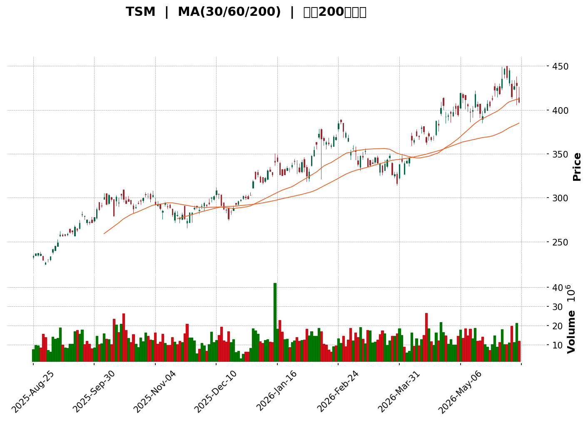
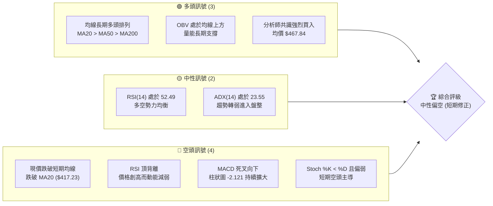
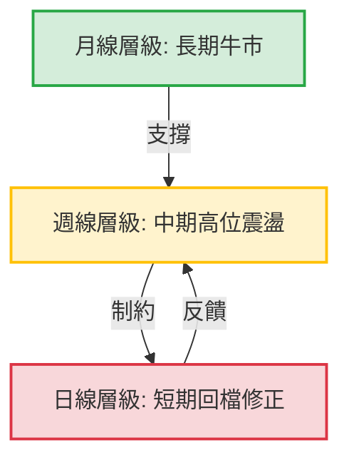
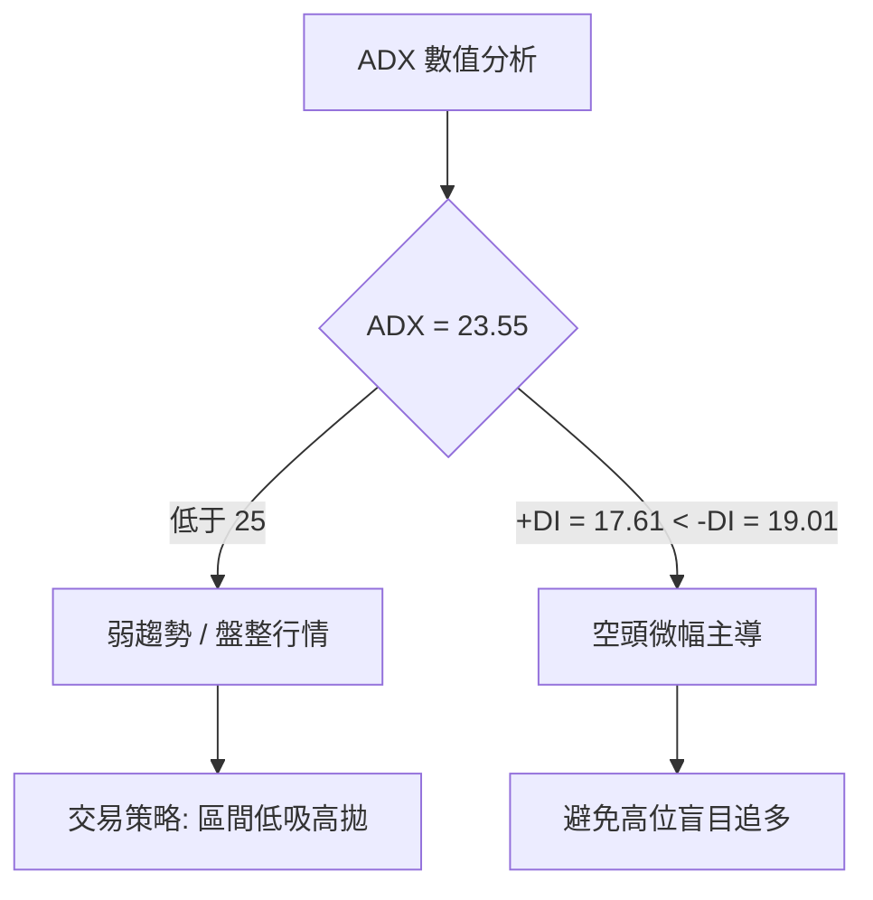
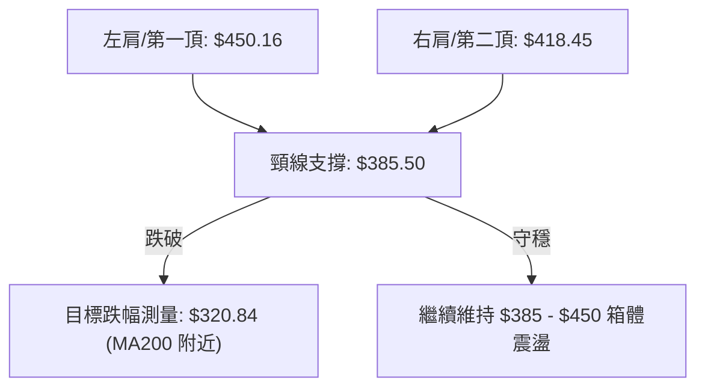

<details>
<summary>📊 靜態圖表 (點擊展開)</summary>

</details>

<html>
<head><meta charset="utf-8" /></head>
<body>
    <div style="height:500px; width:100%;">                        <script>window.PlotlyConfig = {MathJaxConfig: 'local'};</script>
        <script charset="utf-8" src="https://cdn.plot.ly/plotly-3.6.0.min.js" integrity="sha256-QaOVwtVY0T02VaHrr6pnoHLCwayMJp4O5n4YyaE3rJk=" crossorigin="anonymous"></script>                <div id="candlestick-chart" class="plotly-graph-div" style="height:100%; width:100%;"></div>            <script>                window.PLOTLYENV=window.PLOTLYENV || {};                                if (document.getElementById("candlestick-chart")) {                    Plotly.newPlot(                        "candlestick-chart",                        [{"close":{"dtype":"f8","bdata":"AAAAoOAxbUAAAACgLJVtQAAAAMBBp21AAAAAAOaGbUAAAADAI5xsQAAAAOB2TWxAAAAAAKOsbEAAAACg0iVtQAAAAOD1KW5AAAAAoOChbkAAAABANRhvQAAAAGAcI3BAAAAAgNcKcEAAAAAAgRFwQAAAAGAFMnBAAAAAwOtJcEAAAACAiVVwQAAAAICfsnBAAAAAQKJ2cEAAAACgHPJwQAAAAICBknFAAAAAYK5ycUAAAADAPDJxQAAAACC6\u002fXBAAAAAwKj7cEAAAAAgFlxxQAAAAMAo7nFAAAAAQG7ocUAAAAAgWilyQAAAAIDQy3JAAAAAYKFGckAAAABAjO1yQAAAAGC3o3JAAAAAwOJxcUAAAACgnNNyQAAAAMAFZXJAAAAAYJLwckAAAABgFKNyQAAAAIBWV3JAAAAAIAeBckAAAADARE5yQAAAAOCu9HFAAAAA4B4SckAAAADAbVVyQAAAAKDHiXJAAAAAoPi9ckAAAABAnvZyQAAAAMDc2HJAAAAAwHesckAAAABA9fJyQAAAAMDyRnJAAAAAwGxAckAAAABAafpxQAAAAADQznFAAAAAYFxackAAAABAHxlyQAAAAMBeEHJAAAAAIGSKcUAAAACAFLRxQAAAAABeh3FAAAAAwCBGcUAAAACAGI1xQAAAAICaP3FAAAAAIMcYcUAAAABgN7FxQAAAAEDasXFAAAAAQN4FckAAAABAiB5yQAAAAKCW4XFAAAAAwMInckAAAADgOV1yQAAAAIAgNXJAAAAAIJxRckAAAACAYcNyQAAAAMDi23JAAAAAgPlGc0AAAAAA5f9yQAAAAMCCM3JAAAAAYOfucUAAAADgBeFxQAAAAIDoQnFAAAAAwBS+cUAAAACgNQJyQAAAAGBLR3JAAAAAoNmBckAAAADAXZ9yQAAAACDT33JAAAAAADHBckAAAACgz6tyQAAAAACU8HJAAAAAAGTrc0AAAAAggxV0QAAAAMAoaHRAAAAAgI3cc0AAAADg3NFzQAAAAMCHK3RAAAAAgGetdEAAAAAgeKR0QAAAAMANY3RAAAAAgOFKdUAAAACgAVd1QAAAAADaY3RAAAAAIEJTdEAAAADAM2d0QAAAAGDd3nRAAAAA4Ga8dEAAAACgOhZ1QAAAACBpVXVAAAAAwIgpdUAAAABAGZp0QAAAAMBpRnVAAAAAwOfsdEAAAAAAMk10QAAAAKDPnHRAAAAAoOq9dUAAAADglCZ2QAAAAABKjnZAAAAAIJ9Qd0AAAAAADfF2QAAAAABK1XZAAAAAoNOydkAAAACg35N2QAAAAKAJdnZAAAAAQPsXd0AAAAAAARB3QAAAAECoCnhAAAAAoD8qeEAAAAAABXx3QAAAAIBwWHdAAAAAQCoBd0AAAABANAJ2QAAAAGD4RnZAAAAA4NkNdkAAAAAgAR91QAAAAACGu3VAAAAA4NWhdUAAAAAABRl2QAAAAOA4\u002fHRAAAAAAMAVdUAAAABgYjR1QAAAACCun3VAAAAAwB45dUAAAADgoyx1QAAAAADXk3RAAAAAQDMndUAAAAAAAHR1QAAAAAAAvHVAAAAAgMJhdEAAAAAA12t0QAAAAAAAyHNAAAAAQDMfdUAAAAAA11d1QAAAAOCjMHVAAAAAAClcdUAAAADAHpV1QAAAAGBm3nZAAAAAANfXdkAAAACgmSl3QAAAAMAeGXdAAAAAgD2+d0AAAACgmXF3QAAAAKCZtXZAAAAAAAAod0AAAAAA1+N2QAAAAKBHAXdAAAAAQAo3eEAAAABgj+p3QAAAACBcJ3lAAAAAIK5PeUAAAACgcIV4QAAAAKBHnXhAAAAAwPXAeEAAAABguNp4QAAAAIDCGXlAAAAAYI+meEAAAAAAADh6QAAAAGBm4nlAAAAAQOG6eUAAAADgo0h5QAAAAOB61HhAAAAAwMz8eEAAAAAghRt6QAAAAKCZRXlAAAAAQDO\u002feEAAAACAwol4QAAAAIDrGXlAAAAAYGZyeUAAAADgUUh5QAAAAMAexXlAAAAAIK5rekAAAACAwo16QAAAAEAzJ3pAAAAAgBQ6e0AAAABACut7QAAAAEAKS3tAAAAAYLjOe0AAAABguPJ5QAAAAMDMrHpAAAAAYLi+ekAAAAAAAIx5QA=="},"high":{"dtype":"f8","bdata":"9+\u002fuwH1nbUC8OfP6qZhtQOeK8xq\u002fqm1AbxyID7jSbUCXcPtNTD1tQCrX+CWaa2xATy7zoEPObEDrcvGv\u002fihtQAloXDogTm5AqstEY8S3bkC05OKiE5FvQNlKHorHZHBAWYmwNSU2cEDgNFBpMytwQCaZw3mLSHBA0pscrJ2PcEBoFrfprXVwQGaIIx3b0HBAdWYtPa+RcEA61Futdi1xQExzolTbxnFA+cYwH6N6cUA7LlkS4DlxQLIp9XXHH3FAVuYdr1BlcUC7D8q\u002fRF9xQM8NIoMkDnJAQgC6GG9xckBrOo6G7mZyQNm+QZjIGXNA2Wf995kWc0DLDCFwdgtzQGeCghuo0nJArYrq2c6ockDkou92TO9yQC\u002fQHb14wXJA65Mz\u002fc0Oc0Bjlv7Ai1pzQNmtxp8i2nJAIWuDVrTfckB3oPzemZtyQCaGiWI\u002fWXJA5uwVwZVHckDHqt+UAYVyQL56yY9DrXJAWQAJv4THckCSbF8oSSRzQExa+VLxGXNANHe5lNQfc0B6NPPdp0ZzQC57n0xKxXJAG0zkS02JckDGLwQ3VlByQDSRVzfu5HFAbjA0I\u002fV3ckBJ+hDaylRyQNLJQhn\u002fU3JA4ZxPlYz+cUBZLG1WitRxQHHHlCVKz3FAYea9T2hqcUABdu6vyK9xQJ7+LqfaM3JA4cYs7YlScUCCOj8s5rdxQCoysStPvXFAHIJ\u002fuzczckAXKZKE\u002fTByQEYNfG32GHJAlJp44htOckAO6B\u002fL129yQNDTNV6hRnJASXXF6VqyckA7i8aeUM9yQNbS0woY8HJAjh3CsxOEc0D+dRmbsA9zQHcw4ODM9nJAsEudXIBvckD7S1UzZPpxQIztyUaaBHJAsuHeVKblcUD\u002fPJ2wlTVyQPJIppblYnJA7vyMsyqRckDU5D87HKVyQJAc68hw6HJAE\u002fIBbE\u002f6ckCj9EuMG\u002ftyQFgb2bdrKHNAtAQdVvsKdEAvAo2KG6V0QGQf7BhOwnRAi3HMTCFWdECfX74taTl0QABPLQG4PXRAFBeJ483JdEBkk0VpmPd0QNtLkxnujnRAvqrsGXzldUBLK54h3811QIa93nkEU3VARuBhkz3LdEDkPR2cvOF0QIzNPgI+A3VA0Zsf3ojidEBVQSWCqER1QAaykIt3iHVA+D6axmJsdUDlq+pgHi91QCc0VtC5c3VAh0LpcTKhdUAmUK1wkR11QB5z0g0U2nRA++qsHMzLdUDk+7fmbml2QPYntdLCu3ZA9GRz8Daod0D4z6hp6q53QJjd2FQTIXdAbmpTm7zSdkCI5jUQogV3QD5qPCN9nHZA0GMIhXcyd0Civ+BbF0Z3QMya2QViQXhATuoIFdFReEBN0GcyJRZ4QPuGn\u002fTxeXdAIP27c9NAd0AEZNsSrS92QPKNwL00gXZA3a777ltndkBpSjSd17t1QBAJnBGxxnVAlM6\u002feRsIdkAnBozDiEV2QMMtIhalnnVAyn7RptR4dUAWgCMclnp1QAAAAAAprHVAAAAAQDO\u002fdUAAAABgZj51QAAAAKCZGXVAAAAAYI92dUAAAACAFI51QAAAAEAz53VAAAAAYI9OdUAAAADA9Zh0QAAAAKCZmXRAAAAAYI8mdUAAAABA4cp1QAAAAMAeYXVAAAAAQDODdUAAAADgeph1QAAAAMDMZHdAAAAAYLgCd0AAAAAAAKB3QAAAACBcN3dAAAAAYI\u002fid0AAAAAgrt93QAAAAEAzI3dAAAAAoEd5d0AAAADAHiF3QAAAAAAALHdAAAAAYI8+eEAAAAAAKUx4QAAAAADXl3lAAAAAAADoeUAAAACA6914QAAAAKCZvXhAAAAA4KPseEAAAAAA1z95QAAAAEAze3lAAAAAgBRieUAAAABAMzt6QAAAAAAAQHpAAAAAAAAQekAAAAAgrnt5QAAAAADXI3lAAAAAQOFKeUAAAAAghV96QAAAAIDrnXlAAAAAgBRueUAAAACAFO54QAAAAIAUPnlAAAAAIFy3eUAAAABguKp5QAAAAADXB3pAAAAAwMzoekAAAACgmbl6QAAAAEAK53pAAAAAgD0WfEAAAACAFAZ8QAAAAGCPInxAAAAAACkAfEAAAABgZh57QAAAAMD1HHtAAAAAYI9ie0AAAADAHqV6QA=="},"hovertemplate":"\u003cb\u003e%{x|%Y-%m-%d}\u003c\u002fb\u003e\u003cbr\u003e\u958b: $%{open:.2f}\u003cbr\u003e\u9ad8: $%{high:.2f}\u003cbr\u003e\u4f4e: $%{low:.2f}\u003cbr\u003e\u6536: $%{close:.2f}\u003cextra\u003e\u003c\u002fextra\u003e","low":{"dtype":"f8","bdata":"ijWwSuvHbEDYxcqxUTZtQBO+JpAeLW1AgwixduI+bUAFbL2b8JJsQHO1wPLn9WtAO\u002f4dcSBUbEBCFMmvDopsQEeQ0RApe21AQre8jSzxbUDmUQ30oJluQGSk\u002fkDi8G9AOkDiQw4AcEBXEM5sbwJwQPaZMMJNCHBAeVdoItkycEDo11qe2CRwQDoJ3wkACXBAUM3r3NpVcEB68Df43H9wQPSrmV1iZ3FANKLNLDEzcUCxS9U9SctwQCwz5sog0nBAAAAAwKj7cEB11VvCNAVxQAXd+lFaOnFADSJt7j7XcUA+YtMiTQ5yQFawdL2rpHJAaxUxQbI6ckBgElW31UVyQIITYp2SfHJA\u002fcZubaJscUB0PMTDaytyQBB9ZafTG3JAl446bb2mckA5xfDk9HByQA\u002fastnKVHJA+yKEB9h2ckA+slhBvkByQDW4G5RlrXFAKnjNAZ4AckDcz\u002fHzW0xyQD98b4A4QXJAyc2DCEBnckD8\u002fMEdf8tyQB6F3WOssnJA9wjVJcxwckAGVLfqW8dyQPeuJydbPnJA+2\u002fvaV8eckCPv4+c0NxxQEjg0mG3OXFA\u002fSMDuVkickDUdzsdKfVxQEQsGUjS\u002f3FAZRhQY2JncUBq0yC5qPtwQPV\u002fSX0zZHFAbFJNTovzcEBPHh7p0yxxQBR8I2hCLnFAx+f0k6mVcECBstTRBftwQM4rxbFF+XBA77gucGLicUBZfZG9l\u002fZxQMTioq0kmnFAavJW3nT5cUDNkAx7+MdxQCfACvGvCXJA5F+BFTg6ckBtZV8Ib3FyQPz1feHBjXJAuiQm8mfNckDKA6\u002fWxKxyQHvnGzOZInJAYivPT9\u002frcUCY3nb7YahxQL0AOqPpJHFAkb\u002f1OFWPcUA7vT90NNlxQFjtH3NEJnJA+UoOSxA2ckBMXi20XHZyQOYReRjmmnJAP7VVIPmcckBeePW+vKlyQF1KYAs96XJAGMPfyS9tc0AnlcnBiwl0QE+cu8\u002fYOnRAjFlxvFHac0DM7MvlBrRzQAPJhSux1XNAEVsso4YCdEB7fOzSm510QJSTC1uEPnRAtpRvMIcPdUBLwZQxAkh1QBgTFv6zX3RAwtNm8DxMdEB4zcgItF90QFIlWagFp3RAExDzatWUdEAUeCdB69l0QBHEwaRVG3VAb5d\u002f4XF0dED5vKztzYJ0QPWA+fnNgnRAwC3OknuRdEBCjhqExuJzQIf1MmYH7HNAtlC1yUP7dEAnoOTVKa11QJSGKag3NnZA0BNDmq31dkAi5CpvHhN0QEoKE7YZfHZAIWvo\u002fNIzdkCiKfaWJHt2QIF78FP4RnZAT4pbqnRhdkDJLgd04tZ2QIPZK6Tkb3dA5wWTgPr7d0DmuWNUlAp3QHHeSfhY+XZA19P+dAG6dkBKmr63xHJ1QNKIECPcGHZAbpUt6FdtdUCW1Q0y5\u002ft0QNFivD\u002fMr3RAMZno\u002fnp1dUAOpN8WAtZ1QNQlQQz19nRA7oH8bWf0dEDgNQK41y11QAAAAGBmJnVAAAAAoHA1dUAAAABAClN0QAAAAGBmXnRAAAAAoJmxdEAAAADgUeB0QAAAAAAAeHVAAAAAgOtVdEAAAADA9SR0QAAAAMDMnHNAAAAAgD0SdEAAAAAAADx1QAAAAMDMbHRAAAAAgOspdUAAAABgZvp0QAAAAADXc3ZAAAAAIIWLdkAAAAAAABx3QAAAAMDM4HZAAAAAIIVTd0AAAAAgXEN3QAAAAMDMiHZAAAAAgD3SdkAAAAAAAMR2QAAAAIDC0XZAAAAAgD0qd0AAAADA9Xx3QAAAAKCZnXhAAAAAYGYGeUAAAABAMwt4QAAAAEDhQnhAAAAAIFwbeEAAAACAFIJ4QAAAAEAzs3hAAAAAoJmJeEAAAABgZgp5QAAAAIDCgXlAAAAAgBQOeUAAAABACuN4QAAAAIDrIXhAAAAAIIV3eEAAAACgmSF5QAAAAKBH7XhAAAAAwMxweEAAAADA9RB4QAAAAEAzv3hAAAAAACn4eEAAAACAwi15QAAAAMAeoXlAAAAAgBT2eUAAAAAgXOt5QAAAAAAAFHpAAAAAAABoekAAAAAAKUB7QAAAAOB6KHtAAAAAwMy0ekAAAADgo8x5QAAAAOB6aHpAAAAAAClYeUAAAABAM3t5QA=="},"name":"\u50f9\u683c","open":{"dtype":"f8","bdata":"+hH\u002fHfQIbUASnzZdn0ptQPltyw58Wm1AqEL55WZIbUBhSAvzzjltQJcPNvhmBmxAqvc60cKwbEB3LGUlXqtsQJk7YShlxW1Ao\u002fAmi+n8bUDmUQ30oJluQLxaixI1CnBAoyfK5K4hcEAvfHhRnSlwQFkwypwhHHBAFy4WgFeHcEBzmqddM25wQEM8tHZRCXBAfUySfYCOcECQiRkQNZFwQOOVDLqSjXFAk8acAFFscUA9Y0OM6PlwQG1oJjIpBnFAuupTQYgvcUAox3tZ6hxxQAWI0JyPTnFAt8UcWUBuckBCAdBLAzRyQEM9GurIpXJA56mdpfYOc0CidIuiEFZyQD\u002fjdO9hynJAAgXTIP2kckAC\u002fmjHnolyQDr\u002fFPoWYHJA576+kLYJc0Akgxpoi1NzQKkYgIcqjHJAJslcHKClckAdwLqytpVyQJ1TKqY9NnJAuoxtblIDckBOZV6lIl9yQBEwb\u002f8kkHJAwUaGvuSKckDs1lhl6gFzQNRAtmai1nJA5VPEXfAEc0BSU8J21s5yQDsye876c3JANBX1tDEwckAOkll+vkdyQFBmdyhJunFAeNsje+FLckDnfUiYSCdyQNe4Ny5hQXJAEB+FYkz5cUBK8gioTSZxQOkXKRRMfnFAHhM9OmZAcUD92CsIYDZxQJ2Bs46rKXJAU5W3w\u002fn0cECBstTRBftwQPs14ALTknFACwzdGi\u002f4cUCe+EeL9y1yQJT9ttp+1XFAjVuGJlQmckDKKEV4MSlyQD49OL7VRXJAu6oy0cVmckCAAzJUuLhyQCmAwlh3pXJAsmOY2hL7ckAjCzG3ZAdzQHcw4ODM9nJAGnK1dyFlckDXjeLiPudxQEKaQBaC+3FAzY8g0S\u002fDcUA7vT90NNlxQDx\u002fbOB4XXJATEiEmzVJckAqAS0zdI5yQMjrbLbqsHJABYwomunOckBn1vWAKthyQLBr8jtV8nJAWF\u002fjcKdxc0Acm\u002f6yi5d0QMX0jIOslHRAr5xHrx88dEBzmM7xpzd0QBlZSZzm7nNAk+j2ih4TdEBXqf1k9L50QNtLkxnujnRAy0\u002fRSIxddUBs827ylJh1QFSN5aBRPXVAjEguvuPHdEAPipP+usd0QIy119kwsnRA0l89tK29dEBNTkAt3\u002fh0QO84HdkOYXVA9cpm34UtdUCZjpjwo+d0QFpODT9KnXRA9ACxO5uBdUAHX\u002fEkg+p0QE2dD0qbHnRA6ldHodMIdUAyHFEJe7x1QK6wu2XmtHZAYzX6RqQQd0DjexPs9Z53QKX6qcPNAXdA5wcEsaaNdkDqPti1Zq12QJEEIvZYa3ZAfNbaFk5sdkCRiHn\u002fqN92QAC3sbVXpXdATuoIFdFReEDkEt6ohBF4QNkAw3mZEXdAunwQaVXFdkCvlgS0Fcl1QHkVfn3PRnZAZN3Hx3EedkAm2ESRjmh1QPFCMSWD6nRAmUT+fdq3dUCwcj3A9w52QDKlsOJTj3VApqyXDkJvdUDs+cSCqER1QAAAAKCZSXVAAAAA4HqcdUAAAAAghZN0QAAAAEDhCnVAAAAAoJmxdEAAAADAHvl0QAAAAAAAoHVAAAAAwB49dUAAAACgR010QAAAAEAzc3RAAAAAwPUkdEAAAABgZn51QAAAAKBwbXRAAAAAAAA8dUAAAABACjd1QAAAAOCjJHdAAAAAwMy0dkAAAACgcHl3QAAAAAApJHdAAAAA4KOwd0AAAABgj9Z3QAAAAIDCDXdAAAAAQDNTd0AAAAAghRN3QAAAAKBHAXdAAAAA4Ho8d0AAAAAAAAR4QAAAAIA9wnhAAAAAAADceUAAAACA64F4QAAAAGCPjnhAAAAAwPXceEAAAABACpd4QAAAAOBRSHlAAAAAoJlJeUAAAABgZiZ5QAAAAKBwIXpAAAAAQDMPekAAAAAA12t5QAAAAAAA3HhAAAAA4FHkeEAAAAAgXDN5QAAAAAAAaHlAAAAAgBRueUAAAAAAKVh4QAAAAAAA0HhAAAAAACn4eEAAAABA4ZZ5QAAAAIDr0XlAAAAA4FGwekAAAAAghWN6QAAAAMAesXpAAAAAgBSOekAAAACgR4l7QAAAAADXH3xAAAAAgBTqekAAAADgUdx6QAAAAOBRfHpAAAAAgBTuekAAAACgR995QA=="},"x":["2025-08-25T00:00:00-04:00","2025-08-26T00:00:00-04:00","2025-08-27T00:00:00-04:00","2025-08-28T00:00:00-04:00","2025-08-29T00:00:00-04:00","2025-09-02T00:00:00-04:00","2025-09-03T00:00:00-04:00","2025-09-04T00:00:00-04:00","2025-09-05T00:00:00-04:00","2025-09-08T00:00:00-04:00","2025-09-09T00:00:00-04:00","2025-09-10T00:00:00-04:00","2025-09-11T00:00:00-04:00","2025-09-12T00:00:00-04:00","2025-09-15T00:00:00-04:00","2025-09-16T00:00:00-04:00","2025-09-17T00:00:00-04:00","2025-09-18T00:00:00-04:00","2025-09-19T00:00:00-04:00","2025-09-22T00:00:00-04:00","2025-09-23T00:00:00-04:00","2025-09-24T00:00:00-04:00","2025-09-25T00:00:00-04:00","2025-09-26T00:00:00-04:00","2025-09-29T00:00:00-04:00","2025-09-30T00:00:00-04:00","2025-10-01T00:00:00-04:00","2025-10-02T00:00:00-04:00","2025-10-03T00:00:00-04:00","2025-10-06T00:00:00-04:00","2025-10-07T00:00:00-04:00","2025-10-08T00:00:00-04:00","2025-10-09T00:00:00-04:00","2025-10-10T00:00:00-04:00","2025-10-13T00:00:00-04:00","2025-10-14T00:00:00-04:00","2025-10-15T00:00:00-04:00","2025-10-16T00:00:00-04:00","2025-10-17T00:00:00-04:00","2025-10-20T00:00:00-04:00","2025-10-21T00:00:00-04:00","2025-10-22T00:00:00-04:00","2025-10-23T00:00:00-04:00","2025-10-24T00:00:00-04:00","2025-10-27T00:00:00-04:00","2025-10-28T00:00:00-04:00","2025-10-29T00:00:00-04:00","2025-10-30T00:00:00-04:00","2025-10-31T00:00:00-04:00","2025-11-03T00:00:00-05:00","2025-11-04T00:00:00-05:00","2025-11-05T00:00:00-05:00","2025-11-06T00:00:00-05:00","2025-11-07T00:00:00-05:00","2025-11-10T00:00:00-05:00","2025-11-11T00:00:00-05:00","2025-11-12T00:00:00-05:00","2025-11-13T00:00:00-05:00","2025-11-14T00:00:00-05:00","2025-11-17T00:00:00-05:00","2025-11-18T00:00:00-05:00","2025-11-19T00:00:00-05:00","2025-11-20T00:00:00-05:00","2025-11-21T00:00:00-05:00","2025-11-24T00:00:00-05:00","2025-11-25T00:00:00-05:00","2025-11-26T00:00:00-05:00","2025-11-28T00:00:00-05:00","2025-12-01T00:00:00-05:00","2025-12-02T00:00:00-05:00","2025-12-03T00:00:00-05:00","2025-12-04T00:00:00-05:00","2025-12-05T00:00:00-05:00","2025-12-08T00:00:00-05:00","2025-12-09T00:00:00-05:00","2025-12-10T00:00:00-05:00","2025-12-11T00:00:00-05:00","2025-12-12T00:00:00-05:00","2025-12-15T00:00:00-05:00","2025-12-16T00:00:00-05:00","2025-12-17T00:00:00-05:00","2025-12-18T00:00:00-05:00","2025-12-19T00:00:00-05:00","2025-12-22T00:00:00-05:00","2025-12-23T00:00:00-05:00","2025-12-24T00:00:00-05:00","2025-12-26T00:00:00-05:00","2025-12-29T00:00:00-05:00","2025-12-30T00:00:00-05:00","2025-12-31T00:00:00-05:00","2026-01-02T00:00:00-05:00","2026-01-05T00:00:00-05:00","2026-01-06T00:00:00-05:00","2026-01-07T00:00:00-05:00","2026-01-08T00:00:00-05:00","2026-01-09T00:00:00-05:00","2026-01-12T00:00:00-05:00","2026-01-13T00:00:00-05:00","2026-01-14T00:00:00-05:00","2026-01-15T00:00:00-05:00","2026-01-16T00:00:00-05:00","2026-01-20T00:00:00-05:00","2026-01-21T00:00:00-05:00","2026-01-22T00:00:00-05:00","2026-01-23T00:00:00-05:00","2026-01-26T00:00:00-05:00","2026-01-27T00:00:00-05:00","2026-01-28T00:00:00-05:00","2026-01-29T00:00:00-05:00","2026-01-30T00:00:00-05:00","2026-02-02T00:00:00-05:00","2026-02-03T00:00:00-05:00","2026-02-04T00:00:00-05:00","2026-02-05T00:00:00-05:00","2026-02-06T00:00:00-05:00","2026-02-09T00:00:00-05:00","2026-02-10T00:00:00-05:00","2026-02-11T00:00:00-05:00","2026-02-12T00:00:00-05:00","2026-02-13T00:00:00-05:00","2026-02-17T00:00:00-05:00","2026-02-18T00:00:00-05:00","2026-02-19T00:00:00-05:00","2026-02-20T00:00:00-05:00","2026-02-23T00:00:00-05:00","2026-02-24T00:00:00-05:00","2026-02-25T00:00:00-05:00","2026-02-26T00:00:00-05:00","2026-02-27T00:00:00-05:00","2026-03-02T00:00:00-05:00","2026-03-03T00:00:00-05:00","2026-03-04T00:00:00-05:00","2026-03-05T00:00:00-05:00","2026-03-06T00:00:00-05:00","2026-03-09T00:00:00-04:00","2026-03-10T00:00:00-04:00","2026-03-11T00:00:00-04:00","2026-03-12T00:00:00-04:00","2026-03-13T00:00:00-04:00","2026-03-16T00:00:00-04:00","2026-03-17T00:00:00-04:00","2026-03-18T00:00:00-04:00","2026-03-19T00:00:00-04:00","2026-03-20T00:00:00-04:00","2026-03-23T00:00:00-04:00","2026-03-24T00:00:00-04:00","2026-03-25T00:00:00-04:00","2026-03-26T00:00:00-04:00","2026-03-27T00:00:00-04:00","2026-03-30T00:00:00-04:00","2026-03-31T00:00:00-04:00","2026-04-01T00:00:00-04:00","2026-04-02T00:00:00-04:00","2026-04-06T00:00:00-04:00","2026-04-07T00:00:00-04:00","2026-04-08T00:00:00-04:00","2026-04-09T00:00:00-04:00","2026-04-10T00:00:00-04:00","2026-04-13T00:00:00-04:00","2026-04-14T00:00:00-04:00","2026-04-15T00:00:00-04:00","2026-04-16T00:00:00-04:00","2026-04-17T00:00:00-04:00","2026-04-20T00:00:00-04:00","2026-04-21T00:00:00-04:00","2026-04-22T00:00:00-04:00","2026-04-23T00:00:00-04:00","2026-04-24T00:00:00-04:00","2026-04-27T00:00:00-04:00","2026-04-28T00:00:00-04:00","2026-04-29T00:00:00-04:00","2026-04-30T00:00:00-04:00","2026-05-01T00:00:00-04:00","2026-05-04T00:00:00-04:00","2026-05-05T00:00:00-04:00","2026-05-06T00:00:00-04:00","2026-05-07T00:00:00-04:00","2026-05-08T00:00:00-04:00","2026-05-11T00:00:00-04:00","2026-05-12T00:00:00-04:00","2026-05-13T00:00:00-04:00","2026-05-14T00:00:00-04:00","2026-05-15T00:00:00-04:00","2026-05-18T00:00:00-04:00","2026-05-19T00:00:00-04:00","2026-05-20T00:00:00-04:00","2026-05-21T00:00:00-04:00","2026-05-22T00:00:00-04:00","2026-05-26T00:00:00-04:00","2026-05-27T00:00:00-04:00","2026-05-28T00:00:00-04:00","2026-05-29T00:00:00-04:00","2026-06-01T00:00:00-04:00","2026-06-02T00:00:00-04:00","2026-06-03T00:00:00-04:00","2026-06-04T00:00:00-04:00","2026-06-05T00:00:00-04:00","2026-06-08T00:00:00-04:00","2026-06-09T00:00:00-04:00","2026-06-10T00:00:00-04:00"],"type":"candlestick"},{"hovertemplate":"MA30: $%{y:.2f}\u003cextra\u003e\u003c\u002fextra\u003e","line":{"color":"#2196F3","dash":"dash","width":2},"mode":"lines","name":"MA30","x":["2025-08-25T00:00:00-04:00","2025-08-26T00:00:00-04:00","2025-08-27T00:00:00-04:00","2025-08-28T00:00:00-04:00","2025-08-29T00:00:00-04:00","2025-09-02T00:00:00-04:00","2025-09-03T00:00:00-04:00","2025-09-04T00:00:00-04:00","2025-09-05T00:00:00-04:00","2025-09-08T00:00:00-04:00","2025-09-09T00:00:00-04:00","2025-09-10T00:00:00-04:00","2025-09-11T00:00:00-04:00","2025-09-12T00:00:00-04:00","2025-09-15T00:00:00-04:00","2025-09-16T00:00:00-04:00","2025-09-17T00:00:00-04:00","2025-09-18T00:00:00-04:00","2025-09-19T00:00:00-04:00","2025-09-22T00:00:00-04:00","2025-09-23T00:00:00-04:00","2025-09-24T00:00:00-04:00","2025-09-25T00:00:00-04:00","2025-09-26T00:00:00-04:00","2025-09-29T00:00:00-04:00","2025-09-30T00:00:00-04:00","2025-10-01T00:00:00-04:00","2025-10-02T00:00:00-04:00","2025-10-03T00:00:00-04:00","2025-10-06T00:00:00-04:00","2025-10-07T00:00:00-04:00","2025-10-08T00:00:00-04:00","2025-10-09T00:00:00-04:00","2025-10-10T00:00:00-04:00","2025-10-13T00:00:00-04:00","2025-10-14T00:00:00-04:00","2025-10-15T00:00:00-04:00","2025-10-16T00:00:00-04:00","2025-10-17T00:00:00-04:00","2025-10-20T00:00:00-04:00","2025-10-21T00:00:00-04:00","2025-10-22T00:00:00-04:00","2025-10-23T00:00:00-04:00","2025-10-24T00:00:00-04:00","2025-10-27T00:00:00-04:00","2025-10-28T00:00:00-04:00","2025-10-29T00:00:00-04:00","2025-10-30T00:00:00-04:00","2025-10-31T00:00:00-04:00","2025-11-03T00:00:00-05:00","2025-11-04T00:00:00-05:00","2025-11-05T00:00:00-05:00","2025-11-06T00:00:00-05:00","2025-11-07T00:00:00-05:00","2025-11-10T00:00:00-05:00","2025-11-11T00:00:00-05:00","2025-11-12T00:00:00-05:00","2025-11-13T00:00:00-05:00","2025-11-14T00:00:00-05:00","2025-11-17T00:00:00-05:00","2025-11-18T00:00:00-05:00","2025-11-19T00:00:00-05:00","2025-11-20T00:00:00-05:00","2025-11-21T00:00:00-05:00","2025-11-24T00:00:00-05:00","2025-11-25T00:00:00-05:00","2025-11-26T00:00:00-05:00","2025-11-28T00:00:00-05:00","2025-12-01T00:00:00-05:00","2025-12-02T00:00:00-05:00","2025-12-03T00:00:00-05:00","2025-12-04T00:00:00-05:00","2025-12-05T00:00:00-05:00","2025-12-08T00:00:00-05:00","2025-12-09T00:00:00-05:00","2025-12-10T00:00:00-05:00","2025-12-11T00:00:00-05:00","2025-12-12T00:00:00-05:00","2025-12-15T00:00:00-05:00","2025-12-16T00:00:00-05:00","2025-12-17T00:00:00-05:00","2025-12-18T00:00:00-05:00","2025-12-19T00:00:00-05:00","2025-12-22T00:00:00-05:00","2025-12-23T00:00:00-05:00","2025-12-24T00:00:00-05:00","2025-12-26T00:00:00-05:00","2025-12-29T00:00:00-05:00","2025-12-30T00:00:00-05:00","2025-12-31T00:00:00-05:00","2026-01-02T00:00:00-05:00","2026-01-05T00:00:00-05:00","2026-01-06T00:00:00-05:00","2026-01-07T00:00:00-05:00","2026-01-08T00:00:00-05:00","2026-01-09T00:00:00-05:00","2026-01-12T00:00:00-05:00","2026-01-13T00:00:00-05:00","2026-01-14T00:00:00-05:00","2026-01-15T00:00:00-05:00","2026-01-16T00:00:00-05:00","2026-01-20T00:00:00-05:00","2026-01-21T00:00:00-05:00","2026-01-22T00:00:00-05:00","2026-01-23T00:00:00-05:00","2026-01-26T00:00:00-05:00","2026-01-27T00:00:00-05:00","2026-01-28T00:00:00-05:00","2026-01-29T00:00:00-05:00","2026-01-30T00:00:00-05:00","2026-02-02T00:00:00-05:00","2026-02-03T00:00:00-05:00","2026-02-04T00:00:00-05:00","2026-02-05T00:00:00-05:00","2026-02-06T00:00:00-05:00","2026-02-09T00:00:00-05:00","2026-02-10T00:00:00-05:00","2026-02-11T00:00:00-05:00","2026-02-12T00:00:00-05:00","2026-02-13T00:00:00-05:00","2026-02-17T00:00:00-05:00","2026-02-18T00:00:00-05:00","2026-02-19T00:00:00-05:00","2026-02-20T00:00:00-05:00","2026-02-23T00:00:00-05:00","2026-02-24T00:00:00-05:00","2026-02-25T00:00:00-05:00","2026-02-26T00:00:00-05:00","2026-02-27T00:00:00-05:00","2026-03-02T00:00:00-05:00","2026-03-03T00:00:00-05:00","2026-03-04T00:00:00-05:00","2026-03-05T00:00:00-05:00","2026-03-06T00:00:00-05:00","2026-03-09T00:00:00-04:00","2026-03-10T00:00:00-04:00","2026-03-11T00:00:00-04:00","2026-03-12T00:00:00-04:00","2026-03-13T00:00:00-04:00","2026-03-16T00:00:00-04:00","2026-03-17T00:00:00-04:00","2026-03-18T00:00:00-04:00","2026-03-19T00:00:00-04:00","2026-03-20T00:00:00-04:00","2026-03-23T00:00:00-04:00","2026-03-24T00:00:00-04:00","2026-03-25T00:00:00-04:00","2026-03-26T00:00:00-04:00","2026-03-27T00:00:00-04:00","2026-03-30T00:00:00-04:00","2026-03-31T00:00:00-04:00","2026-04-01T00:00:00-04:00","2026-04-02T00:00:00-04:00","2026-04-06T00:00:00-04:00","2026-04-07T00:00:00-04:00","2026-04-08T00:00:00-04:00","2026-04-09T00:00:00-04:00","2026-04-10T00:00:00-04:00","2026-04-13T00:00:00-04:00","2026-04-14T00:00:00-04:00","2026-04-15T00:00:00-04:00","2026-04-16T00:00:00-04:00","2026-04-17T00:00:00-04:00","2026-04-20T00:00:00-04:00","2026-04-21T00:00:00-04:00","2026-04-22T00:00:00-04:00","2026-04-23T00:00:00-04:00","2026-04-24T00:00:00-04:00","2026-04-27T00:00:00-04:00","2026-04-28T00:00:00-04:00","2026-04-29T00:00:00-04:00","2026-04-30T00:00:00-04:00","2026-05-01T00:00:00-04:00","2026-05-04T00:00:00-04:00","2026-05-05T00:00:00-04:00","2026-05-06T00:00:00-04:00","2026-05-07T00:00:00-04:00","2026-05-08T00:00:00-04:00","2026-05-11T00:00:00-04:00","2026-05-12T00:00:00-04:00","2026-05-13T00:00:00-04:00","2026-05-14T00:00:00-04:00","2026-05-15T00:00:00-04:00","2026-05-18T00:00:00-04:00","2026-05-19T00:00:00-04:00","2026-05-20T00:00:00-04:00","2026-05-21T00:00:00-04:00","2026-05-22T00:00:00-04:00","2026-05-26T00:00:00-04:00","2026-05-27T00:00:00-04:00","2026-05-28T00:00:00-04:00","2026-05-29T00:00:00-04:00","2026-06-01T00:00:00-04:00","2026-06-02T00:00:00-04:00","2026-06-03T00:00:00-04:00","2026-06-04T00:00:00-04:00","2026-06-05T00:00:00-04:00","2026-06-08T00:00:00-04:00","2026-06-09T00:00:00-04:00","2026-06-10T00:00:00-04:00"],"y":{"dtype":"f8","bdata":"AAAAAAAA+H8AAAAAAAD4fwAAAAAAAPh\u002fAAAAAAAA+H8AAAAAAAD4fwAAAAAAAPh\u002fAAAAAAAA+H8AAAAAAAD4fwAAAAAAAPh\u002fAAAAAAAA+H8AAAAAAAD4fwAAAAAAAPh\u002fAAAAAAAA+H8AAAAAAAD4fwAAAAAAAPh\u002fAAAAAAAA+H8AAAAAAAD4fwAAAAAAAPh\u002fAAAAAAAA+H8AAAAAAAD4fwAAAAAAAPh\u002fAAAAAAAA+H8AAAAAAAD4fwAAAAAAAPh\u002fAAAAAAAA+H8AAAAAAAD4fwAAAAAAAPh\u002fAAAAAAAA+H8AAAAAAAD4fyIiIlKWMXBA7+7uFvpQcEDe3d2NRnRwQGZmZtbPlHBA3t3dbbGrcEDv7u4eR9JwQERERMx89nBAIiIiOsMdcUBERERUb0BxQGZmZi4\u002fXHFAREREJHN3cUBEREQU\u002fY5xQGZmZvaBnnFAREREJNGvcUBVVVXVJcNxQGZmZsYj13FAMzMzIxPscUAzMzPDggJyQDMzMyPaFHJAZmZmlrYnckAAAADgzjhyQGZmZqbSPnJAREREVK5FckCrqqp6WkxyQM3MzKxSU3JAREREVANfckDv7u5uUGVyQN7d3V10ZnJAVVVV5VFjckDNzMwsaV9yQO\u002fu7o6YVHJAzczMvAtMckBVVVUlTEByQBEREVFtNHJA3t3d7XQxckAzMzPjxidyQImIiPjNIXJAq6qqKvsZckCJiIgYkBVyQM3MzEyjEXJA3t3djakOckARERExKQ9yQM3MzBxPEXJAMzMz42wTckBVVVUlFxdyQImIiMjTGXJAERER4WQeckCamZkJtB5yQJqZmQkxGXJAzczMbN8SckCJiIjYvQlyQGZmZtYSAXJAIiIikrr8cUDe3d0d\u002ffxxQKuqqjoBAXJARERENFICckARERHBywZyQImIiAi2DXJAIiIiMhIYckCrqqoqVCByQAAAAIBeLHJA7+7uzvFCckBmZmb2jlhyQDMzM6OCc3JAERERURqLckB3d3f3QZ1yQJqZmVlhsnJA7+7uDgjJckDe3d0NkN5yQEREROTx83JA7+7uLrcOc0BVVVW1GyhzQN7d3X27OnNAAAAAoNpLc0CamZkZ2VlzQGZmZpYDa3NAq6qqKnZ3c0AiIiLSRYlzQDMzM7MApHNAzczMnI6\u002fc0De3d39ytZzQImIiAgL+XNAMzMzMzQUdEBVVVUlxSd0QERERPSvO3RA7+7uHkpXdEDv7u6OZXV0QLy7u+vPlHRA3t3d\u002fbm7dECJiIj4KuB0QM3MzDxkAXVAiYiIKBsZdUAiIiKCYi51QBEREQHqP3VAq6qqun5bdUCamZmZKnd1QHd3dzc0mHVAd3d3J\u002fe1dUBVVVWVN851QLy7u5t253VAIiIiohL2dUBVVVWFx\u002ft1QCIiIiLiC3ZAzczM7KIadkDv7u5ewyB2QDMzM1MeKHZAiYiIKMQvdkARERGBZDh2QN7d3W1rNXZAq6qqmsI0dkDNzMws5zl2QLy7u+vgPHZAmpmZSWs\u002fdkBEREQE3kZ2QGZmZnaRRnZAmpmZWYtBdkBERER0lzt2QM3MzPyUNHZAIiIioo0bdkBVVVXVCwZ2QFVVVdUA7HVA3t3djYzedUC8u7u7A9R1QCIiIgIryXVAvLu7u1+6dUB3d3eXvq11QFVVVWW8o3VAREREpHSYdUBERERUtZV1QBEREQGZk3VAIiIicuaZdUDv7u6OJaZ1QJqZmZnVqXVAVVVVRT2zdUB3d3d3VcJ1QBEREUExzXVAiYiIiDvjdUBVVVUlwPJ1QDMzM2NSFnZAvLu722I6dkAiIiIisFZ2QAAAAEA1cHZAREREBFaOdkCamZkZva12QERERARW1HZAvLu7ay7ydkBmZmYW2Rp3QGZmZuZCPndA7+7uDuZrd0CrqqpaZJV3QERERIR5wHdAmpmZGXbhd0CamZkJHgp4QHd3dwfzLHhAVVVVxdlJeEDe3d1tEmN4QGZmZmYfdnhAERERYVeMeEBmZmaWbp54QDMzM2M7tXhAmpmZeRTMeEDv7u5enuZ4QLy7u1sBBHlAZmZmxr0meUAiIiLipVF5QAAAAHA9dnlAAAAAYOWUeUAzMzMTPKZ5QLy7u0s3s3lA7+7uXnO\u002feUAiIiLiM8h5QA=="},"type":"scatter"},{"hovertemplate":"MA60: $%{y:.2f}\u003cextra\u003e\u003c\u002fextra\u003e","line":{"color":"#9C27B0","dash":"dash","width":2},"mode":"lines","name":"MA60","x":["2025-08-25T00:00:00-04:00","2025-08-26T00:00:00-04:00","2025-08-27T00:00:00-04:00","2025-08-28T00:00:00-04:00","2025-08-29T00:00:00-04:00","2025-09-02T00:00:00-04:00","2025-09-03T00:00:00-04:00","2025-09-04T00:00:00-04:00","2025-09-05T00:00:00-04:00","2025-09-08T00:00:00-04:00","2025-09-09T00:00:00-04:00","2025-09-10T00:00:00-04:00","2025-09-11T00:00:00-04:00","2025-09-12T00:00:00-04:00","2025-09-15T00:00:00-04:00","2025-09-16T00:00:00-04:00","2025-09-17T00:00:00-04:00","2025-09-18T00:00:00-04:00","2025-09-19T00:00:00-04:00","2025-09-22T00:00:00-04:00","2025-09-23T00:00:00-04:00","2025-09-24T00:00:00-04:00","2025-09-25T00:00:00-04:00","2025-09-26T00:00:00-04:00","2025-09-29T00:00:00-04:00","2025-09-30T00:00:00-04:00","2025-10-01T00:00:00-04:00","2025-10-02T00:00:00-04:00","2025-10-03T00:00:00-04:00","2025-10-06T00:00:00-04:00","2025-10-07T00:00:00-04:00","2025-10-08T00:00:00-04:00","2025-10-09T00:00:00-04:00","2025-10-10T00:00:00-04:00","2025-10-13T00:00:00-04:00","2025-10-14T00:00:00-04:00","2025-10-15T00:00:00-04:00","2025-10-16T00:00:00-04:00","2025-10-17T00:00:00-04:00","2025-10-20T00:00:00-04:00","2025-10-21T00:00:00-04:00","2025-10-22T00:00:00-04:00","2025-10-23T00:00:00-04:00","2025-10-24T00:00:00-04:00","2025-10-27T00:00:00-04:00","2025-10-28T00:00:00-04:00","2025-10-29T00:00:00-04:00","2025-10-30T00:00:00-04:00","2025-10-31T00:00:00-04:00","2025-11-03T00:00:00-05:00","2025-11-04T00:00:00-05:00","2025-11-05T00:00:00-05:00","2025-11-06T00:00:00-05:00","2025-11-07T00:00:00-05:00","2025-11-10T00:00:00-05:00","2025-11-11T00:00:00-05:00","2025-11-12T00:00:00-05:00","2025-11-13T00:00:00-05:00","2025-11-14T00:00:00-05:00","2025-11-17T00:00:00-05:00","2025-11-18T00:00:00-05:00","2025-11-19T00:00:00-05:00","2025-11-20T00:00:00-05:00","2025-11-21T00:00:00-05:00","2025-11-24T00:00:00-05:00","2025-11-25T00:00:00-05:00","2025-11-26T00:00:00-05:00","2025-11-28T00:00:00-05:00","2025-12-01T00:00:00-05:00","2025-12-02T00:00:00-05:00","2025-12-03T00:00:00-05:00","2025-12-04T00:00:00-05:00","2025-12-05T00:00:00-05:00","2025-12-08T00:00:00-05:00","2025-12-09T00:00:00-05:00","2025-12-10T00:00:00-05:00","2025-12-11T00:00:00-05:00","2025-12-12T00:00:00-05:00","2025-12-15T00:00:00-05:00","2025-12-16T00:00:00-05:00","2025-12-17T00:00:00-05:00","2025-12-18T00:00:00-05:00","2025-12-19T00:00:00-05:00","2025-12-22T00:00:00-05:00","2025-12-23T00:00:00-05:00","2025-12-24T00:00:00-05:00","2025-12-26T00:00:00-05:00","2025-12-29T00:00:00-05:00","2025-12-30T00:00:00-05:00","2025-12-31T00:00:00-05:00","2026-01-02T00:00:00-05:00","2026-01-05T00:00:00-05:00","2026-01-06T00:00:00-05:00","2026-01-07T00:00:00-05:00","2026-01-08T00:00:00-05:00","2026-01-09T00:00:00-05:00","2026-01-12T00:00:00-05:00","2026-01-13T00:00:00-05:00","2026-01-14T00:00:00-05:00","2026-01-15T00:00:00-05:00","2026-01-16T00:00:00-05:00","2026-01-20T00:00:00-05:00","2026-01-21T00:00:00-05:00","2026-01-22T00:00:00-05:00","2026-01-23T00:00:00-05:00","2026-01-26T00:00:00-05:00","2026-01-27T00:00:00-05:00","2026-01-28T00:00:00-05:00","2026-01-29T00:00:00-05:00","2026-01-30T00:00:00-05:00","2026-02-02T00:00:00-05:00","2026-02-03T00:00:00-05:00","2026-02-04T00:00:00-05:00","2026-02-05T00:00:00-05:00","2026-02-06T00:00:00-05:00","2026-02-09T00:00:00-05:00","2026-02-10T00:00:00-05:00","2026-02-11T00:00:00-05:00","2026-02-12T00:00:00-05:00","2026-02-13T00:00:00-05:00","2026-02-17T00:00:00-05:00","2026-02-18T00:00:00-05:00","2026-02-19T00:00:00-05:00","2026-02-20T00:00:00-05:00","2026-02-23T00:00:00-05:00","2026-02-24T00:00:00-05:00","2026-02-25T00:00:00-05:00","2026-02-26T00:00:00-05:00","2026-02-27T00:00:00-05:00","2026-03-02T00:00:00-05:00","2026-03-03T00:00:00-05:00","2026-03-04T00:00:00-05:00","2026-03-05T00:00:00-05:00","2026-03-06T00:00:00-05:00","2026-03-09T00:00:00-04:00","2026-03-10T00:00:00-04:00","2026-03-11T00:00:00-04:00","2026-03-12T00:00:00-04:00","2026-03-13T00:00:00-04:00","2026-03-16T00:00:00-04:00","2026-03-17T00:00:00-04:00","2026-03-18T00:00:00-04:00","2026-03-19T00:00:00-04:00","2026-03-20T00:00:00-04:00","2026-03-23T00:00:00-04:00","2026-03-24T00:00:00-04:00","2026-03-25T00:00:00-04:00","2026-03-26T00:00:00-04:00","2026-03-27T00:00:00-04:00","2026-03-30T00:00:00-04:00","2026-03-31T00:00:00-04:00","2026-04-01T00:00:00-04:00","2026-04-02T00:00:00-04:00","2026-04-06T00:00:00-04:00","2026-04-07T00:00:00-04:00","2026-04-08T00:00:00-04:00","2026-04-09T00:00:00-04:00","2026-04-10T00:00:00-04:00","2026-04-13T00:00:00-04:00","2026-04-14T00:00:00-04:00","2026-04-15T00:00:00-04:00","2026-04-16T00:00:00-04:00","2026-04-17T00:00:00-04:00","2026-04-20T00:00:00-04:00","2026-04-21T00:00:00-04:00","2026-04-22T00:00:00-04:00","2026-04-23T00:00:00-04:00","2026-04-24T00:00:00-04:00","2026-04-27T00:00:00-04:00","2026-04-28T00:00:00-04:00","2026-04-29T00:00:00-04:00","2026-04-30T00:00:00-04:00","2026-05-01T00:00:00-04:00","2026-05-04T00:00:00-04:00","2026-05-05T00:00:00-04:00","2026-05-06T00:00:00-04:00","2026-05-07T00:00:00-04:00","2026-05-08T00:00:00-04:00","2026-05-11T00:00:00-04:00","2026-05-12T00:00:00-04:00","2026-05-13T00:00:00-04:00","2026-05-14T00:00:00-04:00","2026-05-15T00:00:00-04:00","2026-05-18T00:00:00-04:00","2026-05-19T00:00:00-04:00","2026-05-20T00:00:00-04:00","2026-05-21T00:00:00-04:00","2026-05-22T00:00:00-04:00","2026-05-26T00:00:00-04:00","2026-05-27T00:00:00-04:00","2026-05-28T00:00:00-04:00","2026-05-29T00:00:00-04:00","2026-06-01T00:00:00-04:00","2026-06-02T00:00:00-04:00","2026-06-03T00:00:00-04:00","2026-06-04T00:00:00-04:00","2026-06-05T00:00:00-04:00","2026-06-08T00:00:00-04:00","2026-06-09T00:00:00-04:00","2026-06-10T00:00:00-04:00"],"y":{"dtype":"f8","bdata":"AAAAAAAA+H8AAAAAAAD4fwAAAAAAAPh\u002fAAAAAAAA+H8AAAAAAAD4fwAAAAAAAPh\u002fAAAAAAAA+H8AAAAAAAD4fwAAAAAAAPh\u002fAAAAAAAA+H8AAAAAAAD4fwAAAAAAAPh\u002fAAAAAAAA+H8AAAAAAAD4fwAAAAAAAPh\u002fAAAAAAAA+H8AAAAAAAD4fwAAAAAAAPh\u002fAAAAAAAA+H8AAAAAAAD4fwAAAAAAAPh\u002fAAAAAAAA+H8AAAAAAAD4fwAAAAAAAPh\u002fAAAAAAAA+H8AAAAAAAD4fwAAAAAAAPh\u002fAAAAAAAA+H8AAAAAAAD4fwAAAAAAAPh\u002fAAAAAAAA+H8AAAAAAAD4fwAAAAAAAPh\u002fAAAAAAAA+H8AAAAAAAD4fwAAAAAAAPh\u002fAAAAAAAA+H8AAAAAAAD4fwAAAAAAAPh\u002fAAAAAAAA+H8AAAAAAAD4fwAAAAAAAPh\u002fAAAAAAAA+H8AAAAAAAD4fwAAAAAAAPh\u002fAAAAAAAA+H8AAAAAAAD4fwAAAAAAAPh\u002fAAAAAAAA+H8AAAAAAAD4fwAAAAAAAPh\u002fAAAAAAAA+H8AAAAAAAD4fwAAAAAAAPh\u002fAAAAAAAA+H8AAAAAAAD4fwAAAAAAAPh\u002fAAAAAAAA+H8AAAAAAAD4f4mIiHAXQ3FA3t3d6YJOcUCamZlZSVpxQLy7u5OeZHFA3t3dLZNucUAREREBB31xQGZmZmIljHFAZmZmMt+bcUBmZma2\u002f6pxQJqZmT3xtnFAERERWQ7DcUCrqqoiE89xQJqZmYno13FAvLu7A5\u002fhcUBVVVV9Hu1xQHd3d8d7+HFAIiIiAjwFckBmZmZmmxByQGZmZpYFF3JAmpmZAUsdckBERERcRiFyQGZmZr7yH3JAMzMzczQhckBERETMqyRyQLy7u\u002fMpKnJARERExKowckAAAAAYDjZyQDMzMzMVOnJAvLu7C7I9ckC8u7ur3j9yQHd3d4d7QHJA3t3dxX5HckDe3d2NbUxyQCIiIvr3U3JAd3d3n0deckBVVVVthGJyQBEREakXanJAzczMnIFxckAzMzMTEHpyQImIiJjKgnJAZmZmXrCOckAzMzNzoptyQFVVVU0FpnJAmpmZwaOvckB3d3cfeLhyQHd3d69rwnJA3t3dhe3KckDe3d3t\u002fNNyQGZmZt6Y3nJAzczMBDfpckAzMzNrRPByQHd3d+8O\u002fXJAq6qqYncIc0CamZkhYRJzQHd3d5dYHnNAmpmZKc4sc0AAAACoGD5zQCIiIvpCUXNAAAAAGOZpc0CamZmRP4BzQGZmZl7hlnNAvLu7ewauc0BERES8eMNzQCIiIlK22XNA3t3dhUzzc0CJiIhINgp0QImIiMhKJXRAMzMzm38\u002fdECamZnRY1Z0QAAAAEC0bXRAiYiI6GSCdEBVVVWd8ZF0QAAAANBOo3RAZmZmxj6zdEBEREQ8Tr10QM3MzPSQyXRAmpmZKZ3TdECamZkp1eB0QImIiBC27HRAvLu7myj6dEBVVVUVWQh1QCIiIvr1GnVAZmZmvs8pdUDNzMyUUTd1QFVVVbUgQXVAREREvGpMdUCamZmBflh1QERERHSyZHVAAAAA0KNrdUDv7u5mG3N1QBEREYmydnVAMzMz29N7dUDv7u4eM4F1QJqZmYGKhHVAMzMzO++KdUCJiIiYdJJ1QGZmZk74nXVA3t3d5TWndUDNzMx09rF1QGZmZs6HvXVAIiIiivzHdUAiIiKK9tB1QN7d3d3b2nVAERERGfDmdUAzMzNrjPF1QCIiIsqn+nVAiYiI2H8JdkAzMzNTkhV2QImIiOjeJXZAMzMzu5I3dkB3d3enS0h2QN7d3RWLVnZA7+7upuBmdkDv7u6OTXp2QFVVVb1zjXZAq6qq4tyZdkBVVVVFOKt2QJqZmfFruXZAiYiI2LnDdkAAAAAYuM12QM3MzCw91nZAvLu7UwHgdkCrqqriEO92QM3MzAQP+3ZAiYiIwBwCd0CrqqqCaAh3QN7d3eXtDHdAq6qqAmYSd0BVVVX1ERp3QCIiIjJqJHdA3t3ddf0yd0Dv7u72YUZ3QKuqqnrrVndA3t3dhf1sd0DNzMys\u002fYl3QImIiFi3oXdAREREdBC8d0BEREQcfsx3QHd3d9fE5HdAVVVVHev8d0AiIiICcg94QA=="},"type":"scatter"},{"hovertemplate":"MA200: $%{y:.2f}\u003cextra\u003e\u003c\u002fextra\u003e","line":{"color":"#FF6F00","dash":"solid","width":2},"mode":"lines","name":"MA200","x":["2025-08-25T00:00:00-04:00","2025-08-26T00:00:00-04:00","2025-08-27T00:00:00-04:00","2025-08-28T00:00:00-04:00","2025-08-29T00:00:00-04:00","2025-09-02T00:00:00-04:00","2025-09-03T00:00:00-04:00","2025-09-04T00:00:00-04:00","2025-09-05T00:00:00-04:00","2025-09-08T00:00:00-04:00","2025-09-09T00:00:00-04:00","2025-09-10T00:00:00-04:00","2025-09-11T00:00:00-04:00","2025-09-12T00:00:00-04:00","2025-09-15T00:00:00-04:00","2025-09-16T00:00:00-04:00","2025-09-17T00:00:00-04:00","2025-09-18T00:00:00-04:00","2025-09-19T00:00:00-04:00","2025-09-22T00:00:00-04:00","2025-09-23T00:00:00-04:00","2025-09-24T00:00:00-04:00","2025-09-25T00:00:00-04:00","2025-09-26T00:00:00-04:00","2025-09-29T00:00:00-04:00","2025-09-30T00:00:00-04:00","2025-10-01T00:00:00-04:00","2025-10-02T00:00:00-04:00","2025-10-03T00:00:00-04:00","2025-10-06T00:00:00-04:00","2025-10-07T00:00:00-04:00","2025-10-08T00:00:00-04:00","2025-10-09T00:00:00-04:00","2025-10-10T00:00:00-04:00","2025-10-13T00:00:00-04:00","2025-10-14T00:00:00-04:00","2025-10-15T00:00:00-04:00","2025-10-16T00:00:00-04:00","2025-10-17T00:00:00-04:00","2025-10-20T00:00:00-04:00","2025-10-21T00:00:00-04:00","2025-10-22T00:00:00-04:00","2025-10-23T00:00:00-04:00","2025-10-24T00:00:00-04:00","2025-10-27T00:00:00-04:00","2025-10-28T00:00:00-04:00","2025-10-29T00:00:00-04:00","2025-10-30T00:00:00-04:00","2025-10-31T00:00:00-04:00","2025-11-03T00:00:00-05:00","2025-11-04T00:00:00-05:00","2025-11-05T00:00:00-05:00","2025-11-06T00:00:00-05:00","2025-11-07T00:00:00-05:00","2025-11-10T00:00:00-05:00","2025-11-11T00:00:00-05:00","2025-11-12T00:00:00-05:00","2025-11-13T00:00:00-05:00","2025-11-14T00:00:00-05:00","2025-11-17T00:00:00-05:00","2025-11-18T00:00:00-05:00","2025-11-19T00:00:00-05:00","2025-11-20T00:00:00-05:00","2025-11-21T00:00:00-05:00","2025-11-24T00:00:00-05:00","2025-11-25T00:00:00-05:00","2025-11-26T00:00:00-05:00","2025-11-28T00:00:00-05:00","2025-12-01T00:00:00-05:00","2025-12-02T00:00:00-05:00","2025-12-03T00:00:00-05:00","2025-12-04T00:00:00-05:00","2025-12-05T00:00:00-05:00","2025-12-08T00:00:00-05:00","2025-12-09T00:00:00-05:00","2025-12-10T00:00:00-05:00","2025-12-11T00:00:00-05:00","2025-12-12T00:00:00-05:00","2025-12-15T00:00:00-05:00","2025-12-16T00:00:00-05:00","2025-12-17T00:00:00-05:00","2025-12-18T00:00:00-05:00","2025-12-19T00:00:00-05:00","2025-12-22T00:00:00-05:00","2025-12-23T00:00:00-05:00","2025-12-24T00:00:00-05:00","2025-12-26T00:00:00-05:00","2025-12-29T00:00:00-05:00","2025-12-30T00:00:00-05:00","2025-12-31T00:00:00-05:00","2026-01-02T00:00:00-05:00","2026-01-05T00:00:00-05:00","2026-01-06T00:00:00-05:00","2026-01-07T00:00:00-05:00","2026-01-08T00:00:00-05:00","2026-01-09T00:00:00-05:00","2026-01-12T00:00:00-05:00","2026-01-13T00:00:00-05:00","2026-01-14T00:00:00-05:00","2026-01-15T00:00:00-05:00","2026-01-16T00:00:00-05:00","2026-01-20T00:00:00-05:00","2026-01-21T00:00:00-05:00","2026-01-22T00:00:00-05:00","2026-01-23T00:00:00-05:00","2026-01-26T00:00:00-05:00","2026-01-27T00:00:00-05:00","2026-01-28T00:00:00-05:00","2026-01-29T00:00:00-05:00","2026-01-30T00:00:00-05:00","2026-02-02T00:00:00-05:00","2026-02-03T00:00:00-05:00","2026-02-04T00:00:00-05:00","2026-02-05T00:00:00-05:00","2026-02-06T00:00:00-05:00","2026-02-09T00:00:00-05:00","2026-02-10T00:00:00-05:00","2026-02-11T00:00:00-05:00","2026-02-12T00:00:00-05:00","2026-02-13T00:00:00-05:00","2026-02-17T00:00:00-05:00","2026-02-18T00:00:00-05:00","2026-02-19T00:00:00-05:00","2026-02-20T00:00:00-05:00","2026-02-23T00:00:00-05:00","2026-02-24T00:00:00-05:00","2026-02-25T00:00:00-05:00","2026-02-26T00:00:00-05:00","2026-02-27T00:00:00-05:00","2026-03-02T00:00:00-05:00","2026-03-03T00:00:00-05:00","2026-03-04T00:00:00-05:00","2026-03-05T00:00:00-05:00","2026-03-06T00:00:00-05:00","2026-03-09T00:00:00-04:00","2026-03-10T00:00:00-04:00","2026-03-11T00:00:00-04:00","2026-03-12T00:00:00-04:00","2026-03-13T00:00:00-04:00","2026-03-16T00:00:00-04:00","2026-03-17T00:00:00-04:00","2026-03-18T00:00:00-04:00","2026-03-19T00:00:00-04:00","2026-03-20T00:00:00-04:00","2026-03-23T00:00:00-04:00","2026-03-24T00:00:00-04:00","2026-03-25T00:00:00-04:00","2026-03-26T00:00:00-04:00","2026-03-27T00:00:00-04:00","2026-03-30T00:00:00-04:00","2026-03-31T00:00:00-04:00","2026-04-01T00:00:00-04:00","2026-04-02T00:00:00-04:00","2026-04-06T00:00:00-04:00","2026-04-07T00:00:00-04:00","2026-04-08T00:00:00-04:00","2026-04-09T00:00:00-04:00","2026-04-10T00:00:00-04:00","2026-04-13T00:00:00-04:00","2026-04-14T00:00:00-04:00","2026-04-15T00:00:00-04:00","2026-04-16T00:00:00-04:00","2026-04-17T00:00:00-04:00","2026-04-20T00:00:00-04:00","2026-04-21T00:00:00-04:00","2026-04-22T00:00:00-04:00","2026-04-23T00:00:00-04:00","2026-04-24T00:00:00-04:00","2026-04-27T00:00:00-04:00","2026-04-28T00:00:00-04:00","2026-04-29T00:00:00-04:00","2026-04-30T00:00:00-04:00","2026-05-01T00:00:00-04:00","2026-05-04T00:00:00-04:00","2026-05-05T00:00:00-04:00","2026-05-06T00:00:00-04:00","2026-05-07T00:00:00-04:00","2026-05-08T00:00:00-04:00","2026-05-11T00:00:00-04:00","2026-05-12T00:00:00-04:00","2026-05-13T00:00:00-04:00","2026-05-14T00:00:00-04:00","2026-05-15T00:00:00-04:00","2026-05-18T00:00:00-04:00","2026-05-19T00:00:00-04:00","2026-05-20T00:00:00-04:00","2026-05-21T00:00:00-04:00","2026-05-22T00:00:00-04:00","2026-05-26T00:00:00-04:00","2026-05-27T00:00:00-04:00","2026-05-28T00:00:00-04:00","2026-05-29T00:00:00-04:00","2026-06-01T00:00:00-04:00","2026-06-02T00:00:00-04:00","2026-06-03T00:00:00-04:00","2026-06-04T00:00:00-04:00","2026-06-05T00:00:00-04:00","2026-06-08T00:00:00-04:00","2026-06-09T00:00:00-04:00","2026-06-10T00:00:00-04:00"],"y":{"dtype":"f8","bdata":"AAAAAAAA+H8AAAAAAAD4fwAAAAAAAPh\u002fAAAAAAAA+H8AAAAAAAD4fwAAAAAAAPh\u002fAAAAAAAA+H8AAAAAAAD4fwAAAAAAAPh\u002fAAAAAAAA+H8AAAAAAAD4fwAAAAAAAPh\u002fAAAAAAAA+H8AAAAAAAD4fwAAAAAAAPh\u002fAAAAAAAA+H8AAAAAAAD4fwAAAAAAAPh\u002fAAAAAAAA+H8AAAAAAAD4fwAAAAAAAPh\u002fAAAAAAAA+H8AAAAAAAD4fwAAAAAAAPh\u002fAAAAAAAA+H8AAAAAAAD4fwAAAAAAAPh\u002fAAAAAAAA+H8AAAAAAAD4fwAAAAAAAPh\u002fAAAAAAAA+H8AAAAAAAD4fwAAAAAAAPh\u002fAAAAAAAA+H8AAAAAAAD4fwAAAAAAAPh\u002fAAAAAAAA+H8AAAAAAAD4fwAAAAAAAPh\u002fAAAAAAAA+H8AAAAAAAD4fwAAAAAAAPh\u002fAAAAAAAA+H8AAAAAAAD4fwAAAAAAAPh\u002fAAAAAAAA+H8AAAAAAAD4fwAAAAAAAPh\u002fAAAAAAAA+H8AAAAAAAD4fwAAAAAAAPh\u002fAAAAAAAA+H8AAAAAAAD4fwAAAAAAAPh\u002fAAAAAAAA+H8AAAAAAAD4fwAAAAAAAPh\u002fAAAAAAAA+H8AAAAAAAD4fwAAAAAAAPh\u002fAAAAAAAA+H8AAAAAAAD4fwAAAAAAAPh\u002fAAAAAAAA+H8AAAAAAAD4fwAAAAAAAPh\u002fAAAAAAAA+H8AAAAAAAD4fwAAAAAAAPh\u002fAAAAAAAA+H8AAAAAAAD4fwAAAAAAAPh\u002fAAAAAAAA+H8AAAAAAAD4fwAAAAAAAPh\u002fAAAAAAAA+H8AAAAAAAD4fwAAAAAAAPh\u002fAAAAAAAA+H8AAAAAAAD4fwAAAAAAAPh\u002fAAAAAAAA+H8AAAAAAAD4fwAAAAAAAPh\u002fAAAAAAAA+H8AAAAAAAD4fwAAAAAAAPh\u002fAAAAAAAA+H8AAAAAAAD4fwAAAAAAAPh\u002fAAAAAAAA+H8AAAAAAAD4fwAAAAAAAPh\u002fAAAAAAAA+H8AAAAAAAD4fwAAAAAAAPh\u002fAAAAAAAA+H8AAAAAAAD4fwAAAAAAAPh\u002fAAAAAAAA+H8AAAAAAAD4fwAAAAAAAPh\u002fAAAAAAAA+H8AAAAAAAD4fwAAAAAAAPh\u002fAAAAAAAA+H8AAAAAAAD4fwAAAAAAAPh\u002fAAAAAAAA+H8AAAAAAAD4fwAAAAAAAPh\u002fAAAAAAAA+H8AAAAAAAD4fwAAAAAAAPh\u002fAAAAAAAA+H8AAAAAAAD4fwAAAAAAAPh\u002fAAAAAAAA+H8AAAAAAAD4fwAAAAAAAPh\u002fAAAAAAAA+H8AAAAAAAD4fwAAAAAAAPh\u002fAAAAAAAA+H8AAAAAAAD4fwAAAAAAAPh\u002fAAAAAAAA+H8AAAAAAAD4fwAAAAAAAPh\u002fAAAAAAAA+H8AAAAAAAD4fwAAAAAAAPh\u002fAAAAAAAA+H8AAAAAAAD4fwAAAAAAAPh\u002fAAAAAAAA+H8AAAAAAAD4fwAAAAAAAPh\u002fAAAAAAAA+H8AAAAAAAD4fwAAAAAAAPh\u002fAAAAAAAA+H8AAAAAAAD4fwAAAAAAAPh\u002fAAAAAAAA+H8AAAAAAAD4fwAAAAAAAPh\u002fAAAAAAAA+H8AAAAAAAD4fwAAAAAAAPh\u002fAAAAAAAA+H8AAAAAAAD4fwAAAAAAAPh\u002fAAAAAAAA+H8AAAAAAAD4fwAAAAAAAPh\u002fAAAAAAAA+H8AAAAAAAD4fwAAAAAAAPh\u002fAAAAAAAA+H8AAAAAAAD4fwAAAAAAAPh\u002fAAAAAAAA+H8AAAAAAAD4fwAAAAAAAPh\u002fAAAAAAAA+H8AAAAAAAD4fwAAAAAAAPh\u002fAAAAAAAA+H8AAAAAAAD4fwAAAAAAAPh\u002fAAAAAAAA+H8AAAAAAAD4fwAAAAAAAPh\u002fAAAAAAAA+H8AAAAAAAD4fwAAAAAAAPh\u002fAAAAAAAA+H8AAAAAAAD4fwAAAAAAAPh\u002fAAAAAAAA+H8AAAAAAAD4fwAAAAAAAPh\u002fAAAAAAAA+H8AAAAAAAD4fwAAAAAAAPh\u002fAAAAAAAA+H8AAAAAAAD4fwAAAAAAAPh\u002fAAAAAAAA+H8AAAAAAAD4fwAAAAAAAPh\u002fAAAAAAAA+H8AAAAAAAD4fwAAAAAAAPh\u002fAAAAAAAA+H8AAAAAAAD4fwAAAAAAAPh\u002fAAAAAAAA+H8K16OgooN0QA=="},"type":"scatter"}],                        {"template":{"data":{"barpolar":[{"marker":{"line":{"color":"rgb(17,17,17)","width":0.5},"pattern":{"fillmode":"overlay","size":10,"solidity":0.2}},"type":"barpolar"}],"bar":[{"error_x":{"color":"#f2f5fa"},"error_y":{"color":"#f2f5fa"},"marker":{"line":{"color":"rgb(17,17,17)","width":0.5},"pattern":{"fillmode":"overlay","size":10,"solidity":0.2}},"type":"bar"}],"carpet":[{"aaxis":{"endlinecolor":"#A2B1C6","gridcolor":"#506784","linecolor":"#506784","minorgridcolor":"#506784","startlinecolor":"#A2B1C6"},"baxis":{"endlinecolor":"#A2B1C6","gridcolor":"#506784","linecolor":"#506784","minorgridcolor":"#506784","startlinecolor":"#A2B1C6"},"type":"carpet"}],"choropleth":[{"colorbar":{"outlinewidth":0,"ticks":""},"type":"choropleth"}],"contourcarpet":[{"colorbar":{"outlinewidth":0,"ticks":""},"type":"contourcarpet"}],"contour":[{"colorbar":{"outlinewidth":0,"ticks":""},"colorscale":[[0.0,"#0d0887"],[0.1111111111111111,"#46039f"],[0.2222222222222222,"#7201a8"],[0.3333333333333333,"#9c179e"],[0.4444444444444444,"#bd3786"],[0.5555555555555556,"#d8576b"],[0.6666666666666666,"#ed7953"],[0.7777777777777778,"#fb9f3a"],[0.8888888888888888,"#fdca26"],[1.0,"#f0f921"]],"type":"contour"}],"heatmap":[{"colorbar":{"outlinewidth":0,"ticks":""},"colorscale":[[0.0,"#0d0887"],[0.1111111111111111,"#46039f"],[0.2222222222222222,"#7201a8"],[0.3333333333333333,"#9c179e"],[0.4444444444444444,"#bd3786"],[0.5555555555555556,"#d8576b"],[0.6666666666666666,"#ed7953"],[0.7777777777777778,"#fb9f3a"],[0.8888888888888888,"#fdca26"],[1.0,"#f0f921"]],"type":"heatmap"}],"histogram2dcontour":[{"colorbar":{"outlinewidth":0,"ticks":""},"colorscale":[[0.0,"#0d0887"],[0.1111111111111111,"#46039f"],[0.2222222222222222,"#7201a8"],[0.3333333333333333,"#9c179e"],[0.4444444444444444,"#bd3786"],[0.5555555555555556,"#d8576b"],[0.6666666666666666,"#ed7953"],[0.7777777777777778,"#fb9f3a"],[0.8888888888888888,"#fdca26"],[1.0,"#f0f921"]],"type":"histogram2dcontour"}],"histogram2d":[{"colorbar":{"outlinewidth":0,"ticks":""},"colorscale":[[0.0,"#0d0887"],[0.1111111111111111,"#46039f"],[0.2222222222222222,"#7201a8"],[0.3333333333333333,"#9c179e"],[0.4444444444444444,"#bd3786"],[0.5555555555555556,"#d8576b"],[0.6666666666666666,"#ed7953"],[0.7777777777777778,"#fb9f3a"],[0.8888888888888888,"#fdca26"],[1.0,"#f0f921"]],"type":"histogram2d"}],"histogram":[{"marker":{"pattern":{"fillmode":"overlay","size":10,"solidity":0.2}},"type":"histogram"}],"mesh3d":[{"colorbar":{"outlinewidth":0,"ticks":""},"type":"mesh3d"}],"parcoords":[{"line":{"colorbar":{"outlinewidth":0,"ticks":""}},"type":"parcoords"}],"pie":[{"automargin":true,"type":"pie"}],"scatter3d":[{"line":{"colorbar":{"outlinewidth":0,"ticks":""}},"marker":{"colorbar":{"outlinewidth":0,"ticks":""}},"type":"scatter3d"}],"scattercarpet":[{"marker":{"colorbar":{"outlinewidth":0,"ticks":""}},"type":"scattercarpet"}],"scattergeo":[{"marker":{"colorbar":{"outlinewidth":0,"ticks":""}},"type":"scattergeo"}],"scattergl":[{"marker":{"line":{"color":"#283442"}},"type":"scattergl"}],"scattermapbox":[{"marker":{"colorbar":{"outlinewidth":0,"ticks":""}},"type":"scattermapbox"}],"scattermap":[{"marker":{"colorbar":{"outlinewidth":0,"ticks":""}},"type":"scattermap"}],"scatterpolargl":[{"marker":{"colorbar":{"outlinewidth":0,"ticks":""}},"type":"scatterpolargl"}],"scatterpolar":[{"marker":{"colorbar":{"outlinewidth":0,"ticks":""}},"type":"scatterpolar"}],"scatter":[{"marker":{"line":{"color":"#283442"}},"type":"scatter"}],"scatterternary":[{"marker":{"colorbar":{"outlinewidth":0,"ticks":""}},"type":"scatterternary"}],"surface":[{"colorbar":{"outlinewidth":0,"ticks":""},"colorscale":[[0.0,"#0d0887"],[0.1111111111111111,"#46039f"],[0.2222222222222222,"#7201a8"],[0.3333333333333333,"#9c179e"],[0.4444444444444444,"#bd3786"],[0.5555555555555556,"#d8576b"],[0.6666666666666666,"#ed7953"],[0.7777777777777778,"#fb9f3a"],[0.8888888888888888,"#fdca26"],[1.0,"#f0f921"]],"type":"surface"}],"table":[{"cells":{"fill":{"color":"#506784"},"line":{"color":"rgb(17,17,17)"}},"header":{"fill":{"color":"#2a3f5f"},"line":{"color":"rgb(17,17,17)"}},"type":"table"}]},"layout":{"annotationdefaults":{"arrowcolor":"#f2f5fa","arrowhead":0,"arrowwidth":1},"autotypenumbers":"strict","coloraxis":{"colorbar":{"outlinewidth":0,"ticks":""}},"colorscale":{"diverging":[[0,"#8e0152"],[0.1,"#c51b7d"],[0.2,"#de77ae"],[0.3,"#f1b6da"],[0.4,"#fde0ef"],[0.5,"#f7f7f7"],[0.6,"#e6f5d0"],[0.7,"#b8e186"],[0.8,"#7fbc41"],[0.9,"#4d9221"],[1,"#276419"]],"sequential":[[0.0,"#0d0887"],[0.1111111111111111,"#46039f"],[0.2222222222222222,"#7201a8"],[0.3333333333333333,"#9c179e"],[0.4444444444444444,"#bd3786"],[0.5555555555555556,"#d8576b"],[0.6666666666666666,"#ed7953"],[0.7777777777777778,"#fb9f3a"],[0.8888888888888888,"#fdca26"],[1.0,"#f0f921"]],"sequentialminus":[[0.0,"#0d0887"],[0.1111111111111111,"#46039f"],[0.2222222222222222,"#7201a8"],[0.3333333333333333,"#9c179e"],[0.4444444444444444,"#bd3786"],[0.5555555555555556,"#d8576b"],[0.6666666666666666,"#ed7953"],[0.7777777777777778,"#fb9f3a"],[0.8888888888888888,"#fdca26"],[1.0,"#f0f921"]]},"colorway":["#636efa","#EF553B","#00cc96","#ab63fa","#FFA15A","#19d3f3","#FF6692","#B6E880","#FF97FF","#FECB52"],"font":{"color":"#f2f5fa"},"geo":{"bgcolor":"rgb(17,17,17)","lakecolor":"rgb(17,17,17)","landcolor":"rgb(17,17,17)","showlakes":true,"showland":true,"subunitcolor":"#506784"},"hoverlabel":{"align":"left"},"hovermode":"closest","mapbox":{"style":"dark"},"paper_bgcolor":"rgb(17,17,17)","plot_bgcolor":"rgb(17,17,17)","polar":{"angularaxis":{"gridcolor":"#506784","linecolor":"#506784","ticks":""},"bgcolor":"rgb(17,17,17)","radialaxis":{"gridcolor":"#506784","linecolor":"#506784","ticks":""}},"scene":{"xaxis":{"backgroundcolor":"rgb(17,17,17)","gridcolor":"#506784","gridwidth":2,"linecolor":"#506784","showbackground":true,"ticks":"","zerolinecolor":"#C8D4E3"},"yaxis":{"backgroundcolor":"rgb(17,17,17)","gridcolor":"#506784","gridwidth":2,"linecolor":"#506784","showbackground":true,"ticks":"","zerolinecolor":"#C8D4E3"},"zaxis":{"backgroundcolor":"rgb(17,17,17)","gridcolor":"#506784","gridwidth":2,"linecolor":"#506784","showbackground":true,"ticks":"","zerolinecolor":"#C8D4E3"}},"shapedefaults":{"line":{"color":"#f2f5fa"}},"sliderdefaults":{"bgcolor":"#C8D4E3","bordercolor":"rgb(17,17,17)","borderwidth":1,"tickwidth":0},"ternary":{"aaxis":{"gridcolor":"#506784","linecolor":"#506784","ticks":""},"baxis":{"gridcolor":"#506784","linecolor":"#506784","ticks":""},"bgcolor":"rgb(17,17,17)","caxis":{"gridcolor":"#506784","linecolor":"#506784","ticks":""}},"title":{"x":0.05},"updatemenudefaults":{"bgcolor":"#506784","borderwidth":0},"xaxis":{"automargin":true,"gridcolor":"#283442","linecolor":"#506784","ticks":"","title":{"standoff":15},"zerolinecolor":"#283442","zerolinewidth":2},"yaxis":{"automargin":true,"gridcolor":"#283442","linecolor":"#506784","ticks":"","title":{"standoff":15},"zerolinecolor":"#283442","zerolinewidth":2}}},"xaxis":{"rangeslider":{"visible":false},"title":{"text":"\u65e5\u671f"}},"font":{"size":11},"title":{"text":"TSM  |  MA(30\u002f60\u002f200)  |  \u6700\u8fd1200\u4ea4\u6613\u65e5"},"yaxis":{"title":{"text":"\u80a1\u50f9 (USD)"}},"hovermode":"x unified","height":500},                        {"responsive": true}                    )                };            </script>        </div>
</body>
</html>

# TSM 技術分析報告

> **報告日期**：2026-06-10 ｜ **語言**：繁體中文 ｜ **數據來源**：Yahoo Finance ｜ **當前價格**：$408.75

---

## 目錄

| 章節 | 內容 |
|------|------|
| [1. 技術面概覽](#1-技術面概覽) | 訊號儀表板、核心指標、評分卡 |
| [2. 趨勢分析](#2-趨勢分析) | 多時框趨勢、長中短期走勢 |
| [3. 圖表形態分析](#3-圖表形態分析) | 形態識別、K線組合、目標價 |
| [4. 支撐與阻力](#4-支撐與阻力) | 關鍵價位、斐波那契回調 |
| [5. 技術指標深度解讀](#5-技術指標深度解讀) | MA/RSI/MACD/布林/成交量 |
| [6. 動能與波動率](#6-動能與波動率) | 動能評估、ATR、Beta |
| [7. 多時框架總結](#7-多時框架總結) | 時框架評分矩陣 |
| [8. 交易策略建議](#8-交易策略建議) | 多空策略、風險報酬比 |
| [9. 風險提示與監控](#9-風險提示與監控) | 監控指標、風險場景 |

---

## 1. 技術面概覽

### 🎯 技術訊號儀表板



### 📊 核心指標速覽表

| 指標類別 | 指標名稱 | 當前數值 | 訊號 | 解讀 |
|----------|----------|----------|------|------|
| **價格** | 當前收盤價 | $408.75 | 🟡 中性 | 位於 52W 高低區間 83.1% 高位，短期回檔中 |
| **均線** | MA20 | $417.23 | 🔴 空頭 | 價格已跌破 20 日線，短期趨勢轉弱 |
| **均線** | MA50 | $394.91 | 🟢 多頭 | 價格仍維持在 50 日線上方，中期支撐強勁 |
| **均線** | MA200 | $328.23 | 🟢 多頭 | 遠高於 200 日線，長期牛市格局未變 |
| **動能** | RSI(14) | 52.49 | 🟡 中性 | 脫離超買區，降至中性區間，但有頂背離隱憂 |
| **動能** | MACD | 8.671 | 🔴 空頭 | MACD 跌破訊號線 (10.792)，柱狀圖負值放大 |
| **波動** | ATR(14) | $18.55 | 🟡 中性 | 佔股價 4.54%，每日波動正常，未見恐慌性放量 |
| **趨勢** | ADX(14) | 23.55 | 🟡 中性 | ADX < 25，顯示單邊趨勢結束，進入區間盤整 |
| **量能** | OBV | 穩定上升 | 🟢 多頭 | OBV 仍高於其移動平均線，資金長期持股信心未潰 |

### 🏆 技術評分卡

```
╔══════════════════════════════════════════════════════════════╗
║                技術評分卡 — TSM (2026-06-10)                 ║
╠══════════════════════════════════════════════════════════════╣
║ 趨勢強度      ████████████░░░░░░░░░░  60/100  🟡 中性        ║
║ 動能指標      ████████░░░░░░░░░░░░░░  40/100  🔴 看空        ║
║ 支撐穩定度    ████████████████░░░░░░  80/100  🟢 看多        ║
║ 成交量配合    ██████████████░░░░░░░░  70/100  🟢 看多        ║
║ 形態完整度    ████████████░░░░░░░░░░  60/100  🟡 中性        ║
║ 均線排列      ██████████████████░░░░  90/100  🟢 看多        ║
╠══════════════════════════════════════════════════════════════╣
║ 綜合評分      ██████████████░░░░░░░░  66.7/100 🟡 中期看多/短期修正║
╚══════════════════════════════════════════════════════════════╝
```

---

## 2. 趨勢分析

### 🌐 多時框趨勢分析

TSM 目前在不同時間週期上展現出顯著的「趨勢分化」特徵。在進行交易決策前，必須釐清各級別趨勢的相互制約關係：



1. **長期趨勢（月線）**：🟢 強烈看多。MA200（$328.23）與 MA240（$312.55）持續上揚，長線多頭排列極為健康。
2. **中期趨勢（週線）**：🟡 中性偏多。股價在 $385.00 至 $450.00 區間進行高位箱體震盪。
3. **短期趨勢（日線）**：🔴 短線看空。股價自歷史高點 $450.16 回落，目前已跌破 MA5（$424.71）、MA10（$428.59）及 MA20（$417.23），空頭力量在短期內佔據主導。

---

### 📈 長期趨勢 — 24個月走勢圖（Unicode）

以下為 TSM 過去 24 個月的月線收盤價走勢，呈現出清晰的階梯式上漲通道，但近期在 $410.00 - $450.00 附近出現漲勢放緩：

```
TSM 月線走勢圖（2024-06 至 2026-06）
價格軸 ($)
$420 ┤                                                 ● (2026-05: $418.45)
$390 ┤                                             ●   │
$360 ┤                                     ●       │   ● (現在: $408.75)
$330 ┤                             ●       │   ●   │
$300 ┤                     ●   ●   │   ●   │   │   │
$270 ┤                 ●   │   │   │   │   │   │   │
$240 ┤             ●   │   │   │   │   │   │   │   │
$210 ┤         ●   │   │   │   │   │   │   │   │   │
$180 ┤ ●   ●   │   │   │   │   │   │   │   │   │   │
$150 ┤ └─┬─┼─┬─┼─┬─┼─┬─┼─┬─┼─┬─┼─┬─┼─┬─┼─┬─┼─┬─┼─┬─┼─┬─┘
      06  08  10  12  02  04  06  08  10  12  02  04  06 (月份)
     【 2024 年 】    【    2025 年    】    【 2026 年 】
```

#### 走勢特徵分析表格

| 階段 | 時間區間 | 價格區間 | 走勢特徵描述 | 累計漲跌幅 |
|------|----------|----------|--------------|------------|
| **第一階段** | 2024-06 至 2024-12 | $169.85 - $194.32 | 底部築底與緩步推升，守穩 $160.00 關鍵支撐 | +14.41% |
| **第二階段** | 2025-01 至 2025-06 | $205.96 - $224.54 | 突破 $200.00 心理關卡，雖在3月回落，但隨後強勢收復 | +9.02% |
| **第三階段** | 2025-07 至 2025-12 | $239.54 - $303.04 | 進入主升段，伴隨半導體產業復甦，站上 $300.00 大關 | +26.51% |
| **第四階段** | 2026-01 至 2026-06 | $329.63 - $408.75 | 衝高至 $450.16 後，高位震盪加劇，出現短期獲利回吐 | +24.00% |

---

### 📊 中期趨勢（週線分析）

從週線級別來看，TSM 目前正處於高位箱體整理階段。

```
TSM 週線結構示意圖
==================================================================
$450.16 ══════════════════════════════════════════════ [歷史高點 / 箱頂阻力]
          \                                      /
           \                                    /
            \                                  /
$408.75 ━━━━━● (當前價格) ━━━━━━━━━━━━━━━━━━━━━
              \                              /
               \                            /
$385.50 ════════●══════════════════════════●════════ [布林下軌 / 箱底支撐]
==================================================================
```

週線指標顯示，雖然 20 週均線（$384.97）仍呈上揚趨勢，但近 4 週的週成交量呈現「縮量下跌」與「放量滯漲」的交替現象，說明買盤追高意願在 $420.00 以上顯著減弱。

---

### ⚡ 趨勢強度評估（ADX 解讀）

我們引入 ADX（平均趨向指標）來辨識當前市場是否具備持續性的單邊趨勢：



#### ADX 趨勢強度對照表

| ADX 區間 | 趨勢強度 | TSM 當前狀態 | 適用交易系統 |
|----------|----------|--------------|--------------|
| < 20 | 極弱 / 無趨勢 | | 網格交易 / 極限區間震盪 |
| **20 - 25** | **弱趨勢 / 轉入盤整** | **★ TSM 當前值 (23.55)** | **箱體操作 / 支撐位低吸** |
| 25 - 50 | 強趨勢 | | 均線突破 / 趨勢追蹤 |
| > 50 | 極強趨勢 | | 動能突破 / 順勢加倉 |

**結論**：ADX 數值為 23.55，且 $+DI$（17.61）與 $-DI$（19.01）極為接近，證實 **TSM 目前不具備單邊暴漲或暴跌的動能，市場已由前期的強勢多頭轉為「高位箱體震盪」**。

---

## 3. 圖表形態分析

### 🔍 形態識別系統

在日線圖上，TSM 呈現出一個潛在的**「雙重頂（Double Top）」**或**「高位箱體」**形態，這是一個需要警惕的短期看跌或整理訊號。



### 🕯️ 重要K線形態分析

分析最近三個多月的關鍵 K 線組合，可以發現高位拋壓的蛛絲馬跡：

| 月份 | 收盤價 | 關鍵 K 線形態 | 技術解讀 | 訊號強度 |
|------|--------|---------------|----------|----------|
| **2026-03** | $337.95 | **長下影錘子線** | 在 $326.74 探底回升，顯示 MA200 上方有強力買盤支撐。 | 🟢🟢🟢 強多 |
| **2026-04** | $396.06 | **大陽線突破** | 帶量突破 $370.00 阻力，確認中期多頭趨勢延續。 | 🟢🟢🟢🟢 強多 |
| **2026-05** | $418.45 | **高位流星線 (Shooting Star)** | 盤中創下高點後收長上影線，顯示高檔獲利了結賣壓沉重。 | 🔴🔴🔴 看空 |
| **2026-06** | $408.75 | **陰線吞噬 (潛在)** | 股價連續跌破短期均線，空方暫時主導盤面。 | 🔴🔴 看空 |

---

### 📉 ASCII 走勢形態示意圖

```
TSM 日線雙頂與箱體形態示意
價格 ($)
$450 ┤          ● [第一頂: $450.16]
     │         / \
$420 ┤        /   \                 ● [第二頂/反彈高點: $418.45]
     │       /     \               / \
$408 ┤──────/───────\─────────────/───● [現價: $408.75]
     │     /         \           /     \
$385 ┤════/═══════════●═════════/═══════\═══ [箱底/頸線: $385.50]
     │   /          [頸線/下軌] /
$350 ┤  /                      /
     └─┬──────────────────────┬───────────────────────────► 時間
    2026-04                  2026-05
```

### 🎯 形態目標價計算

根據雙重頂/箱體形態的經典量測方法：
*   **形態高度 (H)** = 頂部 ($450.16) - 頸線 ($385.50) = **$64.66**
*   **向下突破目標價 (T_Down)** = 頸線 ($385.50) - H ($64.66) = **$320.84**（此價位極度接近 MA200 $328.23，具備極強的技術支撐共振）。
*   **向上突破目標價 (T_Up)** = 箱頂 ($450.16) + H ($64.66) = **$514.82**（若能帶量突破歷史高點）。

---

## 4. 支撐與阻力

### 🗺️ 關鍵價位分布圖

```
TSM 價位結構分布圖
══════════════════════════════════════════════════════════════════
$467.84 ║████████████████████████████████║ 分析師平均目標價 (強阻力)
$450.16 ║████████████████████████████    ║ 52W 歷史高點 (箱頂 R3)
$428.59 ║████████████████████            ║ MA10 阻力位 (R2)
$417.23 ║████████████████                ║ MA20 / BB 中軌阻力 (R1)
$408.75 ╠════════════════════════════════╣ ◄ 當前現價
$394.91 ║▓▓▓▓▓▓▓▓▓▓▓▓▓▓▓▓                ║ MA50 中期支撐 (S1)
$385.50 ║▓▓▓▓▓▓▓▓▓▓▓▓▓▓▓▓▓▓▓▓▓▓▓▓        ║ 布林下軌 / 箱體下軌 (S2)
$354.00 ║▓▓▓▓▓▓▓▓▓▓▓▓▓▓▓▓▓▓▓▓▓▓▓▓▓▓▓▓    ║ 分析師預測低點 (S3)