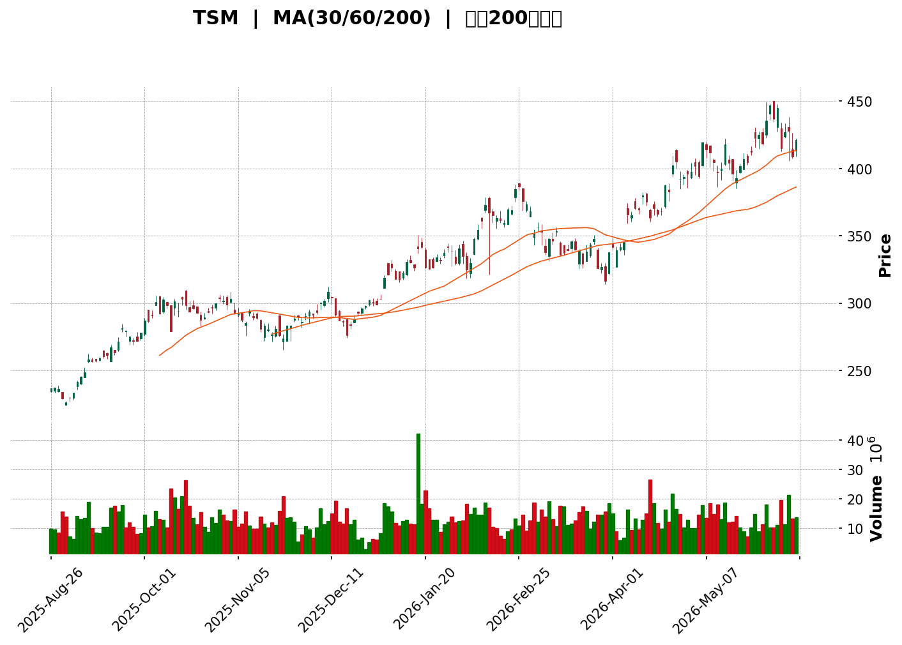
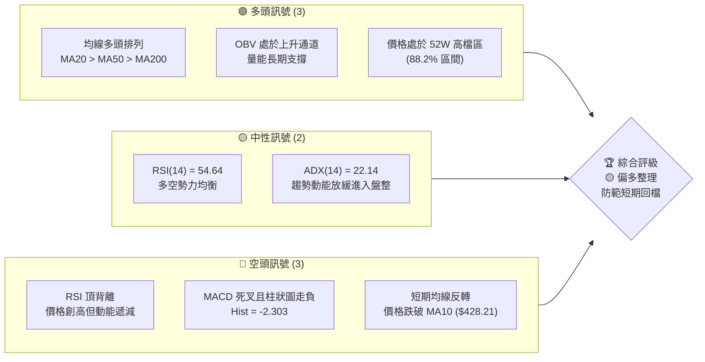
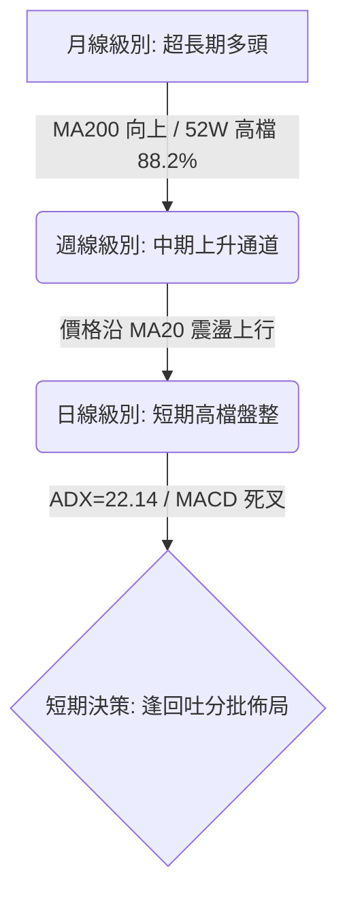
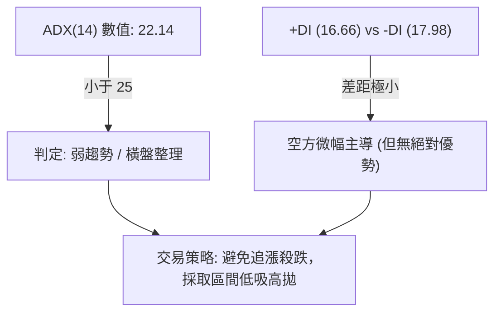
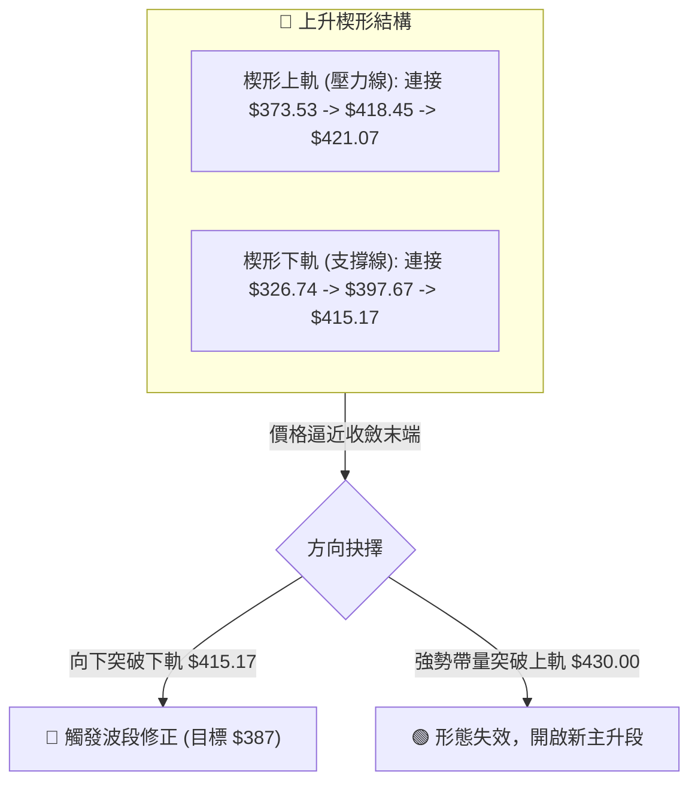

<details>
<summary>📊 靜態圖表 (點擊展開)</summary>

</details>

<html>
<head><meta charset="utf-8" /></head>
<body>
    <div style="height:500px; width:100%;">                        <script>window.PlotlyConfig = {MathJaxConfig: 'local'};</script>
        <script charset="utf-8" src="https://cdn.plot.ly/plotly-3.6.0.min.js" integrity="sha256-QaOVwtVY0T02VaHrr6pnoHLCwayMJp4O5n4YyaE3rJk=" crossorigin="anonymous"></script>                <div id="candlestick-chart" class="plotly-graph-div" style="height:100%; width:100%;"></div>            <script>                window.PLOTLYENV=window.PLOTLYENV || {};                                if (document.getElementById("candlestick-chart")) {                    Plotly.newPlot(                        "candlestick-chart",                        [{"close":{"dtype":"f8","bdata":"AAAAoCyVbUAAAADAQadtQAAAAADmhm1AAAAAwCOcbEAAAADgdk1sQAAAAACjrGxAAAAAoNIlbUAAAADg9SluQAAAAKDgoW5AAAAAQDUYb0AAAABgHCNwQAAAAIDXCnBAAAAAAIERcEAAAABgBTJwQAAAAMDrSXBAAAAAgIlVcEAAAACAn7JwQAAAAECidnBAAAAAoBzycEAAAACAgZJxQAAAAGCucnFAAAAAwDwycUAAAAAguv1wQAAAAMCo+3BAAAAAIBZccUAAAADAKO5xQAAAAEBu6HFAAAAAIFopckAAAACA0MtyQAAAAGChRnJAAAAAQIztckAAAABgt6NyQAAAAMDicXFAAAAAoJzTckAAAADABWVyQAAAAGCS8HJAAAAAYBSjckAAAACAVldyQAAAACAHgXJAAAAAwEROckAAAADgrvRxQAAAAOAeEnJAAAAAwG1VckAAAACgx4lyQAAAAKD4vXJAAAAAQJ72ckAAAADA3NhyQAAAAMB3rHJAAAAAQPXyckAAAADA8kZyQAAAAMBsQHJAAAAAQGn6cUAAAAAA0M5xQAAAAGBcWnJAAAAAQB8ZckAAAADAXhByQAAAACBkinFAAAAAgBS0cUAAAAAAXodxQAAAAMAgRnFAAAAAgBiNcUAAAACAmj9xQAAAACDHGHFAAAAAYDexcUAAAABA2rFxQAAAAEDeBXJAAAAAQIgeckAAAACgluFxQAAAAMDCJ3JAAAAA4DldckAAAACAIDVyQAAAACCcUXJAAAAAgGHDckAAAADA4ttyQAAAAID5RnNAAAAAAOX\u002fckAAAADAgjNyQAAAAGDn7nFAAAAA4AXhcUAAAACA6EJxQAAAAMAUvnFAAAAAoDUCckAAAABgS0dyQAAAAKDZgXJAAAAAwF2fckAAAAAg099yQAAAAAAxwXJAAAAAoM+rckAAAAAAlPByQAAAAABk63NAAAAAIIMVdEAAAADAKGh0QAAAAICN3HNAAAAA4NzRc0AAAADAhyt0QAAAAIBnrXRAAAAAIHikdEAAAADADWN0QAAAAIDhSnVAAAAAoAFXdUAAAAAA2mN0QAAAACBCU3RAAAAAwDNndEAAAABg3d50QAAAAOBmvHRAAAAAoDoWdUAAAAAgaVV1QAAAAMCIKXVAAAAAQBmadEAAAADAaUZ1QAAAAMDn7HRAAAAAADJNdEAAAACgz5x0QAAAAKDqvXVAAAAA4JQmdkAAAAAASo52QAAAACCfUHdAAAAAAA3xdkAAAAAAStV2QAAAAKDTsnZAAAAAoN+TdkAAAACgCXZ2QAAAAED7F3dAAAAAAAEQd0AAAABAqAp4QAAAAKA\u002fKnhAAAAAAAV8d0AAAACAcFh3QAAAAEAqAXdAAAAAQDQCdkAAAABg+EZ2QAAAAODZDXZAAAAAIAEfdUAAAAAAhrt1QAAAAODVoXVAAAAAAAUZdkAAAADgOPx0QAAAAADAFXVAAAAAYGI0dUAAAAAgrp91QAAAAMAeOXVAAAAA4KMsdUAAAAAA15N0QAAAAEAzJ3VAAAAAAAB0dUAAAAAAALx1QAAAAIDCYXRAAAAAANdrdEAAAAAAAMhzQAAAAEAzH3VAAAAAANdXdUAAAADgozB1QAAAAAApXHVAAAAAwB6VdUAAAABgZt52QAAAAADX13ZAAAAAoJkpd0AAAADAHhl3QAAAAIA9vndAAAAAoJlxd0AAAACgmbV2QAAAAAAAKHdAAAAAANfjdkAAAACgRwF3QAAAAEAKN3hAAAAAYI\u002fqd0AAAAAgXCd5QAAAACCuT3lAAAAAoHCFeEAAAACgR514QAAAAMD1wHhAAAAAYLjaeEAAAACAwhl5QAAAAGCPpnhAAAAAAAA4ekAAAABgZuJ5QAAAAEDhunlAAAAA4KNIeUAAAADgetR4QAAAAMDM\u002fHhAAAAAIIUbekAAAACgmUV5QAAAAEAzv3hAAAAAgMKJeEAAAACA6xl5QAAAAGBmcnlAAAAA4FFIeUAAAADAHsV5QAAAACCua3pAAAAAgMKNekAAAABAMyd6QAAAAIAUOntAAAAAQArre0AAAABACkt7QAAAAGC4zntAAAAAYLjyeUAAAADAzKx6QAAAAGC4vnpAAAAAAACMeUAAAADAHlF6QA=="},"high":{"dtype":"f8","bdata":"vDnz+qmYbUDnivMav6ptQG8ciA+40m1Al3D7TUw9bUAq1\u002fglmmtsQE8u86BDzmxA63Lxr\u002f4obUAJaFw6IE5uQKrLRGPEt25AtOTiohORb0DZSh6Kx2RwQFmJsDUlNnBA4DRQaTMrcEAmmcN5i0hwQNKbHKydj3BAaBa36a11cEBmiCMd29BwQHVmLT2vkXBAOtRbrXYtcUBMc6JU28ZxQPnGMB+jenFAOy5ZEuA5cUCyKfV1xx9xQFbmHa9QZXFAuw\u002fKv0RfcUDPDSKDJA5yQEIAuhhvcXJAazqOhu5mckDZvkGYyBlzQNln\u002ffeZFnNAywwhcHYLc0BngoIbqNJyQK2K6tnOqHJA5KLvdkzvckAv0B29eMFyQOuTM\u002f3NDnNAY5b+wItac0DZrcafItpyQCFrg1a033JAd6D83pmbckAmholiP1lyQObsFcGVR3JAx6rflAGFckC+esmPQ61yQFkACb+Ex3JAkmxfKEkkc0BMWvlS8RlzQDR3uZTUH3NAejTz3adGc0Aue59MSsVyQBtM5EtNiXJAxi8EN1ZQckA0kVc37uRxQG4wNCP1d3JASfoQ2spUckDSyUIZ\u002f1NyQOGcT5WM\u002fnFAWSxtVorUcUBxx5QlSs9xQGHmvU9oanFAAXbur8ivcUCe\u002fi6n2jNyQOHGLO2JUnFAgjo\u002fLOa3cUAqMrErT71xQByCf7s3M3JAFymShP0wckBGDXxt9hhyQJSaeOIbTnJADugfy9dvckDQ0zVeoUZyQEl1xelasnJAO4vGnlDPckDW0tMKGPByQI4dwrMThHNA\u002fnUZm7APc0B3MODgzPZyQLBLnVyAb3JA+0tVM2T6cUCM7clGmgRyQLLh3lSm5XFA\u002fzydsJU1ckDySKaW5WJyQO78jLMqkXJA1OQ\u002fOxylckCQHOvIcOhyQBPyAWxP+nJAo\u002fRLjBv7ckBYG9m3ayhzQLQEHVb7CnRALwKNihuldEBkH+wYTsJ0QItxzEwhVnRAn1++LWk5dEAATy0BuD10QBQXiePNyXRAZJNFaZj3dEDbS5MZ7o50QL6q7Bl85XVASyueId\u002fNdUCGvd55BFN1QEbgYZM9y3RA5D0dnLzhdECMzT4CPgN1QNGbH96I4nRAVUElgqhEdUAGspCLd4h1QPg+msZibHVA5avqYB4vdUAnNFbQuXN1QIdC6XEyoXVAJlCtcJEddUAec9INFNp0QPvqrBzMy3VA5Pu35m5pdkD2J7XSwrt2QPRkc\u002fA2qHdA+M+oaequd0CY3dhUEyF3QG5qU5u80nZAiOY1EKIFd0A+ajwjfZx2QNBjCIV3MndAor\u002fgWxdGd0DMmtkFYkF4QE7qCBXRUXhATdBnMiUWeED7hp\u002f08Xl3QCD9u3PTQHdABGTbEq0vdkDyjcC9NIF2QN2u++5bZ3ZAaUo0nde7dUAQCZwRscZ1QJTOv3kbCHZAJwaMw4hFdkDDLSIWpZ51QMp+0abUeHVAFoAjHJZ6dUAAAAAAKax1QAAAAEAzv3VAAAAAYGY+dUAAAACgmRl1QAAAAGCPdnVAAAAAgBSOdUAAAABAM+d1QAAAAGCPTnVAAAAAwPWYdEAAAACgmZl0QAAAAGCPJnVAAAAAQOHKdUAAAADAHmF1QAAAAEAzg3VAAAAA4HqYdUAAAADAzGR3QAAAAGC4AndAAAAAAACgd0AAAAAgXDd3QAAAAGCP4ndAAAAAIK7fd0AAAABAMyN3QAAAAKBHeXdAAAAAwB4hd0AAAAAAACx3QAAAAGCPPnhAAAAAAClMeEAAAAAA15d5QAAAAAAA6HlAAAAAgOvdeEAAAACgmb14QAAAAOCj7HhAAAAAANc\u002feUAAAABAM3t5QAAAAIAUYnlAAAAAQDM7ekAAAAAAAEB6QAAAAAAAEHpAAAAAIK57eUAAAAAA1yN5QAAAAEDhSnlAAAAAIIVfekAAAACA6515QAAAAIAUbnlAAAAAgBTueEAAAACAFD55QAAAACBct3lAAAAAYLiqeUAAAAAA1wd6QAAAAMDM6HpAAAAAoJm5ekAAAABACud6QAAAAIA9FnxAAAAAgBQGfEAAAABgjyJ8QAAAAAApAHxAAAAAYGYee0AAAADA9Rx7QAAAAGCPYntAAAAAwB6lekAAAAAA12N6QA=="},"hovertemplate":"\u003cb\u003e%{x|%Y-%m-%d}\u003c\u002fb\u003e\u003cbr\u003e\u958b: $%{open:.2f}\u003cbr\u003e\u9ad8: $%{high:.2f}\u003cbr\u003e\u4f4e: $%{low:.2f}\u003cbr\u003e\u6536: $%{close:.2f}\u003cextra\u003e\u003c\u002fextra\u003e","low":{"dtype":"f8","bdata":"2MXKsVE2bUATviaQHi1tQIMIsXbiPm1ABWy9m\u002fCSbEBztcDy5\u002fVrQDv+HXEgVGxAQhTJrw6KbEBHkNEQKXttQEK3vI0s8W1A5lEN9KCZbkBkpP5A4vBvQDpA4kMOAHBAVxDObG8CcED2mTDCTQhwQHlXaCLZMnBA6NdantgkcEA6Cd8JAAlwQFDN69zaVXBAevA3+Nx\u002fcED0q5ldYmdxQDSizSwxM3FAsUvVPUnLcEAsM+bKINJwQAAAAMCo+3BAddVbwjQFcUAF3fpRWjpxQA0ibe4+13FAPmLTIk0OckBWsHS9q6RyQGsVMUGyOnJAYBJVt9VFckCCE2KdknxyQP3Gbm2ibHFAdDzEw2srckAQfWWn0xtyQJeOOm29pnJAOcXw5PRwckAP2rLZylRyQPsihAfYdnJAPrJYQb5AckA1uBuUZa1xQCp4zQGeAHJA3M\u002fx81tMckA\u002ffG+AOEFyQMnNgwhAZ3JA\u002fPzBHX\u002fLckAehd1jrLJyQPcI1SXMcHJABlS36lvHckD3ricnWz5yQPtv72lfHnJAj7+PnNDccUBI4NJhtzlxQP0jA7lZInJA1Hc7HSn1cUBELBlI0v9xQGUYUGNiZ3FAatMguaj7cED1f0l9M2RxQGxSTU6L83BATx4e6dMscUAUfCNoQi5xQMfn9JOplXBAgbLU0QX7cEDOK8WxRflwQO+4LnBi4nFAWX2RvZf2cUDE4qKtJJpxQGryVt50+XFAzZAMe\u002fjHcUAnwArxrwlyQORfgRU4OnJAbWVfCG9xckD89X3hwY1yQLokJvJnzXJAygOv1sSsckB75xszmSJyQGIrz0\u002ff63FAmN52+2GocUC9ADqj6SRxQJG\u002f9ThVj3FAO70\u002fdDTZcUBY7R9zRCZyQPlKDksQNnJATF4ttFx2ckDmEXkY5ppyQD+1VSD5nHJAXnj1vrypckBdSmALPelyQBjD38kvbXNAJ5XJwYsJdEBPnLvP2Dp0QIxZcbxR2nNAzOzL5Qa0c0ADyYUrsdVzQBFbLKOGAnRAe3zs0puddECUkwtbhD50QLaUbzCHD3VAS8GUMQJIdUAYExb+s190QMLTZvA8THRAeM3ICLRfdEBSJVmoBad0QBMQ82rVlHRAFHgnQevZdEARxMGkVRt1QG+Xf+FxdHRA+bys7c2CdED1gPn5zYJ0QMAtzpJ7kXRAQo4ahMbic0CH9TJmB+xzQLZQtclD+3RAJ6Dk1SmtdUCUhimoNzZ2QNATQ5qt9XZAIuQqbx4TdEBKChO2GXx2QCFr6PzSM3ZAoin2liR7dkCBe\u002fBT+EZ2QE+KW6p0YXZAyS4HdOLWdkCD2Suk5G93QOcFk4D6+3dA5rljVJQKd0Bx3kn4WPl2QNfT\u002fnQBunZASpq+t8RydUDSiBAj3Bh2QG6VLehXbXVAltUNMuf7dEDRYrw\u002fzK90QDGZ6P56dXVADqTfFgLWdUDUJUEM9fZ0QO6B\u002fG1n9HRA4DUCuNctdUAAAABgZiZ1QAAAAKBwNXVAAAAAQApTdEAAAABgZl50QAAAAKCZsXRAAAAA4FHgdEAAAAAAAHh1QAAAAIDrVXRAAAAAwPUkdEAAAADAzJxzQAAAAIA9EnRAAAAAAAA8dUAAAADAzGx0QAAAAIDrKXVAAAAAYGb6dEAAAAAA13N2QAAAACCFi3ZAAAAAAAAcd0AAAADAzOB2QAAAACCFU3dAAAAAIFxDd0AAAADAzIh2QAAAAIA90nZAAAAAAADEdkAAAACAwtF2QAAAAIA9KndAAAAAwPV8d0AAAACgmZ14QAAAAGBmBnlAAAAAQDMLeEAAAABA4UJ4QAAAACBcG3hAAAAAgBSCeEAAAABAM7N4QAAAAKCZiXhAAAAAYGYKeUAAAACAwoF5QAAAAIAUDnlAAAAAQArjeEAAAACA6yF4QAAAACCFd3hAAAAAoJkheUAAAACgR+14QAAAAMDMcHhAAAAAwPUQeEAAAABAM794QAAAAAAp+HhAAAAAgMIteUAAAADAHqF5QAAAAIAU9nlAAAAAIFzreUAAAAAAABR6QAAAAAAAaHpAAAAAAClAe0AAAADgeih7QAAAAMDMtHpAAAAA4KPMeUAAAADgemh6QAAAAAApWHlAAAAAQDN7eUAAAACAwo15QA=="},"name":"\u50f9\u683c","open":{"dtype":"f8","bdata":"Ep82XZ9KbUD5bcsOfFptQKhC+eVmSG1AYUgL8845bUCXDzb4ZgZsQKr3OtHCsGxAdyxlJV6rbECZO2EoZcVtQKPwJovp\u002fG1A5lEN9KCZbkC8WosSNQpwQKMnyuSuIXBAL3x4UZ0pcEBZMMqcIRxwQBcuFoBXh3BAc5qnXTNucEBDPLR2UQlwQH1Mkn2AjnBAkIkZEDWRcEDjlQy6ko1xQJPGnABRbHFAPWNDjOj5cEBtaCYyKQZxQLrqU0GIL3FAKMd7WeoccUAFiNCcj05xQLfFHFlAbnJAQgHQSwM0ckBDPRrqyKVyQOepnaX2DnNAonSLohBWckA\u002f43TvYcpyQAIF0yD9pHJAAv5ox56JckA6\u002fxT6FmByQOe+vpC2CXNAJIMaaItTc0CpGICHKoxyQCbJXBygpXJAHcC6sraVckCdUyqmPTZyQLqMbW5SA3JATmVepSJfckARMG\u002f\u002fJJByQMFGhr7kinJA7NZYZeoBc0DUQLZmotZyQOVTxF3wBHNAUlPCdtbOckA7MnvO+nNyQDQV9bQxMHJADpJZfr5HckBQZncoSbpxQHjbI3vhS3JA531ImEgnckDXuDcuYUFyQBAfhWJM+XFASvIIqE0mcUDpFykUTH5xQB4TPTpmQHFA\u002fdgrCGA2cUCdgbOOqylyQFOVt8P59HBAgbLU0QX7cED7NeAC05JxQAsM3Rov+HFAnvhHi\u002fctckCU\u002fbbaftVxQI1bhiZUJnJAyihFeDEpckA+PTi+1UVyQLuqMtHFZnJAgAMyVLi4ckApgMJYd6VyQLJjmNoS+3JAIwsxt2QHc0B3MODgzPZyQBpytXchZXJA143i4j7ncUBCmkAWgvtxQM2PINEvw3FAO70\u002fdDTZcUA8f2zgeF1yQExIhJs1SXJAKgEtM3SOckDI62y26rByQAWMKJrpznJAZ9b1gCrYckCwa\u002fI7VfJyQFhf43CncXNAHJv+souXdEDF9IyDrJR0QK+cR68fPHRAc5jO8ac3dEAZWUmc5u5zQJPo9ooeE3RAV6n9ZPS+dEDbS5MZ7o50QMtP0UiMXXVAbPNu8pSYdUBUjeWgUT11QIxILr7jx3RAD4qT\u002frrHdECMtdfZMLJ0QNJfPbStvXRATU5ALd\u002f4dEDvOB3ZDmF1QPXKZt+FLXVAmY6Y8KPndEBaTg0\u002fSp10QPQAsTubgXVAB1\u002fxJIPqdEBNnQ9Kmx50QOpXR6HTCHVAMhxRCXu8dUCusLtl5rR2QGM1+kakEHdA43sT7PWed0Cl+qnDzQF3QOcHBLGmjXZA6j7YtWatdkCRBCL2WGt2QHzW2hZObHZAkYh5\u002f6jfdkAAt7G1V6V3QE7qCBXRUXhA5BLeqIQReEDZAMN5mRF3QLp8EGlVxXZAr5YEtBXJdUB5FX59z0Z2QGTdx8dxHnZAJthEkY5odUDxQjElg+p0QJlE\u002fn3at3VAsHI9wPcOdkAypbDiU491QKaslw5Cb3VA7PnEgqhEdUAAAACgmUl1QAAAAOB6nHVAAAAAIIWTdEAAAABA4Qp1QAAAAKCZsXRAAAAAwB75dEAAAAAAAKB1QAAAAMAePXVAAAAAoEdNdEAAAABAM3N0QAAAAMD1JHRAAAAAYGZ+dUAAAACgcG10QAAAAAAAPHVAAAAAQAo3dUAAAADgoyR3QAAAAMDMtHZAAAAAoHB5d0AAAAAAKSR3QAAAAOCjsHdAAAAAYI\u002fWd0AAAACAwg13QAAAAEAzU3dAAAAAIIUTd0AAAACgRwF3QAAAAOB6PHdAAAAAAAAEeEAAAACAPcJ4QAAAAAAA3HlAAAAAgOuBeEAAAABgj454QAAAAMD13HhAAAAAQAqXeEAAAADgUUh5QAAAAKCZSXlAAAAAYGYmeUAAAACgcCF6QAAAAEAzD3pAAAAAANdreUAAAAAAANx4QAAAAOBR5HhAAAAAIFwzeUAAAAAAAGh5QAAAAIAUbnlAAAAAAClYeEAAAAAAANB4QAAAAAAp+HhAAAAAQOGWeUAAAACA69F5QAAAAOBRsHpAAAAAIIVjekAAAADAHrF6QAAAAIAUjnpAAAAAoEeJe0AAAAAA1x98QAAAAIAU6npAAAAA4FHcekAAAADgUXx6QAAAAIAU7npAAAAAIFzfeUAAAACAFNR5QA=="},"x":["2025-08-26T00:00:00-04:00","2025-08-27T00:00:00-04:00","2025-08-28T00:00:00-04:00","2025-08-29T00:00:00-04:00","2025-09-02T00:00:00-04:00","2025-09-03T00:00:00-04:00","2025-09-04T00:00:00-04:00","2025-09-05T00:00:00-04:00","2025-09-08T00:00:00-04:00","2025-09-09T00:00:00-04:00","2025-09-10T00:00:00-04:00","2025-09-11T00:00:00-04:00","2025-09-12T00:00:00-04:00","2025-09-15T00:00:00-04:00","2025-09-16T00:00:00-04:00","2025-09-17T00:00:00-04:00","2025-09-18T00:00:00-04:00","2025-09-19T00:00:00-04:00","2025-09-22T00:00:00-04:00","2025-09-23T00:00:00-04:00","2025-09-24T00:00:00-04:00","2025-09-25T00:00:00-04:00","2025-09-26T00:00:00-04:00","2025-09-29T00:00:00-04:00","2025-09-30T00:00:00-04:00","2025-10-01T00:00:00-04:00","2025-10-02T00:00:00-04:00","2025-10-03T00:00:00-04:00","2025-10-06T00:00:00-04:00","2025-10-07T00:00:00-04:00","2025-10-08T00:00:00-04:00","2025-10-09T00:00:00-04:00","2025-10-10T00:00:00-04:00","2025-10-13T00:00:00-04:00","2025-10-14T00:00:00-04:00","2025-10-15T00:00:00-04:00","2025-10-16T00:00:00-04:00","2025-10-17T00:00:00-04:00","2025-10-20T00:00:00-04:00","2025-10-21T00:00:00-04:00","2025-10-22T00:00:00-04:00","2025-10-23T00:00:00-04:00","2025-10-24T00:00:00-04:00","2025-10-27T00:00:00-04:00","2025-10-28T00:00:00-04:00","2025-10-29T00:00:00-04:00","2025-10-30T00:00:00-04:00","2025-10-31T00:00:00-04:00","2025-11-03T00:00:00-05:00","2025-11-04T00:00:00-05:00","2025-11-05T00:00:00-05:00","2025-11-06T00:00:00-05:00","2025-11-07T00:00:00-05:00","2025-11-10T00:00:00-05:00","2025-11-11T00:00:00-05:00","2025-11-12T00:00:00-05:00","2025-11-13T00:00:00-05:00","2025-11-14T00:00:00-05:00","2025-11-17T00:00:00-05:00","2025-11-18T00:00:00-05:00","2025-11-19T00:00:00-05:00","2025-11-20T00:00:00-05:00","2025-11-21T00:00:00-05:00","2025-11-24T00:00:00-05:00","2025-11-25T00:00:00-05:00","2025-11-26T00:00:00-05:00","2025-11-28T00:00:00-05:00","2025-12-01T00:00:00-05:00","2025-12-02T00:00:00-05:00","2025-12-03T00:00:00-05:00","2025-12-04T00:00:00-05:00","2025-12-05T00:00:00-05:00","2025-12-08T00:00:00-05:00","2025-12-09T00:00:00-05:00","2025-12-10T00:00:00-05:00","2025-12-11T00:00:00-05:00","2025-12-12T00:00:00-05:00","2025-12-15T00:00:00-05:00","2025-12-16T00:00:00-05:00","2025-12-17T00:00:00-05:00","2025-12-18T00:00:00-05:00","2025-12-19T00:00:00-05:00","2025-12-22T00:00:00-05:00","2025-12-23T00:00:00-05:00","2025-12-24T00:00:00-05:00","2025-12-26T00:00:00-05:00","2025-12-29T00:00:00-05:00","2025-12-30T00:00:00-05:00","2025-12-31T00:00:00-05:00","2026-01-02T00:00:00-05:00","2026-01-05T00:00:00-05:00","2026-01-06T00:00:00-05:00","2026-01-07T00:00:00-05:00","2026-01-08T00:00:00-05:00","2026-01-09T00:00:00-05:00","2026-01-12T00:00:00-05:00","2026-01-13T00:00:00-05:00","2026-01-14T00:00:00-05:00","2026-01-15T00:00:00-05:00","2026-01-16T00:00:00-05:00","2026-01-20T00:00:00-05:00","2026-01-21T00:00:00-05:00","2026-01-22T00:00:00-05:00","2026-01-23T00:00:00-05:00","2026-01-26T00:00:00-05:00","2026-01-27T00:00:00-05:00","2026-01-28T00:00:00-05:00","2026-01-29T00:00:00-05:00","2026-01-30T00:00:00-05:00","2026-02-02T00:00:00-05:00","2026-02-03T00:00:00-05:00","2026-02-04T00:00:00-05:00","2026-02-05T00:00:00-05:00","2026-02-06T00:00:00-05:00","2026-02-09T00:00:00-05:00","2026-02-10T00:00:00-05:00","2026-02-11T00:00:00-05:00","2026-02-12T00:00:00-05:00","2026-02-13T00:00:00-05:00","2026-02-17T00:00:00-05:00","2026-02-18T00:00:00-05:00","2026-02-19T00:00:00-05:00","2026-02-20T00:00:00-05:00","2026-02-23T00:00:00-05:00","2026-02-24T00:00:00-05:00","2026-02-25T00:00:00-05:00","2026-02-26T00:00:00-05:00","2026-02-27T00:00:00-05:00","2026-03-02T00:00:00-05:00","2026-03-03T00:00:00-05:00","2026-03-04T00:00:00-05:00","2026-03-05T00:00:00-05:00","2026-03-06T00:00:00-05:00","2026-03-09T00:00:00-04:00","2026-03-10T00:00:00-04:00","2026-03-11T00:00:00-04:00","2026-03-12T00:00:00-04:00","2026-03-13T00:00:00-04:00","2026-03-16T00:00:00-04:00","2026-03-17T00:00:00-04:00","2026-03-18T00:00:00-04:00","2026-03-19T00:00:00-04:00","2026-03-20T00:00:00-04:00","2026-03-23T00:00:00-04:00","2026-03-24T00:00:00-04:00","2026-03-25T00:00:00-04:00","2026-03-26T00:00:00-04:00","2026-03-27T00:00:00-04:00","2026-03-30T00:00:00-04:00","2026-03-31T00:00:00-04:00","2026-04-01T00:00:00-04:00","2026-04-02T00:00:00-04:00","2026-04-06T00:00:00-04:00","2026-04-07T00:00:00-04:00","2026-04-08T00:00:00-04:00","2026-04-09T00:00:00-04:00","2026-04-10T00:00:00-04:00","2026-04-13T00:00:00-04:00","2026-04-14T00:00:00-04:00","2026-04-15T00:00:00-04:00","2026-04-16T00:00:00-04:00","2026-04-17T00:00:00-04:00","2026-04-20T00:00:00-04:00","2026-04-21T00:00:00-04:00","2026-04-22T00:00:00-04:00","2026-04-23T00:00:00-04:00","2026-04-24T00:00:00-04:00","2026-04-27T00:00:00-04:00","2026-04-28T00:00:00-04:00","2026-04-29T00:00:00-04:00","2026-04-30T00:00:00-04:00","2026-05-01T00:00:00-04:00","2026-05-04T00:00:00-04:00","2026-05-05T00:00:00-04:00","2026-05-06T00:00:00-04:00","2026-05-07T00:00:00-04:00","2026-05-08T00:00:00-04:00","2026-05-11T00:00:00-04:00","2026-05-12T00:00:00-04:00","2026-05-13T00:00:00-04:00","2026-05-14T00:00:00-04:00","2026-05-15T00:00:00-04:00","2026-05-18T00:00:00-04:00","2026-05-19T00:00:00-04:00","2026-05-20T00:00:00-04:00","2026-05-21T00:00:00-04:00","2026-05-22T00:00:00-04:00","2026-05-26T00:00:00-04:00","2026-05-27T00:00:00-04:00","2026-05-28T00:00:00-04:00","2026-05-29T00:00:00-04:00","2026-06-01T00:00:00-04:00","2026-06-02T00:00:00-04:00","2026-06-03T00:00:00-04:00","2026-06-04T00:00:00-04:00","2026-06-05T00:00:00-04:00","2026-06-08T00:00:00-04:00","2026-06-09T00:00:00-04:00","2026-06-10T00:00:00-04:00","2026-06-11T00:00:00-04:00"],"type":"candlestick"},{"hovertemplate":"MA30: $%{y:.2f}\u003cextra\u003e\u003c\u002fextra\u003e","line":{"color":"#2196F3","dash":"dash","width":2},"mode":"lines","name":"MA30","x":["2025-08-26T00:00:00-04:00","2025-08-27T00:00:00-04:00","2025-08-28T00:00:00-04:00","2025-08-29T00:00:00-04:00","2025-09-02T00:00:00-04:00","2025-09-03T00:00:00-04:00","2025-09-04T00:00:00-04:00","2025-09-05T00:00:00-04:00","2025-09-08T00:00:00-04:00","2025-09-09T00:00:00-04:00","2025-09-10T00:00:00-04:00","2025-09-11T00:00:00-04:00","2025-09-12T00:00:00-04:00","2025-09-15T00:00:00-04:00","2025-09-16T00:00:00-04:00","2025-09-17T00:00:00-04:00","2025-09-18T00:00:00-04:00","2025-09-19T00:00:00-04:00","2025-09-22T00:00:00-04:00","2025-09-23T00:00:00-04:00","2025-09-24T00:00:00-04:00","2025-09-25T00:00:00-04:00","2025-09-26T00:00:00-04:00","2025-09-29T00:00:00-04:00","2025-09-30T00:00:00-04:00","2025-10-01T00:00:00-04:00","2025-10-02T00:00:00-04:00","2025-10-03T00:00:00-04:00","2025-10-06T00:00:00-04:00","2025-10-07T00:00:00-04:00","2025-10-08T00:00:00-04:00","2025-10-09T00:00:00-04:00","2025-10-10T00:00:00-04:00","2025-10-13T00:00:00-04:00","2025-10-14T00:00:00-04:00","2025-10-15T00:00:00-04:00","2025-10-16T00:00:00-04:00","2025-10-17T00:00:00-04:00","2025-10-20T00:00:00-04:00","2025-10-21T00:00:00-04:00","2025-10-22T00:00:00-04:00","2025-10-23T00:00:00-04:00","2025-10-24T00:00:00-04:00","2025-10-27T00:00:00-04:00","2025-10-28T00:00:00-04:00","2025-10-29T00:00:00-04:00","2025-10-30T00:00:00-04:00","2025-10-31T00:00:00-04:00","2025-11-03T00:00:00-05:00","2025-11-04T00:00:00-05:00","2025-11-05T00:00:00-05:00","2025-11-06T00:00:00-05:00","2025-11-07T00:00:00-05:00","2025-11-10T00:00:00-05:00","2025-11-11T00:00:00-05:00","2025-11-12T00:00:00-05:00","2025-11-13T00:00:00-05:00","2025-11-14T00:00:00-05:00","2025-11-17T00:00:00-05:00","2025-11-18T00:00:00-05:00","2025-11-19T00:00:00-05:00","2025-11-20T00:00:00-05:00","2025-11-21T00:00:00-05:00","2025-11-24T00:00:00-05:00","2025-11-25T00:00:00-05:00","2025-11-26T00:00:00-05:00","2025-11-28T00:00:00-05:00","2025-12-01T00:00:00-05:00","2025-12-02T00:00:00-05:00","2025-12-03T00:00:00-05:00","2025-12-04T00:00:00-05:00","2025-12-05T00:00:00-05:00","2025-12-08T00:00:00-05:00","2025-12-09T00:00:00-05:00","2025-12-10T00:00:00-05:00","2025-12-11T00:00:00-05:00","2025-12-12T00:00:00-05:00","2025-12-15T00:00:00-05:00","2025-12-16T00:00:00-05:00","2025-12-17T00:00:00-05:00","2025-12-18T00:00:00-05:00","2025-12-19T00:00:00-05:00","2025-12-22T00:00:00-05:00","2025-12-23T00:00:00-05:00","2025-12-24T00:00:00-05:00","2025-12-26T00:00:00-05:00","2025-12-29T00:00:00-05:00","2025-12-30T00:00:00-05:00","2025-12-31T00:00:00-05:00","2026-01-02T00:00:00-05:00","2026-01-05T00:00:00-05:00","2026-01-06T00:00:00-05:00","2026-01-07T00:00:00-05:00","2026-01-08T00:00:00-05:00","2026-01-09T00:00:00-05:00","2026-01-12T00:00:00-05:00","2026-01-13T00:00:00-05:00","2026-01-14T00:00:00-05:00","2026-01-15T00:00:00-05:00","2026-01-16T00:00:00-05:00","2026-01-20T00:00:00-05:00","2026-01-21T00:00:00-05:00","2026-01-22T00:00:00-05:00","2026-01-23T00:00:00-05:00","2026-01-26T00:00:00-05:00","2026-01-27T00:00:00-05:00","2026-01-28T00:00:00-05:00","2026-01-29T00:00:00-05:00","2026-01-30T00:00:00-05:00","2026-02-02T00:00:00-05:00","2026-02-03T00:00:00-05:00","2026-02-04T00:00:00-05:00","2026-02-05T00:00:00-05:00","2026-02-06T00:00:00-05:00","2026-02-09T00:00:00-05:00","2026-02-10T00:00:00-05:00","2026-02-11T00:00:00-05:00","2026-02-12T00:00:00-05:00","2026-02-13T00:00:00-05:00","2026-02-17T00:00:00-05:00","2026-02-18T00:00:00-05:00","2026-02-19T00:00:00-05:00","2026-02-20T00:00:00-05:00","2026-02-23T00:00:00-05:00","2026-02-24T00:00:00-05:00","2026-02-25T00:00:00-05:00","2026-02-26T00:00:00-05:00","2026-02-27T00:00:00-05:00","2026-03-02T00:00:00-05:00","2026-03-03T00:00:00-05:00","2026-03-04T00:00:00-05:00","2026-03-05T00:00:00-05:00","2026-03-06T00:00:00-05:00","2026-03-09T00:00:00-04:00","2026-03-10T00:00:00-04:00","2026-03-11T00:00:00-04:00","2026-03-12T00:00:00-04:00","2026-03-13T00:00:00-04:00","2026-03-16T00:00:00-04:00","2026-03-17T00:00:00-04:00","2026-03-18T00:00:00-04:00","2026-03-19T00:00:00-04:00","2026-03-20T00:00:00-04:00","2026-03-23T00:00:00-04:00","2026-03-24T00:00:00-04:00","2026-03-25T00:00:00-04:00","2026-03-26T00:00:00-04:00","2026-03-27T00:00:00-04:00","2026-03-30T00:00:00-04:00","2026-03-31T00:00:00-04:00","2026-04-01T00:00:00-04:00","2026-04-02T00:00:00-04:00","2026-04-06T00:00:00-04:00","2026-04-07T00:00:00-04:00","2026-04-08T00:00:00-04:00","2026-04-09T00:00:00-04:00","2026-04-10T00:00:00-04:00","2026-04-13T00:00:00-04:00","2026-04-14T00:00:00-04:00","2026-04-15T00:00:00-04:00","2026-04-16T00:00:00-04:00","2026-04-17T00:00:00-04:00","2026-04-20T00:00:00-04:00","2026-04-21T00:00:00-04:00","2026-04-22T00:00:00-04:00","2026-04-23T00:00:00-04:00","2026-04-24T00:00:00-04:00","2026-04-27T00:00:00-04:00","2026-04-28T00:00:00-04:00","2026-04-29T00:00:00-04:00","2026-04-30T00:00:00-04:00","2026-05-01T00:00:00-04:00","2026-05-04T00:00:00-04:00","2026-05-05T00:00:00-04:00","2026-05-06T00:00:00-04:00","2026-05-07T00:00:00-04:00","2026-05-08T00:00:00-04:00","2026-05-11T00:00:00-04:00","2026-05-12T00:00:00-04:00","2026-05-13T00:00:00-04:00","2026-05-14T00:00:00-04:00","2026-05-15T00:00:00-04:00","2026-05-18T00:00:00-04:00","2026-05-19T00:00:00-04:00","2026-05-20T00:00:00-04:00","2026-05-21T00:00:00-04:00","2026-05-22T00:00:00-04:00","2026-05-26T00:00:00-04:00","2026-05-27T00:00:00-04:00","2026-05-28T00:00:00-04:00","2026-05-29T00:00:00-04:00","2026-06-01T00:00:00-04:00","2026-06-02T00:00:00-04:00","2026-06-03T00:00:00-04:00","2026-06-04T00:00:00-04:00","2026-06-05T00:00:00-04:00","2026-06-08T00:00:00-04:00","2026-06-09T00:00:00-04:00","2026-06-10T00:00:00-04:00","2026-06-11T00:00:00-04:00"],"y":{"dtype":"f8","bdata":"AAAAAAAA+H8AAAAAAAD4fwAAAAAAAPh\u002fAAAAAAAA+H8AAAAAAAD4fwAAAAAAAPh\u002fAAAAAAAA+H8AAAAAAAD4fwAAAAAAAPh\u002fAAAAAAAA+H8AAAAAAAD4fwAAAAAAAPh\u002fAAAAAAAA+H8AAAAAAAD4fwAAAAAAAPh\u002fAAAAAAAA+H8AAAAAAAD4fwAAAAAAAPh\u002fAAAAAAAA+H8AAAAAAAD4fwAAAAAAAPh\u002fAAAAAAAA+H8AAAAAAAD4fwAAAAAAAPh\u002fAAAAAAAA+H8AAAAAAAD4fwAAAAAAAPh\u002fAAAAAAAA+H8AAAAAAAD4f+\u002fu7hb6UHBA3t3djUZ0cEBmZmbWz5RwQN7d3W2xq3BA7+7uHkfScEBERETMfPZwQCIiIjrDHXFAREREVG9AcUBmZmYuP1xxQERERCRzd3FAREREFP2OcUBmZmb2gZ5xQERERCTRr3FAVVVV1SXDcUBmZmbGI9dxQDMzMyMT7HFAMzMzw4ICckAzMzMj2hRyQGZmZpa2J3JAAAAA4M44ckBmZmam0j5yQERERFSuRXJAq6qqelpMckDNzMysUlNyQERERFQDX3JA7+7ublBlckDe3d1ddGZyQFVVVeVRY3JAzczMLGlfckDv7u6OmFRyQM3MzLwLTHJAVVVVJUxAckARERFRbTRyQN7d3e10MXJAMzMz48YnckCJiIj4zSFyQKuqqir7GXJAiYiIGJAVckDNzMxMoxFyQN7d3Y2pDnJAERERMSkPckDNzMwcTxFyQDMzM+NsE3JAVVVVJRcXckCJiIjI0xlyQBEREeFkHnJAmpmZCbQeckCamZkJMRlyQM3MzGzfEnJAiYiI2L0JckBmZmbWEgFyQCIiIpK6\u002fHFA3t3dHf38cUCrqqo6AQFyQERERDRSAnJAERERwcsGckCJiIgItg1yQCIiIjISGHJAq6qqKlQgckAAAACAXixyQO\u002fu7s7xQnJAZmZm9o5YckAzMzOjgnNyQBEREVEai3JAd3d390GdckCamZlZYbJyQO\u002fu7g4IyXJA3t3dDZDeckBERETk8fNyQO\u002fu7i63DnNAVVVVtRsoc0De3d19uzpzQAAAAKDaS3NAmpmZGdlZc0BmZmaWA2tzQKuqqip2d3NAIiIi0kWJc0AzMzOzAKRzQM3MzJyOv3NA3t3d\u002fcrWc0CJiIgIC\u002flzQDMzMzM0FHRAVVVVJcUndEBERET0rzt0QO\u002fu7h5KV3RA7+7ujmV1dEC8u7vrz5R0QN7d3f25u3RAiYiI+CrgdEDNzMw8ZAF1QImIiCgbGXVAIiIigmIudUAREREB6j91QKuqqrp+W3VAmpmZmSp3dUB3d3c3NJh1QHd3dyf3tXVAVVVVlTfOdUC8u7ubdud1QCIiIqIS9nVAVVVVhcf7dUAiIiIi4gt2QM3MzOyiGnZA7+7uXsMgdkAzMzNTHih2QImIiCjEL3ZAERERgWQ4dkDe3d1tazV2QKuqqprCNHZAzczMLOc5dkC8u7vr4Dx2QJqZmUlrP3ZAREREBN5GdkBmZmZ2kUZ2QJqZmVmLQXZAREREdJc7dkDNzMz8lDR2QCIiIqKNG3ZAVVVV1QsGdkBVVVXVAOx1QN7d3Y2M3nVAvLu7uwPUdUAiIiICK8l1QLy7u7tfunVAd3d3l76tdUBVVVVlvKN1QERERKR0mHVAREREVLWVdUAREREBmZN1QCIiInLmmXVA7+7ujiWmdUCamZmZ1al1QFVVVUU9s3VAd3d3d1XCdUARERFBMc11QImIiIg743VAVVVVJcDydUAzMzNjUhZ2QLy7u9tiOnZAIiIiIrBWdkAAAABANXB2QERERARWjnZAmpmZGb2tdkBEREQEVtR2QLy7u2su8nZAZmZmFtkad0BmZmbmQj53QO\u002fu7g7ma3dAq6qqWmSVd0BERESEecB3QJqZmRl24XdAmpmZCR4KeEB3d3cH8yx4QFVVVcXZSXhA3t3dbRJjeEBmZmZmH3Z4QBEREWFXjHhAZmZmlm6eeEAzMzNjO7V4QJqZmXkUzHhA7+7uXp7meEC8u7tbAQR5QGZmZsa9JnlAIiIi4qVReUAAAABwPXZ5QAAAAGDllHlAMzMzEzymeUC8u7tLN7N5QO\u002fu7l5zv3lAIiIi4jPIeUDe3d0Nu9Z5QA=="},"type":"scatter"},{"hovertemplate":"MA60: $%{y:.2f}\u003cextra\u003e\u003c\u002fextra\u003e","line":{"color":"#9C27B0","dash":"dash","width":2},"mode":"lines","name":"MA60","x":["2025-08-26T00:00:00-04:00","2025-08-27T00:00:00-04:00","2025-08-28T00:00:00-04:00","2025-08-29T00:00:00-04:00","2025-09-02T00:00:00-04:00","2025-09-03T00:00:00-04:00","2025-09-04T00:00:00-04:00","2025-09-05T00:00:00-04:00","2025-09-08T00:00:00-04:00","2025-09-09T00:00:00-04:00","2025-09-10T00:00:00-04:00","2025-09-11T00:00:00-04:00","2025-09-12T00:00:00-04:00","2025-09-15T00:00:00-04:00","2025-09-16T00:00:00-04:00","2025-09-17T00:00:00-04:00","2025-09-18T00:00:00-04:00","2025-09-19T00:00:00-04:00","2025-09-22T00:00:00-04:00","2025-09-23T00:00:00-04:00","2025-09-24T00:00:00-04:00","2025-09-25T00:00:00-04:00","2025-09-26T00:00:00-04:00","2025-09-29T00:00:00-04:00","2025-09-30T00:00:00-04:00","2025-10-01T00:00:00-04:00","2025-10-02T00:00:00-04:00","2025-10-03T00:00:00-04:00","2025-10-06T00:00:00-04:00","2025-10-07T00:00:00-04:00","2025-10-08T00:00:00-04:00","2025-10-09T00:00:00-04:00","2025-10-10T00:00:00-04:00","2025-10-13T00:00:00-04:00","2025-10-14T00:00:00-04:00","2025-10-15T00:00:00-04:00","2025-10-16T00:00:00-04:00","2025-10-17T00:00:00-04:00","2025-10-20T00:00:00-04:00","2025-10-21T00:00:00-04:00","2025-10-22T00:00:00-04:00","2025-10-23T00:00:00-04:00","2025-10-24T00:00:00-04:00","2025-10-27T00:00:00-04:00","2025-10-28T00:00:00-04:00","2025-10-29T00:00:00-04:00","2025-10-30T00:00:00-04:00","2025-10-31T00:00:00-04:00","2025-11-03T00:00:00-05:00","2025-11-04T00:00:00-05:00","2025-11-05T00:00:00-05:00","2025-11-06T00:00:00-05:00","2025-11-07T00:00:00-05:00","2025-11-10T00:00:00-05:00","2025-11-11T00:00:00-05:00","2025-11-12T00:00:00-05:00","2025-11-13T00:00:00-05:00","2025-11-14T00:00:00-05:00","2025-11-17T00:00:00-05:00","2025-11-18T00:00:00-05:00","2025-11-19T00:00:00-05:00","2025-11-20T00:00:00-05:00","2025-11-21T00:00:00-05:00","2025-11-24T00:00:00-05:00","2025-11-25T00:00:00-05:00","2025-11-26T00:00:00-05:00","2025-11-28T00:00:00-05:00","2025-12-01T00:00:00-05:00","2025-12-02T00:00:00-05:00","2025-12-03T00:00:00-05:00","2025-12-04T00:00:00-05:00","2025-12-05T00:00:00-05:00","2025-12-08T00:00:00-05:00","2025-12-09T00:00:00-05:00","2025-12-10T00:00:00-05:00","2025-12-11T00:00:00-05:00","2025-12-12T00:00:00-05:00","2025-12-15T00:00:00-05:00","2025-12-16T00:00:00-05:00","2025-12-17T00:00:00-05:00","2025-12-18T00:00:00-05:00","2025-12-19T00:00:00-05:00","2025-12-22T00:00:00-05:00","2025-12-23T00:00:00-05:00","2025-12-24T00:00:00-05:00","2025-12-26T00:00:00-05:00","2025-12-29T00:00:00-05:00","2025-12-30T00:00:00-05:00","2025-12-31T00:00:00-05:00","2026-01-02T00:00:00-05:00","2026-01-05T00:00:00-05:00","2026-01-06T00:00:00-05:00","2026-01-07T00:00:00-05:00","2026-01-08T00:00:00-05:00","2026-01-09T00:00:00-05:00","2026-01-12T00:00:00-05:00","2026-01-13T00:00:00-05:00","2026-01-14T00:00:00-05:00","2026-01-15T00:00:00-05:00","2026-01-16T00:00:00-05:00","2026-01-20T00:00:00-05:00","2026-01-21T00:00:00-05:00","2026-01-22T00:00:00-05:00","2026-01-23T00:00:00-05:00","2026-01-26T00:00:00-05:00","2026-01-27T00:00:00-05:00","2026-01-28T00:00:00-05:00","2026-01-29T00:00:00-05:00","2026-01-30T00:00:00-05:00","2026-02-02T00:00:00-05:00","2026-02-03T00:00:00-05:00","2026-02-04T00:00:00-05:00","2026-02-05T00:00:00-05:00","2026-02-06T00:00:00-05:00","2026-02-09T00:00:00-05:00","2026-02-10T00:00:00-05:00","2026-02-11T00:00:00-05:00","2026-02-12T00:00:00-05:00","2026-02-13T00:00:00-05:00","2026-02-17T00:00:00-05:00","2026-02-18T00:00:00-05:00","2026-02-19T00:00:00-05:00","2026-02-20T00:00:00-05:00","2026-02-23T00:00:00-05:00","2026-02-24T00:00:00-05:00","2026-02-25T00:00:00-05:00","2026-02-26T00:00:00-05:00","2026-02-27T00:00:00-05:00","2026-03-02T00:00:00-05:00","2026-03-03T00:00:00-05:00","2026-03-04T00:00:00-05:00","2026-03-05T00:00:00-05:00","2026-03-06T00:00:00-05:00","2026-03-09T00:00:00-04:00","2026-03-10T00:00:00-04:00","2026-03-11T00:00:00-04:00","2026-03-12T00:00:00-04:00","2026-03-13T00:00:00-04:00","2026-03-16T00:00:00-04:00","2026-03-17T00:00:00-04:00","2026-03-18T00:00:00-04:00","2026-03-19T00:00:00-04:00","2026-03-20T00:00:00-04:00","2026-03-23T00:00:00-04:00","2026-03-24T00:00:00-04:00","2026-03-25T00:00:00-04:00","2026-03-26T00:00:00-04:00","2026-03-27T00:00:00-04:00","2026-03-30T00:00:00-04:00","2026-03-31T00:00:00-04:00","2026-04-01T00:00:00-04:00","2026-04-02T00:00:00-04:00","2026-04-06T00:00:00-04:00","2026-04-07T00:00:00-04:00","2026-04-08T00:00:00-04:00","2026-04-09T00:00:00-04:00","2026-04-10T00:00:00-04:00","2026-04-13T00:00:00-04:00","2026-04-14T00:00:00-04:00","2026-04-15T00:00:00-04:00","2026-04-16T00:00:00-04:00","2026-04-17T00:00:00-04:00","2026-04-20T00:00:00-04:00","2026-04-21T00:00:00-04:00","2026-04-22T00:00:00-04:00","2026-04-23T00:00:00-04:00","2026-04-24T00:00:00-04:00","2026-04-27T00:00:00-04:00","2026-04-28T00:00:00-04:00","2026-04-29T00:00:00-04:00","2026-04-30T00:00:00-04:00","2026-05-01T00:00:00-04:00","2026-05-04T00:00:00-04:00","2026-05-05T00:00:00-04:00","2026-05-06T00:00:00-04:00","2026-05-07T00:00:00-04:00","2026-05-08T00:00:00-04:00","2026-05-11T00:00:00-04:00","2026-05-12T00:00:00-04:00","2026-05-13T00:00:00-04:00","2026-05-14T00:00:00-04:00","2026-05-15T00:00:00-04:00","2026-05-18T00:00:00-04:00","2026-05-19T00:00:00-04:00","2026-05-20T00:00:00-04:00","2026-05-21T00:00:00-04:00","2026-05-22T00:00:00-04:00","2026-05-26T00:00:00-04:00","2026-05-27T00:00:00-04:00","2026-05-28T00:00:00-04:00","2026-05-29T00:00:00-04:00","2026-06-01T00:00:00-04:00","2026-06-02T00:00:00-04:00","2026-06-03T00:00:00-04:00","2026-06-04T00:00:00-04:00","2026-06-05T00:00:00-04:00","2026-06-08T00:00:00-04:00","2026-06-09T00:00:00-04:00","2026-06-10T00:00:00-04:00","2026-06-11T00:00:00-04:00"],"y":{"dtype":"f8","bdata":"AAAAAAAA+H8AAAAAAAD4fwAAAAAAAPh\u002fAAAAAAAA+H8AAAAAAAD4fwAAAAAAAPh\u002fAAAAAAAA+H8AAAAAAAD4fwAAAAAAAPh\u002fAAAAAAAA+H8AAAAAAAD4fwAAAAAAAPh\u002fAAAAAAAA+H8AAAAAAAD4fwAAAAAAAPh\u002fAAAAAAAA+H8AAAAAAAD4fwAAAAAAAPh\u002fAAAAAAAA+H8AAAAAAAD4fwAAAAAAAPh\u002fAAAAAAAA+H8AAAAAAAD4fwAAAAAAAPh\u002fAAAAAAAA+H8AAAAAAAD4fwAAAAAAAPh\u002fAAAAAAAA+H8AAAAAAAD4fwAAAAAAAPh\u002fAAAAAAAA+H8AAAAAAAD4fwAAAAAAAPh\u002fAAAAAAAA+H8AAAAAAAD4fwAAAAAAAPh\u002fAAAAAAAA+H8AAAAAAAD4fwAAAAAAAPh\u002fAAAAAAAA+H8AAAAAAAD4fwAAAAAAAPh\u002fAAAAAAAA+H8AAAAAAAD4fwAAAAAAAPh\u002fAAAAAAAA+H8AAAAAAAD4fwAAAAAAAPh\u002fAAAAAAAA+H8AAAAAAAD4fwAAAAAAAPh\u002fAAAAAAAA+H8AAAAAAAD4fwAAAAAAAPh\u002fAAAAAAAA+H8AAAAAAAD4fwAAAAAAAPh\u002fAAAAAAAA+H8AAAAAAAD4f97d3emCTnFAmpmZWUlacUC8u7uTnmRxQN7d3S2TbnFAERERAQd9cUBmZmZiJYxxQGZmZjLfm3FAZmZmtv+qcUCamZk98bZxQBEREVkOw3FAq6qqIhPPcUCamZmJ6NdxQLy7uwOf4XFAVVVVfR7tcUB3d3fHe\u002fhxQCIiIgI8BXJAZmZmZpsQckBmZmaWBRdyQJqZmQFLHXJAREREXEYhckBmZma+8h9yQDMzM3M0IXJAREREzKskckC8u7vzKSpyQERERMSqMHJAAAAAGA42ckAzMzMzFTpyQLy7uwuyPXJAvLu7q94\u002fckB3d3eHe0ByQN7d3cV+R3JA3t3djW1MckAiIiL691NyQHd3d59HXnJAVVVVbYRickARERGpF2pyQM3MzJyBcXJAMzMzExB6ckCJiIiYyoJyQGZmZl6wjnJAMzMzc6KbckBVVVVNBaZyQJqZmcGjr3JAd3d3H3i4ckB3d3eva8JyQN7d3YXtynJA3t3d7fzTckBmZmbemN5yQM3MzAQ36XJAMzMza0TwckB3d3fvDv1yQKuqqmJ3CHNAmpmZIWESc0B3d3eXWB5zQJqZmSnOLHNAAAAAqBg+c0AiIiL6QlFzQAAAABjmaXNAmpmZkT+Ac0BmZmZe4ZZzQLy7u3sGrnNAREREvHjDc0AiIiJSttlzQN7d3YVM83NAiYiISDYKdECJiIjISiV0QDMzM5t\u002fP3RAmpmZ0WNWdEAAAABAtG10QImIiOhkgnRAVVVVnfGRdEAAAADQTqN0QGZmZsY+s3RAREREPE69dEDNzMz0kMl0QJqZmSmd03RAmpmZKdXgdECJiIgQtux0QLy7u5so+nRAVVVVFVkIdUAiIiL69Rp1QGZmZr7PKXVAzczMlFE3dUBVVVW1IEF1QERERLxqTHVAmpmZgX5YdUBERER0smR1QAAAANCja3VA7+7uZhtzdUARERGJsnZ1QDMzM9vTe3VA7+7uHjOBdUCamZmBioR1QDMzMzvvinVAiYiImHSSdUBmZmZO+J11QN7d3eU1p3VAzczMdPaxdUBmZmbOh711QCIiIor8x3VAIiIiivbQdUDe3d3d29p1QBERERnw5nVAMzMza4zxdUAiIiLKp\u002fp1QImIiNh\u002fCXZAMzMzU5IVdkCJiIjo3iV2QDMzM7uSN3ZAd3d3p0tIdkDe3d0Vi1Z2QO\u002fu7qbgZnZA7+7ujk16dkBVVVW9c412QKuqquLcmXZAVVVVRTirdkCamZnxa7l2QImIiNi5w3ZAAAAAGLjNdkDNzMwsPdZ2QLy7u1MB4HZAq6qq4hDvdkDNzMwED\u002ft2QImIiMAcAndAq6qqgmgId0De3d3l7Qx3QKuqqgJmEndAVVVV9REad0AiIiIyaiR3QN7d3XX9MndA7+7u9mFGd0Crqqp661Z3QN7d3YX9bHdAzczMrP2Jd0CJiIhYt6F3QERERHQQvHdAREREHH7Md0B3d3fXxOR3QFVVVR3r\u002fHdAIiIiAnIPeEDv7u4meCN4QA=="},"type":"scatter"},{"hovertemplate":"MA200: $%{y:.2f}\u003cextra\u003e\u003c\u002fextra\u003e","line":{"color":"#FF6F00","dash":"solid","width":2},"mode":"lines","name":"MA200","x":["2025-08-26T00:00:00-04:00","2025-08-27T00:00:00-04:00","2025-08-28T00:00:00-04:00","2025-08-29T00:00:00-04:00","2025-09-02T00:00:00-04:00","2025-09-03T00:00:00-04:00","2025-09-04T00:00:00-04:00","2025-09-05T00:00:00-04:00","2025-09-08T00:00:00-04:00","2025-09-09T00:00:00-04:00","2025-09-10T00:00:00-04:00","2025-09-11T00:00:00-04:00","2025-09-12T00:00:00-04:00","2025-09-15T00:00:00-04:00","2025-09-16T00:00:00-04:00","2025-09-17T00:00:00-04:00","2025-09-18T00:00:00-04:00","2025-09-19T00:00:00-04:00","2025-09-22T00:00:00-04:00","2025-09-23T00:00:00-04:00","2025-09-24T00:00:00-04:00","2025-09-25T00:00:00-04:00","2025-09-26T00:00:00-04:00","2025-09-29T00:00:00-04:00","2025-09-30T00:00:00-04:00","2025-10-01T00:00:00-04:00","2025-10-02T00:00:00-04:00","2025-10-03T00:00:00-04:00","2025-10-06T00:00:00-04:00","2025-10-07T00:00:00-04:00","2025-10-08T00:00:00-04:00","2025-10-09T00:00:00-04:00","2025-10-10T00:00:00-04:00","2025-10-13T00:00:00-04:00","2025-10-14T00:00:00-04:00","2025-10-15T00:00:00-04:00","2025-10-16T00:00:00-04:00","2025-10-17T00:00:00-04:00","2025-10-20T00:00:00-04:00","2025-10-21T00:00:00-04:00","2025-10-22T00:00:00-04:00","2025-10-23T00:00:00-04:00","2025-10-24T00:00:00-04:00","2025-10-27T00:00:00-04:00","2025-10-28T00:00:00-04:00","2025-10-29T00:00:00-04:00","2025-10-30T00:00:00-04:00","2025-10-31T00:00:00-04:00","2025-11-03T00:00:00-05:00","2025-11-04T00:00:00-05:00","2025-11-05T00:00:00-05:00","2025-11-06T00:00:00-05:00","2025-11-07T00:00:00-05:00","2025-11-10T00:00:00-05:00","2025-11-11T00:00:00-05:00","2025-11-12T00:00:00-05:00","2025-11-13T00:00:00-05:00","2025-11-14T00:00:00-05:00","2025-11-17T00:00:00-05:00","2025-11-18T00:00:00-05:00","2025-11-19T00:00:00-05:00","2025-11-20T00:00:00-05:00","2025-11-21T00:00:00-05:00","2025-11-24T00:00:00-05:00","2025-11-25T00:00:00-05:00","2025-11-26T00:00:00-05:00","2025-11-28T00:00:00-05:00","2025-12-01T00:00:00-05:00","2025-12-02T00:00:00-05:00","2025-12-03T00:00:00-05:00","2025-12-04T00:00:00-05:00","2025-12-05T00:00:00-05:00","2025-12-08T00:00:00-05:00","2025-12-09T00:00:00-05:00","2025-12-10T00:00:00-05:00","2025-12-11T00:00:00-05:00","2025-12-12T00:00:00-05:00","2025-12-15T00:00:00-05:00","2025-12-16T00:00:00-05:00","2025-12-17T00:00:00-05:00","2025-12-18T00:00:00-05:00","2025-12-19T00:00:00-05:00","2025-12-22T00:00:00-05:00","2025-12-23T00:00:00-05:00","2025-12-24T00:00:00-05:00","2025-12-26T00:00:00-05:00","2025-12-29T00:00:00-05:00","2025-12-30T00:00:00-05:00","2025-12-31T00:00:00-05:00","2026-01-02T00:00:00-05:00","2026-01-05T00:00:00-05:00","2026-01-06T00:00:00-05:00","2026-01-07T00:00:00-05:00","2026-01-08T00:00:00-05:00","2026-01-09T00:00:00-05:00","2026-01-12T00:00:00-05:00","2026-01-13T00:00:00-05:00","2026-01-14T00:00:00-05:00","2026-01-15T00:00:00-05:00","2026-01-16T00:00:00-05:00","2026-01-20T00:00:00-05:00","2026-01-21T00:00:00-05:00","2026-01-22T00:00:00-05:00","2026-01-23T00:00:00-05:00","2026-01-26T00:00:00-05:00","2026-01-27T00:00:00-05:00","2026-01-28T00:00:00-05:00","2026-01-29T00:00:00-05:00","2026-01-30T00:00:00-05:00","2026-02-02T00:00:00-05:00","2026-02-03T00:00:00-05:00","2026-02-04T00:00:00-05:00","2026-02-05T00:00:00-05:00","2026-02-06T00:00:00-05:00","2026-02-09T00:00:00-05:00","2026-02-10T00:00:00-05:00","2026-02-11T00:00:00-05:00","2026-02-12T00:00:00-05:00","2026-02-13T00:00:00-05:00","2026-02-17T00:00:00-05:00","2026-02-18T00:00:00-05:00","2026-02-19T00:00:00-05:00","2026-02-20T00:00:00-05:00","2026-02-23T00:00:00-05:00","2026-02-24T00:00:00-05:00","2026-02-25T00:00:00-05:00","2026-02-26T00:00:00-05:00","2026-02-27T00:00:00-05:00","2026-03-02T00:00:00-05:00","2026-03-03T00:00:00-05:00","2026-03-04T00:00:00-05:00","2026-03-05T00:00:00-05:00","2026-03-06T00:00:00-05:00","2026-03-09T00:00:00-04:00","2026-03-10T00:00:00-04:00","2026-03-11T00:00:00-04:00","2026-03-12T00:00:00-04:00","2026-03-13T00:00:00-04:00","2026-03-16T00:00:00-04:00","2026-03-17T00:00:00-04:00","2026-03-18T00:00:00-04:00","2026-03-19T00:00:00-04:00","2026-03-20T00:00:00-04:00","2026-03-23T00:00:00-04:00","2026-03-24T00:00:00-04:00","2026-03-25T00:00:00-04:00","2026-03-26T00:00:00-04:00","2026-03-27T00:00:00-04:00","2026-03-30T00:00:00-04:00","2026-03-31T00:00:00-04:00","2026-04-01T00:00:00-04:00","2026-04-02T00:00:00-04:00","2026-04-06T00:00:00-04:00","2026-04-07T00:00:00-04:00","2026-04-08T00:00:00-04:00","2026-04-09T00:00:00-04:00","2026-04-10T00:00:00-04:00","2026-04-13T00:00:00-04:00","2026-04-14T00:00:00-04:00","2026-04-15T00:00:00-04:00","2026-04-16T00:00:00-04:00","2026-04-17T00:00:00-04:00","2026-04-20T00:00:00-04:00","2026-04-21T00:00:00-04:00","2026-04-22T00:00:00-04:00","2026-04-23T00:00:00-04:00","2026-04-24T00:00:00-04:00","2026-04-27T00:00:00-04:00","2026-04-28T00:00:00-04:00","2026-04-29T00:00:00-04:00","2026-04-30T00:00:00-04:00","2026-05-01T00:00:00-04:00","2026-05-04T00:00:00-04:00","2026-05-05T00:00:00-04:00","2026-05-06T00:00:00-04:00","2026-05-07T00:00:00-04:00","2026-05-08T00:00:00-04:00","2026-05-11T00:00:00-04:00","2026-05-12T00:00:00-04:00","2026-05-13T00:00:00-04:00","2026-05-14T00:00:00-04:00","2026-05-15T00:00:00-04:00","2026-05-18T00:00:00-04:00","2026-05-19T00:00:00-04:00","2026-05-20T00:00:00-04:00","2026-05-21T00:00:00-04:00","2026-05-22T00:00:00-04:00","2026-05-26T00:00:00-04:00","2026-05-27T00:00:00-04:00","2026-05-28T00:00:00-04:00","2026-05-29T00:00:00-04:00","2026-06-01T00:00:00-04:00","2026-06-02T00:00:00-04:00","2026-06-03T00:00:00-04:00","2026-06-04T00:00:00-04:00","2026-06-05T00:00:00-04:00","2026-06-08T00:00:00-04:00","2026-06-09T00:00:00-04:00","2026-06-10T00:00:00-04:00","2026-06-11T00:00:00-04:00"],"y":{"dtype":"f8","bdata":"AAAAAAAA+H8AAAAAAAD4fwAAAAAAAPh\u002fAAAAAAAA+H8AAAAAAAD4fwAAAAAAAPh\u002fAAAAAAAA+H8AAAAAAAD4fwAAAAAAAPh\u002fAAAAAAAA+H8AAAAAAAD4fwAAAAAAAPh\u002fAAAAAAAA+H8AAAAAAAD4fwAAAAAAAPh\u002fAAAAAAAA+H8AAAAAAAD4fwAAAAAAAPh\u002fAAAAAAAA+H8AAAAAAAD4fwAAAAAAAPh\u002fAAAAAAAA+H8AAAAAAAD4fwAAAAAAAPh\u002fAAAAAAAA+H8AAAAAAAD4fwAAAAAAAPh\u002fAAAAAAAA+H8AAAAAAAD4fwAAAAAAAPh\u002fAAAAAAAA+H8AAAAAAAD4fwAAAAAAAPh\u002fAAAAAAAA+H8AAAAAAAD4fwAAAAAAAPh\u002fAAAAAAAA+H8AAAAAAAD4fwAAAAAAAPh\u002fAAAAAAAA+H8AAAAAAAD4fwAAAAAAAPh\u002fAAAAAAAA+H8AAAAAAAD4fwAAAAAAAPh\u002fAAAAAAAA+H8AAAAAAAD4fwAAAAAAAPh\u002fAAAAAAAA+H8AAAAAAAD4fwAAAAAAAPh\u002fAAAAAAAA+H8AAAAAAAD4fwAAAAAAAPh\u002fAAAAAAAA+H8AAAAAAAD4fwAAAAAAAPh\u002fAAAAAAAA+H8AAAAAAAD4fwAAAAAAAPh\u002fAAAAAAAA+H8AAAAAAAD4fwAAAAAAAPh\u002fAAAAAAAA+H8AAAAAAAD4fwAAAAAAAPh\u002fAAAAAAAA+H8AAAAAAAD4fwAAAAAAAPh\u002fAAAAAAAA+H8AAAAAAAD4fwAAAAAAAPh\u002fAAAAAAAA+H8AAAAAAAD4fwAAAAAAAPh\u002fAAAAAAAA+H8AAAAAAAD4fwAAAAAAAPh\u002fAAAAAAAA+H8AAAAAAAD4fwAAAAAAAPh\u002fAAAAAAAA+H8AAAAAAAD4fwAAAAAAAPh\u002fAAAAAAAA+H8AAAAAAAD4fwAAAAAAAPh\u002fAAAAAAAA+H8AAAAAAAD4fwAAAAAAAPh\u002fAAAAAAAA+H8AAAAAAAD4fwAAAAAAAPh\u002fAAAAAAAA+H8AAAAAAAD4fwAAAAAAAPh\u002fAAAAAAAA+H8AAAAAAAD4fwAAAAAAAPh\u002fAAAAAAAA+H8AAAAAAAD4fwAAAAAAAPh\u002fAAAAAAAA+H8AAAAAAAD4fwAAAAAAAPh\u002fAAAAAAAA+H8AAAAAAAD4fwAAAAAAAPh\u002fAAAAAAAA+H8AAAAAAAD4fwAAAAAAAPh\u002fAAAAAAAA+H8AAAAAAAD4fwAAAAAAAPh\u002fAAAAAAAA+H8AAAAAAAD4fwAAAAAAAPh\u002fAAAAAAAA+H8AAAAAAAD4fwAAAAAAAPh\u002fAAAAAAAA+H8AAAAAAAD4fwAAAAAAAPh\u002fAAAAAAAA+H8AAAAAAAD4fwAAAAAAAPh\u002fAAAAAAAA+H8AAAAAAAD4fwAAAAAAAPh\u002fAAAAAAAA+H8AAAAAAAD4fwAAAAAAAPh\u002fAAAAAAAA+H8AAAAAAAD4fwAAAAAAAPh\u002fAAAAAAAA+H8AAAAAAAD4fwAAAAAAAPh\u002fAAAAAAAA+H8AAAAAAAD4fwAAAAAAAPh\u002fAAAAAAAA+H8AAAAAAAD4fwAAAAAAAPh\u002fAAAAAAAA+H8AAAAAAAD4fwAAAAAAAPh\u002fAAAAAAAA+H8AAAAAAAD4fwAAAAAAAPh\u002fAAAAAAAA+H8AAAAAAAD4fwAAAAAAAPh\u002fAAAAAAAA+H8AAAAAAAD4fwAAAAAAAPh\u002fAAAAAAAA+H8AAAAAAAD4fwAAAAAAAPh\u002fAAAAAAAA+H8AAAAAAAD4fwAAAAAAAPh\u002fAAAAAAAA+H8AAAAAAAD4fwAAAAAAAPh\u002fAAAAAAAA+H8AAAAAAAD4fwAAAAAAAPh\u002fAAAAAAAA+H8AAAAAAAD4fwAAAAAAAPh\u002fAAAAAAAA+H8AAAAAAAD4fwAAAAAAAPh\u002fAAAAAAAA+H8AAAAAAAD4fwAAAAAAAPh\u002fAAAAAAAA+H8AAAAAAAD4fwAAAAAAAPh\u002fAAAAAAAA+H8AAAAAAAD4fwAAAAAAAPh\u002fAAAAAAAA+H8AAAAAAAD4fwAAAAAAAPh\u002fAAAAAAAA+H8AAAAAAAD4fwAAAAAAAPh\u002fAAAAAAAA+H8AAAAAAAD4fwAAAAAAAPh\u002fAAAAAAAA+H8AAAAAAAD4fwAAAAAAAPh\u002fAAAAAAAA+H8AAAAAAAD4fwAAAAAAAPh\u002fAAAAAAAA+H\u002fhehTcopJ0QA=="},"type":"scatter"}],                        {"template":{"data":{"barpolar":[{"marker":{"line":{"color":"rgb(17,17,17)","width":0.5},"pattern":{"fillmode":"overlay","size":10,"solidity":0.2}},"type":"barpolar"}],"bar":[{"error_x":{"color":"#f2f5fa"},"error_y":{"color":"#f2f5fa"},"marker":{"line":{"color":"rgb(17,17,17)","width":0.5},"pattern":{"fillmode":"overlay","size":10,"solidity":0.2}},"type":"bar"}],"carpet":[{"aaxis":{"endlinecolor":"#A2B1C6","gridcolor":"#506784","linecolor":"#506784","minorgridcolor":"#506784","startlinecolor":"#A2B1C6"},"baxis":{"endlinecolor":"#A2B1C6","gridcolor":"#506784","linecolor":"#506784","minorgridcolor":"#506784","startlinecolor":"#A2B1C6"},"type":"carpet"}],"choropleth":[{"colorbar":{"outlinewidth":0,"ticks":""},"type":"choropleth"}],"contourcarpet":[{"colorbar":{"outlinewidth":0,"ticks":""},"type":"contourcarpet"}],"contour":[{"colorbar":{"outlinewidth":0,"ticks":""},"colorscale":[[0.0,"#0d0887"],[0.1111111111111111,"#46039f"],[0.2222222222222222,"#7201a8"],[0.3333333333333333,"#9c179e"],[0.4444444444444444,"#bd3786"],[0.5555555555555556,"#d8576b"],[0.6666666666666666,"#ed7953"],[0.7777777777777778,"#fb9f3a"],[0.8888888888888888,"#fdca26"],[1.0,"#f0f921"]],"type":"contour"}],"heatmap":[{"colorbar":{"outlinewidth":0,"ticks":""},"colorscale":[[0.0,"#0d0887"],[0.1111111111111111,"#46039f"],[0.2222222222222222,"#7201a8"],[0.3333333333333333,"#9c179e"],[0.4444444444444444,"#bd3786"],[0.5555555555555556,"#d8576b"],[0.6666666666666666,"#ed7953"],[0.7777777777777778,"#fb9f3a"],[0.8888888888888888,"#fdca26"],[1.0,"#f0f921"]],"type":"heatmap"}],"histogram2dcontour":[{"colorbar":{"outlinewidth":0,"ticks":""},"colorscale":[[0.0,"#0d0887"],[0.1111111111111111,"#46039f"],[0.2222222222222222,"#7201a8"],[0.3333333333333333,"#9c179e"],[0.4444444444444444,"#bd3786"],[0.5555555555555556,"#d8576b"],[0.6666666666666666,"#ed7953"],[0.7777777777777778,"#fb9f3a"],[0.8888888888888888,"#fdca26"],[1.0,"#f0f921"]],"type":"histogram2dcontour"}],"histogram2d":[{"colorbar":{"outlinewidth":0,"ticks":""},"colorscale":[[0.0,"#0d0887"],[0.1111111111111111,"#46039f"],[0.2222222222222222,"#7201a8"],[0.3333333333333333,"#9c179e"],[0.4444444444444444,"#bd3786"],[0.5555555555555556,"#d8576b"],[0.6666666666666666,"#ed7953"],[0.7777777777777778,"#fb9f3a"],[0.8888888888888888,"#fdca26"],[1.0,"#f0f921"]],"type":"histogram2d"}],"histogram":[{"marker":{"pattern":{"fillmode":"overlay","size":10,"solidity":0.2}},"type":"histogram"}],"mesh3d":[{"colorbar":{"outlinewidth":0,"ticks":""},"type":"mesh3d"}],"parcoords":[{"line":{"colorbar":{"outlinewidth":0,"ticks":""}},"type":"parcoords"}],"pie":[{"automargin":true,"type":"pie"}],"scatter3d":[{"line":{"colorbar":{"outlinewidth":0,"ticks":""}},"marker":{"colorbar":{"outlinewidth":0,"ticks":""}},"type":"scatter3d"}],"scattercarpet":[{"marker":{"colorbar":{"outlinewidth":0,"ticks":""}},"type":"scattercarpet"}],"scattergeo":[{"marker":{"colorbar":{"outlinewidth":0,"ticks":""}},"type":"scattergeo"}],"scattergl":[{"marker":{"line":{"color":"#283442"}},"type":"scattergl"}],"scattermapbox":[{"marker":{"colorbar":{"outlinewidth":0,"ticks":""}},"type":"scattermapbox"}],"scattermap":[{"marker":{"colorbar":{"outlinewidth":0,"ticks":""}},"type":"scattermap"}],"scatterpolargl":[{"marker":{"colorbar":{"outlinewidth":0,"ticks":""}},"type":"scatterpolargl"}],"scatterpolar":[{"marker":{"colorbar":{"outlinewidth":0,"ticks":""}},"type":"scatterpolar"}],"scatter":[{"marker":{"line":{"color":"#283442"}},"type":"scatter"}],"scatterternary":[{"marker":{"colorbar":{"outlinewidth":0,"ticks":""}},"type":"scatterternary"}],"surface":[{"colorbar":{"outlinewidth":0,"ticks":""},"colorscale":[[0.0,"#0d0887"],[0.1111111111111111,"#46039f"],[0.2222222222222222,"#7201a8"],[0.3333333333333333,"#9c179e"],[0.4444444444444444,"#bd3786"],[0.5555555555555556,"#d8576b"],[0.6666666666666666,"#ed7953"],[0.7777777777777778,"#fb9f3a"],[0.8888888888888888,"#fdca26"],[1.0,"#f0f921"]],"type":"surface"}],"table":[{"cells":{"fill":{"color":"#506784"},"line":{"color":"rgb(17,17,17)"}},"header":{"fill":{"color":"#2a3f5f"},"line":{"color":"rgb(17,17,17)"}},"type":"table"}]},"layout":{"annotationdefaults":{"arrowcolor":"#f2f5fa","arrowhead":0,"arrowwidth":1},"autotypenumbers":"strict","coloraxis":{"colorbar":{"outlinewidth":0,"ticks":""}},"colorscale":{"diverging":[[0,"#8e0152"],[0.1,"#c51b7d"],[0.2,"#de77ae"],[0.3,"#f1b6da"],[0.4,"#fde0ef"],[0.5,"#f7f7f7"],[0.6,"#e6f5d0"],[0.7,"#b8e186"],[0.8,"#7fbc41"],[0.9,"#4d9221"],[1,"#276419"]],"sequential":[[0.0,"#0d0887"],[0.1111111111111111,"#46039f"],[0.2222222222222222,"#7201a8"],[0.3333333333333333,"#9c179e"],[0.4444444444444444,"#bd3786"],[0.5555555555555556,"#d8576b"],[0.6666666666666666,"#ed7953"],[0.7777777777777778,"#fb9f3a"],[0.8888888888888888,"#fdca26"],[1.0,"#f0f921"]],"sequentialminus":[[0.0,"#0d0887"],[0.1111111111111111,"#46039f"],[0.2222222222222222,"#7201a8"],[0.3333333333333333,"#9c179e"],[0.4444444444444444,"#bd3786"],[0.5555555555555556,"#d8576b"],[0.6666666666666666,"#ed7953"],[0.7777777777777778,"#fb9f3a"],[0.8888888888888888,"#fdca26"],[1.0,"#f0f921"]]},"colorway":["#636efa","#EF553B","#00cc96","#ab63fa","#FFA15A","#19d3f3","#FF6692","#B6E880","#FF97FF","#FECB52"],"font":{"color":"#f2f5fa"},"geo":{"bgcolor":"rgb(17,17,17)","lakecolor":"rgb(17,17,17)","landcolor":"rgb(17,17,17)","showlakes":true,"showland":true,"subunitcolor":"#506784"},"hoverlabel":{"align":"left"},"hovermode":"closest","mapbox":{"style":"dark"},"paper_bgcolor":"rgb(17,17,17)","plot_bgcolor":"rgb(17,17,17)","polar":{"angularaxis":{"gridcolor":"#506784","linecolor":"#506784","ticks":""},"bgcolor":"rgb(17,17,17)","radialaxis":{"gridcolor":"#506784","linecolor":"#506784","ticks":""}},"scene":{"xaxis":{"backgroundcolor":"rgb(17,17,17)","gridcolor":"#506784","gridwidth":2,"linecolor":"#506784","showbackground":true,"ticks":"","zerolinecolor":"#C8D4E3"},"yaxis":{"backgroundcolor":"rgb(17,17,17)","gridcolor":"#506784","gridwidth":2,"linecolor":"#506784","showbackground":true,"ticks":"","zerolinecolor":"#C8D4E3"},"zaxis":{"backgroundcolor":"rgb(17,17,17)","gridcolor":"#506784","gridwidth":2,"linecolor":"#506784","showbackground":true,"ticks":"","zerolinecolor":"#C8D4E3"}},"shapedefaults":{"line":{"color":"#f2f5fa"}},"sliderdefaults":{"bgcolor":"#C8D4E3","bordercolor":"rgb(17,17,17)","borderwidth":1,"tickwidth":0},"ternary":{"aaxis":{"gridcolor":"#506784","linecolor":"#506784","ticks":""},"baxis":{"gridcolor":"#506784","linecolor":"#506784","ticks":""},"bgcolor":"rgb(17,17,17)","caxis":{"gridcolor":"#506784","linecolor":"#506784","ticks":""}},"title":{"x":0.05},"updatemenudefaults":{"bgcolor":"#506784","borderwidth":0},"xaxis":{"automargin":true,"gridcolor":"#283442","linecolor":"#506784","ticks":"","title":{"standoff":15},"zerolinecolor":"#283442","zerolinewidth":2},"yaxis":{"automargin":true,"gridcolor":"#283442","linecolor":"#506784","ticks":"","title":{"standoff":15},"zerolinecolor":"#283442","zerolinewidth":2}}},"xaxis":{"rangeslider":{"visible":false},"title":{"text":"\u65e5\u671f"}},"font":{"size":11},"title":{"text":"TSM  |  MA(30\u002f60\u002f200)  |  \u6700\u8fd1200\u4ea4\u6613\u65e5"},"yaxis":{"title":{"text":"\u80a1\u50f9 (USD)"}},"hovermode":"x unified","height":500},                        {"responsive": true}                    )                };            </script>        </div>
</body>
</html>

# TSM 技術分析報告

> **報告日期**：2026-06-11 ｜ **語言**：繁體中文 ｜ **數據來源**：Yahoo Finance ｜ **當前價格**：$421.07

---

## 目錄

| 章節 | 內容 |
|------|------|
| [1. 技術面概覽](#1-技術面概覽) | 訊號儀表板、核心指標、評分卡 |
| [2. 趨勢分析](#2-趨勢分析) | 多時框趨勢、長中短期走勢 |
| [3. 圖表形態分析](#3-圖表形態分析) | 形態識別、K線組合、目標價 |
| [4. 支撐與阻力](#4-支撐與阻力) | 關鍵價位、斐波那契回調 |
| [5. 技術指標深度解讀](#5-技術指標深度解讀) | MA/RSI/MACD/布林/成交量 |
| [6. 動能與波動率](#6-動能與波動率) | 動能評估、ATR、Beta |
| [7. 多時框架總結](#7-多時框架總結) | 時框架評分矩陣 |
| [8. 交易策略建議](#8-交易策略建議) | 多空策略、風險報酬比 |
| [9. 風險提示與監控](#9-風險提示與監控) | 監控指標、風險場景 |
| [📋 報告總結](#-報告總結) | 核心結論與最優策略組合 |

---

## 1. 技術面概覽

### 🎯 技術訊號儀表板

TSM 目前處於長期多頭趨勢中的**高檔震盪整理期**。雖然長期均線（MA200）呈現完美的上升斜率，但短期動能指標（RSI、MACD）均發出了明確的修正與背離訊號。



### 📊 核心指標速覽表

| 指標類別 | 指標名稱 | 當前數值 | 訊號 | 解讀 |
|----------|----------|----------|------|------|
| **價格** | 當前價格 | $421.07 | 🟡 中性 | 位於 52W 高檔區（$204.42 - $450.16），短期面臨高檔獲利回吐壓力 |
| **均線** | MA20 | $418.30 | 🟢 多頭 | 價格位於 MA20 上方（+0.66%），提供短期動態支撐 |
| **均線** | MA50 | $396.57 | 🟢 多頭 | 中期生命線，斜率向上，為極佳的中期防守位置 |
| **均線** | MA200 | $329.16 | 🟢 多頭 | 長期牛熊分界線，多頭排列完整，長期牛市基調未變 |
| **動能** | RSI(14) | 54.64 | 🟡 中性 | 數值落入 50-60 中性偏多區間，但面臨顯著的**頂背離**壓制 |
| **動能** | MACD | 7.914 | 🔴 空頭 | MACD 跌破訊號線（10.216），柱狀圖為 -2.303，空頭動能增強 |
| **動能** | Stoch %K | 38.50 | 🟡 中性 | KD 指标於中低檔交纏（%D=38.57），顯示短期處於弱勢整理 |
| **趨勢** | ADX(14) | 22.14 | 🟡 中性 | ADX < 25 指示當前為弱趨勢/盤整行情，不宜盲目追高 |
| **波動** | ATR(14) | $18.66 | 🟡 中性 | 波動率佔股價 4.43%，每日合理震盪區間，可用於設定止損距離 |
| **量能** | OBV | 穩定上升 | 🟢 多頭 | OBV 高於其移動平均線，長期資金並未出現恐慌性撤退 |

### 🏆 技術評分卡

╔══════════════════════════════════════════════════════════════╗
║             技術評分卡 — TSM (2026-06-11)                   ║
╠══════════════════════════════════════════════════════════════╣
║ 趨勢強度      ████████████░░░░░░░░  60/100  🟡 中性          ║
║ 動能指標      ████████░░░░░░░░░░░░  40/100  🔴 看空          ║
║ 支撐穩定度    ██════════════════██  85/100  🟢 看多          ║
║ 成交量配合    ████████████████░░░░  80/100  🟢 看多          ║
║ 形態完整度    ████████████░░░░░░░░  60/100  🟡 中性          ║
║ 均線排列      ██████████████████░░  90/100  🟢 看多          ║
╠══════════════════════════════════════════════════════════════╣
║ 綜合評分      █████████████░░░░░░░  69/100  ⚖️ 偏多整理       ║
╚══════════════════════════════════════════════════════════════╝

---

## 2. 趨勢分析

### 🌐 多時框趨勢分析

技術分析必須遵循「從大到小」的原則。以下為 TSM 在月線、週線與日線級別的趨勢邏輯：



### 📈 長期趨勢 — 12個月走勢圖（Unicode）

以下為 2025 年 7 月至 2026 年 6 月（當前）的 TSM 月線收盤走勢圖。可以觀察到，股價經歷了 2025 年第三季度的加速上漲，並在 2026 年上半年突破 $400 大關。

```
TSM 月線走勢圖（過去12個月）
價格軸 ($)
$430 ┤                                                 ● (現價: $421.07)
$400 ┤                                             ●
$370 ┤                                     ●   
$340 ┤                             ●   ●
$310 ┤                     ●   ●
$280 ┤             ●   ●
$250 ┤     ●   ●
$220 ┤ ●
     └─┬───┬───┬───┬───┬───┬───┬───┬───┬───┬───┬───┬───► 時間 (月)
      07   08   09   10   11   12   01   02   03   04   05   06 (2026)
```

**走勢特徵分析表格**：

| 階段 | 時間區間 | 價格區間 | 漲跌幅 | 走勢特徵與量能配合 |
|------|----------|----------|--------|-------------------|
| **第一階段** | 2025-07 ~ 2025-10 | $239.54 → $298.78 | +24.73% | **主升段啟動**：量能溫和放大，突破前期高點，多頭格局確立。 |
| **第二階段** | 2025-11 ~ 2026-01 | $289.91 → $329.63 | +13.70% | **高檔震盪蓄勢**：在 $300 關卡附近進行籌碼換手，隨後向上突破。 |
| **第三階段** | 2026-02 ~ 2026-03 | $373.53 → $337.95 | -9.52%  | **中期健康回檔**：股價回測 MA50 支撐，RSI 最低降至 31.0，洗淨浮額。 |
| **第四階段** | 2026-04 ~ 2026-06 | $396.06 → $421.07 | +6.32%  | **高位緩步創高**：股價創下 $421.07 的歷史收盤新高，但動能出現背離。 |

### 📊 中期趨勢（週線分析）

從近 20 週的週線數據來看，TSM 自 2026 年 3 月底低點 $326.74 啟動了一波強勁的 V 型反彈，最高觸及 $421.07。然而，在週線級別上，我們注意到了以下關鍵特徵：

1. **壓力線逼近**：52週最高價 $450.16 與布林通道上軌 $448.98 形成強大的共振阻力帶。
2. **週成交量遞減**：
   - 2026-04-19（股價 $370.50）：週量 82,236,500 股
   - 2026-05-17（股價 $404.35）：週量 76,375,300 股
   - 2026-06-14（股價 $421.07）：週量 59,336,083 股
   *這顯示出典型的**量價背離**（價格創高，但買盤意願遞減）。*

### ⚡ 趨勢強度評估（ADX 解讀）

我們使用 ADX (Average Directional Index) 指標來客觀評估當前趨勢的強度，避免在無趨勢的盤整市中過度交易。



**ADX 趨勢強度對照表**：

| ADX 數值區間 | 趨勢強度 | TSM 當前狀態 (22.14) | 適用交易系統 |
|--------------|----------|----------------------|--------------|
| **< 20** | 極弱趨勢 / 橫盤 | | 網格交易、震盪指標 (KD/RSI) |
| **20 - 25** | **過渡期 / 弱趨勢** | **★ 當前定位 (22.14)** | **支撐/阻力區間交易，靜待突破** |
| **25 - 50** | 強趨勢 | | 均線突破、趨勢跟蹤 (Trend Following) |
| **> 50** | 極強趨勢 (超買/超賣) | | 順勢加碼、移動止盈 |

---

## 3. 圖表形態分析

### 🔍 形態識別系統

在日線與週線圖表上，TSM 的價格走勢呈現出一個明顯的**上升楔形 (Rising Wedge)** 形態。這通常是一個**看跌的反轉形態**，特別是當它出現在長期上漲的末端，且伴隨著指標背離。



### 🕯️ 重要K線形態分析

結合最近 5 週的日K線與週K線表現，我們發現高檔獲利了結賣壓沉重：

| 交易時間段 | 收盤價 | 關鍵K線形態 | 技術解讀 | 訊號強度 |
|------------|--------|-------------|----------|----------|
| **2026-05-10** | $411.68 | **流星線 (Shooting Star)** | 週線留下長上影線，代表買方衝高至 $415 以上後遭遇強大賣壓回吐。 | 🟡 中性偏空 |
| **2026-05-17