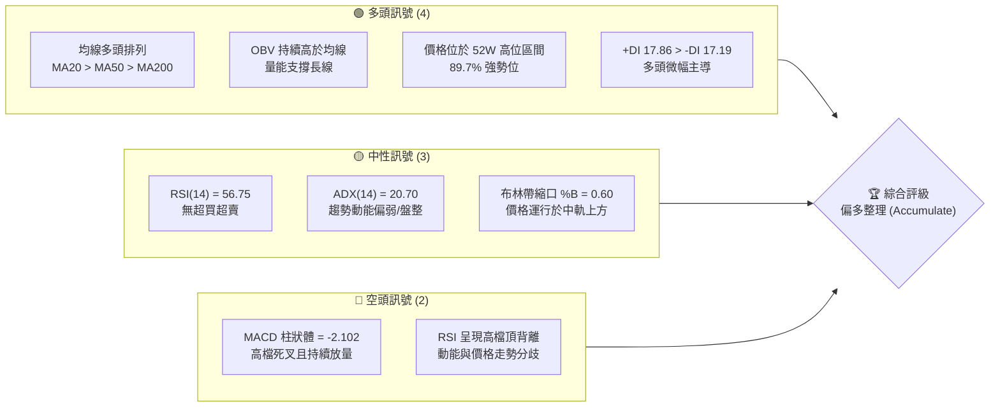
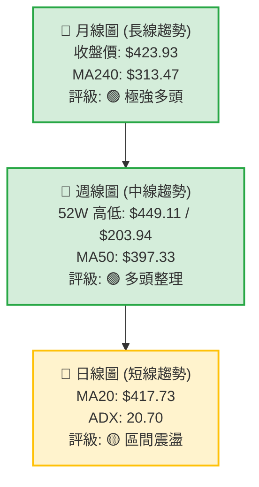
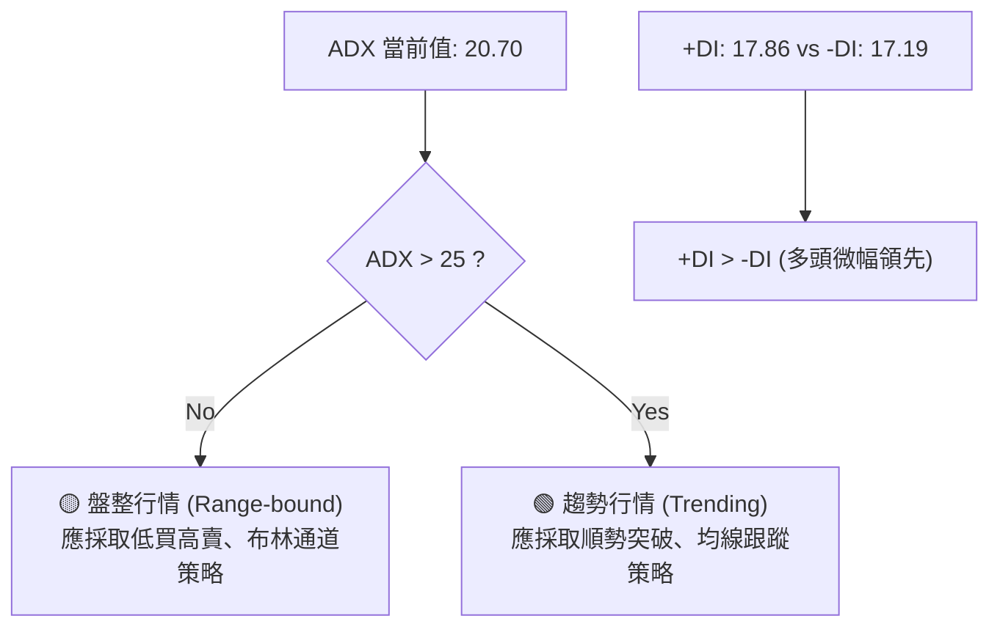
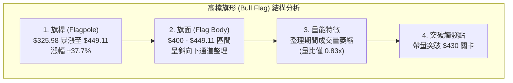

<details>
<summary>📊 靜態圖表 (點擊展開)</summary>

</details>

<html>
<head><meta charset="utf-8" /></head>
<body>
    <div style="height:500px; width:100%;">                        <script>window.PlotlyConfig = {MathJaxConfig: 'local'};</script>
        <script charset="utf-8" src="https://cdn.plot.ly/plotly-3.6.0.min.js" integrity="sha256-QaOVwtVY0T02VaHrr6pnoHLCwayMJp4O5n4YyaE3rJk=" crossorigin="anonymous"></script>                <div id="candlestick-chart" class="plotly-graph-div" style="height:100%; width:100%;"></div>            <script>                window.PLOTLYENV=window.PLOTLYENV || {};                                if (document.getElementById("candlestick-chart")) {                    Plotly.newPlot(                        "candlestick-chart",                        [{"close":{"dtype":"f8","bdata":"AAAAYIWVbUAAAAAgPXVtQAAAACAHi2xAAAAAYIk8bEAAAACAfJtsQAAAAKBjFG1AAAAAYOsXbkAAAABAjo9uQAAAAECcBW9AAAAAgHUZcEAAAAAgPwFwQAAAAKDkB3BAAAAAoFUocEAAAACgLUBwQAAAAGDES3BAAAAAoKKocEAAAACAyWxwQAAAAAD653BAAAAAwP6HcUAAAADgPmhxQAAAAMDzJ3FAAAAAoJDzcEAAAABggPFwQAAAACC0UXFAAAAAYG\u002fjcUAAAABguN1xQAAAAEB9HnJAAAAAoJLAckAAAADgsjtyQAAAAAA64nJAAAAAYJGYckAAAACgc2dxQAAAAABayHJAAAAAIAVackAAAABAPuVyQAAAAMDul3JAAAAAIF5MckAAAADg9XVyQAAAAMBRQ3JAAAAAoPHpcUAAAAAAUAdyQAAAAIB2SnJAAAAAALF+ckAAAADAwrJyQAAAAKBG63JAAAAAAJfNckAAAACATKFyQAAAAMCf53JAAAAAYAQ8ckAAAAAggjVyQAAAAICo73FAAAAAQCnEcUAAAABgYk9yQAAAAABMDnJAAAAAAJEFckAAAABA5n9xQAAAAOB9qXFAAAAAIOJ8cUAAAADAyztxQAAAACCZgnFAAAAAgEk1cUAAAABgjQ5xQAAAAGCipnFAAAAAwESncUAAAACgFvtxQAAAAMCxE3JAAAAAwOTWcUAAAADg5hxyQAAAAAA+UnJAAAAAoDwqckAAAABAp0ZyQAAAAIAouHJAAAAAIJvQckAAAADgcTtzQAAAAOCH9HJAAAAAwJ8ockAAAABgLeRxQAAAAEBU1nFAAAAAgJU4cUAAAAAgeLNxQAAAACBw93FAAAAAwFw8ckAAAADAx3ZyQAAAAGA6lHJAAAAAIInUckAAAABg+bVyQAAAAOCkoHJAAAAAAEDlckAAAAAAet9zQAAAAOB\u002fCXRAAAAAIPRbdEAAAABArNBzQAAAAEACxnNAAAAAYHcfdEAAAABgCaF0QAAAAGAfmHRAAAAAINxWdEAAAABAJT51QAAAAAA+SnVAAAAA4KdXdEAAAAAAGkd0QAAAAKD\u002fWnRAAAAAwGHSdEAAAADg\u002f690QAAAAMCdCXVAAAAAoKZIdUAAAACA4Bx1QAAAAMDGjXRAAAAAILA5dUAAAACgY+B0QAAAAIANQXRAAAAAgHuQdEAAAACg6bB1QAAAACBVGXZAAAAAYMyAdkAAAAAgrUJ3QAAAAGBU43ZAAAAA4KHHdkAAAAAAQKV2QAAAAKBehnZAAAAAgJpodkAAAABAKwp3QAAAAKA1AndAAAAAIEf8d0AAAACAyxt4QAAAACD5bXdAAAAA4HlKd0AAAADgZ\u002fN2QAAAAGAK9XVAAAAAYKU5dkAAAAAAqQB2QAAAACBfEnVAAAAAYIaudUAAAACg5ZR1QAAAAGDNC3ZAAAAAoKvvdEAAAACAIwl1QAAAAICzJ3VAAAAAIL+SdUAAAAAgbSx1QAAAAMD5H3VAAAAAQIiHdEAAAABgjBp1QAAAACArZ3VAAAAAIACvdUAAAACgkVV0QAAAACCgX3RAAAAAICu8c0AAAAAgkRJ1QAAAAAATS3VAAAAAYPcjdUAAAABgYk91QAAAACA2iHVAAAAAwLjQdkAAAABgLcp2QAAAAAC\u002fG3dAAAAAAE4Ld0AAAAAACrB3QAAAAACUY3dAAAAAYASodkAAAABgJhp3QAAAACAm1nZAAAAAIIXzdkAAAACAjih4QAAAAGBB3HdAAAAAoFAYeUAAAACAikB5QAAAAADGdnhAAAAAwI6OeEAAAACAJ7J4QAAAAMDay3hAAAAAIL8KeUAAAAAA0Zd4QAAAAIBRKHpAAAAAAOvSeUAAAACAfat5QAAAAICEOXlAAAAAAKHFeEAAAADA2u14QAAAAKDnC3pAAAAAIHw2eUAAAAAgZrB4QAAAAEAVe3hAAAAAIOgKeUAAAAAALmN5QAAAAMAyOXlAAAAA4LS1eUAAAACg4Ft6QAAAAKDgfXpAAAAAwI4XekAAAACgyyl7QAAAAIBX2ntAAAAAQLc6e0AAAACgFr57QAAAAEAz43lAAAAAYNicekAAAABAua56QAAAAGC4fHlAAAAAwB5RekAAAABA4X56QA=="},"high":{"dtype":"f8","bdata":"mF2hpACZbUDQ\u002f6LW4cBtQFiIHUrPK21Af+Z6n5pabEDjeg0ECb1sQMtVPcqNF21AMQzyGAA8bkBKaY3rZKVuQE8lP1gyfm9A51sgY\u002flacECpOCHvcixwQFnNn6qHIXBAB+MJQc4+cEAAQXPctYVwQMbGApDVa3BAEQ6sJ8zGcEAT3GBPxodwQPKCy40wI3FAkztsRDm8cUBStAXdLnBxQH9a3ICSL3FAuk9DmIkVcUBnkX8d6VpxQJdmkNjgVHFAVvAHAlgDckBHITdIZ2ZyQFdvidHsW3JAnWprFlwOc0AIQGMSLwtzQHGYkEsSAHNAl9M1CGbHckCBrRXCpZ1yQKNJrUf543JAodIX0UC2ckDQCdTHZwNzQKmHY2X4TnNALF1BBNzOckD7aBB2atRyQKi+uZ14kHJATnLk\u002fEVOckAPbvzmpjxyQEuL1N\u002fteXJA+OpZtheickCqnhkpSbxyQIZy2jfWGHNAzv9IpoQOc0A2ztBUZBRzQFooEE4gO3NAeSaqXBC6ckD9hTgVN35yQF8XZxJiRXJAWcKdPDracUBCza9v6WxyQLzsIunTSXJA7fQQ5whJckC2uMs6yfNxQBSzVUzgyXFAnvxaQaPEcUBAkJac\u002fV9xQHZ4lZA0pXFAJY20kPcockAhFTGhLUhxQGx9\u002fSxNrXFAnMxi0bKycUADe7D7VChyQP3TMPobJnJAx3\u002fgbiMOckANHr0SKUNyQNtejsjQZHJArXcmBrM7ckBvNqcsLKdyQKolcnsQxHJACSqcVMTkckAdsBqIZ3hzQCIYmAhKBHNARXfQEXXrckAVREdxeWRyQHCp7Gaj73FAJqn2bNP5cUArlFoK8tpxQG2U+3WxKnJAxXtwdOZXckCFhDeqD4ZyQHUjwGv1mXJA0pWsoSHdckCfAj2i9e5yQL5vJV\u002fB73JAjdpiUfYcc0CQt\u002f1w\u002fv5zQEosWWfCmHRATr8djuO1dECe3Y5U90l0QIiQZp9QLXRA7s81wJwxdEDEf+zGXr10QGcHGPEN63RAoblFO6KCdEBzQ2VhY9h1QMdunGjUwHVA5t7ETENGdUBusiOwzb50QDK1oTE\u002f1XRAojhCoKz2dEBEp2QPC9Z0QCxhxdzvN3VAfgwTgpZ7dUDNs6GKkl91QFYter9yInVA7lUSFuVmdUAW8mh7QpR1QGQdYE\u002fwEHVA4h7GSJvNdEBZllHPwr51QPd3SioHXHZASRtJACqudkBLbyOMEJp3QNf4JTvAoHdAVza44D0Td0BMLzjlFcV2QGcuygXd93ZAVrPIA\u002feOdkBQAbStlyR3QNmo7KErOHdAWJCMKuAyeECc32RKRUN4QPbGFiO9B3hAz5lHSudrd0D3YTIA6zJ3QMOLXABoInZAmR7r6L5zdkDmpraF9Vl2QI8FrM7XrnVAQvuOw6q5dUD0NzMO7vp1QMQ\u002faoM2OHZAhMYMsLaRdUC6L7nj\u002fGt1QOo\u002fuD69bXVALPsUiTKfdUDzjAluMbJ1QG1mtKCxMXVA6ecg3\u002foMdUCC7sIIuWl1QN3gpgYwgXVAGLVeiRnadUC9XBzd0EF1QBBEROOjjHRAJdZZYkeNdECT1BPZ6Bl1QH1qY3HYvXVALe8AQVVUdUDa\u002fzhGVXZ1QFwljT2Qi3VAlvHovM5Wd0D3OF8a9fR2QNyzsY7ekXdAWmG8SXkpd0At9ccmRtR3QGV67Khm0XdA\u002fkQUclwVd0DfX6ZiPWt3QMJN4DhJE3dAcl668iMed0CJ5owgDzB4QHnZs5+gPXhAffRAOYiIeUAJyf1Egdh5QDSKMfQLz3hAaVQ3a82ueEDj+cR\u002fu914QCg14OS8MHlA1DwMmPVreUAT9un35VJ5QIsIANaCK3pA4WoZpEwwekDTrH9WaQB6QNR25ThwbHlAP1W4qM0UeUDWlKWMwDt5QDOoDPS+T3pA+NnrLJmOeUD0aDfH3l55QCoBET8r33hAtX5Xf\u002fsueUA3y\u002fyA+qd5QAV1cWVem3lAu1PyN0X4eUApeM5ptNh6QBTrOYedqXpAVsb4AfPWekDbROvxcAV8QKlCs5NR9XtABWaMeLsRfECUz\u002f6tae97QMKqpQEuDntA4Ad2Sr4Me0Dj4ERBLlJ7QGYoIPwulXpAAAAAAABkekAAAABACq96QA=="},"hovertemplate":"\u003cb\u003e%{x|%Y-%m-%d}\u003c\u002fb\u003e\u003cbr\u003e\u958b: $%{open:.2f}\u003cbr\u003e\u9ad8: $%{high:.2f}\u003cbr\u003e\u4f4e: $%{low:.2f}\u003cbr\u003e\u6536: $%{close:.2f}\u003cextra\u003e\u003c\u002fextra\u003e","low":{"dtype":"f8","bdata":"Fv08PasbbUBhl7yoZC1tQOdVXnzZgWxAbiYV0S7la0CD52bhLkNsQMI1CNr8eGxABhwOHYdpbUBNKEneQ99tQH5pD6lTh25AMUywi8fdb0CM0Nqu+OxvQIvqNCC48W9AmdFp6239b0CuFErPKClwQO9jCp4wG3BAorNqP9H+b0B+08O3FUxwQDROPq3+dXBAWO2UaPlccUCwGsOl5yhxQJeXMdE9wXBAXNtOXhHIcEAAAABggPFwQDsN4bgG+3BA3rbJfAwwcUBZuJZVk8xxQKmQznCAA3JAj1i5RoWZckAJ3Jjkyi9yQPgSnMfnOnJAuFvgBoRxckAk6H5xNmJxQMjRNbyNIHJANXhIz\u002f4QckDonqR2lZtyQGYYkD\u002ftZXJAxpZ2\u002f9NJckBdrdbezGtyQK28XljTNXJAjZro9tKicUA5YM2Z2fVxQHZ9qiBqQXJA+vDlRk02ckA7OKcHPlxyQDnVcEhBwHJAuxobe32nckA9NFaWxGVyQDTgon4gvHJArGWv6nEzckA89dwniRNyQGJSOpAh0nFAOKqDz2kvcUDpy684gRdyQPZ3x19r6nFAJ\u002fvZbQ71cUCU1atz+VxxQK6vXWaA8XBA+GKmpcxZcUAsR5mzZ+lwQNFjWB2OInFAlDrJx\u002fsjcUBrCYE\u002fvotwQK7H7Mrd8HBAAlOPmR7vcEDuWlkJsNdxQFhZRiHZ63FAyk7uiJ2PcUCemkWwtO5xQF+jq+BVvXFAKg9hDOb+cUDXNfoyUS9yQHiDBQxnZnJABZxJ\u002fKiCckDARA4IKcJyQK5gem6ZoXJAz9K\u002fUMAXckCi0AAgJ+FxQMXiMDzSnXFAK\u002fUKlKgacUANO8GO1IRxQLtO6XqHznFAksLnk2kbckAd+Ky\u002fKytyQNdgfdpRa3JA0RtHUsWPckAHsucp15FyQEe2eDyTnnJAaW40b+3dckCEqsJFkWFzQPrmDaqP\u002fXNA6nLHSb8udEDXVG\u002fScc5zQEP3\u002fR0+qHNAGWzOItTJc0BssyG4jvZzQDJWZy1HkXRAonSBlWgydEDn+l5w7gJ1QJ8NFopHO3VA5LlMWYRTdEC3Z1EDGUB0QApoA2WEU3RA3VnFbquadEBlonYVhoh0QLxH\u002f3NyzXRA\u002fnoU4bUOdUCY5u7wNWh0QNE0aFyJdnRAuHZyWYl2dEDSzoohLoV0QDuau6rh1nNAftR\u002fAh3gc0AWP8I1t+50QBuFnrUyoHVAQP03te4odkDF+pf\u002f8ed2QDQhocQcB3RAb5RK7qZudkBVOKpTiyZ2QMPunWGybXZAAYCuWqU5dkBi79\u002fVEVR2QAiYPj45yXZATyrRFOBhd0D9AmQNou13QLjNB07M\u002fHZA+PKgOJvrdkD3XKmkaax2QLBaEqLwZXVAQ0VKt6QLdkBe8cAIh2B1QLPppzBa73RAAqArwWyjdECXG2hGpWh1QFc8t4vyyHVAZ8Vr8mrqdEARVeDf3ud0QANcq8EsIXVAwUNG6r8ZdUCRhH8zwSh1QIle8kXiRnRAiU2GljdSdECm6GoWOaV0QM5lmVTV03RAbd\u002feyyhrdUA4Feu0wUl0QDHzCEXpGHRAcpa\u002fthGRc0CDo20+PAZ0QC54wqZML3VAkUMHYpVgdEBu3b3sQh11QKzaIUra7XRAB6RMHGlmdkAHvbUlCX52QBzbb4ItDndA2VSurx3TdkB1O8l0kUV3QOuQJChyNXdAD1DNS1J7dkBjJ1Arl8R2QL9EQititnZAeHg2bBzEdkBq2g+GYhx3QDWRtU3pbndAvW2LheCOeEBj8JOUbvd4QPDSAb3R\u002fHdAwSa\u002fcV40eEDVM2Ts8Ax4QNGSTeRrc3hAi9LJN22keEC7rjKS7Hp4QAogr0Ns+3hArwFj7YByeUAo1OsaGP94QEzOtqQn1HhA\u002fJpvbHwTeECUtVfX4mh4QFH795qREnlAtUkn817eeEBMYUyELmJ4QLL8usCQAnhAlWeKImaweECfjBu9Oel4QHb9vEKzHnlAlBhIaMqReUCecM9WjeZ5QG9odWLb23lAWY\u002fi+2YEekAbcajGNFh6QOrJrXTcL3tAVhWuizwYe0CGEEqe06R6QPjFvoY1vXlAr4PfXK9YekArtshVAEl5QKPmT6z1a3lAAAAAgMKNeUAAAAAgXBN6QA=="},"name":"\u50f9\u683c","open":{"dtype":"f8","bdata":"YVnIme1IbUDf9dFm4zZtQB3+fwVUKG1AalTC+KP1a0AulLzZmZ9sQHjGRWM4mmxAErJHzpazbUDzB1zW+eptQH5pD6lTh25Aq6OzF50AcEDfElzbCBhwQMyxrIXyH3BAl5Rr9H4ScEDVJ1qjdH1wQLfMG31fZHBAQVast3P\u002fb0BUtxF3mYRwQM0mgWVMh3BAP0Je7RKDcUDD0yFP5WFxQADIDj3B73BAPWjYpvr7cEBzwrvaQCVxQKr\u002fyiGuEnFA2715sTVEcUDip+NvOmNyQAIhcAsgKXJA2uXPyKGackAbdZRRkANzQJnSp\u002f0YS3JAjE0NzyS\u002fckBcQslR1plyQGl\u002flmiIfnJAkKBjTRlVckD\u002fdQBnU\u002f5yQGdChDz8R3NAsmiCjhKBckB2mrT4eJpyQAtK9PaYinJAJNN7MFkrckAtLEpojPhxQGwUGJclVHJARMDYkAqFckC53sZrzX9yQBEYggOM9nJAcWfW+13LckAt0GEzkPlyQI5ViJGWw3JA5YPOf\u002fFockBdjyHKUCVyQHOXaX3PPHJAxdOHr66vcUCdoykk8EByQBnl0t9sHHJANSVuHnY2ckApeQUsjO5xQERR4tMLHHFAjkHkoNVzcUBgQGinFDZxQNhSioYULHFA\u002fwWLj84eckA8e4Rt1epwQK7H7Mrd8HBA7rcRElCIcUCU5CWqb+1xQFDV2M8XI3JAmO9ONtTKcUBlucoheRtyQEVZaLdUHnJAyD7z3+c6ckD9l9pIxFtyQPp3kbSFrXJAb\u002fZSRVCackCKYiGguO9yQLJ6\u002fxoD\u002fHJARXfQEXXrckDZh17AIFpyQGpHEYqJ3HFAhLTxrMDwcUCIYF4jkLhxQLtO6XqHznFAHrrI\u002fHxSckB35HycRT5yQEMXsfBag3JAlqnexLylckBDTz\u002fFqcNyQB3pvDnlzHJAGQJBLwDnckDQab5ABmZzQH5IYKw6i3RAZ5efQ12IdEBYfDFFBTB0QG10JXCQK3RAmt6uf\u002fric0DkayOzHAd0QJBnks2LsnRAoblFO6KCdEBn4Y7exFB1QMCZURmqi3VAG0pKbp0wdUAEWQTcdbt0QPYpLSJNu3RAmqMm8s+ldEB2scLwRbF0QNrdgtxT7HRASaG6YUVUdUDr7Kk82yB1QCSdqg8j23RAuswWx\u002fWQdED6nmQqvnR1QNw6IY0A3nRA4wQSppISdEBz\u002fc3wPvx0QLzPpr96r3VAhRHWrVGndkAWLKCL2AJ3QE1jd0jVkHdAJLq+Awv0dkBXFV9NKYB2QPceJXHWn3ZA8sbxOvBddkADmCzF5F52QLTc9Yn60XZAwTVxLjOXd0Cc32RKRUN4QBslCl4fA3hA\u002fmqsOM0Dd0DIeTzStrd2QI2X6f0NvHVAQjPylXw5dkClKAr7NhF2QMEeIpPAW3VAL2VtiADedEA6H6kS3ap1QCSyXyPGAXZAX5f3pW6CdUAMBT8FcGJ1QBLP4ebvN3VAf6B3HN48dUAtakzSjY91QKEGEJU2h3RARXAITUv+dECm6GoWOaV0QMvLNV+T7HRAS6c93xCTdUDbRoSrajB1QODyUAcjQXRAqPIV+vdmdEANKh1M6Rh0QItxyk+LcXVA0JgD4DhhdECy6FWcTC91QJ0HKeVZKnVAm43uPMwWd0AT1ScVOKd2QGVf+z5ma3dA\u002fuCQpVEWd0CodmuCeKJ3QNg5XV1NyHdA+VsHhfj\u002fdkCpS0zJP0V3QExhTLu3BXdAAAAAIIXzdkAV9Dr9lC53QGEsssii9XdAtKxEe26zeECkVWpyiMx5QKS7+fpCc3hA1IDWTd9\u002feEDhobDAFs54QCGQ+hpViHhA8MLIpjI5eUAZIim8eTp5QL5ncoRbF3lA019oi88RekCpxvYQnf95QNqDUpKiXHlAkzGQoCHNeEBHXEqEbtV4QLDnpXtJJHlAswHd7M1YeUD0aDfH3l55QFzwomqZSXhAYY491ijBeECfjBu9Oel4QF2zSiOTh3lAbogb+HnCeUCFEfdRW6B6QOezsYO8U3pA4ogNwiehekBHaft\u002fMn56QD4Xy1jPeHtAJDEOuQQPfEAXiEWA+9l6QFE6sgdBzHpAKz4Sf3psekC2f2EM+d16QO0ITqTiz3lAAAAAACnUeUAAAADAzEB6QA=="},"x":["2025-08-27T00:00:00-04:00","2025-08-28T00:00:00-04:00","2025-08-29T00:00:00-04:00","2025-09-02T00:00:00-04:00","2025-09-03T00:00:00-04:00","2025-09-04T00:00:00-04:00","2025-09-05T00:00:00-04:00","2025-09-08T00:00:00-04:00","2025-09-09T00:00:00-04:00","2025-09-10T00:00:00-04:00","2025-09-11T00:00:00-04:00","2025-09-12T00:00:00-04:00","2025-09-15T00:00:00-04:00","2025-09-16T00:00:00-04:00","2025-09-17T00:00:00-04:00","2025-09-18T00:00:00-04:00","2025-09-19T00:00:00-04:00","2025-09-22T00:00:00-04:00","2025-09-23T00:00:00-04:00","2025-09-24T00:00:00-04:00","2025-09-25T00:00:00-04:00","2025-09-26T00:00:00-04:00","2025-09-29T00:00:00-04:00","2025-09-30T00:00:00-04:00","2025-10-01T00:00:00-04:00","2025-10-02T00:00:00-04:00","2025-10-03T00:00:00-04:00","2025-10-06T00:00:00-04:00","2025-10-07T00:00:00-04:00","2025-10-08T00:00:00-04:00","2025-10-09T00:00:00-04:00","2025-10-10T00:00:00-04:00","2025-10-13T00:00:00-04:00","2025-10-14T00:00:00-04:00","2025-10-15T00:00:00-04:00","2025-10-16T00:00:00-04:00","2025-10-17T00:00:00-04:00","2025-10-20T00:00:00-04:00","2025-10-21T00:00:00-04:00","2025-10-22T00:00:00-04:00","2025-10-23T00:00:00-04:00","2025-10-24T00:00:00-04:00","2025-10-27T00:00:00-04:00","2025-10-28T00:00:00-04:00","2025-10-29T00:00:00-04:00","2025-10-30T00:00:00-04:00","2025-10-31T00:00:00-04:00","2025-11-03T00:00:00-05:00","2025-11-04T00:00:00-05:00","2025-11-05T00:00:00-05:00","2025-11-06T00:00:00-05:00","2025-11-07T00:00:00-05:00","2025-11-10T00:00:00-05:00","2025-11-11T00:00:00-05:00","2025-11-12T00:00:00-05:00","2025-11-13T00:00:00-05:00","2025-11-14T00:00:00-05:00","2025-11-17T00:00:00-05:00","2025-11-18T00:00:00-05:00","2025-11-19T00:00:00-05:00","2025-11-20T00:00:00-05:00","2025-11-21T00:00:00-05:00","2025-11-24T00:00:00-05:00","2025-11-25T00:00:00-05:00","2025-11-26T00:00:00-05:00","2025-11-28T00:00:00-05:00","2025-12-01T00:00:00-05:00","2025-12-02T00:00:00-05:00","2025-12-03T00:00:00-05:00","2025-12-04T00:00:00-05:00","2025-12-05T00:00:00-05:00","2025-12-08T00:00:00-05:00","2025-12-09T00:00:00-05:00","2025-12-10T00:00:00-05:00","2025-12-11T00:00:00-05:00","2025-12-12T00:00:00-05:00","2025-12-15T00:00:00-05:00","2025-12-16T00:00:00-05:00","2025-12-17T00:00:00-05:00","2025-12-18T00:00:00-05:00","2025-12-19T00:00:00-05:00","2025-12-22T00:00:00-05:00","2025-12-23T00:00:00-05:00","2025-12-24T00:00:00-05:00","2025-12-26T00:00:00-05:00","2025-12-29T00:00:00-05:00","2025-12-30T00:00:00-05:00","2025-12-31T00:00:00-05:00","2026-01-02T00:00:00-05:00","2026-01-05T00:00:00-05:00","2026-01-06T00:00:00-05:00","2026-01-07T00:00:00-05:00","2026-01-08T00:00:00-05:00","2026-01-09T00:00:00-05:00","2026-01-12T00:00:00-05:00","2026-01-13T00:00:00-05:00","2026-01-14T00:00:00-05:00","2026-01-15T00:00:00-05:00","2026-01-16T00:00:00-05:00","2026-01-20T00:00:00-05:00","2026-01-21T00:00:00-05:00","2026-01-22T00:00:00-05:00","2026-01-23T00:00:00-05:00","2026-01-26T00:00:00-05:00","2026-01-27T00:00:00-05:00","2026-01-28T00:00:00-05:00","2026-01-29T00:00:00-05:00","2026-01-30T00:00:00-05:00","2026-02-02T00:00:00-05:00","2026-02-03T00:00:00-05:00","2026-02-04T00:00:00-05:00","2026-02-05T00:00:00-05:00","2026-02-06T00:00:00-05:00","2026-02-09T00:00:00-05:00","2026-02-10T00:00:00-05:00","2026-02-11T00:00:00-05:00","2026-02-12T00:00:00-05:00","2026-02-13T00:00:00-05:00","2026-02-17T00:00:00-05:00","2026-02-18T00:00:00-05:00","2026-02-19T00:00:00-05:00","2026-02-20T00:00:00-05:00","2026-02-23T00:00:00-05:00","2026-02-24T00:00:00-05:00","2026-02-25T00:00:00-05:00","2026-02-26T00:00:00-05:00","2026-02-27T00:00:00-05:00","2026-03-02T00:00:00-05:00","2026-03-03T00:00:00-05:00","2026-03-04T00:00:00-05:00","2026-03-05T00:00:00-05:00","2026-03-06T00:00:00-05:00","2026-03-09T00:00:00-04:00","2026-03-10T00:00:00-04:00","2026-03-11T00:00:00-04:00","2026-03-12T00:00:00-04:00","2026-03-13T00:00:00-04:00","2026-03-16T00:00:00-04:00","2026-03-17T00:00:00-04:00","2026-03-18T00:00:00-04:00","2026-03-19T00:00:00-04:00","2026-03-20T00:00:00-04:00","2026-03-23T00:00:00-04:00","2026-03-24T00:00:00-04:00","2026-03-25T00:00:00-04:00","2026-03-26T00:00:00-04:00","2026-03-27T00:00:00-04:00","2026-03-30T00:00:00-04:00","2026-03-31T00:00:00-04:00","2026-04-01T00:00:00-04:00","2026-04-02T00:00:00-04:00","2026-04-06T00:00:00-04:00","2026-04-07T00:00:00-04:00","2026-04-08T00:00:00-04:00","2026-04-09T00:00:00-04:00","2026-04-10T00:00:00-04:00","2026-04-13T00:00:00-04:00","2026-04-14T00:00:00-04:00","2026-04-15T00:00:00-04:00","2026-04-16T00:00:00-04:00","2026-04-17T00:00:00-04:00","2026-04-20T00:00:00-04:00","2026-04-21T00:00:00-04:00","2026-04-22T00:00:00-04:00","2026-04-23T00:00:00-04:00","2026-04-24T00:00:00-04:00","2026-04-27T00:00:00-04:00","2026-04-28T00:00:00-04:00","2026-04-29T00:00:00-04:00","2026-04-30T00:00:00-04:00","2026-05-01T00:00:00-04:00","2026-05-04T00:00:00-04:00","2026-05-05T00:00:00-04:00","2026-05-06T00:00:00-04:00","2026-05-07T00:00:00-04:00","2026-05-08T00:00:00-04:00","2026-05-11T00:00:00-04:00","2026-05-12T00:00:00-04:00","2026-05-13T00:00:00-04:00","2026-05-14T00:00:00-04:00","2026-05-15T00:00:00-04:00","2026-05-18T00:00:00-04:00","2026-05-19T00:00:00-04:00","2026-05-20T00:00:00-04:00","2026-05-21T00:00:00-04:00","2026-05-22T00:00:00-04:00","2026-05-26T00:00:00-04:00","2026-05-27T00:00:00-04:00","2026-05-28T00:00:00-04:00","2026-05-29T00:00:00-04:00","2026-06-01T00:00:00-04:00","2026-06-02T00:00:00-04:00","2026-06-03T00:00:00-04:00","2026-06-04T00:00:00-04:00","2026-06-05T00:00:00-04:00","2026-06-08T00:00:00-04:00","2026-06-09T00:00:00-04:00","2026-06-10T00:00:00-04:00","2026-06-11T00:00:00-04:00","2026-06-12T00:00:00-04:00"],"type":"candlestick"},{"hovertemplate":"MA30: $%{y:.2f}\u003cextra\u003e\u003c\u002fextra\u003e","line":{"color":"#2196F3","dash":"dash","width":2},"mode":"lines","name":"MA30","x":["2025-08-27T00:00:00-04:00","2025-08-28T00:00:00-04:00","2025-08-29T00:00:00-04:00","2025-09-02T00:00:00-04:00","2025-09-03T00:00:00-04:00","2025-09-04T00:00:00-04:00","2025-09-05T00:00:00-04:00","2025-09-08T00:00:00-04:00","2025-09-09T00:00:00-04:00","2025-09-10T00:00:00-04:00","2025-09-11T00:00:00-04:00","2025-09-12T00:00:00-04:00","2025-09-15T00:00:00-04:00","2025-09-16T00:00:00-04:00","2025-09-17T00:00:00-04:00","2025-09-18T00:00:00-04:00","2025-09-19T00:00:00-04:00","2025-09-22T00:00:00-04:00","2025-09-23T00:00:00-04:00","2025-09-24T00:00:00-04:00","2025-09-25T00:00:00-04:00","2025-09-26T00:00:00-04:00","2025-09-29T00:00:00-04:00","2025-09-30T00:00:00-04:00","2025-10-01T00:00:00-04:00","2025-10-02T00:00:00-04:00","2025-10-03T00:00:00-04:00","2025-10-06T00:00:00-04:00","2025-10-07T00:00:00-04:00","2025-10-08T00:00:00-04:00","2025-10-09T00:00:00-04:00","2025-10-10T00:00:00-04:00","2025-10-13T00:00:00-04:00","2025-10-14T00:00:00-04:00","2025-10-15T00:00:00-04:00","2025-10-16T00:00:00-04:00","2025-10-17T00:00:00-04:00","2025-10-20T00:00:00-04:00","2025-10-21T00:00:00-04:00","2025-10-22T00:00:00-04:00","2025-10-23T00:00:00-04:00","2025-10-24T00:00:00-04:00","2025-10-27T00:00:00-04:00","2025-10-28T00:00:00-04:00","2025-10-29T00:00:00-04:00","2025-10-30T00:00:00-04:00","2025-10-31T00:00:00-04:00","2025-11-03T00:00:00-05:00","2025-11-04T00:00:00-05:00","2025-11-05T00:00:00-05:00","2025-11-06T00:00:00-05:00","2025-11-07T00:00:00-05:00","2025-11-10T00:00:00-05:00","2025-11-11T00:00:00-05:00","2025-11-12T00:00:00-05:00","2025-11-13T00:00:00-05:00","2025-11-14T00:00:00-05:00","2025-11-17T00:00:00-05:00","2025-11-18T00:00:00-05:00","2025-11-19T00:00:00-05:00","2025-11-20T00:00:00-05:00","2025-11-21T00:00:00-05:00","2025-11-24T00:00:00-05:00","2025-11-25T00:00:00-05:00","2025-11-26T00:00:00-05:00","2025-11-28T00:00:00-05:00","2025-12-01T00:00:00-05:00","2025-12-02T00:00:00-05:00","2025-12-03T00:00:00-05:00","2025-12-04T00:00:00-05:00","2025-12-05T00:00:00-05:00","2025-12-08T00:00:00-05:00","2025-12-09T00:00:00-05:00","2025-12-10T00:00:00-05:00","2025-12-11T00:00:00-05:00","2025-12-12T00:00:00-05:00","2025-12-15T00:00:00-05:00","2025-12-16T00:00:00-05:00","2025-12-17T00:00:00-05:00","2025-12-18T00:00:00-05:00","2025-12-19T00:00:00-05:00","2025-12-22T00:00:00-05:00","2025-12-23T00:00:00-05:00","2025-12-24T00:00:00-05:00","2025-12-26T00:00:00-05:00","2025-12-29T00:00:00-05:00","2025-12-30T00:00:00-05:00","2025-12-31T00:00:00-05:00","2026-01-02T00:00:00-05:00","2026-01-05T00:00:00-05:00","2026-01-06T00:00:00-05:00","2026-01-07T00:00:00-05:00","2026-01-08T00:00:00-05:00","2026-01-09T00:00:00-05:00","2026-01-12T00:00:00-05:00","2026-01-13T00:00:00-05:00","2026-01-14T00:00:00-05:00","2026-01-15T00:00:00-05:00","2026-01-16T00:00:00-05:00","2026-01-20T00:00:00-05:00","2026-01-21T00:00:00-05:00","2026-01-22T00:00:00-05:00","2026-01-23T00:00:00-05:00","2026-01-26T00:00:00-05:00","2026-01-27T00:00:00-05:00","2026-01-28T00:00:00-05:00","2026-01-29T00:00:00-05:00","2026-01-30T00:00:00-05:00","2026-02-02T00:00:00-05:00","2026-02-03T00:00:00-05:00","2026-02-04T00:00:00-05:00","2026-02-05T00:00:00-05:00","2026-02-06T00:00:00-05:00","2026-02-09T00:00:00-05:00","2026-02-10T00:00:00-05:00","2026-02-11T00:00:00-05:00","2026-02-12T00:00:00-05:00","2026-02-13T00:00:00-05:00","2026-02-17T00:00:00-05:00","2026-02-18T00:00:00-05:00","2026-02-19T00:00:00-05:00","2026-02-20T00:00:00-05:00","2026-02-23T00:00:00-05:00","2026-02-24T00:00:00-05:00","2026-02-25T00:00:00-05:00","2026-02-26T00:00:00-05:00","2026-02-27T00:00:00-05:00","2026-03-02T00:00:00-05:00","2026-03-03T00:00:00-05:00","2026-03-04T00:00:00-05:00","2026-03-05T00:00:00-05:00","2026-03-06T00:00:00-05:00","2026-03-09T00:00:00-04:00","2026-03-10T00:00:00-04:00","2026-03-11T00:00:00-04:00","2026-03-12T00:00:00-04:00","2026-03-13T00:00:00-04:00","2026-03-16T00:00:00-04:00","2026-03-17T00:00:00-04:00","2026-03-18T00:00:00-04:00","2026-03-19T00:00:00-04:00","2026-03-20T00:00:00-04:00","2026-03-23T00:00:00-04:00","2026-03-24T00:00:00-04:00","2026-03-25T00:00:00-04:00","2026-03-26T00:00:00-04:00","2026-03-27T00:00:00-04:00","2026-03-30T00:00:00-04:00","2026-03-31T00:00:00-04:00","2026-04-01T00:00:00-04:00","2026-04-02T00:00:00-04:00","2026-04-06T00:00:00-04:00","2026-04-07T00:00:00-04:00","2026-04-08T00:00:00-04:00","2026-04-09T00:00:00-04:00","2026-04-10T00:00:00-04:00","2026-04-13T00:00:00-04:00","2026-04-14T00:00:00-04:00","2026-04-15T00:00:00-04:00","2026-04-16T00:00:00-04:00","2026-04-17T00:00:00-04:00","2026-04-20T00:00:00-04:00","2026-04-21T00:00:00-04:00","2026-04-22T00:00:00-04:00","2026-04-23T00:00:00-04:00","2026-04-24T00:00:00-04:00","2026-04-27T00:00:00-04:00","2026-04-28T00:00:00-04:00","2026-04-29T00:00:00-04:00","2026-04-30T00:00:00-04:00","2026-05-01T00:00:00-04:00","2026-05-04T00:00:00-04:00","2026-05-05T00:00:00-04:00","2026-05-06T00:00:00-04:00","2026-05-07T00:00:00-04:00","2026-05-08T00:00:00-04:00","2026-05-11T00:00:00-04:00","2026-05-12T00:00:00-04:00","2026-05-13T00:00:00-04:00","2026-05-14T00:00:00-04:00","2026-05-15T00:00:00-04:00","2026-05-18T00:00:00-04:00","2026-05-19T00:00:00-04:00","2026-05-20T00:00:00-04:00","2026-05-21T00:00:00-04:00","2026-05-22T00:00:00-04:00","2026-05-26T00:00:00-04:00","2026-05-27T00:00:00-04:00","2026-05-28T00:00:00-04:00","2026-05-29T00:00:00-04:00","2026-06-01T00:00:00-04:00","2026-06-02T00:00:00-04:00","2026-06-03T00:00:00-04:00","2026-06-04T00:00:00-04:00","2026-06-05T00:00:00-04:00","2026-06-08T00:00:00-04:00","2026-06-09T00:00:00-04:00","2026-06-10T00:00:00-04:00","2026-06-11T00:00:00-04:00","2026-06-12T00:00:00-04:00"],"y":{"dtype":"f8","bdata":"AAAAAAAA+H8AAAAAAAD4fwAAAAAAAPh\u002fAAAAAAAA+H8AAAAAAAD4fwAAAAAAAPh\u002fAAAAAAAA+H8AAAAAAAD4fwAAAAAAAPh\u002fAAAAAAAA+H8AAAAAAAD4fwAAAAAAAPh\u002fAAAAAAAA+H8AAAAAAAD4fwAAAAAAAPh\u002fAAAAAAAA+H8AAAAAAAD4fwAAAAAAAPh\u002fAAAAAAAA+H8AAAAAAAD4fwAAAAAAAPh\u002fAAAAAAAA+H8AAAAAAAD4fwAAAAAAAPh\u002fAAAAAAAA+H8AAAAAAAD4fwAAAAAAAPh\u002fAAAAAAAA+H8AAAAAAAD4f2ZmZiZvanBAERER+eSKcEAAAADguKFwQFVVVX03yHBAERERgVfscEAAAABwhhNxQFVVVc0dNnFAREREBN1RcUBVVVW1AG1xQAAAAJB8hHFAq6qqKviTcUDv7u7+PKVxQAAAACCGuHFAq6qqGnjMcUARERHxWuFxQGZmZia993FAAAAAkAkKckCrqqq62hxyQJqZmcnoLXJAmpmZ+egzckDNzMyMwDpyQFVVVbVoQXJAq6qqulxIckBVVVVlBlRyQJqZmblPWnJAq6qq+nJbckAAAABgUlhyQO\u002fu7v5rVHJAiYiI2KFJckBEREQkGkFyQERERJRhNXJAmpmZ2YkpckDe3d09kyZyQM3MzPzqHHJAREREpPUWckBVVVWFJw9yQGZmZha\u002fCnJAREREpNQGckDNzMys3ANyQERERARcBHJAZmZmpoAGckCJiIgonQhyQJqZmTlFDHJAq6qqOgAPckCamZmZjhNyQDMzM5PdE3JA3t3d3V0OckB3d3cHEAhyQJqZmenz\u002fnFAVVVVFU72cUCrqqpq+PFxQN7d3c068nFAVVVVhTz2cUAzMzOzjPdxQERERJQD\u002fHFAd3d3t+kCckAAAACwPw1yQImIiLh8FXJAmpmZ2X8hckCJiIioBThyQCIiIuKVTXJAAAAAcHlockAAAAAAA4ByQLy7u8sfknJAzczMjDKnckBVVVW1y71yQERERNRG03JAAAAA4JvockB3d3cnUQNzQM3MzHymHHNAERERITsvc0BVVVUFUEBzQAAAACBGTnNAiYiIWGZfc0Crqqp60WtzQJqZmXmWfXNA7+7uXkGYc0Dv7u7OvrNzQKuqqkrtynNAiYiI2Bjtc0AzMzPDMQh0QCIiIgK3G3RAZmZm5pUvdEAAAACQH0t0QM3MzPwoaXRAAAAAkICIdECrqqpaU690QJqZmYmu03RA7+7u7tP0dECrqqqqfAx1QKuqqkq3IXVA3t3dTTQzdUCamZmJuE51QJqZmdlTanVAVVVVtUmLdUCJiIjY+qh1QFVVVcUswXVAIiIislzadUC8u7v77+h1QGZmZnah7nVAIiIicrL+dUCamZlpag12QCIiIjKHE3ZAAAAAwN0adkAiIiICfyJ2QCIiIjIaK3ZAVVVV5SIodkBmZmZ2eid2QERERPSbLHZAvLu765MvdkBVVVXFHDJ2QLy7uwuLOXZAvLu7qz45dkAAAACQOzR2QKuqqjpLLnZARERE9EwndkAiIiKSVA52QBEREaHf+HVARERENOTedUCamZn5d9F1QERERHT1xnVAd3d3NyO8dUCamZnJYK11QERERDTHoHVA3t3d\u002fcqWdUDNzMz8iYt1QBEREVHMiHVAERERQbGGdUDNzMzs+ox1QGZmZrYymXVAvLu7i+CcdUB3d3eXQqZ1QCIiIsJRtXVAzczMDCfAdUBVVVUlJNZ1QKuqqnqf5XVAIiIichwJdkCJiIhYFy12QCIiIrJTSXZAzczMjMlidkC8u7tL2IB2QImIiJgsoHZAzczMbK7GdkCrqqr6dOR2QDMzM1MHDXdARERE9Fswd0ARERHR4113QLy7u0tJh3dAERERsUSyd0C8u7uLLdN3QKuqqiq9+3dAMzMzU30eeECJiIjIUjt4QKuqqlp8VHhA7+7u7n1neEDv7u6eqH14QDMzMwO1j3hAzczMLHSmeECJiIiYP714QN7d3Z2513hAd3d3Bwv1eEC8u7urshd5QN7d3R2BQnlAmpmZyQJneUBERERkmIV5QImIiLjklnlA3t3dLdijeUAAAADwDLB5QHd3dzfIuHlAREREBM3HeUCrqqqKKNd5QA=="},"type":"scatter"},{"hovertemplate":"MA60: $%{y:.2f}\u003cextra\u003e\u003c\u002fextra\u003e","line":{"color":"#9C27B0","dash":"dash","width":2},"mode":"lines","name":"MA60","x":["2025-08-27T00:00:00-04:00","2025-08-28T00:00:00-04:00","2025-08-29T00:00:00-04:00","2025-09-02T00:00:00-04:00","2025-09-03T00:00:00-04:00","2025-09-04T00:00:00-04:00","2025-09-05T00:00:00-04:00","2025-09-08T00:00:00-04:00","2025-09-09T00:00:00-04:00","2025-09-10T00:00:00-04:00","2025-09-11T00:00:00-04:00","2025-09-12T00:00:00-04:00","2025-09-15T00:00:00-04:00","2025-09-16T00:00:00-04:00","2025-09-17T00:00:00-04:00","2025-09-18T00:00:00-04:00","2025-09-19T00:00:00-04:00","2025-09-22T00:00:00-04:00","2025-09-23T00:00:00-04:00","2025-09-24T00:00:00-04:00","2025-09-25T00:00:00-04:00","2025-09-26T00:00:00-04:00","2025-09-29T00:00:00-04:00","2025-09-30T00:00:00-04:00","2025-10-01T00:00:00-04:00","2025-10-02T00:00:00-04:00","2025-10-03T00:00:00-04:00","2025-10-06T00:00:00-04:00","2025-10-07T00:00:00-04:00","2025-10-08T00:00:00-04:00","2025-10-09T00:00:00-04:00","2025-10-10T00:00:00-04:00","2025-10-13T00:00:00-04:00","2025-10-14T00:00:00-04:00","2025-10-15T00:00:00-04:00","2025-10-16T00:00:00-04:00","2025-10-17T00:00:00-04:00","2025-10-20T00:00:00-04:00","2025-10-21T00:00:00-04:00","2025-10-22T00:00:00-04:00","2025-10-23T00:00:00-04:00","2025-10-24T00:00:00-04:00","2025-10-27T00:00:00-04:00","2025-10-28T00:00:00-04:00","2025-10-29T00:00:00-04:00","2025-10-30T00:00:00-04:00","2025-10-31T00:00:00-04:00","2025-11-03T00:00:00-05:00","2025-11-04T00:00:00-05:00","2025-11-05T00:00:00-05:00","2025-11-06T00:00:00-05:00","2025-11-07T00:00:00-05:00","2025-11-10T00:00:00-05:00","2025-11-11T00:00:00-05:00","2025-11-12T00:00:00-05:00","2025-11-13T00:00:00-05:00","2025-11-14T00:00:00-05:00","2025-11-17T00:00:00-05:00","2025-11-18T00:00:00-05:00","2025-11-19T00:00:00-05:00","2025-11-20T00:00:00-05:00","2025-11-21T00:00:00-05:00","2025-11-24T00:00:00-05:00","2025-11-25T00:00:00-05:00","2025-11-26T00:00:00-05:00","2025-11-28T00:00:00-05:00","2025-12-01T00:00:00-05:00","2025-12-02T00:00:00-05:00","2025-12-03T00:00:00-05:00","2025-12-04T00:00:00-05:00","2025-12-05T00:00:00-05:00","2025-12-08T00:00:00-05:00","2025-12-09T00:00:00-05:00","2025-12-10T00:00:00-05:00","2025-12-11T00:00:00-05:00","2025-12-12T00:00:00-05:00","2025-12-15T00:00:00-05:00","2025-12-16T00:00:00-05:00","2025-12-17T00:00:00-05:00","2025-12-18T00:00:00-05:00","2025-12-19T00:00:00-05:00","2025-12-22T00:00:00-05:00","2025-12-23T00:00:00-05:00","2025-12-24T00:00:00-05:00","2025-12-26T00:00:00-05:00","2025-12-29T00:00:00-05:00","2025-12-30T00:00:00-05:00","2025-12-31T00:00:00-05:00","2026-01-02T00:00:00-05:00","2026-01-05T00:00:00-05:00","2026-01-06T00:00:00-05:00","2026-01-07T00:00:00-05:00","2026-01-08T00:00:00-05:00","2026-01-09T00:00:00-05:00","2026-01-12T00:00:00-05:00","2026-01-13T00:00:00-05:00","2026-01-14T00:00:00-05:00","2026-01-15T00:00:00-05:00","2026-01-16T00:00:00-05:00","2026-01-20T00:00:00-05:00","2026-01-21T00:00:00-05:00","2026-01-22T00:00:00-05:00","2026-01-23T00:00:00-05:00","2026-01-26T00:00:00-05:00","2026-01-27T00:00:00-05:00","2026-01-28T00:00:00-05:00","2026-01-29T00:00:00-05:00","2026-01-30T00:00:00-05:00","2026-02-02T00:00:00-05:00","2026-02-03T00:00:00-05:00","2026-02-04T00:00:00-05:00","2026-02-05T00:00:00-05:00","2026-02-06T00:00:00-05:00","2026-02-09T00:00:00-05:00","2026-02-10T00:00:00-05:00","2026-02-11T00:00:00-05:00","2026-02-12T00:00:00-05:00","2026-02-13T00:00:00-05:00","2026-02-17T00:00:00-05:00","2026-02-18T00:00:00-05:00","2026-02-19T00:00:00-05:00","2026-02-20T00:00:00-05:00","2026-02-23T00:00:00-05:00","2026-02-24T00:00:00-05:00","2026-02-25T00:00:00-05:00","2026-02-26T00:00:00-05:00","2026-02-27T00:00:00-05:00","2026-03-02T00:00:00-05:00","2026-03-03T00:00:00-05:00","2026-03-04T00:00:00-05:00","2026-03-05T00:00:00-05:00","2026-03-06T00:00:00-05:00","2026-03-09T00:00:00-04:00","2026-03-10T00:00:00-04:00","2026-03-11T00:00:00-04:00","2026-03-12T00:00:00-04:00","2026-03-13T00:00:00-04:00","2026-03-16T00:00:00-04:00","2026-03-17T00:00:00-04:00","2026-03-18T00:00:00-04:00","2026-03-19T00:00:00-04:00","2026-03-20T00:00:00-04:00","2026-03-23T00:00:00-04:00","2026-03-24T00:00:00-04:00","2026-03-25T00:00:00-04:00","2026-03-26T00:00:00-04:00","2026-03-27T00:00:00-04:00","2026-03-30T00:00:00-04:00","2026-03-31T00:00:00-04:00","2026-04-01T00:00:00-04:00","2026-04-02T00:00:00-04:00","2026-04-06T00:00:00-04:00","2026-04-07T00:00:00-04:00","2026-04-08T00:00:00-04:00","2026-04-09T00:00:00-04:00","2026-04-10T00:00:00-04:00","2026-04-13T00:00:00-04:00","2026-04-14T00:00:00-04:00","2026-04-15T00:00:00-04:00","2026-04-16T00:00:00-04:00","2026-04-17T00:00:00-04:00","2026-04-20T00:00:00-04:00","2026-04-21T00:00:00-04:00","2026-04-22T00:00:00-04:00","2026-04-23T00:00:00-04:00","2026-04-24T00:00:00-04:00","2026-04-27T00:00:00-04:00","2026-04-28T00:00:00-04:00","2026-04-29T00:00:00-04:00","2026-04-30T00:00:00-04:00","2026-05-01T00:00:00-04:00","2026-05-04T00:00:00-04:00","2026-05-05T00:00:00-04:00","2026-05-06T00:00:00-04:00","2026-05-07T00:00:00-04:00","2026-05-08T00:00:00-04:00","2026-05-11T00:00:00-04:00","2026-05-12T00:00:00-04:00","2026-05-13T00:00:00-04:00","2026-05-14T00:00:00-04:00","2026-05-15T00:00:00-04:00","2026-05-18T00:00:00-04:00","2026-05-19T00:00:00-04:00","2026-05-20T00:00:00-04:00","2026-05-21T00:00:00-04:00","2026-05-22T00:00:00-04:00","2026-05-26T00:00:00-04:00","2026-05-27T00:00:00-04:00","2026-05-28T00:00:00-04:00","2026-05-29T00:00:00-04:00","2026-06-01T00:00:00-04:00","2026-06-02T00:00:00-04:00","2026-06-03T00:00:00-04:00","2026-06-04T00:00:00-04:00","2026-06-05T00:00:00-04:00","2026-06-08T00:00:00-04:00","2026-06-09T00:00:00-04:00","2026-06-10T00:00:00-04:00","2026-06-11T00:00:00-04:00","2026-06-12T00:00:00-04:00"],"y":{"dtype":"f8","bdata":"AAAAAAAA+H8AAAAAAAD4fwAAAAAAAPh\u002fAAAAAAAA+H8AAAAAAAD4fwAAAAAAAPh\u002fAAAAAAAA+H8AAAAAAAD4fwAAAAAAAPh\u002fAAAAAAAA+H8AAAAAAAD4fwAAAAAAAPh\u002fAAAAAAAA+H8AAAAAAAD4fwAAAAAAAPh\u002fAAAAAAAA+H8AAAAAAAD4fwAAAAAAAPh\u002fAAAAAAAA+H8AAAAAAAD4fwAAAAAAAPh\u002fAAAAAAAA+H8AAAAAAAD4fwAAAAAAAPh\u002fAAAAAAAA+H8AAAAAAAD4fwAAAAAAAPh\u002fAAAAAAAA+H8AAAAAAAD4fwAAAAAAAPh\u002fAAAAAAAA+H8AAAAAAAD4fwAAAAAAAPh\u002fAAAAAAAA+H8AAAAAAAD4fwAAAAAAAPh\u002fAAAAAAAA+H8AAAAAAAD4fwAAAAAAAPh\u002fAAAAAAAA+H8AAAAAAAD4fwAAAAAAAPh\u002fAAAAAAAA+H8AAAAAAAD4fwAAAAAAAPh\u002fAAAAAAAA+H8AAAAAAAD4fwAAAAAAAPh\u002fAAAAAAAA+H8AAAAAAAD4fwAAAAAAAPh\u002fAAAAAAAA+H8AAAAAAAD4fwAAAAAAAPh\u002fAAAAAAAA+H8AAAAAAAD4fwAAAAAAAPh\u002fAAAAAAAA+H8AAAAAAAD4f1VVVV3oT3FAVVVVaTdacUDv7u4OJmRxQBERET2RcnFAq6qqkqaBcUCrqqr6VpFxQN7d3XFuoHFARERE1FiscUARERGxbrhxQCIiIkpsxHFAiYiIaDzNcUC8u7sT7dZxQM3MzKxl4nFAq6qqKrztcUBVVVXFdPpxQM3MzFzNBXJA7+7utjMMckARERFhdRJyQJqZmVluFnJAd3d3hxsVckC8u7t7XBZyQJqZmcHRGXJAAAAAoEwfckBERESMySVyQO\u002fu7qYpK3JAERERWS4vckAAAAAIyTJyQLy7u1v0NHJAERER2ZA1ckBmZmbmjzxyQDMzM7t7QXJAzczMpAFJckDv7u4eS1NyQERERGSFV3JAiYiIGBRfckBVVVWdeWZyQFVVVfUCb3JAIiIiQrh3ckAiIiLqloNyQImIiECBkHJAvLu7492ackDv7u6WdqRyQM3MzKxFrXJAmpmZSTO3ckAiIiIKsL9yQGZmZga6yHJAZmZmnk\u002fTckAzMzNr591yQCIiIprw5HJA7+7udrPxckDv7u4WFf1yQAAAAOj4BnNA3t3dNekSc0CamZkhViFzQImIiEiWMnNAvLu7I7VFc0BVVVWFSV5zQBEREaGVdHNARERE5CmLc0CamZkpQaJzQGZmZpamt3NA7+7u3tbNc0DNzMzEXedzQKuqqtI5\u002fnNAERERIT4ZdEDv7u5GYzN0QM3MzMw5SnRAERERSXxhdECamZmRIHZ0QJqZmfmjhXRAmpmZyfaWdEB3d3c33aZ0QBEREanmsHRAREREDCK9dEBmZmY+KMd0QN7d3VVY1HRAIiIiIjLgdECrqqqinO10QHd3d5\u002fE+3RAIiIiYlYOdUBEREREJx11QO\u002fu7gahKnVAERERSWo0dUAAAACQrT91QLy7uxu6S3VAIiIiwuZXdUBmZmb20151QFVVVRVHZnVAmpmZEdxpdUAiIiJS+m51QHd3d19WdHVAq6qqwqt3dUCamZmpDH51QO\u002fu7oaNhXVAmpmZWQqRdUCrqqpqQpp1QDMzM4v8pHVAmpmZ+YawdUBERER09bp1QGZmZhbqw3VA7+7ufsnNdUCJiIiA1tl1QCIiInps5HVAZmZmZoLtdUC8u7uTUfx1QGZmZtZcCHZAvLu7q58YdkB3d3fnSCp2QDMzM9P3OnZAREREvC5JdkCJiIiIell2QCIiItLbbHZAREREjPZ\u002fdkBVVVVFWIx2QO\u002fu7kapnXZAREREdNSrdkCamZkxHLZ2QGZmZnYUwHZAq6qqcpTIdkCrqqrCUtJ2QHd3d09Z4XZAVVVVRVDtdkARERHJWfR2QHd3d8eh+nZAZmZmdiT\u002fdkDe3d1NmQR3QCIiIqpADHdA7+7utpIWd0CrqqpCHSV3QCIiIip2OHdAmpmZyfVId0CamZmh+l53QAAAAHDpe3dAMzMz65STd0DNzMxE3q13QJqZmRlCvndAAAAAUHrWd0BEREQkku53QM3MzPQNAXhAiYiISEsVeEAzMzNrACx4QA=="},"type":"scatter"},{"hovertemplate":"MA200: $%{y:.2f}\u003cextra\u003e\u003c\u002fextra\u003e","line":{"color":"#FF6F00","dash":"solid","width":2},"mode":"lines","name":"MA200","x":["2025-08-27T00:00:00-04:00","2025-08-28T00:00:00-04:00","2025-08-29T00:00:00-04:00","2025-09-02T00:00:00-04:00","2025-09-03T00:00:00-04:00","2025-09-04T00:00:00-04:00","2025-09-05T00:00:00-04:00","2025-09-08T00:00:00-04:00","2025-09-09T00:00:00-04:00","2025-09-10T00:00:00-04:00","2025-09-11T00:00:00-04:00","2025-09-12T00:00:00-04:00","2025-09-15T00:00:00-04:00","2025-09-16T00:00:00-04:00","2025-09-17T00:00:00-04:00","2025-09-18T00:00:00-04:00","2025-09-19T00:00:00-04:00","2025-09-22T00:00:00-04:00","2025-09-23T00:00:00-04:00","2025-09-24T00:00:00-04:00","2025-09-25T00:00:00-04:00","2025-09-26T00:00:00-04:00","2025-09-29T00:00:00-04:00","2025-09-30T00:00:00-04:00","2025-10-01T00:00:00-04:00","2025-10-02T00:00:00-04:00","2025-10-03T00:00:00-04:00","2025-10-06T00:00:00-04:00","2025-10-07T00:00:00-04:00","2025-10-08T00:00:00-04:00","2025-10-09T00:00:00-04:00","2025-10-10T00:00:00-04:00","2025-10-13T00:00:00-04:00","2025-10-14T00:00:00-04:00","2025-10-15T00:00:00-04:00","2025-10-16T00:00:00-04:00","2025-10-17T00:00:00-04:00","2025-10-20T00:00:00-04:00","2025-10-21T00:00:00-04:00","2025-10-22T00:00:00-04:00","2025-10-23T00:00:00-04:00","2025-10-24T00:00:00-04:00","2025-10-27T00:00:00-04:00","2025-10-28T00:00:00-04:00","2025-10-29T00:00:00-04:00","2025-10-30T00:00:00-04:00","2025-10-31T00:00:00-04:00","2025-11-03T00:00:00-05:00","2025-11-04T00:00:00-05:00","2025-11-05T00:00:00-05:00","2025-11-06T00:00:00-05:00","2025-11-07T00:00:00-05:00","2025-11-10T00:00:00-05:00","2025-11-11T00:00:00-05:00","2025-11-12T00:00:00-05:00","2025-11-13T00:00:00-05:00","2025-11-14T00:00:00-05:00","2025-11-17T00:00:00-05:00","2025-11-18T00:00:00-05:00","2025-11-19T00:00:00-05:00","2025-11-20T00:00:00-05:00","2025-11-21T00:00:00-05:00","2025-11-24T00:00:00-05:00","2025-11-25T00:00:00-05:00","2025-11-26T00:00:00-05:00","2025-11-28T00:00:00-05:00","2025-12-01T00:00:00-05:00","2025-12-02T00:00:00-05:00","2025-12-03T00:00:00-05:00","2025-12-04T00:00:00-05:00","2025-12-05T00:00:00-05:00","2025-12-08T00:00:00-05:00","2025-12-09T00:00:00-05:00","2025-12-10T00:00:00-05:00","2025-12-11T00:00:00-05:00","2025-12-12T00:00:00-05:00","2025-12-15T00:00:00-05:00","2025-12-16T00:00:00-05:00","2025-12-17T00:00:00-05:00","2025-12-18T00:00:00-05:00","2025-12-19T00:00:00-05:00","2025-12-22T00:00:00-05:00","2025-12-23T00:00:00-05:00","2025-12-24T00:00:00-05:00","2025-12-26T00:00:00-05:00","2025-12-29T00:00:00-05:00","2025-12-30T00:00:00-05:00","2025-12-31T00:00:00-05:00","2026-01-02T00:00:00-05:00","2026-01-05T00:00:00-05:00","2026-01-06T00:00:00-05:00","2026-01-07T00:00:00-05:00","2026-01-08T00:00:00-05:00","2026-01-09T00:00:00-05:00","2026-01-12T00:00:00-05:00","2026-01-13T00:00:00-05:00","2026-01-14T00:00:00-05:00","2026-01-15T00:00:00-05:00","2026-01-16T00:00:00-05:00","2026-01-20T00:00:00-05:00","2026-01-21T00:00:00-05:00","2026-01-22T00:00:00-05:00","2026-01-23T00:00:00-05:00","2026-01-26T00:00:00-05:00","2026-01-27T00:00:00-05:00","2026-01-28T00:00:00-05:00","2026-01-29T00:00:00-05:00","2026-01-30T00:00:00-05:00","2026-02-02T00:00:00-05:00","2026-02-03T00:00:00-05:00","2026-02-04T00:00:00-05:00","2026-02-05T00:00:00-05:00","2026-02-06T00:00:00-05:00","2026-02-09T00:00:00-05:00","2026-02-10T00:00:00-05:00","2026-02-11T00:00:00-05:00","2026-02-12T00:00:00-05:00","2026-02-13T00:00:00-05:00","2026-02-17T00:00:00-05:00","2026-02-18T00:00:00-05:00","2026-02-19T00:00:00-05:00","2026-02-20T00:00:00-05:00","2026-02-23T00:00:00-05:00","2026-02-24T00:00:00-05:00","2026-02-25T00:00:00-05:00","2026-02-26T00:00:00-05:00","2026-02-27T00:00:00-05:00","2026-03-02T00:00:00-05:00","2026-03-03T00:00:00-05:00","2026-03-04T00:00:00-05:00","2026-03-05T00:00:00-05:00","2026-03-06T00:00:00-05:00","2026-03-09T00:00:00-04:00","2026-03-10T00:00:00-04:00","2026-03-11T00:00:00-04:00","2026-03-12T00:00:00-04:00","2026-03-13T00:00:00-04:00","2026-03-16T00:00:00-04:00","2026-03-17T00:00:00-04:00","2026-03-18T00:00:00-04:00","2026-03-19T00:00:00-04:00","2026-03-20T00:00:00-04:00","2026-03-23T00:00:00-04:00","2026-03-24T00:00:00-04:00","2026-03-25T00:00:00-04:00","2026-03-26T00:00:00-04:00","2026-03-27T00:00:00-04:00","2026-03-30T00:00:00-04:00","2026-03-31T00:00:00-04:00","2026-04-01T00:00:00-04:00","2026-04-02T00:00:00-04:00","2026-04-06T00:00:00-04:00","2026-04-07T00:00:00-04:00","2026-04-08T00:00:00-04:00","2026-04-09T00:00:00-04:00","2026-04-10T00:00:00-04:00","2026-04-13T00:00:00-04:00","2026-04-14T00:00:00-04:00","2026-04-15T00:00:00-04:00","2026-04-16T00:00:00-04:00","2026-04-17T00:00:00-04:00","2026-04-20T00:00:00-04:00","2026-04-21T00:00:00-04:00","2026-04-22T00:00:00-04:00","2026-04-23T00:00:00-04:00","2026-04-24T00:00:00-04:00","2026-04-27T00:00:00-04:00","2026-04-28T00:00:00-04:00","2026-04-29T00:00:00-04:00","2026-04-30T00:00:00-04:00","2026-05-01T00:00:00-04:00","2026-05-04T00:00:00-04:00","2026-05-05T00:00:00-04:00","2026-05-06T00:00:00-04:00","2026-05-07T00:00:00-04:00","2026-05-08T00:00:00-04:00","2026-05-11T00:00:00-04:00","2026-05-12T00:00:00-04:00","2026-05-13T00:00:00-04:00","2026-05-14T00:00:00-04:00","2026-05-15T00:00:00-04:00","2026-05-18T00:00:00-04:00","2026-05-19T00:00:00-04:00","2026-05-20T00:00:00-04:00","2026-05-21T00:00:00-04:00","2026-05-22T00:00:00-04:00","2026-05-26T00:00:00-04:00","2026-05-27T00:00:00-04:00","2026-05-28T00:00:00-04:00","2026-05-29T00:00:00-04:00","2026-06-01T00:00:00-04:00","2026-06-02T00:00:00-04:00","2026-06-03T00:00:00-04:00","2026-06-04T00:00:00-04:00","2026-06-05T00:00:00-04:00","2026-06-08T00:00:00-04:00","2026-06-09T00:00:00-04:00","2026-06-10T00:00:00-04:00","2026-06-11T00:00:00-04:00","2026-06-12T00:00:00-04:00"],"y":{"dtype":"f8","bdata":"AAAAAAAA+H8AAAAAAAD4fwAAAAAAAPh\u002fAAAAAAAA+H8AAAAAAAD4fwAAAAAAAPh\u002fAAAAAAAA+H8AAAAAAAD4fwAAAAAAAPh\u002fAAAAAAAA+H8AAAAAAAD4fwAAAAAAAPh\u002fAAAAAAAA+H8AAAAAAAD4fwAAAAAAAPh\u002fAAAAAAAA+H8AAAAAAAD4fwAAAAAAAPh\u002fAAAAAAAA+H8AAAAAAAD4fwAAAAAAAPh\u002fAAAAAAAA+H8AAAAAAAD4fwAAAAAAAPh\u002fAAAAAAAA+H8AAAAAAAD4fwAAAAAAAPh\u002fAAAAAAAA+H8AAAAAAAD4fwAAAAAAAPh\u002fAAAAAAAA+H8AAAAAAAD4fwAAAAAAAPh\u002fAAAAAAAA+H8AAAAAAAD4fwAAAAAAAPh\u002fAAAAAAAA+H8AAAAAAAD4fwAAAAAAAPh\u002fAAAAAAAA+H8AAAAAAAD4fwAAAAAAAPh\u002fAAAAAAAA+H8AAAAAAAD4fwAAAAAAAPh\u002fAAAAAAAA+H8AAAAAAAD4fwAAAAAAAPh\u002fAAAAAAAA+H8AAAAAAAD4fwAAAAAAAPh\u002fAAAAAAAA+H8AAAAAAAD4fwAAAAAAAPh\u002fAAAAAAAA+H8AAAAAAAD4fwAAAAAAAPh\u002fAAAAAAAA+H8AAAAAAAD4fwAAAAAAAPh\u002fAAAAAAAA+H8AAAAAAAD4fwAAAAAAAPh\u002fAAAAAAAA+H8AAAAAAAD4fwAAAAAAAPh\u002fAAAAAAAA+H8AAAAAAAD4fwAAAAAAAPh\u002fAAAAAAAA+H8AAAAAAAD4fwAAAAAAAPh\u002fAAAAAAAA+H8AAAAAAAD4fwAAAAAAAPh\u002fAAAAAAAA+H8AAAAAAAD4fwAAAAAAAPh\u002fAAAAAAAA+H8AAAAAAAD4fwAAAAAAAPh\u002fAAAAAAAA+H8AAAAAAAD4fwAAAAAAAPh\u002fAAAAAAAA+H8AAAAAAAD4fwAAAAAAAPh\u002fAAAAAAAA+H8AAAAAAAD4fwAAAAAAAPh\u002fAAAAAAAA+H8AAAAAAAD4fwAAAAAAAPh\u002fAAAAAAAA+H8AAAAAAAD4fwAAAAAAAPh\u002fAAAAAAAA+H8AAAAAAAD4fwAAAAAAAPh\u002fAAAAAAAA+H8AAAAAAAD4fwAAAAAAAPh\u002fAAAAAAAA+H8AAAAAAAD4fwAAAAAAAPh\u002fAAAAAAAA+H8AAAAAAAD4fwAAAAAAAPh\u002fAAAAAAAA+H8AAAAAAAD4fwAAAAAAAPh\u002fAAAAAAAA+H8AAAAAAAD4fwAAAAAAAPh\u002fAAAAAAAA+H8AAAAAAAD4fwAAAAAAAPh\u002fAAAAAAAA+H8AAAAAAAD4fwAAAAAAAPh\u002fAAAAAAAA+H8AAAAAAAD4fwAAAAAAAPh\u002fAAAAAAAA+H8AAAAAAAD4fwAAAAAAAPh\u002fAAAAAAAA+H8AAAAAAAD4fwAAAAAAAPh\u002fAAAAAAAA+H8AAAAAAAD4fwAAAAAAAPh\u002fAAAAAAAA+H8AAAAAAAD4fwAAAAAAAPh\u002fAAAAAAAA+H8AAAAAAAD4fwAAAAAAAPh\u002fAAAAAAAA+H8AAAAAAAD4fwAAAAAAAPh\u002fAAAAAAAA+H8AAAAAAAD4fwAAAAAAAPh\u002fAAAAAAAA+H8AAAAAAAD4fwAAAAAAAPh\u002fAAAAAAAA+H8AAAAAAAD4fwAAAAAAAPh\u002fAAAAAAAA+H8AAAAAAAD4fwAAAAAAAPh\u002fAAAAAAAA+H8AAAAAAAD4fwAAAAAAAPh\u002fAAAAAAAA+H8AAAAAAAD4fwAAAAAAAPh\u002fAAAAAAAA+H8AAAAAAAD4fwAAAAAAAPh\u002fAAAAAAAA+H8AAAAAAAD4fwAAAAAAAPh\u002fAAAAAAAA+H8AAAAAAAD4fwAAAAAAAPh\u002fAAAAAAAA+H8AAAAAAAD4fwAAAAAAAPh\u002fAAAAAAAA+H8AAAAAAAD4fwAAAAAAAPh\u002fAAAAAAAA+H8AAAAAAAD4fwAAAAAAAPh\u002fAAAAAAAA+H8AAAAAAAD4fwAAAAAAAPh\u002fAAAAAAAA+H8AAAAAAAD4fwAAAAAAAPh\u002fAAAAAAAA+H8AAAAAAAD4fwAAAAAAAPh\u002fAAAAAAAA+H8AAAAAAAD4fwAAAAAAAPh\u002fAAAAAAAA+H8AAAAAAAD4fwAAAAAAAPh\u002fAAAAAAAA+H8AAAAAAAD4fwAAAAAAAPh\u002fAAAAAAAA+H8AAAAAAAD4fwAAAAAAAPh\u002fAAAAAAAA+H8UrkeJb5V0QA=="},"type":"scatter"}],                        {"template":{"data":{"barpolar":[{"marker":{"line":{"color":"rgb(17,17,17)","width":0.5},"pattern":{"fillmode":"overlay","size":10,"solidity":0.2}},"type":"barpolar"}],"bar":[{"error_x":{"color":"#f2f5fa"},"error_y":{"color":"#f2f5fa"},"marker":{"line":{"color":"rgb(17,17,17)","width":0.5},"pattern":{"fillmode":"overlay","size":10,"solidity":0.2}},"type":"bar"}],"carpet":[{"aaxis":{"endlinecolor":"#A2B1C6","gridcolor":"#506784","linecolor":"#506784","minorgridcolor":"#506784","startlinecolor":"#A2B1C6"},"baxis":{"endlinecolor":"#A2B1C6","gridcolor":"#506784","linecolor":"#506784","minorgridcolor":"#506784","startlinecolor":"#A2B1C6"},"type":"carpet"}],"choropleth":[{"colorbar":{"outlinewidth":0,"ticks":""},"type":"choropleth"}],"contourcarpet":[{"colorbar":{"outlinewidth":0,"ticks":""},"type":"contourcarpet"}],"contour":[{"colorbar":{"outlinewidth":0,"ticks":""},"colorscale":[[0.0,"#0d0887"],[0.1111111111111111,"#46039f"],[0.2222222222222222,"#7201a8"],[0.3333333333333333,"#9c179e"],[0.4444444444444444,"#bd3786"],[0.5555555555555556,"#d8576b"],[0.6666666666666666,"#ed7953"],[0.7777777777777778,"#fb9f3a"],[0.8888888888888888,"#fdca26"],[1.0,"#f0f921"]],"type":"contour"}],"heatmap":[{"colorbar":{"outlinewidth":0,"ticks":""},"colorscale":[[0.0,"#0d0887"],[0.1111111111111111,"#46039f"],[0.2222222222222222,"#7201a8"],[0.3333333333333333,"#9c179e"],[0.4444444444444444,"#bd3786"],[0.5555555555555556,"#d8576b"],[0.6666666666666666,"#ed7953"],[0.7777777777777778,"#fb9f3a"],[0.8888888888888888,"#fdca26"],[1.0,"#f0f921"]],"type":"heatmap"}],"histogram2dcontour":[{"colorbar":{"outlinewidth":0,"ticks":""},"colorscale":[[0.0,"#0d0887"],[0.1111111111111111,"#46039f"],[0.2222222222222222,"#7201a8"],[0.3333333333333333,"#9c179e"],[0.4444444444444444,"#bd3786"],[0.5555555555555556,"#d8576b"],[0.6666666666666666,"#ed7953"],[0.7777777777777778,"#fb9f3a"],[0.8888888888888888,"#fdca26"],[1.0,"#f0f921"]],"type":"histogram2dcontour"}],"histogram2d":[{"colorbar":{"outlinewidth":0,"ticks":""},"colorscale":[[0.0,"#0d0887"],[0.1111111111111111,"#46039f"],[0.2222222222222222,"#7201a8"],[0.3333333333333333,"#9c179e"],[0.4444444444444444,"#bd3786"],[0.5555555555555556,"#d8576b"],[0.6666666666666666,"#ed7953"],[0.7777777777777778,"#fb9f3a"],[0.8888888888888888,"#fdca26"],[1.0,"#f0f921"]],"type":"histogram2d"}],"histogram":[{"marker":{"pattern":{"fillmode":"overlay","size":10,"solidity":0.2}},"type":"histogram"}],"mesh3d":[{"colorbar":{"outlinewidth":0,"ticks":""},"type":"mesh3d"}],"parcoords":[{"line":{"colorbar":{"outlinewidth":0,"ticks":""}},"type":"parcoords"}],"pie":[{"automargin":true,"type":"pie"}],"scatter3d":[{"line":{"colorbar":{"outlinewidth":0,"ticks":""}},"marker":{"colorbar":{"outlinewidth":0,"ticks":""}},"type":"scatter3d"}],"scattercarpet":[{"marker":{"colorbar":{"outlinewidth":0,"ticks":""}},"type":"scattercarpet"}],"scattergeo":[{"marker":{"colorbar":{"outlinewidth":0,"ticks":""}},"type":"scattergeo"}],"scattergl":[{"marker":{"line":{"color":"#283442"}},"type":"scattergl"}],"scattermapbox":[{"marker":{"colorbar":{"outlinewidth":0,"ticks":""}},"type":"scattermapbox"}],"scattermap":[{"marker":{"colorbar":{"outlinewidth":0,"ticks":""}},"type":"scattermap"}],"scatterpolargl":[{"marker":{"colorbar":{"outlinewidth":0,"ticks":""}},"type":"scatterpolargl"}],"scatterpolar":[{"marker":{"colorbar":{"outlinewidth":0,"ticks":""}},"type":"scatterpolar"}],"scatter":[{"marker":{"line":{"color":"#283442"}},"type":"scatter"}],"scatterternary":[{"marker":{"colorbar":{"outlinewidth":0,"ticks":""}},"type":"scatterternary"}],"surface":[{"colorbar":{"outlinewidth":0,"ticks":""},"colorscale":[[0.0,"#0d0887"],[0.1111111111111111,"#46039f"],[0.2222222222222222,"#7201a8"],[0.3333333333333333,"#9c179e"],[0.4444444444444444,"#bd3786"],[0.5555555555555556,"#d8576b"],[0.6666666666666666,"#ed7953"],[0.7777777777777778,"#fb9f3a"],[0.8888888888888888,"#fdca26"],[1.0,"#f0f921"]],"type":"surface"}],"table":[{"cells":{"fill":{"color":"#506784"},"line":{"color":"rgb(17,17,17)"}},"header":{"fill":{"color":"#2a3f5f"},"line":{"color":"rgb(17,17,17)"}},"type":"table"}]},"layout":{"annotationdefaults":{"arrowcolor":"#f2f5fa","arrowhead":0,"arrowwidth":1},"autotypenumbers":"strict","coloraxis":{"colorbar":{"outlinewidth":0,"ticks":""}},"colorscale":{"diverging":[[0,"#8e0152"],[0.1,"#c51b7d"],[0.2,"#de77ae"],[0.3,"#f1b6da"],[0.4,"#fde0ef"],[0.5,"#f7f7f7"],[0.6,"#e6f5d0"],[0.7,"#b8e186"],[0.8,"#7fbc41"],[0.9,"#4d9221"],[1,"#276419"]],"sequential":[[0.0,"#0d0887"],[0.1111111111111111,"#46039f"],[0.2222222222222222,"#7201a8"],[0.3333333333333333,"#9c179e"],[0.4444444444444444,"#bd3786"],[0.5555555555555556,"#d8576b"],[0.6666666666666666,"#ed7953"],[0.7777777777777778,"#fb9f3a"],[0.8888888888888888,"#fdca26"],[1.0,"#f0f921"]],"sequentialminus":[[0.0,"#0d0887"],[0.1111111111111111,"#46039f"],[0.2222222222222222,"#7201a8"],[0.3333333333333333,"#9c179e"],[0.4444444444444444,"#bd3786"],[0.5555555555555556,"#d8576b"],[0.6666666666666666,"#ed7953"],[0.7777777777777778,"#fb9f3a"],[0.8888888888888888,"#fdca26"],[1.0,"#f0f921"]]},"colorway":["#636efa","#EF553B","#00cc96","#ab63fa","#FFA15A","#19d3f3","#FF6692","#B6E880","#FF97FF","#FECB52"],"font":{"color":"#f2f5fa"},"geo":{"bgcolor":"rgb(17,17,17)","lakecolor":"rgb(17,17,17)","landcolor":"rgb(17,17,17)","showlakes":true,"showland":true,"subunitcolor":"#506784"},"hoverlabel":{"align":"left"},"hovermode":"closest","mapbox":{"style":"dark"},"paper_bgcolor":"rgb(17,17,17)","plot_bgcolor":"rgb(17,17,17)","polar":{"angularaxis":{"gridcolor":"#506784","linecolor":"#506784","ticks":""},"bgcolor":"rgb(17,17,17)","radialaxis":{"gridcolor":"#506784","linecolor":"#506784","ticks":""}},"scene":{"xaxis":{"backgroundcolor":"rgb(17,17,17)","gridcolor":"#506784","gridwidth":2,"linecolor":"#506784","showbackground":true,"ticks":"","zerolinecolor":"#C8D4E3"},"yaxis":{"backgroundcolor":"rgb(17,17,17)","gridcolor":"#506784","gridwidth":2,"linecolor":"#506784","showbackground":true,"ticks":"","zerolinecolor":"#C8D4E3"},"zaxis":{"backgroundcolor":"rgb(17,17,17)","gridcolor":"#506784","gridwidth":2,"linecolor":"#506784","showbackground":true,"ticks":"","zerolinecolor":"#C8D4E3"}},"shapedefaults":{"line":{"color":"#f2f5fa"}},"sliderdefaults":{"bgcolor":"#C8D4E3","bordercolor":"rgb(17,17,17)","borderwidth":1,"tickwidth":0},"ternary":{"aaxis":{"gridcolor":"#506784","linecolor":"#506784","ticks":""},"baxis":{"gridcolor":"#506784","linecolor":"#506784","ticks":""},"bgcolor":"rgb(17,17,17)","caxis":{"gridcolor":"#506784","linecolor":"#506784","ticks":""}},"title":{"x":0.05},"updatemenudefaults":{"bgcolor":"#506784","borderwidth":0},"xaxis":{"automargin":true,"gridcolor":"#283442","linecolor":"#506784","ticks":"","title":{"standoff":15},"zerolinecolor":"#283442","zerolinewidth":2},"yaxis":{"automargin":true,"gridcolor":"#283442","linecolor":"#506784","ticks":"","title":{"standoff":15},"zerolinecolor":"#283442","zerolinewidth":2}}},"xaxis":{"rangeslider":{"visible":false},"title":{"text":"\u65e5\u671f"}},"font":{"size":11},"title":{"text":"TSM  |  MA(30\u002f60\u002f200)  |  \u6700\u8fd1200\u4ea4\u6613\u65e5"},"yaxis":{"title":{"text":"\u80a1\u50f9 (USD)"}},"hovermode":"x unified","height":500},                        {"responsive": true}                    )                };            </script>        </div>
</body>
</html>

# TSM 技術分析報告

> **報告日期**：2026-06-12 ｜ **語言**：繁體中文 ｜ **數據來源**：Yahoo Finance ｜ **當前價格**：$423.93

---

## 目錄

| 章節 | 內容 |
|------|------|
| [1. 技術面概覽](#1-技術面概覽) | 訊號儀表板、核心指標、評分卡 |
| [2. 趨勢分析](#2-趨勢分析) | 多時框趨勢、長中短期走勢、ADX 趨勢強度 |
| [3. 圖表形態分析](#3-圖表形態分析) | 形態識別、K線組合、目標價計算 |
| [4. 支撐與阻力](#4-支撐與阻力) | 關鍵價位、斐波那契回調位 |
| [5. 技術指標深度解讀](#5-技術指標深度解讀) | MA/RSI/MACD/布林/量價關係 |
| [6. 動能與波動率](#6-動能與波動率) | 動能評估、ATR 波動、市場相關性 |
| [7. 多時框架總結](#7-多時框架總結) | 時框架評分矩陣與一致性分析 |
| [8. 交易策略建議](#8-交易策略建議) | 多空策略部署、風險報酬比、評星 |
| [9. 風險提示與監控](#9-風險提示與監控) | 監控指標、多空場景模擬 |

---

## 1. 技術面概覽

### 🎯 技術訊號儀表板

TSM 目前呈現「**長期多頭格局下的中期高檔震盪整理**」態勢。以下為多空訊號的分布與綜合評判：



### 📊 核心指標速覽表

| 指標類別 | 指標名稱 | 當前數值 | 訊號 | 解讀 |
|----------|----------|----------|------|------|
| **價格** | 當前收盤價 | $423.93 | 🟢 多頭 | 處於 52 週高點 ($449.11) 附近的 89.7% 處，強勢整理 |
| **均線** | MA20 (月線) | $417.73 | 🟢 多頭 | 價格在 MA20 上方，MA20 呈現上揚，提供短期動態支撐 |
| **均線** | MA50 (季線) | $397.33 | 🟢 多頭 | 價格遠在 MA50 上方，季線斜率向上，中期多頭趨勢未變 |
| **均線** | MA200 (年線) | $329.34 | 🟢 多頭 | 長期牛熊分界線斜率極陡，長線多頭基石穩固 |
| **動能** | RSI(14) | 56.75 | 🟡 中性 | 脫離超買區，回到 50-60 強勢整理區間，無立即回撤壓力 |
| **動能** | MACD (12,26,9) | 7.580 | 🔴 空頭 | MACD 位於信號線 (9.683) 下方，柱狀體 -2.102 顯示短期修正 |
| **動能** | 隨機指標 Stochastic | %K=43.48 / %D=34.10 | 🟢 多頭 | %K 向上突破 %D，黃金交叉自低檔形成，短期有反彈契機 |
| **波動** | ATR(14) | $18.83 (4.44%)| 🟡 中性 | 日均波動維持在 4.44%，提供合理的止損與波段操作空間 |
| **趨勢** | ADX(14) | 20.70 | 🔴 弱勢 | 數值低於 25，顯示當前進入無趨勢的區間盤整行情 |
| **量能** | OBV (能量潮) | OBV > MA | 🟢 多頭 | 累計量能持續創高並高於均線，籌碼鎖定良好，無大戶出貨跡象 |

### 🏆 技術評分卡

╔══════════════════════════════════════════════════════════════╗
║             技術評分卡 — TSM (2026-06-12)                    ║
╠══════════════════════════════════════════════════════════════╣
║ 趨勢強度      ██══════════════════ 20.7%  20.7/100  🟡 中性  ║
║ 動能指標      ███████████░░░░░░░░  56.8%  56.8/100  🟢 多頭  ║
║ 支撐穩定度    ████████████████░░░░  80.0%  80.0/100  🟢 強勁  ║
║ 成交量配合    ██████████████░░░░░░  70.0%  70.0/100  🟢 良好  ║
║ 形態完整度    █████████████████░░░  85.0%  85.0/100  🟢 優異  ║
║ 均線排列      ██══════════════════ 100%   100 /100  🟢 極強  ║
╠══════════════════════════════════════════════════════════════╣
║ 綜合評分      ███████████████░░░░░  75.0%  75.0/100  偏多整理 ║
╚══════════════════════════════════════════════════════════════╝

---

## 2. 趨勢分析

### 🌐 多時框趨勢分析

技術分析的核心在於「大週期看方向，小週期找進場點」。以下為 TSM 從月線到日線的多時框趨勢剖析：



### 📈 長期趨勢 — 24個月走勢與歷史軌跡

TSM 在過去兩年經歷了波瀾壯闊的牛市行情。從 2024 年 6 月的 $169.45，一路飆升至 2026 年 6 月的 $423.93，累計漲幅高達 **150.18%**。

```
TSM 月線走勢圖（過去24個月）
價格軸 ($)
$450 ┤                                                    ● $423.93
$400 ┤                                                ●
$350 ┤                                            ●
$300 ┤                             ●   ●   ●   ●
$250 ┤                     ●   ●
$200 ┤         ●   ●   ●
$150 ┤ ●   ●
     └─┬───┬───┬───┬───┬───┬───┬───┬───┬───┬───┬───┬───┬───┬───► 時間
      24/06  24/09  24/12  25/03  25/06  25/09  25/12  26/03  26/06 (當前)
```

**走勢特徵分析表格**：

| 歷史階段 | 價格區間 | 漲跌幅 | 走勢特徵與技術解讀 |
|:---|:---|:---|:---|
| **第一階段**<br/>(2024-06 至 2025-01) | $169.45 → $205.48 | +21.26% | **奠定底部與震盪上行**。在 $160-$170 區間建立雙重底支撐，隨後穩健推升，首次站上 $200 關卡。 |
| **第二階段**<br/>(2025-02 至 2025-04) | $205.48 → $163.59 | -20.39% | **中期健康回檔**。受獲利回吐與市場估值修正影響，股價跌破 MA50，但在 $163 附近獲得強大支撐，完成籌碼換手。 |
| **第三階段**<br/>(2025-05 至 2026-01) | $164.27 → $328.86 | +100.19% | **主升段爆發**。伴隨半導體先進製程需求大爆發，股價呈現 45 度角完美多頭排列，量能急遽放大，OBV 創歷史新高。 |
| **第四階段**<br/>(2026-02 至 2026-06) | $328.86 → $423.93 | +28.91% | **高檔強勢整理與末升段衝刺**。股價在 $330 附近完成箱型整理後，再次向上噴發，最高觸及 $449.11，目前在高檔縮量整理。 |

### 📊 中期趨勢（週線分析）

在週線圖上，TSM 的支撐與壓力結構非常清晰：

```
TSM 週線關鍵結構與價格通道
============================================================
$449.11 ═══════════════════════════════════════════════ (52W 歷史高點 - 強阻力)
            \                                 /
             \   ▲                         ▲ /
              \ /                         \ /
$417.73 ───────●───────────────────────────●───────── (MA20 / 週線中軌 - 關鍵支撐)
                \                         /
                 \                       /
$397.33 ══════════●═════════════════════●═════════════ (MA50 / 季線 - 中期防線)
============================================================
```

1. **多頭排列的延續性**：MA20 ($417.73) > MA50 ($397.33) > MA200 ($329.34)。三條主要均線呈現標準的「多頭發散」排列，這在統計學上意味著中期與長期趨勢具有極強的慣性，任何回撤只要不跌破 MA50，皆應視為長線買點。
2. **週線級別的頂背離隱憂**：
   * 2026-04-26 收盤價 $401.52，RSI 達到 **76.5** 的超買高點。
   * 2026-06-14 收盤價 $423.93，價格創下新高，但 RSI 僅為 **56.8**。
   * **結論**：這是一個標準的**二度頂背離**訊號，意味著雖然價格在創新高，但多頭推升的內部動能正在衰退，不宜在此位置盲目追高。

### ⚡ 趨勢強度評估（ADX 解讀）

ADX (平均趨向指標) 是判斷市場是否處於趨勢行情的利器。



* **ADX = 20.70**：數值低於 25 臨界值，明確定義當前 TSM 處於**無趨勢的區間震盪整理期**。
* **+DI (17.86) 與 -DI (17.19)**：兩者極度靠攏，多空勢力處於動態平衡（淨多頭差值僅 0.67）。這印證了為何股價在過去一個月始終在 $400 - $430 之間拉鋸。

---

## 3. 圖表形態分析

### 🔍 形態識別系統

在日線與週線圖上，TSM 目前正在構築一個大型的**「上升三法 / 高檔旗形 (Bull Flag)」**整理形態。



### 🕯️ 重要K線形態分析（近期 5 個月）

| 月份 | 收盤價 | 關鍵K線形態 | 技術解讀 | 訊號強度 |
|:---|:---|:---|:---|:---|
| **2026-02** | $372.65 | **長陽噴發 (Marubozu)** | 突破前期 $330 整理區，成交量放大至 75M，確認新一輪多頭攻勢啟動。 | 🟢🟢🟢 強力看多 |
| **2026-03** | $337.16 | **長陰吞噬 (Engulfing)** | 股價急劇回撤至 $325.98，回測前期箱頂支撐。幸而收盤守住 MA200，屬於強勢洗盤。 | 🔴🔴 看空修正 |
| **2026-04** | $395.13 | **啟明星 (Morning Star)** | 由 3/29 的 $325.98 低點止跌，隨後拉出兩根週長陽，確認底部支撐極為強勁。 | 🟢🟢🟢 強力看多 |
| **2026-05** | $417.47 | **高檔十字星 (Doji)** | 在 $410 附近收出多顆十字星，顯示多空在此出現分歧，上攻動能減緩，轉為橫盤。 | 🟡 中性整理 |
| **2026-06** | $423.93 | **高檔孕線 (Harami)** | 股價波動範圍受限於前一週陰線實體內，成交量萎縮，預示即將面臨方向性選擇。 | 🟡 變盤訊號 |

### 📉 ASCII 走勢形態示意圖

```
TSM 高檔旗形 (Bull Flag) 形態圖
========================================================================
$449.11 ┤       ● (旗面高點 A)
$430.00 ┤        \      ● (次高點 C)  ◄─────── 阻力線 (Flag Upper Bound)
$417.73 ┤         \    / \
$400.00 ┤          ●──    ● (旗面低點 D) ◄──── 支撐線 (Flag Lower Bound)
$325.98 ┤  ● (旗桿起點)
        └──────────────────────────────────────────────► 時間
           [--- 旗桿階段 ---] [-- 旗面整理階段 --]
========================================================================
```

### 🎯 形態目標價計算

根據經典圖表形態理論，高檔旗形突破後的最小理論漲幅等於「旗桿的高度」：

*   **旗桿起點 (H1)** = $325.98 (2026-03-29 最低