<details>
<summary>📊 靜態圖表 (點擊展開)</summary>
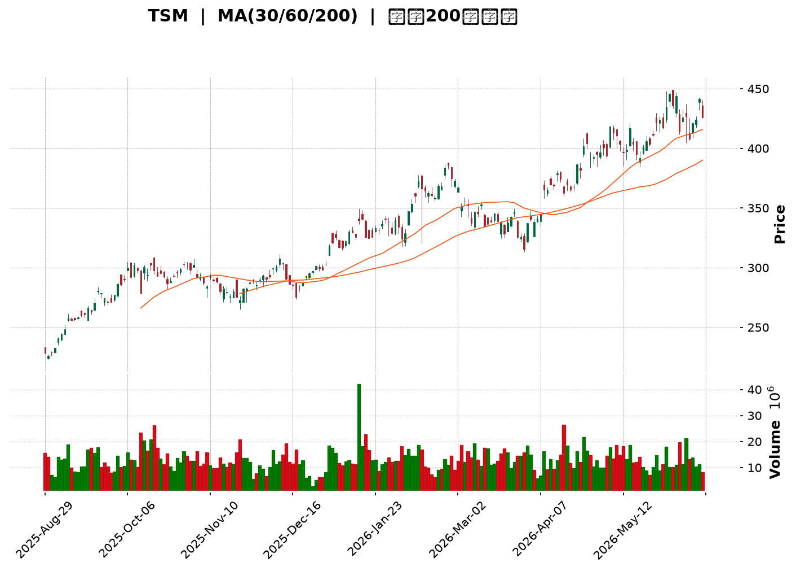
</details>

<html>
<head><meta charset="utf-8" /></head>
<body>
    <div style="height:500px; width:100%;">                        <script>window.PlotlyConfig = {MathJaxConfig: 'local'};</script>
        <script charset="utf-8" src="https://cdn.plot.ly/plotly-3.6.0.min.js" integrity="sha256-QaOVwtVY0T02VaHrr6pnoHLCwayMJp4O5n4YyaE3rJk=" crossorigin="anonymous"></script>                <div id="candlestick-chart" class="plotly-graph-div" style="height:100%; width:100%;"></div>            <script>                window.PLOTLYENV=window.PLOTLYENV || {};                                if (document.getElementById("candlestick-chart")) {                    Plotly.newPlot(                        "candlestick-chart",                        [{"close":{"dtype":"f8","bdata":"AAAAIAeLbEAAAABAiTxsQAAAAIB8m2xAAAAAwGMUbUAAAAAg6xduQAAAAECOj25AAAAAIJwFb0AAAABgdRlwQAAAAEA\u002fAXBAAAAAoOQHcEAAAACgVShwQAAAAKAtQHBAAAAAgMRLcEAAAADAoqhwQAAAAIDJbHBAAAAA4PnncEAAAADg\u002fodxQAAAAOA+aHFAAAAA4PMncUAAAACgkPNwQAAAAICA8XBAAAAAILRRcUAAAABAb+NxQAAAAEC43XFAAAAAYH0eckAAAACgksByQAAAAACzO3JAAAAAQDrickAAAABgkZhyQAAAAKBzZ3FAAAAAAFrIckAAAABgBVpyQAAAAEA+5XJAAAAAoO6XckAAAABAXkxyQAAAAAD2dXJAAAAAwFFDckAAAACg8elxQAAAAABQB3JAAAAAoHZKckAAAAAgsX5yQAAAAODCsnJAAAAAgEbrckAAAAAAl81yQAAAAGBMoXJAAAAA4J\u002fnckAAAABABDxyQAAAACCCNXJAAAAAgKjvcUAAAABgKcRxQAAAAEBiT3JAAAAAIEwOckAAAADgkAVyQAAAAGDmf3FAAAAA4H2pcUAAAAAA4nxxQAAAAMDLO3FAAAAAIJmCcUAAAACASTVxQAAAAGCNDnFAAAAAYKKmcUAAAADgRKdxQAAAAIAW+3FAAAAAwLETckAAAADg5NZxQAAAAODmHHJAAAAAAD5SckAAAADAPCpyQAAAAECnRnJAAAAAoCi4ckAAAABAm9ByQAAAAMBxO3NAAAAA4If0ckAAAADgnyhyQAAAAIAt5HFAAAAAQFTWcUAAAACAlThxQAAAACB4s3FAAAAAQHD3cUAAAACgXDxyQAAAAODHdnJAAAAAYDqUckAAAAAgidRyQAAAAGD5tXJAAAAAwKSgckAAAAAAQOVyQAAAAAB633NAAAAA4H8JdEAAAAAg9Ft0QAAAAGCs0HNAAAAAIALGc0AAAABgdx90QAAAAIAJoXRAAAAAYB+YdEAAAAAg3FZ0QAAAAEAlPnVAAAAAID5KdUAAAADgp1d0QAAAAAAaR3RAAAAAoP9adEAAAADAYdJ0QAAAAOD\u002fr3RAAAAA4J0JdUAAAACgpkh1QAAAAIDgHHVAAAAAwMaNdEAAAAAgsDl1QAAAAMBj4HRAAAAAgA1BdEAAAACAe5B0QAAAAKDpsHVAAAAAQFUZdkAAAABgzIB2QAAAAECtQndAAAAAQFTjdkAAAADgocd2QAAAACBApXZAAAAAoF6GdkAAAACAmmh2QAAAAEArCndAAAAAwDUCd0AAAAAgR\u002fx3QAAAAIDLG3hAAAAAIPltd0AAAADgeUp3QAAAAOBn83ZAAAAAYAr1dUAAAABgpTl2QAAAAACpAHZAAAAAIF8SdUAAAABghq51QAAAAKDllHVAAAAAgM0LdkAAAACgq+90QAAAAIAjCXVAAAAAoLMndUAAAAAgv5J1QAAAACBtLHVAAAAAwPkfdUAAAABAiId0QAAAAGCMGnVAAAAAICtndUAAAAAgAK91QAAAAKCRVXRAAAAAIKBfdEAAAAAgK7xzQAAAACCREnVAAAAAABNLdUAAAABg9yN1QAAAAGBiT3VAAAAAIDaIdUAAAADAuNB2QAAAAGAtynZAAAAAAL8bd0AAAAAATgt3QAAAAAAKsHdAAAAAAJRjd0AAAABgBKh2QAAAAGAmGndAAAAAICbWdkAAAAAghfN2QAAAAICOKHhAAAAAYEHcd0AAAACgUBh5QAAAAICKQHlAAAAAAMZ2eEAAAADAjo54QAAAAIAnsnhAAAAAwNrLeEAAAAAgvwp5QAAAAADRl3hAAAAAgFEoekAAAAAA69J5QAAAAIB9q3lAAAAAgIQ5eUAAAAAAocV4QAAAAMDa7XhAAAAAoOcLekAAAAAgfDZ5QAAAACBmsHhAAAAAQBV7eEAAAAAg6Ap5QAAAAAAuY3lAAAAAwDI5eUAAAADgtLV5QAAAAKDgW3pAAAAAoOB9ekAAAADAjhd6QAAAAKDLKXtAAAAAgFfae0AAAABAtzp7QAAAAKAWvntAAAAAQDPjeUAAAABg2Jx6QAAAAEC5rnpAAAAAYLh8eUAAAADAHlF6QAAAAEDhfnpAAAAAYGaWe0AAAACgR516QA=="},"high":{"dtype":"f8","bdata":"WIgdSs8rbUBP01h\u002fmlpsQON6DQQJvWxAUdFA6o0XbUBdUKXY\u002fztuQEppjetkpW5A68HCNzJ+b0BWI55C+VpwQI2Zdw9zLHBAWc2fqochcEAH4wlBzj5wQABBc9y1hXBA9r5BsNVrcEB3\u002fuVHzMZwQBPcYE\u002fGh3BA0W5bbTAjcUD3kMtkObxxQFK0Bd0ucHFAGZHqoJIvcUC6T0OYiRVxQP6lRj7pWnFAl2aQ2OBUcUC9287hVwNyQP1QQidnZnJAre\u002f18exbckCdamsWXA5zQBtlzzMvC3NArb71ixIAc0CX0zUIZsdyQIGtFcKlnXJAo0mtR\u002fnjckCselkSQbZyQNAJ1MdnA3NAHoQoRPhOc0A8kSUl3M5yQLYjtJZq1HJAqL65nXiQckBOcuT8RU5yQA9u\u002fOamPHJANJYnAO55ckBZK5fWF6JyQLrrKUlJvHJAhWKNF9YYc0DO\u002f0imhA5zQJMdCzRkFHNAToCdbiA7c0C28sw7ELpyQP2FOBU3fnJAXxdnEmJFckAegcVcOtpxQIQyfE\u002fpbHJAHG6MCdRJckBeKJnGCElyQB+in1vJ83FAFLNVTODJcUD4r9cgo8RxQECQlpz9X3FAdniVkDSlcUAljbSQ9yhyQCEVMaEtSHFAbH39LE2tcUCkhHfxsrJxQC\u002f2X9tUKHJA\u002fdMw+hsmckChmEOPIw5yQA0evRIpQ3JA216OyNBkckDfOkUmsztyQG82pywsp3JAEYCGmxDEckAgdL50xORyQD5CtWdneHNAIhiYCEoEc0AszyczdetyQDu8LJJ5ZHJAcKnsZqPvcUAmqfZs0\u002flxQCuUWgry2nFArN5WlrEqckAEKUBU5ldyQEYAUsoPhnJAdSPAa\u002fWZckDSlayhId1yQJ8CPaL17nJANYidPsHvckCN2mJR9hxzQJC3\u002fXD+\u002fnNASixZZ8KYdEBOvx2O47V0QN6+UnX3SXRAlGG\u002fflAtdEDuzzXAnDF0QFJzGOdevXRAZwcY8Q3rdEChuUU7ooJ0QHNDZWFj2HVAD61OidTAdUDm3sRMQ0Z1QG6yI7DNvnRAMrWhMT\u002fVdECiOEKgrPZ0QESnZA8L1nRAatYL\u002fe83dUB+DBOClnt1QM2zoYqSX3VAVi16v3IidUDuVRIW5WZ1QL6nfJxClHVAZB1gT\u002fAQdUDiHsZIm810QFmWUc\u002fCvnVAugurSgdcdkBJG0kAKq52QDuom6wQmndAySMdGsCgd0BXNrjgPRN3QMgrZQUWxXZAZy7KBd33dkBWs8gD9452QFABtK2XJHdAIbU3wis4d0BYkIwq4DJ4QJzfZEpFQ3hA9sYWI70HeEDPmUdK52t3QPdhMgDrMndAw4tcAGgidkCZHuvovnN2QOamtoX1WXZAjwWszteudUBC+47Dqrl1QPQ3Mw7u+nVAHLaqozY4dkCExgywtpF1QLovueP8a3VAJDEiX71tdUAs+xSJMp91QPOMCW4xsnVAbWa0oLExdUDp5yDf+gx1QILuwgi5aXVA3eCmBjCBdUAYtV6JGdp1QL1cHN3QQXVAEERE46OMdEAl1lliR410QJPUE9noGXVAfWpjcdi9dUAt7wBBVVR1QNr\u002fOEZVdnVAXCWNPZCLdUCW8ei8zlZ3QPc4Xxr19HZA3LOxjt6Rd0BaYbxJeSl3QC31xyZG1HdAZXrsqGbRd0D+RBRyXBV3QN9fpmI9a3dAwk3gOEkTd0ByXrryIx53QInmjCAPMHhAedmzn6A9eEB99EA5iIh5QAnJ\u002fUSB2HlANIox9AvPeEBpVDdrza54QOP5xH+73XhAKDXg5LwweUDUPAyY9Wt5QBP26fflUnlAiwgA1oIrekDhahmkTDB6QNOsf1ZpAHpA1HblOHBseUA\u002fVbiozRR5QNaUpYzAO3lAM6gM9L5PekD42essmY55QPRoN8feXnlAKgERPyvfeEC1fld\u002f+y55QDfL\u002fID6p3lABXVxZV6beUC7U\u002fI3Rfh5QCl4zmm02HpAFOs5h52pekBWxvgB89Z6QNtE6\u002fFwBXxAqUKzk1H1e0AFZox4uxF8QJTP\u002fq1p73tAwqqlAS4Oe0DgB3ZKvgx7QOPgREEuUntAZigg\u002fC6VekAAAAAAAGR6QAAAAEAKr3pAAAAAoEepe0AAAACgR4V7QA=="},"hovertemplate":"\u003cb\u003e%{x|%Y-%m-%d}\u003c\u002fb\u003e\u003cbr\u003e\u958b: $%{open:.2f}\u003cbr\u003e\u9ad8: $%{high:.2f}\u003cbr\u003e\u4f4e: $%{low:.2f}\u003cbr\u003e\u6536: $%{close:.2f}\u003cextra\u003e\u003c\u002fextra\u003e","low":{"dtype":"f8","bdata":"51VefNmBbECaJXixLuVrQIPnZuEuQ2xAwTNd+fx4bEBn\u002fYDehmltQE0oSd5D321AXa2RiVOHbkDVhVlMx91vQMPIr+747G9Ai+o0ILjxb0CZ0Wnrbf1vQK4USs8oKXBAIgCrvTAbcEDoj+B80f5vQH7Tw7cVTHBA3gwWjv51cECKZkaI+VxxQLAaw6XnKHFAXQNy8D3BcEBc205eEchwQAAAAICA8XBAOw3huAb7cEDOnApeDDBxQJFttTWTzHFAEeeekIADckCPWLlGhZlyQLT2gwTLL3JAp\u002f5kBeg6ckC4W+AGhHFyQCTofnE2YnFAyNE1vI0gckAozUkO\u002fxByQOiepHaVm3JANSjmH+1lckDVJXIf1ElyQMUQxf7Ma3JArbxeWNM1ckCNmuj20qJxQDlgzZnZ9XFA86iaQGpBckBAsWhmTTZyQDMnEyc+XHJAYJm5KEHAckC7Ght7fadyQB51vHbEZXJAoT9ZniC8ckDFcL7KcTNyQDz13CeJE3JAYlI6kCHScUDGvnfuaS9xQJl0ERmBF3JAPeKHf2vqcUD+S\u002fdNDvVxQFP4a5P5XHFArq9dZoDxcECuleaFzFlxQCxHmbNn6XBA0WNYHY4icUCUOsnH+yNxQGsJgT++i3BArsfsyt3wcEA\u002fhUG4Hu9wQGNbmOmv13FAWFlGIdnrcUBOc26onY9xQJ6aRbC07nFAX6Or4FW9cUCethQs5v5xQNc1+jJRL3JAa8F5K2dmckBdCsUbqYJyQCoS2OgownJArmB6bpmhckDrFqJwwBdyQNRn+z8n4XFAxeIwPNKdcUAr9QqUqBpxQA07wY7UhHFACnKgmofOcUCJlCF0aRtyQCjuKd8rK3JA12B92lFrckDRG0dSxY9yQAey5ynXkXJAJER8HJOeckBpbjRv7d1yQISqwkWRYXNA+uYNqo\u002f9c0DqcsdJvy50QKS7a\u002fJxznNAJyMu\u002fj2oc0AZbM4i1MlzQHlAGdeO9nNAMlZnLUeRdECidIGVaDJ0QOf6XnDuAnVAPJD\u002fqUc7dUDkuUxZhFN0QLdnUQMZQHRACmgDZYRTdEDdWcVuq5p0QGWidhWGiHRA9cGjk3LNdED+ehThtQ51QJjm7vA1aHRA0TRoXIl2dEC4dnJZiXZ0QDEA\u002f0AuhXRAO5q7quHWc0B+1H8CHeBzQBY\u002fwjW37nRABR3v1DKgdUBA\u002fTe17ih2QJ8oGx\u002fy53ZA\u002fNmgqBwHdEBvlErupm52QJgs93KLJnZAw+6dYbJtdkABgK5apTl2QGLv39URVHZAxFbvXTnJdkBPKtEU4GF3QP0CZA2i7XdAuM0HTsz8dkD48qA4m+t2QPdcqaRprHZAsFoSovBldUBDRUq3pAt2QF7xwAiHYHVAs+mnMFrvdEACoCvBbKN0QJcbaEalaHVAGjJWq\u002fLIdUBnxWvyaup0QBFV4N\u002fe53RAx3yh4SwhdUDBQ0bqvxl1QJGEfzPBKHVAiV7yReJGdECJTYaWN1J0QKboahY5pXRAzmWZVNXTdEBt397LKGt1QDgV67TBSXRAMfMIRekYdEBylr+2EZFzQIOjbT48BnRALnjCpkwvdUCRQwdilWB0QG7dvexCHXVArNohStrtdEAHpEwcaWZ2QAe9tSUJfnZAHNtvgi0Od0DZVK6vHdN2QHU7yXSRRXdA65AkKHI1d0APUM1LUnt2QGMnUCuXxHZAv0RCK2K2dkB4eDZsHMR2QGraD4ZiHHdANZG1Telud0C9bYuF4I54QGPwk5Ru93hA8NIBvdH8d0DBJr9xXjR4QNUzZOzwDHhA0ZJN5GtzeECL0sk3baR4QLuuMpLsenhACiCvQ2z7eECvAWPtgHJ5QCjU6xoY\u002f3hATM62pCfUeED8mm9sfBN4QJS1V9fiaHhAUfv3mpESeUC1SSfzXt54QExhTIQuYnhAsvy6wJACeECVZ4oiZrB4QJ+MG7056XhAdv28QrMeeUCUGEhoypF5QJ5wz1aN5nlAb2h1YtvbeUBZj+L7ZgR6QBtxqMY0WHpA6smtdNwve0BWFa6LPBh7QIYQSp7TpHpA+MW+hjW9eUCvg99cr1h6QCu2yFUASXlAo+ZPrPVreUAAAACAwo15QAAAACBcE3pAAAAAQOH+ekAAAABAM5N6QA=="},"name":"\u50f9\u683c","open":{"dtype":"f8","bdata":"Hf5\u002fBVQobUDhrBLZo\u002fVrQC6UvNmZn2xAYVa\u002fgjiabECxER2PlrNtQPMHXNb56m1AXa2RiVOHbkDnBeX3nABwQMmiifsIGHBAzLGshfIfcECXlGv0fhJwQNUnWqN0fXBAIx5MnV9kcECeaiP1c\u002f9vQFS3EXeZhHBA4yQ4RkyHcECtRlUNE4NxQMPTIU\u002flYXFA2vWlXMHvcEA9aNim+vtwQB+AHftAJXFAqv\u002fKIa4ScUAUk5aSNURxQHuH9E46Y3JAt+mCKyApckDa5c\u002fIoZpyQIg683KQA3NAGJ+nOxlLckCMTQ3PJL9yQFxCyVHWmXJAaX+WaIh+ckAGd1KNGVVyQP91AGdT\u002fnJAWERVG\u002fxHc0AylN6uEoFyQMLk8xh5mnJAC0r09piKckAk03swWStyQC0sSmiM+HFAmwUptyVUckDWvOOwCoVyQB6pb4vNf3JArAdv44v2ckBxZ9b7XctyQJs0yhKQ+XJAJ1ZLsZbDckBVrH9f8WhyQF2PIcpQJXJAc5dpfc88ckAJ8WLPrq9xQOjiQgTwQHJANe\u002fr\u002f2wcckBmUxf+dTZyQEzOz0yM7nFARFHi0wsccUBj0PSA1XNxQGBAaKcUNnFA2FKKhhQscUD\u002fBYuPzh5yQDx7hG3V6nBArsfsyt3wcEAAm9kxUIhxQHkwPopv7XFAUNXYzxcjckBwSzlW1MpxQGW5yiF5G3JARVlot1QeckAanBAA6DpyQP2X2kjEW3JAeUl\u002f1IWtckCBn\u002fZkUJpyQC9hn4C473JAsnr\u002fGgP8ckAszyczdetyQJt+MeEgWnJAakcRionccUCEtPGswPBxQIhgXiOQuHFACnKgmofOcUCQ5qHcfFJyQCb1GrxFPnJAQxex8FqDckCWqd7EvKVyQENPP8Wpw3JAReRwGeXMckAZAkEvAOdyQNBpvkAGZnNAfkhgrDqLdEBnl59DXYh0QCZ3y2UFMHRAyRqBT5ArdECa3q5\u002f+uJzQPGmNNIcB3RAkGeSzYuydEChuUU7ooJ0QGfhjt7EUHVABe+zOaqLdUAbSkpunTB1QARZBNx1u3RA9iktIk27dECaoybyz6V0QHaxwvBFsXRA5lBW\u002fFPsdEBJobphRVR1QOvsqTzbIHVAJJ2qDyPbdEC6zBbH9ZB0QFYFSEu+dHVA3DohjQDedEDjBBKmkhJ0QHP9zfA+\u002fHRAaYgN33qvdUCFEdatUad2QO9bSKvYAndAe8+EJ9WQd0Akur4DC\u002fR2QImsKm0pgHZA9x4lcdafdkDyxvE68F12QAOYLMXkXnZAmMiyqfrRdkDBNXEuM5d3QJzfZEpFQ3hAGyUKXh8DeED+aqw4zQN3QMh5PNK2t3ZAjZfp\u002fQ28dUBCM\u002fKVfDl2QKUoCvs2EXZAwR4ik8BbdUAvZW2IAN50QDofqRLdqnVAySNRQ8YBdkBfl\u002felboJ1QAwFPwVwYnVANF76BvA3dUB\u002foHcc3jx1QC1qTNKNj3VAoQYQlTaHdEBFcAhNS\u002f50QKboahY5pXRAy8s1X5PsdEBLpz3fEJN1QNtGhKtqMHVA4PJQByNBdECo8hX692Z0QA0qHUzpGHRAi3HKT4txdUDQmAPgOGF0QLLoVZxML3VAnQcp5VkqdUCbje48zBZ3QBPVJxU4p3ZAZV\u002f7PmZrd0D+4JClURZ3QKh2a4J4ondA2DldXU3Id0D5WweF+P92QKlLTMk\u002fRXdATGFMu7cFd0AAAAAghfN2QBX0Ov2ULndAYSyyyKL1d0C0rER7brN4QKRVanKIzHlApLv5+kJzeEDUgNZN3394QOGhsMAWznhAIZD6GlWIeEDwwsimMjl5QBkiKbx5OnlAvmdyhFsXeUDTX2iLzxF6QKnG9hCd\u002f3lA2oNSkqJceUCTMZCgIc14QEdcSoRu1XhAsOele0kkeUCzAd3szVh5QPRoN8feXnlAXPCiaplJeEBhjj3WKMF4QJ+MG7056XhAXbNKI5OHeUBuiBv4ecJ5QIUR91FboHpA57Oxg7xTekDiiA3CJ6F6QEdp+38yfnpAPhfLWM94e0AkMQ65BA98QBeIRYD72XpAUTqyB0HMekArPhJ\u002femx6QLZ\u002fYQz53XpA7QhOpOLPeUAAAAAAKdR5QAAAAMDMQHpAAAAAQOFqe0AAAADgUUB7QA=="},"x":["2025-08-29T00:00:00-04:00","2025-09-02T00:00:00-04:00","2025-09-03T00:00:00-04:00","2025-09-04T00:00:00-04:00","2025-09-05T00:00:00-04:00","2025-09-08T00:00:00-04:00","2025-09-09T00:00:00-04:00","2025-09-10T00:00:00-04:00","2025-09-11T00:00:00-04:00","2025-09-12T00:00:00-04:00","2025-09-15T00:00:00-04:00","2025-09-16T00:00:00-04:00","2025-09-17T00:00:00-04:00","2025-09-18T00:00:00-04:00","2025-09-19T00:00:00-04:00","2025-09-22T00:00:00-04:00","2025-09-23T00:00:00-04:00","2025-09-24T00:00:00-04:00","2025-09-25T00:00:00-04:00","2025-09-26T00:00:00-04:00","2025-09-29T00:00:00-04:00","2025-09-30T00:00:00-04:00","2025-10-01T00:00:00-04:00","2025-10-02T00:00:00-04:00","2025-10-03T00:00:00-04:00","2025-10-06T00:00:00-04:00","2025-10-07T00:00:00-04:00","2025-10-08T00:00:00-04:00","2025-10-09T00:00:00-04:00","2025-10-10T00:00:00-04:00","2025-10-13T00:00:00-04:00","2025-10-14T00:00:00-04:00","2025-10-15T00:00:00-04:00","2025-10-16T00:00:00-04:00","2025-10-17T00:00:00-04:00","2025-10-20T00:00:00-04:00","2025-10-21T00:00:00-04:00","2025-10-22T00:00:00-04:00","2025-10-23T00:00:00-04:00","2025-10-24T00:00:00-04:00","2025-10-27T00:00:00-04:00","2025-10-28T00:00:00-04:00","2025-10-29T00:00:00-04:00","2025-10-30T00:00:00-04:00","2025-10-31T00:00:00-04:00","2025-11-03T00:00:00-05:00","2025-11-04T00:00:00-05:00","2025-11-05T00:00:00-05:00","2025-11-06T00:00:00-05:00","2025-11-07T00:00:00-05:00","2025-11-10T00:00:00-05:00","2025-11-11T00:00:00-05:00","2025-11-12T00:00:00-05:00","2025-11-13T00:00:00-05:00","2025-11-14T00:00:00-05:00","2025-11-17T00:00:00-05:00","2025-11-18T00:00:00-05:00","2025-11-19T00:00:00-05:00","2025-11-20T00:00:00-05:00","2025-11-21T00:00:00-05:00","2025-11-24T00:00:00-05:00","2025-11-25T00:00:00-05:00","2025-11-26T00:00:00-05:00","2025-11-28T00:00:00-05:00","2025-12-01T00:00:00-05:00","2025-12-02T00:00:00-05:00","2025-12-03T00:00:00-05:00","2025-12-04T00:00:00-05:00","2025-12-05T00:00:00-05:00","2025-12-08T00:00:00-05:00","2025-12-09T00:00:00-05:00","2025-12-10T00:00:00-05:00","2025-12-11T00:00:00-05:00","2025-12-12T00:00:00-05:00","2025-12-15T00:00:00-05:00","2025-12-16T00:00:00-05:00","2025-12-17T00:00:00-05:00","2025-12-18T00:00:00-05:00","2025-12-19T00:00:00-05:00","2025-12-22T00:00:00-05:00","2025-12-23T00:00:00-05:00","2025-12-24T00:00:00-05:00","2025-12-26T00:00:00-05:00","2025-12-29T00:00:00-05:00","2025-12-30T00:00:00-05:00","2025-12-31T00:00:00-05:00","2026-01-02T00:00:00-05:00","2026-01-05T00:00:00-05:00","2026-01-06T00:00:00-05:00","2026-01-07T00:00:00-05:00","2026-01-08T00:00:00-05:00","2026-01-09T00:00:00-05:00","2026-01-12T00:00:00-05:00","2026-01-13T00:00:00-05:00","2026-01-14T00:00:00-05:00","2026-01-15T00:00:00-05:00","2026-01-16T00:00:00-05:00","2026-01-20T00:00:00-05:00","2026-01-21T00:00:00-05:00","2026-01-22T00:00:00-05:00","2026-01-23T00:00:00-05:00","2026-01-26T00:00:00-05:00","2026-01-27T00:00:00-05:00","2026-01-28T00:00:00-05:00","2026-01-29T00:00:00-05:00","2026-01-30T00:00:00-05:00","2026-02-02T00:00:00-05:00","2026-02-03T00:00:00-05:00","2026-02-04T00:00:00-05:00","2026-02-05T00:00:00-05:00","2026-02-06T00:00:00-05:00","2026-02-09T00:00:00-05:00","2026-02-10T00:00:00-05:00","2026-02-11T00:00:00-05:00","2026-02-12T00:00:00-05:00","2026-02-13T00:00:00-05:00","2026-02-17T00:00:00-05:00","2026-02-18T00:00:00-05:00","2026-02-19T00:00:00-05:00","2026-02-20T00:00:00-05:00","2026-02-23T00:00:00-05:00","2026-02-24T00:00:00-05:00","2026-02-25T00:00:00-05:00","2026-02-26T00:00:00-05:00","2026-02-27T00:00:00-05:00","2026-03-02T00:00:00-05:00","2026-03-03T00:00:00-05:00","2026-03-04T00:00:00-05:00","2026-03-05T00:00:00-05:00","2026-03-06T00:00:00-05:00","2026-03-09T00:00:00-04:00","2026-03-10T00:00:00-04:00","2026-03-11T00:00:00-04:00","2026-03-12T00:00:00-04:00","2026-03-13T00:00:00-04:00","2026-03-16T00:00:00-04:00","2026-03-17T00:00:00-04:00","2026-03-18T00:00:00-04:00","2026-03-19T00:00:00-04:00","2026-03-20T00:00:00-04:00","2026-03-23T00:00:00-04:00","2026-03-24T00:00:00-04:00","2026-03-25T00:00:00-04:00","2026-03-26T00:00:00-04:00","2026-03-27T00:00:00-04:00","2026-03-30T00:00:00-04:00","2026-03-31T00:00:00-04:00","2026-04-01T00:00:00-04:00","2026-04-02T00:00:00-04:00","2026-04-06T00:00:00-04:00","2026-04-07T00:00:00-04:00","2026-04-08T00:00:00-04:00","2026-04-09T00:00:00-04:00","2026-04-10T00:00:00-04:00","2026-04-13T00:00:00-04:00","2026-04-14T00:00:00-04:00","2026-04-15T00:00:00-04:00","2026-04-16T00:00:00-04:00","2026-04-17T00:00:00-04:00","2026-04-20T00:00:00-04:00","2026-04-21T00:00:00-04:00","2026-04-22T00:00:00-04:00","2026-04-23T00:00:00-04:00","2026-04-24T00:00:00-04:00","2026-04-27T00:00:00-04:00","2026-04-28T00:00:00-04:00","2026-04-29T00:00:00-04:00","2026-04-30T00:00:00-04:00","2026-05-01T00:00:00-04:00","2026-05-04T00:00:00-04:00","2026-05-05T00:00:00-04:00","2026-05-06T00:00:00-04:00","2026-05-07T00:00:00-04:00","2026-05-08T00:00:00-04:00","2026-05-11T00:00:00-04:00","2026-05-12T00:00:00-04:00","2026-05-13T00:00:00-04:00","2026-05-14T00:00:00-04:00","2026-05-15T00:00:00-04:00","2026-05-18T00:00:00-04:00","2026-05-19T00:00:00-04:00","2026-05-20T00:00:00-04:00","2026-05-21T00:00:00-04:00","2026-05-22T00:00:00-04:00","2026-05-26T00:00:00-04:00","2026-05-27T00:00:00-04:00","2026-05-28T00:00:00-04:00","2026-05-29T00:00:00-04:00","2026-06-01T00:00:00-04:00","2026-06-02T00:00:00-04:00","2026-06-03T00:00:00-04:00","2026-06-04T00:00:00-04:00","2026-06-05T00:00:00-04:00","2026-06-08T00:00:00-04:00","2026-06-09T00:00:00-04:00","2026-06-10T00:00:00-04:00","2026-06-11T00:00:00-04:00","2026-06-12T00:00:00-04:00","2026-06-15T00:00:00-04:00","2026-06-16T00:00:00-04:00"],"type":"candlestick"},{"hovertemplate":"MA30: $%{y:.2f}\u003cextra\u003e\u003c\u002fextra\u003e","line":{"color":"#2196F3","dash":"dash","width":2},"mode":"lines","name":"MA30","x":["2025-08-29T00:00:00-04:00","2025-09-02T00:00:00-04:00","2025-09-03T00:00:00-04:00","2025-09-04T00:00:00-04:00","2025-09-05T00:00:00-04:00","2025-09-08T00:00:00-04:00","2025-09-09T00:00:00-04:00","2025-09-10T00:00:00-04:00","2025-09-11T00:00:00-04:00","2025-09-12T00:00:00-04:00","2025-09-15T00:00:00-04:00","2025-09-16T00:00:00-04:00","2025-09-17T00:00:00-04:00","2025-09-18T00:00:00-04:00","2025-09-19T00:00:00-04:00","2025-09-22T00:00:00-04:00","2025-09-23T00:00:00-04:00","2025-09-24T00:00:00-04:00","2025-09-25T00:00:00-04:00","2025-09-26T00:00:00-04:00","2025-09-29T00:00:00-04:00","2025-09-30T00:00:00-04:00","2025-10-01T00:00:00-04:00","2025-10-02T00:00:00-04:00","2025-10-03T00:00:00-04:00","2025-10-06T00:00:00-04:00","2025-10-07T00:00:00-04:00","2025-10-08T00:00:00-04:00","2025-10-09T00:00:00-04:00","2025-10-10T00:00:00-04:00","2025-10-13T00:00:00-04:00","2025-10-14T00:00:00-04:00","2025-10-15T00:00:00-04:00","2025-10-16T00:00:00-04:00","2025-10-17T00:00:00-04:00","2025-10-20T00:00:00-04:00","2025-10-21T00:00:00-04:00","2025-10-22T00:00:00-04:00","2025-10-23T00:00:00-04:00","2025-10-24T00:00:00-04:00","2025-10-27T00:00:00-04:00","2025-10-28T00:00:00-04:00","2025-10-29T00:00:00-04:00","2025-10-30T00:00:00-04:00","2025-10-31T00:00:00-04:00","2025-11-03T00:00:00-05:00","2025-11-04T00:00:00-05:00","2025-11-05T00:00:00-05:00","2025-11-06T00:00:00-05:00","2025-11-07T00:00:00-05:00","2025-11-10T00:00:00-05:00","2025-11-11T00:00:00-05:00","2025-11-12T00:00:00-05:00","2025-11-13T00:00:00-05:00","2025-11-14T00:00:00-05:00","2025-11-17T00:00:00-05:00","2025-11-18T00:00:00-05:00","2025-11-19T00:00:00-05:00","2025-11-20T00:00:00-05:00","2025-11-21T00:00:00-05:00","2025-11-24T00:00:00-05:00","2025-11-25T00:00:00-05:00","2025-11-26T00:00:00-05:00","2025-11-28T00:00:00-05:00","2025-12-01T00:00:00-05:00","2025-12-02T00:00:00-05:00","2025-12-03T00:00:00-05:00","2025-12-04T00:00:00-05:00","2025-12-05T00:00:00-05:00","2025-12-08T00:00:00-05:00","2025-12-09T00:00:00-05:00","2025-12-10T00:00:00-05:00","2025-12-11T00:00:00-05:00","2025-12-12T00:00:00-05:00","2025-12-15T00:00:00-05:00","2025-12-16T00:00:00-05:00","2025-12-17T00:00:00-05:00","2025-12-18T00:00:00-05:00","2025-12-19T00:00:00-05:00","2025-12-22T00:00:00-05:00","2025-12-23T00:00:00-05:00","2025-12-24T00:00:00-05:00","2025-12-26T00:00:00-05:00","2025-12-29T00:00:00-05:00","2025-12-30T00:00:00-05:00","2025-12-31T00:00:00-05:00","2026-01-02T00:00:00-05:00","2026-01-05T00:00:00-05:00","2026-01-06T00:00:00-05:00","2026-01-07T00:00:00-05:00","2026-01-08T00:00:00-05:00","2026-01-09T00:00:00-05:00","2026-01-12T00:00:00-05:00","2026-01-13T00:00:00-05:00","2026-01-14T00:00:00-05:00","2026-01-15T00:00:00-05:00","2026-01-16T00:00:00-05:00","2026-01-20T00:00:00-05:00","2026-01-21T00:00:00-05:00","2026-01-22T00:00:00-05:00","2026-01-23T00:00:00-05:00","2026-01-26T00:00:00-05:00","2026-01-27T00:00:00-05:00","2026-01-28T00:00:00-05:00","2026-01-29T00:00:00-05:00","2026-01-30T00:00:00-05:00","2026-02-02T00:00:00-05:00","2026-02-03T00:00:00-05:00","2026-02-04T00:00:00-05:00","2026-02-05T00:00:00-05:00","2026-02-06T00:00:00-05:00","2026-02-09T00:00:00-05:00","2026-02-10T00:00:00-05:00","2026-02-11T00:00:00-05:00","2026-02-12T00:00:00-05:00","2026-02-13T00:00:00-05:00","2026-02-17T00:00:00-05:00","2026-02-18T00:00:00-05:00","2026-02-19T00:00:00-05:00","2026-02-20T00:00:00-05:00","2026-02-23T00:00:00-05:00","2026-02-24T00:00:00-05:00","2026-02-25T00:00:00-05:00","2026-02-26T00:00:00-05:00","2026-02-27T00:00:00-05:00","2026-03-02T00:00:00-05:00","2026-03-03T00:00:00-05:00","2026-03-04T00:00:00-05:00","2026-03-05T00:00:00-05:00","2026-03-06T00:00:00-05:00","2026-03-09T00:00:00-04:00","2026-03-10T00:00:00-04:00","2026-03-11T00:00:00-04:00","2026-03-12T00:00:00-04:00","2026-03-13T00:00:00-04:00","2026-03-16T00:00:00-04:00","2026-03-17T00:00:00-04:00","2026-03-18T00:00:00-04:00","2026-03-19T00:00:00-04:00","2026-03-20T00:00:00-04:00","2026-03-23T00:00:00-04:00","2026-03-24T00:00:00-04:00","2026-03-25T00:00:00-04:00","2026-03-26T00:00:00-04:00","2026-03-27T00:00:00-04:00","2026-03-30T00:00:00-04:00","2026-03-31T00:00:00-04:00","2026-04-01T00:00:00-04:00","2026-04-02T00:00:00-04:00","2026-04-06T00:00:00-04:00","2026-04-07T00:00:00-04:00","2026-04-08T00:00:00-04:00","2026-04-09T00:00:00-04:00","2026-04-10T00:00:00-04:00","2026-04-13T00:00:00-04:00","2026-04-14T00:00:00-04:00","2026-04-15T00:00:00-04:00","2026-04-16T00:00:00-04:00","2026-04-17T00:00:00-04:00","2026-04-20T00:00:00-04:00","2026-04-21T00:00:00-04:00","2026-04-22T00:00:00-04:00","2026-04-23T00:00:00-04:00","2026-04-24T00:00:00-04:00","2026-04-27T00:00:00-04:00","2026-04-28T00:00:00-04:00","2026-04-29T00:00:00-04:00","2026-04-30T00:00:00-04:00","2026-05-01T00:00:00-04:00","2026-05-04T00:00:00-04:00","2026-05-05T00:00:00-04:00","2026-05-06T00:00:00-04:00","2026-05-07T00:00:00-04:00","2026-05-08T00:00:00-04:00","2026-05-11T00:00:00-04:00","2026-05-12T00:00:00-04:00","2026-05-13T00:00:00-04:00","2026-05-14T00:00:00-04:00","2026-05-15T00:00:00-04:00","2026-05-18T00:00:00-04:00","2026-05-19T00:00:00-04:00","2026-05-20T00:00:00-04:00","2026-05-21T00:00:00-04:00","2026-05-22T00:00:00-04:00","2026-05-26T00:00:00-04:00","2026-05-27T00:00:00-04:00","2026-05-28T00:00:00-04:00","2026-05-29T00:00:00-04:00","2026-06-01T00:00:00-04:00","2026-06-02T00:00:00-04:00","2026-06-03T00:00:00-04:00","2026-06-04T00:00:00-04:00","2026-06-05T00:00:00-04:00","2026-06-08T00:00:00-04:00","2026-06-09T00:00:00-04:00","2026-06-10T00:00:00-04:00","2026-06-11T00:00:00-04:00","2026-06-12T00:00:00-04:00","2026-06-15T00:00:00-04:00","2026-06-16T00:00:00-04:00"],"y":{"dtype":"f8","bdata":"AAAAAAAA+H8AAAAAAAD4fwAAAAAAAPh\u002fAAAAAAAA+H8AAAAAAAD4fwAAAAAAAPh\u002fAAAAAAAA+H8AAAAAAAD4fwAAAAAAAPh\u002fAAAAAAAA+H8AAAAAAAD4fwAAAAAAAPh\u002fAAAAAAAA+H8AAAAAAAD4fwAAAAAAAPh\u002fAAAAAAAA+H8AAAAAAAD4fwAAAAAAAPh\u002fAAAAAAAA+H8AAAAAAAD4fwAAAAAAAPh\u002fAAAAAAAA+H8AAAAAAAD4fwAAAAAAAPh\u002fAAAAAAAA+H8AAAAAAAD4fwAAAAAAAPh\u002fAAAAAAAA+H8AAAAAAAD4f83MzOS4oXBAIiIigjfIcECJiIiIV+xwQHd3d3eGE3FAMzMz0x02cUBEREQM3VFxQGZmZr4AbXFAmpmZmXyEcUBVVVU1+JNxQImIiAg9pXFAq6qqKoa4cUBmZmYmeMxxQN7d3f1a4XFAERERMb33cUCamZmZCQpyQDMzM8PaHHJARERE1OgtckAiIiIC6TNyQFVVVZXAOnJAzczMvGhBckAzMzPDXEhyQLy7u2sGVHJAERERwU9ackAiIiICc1tyQJqZmWlSWHJAd3d3B2xUckAAAADgoUlyQKuqqioaQXJAiYiImGE1ckDe3d3diSlyQCIiIkKTJnJAERERAescckB3d3en9RZyQHd3d4cnD3JAmpmZGb8KckB3d3en1AZyQO\u002fu7q7cA3JAZmZmBlwEckCamZmpgAZyQLy7uyudCHJAzczMPEUMckDe3d09AA9yQKuqqpqOE3JAVVVVld0TckARERHhXQ5yQM3MzAwQCHJA3t3d7fP+cUCrqqoaTvZxQAAAAHD48XFARERE1DrycUCamZmJPPZxQJqZmbmM93FAmpmZmQP8cUDe3d296QJyQFVVVbU\u002fDXJAzczMvHwVckDv7u7efyFyQN7d3a0FOHJAd3d355VNckBVVVV1eWhyQGZmZgYDgHJAERER0R+SckARERGRMqdyQLy7u7vLvXJAq6qq2kbTckBVVVXlm+hyQM3MzCxRA3NAMzMzg6Ycc0BmZmYmOy9zQKuqqgpQQHNAREREJEZOc0C8u7tbZl9zQO\u002fu7n7Ra3NA7+7ufpZ9c0AzMzNjQZhzQCIiItK+s3NA3t3dTe3Kc0C8u7vbGO1zQHd3d8cxCHRAVVVVBbcbdECrqqrqlS90QDMzM5MfS3RAERERASlpdEBERESUgIh0QAAAAGBTr3RA7+7ujq7TdEBERET00\u002fR0QBEREbF8DHVAERERUbchdUBERERUNDN1QO\u002fu7o64TnVAERER4VNqdUDNzMy8SYt1QO\u002fu7t76qHVAvLu7yyzBdUCJiIi4XNp1QCIiIgLw6HVAvLu7e6HudUB3d3d3sv51QO\u002fu7m5qDXZAd3d3N4cTdkBVVVXF3Rp2QHd3dwd\u002fInZAd3d3NxordkCrqqrqIih2QLy7u3t6J3ZAq6qq+pssdkAiIiLyky92QKuqqsocMnZAEREREYs5dkARERGxPjl2QFVVVZU7NHZA7+7uPksudkCJiIj4TCd2QFVVVZVUDnZAVVVVpd\u002f4dUCJiIg45N51QM3MzPx30XVAd3d3d\u002fXGdUCrqqo6I7x1QM3MzMxgrXVAZmZmNsegdUAAAAAAy5Z1QO\u002fu7v6Ji3VAMzMzU8yIdUAzMzNDsYZ1QO\u002fu7u76jHVAiYiIuDKZdUDe3d2N4Jx1QJqZmZlCpnVARERExFG1dUDv7u4OJ8B1QHd3dyck1nVAvLu7e5\u002fldUAzMzNzHAl2QJqZmVkXLXZAIiIislNJdkDNzMyMyWJ2QLy7u0vYgHZAiYiImCygdkDNzMxsrsZ2QKuqqvp05HZAMzMzUwcNd0BERET0WzB3QBEREdHjXXdAvLu7S0mHd0ARERGxRLJ3QLy7u4st03dAq6qqKr37d0AzMzNTfR54QImIiMhSO3hAq6qqWnxUeEDv7u7ufWd4QO\u002fu7p6ofXhAMzMzA7WPeEDNzMwsdKZ4QImIiJg\u002fvXhA3t3dnbnXeEB3d3cHC\u002fV4QLy7u6uyF3lA3t3dHYFCeUCamZnJAmd5QERERGSYhXlAiYiIuOSWeUDe3d0t2KN5QAAAAPAMsHlAd3d3N8i4eUBEREQEzcd5QKuqqooo13lA7+7u\u002fvnueUAiIiLyZPx5QA=="},"type":"scatter"},{"hovertemplate":"MA60: $%{y:.2f}\u003cextra\u003e\u003c\u002fextra\u003e","line":{"color":"#9C27B0","dash":"dash","width":2},"mode":"lines","name":"MA60","x":["2025-08-29T00:00:00-04:00","2025-09-02T00:00:00-04:00","2025-09-03T00:00:00-04:00","2025-09-04T00:00:00-04:00","2025-09-05T00:00:00-04:00","2025-09-08T00:00:00-04:00","2025-09-09T00:00:00-04:00","2025-09-10T00:00:00-04:00","2025-09-11T00:00:00-04:00","2025-09-12T00:00:00-04:00","2025-09-15T00:00:00-04:00","2025-09-16T00:00:00-04:00","2025-09-17T00:00:00-04:00","2025-09-18T00:00:00-04:00","2025-09-19T00:00:00-04:00","2025-09-22T00:00:00-04:00","2025-09-23T00:00:00-04:00","2025-09-24T00:00:00-04:00","2025-09-25T00:00:00-04:00","2025-09-26T00:00:00-04:00","2025-09-29T00:00:00-04:00","2025-09-30T00:00:00-04:00","2025-10-01T00:00:00-04:00","2025-10-02T00:00:00-04:00","2025-10-03T00:00:00-04:00","2025-10-06T00:00:00-04:00","2025-10-07T00:00:00-04:00","2025-10-08T00:00:00-04:00","2025-10-09T00:00:00-04:00","2025-10-10T00:00:00-04:00","2025-10-13T00:00:00-04:00","2025-10-14T00:00:00-04:00","2025-10-15T00:00:00-04:00","2025-10-16T00:00:00-04:00","2025-10-17T00:00:00-04:00","2025-10-20T00:00:00-04:00","2025-10-21T00:00:00-04:00","2025-10-22T00:00:00-04:00","2025-10-23T00:00:00-04:00","2025-10-24T00:00:00-04:00","2025-10-27T00:00:00-04:00","2025-10-28T00:00:00-04:00","2025-10-29T00:00:00-04:00","2025-10-30T00:00:00-04:00","2025-10-31T00:00:00-04:00","2025-11-03T00:00:00-05:00","2025-11-04T00:00:00-05:00","2025-11-05T00:00:00-05:00","2025-11-06T00:00:00-05:00","2025-11-07T00:00:00-05:00","2025-11-10T00:00:00-05:00","2025-11-11T00:00:00-05:00","2025-11-12T00:00:00-05:00","2025-11-13T00:00:00-05:00","2025-11-14T00:00:00-05:00","2025-11-17T00:00:00-05:00","2025-11-18T00:00:00-05:00","2025-11-19T00:00:00-05:00","2025-11-20T00:00:00-05:00","2025-11-21T00:00:00-05:00","2025-11-24T00:00:00-05:00","2025-11-25T00:00:00-05:00","2025-11-26T00:00:00-05:00","2025-11-28T00:00:00-05:00","2025-12-01T00:00:00-05:00","2025-12-02T00:00:00-05:00","2025-12-03T00:00:00-05:00","2025-12-04T00:00:00-05:00","2025-12-05T00:00:00-05:00","2025-12-08T00:00:00-05:00","2025-12-09T00:00:00-05:00","2025-12-10T00:00:00-05:00","2025-12-11T00:00:00-05:00","2025-12-12T00:00:00-05:00","2025-12-15T00:00:00-05:00","2025-12-16T00:00:00-05:00","2025-12-17T00:00:00-05:00","2025-12-18T00:00:00-05:00","2025-12-19T00:00:00-05:00","2025-12-22T00:00:00-05:00","2025-12-23T00:00:00-05:00","2025-12-24T00:00:00-05:00","2025-12-26T00:00:00-05:00","2025-12-29T00:00:00-05:00","2025-12-30T00:00:00-05:00","2025-12-31T00:00:00-05:00","2026-01-02T00:00:00-05:00","2026-01-05T00:00:00-05:00","2026-01-06T00:00:00-05:00","2026-01-07T00:00:00-05:00","2026-01-08T00:00:00-05:00","2026-01-09T00:00:00-05:00","2026-01-12T00:00:00-05:00","2026-01-13T00:00:00-05:00","2026-01-14T00:00:00-05:00","2026-01-15T00:00:00-05:00","2026-01-16T00:00:00-05:00","2026-01-20T00:00:00-05:00","2026-01-21T00:00:00-05:00","2026-01-22T00:00:00-05:00","2026-01-23T00:00:00-05:00","2026-01-26T00:00:00-05:00","2026-01-27T00:00:00-05:00","2026-01-28T00:00:00-05:00","2026-01-29T00:00:00-05:00","2026-01-30T00:00:00-05:00","2026-02-02T00:00:00-05:00","2026-02-03T00:00:00-05:00","2026-02-04T00:00:00-05:00","2026-02-05T00:00:00-05:00","2026-02-06T00:00:00-05:00","2026-02-09T00:00:00-05:00","2026-02-10T00:00:00-05:00","2026-02-11T00:00:00-05:00","2026-02-12T00:00:00-05:00","2026-02-13T00:00:00-05:00","2026-02-17T00:00:00-05:00","2026-02-18T00:00:00-05:00","2026-02-19T00:00:00-05:00","2026-02-20T00:00:00-05:00","2026-02-23T00:00:00-05:00","2026-02-24T00:00:00-05:00","2026-02-25T00:00:00-05:00","2026-02-26T00:00:00-05:00","2026-02-27T00:00:00-05:00","2026-03-02T00:00:00-05:00","2026-03-03T00:00:00-05:00","2026-03-04T00:00:00-05:00","2026-03-05T00:00:00-05:00","2026-03-06T00:00:00-05:00","2026-03-09T00:00:00-04:00","2026-03-10T00:00:00-04:00","2026-03-11T00:00:00-04:00","2026-03-12T00:00:00-04:00","2026-03-13T00:00:00-04:00","2026-03-16T00:00:00-04:00","2026-03-17T00:00:00-04:00","2026-03-18T00:00:00-04:00","2026-03-19T00:00:00-04:00","2026-03-20T00:00:00-04:00","2026-03-23T00:00:00-04:00","2026-03-24T00:00:00-04:00","2026-03-25T00:00:00-04:00","2026-03-26T00:00:00-04:00","2026-03-27T00:00:00-04:00","2026-03-30T00:00:00-04:00","2026-03-31T00:00:00-04:00","2026-04-01T00:00:00-04:00","2026-04-02T00:00:00-04:00","2026-04-06T00:00:00-04:00","2026-04-07T00:00:00-04:00","2026-04-08T00:00:00-04:00","2026-04-09T00:00:00-04:00","2026-04-10T00:00:00-04:00","2026-04-13T00:00:00-04:00","2026-04-14T00:00:00-04:00","2026-04-15T00:00:00-04:00","2026-04-16T00:00:00-04:00","2026-04-17T00:00:00-04:00","2026-04-20T00:00:00-04:00","2026-04-21T00:00:00-04:00","2026-04-22T00:00:00-04:00","2026-04-23T00:00:00-04:00","2026-04-24T00:00:00-04:00","2026-04-27T00:00:00-04:00","2026-04-28T00:00:00-04:00","2026-04-29T00:00:00-04:00","2026-04-30T00:00:00-04:00","2026-05-01T00:00:00-04:00","2026-05-04T00:00:00-04:00","2026-05-05T00:00:00-04:00","2026-05-06T00:00:00-04:00","2026-05-07T00:00:00-04:00","2026-05-08T00:00:00-04:00","2026-05-11T00:00:00-04:00","2026-05-12T00:00:00-04:00","2026-05-13T00:00:00-04:00","2026-05-14T00:00:00-04:00","2026-05-15T00:00:00-04:00","2026-05-18T00:00:00-04:00","2026-05-19T00:00:00-04:00","2026-05-20T00:00:00-04:00","2026-05-21T00:00:00-04:00","2026-05-22T00:00:00-04:00","2026-05-26T00:00:00-04:00","2026-05-27T00:00:00-04:00","2026-05-28T00:00:00-04:00","2026-05-29T00:00:00-04:00","2026-06-01T00:00:00-04:00","2026-06-02T00:00:00-04:00","2026-06-03T00:00:00-04:00","2026-06-04T00:00:00-04:00","2026-06-05T00:00:00-04:00","2026-06-08T00:00:00-04:00","2026-06-09T00:00:00-04:00","2026-06-10T00:00:00-04:00","2026-06-11T00:00:00-04:00","2026-06-12T00:00:00-04:00","2026-06-15T00:00:00-04:00","2026-06-16T00:00:00-04:00"],"y":{"dtype":"f8","bdata":"AAAAAAAA+H8AAAAAAAD4fwAAAAAAAPh\u002fAAAAAAAA+H8AAAAAAAD4fwAAAAAAAPh\u002fAAAAAAAA+H8AAAAAAAD4fwAAAAAAAPh\u002fAAAAAAAA+H8AAAAAAAD4fwAAAAAAAPh\u002fAAAAAAAA+H8AAAAAAAD4fwAAAAAAAPh\u002fAAAAAAAA+H8AAAAAAAD4fwAAAAAAAPh\u002fAAAAAAAA+H8AAAAAAAD4fwAAAAAAAPh\u002fAAAAAAAA+H8AAAAAAAD4fwAAAAAAAPh\u002fAAAAAAAA+H8AAAAAAAD4fwAAAAAAAPh\u002fAAAAAAAA+H8AAAAAAAD4fwAAAAAAAPh\u002fAAAAAAAA+H8AAAAAAAD4fwAAAAAAAPh\u002fAAAAAAAA+H8AAAAAAAD4fwAAAAAAAPh\u002fAAAAAAAA+H8AAAAAAAD4fwAAAAAAAPh\u002fAAAAAAAA+H8AAAAAAAD4fwAAAAAAAPh\u002fAAAAAAAA+H8AAAAAAAD4fwAAAAAAAPh\u002fAAAAAAAA+H8AAAAAAAD4fwAAAAAAAPh\u002fAAAAAAAA+H8AAAAAAAD4fwAAAAAAAPh\u002fAAAAAAAA+H8AAAAAAAD4fwAAAAAAAPh\u002fAAAAAAAA+H8AAAAAAAD4fwAAAAAAAPh\u002fAAAAAAAA+H8AAAAAAAD4f3d3dxMmZHFAmpmZQZFycUAAAACYpoFxQHd3d\u002f9WkXFAZmZmdm6gcUDe3d3ZWKxxQKuqqrZuuHFAAAAAUGzEcUB3d3dvPM1xQCIiIhrt1nFAvLu7s2XicUAiIiIyvO1xQERERMx0+nFAMzMzY80FckBVVVW9MwxyQAAAAGh1EnJAERERYW4WckBmZmaOGxVyQKuqqoJcFnJAiYiIyNEZckBmZmamTB9yQKuqqpLJJXJAVVVVrSkrckAAAABgLi9yQHd3dw\u002fJMnJAIiIiYvQ0ckB3d3ffkDVyQEREROyPPHJAAAAAwHtBckCamZmpAUlyQERERCRLU3JAERERaYVXckBEREQcFF9yQJqZmaF5ZnJAIiIi+gJvckBmZmZGuHdyQN7d3e2Wg3JAzczMRIGQckAAAADo3ZpyQDMzM5t2pHJAiYiIsEWtckDNzMxMM7dyQM3MzAywv3JAIiIiCrrIckAiIiKiT9NyQHd3d2\u002fn3XJA3t3dnfDkckAzMzN7s\u002fFyQLy7uxsV\u002fXJAzczM7PgGc0AiIiI66RJzQGZmZiZWIXNAVVVVTZYyc0AREREptUVzQKuqqopJXnNA3t3dpZV0c0CamZnpKYtzQHd3dy9BonNAREREnKa3c0DNzMzk1s1zQKuqqspd53NAERER2Tn+c0Dv7u4mPhl0QFVVVU1jM3RAMzMz0zlKdEDv7u5OfGF0QHd3d5cgdnRAd3d3\u002f6OFdEDv7u7O9pZ0QM3MzDzdpnRA3t3dreawdECJiIgQIr10QDMzM0Mox3RAMzMzW1jUdEDv7u4mMuB0QO\u002fu7qac7XRAREREpMT7dEDv7u5mVg51QBEREUknHXVAMzMzC6EqdUDe3d1NajR1QERERJStP3VAAAAAILpLdUBmZmbG5ld1QKuqqvrTXnVAIiIiGkdmdUBmZmYW3Gl1QO\u002fu7lb6bnVAREREZFZ0dUB3d3fHq3d1QN7d3a0MfnVAvLu7i42FdUBmZmZeCpF1QO\u002fu7m5CmnVAd3d3j\u002fykdUDe3d39hrB1QImIiHj1unVAIiIiGurDdUCrqqqCyc11QERERITW2XVA3t3dfWzkdUAiIiJqgu11QHd3d5dR\u002fHVAmpmZ2VwIdkDv7u6unxh2QKuqqupIKnZAZmZm1vc6dkB3d3e\u002fLkl2QDMzM4t6WXZAzczM1NtsdkDv7u6O9n92QAAAAEhYjHZAERERSamddkBmZmZ21Kt2QDMzMzMctnZAiYiIeBTAdkDNzMx0lMh2QERERMRS0nZAERERUVnhdkDv7u5GUO12QKuqqspZ9HZAiYiIyKH6dkB3d3d3JP92QO\u002fu7k6ZBHdAMzMzq0AMd0AAAAC4khZ3QLy7u0MdJXdAMzMzK3Y4d0CrqqrK9Uh3QKuqqqL6XndAERERcel7d0BERETslJN3QN7d3UXerXdAIiIiGkK+d0CJiIhQetZ3QM3MzCSS7ndAzczM9A0BeECJiIhISxV4QDMzM2sALHhAvLu7S5NHeEB3d3eviWF4QA=="},"type":"scatter"},{"hovertemplate":"MA200: $%{y:.2f}\u003cextra\u003e\u003c\u002fextra\u003e","line":{"color":"#FF6F00","dash":"solid","width":2},"mode":"lines","name":"MA200","x":["2025-08-29T00:00:00-04:00","2025-09-02T00:00:00-04:00","2025-09-03T00:00:00-04:00","2025-09-04T00:00:00-04:00","2025-09-05T00:00:00-04:00","2025-09-08T00:00:00-04:00","2025-09-09T00:00:00-04:00","2025-09-10T00:00:00-04:00","2025-09-11T00:00:00-04:00","2025-09-12T00:00:00-04:00","2025-09-15T00:00:00-04:00","2025-09-16T00:00:00-04:00","2025-09-17T00:00:00-04:00","2025-09-18T00:00:00-04:00","2025-09-19T00:00:00-04:00","2025-09-22T00:00:00-04:00","2025-09-23T00:00:00-04:00","2025-09-24T00:00:00-04:00","2025-09-25T00:00:00-04:00","2025-09-26T00:00:00-04:00","2025-09-29T00:00:00-04:00","2025-09-30T00:00:00-04:00","2025-10-01T00:00:00-04:00","2025-10-02T00:00:00-04:00","2025-10-03T00:00:00-04:00","2025-10-06T00:00:00-04:00","2025-10-07T00:00:00-04:00","2025-10-08T00:00:00-04:00","2025-10-09T00:00:00-04:00","2025-10-10T00:00:00-04:00","2025-10-13T00:00:00-04:00","2025-10-14T00:00:00-04:00","2025-10-15T00:00:00-04:00","2025-10-16T00:00:00-04:00","2025-10-17T00:00:00-04:00","2025-10-20T00:00:00-04:00","2025-10-21T00:00:00-04:00","2025-10-22T00:00:00-04:00","2025-10-23T00:00:00-04:00","2025-10-24T00:00:00-04:00","2025-10-27T00:00:00-04:00","2025-10-28T00:00:00-04:00","2025-10-29T00:00:00-04:00","2025-10-30T00:00:00-04:00","2025-10-31T00:00:00-04:00","2025-11-03T00:00:00-05:00","2025-11-04T00:00:00-05:00","2025-11-05T00:00:00-05:00","2025-11-06T00:00:00-05:00","2025-11-07T00:00:00-05:00","2025-11-10T00:00:00-05:00","2025-11-11T00:00:00-05:00","2025-11-12T00:00:00-05:00","2025-11-13T00:00:00-05:00","2025-11-14T00:00:00-05:00","2025-11-17T00:00:00-05:00","2025-11-18T00:00:00-05:00","2025-11-19T00:00:00-05:00","2025-11-20T00:00:00-05:00","2025-11-21T00:00:00-05:00","2025-11-24T00:00:00-05:00","2025-11-25T00:00:00-05:00","2025-11-26T00:00:00-05:00","2025-11-28T00:00:00-05:00","2025-12-01T00:00:00-05:00","2025-12-02T00:00:00-05:00","2025-12-03T00:00:00-05:00","2025-12-04T00:00:00-05:00","2025-12-05T00:00:00-05:00","2025-12-08T00:00:00-05:00","2025-12-09T00:00:00-05:00","2025-12-10T00:00:00-05:00","2025-12-11T00:00:00-05:00","2025-12-12T00:00:00-05:00","2025-12-15T00:00:00-05:00","2025-12-16T00:00:00-05:00","2025-12-17T00:00:00-05:00","2025-12-18T00:00:00-05:00","2025-12-19T00:00:00-05:00","2025-12-22T00:00:00-05:00","2025-12-23T00:00:00-05:00","2025-12-24T00:00:00-05:00","2025-12-26T00:00:00-05:00","2025-12-29T00:00:00-05:00","2025-12-30T00:00:00-05:00","2025-12-31T00:00:00-05:00","2026-01-02T00:00:00-05:00","2026-01-05T00:00:00-05:00","2026-01-06T00:00:00-05:00","2026-01-07T00:00:00-05:00","2026-01-08T00:00:00-05:00","2026-01-09T00:00:00-05:00","2026-01-12T00:00:00-05:00","2026-01-13T00:00:00-05:00","2026-01-14T00:00:00-05:00","2026-01-15T00:00:00-05:00","2026-01-16T00:00:00-05:00","2026-01-20T00:00:00-05:00","2026-01-21T00:00:00-05:00","2026-01-22T00:00:00-05:00","2026-01-23T00:00:00-05:00","2026-01-26T00:00:00-05:00","2026-01-27T00:00:00-05:00","2026-01-28T00:00:00-05:00","2026-01-29T00:00:00-05:00","2026-01-30T00:00:00-05:00","2026-02-02T00:00:00-05:00","2026-02-03T00:00:00-05:00","2026-02-04T00:00:00-05:00","2026-02-05T00:00:00-05:00","2026-02-06T00:00:00-05:00","2026-02-09T00:00:00-05:00","2026-02-10T00:00:00-05:00","2026-02-11T00:00:00-05:00","2026-02-12T00:00:00-05:00","2026-02-13T00:00:00-05:00","2026-02-17T00:00:00-05:00","2026-02-18T00:00:00-05:00","2026-02-19T00:00:00-05:00","2026-02-20T00:00:00-05:00","2026-02-23T00:00:00-05:00","2026-02-24T00:00:00-05:00","2026-02-25T00:00:00-05:00","2026-02-26T00:00:00-05:00","2026-02-27T00:00:00-05:00","2026-03-02T00:00:00-05:00","2026-03-03T00:00:00-05:00","2026-03-04T00:00:00-05:00","2026-03-05T00:00:00-05:00","2026-03-06T00:00:00-05:00","2026-03-09T00:00:00-04:00","2026-03-10T00:00:00-04:00","2026-03-11T00:00:00-04:00","2026-03-12T00:00:00-04:00","2026-03-13T00:00:00-04:00","2026-03-16T00:00:00-04:00","2026-03-17T00:00:00-04:00","2026-03-18T00:00:00-04:00","2026-03-19T00:00:00-04:00","2026-03-20T00:00:00-04:00","2026-03-23T00:00:00-04:00","2026-03-24T00:00:00-04:00","2026-03-25T00:00:00-04:00","2026-03-26T00:00:00-04:00","2026-03-27T00:00:00-04:00","2026-03-30T00:00:00-04:00","2026-03-31T00:00:00-04:00","2026-04-01T00:00:00-04:00","2026-04-02T00:00:00-04:00","2026-04-06T00:00:00-04:00","2026-04-07T00:00:00-04:00","2026-04-08T00:00:00-04:00","2026-04-09T00:00:00-04:00","2026-04-10T00:00:00-04:00","2026-04-13T00:00:00-04:00","2026-04-14T00:00:00-04:00","2026-04-15T00:00:00-04:00","2026-04-16T00:00:00-04:00","2026-04-17T00:00:00-04:00","2026-04-20T00:00:00-04:00","2026-04-21T00:00:00-04:00","2026-04-22T00:00:00-04:00","2026-04-23T00:00:00-04:00","2026-04-24T00:00:00-04:00","2026-04-27T00:00:00-04:00","2026-04-28T00:00:00-04:00","2026-04-29T00:00:00-04:00","2026-04-30T00:00:00-04:00","2026-05-01T00:00:00-04:00","2026-05-04T00:00:00-04:00","2026-05-05T00:00:00-04:00","2026-05-06T00:00:00-04:00","2026-05-07T00:00:00-04:00","2026-05-08T00:00:00-04:00","2026-05-11T00:00:00-04:00","2026-05-12T00:00:00-04:00","2026-05-13T00:00:00-04:00","2026-05-14T00:00:00-04:00","2026-05-15T00:00:00-04:00","2026-05-18T00:00:00-04:00","2026-05-19T00:00:00-04:00","2026-05-20T00:00:00-04:00","2026-05-21T00:00:00-04:00","2026-05-22T00:00:00-04:00","2026-05-26T00:00:00-04:00","2026-05-27T00:00:00-04:00","2026-05-28T00:00:00-04:00","2026-05-29T00:00:00-04:00","2026-06-01T00:00:00-04:00","2026-06-02T00:00:00-04:00","2026-06-03T00:00:00-04:00","2026-06-04T00:00:00-04:00","2026-06-05T00:00:00-04:00","2026-06-08T00:00:00-04:00","2026-06-09T00:00:00-04:00","2026-06-10T00:00:00-04:00","2026-06-11T00:00:00-04:00","2026-06-12T00:00:00-04:00","2026-06-15T00:00:00-04:00","2026-06-16T00:00:00-04:00"],"y":{"dtype":"f8","bdata":"AAAAAAAA+H8AAAAAAAD4fwAAAAAAAPh\u002fAAAAAAAA+H8AAAAAAAD4fwAAAAAAAPh\u002fAAAAAAAA+H8AAAAAAAD4fwAAAAAAAPh\u002fAAAAAAAA+H8AAAAAAAD4fwAAAAAAAPh\u002fAAAAAAAA+H8AAAAAAAD4fwAAAAAAAPh\u002fAAAAAAAA+H8AAAAAAAD4fwAAAAAAAPh\u002fAAAAAAAA+H8AAAAAAAD4fwAAAAAAAPh\u002fAAAAAAAA+H8AAAAAAAD4fwAAAAAAAPh\u002fAAAAAAAA+H8AAAAAAAD4fwAAAAAAAPh\u002fAAAAAAAA+H8AAAAAAAD4fwAAAAAAAPh\u002fAAAAAAAA+H8AAAAAAAD4fwAAAAAAAPh\u002fAAAAAAAA+H8AAAAAAAD4fwAAAAAAAPh\u002fAAAAAAAA+H8AAAAAAAD4fwAAAAAAAPh\u002fAAAAAAAA+H8AAAAAAAD4fwAAAAAAAPh\u002fAAAAAAAA+H8AAAAAAAD4fwAAAAAAAPh\u002fAAAAAAAA+H8AAAAAAAD4fwAAAAAAAPh\u002fAAAAAAAA+H8AAAAAAAD4fwAAAAAAAPh\u002fAAAAAAAA+H8AAAAAAAD4fwAAAAAAAPh\u002fAAAAAAAA+H8AAAAAAAD4fwAAAAAAAPh\u002fAAAAAAAA+H8AAAAAAAD4fwAAAAAAAPh\u002fAAAAAAAA+H8AAAAAAAD4fwAAAAAAAPh\u002fAAAAAAAA+H8AAAAAAAD4fwAAAAAAAPh\u002fAAAAAAAA+H8AAAAAAAD4fwAAAAAAAPh\u002fAAAAAAAA+H8AAAAAAAD4fwAAAAAAAPh\u002fAAAAAAAA+H8AAAAAAAD4fwAAAAAAAPh\u002fAAAAAAAA+H8AAAAAAAD4fwAAAAAAAPh\u002fAAAAAAAA+H8AAAAAAAD4fwAAAAAAAPh\u002fAAAAAAAA+H8AAAAAAAD4fwAAAAAAAPh\u002fAAAAAAAA+H8AAAAAAAD4fwAAAAAAAPh\u002fAAAAAAAA+H8AAAAAAAD4fwAAAAAAAPh\u002fAAAAAAAA+H8AAAAAAAD4fwAAAAAAAPh\u002fAAAAAAAA+H8AAAAAAAD4fwAAAAAAAPh\u002fAAAAAAAA+H8AAAAAAAD4fwAAAAAAAPh\u002fAAAAAAAA+H8AAAAAAAD4fwAAAAAAAPh\u002fAAAAAAAA+H8AAAAAAAD4fwAAAAAAAPh\u002fAAAAAAAA+H8AAAAAAAD4fwAAAAAAAPh\u002fAAAAAAAA+H8AAAAAAAD4fwAAAAAAAPh\u002fAAAAAAAA+H8AAAAAAAD4fwAAAAAAAPh\u002fAAAAAAAA+H8AAAAAAAD4fwAAAAAAAPh\u002fAAAAAAAA+H8AAAAAAAD4fwAAAAAAAPh\u002fAAAAAAAA+H8AAAAAAAD4fwAAAAAAAPh\u002fAAAAAAAA+H8AAAAAAAD4fwAAAAAAAPh\u002fAAAAAAAA+H8AAAAAAAD4fwAAAAAAAPh\u002fAAAAAAAA+H8AAAAAAAD4fwAAAAAAAPh\u002fAAAAAAAA+H8AAAAAAAD4fwAAAAAAAPh\u002fAAAAAAAA+H8AAAAAAAD4fwAAAAAAAPh\u002fAAAAAAAA+H8AAAAAAAD4fwAAAAAAAPh\u002fAAAAAAAA+H8AAAAAAAD4fwAAAAAAAPh\u002fAAAAAAAA+H8AAAAAAAD4fwAAAAAAAPh\u002fAAAAAAAA+H8AAAAAAAD4fwAAAAAAAPh\u002fAAAAAAAA+H8AAAAAAAD4fwAAAAAAAPh\u002fAAAAAAAA+H8AAAAAAAD4fwAAAAAAAPh\u002fAAAAAAAA+H8AAAAAAAD4fwAAAAAAAPh\u002fAAAAAAAA+H8AAAAAAAD4fwAAAAAAAPh\u002fAAAAAAAA+H8AAAAAAAD4fwAAAAAAAPh\u002fAAAAAAAA+H8AAAAAAAD4fwAAAAAAAPh\u002fAAAAAAAA+H8AAAAAAAD4fwAAAAAAAPh\u002fAAAAAAAA+H8AAAAAAAD4fwAAAAAAAPh\u002fAAAAAAAA+H8AAAAAAAD4fwAAAAAAAPh\u002fAAAAAAAA+H8AAAAAAAD4fwAAAAAAAPh\u002fAAAAAAAA+H8AAAAAAAD4fwAAAAAAAPh\u002fAAAAAAAA+H8AAAAAAAD4fwAAAAAAAPh\u002fAAAAAAAA+H8AAAAAAAD4fwAAAAAAAPh\u002fAAAAAAAA+H8AAAAAAAD4fwAAAAAAAPh\u002fAAAAAAAA+H8AAAAAAAD4fwAAAAAAAPh\u002fAAAAAAAA+H8AAAAAAAD4fwAAAAAAAPh\u002fAAAAAAAA+H\u002f2KFz5BrV0QA=="},"type":"scatter"}],                        {"template":{"data":{"barpolar":[{"marker":{"line":{"color":"rgb(17,17,17)","width":0.5},"pattern":{"fillmode":"overlay","size":10,"solidity":0.2}},"type":"barpolar"}],"bar":[{"error_x":{"color":"#f2f5fa"},"error_y":{"color":"#f2f5fa"},"marker":{"line":{"color":"rgb(17,17,17)","width":0.5},"pattern":{"fillmode":"overlay","size":10,"solidity":0.2}},"type":"bar"}],"carpet":[{"aaxis":{"endlinecolor":"#A2B1C6","gridcolor":"#506784","linecolor":"#506784","minorgridcolor":"#506784","startlinecolor":"#A2B1C6"},"baxis":{"endlinecolor":"#A2B1C6","gridcolor":"#506784","linecolor":"#506784","minorgridcolor":"#506784","startlinecolor":"#A2B1C6"},"type":"carpet"}],"choropleth":[{"colorbar":{"outlinewidth":0,"ticks":""},"type":"choropleth"}],"contourcarpet":[{"colorbar":{"outlinewidth":0,"ticks":""},"type":"contourcarpet"}],"contour":[{"colorbar":{"outlinewidth":0,"ticks":""},"colorscale":[[0.0,"#0d0887"],[0.1111111111111111,"#46039f"],[0.2222222222222222,"#7201a8"],[0.3333333333333333,"#9c179e"],[0.4444444444444444,"#bd3786"],[0.5555555555555556,"#d8576b"],[0.6666666666666666,"#ed7953"],[0.7777777777777778,"#fb9f3a"],[0.8888888888888888,"#fdca26"],[1.0,"#f0f921"]],"type":"contour"}],"heatmap":[{"colorbar":{"outlinewidth":0,"ticks":""},"colorscale":[[0.0,"#0d0887"],[0.1111111111111111,"#46039f"],[0.2222222222222222,"#7201a8"],[0.3333333333333333,"#9c179e"],[0.4444444444444444,"#bd3786"],[0.5555555555555556,"#d8576b"],[0.6666666666666666,"#ed7953"],[0.7777777777777778,"#fb9f3a"],[0.8888888888888888,"#fdca26"],[1.0,"#f0f921"]],"type":"heatmap"}],"histogram2dcontour":[{"colorbar":{"outlinewidth":0,"ticks":""},"colorscale":[[0.0,"#0d0887"],[0.1111111111111111,"#46039f"],[0.2222222222222222,"#7201a8"],[0.3333333333333333,"#9c179e"],[0.4444444444444444,"#bd3786"],[0.5555555555555556,"#d8576b"],[0.6666666666666666,"#ed7953"],[0.7777777777777778,"#fb9f3a"],[0.8888888888888888,"#fdca26"],[1.0,"#f0f921"]],"type":"histogram2dcontour"}],"histogram2d":[{"colorbar":{"outlinewidth":0,"ticks":""},"colorscale":[[0.0,"#0d0887"],[0.1111111111111111,"#46039f"],[0.2222222222222222,"#7201a8"],[0.3333333333333333,"#9c179e"],[0.4444444444444444,"#bd3786"],[0.5555555555555556,"#d8576b"],[0.6666666666666666,"#ed7953"],[0.7777777777777778,"#fb9f3a"],[0.8888888888888888,"#fdca26"],[1.0,"#f0f921"]],"type":"histogram2d"}],"histogram":[{"marker":{"pattern":{"fillmode":"overlay","size":10,"solidity":0.2}},"type":"histogram"}],"mesh3d":[{"colorbar":{"outlinewidth":0,"ticks":""},"type":"mesh3d"}],"parcoords":[{"line":{"colorbar":{"outlinewidth":0,"ticks":""}},"type":"parcoords"}],"pie":[{"automargin":true,"type":"pie"}],"scatter3d":[{"line":{"colorbar":{"outlinewidth":0,"ticks":""}},"marker":{"colorbar":{"outlinewidth":0,"ticks":""}},"type":"scatter3d"}],"scattercarpet":[{"marker":{"colorbar":{"outlinewidth":0,"ticks":""}},"type":"scattercarpet"}],"scattergeo":[{"marker":{"colorbar":{"outlinewidth":0,"ticks":""}},"type":"scattergeo"}],"scattergl":[{"marker":{"line":{"color":"#283442"}},"type":"scattergl"}],"scattermapbox":[{"marker":{"colorbar":{"outlinewidth":0,"ticks":""}},"type":"scattermapbox"}],"scattermap":[{"marker":{"colorbar":{"outlinewidth":0,"ticks":""}},"type":"scattermap"}],"scatterpolargl":[{"marker":{"colorbar":{"outlinewidth":0,"ticks":""}},"type":"scatterpolargl"}],"scatterpolar":[{"marker":{"colorbar":{"outlinewidth":0,"ticks":""}},"type":"scatterpolar"}],"scatter":[{"marker":{"line":{"color":"#283442"}},"type":"scatter"}],"scatterternary":[{"marker":{"colorbar":{"outlinewidth":0,"ticks":""}},"type":"scatterternary"}],"surface":[{"colorbar":{"outlinewidth":0,"ticks":""},"colorscale":[[0.0,"#0d0887"],[0.1111111111111111,"#46039f"],[0.2222222222222222,"#7201a8"],[0.3333333333333333,"#9c179e"],[0.4444444444444444,"#bd3786"],[0.5555555555555556,"#d8576b"],[0.6666666666666666,"#ed7953"],[0.7777777777777778,"#fb9f3a"],[0.8888888888888888,"#fdca26"],[1.0,"#f0f921"]],"type":"surface"}],"table":[{"cells":{"fill":{"color":"#506784"},"line":{"color":"rgb(17,17,17)"}},"header":{"fill":{"color":"#2a3f5f"},"line":{"color":"rgb(17,17,17)"}},"type":"table"}]},"layout":{"annotationdefaults":{"arrowcolor":"#f2f5fa","arrowhead":0,"arrowwidth":1},"autotypenumbers":"strict","coloraxis":{"colorbar":{"outlinewidth":0,"ticks":""}},"colorscale":{"diverging":[[0,"#8e0152"],[0.1,"#c51b7d"],[0.2,"#de77ae"],[0.3,"#f1b6da"],[0.4,"#fde0ef"],[0.5,"#f7f7f7"],[0.6,"#e6f5d0"],[0.7,"#b8e186"],[0.8,"#7fbc41"],[0.9,"#4d9221"],[1,"#276419"]],"sequential":[[0.0,"#0d0887"],[0.1111111111111111,"#46039f"],[0.2222222222222222,"#7201a8"],[0.3333333333333333,"#9c179e"],[0.4444444444444444,"#bd3786"],[0.5555555555555556,"#d8576b"],[0.6666666666666666,"#ed7953"],[0.7777777777777778,"#fb9f3a"],[0.8888888888888888,"#fdca26"],[1.0,"#f0f921"]],"sequentialminus":[[0.0,"#0d0887"],[0.1111111111111111,"#46039f"],[0.2222222222222222,"#7201a8"],[0.3333333333333333,"#9c179e"],[0.4444444444444444,"#bd3786"],[0.5555555555555556,"#d8576b"],[0.6666666666666666,"#ed7953"],[0.7777777777777778,"#fb9f3a"],[0.8888888888888888,"#fdca26"],[1.0,"#f0f921"]]},"colorway":["#636efa","#EF553B","#00cc96","#ab63fa","#FFA15A","#19d3f3","#FF6692","#B6E880","#FF97FF","#FECB52"],"font":{"color":"#f2f5fa"},"geo":{"bgcolor":"rgb(17,17,17)","lakecolor":"rgb(17,17,17)","landcolor":"rgb(17,17,17)","showlakes":true,"showland":true,"subunitcolor":"#506784"},"hoverlabel":{"align":"left"},"hovermode":"closest","mapbox":{"style":"dark"},"paper_bgcolor":"rgb(17,17,17)","plot_bgcolor":"rgb(17,17,17)","polar":{"angularaxis":{"gridcolor":"#506784","linecolor":"#506784","ticks":""},"bgcolor":"rgb(17,17,17)","radialaxis":{"gridcolor":"#506784","linecolor":"#506784","ticks":""}},"scene":{"xaxis":{"backgroundcolor":"rgb(17,17,17)","gridcolor":"#506784","gridwidth":2,"linecolor":"#506784","showbackground":true,"ticks":"","zerolinecolor":"#C8D4E3"},"yaxis":{"backgroundcolor":"rgb(17,17,17)","gridcolor":"#506784","gridwidth":2,"linecolor":"#506784","showbackground":true,"ticks":"","zerolinecolor":"#C8D4E3"},"zaxis":{"backgroundcolor":"rgb(17,17,17)","gridcolor":"#506784","gridwidth":2,"linecolor":"#506784","showbackground":true,"ticks":"","zerolinecolor":"#C8D4E3"}},"shapedefaults":{"line":{"color":"#f2f5fa"}},"sliderdefaults":{"bgcolor":"#C8D4E3","bordercolor":"rgb(17,17,17)","borderwidth":1,"tickwidth":0},"ternary":{"aaxis":{"gridcolor":"#506784","linecolor":"#506784","ticks":""},"baxis":{"gridcolor":"#506784","linecolor":"#506784","ticks":""},"bgcolor":"rgb(17,17,17)","caxis":{"gridcolor":"#506784","linecolor":"#506784","ticks":""}},"title":{"x":0.05},"updatemenudefaults":{"bgcolor":"#506784","borderwidth":0},"xaxis":{"automargin":true,"gridcolor":"#283442","linecolor":"#506784","ticks":"","title":{"standoff":15},"zerolinecolor":"#283442","zerolinewidth":2},"yaxis":{"automargin":true,"gridcolor":"#283442","linecolor":"#506784","ticks":"","title":{"standoff":15},"zerolinecolor":"#283442","zerolinewidth":2}}},"xaxis":{"rangeslider":{"visible":false},"title":{"text":"\u65e5\u671f"}},"font":{"size":11},"title":{"text":"TSM  |  MA(30\u002f60\u002f200)  |  \u6700\u8fd1200\u4ea4\u6613\u65e5"},"yaxis":{"title":{"text":"\u80a1\u50f9 (USD)"}},"hovermode":"x unified","height":500},                        {"responsive": true}                    )                };            </script>        </div>
</body>
</html>

# TSM 技術分析報告

> **報告日期**：2026-06-17 ｜ **語言**：繁體中文 ｜ **數據來源**：Yahoo Finance ｜ **當前價格**：$425.83

---

## 目錄

| 章節 | 內容 |
|------|------|
| [1. 技術面概覽](#1-技術面概覽) | 訊號儀表板、核心指標、評分卡 |
| [2. 趨勢分析](#2-趨勢分析) | 多時框趨勢、長中短期走勢 |
| [3. 圖表形態分析](#3-圖表形態分析) | 形態識別、K線組合、目標價 |
| [4. 支撐與阻力](#4-支撐與阻力) | 關鍵價位、斐波那契回調 |
| [5. 技術指標深度解讀](#5-技術指標深度解讀) | MA/RSI/MACD/布林/成交量 |
| [6. 動能與波動率](#6-動能與波動率) | 動能評估、ATR、Beta |
| [7. 多時框架總結](#7-多時框架總結) | 時框架評分矩陣 |
| [8. 交易策略建議](#8-交易策略建議) | 多空策略、風險報酬比 |
| [9. 風險提示與監控](#9-風險提示與監控) | 監控指標、風險場景 |
| [10. 報告總結](#-報告總結) | 核心結論與最優策略組合 |

---

## 1. 技術面概覽

### 🎯 技術訊號儀表板

TSM 目前整體技術架構呈現**「長期多頭格局未變，短期高檔震盪整理」**的特徵。以下為多空訊號的分布與綜合評判：

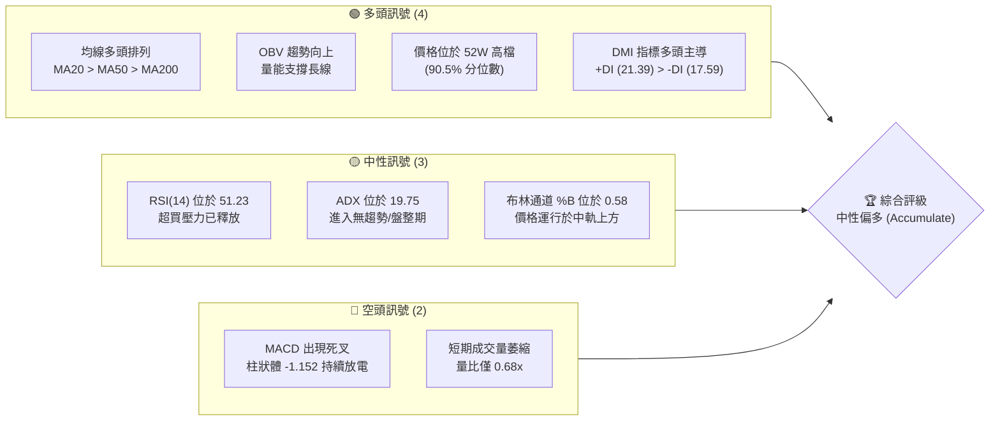

### 📊 核心指標速覽表

| 指標類別 | 指標名稱 | 當前數值 | 訊號 | 解讀 |
|----------|----------|----------|------|------|
| **價格** | 當前收盤價 | $425.83 | 🟢 | 處於 52 週高/低區間（$203.94 - $449.11）的 90.5% 高位，長線強勢。 |
| **均線** | MA20 (月線) | $421.17 | 🟢 | 價格在 MA20 上方，短期支撐強勁，均線扣抵值有利多方。 |
| **均線** | MA50 (季線) | $401.09 | 🟢 | 季線持續上揚，構成中期上升趨勢的生命線。 |
| **均線** | MA200 (年線)| $331.31 | 🟢 | 長期牛市分水嶺，價格遠高於此，基底極為紮實。 |
| **動能** | RSI(14) | 51.23 | 🟡 | 數值回到 50 中值附近，顯示先前過熱動能已透過橫盤消化。 |
| **動能** | MACD | 8.022 (Signal: 9.174)| 🔴 | 雙線於高檔死叉，柱狀圖（-1.152）顯示短期修正動能仍未結束。 |
| **趨勢** | ADX(14) | 19.75 | 🟡 | 低於 25，顯示當前處於「無趨勢」或「高檔箱型整理」狀態。 |
| **波動** | ATR(14) | $19.16 (4.50%)| 🟡 | 每日平均波動幅度近 20 美元，提供高波動度的日內交易空間。 |
| **成交量**| 20日均量比 | 0.68x | 🔴 | 成交量萎縮（8.25M vs 12.18M），顯示高檔追價意願降低，傾向觀望。 |

### 🏆 技術評分卡

╔══════════════════════════════════════════════════════════════╗
║             技術評分卡 — TSM (2026-06-17)                    ║
╠══════════════════════════════════════════════════════════════╣
║  趨勢強度      ████████████░░░░░░░░  60/100  🟡 中性         ║
║  動能指標      ██████████░░░░░░░░░░  50/100  🟡 中性         ║
║  支撐穩定度    ██████████████████░░  90/100  🟢 強勢         ║
║  成交量配合    ████████████░░░░░░░░  60/100  🟡 中性         ║
║  形態完整度    ████████████████░░░░  80/100  🟢 強勢         ║
║  均線排列      ████████████████████  100/100 🟢 極強         ║
╠══════════════════════════════════════════════════════════════╣
║  綜合評分      ██████████████░░░░░░  73/100  🟢 中性偏多     ║
╚══════════════════════════════════════════════════════════════╝

---

## 2. 趨勢分析

### 🌐 多時框趨勢分析

技術分析的核心在於「長線保護短線」。我們透過月線、週線與日線的三重時框架進行結構性剖析：

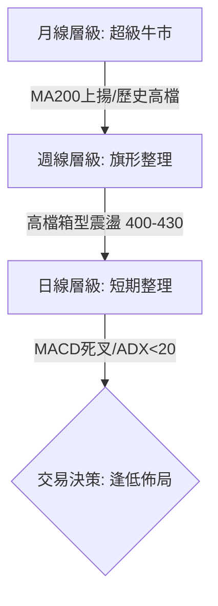

*   **長期（月線）**：🟢 **強烈看多**。均線系統（MA120, MA240）呈現完美的發散多頭排列。自 2024 年 6 月的 $169.45 起步，至 2026 年 6 月已達 $425.83，兩年漲幅達 151.3%。
*   **中期（週線）**：🟢 **看多但面臨整理**。近 20 週數據顯示，價格自 2026 年 3 月底低點 $325.98 快速拉升至 5 月的高點 $417.47，隨後進入 $400 - $430 的高檔箱型整理。週線級別的 RSI 成功由超買區（>70）回落至 51.2，有利於洗淨浮額。
*   **短期（日線）**：🟡 **中性盤整**。MA5 ($424.00) 與 MA10 ($426.65) 出現糾結，價格在 MA20 ($421.17) 上方狹幅震盪，日線 ADX 降至 19.75，宣告短期趨勢性動能暫時熄火，市場正等待突破契機。

### 📈 長期趨勢 — 12個月走勢圖（Unicode）

以下為 TSM 過去 12 個月（2025-07 至 2026-06）的收盤價走勢圖，清晰展示了其穩健的上升通道：

```
TSM 月線走勢圖（過去12個月）
價格軸 ($)
$450 ┤                                                       ● (2026-06: $425.83)
$400 ┤                                               ●   ●
$350 ┤                                       ●   ●
$300 ┤                       ●   ●   ●   ●
$250 ┤       ●       ●   ●
$200 ┤   ●       ●
     └─┬───┬───┬───┬───┬───┬───┬───┬───┬───┬───┬───┬───┬──────
      07  08  09  10  11  12  01  02  03  04  05  06 (月份)
      25  25  25  25  25  25  26  26  26  26  26  26 (年份)
```

**走勢特徵分析表**：

| 階段 | 時間區間 | 價格區間 | 走勢特徵 | 技術面解讀 |
|------|----------|----------|----------|------------|
| 階段 I | 2025-07 ~ 2025-09 | $238.98 → $277.11 | 突破平台，加速上揚 | 帶量突破前高，確立中期牛市主升段。 |
| 階段 II | 2025-10 ~ 2025-12 | $298.08 → $302.33 | $300 關卡整固期 | 於 $300 整數關卡進行籌碼換手，屬良性修正。 |
| 階段 III| 2026-01 ~ 2026-03 | $328.86 → $337.16 | 創高後急跌回測 | 2月觸及 $372.65 高點後快速回吐至 $337.16，回測半年線支撐。 |
| 階段 IV | 2026-04 ~ 2026-06 | $395.13 → $425.83 | 噴射段與高檔整固 | 4月起強勢反彈並創下歷史新高，目前於 $425 附近進行高位橫盤。 |

### 📊 中期趨勢（週線分析）

從近 20 週的收盤價與指標變化來看，TSM 的中期走勢經歷了「恐慌拋售 → V型反轉 → 高檔收斂」三個典型階段：

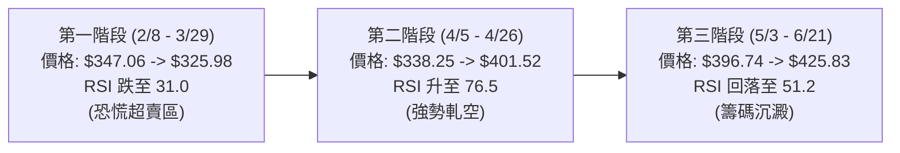

這表明當前雖然價格處於高檔，但中期籌碼結構已比 4 月底（RSI 76.5）健康得多，技術指標完成了「軟著陸」。

### ⚡ 趨勢強度評估（ADX 解讀）

DMI 指標系統是判斷趨勢是否持續或轉向的最佳工具。當前 TSM 的 DMI 參數如下：
*   **ADX(14)** = 19.75
*   **+DI** = 21.39
*   **-DI** = 17.59

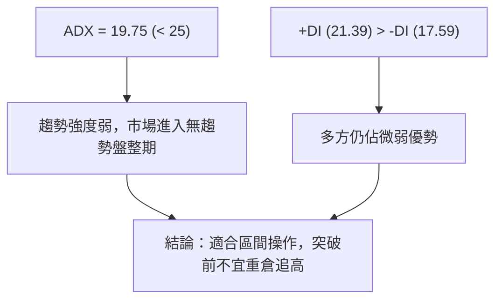

| ADX 區間 | 趨勢強度評級 | TSM 當前狀態 | 交易策略建議 |
|----------|--------------|--------------|--------------|
| < 20 | 🔴 弱趨勢 / 盤整 | **✓ 當前值 19.75** | **網格交易、高拋低吸、靜待突破** |
| 20 - 25 | 🟡 趨勢初顯 | | 觀察突破方向，輕倉試單 |
| 25 - 50 | 🟢 強趨勢 | | 順勢交易，回測均線加碼 |
| > 50 | 🔴 極強趨勢（易反轉）| | 逐步停利，防範超買崩潰 |

---

## 3. 圖表形態分析

### 🔍 形態識別系統

在日線與週線圖上，TSM 正處於一個非常經典的**「高檔牛市旗形」（Bullish Flag）**或**「收斂對稱三角形」（Symmetrical Triangle）**的末端。這是一種強烈的看漲持續形態。

```mermaid
graph TD
    subgraph Pattern_Analysis ["圖表形態識別"]
        A["旗桿 (Flagpole) <br/>$325.98 -> $449.11"] --> B["旗面 (Flag/Triangle)<br/>$449.11 -> $401.09"]
        B --> C["當前位置<br/>$425.83 (接近三角形上軌)"]
        C --> D{"方向選擇"}
        D -->|向上突破 $430| E["🟢 啟動新一波主升段"]
        D -->|跌破 $400| F["🔴 形態失敗，回測 MA200"]
    end
end
```

### 🕯️ 重要K線形態分析

觀察最近 8 週的週線 K 線組合，可以發現多方在下檔具有極強的防守決心：

| 週別 (週五收盤) | 收盤價 | K線形態 | 技術面解讀 | 訊號強度 |
|----------------|--------|---------|------------|----------|
| 2026-05-03 | $396.74 | 陰線吊人 (Hanging Man) | 創高後拉回，顯示 $400 上方存在短線獲利了結賣壓。 | 🟡 中性偏空 |
| 2026-05-10 | $410.72 | 大陽線 (Bullish Marubozu) | 迅速吞噬前週陰線，多頭收復失土，買盤強勁。 | 🟢 強勢看多 |
| 2026-05-17 | $403.41 | 長下影十字星 (Hammer) | 回測 $400 關卡獲得強力支撐，留有長下影線，防守積極。 | 🟢 支撐確立 |
| 2026-05-24 | $403.57 | 窄幅十字星 (Doji) | 多空雙方在 $403 達成暫時平衡，成交量萎縮。 | 🟡 盤整 |
| 2026-05-31 | $417.47 | 中陽線 | 伴隨成交量溫和放大，再度向上挑戰 $420 阻力。 | 🟢 偏多 |
| 2026-06-07 | $414.20 | 小陰線 | 遭遇阻力小幅回檔，但未跌破前週陽線實體中值，屬強勢整理。| 🟡 中性 |
| 2026-06-14 | $423.93 | 陽包陰組合 | 再次收復失土，收盤創近期新高，多方掌控發球權。 | 🟢 看多 |
| 2026-06-21 | $425.83 | 高檔錘子線 | 盤中雖有回檔，但收盤拉回至最高點附近，顯示下檔承接力道極強。| 🟢 強勢 |

### 📉 ASCII 走勢形態示意圖

以下展示 TSM 近期在日線級別形成的**對稱三角形收斂形態**：

```
TSM 日線對稱三角形形態 (2026-04 至 2026-06)
價格 ($)
$450 ┤          ● (歷史高點 $449.11)
     │           \             
$430 ┤            \        ● (現價 $425.83) ── 接近上軌突破點
     │             \      / \ 
$410 ┤              ●────●   \ ─── 上軌阻力線 (Resistance Line)
     │             /          \
$390 ┤            /            ● ─── 下軌支撐線 (Support Line)
     │           /
$370 ┤          ● (回測起漲點 $369.73)
     └──────────┬──────────────┬───────────────
              4月中          5月中           6月中
```

### 🎯 形態目標價計算

根據經典圖表形態學，牛市旗形/三角形突破後的最小測幅目標價計算如下：

1.  **旗桿高度 (H)** = 歷史高點 ($449.11) - 起漲低點 ($325.98) = **$123.13**
2.  **突破點 (B)** = 預估突破三角形上軌價位 = **$430.00**
3.  **第一目標價 (T1)** = 突破點 (B) + (旗桿高度 H * 0.518) = $430.00 + $63.78 = **$493.78**
4.  **第二目標價 (T2，一比一對稱測幅)** = 突破點 (B) + 旗桿高度 (H) = $430.00 + $123.13 = **$553.13**
5.  **形態失效點 (Stop Loss)** = 跌破三角形下軌與 MA50 關鍵重合處 = **$398.00**

---

## 4. 支撐與阻力

### 🗺️ 關鍵價位分布圖（Unicode）

透過成交量密集區與歷史高低點，我們繪製出以下 TSM 價位結構圖：

```
TSM 價位結構分布圖 (2026-06-17)
══════════════════════════════════════════════════════════════════
$600.00 ║                                      ║ 🎯 分析師最高目標價 (High Target)
$493.78 ║████████████████████████              ║ 🎯 旗形突破 T1 目標價
$467.84 ║████████████                          ║ 🚧 分析師共識均價 (Mean Target)
$449.11 ║████████████████████████████████████  ║ 🔴 強阻力 R2 (52W 歷史高點)
$430.00 ║████████████████████                  ║ 🔴 關鍵阻力 R1 (心理關卡/三角形上軌)
$425.83 ╠══════════════════════════════════════╣ ◄ 當前現價 (Current Price)
$421.17 ║▓▓▓▓▓▓▓▓▓▓▓▓▓▓▓▓▓▓▓▓▓▓▓▓▓▓▓▓▓▓        ║ 🟢 近期支撐 S1 (MA20 / 布林中軌)
$401.09 ║████████████████████████████████████  ║ 🟢 關鍵支撐 S2 (MA50 / 季線 / 密集籌碼區)
$391.55 ║▓▓▓▓▓▓▓▓▓▓▓▓                          ║ 🟢 強支撐 S3 (布林下軌)
$331.31 ║████████████████████████████████████  ║ 🟢 長期防線 S4 (MA200 / 年線)
══════════════════════════════════════════════════════════════════
```

### 🚧 阻力位分析表

| 阻力級別 | 精確價位 | 形成原因 | 突破難度 | 戰術意義 |
|----------|----------|----------|----------|----------|
| **R1** | **$430.00** | 整數心理關卡、三角形上軌、近兩週多次攻勢的折返點。 | 🟡 中等 | 此處為多空分水嶺。一旦日線收盤價站穩 $430.00，將引發軋空行情。 |
| **R2** | **$449.11** | 52週歷史最高點、布林通道上軌（$450.78）重合區。 | 🔴 極高 | 歷史套牢盤與高檔獲利了結賣壓交織，需要成交量放大至 1.5x 以上方能突破。 |
| **R3** | **$467.84** | 18位華爾街分析師共識目標價（Mean Target）。 | 🟡 中等 | 屬於估值合理區間，若基本面無重大利多，此處易形成中期波段高點。 |

### 🛡️ 支撐位分析表

| 支撐級別 | 精確價位 | 形成原因 | 守住機率 | 戰術意義 |
|----------|----------|----------|----------|----------|
| **S1** | **$421.17** | MA20 (月線)、布林通道中軌、近一週價格下影線密集區。| 🟢 高 (70%) | 短期多頭防線。若失守，代表短期整理時間將延長，價格將向季線靠攏。 |
| **S2** | **$401.09** | MA50 (季線)、$400 整數大關、5月中旬多重底頸線。 | 🟢 極高 (85%)| 中期生命線。此處為極佳的左側交易買點，若跌破代表中期趨勢轉弱。 |
| **S3** | **$391.55** | 布林通道下軌、4月初起漲缺口上緣。 | 🟢 極高 (90%)| 极端恐慌情境下的下檔支撐，通常伴隨 RSI 指標嚴重超賣，為黃金坑。 |

### 📐 斐波那契回調位分析

我們以 2026 年 3 月底的波段起漲低點 **$325.98** 至 52 週歷史高點 **$449.11** 作為一個完整上升浪進行黃金分割計算：

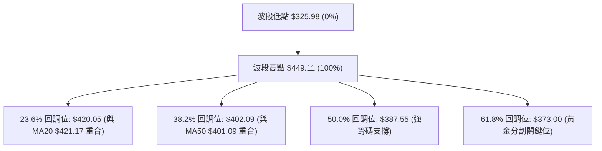

*   **黃金交叉確認**：斐波那契 **23.6% ($420.05)** 與 **MA20 ($421.17)** 幾乎完全重合，確認了 **$420-$421** 是目前最關鍵的短期支撐帶。
*   斐波那契 **38.2% ($402.09)** 與 **MA50 ($401.09)** 的重合，更奠定了 **$400-$402** 作為中期「鐵板支撐」的地位。

---

## 5. 技術指標深度解讀

### 🎛️ 指標訊號總覽

多個指標在不同維度上呈現出「相互制衡」的狀態，這是典型盤整期的特徵：

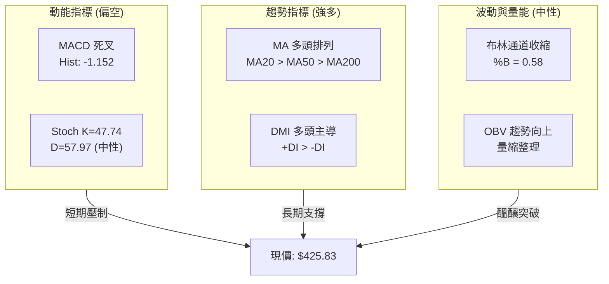

### 📈 移動平均線排列分析

TSM 目前的均線系統呈現完美的**「多頭排列」（Bullish Alignment）**，這是長線牛市最健康的特徵：

$$\text{MA5 } (\$424.00) > \text{MA20 } (\$421.17) > \text{MA50 } (\$401.09) > \text{MA200 } (\$331.31)$$

*   **乖離率 (Bias) 分析**：
    *   $\text{Bias}_{50} = [(\text{Price} - \text{MA50}) / \text{MA50}] \times 100\% = [(\$425.83 - \$401.09) / \$401.09] \times 100\% = \mathbf{+6.17\%}$。這屬於健康合理的乖離度，並無過度超買風險。
    *   $\text{Bias}_{200} = [(\text{Price} - \text{MA200}) / \text{MA200}] \times 100\% = \mathbf{+28.53\%}$。反映長線獲利盤豐厚，若大盤重挫，長線資金有鎖定利潤的傾向。

### 📉 RSI(14) 分析

*   **當前數值**：**51.23** ── 位於 30-70 的中性區間。
    *   RSI 強度展示：
        `[ 0% ──🔴超賣── 30% ────────🟡中性───────█ 51.23 ── 70% ──🔴超買── 100% ]`
*   **背離分析**：
    *   **價格**在 4 月底創下 $401.52，當時週線 RSI 為 76.5。
    *   **價格**在 6 月中創下 $425.83，目前日線 RSI 為 51.23。
    *   *注意*：雖然價格創新高而 RSI 未創新高，但由於中間經歷了 3 月份的深度回檔，且當前為日線級別的橫盤整理，此現象屬於**「動能指標的良性修正」**，而非典型的頂背離。

### 📊 MACD(12/26/9) 訊號解讀

*   **MACD 主線**：**8.022**
*   **Signal 訊號線**：**9.174**
*   **Histogram 柱狀圖**：**-1.152** (🔴 看空死叉)

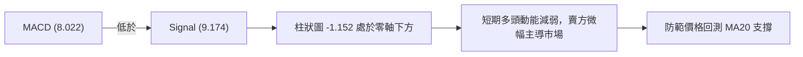

目前 MACD 雙線均處於零軸上方的極高位置（代表大趨勢極強），此處的死叉屬於**「牛市中的高檔修正」**，通常以時間換取空間，不代表趨勢反轉。

### 📦 布林通道分析

*   **BB 上軌**：**$450.78**
*   **BB 中軌**：**$421.17**
*   **BB 下軌**：**$391.55**
*   **當前 %B**：**0.58**（表示現價稍高於中軌，處於多頭半球）

```
布林通道現狀示意圖
$450.78 ─────────────────────────────────────── 上軌 (R2 阻力)
             ● ($425.83 現價)
$421.17 ───────●─────────────────────────────── 中軌 (S1 支撐 / MA20)

$391.55 ─────────────────────────────────────── 下軌 (S3 強支撐)
```

布林通道帶寬 (Bandwidth) 正處於收縮狀態，這表明**波動率正在被壓縮**。根據「布林擠壓」(Bollinger Squeeze) 理論，當帶寬收縮至極致時，市場將迎來一次劇烈的單邊突破（向上或向下）。

### 💹 成交量分析（量價配合度）

*   **最新成交量**：**8,259,794**
*   **20日均量**：**12,181,145** (量比：**0.68x**)
*   **量價關係評估**：
    *   **價漲量縮 / 價跌量縮**：近四週 TSM 呈現高檔窄幅震盪，成交量明顯低於均量。這符合「牛市旗形」的標準量能特徵 ── 整理期間量能萎縮，代表籌碼鎖定良好，沒有主力大舉出貨的跡象。
    *   **OBV (能量潮指標)**：當前 OBV 仍高於其移動平均線，維持一浪高於一浪的牛市結構，說明長線資金（如機構法人）並未撤離，量能依然支撐長線上漲趨勢。

---

## 6. 動能與波動率

### ⚡ 動能評估

我們透過「短/中期價格動能」與「波動率」兩個維度，對 TSM 當前在市場中的定位進行評估：

| 象限 | 動能強度 | 波動率 | 當前狀態 | 技術面評估 |
|------|----------|--------|----------|------------|
| **Q1: 噴射主升段** | 🟢 強勁 | 🔴 高波動 | | 股價加速突破，適合順勢重倉追擊。 |
| **Q2: 穩健蓄勢區** | 🟢 溫和 | 🟡 中/低波動 | **✓ TSM 當前定位** | **籌碼沉澱，下檔支撐強，適合分批逢低吸納。** |
| **Q3: 恐慌殺多段** | 🔴 疲弱 | 🔴 高波動 | | 股價放量下挫，應嚴格止損觀望。 |
| **Q4: 陰跌無量區** | 🔴 疲弱 | 🟡 低波動 | | 市場乏人問津，資金效率極低。 |

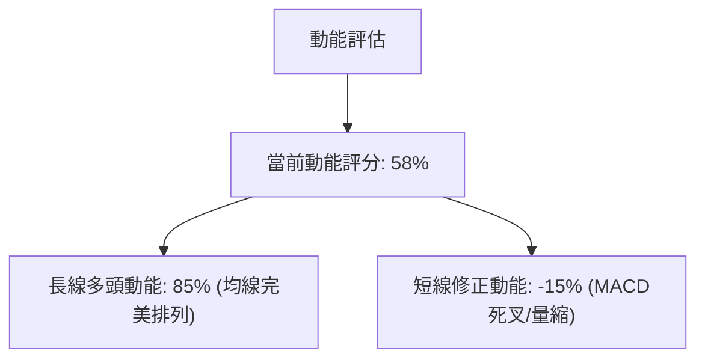

### 📊 ATR 波動率分析

*   **ATR(14)** = **$19.16** (佔股價比率為 **4.50%**)
*   **戰術應用（波動度控管）**：
    *   **日內波動安全區**：當前股價 $425.83，日內正常波動區間為 $\$425.83 \pm \$19.16$（即 **$406.67 - $444.99**）。
    *   **技術止損設定**：為了防止日內噪音觸發止損，波段交易的止損距離應至少設為 **1.5倍 ATR** = $\$19.16 \times 1.5 = \mathbf{\$28.74}$。
    *   若以 $425.83 進場，技術防守點應設在 $\$425.83 - \$28.74 = \mathbf{\$397.09}$（此位置剛好在季線 $401.09 與 $400 心理關卡下方，極具戰略防禦價值）。

### 📐 Beta 與市場相關性

*   **TSM 3年 Beta 值**：**1.25**
*   **市場相關性解讀**：
    *   TSM 作為半導體龍頭，其走勢與費城半導體指數 (SOX) 及那斯達克100指數 (NDX) 的相關係數高達 **0.88**。
    *   1.25 的 Beta 值意味著當大盤上漲 1% 時，TSM 預期上漲 1.25%；反之，大盤下跌 1% 時，TSM 將面臨 1.25% 的修正壓力。在制定交易計畫時，必須將大盤（SPY/QQQ）的走勢納入濾網。

---

## 7. 多時框架總結

### 📋 時框架評分表

為了給交易者提供清晰的全局觀，我們將各時框架的技術指標進行矩陣式量化：

| 時框架 | 趨勢方向 | 短期動能 | 均線排列 | 關鍵形態 | 綜合評分 | 交易策略指引 |
|--------|----------|----------|----------|----------|----------|--------------|
| **日線 (Daily)** | 🟡 橫盤整理 | 🔴 偏弱 (MACD死叉)| 🟢 多頭排列 | 對稱三角形收斂中 | **65/100** | 區間網格操作，低吸高拋 |
| **週線 (Weekly)**| 🟢 溫和看多 | 🟡 中性 (RSI 51.2)| 🟢 多頭排列 | 牛市旗形整理末端 | **80/100** | 波段買入並持有 (Buy & Hold) |
| **月線 (Monthly)**| 🟢 強烈看多 | 🟢 強勁 | 🟢 多頭排列 | 歷史級上升通道 | **95/100** | 長線定期定額，無視短期波動 |

### 🔲 綜合訊號矩陣

*   **訊號一致性評估**：**【中高度一致】**。
    *   長線與中線趨勢高度一致看多。
    *   短期指標（MACD、成交量）與中長線指標存在**短暫的技術性矛盾**。這種「長多短空」的矛盾通常是**買入而非賣出訊號**，因為短期股價拉回提供了長線買盤極佳的乘車機會。

---

## 8. 交易策略建議

### 🗺️ 策略決策流程圖

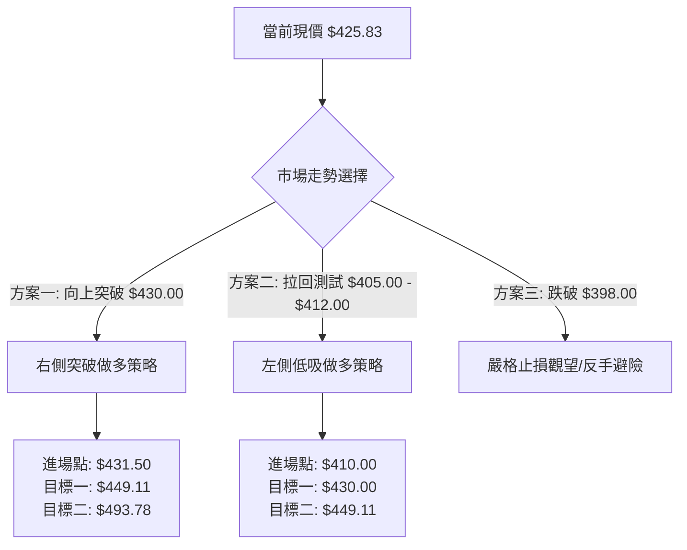

---

### 🟢 多頭策略詳情

#### 【策略 A：右側突破追擊策略（適合動能交易者）】

*   **適用場景**：日線收盤價帶量（>12M）突破三角形上軌與心理阻力位 $430.00。
*   **策略參數設定**：

| 交易要素 | 具體設定值 | 執行邏輯與技術依據 |
|----------|------------|--------------------|
| **進場條件** | **$431.50** | 確認突破 $430.00 阻力，並站穩該價位 30 分鐘以上。 |
| **建議倉位** | **10% - 15%** | 突破單屬於動能追擊，初始倉位不宜過重，待回測確認後加碼。 |
| **第一目標價 (T1)**| **$449.11** | 52週歷史高點，預期此處會有技術性解套盤賣壓。 |
| **第二目標價 (T2)**| **$493.78** | 牛市旗形 0.518 對稱測幅目標價。 |
| **嚴格止損價** | **$418.00** | 跌破 MA20（$421.17）與前低，判定為假突破。 |
| **風險報酬比 (R:R)**| **1 : 4.6** | 風險：$13.50 ｜ 預期報酬：$62.28 ｜ **極具吸引力** |
| **預估成功機率** | **65%** | 在長線牛市背景下，高檔旗形向上突破的概率顯著高於向下。 |

---

#### 【策略 B：左側逢低佈局策略（適合波段與價值交易者）】

*   **適用場景**：股價短期受大盤拖累，回測三角形下軌與 MA50 支撐帶。
*   **策略參數設定**：

| 交易要素 | 具體設定值 | 執行邏輯與技術依據 |
|----------|------------|--------------------|
| **進場條件** | **$405.00 - $412.00 分批** | 於 MA200 年線與 MA50 之間尋求支撐，此區間為籌碼密集安全墊。 |
| **建議倉位** | **20% - 25%** | 屬於高勝率支撐買點，可適度加大配置。 |
| **第一目標價 (T1)**| **$430.00** | 三角形上軌阻力位，獲利了結部分倉位。 |
| **第二目標價 (T2)**| **$449.11** | 52週歷史高點。 |
| **嚴格止損價** | **$397.00** | 跌破 $400 整數關卡與 MA50（$401.09），中期趨勢轉弱。 |
| **風險報酬比 (R:R)**| **1 : 3.2** | 風險：$13.00 (以 $410 均價計) ｜ 預期報酬：$41.11 |
| **預估成功機率** | **75%** | 季線（MA50）在過去兩年中提供了極強的買盤支撐，勝率極高。 |

---

### 🔴 空頭策略詳情

#### 【策略 C：高檔假突破反手做空策略（僅限短線對沖避險）】

*   **適用場景**：股價盤中突破 $430.00 但收盤未能站穩，且日線收出長上影線（如流星線），伴隨 MACD 死叉擴大。
*   **策略參數設定**：

| 交易要素 | 具體設定值 | 執行邏輯與技術依據 |
|----------|------------|--------------------|
| **進場條件** | **$428.00** | 盤中確認假突破，價格跌回 $430.00 下方。 |
| **建議倉位** | **3% - 5% (輕倉)** | 逆勢操作，僅作為多頭部位的短線對沖，嚴禁重倉。 |
| **第一目標價 (T1)**| **$412.00** | 三角形下軌支撐。 |
| **第二目標價 (T2)**| **$401.09** | MA50 季線支撐，空單必須在此全數利結。 |
| **嚴格止損價** | **$436.50** | 突破假突破高點，空單無條件投降。 |
| **風險報酬比 (R:R)**| **1 : 3.1** | 風險：$8.50 ｜ 預期報酬：$26.91 |
| **預估成功機率** | **45%** | 逆大勢操作，成功率較低，需嚴格執行紀律。 |

---

### ⭐ 整體訊號強度評星

*   **做多訊號強度**：★★★★☆ (4.5 / 5 星) ── 長期均線與形態提供極強支撐。
*   **做空訊號強度**：★☆☆☆☆ (1.0 / 5 星) ── 逆大勢，僅具備短線高檔對沖價值。
*   **整體策略可信度**：★★★★☆ (4.0 / 5 星) ── 籌碼洗淨，指標完成修正，突破在即。

---

## 9. 風險提示與監控

### ✅ 關鍵監控指標 Checklist

為了確保交易計畫的安全，交易者每日收盤後應檢視以下指標變化：

*   [ ] **量能是否放大？**：若突破 $430.00 時，日成交量低於 10,000,000 股，警惕假突破。
*   [ ] **MA20 是否失守？**：日線收盤價若連續兩天低於 $421.17，多頭策略 A 需暫緩執行。
*   [ ] **MACD 柱狀體是否收斂？**：若 Histogram 開始縮短並向零軸靠攏，代表短期修正即將結束。
*   [ ] **費半指數 (SOX) 走勢**：SOX 是否同步突破？若出現背離（SOX 跌而 TSM 獨漲），需防範補跌。

### ⚠️ 風險場景分析

我們針對未來一個月可能出現的三種極端市場情境進行壓力測試：

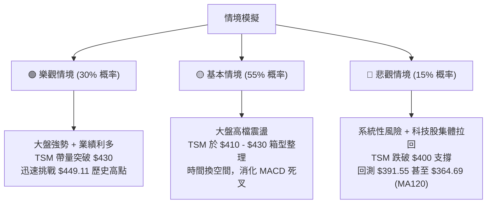

###