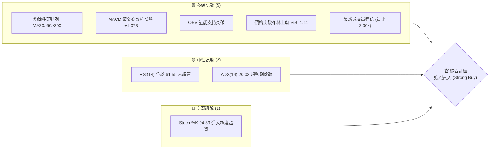
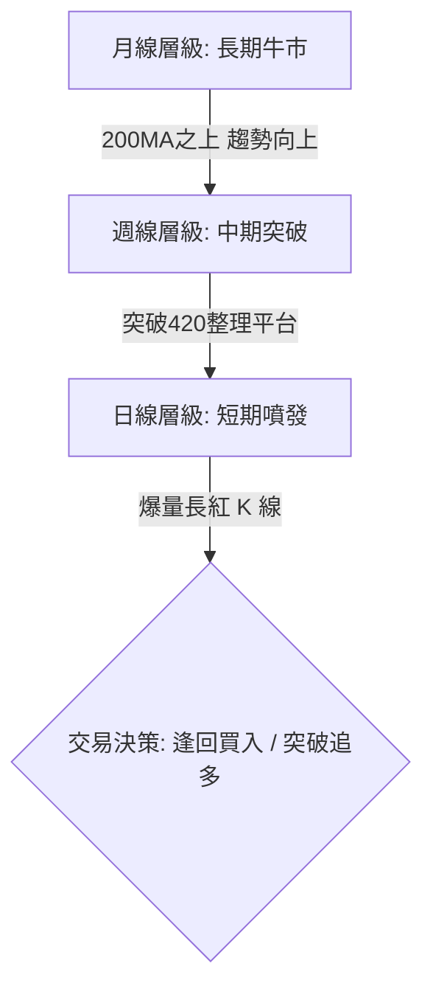
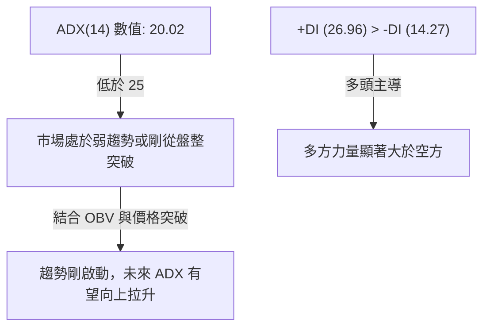
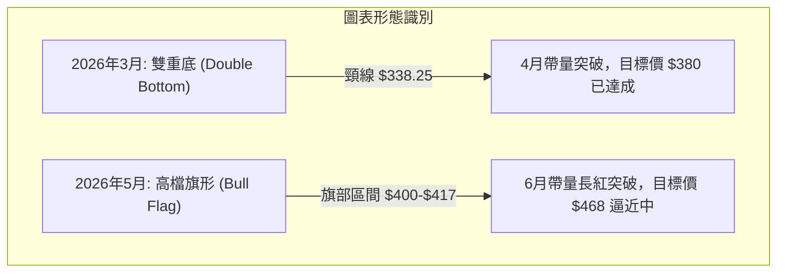
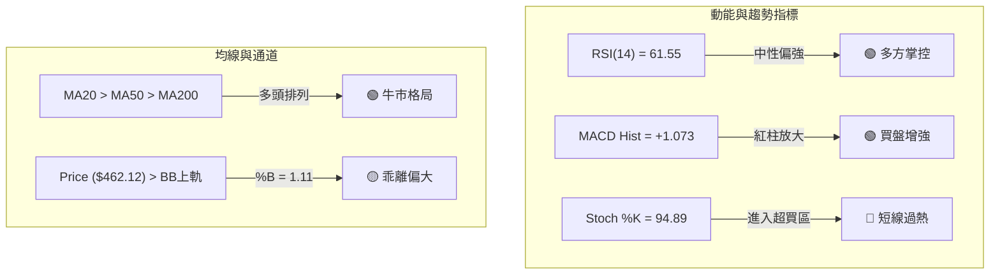
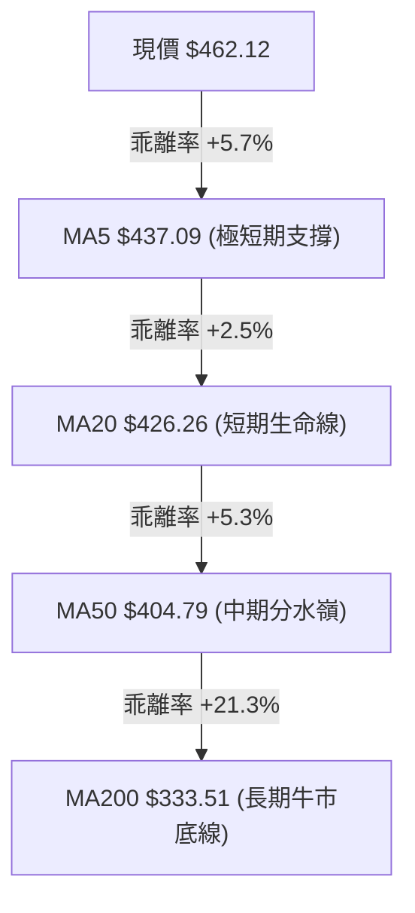
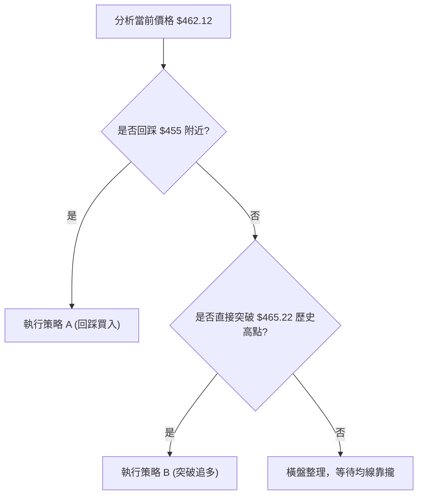
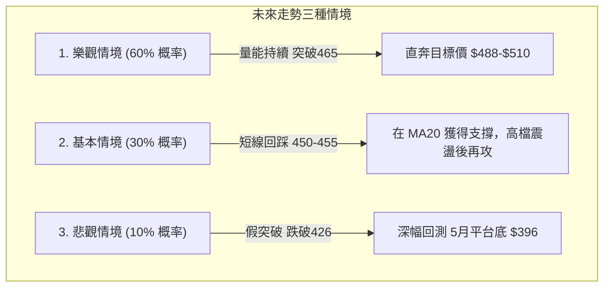

<details>
<summary>📊 靜態圖表 (點擊展開)</summary>

</details>

<html>
<head><meta charset="utf-8" /></head>
<body>
    <div style="height:500px; width:100%;">                        <script>window.PlotlyConfig = {MathJaxConfig: 'local'};</script>
        <script charset="utf-8" src="https://cdn.plot.ly/plotly-3.6.0.min.js" integrity="sha256-QaOVwtVY0T02VaHrr6pnoHLCwayMJp4O5n4YyaE3rJk=" crossorigin="anonymous"></script>                <div id="candlestick-chart" class="plotly-graph-div" style="height:100%; width:100%;"></div>            <script>                window.PLOTLYENV=window.PLOTLYENV || {};                                if (document.getElementById("candlestick-chart")) {                    Plotly.newPlot(                        "candlestick-chart",                        [{"close":{"dtype":"f8","bdata":"AAAAgHybbEAAAACgYxRtQAAAAEDrF25AAAAAQI6PbkAAAAAgnAVvQAAAAIB1GXBAAAAAID8BcEAAAACg5AdwQAAAAKBVKHBAAAAAoC1AcEAAAABgxEtwQAAAAMCiqHBAAAAAgMlscEAAAAAA+udwQAAAAMD+h3FAAAAA4D5ocUAAAADA8ydxQAAAAICQ83BAAAAAYIDxcEAAAAAgtFFxQAAAAGBv43FAAAAAQLjdcUAAAABgfR5yQAAAAICSwHJAAAAAALM7ckAAAAAAOuJyQAAAAECRmHJAAAAAoHNncUAAAAAAWshyQAAAACAFWnJAAAAAYD7lckAAAACg7pdyQAAAACBeTHJAAAAA4PV1ckAAAADAUUNyQAAAAIDx6XFAAAAAAFAHckAAAACAdkpyQAAAACCxfnJAAAAAwMKyckAAAACgRutyQAAAAOCWzXJAAAAAYEyhckAAAADAn+dyQAAAAGAEPHJAAAAAIII1ckAAAACAqO9xQAAAAEApxHFAAAAAQGJPckAAAAAATA5yQAAAAOCQBXJAAAAAQOZ\u002fcUAAAADAfalxQAAAACDifHFAAAAAwMs7cUAAAAAgmYJxQAAAAIBJNXFAAAAAQI0OcUAAAABgoqZxQAAAAOBEp3FAAAAAoBb7cUAAAADAsRNyQAAAAMDk1nFAAAAA4OYcckAAAAAAPlJyQAAAAKA8KnJAAAAAIKdGckAAAACAKLhyQAAAACCb0HJAAAAA4HE7c0AAAADgh\u002fRyQAAAAMCfKHJAAAAAYC3kcUAAAABAVNZxQAAAAICVOHFAAAAAIHizcUAAAAAgcPdxQAAAAMBcPHJAAAAAwMd2ckAAAABgOpRyQAAAACCJ1HJAAAAAYPm1ckAAAADgpKByQAAAAABA5XJAAAAAAHrfc0AAAADgfwl0QAAAACD0W3RAAAAAQKzQc0AAAABAAsZzQAAAAGB3H3RAAAAAYAmhdEAAAABgH5h0QAAAACDcVnRAAAAAQCU+dUAAAAAAPkp1QAAAAOCnV3RAAAAAABpHdEAAAACg\u002f1p0QAAAAMBh0nRAAAAA4P+vdEAAAADAnQl1QAAAAKCmSHVAAAAAgOAcdUAAAADAxo10QAAAACCwOXVAAAAAoGPgdEAAAACADUF0QAAAAIB7kHRAAAAAoOmwdUAAAAAgVRl2QAAAAGDMgHZAAAAAIK1Cd0AAAABgVON2QAAAAOChx3ZAAAAAAECldkAAAACgXoZ2QAAAAICaaHZAAAAAQCsKd0AAAACgNQJ3QAAAACBH\u002fHdAAAAAgMsbeEAAAAAg+W13QAAAAOB5SndAAAAA4GfzdkAAAABgCvV1QAAAAGClOXZAAAAAAKkAdkAAAAAgXxJ1QAAAAGCGrnVAAAAAoOWUdUAAAABgzQt2QAAAAKCr73RAAAAAgCMJdUAAAACAsyd1QAAAACC\u002fknVAAAAAIG0sdUAAAADA+R91QAAAAECIh3RAAAAAYIwadUAAAAAgK2d1QAAAACAAr3VAAAAAoJFVdEAAAAAgoF90QAAAACArvHNAAAAAIJESdUAAAAAAE0t1QAAAAGD3I3VAAAAAYGJPdUAAAAAgNoh1QAAAAMC40HZAAAAAYC3KdkAAAAAAvxt3QAAAAABOC3dAAAAAAAqwd0AAAAAAlGN3QAAAAGAEqHZAAAAAYCYad0AAAAAgJtZ2QAAAACCF83ZAAAAAgI4oeEAAAABgQdx3QAAAAKBQGHlAAAAAgIpAeUAAAAAAxnZ4QAAAAMCOjnhAAAAAgCeyeEAAAADA2st4QAAAACC\u002fCnlAAAAAANGXeEAAAACAUSh6QAAAAADr0nlAAAAAgH2reUAAAACAhDl5QAAAAAChxXhAAAAAwNrteEAAAACg5wt6QAAAACB8NnlAAAAAIGaweEAAAABAFXt4QAAAACDoCnlAAAAAAC5jeUAAAADAMjl5QAAAAOC0tXlAAAAAoOBbekAAAACg4H16QAAAAMCOF3pAAAAAoMspe0AAAACAV9p7QAAAAEC3OntAAAAAoBa+e0AAAABAM+N5QAAAAGDYnHpAAAAAQLmuekAAAABguHx5QAAAAMAeUXpAAAAAQOF+ekAAAABgZpZ7QAAAAKBHnXpAAAAAYGYCe0AAAACA6+F8QA=="},"high":{"dtype":"f8","bdata":"43oNBAm9bEDLVT3KjRdtQEeuy\u002fj\u002fO25ASmmN62SlbkDrwcI3Mn5vQOdbIGP5WnBAqTgh73IscEBZzZ+qhyFwQAfjCUHOPnBAAEFz3LWFcEDGxgKQ1WtwQHf+5UfMxnBAE9xgT8aHcEDygsuNMCNxQJM7bEQ5vHFAUrQF3S5wcUB\u002fWtyAki9xQAwuA3iJFXFAZ5F\u002fHelacUCXZpDY4FRxQFbwBwJYA3JA\u002fVBCJ2dmckCt7\u002fXx7FtyQAat5vVbDnNAG2XPMy8Lc0BxmJBLEgBzQHk95edlx3JAga0VwqWdckCjSa1H+eNyQKHSF9FAtnJAbh4H6GcDc0AehChE+E5zQCxdQQTcznJA+2gQdmrUckCovrmdeJByQJs5MdxFTnJAD2785qY8ckBLi9Tf7XlyQFkrl9YXonJAqp4ZKUm8ckCGcto31hhzQEeA2oWEDnNAkx0LNGQUc0BaKBBOIDtzQHkmqlwQunJA\u002fYU4FTd+ckBfF2cSYkVyQFnCnTw62nFAhDJ8T+lsckC87CLp00lyQF4omcYISXJAtrjLOsnzcUCPBhss4MlxQJ78WkGjxHFAQJCWnP1fcUB2eJWQNKVxQCWNtJD3KHJAufjEgC1IcUBsff0sTa1xQKSEd\u002fGysnFAA3uw+1QockD90zD6GyZyQMd\u002f4G4jDnJADR69EilDckDbXo7I0GRyQK13JgazO3JAzjb+CyynckCqJXJ7EMRyQAkqnFTE5HJAHbAaiGd4c0AiGJgISgRzQEV30BF163JAFURHcXlkckBwqexmo+9xQCap9mzT+XFAK5RaCvLacUBtlPt1sSpyQMV7cHTmV3JAhYQ3qg+GckB1I8Br9ZlyQNKVrKEh3XJAnwI9ovXuckC+byVfwe9yQI3aYlH2HHNAkLf9cP7+c0BKLFlnwph0QE6\u002fHY7jtXRAnt2OVPdJdECIkGafUC10QO7PNcCcMXRAxH\u002fsxl69dEBnBxjxDet0QKG5RTuignRAc0NlYWPYdUDHbpxo1MB1QObexExDRnVAbrIjsM2+dEAytaExP9V0QKI4QqCs9nRARKdkDwvWdEAsYcXc7zd1QH4ME4KWe3VAzbOhipJfdUBWLXq\u002fciJ1QO5VEhblZnVAFvJoe0KUdUBkHWBP8BB1QOIexkibzXRAWZZRz8K+dUD3d0oqB1x2QEkbSQAqrnZAS28jjBCad0DX+CU7wKB3QFc2uOA9E3dATC845RXFdkBnLsoF3fd2QFazyAP3jnZAUAG0rZckd0DZqOyhKzh3QFiQjCrgMnhAnN9kSkVDeED2xhYjvQd4QM+ZR0rna3dA92EyAOsyd0DDi1wAaCJ2QJke6+i+c3ZA5qa2hfVZdkCPBazO1651QEL7jsOquXVA9DczDu76dUDEP2qDNjh2QITGDLC2kXVAui+54\u002fxrdUDqP7g+vW11QCz7FIkyn3VA84wJbjGydUBtZrSgsTF1QOnnIN\u002f6DHVAgu7CCLlpdUDd4KYGMIF1QBi1XokZ2nVAvVwc3dBBdUAQRETjo4x0QCXWWWJHjXRAk9QT2egZdUB9amNx2L11QC3vAEFVVHVA2v84RlV2dUBcJY09kIt1QJbx6LzOVndA9zhfGvX0dkDcs7GO3pF3QFphvEl5KXdALfXHJkbUd0BleuyoZtF3QP5EFHJcFXdA31+mYj1rd0DCTeA4SRN3QHJeuvIjHndAieaMIA8weEB52bOfoD14QH30QDmIiHlACcn9RIHYeUA0ijH0C894QGlUN2vNrnhA4\u002fnEf7vdeEAoNeDkvDB5QNQ8DJj1a3lAE\u002fbp9+VSeUCLCADWgit6QOFqGaRMMHpA06x\u002fVmkAekDUduU4cGx5QD9VuKjNFHlA1pSljMA7eUAzqAz0vk96QPjZ6yyZjnlA9Gg3x95eeUAqARE\u002fK994QLV+V3\u002f7LnlAN8v8gPqneUAFdXFlXpt5QLtT8jdF+HlAKXjOabTYekAU6zmHnal6QFbG+AHz1npA20Tr8XAFfECpQrOTUfV7QAVmjHi7EXxAlM\u002f+rWnve0DCqqUBLg57QOAHdkq+DHtA4+BEQS5Se0BmKCD8LpV6QAAAAAAAZHpAAAAAQAqvekAAAACgR6l7QAAAAKBHhXtAAAAAAACoe0AAAAAghRN9QA=="},"hovertemplate":"\u003cb\u003e%{x|%Y-%m-%d}\u003c\u002fb\u003e\u003cbr\u003e\u958b: $%{open:.2f}\u003cbr\u003e\u9ad8: $%{high:.2f}\u003cbr\u003e\u4f4e: $%{low:.2f}\u003cbr\u003e\u6536: $%{close:.2f}\u003cextra\u003e\u003c\u002fextra\u003e","low":{"dtype":"f8","bdata":"g+dm4S5DbEDCNQja\u002fHhsQLaMx\u002f2GaW1ATShJ3kPfbUBdrZGJU4duQDFMsIvH3W9AjNDarvjsb0CL6jQguPFvQJnRaett\u002fW9ArhRKzygpcEDvYwqeMBtwQOiP4HzR\u002fm9AftPDtxVMcEA0Tj6t\u002fnVwQFjtlGj5XHFAsBrDpecocUCXlzHRPcFwQOf3oD4RyHBAAAAAYIDxcEA7DeG4BvtwQN62yXwMMHFAkW21NZPMcUAR556QgANyQKr8+yaFmXJAtPaDBMsvckD4EpzH5zpyQDCPI+eDcXJAJOh+cTZicUDI0TW8jSByQDV4SM\u002f+EHJAb+AnlpWbckA1KOYf7WVyQMaWdv\u002fTSXJAXa3W3sxrckCtvF5Y0zVyQJ+lZ9fSonFAOWDNmdn1cUB2faogakFyQECxaGZNNnJAOzinBz5cckA51XBIQcByQL7xW1t9p3JAHnW8dsRlckA04KJ+ILxyQKxlr+pxM3JAPPXcJ4kTckBiUjqQIdJxQDiqg89pL3FAmXQRGYEXckD2d8dfa+pxQP5L900O9XFAlNWrc\u002flccUC7CatHgPFwQPhipqXMWXFALEeZs2fpcEDRY1gdjiJxQJQ6ycf7I3FA8HF2IL6LcECux+zK3fBwQD+FQbge73BA7lpZCbDXcUBYWUYh2etxQMpO7oidj3FAnppFsLTucUBfo6vgVb1xQCoPYQzm\u002fnFA\u002fhEjE1EvckB4gwUMZ2ZyQAWcSfyognJAwEQOCCnCckCuYHpumaFyQM\u002fSv1DAF3JAotAAICfhcUDF4jA80p1xQCv1CpSoGnFADTvBjtSEcUC7Tul6h85xQJLC55NpG3JAHfisvysrckDXYH3aUWtyQNEbR1LFj3JAB7LnKdeRckBHtng8k55yQGluNG\u002ft3XJAhKrCRZFhc0D65g2qj\u002f1zQOpyx0m\u002fLnRA11Rv0nHOc0BD9\u002f0dPqhzQBlsziLUyXNAbLMhuI72c0AyVmctR5F0QKJ0gZVoMnRA5\u002fpecO4CdUCfDRaKRzt1QOS5TFmEU3RAt2dRAxlAdEAKaANlhFN0QN1ZxW6rmnRAZaJ2FYaIdEC8R\u002f9zcs10QP56FOG1DnVAmObu8DVodEDRNGhciXZ0QLh2clmJdnRA0s6KIS6FdEA7mruq4dZzQH7UfwId4HNAFj\u002fCNbfudEAbhZ61MqB1QED9N7XuKHZAxfqX\u002f\u002fHndkA0IaHEHAd0QG+USu6mbnZAVTiqU4smdkDD7p1hsm12QAGArlqlOXZAYu\u002ff1RFUdkAImD4+Ocl2QE8q0RTgYXdA\u002fQJkDaLtd0C4zQdOzPx2QPjyoDib63ZA91yppGmsdkCwWhKi8GV1QENFSrekC3ZAXvHACIdgdUCz6acwWu90QAKgK8Fso3RAlxtoRqVodUBXPLeL8sh1QGfFa\u002fJq6nRAEVXg397ndEADXKvBLCF1QMFDRuq\u002fGXVAkYR\u002fM8EodUCJXvJF4kZ0QIlNhpY3UnRApuhqFjmldEDOZZlU1dN0QG3f3ssoa3VAOBXrtMFJdEAx8whF6Rh0QHKWv7YRkXNAg6NtPjwGdEAueMKmTC91QJFDB2KVYHRAbt297EIddUCs2iFK2u10QAekTBxpZnZAB721JQl+dkAc22+CLQ53QNlUrq8d03ZAdTvJdJFFd0DrkCQocjV3QA9QzUtSe3ZAYydQK5fEdkC\u002fREIrYrZ2QHh4NmwcxHZAatoPhmIcd0A1kbVN6W53QL1ti4XgjnhAY\u002fCTlG73eEDw0gG90fx3QMEmv3FeNHhA1TNk7PAMeEDRkk3ka3N4QIvSyTdtpHhAu64ykux6eEAKIK9DbPt4QK8BY+2AcnlAKNTrGhj\u002feEBMzrakJ9R4QPyab2x8E3hAlLVX1+JoeEBR+\u002feakRJ5QLVJJ\u002fNe3nhATGFMhC5ieECy\u002fLrAkAJ4QJVniiJmsHhAn4wbvTnpeEB2\u002fbxCsx55QJQYSGjKkXlAnnDPVo3meUBvaHVi29t5QFmP4vtmBHpAG3GoxjRYekDqya103C97QFYVros8GHtAhhBKntOkekD4xb6GNb15QK+D31yvWHpAK7bIVQBJeUCj5k+s9Wt5QAAAAIDCjXlAAAAAIFwTekAAAABA4f56QAAAAEAzk3pAAAAAgD36ekAAAACAPWZ7QA=="},"name":"\u50f9\u683c","open":{"dtype":"f8","bdata":"LpS82ZmfbEB4xkVjOJpsQOFhsq6Ws21A8wdc1vnqbUBdrZGJU4duQKujsxedAHBA3xJc2wgYcEDMsayF8h9wQJeUa\u002fR+EnBA1Sdao3R9cEC3zBt9X2RwQJ5qI\u002fVz\u002f29AVLcRd5mEcEDNJoFlTIdwQD9CXu0Sg3FAw9MhT+VhcUAAyA49we9wQPuFyIb6+3BAc8K72kAlcUCq\u002f8ohrhJxQNu9ebE1RHFAe4f0TjpjckC36YIrIClyQHWkEKmhmnJAiDrzcpADc0CZ0qf9GEtyQN\u002fryq4kv3JAXELJUdaZckBpf5ZoiH5yQJCgY00ZVXJAY\u002fAqh1P+ckBYRFUb\u002fEdzQLJogo4SgXJAdpq0+HiackALSvT2mIpyQKX9BhBZK3JALSxKaIz4cUBsFBiXJVRyQNa847AKhXJAud7Ga81\u002fckARGIIDjPZyQNIv2ttdy3JAmzTKEpD5ckCOVYiRlsNyQOWDzn\u002fxaHJAXY8hylAlckBzl2l9zzxyQMXTh6+ur3FA6OJCBPBAckAZ5dLfbBxyQGZTF\u002f51NnJAKXkFLIzucUBRluK0CxxxQI5B5KDVc3FAYEBopxQ2cUDYUoqGFCxxQP8Fi4\u002fOHnJAAn7HTdXqcECux+zK3fBwQACb2TFQiHFAlOQlqm\u002ftcUBQ1djPFyNyQJjvTjbUynFAZbnKIXkbckBFWWi3VB5yQMg+89\u002fnOnJAJaC1KMRbckD6d5G0ha1yQG\u002f2UkVQmnJAimIhoLjvckCyev8aA\u002fxyQEV30BF163JA2YdewCBackBqRxGKidxxQIS08azA8HFAiGBeI5C4cUC7Tul6h85xQB66yPx8UnJAd+R8nEU+ckBDF7HwWoNyQJap3sS8pXJAQ08\u002fxanDckAd6bw55cxyQBkCQS8A53JA0Gm+QAZmc0B+SGCsOot0QGeXn0NdiHRAWHwxRQUwdEBtdCVwkCt0QJrern\u002f64nNA5GsjsxwHdECQZ5LNi7J0QKG5RTuignRAZ+GO3sRQdUDAmVEZqot1QBtKSm6dMHVABFkE3HW7dED2KS0iTbt0QJqjJvLPpXRAdrHC8EWxdEDa3YLcU+x0QEmhumFFVHVA6+ypPNsgdUAknaoPI9t0QLrMFsf1kHRA+p5kKr50dUDcOiGNAN50QOMEEqaSEnRAc\u002f3N8D78dEC8z6a\u002feq91QIUR1q1Rp3ZAFiygi9gCd0BNY3dI1ZB3QCS6vgML9HZAVxVfTSmAdkD3HiVx1p92QPLG8TrwXXZAA5gsxeRedkC03PWJ+tF2QME1cS4zl3dAnN9kSkVDeEAbJQpeHwN4QP5qrDjNA3dAyHk80ra3dkCNl+n9Dbx1QEIz8pV8OXZApSgK+zYRdkDBHiKTwFt1QC9lbYgA3nRAOh+pEt2qdUAksl8jxgF2QF+X96VugnVADAU\u002fBXBidUASz+Hm7zd1QH+gdxzePHVALWpM0o2PdUChBhCVNod0QEVwCE1L\u002fnRApuhqFjmldEDLyzVfk+x0QEunPd8Qk3VA20aEq2owdUDg8lAHI0F0QKjyFfr3ZnRADSodTOkYdECLccpPi3F1QNCYA+A4YXRAsuhVnEwvdUCdBynlWSp1QJuN7jzMFndAE9UnFTindkBlX\u002fs+Zmt3QP7gkKVRFndAqHZrgniid0DYOV1dTch3QPlbB4X4\u002f3ZAqUtMyT9Fd0BMYUy7twV3QAAAACCF83ZAFfQ6\u002fZQud0BhLLLIovV3QLSsRHtus3hApFVqcojMeUCku\u002fn6QnN4QNSA1k3ff3hA4aGwwBbOeEAhkPoaVYh4QPDCyKYyOXlAGSIpvHk6eUC+Z3KEWxd5QNNfaIvPEXpAqcb2EJ3\u002feUDag1KSolx5QJMxkKAhzXhAR1xKhG7VeECw56V7SSR5QLMB3ezNWHlA9Gg3x95eeUBc8KJqmUl4QGGOPdYowXhAn4wbvTnpeEBds0ojk4d5QG6IG\u002fh5wnlAhRH3UVugekDns7GDvFN6QOKIDcInoXpAR2n7fzJ+ekA+F8tYz3h7QCQxDrkED3xAF4hFgPvZekBROrIHQcx6QCs+En96bHpAtn9hDPndekDtCE6k4s95QAAAAAAp1HlAAAAAwMxAekAAAABA4Wp7QAAAAOBRQHtAAAAAAAAse0AAAACAFG57QA=="},"x":["2025-09-03T00:00:00-04:00","2025-09-04T00:00:00-04:00","2025-09-05T00:00:00-04:00","2025-09-08T00:00:00-04:00","2025-09-09T00:00:00-04:00","2025-09-10T00:00:00-04:00","2025-09-11T00:00:00-04:00","2025-09-12T00:00:00-04:00","2025-09-15T00:00:00-04:00","2025-09-16T00:00:00-04:00","2025-09-17T00:00:00-04:00","2025-09-18T00:00:00-04:00","2025-09-19T00:00:00-04:00","2025-09-22T00:00:00-04:00","2025-09-23T00:00:00-04:00","2025-09-24T00:00:00-04:00","2025-09-25T00:00:00-04:00","2025-09-26T00:00:00-04:00","2025-09-29T00:00:00-04:00","2025-09-30T00:00:00-04:00","2025-10-01T00:00:00-04:00","2025-10-02T00:00:00-04:00","2025-10-03T00:00:00-04:00","2025-10-06T00:00:00-04:00","2025-10-07T00:00:00-04:00","2025-10-08T00:00:00-04:00","2025-10-09T00:00:00-04:00","2025-10-10T00:00:00-04:00","2025-10-13T00:00:00-04:00","2025-10-14T00:00:00-04:00","2025-10-15T00:00:00-04:00","2025-10-16T00:00:00-04:00","2025-10-17T00:00:00-04:00","2025-10-20T00:00:00-04:00","2025-10-21T00:00:00-04:00","2025-10-22T00:00:00-04:00","2025-10-23T00:00:00-04:00","2025-10-24T00:00:00-04:00","2025-10-27T00:00:00-04:00","2025-10-28T00:00:00-04:00","2025-10-29T00:00:00-04:00","2025-10-30T00:00:00-04:00","2025-10-31T00:00:00-04:00","2025-11-03T00:00:00-05:00","2025-11-04T00:00:00-05:00","2025-11-05T00:00:00-05:00","2025-11-06T00:00:00-05:00","2025-11-07T00:00:00-05:00","2025-11-10T00:00:00-05:00","2025-11-11T00:00:00-05:00","2025-11-12T00:00:00-05:00","2025-11-13T00:00:00-05:00","2025-11-14T00:00:00-05:00","2025-11-17T00:00:00-05:00","2025-11-18T00:00:00-05:00","2025-11-19T00:00:00-05:00","2025-11-20T00:00:00-05:00","2025-11-21T00:00:00-05:00","2025-11-24T00:00:00-05:00","2025-11-25T00:00:00-05:00","2025-11-26T00:00:00-05:00","2025-11-28T00:00:00-05:00","2025-12-01T00:00:00-05:00","2025-12-02T00:00:00-05:00","2025-12-03T00:00:00-05:00","2025-12-04T00:00:00-05:00","2025-12-05T00:00:00-05:00","2025-12-08T00:00:00-05:00","2025-12-09T00:00:00-05:00","2025-12-10T00:00:00-05:00","2025-12-11T00:00:00-05:00","2025-12-12T00:00:00-05:00","2025-12-15T00:00:00-05:00","2025-12-16T00:00:00-05:00","2025-12-17T00:00:00-05:00","2025-12-18T00:00:00-05:00","2025-12-19T00:00:00-05:00","2025-12-22T00:00:00-05:00","2025-12-23T00:00:00-05:00","2025-12-24T00:00:00-05:00","2025-12-26T00:00:00-05:00","2025-12-29T00:00:00-05:00","2025-12-30T00:00:00-05:00","2025-12-31T00:00:00-05:00","2026-01-02T00:00:00-05:00","2026-01-05T00:00:00-05:00","2026-01-06T00:00:00-05:00","2026-01-07T00:00:00-05:00","2026-01-08T00:00:00-05:00","2026-01-09T00:00:00-05:00","2026-01-12T00:00:00-05:00","2026-01-13T00:00:00-05:00","2026-01-14T00:00:00-05:00","2026-01-15T00:00:00-05:00","2026-01-16T00:00:00-05:00","2026-01-20T00:00:00-05:00","2026-01-21T00:00:00-05:00","2026-01-22T00:00:00-05:00","2026-01-23T00:00:00-05:00","2026-01-26T00:00:00-05:00","2026-01-27T00:00:00-05:00","2026-01-28T00:00:00-05:00","2026-01-29T00:00:00-05:00","2026-01-30T00:00:00-05:00","2026-02-02T00:00:00-05:00","2026-02-03T00:00:00-05:00","2026-02-04T00:00:00-05:00","2026-02-05T00:00:00-05:00","2026-02-06T00:00:00-05:00","2026-02-09T00:00:00-05:00","2026-02-10T00:00:00-05:00","2026-02-11T00:00:00-05:00","2026-02-12T00:00:00-05:00","2026-02-13T00:00:00-05:00","2026-02-17T00:00:00-05:00","2026-02-18T00:00:00-05:00","2026-02-19T00:00:00-05:00","2026-02-20T00:00:00-05:00","2026-02-23T00:00:00-05:00","2026-02-24T00:00:00-05:00","2026-02-25T00:00:00-05:00","2026-02-26T00:00:00-05:00","2026-02-27T00:00:00-05:00","2026-03-02T00:00:00-05:00","2026-03-03T00:00:00-05:00","2026-03-04T00:00:00-05:00","2026-03-05T00:00:00-05:00","2026-03-06T00:00:00-05:00","2026-03-09T00:00:00-04:00","2026-03-10T00:00:00-04:00","2026-03-11T00:00:00-04:00","2026-03-12T00:00:00-04:00","2026-03-13T00:00:00-04:00","2026-03-16T00:00:00-04:00","2026-03-17T00:00:00-04:00","2026-03-18T00:00:00-04:00","2026-03-19T00:00:00-04:00","2026-03-20T00:00:00-04:00","2026-03-23T00:00:00-04:00","2026-03-24T00:00:00-04:00","2026-03-25T00:00:00-04:00","2026-03-26T00:00:00-04:00","2026-03-27T00:00:00-04:00","2026-03-30T00:00:00-04:00","2026-03-31T00:00:00-04:00","2026-04-01T00:00:00-04:00","2026-04-02T00:00:00-04:00","2026-04-06T00:00:00-04:00","2026-04-07T00:00:00-04:00","2026-04-08T00:00:00-04:00","2026-04-09T00:00:00-04:00","2026-04-10T00:00:00-04:00","2026-04-13T00:00:00-04:00","2026-04-14T00:00:00-04:00","2026-04-15T00:00:00-04:00","2026-04-16T00:00:00-04:00","2026-04-17T00:00:00-04:00","2026-04-20T00:00:00-04:00","2026-04-21T00:00:00-04:00","2026-04-22T00:00:00-04:00","2026-04-23T00:00:00-04:00","2026-04-24T00:00:00-04:00","2026-04-27T00:00:00-04:00","2026-04-28T00:00:00-04:00","2026-04-29T00:00:00-04:00","2026-04-30T00:00:00-04:00","2026-05-01T00:00:00-04:00","2026-05-04T00:00:00-04:00","2026-05-05T00:00:00-04:00","2026-05-06T00:00:00-04:00","2026-05-07T00:00:00-04:00","2026-05-08T00:00:00-04:00","2026-05-11T00:00:00-04:00","2026-05-12T00:00:00-04:00","2026-05-13T00:00:00-04:00","2026-05-14T00:00:00-04:00","2026-05-15T00:00:00-04:00","2026-05-18T00:00:00-04:00","2026-05-19T00:00:00-04:00","2026-05-20T00:00:00-04:00","2026-05-21T00:00:00-04:00","2026-05-22T00:00:00-04:00","2026-05-26T00:00:00-04:00","2026-05-27T00:00:00-04:00","2026-05-28T00:00:00-04:00","2026-05-29T00:00:00-04:00","2026-06-01T00:00:00-04:00","2026-06-02T00:00:00-04:00","2026-06-03T00:00:00-04:00","2026-06-04T00:00:00-04:00","2026-06-05T00:00:00-04:00","2026-06-08T00:00:00-04:00","2026-06-09T00:00:00-04:00","2026-06-10T00:00:00-04:00","2026-06-11T00:00:00-04:00","2026-06-12T00:00:00-04:00","2026-06-15T00:00:00-04:00","2026-06-16T00:00:00-04:00","2026-06-17T00:00:00-04:00","2026-06-18T00:00:00-04:00"],"type":"candlestick"},{"hovertemplate":"MA30: $%{y:.2f}\u003cextra\u003e\u003c\u002fextra\u003e","line":{"color":"#2196F3","dash":"dash","width":2},"mode":"lines","name":"MA30","x":["2025-09-03T00:00:00-04:00","2025-09-04T00:00:00-04:00","2025-09-05T00:00:00-04:00","2025-09-08T00:00:00-04:00","2025-09-09T00:00:00-04:00","2025-09-10T00:00:00-04:00","2025-09-11T00:00:00-04:00","2025-09-12T00:00:00-04:00","2025-09-15T00:00:00-04:00","2025-09-16T00:00:00-04:00","2025-09-17T00:00:00-04:00","2025-09-18T00:00:00-04:00","2025-09-19T00:00:00-04:00","2025-09-22T00:00:00-04:00","2025-09-23T00:00:00-04:00","2025-09-24T00:00:00-04:00","2025-09-25T00:00:00-04:00","2025-09-26T00:00:00-04:00","2025-09-29T00:00:00-04:00","2025-09-30T00:00:00-04:00","2025-10-01T00:00:00-04:00","2025-10-02T00:00:00-04:00","2025-10-03T00:00:00-04:00","2025-10-06T00:00:00-04:00","2025-10-07T00:00:00-04:00","2025-10-08T00:00:00-04:00","2025-10-09T00:00:00-04:00","2025-10-10T00:00:00-04:00","2025-10-13T00:00:00-04:00","2025-10-14T00:00:00-04:00","2025-10-15T00:00:00-04:00","2025-10-16T00:00:00-04:00","2025-10-17T00:00:00-04:00","2025-10-20T00:00:00-04:00","2025-10-21T00:00:00-04:00","2025-10-22T00:00:00-04:00","2025-10-23T00:00:00-04:00","2025-10-24T00:00:00-04:00","2025-10-27T00:00:00-04:00","2025-10-28T00:00:00-04:00","2025-10-29T00:00:00-04:00","2025-10-30T00:00:00-04:00","2025-10-31T00:00:00-04:00","2025-11-03T00:00:00-05:00","2025-11-04T00:00:00-05:00","2025-11-05T00:00:00-05:00","2025-11-06T00:00:00-05:00","2025-11-07T00:00:00-05:00","2025-11-10T00:00:00-05:00","2025-11-11T00:00:00-05:00","2025-11-12T00:00:00-05:00","2025-11-13T00:00:00-05:00","2025-11-14T00:00:00-05:00","2025-11-17T00:00:00-05:00","2025-11-18T00:00:00-05:00","2025-11-19T00:00:00-05:00","2025-11-20T00:00:00-05:00","2025-11-21T00:00:00-05:00","2025-11-24T00:00:00-05:00","2025-11-25T00:00:00-05:00","2025-11-26T00:00:00-05:00","2025-11-28T00:00:00-05:00","2025-12-01T00:00:00-05:00","2025-12-02T00:00:00-05:00","2025-12-03T00:00:00-05:00","2025-12-04T00:00:00-05:00","2025-12-05T00:00:00-05:00","2025-12-08T00:00:00-05:00","2025-12-09T00:00:00-05:00","2025-12-10T00:00:00-05:00","2025-12-11T00:00:00-05:00","2025-12-12T00:00:00-05:00","2025-12-15T00:00:00-05:00","2025-12-16T00:00:00-05:00","2025-12-17T00:00:00-05:00","2025-12-18T00:00:00-05:00","2025-12-19T00:00:00-05:00","2025-12-22T00:00:00-05:00","2025-12-23T00:00:00-05:00","2025-12-24T00:00:00-05:00","2025-12-26T00:00:00-05:00","2025-12-29T00:00:00-05:00","2025-12-30T00:00:00-05:00","2025-12-31T00:00:00-05:00","2026-01-02T00:00:00-05:00","2026-01-05T00:00:00-05:00","2026-01-06T00:00:00-05:00","2026-01-07T00:00:00-05:00","2026-01-08T00:00:00-05:00","2026-01-09T00:00:00-05:00","2026-01-12T00:00:00-05:00","2026-01-13T00:00:00-05:00","2026-01-14T00:00:00-05:00","2026-01-15T00:00:00-05:00","2026-01-16T00:00:00-05:00","2026-01-20T00:00:00-05:00","2026-01-21T00:00:00-05:00","2026-01-22T00:00:00-05:00","2026-01-23T00:00:00-05:00","2026-01-26T00:00:00-05:00","2026-01-27T00:00:00-05:00","2026-01-28T00:00:00-05:00","2026-01-29T00:00:00-05:00","2026-01-30T00:00:00-05:00","2026-02-02T00:00:00-05:00","2026-02-03T00:00:00-05:00","2026-02-04T00:00:00-05:00","2026-02-05T00:00:00-05:00","2026-02-06T00:00:00-05:00","2026-02-09T00:00:00-05:00","2026-02-10T00:00:00-05:00","2026-02-11T00:00:00-05:00","2026-02-12T00:00:00-05:00","2026-02-13T00:00:00-05:00","2026-02-17T00:00:00-05:00","2026-02-18T00:00:00-05:00","2026-02-19T00:00:00-05:00","2026-02-20T00:00:00-05:00","2026-02-23T00:00:00-05:00","2026-02-24T00:00:00-05:00","2026-02-25T00:00:00-05:00","2026-02-26T00:00:00-05:00","2026-02-27T00:00:00-05:00","2026-03-02T00:00:00-05:00","2026-03-03T00:00:00-05:00","2026-03-04T00:00:00-05:00","2026-03-05T00:00:00-05:00","2026-03-06T00:00:00-05:00","2026-03-09T00:00:00-04:00","2026-03-10T00:00:00-04:00","2026-03-11T00:00:00-04:00","2026-03-12T00:00:00-04:00","2026-03-13T00:00:00-04:00","2026-03-16T00:00:00-04:00","2026-03-17T00:00:00-04:00","2026-03-18T00:00:00-04:00","2026-03-19T00:00:00-04:00","2026-03-20T00:00:00-04:00","2026-03-23T00:00:00-04:00","2026-03-24T00:00:00-04:00","2026-03-25T00:00:00-04:00","2026-03-26T00:00:00-04:00","2026-03-27T00:00:00-04:00","2026-03-30T00:00:00-04:00","2026-03-31T00:00:00-04:00","2026-04-01T00:00:00-04:00","2026-04-02T00:00:00-04:00","2026-04-06T00:00:00-04:00","2026-04-07T00:00:00-04:00","2026-04-08T00:00:00-04:00","2026-04-09T00:00:00-04:00","2026-04-10T00:00:00-04:00","2026-04-13T00:00:00-04:00","2026-04-14T00:00:00-04:00","2026-04-15T00:00:00-04:00","2026-04-16T00:00:00-04:00","2026-04-17T00:00:00-04:00","2026-04-20T00:00:00-04:00","2026-04-21T00:00:00-04:00","2026-04-22T00:00:00-04:00","2026-04-23T00:00:00-04:00","2026-04-24T00:00:00-04:00","2026-04-27T00:00:00-04:00","2026-04-28T00:00:00-04:00","2026-04-29T00:00:00-04:00","2026-04-30T00:00:00-04:00","2026-05-01T00:00:00-04:00","2026-05-04T00:00:00-04:00","2026-05-05T00:00:00-04:00","2026-05-06T00:00:00-04:00","2026-05-07T00:00:00-04:00","2026-05-08T00:00:00-04:00","2026-05-11T00:00:00-04:00","2026-05-12T00:00:00-04:00","2026-05-13T00:00:00-04:00","2026-05-14T00:00:00-04:00","2026-05-15T00:00:00-04:00","2026-05-18T00:00:00-04:00","2026-05-19T00:00:00-04:00","2026-05-20T00:00:00-04:00","2026-05-21T00:00:00-04:00","2026-05-22T00:00:00-04:00","2026-05-26T00:00:00-04:00","2026-05-27T00:00:00-04:00","2026-05-28T00:00:00-04:00","2026-05-29T00:00:00-04:00","2026-06-01T00:00:00-04:00","2026-06-02T00:00:00-04:00","2026-06-03T00:00:00-04:00","2026-06-04T00:00:00-04:00","2026-06-05T00:00:00-04:00","2026-06-08T00:00:00-04:00","2026-06-09T00:00:00-04:00","2026-06-10T00:00:00-04:00","2026-06-11T00:00:00-04:00","2026-06-12T00:00:00-04:00","2026-06-15T00:00:00-04:00","2026-06-16T00:00:00-04:00","2026-06-17T00:00:00-04:00","2026-06-18T00:00:00-04:00"],"y":{"dtype":"f8","bdata":"AAAAAAAA+H8AAAAAAAD4fwAAAAAAAPh\u002fAAAAAAAA+H8AAAAAAAD4fwAAAAAAAPh\u002fAAAAAAAA+H8AAAAAAAD4fwAAAAAAAPh\u002fAAAAAAAA+H8AAAAAAAD4fwAAAAAAAPh\u002fAAAAAAAA+H8AAAAAAAD4fwAAAAAAAPh\u002fAAAAAAAA+H8AAAAAAAD4fwAAAAAAAPh\u002fAAAAAAAA+H8AAAAAAAD4fwAAAAAAAPh\u002fAAAAAAAA+H8AAAAAAAD4fwAAAAAAAPh\u002fAAAAAAAA+H8AAAAAAAD4fwAAAAAAAPh\u002fAAAAAAAA+H8AAAAAAAD4f+\u002fu7n5X7HBA7+7uboYTcUAzMzPLHTZxQKuqqgLdUXFAvLu7swBtcUDv7u6OfIRxQImIiCj4k3FAzczM\u002fDylcUDe3d0dhrhxQJqZmRl4zHFAAAAA8FrhcUBVVVUlvfdxQM3MzIwJCnJAZmZmttocckBVVVXF6C1yQFVVVfXoM3JAiYiIiMA6ckARERGxaEFyQHd3d7dcSHJAERERYQZUckBVVVW1T1pyQFVVVfVyW3JAvLu7W1JYckCJiIj4a1RyQDMzM9OhSXJA3t3dHRpBckDe3d2NYTVyQERERNSJKXJAd3d3N5MmckBmZmb26hxyQO\u002fu7p71FnJA7+7uficPckARERERvwpyQO\u002fu7p7UBnJAd3d3p9wDckDv7u7+WwRyQCIiIqKABnJAMzMzI50IckBEREQ0RQxyQERERDQAD3JAMzMzk44TckDNzMyM3RNyQImIiNhdDnJAMzMzAxAIckBVVVXl8\u002f5xQBERERFO9nFAZmZmZvjxcUCamZnJOvJxQBEREYE89nFAAAAAsIz3cUARERGRA\u002fxxQFVVVbXpAnJA3t3drT8NckB3d3e3fBVyQImIiNh\u002fIXJAd3d3pwU4ckARERHhlU1yQO\u002fu7m55aHJAAAAAAAOAckC8u7vLH5JyQLy7u4syp3JAREREtMu9ckAzMzPTRtNyQO\u002fu7t6b6HJAZmZmJlEDc0C8u7t7phxzQAAAACA7L3NAVVVVBVBAc0AAAAAgRk5zQImIiFhmX3NAq6qqetFrc0CamZl5ln1zQO\u002fu7l5BmHNA7+7uzr6zc0CrqqpK7cpzQImIiNgY7XNAMzMzwzEIdEAiIiICtxt0QGZmZuaVL3RAAAAAkB9LdEDNzMz8KGl0QAAAAJCAiHRAq6qqWlOvdECamZmJrtN0QO\u002fu7u7T9HRAq6qqqnwMdUCrqqpKtyF1QN7d3U00M3VAmpmZibhOdUCamZnZU2p1QFVVVbVJi3VAiYiI2PqodUBVVVXFLMF1QCIiIrJc2nVAvLu7++\u002fodUBmZmZ2oe51QCIiInKy\u002fnVAmpmZaWoNdkAiIiIyhxN2QAAAAMDdGnZAIiIiAn8idkAiIiIyGit2QFVVVeUiKHZAZmZmdnondkBERET0myx2QLy7u+uTL3ZAVVVVxRwydkC8u7sLizl2QLy7u6s+OXZAAAAAkDs0dkCrqqo6Sy52QERERPRMJ3ZAIiIiklQOdkARERGh3\u002fh1QERERDTk3nVAmpmZ+XfRdUBERER09cZ1QHd3dzcjvHVAmpmZyWCtdUBEREQ0x6B1QN7d3f3KlnVAzczM\u002fImLdUARERFRzIh1QBEREUGxhnVAzczM7PqMdUBmZma2Mpl1QLy7u4vgnHVAd3d3l0KmdUAiIiLCUbV1QM3MzAwnwHVAVVVVJSTWdUCrqqp6n+V1QCIiInIcCXZAiYiIWBctdkAiIiKyU0l2QM3MzIzJYnZAvLu7S9iAdkCJiIiYLKB2QM3MzGyuxnZAq6qq+nTkdkAzMzNTBw13QERERPRbMHdAERER0eNdd0C8u7tLSYd3QBEREbFEsndAvLu7iy3Td0Crqqoqvft3QDMzM1N9HnhAiYiIyFI7eECrqqpafFR4QO\u002fu7u59Z3hA7+7unqh9eEAzMzMDtY94QM3MzCx0pnhAiYiImD+9eEDe3d2dudd4QHd3dwcL9XhAvLu7q7IXeUDe3d0dgUJ5QJqZmckCZ3lAREREZJiFeUCJiIi45JZ5QN7d3S3Yo3lAAAAA8AyweUB3d3c3yLh5QERERATNx3lAq6qqiijXeUDv7u7++e55QCIiIvJk\u002fHlAZmZmhgMRekBERERkRCh6QA=="},"type":"scatter"},{"hovertemplate":"MA60: $%{y:.2f}\u003cextra\u003e\u003c\u002fextra\u003e","line":{"color":"#9C27B0","dash":"dash","width":2},"mode":"lines","name":"MA60","x":["2025-09-03T00:00:00-04:00","2025-09-04T00:00:00-04:00","2025-09-05T00:00:00-04:00","2025-09-08T00:00:00-04:00","2025-09-09T00:00:00-04:00","2025-09-10T00:00:00-04:00","2025-09-11T00:00:00-04:00","2025-09-12T00:00:00-04:00","2025-09-15T00:00:00-04:00","2025-09-16T00:00:00-04:00","2025-09-17T00:00:00-04:00","2025-09-18T00:00:00-04:00","2025-09-19T00:00:00-04:00","2025-09-22T00:00:00-04:00","2025-09-23T00:00:00-04:00","2025-09-24T00:00:00-04:00","2025-09-25T00:00:00-04:00","2025-09-26T00:00:00-04:00","2025-09-29T00:00:00-04:00","2025-09-30T00:00:00-04:00","2025-10-01T00:00:00-04:00","2025-10-02T00:00:00-04:00","2025-10-03T00:00:00-04:00","2025-10-06T00:00:00-04:00","2025-10-07T00:00:00-04:00","2025-10-08T00:00:00-04:00","2025-10-09T00:00:00-04:00","2025-10-10T00:00:00-04:00","2025-10-13T00:00:00-04:00","2025-10-14T00:00:00-04:00","2025-10-15T00:00:00-04:00","2025-10-16T00:00:00-04:00","2025-10-17T00:00:00-04:00","2025-10-20T00:00:00-04:00","2025-10-21T00:00:00-04:00","2025-10-22T00:00:00-04:00","2025-10-23T00:00:00-04:00","2025-10-24T00:00:00-04:00","2025-10-27T00:00:00-04:00","2025-10-28T00:00:00-04:00","2025-10-29T00:00:00-04:00","2025-10-30T00:00:00-04:00","2025-10-31T00:00:00-04:00","2025-11-03T00:00:00-05:00","2025-11-04T00:00:00-05:00","2025-11-05T00:00:00-05:00","2025-11-06T00:00:00-05:00","2025-11-07T00:00:00-05:00","2025-11-10T00:00:00-05:00","2025-11-11T00:00:00-05:00","2025-11-12T00:00:00-05:00","2025-11-13T00:00:00-05:00","2025-11-14T00:00:00-05:00","2025-11-17T00:00:00-05:00","2025-11-18T00:00:00-05:00","2025-11-19T00:00:00-05:00","2025-11-20T00:00:00-05:00","2025-11-21T00:00:00-05:00","2025-11-24T00:00:00-05:00","2025-11-25T00:00:00-05:00","2025-11-26T00:00:00-05:00","2025-11-28T00:00:00-05:00","2025-12-01T00:00:00-05:00","2025-12-02T00:00:00-05:00","2025-12-03T00:00:00-05:00","2025-12-04T00:00:00-05:00","2025-12-05T00:00:00-05:00","2025-12-08T00:00:00-05:00","2025-12-09T00:00:00-05:00","2025-12-10T00:00:00-05:00","2025-12-11T00:00:00-05:00","2025-12-12T00:00:00-05:00","2025-12-15T00:00:00-05:00","2025-12-16T00:00:00-05:00","2025-12-17T00:00:00-05:00","2025-12-18T00:00:00-05:00","2025-12-19T00:00:00-05:00","2025-12-22T00:00:00-05:00","2025-12-23T00:00:00-05:00","2025-12-24T00:00:00-05:00","2025-12-26T00:00:00-05:00","2025-12-29T00:00:00-05:00","2025-12-30T00:00:00-05:00","2025-12-31T00:00:00-05:00","2026-01-02T00:00:00-05:00","2026-01-05T00:00:00-05:00","2026-01-06T00:00:00-05:00","2026-01-07T00:00:00-05:00","2026-01-08T00:00:00-05:00","2026-01-09T00:00:00-05:00","2026-01-12T00:00:00-05:00","2026-01-13T00:00:00-05:00","2026-01-14T00:00:00-05:00","2026-01-15T00:00:00-05:00","2026-01-16T00:00:00-05:00","2026-01-20T00:00:00-05:00","2026-01-21T00:00:00-05:00","2026-01-22T00:00:00-05:00","2026-01-23T00:00:00-05:00","2026-01-26T00:00:00-05:00","2026-01-27T00:00:00-05:00","2026-01-28T00:00:00-05:00","2026-01-29T00:00:00-05:00","2026-01-30T00:00:00-05:00","2026-02-02T00:00:00-05:00","2026-02-03T00:00:00-05:00","2026-02-04T00:00:00-05:00","2026-02-05T00:00:00-05:00","2026-02-06T00:00:00-05:00","2026-02-09T00:00:00-05:00","2026-02-10T00:00:00-05:00","2026-02-11T00:00:00-05:00","2026-02-12T00:00:00-05:00","2026-02-13T00:00:00-05:00","2026-02-17T00:00:00-05:00","2026-02-18T00:00:00-05:00","2026-02-19T00:00:00-05:00","2026-02-20T00:00:00-05:00","2026-02-23T00:00:00-05:00","2026-02-24T00:00:00-05:00","2026-02-25T00:00:00-05:00","2026-02-26T00:00:00-05:00","2026-02-27T00:00:00-05:00","2026-03-02T00:00:00-05:00","2026-03-03T00:00:00-05:00","2026-03-04T00:00:00-05:00","2026-03-05T00:00:00-05:00","2026-03-06T00:00:00-05:00","2026-03-09T00:00:00-04:00","2026-03-10T00:00:00-04:00","2026-03-11T00:00:00-04:00","2026-03-12T00:00:00-04:00","2026-03-13T00:00:00-04:00","2026-03-16T00:00:00-04:00","2026-03-17T00:00:00-04:00","2026-03-18T00:00:00-04:00","2026-03-19T00:00:00-04:00","2026-03-20T00:00:00-04:00","2026-03-23T00:00:00-04:00","2026-03-24T00:00:00-04:00","2026-03-25T00:00:00-04:00","2026-03-26T00:00:00-04:00","2026-03-27T00:00:00-04:00","2026-03-30T00:00:00-04:00","2026-03-31T00:00:00-04:00","2026-04-01T00:00:00-04:00","2026-04-02T00:00:00-04:00","2026-04-06T00:00:00-04:00","2026-04-07T00:00:00-04:00","2026-04-08T00:00:00-04:00","2026-04-09T00:00:00-04:00","2026-04-10T00:00:00-04:00","2026-04-13T00:00:00-04:00","2026-04-14T00:00:00-04:00","2026-04-15T00:00:00-04:00","2026-04-16T00:00:00-04:00","2026-04-17T00:00:00-04:00","2026-04-20T00:00:00-04:00","2026-04-21T00:00:00-04:00","2026-04-22T00:00:00-04:00","2026-04-23T00:00:00-04:00","2026-04-24T00:00:00-04:00","2026-04-27T00:00:00-04:00","2026-04-28T00:00:00-04:00","2026-04-29T00:00:00-04:00","2026-04-30T00:00:00-04:00","2026-05-01T00:00:00-04:00","2026-05-04T00:00:00-04:00","2026-05-05T00:00:00-04:00","2026-05-06T00:00:00-04:00","2026-05-07T00:00:00-04:00","2026-05-08T00:00:00-04:00","2026-05-11T00:00:00-04:00","2026-05-12T00:00:00-04:00","2026-05-13T00:00:00-04:00","2026-05-14T00:00:00-04:00","2026-05-15T00:00:00-04:00","2026-05-18T00:00:00-04:00","2026-05-19T00:00:00-04:00","2026-05-20T00:00:00-04:00","2026-05-21T00:00:00-04:00","2026-05-22T00:00:00-04:00","2026-05-26T00:00:00-04:00","2026-05-27T00:00:00-04:00","2026-05-28T00:00:00-04:00","2026-05-29T00:00:00-04:00","2026-06-01T00:00:00-04:00","2026-06-02T00:00:00-04:00","2026-06-03T00:00:00-04:00","2026-06-04T00:00:00-04:00","2026-06-05T00:00:00-04:00","2026-06-08T00:00:00-04:00","2026-06-09T00:00:00-04:00","2026-06-10T00:00:00-04:00","2026-06-11T00:00:00-04:00","2026-06-12T00:00:00-04:00","2026-06-15T00:00:00-04:00","2026-06-16T00:00:00-04:00","2026-06-17T00:00:00-04:00","2026-06-18T00:00:00-04:00"],"y":{"dtype":"f8","bdata":"AAAAAAAA+H8AAAAAAAD4fwAAAAAAAPh\u002fAAAAAAAA+H8AAAAAAAD4fwAAAAAAAPh\u002fAAAAAAAA+H8AAAAAAAD4fwAAAAAAAPh\u002fAAAAAAAA+H8AAAAAAAD4fwAAAAAAAPh\u002fAAAAAAAA+H8AAAAAAAD4fwAAAAAAAPh\u002fAAAAAAAA+H8AAAAAAAD4fwAAAAAAAPh\u002fAAAAAAAA+H8AAAAAAAD4fwAAAAAAAPh\u002fAAAAAAAA+H8AAAAAAAD4fwAAAAAAAPh\u002fAAAAAAAA+H8AAAAAAAD4fwAAAAAAAPh\u002fAAAAAAAA+H8AAAAAAAD4fwAAAAAAAPh\u002fAAAAAAAA+H8AAAAAAAD4fwAAAAAAAPh\u002fAAAAAAAA+H8AAAAAAAD4fwAAAAAAAPh\u002fAAAAAAAA+H8AAAAAAAD4fwAAAAAAAPh\u002fAAAAAAAA+H8AAAAAAAD4fwAAAAAAAPh\u002fAAAAAAAA+H8AAAAAAAD4fwAAAAAAAPh\u002fAAAAAAAA+H8AAAAAAAD4fwAAAAAAAPh\u002fAAAAAAAA+H8AAAAAAAD4fwAAAAAAAPh\u002fAAAAAAAA+H8AAAAAAAD4fwAAAAAAAPh\u002fAAAAAAAA+H8AAAAAAAD4fwAAAAAAAPh\u002fAAAAAAAA+H8AAAAAAAD4f+\u002fu7o6mgXFA7+7u9laRcUAiIiJubqBxQM3MzNBYrHFAmpmZrW64cUDv7u5GbMRxQFVVVWU8zXFAAAAAEO3WcUARERGpZeJxQO\u002fu7ia87XFAmpmZwXT6cUARERFZzQVyQKuqqrIzDHJAzczMXHUSckBVVVVVbhZyQDMzM4MbFXJAd3d3d1wWckBVVVW90RlyQERERJxMH3JAiYiIiMklckAzMzOjKStyQFVVVVUuL3JAzczMBMkyckAAAABY9DRyQN7d3dWQNXJAq6qq4o88ckB3d3e3e0FyQJqZmaEBSXJAvLu7G0tTckARERFhhVdyQFVVVRUUX3JAmpmZmXlmckAiIiLyAm9yQO\u002fu7j64d3JA7+7u5paDckBVVVU9gZByQBEREeHdmnJARERElHakckAiIiKqRa1yQGZmZkYzt3JA7+7uBrC\u002fckAzMzMDushyQLy7u5tP03JAERERaefdckAAAACY8ORyQM3MzHSz8XJAzczMFBX9ckDe3d3l+AZzQLy7uzPpEnNAAAAAIFYhc0Dv7u5GljJzQKuqqiK1RXNAREREhElec0CJiIiglXRzQLy7u+Mpi3NAERERKUGic0De3d2VprdzQGZmZt7WzXNAzczMxF3nc0CrqqrSOf5zQImIiCA+GXRAZmZmRmMzdEBERETMOUp0QImIiEh8YXRAERERkSB2dEARERH5o4V0QBEREcn2lnRAd3d3N92mdEARERGp5rB0QERERAwivXRAZmZmPijHdEDe3d1VWNR0QCIiIiIy4HRAq6qqopztdEB3d3efxPt0QCIiImJWDnVARERERCcddUDv7u4GoSp1QBEREUlqNHVAAAAAkK0\u002fdUC8u7sbukt1QCIiIsLmV3VAZmZm9tNedUBVVVUVR2Z1QJqZmRHcaXVAIiIiUvpudUB3d3dfVnR1QKuqqsKrd3VAmpmZqQx+dUDv7u6GjYV1QJqZmVkKkXVAq6qqakKadUAzMzOL\u002fKR1QJqZmfmGsHVAREREdPW6dUBmZmYW6sN1QO\u002fu7n7JzXVAiYiIgNbZdUAiIiJ6bOR1QGZmZmaC7XVAvLu7k1H8dUBmZmbWXAh2QLy7u6ufGHZAd3d350gqdkAzMzPT9zp2QERERLwuSXZAiYiIiHpZdkAiIiLS22x2QERERIz2f3ZAVVVVRViMdkDv7u5GqZ12QERERHTUq3ZAmpmZMRy2dkBmZmZ2FMB2QKuqqnKUyHZAq6qqwlLSdkB3d3dPWeF2QFVVVUVQ7XZAERERyVn0dkB3d3fHofp2QGZmZnYk\u002f3ZA3t3dTZkEd0AiIiKqQAx3QO\u002fu7raSFndAq6qqQh0ld0AiIiIqdjh3QJqZmcn1SHdAmpmZofped0AAAABw6Xt3QDMzM+uUk3dAzczMRN6td0CamZkZQr53QAAAAFB61ndAREREJJLud0DNzMz0DQF4QImIiEhLFXhAMzMzawAseEC8u7tLk0d4QHd3d6+JYXhAiYiIQLx6eEC8u7vbpZp4QA=="},"type":"scatter"},{"hovertemplate":"MA200: $%{y:.2f}\u003cextra\u003e\u003c\u002fextra\u003e","line":{"color":"#FF6F00","dash":"solid","width":2},"mode":"lines","name":"MA200","x":["2025-09-03T00:00:00-04:00","2025-09-04T00:00:00-04:00","2025-09-05T00:00:00-04:00","2025-09-08T00:00:00-04:00","2025-09-09T00:00:00-04:00","2025-09-10T00:00:00-04:00","2025-09-11T00:00:00-04:00","2025-09-12T00:00:00-04:00","2025-09-15T00:00:00-04:00","2025-09-16T00:00:00-04:00","2025-09-17T00:00:00-04:00","2025-09-18T00:00:00-04:00","2025-09-19T00:00:00-04:00","2025-09-22T00:00:00-04:00","2025-09-23T00:00:00-04:00","2025-09-24T00:00:00-04:00","2025-09-25T00:00:00-04:00","2025-09-26T00:00:00-04:00","2025-09-29T00:00:00-04:00","2025-09-30T00:00:00-04:00","2025-10-01T00:00:00-04:00","2025-10-02T00:00:00-04:00","2025-10-03T00:00:00-04:00","2025-10-06T00:00:00-04:00","2025-10-07T00:00:00-04:00","2025-10-08T00:00:00-04:00","2025-10-09T00:00:00-04:00","2025-10-10T00:00:00-04:00","2025-10-13T00:00:00-04:00","2025-10-14T00:00:00-04:00","2025-10-15T00:00:00-04:00","2025-10-16T00:00:00-04:00","2025-10-17T00:00:00-04:00","2025-10-20T00:00:00-04:00","2025-10-21T00:00:00-04:00","2025-10-22T00:00:00-04:00","2025-10-23T00:00:00-04:00","2025-10-24T00:00:00-04:00","2025-10-27T00:00:00-04:00","2025-10-28T00:00:00-04:00","2025-10-29T00:00:00-04:00","2025-10-30T00:00:00-04:00","2025-10-31T00:00:00-04:00","2025-11-03T00:00:00-05:00","2025-11-04T00:00:00-05:00","2025-11-05T00:00:00-05:00","2025-11-06T00:00:00-05:00","2025-11-07T00:00:00-05:00","2025-11-10T00:00:00-05:00","2025-11-11T00:00:00-05:00","2025-11-12T00:00:00-05:00","2025-11-13T00:00:00-05:00","2025-11-14T00:00:00-05:00","2025-11-17T00:00:00-05:00","2025-11-18T00:00:00-05:00","2025-11-19T00:00:00-05:00","2025-11-20T00:00:00-05:00","2025-11-21T00:00:00-05:00","2025-11-24T00:00:00-05:00","2025-11-25T00:00:00-05:00","2025-11-26T00:00:00-05:00","2025-11-28T00:00:00-05:00","2025-12-01T00:00:00-05:00","2025-12-02T00:00:00-05:00","2025-12-03T00:00:00-05:00","2025-12-04T00:00:00-05:00","2025-12-05T00:00:00-05:00","2025-12-08T00:00:00-05:00","2025-12-09T00:00:00-05:00","2025-12-10T00:00:00-05:00","2025-12-11T00:00:00-05:00","2025-12-12T00:00:00-05:00","2025-12-15T00:00:00-05:00","2025-12-16T00:00:00-05:00","2025-12-17T00:00:00-05:00","2025-12-18T00:00:00-05:00","2025-12-19T00:00:00-05:00","2025-12-22T00:00:00-05:00","2025-12-23T00:00:00-05:00","2025-12-24T00:00:00-05:00","2025-12-26T00:00:00-05:00","2025-12-29T00:00:00-05:00","2025-12-30T00:00:00-05:00","2025-12-31T00:00:00-05:00","2026-01-02T00:00:00-05:00","2026-01-05T00:00:00-05:00","2026-01-06T00:00:00-05:00","2026-01-07T00:00:00-05:00","2026-01-08T00:00:00-05:00","2026-01-09T00:00:00-05:00","2026-01-12T00:00:00-05:00","2026-01-13T00:00:00-05:00","2026-01-14T00:00:00-05:00","2026-01-15T00:00:00-05:00","2026-01-16T00:00:00-05:00","2026-01-20T00:00:00-05:00","2026-01-21T00:00:00-05:00","2026-01-22T00:00:00-05:00","2026-01-23T00:00:00-05:00","2026-01-26T00:00:00-05:00","2026-01-27T00:00:00-05:00","2026-01-28T00:00:00-05:00","2026-01-29T00:00:00-05:00","2026-01-30T00:00:00-05:00","2026-02-02T00:00:00-05:00","2026-02-03T00:00:00-05:00","2026-02-04T00:00:00-05:00","2026-02-05T00:00:00-05:00","2026-02-06T00:00:00-05:00","2026-02-09T00:00:00-05:00","2026-02-10T00:00:00-05:00","2026-02-11T00:00:00-05:00","2026-02-12T00:00:00-05:00","2026-02-13T00:00:00-05:00","2026-02-17T00:00:00-05:00","2026-02-18T00:00:00-05:00","2026-02-19T00:00:00-05:00","2026-02-20T00:00:00-05:00","2026-02-23T00:00:00-05:00","2026-02-24T00:00:00-05:00","2026-02-25T00:00:00-05:00","2026-02-26T00:00:00-05:00","2026-02-27T00:00:00-05:00","2026-03-02T00:00:00-05:00","2026-03-03T00:00:00-05:00","2026-03-04T00:00:00-05:00","2026-03-05T00:00:00-05:00","2026-03-06T00:00:00-05:00","2026-03-09T00:00:00-04:00","2026-03-10T00:00:00-04:00","2026-03-11T00:00:00-04:00","2026-03-12T00:00:00-04:00","2026-03-13T00:00:00-04:00","2026-03-16T00:00:00-04:00","2026-03-17T00:00:00-04:00","2026-03-18T00:00:00-04:00","2026-03-19T00:00:00-04:00","2026-03-20T00:00:00-04:00","2026-03-23T00:00:00-04:00","2026-03-24T00:00:00-04:00","2026-03-25T00:00:00-04:00","2026-03-26T00:00:00-04:00","2026-03-27T00:00:00-04:00","2026-03-30T00:00:00-04:00","2026-03-31T00:00:00-04:00","2026-04-01T00:00:00-04:00","2026-04-02T00:00:00-04:00","2026-04-06T00:00:00-04:00","2026-04-07T00:00:00-04:00","2026-04-08T00:00:00-04:00","2026-04-09T00:00:00-04:00","2026-04-10T00:00:00-04:00","2026-04-13T00:00:00-04:00","2026-04-14T00:00:00-04:00","2026-04-15T00:00:00-04:00","2026-04-16T00:00:00-04:00","2026-04-17T00:00:00-04:00","2026-04-20T00:00:00-04:00","2026-04-21T00:00:00-04:00","2026-04-22T00:00:00-04:00","2026-04-23T00:00:00-04:00","2026-04-24T00:00:00-04:00","2026-04-27T00:00:00-04:00","2026-04-28T00:00:00-04:00","2026-04-29T00:00:00-04:00","2026-04-30T00:00:00-04:00","2026-05-01T00:00:00-04:00","2026-05-04T00:00:00-04:00","2026-05-05T00:00:00-04:00","2026-05-06T00:00:00-04:00","2026-05-07T00:00:00-04:00","2026-05-08T00:00:00-04:00","2026-05-11T00:00:00-04:00","2026-05-12T00:00:00-04:00","2026-05-13T00:00:00-04:00","2026-05-14T00:00:00-04:00","2026-05-15T00:00:00-04:00","2026-05-18T00:00:00-04:00","2026-05-19T00:00:00-04:00","2026-05-20T00:00:00-04:00","2026-05-21T00:00:00-04:00","2026-05-22T00:00:00-04:00","2026-05-26T00:00:00-04:00","2026-05-27T00:00:00-04:00","2026-05-28T00:00:00-04:00","2026-05-29T00:00:00-04:00","2026-06-01T00:00:00-04:00","2026-06-02T00:00:00-04:00","2026-06-03T00:00:00-04:00","2026-06-04T00:00:00-04:00","2026-06-05T00:00:00-04:00","2026-06-08T00:00:00-04:00","2026-06-09T00:00:00-04:00","2026-06-10T00:00:00-04:00","2026-06-11T00:00:00-04:00","2026-06-12T00:00:00-04:00","2026-06-15T00:00:00-04:00","2026-06-16T00:00:00-04:00","2026-06-17T00:00:00-04:00","2026-06-18T00:00:00-04:00"],"y":{"dtype":"f8","bdata":"AAAAAAAA+H8AAAAAAAD4fwAAAAAAAPh\u002fAAAAAAAA+H8AAAAAAAD4fwAAAAAAAPh\u002fAAAAAAAA+H8AAAAAAAD4fwAAAAAAAPh\u002fAAAAAAAA+H8AAAAAAAD4fwAAAAAAAPh\u002fAAAAAAAA+H8AAAAAAAD4fwAAAAAAAPh\u002fAAAAAAAA+H8AAAAAAAD4fwAAAAAAAPh\u002fAAAAAAAA+H8AAAAAAAD4fwAAAAAAAPh\u002fAAAAAAAA+H8AAAAAAAD4fwAAAAAAAPh\u002fAAAAAAAA+H8AAAAAAAD4fwAAAAAAAPh\u002fAAAAAAAA+H8AAAAAAAD4fwAAAAAAAPh\u002fAAAAAAAA+H8AAAAAAAD4fwAAAAAAAPh\u002fAAAAAAAA+H8AAAAAAAD4fwAAAAAAAPh\u002fAAAAAAAA+H8AAAAAAAD4fwAAAAAAAPh\u002fAAAAAAAA+H8AAAAAAAD4fwAAAAAAAPh\u002fAAAAAAAA+H8AAAAAAAD4fwAAAAAAAPh\u002fAAAAAAAA+H8AAAAAAAD4fwAAAAAAAPh\u002fAAAAAAAA+H8AAAAAAAD4fwAAAAAAAPh\u002fAAAAAAAA+H8AAAAAAAD4fwAAAAAAAPh\u002fAAAAAAAA+H8AAAAAAAD4fwAAAAAAAPh\u002fAAAAAAAA+H8AAAAAAAD4fwAAAAAAAPh\u002fAAAAAAAA+H8AAAAAAAD4fwAAAAAAAPh\u002fAAAAAAAA+H8AAAAAAAD4fwAAAAAAAPh\u002fAAAAAAAA+H8AAAAAAAD4fwAAAAAAAPh\u002fAAAAAAAA+H8AAAAAAAD4fwAAAAAAAPh\u002fAAAAAAAA+H8AAAAAAAD4fwAAAAAAAPh\u002fAAAAAAAA+H8AAAAAAAD4fwAAAAAAAPh\u002fAAAAAAAA+H8AAAAAAAD4fwAAAAAAAPh\u002fAAAAAAAA+H8AAAAAAAD4fwAAAAAAAPh\u002fAAAAAAAA+H8AAAAAAAD4fwAAAAAAAPh\u002fAAAAAAAA+H8AAAAAAAD4fwAAAAAAAPh\u002fAAAAAAAA+H8AAAAAAAD4fwAAAAAAAPh\u002fAAAAAAAA+H8AAAAAAAD4fwAAAAAAAPh\u002fAAAAAAAA+H8AAAAAAAD4fwAAAAAAAPh\u002fAAAAAAAA+H8AAAAAAAD4fwAAAAAAAPh\u002fAAAAAAAA+H8AAAAAAAD4fwAAAAAAAPh\u002fAAAAAAAA+H8AAAAAAAD4fwAAAAAAAPh\u002fAAAAAAAA+H8AAAAAAAD4fwAAAAAAAPh\u002fAAAAAAAA+H8AAAAAAAD4fwAAAAAAAPh\u002fAAAAAAAA+H8AAAAAAAD4fwAAAAAAAPh\u002fAAAAAAAA+H8AAAAAAAD4fwAAAAAAAPh\u002fAAAAAAAA+H8AAAAAAAD4fwAAAAAAAPh\u002fAAAAAAAA+H8AAAAAAAD4fwAAAAAAAPh\u002fAAAAAAAA+H8AAAAAAAD4fwAAAAAAAPh\u002fAAAAAAAA+H8AAAAAAAD4fwAAAAAAAPh\u002fAAAAAAAA+H8AAAAAAAD4fwAAAAAAAPh\u002fAAAAAAAA+H8AAAAAAAD4fwAAAAAAAPh\u002fAAAAAAAA+H8AAAAAAAD4fwAAAAAAAPh\u002fAAAAAAAA+H8AAAAAAAD4fwAAAAAAAPh\u002fAAAAAAAA+H8AAAAAAAD4fwAAAAAAAPh\u002fAAAAAAAA+H8AAAAAAAD4fwAAAAAAAPh\u002fAAAAAAAA+H8AAAAAAAD4fwAAAAAAAPh\u002fAAAAAAAA+H8AAAAAAAD4fwAAAAAAAPh\u002fAAAAAAAA+H8AAAAAAAD4fwAAAAAAAPh\u002fAAAAAAAA+H8AAAAAAAD4fwAAAAAAAPh\u002fAAAAAAAA+H8AAAAAAAD4fwAAAAAAAPh\u002fAAAAAAAA+H8AAAAAAAD4fwAAAAAAAPh\u002fAAAAAAAA+H8AAAAAAAD4fwAAAAAAAPh\u002fAAAAAAAA+H8AAAAAAAD4fwAAAAAAAPh\u002fAAAAAAAA+H8AAAAAAAD4fwAAAAAAAPh\u002fAAAAAAAA+H8AAAAAAAD4fwAAAAAAAPh\u002fAAAAAAAA+H8AAAAAAAD4fwAAAAAAAPh\u002fAAAAAAAA+H8AAAAAAAD4fwAAAAAAAPh\u002fAAAAAAAA+H8AAAAAAAD4fwAAAAAAAPh\u002fAAAAAAAA+H8AAAAAAAD4fwAAAAAAAPh\u002fAAAAAAAA+H8AAAAAAAD4fwAAAAAAAPh\u002fAAAAAAAA+H8AAAAAAAD4fwAAAAAAAPh\u002fAAAAAAAA+H89CtfXOth0QA=="},"type":"scatter"}],                        {"template":{"data":{"barpolar":[{"marker":{"line":{"color":"rgb(17,17,17)","width":0.5},"pattern":{"fillmode":"overlay","size":10,"solidity":0.2}},"type":"barpolar"}],"bar":[{"error_x":{"color":"#f2f5fa"},"error_y":{"color":"#f2f5fa"},"marker":{"line":{"color":"rgb(17,17,17)","width":0.5},"pattern":{"fillmode":"overlay","size":10,"solidity":0.2}},"type":"bar"}],"carpet":[{"aaxis":{"endlinecolor":"#A2B1C6","gridcolor":"#506784","linecolor":"#506784","minorgridcolor":"#506784","startlinecolor":"#A2B1C6"},"baxis":{"endlinecolor":"#A2B1C6","gridcolor":"#506784","linecolor":"#506784","minorgridcolor":"#506784","startlinecolor":"#A2B1C6"},"type":"carpet"}],"choropleth":[{"colorbar":{"outlinewidth":0,"ticks":""},"type":"choropleth"}],"contourcarpet":[{"colorbar":{"outlinewidth":0,"ticks":""},"type":"contourcarpet"}],"contour":[{"colorbar":{"outlinewidth":0,"ticks":""},"colorscale":[[0.0,"#0d0887"],[0.1111111111111111,"#46039f"],[0.2222222222222222,"#7201a8"],[0.3333333333333333,"#9c179e"],[0.4444444444444444,"#bd3786"],[0.5555555555555556,"#d8576b"],[0.6666666666666666,"#ed7953"],[0.7777777777777778,"#fb9f3a"],[0.8888888888888888,"#fdca26"],[1.0,"#f0f921"]],"type":"contour"}],"heatmap":[{"colorbar":{"outlinewidth":0,"ticks":""},"colorscale":[[0.0,"#0d0887"],[0.1111111111111111,"#46039f"],[0.2222222222222222,"#7201a8"],[0.3333333333333333,"#9c179e"],[0.4444444444444444,"#bd3786"],[0.5555555555555556,"#d8576b"],[0.6666666666666666,"#ed7953"],[0.7777777777777778,"#fb9f3a"],[0.8888888888888888,"#fdca26"],[1.0,"#f0f921"]],"type":"heatmap"}],"histogram2dcontour":[{"colorbar":{"outlinewidth":0,"ticks":""},"colorscale":[[0.0,"#0d0887"],[0.1111111111111111,"#46039f"],[0.2222222222222222,"#7201a8"],[0.3333333333333333,"#9c179e"],[0.4444444444444444,"#bd3786"],[0.5555555555555556,"#d8576b"],[0.6666666666666666,"#ed7953"],[0.7777777777777778,"#fb9f3a"],[0.8888888888888888,"#fdca26"],[1.0,"#f0f921"]],"type":"histogram2dcontour"}],"histogram2d":[{"colorbar":{"outlinewidth":0,"ticks":""},"colorscale":[[0.0,"#0d0887"],[0.1111111111111111,"#46039f"],[0.2222222222222222,"#7201a8"],[0.3333333333333333,"#9c179e"],[0.4444444444444444,"#bd3786"],[0.5555555555555556,"#d8576b"],[0.6666666666666666,"#ed7953"],[0.7777777777777778,"#fb9f3a"],[0.8888888888888888,"#fdca26"],[1.0,"#f0f921"]],"type":"histogram2d"}],"histogram":[{"marker":{"pattern":{"fillmode":"overlay","size":10,"solidity":0.2}},"type":"histogram"}],"mesh3d":[{"colorbar":{"outlinewidth":0,"ticks":""},"type":"mesh3d"}],"parcoords":[{"line":{"colorbar":{"outlinewidth":0,"ticks":""}},"type":"parcoords"}],"pie":[{"automargin":true,"type":"pie"}],"scatter3d":[{"line":{"colorbar":{"outlinewidth":0,"ticks":""}},"marker":{"colorbar":{"outlinewidth":0,"ticks":""}},"type":"scatter3d"}],"scattercarpet":[{"marker":{"colorbar":{"outlinewidth":0,"ticks":""}},"type":"scattercarpet"}],"scattergeo":[{"marker":{"colorbar":{"outlinewidth":0,"ticks":""}},"type":"scattergeo"}],"scattergl":[{"marker":{"line":{"color":"#283442"}},"type":"scattergl"}],"scattermapbox":[{"marker":{"colorbar":{"outlinewidth":0,"ticks":""}},"type":"scattermapbox"}],"scattermap":[{"marker":{"colorbar":{"outlinewidth":0,"ticks":""}},"type":"scattermap"}],"scatterpolargl":[{"marker":{"colorbar":{"outlinewidth":0,"ticks":""}},"type":"scatterpolargl"}],"scatterpolar":[{"marker":{"colorbar":{"outlinewidth":0,"ticks":""}},"type":"scatterpolar"}],"scatter":[{"marker":{"line":{"color":"#283442"}},"type":"scatter"}],"scatterternary":[{"marker":{"colorbar":{"outlinewidth":0,"ticks":""}},"type":"scatterternary"}],"surface":[{"colorbar":{"outlinewidth":0,"ticks":""},"colorscale":[[0.0,"#0d0887"],[0.1111111111111111,"#46039f"],[0.2222222222222222,"#7201a8"],[0.3333333333333333,"#9c179e"],[0.4444444444444444,"#bd3786"],[0.5555555555555556,"#d8576b"],[0.6666666666666666,"#ed7953"],[0.7777777777777778,"#fb9f3a"],[0.8888888888888888,"#fdca26"],[1.0,"#f0f921"]],"type":"surface"}],"table":[{"cells":{"fill":{"color":"#506784"},"line":{"color":"rgb(17,17,17)"}},"header":{"fill":{"color":"#2a3f5f"},"line":{"color":"rgb(17,17,17)"}},"type":"table"}]},"layout":{"annotationdefaults":{"arrowcolor":"#f2f5fa","arrowhead":0,"arrowwidth":1},"autotypenumbers":"strict","coloraxis":{"colorbar":{"outlinewidth":0,"ticks":""}},"colorscale":{"diverging":[[0,"#8e0152"],[0.1,"#c51b7d"],[0.2,"#de77ae"],[0.3,"#f1b6da"],[0.4,"#fde0ef"],[0.5,"#f7f7f7"],[0.6,"#e6f5d0"],[0.7,"#b8e186"],[0.8,"#7fbc41"],[0.9,"#4d9221"],[1,"#276419"]],"sequential":[[0.0,"#0d0887"],[0.1111111111111111,"#46039f"],[0.2222222222222222,"#7201a8"],[0.3333333333333333,"#9c179e"],[0.4444444444444444,"#bd3786"],[0.5555555555555556,"#d8576b"],[0.6666666666666666,"#ed7953"],[0.7777777777777778,"#fb9f3a"],[0.8888888888888888,"#fdca26"],[1.0,"#f0f921"]],"sequentialminus":[[0.0,"#0d0887"],[0.1111111111111111,"#46039f"],[0.2222222222222222,"#7201a8"],[0.3333333333333333,"#9c179e"],[0.4444444444444444,"#bd3786"],[0.5555555555555556,"#d8576b"],[0.6666666666666666,"#ed7953"],[0.7777777777777778,"#fb9f3a"],[0.8888888888888888,"#fdca26"],[1.0,"#f0f921"]]},"colorway":["#636efa","#EF553B","#00cc96","#ab63fa","#FFA15A","#19d3f3","#FF6692","#B6E880","#FF97FF","#FECB52"],"font":{"color":"#f2f5fa"},"geo":{"bgcolor":"rgb(17,17,17)","lakecolor":"rgb(17,17,17)","landcolor":"rgb(17,17,17)","showlakes":true,"showland":true,"subunitcolor":"#506784"},"hoverlabel":{"align":"left"},"hovermode":"closest","mapbox":{"style":"dark"},"paper_bgcolor":"rgb(17,17,17)","plot_bgcolor":"rgb(17,17,17)","polar":{"angularaxis":{"gridcolor":"#506784","linecolor":"#506784","ticks":""},"bgcolor":"rgb(17,17,17)","radialaxis":{"gridcolor":"#506784","linecolor":"#506784","ticks":""}},"scene":{"xaxis":{"backgroundcolor":"rgb(17,17,17)","gridcolor":"#506784","gridwidth":2,"linecolor":"#506784","showbackground":true,"ticks":"","zerolinecolor":"#C8D4E3"},"yaxis":{"backgroundcolor":"rgb(17,17,17)","gridcolor":"#506784","gridwidth":2,"linecolor":"#506784","showbackground":true,"ticks":"","zerolinecolor":"#C8D4E3"},"zaxis":{"backgroundcolor":"rgb(17,17,17)","gridcolor":"#506784","gridwidth":2,"linecolor":"#506784","showbackground":true,"ticks":"","zerolinecolor":"#C8D4E3"}},"shapedefaults":{"line":{"color":"#f2f5fa"}},"sliderdefaults":{"bgcolor":"#C8D4E3","bordercolor":"rgb(17,17,17)","borderwidth":1,"tickwidth":0},"ternary":{"aaxis":{"gridcolor":"#506784","linecolor":"#506784","ticks":""},"baxis":{"gridcolor":"#506784","linecolor":"#506784","ticks":""},"bgcolor":"rgb(17,17,17)","caxis":{"gridcolor":"#506784","linecolor":"#506784","ticks":""}},"title":{"x":0.05},"updatemenudefaults":{"bgcolor":"#506784","borderwidth":0},"xaxis":{"automargin":true,"gridcolor":"#283442","linecolor":"#506784","ticks":"","title":{"standoff":15},"zerolinecolor":"#283442","zerolinewidth":2},"yaxis":{"automargin":true,"gridcolor":"#283442","linecolor":"#506784","ticks":"","title":{"standoff":15},"zerolinecolor":"#283442","zerolinewidth":2}}},"xaxis":{"rangeslider":{"visible":false},"title":{"text":"\u65e5\u671f"}},"font":{"size":11},"title":{"text":"TSM  |  MA(30\u002f60\u002f200)  |  \u6700\u8fd1200\u4ea4\u6613\u65e5"},"yaxis":{"title":{"text":"\u80a1\u50f9 (USD)"}},"hovermode":"x unified","height":500},                        {"responsive": true}                    )                };            </script>        </div>
</body>
</html>

# TSM 技術分析報告

> **報告日期**：2026-06-20 ｜ **語言**：繁體中文 ｜ **數據來源**：Yahoo Finance ｜ **當前價格**：$462.12

---

## 目錄

| 章節 | 內容 |
|------|------|
| [1. 技術面概覽](#1-技術面概覽) | 訊號儀表板、核心指標、評分卡 |
| [2. 趨勢分析](#2-趨勢分析) | 多時框趨勢、長中短期走勢 |
| [3. 圖表形態分析](#3-圖表形態分析) | 形態識別、K線組合、目標價 |
| [4. 支撐與阻力](#4-支撐與阻力) | 關鍵價位、斐波那契回調 |
| [5. 技術指標深度解讀](#5-技術指標深度解讀) | MA/RSI/MACD/布林/成交量 |
| [6. 動能與波動率](#6-動能與波動率) | 動能評估、ATR、Beta |
| [7. 多時框架總結](#7-多時框架總結) | 時框架評分矩陣 |
| [8. 交易策略建議](#8-交易策略建議) | 多空策略、風險報酬比 |
| [9. 風險提示與監控](#9-風險提示與監控) | 監控指標、風險場景 |
| [10. 📋 報告總結](#-報告總結) | 核心結論與最優策略 |

---

## 1. 技術面概覽

### 🎯 技術訊號儀表板



### 📊 核心指標速覽表

| 指標類別 | 指標名稱 | 當前數值 | 訊號 | 解讀 |
|----------|----------|----------|------|------|
| **價格** | 當前收盤價 | $462.12 | 🟢 | 位於52週區間 98.8% 的極高位置，強勢突破 |
| **均線** | MA20 | $426.26 | 🟢 | 價格在 MA20 上方 (+8.41%)，短期支撐強勁 |
| **均線** | MA50 | $404.79 | 🟢 | 價格在 MA50 上方 (+14.16%)，中期趨勢極佳 |
| **均線** | MA200 | $333.51 | 🟢 | 價格在 MA200 上方 (+38.56%)，長期牛市確立 |
| **動能** | RSI(14) | 61.55 | 🟡 | 處於強勢多頭區，但尚未進入 >70 的極端超買區 |
| **動能** | MACD | 10.280 | 🟢 | MACD 高於信號線 (9.207)，柱狀體持續放大，多頭動能充沛 |
| **波動** | ATR(14) | $20.86 | 🟡 | 佔股價 4.51%，波動度適中，提供足夠的交易空間 |
| **量能** | OBV | 穩定上揚 | 🟢 | OBV 高於其移動平均線，量能完美配合價格突破 |

### 🏆 技術評分卡

```
技術評分卡 — TSM (2026-06-20)
════════════════════════════════════════════════════
趨勢強度      ▓▓▓▓▓▓▓▓▓▓▓▓▓▓▓▓░░░░  80/100  🟢 強烈多頭
動能指標      ▓▓▓▓▓▓▓▓▓▓▓▓▓▓░░░░░░  70/100  🟢 動能充沛
支撐穩定度    ▓▓▓▓▓▓▓▓▓▓▓▓▓▓▓▓▓▓░░  90/100  🟢 多重支撐
成交量配合    ▓▓▓▓▓▓▓▓▓▓▓▓▓▓▓▓▓▓▓░  95/100  🟢 價漲量增
形態完整度    ▓▓▓▓▓▓▓▓▓▓▓▓▓▓▓▓░░░░  80/100  🟢 突破形態
均線排列      ▓▓▓▓▓▓▓▓▓▓▓▓▓▓▓▓▓▓▓▓ 100/100  🟢 完美多頭
════════════════════════════════════════════════════
綜合評分      ▓▓▓▓▓▓▓▓▓▓▓▓▓▓▓▓▓░░░  86/100  🟢 強烈買入
════════════════════════════════════════════════════
```

---

## 2. 趨勢分析

### 🌐 多時框趨勢分析



### 📈 長期趨勢 — 12個月走勢圖（Unicode）

以下為 TSM 過去 12 個月（2025-07 至 2026-06）的月線收盤走勢圖，清晰展示了從 $228.34 的低點一路震盪走高至 $462.12 的歷史高點過程：

```
TSM 月線走勢圖（過去12個月）
價格軸 ($)
$470 ┤                                                    ● $462.12 (當前)
$420 ┤                                            ●   ●
$370 ┤                                    ●   ●
$320 ┤                        ●   ●   ●
$270 ┤            ●   ●   ●
$220 ┤    ●   ● (228.34 最低)
     └─────────────────────────────────────────────────────────
         07  08  09  10  11  12  01  02  03  04  05  06  (月份)
```

**走勢特徵分析表格**：

| 階段 | 時間區間 | 價格區間 | 累計漲跌幅 | 走勢特徵與量能配合 |
|:---|:---|:---|:---|:---|
| **第一階段** | 2025-07 ~ 2025-08 | $238.98 → $228.34 | -4.45% | 高檔健康回檔，成交量萎縮，打底尋求支撐。 |
| **第二階段** | 2025-09 ~ 2025-12 | $277.11 → $302.33 | +9.10% | 穩步推升，突破 $300 心理關卡，伴隨機構買盤。 |
| **第三階段** | 2026-01 ~ 2026-03 | $328.86 → $337.16 | +2.52% | 劇烈震盪，2月衝高至 $372.65 後，3月回測 $337.16 支撐。 |
| **第四階段** | 2026-04 ~ 2026-06 | $395.13 → $462.12 | +16.95% | 主升段噴發，突破前高，成交量翻倍，呈現強勢多頭。 |

### 📊 中期趨勢（週線分析）

從近20週的週線數據來看，TSM 在 2026 年 3 月中下旬經歷了短暫的探底，最低收於 $325.98（2026-03-29），隨後在 4 月份展開強勁的反彈，一舉攻破 $400 大關。5 月份股價在 $400 - $417 之間進行了為期一個月的箱體整理。

進入 6 月，週線呈現連續拉升，最後一週（2026-06-21）更是以一根帶量長紅K棒收在 $462.12，直接突破了前期的平台阻力。

```
週線級別壓力與支撐示意圖
───────────────────────────────────────────────────────── 頂部阻力: $465.22 (歷史高點)
       ▲
       │  (突破中)
───────┴───────────────────────────────────────────────── 突破平台: $417.47 (前波強阻力，已轉支撐)
       ▲
       │  (5月箱體整理區間)
───────┬───────────────────────────────────────────────── 箱體下軌: $396.74 (中期強支撐)
       │
       ▼
───────────────────────────────────────────────────────── 歷史底部: $325.98 (3月黃金底)
```

### ⚡ 趨勢強度評估（ADX 解讀）



| ADX 數值區間 | 趨勢強度 | TSM 當前狀態 (20.02) | 交易策略指引 |
|:---|:---|:---|:---|
| **< 20** | 極弱趨勢 / 橫盤整理 | ❌ 排除 | 適合網格交易或高拋低吸 |
| **20 - 25** | **趨勢初生 / 盤整突破** | 🟢 **符合** | **適合在突破點順勢進場，建立波段多單** |
| **25 - 50** | 強烈趨勢 | ❌ 排除 | 順勢持股，不輕易逆勢摸頂 |
| **> 50** | 極強趨勢（可能超買） | ❌ 排除 | 需注意趨勢衰竭，適度逢高獲利了結 |

---

## 3. 圖表形態分析

### 🔍 形態識別系統



### 🕯️ 重要K線形態分析

| 日期/月份 | 收盤價 | 關鍵K線形態 | 技術性解讀 | 多空訊號 |
|:---|:---|:---|:---|:---|
| **2026-03-22** | $328.47 | **錘頭線 (Hammer)** | 在連續下跌後出現長下影線，顯示下方買盤強勁，底部確立。 | 🟢 看多 (止跌) |
| **2026-04-12** | $369.73 | **突破長紅K (Marubozu)** | 一舉突破前波高點，MACD 黃金交叉，確認中期反轉向上。 | 🟢 強烈看多 |
| **2026-05-17** | $403.41 | **陰線吞噬 (Bearish Engulfing)** | 短期衝高至 $410 後回檔，形成震盪箱體的上軌壓力。 | 🔴 短期看空 |
| **2026-06-21** | $462.12 | **跳空突破長紅K** | 伴隨 2.00x 的巨量，突破 5 月整理平台，確認新一波主升段開啟。 | 🟢 強烈看多 |

### 📉 ASCII 走勢形態示意圖

```
TSM 日線級別「高檔旗形突破」形態
                       (突破噴發期)          ● $462.12 (現價)
                                           /
                                          ● $437.09 (MA5)
                                  ┌──────/──┐
                                  │     ●   │ (旗形上軌阻力 $417.47)
                                  │    /    │
  (旗杆上升期)                     │   ●     │
       ●                          │  /      │
      /                           │ ●       │ (旗形下軌支撐 $396.74)
     ●                            └─────────┘
    /                              (5月旗部整理)
   ●
  /
 ● $325.98 (起漲點)
```

### 🎯 形態目標價計算

1. **雙重底形態（2026年3月）**：
   * 底部 1：$325.98 ｜ 底部 2：$328.47 ｜ 頸線：$338.25
   * 形態高度：$338.25 - $325.98 = $12.27
   * 突破目標價 = 頸線 + 形態高度 = $338.25 + $12.27 = **$350.52**（*已於 2026-04-12 完美達成*）

2. **高檔旗形 / 箱體突破（2026年5月-6月）**：
   * 旗杆起點：$325.98 ｜ 旗杆頂點：$417.47 ｜ 旗杆高度 = $91.49
   * 旗部整理低點：$396.74
   * **突破目標價（保守，按箱體高度計）**：
     * 箱體高度 = $417.47 - $396.74 = $20.73
     * 突破點 = $417.47
     * 目標價 1 = $417.47 + $20.73 = **$438.20**（*已於 2026-06-14 達成*）
   * **突破目標價（樂觀，按旗杆等長測幅計）**：
     * 目標價 2 = 旗部低點 $396.74 + 旗杆高度 $91.49 = **$488.23**（*目前正朝此目標挺進*）

---

## 4. 支撐與阻力

### 🗺️ 關鍵價位分布圖（Unicode）

```
TSM 價位結構分布圖 (2026-06-20)
═══════════════════════════════════════════════════
$488.23 ║░░░░░░░░░░░░░░░░░░░░░░░░║ 樂觀形態目標價 R3
$473.40 ║████████████████████    ║ 分析師平均目標價 R2
$465.22 ║████████████████████████║ 52週歷史高點 R1
$462.12 ╠════════════════════════╣ ◄ 當前收盤價
$455.84 ║▓▓▓▓▓▓▓▓▓▓▓▓▓▓▓▓        ║ 布林通道上軌支撐 S1
$426.26 ║████████████████████████║ 20日均線(布林中軌)強支撐 S2
$396.74 ║████████████████████████║ 5月箱體下軌(中期防線) S3
═══════════════════════════════════════════════════
```

### 🚧 阻力位分析表

| 阻力級別 | 價位 | 形成原因 | 突破難度 | 重要性 |
|:---|:---|:---|:---|:---|
| **第一阻力 (R1)** | **$465.22** | 52週歷史高點，前波賣壓匯集處 | 🟡 中等 (已逼近，預期有短線獲利了結賣壓) | ★★★☆☆ |
| **第二阻力 (R2)** | **$473.40** | 18位分析師共識平均目標價 | 🟢 較易 (在當前多頭動能下極易觸及) | ★★★★☆ |
| **第三阻力 (R3)** | **$488.23** | 旗形突破之 1:1 測幅滿足點 | 🔴 困難 (需要量能持續放大且基本面無利空) | ★★★★★ |

### 🛡️ 支撐位分析表

| 支撐級別 | 價位 | 形成原因 | 守住機率 | 重要性 |
|:---|:---|:---|:---|:---|
| **第一支撐 (S1)** | **$455.84** | 布林通道上軌，突破後的動態回踩點 | 🟡 中等 (短線震盪時極可能回測) | ★★★☆☆ |
| **第二支撐 (S2)** | **$426.26** | MA20 (布林中軌)，多頭生命線 | 🟢 極高 (中期上升趨勢的重要防禦位置) | ★★★★★ |
| **第三支撐 (S3)** | **$396.74** | 5月整理平台下軌，波段多空分水嶺 | 🟢 極高 (此處失守代表中期趨勢轉壞) | ★★★★★ |

### 📐 斐波那契回調位分析

以 2026 年 3 月低點 **$325.98** 至 2026 年 6 月歷史高點 **$465.22** 的波段行情進行黃金分割計算：

```
斐波那契回調支撐帶
$465.22 ─────────────────────────────────────────────── (0.0% - 歷史高點)
$432.36 ─────────────────────── ▓▓▓▓▓▓▓▓▓▓▓▓▓▓▓▓▓▓▓   (23.6% - 短期強回踩點)
$411.95 ─────────────────────── ▓▓▓▓▓▓▓▓▓▓▓▓▓▓▓▓▓▓▓   (38.2% - 中期黃金支撐)
$395.60 ─────────────────────────────────────────────── (50.0% - 強弱分水嶺)
$379.25 ─────────────────────────────────────────────── (61.8% - 極限防禦位)
$325.98 ─────────────────────────────────────────────── (100.0% - 起漲點)
```

* **23.6% 回調位 ($432.36)**：與 MA10 ($428.12) 非常接近，是極強勢多頭格局下，短次回踩的最理想買點。
* **38.2% 回調位 ($411.95)**：與 5 月的平台整理區重合，此處具有極強的結構性支撐，若股價回踩此處，是中長線投資人不可錯過的黃金建倉點。

---

## 5. 技術指標深度解讀

### 🎛️ 指標訊號總覽



### 📈 移動平均線 (MA) 排列分析

TSM 目前的均線系統呈現完美的**多頭排列 (Golden Alignment)**：
$$\text{Price } (\$462.12) > \text{MA5 } (\$437.09) > \text{MA20 } (\$426.26) > \text{MA50 } (\$404.79) > \text{MA200 } (\$333.51)$$



**均線乖離率評估**：
* 當前價格相較於 MA20 乖離率為 **+8.41%**，相較於 MA200 乖離率達 **+38.56%**。
* **歷史經驗指出**：當 TSM 對 MA200 的乖離率超過 +40% 時，通常會伴隨著 2-3 週的橫盤或回風。目前已逼近此警戒區，不建議在無回檔的情況下重倉追高。

### 📉 RSI(14) 分析

* **當前數值**：**61.55**
```
RSI(14) 強度計
░░░░░░░░░░░░░░░░░░░░▓▓▓▓▓▓▓▓▓▓▓▓▓▓▓▓▓▓▓▓▓▓░░░░░░░░  61.55% (多頭強勢區)
0                  30                     70        100
```
* **超買/超賣判定**：RSI 目前處於 60-65 的強勢多頭區間，這意味著股價雖然上漲，但因為是穩步推升，並未出現如 Stoch 般的極端超買狀態，中線仍有上行空間。
* **背離分析**：
  * **價格**：2026-06-21 創下新高 $462.12（高於 2026-05-10 的 $410.72）。
  * **RSI**：2026-06-21 RSI 為 61.55（低於 2026-05-10 的 70.6）。
  * **結論**：日線圖上出現了輕微的**「疑似頂背離」**。但由於 6 月份的突破伴隨著成交量的急遽放大，這種背離往往會被「量能突破」所化解。需要密切觀察未來一週 RSI 是否能突破 70。

### 📊 MACD(12/26/9) 訊號解讀

* **MACD 主線**：10.280
* **Signal 信號線**：9.207
* **MACD 柱狀體 (Histogram)**：**+1.073** (🟢 看多)
* **深度解讀**：
  MACD 在 0 軸上方完成了一次漂亮的「空中加油」（即雙線回測 0 軸未破，隨即再度黃金交叉向上）。目前柱狀體持續翻紅放大，顯示多頭波段動能正處於最強盛的爆發期。

### 📦 布林通道分析

* **布林上軌**：$455.84
* **布林中軌 (MA20)**：$426.26
* **布林下軌**：$396.68
* **當前 %B 值**：**1.11**

```
布林通道現價位置示意圖
$455.84 ─────────────────────────────────────────────── [布林上軌]
                                                    ● $462.12 (現價溢出上軌)
$426.26 ─────────────────────────────────────────────── [布林中軌 / MA20]

$396.68 ─────────────────────────────────────────────── [布林下軌]
```

* **通道狀態解讀**：
  %B 值大於 1（當前為 1.11）代表股價收在布林上軌之外。這是一種極度強勢的「撐竿跳」突破訊號。在強勢牛市中，股價會沿著布林上軌「貼軌上行」。
  然而，這也意味著股價短線嚴重偏離均值，未來 3-5 個交易日有極高機率回踩上軌（$455.84）或進行橫盤整理，以等待中軌（MA20）靠攏。

### 💹 成交量分析（量價配合度）

* **最新單日成交量**：25,817,100
* **20日均量**：12,936,025
* **量比**：**2.00x** (🟢 極度看多)
* **OBV (能量潮指標)**：
  OBV 目前呈現陡峭的上升斜率，且遠高於其移動平均線。這表明此波上漲是由**實質性的機構大單建倉**推動的，並非無量空漲。
  **量價關係結論**：經典的「價漲量增」，量能完美確認了股價的突破，排除了假突破的可能性。

---

## 6. 動能與波動率

### ⚡ 動能評估四象限

根據 TSM 的當前狀態，我們將其分類於「動能與波動率」四象限中：

| 象限 | 動能強度 | 波動率 (ATR) | 當前狀態評估 | 交易策略建議 |
|:---|:---|:---|:---|:---|
| **第一象限 (Q1)** | 🚀 強勁 | 📉 低/適中 | **TSM 當前位置 (動能 86, ATR 4.51%)** | **最佳主升段機會，順勢做多** |
| **第二象限 (Q2)** | 🐌 疲弱 | 📉 低 | 盤整期 (如 5 月份的 TSM) | 觀望或建立基本倉位 |
| **第三象限 (Q3)** | 🚀 強勁 | 📈 極高 | 暴漲暴跌期 (投機性強) | 嚴格控制止損，縮減倉位 |
| **第四象限 (Q4)** | 🐌 疲弱 | 📈 高 | 陰跌或出貨期 | 避開，不輕易抄底 |

### 📊 ATR 波動率分析

* **當前 ATR(14)**：**$20.86**
* **ATR 佔比**：4.51%
* **交易應用（止損與倉位設計）**：
  * **短期交易止損距離**：建議設定為 $1.5 \times \text{ATR} = 1.5 \times \$20.86 = \mathbf{\$31.29}$。
  * **波段交易止損距離**：建議設定為 $2.0 \times \text{ATR} = 2.0 \times \$20.86 = \mathbf{\$41.72}$。
  * **當前價格下防守位**：若以現價 $462.12 進場，波段防守點應設在 $462.12 - \$41.72 = \mathbf{\$420.40}$（此價位剛好落在 MA20 支撐 $426.26 下方，極具技術防守價值）。

### 📐 Beta 與市場相關性

* **TSM 2年 Beta 值**：**1.38**
* **市場相關性解讀**：
  TSM 作為半導體龍頭，其波動率較標普500指數（SPY）高出 38%。在大盤上漲時，TSM 具有極佳的彈性（超額收益 Alpha 來源）；但在大盤回檔時，其跌幅亦會放大。
  當前美股整體處於多頭氛圍，TSM 的高 Beta 屬性將持續吸引尋求超額回報的動能資金。

---

## 7. 多時框架總結

### 📋 時框架評分表

| 時框架 | 趨勢方向 | 動能指標 | 均線排列 | 關鍵形態 | 綜合評分 | 操盤建議 |
|:---|:---|:---|:---|:---|:---|:---|
| **日線 (Daily)** | 🟢 強烈看多 | 🟢 強烈 (MACD金叉) | 🟢 多頭排列 | 高檔旗形帶量突破 | **92/100** | 順勢追多 / 逢短踩買入 |
| **週線 (Weekly)** | 🟢 強烈看多 | 🟡 中性偏強 (RSI 61) | 🟢 多頭排列 | 突破420整理平台 | **88/100** | 波段持股，不輕易賣出 |
| **月線 (Monthly)** | 🟢 極度看多 | 🟢 強烈 | 🟢 多頭排列 | 長期上升通道運行 | **95/100** | 長線投資，逢大跌即買 |

### 🔲 綜合訊號矩陣

```
┌────────────────────────────────────────────────────────────────────────┐
│                        TSM 綜合技術訊號矩陣                             │
├────────────────────────────────────────────────────────────────────────┤
│  指標維度  │  短期 (1-5天)   │  中期 (2-4週)   │  長期 (3-6個月)  │
├────────────┼─────────────────┼─────────────────┼──────────────────┤
│  價格趨勢  │  🟢 強勢噴發     │  🟢 平台突破     │  🟢 完美牛市     │
│  動能強度  │  🔴 超買 (Stoch) │  🟢 充沛 (MACD)  │  🟢 穩定上升     │
│  量能配合  │  🟢 爆量 2.00x   │  🟢 OBV 創新高   │  🟢 機構持續流入 │
├────────────┴─────────────────┴─────────────────┴──────────────────┤
│  【矩陣結論】短期因 Stoch 超買，可能出現 3% 左右的回踩；但中長期趨勢    │
│            極度健康，任何回踩都是給予多頭極佳的進場機會。              │
└────────────────────────────────────────────────────────────────────────┘
```

---

## 8. 交易策略建議

### 🗺️ 策略決策流程圖



### 🟢 多頭策略詳情

| 策略要素 | 策略 A：強勢回踩買入（首選） | 策略 B：突破歷史高點追多 |
|:---|:---|:---|
| **適合對象** | 波段交易者、價值投資人 | 動能交易者、突破交易者 |
| **進場條件** | 股價回踩布林上軌至 $450 - $455 區間，且日線收盤未跌破 | 股價帶量突破歷史高點 $465.22 |
| **精確進場價** | **$452.50** | **$466.50** |
| **第一目標價 (T1)**| **$473.40** (分析師均價) | **$488.23** (旗形測幅滿足點) |
| **第二目標價 (T2)**| **$488.23** (形態滿足點) | **$510.00** (整數關卡) |
| **精確止損價** | **$425.00** (跌破 MA20 支撐) | **$448.00** (前高變假突破之防守點) |
| **風險報酬比 (R:R)**| **1 : 2.51** | **1 : 2.36** |
| **預估成功機率** | **75%** | **65%** |
| **建議倉位** | **15% - 20%** | **10%** |

### 🔴 空頭策略詳情

> ⚠️ **極度警告**：在完美多頭排列且量能翻倍的牛市格局下，做空屬於逆勢交易，風險極高。僅限於極短線沖銷者。

| 策略要素 | 策略 C：高檔假突破摸頂（逆勢，需嚴格止損） |
|:---|:---|
| **適合對象** | 專業日間交易員 (Day Trader) |
| **進場條件** | 股價盤中突破 $465.22，但收盤留長上影線且跌破 $460，伴隨 RSI 頂背離確認 |
| **精確進場價** | **$459.00** |
| **第一目標價 (T1)**| **$437.09** (MA5 支撐) |
| **第二目標價 (T2)**| **$426.26** (MA20 支撐) |
| **精確止損價** | **$468.50** (若突破此價位無條件出場) |
| **風險報酬比 (R:R)**| **1 : 2.41** |
| **預估成功機率** | **35%** |
| **建議倉位** | **2% - 5% (極輕倉)** |

### ⭐ 整體訊號強度評星

```
做多訊號強度：★★★★★  (5/5星 - 均線、量能、形態完美共振)
做空訊號強度：★☆☆☆☆  (1/5星 - 逆勢交易，極易被軋空)
整體可信度：  ★★★★☆  (4/5星 - 唯一隱憂為 Stoch 短線超買)
```

---

## 9. 風險提示與監控

### ✅ 關鍵監控指標 Checklist

```
╔══════════════════════════════════════════════════════════════╗
║              TSM 每日交易監控 Checklist                      ║
╠══════════════════════════════════════════════════════════════╣
║ [ ] 價格是否跌破 MA5 ($437.09)？ (若跌破，代表短線動能減弱)  ║
║ [ ] 每日成交量是否萎縮至 1000 萬股以下？ (無量上漲需防誘多)  ║
║ [ ] MACD 柱狀體是否出現縮頭 (Histogram 變小)？              ║
║ [ ] RSI(14) 是否在突破 70 之前無力掉頭向下？                 ║
║ [ ] 美股大盤 (SPY/QQQ) 是否出現集體轉弱訊號？               ║
╚══════════════════════════════════════════════════════════════╝
```

### ⚠️ 風險場景分析



### 🛡️ 風險管理重要提醒

1. **嚴防「假突破」**：
   由於當前價格極度接近 52 週高點 $465.22，若未來 2 個交易日無法有效站穩在 $465 上方，需提防主力高檔誘多。一旦日K線收出「流星線 (Shooting Star)」或「墓碑線」，多單應立即減半。
2. **資金管理與分批進場**：
   鑑於 Stoch 處於 94.89 的極度超買區，**強烈反對一次性滿倉追入**。最科學的資金配置為：先建立 5% - 8% 的底倉，待股價回踩 $452 附近確認守住後，再加碼 10% 倉位。

---

## 📋 報告總結

```
TSM 技術分析報告總結
════════════════════════════════════════════════════════
報告日期：2026-06-20
當前價格：$462.12
分析評級：⚖️ 強烈買入 (Strong Buy)

關鍵結論：
├─ 長期趨勢：🟢 極度看多 (均線完美多頭排列，MA200 呈 30度角上揚)
├─ 中期趨勢：🟢 強烈看多 (突破 5 月份 $400-$417 整理平台)
├─ 短期趨勢：🟡 多頭但超買 (價格溢出布林上軌，Stoch 94.89 指示短線過熱)
├─ 關鍵支撐：$455.84 (S1) ｜ $426.26 (S2)
├─ 關鍵阻力：$465.22 (R1) ｜ $473.40 (R2)
└─ 分析師目標：$473.40 (均價) ｜ $700.00 (最高)

最優策略組合：
1. 🥇 最佳機會：等待股價微幅回踩至 $450 - $455 區間時分批低吸，
              止損設於 $425，波段目標看 $488.23。
2. 🥈 次選機會：若股價不回頭直接帶量突破 $465.22，
              可輕倉順勢追多，目標看 $488。
════════════════════════════════════════════════════════
```

---

> ⚠️ **免責聲明**：本報告為基於客觀技術數據之量化與圖表分析，所有數據及估算均基於歷史價格資訊。本報告**僅供研究與學術參考**，**不構成任何投資建議**。投資人應自行評估風險，並在入市前諮詢專業投資顧問。

---
*報告生成時間：2026-06-20 ｜ 數據來源：Yahoo Finance ｜ 分析框架：多時框技術分析*