<details>
<summary>📊 靜態圖表 (點擊展開)</summary>
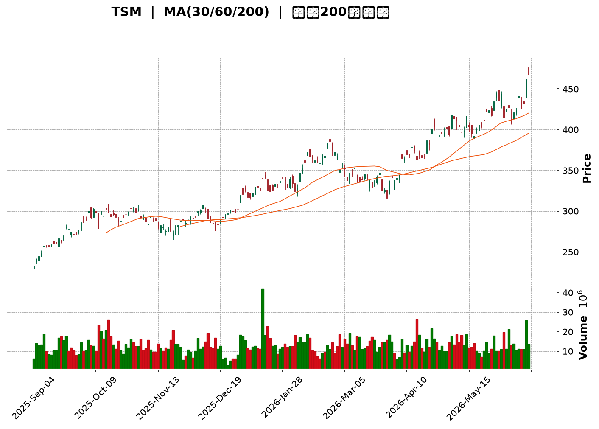
</details>

<html>
<head><meta charset="utf-8" /></head>
<body>
    <div style="height:500px; width:100%;">                        <script>window.PlotlyConfig = {MathJaxConfig: 'local'};</script>
        <script charset="utf-8" src="https://cdn.plot.ly/plotly-3.6.0.min.js" integrity="sha256-QaOVwtVY0T02VaHrr6pnoHLCwayMJp4O5n4YyaE3rJk=" crossorigin="anonymous"></script>                <div id="candlestick-chart" class="plotly-graph-div" style="height:100%; width:100%;"></div>            <script>                window.PLOTLYENV=window.PLOTLYENV || {};                                if (document.getElementById("candlestick-chart")) {                    Plotly.newPlot(                        "candlestick-chart",                        [{"close":{"dtype":"f8","bdata":"AAAAoGMUbUAAAABg6xduQAAAAECOj25AAAAAQJwFb0AAAACAdRlwQAAAAEA\u002fAXBAAAAAoOQHcEAAAACgVShwQAAAAKAtQHBAAAAAYMRLcEAAAACgoqhwQAAAAIDJbHBAAAAAAPrncEAAAADA\u002fodxQAAAAOA+aHFAAAAAwPMncUAAAACgkPNwQAAAAGCA8XBAAAAAILRRcUAAAABgb+NxQAAAAGC43XFAAAAAQH0eckAAAACgksByQAAAAOCyO3JAAAAAADrickAAAABgkZhyQAAAAKBzZ3FAAAAAAFrIckAAAAAgBVpyQAAAAEA+5XJAAAAAwO6XckAAAAAgXkxyQAAAAOD1dXJAAAAAwFFDckAAAACg8elxQAAAAABQB3JAAAAAgHZKckAAAAAAsX5yQAAAAMDCsnJAAAAAoEbrckAAAAAAl81yQAAAAIBMoXJAAAAAwJ\u002fnckAAAABgBDxyQAAAACCCNXJAAAAAgKjvcUAAAABAKcRxQAAAAGBiT3JAAAAAAEwOckAAAAAAkQVyQAAAAEDmf3FAAAAA4H2pcUAAAAAg4nxxQAAAAMDLO3FAAAAAIJmCcUAAAACASTVxQAAAAGCNDnFAAAAAYKKmcUAAAADARKdxQAAAAKAW+3FAAAAAwLETckAAAADA5NZxQAAAAODmHHJAAAAAAD5SckAAAACgPCpyQAAAAECnRnJAAAAAgCi4ckAAAAAgm9ByQAAAAOBxO3NAAAAA4If0ckAAAADAnyhyQAAAAGAt5HFAAAAAQFTWcUAAAACAlThxQAAAACB4s3FAAAAAIHD3cUAAAADAXDxyQAAAAMDHdnJAAAAAYDqUckAAAAAgidRyQAAAAGD5tXJAAAAA4KSgckAAAAAAQOVyQAAAAAB633NAAAAA4H8JdEAAAAAg9Ft0QAAAAECs0HNAAAAAQALGc0AAAABgdx90QAAAAGAJoXRAAAAAYB+YdEAAAAAg3FZ0QAAAAEAlPnVAAAAAAD5KdUAAAADgp1d0QAAAAAAaR3RAAAAAoP9adEAAAADAYdJ0QAAAAOD\u002fr3RAAAAAwJ0JdUAAAACgpkh1QAAAAIDgHHVAAAAAwMaNdEAAAAAgsDl1QAAAAKBj4HRAAAAAgA1BdEAAAACAe5B0QAAAAKDpsHVAAAAAIFUZdkAAAABgzIB2QAAAACCtQndAAAAAYFTjdkAAAADgocd2QAAAAABApXZAAAAAoF6GdkAAAACAmmh2QAAAAEArCndAAAAAoDUCd0AAAAAgR\u002fx3QAAAAIDLG3hAAAAAIPltd0AAAADgeUp3QAAAAOBn83ZAAAAAYAr1dUAAAABgpTl2QAAAAACpAHZAAAAAIF8SdUAAAABghq51QAAAAKDllHVAAAAAYM0LdkAAAACgq+90QAAAAIAjCXVAAAAAgLMndUAAAAAgv5J1QAAAACBtLHVAAAAAwPkfdUAAAABAiId0QAAAAGCMGnVAAAAAICtndUAAAAAgAK91QAAAAKCRVXRAAAAAIKBfdEAAAAAgK7xzQAAAACCREnVAAAAAABNLdUAAAABg9yN1QAAAAGBiT3VAAAAAIDaIdUAAAADAuNB2QAAAAGAtynZAAAAAAL8bd0AAAAAATgt3QAAAAAAKsHdAAAAAAJRjd0AAAABgBKh2QAAAAGAmGndAAAAAICbWdkAAAAAghfN2QAAAAICOKHhAAAAAYEHcd0AAAACgUBh5QAAAAICKQHlAAAAAAMZ2eEAAAADAjo54QAAAAIAnsnhAAAAAwNrLeEAAAAAgvwp5QAAAAADRl3hAAAAAgFEoekAAAAAA69J5QAAAAIB9q3lAAAAAgIQ5eUAAAAAAocV4QAAAAMDa7XhAAAAAoOcLekAAAAAgfDZ5QAAAACBmsHhAAAAAQBV7eEAAAAAg6Ap5QAAAAAAuY3lAAAAAwDI5eUAAAADgtLV5QAAAAKDgW3pAAAAAoOB9ekAAAADAjhd6QAAAAKDLKXtAAAAAgFfae0AAAABAtzp7QAAAAKAWvntAAAAAQDPjeUAAAABg2Jx6QAAAAEC5rnpAAAAAYLh8eUAAAADAHlF6QAAAAEDhfnpAAAAAYGaWe0AAAACgR516QAAAAGBmAntAAAAAgOvhfEAAAABguDp9QA=="},"high":{"dtype":"f8","bdata":"y1U9yo0XbUAxDPIYADxuQEppjetkpW5ATyU\u002fWDJ+b0DnWyBj+VpwQI2Zdw9zLHBAWc2fqochcEAH4wlBzj5wQABBc9y1hXBAxsYCkNVrcEARDqwnzMZwQBPcYE\u002fGh3BA8oLLjTAjcUCTO2xEObxxQFK0Bd0ucHFAf1rcgJIvcUC6T0OYiRVxQGeRfx3pWnFAl2aQ2OBUcUBW8AcCWANyQEchN0hnZnJAV2+J0exbckCdamsWXA5zQAhAYxIvC3NAcZiQSxIAc0CX0zUIZsdyQIGtFcKlnXJAo0mtR\u002fnjckCh0hfRQLZyQNAJ1MdnA3NAqYdjZfhOc0AsXUEE3M5yQPtoEHZq1HJAqL65nXiQckBOcuT8RU5yQA9u\u002fOamPHJAS4vU3+15ckD46lm2F6JyQKqeGSlJvHJAhnLaN9YYc0DO\u002f0imhA5zQDbO0FRkFHNAWigQTiA7c0B5JqpcELpyQP2FOBU3fnJAXxdnEmJFckBZwp08OtpxQELNr2\u002fpbHJAvOwi6dNJckDt9BDnCElyQLa4yzrJ83FAFLNVTODJcUCe\u002fFpBo8RxQECQlpz9X3FAdniVkDSlcUAljbSQ9yhyQCEVMaEtSHFAbH39LE2tcUCczGLRsrJxQAN7sPtUKHJA\u002fdMw+hsmckDHf+BuIw5yQA0evRIpQ3JA216OyNBkckCtdyYGsztyQG82pywsp3JAqiVyexDEckAJKpxUxORyQB2wGohneHNAIhiYCEoEc0BFd9ARdetyQBVER3F5ZHJAcKnsZqPvcUAmqfZs0\u002flxQCuUWgry2nFAbZT7dbEqckDFe3B05ldyQIWEN6oPhnJAdSPAa\u002fWZckDSlayhId1yQJ8CPaL17nJAvm8lX8HvckCN2mJR9hxzQJC3\u002fXD+\u002fnNASixZZ8KYdEBOvx2O47V0QJ7djlT3SXRAiJBmn1AtdEDuzzXAnDF0QMR\u002f7MZevXRAZwcY8Q3rdEChuUU7ooJ0QHNDZWFj2HVAx26caNTAdUDm3sRMQ0Z1QG6yI7DNvnRAMrWhMT\u002fVdECiOEKgrPZ0QESnZA8L1nRALGHF3O83dUB+DBOClnt1QM2zoYqSX3VAVi16v3IidUDuVRIW5WZ1QBbyaHtClHVAZB1gT\u002fAQdUDiHsZIm810QFmWUc\u002fCvnVA93dKKgdcdkBJG0kAKq52QEtvI4wQmndA1\u002fglO8Cgd0BXNrjgPRN3QEwvOOUVxXZAZy7KBd33dkBWs8gD9452QFABtK2XJHdA2ajsoSs4d0BYkIwq4DJ4QJzfZEpFQ3hA9sYWI70HeEDPmUdK52t3QPdhMgDrMndAw4tcAGgidkCZHuvovnN2QOamtoX1WXZAjwWszteudUBC+47Dqrl1QPQ3Mw7u+nVAxD9qgzY4dkCExgywtpF1QLovueP8a3VA6j+4Pr1tdUAs+xSJMp91QPOMCW4xsnVAbWa0oLExdUDp5yDf+gx1QILuwgi5aXVA3eCmBjCBdUAYtV6JGdp1QL1cHN3QQXVAEERE46OMdEAl1lliR410QJPUE9noGXVAfWpjcdi9dUAt7wBBVVR1QNr\u002fOEZVdnVAXCWNPZCLdUCW8ei8zlZ3QPc4Xxr19HZA3LOxjt6Rd0BaYbxJeSl3QC31xyZG1HdAZXrsqGbRd0D+RBRyXBV3QN9fpmI9a3dAwk3gOEkTd0ByXrryIx53QInmjCAPMHhAedmzn6A9eEB99EA5iIh5QAnJ\u002fUSB2HlANIox9AvPeEBpVDdrza54QOP5xH+73XhAKDXg5LwweUDUPAyY9Wt5QBP26fflUnlAiwgA1oIrekDhahmkTDB6QNOsf1ZpAHpA1HblOHBseUA\u002fVbiozRR5QNaUpYzAO3lAM6gM9L5PekD42essmY55QPRoN8feXnlAKgERPyvfeEC1fld\u002f+y55QDfL\u002fID6p3lABXVxZV6beUC7U\u002fI3Rfh5QCl4zmm02HpAFOs5h52pekBWxvgB89Z6QNtE6\u002fFwBXxAqUKzk1H1e0AFZox4uxF8QJTP\u002fq1p73tAwqqlAS4Oe0DgB3ZKvgx7QOPgREEuUntAZigg\u002fC6VekAAAAAAAGR6QAAAAEAKr3pAAAAAoEepe0AAAACgR4V7QAAAAAAAqHtAAAAAIIUTfUAAAADA9cR9QA=="},"hovertemplate":"\u003cb\u003e%{x|%Y-%m-%d}\u003c\u002fb\u003e\u003cbr\u003e\u958b: $%{open:.2f}\u003cbr\u003e\u9ad8: $%{high:.2f}\u003cbr\u003e\u4f4e: $%{low:.2f}\u003cbr\u003e\u6536: $%{close:.2f}\u003cextra\u003e\u003c\u002fextra\u003e","low":{"dtype":"f8","bdata":"wjUI2vx4bEAGHA4dh2ltQE0oSd5D321AfmkPqVOHbkAxTLCLx91vQMPIr+747G9Ai+o0ILjxb0CZ0Wnrbf1vQK4USs8oKXBA72MKnjAbcECis2o\u002f0f5vQH7Tw7cVTHBANE4+rf51cEBY7ZRo+VxxQLAaw6XnKHFAl5cx0T3BcEBc205eEchwQAAAAGCA8XBAOw3huAb7cEDetsl8DDBxQFm4llWTzHFAqZDOcIADckCPWLlGhZlyQAncmOTKL3JA+BKcx+c6ckC4W+AGhHFyQCTofnE2YnFAyNE1vI0gckA1eEjP\u002fhByQOiepHaVm3JAZhiQP+1lckDGlnb\u002f00lyQF2t1t7Ma3JArbxeWNM1ckCNmuj20qJxQDlgzZnZ9XFAdn2qIGpBckD68OVGTTZyQDs4pwc+XHJAOdVwSEHAckC7Ght7fadyQD00VpbEZXJANOCifiC8ckCsZa\u002fqcTNyQDz13CeJE3JAYlI6kCHScUA4qoPPaS9xQOnLrziBF3JA9nfHX2vqcUAn+9ltDvVxQJTVq3P5XHFArq9dZoDxcED4YqalzFlxQCxHmbNn6XBA0WNYHY4icUCUOsnH+yNxQGsJgT++i3BArsfsyt3wcEACU4+ZHu9wQO5aWQmw13FAWFlGIdnrcUDKTu6InY9xQJ6aRbC07nFAX6Or4FW9cUAqD2EM5v5xQNc1+jJRL3JAeIMFDGdmckAFnEn8qIJyQMBEDggpwnJArmB6bpmhckDP0r9QwBdyQKLQACAn4XFAxeIwPNKdcUAr9QqUqBpxQA07wY7UhHFAu07peofOcUCSwueTaRtyQB34rL8rK3JA12B92lFrckDRG0dSxY9yQAey5ynXkXJAR7Z4PJOeckBpbjRv7d1yQISqwkWRYXNA+uYNqo\u002f9c0DqcsdJvy50QNdUb9JxznNAQ\u002ff9HT6oc0AZbM4i1MlzQGyzIbiO9nNAMlZnLUeRdECidIGVaDJ0QOf6XnDuAnVAnw0Wikc7dUDkuUxZhFN0QLdnUQMZQHRACmgDZYRTdEDdWcVuq5p0QGWidhWGiHRAvEf\u002fc3LNdED+ehThtQ51QJjm7vA1aHRA0TRoXIl2dEC4dnJZiXZ0QNLOiiEuhXRAO5q7quHWc0B+1H8CHeBzQBY\u002fwjW37nRAG4WetTKgdUBA\u002fTe17ih2QMX6l\u002f\u002fx53ZANCGhxBwHdEBvlErupm52QFU4qlOLJnZAw+6dYbJtdkABgK5apTl2QGLv39URVHZACJg+PjnJdkBPKtEU4GF3QP0CZA2i7XdAuM0HTsz8dkD48qA4m+t2QPdcqaRprHZAsFoSovBldUBDRUq3pAt2QF7xwAiHYHVAs+mnMFrvdEACoCvBbKN0QJcbaEalaHVAVzy3i\u002fLIdUBnxWvyaup0QBFV4N\u002fe53RAA1yrwSwhdUDBQ0bqvxl1QJGEfzPBKHVAiV7yReJGdECJTYaWN1J0QKboahY5pXRAzmWZVNXTdEBt397LKGt1QDgV67TBSXRAMfMIRekYdEBylr+2EZFzQIOjbT48BnRALnjCpkwvdUCRQwdilWB0QG7dvexCHXVArNohStrtdEAHpEwcaWZ2QAe9tSUJfnZAHNtvgi0Od0DZVK6vHdN2QHU7yXSRRXdA65AkKHI1d0APUM1LUnt2QGMnUCuXxHZAv0RCK2K2dkB4eDZsHMR2QGraD4ZiHHdANZG1Telud0C9bYuF4I54QGPwk5Ru93hA8NIBvdH8d0DBJr9xXjR4QNUzZOzwDHhA0ZJN5GtzeECL0sk3baR4QLuuMpLsenhACiCvQ2z7eECvAWPtgHJ5QCjU6xoY\u002f3hATM62pCfUeED8mm9sfBN4QJS1V9fiaHhAUfv3mpESeUC1SSfzXt54QExhTIQuYnhAsvy6wJACeECVZ4oiZrB4QJ+MG7056XhAdv28QrMeeUCUGEhoypF5QJ5wz1aN5nlAb2h1YtvbeUBZj+L7ZgR6QBtxqMY0WHpA6smtdNwve0BWFa6LPBh7QIYQSp7TpHpA+MW+hjW9eUCvg99cr1h6QCu2yFUASXlAo+ZPrPVreUAAAACAwo15QAAAACBcE3pAAAAAQOH+ekAAAABAM5N6QAAAAIA9+npAAAAAgD1me0AAAABguBJ9QA=="},"name":"\u50f9\u683c","open":{"dtype":"f8","bdata":"eMZFYziabEASskfOlrNtQPMHXNb56m1AfmkPqVOHbkCro7MXnQBwQMmiifsIGHBAzLGshfIfcECXlGv0fhJwQNUnWqN0fXBAt8wbfV9kcEBBVqy3c\u002f9vQFS3EXeZhHBAzSaBZUyHcEA\u002fQl7tEoNxQMPTIU\u002flYXFAAMgOPcHvcEA9aNim+vtwQHPCu9pAJXFAqv\u002fKIa4ScUDbvXmxNURxQOKn4286Y3JAAiFwCyApckDa5c\u002fIoZpyQBt1lFGQA3NAmdKn\u002fRhLckCMTQ3PJL9yQFxCyVHWmXJAaX+WaIh+ckCQoGNNGVVyQP91AGdT\u002fnJAZ0KEPPxHc0CyaIKOEoFyQHaatPh4mnJAC0r09piKckAk03swWStyQC0sSmiM+HFAbBQYlyVUckBEwNiQCoVyQLnexmvNf3JAERiCA4z2ckBxZ9b7XctyQC3QYTOQ+XJAjlWIkZbDckDlg85\u002f8WhyQF2PIcpQJXJAc5dpfc88ckDF04evrq9xQJ2jKSTwQHJAGeXS32wcckA1JW4edjZyQCl5BSyM7nFARFHi0wsccUCOQeSg1XNxQGBAaKcUNnFA2FKKhhQscUD\u002fBYuPzh5yQDx7hG3V6nBArsfsyt3wcEDutxESUIhxQJTkJapv7XFAUNXYzxcjckCY70421MpxQGW5yiF5G3JARVlot1QeckDIPvPf5zpyQP2X2kjEW3JA+neRtIWtckBv9lJFUJpyQIpiIaC473JAsnr\u002fGgP8ckBFd9ARdetyQNmHXsAgWnJAakcRionccUCEtPGswPBxQIhgXiOQuHFAu07peofOcUAeusj8fFJyQHfkfJxFPnJAQxex8FqDckCWqd7EvKVyQENPP8Wpw3JAHem8OeXMckAZAkEvAOdyQNBpvkAGZnNAfkhgrDqLdEBnl59DXYh0QFh8MUUFMHRAbXQlcJArdECa3q5\u002f+uJzQORrI7McB3RAkGeSzYuydEChuUU7ooJ0QGfhjt7EUHVAwJlRGaqLdUAbSkpunTB1QARZBNx1u3RA9iktIk27dECaoybyz6V0QHaxwvBFsXRA2t2C3FPsdEBJobphRVR1QOvsqTzbIHVAJJ2qDyPbdEC6zBbH9ZB0QPqeZCq+dHVA3DohjQDedEDjBBKmkhJ0QHP9zfA+\u002fHRAvM+mv3qvdUCFEdatUad2QBYsoIvYAndATWN3SNWQd0Akur4DC\u002fR2QFcVX00pgHZA9x4lcdafdkDyxvE68F12QAOYLMXkXnZAtNz1ifrRdkDBNXEuM5d3QJzfZEpFQ3hAGyUKXh8DeED+aqw4zQN3QMh5PNK2t3ZAjZfp\u002fQ28dUBCM\u002fKVfDl2QKUoCvs2EXZAwR4ik8BbdUAvZW2IAN50QDofqRLdqnVAJLJfI8YBdkBfl\u002felboJ1QAwFPwVwYnVAEs\u002fh5u83dUB\u002foHcc3jx1QC1qTNKNj3VAoQYQlTaHdEBFcAhNS\u002f50QKboahY5pXRAy8s1X5PsdEBLpz3fEJN1QNtGhKtqMHVA4PJQByNBdECo8hX692Z0QA0qHUzpGHRAi3HKT4txdUDQmAPgOGF0QLLoVZxML3VAnQcp5VkqdUCbje48zBZ3QBPVJxU4p3ZAZV\u002f7PmZrd0D+4JClURZ3QKh2a4J4ondA2DldXU3Id0D5WweF+P92QKlLTMk\u002fRXdATGFMu7cFd0AAAAAghfN2QBX0Ov2ULndAYSyyyKL1d0C0rER7brN4QKRVanKIzHlApLv5+kJzeEDUgNZN3394QOGhsMAWznhAIZD6GlWIeEDwwsimMjl5QBkiKbx5OnlAvmdyhFsXeUDTX2iLzxF6QKnG9hCd\u002f3lA2oNSkqJceUCTMZCgIc14QEdcSoRu1XhAsOele0kkeUCzAd3szVh5QPRoN8feXnlAXPCiaplJeEBhjj3WKMF4QJ+MG7056XhAXbNKI5OHeUBuiBv4ecJ5QIUR91FboHpA57Oxg7xTekDiiA3CJ6F6QEdp+38yfnpAPhfLWM94e0AkMQ65BA98QBeIRYD72XpAUTqyB0HMekArPhJ\u002femx6QLZ\u002fYQz53XpA7QhOpOLPeUAAAAAAKdR5QAAAAMDMQHpAAAAAQOFqe0AAAADgUUB7QAAAAAAALHtAAAAAgBRue0AAAACgcMF9QA=="},"x":["2025-09-04T00:00:00-04:00","2025-09-05T00:00:00-04:00","2025-09-08T00:00:00-04:00","2025-09-09T00:00:00-04:00","2025-09-10T00:00:00-04:00","2025-09-11T00:00:00-04:00","2025-09-12T00:00:00-04:00","2025-09-15T00:00:00-04:00","2025-09-16T00:00:00-04:00","2025-09-17T00:00:00-04:00","2025-09-18T00:00:00-04:00","2025-09-19T00:00:00-04:00","2025-09-22T00:00:00-04:00","2025-09-23T00:00:00-04:00","2025-09-24T00:00:00-04:00","2025-09-25T00:00:00-04:00","2025-09-26T00:00:00-04:00","2025-09-29T00:00:00-04:00","2025-09-30T00:00:00-04:00","2025-10-01T00:00:00-04:00","2025-10-02T00:00:00-04:00","2025-10-03T00:00:00-04:00","2025-10-06T00:00:00-04:00","2025-10-07T00:00:00-04:00","2025-10-08T00:00:00-04:00","2025-10-09T00:00:00-04:00","2025-10-10T00:00:00-04:00","2025-10-13T00:00:00-04:00","2025-10-14T00:00:00-04:00","2025-10-15T00:00:00-04:00","2025-10-16T00:00:00-04:00","2025-10-17T00:00:00-04:00","2025-10-20T00:00:00-04:00","2025-10-21T00:00:00-04:00","2025-10-22T00:00:00-04:00","2025-10-23T00:00:00-04:00","2025-10-24T00:00:00-04:00","2025-10-27T00:00:00-04:00","2025-10-28T00:00:00-04:00","2025-10-29T00:00:00-04:00","2025-10-30T00:00:00-04:00","2025-10-31T00:00:00-04:00","2025-11-03T00:00:00-05:00","2025-11-04T00:00:00-05:00","2025-11-05T00:00:00-05:00","2025-11-06T00:00:00-05:00","2025-11-07T00:00:00-05:00","2025-11-10T00:00:00-05:00","2025-11-11T00:00:00-05:00","2025-11-12T00:00:00-05:00","2025-11-13T00:00:00-05:00","2025-11-14T00:00:00-05:00","2025-11-17T00:00:00-05:00","2025-11-18T00:00:00-05:00","2025-11-19T00:00:00-05:00","2025-11-20T00:00:00-05:00","2025-11-21T00:00:00-05:00","2025-11-24T00:00:00-05:00","2025-11-25T00:00:00-05:00","2025-11-26T00:00:00-05:00","2025-11-28T00:00:00-05:00","2025-12-01T00:00:00-05:00","2025-12-02T00:00:00-05:00","2025-12-03T00:00:00-05:00","2025-12-04T00:00:00-05:00","2025-12-05T00:00:00-05:00","2025-12-08T00:00:00-05:00","2025-12-09T00:00:00-05:00","2025-12-10T00:00:00-05:00","2025-12-11T00:00:00-05:00","2025-12-12T00:00:00-05:00","2025-12-15T00:00:00-05:00","2025-12-16T00:00:00-05:00","2025-12-17T00:00:00-05:00","2025-12-18T00:00:00-05:00","2025-12-19T00:00:00-05:00","2025-12-22T00:00:00-05:00","2025-12-23T00:00:00-05:00","2025-12-24T00:00:00-05:00","2025-12-26T00:00:00-05:00","2025-12-29T00:00:00-05:00","2025-12-30T00:00:00-05:00","2025-12-31T00:00:00-05:00","2026-01-02T00:00:00-05:00","2026-01-05T00:00:00-05:00","2026-01-06T00:00:00-05:00","2026-01-07T00:00:00-05:00","2026-01-08T00:00:00-05:00","2026-01-09T00:00:00-05:00","2026-01-12T00:00:00-05:00","2026-01-13T00:00:00-05:00","2026-01-14T00:00:00-05:00","2026-01-15T00:00:00-05:00","2026-01-16T00:00:00-05:00","2026-01-20T00:00:00-05:00","2026-01-21T00:00:00-05:00","2026-01-22T00:00:00-05:00","2026-01-23T00:00:00-05:00","2026-01-26T00:00:00-05:00","2026-01-27T00:00:00-05:00","2026-01-28T00:00:00-05:00","2026-01-29T00:00:00-05:00","2026-01-30T00:00:00-05:00","2026-02-02T00:00:00-05:00","2026-02-03T00:00:00-05:00","2026-02-04T00:00:00-05:00","2026-02-05T00:00:00-05:00","2026-02-06T00:00:00-05:00","2026-02-09T00:00:00-05:00","2026-02-10T00:00:00-05:00","2026-02-11T00:00:00-05:00","2026-02-12T00:00:00-05:00","2026-02-13T00:00:00-05:00","2026-02-17T00:00:00-05:00","2026-02-18T00:00:00-05:00","2026-02-19T00:00:00-05:00","2026-02-20T00:00:00-05:00","2026-02-23T00:00:00-05:00","2026-02-24T00:00:00-05:00","2026-02-25T00:00:00-05:00","2026-02-26T00:00:00-05:00","2026-02-27T00:00:00-05:00","2026-03-02T00:00:00-05:00","2026-03-03T00:00:00-05:00","2026-03-04T00:00:00-05:00","2026-03-05T00:00:00-05:00","2026-03-06T00:00:00-05:00","2026-03-09T00:00:00-04:00","2026-03-10T00:00:00-04:00","2026-03-11T00:00:00-04:00","2026-03-12T00:00:00-04:00","2026-03-13T00:00:00-04:00","2026-03-16T00:00:00-04:00","2026-03-17T00:00:00-04:00","2026-03-18T00:00:00-04:00","2026-03-19T00:00:00-04:00","2026-03-20T00:00:00-04:00","2026-03-23T00:00:00-04:00","2026-03-24T00:00:00-04:00","2026-03-25T00:00:00-04:00","2026-03-26T00:00:00-04:00","2026-03-27T00:00:00-04:00","2026-03-30T00:00:00-04:00","2026-03-31T00:00:00-04:00","2026-04-01T00:00:00-04:00","2026-04-02T00:00:00-04:00","2026-04-06T00:00:00-04:00","2026-04-07T00:00:00-04:00","2026-04-08T00:00:00-04:00","2026-04-09T00:00:00-04:00","2026-04-10T00:00:00-04:00","2026-04-13T00:00:00-04:00","2026-04-14T00:00:00-04:00","2026-04-15T00:00:00-04:00","2026-04-16T00:00:00-04:00","2026-04-17T00:00:00-04:00","2026-04-20T00:00:00-04:00","2026-04-21T00:00:00-04:00","2026-04-22T00:00:00-04:00","2026-04-23T00:00:00-04:00","2026-04-24T00:00:00-04:00","2026-04-27T00:00:00-04:00","2026-04-28T00:00:00-04:00","2026-04-29T00:00:00-04:00","2026-04-30T00:00:00-04:00","2026-05-01T00:00:00-04:00","2026-05-04T00:00:00-04:00","2026-05-05T00:00:00-04:00","2026-05-06T00:00:00-04:00","2026-05-07T00:00:00-04:00","2026-05-08T00:00:00-04:00","2026-05-11T00:00:00-04:00","2026-05-12T00:00:00-04:00","2026-05-13T00:00:00-04:00","2026-05-14T00:00:00-04:00","2026-05-15T00:00:00-04:00","2026-05-18T00:00:00-04:00","2026-05-19T00:00:00-04:00","2026-05-20T00:00:00-04:00","2026-05-21T00:00:00-04:00","2026-05-22T00:00:00-04:00","2026-05-26T00:00:00-04:00","2026-05-27T00:00:00-04:00","2026-05-28T00:00:00-04:00","2026-05-29T00:00:00-04:00","2026-06-01T00:00:00-04:00","2026-06-02T00:00:00-04:00","2026-06-03T00:00:00-04:00","2026-06-04T00:00:00-04:00","2026-06-05T00:00:00-04:00","2026-06-08T00:00:00-04:00","2026-06-09T00:00:00-04:00","2026-06-10T00:00:00-04:00","2026-06-11T00:00:00-04:00","2026-06-12T00:00:00-04:00","2026-06-15T00:00:00-04:00","2026-06-16T00:00:00-04:00","2026-06-17T00:00:00-04:00","2026-06-18T00:00:00-04:00","2026-06-22T00:00:00-04:00"],"type":"candlestick"},{"hovertemplate":"MA30: $%{y:.2f}\u003cextra\u003e\u003c\u002fextra\u003e","line":{"color":"#2196F3","dash":"dash","width":2},"mode":"lines","name":"MA30","x":["2025-09-04T00:00:00-04:00","2025-09-05T00:00:00-04:00","2025-09-08T00:00:00-04:00","2025-09-09T00:00:00-04:00","2025-09-10T00:00:00-04:00","2025-09-11T00:00:00-04:00","2025-09-12T00:00:00-04:00","2025-09-15T00:00:00-04:00","2025-09-16T00:00:00-04:00","2025-09-17T00:00:00-04:00","2025-09-18T00:00:00-04:00","2025-09-19T00:00:00-04:00","2025-09-22T00:00:00-04:00","2025-09-23T00:00:00-04:00","2025-09-24T00:00:00-04:00","2025-09-25T00:00:00-04:00","2025-09-26T00:00:00-04:00","2025-09-29T00:00:00-04:00","2025-09-30T00:00:00-04:00","2025-10-01T00:00:00-04:00","2025-10-02T00:00:00-04:00","2025-10-03T00:00:00-04:00","2025-10-06T00:00:00-04:00","2025-10-07T00:00:00-04:00","2025-10-08T00:00:00-04:00","2025-10-09T00:00:00-04:00","2025-10-10T00:00:00-04:00","2025-10-13T00:00:00-04:00","2025-10-14T00:00:00-04:00","2025-10-15T00:00:00-04:00","2025-10-16T00:00:00-04:00","2025-10-17T00:00:00-04:00","2025-10-20T00:00:00-04:00","2025-10-21T00:00:00-04:00","2025-10-22T00:00:00-04:00","2025-10-23T00:00:00-04:00","2025-10-24T00:00:00-04:00","2025-10-27T00:00:00-04:00","2025-10-28T00:00:00-04:00","2025-10-29T00:00:00-04:00","2025-10-30T00:00:00-04:00","2025-10-31T00:00:00-04:00","2025-11-03T00:00:00-05:00","2025-11-04T00:00:00-05:00","2025-11-05T00:00:00-05:00","2025-11-06T00:00:00-05:00","2025-11-07T00:00:00-05:00","2025-11-10T00:00:00-05:00","2025-11-11T00:00:00-05:00","2025-11-12T00:00:00-05:00","2025-11-13T00:00:00-05:00","2025-11-14T00:00:00-05:00","2025-11-17T00:00:00-05:00","2025-11-18T00:00:00-05:00","2025-11-19T00:00:00-05:00","2025-11-20T00:00:00-05:00","2025-11-21T00:00:00-05:00","2025-11-24T00:00:00-05:00","2025-11-25T00:00:00-05:00","2025-11-26T00:00:00-05:00","2025-11-28T00:00:00-05:00","2025-12-01T00:00:00-05:00","2025-12-02T00:00:00-05:00","2025-12-03T00:00:00-05:00","2025-12-04T00:00:00-05:00","2025-12-05T00:00:00-05:00","2025-12-08T00:00:00-05:00","2025-12-09T00:00:00-05:00","2025-12-10T00:00:00-05:00","2025-12-11T00:00:00-05:00","2025-12-12T00:00:00-05:00","2025-12-15T00:00:00-05:00","2025-12-16T00:00:00-05:00","2025-12-17T00:00:00-05:00","2025-12-18T00:00:00-05:00","2025-12-19T00:00:00-05:00","2025-12-22T00:00:00-05:00","2025-12-23T00:00:00-05:00","2025-12-24T00:00:00-05:00","2025-12-26T00:00:00-05:00","2025-12-29T00:00:00-05:00","2025-12-30T00:00:00-05:00","2025-12-31T00:00:00-05:00","2026-01-02T00:00:00-05:00","2026-01-05T00:00:00-05:00","2026-01-06T00:00:00-05:00","2026-01-07T00:00:00-05:00","2026-01-08T00:00:00-05:00","2026-01-09T00:00:00-05:00","2026-01-12T00:00:00-05:00","2026-01-13T00:00:00-05:00","2026-01-14T00:00:00-05:00","2026-01-15T00:00:00-05:00","2026-01-16T00:00:00-05:00","2026-01-20T00:00:00-05:00","2026-01-21T00:00:00-05:00","2026-01-22T00:00:00-05:00","2026-01-23T00:00:00-05:00","2026-01-26T00:00:00-05:00","2026-01-27T00:00:00-05:00","2026-01-28T00:00:00-05:00","2026-01-29T00:00:00-05:00","2026-01-30T00:00:00-05:00","2026-02-02T00:00:00-05:00","2026-02-03T00:00:00-05:00","2026-02-04T00:00:00-05:00","2026-02-05T00:00:00-05:00","2026-02-06T00:00:00-05:00","2026-02-09T00:00:00-05:00","2026-02-10T00:00:00-05:00","2026-02-11T00:00:00-05:00","2026-02-12T00:00:00-05:00","2026-02-13T00:00:00-05:00","2026-02-17T00:00:00-05:00","2026-02-18T00:00:00-05:00","2026-02-19T00:00:00-05:00","2026-02-20T00:00:00-05:00","2026-02-23T00:00:00-05:00","2026-02-24T00:00:00-05:00","2026-02-25T00:00:00-05:00","2026-02-26T00:00:00-05:00","2026-02-27T00:00:00-05:00","2026-03-02T00:00:00-05:00","2026-03-03T00:00:00-05:00","2026-03-04T00:00:00-05:00","2026-03-05T00:00:00-05:00","2026-03-06T00:00:00-05:00","2026-03-09T00:00:00-04:00","2026-03-10T00:00:00-04:00","2026-03-11T00:00:00-04:00","2026-03-12T00:00:00-04:00","2026-03-13T00:00:00-04:00","2026-03-16T00:00:00-04:00","2026-03-17T00:00:00-04:00","2026-03-18T00:00:00-04:00","2026-03-19T00:00:00-04:00","2026-03-20T00:00:00-04:00","2026-03-23T00:00:00-04:00","2026-03-24T00:00:00-04:00","2026-03-25T00:00:00-04:00","2026-03-26T00:00:00-04:00","2026-03-27T00:00:00-04:00","2026-03-30T00:00:00-04:00","2026-03-31T00:00:00-04:00","2026-04-01T00:00:00-04:00","2026-04-02T00:00:00-04:00","2026-04-06T00:00:00-04:00","2026-04-07T00:00:00-04:00","2026-04-08T00:00:00-04:00","2026-04-09T00:00:00-04:00","2026-04-10T00:00:00-04:00","2026-04-13T00:00:00-04:00","2026-04-14T00:00:00-04:00","2026-04-15T00:00:00-04:00","2026-04-16T00:00:00-04:00","2026-04-17T00:00:00-04:00","2026-04-20T00:00:00-04:00","2026-04-21T00:00:00-04:00","2026-04-22T00:00:00-04:00","2026-04-23T00:00:00-04:00","2026-04-24T00:00:00-04:00","2026-04-27T00:00:00-04:00","2026-04-28T00:00:00-04:00","2026-04-29T00:00:00-04:00","2026-04-30T00:00:00-04:00","2026-05-01T00:00:00-04:00","2026-05-04T00:00:00-04:00","2026-05-05T00:00:00-04:00","2026-05-06T00:00:00-04:00","2026-05-07T00:00:00-04:00","2026-05-08T00:00:00-04:00","2026-05-11T00:00:00-04:00","2026-05-12T00:00:00-04:00","2026-05-13T00:00:00-04:00","2026-05-14T00:00:00-04:00","2026-05-15T00:00:00-04:00","2026-05-18T00:00:00-04:00","2026-05-19T00:00:00-04:00","2026-05-20T00:00:00-04:00","2026-05-21T00:00:00-04:00","2026-05-22T00:00:00-04:00","2026-05-26T00:00:00-04:00","2026-05-27T00:00:00-04:00","2026-05-28T00:00:00-04:00","2026-05-29T00:00:00-04:00","2026-06-01T00:00:00-04:00","2026-06-02T00:00:00-04:00","2026-06-03T00:00:00-04:00","2026-06-04T00:00:00-04:00","2026-06-05T00:00:00-04:00","2026-06-08T00:00:00-04:00","2026-06-09T00:00:00-04:00","2026-06-10T00:00:00-04:00","2026-06-11T00:00:00-04:00","2026-06-12T00:00:00-04:00","2026-06-15T00:00:00-04:00","2026-06-16T00:00:00-04:00","2026-06-17T00:00:00-04:00","2026-06-18T00:00:00-04:00","2026-06-22T00:00:00-04:00"],"y":{"dtype":"f8","bdata":"AAAAAAAA+H8AAAAAAAD4fwAAAAAAAPh\u002fAAAAAAAA+H8AAAAAAAD4fwAAAAAAAPh\u002fAAAAAAAA+H8AAAAAAAD4fwAAAAAAAPh\u002fAAAAAAAA+H8AAAAAAAD4fwAAAAAAAPh\u002fAAAAAAAA+H8AAAAAAAD4fwAAAAAAAPh\u002fAAAAAAAA+H8AAAAAAAD4fwAAAAAAAPh\u002fAAAAAAAA+H8AAAAAAAD4fwAAAAAAAPh\u002fAAAAAAAA+H8AAAAAAAD4fwAAAAAAAPh\u002fAAAAAAAA+H8AAAAAAAD4fwAAAAAAAPh\u002fAAAAAAAA+H8AAAAAAAD4fxEREXGGE3FAZmZmzh02cUBVVVUF3VFxQGZmZrYAbXFAERERkXyEcUC8u7sr+JNxQO\u002fu7v48pXFAAAAAIIa4cUCrqqoaeMxxQBEREfFa4XFAZmZmJr33cUAAAACQCQpyQKuqqrraHHJAmpmZyegtckCamZn56DNyQM3MzIzAOnJAVVVVtWhBckCrqqq6XEhyQFVVVWUGVHJAmpmZuU9ackCrqqr6cltyQAAAAGBSWHJA7+7u\u002fmtUckCJiIjYoUlyQERERCQaQXJARERElGE1ckCamZnZiSlyQN7d3T2TJnJAzczM\u002fOocckBERESk9RZyQFVVVYUnD3JAZmZmFr8KckBERESk1AZyQM3MzKzcA3JAREREBFwEckBmZmamgAZyQImIiCidCHJAmpmZOUUMckCrqqo6AA9yQJqZmZmOE3JAMzMzk90TckDe3d3dXQ5yQHd3dwcQCHJAmpmZ6fP+cUBVVVUVTvZxQKuqqmr48XFA3t3dzTrycUBVVVWFPPZxQDMzM7OM93FARERElAP8cUB3d3e36QJyQAAAALA\u002fDXJAiYiIuHwVckCamZnZfyFyQImIiKgFOHJAIiIi4pVNckAAAABweWhyQAAAAAADgHJAvLu7yx+SckDNzMyMMqdyQFVVVbXLvXJARERE1EbTckAAAADgm+hyQHd3dydRA3NAzczMfKYcc0AREREhOy9zQFVVVQVQQHNAAAAAIEZOc0CJiIhYZl9zQKuqqnrRa3NAmpmZeZZ9c0Dv7u5eQZhzQO\u002fu7s6+s3NAq6qqSu3Kc0CJiIjYGO1zQDMzM8MxCHRAIiIiArcbdEBmZmbmlS90QAAAAJAfS3RAzczM\u002fChpdEAAAACQgIh0QKuqqlpTr3RAmpmZia7TdEDv7u7u0\u002fR0QKuqqqp8DHVAq6qqSrchdUDe3d1NNDN1QJqZmYm4TnVAmpmZ2VNqdUBVVVW1SYt1QImIiNj6qHVAVVVVxSzBdUAiIiKyXNp1QLy7u\u002fvv6HVAZmZmdqHudUAiIiJysv51QJqZmWlqDXZAIiIiMocTdkAAAADA3Rp2QCIiIgJ\u002fInZAIiIiMhordkBVVVXlIih2QGZmZnZ6J3ZARERE9JssdkC8u7vrky92QFVVVcUcMnZAvLu7C4s5dkC8u7urPjl2QAAAAJA7NHZAq6qqOksudkBERET0TCd2QCIiIpJUDnZAERERod\u002f4dUBEREQ05N51QJqZmfl30XVAREREdPXGdUB3d3c3I7x1QJqZmclgrXVARERENMegdUDe3d39ypZ1QM3MzPyJi3VAERERUcyIdUARERFBsYZ1QM3MzOz6jHVAZmZmtjKZdUC8u7uL4Jx1QHd3d5dCpnVAIiIiwlG1dUDNzMwMJ8B1QFVVVSUk1nVAq6qqep\u002fldUAiIiJyHAl2QImIiFgXLXZAIiIislNJdkDNzMyMyWJ2QLy7u0vYgHZAiYiImCygdkDNzMxsrsZ2QKuqqvp05HZAMzMzUwcNd0BERET0WzB3QBEREdHjXXdAvLu7S0mHd0ARERGxRLJ3QLy7u4st03dAq6qqKr37d0AzMzNTfR54QImIiMhSO3hAq6qqWnxUeEDv7u7ufWd4QO\u002fu7p6ofXhAMzMzA7WPeEDNzMwsdKZ4QImIiJg\u002fvXhA3t3dnbnXeEB3d3cHC\u002fV4QLy7u6uyF3lA3t3dHYFCeUCamZnJAmd5QERERGSYhXlAiYiIuOSWeUDe3d0t2KN5QAAAAPAMsHlAd3d3N8i4eUBEREQEzcd5QKuqqooo13lA7+7u\u002fvnueUAiIiLyZPx5QGZmZoYDEXpAREREZEQoekBVVVXFU0V6QA=="},"type":"scatter"},{"hovertemplate":"MA60: $%{y:.2f}\u003cextra\u003e\u003c\u002fextra\u003e","line":{"color":"#9C27B0","dash":"dash","width":2},"mode":"lines","name":"MA60","x":["2025-09-04T00:00:00-04:00","2025-09-05T00:00:00-04:00","2025-09-08T00:00:00-04:00","2025-09-09T00:00:00-04:00","2025-09-10T00:00:00-04:00","2025-09-11T00:00:00-04:00","2025-09-12T00:00:00-04:00","2025-09-15T00:00:00-04:00","2025-09-16T00:00:00-04:00","2025-09-17T00:00:00-04:00","2025-09-18T00:00:00-04:00","2025-09-19T00:00:00-04:00","2025-09-22T00:00:00-04:00","2025-09-23T00:00:00-04:00","2025-09-24T00:00:00-04:00","2025-09-25T00:00:00-04:00","2025-09-26T00:00:00-04:00","2025-09-29T00:00:00-04:00","2025-09-30T00:00:00-04:00","2025-10-01T00:00:00-04:00","2025-10-02T00:00:00-04:00","2025-10-03T00:00:00-04:00","2025-10-06T00:00:00-04:00","2025-10-07T00:00:00-04:00","2025-10-08T00:00:00-04:00","2025-10-09T00:00:00-04:00","2025-10-10T00:00:00-04:00","2025-10-13T00:00:00-04:00","2025-10-14T00:00:00-04:00","2025-10-15T00:00:00-04:00","2025-10-16T00:00:00-04:00","2025-10-17T00:00:00-04:00","2025-10-20T00:00:00-04:00","2025-10-21T00:00:00-04:00","2025-10-22T00:00:00-04:00","2025-10-23T00:00:00-04:00","2025-10-24T00:00:00-04:00","2025-10-27T00:00:00-04:00","2025-10-28T00:00:00-04:00","2025-10-29T00:00:00-04:00","2025-10-30T00:00:00-04:00","2025-10-31T00:00:00-04:00","2025-11-03T00:00:00-05:00","2025-11-04T00:00:00-05:00","2025-11-05T00:00:00-05:00","2025-11-06T00:00:00-05:00","2025-11-07T00:00:00-05:00","2025-11-10T00:00:00-05:00","2025-11-11T00:00:00-05:00","2025-11-12T00:00:00-05:00","2025-11-13T00:00:00-05:00","2025-11-14T00:00:00-05:00","2025-11-17T00:00:00-05:00","2025-11-18T00:00:00-05:00","2025-11-19T00:00:00-05:00","2025-11-20T00:00:00-05:00","2025-11-21T00:00:00-05:00","2025-11-24T00:00:00-05:00","2025-11-25T00:00:00-05:00","2025-11-26T00:00:00-05:00","2025-11-28T00:00:00-05:00","2025-12-01T00:00:00-05:00","2025-12-02T00:00:00-05:00","2025-12-03T00:00:00-05:00","2025-12-04T00:00:00-05:00","2025-12-05T00:00:00-05:00","2025-12-08T00:00:00-05:00","2025-12-09T00:00:00-05:00","2025-12-10T00:00:00-05:00","2025-12-11T00:00:00-05:00","2025-12-12T00:00:00-05:00","2025-12-15T00:00:00-05:00","2025-12-16T00:00:00-05:00","2025-12-17T00:00:00-05:00","2025-12-18T00:00:00-05:00","2025-12-19T00:00:00-05:00","2025-12-22T00:00:00-05:00","2025-12-23T00:00:00-05:00","2025-12-24T00:00:00-05:00","2025-12-26T00:00:00-05:00","2025-12-29T00:00:00-05:00","2025-12-30T00:00:00-05:00","2025-12-31T00:00:00-05:00","2026-01-02T00:00:00-05:00","2026-01-05T00:00:00-05:00","2026-01-06T00:00:00-05:00","2026-01-07T00:00:00-05:00","2026-01-08T00:00:00-05:00","2026-01-09T00:00:00-05:00","2026-01-12T00:00:00-05:00","2026-01-13T00:00:00-05:00","2026-01-14T00:00:00-05:00","2026-01-15T00:00:00-05:00","2026-01-16T00:00:00-05:00","2026-01-20T00:00:00-05:00","2026-01-21T00:00:00-05:00","2026-01-22T00:00:00-05:00","2026-01-23T00:00:00-05:00","2026-01-26T00:00:00-05:00","2026-01-27T00:00:00-05:00","2026-01-28T00:00:00-05:00","2026-01-29T00:00:00-05:00","2026-01-30T00:00:00-05:00","2026-02-02T00:00:00-05:00","2026-02-03T00:00:00-05:00","2026-02-04T00:00:00-05:00","2026-02-05T00:00:00-05:00","2026-02-06T00:00:00-05:00","2026-02-09T00:00:00-05:00","2026-02-10T00:00:00-05:00","2026-02-11T00:00:00-05:00","2026-02-12T00:00:00-05:00","2026-02-13T00:00:00-05:00","2026-02-17T00:00:00-05:00","2026-02-18T00:00:00-05:00","2026-02-19T00:00:00-05:00","2026-02-20T00:00:00-05:00","2026-02-23T00:00:00-05:00","2026-02-24T00:00:00-05:00","2026-02-25T00:00:00-05:00","2026-02-26T00:00:00-05:00","2026-02-27T00:00:00-05:00","2026-03-02T00:00:00-05:00","2026-03-03T00:00:00-05:00","2026-03-04T00:00:00-05:00","2026-03-05T00:00:00-05:00","2026-03-06T00:00:00-05:00","2026-03-09T00:00:00-04:00","2026-03-10T00:00:00-04:00","2026-03-11T00:00:00-04:00","2026-03-12T00:00:00-04:00","2026-03-13T00:00:00-04:00","2026-03-16T00:00:00-04:00","2026-03-17T00:00:00-04:00","2026-03-18T00:00:00-04:00","2026-03-19T00:00:00-04:00","2026-03-20T00:00:00-04:00","2026-03-23T00:00:00-04:00","2026-03-24T00:00:00-04:00","2026-03-25T00:00:00-04:00","2026-03-26T00:00:00-04:00","2026-03-27T00:00:00-04:00","2026-03-30T00:00:00-04:00","2026-03-31T00:00:00-04:00","2026-04-01T00:00:00-04:00","2026-04-02T00:00:00-04:00","2026-04-06T00:00:00-04:00","2026-04-07T00:00:00-04:00","2026-04-08T00:00:00-04:00","2026-04-09T00:00:00-04:00","2026-04-10T00:00:00-04:00","2026-04-13T00:00:00-04:00","2026-04-14T00:00:00-04:00","2026-04-15T00:00:00-04:00","2026-04-16T00:00:00-04:00","2026-04-17T00:00:00-04:00","2026-04-20T00:00:00-04:00","2026-04-21T00:00:00-04:00","2026-04-22T00:00:00-04:00","2026-04-23T00:00:00-04:00","2026-04-24T00:00:00-04:00","2026-04-27T00:00:00-04:00","2026-04-28T00:00:00-04:00","2026-04-29T00:00:00-04:00","2026-04-30T00:00:00-04:00","2026-05-01T00:00:00-04:00","2026-05-04T00:00:00-04:00","2026-05-05T00:00:00-04:00","2026-05-06T00:00:00-04:00","2026-05-07T00:00:00-04:00","2026-05-08T00:00:00-04:00","2026-05-11T00:00:00-04:00","2026-05-12T00:00:00-04:00","2026-05-13T00:00:00-04:00","2026-05-14T00:00:00-04:00","2026-05-15T00:00:00-04:00","2026-05-18T00:00:00-04:00","2026-05-19T00:00:00-04:00","2026-05-20T00:00:00-04:00","2026-05-21T00:00:00-04:00","2026-05-22T00:00:00-04:00","2026-05-26T00:00:00-04:00","2026-05-27T00:00:00-04:00","2026-05-28T00:00:00-04:00","2026-05-29T00:00:00-04:00","2026-06-01T00:00:00-04:00","2026-06-02T00:00:00-04:00","2026-06-03T00:00:00-04:00","2026-06-04T00:00:00-04:00","2026-06-05T00:00:00-04:00","2026-06-08T00:00:00-04:00","2026-06-09T00:00:00-04:00","2026-06-10T00:00:00-04:00","2026-06-11T00:00:00-04:00","2026-06-12T00:00:00-04:00","2026-06-15T00:00:00-04:00","2026-06-16T00:00:00-04:00","2026-06-17T00:00:00-04:00","2026-06-18T00:00:00-04:00","2026-06-22T00:00:00-04:00"],"y":{"dtype":"f8","bdata":"AAAAAAAA+H8AAAAAAAD4fwAAAAAAAPh\u002fAAAAAAAA+H8AAAAAAAD4fwAAAAAAAPh\u002fAAAAAAAA+H8AAAAAAAD4fwAAAAAAAPh\u002fAAAAAAAA+H8AAAAAAAD4fwAAAAAAAPh\u002fAAAAAAAA+H8AAAAAAAD4fwAAAAAAAPh\u002fAAAAAAAA+H8AAAAAAAD4fwAAAAAAAPh\u002fAAAAAAAA+H8AAAAAAAD4fwAAAAAAAPh\u002fAAAAAAAA+H8AAAAAAAD4fwAAAAAAAPh\u002fAAAAAAAA+H8AAAAAAAD4fwAAAAAAAPh\u002fAAAAAAAA+H8AAAAAAAD4fwAAAAAAAPh\u002fAAAAAAAA+H8AAAAAAAD4fwAAAAAAAPh\u002fAAAAAAAA+H8AAAAAAAD4fwAAAAAAAPh\u002fAAAAAAAA+H8AAAAAAAD4fwAAAAAAAPh\u002fAAAAAAAA+H8AAAAAAAD4fwAAAAAAAPh\u002fAAAAAAAA+H8AAAAAAAD4fwAAAAAAAPh\u002fAAAAAAAA+H8AAAAAAAD4fwAAAAAAAPh\u002fAAAAAAAA+H8AAAAAAAD4fwAAAAAAAPh\u002fAAAAAAAA+H8AAAAAAAD4fwAAAAAAAPh\u002fAAAAAAAA+H8AAAAAAAD4fwAAAAAAAPh\u002fAAAAAAAA+H8AAAAAAAD4fzMzM\u002ftWkXFAZmZmcm6gcUDNzMzUWKxxQJqZmbFuuHFAq6qqSmzEcUARERFpPM1xQLy7uxPt1nFAzczMrGXicUCrqqoqvO1xQFVVVcV0+nFAzczMXM0FckDv7u62MwxyQBEREWF1EnJAmpmZWW4WckB3d3eHGxVyQLy7u3tcFnJAmpmZwdEZckAAAACgTB9yQERERIzJJXJA7+7upikrckARERFZLi9yQAAAAAjJMnJAvLu7W\u002fQ0ckARERHZkDVyQGZmZuaPPHJAMzMzu3tBckDNzMykAUlyQO\u002fu7h5LU3JAREREZIVXckCJiIgYFF9yQFVVVZ15ZnJAVVVV9QJvckAiIiJCuHdyQCIiIuqWg3JAiYiIQIGQckC8u7vj3ZpyQO\u002fu7pZ2pHJAzczMrEWtckCamZlJM7dyQCIiIgqwv3JAZmZmBrrIckBmZmaeT9NyQDMzM2vn3XJAIiIimvDkckDv7u52s\u002fFyQO\u002fu7hYV\u002fXJAAAAA6PgGc0De3d016RJzQJqZmSFWIXNAiYiISJYyc0C8u7sjtUVzQFVVVYVJXnNAERERoZV0c0BERETkKYtzQJqZmSlBonNAZmZmlqa3c0Dv7u7e1s1zQM3MzMRd53NAq6qq0jn+c0AREREhPhl0QO\u002fu7kZjM3RAzczMzDlKdEARERFJfGF0QJqZmZEgdnRAmpmZ+aOFdECamZnJ9pZ0QHd3dzfdpnRAERERqeawdEBEREQMIr10QGZmZj4ox3RA3t3dVVjUdEAiIiIiMuB0QKuqqqKc7XRAd3d3n8T7dEAiIiJiVg51QEREREQnHXVA7+7uBqEqdUARERFJajR1QAAAAJCtP3VAvLu7G7pLdUAiIiLC5ld1QGZmZvbTXnVAVVVVFUdmdUCamZkR3Gl1QCIiIlL6bnVAd3d3X1Z0dUCrqqrCq3d1QJqZmakMfnVA7+7uho2FdUCamZlZCpF1QKuqqmpCmnVAMzMzi\u002fykdUCamZn5hrB1QERERHT1unVAZmZmFurDdUDv7u5+yc11QImIiIDW2XVAIiIiemzkdUBmZmZmgu11QLy7u5NR\u002fHVAZmZm1lwIdkC8u7urnxh2QHd3d+dIKnZAMzMz0\u002fc6dkBERES8Lkl2QImIiIh6WXZAIiIi0ttsdkBERESM9n92QFVVVUVYjHZA7+7uRqmddkBERER01Kt2QJqZmTEctnZAZmZmdhTAdkCrqqpylMh2QKuqqsJS0nZAd3d3T1nhdkBVVVVFUO12QBEREclZ9HZAd3d3x6H6dkBmZmZ2JP92QN7d3U2ZBHdAIiIiqkAMd0Dv7u62khZ3QKuqqkIdJXdAIiIiKnY4d0CamZnJ9Uh3QJqZmaH6XndAAAAAcOl7d0AzMzPrlJN3QM3MzETerXdAmpmZGUK+d0AAAABQetZ3QERERCSS7ndAzczM9A0BeECJiIhISxV4QDMzM2sALHhAvLu7S5NHeEB3d3eviWF4QImIiEC8enhAvLu726WaeEDNzMzc17p4QA=="},"type":"scatter"},{"hovertemplate":"MA200: $%{y:.2f}\u003cextra\u003e\u003c\u002fextra\u003e","line":{"color":"#FF6F00","dash":"solid","width":2},"mode":"lines","name":"MA200","x":["2025-09-04T00:00:00-04:00","2025-09-05T00:00:00-04:00","2025-09-08T00:00:00-04:00","2025-09-09T00:00:00-04:00","2025-09-10T00:00:00-04:00","2025-09-11T00:00:00-04:00","2025-09-12T00:00:00-04:00","2025-09-15T00:00:00-04:00","2025-09-16T00:00:00-04:00","2025-09-17T00:00:00-04:00","2025-09-18T00:00:00-04:00","2025-09-19T00:00:00-04:00","2025-09-22T00:00:00-04:00","2025-09-23T00:00:00-04:00","2025-09-24T00:00:00-04:00","2025-09-25T00:00:00-04:00","2025-09-26T00:00:00-04:00","2025-09-29T00:00:00-04:00","2025-09-30T00:00:00-04:00","2025-10-01T00:00:00-04:00","2025-10-02T00:00:00-04:00","2025-10-03T00:00:00-04:00","2025-10-06T00:00:00-04:00","2025-10-07T00:00:00-04:00","2025-10-08T00:00:00-04:00","2025-10-09T00:00:00-04:00","2025-10-10T00:00:00-04:00","2025-10-13T00:00:00-04:00","2025-10-14T00:00:00-04:00","2025-10-15T00:00:00-04:00","2025-10-16T00:00:00-04:00","2025-10-17T00:00:00-04:00","2025-10-20T00:00:00-04:00","2025-10-21T00:00:00-04:00","2025-10-22T00:00:00-04:00","2025-10-23T00:00:00-04:00","2025-10-24T00:00:00-04:00","2025-10-27T00:00:00-04:00","2025-10-28T00:00:00-04:00","2025-10-29T00:00:00-04:00","2025-10-30T00:00:00-04:00","2025-10-31T00:00:00-04:00","2025-11-03T00:00:00-05:00","2025-11-04T00:00:00-05:00","2025-11-05T00:00:00-05:00","2025-11-06T00:00:00-05:00","2025-11-07T00:00:00-05:00","2025-11-10T00:00:00-05:00","2025-11-11T00:00:00-05:00","2025-11-12T00:00:00-05:00","2025-11-13T00:00:00-05:00","2025-11-14T00:00:00-05:00","2025-11-17T00:00:00-05:00","2025-11-18T00:00:00-05:00","2025-11-19T00:00:00-05:00","2025-11-20T00:00:00-05:00","2025-11-21T00:00:00-05:00","2025-11-24T00:00:00-05:00","2025-11-25T00:00:00-05:00","2025-11-26T00:00:00-05:00","2025-11-28T00:00:00-05:00","2025-12-01T00:00:00-05:00","2025-12-02T00:00:00-05:00","2025-12-03T00:00:00-05:00","2025-12-04T00:00:00-05:00","2025-12-05T00:00:00-05:00","2025-12-08T00:00:00-05:00","2025-12-09T00:00:00-05:00","2025-12-10T00:00:00-05:00","2025-12-11T00:00:00-05:00","2025-12-12T00:00:00-05:00","2025-12-15T00:00:00-05:00","2025-12-16T00:00:00-05:00","2025-12-17T00:00:00-05:00","2025-12-18T00:00:00-05:00","2025-12-19T00:00:00-05:00","2025-12-22T00:00:00-05:00","2025-12-23T00:00:00-05:00","2025-12-24T00:00:00-05:00","2025-12-26T00:00:00-05:00","2025-12-29T00:00:00-05:00","2025-12-30T00:00:00-05:00","2025-12-31T00:00:00-05:00","2026-01-02T00:00:00-05:00","2026-01-05T00:00:00-05:00","2026-01-06T00:00:00-05:00","2026-01-07T00:00:00-05:00","2026-01-08T00:00:00-05:00","2026-01-09T00:00:00-05:00","2026-01-12T00:00:00-05:00","2026-01-13T00:00:00-05:00","2026-01-14T00:00:00-05:00","2026-01-15T00:00:00-05:00","2026-01-16T00:00:00-05:00","2026-01-20T00:00:00-05:00","2026-01-21T00:00:00-05:00","2026-01-22T00:00:00-05:00","2026-01-23T00:00:00-05:00","2026-01-26T00:00:00-05:00","2026-01-27T00:00:00-05:00","2026-01-28T00:00:00-05:00","2026-01-29T00:00:00-05:00","2026-01-30T00:00:00-05:00","2026-02-02T00:00:00-05:00","2026-02-03T00:00:00-05:00","2026-02-04T00:00:00-05:00","2026-02-05T00:00:00-05:00","2026-02-06T00:00:00-05:00","2026-02-09T00:00:00-05:00","2026-02-10T00:00:00-05:00","2026-02-11T00:00:00-05:00","2026-02-12T00:00:00-05:00","2026-02-13T00:00:00-05:00","2026-02-17T00:00:00-05:00","2026-02-18T00:00:00-05:00","2026-02-19T00:00:00-05:00","2026-02-20T00:00:00-05:00","2026-02-23T00:00:00-05:00","2026-02-24T00:00:00-05:00","2026-02-25T00:00:00-05:00","2026-02-26T00:00:00-05:00","2026-02-27T00:00:00-05:00","2026-03-02T00:00:00-05:00","2026-03-03T00:00:00-05:00","2026-03-04T00:00:00-05:00","2026-03-05T00:00:00-05:00","2026-03-06T00:00:00-05:00","2026-03-09T00:00:00-04:00","2026-03-10T00:00:00-04:00","2026-03-11T00:00:00-04:00","2026-03-12T00:00:00-04:00","2026-03-13T00:00:00-04:00","2026-03-16T00:00:00-04:00","2026-03-17T00:00:00-04:00","2026-03-18T00:00:00-04:00","2026-03-19T00:00:00-04:00","2026-03-20T00:00:00-04:00","2026-03-23T00:00:00-04:00","2026-03-24T00:00:00-04:00","2026-03-25T00:00:00-04:00","2026-03-26T00:00:00-04:00","2026-03-27T00:00:00-04:00","2026-03-30T00:00:00-04:00","2026-03-31T00:00:00-04:00","2026-04-01T00:00:00-04:00","2026-04-02T00:00:00-04:00","2026-04-06T00:00:00-04:00","2026-04-07T00:00:00-04:00","2026-04-08T00:00:00-04:00","2026-04-09T00:00:00-04:00","2026-04-10T00:00:00-04:00","2026-04-13T00:00:00-04:00","2026-04-14T00:00:00-04:00","2026-04-15T00:00:00-04:00","2026-04-16T00:00:00-04:00","2026-04-17T00:00:00-04:00","2026-04-20T00:00:00-04:00","2026-04-21T00:00:00-04:00","2026-04-22T00:00:00-04:00","2026-04-23T00:00:00-04:00","2026-04-24T00:00:00-04:00","2026-04-27T00:00:00-04:00","2026-04-28T00:00:00-04:00","2026-04-29T00:00:00-04:00","2026-04-30T00:00:00-04:00","2026-05-01T00:00:00-04:00","2026-05-04T00:00:00-04:00","2026-05-05T00:00:00-04:00","2026-05-06T00:00:00-04:00","2026-05-07T00:00:00-04:00","2026-05-08T00:00:00-04:00","2026-05-11T00:00:00-04:00","2026-05-12T00:00:00-04:00","2026-05-13T00:00:00-04:00","2026-05-14T00:00:00-04:00","2026-05-15T00:00:00-04:00","2026-05-18T00:00:00-04:00","2026-05-19T00:00:00-04:00","2026-05-20T00:00:00-04:00","2026-05-21T00:00:00-04:00","2026-05-22T00:00:00-04:00","2026-05-26T00:00:00-04:00","2026-05-27T00:00:00-04:00","2026-05-28T00:00:00-04:00","2026-05-29T00:00:00-04:00","2026-06-01T00:00:00-04:00","2026-06-02T00:00:00-04:00","2026-06-03T00:00:00-04:00","2026-06-04T00:00:00-04:00","2026-06-05T00:00:00-04:00","2026-06-08T00:00:00-04:00","2026-06-09T00:00:00-04:00","2026-06-10T00:00:00-04:00","2026-06-11T00:00:00-04:00","2026-06-12T00:00:00-04:00","2026-06-15T00:00:00-04:00","2026-06-16T00:00:00-04:00","2026-06-17T00:00:00-04:00","2026-06-18T00:00:00-04:00","2026-06-22T00:00:00-04:00"],"y":{"dtype":"f8","bdata":"AAAAAAAA+H8AAAAAAAD4fwAAAAAAAPh\u002fAAAAAAAA+H8AAAAAAAD4fwAAAAAAAPh\u002fAAAAAAAA+H8AAAAAAAD4fwAAAAAAAPh\u002fAAAAAAAA+H8AAAAAAAD4fwAAAAAAAPh\u002fAAAAAAAA+H8AAAAAAAD4fwAAAAAAAPh\u002fAAAAAAAA+H8AAAAAAAD4fwAAAAAAAPh\u002fAAAAAAAA+H8AAAAAAAD4fwAAAAAAAPh\u002fAAAAAAAA+H8AAAAAAAD4fwAAAAAAAPh\u002fAAAAAAAA+H8AAAAAAAD4fwAAAAAAAPh\u002fAAAAAAAA+H8AAAAAAAD4fwAAAAAAAPh\u002fAAAAAAAA+H8AAAAAAAD4fwAAAAAAAPh\u002fAAAAAAAA+H8AAAAAAAD4fwAAAAAAAPh\u002fAAAAAAAA+H8AAAAAAAD4fwAAAAAAAPh\u002fAAAAAAAA+H8AAAAAAAD4fwAAAAAAAPh\u002fAAAAAAAA+H8AAAAAAAD4fwAAAAAAAPh\u002fAAAAAAAA+H8AAAAAAAD4fwAAAAAAAPh\u002fAAAAAAAA+H8AAAAAAAD4fwAAAAAAAPh\u002fAAAAAAAA+H8AAAAAAAD4fwAAAAAAAPh\u002fAAAAAAAA+H8AAAAAAAD4fwAAAAAAAPh\u002fAAAAAAAA+H8AAAAAAAD4fwAAAAAAAPh\u002fAAAAAAAA+H8AAAAAAAD4fwAAAAAAAPh\u002fAAAAAAAA+H8AAAAAAAD4fwAAAAAAAPh\u002fAAAAAAAA+H8AAAAAAAD4fwAAAAAAAPh\u002fAAAAAAAA+H8AAAAAAAD4fwAAAAAAAPh\u002fAAAAAAAA+H8AAAAAAAD4fwAAAAAAAPh\u002fAAAAAAAA+H8AAAAAAAD4fwAAAAAAAPh\u002fAAAAAAAA+H8AAAAAAAD4fwAAAAAAAPh\u002fAAAAAAAA+H8AAAAAAAD4fwAAAAAAAPh\u002fAAAAAAAA+H8AAAAAAAD4fwAAAAAAAPh\u002fAAAAAAAA+H8AAAAAAAD4fwAAAAAAAPh\u002fAAAAAAAA+H8AAAAAAAD4fwAAAAAAAPh\u002fAAAAAAAA+H8AAAAAAAD4fwAAAAAAAPh\u002fAAAAAAAA+H8AAAAAAAD4fwAAAAAAAPh\u002fAAAAAAAA+H8AAAAAAAD4fwAAAAAAAPh\u002fAAAAAAAA+H8AAAAAAAD4fwAAAAAAAPh\u002fAAAAAAAA+H8AAAAAAAD4fwAAAAAAAPh\u002fAAAAAAAA+H8AAAAAAAD4fwAAAAAAAPh\u002fAAAAAAAA+H8AAAAAAAD4fwAAAAAAAPh\u002fAAAAAAAA+H8AAAAAAAD4fwAAAAAAAPh\u002fAAAAAAAA+H8AAAAAAAD4fwAAAAAAAPh\u002fAAAAAAAA+H8AAAAAAAD4fwAAAAAAAPh\u002fAAAAAAAA+H8AAAAAAAD4fwAAAAAAAPh\u002fAAAAAAAA+H8AAAAAAAD4fwAAAAAAAPh\u002fAAAAAAAA+H8AAAAAAAD4fwAAAAAAAPh\u002fAAAAAAAA+H8AAAAAAAD4fwAAAAAAAPh\u002fAAAAAAAA+H8AAAAAAAD4fwAAAAAAAPh\u002fAAAAAAAA+H8AAAAAAAD4fwAAAAAAAPh\u002fAAAAAAAA+H8AAAAAAAD4fwAAAAAAAPh\u002fAAAAAAAA+H8AAAAAAAD4fwAAAAAAAPh\u002fAAAAAAAA+H8AAAAAAAD4fwAAAAAAAPh\u002fAAAAAAAA+H8AAAAAAAD4fwAAAAAAAPh\u002fAAAAAAAA+H8AAAAAAAD4fwAAAAAAAPh\u002fAAAAAAAA+H8AAAAAAAD4fwAAAAAAAPh\u002fAAAAAAAA+H8AAAAAAAD4fwAAAAAAAPh\u002fAAAAAAAA+H8AAAAAAAD4fwAAAAAAAPh\u002fAAAAAAAA+H8AAAAAAAD4fwAAAAAAAPh\u002fAAAAAAAA+H8AAAAAAAD4fwAAAAAAAPh\u002fAAAAAAAA+H8AAAAAAAD4fwAAAAAAAPh\u002fAAAAAAAA+H8AAAAAAAD4fwAAAAAAAPh\u002fAAAAAAAA+H8AAAAAAAD4fwAAAAAAAPh\u002fAAAAAAAA+H8AAAAAAAD4fwAAAAAAAPh\u002fAAAAAAAA+H8AAAAAAAD4fwAAAAAAAPh\u002fAAAAAAAA+H8AAAAAAAD4fwAAAAAAAPh\u002fAAAAAAAA+H8AAAAAAAD4fwAAAAAAAPh\u002fAAAAAAAA+H8AAAAAAAD4fwAAAAAAAPh\u002fAAAAAAAA+H8AAAAAAAD4fwAAAAAAAPh\u002fAAAAAAAA+H9xPQqzVet0QA=="},"type":"scatter"}],                        {"template":{"data":{"barpolar":[{"marker":{"line":{"color":"rgb(17,17,17)","width":0.5},"pattern":{"fillmode":"overlay","size":10,"solidity":0.2}},"type":"barpolar"}],"bar":[{"error_x":{"color":"#f2f5fa"},"error_y":{"color":"#f2f5fa"},"marker":{"line":{"color":"rgb(17,17,17)","width":0.5},"pattern":{"fillmode":"overlay","size":10,"solidity":0.2}},"type":"bar"}],"carpet":[{"aaxis":{"endlinecolor":"#A2B1C6","gridcolor":"#506784","linecolor":"#506784","minorgridcolor":"#506784","startlinecolor":"#A2B1C6"},"baxis":{"endlinecolor":"#A2B1C6","gridcolor":"#506784","linecolor":"#506784","minorgridcolor":"#506784","startlinecolor":"#A2B1C6"},"type":"carpet"}],"choropleth":[{"colorbar":{"outlinewidth":0,"ticks":""},"type":"choropleth"}],"contourcarpet":[{"colorbar":{"outlinewidth":0,"ticks":""},"type":"contourcarpet"}],"contour":[{"colorbar":{"outlinewidth":0,"ticks":""},"colorscale":[[0.0,"#0d0887"],[0.1111111111111111,"#46039f"],[0.2222222222222222,"#7201a8"],[0.3333333333333333,"#9c179e"],[0.4444444444444444,"#bd3786"],[0.5555555555555556,"#d8576b"],[0.6666666666666666,"#ed7953"],[0.7777777777777778,"#fb9f3a"],[0.8888888888888888,"#fdca26"],[1.0,"#f0f921"]],"type":"contour"}],"heatmap":[{"colorbar":{"outlinewidth":0,"ticks":""},"colorscale":[[0.0,"#0d0887"],[0.1111111111111111,"#46039f"],[0.2222222222222222,"#7201a8"],[0.3333333333333333,"#9c179e"],[0.4444444444444444,"#bd3786"],[0.5555555555555556,"#d8576b"],[0.6666666666666666,"#ed7953"],[0.7777777777777778,"#fb9f3a"],[0.8888888888888888,"#fdca26"],[1.0,"#f0f921"]],"type":"heatmap"}],"histogram2dcontour":[{"colorbar":{"outlinewidth":0,"ticks":""},"colorscale":[[0.0,"#0d0887"],[0.1111111111111111,"#46039f"],[0.2222222222222222,"#7201a8"],[0.3333333333333333,"#9c179e"],[0.4444444444444444,"#bd3786"],[0.5555555555555556,"#d8576b"],[0.6666666666666666,"#ed7953"],[0.7777777777777778,"#fb9f3a"],[0.8888888888888888,"#fdca26"],[1.0,"#f0f921"]],"type":"histogram2dcontour"}],"histogram2d":[{"colorbar":{"outlinewidth":0,"ticks":""},"colorscale":[[0.0,"#0d0887"],[0.1111111111111111,"#46039f"],[0.2222222222222222,"#7201a8"],[0.3333333333333333,"#9c179e"],[0.4444444444444444,"#bd3786"],[0.5555555555555556,"#d8576b"],[0.6666666666666666,"#ed7953"],[0.7777777777777778,"#fb9f3a"],[0.8888888888888888,"#fdca26"],[1.0,"#f0f921"]],"type":"histogram2d"}],"histogram":[{"marker":{"pattern":{"fillmode":"overlay","size":10,"solidity":0.2}},"type":"histogram"}],"mesh3d":[{"colorbar":{"outlinewidth":0,"ticks":""},"type":"mesh3d"}],"parcoords":[{"line":{"colorbar":{"outlinewidth":0,"ticks":""}},"type":"parcoords"}],"pie":[{"automargin":true,"type":"pie"}],"scatter3d":[{"line":{"colorbar":{"outlinewidth":0,"ticks":""}},"marker":{"colorbar":{"outlinewidth":0,"ticks":""}},"type":"scatter3d"}],"scattercarpet":[{"marker":{"colorbar":{"outlinewidth":0,"ticks":""}},"type":"scattercarpet"}],"scattergeo":[{"marker":{"colorbar":{"outlinewidth":0,"ticks":""}},"type":"scattergeo"}],"scattergl":[{"marker":{"line":{"color":"#283442"}},"type":"scattergl"}],"scattermapbox":[{"marker":{"colorbar":{"outlinewidth":0,"ticks":""}},"type":"scattermapbox"}],"scattermap":[{"marker":{"colorbar":{"outlinewidth":0,"ticks":""}},"type":"scattermap"}],"scatterpolargl":[{"marker":{"colorbar":{"outlinewidth":0,"ticks":""}},"type":"scatterpolargl"}],"scatterpolar":[{"marker":{"colorbar":{"outlinewidth":0,"ticks":""}},"type":"scatterpolar"}],"scatter":[{"marker":{"line":{"color":"#283442"}},"type":"scatter"}],"scatterternary":[{"marker":{"colorbar":{"outlinewidth":0,"ticks":""}},"type":"scatterternary"}],"surface":[{"colorbar":{"outlinewidth":0,"ticks":""},"colorscale":[[0.0,"#0d0887"],[0.1111111111111111,"#46039f"],[0.2222222222222222,"#7201a8"],[0.3333333333333333,"#9c179e"],[0.4444444444444444,"#bd3786"],[0.5555555555555556,"#d8576b"],[0.6666666666666666,"#ed7953"],[0.7777777777777778,"#fb9f3a"],[0.8888888888888888,"#fdca26"],[1.0,"#f0f921"]],"type":"surface"}],"table":[{"cells":{"fill":{"color":"#506784"},"line":{"color":"rgb(17,17,17)"}},"header":{"fill":{"color":"#2a3f5f"},"line":{"color":"rgb(17,17,17)"}},"type":"table"}]},"layout":{"annotationdefaults":{"arrowcolor":"#f2f5fa","arrowhead":0,"arrowwidth":1},"autotypenumbers":"strict","coloraxis":{"colorbar":{"outlinewidth":0,"ticks":""}},"colorscale":{"diverging":[[0,"#8e0152"],[0.1,"#c51b7d"],[0.2,"#de77ae"],[0.3,"#f1b6da"],[0.4,"#fde0ef"],[0.5,"#f7f7f7"],[0.6,"#e6f5d0"],[0.7,"#b8e186"],[0.8,"#7fbc41"],[0.9,"#4d9221"],[1,"#276419"]],"sequential":[[0.0,"#0d0887"],[0.1111111111111111,"#46039f"],[0.2222222222222222,"#7201a8"],[0.3333333333333333,"#9c179e"],[0.4444444444444444,"#bd3786"],[0.5555555555555556,"#d8576b"],[0.6666666666666666,"#ed7953"],[0.7777777777777778,"#fb9f3a"],[0.8888888888888888,"#fdca26"],[1.0,"#f0f921"]],"sequentialminus":[[0.0,"#0d0887"],[0.1111111111111111,"#46039f"],[0.2222222222222222,"#7201a8"],[0.3333333333333333,"#9c179e"],[0.4444444444444444,"#bd3786"],[0.5555555555555556,"#d8576b"],[0.6666666666666666,"#ed7953"],[0.7777777777777778,"#fb9f3a"],[0.8888888888888888,"#fdca26"],[1.0,"#f0f921"]]},"colorway":["#636efa","#EF553B","#00cc96","#ab63fa","#FFA15A","#19d3f3","#FF6692","#B6E880","#FF97FF","#FECB52"],"font":{"color":"#f2f5fa"},"geo":{"bgcolor":"rgb(17,17,17)","lakecolor":"rgb(17,17,17)","landcolor":"rgb(17,17,17)","showlakes":true,"showland":true,"subunitcolor":"#506784"},"hoverlabel":{"align":"left"},"hovermode":"closest","mapbox":{"style":"dark"},"paper_bgcolor":"rgb(17,17,17)","plot_bgcolor":"rgb(17,17,17)","polar":{"angularaxis":{"gridcolor":"#506784","linecolor":"#506784","ticks":""},"bgcolor":"rgb(17,17,17)","radialaxis":{"gridcolor":"#506784","linecolor":"#506784","ticks":""}},"scene":{"xaxis":{"backgroundcolor":"rgb(17,17,17)","gridcolor":"#506784","gridwidth":2,"linecolor":"#506784","showbackground":true,"ticks":"","zerolinecolor":"#C8D4E3"},"yaxis":{"backgroundcolor":"rgb(17,17,17)","gridcolor":"#506784","gridwidth":2,"linecolor":"#506784","showbackground":true,"ticks":"","zerolinecolor":"#C8D4E3"},"zaxis":{"backgroundcolor":"rgb(17,17,17)","gridcolor":"#506784","gridwidth":2,"linecolor":"#506784","showbackground":true,"ticks":"","zerolinecolor":"#C8D4E3"}},"shapedefaults":{"line":{"color":"#f2f5fa"}},"sliderdefaults":{"bgcolor":"#C8D4E3","bordercolor":"rgb(17,17,17)","borderwidth":1,"tickwidth":0},"ternary":{"aaxis":{"gridcolor":"#506784","linecolor":"#506784","ticks":""},"baxis":{"gridcolor":"#506784","linecolor":"#506784","ticks":""},"bgcolor":"rgb(17,17,17)","caxis":{"gridcolor":"#506784","linecolor":"#506784","ticks":""}},"title":{"x":0.05},"updatemenudefaults":{"bgcolor":"#506784","borderwidth":0},"xaxis":{"automargin":true,"gridcolor":"#283442","linecolor":"#506784","ticks":"","title":{"standoff":15},"zerolinecolor":"#283442","zerolinewidth":2},"yaxis":{"automargin":true,"gridcolor":"#283442","linecolor":"#506784","ticks":"","title":{"standoff":15},"zerolinecolor":"#283442","zerolinewidth":2}}},"xaxis":{"rangeslider":{"visible":false},"title":{"text":"\u65e5\u671f"}},"font":{"size":11},"title":{"text":"TSM  |  MA(30\u002f60\u002f200)  |  \u6700\u8fd1200\u4ea4\u6613\u65e5"},"yaxis":{"title":{"text":"\u80a1\u50f9 (USD)"}},"hovermode":"x unified","height":500},                        {"responsive": true}                    )                };            </script>        </div>
</body>
</html>

# TSM 技術分析報告

> **報告日期**：2026-06-22 ｜ **語言**：繁體中文 ｜ **數據來源**：Yahoo Finance ｜ **當前價格**：$467.67

---

## 目錄

| 章節 | 內容 |
|------|------|
| [1. 技術面概覽](#1-技術面概覽) | 訊號儀表板、核心指標、評分卡 |
| [2. 趨勢分析](#2-趨勢分析) | 多時框趨勢、長中短期走勢 |
| [3. 圖表形態分析](#3-圖表形態分析) | 形態識別、K線組合、目標價 |
| [4. 支撐與阻力](#4-支撐與阻力) | 關鍵價位、斐波那契回調 |
| [5. 技術指標深度解讀](#5-技術指標深度解讀) | MA/RSI/MACD/布林/成交量 |
| [6. 動能與波動率](#6-動能與波動率) | 動能評估、ATR、Beta |
| [7. 多時框架總結](#7-多時框架總結) | 時框架評分矩陣 |
| [8. 交易策略建議](#8-交易策略建議) | 多空策略、風險報酬比 |
| [9. 風險提示與監控](#9-風險提示與監控) | 監控指標、風險場景 |

---

## 1. 技術面概覽

### 🎯 技術訊號儀表板

TSM 目前整體技術面呈現**極強的多頭格局**，各技術指標多數呈現多頭共振，但短期存在超買修正壓力。

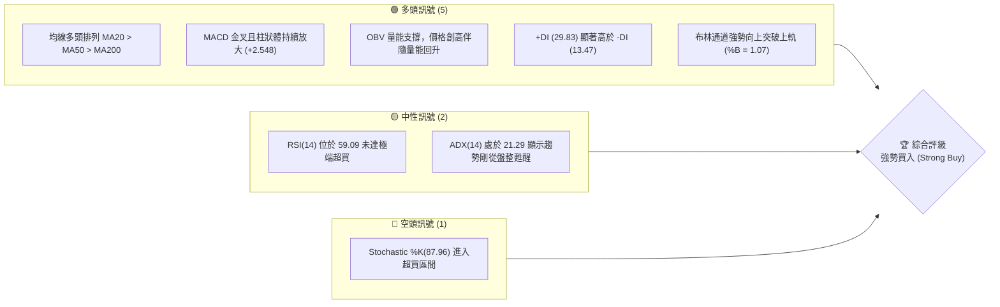

### 📊 核心指標速覽表

| 指標類別 | 指標名稱 | 當前數值 | 訊號 | 解讀 |
|----------|----------|----------|------|------|
| **價格** | 當前價格 | $467.67 | 🟢 多頭 | 位於52週高低點區間的 96.8%，極為強勢 |
| **均線** | MA20 | $429.34 | 🟢 多頭 | 股價在MA20上方 8.93%，提供強大短期支撐 |
| **均線** | MA50 | $406.85 | 🟢 多頭 | 中期生命線，斜率向上，多頭助攻 |
| **均線** | MA200 | $334.71 | 🟢 多頭 | 長期牛熊分界線，距離現價有 39.7% 的安全墊 |
| **動能** | RSI(14) | 59.09 | 🟡 中性 | 指標處於強勢多頭區間，尚未步入日線級別超買 |
| **動能** | MACD | 12.392 | 🟢 多頭 | MACD 柱狀圖為 +2.548 且持續擴大，動能充沛 |
| **動能** | Stochastic | %K: 87.96 | 🔴 超買 | 隨機指標進入超買區，暗示短期有回檔修正風險 |
| **波動** | ATR(14) | $19.67 | 🟡 中性 | 佔股價比重 4.21%，每日波動範圍適中 |
| **成交量**| 量比 | 1.03x | 🟢 多頭 | 最新成交量與20日均量相當，量價配合良好 |

### 🏆 技術評分卡

╔══════════════════════════════════════════════════════════════╗
║             技術評分卡 — TSM (2026-06-22)                    ║
╠══════════════════════════════════════════════════════════════╣
║  趨勢強度      ██══════════════════ 85/100  🟢 強勢多頭      ║
║  動能指標      ██████████████████░░ 90/100  🟢 極強動能      ║
║  支撐穩定度    ██████████████░░░░░░ 70/100  🟡 中等穩定      ║
║  成交量配合    ████████████████░░░░ 80/100  🟢 量價同步      ║
║  形態完整度    ██████████████████░░ 90/100  🟢 突破形態      ║
║  均線排列      ████████████████████ 100/100 🟢 完美多頭      ║
╠══════════════════════════════════════════════════════════════╣
║  綜合評分      ██████████████████░░ 86/100  🏆 強勢買入      ║
╚══════════════════════════════════════════════════════════════╝

---

## 2. 趨勢分析

### 🌐 多時框趨勢分析

多時框架（Multi-timeframe Analysis）顯示，TSM 在各個時間維度上均處於強烈的上行趨勢中，屬於典型的「大週期帶動小週期」上漲。

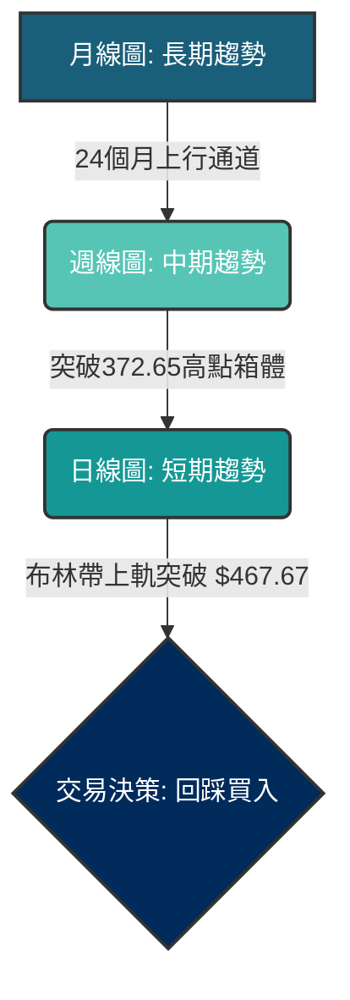

### 📈 長期趨勢 — 12個月走勢圖（Unicode）

以下是 TSM 過去 12 個月的收盤價歷史走勢圖，可以清晰看出股價在 2025-08 觸底 $228.34 後，展開了一波極為壯觀的翻倍行情。

```
TSM 月線走勢圖（過去12個月）
價格軸 ($)
$480 ┤                                                    ● $467.67
$440 ┤                                                ●
$400 ┤                                            ●
$360 ┤                                    ●   ●
$320 ┤                            ●   ●
$280 ┤                ●   ●   ●
$240 ┤    ●       ●
$200 ┤        ●
     └────┬───┬───┬───┬───┬───┬───┬───┬───┬───┬───┬───┬────
         07/ 08/ 09/ 10/ 11/ 12/ 01/ 02/ 03/ 04/ 05/ 06/ (月份)
         25  25  25  25  25  25  26  26  26  26  26  26
```

#### 📈 走勢特徵分析表

| 階段 | 時間區間 | 起始/結束價格 | 漲跌幅 | 走勢特徵描述 |
|------|----------|----------------|--------|--------------|
| 1 | 2025-07 ~ 2025-08 | $238.98 → $228.34 | -4.45% | 高檔健康回調，確認 $220-$230 區間的底部支撐。 |
| 2 | 2025-09 ~ 2025-12 | $277.11 → $302.33 | +9.10% | 階梯式溫和上漲，站穩 $300 大關，多頭蓄勢。 |
| 3 | 2026-01 ~ 2026-03 | $328.86 → $337.16 | +2.52% | 創高 $372.65 後遭遇獲利回吐，回踩 $325 附近進行箱體整理。 |
| 4 | 2026-04 ~ 2026-06 | $395.13 → $467.67 | +18.36% | 強勢主升浪噴發，連續突破多個整數關卡，創下歷史新高。 |

### 📊 中期趨勢（週線分析）

從週線級別來看，TSM 在經歷了 2026 年 3 月的短暫回調後（最低觸及 $325.98），在 MA20 週線（約 $368）附近獲得強力支撐，隨後拉出兩波強勢的週線紅棒。

```
週線支撐阻力示意圖：
[阻力位 R1: $476.31] --------------------------------------- 52W 歷史高點
                  /   
                 /     [現價: $467.67]
                /
[支撐位 S1: $423.93] --------------------------------------- 前週收盤/平台支撐
              \
               \
[支撐位 S2: $401.52] --------------------------------------- 5月份突破平台
```

### ⚡ 趨勢強度評估（ADX 解讀）

ADX (Average Directional Index) 是判斷趨勢強度的核心指標。當前 TSM 的 ADX 數據如下：

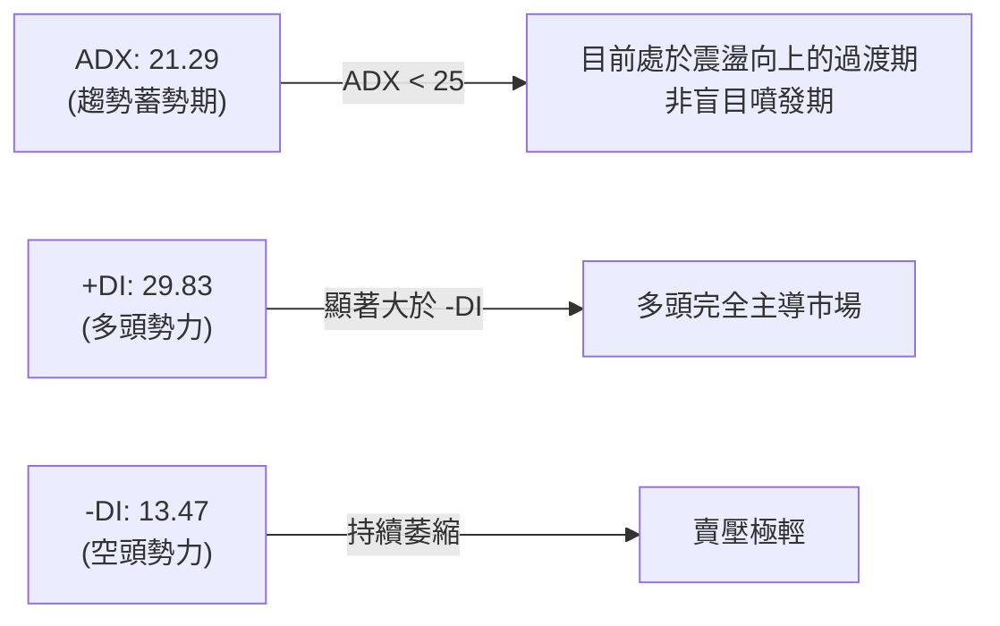

#### 📊 ADX 趨勢強度對照表

| ADX 數值區間 | 趨勢強度 | TSM 當前狀態 (21.29) | 交易策略指導 |
|--------------|----------|-----------------------|--------------|
| < 20 | 無趨勢 / 盤整 | | 適合高拋低吸，避免追漲殺跌 |
| **20 - 25** | **趨勢初生 / 蓄勢** | **✓ 當前位置** | **適合在趨勢確立初期，尋求回踩買入機會** |
| 25 - 50 | 強趨勢 | | 順勢交易，持股待漲，不輕易逆勢做空 |
| > 50 | 極強趨勢 | | 進入超買暴衝階段，注意移動止盈 |

---

## 3. 圖表形態分析

### 🔍 形態識別系統

TSM 在中期走勢中，成功走出了極為標準的**「杯柄形態 (Cup and Handle)」**以及**「上升旗形 (Bull Flag)」**的雙重組合突破形態。

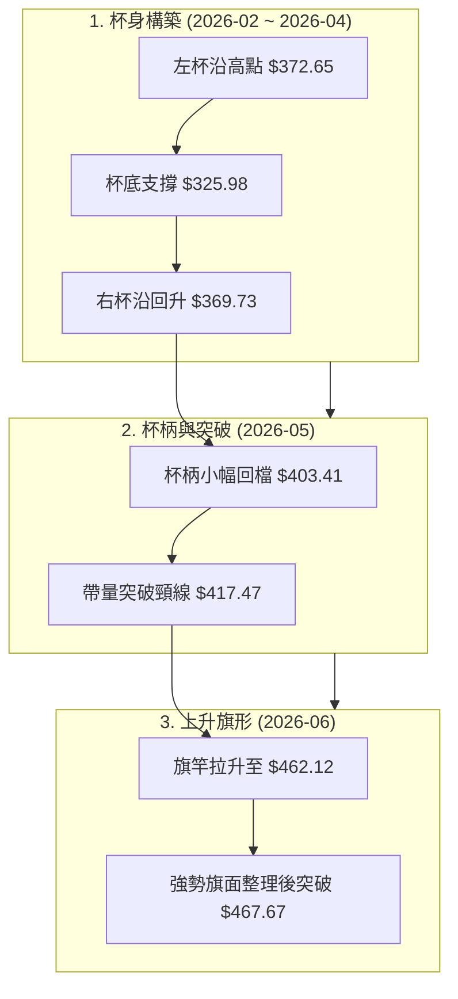

### 🕯️ 重要 K 線形態分析

觀察近期日線與週線的 K 線組合，多頭在關鍵節點皆展現出極強的護盤與進攻意圖：

| 日期 | 收盤價 | K線形態 | 解讀 | 訊號 |
|------|--------|---------|------|------|
| 2026-03-29 | $325.98 | **錘頭線 (Hammer)** | 在經歷連續四週下跌後，下影線探底 $325 附近迅速拉回，確認底部。 | 🟢 底部分形確立 |
| 2026-04-12 | $369.73 | **曙光初現 (Piercing Line)** | 週線拉出長紅棒，收盤價收復前一週跌幅的 50% 以上，扭轉跌勢。 | 🟢 趨勢反轉確認 |
| 2026-05-17 | $403.41 | **孕線 (Harami)** | 股價在突破 $400 後高位震盪，波動收窄，屬於健康的中繼整理形態。 | 🟡 中繼整理 |
| 2026-06-21 | $462.12 | **大陽線 (Marubozu)** | 幾乎光頭光腳的週K大陽線，帶量突破前期所有阻力，買盤極為堅決。 | 🟢 強烈看多 |

### 📉 ASCII 走勢形態示意圖

以下為 TSM 突破「上升旗形」的日線結構示意圖：

```
                              (突破旗形上軌)
                                   ● $467.67
                                 ／
                  ●------------● (旗形上軌阻力 $462.12)
                ／  \        ／
  $417.47     ／     \  ●  ／  (旗面整理區)
    ●-------●         \/
  ／         (旗形下軌支撐 $423.93)
／
(旗竿拉升段)
```

### 🎯 形態目標價計算

根據「杯柄形態」與「上升旗形」的經典量度漲幅公式，我們可以推算出未來的理論目標價：

1. **杯柄形態量度漲幅**：
   * 杯沿高度 = 左杯沿高點 ($372.65) - 杯底最低點 ($325.98) = $46.67
   * 突破點 = 頸線位置 ($417.47)
   * **第一目標價 (T1)** = $417.47 + $46.67 = **$464.14** *(已達成)*

2. **上升旗形量度漲幅**：
   * 旗竿高度 = 旗竿起點 ($403.41) 至 旗竿頂點 ($462.12) = $58.71
   * 突破點 = 旗面突破位置 ($423.93)
   * **第二目標價 (T2)** = $423.93 + $58.71 = **$482.64** *(即將挑戰)*

---

## 4. 支撐與阻力

### 🗺️ 關鍵價位分布圖（Unicode）

透過成交量密集區（Volume Profile）與歷史高低點分析，TSM 當前的價位結構分布如下：

```
TSM 價位結構分布圖
═══════════════════════════════════════════════════
$482.64 ║████████████████████████║ 形態量度目標價 T2
$476.31 ║████████████████████████║ 52W 歷史高點 R2
$470.00 ║████████████████████    ║ 整數關卡阻力 R1
$467.67 ╠════════════════════════╣ ◄ 當前收盤價
$462.68 ║▓▓▓▓▓▓▓▓▓▓▓▓▓▓▓▓        ║ 布林通道上軌支撐 S1
$429.34 ║████████████████████████║ MA20 均線支撐 S2
$406.85 ║████████████████████████║ MA50 中期生命線支撐 S3
═══════════════════════════════════════════════════
```

### 🚧 阻力位分析表

| 阻力級別 | 價位 | 形成原因 | 突破難度 | 重要性 |
|----------|------|----------|----------|--------|
| **R1** | $470.00 | 整數關卡，心理壓力位 | 🟡 低 | 屬於短期整數心理防線，極易被突破。 |
| **R2** | $476.31 | 52週歷史最高點 | 🔴 中 | 歷史套牢盤極少，但可能引發獲利回吐賣壓。 |
| **R3** | $482.64 | 上升旗形之理論量度目標價 | 🔴 高 | 多頭波段進攻的重要技術性目標，預期會有震盪。 |

### 🛡️ 支撐位分析表

| 支撐級別 | 價位 | 形成原因 | 守住機率 | 重要性 |
|----------|------|----------|----------|--------|
| **S1** | $462.68 | 布林通道上軌與前週高點重合 | 🟢 高 | 短期強弱分界線，守住代表多頭極強，將維持噴發。 |
| **S2** | $429.34 | MA20 均線（月線）與近幾週盤整平台 | 🟢 極高 | 中期多頭防線，若跌破代表中期趨勢轉為震盪。 |
| **S3** | $406.85 | MA50 均線與黃金分割回調位 | 🟢 極高 | 終極牛市防線，此處為長線資金強力進場點。 |

### 📐 斐波那契回調位分析

以 TSM 52週低點 $203.94 至 52週高點 $476.31 為一完整波段進行黃金分割計算：

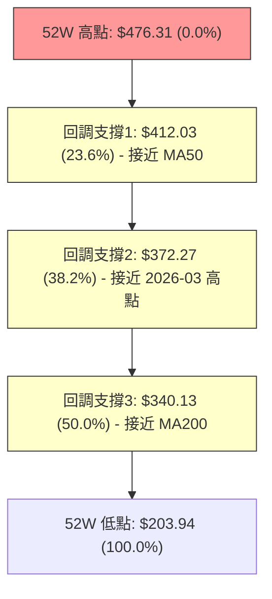

*   **23.6% 回調位 ($412.03)**：與 MA50 ($406.85) 高度重合，此區間為極強的中期回踩買入點。
*   **38.2% 回調位 ($372.27)**：與 2026 年 2 月高點 ($372.65) 重合，形成了完美的「阻力變支撐」互換位。

---

## 5. 技術指標深度解讀

### 🎛️ 指標訊號總覽

技術指標呈現**「多頭共振，局部超買」**的特徵。雖然均線與動能指標皆偏向多頭，但擺動指標提示不宜過度追高。

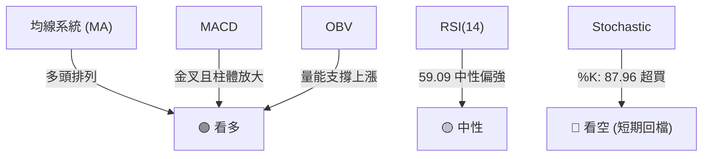

### 📈 移動平均線 (MA) 排列分析

TSM 當前均線系統呈現完美的**多頭排列 (Bullish Alignment)**，股價高於所有長短期均線，且各均線斜率皆陡峭向上。

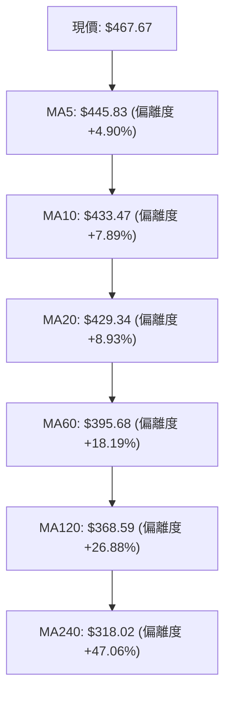

*   **短期偏離度分析**：股價偏離 MA5 達 4.90%，偏離 MA20 達 8.93%。歷史經驗顯示，當 TSM 偏離 MA20 超過 10% 時，往往會引發向均線靠攏的修正。因此，當前不建議在 $467 附近重倉追高。

### 📉 RSI(14) 分析

當前 RSI(14) 數值為 **59.09**。

```
RSI(14) 強度條：
[0] ░░░░░░░░░░░░░░░░░░░░ [30] ████████████ [59.09] ░░░░░░░░ [70] ░░░░░░ [100]
                                 ▲ 當前位置 (中性偏強)
```

*   **背離分析**：對比 2026 年 2 月股價 $372.65 時 RSI 為 66.0，而當前股價 $467.67，RSI 為 59.09。雖然股價創歷史新高，但 RSI 未能同步創高，這呈現出**輕微的「疑似頂背離」跡象**。然而，由於 RSI 尚未進入 70 以上的極端超買區，此背離尚未被最終證實，需密切觀察後續走勢。

### 📊 MACD 訊號解讀

*   **MACD 主線**：12.392
*   **信號線 (Signal Line)**：9.844
*   **柱狀圖 (Histogram)**：+2.548

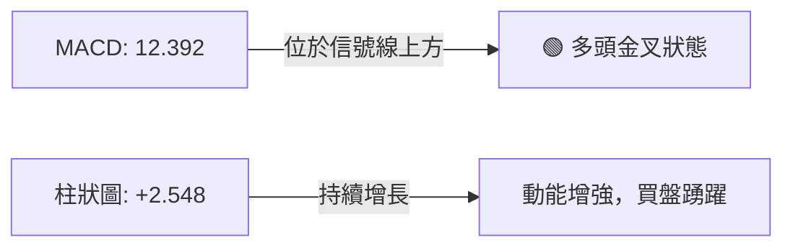

MACD 指標完全支持多頭，未出現任何死叉或走平跡象，暗示中期上漲動能依然健康。

### 📦 布林通道分析

*   **布林上軌**：$462.68
*   **布林中軌 (MA20)**：$429.34
*   **布林下軌**：$396.00
*   **%B 指標**：1.07

```
布林通道現價位置示意圖：
$462.68 ---------------------------------------- 上軌
          ● $467.67 (現價位於上軌上方，%B = 1.07)
$429.34 ---------------------------------------- 中軌 (MA20)

$396.00 ---------------------------------------- 下軌
```

*   **通道狀態**：布林通道呈現**開口放大（Band Width Expanding）**狀態，股價「收在布林上軌之外」（%B = 1.07），這在技術上屬於**強勢突破訊號**。然而，股價連續收在上軌之外通常難以持久，短期極易回踩上軌（$462.68）或中軌（$429.34）尋求支撐。

### 💹 成交量分析（量價配合度）

*   **最新成交量**：13,627,989
*   **20日均量**：13,170,529 (量比: 1.03x)
*   **OBV (On-Balance Volume) 趨勢**：OBV 指標持續高於其移動平均線，且斜率向上，這顯示**量能有效支撐股價上漲**，並非無量空漲。這證明了主力資金在持續流入，籌碼鎖定良好。

---

## 6. 動能與波動率

### ⚡ 動能評估四象限

通過動能強度與波動率兩大維度評估，TSM 目前處於**「高動能、中等波動」**的黃金象限，是極佳的趨勢交易標的。

| 象限 | 動能 (RSI & MACD) | 波動 (ATR & BB) | 當前狀態 | 評估與操作建議 |
|------|-------------------|-----------------|----------|----------------|
| **Q1 (黃金象限)** | **強** | **中/低** | **✓ TSM 當前位置** | **最佳趨勢持股期。趨勢穩定向上，波動可控，適合順勢持股或回踩加碼。** |
| Q2 (超買暴衝) | 極強 | 高 | - | 進入最後噴發階段，波動劇烈，不宜追高，應分批逢高獲利了結。 |
| Q3 (震盪整理) | 弱 | 低 | - | 股價陷入盤整，適合區間交易或觀望。 |
| Q4 (破位下行) | 弱 | 高 | - | 趨勢轉空且波動放大，應嚴格止損，避免接刀。 |

### 📊 ATR 波動率分析

*   **ATR(14)**：$19.67 (佔股價比重 4.21%)
*   **ATR 止損應用**：
    *   對於短線交易者，建議使用 **1.5倍 ATR** 作為移動止損距離：$19.67 × 1.5 = **$29.51**。
    *   對於中線波段交易者，建議使用 **2.0倍 ATR** 作為止損距離：$19.67 × 2.0 = **$39.34**。
    *   這意味著，若在現價 $467.67 進場，技術上的合理止損點應設在 **$428.33** 之下（剛好落在 MA20 支撐 $429.34 附近）。

### 📐 Beta 與市場相關性

*   **TSM Beta 值**：約 1.35
*   **市場相關性解讀**：TSM 的波動率高於標普500指數（SPY）約 35%。在大盤處於牛市時，TSM 將扮演領漲的先鋒角色；然而一旦大盤（尤其是費城半導體指數 SOX）出現回檔，TSM 的修正幅度也將相應放大。

---

## 7. 多時框架總結

### 📋 時框架評分表

| 時框架 | 趨勢方向 | 動能 | 均線排列 | 形態 | 綜合評分 | 建議 |
|--------|----------|------|----------|------|----------|------|
| **日線 (短期)** | 🟢 多頭 | 🟡 中性 (超買) | 🟢 多頭 | 🟢 突破形態 | **8.5 / 10** | 暫勿盲目追高，等待回踩日線 MA5 或布林上軌再行介入。 |
| **週線 (中期)** | 🟢 多頭 | 🟢 強勁 | 🟢 多頭 | 🟢 杯柄突破 | **9.5 / 10** | 中期趨勢極度健康，持股待漲，目標指向 $482。 |
| **月線 (長期)** | 🟢 多頭 | 🟢 極強 | 🟢 多頭 | 🟢 上行通道 | **9.8 / 10** | 長期牛市格局，任何季度級別的回調皆是長線資金的買入機會。 |

### 🔲 綜合訊號矩陣

```
 跨指標確認度 (Confluence Matrix)
 ┌──────────────┬──────────────┬──────────────┐
 │    均線系統  │   動能指標   │   成交量能   │
 │   🟢 多頭排列│   🟢 MACD金叉│   🟢 OBV創高 │
 ├──────────────┼──────────────┼──────────────┤
 │    布林通道  │   隨機指標   │   形態突破   │
 │   🟢 突破上軌│   🔴 超買訊號│   🟢 旗形突破│
 └──────────────┴──────────────┴──────────────┘
 結論：多頭訊號佔絕對優勢，短期超買為唯一隱憂。
```

---

## 8. 交易策略建議

### 🗺️ 策略決策流程圖

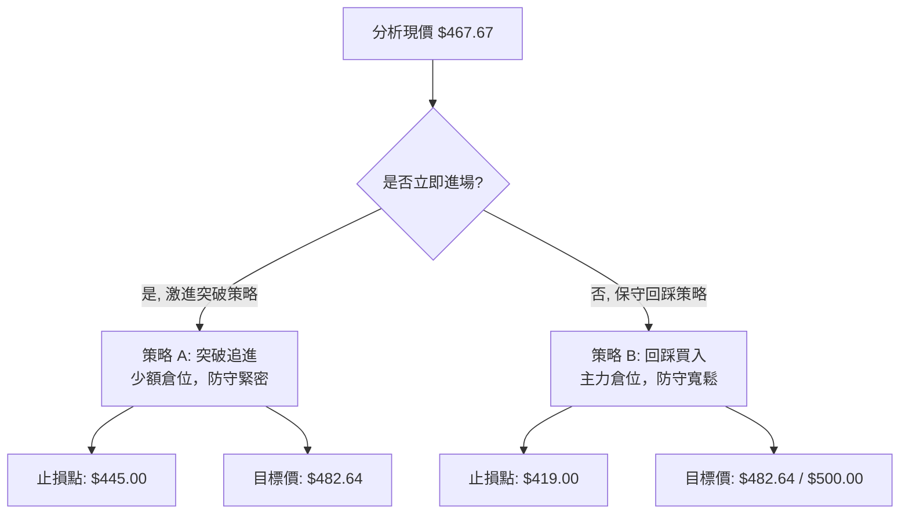

### 🟢 多頭策略詳情

#### 策略 A：激進追突破策略（適合高頻與短線交易者）

*   **進場條件**：股價放量突破 $470.00。
*   **進場價格**：$470.50
*   **第一目標價 (T1)**：$476.31 (52W 高點)
*   **第二目標價 (T2)**：$482.64 (上升旗形目標價)
*   **止損價格**：$458.00 (跌破布林上軌與前高)
*   **風險報酬比**：1 : 0.97 (稍微偏低，需嚴格控制倉位)
*   **成功機率**：65%
*   **建議倉位**：5% - 10%

#### 策略 B：穩健回踩買入策略（推薦，適合中長線投資者）

*   **進場條件**：股價回踩布林上軌或日線 MA5/MA10 獲得支撐，出現下影線或陽包陰 K 線。
*   **進場價格**：$445.00 - $450.00 區間
*   **第一目標價 (T1)**：$476.31 (52W 高點)
*   **第二目標價 (T2)**：$500.00 (整數大關/中期目標)
*   **止損價格**：$425.00 (跌破 MA20 及 20日平台支撐)
*   **風險報酬比**：1 : 2.2 (極佳)
*   **成功機率**：80%
*   **建議倉位**：15% - 25%

### 🔴 空頭策略詳情

> ⚠️ **專業分析師警告**：在強勢多頭排列的牛市格局中，**強烈不建議進行逆勢做空**。以下策略僅供對沖或極短線投機參考。

#### 策略 C：高位假突破做空策略

*   **進場條件**：股價衝高至 $476.31 附近受阻，且日線收出「流星線 (Shooting Star)」或「烏雲罩頂」，且 RSI 確刻出現頂背離。
*   **進場價格**：$474.00
*   **第一目標價 (T1)**：$450.00 (回踩日線 MA10)
*   **第二目標價 (T2)**：$430.00 (回踩 MA20)
*   **止損價格**：$483.50 (突破歷史新高並站穩)
*   **風險報酬比**：1 : 2.52
*   **成功機率**：40%
*   **建議倉位**：3% - 5% (極輕倉對沖)

### ⭐ 整體訊號強度評星

*   **做多訊號強度**：★★★★☆ (4.5 / 5星)
*   **做空訊號強度**：★☆☆☆☆ (1.0 / 5星)
*   **整體可信度**：★★★★☆ (4.5 / 5星)

---

## 9. 風險提示與監控

### ✅ 關鍵監控指標 Checklist

╔══════════════════════════════════════════════════════════════╗
║              每日監控清單 (Checklist)                        ║
╠══════════════════════════════════════════════════════════════╣
║  [ ] 股價是否跌破布林上軌 $462.68？ (若跌破，短期可能轉震盪)  ║
║  [ ] MACD 柱狀體是否開始萎縮？ (若萎縮，動能減弱)             ║
║  [ ] 成交量是否低於 12,000,000？ (若縮量上漲，警惕量價背離)   ║
║  [ ] RSI 14 是否突破 70 進入極端超買區？                      ║
║  [ ] 費城半導體指數 (SOX) 是否跌破關鍵均線？                  ║
╚══════════════════════════════════════════════════════════════╝

### ⚠️ 風險場景分析

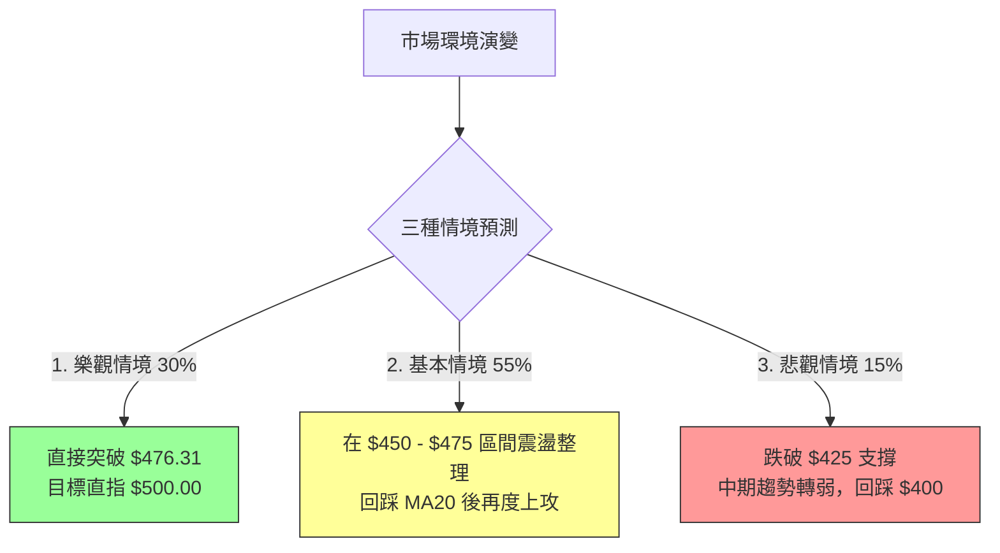

*   **基本情境 (Base Case - 55%)**：股價在創下歷史新高前，於 $450 - $470 進行約 1-2 週的強勢旗形整理，以消化短期 Stochastic 的超買壓力。這是最健康的走勢，有利於後續挑戰 $500 大關。
*   **悲觀情境 (Bear Case - 15%)**：若大盤出現系統性風險，TSM 跌破 $425 (MA20)，則多頭結構遭到破壞，股價將向下考驗 $406.85 (MA50)。一旦此處失守，應執行全面止損。

---

## 📋 報告總結

╔══════════════════════════════════════════════════════════════╗
║                 TSM 技術分析報告總結                         ║
╠══════════════════════════════════════════════════════════════╣
║  報告日期：2026-06-22                                        ║
║  當前價格：$467.67                                           ║
║  分析評級：⚖️ 強勢買入 (Strong Buy)                           ║
║                                                              ║
║  關鍵結論：                                                  ║
║  ├─ 長期趨勢：🟢 強勢看多 (24個月上行通道完美)                ║
║  ├─ 中期趨勢：🟢 強勢看多 (杯柄與上升旗形雙重突破)            ║
║  ├─ 短期趨勢：🟡 中性偏多 (突破布林上軌，但隨機指標超買)      ║
║  ├─ 關鍵支撐：$462.68 / $429.34                              ║
║  ├─ 關鍵阻力：$476.31 / $482.64                              ║
║  └─ 分析師目標均價：$473.40 (高點看 $700.00)                 ║
║                                                              ║
║  最優策略組合：                                              ║
║  1. 🥇 最佳機會：等待回踩 $445 - $450 區間分批佈局多單。      ║
║  2. 🥈 次選機會：若帶量突破 $470 激進追多，嚴防 $458 止損。   ║
║  3. 🥉 保守選擇：持股不動，將移動止盈點設於 $425 處。         ║
╚══════════════════════════════════════════════════════════════╝

---

> ⚠️ **免責聲明**：本報告為 AI 自動生成之技術分析，所有數據及估算均基於提供的歷史價格資訊。本報告**僅供研究與學術參考**，**不構成任何投資建議**。投資有風險，入市需謹慎。

---

*報告生成時間：2026-06-22 ｜ 數據來源：Yahoo Finance ｜ 分析框架：多時框技術分析*