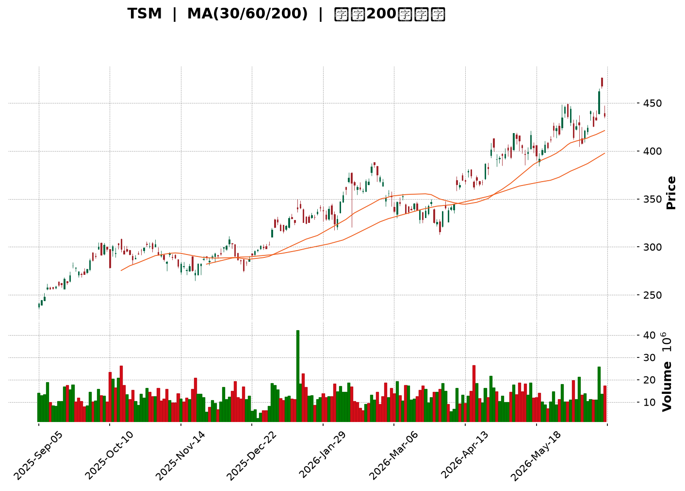
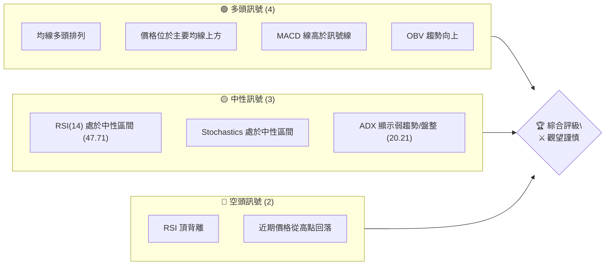
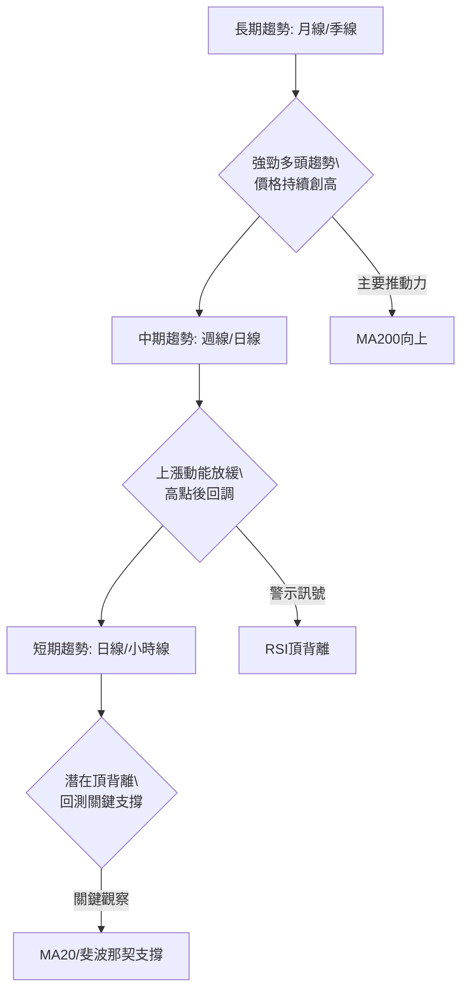
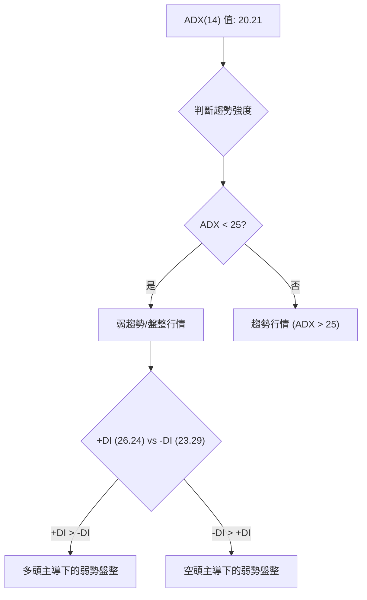
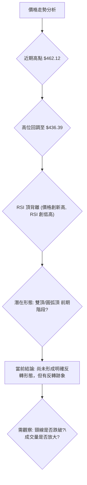
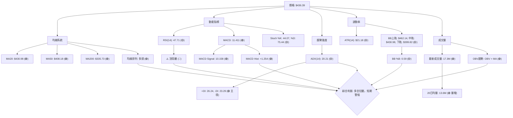

<details>
<summary>📊 靜態圖表 (點擊展開)</summary>

</details>

<html>
<head><meta charset="utf-8" /></head>
<body>
    <div style="height:500px; width:100%;">                        <script>window.PlotlyConfig = {MathJaxConfig: 'local'};</script>
        <script charset="utf-8" src="https://cdn.plot.ly/plotly-3.6.0.min.js" integrity="sha256-QaOVwtVY0T02VaHrr6pnoHLCwayMJp4O5n4YyaE3rJk=" crossorigin="anonymous"></script>                <div id="candlestick-chart" class="plotly-graph-div" style="height:100%; width:100%;"></div>            <script>                window.PLOTLYENV=window.PLOTLYENV || {};                                if (document.getElementById("candlestick-chart")) {                    Plotly.newPlot(                        "candlestick-chart",                        [{"close":{"dtype":"f8","bdata":"AAAAQOsXbkAAAABAjo9uQAAAACCcBW9AAAAAgHUZcEAAAAAgPwFwQAAAAKDkB3BAAAAAoFUocEAAAACgLUBwQAAAAGDES3BAAAAAwKKocEAAAACAyWxwQAAAAAD653BAAAAAwP6HcUAAAADgPmhxQAAAAMDzJ3FAAAAAgJDzcEAAAABggPFwQAAAACC0UXFAAAAAYG\u002fjcUAAAABAuN1xQAAAAGB9HnJAAAAAgJLAckAAAAAAsztyQAAAAAA64nJAAAAAQJGYckAAAACgc2dxQAAAAABayHJAAAAAIAVackAAAABgPuVyQAAAAKDul3JAAAAAIF5MckAAAADg9XVyQAAAAMBRQ3JAAAAAgPHpcUAAAAAAUAdyQAAAAIB2SnJAAAAAILF+ckAAAADAwrJyQAAAAKBG63JAAAAA4JbNckAAAABgTKFyQAAAAMCf53JAAAAAYAQ8ckAAAAAggjVyQAAAAICo73FAAAAAQCnEcUAAAABAYk9yQAAAAABMDnJAAAAA4JAFckAAAABA5n9xQAAAAMB9qXFAAAAAIOJ8cUAAAADAyztxQAAAACCZgnFAAAAAgEk1cUAAAABAjQ5xQAAAAGCipnFAAAAA4ESncUAAAACgFvtxQAAAAMCxE3JAAAAAwOTWcUAAAADg5hxyQAAAAAA+UnJAAAAAoDwqckAAAAAgp0ZyQAAAAIAouHJAAAAAIJvQckAAAADgcTtzQAAAAOCH9HJAAAAAwJ8ockAAAABgLeRxQAAAAEBU1nFAAAAAgJU4cUAAAAAgeLNxQAAAACBw93FAAAAAwFw8ckAAAADAx3ZyQAAAAGA6lHJAAAAAIInUckAAAABg+bVyQAAAAOCkoHJAAAAAAEDlckAAAAAAet9zQAAAAOB\u002fCXRAAAAAIPRbdEAAAABArNBzQAAAAEACxnNAAAAAYHcfdEAAAABgCaF0QAAAAGAfmHRAAAAAINxWdEAAAABAJT51QAAAAAA+SnVAAAAA4KdXdEAAAAAAGkd0QAAAAKD\u002fWnRAAAAAwGHSdEAAAADg\u002f690QAAAAMCdCXVAAAAAoKZIdUAAAACA4Bx1QAAAAMDGjXRAAAAAILA5dUAAAACgY+B0QAAAAIANQXRAAAAAgHuQdEAAAACg6bB1QAAAACBVGXZAAAAAYMyAdkAAAAAgrUJ3QAAAAGBU43ZAAAAA4KHHdkAAAAAAQKV2QAAAAKBehnZAAAAAgJpodkAAAABAKwp3QAAAAKA1AndAAAAAIEf8d0AAAACAyxt4QAAAACD5bXdAAAAA4HlKd0AAAADgZ\u002fN2QAAAAGAK9XVAAAAAYKU5dkAAAAAAqQB2QAAAACBfEnVAAAAAYIaudUAAAACg5ZR1QAAAAGDNC3ZAAAAAoKvvdEAAAACAIwl1QAAAAICzJ3VAAAAAIL+SdUAAAAAgbSx1QAAAAMD5H3VAAAAAQIiHdEAAAABgjBp1QAAAACArZ3VAAAAAIACvdUAAAACgkVV0QAAAACCgX3RAAAAAICu8c0AAAAAgkRJ1QAAAAAATS3VAAAAAYPcjdUAAAABgYk91QAAAACA2iHVAAAAAwLjQdkAAAABgLcp2QAAAAAC\u002fG3dAAAAAAE4Ld0AAAAAACrB3QAAAAACUY3dAAAAAYASodkAAAABgJhp3QAAAACAm1nZAAAAAIIXzdkAAAACAjih4QAAAAGBB3HdAAAAAoFAYeUAAAACAikB5QAAAAADGdnhAAAAAwI6OeEAAAACAJ7J4QAAAAMDay3hAAAAAIL8KeUAAAAAA0Zd4QAAAAIBRKHpAAAAAAOvSeUAAAACAfat5QAAAAICEOXlAAAAAAKHFeEAAAADA2u14QAAAAKDnC3pAAAAAIHw2eUAAAAAgZrB4QAAAAEAVe3hAAAAAIOgKeUAAAAAALmN5QAAAAMAyOXlAAAAA4LS1eUAAAACg4Ft6QAAAAKDgfXpAAAAAwI4XekAAAACgyyl7QAAAAIBX2ntAAAAAQLc6e0AAAACgFr57QAAAAEAz43lAAAAAYNicekAAAABAua56QAAAAGC4fHlAAAAAwB5RekAAAABA4X56QAAAAGBmlntAAAAAoEedekAAAABgZgJ7QAAAAIDr4XxAAAAAYLg6fUAAAACAPUZ7QA=="},"high":{"dtype":"f8","bdata":"R67L+P87bkBKaY3rZKVuQOvBwjcyfm9A51sgY\u002flacECpOCHvcixwQFnNn6qHIXBAB+MJQc4+cEAAQXPctYVwQMbGApDVa3BAd\u002f7lR8zGcEAT3GBPxodwQPKCy40wI3FAkztsRDm8cUBStAXdLnBxQH9a3ICSL3FADC4DeIkVcUBnkX8d6VpxQJdmkNjgVHFAVvAHAlgDckD9UEInZ2ZyQK3v9fHsW3JABq3m9VsOc0AbZc8zLwtzQHGYkEsSAHNAeT3l52XHckCBrRXCpZ1yQKNJrUf543JAodIX0UC2ckBuHgfoZwNzQB6EKET4TnNALF1BBNzOckD7aBB2atRyQKi+uZ14kHJAmzkx3EVOckAPbvzmpjxyQEuL1N\u002fteXJAWSuX1heickCqnhkpSbxyQIZy2jfWGHNAR4DahYQOc0CTHQs0ZBRzQFooEE4gO3NAeSaqXBC6ckD9hTgVN35yQF8XZxJiRXJAWcKdPDracUCEMnxP6WxyQLzsIunTSXJAXiiZxghJckC2uMs6yfNxQI8GGyzgyXFAnvxaQaPEcUBAkJac\u002fV9xQHZ4lZA0pXFAJY20kPcockC5+MSALUhxQGx9\u002fSxNrXFApIR38bKycUADe7D7VChyQP3TMPobJnJAx3\u002fgbiMOckANHr0SKUNyQNtejsjQZHJArXcmBrM7ckDONv4LLKdyQKolcnsQxHJACSqcVMTkckAdsBqIZ3hzQCIYmAhKBHNARXfQEXXrckAVREdxeWRyQHCp7Gaj73FAJqn2bNP5cUArlFoK8tpxQG2U+3WxKnJAxXtwdOZXckCFhDeqD4ZyQHUjwGv1mXJA0pWsoSHdckCfAj2i9e5yQL5vJV\u002fB73JAjdpiUfYcc0CQt\u002f1w\u002fv5zQEosWWfCmHRATr8djuO1dECe3Y5U90l0QIiQZp9QLXRA7s81wJwxdEDEf+zGXr10QGcHGPEN63RAoblFO6KCdEBzQ2VhY9h1QMdunGjUwHVA5t7ETENGdUBusiOwzb50QDK1oTE\u002f1XRAojhCoKz2dEBEp2QPC9Z0QCxhxdzvN3VAfgwTgpZ7dUDNs6GKkl91QFYter9yInVA7lUSFuVmdUAW8mh7QpR1QGQdYE\u002fwEHVA4h7GSJvNdEBZllHPwr51QPd3SioHXHZASRtJACqudkBLbyOMEJp3QNf4JTvAoHdAVza44D0Td0BMLzjlFcV2QGcuygXd93ZAVrPIA\u002feOdkBQAbStlyR3QNmo7KErOHdAWJCMKuAyeECc32RKRUN4QPbGFiO9B3hAz5lHSudrd0D3YTIA6zJ3QMOLXABoInZAmR7r6L5zdkDmpraF9Vl2QI8FrM7XrnVAQvuOw6q5dUD0NzMO7vp1QMQ\u002faoM2OHZAhMYMsLaRdUC6L7nj\u002fGt1QOo\u002fuD69bXVALPsUiTKfdUDzjAluMbJ1QG1mtKCxMXVA6ecg3\u002foMdUCC7sIIuWl1QN3gpgYwgXVAGLVeiRnadUC9XBzd0EF1QBBEROOjjHRAJdZZYkeNdECT1BPZ6Bl1QH1qY3HYvXVALe8AQVVUdUDa\u002fzhGVXZ1QFwljT2Qi3VAlvHovM5Wd0D3OF8a9fR2QNyzsY7ekXdAWmG8SXkpd0At9ccmRtR3QGV67Khm0XdA\u002fkQUclwVd0DfX6ZiPWt3QMJN4DhJE3dAcl668iMed0CJ5owgDzB4QHnZs5+gPXhAffRAOYiIeUAJyf1Egdh5QDSKMfQLz3hAaVQ3a82ueEDj+cR\u002fu914QCg14OS8MHlA1DwMmPVreUAT9un35VJ5QIsIANaCK3pA4WoZpEwwekDTrH9WaQB6QNR25ThwbHlAP1W4qM0UeUDWlKWMwDt5QDOoDPS+T3pA+NnrLJmOeUD0aDfH3l55QCoBET8r33hAtX5Xf\u002fsueUA3y\u002fyA+qd5QAV1cWVem3lAu1PyN0X4eUApeM5ptNh6QBTrOYedqXpAVsb4AfPWekDbROvxcAV8QKlCs5NR9XtABWaMeLsRfECUz\u002f6tae97QMKqpQEuDntA4Ad2Sr4Me0Dj4ERBLlJ7QGYoIPwulXpAAAAAAABkekAAAABACq96QAAAAKBHqXtAAAAAoEeFe0AAAAAAAKh7QAAAACCFE31AAAAA4KPMfUAAAABAVfV7QA=="},"hovertemplate":"\u003cb\u003e%{x|%Y-%m-%d}\u003c\u002fb\u003e\u003cbr\u003e\u958b: $%{open:.2f}\u003cbr\u003e\u9ad8: $%{high:.2f}\u003cbr\u003e\u4f4e: $%{low:.2f}\u003cbr\u003e\u6536: $%{close:.2f}\u003cextra\u003e\u003c\u002fextra\u003e","low":{"dtype":"f8","bdata":"tozH\u002fYZpbUBNKEneQ99tQF2tkYlTh25AMUywi8fdb0CM0Nqu+OxvQIvqNCC48W9AmdFp6239b0CuFErPKClwQO9jCp4wG3BA6I\u002fgfNH+b0B+08O3FUxwQDROPq3+dXBAWO2UaPlccUCwGsOl5yhxQJeXMdE9wXBA5\u002fegPhHIcEAAAABggPFwQDsN4bgG+3BA3rbJfAwwcUCRbbU1k8xxQBHnnpCAA3JAqvz7JoWZckC09oMEyy9yQPgSnMfnOnJAMI8j54NxckAk6H5xNmJxQMjRNbyNIHJANXhIz\u002f4QckBv4CeWlZtyQDUo5h\u002ftZXJAxpZ2\u002f9NJckBdrdbezGtyQK28XljTNXJAn6Vn19KicUA5YM2Z2fVxQHZ9qiBqQXJAQLFoZk02ckA7OKcHPlxyQDnVcEhBwHJAvvFbW32nckAedbx2xGVyQDTgon4gvHJArGWv6nEzckA89dwniRNyQGJSOpAh0nFAOKqDz2kvcUCZdBEZgRdyQPZ3x19r6nFA\u002fkv3TQ71cUCU1atz+VxxQLsJq0eA8XBA+GKmpcxZcUAsR5mzZ+lwQNFjWB2OInFAlDrJx\u002fsjcUDwcXYgvotwQK7H7Mrd8HBAP4VBuB7vcEDuWlkJsNdxQFhZRiHZ63FAyk7uiJ2PcUCemkWwtO5xQF+jq+BVvXFAKg9hDOb+cUD+ESMTUS9yQHiDBQxnZnJABZxJ\u002fKiCckDARA4IKcJyQK5gem6ZoXJAz9K\u002fUMAXckCi0AAgJ+FxQMXiMDzSnXFAK\u002fUKlKgacUANO8GO1IRxQLtO6XqHznFAksLnk2kbckAd+Ky\u002fKytyQNdgfdpRa3JA0RtHUsWPckAHsucp15FyQEe2eDyTnnJAaW40b+3dckCEqsJFkWFzQPrmDaqP\u002fXNA6nLHSb8udEDXVG\u002fScc5zQEP3\u002fR0+qHNAGWzOItTJc0BssyG4jvZzQDJWZy1HkXRAonSBlWgydEDn+l5w7gJ1QJ8NFopHO3VA5LlMWYRTdEC3Z1EDGUB0QApoA2WEU3RA3VnFbquadEBlonYVhoh0QLxH\u002f3NyzXRA\u002fnoU4bUOdUCY5u7wNWh0QNE0aFyJdnRAuHZyWYl2dEDSzoohLoV0QDuau6rh1nNAftR\u002fAh3gc0AWP8I1t+50QBuFnrUyoHVAQP03te4odkDF+pf\u002f8ed2QDQhocQcB3RAb5RK7qZudkBVOKpTiyZ2QMPunWGybXZAAYCuWqU5dkBi79\u002fVEVR2QAiYPj45yXZATyrRFOBhd0D9AmQNou13QLjNB07M\u002fHZA+PKgOJvrdkD3XKmkaax2QLBaEqLwZXVAQ0VKt6QLdkBe8cAIh2B1QLPppzBa73RAAqArwWyjdECXG2hGpWh1QFc8t4vyyHVAZ8Vr8mrqdEARVeDf3ud0QANcq8EsIXVAwUNG6r8ZdUCRhH8zwSh1QIle8kXiRnRAiU2GljdSdECm6GoWOaV0QM5lmVTV03RAbd\u002feyyhrdUA4Feu0wUl0QDHzCEXpGHRAcpa\u002fthGRc0CDo20+PAZ0QC54wqZML3VAkUMHYpVgdEBu3b3sQh11QKzaIUra7XRAB6RMHGlmdkAHvbUlCX52QBzbb4ItDndA2VSurx3TdkB1O8l0kUV3QOuQJChyNXdAD1DNS1J7dkBjJ1Arl8R2QL9EQititnZAeHg2bBzEdkBq2g+GYhx3QDWRtU3pbndAvW2LheCOeEBj8JOUbvd4QPDSAb3R\u002fHdAwSa\u002fcV40eEDVM2Ts8Ax4QNGSTeRrc3hAi9LJN22keEC7rjKS7Hp4QAogr0Ns+3hArwFj7YByeUAo1OsaGP94QEzOtqQn1HhA\u002fJpvbHwTeECUtVfX4mh4QFH795qREnlAtUkn817eeEBMYUyELmJ4QLL8usCQAnhAlWeKImaweECfjBu9Oel4QHb9vEKzHnlAlBhIaMqReUCecM9WjeZ5QG9odWLb23lAWY\u002fi+2YEekAbcajGNFh6QOrJrXTcL3tAVhWuizwYe0CGEEqe06R6QPjFvoY1vXlAr4PfXK9YekArtshVAEl5QKPmT6z1a3lAAAAAgMKNeUAAAAAgXBN6QAAAAEDh\u002fnpAAAAAQDOTekAAAACAPfp6QAAAAIA9ZntAAAAAYLgSfUAAAABACiN7QA=="},"name":"\u50f9\u683c","open":{"dtype":"f8","bdata":"4WGyrpazbUDzB1zW+eptQF2tkYlTh25Aq6OzF50AcEDfElzbCBhwQMyxrIXyH3BAl5Rr9H4ScEDVJ1qjdH1wQLfMG31fZHBAnmoj9XP\u002fb0BUtxF3mYRwQM0mgWVMh3BAP0Je7RKDcUDD0yFP5WFxQADIDj3B73BA+4XIhvr7cEBzwrvaQCVxQKr\u002fyiGuEnFA2715sTVEcUB7h\u002fROOmNyQLfpgisgKXJAdaQQqaGackCIOvNykANzQJnSp\u002f0YS3JA3+vKriS\u002fckBcQslR1plyQGl\u002flmiIfnJAkKBjTRlVckBj8CqHU\u002f5yQFhEVRv8R3NAsmiCjhKBckB2mrT4eJpyQAtK9PaYinJApf0GEFkrckAtLEpojPhxQGwUGJclVHJA1rzjsAqFckC53sZrzX9yQBEYggOM9nJA0i\u002fa213LckCbNMoSkPlyQI5ViJGWw3JA5YPOf\u002fFockBdjyHKUCVyQHOXaX3PPHJAxdOHr66vcUDo4kIE8EByQBnl0t9sHHJAZlMX\u002fnU2ckApeQUsjO5xQFGW4rQLHHFAjkHkoNVzcUBgQGinFDZxQNhSioYULHFA\u002fwWLj84eckACfsdN1epwQK7H7Mrd8HBAAJvZMVCIcUCU5CWqb+1xQFDV2M8XI3JAmO9ONtTKcUBlucoheRtyQEVZaLdUHnJAyD7z3+c6ckAloLUoxFtyQPp3kbSFrXJAb\u002fZSRVCackCKYiGguO9yQLJ6\u002fxoD\u002fHJARXfQEXXrckDZh17AIFpyQGpHEYqJ3HFAhLTxrMDwcUCIYF4jkLhxQLtO6XqHznFAHrrI\u002fHxSckB35HycRT5yQEMXsfBag3JAlqnexLylckBDTz\u002fFqcNyQB3pvDnlzHJAGQJBLwDnckDQab5ABmZzQH5IYKw6i3RAZ5efQ12IdEBYfDFFBTB0QG10JXCQK3RAmt6uf\u002fric0DkayOzHAd0QJBnks2LsnRAoblFO6KCdEBn4Y7exFB1QMCZURmqi3VAG0pKbp0wdUAEWQTcdbt0QPYpLSJNu3RAmqMm8s+ldEB2scLwRbF0QNrdgtxT7HRASaG6YUVUdUDr7Kk82yB1QCSdqg8j23RAuswWx\u002fWQdED6nmQqvnR1QNw6IY0A3nRA4wQSppISdEBz\u002fc3wPvx0QLzPpr96r3VAhRHWrVGndkAWLKCL2AJ3QE1jd0jVkHdAJLq+Awv0dkBXFV9NKYB2QPceJXHWn3ZA8sbxOvBddkADmCzF5F52QLTc9Yn60XZAwTVxLjOXd0Cc32RKRUN4QBslCl4fA3hA\u002fmqsOM0Dd0DIeTzStrd2QI2X6f0NvHVAQjPylXw5dkClKAr7NhF2QMEeIpPAW3VAL2VtiADedEA6H6kS3ap1QCSyXyPGAXZAX5f3pW6CdUAMBT8FcGJ1QBLP4ebvN3VAf6B3HN48dUAtakzSjY91QKEGEJU2h3RARXAITUv+dECm6GoWOaV0QMvLNV+T7HRAS6c93xCTdUDbRoSrajB1QODyUAcjQXRAqPIV+vdmdEANKh1M6Rh0QItxyk+LcXVA0JgD4DhhdECy6FWcTC91QJ0HKeVZKnVAm43uPMwWd0AT1ScVOKd2QGVf+z5ma3dA\u002fuCQpVEWd0CodmuCeKJ3QNg5XV1NyHdA+VsHhfj\u002fdkCpS0zJP0V3QExhTLu3BXdAAAAAIIXzdkAV9Dr9lC53QGEsssii9XdAtKxEe26zeECkVWpyiMx5QKS7+fpCc3hA1IDWTd9\u002feEDhobDAFs54QCGQ+hpViHhA8MLIpjI5eUAZIim8eTp5QL5ncoRbF3lA019oi88RekCpxvYQnf95QNqDUpKiXHlAkzGQoCHNeEBHXEqEbtV4QLDnpXtJJHlAswHd7M1YeUD0aDfH3l55QFzwomqZSXhAYY491ijBeECfjBu9Oel4QF2zSiOTh3lAbogb+HnCeUCFEfdRW6B6QOezsYO8U3pA4ogNwiehekBHaft\u002fMn56QD4Xy1jPeHtAJDEOuQQPfEAXiEWA+9l6QFE6sgdBzHpAKz4Sf3psekC2f2EM+d16QO0ITqTiz3lAAAAAACnUeUAAAADAzEB6QAAAAEDhantAAAAA4FFAe0AAAAAAACx7QAAAAIAUbntAAAAAoHDBfUAAAABA4XJ7QA=="},"x":["2025-09-05T00:00:00-04:00","2025-09-08T00:00:00-04:00","2025-09-09T00:00:00-04:00","2025-09-10T00:00:00-04:00","2025-09-11T00:00:00-04:00","2025-09-12T00:00:00-04:00","2025-09-15T00:00:00-04:00","2025-09-16T00:00:00-04:00","2025-09-17T00:00:00-04:00","2025-09-18T00:00:00-04:00","2025-09-19T00:00:00-04:00","2025-09-22T00:00:00-04:00","2025-09-23T00:00:00-04:00","2025-09-24T00:00:00-04:00","2025-09-25T00:00:00-04:00","2025-09-26T00:00:00-04:00","2025-09-29T00:00:00-04:00","2025-09-30T00:00:00-04:00","2025-10-01T00:00:00-04:00","2025-10-02T00:00:00-04:00","2025-10-03T00:00:00-04:00","2025-10-06T00:00:00-04:00","2025-10-07T00:00:00-04:00","2025-10-08T00:00:00-04:00","2025-10-09T00:00:00-04:00","2025-10-10T00:00:00-04:00","2025-10-13T00:00:00-04:00","2025-10-14T00:00:00-04:00","2025-10-15T00:00:00-04:00","2025-10-16T00:00:00-04:00","2025-10-17T00:00:00-04:00","2025-10-20T00:00:00-04:00","2025-10-21T00:00:00-04:00","2025-10-22T00:00:00-04:00","2025-10-23T00:00:00-04:00","2025-10-24T00:00:00-04:00","2025-10-27T00:00:00-04:00","2025-10-28T00:00:00-04:00","2025-10-29T00:00:00-04:00","2025-10-30T00:00:00-04:00","2025-10-31T00:00:00-04:00","2025-11-03T00:00:00-05:00","2025-11-04T00:00:00-05:00","2025-11-05T00:00:00-05:00","2025-11-06T00:00:00-05:00","2025-11-07T00:00:00-05:00","2025-11-10T00:00:00-05:00","2025-11-11T00:00:00-05:00","2025-11-12T00:00:00-05:00","2025-11-13T00:00:00-05:00","2025-11-14T00:00:00-05:00","2025-11-17T00:00:00-05:00","2025-11-18T00:00:00-05:00","2025-11-19T00:00:00-05:00","2025-11-20T00:00:00-05:00","2025-11-21T00:00:00-05:00","2025-11-24T00:00:00-05:00","2025-11-25T00:00:00-05:00","2025-11-26T00:00:00-05:00","2025-11-28T00:00:00-05:00","2025-12-01T00:00:00-05:00","2025-12-02T00:00:00-05:00","2025-12-03T00:00:00-05:00","2025-12-04T00:00:00-05:00","2025-12-05T00:00:00-05:00","2025-12-08T00:00:00-05:00","2025-12-09T00:00:00-05:00","2025-12-10T00:00:00-05:00","2025-12-11T00:00:00-05:00","2025-12-12T00:00:00-05:00","2025-12-15T00:00:00-05:00","2025-12-16T00:00:00-05:00","2025-12-17T00:00:00-05:00","2025-12-18T00:00:00-05:00","2025-12-19T00:00:00-05:00","2025-12-22T00:00:00-05:00","2025-12-23T00:00:00-05:00","2025-12-24T00:00:00-05:00","2025-12-26T00:00:00-05:00","2025-12-29T00:00:00-05:00","2025-12-30T00:00:00-05:00","2025-12-31T00:00:00-05:00","2026-01-02T00:00:00-05:00","2026-01-05T00:00:00-05:00","2026-01-06T00:00:00-05:00","2026-01-07T00:00:00-05:00","2026-01-08T00:00:00-05:00","2026-01-09T00:00:00-05:00","2026-01-12T00:00:00-05:00","2026-01-13T00:00:00-05:00","2026-01-14T00:00:00-05:00","2026-01-15T00:00:00-05:00","2026-01-16T00:00:00-05:00","2026-01-20T00:00:00-05:00","2026-01-21T00:00:00-05:00","2026-01-22T00:00:00-05:00","2026-01-23T00:00:00-05:00","2026-01-26T00:00:00-05:00","2026-01-27T00:00:00-05:00","2026-01-28T00:00:00-05:00","2026-01-29T00:00:00-05:00","2026-01-30T00:00:00-05:00","2026-02-02T00:00:00-05:00","2026-02-03T00:00:00-05:00","2026-02-04T00:00:00-05:00","2026-02-05T00:00:00-05:00","2026-02-06T00:00:00-05:00","2026-02-09T00:00:00-05:00","2026-02-10T00:00:00-05:00","2026-02-11T00:00:00-05:00","2026-02-12T00:00:00-05:00","2026-02-13T00:00:00-05:00","2026-02-17T00:00:00-05:00","2026-02-18T00:00:00-05:00","2026-02-19T00:00:00-05:00","2026-02-20T00:00:00-05:00","2026-02-23T00:00:00-05:00","2026-02-24T00:00:00-05:00","2026-02-25T00:00:00-05:00","2026-02-26T00:00:00-05:00","2026-02-27T00:00:00-05:00","2026-03-02T00:00:00-05:00","2026-03-03T00:00:00-05:00","2026-03-04T00:00:00-05:00","2026-03-05T00:00:00-05:00","2026-03-06T00:00:00-05:00","2026-03-09T00:00:00-04:00","2026-03-10T00:00:00-04:00","2026-03-11T00:00:00-04:00","2026-03-12T00:00:00-04:00","2026-03-13T00:00:00-04:00","2026-03-16T00:00:00-04:00","2026-03-17T00:00:00-04:00","2026-03-18T00:00:00-04:00","2026-03-19T00:00:00-04:00","2026-03-20T00:00:00-04:00","2026-03-23T00:00:00-04:00","2026-03-24T00:00:00-04:00","2026-03-25T00:00:00-04:00","2026-03-26T00:00:00-04:00","2026-03-27T00:00:00-04:00","2026-03-30T00:00:00-04:00","2026-03-31T00:00:00-04:00","2026-04-01T00:00:00-04:00","2026-04-02T00:00:00-04:00","2026-04-06T00:00:00-04:00","2026-04-07T00:00:00-04:00","2026-04-08T00:00:00-04:00","2026-04-09T00:00:00-04:00","2026-04-10T00:00:00-04:00","2026-04-13T00:00:00-04:00","2026-04-14T00:00:00-04:00","2026-04-15T00:00:00-04:00","2026-04-16T00:00:00-04:00","2026-04-17T00:00:00-04:00","2026-04-20T00:00:00-04:00","2026-04-21T00:00:00-04:00","2026-04-22T00:00:00-04:00","2026-04-23T00:00:00-04:00","2026-04-24T00:00:00-04:00","2026-04-27T00:00:00-04:00","2026-04-28T00:00:00-04:00","2026-04-29T00:00:00-04:00","2026-04-30T00:00:00-04:00","2026-05-01T00:00:00-04:00","2026-05-04T00:00:00-04:00","2026-05-05T00:00:00-04:00","2026-05-06T00:00:00-04:00","2026-05-07T00:00:00-04:00","2026-05-08T00:00:00-04:00","2026-05-11T00:00:00-04:00","2026-05-12T00:00:00-04:00","2026-05-13T00:00:00-04:00","2026-05-14T00:00:00-04:00","2026-05-15T00:00:00-04:00","2026-05-18T00:00:00-04:00","2026-05-19T00:00:00-04:00","2026-05-20T00:00:00-04:00","2026-05-21T00:00:00-04:00","2026-05-22T00:00:00-04:00","2026-05-26T00:00:00-04:00","2026-05-27T00:00:00-04:00","2026-05-28T00:00:00-04:00","2026-05-29T00:00:00-04:00","2026-06-01T00:00:00-04:00","2026-06-02T00:00:00-04:00","2026-06-03T00:00:00-04:00","2026-06-04T00:00:00-04:00","2026-06-05T00:00:00-04:00","2026-06-08T00:00:00-04:00","2026-06-09T00:00:00-04:00","2026-06-10T00:00:00-04:00","2026-06-11T00:00:00-04:00","2026-06-12T00:00:00-04:00","2026-06-15T00:00:00-04:00","2026-06-16T00:00:00-04:00","2026-06-17T00:00:00-04:00","2026-06-18T00:00:00-04:00","2026-06-22T00:00:00-04:00","2026-06-23T00:00:00-04:00"],"type":"candlestick"},{"hovertemplate":"MA30: $%{y:.2f}\u003cextra\u003e\u003c\u002fextra\u003e","line":{"color":"#2196F3","dash":"dash","width":2},"mode":"lines","name":"MA30","x":["2025-09-05T00:00:00-04:00","2025-09-08T00:00:00-04:00","2025-09-09T00:00:00-04:00","2025-09-10T00:00:00-04:00","2025-09-11T00:00:00-04:00","2025-09-12T00:00:00-04:00","2025-09-15T00:00:00-04:00","2025-09-16T00:00:00-04:00","2025-09-17T00:00:00-04:00","2025-09-18T00:00:00-04:00","2025-09-19T00:00:00-04:00","2025-09-22T00:00:00-04:00","2025-09-23T00:00:00-04:00","2025-09-24T00:00:00-04:00","2025-09-25T00:00:00-04:00","2025-09-26T00:00:00-04:00","2025-09-29T00:00:00-04:00","2025-09-30T00:00:00-04:00","2025-10-01T00:00:00-04:00","2025-10-02T00:00:00-04:00","2025-10-03T00:00:00-04:00","2025-10-06T00:00:00-04:00","2025-10-07T00:00:00-04:00","2025-10-08T00:00:00-04:00","2025-10-09T00:00:00-04:00","2025-10-10T00:00:00-04:00","2025-10-13T00:00:00-04:00","2025-10-14T00:00:00-04:00","2025-10-15T00:00:00-04:00","2025-10-16T00:00:00-04:00","2025-10-17T00:00:00-04:00","2025-10-20T00:00:00-04:00","2025-10-21T00:00:00-04:00","2025-10-22T00:00:00-04:00","2025-10-23T00:00:00-04:00","2025-10-24T00:00:00-04:00","2025-10-27T00:00:00-04:00","2025-10-28T00:00:00-04:00","2025-10-29T00:00:00-04:00","2025-10-30T00:00:00-04:00","2025-10-31T00:00:00-04:00","2025-11-03T00:00:00-05:00","2025-11-04T00:00:00-05:00","2025-11-05T00:00:00-05:00","2025-11-06T00:00:00-05:00","2025-11-07T00:00:00-05:00","2025-11-10T00:00:00-05:00","2025-11-11T00:00:00-05:00","2025-11-12T00:00:00-05:00","2025-11-13T00:00:00-05:00","2025-11-14T00:00:00-05:00","2025-11-17T00:00:00-05:00","2025-11-18T00:00:00-05:00","2025-11-19T00:00:00-05:00","2025-11-20T00:00:00-05:00","2025-11-21T00:00:00-05:00","2025-11-24T00:00:00-05:00","2025-11-25T00:00:00-05:00","2025-11-26T00:00:00-05:00","2025-11-28T00:00:00-05:00","2025-12-01T00:00:00-05:00","2025-12-02T00:00:00-05:00","2025-12-03T00:00:00-05:00","2025-12-04T00:00:00-05:00","2025-12-05T00:00:00-05:00","2025-12-08T00:00:00-05:00","2025-12-09T00:00:00-05:00","2025-12-10T00:00:00-05:00","2025-12-11T00:00:00-05:00","2025-12-12T00:00:00-05:00","2025-12-15T00:00:00-05:00","2025-12-16T00:00:00-05:00","2025-12-17T00:00:00-05:00","2025-12-18T00:00:00-05:00","2025-12-19T00:00:00-05:00","2025-12-22T00:00:00-05:00","2025-12-23T00:00:00-05:00","2025-12-24T00:00:00-05:00","2025-12-26T00:00:00-05:00","2025-12-29T00:00:00-05:00","2025-12-30T00:00:00-05:00","2025-12-31T00:00:00-05:00","2026-01-02T00:00:00-05:00","2026-01-05T00:00:00-05:00","2026-01-06T00:00:00-05:00","2026-01-07T00:00:00-05:00","2026-01-08T00:00:00-05:00","2026-01-09T00:00:00-05:00","2026-01-12T00:00:00-05:00","2026-01-13T00:00:00-05:00","2026-01-14T00:00:00-05:00","2026-01-15T00:00:00-05:00","2026-01-16T00:00:00-05:00","2026-01-20T00:00:00-05:00","2026-01-21T00:00:00-05:00","2026-01-22T00:00:00-05:00","2026-01-23T00:00:00-05:00","2026-01-26T00:00:00-05:00","2026-01-27T00:00:00-05:00","2026-01-28T00:00:00-05:00","2026-01-29T00:00:00-05:00","2026-01-30T00:00:00-05:00","2026-02-02T00:00:00-05:00","2026-02-03T00:00:00-05:00","2026-02-04T00:00:00-05:00","2026-02-05T00:00:00-05:00","2026-02-06T00:00:00-05:00","2026-02-09T00:00:00-05:00","2026-02-10T00:00:00-05:00","2026-02-11T00:00:00-05:00","2026-02-12T00:00:00-05:00","2026-02-13T00:00:00-05:00","2026-02-17T00:00:00-05:00","2026-02-18T00:00:00-05:00","2026-02-19T00:00:00-05:00","2026-02-20T00:00:00-05:00","2026-02-23T00:00:00-05:00","2026-02-24T00:00:00-05:00","2026-02-25T00:00:00-05:00","2026-02-26T00:00:00-05:00","2026-02-27T00:00:00-05:00","2026-03-02T00:00:00-05:00","2026-03-03T00:00:00-05:00","2026-03-04T00:00:00-05:00","2026-03-05T00:00:00-05:00","2026-03-06T00:00:00-05:00","2026-03-09T00:00:00-04:00","2026-03-10T00:00:00-04:00","2026-03-11T00:00:00-04:00","2026-03-12T00:00:00-04:00","2026-03-13T00:00:00-04:00","2026-03-16T00:00:00-04:00","2026-03-17T00:00:00-04:00","2026-03-18T00:00:00-04:00","2026-03-19T00:00:00-04:00","2026-03-20T00:00:00-04:00","2026-03-23T00:00:00-04:00","2026-03-24T00:00:00-04:00","2026-03-25T00:00:00-04:00","2026-03-26T00:00:00-04:00","2026-03-27T00:00:00-04:00","2026-03-30T00:00:00-04:00","2026-03-31T00:00:00-04:00","2026-04-01T00:00:00-04:00","2026-04-02T00:00:00-04:00","2026-04-06T00:00:00-04:00","2026-04-07T00:00:00-04:00","2026-04-08T00:00:00-04:00","2026-04-09T00:00:00-04:00","2026-04-10T00:00:00-04:00","2026-04-13T00:00:00-04:00","2026-04-14T00:00:00-04:00","2026-04-15T00:00:00-04:00","2026-04-16T00:00:00-04:00","2026-04-17T00:00:00-04:00","2026-04-20T00:00:00-04:00","2026-04-21T00:00:00-04:00","2026-04-22T00:00:00-04:00","2026-04-23T00:00:00-04:00","2026-04-24T00:00:00-04:00","2026-04-27T00:00:00-04:00","2026-04-28T00:00:00-04:00","2026-04-29T00:00:00-04:00","2026-04-30T00:00:00-04:00","2026-05-01T00:00:00-04:00","2026-05-04T00:00:00-04:00","2026-05-05T00:00:00-04:00","2026-05-06T00:00:00-04:00","2026-05-07T00:00:00-04:00","2026-05-08T00:00:00-04:00","2026-05-11T00:00:00-04:00","2026-05-12T00:00:00-04:00","2026-05-13T00:00:00-04:00","2026-05-14T00:00:00-04:00","2026-05-15T00:00:00-04:00","2026-05-18T00:00:00-04:00","2026-05-19T00:00:00-04:00","2026-05-20T00:00:00-04:00","2026-05-21T00:00:00-04:00","2026-05-22T00:00:00-04:00","2026-05-26T00:00:00-04:00","2026-05-27T00:00:00-04:00","2026-05-28T00:00:00-04:00","2026-05-29T00:00:00-04:00","2026-06-01T00:00:00-04:00","2026-06-02T00:00:00-04:00","2026-06-03T00:00:00-04:00","2026-06-04T00:00:00-04:00","2026-06-05T00:00:00-04:00","2026-06-08T00:00:00-04:00","2026-06-09T00:00:00-04:00","2026-06-10T00:00:00-04:00","2026-06-11T00:00:00-04:00","2026-06-12T00:00:00-04:00","2026-06-15T00:00:00-04:00","2026-06-16T00:00:00-04:00","2026-06-17T00:00:00-04:00","2026-06-18T00:00:00-04:00","2026-06-22T00:00:00-04:00","2026-06-23T00:00:00-04:00"],"y":{"dtype":"f8","bdata":"AAAAAAAA+H8AAAAAAAD4fwAAAAAAAPh\u002fAAAAAAAA+H8AAAAAAAD4fwAAAAAAAPh\u002fAAAAAAAA+H8AAAAAAAD4fwAAAAAAAPh\u002fAAAAAAAA+H8AAAAAAAD4fwAAAAAAAPh\u002fAAAAAAAA+H8AAAAAAAD4fwAAAAAAAPh\u002fAAAAAAAA+H8AAAAAAAD4fwAAAAAAAPh\u002fAAAAAAAA+H8AAAAAAAD4fwAAAAAAAPh\u002fAAAAAAAA+H8AAAAAAAD4fwAAAAAAAPh\u002fAAAAAAAA+H8AAAAAAAD4fwAAAAAAAPh\u002fAAAAAAAA+H8AAAAAAAD4fzMzM8sdNnFAq6qqAt1RcUC8u7uzAG1xQO\u002fu7o58hHFAiYiIKPiTcUDNzMz8PKVxQN7d3R2GuHFAmpmZGXjMcUAAAADwWuFxQFVVVSW993FAzczMjAkKckBmZma22hxyQFVVVcXoLXJAVVVV9egzckCJiIiIwDpyQBEREbFoQXJAd3d3t1xIckARERFhBlRyQFVVVbVPWnJAVVVV9XJbckC8u7tbUlhyQImIiPhrVHJAMzMz06FJckDe3d0dGkFyQN7d3Y1hNXJARERE1IkpckB3d3c3kyZyQGZmZvbqHHJA7+7unvUWckDv7u5+Jw9yQBERERG\u002fCnJA7+7untQGckB3d3en3ANyQO\u002fu7v5bBHJAIiIiooAGckAzMzMjnQhyQERERDRFDHJARERENAAPckAzMzOTjhNyQM3MzIzdE3JAiYiI2F0OckAzMzMDEAhyQFVVVeXz\u002fnFAEREREU72cUBmZmZm+PFxQJqZmck68nFAERERgTz2cUAAAACwjPdxQBEREZED\u002fHFAVVVVtekCckDe3d2tPw1yQHd3d7d8FXJAiYiI2H8hckB3d3enBThyQBEREeGVTXJA7+7ubnlockAAAAAAA4ByQLy7u8sfknJAvLu7izKnckBERES0y71yQDMzM9NG03JA7+7u3pvockBmZmYmUQNzQLy7u3umHHNAAAAAIDsvc0BVVVUFUEBzQAAAACBGTnNAiYiIWGZfc0Crqqp60WtzQJqZmXmWfXNA7+7uXkGYc0Dv7u7OvrNzQKuqqkrtynNAiYiI2Bjtc0AzMzPDMQh0QCIiIgK3G3RAZmZm5pUvdEAAAACQH0t0QM3MzPwoaXRAAAAAkICIdECrqqpaU690QJqZmYmu03RA7+7u7tP0dECrqqqqfAx1QKuqqkq3IXVA3t3dTTQzdUCamZmJuE51QJqZmdlTanVAVVVVtUmLdUCJiIjY+qh1QFVVVcUswXVAIiIislzadUC8u7v77+h1QGZmZnah7nVAIiIicrL+dUCamZlpag12QCIiIjKHE3ZAAAAAwN0adkAiIiICfyJ2QCIiIjIaK3ZAVVVV5SIodkBmZmZ2eid2QERERPSbLHZAvLu765MvdkBVVVXFHDJ2QLy7uwuLOXZAvLu7qz45dkAAAACQOzR2QKuqqjpLLnZARERE9EwndkAiIiKSVA52QBEREaHf+HVARERENOTedUCamZn5d9F1QERERHT1xnVAd3d3NyO8dUCamZnJYK11QERERDTHoHVA3t3d\u002fcqWdUDNzMz8iYt1QBEREVHMiHVAERERQbGGdUDNzMzs+ox1QGZmZrYymXVAvLu7i+CcdUB3d3eXQqZ1QCIiIsJRtXVAzczMDCfAdUBVVVUlJNZ1QKuqqnqf5XVAIiIichwJdkCJiIhYFy12QCIiIrJTSXZAzczMjMlidkC8u7tL2IB2QImIiJgsoHZAzczMbK7GdkCrqqr6dOR2QDMzM1MHDXdARERE9Fswd0ARERHR4113QLy7u0tJh3dAERERsUSyd0C8u7uLLdN3QKuqqiq9+3dAMzMzU30eeECJiIjIUjt4QKuqqlp8VHhA7+7u7n1neEDv7u6eqH14QDMzMwO1j3hAzczMLHSmeECJiIiYP714QN7d3Z2513hAd3d3Bwv1eEC8u7urshd5QN7d3R2BQnlAmpmZyQJneUBERERkmIV5QImIiLjklnlA3t3dLdijeUAAAADwDLB5QHd3dzfIuHlAREREBM3HeUCrqqqKKNd5QO\u002fu7v757nlAIiIi8mT8eUBmZmaGAxF6QERERGREKHpAVVVVxVNFekBmZmbWBFN6QA=="},"type":"scatter"},{"hovertemplate":"MA60: $%{y:.2f}\u003cextra\u003e\u003c\u002fextra\u003e","line":{"color":"#9C27B0","dash":"dash","width":2},"mode":"lines","name":"MA60","x":["2025-09-05T00:00:00-04:00","2025-09-08T00:00:00-04:00","2025-09-09T00:00:00-04:00","2025-09-10T00:00:00-04:00","2025-09-11T00:00:00-04:00","2025-09-12T00:00:00-04:00","2025-09-15T00:00:00-04:00","2025-09-16T00:00:00-04:00","2025-09-17T00:00:00-04:00","2025-09-18T00:00:00-04:00","2025-09-19T00:00:00-04:00","2025-09-22T00:00:00-04:00","2025-09-23T00:00:00-04:00","2025-09-24T00:00:00-04:00","2025-09-25T00:00:00-04:00","2025-09-26T00:00:00-04:00","2025-09-29T00:00:00-04:00","2025-09-30T00:00:00-04:00","2025-10-01T00:00:00-04:00","2025-10-02T00:00:00-04:00","2025-10-03T00:00:00-04:00","2025-10-06T00:00:00-04:00","2025-10-07T00:00:00-04:00","2025-10-08T00:00:00-04:00","2025-10-09T00:00:00-04:00","2025-10-10T00:00:00-04:00","2025-10-13T00:00:00-04:00","2025-10-14T00:00:00-04:00","2025-10-15T00:00:00-04:00","2025-10-16T00:00:00-04:00","2025-10-17T00:00:00-04:00","2025-10-20T00:00:00-04:00","2025-10-21T00:00:00-04:00","2025-10-22T00:00:00-04:00","2025-10-23T00:00:00-04:00","2025-10-24T00:00:00-04:00","2025-10-27T00:00:00-04:00","2025-10-28T00:00:00-04:00","2025-10-29T00:00:00-04:00","2025-10-30T00:00:00-04:00","2025-10-31T00:00:00-04:00","2025-11-03T00:00:00-05:00","2025-11-04T00:00:00-05:00","2025-11-05T00:00:00-05:00","2025-11-06T00:00:00-05:00","2025-11-07T00:00:00-05:00","2025-11-10T00:00:00-05:00","2025-11-11T00:00:00-05:00","2025-11-12T00:00:00-05:00","2025-11-13T00:00:00-05:00","2025-11-14T00:00:00-05:00","2025-11-17T00:00:00-05:00","2025-11-18T00:00:00-05:00","2025-11-19T00:00:00-05:00","2025-11-20T00:00:00-05:00","2025-11-21T00:00:00-05:00","2025-11-24T00:00:00-05:00","2025-11-25T00:00:00-05:00","2025-11-26T00:00:00-05:00","2025-11-28T00:00:00-05:00","2025-12-01T00:00:00-05:00","2025-12-02T00:00:00-05:00","2025-12-03T00:00:00-05:00","2025-12-04T00:00:00-05:00","2025-12-05T00:00:00-05:00","2025-12-08T00:00:00-05:00","2025-12-09T00:00:00-05:00","2025-12-10T00:00:00-05:00","2025-12-11T00:00:00-05:00","2025-12-12T00:00:00-05:00","2025-12-15T00:00:00-05:00","2025-12-16T00:00:00-05:00","2025-12-17T00:00:00-05:00","2025-12-18T00:00:00-05:00","2025-12-19T00:00:00-05:00","2025-12-22T00:00:00-05:00","2025-12-23T00:00:00-05:00","2025-12-24T00:00:00-05:00","2025-12-26T00:00:00-05:00","2025-12-29T00:00:00-05:00","2025-12-30T00:00:00-05:00","2025-12-31T00:00:00-05:00","2026-01-02T00:00:00-05:00","2026-01-05T00:00:00-05:00","2026-01-06T00:00:00-05:00","2026-01-07T00:00:00-05:00","2026-01-08T00:00:00-05:00","2026-01-09T00:00:00-05:00","2026-01-12T00:00:00-05:00","2026-01-13T00:00:00-05:00","2026-01-14T00:00:00-05:00","2026-01-15T00:00:00-05:00","2026-01-16T00:00:00-05:00","2026-01-20T00:00:00-05:00","2026-01-21T00:00:00-05:00","2026-01-22T00:00:00-05:00","2026-01-23T00:00:00-05:00","2026-01-26T00:00:00-05:00","2026-01-27T00:00:00-05:00","2026-01-28T00:00:00-05:00","2026-01-29T00:00:00-05:00","2026-01-30T00:00:00-05:00","2026-02-02T00:00:00-05:00","2026-02-03T00:00:00-05:00","2026-02-04T00:00:00-05:00","2026-02-05T00:00:00-05:00","2026-02-06T00:00:00-05:00","2026-02-09T00:00:00-05:00","2026-02-10T00:00:00-05:00","2026-02-11T00:00:00-05:00","2026-02-12T00:00:00-05:00","2026-02-13T00:00:00-05:00","2026-02-17T00:00:00-05:00","2026-02-18T00:00:00-05:00","2026-02-19T00:00:00-05:00","2026-02-20T00:00:00-05:00","2026-02-23T00:00:00-05:00","2026-02-24T00:00:00-05:00","2026-02-25T00:00:00-05:00","2026-02-26T00:00:00-05:00","2026-02-27T00:00:00-05:00","2026-03-02T00:00:00-05:00","2026-03-03T00:00:00-05:00","2026-03-04T00:00:00-05:00","2026-03-05T00:00:00-05:00","2026-03-06T00:00:00-05:00","2026-03-09T00:00:00-04:00","2026-03-10T00:00:00-04:00","2026-03-11T00:00:00-04:00","2026-03-12T00:00:00-04:00","2026-03-13T00:00:00-04:00","2026-03-16T00:00:00-04:00","2026-03-17T00:00:00-04:00","2026-03-18T00:00:00-04:00","2026-03-19T00:00:00-04:00","2026-03-20T00:00:00-04:00","2026-03-23T00:00:00-04:00","2026-03-24T00:00:00-04:00","2026-03-25T00:00:00-04:00","2026-03-26T00:00:00-04:00","2026-03-27T00:00:00-04:00","2026-03-30T00:00:00-04:00","2026-03-31T00:00:00-04:00","2026-04-01T00:00:00-04:00","2026-04-02T00:00:00-04:00","2026-04-06T00:00:00-04:00","2026-04-07T00:00:00-04:00","2026-04-08T00:00:00-04:00","2026-04-09T00:00:00-04:00","2026-04-10T00:00:00-04:00","2026-04-13T00:00:00-04:00","2026-04-14T00:00:00-04:00","2026-04-15T00:00:00-04:00","2026-04-16T00:00:00-04:00","2026-04-17T00:00:00-04:00","2026-04-20T00:00:00-04:00","2026-04-21T00:00:00-04:00","2026-04-22T00:00:00-04:00","2026-04-23T00:00:00-04:00","2026-04-24T00:00:00-04:00","2026-04-27T00:00:00-04:00","2026-04-28T00:00:00-04:00","2026-04-29T00:00:00-04:00","2026-04-30T00:00:00-04:00","2026-05-01T00:00:00-04:00","2026-05-04T00:00:00-04:00","2026-05-05T00:00:00-04:00","2026-05-06T00:00:00-04:00","2026-05-07T00:00:00-04:00","2026-05-08T00:00:00-04:00","2026-05-11T00:00:00-04:00","2026-05-12T00:00:00-04:00","2026-05-13T00:00:00-04:00","2026-05-14T00:00:00-04:00","2026-05-15T00:00:00-04:00","2026-05-18T00:00:00-04:00","2026-05-19T00:00:00-04:00","2026-05-20T00:00:00-04:00","2026-05-21T00:00:00-04:00","2026-05-22T00:00:00-04:00","2026-05-26T00:00:00-04:00","2026-05-27T00:00:00-04:00","2026-05-28T00:00:00-04:00","2026-05-29T00:00:00-04:00","2026-06-01T00:00:00-04:00","2026-06-02T00:00:00-04:00","2026-06-03T00:00:00-04:00","2026-06-04T00:00:00-04:00","2026-06-05T00:00:00-04:00","2026-06-08T00:00:00-04:00","2026-06-09T00:00:00-04:00","2026-06-10T00:00:00-04:00","2026-06-11T00:00:00-04:00","2026-06-12T00:00:00-04:00","2026-06-15T00:00:00-04:00","2026-06-16T00:00:00-04:00","2026-06-17T00:00:00-04:00","2026-06-18T00:00:00-04:00","2026-06-22T00:00:00-04:00","2026-06-23T00:00:00-04:00"],"y":{"dtype":"f8","bdata":"AAAAAAAA+H8AAAAAAAD4fwAAAAAAAPh\u002fAAAAAAAA+H8AAAAAAAD4fwAAAAAAAPh\u002fAAAAAAAA+H8AAAAAAAD4fwAAAAAAAPh\u002fAAAAAAAA+H8AAAAAAAD4fwAAAAAAAPh\u002fAAAAAAAA+H8AAAAAAAD4fwAAAAAAAPh\u002fAAAAAAAA+H8AAAAAAAD4fwAAAAAAAPh\u002fAAAAAAAA+H8AAAAAAAD4fwAAAAAAAPh\u002fAAAAAAAA+H8AAAAAAAD4fwAAAAAAAPh\u002fAAAAAAAA+H8AAAAAAAD4fwAAAAAAAPh\u002fAAAAAAAA+H8AAAAAAAD4fwAAAAAAAPh\u002fAAAAAAAA+H8AAAAAAAD4fwAAAAAAAPh\u002fAAAAAAAA+H8AAAAAAAD4fwAAAAAAAPh\u002fAAAAAAAA+H8AAAAAAAD4fwAAAAAAAPh\u002fAAAAAAAA+H8AAAAAAAD4fwAAAAAAAPh\u002fAAAAAAAA+H8AAAAAAAD4fwAAAAAAAPh\u002fAAAAAAAA+H8AAAAAAAD4fwAAAAAAAPh\u002fAAAAAAAA+H8AAAAAAAD4fwAAAAAAAPh\u002fAAAAAAAA+H8AAAAAAAD4fwAAAAAAAPh\u002fAAAAAAAA+H8AAAAAAAD4fwAAAAAAAPh\u002fAAAAAAAA+H8AAAAAAAD4fyIiIm5uoHFAzczM0FiscUCamZmtbrhxQO\u002fu7kZsxHFAVVVVZTzNcUAAAAAQ7dZxQBEREall4nFA7+7uJrztcUCamZnBdPpxQBEREVnNBXJAq6qqsjMMckDNzMxcdRJyQFVVVVVuFnJAMzMzgxsVckB3d3d3XBZyQFVVVb3RGXJAREREnEwfckCJiIiIySVyQDMzM6MpK3JAVVVVVS4vckDNzMwEyTJyQAAAAFj0NHJA3t3d1ZA1ckCrqqrijzxyQHd3d7d7QXJAmpmZoQFJckC8u7sbS1NyQBEREWGFV3JAVVVVFRRfckCamZmZeWZyQCIiIvICb3JA7+7uPrh3ckDv7u7mloNyQFVVVT2BkHJAERER4d2ackBERESUdqRyQCIiIqpFrXJAZmZmRjO3ckDv7u4GsL9yQDMzMwO6yHJAvLu7m0\u002fTckARERFp591yQAAAAJjw5HJAzczMdLPxckDNzMwUFf1yQN7d3eX4BnNAvLu7M+kSc0AAAAAgViFzQO\u002fu7kaWMnNAq6qqIrVFc0BERESESV5zQImIiKCVdHNAvLu74ymLc0AREREpQaJzQN7d3ZWmt3NAZmZm3tbNc0DNzMzEXedzQKuqqtI5\u002fnNAiYiIID4ZdEBmZmZGYzN0QERERMw5SnRAiYiISHxhdEARERGRIHZ0QBEREfmjhXRAERERyfaWdEB3d3c33aZ0QBEREanmsHRAREREDCK9dEBmZmY+KMd0QN7d3VVY1HRAIiIiIjLgdECrqqqinO10QHd3d5\u002fE+3RAIiIiYlYOdUBEREREJx11QO\u002fu7gahKnVAERERSWo0dUAAAACQrT91QLy7uxu6S3VAIiIiwuZXdUBmZmb20151QFVVVRVHZnVAmpmZEdxpdUAiIiJS+m51QHd3d19WdHVAq6qqwqt3dUCamZmpDH51QO\u002fu7oaNhXVAmpmZWQqRdUCrqqpqQpp1QDMzM4v8pHVAmpmZ+YawdUBERER09bp1QGZmZhbqw3VA7+7ufsnNdUCJiIiA1tl1QCIiInps5HVAZmZmZoLtdUC8u7uTUfx1QGZmZtZcCHZAvLu7q58YdkB3d3fnSCp2QDMzM9P3OnZAREREvC5JdkCJiIiIell2QCIiItLbbHZAREREjPZ\u002fdkBVVVVFWIx2QO\u002fu7kapnXZAREREdNSrdkCamZkxHLZ2QGZmZnYUwHZAq6qqcpTIdkCrqqrCUtJ2QHd3d09Z4XZAVVVVRVDtdkARERHJWfR2QHd3d8eh+nZAZmZmdiT\u002fdkDe3d1NmQR3QCIiIqpADHdA7+7utpIWd0CrqqpCHSV3QCIiIip2OHdAmpmZyfVId0CamZmh+l53QAAAAHDpe3dAMzMz65STd0DNzMxE3q13QJqZmRlCvndAAAAAUHrWd0BEREQkku53QM3MzPQNAXhAiYiISEsVeEAzMzNrACx4QLy7u0uTR3hAd3d3r4lheECJiIhAvHp4QLy7u9ulmnhAzczM3Ne6eEC8u7tTdNh4QA=="},"type":"scatter"},{"hovertemplate":"MA200: $%{y:.2f}\u003cextra\u003e\u003c\u002fextra\u003e","line":{"color":"#FF6F00","dash":"solid","width":2},"mode":"lines","name":"MA200","x":["2025-09-05T00:00:00-04:00","2025-09-08T00:00:00-04:00","2025-09-09T00:00:00-04:00","2025-09-10T00:00:00-04:00","2025-09-11T00:00:00-04:00","2025-09-12T00:00:00-04:00","2025-09-15T00:00:00-04:00","2025-09-16T00:00:00-04:00","2025-09-17T00:00:00-04:00","2025-09-18T00:00:00-04:00","2025-09-19T00:00:00-04:00","2025-09-22T00:00:00-04:00","2025-09-23T00:00:00-04:00","2025-09-24T00:00:00-04:00","2025-09-25T00:00:00-04:00","2025-09-26T00:00:00-04:00","2025-09-29T00:00:00-04:00","2025-09-30T00:00:00-04:00","2025-10-01T00:00:00-04:00","2025-10-02T00:00:00-04:00","2025-10-03T00:00:00-04:00","2025-10-06T00:00:00-04:00","2025-10-07T00:00:00-04:00","2025-10-08T00:00:00-04:00","2025-10-09T00:00:00-04:00","2025-10-10T00:00:00-04:00","2025-10-13T00:00:00-04:00","2025-10-14T00:00:00-04:00","2025-10-15T00:00:00-04:00","2025-10-16T00:00:00-04:00","2025-10-17T00:00:00-04:00","2025-10-20T00:00:00-04:00","2025-10-21T00:00:00-04:00","2025-10-22T00:00:00-04:00","2025-10-23T00:00:00-04:00","2025-10-24T00:00:00-04:00","2025-10-27T00:00:00-04:00","2025-10-28T00:00:00-04:00","2025-10-29T00:00:00-04:00","2025-10-30T00:00:00-04:00","2025-10-31T00:00:00-04:00","2025-11-03T00:00:00-05:00","2025-11-04T00:00:00-05:00","2025-11-05T00:00:00-05:00","2025-11-06T00:00:00-05:00","2025-11-07T00:00:00-05:00","2025-11-10T00:00:00-05:00","2025-11-11T00:00:00-05:00","2025-11-12T00:00:00-05:00","2025-11-13T00:00:00-05:00","2025-11-14T00:00:00-05:00","2025-11-17T00:00:00-05:00","2025-11-18T00:00:00-05:00","2025-11-19T00:00:00-05:00","2025-11-20T00:00:00-05:00","2025-11-21T00:00:00-05:00","2025-11-24T00:00:00-05:00","2025-11-25T00:00:00-05:00","2025-11-26T00:00:00-05:00","2025-11-28T00:00:00-05:00","2025-12-01T00:00:00-05:00","2025-12-02T00:00:00-05:00","2025-12-03T00:00:00-05:00","2025-12-04T00:00:00-05:00","2025-12-05T00:00:00-05:00","2025-12-08T00:00:00-05:00","2025-12-09T00:00:00-05:00","2025-12-10T00:00:00-05:00","2025-12-11T00:00:00-05:00","2025-12-12T00:00:00-05:00","2025-12-15T00:00:00-05:00","2025-12-16T00:00:00-05:00","2025-12-17T00:00:00-05:00","2025-12-18T00:00:00-05:00","2025-12-19T00:00:00-05:00","2025-12-22T00:00:00-05:00","2025-12-23T00:00:00-05:00","2025-12-24T00:00:00-05:00","2025-12-26T00:00:00-05:00","2025-12-29T00:00:00-05:00","2025-12-30T00:00:00-05:00","2025-12-31T00:00:00-05:00","2026-01-02T00:00:00-05:00","2026-01-05T00:00:00-05:00","2026-01-06T00:00:00-05:00","2026-01-07T00:00:00-05:00","2026-01-08T00:00:00-05:00","2026-01-09T00:00:00-05:00","2026-01-12T00:00:00-05:00","2026-01-13T00:00:00-05:00","2026-01-14T00:00:00-05:00","2026-01-15T00:00:00-05:00","2026-01-16T00:00:00-05:00","2026-01-20T00:00:00-05:00","2026-01-21T00:00:00-05:00","2026-01-22T00:00:00-05:00","2026-01-23T00:00:00-05:00","2026-01-26T00:00:00-05:00","2026-01-27T00:00:00-05:00","2026-01-28T00:00:00-05:00","2026-01-29T00:00:00-05:00","2026-01-30T00:00:00-05:00","2026-02-02T00:00:00-05:00","2026-02-03T00:00:00-05:00","2026-02-04T00:00:00-05:00","2026-02-05T00:00:00-05:00","2026-02-06T00:00:00-05:00","2026-02-09T00:00:00-05:00","2026-02-10T00:00:00-05:00","2026-02-11T00:00:00-05:00","2026-02-12T00:00:00-05:00","2026-02-13T00:00:00-05:00","2026-02-17T00:00:00-05:00","2026-02-18T00:00:00-05:00","2026-02-19T00:00:00-05:00","2026-02-20T00:00:00-05:00","2026-02-23T00:00:00-05:00","2026-02-24T00:00:00-05:00","2026-02-25T00:00:00-05:00","2026-02-26T00:00:00-05:00","2026-02-27T00:00:00-05:00","2026-03-02T00:00:00-05:00","2026-03-03T00:00:00-05:00","2026-03-04T00:00:00-05:00","2026-03-05T00:00:00-05:00","2026-03-06T00:00:00-05:00","2026-03-09T00:00:00-04:00","2026-03-10T00:00:00-04:00","2026-03-11T00:00:00-04:00","2026-03-12T00:00:00-04:00","2026-03-13T00:00:00-04:00","2026-03-16T00:00:00-04:00","2026-03-17T00:00:00-04:00","2026-03-18T00:00:00-04:00","2026-03-19T00:00:00-04:00","2026-03-20T00:00:00-04:00","2026-03-23T00:00:00-04:00","2026-03-24T00:00:00-04:00","2026-03-25T00:00:00-04:00","2026-03-26T00:00:00-04:00","2026-03-27T00:00:00-04:00","2026-03-30T00:00:00-04:00","2026-03-31T00:00:00-04:00","2026-04-01T00:00:00-04:00","2026-04-02T00:00:00-04:00","2026-04-06T00:00:00-04:00","2026-04-07T00:00:00-04:00","2026-04-08T00:00:00-04:00","2026-04-09T00:00:00-04:00","2026-04-10T00:00:00-04:00","2026-04-13T00:00:00-04:00","2026-04-14T00:00:00-04:00","2026-04-15T00:00:00-04:00","2026-04-16T00:00:00-04:00","2026-04-17T00:00:00-04:00","2026-04-20T00:00:00-04:00","2026-04-21T00:00:00-04:00","2026-04-22T00:00:00-04:00","2026-04-23T00:00:00-04:00","2026-04-24T00:00:00-04:00","2026-04-27T00:00:00-04:00","2026-04-28T00:00:00-04:00","2026-04-29T00:00:00-04:00","2026-04-30T00:00:00-04:00","2026-05-01T00:00:00-04:00","2026-05-04T00:00:00-04:00","2026-05-05T00:00:00-04:00","2026-05-06T00:00:00-04:00","2026-05-07T00:00:00-04:00","2026-05-08T00:00:00-04:00","2026-05-11T00:00:00-04:00","2026-05-12T00:00:00-04:00","2026-05-13T00:00:00-04:00","2026-05-14T00:00:00-04:00","2026-05-15T00:00:00-04:00","2026-05-18T00:00:00-04:00","2026-05-19T00:00:00-04:00","2026-05-20T00:00:00-04:00","2026-05-21T00:00:00-04:00","2026-05-22T00:00:00-04:00","2026-05-26T00:00:00-04:00","2026-05-27T00:00:00-04:00","2026-05-28T00:00:00-04:00","2026-05-29T00:00:00-04:00","2026-06-01T00:00:00-04:00","2026-06-02T00:00:00-04:00","2026-06-03T00:00:00-04:00","2026-06-04T00:00:00-04:00","2026-06-05T00:00:00-04:00","2026-06-08T00:00:00-04:00","2026-06-09T00:00:00-04:00","2026-06-10T00:00:00-04:00","2026-06-11T00:00:00-04:00","2026-06-12T00:00:00-04:00","2026-06-15T00:00:00-04:00","2026-06-16T00:00:00-04:00","2026-06-17T00:00:00-04:00","2026-06-18T00:00:00-04:00","2026-06-22T00:00:00-04:00","2026-06-23T00:00:00-04:00"],"y":{"dtype":"f8","bdata":"AAAAAAAA+H8AAAAAAAD4fwAAAAAAAPh\u002fAAAAAAAA+H8AAAAAAAD4fwAAAAAAAPh\u002fAAAAAAAA+H8AAAAAAAD4fwAAAAAAAPh\u002fAAAAAAAA+H8AAAAAAAD4fwAAAAAAAPh\u002fAAAAAAAA+H8AAAAAAAD4fwAAAAAAAPh\u002fAAAAAAAA+H8AAAAAAAD4fwAAAAAAAPh\u002fAAAAAAAA+H8AAAAAAAD4fwAAAAAAAPh\u002fAAAAAAAA+H8AAAAAAAD4fwAAAAAAAPh\u002fAAAAAAAA+H8AAAAAAAD4fwAAAAAAAPh\u002fAAAAAAAA+H8AAAAAAAD4fwAAAAAAAPh\u002fAAAAAAAA+H8AAAAAAAD4fwAAAAAAAPh\u002fAAAAAAAA+H8AAAAAAAD4fwAAAAAAAPh\u002fAAAAAAAA+H8AAAAAAAD4fwAAAAAAAPh\u002fAAAAAAAA+H8AAAAAAAD4fwAAAAAAAPh\u002fAAAAAAAA+H8AAAAAAAD4fwAAAAAAAPh\u002fAAAAAAAA+H8AAAAAAAD4fwAAAAAAAPh\u002fAAAAAAAA+H8AAAAAAAD4fwAAAAAAAPh\u002fAAAAAAAA+H8AAAAAAAD4fwAAAAAAAPh\u002fAAAAAAAA+H8AAAAAAAD4fwAAAAAAAPh\u002fAAAAAAAA+H8AAAAAAAD4fwAAAAAAAPh\u002fAAAAAAAA+H8AAAAAAAD4fwAAAAAAAPh\u002fAAAAAAAA+H8AAAAAAAD4fwAAAAAAAPh\u002fAAAAAAAA+H8AAAAAAAD4fwAAAAAAAPh\u002fAAAAAAAA+H8AAAAAAAD4fwAAAAAAAPh\u002fAAAAAAAA+H8AAAAAAAD4fwAAAAAAAPh\u002fAAAAAAAA+H8AAAAAAAD4fwAAAAAAAPh\u002fAAAAAAAA+H8AAAAAAAD4fwAAAAAAAPh\u002fAAAAAAAA+H8AAAAAAAD4fwAAAAAAAPh\u002fAAAAAAAA+H8AAAAAAAD4fwAAAAAAAPh\u002fAAAAAAAA+H8AAAAAAAD4fwAAAAAAAPh\u002fAAAAAAAA+H8AAAAAAAD4fwAAAAAAAPh\u002fAAAAAAAA+H8AAAAAAAD4fwAAAAAAAPh\u002fAAAAAAAA+H8AAAAAAAD4fwAAAAAAAPh\u002fAAAAAAAA+H8AAAAAAAD4fwAAAAAAAPh\u002fAAAAAAAA+H8AAAAAAAD4fwAAAAAAAPh\u002fAAAAAAAA+H8AAAAAAAD4fwAAAAAAAPh\u002fAAAAAAAA+H8AAAAAAAD4fwAAAAAAAPh\u002fAAAAAAAA+H8AAAAAAAD4fwAAAAAAAPh\u002fAAAAAAAA+H8AAAAAAAD4fwAAAAAAAPh\u002fAAAAAAAA+H8AAAAAAAD4fwAAAAAAAPh\u002fAAAAAAAA+H8AAAAAAAD4fwAAAAAAAPh\u002fAAAAAAAA+H8AAAAAAAD4fwAAAAAAAPh\u002fAAAAAAAA+H8AAAAAAAD4fwAAAAAAAPh\u002fAAAAAAAA+H8AAAAAAAD4fwAAAAAAAPh\u002fAAAAAAAA+H8AAAAAAAD4fwAAAAAAAPh\u002fAAAAAAAA+H8AAAAAAAD4fwAAAAAAAPh\u002fAAAAAAAA+H8AAAAAAAD4fwAAAAAAAPh\u002fAAAAAAAA+H8AAAAAAAD4fwAAAAAAAPh\u002fAAAAAAAA+H8AAAAAAAD4fwAAAAAAAPh\u002fAAAAAAAA+H8AAAAAAAD4fwAAAAAAAPh\u002fAAAAAAAA+H8AAAAAAAD4fwAAAAAAAPh\u002fAAAAAAAA+H8AAAAAAAD4fwAAAAAAAPh\u002fAAAAAAAA+H8AAAAAAAD4fwAAAAAAAPh\u002fAAAAAAAA+H8AAAAAAAD4fwAAAAAAAPh\u002fAAAAAAAA+H8AAAAAAAD4fwAAAAAAAPh\u002fAAAAAAAA+H8AAAAAAAD4fwAAAAAAAPh\u002fAAAAAAAA+H8AAAAAAAD4fwAAAAAAAPh\u002fAAAAAAAA+H8AAAAAAAD4fwAAAAAAAPh\u002fAAAAAAAA+H8AAAAAAAD4fwAAAAAAAPh\u002fAAAAAAAA+H8AAAAAAAD4fwAAAAAAAPh\u002fAAAAAAAA+H8AAAAAAAD4fwAAAAAAAPh\u002fAAAAAAAA+H8AAAAAAAD4fwAAAAAAAPh\u002fAAAAAAAA+H8AAAAAAAD4fwAAAAAAAPh\u002fAAAAAAAA+H8AAAAAAAD4fwAAAAAAAPh\u002fAAAAAAAA+H8AAAAAAAD4fwAAAAAAAPh\u002fAAAAAAAA+H8AAAAAAAD4fwAAAAAAAPh\u002fAAAAAAAA+H\u002f2KFyNovt0QA=="},"type":"scatter"}],                        {"template":{"data":{"barpolar":[{"marker":{"line":{"color":"rgb(17,17,17)","width":0.5},"pattern":{"fillmode":"overlay","size":10,"solidity":0.2}},"type":"barpolar"}],"bar":[{"error_x":{"color":"#f2f5fa"},"error_y":{"color":"#f2f5fa"},"marker":{"line":{"color":"rgb(17,17,17)","width":0.5},"pattern":{"fillmode":"overlay","size":10,"solidity":0.2}},"type":"bar"}],"carpet":[{"aaxis":{"endlinecolor":"#A2B1C6","gridcolor":"#506784","linecolor":"#506784","minorgridcolor":"#506784","startlinecolor":"#A2B1C6"},"baxis":{"endlinecolor":"#A2B1C6","gridcolor":"#506784","linecolor":"#506784","minorgridcolor":"#506784","startlinecolor":"#A2B1C6"},"type":"carpet"}],"choropleth":[{"colorbar":{"outlinewidth":0,"ticks":""},"type":"choropleth"}],"contourcarpet":[{"colorbar":{"outlinewidth":0,"ticks":""},"type":"contourcarpet"}],"contour":[{"colorbar":{"outlinewidth":0,"ticks":""},"colorscale":[[0.0,"#0d0887"],[0.1111111111111111,"#46039f"],[0.2222222222222222,"#7201a8"],[0.3333333333333333,"#9c179e"],[0.4444444444444444,"#bd3786"],[0.5555555555555556,"#d8576b"],[0.6666666666666666,"#ed7953"],[0.7777777777777778,"#fb9f3a"],[0.8888888888888888,"#fdca26"],[1.0,"#f0f921"]],"type":"contour"}],"heatmap":[{"colorbar":{"outlinewidth":0,"ticks":""},"colorscale":[[0.0,"#0d0887"],[0.1111111111111111,"#46039f"],[0.2222222222222222,"#7201a8"],[0.3333333333333333,"#9c179e"],[0.4444444444444444,"#bd3786"],[0.5555555555555556,"#d8576b"],[0.6666666666666666,"#ed7953"],[0.7777777777777778,"#fb9f3a"],[0.8888888888888888,"#fdca26"],[1.0,"#f0f921"]],"type":"heatmap"}],"histogram2dcontour":[{"colorbar":{"outlinewidth":0,"ticks":""},"colorscale":[[0.0,"#0d0887"],[0.1111111111111111,"#46039f"],[0.2222222222222222,"#7201a8"],[0.3333333333333333,"#9c179e"],[0.4444444444444444,"#bd3786"],[0.5555555555555556,"#d8576b"],[0.6666666666666666,"#ed7953"],[0.7777777777777778,"#fb9f3a"],[0.8888888888888888,"#fdca26"],[1.0,"#f0f921"]],"type":"histogram2dcontour"}],"histogram2d":[{"colorbar":{"outlinewidth":0,"ticks":""},"colorscale":[[0.0,"#0d0887"],[0.1111111111111111,"#46039f"],[0.2222222222222222,"#7201a8"],[0.3333333333333333,"#9c179e"],[0.4444444444444444,"#bd3786"],[0.5555555555555556,"#d8576b"],[0.6666666666666666,"#ed7953"],[0.7777777777777778,"#fb9f3a"],[0.8888888888888888,"#fdca26"],[1.0,"#f0f921"]],"type":"histogram2d"}],"histogram":[{"marker":{"pattern":{"fillmode":"overlay","size":10,"solidity":0.2}},"type":"histogram"}],"mesh3d":[{"colorbar":{"outlinewidth":0,"ticks":""},"type":"mesh3d"}],"parcoords":[{"line":{"colorbar":{"outlinewidth":0,"ticks":""}},"type":"parcoords"}],"pie":[{"automargin":true,"type":"pie"}],"scatter3d":[{"line":{"colorbar":{"outlinewidth":0,"ticks":""}},"marker":{"colorbar":{"outlinewidth":0,"ticks":""}},"type":"scatter3d"}],"scattercarpet":[{"marker":{"colorbar":{"outlinewidth":0,"ticks":""}},"type":"scattercarpet"}],"scattergeo":[{"marker":{"colorbar":{"outlinewidth":0,"ticks":""}},"type":"scattergeo"}],"scattergl":[{"marker":{"line":{"color":"#283442"}},"type":"scattergl"}],"scattermapbox":[{"marker":{"colorbar":{"outlinewidth":0,"ticks":""}},"type":"scattermapbox"}],"scattermap":[{"marker":{"colorbar":{"outlinewidth":0,"ticks":""}},"type":"scattermap"}],"scatterpolargl":[{"marker":{"colorbar":{"outlinewidth":0,"ticks":""}},"type":"scatterpolargl"}],"scatterpolar":[{"marker":{"colorbar":{"outlinewidth":0,"ticks":""}},"type":"scatterpolar"}],"scatter":[{"marker":{"line":{"color":"#283442"}},"type":"scatter"}],"scatterternary":[{"marker":{"colorbar":{"outlinewidth":0,"ticks":""}},"type":"scatterternary"}],"surface":[{"colorbar":{"outlinewidth":0,"ticks":""},"colorscale":[[0.0,"#0d0887"],[0.1111111111111111,"#46039f"],[0.2222222222222222,"#7201a8"],[0.3333333333333333,"#9c179e"],[0.4444444444444444,"#bd3786"],[0.5555555555555556,"#d8576b"],[0.6666666666666666,"#ed7953"],[0.7777777777777778,"#fb9f3a"],[0.8888888888888888,"#fdca26"],[1.0,"#f0f921"]],"type":"surface"}],"table":[{"cells":{"fill":{"color":"#506784"},"line":{"color":"rgb(17,17,17)"}},"header":{"fill":{"color":"#2a3f5f"},"line":{"color":"rgb(17,17,17)"}},"type":"table"}]},"layout":{"annotationdefaults":{"arrowcolor":"#f2f5fa","arrowhead":0,"arrowwidth":1},"autotypenumbers":"strict","coloraxis":{"colorbar":{"outlinewidth":0,"ticks":""}},"colorscale":{"diverging":[[0,"#8e0152"],[0.1,"#c51b7d"],[0.2,"#de77ae"],[0.3,"#f1b6da"],[0.4,"#fde0ef"],[0.5,"#f7f7f7"],[0.6,"#e6f5d0"],[0.7,"#b8e186"],[0.8,"#7fbc41"],[0.9,"#4d9221"],[1,"#276419"]],"sequential":[[0.0,"#0d0887"],[0.1111111111111111,"#46039f"],[0.2222222222222222,"#7201a8"],[0.3333333333333333,"#9c179e"],[0.4444444444444444,"#bd3786"],[0.5555555555555556,"#d8576b"],[0.6666666666666666,"#ed7953"],[0.7777777777777778,"#fb9f3a"],[0.8888888888888888,"#fdca26"],[1.0,"#f0f921"]],"sequentialminus":[[0.0,"#0d0887"],[0.1111111111111111,"#46039f"],[0.2222222222222222,"#7201a8"],[0.3333333333333333,"#9c179e"],[0.4444444444444444,"#bd3786"],[0.5555555555555556,"#d8576b"],[0.6666666666666666,"#ed7953"],[0.7777777777777778,"#fb9f3a"],[0.8888888888888888,"#fdca26"],[1.0,"#f0f921"]]},"colorway":["#636efa","#EF553B","#00cc96","#ab63fa","#FFA15A","#19d3f3","#FF6692","#B6E880","#FF97FF","#FECB52"],"font":{"color":"#f2f5fa"},"geo":{"bgcolor":"rgb(17,17,17)","lakecolor":"rgb(17,17,17)","landcolor":"rgb(17,17,17)","showlakes":true,"showland":true,"subunitcolor":"#506784"},"hoverlabel":{"align":"left"},"hovermode":"closest","mapbox":{"style":"dark"},"paper_bgcolor":"rgb(17,17,17)","plot_bgcolor":"rgb(17,17,17)","polar":{"angularaxis":{"gridcolor":"#506784","linecolor":"#506784","ticks":""},"bgcolor":"rgb(17,17,17)","radialaxis":{"gridcolor":"#506784","linecolor":"#506784","ticks":""}},"scene":{"xaxis":{"backgroundcolor":"rgb(17,17,17)","gridcolor":"#506784","gridwidth":2,"linecolor":"#506784","showbackground":true,"ticks":"","zerolinecolor":"#C8D4E3"},"yaxis":{"backgroundcolor":"rgb(17,17,17)","gridcolor":"#506784","gridwidth":2,"linecolor":"#506784","showbackground":true,"ticks":"","zerolinecolor":"#C8D4E3"},"zaxis":{"backgroundcolor":"rgb(17,17,17)","gridcolor":"#506784","gridwidth":2,"linecolor":"#506784","showbackground":true,"ticks":"","zerolinecolor":"#C8D4E3"}},"shapedefaults":{"line":{"color":"#f2f5fa"}},"sliderdefaults":{"bgcolor":"#C8D4E3","bordercolor":"rgb(17,17,17)","borderwidth":1,"tickwidth":0},"ternary":{"aaxis":{"gridcolor":"#506784","linecolor":"#506784","ticks":""},"baxis":{"gridcolor":"#506784","linecolor":"#506784","ticks":""},"bgcolor":"rgb(17,17,17)","caxis":{"gridcolor":"#506784","linecolor":"#506784","ticks":""}},"title":{"x":0.05},"updatemenudefaults":{"bgcolor":"#506784","borderwidth":0},"xaxis":{"automargin":true,"gridcolor":"#283442","linecolor":"#506784","ticks":"","title":{"standoff":15},"zerolinecolor":"#283442","zerolinewidth":2},"yaxis":{"automargin":true,"gridcolor":"#283442","linecolor":"#506784","ticks":"","title":{"standoff":15},"zerolinecolor":"#283442","zerolinewidth":2}}},"xaxis":{"rangeslider":{"visible":false},"title":{"text":"\u65e5\u671f"}},"font":{"size":11},"title":{"text":"TSM  |  MA(30\u002f60\u002f200)  |  \u6700\u8fd1200\u4ea4\u6613\u65e5"},"yaxis":{"title":{"text":"\u80a1\u50f9 (USD)"}},"hovermode":"x unified","height":500},                        {"responsive": true}                    )                };            </script>        </div>
</body>
</html>

# TSM 技術分析報告

> **報告日期**：2026-06-24 ｜ **語言**：繁體中文 ｜ **數據來源**：Yahoo Finance ｜ **當前價格**：$436.39

---

## 目錄

| 章節 | 內容 |
|------|------|
| [1. 技術面概覽](#1-技術面概覽) | 訊號儀表板、核心指標、評分卡 |
| [2. 趨勢分析](#2-趨勢分析) | 多時框趨勢、長中短期走勢 |
| [3. 圖表形態分析](#3-圖表形態分析) | 形態識別、K線組合、目標價 |
| [4. 支撐與阻力](#4-支撐與阻力) | 關鍵價位、斐波那契回調 |
| [5. 技術指標深度解讀](#5-技術指標深度解讀) | MA/RSI/MACD/布林/成交量 |
| [6. 動能與波動率](#6-動能與波動率) | 動能評估、ATR、Beta |
| [7. 多時框架總結](#7-多時框架總結) | 時框架評分矩陣 |
| [8. 交易策略建議](#8-交易策略建議) | 多空策略、風險報酬比 |
| [9. 風險提示與監控](#9-風險提示與監控) | 監控指標、風險場景 |
| [📋 報告總結](#-報告總結) | 綜合評級與關鍵結論 |

---

## 1. 技術面概覽

### 🎯 技術訊號儀表板

TSM 目前的技術訊號呈現多空交織的複雜局面。長期趨勢仍強勁，但短期動能指標顯示疲弱和潛在反轉訊號。



**解讀**：
多頭訊號主要來自長期趨勢的強勁支撐，包括經典的多頭排列和價格位於主要移動平均線上方。MACD 也顯示金叉，提供短期買入訊號。然而，中性訊號表明市場缺乏明確的方向性動能，ADX 指出當前處於盤整或弱勢趨勢。最值得警惕的是空頭訊號，特別是 RSI 頂背離，這是一個強烈的潛在反轉警告，結合近期價格從高點 ($462.12) 大幅回落，表明上漲動能正在減弱。綜合來看，市場處於一個關鍵的轉折點，建議觀望謹慎。

### 📊 核心指標速覽表

| 指標類別 | 指標名稱 | 當前數值 | 訊號 | 解讀 |
|----------|----------|----------|------|------|
| **價格** | 當前價格 | $436.39 | 🟡 | 位於52週高點下方，但仍處於上升通道中 |
| **均線** | MA20 | $430.98 | 🟢 | 價格位於MA20上方，短期支撐 |
| **均線** | MA50 | $408.18 | 🟢 | 價格位於MA50上方，中期支撐強勁 |
| **均線** | MA200 | $335.73 | 🟢 | 價格位於MA200上方，長期趨勢極度看漲 |
| **動能** | RSI(14) | 47.71 | 🟡 | 中性，但存在頂背離風險 |
| **動能** | MACD | 11.411 | 🟢 | MACD線高於訊號線，柱狀圖為正，短期看多 |
| **趨勢** | ADX(14) | 20.21 | 🟡 | 趨勢強度弱，可能處於盤整或趨勢轉換期 |
| **波動** | ATR(14) | $21.18 | 🟡 | 每日波動約4.85%，屬於中高波動 |
| **成交量** | 量比(20日) | 1.27x | 🟢 | 最新成交量高於20日均量，買氣仍旺 |
| **成交量** | OBV趨勢 | OBV > MA | 🟢 | 量能支撐價格上漲，但需注意近期放量下跌 |

### 🏆 技術評分卡

```
╔══════════════════════════════════════════════════════════════╗
║                 技術評分卡 — TSM (2026-06-24)                  ║
╠══════════════════════════════════════════════════════════════╣
║ 趨勢強度      ████████░░░░░░░░░░░░  55/100  🟡 (長期強勁，短期減弱)║
║ 動能指標      ██████░░░░░░░░░░░░░░  40/100  🔴 (RSI頂背離，動能減弱)║
║ 支撐穩定度    ██████████████░░░░░░  75/100  🟢 (多重均線與斐波那契支撐)║
║ 成交量配合    ████████░░░░░░░░░░░░  60/100  🟡 (OBV看漲，但近期放量下跌)║
║ 形態完整度    ████░░░░░░░░░░░░░░░░  20/100  🔴 (潛在頂部形態，未確認)║
║ 均線排列      ████████████████░░░░  85/100  🟢 (經典多頭排列)║
╠══════════════════════════════════════════════════════════════╣
║ 綜合評分      ████████░░░░░░░░░░░░  56/100  ⚖️ 觀望謹慎             ║
╚══════════════════════════════════════════════════════════════╝
```

**評分解讀**：
TSM 的長期均線排列和強勁支撐為其提供了堅實的基礎，因此在「趨勢強度」和「均線排列」方面獲得高分。然而，「動能指標」和「形態完整度」得分較低，主要是由於 RSI 頂背離的出現以及近期價格從高點回落，暗示潛在的頭部形態正在形成。成交量雖然整體OBV趨勢良好，但近期在下跌時仍有放量，需謹慎看待。綜合來看，TSM 處於一個多空拉鋸的階段，長期趨勢與短期風險並存，故評級為「觀望謹慎」。

---

## 2. 趨勢分析

### 🌐 多時框趨勢分析

TSM 在不同時間框架下呈現出不同的趨勢特徵。從長期來看，其上漲趨勢依然穩固，但在中短期內，動能已有所減弱，並出現潛在的反轉訊號。



**詳細解讀**：
- **長期趨勢 (月線/季線)**：TSM 過去兩年的股價走勢呈現出非常強勁的上升趨勢。從2024年6月的 $169.45 上漲至2026年6月的 $436.39，期間經歷了多次顯著的漲幅。所有主要移動平均線（MA20, MA50, MA200）均向上傾斜且呈多頭排列 (MA20 > MA50 > MA200)，這是一個經典的長期多頭市場結構。股價遠高於 MA200 ($335.73)，顯示出強大的長期買盤支撐。
- **中期趨勢 (週線/日線)**：從週線圖來看，TSM 在2026年4月至6月經歷了一波快速上漲，從 $338.25 上漲至 $462.12。然而，近期價格從高點 $462.12 回落至 $436.39，顯示出上漲動能的減弱。儘管價格仍位於 MA20 ($430.98) 和 MA50 ($408.18) 上方，但回調的幅度與速度值得關注。ADX 指標為 20.21，低於 25，表明中期趨勢強度較弱，可能處於盤整或趨勢轉換的初期。
- **短期趨勢 (日線/小時線)**：短線來看，TSM 正經歷從 $462.12 高點的回調。RSI 指標出現了明顯的頂背離現象，意味著雖然價格創出新高，但相對強弱指標未能同步創高，這通常是短期趨勢反轉的預警訊號。目前價格正在測試 MA20 ($430.98) 和斐波那契 23.6% 回調位 ($429.99) 的複合支撐。此區域的表現將決定短期走勢的演變。

### 📈 長期趨勢 — 12個月走勢圖（Unicode）

TSM 月線走勢圖（過去12個月）展示了強勁的上升趨勢，期間伴隨著健康的調整。

```
TSM 月線走勢圖（2025-06 至 2026-06）
價格軸 ($)
$436.39 ┤                                     ● (2026-06 現價)
$420    ┤                                   ●
$400    ┤                                 ●
$380    ┤                            ●
$360    ┤                          ●
$340    ┤                      ●
$320    ┤                  ●
$300    ┤                ●
$280    ┤              ●
$260    ┤            ●
$240    ┤          ●
$224.01 ┤●━━━━━━━━━━━━━━━━━━━━━━━━━━━━━━━━━━━━━━━
        └──────────────────────────────────────────────
         25/06 25/07 25/08 25/09 25/10 25/11 25/12 26/01 26/02 26/03 26/04 26/05 26/06
```
**關鍵高低點標註**：
- **12個月內最低月收盤價**：$224.01 (2025-06)
- **12個月內最高月收盤價**：$436.39 (2026-06)
- **52週區間高點**：$476.79
- **52週區間低點**：$203.94

**走勢特徵分析表格**：

| 時間區間 | 起始價 | 結束價 | 漲跌幅 | 走勢特徵 | 訊號 |
|----------|--------|--------|--------|----------|------|
| 2025-06 to 2025-08 | $224.01 | $228.34 | +1.93% | 築底與初步反彈 | 🟢 |
| 2025-09 to 2025-10 | $277.11 | $298.08 | +7.57% | 強勁上漲，突破關鍵阻力 | 🟢 |
| 2025-11 | $289.23 | $289.23 | -2.97% | 短期回調，消化漲幅 | 🟡 |
| 2025-12 to 2026-02 | $302.33 | $372.65 | +23.25% | 主升浪，加速上漲 | 🟢 |
| 2026-03 | $337.16 | $337.16 | -9.52% | 劇烈回調，測試支撐 | 🔴 |
| 2026-04 to 2026-06 | $395.13 | $436.39 | +10.44% | 再度上漲，但動能減弱 | 🟡 |

### 📊 中期趨勢（週線分析）

TSM 的中期趨勢在經歷了強勁上漲後，目前正處於回調階段。週線圖顯示價格在 $462.12 附近遇到明顯阻力，並出現快速回落。

```
TSM 週線壓力與支撐示意圖 (2026-03 至 2026-06)

$470 ┤                                     R1: $462.12 (近期高點, 布林上軌)
$460 ┤               ● (462.12)
$450 ┤             /
$440 ┤           /   ● (436.39, 現價)
$430 ┤         /   / S1: $430.98 (MA20, 布林中軌, 斐波那契23.6%)
$420 ┤       /   /
$410 ┤     /   /    S2: $410.13 (斐波那契38.2%)
$400 ┤   /   /      S3: $408.18 (MA50)
$390 ┤ /
$380 ┤
$370 ┤● (372.65)
$360 ┤
$350 ┤
$340 ┤● (337.15)
$330 ┤
$320 ┤● (325.98) S4: $325.98 (近期低點)
     └───────────────────────────────────────────────────────────
        Mar     Apr     May     Jun
```

**分析**：
近期從3月底的低點 $325.98 開始，TSM 經歷了約兩個半月的強勁反彈，最高觸及 $462.12。然而，最近一週的價格從 $462.12 大幅回落至 $436.39，顯示出賣壓的增加。
- **即時阻力 (R1)**： $462.12，這是上週的收盤高點，也是布林通道上軌，構成強勁的短期阻力。
- **即時支撐 (S1)**： $430.98，此價位與 MA20、布林通道中軌以及斐波那契 23.6% 回調位重疊，形成一個重要的複合支撐區域。若此處失守，將確認短期回調的強度。
- **關鍵支撐 (S2/S3)**： $410.13 (斐波那契 38.2%) 和 $408.18 (MA50)，這兩個價位非常接近，構成另一個強大的支撐區域。

### ⚡ 趨勢強度評估（ADX 解讀）

ADX 指標用於衡量趨勢的強度，而非方向。



**ADX 強度對照表**：

| ADX 數值範圍 | 趨勢強度 | 市場解讀 |
|--------------|----------|----------|
| 0-25         | 弱趨勢/盤整 | 市場缺乏明確方向，適合震盪策略 |
| 25-50        | 中等趨勢 | 趨勢正在形成或發展中 |
| 50-75        | 強趨勢   | 趨勢明顯且持續，動能強勁 |
| 75-100       | 極強趨勢 | 趨勢極其強勁，可能接近超買/超賣 |

**解讀**：
TSM 的 ADX(14) 值為 20.21，明顯低於 25 的閾值，這表明當前市場處於一個**弱趨勢或盤整行情**。儘管長期均線呈現多頭排列，但 ADX 指出短期內市場缺乏強勁的單邊動能。
進一步觀察方向性指標 (+DI 和 -DI)：
- +DI (26.24) 略高於 -DI (23.29)。這表示在當前的弱勢趨勢或盤整格局中，**多頭力量仍佔據主導地位**。然而，兩者數值接近且均不高，顯示多空雙方力量均不強，市場處於相對平衡但方向不明的狀態。
**結論**：TSM 目前雖然長期趨勢看漲，但短期內更可能呈現震盪整理的格局，而非強勁的單邊趨勢。投資者應謹慎追高，並關注盤整區間的突破方向。

---

## 3. 圖表形態分析

### 🔍 形態識別系統

TSM 的價格走勢在經歷了大幅上漲後，近期出現了動能減弱的跡象。儘管沒有形成經典的頭肩頂或雙頂形態，但 RSI 頂背離和高位回落暗示了潛在的頂部形態正在醞釀。



**詳細解讀**：
TSM 在過去幾個月中展現出強勁的上升趨勢，不斷創出新高。然而，近期價格在觸及 $462.12 之後出現了顯著的回調，並且更重要的是，動能指標 RSI 呈現出明顯的頂背離現象。這表明雖然價格表面上創出新高，但內在的買盤動能已顯疲態，賣壓可能正在積累。
目前尚未形成明確的頭肩頂、雙頂或三重頂等經典反轉形態。然而，這種高位回調和指標背離的組合，是這些反轉形態形成前的早期警訊。我們可能正處於一個大型頂部形態（例如雙頂或圓弧頂）的初期階段。需要密切關注價格是否會跌破關鍵支撐位（如 MA50 或斐波那契回調位），以及下跌時的成交量變化。

### 🕯️ 重要K線形態分析

由於數據為週收盤價，我們將分析週線級別的 K 線組合。

| 月份/日期 | 收盤價 | RSI | MACD柱 | 週成交量 | K線形態 (週) | 解讀 | 訊號 |
|----------|--------|-----|--------|----------|---------------|------|------|
| 2026-02-15 | $364.48 | 66.2 | +2.439 | 75,171,900 | 長陽線 | 強勢上漲 | 🟢 |
| 2026-02-22 | $368.64 | 70.3 | +0.725 | 32,730,000 | 帶上影線陽線 | 上漲動能減弱，量縮 | 🟡 |
| 2026-03-08 | $337.15 | 35.0 | -4.851 | 73,335,700 | 長陰線 | 快速下跌，確認短期頂部 | 🔴 |
| 2026-03-22 | $328.47 | 31.0 | -3.180 | 68,026,500 | 帶下影線陰線 | 下跌動能減緩，潛在支撐 | 🟡 |
| 2026-04-26 | $401.52 | 76.5 | +3.566 | 71,592,200 | 長陽線 | 強勢突破，進入超買區 | 🟢 |
| 2026-05-17 | $403.41 | 49.7 | -0.993 | 76,375,300 | 陰線 | 高位回調，消化壓力 | 🟡 |
| 2026-06-21 | $462.12 | 61.5 | +1.073 | 58,879,600 | 長陽線 | 突破新高，但RSI背離 | 🔴 (潛在) |
| 2026-06-28 | $436.39 | 47.7 | +1.254 | 31,016,702 | 長陰線 (本週) | 從高點大幅回落，賣壓顯現 | 🔴 |

**解讀**：
- **2026-03-08 的長陰線**：在2月底價格觸及高點後，3月8日出現一根帶有巨大成交量的長陰線，這是一個強烈的短期反轉訊號，確認了短期頂部。隨後價格進入調整。
- **2026-04-26 的長陽線**：在3月底築底後，4月底出現強勁的長陽線，伴隨成交量放大，顯示出新一波上漲的開始。然而，RSI 進入超買區，需要警惕。
- **2026-06-21 的長陽線與 2026-06-28 的長陰線**：6月21日價格衝上 $462.12，形成一根強勁的陽線，但同時 RSI 卻呈現頂背離。緊接著本週 (2026-06-28) 出現一根從高點大幅回落的長陰線，且成交量相對較大 (雖然低於20日均量放大比例，但絕對值仍高於歷史低點的成交量)。這種「陽線創新高+RSI背離+隨後出現長陰線」的組合，是經典的**「看跌吞噬」或「烏雲罩頂」**形態的變體，預示著短期內強烈的賣壓，極有可能形成一個階段性頂部。

### 📉 ASCII 走勢形態示意圖

近期價格走勢呈現出高位震盪回落的趨勢，結合 RSI 頂背離，暗示潛在的 M 頭或雙頂形態正在發展。

```
TSM 潛在頂部形態示意圖 (2026-04 至 2026-06)

價格 ($)
$470 ┤                 R (462.12)
$460 ┤               / \
$450 ┤             /     \
$440 ┤           /         ● (436.39, 現價)
$430 ┤         /             \
$420 ┤       /                 \
$410 ┤     /                     \
$400 ┤● (401.52)                 N (頸線區域 ~410-430)
$390 ┤
$380 ┤
     └───────────────────────────────────────────────────────
        Apr            May           Jun
```
**形態解讀**：
圖中顯示 TSM 在 $401.52 附近形成一個高點，然後回調，隨後再次上攻創出 $462.12 的更高點。然而，在 $462.12 高點之後，價格快速回落。這種「高點-回調-更高點-快速回落」的走勢，在動能指標（RSI）顯示背離的情況下，具有形成 M 頭（雙頂）形態的潛力。
- **左肩/第一個高點**：約 $401.52 (2026-04-26)
- **頭部/第二個高點**：約 $462.12 (2026-06-21)
- **頸線區域**：目前可以初步設定在 $410.13 (斐波那契 38.2%) 到 $430.98 (MA20/布林中軌) 之間。若價格有效跌破此頸線區域，則 M 頭形態將被確認。

### 🎯 形態目標價計算

基於上述潛在的 M 頭形態，我們可以初步估算其下跌目標價。

**假設 M 頭形態確認**：
- **頸線位**：我們取斐波那契 38.2% 回調位 $410.13 作為一個重要的參考頸線位。MA50 ($408.18) 也在此附近，增強了此區域的重要性。
- **形態高度**：從 $462.12 (高點) 到 $410.13 (頸線) 的高度為 $462.12 - $410.13 = $51.99。

**目標價計算方法**：
形態目標價 = 頸線位 - 形態高度
形態目標價 = $410.13 - $51.99 = $358.14

**解讀**：
如果 TSM 股價能有效跌破 $410.13 的頸線區域並確認 M 頭形態，則其下跌目標價可能指向 $358.14。此目標價位於斐波那契 76.4% 回調位 ($358.03) 附近，同時也接近 MA120 ($369.73) 區域，顯示出一定的合理性。然而，此形態尚未完全確認，需待頸線被有效跌破方能視為成立。在頸線被跌破之前，此目標價僅為潛在預測。

---

## 4. 支撐與阻力

### 🗺️ 關鍵價位分布圖（Unicode）

TSM 的關鍵價位結構呈現出清晰的層次，上方有明顯阻力，下方則有多重支撐。

```
TSM 價位結構分布圖
═══════════════════════════════════════════════════
$476.79 ║████████████████████████║ 強阻力 R2 (52週高點)
$462.12 ║████████████████████████║ 關鍵阻力 R1 (近期高點, 布林上軌)
$436.39 ╠════════════════════════╣ ◄ 現價
$430.98 ║▓▓▓▓▓▓▓▓▓▓▓▓▓▓▓▓        ║ 近期支撐 S1 (MA20, 布林中軌, Fib 23.6%)
$410.13 ║████████████████████████║ 強支撐 S2 (Fib 38.2%)
$408.18 ║████████████████████████║ 強支撐 S3 (MA50)
$399.82 ║████████████████████████║ 強支撐 S4 (布林下軌)
$394.05 ║████████████████████████║ 強支撐 S5 (Fib 50%)
$377.97 ║████████████████████████║ 重要支撐 S6 (Fib 61.8%)
$335.73 ║████████████████████████║ 極強支撐 S7 (MA200)
$325.98 ║████████████████████████║ 極強支撐 S8 (近期低點)
═══════════════════════════════════════════════════
```

### 🚧 阻力位分析表

| 阻力級別 | 價位 | 形成原因 | 突破難度 | 重要性 |
|----------|------|----------|----------|--------|
| **R1**   | $462.12 | 近期週線高點 (2026-06-21), 布林通道上軌 | 中高 | 🟠 (短期反轉點) |
| **R2**   | $476.79 | 52週高點 | 高 | 🔴 (歷史性阻力) |
| **R3**   | $500.00 | 心理關卡，大整數關口 | 高 | 🟡 (潛在阻力) |

**解讀**：
- **R1 ($462.12)**：這是 TSM 在最近一波上漲中達到的高點，同時也是布林通道上軌的壓力位。價格在此處遭遇賣壓並迅速回落，表明此價位短期內具有強勁的阻力作用。若要恢復上漲趨勢，必須有效突破並站穩此價位。
- **R2 ($476.79)**：作為 TSM 的 52 週高點，這個價位代表了過去一年來的最高點。通常，歷史高點會形成強大的心理和技術阻力，需要非常強勁的買盤動能才能突破。
- **R3 ($500.00)**：整數關卡，具有心理阻力作用。

### 🛡️ 支撐位分析表

| 支撐級別 | 價位 | 形成原因 | 守住機率 | 重要性 |
|----------|------|----------|----------|--------|
| **S1**   | $430.98 | MA20, 布林通道中軌, 斐波那契 23.6% 回調位 | 中 | 🟢 (短期關鍵支撐) |
| **S2**   | $410.13 | 斐波那契 38.2% 回調位 | 中高 | 🟢 (中期重要支撐，與S3接近) |
| **S3**   | $408.18 | MA50 | 高 | 🟢 (中期重要支撐，與S2接近) |
| **S4**   | $399.82 | 布林通道下軌 | 中高 | 🟢 (短期波動下限) |
| **S5**   | $394.05 | 斐波那契 50% 回調位 | 高 | 🟢 (中期強支撐) |
| **S6**   | $377.97 | 斐波那契 61.8% 回調位 | 高 | 🟢 (回調極限支撐) |
| **S7**   | $335.73 | MA200 | 極高 | 🔵 (長期趨勢生命線) |
| **S8**   | $325.98 | 2026-03-29 週線低點 | 極高 | 🔵 (近期重要底部) |

**解讀**：
- **S1 ($430.98)**：此價位是 MA20、布林通道中軌和斐波那契 23.6% 回調位的匯聚點，構成當前最直接且重要的短期支撐。若此處能有效守穩，則短期回調可能結束。
- **S2 ($410.13) & S3 ($408.18)**：斐波那契 38.2% 回調位與 MA50 僅相隔 $1.05，形成一個非常強大的中期複合支撐區域。此區域是判斷中期趨勢是否轉弱的關鍵。若跌破此區域，則中期看漲趨勢將受到嚴重考驗。
- **S4 ($399.82) & S5 ($394.05)**：布林通道下軌與斐波那契 50% 回調位也相當接近，提供了另一層堅實的支撐。
- **S6 ($377.97)**：斐波那契 61.8% 回調位，通常被認為是趨勢回調的極限，若跌破此處，則趨勢反轉風險大增。
- **S7 ($335.73) & S8 ($325.98)**：MA200 作為長期趨勢的生命線，提供最強大的長期支撐。2026年3月底的低點 $325.98 也是一個重要的參考底部。

### 📐 斐波那契回調位分析

我們以 2026-03-29 的低點 ($325.98) 到 2026-06-21 的高點 ($462.12) 作為基準，計算其斐波那契回調位。
- **波段高點 (H)** = $462.12
- **波段低點 (L)** = $325.98
- **波段漲幅** = H - L = $136.14

**斐波那契回調位計算**：
- **23.6% 回調位**：$462.12 - ($136.14 * 0.236) = $462.12 - $32.13 = **$429.99**
- **38.2% 回調位**：$462.12 - ($136.14 * 0.382) = $462.12 - $51.99 = **$410.13**
- **50% 回調位**：$462.12 - ($136.14 * 0.50) = $462.12 - $68.07 = **$394.05**
- **61.8% 回調位**：$462.12 - ($136.14 * 0.618) = $462.12 - $84.15 = **$377.97**
- **76.4% 回調位**：$462.12 - ($136.14 * 0.764) = $462.12 - $104.09 = **$358.03**

**視覺化與分析**：

```
TSM 斐波那契回調示意圖 (2026-03-29 低點至 2026-06-21 高點)
價格 ($)
$462.12 ┤H (高點)
        ║
        ║
$436.39 ╠═════════════════════════════════════ 現價
$429.99 ║─────────────────────────────────────── 23.6% 回調
        ║  (與 MA20 及布林中軌 $430.98 形成複合支撐)
$410.13 ║─────────────────────────────────────── 38.2% 回調
        ║  (與 MA50 $408.18 形成強大複合支撐)
$394.05 ║─────────────────────────────────────── 50% 回調
        ║  (與布林下軌 $399.82 形成複合支撐)
$377.97 ║─────────────────────────────────────── 61.8% 回調
        ║
$358.03 ║─────────────────────────────────────── 76.4% 回調
        ║
$325.98 ┤L (低點)
```
**解讀**：
- 當前價格 $436.39 位於 23.6% 回調位 ($429.99) 上方。這表明短期回調仍在相對較淺的範圍內。
- 23.6% 回調位 ($429.99) 與 MA20 ($430.98) 及布林通道中軌 ($430.98) 構成一個非常重要的短期複合支撐區。若此區域被有效跌破，將預示著更深層次的回調。
- 38.2% 回調位 ($410.13) 與 MA50 ($408.18) 形成另一個更為堅實的中期複合支撐。此區域是判斷中期趨勢是否健康的關鍵。
- 50% 和 61.8% 回調位是回調可能達到的深層區域。若價格跌至這些水平，則表明買盤力量顯著減弱，趨勢反轉的風險增加。

---

## 5. 技術指標深度解讀

### 🎛️ 指標訊號總覽

TSM 的技術指標訊號呈現出多空拉鋸的局面。長期趨勢指標（如均線系統）持續看漲，而短期動能指標（如 RSI）則發出警示。



### 📈 移動平均線排列分析

TSM 的移動平均線系統呈現出經典的多頭排列，這是長期趨勢強勁的明確訊號。

```mermaid
graph TD
    P[當前價格: $436.39] --> M20[MA20: $430.98]
    M20 --> M50[MA50: $408.18]
    M50 --> M200[MA200: $335.73]

    subgraph 均線排列判斷
        direction LR
        MA_Order[MA20 > MA50 > MA200] --> Bullish[🟢 強勁多頭排列]
    end

    P -->|位於所有主要均線上方| 強勢看漲