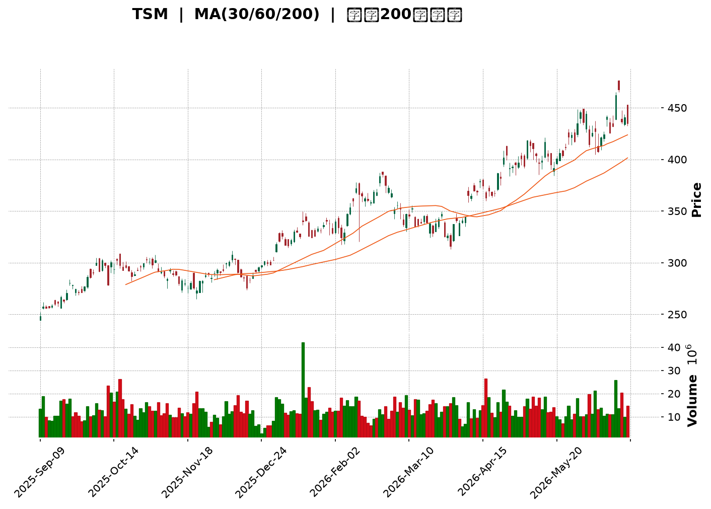
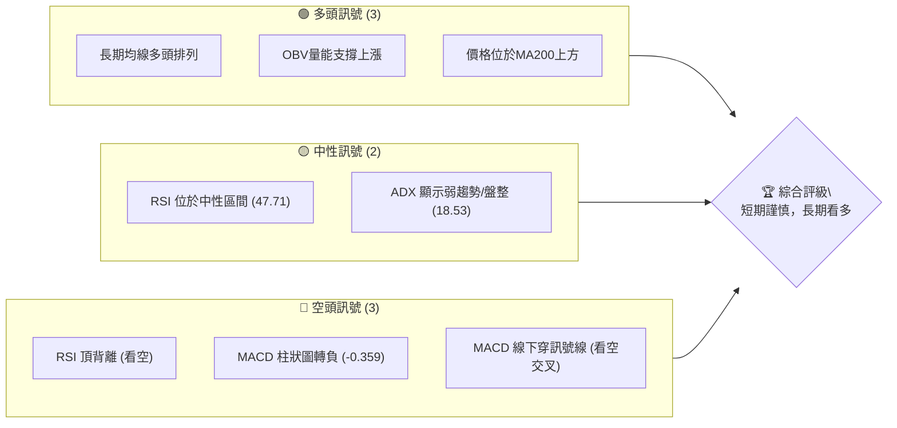

<details>
<summary>📊 靜態圖表 (點擊展開)</summary>

</details>

<html>
<head><meta charset="utf-8" /></head>
<body>
    <div style="height:500px; width:100%;">                        <script>window.PlotlyConfig = {MathJaxConfig: 'local'};</script>
        <script charset="utf-8" src="https://cdn.plot.ly/plotly-3.6.0.min.js" integrity="sha256-QaOVwtVY0T02VaHrr6pnoHLCwayMJp4O5n4YyaE3rJk=" crossorigin="anonymous"></script>                <div id="candlestick-chart" class="plotly-graph-div" style="height:100%; width:100%;"></div>            <script>                window.PLOTLYENV=window.PLOTLYENV || {};                                if (document.getElementById("candlestick-chart")) {                    Plotly.newPlot(                        "candlestick-chart",                        [{"close":{"dtype":"f8","bdata":"AAAAIJwFb0AAAACAdRlwQAAAACA\u002fAXBAAAAAgOQHcEAAAACgVShwQAAAAKAtQHBAAAAAgMRLcEAAAADAoqhwQAAAAIDJbHBAAAAA4PnncEAAAADg\u002fodxQAAAAOA+aHFAAAAA4PMncUAAAACgkPNwQAAAAICA8XBAAAAAILRRcUAAAABAb+NxQAAAAEC43XFAAAAAYH0eckAAAACgksByQAAAAACzO3JAAAAAQDrickAAAABgkZhyQAAAAKBzZ3FAAAAAAFrIckAAAABgBVpyQAAAAEA+5XJAAAAAoO6XckAAAABAXkxyQAAAAAD2dXJAAAAAwFFDckAAAACg8elxQAAAAABQB3JAAAAAoHZKckAAAAAgsX5yQAAAAODCsnJAAAAAgEbrckAAAAAAl81yQAAAAGBMoXJAAAAA4J\u002fnckAAAABABDxyQAAAACCCNXJAAAAAgKjvcUAAAABgKcRxQAAAAEBiT3JAAAAAIEwOckAAAADgkAVyQAAAAGDmf3FAAAAA4H2pcUAAAAAA4nxxQAAAAMDLO3FAAAAAIJmCcUAAAACASTVxQAAAAGCNDnFAAAAAYKKmcUAAAADgRKdxQAAAAIAW+3FAAAAAwLETckAAAADg5NZxQAAAAODmHHJAAAAAAD5SckAAAADAPCpyQAAAAECnRnJAAAAAoCi4ckAAAABAm9ByQAAAAMBxO3NAAAAA4If0ckAAAADgnyhyQAAAAIAt5HFAAAAAQFTWcUAAAACAlThxQAAAACB4s3FAAAAAQHD3cUAAAACgXDxyQAAAAODHdnJAAAAAYDqUckAAAAAgidRyQAAAAGD5tXJAAAAAwKSgckAAAAAAQOVyQAAAAAB633NAAAAA4H8JdEAAAAAg9Ft0QAAAAGCs0HNAAAAAIALGc0AAAABgdx90QAAAAIAJoXRAAAAAYB+YdEAAAAAg3FZ0QAAAAEAlPnVAAAAAID5KdUAAAADgp1d0QAAAAAAaR3RAAAAAoP9adEAAAADAYdJ0QAAAAOD\u002fr3RAAAAA4J0JdUAAAACgpkh1QAAAAIDgHHVAAAAAwMaNdEAAAAAgsDl1QAAAAMBj4HRAAAAAgA1BdEAAAACAe5B0QAAAAKDpsHVAAAAAQFUZdkAAAABgzIB2QAAAAECtQndAAAAAQFTjdkAAAADgocd2QAAAACBApXZAAAAAoF6GdkAAAACAmmh2QAAAAEArCndAAAAAwDUCd0AAAAAgR\u002fx3QAAAAIDLG3hAAAAAIPltd0AAAADgeUp3QAAAAOBn83ZAAAAAYAr1dUAAAABgpTl2QAAAAACpAHZAAAAAIF8SdUAAAABghq51QAAAAKDllHVAAAAAgM0LdkAAAACgq+90QAAAAIAjCXVAAAAAoLMndUAAAAAgv5J1QAAAACBtLHVAAAAAwPkfdUAAAABAiId0QAAAAGCMGnVAAAAAICtndUAAAAAgAK91QAAAAKCRVXRAAAAAIKBfdEAAAAAgK7xzQAAAACCREnVAAAAAABNLdUAAAABg9yN1QAAAAGBiT3VAAAAAIDaIdUAAAADAuNB2QAAAAGAtynZAAAAAAL8bd0AAAAAATgt3QAAAAAAKsHdAAAAAAJRjd0AAAABgBKh2QAAAAGAmGndAAAAAICbWdkAAAAAghfN2QAAAAICOKHhAAAAAYEHcd0AAAACgUBh5QAAAAICKQHlAAAAAAMZ2eEAAAADAjo54QAAAAIAnsnhAAAAAwNrLeEAAAAAgvwp5QAAAAADRl3hAAAAAgFEoekAAAAAA69J5QAAAAIB9q3lAAAAAgIQ5eUAAAAAAocV4QAAAAMDa7XhAAAAAoOcLekAAAAAgfDZ5QAAAACBmsHhAAAAAQBV7eEAAAAAg6Ap5QAAAAAAuY3lAAAAAwDI5eUAAAADgtLV5QAAAAKDgW3pAAAAAoOB9ekAAAADAjhd6QAAAAKDLKXtAAAAAgFfae0AAAABAtzp7QAAAAKAWvntAAAAAQDPjeUAAAABg2Jx6QAAAAEC5rnpAAAAAYLh8eUAAAADAHlF6QAAAAEDhfnpAAAAAYGaWe0AAAACgR516QAAAAGBmAntAAAAAgOvhfEAAAABguDp9QAAAAIA9RntAAAAAoEeNe0AAAAAA1y97QA=="},"high":{"dtype":"f8","bdata":"68HCNzJ+b0DnWyBj+VpwQKk4Ie9yLHBAgqBsiochcEAH4wlBzj5wQABBc9y1hXBA9r5BsNVrcEB3\u002fuVHzMZwQBPcYE\u002fGh3BA0W5bbTAjcUD3kMtkObxxQFK0Bd0ucHFAGZHqoJIvcUC6T0OYiRVxQP6lRj7pWnFAl2aQ2OBUcUC9287hVwNyQP1QQidnZnJAre\u002f18exbckCdamsWXA5zQBtlzzMvC3NArb71ixIAc0CX0zUIZsdyQIGtFcKlnXJAo0mtR\u002fnjckCselkSQbZyQNAJ1MdnA3NAHoQoRPhOc0A8kSUl3M5yQLYjtJZq1HJAqL65nXiQckBOcuT8RU5yQA9u\u002fOamPHJANJYnAO55ckBZK5fWF6JyQLrrKUlJvHJAhWKNF9YYc0DO\u002f0imhA5zQJMdCzRkFHNAToCdbiA7c0C28sw7ELpyQP2FOBU3fnJAXxdnEmJFckAegcVcOtpxQIQyfE\u002fpbHJAHG6MCdRJckBeKJnGCElyQB+in1vJ83FAFLNVTODJcUD4r9cgo8RxQECQlpz9X3FAdniVkDSlcUAljbSQ9yhyQCEVMaEtSHFAbH39LE2tcUCkhHfxsrJxQC\u002f2X9tUKHJA\u002fdMw+hsmckChmEOPIw5yQA0evRIpQ3JA216OyNBkckDfOkUmsztyQG82pywsp3JAEYCGmxDEckAgdL50xORyQD5CtWdneHNAIhiYCEoEc0AszyczdetyQDu8LJJ5ZHJAcKnsZqPvcUAmqfZs0\u002flxQCuUWgry2nFArN5WlrEqckAEKUBU5ldyQEYAUsoPhnJAdSPAa\u002fWZckDSlayhId1yQJ8CPaL17nJANYidPsHvckCN2mJR9hxzQJC3\u002fXD+\u002fnNASixZZ8KYdEBOvx2O47V0QN6+UnX3SXRAlGG\u002fflAtdEDuzzXAnDF0QFJzGOdevXRAZwcY8Q3rdEChuUU7ooJ0QHNDZWFj2HVAD61OidTAdUDm3sRMQ0Z1QG6yI7DNvnRAMrWhMT\u002fVdECiOEKgrPZ0QESnZA8L1nRAatYL\u002fe83dUB+DBOClnt1QM2zoYqSX3VAVi16v3IidUDuVRIW5WZ1QL6nfJxClHVAZB1gT\u002fAQdUDiHsZIm810QFmWUc\u002fCvnVAugurSgdcdkBJG0kAKq52QDuom6wQmndAySMdGsCgd0BXNrjgPRN3QMgrZQUWxXZAZy7KBd33dkBWs8gD9452QFABtK2XJHdAIbU3wis4d0BYkIwq4DJ4QJzfZEpFQ3hA9sYWI70HeEDPmUdK52t3QPdhMgDrMndAw4tcAGgidkCZHuvovnN2QOamtoX1WXZAjwWszteudUBC+47Dqrl1QPQ3Mw7u+nVAHLaqozY4dkCExgywtpF1QLovueP8a3VAJDEiX71tdUAs+xSJMp91QPOMCW4xsnVAbWa0oLExdUDp5yDf+gx1QILuwgi5aXVA3eCmBjCBdUAYtV6JGdp1QL1cHN3QQXVAEERE46OMdEAl1lliR410QJPUE9noGXVAfWpjcdi9dUAt7wBBVVR1QNr\u002fOEZVdnVAXCWNPZCLdUCW8ei8zlZ3QPc4Xxr19HZA3LOxjt6Rd0BaYbxJeSl3QC31xyZG1HdAZXrsqGbRd0D+RBRyXBV3QN9fpmI9a3dAwk3gOEkTd0ByXrryIx53QInmjCAPMHhAedmzn6A9eEB99EA5iIh5QAnJ\u002fUSB2HlANIox9AvPeEBpVDdrza54QOP5xH+73XhAKDXg5LwweUDUPAyY9Wt5QBP26fflUnlAiwgA1oIrekDhahmkTDB6QNOsf1ZpAHpA1HblOHBseUA\u002fVbiozRR5QNaUpYzAO3lAM6gM9L5PekD42essmY55QPRoN8feXnlAKgERPyvfeEC1fld\u002f+y55QDfL\u002fID6p3lABXVxZV6beUC7U\u002fI3Rfh5QCl4zmm02HpAFOs5h52pekBWxvgB89Z6QNtE6\u002fFwBXxAqUKzk1H1e0AFZox4uxF8QJTP\u002fq1p73tAwqqlAS4Oe0DgB3ZKvgx7QOPgREEuUntAZigg\u002fC6VekAAAAAAAGR6QAAAAEAKr3pAAAAAoEepe0AAAACgR4V7QAAAAAAAqHtAAAAAIIUTfUAAAADgo8x9QAAAAKBH9XtAAAAAgMK9e0AAAAAA7kh8QA=="},"hovertemplate":"\u003cb\u003e%{x|%Y-%m-%d}\u003c\u002fb\u003e\u003cbr\u003e\u958b: $%{open:.2f}\u003cbr\u003e\u9ad8: $%{high:.2f}\u003cbr\u003e\u4f4e: $%{low:.2f}\u003cbr\u003e\u6536: $%{close:.2f}\u003cextra\u003e\u003c\u002fextra\u003e","low":{"dtype":"f8","bdata":"Xa2RiVOHbkAxTLCLx91vQIzQ2q747G9ALu9w4Lfxb0CZ0Wnrbf1vQK4USs8oKXBAIgCrvTAbcEDoj+B80f5vQH7Tw7cVTHBA3gwWjv51cECKZkaI+VxxQLAaw6XnKHFAXQNy8D3BcEBc205eEchwQAAAAICA8XBAOw3huAb7cEDOnApeDDBxQJFttTWTzHFAEeeekIADckCPWLlGhZlyQLT2gwTLL3JAp\u002f5kBeg6ckC4W+AGhHFyQCTofnE2YnFAyNE1vI0gckAozUkO\u002fxByQOiepHaVm3JANSjmH+1lckDVJXIf1ElyQMUQxf7Ma3JArbxeWNM1ckCNmuj20qJxQDlgzZnZ9XFA86iaQGpBckBAsWhmTTZyQDMnEyc+XHJAYJm5KEHAckC7Ght7fadyQB51vHbEZXJAoT9ZniC8ckDFcL7KcTNyQDz13CeJE3JAYlI6kCHScUDGvnfuaS9xQJl0ERmBF3JAPeKHf2vqcUD+S\u002fdNDvVxQFP4a5P5XHFArq9dZoDxcECuleaFzFlxQCxHmbNn6XBA0WNYHY4icUCUOsnH+yNxQGsJgT++i3BArsfsyt3wcEA\u002fhUG4Hu9wQGNbmOmv13FAWFlGIdnrcUBOc26onY9xQJ6aRbC07nFAX6Or4FW9cUCethQs5v5xQNc1+jJRL3JAa8F5K2dmckBdCsUbqYJyQCoS2OgownJArmB6bpmhckDrFqJwwBdyQNRn+z8n4XFAxeIwPNKdcUAr9QqUqBpxQA07wY7UhHFACnKgmofOcUCJlCF0aRtyQCjuKd8rK3JA12B92lFrckDRG0dSxY9yQAey5ynXkXJAJER8HJOeckBpbjRv7d1yQISqwkWRYXNA+uYNqo\u002f9c0DqcsdJvy50QKS7a\u002fJxznNAJyMu\u002fj2oc0AZbM4i1MlzQHlAGdeO9nNAMlZnLUeRdECidIGVaDJ0QOf6XnDuAnVAPJD\u002fqUc7dUDkuUxZhFN0QLdnUQMZQHRACmgDZYRTdEDdWcVuq5p0QGWidhWGiHRA9cGjk3LNdED+ehThtQ51QJjm7vA1aHRA0TRoXIl2dEC4dnJZiXZ0QDEA\u002f0AuhXRAO5q7quHWc0B+1H8CHeBzQBY\u002fwjW37nRABR3v1DKgdUBA\u002fTe17ih2QJ8oGx\u002fy53ZA\u002fNmgqBwHdEBvlErupm52QJgs93KLJnZAw+6dYbJtdkABgK5apTl2QGLv39URVHZAxFbvXTnJdkBPKtEU4GF3QP0CZA2i7XdAuM0HTsz8dkD48qA4m+t2QPdcqaRprHZAsFoSovBldUBDRUq3pAt2QF7xwAiHYHVAs+mnMFrvdEACoCvBbKN0QJcbaEalaHVAGjJWq\u002fLIdUBnxWvyaup0QBFV4N\u002fe53RAx3yh4SwhdUDBQ0bqvxl1QJGEfzPBKHVAiV7yReJGdECJTYaWN1J0QKboahY5pXRAzmWZVNXTdEBt397LKGt1QDgV67TBSXRAMfMIRekYdEBylr+2EZFzQIOjbT48BnRALnjCpkwvdUCRQwdilWB0QG7dvexCHXVArNohStrtdEAHpEwcaWZ2QAe9tSUJfnZAHNtvgi0Od0DZVK6vHdN2QHU7yXSRRXdA65AkKHI1d0APUM1LUnt2QGMnUCuXxHZAv0RCK2K2dkB4eDZsHMR2QGraD4ZiHHdANZG1Telud0C9bYuF4I54QGPwk5Ru93hA8NIBvdH8d0DBJr9xXjR4QNUzZOzwDHhA0ZJN5GtzeECL0sk3baR4QLuuMpLsenhACiCvQ2z7eECvAWPtgHJ5QCjU6xoY\u002f3hATM62pCfUeED8mm9sfBN4QJS1V9fiaHhAUfv3mpESeUC1SSfzXt54QExhTIQuYnhAsvy6wJACeECVZ4oiZrB4QJ+MG7056XhAdv28QrMeeUCUGEhoypF5QJ5wz1aN5nlAb2h1YtvbeUBZj+L7ZgR6QBtxqMY0WHpA6smtdNwve0BWFa6LPBh7QIYQSp7TpHpA+MW+hjW9eUCvg99cr1h6QCu2yFUASXlAo+ZPrPVreUAAAACAwo15QAAAACBcE3pAAAAAQOH+ekAAAABAM5N6QAAAAIA9+npAAAAAgD1me0AAAABguBJ9QAAAAEAKI3tAAAAAoEcJe0AAAAAAAAh7QA=="},"name":"\u50f9\u683c","open":{"dtype":"f8","bdata":"Xa2RiVOHbkCro7MXnQBwQN8SXNsIGHBAsK18ZfIfcECXlGv0fhJwQNUnWqN0fXBAIx5MnV9kcECeaiP1c\u002f9vQFS3EXeZhHBA4yQ4RkyHcECtRlUNE4NxQMPTIU\u002flYXFA2vWlXMHvcEA9aNim+vtwQB+AHftAJXFAqv\u002fKIa4ScUAUk5aSNURxQHuH9E46Y3JAt+mCKyApckDa5c\u002fIoZpyQIg683KQA3NAGJ+nOxlLckCMTQ3PJL9yQFxCyVHWmXJAaX+WaIh+ckAGd1KNGVVyQP91AGdT\u002fnJAWERVG\u002fxHc0AylN6uEoFyQMLk8xh5mnJAC0r09piKckAk03swWStyQC0sSmiM+HFAmwUptyVUckDWvOOwCoVyQB6pb4vNf3JArAdv44v2ckBxZ9b7XctyQJs0yhKQ+XJAJ1ZLsZbDckBVrH9f8WhyQF2PIcpQJXJAc5dpfc88ckAJ8WLPrq9xQOjiQgTwQHJANe\u002fr\u002f2wcckBmUxf+dTZyQEzOz0yM7nFARFHi0wsccUBj0PSA1XNxQGBAaKcUNnFA2FKKhhQscUD\u002fBYuPzh5yQDx7hG3V6nBArsfsyt3wcEAAm9kxUIhxQHkwPopv7XFAUNXYzxcjckBwSzlW1MpxQGW5yiF5G3JARVlot1QeckAanBAA6DpyQP2X2kjEW3JAeUl\u002f1IWtckCBn\u002fZkUJpyQC9hn4C473JAsnr\u002fGgP8ckAszyczdetyQJt+MeEgWnJAakcRionccUCEtPGswPBxQIhgXiOQuHFACnKgmofOcUCQ5qHcfFJyQCb1GrxFPnJAQxex8FqDckCWqd7EvKVyQENPP8Wpw3JAReRwGeXMckAZAkEvAOdyQNBpvkAGZnNAfkhgrDqLdEBnl59DXYh0QCZ3y2UFMHRAyRqBT5ArdECa3q5\u002f+uJzQPGmNNIcB3RAkGeSzYuydEChuUU7ooJ0QGfhjt7EUHVABe+zOaqLdUAbSkpunTB1QARZBNx1u3RA9iktIk27dECaoybyz6V0QHaxwvBFsXRA5lBW\u002fFPsdEBJobphRVR1QOvsqTzbIHVAJJ2qDyPbdEC6zBbH9ZB0QFYFSEu+dHVA3DohjQDedEDjBBKmkhJ0QHP9zfA+\u002fHRAaYgN33qvdUCFEdatUad2QO9bSKvYAndAe8+EJ9WQd0Akur4DC\u002fR2QImsKm0pgHZA9x4lcdafdkDyxvE68F12QAOYLMXkXnZAmMiyqfrRdkDBNXEuM5d3QJzfZEpFQ3hAGyUKXh8DeED+aqw4zQN3QMh5PNK2t3ZAjZfp\u002fQ28dUBCM\u002fKVfDl2QKUoCvs2EXZAwR4ik8BbdUAvZW2IAN50QDofqRLdqnVAySNRQ8YBdkBfl\u002felboJ1QAwFPwVwYnVANF76BvA3dUB\u002foHcc3jx1QC1qTNKNj3VAoQYQlTaHdEBFcAhNS\u002f50QKboahY5pXRAy8s1X5PsdEBLpz3fEJN1QNtGhKtqMHVA4PJQByNBdECo8hX692Z0QA0qHUzpGHRAi3HKT4txdUDQmAPgOGF0QLLoVZxML3VAnQcp5VkqdUCbje48zBZ3QBPVJxU4p3ZAZV\u002f7PmZrd0D+4JClURZ3QKh2a4J4ondA2DldXU3Id0D5WweF+P92QKlLTMk\u002fRXdATGFMu7cFd0AAAAAghfN2QBX0Ov2ULndAYSyyyKL1d0C0rER7brN4QKRVanKIzHlApLv5+kJzeEDUgNZN3394QOGhsMAWznhAIZD6GlWIeEDwwsimMjl5QBkiKbx5OnlAvmdyhFsXeUDTX2iLzxF6QKnG9hCd\u002f3lA2oNSkqJceUCTMZCgIc14QEdcSoRu1XhAsOele0kkeUCzAd3szVh5QPRoN8feXnlAXPCiaplJeEBhjj3WKMF4QJ+MG7056XhAXbNKI5OHeUBuiBv4ecJ5QIUR91FboHpA57Oxg7xTekDiiA3CJ6F6QEdp+38yfnpAPhfLWM94e0AkMQ65BA98QBeIRYD72XpAUTqyB0HMekArPhJ\u002femx6QLZ\u002fYQz53XpA7QhOpOLPeUAAAAAAKdR5QAAAAMDMQHpAAAAAQOFqe0AAAADgUUB7QAAAAAAALHtAAAAAgBRue0AAAACgcMF9QAAAAEDhcntAAAAAIK4fe0AAAABgZk58QA=="},"x":["2025-09-09T00:00:00-04:00","2025-09-10T00:00:00-04:00","2025-09-11T00:00:00-04:00","2025-09-12T00:00:00-04:00","2025-09-15T00:00:00-04:00","2025-09-16T00:00:00-04:00","2025-09-17T00:00:00-04:00","2025-09-18T00:00:00-04:00","2025-09-19T00:00:00-04:00","2025-09-22T00:00:00-04:00","2025-09-23T00:00:00-04:00","2025-09-24T00:00:00-04:00","2025-09-25T00:00:00-04:00","2025-09-26T00:00:00-04:00","2025-09-29T00:00:00-04:00","2025-09-30T00:00:00-04:00","2025-10-01T00:00:00-04:00","2025-10-02T00:00:00-04:00","2025-10-03T00:00:00-04:00","2025-10-06T00:00:00-04:00","2025-10-07T00:00:00-04:00","2025-10-08T00:00:00-04:00","2025-10-09T00:00:00-04:00","2025-10-10T00:00:00-04:00","2025-10-13T00:00:00-04:00","2025-10-14T00:00:00-04:00","2025-10-15T00:00:00-04:00","2025-10-16T00:00:00-04:00","2025-10-17T00:00:00-04:00","2025-10-20T00:00:00-04:00","2025-10-21T00:00:00-04:00","2025-10-22T00:00:00-04:00","2025-10-23T00:00:00-04:00","2025-10-24T00:00:00-04:00","2025-10-27T00:00:00-04:00","2025-10-28T00:00:00-04:00","2025-10-29T00:00:00-04:00","2025-10-30T00:00:00-04:00","2025-10-31T00:00:00-04:00","2025-11-03T00:00:00-05:00","2025-11-04T00:00:00-05:00","2025-11-05T00:00:00-05:00","2025-11-06T00:00:00-05:00","2025-11-07T00:00:00-05:00","2025-11-10T00:00:00-05:00","2025-11-11T00:00:00-05:00","2025-11-12T00:00:00-05:00","2025-11-13T00:00:00-05:00","2025-11-14T00:00:00-05:00","2025-11-17T00:00:00-05:00","2025-11-18T00:00:00-05:00","2025-11-19T00:00:00-05:00","2025-11-20T00:00:00-05:00","2025-11-21T00:00:00-05:00","2025-11-24T00:00:00-05:00","2025-11-25T00:00:00-05:00","2025-11-26T00:00:00-05:00","2025-11-28T00:00:00-05:00","2025-12-01T00:00:00-05:00","2025-12-02T00:00:00-05:00","2025-12-03T00:00:00-05:00","2025-12-04T00:00:00-05:00","2025-12-05T00:00:00-05:00","2025-12-08T00:00:00-05:00","2025-12-09T00:00:00-05:00","2025-12-10T00:00:00-05:00","2025-12-11T00:00:00-05:00","2025-12-12T00:00:00-05:00","2025-12-15T00:00:00-05:00","2025-12-16T00:00:00-05:00","2025-12-17T00:00:00-05:00","2025-12-18T00:00:00-05:00","2025-12-19T00:00:00-05:00","2025-12-22T00:00:00-05:00","2025-12-23T00:00:00-05:00","2025-12-24T00:00:00-05:00","2025-12-26T00:00:00-05:00","2025-12-29T00:00:00-05:00","2025-12-30T00:00:00-05:00","2025-12-31T00:00:00-05:00","2026-01-02T00:00:00-05:00","2026-01-05T00:00:00-05:00","2026-01-06T00:00:00-05:00","2026-01-07T00:00:00-05:00","2026-01-08T00:00:00-05:00","2026-01-09T00:00:00-05:00","2026-01-12T00:00:00-05:00","2026-01-13T00:00:00-05:00","2026-01-14T00:00:00-05:00","2026-01-15T00:00:00-05:00","2026-01-16T00:00:00-05:00","2026-01-20T00:00:00-05:00","2026-01-21T00:00:00-05:00","2026-01-22T00:00:00-05:00","2026-01-23T00:00:00-05:00","2026-01-26T00:00:00-05:00","2026-01-27T00:00:00-05:00","2026-01-28T00:00:00-05:00","2026-01-29T00:00:00-05:00","2026-01-30T00:00:00-05:00","2026-02-02T00:00:00-05:00","2026-02-03T00:00:00-05:00","2026-02-04T00:00:00-05:00","2026-02-05T00:00:00-05:00","2026-02-06T00:00:00-05:00","2026-02-09T00:00:00-05:00","2026-02-10T00:00:00-05:00","2026-02-11T00:00:00-05:00","2026-02-12T00:00:00-05:00","2026-02-13T00:00:00-05:00","2026-02-17T00:00:00-05:00","2026-02-18T00:00:00-05:00","2026-02-19T00:00:00-05:00","2026-02-20T00:00:00-05:00","2026-02-23T00:00:00-05:00","2026-02-24T00:00:00-05:00","2026-02-25T00:00:00-05:00","2026-02-26T00:00:00-05:00","2026-02-27T00:00:00-05:00","2026-03-02T00:00:00-05:00","2026-03-03T00:00:00-05:00","2026-03-04T00:00:00-05:00","2026-03-05T00:00:00-05:00","2026-03-06T00:00:00-05:00","2026-03-09T00:00:00-04:00","2026-03-10T00:00:00-04:00","2026-03-11T00:00:00-04:00","2026-03-12T00:00:00-04:00","2026-03-13T00:00:00-04:00","2026-03-16T00:00:00-04:00","2026-03-17T00:00:00-04:00","2026-03-18T00:00:00-04:00","2026-03-19T00:00:00-04:00","2026-03-20T00:00:00-04:00","2026-03-23T00:00:00-04:00","2026-03-24T00:00:00-04:00","2026-03-25T00:00:00-04:00","2026-03-26T00:00:00-04:00","2026-03-27T00:00:00-04:00","2026-03-30T00:00:00-04:00","2026-03-31T00:00:00-04:00","2026-04-01T00:00:00-04:00","2026-04-02T00:00:00-04:00","2026-04-06T00:00:00-04:00","2026-04-07T00:00:00-04:00","2026-04-08T00:00:00-04:00","2026-04-09T00:00:00-04:00","2026-04-10T00:00:00-04:00","2026-04-13T00:00:00-04:00","2026-04-14T00:00:00-04:00","2026-04-15T00:00:00-04:00","2026-04-16T00:00:00-04:00","2026-04-17T00:00:00-04:00","2026-04-20T00:00:00-04:00","2026-04-21T00:00:00-04:00","2026-04-22T00:00:00-04:00","2026-04-23T00:00:00-04:00","2026-04-24T00:00:00-04:00","2026-04-27T00:00:00-04:00","2026-04-28T00:00:00-04:00","2026-04-29T00:00:00-04:00","2026-04-30T00:00:00-04:00","2026-05-01T00:00:00-04:00","2026-05-04T00:00:00-04:00","2026-05-05T00:00:00-04:00","2026-05-06T00:00:00-04:00","2026-05-07T00:00:00-04:00","2026-05-08T00:00:00-04:00","2026-05-11T00:00:00-04:00","2026-05-12T00:00:00-04:00","2026-05-13T00:00:00-04:00","2026-05-14T00:00:00-04:00","2026-05-15T00:00:00-04:00","2026-05-18T00:00:00-04:00","2026-05-19T00:00:00-04:00","2026-05-20T00:00:00-04:00","2026-05-21T00:00:00-04:00","2026-05-22T00:00:00-04:00","2026-05-26T00:00:00-04:00","2026-05-27T00:00:00-04:00","2026-05-28T00:00:00-04:00","2026-05-29T00:00:00-04:00","2026-06-01T00:00:00-04:00","2026-06-02T00:00:00-04:00","2026-06-03T00:00:00-04:00","2026-06-04T00:00:00-04:00","2026-06-05T00:00:00-04:00","2026-06-08T00:00:00-04:00","2026-06-09T00:00:00-04:00","2026-06-10T00:00:00-04:00","2026-06-11T00:00:00-04:00","2026-06-12T00:00:00-04:00","2026-06-15T00:00:00-04:00","2026-06-16T00:00:00-04:00","2026-06-17T00:00:00-04:00","2026-06-18T00:00:00-04:00","2026-06-22T00:00:00-04:00","2026-06-23T00:00:00-04:00","2026-06-24T00:00:00-04:00","2026-06-25T00:00:00-04:00"],"type":"candlestick"},{"hovertemplate":"MA30: $%{y:.2f}\u003cextra\u003e\u003c\u002fextra\u003e","line":{"color":"#2196F3","dash":"dash","width":2},"mode":"lines","name":"MA30","x":["2025-09-09T00:00:00-04:00","2025-09-10T00:00:00-04:00","2025-09-11T00:00:00-04:00","2025-09-12T00:00:00-04:00","2025-09-15T00:00:00-04:00","2025-09-16T00:00:00-04:00","2025-09-17T00:00:00-04:00","2025-09-18T00:00:00-04:00","2025-09-19T00:00:00-04:00","2025-09-22T00:00:00-04:00","2025-09-23T00:00:00-04:00","2025-09-24T00:00:00-04:00","2025-09-25T00:00:00-04:00","2025-09-26T00:00:00-04:00","2025-09-29T00:00:00-04:00","2025-09-30T00:00:00-04:00","2025-10-01T00:00:00-04:00","2025-10-02T00:00:00-04:00","2025-10-03T00:00:00-04:00","2025-10-06T00:00:00-04:00","2025-10-07T00:00:00-04:00","2025-10-08T00:00:00-04:00","2025-10-09T00:00:00-04:00","2025-10-10T00:00:00-04:00","2025-10-13T00:00:00-04:00","2025-10-14T00:00:00-04:00","2025-10-15T00:00:00-04:00","2025-10-16T00:00:00-04:00","2025-10-17T00:00:00-04:00","2025-10-20T00:00:00-04:00","2025-10-21T00:00:00-04:00","2025-10-22T00:00:00-04:00","2025-10-23T00:00:00-04:00","2025-10-24T00:00:00-04:00","2025-10-27T00:00:00-04:00","2025-10-28T00:00:00-04:00","2025-10-29T00:00:00-04:00","2025-10-30T00:00:00-04:00","2025-10-31T00:00:00-04:00","2025-11-03T00:00:00-05:00","2025-11-04T00:00:00-05:00","2025-11-05T00:00:00-05:00","2025-11-06T00:00:00-05:00","2025-11-07T00:00:00-05:00","2025-11-10T00:00:00-05:00","2025-11-11T00:00:00-05:00","2025-11-12T00:00:00-05:00","2025-11-13T00:00:00-05:00","2025-11-14T00:00:00-05:00","2025-11-17T00:00:00-05:00","2025-11-18T00:00:00-05:00","2025-11-19T00:00:00-05:00","2025-11-20T00:00:00-05:00","2025-11-21T00:00:00-05:00","2025-11-24T00:00:00-05:00","2025-11-25T00:00:00-05:00","2025-11-26T00:00:00-05:00","2025-11-28T00:00:00-05:00","2025-12-01T00:00:00-05:00","2025-12-02T00:00:00-05:00","2025-12-03T00:00:00-05:00","2025-12-04T00:00:00-05:00","2025-12-05T00:00:00-05:00","2025-12-08T00:00:00-05:00","2025-12-09T00:00:00-05:00","2025-12-10T00:00:00-05:00","2025-12-11T00:00:00-05:00","2025-12-12T00:00:00-05:00","2025-12-15T00:00:00-05:00","2025-12-16T00:00:00-05:00","2025-12-17T00:00:00-05:00","2025-12-18T00:00:00-05:00","2025-12-19T00:00:00-05:00","2025-12-22T00:00:00-05:00","2025-12-23T00:00:00-05:00","2025-12-24T00:00:00-05:00","2025-12-26T00:00:00-05:00","2025-12-29T00:00:00-05:00","2025-12-30T00:00:00-05:00","2025-12-31T00:00:00-05:00","2026-01-02T00:00:00-05:00","2026-01-05T00:00:00-05:00","2026-01-06T00:00:00-05:00","2026-01-07T00:00:00-05:00","2026-01-08T00:00:00-05:00","2026-01-09T00:00:00-05:00","2026-01-12T00:00:00-05:00","2026-01-13T00:00:00-05:00","2026-01-14T00:00:00-05:00","2026-01-15T00:00:00-05:00","2026-01-16T00:00:00-05:00","2026-01-20T00:00:00-05:00","2026-01-21T00:00:00-05:00","2026-01-22T00:00:00-05:00","2026-01-23T00:00:00-05:00","2026-01-26T00:00:00-05:00","2026-01-27T00:00:00-05:00","2026-01-28T00:00:00-05:00","2026-01-29T00:00:00-05:00","2026-01-30T00:00:00-05:00","2026-02-02T00:00:00-05:00","2026-02-03T00:00:00-05:00","2026-02-04T00:00:00-05:00","2026-02-05T00:00:00-05:00","2026-02-06T00:00:00-05:00","2026-02-09T00:00:00-05:00","2026-02-10T00:00:00-05:00","2026-02-11T00:00:00-05:00","2026-02-12T00:00:00-05:00","2026-02-13T00:00:00-05:00","2026-02-17T00:00:00-05:00","2026-02-18T00:00:00-05:00","2026-02-19T00:00:00-05:00","2026-02-20T00:00:00-05:00","2026-02-23T00:00:00-05:00","2026-02-24T00:00:00-05:00","2026-02-25T00:00:00-05:00","2026-02-26T00:00:00-05:00","2026-02-27T00:00:00-05:00","2026-03-02T00:00:00-05:00","2026-03-03T00:00:00-05:00","2026-03-04T00:00:00-05:00","2026-03-05T00:00:00-05:00","2026-03-06T00:00:00-05:00","2026-03-09T00:00:00-04:00","2026-03-10T00:00:00-04:00","2026-03-11T00:00:00-04:00","2026-03-12T00:00:00-04:00","2026-03-13T00:00:00-04:00","2026-03-16T00:00:00-04:00","2026-03-17T00:00:00-04:00","2026-03-18T00:00:00-04:00","2026-03-19T00:00:00-04:00","2026-03-20T00:00:00-04:00","2026-03-23T00:00:00-04:00","2026-03-24T00:00:00-04:00","2026-03-25T00:00:00-04:00","2026-03-26T00:00:00-04:00","2026-03-27T00:00:00-04:00","2026-03-30T00:00:00-04:00","2026-03-31T00:00:00-04:00","2026-04-01T00:00:00-04:00","2026-04-02T00:00:00-04:00","2026-04-06T00:00:00-04:00","2026-04-07T00:00:00-04:00","2026-04-08T00:00:00-04:00","2026-04-09T00:00:00-04:00","2026-04-10T00:00:00-04:00","2026-04-13T00:00:00-04:00","2026-04-14T00:00:00-04:00","2026-04-15T00:00:00-04:00","2026-04-16T00:00:00-04:00","2026-04-17T00:00:00-04:00","2026-04-20T00:00:00-04:00","2026-04-21T00:00:00-04:00","2026-04-22T00:00:00-04:00","2026-04-23T00:00:00-04:00","2026-04-24T00:00:00-04:00","2026-04-27T00:00:00-04:00","2026-04-28T00:00:00-04:00","2026-04-29T00:00:00-04:00","2026-04-30T00:00:00-04:00","2026-05-01T00:00:00-04:00","2026-05-04T00:00:00-04:00","2026-05-05T00:00:00-04:00","2026-05-06T00:00:00-04:00","2026-05-07T00:00:00-04:00","2026-05-08T00:00:00-04:00","2026-05-11T00:00:00-04:00","2026-05-12T00:00:00-04:00","2026-05-13T00:00:00-04:00","2026-05-14T00:00:00-04:00","2026-05-15T00:00:00-04:00","2026-05-18T00:00:00-04:00","2026-05-19T00:00:00-04:00","2026-05-20T00:00:00-04:00","2026-05-21T00:00:00-04:00","2026-05-22T00:00:00-04:00","2026-05-26T00:00:00-04:00","2026-05-27T00:00:00-04:00","2026-05-28T00:00:00-04:00","2026-05-29T00:00:00-04:00","2026-06-01T00:00:00-04:00","2026-06-02T00:00:00-04:00","2026-06-03T00:00:00-04:00","2026-06-04T00:00:00-04:00","2026-06-05T00:00:00-04:00","2026-06-08T00:00:00-04:00","2026-06-09T00:00:00-04:00","2026-06-10T00:00:00-04:00","2026-06-11T00:00:00-04:00","2026-06-12T00:00:00-04:00","2026-06-15T00:00:00-04:00","2026-06-16T00:00:00-04:00","2026-06-17T00:00:00-04:00","2026-06-18T00:00:00-04:00","2026-06-22T00:00:00-04:00","2026-06-23T00:00:00-04:00","2026-06-24T00:00:00-04:00","2026-06-25T00:00:00-04:00"],"y":{"dtype":"f8","bdata":"AAAAAAAA+H8AAAAAAAD4fwAAAAAAAPh\u002fAAAAAAAA+H8AAAAAAAD4fwAAAAAAAPh\u002fAAAAAAAA+H8AAAAAAAD4fwAAAAAAAPh\u002fAAAAAAAA+H8AAAAAAAD4fwAAAAAAAPh\u002fAAAAAAAA+H8AAAAAAAD4fwAAAAAAAPh\u002fAAAAAAAA+H8AAAAAAAD4fwAAAAAAAPh\u002fAAAAAAAA+H8AAAAAAAD4fwAAAAAAAPh\u002fAAAAAAAA+H8AAAAAAAD4fwAAAAAAAPh\u002fAAAAAAAA+H8AAAAAAAD4fwAAAAAAAPh\u002fAAAAAAAA+H8AAAAAAAD4f1VVVb0AbXFAiYiImHyEcUAzMzMz+JNxQHd3dwc9pXFAq6qqKoa4cUBmZmYmeMxxQN7d3f1a4XFAERERMb33cUCamZmZCQpyQDMzM8PaHHJARERE1OgtckAiIiIC6TNyQFVVVZXAOnJAzczMvGhBckAzMzPDXEhyQLy7u2sGVHJAERERwU9ackAiIiICc1tyQJqZmWlSWHJAd3d3B2xUckAAAADgoUlyQKuqqioaQXJAiYiImGE1ckDe3d3diSlyQCIiIkKTJnJAERERAescckB3d3en9RZyQHd3d4cnD3JAmpmZGb8KckB3d3en1AZyQO\u002fu7q7cA3JAZmZmBlwEckCamZmpgAZyQLy7uyudCHJAzczMPEUMckDe3d09AA9yQKuqqpqOE3JAVVVVld0TckARERHhXQ5yQM3MzAwQCHJA3t3d7fP+cUCrqqoaTvZxQAAAAHD48XFARERE1DrycUCamZmJPPZxQJqZmbmM93FAmpmZmQP8cUDe3d296QJyQFVVVbU\u002fDXJAzczMvHwVckDv7u7efyFyQN7d3a0FOHJAd3d355VNckBVVVV1eWhyQGZmZgYDgHJAERER0R+SckARERGRMqdyQLy7u7vLvXJAq6qq2kbTckBVVVXlm+hyQM3MzCxRA3NAMzMzg6Ycc0BmZmYmOy9zQKuqqgpQQHNAREREJEZOc0C8u7tbZl9zQO\u002fu7n7Ra3NA7+7ufpZ9c0AzMzNjQZhzQCIiItK+s3NA3t3dTe3Kc0C8u7vbGO1zQHd3d8cxCHRAVVVVBbcbdECrqqrqlS90QDMzM5MfS3RAERERASlpdEBERESUgIh0QAAAAGBTr3RA7+7ujq7TdEBERET00\u002fR0QBEREbF8DHVAERERUbchdUBERERUNDN1QO\u002fu7o64TnVAERER4VNqdUDNzMy8SYt1QO\u002fu7t76qHVAvLu7yyzBdUCJiIi4XNp1QCIiIgLw6HVAvLu7e6HudUB3d3d3sv51QO\u002fu7m5qDXZAd3d3N4cTdkBVVVXF3Rp2QHd3dwd\u002fInZAd3d3NxordkCrqqrqIih2QLy7u3t6J3ZAq6qq+pssdkAiIiLyky92QKuqqsocMnZAEREREYs5dkARERGxPjl2QFVVVZU7NHZA7+7uPksudkCJiIj4TCd2QFVVVZVUDnZAVVVVpd\u002f4dUCJiIg45N51QM3MzPx30XVAd3d3d\u002fXGdUCrqqo6I7x1QM3MzMxgrXVAZmZmNsegdUAAAAAAy5Z1QO\u002fu7v6Ji3VAMzMzU8yIdUAzMzNDsYZ1QO\u002fu7u76jHVAiYiIuDKZdUDe3d2N4Jx1QJqZmZlCpnVARERExFG1dUDv7u4OJ8B1QHd3dyck1nVAvLu7e5\u002fldUAzMzNzHAl2QJqZmVkXLXZAIiIislNJdkDNzMyMyWJ2QLy7u0vYgHZAiYiImCygdkDNzMxsrsZ2QKuqqvp05HZAMzMzUwcNd0BERET0WzB3QBEREdHjXXdAvLu7S0mHd0ARERGxRLJ3QLy7u4st03dAq6qqKr37d0AzMzNTfR54QImIiMhSO3hAq6qqWnxUeEDv7u7ufWd4QO\u002fu7p6ofXhAMzMzA7WPeEDNzMwsdKZ4QImIiJg\u002fvXhA3t3dnbnXeEB3d3cHC\u002fV4QLy7u6uyF3lA3t3dHYFCeUCamZnJAmd5QERERGSYhXlAiYiIuOSWeUDe3d0t2KN5QAAAAPAMsHlAd3d3N8i4eUBEREQEzcd5QKuqqooo13lA7+7u\u002fvnueUAiIiLyZPx5QGZmZoYDEXpAREREZEQoekBVVVXFU0V6QGZmZtYEU3pAzczMrOBmekAzMzMTfHt6QA=="},"type":"scatter"},{"hovertemplate":"MA60: $%{y:.2f}\u003cextra\u003e\u003c\u002fextra\u003e","line":{"color":"#9C27B0","dash":"dash","width":2},"mode":"lines","name":"MA60","x":["2025-09-09T00:00:00-04:00","2025-09-10T00:00:00-04:00","2025-09-11T00:00:00-04:00","2025-09-12T00:00:00-04:00","2025-09-15T00:00:00-04:00","2025-09-16T00:00:00-04:00","2025-09-17T00:00:00-04:00","2025-09-18T00:00:00-04:00","2025-09-19T00:00:00-04:00","2025-09-22T00:00:00-04:00","2025-09-23T00:00:00-04:00","2025-09-24T00:00:00-04:00","2025-09-25T00:00:00-04:00","2025-09-26T00:00:00-04:00","2025-09-29T00:00:00-04:00","2025-09-30T00:00:00-04:00","2025-10-01T00:00:00-04:00","2025-10-02T00:00:00-04:00","2025-10-03T00:00:00-04:00","2025-10-06T00:00:00-04:00","2025-10-07T00:00:00-04:00","2025-10-08T00:00:00-04:00","2025-10-09T00:00:00-04:00","2025-10-10T00:00:00-04:00","2025-10-13T00:00:00-04:00","2025-10-14T00:00:00-04:00","2025-10-15T00:00:00-04:00","2025-10-16T00:00:00-04:00","2025-10-17T00:00:00-04:00","2025-10-20T00:00:00-04:00","2025-10-21T00:00:00-04:00","2025-10-22T00:00:00-04:00","2025-10-23T00:00:00-04:00","2025-10-24T00:00:00-04:00","2025-10-27T00:00:00-04:00","2025-10-28T00:00:00-04:00","2025-10-29T00:00:00-04:00","2025-10-30T00:00:00-04:00","2025-10-31T00:00:00-04:00","2025-11-03T00:00:00-05:00","2025-11-04T00:00:00-05:00","2025-11-05T00:00:00-05:00","2025-11-06T00:00:00-05:00","2025-11-07T00:00:00-05:00","2025-11-10T00:00:00-05:00","2025-11-11T00:00:00-05:00","2025-11-12T00:00:00-05:00","2025-11-13T00:00:00-05:00","2025-11-14T00:00:00-05:00","2025-11-17T00:00:00-05:00","2025-11-18T00:00:00-05:00","2025-11-19T00:00:00-05:00","2025-11-20T00:00:00-05:00","2025-11-21T00:00:00-05:00","2025-11-24T00:00:00-05:00","2025-11-25T00:00:00-05:00","2025-11-26T00:00:00-05:00","2025-11-28T00:00:00-05:00","2025-12-01T00:00:00-05:00","2025-12-02T00:00:00-05:00","2025-12-03T00:00:00-05:00","2025-12-04T00:00:00-05:00","2025-12-05T00:00:00-05:00","2025-12-08T00:00:00-05:00","2025-12-09T00:00:00-05:00","2025-12-10T00:00:00-05:00","2025-12-11T00:00:00-05:00","2025-12-12T00:00:00-05:00","2025-12-15T00:00:00-05:00","2025-12-16T00:00:00-05:00","2025-12-17T00:00:00-05:00","2025-12-18T00:00:00-05:00","2025-12-19T00:00:00-05:00","2025-12-22T00:00:00-05:00","2025-12-23T00:00:00-05:00","2025-12-24T00:00:00-05:00","2025-12-26T00:00:00-05:00","2025-12-29T00:00:00-05:00","2025-12-30T00:00:00-05:00","2025-12-31T00:00:00-05:00","2026-01-02T00:00:00-05:00","2026-01-05T00:00:00-05:00","2026-01-06T00:00:00-05:00","2026-01-07T00:00:00-05:00","2026-01-08T00:00:00-05:00","2026-01-09T00:00:00-05:00","2026-01-12T00:00:00-05:00","2026-01-13T00:00:00-05:00","2026-01-14T00:00:00-05:00","2026-01-15T00:00:00-05:00","2026-01-16T00:00:00-05:00","2026-01-20T00:00:00-05:00","2026-01-21T00:00:00-05:00","2026-01-22T00:00:00-05:00","2026-01-23T00:00:00-05:00","2026-01-26T00:00:00-05:00","2026-01-27T00:00:00-05:00","2026-01-28T00:00:00-05:00","2026-01-29T00:00:00-05:00","2026-01-30T00:00:00-05:00","2026-02-02T00:00:00-05:00","2026-02-03T00:00:00-05:00","2026-02-04T00:00:00-05:00","2026-02-05T00:00:00-05:00","2026-02-06T00:00:00-05:00","2026-02-09T00:00:00-05:00","2026-02-10T00:00:00-05:00","2026-02-11T00:00:00-05:00","2026-02-12T00:00:00-05:00","2026-02-13T00:00:00-05:00","2026-02-17T00:00:00-05:00","2026-02-18T00:00:00-05:00","2026-02-19T00:00:00-05:00","2026-02-20T00:00:00-05:00","2026-02-23T00:00:00-05:00","2026-02-24T00:00:00-05:00","2026-02-25T00:00:00-05:00","2026-02-26T00:00:00-05:00","2026-02-27T00:00:00-05:00","2026-03-02T00:00:00-05:00","2026-03-03T00:00:00-05:00","2026-03-04T00:00:00-05:00","2026-03-05T00:00:00-05:00","2026-03-06T00:00:00-05:00","2026-03-09T00:00:00-04:00","2026-03-10T00:00:00-04:00","2026-03-11T00:00:00-04:00","2026-03-12T00:00:00-04:00","2026-03-13T00:00:00-04:00","2026-03-16T00:00:00-04:00","2026-03-17T00:00:00-04:00","2026-03-18T00:00:00-04:00","2026-03-19T00:00:00-04:00","2026-03-20T00:00:00-04:00","2026-03-23T00:00:00-04:00","2026-03-24T00:00:00-04:00","2026-03-25T00:00:00-04:00","2026-03-26T00:00:00-04:00","2026-03-27T00:00:00-04:00","2026-03-30T00:00:00-04:00","2026-03-31T00:00:00-04:00","2026-04-01T00:00:00-04:00","2026-04-02T00:00:00-04:00","2026-04-06T00:00:00-04:00","2026-04-07T00:00:00-04:00","2026-04-08T00:00:00-04:00","2026-04-09T00:00:00-04:00","2026-04-10T00:00:00-04:00","2026-04-13T00:00:00-04:00","2026-04-14T00:00:00-04:00","2026-04-15T00:00:00-04:00","2026-04-16T00:00:00-04:00","2026-04-17T00:00:00-04:00","2026-04-20T00:00:00-04:00","2026-04-21T00:00:00-04:00","2026-04-22T00:00:00-04:00","2026-04-23T00:00:00-04:00","2026-04-24T00:00:00-04:00","2026-04-27T00:00:00-04:00","2026-04-28T00:00:00-04:00","2026-04-29T00:00:00-04:00","2026-04-30T00:00:00-04:00","2026-05-01T00:00:00-04:00","2026-05-04T00:00:00-04:00","2026-05-05T00:00:00-04:00","2026-05-06T00:00:00-04:00","2026-05-07T00:00:00-04:00","2026-05-08T00:00:00-04:00","2026-05-11T00:00:00-04:00","2026-05-12T00:00:00-04:00","2026-05-13T00:00:00-04:00","2026-05-14T00:00:00-04:00","2026-05-15T00:00:00-04:00","2026-05-18T00:00:00-04:00","2026-05-19T00:00:00-04:00","2026-05-20T00:00:00-04:00","2026-05-21T00:00:00-04:00","2026-05-22T00:00:00-04:00","2026-05-26T00:00:00-04:00","2026-05-27T00:00:00-04:00","2026-05-28T00:00:00-04:00","2026-05-29T00:00:00-04:00","2026-06-01T00:00:00-04:00","2026-06-02T00:00:00-04:00","2026-06-03T00:00:00-04:00","2026-06-04T00:00:00-04:00","2026-06-05T00:00:00-04:00","2026-06-08T00:00:00-04:00","2026-06-09T00:00:00-04:00","2026-06-10T00:00:00-04:00","2026-06-11T00:00:00-04:00","2026-06-12T00:00:00-04:00","2026-06-15T00:00:00-04:00","2026-06-16T00:00:00-04:00","2026-06-17T00:00:00-04:00","2026-06-18T00:00:00-04:00","2026-06-22T00:00:00-04:00","2026-06-23T00:00:00-04:00","2026-06-24T00:00:00-04:00","2026-06-25T00:00:00-04:00"],"y":{"dtype":"f8","bdata":"AAAAAAAA+H8AAAAAAAD4fwAAAAAAAPh\u002fAAAAAAAA+H8AAAAAAAD4fwAAAAAAAPh\u002fAAAAAAAA+H8AAAAAAAD4fwAAAAAAAPh\u002fAAAAAAAA+H8AAAAAAAD4fwAAAAAAAPh\u002fAAAAAAAA+H8AAAAAAAD4fwAAAAAAAPh\u002fAAAAAAAA+H8AAAAAAAD4fwAAAAAAAPh\u002fAAAAAAAA+H8AAAAAAAD4fwAAAAAAAPh\u002fAAAAAAAA+H8AAAAAAAD4fwAAAAAAAPh\u002fAAAAAAAA+H8AAAAAAAD4fwAAAAAAAPh\u002fAAAAAAAA+H8AAAAAAAD4fwAAAAAAAPh\u002fAAAAAAAA+H8AAAAAAAD4fwAAAAAAAPh\u002fAAAAAAAA+H8AAAAAAAD4fwAAAAAAAPh\u002fAAAAAAAA+H8AAAAAAAD4fwAAAAAAAPh\u002fAAAAAAAA+H8AAAAAAAD4fwAAAAAAAPh\u002fAAAAAAAA+H8AAAAAAAD4fwAAAAAAAPh\u002fAAAAAAAA+H8AAAAAAAD4fwAAAAAAAPh\u002fAAAAAAAA+H8AAAAAAAD4fwAAAAAAAPh\u002fAAAAAAAA+H8AAAAAAAD4fwAAAAAAAPh\u002fAAAAAAAA+H8AAAAAAAD4fwAAAAAAAPh\u002fAAAAAAAA+H8AAAAAAAD4fyIiIrZuuHFAd3d3T2zEcUBmZmZuPM1xQJqZmRnt1nFAvLu7s2XicUAiIiIyvO1xQERERMx0+nFAMzMzY80FckBVVVW9MwxyQAAAAGh1EnJAERERYW4WckBmZmaOGxVyQKuqqoJcFnJAiYiIyNEZckBmZmamTB9yQKuqqpLJJXJAVVVVrSkrckAAAABgLi9yQHd3dw\u002fJMnJAIiIiYvQ0ckB3d3ffkDVyQEREROyPPHJAAAAAwHtBckCamZmpAUlyQERERCRLU3JAERERaYVXckBEREQcFF9yQJqZmaF5ZnJAIiIi+gJvckBmZmZGuHdyQN7d3e2Wg3JAzczMRIGQckAAAADo3ZpyQDMzM5t2pHJAiYiIsEWtckDNzMxMM7dyQM3MzAywv3JAIiIiCrrIckAiIiKiT9NyQHd3d2\u002fn3XJA3t3dnfDkckAzMzN7s\u002fFyQLy7uxsV\u002fXJAzczM7PgGc0AiIiI66RJzQGZmZiZWIXNAVVVVTZYyc0AREREptUVzQKuqqopJXnNA3t3dpZV0c0CamZnpKYtzQHd3dy9BonNAREREnKa3c0DNzMzk1s1zQKuqqspd53NAERER2Tn+c0Dv7u4mPhl0QFVVVU1jM3RAMzMz0zlKdEDv7u5OfGF0QHd3d5cgdnRAd3d3\u002f6OFdEDv7u7O9pZ0QM3MzDzdpnRA3t3dreawdECJiIgQIr10QDMzM0Mox3RAMzMzW1jUdEDv7u4mMuB0QO\u002fu7qac7XRAREREpMT7dEDv7u5mVg51QBEREUknHXVAMzMzC6EqdUDe3d1NajR1QERERJStP3VAAAAAILpLdUBmZmbG5ld1QKuqqvrTXnVAIiIiGkdmdUBmZmYW3Gl1QO\u002fu7lb6bnVAREREZFZ0dUB3d3fHq3d1QN7d3a0MfnVAvLu7i42FdUBmZmZeCpF1QO\u002fu7m5CmnVAd3d3j\u002fykdUDe3d39hrB1QImIiHj1unVAIiIiGurDdUCrqqqCyc11QERERITW2XVA3t3dfWzkdUAiIiJqgu11QHd3d5dR\u002fHVAmpmZ2VwIdkDv7u6unxh2QKuqqupIKnZAZmZm1vc6dkB3d3e\u002fLkl2QDMzM4t6WXZAzczM1NtsdkDv7u6O9n92QAAAAEhYjHZAERERSamddkBmZmZ21Kt2QDMzMzMctnZAiYiIeBTAdkDNzMx0lMh2QERERMRS0nZAERERUVnhdkDv7u5GUO12QKuqqspZ9HZAiYiIyKH6dkB3d3d3JP92QO\u002fu7k6ZBHdAMzMzq0AMd0AAAAC4khZ3QLy7u0MdJXdAMzMzK3Y4d0CrqqrK9Uh3QKuqqqL6XndAERERcel7d0BERETslJN3QN7d3UXerXdAIiIiGkK+d0CJiIhQetZ3QM3MzCSS7ndAzczM9A0BeECJiIhISxV4QDMzM2sALHhAvLu7S5NHeEB3d3eviWF4QImIiEC8enhAvLu726WaeEDNzMzc17p4QLy7u1N02HhARERE\u002fBT3eEAiIiJi4BZ5QA=="},"type":"scatter"},{"hovertemplate":"MA200: $%{y:.2f}\u003cextra\u003e\u003c\u002fextra\u003e","line":{"color":"#FF6F00","dash":"solid","width":2},"mode":"lines","name":"MA200","x":["2025-09-09T00:00:00-04:00","2025-09-10T00:00:00-04:00","2025-09-11T00:00:00-04:00","2025-09-12T00:00:00-04:00","2025-09-15T00:00:00-04:00","2025-09-16T00:00:00-04:00","2025-09-17T00:00:00-04:00","2025-09-18T00:00:00-04:00","2025-09-19T00:00:00-04:00","2025-09-22T00:00:00-04:00","2025-09-23T00:00:00-04:00","2025-09-24T00:00:00-04:00","2025-09-25T00:00:00-04:00","2025-09-26T00:00:00-04:00","2025-09-29T00:00:00-04:00","2025-09-30T00:00:00-04:00","2025-10-01T00:00:00-04:00","2025-10-02T00:00:00-04:00","2025-10-03T00:00:00-04:00","2025-10-06T00:00:00-04:00","2025-10-07T00:00:00-04:00","2025-10-08T00:00:00-04:00","2025-10-09T00:00:00-04:00","2025-10-10T00:00:00-04:00","2025-10-13T00:00:00-04:00","2025-10-14T00:00:00-04:00","2025-10-15T00:00:00-04:00","2025-10-16T00:00:00-04:00","2025-10-17T00:00:00-04:00","2025-10-20T00:00:00-04:00","2025-10-21T00:00:00-04:00","2025-10-22T00:00:00-04:00","2025-10-23T00:00:00-04:00","2025-10-24T00:00:00-04:00","2025-10-27T00:00:00-04:00","2025-10-28T00:00:00-04:00","2025-10-29T00:00:00-04:00","2025-10-30T00:00:00-04:00","2025-10-31T00:00:00-04:00","2025-11-03T00:00:00-05:00","2025-11-04T00:00:00-05:00","2025-11-05T00:00:00-05:00","2025-11-06T00:00:00-05:00","2025-11-07T00:00:00-05:00","2025-11-10T00:00:00-05:00","2025-11-11T00:00:00-05:00","2025-11-12T00:00:00-05:00","2025-11-13T00:00:00-05:00","2025-11-14T00:00:00-05:00","2025-11-17T00:00:00-05:00","2025-11-18T00:00:00-05:00","2025-11-19T00:00:00-05:00","2025-11-20T00:00:00-05:00","2025-11-21T00:00:00-05:00","2025-11-24T00:00:00-05:00","2025-11-25T00:00:00-05:00","2025-11-26T00:00:00-05:00","2025-11-28T00:00:00-05:00","2025-12-01T00:00:00-05:00","2025-12-02T00:00:00-05:00","2025-12-03T00:00:00-05:00","2025-12-04T00:00:00-05:00","2025-12-05T00:00:00-05:00","2025-12-08T00:00:00-05:00","2025-12-09T00:00:00-05:00","2025-12-10T00:00:00-05:00","2025-12-11T00:00:00-05:00","2025-12-12T00:00:00-05:00","2025-12-15T00:00:00-05:00","2025-12-16T00:00:00-05:00","2025-12-17T00:00:00-05:00","2025-12-18T00:00:00-05:00","2025-12-19T00:00:00-05:00","2025-12-22T00:00:00-05:00","2025-12-23T00:00:00-05:00","2025-12-24T00:00:00-05:00","2025-12-26T00:00:00-05:00","2025-12-29T00:00:00-05:00","2025-12-30T00:00:00-05:00","2025-12-31T00:00:00-05:00","2026-01-02T00:00:00-05:00","2026-01-05T00:00:00-05:00","2026-01-06T00:00:00-05:00","2026-01-07T00:00:00-05:00","2026-01-08T00:00:00-05:00","2026-01-09T00:00:00-05:00","2026-01-12T00:00:00-05:00","2026-01-13T00:00:00-05:00","2026-01-14T00:00:00-05:00","2026-01-15T00:00:00-05:00","2026-01-16T00:00:00-05:00","2026-01-20T00:00:00-05:00","2026-01-21T00:00:00-05:00","2026-01-22T00:00:00-05:00","2026-01-23T00:00:00-05:00","2026-01-26T00:00:00-05:00","2026-01-27T00:00:00-05:00","2026-01-28T00:00:00-05:00","2026-01-29T00:00:00-05:00","2026-01-30T00:00:00-05:00","2026-02-02T00:00:00-05:00","2026-02-03T00:00:00-05:00","2026-02-04T00:00:00-05:00","2026-02-05T00:00:00-05:00","2026-02-06T00:00:00-05:00","2026-02-09T00:00:00-05:00","2026-02-10T00:00:00-05:00","2026-02-11T00:00:00-05:00","2026-02-12T00:00:00-05:00","2026-02-13T00:00:00-05:00","2026-02-17T00:00:00-05:00","2026-02-18T00:00:00-05:00","2026-02-19T00:00:00-05:00","2026-02-20T00:00:00-05:00","2026-02-23T00:00:00-05:00","2026-02-24T00:00:00-05:00","2026-02-25T00:00:00-05:00","2026-02-26T00:00:00-05:00","2026-02-27T00:00:00-05:00","2026-03-02T00:00:00-05:00","2026-03-03T00:00:00-05:00","2026-03-04T00:00:00-05:00","2026-03-05T00:00:00-05:00","2026-03-06T00:00:00-05:00","2026-03-09T00:00:00-04:00","2026-03-10T00:00:00-04:00","2026-03-11T00:00:00-04:00","2026-03-12T00:00:00-04:00","2026-03-13T00:00:00-04:00","2026-03-16T00:00:00-04:00","2026-03-17T00:00:00-04:00","2026-03-18T00:00:00-04:00","2026-03-19T00:00:00-04:00","2026-03-20T00:00:00-04:00","2026-03-23T00:00:00-04:00","2026-03-24T00:00:00-04:00","2026-03-25T00:00:00-04:00","2026-03-26T00:00:00-04:00","2026-03-27T00:00:00-04:00","2026-03-30T00:00:00-04:00","2026-03-31T00:00:00-04:00","2026-04-01T00:00:00-04:00","2026-04-02T00:00:00-04:00","2026-04-06T00:00:00-04:00","2026-04-07T00:00:00-04:00","2026-04-08T00:00:00-04:00","2026-04-09T00:00:00-04:00","2026-04-10T00:00:00-04:00","2026-04-13T00:00:00-04:00","2026-04-14T00:00:00-04:00","2026-04-15T00:00:00-04:00","2026-04-16T00:00:00-04:00","2026-04-17T00:00:00-04:00","2026-04-20T00:00:00-04:00","2026-04-21T00:00:00-04:00","2026-04-22T00:00:00-04:00","2026-04-23T00:00:00-04:00","2026-04-24T00:00:00-04:00","2026-04-27T00:00:00-04:00","2026-04-28T00:00:00-04:00","2026-04-29T00:00:00-04:00","2026-04-30T00:00:00-04:00","2026-05-01T00:00:00-04:00","2026-05-04T00:00:00-04:00","2026-05-05T00:00:00-04:00","2026-05-06T00:00:00-04:00","2026-05-07T00:00:00-04:00","2026-05-08T00:00:00-04:00","2026-05-11T00:00:00-04:00","2026-05-12T00:00:00-04:00","2026-05-13T00:00:00-04:00","2026-05-14T00:00:00-04:00","2026-05-15T00:00:00-04:00","2026-05-18T00:00:00-04:00","2026-05-19T00:00:00-04:00","2026-05-20T00:00:00-04:00","2026-05-21T00:00:00-04:00","2026-05-22T00:00:00-04:00","2026-05-26T00:00:00-04:00","2026-05-27T00:00:00-04:00","2026-05-28T00:00:00-04:00","2026-05-29T00:00:00-04:00","2026-06-01T00:00:00-04:00","2026-06-02T00:00:00-04:00","2026-06-03T00:00:00-04:00","2026-06-04T00:00:00-04:00","2026-06-05T00:00:00-04:00","2026-06-08T00:00:00-04:00","2026-06-09T00:00:00-04:00","2026-06-10T00:00:00-04:00","2026-06-11T00:00:00-04:00","2026-06-12T00:00:00-04:00","2026-06-15T00:00:00-04:00","2026-06-16T00:00:00-04:00","2026-06-17T00:00:00-04:00","2026-06-18T00:00:00-04:00","2026-06-22T00:00:00-04:00","2026-06-23T00:00:00-04:00","2026-06-24T00:00:00-04:00","2026-06-25T00:00:00-04:00"],"y":{"dtype":"f8","bdata":"AAAAAAAA+H8AAAAAAAD4fwAAAAAAAPh\u002fAAAAAAAA+H8AAAAAAAD4fwAAAAAAAPh\u002fAAAAAAAA+H8AAAAAAAD4fwAAAAAAAPh\u002fAAAAAAAA+H8AAAAAAAD4fwAAAAAAAPh\u002fAAAAAAAA+H8AAAAAAAD4fwAAAAAAAPh\u002fAAAAAAAA+H8AAAAAAAD4fwAAAAAAAPh\u002fAAAAAAAA+H8AAAAAAAD4fwAAAAAAAPh\u002fAAAAAAAA+H8AAAAAAAD4fwAAAAAAAPh\u002fAAAAAAAA+H8AAAAAAAD4fwAAAAAAAPh\u002fAAAAAAAA+H8AAAAAAAD4fwAAAAAAAPh\u002fAAAAAAAA+H8AAAAAAAD4fwAAAAAAAPh\u002fAAAAAAAA+H8AAAAAAAD4fwAAAAAAAPh\u002fAAAAAAAA+H8AAAAAAAD4fwAAAAAAAPh\u002fAAAAAAAA+H8AAAAAAAD4fwAAAAAAAPh\u002fAAAAAAAA+H8AAAAAAAD4fwAAAAAAAPh\u002fAAAAAAAA+H8AAAAAAAD4fwAAAAAAAPh\u002fAAAAAAAA+H8AAAAAAAD4fwAAAAAAAPh\u002fAAAAAAAA+H8AAAAAAAD4fwAAAAAAAPh\u002fAAAAAAAA+H8AAAAAAAD4fwAAAAAAAPh\u002fAAAAAAAA+H8AAAAAAAD4fwAAAAAAAPh\u002fAAAAAAAA+H8AAAAAAAD4fwAAAAAAAPh\u002fAAAAAAAA+H8AAAAAAAD4fwAAAAAAAPh\u002fAAAAAAAA+H8AAAAAAAD4fwAAAAAAAPh\u002fAAAAAAAA+H8AAAAAAAD4fwAAAAAAAPh\u002fAAAAAAAA+H8AAAAAAAD4fwAAAAAAAPh\u002fAAAAAAAA+H8AAAAAAAD4fwAAAAAAAPh\u002fAAAAAAAA+H8AAAAAAAD4fwAAAAAAAPh\u002fAAAAAAAA+H8AAAAAAAD4fwAAAAAAAPh\u002fAAAAAAAA+H8AAAAAAAD4fwAAAAAAAPh\u002fAAAAAAAA+H8AAAAAAAD4fwAAAAAAAPh\u002fAAAAAAAA+H8AAAAAAAD4fwAAAAAAAPh\u002fAAAAAAAA+H8AAAAAAAD4fwAAAAAAAPh\u002fAAAAAAAA+H8AAAAAAAD4fwAAAAAAAPh\u002fAAAAAAAA+H8AAAAAAAD4fwAAAAAAAPh\u002fAAAAAAAA+H8AAAAAAAD4fwAAAAAAAPh\u002fAAAAAAAA+H8AAAAAAAD4fwAAAAAAAPh\u002fAAAAAAAA+H8AAAAAAAD4fwAAAAAAAPh\u002fAAAAAAAA+H8AAAAAAAD4fwAAAAAAAPh\u002fAAAAAAAA+H8AAAAAAAD4fwAAAAAAAPh\u002fAAAAAAAA+H8AAAAAAAD4fwAAAAAAAPh\u002fAAAAAAAA+H8AAAAAAAD4fwAAAAAAAPh\u002fAAAAAAAA+H8AAAAAAAD4fwAAAAAAAPh\u002fAAAAAAAA+H8AAAAAAAD4fwAAAAAAAPh\u002fAAAAAAAA+H8AAAAAAAD4fwAAAAAAAPh\u002fAAAAAAAA+H8AAAAAAAD4fwAAAAAAAPh\u002fAAAAAAAA+H8AAAAAAAD4fwAAAAAAAPh\u002fAAAAAAAA+H8AAAAAAAD4fwAAAAAAAPh\u002fAAAAAAAA+H8AAAAAAAD4fwAAAAAAAPh\u002fAAAAAAAA+H8AAAAAAAD4fwAAAAAAAPh\u002fAAAAAAAA+H8AAAAAAAD4fwAAAAAAAPh\u002fAAAAAAAA+H8AAAAAAAD4fwAAAAAAAPh\u002fAAAAAAAA+H8AAAAAAAD4fwAAAAAAAPh\u002fAAAAAAAA+H8AAAAAAAD4fwAAAAAAAPh\u002fAAAAAAAA+H8AAAAAAAD4fwAAAAAAAPh\u002fAAAAAAAA+H8AAAAAAAD4fwAAAAAAAPh\u002fAAAAAAAA+H8AAAAAAAD4fwAAAAAAAPh\u002fAAAAAAAA+H8AAAAAAAD4fwAAAAAAAPh\u002fAAAAAAAA+H8AAAAAAAD4fwAAAAAAAPh\u002fAAAAAAAA+H8AAAAAAAD4fwAAAAAAAPh\u002fAAAAAAAA+H8AAAAAAAD4fwAAAAAAAPh\u002fAAAAAAAA+H8AAAAAAAD4fwAAAAAAAPh\u002fAAAAAAAA+H8AAAAAAAD4fwAAAAAAAPh\u002fAAAAAAAA+H8AAAAAAAD4fwAAAAAAAPh\u002fAAAAAAAA+H8AAAAAAAD4fwAAAAAAAPh\u002fAAAAAAAA+H8AAAAAAAD4fwAAAAAAAPh\u002fAAAAAAAA+H8AAAAAAAD4fwAAAAAAAPh\u002fAAAAAAAA+H9cj8LH4Rp1QA=="},"type":"scatter"}],                        {"template":{"data":{"barpolar":[{"marker":{"line":{"color":"rgb(17,17,17)","width":0.5},"pattern":{"fillmode":"overlay","size":10,"solidity":0.2}},"type":"barpolar"}],"bar":[{"error_x":{"color":"#f2f5fa"},"error_y":{"color":"#f2f5fa"},"marker":{"line":{"color":"rgb(17,17,17)","width":0.5},"pattern":{"fillmode":"overlay","size":10,"solidity":0.2}},"type":"bar"}],"carpet":[{"aaxis":{"endlinecolor":"#A2B1C6","gridcolor":"#506784","linecolor":"#506784","minorgridcolor":"#506784","startlinecolor":"#A2B1C6"},"baxis":{"endlinecolor":"#A2B1C6","gridcolor":"#506784","linecolor":"#506784","minorgridcolor":"#506784","startlinecolor":"#A2B1C6"},"type":"carpet"}],"choropleth":[{"colorbar":{"outlinewidth":0,"ticks":""},"type":"choropleth"}],"contourcarpet":[{"colorbar":{"outlinewidth":0,"ticks":""},"type":"contourcarpet"}],"contour":[{"colorbar":{"outlinewidth":0,"ticks":""},"colorscale":[[0.0,"#0d0887"],[0.1111111111111111,"#46039f"],[0.2222222222222222,"#7201a8"],[0.3333333333333333,"#9c179e"],[0.4444444444444444,"#bd3786"],[0.5555555555555556,"#d8576b"],[0.6666666666666666,"#ed7953"],[0.7777777777777778,"#fb9f3a"],[0.8888888888888888,"#fdca26"],[1.0,"#f0f921"]],"type":"contour"}],"heatmap":[{"colorbar":{"outlinewidth":0,"ticks":""},"colorscale":[[0.0,"#0d0887"],[0.1111111111111111,"#46039f"],[0.2222222222222222,"#7201a8"],[0.3333333333333333,"#9c179e"],[0.4444444444444444,"#bd3786"],[0.5555555555555556,"#d8576b"],[0.6666666666666666,"#ed7953"],[0.7777777777777778,"#fb9f3a"],[0.8888888888888888,"#fdca26"],[1.0,"#f0f921"]],"type":"heatmap"}],"histogram2dcontour":[{"colorbar":{"outlinewidth":0,"ticks":""},"colorscale":[[0.0,"#0d0887"],[0.1111111111111111,"#46039f"],[0.2222222222222222,"#7201a8"],[0.3333333333333333,"#9c179e"],[0.4444444444444444,"#bd3786"],[0.5555555555555556,"#d8576b"],[0.6666666666666666,"#ed7953"],[0.7777777777777778,"#fb9f3a"],[0.8888888888888888,"#fdca26"],[1.0,"#f0f921"]],"type":"histogram2dcontour"}],"histogram2d":[{"colorbar":{"outlinewidth":0,"ticks":""},"colorscale":[[0.0,"#0d0887"],[0.1111111111111111,"#46039f"],[0.2222222222222222,"#7201a8"],[0.3333333333333333,"#9c179e"],[0.4444444444444444,"#bd3786"],[0.5555555555555556,"#d8576b"],[0.6666666666666666,"#ed7953"],[0.7777777777777778,"#fb9f3a"],[0.8888888888888888,"#fdca26"],[1.0,"#f0f921"]],"type":"histogram2d"}],"histogram":[{"marker":{"pattern":{"fillmode":"overlay","size":10,"solidity":0.2}},"type":"histogram"}],"mesh3d":[{"colorbar":{"outlinewidth":0,"ticks":""},"type":"mesh3d"}],"parcoords":[{"line":{"colorbar":{"outlinewidth":0,"ticks":""}},"type":"parcoords"}],"pie":[{"automargin":true,"type":"pie"}],"scatter3d":[{"line":{"colorbar":{"outlinewidth":0,"ticks":""}},"marker":{"colorbar":{"outlinewidth":0,"ticks":""}},"type":"scatter3d"}],"scattercarpet":[{"marker":{"colorbar":{"outlinewidth":0,"ticks":""}},"type":"scattercarpet"}],"scattergeo":[{"marker":{"colorbar":{"outlinewidth":0,"ticks":""}},"type":"scattergeo"}],"scattergl":[{"marker":{"line":{"color":"#283442"}},"type":"scattergl"}],"scattermapbox":[{"marker":{"colorbar":{"outlinewidth":0,"ticks":""}},"type":"scattermapbox"}],"scattermap":[{"marker":{"colorbar":{"outlinewidth":0,"ticks":""}},"type":"scattermap"}],"scatterpolargl":[{"marker":{"colorbar":{"outlinewidth":0,"ticks":""}},"type":"scatterpolargl"}],"scatterpolar":[{"marker":{"colorbar":{"outlinewidth":0,"ticks":""}},"type":"scatterpolar"}],"scatter":[{"marker":{"line":{"color":"#283442"}},"type":"scatter"}],"scatterternary":[{"marker":{"colorbar":{"outlinewidth":0,"ticks":""}},"type":"scatterternary"}],"surface":[{"colorbar":{"outlinewidth":0,"ticks":""},"colorscale":[[0.0,"#0d0887"],[0.1111111111111111,"#46039f"],[0.2222222222222222,"#7201a8"],[0.3333333333333333,"#9c179e"],[0.4444444444444444,"#bd3786"],[0.5555555555555556,"#d8576b"],[0.6666666666666666,"#ed7953"],[0.7777777777777778,"#fb9f3a"],[0.8888888888888888,"#fdca26"],[1.0,"#f0f921"]],"type":"surface"}],"table":[{"cells":{"fill":{"color":"#506784"},"line":{"color":"rgb(17,17,17)"}},"header":{"fill":{"color":"#2a3f5f"},"line":{"color":"rgb(17,17,17)"}},"type":"table"}]},"layout":{"annotationdefaults":{"arrowcolor":"#f2f5fa","arrowhead":0,"arrowwidth":1},"autotypenumbers":"strict","coloraxis":{"colorbar":{"outlinewidth":0,"ticks":""}},"colorscale":{"diverging":[[0,"#8e0152"],[0.1,"#c51b7d"],[0.2,"#de77ae"],[0.3,"#f1b6da"],[0.4,"#fde0ef"],[0.5,"#f7f7f7"],[0.6,"#e6f5d0"],[0.7,"#b8e186"],[0.8,"#7fbc41"],[0.9,"#4d9221"],[1,"#276419"]],"sequential":[[0.0,"#0d0887"],[0.1111111111111111,"#46039f"],[0.2222222222222222,"#7201a8"],[0.3333333333333333,"#9c179e"],[0.4444444444444444,"#bd3786"],[0.5555555555555556,"#d8576b"],[0.6666666666666666,"#ed7953"],[0.7777777777777778,"#fb9f3a"],[0.8888888888888888,"#fdca26"],[1.0,"#f0f921"]],"sequentialminus":[[0.0,"#0d0887"],[0.1111111111111111,"#46039f"],[0.2222222222222222,"#7201a8"],[0.3333333333333333,"#9c179e"],[0.4444444444444444,"#bd3786"],[0.5555555555555556,"#d8576b"],[0.6666666666666666,"#ed7953"],[0.7777777777777778,"#fb9f3a"],[0.8888888888888888,"#fdca26"],[1.0,"#f0f921"]]},"colorway":["#636efa","#EF553B","#00cc96","#ab63fa","#FFA15A","#19d3f3","#FF6692","#B6E880","#FF97FF","#FECB52"],"font":{"color":"#f2f5fa"},"geo":{"bgcolor":"rgb(17,17,17)","lakecolor":"rgb(17,17,17)","landcolor":"rgb(17,17,17)","showlakes":true,"showland":true,"subunitcolor":"#506784"},"hoverlabel":{"align":"left"},"hovermode":"closest","mapbox":{"style":"dark"},"paper_bgcolor":"rgb(17,17,17)","plot_bgcolor":"rgb(17,17,17)","polar":{"angularaxis":{"gridcolor":"#506784","linecolor":"#506784","ticks":""},"bgcolor":"rgb(17,17,17)","radialaxis":{"gridcolor":"#506784","linecolor":"#506784","ticks":""}},"scene":{"xaxis":{"backgroundcolor":"rgb(17,17,17)","gridcolor":"#506784","gridwidth":2,"linecolor":"#506784","showbackground":true,"ticks":"","zerolinecolor":"#C8D4E3"},"yaxis":{"backgroundcolor":"rgb(17,17,17)","gridcolor":"#506784","gridwidth":2,"linecolor":"#506784","showbackground":true,"ticks":"","zerolinecolor":"#C8D4E3"},"zaxis":{"backgroundcolor":"rgb(17,17,17)","gridcolor":"#506784","gridwidth":2,"linecolor":"#506784","showbackground":true,"ticks":"","zerolinecolor":"#C8D4E3"}},"shapedefaults":{"line":{"color":"#f2f5fa"}},"sliderdefaults":{"bgcolor":"#C8D4E3","bordercolor":"rgb(17,17,17)","borderwidth":1,"tickwidth":0},"ternary":{"aaxis":{"gridcolor":"#506784","linecolor":"#506784","ticks":""},"baxis":{"gridcolor":"#506784","linecolor":"#506784","ticks":""},"bgcolor":"rgb(17,17,17)","caxis":{"gridcolor":"#506784","linecolor":"#506784","ticks":""}},"title":{"x":0.05},"updatemenudefaults":{"bgcolor":"#506784","borderwidth":0},"xaxis":{"automargin":true,"gridcolor":"#283442","linecolor":"#506784","ticks":"","title":{"standoff":15},"zerolinecolor":"#283442","zerolinewidth":2},"yaxis":{"automargin":true,"gridcolor":"#283442","linecolor":"#506784","ticks":"","title":{"standoff":15},"zerolinecolor":"#283442","zerolinewidth":2}}},"xaxis":{"rangeslider":{"visible":false},"title":{"text":"\u65e5\u671f"}},"font":{"size":11},"title":{"text":"TSM  |  MA(30\u002f60\u002f200)  |  \u6700\u8fd1200\u4ea4\u6613\u65e5"},"yaxis":{"title":{"text":"\u80a1\u50f9 (USD)"}},"hovermode":"x unified","height":500},                        {"responsive": true}                    )                };            </script>        </div>
</body>
</html>

# TSM 技術分析報告

> **報告日期**：2026-06-26 ｜ **語言**：繁體中文 ｜ **數據來源**：Yahoo Finance ｜ **當前價格**：$434.99

---

## 目錄

| 章節 | 內容 |
|------|------|
| [1. 技術面概覽](#1-技術面概覽) | 訊號儀表板、核心指標、評分卡 |
| [2. 趨勢分析](#2-趨勢分析) | 多時框趨勢、長中短期走勢 |
| [3. 圖表形態分析](#3-圖表形態分析) | 形態識別、K線組合、目標價 |
| [4. 支撐與阻力](#4-支撐與阻力) | 關鍵價位、斐波那契回調 |
| [5. 技術指標深度解讀](#5-技術指標深度解讀) | MA/RSI/MACD/布林/成交量 |
| [6. 動能與波動率](#6-動能與波動率) | 動能評估、ATR、Beta |
| [7. 多時框架總結](#7-多時框架總結) | 時框架評分矩陣 |
| [8. 交易策略建議](#8-交易策略建議) | 多空策略、風險報酬比 |
| [9. 風險提示與監控](#9-風險提示與監控) | 監控指標、風險場景 |

---

## 1. 技術面概覽

### 🎯 技術訊號儀表板

TSM 目前價格為 $434.99，位於長期多頭趨勢中，但短期面臨回調壓力。多頭排列的均線系統提供強勁的長期支撐，然而動能指標如 RSI 頂背離和 MACD 柱狀圖轉負，顯示短期動能減弱，存在修正風險。ADX 指示當前處於弱趨勢或盤整階段。



### 📊 核心指標速覽表

| 指標類別 | 指標名稱 | 當前數值 | 訊號 | 解讀 |
|----------|----------|----------|------|------|
| **價格** | 當前價格 | $434.99 | 🟡 | 位於52W高點下方，近期回調中 |
| **均線** | MA20 | $433.11 | 🟢 | 價格略高於短期支撐，但面臨考驗 |
| **均線** | MA50 | $410.74 | 🟢 | 價格遠高於中期支撐，趨勢穩固 |
| **均線** | MA200 | $337.68 | 🟢 | 價格大幅高於長期支撐，多頭格局強勁 |
| **動能** | RSI(14) | 47.71 | 🟡 | 處於中性區間，但存在頂背離風險 |
| **動能** | MACD | 9.850 | 🔴 | MACD線已下穿訊號線，柱狀圖轉負，短期看空 |
| **波動** | ATR | $20.83 | 🟡 | 每日波動約4.79%，屬於中等波動水平 |
| **趨勢** | ADX(14) | 18.53 | 🟡 | 趨勢強度較弱，市場可能處於盤整或修正階段 |
| **量能** | OBV趨勢 | OBV > MA | 🟢 | 量能持續支持上漲趨勢，顯示資金累積 |

### 🏆 技術評分卡

TSM 的技術面呈現長期強勁但短期修正的複雜局面。長期均線排列和OBV量能顯示基本面支撐依然強大，但RSI頂背離和MACD看空交叉發出明確的短期警示。

╔══════════════════════════════════════════════════════════════╗
║                 技術評分卡 — TSM (2026-06-26)                  ║
╠══════════════════════════════════════════════════════════════╣
║ 趨勢強度      ████████░░░░░░░░░░░░  40/100  🟡 (ADX弱趨勢但長期向上)   ║
║ 動能指標      ██████░░░░░░░░░░░░░░  30/100  🔴 (RSI頂背離, MACD看空)   ║
║ 支撐穩定度    ████████████████░░░░  80/100  🟢 (多重強支撐位在下方)   ║
║ 成交量配合    ████████████░░░░░░░░  60/100  🟡 (OBV支持,但近期量價需觀察)║
║ 形態完整度    ████████░░░░░░░░░░░░  45/100  🟡 (短期回調，未形成明確反轉)║
║ 均線排列      ████████████████░░░░  85/100  🟢 (標準多頭排列，長期強勁)║
╠══════════════════════════════════════════════════════════════╣
║ 綜合評分      ████████░░░░░░░░░░░░  60/100  ⚖️ 中性偏多 (短期修正風險) ║
╚══════════════════════════════════════════════════════════════╝

---

## 2. 趨勢分析

### 🌐 多時框趨勢分析

TSM 在不同時間框架下呈現出不同的趨勢特徵。長期來看，該股處於明確的上升趨勢中，表現出強勁的增長動能。中期趨勢也保持上升，但近期經歷了一次回調。短期趨勢則顯示出疲軟和盤整的跡象，可能正在進行修正。

```mermaid
graph TD
    A[長期趨勢: 月線 (24個月)] --> B{明確上升趨勢}
    B --> B1[收盤價從 $161.64 升至 $434.99]
    B1 --> B2[多頭排列MA200提供堅實基礎]
    
    C[中期趨勢: 週線 (20週)] --> D{震盪上行後回調}
    D --> D1[從 $325.98 上漲至 $462.12]
    D1 --> D2[目前價格位於中期均線上方但動能減弱]
    
    E[短期趨勢: 日線 (當前快照)] --> F{短期回調/盤整}
    F --> F1[價格位於MA5/MA10下方]
    F1 --> F2[動能指標顯示疲軟]
    
    B --> G(TSM 整體趨勢判斷)
    D --> G
    F --> G
    G --> H[結論: 長期看好，中期謹慎，短期觀望]
```

### 📈 長期趨勢 — 12個月走勢圖（Unicode）

TSM 在過去12個月中展現了顯著的上升趨勢。從2025年6月的 $224.01 開始，股價一路攀升，儘管期間有數次回調，但整體高點和低點不斷抬高，顯示出強勁的牛市格局。2026年6月達到 $434.99，是該期間的最高月度收盤價。

```
TSM 月線走勢圖（過去12個月）
價格軸 ($)
$450 ┤                                    ●(434.99)
$400 ┤                          ●(395.13) ●(417.47)
$350 ┤                ●(372.65) ●(337.16)
$300 ┤          ●(298.08) ●(289.23) ●(302.33) ●(328.86)
$250 ┤    ●(238.98)           
$200 ┤●(224.01) ●(228.34) ●(277.11)
     └──────────────────────────────────────────────
      25-06 25-07 25-08 25-09 25-10 25-11 25-12 26-01 26-02 26-03 26-04 26-05 26-06
```
**關鍵高低點**：
- 過去12個月最高月收盤價：$434.99 (2026-06)
- 過去12個月最低月收盤價：$224.01 (2025-06)
- 52週最高點 (非月收盤價)：$476.79
- 52週最低點 (非月收盤價)：$218.38

**走勢特徵分析表格**：

| 階段 | 時間區間 | 價格區間 | 漲跌幅 | 走勢特徵 |
|------|----------|----------|--------|----------|
| **第一階段** | 2025-06 至 2025-08 | $224.01 - $228.34 | +1.93% | 初步上漲後小幅盤整，積蓄動能。 |
| **第二階段** | 2025-09 至 2025-10 | $277.11 - $298.08 | +7.57% | 強勁突破，開啟新一輪漲勢，量能配合良好。 |
| **第三階段** | 2025-11 至 2026-02 | $289.23 - $372.65 | +28.84% | 持續強勁上漲，期間雖有小幅回調 (如11月)，但迅速恢復漲勢，顯示市場信心。 |
| **第四階段** | 2026-03 | $337.16 | -9.52% | 較大幅度回調，可能受市場或產業消息影響，但未跌破關鍵長期支撐。 |
| **第五階段** | 2026-04 至 2026-06 | $395.13 - $434.99 | +10.09% | 快速反彈並創出新高，顯示回調後買盤強勁。目前價格位於高位，需警惕短期修正。 |

### 📊 中期趨勢（週線分析）

中期來看，TSM 在過去20週的週線圖上呈現出先急跌後強勢反彈，近期又略顯疲態的走勢。從2026年2月底的高點 $372.65 回落至3月底的 $325.98，隨後展開一波凌厲的漲勢，在4月底達到 $401.52，並在6月中旬達到 $462.12 的近期高點。目前則處於從高點回調的階段。

**近期壓力與支撐示意圖**：
```
TSM 近期週線壓力與支撐示意圖
════════════════════════════════════════════════════════
$476.79 ║████████████████████████████████████████████████║ 52W高點 (強阻力)
$462.12 ║████████████████████████████████████████████████║ 近期高點/阻力R1
$434.99 ╠════════════════════════════════════════════════╣ ◄ 現價
$433.11 ║▓▓▓▓▓▓▓▓▓▓▓▓▓▓▓▓▓▓▓▓▓▓▓▓▓▓▓▓▓▓▓▓▓▓▓▓▓▓▓▓▓▓▓▓▓▓▓▓║ MA20 (短期支撐S1)
$419.21 ║▓▓▓▓▓▓▓▓▓▓▓▓▓▓▓▓▓▓▓▓▓▓▓▓▓▓▓▓▓▓▓▓▓▓▓▓▓▓▓▓▓▓▓▓▓▓▓▓║ Fib 38.2% / MA50 (中期支撐S2)
$403.50 ║▓▓▓▓▓▓▓▓▓▓▓▓▓▓▓▓▓▓▓▓▓▓▓▓▓▓▓▓▓▓▓▓▓▓▓▓▓▓▓▓▓▓▓▓▓▓▓▓║ 布林下軌 (強支撐S3)
$325.98 ║████████████████████████████████████████████████║ 3月底低點 (長期支撐)
════════════════════════════════════════════════════════
```
- **中期視角**：在 $325.98 形成底部後，TSM 展現了強勁的反彈，突破了多個阻力位。目前的 $434.99 雖然較 $462.12 有所回調，但仍保持在 MA20 和 MA50 等中期均線上方，顯示中期上升趨勢的結構尚未被破壞。然而，RSI 頂背離和 MACD 看空交叉暗示中期動能正在減弱，可能需要更多時間進行整理或更深度的回調。

### ⚡ 趨勢強度評估（ADX 解讀）

ADX (Average Directional Index) 指標用於衡量趨勢的強度，而非方向。ADX 值越高，趨勢越強；反之，ADX 值越低，趨勢越弱或處於盤整狀態。

```mermaid
graph TD
    A[ADX(14) 值: 18.53] --> B{趨勢強度判斷}
    B -- ADX < 20 --> C[弱趨勢/盤整]
    B -- 20 < ADX < 25 --> D[趨勢形成初期]
    B -- 25 < ADX < 50 --> E[強趨勢]
    B -- ADX > 50 --> F[極強趨勢]
    
    C --> G[結論: TSM 當前處於弱趨勢或盤整階段]
    H[+DI: 26.50] --> I{方向動能判斷}
    J[-DI: 21.15] --> I
    I -- +DI > -DI --> K[多頭動能主導，但強度不足]
    G --> L(綜合判斷: 雖然多頭力量佔優，但整體趨勢缺乏爆發力，處於蓄勢或修正期)
    K --> L
```

**ADX 強度對照表**：

| ADX 數值範圍 | 趨勢強度 | 市場狀態 | TSM 當前評估 |
|--------------|----------|----------|--------------|
| 0-20         | 弱趨勢   | 盤整/無趨勢 | ▓▓▓▓▓▓▓▓▓▓░░░░░░░░░░ (18.53) 🟡 - TSM 當前屬於此區間，顯示趨勢不強。 |
| 20-25        | 趨勢形成 | 趨勢醞釀 | ░░░░░░░░░░░░░░░░░░░░ |
| 25-50        | 強趨勢   | 明確趨勢 | ░░░░░░░░░░░░░░░░░░░░ |
| 50+          | 極強趨勢 | 趨勢成熟 | ░░░░░░░░░░░░░░░░░░░░ |

**解讀**：TSM 的 ADX(14) 數值為 18.53，明顯低於25的強趨勢門檻，表明當前市場缺乏明確的趨勢方向，可能處於盤整或弱勢修正階段。儘管如此，+DI (26.50) 高於 -DI (21.15)，說明多頭力量仍然佔據主導地位，只是這種主導力量不足以推動股價形成強勁的單邊趨勢。這與短期動能指標的疲軟訊號相符，暗示股價正在進行內部調整，可能在為下一波趨勢積蓄力量，也可能預示著更長時間的盤整。

---

## 3. 圖表形態分析

### 🔍 形態識別系統

在當前的數據中，TSM 的價格走勢雖然呈現長期上升，但近期從高點回落，並未形成經典的明確反轉或持續形態。然而，我們可以從價格行為中觀察到一些潛在的整理形態。最近從 $325.98 (2026-03-29) 到 $462.12 (2026-06-21) 的強勁上漲後，目前正經歷回調。這種回調可能形成一個「旗形」或「三角整理」形態，為下一波走勢積蓄動能。

```mermaid
graph TD
    A[TSM 價格行為分析] --> B{近期走勢特徵}
    B --> C[從2026年3月低點強勁反彈]
    B --> D[2026年6月達到階段性高點 $462.12]
    B --> E[隨後進入回調，目前價格 $434.99]
    
    C --> F{潛在形態識別}
    D --> F
    E --> F
    
    F --> G[形態1: 牛旗 (Bull Flag) / 上升楔形]
    F --> H[形態2: 對稱三角形 (Symmetrical Triangle)]
    F --> I[形態3: 雙頂 (Double Top) - 需警惕，但目前未完全確認]
    
    G --> G1[若為牛旗: 預期向上突破，延續趨勢]
    H --> H1[若為三角整理: 預期突破後延續原有趨勢]
    I --> I1[若形成雙頂: 預期反轉下跌，目前可能性較低]
    
    F --> J(結論: 目前更傾向於整理形態，而非反轉，但需觀察突破方向)
```

### 🕯️ 重要K線形態分析

根據近20週的收盤價和成交量數據，我們可以觀察到以下幾個關鍵的K線形態和行為：

| 月份 | 收盤價 | 週成交量 | K線形態 (週線) | 解讀 | 訊號 |
|------|--------|----------|-----------------|------|------|
| 2026-03-08 | $337.15 | 73,335,700 | 長陰線 (大跌) | 顯著賣壓，確認前期高點回落。RSI從66.0跌至35.0。 | 🔴 |
| 2026-03-29 | $325.98 | 66,793,800 | 錘子線 (或類似) | 價格探底後收回，暗示下方有買盤支撐，為反彈埋下伏筆。 | 🟢 |
| 2026-04-19 | $369.63 | 82,236,500 | 長陽線 (大漲) | 在高成交量下突破，顯示買盤強勁，確認反彈趨勢。RSI從50.8升至70.8。 | 🟢 |
| 2026-04-26 | $401.52 | 71,592,200 | 長陽線 (大漲) | 強勢突破400關口，RSI達到76.5超買區，動能非常強勁。 | 🟢 |
| 2026-05-17 | $403.41 | 76,375,300 | 陰線 (下跌) | 價格回落，MACD柱狀圖轉負 (-0.993)，RSI從70.6回落至49.7，顯示動能減弱。 | 🔴 |
| 2026-06-21 | $462.12 | 58,879,600 | 長陽線 (大漲) | 再次創出新高，但RSI為61.5，相較4月高點RSI 76.5，形成頂背離。 | 🟡 (警示) |
| 2026-06-28 | $434.99 | 58,752,408 | 長陰線 (大跌) | 在RSI頂背離後出現大陰線，確認短期賣壓加劇，MACD柱狀圖負值擴大。 | 🔴 |

### 📉 ASCII 走勢形態示意圖

以下示意圖展示了TSM從3月底低點反彈至6月中旬高點，隨後回調的價格形態，初步判斷為一個潛在的「牛旗」或「整理旗形」。

```
TSM 潛在牛旗/整理旗形示意圖 (中期)

價格 ($)
$462.12 ┌─────────────────┐  ← 旗桿頂部 (2026-06-21 高點)
        │                 │
        │                 │
$434.99 │           ●     │  ← 現價 (正在旗形內部波動)
        │         ╱ ╲     │
        │       ╱     ╲   │
$400    ├─────╱         ╲─┤  ← 上升趨勢線 (旗形通道上沿)
        │   ╱             ╲ │
        │ ╱                 ╲│
$325.98 └───────────────────┘  ← 旗桿底部 (2026-03-29 低點)
        M  A  M  J  J  A  S  O  N  D  J  F  M  A  M  J
        (時間軸)
```
- **形態特徵**：股價在經歷了從 $325.98 到 $462.12 的急劇上漲（旗桿）之後，目前正以向下傾斜的通道或三角形形式進行整理（旗面）。這種形態通常被視為趨勢的暫停，而非反轉，預期在整理結束後，股價將會向上突破，延續之前的上漲趨勢。然而，RSI頂背離是一個重要警示，可能導致整理時間延長或回調幅度加深。

### 🎯 形態目標價計算

由於目前形態尚未完全確認且仍在發展中，我們將基於潛在的「牛旗」形態來估算目標價。
**牛旗形態目標價計算方法**：
目標價 = 旗桿長度 + 旗形突破點。
- **旗桿長度**：從 $325.98 (2026-03-29 低點) 到 $462.12 (2026-06-21 高點)。
    - 旗桿長度 = $462.12 - $325.98 = $136.14。
- **旗形突破點**：假設股價在 $420 附近完成整理並向上突破。
    - 目標價 = $420 (突破點) + $136.14 (旗桿長度) = $556.14。

**分析與警示**：
- 這個目標價僅為理論估算，實際走勢會受到市場情緒、基本面變化等多重因素影響。
- RSI頂背離的存在可能使突破後的漲幅受限，或導致形態失效，轉為更複雜的整理甚至反轉。
- 必須等待形態的明確突破訊號（例如帶量突破旗形上沿）才能確認此目標價的有效性。在突破確認之前，股價可能繼續在旗形內部震盪。

---

## 4. 支撐與阻力

### 🗺️ 關鍵價位分布圖（Unicode）

TSM 的關鍵支撐與阻力位分佈清晰，構成了當前價格走勢的框架。這些價位不僅包括技術指標（如移動平均線、布林通道），也包括歷史高低點和斐波那契回調位，共同作用於股價。

```
TSM 價位結構分布圖
═══════════════════════════════════════════════════════════════════════════════════
$476.79 ║█████████████████████████████████████████████████████████████████████████║ 強阻力 R3 (52W 高點)
$462.72 ║█████████████████████████████████████████████████████████████████████████║ 阻力 R2 (布林上軌 / 近期高點)
$450.00 ║█████████████████████████████████████████████████████████████████████████║ 心理關口
$434.99 ╠═══════════════════════════════════════════════════════════════════════════════════╣ ◄ 現價
$433.11 ║▓▓▓▓▓▓▓▓▓▓▓▓▓▓▓▓▓▓▓▓▓▓▓▓▓▓▓▓▓▓▓▓▓▓▓▓▓▓▓▓▓▓▓▓▓▓▓▓▓▓▓▓▓▓▓▓▓▓▓▓▓▓▓▓▓▓▓▓▓▓▓▓▓▓▓▓▓▓▓▓▓▓▓▓▓▓▓▓▓▓▓▓▓▓▓▓▓▓▓▓▓▓▓▓▓▓▓▓▓▓▓▓▓▓▓▓▓▓▓▓▓▓▓▓▓▓▓▓▓▓▓▓▓▓▓▓▓▓▓▓▓▓▓▓▓▓▓▓▓▓▓▓▓▓▓▓▓▓▓▓▓▓▓▓▓▓▓▓▓▓▓▓▓▓▓▓▓▓▓▓▓▓▓▓▓▓▓▓▓▓▓▓▓▓▓▓▓▓▓▓▓▓▓▓▓▓▓▓▓▓▓▓▓▓▓▓▓▓▓▓▓▓▓▓▓▓▓▓▓▓▓▓▓▓▓▓▓▓▓▓▓▓▓▓▓▓▓▓▓▓▓▓▓▓▓▓▓▓▓▓▓▓▓▓▓▓▓▓▓▓▓▓▓▓▓▓▓▓▓▓▓▓▓▓▓▓▓▓▓▓▓▓▓▓▓▓▓▓▓▓▓▓▓▓▓▓▓▓▓▓▓▓▓▓▓▓▓▓▓▓▓▓▓▓▓▓▓▓▓▓▓▓▓▓▓▓▓▓▓▓▓▓▓▓▓▓▓▓▓▓▓▓▓▓▓▓▓▓▓▓▓▓▓▓▓▓▓▓▓▓▓▓▓▓▓▓▓▓▓▓▓▓▓▓▓▓▓▓▓▓▓▓▓▓▓▓▓▓▓▓▓▓▓▓▓▓▓▓▓▓▓▓▓▓▓▓▓▓▓▓▓▓▓▓▓▓▓▓▓▓▓▓▓▓▓▓▓▓▓▓▓▓▓▓▓▓▓▓▓▓▓▓▓▓▓▓▓▓▓▓▓▓▓▓▓▓▓▓▓▓▓▓▓▓▓▓▓▓▓▓▓▓▓▓▓▓▓▓▓▓▓▓▓▓▓▓▓▓▓▓▓▓▓▓▓▓▓▓▓▓▓▓▓▓▓▓▓▓▓▓▓▓▓▓▓▓▓▓▓▓▓▓▓▓▓▓▓▓▓▓▓▓▓▓▓▓▓▓▓▓▓▓▓▓▓▓▓▓▓▓▓▓▓▓▓▓▓▓▓▓▓▓▓▓▓▓▓▓▓▓▓▓▓▓▓▓▓▓▓▓▓▓▓▓▓▓▓▓▓▓▓▓▓▓▓▓▓▓▓▓▓▓▓▓▓▓▓▓▓▓▓▓▓▓▓▓▓▓▓▓▓▓▓▓▓▓▓▓▓▓▓▓▓▓▓▓▓▓▓▓▓▓▓▓▓▓▓▓▓▓▓▓▓▓▓▓▓▓▓▓▓▓▓▓▓▓▓▓▓▓▓▓▓▓▓▓▓▓▓▓▓▓▓▓▓▓▓▓▓▓▓▓▓▓▓▓▓▓▓▓▓▓▓▓▓▓▓▓▓▓▓▓▓▓▓▓▓▓▓▓▓▓▓▓▓▓▓▓▓▓▓▓▓▓▓▓▓▓▓▓▓▓▓▓▓▓▓▓▓▓▓▓▓▓▓▓▓▓▓▓▓▓▓▓▓▓▓▓▓▓▓▓▓▓▓▓▓▓▓▓▓▓▓▓▓▓▓▓▓▓▓▓▓▓▓▓▓▓▓▓▓▓▓▓▓▓▓▓▓▓▓▓▓▓▓▓▓▓▓▓▓▓▓▓▓▓▓▓▓▓▓▓▓▓▓▓▓▓▓▓▓▓▓▓▓▓▓▓▓▓▓▓▓▓▓▓▓▓▓▓▓▓▓▓▓▓▓▓▓▓▓▓▓▓▓▓▓▓▓▓▓▓▓▓▓▓▓▓▓▓▓▓▓▓▓▓▓▓▓▓▓▓▓▓▓▓▓▓▓▓▓▓▓▓▓▓▓▓▓▓▓▓▓▓▓▓▓▓▓▓▓▓▓▓▓▓▓▓▓▓▓▓▓▓▓▓▓▓▓▓▓▓▓▓▓▓▓▓▓▓▓▓▓▓▓▓▓▓▓▓▓▓▓▓▓▓▓▓▓▓▓▓▓▓▓▓▓▓▓▓▓▓▓▓▓▓▓▓▓▓▓▓▓▓▓▓▓▓▓▓▓▓▓▓▓▓▓▓▓▓▓▓▓▓▓▓▓▓▓▓▓▓▓▓▓▓▓▓▓▓▓▓▓▓▓▓▓▓▓▓▓▓▓▓▓▓▓▓▓▓▓▓▓▓▓▓▓▓▓▓▓▓▓▓▓▓▓▓▓▓▓▓▓▓▓▓▓▓▓▓▓▓▓▓▓▓▓▓▓▓▓▓▓▓▓▓▓▓▓▓▓▓▓▓▓▓▓▓▓▓▓▓▓▓▓▓▓▓▓▓▓▓▓▓▓▓▓▓▓▓▓▓▓▓▓▓▓▓▓▓▓▓▓▓▓▓▓▓▓▓▓▓▓▓▓▓▓▓▓▓▓▓▓▓▓▓▓▓▓▓▓▓▓▓▓▓▓▓▓▓▓▓▓▓▓▓▓▓▓▓▓▓▓▓▓▓▓▓▓▓▓▓▓▓▓▓▓▓▓▓▓▓▓▓▓▓▓▓▓▓▓▓▓▓▓▓▓▓▓▓▓▓▓▓▓▓▓▓▓▓▓▓▓▓▓▓▓▓▓▓▓▓▓▓▓▓▓▓▓▓▓▓▓▓▓▓▓▓▓▓▓▓▓▓▓▓▓▓▓▓▓▓▓▓▓▓▓▓▓▓▓▓▓▓▓▓▓▓▓▓▓▓▓▓▓▓▓▓▓▓▓▓▓▓▓▓▓▓▓▓▓▓▓▓▓▓▓▓▓▓▓▓▓▓▓▓▓▓▓▓▓▓▓▓▓▓▓▓▓▓▓▓▓▓▓▓▓▓▓▓▓▓▓▓▓▓▓▓▓▓▓▓▓▓▓▓▓▓▓▓▓▓▓▓▓▓▓▓▓▓▓▓▓▓▓▓▓▓▓▓▓▓▓▓▓▓▓▓▓▓▓▓▓▓▓▓▓▓▓▓▓▓▓▓▓▓▓▓▓▓▓▓▓▓▓▓▓▓▓▓▓▓▓▓▓▓▓▓▓▓▓▓▓▓▓▓▓▓▓▓▓▓▓▓▓▓▓▓▓▓▓▓▓▓▓▓▓▓▓▓▓▓▓▓▓▓▓▓▓▓▓▓▓▓▓▓▓▓▓▓▓▓▓▓▓▓▓▓▓▓▓▓▓▓▓▓▓▓▓▓▓▓▓▓▓▓▓▓▓▓▓▓▓▓▓▓▓▓▓▓▓▓▓▓▓▓▓▓▓▓▓▓▓▓▓▓▓▓▓▓▓▓▓▓▓▓▓▓▓▓▓▓▓▓▓▓▓▓▓▓▓▓▓▓▓▓▓▓▓▓▓▓▓▓▓▓▓▓▓▓▓▓▓▓▓▓▓▓▓▓▓▓▓▓▓▓▓▓▓▓▓▓▓▓▓▓▓▓▓▓▓▓▓▓▓▓▓▓▓▓▓▓▓▓▓▓▓▓▓▓▓▓▓▓▓▓▓▓▓▓▓▓▓▓▓▓▓▓▓▓▓▓▓▓▓▓▓▓▓▓▓▓▓▓▓▓▓▓▓▓▓▓▓▓▓▓▓▓▓▓▓▓▓▓▓▓▓▓▓▓▓▓▓▓▓▓▓▓▓▓▓▓▓▓▓▓▓▓▓▓▓▓▓▓▓▓▓▓▓▓▓▓▓▓▓▓▓▓▓▓▓▓▓▓▓▓▓▓▓▓▓▓▓▓▓▓▓▓▓▓▓▓▓▓▓▓▓▓▓▓▓▓▓▓▓▓▓▓▓▓▓▓▓▓▓▓▓▓▓▓▓▓▓▓▓▓▓▓▓▓▓▓▓▓▓▓▓▓▓▓▓▓▓▓▓▓▓▓▓▓▓▓▓▓▓▓▓▓▓▓▓▓▓▓▓▓▓▓▓▓▓▓▓▓▓▓▓▓▓▓▓▓▓▓▓▓▓▓▓▓▓▓▓▓▓▓▓▓▓▓▓▓▓▓▓▓▓▓▓▓▓▓▓▓▓▓▓▓▓▓▓▓▓▓▓▓▓▓▓▓▓▓▓▓▓▓▓▓▓▓▓▓▓
```

### 🚧 阻力位分析表

| 阻力級別 | 價位 | 形成原因 | 突破難度 | 重要性 |
|----------|------|----------|----------|--------|
| **R1 (即時)** | $448.40 | MA5 (短期均線), 近期回調壓力 | 中等 | 短期反彈需克服的首個關卡。 |
| **R2 (近期)** | $462.12 | 2026-06-21 近期高點 | 中等 | 突破此位將確認回調結束，重拾漲勢。 |
| **R3 (強勁)** | $462.72 | 布林通道上軌 | 中等 | 價格通常難以長時間保持在其上方，可能引發技術性回落。 |
| **R4 (關鍵)** | $476.79 | 52週高點 (歷史阻力) | 高 | 突破此位將創下新高，打開更大上漲空間，但需極強買盤配合。 |
| **R5 (心理)** | $450.00 | 整數關口 | 中等 | 常見的心理阻力位，需帶量突破。 |

### 🛡️ 支撐位分析表

| 支撐級別 | 價位 | 形成原因 | 守住機率 | 重要性 |
|----------|------|----------|----------|--------|
| **S1 (即時)** | $433.11 | MA20 (短期均線) | 中等 | 股價目前僅略高於此位，一旦跌破可能加速回調。 |
| **S2 (中期)** | $419.21 | 斐波那契38.2%回調位 | 高 | 從52週低點到高點的重要回調位，通常有較強買盤承接。 |
| **S3 (中期)** | $410.74 | MA50 (中期均線) | 高 | 強勁的中期趨勢線，對股價有顯著支撐作用。 |
| **S4 (強勁)** | $403.50 | 布林通道下軌 | 高 | 價格跌至此位通常被視為超賣，容易引發反彈。 |
| **S5 (關鍵)** | $378.08 | 斐波那契50%回調位 | 非常高 | 深度回調的重要支撐，一旦跌破可能預示趨勢改變。 |
| **S6 (長期)** | $337.68 | MA200 (長期均線) | 非常高 | 長期牛市的最後防線，極難跌破。 |

### 📐 斐波那契回調位分析

我們將以 TSM 過去52週的最低點 ($218.38) 和最高點 ($476.79) 作為斐波那契回調的起點和終點，以評估當前回調的潛在支撐位。

- **52週高點**：$476.79
- **52週低點**：$218.38
- **漲幅區間**：$476.79 - $218.38 = $258.41

**計算結果**：

| 回調級別 | 價位 | 解讀 | 訊號 |
|----------|------|------|------|
| **23.6%** | $415.84 | 淺層回調位，顯示強勢多頭 | 🟢 |
| **38.2%** | $378.08 | 較常見的回調位，若守住則趨勢健康 | 🟡 |
| **50.0%** | $347.58 | 中度回調位，通常為強勢回調底部 | 🟡 |
| **61.8%** | $317.01 | 深度回調位，若跌破可能轉為弱勢 | 🔴 |

**斐波那契回調示意圖**：
```
TSM 斐波那契回調位 (基於52週高低點)

$476.79 ┌───────────────────┐ ← 100% (52週高點)
        │                   │
$434.99 ├─●─────────────────┤ ← 現價 (位於23.6%和38.2%之間)
        │                   │
$415.84 ├───────────────────┤ ← 23.6% 回調位
        │                   │
        │                   │
$378.08 ├───────────────────┤ ← 38.2% 回調位 (重要支撐區)
        │                   │
        │                   │
$347.58 ├───────────────────┤ ← 50.0% 回調位
        │                   │
        │                   │
$317.01 ├───────────────────┤ ← 61.8% 回調位
        │                   │
$218.38 └───────────────────┘ ← 0% (52週低點)
```
**分析**：
當前價格 $434.99 位於 23.6% 回調位 ($415.84) 之上，但已從 52週高點 $476.79 有所回落。這表明當前的回調仍屬於相對健康的淺層回調範疇。
- **即時關注**：23.6% 回調位 $415.84 和 38.2% 回調位 $378.08 將是重要的潛在支撐區域。尤其是 $378.08 附近，若股價能在此處獲得有效支撐並反彈，將確認長期上升趨勢的健康性。
- **警示**：如果股價跌破 $378.08 (38.2%回調位)，則可能進一步下探至 50% 回調位 $347.58，這將預示著更深度的修正。

---

## 5. 技術指標深度解讀

### 🎛️ 指標訊號總覽

TSM 的技術指標顯示出多空力量的複雜交織。長期趨勢由均線系統確認為多頭，但短期動能指標已發出警示訊號，預示著可能的回調或盤整。量能指標則相對積極。

```mermaid
graph TD
    subgraph 趨勢指標
        MA[移動平均線: 多頭排列] --> MA_SIG(🟢 強勁多頭)
        ADX[ADX(14): 18.53 弱趨勢] --> ADX_SIG(🟡 盤整/弱勢)
    end
    
    subgraph 動能指標
        RSI[RSI(14): 47.71 中性] --> RSI_DIV(🔴 ⚠️ 頂背離)
        MACD[MACD: 9.850, Signal: 10.210] --> MACD_CROSS(🔴 看空交叉)
        MACDH[MACD Hist: -0.359] --> MACDH_NEG(🔴 柱狀圖轉負)
        STOCH[Stoch %K: 42.13, %D: 45.47] --> STOCH_NEUTRAL(🟡 中性)
    end
    
    subgraph 波動與量能
        BB[布林通道: 價格位於中軌上方] --> BB_POS(🟡 趨勢偏上)
        ATR[ATR(14): $20.83 中等波動] --> ATR_NEUTRAL(🟡 波動適中)
        OBV[OBV趨勢: OBV > MA] --> OBV_POS(🟢 量能支持上漲)
    end
    
    MA_SIG --> Overall(綜合分析)
    ADX_SIG --> Overall
    RSI_DIV --> Overall
    MACD_CROSS --> Overall
    MACDH_NEG --> Overall
    STOCH_NEUTRAL --> Overall
    BB_POS --> Overall
    ATR_NEUTRAL --> Overall
    OBV_POS --> Overall
    
    Overall --> Conclusion(結論: 長期多頭，短期面臨修正壓力，需謹慎)
```

### 📈 移動平均線排列分析

TSM 的移動平均線系統呈現典型的多頭排列，這是一個非常強勁的長期看漲訊號。
- **MA20**: $433.11
- **MA50**: $410.74
- **MA200**: $337.68

**均線排列關係**：MA20 > MA50 > MA200 (多頭排列)

```mermaid
graph TD
    A[價格: $434.99] --> B[MA5: $448.40 (▼)]
    A --> C[MA10: $438.64 (▼)]
    A --> D[MA20: $433.11 (▲)]
    A --> E[MA50: $410.74 (▲)]
    A --> F[MA200: $337.68 (▲)]
    
    D --> G(短期趨勢: 價格略高於MA20，但受MA5/MA10壓制)
    E --> H(中期趨勢: 價格遠高於MA50，中期強勢)
    F --> I(長期趨勢: 價格大幅高於MA200，長期牛市)
    
    D -- MA20 > MA50 --> J(均線金叉/多頭排列)
    E -- MA50 > MA200 --> J
    
    J --> K