<details>
<summary>📊 靜態圖表 (點擊展開)</summary>

</details>

<html>
<head><meta charset="utf-8" /></head>
<body>
    <div style="height:500px; width:100%;">                        <script>window.PlotlyConfig = {MathJaxConfig: 'local'};</script>
        <script charset="utf-8" src="https://cdn.plot.ly/plotly-3.6.0.min.js" integrity="sha256-QaOVwtVY0T02VaHrr6pnoHLCwayMJp4O5n4YyaE3rJk=" crossorigin="anonymous"></script>                <div id="candlestick-chart" class="plotly-graph-div" style="height:100%; width:100%;"></div>            <script>                window.PLOTLYENV=window.PLOTLYENV || {};                                if (document.getElementById("candlestick-chart")) {                    Plotly.newPlot(                        "candlestick-chart",                        [{"close":{"dtype":"f8","bdata":"AAAAgHUZcEAAAAAgPwFwQAAAAIDkB3BAAAAAoFUocEAAAACgLUBwQAAAAIDES3BAAAAAoKKocEAAAABgyWxwQAAAAAD653BAAAAA4P6HcUAAAADgPmhxQAAAAODzJ3FAAAAAoJDzcEAAAACAgPFwQAAAACC0UXFAAAAAQG\u002fjcUAAAABAuN1xQAAAAGB9HnJAAAAAgJLAckAAAAAAsztyQAAAACA64nJAAAAAYJGYckAAAACgc2dxQAAAAABayHJAAAAAYAVackAAAABAPuVyQAAAAMDul3JAAAAAIF5MckAAAAAA9nVyQAAAAOBRQ3JAAAAAoPHpcUAAAADgTwdyQAAAAIB2SnJAAAAAILF+ckAAAADgwrJyQAAAAKBG63JAAAAA4JbNckAAAACATKFyQAAAAOCf53JAAAAAYAQ8ckAAAAAggjVyQAAAAICo73FAAAAAQCnEcUAAAABgYk9yQAAAACBMDnJAAAAA4JAFckAAAABg5n9xQAAAAMB9qXFAAAAAAOJ8cUAAAADgyztxQAAAACCZgnFAAAAAgEk1cUAAAACAjQ5xQAAAAGCipnFAAAAAwESncUAAAACgFvtxQAAAAMCxE3JAAAAAwOTWcUAAAADg5hxyQAAAAAA+UnJAAAAAwDwqckAAAABAp0ZyQAAAAKAouHJAAAAAQJvQckAAAADgcTtzQAAAAOCH9HJAAAAA4J8ockAAAACALeRxQAAAAEBU1nFAAAAAgJU4cUAAAAAgeLNxQAAAAEBw93FAAAAAoFw8ckAAAADgx3ZyQAAAAGA6lHJAAAAAIInUckAAAABg+bVyQAAAAMCkoHJAAAAAAEDlckAAAAAAet9zQAAAAOB\u002fCXRAAAAAIPRbdEAAAABgrNBzQAAAACACxnNAAAAAYHcfdEAAAACACaF0QAAAAGAfmHRAAAAAINxWdEAAAABAJT51QAAAACA+SnVAAAAA4KdXdEAAAAAAGkd0QAAAAKD\u002fWnRAAAAAwGHSdEAAAADg\u002f690QAAAAOCdCXVAAAAAoKZIdUAAAACA4Bx1QAAAAMDGjXRAAAAAILA5dUAAAADAY+B0QAAAAIANQXRAAAAAgHuQdEAAAACg6bB1QAAAAEBVGXZAAAAAYMyAdkAAAABArUJ3QAAAAEBU43ZAAAAA4KHHdkAAAAAgQKV2QAAAAKBehnZAAAAAgJpodkAAAABAKwp3QAAAAMA1AndAAAAAIEf8d0AAAACAyxt4QAAAACD5bXdAAAAA4HlKd0AAAADgZ\u002fN2QAAAAGAK9XVAAAAAYKU5dkAAAAAAqQB2QAAAACBfEnVAAAAAYIaudUAAAACg5ZR1QAAAAIDNC3ZAAAAAoKvvdEAAAACAIwl1QAAAAKCzJ3VAAAAAIL+SdUAAAAAgbSx1QAAAAMD5H3VAAAAAQIiHdEAAAABgjBp1QAAAACArZ3VAAAAAIACvdUAAAACgkVV0QAAAACCgX3RAAAAAICu8c0AAAAAgkRJ1QAAAAAATS3VAAAAAYPcjdUAAAABgYk91QAAAACA2iHVAAAAAwLjQdkAAAABgLcp2QAAAAAC\u002fG3dAAAAAAE4Ld0AAAAAACrB3QAAAAACUY3dAAAAAYASodkAAAABgJhp3QAAAACAm1nZAAAAAIIXzdkAAAACAjih4QAAAAGBB3HdAAAAAoFAYeUAAAACAikB5QAAAAADGdnhAAAAAwI6OeEAAAACAJ7J4QAAAAMDay3hAAAAAIL8KeUAAAAAA0Zd4QAAAAIBRKHpAAAAAAOvSeUAAAACAfat5QAAAAICEOXlAAAAAAKHFeEAAAADA2u14QAAAAKDnC3pAAAAAIHw2eUAAAAAgZrB4QAAAAEAVe3hAAAAAIOgKeUAAAAAALmN5QAAAAMAyOXlAAAAA4LS1eUAAAACg4Ft6QAAAAKDgfXpAAAAAwI4XekAAAACgyyl7QAAAAIBX2ntAAAAAQLc6e0AAAACgFr57QAAAAEAz43lAAAAAYNicekAAAABAua56QAAAAGC4fHlAAAAAwB5RekAAAABA4X56QAAAAGBmlntAAAAAoEedekAAAABgZgJ7QAAAAIDr4XxAAAAAYLg6fUAAAACAPUZ7QAAAAKBHjXtAAAAAANcve0AAAACgmQV7QA=="},"high":{"dtype":"f8","bdata":"51sgY\u002flacECpOCHvcixwQIKgbIqHIXBAB+MJQc4+cEAAQXPctYVwQPa+QbDVa3BAEQ6sJ8zGcEDyRywvxodwQPKCy40wI3FA95DLZDm8cUBStAXdLnBxQBmR6qCSL3FAuk9DmIkVcUD+pUY+6VpxQJdmkNjgVHFAvdvO4VcDckD9UEInZ2ZyQK3v9fHsW3JABq3m9VsOc0AbZc8zLwtzQI8rw2sSAHNAl9M1CGbHckCBrRXCpZ1yQKNJrUf543JArHpZEkG2ckDQCdTHZwNzQKmHY2X4TnNALF1BBNzOckC2I7SWatRyQLntQL54kHJATnLk\u002fEVOckAkwZ3GpjxyQEuL1N\u002fteXJAWSuX1heickC66ylJSbxyQIZy2jfWGHNAR4DahYQOc0A2ztBUZBRzQE6AnW4gO3NAeSaqXBC6ckD9hTgVN35yQF8XZxJiRXJAWcKdPDracUBCza9v6WxyQBxujAnUSXJAXiiZxghJckAfop9byfNxQI8GGyzgyXFA+K\u002fXIKPEcUB5xdm8\u002fV9xQHZ4lZA0pXFAJY20kPcockCJMZ3BLUhxQGx9\u002fSxNrXFAnMxi0bKycUADe7D7VChyQP3TMPobJnJAx3\u002fgbiMOckANHr0SKUNyQNtejsjQZHJA3zpFJrM7ckBvNqcsLKdyQBGAhpsQxHJAIHS+dMTkckAdsBqIZ3hzQCIYmAhKBHNALM8nM3XrckA7vCySeWRyQHCp7Gaj73FAJqn2bNP5cUArlFoK8tpxQKzeVpaxKnJABClAVOZXckBGAFLKD4ZyQHUjwGv1mXJA0pWsoSHdckCfAj2i9e5yQDWInT7B73JAjdpiUfYcc0CQt\u002f1w\u002fv5zQEosWWfCmHRATr8djuO1dEDevlJ190l0QJRhv35QLXRA7s81wJwxdEBScxjnXr10QGcHGPEN63RAoblFO6KCdEBzQ2VhY9h1QA+tTonUwHVA5t7ETENGdUBusiOwzb50QDK1oTE\u002f1XRAojhCoKz2dEBEp2QPC9Z0QGrWC\u002f3vN3VAfgwTgpZ7dUDNs6GKkl91QFYter9yInVA7lUSFuVmdUC+p3ycQpR1QGQdYE\u002fwEHVA4h7GSJvNdEBZllHPwr51QLoLq0oHXHZASRtJACqudkA7qJusEJp3QMkjHRrAoHdAVza44D0Td0DIK2UFFsV2QGcuygXd93ZAVrPIA\u002feOdkBQAbStlyR3QCG1N8IrOHdAWJCMKuAyeECc32RKRUN4QPbGFiO9B3hAz5lHSudrd0D3YTIA6zJ3QMOLXABoInZAmR7r6L5zdkDmpraF9Vl2QI8FrM7XrnVAQvuOw6q5dUD0NzMO7vp1QBy2qqM2OHZAhMYMsLaRdUC6L7nj\u002fGt1QCQxIl+9bXVALPsUiTKfdUDzjAluMbJ1QG1mtKCxMXVA6ecg3\u002foMdUCC7sIIuWl1QN3gpgYwgXVAGLVeiRnadUC9XBzd0EF1QBBEROOjjHRAJdZZYkeNdECT1BPZ6Bl1QH1qY3HYvXVALe8AQVVUdUDa\u002fzhGVXZ1QFwljT2Qi3VAlvHovM5Wd0D3OF8a9fR2QNyzsY7ekXdAWmG8SXkpd0At9ccmRtR3QGV67Khm0XdA\u002fkQUclwVd0DfX6ZiPWt3QMJN4DhJE3dAcl668iMed0CJ5owgDzB4QHnZs5+gPXhAffRAOYiIeUAJyf1Egdh5QDSKMfQLz3hAaVQ3a82ueEDj+cR\u002fu914QCg14OS8MHlA1DwMmPVreUAT9un35VJ5QIsIANaCK3pA4WoZpEwwekDTrH9WaQB6QNR25ThwbHlAP1W4qM0UeUDWlKWMwDt5QDOoDPS+T3pA+NnrLJmOeUD0aDfH3l55QCoBET8r33hAtX5Xf\u002fsueUA3y\u002fyA+qd5QAV1cWVem3lAu1PyN0X4eUApeM5ptNh6QBTrOYedqXpAVsb4AfPWekDbROvxcAV8QKlCs5NR9XtABWaMeLsRfECUz\u002f6tae97QMKqpQEuDntA4Ad2Sr4Me0Dj4ERBLlJ7QGYoIPwulXpAAAAAAABkekAAAABACq96QAAAAKBHqXtAAAAAoEeFe0AAAAAAAKh7QAAAACCFE31AAAAA4KPMfUAAAACgR\u002fV7QAAAAIDCvXtAAAAAYGZOfEAAAACAFEJ7QA=="},"hovertemplate":"\u003cb\u003e%{x|%Y-%m-%d}\u003c\u002fb\u003e\u003cbr\u003e\u958b: $%{open:.2f}\u003cbr\u003e\u9ad8: $%{high:.2f}\u003cbr\u003e\u4f4e: $%{low:.2f}\u003cbr\u003e\u6536: $%{close:.2f}\u003cextra\u003e\u003c\u002fextra\u003e","low":{"dtype":"f8","bdata":"MUywi8fdb0CM0Nqu+OxvQC7vcOC38W9AmdFp6239b0CuFErPKClwQCIAq70wG3BAorNqP9H+b0DdiQOYFUxwQDROPq3+dXBAimZGiPlccUCwGsOl5yhxQF0DcvA9wXBAXNtOXhHIcEAAAACAgPFwQDsN4bgG+3BAzpwKXgwwcUCRbbU1k8xxQBHnnpCAA3JAqvz7JoWZckC09oMEyy9yQM+IgObnOnJAuFvgBoRxckAk6H5xNmJxQMjRNbyNIHJAKM1JDv8QckDonqR2lZtyQGYYkD\u002ftZXJAxpZ2\u002f9NJckDFEMX+zGtyQPAXR3jTNXJAjZro9tKicUACX+x52fVxQHZ9qiBqQXJAQLFoZk02ckAzJxMnPlxyQDnVcEhBwHJAvvFbW32nckA9NFaWxGVyQKE\u002fWZ4gvHJArGWv6nEzckA89dwniRNyQGJSOpAh0nFAOKqDz2kvcUDpy684gRdyQD3ih39r6nFA\u002fkv3TQ71cUBT+GuT+VxxQLsJq0eA8XBArpXmhcxZcUCbSgDTZ+lwQNFjWB2OInFAlDrJx\u002fsjcUDmoItevotwQK7H7Mrd8HBAAlOPmR7vcEDuWlkJsNdxQFhZRiHZ63FAyk7uiJ2PcUCemkWwtO5xQF+jq+BVvXFAnrYULOb+cUDXNfoyUS9yQGvBeStnZnJAXQrFG6mCckDARA4IKcJyQK5gem6ZoXJA6xaicMAXckDUZ\u002fs\u002fJ+FxQMXiMDzSnXFAK\u002fUKlKgacUANO8GO1IRxQApyoJqHznFAiZQhdGkbckAo7infKytyQNdgfdpRa3JA0RtHUsWPckAHsucp15FyQCREfByTnnJAaW40b+3dckCEqsJFkWFzQPrmDaqP\u002fXNA6nLHSb8udECku2vycc5zQCcjLv49qHNAGWzOItTJc0B5QBnXjvZzQDJWZy1HkXRAonSBlWgydEDn+l5w7gJ1QDyQ\u002f6lHO3VA5LlMWYRTdEC3Z1EDGUB0QApoA2WEU3RA3VnFbquadEBlonYVhoh0QPXBo5NyzXRA\u002fnoU4bUOdUCY5u7wNWh0QNE0aFyJdnRAuHZyWYl2dEAxAP9ALoV0QDuau6rh1nNAftR\u002fAh3gc0AWP8I1t+50QAUd79QyoHVAQP03te4odkCfKBsf8ud2QPzZoKgcB3RAb5RK7qZudkCYLPdyiyZ2QMPunWGybXZAAYCuWqU5dkBi79\u002fVEVR2QMRW7105yXZATyrRFOBhd0D9AmQNou13QLjNB07M\u002fHZA+PKgOJvrdkD3XKmkaax2QLBaEqLwZXVAQ0VKt6QLdkBe8cAIh2B1QLPppzBa73RAAqArwWyjdECXG2hGpWh1QBoyVqvyyHVAZ8Vr8mrqdEARVeDf3ud0QMd8oeEsIXVAwUNG6r8ZdUCRhH8zwSh1QIle8kXiRnRAiU2GljdSdECm6GoWOaV0QM5lmVTV03RAbd\u002feyyhrdUA4Feu0wUl0QDHzCEXpGHRAcpa\u002fthGRc0CDo20+PAZ0QC54wqZML3VAkUMHYpVgdEBu3b3sQh11QKzaIUra7XRAB6RMHGlmdkAHvbUlCX52QBzbb4ItDndA2VSurx3TdkB1O8l0kUV3QOuQJChyNXdAD1DNS1J7dkBjJ1Arl8R2QL9EQititnZAeHg2bBzEdkBq2g+GYhx3QDWRtU3pbndAvW2LheCOeEBj8JOUbvd4QPDSAb3R\u002fHdAwSa\u002fcV40eEDVM2Ts8Ax4QNGSTeRrc3hAi9LJN22keEC7rjKS7Hp4QAogr0Ns+3hArwFj7YByeUAo1OsaGP94QEzOtqQn1HhA\u002fJpvbHwTeECUtVfX4mh4QFH795qREnlAtUkn817eeEBMYUyELmJ4QLL8usCQAnhAlWeKImaweECfjBu9Oel4QHb9vEKzHnlAlBhIaMqReUCecM9WjeZ5QG9odWLb23lAWY\u002fi+2YEekAbcajGNFh6QOrJrXTcL3tAVhWuizwYe0CGEEqe06R6QPjFvoY1vXlAr4PfXK9YekArtshVAEl5QKPmT6z1a3lAAAAAgMKNeUAAAAAgXBN6QAAAAEDh\u002fnpAAAAAQDOTekAAAACAPfp6QAAAAIA9ZntAAAAAYLgSfUAAAABACiN7QAAAAKBHCXtAAAAAQAoHe0AAAABACjN6QA=="},"name":"\u50f9\u683c","open":{"dtype":"f8","bdata":"q6OzF50AcEDfElzbCBhwQLCtfGXyH3BAl5Rr9H4ScEDVJ1qjdH1wQCMeTJ1fZHBAQVast3P\u002fb0DUUuNWmYRwQM0mgWVMh3BArUZVDRODcUDD0yFP5WFxQNr1pVzB73BAPWjYpvr7cEAfgB37QCVxQKr\u002fyiGuEnFAFJOWkjVEcUB7h\u002fROOmNyQLfpgisgKXJAdaQQqaGackCIOvNykANzQNi4pxwZS3JAjE0NzyS\u002fckBcQslR1plyQGl\u002flmiIfnJABndSjRlVckD\u002fdQBnU\u002f5yQGdChDz8R3NAsmiCjhKBckDC5PMYeZpyQHIucReZinJAJNN7MFkrckDOYGRIjPhxQGwUGJclVHJA1rzjsAqFckAeqW+LzX9yQBEYggOM9nJA0i\u002fa213LckAt0GEzkPlyQCdWS7GWw3JA5YPOf\u002fFockBdjyHKUCVyQHOXaX3PPHJAxdOHr66vcUCdoykk8EByQDXv6\u002f9sHHJAZlMX\u002fnU2ckBMzs9MjO5xQFGW4rQLHHFAY9D0gNVzcUCjo13HFDZxQNhSioYULHFA\u002fwWLj84eckB2eEGN1epwQK7H7Mrd8HBA7rcRElCIcUCU5CWqb+1xQFDV2M8XI3JAmO9ONtTKcUBlucoheRtyQEVZaLdUHnJAGpwQAOg6ckD9l9pIxFtyQHlJf9SFrXJAgZ\u002f2ZFCackCKYiGguO9yQLJ6\u002fxoD\u002fHJALM8nM3XrckCbfjHhIFpyQGpHEYqJ3HFAhLTxrMDwcUCIYF4jkLhxQApyoJqHznFAkOah3HxSckAm9Rq8RT5yQEMXsfBag3JAlqnexLylckBDTz\u002fFqcNyQEXkcBnlzHJAGQJBLwDnckDQab5ABmZzQH5IYKw6i3RAZ5efQ12IdEAmd8tlBTB0QMkagU+QK3RAmt6uf\u002fric0DxpjTSHAd0QJBnks2LsnRAoblFO6KCdEBn4Y7exFB1QAXvszmqi3VAG0pKbp0wdUAEWQTcdbt0QPYpLSJNu3RAmqMm8s+ldEB2scLwRbF0QOZQVvxT7HRASaG6YUVUdUDr7Kk82yB1QCSdqg8j23RAuswWx\u002fWQdEBWBUhLvnR1QNw6IY0A3nRA4wQSppISdEBz\u002fc3wPvx0QGmIDd96r3VAhRHWrVGndkDvW0ir2AJ3QHvPhCfVkHdAJLq+Awv0dkCJrCptKYB2QPceJXHWn3ZA8sbxOvBddkADmCzF5F52QJjIsqn60XZAwTVxLjOXd0Cc32RKRUN4QBslCl4fA3hA\u002fmqsOM0Dd0DIeTzStrd2QI2X6f0NvHVAQjPylXw5dkClKAr7NhF2QMEeIpPAW3VAL2VtiADedEA6H6kS3ap1QMkjUUPGAXZAX5f3pW6CdUAMBT8FcGJ1QDRe+gbwN3VAf6B3HN48dUAtakzSjY91QKEGEJU2h3RARXAITUv+dECm6GoWOaV0QMvLNV+T7HRAS6c93xCTdUDbRoSrajB1QODyUAcjQXRAqPIV+vdmdEANKh1M6Rh0QItxyk+LcXVA0JgD4DhhdECy6FWcTC91QJ0HKeVZKnVAm43uPMwWd0AT1ScVOKd2QGVf+z5ma3dA\u002fuCQpVEWd0CodmuCeKJ3QNg5XV1NyHdA+VsHhfj\u002fdkCpS0zJP0V3QExhTLu3BXdAAAAAIIXzdkAV9Dr9lC53QGEsssii9XdAtKxEe26zeECkVWpyiMx5QKS7+fpCc3hA1IDWTd9\u002feEDhobDAFs54QCGQ+hpViHhA8MLIpjI5eUAZIim8eTp5QL5ncoRbF3lA019oi88RekCpxvYQnf95QNqDUpKiXHlAkzGQoCHNeEBHXEqEbtV4QLDnpXtJJHlAswHd7M1YeUD0aDfH3l55QFzwomqZSXhAYY491ijBeECfjBu9Oel4QF2zSiOTh3lAbogb+HnCeUCFEfdRW6B6QOezsYO8U3pA4ogNwiehekBHaft\u002fMn56QD4Xy1jPeHtAJDEOuQQPfEAXiEWA+9l6QFE6sgdBzHpAKz4Sf3psekC2f2EM+d16QO0ITqTiz3lAAAAAACnUeUAAAADAzEB6QAAAAEDhantAAAAA4FFAe0AAAAAAACx7QAAAAIAUbntAAAAAoHDBfUAAAABA4XJ7QAAAACCuH3tAAAAAYGZOfEAAAAAAAJB6QA=="},"x":["2025-09-10T00:00:00-04:00","2025-09-11T00:00:00-04:00","2025-09-12T00:00:00-04:00","2025-09-15T00:00:00-04:00","2025-09-16T00:00:00-04:00","2025-09-17T00:00:00-04:00","2025-09-18T00:00:00-04:00","2025-09-19T00:00:00-04:00","2025-09-22T00:00:00-04:00","2025-09-23T00:00:00-04:00","2025-09-24T00:00:00-04:00","2025-09-25T00:00:00-04:00","2025-09-26T00:00:00-04:00","2025-09-29T00:00:00-04:00","2025-09-30T00:00:00-04:00","2025-10-01T00:00:00-04:00","2025-10-02T00:00:00-04:00","2025-10-03T00:00:00-04:00","2025-10-06T00:00:00-04:00","2025-10-07T00:00:00-04:00","2025-10-08T00:00:00-04:00","2025-10-09T00:00:00-04:00","2025-10-10T00:00:00-04:00","2025-10-13T00:00:00-04:00","2025-10-14T00:00:00-04:00","2025-10-15T00:00:00-04:00","2025-10-16T00:00:00-04:00","2025-10-17T00:00:00-04:00","2025-10-20T00:00:00-04:00","2025-10-21T00:00:00-04:00","2025-10-22T00:00:00-04:00","2025-10-23T00:00:00-04:00","2025-10-24T00:00:00-04:00","2025-10-27T00:00:00-04:00","2025-10-28T00:00:00-04:00","2025-10-29T00:00:00-04:00","2025-10-30T00:00:00-04:00","2025-10-31T00:00:00-04:00","2025-11-03T00:00:00-05:00","2025-11-04T00:00:00-05:00","2025-11-05T00:00:00-05:00","2025-11-06T00:00:00-05:00","2025-11-07T00:00:00-05:00","2025-11-10T00:00:00-05:00","2025-11-11T00:00:00-05:00","2025-11-12T00:00:00-05:00","2025-11-13T00:00:00-05:00","2025-11-14T00:00:00-05:00","2025-11-17T00:00:00-05:00","2025-11-18T00:00:00-05:00","2025-11-19T00:00:00-05:00","2025-11-20T00:00:00-05:00","2025-11-21T00:00:00-05:00","2025-11-24T00:00:00-05:00","2025-11-25T00:00:00-05:00","2025-11-26T00:00:00-05:00","2025-11-28T00:00:00-05:00","2025-12-01T00:00:00-05:00","2025-12-02T00:00:00-05:00","2025-12-03T00:00:00-05:00","2025-12-04T00:00:00-05:00","2025-12-05T00:00:00-05:00","2025-12-08T00:00:00-05:00","2025-12-09T00:00:00-05:00","2025-12-10T00:00:00-05:00","2025-12-11T00:00:00-05:00","2025-12-12T00:00:00-05:00","2025-12-15T00:00:00-05:00","2025-12-16T00:00:00-05:00","2025-12-17T00:00:00-05:00","2025-12-18T00:00:00-05:00","2025-12-19T00:00:00-05:00","2025-12-22T00:00:00-05:00","2025-12-23T00:00:00-05:00","2025-12-24T00:00:00-05:00","2025-12-26T00:00:00-05:00","2025-12-29T00:00:00-05:00","2025-12-30T00:00:00-05:00","2025-12-31T00:00:00-05:00","2026-01-02T00:00:00-05:00","2026-01-05T00:00:00-05:00","2026-01-06T00:00:00-05:00","2026-01-07T00:00:00-05:00","2026-01-08T00:00:00-05:00","2026-01-09T00:00:00-05:00","2026-01-12T00:00:00-05:00","2026-01-13T00:00:00-05:00","2026-01-14T00:00:00-05:00","2026-01-15T00:00:00-05:00","2026-01-16T00:00:00-05:00","2026-01-20T00:00:00-05:00","2026-01-21T00:00:00-05:00","2026-01-22T00:00:00-05:00","2026-01-23T00:00:00-05:00","2026-01-26T00:00:00-05:00","2026-01-27T00:00:00-05:00","2026-01-28T00:00:00-05:00","2026-01-29T00:00:00-05:00","2026-01-30T00:00:00-05:00","2026-02-02T00:00:00-05:00","2026-02-03T00:00:00-05:00","2026-02-04T00:00:00-05:00","2026-02-05T00:00:00-05:00","2026-02-06T00:00:00-05:00","2026-02-09T00:00:00-05:00","2026-02-10T00:00:00-05:00","2026-02-11T00:00:00-05:00","2026-02-12T00:00:00-05:00","2026-02-13T00:00:00-05:00","2026-02-17T00:00:00-05:00","2026-02-18T00:00:00-05:00","2026-02-19T00:00:00-05:00","2026-02-20T00:00:00-05:00","2026-02-23T00:00:00-05:00","2026-02-24T00:00:00-05:00","2026-02-25T00:00:00-05:00","2026-02-26T00:00:00-05:00","2026-02-27T00:00:00-05:00","2026-03-02T00:00:00-05:00","2026-03-03T00:00:00-05:00","2026-03-04T00:00:00-05:00","2026-03-05T00:00:00-05:00","2026-03-06T00:00:00-05:00","2026-03-09T00:00:00-04:00","2026-03-10T00:00:00-04:00","2026-03-11T00:00:00-04:00","2026-03-12T00:00:00-04:00","2026-03-13T00:00:00-04:00","2026-03-16T00:00:00-04:00","2026-03-17T00:00:00-04:00","2026-03-18T00:00:00-04:00","2026-03-19T00:00:00-04:00","2026-03-20T00:00:00-04:00","2026-03-23T00:00:00-04:00","2026-03-24T00:00:00-04:00","2026-03-25T00:00:00-04:00","2026-03-26T00:00:00-04:00","2026-03-27T00:00:00-04:00","2026-03-30T00:00:00-04:00","2026-03-31T00:00:00-04:00","2026-04-01T00:00:00-04:00","2026-04-02T00:00:00-04:00","2026-04-06T00:00:00-04:00","2026-04-07T00:00:00-04:00","2026-04-08T00:00:00-04:00","2026-04-09T00:00:00-04:00","2026-04-10T00:00:00-04:00","2026-04-13T00:00:00-04:00","2026-04-14T00:00:00-04:00","2026-04-15T00:00:00-04:00","2026-04-16T00:00:00-04:00","2026-04-17T00:00:00-04:00","2026-04-20T00:00:00-04:00","2026-04-21T00:00:00-04:00","2026-04-22T00:00:00-04:00","2026-04-23T00:00:00-04:00","2026-04-24T00:00:00-04:00","2026-04-27T00:00:00-04:00","2026-04-28T00:00:00-04:00","2026-04-29T00:00:00-04:00","2026-04-30T00:00:00-04:00","2026-05-01T00:00:00-04:00","2026-05-04T00:00:00-04:00","2026-05-05T00:00:00-04:00","2026-05-06T00:00:00-04:00","2026-05-07T00:00:00-04:00","2026-05-08T00:00:00-04:00","2026-05-11T00:00:00-04:00","2026-05-12T00:00:00-04:00","2026-05-13T00:00:00-04:00","2026-05-14T00:00:00-04:00","2026-05-15T00:00:00-04:00","2026-05-18T00:00:00-04:00","2026-05-19T00:00:00-04:00","2026-05-20T00:00:00-04:00","2026-05-21T00:00:00-04:00","2026-05-22T00:00:00-04:00","2026-05-26T00:00:00-04:00","2026-05-27T00:00:00-04:00","2026-05-28T00:00:00-04:00","2026-05-29T00:00:00-04:00","2026-06-01T00:00:00-04:00","2026-06-02T00:00:00-04:00","2026-06-03T00:00:00-04:00","2026-06-04T00:00:00-04:00","2026-06-05T00:00:00-04:00","2026-06-08T00:00:00-04:00","2026-06-09T00:00:00-04:00","2026-06-10T00:00:00-04:00","2026-06-11T00:00:00-04:00","2026-06-12T00:00:00-04:00","2026-06-15T00:00:00-04:00","2026-06-16T00:00:00-04:00","2026-06-17T00:00:00-04:00","2026-06-18T00:00:00-04:00","2026-06-22T00:00:00-04:00","2026-06-23T00:00:00-04:00","2026-06-24T00:00:00-04:00","2026-06-25T00:00:00-04:00","2026-06-26T00:00:00-04:00"],"type":"candlestick"},{"hovertemplate":"MA30: $%{y:.2f}\u003cextra\u003e\u003c\u002fextra\u003e","line":{"color":"#2196F3","dash":"dash","width":2},"mode":"lines","name":"MA30","x":["2025-09-10T00:00:00-04:00","2025-09-11T00:00:00-04:00","2025-09-12T00:00:00-04:00","2025-09-15T00:00:00-04:00","2025-09-16T00:00:00-04:00","2025-09-17T00:00:00-04:00","2025-09-18T00:00:00-04:00","2025-09-19T00:00:00-04:00","2025-09-22T00:00:00-04:00","2025-09-23T00:00:00-04:00","2025-09-24T00:00:00-04:00","2025-09-25T00:00:00-04:00","2025-09-26T00:00:00-04:00","2025-09-29T00:00:00-04:00","2025-09-30T00:00:00-04:00","2025-10-01T00:00:00-04:00","2025-10-02T00:00:00-04:00","2025-10-03T00:00:00-04:00","2025-10-06T00:00:00-04:00","2025-10-07T00:00:00-04:00","2025-10-08T00:00:00-04:00","2025-10-09T00:00:00-04:00","2025-10-10T00:00:00-04:00","2025-10-13T00:00:00-04:00","2025-10-14T00:00:00-04:00","2025-10-15T00:00:00-04:00","2025-10-16T00:00:00-04:00","2025-10-17T00:00:00-04:00","2025-10-20T00:00:00-04:00","2025-10-21T00:00:00-04:00","2025-10-22T00:00:00-04:00","2025-10-23T00:00:00-04:00","2025-10-24T00:00:00-04:00","2025-10-27T00:00:00-04:00","2025-10-28T00:00:00-04:00","2025-10-29T00:00:00-04:00","2025-10-30T00:00:00-04:00","2025-10-31T00:00:00-04:00","2025-11-03T00:00:00-05:00","2025-11-04T00:00:00-05:00","2025-11-05T00:00:00-05:00","2025-11-06T00:00:00-05:00","2025-11-07T00:00:00-05:00","2025-11-10T00:00:00-05:00","2025-11-11T00:00:00-05:00","2025-11-12T00:00:00-05:00","2025-11-13T00:00:00-05:00","2025-11-14T00:00:00-05:00","2025-11-17T00:00:00-05:00","2025-11-18T00:00:00-05:00","2025-11-19T00:00:00-05:00","2025-11-20T00:00:00-05:00","2025-11-21T00:00:00-05:00","2025-11-24T00:00:00-05:00","2025-11-25T00:00:00-05:00","2025-11-26T00:00:00-05:00","2025-11-28T00:00:00-05:00","2025-12-01T00:00:00-05:00","2025-12-02T00:00:00-05:00","2025-12-03T00:00:00-05:00","2025-12-04T00:00:00-05:00","2025-12-05T00:00:00-05:00","2025-12-08T00:00:00-05:00","2025-12-09T00:00:00-05:00","2025-12-10T00:00:00-05:00","2025-12-11T00:00:00-05:00","2025-12-12T00:00:00-05:00","2025-12-15T00:00:00-05:00","2025-12-16T00:00:00-05:00","2025-12-17T00:00:00-05:00","2025-12-18T00:00:00-05:00","2025-12-19T00:00:00-05:00","2025-12-22T00:00:00-05:00","2025-12-23T00:00:00-05:00","2025-12-24T00:00:00-05:00","2025-12-26T00:00:00-05:00","2025-12-29T00:00:00-05:00","2025-12-30T00:00:00-05:00","2025-12-31T00:00:00-05:00","2026-01-02T00:00:00-05:00","2026-01-05T00:00:00-05:00","2026-01-06T00:00:00-05:00","2026-01-07T00:00:00-05:00","2026-01-08T00:00:00-05:00","2026-01-09T00:00:00-05:00","2026-01-12T00:00:00-05:00","2026-01-13T00:00:00-05:00","2026-01-14T00:00:00-05:00","2026-01-15T00:00:00-05:00","2026-01-16T00:00:00-05:00","2026-01-20T00:00:00-05:00","2026-01-21T00:00:00-05:00","2026-01-22T00:00:00-05:00","2026-01-23T00:00:00-05:00","2026-01-26T00:00:00-05:00","2026-01-27T00:00:00-05:00","2026-01-28T00:00:00-05:00","2026-01-29T00:00:00-05:00","2026-01-30T00:00:00-05:00","2026-02-02T00:00:00-05:00","2026-02-03T00:00:00-05:00","2026-02-04T00:00:00-05:00","2026-02-05T00:00:00-05:00","2026-02-06T00:00:00-05:00","2026-02-09T00:00:00-05:00","2026-02-10T00:00:00-05:00","2026-02-11T00:00:00-05:00","2026-02-12T00:00:00-05:00","2026-02-13T00:00:00-05:00","2026-02-17T00:00:00-05:00","2026-02-18T00:00:00-05:00","2026-02-19T00:00:00-05:00","2026-02-20T00:00:00-05:00","2026-02-23T00:00:00-05:00","2026-02-24T00:00:00-05:00","2026-02-25T00:00:00-05:00","2026-02-26T00:00:00-05:00","2026-02-27T00:00:00-05:00","2026-03-02T00:00:00-05:00","2026-03-03T00:00:00-05:00","2026-03-04T00:00:00-05:00","2026-03-05T00:00:00-05:00","2026-03-06T00:00:00-05:00","2026-03-09T00:00:00-04:00","2026-03-10T00:00:00-04:00","2026-03-11T00:00:00-04:00","2026-03-12T00:00:00-04:00","2026-03-13T00:00:00-04:00","2026-03-16T00:00:00-04:00","2026-03-17T00:00:00-04:00","2026-03-18T00:00:00-04:00","2026-03-19T00:00:00-04:00","2026-03-20T00:00:00-04:00","2026-03-23T00:00:00-04:00","2026-03-24T00:00:00-04:00","2026-03-25T00:00:00-04:00","2026-03-26T00:00:00-04:00","2026-03-27T00:00:00-04:00","2026-03-30T00:00:00-04:00","2026-03-31T00:00:00-04:00","2026-04-01T00:00:00-04:00","2026-04-02T00:00:00-04:00","2026-04-06T00:00:00-04:00","2026-04-07T00:00:00-04:00","2026-04-08T00:00:00-04:00","2026-04-09T00:00:00-04:00","2026-04-10T00:00:00-04:00","2026-04-13T00:00:00-04:00","2026-04-14T00:00:00-04:00","2026-04-15T00:00:00-04:00","2026-04-16T00:00:00-04:00","2026-04-17T00:00:00-04:00","2026-04-20T00:00:00-04:00","2026-04-21T00:00:00-04:00","2026-04-22T00:00:00-04:00","2026-04-23T00:00:00-04:00","2026-04-24T00:00:00-04:00","2026-04-27T00:00:00-04:00","2026-04-28T00:00:00-04:00","2026-04-29T00:00:00-04:00","2026-04-30T00:00:00-04:00","2026-05-01T00:00:00-04:00","2026-05-04T00:00:00-04:00","2026-05-05T00:00:00-04:00","2026-05-06T00:00:00-04:00","2026-05-07T00:00:00-04:00","2026-05-08T00:00:00-04:00","2026-05-11T00:00:00-04:00","2026-05-12T00:00:00-04:00","2026-05-13T00:00:00-04:00","2026-05-14T00:00:00-04:00","2026-05-15T00:00:00-04:00","2026-05-18T00:00:00-04:00","2026-05-19T00:00:00-04:00","2026-05-20T00:00:00-04:00","2026-05-21T00:00:00-04:00","2026-05-22T00:00:00-04:00","2026-05-26T00:00:00-04:00","2026-05-27T00:00:00-04:00","2026-05-28T00:00:00-04:00","2026-05-29T00:00:00-04:00","2026-06-01T00:00:00-04:00","2026-06-02T00:00:00-04:00","2026-06-03T00:00:00-04:00","2026-06-04T00:00:00-04:00","2026-06-05T00:00:00-04:00","2026-06-08T00:00:00-04:00","2026-06-09T00:00:00-04:00","2026-06-10T00:00:00-04:00","2026-06-11T00:00:00-04:00","2026-06-12T00:00:00-04:00","2026-06-15T00:00:00-04:00","2026-06-16T00:00:00-04:00","2026-06-17T00:00:00-04:00","2026-06-18T00:00:00-04:00","2026-06-22T00:00:00-04:00","2026-06-23T00:00:00-04:00","2026-06-24T00:00:00-04:00","2026-06-25T00:00:00-04:00","2026-06-26T00:00:00-04:00"],"y":{"dtype":"f8","bdata":"AAAAAAAA+H8AAAAAAAD4fwAAAAAAAPh\u002fAAAAAAAA+H8AAAAAAAD4fwAAAAAAAPh\u002fAAAAAAAA+H8AAAAAAAD4fwAAAAAAAPh\u002fAAAAAAAA+H8AAAAAAAD4fwAAAAAAAPh\u002fAAAAAAAA+H8AAAAAAAD4fwAAAAAAAPh\u002fAAAAAAAA+H8AAAAAAAD4fwAAAAAAAPh\u002fAAAAAAAA+H8AAAAAAAD4fwAAAAAAAPh\u002fAAAAAAAA+H8AAAAAAAD4fwAAAAAAAPh\u002fAAAAAAAA+H8AAAAAAAD4fwAAAAAAAPh\u002fAAAAAAAA+H8AAAAAAAD4f2ZmZpZ8hHFAERERMfiTcUBEREQEPaVxQGZmZiaGuHFAIiIiInjMcUCamZn5WuFxQN7d3S2993FAZmZmlgkKckAiIiLC2hxyQCIiItLoLXJAERERAekzckBERESUwDpyQLy7u7toQXJAERERwVxIckCrqqpqBlRyQAAAAMBPWnJAERERAXNbckCJiIhoUlhyQFVVVQVsVHJA7+7u3qFJckCrqqoqGkFyQJqZmZlhNXJA7+7u3okpckBEREREkyZyQDMzMwPrHHJAiYiIqPUWckCamZmJJw9yQKuqqhq\u002fCnJAiYiIqNQGckAAAACw3ANyQGZmZgZcBHJAmpmZqYAGckDNzMwsnQhyQO\u002fu7j5FDHJAAAAAQAAPckDe3d2djhNyQHd3d5fdE3JARERE5F0OckDv7u4OEAhyQAAAAPDz\u002fnFAvLu7G072cUARERFx+PFxQFVVVdU68nFAvLu7izz2cUCrqqq6jPdxQKuqqpoD\u002fHFA7+7uvukCckBmZma2Pw1yQO\u002fu7r58FXJAERER4X8hckDv7u6uBThyQImIiOiVTXJAZmZmdnlockBmZmYGA4ByQBEREdEfknJAIiIikjKnckC8u7u7y71yQKuqqtpG03JAZmZm5pvockDe3d0tUQNzQERERISmHHNAd3d3Jzsvc0C8u7sLUEBzQFVVVSVGTnNAzczMXGZfc0Dv7u5+0WtzQO\u002fu7n6WfXNAMzMzY0GYc0AiIiLSvrNzQN7d3U3tynNAvLu72xjtc0B3d3fHMQh0QFVVVQW3G3RAq6qq6pUvdEAzMzOTH0t0QBEREQEpaXRARERElICIdEAAAABgU690QO\u002fu7o6u03RARERE9NP0dEARERGxfAx1QBEREVG3IXVAREREVDQzdUDv7u6OuE51QBEREeFTanVAzczMvEmLdUDv7u7e+qh1QLy7u8sswXVAiYiIuFzadUAiIiIC8Oh1QLy7u3uh7nVAd3d3d7L+dUDv7u5uag12QHd3dzeHE3ZAVVVVxd0adkB3d3cHfyJ2QHd3dzcaK3ZAq6qq6iIodkC8u7t7eid2QKuqqvqbLHZAIiIi8pMvdkCrqqrKHDJ2QBERERGLOXZAERERsT45dkBVVVWVOzR2QO\u002fu7j5LLnZAiYiI+EwndkBVVVWVVA52QFVVVaXf+HVAiYiIOOTedUDNzMz8d9F1QHd3d3f1xnVAq6qqOiO8dUDNzMzMYK11QGZmZjbHoHVAAAAAAMuWdUDv7u7+iYt1QDMzM1PMiHVAMzMzQ7GGdUDv7u7u+ox1QImIiLgymXVA3t3djeCcdUCamZmZQqZ1QERERMRRtXVA7+7uDifAdUB3d3cnJNZ1QLy7u3uf5XVAMzMzcxwJdkCamZlZFy12QCIiIrJTSXZAzczMjMlidkC8u7tL2IB2QImIiJgsoHZAzczMbK7GdkCrqqr6dOR2QDMzM1MHDXdARERE9Fswd0ARERHR4113QLy7u0tJh3dAERERsUSyd0C8u7uLLdN3QKuqqiq9+3dAMzMzU30eeECJiIjIUjt4QKuqqlp8VHhA7+7u7n1neEDv7u6eqH14QDMzMwO1j3hAzczMLHSmeECJiIiYP714QN7d3Z2513hAd3d3Bwv1eEC8u7urshd5QN7d3R2BQnlAmpmZyQJneUBERERkmIV5QImIiLjklnlA3t3dLdijeUAAAADwDLB5QHd3dzfIuHlAREREBM3HeUCrqqqKKNd5QO\u002fu7v757nlAIiIi8mT8eUBmZmaGAxF6QERERGREKHpAVVVVxVNFekBmZmbWBFN6QM3MzKzgZnpAMzMzE3x7ekBVVVXFV416QA=="},"type":"scatter"},{"hovertemplate":"MA60: $%{y:.2f}\u003cextra\u003e\u003c\u002fextra\u003e","line":{"color":"#9C27B0","dash":"dash","width":2},"mode":"lines","name":"MA60","x":["2025-09-10T00:00:00-04:00","2025-09-11T00:00:00-04:00","2025-09-12T00:00:00-04:00","2025-09-15T00:00:00-04:00","2025-09-16T00:00:00-04:00","2025-09-17T00:00:00-04:00","2025-09-18T00:00:00-04:00","2025-09-19T00:00:00-04:00","2025-09-22T00:00:00-04:00","2025-09-23T00:00:00-04:00","2025-09-24T00:00:00-04:00","2025-09-25T00:00:00-04:00","2025-09-26T00:00:00-04:00","2025-09-29T00:00:00-04:00","2025-09-30T00:00:00-04:00","2025-10-01T00:00:00-04:00","2025-10-02T00:00:00-04:00","2025-10-03T00:00:00-04:00","2025-10-06T00:00:00-04:00","2025-10-07T00:00:00-04:00","2025-10-08T00:00:00-04:00","2025-10-09T00:00:00-04:00","2025-10-10T00:00:00-04:00","2025-10-13T00:00:00-04:00","2025-10-14T00:00:00-04:00","2025-10-15T00:00:00-04:00","2025-10-16T00:00:00-04:00","2025-10-17T00:00:00-04:00","2025-10-20T00:00:00-04:00","2025-10-21T00:00:00-04:00","2025-10-22T00:00:00-04:00","2025-10-23T00:00:00-04:00","2025-10-24T00:00:00-04:00","2025-10-27T00:00:00-04:00","2025-10-28T00:00:00-04:00","2025-10-29T00:00:00-04:00","2025-10-30T00:00:00-04:00","2025-10-31T00:00:00-04:00","2025-11-03T00:00:00-05:00","2025-11-04T00:00:00-05:00","2025-11-05T00:00:00-05:00","2025-11-06T00:00:00-05:00","2025-11-07T00:00:00-05:00","2025-11-10T00:00:00-05:00","2025-11-11T00:00:00-05:00","2025-11-12T00:00:00-05:00","2025-11-13T00:00:00-05:00","2025-11-14T00:00:00-05:00","2025-11-17T00:00:00-05:00","2025-11-18T00:00:00-05:00","2025-11-19T00:00:00-05:00","2025-11-20T00:00:00-05:00","2025-11-21T00:00:00-05:00","2025-11-24T00:00:00-05:00","2025-11-25T00:00:00-05:00","2025-11-26T00:00:00-05:00","2025-11-28T00:00:00-05:00","2025-12-01T00:00:00-05:00","2025-12-02T00:00:00-05:00","2025-12-03T00:00:00-05:00","2025-12-04T00:00:00-05:00","2025-12-05T00:00:00-05:00","2025-12-08T00:00:00-05:00","2025-12-09T00:00:00-05:00","2025-12-10T00:00:00-05:00","2025-12-11T00:00:00-05:00","2025-12-12T00:00:00-05:00","2025-12-15T00:00:00-05:00","2025-12-16T00:00:00-05:00","2025-12-17T00:00:00-05:00","2025-12-18T00:00:00-05:00","2025-12-19T00:00:00-05:00","2025-12-22T00:00:00-05:00","2025-12-23T00:00:00-05:00","2025-12-24T00:00:00-05:00","2025-12-26T00:00:00-05:00","2025-12-29T00:00:00-05:00","2025-12-30T00:00:00-05:00","2025-12-31T00:00:00-05:00","2026-01-02T00:00:00-05:00","2026-01-05T00:00:00-05:00","2026-01-06T00:00:00-05:00","2026-01-07T00:00:00-05:00","2026-01-08T00:00:00-05:00","2026-01-09T00:00:00-05:00","2026-01-12T00:00:00-05:00","2026-01-13T00:00:00-05:00","2026-01-14T00:00:00-05:00","2026-01-15T00:00:00-05:00","2026-01-16T00:00:00-05:00","2026-01-20T00:00:00-05:00","2026-01-21T00:00:00-05:00","2026-01-22T00:00:00-05:00","2026-01-23T00:00:00-05:00","2026-01-26T00:00:00-05:00","2026-01-27T00:00:00-05:00","2026-01-28T00:00:00-05:00","2026-01-29T00:00:00-05:00","2026-01-30T00:00:00-05:00","2026-02-02T00:00:00-05:00","2026-02-03T00:00:00-05:00","2026-02-04T00:00:00-05:00","2026-02-05T00:00:00-05:00","2026-02-06T00:00:00-05:00","2026-02-09T00:00:00-05:00","2026-02-10T00:00:00-05:00","2026-02-11T00:00:00-05:00","2026-02-12T00:00:00-05:00","2026-02-13T00:00:00-05:00","2026-02-17T00:00:00-05:00","2026-02-18T00:00:00-05:00","2026-02-19T00:00:00-05:00","2026-02-20T00:00:00-05:00","2026-02-23T00:00:00-05:00","2026-02-24T00:00:00-05:00","2026-02-25T00:00:00-05:00","2026-02-26T00:00:00-05:00","2026-02-27T00:00:00-05:00","2026-03-02T00:00:00-05:00","2026-03-03T00:00:00-05:00","2026-03-04T00:00:00-05:00","2026-03-05T00:00:00-05:00","2026-03-06T00:00:00-05:00","2026-03-09T00:00:00-04:00","2026-03-10T00:00:00-04:00","2026-03-11T00:00:00-04:00","2026-03-12T00:00:00-04:00","2026-03-13T00:00:00-04:00","2026-03-16T00:00:00-04:00","2026-03-17T00:00:00-04:00","2026-03-18T00:00:00-04:00","2026-03-19T00:00:00-04:00","2026-03-20T00:00:00-04:00","2026-03-23T00:00:00-04:00","2026-03-24T00:00:00-04:00","2026-03-25T00:00:00-04:00","2026-03-26T00:00:00-04:00","2026-03-27T00:00:00-04:00","2026-03-30T00:00:00-04:00","2026-03-31T00:00:00-04:00","2026-04-01T00:00:00-04:00","2026-04-02T00:00:00-04:00","2026-04-06T00:00:00-04:00","2026-04-07T00:00:00-04:00","2026-04-08T00:00:00-04:00","2026-04-09T00:00:00-04:00","2026-04-10T00:00:00-04:00","2026-04-13T00:00:00-04:00","2026-04-14T00:00:00-04:00","2026-04-15T00:00:00-04:00","2026-04-16T00:00:00-04:00","2026-04-17T00:00:00-04:00","2026-04-20T00:00:00-04:00","2026-04-21T00:00:00-04:00","2026-04-22T00:00:00-04:00","2026-04-23T00:00:00-04:00","2026-04-24T00:00:00-04:00","2026-04-27T00:00:00-04:00","2026-04-28T00:00:00-04:00","2026-04-29T00:00:00-04:00","2026-04-30T00:00:00-04:00","2026-05-01T00:00:00-04:00","2026-05-04T00:00:00-04:00","2026-05-05T00:00:00-04:00","2026-05-06T00:00:00-04:00","2026-05-07T00:00:00-04:00","2026-05-08T00:00:00-04:00","2026-05-11T00:00:00-04:00","2026-05-12T00:00:00-04:00","2026-05-13T00:00:00-04:00","2026-05-14T00:00:00-04:00","2026-05-15T00:00:00-04:00","2026-05-18T00:00:00-04:00","2026-05-19T00:00:00-04:00","2026-05-20T00:00:00-04:00","2026-05-21T00:00:00-04:00","2026-05-22T00:00:00-04:00","2026-05-26T00:00:00-04:00","2026-05-27T00:00:00-04:00","2026-05-28T00:00:00-04:00","2026-05-29T00:00:00-04:00","2026-06-01T00:00:00-04:00","2026-06-02T00:00:00-04:00","2026-06-03T00:00:00-04:00","2026-06-04T00:00:00-04:00","2026-06-05T00:00:00-04:00","2026-06-08T00:00:00-04:00","2026-06-09T00:00:00-04:00","2026-06-10T00:00:00-04:00","2026-06-11T00:00:00-04:00","2026-06-12T00:00:00-04:00","2026-06-15T00:00:00-04:00","2026-06-16T00:00:00-04:00","2026-06-17T00:00:00-04:00","2026-06-18T00:00:00-04:00","2026-06-22T00:00:00-04:00","2026-06-23T00:00:00-04:00","2026-06-24T00:00:00-04:00","2026-06-25T00:00:00-04:00","2026-06-26T00:00:00-04:00"],"y":{"dtype":"f8","bdata":"AAAAAAAA+H8AAAAAAAD4fwAAAAAAAPh\u002fAAAAAAAA+H8AAAAAAAD4fwAAAAAAAPh\u002fAAAAAAAA+H8AAAAAAAD4fwAAAAAAAPh\u002fAAAAAAAA+H8AAAAAAAD4fwAAAAAAAPh\u002fAAAAAAAA+H8AAAAAAAD4fwAAAAAAAPh\u002fAAAAAAAA+H8AAAAAAAD4fwAAAAAAAPh\u002fAAAAAAAA+H8AAAAAAAD4fwAAAAAAAPh\u002fAAAAAAAA+H8AAAAAAAD4fwAAAAAAAPh\u002fAAAAAAAA+H8AAAAAAAD4fwAAAAAAAPh\u002fAAAAAAAA+H8AAAAAAAD4fwAAAAAAAPh\u002fAAAAAAAA+H8AAAAAAAD4fwAAAAAAAPh\u002fAAAAAAAA+H8AAAAAAAD4fwAAAAAAAPh\u002fAAAAAAAA+H8AAAAAAAD4fwAAAAAAAPh\u002fAAAAAAAA+H8AAAAAAAD4fwAAAAAAAPh\u002fAAAAAAAA+H8AAAAAAAD4fwAAAAAAAPh\u002fAAAAAAAA+H8AAAAAAAD4fwAAAAAAAPh\u002fAAAAAAAA+H8AAAAAAAD4fwAAAAAAAPh\u002fAAAAAAAA+H8AAAAAAAD4fwAAAAAAAPh\u002fAAAAAAAA+H8AAAAAAAD4fwAAAAAAAPh\u002fAAAAAAAA+H8AAAAAAAD4f2ZmZk5sxHFAVVVVbTzNcUCJiIgY7dZxQKuqqrJl4nFAERERMbztcUC8u7vLdPpxQKuqqmLNBXJAVVVVvTMMckCJiIhodRJyQBEREWFuFnJAZmZmjhsVckCrqqqCXBZyQImIiMjRGXJAZmZmpkwfckCrqqqSySVyQFVVVa0pK3JAAAAAYC4vckB3d3cPyTJyQCIiImL0NHJAAAAA4JA1ckDNzMzsjzxyQBEREcF7QXJAq6qqqgFJckBVVVUlS1NyQCIiImqFV3JAVVVVHRRfckCrqqqieWZyQKuqqvoCb3JAd3d3R7h3ckDv7u7uloNyQFVVVUWBkHJAiYiI6N2ackBEREScdqRyQCIiIrJFrXJAZmZmTjO3ckBmZmYOsL9yQDMzMwu6yHJAvLu7o0\u002fTckCJiIhw591yQO\u002fu7p7w5HJAvLu7e7PxckBEREQcFf1yQFVVVe34BnNAMzMzO+kSc0Dv7u4mViFzQN7d3U2WMnNAmpmZKbVFc0AzMzOLSV5zQO\u002fu7qaVdHNAq6qq6imLc0AAAAAwQaJzQM3MzJymt3NAVVVV5dbNc0CrqqrKXedzQBEREdk5\u002fnNAd3d3Jz4ZdEBVVVVNYzN0QDMzM9M5SnRAd3d3T3xhdEAAAACYIHZ0QAAAAACkhXRAd3d3z\u002faWdEBVVVU93aZ0QGZmZq7msHRAERERESK9dEAzMzNDKMd0QDMzM1tY1HRA7+7uJjLgdEDv7u6mnO10QERERKTE+3RA7+7uZlYOdUARERFJJx11QDMzMwuhKnVA3t3dTWo0dUBERESUrT91QAAAACC6S3VAZmZmxuZXdUCrqqr60151QCIiIhpHZnVAZmZmFtxpdUDv7u5W+m51QERERGRWdHVAd3d3x6t3dUDe3d2tDH51QLy7u4uNhXVAZmZmXgqRdUDv7u5uQpp1QHd3d4\u002f8pHVA3t3d\u002fYawdUCJiIh49bp1QCIiIhrqw3VAq6qqgsnNdUBERESE1tl1QN7d3X1s5HVAIiIiaoLtdUB3d3eXUfx1QJqZmdlcCHZA7+7urp8YdkCrqqrqSCp2QGZmZtb3OnZAd3d3vy5JdkAzMzOLell2QM3MzNTbbHZA7+7ujvZ\u002fdkAAAABIWIx2QBEREUmpnXZAZmZmdtSrdkAzMzMzHLZ2QImIiHgUwHZAzczMdJTIdkBERETEUtJ2QBEREVFZ4XZA7+7uRlDtdkCrqqrKWfR2QImIiMih+nZAd3d3dyT\u002fdkDv7u5OmQR3QDMzM6tADHdAAAAAuJIWd0C8u7tDHSV3QDMzMyt2OHdAq6qqyvVId0Crqqqi+l53QBEREXHpe3dARERE7JSTd0De3d1F3q13QCIiIhpCvndAiYiIUHrWd0DNzMwkku53QM3MzPQNAXhAiYiISEsVeEAzMzNrACx4QLy7u0uTR3hAd3d3r4lheECJiIhAvHp4QLy7u9ulmnhAzczM3Ne6eEC8u7tTdNh4QERERPwU93hAIiIiYuAWeUCJiIioQjB5QA=="},"type":"scatter"},{"hovertemplate":"MA200: $%{y:.2f}\u003cextra\u003e\u003c\u002fextra\u003e","line":{"color":"#FF6F00","dash":"solid","width":2},"mode":"lines","name":"MA200","x":["2025-09-10T00:00:00-04:00","2025-09-11T00:00:00-04:00","2025-09-12T00:00:00-04:00","2025-09-15T00:00:00-04:00","2025-09-16T00:00:00-04:00","2025-09-17T00:00:00-04:00","2025-09-18T00:00:00-04:00","2025-09-19T00:00:00-04:00","2025-09-22T00:00:00-04:00","2025-09-23T00:00:00-04:00","2025-09-24T00:00:00-04:00","2025-09-25T00:00:00-04:00","2025-09-26T00:00:00-04:00","2025-09-29T00:00:00-04:00","2025-09-30T00:00:00-04:00","2025-10-01T00:00:00-04:00","2025-10-02T00:00:00-04:00","2025-10-03T00:00:00-04:00","2025-10-06T00:00:00-04:00","2025-10-07T00:00:00-04:00","2025-10-08T00:00:00-04:00","2025-10-09T00:00:00-04:00","2025-10-10T00:00:00-04:00","2025-10-13T00:00:00-04:00","2025-10-14T00:00:00-04:00","2025-10-15T00:00:00-04:00","2025-10-16T00:00:00-04:00","2025-10-17T00:00:00-04:00","2025-10-20T00:00:00-04:00","2025-10-21T00:00:00-04:00","2025-10-22T00:00:00-04:00","2025-10-23T00:00:00-04:00","2025-10-24T00:00:00-04:00","2025-10-27T00:00:00-04:00","2025-10-28T00:00:00-04:00","2025-10-29T00:00:00-04:00","2025-10-30T00:00:00-04:00","2025-10-31T00:00:00-04:00","2025-11-03T00:00:00-05:00","2025-11-04T00:00:00-05:00","2025-11-05T00:00:00-05:00","2025-11-06T00:00:00-05:00","2025-11-07T00:00:00-05:00","2025-11-10T00:00:00-05:00","2025-11-11T00:00:00-05:00","2025-11-12T00:00:00-05:00","2025-11-13T00:00:00-05:00","2025-11-14T00:00:00-05:00","2025-11-17T00:00:00-05:00","2025-11-18T00:00:00-05:00","2025-11-19T00:00:00-05:00","2025-11-20T00:00:00-05:00","2025-11-21T00:00:00-05:00","2025-11-24T00:00:00-05:00","2025-11-25T00:00:00-05:00","2025-11-26T00:00:00-05:00","2025-11-28T00:00:00-05:00","2025-12-01T00:00:00-05:00","2025-12-02T00:00:00-05:00","2025-12-03T00:00:00-05:00","2025-12-04T00:00:00-05:00","2025-12-05T00:00:00-05:00","2025-12-08T00:00:00-05:00","2025-12-09T00:00:00-05:00","2025-12-10T00:00:00-05:00","2025-12-11T00:00:00-05:00","2025-12-12T00:00:00-05:00","2025-12-15T00:00:00-05:00","2025-12-16T00:00:00-05:00","2025-12-17T00:00:00-05:00","2025-12-18T00:00:00-05:00","2025-12-19T00:00:00-05:00","2025-12-22T00:00:00-05:00","2025-12-23T00:00:00-05:00","2025-12-24T00:00:00-05:00","2025-12-26T00:00:00-05:00","2025-12-29T00:00:00-05:00","2025-12-30T00:00:00-05:00","2025-12-31T00:00:00-05:00","2026-01-02T00:00:00-05:00","2026-01-05T00:00:00-05:00","2026-01-06T00:00:00-05:00","2026-01-07T00:00:00-05:00","2026-01-08T00:00:00-05:00","2026-01-09T00:00:00-05:00","2026-01-12T00:00:00-05:00","2026-01-13T00:00:00-05:00","2026-01-14T00:00:00-05:00","2026-01-15T00:00:00-05:00","2026-01-16T00:00:00-05:00","2026-01-20T00:00:00-05:00","2026-01-21T00:00:00-05:00","2026-01-22T00:00:00-05:00","2026-01-23T00:00:00-05:00","2026-01-26T00:00:00-05:00","2026-01-27T00:00:00-05:00","2026-01-28T00:00:00-05:00","2026-01-29T00:00:00-05:00","2026-01-30T00:00:00-05:00","2026-02-02T00:00:00-05:00","2026-02-03T00:00:00-05:00","2026-02-04T00:00:00-05:00","2026-02-05T00:00:00-05:00","2026-02-06T00:00:00-05:00","2026-02-09T00:00:00-05:00","2026-02-10T00:00:00-05:00","2026-02-11T00:00:00-05:00","2026-02-12T00:00:00-05:00","2026-02-13T00:00:00-05:00","2026-02-17T00:00:00-05:00","2026-02-18T00:00:00-05:00","2026-02-19T00:00:00-05:00","2026-02-20T00:00:00-05:00","2026-02-23T00:00:00-05:00","2026-02-24T00:00:00-05:00","2026-02-25T00:00:00-05:00","2026-02-26T00:00:00-05:00","2026-02-27T00:00:00-05:00","2026-03-02T00:00:00-05:00","2026-03-03T00:00:00-05:00","2026-03-04T00:00:00-05:00","2026-03-05T00:00:00-05:00","2026-03-06T00:00:00-05:00","2026-03-09T00:00:00-04:00","2026-03-10T00:00:00-04:00","2026-03-11T00:00:00-04:00","2026-03-12T00:00:00-04:00","2026-03-13T00:00:00-04:00","2026-03-16T00:00:00-04:00","2026-03-17T00:00:00-04:00","2026-03-18T00:00:00-04:00","2026-03-19T00:00:00-04:00","2026-03-20T00:00:00-04:00","2026-03-23T00:00:00-04:00","2026-03-24T00:00:00-04:00","2026-03-25T00:00:00-04:00","2026-03-26T00:00:00-04:00","2026-03-27T00:00:00-04:00","2026-03-30T00:00:00-04:00","2026-03-31T00:00:00-04:00","2026-04-01T00:00:00-04:00","2026-04-02T00:00:00-04:00","2026-04-06T00:00:00-04:00","2026-04-07T00:00:00-04:00","2026-04-08T00:00:00-04:00","2026-04-09T00:00:00-04:00","2026-04-10T00:00:00-04:00","2026-04-13T00:00:00-04:00","2026-04-14T00:00:00-04:00","2026-04-15T00:00:00-04:00","2026-04-16T00:00:00-04:00","2026-04-17T00:00:00-04:00","2026-04-20T00:00:00-04:00","2026-04-21T00:00:00-04:00","2026-04-22T00:00:00-04:00","2026-04-23T00:00:00-04:00","2026-04-24T00:00:00-04:00","2026-04-27T00:00:00-04:00","2026-04-28T00:00:00-04:00","2026-04-29T00:00:00-04:00","2026-04-30T00:00:00-04:00","2026-05-01T00:00:00-04:00","2026-05-04T00:00:00-04:00","2026-05-05T00:00:00-04:00","2026-05-06T00:00:00-04:00","2026-05-07T00:00:00-04:00","2026-05-08T00:00:00-04:00","2026-05-11T00:00:00-04:00","2026-05-12T00:00:00-04:00","2026-05-13T00:00:00-04:00","2026-05-14T00:00:00-04:00","2026-05-15T00:00:00-04:00","2026-05-18T00:00:00-04:00","2026-05-19T00:00:00-04:00","2026-05-20T00:00:00-04:00","2026-05-21T00:00:00-04:00","2026-05-22T00:00:00-04:00","2026-05-26T00:00:00-04:00","2026-05-27T00:00:00-04:00","2026-05-28T00:00:00-04:00","2026-05-29T00:00:00-04:00","2026-06-01T00:00:00-04:00","2026-06-02T00:00:00-04:00","2026-06-03T00:00:00-04:00","2026-06-04T00:00:00-04:00","2026-06-05T00:00:00-04:00","2026-06-08T00:00:00-04:00","2026-06-09T00:00:00-04:00","2026-06-10T00:00:00-04:00","2026-06-11T00:00:00-04:00","2026-06-12T00:00:00-04:00","2026-06-15T00:00:00-04:00","2026-06-16T00:00:00-04:00","2026-06-17T00:00:00-04:00","2026-06-18T00:00:00-04:00","2026-06-22T00:00:00-04:00","2026-06-23T00:00:00-04:00","2026-06-24T00:00:00-04:00","2026-06-25T00:00:00-04:00","2026-06-26T00:00:00-04:00"],"y":{"dtype":"f8","bdata":"AAAAAAAA+H8AAAAAAAD4fwAAAAAAAPh\u002fAAAAAAAA+H8AAAAAAAD4fwAAAAAAAPh\u002fAAAAAAAA+H8AAAAAAAD4fwAAAAAAAPh\u002fAAAAAAAA+H8AAAAAAAD4fwAAAAAAAPh\u002fAAAAAAAA+H8AAAAAAAD4fwAAAAAAAPh\u002fAAAAAAAA+H8AAAAAAAD4fwAAAAAAAPh\u002fAAAAAAAA+H8AAAAAAAD4fwAAAAAAAPh\u002fAAAAAAAA+H8AAAAAAAD4fwAAAAAAAPh\u002fAAAAAAAA+H8AAAAAAAD4fwAAAAAAAPh\u002fAAAAAAAA+H8AAAAAAAD4fwAAAAAAAPh\u002fAAAAAAAA+H8AAAAAAAD4fwAAAAAAAPh\u002fAAAAAAAA+H8AAAAAAAD4fwAAAAAAAPh\u002fAAAAAAAA+H8AAAAAAAD4fwAAAAAAAPh\u002fAAAAAAAA+H8AAAAAAAD4fwAAAAAAAPh\u002fAAAAAAAA+H8AAAAAAAD4fwAAAAAAAPh\u002fAAAAAAAA+H8AAAAAAAD4fwAAAAAAAPh\u002fAAAAAAAA+H8AAAAAAAD4fwAAAAAAAPh\u002fAAAAAAAA+H8AAAAAAAD4fwAAAAAAAPh\u002fAAAAAAAA+H8AAAAAAAD4fwAAAAAAAPh\u002fAAAAAAAA+H8AAAAAAAD4fwAAAAAAAPh\u002fAAAAAAAA+H8AAAAAAAD4fwAAAAAAAPh\u002fAAAAAAAA+H8AAAAAAAD4fwAAAAAAAPh\u002fAAAAAAAA+H8AAAAAAAD4fwAAAAAAAPh\u002fAAAAAAAA+H8AAAAAAAD4fwAAAAAAAPh\u002fAAAAAAAA+H8AAAAAAAD4fwAAAAAAAPh\u002fAAAAAAAA+H8AAAAAAAD4fwAAAAAAAPh\u002fAAAAAAAA+H8AAAAAAAD4fwAAAAAAAPh\u002fAAAAAAAA+H8AAAAAAAD4fwAAAAAAAPh\u002fAAAAAAAA+H8AAAAAAAD4fwAAAAAAAPh\u002fAAAAAAAA+H8AAAAAAAD4fwAAAAAAAPh\u002fAAAAAAAA+H8AAAAAAAD4fwAAAAAAAPh\u002fAAAAAAAA+H8AAAAAAAD4fwAAAAAAAPh\u002fAAAAAAAA+H8AAAAAAAD4fwAAAAAAAPh\u002fAAAAAAAA+H8AAAAAAAD4fwAAAAAAAPh\u002fAAAAAAAA+H8AAAAAAAD4fwAAAAAAAPh\u002fAAAAAAAA+H8AAAAAAAD4fwAAAAAAAPh\u002fAAAAAAAA+H8AAAAAAAD4fwAAAAAAAPh\u002fAAAAAAAA+H8AAAAAAAD4fwAAAAAAAPh\u002fAAAAAAAA+H8AAAAAAAD4fwAAAAAAAPh\u002fAAAAAAAA+H8AAAAAAAD4fwAAAAAAAPh\u002fAAAAAAAA+H8AAAAAAAD4fwAAAAAAAPh\u002fAAAAAAAA+H8AAAAAAAD4fwAAAAAAAPh\u002fAAAAAAAA+H8AAAAAAAD4fwAAAAAAAPh\u002fAAAAAAAA+H8AAAAAAAD4fwAAAAAAAPh\u002fAAAAAAAA+H8AAAAAAAD4fwAAAAAAAPh\u002fAAAAAAAA+H8AAAAAAAD4fwAAAAAAAPh\u002fAAAAAAAA+H8AAAAAAAD4fwAAAAAAAPh\u002fAAAAAAAA+H8AAAAAAAD4fwAAAAAAAPh\u002fAAAAAAAA+H8AAAAAAAD4fwAAAAAAAPh\u002fAAAAAAAA+H8AAAAAAAD4fwAAAAAAAPh\u002fAAAAAAAA+H8AAAAAAAD4fwAAAAAAAPh\u002fAAAAAAAA+H8AAAAAAAD4fwAAAAAAAPh\u002fAAAAAAAA+H8AAAAAAAD4fwAAAAAAAPh\u002fAAAAAAAA+H8AAAAAAAD4fwAAAAAAAPh\u002fAAAAAAAA+H8AAAAAAAD4fwAAAAAAAPh\u002fAAAAAAAA+H8AAAAAAAD4fwAAAAAAAPh\u002fAAAAAAAA+H8AAAAAAAD4fwAAAAAAAPh\u002fAAAAAAAA+H8AAAAAAAD4fwAAAAAAAPh\u002fAAAAAAAA+H8AAAAAAAD4fwAAAAAAAPh\u002fAAAAAAAA+H8AAAAAAAD4fwAAAAAAAPh\u002fAAAAAAAA+H8AAAAAAAD4fwAAAAAAAPh\u002fAAAAAAAA+H8AAAAAAAD4fwAAAAAAAPh\u002fAAAAAAAA+H8AAAAAAAD4fwAAAAAAAPh\u002fAAAAAAAA+H8AAAAAAAD4fwAAAAAAAPh\u002fAAAAAAAA+H8AAAAAAAD4fwAAAAAAAPh\u002fAAAAAAAA+H8AAAAAAAD4fwAAAAAAAPh\u002fAAAAAAAA+H\u002fXo3CtnSl1QA=="},"type":"scatter"}],                        {"template":{"data":{"barpolar":[{"marker":{"line":{"color":"rgb(17,17,17)","width":0.5},"pattern":{"fillmode":"overlay","size":10,"solidity":0.2}},"type":"barpolar"}],"bar":[{"error_x":{"color":"#f2f5fa"},"error_y":{"color":"#f2f5fa"},"marker":{"line":{"color":"rgb(17,17,17)","width":0.5},"pattern":{"fillmode":"overlay","size":10,"solidity":0.2}},"type":"bar"}],"carpet":[{"aaxis":{"endlinecolor":"#A2B1C6","gridcolor":"#506784","linecolor":"#506784","minorgridcolor":"#506784","startlinecolor":"#A2B1C6"},"baxis":{"endlinecolor":"#A2B1C6","gridcolor":"#506784","linecolor":"#506784","minorgridcolor":"#506784","startlinecolor":"#A2B1C6"},"type":"carpet"}],"choropleth":[{"colorbar":{"outlinewidth":0,"ticks":""},"type":"choropleth"}],"contourcarpet":[{"colorbar":{"outlinewidth":0,"ticks":""},"type":"contourcarpet"}],"contour":[{"colorbar":{"outlinewidth":0,"ticks":""},"colorscale":[[0.0,"#0d0887"],[0.1111111111111111,"#46039f"],[0.2222222222222222,"#7201a8"],[0.3333333333333333,"#9c179e"],[0.4444444444444444,"#bd3786"],[0.5555555555555556,"#d8576b"],[0.6666666666666666,"#ed7953"],[0.7777777777777778,"#fb9f3a"],[0.8888888888888888,"#fdca26"],[1.0,"#f0f921"]],"type":"contour"}],"heatmap":[{"colorbar":{"outlinewidth":0,"ticks":""},"colorscale":[[0.0,"#0d0887"],[0.1111111111111111,"#46039f"],[0.2222222222222222,"#7201a8"],[0.3333333333333333,"#9c179e"],[0.4444444444444444,"#bd3786"],[0.5555555555555556,"#d8576b"],[0.6666666666666666,"#ed7953"],[0.7777777777777778,"#fb9f3a"],[0.8888888888888888,"#fdca26"],[1.0,"#f0f921"]],"type":"heatmap"}],"histogram2dcontour":[{"colorbar":{"outlinewidth":0,"ticks":""},"colorscale":[[0.0,"#0d0887"],[0.1111111111111111,"#46039f"],[0.2222222222222222,"#7201a8"],[0.3333333333333333,"#9c179e"],[0.4444444444444444,"#bd3786"],[0.5555555555555556,"#d8576b"],[0.6666666666666666,"#ed7953"],[0.7777777777777778,"#fb9f3a"],[0.8888888888888888,"#fdca26"],[1.0,"#f0f921"]],"type":"histogram2dcontour"}],"histogram2d":[{"colorbar":{"outlinewidth":0,"ticks":""},"colorscale":[[0.0,"#0d0887"],[0.1111111111111111,"#46039f"],[0.2222222222222222,"#7201a8"],[0.3333333333333333,"#9c179e"],[0.4444444444444444,"#bd3786"],[0.5555555555555556,"#d8576b"],[0.6666666666666666,"#ed7953"],[0.7777777777777778,"#fb9f3a"],[0.8888888888888888,"#fdca26"],[1.0,"#f0f921"]],"type":"histogram2d"}],"histogram":[{"marker":{"pattern":{"fillmode":"overlay","size":10,"solidity":0.2}},"type":"histogram"}],"mesh3d":[{"colorbar":{"outlinewidth":0,"ticks":""},"type":"mesh3d"}],"parcoords":[{"line":{"colorbar":{"outlinewidth":0,"ticks":""}},"type":"parcoords"}],"pie":[{"automargin":true,"type":"pie"}],"scatter3d":[{"line":{"colorbar":{"outlinewidth":0,"ticks":""}},"marker":{"colorbar":{"outlinewidth":0,"ticks":""}},"type":"scatter3d"}],"scattercarpet":[{"marker":{"colorbar":{"outlinewidth":0,"ticks":""}},"type":"scattercarpet"}],"scattergeo":[{"marker":{"colorbar":{"outlinewidth":0,"ticks":""}},"type":"scattergeo"}],"scattergl":[{"marker":{"line":{"color":"#283442"}},"type":"scattergl"}],"scattermapbox":[{"marker":{"colorbar":{"outlinewidth":0,"ticks":""}},"type":"scattermapbox"}],"scattermap":[{"marker":{"colorbar":{"outlinewidth":0,"ticks":""}},"type":"scattermap"}],"scatterpolargl":[{"marker":{"colorbar":{"outlinewidth":0,"ticks":""}},"type":"scatterpolargl"}],"scatterpolar":[{"marker":{"colorbar":{"outlinewidth":0,"ticks":""}},"type":"scatterpolar"}],"scatter":[{"marker":{"line":{"color":"#283442"}},"type":"scatter"}],"scatterternary":[{"marker":{"colorbar":{"outlinewidth":0,"ticks":""}},"type":"scatterternary"}],"surface":[{"colorbar":{"outlinewidth":0,"ticks":""},"colorscale":[[0.0,"#0d0887"],[0.1111111111111111,"#46039f"],[0.2222222222222222,"#7201a8"],[0.3333333333333333,"#9c179e"],[0.4444444444444444,"#bd3786"],[0.5555555555555556,"#d8576b"],[0.6666666666666666,"#ed7953"],[0.7777777777777778,"#fb9f3a"],[0.8888888888888888,"#fdca26"],[1.0,"#f0f921"]],"type":"surface"}],"table":[{"cells":{"fill":{"color":"#506784"},"line":{"color":"rgb(17,17,17)"}},"header":{"fill":{"color":"#2a3f5f"},"line":{"color":"rgb(17,17,17)"}},"type":"table"}]},"layout":{"annotationdefaults":{"arrowcolor":"#f2f5fa","arrowhead":0,"arrowwidth":1},"autotypenumbers":"strict","coloraxis":{"colorbar":{"outlinewidth":0,"ticks":""}},"colorscale":{"diverging":[[0,"#8e0152"],[0.1,"#c51b7d"],[0.2,"#de77ae"],[0.3,"#f1b6da"],[0.4,"#fde0ef"],[0.5,"#f7f7f7"],[0.6,"#e6f5d0"],[0.7,"#b8e186"],[0.8,"#7fbc41"],[0.9,"#4d9221"],[1,"#276419"]],"sequential":[[0.0,"#0d0887"],[0.1111111111111111,"#46039f"],[0.2222222222222222,"#7201a8"],[0.3333333333333333,"#9c179e"],[0.4444444444444444,"#bd3786"],[0.5555555555555556,"#d8576b"],[0.6666666666666666,"#ed7953"],[0.7777777777777778,"#fb9f3a"],[0.8888888888888888,"#fdca26"],[1.0,"#f0f921"]],"sequentialminus":[[0.0,"#0d0887"],[0.1111111111111111,"#46039f"],[0.2222222222222222,"#7201a8"],[0.3333333333333333,"#9c179e"],[0.4444444444444444,"#bd3786"],[0.5555555555555556,"#d8576b"],[0.6666666666666666,"#ed7953"],[0.7777777777777778,"#fb9f3a"],[0.8888888888888888,"#fdca26"],[1.0,"#f0f921"]]},"colorway":["#636efa","#EF553B","#00cc96","#ab63fa","#FFA15A","#19d3f3","#FF6692","#B6E880","#FF97FF","#FECB52"],"font":{"color":"#f2f5fa"},"geo":{"bgcolor":"rgb(17,17,17)","lakecolor":"rgb(17,17,17)","landcolor":"rgb(17,17,17)","showlakes":true,"showland":true,"subunitcolor":"#506784"},"hoverlabel":{"align":"left"},"hovermode":"closest","mapbox":{"style":"dark"},"paper_bgcolor":"rgb(17,17,17)","plot_bgcolor":"rgb(17,17,17)","polar":{"angularaxis":{"gridcolor":"#506784","linecolor":"#506784","ticks":""},"bgcolor":"rgb(17,17,17)","radialaxis":{"gridcolor":"#506784","linecolor":"#506784","ticks":""}},"scene":{"xaxis":{"backgroundcolor":"rgb(17,17,17)","gridcolor":"#506784","gridwidth":2,"linecolor":"#506784","showbackground":true,"ticks":"","zerolinecolor":"#C8D4E3"},"yaxis":{"backgroundcolor":"rgb(17,17,17)","gridcolor":"#506784","gridwidth":2,"linecolor":"#506784","showbackground":true,"ticks":"","zerolinecolor":"#C8D4E3"},"zaxis":{"backgroundcolor":"rgb(17,17,17)","gridcolor":"#506784","gridwidth":2,"linecolor":"#506784","showbackground":true,"ticks":"","zerolinecolor":"#C8D4E3"}},"shapedefaults":{"line":{"color":"#f2f5fa"}},"sliderdefaults":{"bgcolor":"#C8D4E3","bordercolor":"rgb(17,17,17)","borderwidth":1,"tickwidth":0},"ternary":{"aaxis":{"gridcolor":"#506784","linecolor":"#506784","ticks":""},"baxis":{"gridcolor":"#506784","linecolor":"#506784","ticks":""},"bgcolor":"rgb(17,17,17)","caxis":{"gridcolor":"#506784","linecolor":"#506784","ticks":""}},"title":{"x":0.05},"updatemenudefaults":{"bgcolor":"#506784","borderwidth":0},"xaxis":{"automargin":true,"gridcolor":"#283442","linecolor":"#506784","ticks":"","title":{"standoff":15},"zerolinecolor":"#283442","zerolinewidth":2},"yaxis":{"automargin":true,"gridcolor":"#283442","linecolor":"#506784","ticks":"","title":{"standoff":15},"zerolinecolor":"#283442","zerolinewidth":2}}},"xaxis":{"rangeslider":{"visible":false},"title":{"text":"\u65e5\u671f"}},"font":{"size":11},"title":{"text":"TSM  |  MA(30\u002f60\u002f200)  |  \u6700\u8fd1200\u4ea4\u6613\u65e5"},"yaxis":{"title":{"text":"\u80a1\u50f9 (USD)"}},"hovermode":"x unified","height":500},                        {"responsive": true}                    )                };            </script>        </div>
</body>
</html>

# TSM 技術分析報告

> **報告日期**：2026-06-27 ｜ **語言**：繁體中文 ｜ **數據來源**：提供之技術數據 ｜ **當前價格**：$432.35

---

## 目錄

| 章節 | 內容 |
|------|------|
| [1. 技術面概覽](#1-技術面概覽) | 訊號儀表板、核心指標、評分卡 |
| [2. 趨勢分析](#2-趨勢分析) | 多時框趨勢、長中短期走勢 |
| [3. 圖表形態分析](#3-圖表形態分析) | 形態識別、K線組合、目標價 |
| [4. 支撐與阻力](#4-支撐與阻力) | 關鍵價位、斐波那契回調 |
| [5. 技術指標深度解讀](#5-技術指標深度解讀) | MA/RSI/MACD/布林/成交量 |
| [6. 動能與波動率](#6-動能與波動率) | 動能評估、ATR、Beta |
| [7. 多時框架總結](#7-多時框架總結) | 時框架評分矩陣 |
| [8. 交易策略建議](#8-交易策略建議) | 多空策略、風險報酬比 |
| [9. 風險提示與監控](#9-風險提示與監控) | 監控指標、風險場景 |

---

## 1. 技術面概覽

### 🎯 技術訊號儀表板

TSM 目前整體技術訊號顯示為中性偏多，長期趨勢依然強勁，但短期動能有所減弱，進入盤整或小幅回調階段。多頭訊號主要來自長期均線的多頭排列與穩健的成交量配合，而空頭訊號則來自短期價格跌破MA20以及MACD柱狀圖的轉負。

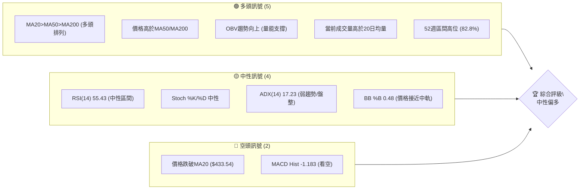

### 📊 核心指標速覽表

| 指標類別 | 指標名稱 | 當前數值 | 訊號 | 解讀 |
|----------|----------|----------|------|------|
| **價格** | 當前價格 | $432.35 | 🟡 | 位於52週高點區間，但近期有所回落 |
| **均線** | MA20 | $433.54 | 🔴 | 價格略低於短期均線，顯示短期壓力 |
| **均線** | MA50 | $411.90 | 🟢 | 價格遠高於中期均線，中期趨勢強勁 |
| **均線** | MA200 | $338.60 | 🟢 | 價格遠高於長期均線，長期趨勢看多 |
| **動能** | RSI(14) | 55.43 | 🟡 | 位於中性區間，無超買超賣跡象 |
| **動能** | MACD Hist | -1.183 | 🔴 | MACD線跌破訊號線，動能轉弱 |
| **波動** | ATR(14) | $19.78 | 🟡 | 佔價格4.58%，波動適中，提供止損參考 |
| **趨勢** | ADX(14) | 17.23 | 🟡 | 趨勢強度較弱，市場處於盤整或弱勢趨勢 |
| **成交量** | 量比(20日) | 1.26x | 🟢 | 當前成交量高於平均，配合OBV顯示量能支撐 |

### 🏆 技術評分卡

TSM 的技術評分顯示，儘管短期動能有所減弱，但其長期趨勢和結構性支撐依然強勁。

```
技術評分卡 — TSM (2026-06-27)
════════════════════════════════════════════════════
趨勢強度      ██████████▓▓░░░░░░░░  60/100  🟡
動能指標      ██████▓▓▓▓░░░░░░░░░░  50/100  🟡
支撐穩定度    ██████████████▓▓░░░░  75/100  🟢
成交量配合    ████████████▓▓░░░░░░  70/100  🟢
形態完整度    ██████▓▓▓▓░░░░░░░░░░  50/100  🟡
均線排列      ████████████████▓▓░░  85/100  🟢
════════════════════════════════════════════════════
綜合評分      ████████████▓▓░░░░░░  65/100  中性偏多
════════════════════════════════════════════════════
```

---

## 2. 趨勢分析

### 🌐 多時框趨勢分析

TSM 的多時框分析揭示了長期強勁上漲趨勢中的短期回調或盤整。

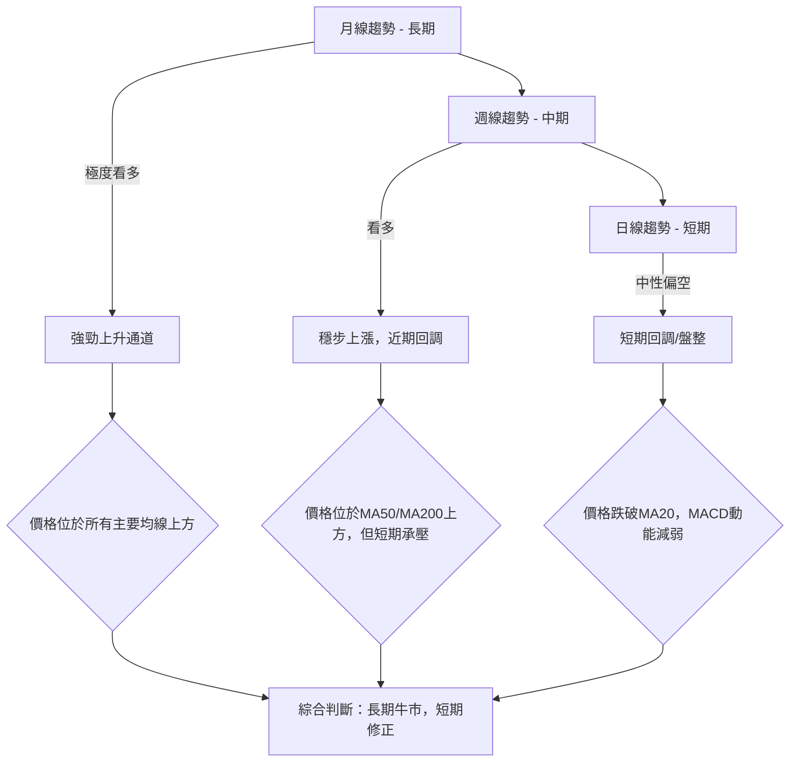

### 📈 長期趨勢 — 12個月走勢圖（Unicode）

TSM 在過去12個月呈現出非常強勁的上升趨勢，從2025年6月的$224.01大幅上漲至2026年6月的$432.35，漲幅高達92.9%。期間雖有小幅回調，但整體上升通道保持完好。

```
TSM 月線走勢圖（過去12個月：2025-06 至 2026-06）
價格軸 ($)
$450 ┤                                        ● (432.35)
$400 ┤                                    ●
$350 ┤                        ●         ●
$300 ┤                  ●   ●           
$250 ┤            ●   ●
$200 ┤●━━━━━━●━━━━━●━━━━━━━━━━━━━━━━━━━━━━━━━━━
$150 ┤
     └─────────────────────────────────────────────────────
      25/06 25/07 25/08 25/09 25/10 25/11 25/12 26/01 26/02 26/03 26/04 26/05 26/06
      224.01 238.98 228.34 277.11 298.08 289.23 302.33 328.86 372.65 337.16 395.13 417.47 432.35
```

**走勢特徵分析表格**

| 階段 | 時間區間 | 起始價 | 結束價 | 漲跌幅 | 主要特徵 | 訊號 |
|------|----------|--------|--------|--------|----------|------|
| 1 | 2025-06 至 2025-07 | $224.01 | $238.98 | +6.68% | 溫和上漲 | 🟢 |
| 2 | 2025-07 至 2025-08 | $238.98 | $228.34 | -4.58% | 短期回調 | 🟡 |
| 3 | 2025-08 至 2025-10 | $228.34 | $298.08 | +30.54% | 強勁主升浪 | 🟢 |
| 4 | 2025-10 至 2025-11 | $298.08 | $289.23 | -2.97% | 短暫整理 | 🟡 |
| 5 | 2025-11 至 2026-02 | $289.23 | $372.65 | +28.84% | 第二波主升浪 | 🟢 |
| 6 | 2026-02 至 2026-03 | $372.65 | $337.16 | -9.52% | 較大幅度回調 | 🔴 |
| 7 | 2026-03 至 2026-05 | $337.16 | $417.47 | +23.81% | 第三波上升 | 🟢 |
| 8 | 2026-05 至 2026-06 | $417.47 | $432.35 | +3.56% | 溫和上漲後遇阻 | 🟡 |
| **總計** | **2025-06 至 2026-06** | **$224.01** | **$432.35** | **+92.9%** | **長期牛市，多頭主導** | **🟢** |

### 📊 中期趨勢（週線分析）

從近20週的收盤價數據來看，TSM 在2026年3月初經歷了一次較大幅度的回調，從$372.65跌至$325.98。隨後股價強勁反彈，於2026年6月21日達到近期高點$462.12，但最近一週（截至2026年6月28日）回落至$432.35。這表明中期上升趨勢依然存在，但短期內面臨一定的賣壓，可能進入橫盤整理或尋找支撐。

**近期壓力與支撐示意圖**

```
TSM 近期週線壓力與支撐示意圖
════════════════════════════════════════════════════════════
$470 ║                                      R (462.12 - 近期高點)
$460 ║
$450 ║
$440 ║                                  ┌─┐
$430 ║                                  └─● (432.35 - 現價)
$420 ║                                  │
$410 ║                                S1 (411.90 - MA50)
$400 ║                                  │
$390 ║
$380 ║
$370 ║
$360 ║
$350 ║
$340 ║                                S2 (338.60 - MA200)
$330 ║                        S3 (325.98 - 3月底低點)
$320 ║
     ╚════════════════════════════════════════════════════════════
```

### ⚡ 趨勢強度評估（ADX 解讀）

ADX 指標用於衡量趨勢的強度，而非方向。當 ADX 值高於 25 時，通常表示趨勢強勁；低於 25 則表示趨勢較弱或處於盤整狀態。

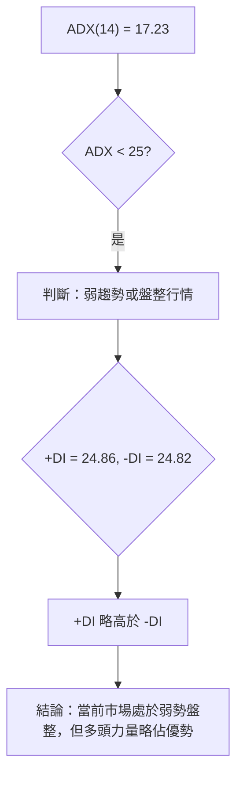

**ADX 強度對照表**

| ADX 數值範圍 | 趨勢強度 | 市場解讀 |
|--------------|----------|----------|
| 0 - 20 | 弱趨勢/無趨勢 | 盤整、震盪、缺乏明確方向 |
| 20 - 25 | 趨勢啟動初期 | 潛在趨勢形成，需觀察 |
| 25 - 50 | 強勁趨勢 | 明確的上升或下降趨勢 |
| 50 - 75 | 非常強勁趨勢 | 極端強勢的單邊行情 |
| 75 - 100 | 極端趨勢 | 市場可能過熱或過冷 |

**TSM ADX 解讀**：
TSM 的 ADX(14) 值為 17.23，明顯低於 25，這強烈表明目前市場處於**弱趨勢或盤整行情**。儘管長期均線呈現多頭排列，但短期內股價缺乏明確的單邊動能。
+DI (24.86) 略高於 -DI (24.82)，這表示在當前的弱勢盤整中，多頭力量稍微佔據上風，但兩者數值非常接近，顯示多空雙方力量均衡，市場正在尋求方向。投資者應注意，在弱趨勢市場中，追漲殺跌的風險較高，更適合採取區間操作或等待趨勢明確。

---

## 3. 圖表形態分析

### 🔍 形態識別系統

根據提供的數據，TSM 在過去幾個月主要呈現強勁的上升趨勢，近期則經歷了一次從高點的回調。目前尚未形成典型的反轉或持續形態（如頭肩頂/底、雙頂/底）。最近的價格行為更傾向於在一個上升通道內進行**高位整理或旗形/三角旗形回調**，尤其是在突破重要阻力後的回踩確認。

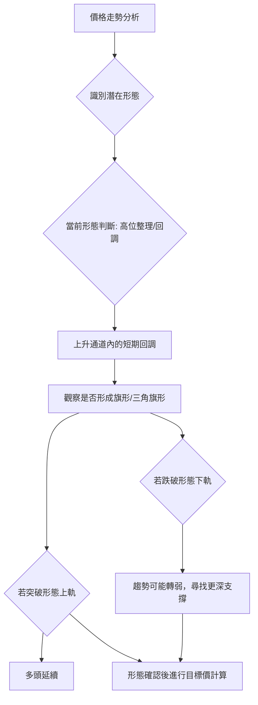

### 🕯️ 重要K線形態分析

根據近20週的收盤價走勢，我們可以觀察到以下幾個重要的週K線形態變化：

| 日期 | 收盤價 | RSI | MACD柱 | 週成交量 | K線形態 (根據前後週價位推斷) | 解讀 | 訊號 |
|------|--------|-----|--------|----------|------------------------------|------|------|
| 2026-03-01 | $372.65 | 66.0 | +0.499 | 57,490,400 | 短期高點/潛在烏雲蓋頂 | 漲勢受阻，動能減弱 | 🟡 |
| 2026-03-08 | $337.15 | 35.0 | -4.851 | 73,335,700 | 長陰線/吞噬形態 | 大幅下跌，空頭強勢 | 🔴 |
| 2026-03-22 | $328.47 | 31.0 | -3.180 | 68,026,500 | 接近底部錘子線/十字星 | 跌勢減緩，可能探底 | 🟢 |
| 2026-04-05 | $338.25 | 50.8 | +0.030 | 58,234,200 | 陽線反轉/啟明星 | 止跌回升，多頭嘗試反攻 | 🟢 |
| 2026-04-26 | $401.52 | 76.5 | +3.566 | 71,592,200 | 長陽線/突破 | 強勢上漲，突破阻力 | 🟢 |
| 2026-05-17 | $403.41 | 49.7 | -0.993 | 76,375,300 | 陰線回調 | 短期獲利了結，動能減弱 | 🟡 |
| 2026-06-21 | $462.12 | 61.5 | +1.073 | 58,879,600 | 長陽線/突破 | 再次強勢上漲，創近期新高 | 🟢 |
| 2026-06-28 | $432.35 | 55.4 | -1.183 | 76,762,700 | 長陰線回調 | 從高點回落，短期賣壓重 | 🔴 |

### 📉 ASCII 走勢形態示意圖

**近期高位回調形態示意圖**
TSM 在近期達到$462.12的高點後，出現了一次較大幅度的回調，目前價格位於$432.35。這可以被視為一個上升趨勢中的**高位回調或旗形整理**。

```
TSM 近期高位回調形態示意圖
══════════════════════════════════════════════════════════════
$470 ║                                  ┌────┐ (近期高點 $462.12)
$460 ║                                  │    │
$450 ║                                  │    │
$440 ║                                  │    ● (現價 $432.35)
$430 ║                                  │  ／
$420 ║                                  │／
$410 ║                                 ／
$400 ║                                ／
$390 ║                              ／
$380 ║                            ／
$370 ║                          ／
$360 ║                        ／
$350 ║                      ／
$340 ║                    ／
$330 ║                  ／
$320 ║                ／ (形態起始點 $325.98)
     ╚══════════════════════════════════════════════════════════════
     時間軸
     (2026-03-29)                           (2026-06-21) (2026-06-27)
```
此圖顯示股價從3月底低點強勢反彈至6月高點，隨後出現回調。若此回調在合理支撐位止跌並再次上漲，則構成上升旗形或三角旗形，預示著原上升趨勢的延續。

### 🎯 形態目標價計算

由於目前形態為高位回調，尚未形成明確的反轉或持續形態，因此我們將基於「**上升旗形/三角旗形**」的潛在突破來計算目標價，並輔以斐波那契擴展。

**假設情境：上升旗形整理後的突破**
1.  **旗桿高度 (Pole Height)**：我們將從2026年3月29日的低點$325.98到2026年6月21日的高點$462.12視為旗桿。
    旗桿高度 = $462.12 - $325.98 = $136.14
2.  **旗形突破點 (Breakout Point)**：假設股價在$432.35附近經過整理後，向上突破旗形的上軌，我們取近期阻力$462.12作為突破的參考基準。
3.  **形態目標價計算**：
    目標價 T1 = 旗形突破點 + 旗桿高度 = $462.12 + $136.14 = **$598.26**
    這個目標價代表了突破後可能達到的潛在漲幅，但需注意，這是一個相對激進的目標，且需要市場情緒和基本面配合。

**斐波那契擴展目標價**
我們使用最近一次較明確的上升波段進行斐波那契擴展計算。
-   波段起始點 (A)：2026-03-29 低點 $325.98
-   波段高點 (B)：2026-06-21 高點 $462.12
-   波段回調點 (C)：當前價格 $432.35 (或預期回調止跌點，例如MA50 $411.90)

若以當前價格$432.35作為回調點C：
-   1.272 擴展目標：B + (B-A) * 0.272 = $462.12 + ($462.12 - $325.98) * 0.272 = $462.12 + $136.14 * 0.272 = $462.12 + $37.03 = **$499.15**
-   1.618 擴展目標：B + (B-A) * 0.618 = $462.12 + $136.14 * 0.618 = $462.12 + $84.15 = **$546.27**

**結論**：
基於上述分析，若TSM能成功完成高位整理並向上突破，其近期目標價區間可能落在**$499.15**至**$546.27**之間，而更長期的形態目標價則可能挑戰**$598.26**。然而，這些目標價的實現需要價格有效突破當前阻力並保持量能配合。

---

## 4. 支撐與阻力

### 🗺️ 關鍵價位分布圖（Unicode）

TSM 當前價格 $432.35 位於一個關鍵位置，上方阻力重重，下方則有多重支撐。

```
TSM 價位結構分布圖
═══════════════════════════════════════════════════
$476.79 ║████████████████████████║ 強阻力 R3 (52週高點)
$462.83 ║████████████████████    ║ 阻力 R2 (布林上軌 / 近期高點)
$433.54 ║████████████████████████║ 關鍵阻力 R1 (MA20)
$432.35 ╠════════════════════════╣ ◄ 現價
$411.90 ║▓▓▓▓▓▓▓▓▓▓▓▓▓▓▓▓        ║ 近期支撐 S1 (MA50)
$404.25 ║████████████████████████║ 強支撐 S2 (布林下軌 / 斐波那契50%回調)
$378.14 ║████████████████████████║ 強支撐 S3 (斐波那契38.2%回調)
$338.60 ║████████████████████████║ 極強支撐 S4 (MA200)
═══════════════════════════════════════════════════
```

### 🚧 阻力位分析表

| 阻力級別 | 價位 | 形成原因 | 突破難度 | 重要性 |
|----------|------|----------|----------|--------|
| **R1** | $433.54 | MA20 (短期均線) | 中等 | 價格剛跌破，需迅速收復以避免短期弱勢 |
| **R2** | $462.12 | 2026-06-21 近期高點 | 中等 | 股價需突破此點才能恢復近期上漲動能 |
| **R2'** | $462.83 | 布林通道上軌 | 中等 | 通常為短期超買區間或強阻力 |
| **R3** | $476.79 | 52週高點 | 高 | 突破此點將創歷史新高，吸引大量買盤 |
| **R4** | $499.15 | 斐波那契1.272擴展目標 | 高 | 突破R3後的潛在目標 |

### 🛡️ 支撐位分析表

| 支撐級別 | 價位 | 形成原因 | 守住機率 | 重要性 |
|----------|------|----------|----------|--------|
| **S1** | $411.90 | MA50 (中期均線) | 高 | 中期上升趨勢的關鍵支撐，提供反彈機會 |
| **S2** | $404.25 | 布林通道下軌 | 高 | 通常為短期超賣區間或強支撐 |
| **S2'** | $394.05 | 斐波那契50%回調 | 高 | 上升趨勢中常見的回調點，具有心理支撐 |
| **S3** | $378.14 | 斐波那契38.2%回調 | 高 | 若跌破S2，此為下一個重要支撐 |
| **S4** | $338.60 | MA200 (長期均線) | 極高 | 長期牛市的最後防線，跌破意味趨勢逆轉 |
| **S5** | $325.98 | 2026-03-29 低點 | 極高 | 近期主要底部，具有強烈心理支撐 |

### 📐 斐波那契回調位分析

我們從2026年3月29日的近期低點 ($325.98) 到2026年6月21日的近期高點 ($462.12) 繪製斐波那契回調線，以識別潛在的支撐區域。

```
TSM 斐波那契回調位示意圖
══════════════════════════════════════════════════════════════
$462.12 ║███████████████████████████████████████████████████████████████████████║ 0.0% (近期高點)
        ║                                                                     ║
$432.35 ╠═════════════════════════════════════════════════════════════════════╣ ◄ 現價
        ║                                                                     ║
$409.96 ║▓▓▓▓▓▓▓▓▓▓▓▓▓▓▓▓▓▓▓▓▓▓▓▓▓▓▓▓▓▓▓▓▓▓▓▓▓▓▓▓▓▓▓▓▓▓▓▓▓▓▓▓▓▓▓▓▓▓▓▓▓▓▓▓▓▓▓▓▓▓▓▓▓║ 38.2% 回調 ($462.12 - ($462.12 - $325.98) * 0.382 = $409.96)
        ║                                                                     ║
$394.05 ║▓▓▓▓▓▓▓▓▓▓▓▓▓▓▓▓▓▓▓▓▓▓▓▓▓▓▓▓▓▓▓▓▓▓▓▓▓▓▓▓▓▓▓▓▓▓▓▓▓▓▓▓▓▓▓▓▓▓▓▓▓▓▓▓▓▓▓▓▓▓▓▓▓║ 50.0% 回調 ($462.12 - ($462.12 - $325.98) * 0.500 = $394.05)
        ║                                                                     ║
$378.14 ║▓▓▓▓▓▓▓▓▓▓▓▓▓▓▓▓▓▓▓▓▓▓▓▓▓▓▓▓▓▓▓▓▓▓▓▓▓▓▓▓▓▓▓▓▓▓▓▓▓▓▓▓▓▓▓▓▓▓▓▓▓▓▓▓▓▓▓▓▓▓▓▓▓║ 61.8% 回調 ($462.12 - ($462.12 - $325.98) * 0.618 = $378.14)
        ║                                                                     ║
$348.60 ║▓▓▓▓▓▓▓▓▓▓▓▓▓▓▓▓▓▓▓▓▓▓▓▓▓▓▓▓▓▓▓▓▓▓▓▓▓▓▓▓▓▓▓▓▓▓▓▓▓▓▓▓▓▓▓▓▓▓▓▓▓▓▓▓▓▓▓▓▓▓▓▓▓║ 76.4% 回調 ($462.12 - ($462.12 - $325.98) * 0.764 = $348.60)
        ║                                                                     ║
$325.98 ║███████████████████████████████████████████████████████████████████████║ 100.0% (近期低點)
══════════════════════════════════════════════════════════════
```

**斐波那契回調位詳細分析**：
-   **38.2% 回調位 ($409.96)**：這個價位非常接近 MA50 ($411.90)。若股價回調至此，將是強勁的支撐區間。歷史上，健康的上漲趨勢通常不會跌破38.2%回調位。
-   **50% 回調位 ($394.05)**：若38.2%回調位被跌破，則50%回調位是下一個重要心理和技術支撐。這個價位也接近布林通道下軌 ($404.25)。
-   **61.8% 回調位 ($378.14)**：黃金分割位，通常被認為是趨勢反轉或深度回調的關鍵點。若跌破此位，則上升趨勢的完整性將受到嚴重考驗。

**當前價格 ($432.35) 位於38.2%回調位上方，略低於MA20 ($433.54)。這表明股價正處於一個短期回調的初期，需要密切關注$409.96（38.2%回調位 / MA50）能否提供有效支撐。**

---

## 5. 技術指標深度解讀

### 🎛️ 指標訊號總覽

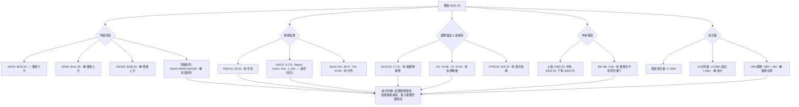

### 📈 移動平均線排列分析

TSM 的移動平均線系統呈現出一個長期看多的結構，但短期內出現了壓力。

**均線排列狀態**：
-   MA20 ($433.54)
-   MA50 ($411.90)
-   MA200 ($338.60)
目前的排列是 MA20 > MA50 > MA200，這是一個典型的**多頭排列 (Golden Cross setup)**，表明長期上升趨勢非常穩固，是強烈的長期看多訊號。

**價格與均線關係**：
-   **當前價格 ($432.35) < MA20 ($433.54)**：價格已跌破短期20日均線，顯示短期內面臨賣壓，短期趨勢轉弱。這可能是一個短期回調或獲利了結的訊號。
-   **當前價格 ($432.35) > MA50 ($411.90)**：價格仍遠高於中期50日均線，表明中期上升趨勢未變。MA50將成為一個重要的中期支撐位。
-   **當前價格 ($432.35) > MA200 ($338.60)**：價格顯著高於長期200日均線，這是長期牛市的明確標誌。MA200作為長期趨勢的生命線，為股價提供堅實的底部支撐。

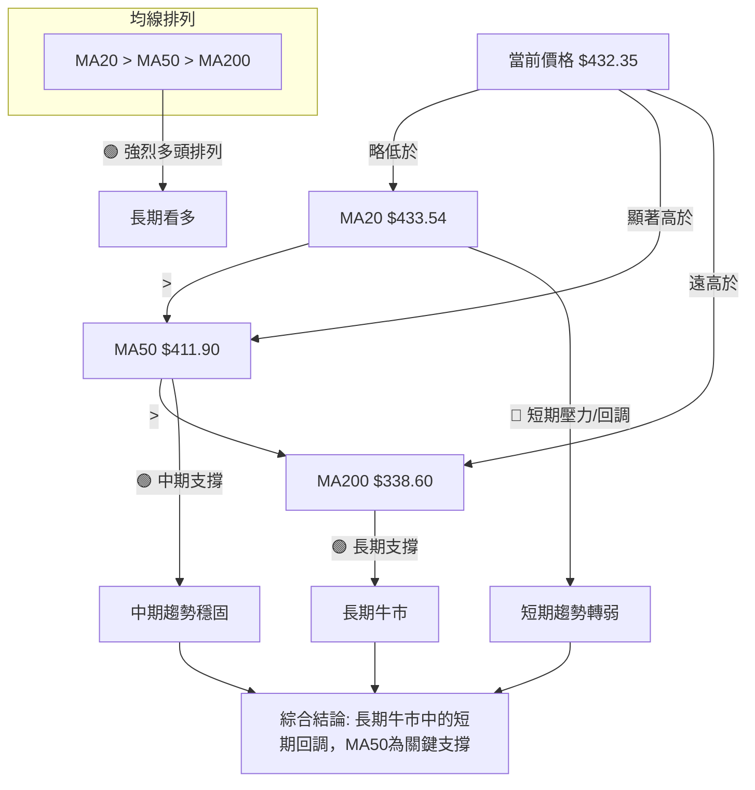

**結論**：儘管短期價格跌破MA20，但MA系統整體仍處於多頭排列，且價格遠高於MA50和MA200。這表明當前是一個**健康的回調**，而非趨勢反轉。MA50 ($411.90) 將是近期重要的中期支撐位。

### 📉 RSI(14) 分析

**RSI 數值進度條**：
當前 RSI(14) = 55.43
RSI 強度：▓▓▓▓▓▓▓▓▓▓▓▓▓▓▓▓▓▓▓▓▓▓▓▓▓▓▓▓▓▓▓▓▓▓▓▓▓▓▓▓▓▓▓▓▓▓▓▓▓▓▓▓▓▓▓▓░░░░░░░░░░░░░░░░░░░░░░░░░░░░░░░░░░░░░░░░░░░░░ 55.43%

**超買超賣區間分析**：
-   RSI 數值介於 30 至 70 之間，屬於**中性區間**。這表示市場目前既沒有過度買入（超買），也沒有過度賣出（超賣），處於一個相對均衡的狀態。
-   過去20週數據顯示，RSI 在2026-04-26達到76.5，進入超買區，隨後價格經歷了回調，符合超買後的正常修正。
-   最近一週RSI從61.5回落至55.43，說明短期漲勢動能減弱，賣壓增加。

**背離判斷**：
-   根據提供的數據，**無明顯的 RSI 頂背離或底背離現象**。
    -   **頂背離**：價格創新高，RSI 未創新高。目前價格從$462.12回落，RSI從61.5回落，並未形成頂背離。
    -   **底背離**：價格創新低，RSI 未創新低。目前價格處於回調，尚未出現明顯的底背離訊號。
-   雖然沒有明確的背離，但RSI從高位回落，與價格的下跌同步，顯示短期動能的確在減弱。

**結論**：RSI 位於中性區間，表明目前市場情緒相對平穩。短期RSI的下降確認了當前的價格回調，但由於未進入超賣區，回調空間可能還有。

### 📊 MACD(12/26/9) 訊號解讀

MACD 指標用於判斷趨勢的動能和方向。

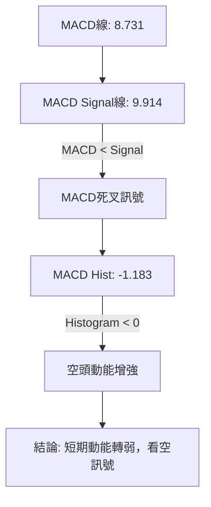

**MACD 指標數值分析**：
-   **MACD 線 (8.731)**：代表短期動能。
-   **MACD Signal 線 (9.914)**：代表 MACD 線的平滑值，作為買賣訊號的參考。
-   **MACD 柱狀圖 (Histogram: -1.183)**：MACD 線與 Signal 線之差，用於衡量動能的變化速度。

**訊號解讀**：
-   **MACD 線 (8.731) < MACD Signal 線 (9.914)**：這是一個**死叉訊號**，表明短期動能已跌破其中期平滑線，通常被視為一個**看空訊號**，預示著股價可能進入回調或盤整階段。
-   **MACD 柱狀圖為負 (-1.183)**：柱狀圖從正值轉為負值，並持續為負，這進一步確認了空頭動能正在增強。柱狀圖的絕對值越大，空頭動能越強。

**背離判斷**：
-   根據提供的數據，**無明顯的 MACD 頂背離或底背離現象**。
    -   MACD 線與價格走勢基本同步，價格從高點回落，MACD 也從高位回落並形成死叉。

**結論**：MACD 指標明確發出短期看空訊號，確認了當前股價的回調趨勢。儘管長期均線仍處於多頭排列，但 MACD 的死叉和負值柱狀圖提示投資者短期內應保持謹慎，關注下方支撐。

### 📦 布林通道分析

布林通道由三條線組成：上軌、中軌（通常為20日均線）和下軌，用於衡量價格的波動範圍和相對位置。

**布林通道示意圖**：

```
TSM 布林通道示意圖 (現價 $432.35)
══════════════════════════════════════════════════════════════
$470 ║                                      ↑ 布林上軌 ($462.83)
$460 ║                                      │
$450 ║                                      │
$440 ║                                      │
$430 ║                                  ● ─┼─ 布林中軌 (MA20 $433.54)
$420 ║                                  │
$410 ║                                  │
$400 ║                                      ↓ 布林下軌 ($404.25)
$390 ║
     ╚══════════════════════════════════════════════════════════════
```

**布林通道數值分析**：
-   **布林上軌 ($462.83)**：通常作為價格上漲的阻力位。
-   **布林中軌 (MA20: $433.54)**：作為短期趨勢線和動態支撐/阻力。
-   **布林下軌 ($404.25)**：通常作為價格下跌的支撐位。
-   **BB %B (0.48)**：衡量價格在布林通道中的相對位置。0代表價格在下軌，1代表價格在上軌，0.5代表價格在中軌。當前 0.48 表示價格略低於中軌。

**訊號解讀**：
-   **價格 ($432.35) 位於布林中軌 ($433.54) 略下方**：這再次確認了短期趨勢的減弱，股價從中軌上方跌落，中軌現在轉為短期阻力。
-   **BB %B 接近 0.5**：說明價格目前處於通道的中央位置，尚未觸及上軌或下軌的極端區域，表明市場波動相對穩定，但沒有明確的單邊趨勢。
-   **布林通道寬度**：上軌 ($462.83) 與下軌 ($404.25) 的價差為 $58.58。ATR 為 $19.78，通道寬度約為 ATR 的 3 倍，顯示波動性適中。若通道開始收窄，可能預示著盤整後的大幅波動；若通道擴張，則預示趨勢的形成。

**結論**：布林通道分析顯示 TSM 目前處於中性偏弱的狀態，價格在中軌附近盤整。中軌 ($433.54) 成為短期阻力，而下軌 ($404.25) 則提供潛在支撐。投資者應關注價格能否重新站上中軌，或是否會進一步向布林下軌回調。

### 💹 成交量分析（量價配合度）

成交量是價格走勢的動能，量價配合度是判斷趨勢可靠性的重要指標。

**成交量數值分析**：
-   **最新成交量 (17,951,300)**
-   **20日均量 (14,285,000)**
-   **50日均量 (14,065,264)**
-   **量比 (最新成交量 / 20日均量) = 1.26x**

**量價配合度解讀**：
-   **最新成交量高於20日和50日均量 (量比 1.26x)**：這表明當前的交易活動較為活躍。通常，在下跌過程中，如果成交量放大，可能預示著恐慌性拋售或主力出貨；如果成交量萎縮，則回調可能是健康的調整。目前價格下跌而成交量放大，需要警惕。
-   **OBV 趨勢：OBV > MA → 量能支撐上漲**：這是來自數據中的一個重要結論。OBV (On-Balance Volume) 是一種累積成交量指標，如果 OBV 線持續上升並高於其移動平均線，則表示買入壓力大於賣出壓力，量能正在支撐價格上漲。**儘管近期股價回調，但 OBV 趨勢仍為多頭，這是一個積極訊號，表明儘管短期有賣壓，但整體市場的買入意願依然存在，且長期資金並未大規模撤離。**

**近20週週成交量分析**：
觀察20週成交量數據，在價格大幅上漲或下跌時，成交量通常會放大。例如：
-   2026-03-08 ($337.15) 和 2026-03-15 ($336.57) 的大幅下跌伴隨著高成交量 (73M, 77M)，顯示恐慌性拋售。
-   2026-04-19 ($369.63) 和 2026-04-26 ($401.52) 的強勁反彈也伴隨著高成交量 (82M, 71M)，顯示買盤強勁。
-   最近一週 (2026-06-28) 價格從 $462.12 回落至 $432.35，成交量為 76,762,700，較前一週的 58,879,600 有所放大，這在下跌中放大成交量，是一個需要警惕的訊號。

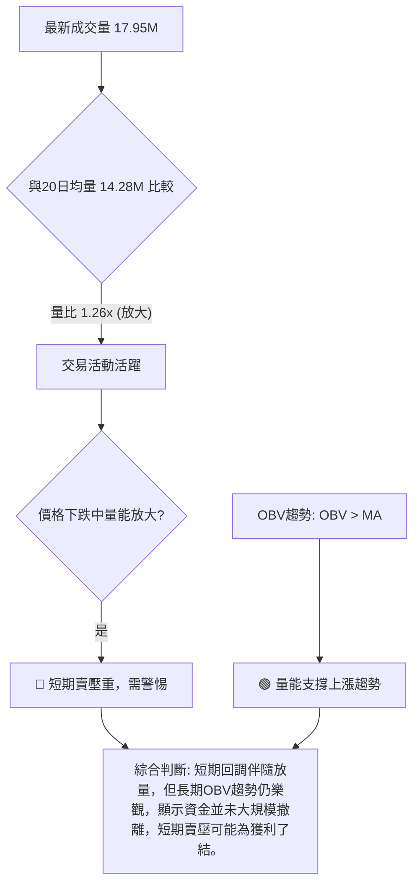

**結論**：當前價格下跌伴隨成交量放大，這在短期內可能增加下跌壓力。然而，OBV 趨勢仍為多頭，暗示儘管有短期回調，但長期買盤力量依然存在。這是一個矛盾的訊號，投資者應密切關注後續量價變化，以確認回調的性質。若價格在重要支撐位止跌並放出巨量，則可能是築底反彈的訊號。

---

## 6. 動能與波動率

### ⚡ 動能評估四象限

我們將 TSM 的動能和波動率進行綜合評估，以確定其當前的市場狀態。

**動能評估**：
-   RSI(14) 55.43：中性
-   MACD Hist -1.183：空頭動能
-   Stoch %K/%D 中性
-   **結論**：短期動能正在減弱，從多頭轉為中性偏空。

**波動率評估**：
-   ATR(14) $19.78，佔價格 4.58%。
-   **結論**：波動率適中，不是極高也不是極低。

結合以上，TSM 目前處於「**弱動能，中等波動**」的象限。

| 象限 | 動能 | 波動 | 當前狀態 | 評估 |
|------|------|------|----------|------|
| Q1 | 強 | 低 | - | 最佳機會 (強趨勢，低風險) |
| Q2 | 弱 | 低 | - | 謹慎觀望 (盤整，低風險) |
| Q3 | 強 | 高 | - | 高風險高收益 (強趨勢，高風險) |
| Q4 | 弱 | 高 | - | 避免進場 (盤整，高風險) |
| **TSM 現狀** | **弱** | **中等** | **✓** | **謹慎觀望 (短期動能減弱，波動適中，等待趨勢明朗)** |

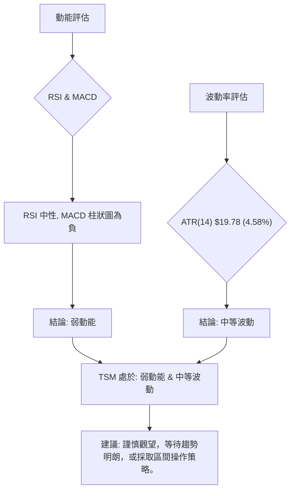

### 📊 ATR 波動率分析

**ATR(14) = $19.78**
ATR (Average True Range) 衡量資產價格的波動性。TSM 的 ATR 為 $19.78，佔當前價格 $432.35 的 4.58%。

**解讀**：
-   **波動性適中**：4.58% 的波動率對於半導體龍頭股而言是相對正常的，既不屬於極端高波動，也不屬於極端低波動。這意味著 TSM 的每日價格波動在可預期的範圍內，但仍足夠活躍。
-   **止損距離建議**：ATR 是設定止損點的有效工具。通常，將止損點設置在 ATR 的 1.5 倍至 3 倍範圍之外，可以有效避免被市場的日常波動「洗出場」。
    -   建議止損距離 (1.5x ATR)：1.5 * $19.78 = $29.67
    -   建議止損距離 (2x ATR)：2 * $19.78 = $39.56
    -   **若以當前價格 $432.35 考慮，一個合理的短期止損點可能設置在 $432.35 - $29.67 = $402.68 或 $432.35 - $39.56 = $392.79 附近。** 這些位置與斐波那契回調位 ($394.05, $409.96) 和布林下軌 ($404.25) 有所重疊，增加了其作為支撐的可靠性。

### 📐 Beta 與市場相關性

提供的數據中未包含 TSM 的 Beta 值。然而，基於對半導體產業的普遍理解，TSM 作為全球領先的晶圓代工廠，其業務與全球經濟景氣度、科技發展週期緊密相關。

**一般產業判斷**：
-   **行業 Beta**：半導體行業通常被認為是高 Beta 行業，其股票價格波動往往大於大盤（如 S&P 500）。這意味著當大盤上漲時，TSM 可能會漲得更多；當大盤下跌時，TSM 也可能跌得更多。
-   **TSM 特性**：儘管 TSM 規模巨大且具有產業龍頭地位，其穩健性相對較高，但仍無法脫離行業週期性影響。因此，預計 TSM 的 Beta 值會**高於 1**，可能在 1.2 至 1.5 之間。
-   **市場相關性**：TSM 的股價走勢與主要科技指數（如納斯達克100）和半導體指數（如費城半導體指數 SOX）具有高度正相關性。投資者在分析 TSM 時，應同時關注大盤和相關產業指數的表現。
-   **風險提示**：高 Beta 意味著更高的波動風險，但同時也提供了更高的潛在收益。投資者應將 TSM 視為一個具有成長潛力但同時受市場情緒和宏觀經濟影響較大的標的。

---

## 7. 多時框架總結

### 📋 時框架評分表

| 時框架 | 趨勢方向 | 動能 | 均線排列 | 形態 | 綜合評分 | 建議 |
|--------|----------|------|----------|------|----------|------|
| **長期** | 🟢 上升趨勢 | 🟢 強勁 | 🟢 多頭排列 | 🟢 上升通道 | 9/10 (極強) | 適合長期持有，逢低買入 |
| **中期** | 🟢 上升趨勢 | 🟡 減弱中 | 🟢 多頭排列 | 🟡 高位整理 | 7/10 (偏強) | 觀察回調支撐，等待企穩 |
| **短期** | 🔴 回調/盤整 | 🔴 轉弱 | 🟡 價格跌破MA20 | 🟡 回調/旗形 | 4/10 (偏弱) | 謹慎觀望，等待買入訊號 |

### 🔲 綜合訊號矩陣

| 指標/時框架 | 長期 (月線) | 中期 (週線) | 短期 (日線) | 一致性 |
|-------------|-------------|-------------|-------------|--------|
| **價格趨勢** | 🟢 上漲 | 🟢 上漲 (回調中) | 🔴 下跌/盤整 | 不一致 |
| **均線排列** | 🟢 多頭排列 | 🟢 多頭排列 | 🟢 多頭排列 | 高度一致 |
| **價格 vs. MA** | 🟢 價格>MA200 | 🟢 價格>MA50 | 🔴 價格<MA20 | 不一致 |
| **RSI(14)** | 🟢 穩健 | 🟡 中性 | 🟡 中性 | 一致 (中性) |
| **MACD** | 🟢 上升動能 | 🟡 動能減弱 | 🔴 死叉/負柱 | 不一致 |
| **ADX** | 🟢 強趨勢 | 🟡 弱趨勢 | 🟡 弱趨勢 | 不一致 |
| **OBV** | 🟢 上漲 | 🟢 上漲 | 🟢 上漲 | 高度一致 |
| **綜合結論** | **強烈看多** | **看多 (回調中)** | **中性偏空** | **長期強勢，短期修正** |

**一致性分析**：
-   **長期與中期趨勢高度一致**，均線系統保持強勁的多頭排列，且 OBV 顯示量能支撐。這表明 TSM 的基本面和長期市場情緒依然樂觀。
-   **短期訊號與長中期趨勢存在不一致**，主要體現在價格跌破短期MA20、MACD形成死叉以及ADX顯示弱趨勢。這明確指出目前正處於一個**短期回調或盤整階段**。
-   這種不一致性是健康牛市中的常見現象，通常是主力洗盤或獲利了結的結果，而非趨勢反轉。關鍵在於觀察股價能否在重要中長期支撐位企穩反彈。

---

## 8. 交易策略建議

### 🗺️ 策略決策流程圖

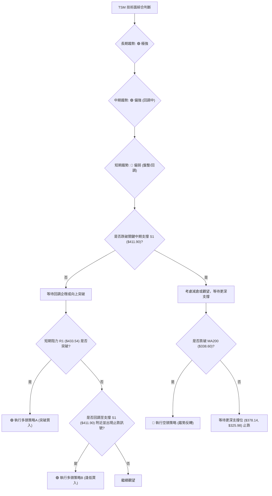

### 🟢 多頭策略詳情

鑑於 TSM 的長期強勁上升趨勢，我們主要考慮多頭策略。

| 策略要素 | 策略 A：突破買入 (激進) | 策略 B：逢低買入 (穩健) |
|----------|--------------------------|--------------------------|
| **進場條件** | 價格有效突破短期阻力 R1 ($433.54) 並站穩 MA20，或突破近期高點 $462.12 | 價格回調至 MA50 ($411.90) 或斐波那契38.2%回調位 ($409.96) 附近，並出現止跌 K 線形態 (如錘子線、啟明星) 或 RSI 築底反彈。 |
| **進場價格** | **$435.00** (突破 MA20 後確認) 或 **$463.00** (突破近期高點後確認) | **$412.00 - $410.00** 區間 |
| **目標價 T1** | **$462.12** (近期高點) | **$433.54** (MA20/中軌) |
| **目標價 T2** | **$476.79** (52週高點) | **$462.12** (近期高點) |
| **目標價 T3** | **$499.15** (斐波那契1.272擴展目標) | **$476.79** (52週高點) |
| **止損價格** | **$409.00** (略低於 MA50 和 38.2%斐波那契回調位) | **$392.00** (略低於 50%斐波那契回調位) |
| **風險報酬比** | 策略 A (以$435進場，T1 $462.12，止損 $409): (462.12-435)/(435-409) ≈ **1.04:1** | 策略 B (以$411進場，T1 $433.54，止損 $392): (433.54-411)/(411-392) ≈ **1.18:1** |
| **成功機率** | 60% (需量能配合) | 70% (基於長期趨勢支撐) |
| **建議倉位** | 中等偏低 (5-10%) | 中等 (10-15%) |

### 🔴 空頭策略詳情

鑑於 TSM 處於強勁的長期上升趨勢，做空風險極高。空頭策略僅在極端情況下考慮，且應嚴格控制倉位。

| 策略要素 | 策略 C：跌破關鍵支撐 (防守性/激進) |
|----------|------------------------------------|
| **進場條件** | 價格有效跌破 MA200 ($338.60)，並伴隨巨量；或跌破前期低點 $325.98 |
| **進場價格** | **$335.00** (跌破 MA200 後確認) |
| **目標價 T1** | **$300.00** (心理關口) |
| **目標價 T2** | **$280.00** (歷史重要支撐) |
| **止損價格** | **$345.00** (略高於 MA200) |
| **風險報酬比** | (335-300)/(345-335) = **3.5:1** (此策略風險極高，僅供參考) |
| **成功機率** | 20% (與長期趨勢背離) |
| **建議倉位** | 極低 (2-5%) |

### ⭐ 整體訊號強度評星

```
做多訊號強度：★★★★☆  (4/5星) 理由：長期趨勢強勁，中期有回調但支撐穩固，OBV配合良好。
做空訊號強度：★☆☆☆☆  (1/5星) 理由：與長期趨勢嚴重背離，風險極高，僅在極端情況下考慮。
整體可信度：  ★★★☆☆  (3/5星) 理由：多空訊號短期存在矛盾，需等待市場進一步確認方向。
```

---

## 9. 風險提示與監控

### ✅ 關鍵監控指標 Checklist

以下是投資者在持有或考慮投資 TSM 時應密切監控的關鍵技術指標：

```
╔══════════════════════════════════════════════════════════════╗
║             TSM 關鍵監控指標清單                             ║
╠══════════════════════════════════════════════════════════════╣
║ [ ] 價格是否能重新站穩 MA20 ($433.54)？ (短期動能恢復訊號)    ║
║ [ ] 價格是否能守住 MA50 ($411.90) 或斐波那契38.2%回調位 ($409.96)？ (中期支撐關鍵) ║
║ [ ] RSI(14) 是否跌破 50 或進入超賣區 (30以下)？ (動能變化)    ║
║ [ ] MACD 線是否重新上穿 Signal 線，柱狀圖轉正？ (動能反轉訊號) ║
║ [ ] 成交量在下跌時是否持續放大？ (賣壓強度)                  ║
║ [ ] 成交量在反彈時是否能有效放大？ (買盤強度)                ║
║ [ ] ADX(14) 是否能突破 25，顯示明確趨勢形成？ (趨勢強度確認)   ║
║ [ ] 布林通道是否收窄或擴張？ (波動率變化)                    ║
║ [ ] 是否出現新的圖表形態 (如頭肩頂、雙頂等反轉形態)？       ║
╚══════════════════════════════════════════════════════════════╝
```

### ⚠️ 風險場景分析

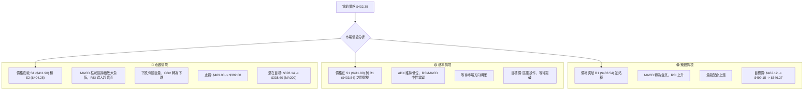

### 🛡️ 風險管理重要提醒

1.  **倉位管理**：鑑於 TSM 的高 Beta 性質及當前短期動能減弱，建議採取分批建倉策略。在趨勢不明朗時，保持較輕倉位，待趨勢確認後再逐步加倉。單一股票的倉位不應超過總投資組合的 10-15%。
2.  **嚴格止損**：無論採取何種策略，都必須設定並嚴格執行止損點。一旦價格觸及止損位，應果斷離場，避免虧損擴大。例如，若採取逢低買入策略，可將止損設在 MA50 或斐波那契50%回調位下方。
3.  **多樣化投資**：TSM 屬於半導體行業，具有週期性。建議將其作為多元化投資組合的一部分，不應過度集中。
4.  **關注宏觀經濟與產業新聞**：半導體行業對全球經濟景氣、地緣政治、科技創新等因素高度敏感。應密切關注相關宏觀數據、公司財報和產業鏈新聞，以輔助技術分析的判斷。
5.  **不盲目追漲殺跌**：在弱趨勢或盤整行情中，股價可能在短期內大幅波動。應避免在沒有明確訊號的情況下盲目追高或恐慌性拋售。
6.  **定期檢視**：技術指標會隨著時間和價格變化而改變，建議定期（例如每週或每月）重新評估技術面，調整交易策略。

---

## 📋 報告總結

```
TSM 技術分析報告總結
════════════════════════════════════════════════════════
報告日期：2026-06-27
當前價格：$432.35
分析評級：⚖️ 中性偏多 (長期強勁，短期回調)

關鍵結論：
├─ 長期趨勢：🟢 強勁上升趨勢，均線多頭排列穩固，OBV支撐良好。
├─ 中期趨勢：🟢 上升趨勢，但近期經歷高位回調，MA50為關鍵支撐。
├─ 短期趨勢：🔴 偏弱，價格跌破MA20，MACD死叉，ADX顯示弱趨勢/盤整。
├─ 關鍵支撐：$411.90 (MA50)，$409.96 (斐波那契38.2%)，$404.25 (布林下軌)。
├─ 關鍵阻力：$433.54 (MA20/布林中軌)，$462.12 (近期高點)，$476.79 (52週高點)。
└─ 分析師目標：$478.95 (均值) - 顯示有上漲空間。

最優策略組合：
1. 🥇 **最佳機會 (逢低買入)**：在 $410.00 - $412.00 區間尋找止跌訊號，進場做多，止損設於 $392.00，目標 $462.12 至 $476.79。風險報酬比約 1.18:1。
2. 🥈 **次選機會 (突破買入)**：若價格能有效突破 $435.00 (站穩 MA20)，進場做多，止損設於 $409.00，目標 $462.12 至 $499.15。風險報酬比約 1.04:1。
3. 🥉 **保守選擇 (觀望)**：在市場明確短期方向或價格回調至更強支撐位之前，保持觀望，避免在盤整區間內頻繁交易。
════════════════════════════════════════════════════════
```

---

> ⚠️ **免責聲明**：本報告為 AI 自動生成之技術分析，所有數據及估算均基於提供的歷史價格資訊。本報告**僅供研究與學術參考**，**不構成任何投資建議**。投資有風險，入市需謹慎。

---

*報告生成時間：2026-06-27 ｜ 數據來源：提供之技術數據 ｜ 分析框架：多時框技術分析*