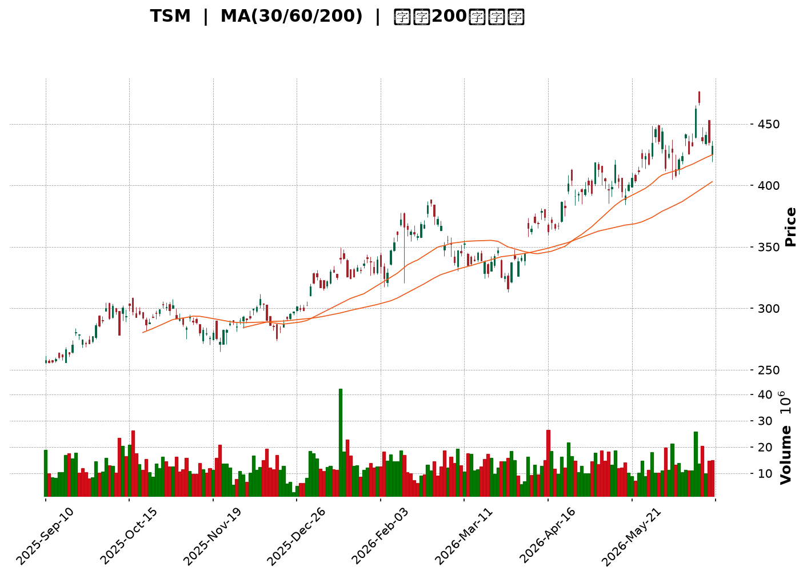
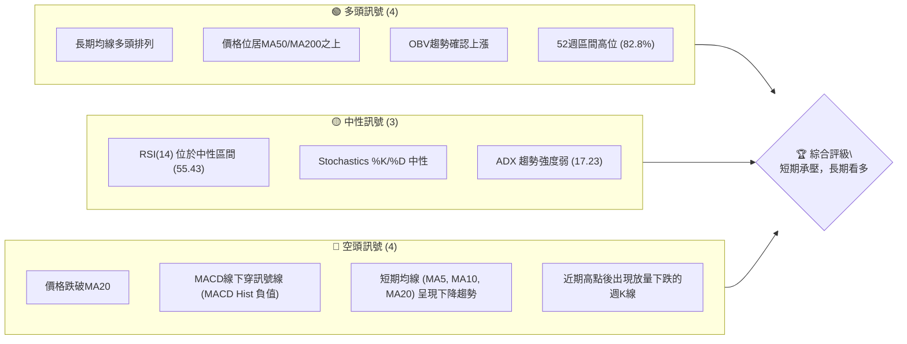
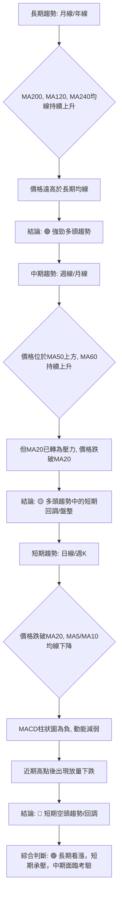
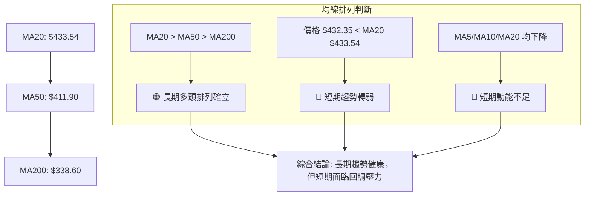
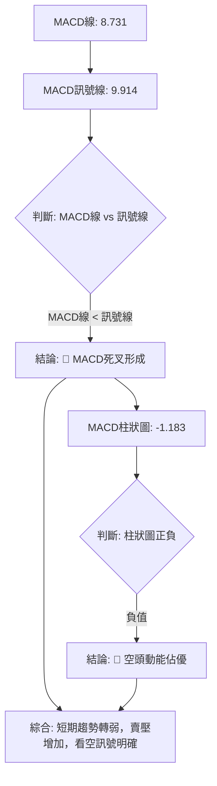

<details>
<summary>📊 靜態圖表 (點擊展開)</summary>

</details>

<html>
<head><meta charset="utf-8" /></head>
<body>
    <div style="height:500px; width:100%;">                        <script>window.PlotlyConfig = {MathJaxConfig: 'local'};</script>
        <script charset="utf-8" src="https://cdn.plot.ly/plotly-3.6.0.min.js" integrity="sha256-QaOVwtVY0T02VaHrr6pnoHLCwayMJp4O5n4YyaE3rJk=" crossorigin="anonymous"></script>                <div id="candlestick-chart" class="plotly-graph-div" style="height:100%; width:100%;"></div>            <script>                window.PLOTLYENV=window.PLOTLYENV || {};                                if (document.getElementById("candlestick-chart")) {                    Plotly.newPlot(                        "candlestick-chart",                        [{"close":{"dtype":"f8","bdata":"AAAAgHUZcEAAAAAgPwFwQAAAAIDkB3BAAAAAwFUocEAAAACgLUBwQAAAAGDES3BAAAAAoKKocEAAAACAyWxwQAAAAAD653BAAAAAwP6HcUAAAADgPmhxQAAAAMDzJ3FAAAAAoJDzcEAAAABggPFwQAAAACC0UXFAAAAAYG\u002fjcUAAAABguN1xQAAAAEB9HnJAAAAAoJLAckAAAADgsjtyQAAAAAA64nJAAAAAYJGYckAAAACgc2dxQAAAAABayHJAAAAAIAVackAAAABAPuVyQAAAAMDul3JAAAAAIF5MckAAAADg9XVyQAAAAMBRQ3JAAAAAoPHpcUAAAAAAUAdyQAAAAIB2SnJAAAAAALF+ckAAAADAwrJyQAAAAKBG63JAAAAAAJfNckAAAACATKFyQAAAAMCf53JAAAAAYAQ8ckAAAAAggjVyQAAAAICo73FAAAAAQCnEcUAAAABgYk9yQAAAAABMDnJAAAAAAJEFckAAAABA5n9xQAAAAOB9qXFAAAAAIOJ8cUAAAADAyztxQAAAACCZgnFAAAAAgEk1cUAAAABgjQ5xQAAAAGCipnFAAAAAwESncUAAAACgFvtxQAAAAMCxE3JAAAAAwOTWcUAAAADg5hxyQAAAAAA+UnJAAAAAoDwqckAAAABAp0ZyQAAAAIAouHJAAAAAIJvQckAAAADgcTtzQAAAAOCH9HJAAAAAwJ8ockAAAABgLeRxQAAAAEBU1nFAAAAAgJU4cUAAAAAgeLNxQAAAACBw93FAAAAAwFw8ckAAAADAx3ZyQAAAAGA6lHJAAAAAIInUckAAAABg+bVyQAAAAOCkoHJAAAAAAEDlckAAAAAAet9zQAAAAOB\u002fCXRAAAAAIPRbdEAAAABArNBzQAAAAEACxnNAAAAAYHcfdEAAAABgCaF0QAAAAGAfmHRAAAAAINxWdEAAAABAJT51QAAAAAA+SnVAAAAA4KdXdEAAAAAAGkd0QAAAAKD\u002fWnRAAAAAwGHSdEAAAADg\u002f690QAAAAMCdCXVAAAAAoKZIdUAAAACA4Bx1QAAAAMDGjXRAAAAAILA5dUAAAACgY+B0QAAAAIANQXRAAAAAgHuQdEAAAACg6bB1QAAAACBVGXZAAAAAYMyAdkAAAAAgrUJ3QAAAAGBU43ZAAAAA4KHHdkAAAAAAQKV2QAAAAKBehnZAAAAAgJpodkAAAABAKwp3QAAAAKA1AndAAAAAIEf8d0AAAACAyxt4QAAAACD5bXdAAAAA4HlKd0AAAADgZ\u002fN2QAAAAGAK9XVAAAAAYKU5dkAAAAAAqQB2QAAAACBfEnVAAAAAYIaudUAAAACg5ZR1QAAAAGDNC3ZAAAAAoKvvdEAAAACAIwl1QAAAAICzJ3VAAAAAIL+SdUAAAAAgbSx1QAAAAMD5H3VAAAAAQIiHdEAAAABgjBp1QAAAACArZ3VAAAAAIACvdUAAAACgkVV0QAAAACCgX3RAAAAAICu8c0AAAAAgkRJ1QAAAAAATS3VAAAAAYPcjdUAAAABgYk91QAAAACA2iHVAAAAAwLjQdkAAAABgLcp2QAAAAAC\u002fG3dAAAAAAE4Ld0AAAAAACrB3QAAAAACUY3dAAAAAYASodkAAAABgJhp3QAAAACAm1nZAAAAAIIXzdkAAAACAjih4QAAAAGBB3HdAAAAAoFAYeUAAAACAikB5QAAAAADGdnhAAAAAwI6OeEAAAACAJ7J4QAAAAMDay3hAAAAAIL8KeUAAAAAA0Zd4QAAAAIBRKHpAAAAAAOvSeUAAAACAfat5QAAAAICEOXlAAAAAAKHFeEAAAADA2u14QAAAAKDnC3pAAAAAIHw2eUAAAAAgZrB4QAAAAEAVe3hAAAAAIOgKeUAAAAAALmN5QAAAAMAyOXlAAAAA4LS1eUAAAACg4Ft6QAAAAKDgfXpAAAAAwI4XekAAAACgyyl7QAAAAIBX2ntAAAAAQLc6e0AAAACgFr57QAAAAEAz43lAAAAAYNicekAAAABAua56QAAAAGC4fHlAAAAAwB5RekAAAABA4X56QAAAAGBmlntAAAAAoEedekAAAABgZgJ7QAAAAIDr4XxAAAAAYLg6fUAAAACAPUZ7QAAAAKBHjXtAAAAAANcve0AAAACgmQV7QA=="},"high":{"dtype":"f8","bdata":"51sgY\u002flacECpOCHvcixwQIKgbIqHIXBAGGQ2Yc4+cEAAQXPctYVwQMbGApDVa3BAEQ6sJ8zGcEAT3GBPxodwQPKCy40wI3FAkztsRDm8cUBStAXdLnBxQH9a3ICSL3FAuk9DmIkVcUBnkX8d6VpxQJdmkNjgVHFAVvAHAlgDckBHITdIZ2ZyQFdvidHsW3JAnWprFlwOc0AIQGMSLwtzQHGYkEsSAHNAl9M1CGbHckCBrRXCpZ1yQKNJrUf543JAodIX0UC2ckDQCdTHZwNzQKmHY2X4TnNALF1BBNzOckD7aBB2atRyQKi+uZ14kHJATnLk\u002fEVOckAPbvzmpjxyQEuL1N\u002fteXJA+OpZtheickCqnhkpSbxyQIZy2jfWGHNAzv9IpoQOc0A2ztBUZBRzQFooEE4gO3NAeSaqXBC6ckD9hTgVN35yQF8XZxJiRXJAWcKdPDracUBCza9v6WxyQLzsIunTSXJA7fQQ5whJckC2uMs6yfNxQBSzVUzgyXFAnvxaQaPEcUBAkJac\u002fV9xQHZ4lZA0pXFAJY20kPcockAhFTGhLUhxQGx9\u002fSxNrXFAnMxi0bKycUADe7D7VChyQP3TMPobJnJAx3\u002fgbiMOckANHr0SKUNyQNtejsjQZHJArXcmBrM7ckBvNqcsLKdyQKolcnsQxHJACSqcVMTkckAdsBqIZ3hzQCIYmAhKBHNARXfQEXXrckAVREdxeWRyQHCp7Gaj73FAJqn2bNP5cUArlFoK8tpxQG2U+3WxKnJAxXtwdOZXckCFhDeqD4ZyQHUjwGv1mXJA0pWsoSHdckCfAj2i9e5yQL5vJV\u002fB73JAjdpiUfYcc0CQt\u002f1w\u002fv5zQEosWWfCmHRATr8djuO1dECe3Y5U90l0QIiQZp9QLXRA7s81wJwxdEDEf+zGXr10QGcHGPEN63RAoblFO6KCdEBzQ2VhY9h1QMdunGjUwHVA5t7ETENGdUBusiOwzb50QDK1oTE\u002f1XRAojhCoKz2dEBEp2QPC9Z0QCxhxdzvN3VAfgwTgpZ7dUDNs6GKkl91QFYter9yInVA7lUSFuVmdUAW8mh7QpR1QGQdYE\u002fwEHVA4h7GSJvNdEBZllHPwr51QPd3SioHXHZASRtJACqudkBLbyOMEJp3QNf4JTvAoHdAVza44D0Td0BMLzjlFcV2QGcuygXd93ZAVrPIA\u002feOdkBQAbStlyR3QNmo7KErOHdAWJCMKuAyeECc32RKRUN4QPbGFiO9B3hAz5lHSudrd0D3YTIA6zJ3QMOLXABoInZAmR7r6L5zdkDmpraF9Vl2QI8FrM7XrnVAQvuOw6q5dUD0NzMO7vp1QMQ\u002faoM2OHZAhMYMsLaRdUC6L7nj\u002fGt1QOo\u002fuD69bXVALPsUiTKfdUDzjAluMbJ1QG1mtKCxMXVA6ecg3\u002foMdUCC7sIIuWl1QN3gpgYwgXVAGLVeiRnadUC9XBzd0EF1QBBEROOjjHRAJdZZYkeNdECT1BPZ6Bl1QH1qY3HYvXVALe8AQVVUdUDa\u002fzhGVXZ1QFwljT2Qi3VAlvHovM5Wd0D3OF8a9fR2QNyzsY7ekXdAWmG8SXkpd0At9ccmRtR3QGV67Khm0XdA\u002fkQUclwVd0DfX6ZiPWt3QMJN4DhJE3dAcl668iMed0CJ5owgDzB4QHnZs5+gPXhAffRAOYiIeUAJyf1Egdh5QDSKMfQLz3hAaVQ3a82ueEDj+cR\u002fu914QCg14OS8MHlA1DwMmPVreUAT9un35VJ5QIsIANaCK3pA4WoZpEwwekDTrH9WaQB6QNR25ThwbHlAP1W4qM0UeUDWlKWMwDt5QDOoDPS+T3pA+NnrLJmOeUD0aDfH3l55QCoBET8r33hAtX5Xf\u002fsueUA3y\u002fyA+qd5QAV1cWVem3lAu1PyN0X4eUApeM5ptNh6QBTrOYedqXpAVsb4AfPWekDbROvxcAV8QKlCs5NR9XtABWaMeLsRfECUz\u002f6tae97QMKqpQEuDntA4Ad2Sr4Me0Dj4ERBLlJ7QGYoIPwulXpAAAAAAABkekAAAABACq96QAAAAKBHqXtAAAAAoEeFe0AAAAAAAKh7QAAAACCFE31AAAAA4KPMfUAAAACgR\u002fV7QAAAAIDCvXtAAAAAYGZOfEAAAACA60F7QA=="},"hovertemplate":"\u003cb\u003e%{x|%Y-%m-%d}\u003c\u002fb\u003e\u003cbr\u003e\u958b: $%{open:.2f}\u003cbr\u003e\u9ad8: $%{high:.2f}\u003cbr\u003e\u4f4e: $%{low:.2f}\u003cbr\u003e\u6536: $%{close:.2f}\u003cextra\u003e\u003c\u002fextra\u003e","low":{"dtype":"f8","bdata":"MUywi8fdb0CM0Nqu+OxvQC7vcOC38W9AhvbEKm79b0CuFErPKClwQO9jCp4wG3BAorNqP9H+b0B+08O3FUxwQDROPq3+dXBAWO2UaPlccUCwGsOl5yhxQJeXMdE9wXBAXNtOXhHIcEAAAABggPFwQDsN4bgG+3BA3rbJfAwwcUBZuJZVk8xxQKmQznCAA3JAj1i5RoWZckAJ3Jjkyi9yQPgSnMfnOnJAuFvgBoRxckAk6H5xNmJxQMjRNbyNIHJANXhIz\u002f4QckDonqR2lZtyQGYYkD\u002ftZXJAxpZ2\u002f9NJckBdrdbezGtyQK28XljTNXJAjZro9tKicUA5YM2Z2fVxQHZ9qiBqQXJA+vDlRk02ckA7OKcHPlxyQDnVcEhBwHJAuxobe32nckA9NFaWxGVyQDTgon4gvHJArGWv6nEzckA89dwniRNyQGJSOpAh0nFAOKqDz2kvcUDpy684gRdyQPZ3x19r6nFAJ\u002fvZbQ71cUCU1atz+VxxQK6vXWaA8XBA+GKmpcxZcUAsR5mzZ+lwQNFjWB2OInFAlDrJx\u002fsjcUBrCYE\u002fvotwQK7H7Mrd8HBAAlOPmR7vcEDuWlkJsNdxQFhZRiHZ63FAyk7uiJ2PcUCemkWwtO5xQF+jq+BVvXFAKg9hDOb+cUDXNfoyUS9yQHiDBQxnZnJABZxJ\u002fKiCckDARA4IKcJyQK5gem6ZoXJAz9K\u002fUMAXckCi0AAgJ+FxQMXiMDzSnXFAK\u002fUKlKgacUANO8GO1IRxQLtO6XqHznFAksLnk2kbckAd+Ky\u002fKytyQNdgfdpRa3JA0RtHUsWPckAHsucp15FyQEe2eDyTnnJAaW40b+3dckCEqsJFkWFzQPrmDaqP\u002fXNA6nLHSb8udEDXVG\u002fScc5zQEP3\u002fR0+qHNAGWzOItTJc0BssyG4jvZzQDJWZy1HkXRAonSBlWgydEDn+l5w7gJ1QJ8NFopHO3VA5LlMWYRTdEC3Z1EDGUB0QApoA2WEU3RA3VnFbquadEBlonYVhoh0QLxH\u002f3NyzXRA\u002fnoU4bUOdUCY5u7wNWh0QNE0aFyJdnRAuHZyWYl2dEDSzoohLoV0QDuau6rh1nNAftR\u002fAh3gc0AWP8I1t+50QBuFnrUyoHVAQP03te4odkDF+pf\u002f8ed2QDQhocQcB3RAb5RK7qZudkBVOKpTiyZ2QMPunWGybXZAAYCuWqU5dkBi79\u002fVEVR2QAiYPj45yXZATyrRFOBhd0D9AmQNou13QLjNB07M\u002fHZA+PKgOJvrdkD3XKmkaax2QLBaEqLwZXVAQ0VKt6QLdkBe8cAIh2B1QLPppzBa73RAAqArwWyjdECXG2hGpWh1QFc8t4vyyHVAZ8Vr8mrqdEARVeDf3ud0QANcq8EsIXVAwUNG6r8ZdUCRhH8zwSh1QIle8kXiRnRAiU2GljdSdECm6GoWOaV0QM5lmVTV03RAbd\u002feyyhrdUA4Feu0wUl0QDHzCEXpGHRAcpa\u002fthGRc0CDo20+PAZ0QC54wqZML3VAkUMHYpVgdEBu3b3sQh11QKzaIUra7XRAB6RMHGlmdkAHvbUlCX52QBzbb4ItDndA2VSurx3TdkB1O8l0kUV3QOuQJChyNXdAD1DNS1J7dkBjJ1Arl8R2QL9EQititnZAeHg2bBzEdkBq2g+GYhx3QDWRtU3pbndAvW2LheCOeEBj8JOUbvd4QPDSAb3R\u002fHdAwSa\u002fcV40eEDVM2Ts8Ax4QNGSTeRrc3hAi9LJN22keEC7rjKS7Hp4QAogr0Ns+3hArwFj7YByeUAo1OsaGP94QEzOtqQn1HhA\u002fJpvbHwTeECUtVfX4mh4QFH795qREnlAtUkn817eeEBMYUyELmJ4QLL8usCQAnhAlWeKImaweECfjBu9Oel4QHb9vEKzHnlAlBhIaMqReUCecM9WjeZ5QG9odWLb23lAWY\u002fi+2YEekAbcajGNFh6QOrJrXTcL3tAVhWuizwYe0CGEEqe06R6QPjFvoY1vXlAr4PfXK9YekArtshVAEl5QKPmT6z1a3lAAAAAgMKNeUAAAAAgXBN6QAAAAEDh\u002fnpAAAAAQDOTekAAAACAPfp6QAAAAIA9ZntAAAAAYLgSfUAAAABACiN7QAAAAKBHCXtAAAAAQAoHe0AAAABACjN6QA=="},"name":"\u50f9\u683c","open":{"dtype":"f8","bdata":"q6OzF50AcEDfElzbCBhwQLCtfGXyH3BASFRAFH8ScEDVJ1qjdH1wQLfMG31fZHBAQVast3P\u002fb0BUtxF3mYRwQM0mgWVMh3BAP0Je7RKDcUDD0yFP5WFxQADIDj3B73BAPWjYpvr7cEBzwrvaQCVxQKr\u002fyiGuEnFA2715sTVEcUDip+NvOmNyQAIhcAsgKXJA2uXPyKGackAbdZRRkANzQJnSp\u002f0YS3JAjE0NzyS\u002fckBcQslR1plyQGl\u002flmiIfnJAkKBjTRlVckD\u002fdQBnU\u002f5yQGdChDz8R3NAsmiCjhKBckB2mrT4eJpyQAtK9PaYinJAJNN7MFkrckAtLEpojPhxQGwUGJclVHJARMDYkAqFckC53sZrzX9yQBEYggOM9nJAcWfW+13LckAt0GEzkPlyQI5ViJGWw3JA5YPOf\u002fFockBdjyHKUCVyQHOXaX3PPHJAxdOHr66vcUCdoykk8EByQBnl0t9sHHJANSVuHnY2ckApeQUsjO5xQERR4tMLHHFAjkHkoNVzcUBgQGinFDZxQNhSioYULHFA\u002fwWLj84eckA8e4Rt1epwQK7H7Mrd8HBA7rcRElCIcUCU5CWqb+1xQFDV2M8XI3JAmO9ONtTKcUBlucoheRtyQEVZaLdUHnJAyD7z3+c6ckD9l9pIxFtyQPp3kbSFrXJAb\u002fZSRVCackCKYiGguO9yQLJ6\u002fxoD\u002fHJARXfQEXXrckDZh17AIFpyQGpHEYqJ3HFAhLTxrMDwcUCIYF4jkLhxQLtO6XqHznFAHrrI\u002fHxSckB35HycRT5yQEMXsfBag3JAlqnexLylckBDTz\u002fFqcNyQB3pvDnlzHJAGQJBLwDnckDQab5ABmZzQH5IYKw6i3RAZ5efQ12IdEBYfDFFBTB0QG10JXCQK3RAmt6uf\u002fric0DkayOzHAd0QJBnks2LsnRAoblFO6KCdEBn4Y7exFB1QMCZURmqi3VAG0pKbp0wdUAEWQTcdbt0QPYpLSJNu3RAmqMm8s+ldEB2scLwRbF0QNrdgtxT7HRASaG6YUVUdUDr7Kk82yB1QCSdqg8j23RAuswWx\u002fWQdED6nmQqvnR1QNw6IY0A3nRA4wQSppISdEBz\u002fc3wPvx0QLzPpr96r3VAhRHWrVGndkAWLKCL2AJ3QE1jd0jVkHdAJLq+Awv0dkBXFV9NKYB2QPceJXHWn3ZA8sbxOvBddkADmCzF5F52QLTc9Yn60XZAwTVxLjOXd0Cc32RKRUN4QBslCl4fA3hA\u002fmqsOM0Dd0DIeTzStrd2QI2X6f0NvHVAQjPylXw5dkClKAr7NhF2QMEeIpPAW3VAL2VtiADedEA6H6kS3ap1QCSyXyPGAXZAX5f3pW6CdUAMBT8FcGJ1QBLP4ebvN3VAf6B3HN48dUAtakzSjY91QKEGEJU2h3RARXAITUv+dECm6GoWOaV0QMvLNV+T7HRAS6c93xCTdUDbRoSrajB1QODyUAcjQXRAqPIV+vdmdEANKh1M6Rh0QItxyk+LcXVA0JgD4DhhdECy6FWcTC91QJ0HKeVZKnVAm43uPMwWd0AT1ScVOKd2QGVf+z5ma3dA\u002fuCQpVEWd0CodmuCeKJ3QNg5XV1NyHdA+VsHhfj\u002fdkCpS0zJP0V3QExhTLu3BXdAAAAAIIXzdkAV9Dr9lC53QGEsssii9XdAtKxEe26zeECkVWpyiMx5QKS7+fpCc3hA1IDWTd9\u002feEDhobDAFs54QCGQ+hpViHhA8MLIpjI5eUAZIim8eTp5QL5ncoRbF3lA019oi88RekCpxvYQnf95QNqDUpKiXHlAkzGQoCHNeEBHXEqEbtV4QLDnpXtJJHlAswHd7M1YeUD0aDfH3l55QFzwomqZSXhAYY491ijBeECfjBu9Oel4QF2zSiOTh3lAbogb+HnCeUCFEfdRW6B6QOezsYO8U3pA4ogNwiehekBHaft\u002fMn56QD4Xy1jPeHtAJDEOuQQPfEAXiEWA+9l6QFE6sgdBzHpAKz4Sf3psekC2f2EM+d16QO0ITqTiz3lAAAAAACnUeUAAAADAzEB6QAAAAEDhantAAAAA4FFAe0AAAAAAACx7QAAAAIAUbntAAAAAoHDBfUAAAABA4XJ7QAAAACCuH3tAAAAAYGZOfEAAAAAAAJB6QA=="},"x":["2025-09-10T00:00:00-04:00","2025-09-11T00:00:00-04:00","2025-09-12T00:00:00-04:00","2025-09-15T00:00:00-04:00","2025-09-16T00:00:00-04:00","2025-09-17T00:00:00-04:00","2025-09-18T00:00:00-04:00","2025-09-19T00:00:00-04:00","2025-09-22T00:00:00-04:00","2025-09-23T00:00:00-04:00","2025-09-24T00:00:00-04:00","2025-09-25T00:00:00-04:00","2025-09-26T00:00:00-04:00","2025-09-29T00:00:00-04:00","2025-09-30T00:00:00-04:00","2025-10-01T00:00:00-04:00","2025-10-02T00:00:00-04:00","2025-10-03T00:00:00-04:00","2025-10-06T00:00:00-04:00","2025-10-07T00:00:00-04:00","2025-10-08T00:00:00-04:00","2025-10-09T00:00:00-04:00","2025-10-10T00:00:00-04:00","2025-10-13T00:00:00-04:00","2025-10-14T00:00:00-04:00","2025-10-15T00:00:00-04:00","2025-10-16T00:00:00-04:00","2025-10-17T00:00:00-04:00","2025-10-20T00:00:00-04:00","2025-10-21T00:00:00-04:00","2025-10-22T00:00:00-04:00","2025-10-23T00:00:00-04:00","2025-10-24T00:00:00-04:00","2025-10-27T00:00:00-04:00","2025-10-28T00:00:00-04:00","2025-10-29T00:00:00-04:00","2025-10-30T00:00:00-04:00","2025-10-31T00:00:00-04:00","2025-11-03T00:00:00-05:00","2025-11-04T00:00:00-05:00","2025-11-05T00:00:00-05:00","2025-11-06T00:00:00-05:00","2025-11-07T00:00:00-05:00","2025-11-10T00:00:00-05:00","2025-11-11T00:00:00-05:00","2025-11-12T00:00:00-05:00","2025-11-13T00:00:00-05:00","2025-11-14T00:00:00-05:00","2025-11-17T00:00:00-05:00","2025-11-18T00:00:00-05:00","2025-11-19T00:00:00-05:00","2025-11-20T00:00:00-05:00","2025-11-21T00:00:00-05:00","2025-11-24T00:00:00-05:00","2025-11-25T00:00:00-05:00","2025-11-26T00:00:00-05:00","2025-11-28T00:00:00-05:00","2025-12-01T00:00:00-05:00","2025-12-02T00:00:00-05:00","2025-12-03T00:00:00-05:00","2025-12-04T00:00:00-05:00","2025-12-05T00:00:00-05:00","2025-12-08T00:00:00-05:00","2025-12-09T00:00:00-05:00","2025-12-10T00:00:00-05:00","2025-12-11T00:00:00-05:00","2025-12-12T00:00:00-05:00","2025-12-15T00:00:00-05:00","2025-12-16T00:00:00-05:00","2025-12-17T00:00:00-05:00","2025-12-18T00:00:00-05:00","2025-12-19T00:00:00-05:00","2025-12-22T00:00:00-05:00","2025-12-23T00:00:00-05:00","2025-12-24T00:00:00-05:00","2025-12-26T00:00:00-05:00","2025-12-29T00:00:00-05:00","2025-12-30T00:00:00-05:00","2025-12-31T00:00:00-05:00","2026-01-02T00:00:00-05:00","2026-01-05T00:00:00-05:00","2026-01-06T00:00:00-05:00","2026-01-07T00:00:00-05:00","2026-01-08T00:00:00-05:00","2026-01-09T00:00:00-05:00","2026-01-12T00:00:00-05:00","2026-01-13T00:00:00-05:00","2026-01-14T00:00:00-05:00","2026-01-15T00:00:00-05:00","2026-01-16T00:00:00-05:00","2026-01-20T00:00:00-05:00","2026-01-21T00:00:00-05:00","2026-01-22T00:00:00-05:00","2026-01-23T00:00:00-05:00","2026-01-26T00:00:00-05:00","2026-01-27T00:00:00-05:00","2026-01-28T00:00:00-05:00","2026-01-29T00:00:00-05:00","2026-01-30T00:00:00-05:00","2026-02-02T00:00:00-05:00","2026-02-03T00:00:00-05:00","2026-02-04T00:00:00-05:00","2026-02-05T00:00:00-05:00","2026-02-06T00:00:00-05:00","2026-02-09T00:00:00-05:00","2026-02-10T00:00:00-05:00","2026-02-11T00:00:00-05:00","2026-02-12T00:00:00-05:00","2026-02-13T00:00:00-05:00","2026-02-17T00:00:00-05:00","2026-02-18T00:00:00-05:00","2026-02-19T00:00:00-05:00","2026-02-20T00:00:00-05:00","2026-02-23T00:00:00-05:00","2026-02-24T00:00:00-05:00","2026-02-25T00:00:00-05:00","2026-02-26T00:00:00-05:00","2026-02-27T00:00:00-05:00","2026-03-02T00:00:00-05:00","2026-03-03T00:00:00-05:00","2026-03-04T00:00:00-05:00","2026-03-05T00:00:00-05:00","2026-03-06T00:00:00-05:00","2026-03-09T00:00:00-04:00","2026-03-10T00:00:00-04:00","2026-03-11T00:00:00-04:00","2026-03-12T00:00:00-04:00","2026-03-13T00:00:00-04:00","2026-03-16T00:00:00-04:00","2026-03-17T00:00:00-04:00","2026-03-18T00:00:00-04:00","2026-03-19T00:00:00-04:00","2026-03-20T00:00:00-04:00","2026-03-23T00:00:00-04:00","2026-03-24T00:00:00-04:00","2026-03-25T00:00:00-04:00","2026-03-26T00:00:00-04:00","2026-03-27T00:00:00-04:00","2026-03-30T00:00:00-04:00","2026-03-31T00:00:00-04:00","2026-04-01T00:00:00-04:00","2026-04-02T00:00:00-04:00","2026-04-06T00:00:00-04:00","2026-04-07T00:00:00-04:00","2026-04-08T00:00:00-04:00","2026-04-09T00:00:00-04:00","2026-04-10T00:00:00-04:00","2026-04-13T00:00:00-04:00","2026-04-14T00:00:00-04:00","2026-04-15T00:00:00-04:00","2026-04-16T00:00:00-04:00","2026-04-17T00:00:00-04:00","2026-04-20T00:00:00-04:00","2026-04-21T00:00:00-04:00","2026-04-22T00:00:00-04:00","2026-04-23T00:00:00-04:00","2026-04-24T00:00:00-04:00","2026-04-27T00:00:00-04:00","2026-04-28T00:00:00-04:00","2026-04-29T00:00:00-04:00","2026-04-30T00:00:00-04:00","2026-05-01T00:00:00-04:00","2026-05-04T00:00:00-04:00","2026-05-05T00:00:00-04:00","2026-05-06T00:00:00-04:00","2026-05-07T00:00:00-04:00","2026-05-08T00:00:00-04:00","2026-05-11T00:00:00-04:00","2026-05-12T00:00:00-04:00","2026-05-13T00:00:00-04:00","2026-05-14T00:00:00-04:00","2026-05-15T00:00:00-04:00","2026-05-18T00:00:00-04:00","2026-05-19T00:00:00-04:00","2026-05-20T00:00:00-04:00","2026-05-21T00:00:00-04:00","2026-05-22T00:00:00-04:00","2026-05-26T00:00:00-04:00","2026-05-27T00:00:00-04:00","2026-05-28T00:00:00-04:00","2026-05-29T00:00:00-04:00","2026-06-01T00:00:00-04:00","2026-06-02T00:00:00-04:00","2026-06-03T00:00:00-04:00","2026-06-04T00:00:00-04:00","2026-06-05T00:00:00-04:00","2026-06-08T00:00:00-04:00","2026-06-09T00:00:00-04:00","2026-06-10T00:00:00-04:00","2026-06-11T00:00:00-04:00","2026-06-12T00:00:00-04:00","2026-06-15T00:00:00-04:00","2026-06-16T00:00:00-04:00","2026-06-17T00:00:00-04:00","2026-06-18T00:00:00-04:00","2026-06-22T00:00:00-04:00","2026-06-23T00:00:00-04:00","2026-06-24T00:00:00-04:00","2026-06-25T00:00:00-04:00","2026-06-26T00:00:00-04:00"],"type":"candlestick"},{"hovertemplate":"MA30: $%{y:.2f}\u003cextra\u003e\u003c\u002fextra\u003e","line":{"color":"#2196F3","dash":"dash","width":2},"mode":"lines","name":"MA30","x":["2025-09-10T00:00:00-04:00","2025-09-11T00:00:00-04:00","2025-09-12T00:00:00-04:00","2025-09-15T00:00:00-04:00","2025-09-16T00:00:00-04:00","2025-09-17T00:00:00-04:00","2025-09-18T00:00:00-04:00","2025-09-19T00:00:00-04:00","2025-09-22T00:00:00-04:00","2025-09-23T00:00:00-04:00","2025-09-24T00:00:00-04:00","2025-09-25T00:00:00-04:00","2025-09-26T00:00:00-04:00","2025-09-29T00:00:00-04:00","2025-09-30T00:00:00-04:00","2025-10-01T00:00:00-04:00","2025-10-02T00:00:00-04:00","2025-10-03T00:00:00-04:00","2025-10-06T00:00:00-04:00","2025-10-07T00:00:00-04:00","2025-10-08T00:00:00-04:00","2025-10-09T00:00:00-04:00","2025-10-10T00:00:00-04:00","2025-10-13T00:00:00-04:00","2025-10-14T00:00:00-04:00","2025-10-15T00:00:00-04:00","2025-10-16T00:00:00-04:00","2025-10-17T00:00:00-04:00","2025-10-20T00:00:00-04:00","2025-10-21T00:00:00-04:00","2025-10-22T00:00:00-04:00","2025-10-23T00:00:00-04:00","2025-10-24T00:00:00-04:00","2025-10-27T00:00:00-04:00","2025-10-28T00:00:00-04:00","2025-10-29T00:00:00-04:00","2025-10-30T00:00:00-04:00","2025-10-31T00:00:00-04:00","2025-11-03T00:00:00-05:00","2025-11-04T00:00:00-05:00","2025-11-05T00:00:00-05:00","2025-11-06T00:00:00-05:00","2025-11-07T00:00:00-05:00","2025-11-10T00:00:00-05:00","2025-11-11T00:00:00-05:00","2025-11-12T00:00:00-05:00","2025-11-13T00:00:00-05:00","2025-11-14T00:00:00-05:00","2025-11-17T00:00:00-05:00","2025-11-18T00:00:00-05:00","2025-11-19T00:00:00-05:00","2025-11-20T00:00:00-05:00","2025-11-21T00:00:00-05:00","2025-11-24T00:00:00-05:00","2025-11-25T00:00:00-05:00","2025-11-26T00:00:00-05:00","2025-11-28T00:00:00-05:00","2025-12-01T00:00:00-05:00","2025-12-02T00:00:00-05:00","2025-12-03T00:00:00-05:00","2025-12-04T00:00:00-05:00","2025-12-05T00:00:00-05:00","2025-12-08T00:00:00-05:00","2025-12-09T00:00:00-05:00","2025-12-10T00:00:00-05:00","2025-12-11T00:00:00-05:00","2025-12-12T00:00:00-05:00","2025-12-15T00:00:00-05:00","2025-12-16T00:00:00-05:00","2025-12-17T00:00:00-05:00","2025-12-18T00:00:00-05:00","2025-12-19T00:00:00-05:00","2025-12-22T00:00:00-05:00","2025-12-23T00:00:00-05:00","2025-12-24T00:00:00-05:00","2025-12-26T00:00:00-05:00","2025-12-29T00:00:00-05:00","2025-12-30T00:00:00-05:00","2025-12-31T00:00:00-05:00","2026-01-02T00:00:00-05:00","2026-01-05T00:00:00-05:00","2026-01-06T00:00:00-05:00","2026-01-07T00:00:00-05:00","2026-01-08T00:00:00-05:00","2026-01-09T00:00:00-05:00","2026-01-12T00:00:00-05:00","2026-01-13T00:00:00-05:00","2026-01-14T00:00:00-05:00","2026-01-15T00:00:00-05:00","2026-01-16T00:00:00-05:00","2026-01-20T00:00:00-05:00","2026-01-21T00:00:00-05:00","2026-01-22T00:00:00-05:00","2026-01-23T00:00:00-05:00","2026-01-26T00:00:00-05:00","2026-01-27T00:00:00-05:00","2026-01-28T00:00:00-05:00","2026-01-29T00:00:00-05:00","2026-01-30T00:00:00-05:00","2026-02-02T00:00:00-05:00","2026-02-03T00:00:00-05:00","2026-02-04T00:00:00-05:00","2026-02-05T00:00:00-05:00","2026-02-06T00:00:00-05:00","2026-02-09T00:00:00-05:00","2026-02-10T00:00:00-05:00","2026-02-11T00:00:00-05:00","2026-02-12T00:00:00-05:00","2026-02-13T00:00:00-05:00","2026-02-17T00:00:00-05:00","2026-02-18T00:00:00-05:00","2026-02-19T00:00:00-05:00","2026-02-20T00:00:00-05:00","2026-02-23T00:00:00-05:00","2026-02-24T00:00:00-05:00","2026-02-25T00:00:00-05:00","2026-02-26T00:00:00-05:00","2026-02-27T00:00:00-05:00","2026-03-02T00:00:00-05:00","2026-03-03T00:00:00-05:00","2026-03-04T00:00:00-05:00","2026-03-05T00:00:00-05:00","2026-03-06T00:00:00-05:00","2026-03-09T00:00:00-04:00","2026-03-10T00:00:00-04:00","2026-03-11T00:00:00-04:00","2026-03-12T00:00:00-04:00","2026-03-13T00:00:00-04:00","2026-03-16T00:00:00-04:00","2026-03-17T00:00:00-04:00","2026-03-18T00:00:00-04:00","2026-03-19T00:00:00-04:00","2026-03-20T00:00:00-04:00","2026-03-23T00:00:00-04:00","2026-03-24T00:00:00-04:00","2026-03-25T00:00:00-04:00","2026-03-26T00:00:00-04:00","2026-03-27T00:00:00-04:00","2026-03-30T00:00:00-04:00","2026-03-31T00:00:00-04:00","2026-04-01T00:00:00-04:00","2026-04-02T00:00:00-04:00","2026-04-06T00:00:00-04:00","2026-04-07T00:00:00-04:00","2026-04-08T00:00:00-04:00","2026-04-09T00:00:00-04:00","2026-04-10T00:00:00-04:00","2026-04-13T00:00:00-04:00","2026-04-14T00:00:00-04:00","2026-04-15T00:00:00-04:00","2026-04-16T00:00:00-04:00","2026-04-17T00:00:00-04:00","2026-04-20T00:00:00-04:00","2026-04-21T00:00:00-04:00","2026-04-22T00:00:00-04:00","2026-04-23T00:00:00-04:00","2026-04-24T00:00:00-04:00","2026-04-27T00:00:00-04:00","2026-04-28T00:00:00-04:00","2026-04-29T00:00:00-04:00","2026-04-30T00:00:00-04:00","2026-05-01T00:00:00-04:00","2026-05-04T00:00:00-04:00","2026-05-05T00:00:00-04:00","2026-05-06T00:00:00-04:00","2026-05-07T00:00:00-04:00","2026-05-08T00:00:00-04:00","2026-05-11T00:00:00-04:00","2026-05-12T00:00:00-04:00","2026-05-13T00:00:00-04:00","2026-05-14T00:00:00-04:00","2026-05-15T00:00:00-04:00","2026-05-18T00:00:00-04:00","2026-05-19T00:00:00-04:00","2026-05-20T00:00:00-04:00","2026-05-21T00:00:00-04:00","2026-05-22T00:00:00-04:00","2026-05-26T00:00:00-04:00","2026-05-27T00:00:00-04:00","2026-05-28T00:00:00-04:00","2026-05-29T00:00:00-04:00","2026-06-01T00:00:00-04:00","2026-06-02T00:00:00-04:00","2026-06-03T00:00:00-04:00","2026-06-04T00:00:00-04:00","2026-06-05T00:00:00-04:00","2026-06-08T00:00:00-04:00","2026-06-09T00:00:00-04:00","2026-06-10T00:00:00-04:00","2026-06-11T00:00:00-04:00","2026-06-12T00:00:00-04:00","2026-06-15T00:00:00-04:00","2026-06-16T00:00:00-04:00","2026-06-17T00:00:00-04:00","2026-06-18T00:00:00-04:00","2026-06-22T00:00:00-04:00","2026-06-23T00:00:00-04:00","2026-06-24T00:00:00-04:00","2026-06-25T00:00:00-04:00","2026-06-26T00:00:00-04:00"],"y":{"dtype":"f8","bdata":"AAAAAAAA+H8AAAAAAAD4fwAAAAAAAPh\u002fAAAAAAAA+H8AAAAAAAD4fwAAAAAAAPh\u002fAAAAAAAA+H8AAAAAAAD4fwAAAAAAAPh\u002fAAAAAAAA+H8AAAAAAAD4fwAAAAAAAPh\u002fAAAAAAAA+H8AAAAAAAD4fwAAAAAAAPh\u002fAAAAAAAA+H8AAAAAAAD4fwAAAAAAAPh\u002fAAAAAAAA+H8AAAAAAAD4fwAAAAAAAPh\u002fAAAAAAAA+H8AAAAAAAD4fwAAAAAAAPh\u002fAAAAAAAA+H8AAAAAAAD4fwAAAAAAAPh\u002fAAAAAAAA+H8AAAAAAAD4fwAAAJB8hHFAq6qqKviTcUDv7u7+PKVxQBERESGGuHFAq6qqGnjMcUARERHxWuFxQGZmZia993FAAAAAkAkKckCrqqq62hxyQJqZmcnoLXJAmpmZ+egzckDNzMyMwDpyQFVVVbVoQXJAq6qqulxIckBVVVVlBlRyQJqZmblPWnJAq6qq+nJbckAAAABgUlhyQO\u002fu7v5rVHJAiYiI2KFJckBEREQkGkFyQERERJRhNXJAmpmZ2YkpckDe3d09kyZyQM3MzPzqHHJAREREpPUWckBVVVWFJw9yQGZmZha\u002fCnJAREREpNQGckDNzMys3ANyQERERARcBHJAZmZmpoAGckCJiIgonQhyQJqZmTlFDHJAq6qqOgAPckCamZmZjhNyQDMzM5PdE3JA3t3d3V0OckB3d3cHEAhyQJqZmenz\u002fnFAVVVVFU72cUCrqqpq+PFxQN7d3c068nFAVVVVhTz2cUAzMzOzjPdxQERERJQD\u002fHFAd3d3t+kCckAAAACwPw1yQImIiLh8FXJAmpmZ2X8hckCJiIioBThyQCIiIuKVTXJAAAAAcHlockAAAAAAA4ByQLy7u8sfknJAzczMjDKnckBVVVW1y71yQERERNRG03JAAAAA4JvockB3d3cnUQNzQM3MzHymHHNAERERITsvc0BVVVUFUEBzQAAAACBGTnNAiYiIWGZfc0Crqqp60WtzQJqZmXmWfXNA7+7uXkGYc0Dv7u7OvrNzQKuqqkrtynNAiYiI2Bjtc0AzMzPDMQh0QCIiIgK3G3RAZmZm5pUvdEAAAACQH0t0QM3MzPwoaXRAAAAAkICIdECrqqpaU690QJqZmYmu03RA7+7u7tP0dECrqqqqfAx1QKuqqkq3IXVA3t3dTTQzdUCamZmJuE51QJqZmdlTanVAVVVVtUmLdUCJiIjY+qh1QFVVVcUswXVAIiIislzadUC8u7v77+h1QGZmZnah7nVAIiIicrL+dUCamZlpag12QCIiIjKHE3ZAAAAAwN0adkAiIiICfyJ2QCIiIjIaK3ZAVVVV5SIodkBmZmZ2eid2QERERPSbLHZAvLu765MvdkBVVVXFHDJ2QLy7uwuLOXZAvLu7qz45dkAAAACQOzR2QKuqqjpLLnZARERE9EwndkAiIiKSVA52QBEREaHf+HVARERENOTedUCamZn5d9F1QERERHT1xnVAd3d3NyO8dUCamZnJYK11QERERDTHoHVA3t3d\u002fcqWdUDNzMz8iYt1QBEREVHMiHVAERERQbGGdUDNzMzs+ox1QGZmZrYymXVAvLu7i+CcdUB3d3eXQqZ1QCIiIsJRtXVAzczMDCfAdUBVVVUlJNZ1QKuqqnqf5XVAIiIichwJdkCJiIhYFy12QCIiIrJTSXZAzczMjMlidkC8u7tL2IB2QImIiJgsoHZAzczMbK7GdkCrqqr6dOR2QDMzM1MHDXdARERE9Fswd0ARERHR4113QLy7u0tJh3dAERERsUSyd0C8u7uLLdN3QKuqqiq9+3dAMzMzU30eeECJiIjIUjt4QKuqqlp8VHhA7+7u7n1neEDv7u6eqH14QDMzMwO1j3hAzczMLHSmeECJiIiYP714QN7d3Z2513hAd3d3Bwv1eEC8u7urshd5QN7d3R2BQnlAmpmZyQJneUBERERkmIV5QImIiLjklnlA3t3dLdijeUAAAADwDLB5QHd3dzfIuHlAREREBM3HeUCrqqqKKNd5QO\u002fu7v757nlAIiIi8mT8eUBmZmaGAxF6QERERGREKHpAVVVVxVNFekBmZmbWBFN6QM3MzKzgZnpAMzMzE3x7ekBVVVXFV416QA=="},"type":"scatter"},{"hovertemplate":"MA60: $%{y:.2f}\u003cextra\u003e\u003c\u002fextra\u003e","line":{"color":"#9C27B0","dash":"dash","width":2},"mode":"lines","name":"MA60","x":["2025-09-10T00:00:00-04:00","2025-09-11T00:00:00-04:00","2025-09-12T00:00:00-04:00","2025-09-15T00:00:00-04:00","2025-09-16T00:00:00-04:00","2025-09-17T00:00:00-04:00","2025-09-18T00:00:00-04:00","2025-09-19T00:00:00-04:00","2025-09-22T00:00:00-04:00","2025-09-23T00:00:00-04:00","2025-09-24T00:00:00-04:00","2025-09-25T00:00:00-04:00","2025-09-26T00:00:00-04:00","2025-09-29T00:00:00-04:00","2025-09-30T00:00:00-04:00","2025-10-01T00:00:00-04:00","2025-10-02T00:00:00-04:00","2025-10-03T00:00:00-04:00","2025-10-06T00:00:00-04:00","2025-10-07T00:00:00-04:00","2025-10-08T00:00:00-04:00","2025-10-09T00:00:00-04:00","2025-10-10T00:00:00-04:00","2025-10-13T00:00:00-04:00","2025-10-14T00:00:00-04:00","2025-10-15T00:00:00-04:00","2025-10-16T00:00:00-04:00","2025-10-17T00:00:00-04:00","2025-10-20T00:00:00-04:00","2025-10-21T00:00:00-04:00","2025-10-22T00:00:00-04:00","2025-10-23T00:00:00-04:00","2025-10-24T00:00:00-04:00","2025-10-27T00:00:00-04:00","2025-10-28T00:00:00-04:00","2025-10-29T00:00:00-04:00","2025-10-30T00:00:00-04:00","2025-10-31T00:00:00-04:00","2025-11-03T00:00:00-05:00","2025-11-04T00:00:00-05:00","2025-11-05T00:00:00-05:00","2025-11-06T00:00:00-05:00","2025-11-07T00:00:00-05:00","2025-11-10T00:00:00-05:00","2025-11-11T00:00:00-05:00","2025-11-12T00:00:00-05:00","2025-11-13T00:00:00-05:00","2025-11-14T00:00:00-05:00","2025-11-17T00:00:00-05:00","2025-11-18T00:00:00-05:00","2025-11-19T00:00:00-05:00","2025-11-20T00:00:00-05:00","2025-11-21T00:00:00-05:00","2025-11-24T00:00:00-05:00","2025-11-25T00:00:00-05:00","2025-11-26T00:00:00-05:00","2025-11-28T00:00:00-05:00","2025-12-01T00:00:00-05:00","2025-12-02T00:00:00-05:00","2025-12-03T00:00:00-05:00","2025-12-04T00:00:00-05:00","2025-12-05T00:00:00-05:00","2025-12-08T00:00:00-05:00","2025-12-09T00:00:00-05:00","2025-12-10T00:00:00-05:00","2025-12-11T00:00:00-05:00","2025-12-12T00:00:00-05:00","2025-12-15T00:00:00-05:00","2025-12-16T00:00:00-05:00","2025-12-17T00:00:00-05:00","2025-12-18T00:00:00-05:00","2025-12-19T00:00:00-05:00","2025-12-22T00:00:00-05:00","2025-12-23T00:00:00-05:00","2025-12-24T00:00:00-05:00","2025-12-26T00:00:00-05:00","2025-12-29T00:00:00-05:00","2025-12-30T00:00:00-05:00","2025-12-31T00:00:00-05:00","2026-01-02T00:00:00-05:00","2026-01-05T00:00:00-05:00","2026-01-06T00:00:00-05:00","2026-01-07T00:00:00-05:00","2026-01-08T00:00:00-05:00","2026-01-09T00:00:00-05:00","2026-01-12T00:00:00-05:00","2026-01-13T00:00:00-05:00","2026-01-14T00:00:00-05:00","2026-01-15T00:00:00-05:00","2026-01-16T00:00:00-05:00","2026-01-20T00:00:00-05:00","2026-01-21T00:00:00-05:00","2026-01-22T00:00:00-05:00","2026-01-23T00:00:00-05:00","2026-01-26T00:00:00-05:00","2026-01-27T00:00:00-05:00","2026-01-28T00:00:00-05:00","2026-01-29T00:00:00-05:00","2026-01-30T00:00:00-05:00","2026-02-02T00:00:00-05:00","2026-02-03T00:00:00-05:00","2026-02-04T00:00:00-05:00","2026-02-05T00:00:00-05:00","2026-02-06T00:00:00-05:00","2026-02-09T00:00:00-05:00","2026-02-10T00:00:00-05:00","2026-02-11T00:00:00-05:00","2026-02-12T00:00:00-05:00","2026-02-13T00:00:00-05:00","2026-02-17T00:00:00-05:00","2026-02-18T00:00:00-05:00","2026-02-19T00:00:00-05:00","2026-02-20T00:00:00-05:00","2026-02-23T00:00:00-05:00","2026-02-24T00:00:00-05:00","2026-02-25T00:00:00-05:00","2026-02-26T00:00:00-05:00","2026-02-27T00:00:00-05:00","2026-03-02T00:00:00-05:00","2026-03-03T00:00:00-05:00","2026-03-04T00:00:00-05:00","2026-03-05T00:00:00-05:00","2026-03-06T00:00:00-05:00","2026-03-09T00:00:00-04:00","2026-03-10T00:00:00-04:00","2026-03-11T00:00:00-04:00","2026-03-12T00:00:00-04:00","2026-03-13T00:00:00-04:00","2026-03-16T00:00:00-04:00","2026-03-17T00:00:00-04:00","2026-03-18T00:00:00-04:00","2026-03-19T00:00:00-04:00","2026-03-20T00:00:00-04:00","2026-03-23T00:00:00-04:00","2026-03-24T00:00:00-04:00","2026-03-25T00:00:00-04:00","2026-03-26T00:00:00-04:00","2026-03-27T00:00:00-04:00","2026-03-30T00:00:00-04:00","2026-03-31T00:00:00-04:00","2026-04-01T00:00:00-04:00","2026-04-02T00:00:00-04:00","2026-04-06T00:00:00-04:00","2026-04-07T00:00:00-04:00","2026-04-08T00:00:00-04:00","2026-04-09T00:00:00-04:00","2026-04-10T00:00:00-04:00","2026-04-13T00:00:00-04:00","2026-04-14T00:00:00-04:00","2026-04-15T00:00:00-04:00","2026-04-16T00:00:00-04:00","2026-04-17T00:00:00-04:00","2026-04-20T00:00:00-04:00","2026-04-21T00:00:00-04:00","2026-04-22T00:00:00-04:00","2026-04-23T00:00:00-04:00","2026-04-24T00:00:00-04:00","2026-04-27T00:00:00-04:00","2026-04-28T00:00:00-04:00","2026-04-29T00:00:00-04:00","2026-04-30T00:00:00-04:00","2026-05-01T00:00:00-04:00","2026-05-04T00:00:00-04:00","2026-05-05T00:00:00-04:00","2026-05-06T00:00:00-04:00","2026-05-07T00:00:00-04:00","2026-05-08T00:00:00-04:00","2026-05-11T00:00:00-04:00","2026-05-12T00:00:00-04:00","2026-05-13T00:00:00-04:00","2026-05-14T00:00:00-04:00","2026-05-15T00:00:00-04:00","2026-05-18T00:00:00-04:00","2026-05-19T00:00:00-04:00","2026-05-20T00:00:00-04:00","2026-05-21T00:00:00-04:00","2026-05-22T00:00:00-04:00","2026-05-26T00:00:00-04:00","2026-05-27T00:00:00-04:00","2026-05-28T00:00:00-04:00","2026-05-29T00:00:00-04:00","2026-06-01T00:00:00-04:00","2026-06-02T00:00:00-04:00","2026-06-03T00:00:00-04:00","2026-06-04T00:00:00-04:00","2026-06-05T00:00:00-04:00","2026-06-08T00:00:00-04:00","2026-06-09T00:00:00-04:00","2026-06-10T00:00:00-04:00","2026-06-11T00:00:00-04:00","2026-06-12T00:00:00-04:00","2026-06-15T00:00:00-04:00","2026-06-16T00:00:00-04:00","2026-06-17T00:00:00-04:00","2026-06-18T00:00:00-04:00","2026-06-22T00:00:00-04:00","2026-06-23T00:00:00-04:00","2026-06-24T00:00:00-04:00","2026-06-25T00:00:00-04:00","2026-06-26T00:00:00-04:00"],"y":{"dtype":"f8","bdata":"AAAAAAAA+H8AAAAAAAD4fwAAAAAAAPh\u002fAAAAAAAA+H8AAAAAAAD4fwAAAAAAAPh\u002fAAAAAAAA+H8AAAAAAAD4fwAAAAAAAPh\u002fAAAAAAAA+H8AAAAAAAD4fwAAAAAAAPh\u002fAAAAAAAA+H8AAAAAAAD4fwAAAAAAAPh\u002fAAAAAAAA+H8AAAAAAAD4fwAAAAAAAPh\u002fAAAAAAAA+H8AAAAAAAD4fwAAAAAAAPh\u002fAAAAAAAA+H8AAAAAAAD4fwAAAAAAAPh\u002fAAAAAAAA+H8AAAAAAAD4fwAAAAAAAPh\u002fAAAAAAAA+H8AAAAAAAD4fwAAAAAAAPh\u002fAAAAAAAA+H8AAAAAAAD4fwAAAAAAAPh\u002fAAAAAAAA+H8AAAAAAAD4fwAAAAAAAPh\u002fAAAAAAAA+H8AAAAAAAD4fwAAAAAAAPh\u002fAAAAAAAA+H8AAAAAAAD4fwAAAAAAAPh\u002fAAAAAAAA+H8AAAAAAAD4fwAAAAAAAPh\u002fAAAAAAAA+H8AAAAAAAD4fwAAAAAAAPh\u002fAAAAAAAA+H8AAAAAAAD4fwAAAAAAAPh\u002fAAAAAAAA+H8AAAAAAAD4fwAAAAAAAPh\u002fAAAAAAAA+H8AAAAAAAD4fwAAAAAAAPh\u002fAAAAAAAA+H8AAAAAAAD4fyIiIkpsxHFAiYiIaDzNcUC8u7sT7dZxQFVVVa1l4nFAq6qqKrztcUBVVVXFdPpxQM3MzFzNBXJA7+7utjMMckARERFhdRJyQJqZmVluFnJAd3d3hxsVckC8u7t7XBZyQJqZmcHRGXJAAAAAoEwfckBERESMySVyQO\u002fu7qYpK3JAERERWS4vckAAAAAIyTJyQLy7u1v0NHJAERER2ZA1ckBmZmbmjzxyQDMzM7t7QXJAzczMpAFJckDv7u4eS1NyQERERGSFV3JAiYiIGBRfckBVVVWdeWZyQFVVVfUCb3JAIiIiQrh3ckAiIiLqloNyQImIiECBkHJAvLu7492ackDv7u6WdqRyQM3MzKxFrXJAmpmZSTO3ckAiIiIKsL9yQGZmZga6yHJAZmZmnk\u002fTckAzMzNr591yQCIiIprw5HJA7+7udrPxckDv7u4WFf1yQAAAAOj4BnNA3t3dNekSc0CamZkhViFzQImIiEiWMnNAvLu7I7VFc0BVVVWFSV5zQBEREaGVdHNARERE5CmLc0CamZkpQaJzQGZmZpamt3NA7+7u3tbNc0DNzMzEXedzQKuqqtI5\u002fnNAERERIT4ZdEDv7u5GYzN0QM3MzMw5SnRAERERSXxhdECamZmRIHZ0QJqZmfmjhXRAmpmZyfaWdEB3d3c33aZ0QBEREanmsHRAREREDCK9dEBmZmY+KMd0QN7d3VVY1HRAIiIiIjLgdECrqqqinO10QHd3d5\u002fE+3RAIiIiYlYOdUBEREREJx11QO\u002fu7gahKnVAERERSWo0dUAAAACQrT91QLy7uxu6S3VAIiIiwuZXdUBmZmb20151QFVVVRVHZnVAmpmZEdxpdUAiIiJS+m51QHd3d19WdHVAq6qqwqt3dUCamZmpDH51QO\u002fu7oaNhXVAmpmZWQqRdUCrqqpqQpp1QDMzM4v8pHVAmpmZ+YawdUBERER09bp1QGZmZhbqw3VA7+7ufsnNdUCJiIiA1tl1QCIiInps5HVAZmZmZoLtdUC8u7uTUfx1QGZmZtZcCHZAvLu7q58YdkB3d3fnSCp2QDMzM9P3OnZAREREvC5JdkCJiIiIell2QCIiItLbbHZAREREjPZ\u002fdkBVVVVFWIx2QO\u002fu7kapnXZAREREdNSrdkCamZkxHLZ2QGZmZnYUwHZAq6qqcpTIdkCrqqrCUtJ2QHd3d09Z4XZAVVVVRVDtdkARERHJWfR2QHd3d8eh+nZAZmZmdiT\u002fdkDe3d1NmQR3QCIiIqpADHdA7+7utpIWd0CrqqpCHSV3QCIiIip2OHdAmpmZyfVId0CamZmh+l53QAAAAHDpe3dAMzMz65STd0DNzMxE3q13QJqZmRlCvndAAAAAUHrWd0BEREQkku53QM3MzPQNAXhAiYiISEsVeEAzMzNrACx4QLy7u0uTR3hAd3d3r4lheECJiIhAvHp4QLy7u9ulmnhAzczM3Ne6eEC8u7tTdNh4QERERPwU93hAIiIiYuAWeUCJiIioQjB5QA=="},"type":"scatter"},{"hovertemplate":"MA200: $%{y:.2f}\u003cextra\u003e\u003c\u002fextra\u003e","line":{"color":"#FF6F00","dash":"solid","width":2},"mode":"lines","name":"MA200","x":["2025-09-10T00:00:00-04:00","2025-09-11T00:00:00-04:00","2025-09-12T00:00:00-04:00","2025-09-15T00:00:00-04:00","2025-09-16T00:00:00-04:00","2025-09-17T00:00:00-04:00","2025-09-18T00:00:00-04:00","2025-09-19T00:00:00-04:00","2025-09-22T00:00:00-04:00","2025-09-23T00:00:00-04:00","2025-09-24T00:00:00-04:00","2025-09-25T00:00:00-04:00","2025-09-26T00:00:00-04:00","2025-09-29T00:00:00-04:00","2025-09-30T00:00:00-04:00","2025-10-01T00:00:00-04:00","2025-10-02T00:00:00-04:00","2025-10-03T00:00:00-04:00","2025-10-06T00:00:00-04:00","2025-10-07T00:00:00-04:00","2025-10-08T00:00:00-04:00","2025-10-09T00:00:00-04:00","2025-10-10T00:00:00-04:00","2025-10-13T00:00:00-04:00","2025-10-14T00:00:00-04:00","2025-10-15T00:00:00-04:00","2025-10-16T00:00:00-04:00","2025-10-17T00:00:00-04:00","2025-10-20T00:00:00-04:00","2025-10-21T00:00:00-04:00","2025-10-22T00:00:00-04:00","2025-10-23T00:00:00-04:00","2025-10-24T00:00:00-04:00","2025-10-27T00:00:00-04:00","2025-10-28T00:00:00-04:00","2025-10-29T00:00:00-04:00","2025-10-30T00:00:00-04:00","2025-10-31T00:00:00-04:00","2025-11-03T00:00:00-05:00","2025-11-04T00:00:00-05:00","2025-11-05T00:00:00-05:00","2025-11-06T00:00:00-05:00","2025-11-07T00:00:00-05:00","2025-11-10T00:00:00-05:00","2025-11-11T00:00:00-05:00","2025-11-12T00:00:00-05:00","2025-11-13T00:00:00-05:00","2025-11-14T00:00:00-05:00","2025-11-17T00:00:00-05:00","2025-11-18T00:00:00-05:00","2025-11-19T00:00:00-05:00","2025-11-20T00:00:00-05:00","2025-11-21T00:00:00-05:00","2025-11-24T00:00:00-05:00","2025-11-25T00:00:00-05:00","2025-11-26T00:00:00-05:00","2025-11-28T00:00:00-05:00","2025-12-01T00:00:00-05:00","2025-12-02T00:00:00-05:00","2025-12-03T00:00:00-05:00","2025-12-04T00:00:00-05:00","2025-12-05T00:00:00-05:00","2025-12-08T00:00:00-05:00","2025-12-09T00:00:00-05:00","2025-12-10T00:00:00-05:00","2025-12-11T00:00:00-05:00","2025-12-12T00:00:00-05:00","2025-12-15T00:00:00-05:00","2025-12-16T00:00:00-05:00","2025-12-17T00:00:00-05:00","2025-12-18T00:00:00-05:00","2025-12-19T00:00:00-05:00","2025-12-22T00:00:00-05:00","2025-12-23T00:00:00-05:00","2025-12-24T00:00:00-05:00","2025-12-26T00:00:00-05:00","2025-12-29T00:00:00-05:00","2025-12-30T00:00:00-05:00","2025-12-31T00:00:00-05:00","2026-01-02T00:00:00-05:00","2026-01-05T00:00:00-05:00","2026-01-06T00:00:00-05:00","2026-01-07T00:00:00-05:00","2026-01-08T00:00:00-05:00","2026-01-09T00:00:00-05:00","2026-01-12T00:00:00-05:00","2026-01-13T00:00:00-05:00","2026-01-14T00:00:00-05:00","2026-01-15T00:00:00-05:00","2026-01-16T00:00:00-05:00","2026-01-20T00:00:00-05:00","2026-01-21T00:00:00-05:00","2026-01-22T00:00:00-05:00","2026-01-23T00:00:00-05:00","2026-01-26T00:00:00-05:00","2026-01-27T00:00:00-05:00","2026-01-28T00:00:00-05:00","2026-01-29T00:00:00-05:00","2026-01-30T00:00:00-05:00","2026-02-02T00:00:00-05:00","2026-02-03T00:00:00-05:00","2026-02-04T00:00:00-05:00","2026-02-05T00:00:00-05:00","2026-02-06T00:00:00-05:00","2026-02-09T00:00:00-05:00","2026-02-10T00:00:00-05:00","2026-02-11T00:00:00-05:00","2026-02-12T00:00:00-05:00","2026-02-13T00:00:00-05:00","2026-02-17T00:00:00-05:00","2026-02-18T00:00:00-05:00","2026-02-19T00:00:00-05:00","2026-02-20T00:00:00-05:00","2026-02-23T00:00:00-05:00","2026-02-24T00:00:00-05:00","2026-02-25T00:00:00-05:00","2026-02-26T00:00:00-05:00","2026-02-27T00:00:00-05:00","2026-03-02T00:00:00-05:00","2026-03-03T00:00:00-05:00","2026-03-04T00:00:00-05:00","2026-03-05T00:00:00-05:00","2026-03-06T00:00:00-05:00","2026-03-09T00:00:00-04:00","2026-03-10T00:00:00-04:00","2026-03-11T00:00:00-04:00","2026-03-12T00:00:00-04:00","2026-03-13T00:00:00-04:00","2026-03-16T00:00:00-04:00","2026-03-17T00:00:00-04:00","2026-03-18T00:00:00-04:00","2026-03-19T00:00:00-04:00","2026-03-20T00:00:00-04:00","2026-03-23T00:00:00-04:00","2026-03-24T00:00:00-04:00","2026-03-25T00:00:00-04:00","2026-03-26T00:00:00-04:00","2026-03-27T00:00:00-04:00","2026-03-30T00:00:00-04:00","2026-03-31T00:00:00-04:00","2026-04-01T00:00:00-04:00","2026-04-02T00:00:00-04:00","2026-04-06T00:00:00-04:00","2026-04-07T00:00:00-04:00","2026-04-08T00:00:00-04:00","2026-04-09T00:00:00-04:00","2026-04-10T00:00:00-04:00","2026-04-13T00:00:00-04:00","2026-04-14T00:00:00-04:00","2026-04-15T00:00:00-04:00","2026-04-16T00:00:00-04:00","2026-04-17T00:00:00-04:00","2026-04-20T00:00:00-04:00","2026-04-21T00:00:00-04:00","2026-04-22T00:00:00-04:00","2026-04-23T00:00:00-04:00","2026-04-24T00:00:00-04:00","2026-04-27T00:00:00-04:00","2026-04-28T00:00:00-04:00","2026-04-29T00:00:00-04:00","2026-04-30T00:00:00-04:00","2026-05-01T00:00:00-04:00","2026-05-04T00:00:00-04:00","2026-05-05T00:00:00-04:00","2026-05-06T00:00:00-04:00","2026-05-07T00:00:00-04:00","2026-05-08T00:00:00-04:00","2026-05-11T00:00:00-04:00","2026-05-12T00:00:00-04:00","2026-05-13T00:00:00-04:00","2026-05-14T00:00:00-04:00","2026-05-15T00:00:00-04:00","2026-05-18T00:00:00-04:00","2026-05-19T00:00:00-04:00","2026-05-20T00:00:00-04:00","2026-05-21T00:00:00-04:00","2026-05-22T00:00:00-04:00","2026-05-26T00:00:00-04:00","2026-05-27T00:00:00-04:00","2026-05-28T00:00:00-04:00","2026-05-29T00:00:00-04:00","2026-06-01T00:00:00-04:00","2026-06-02T00:00:00-04:00","2026-06-03T00:00:00-04:00","2026-06-04T00:00:00-04:00","2026-06-05T00:00:00-04:00","2026-06-08T00:00:00-04:00","2026-06-09T00:00:00-04:00","2026-06-10T00:00:00-04:00","2026-06-11T00:00:00-04:00","2026-06-12T00:00:00-04:00","2026-06-15T00:00:00-04:00","2026-06-16T00:00:00-04:00","2026-06-17T00:00:00-04:00","2026-06-18T00:00:00-04:00","2026-06-22T00:00:00-04:00","2026-06-23T00:00:00-04:00","2026-06-24T00:00:00-04:00","2026-06-25T00:00:00-04:00","2026-06-26T00:00:00-04:00"],"y":{"dtype":"f8","bdata":"AAAAAAAA+H8AAAAAAAD4fwAAAAAAAPh\u002fAAAAAAAA+H8AAAAAAAD4fwAAAAAAAPh\u002fAAAAAAAA+H8AAAAAAAD4fwAAAAAAAPh\u002fAAAAAAAA+H8AAAAAAAD4fwAAAAAAAPh\u002fAAAAAAAA+H8AAAAAAAD4fwAAAAAAAPh\u002fAAAAAAAA+H8AAAAAAAD4fwAAAAAAAPh\u002fAAAAAAAA+H8AAAAAAAD4fwAAAAAAAPh\u002fAAAAAAAA+H8AAAAAAAD4fwAAAAAAAPh\u002fAAAAAAAA+H8AAAAAAAD4fwAAAAAAAPh\u002fAAAAAAAA+H8AAAAAAAD4fwAAAAAAAPh\u002fAAAAAAAA+H8AAAAAAAD4fwAAAAAAAPh\u002fAAAAAAAA+H8AAAAAAAD4fwAAAAAAAPh\u002fAAAAAAAA+H8AAAAAAAD4fwAAAAAAAPh\u002fAAAAAAAA+H8AAAAAAAD4fwAAAAAAAPh\u002fAAAAAAAA+H8AAAAAAAD4fwAAAAAAAPh\u002fAAAAAAAA+H8AAAAAAAD4fwAAAAAAAPh\u002fAAAAAAAA+H8AAAAAAAD4fwAAAAAAAPh\u002fAAAAAAAA+H8AAAAAAAD4fwAAAAAAAPh\u002fAAAAAAAA+H8AAAAAAAD4fwAAAAAAAPh\u002fAAAAAAAA+H8AAAAAAAD4fwAAAAAAAPh\u002fAAAAAAAA+H8AAAAAAAD4fwAAAAAAAPh\u002fAAAAAAAA+H8AAAAAAAD4fwAAAAAAAPh\u002fAAAAAAAA+H8AAAAAAAD4fwAAAAAAAPh\u002fAAAAAAAA+H8AAAAAAAD4fwAAAAAAAPh\u002fAAAAAAAA+H8AAAAAAAD4fwAAAAAAAPh\u002fAAAAAAAA+H8AAAAAAAD4fwAAAAAAAPh\u002fAAAAAAAA+H8AAAAAAAD4fwAAAAAAAPh\u002fAAAAAAAA+H8AAAAAAAD4fwAAAAAAAPh\u002fAAAAAAAA+H8AAAAAAAD4fwAAAAAAAPh\u002fAAAAAAAA+H8AAAAAAAD4fwAAAAAAAPh\u002fAAAAAAAA+H8AAAAAAAD4fwAAAAAAAPh\u002fAAAAAAAA+H8AAAAAAAD4fwAAAAAAAPh\u002fAAAAAAAA+H8AAAAAAAD4fwAAAAAAAPh\u002fAAAAAAAA+H8AAAAAAAD4fwAAAAAAAPh\u002fAAAAAAAA+H8AAAAAAAD4fwAAAAAAAPh\u002fAAAAAAAA+H8AAAAAAAD4fwAAAAAAAPh\u002fAAAAAAAA+H8AAAAAAAD4fwAAAAAAAPh\u002fAAAAAAAA+H8AAAAAAAD4fwAAAAAAAPh\u002fAAAAAAAA+H8AAAAAAAD4fwAAAAAAAPh\u002fAAAAAAAA+H8AAAAAAAD4fwAAAAAAAPh\u002fAAAAAAAA+H8AAAAAAAD4fwAAAAAAAPh\u002fAAAAAAAA+H8AAAAAAAD4fwAAAAAAAPh\u002fAAAAAAAA+H8AAAAAAAD4fwAAAAAAAPh\u002fAAAAAAAA+H8AAAAAAAD4fwAAAAAAAPh\u002fAAAAAAAA+H8AAAAAAAD4fwAAAAAAAPh\u002fAAAAAAAA+H8AAAAAAAD4fwAAAAAAAPh\u002fAAAAAAAA+H8AAAAAAAD4fwAAAAAAAPh\u002fAAAAAAAA+H8AAAAAAAD4fwAAAAAAAPh\u002fAAAAAAAA+H8AAAAAAAD4fwAAAAAAAPh\u002fAAAAAAAA+H8AAAAAAAD4fwAAAAAAAPh\u002fAAAAAAAA+H8AAAAAAAD4fwAAAAAAAPh\u002fAAAAAAAA+H8AAAAAAAD4fwAAAAAAAPh\u002fAAAAAAAA+H8AAAAAAAD4fwAAAAAAAPh\u002fAAAAAAAA+H8AAAAAAAD4fwAAAAAAAPh\u002fAAAAAAAA+H8AAAAAAAD4fwAAAAAAAPh\u002fAAAAAAAA+H8AAAAAAAD4fwAAAAAAAPh\u002fAAAAAAAA+H8AAAAAAAD4fwAAAAAAAPh\u002fAAAAAAAA+H8AAAAAAAD4fwAAAAAAAPh\u002fAAAAAAAA+H8AAAAAAAD4fwAAAAAAAPh\u002fAAAAAAAA+H8AAAAAAAD4fwAAAAAAAPh\u002fAAAAAAAA+H8AAAAAAAD4fwAAAAAAAPh\u002fAAAAAAAA+H8AAAAAAAD4fwAAAAAAAPh\u002fAAAAAAAA+H8AAAAAAAD4fwAAAAAAAPh\u002fAAAAAAAA+H8AAAAAAAD4fwAAAAAAAPh\u002fAAAAAAAA+H8AAAAAAAD4fwAAAAAAAPh\u002fAAAAAAAA+H8AAAAAAAD4fwAAAAAAAPh\u002fAAAAAAAA+H8fheupnSl1QA=="},"type":"scatter"}],                        {"template":{"data":{"barpolar":[{"marker":{"line":{"color":"rgb(17,17,17)","width":0.5},"pattern":{"fillmode":"overlay","size":10,"solidity":0.2}},"type":"barpolar"}],"bar":[{"error_x":{"color":"#f2f5fa"},"error_y":{"color":"#f2f5fa"},"marker":{"line":{"color":"rgb(17,17,17)","width":0.5},"pattern":{"fillmode":"overlay","size":10,"solidity":0.2}},"type":"bar"}],"carpet":[{"aaxis":{"endlinecolor":"#A2B1C6","gridcolor":"#506784","linecolor":"#506784","minorgridcolor":"#506784","startlinecolor":"#A2B1C6"},"baxis":{"endlinecolor":"#A2B1C6","gridcolor":"#506784","linecolor":"#506784","minorgridcolor":"#506784","startlinecolor":"#A2B1C6"},"type":"carpet"}],"choropleth":[{"colorbar":{"outlinewidth":0,"ticks":""},"type":"choropleth"}],"contourcarpet":[{"colorbar":{"outlinewidth":0,"ticks":""},"type":"contourcarpet"}],"contour":[{"colorbar":{"outlinewidth":0,"ticks":""},"colorscale":[[0.0,"#0d0887"],[0.1111111111111111,"#46039f"],[0.2222222222222222,"#7201a8"],[0.3333333333333333,"#9c179e"],[0.4444444444444444,"#bd3786"],[0.5555555555555556,"#d8576b"],[0.6666666666666666,"#ed7953"],[0.7777777777777778,"#fb9f3a"],[0.8888888888888888,"#fdca26"],[1.0,"#f0f921"]],"type":"contour"}],"heatmap":[{"colorbar":{"outlinewidth":0,"ticks":""},"colorscale":[[0.0,"#0d0887"],[0.1111111111111111,"#46039f"],[0.2222222222222222,"#7201a8"],[0.3333333333333333,"#9c179e"],[0.4444444444444444,"#bd3786"],[0.5555555555555556,"#d8576b"],[0.6666666666666666,"#ed7953"],[0.7777777777777778,"#fb9f3a"],[0.8888888888888888,"#fdca26"],[1.0,"#f0f921"]],"type":"heatmap"}],"histogram2dcontour":[{"colorbar":{"outlinewidth":0,"ticks":""},"colorscale":[[0.0,"#0d0887"],[0.1111111111111111,"#46039f"],[0.2222222222222222,"#7201a8"],[0.3333333333333333,"#9c179e"],[0.4444444444444444,"#bd3786"],[0.5555555555555556,"#d8576b"],[0.6666666666666666,"#ed7953"],[0.7777777777777778,"#fb9f3a"],[0.8888888888888888,"#fdca26"],[1.0,"#f0f921"]],"type":"histogram2dcontour"}],"histogram2d":[{"colorbar":{"outlinewidth":0,"ticks":""},"colorscale":[[0.0,"#0d0887"],[0.1111111111111111,"#46039f"],[0.2222222222222222,"#7201a8"],[0.3333333333333333,"#9c179e"],[0.4444444444444444,"#bd3786"],[0.5555555555555556,"#d8576b"],[0.6666666666666666,"#ed7953"],[0.7777777777777778,"#fb9f3a"],[0.8888888888888888,"#fdca26"],[1.0,"#f0f921"]],"type":"histogram2d"}],"histogram":[{"marker":{"pattern":{"fillmode":"overlay","size":10,"solidity":0.2}},"type":"histogram"}],"mesh3d":[{"colorbar":{"outlinewidth":0,"ticks":""},"type":"mesh3d"}],"parcoords":[{"line":{"colorbar":{"outlinewidth":0,"ticks":""}},"type":"parcoords"}],"pie":[{"automargin":true,"type":"pie"}],"scatter3d":[{"line":{"colorbar":{"outlinewidth":0,"ticks":""}},"marker":{"colorbar":{"outlinewidth":0,"ticks":""}},"type":"scatter3d"}],"scattercarpet":[{"marker":{"colorbar":{"outlinewidth":0,"ticks":""}},"type":"scattercarpet"}],"scattergeo":[{"marker":{"colorbar":{"outlinewidth":0,"ticks":""}},"type":"scattergeo"}],"scattergl":[{"marker":{"line":{"color":"#283442"}},"type":"scattergl"}],"scattermapbox":[{"marker":{"colorbar":{"outlinewidth":0,"ticks":""}},"type":"scattermapbox"}],"scattermap":[{"marker":{"colorbar":{"outlinewidth":0,"ticks":""}},"type":"scattermap"}],"scatterpolargl":[{"marker":{"colorbar":{"outlinewidth":0,"ticks":""}},"type":"scatterpolargl"}],"scatterpolar":[{"marker":{"colorbar":{"outlinewidth":0,"ticks":""}},"type":"scatterpolar"}],"scatter":[{"marker":{"line":{"color":"#283442"}},"type":"scatter"}],"scatterternary":[{"marker":{"colorbar":{"outlinewidth":0,"ticks":""}},"type":"scatterternary"}],"surface":[{"colorbar":{"outlinewidth":0,"ticks":""},"colorscale":[[0.0,"#0d0887"],[0.1111111111111111,"#46039f"],[0.2222222222222222,"#7201a8"],[0.3333333333333333,"#9c179e"],[0.4444444444444444,"#bd3786"],[0.5555555555555556,"#d8576b"],[0.6666666666666666,"#ed7953"],[0.7777777777777778,"#fb9f3a"],[0.8888888888888888,"#fdca26"],[1.0,"#f0f921"]],"type":"surface"}],"table":[{"cells":{"fill":{"color":"#506784"},"line":{"color":"rgb(17,17,17)"}},"header":{"fill":{"color":"#2a3f5f"},"line":{"color":"rgb(17,17,17)"}},"type":"table"}]},"layout":{"annotationdefaults":{"arrowcolor":"#f2f5fa","arrowhead":0,"arrowwidth":1},"autotypenumbers":"strict","coloraxis":{"colorbar":{"outlinewidth":0,"ticks":""}},"colorscale":{"diverging":[[0,"#8e0152"],[0.1,"#c51b7d"],[0.2,"#de77ae"],[0.3,"#f1b6da"],[0.4,"#fde0ef"],[0.5,"#f7f7f7"],[0.6,"#e6f5d0"],[0.7,"#b8e186"],[0.8,"#7fbc41"],[0.9,"#4d9221"],[1,"#276419"]],"sequential":[[0.0,"#0d0887"],[0.1111111111111111,"#46039f"],[0.2222222222222222,"#7201a8"],[0.3333333333333333,"#9c179e"],[0.4444444444444444,"#bd3786"],[0.5555555555555556,"#d8576b"],[0.6666666666666666,"#ed7953"],[0.7777777777777778,"#fb9f3a"],[0.8888888888888888,"#fdca26"],[1.0,"#f0f921"]],"sequentialminus":[[0.0,"#0d0887"],[0.1111111111111111,"#46039f"],[0.2222222222222222,"#7201a8"],[0.3333333333333333,"#9c179e"],[0.4444444444444444,"#bd3786"],[0.5555555555555556,"#d8576b"],[0.6666666666666666,"#ed7953"],[0.7777777777777778,"#fb9f3a"],[0.8888888888888888,"#fdca26"],[1.0,"#f0f921"]]},"colorway":["#636efa","#EF553B","#00cc96","#ab63fa","#FFA15A","#19d3f3","#FF6692","#B6E880","#FF97FF","#FECB52"],"font":{"color":"#f2f5fa"},"geo":{"bgcolor":"rgb(17,17,17)","lakecolor":"rgb(17,17,17)","landcolor":"rgb(17,17,17)","showlakes":true,"showland":true,"subunitcolor":"#506784"},"hoverlabel":{"align":"left"},"hovermode":"closest","mapbox":{"style":"dark"},"paper_bgcolor":"rgb(17,17,17)","plot_bgcolor":"rgb(17,17,17)","polar":{"angularaxis":{"gridcolor":"#506784","linecolor":"#506784","ticks":""},"bgcolor":"rgb(17,17,17)","radialaxis":{"gridcolor":"#506784","linecolor":"#506784","ticks":""}},"scene":{"xaxis":{"backgroundcolor":"rgb(17,17,17)","gridcolor":"#506784","gridwidth":2,"linecolor":"#506784","showbackground":true,"ticks":"","zerolinecolor":"#C8D4E3"},"yaxis":{"backgroundcolor":"rgb(17,17,17)","gridcolor":"#506784","gridwidth":2,"linecolor":"#506784","showbackground":true,"ticks":"","zerolinecolor":"#C8D4E3"},"zaxis":{"backgroundcolor":"rgb(17,17,17)","gridcolor":"#506784","gridwidth":2,"linecolor":"#506784","showbackground":true,"ticks":"","zerolinecolor":"#C8D4E3"}},"shapedefaults":{"line":{"color":"#f2f5fa"}},"sliderdefaults":{"bgcolor":"#C8D4E3","bordercolor":"rgb(17,17,17)","borderwidth":1,"tickwidth":0},"ternary":{"aaxis":{"gridcolor":"#506784","linecolor":"#506784","ticks":""},"baxis":{"gridcolor":"#506784","linecolor":"#506784","ticks":""},"bgcolor":"rgb(17,17,17)","caxis":{"gridcolor":"#506784","linecolor":"#506784","ticks":""}},"title":{"x":0.05},"updatemenudefaults":{"bgcolor":"#506784","borderwidth":0},"xaxis":{"automargin":true,"gridcolor":"#283442","linecolor":"#506784","ticks":"","title":{"standoff":15},"zerolinecolor":"#283442","zerolinewidth":2},"yaxis":{"automargin":true,"gridcolor":"#283442","linecolor":"#506784","ticks":"","title":{"standoff":15},"zerolinecolor":"#283442","zerolinewidth":2}}},"xaxis":{"rangeslider":{"visible":false},"title":{"text":"\u65e5\u671f"}},"font":{"size":11},"title":{"text":"TSM  |  MA(30\u002f60\u002f200)  |  \u6700\u8fd1200\u4ea4\u6613\u65e5"},"yaxis":{"title":{"text":"\u80a1\u50f9 (USD)"}},"hovermode":"x unified","height":500},                        {"responsive": true}                    )                };            </script>        </div>
</body>
</html>

# TSM 技術分析報告

> **報告日期**：2026-06-27 ｜ **語言**：繁體中文 ｜ **數據來源**：Yahoo Finance ｜ **當前價格**：$432.35

---

## 目錄

| 章節 | 內容 |
|------|------|
| [1. 技術面概覽](#1-技術面概覽) | 訊號儀表板、核心指標、評分卡 |
| [2. 趨勢分析](#2-趨勢分析) | 多時框趨勢、長中短期走勢 |
| [3. 圖表形態分析](#3-圖表形態分析) | 形態識別、K線組合、目標價 |
| [4. 支撐與阻力](#4-支撐與阻力) | 關鍵價位、斐波那契回調 |
| [5. 技術指標深度解讀](#5-技術指標深度解讀) | MA/RSI/MACD/布林/成交量 |
| [6. 動能與波動率](#6-動能與波動率) | 動能評估、ATR、Beta |
| [7. 多時框架總結](#7-多時框架總結) | 時框架評分矩陣 |
| [8. 交易策略建議](#8-交易策略建議) | 多空策略、風險報酬比 |
| [9. 風險提示與監控](#9-風險提示與監控) | 監控指標、風險場景 |

---

## 1. 技術面概覽

### 🎯 技術訊號儀表板

當前 TSM 的技術訊號呈現多空交織的複雜局面。長期趨勢依然強勁，但短期內遭遇顯著賣壓，多個短期指標轉向看空。



### 📊 核心指標速覽表

| 指標類別 | 指標名稱 | 當前數值 | 訊號 | 解讀 |
|----------|----------|----------|------|------|
| **價格** | 當前價格 | $432.35 | 🟡 | 位於52週高點區間，但短期回調 |
| **均線** | MA20 | $433.54 | 🔴 | 價格位於MA20下方，短期承壓 |
| **均線** | MA50 | $411.90 | 🟢 | 價格位於MA50上方，中期趨勢良好 |
| **均線** | MA200 | $338.60 | 🟢 | 價格位於MA200上方，長期趨勢強勁 |
| **動能** | RSI(14) | 55.43 | 🟡 | 位於中性區間，無明顯超買超賣 |
| **動能** | MACD | 8.731 (Hist: -1.183) | 🔴 | MACD線下穿訊號線，短期動能轉弱 |
| **波動** | ATR(14) | $19.78 | 🟡 | 每日波動中等 (4.58%) |
| **趨勢** | ADX(14) | 17.23 | 🟡 | 趨勢強度弱，市場處於盤整或弱趨勢 |
| **量能** | OBV趨勢 | OBV > MA | 🟢 | 量能整體支撐上漲趨勢，但近期有異動 |

### 🏆 技術評分卡

TSM 的技術評分反映了其長期強勁但短期面臨挑戰的現狀。趨勢強度因短期回調而下降，但均線排列和量能配合仍顯示出長期潛力。

```
╔══════════════════════════════════════════════════════════════╗
║              技術評分卡 — TSM (2026-06-27)                     ║
╠══════════════════════════════════════════════════════════════╣
║  趨勢強度      ████████░░░░░░░░░░░░  40/100  🟡                 ║
║  動能指標      ██████░░░░░░░░░░░░░░  30/100  🔴                 ║
║  支撐穩定度    ██████████████░░░░░░  70/100  🟢                 ║
║  成交量配合    ██████████░░░░░░░░░░  50/100  🟡                 ║
║  形態完整度    ████████░░░░░░░░░░░░  40/100  🟡                 ║
║  均線排列      ██████████████░░░░░░  70/100  🟢                 ║
╠══════════════════════════════════════════════════════════════╣
║  綜合評分      ████████░░░░░░░░░░░░  55/100  🟡                 ║
╚══════════════════════════════════════════════════════════════╝
```
**評分理由：**
*   **趨勢強度 (40/100 🟡)**：ADX 17.23 顯示為弱趨勢或盤整，儘管長期趨勢向上，但短期缺乏強勁方向。
*   **動能指標 (30/100 🔴)**：RSI 中性但MACD柱狀圖為負值且MACD線下穿訊號線，顯示短期動能轉弱。
*   **支撐穩定度 (70/100 🟢)**：MA50 ($411.90) 和布林通道下軌 ($404.25) 提供強勁支撐，且長期均線如MA200 ($338.60) 遠在下方，提供堅實基礎。
*   **成交量配合 (50/100 🟡)**：OBV整體趨勢支持上漲，但近期高點後的下跌伴隨較大成交量，顯示短線有賣壓，量價配合度趨於中性。
*   **形態完整度 (40/100 🟡)**：目前沒有明確的經典圖表形態形成，價格處於近期高點後的震盪回調中，形態不明顯。
*   **均線排列 (70/100 🟢)**：MA200 < MA50 < MA20 形成多頭排列，儘管價格短期跌破MA20，但整體長期趨勢依然健康。
*   **綜合評分 (55/100 🟡)**：整體而言，TSM 處於長期上升趨勢中的短期回調階段，部分指標顯示動能減弱和賣壓，但關鍵支撐位和長期趨勢仍提供一定保障。

---

## 2. 趨勢分析

### 🌐 多時框趨勢分析

TSM 的多時框架趨勢分析顯示，儘管長期和中期趨勢保持強勁，但短期內已進入回調或盤整階段，需要密切關注。



### 📈 長期趨勢 — 12個月走勢圖（Unicode）

TSM 在過去12個月中展現了顯著的上升趨勢，從2025年6月的$224.01穩步攀升至2026年6月的$432.35，期間經歷了多次盤整與突破。

```
TSM 月線走勢圖（過去12個月）
價格軸 ($)
$440 ┤                                                         ●(432.35)
$420 ┤                                                    ●(417.47)
$400 ┤                                                ●(395.13)
$380 ┤                                      ●(372.65)
$360 ┤                                   ●(364.48)
$340 ┤                                ●(337.16)
$320 ┤                          ●(328.86)
$300 ┤                        ●(302.33)
$280 ┤                  ●(298.08)
$260 ┤               ●(277.11)
$240 ┤         ●(238.98)
$220 ┤   ●(224.01)
$200 ┤
$180 ┤
     └──────────────────────────────────────────────────────────
      25/06 25/07 25/08 25/09 25/10 25/11 25/12 26/01 26/02 26/03 26/04 26/05 26/06
```
*   **關鍵高點**:
    *   2026-05: $417.47
    *   2026-06 (高點前週): $462.12
    *   52週高點: $476.79
*   **關鍵低點**:
    *   2025-06: $224.01
    *   2026-03: $337.16 (近期較大回調低點)

**走勢特徵分析表格**

| 月份區間 | 價格始 (收盤) | 價格末 (收盤) | 漲跌幅 (%) | 主要特徵 |
|----------|---------------|---------------|------------|----------|
| 2024-06 至 2025-05 | $169.45 | $190.51 | +12.43% | 緩慢震盪上行，築底階段。 |
| 2025-06 至 2025-10 | $224.01 | $298.08 | +33.06% | 強勁上漲，突破震盪區間，形成明確上升趨勢。 |
| 2025-11 至 2026-01 | $289.23 | $328.86 | +13.70% | 震盪上行，期間有小幅回調但很快恢復漲勢。 |
| 2026-02 至 2026-03 | $372.65 | $337.16 | -9.52% | 顯著回調，技術性修正，但未破壞長期上升趨勢。 |
| 2026-04 至 2026-05 | $395.13 | $417.47 | +5.65% | 強勢反彈，重拾升勢，創出新高。 |
| 2026-06 (至今) | $432.35 | $432.35 | -6.44% (與上週高點$462.12比較) | 衝高後回落，短期面臨賣壓，進入回調階段。 |

### 📊 中期趨勢（週線分析）

TSM 的中期趨勢在經歷了2026年3月的顯著回調後，於4月和5月強勁反彈，並在6月初達到近期高點$462.12。然而，最近一周（截至2026-06-28）的收盤價 $432.35 相較於前一周的 $462.12 出現大幅下跌，且伴隨較大成交量，這表明中期上漲動能正在減弱，市場進入調整期。儘管價格仍位於MA50 ($411.90) 上方，但已跌破MA20 ($433.54)，顯示中期趨勢面臨考驗。

**近期壓力與支撐示意圖（週線）**
```
TSM 近期週線走勢與關鍵價位
═════════════════════════════════════════════════════════
$470 ║                                      R1: $462.12 (近期高點)
$460 ║                                     ▲
$450 ║                                    /
$440 ║                                   /
$430 ║───────────────────────────────────● 現價: $432.35
$420 ║                                   \
$410 ║                                    S1: $411.90 (MA50)
$400 ║                                     \
$390 ║                                      S2: $404.25 (BB下軌)
$380 ║
═════════════════════════════════════════════════════════
```
*   **近期阻力 (R1)**: $462.12 (2026-06-21週收盤價，可視為近期頂部壓力)
*   **短期阻力**: $433.54 (MA20，價格已跌破，構成即時壓力)
*   **近期支撐 (S1)**: $411.90 (MA50，重要中期支撐)
*   **關鍵支撐 (S2)**: $404.25 (布林通道下軌，若跌破則中期趨勢可能轉弱)
*   **次要支撐**: $403.02 (MA60，與布林下軌接近，構成強勁支撐區間)

### ⚡ 趨勢強度評估（ADX 解讀）

ADX (Average Directional Index) 指標用於衡量趨勢的強度，而非方向。當前 TSM 的 ADX(14) 數值為 17.23，顯著低於 25 的閾值，這表明市場目前處於弱趨勢或盤整行情中。

```mermaid
graph TD
    A[ADX(14) 值: 17.23] --> B{判斷: ADX < 25?}
    B -- 是 --> C[結論: 市場處於弱趨勢或盤整]
    C --> D[+DI: 24.86, -DI: 24.82]
    D --> E{判斷: +DI vs -DI}
    E -- +DI 略高於 -DI --> F[結論: 多頭力量略佔優勢，但差距微小]
    F --> G[綜合: 儘管多頭略佔優勢，但整體趨勢缺乏方向性，波動性可能增加]
```

**ADX 強度對照表**

| ADX 數值範圍 | 趨勢強度 | 市場解讀 |
|--------------|----------|----------|
| 0-25         | 弱趨勢/盤整 | 市場缺乏明確方向，價格可能在區間內震盪 |
| 25-50        | 中等趨勢 | 趨勢開始形成或正在發展，值得關注 |
| 50-75        | 強趨勢   | 趨勢明確且強勁，適合順勢交易 |
| 75-100       | 極強趨勢 | 趨勢非常強勁，但可能面臨超買/超賣修正 |

**解讀：**
TSM 的 ADX 數值 17.23 清楚地表明，儘管長期處於上升趨勢，但從日線級別來看，近期市場缺乏明確的趨勢方向。+DI (24.86) 略高於 -DI (24.82)，這表示多頭力量在當前弱趨勢中略佔上風，但兩者之間的差距極小，幾乎可以忽略不計。這強化了市場處於盤整或弱勢震盪的判斷，投資者應避免在缺乏明確趨勢時進行激進的順勢交易，轉而關注區間交易策略或等待趨勢重新確立。

---

## 3. 圖表形態分析

### 🔍 形態識別系統

在當前 TSM 的價格走勢中，尚未形成經典且明確的大型反轉或延續圖表形態，如頭肩頂、雙頂或大型三角形整理。然而，從近期價格行為來看，可以觀察到一些潛在的短期形態和價格結構。

```mermaid
graph TD
    A[當前價格行為] --> B{近期高點 $462.12 後的快速回落}
    B --> C{價格跌破短期均線MA20}
    C --> D{MACD形成死叉，動能轉弱}
    D --> E[潛在形態一: 短期M頂/雙頂形成中 (未確認)]
    E --> F[若價格無法突破 $462.12 並跌破關鍵支撐 $411.90 則可能確認]
    C --> G[潛在形態二: 震盪區間/旗形整理 (在上升趨勢中)]
    G --> H[若價格能在 $404.25 - $411.90 區間獲得支撐並向上突破 $440 則可能確認]
    F & H --> I[結論: 無明確經典形態，需密切關注短期價格行為]
```
**分析：**
1.  **潛在短期雙頂 (M頂) 形態：** 股價在2026年6月21日那週達到 $462.12 的高點後，隨即在接下來的一週大幅回落至 $432.35。如果價格未能有效突破 $462.12 的前高，並進一步跌破例如 $411.90 (MA50) 甚至 $404.25 (布林下軌) 等關鍵支撐，則有可能形成一個短期 M 頭形態。這個形態的確認將標誌著短期趨勢的反轉。
2.  **上升旗形/矩形整理：** 考慮到 TSM 的長期上升趨勢，目前的下跌也可能被視為上升趨勢中的一次健康回調或整理。如果價格能在 $404.25 - $411.90 區間獲得強勁支撐，並在隨後突破 $440 甚至 $462.12，則可能形成一個上升旗形或矩形整理形態，預示著趨勢的延續。

**當前判斷：** 由於形態尚未完全確認，我們將當前狀態視為一個在長期上升趨勢中的短期回調或盤整階段，沒有明顯的經典反轉或延續形態。因此，形態完整度評分為中性偏弱。

### 🕯️ 重要K線形態分析

我們將分析最近幾週的收盤價及其對應的K線行為，以識別潛在的短期反轉或延續訊號。

| 月份 | 收盤價 | 週成交量 | K線形態 (根據周收盤價推斷) | 解讀 | 訊號 |
|------|--------|----------|-----------------------------|------|------|
| 2026-05-31 | $417.47 | 44,965,700 | 大陽線/中陽線 | 結束盤整，強勢上漲，多頭力量回歸。 | 🟢 |
| 2026-06-07 | $414.20 | 69,051,800 | 陰線/小陰線 | 短暫回調，但成交量放大，顯示有獲利了結壓力。 | 🟡 |
| 2026-06-14 | $423.93 | 69,773,600 | 陽線/中陽線 | 重新上漲，但未能創出新高，動能有待觀察。 | 🟡 |
| 2026-06-21 | $462.12 | 58,879,600 | 大陽線/長陽線 | 強勁突破，創出近期新高，多頭非常強勢，但RSI已偏高。 | 🟢 |
| 2026-06-28 | $432.35 | 73,732,421 | 大陰線/長陰線 | 從高點大幅回落，且成交量顯著放大，顯示強烈賣壓。 | 🔴 |

**詳細分析：**
*   **2026-06-21 週 ($462.12)**：該週股價以大陽線收盤，創下近期新高，顯示多頭力量強勁。然而，RSI 達到 61.5，雖然未至超買區，但已處於偏高水平，可能預示著回調風險。
*   **2026-06-28 週 ($432.35)**：這是最關鍵的一週。股價從前一週的 $462.12 大幅下跌至 $432.35，形成一根非常長的陰線。更重要的是，本週的成交量高達 73,732,421，顯著高於前幾週的平均水平。這種「放量下跌」的K線形態是一個強烈的看空訊號，表明在高位有大量拋售，短期內市場情緒轉為悲觀，賣壓沉重。這根K線形態可能構成一個「烏雲罩頂」或「看跌吞噬」的潛在形態，預示著短期頂部形成。

### 📉 ASCII 走勢形態示意圖

以下示意圖展示了 TSM 近期從高點回落的走勢，並標註了可能的短期頂部區域。

```
TSM 近期走勢與潛在頂部形態
═══════════════════════════════════════════════════════════════
$470 ┤                                  ● $462.12 (高點)
$460 ┤                                 ╱╲
$450 ┤                                ╱  ╲
$440 ┤                              ╱    ● $432.35 (現價)
$430 ┤                             ╱      ╲
$420 ┤                            ╱        ╲
$410 ┤                           ╱          ╲
$400 ┤                          S1: $411.90 (MA50)
$390 ┤
     └───────────────────────────────────────────────────────────
      時間軸
```
**解讀：** 價格在 $462.12 達到一個峰值後迅速回落，形成了一個尖銳的短期頂部。這種形態，尤其是伴隨著放量下跌的長陰線，暗示了短期的上漲動能耗盡，並可能進入更深的回調。MA50 ($411.90) 將是觀察能否止跌的關鍵支撐。

### 🎯 形態目標價計算

由於目前沒有確認的經典形態（例如雙頂或頭肩頂），我們將基於最近的「高點回落」以及潛在的「短期頂部」來估算可能的下跌目標價。

**假設情境：** 若 $462.12 確立為短期頂部，且價格跌破關鍵支撐，則我們可以使用斐波那契回調或測量跌幅來估算目標。

*   **最近上漲波段：** 從 2026-03-29 的 $325.98 (低點) 到 2026-06-21 的 $462.12 (高點)。
    *   漲幅 = $462.12 - $325.98 = $136.14
*   **潛在下跌目標價計算 (基於斐波那契回調):**
    *   **38.2% 回調位：** $462.12 - ($136.14 * 0.382) = $462.12 - $51.99 = **$410.13** (接近MA50)
    *   **50% 回調位：** $462.12 - ($136.14 * 0.50) = $462.12 - $68.07 = **$394.05**
    *   **61.8% 回調位：** $462.12 - ($136.14 * 0.618) = $462.12 - $84.15 = **$377.97**

**結論：** 如果短期頂部確認且賣壓持續，TSM 的價格可能會回調至 $410.13 甚至 $394.05。若跌破這些水平，則 $377.97 將成為下一個潛在目標。這些目標價與後續支撐位分析中的斐波那契回調位高度一致，增加了其可信度。

---

## 4. 支撐與阻力

### 🗺️ 關鍵價位分布圖（Unicode）

TSM 的當前價格 $432.35 位於多個關鍵支撐與阻力之間。上方阻力密集，下方支撐相對堅實，但短期內需關注能否守住。

```
TSM 價位結構分布圖
═══════════════════════════════════════════════════════
$476.79 ║████████████████████████║ 強阻力 R3 (52週高點)
$462.12 ║████████████████████    ║ 阻力 R2 (近期高點)
$433.54 ║████████████████████████║ 關鍵阻力 R1 (MA20)
$432.35 ╠════════════════════════╣ ◄ 現價
$411.90 ║▓▓▓▓▓▓▓▓▓▓▓▓▓▓▓▓        ║ 近期支撐 S1 (MA50)
$404.25 ║▓▓▓▓▓▓▓▓▓▓▓▓▓▓▓▓        ║ 強支撐 S2 (BB下軌)
$403.02 ║████████████████████████║ 強支撐 S3 (MA60)
$338.60 ║████████████████████████║ 長期支撐 S4 (MA200)
$325.98 ║████████████████████████║ 歷史支撐 S5 (3月低點)
═══════════════════════════════════════════════════════
```

### 🚧 阻力位分析表

| 阻力級別 | 價位 | 形成原因 | 突破難度 | 重要性 |
|----------|------|----------|----------|--------|
| **R1**   | $433.54 | MA20 (20日移動平均線) | 中等偏高 | 價格剛跌破此線，構成短期反彈的直接壓力，若能迅速站回則短期看空壓力減輕。 |
| **R2**   | $462.12 | 2026-06-21 週收盤高點 | 高       | 近期最高點，也是潛在短期 M 頭的頸線區域，突破此點才能確認上漲趨勢延續。 |
| **R3**   | $476.79 | 52週高點 | 極高     | 過去一年最高價，心理阻力強，需極強動能才能突破。 |

### 🛡️ 支撐位分析表

| 支撐級別 | 價位 | 形成原因 | 守住機率 | 重要性 |
|----------|------|----------|----------|--------|
| **S1**   | $411.90 | MA50 (50日移動平均線) | 中等偏高 | 重要的中期趨勢線，若能在此止跌反彈，則中期上升趨勢得以維持。 |
| **S2**   | $404.25 | 布林通道下軌 (BB下軌) | 高       | 布林通道的動態支撐，通常代表短期超賣區域，配合其他指標可能提供買入機會。 |
| **S3**   | $403.02 | MA60 (60日移動平均線) | 高       | 與布林下軌非常接近，共同構成一個強勁的支撐區間 ($403.02 - $404.25)。 |
| **S4**   | $338.60 | MA200 (200日移動平均線) | 極高     | 長期牛市的生命線，若跌破此線將預示長期趨勢反轉，但目前距離較遠。 |
| **S5**   | $325.98 | 2026-03-29 週收盤低點 | 極高     | 近期上漲波段的起點，若回調至此，將是極強的長期買入機會，但短期可能性較低。 |

### 📐 斐波那契回調位分析

我們將以最近一個主要上漲波段（從2026年3月29日的低點 $325.98 到 2026年6月21日的高點 $462.12）來計算斐波那契回調位，以識別潛在的支撐區域。

*   **高點 (H)**: $462.12 (2026-06-21)
*   **低點 (L)**: $325.98 (2026-03-29)
*   **波段漲幅**: $462.12 - $325.98 = $136.14

| 回調比例 | 斐波那契價位 | 與其他支撐的關係 |
|----------|--------------|------------------|
| **23.6%**| $462.12 - (0.236 * $136.14) = **$430.01** | 接近當前價格 ($432.35)，提供初步支撐。 |
| **38.2%**| $462.12 - (0.382 * $136.14) = **$410.13** | 與 MA50 ($411.90) 非常接近，構成強勁中期支撐區間。 |
| **50.0%**| $462.12 - (0.500 * $136.14) = **$394.05** | 在 MA60 ($403.02) 和 BB下軌 ($404.25) 下方，若跌破前述支撐，此為重要心理及技術支撐。 |
| **61.8%**| $462.12 - (0.618 * $136.14) = **$377.97** | 重要的黃金分割位，若回調至此，則預示較深度的修正。 |

**視覺化斐波那契回調**
```
TSM 斐波那契回調示意圖 (從 $325.98 到 $462.12)
═══════════════════════════════════════════════════════════════
$462.12 ┤█████████████████████████████████████████████████████ 100% (高點)
        ║
$432.35 ╠═════════════════════════════════════════════════════ ◄ 現價
$430.01 ║▓▓▓▓▓▓▓▓▓▓▓▓▓▓▓▓▓▓▓▓▓▓▓▓▓▓▓▓▓▓▓▓▓▓▓▓▓▓▓▓▓▓▓▓▓▓▓▓▓▓▓▓▓▓ 76.4% (23.6% 回調)
        ║
$411.90 ║S1 (MA50)
$410.13 ║▓▓▓▓▓▓▓▓▓▓▓▓▓▓▓▓▓▓▓▓▓▓▓▓▓▓▓▓▓▓▓▓▓▓▓▓▓▓▓▓▓▓▓▓▓▓▓▓▓▓▓▓▓▓ 61.8% (38.2% 回調)
        ║
$394.05 ║▓▓▓▓▓▓▓▓▓▓▓▓▓▓▓▓▓▓▓▓▓▓▓▓▓▓▓▓▓▓▓▓▓▓▓▓▓▓▓▓▓▓▓▓▓▓▓▓▓▓▓▓▓▓ 50.0% (50% 回調)
        ║
$377.97 ║▓▓▓▓▓▓▓▓▓▓▓▓▓▓▓▓▓▓▓▓▓▓▓▓▓▓▓▓▓▓▓▓▓▓▓▓▓▓▓▓▓▓▓▓▓▓▓▓▓▓▓▓▓▓ 38.2% (61.8% 回調)
        ║
$325.98 ┤█████████████████████████████████████████████████████ 0% (低點)
═══════════════════════════════════════════════════════════════
```
**結論：** 斐波那契回調位為 TSM 的潛在支撐提供了額外的確認。特別是 38.2% 回調位 $410.13 與 MA50 ($411.90) 幾乎重合，構成了一個非常重要的支撐區間。若此區間失守，則市場可能進一步探底至 50% 或 61.8% 回調位。

---

## 5. 技術指標深度解讀

### 🎛️ 指標訊號總覽

當前 TSM 的技術指標呈現複雜而多變的訊號，長期趨勢指標與短期動能指標存在明顯分歧，需要綜合判斷。

```mermaid
graph TD
    A[價格行為: $432.35] --> B{跌破MA20, 近期高點回落}
    B --> C[短期趨勢訊號: 🔴 轉弱]

    D[均線系統: MA20>MA50>MA200] --> E{長期均線多頭排列}
    E --> F[但價格位於MA20下方, 短期均線下降]
    F --> G[均線訊號: 🟡 長期看好，短期承壓]

    H[RSI(14): 55.43] --> I{位於中性區間}
    I --> J[RSI訊號: 🟡 中性]

    K[MACD: Hist -1.183, MACD線下穿訊號線] --> L{動能轉空}
    L --> M[MACD訊號: 🔴 看空]

    N[ADX(14): 17.23, +DI 24.86, -DI 24.82] --> O{趨勢強度弱, 盤整}
    O --> P[ADX訊號: 🟡 中性/弱趨勢]

    Q[布林通道: 價格位於中軌下方, 靠近下軌] --> R{短期偏弱, 波動收斂或擴大}
    R --> S[布林訊號: 🟡 偏空/盤整]

    T[成交量: OBV > MA, 但近期放量下跌] --> U{長期量能支持, 短期賣壓重}
    U --> V[成交量訊號: 🟡 中性偏空]

    C & G & J & M & P & S & V --> W[綜合判斷: 需謹慎，短期回調風險高，長期趨勢待觀察短期支撐]
```

### 📈 移動平均線排列分析

TSM 的移動平均線（MA）系統顯示出長期與短期趨勢的明顯反差。從長期來看，均線呈現經典的多頭排列，但短期均線已顯示出疲軟跡象。

| MA | 當前值 | 趨勢 (與價格關係) | 訊號 | 解讀 |
|----|--------|-------------------|------|------|
| MA5 | $442.45 | 價格 $432.35 < MA5 | 🔴 | 短期均線已向下彎曲，價格跌破，短期空頭力量佔優。 |
| MA10 | $439.77 | 價格 $432.35 < MA10 | 🔴 | 同MA5，顯示短期下行壓力。 |
| MA20 | $433.54 | 價格 $432.35 < MA20 | 🔴 | 短期趨勢線被跌破，是短期趨勢轉弱的重要訊號。 |
| MA50 | $411.90 | 價格 $432.35 > MA50 | 🟢 | 價格仍在中期趨勢線上，中期趨勢尚未反轉。 |
| MA200 | $338.60 | 價格 $432.35 > MA200 | 🟢 | 價格遠高於長期趨勢線，長期牛市格局不變。 |

**均線排列：**
MA20 ($433.54) > MA50 ($411.90) > MA200 ($338.60)。這是一個典型的「多頭排列」，表明 TSM 的長期和中期趨勢依然是上漲的。然而，當前價格 $432.35 已經跌破了 MA20，且 MA5、MA10、MA20 均線都呈現下降趨勢，這意味著短期內賣壓較重，股價正在經歷回調。


**均線整合分析：**
長期均線（MA200, MA120, MA60）持續向上，且價格遠高於這些線，確認了 TSM 的長期牛市格局。但短期均線（MA5, MA10, MA20）已向下彎曲，且價格跌破 MA20，這是一個明確的短期看空訊號。這表明當前市場處於長期牛市中的短期回調階段。MA50 ($411.90) 將是判斷中期趨勢能否維持的關鍵支撐。

### 📉 RSI(14) 分析

相對強弱指數 (RSI) 用於衡量價格變動的速度和變化，從而判斷資產是否處於超買或超賣狀態。

*   **RSI(14) 當前值**: 55.43
*   **RSI 進度條**: ▓▓▓▓▓▓▓▓▓▓▓░░░░░░░░░░░░░░░░░░ 55.43%

**超買超賣區間分析：**
*   **超買區**: 通常指 RSI > 70。當前 RSI 55.43 尚未進入超買區。在2026-04-26 ($401.52) 和 2026-05-10 ($410.72) 週，RSI 曾達到 76.5 和 70.6，顯示當時有超買跡象，隨後價格確實經歷了短暫回調。
*   **超賣區**: 通常指 RSI < 30。當前 RSI 55.43 也未進入超賣區。2026-03-22 ($328.47) 週 RSI 曾達到 31.0，接近超賣區，隨後價格強勁反彈。
*   **中性區間**: 當前 RSI 位於 30-70 的中性區間，表明市場既沒有過度買入，也沒有過度賣出，動能相對平衡，或者說缺乏強勁的單一方向動能。

**背離判斷 (頂背離/底背離)：**
根據提供的數據，「RSI 背離: 無明顯背離」。
*   **頂背離**：通常發生在股價創新高，但 RSI 未能創新高，形成背離，預示潛在的頂部反轉。
*   **底背離**：通常發生在股價創新低，但 RSI 未能創新低，形成背離，預示潛在的底部反轉。
儘管數據顯示無明顯背離，但從近期高點 $462.12 (2026-06-21) 的 RSI 61.5 來看，與之前高點 2026-04-26 的 RSI 76.5 相比，價格創新高而 RSI 未創新高，這在嚴格意義上可能是一個**潛在的弱頂背離訊號**。雖然價格 $462.12 略高於 $401.52，但 RSI 卻從 76.5 下降到 61.5。這是一個值得警惕的訊號，表明儘管價格上漲，但上漲的動能已經減弱。

**RSI 整合分析：**
RSI 處於中性區間，但結合潛在的頂背離，表明當前的回調並非無跡可尋。雖然 RSI 本身未顯示超賣，但動能的減弱和價格的下跌為短期看空提供了證據。投資者應警惕價格跌破關鍵支撐，因為這將確認 RSI 頂背離的看空意義。

### 📊 MACD(12/26/9) 訊號解讀

移動平均收斂/發散指標 (MACD) 是一個趨勢追蹤動量指標，顯示兩個移動平均線之間的關係。

*   **MACD 線**: 8.731
*   **MACD Signal 線**: 9.914
*   **MACD 柱狀圖 (Histogram)**: -1.183


**詳細解讀：**
1.  **MACD 死叉：** MACD 線 (8.731) 已經下穿 MACD 訊號線 (9.914)，這是一個經典的**看空訊號 (死叉)**。它表明短期動能正在減弱，並已開始落後於中期動能，預示著價格可能進一步下跌。
2.  **MACD 柱狀圖為負：** MACD 柱狀圖為 -1.183，這表示 MACD 線位於訊號線下方。柱狀圖從正值轉為負值，確認了死叉的形成，並表明空頭動能正在增強。柱狀圖的絕對值越大，空頭動能越強。
3.  **MACD 背離：** 數據中未明確指出 MACD 背離。但結合價格走勢，若價格創新高而 MACD 未創新高，則為頂背離。從週線數據來看，2026-06-21週價格 $462.12 創近期高點，而 MACD 值為 1.073 (柱狀圖)，相較於 2026-04-26 週的 MACD 柱狀圖 3.566，價格創新高而 MACD 柱狀圖的高點降低，這是一個**潛在的 MACD 頂背離訊號**，加強了短期頂部形成的判斷。

**MACD 整合分析：**
MACD 指標明確發出了看空訊號，死叉的形成和負值的柱狀圖都指向短期下跌趨勢。結合潛在的 MACD 頂背離，MACD 的看空訊號具有較高的可信度，應對短期風險保持警惕。

### 📦 布林通道分析

布林通道 (Bollinger Bands) 由中軌 (通常為 MA20)、上軌和下軌組成，用於衡量價格波動性和判斷超買超賣情況。

*   **布林上軌**: $462.83
*   **布林中軌 (MA20)**: $433.54
*   **布林下軌**: $404.25
*   **BB %B**: 0.48 (0=下軌, 0.5=中軌, 1=上軌)

**ASCII 布林通道示意圖**
```
TSM 布林通道示意圖
═══════════════════════════════════════════════════════════════
$470 ┤                                  BB上軌: $462.83
$460 ┤                                 ╱
$450 ┤                                ╱
$440 ┤                              BB中軌(MA20): $433.54
$430 ╠──────────────────────────────────