<details>
<summary>📊 靜態圖表 (點擊展開)</summary>
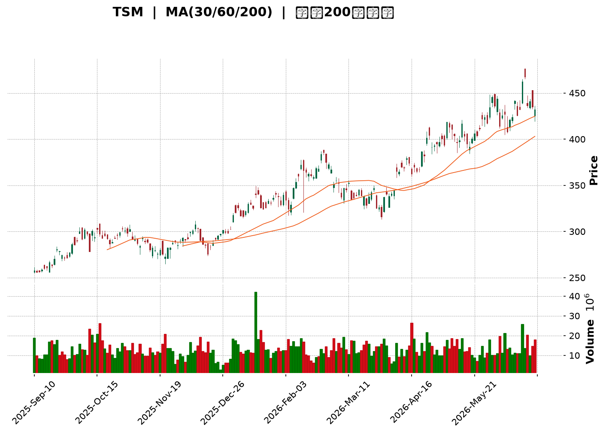
</details>

<html>
<head><meta charset="utf-8" /></head>
<body>
    <div style="height:500px; width:100%;">                        <script>window.PlotlyConfig = {MathJaxConfig: 'local'};</script>
        <script charset="utf-8" src="https://cdn.plot.ly/plotly-3.6.0.min.js" integrity="sha256-QaOVwtVY0T02VaHrr6pnoHLCwayMJp4O5n4YyaE3rJk=" crossorigin="anonymous"></script>                <div id="candlestick-chart" class="plotly-graph-div" style="height:100%; width:100%;"></div>            <script>                window.PLOTLYENV=window.PLOTLYENV || {};                                if (document.getElementById("candlestick-chart")) {                    Plotly.newPlot(                        "candlestick-chart",                        [{"close":{"dtype":"f8","bdata":"AAAAYHUZcEAAAABAPwFwQAAAAKDkB3BAAAAAoFUocEAAAACgLUBwQAAAAGDES3BAAAAAwKKocEAAAACAyWxwQAAAAOD553BAAAAA4P6HcUAAAADAPmhxQAAAAMDzJ3FAAAAAgJDzcEAAAABggPFwQAAAACC0UXFAAAAAQG\u002fjcUAAAABAuN1xQAAAAGB9HnJAAAAAoJLAckAAAAAAsztyQAAAACA64nJAAAAAYJGYckAAAADAc2dxQAAAAABayHJAAAAAQAVackAAAABgPuVyQAAAAMDul3JAAAAAIF5MckAAAAAA9nVyQAAAAOBRQ3JAAAAAoPHpcUAAAAAAUAdyQAAAAIB2SnJAAAAAALF+ckAAAADgwrJyQAAAAKBG63JAAAAAAJfNckAAAACATKFyQAAAAOCf53JAAAAAQAQ8ckAAAAAAgjVyQAAAAKCo73FAAAAAQCnEcUAAAABgYk9yQAAAAABMDnJAAAAAAJEFckAAAABA5n9xQAAAAAB+qXFAAAAAIOJ8cUAAAADAyztxQAAAACCZgnFAAAAAgEk1cUAAAABgjQ5xQAAAAECipnFAAAAA4ESncUAAAACgFvtxQAAAAMCxE3JAAAAA4OTWcUAAAADg5hxyQAAAAAA+UnJAAAAAwDwqckAAAABAp0ZyQAAAAIAouHJAAAAAIJvQckAAAADAcTtzQAAAAOCH9HJAAAAAwJ8ockAAAABgLeRxQAAAAEBU1nFAAAAAgJU4cUAAAAAgeLNxQAAAACBw93FAAAAAwFw8ckAAAADAx3ZyQAAAAGA6lHJAAAAAIInUckAAAABg+bVyQAAAAOCkoHJAAAAAAEDlckAAAAAAet9zQAAAAOB\u002fCXRAAAAAIPRbdEAAAABArNBzQAAAAEACxnNAAAAAYHcfdEAAAABgCaF0QAAAAGAfmHRAAAAAINxWdEAAAABAJT51QAAAAAA+SnVAAAAA4KdXdEAAAAAAGkd0QAAAAKD\u002fWnRAAAAAwGHSdEAAAADg\u002f690QAAAAMCdCXVAAAAAoKZIdUAAAACA4Bx1QAAAAMDGjXRAAAAAILA5dUAAAACgY+B0QAAAAIANQXRAAAAAgHuQdEAAAACg6bB1QAAAACBVGXZAAAAAYMyAdkAAAAAgrUJ3QAAAAGBU43ZAAAAA4KHHdkAAAAAAQKV2QAAAAKBehnZAAAAAgJpodkAAAABAKwp3QAAAAKA1AndAAAAAIEf8d0AAAACAyxt4QAAAACD5bXdAAAAA4HlKd0AAAADgZ\u002fN2QAAAAGAK9XVAAAAAYKU5dkAAAAAAqQB2QAAAACBfEnVAAAAAYIaudUAAAACg5ZR1QAAAAGDNC3ZAAAAAoKvvdEAAAACAIwl1QAAAAICzJ3VAAAAAIL+SdUAAAAAgbSx1QAAAAMD5H3VAAAAAQIiHdEAAAABgjBp1QAAAACArZ3VAAAAAIACvdUAAAACgkVV0QAAAACCgX3RAAAAAICu8c0AAAAAgkRJ1QAAAAAATS3VAAAAAYPcjdUAAAABgYk91QAAAACA2iHVAAAAAwLjQdkAAAABgLcp2QAAAAAC\u002fG3dAAAAAAE4Ld0AAAAAACrB3QAAAAACUY3dAAAAAYASodkAAAABgJhp3QAAAACAm1nZAAAAAIIXzdkAAAACAjih4QAAAAGBB3HdAAAAAoFAYeUAAAACAikB5QAAAAADGdnhAAAAAwI6OeEAAAACAJ7J4QAAAAMDay3hAAAAAIL8KeUAAAAAA0Zd4QAAAAIBRKHpAAAAAAOvSeUAAAACAfat5QAAAAICEOXlAAAAAAKHFeEAAAADA2u14QAAAAKDnC3pAAAAAIHw2eUAAAAAgZrB4QAAAAEAVe3hAAAAAIOgKeUAAAAAALmN5QAAAAMAyOXlAAAAA4LS1eUAAAACg4Ft6QAAAAKDgfXpAAAAAwI4XekAAAACgyyl7QAAAAIBX2ntAAAAAQLc6e0AAAACgFr57QAAAAEAz43lAAAAAYNicekAAAABAua56QAAAAGC4fHlAAAAAwB5RekAAAABA4X56QAAAAGBmlntAAAAAoEedekAAAABgZgJ7QAAAAIDr4XxAAAAAYLg6fUAAAACAPUZ7QAAAAKBHjXtAAAAAANcve0AAAACgmQV7QA=="},"high":{"dtype":"f8","bdata":"ViOeQvlacECNmXcPcyxwQFnNn6qHIXBAB+MJQc4+cEAAQXPctYVwQMbGApDVa3BAd\u002f7lR8zGcEAT3GBPxodwQNFuW20wI3FA95DLZDm8cUDgHPe8LnBxQH9a3ICSL3FADC4DeIkVcUBnkX8d6VpxQJdmkNjgVHFAvdvO4VcDckD9UEInZ2ZyQK3v9fHsW3JAnWprFlwOc0AbZc8zLwtzQI8rw2sSAHNAl9M1CGbHckCoBFDkpZ1yQKNJrUf543JApqa48UC2ckBuHgfoZwNzQKmHY2X4TnNALF1BBNzOckC2I7SWatRyQLntQL54kHJATnLk\u002fEVOckAPbvzmpjxyQEuL1N\u002fteXJA+OpZtheickC66ylJSbxyQIZy2jfWGHNAzv9IpoQOc0A2ztBUZBRzQE6AnW4gO3NAtvLMOxC6ckAewLj0Nn5yQJMIADNiRXJAWcKdPDracUBCza9v6WxyQLzsIunTSXJA7fQQ5whJckC2uMs6yfNxQJhfkGzgyXFAnvxaQaPEcUBAkJac\u002fV9xQHZ4lZA0pXFAJY20kPcockAhFTGhLUhxQBln8QxNrXFApIR38bKycUADe7D7VChyQP3TMPobJnJAoZhDjyMOckANHr0SKUNyQNtejsjQZHJA3zpFJrM7ckBvNqcsLKdyQKolcnsQxHJACSqcVMTkckA+QrVnZ3hzQCIYmAhKBHNARXfQEXXrckAVREdxeWRyQHCp7Gaj73FAJqn2bNP5cUArlFoK8tpxQG2U+3WxKnJAxXtwdOZXckCFhDeqD4ZyQHUjwGv1mXJA0pWsoSHdckCfAj2i9e5yQL5vJV\u002fB73JAjdpiUfYcc0CQt\u002f1w\u002fv5zQEosWWfCmHRATr8djuO1dECe3Y5U90l0QIiQZp9QLXRA7s81wJwxdEDEf+zGXr10QGcHGPEN63RAoblFO6KCdEBzQ2VhY9h1QMdunGjUwHVA5t7ETENGdUBusiOwzb50QDK1oTE\u002f1XRAojhCoKz2dEBEp2QPC9Z0QCxhxdzvN3VAfgwTgpZ7dUDNs6GKkl91QFYter9yInVA7lUSFuVmdUAW8mh7QpR1QGQdYE\u002fwEHVA4h7GSJvNdEBZllHPwr51QPd3SioHXHZASRtJACqudkBLbyOMEJp3QNf4JTvAoHdAVza44D0Td0BMLzjlFcV2QGcuygXd93ZAVrPIA\u002feOdkBQAbStlyR3QNmo7KErOHdAWJCMKuAyeECc32RKRUN4QPbGFiO9B3hAz5lHSudrd0D3YTIA6zJ3QMOLXABoInZAmR7r6L5zdkDmpraF9Vl2QI8FrM7XrnVAQvuOw6q5dUD0NzMO7vp1QMQ\u002faoM2OHZAhMYMsLaRdUC6L7nj\u002fGt1QOo\u002fuD69bXVALPsUiTKfdUDzjAluMbJ1QG1mtKCxMXVA6ecg3\u002foMdUCC7sIIuWl1QN3gpgYwgXVAGLVeiRnadUC9XBzd0EF1QBBEROOjjHRAJdZZYkeNdECT1BPZ6Bl1QH1qY3HYvXVALe8AQVVUdUDa\u002fzhGVXZ1QFwljT2Qi3VAlvHovM5Wd0D3OF8a9fR2QNyzsY7ekXdAWmG8SXkpd0At9ccmRtR3QGV67Khm0XdA\u002fkQUclwVd0DfX6ZiPWt3QMJN4DhJE3dAcl668iMed0CJ5owgDzB4QHnZs5+gPXhAffRAOYiIeUAJyf1Egdh5QDSKMfQLz3hAaVQ3a82ueEDj+cR\u002fu914QCg14OS8MHlA1DwMmPVreUAT9un35VJ5QIsIANaCK3pA4WoZpEwwekDTrH9WaQB6QNR25ThwbHlAP1W4qM0UeUDWlKWMwDt5QDOoDPS+T3pA+NnrLJmOeUD0aDfH3l55QCoBET8r33hAtX5Xf\u002fsueUA3y\u002fyA+qd5QAV1cWVem3lAu1PyN0X4eUApeM5ptNh6QBTrOYedqXpAVsb4AfPWekDbROvxcAV8QKlCs5NR9XtABWaMeLsRfECUz\u002f6tae97QMKqpQEuDntA4Ad2Sr4Me0Dj4ERBLlJ7QGYoIPwulXpAAAAAAABkekAAAABACq96QAAAAKBHqXtAAAAAoEeFe0AAAAAAAKh7QAAAACCFE31AAAAA4KPMfUAAAACgR\u002fV7QAAAAIDCvXtAAAAAYGZOfEAAAACAFEJ7QA=="},"hovertemplate":"\u003cb\u003e%{x|%Y-%m-%d}\u003c\u002fb\u003e\u003cbr\u003e\u958b: $%{open:.2f}\u003cbr\u003e\u9ad8: $%{high:.2f}\u003cbr\u003e\u4f4e: $%{low:.2f}\u003cbr\u003e\u6536: $%{close:.2f}\u003cextra\u003e\u003c\u002fextra\u003e","low":{"dtype":"f8","bdata":"1YVZTMfdb0DDyK\u002fu+OxvQIvqNCC48W9AmdFp6239b0CuFErPKClwQO9jCp4wG3BA6I\u002fgfNH+b0B+08O3FUxwQN4MFo7+dXBAimZGiPlccUByizeG5yhxQJeXMdE9wXBA5\u002fegPhHIcEAAAABggPFwQDsN4bgG+3BAzpwKXgwwcUCRbbU1k8xxQBHnnpCAA3JAj1i5RoWZckC09oMEyy9yQM+IgObnOnJAuFvgBoRxckAvRnWRNmJxQMjRNbyNIHJAriLJ7v4QckBv4CeWlZtyQGYYkD\u002ftZXJAxpZ2\u002f9NJckDFEMX+zGtyQPAXR3jTNXJAjZro9tKicUA5YM2Z2fVxQHZ9qiBqQXJA+vDlRk02ckAzJxMnPlxyQDnVcEhBwHJAuxobe32nckA9NFaWxGVyQKE\u002fWZ4gvHJAxXC+ynEzckAJqRgIiRNyQHKkBbAh0nFAOKqDz2kvcUDpy684gRdyQPZ3x19r6nFAJ\u002fvZbQ71cUCU1atz+VxxQKFVEIWA8XBA+GKmpcxZcUAsR5mzZ+lwQNFjWB2OInFAlDrJx\u002fsjcUBrCYE\u002fvotwQFRQNqzd8HBAP4VBuB7vcEDuWlkJsNdxQFhZRiHZ63FATnNuqJ2PcUCemkWwtO5xQF+jq+BVvXFAnrYULOb+cUDXNfoyUS9yQHiDBQxnZnJABZxJ\u002fKiCckAqEtjoKMJyQK5gem6ZoXJAz9K\u002fUMAXckCi0AAgJ+FxQMXiMDzSnXFAK\u002fUKlKgacUANO8GO1IRxQLtO6XqHznFAksLnk2kbckAd+Ky\u002fKytyQNdgfdpRa3JA0RtHUsWPckAHsucp15FyQEe2eDyTnnJAaW40b+3dckCEqsJFkWFzQPrmDaqP\u002fXNA6nLHSb8udEDXVG\u002fScc5zQEP3\u002fR0+qHNAGWzOItTJc0BssyG4jvZzQDJWZy1HkXRAonSBlWgydEDn+l5w7gJ1QJ8NFopHO3VA5LlMWYRTdEC3Z1EDGUB0QApoA2WEU3RA3VnFbquadEBlonYVhoh0QLxH\u002f3NyzXRA\u002fnoU4bUOdUCY5u7wNWh0QNE0aFyJdnRAuHZyWYl2dEDSzoohLoV0QDuau6rh1nNAftR\u002fAh3gc0AWP8I1t+50QBuFnrUyoHVAQP03te4odkDF+pf\u002f8ed2QDQhocQcB3RAb5RK7qZudkBVOKpTiyZ2QMPunWGybXZAAYCuWqU5dkBi79\u002fVEVR2QAiYPj45yXZATyrRFOBhd0D9AmQNou13QLjNB07M\u002fHZA+PKgOJvrdkD3XKmkaax2QLBaEqLwZXVAQ0VKt6QLdkBe8cAIh2B1QLPppzBa73RAAqArwWyjdECXG2hGpWh1QFc8t4vyyHVAZ8Vr8mrqdEARVeDf3ud0QANcq8EsIXVAwUNG6r8ZdUCRhH8zwSh1QIle8kXiRnRAiU2GljdSdECm6GoWOaV0QM5lmVTV03RAbd\u002feyyhrdUA4Feu0wUl0QDHzCEXpGHRAcpa\u002fthGRc0CDo20+PAZ0QC54wqZML3VAkUMHYpVgdEBu3b3sQh11QKzaIUra7XRAB6RMHGlmdkAHvbUlCX52QBzbb4ItDndA2VSurx3TdkB1O8l0kUV3QOuQJChyNXdAD1DNS1J7dkBjJ1Arl8R2QL9EQititnZAeHg2bBzEdkBq2g+GYhx3QDWRtU3pbndAvW2LheCOeEBj8JOUbvd4QPDSAb3R\u002fHdAwSa\u002fcV40eEDVM2Ts8Ax4QNGSTeRrc3hAi9LJN22keEC7rjKS7Hp4QAogr0Ns+3hArwFj7YByeUAo1OsaGP94QEzOtqQn1HhA\u002fJpvbHwTeECUtVfX4mh4QFH795qREnlAtUkn817eeEBMYUyELmJ4QLL8usCQAnhAlWeKImaweECfjBu9Oel4QHb9vEKzHnlAlBhIaMqReUCecM9WjeZ5QG9odWLb23lAWY\u002fi+2YEekAbcajGNFh6QOrJrXTcL3tAVhWuizwYe0CGEEqe06R6QPjFvoY1vXlAr4PfXK9YekArtshVAEl5QKPmT6z1a3lAAAAAgMKNeUAAAAAgXBN6QAAAAEDh\u002fnpAAAAAQDOTekAAAACAPfp6QAAAAIA9ZntAAAAAYLgSfUAAAABACiN7QAAAAKBHCXtAAAAAQAoHe0AAAABACjN6QA=="},"name":"\u50f9\u683c","open":{"dtype":"f8","bdata":"5wXl95wAcEDJoon7CBhwQMyxrIXyH3BAl5Rr9H4ScEDVJ1qjdH1wQLfMG31fZHBAnmoj9XP\u002fb0BUtxF3mYRwQOMkOEZMh3BArUZVDRODcUASgC0v5WFxQADIDj3B73BA+4XIhvr7cEBzwrvaQCVxQKr\u002fyiGuEnFAFJOWkjVEcUB7h\u002fROOmNyQLfpgisgKXJA2uXPyKGackCIOvNykANzQNi4pxwZS3JAjE0NzyS\u002fckAHmPxz1plyQGl\u002flmiIfnJAywtbbRlVckBj8CqHU\u002f5yQGdChDz8R3NAsmiCjhKBckDC5PMYeZpyQHIucReZinJAJNN7MFkrckAtLEpojPhxQGwUGJclVHJARMDYkAqFckAeqW+LzX9yQBEYggOM9nJAcWfW+13LckAt0GEzkPlyQCdWS7GWw3JAVax\u002fX\u002fFockBCBD6qUCVyQEk9853PPHJAxdOHr66vcUCdoykk8EByQBnl0t9sHHJANSVuHnY2ckApeQUsjO5xQDYM4vILHHFAjkHkoNVzcUBgQGinFDZxQNhSioYULHFA\u002fwWLj84eckA8e4Rt1epwQFRQNqzd8HBAAJvZMVCIcUCU5CWqb+1xQFDV2M8XI3JAcEs5VtTKcUBlucoheRtyQEVZaLdUHnJAGpwQAOg6ckD9l9pIxFtyQPp3kbSFrXJAb\u002fZSRVCackAvYZ+AuO9yQLJ6\u002fxoD\u002fHJARXfQEXXrckDZh17AIFpyQGpHEYqJ3HFAhLTxrMDwcUCIYF4jkLhxQLtO6XqHznFAHrrI\u002fHxSckB35HycRT5yQEMXsfBag3JAlqnexLylckBDTz\u002fFqcNyQB3pvDnlzHJAGQJBLwDnckDQab5ABmZzQH5IYKw6i3RAZ5efQ12IdEBYfDFFBTB0QG10JXCQK3RAmt6uf\u002fric0DkayOzHAd0QJBnks2LsnRAoblFO6KCdEBn4Y7exFB1QMCZURmqi3VAG0pKbp0wdUAEWQTcdbt0QPYpLSJNu3RAmqMm8s+ldEB2scLwRbF0QNrdgtxT7HRASaG6YUVUdUDr7Kk82yB1QCSdqg8j23RAuswWx\u002fWQdED6nmQqvnR1QNw6IY0A3nRA4wQSppISdEBz\u002fc3wPvx0QLzPpr96r3VAhRHWrVGndkAWLKCL2AJ3QE1jd0jVkHdAJLq+Awv0dkBXFV9NKYB2QPceJXHWn3ZA8sbxOvBddkADmCzF5F52QLTc9Yn60XZAwTVxLjOXd0Cc32RKRUN4QBslCl4fA3hA\u002fmqsOM0Dd0DIeTzStrd2QI2X6f0NvHVAQjPylXw5dkClKAr7NhF2QMEeIpPAW3VAL2VtiADedEA6H6kS3ap1QCSyXyPGAXZAX5f3pW6CdUAMBT8FcGJ1QBLP4ebvN3VAf6B3HN48dUAtakzSjY91QKEGEJU2h3RARXAITUv+dECm6GoWOaV0QMvLNV+T7HRAS6c93xCTdUDbRoSrajB1QODyUAcjQXRAqPIV+vdmdEANKh1M6Rh0QItxyk+LcXVA0JgD4DhhdECy6FWcTC91QJ0HKeVZKnVAm43uPMwWd0AT1ScVOKd2QGVf+z5ma3dA\u002fuCQpVEWd0CodmuCeKJ3QNg5XV1NyHdA+VsHhfj\u002fdkCpS0zJP0V3QExhTLu3BXdAAAAAIIXzdkAV9Dr9lC53QGEsssii9XdAtKxEe26zeECkVWpyiMx5QKS7+fpCc3hA1IDWTd9\u002feEDhobDAFs54QCGQ+hpViHhA8MLIpjI5eUAZIim8eTp5QL5ncoRbF3lA019oi88RekCpxvYQnf95QNqDUpKiXHlAkzGQoCHNeEBHXEqEbtV4QLDnpXtJJHlAswHd7M1YeUD0aDfH3l55QFzwomqZSXhAYY491ijBeECfjBu9Oel4QF2zSiOTh3lAbogb+HnCeUCFEfdRW6B6QOezsYO8U3pA4ogNwiehekBHaft\u002fMn56QD4Xy1jPeHtAJDEOuQQPfEAXiEWA+9l6QFE6sgdBzHpAKz4Sf3psekC2f2EM+d16QO0ITqTiz3lAAAAAACnUeUAAAADAzEB6QAAAAEDhantAAAAA4FFAe0AAAAAAACx7QAAAAIAUbntAAAAAoHDBfUAAAABA4XJ7QAAAACCuH3tAAAAAYGZOfEAAAAAAAJB6QA=="},"x":["2025-09-10T00:00:00-04:00","2025-09-11T00:00:00-04:00","2025-09-12T00:00:00-04:00","2025-09-15T00:00:00-04:00","2025-09-16T00:00:00-04:00","2025-09-17T00:00:00-04:00","2025-09-18T00:00:00-04:00","2025-09-19T00:00:00-04:00","2025-09-22T00:00:00-04:00","2025-09-23T00:00:00-04:00","2025-09-24T00:00:00-04:00","2025-09-25T00:00:00-04:00","2025-09-26T00:00:00-04:00","2025-09-29T00:00:00-04:00","2025-09-30T00:00:00-04:00","2025-10-01T00:00:00-04:00","2025-10-02T00:00:00-04:00","2025-10-03T00:00:00-04:00","2025-10-06T00:00:00-04:00","2025-10-07T00:00:00-04:00","2025-10-08T00:00:00-04:00","2025-10-09T00:00:00-04:00","2025-10-10T00:00:00-04:00","2025-10-13T00:00:00-04:00","2025-10-14T00:00:00-04:00","2025-10-15T00:00:00-04:00","2025-10-16T00:00:00-04:00","2025-10-17T00:00:00-04:00","2025-10-20T00:00:00-04:00","2025-10-21T00:00:00-04:00","2025-10-22T00:00:00-04:00","2025-10-23T00:00:00-04:00","2025-10-24T00:00:00-04:00","2025-10-27T00:00:00-04:00","2025-10-28T00:00:00-04:00","2025-10-29T00:00:00-04:00","2025-10-30T00:00:00-04:00","2025-10-31T00:00:00-04:00","2025-11-03T00:00:00-05:00","2025-11-04T00:00:00-05:00","2025-11-05T00:00:00-05:00","2025-11-06T00:00:00-05:00","2025-11-07T00:00:00-05:00","2025-11-10T00:00:00-05:00","2025-11-11T00:00:00-05:00","2025-11-12T00:00:00-05:00","2025-11-13T00:00:00-05:00","2025-11-14T00:00:00-05:00","2025-11-17T00:00:00-05:00","2025-11-18T00:00:00-05:00","2025-11-19T00:00:00-05:00","2025-11-20T00:00:00-05:00","2025-11-21T00:00:00-05:00","2025-11-24T00:00:00-05:00","2025-11-25T00:00:00-05:00","2025-11-26T00:00:00-05:00","2025-11-28T00:00:00-05:00","2025-12-01T00:00:00-05:00","2025-12-02T00:00:00-05:00","2025-12-03T00:00:00-05:00","2025-12-04T00:00:00-05:00","2025-12-05T00:00:00-05:00","2025-12-08T00:00:00-05:00","2025-12-09T00:00:00-05:00","2025-12-10T00:00:00-05:00","2025-12-11T00:00:00-05:00","2025-12-12T00:00:00-05:00","2025-12-15T00:00:00-05:00","2025-12-16T00:00:00-05:00","2025-12-17T00:00:00-05:00","2025-12-18T00:00:00-05:00","2025-12-19T00:00:00-05:00","2025-12-22T00:00:00-05:00","2025-12-23T00:00:00-05:00","2025-12-24T00:00:00-05:00","2025-12-26T00:00:00-05:00","2025-12-29T00:00:00-05:00","2025-12-30T00:00:00-05:00","2025-12-31T00:00:00-05:00","2026-01-02T00:00:00-05:00","2026-01-05T00:00:00-05:00","2026-01-06T00:00:00-05:00","2026-01-07T00:00:00-05:00","2026-01-08T00:00:00-05:00","2026-01-09T00:00:00-05:00","2026-01-12T00:00:00-05:00","2026-01-13T00:00:00-05:00","2026-01-14T00:00:00-05:00","2026-01-15T00:00:00-05:00","2026-01-16T00:00:00-05:00","2026-01-20T00:00:00-05:00","2026-01-21T00:00:00-05:00","2026-01-22T00:00:00-05:00","2026-01-23T00:00:00-05:00","2026-01-26T00:00:00-05:00","2026-01-27T00:00:00-05:00","2026-01-28T00:00:00-05:00","2026-01-29T00:00:00-05:00","2026-01-30T00:00:00-05:00","2026-02-02T00:00:00-05:00","2026-02-03T00:00:00-05:00","2026-02-04T00:00:00-05:00","2026-02-05T00:00:00-05:00","2026-02-06T00:00:00-05:00","2026-02-09T00:00:00-05:00","2026-02-10T00:00:00-05:00","2026-02-11T00:00:00-05:00","2026-02-12T00:00:00-05:00","2026-02-13T00:00:00-05:00","2026-02-17T00:00:00-05:00","2026-02-18T00:00:00-05:00","2026-02-19T00:00:00-05:00","2026-02-20T00:00:00-05:00","2026-02-23T00:00:00-05:00","2026-02-24T00:00:00-05:00","2026-02-25T00:00:00-05:00","2026-02-26T00:00:00-05:00","2026-02-27T00:00:00-05:00","2026-03-02T00:00:00-05:00","2026-03-03T00:00:00-05:00","2026-03-04T00:00:00-05:00","2026-03-05T00:00:00-05:00","2026-03-06T00:00:00-05:00","2026-03-09T00:00:00-04:00","2026-03-10T00:00:00-04:00","2026-03-11T00:00:00-04:00","2026-03-12T00:00:00-04:00","2026-03-13T00:00:00-04:00","2026-03-16T00:00:00-04:00","2026-03-17T00:00:00-04:00","2026-03-18T00:00:00-04:00","2026-03-19T00:00:00-04:00","2026-03-20T00:00:00-04:00","2026-03-23T00:00:00-04:00","2026-03-24T00:00:00-04:00","2026-03-25T00:00:00-04:00","2026-03-26T00:00:00-04:00","2026-03-27T00:00:00-04:00","2026-03-30T00:00:00-04:00","2026-03-31T00:00:00-04:00","2026-04-01T00:00:00-04:00","2026-04-02T00:00:00-04:00","2026-04-06T00:00:00-04:00","2026-04-07T00:00:00-04:00","2026-04-08T00:00:00-04:00","2026-04-09T00:00:00-04:00","2026-04-10T00:00:00-04:00","2026-04-13T00:00:00-04:00","2026-04-14T00:00:00-04:00","2026-04-15T00:00:00-04:00","2026-04-16T00:00:00-04:00","2026-04-17T00:00:00-04:00","2026-04-20T00:00:00-04:00","2026-04-21T00:00:00-04:00","2026-04-22T00:00:00-04:00","2026-04-23T00:00:00-04:00","2026-04-24T00:00:00-04:00","2026-04-27T00:00:00-04:00","2026-04-28T00:00:00-04:00","2026-04-29T00:00:00-04:00","2026-04-30T00:00:00-04:00","2026-05-01T00:00:00-04:00","2026-05-04T00:00:00-04:00","2026-05-05T00:00:00-04:00","2026-05-06T00:00:00-04:00","2026-05-07T00:00:00-04:00","2026-05-08T00:00:00-04:00","2026-05-11T00:00:00-04:00","2026-05-12T00:00:00-04:00","2026-05-13T00:00:00-04:00","2026-05-14T00:00:00-04:00","2026-05-15T00:00:00-04:00","2026-05-18T00:00:00-04:00","2026-05-19T00:00:00-04:00","2026-05-20T00:00:00-04:00","2026-05-21T00:00:00-04:00","2026-05-22T00:00:00-04:00","2026-05-26T00:00:00-04:00","2026-05-27T00:00:00-04:00","2026-05-28T00:00:00-04:00","2026-05-29T00:00:00-04:00","2026-06-01T00:00:00-04:00","2026-06-02T00:00:00-04:00","2026-06-03T00:00:00-04:00","2026-06-04T00:00:00-04:00","2026-06-05T00:00:00-04:00","2026-06-08T00:00:00-04:00","2026-06-09T00:00:00-04:00","2026-06-10T00:00:00-04:00","2026-06-11T00:00:00-04:00","2026-06-12T00:00:00-04:00","2026-06-15T00:00:00-04:00","2026-06-16T00:00:00-04:00","2026-06-17T00:00:00-04:00","2026-06-18T00:00:00-04:00","2026-06-22T00:00:00-04:00","2026-06-23T00:00:00-04:00","2026-06-24T00:00:00-04:00","2026-06-25T00:00:00-04:00","2026-06-26T00:00:00-04:00"],"type":"candlestick"},{"hovertemplate":"MA30: $%{y:.2f}\u003cextra\u003e\u003c\u002fextra\u003e","line":{"color":"#2196F3","dash":"dash","width":2},"mode":"lines","name":"MA30","x":["2025-09-10T00:00:00-04:00","2025-09-11T00:00:00-04:00","2025-09-12T00:00:00-04:00","2025-09-15T00:00:00-04:00","2025-09-16T00:00:00-04:00","2025-09-17T00:00:00-04:00","2025-09-18T00:00:00-04:00","2025-09-19T00:00:00-04:00","2025-09-22T00:00:00-04:00","2025-09-23T00:00:00-04:00","2025-09-24T00:00:00-04:00","2025-09-25T00:00:00-04:00","2025-09-26T00:00:00-04:00","2025-09-29T00:00:00-04:00","2025-09-30T00:00:00-04:00","2025-10-01T00:00:00-04:00","2025-10-02T00:00:00-04:00","2025-10-03T00:00:00-04:00","2025-10-06T00:00:00-04:00","2025-10-07T00:00:00-04:00","2025-10-08T00:00:00-04:00","2025-10-09T00:00:00-04:00","2025-10-10T00:00:00-04:00","2025-10-13T00:00:00-04:00","2025-10-14T00:00:00-04:00","2025-10-15T00:00:00-04:00","2025-10-16T00:00:00-04:00","2025-10-17T00:00:00-04:00","2025-10-20T00:00:00-04:00","2025-10-21T00:00:00-04:00","2025-10-22T00:00:00-04:00","2025-10-23T00:00:00-04:00","2025-10-24T00:00:00-04:00","2025-10-27T00:00:00-04:00","2025-10-28T00:00:00-04:00","2025-10-29T00:00:00-04:00","2025-10-30T00:00:00-04:00","2025-10-31T00:00:00-04:00","2025-11-03T00:00:00-05:00","2025-11-04T00:00:00-05:00","2025-11-05T00:00:00-05:00","2025-11-06T00:00:00-05:00","2025-11-07T00:00:00-05:00","2025-11-10T00:00:00-05:00","2025-11-11T00:00:00-05:00","2025-11-12T00:00:00-05:00","2025-11-13T00:00:00-05:00","2025-11-14T00:00:00-05:00","2025-11-17T00:00:00-05:00","2025-11-18T00:00:00-05:00","2025-11-19T00:00:00-05:00","2025-11-20T00:00:00-05:00","2025-11-21T00:00:00-05:00","2025-11-24T00:00:00-05:00","2025-11-25T00:00:00-05:00","2025-11-26T00:00:00-05:00","2025-11-28T00:00:00-05:00","2025-12-01T00:00:00-05:00","2025-12-02T00:00:00-05:00","2025-12-03T00:00:00-05:00","2025-12-04T00:00:00-05:00","2025-12-05T00:00:00-05:00","2025-12-08T00:00:00-05:00","2025-12-09T00:00:00-05:00","2025-12-10T00:00:00-05:00","2025-12-11T00:00:00-05:00","2025-12-12T00:00:00-05:00","2025-12-15T00:00:00-05:00","2025-12-16T00:00:00-05:00","2025-12-17T00:00:00-05:00","2025-12-18T00:00:00-05:00","2025-12-19T00:00:00-05:00","2025-12-22T00:00:00-05:00","2025-12-23T00:00:00-05:00","2025-12-24T00:00:00-05:00","2025-12-26T00:00:00-05:00","2025-12-29T00:00:00-05:00","2025-12-30T00:00:00-05:00","2025-12-31T00:00:00-05:00","2026-01-02T00:00:00-05:00","2026-01-05T00:00:00-05:00","2026-01-06T00:00:00-05:00","2026-01-07T00:00:00-05:00","2026-01-08T00:00:00-05:00","2026-01-09T00:00:00-05:00","2026-01-12T00:00:00-05:00","2026-01-13T00:00:00-05:00","2026-01-14T00:00:00-05:00","2026-01-15T00:00:00-05:00","2026-01-16T00:00:00-05:00","2026-01-20T00:00:00-05:00","2026-01-21T00:00:00-05:00","2026-01-22T00:00:00-05:00","2026-01-23T00:00:00-05:00","2026-01-26T00:00:00-05:00","2026-01-27T00:00:00-05:00","2026-01-28T00:00:00-05:00","2026-01-29T00:00:00-05:00","2026-01-30T00:00:00-05:00","2026-02-02T00:00:00-05:00","2026-02-03T00:00:00-05:00","2026-02-04T00:00:00-05:00","2026-02-05T00:00:00-05:00","2026-02-06T00:00:00-05:00","2026-02-09T00:00:00-05:00","2026-02-10T00:00:00-05:00","2026-02-11T00:00:00-05:00","2026-02-12T00:00:00-05:00","2026-02-13T00:00:00-05:00","2026-02-17T00:00:00-05:00","2026-02-18T00:00:00-05:00","2026-02-19T00:00:00-05:00","2026-02-20T00:00:00-05:00","2026-02-23T00:00:00-05:00","2026-02-24T00:00:00-05:00","2026-02-25T00:00:00-05:00","2026-02-26T00:00:00-05:00","2026-02-27T00:00:00-05:00","2026-03-02T00:00:00-05:00","2026-03-03T00:00:00-05:00","2026-03-04T00:00:00-05:00","2026-03-05T00:00:00-05:00","2026-03-06T00:00:00-05:00","2026-03-09T00:00:00-04:00","2026-03-10T00:00:00-04:00","2026-03-11T00:00:00-04:00","2026-03-12T00:00:00-04:00","2026-03-13T00:00:00-04:00","2026-03-16T00:00:00-04:00","2026-03-17T00:00:00-04:00","2026-03-18T00:00:00-04:00","2026-03-19T00:00:00-04:00","2026-03-20T00:00:00-04:00","2026-03-23T00:00:00-04:00","2026-03-24T00:00:00-04:00","2026-03-25T00:00:00-04:00","2026-03-26T00:00:00-04:00","2026-03-27T00:00:00-04:00","2026-03-30T00:00:00-04:00","2026-03-31T00:00:00-04:00","2026-04-01T00:00:00-04:00","2026-04-02T00:00:00-04:00","2026-04-06T00:00:00-04:00","2026-04-07T00:00:00-04:00","2026-04-08T00:00:00-04:00","2026-04-09T00:00:00-04:00","2026-04-10T00:00:00-04:00","2026-04-13T00:00:00-04:00","2026-04-14T00:00:00-04:00","2026-04-15T00:00:00-04:00","2026-04-16T00:00:00-04:00","2026-04-17T00:00:00-04:00","2026-04-20T00:00:00-04:00","2026-04-21T00:00:00-04:00","2026-04-22T00:00:00-04:00","2026-04-23T00:00:00-04:00","2026-04-24T00:00:00-04:00","2026-04-27T00:00:00-04:00","2026-04-28T00:00:00-04:00","2026-04-29T00:00:00-04:00","2026-04-30T00:00:00-04:00","2026-05-01T00:00:00-04:00","2026-05-04T00:00:00-04:00","2026-05-05T00:00:00-04:00","2026-05-06T00:00:00-04:00","2026-05-07T00:00:00-04:00","2026-05-08T00:00:00-04:00","2026-05-11T00:00:00-04:00","2026-05-12T00:00:00-04:00","2026-05-13T00:00:00-04:00","2026-05-14T00:00:00-04:00","2026-05-15T00:00:00-04:00","2026-05-18T00:00:00-04:00","2026-05-19T00:00:00-04:00","2026-05-20T00:00:00-04:00","2026-05-21T00:00:00-04:00","2026-05-22T00:00:00-04:00","2026-05-26T00:00:00-04:00","2026-05-27T00:00:00-04:00","2026-05-28T00:00:00-04:00","2026-05-29T00:00:00-04:00","2026-06-01T00:00:00-04:00","2026-06-02T00:00:00-04:00","2026-06-03T00:00:00-04:00","2026-06-04T00:00:00-04:00","2026-06-05T00:00:00-04:00","2026-06-08T00:00:00-04:00","2026-06-09T00:00:00-04:00","2026-06-10T00:00:00-04:00","2026-06-11T00:00:00-04:00","2026-06-12T00:00:00-04:00","2026-06-15T00:00:00-04:00","2026-06-16T00:00:00-04:00","2026-06-17T00:00:00-04:00","2026-06-18T00:00:00-04:00","2026-06-22T00:00:00-04:00","2026-06-23T00:00:00-04:00","2026-06-24T00:00:00-04:00","2026-06-25T00:00:00-04:00","2026-06-26T00:00:00-04:00"],"y":{"dtype":"f8","bdata":"AAAAAAAA+H8AAAAAAAD4fwAAAAAAAPh\u002fAAAAAAAA+H8AAAAAAAD4fwAAAAAAAPh\u002fAAAAAAAA+H8AAAAAAAD4fwAAAAAAAPh\u002fAAAAAAAA+H8AAAAAAAD4fwAAAAAAAPh\u002fAAAAAAAA+H8AAAAAAAD4fwAAAAAAAPh\u002fAAAAAAAA+H8AAAAAAAD4fwAAAAAAAPh\u002fAAAAAAAA+H8AAAAAAAD4fwAAAAAAAPh\u002fAAAAAAAA+H8AAAAAAAD4fwAAAAAAAPh\u002fAAAAAAAA+H8AAAAAAAD4fwAAAAAAAPh\u002fAAAAAAAA+H8AAAAAAAD4f1VVVZV8hHFAERERMfiTcUBEREQEPaVxQFVVVSWGuHFAAAAAIHjMcUB3d3f3WuFxQM3MzCy993FAVVVVlQkKckAAAADA2hxyQBEREdHoLXJA7+7u\u002fugzckAiIiKSwDpyQLy7u7toQXJAIiIiwlxIckDNzMxsBlRyQBEREcFPWnJAMzMzA3NbckCamZlpUlhyQImIiAhsVHJAIiIi4qFJckDNzMwsGkFyQLy7u5thNXJAERER4YkpckBEREREkyZyQCIiIgLrHHJAmpmZqfUWckCamZmJJw9yQKuqqhq\u002fCnJAmpmZqdQGckARERGx3ANyQHd3dwdcBHJAq6qqqoAGckDNzMwsnQhyQN7d3T1FDHJA7+7uPgAPckC8u7ubjhNyQFVVVZXdE3JAAAAA4F0OckCamZkJEAhyQKuqqurz\u002fnFAd3d3F072cUDe3d1t+PFxQAAAANA68nFAd3d3hzz2cUBVVVW1jPdxQGZmZpYD\u002fHFAmpmZuekCckAiIiKyPw1yQJqZmbl8FXJAq6qq2n8hckCamZmpBThyQDMzM+OVTXJAERERcXlockAREREBA4ByQN7d3c0fknJA3t3djTKnckBmZma2y71yQFVVVdVG03JAAAAA4JvockB3d3cnUQNzQM3MzHymHHNAAAAAIDsvc0BEREQEUEBzQO\u002fu7h5GTnNAd3d3V2Zfc0Crqqp60WtzQJqZmXmWfXNA7+7uXkGYc0Dv7u7OvrNzQKuqqkrtynNAiYiI2Bjtc0AzMzPDMQh0QCIiIgK3G3RAZmZm5pUvdEAAAACQH0t0QM3MzPwoaXRAAAAAkICIdECrqqpaU690QJqZmYmu03RA7+7u7tP0dECrqqqqfAx1QKuqqkq3IXVA3t3dTTQzdUCamZmJuE51QJqZmdlTanVAVVVVtUmLdUCJiIjY+qh1QFVVVcUswXVAIiIislzadUC8u7v77+h1QGZmZnah7nVAIiIicrL+dUCamZlpag12QCIiIjKHE3ZAAAAAwN0adkAiIiICfyJ2QCIiIjIaK3ZAVVVV5SIodkBmZmZ2eid2QERERPSbLHZAvLu765MvdkBVVVXFHDJ2QLy7uwuLOXZAvLu7qz45dkAAAACQOzR2QKuqqjpLLnZARERE9EwndkAiIiKSVA52QBEREaHf+HVARERENOTedUCamZn5d9F1QERERHT1xnVAd3d3NyO8dUCamZnJYK11QERERDTHoHVA3t3d\u002fcqWdUDNzMz8iYt1QBEREVHMiHVAERERQbGGdUDNzMzs+ox1QGZmZrYymXVAvLu7i+CcdUB3d3eXQqZ1QCIiIsJRtXVAzczMDCfAdUBVVVUlJNZ1QKuqqnqf5XVAIiIichwJdkCJiIhYFy12QCIiIrJTSXZAzczMjMlidkC8u7tL2IB2QImIiJgsoHZAzczMbK7GdkCrqqr6dOR2QDMzM1MHDXdARERE9Fswd0ARERHR4113QLy7u0tJh3dAERERsUSyd0C8u7uLLdN3QKuqqiq9+3dAMzMzU30eeECJiIjIUjt4QKuqqlp8VHhA7+7u7n1neEDv7u6eqH14QDMzMwO1j3hAzczMLHSmeECJiIiYP714QN7d3Z2513hAd3d3Bwv1eEC8u7urshd5QN7d3R2BQnlAmpmZyQJneUBERERkmIV5QImIiLjklnlA3t3dLdijeUAAAADwDLB5QHd3dzfIuHlAREREBM3HeUCrqqqKKNd5QO\u002fu7v757nlAIiIi8mT8eUBmZmaGAxF6QERERGREKHpAVVVVxVNFekBmZmbWBFN6QM3MzKzgZnpAMzMzE3x7ekBVVVXFV416QA=="},"type":"scatter"},{"hovertemplate":"MA60: $%{y:.2f}\u003cextra\u003e\u003c\u002fextra\u003e","line":{"color":"#9C27B0","dash":"dash","width":2},"mode":"lines","name":"MA60","x":["2025-09-10T00:00:00-04:00","2025-09-11T00:00:00-04:00","2025-09-12T00:00:00-04:00","2025-09-15T00:00:00-04:00","2025-09-16T00:00:00-04:00","2025-09-17T00:00:00-04:00","2025-09-18T00:00:00-04:00","2025-09-19T00:00:00-04:00","2025-09-22T00:00:00-04:00","2025-09-23T00:00:00-04:00","2025-09-24T00:00:00-04:00","2025-09-25T00:00:00-04:00","2025-09-26T00:00:00-04:00","2025-09-29T00:00:00-04:00","2025-09-30T00:00:00-04:00","2025-10-01T00:00:00-04:00","2025-10-02T00:00:00-04:00","2025-10-03T00:00:00-04:00","2025-10-06T00:00:00-04:00","2025-10-07T00:00:00-04:00","2025-10-08T00:00:00-04:00","2025-10-09T00:00:00-04:00","2025-10-10T00:00:00-04:00","2025-10-13T00:00:00-04:00","2025-10-14T00:00:00-04:00","2025-10-15T00:00:00-04:00","2025-10-16T00:00:00-04:00","2025-10-17T00:00:00-04:00","2025-10-20T00:00:00-04:00","2025-10-21T00:00:00-04:00","2025-10-22T00:00:00-04:00","2025-10-23T00:00:00-04:00","2025-10-24T00:00:00-04:00","2025-10-27T00:00:00-04:00","2025-10-28T00:00:00-04:00","2025-10-29T00:00:00-04:00","2025-10-30T00:00:00-04:00","2025-10-31T00:00:00-04:00","2025-11-03T00:00:00-05:00","2025-11-04T00:00:00-05:00","2025-11-05T00:00:00-05:00","2025-11-06T00:00:00-05:00","2025-11-07T00:00:00-05:00","2025-11-10T00:00:00-05:00","2025-11-11T00:00:00-05:00","2025-11-12T00:00:00-05:00","2025-11-13T00:00:00-05:00","2025-11-14T00:00:00-05:00","2025-11-17T00:00:00-05:00","2025-11-18T00:00:00-05:00","2025-11-19T00:00:00-05:00","2025-11-20T00:00:00-05:00","2025-11-21T00:00:00-05:00","2025-11-24T00:00:00-05:00","2025-11-25T00:00:00-05:00","2025-11-26T00:00:00-05:00","2025-11-28T00:00:00-05:00","2025-12-01T00:00:00-05:00","2025-12-02T00:00:00-05:00","2025-12-03T00:00:00-05:00","2025-12-04T00:00:00-05:00","2025-12-05T00:00:00-05:00","2025-12-08T00:00:00-05:00","2025-12-09T00:00:00-05:00","2025-12-10T00:00:00-05:00","2025-12-11T00:00:00-05:00","2025-12-12T00:00:00-05:00","2025-12-15T00:00:00-05:00","2025-12-16T00:00:00-05:00","2025-12-17T00:00:00-05:00","2025-12-18T00:00:00-05:00","2025-12-19T00:00:00-05:00","2025-12-22T00:00:00-05:00","2025-12-23T00:00:00-05:00","2025-12-24T00:00:00-05:00","2025-12-26T00:00:00-05:00","2025-12-29T00:00:00-05:00","2025-12-30T00:00:00-05:00","2025-12-31T00:00:00-05:00","2026-01-02T00:00:00-05:00","2026-01-05T00:00:00-05:00","2026-01-06T00:00:00-05:00","2026-01-07T00:00:00-05:00","2026-01-08T00:00:00-05:00","2026-01-09T00:00:00-05:00","2026-01-12T00:00:00-05:00","2026-01-13T00:00:00-05:00","2026-01-14T00:00:00-05:00","2026-01-15T00:00:00-05:00","2026-01-16T00:00:00-05:00","2026-01-20T00:00:00-05:00","2026-01-21T00:00:00-05:00","2026-01-22T00:00:00-05:00","2026-01-23T00:00:00-05:00","2026-01-26T00:00:00-05:00","2026-01-27T00:00:00-05:00","2026-01-28T00:00:00-05:00","2026-01-29T00:00:00-05:00","2026-01-30T00:00:00-05:00","2026-02-02T00:00:00-05:00","2026-02-03T00:00:00-05:00","2026-02-04T00:00:00-05:00","2026-02-05T00:00:00-05:00","2026-02-06T00:00:00-05:00","2026-02-09T00:00:00-05:00","2026-02-10T00:00:00-05:00","2026-02-11T00:00:00-05:00","2026-02-12T00:00:00-05:00","2026-02-13T00:00:00-05:00","2026-02-17T00:00:00-05:00","2026-02-18T00:00:00-05:00","2026-02-19T00:00:00-05:00","2026-02-20T00:00:00-05:00","2026-02-23T00:00:00-05:00","2026-02-24T00:00:00-05:00","2026-02-25T00:00:00-05:00","2026-02-26T00:00:00-05:00","2026-02-27T00:00:00-05:00","2026-03-02T00:00:00-05:00","2026-03-03T00:00:00-05:00","2026-03-04T00:00:00-05:00","2026-03-05T00:00:00-05:00","2026-03-06T00:00:00-05:00","2026-03-09T00:00:00-04:00","2026-03-10T00:00:00-04:00","2026-03-11T00:00:00-04:00","2026-03-12T00:00:00-04:00","2026-03-13T00:00:00-04:00","2026-03-16T00:00:00-04:00","2026-03-17T00:00:00-04:00","2026-03-18T00:00:00-04:00","2026-03-19T00:00:00-04:00","2026-03-20T00:00:00-04:00","2026-03-23T00:00:00-04:00","2026-03-24T00:00:00-04:00","2026-03-25T00:00:00-04:00","2026-03-26T00:00:00-04:00","2026-03-27T00:00:00-04:00","2026-03-30T00:00:00-04:00","2026-03-31T00:00:00-04:00","2026-04-01T00:00:00-04:00","2026-04-02T00:00:00-04:00","2026-04-06T00:00:00-04:00","2026-04-07T00:00:00-04:00","2026-04-08T00:00:00-04:00","2026-04-09T00:00:00-04:00","2026-04-10T00:00:00-04:00","2026-04-13T00:00:00-04:00","2026-04-14T00:00:00-04:00","2026-04-15T00:00:00-04:00","2026-04-16T00:00:00-04:00","2026-04-17T00:00:00-04:00","2026-04-20T00:00:00-04:00","2026-04-21T00:00:00-04:00","2026-04-22T00:00:00-04:00","2026-04-23T00:00:00-04:00","2026-04-24T00:00:00-04:00","2026-04-27T00:00:00-04:00","2026-04-28T00:00:00-04:00","2026-04-29T00:00:00-04:00","2026-04-30T00:00:00-04:00","2026-05-01T00:00:00-04:00","2026-05-04T00:00:00-04:00","2026-05-05T00:00:00-04:00","2026-05-06T00:00:00-04:00","2026-05-07T00:00:00-04:00","2026-05-08T00:00:00-04:00","2026-05-11T00:00:00-04:00","2026-05-12T00:00:00-04:00","2026-05-13T00:00:00-04:00","2026-05-14T00:00:00-04:00","2026-05-15T00:00:00-04:00","2026-05-18T00:00:00-04:00","2026-05-19T00:00:00-04:00","2026-05-20T00:00:00-04:00","2026-05-21T00:00:00-04:00","2026-05-22T00:00:00-04:00","2026-05-26T00:00:00-04:00","2026-05-27T00:00:00-04:00","2026-05-28T00:00:00-04:00","2026-05-29T00:00:00-04:00","2026-06-01T00:00:00-04:00","2026-06-02T00:00:00-04:00","2026-06-03T00:00:00-04:00","2026-06-04T00:00:00-04:00","2026-06-05T00:00:00-04:00","2026-06-08T00:00:00-04:00","2026-06-09T00:00:00-04:00","2026-06-10T00:00:00-04:00","2026-06-11T00:00:00-04:00","2026-06-12T00:00:00-04:00","2026-06-15T00:00:00-04:00","2026-06-16T00:00:00-04:00","2026-06-17T00:00:00-04:00","2026-06-18T00:00:00-04:00","2026-06-22T00:00:00-04:00","2026-06-23T00:00:00-04:00","2026-06-24T00:00:00-04:00","2026-06-25T00:00:00-04:00","2026-06-26T00:00:00-04:00"],"y":{"dtype":"f8","bdata":"AAAAAAAA+H8AAAAAAAD4fwAAAAAAAPh\u002fAAAAAAAA+H8AAAAAAAD4fwAAAAAAAPh\u002fAAAAAAAA+H8AAAAAAAD4fwAAAAAAAPh\u002fAAAAAAAA+H8AAAAAAAD4fwAAAAAAAPh\u002fAAAAAAAA+H8AAAAAAAD4fwAAAAAAAPh\u002fAAAAAAAA+H8AAAAAAAD4fwAAAAAAAPh\u002fAAAAAAAA+H8AAAAAAAD4fwAAAAAAAPh\u002fAAAAAAAA+H8AAAAAAAD4fwAAAAAAAPh\u002fAAAAAAAA+H8AAAAAAAD4fwAAAAAAAPh\u002fAAAAAAAA+H8AAAAAAAD4fwAAAAAAAPh\u002fAAAAAAAA+H8AAAAAAAD4fwAAAAAAAPh\u002fAAAAAAAA+H8AAAAAAAD4fwAAAAAAAPh\u002fAAAAAAAA+H8AAAAAAAD4fwAAAAAAAPh\u002fAAAAAAAA+H8AAAAAAAD4fwAAAAAAAPh\u002fAAAAAAAA+H8AAAAAAAD4fwAAAAAAAPh\u002fAAAAAAAA+H8AAAAAAAD4fwAAAAAAAPh\u002fAAAAAAAA+H8AAAAAAAD4fwAAAAAAAPh\u002fAAAAAAAA+H8AAAAAAAD4fwAAAAAAAPh\u002fAAAAAAAA+H8AAAAAAAD4fwAAAAAAAPh\u002fAAAAAAAA+H8AAAAAAAD4f2ZmZk5sxHFA3t3dbTzNcUCJiIgY7dZxQJqZmbFl4nFAd3d3L7ztcUCamZnJdPpxQBEREWHNBXJAq6qqujMMckDNzMxkdRJyQN7d3V1uFnJAMzMzixsVckAAAACAXBZyQN7d3cXRGXJAzczMpEwfckARERGRySVyQLy7u6spK3JAZmZmXi4vckDe3d0NyTJyQBEREWH0NHJAZmZm3pA1ckAzMzPrjzxyQHd3d797QXJAERERqQFJckCrqqoiS1NyQAAAAGiFV3JAvLu7GxRfckAAAACgeWZyQAAAAPgCb3JAzczMRLh3ckBERETsloNyQCIiIkKBkHJAVVVV5d2ackCJiIiYdqRyQGZmZq5FrXJAMzMzSzO3ckAzMzMLsL9yQHd3dwe6yHJAd3d3n0\u002fTckBERERs591yQKuqqprw5HJAAAAAeLPxckCJiIgYFf1yQBEREen4BnNA7+7uNukSc0CrqqoiViFzQJqZmUmWMnNAzczMJLVFc0BmZmaGSV5zQJqZmaGVdHNAzczM5CmLc0AiIiIqQaJzQO\u002fu7pamt3NAd3d339bNc0BVVVXFXedzQLy7u9M5\u002fnNAmpmZIT4ZdEB3d3dHYzN0QFVVVc05SnRAERERSXxhdECamZmRIHZ0QJqZmfmjhXRAERERyfaWdEDv7u423aZ0QImIiKjmsHRAvLu7CyK9dEBmZmY+KMd0QN7d3VVY1HRAIiIiIjLgdECrqqqinO10QHd3d5\u002fE+3RAIiIiYlYOdUBEREREJx11QO\u002fu7gahKnVAERERSWo0dUAAAACQrT91QLy7uxu6S3VAIiIiwuZXdUBmZmb20151QFVVVRVHZnVAmpmZEdxpdUAiIiJS+m51QHd3d19WdHVAq6qqwqt3dUCamZmpDH51QO\u002fu7oaNhXVAmpmZWQqRdUCrqqpqQpp1QDMzM4v8pHVAmpmZ+YawdUBERER09bp1QGZmZhbqw3VA7+7ufsnNdUCJiIiA1tl1QCIiInps5HVAZmZmZoLtdUC8u7uTUfx1QGZmZtZcCHZAvLu7q58YdkB3d3fnSCp2QDMzM9P3OnZAREREvC5JdkCJiIiIell2QCIiItLbbHZAREREjPZ\u002fdkBVVVVFWIx2QO\u002fu7kapnXZAREREdNSrdkCamZkxHLZ2QGZmZnYUwHZAq6qqcpTIdkCrqqrCUtJ2QHd3d09Z4XZAVVVVRVDtdkARERHJWfR2QHd3d8eh+nZAZmZmdiT\u002fdkDe3d1NmQR3QCIiIqpADHdA7+7utpIWd0CrqqpCHSV3QCIiIip2OHdAmpmZyfVId0CamZmh+l53QAAAAHDpe3dAMzMz65STd0DNzMxE3q13QJqZmRlCvndAAAAAUHrWd0BEREQkku53QM3MzPQNAXhAiYiISEsVeEAzMzNrACx4QLy7u0uTR3hAd3d3r4lheECJiIhAvHp4QLy7u9ulmnhAzczM3Ne6eEC8u7tTdNh4QERERPwU93hAIiIiYuAWeUCJiIioQjB5QA=="},"type":"scatter"},{"hovertemplate":"MA200: $%{y:.2f}\u003cextra\u003e\u003c\u002fextra\u003e","line":{"color":"#FF6F00","dash":"solid","width":2},"mode":"lines","name":"MA200","x":["2025-09-10T00:00:00-04:00","2025-09-11T00:00:00-04:00","2025-09-12T00:00:00-04:00","2025-09-15T00:00:00-04:00","2025-09-16T00:00:00-04:00","2025-09-17T00:00:00-04:00","2025-09-18T00:00:00-04:00","2025-09-19T00:00:00-04:00","2025-09-22T00:00:00-04:00","2025-09-23T00:00:00-04:00","2025-09-24T00:00:00-04:00","2025-09-25T00:00:00-04:00","2025-09-26T00:00:00-04:00","2025-09-29T00:00:00-04:00","2025-09-30T00:00:00-04:00","2025-10-01T00:00:00-04:00","2025-10-02T00:00:00-04:00","2025-10-03T00:00:00-04:00","2025-10-06T00:00:00-04:00","2025-10-07T00:00:00-04:00","2025-10-08T00:00:00-04:00","2025-10-09T00:00:00-04:00","2025-10-10T00:00:00-04:00","2025-10-13T00:00:00-04:00","2025-10-14T00:00:00-04:00","2025-10-15T00:00:00-04:00","2025-10-16T00:00:00-04:00","2025-10-17T00:00:00-04:00","2025-10-20T00:00:00-04:00","2025-10-21T00:00:00-04:00","2025-10-22T00:00:00-04:00","2025-10-23T00:00:00-04:00","2025-10-24T00:00:00-04:00","2025-10-27T00:00:00-04:00","2025-10-28T00:00:00-04:00","2025-10-29T00:00:00-04:00","2025-10-30T00:00:00-04:00","2025-10-31T00:00:00-04:00","2025-11-03T00:00:00-05:00","2025-11-04T00:00:00-05:00","2025-11-05T00:00:00-05:00","2025-11-06T00:00:00-05:00","2025-11-07T00:00:00-05:00","2025-11-10T00:00:00-05:00","2025-11-11T00:00:00-05:00","2025-11-12T00:00:00-05:00","2025-11-13T00:00:00-05:00","2025-11-14T00:00:00-05:00","2025-11-17T00:00:00-05:00","2025-11-18T00:00:00-05:00","2025-11-19T00:00:00-05:00","2025-11-20T00:00:00-05:00","2025-11-21T00:00:00-05:00","2025-11-24T00:00:00-05:00","2025-11-25T00:00:00-05:00","2025-11-26T00:00:00-05:00","2025-11-28T00:00:00-05:00","2025-12-01T00:00:00-05:00","2025-12-02T00:00:00-05:00","2025-12-03T00:00:00-05:00","2025-12-04T00:00:00-05:00","2025-12-05T00:00:00-05:00","2025-12-08T00:00:00-05:00","2025-12-09T00:00:00-05:00","2025-12-10T00:00:00-05:00","2025-12-11T00:00:00-05:00","2025-12-12T00:00:00-05:00","2025-12-15T00:00:00-05:00","2025-12-16T00:00:00-05:00","2025-12-17T00:00:00-05:00","2025-12-18T00:00:00-05:00","2025-12-19T00:00:00-05:00","2025-12-22T00:00:00-05:00","2025-12-23T00:00:00-05:00","2025-12-24T00:00:00-05:00","2025-12-26T00:00:00-05:00","2025-12-29T00:00:00-05:00","2025-12-30T00:00:00-05:00","2025-12-31T00:00:00-05:00","2026-01-02T00:00:00-05:00","2026-01-05T00:00:00-05:00","2026-01-06T00:00:00-05:00","2026-01-07T00:00:00-05:00","2026-01-08T00:00:00-05:00","2026-01-09T00:00:00-05:00","2026-01-12T00:00:00-05:00","2026-01-13T00:00:00-05:00","2026-01-14T00:00:00-05:00","2026-01-15T00:00:00-05:00","2026-01-16T00:00:00-05:00","2026-01-20T00:00:00-05:00","2026-01-21T00:00:00-05:00","2026-01-22T00:00:00-05:00","2026-01-23T00:00:00-05:00","2026-01-26T00:00:00-05:00","2026-01-27T00:00:00-05:00","2026-01-28T00:00:00-05:00","2026-01-29T00:00:00-05:00","2026-01-30T00:00:00-05:00","2026-02-02T00:00:00-05:00","2026-02-03T00:00:00-05:00","2026-02-04T00:00:00-05:00","2026-02-05T00:00:00-05:00","2026-02-06T00:00:00-05:00","2026-02-09T00:00:00-05:00","2026-02-10T00:00:00-05:00","2026-02-11T00:00:00-05:00","2026-02-12T00:00:00-05:00","2026-02-13T00:00:00-05:00","2026-02-17T00:00:00-05:00","2026-02-18T00:00:00-05:00","2026-02-19T00:00:00-05:00","2026-02-20T00:00:00-05:00","2026-02-23T00:00:00-05:00","2026-02-24T00:00:00-05:00","2026-02-25T00:00:00-05:00","2026-02-26T00:00:00-05:00","2026-02-27T00:00:00-05:00","2026-03-02T00:00:00-05:00","2026-03-03T00:00:00-05:00","2026-03-04T00:00:00-05:00","2026-03-05T00:00:00-05:00","2026-03-06T00:00:00-05:00","2026-03-09T00:00:00-04:00","2026-03-10T00:00:00-04:00","2026-03-11T00:00:00-04:00","2026-03-12T00:00:00-04:00","2026-03-13T00:00:00-04:00","2026-03-16T00:00:00-04:00","2026-03-17T00:00:00-04:00","2026-03-18T00:00:00-04:00","2026-03-19T00:00:00-04:00","2026-03-20T00:00:00-04:00","2026-03-23T00:00:00-04:00","2026-03-24T00:00:00-04:00","2026-03-25T00:00:00-04:00","2026-03-26T00:00:00-04:00","2026-03-27T00:00:00-04:00","2026-03-30T00:00:00-04:00","2026-03-31T00:00:00-04:00","2026-04-01T00:00:00-04:00","2026-04-02T00:00:00-04:00","2026-04-06T00:00:00-04:00","2026-04-07T00:00:00-04:00","2026-04-08T00:00:00-04:00","2026-04-09T00:00:00-04:00","2026-04-10T00:00:00-04:00","2026-04-13T00:00:00-04:00","2026-04-14T00:00:00-04:00","2026-04-15T00:00:00-04:00","2026-04-16T00:00:00-04:00","2026-04-17T00:00:00-04:00","2026-04-20T00:00:00-04:00","2026-04-21T00:00:00-04:00","2026-04-22T00:00:00-04:00","2026-04-23T00:00:00-04:00","2026-04-24T00:00:00-04:00","2026-04-27T00:00:00-04:00","2026-04-28T00:00:00-04:00","2026-04-29T00:00:00-04:00","2026-04-30T00:00:00-04:00","2026-05-01T00:00:00-04:00","2026-05-04T00:00:00-04:00","2026-05-05T00:00:00-04:00","2026-05-06T00:00:00-04:00","2026-05-07T00:00:00-04:00","2026-05-08T00:00:00-04:00","2026-05-11T00:00:00-04:00","2026-05-12T00:00:00-04:00","2026-05-13T00:00:00-04:00","2026-05-14T00:00:00-04:00","2026-05-15T00:00:00-04:00","2026-05-18T00:00:00-04:00","2026-05-19T00:00:00-04:00","2026-05-20T00:00:00-04:00","2026-05-21T00:00:00-04:00","2026-05-22T00:00:00-04:00","2026-05-26T00:00:00-04:00","2026-05-27T00:00:00-04:00","2026-05-28T00:00:00-04:00","2026-05-29T00:00:00-04:00","2026-06-01T00:00:00-04:00","2026-06-02T00:00:00-04:00","2026-06-03T00:00:00-04:00","2026-06-04T00:00:00-04:00","2026-06-05T00:00:00-04:00","2026-06-08T00:00:00-04:00","2026-06-09T00:00:00-04:00","2026-06-10T00:00:00-04:00","2026-06-11T00:00:00-04:00","2026-06-12T00:00:00-04:00","2026-06-15T00:00:00-04:00","2026-06-16T00:00:00-04:00","2026-06-17T00:00:00-04:00","2026-06-18T00:00:00-04:00","2026-06-22T00:00:00-04:00","2026-06-23T00:00:00-04:00","2026-06-24T00:00:00-04:00","2026-06-25T00:00:00-04:00","2026-06-26T00:00:00-04:00"],"y":{"dtype":"f8","bdata":"AAAAAAAA+H8AAAAAAAD4fwAAAAAAAPh\u002fAAAAAAAA+H8AAAAAAAD4fwAAAAAAAPh\u002fAAAAAAAA+H8AAAAAAAD4fwAAAAAAAPh\u002fAAAAAAAA+H8AAAAAAAD4fwAAAAAAAPh\u002fAAAAAAAA+H8AAAAAAAD4fwAAAAAAAPh\u002fAAAAAAAA+H8AAAAAAAD4fwAAAAAAAPh\u002fAAAAAAAA+H8AAAAAAAD4fwAAAAAAAPh\u002fAAAAAAAA+H8AAAAAAAD4fwAAAAAAAPh\u002fAAAAAAAA+H8AAAAAAAD4fwAAAAAAAPh\u002fAAAAAAAA+H8AAAAAAAD4fwAAAAAAAPh\u002fAAAAAAAA+H8AAAAAAAD4fwAAAAAAAPh\u002fAAAAAAAA+H8AAAAAAAD4fwAAAAAAAPh\u002fAAAAAAAA+H8AAAAAAAD4fwAAAAAAAPh\u002fAAAAAAAA+H8AAAAAAAD4fwAAAAAAAPh\u002fAAAAAAAA+H8AAAAAAAD4fwAAAAAAAPh\u002fAAAAAAAA+H8AAAAAAAD4fwAAAAAAAPh\u002fAAAAAAAA+H8AAAAAAAD4fwAAAAAAAPh\u002fAAAAAAAA+H8AAAAAAAD4fwAAAAAAAPh\u002fAAAAAAAA+H8AAAAAAAD4fwAAAAAAAPh\u002fAAAAAAAA+H8AAAAAAAD4fwAAAAAAAPh\u002fAAAAAAAA+H8AAAAAAAD4fwAAAAAAAPh\u002fAAAAAAAA+H8AAAAAAAD4fwAAAAAAAPh\u002fAAAAAAAA+H8AAAAAAAD4fwAAAAAAAPh\u002fAAAAAAAA+H8AAAAAAAD4fwAAAAAAAPh\u002fAAAAAAAA+H8AAAAAAAD4fwAAAAAAAPh\u002fAAAAAAAA+H8AAAAAAAD4fwAAAAAAAPh\u002fAAAAAAAA+H8AAAAAAAD4fwAAAAAAAPh\u002fAAAAAAAA+H8AAAAAAAD4fwAAAAAAAPh\u002fAAAAAAAA+H8AAAAAAAD4fwAAAAAAAPh\u002fAAAAAAAA+H8AAAAAAAD4fwAAAAAAAPh\u002fAAAAAAAA+H8AAAAAAAD4fwAAAAAAAPh\u002fAAAAAAAA+H8AAAAAAAD4fwAAAAAAAPh\u002fAAAAAAAA+H8AAAAAAAD4fwAAAAAAAPh\u002fAAAAAAAA+H8AAAAAAAD4fwAAAAAAAPh\u002fAAAAAAAA+H8AAAAAAAD4fwAAAAAAAPh\u002fAAAAAAAA+H8AAAAAAAD4fwAAAAAAAPh\u002fAAAAAAAA+H8AAAAAAAD4fwAAAAAAAPh\u002fAAAAAAAA+H8AAAAAAAD4fwAAAAAAAPh\u002fAAAAAAAA+H8AAAAAAAD4fwAAAAAAAPh\u002fAAAAAAAA+H8AAAAAAAD4fwAAAAAAAPh\u002fAAAAAAAA+H8AAAAAAAD4fwAAAAAAAPh\u002fAAAAAAAA+H8AAAAAAAD4fwAAAAAAAPh\u002fAAAAAAAA+H8AAAAAAAD4fwAAAAAAAPh\u002fAAAAAAAA+H8AAAAAAAD4fwAAAAAAAPh\u002fAAAAAAAA+H8AAAAAAAD4fwAAAAAAAPh\u002fAAAAAAAA+H8AAAAAAAD4fwAAAAAAAPh\u002fAAAAAAAA+H8AAAAAAAD4fwAAAAAAAPh\u002fAAAAAAAA+H8AAAAAAAD4fwAAAAAAAPh\u002fAAAAAAAA+H8AAAAAAAD4fwAAAAAAAPh\u002fAAAAAAAA+H8AAAAAAAD4fwAAAAAAAPh\u002fAAAAAAAA+H8AAAAAAAD4fwAAAAAAAPh\u002fAAAAAAAA+H8AAAAAAAD4fwAAAAAAAPh\u002fAAAAAAAA+H8AAAAAAAD4fwAAAAAAAPh\u002fAAAAAAAA+H8AAAAAAAD4fwAAAAAAAPh\u002fAAAAAAAA+H8AAAAAAAD4fwAAAAAAAPh\u002fAAAAAAAA+H8AAAAAAAD4fwAAAAAAAPh\u002fAAAAAAAA+H8AAAAAAAD4fwAAAAAAAPh\u002fAAAAAAAA+H8AAAAAAAD4fwAAAAAAAPh\u002fAAAAAAAA+H8AAAAAAAD4fwAAAAAAAPh\u002fAAAAAAAA+H8AAAAAAAD4fwAAAAAAAPh\u002fAAAAAAAA+H8AAAAAAAD4fwAAAAAAAPh\u002fAAAAAAAA+H8AAAAAAAD4fwAAAAAAAPh\u002fAAAAAAAA+H8AAAAAAAD4fwAAAAAAAPh\u002fAAAAAAAA+H8AAAAAAAD4fwAAAAAAAPh\u002fAAAAAAAA+H8AAAAAAAD4fwAAAAAAAPh\u002fAAAAAAAA+H8AAAAAAAD4fwAAAAAAAPh\u002fAAAAAAAA+H8zMzOrnSl1QA=="},"type":"scatter"}],                        {"template":{"data":{"barpolar":[{"marker":{"line":{"color":"rgb(17,17,17)","width":0.5},"pattern":{"fillmode":"overlay","size":10,"solidity":0.2}},"type":"barpolar"}],"bar":[{"error_x":{"color":"#f2f5fa"},"error_y":{"color":"#f2f5fa"},"marker":{"line":{"color":"rgb(17,17,17)","width":0.5},"pattern":{"fillmode":"overlay","size":10,"solidity":0.2}},"type":"bar"}],"carpet":[{"aaxis":{"endlinecolor":"#A2B1C6","gridcolor":"#506784","linecolor":"#506784","minorgridcolor":"#506784","startlinecolor":"#A2B1C6"},"baxis":{"endlinecolor":"#A2B1C6","gridcolor":"#506784","linecolor":"#506784","minorgridcolor":"#506784","startlinecolor":"#A2B1C6"},"type":"carpet"}],"choropleth":[{"colorbar":{"outlinewidth":0,"ticks":""},"type":"choropleth"}],"contourcarpet":[{"colorbar":{"outlinewidth":0,"ticks":""},"type":"contourcarpet"}],"contour":[{"colorbar":{"outlinewidth":0,"ticks":""},"colorscale":[[0.0,"#0d0887"],[0.1111111111111111,"#46039f"],[0.2222222222222222,"#7201a8"],[0.3333333333333333,"#9c179e"],[0.4444444444444444,"#bd3786"],[0.5555555555555556,"#d8576b"],[0.6666666666666666,"#ed7953"],[0.7777777777777778,"#fb9f3a"],[0.8888888888888888,"#fdca26"],[1.0,"#f0f921"]],"type":"contour"}],"heatmap":[{"colorbar":{"outlinewidth":0,"ticks":""},"colorscale":[[0.0,"#0d0887"],[0.1111111111111111,"#46039f"],[0.2222222222222222,"#7201a8"],[0.3333333333333333,"#9c179e"],[0.4444444444444444,"#bd3786"],[0.5555555555555556,"#d8576b"],[0.6666666666666666,"#ed7953"],[0.7777777777777778,"#fb9f3a"],[0.8888888888888888,"#fdca26"],[1.0,"#f0f921"]],"type":"heatmap"}],"histogram2dcontour":[{"colorbar":{"outlinewidth":0,"ticks":""},"colorscale":[[0.0,"#0d0887"],[0.1111111111111111,"#46039f"],[0.2222222222222222,"#7201a8"],[0.3333333333333333,"#9c179e"],[0.4444444444444444,"#bd3786"],[0.5555555555555556,"#d8576b"],[0.6666666666666666,"#ed7953"],[0.7777777777777778,"#fb9f3a"],[0.8888888888888888,"#fdca26"],[1.0,"#f0f921"]],"type":"histogram2dcontour"}],"histogram2d":[{"colorbar":{"outlinewidth":0,"ticks":""},"colorscale":[[0.0,"#0d0887"],[0.1111111111111111,"#46039f"],[0.2222222222222222,"#7201a8"],[0.3333333333333333,"#9c179e"],[0.4444444444444444,"#bd3786"],[0.5555555555555556,"#d8576b"],[0.6666666666666666,"#ed7953"],[0.7777777777777778,"#fb9f3a"],[0.8888888888888888,"#fdca26"],[1.0,"#f0f921"]],"type":"histogram2d"}],"histogram":[{"marker":{"pattern":{"fillmode":"overlay","size":10,"solidity":0.2}},"type":"histogram"}],"mesh3d":[{"colorbar":{"outlinewidth":0,"ticks":""},"type":"mesh3d"}],"parcoords":[{"line":{"colorbar":{"outlinewidth":0,"ticks":""}},"type":"parcoords"}],"pie":[{"automargin":true,"type":"pie"}],"scatter3d":[{"line":{"colorbar":{"outlinewidth":0,"ticks":""}},"marker":{"colorbar":{"outlinewidth":0,"ticks":""}},"type":"scatter3d"}],"scattercarpet":[{"marker":{"colorbar":{"outlinewidth":0,"ticks":""}},"type":"scattercarpet"}],"scattergeo":[{"marker":{"colorbar":{"outlinewidth":0,"ticks":""}},"type":"scattergeo"}],"scattergl":[{"marker":{"line":{"color":"#283442"}},"type":"scattergl"}],"scattermapbox":[{"marker":{"colorbar":{"outlinewidth":0,"ticks":""}},"type":"scattermapbox"}],"scattermap":[{"marker":{"colorbar":{"outlinewidth":0,"ticks":""}},"type":"scattermap"}],"scatterpolargl":[{"marker":{"colorbar":{"outlinewidth":0,"ticks":""}},"type":"scatterpolargl"}],"scatterpolar":[{"marker":{"colorbar":{"outlinewidth":0,"ticks":""}},"type":"scatterpolar"}],"scatter":[{"marker":{"line":{"color":"#283442"}},"type":"scatter"}],"scatterternary":[{"marker":{"colorbar":{"outlinewidth":0,"ticks":""}},"type":"scatterternary"}],"surface":[{"colorbar":{"outlinewidth":0,"ticks":""},"colorscale":[[0.0,"#0d0887"],[0.1111111111111111,"#46039f"],[0.2222222222222222,"#7201a8"],[0.3333333333333333,"#9c179e"],[0.4444444444444444,"#bd3786"],[0.5555555555555556,"#d8576b"],[0.6666666666666666,"#ed7953"],[0.7777777777777778,"#fb9f3a"],[0.8888888888888888,"#fdca26"],[1.0,"#f0f921"]],"type":"surface"}],"table":[{"cells":{"fill":{"color":"#506784"},"line":{"color":"rgb(17,17,17)"}},"header":{"fill":{"color":"#2a3f5f"},"line":{"color":"rgb(17,17,17)"}},"type":"table"}]},"layout":{"annotationdefaults":{"arrowcolor":"#f2f5fa","arrowhead":0,"arrowwidth":1},"autotypenumbers":"strict","coloraxis":{"colorbar":{"outlinewidth":0,"ticks":""}},"colorscale":{"diverging":[[0,"#8e0152"],[0.1,"#c51b7d"],[0.2,"#de77ae"],[0.3,"#f1b6da"],[0.4,"#fde0ef"],[0.5,"#f7f7f7"],[0.6,"#e6f5d0"],[0.7,"#b8e186"],[0.8,"#7fbc41"],[0.9,"#4d9221"],[1,"#276419"]],"sequential":[[0.0,"#0d0887"],[0.1111111111111111,"#46039f"],[0.2222222222222222,"#7201a8"],[0.3333333333333333,"#9c179e"],[0.4444444444444444,"#bd3786"],[0.5555555555555556,"#d8576b"],[0.6666666666666666,"#ed7953"],[0.7777777777777778,"#fb9f3a"],[0.8888888888888888,"#fdca26"],[1.0,"#f0f921"]],"sequentialminus":[[0.0,"#0d0887"],[0.1111111111111111,"#46039f"],[0.2222222222222222,"#7201a8"],[0.3333333333333333,"#9c179e"],[0.4444444444444444,"#bd3786"],[0.5555555555555556,"#d8576b"],[0.6666666666666666,"#ed7953"],[0.7777777777777778,"#fb9f3a"],[0.8888888888888888,"#fdca26"],[1.0,"#f0f921"]]},"colorway":["#636efa","#EF553B","#00cc96","#ab63fa","#FFA15A","#19d3f3","#FF6692","#B6E880","#FF97FF","#FECB52"],"font":{"color":"#f2f5fa"},"geo":{"bgcolor":"rgb(17,17,17)","lakecolor":"rgb(17,17,17)","landcolor":"rgb(17,17,17)","showlakes":true,"showland":true,"subunitcolor":"#506784"},"hoverlabel":{"align":"left"},"hovermode":"closest","mapbox":{"style":"dark"},"paper_bgcolor":"rgb(17,17,17)","plot_bgcolor":"rgb(17,17,17)","polar":{"angularaxis":{"gridcolor":"#506784","linecolor":"#506784","ticks":""},"bgcolor":"rgb(17,17,17)","radialaxis":{"gridcolor":"#506784","linecolor":"#506784","ticks":""}},"scene":{"xaxis":{"backgroundcolor":"rgb(17,17,17)","gridcolor":"#506784","gridwidth":2,"linecolor":"#506784","showbackground":true,"ticks":"","zerolinecolor":"#C8D4E3"},"yaxis":{"backgroundcolor":"rgb(17,17,17)","gridcolor":"#506784","gridwidth":2,"linecolor":"#506784","showbackground":true,"ticks":"","zerolinecolor":"#C8D4E3"},"zaxis":{"backgroundcolor":"rgb(17,17,17)","gridcolor":"#506784","gridwidth":2,"linecolor":"#506784","showbackground":true,"ticks":"","zerolinecolor":"#C8D4E3"}},"shapedefaults":{"line":{"color":"#f2f5fa"}},"sliderdefaults":{"bgcolor":"#C8D4E3","bordercolor":"rgb(17,17,17)","borderwidth":1,"tickwidth":0},"ternary":{"aaxis":{"gridcolor":"#506784","linecolor":"#506784","ticks":""},"baxis":{"gridcolor":"#506784","linecolor":"#506784","ticks":""},"bgcolor":"rgb(17,17,17)","caxis":{"gridcolor":"#506784","linecolor":"#506784","ticks":""}},"title":{"x":0.05},"updatemenudefaults":{"bgcolor":"#506784","borderwidth":0},"xaxis":{"automargin":true,"gridcolor":"#283442","linecolor":"#506784","ticks":"","title":{"standoff":15},"zerolinecolor":"#283442","zerolinewidth":2},"yaxis":{"automargin":true,"gridcolor":"#283442","linecolor":"#506784","ticks":"","title":{"standoff":15},"zerolinecolor":"#283442","zerolinewidth":2}}},"xaxis":{"rangeslider":{"visible":false},"title":{"text":"\u65e5\u671f"}},"font":{"size":11},"title":{"text":"TSM  |  MA(30\u002f60\u002f200)  |  \u6700\u8fd1200\u4ea4\u6613\u65e5"},"yaxis":{"title":{"text":"\u80a1\u50f9 (USD)"}},"hovermode":"x unified","height":500},                        {"responsive": true}                    )                };            </script>        </div>
</body>
</html>

# TSM 技術分析報告

> **報告日期**：2026-06-28 ｜ **語言**：繁體中文 ｜ **數據來源**：Yahoo Finance ｜ **當前價格**：$432.35

---

## 目錄

| 章節 | 內容 |
|------|------|
| [1. 技術面概覽](#1-技術面概覽) | 訊號儀表板、核心指標、評分卡 |
| [2. 趨勢分析](#2-趨勢分析) | 多時框趨勢、長中短期走勢 |
| [3. 圖表形態分析](#3-圖表形態分析) | 形態識別、K線組合、目標價 |
| [4. 支撐與阻力](#4-支撐與阻力) | 關鍵價位、斐波那契回調 |
| [5. 技術指標深度解讀](#5-技術指標深度解讀) | MA/RSI/MACD/布林/成交量 |
| [6. 動能與波動率](#6-動能與波動率) | 動能評估、ATR、Beta |
| [7. 多時框架總結](#7-多時框架總結) | 時框架評分矩陣 |
| [8. 交易策略建議](#8-交易策略建議) | 多空策略、風險報酬比 |
| [9. 風險提示與監控](#9-風險提示與監控) | 監控指標、風險場景 |

---

## 1. 技術面概覽

### 🎯 技術訊號儀表板

TSM 目前技術訊號呈現多空交織狀態，長期趨勢維持強勁多頭，但短期動能有所減弱，進入盤整或修正階段。

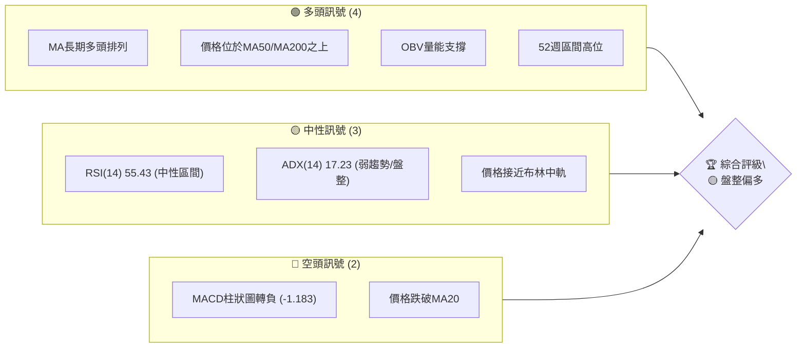

**儀表板解讀**：
多頭訊號主要來自長期均線的良好排列和OBV的累積趨勢，顯示TSM在宏觀層面仍處於上升通道。然而，短期價格跌破MA20，且MACD柱狀圖轉為負值，表明近期賣壓增加，動能轉弱。RSI和ADX處於中性區間，進一步確認了市場目前缺乏明確方向，正處於弱勢盤整階段。

### 📊 核心指標速覽表

| 指標類別 | 指標名稱 | 當前數值 | 訊號 | 解讀 |
|----------|----------|----------|------|------|
| **價格** | 當前價格 | $432.35 | 🟡 | 位於52週高點區間，但短期回調 |
| **均線** | MA20 | $433.54 | 🔴 | 價格略低於短期均線，短期承壓 |
| **均線** | MA50 | $411.90 | 🟢 | 價格高於中期均線，中期趨勢良好 |
| **均線** | MA200 | $338.60 | 🟢 | 價格高於長期均線，長期趨勢強勁 |
| **動能** | RSI(14) | 55.43 | 🟡 | 位於中性區間，無超買超賣 |
| **動能** | MACD | 8.731 | 🔴 | MACD線下穿訊號線，動能轉弱 |
| **波動** | ATR(14) | $19.78 | 🟡 | 相對於股價，波動性中等 |
| **趨勢** | ADX(14) | 17.23 | 🟡 | 趨勢強度較弱，市場處於盤整 |
| **量能** | OBV趨勢 | OBV > MA | 🟢 | 量能持續累積，支撐長期上漲 |

### 🏆 技術評分卡

```
╔══════════════════════════════════════════════════════════════╗
║              技術評分卡 — TSM (2026-06-28)                     ║
╠══════════════════════════════════════════════════════════════╣
║ 趨勢強度      █████░░░░░░░░░░░░░░░  25/100  🟡 (ADX顯示弱趨勢)    ║
║ 動能指標      ██████░░░░░░░░░░░░░░  30/100  🔴 (MACD轉空，RSI中性)║
║ 支撐穩定度    ████████████░░░░░░░░  60/100  🟢 (MA50/MA200提供強支撐)║
║ 成交量配合    ██████████░░░░░░░░░░  50/100  🟡 (OBV良好，但近期下跌放量)║
║ 形態完整度    ███████░░░░░░░░░░░░░  35/100  🟡 (短期修正，未見明確反轉形態)║
║ 均線排列      ████████████████░░░░  80/100  🟢 (標準多頭排列)    ║
╠══════════════════════════════════════════════════════════════╣
║ 綜合評分      ████████░░░░░░░░░░░░  47/100  🟡 盤整偏多             ║
╚══════════════════════════════════════════════════════════════╝
```

**評分卡解讀**：
TSM的技術評分反映了其長期強勁但短期面臨修正的現狀。均線排列顯示出穩固的長期上漲基礎，但趨勢強度和動能指標的疲軟表明市場正處於調整期。成交量配合度因近期下跌放量而略顯複雜，需密切關注。整體評分為「盤整偏多」，建議在關鍵支撐位附近尋找入場機會。

---

## 2. 趨勢分析

### 🌐 多時框趨勢分析

TSM 的多時框趨勢分析顯示，在長期和中期時間框架內，股價呈現明顯的上升趨勢，但在短期內則經歷了調整和動能減弱。這種情況通常表明，在強勁的長期牛市中，市場正在消化前期的漲幅。

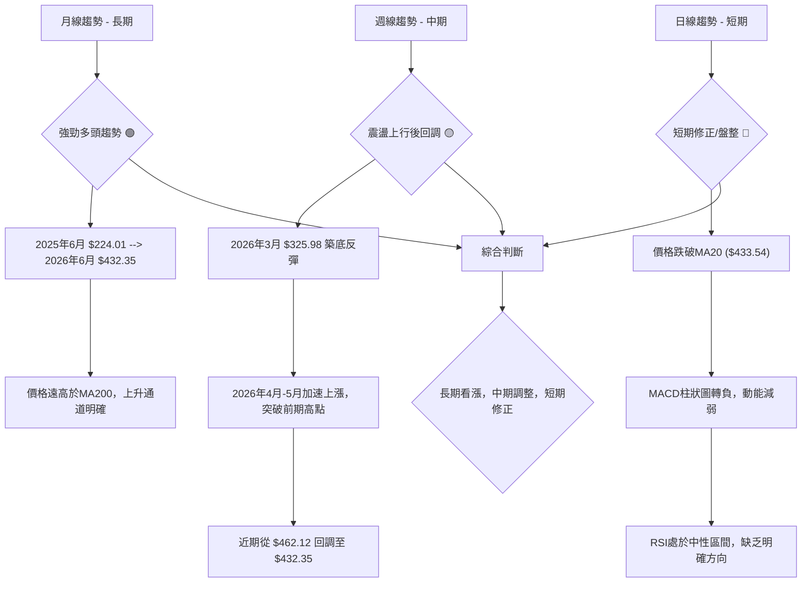

**多時框解讀**：
- **長期 (月線)**：TSM 股價從 2025 年 6 月的 $224.01 一路穩步上漲至 2026 年 6 月的 $432.35，漲幅達 93%。價格長期位於所有主要移動平均線之上，形成清晰的上升通道，顯示出強勁的長期多頭趨勢。
- **中期 (週線)**：從週線圖來看，TSM 在 2026 年 3 月經歷了一波深度回調至 $325.98 附近，隨後強勁反彈，並在 4 月和 5 月加速上漲，創下新高。近期從 $462.12 的高點回調至 $432.35，顯示中期上升趨勢中的一次健康修正。
- **短期 (日線)**：目前股價 $432.35 略低於 MA20 ($433.54)，MACD 柱狀圖轉負，RSI 位於中性區間，這些都表明短期動能轉弱，市場進入修正或盤整階段。

### 📈 長期趨勢 — 12個月走勢圖（Unicode）

過去 12 個月 TSM 的月線走勢圖清晰展示了其強勁的上升趨勢，儘管中間偶有回調，但高點和低點持續抬升。

```
TSM 月線走勢圖（過去12個月）
價格軸 ($)
$450 ┤                                        ●(432.35)
$400 ┤                                    ●(417.47)
$350 ┤                                ●(395.13)
$300 ┤                          ●(372.65)
$250 ┤                      ●(328.86)
$200 ┤                  ●(302.33)
$150 ┤              ●(298.08)
$100 ┤          ●(277.11)
$ 50 ┤      ●(238.98)
$  0 ┤  ●(224.01)
     └─────────────────────────────────────────────────────
      25/06 25/07 25/08 25/09 25/10 25/11 25/12 26/01 26/02 26/03 26/04 26/05 26/06
      $224  $239  $228  $277  $298  $289  $302  $329  $373  $337  $395  $417  $432
```

**走勢特徵分析表格**：

| 時間區間 | 起始價 | 結束價 | 漲跌幅 | 走勢特徵 | 評估 |
|----------|--------|--------|--------|----------|------|
| 2025/06-08 | $224.01 | $228.34 | +1.93% | 築底盤整後小幅上漲 | 🟡 |
| 2025/09-10 | $228.34 | $298.08 | +30.54%| 強勁上漲，突破整理區間 | 🟢 |
| 2025/11 | $298.08 | $289.23 | -2.97% | 短期回調，消化漲幅 | 🟡 |
| 2025/12-2026/02 | $289.23 | $372.65 | +28.84%| 再次啟動上漲，創階段新高 | 🟢 |
| 2026/03 | $372.65 | $337.16 | -9.52% | 較大修正，回踩支撐 | 🔴 |
| 2026/04-06 | $337.16 | $432.35 | +28.23%| 快速反彈，延續多頭趨勢 | 🟢 |

**長期趨勢總結**：
TSM 在過去 12 個月呈現典型的多頭市場特徵：高點和低點持續抬升，每一次回調後都能迅速收復失地並創出新高。儘管 2026 年 3 月出現一次較大幅度的修正，但隨後強勁的反彈確認了長期上升趨勢的穩固性。目前價格處於歷史高位區間，顯示市場對其未來增長前景持樂觀態度。

### 📊 中期趨勢（週線分析）

從近 20 週的收盤價數據來看，TSM 經歷了從 3 月低點的強勁反彈，並在 4 月底至 5 月初達到加速上漲。近期則出現了一次較大幅度的回調，但仍守在關鍵中期支撐之上。

```
TSM 週線壓力與支撐示意圖 (近20週)
價格軸 ($)
$470 ┤                     ┌───────┐
     │                     │ 高點R2  │ $462.12 (上週高點)
$460 ┤                     └───────┘
$450 ┤                                 
$440 ┤                                 
$430 ├───────● 現價 $432.35
$420 ┤          ┌───────┐
     │          │ 阻力R1  │ $417.47 (5月底高點)
$410 ┤          └───────┘
$400 ┤    ┌───────┐
     │    │ 支撐S1  │ $403.41 (5月中旬低點)
$390 ┤    └───────┘
$380 ┤
$370 ┤
$360 ┤
$350 ┤
$340 ┤ ┌───────┐
     │ │ 支撐S2  │ $337.15 (3月低點)
$330 ┤ └───────┘
$320 ┤
     └──────────────────────────────────
      時間軸
```

**中期趨勢解讀**：
TSM 在 2026 年 3 月底從 $325.98 開始反彈，並在 4 月中旬突破了 $370 附近的阻力區，隨後在 4 月底至 5 月初達到 $401.52、$410.72 等高點。最近一週（截至 2026-06-21）衝高至 $462.12 後，本週回落至 $432.35。這顯示市場在衝擊前期高點後存在一定的獲利了結壓力。從中期來看，$403.41 (5月中旬低點) 和 $411.90 (MA50) 將構成重要的支撐區，只要這些位置不被有效跌破，中期上升趨勢仍將維持。反之，若能突破 $462.12，則有望挑戰 52 週高點 $476.79。

### ⚡ 趨勢強度評估（ADX 解讀）

ADX (Average Directional Index) 用於衡量趨勢的強度，而非方向。

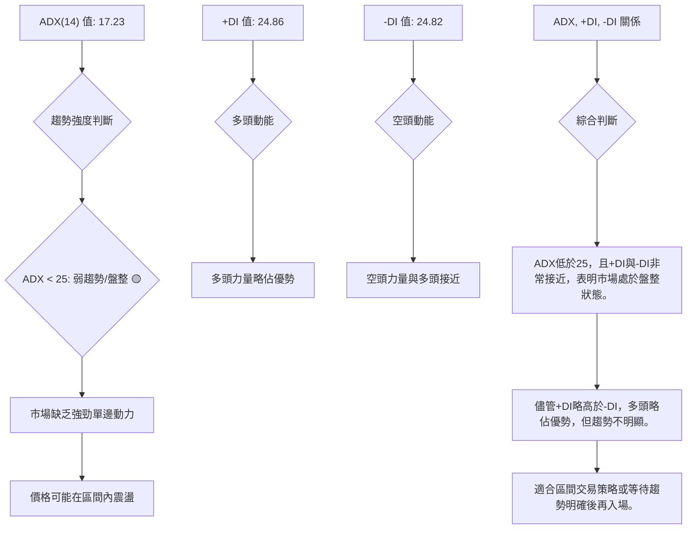

**ADX 強度對照表**：

| ADX 數值範圍 | 趨勢強度 | 市場解讀 | 訊號 |
|--------------|----------|----------|------|
| 0-25         | 弱趨勢/盤整 | 市場缺乏方向，價格震盪 | 🟡 |
| 25-50        | 中等趨勢 | 趨勢正在形成或已形成 | 🟢 |
| 50-75        | 強趨勢   | 趨勢非常明顯，動能強勁 | 🟢 |
| 75-100       | 極強趨勢 | 極端趨勢，可能面臨回調 | 🔴 |

**ADX 解讀**：
TSM 當前的 ADX(14) 值為 17.23，明顯低於 25 的閾值，這表明市場目前處於弱趨勢或盤整行情中。儘管 +DI (24.86) 略高於 -DI (24.82)，顯示多頭力量稍佔上風，但兩者數值非常接近，且 ADX 本身較低，這進一步確認了市場缺乏強勁的單邊趨勢，短期內價格可能在一定區間內震盪。對於趨勢交易者而言，此時可能需要等待趨勢重新確立，或考慮採用區間震盪策略。

---

## 3. 圖表形態分析

### 🔍 形態識別系統

根據提供的月線和週線數據，TSM 在過去一年呈現出強勁的上升趨勢。在這種趨勢中，通常會出現延續形態，而非反轉形態。從最近的價格行為來看，股價從高點回落，可能會形成一個整理形態，例如旗形或三角形。由於缺乏每日 K 線數據，無法精確識別細微形態，但可以根據週線回調進行推斷。

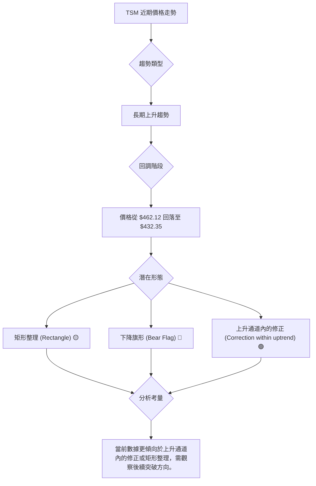

**形態識別解讀**：
從提供的週線數據來看，TSM 在 2026 年 3 月至 6 月初形成了一個強勁的上升波段。隨後從 $462.12 的高點回落至 $432.35。這波回調可能構成一個「矩形整理」或「下降旗形」的初期階段，這是上升趨勢中的常見修正形態。

- **矩形整理**：如果股價在 $400-$460 之間形成一個水平區間震盪，則為矩形整理。這通常是多頭積蓄力量的階段。
- **下降旗形**：如果回調通道呈向下傾斜，且成交量縮小，則為下降旗形。這也是上升趨勢的延續形態，預示著在整理結束後可能繼續上漲。

鑑於長期均線的強勁多頭排列，目前更傾向於將此看作是上升趨勢中的修正或整理，而非反轉形態。

### 🕯️ 重要K線形態分析

由於提供的數據是週收盤價，而非完整的 K 線數據，我們無法分析單日 K 線形態。但可以根據週收盤價的變化來推斷可能的週 K 線形態。

| 月份 | 收盤價 | K線形態 (推斷) | 解讀 | 訊號 |
|------|--------|------------------|------|------|
| 2026-02-22 | $368.64 | 大陽線/中陽線 | 連續上漲，動能強勁 | 🟢 |
| 2026-03-01 | $372.65 | 陽線 | 延續上漲趨勢 | 🟢 |
| 2026-03-08 | $337.15 | 大陰線 | 快速下跌，獲利了結或空頭主導 | 🔴 |
| 2026-03-15 | $336.57 | 小陰線/十字星 | 止跌企穩，多空力量平衡 | 🟡 |
| 2026-04-26 | $401.52 | 大陽線 | 強勢突破，多頭力量回歸 | 🟢 |
| 2026-06-21 | $462.12 | 大陽線 | 衝擊高點，多頭強勁 | 🟢 |
| 2026-06-28 | $432.35 | 大陰線 | 快速回調，短期賣壓顯現 | 🔴 |

**K線形態解讀**：
最近一週 (2026-06-28) 收盤價 $432.35，相較於前一週的 $462.12 呈現大幅下跌。這可能形成一根「長陰線」或「看跌吞噬」形態（如果前一週是陽線且被完全覆蓋），表明短期賣壓沉重。在前期強勁上漲後出現這種K線，需要警惕短期回調的延續性。然而，考慮到長期趨勢依然強勁，這可能只是牛市中的一次深度修正。

### 📉 ASCII 走勢形態示意圖

以下示意圖展示了 TSM 在強勁上升趨勢中，近期可能形成的修正形態。

```
TSM 上升趨勢中的修正形態示意圖
價格軸 ($)
$470 ┤                     ● (前高 $462.12)
$460 ┤                    ╱
$450 ┤                   ╱
$440 ┤                  ╱
$430 ├───────────● (現價 $432.35)
$420 ┤          ╱       ╲
$410 ┤         ╱         ╲
$400 ┤        ╱           ● (潛在支撐 $404.25)
$390 ┤       ╱
$380 ┤      ╱
$370 ┤     ● (前期低點 $372.65)
$360 ┤    ╱
$350 ┤   ╱
$340 ┤  ● (更低支撐 $337.16)
$330 ┤ ╱
$320 ┤● (底部 $325.98)
     └───────────────────────────────
      時間軸
      (上升趨勢線)
      (修正通道)
```
**示意圖解讀**：
圖中顯示 TSM 從 $325.98 附近啟動一波強勁上漲，並在 $462.12 達到階段高點。目前股價正處於一個向下的修正通道中，這可能是一個「下降旗形」或「矩形整理」的初步形態。這種形態通常預示著在修正結束後，股價將會沿著原有的上升趨勢繼續上漲。需要觀察股價是否能在 $404.25 (布林下軌/斐波那契回調位) 附近找到支撐，並向上突破修正通道的上沿。

### 🎯 形態目標價計算

由於缺乏精確的形態確認，我們將基於「下降旗形」或「矩形整理」的延續形態進行保守估計。假設目前的下跌是一個健康的修正。

**基於下降旗形/矩形整理的目標價（推測）**：
如果股價成功在 $404.25 - $411.90 區間獲得支撐並向上突破 $462.12 的近期高點，則可以預期其將延續之前的漲幅。
- **旗杆長度**：從 2026 年 3 月低點 $325.98 到 2026 年 6 月高點 $462.12，旗杆長度約為 $462.12 - $325.98 = $136.14。
- **形態突破點**：假設股價在 $420 附近完成整理並向上突破。
- **目標價計算**：突破點 + 旗杆長度 = $420 + $136.14 = $556.14。
- **保守目標價**：考慮到市場波動和分析師預期，將第一目標設定為分析師平均目標價 $478.95。

**形態目標價**：
- **目標價 1 (T1)**：$478.95 (分析師平均目標價)
- **目標價 2 (T2)**：$556.14 (基於旗形突破的潛在目標)

**計算方法說明**：
旗形（或矩形）形態的目標價通常是將旗杆的長度（即形態形成前的上漲或下跌幅度）疊加到形態突破點上。由於目前形態尚未完全形成且突破方向不明，此處的目標價為基於上升趨勢延續的推測性估計。

---

## 4. 支撐與阻力

### 🗺️ 關鍵價位分布圖（Unicode）

TSM 當前股價 $432.35 位於一個關鍵的區間，上方阻力重重，下方則有多重支撐。

```
TSM 價位結構分布圖
═══════════════════════════════════════════════════
$478.95 ║████████████████████████║ 強阻力 R3 (分析師平均目標)
$476.79 ║██████████████████████  ║ 阻力 R2 (52週高點)
$462.83 ║████████████████████████║ 阻力 R1 (布林上軌 / 近期高點)
$433.54 ║▓▓▓▓▓▓▓▓▓▓▓▓▓▓▓▓▓▓▓▓▓▓▓▓║ ◄ 現價 $432.35 (略低於MA20)
$411.90 ║▓▓▓▓▓▓▓▓▓▓▓▓▓▓▓▓▓▓▓▓▓▓▓▓║ 近期支撐 S1 (MA50 / 斐波那契38.2%)
$404.25 ║████████████████████████║ 強支撐 S2 (布林下軌 / 斐波那契50%)
$338.60 ║████████████████████████║ 極強支撐 S3 (MA200)
═══════════════════════════════════════════════════
```

**價位結構解讀**：
當前價格 $432.35 正好位於 MA20 ($433.54) 略下方，顯示短期壓力。MA50 ($411.90) 和布林下軌 ($404.25) 提供了第一層和第二層的關鍵支撐。長期來看，MA200 ($338.60) 仍是極其強大的支撐。上方阻力首先是布林上軌 ($462.83) 和 52 週高點 ($476.79)，分析師的平均目標價 $478.95 也構成重要阻力。

### 🚧 阻力位分析表

| 阻力級別 | 價位 | 形成原因 | 突破難度 | 重要性 |
|----------|------|----------|----------|--------|
| **R1**   | $462.83 | 布林上軌 / 近期高點 ($462.12) | 中等 | 🟢 |
| **R2**   | $476.79 | 52週高點 | 高 | 🟢 |
| **R3**   | $478.95 | 分析師平均目標價 | 高 | 🟢 |

**阻力位解讀**：
- **R1 ($462.83)**：這是股價近期的高點，也是布林通道的上軌。突破此價位將表明多頭動能重新積聚，並可能引導股價測試更高阻力。
- **R2 ($476.79)**：52 週高點是市場重要的心理關口。突破此點將創下新高，吸引更多買盤。
- **R3 ($478.95)**：分析師平均目標價，通常被視為市場對公司價值的共識預期，突破此價位需要更強勁的基本面或市場情緒支持。

### 🛡️ 支撐位分析表

| 支撐級別 | 價位 | 形成原因 | 守住機率 | 重要性 |
|----------|------|----------|----------|--------|
| **S1**   | $411.90 | MA50 / 斐波那契38.2%回調 | 中高 | 🟢 |
| **S2**   | $404.25 | 布林下軌 / 斐波那契50%回調 | 高 | 🟢 |
| **S3**   | $338.60 | MA200 | 極高 | 🟢 |

**支撐位解讀**：
- **S1 ($411.90)**：MA50 提供了強大的中期動態支撐，同時與斐波那契 38.2% 回調位 ($410.10) 接近，形成一個重要的支撐區。若能在此處企穩，則回調有望結束。
- **S2 ($404.25)**：布林通道下軌與斐波那契 50% 回調位 ($394.05) 接近，構成更深層次的支撐。跌破此區間可能預示著短期趨勢進一步惡化。
- **S3 ($338.60)**：MA200 是長期牛市的生命線，提供極其強勁的長期支撐。股價若能維持在此之上，則長期看漲趨勢不變。

### 📐 斐波那契回調位分析

我們將使用近期主要上升波段（從 2026 年 3 月低點 $325.98 到 2026 年 6 月高點 $462.12）來計算斐波那契回調位。

**斐波那契回調位計算**：
- **波段高點 (High)**：$462.12
- **波段低點 (Low)**：$325.98
- **波段幅度 (Range)**：$462.12 - $325.98 = $136.14

| 回調比例 | 回調價位 | 潛在意義 |
|----------|----------|----------|
| **23.6%** | $462.12 - ($136.14 * 0.236) = $429.61 | 輕微回調，通常在強勢市場中出現 |
| **38.2%** | $462.12 - ($136.14 * 0.382) = $410.10 | 較為常見的回調位，與 MA50 接近，重要支撐 |
| **50.0%** | $462.12 - ($136.14 * 0.500) = $394.05 | 關鍵心理支撐位，若跌破可能進入深度調整 |
| **61.8%** | $462.12 - ($136.14 * 0.618) = $377.97 | 黃金分割回調位，跌破此處可能預示趨勢改變 |

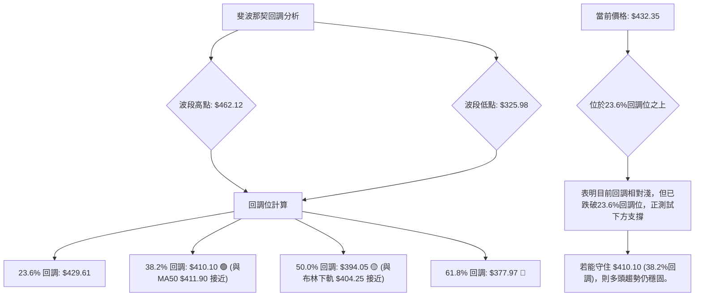

**斐波那契回調位解讀**：
當前價格 $432.35 位於 23.6% 回調位 ($429.61) 略上方，顯示了在強勁上漲後的正常修正。最關鍵的支撐區在 38.2% 回調位 $410.10 附近，此處與 MA50 ($411.90) 形成強勢匯聚支撐。若股價能在此區域獲得有效支撐，則多頭趨勢有望延續。若跌破 50% 回調位 $394.05，則修正可能加深，並可能測試 61.8% 回調位。

---

## 5. 技術指標深度解讀

### 🎛️ 指標訊號總覽

以下 Mermaid 圖表展示了各關鍵技術指標當前的訊號及其相互關係。

```mermaid
graph TD
    A["當前價格 $432.35"]

    subgraph "移動平均線 (MA)"
        MA20["$433.54"] -->|"壓力"| A
        MA50["$411.90"] -->|"支撐"| A
        MA200["$338.60"] -->|"強支撐"| A
        MA_Align["MA20>MA50>MA200"] -->|"多頭排列"| BullishSignal
    end

    subgraph 動能指標
        RSI["RSI(14): 55.43"] -->|"中性"| NeutralSignal
        MACD_Line["MACD: 8.731"] -->|"下穿"| MACD_Signal["MACD Signal: 9.914"]
        MACD_Signal --> BearishSignal["MACD柱狀圖: -1.183 🔴"]
        StochK["Stoch %K: 38.47"] -->|"中性"| StochD["Stoch %D: 43.60"]
        StochD --> NeutralSignal
    end

    subgraph 趨勢強度與波動率
        ADX["ADX(14): 17.23"] -->|"弱趨勢/盤整"| NeutralSignal
        DI_Plus["+DI: 24.86"] -->|"多頭略佔優"| DI_Minus["-DI: 24.82"]
        ATR["ATR(14): $19.78"] -->|"中等波動"| NeutralSignal
    end

    subgraph 布林通道
        BB_Upper["上軌: $462.83"] -->|"阻力"| A
        BB_Middle["中軌: $433.54"] -->|"壓力/支撐"| A
        BB_Lower["下軌: $404.25"] -->|"支撐"| A
        BB_PercentB["BB %B: 0.48"] -->|"接近中軌"| NeutralSignal
    end

    subgraph 成交量
        Latest_Vol["最新成交量: 17.9M"] -->|"高於均量"| VolumeAnalysis["量價配合"]
        Avg_Vol["20日均量: 14.2M"] --> VolumeAnalysis
        OBV_Trend["OBV趨勢: OBV > MA"] -->|"量能支撐"| BullishSignal
    end

    BullishSignal["🟢 多頭訊號"]
    NeutralSignal["🟡 中性訊號"]
    BearishSignal["🔴 空頭訊號"]

    BullishSignal --> Overall["綜合判斷: 🟡 盤整偏多"]
    NeutralSignal --> Overall
    BearishSignal --> Overall
```

**指標訊號總覽解讀**：
從總覽圖可以看出，TSM 的長期均線系統呈現強勁多頭排列，OBV 也顯示量能累積，這是支持股價長期上漲的基礎。然而，短期動能指標如 MACD 已發出賣出訊號，且價格跌破 MA20。RSI、Stochastics 和 ADX 均處於中性區間，表明市場目前缺乏明確的趨勢方向，正處於盤整或修正階段。布林通道顯示價格位於中軌附近，波動性中等。

### 📈 移動平均線排列分析

TSM 的移動平均線系統呈現出經典的多頭排列，但短期價格對 MA20 構成壓力。

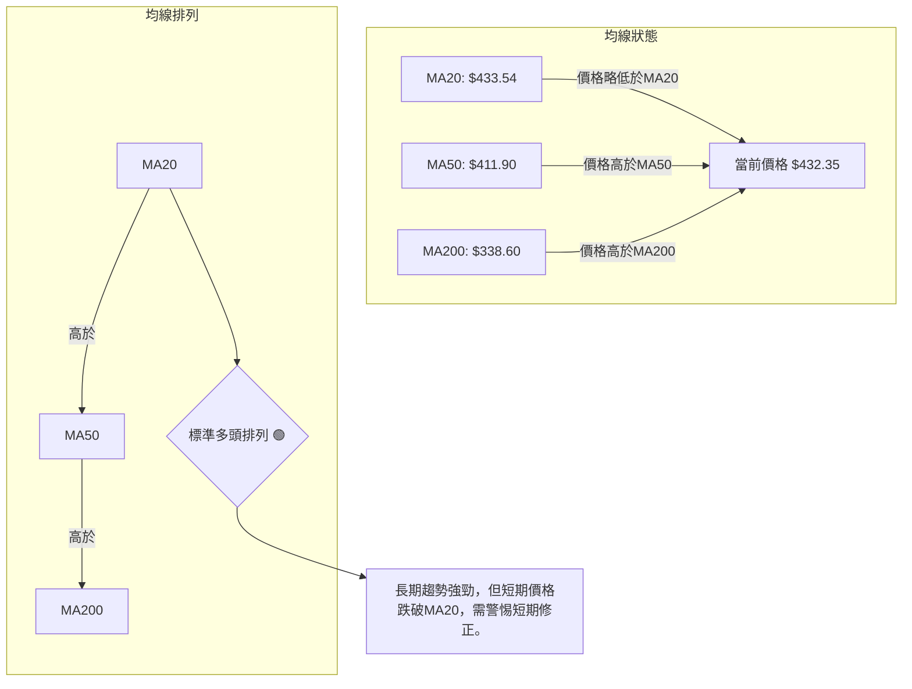

**移動平均線分析**：
- **MA20 ($433.54)**：當前價格 $432.35 略低於 MA20，表明短期內存在賣壓，股價在短期內呈現弱勢。MA20 從上方的支撐轉變為目前的短期阻力。
- **MA50 ($411.90)**：價格仍遠高於 MA50，這條均線為中期上升趨勢提供了穩固的支撐。MA50 向上傾斜，顯示中期動能依然強勁。
- **MA200 ($338.60)**：價格遠高於 MA200，且 MA200 向上傾斜，這是長期牛市的明確標誌。MA200 作為最終的長期支撐，提供極高的安全邊際。
- **均線排列**：MA20 > MA50 > MA200，這是經典的多頭排列模式，強烈支持長期看漲觀點。儘管短期價格跌破 MA20，但只要不跌破 MA50，長期趨勢就不會改變。

**結論**：均線系統整體呈現強勁多頭格局 🟢，但短期價格跌破 MA20 提示短期修正風險。

### 📉 RSI(14) 分析

RSI (Relative Strength Index) 用於衡量價格變動的速度和變化，以判斷超買或超賣狀況。

**RSI(14) 強度進度條**：
RSI(14): 55.43 ▓▓▓▓▓▓▓▓▓▓░░░░░░░░░░ (55.43%) 🟡 中性區間 (30-70)

**RSI 分析**：
- **當前數值 (55.43)**：RSI 位於 30-70 的中性區間，既非超買也非超賣。這表明市場目前多空力量相對平衡，缺乏明確的單邊動能。
- **超買超賣區間**：RSI 未進入 70 以上的超買區，也未進入 30 以下的超賣區。這意味著股價目前沒有面臨因過度上漲或下跌而導致的即將反轉的壓力。
- **背離判斷**：根據提供的數據，RSI 無明顯背離。這表示價格的高點/低點與 RSI 的高點/低點走勢一致。
    - **頂背離**：未觀察到價格創出新高而 RSI 未能創出新高，因此無頂背離訊號。
    - **底背離**：未觀察到價格創出新低而 RSI 未能創出新低，因此無底背離訊號。

**RSI 結論**：RSI 處於中性區間，未提供明確的買賣訊號 🟡。這與 ADX 所示的弱趨勢相符，均表明市場目前處於盤整狀態。

### 📊 MACD(12/26/9) 訊號解讀

MACD (Moving Average Convergence Divergence) 用於識別趨勢的動能、方向和持續時間。

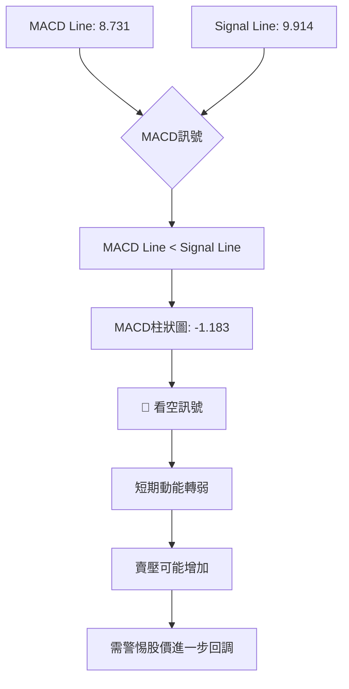

**MACD 分析**：
- **MACD 線 (8.731)**：目前 MACD 線的數值為 8.731。
- **訊號線 (9.914)**：訊號線的數值為 9.914。
- **MACD 柱狀圖 (-1.183)**：MACD 柱狀圖為負值 (-1.183)，且 MACD 線 (8.731) 已經下穿訊號線 (9.914)。
- **訊號解讀**：這是一個典型的 MACD 死亡交叉訊號 🔴，表明短期動能已由多轉空，賣壓正在積聚。MACD 柱狀圖從正轉負，進一步確認了這種短期看跌動能。這與價格跌破 MA20 的現象相互印證，提示短期內股價有進一步回調的風險。
- **背離判斷**：數據中未明確指出 MACD 背離。
    - **頂背離**：未觀察到 MACD 線創出新高而價格未能創出新高。
    - **底背離**：未觀察到 MACD 線創出新低而價格未能創出新低。

**MACD 結論**：MACD 發出短期看空訊號 🔴，提示投資者警惕短期風險。

### 📦 布林通道分析

布林通道 (Bollinger Bands) 用於衡量價格的波動區間和相對高低。

```
TSM 布林通道示意圖
價格軸 ($)
$470 ┤                                      布林上軌 ($462.83)
$460 ┤                                    ╱
$450 ┤                                   ╱
$440 ┤                                  ╱
$430 ├─────────● 現價 ($432.35) ◄─────── 布林中軌 ($433.54)
$420 ┤                                  ╲
$410 ┤                                   ╲
$400 ┤                                    ╲ 布林下軌 ($404.25)
$390 ┤
     └──────────────────────────────────
      時間軸
```

**布林通道分析**：
- **上軌 ($462.83)**：代表價格的上方阻力區。
- **中軌 (MA20 $433.54)**：也是 MA20，通常被視為趨勢線。
- **下軌 ($404.25)**：代表價格的下方支撐區。
- **BB %B (0.48)**：數值接近 0.5，表示價格接近布林通道中軌。
- **訊號解讀**：
    - 當前價格 $432.35 位於布林中軌 ($433.54) 略下方，這與價格跌破 MA20 的訊號一致，表明短期趨勢偏弱。
    - 價格從上週的高點 $462.12 (接近上軌) 迅速回落至中軌，顯示出均值回歸的傾向。
    - 布林通道的寬度中等，ATR 數值也支持中等波動性。通道並未顯著收窄或擴張，表明市場尚未進入極端壓縮或爆發性行情。
    - 下軌 $404.25 作為重要支撐，與斐波那契 50% 回調位接近，具有關鍵意義。

**布林通道結論**：價格回落至中軌附近，顯示短期修正，中軌構成短期壓力，下軌為潛在支撐 🟡。

### 💹 成交量分析（量價配合度）

成交量是判斷價格趨勢可信度的重要指標。

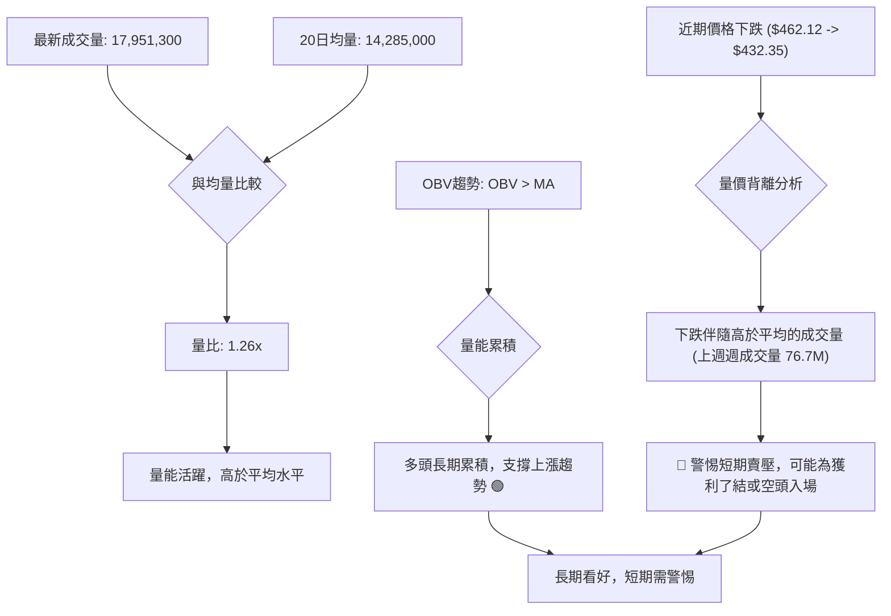

**成交量分析**：
- **最新成交量 (17,951,300)**：高於 20 日均量 (14,285,000)，量比為 1.26 倍。這表明市場交投活躍。
- **OBV 趨勢 (OBV > MA)**：數據顯示 OBV 趨勢向上，且 OBV 線位於其移動平均線之上，這是一個積極的訊號 🟢，表示市場中累積性買盤力量強於賣盤，多頭在長期上持續累積籌碼，為股價上漲提供了堅實的量能基礎。
- **量價配合度**：
    - **長期**：OBV 的良好趨勢與 TSM 的長期上升趨勢相符，量能支持長期上漲。
    - **短期**：然而，近期價格從 $462.12 回落至 $432.35，根據提供的週成交量數據，本週週成交量 (76,762,700) 顯著高於前幾週的平均水平。在價格下跌時伴隨較大的成交量，這可能是一個短期看跌訊號 🔴。這表明在價格回調的過程中，有較多的賣盤湧出，可能是在高位獲利了結或新的空頭入場。

**成交量結論**：長期量能累積良好，支撐多頭趨勢 🟢。但短期價格下跌伴隨放量，提示短期賣壓較大 🔴，需警惕。這形成了一定的量價背離，長期與短期訊號矛盾。

---

## 6. 動能與波動率

### ⚡ 動能評估四象限

動能評估四象限分析旨在結合動能強度與波動率，為投資決策提供參考。由於數據中未直接提供動能評分，我們將基於 RSI、MACD 和 ADX 進行綜合判斷。

| 象限 | 動能 | 波動 | 當前狀態 (TSM) | 評估 |
|------|------|------|----------------|------|
| Q1 | 強 | 低 | - | 最佳機會 (趨勢穩定，動能強勁) |
| Q2 | 弱 | 低 | - | 謹慎觀望 (缺乏動能，波動小，可能盤整) |
| Q3 | 強 | 高 | - | 高風險高收益 (突破或反轉初期，波動大) |
| **Q4** | **弱** | **高** | **✓** | **避免進場 / 觀望 (趨勢不明，波動大，風險高)** |

**TSM 當前狀態評估**：
- **動能**：RSI 55.43 (中性)，MACD 柱狀圖 -1.183 (看空)，ADX 17.23 (弱趨勢)。綜合來看，短期動能偏弱。
- **波動**：ATR(14) $19.78 (4.58% of price)。相對於股價，ATR 數值中等偏高，顯示日波動幅度較大。
- **結論**：TSM 目前處於「弱動能，高波動」的 Q4 象限。這表明市場缺乏明確的趨勢方向，但價格波動較大，增加了交易的不確定性和風險。在這種情況下，建議投資者保持觀望，或等待動能重新積聚並趨勢明確後再考慮入場。

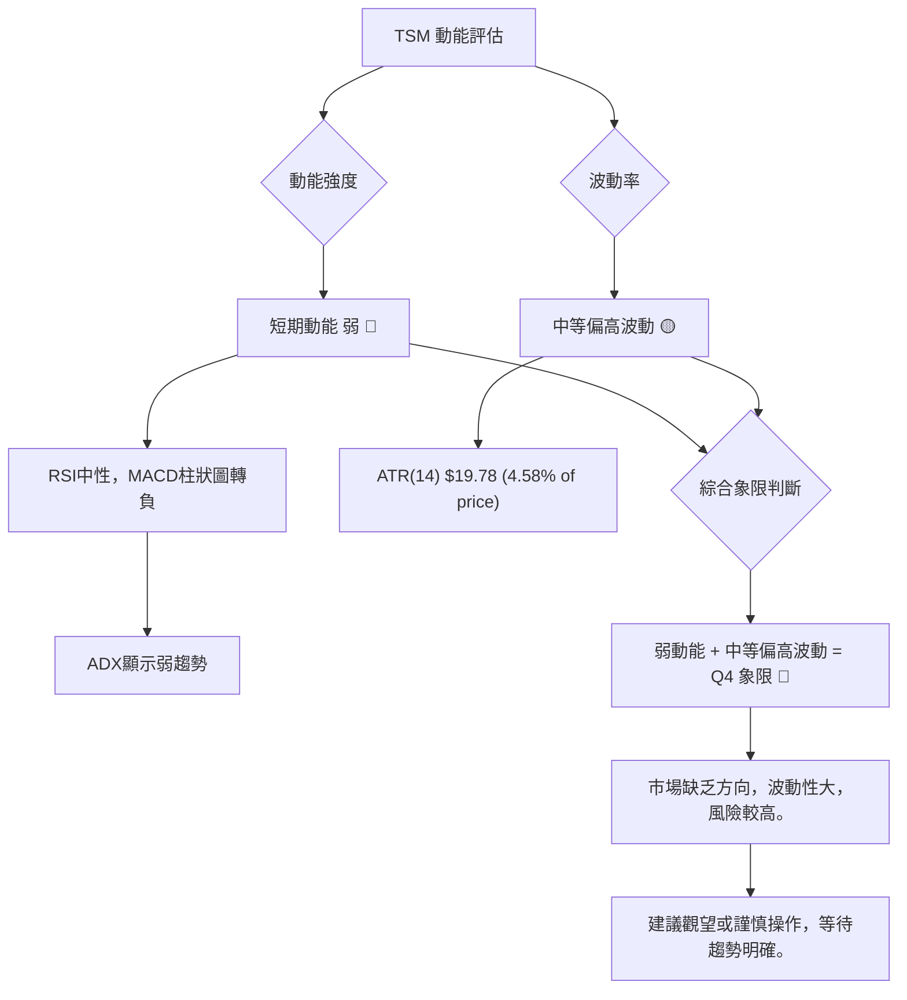

### 📊 ATR 波動率分析

ATR (Average True Range) 用於衡量資產價格的波動性。

**ATR(14) 數值**：$19.78
**ATR 佔股價比例**：$19.78 / $432.35 = 4.58%

**ATR 分析**：
- TSM 當前的 ATR(14) 為 $19.78。這意味著在過去 14 天內，TSM 的平均每日價格波動範圍大約是 $19.78。
- ATR 佔股價的 4.58%，這是一個中等偏高的波動水平。對於日線交易者來說，這提供了足夠的日內波動空間。
- **止損距離建議**：ATR 常用於設置止損點。一般建議將止損點設置在當前價格下方 1.5 到 3 倍 ATR 的距離。
    - 1.5 * ATR = 1.5 * $19.78 = $29.67
    - 2.0 * ATR = 2.0 * $19.78 = $39.56
    - 3.0 * ATR = 3.0 * $19.78 = $59.34
    - 如果從 $432.35 買入，考慮 2 倍 ATR 作為止損距離，則止損點約在 $432.35 - $39.56 = $392.79 附近。這個價位與斐波那契 50% 回調位 ($394.05) 和布林下軌 ($404.25) 形成的支撐區接近，提供了合理的止損參考。

**ATR 結論**：TSM 具有中等偏高的波動性，為交易者提供了機會，但也增加了風險。ATR 可作為動態止損的參考依據。

### 📐 Beta 與市場相關性

Beta 值衡量股票相對於整體市場的波動性。數據中未提供 TSM 的 Beta 值。

**Beta 與市場相關性分析**：
- **一般情況**：半導體產業通常被視為景氣循環股，其股價波動性往往高於大盤，因此 Beta 值通常會大於 1。高 Beta 值意味著當市場上漲時，TSM 可能會漲得更多；當市場下跌時，TSM 也可能跌得更多。
- **影響**：由於 TSM 是全球領先的晶圓代工廠，其業務與全球經濟景氣、半導體產業週期以及科技創新息息相關。在經濟擴張和科技股牛市中，TSM 的股價通常表現出色；反之，在經濟衰退或科技股熊市中，其股價可能承受較大壓力。
- **投資者考量**：高 Beta 股票適合對市場方向有明確判斷且風險承受能力較高的投資者。若市場整體趨勢向好，TSM 將提供較大的潛在回報；反之，則需警惕其較高的下跌風險。

**Beta 結論**：缺乏具體 Beta 數據，但基於產業特性，TSM 預期具有高於市場的波動性 (Beta > 1) 🟡。投資者應將其視為與市場高度相關且波動較大的標的。

---

## 7. 多時框架總結

### 📋 時框架評分表

本表綜合了 TSM 在不同時間框架下的技術指標表現，提供全面的評估。

| 時框架 | 趨勢方向 | 動能 | 均線排列 | 形態 | 綜合評分 (1-10) | 建議 |
|--------|----------|------|----------|------|-----------------|------|
| **長期** | 🟢 強勁多頭 | 🟢 強勁 | 🟢 多頭排列 | 🟢 上升通道 | 9/10 | 繼續持有/逢低買入 |
| **中期** | 🟡 震盪上行 | 🟡 中性 | 🟢 多頭排列 | 🟡 修正整理 | 7/10 | 觀察支撐，尋找買點 |
| **短期** | 🔴 修正盤整 | 🔴 轉弱 | 🔴 短期承壓 | 🟡 潛在整理 | 4/10 | 謹慎觀望/等待企穩 |

**時框架評分解讀**：
- **長期**：TSM 處於非常強勁的長期多頭趨勢中，所有長期指標均顯示積極訊號。這是投資的基石。
- **中期**：中期趨勢仍是上升趨勢，但近期出現回調，動能略顯不足，進入修正整理階段。需要關注中期支撐位。
- **短期**：短期指標顯示動能轉弱，價格跌破短期均線，MACD 柱狀圖轉負，預示短期修正或盤整。此時不宜盲目追高。

### 🔲 綜合訊號矩陣

此矩陣展示了不同時間框架下各技術維度訊號的一致性，以判斷整體市場偏向。

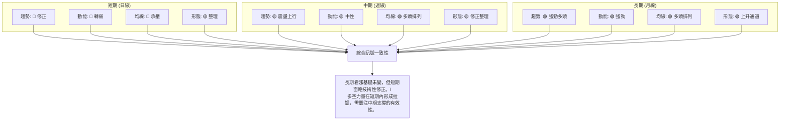

**綜合訊號矩陣解讀**：
矩陣清晰地顯示，長期趨勢的各項指標均為強勁的多頭訊號，表明 TSM 的基本面和長期市場情緒非常樂觀。中期趨勢則呈現震盪上行的特點，儘管近期有所修正，但均線排列仍保持多頭，動能中性。短期趨勢則明顯偏弱，所有指標均指向修正或盤整。

**結論**：這種多空交織的局面表明，TSM 處於一個「牛市回調」階段。長期投資者可以利用短期回調在關鍵支撐位附近積累籌碼。短期交易者則需要謹慎，等待短期動能恢復或趨勢重新確立。目前市場的主要任務是在消化前期漲幅和等待下一波上漲動能的積累。

---

## 8. 交易策略建議

### 🗺️ 策略決策流程圖

基於多時框分析，TSM 目前處於長期多頭中的短期修正階段，因此主要策略應圍繞逢低買入和謹慎操作展開。

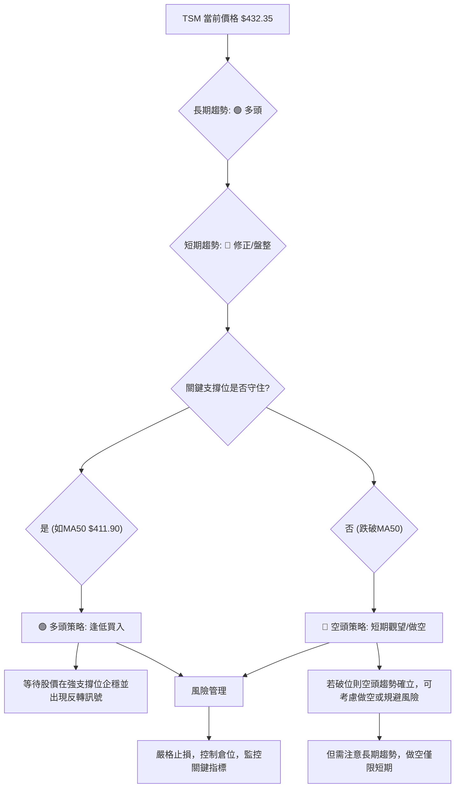

### 🟢 多頭策略詳情

考慮到 TSM 的長期強勁多頭趨勢，逢低買入是主要策略。在短期回調至關鍵支撐位時尋找入場機會。

| 策略要素 | 策略 A (積極型：回踩MA50) | 策略 B (保守型：回踩布林下軌/斐波那契50%) |
|----------|------------------------|----------------------------------|
| 進場條件 | 股價回落至 MA50 附近企穩，MACD 柱狀圖收斂或轉正，RSI 脫離超賣區。 | 股價回落至布林下軌/斐波那契 50% 回調位附近，出現明顯止跌 K 線形態。 |
| 進場價格 | $412.00 | $404.50 |
| 目標價 T1 | $462.12 (近期高點) | $462.12 (近期高點) |
| 目標價 T2 | $478.95 (分析師平均目標) | $478.95 (分析師平均目標) |
| 止損價格 | $393.00 (略低於斐波那契 50% 回調位 $394.05) | $385.00 (略低於斐波那契 61.8% 回調位 $377.97) |
| 風險報酬比 | ($462.12 - $412.00) : ($412.00 - $393.00) = $50.12 : $19.00 ≈ 2.64 : 1 | ($462.12 - $404.50) : ($404.50 - $385.00) = $57.62 : $19.50 ≈ 2.95 : 1 |
| 成功機率 | 65% (基於長期趨勢) | 70% (基於更強支撐) |
| 建議倉位 | 10-15% | 15-20% |

**多頭策略解讀**：
兩個多頭策略均基於 TSM 長期上升趨勢的判斷，利用短期回調作為買入機會。策略 A 較為積極，在 MA50 附近入場，風險稍高但潛在報酬率也較好。策略 B 較為保守，等待更深的調整，在更強的支撐位入場，成功機率相對更高。無論選擇哪個策略，嚴格的止損是必不可少的。

### 🔴 空頭策略詳情

鑑於 TSM 的長期多頭趨勢，不建議長期做空。空頭策略僅限於短期，且需嚴格控制風險。

| 策略要素 | 策略 C (短期反彈受阻) |
|----------|--------------------|
| 進場條件 | 股價反彈至 MA20 ($433.54) 或布林中軌 ($433.54) 附近受阻，K 線出現看跌形態 (如射擊之星、烏雲蓋頂)。 |
| 進場價格 | $433.00 |
| 目標價 T1 | $411.90 (MA50) |
| 目標價 T2 | $404.25 (布林下軌) |
| 止損價格 | $445.00 (略高於 ATR 1倍止損 $432.35 + $19.78 = $452.13, 考慮近期壓力) |
| 風險報酬比 | ($433.00 - $411.90) : ($445.00 - $433.00) = $21.10 : $12.00 ≈ 1.76 : 1 |
| 成功機率 | 40% (逆勢操作，風險較高) |
| 建議倉位 | 5-10% (極低) |

**空頭策略解讀**：
此空頭策略為短期逆勢操作，風險較高。僅在股價反彈至關鍵阻力位 (如 MA20/布林中軌) 附近，且出現明確看跌訊號時才考慮。目標是捕捉短期回調的利潤，一旦價格突破止損位，應立即離場。不建議重倉或長期持有空頭倉位。

### ⭐ 整體訊號強度評星

```
╔══════════════════════════════════════════════════════════════╗
║              TSM 整體交易訊號評星 (2026-06-28)                 ║
╠══════════════════════════════════════════════════════════════╣
║ 做多訊號強度：★★★★☆  (4/5星)                               ║
║   理由：長期趨勢強勁，均線多頭排列，OBV支持。短期回調提供逢低買入機會。║
║ 做空訊號強度：★☆☆☆☆  (1/5星)                               ║
║   理由：長期趨勢為多頭，逆勢做空風險極高，僅適合激進短期交易者。║
║ 整體可信度：  ★★★☆☆  (3/5星)                               ║
║   理由：長期趨勢明確，但短期動能轉弱，市場進入盤整。策略需謹慎選擇。║
╚══════════════════════════════════════════════════════════════╝
```

**評星解讀**：
TSM 的整體技術面偏向多頭，但短期修正導致做多訊號強度略有下降，做空訊號因逆勢而極弱。目前市場處於觀望和等待階段，整體可信度中等，交易者應耐心等待更明確的入場訊號，並嚴格執行風險管理。

---

## 9. 風險提示與監控

### ✅ 關鍵監控指標 Checklist

以下是交易 TSM 時需要密切關注的關鍵技術指標和價格水平：

```
╔══════════════════════════════════════════════════════════════╗
║ ✅ TSM 關鍵監控指標 Checklist                                  ║
╠══════════════════════════════════════════════════════════════╣
║ ├─ 價格行為：                                                 ║
║ │  ├─ 股價是否能守住 $411.90 (MA50 / 斐波那契38.2%)？      ║
║ │  ├─ 股價是否能守住 $404.25 (布林下軌 / 斐波那契50%)？     ║
║ │  ├─ 股價能否有效突破 $433.54 (MA20 / 布林中軌)？          ║
║ │  └─ 股價能否突破近期高點 $462.12？                        ║
║ ├─ 動能指標：                                                 ║
║ │  ├─ MACD 柱狀圖是否由負轉正？                               ║
║ │  ├─ RSI 是否能維持在 50 以上，或從超賣區反彈？             ║
║ ├─ 趨勢強度：                                                 ║
║ │  ├─ ADX 是否能突破 25，且 +DI 顯著高於 -DI？                ║
║ ├─ 成交量：                                                   ║
║ │  ├─ 價格上漲時是否伴隨放量，下跌時是否縮量？               ║
║ │  └─ OBV 趨勢是否持續向上？                                  ║
║ ├─ K線形態：                                                  ║
║ │  └─ 在關鍵支撐位附近是否出現止跌反轉 K 線形態？             ║
╚══════════════════════════════════════════════════════════════╝
```

### ⚠️ 風險場景分析

TSM 的未來走勢受到多方面因素影響，以下是三種可能的情境分析：

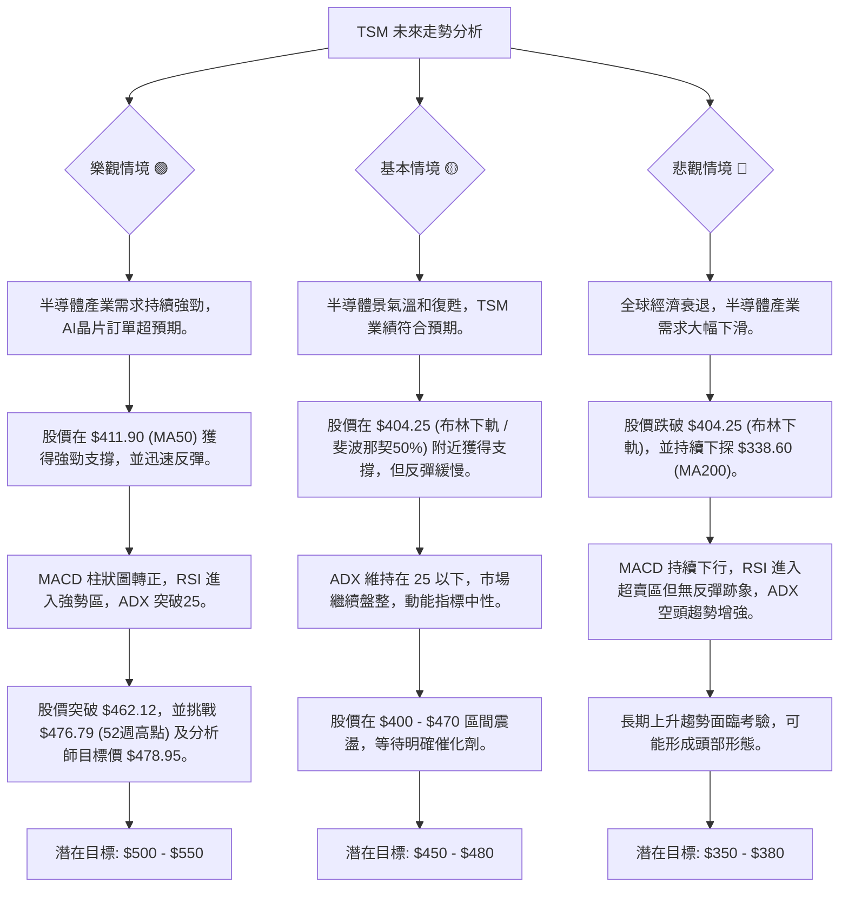

### 🛡️ 風險管理重要提醒

1.  **嚴格止損**：無論採取何種策略，必須設定並嚴格執行止損點。尤其是在當前短期動能轉弱的情況下，止損是保護資本的關鍵。建議止損點應基於關鍵支撐位或 ATR 倍數來設定。
2.  **倉位控制**：鑑於市場短期不確定性，建議控制倉位在可承受風險範圍內。避免滿倉操作，為潛在的波動預留空間。
3.  **分批入場**：對於逢低買入策略，建議分批建倉，而非一次性投入所有資金。例如，在 MA50 附近建第一批倉位，若繼續下跌至布林下軌/斐波那契 50% 回調位，則再建第二批倉位。
4.  **監控市場情緒與新聞**：TSM 作為半導體龍頭，其股價易受產業政策、地緣政治、全球經濟數據及主要客戶（如蘋果、NVIDIA）訂單消息的影響。及時關注相關新聞和分析師評級變化。
5.  **不追高殺跌**：在盤整或修正行情中，價格往往在區間內震盪。避免在阻力位追高或在支撐位殺跌，應耐心等待確認訊號。
6.  **時間框架匹配**：確保你的交易策略與你的投資時間框架相匹配。長期投資者可以承受短期波動，而短期交易者則需要更頻繁地監控和調整策略。

---

## 📋 報告總結

```
╔════════════════════════════════════════════════════════════════════╗
║                   TSM 技術分析報告總結                               ║
╠════════════════════════════════════════════════════════════════════╣
║ 報告日期：2026-06-28                                               ║
║ 當前價格：$432.35                                                  ║
║ 分析評級：⚖️ 🟡 盤整偏多 (長期趨勢強勁，短期修正，市場等待方向)      ║
║                                                                    ║
║ 關鍵結論：                                                         ║
║ ├─ 長期趨勢：🟢 強勁多頭，均線呈標準多頭排列，OBV量能支持。        ║
║ ├─ 中期趨勢：🟡 震盪上行後回調，仍處於上升通道，但動能中性。        ║
║ ├─ 短期趨勢：🔴 修正盤整，價格跌破MA20，MACD柱狀圖轉負，動能轉弱。 ║
║ ├─ 關鍵支撐：$411.90 (MA50 / 斐波那契38.2%)，次級支撐 $404.25 (布林下軌 / 斐波那契50%)。 ║
║ ├─ 關鍵阻力：$433.54 (MA20)，上方阻力 $462.12 (近期高點) 及 $476.79 (52週高點)。 ║
║ └─ 分析師目標：平均目標價 $478.95。                                ║
║                                                                    ║
║ 最優策略組合：                                                     ║
║ 1. 🥇 最佳機會：**逢低買入策略**。等待股價回調至 $411.90 - $404.25 關鍵支撐區間，並出現止跌訊號 (如MACD柱狀圖收斂、K線反轉形態)。目標價 $462.12 / $478.95，止損 $393.00。 ║
║ 2. 🥈 次選機會：**區間震盪策略**。若股價在 $400 - $460 區間內持續盤整，可考慮在區間下沿買入，上沿賣出，但需嚴格控制風險。 ║
║ 3. 🥉 保守選擇：**觀望等待**。等待短期趨勢明確，例如股價重新站穩MA20 ($433.54) 並突破近期高點 $462.12，或MACD柱狀圖重新轉正，再考慮入場。 ║
╚════════════════════════════════════════════════════════════════════╝
```

---

> ⚠️ **免責聲明**：本報告為 AI 自動生成之技術分析，所有數據及估算均基於提供的歷史價格資訊。本報告**僅供研究與學術參考**，**不構成任何投資建議**。投資有風險，入市需謹慎。

---

*報告生成時間：2026-06-28 ｜ 數據來源：Yahoo Finance ｜ 分析框架：多時框技術分析*