<details>
<summary>📊 靜態圖表 (點擊展開)</summary>
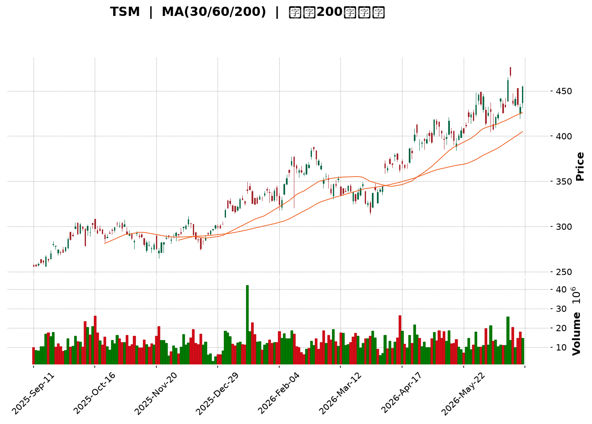
</details>

<html>
<head><meta charset="utf-8" /></head>
<body>
    <div style="height:500px; width:100%;">                        <script>window.PlotlyConfig = {MathJaxConfig: 'local'};</script>
        <script charset="utf-8" src="https://cdn.plot.ly/plotly-3.6.0.min.js" integrity="sha256-QaOVwtVY0T02VaHrr6pnoHLCwayMJp4O5n4YyaE3rJk=" crossorigin="anonymous"></script>                <div id="candlestick-chart" class="plotly-graph-div" style="height:100%; width:100%;"></div>            <script>                window.PLOTLYENV=window.PLOTLYENV || {};                                if (document.getElementById("candlestick-chart")) {                    Plotly.newPlot(                        "candlestick-chart",                        [{"close":{"dtype":"f8","bdata":"AAAAID8BcEAAAACg5AdwQAAAAKBVKHBAAAAAoC1AcEAAAACAxEtwQAAAAMCiqHBAAAAAYMlscEAAAAAA+udwQAAAAOD+h3FAAAAAwD5ocUAAAADA8ydxQAAAAICQ83BAAAAAYIDxcEAAAAAAtFFxQAAAAEBv43FAAAAAQLjdcUAAAABAfR5yQAAAAICSwHJAAAAAALM7ckAAAAAAOuJyQAAAAGCRmHJAAAAAoHNncUAAAAAAWshyQAAAAEAFWnJAAAAAYD7lckAAAADA7pdyQAAAACBeTHJAAAAA4PV1ckAAAADgUUNyQAAAAIDx6XFAAAAA4E8HckAAAACAdkpyQAAAACCxfnJAAAAA4MKyckAAAACgRutyQAAAAOCWzXJAAAAAgEyhckAAAADgn+dyQAAAAEAEPHJAAAAAIII1ckAAAACAqO9xQAAAAEApxHFAAAAAQGJPckAAAAAgTA5yQAAAAOCQBXJAAAAAYOZ\u002fcUAAAADAfalxQAAAAADifHFAAAAA4Ms7cUAAAAAgmYJxQAAAAIBJNXFAAAAAYI0OcUAAAABgoqZxQAAAAOBEp3FAAAAAoBb7cUAAAADgsRNyQAAAAMDk1nFAAAAA4OYcckAAAAAAPlJyQAAAAKA8KnJAAAAAQKdGckAAAACAKLhyQAAAACCb0HJAAAAA4HE7c0AAAADgh\u002fRyQAAAAOCfKHJAAAAAgC3kcUAAAABAVNZxQAAAAICVOHFAAAAAIHizcUAAAABAcPdxQAAAAKBcPHJAAAAA4Md2ckAAAABgOpRyQAAAACCJ1HJAAAAAYPm1ckAAAADApKByQAAAAABA5XJAAAAAAHrfc0AAAADgfwl0QAAAACD0W3RAAAAAYKzQc0AAAAAgAsZzQAAAAGB3H3RAAAAAgAmhdEAAAABgH5h0QAAAACDcVnRAAAAAQCU+dUAAAAAgPkp1QAAAAOCnV3RAAAAAABpHdEAAAACg\u002f1p0QAAAAMBh0nRAAAAA4P+vdEAAAADgnQl1QAAAAKCmSHVAAAAAgOAcdUAAAADAxo10QAAAACCwOXVAAAAAwGPgdEAAAACADUF0QAAAAIB7kHRAAAAAoOmwdUAAAABAVRl2QAAAAGDMgHZAAAAAQK1Cd0AAAABAVON2QAAAAOChx3ZAAAAAIECldkAAAACgXoZ2QAAAAICaaHZAAAAAQCsKd0AAAADANQJ3QAAAACBH\u002fHdAAAAAgMsbeEAAAAAg+W13QAAAAOB5SndAAAAA4GfzdkAAAABgCvV1QAAAAGClOXZAAAAAAKkAdkAAAAAgXxJ1QAAAAGCGrnVAAAAAoOWUdUAAAACAzQt2QAAAAKCr73RAAAAAgCMJdUAAAACgsyd1QAAAACC\u002fknVAAAAAIG0sdUAAAADA+R91QAAAAECIh3RAAAAAYIwadUAAAAAgK2d1QAAAACAAr3VAAAAAoJFVdEAAAAAgoF90QAAAACArvHNAAAAAIJESdUAAAAAAE0t1QAAAAGD3I3VAAAAAYGJPdUAAAAAgNoh1QAAAAMC40HZAAAAAYC3KdkAAAAAAvxt3QAAAAABOC3dAAAAAAAqwd0AAAAAAlGN3QAAAAGAEqHZAAAAAYCYad0AAAAAgJtZ2QAAAACCF83ZAAAAAgI4oeEAAAABgQdx3QAAAAKBQGHlAAAAAgIpAeUAAAAAAxnZ4QAAAAMCOjnhAAAAAgCeyeEAAAADA2st4QAAAACC\u002fCnlAAAAAANGXeEAAAACAUSh6QAAAAADr0nlAAAAAgH2reUAAAACAhDl5QAAAAAChxXhAAAAAwNrteEAAAACg5wt6QAAAACB8NnlAAAAAIGaweEAAAABAFXt4QAAAACDoCnlAAAAAAC5jeUAAAADAMjl5QAAAAOC0tXlAAAAAoOBbekAAAACg4H16QAAAAMCOF3pAAAAAoMspe0AAAACAV9p7QAAAAEC3OntAAAAAoBa+e0AAAABAM+N5QAAAAGDYnHpAAAAAQLmuekAAAABguHx5QAAAAMAeUXpAAAAAQOF+ekAAAABgZpZ7QAAAAKBHnXpAAAAAYGYCe0AAAACA6+F8QAAAAGC4On1AAAAAgD1Ge0AAAACgR417QAAAAADXL3tAAAAAoJkFe0AAAACgmXF8QA=="},"high":{"dtype":"f8","bdata":"qTgh73IscEBZzZ+qhyFwQAfjCUHOPnBAAEFz3LWFcED2vkGw1WtwQHf+5UfMxnBA8kcsL8aHcEDygsuNMCNxQPeQy2Q5vHFA4Bz3vC5wcUB\u002fWtyAki9xQAwuA3iJFXFAZ5F\u002fHelacUD1iIq44FRxQL3bzuFXA3JA\u002fVBCJ2dmckBXb4nR7FtyQAat5vVbDnNAG2XPMy8Lc0BxmJBLEgBzQJfTNQhmx3JAga0VwqWdckCjSa1H+eNyQKamuPFAtnJAbh4H6GcDc0Cph2Nl+E5zQCxdQQTcznJA+2gQdmrUckC57UC+eJByQJs5MdxFTnJAJMGdxqY8ckBLi9Tf7XlyQFkrl9YXonJAuuspSUm8ckCGcto31hhzQEeA2oWEDnNANs7QVGQUc0BOgJ1uIDtzQLbyzDsQunJA\u002fYU4FTd+ckBfF2cSYkVyQFnCnTw62nFAhDJ8T+lsckAcbowJ1ElyQF4omcYISXJAH6KfW8nzcUCPBhss4MlxQPiv1yCjxHFAecXZvP1fcUB2eJWQNKVxQCWNtJD3KHJAIRUxoS1IcUBsff0sTa1xQKSEd\u002fGysnFAA3uw+1QockAsbVEaHCZyQMd\u002f4G4jDnJADR69EilDckDbXo7I0GRyQK13JgazO3JAbzanLCynckCqJXJ7EMRyQAkqnFTE5HJAHbAaiGd4c0AiGJgISgRzQCzPJzN163JAO7wsknlkckBwqexmo+9xQCap9mzT+XFAK5RaCvLacUCs3laWsSpyQAQpQFTmV3JARgBSyg+GckB1I8Br9ZlyQNKVrKEh3XJAnwI9ovXuckA1iJ0+we9yQI3aYlH2HHNAkLf9cP7+c0BKLFlnwph0QE6\u002fHY7jtXRA3r5SdfdJdECUYb9+UC10QO7PNcCcMXRAUnMY5169dEBnBxjxDet0QKG5RTuignRAc0NlYWPYdUAPrU6J1MB1QObexExDRnVAbrIjsM2+dEAytaExP9V0QKI4QqCs9nRARKdkDwvWdEBq1gv97zd1QH4ME4KWe3VAzbOhipJfdUBWLXq\u002fciJ1QO5VEhblZnVAvqd8nEKUdUBkHWBP8BB1QOIexkibzXRAWZZRz8K+dUC6C6tKB1x2QEkbSQAqrnZAO6ibrBCad0DJIx0awKB3QFc2uOA9E3dAyCtlBRbFdkBnLsoF3fd2QFazyAP3jnZAUAG0rZckd0AhtTfCKzh3QFiQjCrgMnhAnN9kSkVDeED2xhYjvQd4QM+ZR0rna3dA92EyAOsyd0DDi1wAaCJ2QJke6+i+c3ZA5qa2hfVZdkCPBazO1651QEL7jsOquXVA9DczDu76dUActqqjNjh2QITGDLC2kXVAui+54\u002fxrdUAkMSJfvW11QCz7FIkyn3VA84wJbjGydUBtZrSgsTF1QOnnIN\u002f6DHVAgu7CCLlpdUDd4KYGMIF1QBi1XokZ2nVAvVwc3dBBdUAQRETjo4x0QCXWWWJHjXRAk9QT2egZdUB9amNx2L11QC3vAEFVVHVA2v84RlV2dUBcJY09kIt1QJbx6LzOVndA9zhfGvX0dkDcs7GO3pF3QFphvEl5KXdALfXHJkbUd0BleuyoZtF3QP5EFHJcFXdA31+mYj1rd0DCTeA4SRN3QHJeuvIjHndAieaMIA8weEB52bOfoD14QH30QDmIiHlACcn9RIHYeUA0ijH0C894QGlUN2vNrnhA4\u002fnEf7vdeEAoNeDkvDB5QNQ8DJj1a3lAE\u002fbp9+VSeUCLCADWgit6QOFqGaRMMHpA06x\u002fVmkAekDUduU4cGx5QD9VuKjNFHlA1pSljMA7eUAzqAz0vk96QPjZ6yyZjnlA9Gg3x95eeUAqARE\u002fK994QLV+V3\u002f7LnlAN8v8gPqneUAFdXFlXpt5QLtT8jdF+HlAKXjOabTYekAU6zmHnal6QFbG+AHz1npA20Tr8XAFfECpQrOTUfV7QAVmjHi7EXxAlM\u002f+rWnve0DCqqUBLg57QOAHdkq+DHtA4+BEQS5Se0BmKCD8LpV6QAAAAAAAZHpAAAAAQAqvekAAAACgR6l7QAAAAKBHhXtAAAAAAACoe0AAAAAghRN9QAAAAOCjzH1AAAAAoEf1e0AAAACAwr17QAAAAGBmTnxAAAAAgBRCe0AAAACgcIF8QA=="},"hovertemplate":"\u003cb\u003e%{x|%Y-%m-%d}\u003c\u002fb\u003e\u003cbr\u003e\u958b: $%{open:.2f}\u003cbr\u003e\u9ad8: $%{high:.2f}\u003cbr\u003e\u4f4e: $%{low:.2f}\u003cbr\u003e\u6536: $%{close:.2f}\u003cextra\u003e\u003c\u002fextra\u003e","low":{"dtype":"f8","bdata":"jNDarvjsb0CL6jQguPFvQJnRaett\u002fW9ArhRKzygpcEAiAKu9MBtwQOiP4HzR\u002fm9A3YkDmBVMcEA0Tj6t\u002fnVwQIpmRoj5XHFAcos3hucocUCXlzHRPcFwQOf3oD4RyHBAAAAAYIDxcEDSM4GZBvtwQM6cCl4MMHFAkW21NZPMcUCpkM5wgANyQKr8+yaFmXJAtPaDBMsvckD4EpzH5zpyQLhb4AaEcXJAJOh+cTZicUDI0TW8jSByQK4iye7+EHJAb+AnlpWbckBmGJA\u002f7WVyQMaWdv\u002fTSXJAXa3W3sxrckDwF0d40zVyQJ+lZ9fSonFAAl\u002fsedn1cUB2faogakFyQECxaGZNNnJAMycTJz5cckA51XBIQcByQL7xW1t9p3JAPTRWlsRlckChP1meILxyQMVwvspxM3JAPPXcJ4kTckBiUjqQIdJxQDiqg89pL3FAmXQRGYEXckA94od\u002fa+pxQP5L900O9XFAU\u002fhrk\u002flccUC7CatHgPFwQK6V5oXMWXFAm0oA02fpcEDRY1gdjiJxQJQ6ycf7I3FAawmBP76LcECux+zK3fBwQD+FQbge73BA7lpZCbDXcUAW0P9A2etxQMpO7oidj3FAnppFsLTucUBfo6vgVb1xQCoPYQzm\u002fnFA1zX6MlEvckB4gwUMZ2ZyQAWcSfyognJAwEQOCCnCckCuYHpumaFyQOsWonDAF3JA1Gf7PyfhcUDF4jA80p1xQCv1CpSoGnFADTvBjtSEcUAKcqCah85xQImUIXRpG3JAKO4p3ysrckDXYH3aUWtyQNEbR1LFj3JAB7LnKdeRckAkRHwck55yQGluNG\u002ft3XJAhKrCRZFhc0D65g2qj\u002f1zQOpyx0m\u002fLnRApLtr8nHOc0AnIy7+PahzQBlsziLUyXNAeUAZ1472c0AyVmctR5F0QKJ0gZVoMnRA5\u002fpecO4CdUA8kP+pRzt1QOS5TFmEU3RAt2dRAxlAdEAKaANlhFN0QN1ZxW6rmnRAZaJ2FYaIdED1waOTcs10QP56FOG1DnVAmObu8DVodEDRNGhciXZ0QLh2clmJdnRAMQD\u002fQC6FdEA7mruq4dZzQH7UfwId4HNAFj\u002fCNbfudEAFHe\u002fUMqB1QED9N7XuKHZAnygbH\u002fLndkD82aCoHAd0QG+USu6mbnZAmCz3cosmdkDD7p1hsm12QAGArlqlOXZAYu\u002ff1RFUdkDEVu9dOcl2QE8q0RTgYXdA\u002fQJkDaLtd0C4zQdOzPx2QPjyoDib63ZA91yppGmsdkCwWhKi8GV1QENFSrekC3ZAXvHACIdgdUCz6acwWu90QAKgK8Fso3RAlxtoRqVodUAaMlar8sh1QGfFa\u002fJq6nRAEVXg397ndEDHfKHhLCF1QMFDRuq\u002fGXVAkYR\u002fM8EodUCJXvJF4kZ0QIlNhpY3UnRApuhqFjmldEDOZZlU1dN0QG3f3ssoa3VAOBXrtMFJdEAx8whF6Rh0QHKWv7YRkXNAg6NtPjwGdEAueMKmTC91QJFDB2KVYHRAbt297EIddUCs2iFK2u10QAekTBxpZnZAB721JQl+dkAc22+CLQ53QNlUrq8d03ZAdTvJdJFFd0DrkCQocjV3QA9QzUtSe3ZAYydQK5fEdkC\u002fREIrYrZ2QHh4NmwcxHZAatoPhmIcd0A1kbVN6W53QL1ti4XgjnhAY\u002fCTlG73eEDw0gG90fx3QMEmv3FeNHhA1TNk7PAMeEDRkk3ka3N4QIvSyTdtpHhAu64ykux6eEAKIK9DbPt4QK8BY+2AcnlAKNTrGhj\u002feEBMzrakJ9R4QPyab2x8E3hAlLVX1+JoeEBR+\u002feakRJ5QLVJJ\u002fNe3nhATGFMhC5ieECy\u002fLrAkAJ4QJVniiJmsHhAn4wbvTnpeEB2\u002fbxCsx55QJQYSGjKkXlAnnDPVo3meUBvaHVi29t5QFmP4vtmBHpAG3GoxjRYekDqya103C97QFYVros8GHtAhhBKntOkekD4xb6GNb15QK+D31yvWHpAK7bIVQBJeUCj5k+s9Wt5QAAAAIDCjXlAAAAAIFwTekAAAABA4f56QAAAAEAzk3pAAAAAgD36ekAAAACAPWZ7QAAAAGC4En1AAAAAQAoje0AAAACgRwl7QAAAAEAKB3tAAAAAQAozekAAAACgcPF6QA=="},"name":"\u50f9\u683c","open":{"dtype":"f8","bdata":"3xJc2wgYcEDMsayF8h9wQJeUa\u002fR+EnBA1Sdao3R9cEAjHkydX2RwQJ5qI\u002fVz\u002f29A1FLjVpmEcEDNJoFlTIdwQK1GVQ0Tg3FAEoAtL+VhcUAAyA49we9wQPuFyIb6+3BAc8K72kAlcUDicT8CrhJxQBSTlpI1RHFAe4f0TjpjckACIXALIClyQHWkEKmhmnJAiDrzcpADc0CZ0qf9GEtyQIxNDc8kv3JAXELJUdaZckBpf5ZoiH5yQMsLW20ZVXJAY\u002fAqh1P+ckBnQoQ8\u002fEdzQLJogo4SgXJAdpq0+HiackByLnEXmYpyQKX9BhBZK3JAzmBkSIz4cUBsFBiXJVRyQNa847AKhXJAHqlvi81\u002fckARGIIDjPZyQNIv2ttdy3JALdBhM5D5ckAnVkuxlsNyQFWsf1\u002fxaHJAXY8hylAlckBzl2l9zzxyQMXTh6+ur3FA6OJCBPBAckA17+v\u002fbBxyQGZTF\u002f51NnJATM7PTIzucUBRluK0CxxxQGPQ9IDVc3FAo6NdxxQ2cUDYUoqGFCxxQP8Fi4\u002fOHnJAPHuEbdXqcECux+zK3fBwQACb2TFQiHFAlOQlqm\u002ftcUCZF\u002fTvFyNyQJjvTjbUynFAZbnKIXkbckBFWWi3VB5yQMg+89\u002fnOnJA\u002fZfaSMRbckD6d5G0ha1yQG\u002f2UkVQmnJAimIhoLjvckCyev8aA\u002fxyQCzPJzN163JAm34x4SBackBqRxGKidxxQIS08azA8HFAiGBeI5C4cUAKcqCah85xQJDmodx8UnJAJvUavEU+ckBDF7HwWoNyQJap3sS8pXJAQ08\u002fxanDckBF5HAZ5cxyQBkCQS8A53JA0Gm+QAZmc0B+SGCsOot0QGeXn0NdiHRAJnfLZQUwdEDJGoFPkCt0QJrern\u002f64nNA8aY00hwHdECQZ5LNi7J0QKG5RTuignRAZ+GO3sRQdUAF77M5qot1QBtKSm6dMHVABFkE3HW7dED2KS0iTbt0QJqjJvLPpXRAdrHC8EWxdEDmUFb8U+x0QEmhumFFVHVA6+ypPNsgdUAknaoPI9t0QLrMFsf1kHRAVgVIS750dUDcOiGNAN50QOMEEqaSEnRAc\u002f3N8D78dEBpiA3feq91QIUR1q1Rp3ZA71tIq9gCd0B7z4Qn1ZB3QCS6vgML9HZAiawqbSmAdkD3HiVx1p92QPLG8TrwXXZAA5gsxeRedkCYyLKp+tF2QME1cS4zl3dAnN9kSkVDeEAbJQpeHwN4QP5qrDjNA3dAyHk80ra3dkCNl+n9Dbx1QEIz8pV8OXZApSgK+zYRdkDBHiKTwFt1QC9lbYgA3nRAOh+pEt2qdUDJI1FDxgF2QF+X96VugnVADAU\u002fBXBidUA0XvoG8Dd1QH+gdxzePHVALWpM0o2PdUChBhCVNod0QEVwCE1L\u002fnRApuhqFjmldEDLyzVfk+x0QEunPd8Qk3VA20aEq2owdUDg8lAHI0F0QKjyFfr3ZnRADSodTOkYdECLccpPi3F1QNCYA+A4YXRAsuhVnEwvdUCdBynlWSp1QJuN7jzMFndAE9UnFTindkBlX\u002fs+Zmt3QP7gkKVRFndAqHZrgniid0DYOV1dTch3QPlbB4X4\u002f3ZAqUtMyT9Fd0BMYUy7twV3QAAAACCF83ZAFfQ6\u002fZQud0BhLLLIovV3QLSsRHtus3hApFVqcojMeUCku\u002fn6QnN4QNSA1k3ff3hA4aGwwBbOeEAhkPoaVYh4QPDCyKYyOXlAGSIpvHk6eUC+Z3KEWxd5QNNfaIvPEXpAqcb2EJ3\u002feUDag1KSolx5QJMxkKAhzXhAR1xKhG7VeECw56V7SSR5QLMB3ezNWHlA9Gg3x95eeUBc8KJqmUl4QGGOPdYowXhAn4wbvTnpeEBds0ojk4d5QG6IG\u002fh5wnlAhRH3UVugekDns7GDvFN6QOKIDcInoXpAR2n7fzJ+ekA+F8tYz3h7QCQxDrkED3xAF4hFgPvZekBROrIHQcx6QCs+En96bHpAtn9hDPndekDtCE6k4s95QAAAAAAp1HlAAAAAwMxAekAAAABA4Wp7QAAAAOBRQHtAAAAAAAAse0AAAACAFG57QAAAAKBwwX1AAAAAQOFye0AAAAAgrh97QAAAAGBmTnxAAAAAAACQekAAAAAAAFB7QA=="},"x":["2025-09-11T00:00:00-04:00","2025-09-12T00:00:00-04:00","2025-09-15T00:00:00-04:00","2025-09-16T00:00:00-04:00","2025-09-17T00:00:00-04:00","2025-09-18T00:00:00-04:00","2025-09-19T00:00:00-04:00","2025-09-22T00:00:00-04:00","2025-09-23T00:00:00-04:00","2025-09-24T00:00:00-04:00","2025-09-25T00:00:00-04:00","2025-09-26T00:00:00-04:00","2025-09-29T00:00:00-04:00","2025-09-30T00:00:00-04:00","2025-10-01T00:00:00-04:00","2025-10-02T00:00:00-04:00","2025-10-03T00:00:00-04:00","2025-10-06T00:00:00-04:00","2025-10-07T00:00:00-04:00","2025-10-08T00:00:00-04:00","2025-10-09T00:00:00-04:00","2025-10-10T00:00:00-04:00","2025-10-13T00:00:00-04:00","2025-10-14T00:00:00-04:00","2025-10-15T00:00:00-04:00","2025-10-16T00:00:00-04:00","2025-10-17T00:00:00-04:00","2025-10-20T00:00:00-04:00","2025-10-21T00:00:00-04:00","2025-10-22T00:00:00-04:00","2025-10-23T00:00:00-04:00","2025-10-24T00:00:00-04:00","2025-10-27T00:00:00-04:00","2025-10-28T00:00:00-04:00","2025-10-29T00:00:00-04:00","2025-10-30T00:00:00-04:00","2025-10-31T00:00:00-04:00","2025-11-03T00:00:00-05:00","2025-11-04T00:00:00-05:00","2025-11-05T00:00:00-05:00","2025-11-06T00:00:00-05:00","2025-11-07T00:00:00-05:00","2025-11-10T00:00:00-05:00","2025-11-11T00:00:00-05:00","2025-11-12T00:00:00-05:00","2025-11-13T00:00:00-05:00","2025-11-14T00:00:00-05:00","2025-11-17T00:00:00-05:00","2025-11-18T00:00:00-05:00","2025-11-19T00:00:00-05:00","2025-11-20T00:00:00-05:00","2025-11-21T00:00:00-05:00","2025-11-24T00:00:00-05:00","2025-11-25T00:00:00-05:00","2025-11-26T00:00:00-05:00","2025-11-28T00:00:00-05:00","2025-12-01T00:00:00-05:00","2025-12-02T00:00:00-05:00","2025-12-03T00:00:00-05:00","2025-12-04T00:00:00-05:00","2025-12-05T00:00:00-05:00","2025-12-08T00:00:00-05:00","2025-12-09T00:00:00-05:00","2025-12-10T00:00:00-05:00","2025-12-11T00:00:00-05:00","2025-12-12T00:00:00-05:00","2025-12-15T00:00:00-05:00","2025-12-16T00:00:00-05:00","2025-12-17T00:00:00-05:00","2025-12-18T00:00:00-05:00","2025-12-19T00:00:00-05:00","2025-12-22T00:00:00-05:00","2025-12-23T00:00:00-05:00","2025-12-24T00:00:00-05:00","2025-12-26T00:00:00-05:00","2025-12-29T00:00:00-05:00","2025-12-30T00:00:00-05:00","2025-12-31T00:00:00-05:00","2026-01-02T00:00:00-05:00","2026-01-05T00:00:00-05:00","2026-01-06T00:00:00-05:00","2026-01-07T00:00:00-05:00","2026-01-08T00:00:00-05:00","2026-01-09T00:00:00-05:00","2026-01-12T00:00:00-05:00","2026-01-13T00:00:00-05:00","2026-01-14T00:00:00-05:00","2026-01-15T00:00:00-05:00","2026-01-16T00:00:00-05:00","2026-01-20T00:00:00-05:00","2026-01-21T00:00:00-05:00","2026-01-22T00:00:00-05:00","2026-01-23T00:00:00-05:00","2026-01-26T00:00:00-05:00","2026-01-27T00:00:00-05:00","2026-01-28T00:00:00-05:00","2026-01-29T00:00:00-05:00","2026-01-30T00:00:00-05:00","2026-02-02T00:00:00-05:00","2026-02-03T00:00:00-05:00","2026-02-04T00:00:00-05:00","2026-02-05T00:00:00-05:00","2026-02-06T00:00:00-05:00","2026-02-09T00:00:00-05:00","2026-02-10T00:00:00-05:00","2026-02-11T00:00:00-05:00","2026-02-12T00:00:00-05:00","2026-02-13T00:00:00-05:00","2026-02-17T00:00:00-05:00","2026-02-18T00:00:00-05:00","2026-02-19T00:00:00-05:00","2026-02-20T00:00:00-05:00","2026-02-23T00:00:00-05:00","2026-02-24T00:00:00-05:00","2026-02-25T00:00:00-05:00","2026-02-26T00:00:00-05:00","2026-02-27T00:00:00-05:00","2026-03-02T00:00:00-05:00","2026-03-03T00:00:00-05:00","2026-03-04T00:00:00-05:00","2026-03-05T00:00:00-05:00","2026-03-06T00:00:00-05:00","2026-03-09T00:00:00-04:00","2026-03-10T00:00:00-04:00","2026-03-11T00:00:00-04:00","2026-03-12T00:00:00-04:00","2026-03-13T00:00:00-04:00","2026-03-16T00:00:00-04:00","2026-03-17T00:00:00-04:00","2026-03-18T00:00:00-04:00","2026-03-19T00:00:00-04:00","2026-03-20T00:00:00-04:00","2026-03-23T00:00:00-04:00","2026-03-24T00:00:00-04:00","2026-03-25T00:00:00-04:00","2026-03-26T00:00:00-04:00","2026-03-27T00:00:00-04:00","2026-03-30T00:00:00-04:00","2026-03-31T00:00:00-04:00","2026-04-01T00:00:00-04:00","2026-04-02T00:00:00-04:00","2026-04-06T00:00:00-04:00","2026-04-07T00:00:00-04:00","2026-04-08T00:00:00-04:00","2026-04-09T00:00:00-04:00","2026-04-10T00:00:00-04:00","2026-04-13T00:00:00-04:00","2026-04-14T00:00:00-04:00","2026-04-15T00:00:00-04:00","2026-04-16T00:00:00-04:00","2026-04-17T00:00:00-04:00","2026-04-20T00:00:00-04:00","2026-04-21T00:00:00-04:00","2026-04-22T00:00:00-04:00","2026-04-23T00:00:00-04:00","2026-04-24T00:00:00-04:00","2026-04-27T00:00:00-04:00","2026-04-28T00:00:00-04:00","2026-04-29T00:00:00-04:00","2026-04-30T00:00:00-04:00","2026-05-01T00:00:00-04:00","2026-05-04T00:00:00-04:00","2026-05-05T00:00:00-04:00","2026-05-06T00:00:00-04:00","2026-05-07T00:00:00-04:00","2026-05-08T00:00:00-04:00","2026-05-11T00:00:00-04:00","2026-05-12T00:00:00-04:00","2026-05-13T00:00:00-04:00","2026-05-14T00:00:00-04:00","2026-05-15T00:00:00-04:00","2026-05-18T00:00:00-04:00","2026-05-19T00:00:00-04:00","2026-05-20T00:00:00-04:00","2026-05-21T00:00:00-04:00","2026-05-22T00:00:00-04:00","2026-05-26T00:00:00-04:00","2026-05-27T00:00:00-04:00","2026-05-28T00:00:00-04:00","2026-05-29T00:00:00-04:00","2026-06-01T00:00:00-04:00","2026-06-02T00:00:00-04:00","2026-06-03T00:00:00-04:00","2026-06-04T00:00:00-04:00","2026-06-05T00:00:00-04:00","2026-06-08T00:00:00-04:00","2026-06-09T00:00:00-04:00","2026-06-10T00:00:00-04:00","2026-06-11T00:00:00-04:00","2026-06-12T00:00:00-04:00","2026-06-15T00:00:00-04:00","2026-06-16T00:00:00-04:00","2026-06-17T00:00:00-04:00","2026-06-18T00:00:00-04:00","2026-06-22T00:00:00-04:00","2026-06-23T00:00:00-04:00","2026-06-24T00:00:00-04:00","2026-06-25T00:00:00-04:00","2026-06-26T00:00:00-04:00","2026-06-29T00:00:00-04:00"],"type":"candlestick"},{"hovertemplate":"MA30: $%{y:.2f}\u003cextra\u003e\u003c\u002fextra\u003e","line":{"color":"#2196F3","dash":"dash","width":2},"mode":"lines","name":"MA30","x":["2025-09-11T00:00:00-04:00","2025-09-12T00:00:00-04:00","2025-09-15T00:00:00-04:00","2025-09-16T00:00:00-04:00","2025-09-17T00:00:00-04:00","2025-09-18T00:00:00-04:00","2025-09-19T00:00:00-04:00","2025-09-22T00:00:00-04:00","2025-09-23T00:00:00-04:00","2025-09-24T00:00:00-04:00","2025-09-25T00:00:00-04:00","2025-09-26T00:00:00-04:00","2025-09-29T00:00:00-04:00","2025-09-30T00:00:00-04:00","2025-10-01T00:00:00-04:00","2025-10-02T00:00:00-04:00","2025-10-03T00:00:00-04:00","2025-10-06T00:00:00-04:00","2025-10-07T00:00:00-04:00","2025-10-08T00:00:00-04:00","2025-10-09T00:00:00-04:00","2025-10-10T00:00:00-04:00","2025-10-13T00:00:00-04:00","2025-10-14T00:00:00-04:00","2025-10-15T00:00:00-04:00","2025-10-16T00:00:00-04:00","2025-10-17T00:00:00-04:00","2025-10-20T00:00:00-04:00","2025-10-21T00:00:00-04:00","2025-10-22T00:00:00-04:00","2025-10-23T00:00:00-04:00","2025-10-24T00:00:00-04:00","2025-10-27T00:00:00-04:00","2025-10-28T00:00:00-04:00","2025-10-29T00:00:00-04:00","2025-10-30T00:00:00-04:00","2025-10-31T00:00:00-04:00","2025-11-03T00:00:00-05:00","2025-11-04T00:00:00-05:00","2025-11-05T00:00:00-05:00","2025-11-06T00:00:00-05:00","2025-11-07T00:00:00-05:00","2025-11-10T00:00:00-05:00","2025-11-11T00:00:00-05:00","2025-11-12T00:00:00-05:00","2025-11-13T00:00:00-05:00","2025-11-14T00:00:00-05:00","2025-11-17T00:00:00-05:00","2025-11-18T00:00:00-05:00","2025-11-19T00:00:00-05:00","2025-11-20T00:00:00-05:00","2025-11-21T00:00:00-05:00","2025-11-24T00:00:00-05:00","2025-11-25T00:00:00-05:00","2025-11-26T00:00:00-05:00","2025-11-28T00:00:00-05:00","2025-12-01T00:00:00-05:00","2025-12-02T00:00:00-05:00","2025-12-03T00:00:00-05:00","2025-12-04T00:00:00-05:00","2025-12-05T00:00:00-05:00","2025-12-08T00:00:00-05:00","2025-12-09T00:00:00-05:00","2025-12-10T00:00:00-05:00","2025-12-11T00:00:00-05:00","2025-12-12T00:00:00-05:00","2025-12-15T00:00:00-05:00","2025-12-16T00:00:00-05:00","2025-12-17T00:00:00-05:00","2025-12-18T00:00:00-05:00","2025-12-19T00:00:00-05:00","2025-12-22T00:00:00-05:00","2025-12-23T00:00:00-05:00","2025-12-24T00:00:00-05:00","2025-12-26T00:00:00-05:00","2025-12-29T00:00:00-05:00","2025-12-30T00:00:00-05:00","2025-12-31T00:00:00-05:00","2026-01-02T00:00:00-05:00","2026-01-05T00:00:00-05:00","2026-01-06T00:00:00-05:00","2026-01-07T00:00:00-05:00","2026-01-08T00:00:00-05:00","2026-01-09T00:00:00-05:00","2026-01-12T00:00:00-05:00","2026-01-13T00:00:00-05:00","2026-01-14T00:00:00-05:00","2026-01-15T00:00:00-05:00","2026-01-16T00:00:00-05:00","2026-01-20T00:00:00-05:00","2026-01-21T00:00:00-05:00","2026-01-22T00:00:00-05:00","2026-01-23T00:00:00-05:00","2026-01-26T00:00:00-05:00","2026-01-27T00:00:00-05:00","2026-01-28T00:00:00-05:00","2026-01-29T00:00:00-05:00","2026-01-30T00:00:00-05:00","2026-02-02T00:00:00-05:00","2026-02-03T00:00:00-05:00","2026-02-04T00:00:00-05:00","2026-02-05T00:00:00-05:00","2026-02-06T00:00:00-05:00","2026-02-09T00:00:00-05:00","2026-02-10T00:00:00-05:00","2026-02-11T00:00:00-05:00","2026-02-12T00:00:00-05:00","2026-02-13T00:00:00-05:00","2026-02-17T00:00:00-05:00","2026-02-18T00:00:00-05:00","2026-02-19T00:00:00-05:00","2026-02-20T00:00:00-05:00","2026-02-23T00:00:00-05:00","2026-02-24T00:00:00-05:00","2026-02-25T00:00:00-05:00","2026-02-26T00:00:00-05:00","2026-02-27T00:00:00-05:00","2026-03-02T00:00:00-05:00","2026-03-03T00:00:00-05:00","2026-03-04T00:00:00-05:00","2026-03-05T00:00:00-05:00","2026-03-06T00:00:00-05:00","2026-03-09T00:00:00-04:00","2026-03-10T00:00:00-04:00","2026-03-11T00:00:00-04:00","2026-03-12T00:00:00-04:00","2026-03-13T00:00:00-04:00","2026-03-16T00:00:00-04:00","2026-03-17T00:00:00-04:00","2026-03-18T00:00:00-04:00","2026-03-19T00:00:00-04:00","2026-03-20T00:00:00-04:00","2026-03-23T00:00:00-04:00","2026-03-24T00:00:00-04:00","2026-03-25T00:00:00-04:00","2026-03-26T00:00:00-04:00","2026-03-27T00:00:00-04:00","2026-03-30T00:00:00-04:00","2026-03-31T00:00:00-04:00","2026-04-01T00:00:00-04:00","2026-04-02T00:00:00-04:00","2026-04-06T00:00:00-04:00","2026-04-07T00:00:00-04:00","2026-04-08T00:00:00-04:00","2026-04-09T00:00:00-04:00","2026-04-10T00:00:00-04:00","2026-04-13T00:00:00-04:00","2026-04-14T00:00:00-04:00","2026-04-15T00:00:00-04:00","2026-04-16T00:00:00-04:00","2026-04-17T00:00:00-04:00","2026-04-20T00:00:00-04:00","2026-04-21T00:00:00-04:00","2026-04-22T00:00:00-04:00","2026-04-23T00:00:00-04:00","2026-04-24T00:00:00-04:00","2026-04-27T00:00:00-04:00","2026-04-28T00:00:00-04:00","2026-04-29T00:00:00-04:00","2026-04-30T00:00:00-04:00","2026-05-01T00:00:00-04:00","2026-05-04T00:00:00-04:00","2026-05-05T00:00:00-04:00","2026-05-06T00:00:00-04:00","2026-05-07T00:00:00-04:00","2026-05-08T00:00:00-04:00","2026-05-11T00:00:00-04:00","2026-05-12T00:00:00-04:00","2026-05-13T00:00:00-04:00","2026-05-14T00:00:00-04:00","2026-05-15T00:00:00-04:00","2026-05-18T00:00:00-04:00","2026-05-19T00:00:00-04:00","2026-05-20T00:00:00-04:00","2026-05-21T00:00:00-04:00","2026-05-22T00:00:00-04:00","2026-05-26T00:00:00-04:00","2026-05-27T00:00:00-04:00","2026-05-28T00:00:00-04:00","2026-05-29T00:00:00-04:00","2026-06-01T00:00:00-04:00","2026-06-02T00:00:00-04:00","2026-06-03T00:00:00-04:00","2026-06-04T00:00:00-04:00","2026-06-05T00:00:00-04:00","2026-06-08T00:00:00-04:00","2026-06-09T00:00:00-04:00","2026-06-10T00:00:00-04:00","2026-06-11T00:00:00-04:00","2026-06-12T00:00:00-04:00","2026-06-15T00:00:00-04:00","2026-06-16T00:00:00-04:00","2026-06-17T00:00:00-04:00","2026-06-18T00:00:00-04:00","2026-06-22T00:00:00-04:00","2026-06-23T00:00:00-04:00","2026-06-24T00:00:00-04:00","2026-06-25T00:00:00-04:00","2026-06-26T00:00:00-04:00","2026-06-29T00:00:00-04:00"],"y":{"dtype":"f8","bdata":"AAAAAAAA+H8AAAAAAAD4fwAAAAAAAPh\u002fAAAAAAAA+H8AAAAAAAD4fwAAAAAAAPh\u002fAAAAAAAA+H8AAAAAAAD4fwAAAAAAAPh\u002fAAAAAAAA+H8AAAAAAAD4fwAAAAAAAPh\u002fAAAAAAAA+H8AAAAAAAD4fwAAAAAAAPh\u002fAAAAAAAA+H8AAAAAAAD4fwAAAAAAAPh\u002fAAAAAAAA+H8AAAAAAAD4fwAAAAAAAPh\u002fAAAAAAAA+H8AAAAAAAD4fwAAAAAAAPh\u002fAAAAAAAA+H8AAAAAAAD4fwAAAAAAAPh\u002fAAAAAAAA+H8AAAAAAAD4f5qZmSn4k3FAzczM\u002fDylcUDe3d0dhrhxQJqZmRl4zHFAERER8VrhcUBVVVUlvfdxQM3MzIwJCnJAiYiIuNocckCJiIjI6C1yQGZmZvboM3JAq6qqisA6ckAzMzOzaEFyQJqZmblcSHJAMzMzYwZUckCamZm5T1pyQKuqqvpyW3JAIiIiYlJYckAAAAAAbFRyQJqZmdmhSXJAVVVVJRpBckBVVVWVYTVyQKuqqtqJKXJA7+7uPpMmckDe3d396hxyQFVVVaX1FnJAVVVVhScPckB3d3cXvwpyQFVVVaXUBnJA3t3drdwDckBEREQEXARyQHd3d6eABnJAq6qqKp0IckC8u7s7RQxyQLy7uzsAD3JAmpmZmY4TckAzMzOT3RNyQAAAAOBdDnJAq6qqChAIckC8u7vr8\u002f5xQImIiBhO9nFA3t3dbfjxcUAiIiLSOvJxQImIiIg89nFAiYiIuIz3cUCJiIiYA\u002fxxQM3MzLzpAnJAREREtD8NckDNzMy8fBVyQO\u002fu7t5\u002fIXJAzczMrAU4ckBmZmbmlU1yQERERHR5aHJAVVVVBQOAckAAAADQH5JyQAAAAJAyp3JAmpmZucu9ckB3d3fXRtNyQDMzM+Ob6HJAq6qqKlEDc0ARERGBphxzQFVVVSU7L3NAmpmZCVBAc0BEREQkRk5zQM3MzFxmX3NA7+7uftFrc0Dv7u5+ln1zQDMzM2NBmHNAIiIi0r6zc0De3d1N7cpzQLy7u9sY7XNAd3d3xzEIdEBVVVUFtxt0QKuqquqVL3RAMzMzkx9LdEAREREBKWl0QERERJSAiHRAAAAAYFOvdEDv7u6OrtN0QERERPTT9HRAERERsXwMdUARERFRtyF1QERERFQ0M3VA7+7ujrhOdUARERHhU2p1QM3MzLxJi3VA7+7u3vqodUC8u7vLLMF1QImIiLhc2nVAIiIiAvDodUC8u7t7oe51QHd3d3ey\u002fnVA7+7ubmoNdkB3d3c3hxN2QFVVVcXdGnZAd3d3B38idkB3d3c3Git2QKuqquoiKHZAvLu7e3ondkCrqqr6myx2QCIiIvKTL3ZAq6qqyhwydkARERERizl2QBEREbE+OXZAVVVVlTs0dkDv7u4+Sy52QImIiPhMJ3ZAVVVVlVQOdkBVVVWl3\u002fh1QImIiDjk3nVAzczM\u002fHfRdUB3d3d39cZ1QKuqqjojvHVAzczMzGCtdUBmZmY2x6B1QAAAAADLlnVA7+7u\u002fomLdUAzMzNTzIh1QDMzM0OxhnVA7+7u7vqMdUCJiIi4Mpl1QN7d3Y3gnHVAmpmZmUKmdUBERETEUbV1QO\u002fu7g4nwHVAd3d3JyTWdUC8u7t7n+V1QDMzM3McCXZAmpmZWRctdkAiIiKyU0l2QM3MzIzJYnZAvLu7S9iAdkCJiIiYLKB2QM3MzGyuxnZAq6qq+nTkdkAzMzNTBw13QERERPRbMHdAERER0eNdd0C8u7tLSYd3QBEREbFEsndAvLu7iy3Td0Crqqoqvft3QDMzM1N9HnhAiYiIyFI7eECrqqpafFR4QO\u002fu7u59Z3hA7+7unqh9eEAzMzMDtY94QM3MzCx0pnhAiYiImD+9eEDe3d2dudd4QHd3dwcL9XhAvLu7q7IXeUDe3d0dgUJ5QJqZmckCZ3lAREREZJiFeUCJiIi45JZ5QN7d3S3Yo3lAAAAA8AyweUB3d3c3yLh5QERERATNx3lAq6qqiijXeUDv7u7++e55QCIiIvJk\u002fHlAZmZmhgMRekBERERkRCh6QFVVVcVTRXpAZmZm1gRTekDNzMys4GZ6QDMzMxN8e3pAVVVVxVeNekAzMzOjzKF6QA=="},"type":"scatter"},{"hovertemplate":"MA60: $%{y:.2f}\u003cextra\u003e\u003c\u002fextra\u003e","line":{"color":"#9C27B0","dash":"dash","width":2},"mode":"lines","name":"MA60","x":["2025-09-11T00:00:00-04:00","2025-09-12T00:00:00-04:00","2025-09-15T00:00:00-04:00","2025-09-16T00:00:00-04:00","2025-09-17T00:00:00-04:00","2025-09-18T00:00:00-04:00","2025-09-19T00:00:00-04:00","2025-09-22T00:00:00-04:00","2025-09-23T00:00:00-04:00","2025-09-24T00:00:00-04:00","2025-09-25T00:00:00-04:00","2025-09-26T00:00:00-04:00","2025-09-29T00:00:00-04:00","2025-09-30T00:00:00-04:00","2025-10-01T00:00:00-04:00","2025-10-02T00:00:00-04:00","2025-10-03T00:00:00-04:00","2025-10-06T00:00:00-04:00","2025-10-07T00:00:00-04:00","2025-10-08T00:00:00-04:00","2025-10-09T00:00:00-04:00","2025-10-10T00:00:00-04:00","2025-10-13T00:00:00-04:00","2025-10-14T00:00:00-04:00","2025-10-15T00:00:00-04:00","2025-10-16T00:00:00-04:00","2025-10-17T00:00:00-04:00","2025-10-20T00:00:00-04:00","2025-10-21T00:00:00-04:00","2025-10-22T00:00:00-04:00","2025-10-23T00:00:00-04:00","2025-10-24T00:00:00-04:00","2025-10-27T00:00:00-04:00","2025-10-28T00:00:00-04:00","2025-10-29T00:00:00-04:00","2025-10-30T00:00:00-04:00","2025-10-31T00:00:00-04:00","2025-11-03T00:00:00-05:00","2025-11-04T00:00:00-05:00","2025-11-05T00:00:00-05:00","2025-11-06T00:00:00-05:00","2025-11-07T00:00:00-05:00","2025-11-10T00:00:00-05:00","2025-11-11T00:00:00-05:00","2025-11-12T00:00:00-05:00","2025-11-13T00:00:00-05:00","2025-11-14T00:00:00-05:00","2025-11-17T00:00:00-05:00","2025-11-18T00:00:00-05:00","2025-11-19T00:00:00-05:00","2025-11-20T00:00:00-05:00","2025-11-21T00:00:00-05:00","2025-11-24T00:00:00-05:00","2025-11-25T00:00:00-05:00","2025-11-26T00:00:00-05:00","2025-11-28T00:00:00-05:00","2025-12-01T00:00:00-05:00","2025-12-02T00:00:00-05:00","2025-12-03T00:00:00-05:00","2025-12-04T00:00:00-05:00","2025-12-05T00:00:00-05:00","2025-12-08T00:00:00-05:00","2025-12-09T00:00:00-05:00","2025-12-10T00:00:00-05:00","2025-12-11T00:00:00-05:00","2025-12-12T00:00:00-05:00","2025-12-15T00:00:00-05:00","2025-12-16T00:00:00-05:00","2025-12-17T00:00:00-05:00","2025-12-18T00:00:00-05:00","2025-12-19T00:00:00-05:00","2025-12-22T00:00:00-05:00","2025-12-23T00:00:00-05:00","2025-12-24T00:00:00-05:00","2025-12-26T00:00:00-05:00","2025-12-29T00:00:00-05:00","2025-12-30T00:00:00-05:00","2025-12-31T00:00:00-05:00","2026-01-02T00:00:00-05:00","2026-01-05T00:00:00-05:00","2026-01-06T00:00:00-05:00","2026-01-07T00:00:00-05:00","2026-01-08T00:00:00-05:00","2026-01-09T00:00:00-05:00","2026-01-12T00:00:00-05:00","2026-01-13T00:00:00-05:00","2026-01-14T00:00:00-05:00","2026-01-15T00:00:00-05:00","2026-01-16T00:00:00-05:00","2026-01-20T00:00:00-05:00","2026-01-21T00:00:00-05:00","2026-01-22T00:00:00-05:00","2026-01-23T00:00:00-05:00","2026-01-26T00:00:00-05:00","2026-01-27T00:00:00-05:00","2026-01-28T00:00:00-05:00","2026-01-29T00:00:00-05:00","2026-01-30T00:00:00-05:00","2026-02-02T00:00:00-05:00","2026-02-03T00:00:00-05:00","2026-02-04T00:00:00-05:00","2026-02-05T00:00:00-05:00","2026-02-06T00:00:00-05:00","2026-02-09T00:00:00-05:00","2026-02-10T00:00:00-05:00","2026-02-11T00:00:00-05:00","2026-02-12T00:00:00-05:00","2026-02-13T00:00:00-05:00","2026-02-17T00:00:00-05:00","2026-02-18T00:00:00-05:00","2026-02-19T00:00:00-05:00","2026-02-20T00:00:00-05:00","2026-02-23T00:00:00-05:00","2026-02-24T00:00:00-05:00","2026-02-25T00:00:00-05:00","2026-02-26T00:00:00-05:00","2026-02-27T00:00:00-05:00","2026-03-02T00:00:00-05:00","2026-03-03T00:00:00-05:00","2026-03-04T00:00:00-05:00","2026-03-05T00:00:00-05:00","2026-03-06T00:00:00-05:00","2026-03-09T00:00:00-04:00","2026-03-10T00:00:00-04:00","2026-03-11T00:00:00-04:00","2026-03-12T00:00:00-04:00","2026-03-13T00:00:00-04:00","2026-03-16T00:00:00-04:00","2026-03-17T00:00:00-04:00","2026-03-18T00:00:00-04:00","2026-03-19T00:00:00-04:00","2026-03-20T00:00:00-04:00","2026-03-23T00:00:00-04:00","2026-03-24T00:00:00-04:00","2026-03-25T00:00:00-04:00","2026-03-26T00:00:00-04:00","2026-03-27T00:00:00-04:00","2026-03-30T00:00:00-04:00","2026-03-31T00:00:00-04:00","2026-04-01T00:00:00-04:00","2026-04-02T00:00:00-04:00","2026-04-06T00:00:00-04:00","2026-04-07T00:00:00-04:00","2026-04-08T00:00:00-04:00","2026-04-09T00:00:00-04:00","2026-04-10T00:00:00-04:00","2026-04-13T00:00:00-04:00","2026-04-14T00:00:00-04:00","2026-04-15T00:00:00-04:00","2026-04-16T00:00:00-04:00","2026-04-17T00:00:00-04:00","2026-04-20T00:00:00-04:00","2026-04-21T00:00:00-04:00","2026-04-22T00:00:00-04:00","2026-04-23T00:00:00-04:00","2026-04-24T00:00:00-04:00","2026-04-27T00:00:00-04:00","2026-04-28T00:00:00-04:00","2026-04-29T00:00:00-04:00","2026-04-30T00:00:00-04:00","2026-05-01T00:00:00-04:00","2026-05-04T00:00:00-04:00","2026-05-05T00:00:00-04:00","2026-05-06T00:00:00-04:00","2026-05-07T00:00:00-04:00","2026-05-08T00:00:00-04:00","2026-05-11T00:00:00-04:00","2026-05-12T00:00:00-04:00","2026-05-13T00:00:00-04:00","2026-05-14T00:00:00-04:00","2026-05-15T00:00:00-04:00","2026-05-18T00:00:00-04:00","2026-05-19T00:00:00-04:00","2026-05-20T00:00:00-04:00","2026-05-21T00:00:00-04:00","2026-05-22T00:00:00-04:00","2026-05-26T00:00:00-04:00","2026-05-27T00:00:00-04:00","2026-05-28T00:00:00-04:00","2026-05-29T00:00:00-04:00","2026-06-01T00:00:00-04:00","2026-06-02T00:00:00-04:00","2026-06-03T00:00:00-04:00","2026-06-04T00:00:00-04:00","2026-06-05T00:00:00-04:00","2026-06-08T00:00:00-04:00","2026-06-09T00:00:00-04:00","2026-06-10T00:00:00-04:00","2026-06-11T00:00:00-04:00","2026-06-12T00:00:00-04:00","2026-06-15T00:00:00-04:00","2026-06-16T00:00:00-04:00","2026-06-17T00:00:00-04:00","2026-06-18T00:00:00-04:00","2026-06-22T00:00:00-04:00","2026-06-23T00:00:00-04:00","2026-06-24T00:00:00-04:00","2026-06-25T00:00:00-04:00","2026-06-26T00:00:00-04:00","2026-06-29T00:00:00-04:00"],"y":{"dtype":"f8","bdata":"AAAAAAAA+H8AAAAAAAD4fwAAAAAAAPh\u002fAAAAAAAA+H8AAAAAAAD4fwAAAAAAAPh\u002fAAAAAAAA+H8AAAAAAAD4fwAAAAAAAPh\u002fAAAAAAAA+H8AAAAAAAD4fwAAAAAAAPh\u002fAAAAAAAA+H8AAAAAAAD4fwAAAAAAAPh\u002fAAAAAAAA+H8AAAAAAAD4fwAAAAAAAPh\u002fAAAAAAAA+H8AAAAAAAD4fwAAAAAAAPh\u002fAAAAAAAA+H8AAAAAAAD4fwAAAAAAAPh\u002fAAAAAAAA+H8AAAAAAAD4fwAAAAAAAPh\u002fAAAAAAAA+H8AAAAAAAD4fwAAAAAAAPh\u002fAAAAAAAA+H8AAAAAAAD4fwAAAAAAAPh\u002fAAAAAAAA+H8AAAAAAAD4fwAAAAAAAPh\u002fAAAAAAAA+H8AAAAAAAD4fwAAAAAAAPh\u002fAAAAAAAA+H8AAAAAAAD4fwAAAAAAAPh\u002fAAAAAAAA+H8AAAAAAAD4fwAAAAAAAPh\u002fAAAAAAAA+H8AAAAAAAD4fwAAAAAAAPh\u002fAAAAAAAA+H8AAAAAAAD4fwAAAAAAAPh\u002fAAAAAAAA+H8AAAAAAAD4fwAAAAAAAPh\u002fAAAAAAAA+H8AAAAAAAD4fwAAAAAAAPh\u002fAAAAAAAA+H8AAAAAAAD4f4mIiGg8zXFAvLu7E+3WcUDNzMysZeJxQKuqqiq87XFAVVVVxXT6cUBERERczQVyQGZmZrYzDHJAmpmZYXUSckAiIiJabhZyQHd3d4cbFXJAREREfFwWckCrqqrC0RlyQBEREaFMH3JA3t3djcklckARERGpKStyQLy7u1suL3JAMzMzC8kyckBmZmZe9DRyQERERNyQNXJAERER6Y88ckDe3d29e0FyQHd3d6cBSXJAIiIiIktTckDv7u5mhVdyQKuqqhoUX3JAd3d3n3lmckB3d3f3Am9yQERERES4d3JARERE7JaDckCrqqpCgZByQGZmZubdmnJAIiIimnakckAAAACwRa1yQEREREwzt3JAREREDLC\u002fckAREREJushyQJqZmaFP03JAZmZmbufdckDNzMyc8ORyQCIiInqz8XJAq6qqGhX9ckC8u7vr+AZzQJqZmTnpEnNA3t3dJVYhc0DNzMxMljJzQImIiCi1RXNAIiIiiklec0De3d2llXRzQJqZmekpi3NA7+7uLkGic0C8u7ubprdzQEREROTWzXNAIiIiyl3nc0CJiIjYOf5zQGZmZiY+GXRARERETGMzdECamZnROUp0QN7d3U18YXRAZmZmliB2dEBmZmb+o4V0QGZmZs72lnRAREREPN2mdEDe3d2t5rB0QBEREREivXRAMzMzQyjHdEAzMzNbWNR0QO\u002fu7iYy4HRA7+7uppztdEBERESkxPt0QO\u002fu7mZWDnVAERERSScddUAzMzMLoSp1QN7d3U1qNHVARERElK0\u002fdUAAAAAgukt1QGZmZsbmV3VAq6qq+tNedUAiIiIaR2Z1QGZmZhbcaXVA7+7uVvpudUBERERkVnR1QHd3d8erd3VA3t3drQx+dUC8u7uLjYV1QGZmZl4KkXVA7+7ubkKadUB3d3eP\u002fKR1QN7d3f2GsHVAiYiIePW6dUAiIiIa6sN1QKuqqoLJzXVAREREhNbZdUDe3d19bOR1QCIiImqC7XVAd3d3l1H8dUCamZnZXAh2QO\u002fu7q6fGHZAq6qq6kgqdkBmZmbW9zp2QHd3d78uSXZAMzMzi3pZdkDNzMzU22x2QO\u002fu7o72f3ZAAAAASFiMdkARERFJqZ12QGZmZnbUq3ZAMzMzMxy2dkCJiIh4FMB2QM3MzHSUyHZARERExFLSdkARERFRWeF2QO\u002fu7kZQ7XZAq6qqyln0dkCJiIjIofp2QHd3d3ck\u002f3ZA7+7uTpkEd0AzMzOrQAx3QAAAALiSFndAvLu7Qx0ld0AzMzMrdjh3QKuqqsr1SHdAq6qqovped0ARERFx6Xt3QEREROyUk3dA3t3dRd6td0AiIiIaQr53QImIiFB61ndAzczMJJLud0DNzMz0DQF4QImIiEhLFXhAMzMzawAseEC8u7tLk0d4QHd3d6+JYXhAiYiIQLx6eEC8u7vbpZp4QM3MzNzXunhAvLu7U3TYeEBERET8FPd4QCIiImLgFnlAiYiIqEIweUDv7u7mxE55QA=="},"type":"scatter"},{"hovertemplate":"MA200: $%{y:.2f}\u003cextra\u003e\u003c\u002fextra\u003e","line":{"color":"#FF6F00","dash":"solid","width":2},"mode":"lines","name":"MA200","x":["2025-09-11T00:00:00-04:00","2025-09-12T00:00:00-04:00","2025-09-15T00:00:00-04:00","2025-09-16T00:00:00-04:00","2025-09-17T00:00:00-04:00","2025-09-18T00:00:00-04:00","2025-09-19T00:00:00-04:00","2025-09-22T00:00:00-04:00","2025-09-23T00:00:00-04:00","2025-09-24T00:00:00-04:00","2025-09-25T00:00:00-04:00","2025-09-26T00:00:00-04:00","2025-09-29T00:00:00-04:00","2025-09-30T00:00:00-04:00","2025-10-01T00:00:00-04:00","2025-10-02T00:00:00-04:00","2025-10-03T00:00:00-04:00","2025-10-06T00:00:00-04:00","2025-10-07T00:00:00-04:00","2025-10-08T00:00:00-04:00","2025-10-09T00:00:00-04:00","2025-10-10T00:00:00-04:00","2025-10-13T00:00:00-04:00","2025-10-14T00:00:00-04:00","2025-10-15T00:00:00-04:00","2025-10-16T00:00:00-04:00","2025-10-17T00:00:00-04:00","2025-10-20T00:00:00-04:00","2025-10-21T00:00:00-04:00","2025-10-22T00:00:00-04:00","2025-10-23T00:00:00-04:00","2025-10-24T00:00:00-04:00","2025-10-27T00:00:00-04:00","2025-10-28T00:00:00-04:00","2025-10-29T00:00:00-04:00","2025-10-30T00:00:00-04:00","2025-10-31T00:00:00-04:00","2025-11-03T00:00:00-05:00","2025-11-04T00:00:00-05:00","2025-11-05T00:00:00-05:00","2025-11-06T00:00:00-05:00","2025-11-07T00:00:00-05:00","2025-11-10T00:00:00-05:00","2025-11-11T00:00:00-05:00","2025-11-12T00:00:00-05:00","2025-11-13T00:00:00-05:00","2025-11-14T00:00:00-05:00","2025-11-17T00:00:00-05:00","2025-11-18T00:00:00-05:00","2025-11-19T00:00:00-05:00","2025-11-20T00:00:00-05:00","2025-11-21T00:00:00-05:00","2025-11-24T00:00:00-05:00","2025-11-25T00:00:00-05:00","2025-11-26T00:00:00-05:00","2025-11-28T00:00:00-05:00","2025-12-01T00:00:00-05:00","2025-12-02T00:00:00-05:00","2025-12-03T00:00:00-05:00","2025-12-04T00:00:00-05:00","2025-12-05T00:00:00-05:00","2025-12-08T00:00:00-05:00","2025-12-09T00:00:00-05:00","2025-12-10T00:00:00-05:00","2025-12-11T00:00:00-05:00","2025-12-12T00:00:00-05:00","2025-12-15T00:00:00-05:00","2025-12-16T00:00:00-05:00","2025-12-17T00:00:00-05:00","2025-12-18T00:00:00-05:00","2025-12-19T00:00:00-05:00","2025-12-22T00:00:00-05:00","2025-12-23T00:00:00-05:00","2025-12-24T00:00:00-05:00","2025-12-26T00:00:00-05:00","2025-12-29T00:00:00-05:00","2025-12-30T00:00:00-05:00","2025-12-31T00:00:00-05:00","2026-01-02T00:00:00-05:00","2026-01-05T00:00:00-05:00","2026-01-06T00:00:00-05:00","2026-01-07T00:00:00-05:00","2026-01-08T00:00:00-05:00","2026-01-09T00:00:00-05:00","2026-01-12T00:00:00-05:00","2026-01-13T00:00:00-05:00","2026-01-14T00:00:00-05:00","2026-01-15T00:00:00-05:00","2026-01-16T00:00:00-05:00","2026-01-20T00:00:00-05:00","2026-01-21T00:00:00-05:00","2026-01-22T00:00:00-05:00","2026-01-23T00:00:00-05:00","2026-01-26T00:00:00-05:00","2026-01-27T00:00:00-05:00","2026-01-28T00:00:00-05:00","2026-01-29T00:00:00-05:00","2026-01-30T00:00:00-05:00","2026-02-02T00:00:00-05:00","2026-02-03T00:00:00-05:00","2026-02-04T00:00:00-05:00","2026-02-05T00:00:00-05:00","2026-02-06T00:00:00-05:00","2026-02-09T00:00:00-05:00","2026-02-10T00:00:00-05:00","2026-02-11T00:00:00-05:00","2026-02-12T00:00:00-05:00","2026-02-13T00:00:00-05:00","2026-02-17T00:00:00-05:00","2026-02-18T00:00:00-05:00","2026-02-19T00:00:00-05:00","2026-02-20T00:00:00-05:00","2026-02-23T00:00:00-05:00","2026-02-24T00:00:00-05:00","2026-02-25T00:00:00-05:00","2026-02-26T00:00:00-05:00","2026-02-27T00:00:00-05:00","2026-03-02T00:00:00-05:00","2026-03-03T00:00:00-05:00","2026-03-04T00:00:00-05:00","2026-03-05T00:00:00-05:00","2026-03-06T00:00:00-05:00","2026-03-09T00:00:00-04:00","2026-03-10T00:00:00-04:00","2026-03-11T00:00:00-04:00","2026-03-12T00:00:00-04:00","2026-03-13T00:00:00-04:00","2026-03-16T00:00:00-04:00","2026-03-17T00:00:00-04:00","2026-03-18T00:00:00-04:00","2026-03-19T00:00:00-04:00","2026-03-20T00:00:00-04:00","2026-03-23T00:00:00-04:00","2026-03-24T00:00:00-04:00","2026-03-25T00:00:00-04:00","2026-03-26T00:00:00-04:00","2026-03-27T00:00:00-04:00","2026-03-30T00:00:00-04:00","2026-03-31T00:00:00-04:00","2026-04-01T00:00:00-04:00","2026-04-02T00:00:00-04:00","2026-04-06T00:00:00-04:00","2026-04-07T00:00:00-04:00","2026-04-08T00:00:00-04:00","2026-04-09T00:00:00-04:00","2026-04-10T00:00:00-04:00","2026-04-13T00:00:00-04:00","2026-04-14T00:00:00-04:00","2026-04-15T00:00:00-04:00","2026-04-16T00:00:00-04:00","2026-04-17T00:00:00-04:00","2026-04-20T00:00:00-04:00","2026-04-21T00:00:00-04:00","2026-04-22T00:00:00-04:00","2026-04-23T00:00:00-04:00","2026-04-24T00:00:00-04:00","2026-04-27T00:00:00-04:00","2026-04-28T00:00:00-04:00","2026-04-29T00:00:00-04:00","2026-04-30T00:00:00-04:00","2026-05-01T00:00:00-04:00","2026-05-04T00:00:00-04:00","2026-05-05T00:00:00-04:00","2026-05-06T00:00:00-04:00","2026-05-07T00:00:00-04:00","2026-05-08T00:00:00-04:00","2026-05-11T00:00:00-04:00","2026-05-12T00:00:00-04:00","2026-05-13T00:00:00-04:00","2026-05-14T00:00:00-04:00","2026-05-15T00:00:00-04:00","2026-05-18T00:00:00-04:00","2026-05-19T00:00:00-04:00","2026-05-20T00:00:00-04:00","2026-05-21T00:00:00-04:00","2026-05-22T00:00:00-04:00","2026-05-26T00:00:00-04:00","2026-05-27T00:00:00-04:00","2026-05-28T00:00:00-04:00","2026-05-29T00:00:00-04:00","2026-06-01T00:00:00-04:00","2026-06-02T00:00:00-04:00","2026-06-03T00:00:00-04:00","2026-06-04T00:00:00-04:00","2026-06-05T00:00:00-04:00","2026-06-08T00:00:00-04:00","2026-06-09T00:00:00-04:00","2026-06-10T00:00:00-04:00","2026-06-11T00:00:00-04:00","2026-06-12T00:00:00-04:00","2026-06-15T00:00:00-04:00","2026-06-16T00:00:00-04:00","2026-06-17T00:00:00-04:00","2026-06-18T00:00:00-04:00","2026-06-22T00:00:00-04:00","2026-06-23T00:00:00-04:00","2026-06-24T00:00:00-04:00","2026-06-25T00:00:00-04:00","2026-06-26T00:00:00-04:00","2026-06-29T00:00:00-04:00"],"y":{"dtype":"f8","bdata":"AAAAAAAA+H8AAAAAAAD4fwAAAAAAAPh\u002fAAAAAAAA+H8AAAAAAAD4fwAAAAAAAPh\u002fAAAAAAAA+H8AAAAAAAD4fwAAAAAAAPh\u002fAAAAAAAA+H8AAAAAAAD4fwAAAAAAAPh\u002fAAAAAAAA+H8AAAAAAAD4fwAAAAAAAPh\u002fAAAAAAAA+H8AAAAAAAD4fwAAAAAAAPh\u002fAAAAAAAA+H8AAAAAAAD4fwAAAAAAAPh\u002fAAAAAAAA+H8AAAAAAAD4fwAAAAAAAPh\u002fAAAAAAAA+H8AAAAAAAD4fwAAAAAAAPh\u002fAAAAAAAA+H8AAAAAAAD4fwAAAAAAAPh\u002fAAAAAAAA+H8AAAAAAAD4fwAAAAAAAPh\u002fAAAAAAAA+H8AAAAAAAD4fwAAAAAAAPh\u002fAAAAAAAA+H8AAAAAAAD4fwAAAAAAAPh\u002fAAAAAAAA+H8AAAAAAAD4fwAAAAAAAPh\u002fAAAAAAAA+H8AAAAAAAD4fwAAAAAAAPh\u002fAAAAAAAA+H8AAAAAAAD4fwAAAAAAAPh\u002fAAAAAAAA+H8AAAAAAAD4fwAAAAAAAPh\u002fAAAAAAAA+H8AAAAAAAD4fwAAAAAAAPh\u002fAAAAAAAA+H8AAAAAAAD4fwAAAAAAAPh\u002fAAAAAAAA+H8AAAAAAAD4fwAAAAAAAPh\u002fAAAAAAAA+H8AAAAAAAD4fwAAAAAAAPh\u002fAAAAAAAA+H8AAAAAAAD4fwAAAAAAAPh\u002fAAAAAAAA+H8AAAAAAAD4fwAAAAAAAPh\u002fAAAAAAAA+H8AAAAAAAD4fwAAAAAAAPh\u002fAAAAAAAA+H8AAAAAAAD4fwAAAAAAAPh\u002fAAAAAAAA+H8AAAAAAAD4fwAAAAAAAPh\u002fAAAAAAAA+H8AAAAAAAD4fwAAAAAAAPh\u002fAAAAAAAA+H8AAAAAAAD4fwAAAAAAAPh\u002fAAAAAAAA+H8AAAAAAAD4fwAAAAAAAPh\u002fAAAAAAAA+H8AAAAAAAD4fwAAAAAAAPh\u002fAAAAAAAA+H8AAAAAAAD4fwAAAAAAAPh\u002fAAAAAAAA+H8AAAAAAAD4fwAAAAAAAPh\u002fAAAAAAAA+H8AAAAAAAD4fwAAAAAAAPh\u002fAAAAAAAA+H8AAAAAAAD4fwAAAAAAAPh\u002fAAAAAAAA+H8AAAAAAAD4fwAAAAAAAPh\u002fAAAAAAAA+H8AAAAAAAD4fwAAAAAAAPh\u002fAAAAAAAA+H8AAAAAAAD4fwAAAAAAAPh\u002fAAAAAAAA+H8AAAAAAAD4fwAAAAAAAPh\u002fAAAAAAAA+H8AAAAAAAD4fwAAAAAAAPh\u002fAAAAAAAA+H8AAAAAAAD4fwAAAAAAAPh\u002fAAAAAAAA+H8AAAAAAAD4fwAAAAAAAPh\u002fAAAAAAAA+H8AAAAAAAD4fwAAAAAAAPh\u002fAAAAAAAA+H8AAAAAAAD4fwAAAAAAAPh\u002fAAAAAAAA+H8AAAAAAAD4fwAAAAAAAPh\u002fAAAAAAAA+H8AAAAAAAD4fwAAAAAAAPh\u002fAAAAAAAA+H8AAAAAAAD4fwAAAAAAAPh\u002fAAAAAAAA+H8AAAAAAAD4fwAAAAAAAPh\u002fAAAAAAAA+H8AAAAAAAD4fwAAAAAAAPh\u002fAAAAAAAA+H8AAAAAAAD4fwAAAAAAAPh\u002fAAAAAAAA+H8AAAAAAAD4fwAAAAAAAPh\u002fAAAAAAAA+H8AAAAAAAD4fwAAAAAAAPh\u002fAAAAAAAA+H8AAAAAAAD4fwAAAAAAAPh\u002fAAAAAAAA+H8AAAAAAAD4fwAAAAAAAPh\u002fAAAAAAAA+H8AAAAAAAD4fwAAAAAAAPh\u002fAAAAAAAA+H8AAAAAAAD4fwAAAAAAAPh\u002fAAAAAAAA+H8AAAAAAAD4fwAAAAAAAPh\u002fAAAAAAAA+H8AAAAAAAD4fwAAAAAAAPh\u002fAAAAAAAA+H8AAAAAAAD4fwAAAAAAAPh\u002fAAAAAAAA+H8AAAAAAAD4fwAAAAAAAPh\u002fAAAAAAAA+H8AAAAAAAD4fwAAAAAAAPh\u002fAAAAAAAA+H8AAAAAAAD4fwAAAAAAAPh\u002fAAAAAAAA+H8AAAAAAAD4fwAAAAAAAPh\u002fAAAAAAAA+H8AAAAAAAD4fwAAAAAAAPh\u002fAAAAAAAA+H8AAAAAAAD4fwAAAAAAAPh\u002fAAAAAAAA+H8AAAAAAAD4fwAAAAAAAPh\u002fAAAAAAAA+H8AAAAAAAD4fwAAAAAAAPh\u002fAAAAAAAA+H\u002fsUbimajl1QA=="},"type":"scatter"}],                        {"template":{"data":{"barpolar":[{"marker":{"line":{"color":"rgb(17,17,17)","width":0.5},"pattern":{"fillmode":"overlay","size":10,"solidity":0.2}},"type":"barpolar"}],"bar":[{"error_x":{"color":"#f2f5fa"},"error_y":{"color":"#f2f5fa"},"marker":{"line":{"color":"rgb(17,17,17)","width":0.5},"pattern":{"fillmode":"overlay","size":10,"solidity":0.2}},"type":"bar"}],"carpet":[{"aaxis":{"endlinecolor":"#A2B1C6","gridcolor":"#506784","linecolor":"#506784","minorgridcolor":"#506784","startlinecolor":"#A2B1C6"},"baxis":{"endlinecolor":"#A2B1C6","gridcolor":"#506784","linecolor":"#506784","minorgridcolor":"#506784","startlinecolor":"#A2B1C6"},"type":"carpet"}],"choropleth":[{"colorbar":{"outlinewidth":0,"ticks":""},"type":"choropleth"}],"contourcarpet":[{"colorbar":{"outlinewidth":0,"ticks":""},"type":"contourcarpet"}],"contour":[{"colorbar":{"outlinewidth":0,"ticks":""},"colorscale":[[0.0,"#0d0887"],[0.1111111111111111,"#46039f"],[0.2222222222222222,"#7201a8"],[0.3333333333333333,"#9c179e"],[0.4444444444444444,"#bd3786"],[0.5555555555555556,"#d8576b"],[0.6666666666666666,"#ed7953"],[0.7777777777777778,"#fb9f3a"],[0.8888888888888888,"#fdca26"],[1.0,"#f0f921"]],"type":"contour"}],"heatmap":[{"colorbar":{"outlinewidth":0,"ticks":""},"colorscale":[[0.0,"#0d0887"],[0.1111111111111111,"#46039f"],[0.2222222222222222,"#7201a8"],[0.3333333333333333,"#9c179e"],[0.4444444444444444,"#bd3786"],[0.5555555555555556,"#d8576b"],[0.6666666666666666,"#ed7953"],[0.7777777777777778,"#fb9f3a"],[0.8888888888888888,"#fdca26"],[1.0,"#f0f921"]],"type":"heatmap"}],"histogram2dcontour":[{"colorbar":{"outlinewidth":0,"ticks":""},"colorscale":[[0.0,"#0d0887"],[0.1111111111111111,"#46039f"],[0.2222222222222222,"#7201a8"],[0.3333333333333333,"#9c179e"],[0.4444444444444444,"#bd3786"],[0.5555555555555556,"#d8576b"],[0.6666666666666666,"#ed7953"],[0.7777777777777778,"#fb9f3a"],[0.8888888888888888,"#fdca26"],[1.0,"#f0f921"]],"type":"histogram2dcontour"}],"histogram2d":[{"colorbar":{"outlinewidth":0,"ticks":""},"colorscale":[[0.0,"#0d0887"],[0.1111111111111111,"#46039f"],[0.2222222222222222,"#7201a8"],[0.3333333333333333,"#9c179e"],[0.4444444444444444,"#bd3786"],[0.5555555555555556,"#d8576b"],[0.6666666666666666,"#ed7953"],[0.7777777777777778,"#fb9f3a"],[0.8888888888888888,"#fdca26"],[1.0,"#f0f921"]],"type":"histogram2d"}],"histogram":[{"marker":{"pattern":{"fillmode":"overlay","size":10,"solidity":0.2}},"type":"histogram"}],"mesh3d":[{"colorbar":{"outlinewidth":0,"ticks":""},"type":"mesh3d"}],"parcoords":[{"line":{"colorbar":{"outlinewidth":0,"ticks":""}},"type":"parcoords"}],"pie":[{"automargin":true,"type":"pie"}],"scatter3d":[{"line":{"colorbar":{"outlinewidth":0,"ticks":""}},"marker":{"colorbar":{"outlinewidth":0,"ticks":""}},"type":"scatter3d"}],"scattercarpet":[{"marker":{"colorbar":{"outlinewidth":0,"ticks":""}},"type":"scattercarpet"}],"scattergeo":[{"marker":{"colorbar":{"outlinewidth":0,"ticks":""}},"type":"scattergeo"}],"scattergl":[{"marker":{"line":{"color":"#283442"}},"type":"scattergl"}],"scattermapbox":[{"marker":{"colorbar":{"outlinewidth":0,"ticks":""}},"type":"scattermapbox"}],"scattermap":[{"marker":{"colorbar":{"outlinewidth":0,"ticks":""}},"type":"scattermap"}],"scatterpolargl":[{"marker":{"colorbar":{"outlinewidth":0,"ticks":""}},"type":"scatterpolargl"}],"scatterpolar":[{"marker":{"colorbar":{"outlinewidth":0,"ticks":""}},"type":"scatterpolar"}],"scatter":[{"marker":{"line":{"color":"#283442"}},"type":"scatter"}],"scatterternary":[{"marker":{"colorbar":{"outlinewidth":0,"ticks":""}},"type":"scatterternary"}],"surface":[{"colorbar":{"outlinewidth":0,"ticks":""},"colorscale":[[0.0,"#0d0887"],[0.1111111111111111,"#46039f"],[0.2222222222222222,"#7201a8"],[0.3333333333333333,"#9c179e"],[0.4444444444444444,"#bd3786"],[0.5555555555555556,"#d8576b"],[0.6666666666666666,"#ed7953"],[0.7777777777777778,"#fb9f3a"],[0.8888888888888888,"#fdca26"],[1.0,"#f0f921"]],"type":"surface"}],"table":[{"cells":{"fill":{"color":"#506784"},"line":{"color":"rgb(17,17,17)"}},"header":{"fill":{"color":"#2a3f5f"},"line":{"color":"rgb(17,17,17)"}},"type":"table"}]},"layout":{"annotationdefaults":{"arrowcolor":"#f2f5fa","arrowhead":0,"arrowwidth":1},"autotypenumbers":"strict","coloraxis":{"colorbar":{"outlinewidth":0,"ticks":""}},"colorscale":{"diverging":[[0,"#8e0152"],[0.1,"#c51b7d"],[0.2,"#de77ae"],[0.3,"#f1b6da"],[0.4,"#fde0ef"],[0.5,"#f7f7f7"],[0.6,"#e6f5d0"],[0.7,"#b8e186"],[0.8,"#7fbc41"],[0.9,"#4d9221"],[1,"#276419"]],"sequential":[[0.0,"#0d0887"],[0.1111111111111111,"#46039f"],[0.2222222222222222,"#7201a8"],[0.3333333333333333,"#9c179e"],[0.4444444444444444,"#bd3786"],[0.5555555555555556,"#d8576b"],[0.6666666666666666,"#ed7953"],[0.7777777777777778,"#fb9f3a"],[0.8888888888888888,"#fdca26"],[1.0,"#f0f921"]],"sequentialminus":[[0.0,"#0d0887"],[0.1111111111111111,"#46039f"],[0.2222222222222222,"#7201a8"],[0.3333333333333333,"#9c179e"],[0.4444444444444444,"#bd3786"],[0.5555555555555556,"#d8576b"],[0.6666666666666666,"#ed7953"],[0.7777777777777778,"#fb9f3a"],[0.8888888888888888,"#fdca26"],[1.0,"#f0f921"]]},"colorway":["#636efa","#EF553B","#00cc96","#ab63fa","#FFA15A","#19d3f3","#FF6692","#B6E880","#FF97FF","#FECB52"],"font":{"color":"#f2f5fa"},"geo":{"bgcolor":"rgb(17,17,17)","lakecolor":"rgb(17,17,17)","landcolor":"rgb(17,17,17)","showlakes":true,"showland":true,"subunitcolor":"#506784"},"hoverlabel":{"align":"left"},"hovermode":"closest","mapbox":{"style":"dark"},"paper_bgcolor":"rgb(17,17,17)","plot_bgcolor":"rgb(17,17,17)","polar":{"angularaxis":{"gridcolor":"#506784","linecolor":"#506784","ticks":""},"bgcolor":"rgb(17,17,17)","radialaxis":{"gridcolor":"#506784","linecolor":"#506784","ticks":""}},"scene":{"xaxis":{"backgroundcolor":"rgb(17,17,17)","gridcolor":"#506784","gridwidth":2,"linecolor":"#506784","showbackground":true,"ticks":"","zerolinecolor":"#C8D4E3"},"yaxis":{"backgroundcolor":"rgb(17,17,17)","gridcolor":"#506784","gridwidth":2,"linecolor":"#506784","showbackground":true,"ticks":"","zerolinecolor":"#C8D4E3"},"zaxis":{"backgroundcolor":"rgb(17,17,17)","gridcolor":"#506784","gridwidth":2,"linecolor":"#506784","showbackground":true,"ticks":"","zerolinecolor":"#C8D4E3"}},"shapedefaults":{"line":{"color":"#f2f5fa"}},"sliderdefaults":{"bgcolor":"#C8D4E3","bordercolor":"rgb(17,17,17)","borderwidth":1,"tickwidth":0},"ternary":{"aaxis":{"gridcolor":"#506784","linecolor":"#506784","ticks":""},"baxis":{"gridcolor":"#506784","linecolor":"#506784","ticks":""},"bgcolor":"rgb(17,17,17)","caxis":{"gridcolor":"#506784","linecolor":"#506784","ticks":""}},"title":{"x":0.05},"updatemenudefaults":{"bgcolor":"#506784","borderwidth":0},"xaxis":{"automargin":true,"gridcolor":"#283442","linecolor":"#506784","ticks":"","title":{"standoff":15},"zerolinecolor":"#283442","zerolinewidth":2},"yaxis":{"automargin":true,"gridcolor":"#283442","linecolor":"#506784","ticks":"","title":{"standoff":15},"zerolinecolor":"#283442","zerolinewidth":2}}},"xaxis":{"rangeslider":{"visible":false},"title":{"text":"\u65e5\u671f"}},"font":{"size":11},"title":{"text":"TSM  |  MA(30\u002f60\u002f200)  |  \u6700\u8fd1200\u4ea4\u6613\u65e5"},"yaxis":{"title":{"text":"\u80a1\u50f9 (USD)"}},"hovermode":"x unified","height":500},                        {"responsive": true}                    )                };            </script>        </div>
</body>
</html>

# TSM 技術分析報告

> **報告日期**：2026-06-29 ｜ **語言**：繁體中文 ｜ **數據來源**：Yahoo Finance ｜ **當前價格**：$455.10

---

## 目錄

| 章節 | 內容 |
|------|------|
| [1. 技術面概覽](#1-技術面概覽) | 訊號儀表板、核心指標、評分卡 |
| [2. 趨勢分析](#2-趨勢分析) | 多時框趨勢、長中短期走勢 |
| [3. 圖表形態分析](#3-圖表形態分析) | 形態識別、K線組合、目標價 |
| [4. 支撐與阻力](#4-支撐與阻力) | 關鍵價位、斐波那契回調 |
| [5. 技術指標深度解讀](#5-技術指標深度解讀) | MA/RSI/MACD/布林/成交量 |
| [6. 動能與波動率](#6-動能與波動率) | 動能評估、ATR、Beta |
| [7. 多時框架總結](#7-多時框架總結) | 時框架評分矩陣 |
| [8. 交易策略建議](#8-交易策略建議) | 多空策略、風險報酬比 |
| [9. 風險提示與監控](#9-風險提示與監控) | 監控指標、風險場景 |

---

## 1. 技術面概覽

本章節提供 TSM 當前技術面狀態的快速總覽，透過訊號儀表板、核心指標速覽表及綜合評分卡，讓投資者能迅速掌握其多空趨勢與潛在風險。

### 🎯 技術訊號儀表板

TSM 目前的技術訊號呈現多空交織的複雜局面。長期來看，股價位於所有主要移動平均線之上，且均線呈現完美多頭排列，顯示長期上升趨勢穩固。然而，短期動能指標如 MACD 已出現空頭交叉，RSI 雖然中性但伴隨頂背離警示，暗示短期回調壓力或動能減弱。成交量配合度良好，OBV 趨勢向上，為多頭提供部分支撐。

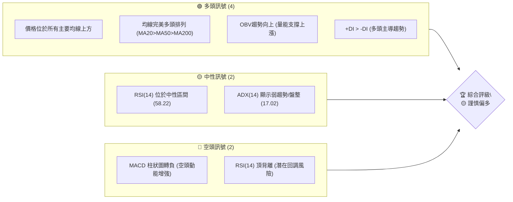

### 📊 核心指標速覽表

下表彙整 TSM 當前關鍵技術指標的數值與初步解讀，提供快速參考。

| 指標類別 | 指標名稱 | 當前數值 | 訊號 | 解讀 |
|----------|----------|----------|------|------|
| **價格** | 當前價格 | $455.10 | 🟢 | 位於所有主要均線上方，接近近期高點 |
| **均線** | MA20 | $435.42 | 🟢 | 價格位於短期 MA20 上方，短期趨勢強勁 |
| **均線** | MA50 | $413.76 | 🟢 | 價格位於中期 MA50 上方，中期趨勢穩固 |
| **均線** | MA200 | $339.59 | 🟢 | 價格位於長期 MA200 上方，長期趨勢確立 |
| **動能** | RSI(14) | 58.22 | 🟡 | 處於中性區間，但存在頂背離預警 |
| **動能** | MACD | 9.570 (MACD線) | 🔴 | MACD線下穿Signal線，柱狀圖轉負，空頭交叉 |
| **波動** | ATR(14) | $20.24 | 🟡 | 每日波動約 4.45%，屬於中等偏高波動 |

### 🏆 技術評分卡

綜合考量各項技術指標，TSM 的整體技術評級為「謹慎偏多」。雖然長期趨勢強勁且均線系統支持多頭，但短期動能指標的疲軟和背離訊號提示投資者應保持警惕，留意潛在的回調風險。

```
╔══════════════════════════════════════════════════════════════╗
║              技術評分卡 — TSM (2026-06-29)                   ║
╠══════════════════════════════════════════════════════════════╣
║ 趨勢強度      ████████░░░░░░░░░░░░  60/100  🟡 (ADX弱，但+DI主導)  ║
║ 動能指標      ██████░░░░░░░░░░░░░░  40/100  🔴 (MACD空頭，RSI頂背離)║
║ 支撐穩定度    ██████████████░░░░░░  75/100  🟢 (價格遠高於主要均線)║
║ 成交量配合    ██████████░░░░░░░░░░  65/100  🟢 (OBV確認上漲)       ║
║ 形態完整度    ██████░░░░░░░░░░░░░░  40/100  🟡 (潛在整理或反轉形態) ║
║ 均線排列      ██████████████████░░  90/100  🟢 (完美多頭排列)     ║
╠══════════════════════════════════════════════════════════════╣
║ 綜合評分      ████████░░░░░░░░░░░░  62/100  ⚖️ 謹慎偏多              ║
╚══════════════════════════════════════════════════════════════╝
```

---

## 2. 趨勢分析

本章將從多時框架深入剖析 TSM 的價格趨勢，包括長期、中期及短期走勢，並透過 ADX 指標評估其趨勢強度，為投資決策提供全面的趨勢視角。

### 🌐 多時框趨勢分析

TSM 的多時框架趨勢分析顯示，其長期走勢極為強勁，但短期動能有所減弱，進入潛在的整理或回調階段。

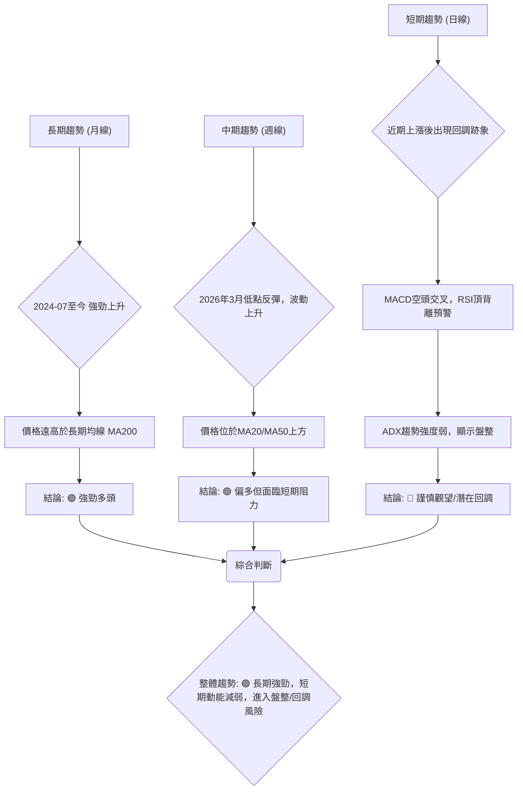

### 📈 長期趨勢 — 12個月走勢圖（Unicode）

過去 12 個月，TSM 展現了驚人的漲幅，從 2025 年 7 月的 $238.98 上漲至 2026 年 6 月的 $455.10，漲幅高達 90.4%。其走勢呈現清晰的上升通道，期間雖有短期回調，但總能迅速收復並創出新高。

```
TSM 月線走勢圖（過去12個月：2025-07 至 2026-06）
價格軸 ($)
$455 ┤                                                 ●(2026-06)
$420 ┤                                        ●(2026-05)
$385 ┤                              ●(2026-04)
$350 ┤                     ●(2026-02)     ●(2026-03)
$315 ┤             ●(2026-01) ●(2025-12)
$280 ┤        ●(2025-09) ●(2025-10) ●(2025-11)
$245 ┤●(2025-07)
$210 ┤  ●(2025-08) (低點)
     └───────────────────────────────────────────────────────
      25-07 25-08 25-09 25-10 25-11 25-12 26-01 26-02 26-03 26-04 26-05 26-06
```
**關鍵高低點**：
*   過去12個月最低點：$228.34 (2025-08)
*   過去12個月最高點：$455.10 (2026-06)
*   當前價格：$455.10

**走勢特徵分析表格**：

| 階段 | 時間區間 | 起始價 | 結束價 | 漲跌幅 (%) | 特徵 | 訊號 |
|------|------------|--------|--------|------------|------|------|
| **強勁上漲** | 2025-07 至 2026-02 | $238.98 | $372.65 | +55.93% | 經歷大幅上漲，動能強勁，創歷史新高 | 🟢 |
| **短期回調** | 2026-02 至 2026-03 | $372.65 | $337.16 | -9.52% | 快速回調，但未跌破關鍵長期支撐 | 🟡 |
| **震盪上行** | 2026-03 至 2026-06 | $337.16 | $455.10 | +34.97% | 震盪中繼續創高，但波動性增加 | 🟢 |

### 📊 中期趨勢（週線分析）

從週線圖來看，TSM 自 2026 年 3 月低點 $325.98 後，再次展開一波強勁反彈，並在 6 月 21 日達到 $462.12 的近期高點。隨後經歷小幅回調至 $432.35，目前反彈至 $455.10。中期趨勢仍屬多頭，但上方阻力漸顯。

```
TSM 近期週線壓力與支撐示意圖 (2026-03 至 2026-06)

價格 ($)
$480 ┼──────────────────────────────────── R1 (歷史高點 $476.79)
     │
$460 ┼─────────●(近期高點 $462.12)─────── R2 (心理阻力 $460)
     │         │
$440 ┼─────────┤───────●(現價 $455.10)
     │         │       │
$420 ┼───────┬─┴───────┤─────── S1 (MA20 $435.42)
     │       │         │
$400 ┼───────┴─────────┴─────── S2 (MA50 $413.76, 斐波那契38.2% $410.03)
     │
$380 ┼──────────────────────────────────── S3 (斐波那契50% $394.05)
     │
$360 ┼──────────────────────────────────── S4 (前期整理區間 $360-$370)
     │
$340 ┼─────●(3月低點 $325.98)─────────── S5 (斐波那契61.8% $378.07)
     └────────────────────────────────────
        Mar       Apr       May       Jun
```

### ⚡ 趨勢強度評估（ADX 解讀）

ADX 指標用於衡量趨勢的強度，而非方向。當前 ADX(14) 數值為 17.02，遠低於 25 的閾值，表明 TSM 目前處於弱趨勢或盤整行情。這與短期動能指標的疲軟相符，暗示股價可能在短期內缺乏明確的方向性突破。

儘管 ADX 數值較低，但 +DI (30.00) 顯著高於 -DI (22.50)，這意味著在目前的弱趨勢中，多頭力量仍佔據主導地位。市場可能正在進行一段時間的盤整或整理，為下一波趨勢的形成積蓄力量。

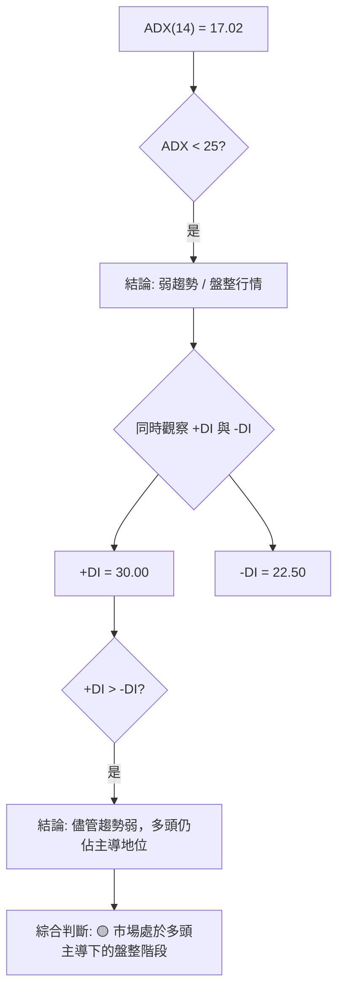

**ADX 強度對照表**：

| ADX 數值範圍 | 趨勢強度 | 市場狀態 | 投資建議 |
|--------------|----------|----------|----------|
| 0-25         | 弱趨勢   | 盤整/震盪 | 觀望或短線交易 |
| 25-50        | 中等趨勢 | 趨勢行情 | 順勢交易，趨勢明確 |
| 50-75        | 強趨勢   | 強勁趨勢 | 積極順勢交易 |
| 75-100       | 極強趨勢 | 異常強勁 | 警惕超買，但趨勢未變 |

根據當前 ADX 17.02，TSM 屬於「弱趨勢/盤整」階段。

---

## 3. 圖表形態分析

圖表形態是價格行為的視覺化呈現，能預示價格的潛在方向。本章將識別 TSM 近期的關鍵圖表形態，分析其K線組合，並據此計算可能的形態目標價。

### 🔍 形態識別系統

從提供的 24 個月和 20 週數據來看，TSM 在長期展現強勁的上升趨勢。然而，在近期高點附近，配合 RSI 頂背離和 MACD 的空頭交叉，可能正在形成或即將形成一些短期整理或反轉形態。

**潛在形態識別**：
1.  **上升楔形 (Rising Wedge)**：雖然數據不足以精確繪製，但從 2026 年 3 月低點 $325.98 到 6 月 $462.12 的反彈，伴隨波動性增加和 RSI 頂背離，暗示股價可能在上升通道中收斂，最終可能向下突破。
2.  **潛在雙頂 (Potential Double Top)**：如果股價再次測試 $462.12-$476.79 區域而未能有效突破，並且在 MACD 空頭交叉和 RSI 頂背離的確認下回落，則可能形成雙頂形態。

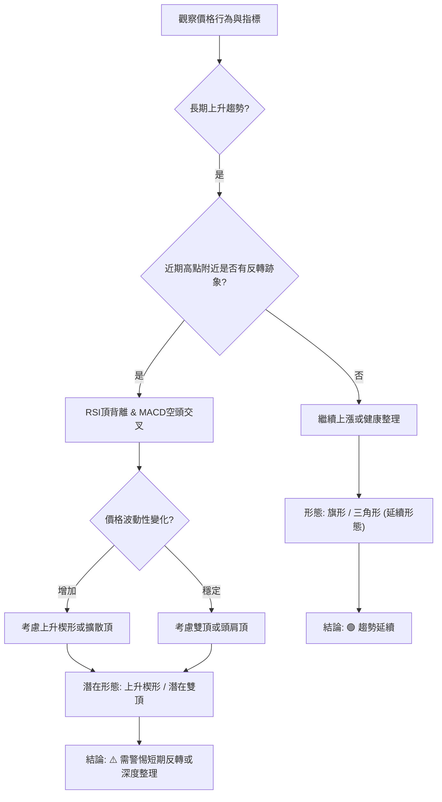

目前傾向於 **潛在上升楔形** 或 **潛在雙頂** 的早期階段，因 RSI 頂背離已發生。

### 🕯️ 重要K線形態分析

根據近 20 週的收盤數據，我們可以觀察到一些關鍵的週K線形態，這些形態為我們提供了市場情緒變化的線索。

| 月份 | 收盤價 | K線形態 | 解讀 | 訊號 |
|------|--------|---------|------|------|
| 2026-03-08 | $337.15 | 大陰線 | 股價從高點大幅下跌，顯示空頭力量強勁，短期趨勢反轉。 | 🔴 |
| 2026-03-29 | $325.98 | 錘頭線/長下影線 | 在經歷連續下跌後，出現長下影線，暗示下方買盤支撐，可能為短期底部。 | 🟢 |
| 2026-04-26 | $401.52 | 大陽線 | 股價強勁上漲，突破前期壓力，顯示多頭動能重新積聚。 | 🟢 |
| 2026-05-17 | $403.41 | 烏雲罩頂/看跌吞噬 | 在高位出現，收盤價深入前一根陽線實體，顯示上漲動能減弱，潛在回調。 | 🔴 |
| 2026-06-21 | $462.12 | 帶上影線陽線 | 創近期新高後未能守住，顯示上方賣壓沉重，短期衝高回落。 | 🟡 |
| 2026-06-28 | $432.35 | 大陰線 | 股價從高點急劇回落，確認短期賣壓，強化 MACD 空頭交叉和 RSI 頂背離的有效性。 | 🔴 |
| 2026-07-05 | $455.10 | 長陽線 (目前週) | 從前週低點反彈，顯示買盤介入，但需觀察能否突破前高。 | 🟢 |

### 📉 ASCII 走勢形態示意圖

根據近期的價格走勢和指標背離，TSM 可能正在形成一個潛在的「上升楔形」形態。這種形態通常出現在上漲趨勢的末期，預示著潛在的反轉向下。

```
TSM 潛在上升楔形示意圖 (2026-03 至 2026-06)

價格 ($)
$480 ┤                            RSI頂背離 & MACD空頭交叉 (⚠️)
     │                       ╲
$460 ┤                      ●   ╲ (上軌壓力線)
     │                      │    ╲
$440 ┤                     ●────╮╲
     │                     │     │ ╲
$420 ┤                    ●─────╯  ╲
     │                   │           ╲
$400 ┤                  ●───────────╲
     │                 │               ╲
$380 ┤                ●─────────────────╲
     │               │                     ╲
$360 ┤              ●───────────────────────╲ (下軌支撐線)
     │             ●
$340 ┤            ●
     │           ●
$320 ┤●──────────────────────────────────────────────
     └───────────────────────────────────────────────────────────
        Mar       Apr       May       Jun       Jul
        (楔形起點 $325.98)           (近期高點 $462.12)
```
**形態描述**：價格在震盪中不斷創出更高的高點和更高的低點，但上漲的動能逐漸減弱，RSI 出現頂背離，MACD 轉為空頭。上下兩條趨勢線向上收斂，形成一個楔形。

### 🎯 形態目標價計算

基於上述潛在的「上升楔形」形態，其目標價的計算通常是形態開始時的價格水平，或者楔形被突破後的形態高度。

1.  **上升楔形起點**：約為 2026 年 3 月底的低點 $325.98。
2.  **形態高度**：從楔形開始到其最寬處的垂直距離。假設近期高點 $462.12 為楔形頂部，而楔形開始時的價格約為 $325.98。
    *   形態高度 = $462.12 - $325.98 = $136.14

如果此上升楔形向下突破，則潛在的下跌目標價估計為：
*   **形態目標價 (T1)** = 突破點 - 形態高度 (保守估計，假設突破點為 $430)
    *   $430 - $136.14 = $293.86
    *   **較為實際的目標價 (T2)** 是回到楔形起點，即約 **$325.98**。

**注意**：此形態目標價是基於潛在反轉形態的假設，且需要價格確認向下突破楔形下軌線。在強勁的長期趨勢下，此目標價可能作為深度回調的極限參考，實際跌幅可能受強支撐位限制。

---

## 4. 支撐與阻力

支撐與阻力是技術分析的核心概念，它們標誌著買賣雙方力量的關鍵轉折點。本章將識別 TSM 的關鍵價位，並結合斐波那契回調分析，構建完整的價位結構。

### 🗺️ 關鍵價位分布圖（Unicode）

TSM 當前股價 $455.10 位於多條均線之上，顯示下方支撐穩固。然而，上方接近 52 週高點，面臨較強的阻力。

```
TSM 價位結構分布圖 (2026-06-29)
═══════════════════════════════════════════════════
$476.79 ║████████████████████████║ 強阻力 R3 (52W 高點)
$465.19 ║████████████████████    ║ 阻力 R2 (布林通道上軌)
$462.12 ║████████████████████████║ 關鍵阻力 R1 (近期高點)
$455.10 ╠════════════════════════╣ ◄ 現價
$435.42 ║▓▓▓▓▓▓▓▓▓▓▓▓▓▓▓▓        ║ 近期支撐 S1 (MA20, 布林通道中軌)
$432.35 ║▓▓▓▓▓▓▓▓▓▓▓▓▓▓▓▓        ║ 近期支撐 S2 (上週低點)
$413.76 ║████████████████████████║ 強支撐 S3 (MA50)
$410.03 ║████████████████████████║ 強支撐 S4 (斐波那契38.2%)
$405.64 ║████████████████████████║ 強支撐 S5 (布林通道下軌)
$339.59 ║████████████████████████║ 極強支撐 S6 (MA200)
═══════════════════════════════════════════════════
```

### 🚧 阻力位分析表

TSM 上方的阻力主要來自於近期的高點以及歷史新高，這些價位需要強勁的買盤才能突破。

| 阻力級別 | 價位 | 形成原因 | 突破難度 | 重要性 |
|----------|------|----------|----------|--------|
| **R1** | $462.12 | 2026-06-21 近期高點，多頭獲利了結壓力 | 中等 | 股價能否延續漲勢的關鍵 |
| **R2** | $465.19 | 布林通道上軌，短期超買區間上限 | 中等 | 短期上漲動能的極限 |
| **R3** | $476.79 | 52週高點，歷史新高，心理阻力 | 高 | 突破將打開更大的上漲空間 |
| **R4** | $487.56 | 分析師平均目標價，心理阻力 | 高 | 突破意味著市場預期進一步提升 |

### 🛡️ 支撐位分析表

TSM 下方的支撐主要由多條移動平均線和斐波那契回調位構成，這些價位是買盤可能介入的區域。

| 支撐級別 | 價位 | 形成原因 | 守住機率 | 重要性 |
|----------|------|----------|----------|--------|
| **S1** | $435.42 | MA20，短期趨勢線，布林通道中軌 | 高 | 短期回調的重要考驗 |
| **S2** | $432.35 | 2026-06-28 上週低點，近期多頭防線 | 中等 | 短期跌勢能否止穩的標誌 |
| **S3** | $413.76 | MA50，中期趨勢線 | 高 | 中期趨勢健康的關鍵支撐 |
| **S4** | $410.03 | 斐波那契 38.2% 回調位 (從 $325.98 到 $462.12 的上漲) | 高 | 技術性回調的強勁買盤區 |
| **S5** | $339.59 | MA200，長期趨勢線 | 極高 | 長期牛市的最後防線 |

### 📐 斐波那契回調位分析

我們將以 2026 年 3 月 29 日的低點 $325.98 作為起點，至 2026 年 6 月 21 日的近期高點 $462.12 作為終點，計算斐波那契回調位。這段上漲區間代表了 TSM 近期最主要的多頭行情。

*   **斐波那契基準**：
    *   低點 (0%)：$325.98
    *   高點 (100%)：$462.12
    *   漲幅：$462.12 - $325.98 = $136.14

*   **關鍵回調位計算**：
    *   **76.4% 回調位**：$325.98 + (0.764 * $136.14) = $325.98 + $104.04 = **$430.02**
        *   解讀：此位接近近期 MA20 和上週低點，是短期強勢回調的潛在支撐。
    *   **61.8% 回調位**：$325.98 + (0.618 * $136.14) = $325.98 + $84.15 = **$410.13**
        *   解讀：此位與 MA50 和布林通道中軌接近，是中期趨勢的重要支撐，也是市場常出現反彈的黃金分割位。
    *   **50% 回調位**：$325.98 + (0.50 * $136.14) = $325.98 + $68.07 = **$394.05**
        *   解讀：若股價跌破 61.8% 回調位，50% 回調位將是下一個重要支撐，也是前一波漲勢的半程修復。
    *   **38.2% 回調位**：$325.98 + (0.382 * $136.14) = $325.98 + $52.01 = **$378.07**
        *   解讀：若回調至此位，則說明短期趨勢轉弱，但長期仍有機會維持。

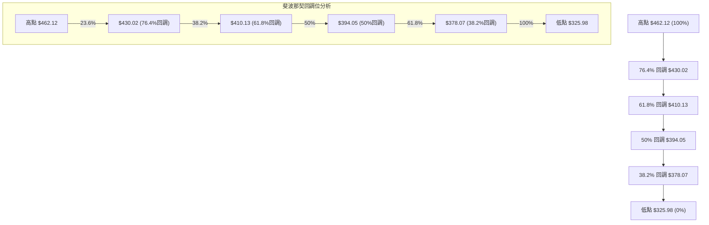

---

## 5. 技術指標深度解讀

技術指標是量化分析市場行為的工具，本章將對移動平均線、RSI、MACD、布林通道及成交量進行深入解讀，並分析它們之間的相互確認或矛盾。

### 🎛️ 指標訊號總覽

目前 TSM 的技術指標呈現多空交織的訊號。雖然長期趨勢強勁，但短期動能指標已發出警示，暗示市場可能進入調整階段。

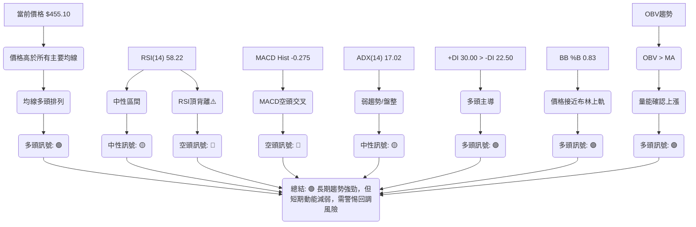

### 📈 移動平均線排列分析

TSM 的移動平均線系統呈現典型的強勢多頭排列，這是一個非常強勁的看漲訊號。當前價格 $455.10 遠高於所有主要移動平均線，且短期均線位於長期均線之上。

*   **MA20 ($435.42)**：價格位於其上方，顯示短期上漲動能強勁。
*   **MA50 ($413.76)**：價格位於其上方，顯示中期趨勢穩固向上。
*   **MA200 ($339.59)**：價格位於其上方，顯示長期牛市趨勢確立。
*   **均線排列**：MA20 > MA50 > MA200，形成完美的「多頭排列」，這是股價處於強勢上升通道的典型特徵。

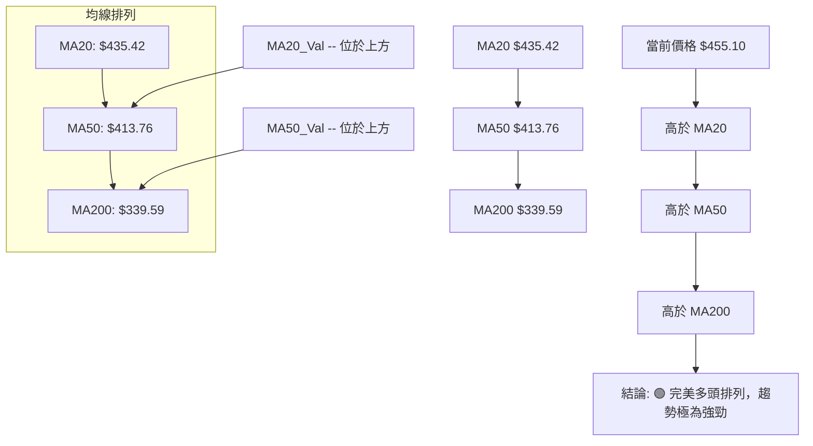

### 📉 RSI(14) 分析

*   **RSI 數值**：58.22
    *   **進度條**：RSI 指標強度 █████████░░░░░░░░░░ 58.22%
    *   **超買超賣區間分析**：RSI 58.22 位於 30-70 的中性區間。這表示 TSM 既不是超買也不是超賣，市場情緒相對平衡。然而，這並不排除價格在短期內回調的可能性，特別是考慮到頂背離的出現。
*   **背離判斷 (頂背離)**：數據明確指出「⚠️ 頂背離 (Bearish Divergence)」。
    *   **解讀**：RSI 頂背離是指股價創出新高（或更高的高點），但 RSI 指標未能創出新高（或創出更低的高點）。這是一個重要的看跌反轉訊號，暗示上漲動能正在減弱，市場可能即將面臨回調。
    *   **實際情況**：從 20 週數據看，2026-04-26 價格 $401.52 時 RSI 達到 76.5，而 2026-06-21 價格 $462.12 時 RSI 僅為 61.5。這是一個清晰的頂背離訊號，警告投資者近期上漲的持續性可能不足。
    *   **訊號強度**：🔴 強烈看空反轉預警。

### 📊 MACD(12/26/9) 訊號解讀

MACD (Moving Average Convergence Divergence) 是衡量動能和趨勢變化的重要指標。

*   **當前數值**：
    *   MACD 線：9.570
    *   MACD Signal 線：9.845
    *   MACD 柱狀圖 (Histogram)：-0.275
*   **訊號解讀**：
    *   **空頭交叉**：MACD 線 (9.570) 已經下穿 MACD Signal 線 (9.845)。這是一個明確的「空頭交叉」訊號，表示短期動能已轉向空頭，股價可能面臨下跌壓力。
    *   **柱狀圖轉負**：MACD 柱狀圖由正轉負 (-0.275)，進一步確認了空頭動能的出現。柱狀圖的絕對值越大，空頭動能越強。
    *   **與 RSI 背離的整合**：MACD 的空頭交叉與 RSI 的頂背離互相印證，大大增強了短期看跌訊號的可靠性。這兩大動能指標同時發出警示，表明 TSM 在強勁的長期趨勢中，正經歷或即將經歷一次較為顯著的短期回調。

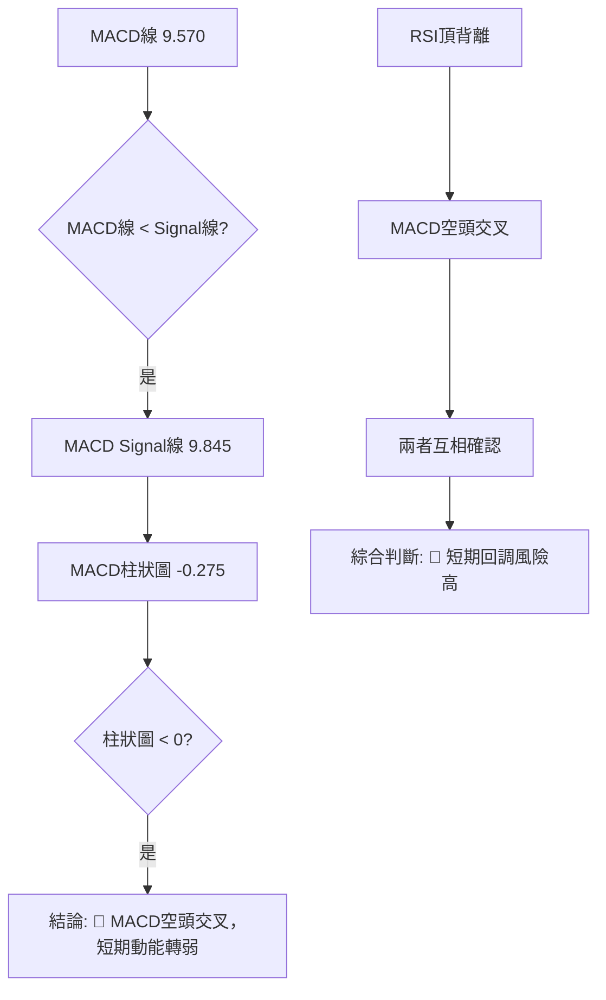

### 📦 布林通道分析

布林通道 (Bollinger Bands) 用於衡量股價波動範圍和判斷超買超賣情況。

*   **當前數值**：
    *   BB上軌：$465.19
    *   BB中軌 (MA20)：$435.42
    *   BB下軌：$405.64
    *   當前收盤價：$455.10
    *   BB %B：0.83 (0=下軌, 0.5=中軌, 1=上軌)
*   **解讀**：
    *   **位置**：當前價格 $455.10 位於布林通道中軌 ($435.42) 和上軌 ($465.19) 之間，且 %B 值為 0.83，表示股價非常接近上軌。這通常被視為多頭強勢的表現，但同時也暗示股價可能處於短期超買狀態或即將觸及壓力位。
    *   **通道寬度**：從數據中無法直接判斷通道寬度變化，但價格靠近上軌，若通道收窄，則可能預示著波動性降低和趨勢不明朗；若通道擴張，則可能預示趨勢的延續。
    *   **與其他指標結合**：雖然布林通道顯示價格偏強，但 MACD 空頭交叉和 RSI 頂背離的出現，使得價格觸及上軌後的回調風險增加。投資者應警惕價格未能有效突破上軌並回落的情況。

```
TSM 布林通道示意圖 (2026-06-29)

價格 ($)
$470 ┼───────────────────BB上軌 $465.19 (阻力)
     │                     ↑
$460 ┼───────────────────現價 $455.10
     │                     ↓
$450 ┼───────────────────
     │
$440 ┼───────────────────BB中軌 $435.42 (MA20, 支撐)
     │
$430 ┼───────────────────
     │
$420 ┼───────────────────
     │
$410 ┼───────────────────BB下軌 $405.64 (支撐)
     └───────────────────
```

### 💹 成交量分析（量價配合度）

成交量是價格走勢的動能，量價配合度能驗證趨勢的可靠性。

*   **最新成交量**：14,808,927 股
*   **20日均量**：14,463,831 股 (量比: 1.02x)
*   **50日均量**：13,833,327 股
*   **OBV趨勢**：OBV > MA → 量能支撐上漲
*   **解讀**：
    *   **當前成交量**：最新成交量略高於 20 日和 50 日均量，顯示市場活躍度尚可。在價格反彈時，若能伴隨成交量放大，則反彈的可靠性更高。
    *   **OBV 指標**：OBV (On Balance Volume) 趨勢向上並高於其移動平均線，這是一個積極的訊號。它表明儘管價格近期有所波動，但總體而言，在價格上漲時的成交量大於下跌時的成交量，顯示資金仍在流入，量能仍在支撐股價上漲。
    *   **量價配合度**：在長期上升趨勢中，OBV 的持續上升為價格的上漲提供了堅實的量能基礎。然而，需要警惕的是，如果價格在高位出現放量滯漲或放量下跌，而 OBV 卻未能同步上漲甚至出現下降，則可能預示著潛在的派發或趨勢反轉。目前 OBV 仍為多頭，與 MACD/RSI 的短期空頭訊號形成一定的矛盾，這可能暗示當前的回調是健康整理，而不是趨勢反轉。

---

## 6. 動能與波動率

本章將評估 TSM 的市場動能和波動性，這對於理解股價的潛在爆發力和風險至關重要。我們將結合動能指標和 ATR 進行深入分析。

### ⚡ 動能評估四象限

動能評估四象限將股票在「動能強度」和「波動率」兩個維度進行分類，幫助我們判斷當前的市場環境和交易機會。

| 象限 | 動能 | 波動 | 當前狀態 (TSM) | 評估 |
|------|------|------|----------------|------|
| Q1 | 強 | 低 | - | 最佳機會：股價穩定上漲，風險低，適合追漲。 |
| Q2 | 弱 | 低 | - | 謹慎觀望：動能不足，但波動小，可能盤整等待方向。 |
| Q3 | 強 | 高 | - | 高風險高收益：動能強勁，但波動大，適合有經驗的交易者。 |
| Q4 | 弱 | 高 | ✓ (當前狀態) | 避免進場：動能減弱且波動大，方向不明，風險高。 |

**TSM 當前評估**：
*   **動能**：RSI 位於中性區間但有頂背離，MACD 已出現空頭交叉且柱狀圖轉負。這表明短期上漲動能正在減弱，甚至轉為空頭。因此，動能評估為「弱」。
*   **波動**：ATR(14) 為 $20.24，佔當前價格 $455.10 的 4.45%。對於大型股而言，這屬於中等偏高的波動水平。因此，波動評估為「高」。

**結論**：TSM 目前位於 **Q4 (弱動能, 高波動)** 象限。這意味著股價在短期內方向不明，且價格波動較大，投資風險較高。在這種情況下，建議投資者避免盲目進場，或只進行短線交易，並嚴格控制風險。

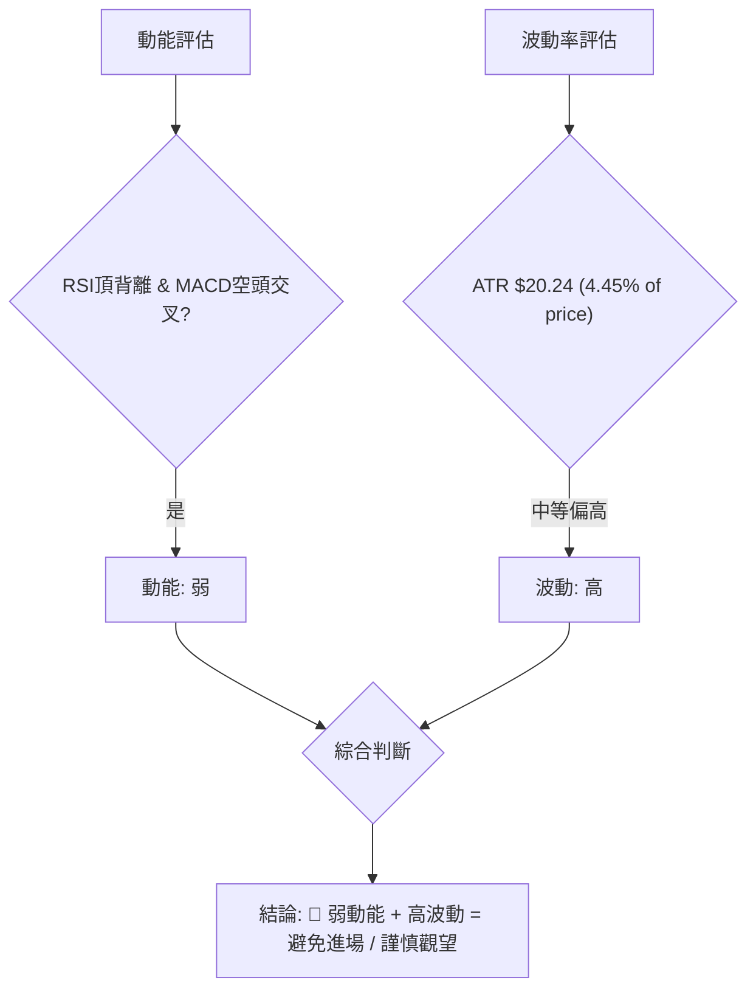

### 📊 ATR 波動率分析

ATR (Average True Range) 用於衡量資產的價格波動幅度。

*   **當前 ATR(14)**：$20.24
*   **解讀**：
    *   ATR 數值 $20.24 表示在過去 14 個交易日中，TSM 的平均每日波動幅度約為 $20.24。
    *   相對於當前價格 $455.10，ATR 佔比約為 4.45%。對於大型科技股而言，這是一個相對較高的波動率，顯示股價在短期內可能出現較大的日間漲跌幅。
    *   **止損距離建議**：ATR 是設定止損點的常用工具。
        *   **保守止損**：建議將止損設置在當前價格下方 1.5 倍 ATR 處。
            *   止損距離 = 1.5 * $20.24 = $30.36
            *   若從 $455.10 進場，止損點約為 $455.10 - $30.36 = **$424.74**。
        *   **激進止損**：建議將止損設置在當前價格下方 1 倍 ATR 處。
            *   止損距離 = 1 * $20.24 = $20.24
            *   若從 $455.10 進場，止損點約為 $455.10 - $20.24 = **$434.86**。
    *   **交易策略影響**：高 ATR 意味著潛在的利潤空間和風險都較大。短線交易者可以利用其波動性，但需嚴格控制倉位和止損。長線投資者在入場時應考慮到較大的波動性，並為其留出足夠的緩衝空間。

### 📐 Beta 與市場相關性

Beta 值衡量單一證券相對於整個市場的波動性。數據中未直接提供 TSM 的 Beta 值。

*   **推演分析**：TSM 作為全球領先的半導體製造商，其業務與全球科技產業景氣高度相關。半導體產業通常被視為高 Beta 產業，因為其營收和盈利對宏觀經濟和市場情緒變化較為敏感。
    *   **市場相關性**：預計 TSM 的 Beta 值會大於 1，這意味著它在市場上漲時傾向於漲幅更大，在市場下跌時傾向於跌幅更大。因此，TSM 的股價走勢預計會與主要科技指數（如納斯達克 100 指數或費城半導體指數）呈現高度正相關。
    *   **投資影響**：投資 TSM 意味著投資者將承擔較高的系統性風險。在牛市中，這有利於放大收益；但在熊市或市場調整中，其跌幅也可能超過大盤。投資者應密切關注宏觀經濟數據和科技產業的整體趨勢。

---

## 7. 多時框架總結

多時框架分析能夠提供更全面的市場視角，避免單一時框架的片面性。本章將整合前述分析，對 TSM 在不同時框架下的技術面進行總結評分。

### 📋 時框架評分表

下表總結了 TSM 在長期、中期和短期三個時框架下的技術面表現，並給出了相應的評分和建議。

| 時框架 | 趨勢方向 | 動能 | 均線排列 | 形態 | 綜合評分 (1-10) | 建議 |
|--------|----------|------|----------|------|-----------------|------|
| **長期** | 🟢 強勁上漲 | 🟢 強勁 | 🟢 多頭排列 | 🟢 上升趨勢 | 9/10 | 繼續持有/逢低買入 |
| **中期** | 🟢 震盪上行 | 🟡 中性 | 🟢 多頭排列 | 🟡 整理/延續 | 7/10 | 觀察，持股待漲 |
| **短期** | 🔴 潛在回調 | 🔴 減弱/空頭 | 🟢 多頭排列 | 🔴 反轉預警 | 4/10 | 謹慎觀望，避免追高 |

**解讀**：
*   **長期來看**，TSM 依然處於強勁的牛市中，所有主要均線均支持多頭，且股價表現出色。這為長期投資者提供了堅實的信心基礎。
*   **中期來看**，股價在震盪中繼續上行，但動能已不如長期強勁，且形態可能預示著一段整理。
*   **短期來看**，市場出現了明顯的空頭訊號，RSI 頂背離和 MACD 空頭交叉表明短期動能已顯著減弱，存在較大的回調風險。儘管均線仍為多頭排列，但這些動能指標的警示不容忽視。

### 🔲 綜合訊號矩陣

綜合訊號矩陣展示了不同技術維度在各時框架下的一致性，幫助我們形成最終的投資判斷。

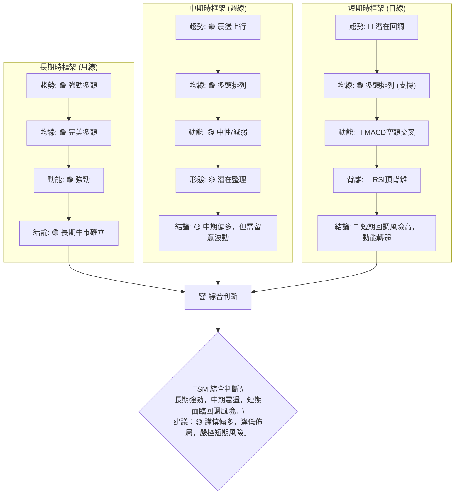

**結論**：TSM 的長期基本面和技術面依然強勁，但在短期內，動能指標的疲軟和背離訊號預示著可能的回調或盤整。因此，對於長期投資者而言，任何回調都可能是逢低買入的機會；而對於短線交易者，則應極度謹慎，避免追高，或考慮在關鍵支撐位附近尋找反彈機會。

---

## 8. 交易策略建議

基於上述多時框架的技術分析，TSM 目前處於長期牛市中的短期調整階段。因此，我們將提出多頭和空頭兩種策略，並強調風險管理。

### 🗺️ 策略決策流程圖

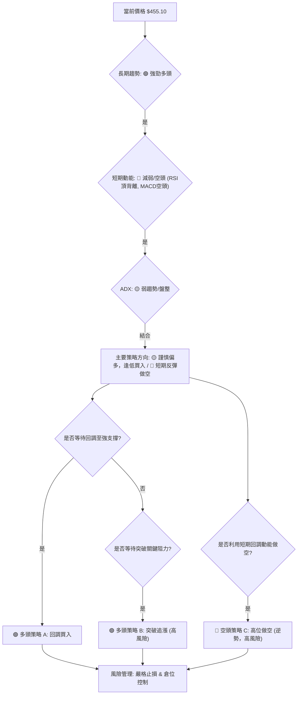

### 🟢 多頭策略詳情

考慮到 TSM 的長期強勁趨勢，多頭策略主要集中在逢低買入或等待明確突破。

| 策略要素 | 策略 A: 回調買入 (Pullback Buy) | 策略 B: 突破追漲 (Breakout Buy) |
|----------|---------------------------------|---------------------------------|
| **進場條件** | 價格回調至關鍵支撐位，並出現止跌訊號 (如錘頭線、吞噬陽線)。 | 價格有效突破近期關鍵阻力 R1 ($462.12) 並站穩。 |
| **進場價格** | **$435.42 - $430.02** (MA20 / 斐波那契76.4%回調區間) | **$463.00** (突破 R1 後確認) |
| **目標價 T1** | **$462.12** (近期高點 R1) | **$476.79** (52週高點 R3) |
| **目標價 T2** | **$476.79** (52週高點 R3) | **$495.00** (突破歷史高點後的心理關口) |
| **止損價格** | **$424.74** (略低於上週低點 $432.35 和 1.5x ATR) | **$455.00** (突破點下方，或 1x ATR) |
| **風險報酬比** | (以進場 $430.00 為例) <br> T1: ($462.12-$430.00) / ($430.00-$424.74) = 32.12 / 5.26 = **6.1:1** <br> T2: ($476.79-$430.00) / ($430.00-$424.74) = 46.79 / 5.26 = **8.9:1** | (以進場 $463.00 為例) <br> T1: ($476.79-$463.00) / ($463.00-$455.00) = 13.79 / 8.00 = **1.7:1** <br> T2: ($495.00-$463.00) / ($463.00-$455.00) = 32.00 / 8.00 = **4.0:1** |
| **成功機率** | 70% (符合長期趨勢，有支撐) | 55% (需強勁動能配合，有回落風險) |
| **建議倉位** | 20%-30% | 10%-15% (保守) |

### 🔴 空頭策略詳情

考慮到短期動能減弱和背離訊號，短期內可考慮高位做空或跌破關鍵支撐追空，但這屬於逆勢操作，風險較高。

| 策略要素 | 策略 C: 高位做空 / 跌破追空 (Counter-trend Short) |
|----------|----------------------------------------------------|
| **進場條件** | 股價反彈至 R1 ($462.12) 或 R2 ($465.19) 附近受阻，或跌破 S1 ($435.42) |
| **進場價格** | **$460.00** (高位受阻) 或 **$434.00** (跌破 S1 後確認) |
| **目標價 T1** | **$435.42** (S1) / **$413.76** (S3) |
| **目標價 T2** | **$410.13** (斐波那契61.8%回調位 S4) / **$394.05** (斐波那契50%回調位 S5) |
| **止損價格** | **$468.00** (突破 R2) / **$440.00** (跌破 S1 後反彈失敗) |
| **風險報酬比** | (以進場 $460.00，止損 $468.00 為例) <br> T1: ($460.00-$435.42) / ($468.00-$460.00) = 24.58 / 8.00 = **3.0:1** <br> T2: ($460.00-$410.13) / ($468.00-$460.00) = 49.87 / 8.00 = **6.2:1** |
| **成功機率** | 40% (逆勢操作，長期趨勢為多頭) |
| **建議倉位** | 5%-10% (極小倉位) |

### ⭐ 整體訊號強度評星

綜合考量各策略的風險與收益，以及 TSM 整體的多空訊號：

```
做多訊號強度：★★★★☆  (4/5星) 理由：長期趨勢強勁，回調是買入機會，均線支持。
做空訊號強度：★★☆☆☆  (2/5星) 理由：短期有空頭訊號，但長期趨勢為多頭，逆勢風險高。
整體可信度：  ★★★☆☆  (3/5星) 理由：多空訊號交織，需謹慎判斷，但長期方向明確。
```

---

## 9. 風險提示與監控

任何投資都伴隨風險，技術分析旨在提高決策的成功率，但無法消除風險。本章將列出關鍵監控指標、分析潛在風險場景，並提供風險管理建議。

### ✅ 關鍵監控指標 Checklist

以下是交易 TSM 時應密切關注的關鍵技術指標清單，這些指標的變化將是調整策略的重要依據。

```
╔══════════════════════════════════════════════════════════════════╗
║                    TSM 關鍵監控指標 Checklist                      ║
╠══════════════════════════════════════════════════════════════════╣
║ ✔ 價格走勢：密切關注價格是否守住關鍵支撐位 S1 ($435.42) 和 S3 ($413.76)。  ║
║ ✔ 移動平均線：MA20 是否被有效跌破？均線多頭排列是否被破壞？         ║
║ ✔ RSI(14)：是否從頂背離後持續下降？是否跌破 50 中軸線？            ║
║ ✔ MACD：MACD 線與 Signal 線的距離是否擴大？柱狀圖負值是否增大？      ║
║ ✔ 成交量：價格回調時成交量是否縮小 (健康回調)？價格下跌時是否放量？  ║
║ ✔ 布林通道：價格是否跌破中軌？通道是否持續收窄？                  ║
║ ✔ ADX：趨勢強度是否有所變化？+DI 與 -DI 的相對強弱？              ║
║ ✔ 52週高點 ($476.79)：突破或受阻情況。                            ║
║ ✔ 斐波那契回調位：各關鍵回調位 ($430.02, $410.13) 是否提供有效支撐。║
╚══════════════════════════════════════════════════════════════════╝
```

### ⚠️ 風險場景分析

針對 TSM 當前的技術面狀況，我們可以預設以下三種情境：

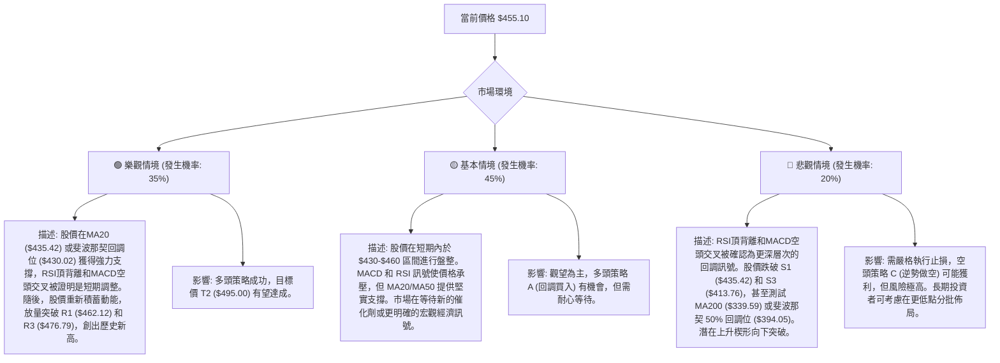

### 🛡️ 風險管理重要提醒

1.  **止損紀律**：無論任何交易策略，務必設置明確的止損點並嚴格執行。一旦價格觸及止損位，應果斷離場，避免虧損擴大。
2.  **倉位管理**：根據策略的風險報酬比和成功機率，合理分配資金。對於高風險或逆勢策略，應採用較小的倉位。TSM 波動率較高，不宜滿倉操作。
3.  **分批操作**：在關鍵支撐位附近可以考慮分批建倉，在阻力位附近分批減倉，以降低單次進場的風險。
4.  **多空平衡**：雖然長期趨勢為多頭，但短期空頭訊號不容忽視。投資者應保持靈活，隨時準備調整策略。
5.  **基本面結合**：技術分析應與基本面分析相結合。儘管本報告聚焦技術面，但 TSM 的財報、產業新聞（如 AI 晶片需求、資本支出、地緣政治風險）等基本面因素將對股價產生長期影響。
6.  **市場情緒**：觀察市場整體情緒和資金流向。在市場情緒悲觀時，即使技術面支持，也可能面臨額外壓力。

---

## 📋 報告總結

```
╔══════════════════════════════════════════════════════════════════╗
║                     TSM 技術分析報告總結                         ║
╠══════════════════════════════════════════════════════════════════╣
║ 報告日期：2026-06-29                                               ║
║ 當前價格：$455.10                                                 ║
║ 分析評級：⚖️ 謹慎偏多 (長期趨勢強勁，短期動能減弱，面臨回調風險)    ║
║                                                                  ║
║ 關鍵結論：                                                         ║
║ ├─ 長期趨勢：🟢 強勁多頭，均線完美多頭排列，顯示強勁上升通道。        ║
║ ├─ 中期趨勢：🟢 震盪上行，價格位於MA20/MA50上方，但面臨短期阻力。     ║
║ ├─ 短期趨勢：🔴 潛在回調，RSI頂背離與MACD空頭交叉預示動能減弱。       ║
║ ├─ 關鍵支撐：$435.42 (MA20), $430.02 (斐波那契76.4%), $413.76 (MA50)。║
║ ├─ 關鍵阻力：$462.12 (近期高點), $476.79 (52週高點)。               ║
║ └─ 分析師目標：平均目標價 $487.56，最高 $700.00，最低 $354.00。      ║
║                                                                  ║
║ 最優策略組合：                                                     ║
║ 1. 🥇 **最佳機會 (多頭)**：在 $430.02 - $435.42 區間逢低買入，止損 $424.74，目標價 $462.12 / $476.79。風險報酬比高。    ║
║ 2. 🥈 **次選機會 (多頭)**：若價格放量突破 $462.12，可在 $463.00 追漲，止損 $455.00，目標價 $476.79 / $495.00。風險較高。║
║ 3. 🥉 **保守選擇 (觀望)**：鑑於短期動能轉弱，可等待市場消化短期回調壓力，待指標轉強後再考慮進場。                  ║
╚══════════════════════════════════════════════════════════════════╝
```

---

> ⚠️ **免責聲明**：本報告為 AI 自動生成之技術分析，所有數據及估算均基於提供的歷史價格資訊。本報告**僅供研究與學術參考**，**不構成任何投資建議**。投資有風險，入市需謹慎。

---

*報告生成時間：2026-06-29 ｜ 數據來源：Yahoo Finance ｜ 分析框架：多時框技術分析*