<details>
<summary>📊 靜態圖表 (點擊展開)</summary>
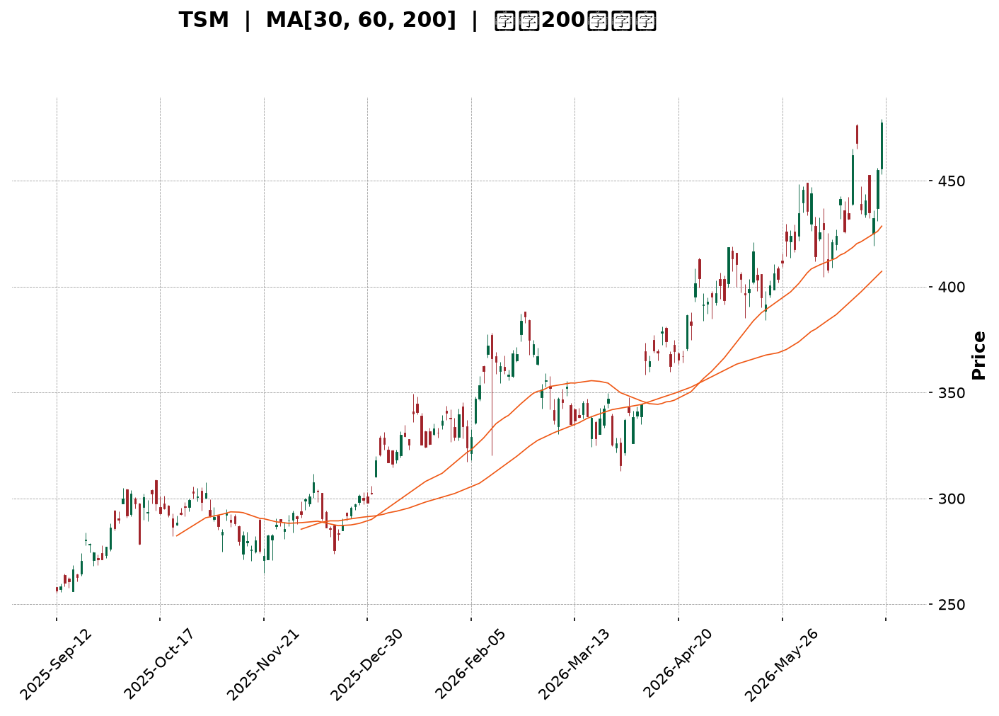
</details>

<html>
<head><meta charset="utf-8" /></head>
<body>
    <div style="height:500px; width:100%;">                        <script>window.PlotlyConfig = {MathJaxConfig: 'local'};</script>
        <script charset="utf-8" src="https://cdn.plot.ly/plotly-3.6.0.min.js" integrity="sha256-QaOVwtVY0T02VaHrr6pnoHLCwayMJp4O5n4YyaE3rJk=" crossorigin="anonymous"></script>                <div id="candlestick-chart" class="plotly-graph-div" style="height:100%; width:100%;"></div>            <script>                window.PLOTLYENV=window.PLOTLYENV || {};                                if (document.getElementById("candlestick-chart")) {                    Plotly.newPlot(                        "candlestick-chart",                        [{"close":{"dtype":"f8","bdata":"AAAAgOQHcEAAAACgVShwQAAAAKAtQHBAAAAAgMRLcEAAAACgoqhwQAAAAGDJbHBAAAAAAPrncEAAAADg\u002fodxQAAAAOA+aHFAAAAA4PMncUAAAACgkPNwQAAAAICA8XBAAAAAILRRcUAAAABAb+NxQAAAAEC43XFAAAAAYH0eckAAAACAksByQAAAAACzO3JAAAAAIDrickAAAABgkZhyQAAAAKBzZ3FAAAAAAFrIckAAAABgBVpyQAAAAEA+5XJAAAAAwO6XckAAAAAgXkxyQAAAAAD2dXJAAAAA4FFDckAAAACg8elxQAAAAOBPB3JAAAAAgHZKckAAAAAgsX5yQAAAAODCsnJAAAAAoEbrckAAAADgls1yQAAAAIBMoXJAAAAA4J\u002fnckAAAABgBDxyQAAAACCCNXJAAAAAgKjvcUAAAABAKcRxQAAAAGBiT3JAAAAAIEwOckAAAADgkAVyQAAAAGDmf3FAAAAAwH2pcUAAAAAA4nxxQAAAAODLO3FAAAAAIJmCcUAAAACASTVxQAAAAICNDnFAAAAAYKKmcUAAAADARKdxQAAAAKAW+3FAAAAAwLETckAAAADA5NZxQAAAAODmHHJAAAAAAD5SckAAAADAPCpyQAAAAECnRnJAAAAAoCi4ckAAAABAm9ByQAAAAOBxO3NAAAAA4If0ckAAAADgnyhyQAAAAIAt5HFAAAAAQFTWcUAAAACAlThxQAAAACB4s3FAAAAAQHD3cUAAAACgXDxyQAAAAODHdnJAAAAAYDqUckAAAAAgidRyQAAAAGD5tXJAAAAAwKSgckAAAAAAQOVyQAAAAAB633NAAAAA4H8JdEAAAAAg9Ft0QAAAAGCs0HNAAAAAIALGc0AAAABgdx90QAAAAIAJoXRAAAAAYB+YdEAAAAAg3FZ0QAAAAEAlPnVAAAAAID5KdUAAAADgp1d0QAAAAAAaR3RAAAAAoP9adEAAAADAYdJ0QAAAAOD\u002fr3RAAAAA4J0JdUAAAACgpkh1QAAAAIDgHHVAAAAAwMaNdEAAAAAgsDl1QAAAAMBj4HRAAAAAgA1BdEAAAACAe5B0QAAAAKDpsHVAAAAAQFUZdkAAAABgzIB2QAAAAECtQndAAAAAQFTjdkAAAADgocd2QAAAACBApXZAAAAAoF6GdkAAAACAmmh2QAAAAEArCndAAAAAwDUCd0AAAAAgR\u002fx3QAAAAIDLG3hAAAAAIPltd0AAAADgeUp3QAAAAOBn83ZAAAAAYAr1dUAAAABgpTl2QAAAAACpAHZAAAAAIF8SdUAAAABghq51QAAAAKDllHVAAAAAgM0LdkAAAACgq+90QAAAAIAjCXVAAAAAoLMndUAAAAAgv5J1QAAAACBtLHVAAAAAwPkfdUAAAABAiId0QAAAAGCMGnVAAAAAICtndUAAAAAgAK91QAAAAKCRVXRAAAAAIKBfdEAAAAAgK7xzQAAAACCREnVAAAAAABNLdUAAAABg9yN1QAAAAGBiT3VAAAAAIDaIdUAAAADAuNB2QAAAAGAtynZAAAAAAL8bd0AAAAAATgt3QAAAAAAKsHdAAAAAAJRjd0AAAABgBKh2QAAAAGAmGndAAAAAICbWdkAAAAAghfN2QAAAAICOKHhAAAAAYEHcd0AAAACgUBh5QAAAAICKQHlAAAAAAMZ2eEAAAADAjo54QAAAAIAnsnhAAAAAwNrLeEAAAAAgvwp5QAAAAADRl3hAAAAAgFEoekAAAAAA69J5QAAAAIB9q3lAAAAAgIQ5eUAAAAAAocV4QAAAAMDa7XhAAAAAoOcLekAAAAAgfDZ5QAAAACBmsHhAAAAAQBV7eEAAAAAg6Ap5QAAAAAAuY3lAAAAAwDI5eUAAAADgtLV5QAAAAKDgW3pAAAAAoOB9ekAAAADAjhd6QAAAAKDLKXtAAAAAgFfae0AAAABAtzp7QAAAAKAWvntAAAAAQDPjeUAAAABg2Jx6QAAAAEC5rnpAAAAAYLh8eUAAAADAHlF6QAAAAEDhfnpAAAAAYGaWe0AAAACgR516QAAAAGBmAntAAAAAgOvhfEAAAABguDp9QAAAAIA9RntAAAAAoEeNe0AAAAAA1y97QAAAAKCZBXtAAAAAoJlxfEAAAADAHtl9QA=="},"high":{"dtype":"f8","bdata":"gqBsiochcEAH4wlBzj5wQABBc9y1hXBA9r5BsNVrcEARDqwnzMZwQPJHLC\u002fGh3BA8oLLjTAjcUD3kMtkObxxQFK0Bd0ucHFAGZHqoJIvcUC6T0OYiRVxQP6lRj7pWnFAl2aQ2OBUcUC9287hVwNyQP1QQidnZnJAre\u002f18exbckAGreb1Ww5zQBtlzzMvC3NAjyvDaxIAc0CX0zUIZsdyQIGtFcKlnXJAo0mtR\u002fnjckCselkSQbZyQNAJ1MdnA3NAqYdjZfhOc0AsXUEE3M5yQLYjtJZq1HJAue1AvniQckBOcuT8RU5yQCTBncamPHJAS4vU3+15ckBZK5fWF6JyQLrrKUlJvHJAhnLaN9YYc0BHgNqFhA5zQDbO0FRkFHNAToCdbiA7c0B5JqpcELpyQP2FOBU3fnJAXxdnEmJFckBZwp08OtpxQELNr2\u002fpbHJAHG6MCdRJckBeKJnGCElyQB+in1vJ83FAjwYbLODJcUD4r9cgo8RxQHnF2bz9X3FAdniVkDSlcUAljbSQ9yhyQIkxncEtSHFAbH39LE2tcUCczGLRsrJxQAN7sPtUKHJA\u002fdMw+hsmckDHf+BuIw5yQA0evRIpQ3JA216OyNBkckDfOkUmsztyQG82pywsp3JAEYCGmxDEckAgdL50xORyQB2wGohneHNAIhiYCEoEc0AszyczdetyQDu8LJJ5ZHJAcKnsZqPvcUAmqfZs0\u002flxQCuUWgry2nFArN5WlrEqckAEKUBU5ldyQEYAUsoPhnJAdSPAa\u002fWZckDSlayhId1yQJ8CPaL17nJANYidPsHvckCN2mJR9hxzQJC3\u002fXD+\u002fnNASixZZ8KYdEBOvx2O47V0QN6+UnX3SXRAlGG\u002fflAtdEDuzzXAnDF0QFJzGOdevXRAZwcY8Q3rdEChuUU7ooJ0QHNDZWFj2HVAD61OidTAdUDm3sRMQ0Z1QG6yI7DNvnRAMrWhMT\u002fVdECiOEKgrPZ0QESnZA8L1nRAatYL\u002fe83dUB+DBOClnt1QM2zoYqSX3VAVi16v3IidUDuVRIW5WZ1QL6nfJxClHVAZB1gT\u002fAQdUDiHsZIm810QFmWUc\u002fCvnVAugurSgdcdkBJG0kAKq52QDuom6wQmndAySMdGsCgd0BXNrjgPRN3QMgrZQUWxXZAZy7KBd33dkBWs8gD9452QFABtK2XJHdAIbU3wis4d0BYkIwq4DJ4QJzfZEpFQ3hA9sYWI70HeEDPmUdK52t3QPdhMgDrMndAw4tcAGgidkCZHuvovnN2QOamtoX1WXZAjwWszteudUBC+47Dqrl1QPQ3Mw7u+nVAHLaqozY4dkCExgywtpF1QLovueP8a3VAJDEiX71tdUAs+xSJMp91QPOMCW4xsnVAbWa0oLExdUDp5yDf+gx1QILuwgi5aXVA3eCmBjCBdUAYtV6JGdp1QL1cHN3QQXVAEERE46OMdEAl1lliR410QJPUE9noGXVAfWpjcdi9dUAt7wBBVVR1QNr\u002fOEZVdnVAXCWNPZCLdUCW8ei8zlZ3QPc4Xxr19HZA3LOxjt6Rd0BaYbxJeSl3QC31xyZG1HdAZXrsqGbRd0D+RBRyXBV3QN9fpmI9a3dAwk3gOEkTd0ByXrryIx53QInmjCAPMHhAedmzn6A9eEB99EA5iIh5QAnJ\u002fUSB2HlANIox9AvPeEBpVDdrza54QOP5xH+73XhAKDXg5LwweUDUPAyY9Wt5QBP26fflUnlAiwgA1oIrekDhahmkTDB6QNOsf1ZpAHpA1HblOHBseUA\u002fVbiozRR5QNaUpYzAO3lAM6gM9L5PekD42essmY55QPRoN8feXnlAKgERPyvfeEC1fld\u002f+y55QDfL\u002fID6p3lABXVxZV6beUC7U\u002fI3Rfh5QCl4zmm02HpAFOs5h52pekBWxvgB89Z6QNtE6\u002fFwBXxAqUKzk1H1e0AFZox4uxF8QJTP\u002fq1p73tAwqqlAS4Oe0DgB3ZKvgx7QOPgREEuUntAZigg\u002fC6VekAAAAAAAGR6QAAAAEAKr3pAAAAAoEepe0AAAACgR4V7QAAAAAAAqHtAAAAAIIUTfUAAAADgo8x9QAAAAKBH9XtAAAAAgMK9e0AAAABgZk58QAAAAIAUQntAAAAAoJmBfEAAAAAAAPB9QA=="},"hovertemplate":"\u003cb\u003e%{x|%Y-%m-%d}\u003c\u002fb\u003e\u003cbr\u003e\u958b: $%{open:.2f}\u003cbr\u003e\u9ad8: $%{high:.2f}\u003cbr\u003e\u4f4e: $%{low:.2f}\u003cbr\u003e\u6536: $%{close:.2f}\u003cextra\u003e\u003c\u002fextra\u003e","low":{"dtype":"f8","bdata":"Lu9w4Lfxb0CZ0Wnrbf1vQK4USs8oKXBAIgCrvTAbcECis2o\u002f0f5vQN2JA5gVTHBANE4+rf51cECKZkaI+VxxQLAaw6XnKHFAXQNy8D3BcEBc205eEchwQAAAAICA8XBAOw3huAb7cEDOnApeDDBxQJFttTWTzHFAEeeekIADckCq\u002fPsmhZlyQLT2gwTLL3JAz4iA5uc6ckC4W+AGhHFyQCTofnE2YnFAyNE1vI0gckAozUkO\u002fxByQOiepHaVm3JAZhiQP+1lckDGlnb\u002f00lyQMUQxf7Ma3JA8BdHeNM1ckCNmuj20qJxQAJf7HnZ9XFAdn2qIGpBckBAsWhmTTZyQDMnEyc+XHJAOdVwSEHAckC+8VtbfadyQD00VpbEZXJAoT9ZniC8ckCsZa\u002fqcTNyQDz13CeJE3JAYlI6kCHScUA4qoPPaS9xQOnLrziBF3JAPeKHf2vqcUD+S\u002fdNDvVxQFP4a5P5XHFAuwmrR4DxcECuleaFzFlxQJtKANNn6XBA0WNYHY4icUCUOsnH+yNxQOagi16+i3BArsfsyt3wcEACU4+ZHu9wQO5aWQmw13FAWFlGIdnrcUDKTu6InY9xQJ6aRbC07nFAX6Or4FW9cUCethQs5v5xQNc1+jJRL3JAa8F5K2dmckBdCsUbqYJyQMBEDggpwnJArmB6bpmhckDrFqJwwBdyQNRn+z8n4XFAxeIwPNKdcUAr9QqUqBpxQA07wY7UhHFACnKgmofOcUCJlCF0aRtyQCjuKd8rK3JA12B92lFrckDRG0dSxY9yQAey5ynXkXJAJER8HJOeckBpbjRv7d1yQISqwkWRYXNA+uYNqo\u002f9c0DqcsdJvy50QKS7a\u002fJxznNAJyMu\u002fj2oc0AZbM4i1MlzQHlAGdeO9nNAMlZnLUeRdECidIGVaDJ0QOf6XnDuAnVAPJD\u002fqUc7dUDkuUxZhFN0QLdnUQMZQHRACmgDZYRTdEDdWcVuq5p0QGWidhWGiHRA9cGjk3LNdED+ehThtQ51QJjm7vA1aHRA0TRoXIl2dEC4dnJZiXZ0QDEA\u002f0AuhXRAO5q7quHWc0B+1H8CHeBzQBY\u002fwjW37nRABR3v1DKgdUBA\u002fTe17ih2QJ8oGx\u002fy53ZA\u002fNmgqBwHdEBvlErupm52QJgs93KLJnZAw+6dYbJtdkABgK5apTl2QGLv39URVHZAxFbvXTnJdkBPKtEU4GF3QP0CZA2i7XdAuM0HTsz8dkD48qA4m+t2QPdcqaRprHZAsFoSovBldUBDRUq3pAt2QF7xwAiHYHVAs+mnMFrvdEACoCvBbKN0QJcbaEalaHVAGjJWq\u002fLIdUBnxWvyaup0QBFV4N\u002fe53RAx3yh4SwhdUDBQ0bqvxl1QJGEfzPBKHVAiV7yReJGdECJTYaWN1J0QKboahY5pXRAzmWZVNXTdEBt397LKGt1QDgV67TBSXRAMfMIRekYdEBylr+2EZFzQIOjbT48BnRALnjCpkwvdUCRQwdilWB0QG7dvexCHXVArNohStrtdEAHpEwcaWZ2QAe9tSUJfnZAHNtvgi0Od0DZVK6vHdN2QHU7yXSRRXdA65AkKHI1d0APUM1LUnt2QGMnUCuXxHZAv0RCK2K2dkB4eDZsHMR2QGraD4ZiHHdANZG1Telud0C9bYuF4I54QGPwk5Ru93hA8NIBvdH8d0DBJr9xXjR4QNUzZOzwDHhA0ZJN5GtzeECL0sk3baR4QLuuMpLsenhACiCvQ2z7eECvAWPtgHJ5QCjU6xoY\u002f3hATM62pCfUeED8mm9sfBN4QJS1V9fiaHhAUfv3mpESeUC1SSfzXt54QExhTIQuYnhAsvy6wJACeECVZ4oiZrB4QJ+MG7056XhAdv28QrMeeUCUGEhoypF5QJ5wz1aN5nlAb2h1YtvbeUBZj+L7ZgR6QBtxqMY0WHpA6smtdNwve0BWFa6LPBh7QIYQSp7TpHpA+MW+hjW9eUCvg99cr1h6QCu2yFUASXlAo+ZPrPVreUAAAACAwo15QAAAACBcE3pAAAAAQOH+ekAAAABAM5N6QAAAAIA9+npAAAAAgD1me0AAAABguBJ9QAAAAEAKI3tAAAAAoEcJe0AAAABACgd7QAAAAEAKM3pAAAAAoHDxekAAAAAgXFF8QA=="},"name":"\u50f9\u683c","open":{"dtype":"f8","bdata":"sK18ZfIfcECXlGv0fhJwQNUnWqN0fXBAIx5MnV9kcEBBVqy3c\u002f9vQNRS41aZhHBAzSaBZUyHcECtRlUNE4NxQMPTIU\u002flYXFA2vWlXMHvcEA9aNim+vtwQB+AHftAJXFAqv\u002fKIa4ScUAUk5aSNURxQHuH9E46Y3JAt+mCKyApckB1pBCpoZpyQIg683KQA3NA2LinHBlLckCMTQ3PJL9yQFxCyVHWmXJAaX+WaIh+ckAGd1KNGVVyQP91AGdT\u002fnJAZ0KEPPxHc0CyaIKOEoFyQMLk8xh5mnJAci5xF5mKckAk03swWStyQM5gZEiM+HFAbBQYlyVUckDWvOOwCoVyQB6pb4vNf3JAERiCA4z2ckDSL9rbXctyQC3QYTOQ+XJAJ1ZLsZbDckDlg85\u002f8WhyQF2PIcpQJXJAc5dpfc88ckDF04evrq9xQJ2jKSTwQHJANe\u002fr\u002f2wcckBmUxf+dTZyQEzOz0yM7nFAUZbitAsccUBj0PSA1XNxQKOjXccUNnFA2FKKhhQscUD\u002fBYuPzh5yQHZ4QY3V6nBArsfsyt3wcEDutxESUIhxQJTkJapv7XFAUNXYzxcjckCY70421MpxQGW5yiF5G3JARVlot1QeckAanBAA6DpyQP2X2kjEW3JAeUl\u002f1IWtckCBn\u002fZkUJpyQIpiIaC473JAsnr\u002fGgP8ckAszyczdetyQJt+MeEgWnJAakcRionccUCEtPGswPBxQIhgXiOQuHFACnKgmofOcUCQ5qHcfFJyQCb1GrxFPnJAQxex8FqDckCWqd7EvKVyQENPP8Wpw3JAReRwGeXMckAZAkEvAOdyQNBpvkAGZnNAfkhgrDqLdEBnl59DXYh0QCZ3y2UFMHRAyRqBT5ArdECa3q5\u002f+uJzQPGmNNIcB3RAkGeSzYuydEChuUU7ooJ0QGfhjt7EUHVABe+zOaqLdUAbSkpunTB1QARZBNx1u3RA9iktIk27dECaoybyz6V0QHaxwvBFsXRA5lBW\u002fFPsdEBJobphRVR1QOvsqTzbIHVAJJ2qDyPbdEC6zBbH9ZB0QFYFSEu+dHVA3DohjQDedEDjBBKmkhJ0QHP9zfA+\u002fHRAaYgN33qvdUCFEdatUad2QO9bSKvYAndAe8+EJ9WQd0Akur4DC\u002fR2QImsKm0pgHZA9x4lcdafdkDyxvE68F12QAOYLMXkXnZAmMiyqfrRdkDBNXEuM5d3QJzfZEpFQ3hAGyUKXh8DeED+aqw4zQN3QMh5PNK2t3ZAjZfp\u002fQ28dUBCM\u002fKVfDl2QKUoCvs2EXZAwR4ik8BbdUAvZW2IAN50QDofqRLdqnVAySNRQ8YBdkBfl\u002felboJ1QAwFPwVwYnVANF76BvA3dUB\u002foHcc3jx1QC1qTNKNj3VAoQYQlTaHdEBFcAhNS\u002f50QKboahY5pXRAy8s1X5PsdEBLpz3fEJN1QNtGhKtqMHVA4PJQByNBdECo8hX692Z0QA0qHUzpGHRAi3HKT4txdUDQmAPgOGF0QLLoVZxML3VAnQcp5VkqdUCbje48zBZ3QBPVJxU4p3ZAZV\u002f7PmZrd0D+4JClURZ3QKh2a4J4ondA2DldXU3Id0D5WweF+P92QKlLTMk\u002fRXdATGFMu7cFd0AAAAAghfN2QBX0Ov2ULndAYSyyyKL1d0C0rER7brN4QKRVanKIzHlApLv5+kJzeEDUgNZN3394QOGhsMAWznhAIZD6GlWIeEDwwsimMjl5QBkiKbx5OnlAvmdyhFsXeUDTX2iLzxF6QKnG9hCd\u002f3lA2oNSkqJceUCTMZCgIc14QEdcSoRu1XhAsOele0kkeUCzAd3szVh5QPRoN8feXnlAXPCiaplJeEBhjj3WKMF4QJ+MG7056XhAXbNKI5OHeUBuiBv4ecJ5QIUR91FboHpA57Oxg7xTekDiiA3CJ6F6QEdp+38yfnpAPhfLWM94e0AkMQ65BA98QBeIRYD72XpAUTqyB0HMekArPhJ\u002femx6QLZ\u002fYQz53XpA7QhOpOLPeUAAAAAAKdR5QAAAAMDMQHpAAAAAQOFqe0AAAADgUUB7QAAAAAAALHtAAAAAgBRue0AAAACgcMF9QAAAAEDhcntAAAAAIK4fe0AAAABgZk58QAAAAAAAkHpAAAAAAABQe0AAAAAgrnl8QA=="},"x":["2025-09-12T00:00:00-04:00","2025-09-15T00:00:00-04:00","2025-09-16T00:00:00-04:00","2025-09-17T00:00:00-04:00","2025-09-18T00:00:00-04:00","2025-09-19T00:00:00-04:00","2025-09-22T00:00:00-04:00","2025-09-23T00:00:00-04:00","2025-09-24T00:00:00-04:00","2025-09-25T00:00:00-04:00","2025-09-26T00:00:00-04:00","2025-09-29T00:00:00-04:00","2025-09-30T00:00:00-04:00","2025-10-01T00:00:00-04:00","2025-10-02T00:00:00-04:00","2025-10-03T00:00:00-04:00","2025-10-06T00:00:00-04:00","2025-10-07T00:00:00-04:00","2025-10-08T00:00:00-04:00","2025-10-09T00:00:00-04:00","2025-10-10T00:00:00-04:00","2025-10-13T00:00:00-04:00","2025-10-14T00:00:00-04:00","2025-10-15T00:00:00-04:00","2025-10-16T00:00:00-04:00","2025-10-17T00:00:00-04:00","2025-10-20T00:00:00-04:00","2025-10-21T00:00:00-04:00","2025-10-22T00:00:00-04:00","2025-10-23T00:00:00-04:00","2025-10-24T00:00:00-04:00","2025-10-27T00:00:00-04:00","2025-10-28T00:00:00-04:00","2025-10-29T00:00:00-04:00","2025-10-30T00:00:00-04:00","2025-10-31T00:00:00-04:00","2025-11-03T00:00:00-05:00","2025-11-04T00:00:00-05:00","2025-11-05T00:00:00-05:00","2025-11-06T00:00:00-05:00","2025-11-07T00:00:00-05:00","2025-11-10T00:00:00-05:00","2025-11-11T00:00:00-05:00","2025-11-12T00:00:00-05:00","2025-11-13T00:00:00-05:00","2025-11-14T00:00:00-05:00","2025-11-17T00:00:00-05:00","2025-11-18T00:00:00-05:00","2025-11-19T00:00:00-05:00","2025-11-20T00:00:00-05:00","2025-11-21T00:00:00-05:00","2025-11-24T00:00:00-05:00","2025-11-25T00:00:00-05:00","2025-11-26T00:00:00-05:00","2025-11-28T00:00:00-05:00","2025-12-01T00:00:00-05:00","2025-12-02T00:00:00-05:00","2025-12-03T00:00:00-05:00","2025-12-04T00:00:00-05:00","2025-12-05T00:00:00-05:00","2025-12-08T00:00:00-05:00","2025-12-09T00:00:00-05:00","2025-12-10T00:00:00-05:00","2025-12-11T00:00:00-05:00","2025-12-12T00:00:00-05:00","2025-12-15T00:00:00-05:00","2025-12-16T00:00:00-05:00","2025-12-17T00:00:00-05:00","2025-12-18T00:00:00-05:00","2025-12-19T00:00:00-05:00","2025-12-22T00:00:00-05:00","2025-12-23T00:00:00-05:00","2025-12-24T00:00:00-05:00","2025-12-26T00:00:00-05:00","2025-12-29T00:00:00-05:00","2025-12-30T00:00:00-05:00","2025-12-31T00:00:00-05:00","2026-01-02T00:00:00-05:00","2026-01-05T00:00:00-05:00","2026-01-06T00:00:00-05:00","2026-01-07T00:00:00-05:00","2026-01-08T00:00:00-05:00","2026-01-09T00:00:00-05:00","2026-01-12T00:00:00-05:00","2026-01-13T00:00:00-05:00","2026-01-14T00:00:00-05:00","2026-01-15T00:00:00-05:00","2026-01-16T00:00:00-05:00","2026-01-20T00:00:00-05:00","2026-01-21T00:00:00-05:00","2026-01-22T00:00:00-05:00","2026-01-23T00:00:00-05:00","2026-01-26T00:00:00-05:00","2026-01-27T00:00:00-05:00","2026-01-28T00:00:00-05:00","2026-01-29T00:00:00-05:00","2026-01-30T00:00:00-05:00","2026-02-02T00:00:00-05:00","2026-02-03T00:00:00-05:00","2026-02-04T00:00:00-05:00","2026-02-05T00:00:00-05:00","2026-02-06T00:00:00-05:00","2026-02-09T00:00:00-05:00","2026-02-10T00:00:00-05:00","2026-02-11T00:00:00-05:00","2026-02-12T00:00:00-05:00","2026-02-13T00:00:00-05:00","2026-02-17T00:00:00-05:00","2026-02-18T00:00:00-05:00","2026-02-19T00:00:00-05:00","2026-02-20T00:00:00-05:00","2026-02-23T00:00:00-05:00","2026-02-24T00:00:00-05:00","2026-02-25T00:00:00-05:00","2026-02-26T00:00:00-05:00","2026-02-27T00:00:00-05:00","2026-03-02T00:00:00-05:00","2026-03-03T00:00:00-05:00","2026-03-04T00:00:00-05:00","2026-03-05T00:00:00-05:00","2026-03-06T00:00:00-05:00","2026-03-09T00:00:00-04:00","2026-03-10T00:00:00-04:00","2026-03-11T00:00:00-04:00","2026-03-12T00:00:00-04:00","2026-03-13T00:00:00-04:00","2026-03-16T00:00:00-04:00","2026-03-17T00:00:00-04:00","2026-03-18T00:00:00-04:00","2026-03-19T00:00:00-04:00","2026-03-20T00:00:00-04:00","2026-03-23T00:00:00-04:00","2026-03-24T00:00:00-04:00","2026-03-25T00:00:00-04:00","2026-03-26T00:00:00-04:00","2026-03-27T00:00:00-04:00","2026-03-30T00:00:00-04:00","2026-03-31T00:00:00-04:00","2026-04-01T00:00:00-04:00","2026-04-02T00:00:00-04:00","2026-04-06T00:00:00-04:00","2026-04-07T00:00:00-04:00","2026-04-08T00:00:00-04:00","2026-04-09T00:00:00-04:00","2026-04-10T00:00:00-04:00","2026-04-13T00:00:00-04:00","2026-04-14T00:00:00-04:00","2026-04-15T00:00:00-04:00","2026-04-16T00:00:00-04:00","2026-04-17T00:00:00-04:00","2026-04-20T00:00:00-04:00","2026-04-21T00:00:00-04:00","2026-04-22T00:00:00-04:00","2026-04-23T00:00:00-04:00","2026-04-24T00:00:00-04:00","2026-04-27T00:00:00-04:00","2026-04-28T00:00:00-04:00","2026-04-29T00:00:00-04:00","2026-04-30T00:00:00-04:00","2026-05-01T00:00:00-04:00","2026-05-04T00:00:00-04:00","2026-05-05T00:00:00-04:00","2026-05-06T00:00:00-04:00","2026-05-07T00:00:00-04:00","2026-05-08T00:00:00-04:00","2026-05-11T00:00:00-04:00","2026-05-12T00:00:00-04:00","2026-05-13T00:00:00-04:00","2026-05-14T00:00:00-04:00","2026-05-15T00:00:00-04:00","2026-05-18T00:00:00-04:00","2026-05-19T00:00:00-04:00","2026-05-20T00:00:00-04:00","2026-05-21T00:00:00-04:00","2026-05-22T00:00:00-04:00","2026-05-26T00:00:00-04:00","2026-05-27T00:00:00-04:00","2026-05-28T00:00:00-04:00","2026-05-29T00:00:00-04:00","2026-06-01T00:00:00-04:00","2026-06-02T00:00:00-04:00","2026-06-03T00:00:00-04:00","2026-06-04T00:00:00-04:00","2026-06-05T00:00:00-04:00","2026-06-08T00:00:00-04:00","2026-06-09T00:00:00-04:00","2026-06-10T00:00:00-04:00","2026-06-11T00:00:00-04:00","2026-06-12T00:00:00-04:00","2026-06-15T00:00:00-04:00","2026-06-16T00:00:00-04:00","2026-06-17T00:00:00-04:00","2026-06-18T00:00:00-04:00","2026-06-22T00:00:00-04:00","2026-06-23T00:00:00-04:00","2026-06-24T00:00:00-04:00","2026-06-25T00:00:00-04:00","2026-06-26T00:00:00-04:00","2026-06-29T00:00:00-04:00","2026-06-30T00:00:00-04:00"],"type":"candlestick"},{"hovertemplate":"MA30: $%{y:.2f}\u003cextra\u003e\u003c\u002fextra\u003e","line":{"color":"#2196F3","dash":"dash","width":2},"mode":"lines","name":"MA30","x":["2025-09-12T00:00:00-04:00","2025-09-15T00:00:00-04:00","2025-09-16T00:00:00-04:00","2025-09-17T00:00:00-04:00","2025-09-18T00:00:00-04:00","2025-09-19T00:00:00-04:00","2025-09-22T00:00:00-04:00","2025-09-23T00:00:00-04:00","2025-09-24T00:00:00-04:00","2025-09-25T00:00:00-04:00","2025-09-26T00:00:00-04:00","2025-09-29T00:00:00-04:00","2025-09-30T00:00:00-04:00","2025-10-01T00:00:00-04:00","2025-10-02T00:00:00-04:00","2025-10-03T00:00:00-04:00","2025-10-06T00:00:00-04:00","2025-10-07T00:00:00-04:00","2025-10-08T00:00:00-04:00","2025-10-09T00:00:00-04:00","2025-10-10T00:00:00-04:00","2025-10-13T00:00:00-04:00","2025-10-14T00:00:00-04:00","2025-10-15T00:00:00-04:00","2025-10-16T00:00:00-04:00","2025-10-17T00:00:00-04:00","2025-10-20T00:00:00-04:00","2025-10-21T00:00:00-04:00","2025-10-22T00:00:00-04:00","2025-10-23T00:00:00-04:00","2025-10-24T00:00:00-04:00","2025-10-27T00:00:00-04:00","2025-10-28T00:00:00-04:00","2025-10-29T00:00:00-04:00","2025-10-30T00:00:00-04:00","2025-10-31T00:00:00-04:00","2025-11-03T00:00:00-05:00","2025-11-04T00:00:00-05:00","2025-11-05T00:00:00-05:00","2025-11-06T00:00:00-05:00","2025-11-07T00:00:00-05:00","2025-11-10T00:00:00-05:00","2025-11-11T00:00:00-05:00","2025-11-12T00:00:00-05:00","2025-11-13T00:00:00-05:00","2025-11-14T00:00:00-05:00","2025-11-17T00:00:00-05:00","2025-11-18T00:00:00-05:00","2025-11-19T00:00:00-05:00","2025-11-20T00:00:00-05:00","2025-11-21T00:00:00-05:00","2025-11-24T00:00:00-05:00","2025-11-25T00:00:00-05:00","2025-11-26T00:00:00-05:00","2025-11-28T00:00:00-05:00","2025-12-01T00:00:00-05:00","2025-12-02T00:00:00-05:00","2025-12-03T00:00:00-05:00","2025-12-04T00:00:00-05:00","2025-12-05T00:00:00-05:00","2025-12-08T00:00:00-05:00","2025-12-09T00:00:00-05:00","2025-12-10T00:00:00-05:00","2025-12-11T00:00:00-05:00","2025-12-12T00:00:00-05:00","2025-12-15T00:00:00-05:00","2025-12-16T00:00:00-05:00","2025-12-17T00:00:00-05:00","2025-12-18T00:00:00-05:00","2025-12-19T00:00:00-05:00","2025-12-22T00:00:00-05:00","2025-12-23T00:00:00-05:00","2025-12-24T00:00:00-05:00","2025-12-26T00:00:00-05:00","2025-12-29T00:00:00-05:00","2025-12-30T00:00:00-05:00","2025-12-31T00:00:00-05:00","2026-01-02T00:00:00-05:00","2026-01-05T00:00:00-05:00","2026-01-06T00:00:00-05:00","2026-01-07T00:00:00-05:00","2026-01-08T00:00:00-05:00","2026-01-09T00:00:00-05:00","2026-01-12T00:00:00-05:00","2026-01-13T00:00:00-05:00","2026-01-14T00:00:00-05:00","2026-01-15T00:00:00-05:00","2026-01-16T00:00:00-05:00","2026-01-20T00:00:00-05:00","2026-01-21T00:00:00-05:00","2026-01-22T00:00:00-05:00","2026-01-23T00:00:00-05:00","2026-01-26T00:00:00-05:00","2026-01-27T00:00:00-05:00","2026-01-28T00:00:00-05:00","2026-01-29T00:00:00-05:00","2026-01-30T00:00:00-05:00","2026-02-02T00:00:00-05:00","2026-02-03T00:00:00-05:00","2026-02-04T00:00:00-05:00","2026-02-05T00:00:00-05:00","2026-02-06T00:00:00-05:00","2026-02-09T00:00:00-05:00","2026-02-10T00:00:00-05:00","2026-02-11T00:00:00-05:00","2026-02-12T00:00:00-05:00","2026-02-13T00:00:00-05:00","2026-02-17T00:00:00-05:00","2026-02-18T00:00:00-05:00","2026-02-19T00:00:00-05:00","2026-02-20T00:00:00-05:00","2026-02-23T00:00:00-05:00","2026-02-24T00:00:00-05:00","2026-02-25T00:00:00-05:00","2026-02-26T00:00:00-05:00","2026-02-27T00:00:00-05:00","2026-03-02T00:00:00-05:00","2026-03-03T00:00:00-05:00","2026-03-04T00:00:00-05:00","2026-03-05T00:00:00-05:00","2026-03-06T00:00:00-05:00","2026-03-09T00:00:00-04:00","2026-03-10T00:00:00-04:00","2026-03-11T00:00:00-04:00","2026-03-12T00:00:00-04:00","2026-03-13T00:00:00-04:00","2026-03-16T00:00:00-04:00","2026-03-17T00:00:00-04:00","2026-03-18T00:00:00-04:00","2026-03-19T00:00:00-04:00","2026-03-20T00:00:00-04:00","2026-03-23T00:00:00-04:00","2026-03-24T00:00:00-04:00","2026-03-25T00:00:00-04:00","2026-03-26T00:00:00-04:00","2026-03-27T00:00:00-04:00","2026-03-30T00:00:00-04:00","2026-03-31T00:00:00-04:00","2026-04-01T00:00:00-04:00","2026-04-02T00:00:00-04:00","2026-04-06T00:00:00-04:00","2026-04-07T00:00:00-04:00","2026-04-08T00:00:00-04:00","2026-04-09T00:00:00-04:00","2026-04-10T00:00:00-04:00","2026-04-13T00:00:00-04:00","2026-04-14T00:00:00-04:00","2026-04-15T00:00:00-04:00","2026-04-16T00:00:00-04:00","2026-04-17T00:00:00-04:00","2026-04-20T00:00:00-04:00","2026-04-21T00:00:00-04:00","2026-04-22T00:00:00-04:00","2026-04-23T00:00:00-04:00","2026-04-24T00:00:00-04:00","2026-04-27T00:00:00-04:00","2026-04-28T00:00:00-04:00","2026-04-29T00:00:00-04:00","2026-04-30T00:00:00-04:00","2026-05-01T00:00:00-04:00","2026-05-04T00:00:00-04:00","2026-05-05T00:00:00-04:00","2026-05-06T00:00:00-04:00","2026-05-07T00:00:00-04:00","2026-05-08T00:00:00-04:00","2026-05-11T00:00:00-04:00","2026-05-12T00:00:00-04:00","2026-05-13T00:00:00-04:00","2026-05-14T00:00:00-04:00","2026-05-15T00:00:00-04:00","2026-05-18T00:00:00-04:00","2026-05-19T00:00:00-04:00","2026-05-20T00:00:00-04:00","2026-05-21T00:00:00-04:00","2026-05-22T00:00:00-04:00","2026-05-26T00:00:00-04:00","2026-05-27T00:00:00-04:00","2026-05-28T00:00:00-04:00","2026-05-29T00:00:00-04:00","2026-06-01T00:00:00-04:00","2026-06-02T00:00:00-04:00","2026-06-03T00:00:00-04:00","2026-06-04T00:00:00-04:00","2026-06-05T00:00:00-04:00","2026-06-08T00:00:00-04:00","2026-06-09T00:00:00-04:00","2026-06-10T00:00:00-04:00","2026-06-11T00:00:00-04:00","2026-06-12T00:00:00-04:00","2026-06-15T00:00:00-04:00","2026-06-16T00:00:00-04:00","2026-06-17T00:00:00-04:00","2026-06-18T00:00:00-04:00","2026-06-22T00:00:00-04:00","2026-06-23T00:00:00-04:00","2026-06-24T00:00:00-04:00","2026-06-25T00:00:00-04:00","2026-06-26T00:00:00-04:00","2026-06-29T00:00:00-04:00","2026-06-30T00:00:00-04:00"],"y":{"dtype":"f8","bdata":"AAAAAAAA+H8AAAAAAAD4fwAAAAAAAPh\u002fAAAAAAAA+H8AAAAAAAD4fwAAAAAAAPh\u002fAAAAAAAA+H8AAAAAAAD4fwAAAAAAAPh\u002fAAAAAAAA+H8AAAAAAAD4fwAAAAAAAPh\u002fAAAAAAAA+H8AAAAAAAD4fwAAAAAAAPh\u002fAAAAAAAA+H8AAAAAAAD4fwAAAAAAAPh\u002fAAAAAAAA+H8AAAAAAAD4fwAAAAAAAPh\u002fAAAAAAAA+H8AAAAAAAD4fwAAAAAAAPh\u002fAAAAAAAA+H8AAAAAAAD4fwAAAAAAAPh\u002fAAAAAAAA+H8AAAAAAAD4f0RERAQ9pXFAZmZmJoa4cUAiIiIieMxxQJqZmfla4XFA3t3dLb33cUBmZmaWCQpyQCIiIsLaHHJAIiIi0ugtckAREREB6TNyQERERJTAOnJAvLu7u2hBckARERHBXEhyQKuqqmoGVHJAAAAAwE9ackAREREBc1tyQImIiGhSWHJAVVVVBWxUckDv7u7eoUlyQKuqqioaQXJAmpmZmWE1ckDv7u7eiSlyQERERESTJnJAMzMzA+scckCJiIio9RZyQJqZmYknD3JAq6qqGr8KckCJiIio1AZyQAAAALDcA3JAZmZmBlwEckCamZmpgAZyQM3MzCydCHJA7+7uPkUMckAAAABAAA9yQN7d3Z2OE3JAd3d3l90TckBERETkXQ5yQO\u002fu7g4QCHJAAAAA8PP+cUC8u7sbTvZxQBEREXH48XFAVVVV1TrycUC8u7uLPPZxQKuqqrqM93FAq6qqmgP8cUDv7u6+6QJyQGZmZrY\u002fDXJA7+7uvnwVckARERHhfyFyQO\u002fu7q4FOHJAiYiI6JVNckBmZmZ2eWhyQGZmZgYDgHJAERER0R+SckAiIiKSMqdyQLy7u7vLvXJAq6qq2kbTckBmZmbmm+hyQN7d3S1RA3NAREREhKYcc0B3d3cnOy9zQLy7uwtQQHNAVVVVJUZOc0DNzMxcZl9zQO\u002fu7n7Ra3NA7+7ufpZ9c0AzMzNjQZhzQCIiItK+s3NA3t3dTe3Kc0C8u7vbGO1zQHd3d8cxCHRAVVVVBbcbdECrqqrqlS90QDMzM5MfS3RAERERASlpdEBERESUgIh0QAAAAGBTr3RA7+7ujq7TdEBERET00\u002fR0QBEREbF8DHVAERERUbchdUBERERUNDN1QO\u002fu7o64TnVAERER4VNqdUDNzMy8SYt1QO\u002fu7t76qHVAvLu7yyzBdUCJiIi4XNp1QCIiIgLw6HVAvLu7e6HudUB3d3d3sv51QO\u002fu7m5qDXZAd3d3N4cTdkBVVVXF3Rp2QHd3dwd\u002fInZAd3d3NxordkCrqqrqIih2QLy7u3t6J3ZAq6qq+pssdkAiIiLyky92QKuqqsocMnZAEREREYs5dkARERGxPjl2QFVVVZU7NHZA7+7uPksudkCJiIj4TCd2QFVVVZVUDnZAVVVVpd\u002f4dUCJiIg45N51QM3MzPx30XVAd3d3d\u002fXGdUCrqqo6I7x1QM3MzMxgrXVAZmZmNsegdUAAAAAAy5Z1QO\u002fu7v6Ji3VAMzMzU8yIdUAzMzNDsYZ1QO\u002fu7u76jHVAiYiIuDKZdUDe3d2N4Jx1QJqZmZlCpnVARERExFG1dUDv7u4OJ8B1QHd3dyck1nVAvLu7e5\u002fldUAzMzNzHAl2QJqZmVkXLXZAIiIislNJdkDNzMyMyWJ2QLy7u0vYgHZAiYiImCygdkDNzMxsrsZ2QKuqqvp05HZAMzMzUwcNd0BERET0WzB3QBEREdHjXXdAvLu7S0mHd0ARERGxRLJ3QLy7u4st03dAq6qqKr37d0AzMzNTfR54QImIiMhSO3hAq6qqWnxUeEDv7u7ufWd4QO\u002fu7p6ofXhAMzMzA7WPeEDNzMwsdKZ4QImIiJg\u002fvXhA3t3dnbnXeEB3d3cHC\u002fV4QLy7u6uyF3lA3t3dHYFCeUCamZnJAmd5QERERGSYhXlAiYiIuOSWeUDe3d0t2KN5QAAAAPAMsHlAd3d3N8i4eUBEREQEzcd5QKuqqooo13lA7+7u\u002fvnueUAiIiLyZPx5QGZmZoYDEXpAREREZEQoekBVVVXFU0V6QGZmZtYEU3pAzczMrOBmekAzMzMTfHt6QFVVVcVXjXpAMzMzo8yhekB3d3eXWsl6QA=="},"type":"scatter"},{"hovertemplate":"MA60: $%{y:.2f}\u003cextra\u003e\u003c\u002fextra\u003e","line":{"color":"#9C27B0","dash":"dash","width":2},"mode":"lines","name":"MA60","x":["2025-09-12T00:00:00-04:00","2025-09-15T00:00:00-04:00","2025-09-16T00:00:00-04:00","2025-09-17T00:00:00-04:00","2025-09-18T00:00:00-04:00","2025-09-19T00:00:00-04:00","2025-09-22T00:00:00-04:00","2025-09-23T00:00:00-04:00","2025-09-24T00:00:00-04:00","2025-09-25T00:00:00-04:00","2025-09-26T00:00:00-04:00","2025-09-29T00:00:00-04:00","2025-09-30T00:00:00-04:00","2025-10-01T00:00:00-04:00","2025-10-02T00:00:00-04:00","2025-10-03T00:00:00-04:00","2025-10-06T00:00:00-04:00","2025-10-07T00:00:00-04:00","2025-10-08T00:00:00-04:00","2025-10-09T00:00:00-04:00","2025-10-10T00:00:00-04:00","2025-10-13T00:00:00-04:00","2025-10-14T00:00:00-04:00","2025-10-15T00:00:00-04:00","2025-10-16T00:00:00-04:00","2025-10-17T00:00:00-04:00","2025-10-20T00:00:00-04:00","2025-10-21T00:00:00-04:00","2025-10-22T00:00:00-04:00","2025-10-23T00:00:00-04:00","2025-10-24T00:00:00-04:00","2025-10-27T00:00:00-04:00","2025-10-28T00:00:00-04:00","2025-10-29T00:00:00-04:00","2025-10-30T00:00:00-04:00","2025-10-31T00:00:00-04:00","2025-11-03T00:00:00-05:00","2025-11-04T00:00:00-05:00","2025-11-05T00:00:00-05:00","2025-11-06T00:00:00-05:00","2025-11-07T00:00:00-05:00","2025-11-10T00:00:00-05:00","2025-11-11T00:00:00-05:00","2025-11-12T00:00:00-05:00","2025-11-13T00:00:00-05:00","2025-11-14T00:00:00-05:00","2025-11-17T00:00:00-05:00","2025-11-18T00:00:00-05:00","2025-11-19T00:00:00-05:00","2025-11-20T00:00:00-05:00","2025-11-21T00:00:00-05:00","2025-11-24T00:00:00-05:00","2025-11-25T00:00:00-05:00","2025-11-26T00:00:00-05:00","2025-11-28T00:00:00-05:00","2025-12-01T00:00:00-05:00","2025-12-02T00:00:00-05:00","2025-12-03T00:00:00-05:00","2025-12-04T00:00:00-05:00","2025-12-05T00:00:00-05:00","2025-12-08T00:00:00-05:00","2025-12-09T00:00:00-05:00","2025-12-10T00:00:00-05:00","2025-12-11T00:00:00-05:00","2025-12-12T00:00:00-05:00","2025-12-15T00:00:00-05:00","2025-12-16T00:00:00-05:00","2025-12-17T00:00:00-05:00","2025-12-18T00:00:00-05:00","2025-12-19T00:00:00-05:00","2025-12-22T00:00:00-05:00","2025-12-23T00:00:00-05:00","2025-12-24T00:00:00-05:00","2025-12-26T00:00:00-05:00","2025-12-29T00:00:00-05:00","2025-12-30T00:00:00-05:00","2025-12-31T00:00:00-05:00","2026-01-02T00:00:00-05:00","2026-01-05T00:00:00-05:00","2026-01-06T00:00:00-05:00","2026-01-07T00:00:00-05:00","2026-01-08T00:00:00-05:00","2026-01-09T00:00:00-05:00","2026-01-12T00:00:00-05:00","2026-01-13T00:00:00-05:00","2026-01-14T00:00:00-05:00","2026-01-15T00:00:00-05:00","2026-01-16T00:00:00-05:00","2026-01-20T00:00:00-05:00","2026-01-21T00:00:00-05:00","2026-01-22T00:00:00-05:00","2026-01-23T00:00:00-05:00","2026-01-26T00:00:00-05:00","2026-01-27T00:00:00-05:00","2026-01-28T00:00:00-05:00","2026-01-29T00:00:00-05:00","2026-01-30T00:00:00-05:00","2026-02-02T00:00:00-05:00","2026-02-03T00:00:00-05:00","2026-02-04T00:00:00-05:00","2026-02-05T00:00:00-05:00","2026-02-06T00:00:00-05:00","2026-02-09T00:00:00-05:00","2026-02-10T00:00:00-05:00","2026-02-11T00:00:00-05:00","2026-02-12T00:00:00-05:00","2026-02-13T00:00:00-05:00","2026-02-17T00:00:00-05:00","2026-02-18T00:00:00-05:00","2026-02-19T00:00:00-05:00","2026-02-20T00:00:00-05:00","2026-02-23T00:00:00-05:00","2026-02-24T00:00:00-05:00","2026-02-25T00:00:00-05:00","2026-02-26T00:00:00-05:00","2026-02-27T00:00:00-05:00","2026-03-02T00:00:00-05:00","2026-03-03T00:00:00-05:00","2026-03-04T00:00:00-05:00","2026-03-05T00:00:00-05:00","2026-03-06T00:00:00-05:00","2026-03-09T00:00:00-04:00","2026-03-10T00:00:00-04:00","2026-03-11T00:00:00-04:00","2026-03-12T00:00:00-04:00","2026-03-13T00:00:00-04:00","2026-03-16T00:00:00-04:00","2026-03-17T00:00:00-04:00","2026-03-18T00:00:00-04:00","2026-03-19T00:00:00-04:00","2026-03-20T00:00:00-04:00","2026-03-23T00:00:00-04:00","2026-03-24T00:00:00-04:00","2026-03-25T00:00:00-04:00","2026-03-26T00:00:00-04:00","2026-03-27T00:00:00-04:00","2026-03-30T00:00:00-04:00","2026-03-31T00:00:00-04:00","2026-04-01T00:00:00-04:00","2026-04-02T00:00:00-04:00","2026-04-06T00:00:00-04:00","2026-04-07T00:00:00-04:00","2026-04-08T00:00:00-04:00","2026-04-09T00:00:00-04:00","2026-04-10T00:00:00-04:00","2026-04-13T00:00:00-04:00","2026-04-14T00:00:00-04:00","2026-04-15T00:00:00-04:00","2026-04-16T00:00:00-04:00","2026-04-17T00:00:00-04:00","2026-04-20T00:00:00-04:00","2026-04-21T00:00:00-04:00","2026-04-22T00:00:00-04:00","2026-04-23T00:00:00-04:00","2026-04-24T00:00:00-04:00","2026-04-27T00:00:00-04:00","2026-04-28T00:00:00-04:00","2026-04-29T00:00:00-04:00","2026-04-30T00:00:00-04:00","2026-05-01T00:00:00-04:00","2026-05-04T00:00:00-04:00","2026-05-05T00:00:00-04:00","2026-05-06T00:00:00-04:00","2026-05-07T00:00:00-04:00","2026-05-08T00:00:00-04:00","2026-05-11T00:00:00-04:00","2026-05-12T00:00:00-04:00","2026-05-13T00:00:00-04:00","2026-05-14T00:00:00-04:00","2026-05-15T00:00:00-04:00","2026-05-18T00:00:00-04:00","2026-05-19T00:00:00-04:00","2026-05-20T00:00:00-04:00","2026-05-21T00:00:00-04:00","2026-05-22T00:00:00-04:00","2026-05-26T00:00:00-04:00","2026-05-27T00:00:00-04:00","2026-05-28T00:00:00-04:00","2026-05-29T00:00:00-04:00","2026-06-01T00:00:00-04:00","2026-06-02T00:00:00-04:00","2026-06-03T00:00:00-04:00","2026-06-04T00:00:00-04:00","2026-06-05T00:00:00-04:00","2026-06-08T00:00:00-04:00","2026-06-09T00:00:00-04:00","2026-06-10T00:00:00-04:00","2026-06-11T00:00:00-04:00","2026-06-12T00:00:00-04:00","2026-06-15T00:00:00-04:00","2026-06-16T00:00:00-04:00","2026-06-17T00:00:00-04:00","2026-06-18T00:00:00-04:00","2026-06-22T00:00:00-04:00","2026-06-23T00:00:00-04:00","2026-06-24T00:00:00-04:00","2026-06-25T00:00:00-04:00","2026-06-26T00:00:00-04:00","2026-06-29T00:00:00-04:00","2026-06-30T00:00:00-04:00"],"y":{"dtype":"f8","bdata":"AAAAAAAA+H8AAAAAAAD4fwAAAAAAAPh\u002fAAAAAAAA+H8AAAAAAAD4fwAAAAAAAPh\u002fAAAAAAAA+H8AAAAAAAD4fwAAAAAAAPh\u002fAAAAAAAA+H8AAAAAAAD4fwAAAAAAAPh\u002fAAAAAAAA+H8AAAAAAAD4fwAAAAAAAPh\u002fAAAAAAAA+H8AAAAAAAD4fwAAAAAAAPh\u002fAAAAAAAA+H8AAAAAAAD4fwAAAAAAAPh\u002fAAAAAAAA+H8AAAAAAAD4fwAAAAAAAPh\u002fAAAAAAAA+H8AAAAAAAD4fwAAAAAAAPh\u002fAAAAAAAA+H8AAAAAAAD4fwAAAAAAAPh\u002fAAAAAAAA+H8AAAAAAAD4fwAAAAAAAPh\u002fAAAAAAAA+H8AAAAAAAD4fwAAAAAAAPh\u002fAAAAAAAA+H8AAAAAAAD4fwAAAAAAAPh\u002fAAAAAAAA+H8AAAAAAAD4fwAAAAAAAPh\u002fAAAAAAAA+H8AAAAAAAD4fwAAAAAAAPh\u002fAAAAAAAA+H8AAAAAAAD4fwAAAAAAAPh\u002fAAAAAAAA+H8AAAAAAAD4fwAAAAAAAPh\u002fAAAAAAAA+H8AAAAAAAD4fwAAAAAAAPh\u002fAAAAAAAA+H8AAAAAAAD4fwAAAAAAAPh\u002fAAAAAAAA+H8AAAAAAAD4f4mIiBjt1nFAq6qqsmXicUARERExvO1xQLy7u8t0+nFAq6qqYs0FckBVVVW9MwxyQImIiGh1EnJAERERYW4WckBmZmaOGxVyQKuqqoJcFnJAiYiIyNEZckBmZmamTB9yQKuqqpLJJXJAVVVVrSkrckAAAABgLi9yQHd3dw\u002fJMnJAIiIiYvQ0ckAAAADgkDVyQM3MzOyPPHJAERERwXtBckCrqqqqAUlyQFVVVSVLU3JAIiIiaoVXckBVVVUdFF9yQKuqqqJ5ZnJAq6qq+gJvckB3d3dHuHdyQO\u002fu7u6Wg3JAVVVVRYGQckCJiIjo3ZpyQERERJx2pHJAIiIiskWtckBmZmZOM7dyQGZmZg6wv3JAMzMzC7rIckC8u7ujT9NyQImIiHDn3XJA7+7unvDkckC8u7t7s\u002fFyQERERBwV\u002fXJAVVVV7fgGc0AzMzM76RJzQO\u002fu7iZWIXNA3t3dTZYyc0CamZkptUVzQDMzM4tJXnNA7+7uppV0c0CrqqrqKYtzQAAAADBBonNAzczMnKa3c0BVVVXl1s1zQKuqqspd53NAERER2Tn+c0B3d3cnPhl0QFVVVU1jM3RAMzMz0zlKdEB3d3dPfGF0QAAAAJggdnRAAAAAAKSFdEB3d3fP9pZ0QFVVVT3dpnRAZmZmruawdEARERERIr10QDMzM0Mox3RAMzMzW1jUdEDv7u4mMuB0QO\u002fu7qac7XRAREREpMT7dEDv7u5mVg51QBEREUknHXVAMzMzC6EqdUDe3d1NajR1QERERJStP3VAAAAAILpLdUBmZmbG5ld1QKuqqvrTXnVAIiIiGkdmdUBmZmYW3Gl1QO\u002fu7lb6bnVAREREZFZ0dUB3d3fHq3d1QN7d3a0MfnVAvLu7i42FdUBmZmZeCpF1QO\u002fu7m5CmnVAd3d3j\u002fykdUDe3d39hrB1QImIiHj1unVAIiIiGurDdUCrqqqCyc11QERERITW2XVA3t3dfWzkdUAiIiJqgu11QHd3d5dR\u002fHVAmpmZ2VwIdkDv7u6unxh2QKuqqupIKnZAZmZm1vc6dkB3d3e\u002fLkl2QDMzM4t6WXZAzczM1NtsdkDv7u6O9n92QAAAAEhYjHZAERERSamddkBmZmZ21Kt2QDMzMzMctnZAiYiIeBTAdkDNzMx0lMh2QERERMRS0nZAERERUVnhdkDv7u5GUO12QKuqqspZ9HZAiYiIyKH6dkB3d3d3JP92QO\u002fu7k6ZBHdAMzMzq0AMd0AAAAC4khZ3QLy7u0MdJXdAMzMzK3Y4d0CrqqrK9Uh3QKuqqqL6XndAERERcel7d0BERETslJN3QN7d3UXerXdAIiIiGkK+d0CJiIhQetZ3QM3MzCSS7ndAzczM9A0BeECJiIhISxV4QDMzM2sALHhAvLu7S5NHeEB3d3eviWF4QImIiEC8enhAvLu726WaeEDNzMzc17p4QLy7u1N02HhARERE\u002fBT3eEAiIiJi4BZ5QImIiKhCMHlA7+7u5sROeUBVVVX163N5QA=="},"type":"scatter"},{"hovertemplate":"MA200: $%{y:.2f}\u003cextra\u003e\u003c\u002fextra\u003e","line":{"color":"#FF6F00","dash":"solid","width":2},"mode":"lines","name":"MA200","x":["2025-09-12T00:00:00-04:00","2025-09-15T00:00:00-04:00","2025-09-16T00:00:00-04:00","2025-09-17T00:00:00-04:00","2025-09-18T00:00:00-04:00","2025-09-19T00:00:00-04:00","2025-09-22T00:00:00-04:00","2025-09-23T00:00:00-04:00","2025-09-24T00:00:00-04:00","2025-09-25T00:00:00-04:00","2025-09-26T00:00:00-04:00","2025-09-29T00:00:00-04:00","2025-09-30T00:00:00-04:00","2025-10-01T00:00:00-04:00","2025-10-02T00:00:00-04:00","2025-10-03T00:00:00-04:00","2025-10-06T00:00:00-04:00","2025-10-07T00:00:00-04:00","2025-10-08T00:00:00-04:00","2025-10-09T00:00:00-04:00","2025-10-10T00:00:00-04:00","2025-10-13T00:00:00-04:00","2025-10-14T00:00:00-04:00","2025-10-15T00:00:00-04:00","2025-10-16T00:00:00-04:00","2025-10-17T00:00:00-04:00","2025-10-20T00:00:00-04:00","2025-10-21T00:00:00-04:00","2025-10-22T00:00:00-04:00","2025-10-23T00:00:00-04:00","2025-10-24T00:00:00-04:00","2025-10-27T00:00:00-04:00","2025-10-28T00:00:00-04:00","2025-10-29T00:00:00-04:00","2025-10-30T00:00:00-04:00","2025-10-31T00:00:00-04:00","2025-11-03T00:00:00-05:00","2025-11-04T00:00:00-05:00","2025-11-05T00:00:00-05:00","2025-11-06T00:00:00-05:00","2025-11-07T00:00:00-05:00","2025-11-10T00:00:00-05:00","2025-11-11T00:00:00-05:00","2025-11-12T00:00:00-05:00","2025-11-13T00:00:00-05:00","2025-11-14T00:00:00-05:00","2025-11-17T00:00:00-05:00","2025-11-18T00:00:00-05:00","2025-11-19T00:00:00-05:00","2025-11-20T00:00:00-05:00","2025-11-21T00:00:00-05:00","2025-11-24T00:00:00-05:00","2025-11-25T00:00:00-05:00","2025-11-26T00:00:00-05:00","2025-11-28T00:00:00-05:00","2025-12-01T00:00:00-05:00","2025-12-02T00:00:00-05:00","2025-12-03T00:00:00-05:00","2025-12-04T00:00:00-05:00","2025-12-05T00:00:00-05:00","2025-12-08T00:00:00-05:00","2025-12-09T00:00:00-05:00","2025-12-10T00:00:00-05:00","2025-12-11T00:00:00-05:00","2025-12-12T00:00:00-05:00","2025-12-15T00:00:00-05:00","2025-12-16T00:00:00-05:00","2025-12-17T00:00:00-05:00","2025-12-18T00:00:00-05:00","2025-12-19T00:00:00-05:00","2025-12-22T00:00:00-05:00","2025-12-23T00:00:00-05:00","2025-12-24T00:00:00-05:00","2025-12-26T00:00:00-05:00","2025-12-29T00:00:00-05:00","2025-12-30T00:00:00-05:00","2025-12-31T00:00:00-05:00","2026-01-02T00:00:00-05:00","2026-01-05T00:00:00-05:00","2026-01-06T00:00:00-05:00","2026-01-07T00:00:00-05:00","2026-01-08T00:00:00-05:00","2026-01-09T00:00:00-05:00","2026-01-12T00:00:00-05:00","2026-01-13T00:00:00-05:00","2026-01-14T00:00:00-05:00","2026-01-15T00:00:00-05:00","2026-01-16T00:00:00-05:00","2026-01-20T00:00:00-05:00","2026-01-21T00:00:00-05:00","2026-01-22T00:00:00-05:00","2026-01-23T00:00:00-05:00","2026-01-26T00:00:00-05:00","2026-01-27T00:00:00-05:00","2026-01-28T00:00:00-05:00","2026-01-29T00:00:00-05:00","2026-01-30T00:00:00-05:00","2026-02-02T00:00:00-05:00","2026-02-03T00:00:00-05:00","2026-02-04T00:00:00-05:00","2026-02-05T00:00:00-05:00","2026-02-06T00:00:00-05:00","2026-02-09T00:00:00-05:00","2026-02-10T00:00:00-05:00","2026-02-11T00:00:00-05:00","2026-02-12T00:00:00-05:00","2026-02-13T00:00:00-05:00","2026-02-17T00:00:00-05:00","2026-02-18T00:00:00-05:00","2026-02-19T00:00:00-05:00","2026-02-20T00:00:00-05:00","2026-02-23T00:00:00-05:00","2026-02-24T00:00:00-05:00","2026-02-25T00:00:00-05:00","2026-02-26T00:00:00-05:00","2026-02-27T00:00:00-05:00","2026-03-02T00:00:00-05:00","2026-03-03T00:00:00-05:00","2026-03-04T00:00:00-05:00","2026-03-05T00:00:00-05:00","2026-03-06T00:00:00-05:00","2026-03-09T00:00:00-04:00","2026-03-10T00:00:00-04:00","2026-03-11T00:00:00-04:00","2026-03-12T00:00:00-04:00","2026-03-13T00:00:00-04:00","2026-03-16T00:00:00-04:00","2026-03-17T00:00:00-04:00","2026-03-18T00:00:00-04:00","2026-03-19T00:00:00-04:00","2026-03-20T00:00:00-04:00","2026-03-23T00:00:00-04:00","2026-03-24T00:00:00-04:00","2026-03-25T00:00:00-04:00","2026-03-26T00:00:00-04:00","2026-03-27T00:00:00-04:00","2026-03-30T00:00:00-04:00","2026-03-31T00:00:00-04:00","2026-04-01T00:00:00-04:00","2026-04-02T00:00:00-04:00","2026-04-06T00:00:00-04:00","2026-04-07T00:00:00-04:00","2026-04-08T00:00:00-04:00","2026-04-09T00:00:00-04:00","2026-04-10T00:00:00-04:00","2026-04-13T00:00:00-04:00","2026-04-14T00:00:00-04:00","2026-04-15T00:00:00-04:00","2026-04-16T00:00:00-04:00","2026-04-17T00:00:00-04:00","2026-04-20T00:00:00-04:00","2026-04-21T00:00:00-04:00","2026-04-22T00:00:00-04:00","2026-04-23T00:00:00-04:00","2026-04-24T00:00:00-04:00","2026-04-27T00:00:00-04:00","2026-04-28T00:00:00-04:00","2026-04-29T00:00:00-04:00","2026-04-30T00:00:00-04:00","2026-05-01T00:00:00-04:00","2026-05-04T00:00:00-04:00","2026-05-05T00:00:00-04:00","2026-05-06T00:00:00-04:00","2026-05-07T00:00:00-04:00","2026-05-08T00:00:00-04:00","2026-05-11T00:00:00-04:00","2026-05-12T00:00:00-04:00","2026-05-13T00:00:00-04:00","2026-05-14T00:00:00-04:00","2026-05-15T00:00:00-04:00","2026-05-18T00:00:00-04:00","2026-05-19T00:00:00-04:00","2026-05-20T00:00:00-04:00","2026-05-21T00:00:00-04:00","2026-05-22T00:00:00-04:00","2026-05-26T00:00:00-04:00","2026-05-27T00:00:00-04:00","2026-05-28T00:00:00-04:00","2026-05-29T00:00:00-04:00","2026-06-01T00:00:00-04:00","2026-06-02T00:00:00-04:00","2026-06-03T00:00:00-04:00","2026-06-04T00:00:00-04:00","2026-06-05T00:00:00-04:00","2026-06-08T00:00:00-04:00","2026-06-09T00:00:00-04:00","2026-06-10T00:00:00-04:00","2026-06-11T00:00:00-04:00","2026-06-12T00:00:00-04:00","2026-06-15T00:00:00-04:00","2026-06-16T00:00:00-04:00","2026-06-17T00:00:00-04:00","2026-06-18T00:00:00-04:00","2026-06-22T00:00:00-04:00","2026-06-23T00:00:00-04:00","2026-06-24T00:00:00-04:00","2026-06-25T00:00:00-04:00","2026-06-26T00:00:00-04:00","2026-06-29T00:00:00-04:00","2026-06-30T00:00:00-04:00"],"y":{"dtype":"f8","bdata":"AAAAAAAA+H8AAAAAAAD4fwAAAAAAAPh\u002fAAAAAAAA+H8AAAAAAAD4fwAAAAAAAPh\u002fAAAAAAAA+H8AAAAAAAD4fwAAAAAAAPh\u002fAAAAAAAA+H8AAAAAAAD4fwAAAAAAAPh\u002fAAAAAAAA+H8AAAAAAAD4fwAAAAAAAPh\u002fAAAAAAAA+H8AAAAAAAD4fwAAAAAAAPh\u002fAAAAAAAA+H8AAAAAAAD4fwAAAAAAAPh\u002fAAAAAAAA+H8AAAAAAAD4fwAAAAAAAPh\u002fAAAAAAAA+H8AAAAAAAD4fwAAAAAAAPh\u002fAAAAAAAA+H8AAAAAAAD4fwAAAAAAAPh\u002fAAAAAAAA+H8AAAAAAAD4fwAAAAAAAPh\u002fAAAAAAAA+H8AAAAAAAD4fwAAAAAAAPh\u002fAAAAAAAA+H8AAAAAAAD4fwAAAAAAAPh\u002fAAAAAAAA+H8AAAAAAAD4fwAAAAAAAPh\u002fAAAAAAAA+H8AAAAAAAD4fwAAAAAAAPh\u002fAAAAAAAA+H8AAAAAAAD4fwAAAAAAAPh\u002fAAAAAAAA+H8AAAAAAAD4fwAAAAAAAPh\u002fAAAAAAAA+H8AAAAAAAD4fwAAAAAAAPh\u002fAAAAAAAA+H8AAAAAAAD4fwAAAAAAAPh\u002fAAAAAAAA+H8AAAAAAAD4fwAAAAAAAPh\u002fAAAAAAAA+H8AAAAAAAD4fwAAAAAAAPh\u002fAAAAAAAA+H8AAAAAAAD4fwAAAAAAAPh\u002fAAAAAAAA+H8AAAAAAAD4fwAAAAAAAPh\u002fAAAAAAAA+H8AAAAAAAD4fwAAAAAAAPh\u002fAAAAAAAA+H8AAAAAAAD4fwAAAAAAAPh\u002fAAAAAAAA+H8AAAAAAAD4fwAAAAAAAPh\u002fAAAAAAAA+H8AAAAAAAD4fwAAAAAAAPh\u002fAAAAAAAA+H8AAAAAAAD4fwAAAAAAAPh\u002fAAAAAAAA+H8AAAAAAAD4fwAAAAAAAPh\u002fAAAAAAAA+H8AAAAAAAD4fwAAAAAAAPh\u002fAAAAAAAA+H8AAAAAAAD4fwAAAAAAAPh\u002fAAAAAAAA+H8AAAAAAAD4fwAAAAAAAPh\u002fAAAAAAAA+H8AAAAAAAD4fwAAAAAAAPh\u002fAAAAAAAA+H8AAAAAAAD4fwAAAAAAAPh\u002fAAAAAAAA+H8AAAAAAAD4fwAAAAAAAPh\u002fAAAAAAAA+H8AAAAAAAD4fwAAAAAAAPh\u002fAAAAAAAA+H8AAAAAAAD4fwAAAAAAAPh\u002fAAAAAAAA+H8AAAAAAAD4fwAAAAAAAPh\u002fAAAAAAAA+H8AAAAAAAD4fwAAAAAAAPh\u002fAAAAAAAA+H8AAAAAAAD4fwAAAAAAAPh\u002fAAAAAAAA+H8AAAAAAAD4fwAAAAAAAPh\u002fAAAAAAAA+H8AAAAAAAD4fwAAAAAAAPh\u002fAAAAAAAA+H8AAAAAAAD4fwAAAAAAAPh\u002fAAAAAAAA+H8AAAAAAAD4fwAAAAAAAPh\u002fAAAAAAAA+H8AAAAAAAD4fwAAAAAAAPh\u002fAAAAAAAA+H8AAAAAAAD4fwAAAAAAAPh\u002fAAAAAAAA+H8AAAAAAAD4fwAAAAAAAPh\u002fAAAAAAAA+H8AAAAAAAD4fwAAAAAAAPh\u002fAAAAAAAA+H8AAAAAAAD4fwAAAAAAAPh\u002fAAAAAAAA+H8AAAAAAAD4fwAAAAAAAPh\u002fAAAAAAAA+H8AAAAAAAD4fwAAAAAAAPh\u002fAAAAAAAA+H8AAAAAAAD4fwAAAAAAAPh\u002fAAAAAAAA+H8AAAAAAAD4fwAAAAAAAPh\u002fAAAAAAAA+H8AAAAAAAD4fwAAAAAAAPh\u002fAAAAAAAA+H8AAAAAAAD4fwAAAAAAAPh\u002fAAAAAAAA+H8AAAAAAAD4fwAAAAAAAPh\u002fAAAAAAAA+H8AAAAAAAD4fwAAAAAAAPh\u002fAAAAAAAA+H8AAAAAAAD4fwAAAAAAAPh\u002fAAAAAAAA+H8AAAAAAAD4fwAAAAAAAPh\u002fAAAAAAAA+H8AAAAAAAD4fwAAAAAAAPh\u002fAAAAAAAA+H8AAAAAAAD4fwAAAAAAAPh\u002fAAAAAAAA+H8AAAAAAAD4fwAAAAAAAPh\u002fAAAAAAAA+H8AAAAAAAD4fwAAAAAAAPh\u002fAAAAAAAA+H8AAAAAAAD4fwAAAAAAAPh\u002fAAAAAAAA+H8AAAAAAAD4fwAAAAAAAPh\u002fAAAAAAAA+H8AAAAAAAD4fwAAAAAAAPh\u002fAAAAAAAA+H+PwvXQIkt1QA=="},"type":"scatter"}],                        {"template":{"data":{"barpolar":[{"marker":{"line":{"color":"rgb(17,17,17)","width":0.5},"pattern":{"fillmode":"overlay","size":10,"solidity":0.2}},"type":"barpolar"}],"bar":[{"error_x":{"color":"#f2f5fa"},"error_y":{"color":"#f2f5fa"},"marker":{"line":{"color":"rgb(17,17,17)","width":0.5},"pattern":{"fillmode":"overlay","size":10,"solidity":0.2}},"type":"bar"}],"carpet":[{"aaxis":{"endlinecolor":"#A2B1C6","gridcolor":"#506784","linecolor":"#506784","minorgridcolor":"#506784","startlinecolor":"#A2B1C6"},"baxis":{"endlinecolor":"#A2B1C6","gridcolor":"#506784","linecolor":"#506784","minorgridcolor":"#506784","startlinecolor":"#A2B1C6"},"type":"carpet"}],"choropleth":[{"colorbar":{"outlinewidth":0,"ticks":""},"type":"choropleth"}],"contourcarpet":[{"colorbar":{"outlinewidth":0,"ticks":""},"type":"contourcarpet"}],"contour":[{"colorbar":{"outlinewidth":0,"ticks":""},"colorscale":[[0.0,"#0d0887"],[0.1111111111111111,"#46039f"],[0.2222222222222222,"#7201a8"],[0.3333333333333333,"#9c179e"],[0.4444444444444444,"#bd3786"],[0.5555555555555556,"#d8576b"],[0.6666666666666666,"#ed7953"],[0.7777777777777778,"#fb9f3a"],[0.8888888888888888,"#fdca26"],[1.0,"#f0f921"]],"type":"contour"}],"heatmap":[{"colorbar":{"outlinewidth":0,"ticks":""},"colorscale":[[0.0,"#0d0887"],[0.1111111111111111,"#46039f"],[0.2222222222222222,"#7201a8"],[0.3333333333333333,"#9c179e"],[0.4444444444444444,"#bd3786"],[0.5555555555555556,"#d8576b"],[0.6666666666666666,"#ed7953"],[0.7777777777777778,"#fb9f3a"],[0.8888888888888888,"#fdca26"],[1.0,"#f0f921"]],"type":"heatmap"}],"histogram2dcontour":[{"colorbar":{"outlinewidth":0,"ticks":""},"colorscale":[[0.0,"#0d0887"],[0.1111111111111111,"#46039f"],[0.2222222222222222,"#7201a8"],[0.3333333333333333,"#9c179e"],[0.4444444444444444,"#bd3786"],[0.5555555555555556,"#d8576b"],[0.6666666666666666,"#ed7953"],[0.7777777777777778,"#fb9f3a"],[0.8888888888888888,"#fdca26"],[1.0,"#f0f921"]],"type":"histogram2dcontour"}],"histogram2d":[{"colorbar":{"outlinewidth":0,"ticks":""},"colorscale":[[0.0,"#0d0887"],[0.1111111111111111,"#46039f"],[0.2222222222222222,"#7201a8"],[0.3333333333333333,"#9c179e"],[0.4444444444444444,"#bd3786"],[0.5555555555555556,"#d8576b"],[0.6666666666666666,"#ed7953"],[0.7777777777777778,"#fb9f3a"],[0.8888888888888888,"#fdca26"],[1.0,"#f0f921"]],"type":"histogram2d"}],"histogram":[{"marker":{"pattern":{"fillmode":"overlay","size":10,"solidity":0.2}},"type":"histogram"}],"mesh3d":[{"colorbar":{"outlinewidth":0,"ticks":""},"type":"mesh3d"}],"parcoords":[{"line":{"colorbar":{"outlinewidth":0,"ticks":""}},"type":"parcoords"}],"pie":[{"automargin":true,"type":"pie"}],"scatter3d":[{"line":{"colorbar":{"outlinewidth":0,"ticks":""}},"marker":{"colorbar":{"outlinewidth":0,"ticks":""}},"type":"scatter3d"}],"scattercarpet":[{"marker":{"colorbar":{"outlinewidth":0,"ticks":""}},"type":"scattercarpet"}],"scattergeo":[{"marker":{"colorbar":{"outlinewidth":0,"ticks":""}},"type":"scattergeo"}],"scattergl":[{"marker":{"line":{"color":"#283442"}},"type":"scattergl"}],"scattermapbox":[{"marker":{"colorbar":{"outlinewidth":0,"ticks":""}},"type":"scattermapbox"}],"scattermap":[{"marker":{"colorbar":{"outlinewidth":0,"ticks":""}},"type":"scattermap"}],"scatterpolargl":[{"marker":{"colorbar":{"outlinewidth":0,"ticks":""}},"type":"scatterpolargl"}],"scatterpolar":[{"marker":{"colorbar":{"outlinewidth":0,"ticks":""}},"type":"scatterpolar"}],"scatter":[{"marker":{"line":{"color":"#283442"}},"type":"scatter"}],"scatterternary":[{"marker":{"colorbar":{"outlinewidth":0,"ticks":""}},"type":"scatterternary"}],"surface":[{"colorbar":{"outlinewidth":0,"ticks":""},"colorscale":[[0.0,"#0d0887"],[0.1111111111111111,"#46039f"],[0.2222222222222222,"#7201a8"],[0.3333333333333333,"#9c179e"],[0.4444444444444444,"#bd3786"],[0.5555555555555556,"#d8576b"],[0.6666666666666666,"#ed7953"],[0.7777777777777778,"#fb9f3a"],[0.8888888888888888,"#fdca26"],[1.0,"#f0f921"]],"type":"surface"}],"table":[{"cells":{"fill":{"color":"#506784"},"line":{"color":"rgb(17,17,17)"}},"header":{"fill":{"color":"#2a3f5f"},"line":{"color":"rgb(17,17,17)"}},"type":"table"}]},"layout":{"annotationdefaults":{"arrowcolor":"#f2f5fa","arrowhead":0,"arrowwidth":1},"autotypenumbers":"strict","coloraxis":{"colorbar":{"outlinewidth":0,"ticks":""}},"colorscale":{"diverging":[[0,"#8e0152"],[0.1,"#c51b7d"],[0.2,"#de77ae"],[0.3,"#f1b6da"],[0.4,"#fde0ef"],[0.5,"#f7f7f7"],[0.6,"#e6f5d0"],[0.7,"#b8e186"],[0.8,"#7fbc41"],[0.9,"#4d9221"],[1,"#276419"]],"sequential":[[0.0,"#0d0887"],[0.1111111111111111,"#46039f"],[0.2222222222222222,"#7201a8"],[0.3333333333333333,"#9c179e"],[0.4444444444444444,"#bd3786"],[0.5555555555555556,"#d8576b"],[0.6666666666666666,"#ed7953"],[0.7777777777777778,"#fb9f3a"],[0.8888888888888888,"#fdca26"],[1.0,"#f0f921"]],"sequentialminus":[[0.0,"#0d0887"],[0.1111111111111111,"#46039f"],[0.2222222222222222,"#7201a8"],[0.3333333333333333,"#9c179e"],[0.4444444444444444,"#bd3786"],[0.5555555555555556,"#d8576b"],[0.6666666666666666,"#ed7953"],[0.7777777777777778,"#fb9f3a"],[0.8888888888888888,"#fdca26"],[1.0,"#f0f921"]]},"colorway":["#636efa","#EF553B","#00cc96","#ab63fa","#FFA15A","#19d3f3","#FF6692","#B6E880","#FF97FF","#FECB52"],"font":{"color":"#f2f5fa"},"geo":{"bgcolor":"rgb(17,17,17)","lakecolor":"rgb(17,17,17)","landcolor":"rgb(17,17,17)","showlakes":true,"showland":true,"subunitcolor":"#506784"},"hoverlabel":{"align":"left"},"hovermode":"closest","mapbox":{"style":"dark"},"paper_bgcolor":"rgb(17,17,17)","plot_bgcolor":"rgb(17,17,17)","polar":{"angularaxis":{"gridcolor":"#506784","linecolor":"#506784","ticks":""},"bgcolor":"rgb(17,17,17)","radialaxis":{"gridcolor":"#506784","linecolor":"#506784","ticks":""}},"scene":{"xaxis":{"backgroundcolor":"rgb(17,17,17)","gridcolor":"#506784","gridwidth":2,"linecolor":"#506784","showbackground":true,"ticks":"","zerolinecolor":"#C8D4E3"},"yaxis":{"backgroundcolor":"rgb(17,17,17)","gridcolor":"#506784","gridwidth":2,"linecolor":"#506784","showbackground":true,"ticks":"","zerolinecolor":"#C8D4E3"},"zaxis":{"backgroundcolor":"rgb(17,17,17)","gridcolor":"#506784","gridwidth":2,"linecolor":"#506784","showbackground":true,"ticks":"","zerolinecolor":"#C8D4E3"}},"shapedefaults":{"line":{"color":"#f2f5fa"}},"sliderdefaults":{"bgcolor":"#C8D4E3","bordercolor":"rgb(17,17,17)","borderwidth":1,"tickwidth":0},"ternary":{"aaxis":{"gridcolor":"#506784","linecolor":"#506784","ticks":""},"baxis":{"gridcolor":"#506784","linecolor":"#506784","ticks":""},"bgcolor":"rgb(17,17,17)","caxis":{"gridcolor":"#506784","linecolor":"#506784","ticks":""}},"title":{"x":0.05},"updatemenudefaults":{"bgcolor":"#506784","borderwidth":0},"xaxis":{"automargin":true,"gridcolor":"#283442","linecolor":"#506784","ticks":"","title":{"standoff":15},"zerolinecolor":"#283442","zerolinewidth":2},"yaxis":{"automargin":true,"gridcolor":"#283442","linecolor":"#506784","ticks":"","title":{"standoff":15},"zerolinecolor":"#283442","zerolinewidth":2}}},"xaxis":{"rangeslider":{"visible":false},"title":{"text":"\u65e5\u671f"}},"font":{"size":11},"title":{"text":"TSM  |  MA(30\u002f60\u002f200)  |  \u6700\u8fd1200\u4ea4\u6613\u65e5"},"yaxis":{"title":{"text":"\u80a1\u50f9 (USD)"}},"hovermode":"x unified","height":500},                        {"responsive": true}                    )                };            </script>        </div>
</body>
</html>

# TSM 技術分析報告

> **報告日期**：2026-06-30 ｜ **語言**：繁體中文 ｜ **數據來源**：提供之技術數據 ｜ **當前價格**：$477.57 (數據截至2026-07-05)

---

## 目錄

| 章節 | 內容 |
|------|------|
| [1. 技術面概覽](#1-技術面概覽) | 訊號儀表板、核心指標、評分卡 |
| [2. 趨勢分析](#2-趨勢分析) | 多時框趨勢、長中短期走勢 |
| [3. 圖表形態分析](#3-圖表形態分析) | 形態識別、K線組合、目標價 |
| [4. 支撐與阻力](#4-支撐與阻力) | 關鍵價位、斐波那契回調 |
| [5. 技術指標深度解讀](#5-技術指標深度解讀) | MA/RSI/MACD/布林/成交量 |
| [6. 動能與波動率](#6-動能與波動率) | 動能評估、ATR、Beta |
| [7. 多時框架總結](#7-多時框架總結) | 時框架評分矩陣 |
| [8. 交易策略建議](#8-交易策略建議) | 多空策略、風險報酬比 |
| [9. 風險提示與監控](#9-風險提示與監控) | 監控指標、風險場景 |

---

## 1. 技術面概覽

### 🎯 技術訊號儀表板

TSM 目前呈現多空交織的複雜訊號，儘管價格處於強勢上漲通道並逼近52週高點，但多個動能指標已發出頂背離的警示，暗示上漲動能可能正在衰竭，潛在回調風險增加。

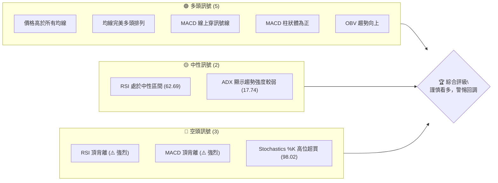

### 📊 核心指標速覽表

當前 TSM 的價格行為表現強勁，但動能指標的背離現象值得高度關注，這可能預示著短期內存在修正的風險。

| 指標類別 | 指標名稱 | 當前數值 | 訊號 | 解讀 |
|----------|----------|----------|------|------|
| **價格** | 當前價格 | $477.57 | 🟢 | 處於52週高點附近，強勢上漲趨勢 |
| **均線** | MA20 | $437.57 | 🟢 | 價格遠高於短期均線，多頭強勢 |
| **均線** | MA50 | $415.91 | 🟢 | 價格遠高於中期均線，趨勢穩固 |
| **均線** | MA200 | $340.70 | 🟢 | 價格遠高於長期均線，長期上漲趨勢確立 |
| **動能** | RSI(14) | 62.69 | 🟡 | 處於中性偏強區間，但存在頂背離風險 |
| **動能** | MACD | 1.652 (Hist) | 🟢 | MACD線位於訊號線上，柱狀體為正，看多，但存在頂背離風險 |
| **波動** | ATR(14) | $19.76 | 🟡 | 每日波動約4.14%，屬於中高波動，需注意風險 |
| **趨勢** | ADX(14) | 17.74 | 🟡 | 趨勢強度較弱，可能處於盤整或趨勢轉換初期 |
| **超買/賣** | Stoch %K | 98.02 | 🔴 | 嚴重超買，短期回調風險高 |
| **布林通道** | %B | 1.07 | 🔴 | 價格突破布林上軌，短期可能過度擴張 |
| **成交量** | 量比(20日) | 0.91x | 🟡 | 成交量略低於平均，上漲動能缺乏量能確認 |

### 🏆 技術評分卡

綜合來看，TSM 在趨勢和均線排列上表現出色，但動能指標的警示和超買狀態降低了整體評分。

```
╔══════════════════════════════════════════════════════════════╗
║             技術評分卡 — TSM (2026-06-30)                     ║
╠══════════════════════════════════════════════════════════════╣
║ 趨勢強度      ██████░░░░░░░░░░░░░░  60/100  🟡 (ADX弱，但價格趨勢強) ║
║ 動能指標      ████░░░░░░░░░░░░░░░░  40/100  🔴 (RSI/MACD背離，Stoch超買) ║
║ 支撐穩定度    ██████████████░░░░░░  75/100  🟢 (多重均線支撐強勁)    ║
║ 成交量配合    ██████░░░░░░░░░░░░░░  60/100  🟡 (OBV看多，但近期量能不足) ║
║ 形態完整度    ████████░░░░░░░░░░░░  70/100  🟢 (上升通道，但潛在頂部形態) ║
║ 均線排列      ██████████████████░░  90/100  🟢 (完美多頭排列)      ║
╠══════════════════════════════════════════════════════════════╣
║ 綜合評分      ████████░░░░░░░░░░░░  66/100  🟡 謹慎看多              ║
╚══════════════════════════════════════════════════════════════╝
```

---

## 2. 趨勢分析

### 🌐 多時框趨勢分析

TSM 在長期和中期展現了強勁的上升趨勢，但在短期內，雖然價格持續創新高，但多項動能指標的背離現象暗示了趨勢可能面臨調整。

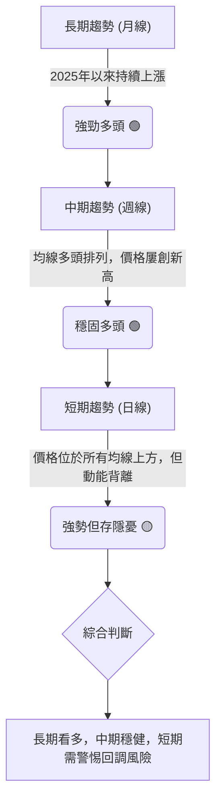

### 📈 長期趨勢 — 12個月走勢圖（Unicode）

過去12個月，TSM 展現了顯著的上升趨勢，從2025年8月的低點$228.34一路攀升至2026年6月的$477.57，漲幅高達109.9%。期間雖有短期回調，但均線系統提供了堅實的支撐，多頭格局明確。

```
TSM 月線走勢圖（過去12個月）
價格軸 ($)
$480 ┤                                  ● $477.57 (2026-06)
$460 ┤
$440 ┤
$420 ┤                        ● $417.47 (2026-05)
$400 ┤                    ● $395.13 (2026-04)
$380 ┤                ● $372.65 (2026-02)
$360 ┤
$340 ┤        ● $337.16 (2026-03)
$320 ┤      ● $328.86 (2026-01)
$300 ┤    ● $302.33 (2025-12)
$280 ┤  ● $298.08 (2025-10)
$260 ┤● $277.11 (2025-09)
$240 ┤● $238.98 (2025-07)
$220 ┤● $228.34 (2025-08)
     └────────────────────────────────────────────────────────
      2025-07 08 09 10 11 12 2026-01 02 03 04 05 06
```

**走勢特徵分析表格**

| 期間 | 起始價 | 結束價 | 漲跌幅 | 走勢特徵 | 評估 |
|------|--------|--------|--------|----------|------|
| 2025-07 ~ 2025-08 | $238.98 | $228.34 | -4.45% | 短期回調，築底 | 🟡 |
| 2025-08 ~ 2026-02 | $228.34 | $372.65 | +63.29% | 強勁主升浪，突破多重阻力 | 🟢 |
| 2026-02 ~ 2026-03 | $372.65 | $337.16 | -9.52% | 獲利回吐，但守住關鍵支撐 | 🟡 |
| 2026-03 ~ 2026-06 | $337.16 | $477.57 | +41.67% | 第二波上漲，創歷史新高 | 🟢 |

### 📊 中期趨勢（週線分析）

從近20週的週線走勢來看，TSM 在2026年3月初經歷了一波較深的回調，從$372.65跌至$325.98，隨後在$325-$330區間獲得強勁支撐，並迅速反彈，再次開啟上升通道。目前價格已突破前期高點，並創下52週新高。中期均線MA50和MA120持續向上，為價格提供堅實的動態支撐。

```
TSM 近期壓力與支撐示意圖 (週線)

價格 ($)
$480 ┤                                        R ($479.00 - 52W High)
     │                                        ● 現價 $477.57
$460 ┤                                        │
     │                                        │
$440 ┤                                        │
     │                                        │
$420 ┤────────────────────────────────────────S ($417.47 - 前期高點支撐)
     │                                        │
$400 ┤                                        │
     │                                        │
$380 ┤                                        │
     │                                        │
$360 ┤                                        │
     │                                        │
$340 ┤───────────────S ($337.16 - 回調支撐)
     │               │
$320 ┤───────────────S ($325.98 - 關鍵支撐)
     └──────────────────────────────────────────────────────────
      2026-02   2026-03   2026-04   2026-05   2026-06   2026-07
```
**關鍵觀察點**：
- **近期阻力**：52週高點 $479.00 構成直接阻力，若能有效突破並站穩，將打開新的上漲空間。
- **中期支撐**：MA20 ($437.57) 及前期高點 $417.47 (2026-05) 形成第一道支撐區。MA50 ($415.91) 和布林通道中軌 ($437.57) 亦提供動態支撐。
- **重要支撐**：2026年3月低點 $325.98 構成中期強勁支撐，是趨勢反轉的關鍵防線。

### ⚡ 趨勢強度評估（ADX 解讀）

ADX 指標用於衡量趨勢的強度，而非方向。當前 ADX(14) 數值為 17.74，遠低於25的閾值，這表明 TSM 目前處於一個**弱趨勢或盤整行情**。儘管價格持續上漲，但 ADX 的低值暗示這一上漲缺乏強勁的趨勢動力，市場可能處於震盪上行或盤整待變的狀態。

然而，我們需要結合 +DI 和 -DI 進行判斷：
- **+DI (35.52)** 顯著高於 **-DI (20.37)**，這表明儘管趨勢強度不高，但多頭力量仍然佔據主導地位。
- **綜合解讀**：目前市場可能處於一個「多頭主導下的弱趨勢或震盪上行」階段。價格雖然在漲，但缺乏爆發力，容易出現回調或橫盤整理。這與RSI/MACD的背離訊號形成呼應，提示當前上漲的持續性可能存疑。

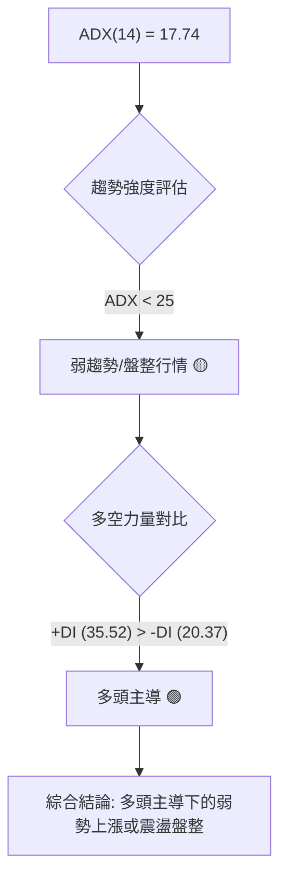

**ADX 強度對照表**

| ADX 數值範圍 | 趨勢強度 | 市場狀態 | 建議 |
|--------------|----------|----------|------|
| 0-25         | 弱趨勢   | 盤整/震盪 | 觀望，或區間操作 |
| 25-50        | 中等趨勢 | 有趨勢   | 順勢交易 |
| 50-75        | 強趨勢   | 趨勢明確 | 順勢交易，持倉 |
| 75-100       | 極強趨勢 | 趨勢加速 | 順勢交易，警惕反轉 |

---

## 3. 圖表形態分析

### 🔍 形態識別系統

從提供的月線和週線數據來看，TSM 在過去一年中主要呈現出一個清晰的**上升通道**形態。儘管沒有典型的頭肩頂/底或雙頂/底等反轉形態，但近期價格在通道上軌附近，且動能指標出現背離，暗示上升動能減弱，可能形成潛在的**楔形或旗形頂部**，預示著短期內存在回調風險。

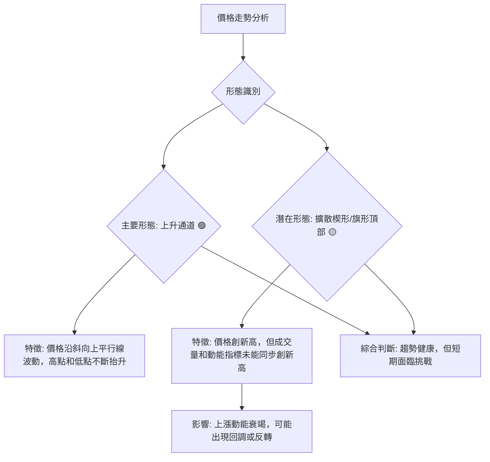

### 🕯️ 重要K線形態分析

根據近20週的收盤價和成交量數據，我們觀察到以下幾個重要的K線形態和量價配合情況：

| 月份 | 收盤價 | K線形態 (週) | 解讀 | 訊號 |
|------|--------|---------------|------|------|
| 2026-03-08 | $337.15 | 大陰線 | 趨勢急劇逆轉，短期空頭強勢 | 🔴 |
| 2026-03-15 | $336.57 | 小陰線/十字星 | 跌勢放緩，多空僵持，可能築底 | 🟡 |
| 2026-04-05 | $338.25 | 陽線 | 止跌企穩，多頭開始反攻 | 🟢 |
| 2026-04-12 | $369.73 | 大陽線 | 強勢突破，確立反彈趨勢 | 🟢 |
| 2026-04-26 | $401.52 | 大陽線 | 強勁上漲，但RSI超買且有背離 | 🟡 |
| 2026-05-17 | $403.41 | 陰線 | 短期回調，獲利了結 | 🟡 |
| 2026-06-21 | $462.12 | 大陽線 | 強勢上漲，突破前期高點 | 🟢 |
| 2026-07-05 | $477.57 | 大陽線 | 繼續強勁上漲，創52週新高，但量能不足且動能背離 | 🟡 |

**分析**：
- 2026年3月初的急跌後，隨即在3月底4月初形成底部反轉形態，多頭重新掌握主動。
- 4月至6月的上漲過程中，雖然出現多根大陽線，顯示買盤強勁，但結合RSI和MACD的頂背離，這些陽線可能預示著「竭盡缺口」或「高位放量滯漲」的風險，特別是2026-07-05的最新收盤價，是在相對較低的成交量下創出的新高（量比0.91x），這是一個潛在的風險訊號。

### 📉 ASCII 走勢形態示意圖

以下示意圖展示了 TSM 近期價格在一個上升通道中運行，並標示了潛在的頂部形態區域。

```
TSM 近期上升通道與潛在頂部形態示意圖

價格 ($)
$480 ┤                                      ▲ (新高 $477.57)
     │                                     / \
$460 ┤                                    /   \   (潛在頂部形態)
     │                                   /     \
$440 ┤───────────────────────────────────/───────\─── (通道上軌)
     │                                 /         \
$420 ┤                                /           \
     │                              /             \
$400 ┤                            /               \
     │                          /                   \
$380 ┤                        /                       \
     │                      /                           \
$360 ┤                    /                               \
     │                  /                                   \
$340 ┤───────S ($325.98) /                                     \
     │               /                                       \
$320 ┤             /                                           \
     │           /                                             \
$300 ┤          /                                                \
     └───────────────────────────────────────────────────────────────
      時間軸 (簡化)
      <────────────── 上升通道 ──────────────>
```
**形態解讀**：
- **上升通道**：價格自2026年3月低點以來，在兩條平行上升趨勢線之間波動，顯示出穩定的多頭趨勢。
- **潛在頂部形態**：近期價格雖創新高，但RSI和MACD指標未能同步創新高，形成明顯的頂背離，且成交量未見顯著放大。這種情況下，價格可能在通道上軌附近形成擴散楔形或旗形，暗示上漲動能正在衰竭，隨時可能面臨回調。

### 🎯 形態目標價計算

由於目前形態偏向於上升通道內的潛在頂部形態，直接計算上漲目標價存在較大不確定性。我們將基於通道理論進行目標價推算，並考慮分析師的平均目標價。

1.  **上升通道測量目標**：
    - 假設通道底部為 $325.98 (2026-03-29)，通道頂部為 $477.57 (2026-07-05)。
    - 若價格能有效突破通道上軌 $479.00 (52W 高點)，則下一目標可能根據通道寬度進行推算。
    - 但鑑於背離訊號，我們更傾向於認為通道上軌 $479.00 是一個強阻力位。

2.  **分析師平均目標價**：
    - 分析師平均目標價為 **$487.56**。這可以視為一個短期內價格可能達到的心理目標位，也與通道上軌突破後的潛在目標接近。
    - 若價格能有效突破 $479.00，則 $487.56 是短期內的第一個重要參考目標。

**結論**：
- **短期上漲目標**：若能有效突破並站穩 $479.00 (52週高點)，則有望挑戰 **$487.56** (分析師均值目標)。
- **回調目標**：若頂部形態確立並向下突破，則可能回調至通道中軸或MA20 ($437.57)、MA50 ($415.91) 甚至更低的斐波那契回調位。

---

## 4. 支撐與阻力

### 🗺️ 關鍵價位分布圖（Unicode）

TSM 的價位結構顯示，上方阻力集中在52週高點及分析師目標價附近，下方則有多重均線和前期高點構成的堅實支撐。

```
TSM 價位結構分布圖 (2026-06-30)
═══════════════════════════════════════════════════
$487.56 ║████████████████████████║ 強阻力 R3 (分析師均值目標)
$479.00 ║████████████████████████║ 關鍵阻力 R2 (52週高點)
$477.57 ╠════════════════════════╣ ◄ 現價
$472.80 ║████████████████████    ║ 阻力 R1 (布林上軌)
$437.57 ║▓▓▓▓▓▓▓▓▓▓▓▓▓▓▓▓▓▓▓▓    ║ 近期支撐 S1 (MA20 / 布林中軌)
$417.84 ║▓▓▓▓▓▓▓▓▓▓▓▓▓▓▓▓        ║ 近期支撐 S2 (斐波那契23.6%)
$415.91 ║████████████████████████║ 強支撐 S3 (MA50)
$402.34 ║████████████████████    ║ 支撐 S4 (布林下軌)
$379.28 ║████████████████████████║ 關鍵支撐 S5 (斐波那契38.2%)
$348.88 ║████████████████████    ║ 強支撐 S6 (斐波那契50% / MA200)
$325.98 ║████████████████████████║ 極強支撐 S7 (2026-03低點)
═══════════════════════════════════════════════════
```

### 🚧 阻力位分析表

當前 TSM 價格正處於歷史高位，上方阻力主要來自於心理關口、前高以及分析師的目標價。

| 阻力級別 | 價位 | 形成原因 | 突破難度 | 重要性 |
|----------|------|----------|----------|--------|
| **R1**   | $472.80 | 布林通道上軌 | 中等 | 價格短期過度擴張，回歸中軌壓力 |
| **R2**   | $479.00 | 52週高點 | 高 | 歷史壓力位，突破則打開新空間 |
| **R3**   | $487.56 | 分析師平均目標價 | 高 | 心理阻力，代表市場普遍預期上限 |
| **R4**   | $500.00 | 心理關口 | 極高 | 整數關口，通常伴隨獲利了結壓力 |

### 🛡️ 支撐位分析表

下方支撐位由多條移動平均線、布林通道中下軌以及斐波那契回調位構成，顯示出較為堅實的支撐結構。

| 支撐級別 | 價位 | 形成原因 | 守住機率 | 重要性 |
|----------|------|----------|----------|--------|
| **S1**   | $437.57 | MA20 / 布林中軌 | 中高 | 短期趨勢線，若跌破可能加速回調 |
| **S2**   | $417.84 | 斐波那契23.6%回調位 | 中高 | 短期回調的重要參考點 |
| **S3**   | $415.91 | MA50 | 高 | 中期趨勢線，強力動態支撐 |
| **S4**   | $402.34 | 布林通道下軌 | 中高 | 價格波動極限，跌破可能進入弱勢 |
| **S5**   | $379.28 | 斐波那契38.2%回調位 | 高 | 較強的回調支撐，通常是健康回調的終點 |
| **S6**   | $348.88 | 斐波那契50%回調位 / MA200 | 極高 | 關鍵長期支撐，跌破則長期趨勢可能轉弱 |
| **S7**   | $325.98 | 2026年3月低點 | 極高 | 前期強勁築底區，趨勢反轉的關鍵防線 |

### 📐 斐波那契回調位分析

我們採用 TSM 過去52週的最低點 ($218.76) 至最高點 ($479.00) 作為斐波那契回調的參考區間，以評估潛在的回調支撐。

- **52週低點 (0%)**: $218.76
- **52週高點 (100%)**: $479.00
- **總漲幅**: $479.00 - $218.76 = $260.24

| 回調比例 | 價位 | 解讀 | 重要性 |
|----------|------|------|--------|
| **23.6%** | $417.84 | 輕微回調支撐位，通常出現在強勢市場中。與MA50 ($415.91) 接近，形成疊加支撐。 | 高 |
| **38.2%** | $379.28 | 較為重要的回調支撐位，若價格回調至此並企穩，仍屬健康回調。 | 高 |
| **50.0%** | $348.88 | 關鍵心理及技術支撐位，通常與MA200或重要形態頸線重合。 | 極高 |
| **61.8%** | $318.48 | 深度回調支撐位，若跌破此位，長期趨勢可能面臨挑戰。 | 中高 |

**視覺化**：
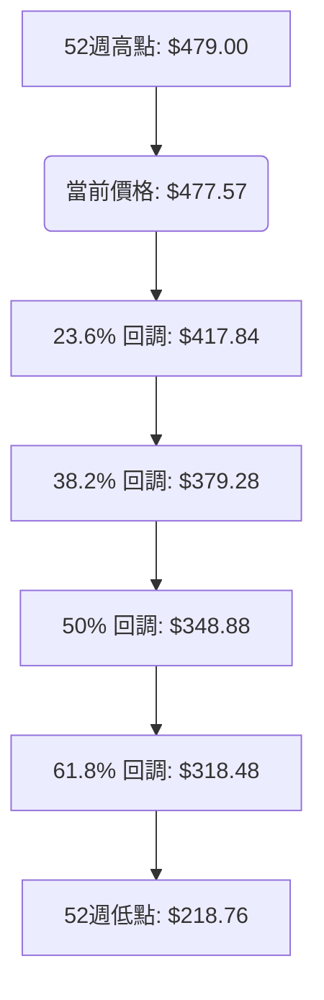
**分析**：
目前價格位於52週高點附近，若出現回調，首先應關注 $417.84 (23.6%) 和 $415.91 (MA50) 附近的疊加支撐。若此處無法守住，則 $379.28 (38.2%) 將是下一個重要的觀察點。而 $348.88 (50%) 則代表著長期趨勢的關鍵分水嶺，一旦跌破，多頭格局將受到嚴重考驗。

---

## 5. 技術指標深度解讀

### 🎛️ 指標訊號總覽

TSM 的技術指標呈現出一個矛盾的局面：傳統趨勢指標如均線系統顯示強勁多頭，但動能指標如 RSI 和 MACD 卻發出明顯的頂背離警示，暗示市場存在潛在的修正風險。

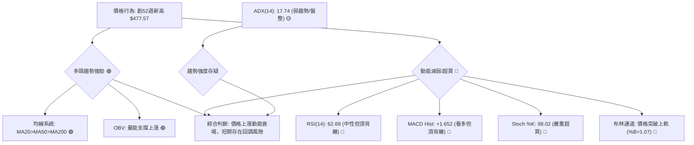

### 📈 移動平均線排列分析

TSM 的移動平均線系統呈現出典型的**完美多頭排列**，這是強勢上漲趨勢的經典標誌。

- **MA20 ($437.57)**：短期趨勢線，目前價格 ($477.57) 遠高於MA20，顯示短期買盤強勁。
- **MA50 ($415.91)**：中期趨勢線，MA20位於MA50上方，且價格高於MA50，表明中期趨勢健康。
- **MA200 ($340.70)**：長期趨勢線，所有短期和中期均線均位於MA200上方，價格也遠高於MA200，確立了長期上漲趨勢。

這種排列顯示了市場強烈的看漲情緒，且多頭趨勢具有良好的持續性。均線作為動態支撐，將在價格回調時提供買盤支撐。

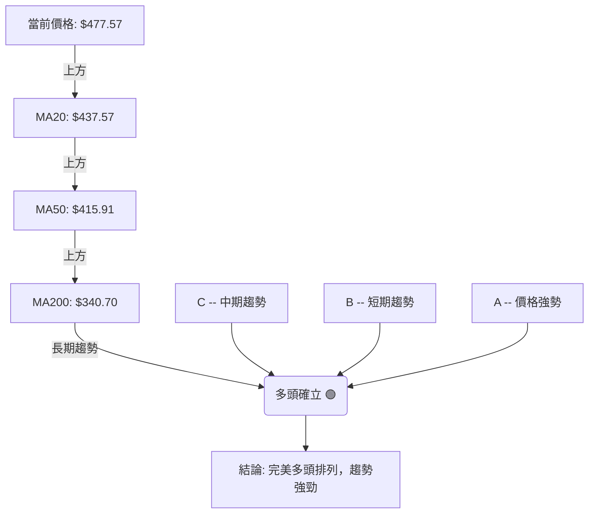

### 📉 RSI(14) 分析

- **RSI 數值**: 當前 RSI(14) 為 **62.69**。這表示 TSM 既未進入傳統意義上的超買區 (>70)，也未進入超賣區 (<30)，處於中性偏強的範圍。然而，這並不意味著沒有風險。
- **超買超賣區間分析**: 雖然未達70，但距離超買區僅一步之遙。結合 Stochastics %K 達到98.02的嚴重超買狀態，暗示市場短期內累積了大量獲利盤，隨時可能出現回吐壓力。
- **背離判斷 (頂背離)**: **⚠️ 強烈頂背離確認**。
    - **2026-04-26**：價格 $401.52，RSI 76.5 (高點)
    - **2026-05-10**：價格 $410.72 (更高)，RSI 70.6 (更低)
    - **2026-06-21**：價格 $462.12 (更高)，RSI 61.5 (更低)
    - **2026-07-05**：價格 $477.57 (更高)，RSI 62.7 (更低)
    圖表顯示，TSM 的價格在過去幾個月持續創出新高，但RSI指標卻未能同步創出新高，反而呈現出一連串的下降高點。這是一個非常明確且強烈的**看跌頂背離訊號**，表明儘管價格仍在上漲，但內在的買盤動能正在顯著衰竭，多頭力量已是強弩之末。

**RSI 強度進度條**：
RSI(14) 62.69: ████████████░░░░░░░░░░░░░░░░ 62.69% 🟡 (中性偏強，但存在背離)

### 📊 MACD(12/26/9) 訊號解讀

- **MACD 線 (11.910) 與訊號線 (10.258)**：MACD 線位於訊號線上方，且柱狀體為正值 (+1.652)。這是一個傳統的**看多訊號**，表明短期動能強於長期動能，趨勢向上。
- **MACD 柱狀圖 (+1.652)**：柱狀圖為正且有擴大跡象，顯示多頭動能正在增強。
- **背離判斷 (頂背離)**: **⚠️ 強烈頂背離確認**。
    - **2026-04-12**：價格 $369.73，MACD Hist +4.412 (高點)
    - **2026-04-26**：價格 $401.52 (更高)，MACD Hist +3.566 (更低)
    - **2026-05-10**：價格 $410.72 (更高)，MACD Hist +1.534 (更低)
    - **2026-05-31**：價格 $417.47 (更高)，MACD Hist +0.302 (更低)
    - **2026-07-05**：價格 $477.57 (更高)，MACD Hist +1.652 (較低於4月/5月高點)
    與RSI相似，MACD柱狀圖在價格屢創新高時，其柱狀體的高度未能同步創出新高，反而呈現出下降的趨勢，這也是一個明確的**看跌頂背離訊號**。這意味著雖然MACD線本身仍然是多頭排列，但其背後的動能強度正在減弱，與價格走勢產生矛盾。

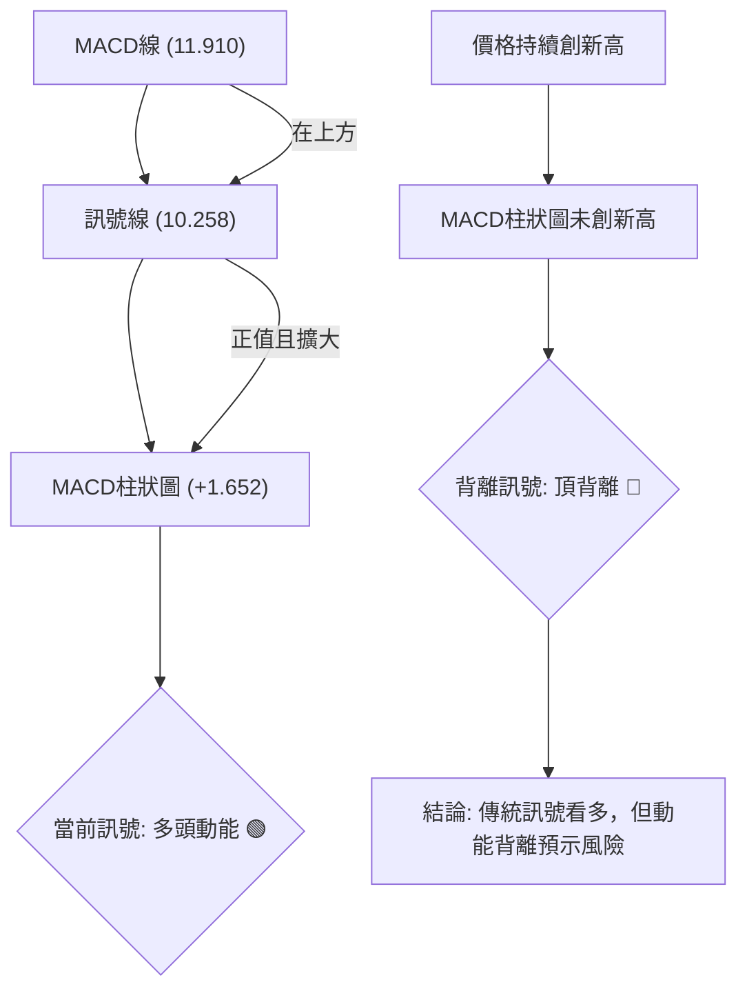

### 📦 布林通道分析

- **布林通道數值**:
    - BB上軌: $472.80
    - BB中軌(MA20): $437.57
    - BB下軌: $402.34
    - 當前收盤價: $477.57
    - BB %B: 1.07 (價格位於上軌之上)
- **分析**: 當前價格 ($477.57) 已經突破布林通道上軌 ($472.80)，且 %B 值達到 1.07。這通常表示市場處於極強勢的狀態，短期內可能存在**過度擴張**的風險。價格在布林帶外運行，預示著強勁的上漲動能，但同時也暗示著隨時可能回歸通道內部的需求，即短期回調的概率增加。
- **通道寬度**: 從數據中無法直接判斷布林通道的寬度變化，但價格突破上軌，通常發生在通道擴張的過程中，顯示波動性增加。

**ASCII 布林通道示意圖**：
```
TSM 布林通道示意圖

價格 ($)
$480 ┤                            ● 現價 $477.57
     │                         ▓
$470 ┤───────────────────────────R ($472.80) - BB上軌
     │                         ▓
$460 ┤                         ▓
     │                         ▓
$450 ┤                         ▓
     │                         ▓
$440 ┤───────────────────────────S ($437.57) - BB中軌 (MA20)
     │                         ▓
$430 ┤                         ▓
     │                         ▓
$420 ┤                         ▓
     │                         ▓
$410 ┤                         ▓
     │                         ▓
$400 ┤───────────────────────────S ($402.34) - BB下軌
     │
     └──────────────────────────────────────────────────────────
      時間軸
```
**解讀**：價格在布林通道上軌外運行，表明短期買盤力量極為強勁，但這種情況往往不可持續。市場傾向於回歸均值，因此價格可能在短期內向布林中軌 ($437.57) 靠攏。

### 💹 成交量分析（量價配合度）

- **最新成交量**: 12,884,755
- **20日均量**: 14,210,813
- **50日均量**: 13,724,539
- **量比 (20日)**: 0.91x (最新成交量低於20日均量)
- **OBV 趨勢**: OBV > MA → 量能支撐上漲 🟢

**分析**：
- **OBV (On Balance Volume) 趨勢向上**，這是一個積極訊號，表明累積買盤壓力大於賣盤壓力，量能趨勢與價格上漲趨勢一致，從長期來看支撐了當前的上漲。
- 然而，**最新成交量 (12,884,755) 卻低於20日均量 (14,210,813) 和50日均量 (13,724,539)**，量比僅為0.91x。這是一個值得警惕的訊號。在價格創出52週新高之際，成交量卻未能同步放大，反而有所萎縮，這被稱為「價漲量縮」或「量價背離」。
- **量價背離**：當價格持續上漲而成交量卻沒有跟上時，這可能表明市場對當前高價的認可度不高，或是在高位缺乏新的買盤推動，上漲動能可能正在減弱。這與RSI和MACD的頂背離訊號相互印證，增加了潛在回調的風險。

**結論**：儘管 OBV 趨勢長期看好，但短期內的量價背離，尤其是價格創新高而量能萎縮，是一個潛在的看跌訊號，需要警惕。

---

## 6. 動能與波動率

### ⚡ 動能評估四象限

TSM 目前的動能評估呈現出較為複雜的局面。價格在創出新高，顯示表面動能強勁，但多個指標（RSI、MACD）的頂背離明確指出內在動能衰竭。ATR 則顯示中高波動性。

| 象限 | 動能 (RSI/MACD) | 波動 (ATR) | 當前狀態 | 評估 |
|------|-------------------|------------|----------|------|
| Q1   | 強                | 低         | -        | 最佳機會 (穩定上漲) |
| Q2   | 弱 (背離)         | 低         | -        | 謹慎觀望 (趨勢不明或反轉初期) |
| Q3   | 強 (表面價格)     | 高 (ATR 4.14%) | ✓        | 高風險高收益 (價格波動大，可能快速上漲或下跌) |
| Q4   | 弱 (背離)         | 高         | -        | 避免進場 (不確定性高，風險大) |

**TSM 當前評估**：
- **動能**：從價格行為看，是強動能（創新高）。但從RSI和MACD的背離看，實際內在動能是減弱的。這種矛盾的狀況使得「強動能」的判斷非常脆弱。
- **波動率**：ATR 為 $19.76，佔股價的 4.14%，對於市值龐大的 TSM 而言，這屬於中高波動水平。
- **綜合判斷**：TSM 表面上處於 Q3 (強動能/高波動)，但由於嚴重的動能背離，其「強動能」的基礎並不穩固。因此，更精確的說法是：**具有高波動性，但內在動能正在減弱的市場**。這使得當前投資 TSM 處於一個**高風險、高不確定性**的區間。建議投資者應保持高度警惕，將其視為**謹慎觀望**。

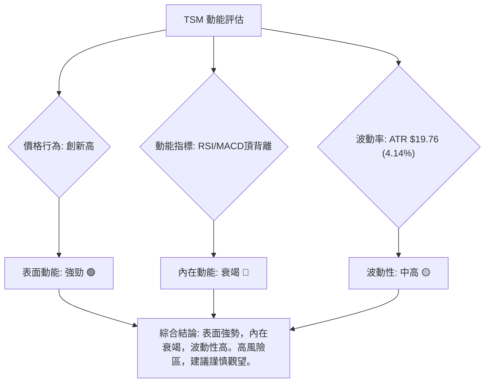

### 📊 ATR 波動率分析

- **ATR(14) 數值**: $19.76
- **相對價格波動**: $19.76 / $477.57 = 4.14%

**分析**：
ATR 衡量的是資產在特定時間段內的平均真實波動範圍。TSM 的 ATR 為 $19.76，約佔其當前股價的 4.14%。這表示 TSM 在過去14個交易日中，每日平均波動範圍約為 $19.76。

- **意義**：4.14% 的日波動率對於一個大型藍籌股而言，屬於**中等偏高**的水平。這意味著 TSM 的股價在短期內具有較大的變動性，既可能帶來快速的潛在收益，也可能導致快速的潛在虧損。
- **止損距離建議**：ATR 是設定止損點的有效工具。一般建議將止損點設置在入場價下方 1-2 倍 ATR 的距離。
    - **保守止損** (1x ATR): 當前價 $477.57 - $19.76 = **$457.81**
    - **激進止損** (0.5x ATR): 當前價 $477.57 - ($19.76 * 0.5) = **$467.70**
    - 考慮到 MA20 ($437.57) 和 MA50 ($415.91) 的支撐，止損點也可以結合這些關鍵價位。例如，若進場點在現價附近，止損可以設置在 $437.57 (MA20) 附近，這約為 2 倍 ATR 的距離。
- **風險管理**：高 ATR 提示投資者在交易時需謹慎控制倉位，避免過度暴露於波動風險。

### 📐 Beta 與市場相關性

提供的數據中未直接包含 TSM 的 Beta 值。然而，作為全球領先的半導體製造商，TSM 通常被認為具有**較高的 Beta 值**。

- **行業特性**：半導體行業是典型的週期性行業，其表現與全球經濟景氣度、科技創新週期高度相關。這使得半導體公司的股價波動往往大於整體市場。
- **對市場的敏感性**：高 Beta 值意味著 TSM 的股價波動幅度可能大於整體市場（如標普500指數）。當市場上漲時，TSM 可能上漲更多；當市場下跌時，TSM 也可能下跌更多。
- **投資影響**：對於投資者而言，較高的 Beta 值意味著 TSM 在牛市中潛力巨大，但在熊市中也面臨較高的系統性風險。在當前市場情緒偏樂觀但存在不確定性的背景下，高 Beta 的特性需要特別留意，以避免在市場情緒轉變時遭受較大衝擊。

---

## 7. 多時框架總結

### 📋 時框架評分表

本表綜合評估 TSM 在不同時間框架下的技術訊號，以提供全面的視角。

| 時框架 | 趨勢方向 | 動能 | 均線排列 | 形態 | 綜合評分 (1-10) | 建議 |
|--------|----------|------|----------|------|-----------------|------|
| **長期** | 上漲 🟢 | 強 🟢 | 多頭排列 🟢 | 上升通道 🟢 | 8               | 穩健持有 |
| **中期** | 上漲 🟢 | 中 🟡 | 多頭排列 🟢 | 上升通道 🟢 | 7               | 繼續持有，監控動能 |
| **短期** | 上漲 🟢 | 弱 🔴 | 多頭排列 🟢 | 潛在頂部 🔴 | 5               | 謹慎觀望，警惕回調 |

**總結**：TSM 的長期和中期趨勢非常健康，均線系統呈現完美的看漲排列，顯示出強勁的基本面支撐。然而，短期內動能指標的嚴重頂背離，以及價格突破布林上軌的過度擴張，都發出了強烈的警示訊號。這表明短期內市場可能面臨獲利了結或調整的需求。

### 🔲 綜合訊號矩陣

此矩陣分析了不同時間框架下各類技術訊號的一致性，以判斷整體市場偏向。

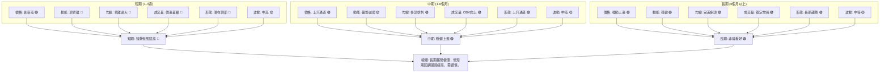
**分析**：
- **一致性**：長期和中期訊號高度一致地指向多頭趨勢。均線系統完美排列，OBV 趨勢向上，價格在上升通道中運行。
- **矛盾點**：短期訊號與長中期訊號存在顯著矛盾。價格雖然創新高，但RSI和MACD的頂背離、Stochastics嚴重超買、價格突破布林上軌以及量價背離等因素，都強烈暗示短期上漲動能已竭，回調迫在眉睫。
- **結論**：這種多時框架的矛盾性要求投資者採取**高度謹慎**的策略。對於長期投資者，目前的上漲可能是一個獲利了結或減倉的機會；對於短期交易者，則應警惕做多風險，並可考慮潛在的做空機會或等待回調後的低吸機會。

---

## 8. 交易策略建議

基於 TSM 當前多空交織的技術訊號，我們建議採取謹慎的交易策略。儘管長期趨勢強勁，但短期內動能衰竭和頂背離訊號預示著回調風險。

### 🗺️ 策略決策流程圖

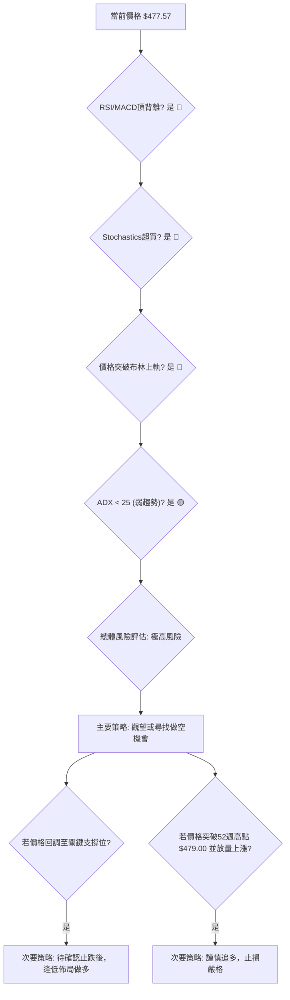

### 🟢 多頭策略詳情 (謹慎追多 / 回調低吸)

鑑於短期內存在較高的回調風險，目前不建議盲目追高。若要佈局多頭，應等待明確的回調止跌訊號或強勢突破的確認。

| 策略要素 | 策略 A: 回調低吸 (保守) | 策略 B: 突破追多 (激進) |
|----------|-------------------------|-------------------------|
| **進場條件** | 價格回調至MA20或MA50附近，並出現止跌K線形態 (如錘子線、啟明星) | 價格有效突破 $479.00 (52週高點) 並伴隨放量 |
| **進場價格** | $437.57 (MA20) 至 $415.91 (MA50) 區間 | $480.00 - $482.00 區間 |
| **目標價 T1** | $479.00 (52週高點) | $487.56 (分析師均值目標) |
| **目標價 T2** | $487.56 (分析師均值目標) | $500.00 (心理關口) |
| **止損價格** | $400.00 (布林下軌 / 斐波那契23.6%下方) | $470.00 (MA20上方，1倍ATR距離) |
| **風險報酬比** | 約 1:2.5 (以 $420 進場為例) | 約 1:1.5 (以 $481 進場為例) |
| **成功機率** | 60% (需等待止跌確認) | 40% (突破後可能假突破或快速回落) |
| **建議倉位** | 輕倉 (不超過總資金 5%) | 極輕倉 (不超過總資金 2%) |

### 🔴 空頭策略詳情 (潛在做空機會)

鑑於RSI和MACD的強烈頂背離，短期內做空機會值得關注。

| 策略要素 | 策略 A: 頂背離確認做空 (激進) | 策略 B: 跌破關鍵支撐做空 (保守) |
|----------|-------------------------------|-------------------------------|
| **進場條件** | 價格在 $479.00 附近受阻回落，或跌破短期趨勢線，且動能指標持續惡化 | 價格跌破MA20 ($437.57) 並未能迅速收復 |
| **進場價格** | $475.00 - $478.00 區間 | $435.00 - $437.00 區間 |
| **目標價 T1** | $437.57 (MA20) | $415.91 (MA50) |
| **目標價 T2** | $415.91 (MA50) | $402.34 (布林下軌) / $379.28 (斐波那契38.2%) |
| **止損價格** | $482.00 (52週高點上方 1倍ATR) | $445.00 (MA20上方) |
| **風險報酬比** | 約 1:2 (以 $476 進場，目標 $437 為例) | 約 1:1.8 (以 $436 進場，目標 $402 為例) |
| **成功機率** | 55% (背離訊號強烈) | 65% (趨勢確認後勝率更高) |
| **建議倉位** | 輕倉 (不超過總資金 3%) | 輕倉 (不超過總資金 5%) |

### ⭐ 整體訊號強度評星

做多訊號強度：★★☆☆☆ (2/5星) (長期看好，但短期風險高，不宜追高)
做空訊號強度：★★★☆☆ (3/5星) (動能背離提供潛在做空機會，但逆勢風險較大)
整體可信度：  ★★★☆☆ (3/5星) (市場處於關鍵轉折點，訊號複雜，需仔細判斷)

---

## 9. 風險提示與監控

### ✅ 關鍵監控指標 Checklist

在當前 TSM 複雜的技術背景下，密切監控以下指標至關重要。

```
╔══════════════════════════════════════════════════════════════╗
║              TSM 關鍵監控指標 Checklist                        ║
╠══════════════════════════════════════════════════════════════╣
║ ├─ 價格行為：     持續觀察是否能突破並站穩 $479.00。           ║
║ ├─ RSI(14)：      監控RSI是否跌破50，或其下降高點趨勢是否持續。 ║
║ ├─ MACD：         關注MACD線是否下穿訊號線，以及柱狀體是否轉負。║
║ ├─ 成交量：       價格再次上漲時，是否伴隨有效放量？下跌時是否放量？║
║ ├─ 均線系統：     價格是否跌破MA20 ($437.57) 或MA50 ($415.91)。║
║ ├─ 布林通道：     價格是否回歸布林通道內部，並向中軌靠攏。     ║
║ ├─ ADX：          ADX能否突破25，確立新的趨勢方向。             ║
║ ├─ 斐波那契回調： 關注關鍵回調支撐位 ($417.84, $379.28) 的表現。 ║
║ └─ 產業消息：     半導體產業新聞、競爭格局、宏觀經濟數據。     ║
╚══════════════════════════════════════════════════════════════╝
```

### ⚠️ 風險場景分析

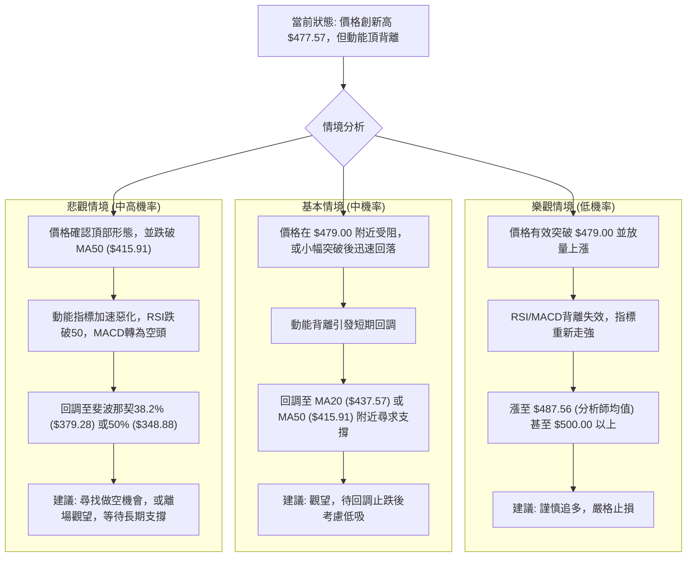

### 🛡️ 風險管理重要提醒

1.  **倉位管理**：鑑於當前的複雜訊號和高波動性，嚴格控制倉位至關重要。建議採用較輕的倉位進行試探性交易，避免孤注一擲。
2.  **止損設置**：無論採取何種策略，務必預設明確的止損點。一旦價格觸及止損位，應果斷出場，避免損失擴大。止損點可參考 ATR 或關鍵支撐位。
3.  **分批操作**：不建議一次性建倉。可考慮分批進場，在趨勢確認或回調止跌後逐步加倉，以降低平均成本和風險。
4.  **動態監控**：市場情況瞬息萬變，需持續監控上述關鍵指標，並根據最新的價格行為和指標變化，靈活調整交易策略。
5.  **心理準備**：高波動性市場容易引發情緒波動，保持冷靜客觀的投資心態至關重要。避免追漲殺跌，嚴格執行交易紀律。
6.  **基本面結合**：雖然本報告為技術分析，但仍建議投資者結合 TSM 的基本面（如財報、產業前景、競爭優勢）進行綜合判斷，形成更全面的投資決策。

---

## 📋 報告總結

```
╔════════════════════════════════════════════════════════════════╗
║                   TSM 技術分析報告總結                           ║
╠════════════════════════════════════════════════════════════════╣
║ 報告日期：2026-06-30                                             ║
║ 當前價格：$477.57 (數據截至2026-07-05)                           ║
║ 分析評級：⚖️ 謹慎觀望 (長期趨勢健康，短期回調風險極高)            ║
║                                                                  ║
║ 關鍵結論：                                                       ║
║ ├─ 長期趨勢：🟢 強勁上漲，均線完美多頭排列，基本面支撐穩固。     ║
║ ├─ 中期趨勢：🟢 穩健上漲，價格運行於上升通道中，MA50提供堅實支撐。║
║ ├─ 短期趨勢：🔴 強勢上漲但動能衰竭，RSI/MACD頂背離、Stoch超買、  ║
║ ║             布林上軌突破、量價背離，短期回調風險極高。         ║
║ ├─ 關鍵支撐：$437.57 (MA20), $415.91 (MA50), $379.28 (斐波那契38.2%)║
║ ├─ 關鍵阻力：$479.00 (52週高點), $487.56 (分析師均值目標)        ║
║ └─ 分析師目標：均值 $487.56，高點 $700.00，低點 $354.00          ║
║                                                                  ║
║ 最優策略組合：                                                   ║
║ 1. 🥇 最佳機會：等待價格回調至 $437.57 (MA20) 或 $415.91 (MA50) 附近，║
║ ║             並出現明確止跌訊號後，逢低佈局做多。               ║
║ 2. 🥈 次選機會：若價格在 $479.00 附近受阻回落，可考慮輕倉做空，  ║
║ ║             目標 $437.57，止損 $482.00。                       ║
║ 3. 🥉 保守選擇：維持觀望，等待市場明確方向，避免在頂背離風險下  ║
║ ║             進行激進操作。                                     ║
╚════════════════════════════════════════════════════════════════╝
```

---

> ⚠️ **免責聲明**：本報告為 AI 自動生成之技術分析，所有數據及估算均基於提供的歷史價格資訊。本報告**僅供研究與學術參考**，**不構成任何投資建議**。投資有風險，入市需謹慎。

---

*報告生成時間：2026-06-30 ｜ 數據來源：提供之技術數據 ｜ 分析框架：多時框技術分析*