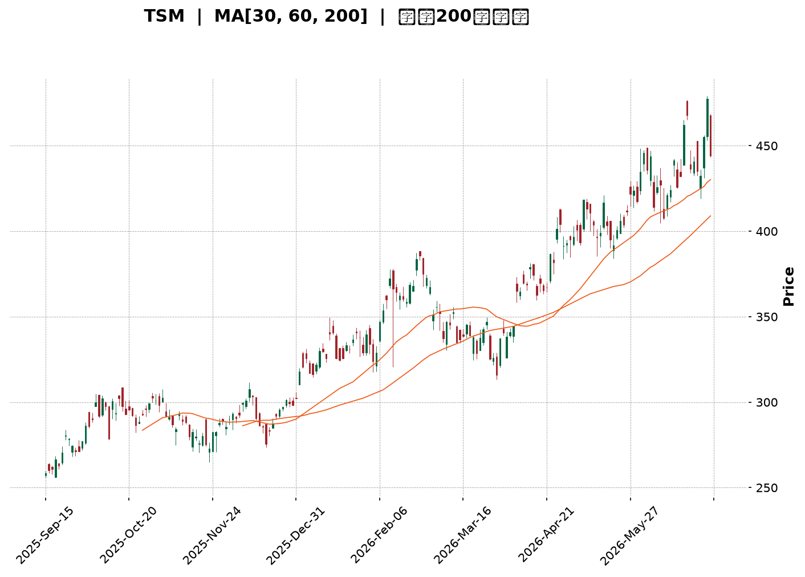
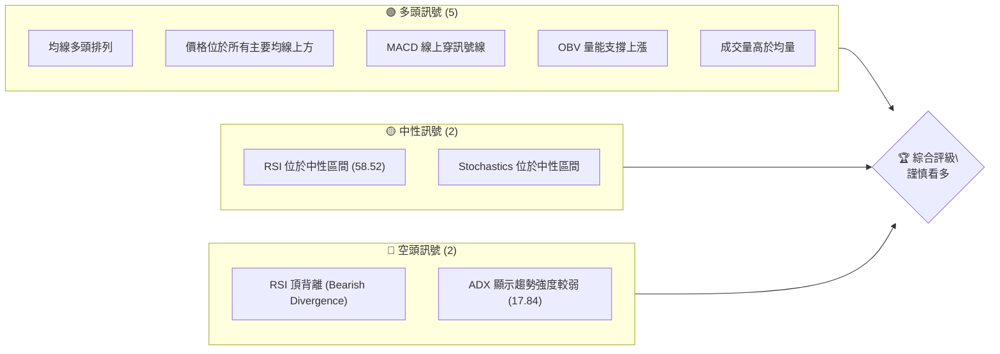
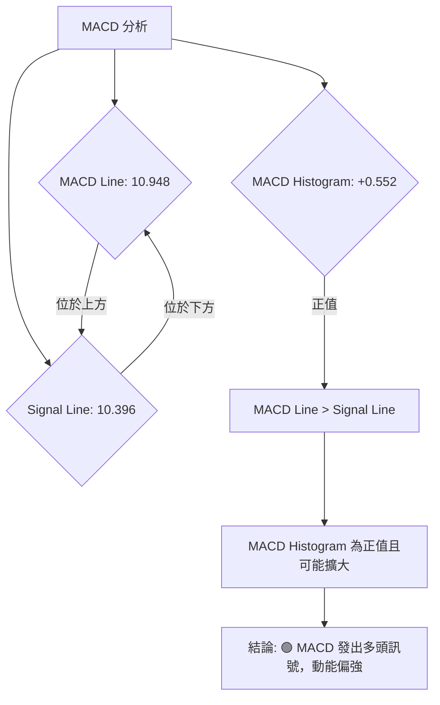

<details>
<summary>📊 靜態圖表 (點擊展開)</summary>

</details>

<html>
<head><meta charset="utf-8" /></head>
<body>
    <div style="height:500px; width:100%;">                        <script>window.PlotlyConfig = {MathJaxConfig: 'local'};</script>
        <script charset="utf-8" src="https://cdn.plot.ly/plotly-3.6.0.min.js" integrity="sha256-QaOVwtVY0T02VaHrr6pnoHLCwayMJp4O5n4YyaE3rJk=" crossorigin="anonymous"></script>                <div id="candlestick-chart" class="plotly-graph-div" style="height:100%; width:100%;"></div>            <script>                window.PLOTLYENV=window.PLOTLYENV || {};                                if (document.getElementById("candlestick-chart")) {                    Plotly.newPlot(                        "candlestick-chart",                        [{"close":{"dtype":"f8","bdata":"AAAAoFUocEAAAACgLUBwQAAAAIDES3BAAAAAwKKocEAAAACAyWxwQAAAAOD553BAAAAA4P6HcUAAAADgPmhxQAAAAODzJ3FAAAAAoJDzcEAAAACAgPFwQAAAACC0UXFAAAAAQG\u002fjcUAAAABAuN1xQAAAAGB9HnJAAAAAoJLAckAAAAAAsztyQAAAAEA64nJAAAAAYJGYckAAAACgc2dxQAAAAABayHJAAAAAYAVackAAAABAPuVyQAAAAKDul3JAAAAAQF5MckAAAAAA9nVyQAAAAMBRQ3JAAAAAoPHpcUAAAAAAUAdyQAAAAKB2SnJAAAAAILF+ckAAAADgwrJyQAAAAIBG63JAAAAAAJfNckAAAABgTKFyQAAAAOCf53JAAAAAQAQ8ckAAAAAggjVyQAAAAICo73FAAAAAYCnEcUAAAABAYk9yQAAAACBMDnJAAAAA4JAFckAAAABg5n9xQAAAAOB9qXFAAAAAAOJ8cUAAAADAyztxQAAAACCZgnFAAAAAgEk1cUAAAABgjQ5xQAAAAGCipnFAAAAA4ESncUAAAACAFvtxQAAAAMCxE3JAAAAA4OTWcUAAAADg5hxyQAAAAAA+UnJAAAAAwDwqckAAAABAp0ZyQAAAAKAouHJAAAAAQJvQckAAAADAcTtzQAAAAOCH9HJAAAAA4J8ockAAAACALeRxQAAAAEBU1nFAAAAAgJU4cUAAAAAgeLNxQAAAAEBw93FAAAAAoFw8ckAAAADgx3ZyQAAAAGA6lHJAAAAAIInUckAAAABg+bVyQAAAAMCkoHJAAAAAAEDlckAAAAAAet9zQAAAAOB\u002fCXRAAAAAIPRbdEAAAABgrNBzQAAAACACxnNAAAAAYHcfdEAAAACACaF0QAAAAGAfmHRAAAAAINxWdEAAAABAJT51QAAAACA+SnVAAAAA4KdXdEAAAAAAGkd0QAAAAKD\u002fWnRAAAAAwGHSdEAAAADg\u002f690QAAAAOCdCXVAAAAAoKZIdUAAAACA4Bx1QAAAAMDGjXRAAAAAILA5dUAAAADAY+B0QAAAAIANQXRAAAAAgHuQdEAAAACg6bB1QAAAAEBVGXZAAAAAYMyAdkAAAABArUJ3QAAAAEBU43ZAAAAA4KHHdkAAAAAgQKV2QAAAAKBehnZAAAAAgJpodkAAAABAKwp3QAAAAMA1AndAAAAAIEf8d0AAAACAyxt4QAAAACD5bXdAAAAA4HlKd0AAAADgZ\u002fN2QAAAAGAK9XVAAAAAYKU5dkAAAAAAqQB2QAAAACBfEnVAAAAAYIaudUAAAACg5ZR1QAAAAIDNC3ZAAAAAoKvvdEAAAACAIwl1QAAAAKCzJ3VAAAAAIL+SdUAAAAAgbSx1QAAAAMD5H3VAAAAAQIiHdEAAAABgjBp1QAAAACArZ3VAAAAAIACvdUAAAACgkVV0QAAAACCgX3RAAAAAICu8c0AAAAAgkRJ1QAAAAAATS3VAAAAAYPcjdUAAAABgYk91QAAAACA2iHVAAAAAwLjQdkAAAABgLcp2QAAAAAC\u002fG3dAAAAAAE4Ld0AAAAAACrB3QAAAAACUY3dAAAAAYASodkAAAABgJhp3QAAAACAm1nZAAAAAIIXzdkAAAACAjih4QAAAAGBB3HdAAAAAoFAYeUAAAACAikB5QAAAAADGdnhAAAAAwI6OeEAAAACAJ7J4QAAAAMDay3hAAAAAIL8KeUAAAAAA0Zd4QAAAAIBRKHpAAAAAAOvSeUAAAACAfat5QAAAAICEOXlAAAAAAKHFeEAAAADA2u14QAAAAKDnC3pAAAAAIHw2eUAAAAAgZrB4QAAAAEAVe3hAAAAAIOgKeUAAAAAALmN5QAAAAMAyOXlAAAAA4LS1eUAAAACg4Ft6QAAAAKDgfXpAAAAAwI4XekAAAACgyyl7QAAAAIBX2ntAAAAAQLc6e0AAAACgFr57QAAAAEAz43lAAAAAYNicekAAAABAua56QAAAAGC4fHlAAAAAwB5RekAAAABA4X56QAAAAGBmlntAAAAAoEedekAAAABgZgJ7QAAAAIDr4XxAAAAAYLg6fUAAAACAPUZ7QAAAAKBHjXtAAAAAANcve0AAAACgmQV7QAAAAKCZcXxAAAAAwB7ZfUAAAAAgrsN7QA=="},"high":{"dtype":"f8","bdata":"B+MJQc4+cEAAQXPctYVwQPa+QbDVa3BAd\u002f7lR8zGcEAT3GBPxodwQNFuW20wI3FA95DLZDm8cUBStAXdLnBxQBmR6qCSL3FAuk9DmIkVcUD+pUY+6VpxQJdmkNjgVHFAvdvO4VcDckD9UEInZ2ZyQK3v9fHsW3JAnWprFlwOc0AbZc8zLwtzQK2+9YsSAHNAl9M1CGbHckCBrRXCpZ1yQKNJrUf543JArHpZEkG2ckDQCdTHZwNzQB6EKET4TnNAPJElJdzOckC2I7SWatRyQKi+uZ14kHJATnLk\u002fEVOckAPbvzmpjxyQDSWJwDueXJAWSuX1heickC66ylJSbxyQIVijRfWGHNAzv9IpoQOc0CTHQs0ZBRzQE6AnW4gO3NAtvLMOxC6ckD9hTgVN35yQF8XZxJiRXJAHoHFXDracUCEMnxP6WxyQBxujAnUSXJAXiiZxghJckAfop9byfNxQBSzVUzgyXFA+K\u002fXIKPEcUBAkJac\u002fV9xQHZ4lZA0pXFAJY20kPcockAhFTGhLUhxQGx9\u002fSxNrXFApIR38bKycUAv9l\u002fbVChyQP3TMPobJnJAoZhDjyMOckANHr0SKUNyQNtejsjQZHJA3zpFJrM7ckBvNqcsLKdyQBGAhpsQxHJAIHS+dMTkckA+QrVnZ3hzQCIYmAhKBHNALM8nM3XrckA7vCySeWRyQHCp7Gaj73FAJqn2bNP5cUArlFoK8tpxQKzeVpaxKnJABClAVOZXckBGAFLKD4ZyQHUjwGv1mXJA0pWsoSHdckCfAj2i9e5yQDWInT7B73JAjdpiUfYcc0CQt\u002f1w\u002fv5zQEosWWfCmHRATr8djuO1dEDevlJ190l0QJRhv35QLXRA7s81wJwxdEBScxjnXr10QGcHGPEN63RAoblFO6KCdEBzQ2VhY9h1QA+tTonUwHVA5t7ETENGdUBusiOwzb50QDK1oTE\u002f1XRAojhCoKz2dEBEp2QPC9Z0QGrWC\u002f3vN3VAfgwTgpZ7dUDNs6GKkl91QFYter9yInVA7lUSFuVmdUC+p3ycQpR1QGQdYE\u002fwEHVA4h7GSJvNdEBZllHPwr51QLoLq0oHXHZASRtJACqudkA7qJusEJp3QMkjHRrAoHdAVza44D0Td0DIK2UFFsV2QGcuygXd93ZAVrPIA\u002feOdkBQAbStlyR3QCG1N8IrOHdAWJCMKuAyeECc32RKRUN4QPbGFiO9B3hAz5lHSudrd0D3YTIA6zJ3QMOLXABoInZAmR7r6L5zdkDmpraF9Vl2QI8FrM7XrnVAQvuOw6q5dUD0NzMO7vp1QBy2qqM2OHZAhMYMsLaRdUC6L7nj\u002fGt1QCQxIl+9bXVALPsUiTKfdUDzjAluMbJ1QG1mtKCxMXVA6ecg3\u002foMdUCC7sIIuWl1QN3gpgYwgXVAGLVeiRnadUC9XBzd0EF1QBBEROOjjHRAJdZZYkeNdECT1BPZ6Bl1QH1qY3HYvXVALe8AQVVUdUDa\u002fzhGVXZ1QFwljT2Qi3VAlvHovM5Wd0D3OF8a9fR2QNyzsY7ekXdAWmG8SXkpd0At9ccmRtR3QGV67Khm0XdA\u002fkQUclwVd0DfX6ZiPWt3QMJN4DhJE3dAcl668iMed0CJ5owgDzB4QHnZs5+gPXhAffRAOYiIeUAJyf1Egdh5QDSKMfQLz3hAaVQ3a82ueEDj+cR\u002fu914QCg14OS8MHlA1DwMmPVreUAT9un35VJ5QIsIANaCK3pA4WoZpEwwekDTrH9WaQB6QNR25ThwbHlAP1W4qM0UeUDWlKWMwDt5QDOoDPS+T3pA+NnrLJmOeUD0aDfH3l55QCoBET8r33hAtX5Xf\u002fsueUA3y\u002fyA+qd5QAV1cWVem3lAu1PyN0X4eUApeM5ptNh6QBTrOYedqXpAVsb4AfPWekDbROvxcAV8QKlCs5NR9XtABWaMeLsRfECUz\u002f6tae97QMKqpQEuDntA4Ad2Sr4Me0Dj4ERBLlJ7QGYoIPwulXpAAAAAAABkekAAAABACq96QAAAAKBHqXtAAAAAoEeFe0AAAAAAAKh7QAAAACCFE31AAAAA4KPMfUAAAACgR\u002fV7QAAAAIDCvXtAAAAAYGZOfEAAAACAFEJ7QAAAAKCZgXxAAAAAAADwfUAAAAAAKUh9QA=="},"hovertemplate":"\u003cb\u003e%{x|%Y-%m-%d}\u003c\u002fb\u003e\u003cbr\u003e\u958b: $%{open:.2f}\u003cbr\u003e\u9ad8: $%{high:.2f}\u003cbr\u003e\u4f4e: $%{low:.2f}\u003cbr\u003e\u6536: $%{close:.2f}\u003cextra\u003e\u003c\u002fextra\u003e","low":{"dtype":"f8","bdata":"mdFp6239b0CuFErPKClwQCIAq70wG3BA6I\u002fgfNH+b0B+08O3FUxwQN4MFo7+dXBAimZGiPlccUCwGsOl5yhxQF0DcvA9wXBAXNtOXhHIcEAAAACAgPFwQDsN4bgG+3BAzpwKXgwwcUCRbbU1k8xxQBHnnpCAA3JAj1i5RoWZckC09oMEyy9yQKf+ZAXoOnJAuFvgBoRxckAk6H5xNmJxQMjRNbyNIHJAKM1JDv8QckDonqR2lZtyQDUo5h\u002ftZXJA1SVyH9RJckDFEMX+zGtyQK28XljTNXJAjZro9tKicUA5YM2Z2fVxQPOomkBqQXJAQLFoZk02ckAzJxMnPlxyQGCZuShBwHJAuxobe32nckAedbx2xGVyQKE\u002fWZ4gvHJAxXC+ynEzckA89dwniRNyQGJSOpAh0nFAxr537mkvcUCZdBEZgRdyQD3ih39r6nFA\u002fkv3TQ71cUBT+GuT+VxxQK6vXWaA8XBArpXmhcxZcUAsR5mzZ+lwQNFjWB2OInFAlDrJx\u002fsjcUBrCYE\u002fvotwQK7H7Mrd8HBAP4VBuB7vcEBjW5jpr9dxQFhZRiHZ63FATnNuqJ2PcUCemkWwtO5xQF+jq+BVvXFAnrYULOb+cUDXNfoyUS9yQGvBeStnZnJAXQrFG6mCckAqEtjoKMJyQK5gem6ZoXJA6xaicMAXckDUZ\u002fs\u002fJ+FxQMXiMDzSnXFAK\u002fUKlKgacUANO8GO1IRxQApyoJqHznFAiZQhdGkbckAo7infKytyQNdgfdpRa3JA0RtHUsWPckAHsucp15FyQCREfByTnnJAaW40b+3dckCEqsJFkWFzQPrmDaqP\u002fXNA6nLHSb8udECku2vycc5zQCcjLv49qHNAGWzOItTJc0B5QBnXjvZzQDJWZy1HkXRAonSBlWgydEDn+l5w7gJ1QDyQ\u002f6lHO3VA5LlMWYRTdEC3Z1EDGUB0QApoA2WEU3RA3VnFbquadEBlonYVhoh0QPXBo5NyzXRA\u002fnoU4bUOdUCY5u7wNWh0QNE0aFyJdnRAuHZyWYl2dEAxAP9ALoV0QDuau6rh1nNAftR\u002fAh3gc0AWP8I1t+50QAUd79QyoHVAQP03te4odkCfKBsf8ud2QPzZoKgcB3RAb5RK7qZudkCYLPdyiyZ2QMPunWGybXZAAYCuWqU5dkBi79\u002fVEVR2QMRW7105yXZATyrRFOBhd0D9AmQNou13QLjNB07M\u002fHZA+PKgOJvrdkD3XKmkaax2QLBaEqLwZXVAQ0VKt6QLdkBe8cAIh2B1QLPppzBa73RAAqArwWyjdECXG2hGpWh1QBoyVqvyyHVAZ8Vr8mrqdEARVeDf3ud0QMd8oeEsIXVAwUNG6r8ZdUCRhH8zwSh1QIle8kXiRnRAiU2GljdSdECm6GoWOaV0QM5lmVTV03RAbd\u002feyyhrdUA4Feu0wUl0QDHzCEXpGHRAcpa\u002fthGRc0CDo20+PAZ0QC54wqZML3VAkUMHYpVgdEBu3b3sQh11QKzaIUra7XRAB6RMHGlmdkAHvbUlCX52QBzbb4ItDndA2VSurx3TdkB1O8l0kUV3QOuQJChyNXdAD1DNS1J7dkBjJ1Arl8R2QL9EQititnZAeHg2bBzEdkBq2g+GYhx3QDWRtU3pbndAvW2LheCOeEBj8JOUbvd4QPDSAb3R\u002fHdAwSa\u002fcV40eEDVM2Ts8Ax4QNGSTeRrc3hAi9LJN22keEC7rjKS7Hp4QAogr0Ns+3hArwFj7YByeUAo1OsaGP94QEzOtqQn1HhA\u002fJpvbHwTeECUtVfX4mh4QFH795qREnlAtUkn817eeEBMYUyELmJ4QLL8usCQAnhAlWeKImaweECfjBu9Oel4QHb9vEKzHnlAlBhIaMqReUCecM9WjeZ5QG9odWLb23lAWY\u002fi+2YEekAbcajGNFh6QOrJrXTcL3tAVhWuizwYe0CGEEqe06R6QPjFvoY1vXlAr4PfXK9YekArtshVAEl5QKPmT6z1a3lAAAAAgMKNeUAAAAAgXBN6QAAAAEDh\u002fnpAAAAAQDOTekAAAACAPfp6QAAAAIA9ZntAAAAAYLgSfUAAAABACiN7QAAAAKBHCXtAAAAAQAoHe0AAAABACjN6QAAAAKBw8XpAAAAAAABQfEAAAAAghbd7QA=="},"name":"\u50f9\u683c","open":{"dtype":"f8","bdata":"l5Rr9H4ScEDVJ1qjdH1wQCMeTJ1fZHBAnmoj9XP\u002fb0BUtxF3mYRwQOMkOEZMh3BArUZVDRODcUDD0yFP5WFxQNr1pVzB73BAPWjYpvr7cEAfgB37QCVxQKr\u002fyiGuEnFAFJOWkjVEcUB7h\u002fROOmNyQLfpgisgKXJA2uXPyKGackCIOvNykANzQBifpzsZS3JAjE0NzyS\u002fckBcQslR1plyQGl\u002flmiIfnJABndSjRlVckD\u002fdQBnU\u002f5yQFhEVRv8R3NAMpTerhKBckDC5PMYeZpyQAtK9PaYinJAJNN7MFkrckAtLEpojPhxQJsFKbclVHJA1rzjsAqFckAeqW+LzX9yQKwHb+OL9nJAcWfW+13LckCbNMoSkPlyQCdWS7GWw3JAVax\u002fX\u002fFockBdjyHKUCVyQHOXaX3PPHJACfFiz66vcUDo4kIE8EByQDXv6\u002f9sHHJAZlMX\u002fnU2ckBMzs9MjO5xQERR4tMLHHFAY9D0gNVzcUBgQGinFDZxQNhSioYULHFA\u002fwWLj84eckA8e4Rt1epwQK7H7Mrd8HBAAJvZMVCIcUB5MD6Kb+1xQFDV2M8XI3JAcEs5VtTKcUBlucoheRtyQEVZaLdUHnJAGpwQAOg6ckD9l9pIxFtyQHlJf9SFrXJAgZ\u002f2ZFCackAvYZ+AuO9yQLJ6\u002fxoD\u002fHJALM8nM3XrckCbfjHhIFpyQGpHEYqJ3HFAhLTxrMDwcUCIYF4jkLhxQApyoJqHznFAkOah3HxSckAm9Rq8RT5yQEMXsfBag3JAlqnexLylckBDTz\u002fFqcNyQEXkcBnlzHJAGQJBLwDnckDQab5ABmZzQH5IYKw6i3RAZ5efQ12IdEAmd8tlBTB0QMkagU+QK3RAmt6uf\u002fric0DxpjTSHAd0QJBnks2LsnRAoblFO6KCdEBn4Y7exFB1QAXvszmqi3VAG0pKbp0wdUAEWQTcdbt0QPYpLSJNu3RAmqMm8s+ldEB2scLwRbF0QOZQVvxT7HRASaG6YUVUdUDr7Kk82yB1QCSdqg8j23RAuswWx\u002fWQdEBWBUhLvnR1QNw6IY0A3nRA4wQSppISdEBz\u002fc3wPvx0QGmIDd96r3VAhRHWrVGndkDvW0ir2AJ3QHvPhCfVkHdAJLq+Awv0dkCJrCptKYB2QPceJXHWn3ZA8sbxOvBddkADmCzF5F52QJjIsqn60XZAwTVxLjOXd0Cc32RKRUN4QBslCl4fA3hA\u002fmqsOM0Dd0DIeTzStrd2QI2X6f0NvHVAQjPylXw5dkClKAr7NhF2QMEeIpPAW3VAL2VtiADedEA6H6kS3ap1QMkjUUPGAXZAX5f3pW6CdUAMBT8FcGJ1QDRe+gbwN3VAf6B3HN48dUAtakzSjY91QKEGEJU2h3RARXAITUv+dECm6GoWOaV0QMvLNV+T7HRAS6c93xCTdUDbRoSrajB1QODyUAcjQXRAqPIV+vdmdEANKh1M6Rh0QItxyk+LcXVA0JgD4DhhdECy6FWcTC91QJ0HKeVZKnVAm43uPMwWd0AT1ScVOKd2QGVf+z5ma3dA\u002fuCQpVEWd0CodmuCeKJ3QNg5XV1NyHdA+VsHhfj\u002fdkCpS0zJP0V3QExhTLu3BXdAAAAAIIXzdkAV9Dr9lC53QGEsssii9XdAtKxEe26zeECkVWpyiMx5QKS7+fpCc3hA1IDWTd9\u002feEDhobDAFs54QCGQ+hpViHhA8MLIpjI5eUAZIim8eTp5QL5ncoRbF3lA019oi88RekCpxvYQnf95QNqDUpKiXHlAkzGQoCHNeEBHXEqEbtV4QLDnpXtJJHlAswHd7M1YeUD0aDfH3l55QFzwomqZSXhAYY491ijBeECfjBu9Oel4QF2zSiOTh3lAbogb+HnCeUCFEfdRW6B6QOezsYO8U3pA4ogNwiehekBHaft\u002fMn56QD4Xy1jPeHtAJDEOuQQPfEAXiEWA+9l6QFE6sgdBzHpAKz4Sf3psekC2f2EM+d16QO0ITqTiz3lAAAAAACnUeUAAAADAzEB6QAAAAEDhantAAAAA4FFAe0AAAAAAACx7QAAAAIAUbntAAAAAoHDBfUAAAABA4XJ7QAAAACCuH3tAAAAAYGZOfEAAAAAAAJB6QAAAAAAAUHtAAAAAgMJ5fEAAAABguDp9QA=="},"x":["2025-09-15T00:00:00-04:00","2025-09-16T00:00:00-04:00","2025-09-17T00:00:00-04:00","2025-09-18T00:00:00-04:00","2025-09-19T00:00:00-04:00","2025-09-22T00:00:00-04:00","2025-09-23T00:00:00-04:00","2025-09-24T00:00:00-04:00","2025-09-25T00:00:00-04:00","2025-09-26T00:00:00-04:00","2025-09-29T00:00:00-04:00","2025-09-30T00:00:00-04:00","2025-10-01T00:00:00-04:00","2025-10-02T00:00:00-04:00","2025-10-03T00:00:00-04:00","2025-10-06T00:00:00-04:00","2025-10-07T00:00:00-04:00","2025-10-08T00:00:00-04:00","2025-10-09T00:00:00-04:00","2025-10-10T00:00:00-04:00","2025-10-13T00:00:00-04:00","2025-10-14T00:00:00-04:00","2025-10-15T00:00:00-04:00","2025-10-16T00:00:00-04:00","2025-10-17T00:00:00-04:00","2025-10-20T00:00:00-04:00","2025-10-21T00:00:00-04:00","2025-10-22T00:00:00-04:00","2025-10-23T00:00:00-04:00","2025-10-24T00:00:00-04:00","2025-10-27T00:00:00-04:00","2025-10-28T00:00:00-04:00","2025-10-29T00:00:00-04:00","2025-10-30T00:00:00-04:00","2025-10-31T00:00:00-04:00","2025-11-03T00:00:00-05:00","2025-11-04T00:00:00-05:00","2025-11-05T00:00:00-05:00","2025-11-06T00:00:00-05:00","2025-11-07T00:00:00-05:00","2025-11-10T00:00:00-05:00","2025-11-11T00:00:00-05:00","2025-11-12T00:00:00-05:00","2025-11-13T00:00:00-05:00","2025-11-14T00:00:00-05:00","2025-11-17T00:00:00-05:00","2025-11-18T00:00:00-05:00","2025-11-19T00:00:00-05:00","2025-11-20T00:00:00-05:00","2025-11-21T00:00:00-05:00","2025-11-24T00:00:00-05:00","2025-11-25T00:00:00-05:00","2025-11-26T00:00:00-05:00","2025-11-28T00:00:00-05:00","2025-12-01T00:00:00-05:00","2025-12-02T00:00:00-05:00","2025-12-03T00:00:00-05:00","2025-12-04T00:00:00-05:00","2025-12-05T00:00:00-05:00","2025-12-08T00:00:00-05:00","2025-12-09T00:00:00-05:00","2025-12-10T00:00:00-05:00","2025-12-11T00:00:00-05:00","2025-12-12T00:00:00-05:00","2025-12-15T00:00:00-05:00","2025-12-16T00:00:00-05:00","2025-12-17T00:00:00-05:00","2025-12-18T00:00:00-05:00","2025-12-19T00:00:00-05:00","2025-12-22T00:00:00-05:00","2025-12-23T00:00:00-05:00","2025-12-24T00:00:00-05:00","2025-12-26T00:00:00-05:00","2025-12-29T00:00:00-05:00","2025-12-30T00:00:00-05:00","2025-12-31T00:00:00-05:00","2026-01-02T00:00:00-05:00","2026-01-05T00:00:00-05:00","2026-01-06T00:00:00-05:00","2026-01-07T00:00:00-05:00","2026-01-08T00:00:00-05:00","2026-01-09T00:00:00-05:00","2026-01-12T00:00:00-05:00","2026-01-13T00:00:00-05:00","2026-01-14T00:00:00-05:00","2026-01-15T00:00:00-05:00","2026-01-16T00:00:00-05:00","2026-01-20T00:00:00-05:00","2026-01-21T00:00:00-05:00","2026-01-22T00:00:00-05:00","2026-01-23T00:00:00-05:00","2026-01-26T00:00:00-05:00","2026-01-27T00:00:00-05:00","2026-01-28T00:00:00-05:00","2026-01-29T00:00:00-05:00","2026-01-30T00:00:00-05:00","2026-02-02T00:00:00-05:00","2026-02-03T00:00:00-05:00","2026-02-04T00:00:00-05:00","2026-02-05T00:00:00-05:00","2026-02-06T00:00:00-05:00","2026-02-09T00:00:00-05:00","2026-02-10T00:00:00-05:00","2026-02-11T00:00:00-05:00","2026-02-12T00:00:00-05:00","2026-02-13T00:00:00-05:00","2026-02-17T00:00:00-05:00","2026-02-18T00:00:00-05:00","2026-02-19T00:00:00-05:00","2026-02-20T00:00:00-05:00","2026-02-23T00:00:00-05:00","2026-02-24T00:00:00-05:00","2026-02-25T00:00:00-05:00","2026-02-26T00:00:00-05:00","2026-02-27T00:00:00-05:00","2026-03-02T00:00:00-05:00","2026-03-03T00:00:00-05:00","2026-03-04T00:00:00-05:00","2026-03-05T00:00:00-05:00","2026-03-06T00:00:00-05:00","2026-03-09T00:00:00-04:00","2026-03-10T00:00:00-04:00","2026-03-11T00:00:00-04:00","2026-03-12T00:00:00-04:00","2026-03-13T00:00:00-04:00","2026-03-16T00:00:00-04:00","2026-03-17T00:00:00-04:00","2026-03-18T00:00:00-04:00","2026-03-19T00:00:00-04:00","2026-03-20T00:00:00-04:00","2026-03-23T00:00:00-04:00","2026-03-24T00:00:00-04:00","2026-03-25T00:00:00-04:00","2026-03-26T00:00:00-04:00","2026-03-27T00:00:00-04:00","2026-03-30T00:00:00-04:00","2026-03-31T00:00:00-04:00","2026-04-01T00:00:00-04:00","2026-04-02T00:00:00-04:00","2026-04-06T00:00:00-04:00","2026-04-07T00:00:00-04:00","2026-04-08T00:00:00-04:00","2026-04-09T00:00:00-04:00","2026-04-10T00:00:00-04:00","2026-04-13T00:00:00-04:00","2026-04-14T00:00:00-04:00","2026-04-15T00:00:00-04:00","2026-04-16T00:00:00-04:00","2026-04-17T00:00:00-04:00","2026-04-20T00:00:00-04:00","2026-04-21T00:00:00-04:00","2026-04-22T00:00:00-04:00","2026-04-23T00:00:00-04:00","2026-04-24T00:00:00-04:00","2026-04-27T00:00:00-04:00","2026-04-28T00:00:00-04:00","2026-04-29T00:00:00-04:00","2026-04-30T00:00:00-04:00","2026-05-01T00:00:00-04:00","2026-05-04T00:00:00-04:00","2026-05-05T00:00:00-04:00","2026-05-06T00:00:00-04:00","2026-05-07T00:00:00-04:00","2026-05-08T00:00:00-04:00","2026-05-11T00:00:00-04:00","2026-05-12T00:00:00-04:00","2026-05-13T00:00:00-04:00","2026-05-14T00:00:00-04:00","2026-05-15T00:00:00-04:00","2026-05-18T00:00:00-04:00","2026-05-19T00:00:00-04:00","2026-05-20T00:00:00-04:00","2026-05-21T00:00:00-04:00","2026-05-22T00:00:00-04:00","2026-05-26T00:00:00-04:00","2026-05-27T00:00:00-04:00","2026-05-28T00:00:00-04:00","2026-05-29T00:00:00-04:00","2026-06-01T00:00:00-04:00","2026-06-02T00:00:00-04:00","2026-06-03T00:00:00-04:00","2026-06-04T00:00:00-04:00","2026-06-05T00:00:00-04:00","2026-06-08T00:00:00-04:00","2026-06-09T00:00:00-04:00","2026-06-10T00:00:00-04:00","2026-06-11T00:00:00-04:00","2026-06-12T00:00:00-04:00","2026-06-15T00:00:00-04:00","2026-06-16T00:00:00-04:00","2026-06-17T00:00:00-04:00","2026-06-18T00:00:00-04:00","2026-06-22T00:00:00-04:00","2026-06-23T00:00:00-04:00","2026-06-24T00:00:00-04:00","2026-06-25T00:00:00-04:00","2026-06-26T00:00:00-04:00","2026-06-29T00:00:00-04:00","2026-06-30T00:00:00-04:00","2026-07-01T00:00:00-04:00"],"type":"candlestick"},{"hovertemplate":"MA30: $%{y:.2f}\u003cextra\u003e\u003c\u002fextra\u003e","line":{"color":"#2196F3","dash":"dash","width":2},"mode":"lines","name":"MA30","x":["2025-09-15T00:00:00-04:00","2025-09-16T00:00:00-04:00","2025-09-17T00:00:00-04:00","2025-09-18T00:00:00-04:00","2025-09-19T00:00:00-04:00","2025-09-22T00:00:00-04:00","2025-09-23T00:00:00-04:00","2025-09-24T00:00:00-04:00","2025-09-25T00:00:00-04:00","2025-09-26T00:00:00-04:00","2025-09-29T00:00:00-04:00","2025-09-30T00:00:00-04:00","2025-10-01T00:00:00-04:00","2025-10-02T00:00:00-04:00","2025-10-03T00:00:00-04:00","2025-10-06T00:00:00-04:00","2025-10-07T00:00:00-04:00","2025-10-08T00:00:00-04:00","2025-10-09T00:00:00-04:00","2025-10-10T00:00:00-04:00","2025-10-13T00:00:00-04:00","2025-10-14T00:00:00-04:00","2025-10-15T00:00:00-04:00","2025-10-16T00:00:00-04:00","2025-10-17T00:00:00-04:00","2025-10-20T00:00:00-04:00","2025-10-21T00:00:00-04:00","2025-10-22T00:00:00-04:00","2025-10-23T00:00:00-04:00","2025-10-24T00:00:00-04:00","2025-10-27T00:00:00-04:00","2025-10-28T00:00:00-04:00","2025-10-29T00:00:00-04:00","2025-10-30T00:00:00-04:00","2025-10-31T00:00:00-04:00","2025-11-03T00:00:00-05:00","2025-11-04T00:00:00-05:00","2025-11-05T00:00:00-05:00","2025-11-06T00:00:00-05:00","2025-11-07T00:00:00-05:00","2025-11-10T00:00:00-05:00","2025-11-11T00:00:00-05:00","2025-11-12T00:00:00-05:00","2025-11-13T00:00:00-05:00","2025-11-14T00:00:00-05:00","2025-11-17T00:00:00-05:00","2025-11-18T00:00:00-05:00","2025-11-19T00:00:00-05:00","2025-11-20T00:00:00-05:00","2025-11-21T00:00:00-05:00","2025-11-24T00:00:00-05:00","2025-11-25T00:00:00-05:00","2025-11-26T00:00:00-05:00","2025-11-28T00:00:00-05:00","2025-12-01T00:00:00-05:00","2025-12-02T00:00:00-05:00","2025-12-03T00:00:00-05:00","2025-12-04T00:00:00-05:00","2025-12-05T00:00:00-05:00","2025-12-08T00:00:00-05:00","2025-12-09T00:00:00-05:00","2025-12-10T00:00:00-05:00","2025-12-11T00:00:00-05:00","2025-12-12T00:00:00-05:00","2025-12-15T00:00:00-05:00","2025-12-16T00:00:00-05:00","2025-12-17T00:00:00-05:00","2025-12-18T00:00:00-05:00","2025-12-19T00:00:00-05:00","2025-12-22T00:00:00-05:00","2025-12-23T00:00:00-05:00","2025-12-24T00:00:00-05:00","2025-12-26T00:00:00-05:00","2025-12-29T00:00:00-05:00","2025-12-30T00:00:00-05:00","2025-12-31T00:00:00-05:00","2026-01-02T00:00:00-05:00","2026-01-05T00:00:00-05:00","2026-01-06T00:00:00-05:00","2026-01-07T00:00:00-05:00","2026-01-08T00:00:00-05:00","2026-01-09T00:00:00-05:00","2026-01-12T00:00:00-05:00","2026-01-13T00:00:00-05:00","2026-01-14T00:00:00-05:00","2026-01-15T00:00:00-05:00","2026-01-16T00:00:00-05:00","2026-01-20T00:00:00-05:00","2026-01-21T00:00:00-05:00","2026-01-22T00:00:00-05:00","2026-01-23T00:00:00-05:00","2026-01-26T00:00:00-05:00","2026-01-27T00:00:00-05:00","2026-01-28T00:00:00-05:00","2026-01-29T00:00:00-05:00","2026-01-30T00:00:00-05:00","2026-02-02T00:00:00-05:00","2026-02-03T00:00:00-05:00","2026-02-04T00:00:00-05:00","2026-02-05T00:00:00-05:00","2026-02-06T00:00:00-05:00","2026-02-09T00:00:00-05:00","2026-02-10T00:00:00-05:00","2026-02-11T00:00:00-05:00","2026-02-12T00:00:00-05:00","2026-02-13T00:00:00-05:00","2026-02-17T00:00:00-05:00","2026-02-18T00:00:00-05:00","2026-02-19T00:00:00-05:00","2026-02-20T00:00:00-05:00","2026-02-23T00:00:00-05:00","2026-02-24T00:00:00-05:00","2026-02-25T00:00:00-05:00","2026-02-26T00:00:00-05:00","2026-02-27T00:00:00-05:00","2026-03-02T00:00:00-05:00","2026-03-03T00:00:00-05:00","2026-03-04T00:00:00-05:00","2026-03-05T00:00:00-05:00","2026-03-06T00:00:00-05:00","2026-03-09T00:00:00-04:00","2026-03-10T00:00:00-04:00","2026-03-11T00:00:00-04:00","2026-03-12T00:00:00-04:00","2026-03-13T00:00:00-04:00","2026-03-16T00:00:00-04:00","2026-03-17T00:00:00-04:00","2026-03-18T00:00:00-04:00","2026-03-19T00:00:00-04:00","2026-03-20T00:00:00-04:00","2026-03-23T00:00:00-04:00","2026-03-24T00:00:00-04:00","2026-03-25T00:00:00-04:00","2026-03-26T00:00:00-04:00","2026-03-27T00:00:00-04:00","2026-03-30T00:00:00-04:00","2026-03-31T00:00:00-04:00","2026-04-01T00:00:00-04:00","2026-04-02T00:00:00-04:00","2026-04-06T00:00:00-04:00","2026-04-07T00:00:00-04:00","2026-04-08T00:00:00-04:00","2026-04-09T00:00:00-04:00","2026-04-10T00:00:00-04:00","2026-04-13T00:00:00-04:00","2026-04-14T00:00:00-04:00","2026-04-15T00:00:00-04:00","2026-04-16T00:00:00-04:00","2026-04-17T00:00:00-04:00","2026-04-20T00:00:00-04:00","2026-04-21T00:00:00-04:00","2026-04-22T00:00:00-04:00","2026-04-23T00:00:00-04:00","2026-04-24T00:00:00-04:00","2026-04-27T00:00:00-04:00","2026-04-28T00:00:00-04:00","2026-04-29T00:00:00-04:00","2026-04-30T00:00:00-04:00","2026-05-01T00:00:00-04:00","2026-05-04T00:00:00-04:00","2026-05-05T00:00:00-04:00","2026-05-06T00:00:00-04:00","2026-05-07T00:00:00-04:00","2026-05-08T00:00:00-04:00","2026-05-11T00:00:00-04:00","2026-05-12T00:00:00-04:00","2026-05-13T00:00:00-04:00","2026-05-14T00:00:00-04:00","2026-05-15T00:00:00-04:00","2026-05-18T00:00:00-04:00","2026-05-19T00:00:00-04:00","2026-05-20T00:00:00-04:00","2026-05-21T00:00:00-04:00","2026-05-22T00:00:00-04:00","2026-05-26T00:00:00-04:00","2026-05-27T00:00:00-04:00","2026-05-28T00:00:00-04:00","2026-05-29T00:00:00-04:00","2026-06-01T00:00:00-04:00","2026-06-02T00:00:00-04:00","2026-06-03T00:00:00-04:00","2026-06-04T00:00:00-04:00","2026-06-05T00:00:00-04:00","2026-06-08T00:00:00-04:00","2026-06-09T00:00:00-04:00","2026-06-10T00:00:00-04:00","2026-06-11T00:00:00-04:00","2026-06-12T00:00:00-04:00","2026-06-15T00:00:00-04:00","2026-06-16T00:00:00-04:00","2026-06-17T00:00:00-04:00","2026-06-18T00:00:00-04:00","2026-06-22T00:00:00-04:00","2026-06-23T00:00:00-04:00","2026-06-24T00:00:00-04:00","2026-06-25T00:00:00-04:00","2026-06-26T00:00:00-04:00","2026-06-29T00:00:00-04:00","2026-06-30T00:00:00-04:00","2026-07-01T00:00:00-04:00"],"y":{"dtype":"f8","bdata":"AAAAAAAA+H8AAAAAAAD4fwAAAAAAAPh\u002fAAAAAAAA+H8AAAAAAAD4fwAAAAAAAPh\u002fAAAAAAAA+H8AAAAAAAD4fwAAAAAAAPh\u002fAAAAAAAA+H8AAAAAAAD4fwAAAAAAAPh\u002fAAAAAAAA+H8AAAAAAAD4fwAAAAAAAPh\u002fAAAAAAAA+H8AAAAAAAD4fwAAAAAAAPh\u002fAAAAAAAA+H8AAAAAAAD4fwAAAAAAAPh\u002fAAAAAAAA+H8AAAAAAAD4fwAAAAAAAPh\u002fAAAAAAAA+H8AAAAAAAD4fwAAAAAAAPh\u002fAAAAAAAA+H8AAAAAAAD4f6uqqiqGuHFAZmZmJnjMcUDe3d39WuFxQBERETG993FAmpmZmQkKckAzMzPD2hxyQERERNToLXJAIiIiAukzckBVVVWVwDpyQM3MzLxoQXJAMzMzw1xIckC8u7trBlRyQBEREcFPWnJAIiIiAnNbckCamZlpUlhyQHd3dwdsVHJAAAAA4KFJckCrqqoqGkFyQImIiJhhNXJA3t3d3YkpckAiIiJCkyZyQBEREQHrHHJAd3d3p\u002fUWckB3d3eHJw9yQJqZmRm\u002fCnJAd3d3p9QGckDv7u6u3ANyQGZmZgZcBHJAmpmZqYAGckC8u7srnQhyQM3MzDxFDHJA3t3dPQAPckCrqqqajhNyQFVVVZXdE3JAERER4V0OckDNzMwMEAhyQN7d3e3z\u002fnFAq6qqGk72cUAAAABw+PFxQERERNQ68nFAmpmZiTz2cUCamZm5jPdxQJqZmZkD\u002fHFA3t3dvekCckBVVVW1Pw1yQM3MzLx8FXJA7+7u3n8hckDe3d2tBThyQHd3d+eVTXJAVVVVdXlockBmZmYGA4ByQBEREdEfknJAERERkTKnckC8u7u7y71yQKuqqtpG03JAVVVV5ZvockDNzMwsUQNzQDMzM4OmHHNAZmZmJjsvc0CrqqoKUEBzQERERCRGTnNAvLu7W2Zfc0Dv7u5+0WtzQO\u002fu7n6WfXNAMzMzY0GYc0AiIiLSvrNzQN7d3U3tynNAvLu72xjtc0B3d3fHMQh0QFVVVQW3G3RAq6qq6pUvdEAzMzOTH0t0QBEREQEpaXRARERElICIdEAAAABgU690QO\u002fu7o6u03RARERE9NP0dEARERGxfAx1QBEREVG3IXVAREREVDQzdUDv7u6OuE51QBEREeFTanVAzczMvEmLdUDv7u7e+qh1QLy7u8sswXVAiYiIuFzadUAiIiIC8Oh1QLy7u3uh7nVAd3d3d7L+dUDv7u5uag12QHd3dzeHE3ZAVVVVxd0adkB3d3cHfyJ2QHd3dzcaK3ZAq6qq6iIodkC8u7t7eid2QKuqqvqbLHZAIiIi8pMvdkCrqqrKHDJ2QBERERGLOXZAERERsT45dkBVVVWVOzR2QO\u002fu7j5LLnZAiYiI+EwndkBVVVWVVA52QFVVVaXf+HVAiYiIOOTedUDNzMz8d9F1QHd3d3f1xnVAq6qqOiO8dUDNzMzMYK11QGZmZjbHoHVAAAAAAMuWdUDv7u7+iYt1QDMzM1PMiHVAMzMzQ7GGdUDv7u7u+ox1QImIiLgymXVA3t3djeCcdUCamZmZQqZ1QERERMRRtXVA7+7uDifAdUB3d3cnJNZ1QLy7u3uf5XVAMzMzcxwJdkCamZlZFy12QCIiIrJTSXZAzczMjMlidkC8u7tL2IB2QImIiJgsoHZAzczMbK7GdkCrqqr6dOR2QDMzM1MHDXdARERE9Fswd0ARERHR4113QLy7u0tJh3dAERERsUSyd0C8u7uLLdN3QKuqqiq9+3dAMzMzU30eeECJiIjIUjt4QKuqqlp8VHhA7+7u7n1neEDv7u6eqH14QDMzMwO1j3hAzczMLHSmeECJiIiYP714QN7d3Z2513hAd3d3Bwv1eEC8u7urshd5QN7d3R2BQnlAmpmZyQJneUBERERkmIV5QImIiLjklnlA3t3dLdijeUAAAADwDLB5QHd3dzfIuHlAREREBM3HeUCrqqqKKNd5QO\u002fu7v757nlAIiIi8mT8eUBmZmaGAxF6QERERGREKHpAVVVVxVNFekBmZmbWBFN6QM3MzKzgZnpAMzMzE3x7ekBVVVXFV416QDMzM6PMoXpAd3d3l1rJekCamZm5mON6QA=="},"type":"scatter"},{"hovertemplate":"MA60: $%{y:.2f}\u003cextra\u003e\u003c\u002fextra\u003e","line":{"color":"#9C27B0","dash":"dash","width":2},"mode":"lines","name":"MA60","x":["2025-09-15T00:00:00-04:00","2025-09-16T00:00:00-04:00","2025-09-17T00:00:00-04:00","2025-09-18T00:00:00-04:00","2025-09-19T00:00:00-04:00","2025-09-22T00:00:00-04:00","2025-09-23T00:00:00-04:00","2025-09-24T00:00:00-04:00","2025-09-25T00:00:00-04:00","2025-09-26T00:00:00-04:00","2025-09-29T00:00:00-04:00","2025-09-30T00:00:00-04:00","2025-10-01T00:00:00-04:00","2025-10-02T00:00:00-04:00","2025-10-03T00:00:00-04:00","2025-10-06T00:00:00-04:00","2025-10-07T00:00:00-04:00","2025-10-08T00:00:00-04:00","2025-10-09T00:00:00-04:00","2025-10-10T00:00:00-04:00","2025-10-13T00:00:00-04:00","2025-10-14T00:00:00-04:00","2025-10-15T00:00:00-04:00","2025-10-16T00:00:00-04:00","2025-10-17T00:00:00-04:00","2025-10-20T00:00:00-04:00","2025-10-21T00:00:00-04:00","2025-10-22T00:00:00-04:00","2025-10-23T00:00:00-04:00","2025-10-24T00:00:00-04:00","2025-10-27T00:00:00-04:00","2025-10-28T00:00:00-04:00","2025-10-29T00:00:00-04:00","2025-10-30T00:00:00-04:00","2025-10-31T00:00:00-04:00","2025-11-03T00:00:00-05:00","2025-11-04T00:00:00-05:00","2025-11-05T00:00:00-05:00","2025-11-06T00:00:00-05:00","2025-11-07T00:00:00-05:00","2025-11-10T00:00:00-05:00","2025-11-11T00:00:00-05:00","2025-11-12T00:00:00-05:00","2025-11-13T00:00:00-05:00","2025-11-14T00:00:00-05:00","2025-11-17T00:00:00-05:00","2025-11-18T00:00:00-05:00","2025-11-19T00:00:00-05:00","2025-11-20T00:00:00-05:00","2025-11-21T00:00:00-05:00","2025-11-24T00:00:00-05:00","2025-11-25T00:00:00-05:00","2025-11-26T00:00:00-05:00","2025-11-28T00:00:00-05:00","2025-12-01T00:00:00-05:00","2025-12-02T00:00:00-05:00","2025-12-03T00:00:00-05:00","2025-12-04T00:00:00-05:00","2025-12-05T00:00:00-05:00","2025-12-08T00:00:00-05:00","2025-12-09T00:00:00-05:00","2025-12-10T00:00:00-05:00","2025-12-11T00:00:00-05:00","2025-12-12T00:00:00-05:00","2025-12-15T00:00:00-05:00","2025-12-16T00:00:00-05:00","2025-12-17T00:00:00-05:00","2025-12-18T00:00:00-05:00","2025-12-19T00:00:00-05:00","2025-12-22T00:00:00-05:00","2025-12-23T00:00:00-05:00","2025-12-24T00:00:00-05:00","2025-12-26T00:00:00-05:00","2025-12-29T00:00:00-05:00","2025-12-30T00:00:00-05:00","2025-12-31T00:00:00-05:00","2026-01-02T00:00:00-05:00","2026-01-05T00:00:00-05:00","2026-01-06T00:00:00-05:00","2026-01-07T00:00:00-05:00","2026-01-08T00:00:00-05:00","2026-01-09T00:00:00-05:00","2026-01-12T00:00:00-05:00","2026-01-13T00:00:00-05:00","2026-01-14T00:00:00-05:00","2026-01-15T00:00:00-05:00","2026-01-16T00:00:00-05:00","2026-01-20T00:00:00-05:00","2026-01-21T00:00:00-05:00","2026-01-22T00:00:00-05:00","2026-01-23T00:00:00-05:00","2026-01-26T00:00:00-05:00","2026-01-27T00:00:00-05:00","2026-01-28T00:00:00-05:00","2026-01-29T00:00:00-05:00","2026-01-30T00:00:00-05:00","2026-02-02T00:00:00-05:00","2026-02-03T00:00:00-05:00","2026-02-04T00:00:00-05:00","2026-02-05T00:00:00-05:00","2026-02-06T00:00:00-05:00","2026-02-09T00:00:00-05:00","2026-02-10T00:00:00-05:00","2026-02-11T00:00:00-05:00","2026-02-12T00:00:00-05:00","2026-02-13T00:00:00-05:00","2026-02-17T00:00:00-05:00","2026-02-18T00:00:00-05:00","2026-02-19T00:00:00-05:00","2026-02-20T00:00:00-05:00","2026-02-23T00:00:00-05:00","2026-02-24T00:00:00-05:00","2026-02-25T00:00:00-05:00","2026-02-26T00:00:00-05:00","2026-02-27T00:00:00-05:00","2026-03-02T00:00:00-05:00","2026-03-03T00:00:00-05:00","2026-03-04T00:00:00-05:00","2026-03-05T00:00:00-05:00","2026-03-06T00:00:00-05:00","2026-03-09T00:00:00-04:00","2026-03-10T00:00:00-04:00","2026-03-11T00:00:00-04:00","2026-03-12T00:00:00-04:00","2026-03-13T00:00:00-04:00","2026-03-16T00:00:00-04:00","2026-03-17T00:00:00-04:00","2026-03-18T00:00:00-04:00","2026-03-19T00:00:00-04:00","2026-03-20T00:00:00-04:00","2026-03-23T00:00:00-04:00","2026-03-24T00:00:00-04:00","2026-03-25T00:00:00-04:00","2026-03-26T00:00:00-04:00","2026-03-27T00:00:00-04:00","2026-03-30T00:00:00-04:00","2026-03-31T00:00:00-04:00","2026-04-01T00:00:00-04:00","2026-04-02T00:00:00-04:00","2026-04-06T00:00:00-04:00","2026-04-07T00:00:00-04:00","2026-04-08T00:00:00-04:00","2026-04-09T00:00:00-04:00","2026-04-10T00:00:00-04:00","2026-04-13T00:00:00-04:00","2026-04-14T00:00:00-04:00","2026-04-15T00:00:00-04:00","2026-04-16T00:00:00-04:00","2026-04-17T00:00:00-04:00","2026-04-20T00:00:00-04:00","2026-04-21T00:00:00-04:00","2026-04-22T00:00:00-04:00","2026-04-23T00:00:00-04:00","2026-04-24T00:00:00-04:00","2026-04-27T00:00:00-04:00","2026-04-28T00:00:00-04:00","2026-04-29T00:00:00-04:00","2026-04-30T00:00:00-04:00","2026-05-01T00:00:00-04:00","2026-05-04T00:00:00-04:00","2026-05-05T00:00:00-04:00","2026-05-06T00:00:00-04:00","2026-05-07T00:00:00-04:00","2026-05-08T00:00:00-04:00","2026-05-11T00:00:00-04:00","2026-05-12T00:00:00-04:00","2026-05-13T00:00:00-04:00","2026-05-14T00:00:00-04:00","2026-05-15T00:00:00-04:00","2026-05-18T00:00:00-04:00","2026-05-19T00:00:00-04:00","2026-05-20T00:00:00-04:00","2026-05-21T00:00:00-04:00","2026-05-22T00:00:00-04:00","2026-05-26T00:00:00-04:00","2026-05-27T00:00:00-04:00","2026-05-28T00:00:00-04:00","2026-05-29T00:00:00-04:00","2026-06-01T00:00:00-04:00","2026-06-02T00:00:00-04:00","2026-06-03T00:00:00-04:00","2026-06-04T00:00:00-04:00","2026-06-05T00:00:00-04:00","2026-06-08T00:00:00-04:00","2026-06-09T00:00:00-04:00","2026-06-10T00:00:00-04:00","2026-06-11T00:00:00-04:00","2026-06-12T00:00:00-04:00","2026-06-15T00:00:00-04:00","2026-06-16T00:00:00-04:00","2026-06-17T00:00:00-04:00","2026-06-18T00:00:00-04:00","2026-06-22T00:00:00-04:00","2026-06-23T00:00:00-04:00","2026-06-24T00:00:00-04:00","2026-06-25T00:00:00-04:00","2026-06-26T00:00:00-04:00","2026-06-29T00:00:00-04:00","2026-06-30T00:00:00-04:00","2026-07-01T00:00:00-04:00"],"y":{"dtype":"f8","bdata":"AAAAAAAA+H8AAAAAAAD4fwAAAAAAAPh\u002fAAAAAAAA+H8AAAAAAAD4fwAAAAAAAPh\u002fAAAAAAAA+H8AAAAAAAD4fwAAAAAAAPh\u002fAAAAAAAA+H8AAAAAAAD4fwAAAAAAAPh\u002fAAAAAAAA+H8AAAAAAAD4fwAAAAAAAPh\u002fAAAAAAAA+H8AAAAAAAD4fwAAAAAAAPh\u002fAAAAAAAA+H8AAAAAAAD4fwAAAAAAAPh\u002fAAAAAAAA+H8AAAAAAAD4fwAAAAAAAPh\u002fAAAAAAAA+H8AAAAAAAD4fwAAAAAAAPh\u002fAAAAAAAA+H8AAAAAAAD4fwAAAAAAAPh\u002fAAAAAAAA+H8AAAAAAAD4fwAAAAAAAPh\u002fAAAAAAAA+H8AAAAAAAD4fwAAAAAAAPh\u002fAAAAAAAA+H8AAAAAAAD4fwAAAAAAAPh\u002fAAAAAAAA+H8AAAAAAAD4fwAAAAAAAPh\u002fAAAAAAAA+H8AAAAAAAD4fwAAAAAAAPh\u002fAAAAAAAA+H8AAAAAAAD4fwAAAAAAAPh\u002fAAAAAAAA+H8AAAAAAAD4fwAAAAAAAPh\u002fAAAAAAAA+H8AAAAAAAD4fwAAAAAAAPh\u002fAAAAAAAA+H8AAAAAAAD4fwAAAAAAAPh\u002fAAAAAAAA+H8AAAAAAAD4f7y7u7Nl4nFAIiIiMrztcUBERETMdPpxQDMzM2PNBXJAVVVVvTMMckAAAABodRJyQBEREWFuFnJAZmZmjhsVckCrqqqCXBZyQImIiMjRGXJAZmZmpkwfckCrqqqSySVyQFVVVa0pK3JAAAAAYC4vckB3d3cPyTJyQCIiImL0NHJAd3d335A1ckBERETsjzxyQAAAAMB7QXJAmpmZqQFJckBEREQkS1NyQBEREWmFV3JAREREHBRfckCamZmheWZyQCIiIvoCb3JAZmZmRrh3ckDe3d3tloNyQM3MzESBkHJAAAAA6N2ackAzMzObdqRyQImIiLBFrXJAzczMTDO3ckDNzMwMsL9yQCIiIgq6yHJAIiIiok\u002fTckB3d3dv591yQN7d3Z3w5HJAMzMze7PxckC8u7sbFf1yQM3MzOz4BnNAIiIiOukSc0BmZmYmViFzQFVVVU2WMnNAERERKbVFc0CrqqqKSV5zQN7d3aWVdHNAmpmZ6SmLc0B3d3cvQaJzQERERJymt3NAzczM5NbNc0CrqqrKXedzQBEREdk5\u002fnNA7+7uJj4ZdEBVVVVNYzN0QDMzM9M5SnRA7+7uTnxhdEB3d3eXIHZ0QHd3d\u002f+jhXRA7+7uzvaWdEDNzMw83aZ0QN7d3a3msHRAiYiIECK9dEAzMzNDKMd0QDMzM1tY1HRA7+7uJjLgdEDv7u6mnO10QERERKTE+3RA7+7uZlYOdUARERFJJx11QDMzMwuhKnVA3t3dTWo0dUBERESUrT91QAAAACC6S3VAZmZmxuZXdUCrqqr60151QCIiIhpHZnVAZmZmFtxpdUDv7u5W+m51QERERGRWdHVAd3d3x6t3dUDe3d2tDH51QLy7u4uNhXVAZmZmXgqRdUDv7u5uQpp1QHd3d4\u002f8pHVA3t3d\u002fYawdUCJiIh49bp1QCIiIhrqw3VAq6qqgsnNdUBERESE1tl1QN7d3X1s5HVAIiIiaoLtdUB3d3eXUfx1QJqZmdlcCHZA7+7urp8YdkCrqqrqSCp2QGZmZtb3OnZAd3d3vy5JdkAzMzOLell2QM3MzNTbbHZA7+7ujvZ\u002fdkAAAABIWIx2QBEREUmpnXZAZmZmdtSrdkAzMzMzHLZ2QImIiHgUwHZAzczMdJTIdkBERETEUtJ2QBEREVFZ4XZA7+7uRlDtdkCrqqrKWfR2QImIiMih+nZAd3d3dyT\u002fdkDv7u5OmQR3QDMzM6tADHdAAAAAuJIWd0C8u7tDHSV3QDMzMyt2OHdAq6qqyvVId0Crqqqi+l53QBEREXHpe3dARERE7JSTd0De3d1F3q13QCIiIhpCvndAiYiIUHrWd0DNzMwkku53QM3MzPQNAXhAiYiISEsVeEAzMzNrACx4QLy7u0uTR3hAd3d3r4lheECJiIhAvHp4QLy7u9ulmnhAzczM3Ne6eEC8u7tTdNh4QERERPwU93hAIiIiYuAWeUCJiIioQjB5QO\u002fu7ubETnlAVVVV9etzeUARERHBdY95QA=="},"type":"scatter"},{"hovertemplate":"MA200: $%{y:.2f}\u003cextra\u003e\u003c\u002fextra\u003e","line":{"color":"#FF6F00","dash":"solid","width":2},"mode":"lines","name":"MA200","x":["2025-09-15T00:00:00-04:00","2025-09-16T00:00:00-04:00","2025-09-17T00:00:00-04:00","2025-09-18T00:00:00-04:00","2025-09-19T00:00:00-04:00","2025-09-22T00:00:00-04:00","2025-09-23T00:00:00-04:00","2025-09-24T00:00:00-04:00","2025-09-25T00:00:00-04:00","2025-09-26T00:00:00-04:00","2025-09-29T00:00:00-04:00","2025-09-30T00:00:00-04:00","2025-10-01T00:00:00-04:00","2025-10-02T00:00:00-04:00","2025-10-03T00:00:00-04:00","2025-10-06T00:00:00-04:00","2025-10-07T00:00:00-04:00","2025-10-08T00:00:00-04:00","2025-10-09T00:00:00-04:00","2025-10-10T00:00:00-04:00","2025-10-13T00:00:00-04:00","2025-10-14T00:00:00-04:00","2025-10-15T00:00:00-04:00","2025-10-16T00:00:00-04:00","2025-10-17T00:00:00-04:00","2025-10-20T00:00:00-04:00","2025-10-21T00:00:00-04:00","2025-10-22T00:00:00-04:00","2025-10-23T00:00:00-04:00","2025-10-24T00:00:00-04:00","2025-10-27T00:00:00-04:00","2025-10-28T00:00:00-04:00","2025-10-29T00:00:00-04:00","2025-10-30T00:00:00-04:00","2025-10-31T00:00:00-04:00","2025-11-03T00:00:00-05:00","2025-11-04T00:00:00-05:00","2025-11-05T00:00:00-05:00","2025-11-06T00:00:00-05:00","2025-11-07T00:00:00-05:00","2025-11-10T00:00:00-05:00","2025-11-11T00:00:00-05:00","2025-11-12T00:00:00-05:00","2025-11-13T00:00:00-05:00","2025-11-14T00:00:00-05:00","2025-11-17T00:00:00-05:00","2025-11-18T00:00:00-05:00","2025-11-19T00:00:00-05:00","2025-11-20T00:00:00-05:00","2025-11-21T00:00:00-05:00","2025-11-24T00:00:00-05:00","2025-11-25T00:00:00-05:00","2025-11-26T00:00:00-05:00","2025-11-28T00:00:00-05:00","2025-12-01T00:00:00-05:00","2025-12-02T00:00:00-05:00","2025-12-03T00:00:00-05:00","2025-12-04T00:00:00-05:00","2025-12-05T00:00:00-05:00","2025-12-08T00:00:00-05:00","2025-12-09T00:00:00-05:00","2025-12-10T00:00:00-05:00","2025-12-11T00:00:00-05:00","2025-12-12T00:00:00-05:00","2025-12-15T00:00:00-05:00","2025-12-16T00:00:00-05:00","2025-12-17T00:00:00-05:00","2025-12-18T00:00:00-05:00","2025-12-19T00:00:00-05:00","2025-12-22T00:00:00-05:00","2025-12-23T00:00:00-05:00","2025-12-24T00:00:00-05:00","2025-12-26T00:00:00-05:00","2025-12-29T00:00:00-05:00","2025-12-30T00:00:00-05:00","2025-12-31T00:00:00-05:00","2026-01-02T00:00:00-05:00","2026-01-05T00:00:00-05:00","2026-01-06T00:00:00-05:00","2026-01-07T00:00:00-05:00","2026-01-08T00:00:00-05:00","2026-01-09T00:00:00-05:00","2026-01-12T00:00:00-05:00","2026-01-13T00:00:00-05:00","2026-01-14T00:00:00-05:00","2026-01-15T00:00:00-05:00","2026-01-16T00:00:00-05:00","2026-01-20T00:00:00-05:00","2026-01-21T00:00:00-05:00","2026-01-22T00:00:00-05:00","2026-01-23T00:00:00-05:00","2026-01-26T00:00:00-05:00","2026-01-27T00:00:00-05:00","2026-01-28T00:00:00-05:00","2026-01-29T00:00:00-05:00","2026-01-30T00:00:00-05:00","2026-02-02T00:00:00-05:00","2026-02-03T00:00:00-05:00","2026-02-04T00:00:00-05:00","2026-02-05T00:00:00-05:00","2026-02-06T00:00:00-05:00","2026-02-09T00:00:00-05:00","2026-02-10T00:00:00-05:00","2026-02-11T00:00:00-05:00","2026-02-12T00:00:00-05:00","2026-02-13T00:00:00-05:00","2026-02-17T00:00:00-05:00","2026-02-18T00:00:00-05:00","2026-02-19T00:00:00-05:00","2026-02-20T00:00:00-05:00","2026-02-23T00:00:00-05:00","2026-02-24T00:00:00-05:00","2026-02-25T00:00:00-05:00","2026-02-26T00:00:00-05:00","2026-02-27T00:00:00-05:00","2026-03-02T00:00:00-05:00","2026-03-03T00:00:00-05:00","2026-03-04T00:00:00-05:00","2026-03-05T00:00:00-05:00","2026-03-06T00:00:00-05:00","2026-03-09T00:00:00-04:00","2026-03-10T00:00:00-04:00","2026-03-11T00:00:00-04:00","2026-03-12T00:00:00-04:00","2026-03-13T00:00:00-04:00","2026-03-16T00:00:00-04:00","2026-03-17T00:00:00-04:00","2026-03-18T00:00:00-04:00","2026-03-19T00:00:00-04:00","2026-03-20T00:00:00-04:00","2026-03-23T00:00:00-04:00","2026-03-24T00:00:00-04:00","2026-03-25T00:00:00-04:00","2026-03-26T00:00:00-04:00","2026-03-27T00:00:00-04:00","2026-03-30T00:00:00-04:00","2026-03-31T00:00:00-04:00","2026-04-01T00:00:00-04:00","2026-04-02T00:00:00-04:00","2026-04-06T00:00:00-04:00","2026-04-07T00:00:00-04:00","2026-04-08T00:00:00-04:00","2026-04-09T00:00:00-04:00","2026-04-10T00:00:00-04:00","2026-04-13T00:00:00-04:00","2026-04-14T00:00:00-04:00","2026-04-15T00:00:00-04:00","2026-04-16T00:00:00-04:00","2026-04-17T00:00:00-04:00","2026-04-20T00:00:00-04:00","2026-04-21T00:00:00-04:00","2026-04-22T00:00:00-04:00","2026-04-23T00:00:00-04:00","2026-04-24T00:00:00-04:00","2026-04-27T00:00:00-04:00","2026-04-28T00:00:00-04:00","2026-04-29T00:00:00-04:00","2026-04-30T00:00:00-04:00","2026-05-01T00:00:00-04:00","2026-05-04T00:00:00-04:00","2026-05-05T00:00:00-04:00","2026-05-06T00:00:00-04:00","2026-05-07T00:00:00-04:00","2026-05-08T00:00:00-04:00","2026-05-11T00:00:00-04:00","2026-05-12T00:00:00-04:00","2026-05-13T00:00:00-04:00","2026-05-14T00:00:00-04:00","2026-05-15T00:00:00-04:00","2026-05-18T00:00:00-04:00","2026-05-19T00:00:00-04:00","2026-05-20T00:00:00-04:00","2026-05-21T00:00:00-04:00","2026-05-22T00:00:00-04:00","2026-05-26T00:00:00-04:00","2026-05-27T00:00:00-04:00","2026-05-28T00:00:00-04:00","2026-05-29T00:00:00-04:00","2026-06-01T00:00:00-04:00","2026-06-02T00:00:00-04:00","2026-06-03T00:00:00-04:00","2026-06-04T00:00:00-04:00","2026-06-05T00:00:00-04:00","2026-06-08T00:00:00-04:00","2026-06-09T00:00:00-04:00","2026-06-10T00:00:00-04:00","2026-06-11T00:00:00-04:00","2026-06-12T00:00:00-04:00","2026-06-15T00:00:00-04:00","2026-06-16T00:00:00-04:00","2026-06-17T00:00:00-04:00","2026-06-18T00:00:00-04:00","2026-06-22T00:00:00-04:00","2026-06-23T00:00:00-04:00","2026-06-24T00:00:00-04:00","2026-06-25T00:00:00-04:00","2026-06-26T00:00:00-04:00","2026-06-29T00:00:00-04:00","2026-06-30T00:00:00-04:00","2026-07-01T00:00:00-04:00"],"y":{"dtype":"f8","bdata":"AAAAAAAA+H8AAAAAAAD4fwAAAAAAAPh\u002fAAAAAAAA+H8AAAAAAAD4fwAAAAAAAPh\u002fAAAAAAAA+H8AAAAAAAD4fwAAAAAAAPh\u002fAAAAAAAA+H8AAAAAAAD4fwAAAAAAAPh\u002fAAAAAAAA+H8AAAAAAAD4fwAAAAAAAPh\u002fAAAAAAAA+H8AAAAAAAD4fwAAAAAAAPh\u002fAAAAAAAA+H8AAAAAAAD4fwAAAAAAAPh\u002fAAAAAAAA+H8AAAAAAAD4fwAAAAAAAPh\u002fAAAAAAAA+H8AAAAAAAD4fwAAAAAAAPh\u002fAAAAAAAA+H8AAAAAAAD4fwAAAAAAAPh\u002fAAAAAAAA+H8AAAAAAAD4fwAAAAAAAPh\u002fAAAAAAAA+H8AAAAAAAD4fwAAAAAAAPh\u002fAAAAAAAA+H8AAAAAAAD4fwAAAAAAAPh\u002fAAAAAAAA+H8AAAAAAAD4fwAAAAAAAPh\u002fAAAAAAAA+H8AAAAAAAD4fwAAAAAAAPh\u002fAAAAAAAA+H8AAAAAAAD4fwAAAAAAAPh\u002fAAAAAAAA+H8AAAAAAAD4fwAAAAAAAPh\u002fAAAAAAAA+H8AAAAAAAD4fwAAAAAAAPh\u002fAAAAAAAA+H8AAAAAAAD4fwAAAAAAAPh\u002fAAAAAAAA+H8AAAAAAAD4fwAAAAAAAPh\u002fAAAAAAAA+H8AAAAAAAD4fwAAAAAAAPh\u002fAAAAAAAA+H8AAAAAAAD4fwAAAAAAAPh\u002fAAAAAAAA+H8AAAAAAAD4fwAAAAAAAPh\u002fAAAAAAAA+H8AAAAAAAD4fwAAAAAAAPh\u002fAAAAAAAA+H8AAAAAAAD4fwAAAAAAAPh\u002fAAAAAAAA+H8AAAAAAAD4fwAAAAAAAPh\u002fAAAAAAAA+H8AAAAAAAD4fwAAAAAAAPh\u002fAAAAAAAA+H8AAAAAAAD4fwAAAAAAAPh\u002fAAAAAAAA+H8AAAAAAAD4fwAAAAAAAPh\u002fAAAAAAAA+H8AAAAAAAD4fwAAAAAAAPh\u002fAAAAAAAA+H8AAAAAAAD4fwAAAAAAAPh\u002fAAAAAAAA+H8AAAAAAAD4fwAAAAAAAPh\u002fAAAAAAAA+H8AAAAAAAD4fwAAAAAAAPh\u002fAAAAAAAA+H8AAAAAAAD4fwAAAAAAAPh\u002fAAAAAAAA+H8AAAAAAAD4fwAAAAAAAPh\u002fAAAAAAAA+H8AAAAAAAD4fwAAAAAAAPh\u002fAAAAAAAA+H8AAAAAAAD4fwAAAAAAAPh\u002fAAAAAAAA+H8AAAAAAAD4fwAAAAAAAPh\u002fAAAAAAAA+H8AAAAAAAD4fwAAAAAAAPh\u002fAAAAAAAA+H8AAAAAAAD4fwAAAAAAAPh\u002fAAAAAAAA+H8AAAAAAAD4fwAAAAAAAPh\u002fAAAAAAAA+H8AAAAAAAD4fwAAAAAAAPh\u002fAAAAAAAA+H8AAAAAAAD4fwAAAAAAAPh\u002fAAAAAAAA+H8AAAAAAAD4fwAAAAAAAPh\u002fAAAAAAAA+H8AAAAAAAD4fwAAAAAAAPh\u002fAAAAAAAA+H8AAAAAAAD4fwAAAAAAAPh\u002fAAAAAAAA+H8AAAAAAAD4fwAAAAAAAPh\u002fAAAAAAAA+H8AAAAAAAD4fwAAAAAAAPh\u002fAAAAAAAA+H8AAAAAAAD4fwAAAAAAAPh\u002fAAAAAAAA+H8AAAAAAAD4fwAAAAAAAPh\u002fAAAAAAAA+H8AAAAAAAD4fwAAAAAAAPh\u002fAAAAAAAA+H8AAAAAAAD4fwAAAAAAAPh\u002fAAAAAAAA+H8AAAAAAAD4fwAAAAAAAPh\u002fAAAAAAAA+H8AAAAAAAD4fwAAAAAAAPh\u002fAAAAAAAA+H8AAAAAAAD4fwAAAAAAAPh\u002fAAAAAAAA+H8AAAAAAAD4fwAAAAAAAPh\u002fAAAAAAAA+H8AAAAAAAD4fwAAAAAAAPh\u002fAAAAAAAA+H8AAAAAAAD4fwAAAAAAAPh\u002fAAAAAAAA+H8AAAAAAAD4fwAAAAAAAPh\u002fAAAAAAAA+H8AAAAAAAD4fwAAAAAAAPh\u002fAAAAAAAA+H8AAAAAAAD4fwAAAAAAAPh\u002fAAAAAAAA+H8AAAAAAAD4fwAAAAAAAPh\u002fAAAAAAAA+H8AAAAAAAD4fwAAAAAAAPh\u002fAAAAAAAA+H8AAAAAAAD4fwAAAAAAAPh\u002fAAAAAAAA+H8AAAAAAAD4fwAAAAAAAPh\u002fAAAAAAAA+H8AAAAAAAD4fwAAAAAAAPh\u002fAAAAAAAA+H+kcD2qJ1p1QA=="},"type":"scatter"}],                        {"template":{"data":{"barpolar":[{"marker":{"line":{"color":"rgb(17,17,17)","width":0.5},"pattern":{"fillmode":"overlay","size":10,"solidity":0.2}},"type":"barpolar"}],"bar":[{"error_x":{"color":"#f2f5fa"},"error_y":{"color":"#f2f5fa"},"marker":{"line":{"color":"rgb(17,17,17)","width":0.5},"pattern":{"fillmode":"overlay","size":10,"solidity":0.2}},"type":"bar"}],"carpet":[{"aaxis":{"endlinecolor":"#A2B1C6","gridcolor":"#506784","linecolor":"#506784","minorgridcolor":"#506784","startlinecolor":"#A2B1C6"},"baxis":{"endlinecolor":"#A2B1C6","gridcolor":"#506784","linecolor":"#506784","minorgridcolor":"#506784","startlinecolor":"#A2B1C6"},"type":"carpet"}],"choropleth":[{"colorbar":{"outlinewidth":0,"ticks":""},"type":"choropleth"}],"contourcarpet":[{"colorbar":{"outlinewidth":0,"ticks":""},"type":"contourcarpet"}],"contour":[{"colorbar":{"outlinewidth":0,"ticks":""},"colorscale":[[0.0,"#0d0887"],[0.1111111111111111,"#46039f"],[0.2222222222222222,"#7201a8"],[0.3333333333333333,"#9c179e"],[0.4444444444444444,"#bd3786"],[0.5555555555555556,"#d8576b"],[0.6666666666666666,"#ed7953"],[0.7777777777777778,"#fb9f3a"],[0.8888888888888888,"#fdca26"],[1.0,"#f0f921"]],"type":"contour"}],"heatmap":[{"colorbar":{"outlinewidth":0,"ticks":""},"colorscale":[[0.0,"#0d0887"],[0.1111111111111111,"#46039f"],[0.2222222222222222,"#7201a8"],[0.3333333333333333,"#9c179e"],[0.4444444444444444,"#bd3786"],[0.5555555555555556,"#d8576b"],[0.6666666666666666,"#ed7953"],[0.7777777777777778,"#fb9f3a"],[0.8888888888888888,"#fdca26"],[1.0,"#f0f921"]],"type":"heatmap"}],"histogram2dcontour":[{"colorbar":{"outlinewidth":0,"ticks":""},"colorscale":[[0.0,"#0d0887"],[0.1111111111111111,"#46039f"],[0.2222222222222222,"#7201a8"],[0.3333333333333333,"#9c179e"],[0.4444444444444444,"#bd3786"],[0.5555555555555556,"#d8576b"],[0.6666666666666666,"#ed7953"],[0.7777777777777778,"#fb9f3a"],[0.8888888888888888,"#fdca26"],[1.0,"#f0f921"]],"type":"histogram2dcontour"}],"histogram2d":[{"colorbar":{"outlinewidth":0,"ticks":""},"colorscale":[[0.0,"#0d0887"],[0.1111111111111111,"#46039f"],[0.2222222222222222,"#7201a8"],[0.3333333333333333,"#9c179e"],[0.4444444444444444,"#bd3786"],[0.5555555555555556,"#d8576b"],[0.6666666666666666,"#ed7953"],[0.7777777777777778,"#fb9f3a"],[0.8888888888888888,"#fdca26"],[1.0,"#f0f921"]],"type":"histogram2d"}],"histogram":[{"marker":{"pattern":{"fillmode":"overlay","size":10,"solidity":0.2}},"type":"histogram"}],"mesh3d":[{"colorbar":{"outlinewidth":0,"ticks":""},"type":"mesh3d"}],"parcoords":[{"line":{"colorbar":{"outlinewidth":0,"ticks":""}},"type":"parcoords"}],"pie":[{"automargin":true,"type":"pie"}],"scatter3d":[{"line":{"colorbar":{"outlinewidth":0,"ticks":""}},"marker":{"colorbar":{"outlinewidth":0,"ticks":""}},"type":"scatter3d"}],"scattercarpet":[{"marker":{"colorbar":{"outlinewidth":0,"ticks":""}},"type":"scattercarpet"}],"scattergeo":[{"marker":{"colorbar":{"outlinewidth":0,"ticks":""}},"type":"scattergeo"}],"scattergl":[{"marker":{"line":{"color":"#283442"}},"type":"scattergl"}],"scattermapbox":[{"marker":{"colorbar":{"outlinewidth":0,"ticks":""}},"type":"scattermapbox"}],"scattermap":[{"marker":{"colorbar":{"outlinewidth":0,"ticks":""}},"type":"scattermap"}],"scatterpolargl":[{"marker":{"colorbar":{"outlinewidth":0,"ticks":""}},"type":"scatterpolargl"}],"scatterpolar":[{"marker":{"colorbar":{"outlinewidth":0,"ticks":""}},"type":"scatterpolar"}],"scatter":[{"marker":{"line":{"color":"#283442"}},"type":"scatter"}],"scatterternary":[{"marker":{"colorbar":{"outlinewidth":0,"ticks":""}},"type":"scatterternary"}],"surface":[{"colorbar":{"outlinewidth":0,"ticks":""},"colorscale":[[0.0,"#0d0887"],[0.1111111111111111,"#46039f"],[0.2222222222222222,"#7201a8"],[0.3333333333333333,"#9c179e"],[0.4444444444444444,"#bd3786"],[0.5555555555555556,"#d8576b"],[0.6666666666666666,"#ed7953"],[0.7777777777777778,"#fb9f3a"],[0.8888888888888888,"#fdca26"],[1.0,"#f0f921"]],"type":"surface"}],"table":[{"cells":{"fill":{"color":"#506784"},"line":{"color":"rgb(17,17,17)"}},"header":{"fill":{"color":"#2a3f5f"},"line":{"color":"rgb(17,17,17)"}},"type":"table"}]},"layout":{"annotationdefaults":{"arrowcolor":"#f2f5fa","arrowhead":0,"arrowwidth":1},"autotypenumbers":"strict","coloraxis":{"colorbar":{"outlinewidth":0,"ticks":""}},"colorscale":{"diverging":[[0,"#8e0152"],[0.1,"#c51b7d"],[0.2,"#de77ae"],[0.3,"#f1b6da"],[0.4,"#fde0ef"],[0.5,"#f7f7f7"],[0.6,"#e6f5d0"],[0.7,"#b8e186"],[0.8,"#7fbc41"],[0.9,"#4d9221"],[1,"#276419"]],"sequential":[[0.0,"#0d0887"],[0.1111111111111111,"#46039f"],[0.2222222222222222,"#7201a8"],[0.3333333333333333,"#9c179e"],[0.4444444444444444,"#bd3786"],[0.5555555555555556,"#d8576b"],[0.6666666666666666,"#ed7953"],[0.7777777777777778,"#fb9f3a"],[0.8888888888888888,"#fdca26"],[1.0,"#f0f921"]],"sequentialminus":[[0.0,"#0d0887"],[0.1111111111111111,"#46039f"],[0.2222222222222222,"#7201a8"],[0.3333333333333333,"#9c179e"],[0.4444444444444444,"#bd3786"],[0.5555555555555556,"#d8576b"],[0.6666666666666666,"#ed7953"],[0.7777777777777778,"#fb9f3a"],[0.8888888888888888,"#fdca26"],[1.0,"#f0f921"]]},"colorway":["#636efa","#EF553B","#00cc96","#ab63fa","#FFA15A","#19d3f3","#FF6692","#B6E880","#FF97FF","#FECB52"],"font":{"color":"#f2f5fa"},"geo":{"bgcolor":"rgb(17,17,17)","lakecolor":"rgb(17,17,17)","landcolor":"rgb(17,17,17)","showlakes":true,"showland":true,"subunitcolor":"#506784"},"hoverlabel":{"align":"left"},"hovermode":"closest","mapbox":{"style":"dark"},"paper_bgcolor":"rgb(17,17,17)","plot_bgcolor":"rgb(17,17,17)","polar":{"angularaxis":{"gridcolor":"#506784","linecolor":"#506784","ticks":""},"bgcolor":"rgb(17,17,17)","radialaxis":{"gridcolor":"#506784","linecolor":"#506784","ticks":""}},"scene":{"xaxis":{"backgroundcolor":"rgb(17,17,17)","gridcolor":"#506784","gridwidth":2,"linecolor":"#506784","showbackground":true,"ticks":"","zerolinecolor":"#C8D4E3"},"yaxis":{"backgroundcolor":"rgb(17,17,17)","gridcolor":"#506784","gridwidth":2,"linecolor":"#506784","showbackground":true,"ticks":"","zerolinecolor":"#C8D4E3"},"zaxis":{"backgroundcolor":"rgb(17,17,17)","gridcolor":"#506784","gridwidth":2,"linecolor":"#506784","showbackground":true,"ticks":"","zerolinecolor":"#C8D4E3"}},"shapedefaults":{"line":{"color":"#f2f5fa"}},"sliderdefaults":{"bgcolor":"#C8D4E3","bordercolor":"rgb(17,17,17)","borderwidth":1,"tickwidth":0},"ternary":{"aaxis":{"gridcolor":"#506784","linecolor":"#506784","ticks":""},"baxis":{"gridcolor":"#506784","linecolor":"#506784","ticks":""},"bgcolor":"rgb(17,17,17)","caxis":{"gridcolor":"#506784","linecolor":"#506784","ticks":""}},"title":{"x":0.05},"updatemenudefaults":{"bgcolor":"#506784","borderwidth":0},"xaxis":{"automargin":true,"gridcolor":"#283442","linecolor":"#506784","ticks":"","title":{"standoff":15},"zerolinecolor":"#283442","zerolinewidth":2},"yaxis":{"automargin":true,"gridcolor":"#283442","linecolor":"#506784","ticks":"","title":{"standoff":15},"zerolinecolor":"#283442","zerolinewidth":2}}},"xaxis":{"rangeslider":{"visible":false},"title":{"text":"\u65e5\u671f"}},"font":{"size":11},"title":{"text":"TSM  |  MA(30\u002f60\u002f200)  |  \u6700\u8fd1200\u4ea4\u6613\u65e5"},"yaxis":{"title":{"text":"\u80a1\u50f9 (USD)"}},"hovermode":"x unified","height":500},                        {"responsive": true}                    )                };            </script>        </div>
</body>
</html>

# TSM 技術分析報告

> **報告日期**：2026-07-01 ｜ **語言**：繁體中文 ｜ **數據來源**：提供數據 ｜ **當前價格**：$444.23

---

## 目錄

| 章節 | 內容 |
|------|------|
| [1. 技術面概覽](#1-技術面概覽) | 訊號儀表板、核心指標、評分卡 |
| [2. 趨勢分析](#2-趨勢分析) | 多時框趨勢、長中短期走勢 |
| [3. 圖表形態分析](#3-圖表形態分析) | 形態識別、K線組合、目標價 |
| [4. 支撐與阻力](#4-支撐與阻力) | 關鍵價位、斐波那契回調 |
| [5. 技術指標深度解讀](#5-技術指標深度解讀) | MA/RSI/MACD/布林/成交量 |
| [6. 動能與波動率](#6-動能與波動率) | 動能評估、ATR、Beta |
| [7. 多時框架總結](#7-多時框架總結) | 時框架評分矩陣 |
| [8. 交易策略建議](#8-交易策略建議) | 多空策略、風險報酬比 |
| [9. 風險提示與監控](#9-風險提示與監控) | 監控指標、風險場景 |

---

## 1. 技術面概覽

本章節提供 TSM 當前技術狀態的快速概覽，透過儀表板、速覽表及評分卡，幫助投資者迅速掌握其多空訊號及整體健康狀況。

### 🎯 技術訊號儀表板

TSM 的技術訊號呈現多空交織的複雜局面。長期趨勢依然強勁，但短期動能有所減弱，並出現潛在的頂背離訊號，需保持警惕。



**儀表板解讀**：
多頭訊號主要來自長期趨勢的穩定性及均線系統的完美排列，MACD也提供短期動能支持。然而，RSI的頂背離與ADX指示的趨勢疲軟，為當前的強勢上漲蒙上陰影，提示潛在的回調或盤整風險。

### 📊 核心指標速覽表

| 指標類別 | 指標名稱 | 當前數值 | 訊號 | 解讀 |
|----------|----------|----------|------|------|
| **價格** | 當前價格 | $444.23 | 🟡 | 位於52週高點下方，但仍處於高位區間 |
| **均線** | MA20 | $437.49 | 🟢 | 價格在MA20上方，短期支撐強勁 |
| **均線** | MA50 | $417.49 | 🟢 | 價格在MA50上方，中期趨勢向上 |
| **均線** | MA200 | $341.63 | 🟢 | 價格在MA200上方，長期牛市確立 |
| **動能** | RSI(14) | 58.52 | 🟡 | 中性區間，但存在頂背離風險 |
| **動能** | MACD | 10.948 | 🟢 | MACD線高於訊號線，動能偏多 |
| **波動** | ATR | $20.77 | 🟡 | 日均波動約4.67%，中等波動水平 |
| **趨勢** | ADX(14) | 17.84 | 🔴 | 趨勢強度較弱，可能進入盤整或修正 |
| **量能** | OBV趨勢 | OBV > MA | 🟢 | 量能配合價格上漲，趨勢健康 |

### 🏆 技術評分卡

TSM 的綜合技術評分顯示其長期結構穩固，但短期面臨動能減弱與潛在修正的挑戰。

```
╔══════════════════════════════════════════════════════════════╗
║              技術評分卡 — TSM (2026-07-01)                   ║
╠══════════════════════════════════════════════════════════════╣
║ 趨勢強度      ███████░░░░░░░░░░░░░  35/100  🔴 (ADX弱，趨勢不確定) ║
║ 動能指標      █████████░░░░░░░░░░░  55/100  🟡 (MACD看多，RSI頂背離)║
║ 支撐穩定度    ██████████████░░░░░░  70/100  🟢 (均線支撐強勁)     ║
║ 成交量配合    ██████████░░░░░░░░░░  60/100  🟢 (成交量放大，OBV配合)║
║ 形態完整度    ████████░░░░░░░░░░░░  40/100  🟡 (缺乏明確看漲形態) ║
║ 均線排列      ██████████████████░░  90/100  🟢 (完美多頭排列)     ║
╠══════════════════════════════════════════════════════════════╣
║ 綜合評分      ██████████░░░░░░░░░░  60/100  🟡 謹慎看多             ║
╚══════════════════════════════════════════════════════════════╝
```

**評分卡解讀**：
TSM 在均線排列和支撐穩定度方面表現出色，反映了其強勁的長期牛市結構。然而，趨勢強度（ADX）較弱，動能指標因RSI頂背離而受損，形態識別也缺乏明確的看漲訊號，這些因素共同導致綜合評分偏向中性偏多，建議投資者謹慎觀望。

---

## 2. 趨勢分析

本章節將從多個時間框架深入分析 TSM 的價格走勢，以確立其當前所處的趨勢階段及其強度。

### 🌐 多時框趨勢分析

```mermaid
graph TD
    A[長期趨勢: 月線圖] --> B{趨勢判斷}
    B --> B1[自2024年中以來強勁上升趨勢]
    B1 --> B2[2026年上半年加速上漲，創歷史新高]
    B2 --> C[中期趨勢: 週線圖]
    C --> D{趨勢判斷}
    D --> D1[近期從高點回調，但仍維持在主要均線上方]
    D1 --> D2[呈現高位盤整或旗形整理態勢]
    D2 --> E[短期趨勢: 日線圖 (未提供，參考週線近期走勢)]
    E --> F{趨勢判斷}
    F --> F1[價格略低於MA5/MA10，顯示短期疲軟]
    F1 --> F2[但仍位於MA20上方，短期支撐有效]
    F2 --> G[綜合判斷: 🟢 長期強勁、🟡 中期整理、🟡 短期修正]
```

**多時框解讀**：
TSM 股票在過去兩年展現了令人印象深刻的長期牛市格局，特別是在2026年上半年經歷了爆炸性增長，創下歷史新高。儘管如此，近期價格從高點回落，進入中期整理階段。短期而言，價格正經歷修正，略微跌破超短期均線，但主要均線仍提供堅實支撐。這表明 TSM 處於一個強勁長期上升趨勢中的中期盤整和短期修正階段。

### 📈 長期趨勢 — 12個月走勢圖（Unicode）

過去12個月（2025年7月至2026年7月），TSM 展現了顯著的上升趨勢，期間經歷了多次加速上漲和溫和回調。

```
TSM 月線走勢圖（過去12個月：2025-07 至 2026-07）
價格軸 ($)
$477.57 ┤                                      ● (2026-06 高點)
$444.23 ┤                                    ●←現在 (2026-07)
$417.47 ┤                                  ●
$395.13 ┤                              ●
$372.65 ┤                          ●
$328.86 ┤                      ●
$302.33 ┤                  ●
$298.08 ┤              ●
$277.11 ┤            ●
$238.98 ┤          ●
$228.34 ┤        ● (2025-08 低點)
$161.64 ┤●━━━━━━━━━━━━━━━━━━━━━━━━━━━━━━━━━━━━━━━━━━
         └─────────────────────────────────────────────────────
          2025-07  08  09  10  11  12  2026-01  02  03  04  05  06  07
```

**走勢特徵分析表格**：

| 時間區間 | 起始價 | 結束價 | 漲跌幅 | 走勢特徵 | 訊號 |
|----------|--------|--------|--------|----------|------|
| 2025-07至2025-08 | $238.98 | $228.34 | -4.45% | 高位小幅回調，確認支撐 | 🟡 |
| 2025-09至2026-02 | $277.11 | $372.65 | +34.40% | 強勁上漲，突破多個阻力 | 🟢 |
| 2026-03至2026-03 | $337.16 | $325.98 | -3.31% | 快速回調，清洗浮籌 | 🟡 |
| 2026-04至2026-06 | $395.13 | $477.57 | +20.86% | 再次加速上漲，創歷史新高 | 🟢 |
| 2026-07 (至今) | $477.57 | $444.23 | -7.00% | 高位回調，消化獲利盤 | 🟡 |

**長期趨勢解讀**：
TSM 在過去12個月內呈現出強烈的上升趨勢，從2025年8月的低點$228.34一路飆升至2026年6月的歷史高點$477.57，漲幅超過100%。期間雖有零星回調（如2025年8月和2026年3月），但均被迅速消化，並在隨後恢復上漲動能。2026年7月的回調可被視為在經歷大幅上漲後的健康調整，以消化獲利盤並為下一波上漲積蓄動能。

### 📊 中期趨勢（週線分析）

中期來看，TSM 經歷了從2026年3月低點的反彈，並在近期形成一個潛在的整理區間。

```
TSM 近期週線壓力與支撐示意圖 (2026-03 ~ 2026-07)

價格軸 ($)
$477.57 ┤                      ● (歷史高點 & 強阻力)
$462.12 ┤                     ╱
$444.23 ┤                   ● (現價)
$437.49 ┤───────MA20───────
$432.35 ┤                 ╱  (近期支撐)
$417.49 ┤────────MA50────────
$401.52 ┤               ╱
$369.73 ┤             ╱
$337.16 ┤─●───────── (前期支撐)
$325.98 ┤●──────────────── (中期底部)
         └────────────────────────────────────────────────────
          2026-03  04  05  06  07
```

**中期趨勢解讀**：
從週線圖來看，TSM 從2026年3月底的$325.98低點開始了一波強勁的反彈，並在2026年6月達到$477.57的歷史高點。目前價格正處於從高點回調的過程中，近期主要支撐位在MA20 ($437.49) 和MA50 ($417.49) 附近。圖中顯示，在$432.35附近存在一個近期形成的支撐區間。若此區間能有效守住，則中期上漲趨勢有望延續，否則可能進一步回調至更低的斐波那契回調位。

### ⚡ 趨勢強度評估（ADX 解讀）

ADX 指標用於衡量趨勢的強度，而非方向。TSM 的 ADX 讀數顯示當前趨勢強度較弱。

```mermaid
graph TD
    A[ADX(14) 值: 17.84] --> B{ADX 解讀}
    B --> C{ADADX < 20-25 ?}
    C -- 是 --> D[趨勢強度弱]
    D --> E[市場可能處於盤整或震盪區間]
    E --> F[現有多頭趨勢動能減弱，需謹慎]
    F --> G[+DI (31.32) > -DI (21.26)]
    G --> H[多頭仍佔主導，但趨勢不夠強勁]
    H --> I[結論: 🟡 弱趨勢中的多頭主導，預期盤整或潛在修正]
```

**ADX 強度對照表**：

| ADX 值範圍 | 趨勢強度 | 市場狀態 | 訊號 |
|------------|----------|----------|------|
| 0-20       | 弱趨勢   | 盤整/震盪 | 🔴 |
| 20-25      | 中等趨勢 | 趨勢形成中 | 🟡 |
| 25-50      | 強趨勢   | 明確趨勢 | 🟢 |
| 50-75      | 非常強趨勢| 趨勢加速 | 🟢 |

**ADX 解讀**：
TSM 的 ADX(14) 值為 17.84，遠低於25的強趨勢門檻，表明當前的趨勢強度較弱，市場可能正處於盤整或震盪階段。儘管 +DI (31.32) 顯著高於 -DI (21.26)，表明多頭仍然主導市場方向，但 ADX 的低值警告我們，即便價格處於上漲趨勢，其推進動能已顯疲態，或正進入修正期。這與 RSI 頂背離的訊號相互印證，提示投資者應對潛在的價格波動和整理做好準備。

---

## 3. 圖表形態分析

圖表形態是價格行為的視覺化表現，有助於預測未來價格走勢。本章節將分析 TSM 可能形成的圖表形態和K線組合。

### 🔍 形態識別系統

根據 TSM 近期的價格走勢，特別是從2026年3月底的低點到2026年6月的高點，再到目前的調整，我們觀察到一個潛在的「牛旗形 (Bull Flag)」整理形態。

```mermaid
graph TD
    A[觀察價格走勢] --> B{是否存在強勁上漲？}
    B -- 是 --> C[從2026-03低點至2026-06高點形成旗桿]
    C --> D{近期價格是否回調/盤整？}
    D -- 是 --> E[2026-06高點至2026-07形成旗面 (回調通道)]
    E --> F[確認形態: 🚩 牛旗形 (Bull Flag) 整理]
    F --> G[形態意義: 暫時修正，後續有望突破繼續上漲]
```

**形態解讀**：
「牛旗形」是一種看漲的持續形態，通常在強勁的上升趨勢（旗桿）之後出現，表現為一個向下的傾斜通道或矩形（旗面）。它代表市場在大幅上漲後進行的健康修正或獲利了結，為下一波上漲積蓄力量。TSM 近期從 $477.57 高點回落至 $444.23，若能在 MA20 或斐波那契支撐位附近形成底部並向上突破旗形上沿，則該形態將得到確認。

### 🕯️ 重要K線形態分析

分析近期的週線K線形態，以判斷市場情緒和短期趨勢。

| 日期 | 收盤價 | K線形態 (週線) | 解讀 | 訊號 |
|------|--------|-----------------|------|------|
| 2026-06-21 | $462.12 | 長陽線 | 買盤強勁，推動價格上漲 | 🟢 |
| 2026-06-28 | $432.35 | 長陰線 / 吞噬形態 | 賣盤主導，吞噬前週漲幅，看跌 | 🔴 |
| 2026-07-05 | $444.23 | 小陽線 / 錘頭或紡錘線 | 買賣雙方力量平衡，或止跌企穩嘗試 | 🟡 |

**K線形態解讀**：
2026年6月21日的長陽線顯示了市場的強勁買盤，將價格推至高位。然而，緊接著的6月28日出現一根長陰線，形成潛在的「看跌吞噬」形態，表明賣壓的突然增加，大幅回吐了前期的漲幅，這是短期內一個強烈的看跌訊號。最新的7月5日K線為一根小陽線，可能為「錘頭線」或「紡錘線」，暗示在經歷大幅下跌後，市場情緒趨於平衡，買盤開始嘗試抵抗賣壓，但其止跌效果仍需後續K線的確認。

### 📉 ASCII 走勢形態示意圖

以下為 TSM 近期價格走勢中可能形成的「牛旗形」示意圖。

```
TSM 潛在牛旗形 (Bull Flag) 示意圖

價格軸 ($)
$477.57 ┤                        ● (旗桿頂部)
        │                       /
        │                      /  (旗桿)
        │                     /
        │                    /
$444.23 ┤                   ● (現價)
        │                  /╲
        │                 /  ╲  (旗面回調通道)
        │                /    ╲
        │               /      ╲
$437.49 ┤────── MA20 ───────────
        │              ● (旗面底部)
        │             ╱
$325.98 ┤●───────────
         └───────────────────────────────────────
          時間軸 (強勁上漲後的回調/盤整)
```

**形態示意圖解讀**：
圖中描繪了 TSM 從 $325.98 (2026-03-29) 上漲至 $477.57 (2026-06-21) 構成的「旗桿」，隨後價格從高點回調，形成一個向下傾斜的通道，即「旗面」。當前價格 $444.23 位於旗面內部。若價格能有效突破旗面上沿阻力，則牛旗形確認，預示著新一輪的上漲。

### 🎯 形態目標價計算

如果「牛旗形」形態得到確認並向上突破，其目標價的計算方法通常是將旗桿的高度加到旗面突破點。

1.  **旗桿高度 (Pole Height)**：
    *   旗桿底部 (Swing Low): $325.98 (2026-03-29)
    *   旗桿頂部 (Swing High): $477.57 (2026-06-21)
    *   旗桿高度 = $477.57 - $325.98 = $151.59

2.  **突破點 (Breakout Point)**：
    *   假設突破點為旗形通道的上沿阻力，例如近期 MA20 ($437.49) 上方或略高於現價的某個點。
    *   由於當前價格仍在旗面內部，我們將使用當前價格 $444.23 作為參考，或假設突破點為 $450.00 (略高於現價)。

3.  **形態目標價 (Pattern Target Price)**：
    *   形態目標價 = 突破點 + 旗桿高度
    *   保守估計（以現價附近突破）：$444.23 + $151.59 = **$595.82**
    *   樂觀估計（以高位突破）：$450.00 + $151.59 = **$601.59**

**目標價解讀**：
如果 TSM 能成功完成牛旗形並向上突破，其潛在的目標價區間為 **$595.82 至 $601.59**。這是一個非常樂觀的目標，遠高於分析師平均目標價 $487.56，但低於最高目標價 $700.00。此目標價的實現需要強勁的買盤和突破旗形上沿的確認。

---

## 4. 支撐與阻力

支撐與阻力是技術分析的基石，它們是價格在歷史上反轉或停滯的關鍵區域。本章節將詳細分析 TSM 的關鍵價位。

### 🗺️ 關鍵價位分布圖（Unicode）

以下圖示展示了 TSM 當前價格 $444.23 周圍的關鍵支撐與阻力水平。

```
TSM 價位結構分布圖 (2026-07-01)
═══════════════════════════════════════════════════
$487.56 ║████████████████████████║ 強阻力 R3 (分析師均價目標)
$479.00 ║████████████████████    ║ 阻力 R2 (52週高點)
$472.66 ║████████████████████████║ 關鍵阻力 R1 (布林上軌)
$444.23 ╠════════════════════════╣ ◄ 現價
$437.49 ║▓▓▓▓▓▓▓▓▓▓▓▓▓▓▓▓        ║ 近期支撐 S1 (MA20 / 布林中軌)
$419.60 ║▓▓▓▓▓▓▓▓▓▓▓▓▓▓▓▓▓▓▓▓▓▓▓▓║ 關鍵支撐 S2 (斐波那契 38.2%)
$417.49 ║████████████████████████║ 強支撐 S3 (MA50)
$402.33 ║████████████████████████║ 強支撐 S4 (布林下軌 / 斐波那契 50%)
$384.28 ║████████████████████████║ 強支撐 S5 (斐波那契 61.8%)
═══════════════════════════════════════════════════
```

**價位結構解讀**：
TSM 目前位於多個關鍵均線上方，顯示其支撐基礎較為穩固。然而，上方也存在多重阻力，包括近期高點、52週高點以及分析師的平均目標價，這些都可能限制其短期上漲空間。

### 🚧 阻力位分析表

| 阻力級別 | 價位 | 形成原因 | 突破難度 | 重要性 |
|----------|------|----------|----------|--------|
| **R1** | $472.66 | 布林通道上軌 | 中等 | 若能突破，可能加速上漲 |
| **R2** | $477.57 | 2026年6月高點 | 較高 | 突破將創歷史新高，吸引買盤 |
| **R3** | $479.00 | 52週高點 | 較高 | 突破意味著進入新上漲區間 |
| **R4** | $487.56 | 分析師平均目標價 | 較高 | 心理阻力，接近歷史高點 |

**阻力位解讀**：
TSM 面臨的第一個關鍵阻力是布林通道上軌和近期高點 $472.66 - $477.57 區間。突破此區間將是對多頭力量的強烈確認，並可能促使其挑戰52週高點 $479.00。分析師的平均目標價 $487.56 也構成一個心理和潛在的技術阻力，若能有效突破，則形態目標價 $595.82 - $601.59 將成為下一個潛在目標。

### 🛡️ 支撐位分析表

| 支撐級別 | 價位 | 形成原因 | 守住機率 | 重要性 |
|----------|------|----------|----------|--------|
| **S1** | $437.49 | MA20 / 布林通道中軌 | 較高 | 短期趨勢關鍵，失守可能加速回調 |
| **S2** | $419.60 | 斐波那契 38.2% 回調位 | 中等 | 若S1失守，此為重要心理及技術支撐 |
| **S3** | $417.49 | MA50 | 較高 | 中期趨勢關鍵，長期牛市的基礎支撐 |
| **S4** | $402.33 | 布林通道下軌 / 斐波那契 50% 回調位 | 中等 | 若S3失守，可能觸發更深回調 |
| **S5** | $384.28 | 斐波那契 61.8% 回調位 | 較高 | 深度回調的最後防線，失守可能改變中期趨勢 |

**支撐位解讀**：
當前價格 $444.23 位於 MA20 ($437.49) 和 MA50 ($417.49) 之上，這些均線形成強大的動態支撐。特別是 MA20，它與布林通道中軌重合，構成即時的短期支撐。若 $437.49 失守，斐波那契 38.2% 回調位 $419.60 和 MA50 $417.49 將成為下一個關鍵支撐區間。若價格跌破 $401.78 (斐波那契 50% 回調位)，則回調可能加劇，並挑戰 $384.28 (斐波那契 61.8% 回調位)，後者是中期上漲趨勢的最後一道重要防線。

### 📐 斐波那契回調位分析

我們採用從 $325.98 (2026-03-29 低點) 到 $477.57 (2026-06-21 高點) 的最近一波主要上漲作為斐波那契回調的基礎。

```mermaid
graph TD
    A[斐波那契回調分析] --> B{選擇波段}
    B --> C[Swing Low: $325.98 (2026-03-29)]
    B --> D[Swing High: $477.57 (2026-06-21)]
    C & D --> E[計算回調位]
    E --> F[38.2% 回調: $419.60]
    E --> G[50.0% 回調: $401.78]
    E --> H[61.8% 回調: $384.28]
    E --> I[76.4% 回調: $361.32]
    I --> J[結論: 🟡 現價 $444.23 位於 38.2% 回調位上方，顯示支撐尚存]
```

**斐波那契回調位詳情**：

| 回調比例 | 價位 | 意義 | 訊號 |
|----------|------|------|------|
| **38.2%** | $419.60 | 淺層回調，通常在強勢市場中出現 | 🟢 |
| **50.0%** | $401.78 | 中等回調，常為重要心理支撐 | 🟡 |
| **61.8%** | $384.28 | 黃金比例回調，深度回調的關鍵 | 🔴 |
| **76.4%** | $361.32 | 接近完全回吐，趨勢可能反轉 | 🔴 |

**斐波那契回調解讀**：
TSM 目前價格 $444.23 仍顯著高於 38.2% 回調位 $419.60，這表明市場對其上漲趨勢的信心依然較強，當前回調被視為健康的淺層調整。若價格能在此區域獲得支撐並反彈，將是多頭強勢的表現。然而，一旦 $419.60 告破，則需警惕價格可能進一步回落至 50% 回調位 $401.78，甚至 61.8% 回調位 $384.28。後者是判斷中期趨勢是否維持的關鍵防線，若失守，則中期看漲趨勢將面臨嚴峻考驗。

---

## 5. 技術指標深度解讀

本章節將對 TSM 的核心技術指標進行詳盡分析，包括移動平均線、RSI、MACD、布林通道和成交量，並探討它們之間的相互印證或矛盾。

### 🎛️ 指標訊號總覽

```mermaid
graph TD
    A[價格: $444.23] --> B{均線系統}
    B --> B1[MA20: $437.49 🟢]
    B --> B2[MA50: $417.49 🟢]
    B --> B3[MA200: $341.63 🟢]
    B1 & B2 & B3 --> B_RES[結論: 多頭排列，價格位於所有均線上方]

    A --> C{動能指標}
    C --> C1[RSI(14): 58.52 🟡]
    C --> C2[RSI 背離: 頂背離 🔴]
    C --> C3[MACD: 10.948 🟢]
    C --> C4[MACD Signal: 10.396 🟢]
    C --> C5[MACD Hist: +0.552 🟢]
    C1 & C2 & C3 & C4 & C5 --> C_RES[結論: MACD看多，但RSI頂背離預警]

    A --> D{趨勢強度 & 波動}
    D --> D1[ADX(14): 17.84 🔴]
    D --> D2[+DI: 31.32, -DI: 21.26 🟢]
    D --> D3[ATR(14): $20.77 🟡]
    D1 & D2 & D3 --> D_RES[結論: 趨勢弱但多頭主導，波動中等]

    A --> E{量能分析}
    E --> E1[最新成交量: 18.4M 🟢]
    E --> E2[20日均量: 14.7M (量比1.25x) 🟢]
    E --> E3[OBV趨勢: OBV > MA 🟢]
    E1 & E2 & E3 --> E_RES[結論: 量能配合上漲，健康]

    B_RES & C_RES & D_RES & E_RES --> F[綜合判斷: 🟢 長期看多，🟡 中期整理，🔴 短期有修正風險]
```

**指標訊號總覽解讀**：
TSM 的技術指標呈現複雜而矛盾的景象。均線系統、MACD 和成交量都發出強烈的看漲訊號，確立了其強勁的長期上漲趨勢。然而，RSI 的頂背離和 ADX 顯示的趨勢強度不足，卻是兩個重要的警示訊號，暗示目前的上漲動能可能正在減弱，市場面臨潛在的調整或盤整。投資者需密切關注這些矛盾訊號的演變。

### 📈 移動平均線排列分析

TSM 的移動平均線系統呈現出教科書般的多頭排列，這是強勁上升趨勢的經典特徵。

```mermaid
graph TD
    A[均線排列分析] --> B{MA20 ($437.49)}
    B --> C{MA50 ($417.49)}
    C --> D{MA200 ($341.63)}
    B -- 位於上方 --> C
    C -- 位於上方 --> D
    D -- 位於下方 --> A_RES[結論: 🟢 完美多頭排列 (MA20 > MA50 > MA200)]
    A_RES --> E[價格 ($444.23) 位於所有均線上方]
    E --> F[意義: 長中短期均為上升趨勢，支撐強勁]
```

**移動平均線分析**：
當前 TSM 的 MA20 ($437.49) 高於 MA50 ($417.49)，MA50 又高於 MA200 ($341.63)，形成典型的「多頭排列」。這表明 TSM 在短期、中期和長期都處於上升趨勢中。此外，當前價格 $444.23 位於所有這三條均線之上，進一步確認了其強勁的多頭結構。MA20 ($437.49) 和 MA50 ($417.49) 將作為重要的動態支撐位，尤其是在回調時。

### 📉 RSI(14) 分析

RSI(14) 是一個動能指標，用於衡量價格變動的速度和變化，以識別超買或超賣狀況。

**RSI 數值進度條**：
RSI(14): 58.52 ▓▓▓▓▓▓▓▓▓▓▓▓░░░░░░░░ 58.52% (中性偏強)

**超買超賣區間分析**：
*   **超買區 (RSI > 70)**：價格上漲過快，可能面臨回調壓力。
*   **超賣區 (RSI < 30)**：價格下跌過快，可能出現反彈。
*   **中性區 (30 < RSI < 70)**：市場動能相對平衡。

TSM 當前的 RSI(14) 為 58.52，位於中性區間，但略偏向超買區。這表明市場仍有上漲動能，但已不如前期強勁，且距離超買區不遠。

**背離判斷 (頂背離)**：
*   **數據提示**：`RSI 背離: ⚠️ 頂背離 (Bearish Divergence)`
*   **判斷**：頂背離發生時，價格創出新高，但 RSI 卻未能創出新高，反而走低。這是一個強烈的看跌訊號，表明上漲動能正在衰竭，即便價格仍在上漲，其內在力量已經減弱，預示著潛在的趨勢反轉或深度回調。
*   **TSM 情況**：根據數據，TSM 在價格上漲的過程中，RSI 出現了頂背離。例如，在2026年4月底價格達到 $401.52 時 RSI 曾高達 76.5，而當價格在2026年6月創下更高點 $477.57 時，最近的週線RSI卻只在 61.5，這是一個明確的頂背離訊號。
*   **結論**：🔴 RSI 頂背離是一個嚴重的警告訊號，即使其他指標看多，也應對潛在的下跌風險保持高度警惕。

### 📊 MACD(12/26/9) 訊號解讀

MACD (移動平均線收斂發散指標) 用於識別趨勢方向、動能和潛在的反轉點。



**MACD 解讀**：
TSM 的 MACD 線 (10.948) 高於其訊號線 (10.396)，這是一個看漲的排列，通常被解讀為多頭動能佔優。MACD 柱狀圖為正值 (+0.552)，這也進一步確認了多頭動能的存在。從提供的週線數據看，MACD 柱狀圖從2026年6月28日的 -1.183 轉為2026年7月5日的 +0.552，這是一個明確的「MACD 柱狀圖翻紅」訊號，表明短期賣壓減輕，買盤力量正在恢復，或形成金叉。儘管 RSI 存在頂背離，MACD 卻提供了相對積極的動能訊號，這暗示市場可能在短期回調後嘗試恢復上漲。

### 📦 布林通道分析

布林通道由三條線組成：中軌 (MA20)、上軌和下軌，用於衡量價格的波動區間。

```
TSM 布林通道示意圖 (2026-07-01)

價格軸 ($)
$472.66 ┤═════════════════════════════════ 上軌
        │                                  (壓力)
$444.23 ┤                 ● (現價)
        │
$437.49 ┤───────────────中軌 (MA20)───────────────
        │                                  (支撐)
        │
$402.33 ┤═════════════════════════════════ 下軌
         └───────────────────────────────────────
          時間軸
```

**布林通道解讀**：
TSM 的當前價格 $444.23 位於布林通道中軌 ($437.49) 和上軌 ($472.66) 之間，且更靠近中軌。布林通道中軌 (MA20) 提供即時的動態支撐。BB %B 值為 0.60，表示價格位於布林通道的相對高位，但已從前期觸及上軌後回落。目前布林通道的寬度 (上軌 $472.66 - 下軌 $402.33 = $70.33) 相對較大，顯示市場波動性中等。若價格能守住中軌並再次向上挑戰上軌，則可能預示著新一輪上漲。反之，若跌破中軌，則可能測試下軌支撐。

### 💹 成交量分析（量價配合度）

成交量是價格走勢的燃料，量價配合關係對於判斷趨勢的健康性至關重要。

```mermaid
graph TD
    A[成交量分析] --> B{最新成交量: 18,465,871}
    A --> C{20日均量: 14,736,189}
    A --> D{50日均量: 13,904,881}
    B -- 顯著高於 --> C
    C -- 略高於 --> D
    D --> E[量比: 1.25x (高於均量)]
    E --> F[OBV趨勢: OBV > MA (量能支撐上漲)]
    F --> G[結論: 🟢 成交量放大配合價格上漲，量價配合健康]
```

**成交量分析**：
TSM 的最新成交量為 18,465,871 股，顯著高於其20日均量 (14,736,189 股) 和50日均量 (13,904,881 股)，量比達到 1.25x。這表明在當前價格水平，市場交投活躍，買盤力量較為積極。OBV (能量潮) 趨勢顯示 OBV > MA，這是一個看漲訊號，意味著成交量正在確認價格的上漲趨勢，即上漲時放量、下跌時縮量，整體量能累積支持價格走高。然而，需要注意的是，前一週 (2026-06-28) 價格下跌時週成交量達到 76,785,500 股，而本週價格反彈時週成交量為 48,421,571 股，相對較低。這提示我們，雖然日成交量數據積極，但從週線角度看，下跌時的放量和反彈時的縮量可能是一個短期警示，需要後續觀察。

---

## 6. 動能與波動率

本章節將評估 TSM 的動能狀態和價格波動性，以了解其市場活躍度和風險特徵。

### ⚡ 動能評估四象限

動能評估四象限將 TSM 定位在動能強度和波動率兩個維度上。

```mermaid
quadrantChart
    title "TSM 動能與波動率評估 (2026-07-01)"
    x-axis "弱動能 (0)" --> "強動能 (100)"
    y-axis "低波動率 (0)" --> "高波動率 (100)"
    quadrant-1 "低波動，強動能"
    quadrant-2 "高波動，強動能"
    quadrant-3 "低波動，弱動能"
    quadrant-4 "高波動，弱動能"
    "TSM" : 60, 50
```

**動能評估四象限解讀**：
*   **X軸 (動能)**：MACD 柱狀圖為正且 MACD 線上穿訊號線，顯示動能偏強。但 RSI 頂背離和 ADX 趨勢強度弱，又削弱了整體動能。綜合判斷為中等偏強動能 (60)。
*   **Y軸 (波動率)**：ATR(14) 為 $20.77，佔當前價格 $444.23 的 4.67%。這是一個中等水平的日波動率。因此，波動率評估為中等 (50)。
*   **TSM 定位**：TSM 目前位於「低波動，強動能」和「高波動，強動能」之間的「中等動能，中等波動」區域 (60, 50)。這意味著 TSM 具有一定的上漲動能，但其趨勢強度和波動性均處於中等水平，並非極端強勢或極端波動。投資者應期待在動能和波動率相對平衡的環境中進行交易。

### 📊 ATR 波動率分析

ATR (Average True Range) 指標衡量資產價格的平均真實波動範圍，反映市場的活躍程度。

**ATR(14) 值**：$20.77
**佔當前價格比例**：($20.77 / $444.23) * 100% = 4.67%

**ATR 解讀**：
TSM 的 ATR(14) 為 $20.77，表示在過去14天中，TSM 的平均每日波動範圍約為 $20.77。這個數值佔當前價格的 4.67%，顯示 TSM 具有中等偏高的日常波動性。
*   **止損距離建議**：ATR 可以作為設置止損的參考。一般建議將止損設置在 1-2 倍 ATR 之外，以避免被日常波動震出。
    *   1 倍 ATR 止損距離：$20.77
    *   2 倍 ATR 止損距離：$41.54
    *   例如，若在 $444.23 進場做多，1 倍 ATR 止損點約為 $444.23 - $20.77 = $423.46；2 倍 ATR 止損點約為 $444.23 - $41.54 = $402.69。這些點位與斐波那契回調位和均線支撐位可以相互印證，提高止損的有效性。
*   **市場活躍度**：4.67% 的波動率表明 TSM 是一個相對活躍的股票，足以提供交易機會，但其波動性也意味著需要適當的風險管理。

### 📐 Beta 與市場相關性

報告中未提供 TSM 的 Beta 值。

**Beta 解讀 (基於產業經驗推斷)**：
儘管缺乏具體數據，但根據對半導體產業的普遍認識，TSM 作為全球領先的晶圓代工廠，其業務與全球科技景氣高度相關。半導體產業通常被視為高成長、高波動的週期性行業，因此預計 TSM 的 Beta 值會大於 1。
*   **預期 Beta 值**：估計 TSM 的 Beta 值可能在 1.2 至 1.5 之間。
*   **市場相關性**：這意味著 TSM 的股價波動幅度通常會大於整體市場（例如標普500指數）。在牛市中，TSM 可能會以更高的速度上漲；而在熊市中，其跌幅也可能更大。投資者應考慮其與市場的相關性，並在資產配置中予以權衡。在當前市場環境下，若大盤趨勢向好，TSM 有望受益於其高 Beta 特性。

---

## 7. 多時框架總結

本章節將整合多個時間框架的分析結果，提供 TSM 技術狀況的全面視圖，並評估各時間框架訊號的一致性。

### 📋 時框架評分表

| 時框架 | 趨勢方向 | 動能 | 均線排列 | 形態 | 綜合評分 (1-10) | 建議 |
|--------|----------|------|----------|------|-----------------|------|
| **長期** | 🟢 上升趨勢 | 🟢 強勁 | 🟢 多頭排列 | 🟢 牛旗桿 | 9 | 🟢 持續看多 |
| **中期** | 🟡 整理/修正 | 🟡 中性 | 🟢 多頭排列 | 🟡 牛旗面 | 7 | 🟡 觀察支撐 |
| **短期** | 🔴 回調/盤整 | 🔴 減弱 | 🟢 多頭排列 | 🟡 潛在反彈 | 5 | 🔴 謹慎觀望 |

**時框架評分解讀**：
*   **長期**：TSM 處於非常強勁的長期上升趨勢中，均線完美多頭排列，顯示出強大的結構性支撐。
*   **中期**：經歷大幅上漲後，目前進入中期整理階段，可能形成牛旗形整理。動能從強勁轉為中性，需要等待整理完成。
*   **短期**：短期價格正在經歷回調，RSI 頂背離和 ADX 弱趨勢訊號表明動能減弱，存在修正風險。儘管 MACD 呈現多頭，但仍需警惕。

### 🔲 綜合訊號矩陣

| 指標/時框架 | 長期趨勢 | 中期趨勢 | 短期趨勢 | 一致性 |
|-------------|----------|----------|----------|--------|
| **價格走勢** | 🟢 上漲 | 🟡 整理 | 🔴 回調 | 混合 |
| **均線系統** | 🟢 多頭 | 🟢 多頭 | 🟢 多頭 | 高 |
| **RSI(14)** | 🟢 強勢 | 🟡 中性 | 🔴 頂背離 | 矛盾 |
| **MACD**    | 🟢 看多 | 🟢 看多 | 🟢 看多 | 高 |
| **ADX**     | 🟢 強勢 (歷史) | 🟡 中等 (近期) | 🔴 弱勢 (當前) | 降低 |
| **成交量**  | 🟢 配合 | 🟢 配合 | 🟢 配合 | 高 |
| **支撐/阻力**| 🟢 支撐穩固 | 🟡 阻力接近 | 🔴 靠近支撐 | 謹慎 |

**綜合訊號矩陣解讀**：
TSM 的技術訊號呈現出長期趨勢與短期修正之間的矛盾。均線系統、MACD 和成交量在所有時間框架下都保持高度一致的看漲訊號，確立了其強勁的牛市基礎。然而，RSI 的頂背離、ADX 趨勢強度的減弱以及短期價格的回調，都表明市場在經歷大幅上漲後，正處於一個關鍵的修正或盤整階段。這種「長期看好，短期謹慎」的格局需要投資者採取靈活的交易策略。

---

## 8. 交易策略建議

基於上述多時框架的技術分析，TSM 呈現出長期看漲但短期修正的複雜局面。以下提供多頭與空頭策略，並強調風險管理。

### 🗺️ 策略決策流程圖

```mermaid
graph TD
    A[市場環境判斷] --> B{TSM 處於何種趨勢？}
    B -- 長期強勁上升 --> C[中期整理/短期修正]
    C --> D{關鍵支撐位是否守住？}
    D -- 是 ($437.49/$419.60) --> E[考慮多頭策略]
    D -- 否 (跌破 $419.60/$401.78) --> F[考慮空頭策略或觀望]

    E --> G[等待止跌訊號 (K線、RSI反轉)]
    G --> H[確認突破旗面阻力]
    H --> I[執行多頭策略]

    F --> J[確認跌破關鍵支撐]
    J --> K[確認趨勢反轉 (RSI/MACD)]
    K --> L[執行空頭策略]

    I & L --> M[風險管理: 設置止損、控制倉位]
```

### 🟢 多頭策略詳情

**策略類型**：逢低買入 (Buy the Dip) 或突破買入 (Breakout Play)
**市場情境**：TSM 在強勁長期趨勢中的短期回調，若關鍵支撐有效，則為買入機會。

| 策略要素 | 策略 A (逢低買入) | 策略 B (突破買入) |
|----------|--------------------|--------------------|
| 進場條件 | 價格回調至關鍵支撐區間，並出現止跌K線或MACD柱狀圖再次放大 | 價格向上突破牛旗形上沿阻力或近期高點 $477.57 |
| 進場價格 | **$419.60 - $437.49 區間** (斐波那契 38.2% 或 MA20) | **$478.00 - $480.00 區間** (突破 $477.57/$479.00) |
| 目標價 T1 | **$477.57** (前期高點) | **$520.00** (歷史新高區間，接近形態目標價) |
| 目標價 T2 | **$487.56** (分析師均價目標) | **$595.82 - $601.59** (牛旗形目標價) |
| 止損價格 | **$401.78** (斐波那契 50% 回調位下方) | **$460.00** (突破點下方，約MA20上方) |
| 風險報酬比 | 策略A: (477.57-437.49) / (437.49-401.78) ≈ 1.1:1 | 策略B: (520.00-478.00) / (478.00-460.00) ≈ 2.3:1 |
| 成功機率 | 60% (基於長期趨勢) | 55% (需強勁動能確認) |
| 建議倉位 | 10-15% | 8-12% |

### 🔴 空頭策略詳情

**策略類型**：反轉做空 (Reversal Play)
**市場情境**：若 RSI 頂背離確認，且關鍵支撐位失守，趨勢可能反轉。

| 策略要素 | 策略 C (跌破做空) |
|----------|--------------------|
| 進場條件 | 價格跌破 MA50 或斐波那契 38.2% 回調位，且 MACD 柱狀圖轉負 |
| 進場價格 | **$417.00 以下** (跌破 MA50) |
| 目標價 T1 | **$384.28** (斐波那契 61.8% 回調位) |
| 目標價 T2 | **$341.63** (MA200 長期均線) |
| 止損價格 | **$437.49** (MA20 上方) |
| 風險報酬比 | (417.00-384.28) / (437.49-417.00) ≈ 1.6:1 |
| 成功機率 | 40% (逆長期趨勢) |
| 建議倉位 | 5-8% (謹慎操作) |

### ⭐ 整體訊號強度評星

做多訊號強度：★★★★☆ (8/10星) - 長期趨勢強勁，均線多頭排列，量能配合，但短期有修正風險和RSI頂背離。
做空訊號強度：★★☆☆☆ (4/10星) - 僅基於RSI頂背離和ADX弱勢，逆長期趨勢，風險較高。
整體可信度：  ★★★☆☆ (6/10星) - 訊號複雜，需密切關注關鍵價位和指標確認。

---

## 9. 風險提示與監控

本章節將列出 TSM 投資的潛在風險，並提供監控指標清單及風險管理建議。

### ✅ 關鍵監控指標 Checklist

以下是交易 TSM 時需要密切關注的關鍵技術指標和價位清單：

```
╔══════════════════════════════════════════════════════════════╗
║              TSM 關鍵監控指標 Checklist                      ║
╠══════════════════════════════════════════════════════════════╣
║ ├─ 價格走勢：是否有效守住 $437.49 (MA20) 支撐？               ║
║ ├─ 價格走勢：是否突破 $477.57 (近期高點) 阻力？               ║
║ ├─ RSI(14)：是否從頂背離後反轉向上？是否跌破 50 中軸？       ║
║ ├─ MACD：MACD 線是否仍高於訊號線？柱狀圖是否持續為正值？     ║
║ ├─ ADX(14)：ADX 值是否回升至 25 以上，確認強趨勢？           ║
║ ├─ 成交量：價格上漲時是否伴隨放量？下跌時是否縮量？         ║
║ ├─ K線形態：是否出現明確的看漲或看跌反轉K線形態？           ║
║ ├─ 斐波那契：是否守住 $419.60 (38.2%) 或 $401.78 (50%) 支撐？║
║ └─ 宏觀因素：半導體產業新聞、全球經濟數據、地緣政治風險     ║
╚══════════════════════════════════════════════════════════════╝
```

### ⚠️ 風險場景分析

```mermaid
graph TD
    A[TSM 風險場景分析] --> B{樂觀情境: 🟢 突破上漲}
    B --> B1[觸發條件: 成功守住 $437.49 (MA20)，突破 $477.57 (近期高點)]
    B1 --> B2[結果: 啟動牛旗形突破，目標價 $595.82 - $601.59]
    B2 --> B3[應對: 加倉，追蹤止損，享受上漲]

    A --> C{基本情境: 🟡 高位盤整}
    C --> C1[觸發條件: 價格在 $419.60 - $477.57 區間震盪，ADX 維持低位]
    C1 --> C2[結果: 消化獲利盤，等待下一波趨勢形成]
    C2 --> C3[應對: 區間操作，或等待明確方向後再入場]

    A --> D{悲觀情境: 🔴 深度回調/反轉}
    D --> D1[觸發條件: 跌破 $401.78 (斐波那契 50%)，MACD 死叉，RSI 頂背離確認]
    D1 --> D2[結果: 中期上升趨勢受損，可能回調至 $341.63 (MA200)]
    D2 --> D3[應對: 嚴格止損，離場觀望，或考慮做空]
```

### 🛡️ 風險管理重要提醒

1.  **嚴格止損**：無論採取何種策略，務必在進場前設定明確的止損點。一旦價格觸及止損位，應果斷執行，避免情緒化交易導致虧損擴大。
2.  **倉位管理**：由於 TSM 具有中等波動性且短期訊號複雜，建議採取較為保守的倉位管理策略。單一交易的倉位不應超過總資本的 5-10%，以分散風險。
3.  **多時框架確認**：在做出交易決策前，應確保多個時間框架的訊號相互印證。例如，若短期出現買入訊號，最好能得到中期或長期趨勢的配合。
4.  **關注基本面**：雖然本報告專注於技術分析，但 TSM 作為半導體巨頭，其業績、產業趨勢、地緣政治風險等基本面因素對股價影響巨大。應持續關注相關新聞，避免「黑天鵝」事件。
5.  **不追高殺跌**：在強勁上漲後出現回調是市場的常態。RSI 頂背離已發出警告，避免在價格加速上漲時盲目追高，應等待回調至關鍵支撐位後再考慮入場。

---

## 📋 報告總結

```
TSM 技術分析報告總結
════════════════════════════════════════════════════════
報告日期：2026-07-01
當前價格：$444.23
分析評級：⚖️ 謹慎看多 (長期趨勢強勁，短期面臨修正壓力)

關鍵結論：
├─ 長期趨勢：🟢 強勁上升，均線多頭排列提供堅實支撐。
├─ 中期趨勢：🟡 處於高位整理階段，可能形成牛旗形，消化前期漲幅。
├─ 短期趨勢：🔴 正在經歷回調，RSI 頂背離和 ADX 弱勢預示動能減弱，存在修正風險。
├─ 關鍵支撐：$437.49 (MA20), $419.60 (斐波那契 38.2%), $417.49 (MA50)。
├─ 關鍵阻力：$477.57 (近期高點), $479.00 (52週高點), $487.56 (分析師均價目標)。
└─ 分析師目標：均值 $487.56，高 $700.00。

最優策略組合：
1. 🥇 **最佳機會**：若 TSM 能有效守住 $419.60 - $437.49 區間的支撐，並出現明確的止跌訊號，可考慮**逢低買入**，目標價 $477.57 - $487.56，止損價 $401.78。
2. 🥈 **次選機會**：若 TSM 成功突破牛旗形上沿阻力並站穩 $479.00 以上，可考慮**突破買入**，目標價 $520.00 - $601.59，止損價 $460.00。
3. 🥉 **保守選擇**：若價格跌破 $417.49 (MA50) 且 MACD 轉為空頭，則應**離場觀望**，避免逆勢操作，或考慮小倉位做空。
════════════════════════════════════════════════════════
```

---

> ⚠️ **免責聲明**：本報告為 AI 自動生成之技術分析，所有數據及估算均基於提供的歷史價格資訊。本報告**僅供研究與學術參考**，**不構成任何投資建議**。投資有風險，入市需謹慎。

---

*報告生成時間：2026-07-01 ｜ 數據來源：提供數據 ｜ 分析框架：多時框技術分析*