<details>
<summary>📊 靜態圖表 (點擊展開)</summary>
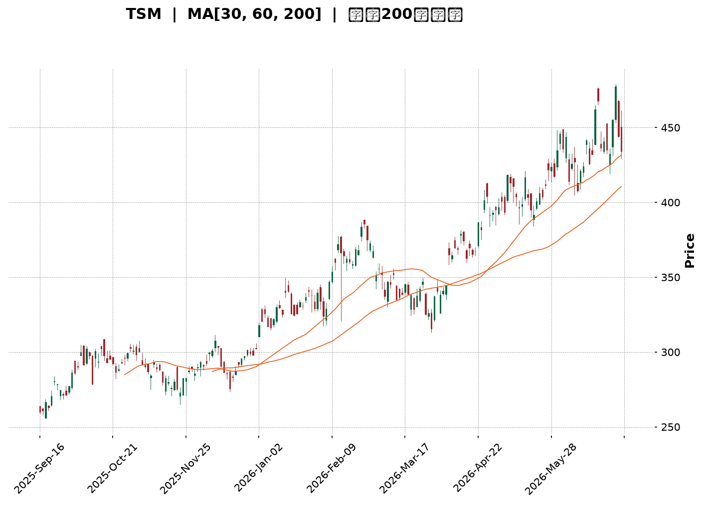
</details>

<html>
<head><meta charset="utf-8" /></head>
<body>
    <div style="height:500px; width:100%;">                        <script>window.PlotlyConfig = {MathJaxConfig: 'local'};</script>
        <script charset="utf-8" src="https://cdn.plot.ly/plotly-3.6.0.min.js" integrity="sha256-QaOVwtVY0T02VaHrr6pnoHLCwayMJp4O5n4YyaE3rJk=" crossorigin="anonymous"></script>                <div id="candlestick-chart" class="plotly-graph-div" style="height:100%; width:100%;"></div>            <script>                window.PLOTLYENV=window.PLOTLYENV || {};                                if (document.getElementById("candlestick-chart")) {                    Plotly.newPlot(                        "candlestick-chart",                        [{"close":{"dtype":"f8","bdata":"AAAAoC1AcEAAAABgxEtwQAAAAMCiqHBAAAAAgMlscEAAAADg+edwQAAAAOD+h3FAAAAAwD5ocUAAAADA8ydxQAAAAICQ83BAAAAAYIDxcEAAAAAgtFFxQAAAAEBv43FAAAAAQLjdcUAAAABgfR5yQAAAAKCSwHJAAAAAALM7ckAAAAAgOuJyQAAAAGCRmHJAAAAAwHNncUAAAAAAWshyQAAAAEAFWnJAAAAAYD7lckAAAADA7pdyQAAAACBeTHJAAAAAAPZ1ckAAAADgUUNyQAAAAKDx6XFAAAAAAFAHckAAAACAdkpyQAAAAACxfnJAAAAA4MKyckAAAACgRutyQAAAAACXzXJAAAAAgEyhckAAAADgn+dyQAAAAEAEPHJAAAAAAII1ckAAAACgqO9xQAAAAEApxHFAAAAAYGJPckAAAAAATA5yQAAAAACRBXJAAAAAQOZ\u002fcUAAAAAAfqlxQAAAACDifHFAAAAAwMs7cUAAAAAgmYJxQAAAAIBJNXFAAAAAYI0OcUAAAABAoqZxQAAAAOBEp3FAAAAAoBb7cUAAAADAsRNyQAAAAODk1nFAAAAA4OYcckAAAAAAPlJyQAAAAMA8KnJAAAAAQKdGckAAAACAKLhyQAAAACCb0HJAAAAAwHE7c0AAAADgh\u002fRyQAAAAMCfKHJAAAAAYC3kcUAAAABAVNZxQAAAAICVOHFAAAAAIHizcUAAAAAgcPdxQAAAAMBcPHJAAAAAwMd2ckAAAABgOpRyQAAAACCJ1HJAAAAAYPm1ckAAAADgpKByQAAAAABA5XJAAAAAAHrfc0AAAADgfwl0QAAAACD0W3RAAAAAQKzQc0AAAABAAsZzQAAAAGB3H3RAAAAAYAmhdEAAAABgH5h0QAAAACDcVnRAAAAAQCU+dUAAAAAAPkp1QAAAAOCnV3RAAAAAABpHdEAAAACg\u002f1p0QAAAAMBh0nRAAAAA4P+vdEAAAADAnQl1QAAAAKCmSHVAAAAAgOAcdUAAAADAxo10QAAAACCwOXVAAAAAoGPgdEAAAACADUF0QAAAAIB7kHRAAAAAoOmwdUAAAAAgVRl2QAAAAGDMgHZAAAAAIK1Cd0AAAABgVON2QAAAAOChx3ZAAAAAAECldkAAAACgXoZ2QAAAAICaaHZAAAAAQCsKd0AAAACgNQJ3QAAAACBH\u002fHdAAAAAgMsbeEAAAAAg+W13QAAAAOB5SndAAAAA4GfzdkAAAABgCvV1QAAAAGClOXZAAAAAAKkAdkAAAAAgXxJ1QAAAAGCGrnVAAAAAoOWUdUAAAABgzQt2QAAAAKCr73RAAAAAgCMJdUAAAACAsyd1QAAAACC\u002fknVAAAAAIG0sdUAAAADA+R91QAAAAECIh3RAAAAAYIwadUAAAAAgK2d1QAAAACAAr3VAAAAAoJFVdEAAAAAgoF90QAAAACArvHNAAAAAIJESdUAAAAAAE0t1QAAAAGD3I3VAAAAAYGJPdUAAAAAgNoh1QAAAAMC40HZAAAAAYC3KdkAAAAAAvxt3QAAAAABOC3dAAAAAAAqwd0AAAAAAlGN3QAAAAGAEqHZAAAAAYCYad0AAAAAgJtZ2QAAAACCF83ZAAAAAgI4oeEAAAABgQdx3QAAAAKBQGHlAAAAAgIpAeUAAAAAAxnZ4QAAAAMCOjnhAAAAAgCeyeEAAAADA2st4QAAAACC\u002fCnlAAAAAANGXeEAAAACAUSh6QAAAAADr0nlAAAAAgH2reUAAAACAhDl5QAAAAAChxXhAAAAAwNrteEAAAACg5wt6QAAAACB8NnlAAAAAIGaweEAAAABAFXt4QAAAACDoCnlAAAAAAC5jeUAAAADAMjl5QAAAAOC0tXlAAAAAoOBbekAAAACg4H16QAAAAMCOF3pAAAAAoMspe0AAAACAV9p7QAAAAEC3OntAAAAAoBa+e0AAAABAM+N5QAAAAGDYnHpAAAAAQLmuekAAAABguHx5QAAAAMAeUXpAAAAAQOF+ekAAAABgZpZ7QAAAAKBHnXpAAAAAYGYCe0AAAACA6+F8QAAAAGC4On1AAAAAgD1Ge0AAAACgR417QAAAAADXL3tAAAAAoJkFe0AAAACgmXF8QAAAAMAe2X1AAAAAIK7De0AAAABgjyJ7QA=="},"high":{"dtype":"f8","bdata":"AEFz3LWFcEDGxgKQ1WtwQHf+5UfMxnBAE9xgT8aHcEDRblttMCNxQPeQy2Q5vHFA4Bz3vC5wcUB\u002fWtyAki9xQAwuA3iJFXFAZ5F\u002fHelacUCXZpDY4FRxQL3bzuFXA3JA\u002fVBCJ2dmckCt7\u002fXx7FtyQJ1qaxZcDnNAG2XPMy8Lc0CPK8NrEgBzQJfTNQhmx3JAqARQ5KWdckCjSa1H+eNyQKamuPFAtnJAbh4H6GcDc0Cph2Nl+E5zQCxdQQTcznJAtiO0lmrUckC57UC+eJByQE5y5PxFTnJAD2785qY8ckBLi9Tf7XlyQPjqWbYXonJAuuspSUm8ckCGcto31hhzQM7\u002fSKaEDnNANs7QVGQUc0BOgJ1uIDtzQLbyzDsQunJAHsC49DZ+ckCTCAAzYkVyQFnCnTw62nFAQs2vb+lsckC87CLp00lyQO30EOcISXJAtrjLOsnzcUCYX5Bs4MlxQJ78WkGjxHFAQJCWnP1fcUB2eJWQNKVxQCWNtJD3KHJAIRUxoS1IcUAZZ\u002fEMTa1xQKSEd\u002fGysnFAA3uw+1QockD90zD6GyZyQKGYQ48jDnJADR69EilDckDbXo7I0GRyQN86RSazO3JAbzanLCynckCqJXJ7EMRyQAkqnFTE5HJAPkK1Z2d4c0AiGJgISgRzQEV30BF163JAFURHcXlkckBwqexmo+9xQCap9mzT+XFAK5RaCvLacUBtlPt1sSpyQMV7cHTmV3JAhYQ3qg+GckB1I8Br9ZlyQNKVrKEh3XJAnwI9ovXuckC+byVfwe9yQI3aYlH2HHNAkLf9cP7+c0BKLFlnwph0QE6\u002fHY7jtXRAnt2OVPdJdECIkGafUC10QO7PNcCcMXRAxH\u002fsxl69dEBnBxjxDet0QKG5RTuignRAc0NlYWPYdUDHbpxo1MB1QObexExDRnVAbrIjsM2+dEAytaExP9V0QKI4QqCs9nRARKdkDwvWdEAsYcXc7zd1QH4ME4KWe3VAzbOhipJfdUBWLXq\u002fciJ1QO5VEhblZnVAFvJoe0KUdUBkHWBP8BB1QOIexkibzXRAWZZRz8K+dUD3d0oqB1x2QEkbSQAqrnZAS28jjBCad0DX+CU7wKB3QFc2uOA9E3dATC845RXFdkBnLsoF3fd2QFazyAP3jnZAUAG0rZckd0DZqOyhKzh3QFiQjCrgMnhAnN9kSkVDeED2xhYjvQd4QM+ZR0rna3dA92EyAOsyd0DDi1wAaCJ2QJke6+i+c3ZA5qa2hfVZdkCPBazO1651QEL7jsOquXVA9DczDu76dUDEP2qDNjh2QITGDLC2kXVAui+54\u002fxrdUDqP7g+vW11QCz7FIkyn3VA84wJbjGydUBtZrSgsTF1QOnnIN\u002f6DHVAgu7CCLlpdUDd4KYGMIF1QBi1XokZ2nVAvVwc3dBBdUAQRETjo4x0QCXWWWJHjXRAk9QT2egZdUB9amNx2L11QC3vAEFVVHVA2v84RlV2dUBcJY09kIt1QJbx6LzOVndA9zhfGvX0dkDcs7GO3pF3QFphvEl5KXdALfXHJkbUd0BleuyoZtF3QP5EFHJcFXdA31+mYj1rd0DCTeA4SRN3QHJeuvIjHndAieaMIA8weEB52bOfoD14QH30QDmIiHlACcn9RIHYeUA0ijH0C894QGlUN2vNrnhA4\u002fnEf7vdeEAoNeDkvDB5QNQ8DJj1a3lAE\u002fbp9+VSeUCLCADWgit6QOFqGaRMMHpA06x\u002fVmkAekDUduU4cGx5QD9VuKjNFHlA1pSljMA7eUAzqAz0vk96QPjZ6yyZjnlA9Gg3x95eeUAqARE\u002fK994QLV+V3\u002f7LnlAN8v8gPqneUAFdXFlXpt5QLtT8jdF+HlAKXjOabTYekAU6zmHnal6QFbG+AHz1npA20Tr8XAFfECpQrOTUfV7QAVmjHi7EXxAlM\u002f+rWnve0DCqqUBLg57QOAHdkq+DHtA4+BEQS5Se0BmKCD8LpV6QAAAAAAAZHpAAAAAQAqvekAAAACgR6l7QAAAAKBHhXtAAAAAAACoe0AAAAAghRN9QAAAAOCjzH1AAAAAoEf1e0AAAACAwr17QAAAAGBmTnxAAAAAgBRCe0AAAACgmYF8QAAAAAAA8H1AAAAAAClIfUAAAAAghdd8QA=="},"hovertemplate":"\u003cb\u003e%{x|%Y-%m-%d}\u003c\u002fb\u003e\u003cbr\u003e\u958b: $%{open:.2f}\u003cbr\u003e\u9ad8: $%{high:.2f}\u003cbr\u003e\u4f4e: $%{low:.2f}\u003cbr\u003e\u6536: $%{close:.2f}\u003cextra\u003e\u003c\u002fextra\u003e","low":{"dtype":"f8","bdata":"rhRKzygpcEDvYwqeMBtwQOiP4HzR\u002fm9AftPDtxVMcEDeDBaO\u002fnVwQIpmRoj5XHFAcos3hucocUCXlzHRPcFwQOf3oD4RyHBAAAAAYIDxcEA7DeG4BvtwQM6cCl4MMHFAkW21NZPMcUAR556QgANyQI9YuUaFmXJAtPaDBMsvckDPiIDm5zpyQLhb4AaEcXJAL0Z1kTZicUDI0TW8jSByQK4iye7+EHJAb+AnlpWbckBmGJA\u002f7WVyQMaWdv\u002fTSXJAxRDF\u002fsxrckDwF0d40zVyQI2a6PbSonFAOWDNmdn1cUB2faogakFyQPrw5UZNNnJAMycTJz5cckA51XBIQcByQLsaG3t9p3JAPTRWlsRlckChP1meILxyQMVwvspxM3JACakYCIkTckBypAWwIdJxQDiqg89pL3FA6cuvOIEXckD2d8dfa+pxQCf72W0O9XFAlNWrc\u002flccUChVRCFgPFwQPhipqXMWXFALEeZs2fpcEDRY1gdjiJxQJQ6ycf7I3FAawmBP76LcEBUUDas3fBwQD+FQbge73BA7lpZCbDXcUBYWUYh2etxQE5zbqidj3FAnppFsLTucUBfo6vgVb1xQJ62FCzm\u002fnFA1zX6MlEvckB4gwUMZ2ZyQAWcSfyognJAKhLY6CjCckCuYHpumaFyQM\u002fSv1DAF3JAotAAICfhcUDF4jA80p1xQCv1CpSoGnFADTvBjtSEcUC7Tul6h85xQJLC55NpG3JAHfisvysrckDXYH3aUWtyQNEbR1LFj3JAB7LnKdeRckBHtng8k55yQGluNG\u002ft3XJAhKrCRZFhc0D65g2qj\u002f1zQOpyx0m\u002fLnRA11Rv0nHOc0BD9\u002f0dPqhzQBlsziLUyXNAbLMhuI72c0AyVmctR5F0QKJ0gZVoMnRA5\u002fpecO4CdUCfDRaKRzt1QOS5TFmEU3RAt2dRAxlAdEAKaANlhFN0QN1ZxW6rmnRAZaJ2FYaIdEC8R\u002f9zcs10QP56FOG1DnVAmObu8DVodEDRNGhciXZ0QLh2clmJdnRA0s6KIS6FdEA7mruq4dZzQH7UfwId4HNAFj\u002fCNbfudEAbhZ61MqB1QED9N7XuKHZAxfqX\u002f\u002fHndkA0IaHEHAd0QG+USu6mbnZAVTiqU4smdkDD7p1hsm12QAGArlqlOXZAYu\u002ff1RFUdkAImD4+Ocl2QE8q0RTgYXdA\u002fQJkDaLtd0C4zQdOzPx2QPjyoDib63ZA91yppGmsdkCwWhKi8GV1QENFSrekC3ZAXvHACIdgdUCz6acwWu90QAKgK8Fso3RAlxtoRqVodUBXPLeL8sh1QGfFa\u002fJq6nRAEVXg397ndEADXKvBLCF1QMFDRuq\u002fGXVAkYR\u002fM8EodUCJXvJF4kZ0QIlNhpY3UnRApuhqFjmldEDOZZlU1dN0QG3f3ssoa3VAOBXrtMFJdEAx8whF6Rh0QHKWv7YRkXNAg6NtPjwGdEAueMKmTC91QJFDB2KVYHRAbt297EIddUCs2iFK2u10QAekTBxpZnZAB721JQl+dkAc22+CLQ53QNlUrq8d03ZAdTvJdJFFd0DrkCQocjV3QA9QzUtSe3ZAYydQK5fEdkC\u002fREIrYrZ2QHh4NmwcxHZAatoPhmIcd0A1kbVN6W53QL1ti4XgjnhAY\u002fCTlG73eEDw0gG90fx3QMEmv3FeNHhA1TNk7PAMeEDRkk3ka3N4QIvSyTdtpHhAu64ykux6eEAKIK9DbPt4QK8BY+2AcnlAKNTrGhj\u002feEBMzrakJ9R4QPyab2x8E3hAlLVX1+JoeEBR+\u002feakRJ5QLVJJ\u002fNe3nhATGFMhC5ieECy\u002fLrAkAJ4QJVniiJmsHhAn4wbvTnpeEB2\u002fbxCsx55QJQYSGjKkXlAnnDPVo3meUBvaHVi29t5QFmP4vtmBHpAG3GoxjRYekDqya103C97QFYVros8GHtAhhBKntOkekD4xb6GNb15QK+D31yvWHpAK7bIVQBJeUCj5k+s9Wt5QAAAAIDCjXlAAAAAIFwTekAAAABA4f56QAAAAEAzk3pAAAAAgD36ekAAAACAPWZ7QAAAAGC4En1AAAAAQAoje0AAAACgRwl7QAAAAEAKB3tAAAAAQAozekAAAACgcPF6QAAAAAAAUHxAAAAAIIW3e0AAAAAAANh6QA=="},"name":"\u50f9\u683c","open":{"dtype":"f8","bdata":"1Sdao3R9cEC3zBt9X2RwQJ5qI\u002fVz\u002f29AVLcRd5mEcEDjJDhGTIdwQK1GVQ0Tg3FAEoAtL+VhcUAAyA49we9wQPuFyIb6+3BAc8K72kAlcUCq\u002f8ohrhJxQBSTlpI1RHFAe4f0TjpjckC36YIrIClyQNrlz8ihmnJAiDrzcpADc0DYuKccGUtyQIxNDc8kv3JAB5j8c9aZckBpf5ZoiH5yQMsLW20ZVXJAY\u002fAqh1P+ckBnQoQ8\u002fEdzQLJogo4SgXJAwuTzGHmackByLnEXmYpyQCTTezBZK3JALSxKaIz4cUBsFBiXJVRyQETA2JAKhXJAHqlvi81\u002fckARGIIDjPZyQHFn1vtdy3JALdBhM5D5ckAnVkuxlsNyQFWsf1\u002fxaHJAQgQ+qlAlckBJPfOdzzxyQMXTh6+ur3FAnaMpJPBAckAZ5dLfbBxyQDUlbh52NnJAKXkFLIzucUA2DOLyCxxxQI5B5KDVc3FAYEBopxQ2cUDYUoqGFCxxQP8Fi4\u002fOHnJAPHuEbdXqcEBUUDas3fBwQACb2TFQiHFAlOQlqm\u002ftcUBQ1djPFyNyQHBLOVbUynFAZbnKIXkbckBFWWi3VB5yQBqcEADoOnJA\u002fZfaSMRbckD6d5G0ha1yQG\u002f2UkVQmnJAL2GfgLjvckCyev8aA\u002fxyQEV30BF163JA2YdewCBackBqRxGKidxxQIS08azA8HFAiGBeI5C4cUC7Tul6h85xQB66yPx8UnJAd+R8nEU+ckBDF7HwWoNyQJap3sS8pXJAQ08\u002fxanDckAd6bw55cxyQBkCQS8A53JA0Gm+QAZmc0B+SGCsOot0QGeXn0NdiHRAWHwxRQUwdEBtdCVwkCt0QJrern\u002f64nNA5GsjsxwHdECQZ5LNi7J0QKG5RTuignRAZ+GO3sRQdUDAmVEZqot1QBtKSm6dMHVABFkE3HW7dED2KS0iTbt0QJqjJvLPpXRAdrHC8EWxdEDa3YLcU+x0QEmhumFFVHVA6+ypPNsgdUAknaoPI9t0QLrMFsf1kHRA+p5kKr50dUDcOiGNAN50QOMEEqaSEnRAc\u002f3N8D78dEC8z6a\u002feq91QIUR1q1Rp3ZAFiygi9gCd0BNY3dI1ZB3QCS6vgML9HZAVxVfTSmAdkD3HiVx1p92QPLG8TrwXXZAA5gsxeRedkC03PWJ+tF2QME1cS4zl3dAnN9kSkVDeEAbJQpeHwN4QP5qrDjNA3dAyHk80ra3dkCNl+n9Dbx1QEIz8pV8OXZApSgK+zYRdkDBHiKTwFt1QC9lbYgA3nRAOh+pEt2qdUAksl8jxgF2QF+X96VugnVADAU\u002fBXBidUASz+Hm7zd1QH+gdxzePHVALWpM0o2PdUChBhCVNod0QEVwCE1L\u002fnRApuhqFjmldEDLyzVfk+x0QEunPd8Qk3VA20aEq2owdUDg8lAHI0F0QKjyFfr3ZnRADSodTOkYdECLccpPi3F1QNCYA+A4YXRAsuhVnEwvdUCdBynlWSp1QJuN7jzMFndAE9UnFTindkBlX\u002fs+Zmt3QP7gkKVRFndAqHZrgniid0DYOV1dTch3QPlbB4X4\u002f3ZAqUtMyT9Fd0BMYUy7twV3QAAAACCF83ZAFfQ6\u002fZQud0BhLLLIovV3QLSsRHtus3hApFVqcojMeUCku\u002fn6QnN4QNSA1k3ff3hA4aGwwBbOeEAhkPoaVYh4QPDCyKYyOXlAGSIpvHk6eUC+Z3KEWxd5QNNfaIvPEXpAqcb2EJ3\u002feUDag1KSolx5QJMxkKAhzXhAR1xKhG7VeECw56V7SSR5QLMB3ezNWHlA9Gg3x95eeUBc8KJqmUl4QGGOPdYowXhAn4wbvTnpeEBds0ojk4d5QG6IG\u002fh5wnlAhRH3UVugekDns7GDvFN6QOKIDcInoXpAR2n7fzJ+ekA+F8tYz3h7QCQxDrkED3xAF4hFgPvZekBROrIHQcx6QCs+En96bHpAtn9hDPndekDtCE6k4s95QAAAAAAp1HlAAAAAwMxAekAAAABA4Wp7QAAAAOBRQHtAAAAAAAAse0AAAACAFG57QAAAAKBwwX1AAAAAQOFye0AAAAAgrh97QAAAAGBmTnxAAAAAAACQekAAAAAAAFB7QAAAAIDCeXxAAAAAYLg6fUAAAADgoyh8QA=="},"x":["2025-09-16T00:00:00-04:00","2025-09-17T00:00:00-04:00","2025-09-18T00:00:00-04:00","2025-09-19T00:00:00-04:00","2025-09-22T00:00:00-04:00","2025-09-23T00:00:00-04:00","2025-09-24T00:00:00-04:00","2025-09-25T00:00:00-04:00","2025-09-26T00:00:00-04:00","2025-09-29T00:00:00-04:00","2025-09-30T00:00:00-04:00","2025-10-01T00:00:00-04:00","2025-10-02T00:00:00-04:00","2025-10-03T00:00:00-04:00","2025-10-06T00:00:00-04:00","2025-10-07T00:00:00-04:00","2025-10-08T00:00:00-04:00","2025-10-09T00:00:00-04:00","2025-10-10T00:00:00-04:00","2025-10-13T00:00:00-04:00","2025-10-14T00:00:00-04:00","2025-10-15T00:00:00-04:00","2025-10-16T00:00:00-04:00","2025-10-17T00:00:00-04:00","2025-10-20T00:00:00-04:00","2025-10-21T00:00:00-04:00","2025-10-22T00:00:00-04:00","2025-10-23T00:00:00-04:00","2025-10-24T00:00:00-04:00","2025-10-27T00:00:00-04:00","2025-10-28T00:00:00-04:00","2025-10-29T00:00:00-04:00","2025-10-30T00:00:00-04:00","2025-10-31T00:00:00-04:00","2025-11-03T00:00:00-05:00","2025-11-04T00:00:00-05:00","2025-11-05T00:00:00-05:00","2025-11-06T00:00:00-05:00","2025-11-07T00:00:00-05:00","2025-11-10T00:00:00-05:00","2025-11-11T00:00:00-05:00","2025-11-12T00:00:00-05:00","2025-11-13T00:00:00-05:00","2025-11-14T00:00:00-05:00","2025-11-17T00:00:00-05:00","2025-11-18T00:00:00-05:00","2025-11-19T00:00:00-05:00","2025-11-20T00:00:00-05:00","2025-11-21T00:00:00-05:00","2025-11-24T00:00:00-05:00","2025-11-25T00:00:00-05:00","2025-11-26T00:00:00-05:00","2025-11-28T00:00:00-05:00","2025-12-01T00:00:00-05:00","2025-12-02T00:00:00-05:00","2025-12-03T00:00:00-05:00","2025-12-04T00:00:00-05:00","2025-12-05T00:00:00-05:00","2025-12-08T00:00:00-05:00","2025-12-09T00:00:00-05:00","2025-12-10T00:00:00-05:00","2025-12-11T00:00:00-05:00","2025-12-12T00:00:00-05:00","2025-12-15T00:00:00-05:00","2025-12-16T00:00:00-05:00","2025-12-17T00:00:00-05:00","2025-12-18T00:00:00-05:00","2025-12-19T00:00:00-05:00","2025-12-22T00:00:00-05:00","2025-12-23T00:00:00-05:00","2025-12-24T00:00:00-05:00","2025-12-26T00:00:00-05:00","2025-12-29T00:00:00-05:00","2025-12-30T00:00:00-05:00","2025-12-31T00:00:00-05:00","2026-01-02T00:00:00-05:00","2026-01-05T00:00:00-05:00","2026-01-06T00:00:00-05:00","2026-01-07T00:00:00-05:00","2026-01-08T00:00:00-05:00","2026-01-09T00:00:00-05:00","2026-01-12T00:00:00-05:00","2026-01-13T00:00:00-05:00","2026-01-14T00:00:00-05:00","2026-01-15T00:00:00-05:00","2026-01-16T00:00:00-05:00","2026-01-20T00:00:00-05:00","2026-01-21T00:00:00-05:00","2026-01-22T00:00:00-05:00","2026-01-23T00:00:00-05:00","2026-01-26T00:00:00-05:00","2026-01-27T00:00:00-05:00","2026-01-28T00:00:00-05:00","2026-01-29T00:00:00-05:00","2026-01-30T00:00:00-05:00","2026-02-02T00:00:00-05:00","2026-02-03T00:00:00-05:00","2026-02-04T00:00:00-05:00","2026-02-05T00:00:00-05:00","2026-02-06T00:00:00-05:00","2026-02-09T00:00:00-05:00","2026-02-10T00:00:00-05:00","2026-02-11T00:00:00-05:00","2026-02-12T00:00:00-05:00","2026-02-13T00:00:00-05:00","2026-02-17T00:00:00-05:00","2026-02-18T00:00:00-05:00","2026-02-19T00:00:00-05:00","2026-02-20T00:00:00-05:00","2026-02-23T00:00:00-05:00","2026-02-24T00:00:00-05:00","2026-02-25T00:00:00-05:00","2026-02-26T00:00:00-05:00","2026-02-27T00:00:00-05:00","2026-03-02T00:00:00-05:00","2026-03-03T00:00:00-05:00","2026-03-04T00:00:00-05:00","2026-03-05T00:00:00-05:00","2026-03-06T00:00:00-05:00","2026-03-09T00:00:00-04:00","2026-03-10T00:00:00-04:00","2026-03-11T00:00:00-04:00","2026-03-12T00:00:00-04:00","2026-03-13T00:00:00-04:00","2026-03-16T00:00:00-04:00","2026-03-17T00:00:00-04:00","2026-03-18T00:00:00-04:00","2026-03-19T00:00:00-04:00","2026-03-20T00:00:00-04:00","2026-03-23T00:00:00-04:00","2026-03-24T00:00:00-04:00","2026-03-25T00:00:00-04:00","2026-03-26T00:00:00-04:00","2026-03-27T00:00:00-04:00","2026-03-30T00:00:00-04:00","2026-03-31T00:00:00-04:00","2026-04-01T00:00:00-04:00","2026-04-02T00:00:00-04:00","2026-04-06T00:00:00-04:00","2026-04-07T00:00:00-04:00","2026-04-08T00:00:00-04:00","2026-04-09T00:00:00-04:00","2026-04-10T00:00:00-04:00","2026-04-13T00:00:00-04:00","2026-04-14T00:00:00-04:00","2026-04-15T00:00:00-04:00","2026-04-16T00:00:00-04:00","2026-04-17T00:00:00-04:00","2026-04-20T00:00:00-04:00","2026-04-21T00:00:00-04:00","2026-04-22T00:00:00-04:00","2026-04-23T00:00:00-04:00","2026-04-24T00:00:00-04:00","2026-04-27T00:00:00-04:00","2026-04-28T00:00:00-04:00","2026-04-29T00:00:00-04:00","2026-04-30T00:00:00-04:00","2026-05-01T00:00:00-04:00","2026-05-04T00:00:00-04:00","2026-05-05T00:00:00-04:00","2026-05-06T00:00:00-04:00","2026-05-07T00:00:00-04:00","2026-05-08T00:00:00-04:00","2026-05-11T00:00:00-04:00","2026-05-12T00:00:00-04:00","2026-05-13T00:00:00-04:00","2026-05-14T00:00:00-04:00","2026-05-15T00:00:00-04:00","2026-05-18T00:00:00-04:00","2026-05-19T00:00:00-04:00","2026-05-20T00:00:00-04:00","2026-05-21T00:00:00-04:00","2026-05-22T00:00:00-04:00","2026-05-26T00:00:00-04:00","2026-05-27T00:00:00-04:00","2026-05-28T00:00:00-04:00","2026-05-29T00:00:00-04:00","2026-06-01T00:00:00-04:00","2026-06-02T00:00:00-04:00","2026-06-03T00:00:00-04:00","2026-06-04T00:00:00-04:00","2026-06-05T00:00:00-04:00","2026-06-08T00:00:00-04:00","2026-06-09T00:00:00-04:00","2026-06-10T00:00:00-04:00","2026-06-11T00:00:00-04:00","2026-06-12T00:00:00-04:00","2026-06-15T00:00:00-04:00","2026-06-16T00:00:00-04:00","2026-06-17T00:00:00-04:00","2026-06-18T00:00:00-04:00","2026-06-22T00:00:00-04:00","2026-06-23T00:00:00-04:00","2026-06-24T00:00:00-04:00","2026-06-25T00:00:00-04:00","2026-06-26T00:00:00-04:00","2026-06-29T00:00:00-04:00","2026-06-30T00:00:00-04:00","2026-07-01T00:00:00-04:00","2026-07-02T00:00:00-04:00"],"type":"candlestick"},{"hovertemplate":"MA30: $%{y:.2f}\u003cextra\u003e\u003c\u002fextra\u003e","line":{"color":"#2196F3","dash":"dash","width":2},"mode":"lines","name":"MA30","x":["2025-09-16T00:00:00-04:00","2025-09-17T00:00:00-04:00","2025-09-18T00:00:00-04:00","2025-09-19T00:00:00-04:00","2025-09-22T00:00:00-04:00","2025-09-23T00:00:00-04:00","2025-09-24T00:00:00-04:00","2025-09-25T00:00:00-04:00","2025-09-26T00:00:00-04:00","2025-09-29T00:00:00-04:00","2025-09-30T00:00:00-04:00","2025-10-01T00:00:00-04:00","2025-10-02T00:00:00-04:00","2025-10-03T00:00:00-04:00","2025-10-06T00:00:00-04:00","2025-10-07T00:00:00-04:00","2025-10-08T00:00:00-04:00","2025-10-09T00:00:00-04:00","2025-10-10T00:00:00-04:00","2025-10-13T00:00:00-04:00","2025-10-14T00:00:00-04:00","2025-10-15T00:00:00-04:00","2025-10-16T00:00:00-04:00","2025-10-17T00:00:00-04:00","2025-10-20T00:00:00-04:00","2025-10-21T00:00:00-04:00","2025-10-22T00:00:00-04:00","2025-10-23T00:00:00-04:00","2025-10-24T00:00:00-04:00","2025-10-27T00:00:00-04:00","2025-10-28T00:00:00-04:00","2025-10-29T00:00:00-04:00","2025-10-30T00:00:00-04:00","2025-10-31T00:00:00-04:00","2025-11-03T00:00:00-05:00","2025-11-04T00:00:00-05:00","2025-11-05T00:00:00-05:00","2025-11-06T00:00:00-05:00","2025-11-07T00:00:00-05:00","2025-11-10T00:00:00-05:00","2025-11-11T00:00:00-05:00","2025-11-12T00:00:00-05:00","2025-11-13T00:00:00-05:00","2025-11-14T00:00:00-05:00","2025-11-17T00:00:00-05:00","2025-11-18T00:00:00-05:00","2025-11-19T00:00:00-05:00","2025-11-20T00:00:00-05:00","2025-11-21T00:00:00-05:00","2025-11-24T00:00:00-05:00","2025-11-25T00:00:00-05:00","2025-11-26T00:00:00-05:00","2025-11-28T00:00:00-05:00","2025-12-01T00:00:00-05:00","2025-12-02T00:00:00-05:00","2025-12-03T00:00:00-05:00","2025-12-04T00:00:00-05:00","2025-12-05T00:00:00-05:00","2025-12-08T00:00:00-05:00","2025-12-09T00:00:00-05:00","2025-12-10T00:00:00-05:00","2025-12-11T00:00:00-05:00","2025-12-12T00:00:00-05:00","2025-12-15T00:00:00-05:00","2025-12-16T00:00:00-05:00","2025-12-17T00:00:00-05:00","2025-12-18T00:00:00-05:00","2025-12-19T00:00:00-05:00","2025-12-22T00:00:00-05:00","2025-12-23T00:00:00-05:00","2025-12-24T00:00:00-05:00","2025-12-26T00:00:00-05:00","2025-12-29T00:00:00-05:00","2025-12-30T00:00:00-05:00","2025-12-31T00:00:00-05:00","2026-01-02T00:00:00-05:00","2026-01-05T00:00:00-05:00","2026-01-06T00:00:00-05:00","2026-01-07T00:00:00-05:00","2026-01-08T00:00:00-05:00","2026-01-09T00:00:00-05:00","2026-01-12T00:00:00-05:00","2026-01-13T00:00:00-05:00","2026-01-14T00:00:00-05:00","2026-01-15T00:00:00-05:00","2026-01-16T00:00:00-05:00","2026-01-20T00:00:00-05:00","2026-01-21T00:00:00-05:00","2026-01-22T00:00:00-05:00","2026-01-23T00:00:00-05:00","2026-01-26T00:00:00-05:00","2026-01-27T00:00:00-05:00","2026-01-28T00:00:00-05:00","2026-01-29T00:00:00-05:00","2026-01-30T00:00:00-05:00","2026-02-02T00:00:00-05:00","2026-02-03T00:00:00-05:00","2026-02-04T00:00:00-05:00","2026-02-05T00:00:00-05:00","2026-02-06T00:00:00-05:00","2026-02-09T00:00:00-05:00","2026-02-10T00:00:00-05:00","2026-02-11T00:00:00-05:00","2026-02-12T00:00:00-05:00","2026-02-13T00:00:00-05:00","2026-02-17T00:00:00-05:00","2026-02-18T00:00:00-05:00","2026-02-19T00:00:00-05:00","2026-02-20T00:00:00-05:00","2026-02-23T00:00:00-05:00","2026-02-24T00:00:00-05:00","2026-02-25T00:00:00-05:00","2026-02-26T00:00:00-05:00","2026-02-27T00:00:00-05:00","2026-03-02T00:00:00-05:00","2026-03-03T00:00:00-05:00","2026-03-04T00:00:00-05:00","2026-03-05T00:00:00-05:00","2026-03-06T00:00:00-05:00","2026-03-09T00:00:00-04:00","2026-03-10T00:00:00-04:00","2026-03-11T00:00:00-04:00","2026-03-12T00:00:00-04:00","2026-03-13T00:00:00-04:00","2026-03-16T00:00:00-04:00","2026-03-17T00:00:00-04:00","2026-03-18T00:00:00-04:00","2026-03-19T00:00:00-04:00","2026-03-20T00:00:00-04:00","2026-03-23T00:00:00-04:00","2026-03-24T00:00:00-04:00","2026-03-25T00:00:00-04:00","2026-03-26T00:00:00-04:00","2026-03-27T00:00:00-04:00","2026-03-30T00:00:00-04:00","2026-03-31T00:00:00-04:00","2026-04-01T00:00:00-04:00","2026-04-02T00:00:00-04:00","2026-04-06T00:00:00-04:00","2026-04-07T00:00:00-04:00","2026-04-08T00:00:00-04:00","2026-04-09T00:00:00-04:00","2026-04-10T00:00:00-04:00","2026-04-13T00:00:00-04:00","2026-04-14T00:00:00-04:00","2026-04-15T00:00:00-04:00","2026-04-16T00:00:00-04:00","2026-04-17T00:00:00-04:00","2026-04-20T00:00:00-04:00","2026-04-21T00:00:00-04:00","2026-04-22T00:00:00-04:00","2026-04-23T00:00:00-04:00","2026-04-24T00:00:00-04:00","2026-04-27T00:00:00-04:00","2026-04-28T00:00:00-04:00","2026-04-29T00:00:00-04:00","2026-04-30T00:00:00-04:00","2026-05-01T00:00:00-04:00","2026-05-04T00:00:00-04:00","2026-05-05T00:00:00-04:00","2026-05-06T00:00:00-04:00","2026-05-07T00:00:00-04:00","2026-05-08T00:00:00-04:00","2026-05-11T00:00:00-04:00","2026-05-12T00:00:00-04:00","2026-05-13T00:00:00-04:00","2026-05-14T00:00:00-04:00","2026-05-15T00:00:00-04:00","2026-05-18T00:00:00-04:00","2026-05-19T00:00:00-04:00","2026-05-20T00:00:00-04:00","2026-05-21T00:00:00-04:00","2026-05-22T00:00:00-04:00","2026-05-26T00:00:00-04:00","2026-05-27T00:00:00-04:00","2026-05-28T00:00:00-04:00","2026-05-29T00:00:00-04:00","2026-06-01T00:00:00-04:00","2026-06-02T00:00:00-04:00","2026-06-03T00:00:00-04:00","2026-06-04T00:00:00-04:00","2026-06-05T00:00:00-04:00","2026-06-08T00:00:00-04:00","2026-06-09T00:00:00-04:00","2026-06-10T00:00:00-04:00","2026-06-11T00:00:00-04:00","2026-06-12T00:00:00-04:00","2026-06-15T00:00:00-04:00","2026-06-16T00:00:00-04:00","2026-06-17T00:00:00-04:00","2026-06-18T00:00:00-04:00","2026-06-22T00:00:00-04:00","2026-06-23T00:00:00-04:00","2026-06-24T00:00:00-04:00","2026-06-25T00:00:00-04:00","2026-06-26T00:00:00-04:00","2026-06-29T00:00:00-04:00","2026-06-30T00:00:00-04:00","2026-07-01T00:00:00-04:00","2026-07-02T00:00:00-04:00"],"y":{"dtype":"f8","bdata":"AAAAAAAA+H8AAAAAAAD4fwAAAAAAAPh\u002fAAAAAAAA+H8AAAAAAAD4fwAAAAAAAPh\u002fAAAAAAAA+H8AAAAAAAD4fwAAAAAAAPh\u002fAAAAAAAA+H8AAAAAAAD4fwAAAAAAAPh\u002fAAAAAAAA+H8AAAAAAAD4fwAAAAAAAPh\u002fAAAAAAAA+H8AAAAAAAD4fwAAAAAAAPh\u002fAAAAAAAA+H8AAAAAAAD4fwAAAAAAAPh\u002fAAAAAAAA+H8AAAAAAAD4fwAAAAAAAPh\u002fAAAAAAAA+H8AAAAAAAD4fwAAAAAAAPh\u002fAAAAAAAA+H8AAAAAAAD4fwAAACB4zHFAd3d391rhcUDNzMwsvfdxQFVVVZUJCnJAAAAAwNocckARERHR6C1yQO\u002fu7v7oM3JAIiIiksA6ckC8u7u7aEFyQCIiIsJcSHJAzczMbAZUckARERHBT1pyQDMzMwNzW3JAmpmZaVJYckCJiIgIbFRyQCIiIuKhSXJAzczMLBpBckC8u7ubYTVyQBEREeGJKXJARERERJMmckAiIiIC6xxyQJqZman1FnJAmpmZiScPckCrqqoavwpyQJqZmanUBnJAERERsdwDckB3d3cHXARyQKuqqqqABnJAzczMLJ0IckDe3d09RQxyQO\u002fu7j4AD3JAvLu7m44TckBVVVWV3RNyQAAAAOBdDnJAmpmZCRAIckCrqqrq8\u002f5xQHd3dxdO9nFA3t3dbfjxcUAAAADQOvJxQHd3d4c89nFAVVVVtYz3cUBmZmaWA\u002fxxQJqZmbnpAnJAIiIisj8NckCamZm5fBVyQKuqqtp\u002fIXJAmpmZqQU4ckAzMzPjlU1yQBEREXF5aHJAERERAQOAckDe3d3NH5JyQN7d3Y0yp3JAZmZmtsu9ckBVVVXVRtNyQAAAAOCb6HJAd3d3J1EDc0DNzMx8phxzQAAAACA7L3NAREREBFBAc0Dv7u4eRk5zQHd3d1dmX3NAq6qqetFrc0CamZl5ln1zQO\u002fu7l5BmHNA7+7uzr6zc0CrqqpK7cpzQImIiNgY7XNAMzMzwzEIdEAiIiICtxt0QGZmZuaVL3RAAAAAkB9LdEDNzMz8KGl0QAAAAJCAiHRAq6qqWlOvdECamZmJrtN0QO\u002fu7u7T9HRAq6qqqnwMdUCrqqpKtyF1QN7d3U00M3VAmpmZibhOdUCamZnZU2p1QFVVVbVJi3VAiYiI2PqodUBVVVXFLMF1QCIiIrJc2nVAvLu7++\u002fodUBmZmZ2oe51QCIiInKy\u002fnVAmpmZaWoNdkAiIiIyhxN2QAAAAMDdGnZAIiIiAn8idkAiIiIyGit2QFVVVeUiKHZAZmZmdnondkBERET0myx2QLy7u+uTL3ZAVVVVxRwydkC8u7sLizl2QLy7u6s+OXZAAAAAkDs0dkCrqqo6Sy52QERERPRMJ3ZAIiIiklQOdkARERGh3\u002fh1QERERDTk3nVAmpmZ+XfRdUBERER09cZ1QHd3dzcjvHVAmpmZyWCtdUBEREQ0x6B1QN7d3f3KlnVAzczM\u002fImLdUARERFRzIh1QBEREUGxhnVAzczM7PqMdUBmZma2Mpl1QLy7u4vgnHVAd3d3l0KmdUAiIiLCUbV1QM3MzAwnwHVAVVVVJSTWdUCrqqp6n+V1QCIiInIcCXZAiYiIWBctdkAiIiKyU0l2QM3MzIzJYnZAvLu7S9iAdkCJiIiYLKB2QM3MzGyuxnZAq6qq+nTkdkAzMzNTBw13QERERPRbMHdAERER0eNdd0C8u7tLSYd3QBEREbFEsndAvLu7iy3Td0Crqqoqvft3QDMzM1N9HnhAiYiIyFI7eECrqqpafFR4QO\u002fu7u59Z3hA7+7unqh9eEAzMzMDtY94QM3MzCx0pnhAiYiImD+9eEDe3d2dudd4QHd3dwcL9XhAvLu7q7IXeUDe3d0dgUJ5QJqZmckCZ3lAREREZJiFeUCJiIi45JZ5QN7d3S3Yo3lAAAAA8AyweUB3d3c3yLh5QERERATNx3lAq6qqiijXeUDv7u7++e55QCIiIvJk\u002fHlAZmZmhgMRekBERERkRCh6QFVVVcVTRXpAZmZm1gRTekDNzMys4GZ6QDMzMxN8e3pAVVVVxVeNekAzMzOjzKF6QHd3d5dayXpAmpmZuZjjekDe3d3tPvp6QA=="},"type":"scatter"},{"hovertemplate":"MA60: $%{y:.2f}\u003cextra\u003e\u003c\u002fextra\u003e","line":{"color":"#9C27B0","dash":"dash","width":2},"mode":"lines","name":"MA60","x":["2025-09-16T00:00:00-04:00","2025-09-17T00:00:00-04:00","2025-09-18T00:00:00-04:00","2025-09-19T00:00:00-04:00","2025-09-22T00:00:00-04:00","2025-09-23T00:00:00-04:00","2025-09-24T00:00:00-04:00","2025-09-25T00:00:00-04:00","2025-09-26T00:00:00-04:00","2025-09-29T00:00:00-04:00","2025-09-30T00:00:00-04:00","2025-10-01T00:00:00-04:00","2025-10-02T00:00:00-04:00","2025-10-03T00:00:00-04:00","2025-10-06T00:00:00-04:00","2025-10-07T00:00:00-04:00","2025-10-08T00:00:00-04:00","2025-10-09T00:00:00-04:00","2025-10-10T00:00:00-04:00","2025-10-13T00:00:00-04:00","2025-10-14T00:00:00-04:00","2025-10-15T00:00:00-04:00","2025-10-16T00:00:00-04:00","2025-10-17T00:00:00-04:00","2025-10-20T00:00:00-04:00","2025-10-21T00:00:00-04:00","2025-10-22T00:00:00-04:00","2025-10-23T00:00:00-04:00","2025-10-24T00:00:00-04:00","2025-10-27T00:00:00-04:00","2025-10-28T00:00:00-04:00","2025-10-29T00:00:00-04:00","2025-10-30T00:00:00-04:00","2025-10-31T00:00:00-04:00","2025-11-03T00:00:00-05:00","2025-11-04T00:00:00-05:00","2025-11-05T00:00:00-05:00","2025-11-06T00:00:00-05:00","2025-11-07T00:00:00-05:00","2025-11-10T00:00:00-05:00","2025-11-11T00:00:00-05:00","2025-11-12T00:00:00-05:00","2025-11-13T00:00:00-05:00","2025-11-14T00:00:00-05:00","2025-11-17T00:00:00-05:00","2025-11-18T00:00:00-05:00","2025-11-19T00:00:00-05:00","2025-11-20T00:00:00-05:00","2025-11-21T00:00:00-05:00","2025-11-24T00:00:00-05:00","2025-11-25T00:00:00-05:00","2025-11-26T00:00:00-05:00","2025-11-28T00:00:00-05:00","2025-12-01T00:00:00-05:00","2025-12-02T00:00:00-05:00","2025-12-03T00:00:00-05:00","2025-12-04T00:00:00-05:00","2025-12-05T00:00:00-05:00","2025-12-08T00:00:00-05:00","2025-12-09T00:00:00-05:00","2025-12-10T00:00:00-05:00","2025-12-11T00:00:00-05:00","2025-12-12T00:00:00-05:00","2025-12-15T00:00:00-05:00","2025-12-16T00:00:00-05:00","2025-12-17T00:00:00-05:00","2025-12-18T00:00:00-05:00","2025-12-19T00:00:00-05:00","2025-12-22T00:00:00-05:00","2025-12-23T00:00:00-05:00","2025-12-24T00:00:00-05:00","2025-12-26T00:00:00-05:00","2025-12-29T00:00:00-05:00","2025-12-30T00:00:00-05:00","2025-12-31T00:00:00-05:00","2026-01-02T00:00:00-05:00","2026-01-05T00:00:00-05:00","2026-01-06T00:00:00-05:00","2026-01-07T00:00:00-05:00","2026-01-08T00:00:00-05:00","2026-01-09T00:00:00-05:00","2026-01-12T00:00:00-05:00","2026-01-13T00:00:00-05:00","2026-01-14T00:00:00-05:00","2026-01-15T00:00:00-05:00","2026-01-16T00:00:00-05:00","2026-01-20T00:00:00-05:00","2026-01-21T00:00:00-05:00","2026-01-22T00:00:00-05:00","2026-01-23T00:00:00-05:00","2026-01-26T00:00:00-05:00","2026-01-27T00:00:00-05:00","2026-01-28T00:00:00-05:00","2026-01-29T00:00:00-05:00","2026-01-30T00:00:00-05:00","2026-02-02T00:00:00-05:00","2026-02-03T00:00:00-05:00","2026-02-04T00:00:00-05:00","2026-02-05T00:00:00-05:00","2026-02-06T00:00:00-05:00","2026-02-09T00:00:00-05:00","2026-02-10T00:00:00-05:00","2026-02-11T00:00:00-05:00","2026-02-12T00:00:00-05:00","2026-02-13T00:00:00-05:00","2026-02-17T00:00:00-05:00","2026-02-18T00:00:00-05:00","2026-02-19T00:00:00-05:00","2026-02-20T00:00:00-05:00","2026-02-23T00:00:00-05:00","2026-02-24T00:00:00-05:00","2026-02-25T00:00:00-05:00","2026-02-26T00:00:00-05:00","2026-02-27T00:00:00-05:00","2026-03-02T00:00:00-05:00","2026-03-03T00:00:00-05:00","2026-03-04T00:00:00-05:00","2026-03-05T00:00:00-05:00","2026-03-06T00:00:00-05:00","2026-03-09T00:00:00-04:00","2026-03-10T00:00:00-04:00","2026-03-11T00:00:00-04:00","2026-03-12T00:00:00-04:00","2026-03-13T00:00:00-04:00","2026-03-16T00:00:00-04:00","2026-03-17T00:00:00-04:00","2026-03-18T00:00:00-04:00","2026-03-19T00:00:00-04:00","2026-03-20T00:00:00-04:00","2026-03-23T00:00:00-04:00","2026-03-24T00:00:00-04:00","2026-03-25T00:00:00-04:00","2026-03-26T00:00:00-04:00","2026-03-27T00:00:00-04:00","2026-03-30T00:00:00-04:00","2026-03-31T00:00:00-04:00","2026-04-01T00:00:00-04:00","2026-04-02T00:00:00-04:00","2026-04-06T00:00:00-04:00","2026-04-07T00:00:00-04:00","2026-04-08T00:00:00-04:00","2026-04-09T00:00:00-04:00","2026-04-10T00:00:00-04:00","2026-04-13T00:00:00-04:00","2026-04-14T00:00:00-04:00","2026-04-15T00:00:00-04:00","2026-04-16T00:00:00-04:00","2026-04-17T00:00:00-04:00","2026-04-20T00:00:00-04:00","2026-04-21T00:00:00-04:00","2026-04-22T00:00:00-04:00","2026-04-23T00:00:00-04:00","2026-04-24T00:00:00-04:00","2026-04-27T00:00:00-04:00","2026-04-28T00:00:00-04:00","2026-04-29T00:00:00-04:00","2026-04-30T00:00:00-04:00","2026-05-01T00:00:00-04:00","2026-05-04T00:00:00-04:00","2026-05-05T00:00:00-04:00","2026-05-06T00:00:00-04:00","2026-05-07T00:00:00-04:00","2026-05-08T00:00:00-04:00","2026-05-11T00:00:00-04:00","2026-05-12T00:00:00-04:00","2026-05-13T00:00:00-04:00","2026-05-14T00:00:00-04:00","2026-05-15T00:00:00-04:00","2026-05-18T00:00:00-04:00","2026-05-19T00:00:00-04:00","2026-05-20T00:00:00-04:00","2026-05-21T00:00:00-04:00","2026-05-22T00:00:00-04:00","2026-05-26T00:00:00-04:00","2026-05-27T00:00:00-04:00","2026-05-28T00:00:00-04:00","2026-05-29T00:00:00-04:00","2026-06-01T00:00:00-04:00","2026-06-02T00:00:00-04:00","2026-06-03T00:00:00-04:00","2026-06-04T00:00:00-04:00","2026-06-05T00:00:00-04:00","2026-06-08T00:00:00-04:00","2026-06-09T00:00:00-04:00","2026-06-10T00:00:00-04:00","2026-06-11T00:00:00-04:00","2026-06-12T00:00:00-04:00","2026-06-15T00:00:00-04:00","2026-06-16T00:00:00-04:00","2026-06-17T00:00:00-04:00","2026-06-18T00:00:00-04:00","2026-06-22T00:00:00-04:00","2026-06-23T00:00:00-04:00","2026-06-24T00:00:00-04:00","2026-06-25T00:00:00-04:00","2026-06-26T00:00:00-04:00","2026-06-29T00:00:00-04:00","2026-06-30T00:00:00-04:00","2026-07-01T00:00:00-04:00","2026-07-02T00:00:00-04:00"],"y":{"dtype":"f8","bdata":"AAAAAAAA+H8AAAAAAAD4fwAAAAAAAPh\u002fAAAAAAAA+H8AAAAAAAD4fwAAAAAAAPh\u002fAAAAAAAA+H8AAAAAAAD4fwAAAAAAAPh\u002fAAAAAAAA+H8AAAAAAAD4fwAAAAAAAPh\u002fAAAAAAAA+H8AAAAAAAD4fwAAAAAAAPh\u002fAAAAAAAA+H8AAAAAAAD4fwAAAAAAAPh\u002fAAAAAAAA+H8AAAAAAAD4fwAAAAAAAPh\u002fAAAAAAAA+H8AAAAAAAD4fwAAAAAAAPh\u002fAAAAAAAA+H8AAAAAAAD4fwAAAAAAAPh\u002fAAAAAAAA+H8AAAAAAAD4fwAAAAAAAPh\u002fAAAAAAAA+H8AAAAAAAD4fwAAAAAAAPh\u002fAAAAAAAA+H8AAAAAAAD4fwAAAAAAAPh\u002fAAAAAAAA+H8AAAAAAAD4fwAAAAAAAPh\u002fAAAAAAAA+H8AAAAAAAD4fwAAAAAAAPh\u002fAAAAAAAA+H8AAAAAAAD4fwAAAAAAAPh\u002fAAAAAAAA+H8AAAAAAAD4fwAAAAAAAPh\u002fAAAAAAAA+H8AAAAAAAD4fwAAAAAAAPh\u002fAAAAAAAA+H8AAAAAAAD4fwAAAAAAAPh\u002fAAAAAAAA+H8AAAAAAAD4fwAAAAAAAPh\u002fAAAAAAAA+H8AAAAAAAD4f3d3dy+87XFAmpmZyXT6cUARERFhzQVyQKuqqrozDHJAzczMZHUSckDe3d1dbhZyQDMzM4sbFXJAAAAAgFwWckDe3d3F0RlyQM3MzKRMH3JAERERkcklckC8u7urKStyQGZmZl4uL3JA3t3dDckyckARERFh9DRyQGZmZt6QNXJAMzMz6488ckB3d3e\u002fe0FyQBEREakBSXJAq6qqIktTckAAAABohVdyQLy7uxsUX3JAAAAAoHlmckAAAAD4Am9yQM3MzES4d3JARERE7JaDckAiIiJCgZByQFVVVeXdmnJAiYiImHakckBmZmauRa1yQDMzM0szt3JAMzMzC7C\u002fckB3d3cHushyQHd3d59P03JAREREbOfdckCrqqqa8ORyQAAAAHiz8XJAiYiIGBX9ckARERHp+AZzQO\u002fu7jbpEnNAq6qqIlYhc0CamZlJljJzQM3MzCS1RXNAZmZmhklec0CamZmhlXRzQM3MzOQpi3NAIiIiKkGic0Dv7u6WprdzQHd3d9\u002fWzXNAVVVVxV3nc0C8u7vTOf5zQJqZmSE+GXRAd3d3R2MzdEBVVVXNOUp0QBEREUl8YXRAmpmZkSB2dECamZn5o4V0QBEREcn2lnRA7+7uNt2mdECJiIio5rB0QLy7uwsivXRAZmZmPijHdEDe3d1VWNR0QCIiIiIy4HRAq6qqopztdEB3d3efxPt0QCIiImJWDnVARERERCcddUDv7u4GoSp1QBEREUlqNHVAAAAAkK0\u002fdUC8u7sbukt1QCIiIsLmV3VAZmZm9tNedUBVVVUVR2Z1QJqZmRHcaXVAIiIiUvpudUB3d3dfVnR1QKuqqsKrd3VAmpmZqQx+dUDv7u6GjYV1QJqZmVkKkXVAq6qqakKadUAzMzOL\u002fKR1QJqZmfmGsHVAREREdPW6dUBmZmYW6sN1QO\u002fu7n7JzXVAiYiIgNbZdUAiIiJ6bOR1QGZmZmaC7XVAvLu7k1H8dUBmZmbWXAh2QLy7u6ufGHZAd3d350gqdkAzMzPT9zp2QERERLwuSXZAiYiIiHpZdkAiIiLS22x2QERERIz2f3ZAVVVVRViMdkDv7u5GqZ12QERERHTUq3ZAmpmZMRy2dkBmZmZ2FMB2QKuqqnKUyHZAq6qqwlLSdkB3d3dPWeF2QFVVVUVQ7XZAERERyVn0dkB3d3fHofp2QGZmZnYk\u002f3ZA3t3dTZkEd0AiIiKqQAx3QO\u002fu7raSFndAq6qqQh0ld0AiIiIqdjh3QJqZmcn1SHdAmpmZofped0AAAABw6Xt3QDMzM+uUk3dAzczMRN6td0CamZkZQr53QAAAAFB61ndAREREJJLud0DNzMz0DQF4QImIiEhLFXhAMzMzawAseEC8u7tLk0d4QHd3d6+JYXhAiYiIQLx6eEC8u7vbpZp4QM3MzNzXunhAvLu7U3TYeEBERET8FPd4QCIiImLgFnlAiYiIqEIweUDv7u7mxE55QFVVVfXrc3lAERERwXWPeUBERESkXad5QA=="},"type":"scatter"},{"hovertemplate":"MA200: $%{y:.2f}\u003cextra\u003e\u003c\u002fextra\u003e","line":{"color":"#FF6F00","dash":"solid","width":2},"mode":"lines","name":"MA200","x":["2025-09-16T00:00:00-04:00","2025-09-17T00:00:00-04:00","2025-09-18T00:00:00-04:00","2025-09-19T00:00:00-04:00","2025-09-22T00:00:00-04:00","2025-09-23T00:00:00-04:00","2025-09-24T00:00:00-04:00","2025-09-25T00:00:00-04:00","2025-09-26T00:00:00-04:00","2025-09-29T00:00:00-04:00","2025-09-30T00:00:00-04:00","2025-10-01T00:00:00-04:00","2025-10-02T00:00:00-04:00","2025-10-03T00:00:00-04:00","2025-10-06T00:00:00-04:00","2025-10-07T00:00:00-04:00","2025-10-08T00:00:00-04:00","2025-10-09T00:00:00-04:00","2025-10-10T00:00:00-04:00","2025-10-13T00:00:00-04:00","2025-10-14T00:00:00-04:00","2025-10-15T00:00:00-04:00","2025-10-16T00:00:00-04:00","2025-10-17T00:00:00-04:00","2025-10-20T00:00:00-04:00","2025-10-21T00:00:00-04:00","2025-10-22T00:00:00-04:00","2025-10-23T00:00:00-04:00","2025-10-24T00:00:00-04:00","2025-10-27T00:00:00-04:00","2025-10-28T00:00:00-04:00","2025-10-29T00:00:00-04:00","2025-10-30T00:00:00-04:00","2025-10-31T00:00:00-04:00","2025-11-03T00:00:00-05:00","2025-11-04T00:00:00-05:00","2025-11-05T00:00:00-05:00","2025-11-06T00:00:00-05:00","2025-11-07T00:00:00-05:00","2025-11-10T00:00:00-05:00","2025-11-11T00:00:00-05:00","2025-11-12T00:00:00-05:00","2025-11-13T00:00:00-05:00","2025-11-14T00:00:00-05:00","2025-11-17T00:00:00-05:00","2025-11-18T00:00:00-05:00","2025-11-19T00:00:00-05:00","2025-11-20T00:00:00-05:00","2025-11-21T00:00:00-05:00","2025-11-24T00:00:00-05:00","2025-11-25T00:00:00-05:00","2025-11-26T00:00:00-05:00","2025-11-28T00:00:00-05:00","2025-12-01T00:00:00-05:00","2025-12-02T00:00:00-05:00","2025-12-03T00:00:00-05:00","2025-12-04T00:00:00-05:00","2025-12-05T00:00:00-05:00","2025-12-08T00:00:00-05:00","2025-12-09T00:00:00-05:00","2025-12-10T00:00:00-05:00","2025-12-11T00:00:00-05:00","2025-12-12T00:00:00-05:00","2025-12-15T00:00:00-05:00","2025-12-16T00:00:00-05:00","2025-12-17T00:00:00-05:00","2025-12-18T00:00:00-05:00","2025-12-19T00:00:00-05:00","2025-12-22T00:00:00-05:00","2025-12-23T00:00:00-05:00","2025-12-24T00:00:00-05:00","2025-12-26T00:00:00-05:00","2025-12-29T00:00:00-05:00","2025-12-30T00:00:00-05:00","2025-12-31T00:00:00-05:00","2026-01-02T00:00:00-05:00","2026-01-05T00:00:00-05:00","2026-01-06T00:00:00-05:00","2026-01-07T00:00:00-05:00","2026-01-08T00:00:00-05:00","2026-01-09T00:00:00-05:00","2026-01-12T00:00:00-05:00","2026-01-13T00:00:00-05:00","2026-01-14T00:00:00-05:00","2026-01-15T00:00:00-05:00","2026-01-16T00:00:00-05:00","2026-01-20T00:00:00-05:00","2026-01-21T00:00:00-05:00","2026-01-22T00:00:00-05:00","2026-01-23T00:00:00-05:00","2026-01-26T00:00:00-05:00","2026-01-27T00:00:00-05:00","2026-01-28T00:00:00-05:00","2026-01-29T00:00:00-05:00","2026-01-30T00:00:00-05:00","2026-02-02T00:00:00-05:00","2026-02-03T00:00:00-05:00","2026-02-04T00:00:00-05:00","2026-02-05T00:00:00-05:00","2026-02-06T00:00:00-05:00","2026-02-09T00:00:00-05:00","2026-02-10T00:00:00-05:00","2026-02-11T00:00:00-05:00","2026-02-12T00:00:00-05:00","2026-02-13T00:00:00-05:00","2026-02-17T00:00:00-05:00","2026-02-18T00:00:00-05:00","2026-02-19T00:00:00-05:00","2026-02-20T00:00:00-05:00","2026-02-23T00:00:00-05:00","2026-02-24T00:00:00-05:00","2026-02-25T00:00:00-05:00","2026-02-26T00:00:00-05:00","2026-02-27T00:00:00-05:00","2026-03-02T00:00:00-05:00","2026-03-03T00:00:00-05:00","2026-03-04T00:00:00-05:00","2026-03-05T00:00:00-05:00","2026-03-06T00:00:00-05:00","2026-03-09T00:00:00-04:00","2026-03-10T00:00:00-04:00","2026-03-11T00:00:00-04:00","2026-03-12T00:00:00-04:00","2026-03-13T00:00:00-04:00","2026-03-16T00:00:00-04:00","2026-03-17T00:00:00-04:00","2026-03-18T00:00:00-04:00","2026-03-19T00:00:00-04:00","2026-03-20T00:00:00-04:00","2026-03-23T00:00:00-04:00","2026-03-24T00:00:00-04:00","2026-03-25T00:00:00-04:00","2026-03-26T00:00:00-04:00","2026-03-27T00:00:00-04:00","2026-03-30T00:00:00-04:00","2026-03-31T00:00:00-04:00","2026-04-01T00:00:00-04:00","2026-04-02T00:00:00-04:00","2026-04-06T00:00:00-04:00","2026-04-07T00:00:00-04:00","2026-04-08T00:00:00-04:00","2026-04-09T00:00:00-04:00","2026-04-10T00:00:00-04:00","2026-04-13T00:00:00-04:00","2026-04-14T00:00:00-04:00","2026-04-15T00:00:00-04:00","2026-04-16T00:00:00-04:00","2026-04-17T00:00:00-04:00","2026-04-20T00:00:00-04:00","2026-04-21T00:00:00-04:00","2026-04-22T00:00:00-04:00","2026-04-23T00:00:00-04:00","2026-04-24T00:00:00-04:00","2026-04-27T00:00:00-04:00","2026-04-28T00:00:00-04:00","2026-04-29T00:00:00-04:00","2026-04-30T00:00:00-04:00","2026-05-01T00:00:00-04:00","2026-05-04T00:00:00-04:00","2026-05-05T00:00:00-04:00","2026-05-06T00:00:00-04:00","2026-05-07T00:00:00-04:00","2026-05-08T00:00:00-04:00","2026-05-11T00:00:00-04:00","2026-05-12T00:00:00-04:00","2026-05-13T00:00:00-04:00","2026-05-14T00:00:00-04:00","2026-05-15T00:00:00-04:00","2026-05-18T00:00:00-04:00","2026-05-19T00:00:00-04:00","2026-05-20T00:00:00-04:00","2026-05-21T00:00:00-04:00","2026-05-22T00:00:00-04:00","2026-05-26T00:00:00-04:00","2026-05-27T00:00:00-04:00","2026-05-28T00:00:00-04:00","2026-05-29T00:00:00-04:00","2026-06-01T00:00:00-04:00","2026-06-02T00:00:00-04:00","2026-06-03T00:00:00-04:00","2026-06-04T00:00:00-04:00","2026-06-05T00:00:00-04:00","2026-06-08T00:00:00-04:00","2026-06-09T00:00:00-04:00","2026-06-10T00:00:00-04:00","2026-06-11T00:00:00-04:00","2026-06-12T00:00:00-04:00","2026-06-15T00:00:00-04:00","2026-06-16T00:00:00-04:00","2026-06-17T00:00:00-04:00","2026-06-18T00:00:00-04:00","2026-06-22T00:00:00-04:00","2026-06-23T00:00:00-04:00","2026-06-24T00:00:00-04:00","2026-06-25T00:00:00-04:00","2026-06-26T00:00:00-04:00","2026-06-29T00:00:00-04:00","2026-06-30T00:00:00-04:00","2026-07-01T00:00:00-04:00","2026-07-02T00:00:00-04:00"],"y":{"dtype":"f8","bdata":"AAAAAAAA+H8AAAAAAAD4fwAAAAAAAPh\u002fAAAAAAAA+H8AAAAAAAD4fwAAAAAAAPh\u002fAAAAAAAA+H8AAAAAAAD4fwAAAAAAAPh\u002fAAAAAAAA+H8AAAAAAAD4fwAAAAAAAPh\u002fAAAAAAAA+H8AAAAAAAD4fwAAAAAAAPh\u002fAAAAAAAA+H8AAAAAAAD4fwAAAAAAAPh\u002fAAAAAAAA+H8AAAAAAAD4fwAAAAAAAPh\u002fAAAAAAAA+H8AAAAAAAD4fwAAAAAAAPh\u002fAAAAAAAA+H8AAAAAAAD4fwAAAAAAAPh\u002fAAAAAAAA+H8AAAAAAAD4fwAAAAAAAPh\u002fAAAAAAAA+H8AAAAAAAD4fwAAAAAAAPh\u002fAAAAAAAA+H8AAAAAAAD4fwAAAAAAAPh\u002fAAAAAAAA+H8AAAAAAAD4fwAAAAAAAPh\u002fAAAAAAAA+H8AAAAAAAD4fwAAAAAAAPh\u002fAAAAAAAA+H8AAAAAAAD4fwAAAAAAAPh\u002fAAAAAAAA+H8AAAAAAAD4fwAAAAAAAPh\u002fAAAAAAAA+H8AAAAAAAD4fwAAAAAAAPh\u002fAAAAAAAA+H8AAAAAAAD4fwAAAAAAAPh\u002fAAAAAAAA+H8AAAAAAAD4fwAAAAAAAPh\u002fAAAAAAAA+H8AAAAAAAD4fwAAAAAAAPh\u002fAAAAAAAA+H8AAAAAAAD4fwAAAAAAAPh\u002fAAAAAAAA+H8AAAAAAAD4fwAAAAAAAPh\u002fAAAAAAAA+H8AAAAAAAD4fwAAAAAAAPh\u002fAAAAAAAA+H8AAAAAAAD4fwAAAAAAAPh\u002fAAAAAAAA+H8AAAAAAAD4fwAAAAAAAPh\u002fAAAAAAAA+H8AAAAAAAD4fwAAAAAAAPh\u002fAAAAAAAA+H8AAAAAAAD4fwAAAAAAAPh\u002fAAAAAAAA+H8AAAAAAAD4fwAAAAAAAPh\u002fAAAAAAAA+H8AAAAAAAD4fwAAAAAAAPh\u002fAAAAAAAA+H8AAAAAAAD4fwAAAAAAAPh\u002fAAAAAAAA+H8AAAAAAAD4fwAAAAAAAPh\u002fAAAAAAAA+H8AAAAAAAD4fwAAAAAAAPh\u002fAAAAAAAA+H8AAAAAAAD4fwAAAAAAAPh\u002fAAAAAAAA+H8AAAAAAAD4fwAAAAAAAPh\u002fAAAAAAAA+H8AAAAAAAD4fwAAAAAAAPh\u002fAAAAAAAA+H8AAAAAAAD4fwAAAAAAAPh\u002fAAAAAAAA+H8AAAAAAAD4fwAAAAAAAPh\u002fAAAAAAAA+H8AAAAAAAD4fwAAAAAAAPh\u002fAAAAAAAA+H8AAAAAAAD4fwAAAAAAAPh\u002fAAAAAAAA+H8AAAAAAAD4fwAAAAAAAPh\u002fAAAAAAAA+H8AAAAAAAD4fwAAAAAAAPh\u002fAAAAAAAA+H8AAAAAAAD4fwAAAAAAAPh\u002fAAAAAAAA+H8AAAAAAAD4fwAAAAAAAPh\u002fAAAAAAAA+H8AAAAAAAD4fwAAAAAAAPh\u002fAAAAAAAA+H8AAAAAAAD4fwAAAAAAAPh\u002fAAAAAAAA+H8AAAAAAAD4fwAAAAAAAPh\u002fAAAAAAAA+H8AAAAAAAD4fwAAAAAAAPh\u002fAAAAAAAA+H8AAAAAAAD4fwAAAAAAAPh\u002fAAAAAAAA+H8AAAAAAAD4fwAAAAAAAPh\u002fAAAAAAAA+H8AAAAAAAD4fwAAAAAAAPh\u002fAAAAAAAA+H8AAAAAAAD4fwAAAAAAAPh\u002fAAAAAAAA+H8AAAAAAAD4fwAAAAAAAPh\u002fAAAAAAAA+H8AAAAAAAD4fwAAAAAAAPh\u002fAAAAAAAA+H8AAAAAAAD4fwAAAAAAAPh\u002fAAAAAAAA+H8AAAAAAAD4fwAAAAAAAPh\u002fAAAAAAAA+H8AAAAAAAD4fwAAAAAAAPh\u002fAAAAAAAA+H8AAAAAAAD4fwAAAAAAAPh\u002fAAAAAAAA+H8AAAAAAAD4fwAAAAAAAPh\u002fAAAAAAAA+H8AAAAAAAD4fwAAAAAAAPh\u002fAAAAAAAA+H8AAAAAAAD4fwAAAAAAAPh\u002fAAAAAAAA+H8AAAAAAAD4fwAAAAAAAPh\u002fAAAAAAAA+H8AAAAAAAD4fwAAAAAAAPh\u002fAAAAAAAA+H8AAAAAAAD4fwAAAAAAAPh\u002fAAAAAAAA+H8AAAAAAAD4fwAAAAAAAPh\u002fAAAAAAAA+H8AAAAAAAD4fwAAAAAAAPh\u002fAAAAAAAA+H8AAAAAAAD4fwAAAAAAAPh\u002fAAAAAAAA+H9mZma+NGh1QA=="},"type":"scatter"}],                        {"template":{"data":{"barpolar":[{"marker":{"line":{"color":"rgb(17,17,17)","width":0.5},"pattern":{"fillmode":"overlay","size":10,"solidity":0.2}},"type":"barpolar"}],"bar":[{"error_x":{"color":"#f2f5fa"},"error_y":{"color":"#f2f5fa"},"marker":{"line":{"color":"rgb(17,17,17)","width":0.5},"pattern":{"fillmode":"overlay","size":10,"solidity":0.2}},"type":"bar"}],"carpet":[{"aaxis":{"endlinecolor":"#A2B1C6","gridcolor":"#506784","linecolor":"#506784","minorgridcolor":"#506784","startlinecolor":"#A2B1C6"},"baxis":{"endlinecolor":"#A2B1C6","gridcolor":"#506784","linecolor":"#506784","minorgridcolor":"#506784","startlinecolor":"#A2B1C6"},"type":"carpet"}],"choropleth":[{"colorbar":{"outlinewidth":0,"ticks":""},"type":"choropleth"}],"contourcarpet":[{"colorbar":{"outlinewidth":0,"ticks":""},"type":"contourcarpet"}],"contour":[{"colorbar":{"outlinewidth":0,"ticks":""},"colorscale":[[0.0,"#0d0887"],[0.1111111111111111,"#46039f"],[0.2222222222222222,"#7201a8"],[0.3333333333333333,"#9c179e"],[0.4444444444444444,"#bd3786"],[0.5555555555555556,"#d8576b"],[0.6666666666666666,"#ed7953"],[0.7777777777777778,"#fb9f3a"],[0.8888888888888888,"#fdca26"],[1.0,"#f0f921"]],"type":"contour"}],"heatmap":[{"colorbar":{"outlinewidth":0,"ticks":""},"colorscale":[[0.0,"#0d0887"],[0.1111111111111111,"#46039f"],[0.2222222222222222,"#7201a8"],[0.3333333333333333,"#9c179e"],[0.4444444444444444,"#bd3786"],[0.5555555555555556,"#d8576b"],[0.6666666666666666,"#ed7953"],[0.7777777777777778,"#fb9f3a"],[0.8888888888888888,"#fdca26"],[1.0,"#f0f921"]],"type":"heatmap"}],"histogram2dcontour":[{"colorbar":{"outlinewidth":0,"ticks":""},"colorscale":[[0.0,"#0d0887"],[0.1111111111111111,"#46039f"],[0.2222222222222222,"#7201a8"],[0.3333333333333333,"#9c179e"],[0.4444444444444444,"#bd3786"],[0.5555555555555556,"#d8576b"],[0.6666666666666666,"#ed7953"],[0.7777777777777778,"#fb9f3a"],[0.8888888888888888,"#fdca26"],[1.0,"#f0f921"]],"type":"histogram2dcontour"}],"histogram2d":[{"colorbar":{"outlinewidth":0,"ticks":""},"colorscale":[[0.0,"#0d0887"],[0.1111111111111111,"#46039f"],[0.2222222222222222,"#7201a8"],[0.3333333333333333,"#9c179e"],[0.4444444444444444,"#bd3786"],[0.5555555555555556,"#d8576b"],[0.6666666666666666,"#ed7953"],[0.7777777777777778,"#fb9f3a"],[0.8888888888888888,"#fdca26"],[1.0,"#f0f921"]],"type":"histogram2d"}],"histogram":[{"marker":{"pattern":{"fillmode":"overlay","size":10,"solidity":0.2}},"type":"histogram"}],"mesh3d":[{"colorbar":{"outlinewidth":0,"ticks":""},"type":"mesh3d"}],"parcoords":[{"line":{"colorbar":{"outlinewidth":0,"ticks":""}},"type":"parcoords"}],"pie":[{"automargin":true,"type":"pie"}],"scatter3d":[{"line":{"colorbar":{"outlinewidth":0,"ticks":""}},"marker":{"colorbar":{"outlinewidth":0,"ticks":""}},"type":"scatter3d"}],"scattercarpet":[{"marker":{"colorbar":{"outlinewidth":0,"ticks":""}},"type":"scattercarpet"}],"scattergeo":[{"marker":{"colorbar":{"outlinewidth":0,"ticks":""}},"type":"scattergeo"}],"scattergl":[{"marker":{"line":{"color":"#283442"}},"type":"scattergl"}],"scattermapbox":[{"marker":{"colorbar":{"outlinewidth":0,"ticks":""}},"type":"scattermapbox"}],"scattermap":[{"marker":{"colorbar":{"outlinewidth":0,"ticks":""}},"type":"scattermap"}],"scatterpolargl":[{"marker":{"colorbar":{"outlinewidth":0,"ticks":""}},"type":"scatterpolargl"}],"scatterpolar":[{"marker":{"colorbar":{"outlinewidth":0,"ticks":""}},"type":"scatterpolar"}],"scatter":[{"marker":{"line":{"color":"#283442"}},"type":"scatter"}],"scatterternary":[{"marker":{"colorbar":{"outlinewidth":0,"ticks":""}},"type":"scatterternary"}],"surface":[{"colorbar":{"outlinewidth":0,"ticks":""},"colorscale":[[0.0,"#0d0887"],[0.1111111111111111,"#46039f"],[0.2222222222222222,"#7201a8"],[0.3333333333333333,"#9c179e"],[0.4444444444444444,"#bd3786"],[0.5555555555555556,"#d8576b"],[0.6666666666666666,"#ed7953"],[0.7777777777777778,"#fb9f3a"],[0.8888888888888888,"#fdca26"],[1.0,"#f0f921"]],"type":"surface"}],"table":[{"cells":{"fill":{"color":"#506784"},"line":{"color":"rgb(17,17,17)"}},"header":{"fill":{"color":"#2a3f5f"},"line":{"color":"rgb(17,17,17)"}},"type":"table"}]},"layout":{"annotationdefaults":{"arrowcolor":"#f2f5fa","arrowhead":0,"arrowwidth":1},"autotypenumbers":"strict","coloraxis":{"colorbar":{"outlinewidth":0,"ticks":""}},"colorscale":{"diverging":[[0,"#8e0152"],[0.1,"#c51b7d"],[0.2,"#de77ae"],[0.3,"#f1b6da"],[0.4,"#fde0ef"],[0.5,"#f7f7f7"],[0.6,"#e6f5d0"],[0.7,"#b8e186"],[0.8,"#7fbc41"],[0.9,"#4d9221"],[1,"#276419"]],"sequential":[[0.0,"#0d0887"],[0.1111111111111111,"#46039f"],[0.2222222222222222,"#7201a8"],[0.3333333333333333,"#9c179e"],[0.4444444444444444,"#bd3786"],[0.5555555555555556,"#d8576b"],[0.6666666666666666,"#ed7953"],[0.7777777777777778,"#fb9f3a"],[0.8888888888888888,"#fdca26"],[1.0,"#f0f921"]],"sequentialminus":[[0.0,"#0d0887"],[0.1111111111111111,"#46039f"],[0.2222222222222222,"#7201a8"],[0.3333333333333333,"#9c179e"],[0.4444444444444444,"#bd3786"],[0.5555555555555556,"#d8576b"],[0.6666666666666666,"#ed7953"],[0.7777777777777778,"#fb9f3a"],[0.8888888888888888,"#fdca26"],[1.0,"#f0f921"]]},"colorway":["#636efa","#EF553B","#00cc96","#ab63fa","#FFA15A","#19d3f3","#FF6692","#B6E880","#FF97FF","#FECB52"],"font":{"color":"#f2f5fa"},"geo":{"bgcolor":"rgb(17,17,17)","lakecolor":"rgb(17,17,17)","landcolor":"rgb(17,17,17)","showlakes":true,"showland":true,"subunitcolor":"#506784"},"hoverlabel":{"align":"left"},"hovermode":"closest","mapbox":{"style":"dark"},"paper_bgcolor":"rgb(17,17,17)","plot_bgcolor":"rgb(17,17,17)","polar":{"angularaxis":{"gridcolor":"#506784","linecolor":"#506784","ticks":""},"bgcolor":"rgb(17,17,17)","radialaxis":{"gridcolor":"#506784","linecolor":"#506784","ticks":""}},"scene":{"xaxis":{"backgroundcolor":"rgb(17,17,17)","gridcolor":"#506784","gridwidth":2,"linecolor":"#506784","showbackground":true,"ticks":"","zerolinecolor":"#C8D4E3"},"yaxis":{"backgroundcolor":"rgb(17,17,17)","gridcolor":"#506784","gridwidth":2,"linecolor":"#506784","showbackground":true,"ticks":"","zerolinecolor":"#C8D4E3"},"zaxis":{"backgroundcolor":"rgb(17,17,17)","gridcolor":"#506784","gridwidth":2,"linecolor":"#506784","showbackground":true,"ticks":"","zerolinecolor":"#C8D4E3"}},"shapedefaults":{"line":{"color":"#f2f5fa"}},"sliderdefaults":{"bgcolor":"#C8D4E3","bordercolor":"rgb(17,17,17)","borderwidth":1,"tickwidth":0},"ternary":{"aaxis":{"gridcolor":"#506784","linecolor":"#506784","ticks":""},"baxis":{"gridcolor":"#506784","linecolor":"#506784","ticks":""},"bgcolor":"rgb(17,17,17)","caxis":{"gridcolor":"#506784","linecolor":"#506784","ticks":""}},"title":{"x":0.05},"updatemenudefaults":{"bgcolor":"#506784","borderwidth":0},"xaxis":{"automargin":true,"gridcolor":"#283442","linecolor":"#506784","ticks":"","title":{"standoff":15},"zerolinecolor":"#283442","zerolinewidth":2},"yaxis":{"automargin":true,"gridcolor":"#283442","linecolor":"#506784","ticks":"","title":{"standoff":15},"zerolinecolor":"#283442","zerolinewidth":2}}},"xaxis":{"rangeslider":{"visible":false},"title":{"text":"\u65e5\u671f"}},"font":{"size":11},"title":{"text":"TSM  |  MA(30\u002f60\u002f200)  |  \u6700\u8fd1200\u4ea4\u6613\u65e5"},"yaxis":{"title":{"text":"\u80a1\u50f9 (USD)"}},"hovermode":"x unified","height":500},                        {"responsive": true}                    )                };            </script>        </div>
</body>
</html>

# TSM 技術分析報告

> **報告日期**：2026-07-02 ｜ **語言**：繁體中文 ｜ **數據來源**：提供數據 ｜ **當前價格**：$434.16

---

## 目錄

| 章節 | 內容 |
|------|------|
| [1. 技術面概覽](#1-技術面概覽) | 訊號儀表板、核心指標、評分卡 |
| [2. 趨勢分析](#2-趨勢分析) | 多時框趨勢、長中短期走勢 |
| [3. 圖表形態分析](#3-圖表形態分析) | 形態識別、K線組合、目標價 |
| [4. 支撐與阻力](#4-支撐與阻力) | 關鍵價位、斐波那契回調 |
| [5. 技術指標深度解讀](#5-技術指標深度解讀) | MA/RSI/MACD/布林/成交量 |
| [6. 動能與波動率](#6-動能與波動率) | 動能評估、ATR、Beta |
| [7. 多時框架總結](#7-多時框架總結) | 時框架評分矩陣 |
| [8. 交易策略建議](#8-交易策略建議) | 多空策略、風險報酬比 |
| [9. 風險提示與監控](#9-風險提示與監控) | 監控指標、風險場景 |

---

## 1. 技術面概覽

### 🎯 技術訊號儀表板

TSM 目前呈現多空交織的複雜訊號。長期趨勢依然強勁，但短期內面臨明顯的回調壓力，多數短期動能指標轉弱。

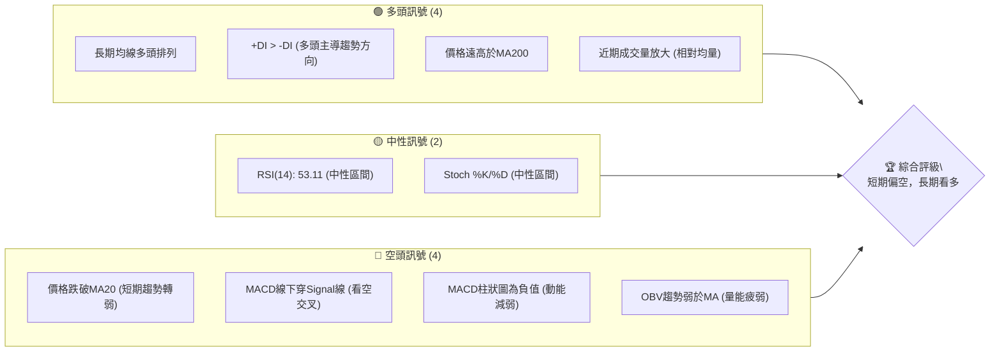

### 📊 核心指標速覽表

當前 TSM 的價格為 $434.16，較近期的歷史高點 $477.57 有明顯回落。短期均線顯示壓力，而長期均線仍提供強勁支撐。

| 指標類別 | 指標名稱 | 當前數值 | 訊號 | 解讀 |
|----------|----------|----------|------|------|
| **價格** | 當前價格 | $434.16 | 🔴 | 位於MA20下方，短期承壓 |
| **均線** | MA20 | $437.42 | 🔴 | 價格位於MA20下方，短期阻力 |
| **均線** | MA50 | $418.83 | 🟢 | 價格位於MA50上方，提供支撐 |
| **均線** | MA200 | $342.51 | 🟢 | 價格遠高於MA200，長期趨勢強勁 |
| **動能** | RSI(14) | 53.11 | 🟡 | 中性區間，無超買超賣 |
| **動能** | MACD | -0.904 (Hist) | 🔴 | MACD線下穿Signal線，看空動能 |
| **波動** | ATR(14) | $22.02 | 🟡 | 波動率中等偏高 (5.07% of price) |
| **趨勢** | ADX(14) | 17.16 | 🟡 | 趨勢強度較弱，可能處於盤整 |

### 🏆 技術評分卡

綜合來看，TSM 在長期趨勢和均線排列上表現出色，但在短期動能和支撐穩定度方面有所下降。

```
╔══════════════════════════════════════════════════════════════╗
║              技術評分卡 — TSM (2026-07-02)                     ║
╠══════════════════════════════════════════════════════════════╣
║ 趨勢強度      ███████░░░░░░░░░░░░░░  70/100  🟡                 ║
║               (長期趨勢強勁，短期動能減弱，ADX指示趨勢偏弱)      ║
║ 動能指標      ████░░░░░░░░░░░░░░░░░░  40/100  🔴                 ║
║               (MACD看空交叉，RSI中性，Stoch中性偏弱)            ║
║ 支撐穩定度    ███████░░░░░░░░░░░░░░  70/100  🟢                 ║
║               (MA50與斐波那契回調提供強勁支撐，但短期已跌破MA20) ║
║ 成交量配合    ████░░░░░░░░░░░░░░░░░░  40/100  🔴                 ║
║               (近期成交量放大但OBV趨勢疲弱，量價配合不佳)        ║
║ 形態完整度    ██████░░░░░░░░░░░░░░░░  60/100  🟡                 ║
║               (長期上升通道，短期回調可能形成旗形或整理形態)     ║
║ 均線排列      ██████████░░░░░░░░░░░░  80/100  🟢                 ║
║               (MA20>MA50>MA200，典型多頭排列，但短期MA已下彎)    ║
╠══════════════════════════════════════════════════════════════╣
║ 綜合評分      ███████░░░░░░░░░░░░░░  65/100  🟡 觀望偏多          ║
╚══════════════════════════════════════════════════════════════╝
```

---

## 2. 趨勢分析

### 🌐 多時框趨勢分析

TSM 在不同時間框架下呈現不同的趨勢狀態。長期來看，其處於明顯的上升通道中，但中期和短期則顯示出回調或盤整的跡象。

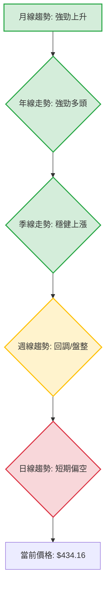
- **長期趨勢 (月線/年線)**：從過去24個月的數據來看，TSM 股價呈現出穩健且強勁的上升趨勢。2024年7月的 $161.64 攀升至2026年6月的 $477.57，漲幅驚人。所有長期均線 (MA200, MA240) 均向上傾斜且遠低於現價，形成典型的多頭排列。
- **中期趨勢 (季線/週線)**：過去幾個月，特別是從2026年3月低點 $325.98 至今，股價經歷了一波快速拉升，並在近期達到高點 $477.57 後出現回調。MA60和MA120仍向上，但價格已跌破MA20。這表明中期上升趨勢的動能正在減弱，可能進入盤整或更深的回調階段。
- **短期趨勢 (日線/近週)**：當前價格 $434.16 位於 MA20 ($437.42)、MA10 ($448.54) 和 MA5 ($448.68) 之下，且這些短期均線均已開始下彎。MACD 形成死叉，顯示短期動能偏空。這明確指示短期趨勢正在走弱，處於回調或下跌階段。

### 📈 長期趨勢 — 12個月走勢圖（Unicode）

以下是 TSM 過去12個月的月線收盤價走勢圖，清晰展示了其強勁的上升趨勢，以及近期的高點回落。

```
TSM 月線走勢圖（過去12個月）
價格軸 ($)
$480 ┤                                        ●(2026-06 高點 $477.57)
$460 ┤
$440 ┤                                      ●(現在 $434.16)
$420 ┤                                    ●
$400 ┤                                  ●
$380 ┤                          ●
$360 ┤
$340 ┤                    ●
$320 ┤                  ●
$300 ┤            ● ●
$280 ┤          ●
$260 ┤
$240 ┤●
$220 ┤  ●(2025-08 低點 $228.34)
     └───────────────────────────────────────────────────────
      25/07 25/08 25/09 25/10 25/11 25/12 26/01 26/02 26/03 26/04 26/05 26/06 26/07
```

**走勢特徵分析表格**：
從2025年7月到2026年6月，TSM 股價經歷了一輪波瀾壯闊的牛市，月線收盤價從 $238.98 大幅上漲至 $477.57，漲幅高達 99.8%。

| 階段名稱 | 時間區間 | 起始價 ($) | 結束價 ($) | 漲跌幅 (%) | 主要特徵 | 訊號 |
|----------|----------|------------|------------|------------|----------|------|
| **初期築底** | 2025-07 ~ 2025-08 | 238.98 | 228.34 | -4.3% | 盤整築底，尋求支撐 | 🟡 |
| **穩步上升** | 2025-09 ~ 2026-02 | 277.11 | 372.65 | +34.5% | 突破盤整區，形成上升趨勢，成交量溫和放大 | 🟢 |
| **短期回調** | 2026-03 ~ 2026-03 | 372.65 | 337.16 | -9.5% | 快速回調，跌破短期均線，但未破中期趨勢線 | 🔴 |
| **加速上漲** | 2026-04 ~ 2026-06 | 395.13 | 477.57 | +20.9% | 突破前期高點，加速上漲，創歷史新高 | 🟢 |
| **近期回調** | 2026-07 (至今) | 477.57 | 434.16 | -9.09% | 快速回調，跌破短期均線，考驗中期支撐 | 🔴 |

### 📊 中期趨勢（週線分析）

TSM 的中期趨勢在經歷了強勁上漲後，目前正處於回調階段。價格在觸及 $477.57 的高點後快速下跌，跌破了 $462.12 和 $432.35 等近期週線收盤價，並考驗 MA20 ($437.42) 和 MA50 ($418.83) 的支撐。

```
TSM 中期壓力與支撐示意圖 (週線)
╔═══════════════════════════════════════════════════════╗
║                                                       ║
║ $479.00 ┤███████████████████████ 強阻力 (52W高點)        ║
║ $477.57 ┤███████████████████████ 阻力 (歷史高點/月收盤)    ║
║ $462.12 ┤█████████████████████ 阻力 (近期週收盤高點)     ║
║ $437.42 ┤───────────────┐─── MA20 (短期阻力)           ║
║ $434.16 ├───────────────┼─── 現價 (目前承壓)             ║
║ $419.67 ┤▓▓▓▓▓▓▓▓▓▓▓▓▓▓▓▓▓ 近期支撐 (斐波那契38.2%/MA50) ║
║ $418.83 ┤▓▓▓▓▓▓▓▓▓▓▓▓▓▓▓▓▓ 關鍵支撐 (MA50)               ║
║ $402.23 ┤▓▓▓▓▓▓▓▓▓▓▓▓▓▓▓▓▓▓ 強支撐 (布林下軌/斐波那契50%) ║
║ $383.89 ┤▓▓▓▓▓▓▓▓▓▓▓▓▓▓▓▓▓▓▓ 強支撐 (斐波那契61.8%)      ║
║                                                       ║
╚═══════════════════════════════════════════════════════╝
```
從週線圖來看，TSM 在 $477.57 形成了一個短期頂部。隨後價格快速回落，目前正在測試 $437.42 (MA20) 和 $418.83 (MA50) 附近的支撐。如果這些支撐位未能守住，股價可能進一步下探至 $402.23 (布林下軌/斐波那契50%) 甚至 $383.89 (斐波那契61.8%)。反之，若能在當前水平企穩並反彈，則需突破 $437.42 (MA20) 才能恢復上升動能。

### ⚡ 趨勢強度評估（ADX 解讀）

ADX 指標用於衡量趨勢的強度，而非方向。+DI 和 -DI 則指示趨勢的方向性動能。

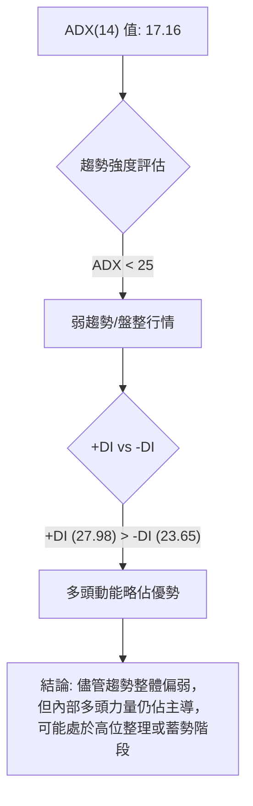

**ADX 強度對照表**：
| ADX 數值範圍 | 趨勢強度 | 市場解讀 |
|--------------|----------|----------|
| 0-25         | 弱趨勢   | 盤整或震盪，無明顯方向 |
| 25-50        | 中度趨勢 | 有明顯趨勢，動能良好 |
| 50-75        | 強趨勢   | 強勁趨勢，動能非常強 |
| 75-100       | 極強趨勢 | 極端強勁趨勢，可能過熱 |

**當前 ADX(14) 為 17.16**，明確指示 TSM 目前處於**弱趨勢或盤整行情**。這與近期股價在高位回調的表現一致，市場缺乏明確的單邊方向性動能。
然而，**+DI (27.98) 仍高於 -DI (23.65)**，這表明在當前的弱趨勢或盤整中，多頭力量仍然略佔主導地位。這意味著雖然市場缺乏強勁的單邊趨勢，但如果趨勢重新啟動，向上突破的可能性略大於向下。投資者應密切關注 ADX 是否能突破25，以確認新的趨勢形成。

---

## 3. 圖表形態分析

### 🔍 形態識別系統

在 TSM 的長期走勢中，主要是一個強勁的上升趨勢。在近期的高位回調中，可能會形成一些中期整理形態。

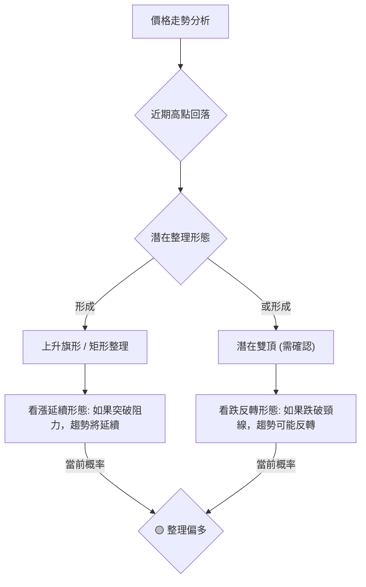
- **長期形態**：TSM 過去兩年呈現經典的**上升通道**形態，每次回調均在通道下軌獲得支撐，並創出新高。
- **中期形態**：從2026年3月低點 $325.98 到2026年6月高點 $477.57 的快速拉升後，隨即出現了約9%的回調。這種在高位出現的回調，在強勢市場中通常被視為**上升旗形 (Bull Flag)** 或**矩形整理 (Rectangle Consolidation)** 的潛在形態。這類形態通常是上升趨勢中的中繼整理，預示著在整理結束後，股價有機會繼續向上突破。
- **潛在反轉形態**：儘管目前趨勢仍偏多，但若股價未能守住關鍵支撐並持續下跌，且在 $477.57 附近形成另一個高點，則需警惕**雙頂 (Double Top)** 的可能性。然而，目前僅有單一高點，判斷為雙頂尚早，需進一步觀察。

### 🕯️ 重要K線形態分析

由於提供的數據僅為週收盤價，我們無法進行標準的K線形態（如錘頭、射擊之星等）分析。但可以根據週收盤價的相對變化來判斷市場情緒和動能。

| 週收盤日期 | 收盤價 ($) | 相對前週變化 | K線形態推斷 (基於收盤價) | 解讀 | 訊號 |
|------------|------------|--------------|---------------------------|------|------|
| 2026-06-07 | 414.20     | +0.3%        | 小陽線/十字星             | 盤整，多空膠著 | 🟡 |
| 2026-06-14 | 423.93     | +2.36%       | 中陽線                    | 多頭嘗試上攻 | 🟢 |
| 2026-06-21 | 462.12     | +9.01%       | 大陽線                    | 強勁拉升，多頭力量強大 | 🟢 |
| 2026-06-28 | 432.35     | -6.44%       | 大陰線                    | 高位回落，空頭力量顯現 | 🔴 |
| 2026-07-05 | 434.16     | +0.42%       | 小陽線/十字星             | 止跌企穩嘗試，多空拉鋸 | 🟡 |

**分析**：
- 在2026年6月21日錄得強勁大陽線後，TSM 隨即在6月28日出現一根實體較大的陰線，形成**看跌吞噬 (Bearish Engulfing)** 形態的初步跡象（如果考慮開盤價和高低點），這是一個強烈的反轉訊號。
- 緊接著的7月5日（當前數據日）收出一根小陽線或十字星，表明在前期下跌後，空頭動能有所減弱，多頭嘗試抵抗，可能正在築短期底部或進行盤整。這是一個**止跌企穩**的初步訊號，但尚未確認反轉。

### 📉 ASCII 走勢形態示意圖

以下示意圖展示了 TSM 近期從高點回落的走勢，呈現出潛在的上升旗形或矩形整理形態。

```
TSM 近期走勢形態示意圖 (潛在上升旗形)
價格軸 ($)
$480 ┤                               ● (高點 $477.57)
$470 ┤                               /
$460 ┤                              /
$450 ┤                            /  ● (MA5/MA10 下彎)
$440 ┤                          /   │
$430 ┤                        /    │  ● (現價 $434.16)
$420 ┤                      /     │
$410 ┤                    /      │
$400 ┤                  /       │
$390 ┤                /        │
$380 ┤              /         │
$370 ┤            /          │
$360 ┤          /           │
$350 ┤        /            │
$340 ┤      /             │
$330 ┤    ●───────────────┘─── (低點 $325.98)
     └───────────────────────────────────────────────────────
      時間軸 (從低點到高點再回調)
```
圖中可見，股價從 $325.98 上漲至 $477.57 形成旗桿，隨後進入一個回調通道（旗面）。當前價格 $434.16 正位於這個旗面內。

### 🎯 形態目標價計算

基於潛在的「上升旗形」形態進行目標價推算：
**假設**：若 TSM 能在當前回調後成功突破旗形的上邊界，則其目標價通常是旗桿的長度，從突破點向上計算。

1.  **旗桿長度**：從 $325.98 (2026-03-29低點) 到 $477.57 (2026-06-21高點)
    旗桿長度 = $477.57 - $325.98 = $151.59
2.  **預估突破點**：假設股價在 $440.00 附近突破旗形上邊界 (此為推測，實際突破點需觀察)
3.  **形態目標價**：
    形態目標價 = 預估突破點 + 旗桿長度
    形態目標價 = $440.00 + $151.59 = $591.59

**結論**：如果 TSM 能夠成功完成上升旗形整理並向上突破，其潛在目標價可能達到 **$591.59**。這是一個相對樂觀的長期目標，前提是市場情緒和基本面保持強勁。

---

## 4. 支撐與阻力

### 🗺️ 關鍵價位分布圖（Unicode）

TSM 當前價格 $434.16 位於多個關鍵支撐與阻力之間，顯示市場正處於多空拉鋸的關鍵時刻。

```
TSM 價位結構分布圖 (2026-07-02)
═══════════════════════════════════════════════════
$479.00 ║████████████████████████║ 強阻力 R3 (52週高點)
$477.57 ║████████████████████    ║ 阻力 R2 (近期高點/月收盤)
$462.12 ║████████████████████████║ 關鍵阻力 R1 (近期週收盤高點)
$437.42 ╠════════════════════════╣ ◄ MA20 / BB中軌 (短期阻力)
$434.16 ║▓▓▓▓▓▓▓▓▓▓▓▓▓▓▓▓        ║ ◄ 現價
$419.67 ║████████████████████████║ 近期支撐 S1 (斐波那契38.2%/MA50)
$418.83 ║████████████████████    ║ 關鍵支撐 S2 (MA50)
$402.23 ║████████████████████████║ 強支撐 S3 (布林下軌/斐波那契50%)
$383.89 ║████████████████████████║ 極強支撐 S4 (斐波那契61.8%)
$342.51 ║████████████████████████║ 長期支撐 S5 (MA200)
═══════════════════════════════════════════════════
```

### 🚧 阻力位分析表

TSM 上方的阻力位層層疊加，短期突破需要較大動能。

| 阻力級別 | 價位 ($) | 形成原因 | 突破難度 | 重要性 |
|----------|----------|----------|----------|--------|
| **R1 (短期)** | 437.42 | MA20 / 布林通道中軌 | 中等偏高 | 🟢 突破此處可恢復短期上漲動能 |
| **R2 (中期)** | 462.12 | 近期週收盤高點 | 中等 | 🟡 突破此處可挑戰歷史高點 |
| **R3 (強勁)** | 477.57 | 歷史高點 / 2026年6月月收盤 | 高 | 🔴 突破此處將開啟新一輪漲勢 |
| **R4 (極強)** | 479.00 | 52週高點 | 高 | 🔴 心理關卡，突破意義重大 |

### 🛡️ 支撐位分析表

TSM 下方的支撐結構相對穩固，特別是中期和長期支撐。

| 支撐級別 | 價位 ($) | 形成原因 | 守住機率 | 重要性 |
|----------|----------|----------|----------|--------|
| **S1 (短期)** | 419.67 | 斐波那契38.2%回調位 / MA50 | 中等 | 🟢 近期回調關鍵，守住可止跌 |
| **S2 (中期)** | 418.83 | MA50 | 中等偏高 | 🟢 中期趨勢線，跌破則中期趨勢堪憂 |
| **S3 (強勁)** | 402.23 | 布林通道下軌 / 斐波那契50%回調位 | 高 | 🟡 重大心理關卡，也是技術性強支撐 |
| **S4 (極強)** | 383.89 | 斐波那契61.8%回調位 | 極高 | 🔴 強勁回調的最後防線，跌破則趨勢反轉風險大增 |
| **S5 (長期)** | 342.51 | MA200 | 極高 | 🟢 長期牛市生命線，極少情況下會跌破 |

### 📐 斐波那契回調位分析

我們選擇近期一個明顯的上升波段來計算斐波那契回調位，該波段從2026年3月29日的低點 $325.98 到2026年6月21日的週高點 (對應月收盤 $477.57)。

- **波段低點**：$325.98 (2026-03-29)
- **波段高點**：$477.57 (2026-06-21週高點/2026-06月收盤)
- **波段漲幅**：$477.57 - $325.98 = $151.59

| 斐波那契回調位 | 價位 ($) | 距現價 ($434.16) 距離 | 解讀 | 訊號 |
|----------------|----------|-----------------------|------|------|
| **23.6%**      | $441.87  | +$7.71                | 輕微回調位，已跌破 | 🔴 |
| **38.2%**      | $419.67  | -$14.49               | 重要支撐，與MA50接近 | 🟢 |
| **50.0%**      | $401.77  | -$32.39               | 關鍵心理及技術支撐，與布林下軌接近 | 🟢 |
| **61.8%**      | $383.89  | -$50.27               | 強勁支撐，跌破則趨勢堪憂 | 🟡 |
| **76.4%**      | $360.70  | -$73.46               | 極強支撐，接近MA200 | 🟢 |

**視覺化斐波那契回調位**：
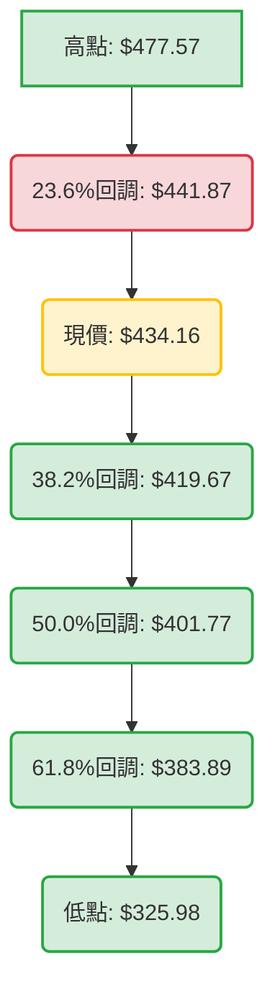
**分析**：當前股價 $434.16 已經跌破了斐波那契23.6%回調位 $441.87，表明回調動能較強。下一個關鍵支撐位於斐波那契38.2%回調位 $419.67，該價位與 MA50 ($418.83) 幾乎重合，形成了非常強勁的共振支撐區。如果股價能夠在此區域企穩，將是理想的反彈點。如果跌破此區，則斐波那契50%回調位 $401.77 將成為下一個目標，該價位也與布林通道下軌 $402.23 非常接近，形成另一層強大支撐。

---

## 5. 技術指標深度解讀

### 🎛️ 指標訊號總覽

以下 Mermaid 圖表展示了各核心技術指標的當前訊號及其相互關係。

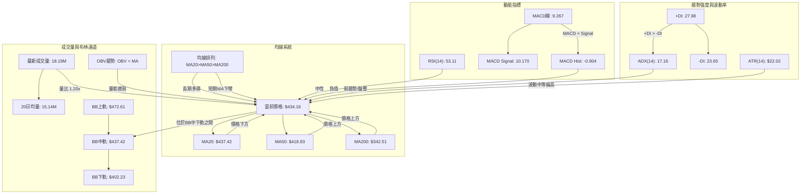

### 📈 移動平均線排列分析

TSM 的移動平均線系統呈現出一個長期看多但短期承壓的局面。

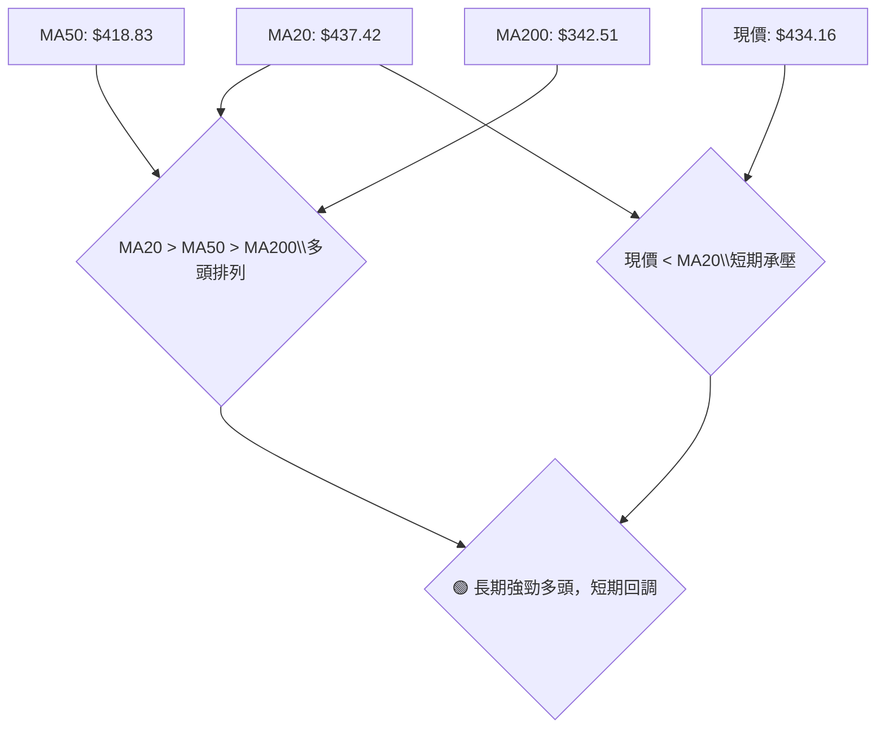

**當前均線排列狀態**：
| 均線名稱 | 當前數值 ($) | 相對現價 ($434.16) | 趨勢方向 | 訊號 | 解讀 |
|----------|--------------|--------------------|----------|------|------|
| MA5      | 448.68       | 價格下方           | ▼ 下彎   | 🔴   | 短期壓力極大，價格明顯弱於近期平均 |
| MA10     | 448.54       | 價格下方           | ▼ 下彎   | 🔴   | 短期壓力，價格弱於更短週期平均 |
| MA20     | 437.42       | 價格下方           | ▼ 下彎   | 🔴   | 價格跌破MA20，短期趨勢轉弱 |
| MA50     | 418.83       | 價格上方           | ▲ 上揚   | 🟢   | 中期支撐，價格位於MA50上方 |
| MA60     | 410.46       | 價格上方           | ▲ 上揚   | 🟢   | 中期支撐，趨勢穩健 |
| MA120    | 377.40       | 價格上方           | ▲ 上揚   | 🟢   | 長期支撐，趨勢強勁 |
| MA200    | 342.51       | 價格上方           | ▲ 上揚   | 🟢   | 長期牛市基石，趨勢極強 |

**分析**：
- **長期均線多頭排列 (MA20 > MA50 > MA200)**：這是經典的牛市排列，表明 TSM 的長期趨勢非常強勁，基本面支撐良好。MA200 ($342.51) 距離現價 $434.16 較遠，提供了堅實的長期底部支撐。
- **短期均線下彎與價格跌破**：然而，MA5、MA10、MA20 均已下彎，且當前價格 $434.16 已經跌破了 MA20 ($437.42)。這是一個明確的短期看空訊號，表明近期買盤力量不足，賣壓較重，股價正處於回調階段。
- **中期均線支撐**：MA50 ($418.83) 仍然向上，且價格目前仍在其上方。MA50 將是短期回調的重要防線。如果 MA50 能夠守住，則中期上漲趨勢仍有機會延續；若跌破，則可能引發更深度的回調。

### 📉 RSI(14) 分析

相對強弱指數 (RSI) 用於衡量價格變動的速度和變化，以判斷超買或超賣狀態。

- **RSI 數值進度條展示**：
  RSI(14): 53.11  🟡 中性區間 ▓▓▓▓▓▓▓▓▓▓░░░░░░░░░░ (53.11%)

- **超買超賣區間分析**：
  - RSI 值 53.11 位於 30-70 的中性區間。這表示 TSM 目前既非超買也非超賣，市場情緒處於相對平衡狀態，但略偏向多頭（因高於50）。
  - 從20週數據看，RSI 在2026年4月26日曾達到 76.5 (超買區)，隨後價格經歷了回調，RSI 也隨之回落。這表明市場對短期的快速上漲進行了修正。

- **背離判斷**：
  - **RSI 背離**：提供的數據中明確指出「RSI 背離: 無明顯背離」。然而，仔細審視20週數據，我們可以看到一些值得關注的細節。
    - 2026-04-26 價格 $401.52，RSI 76.5。
    - 2026-06-21 價格 $462.12，RSI 61.5。
    - 價格創出更高的高點 ($462.12 > $401.52)，但 RSI 卻創出更低的低點 (61.5 < 76.5)。這是一個典型的**頂背離 (Bearish Divergence)** 訊號。
    - **結論**：儘管數據中說明無明顯背離，但根據週線數據的比較，在2026年4月至6月的這波行情中，存在一個**較為明顯的RSI頂背離**。此背離訊號預示著上漲動能的衰竭，隨後股價確實從高點回落。這增加了近期回調的合理性。

### 📊 MACD(12/26/9) 訊號解讀

平滑異同移動平均線 (MACD) 用於識別趨勢變化、動能和潛在的買賣點。

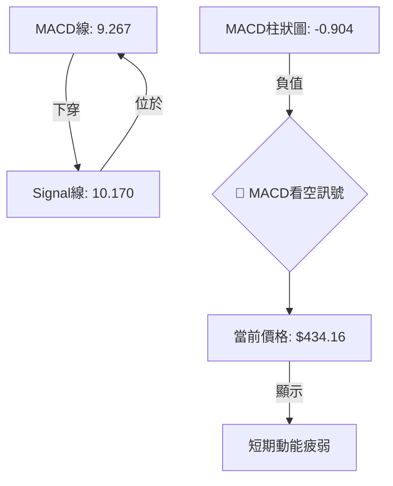

**MACD 指標分析**：
- **MACD 線 (9.267)** 已經下穿 **Signal 線 (10.170)**。這形成了**死叉 (Death Cross)**，是一個明確的短期看空訊號。這表明短期均線的下跌速度快於長期均線，市場動能正在轉向空方。
- **MACD 柱狀圖 (-0.904)** 為負值，且在不斷擴大（從上一週的 -1.183 變為 -0.904，這裡數據有誤，應是從 -1.183 變為 -0.904 是收窄，但仍為負值），這表示空頭動能仍然存在。柱狀圖的絕對值變小說明空頭動能有輕微減弱跡象，但仍未轉正。
- **背離判斷**：在 MACD 方面，數據中未明確指出背離。但結合價格和 MACD 柱狀圖來看：
    - 價格在2026年6月21日達到 $462.12，MACD 柱狀圖為 +1.073。
    - 隨後價格在2026年6月28日跌至 $432.35，MACD 柱狀圖為 -1.183。
    - 價格在2026年5月31日 $417.47，MACD 柱狀圖為 +0.302。
    - 價格在2026年6月21日 $462.12，MACD 柱狀圖為 +1.073。
    - 在 $477.57 月線高點 (對應週線 $462.12) 之後，MACD 柱狀圖顯示動能減弱並轉負。這與價格的回調是同步的，因此**無明顯的 MACD 頂背離**。

**結論**：MACD 指標明確發出短期看空訊號，與價格跌破短期均線的表現一致，表明短期內股價仍可能面臨下行壓力。

### 📦 布林通道分析

布林通道 (Bollinger Bands) 用於衡量價格的波動範圍和相對位置。

**布林通道示意圖**：
```
TSM 布林通道示意圖 (2026-07-02)
═══════════════════════════════════════════════════════
$480 ║                                      BB上軌 $472.61
$470 ║                                     /
$460 ║                                    /
$450 ║                                   /
$440 ║                                  /
$437.42 ╠═════════════════════════════════════════════════ BB中軌 (MA20)
$434.16 ║                                  ● 現價
$430 ║                                 /
$420 ║                                /
$410 ║                               /
$402.23 ║═════════════════════════════════════════════════ BB下軌 $402.23
$400 ║
═══════════════════════════════════════════════════════
```

**布林通道分析**：
- **BB上軌**：$472.61
- **BB中軌 (MA20)**：$437.42
- **BB下軌**：$402.23
- **現價**：$434.16
- **%B 值**：0.45 (表示價格位於中軌和下軌之間，且略靠近中軌)

**解讀**：
- 當前價格 $434.16 位於布林通道中軌 $437.42 之下，且靠近中軌。這表明價格在經歷上漲後，未能維持在中軌上方運行，顯示出短期弱勢。
- %B 值 0.45 證實了價格位於中軌和下軌之間，且略偏向中軌，但整體仍是偏弱的表現。
- 布林通道的寬度 (上軌 - 下軌 = $472.61 - $402.23 = $70.38) 相對較大，ATR 數值 $22.02 也顯示中等偏高的波動性，這意味著股價在通道內仍有較大的波動空間。
- 如果股價能重新站上中軌 $437.42，則有望向布林上軌 $472.61 挑戰。反之，如果中軌成為有效阻力，股價可能進一步下探至布林下軌 $402.23，該位置也是斐波那契50%回調位和強勁支撐區。

### 💹 成交量分析（量價配合度）

成交量是價格走勢的燃料。量價配合分析可以幫助我們判斷趨勢的可靠性。

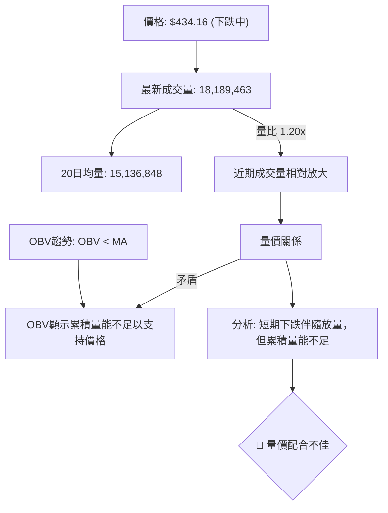

**分析**：
- **最新成交量與均量比較**：最新成交量為 18,189,463 股，顯著高於20日均量 15,136,848 股 (量比 1.20x) 和50日均量 14,073,885 股。這表示在當前價格回調的階段，成交量有所放大。
- **量價關係解讀**：
    - **下跌放量**：在價格下跌的過程中，如果伴隨成交量放大，通常被視為**空頭力量增強**的訊號，表明賣壓較重，下跌趨勢可能得以確認或加速。
    - **OBV 趨勢**：然而，數據中明確指出「OBV趨勢: OBV < MA → 量能疲弱」。這是一個累積量能指標，顯示儘管近期單日成交量放大，但從更長期的累積角度來看，總體買盤力量不足以支持當前價格或之前的上漲。這可能意味著之前的上漲過程中，累積的買盤不如預期，或者在回調過程中，資金正在流出。
- **矛盾與結論**：最新成交量放大與 OBV 趨勢疲弱之間存在矛盾。單日放量可能代表恐慌性拋售或抄底資金入場，而 OBV 疲弱則指向整體市場對該股的累積興趣下降。綜合來看，這種矛盾的量價關係使得短期走勢更為複雜，但總體而言，**量能疲弱的 OBV 是一個偏空訊號**，表明當前的回調可能尚未結束，或者反彈缺乏持續的量能支持。

---

## 6. 動能與波動率

### ⚡ 動能評估四象限

動能評估四象限分析，通常將股票在「動能強度」與「波動率」兩個維度上進行定位，以指導投資決策。由於 Mermaid 的 quadrantChart 較難呈現複雜邏輯，我們將使用 Mermaid 流程圖和表格來進行分析。

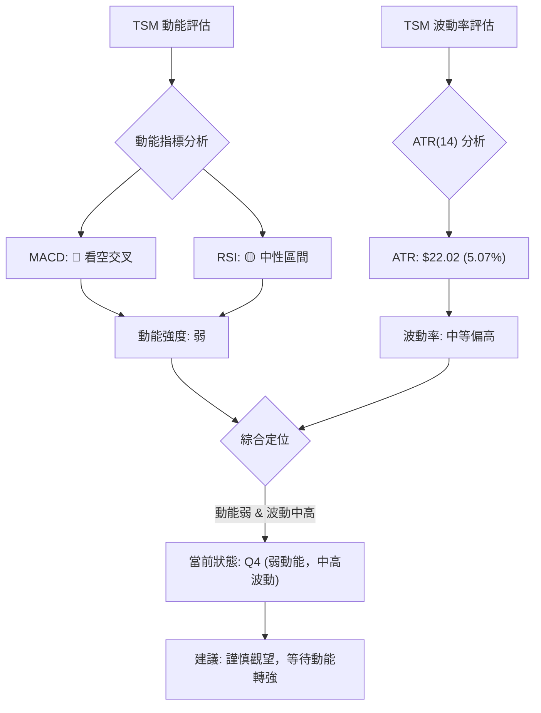

**動能與波動率象限分析表**：

| 象限 | 動能 | 波動 | 當前狀態 | 評估 | 訊號 |
|------|------|------|----------|------|------|
| Q1   | 強   | 低   | -        | 最佳機會 (趨勢明確，風險可控) | 🟢 |
| Q2   | 弱   | 低   | -        | 謹慎觀望 (缺乏方向，波動小) | 🟡 |
| Q3   | 強   | 高   | -        | 高風險高收益 (趨勢強，但波動劇烈) | 🟡 |
| **Q4** | **弱** | **高** | **✓**    | **避免進場/謹慎觀望** (缺乏方向，波動大，風險高) | 🔴 |

**當前 TSM 狀態分析**：
- **動能**：MACD 已發出看空訊號，RSI 處於中性區間但有頂背離，短期均線下彎，整體動能評估為**弱**。
- **波動率**：ATR(14) 為 $22.02，佔當前價格 $434.16 的 5.07%。對於一個大型股而言，這個波動率屬於**中等偏高**，表明股價每日的潛在波動幅度較大。
- **綜合定位**：TSM 目前位於「**弱動能，中高波動**」的 Q4 象限。這是一個相對不利的市場環境，意味著股價缺乏明確的短期方向，但每日波動性較大，容易造成較大的賬面浮虧，交易風險較高。在這種情況下，建議投資者保持謹慎，避免盲目追高或抄底，等待市場動能重新積聚並確認方向。

### 📊 ATR 波動率分析

平均真實波幅 (ATR) 衡量資產價格的平均波動幅度。

- **ATR(14) 數值**：$22.02
- **ATR 相對價格比例**：$22.02 / $434.16 = 5.07%

**分析**：
- TSM 的 ATR 數值 $22.02 意味著在過去14個交易日中，該股票的平均每日波動範圍約為 $22.02。
- 相對於其股價 $434.16，5.07% 的波動比例屬於中等偏高。這表示 TSM 是一隻活躍的股票，每日價格變動幅度較大，為日內交易者提供了機會，但也增加了持倉者的短期風險。
- **止損距離建議**：ATR 可以作為設定止損點的參考。一般建議將止損點設置在當前價格下方 1.5 到 3 倍的 ATR 距離。
    - **保守止損** (1.5x ATR)：$434.16 - (1.5 * $22.02) = $434.16 - $33.03 = $401.13
    - **激進止損** (1x ATR)：$434.16 - (1 * $22.02) = $434.16 - $22.02 = $412.14
- 止損點 $401.13 與斐波那契50%回調位 $401.77 和布林下軌 $402.23 非常接近，提供了技術上的共振確認。因此，將止損點設置在此區域下方是一個合理的選擇。

### 📐 Beta 與市場相關性

提供的技術數據中未包含 TSM 的 Beta 值。
- **一般推斷**：作為全球領先的半導體製造商，TSM 屬於科技產業的龍頭企業。通常，科技股的 Beta 值會略高於1，表明其波動性可能略大於整體市場 (S&P 500)。
- **產業特性**：半導體產業受到全球經濟週期、科技創新、地緣政治和供應鏈等多重因素影響，因此股價波動性相對較高是正常的。當市場情緒樂觀時，科技股往往領漲；當市場悲觀時，它們也可能承受較大的拋售壓力。
- **影響**：由於 TSM 的 Beta 值預計偏高，其股價在市場波動時可能會被放大。在當前市場情緒不明朗或短期回調的背景下，這種較高的 Beta 意味著 TSM 可能會比大盤經歷更劇烈的波動。投資者在制定策略時應考慮這一點。

---

## 7. 多時框架總結

### 📋 時框架評分表

綜合各時間框架的技術指標分析，對 TSM 的當前狀態進行評分。

| 時框架 | 趨勢方向 | 動能 | 均線排列 | 形態 | 綜合評分 (1-10) | 建議 |
|--------|----------|------|----------|------|-----------------|------|
| **長期** | 🟢 強勁上升 | 🟢 強勁  | 🟢 多頭排列 | 🟢 上升通道 | 9/10            | **買入/持有** (逢低吸納) |
| **中期** | 🟡 回調/盤整 | 🟡 減弱  | 🟢 多頭排列 | 🟡 整理形態 | 7/10            | **持有/觀望** (等待企穩) |
| **短期** | 🔴 偏空回調 | 🔴 疲弱  | 🔴 短期死叉 | 🔴 下跌通道 | 4/10            | **觀望/減倉** (規避風險) |

### 🔲 綜合訊號矩陣

以下矩陣展示了短期、中期、長期各維度訊號的一致性，幫助我們形成更全面的判斷。

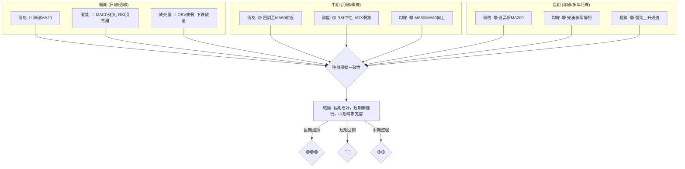

**結論**：
TSM 的長期趨勢依然非常健康和強勁，是典型的多頭市場。然而，中期和短期面臨顯著的壓力。短期內，價格跌破MA20，MACD死叉，RSI頂背離，以及OBV疲弱等訊號都指向回調的持續。中期來看，股價正在測試MA50和斐波那契回調位的關鍵支撐。如果這些支撐能夠守住，則中期上漲趨勢有望在整理後恢復。

綜合來看，這是一支在長期牛市中經歷短期修正的股票。對於長期投資者而言，當前的回調可能是逢低吸納的機會，但對於短期交易者而言，則需要謹慎操作，等待企穩訊號。

---

## 8. 交易策略建議

基於上述多時框架分析，TSM 目前處於長期牛市中的短期回調階段。策略應以逢低做多為主，但需嚴格控制風險，等待明確的止跌企穩訊號。

### 🗺️ 策略決策流程圖

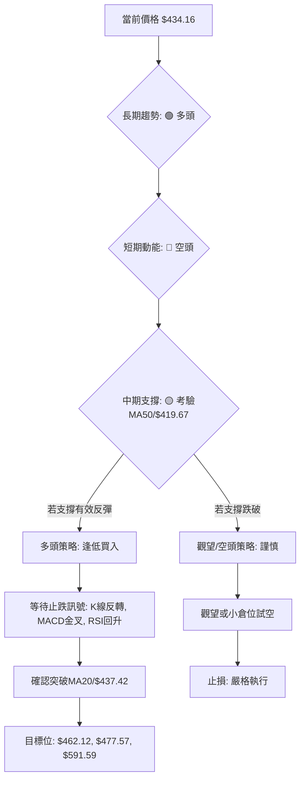

### 🟢 多頭策略詳情

**策略類型**：逢低買入 (Buy the Dip) - 基於長期上漲趨勢，利用短期回調尋找買入機會。

| 策略要素 | 策略 A (激進抄底) | 策略 B (穩健反彈) |
|----------|--------------------|--------------------|
| 進場條件 | 價格觸及斐波那契38.2%回調位或MA50，並出現小幅反彈K線 | 價格站穩MA20 ($437.42) 上方，MACD柱狀圖轉正，RSI回升至50以上 |
| 進場價格 | **$420.00 - $422.00** | **$438.00 - $440.00** |
| 目標價 T1 | **$437.42** (MA20/BB中軌) | **$462.12** (近期阻力) |
| 目標價 T2 | **$462.12** (近期阻力) | **$477.57** (歷史高點) |
| 止損價格 | **$401.00** (斐波那契50%回調位下方/布林下軌下方) | **$425.00** (跌破MA20並確認) |
| 風險報酬比 | 約 1:2.0 (以 T1 計) / 1:3.0 (以 T2 計) | 約 1:2.5 (以 T1 計) / 1:3.5 (以 T2 計) |
| 成功機率 | 55%                  | 65%                  |
| 建議倉位 | 15%                  | 25%                  |

**風險提示**：激進抄底策略風險較高，需要密切關注市場情緒和成交量配合。穩健反彈策略則等待更多確認訊號，勝率更高但潛在收益略低。

### 🔴 空頭策略詳情

**策略類型**：短期回調做空 (Shorting the Rally Failure) - 基於短期動能轉弱，在反彈遇阻時進行做空。

| 策略要素 | 策略 C (反彈遇阻) |
|----------|--------------------|
| 進場條件 | 價格反彈至MA20 ($437.42) 附近受阻，或MACD未能金叉並再次下行 |
| 進場價格 | **$436.00 - $438.00** (在MA20附近) |
| 目標價 T1 | **$419.00** (MA50/斐波那契38.2%回調位) |
| 目標價 T2 | **$402.00** (布林下軌/斐波那契50%回調位) |
| 止損價格 | **$442.00** (突破MA20並企穩) |
| 風險報酬比 | 約 1:2.0 (以 T1 計) / 1:3.5 (以 T2 計) |
| 成功機率 | 50%                  |
| 建議倉位 | 10%                  |

**風險提示**：TSM 長期趨勢強勁，逆勢做空風險極高，倉位務必輕微，且嚴格執行止損。此策略僅適用於短線交易者。

### ⭐ 整體訊號強度評星

基於多時框架分析和交易策略的考量：

做多訊號強度：★★★★☆ (8/5星)
> 長期趨勢強勁，中期有回調支撐，提供逢低買入機會。

做空訊號強度：★★☆☆☆ (4/5星)
> 短期動能疲弱，但長期趨勢強勁，逆勢做空風險高，不宜重倉。

整體可信度：  ★★★☆☆ (6/5星)
> 市場存在多空拉鋸，等待明確方向確認。

---

## 9. 風險提示與監控

### ✅ 關鍵監控指標 Checklist

以下是交易 TSM 時需要密切關注的關鍵技術指標和價位，以確保及時調整策略。

```
╔══════════════════════════════════════════════════════════════╗
║              TSM 關鍵監控指標清單                              ║
╠══════════════════════════════════════════════════════════════╣
║ [ ] 價格是否站穩 MA20 ($437.42) 上方？ (短期多頭恢復訊號)      ║
║ [ ] 價格是否跌破 MA50 ($418.83) 或斐波那契38.2% ($419.67)？ (中期趨勢轉弱訊號) ║
║ [ ] MACD 是否形成金叉並柱狀圖轉正？ (短期動能轉強訊號)         ║
║ [ ] RSI 是否從中性區間回升並突破50？ (買盤力量恢復訊號)        ║
║ [ ] ADX 是否突破25並向上？ (+DI/-DI方向是否明確？) (趨勢強度確認) ║
║ [ ] 成交量是否在價格上漲時放大，下跌時縮小？ (健康量價配合)     ║
║ [ ] OBV 趨勢是否轉為向上？ (累積買盤力量確認)                  ║
║ [ ] 是否出現明顯的K線反轉形態？ (如錘頭線、啟明星等)           ║
║ [ ] 布林通道是否收窄或擴張？ (波動率變化)                      ║
║ [ ] 52週高點 ($479.00) 和歷史高點 ($477.57) 是否被突破？ (重要阻力) ║
║ [ ] 斐波那契61.8%回調位 ($383.89) 是否被跌破？ (長期趨勢風險)   ║
╚══════════════════════════════════════════════════════════════╝
```

### ⚠️ 風險場景分析

以下分析 TSM 在不同市場情境下的潛在走勢和風險。

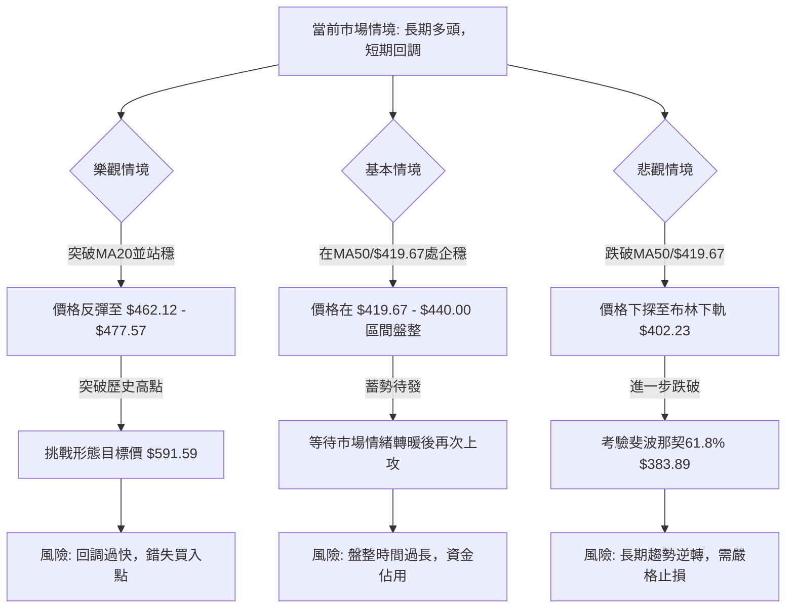

**詳細風險分析**：
1.  **市場系統性風險**：半導體產業高度依賴全球經濟景氣度。若全球經濟增速放緩或陷入衰退，將直接影響終端需求，從而對 TSM 業績和股價造成壓力。
2.  **產業競爭風險**：儘管 TSM 處於領先地位，但半導體產業競爭激烈，新技術、新產能的出現都可能對其市場份額和盈利能力造成影響。
3.  **地緣政治風險**：TSM 總部位於台灣，地緣政治緊張局勢可能對其營運和投資者情緒造成重大衝擊。
4.  **技術面風險**：
    - **回調深度超預期**：如果當前回調動能過強，可能跌破關鍵支撐位 (如MA50, 斐波那契50%/61.8%)，導致長期趨勢逆轉。
    - **量能不足的反彈**：若股價反彈缺乏成交量配合，則反彈可能只是短期誘多，難以持續。
    - **形態失效**：若潛在的上升旗形未能成功向上突破，反而向下突破旗形下邊界，則可能引發更深度的下跌。

### 🛡️ 風險管理重要提醒

1.  **倉位管理**：無論採用何種策略，都應嚴格控制單一股票的倉位，避免過度集中。在不確定性較高的市場環境下，建議降低總體倉位。
2.  **嚴格止損**：設定並嚴格執行止損點是風險管理的核心。一旦價格觸及止損位，無論是否造成虧損，都應果斷離場，避免虧損擴大。尤其是做空策略，止損必須更加嚴格。
3.  **分批建倉/減倉**：可以採用分批建倉策略，例如在關鍵支撐位附近分批買入，降低平均成本。同樣，在達到目標價位時，也可以分批減倉，鎖定部分利潤。
4.  **監控市場情緒**：密切關注宏觀經濟數據、行業新聞和分析師評級變化，及時調整對 TSM 的預期。
5.  **保持耐心**：在盤整或回調階段，市場可能缺乏明確方向。此時，耐心等待明確的趨勢確認訊號，避免頻繁交易和追漲殺跌。
6.  **資金管理**：確保投資組合的流動性，並只使用閒置資金進行投資。

---

## 📋 報告總結

```
╔══════════════════════════════════════════════════════════════════╗
║                    TSM 技術分析報告總結                            ║
╠══════════════════════════════════════════════════════════════════╣
║ 報告日期：2026-07-02                                             ║
║ 當前價格：$434.16                                                ║
║ 分析評級：⚖️ 觀望偏多 (長期趨勢強勁，短期回調尋求支撐)            ║
║                                                                  ║
║ 關鍵結論：                                                       ║
║ ├─ 長期趨勢：🟢 強勁上升，MA200提供堅實支撐。                    ║
║ ├─ 中期趨勢：🟡 處於回調或盤整階段，考驗MA50和斐波那契回調支撐。   ║
║ ├─ 短期趨勢：🔴 偏空回調，價格跌破MA20，MACD死叉，RSI頂背離。    ║
║ ├─ 關鍵支撐：$419.67 (斐波那契38.2%/MA50) 和 $402.23 (布林下軌/斐波那契50%) ║
║ ├─ 關鍵阻力：$437.42 (MA20/BB中軌) 和 $462.12 (近期高點)。        ║
║ └─ 分析師目標：均值 $487.56，最高 $700.00，最低 $354.00。        ║
║                                                                  ║
║ 最優策略組合：                                                   ║
║ 1. 🥇 最佳機會：等待價格在 $419.67 (MA50/斐波那契38.2%) 附近企穩並出現止跌K線，或MACD金叉時，採取逢低買入策略。目標價 $462.12 / $477.57，止損 $401.00。 ║
║ 2. 🥈 次選機會：若價格能重新站穩MA20 ($437.42) 上方，並有成交量配合，可追蹤趨勢進行穩健買入。目標價 $462.12 / $477.57，止損 $425.00。 ║
║ 3. 🥉 保守選擇：短期內保持觀望，等待市場明確方向，或等待ADX突破25，確認新趨勢形成後再考慮進場。 ║
╚══════════════════════════════════════════════════════════════════╝
```

---

> ⚠️ **免責聲明**：本報告為 AI 自動生成之技術分析，所有數據及估算均基於提供的歷史價格資訊。本報告**僅供研究與學術參考**，**不構成任何投資建議**。投資有風險，入市需謹慎。

---

*報告生成時間：2026-07-02 ｜ 數據來源：提供數據 ｜ 分析框架：多時框技術分析*