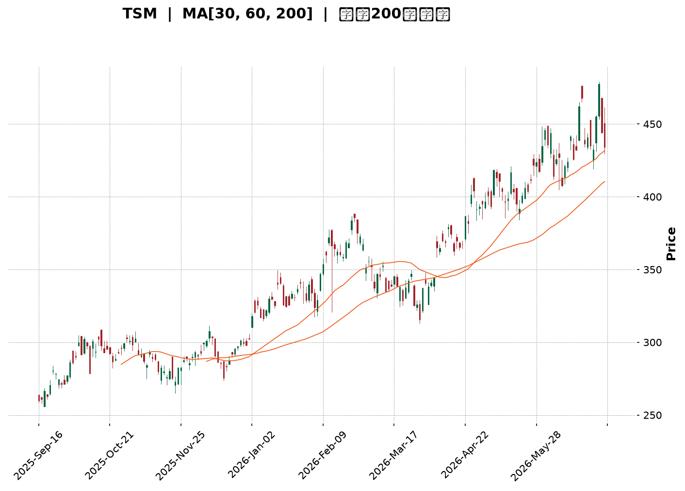
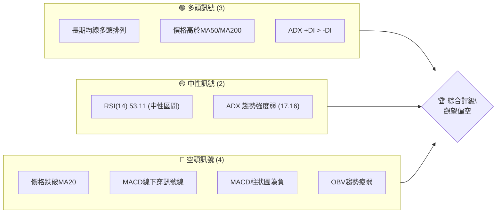
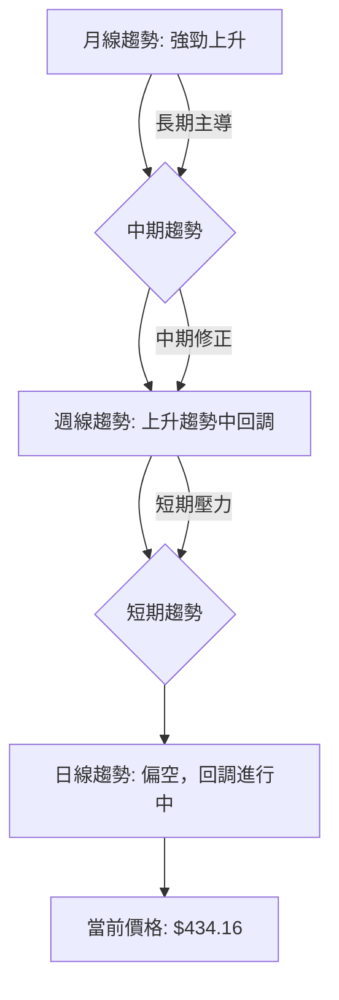
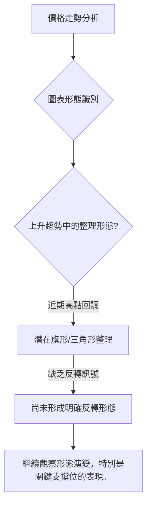
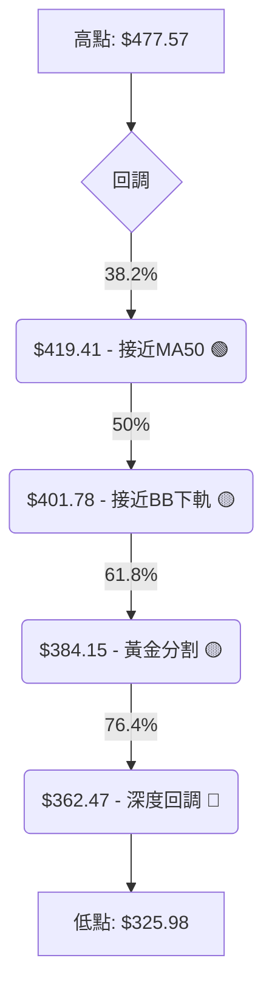
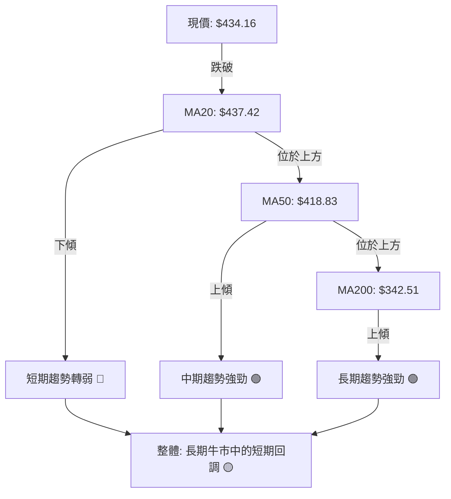

<details>
<summary>📊 靜態圖表 (點擊展開)</summary>

</details>

<html>
<head><meta charset="utf-8" /></head>
<body>
    <div style="height:500px; width:100%;">                        <script>window.PlotlyConfig = {MathJaxConfig: 'local'};</script>
        <script charset="utf-8" src="https://cdn.plot.ly/plotly-3.6.0.min.js" integrity="sha256-QaOVwtVY0T02VaHrr6pnoHLCwayMJp4O5n4YyaE3rJk=" crossorigin="anonymous"></script>                <div id="candlestick-chart" class="plotly-graph-div" style="height:100%; width:100%;"></div>            <script>                window.PLOTLYENV=window.PLOTLYENV || {};                                if (document.getElementById("candlestick-chart")) {                    Plotly.newPlot(                        "candlestick-chart",                        [{"close":{"dtype":"f8","bdata":"AAAAoC1AcEAAAACAxEtwQAAAAKCiqHBAAAAAYMlscEAAAAAA+udwQAAAAOD+h3FAAAAA4D5ocUAAAADg8ydxQAAAAKCQ83BAAAAAgIDxcEAAAAAgtFFxQAAAAEBv43FAAAAAQLjdcUAAAABgfR5yQAAAAICSwHJAAAAAALM7ckAAAAAgOuJyQAAAAGCRmHJAAAAAoHNncUAAAAAAWshyQAAAAGAFWnJAAAAAQD7lckAAAADA7pdyQAAAACBeTHJAAAAAAPZ1ckAAAADgUUNyQAAAAKDx6XFAAAAA4E8HckAAAACAdkpyQAAAACCxfnJAAAAA4MKyckAAAACgRutyQAAAAOCWzXJAAAAAgEyhckAAAADgn+dyQAAAAGAEPHJAAAAAIII1ckAAAACAqO9xQAAAAEApxHFAAAAAYGJPckAAAAAgTA5yQAAAAOCQBXJAAAAAYOZ\u002fcUAAAADAfalxQAAAAADifHFAAAAA4Ms7cUAAAAAgmYJxQAAAAIBJNXFAAAAAgI0OcUAAAABgoqZxQAAAAMBEp3FAAAAAoBb7cUAAAADAsRNyQAAAAMDk1nFAAAAA4OYcckAAAAAAPlJyQAAAAMA8KnJAAAAAQKdGckAAAACgKLhyQAAAAECb0HJAAAAA4HE7c0AAAADgh\u002fRyQAAAAOCfKHJAAAAAgC3kcUAAAABAVNZxQAAAAICVOHFAAAAAIHizcUAAAABAcPdxQAAAAKBcPHJAAAAA4Md2ckAAAABgOpRyQAAAACCJ1HJAAAAAYPm1ckAAAADApKByQAAAAABA5XJAAAAAAHrfc0AAAADgfwl0QAAAACD0W3RAAAAAYKzQc0AAAAAgAsZzQAAAAGB3H3RAAAAAgAmhdEAAAABgH5h0QAAAACDcVnRAAAAAQCU+dUAAAAAgPkp1QAAAAOCnV3RAAAAAABpHdEAAAACg\u002f1p0QAAAAMBh0nRAAAAA4P+vdEAAAADgnQl1QAAAAKCmSHVAAAAAgOAcdUAAAADAxo10QAAAACCwOXVAAAAAwGPgdEAAAACADUF0QAAAAIB7kHRAAAAAoOmwdUAAAABAVRl2QAAAAGDMgHZAAAAAQK1Cd0AAAABAVON2QAAAAOChx3ZAAAAAIECldkAAAACgXoZ2QAAAAICaaHZAAAAAQCsKd0AAAADANQJ3QAAAACBH\u002fHdAAAAAgMsbeEAAAAAg+W13QAAAAOB5SndAAAAA4GfzdkAAAABgCvV1QAAAAGClOXZAAAAAAKkAdkAAAAAgXxJ1QAAAAGCGrnVAAAAAoOWUdUAAAACAzQt2QAAAAKCr73RAAAAAgCMJdUAAAACgsyd1QAAAACC\u002fknVAAAAAIG0sdUAAAADA+R91QAAAAECIh3RAAAAAYIwadUAAAAAgK2d1QAAAACAAr3VAAAAAoJFVdEAAAAAgoF90QAAAACArvHNAAAAAIJESdUAAAAAAE0t1QAAAAGD3I3VAAAAAYGJPdUAAAAAgNoh1QAAAAMC40HZAAAAAYC3KdkAAAAAAvxt3QAAAAABOC3dAAAAAAAqwd0AAAAAAlGN3QAAAAGAEqHZAAAAAYCYad0AAAAAgJtZ2QAAAACCF83ZAAAAAgI4oeEAAAABgQdx3QAAAAKBQGHlAAAAAgIpAeUAAAAAAxnZ4QAAAAMCOjnhAAAAAgCeyeEAAAADA2st4QAAAACC\u002fCnlAAAAAANGXeEAAAACAUSh6QAAAAADr0nlAAAAAgH2reUAAAACAhDl5QAAAAAChxXhAAAAAwNrteEAAAACg5wt6QAAAACB8NnlAAAAAIGaweEAAAABAFXt4QAAAACDoCnlAAAAAAC5jeUAAAADAMjl5QAAAAOC0tXlAAAAAoOBbekAAAACg4H16QAAAAMCOF3pAAAAAoMspe0AAAACAV9p7QAAAAEC3OntAAAAAoBa+e0AAAABAM+N5QAAAAGDYnHpAAAAAQLmuekAAAABguHx5QAAAAMAeUXpAAAAAQOF+ekAAAABgZpZ7QAAAAKBHnXpAAAAAYGYCe0AAAACA6+F8QAAAAGC4On1AAAAAgD1Ge0AAAACgR417QAAAAADXL3tAAAAAoJkFe0AAAACgmXF8QAAAAMAe2X1AAAAAIK7De0AAAABgjyJ7QA=="},"high":{"dtype":"f8","bdata":"AEFz3LWFcED2vkGw1WtwQBEOrCfMxnBA8kcsL8aHcEDygsuNMCNxQPeQy2Q5vHFAUrQF3S5wcUAZkeqgki9xQLpPQ5iJFXFA\u002fqVGPulacUCXZpDY4FRxQL3bzuFXA3JA\u002fVBCJ2dmckCt7\u002fXx7FtyQAat5vVbDnNAG2XPMy8Lc0CPK8NrEgBzQJfTNQhmx3JAga0VwqWdckCjSa1H+eNyQKx6WRJBtnJA0AnUx2cDc0Cph2Nl+E5zQCxdQQTcznJAtiO0lmrUckC57UC+eJByQE5y5PxFTnJAJMGdxqY8ckBLi9Tf7XlyQFkrl9YXonJAuuspSUm8ckCGcto31hhzQEeA2oWEDnNANs7QVGQUc0BOgJ1uIDtzQHkmqlwQunJA\u002fYU4FTd+ckBfF2cSYkVyQFnCnTw62nFAQs2vb+lsckAcbowJ1ElyQF4omcYISXJAH6KfW8nzcUCPBhss4MlxQPiv1yCjxHFAecXZvP1fcUB2eJWQNKVxQCWNtJD3KHJAiTGdwS1IcUBsff0sTa1xQJzMYtGysnFAA3uw+1QockD90zD6GyZyQMd\u002f4G4jDnJADR69EilDckDbXo7I0GRyQN86RSazO3JAbzanLCynckARgIabEMRyQCB0vnTE5HJAHbAaiGd4c0AiGJgISgRzQCzPJzN163JAO7wsknlkckBwqexmo+9xQCap9mzT+XFAK5RaCvLacUCs3laWsSpyQAQpQFTmV3JARgBSyg+GckB1I8Br9ZlyQNKVrKEh3XJAnwI9ovXuckA1iJ0+we9yQI3aYlH2HHNAkLf9cP7+c0BKLFlnwph0QE6\u002fHY7jtXRA3r5SdfdJdECUYb9+UC10QO7PNcCcMXRAUnMY5169dEBnBxjxDet0QKG5RTuignRAc0NlYWPYdUAPrU6J1MB1QObexExDRnVAbrIjsM2+dEAytaExP9V0QKI4QqCs9nRARKdkDwvWdEBq1gv97zd1QH4ME4KWe3VAzbOhipJfdUBWLXq\u002fciJ1QO5VEhblZnVAvqd8nEKUdUBkHWBP8BB1QOIexkibzXRAWZZRz8K+dUC6C6tKB1x2QEkbSQAqrnZAO6ibrBCad0DJIx0awKB3QFc2uOA9E3dAyCtlBRbFdkBnLsoF3fd2QFazyAP3jnZAUAG0rZckd0AhtTfCKzh3QFiQjCrgMnhAnN9kSkVDeED2xhYjvQd4QM+ZR0rna3dA92EyAOsyd0DDi1wAaCJ2QJke6+i+c3ZA5qa2hfVZdkCPBazO1651QEL7jsOquXVA9DczDu76dUActqqjNjh2QITGDLC2kXVAui+54\u002fxrdUAkMSJfvW11QCz7FIkyn3VA84wJbjGydUBtZrSgsTF1QOnnIN\u002f6DHVAgu7CCLlpdUDd4KYGMIF1QBi1XokZ2nVAvVwc3dBBdUAQRETjo4x0QCXWWWJHjXRAk9QT2egZdUB9amNx2L11QC3vAEFVVHVA2v84RlV2dUBcJY09kIt1QJbx6LzOVndA9zhfGvX0dkDcs7GO3pF3QFphvEl5KXdALfXHJkbUd0BleuyoZtF3QP5EFHJcFXdA31+mYj1rd0DCTeA4SRN3QHJeuvIjHndAieaMIA8weEB52bOfoD14QH30QDmIiHlACcn9RIHYeUA0ijH0C894QGlUN2vNrnhA4\u002fnEf7vdeEAoNeDkvDB5QNQ8DJj1a3lAE\u002fbp9+VSeUCLCADWgit6QOFqGaRMMHpA06x\u002fVmkAekDUduU4cGx5QD9VuKjNFHlA1pSljMA7eUAzqAz0vk96QPjZ6yyZjnlA9Gg3x95eeUAqARE\u002fK994QLV+V3\u002f7LnlAN8v8gPqneUAFdXFlXpt5QLtT8jdF+HlAKXjOabTYekAU6zmHnal6QFbG+AHz1npA20Tr8XAFfECpQrOTUfV7QAVmjHi7EXxAlM\u002f+rWnve0DCqqUBLg57QOAHdkq+DHtA4+BEQS5Se0BmKCD8LpV6QAAAAAAAZHpAAAAAQAqvekAAAACgR6l7QAAAAKBHhXtAAAAAAACoe0AAAAAghRN9QAAAAOCjzH1AAAAAoEf1e0AAAACAwr17QAAAAGBmTnxAAAAAgBRCe0AAAACgmYF8QAAAAAAA8H1AAAAAAClIfUAAAAAghdd8QA=="},"hovertemplate":"\u003cb\u003e%{x|%Y-%m-%d}\u003c\u002fb\u003e\u003cbr\u003e\u958b: $%{open:.2f}\u003cbr\u003e\u9ad8: $%{high:.2f}\u003cbr\u003e\u4f4e: $%{low:.2f}\u003cbr\u003e\u6536: $%{close:.2f}\u003cextra\u003e\u003c\u002fextra\u003e","low":{"dtype":"f8","bdata":"rhRKzygpcEAiAKu9MBtwQKKzaj\u002fR\u002fm9A3YkDmBVMcEA0Tj6t\u002fnVwQIpmRoj5XHFAsBrDpecocUBdA3LwPcFwQFzbTl4RyHBAAAAAgIDxcEA7DeG4BvtwQM6cCl4MMHFAkW21NZPMcUAR556QgANyQKr8+yaFmXJAtPaDBMsvckDPiIDm5zpyQLhb4AaEcXJAJOh+cTZicUDI0TW8jSByQCjNSQ7\u002fEHJA6J6kdpWbckBmGJA\u002f7WVyQMaWdv\u002fTSXJAxRDF\u002fsxrckDwF0d40zVyQI2a6PbSonFAAl\u002fsedn1cUB2faogakFyQECxaGZNNnJAMycTJz5cckA51XBIQcByQL7xW1t9p3JAPTRWlsRlckChP1meILxyQKxlr+pxM3JAPPXcJ4kTckBiUjqQIdJxQDiqg89pL3FA6cuvOIEXckA94od\u002fa+pxQP5L900O9XFAU\u002fhrk\u002flccUC7CatHgPFwQK6V5oXMWXFAm0oA02fpcEDRY1gdjiJxQJQ6ycf7I3FA5qCLXr6LcECux+zK3fBwQAJTj5ke73BA7lpZCbDXcUBYWUYh2etxQMpO7oidj3FAnppFsLTucUBfo6vgVb1xQJ62FCzm\u002fnFA1zX6MlEvckBrwXkrZ2ZyQF0KxRupgnJAwEQOCCnCckCuYHpumaFyQOsWonDAF3JA1Gf7PyfhcUDF4jA80p1xQCv1CpSoGnFADTvBjtSEcUAKcqCah85xQImUIXRpG3JAKO4p3ysrckDXYH3aUWtyQNEbR1LFj3JAB7LnKdeRckAkRHwck55yQGluNG\u002ft3XJAhKrCRZFhc0D65g2qj\u002f1zQOpyx0m\u002fLnRApLtr8nHOc0AnIy7+PahzQBlsziLUyXNAeUAZ1472c0AyVmctR5F0QKJ0gZVoMnRA5\u002fpecO4CdUA8kP+pRzt1QOS5TFmEU3RAt2dRAxlAdEAKaANlhFN0QN1ZxW6rmnRAZaJ2FYaIdED1waOTcs10QP56FOG1DnVAmObu8DVodEDRNGhciXZ0QLh2clmJdnRAMQD\u002fQC6FdEA7mruq4dZzQH7UfwId4HNAFj\u002fCNbfudEAFHe\u002fUMqB1QED9N7XuKHZAnygbH\u002fLndkD82aCoHAd0QG+USu6mbnZAmCz3cosmdkDD7p1hsm12QAGArlqlOXZAYu\u002ff1RFUdkDEVu9dOcl2QE8q0RTgYXdA\u002fQJkDaLtd0C4zQdOzPx2QPjyoDib63ZA91yppGmsdkCwWhKi8GV1QENFSrekC3ZAXvHACIdgdUCz6acwWu90QAKgK8Fso3RAlxtoRqVodUAaMlar8sh1QGfFa\u002fJq6nRAEVXg397ndEDHfKHhLCF1QMFDRuq\u002fGXVAkYR\u002fM8EodUCJXvJF4kZ0QIlNhpY3UnRApuhqFjmldEDOZZlU1dN0QG3f3ssoa3VAOBXrtMFJdEAx8whF6Rh0QHKWv7YRkXNAg6NtPjwGdEAueMKmTC91QJFDB2KVYHRAbt297EIddUCs2iFK2u10QAekTBxpZnZAB721JQl+dkAc22+CLQ53QNlUrq8d03ZAdTvJdJFFd0DrkCQocjV3QA9QzUtSe3ZAYydQK5fEdkC\u002fREIrYrZ2QHh4NmwcxHZAatoPhmIcd0A1kbVN6W53QL1ti4XgjnhAY\u002fCTlG73eEDw0gG90fx3QMEmv3FeNHhA1TNk7PAMeEDRkk3ka3N4QIvSyTdtpHhAu64ykux6eEAKIK9DbPt4QK8BY+2AcnlAKNTrGhj\u002feEBMzrakJ9R4QPyab2x8E3hAlLVX1+JoeEBR+\u002feakRJ5QLVJJ\u002fNe3nhATGFMhC5ieECy\u002fLrAkAJ4QJVniiJmsHhAn4wbvTnpeEB2\u002fbxCsx55QJQYSGjKkXlAnnDPVo3meUBvaHVi29t5QFmP4vtmBHpAG3GoxjRYekDqya103C97QFYVros8GHtAhhBKntOkekD4xb6GNb15QK+D31yvWHpAK7bIVQBJeUCj5k+s9Wt5QAAAAIDCjXlAAAAAIFwTekAAAABA4f56QAAAAEAzk3pAAAAAgD36ekAAAACAPWZ7QAAAAGC4En1AAAAAQAoje0AAAACgRwl7QAAAAEAKB3tAAAAAQAozekAAAACgcPF6QAAAAAAAUHxAAAAAIIW3e0AAAAAAANh6QA=="},"name":"\u50f9\u683c","open":{"dtype":"f8","bdata":"1Sdao3R9cEAjHkydX2RwQEFWrLdz\u002f29A1FLjVpmEcEDNJoFlTIdwQK1GVQ0Tg3FAw9MhT+VhcUDa9aVcwe9wQD1o2Kb6+3BAH4Ad+0AlcUCq\u002f8ohrhJxQBSTlpI1RHFAe4f0TjpjckC36YIrIClyQHWkEKmhmnJAiDrzcpADc0DYuKccGUtyQIxNDc8kv3JAXELJUdaZckBpf5ZoiH5yQAZ3Uo0ZVXJA\u002f3UAZ1P+ckBnQoQ8\u002fEdzQLJogo4SgXJAwuTzGHmackByLnEXmYpyQCTTezBZK3JAzmBkSIz4cUBsFBiXJVRyQNa847AKhXJAHqlvi81\u002fckARGIIDjPZyQNIv2ttdy3JALdBhM5D5ckAnVkuxlsNyQOWDzn\u002fxaHJAXY8hylAlckBzl2l9zzxyQMXTh6+ur3FAnaMpJPBAckA17+v\u002fbBxyQGZTF\u002f51NnJATM7PTIzucUBRluK0CxxxQGPQ9IDVc3FAo6NdxxQ2cUDYUoqGFCxxQP8Fi4\u002fOHnJAdnhBjdXqcECux+zK3fBwQO63ERJQiHFAlOQlqm\u002ftcUBQ1djPFyNyQJjvTjbUynFAZbnKIXkbckBFWWi3VB5yQBqcEADoOnJA\u002fZfaSMRbckB5SX\u002fUha1yQIGf9mRQmnJAimIhoLjvckCyev8aA\u002fxyQCzPJzN163JAm34x4SBackBqRxGKidxxQIS08azA8HFAiGBeI5C4cUAKcqCah85xQJDmodx8UnJAJvUavEU+ckBDF7HwWoNyQJap3sS8pXJAQ08\u002fxanDckBF5HAZ5cxyQBkCQS8A53JA0Gm+QAZmc0B+SGCsOot0QGeXn0NdiHRAJnfLZQUwdEDJGoFPkCt0QJrern\u002f64nNA8aY00hwHdECQZ5LNi7J0QKG5RTuignRAZ+GO3sRQdUAF77M5qot1QBtKSm6dMHVABFkE3HW7dED2KS0iTbt0QJqjJvLPpXRAdrHC8EWxdEDmUFb8U+x0QEmhumFFVHVA6+ypPNsgdUAknaoPI9t0QLrMFsf1kHRAVgVIS750dUDcOiGNAN50QOMEEqaSEnRAc\u002f3N8D78dEBpiA3feq91QIUR1q1Rp3ZA71tIq9gCd0B7z4Qn1ZB3QCS6vgML9HZAiawqbSmAdkD3HiVx1p92QPLG8TrwXXZAA5gsxeRedkCYyLKp+tF2QME1cS4zl3dAnN9kSkVDeEAbJQpeHwN4QP5qrDjNA3dAyHk80ra3dkCNl+n9Dbx1QEIz8pV8OXZApSgK+zYRdkDBHiKTwFt1QC9lbYgA3nRAOh+pEt2qdUDJI1FDxgF2QF+X96VugnVADAU\u002fBXBidUA0XvoG8Dd1QH+gdxzePHVALWpM0o2PdUChBhCVNod0QEVwCE1L\u002fnRApuhqFjmldEDLyzVfk+x0QEunPd8Qk3VA20aEq2owdUDg8lAHI0F0QKjyFfr3ZnRADSodTOkYdECLccpPi3F1QNCYA+A4YXRAsuhVnEwvdUCdBynlWSp1QJuN7jzMFndAE9UnFTindkBlX\u002fs+Zmt3QP7gkKVRFndAqHZrgniid0DYOV1dTch3QPlbB4X4\u002f3ZAqUtMyT9Fd0BMYUy7twV3QAAAACCF83ZAFfQ6\u002fZQud0BhLLLIovV3QLSsRHtus3hApFVqcojMeUCku\u002fn6QnN4QNSA1k3ff3hA4aGwwBbOeEAhkPoaVYh4QPDCyKYyOXlAGSIpvHk6eUC+Z3KEWxd5QNNfaIvPEXpAqcb2EJ3\u002feUDag1KSolx5QJMxkKAhzXhAR1xKhG7VeECw56V7SSR5QLMB3ezNWHlA9Gg3x95eeUBc8KJqmUl4QGGOPdYowXhAn4wbvTnpeEBds0ojk4d5QG6IG\u002fh5wnlAhRH3UVugekDns7GDvFN6QOKIDcInoXpAR2n7fzJ+ekA+F8tYz3h7QCQxDrkED3xAF4hFgPvZekBROrIHQcx6QCs+En96bHpAtn9hDPndekDtCE6k4s95QAAAAAAp1HlAAAAAwMxAekAAAABA4Wp7QAAAAOBRQHtAAAAAAAAse0AAAACAFG57QAAAAKBwwX1AAAAAQOFye0AAAAAgrh97QAAAAGBmTnxAAAAAAACQekAAAAAAAFB7QAAAAIDCeXxAAAAAYLg6fUAAAADgoyh8QA=="},"x":["2025-09-16T00:00:00-04:00","2025-09-17T00:00:00-04:00","2025-09-18T00:00:00-04:00","2025-09-19T00:00:00-04:00","2025-09-22T00:00:00-04:00","2025-09-23T00:00:00-04:00","2025-09-24T00:00:00-04:00","2025-09-25T00:00:00-04:00","2025-09-26T00:00:00-04:00","2025-09-29T00:00:00-04:00","2025-09-30T00:00:00-04:00","2025-10-01T00:00:00-04:00","2025-10-02T00:00:00-04:00","2025-10-03T00:00:00-04:00","2025-10-06T00:00:00-04:00","2025-10-07T00:00:00-04:00","2025-10-08T00:00:00-04:00","2025-10-09T00:00:00-04:00","2025-10-10T00:00:00-04:00","2025-10-13T00:00:00-04:00","2025-10-14T00:00:00-04:00","2025-10-15T00:00:00-04:00","2025-10-16T00:00:00-04:00","2025-10-17T00:00:00-04:00","2025-10-20T00:00:00-04:00","2025-10-21T00:00:00-04:00","2025-10-22T00:00:00-04:00","2025-10-23T00:00:00-04:00","2025-10-24T00:00:00-04:00","2025-10-27T00:00:00-04:00","2025-10-28T00:00:00-04:00","2025-10-29T00:00:00-04:00","2025-10-30T00:00:00-04:00","2025-10-31T00:00:00-04:00","2025-11-03T00:00:00-05:00","2025-11-04T00:00:00-05:00","2025-11-05T00:00:00-05:00","2025-11-06T00:00:00-05:00","2025-11-07T00:00:00-05:00","2025-11-10T00:00:00-05:00","2025-11-11T00:00:00-05:00","2025-11-12T00:00:00-05:00","2025-11-13T00:00:00-05:00","2025-11-14T00:00:00-05:00","2025-11-17T00:00:00-05:00","2025-11-18T00:00:00-05:00","2025-11-19T00:00:00-05:00","2025-11-20T00:00:00-05:00","2025-11-21T00:00:00-05:00","2025-11-24T00:00:00-05:00","2025-11-25T00:00:00-05:00","2025-11-26T00:00:00-05:00","2025-11-28T00:00:00-05:00","2025-12-01T00:00:00-05:00","2025-12-02T00:00:00-05:00","2025-12-03T00:00:00-05:00","2025-12-04T00:00:00-05:00","2025-12-05T00:00:00-05:00","2025-12-08T00:00:00-05:00","2025-12-09T00:00:00-05:00","2025-12-10T00:00:00-05:00","2025-12-11T00:00:00-05:00","2025-12-12T00:00:00-05:00","2025-12-15T00:00:00-05:00","2025-12-16T00:00:00-05:00","2025-12-17T00:00:00-05:00","2025-12-18T00:00:00-05:00","2025-12-19T00:00:00-05:00","2025-12-22T00:00:00-05:00","2025-12-23T00:00:00-05:00","2025-12-24T00:00:00-05:00","2025-12-26T00:00:00-05:00","2025-12-29T00:00:00-05:00","2025-12-30T00:00:00-05:00","2025-12-31T00:00:00-05:00","2026-01-02T00:00:00-05:00","2026-01-05T00:00:00-05:00","2026-01-06T00:00:00-05:00","2026-01-07T00:00:00-05:00","2026-01-08T00:00:00-05:00","2026-01-09T00:00:00-05:00","2026-01-12T00:00:00-05:00","2026-01-13T00:00:00-05:00","2026-01-14T00:00:00-05:00","2026-01-15T00:00:00-05:00","2026-01-16T00:00:00-05:00","2026-01-20T00:00:00-05:00","2026-01-21T00:00:00-05:00","2026-01-22T00:00:00-05:00","2026-01-23T00:00:00-05:00","2026-01-26T00:00:00-05:00","2026-01-27T00:00:00-05:00","2026-01-28T00:00:00-05:00","2026-01-29T00:00:00-05:00","2026-01-30T00:00:00-05:00","2026-02-02T00:00:00-05:00","2026-02-03T00:00:00-05:00","2026-02-04T00:00:00-05:00","2026-02-05T00:00:00-05:00","2026-02-06T00:00:00-05:00","2026-02-09T00:00:00-05:00","2026-02-10T00:00:00-05:00","2026-02-11T00:00:00-05:00","2026-02-12T00:00:00-05:00","2026-02-13T00:00:00-05:00","2026-02-17T00:00:00-05:00","2026-02-18T00:00:00-05:00","2026-02-19T00:00:00-05:00","2026-02-20T00:00:00-05:00","2026-02-23T00:00:00-05:00","2026-02-24T00:00:00-05:00","2026-02-25T00:00:00-05:00","2026-02-26T00:00:00-05:00","2026-02-27T00:00:00-05:00","2026-03-02T00:00:00-05:00","2026-03-03T00:00:00-05:00","2026-03-04T00:00:00-05:00","2026-03-05T00:00:00-05:00","2026-03-06T00:00:00-05:00","2026-03-09T00:00:00-04:00","2026-03-10T00:00:00-04:00","2026-03-11T00:00:00-04:00","2026-03-12T00:00:00-04:00","2026-03-13T00:00:00-04:00","2026-03-16T00:00:00-04:00","2026-03-17T00:00:00-04:00","2026-03-18T00:00:00-04:00","2026-03-19T00:00:00-04:00","2026-03-20T00:00:00-04:00","2026-03-23T00:00:00-04:00","2026-03-24T00:00:00-04:00","2026-03-25T00:00:00-04:00","2026-03-26T00:00:00-04:00","2026-03-27T00:00:00-04:00","2026-03-30T00:00:00-04:00","2026-03-31T00:00:00-04:00","2026-04-01T00:00:00-04:00","2026-04-02T00:00:00-04:00","2026-04-06T00:00:00-04:00","2026-04-07T00:00:00-04:00","2026-04-08T00:00:00-04:00","2026-04-09T00:00:00-04:00","2026-04-10T00:00:00-04:00","2026-04-13T00:00:00-04:00","2026-04-14T00:00:00-04:00","2026-04-15T00:00:00-04:00","2026-04-16T00:00:00-04:00","2026-04-17T00:00:00-04:00","2026-04-20T00:00:00-04:00","2026-04-21T00:00:00-04:00","2026-04-22T00:00:00-04:00","2026-04-23T00:00:00-04:00","2026-04-24T00:00:00-04:00","2026-04-27T00:00:00-04:00","2026-04-28T00:00:00-04:00","2026-04-29T00:00:00-04:00","2026-04-30T00:00:00-04:00","2026-05-01T00:00:00-04:00","2026-05-04T00:00:00-04:00","2026-05-05T00:00:00-04:00","2026-05-06T00:00:00-04:00","2026-05-07T00:00:00-04:00","2026-05-08T00:00:00-04:00","2026-05-11T00:00:00-04:00","2026-05-12T00:00:00-04:00","2026-05-13T00:00:00-04:00","2026-05-14T00:00:00-04:00","2026-05-15T00:00:00-04:00","2026-05-18T00:00:00-04:00","2026-05-19T00:00:00-04:00","2026-05-20T00:00:00-04:00","2026-05-21T00:00:00-04:00","2026-05-22T00:00:00-04:00","2026-05-26T00:00:00-04:00","2026-05-27T00:00:00-04:00","2026-05-28T00:00:00-04:00","2026-05-29T00:00:00-04:00","2026-06-01T00:00:00-04:00","2026-06-02T00:00:00-04:00","2026-06-03T00:00:00-04:00","2026-06-04T00:00:00-04:00","2026-06-05T00:00:00-04:00","2026-06-08T00:00:00-04:00","2026-06-09T00:00:00-04:00","2026-06-10T00:00:00-04:00","2026-06-11T00:00:00-04:00","2026-06-12T00:00:00-04:00","2026-06-15T00:00:00-04:00","2026-06-16T00:00:00-04:00","2026-06-17T00:00:00-04:00","2026-06-18T00:00:00-04:00","2026-06-22T00:00:00-04:00","2026-06-23T00:00:00-04:00","2026-06-24T00:00:00-04:00","2026-06-25T00:00:00-04:00","2026-06-26T00:00:00-04:00","2026-06-29T00:00:00-04:00","2026-06-30T00:00:00-04:00","2026-07-01T00:00:00-04:00","2026-07-02T00:00:00-04:00"],"type":"candlestick"},{"hovertemplate":"MA30: $%{y:.2f}\u003cextra\u003e\u003c\u002fextra\u003e","line":{"color":"#2196F3","dash":"dash","width":2},"mode":"lines","name":"MA30","x":["2025-09-16T00:00:00-04:00","2025-09-17T00:00:00-04:00","2025-09-18T00:00:00-04:00","2025-09-19T00:00:00-04:00","2025-09-22T00:00:00-04:00","2025-09-23T00:00:00-04:00","2025-09-24T00:00:00-04:00","2025-09-25T00:00:00-04:00","2025-09-26T00:00:00-04:00","2025-09-29T00:00:00-04:00","2025-09-30T00:00:00-04:00","2025-10-01T00:00:00-04:00","2025-10-02T00:00:00-04:00","2025-10-03T00:00:00-04:00","2025-10-06T00:00:00-04:00","2025-10-07T00:00:00-04:00","2025-10-08T00:00:00-04:00","2025-10-09T00:00:00-04:00","2025-10-10T00:00:00-04:00","2025-10-13T00:00:00-04:00","2025-10-14T00:00:00-04:00","2025-10-15T00:00:00-04:00","2025-10-16T00:00:00-04:00","2025-10-17T00:00:00-04:00","2025-10-20T00:00:00-04:00","2025-10-21T00:00:00-04:00","2025-10-22T00:00:00-04:00","2025-10-23T00:00:00-04:00","2025-10-24T00:00:00-04:00","2025-10-27T00:00:00-04:00","2025-10-28T00:00:00-04:00","2025-10-29T00:00:00-04:00","2025-10-30T00:00:00-04:00","2025-10-31T00:00:00-04:00","2025-11-03T00:00:00-05:00","2025-11-04T00:00:00-05:00","2025-11-05T00:00:00-05:00","2025-11-06T00:00:00-05:00","2025-11-07T00:00:00-05:00","2025-11-10T00:00:00-05:00","2025-11-11T00:00:00-05:00","2025-11-12T00:00:00-05:00","2025-11-13T00:00:00-05:00","2025-11-14T00:00:00-05:00","2025-11-17T00:00:00-05:00","2025-11-18T00:00:00-05:00","2025-11-19T00:00:00-05:00","2025-11-20T00:00:00-05:00","2025-11-21T00:00:00-05:00","2025-11-24T00:00:00-05:00","2025-11-25T00:00:00-05:00","2025-11-26T00:00:00-05:00","2025-11-28T00:00:00-05:00","2025-12-01T00:00:00-05:00","2025-12-02T00:00:00-05:00","2025-12-03T00:00:00-05:00","2025-12-04T00:00:00-05:00","2025-12-05T00:00:00-05:00","2025-12-08T00:00:00-05:00","2025-12-09T00:00:00-05:00","2025-12-10T00:00:00-05:00","2025-12-11T00:00:00-05:00","2025-12-12T00:00:00-05:00","2025-12-15T00:00:00-05:00","2025-12-16T00:00:00-05:00","2025-12-17T00:00:00-05:00","2025-12-18T00:00:00-05:00","2025-12-19T00:00:00-05:00","2025-12-22T00:00:00-05:00","2025-12-23T00:00:00-05:00","2025-12-24T00:00:00-05:00","2025-12-26T00:00:00-05:00","2025-12-29T00:00:00-05:00","2025-12-30T00:00:00-05:00","2025-12-31T00:00:00-05:00","2026-01-02T00:00:00-05:00","2026-01-05T00:00:00-05:00","2026-01-06T00:00:00-05:00","2026-01-07T00:00:00-05:00","2026-01-08T00:00:00-05:00","2026-01-09T00:00:00-05:00","2026-01-12T00:00:00-05:00","2026-01-13T00:00:00-05:00","2026-01-14T00:00:00-05:00","2026-01-15T00:00:00-05:00","2026-01-16T00:00:00-05:00","2026-01-20T00:00:00-05:00","2026-01-21T00:00:00-05:00","2026-01-22T00:00:00-05:00","2026-01-23T00:00:00-05:00","2026-01-26T00:00:00-05:00","2026-01-27T00:00:00-05:00","2026-01-28T00:00:00-05:00","2026-01-29T00:00:00-05:00","2026-01-30T00:00:00-05:00","2026-02-02T00:00:00-05:00","2026-02-03T00:00:00-05:00","2026-02-04T00:00:00-05:00","2026-02-05T00:00:00-05:00","2026-02-06T00:00:00-05:00","2026-02-09T00:00:00-05:00","2026-02-10T00:00:00-05:00","2026-02-11T00:00:00-05:00","2026-02-12T00:00:00-05:00","2026-02-13T00:00:00-05:00","2026-02-17T00:00:00-05:00","2026-02-18T00:00:00-05:00","2026-02-19T00:00:00-05:00","2026-02-20T00:00:00-05:00","2026-02-23T00:00:00-05:00","2026-02-24T00:00:00-05:00","2026-02-25T00:00:00-05:00","2026-02-26T00:00:00-05:00","2026-02-27T00:00:00-05:00","2026-03-02T00:00:00-05:00","2026-03-03T00:00:00-05:00","2026-03-04T00:00:00-05:00","2026-03-05T00:00:00-05:00","2026-03-06T00:00:00-05:00","2026-03-09T00:00:00-04:00","2026-03-10T00:00:00-04:00","2026-03-11T00:00:00-04:00","2026-03-12T00:00:00-04:00","2026-03-13T00:00:00-04:00","2026-03-16T00:00:00-04:00","2026-03-17T00:00:00-04:00","2026-03-18T00:00:00-04:00","2026-03-19T00:00:00-04:00","2026-03-20T00:00:00-04:00","2026-03-23T00:00:00-04:00","2026-03-24T00:00:00-04:00","2026-03-25T00:00:00-04:00","2026-03-26T00:00:00-04:00","2026-03-27T00:00:00-04:00","2026-03-30T00:00:00-04:00","2026-03-31T00:00:00-04:00","2026-04-01T00:00:00-04:00","2026-04-02T00:00:00-04:00","2026-04-06T00:00:00-04:00","2026-04-07T00:00:00-04:00","2026-04-08T00:00:00-04:00","2026-04-09T00:00:00-04:00","2026-04-10T00:00:00-04:00","2026-04-13T00:00:00-04:00","2026-04-14T00:00:00-04:00","2026-04-15T00:00:00-04:00","2026-04-16T00:00:00-04:00","2026-04-17T00:00:00-04:00","2026-04-20T00:00:00-04:00","2026-04-21T00:00:00-04:00","2026-04-22T00:00:00-04:00","2026-04-23T00:00:00-04:00","2026-04-24T00:00:00-04:00","2026-04-27T00:00:00-04:00","2026-04-28T00:00:00-04:00","2026-04-29T00:00:00-04:00","2026-04-30T00:00:00-04:00","2026-05-01T00:00:00-04:00","2026-05-04T00:00:00-04:00","2026-05-05T00:00:00-04:00","2026-05-06T00:00:00-04:00","2026-05-07T00:00:00-04:00","2026-05-08T00:00:00-04:00","2026-05-11T00:00:00-04:00","2026-05-12T00:00:00-04:00","2026-05-13T00:00:00-04:00","2026-05-14T00:00:00-04:00","2026-05-15T00:00:00-04:00","2026-05-18T00:00:00-04:00","2026-05-19T00:00:00-04:00","2026-05-20T00:00:00-04:00","2026-05-21T00:00:00-04:00","2026-05-22T00:00:00-04:00","2026-05-26T00:00:00-04:00","2026-05-27T00:00:00-04:00","2026-05-28T00:00:00-04:00","2026-05-29T00:00:00-04:00","2026-06-01T00:00:00-04:00","2026-06-02T00:00:00-04:00","2026-06-03T00:00:00-04:00","2026-06-04T00:00:00-04:00","2026-06-05T00:00:00-04:00","2026-06-08T00:00:00-04:00","2026-06-09T00:00:00-04:00","2026-06-10T00:00:00-04:00","2026-06-11T00:00:00-04:00","2026-06-12T00:00:00-04:00","2026-06-15T00:00:00-04:00","2026-06-16T00:00:00-04:00","2026-06-17T00:00:00-04:00","2026-06-18T00:00:00-04:00","2026-06-22T00:00:00-04:00","2026-06-23T00:00:00-04:00","2026-06-24T00:00:00-04:00","2026-06-25T00:00:00-04:00","2026-06-26T00:00:00-04:00","2026-06-29T00:00:00-04:00","2026-06-30T00:00:00-04:00","2026-07-01T00:00:00-04:00","2026-07-02T00:00:00-04:00"],"y":{"dtype":"f8","bdata":"AAAAAAAA+H8AAAAAAAD4fwAAAAAAAPh\u002fAAAAAAAA+H8AAAAAAAD4fwAAAAAAAPh\u002fAAAAAAAA+H8AAAAAAAD4fwAAAAAAAPh\u002fAAAAAAAA+H8AAAAAAAD4fwAAAAAAAPh\u002fAAAAAAAA+H8AAAAAAAD4fwAAAAAAAPh\u002fAAAAAAAA+H8AAAAAAAD4fwAAAAAAAPh\u002fAAAAAAAA+H8AAAAAAAD4fwAAAAAAAPh\u002fAAAAAAAA+H8AAAAAAAD4fwAAAAAAAPh\u002fAAAAAAAA+H8AAAAAAAD4fwAAAAAAAPh\u002fAAAAAAAA+H8AAAAAAAD4fyIiIiJ4zHFAmpmZ+VrhcUDe3d0tvfdxQGZmZpYJCnJAIiIiwtocckAiIiLS6C1yQBEREQHpM3JARERElMA6ckC8u7u7aEFyQBEREcFcSHJAq6qqagZUckAAAADAT1pyQBEREQFzW3JAiYiIaFJYckBVVVUFbFRyQO\u002fu7t6hSXJAq6qqKhpBckCamZmZYTVyQO\u002fu7t6JKXJARERERJMmckAzMzMD6xxyQImIiKj1FnJAmpmZiScPckCrqqoavwpyQImIiKjUBnJAAAAAsNwDckBmZmYGXARyQJqZmamABnJAzczMLJ0IckDv7u4+RQxyQAAAAEAAD3JA3t3dnY4TckB3d3eX3RNyQERERORdDnJA7+7uDhAIckAAAADw8\u002f5xQLy7uxtO9nFAERERcfjxcUBVVVXVOvJxQLy7u4s89nFAq6qquoz3cUCrqqqaA\u002fxxQO\u002fu7r7pAnJAZmZmtj8NckDv7u6+fBVyQBEREeF\u002fIXJA7+7urgU4ckCJiIjolU1yQGZmZnZ5aHJAZmZmBgOAckARERHRH5JyQCIiIpIyp3JAvLu7u8u9ckCrqqraRtNyQGZmZuab6HJA3t3dLVEDc0BERESEphxzQHd3dyc7L3NAvLu7C1BAc0BVVVUlRk5zQM3MzFxmX3NA7+7uftFrc0Dv7u5+ln1zQDMzM2NBmHNAIiIi0r6zc0De3d1N7cpzQLy7u9sY7XNAd3d3xzEIdEBVVVUFtxt0QKuqquqVL3RAMzMzkx9LdEAREREBKWl0QERERJSAiHRAAAAAYFOvdEDv7u6OrtN0QERERPTT9HRAERERsXwMdUARERFRtyF1QERERFQ0M3VA7+7ujrhOdUARERHhU2p1QM3MzLxJi3VA7+7u3vqodUC8u7vLLMF1QImIiLhc2nVAIiIiAvDodUC8u7t7oe51QHd3d3ey\u002fnVA7+7ubmoNdkB3d3c3hxN2QFVVVcXdGnZAd3d3B38idkB3d3c3Git2QKuqquoiKHZAvLu7e3ondkCrqqr6myx2QCIiIvKTL3ZAq6qqyhwydkARERERizl2QBEREbE+OXZAVVVVlTs0dkDv7u4+Sy52QImIiPhMJ3ZAVVVVlVQOdkBVVVWl3\u002fh1QImIiDjk3nVAzczM\u002fHfRdUB3d3d39cZ1QKuqqjojvHVAzczMzGCtdUBmZmY2x6B1QAAAAADLlnVA7+7u\u002fomLdUAzMzNTzIh1QDMzM0OxhnVA7+7u7vqMdUCJiIi4Mpl1QN7d3Y3gnHVAmpmZmUKmdUBERETEUbV1QO\u002fu7g4nwHVAd3d3JyTWdUC8u7t7n+V1QDMzM3McCXZAmpmZWRctdkAiIiKyU0l2QM3MzIzJYnZAvLu7S9iAdkCJiIiYLKB2QM3MzGyuxnZAq6qq+nTkdkAzMzNTBw13QERERPRbMHdAERER0eNdd0C8u7tLSYd3QBEREbFEsndAvLu7iy3Td0Crqqoqvft3QDMzM1N9HnhAiYiIyFI7eECrqqpafFR4QO\u002fu7u59Z3hA7+7unqh9eEAzMzMDtY94QM3MzCx0pnhAiYiImD+9eEDe3d2dudd4QHd3dwcL9XhAvLu7q7IXeUDe3d0dgUJ5QJqZmckCZ3lAREREZJiFeUCJiIi45JZ5QN7d3S3Yo3lAAAAA8AyweUB3d3c3yLh5QERERATNx3lAq6qqiijXeUDv7u7++e55QCIiIvJk\u002fHlAZmZmhgMRekBERERkRCh6QFVVVcVTRXpAZmZm1gRTekDNzMys4GZ6QDMzMxN8e3pAVVVVxVeNekAzMzOjzKF6QHd3d5dayXpAmpmZuZjjekDe3d3tPvp6QA=="},"type":"scatter"},{"hovertemplate":"MA60: $%{y:.2f}\u003cextra\u003e\u003c\u002fextra\u003e","line":{"color":"#9C27B0","dash":"dash","width":2},"mode":"lines","name":"MA60","x":["2025-09-16T00:00:00-04:00","2025-09-17T00:00:00-04:00","2025-09-18T00:00:00-04:00","2025-09-19T00:00:00-04:00","2025-09-22T00:00:00-04:00","2025-09-23T00:00:00-04:00","2025-09-24T00:00:00-04:00","2025-09-25T00:00:00-04:00","2025-09-26T00:00:00-04:00","2025-09-29T00:00:00-04:00","2025-09-30T00:00:00-04:00","2025-10-01T00:00:00-04:00","2025-10-02T00:00:00-04:00","2025-10-03T00:00:00-04:00","2025-10-06T00:00:00-04:00","2025-10-07T00:00:00-04:00","2025-10-08T00:00:00-04:00","2025-10-09T00:00:00-04:00","2025-10-10T00:00:00-04:00","2025-10-13T00:00:00-04:00","2025-10-14T00:00:00-04:00","2025-10-15T00:00:00-04:00","2025-10-16T00:00:00-04:00","2025-10-17T00:00:00-04:00","2025-10-20T00:00:00-04:00","2025-10-21T00:00:00-04:00","2025-10-22T00:00:00-04:00","2025-10-23T00:00:00-04:00","2025-10-24T00:00:00-04:00","2025-10-27T00:00:00-04:00","2025-10-28T00:00:00-04:00","2025-10-29T00:00:00-04:00","2025-10-30T00:00:00-04:00","2025-10-31T00:00:00-04:00","2025-11-03T00:00:00-05:00","2025-11-04T00:00:00-05:00","2025-11-05T00:00:00-05:00","2025-11-06T00:00:00-05:00","2025-11-07T00:00:00-05:00","2025-11-10T00:00:00-05:00","2025-11-11T00:00:00-05:00","2025-11-12T00:00:00-05:00","2025-11-13T00:00:00-05:00","2025-11-14T00:00:00-05:00","2025-11-17T00:00:00-05:00","2025-11-18T00:00:00-05:00","2025-11-19T00:00:00-05:00","2025-11-20T00:00:00-05:00","2025-11-21T00:00:00-05:00","2025-11-24T00:00:00-05:00","2025-11-25T00:00:00-05:00","2025-11-26T00:00:00-05:00","2025-11-28T00:00:00-05:00","2025-12-01T00:00:00-05:00","2025-12-02T00:00:00-05:00","2025-12-03T00:00:00-05:00","2025-12-04T00:00:00-05:00","2025-12-05T00:00:00-05:00","2025-12-08T00:00:00-05:00","2025-12-09T00:00:00-05:00","2025-12-10T00:00:00-05:00","2025-12-11T00:00:00-05:00","2025-12-12T00:00:00-05:00","2025-12-15T00:00:00-05:00","2025-12-16T00:00:00-05:00","2025-12-17T00:00:00-05:00","2025-12-18T00:00:00-05:00","2025-12-19T00:00:00-05:00","2025-12-22T00:00:00-05:00","2025-12-23T00:00:00-05:00","2025-12-24T00:00:00-05:00","2025-12-26T00:00:00-05:00","2025-12-29T00:00:00-05:00","2025-12-30T00:00:00-05:00","2025-12-31T00:00:00-05:00","2026-01-02T00:00:00-05:00","2026-01-05T00:00:00-05:00","2026-01-06T00:00:00-05:00","2026-01-07T00:00:00-05:00","2026-01-08T00:00:00-05:00","2026-01-09T00:00:00-05:00","2026-01-12T00:00:00-05:00","2026-01-13T00:00:00-05:00","2026-01-14T00:00:00-05:00","2026-01-15T00:00:00-05:00","2026-01-16T00:00:00-05:00","2026-01-20T00:00:00-05:00","2026-01-21T00:00:00-05:00","2026-01-22T00:00:00-05:00","2026-01-23T00:00:00-05:00","2026-01-26T00:00:00-05:00","2026-01-27T00:00:00-05:00","2026-01-28T00:00:00-05:00","2026-01-29T00:00:00-05:00","2026-01-30T00:00:00-05:00","2026-02-02T00:00:00-05:00","2026-02-03T00:00:00-05:00","2026-02-04T00:00:00-05:00","2026-02-05T00:00:00-05:00","2026-02-06T00:00:00-05:00","2026-02-09T00:00:00-05:00","2026-02-10T00:00:00-05:00","2026-02-11T00:00:00-05:00","2026-02-12T00:00:00-05:00","2026-02-13T00:00:00-05:00","2026-02-17T00:00:00-05:00","2026-02-18T00:00:00-05:00","2026-02-19T00:00:00-05:00","2026-02-20T00:00:00-05:00","2026-02-23T00:00:00-05:00","2026-02-24T00:00:00-05:00","2026-02-25T00:00:00-05:00","2026-02-26T00:00:00-05:00","2026-02-27T00:00:00-05:00","2026-03-02T00:00:00-05:00","2026-03-03T00:00:00-05:00","2026-03-04T00:00:00-05:00","2026-03-05T00:00:00-05:00","2026-03-06T00:00:00-05:00","2026-03-09T00:00:00-04:00","2026-03-10T00:00:00-04:00","2026-03-11T00:00:00-04:00","2026-03-12T00:00:00-04:00","2026-03-13T00:00:00-04:00","2026-03-16T00:00:00-04:00","2026-03-17T00:00:00-04:00","2026-03-18T00:00:00-04:00","2026-03-19T00:00:00-04:00","2026-03-20T00:00:00-04:00","2026-03-23T00:00:00-04:00","2026-03-24T00:00:00-04:00","2026-03-25T00:00:00-04:00","2026-03-26T00:00:00-04:00","2026-03-27T00:00:00-04:00","2026-03-30T00:00:00-04:00","2026-03-31T00:00:00-04:00","2026-04-01T00:00:00-04:00","2026-04-02T00:00:00-04:00","2026-04-06T00:00:00-04:00","2026-04-07T00:00:00-04:00","2026-04-08T00:00:00-04:00","2026-04-09T00:00:00-04:00","2026-04-10T00:00:00-04:00","2026-04-13T00:00:00-04:00","2026-04-14T00:00:00-04:00","2026-04-15T00:00:00-04:00","2026-04-16T00:00:00-04:00","2026-04-17T00:00:00-04:00","2026-04-20T00:00:00-04:00","2026-04-21T00:00:00-04:00","2026-04-22T00:00:00-04:00","2026-04-23T00:00:00-04:00","2026-04-24T00:00:00-04:00","2026-04-27T00:00:00-04:00","2026-04-28T00:00:00-04:00","2026-04-29T00:00:00-04:00","2026-04-30T00:00:00-04:00","2026-05-01T00:00:00-04:00","2026-05-04T00:00:00-04:00","2026-05-05T00:00:00-04:00","2026-05-06T00:00:00-04:00","2026-05-07T00:00:00-04:00","2026-05-08T00:00:00-04:00","2026-05-11T00:00:00-04:00","2026-05-12T00:00:00-04:00","2026-05-13T00:00:00-04:00","2026-05-14T00:00:00-04:00","2026-05-15T00:00:00-04:00","2026-05-18T00:00:00-04:00","2026-05-19T00:00:00-04:00","2026-05-20T00:00:00-04:00","2026-05-21T00:00:00-04:00","2026-05-22T00:00:00-04:00","2026-05-26T00:00:00-04:00","2026-05-27T00:00:00-04:00","2026-05-28T00:00:00-04:00","2026-05-29T00:00:00-04:00","2026-06-01T00:00:00-04:00","2026-06-02T00:00:00-04:00","2026-06-03T00:00:00-04:00","2026-06-04T00:00:00-04:00","2026-06-05T00:00:00-04:00","2026-06-08T00:00:00-04:00","2026-06-09T00:00:00-04:00","2026-06-10T00:00:00-04:00","2026-06-11T00:00:00-04:00","2026-06-12T00:00:00-04:00","2026-06-15T00:00:00-04:00","2026-06-16T00:00:00-04:00","2026-06-17T00:00:00-04:00","2026-06-18T00:00:00-04:00","2026-06-22T00:00:00-04:00","2026-06-23T00:00:00-04:00","2026-06-24T00:00:00-04:00","2026-06-25T00:00:00-04:00","2026-06-26T00:00:00-04:00","2026-06-29T00:00:00-04:00","2026-06-30T00:00:00-04:00","2026-07-01T00:00:00-04:00","2026-07-02T00:00:00-04:00"],"y":{"dtype":"f8","bdata":"AAAAAAAA+H8AAAAAAAD4fwAAAAAAAPh\u002fAAAAAAAA+H8AAAAAAAD4fwAAAAAAAPh\u002fAAAAAAAA+H8AAAAAAAD4fwAAAAAAAPh\u002fAAAAAAAA+H8AAAAAAAD4fwAAAAAAAPh\u002fAAAAAAAA+H8AAAAAAAD4fwAAAAAAAPh\u002fAAAAAAAA+H8AAAAAAAD4fwAAAAAAAPh\u002fAAAAAAAA+H8AAAAAAAD4fwAAAAAAAPh\u002fAAAAAAAA+H8AAAAAAAD4fwAAAAAAAPh\u002fAAAAAAAA+H8AAAAAAAD4fwAAAAAAAPh\u002fAAAAAAAA+H8AAAAAAAD4fwAAAAAAAPh\u002fAAAAAAAA+H8AAAAAAAD4fwAAAAAAAPh\u002fAAAAAAAA+H8AAAAAAAD4fwAAAAAAAPh\u002fAAAAAAAA+H8AAAAAAAD4fwAAAAAAAPh\u002fAAAAAAAA+H8AAAAAAAD4fwAAAAAAAPh\u002fAAAAAAAA+H8AAAAAAAD4fwAAAAAAAPh\u002fAAAAAAAA+H8AAAAAAAD4fwAAAAAAAPh\u002fAAAAAAAA+H8AAAAAAAD4fwAAAAAAAPh\u002fAAAAAAAA+H8AAAAAAAD4fwAAAAAAAPh\u002fAAAAAAAA+H8AAAAAAAD4fwAAAAAAAPh\u002fAAAAAAAA+H8AAAAAAAD4fxERETG87XFAvLu7y3T6cUCrqqpizQVyQFVVVb0zDHJAiYiIaHUSckARERFhbhZyQGZmZo4bFXJAq6qqglwWckCJiIjI0RlyQGZmZqZMH3JAq6qqksklckBVVVWtKStyQAAAAGAuL3JAd3d3D8kyckAiIiJi9DRyQAAAAOCQNXJAzczM7I88ckARERHBe0FyQKuqqqoBSXJAVVVVJUtTckAiIiJqhVdyQFVVVR0UX3JAq6qqonlmckCrqqr6Am9yQHd3d0e4d3JA7+7u7paDckBVVVVFgZByQImIiOjdmnJAREREnHakckAiIiKyRa1yQGZmZk4zt3JAZmZmDrC\u002fckAzMzMLushyQLy7u6NP03JAiYiIcOfdckDv7u6e8ORyQLy7u3uz8XJAREREHBX9ckBVVVXt+AZzQDMzMzvpEnNA7+7uJlYhc0De3d1NljJzQJqZmSm1RXNAMzMzi0lec0Dv7u6mlXRzQKuqquopi3NAAAAAMEGic0DNzMycprdzQFVVVeXWzXNAq6qqyl3nc0ARERHZOf5zQHd3dyc+GXRAVVVVTWMzdEAzMzPTOUp0QHd3d098YXRAAAAAmCB2dEAAAAAApIV0QHd3d8\u002f2lnRAVVVVPd2mdEBmZmau5rB0QBEREREivXRAMzMzQyjHdEAzMzNbWNR0QO\u002fu7iYy4HRA7+7uppztdEBERESkxPt0QO\u002fu7mZWDnVAERERSScddUAzMzMLoSp1QN7d3U1qNHVARERElK0\u002fdUAAAAAgukt1QGZmZsbmV3VAq6qq+tNedUAiIiIaR2Z1QGZmZhbcaXVA7+7uVvpudUBERERkVnR1QHd3d8erd3VA3t3drQx+dUC8u7uLjYV1QGZmZl4KkXVA7+7ubkKadUB3d3eP\u002fKR1QN7d3f2GsHVAiYiIePW6dUAiIiIa6sN1QKuqqoLJzXVAREREhNbZdUDe3d19bOR1QCIiImqC7XVAd3d3l1H8dUCamZnZXAh2QO\u002fu7q6fGHZAq6qq6kgqdkBmZmbW9zp2QHd3d78uSXZAMzMzi3pZdkDNzMzU22x2QO\u002fu7o72f3ZAAAAASFiMdkARERFJqZ12QGZmZnbUq3ZAMzMzMxy2dkCJiIh4FMB2QM3MzHSUyHZARERExFLSdkARERFRWeF2QO\u002fu7kZQ7XZAq6qqyln0dkCJiIjIofp2QHd3d3ck\u002f3ZA7+7uTpkEd0AzMzOrQAx3QAAAALiSFndAvLu7Qx0ld0AzMzMrdjh3QKuqqsr1SHdAq6qqovped0ARERFx6Xt3QEREROyUk3dA3t3dRd6td0AiIiIaQr53QImIiFB61ndAzczMJJLud0DNzMz0DQF4QImIiEhLFXhAMzMzawAseEC8u7tLk0d4QHd3d6+JYXhAiYiIQLx6eEC8u7vbpZp4QM3MzNzXunhAvLu7U3TYeEBERET8FPd4QCIiImLgFnlAiYiIqEIweUDv7u7mxE55QFVVVfXrc3lAERERwXWPeUBERESkXad5QA=="},"type":"scatter"},{"hovertemplate":"MA200: $%{y:.2f}\u003cextra\u003e\u003c\u002fextra\u003e","line":{"color":"#FF6F00","dash":"solid","width":2},"mode":"lines","name":"MA200","x":["2025-09-16T00:00:00-04:00","2025-09-17T00:00:00-04:00","2025-09-18T00:00:00-04:00","2025-09-19T00:00:00-04:00","2025-09-22T00:00:00-04:00","2025-09-23T00:00:00-04:00","2025-09-24T00:00:00-04:00","2025-09-25T00:00:00-04:00","2025-09-26T00:00:00-04:00","2025-09-29T00:00:00-04:00","2025-09-30T00:00:00-04:00","2025-10-01T00:00:00-04:00","2025-10-02T00:00:00-04:00","2025-10-03T00:00:00-04:00","2025-10-06T00:00:00-04:00","2025-10-07T00:00:00-04:00","2025-10-08T00:00:00-04:00","2025-10-09T00:00:00-04:00","2025-10-10T00:00:00-04:00","2025-10-13T00:00:00-04:00","2025-10-14T00:00:00-04:00","2025-10-15T00:00:00-04:00","2025-10-16T00:00:00-04:00","2025-10-17T00:00:00-04:00","2025-10-20T00:00:00-04:00","2025-10-21T00:00:00-04:00","2025-10-22T00:00:00-04:00","2025-10-23T00:00:00-04:00","2025-10-24T00:00:00-04:00","2025-10-27T00:00:00-04:00","2025-10-28T00:00:00-04:00","2025-10-29T00:00:00-04:00","2025-10-30T00:00:00-04:00","2025-10-31T00:00:00-04:00","2025-11-03T00:00:00-05:00","2025-11-04T00:00:00-05:00","2025-11-05T00:00:00-05:00","2025-11-06T00:00:00-05:00","2025-11-07T00:00:00-05:00","2025-11-10T00:00:00-05:00","2025-11-11T00:00:00-05:00","2025-11-12T00:00:00-05:00","2025-11-13T00:00:00-05:00","2025-11-14T00:00:00-05:00","2025-11-17T00:00:00-05:00","2025-11-18T00:00:00-05:00","2025-11-19T00:00:00-05:00","2025-11-20T00:00:00-05:00","2025-11-21T00:00:00-05:00","2025-11-24T00:00:00-05:00","2025-11-25T00:00:00-05:00","2025-11-26T00:00:00-05:00","2025-11-28T00:00:00-05:00","2025-12-01T00:00:00-05:00","2025-12-02T00:00:00-05:00","2025-12-03T00:00:00-05:00","2025-12-04T00:00:00-05:00","2025-12-05T00:00:00-05:00","2025-12-08T00:00:00-05:00","2025-12-09T00:00:00-05:00","2025-12-10T00:00:00-05:00","2025-12-11T00:00:00-05:00","2025-12-12T00:00:00-05:00","2025-12-15T00:00:00-05:00","2025-12-16T00:00:00-05:00","2025-12-17T00:00:00-05:00","2025-12-18T00:00:00-05:00","2025-12-19T00:00:00-05:00","2025-12-22T00:00:00-05:00","2025-12-23T00:00:00-05:00","2025-12-24T00:00:00-05:00","2025-12-26T00:00:00-05:00","2025-12-29T00:00:00-05:00","2025-12-30T00:00:00-05:00","2025-12-31T00:00:00-05:00","2026-01-02T00:00:00-05:00","2026-01-05T00:00:00-05:00","2026-01-06T00:00:00-05:00","2026-01-07T00:00:00-05:00","2026-01-08T00:00:00-05:00","2026-01-09T00:00:00-05:00","2026-01-12T00:00:00-05:00","2026-01-13T00:00:00-05:00","2026-01-14T00:00:00-05:00","2026-01-15T00:00:00-05:00","2026-01-16T00:00:00-05:00","2026-01-20T00:00:00-05:00","2026-01-21T00:00:00-05:00","2026-01-22T00:00:00-05:00","2026-01-23T00:00:00-05:00","2026-01-26T00:00:00-05:00","2026-01-27T00:00:00-05:00","2026-01-28T00:00:00-05:00","2026-01-29T00:00:00-05:00","2026-01-30T00:00:00-05:00","2026-02-02T00:00:00-05:00","2026-02-03T00:00:00-05:00","2026-02-04T00:00:00-05:00","2026-02-05T00:00:00-05:00","2026-02-06T00:00:00-05:00","2026-02-09T00:00:00-05:00","2026-02-10T00:00:00-05:00","2026-02-11T00:00:00-05:00","2026-02-12T00:00:00-05:00","2026-02-13T00:00:00-05:00","2026-02-17T00:00:00-05:00","2026-02-18T00:00:00-05:00","2026-02-19T00:00:00-05:00","2026-02-20T00:00:00-05:00","2026-02-23T00:00:00-05:00","2026-02-24T00:00:00-05:00","2026-02-25T00:00:00-05:00","2026-02-26T00:00:00-05:00","2026-02-27T00:00:00-05:00","2026-03-02T00:00:00-05:00","2026-03-03T00:00:00-05:00","2026-03-04T00:00:00-05:00","2026-03-05T00:00:00-05:00","2026-03-06T00:00:00-05:00","2026-03-09T00:00:00-04:00","2026-03-10T00:00:00-04:00","2026-03-11T00:00:00-04:00","2026-03-12T00:00:00-04:00","2026-03-13T00:00:00-04:00","2026-03-16T00:00:00-04:00","2026-03-17T00:00:00-04:00","2026-03-18T00:00:00-04:00","2026-03-19T00:00:00-04:00","2026-03-20T00:00:00-04:00","2026-03-23T00:00:00-04:00","2026-03-24T00:00:00-04:00","2026-03-25T00:00:00-04:00","2026-03-26T00:00:00-04:00","2026-03-27T00:00:00-04:00","2026-03-30T00:00:00-04:00","2026-03-31T00:00:00-04:00","2026-04-01T00:00:00-04:00","2026-04-02T00:00:00-04:00","2026-04-06T00:00:00-04:00","2026-04-07T00:00:00-04:00","2026-04-08T00:00:00-04:00","2026-04-09T00:00:00-04:00","2026-04-10T00:00:00-04:00","2026-04-13T00:00:00-04:00","2026-04-14T00:00:00-04:00","2026-04-15T00:00:00-04:00","2026-04-16T00:00:00-04:00","2026-04-17T00:00:00-04:00","2026-04-20T00:00:00-04:00","2026-04-21T00:00:00-04:00","2026-04-22T00:00:00-04:00","2026-04-23T00:00:00-04:00","2026-04-24T00:00:00-04:00","2026-04-27T00:00:00-04:00","2026-04-28T00:00:00-04:00","2026-04-29T00:00:00-04:00","2026-04-30T00:00:00-04:00","2026-05-01T00:00:00-04:00","2026-05-04T00:00:00-04:00","2026-05-05T00:00:00-04:00","2026-05-06T00:00:00-04:00","2026-05-07T00:00:00-04:00","2026-05-08T00:00:00-04:00","2026-05-11T00:00:00-04:00","2026-05-12T00:00:00-04:00","2026-05-13T00:00:00-04:00","2026-05-14T00:00:00-04:00","2026-05-15T00:00:00-04:00","2026-05-18T00:00:00-04:00","2026-05-19T00:00:00-04:00","2026-05-20T00:00:00-04:00","2026-05-21T00:00:00-04:00","2026-05-22T00:00:00-04:00","2026-05-26T00:00:00-04:00","2026-05-27T00:00:00-04:00","2026-05-28T00:00:00-04:00","2026-05-29T00:00:00-04:00","2026-06-01T00:00:00-04:00","2026-06-02T00:00:00-04:00","2026-06-03T00:00:00-04:00","2026-06-04T00:00:00-04:00","2026-06-05T00:00:00-04:00","2026-06-08T00:00:00-04:00","2026-06-09T00:00:00-04:00","2026-06-10T00:00:00-04:00","2026-06-11T00:00:00-04:00","2026-06-12T00:00:00-04:00","2026-06-15T00:00:00-04:00","2026-06-16T00:00:00-04:00","2026-06-17T00:00:00-04:00","2026-06-18T00:00:00-04:00","2026-06-22T00:00:00-04:00","2026-06-23T00:00:00-04:00","2026-06-24T00:00:00-04:00","2026-06-25T00:00:00-04:00","2026-06-26T00:00:00-04:00","2026-06-29T00:00:00-04:00","2026-06-30T00:00:00-04:00","2026-07-01T00:00:00-04:00","2026-07-02T00:00:00-04:00"],"y":{"dtype":"f8","bdata":"AAAAAAAA+H8AAAAAAAD4fwAAAAAAAPh\u002fAAAAAAAA+H8AAAAAAAD4fwAAAAAAAPh\u002fAAAAAAAA+H8AAAAAAAD4fwAAAAAAAPh\u002fAAAAAAAA+H8AAAAAAAD4fwAAAAAAAPh\u002fAAAAAAAA+H8AAAAAAAD4fwAAAAAAAPh\u002fAAAAAAAA+H8AAAAAAAD4fwAAAAAAAPh\u002fAAAAAAAA+H8AAAAAAAD4fwAAAAAAAPh\u002fAAAAAAAA+H8AAAAAAAD4fwAAAAAAAPh\u002fAAAAAAAA+H8AAAAAAAD4fwAAAAAAAPh\u002fAAAAAAAA+H8AAAAAAAD4fwAAAAAAAPh\u002fAAAAAAAA+H8AAAAAAAD4fwAAAAAAAPh\u002fAAAAAAAA+H8AAAAAAAD4fwAAAAAAAPh\u002fAAAAAAAA+H8AAAAAAAD4fwAAAAAAAPh\u002fAAAAAAAA+H8AAAAAAAD4fwAAAAAAAPh\u002fAAAAAAAA+H8AAAAAAAD4fwAAAAAAAPh\u002fAAAAAAAA+H8AAAAAAAD4fwAAAAAAAPh\u002fAAAAAAAA+H8AAAAAAAD4fwAAAAAAAPh\u002fAAAAAAAA+H8AAAAAAAD4fwAAAAAAAPh\u002fAAAAAAAA+H8AAAAAAAD4fwAAAAAAAPh\u002fAAAAAAAA+H8AAAAAAAD4fwAAAAAAAPh\u002fAAAAAAAA+H8AAAAAAAD4fwAAAAAAAPh\u002fAAAAAAAA+H8AAAAAAAD4fwAAAAAAAPh\u002fAAAAAAAA+H8AAAAAAAD4fwAAAAAAAPh\u002fAAAAAAAA+H8AAAAAAAD4fwAAAAAAAPh\u002fAAAAAAAA+H8AAAAAAAD4fwAAAAAAAPh\u002fAAAAAAAA+H8AAAAAAAD4fwAAAAAAAPh\u002fAAAAAAAA+H8AAAAAAAD4fwAAAAAAAPh\u002fAAAAAAAA+H8AAAAAAAD4fwAAAAAAAPh\u002fAAAAAAAA+H8AAAAAAAD4fwAAAAAAAPh\u002fAAAAAAAA+H8AAAAAAAD4fwAAAAAAAPh\u002fAAAAAAAA+H8AAAAAAAD4fwAAAAAAAPh\u002fAAAAAAAA+H8AAAAAAAD4fwAAAAAAAPh\u002fAAAAAAAA+H8AAAAAAAD4fwAAAAAAAPh\u002fAAAAAAAA+H8AAAAAAAD4fwAAAAAAAPh\u002fAAAAAAAA+H8AAAAAAAD4fwAAAAAAAPh\u002fAAAAAAAA+H8AAAAAAAD4fwAAAAAAAPh\u002fAAAAAAAA+H8AAAAAAAD4fwAAAAAAAPh\u002fAAAAAAAA+H8AAAAAAAD4fwAAAAAAAPh\u002fAAAAAAAA+H8AAAAAAAD4fwAAAAAAAPh\u002fAAAAAAAA+H8AAAAAAAD4fwAAAAAAAPh\u002fAAAAAAAA+H8AAAAAAAD4fwAAAAAAAPh\u002fAAAAAAAA+H8AAAAAAAD4fwAAAAAAAPh\u002fAAAAAAAA+H8AAAAAAAD4fwAAAAAAAPh\u002fAAAAAAAA+H8AAAAAAAD4fwAAAAAAAPh\u002fAAAAAAAA+H8AAAAAAAD4fwAAAAAAAPh\u002fAAAAAAAA+H8AAAAAAAD4fwAAAAAAAPh\u002fAAAAAAAA+H8AAAAAAAD4fwAAAAAAAPh\u002fAAAAAAAA+H8AAAAAAAD4fwAAAAAAAPh\u002fAAAAAAAA+H8AAAAAAAD4fwAAAAAAAPh\u002fAAAAAAAA+H8AAAAAAAD4fwAAAAAAAPh\u002fAAAAAAAA+H8AAAAAAAD4fwAAAAAAAPh\u002fAAAAAAAA+H8AAAAAAAD4fwAAAAAAAPh\u002fAAAAAAAA+H8AAAAAAAD4fwAAAAAAAPh\u002fAAAAAAAA+H8AAAAAAAD4fwAAAAAAAPh\u002fAAAAAAAA+H8AAAAAAAD4fwAAAAAAAPh\u002fAAAAAAAA+H8AAAAAAAD4fwAAAAAAAPh\u002fAAAAAAAA+H8AAAAAAAD4fwAAAAAAAPh\u002fAAAAAAAA+H8AAAAAAAD4fwAAAAAAAPh\u002fAAAAAAAA+H8AAAAAAAD4fwAAAAAAAPh\u002fAAAAAAAA+H8AAAAAAAD4fwAAAAAAAPh\u002fAAAAAAAA+H8AAAAAAAD4fwAAAAAAAPh\u002fAAAAAAAA+H8AAAAAAAD4fwAAAAAAAPh\u002fAAAAAAAA+H8AAAAAAAD4fwAAAAAAAPh\u002fAAAAAAAA+H8AAAAAAAD4fwAAAAAAAPh\u002fAAAAAAAA+H8AAAAAAAD4fwAAAAAAAPh\u002fAAAAAAAA+H8AAAAAAAD4fwAAAAAAAPh\u002fAAAAAAAA+H\u002fNzMzANGh1QA=="},"type":"scatter"}],                        {"template":{"data":{"barpolar":[{"marker":{"line":{"color":"rgb(17,17,17)","width":0.5},"pattern":{"fillmode":"overlay","size":10,"solidity":0.2}},"type":"barpolar"}],"bar":[{"error_x":{"color":"#f2f5fa"},"error_y":{"color":"#f2f5fa"},"marker":{"line":{"color":"rgb(17,17,17)","width":0.5},"pattern":{"fillmode":"overlay","size":10,"solidity":0.2}},"type":"bar"}],"carpet":[{"aaxis":{"endlinecolor":"#A2B1C6","gridcolor":"#506784","linecolor":"#506784","minorgridcolor":"#506784","startlinecolor":"#A2B1C6"},"baxis":{"endlinecolor":"#A2B1C6","gridcolor":"#506784","linecolor":"#506784","minorgridcolor":"#506784","startlinecolor":"#A2B1C6"},"type":"carpet"}],"choropleth":[{"colorbar":{"outlinewidth":0,"ticks":""},"type":"choropleth"}],"contourcarpet":[{"colorbar":{"outlinewidth":0,"ticks":""},"type":"contourcarpet"}],"contour":[{"colorbar":{"outlinewidth":0,"ticks":""},"colorscale":[[0.0,"#0d0887"],[0.1111111111111111,"#46039f"],[0.2222222222222222,"#7201a8"],[0.3333333333333333,"#9c179e"],[0.4444444444444444,"#bd3786"],[0.5555555555555556,"#d8576b"],[0.6666666666666666,"#ed7953"],[0.7777777777777778,"#fb9f3a"],[0.8888888888888888,"#fdca26"],[1.0,"#f0f921"]],"type":"contour"}],"heatmap":[{"colorbar":{"outlinewidth":0,"ticks":""},"colorscale":[[0.0,"#0d0887"],[0.1111111111111111,"#46039f"],[0.2222222222222222,"#7201a8"],[0.3333333333333333,"#9c179e"],[0.4444444444444444,"#bd3786"],[0.5555555555555556,"#d8576b"],[0.6666666666666666,"#ed7953"],[0.7777777777777778,"#fb9f3a"],[0.8888888888888888,"#fdca26"],[1.0,"#f0f921"]],"type":"heatmap"}],"histogram2dcontour":[{"colorbar":{"outlinewidth":0,"ticks":""},"colorscale":[[0.0,"#0d0887"],[0.1111111111111111,"#46039f"],[0.2222222222222222,"#7201a8"],[0.3333333333333333,"#9c179e"],[0.4444444444444444,"#bd3786"],[0.5555555555555556,"#d8576b"],[0.6666666666666666,"#ed7953"],[0.7777777777777778,"#fb9f3a"],[0.8888888888888888,"#fdca26"],[1.0,"#f0f921"]],"type":"histogram2dcontour"}],"histogram2d":[{"colorbar":{"outlinewidth":0,"ticks":""},"colorscale":[[0.0,"#0d0887"],[0.1111111111111111,"#46039f"],[0.2222222222222222,"#7201a8"],[0.3333333333333333,"#9c179e"],[0.4444444444444444,"#bd3786"],[0.5555555555555556,"#d8576b"],[0.6666666666666666,"#ed7953"],[0.7777777777777778,"#fb9f3a"],[0.8888888888888888,"#fdca26"],[1.0,"#f0f921"]],"type":"histogram2d"}],"histogram":[{"marker":{"pattern":{"fillmode":"overlay","size":10,"solidity":0.2}},"type":"histogram"}],"mesh3d":[{"colorbar":{"outlinewidth":0,"ticks":""},"type":"mesh3d"}],"parcoords":[{"line":{"colorbar":{"outlinewidth":0,"ticks":""}},"type":"parcoords"}],"pie":[{"automargin":true,"type":"pie"}],"scatter3d":[{"line":{"colorbar":{"outlinewidth":0,"ticks":""}},"marker":{"colorbar":{"outlinewidth":0,"ticks":""}},"type":"scatter3d"}],"scattercarpet":[{"marker":{"colorbar":{"outlinewidth":0,"ticks":""}},"type":"scattercarpet"}],"scattergeo":[{"marker":{"colorbar":{"outlinewidth":0,"ticks":""}},"type":"scattergeo"}],"scattergl":[{"marker":{"line":{"color":"#283442"}},"type":"scattergl"}],"scattermapbox":[{"marker":{"colorbar":{"outlinewidth":0,"ticks":""}},"type":"scattermapbox"}],"scattermap":[{"marker":{"colorbar":{"outlinewidth":0,"ticks":""}},"type":"scattermap"}],"scatterpolargl":[{"marker":{"colorbar":{"outlinewidth":0,"ticks":""}},"type":"scatterpolargl"}],"scatterpolar":[{"marker":{"colorbar":{"outlinewidth":0,"ticks":""}},"type":"scatterpolar"}],"scatter":[{"marker":{"line":{"color":"#283442"}},"type":"scatter"}],"scatterternary":[{"marker":{"colorbar":{"outlinewidth":0,"ticks":""}},"type":"scatterternary"}],"surface":[{"colorbar":{"outlinewidth":0,"ticks":""},"colorscale":[[0.0,"#0d0887"],[0.1111111111111111,"#46039f"],[0.2222222222222222,"#7201a8"],[0.3333333333333333,"#9c179e"],[0.4444444444444444,"#bd3786"],[0.5555555555555556,"#d8576b"],[0.6666666666666666,"#ed7953"],[0.7777777777777778,"#fb9f3a"],[0.8888888888888888,"#fdca26"],[1.0,"#f0f921"]],"type":"surface"}],"table":[{"cells":{"fill":{"color":"#506784"},"line":{"color":"rgb(17,17,17)"}},"header":{"fill":{"color":"#2a3f5f"},"line":{"color":"rgb(17,17,17)"}},"type":"table"}]},"layout":{"annotationdefaults":{"arrowcolor":"#f2f5fa","arrowhead":0,"arrowwidth":1},"autotypenumbers":"strict","coloraxis":{"colorbar":{"outlinewidth":0,"ticks":""}},"colorscale":{"diverging":[[0,"#8e0152"],[0.1,"#c51b7d"],[0.2,"#de77ae"],[0.3,"#f1b6da"],[0.4,"#fde0ef"],[0.5,"#f7f7f7"],[0.6,"#e6f5d0"],[0.7,"#b8e186"],[0.8,"#7fbc41"],[0.9,"#4d9221"],[1,"#276419"]],"sequential":[[0.0,"#0d0887"],[0.1111111111111111,"#46039f"],[0.2222222222222222,"#7201a8"],[0.3333333333333333,"#9c179e"],[0.4444444444444444,"#bd3786"],[0.5555555555555556,"#d8576b"],[0.6666666666666666,"#ed7953"],[0.7777777777777778,"#fb9f3a"],[0.8888888888888888,"#fdca26"],[1.0,"#f0f921"]],"sequentialminus":[[0.0,"#0d0887"],[0.1111111111111111,"#46039f"],[0.2222222222222222,"#7201a8"],[0.3333333333333333,"#9c179e"],[0.4444444444444444,"#bd3786"],[0.5555555555555556,"#d8576b"],[0.6666666666666666,"#ed7953"],[0.7777777777777778,"#fb9f3a"],[0.8888888888888888,"#fdca26"],[1.0,"#f0f921"]]},"colorway":["#636efa","#EF553B","#00cc96","#ab63fa","#FFA15A","#19d3f3","#FF6692","#B6E880","#FF97FF","#FECB52"],"font":{"color":"#f2f5fa"},"geo":{"bgcolor":"rgb(17,17,17)","lakecolor":"rgb(17,17,17)","landcolor":"rgb(17,17,17)","showlakes":true,"showland":true,"subunitcolor":"#506784"},"hoverlabel":{"align":"left"},"hovermode":"closest","mapbox":{"style":"dark"},"paper_bgcolor":"rgb(17,17,17)","plot_bgcolor":"rgb(17,17,17)","polar":{"angularaxis":{"gridcolor":"#506784","linecolor":"#506784","ticks":""},"bgcolor":"rgb(17,17,17)","radialaxis":{"gridcolor":"#506784","linecolor":"#506784","ticks":""}},"scene":{"xaxis":{"backgroundcolor":"rgb(17,17,17)","gridcolor":"#506784","gridwidth":2,"linecolor":"#506784","showbackground":true,"ticks":"","zerolinecolor":"#C8D4E3"},"yaxis":{"backgroundcolor":"rgb(17,17,17)","gridcolor":"#506784","gridwidth":2,"linecolor":"#506784","showbackground":true,"ticks":"","zerolinecolor":"#C8D4E3"},"zaxis":{"backgroundcolor":"rgb(17,17,17)","gridcolor":"#506784","gridwidth":2,"linecolor":"#506784","showbackground":true,"ticks":"","zerolinecolor":"#C8D4E3"}},"shapedefaults":{"line":{"color":"#f2f5fa"}},"sliderdefaults":{"bgcolor":"#C8D4E3","bordercolor":"rgb(17,17,17)","borderwidth":1,"tickwidth":0},"ternary":{"aaxis":{"gridcolor":"#506784","linecolor":"#506784","ticks":""},"baxis":{"gridcolor":"#506784","linecolor":"#506784","ticks":""},"bgcolor":"rgb(17,17,17)","caxis":{"gridcolor":"#506784","linecolor":"#506784","ticks":""}},"title":{"x":0.05},"updatemenudefaults":{"bgcolor":"#506784","borderwidth":0},"xaxis":{"automargin":true,"gridcolor":"#283442","linecolor":"#506784","ticks":"","title":{"standoff":15},"zerolinecolor":"#283442","zerolinewidth":2},"yaxis":{"automargin":true,"gridcolor":"#283442","linecolor":"#506784","ticks":"","title":{"standoff":15},"zerolinecolor":"#283442","zerolinewidth":2}}},"xaxis":{"rangeslider":{"visible":false},"title":{"text":"\u65e5\u671f"}},"font":{"size":11},"title":{"text":"TSM  |  MA(30\u002f60\u002f200)  |  \u6700\u8fd1200\u4ea4\u6613\u65e5"},"yaxis":{"title":{"text":"\u80a1\u50f9 (USD)"}},"hovermode":"x unified","height":500},                        {"responsive": true}                    )                };            </script>        </div>
</body>
</html>

# TSM 技術分析報告

> **報告日期**：2026-07-03 ｜ **語言**：繁體中文 ｜ **數據來源**：Yahoo Finance ｜ **當前價格**：$434.16

---

## 目錄

| 章節 | 內容 |
|------|------|
| [1. 技術面概覽](#1-技術面概覽) | 訊號儀表板、核心指標、評分卡 |
| [2. 趨勢分析](#2-趨勢分析) | 多時框趨勢、長中短期走勢 |
| [3. 圖表形態分析](#3-圖表形態分析) | 形態識別、K線組合、目標價 |
| [4. 支撐與阻力](#4-支撐與阻力) | 關鍵價位、斐波那契回調 |
| [5. 技術指標深度解讀](#5-技術指標深度解讀) | MA/RSI/MACD/布林/成交量 |
| [6. 動能與波動率](#6-動能與波動率) | 動能評估、ATR、Beta |
| [7. 多時框架總結](#7-多時框架總結) | 時框架評分矩陣 |
| [8. 交易策略建議](#8-交易策略建議) | 多空策略、風險報酬比 |
| [9. 風險提示與監控](#9-風險提示與監控) | 監控指標、風險場景 |

---

## 1. 技術面概覽

### 🎯 技術訊號儀表板

目前TSM的技術面呈現多空交織的複雜訊號。長期趨勢依然強勁，但短期內面臨明顯的修正壓力。價格跌破短期移動平均線，動能指標也顯示空方佔優，但長期支撐仍具韌性。



### 📊 核心指標速覽表

| 指標類別 | 指標名稱 | 當前數值 | 訊號 | 解讀 |
|----------|----------|----------|------|------|
| **價格** | 當前價格 | $434.16 | 🟡 | 位於52W高點下方，近期回調 |
| **均線** | MA20 | $437.42 | 🔴 | 價格位於MA20下方，短期趨勢轉弱 |
| **均線** | MA50 | $418.83 | 🟢 | 價格位於MA50上方，中期趨勢仍強 |
| **均線** | MA200 | $342.51 | 🟢 | 價格位於MA200上方，長期趨勢強勁 |
| **動能** | RSI(14) | 53.11 | 🟡 | 處於中性區間，無超買超賣 |
| **動能** | MACD | 9.267 | 🔴 | MACD線下穿訊號線，空頭動能增強 |
| **波動** | ATR(14) | $22.02 | 🟡 | 相對價格波動率適中 (5.07%) |
| **趨勢** | ADX(14) | 17.16 | 🟡 | 趨勢強度弱，處於盤整或弱勢趨勢 |
| **量能** | OBV趨勢 | OBV < MA | 🔴 | 量能疲弱，未確認價格上漲動能 |

### 🏆 技術評分卡

TSM的技術評分顯示，儘管長期均線排列良好，但短期動能和成交量配合度較差，趨勢強度也處於弱勢。綜合來看，當前市場情緒偏向謹慎觀望，甚至有短期回調的風險。

```
技術評分卡 — TSM (2026-07-03)
════════════════════════════════════════════════════
趨勢強度      ████████░░░░░░░░░░░░  40/100  🟡
動能指標      ███████░░░░░░░░░░░░░  35/100  🔴
支撐穩定度    ████████████░░░░░░░░  60/100  🟢
成交量配合    ██████░░░░░░░░░░░░░░  30/100  🔴
形態完整度    ████████░░░░░░░░░░░░  45/100  🟡
均線排列      ████████████████░░░░  80/100  🟢
════════════════════════════════════════════════════
綜合評分      ███████░░░░░░░░░░░░░  48/100  ⚖️ 觀望偏空
════════════════════════════════════════════════════
```

---

## 2. 趨勢分析

### 🌐 多時框趨勢分析

TSM在不同時間框架下呈現出分化的趨勢。長期來看，其依然處於強勁的多頭市場；中期則顯示出強勁上漲後的正常回調；短期則已轉為偏空，表明近期賣壓較重。



### 📈 長期趨勢 — 12個月走勢圖（Unicode）

過去12個月TSM展現出顯著的上升趨勢，從2025年7月的$238.98一路攀升至2026年6月的$477.57，漲幅驚人。儘管近期有所回調，但整體上升通道結構保持完好。

```
TSM 月線走勢圖（過去12個月）
價格軸 ($)
$477.57 ┤                                ●(2026-06 高點)
$434.16 ┤                                  ●(現價)
$395.13 ┤                          ●
$372.65 ┤                        ●
$337.16 ┤                      ●
$302.33 ┤                    ●
$298.08 ┤                  ●
$277.11 ┤                ●
$238.98 ┤              ●(2025-07 低點)
$228.34 ┤            ●
$224.01 ┤          ●
     └──────────────────────────────────────────────────────────
      2025-07   2025-09   2025-11   2026-01   2026-03   2026-05   2026-07
```

**走勢特徵分析表格**

| 階段 | 時間區間 | 主要特徵 | 漲跌幅 (月收盤價) | 關鍵點位 | 評估 |
|------|----------|----------|-------------------|----------|------|
| **強勁上漲** | 2025-07 至 2026-02 | 價格持續創高，動能強勁，幾乎無明顯回調。 | 從 $238.98 漲至 $372.65 (+55.93%) | 2026-02 $372.65 | 🟢 極度看多 |
| **短期回調** | 2026-02 至 2026-03 | 股價經歷首次較大幅度回調，但仍守住關鍵支撐。 | 從 $372.65 跌至 $337.16 (-9.52%) | 2026-03 $337.16 | 🟡 謹慎觀望 |
| **再次上攻** | 2026-03 至 2026-06 | 股價從低點反彈，再次創出歷史新高。 | 從 $337.16 漲至 $477.57 (+41.64%) | 2026-06 $477.57 | 🟢 強勁看多 |
| **近期修正** | 2026-06 至 2026-07 | 股價從高點回落，短期賣壓顯現。 | 從 $477.57 跌至 $434.16 (-9.09%) | 2026-07 $434.16 | 🔴 短期偏空 |

### 📊 中期趨勢（週線分析）

從近20週的週線圖來看，TSM在2026年3月初觸底$337.15後，經歷了一波強勁的反彈行情，並在6月底創下歷史新高$477.57。然而，最近兩週的走勢顯示高點回落，特別是最新一周收盤價$434.16，顯示出賣壓正在增加。儘管如此，股價仍遠高於中期均線（如MA60和MA120），表明中期上漲趨勢的根基依然存在，當前應視為上升途中的健康回調。

**近期壓力與支撐示意圖**
```
TSM 中期走勢示意圖 (週線)
價格 ($)
$477.57 ┤───────────────────────●(歷史高點, 2026-06)
        │                      ╱
$434.16 ┤────────────────────●←(現價)
        │                  ／
$418.83 ┤─────────────────▲─(MA50 支撐)
        │               ／
$401.52 ┤──────────────●───(前波阻力轉支撐, 2026-04)
        │             ／
$342.51 ┤───────────▲─────(MA200 關鍵支撐)
        │         ／
$337.15 ┤───────●─────────(中期低點, 2026-03)
        └───────────────────────────
             時間軸 (週)
```

### ⚡ 趨勢強度評估（ADX 解讀）

ADX (Average Directional Index) 用於衡量趨勢的強度，而非方向。當前ADX(14)為17.16，遠低於25的門檻，這明確指出TSM目前處於一個**弱趨勢或盤整行情**。這與近期股價從高點回調的表現一致，市場缺乏明確的單邊動能。

然而，值得注意的是，+DI (27.98) 高於 -DI (23.65)，這表明在當前的弱勢趨勢中，多頭力量仍略佔上風。這可能意味著當前的回調是暫時性的，一旦ADX開始上升並突破25，且+DI繼續保持優勢，則可能預示著新一輪上漲趨勢的啟動。

```mermaid
graph TD
    A[ADX(14) = 17.16] --> B{趨勢強度判斷}
    B -- ADX < 25 --> C[弱趨勢/盤整行情 🟡]
    C --> D{多空力量對比}
    D -- +DI (27.98) > -DI (23.65) --> E[多頭略佔優勢 🟢]
    E -- 綜合判斷 --> F[市場缺乏明確方向，但潛在多頭力量仍在積蓄。]
```

**ADX 強度對照表**

| ADX 數值範圍 | 趨勢強度 | 市場解讀 | 訊號 |
|--------------|----------|----------|------|
| 0-25         | 弱趨勢/盤整 | 市場缺乏方向，波動性可能降低。 | 🟡 |
| 25-50        | 中等趨勢 | 趨勢正在形成或已形成，動能穩定。 | 🟢 |
| 50-75        | 強趨勢 | 趨勢強勁，動能十足，適合順勢交易。 | 🟢 |
| 75-100       | 極強趨勢 | 市場可能過熱，趨勢接近尾聲。 | 🔴 |

---

## 3. 圖表形態分析

### 🔍 形態識別系統

根據提供的月度及20週數據，TSM在過去12個月內主要呈現為一個強勁的上升趨勢。近期從歷史高點$477.57（2026年6月）回調至當前$434.16，這個回調幅度相對較大，但尚未形成明確的反轉形態（如頭肩頂、雙頂）。當前價格走勢更傾向於在上升通道中的一個**旗形 (Flag)** 或 **三角形 (Triangle)** 整理形態的初期，尤其是在大幅上漲之後。



### 🕯️ 重要K線形態分析

分析近20週的收盤價和K線形態，可以觀察到幾個關鍵點：

| 月份 | 收盤價 | K線形態 (週線推測) | 解讀 | 訊號 |
|------|--------|---------------------|------|------|
| 2026-03-08 | $337.15 | 大陰線/長下影線（若有） | 大幅下跌，但可能在低位獲得支撐。 | 🟡 |
| 2026-04-05 | $338.25 | 小陽線/十字星 | 止跌企穩，多空力量平衡。 | 🟡 |
| 2026-04-12 | $369.73 | 大陽線 | 突破整理區間，上漲動能恢復。 | 🟢 |
| 2026-06-21 | $462.12 | 長陽線 | 強勁上漲，創歷史新高前夕。 | 🟢 |
| 2026-06-28 | $432.35 | 大陰線 | 快速回調，賣壓沉重。 | 🔴 |
| 2026-07-05 | $434.16 | 小陽線/十字星（本週暫定） | 止跌跡象，但尚未確認反彈。 | 🟡 |

**近期K線形態分析：**
*   **2026年6月28日當週 ($432.35)**: 股價從高點$477.57大幅回落，形成了實體較大的陰線，這是一個強烈的看空訊號，表明多頭力量在高位遭遇強勁阻力，市場情緒由盛轉衰。
*   **2026年7月5日當週 ($434.16)**: 截至數據日期，本週收盤價略高於上週，可能形成一個小陽線或帶有下影線的K線。這可能暗示跌勢有所放緩，或在接近支撐位時出現初步的買盤，但仍需等待確認，尤其是在成交量放大的情況下。

### 📉 ASCII 走勢形態示意圖

目前的走勢可以看作是從高點回調的開始，可能正在形成一個修正形態。

```
TSM 近期走勢形態示意圖
價格 ($)
$477.57 ┤       ● (歷史高點 2026-06)
        │      ╱
$460    ┤     ╱
        │    ╱
$440    ┤   ●──── (現價 $434.16)
        │  ╱  ╲
$420    ┤ ╱     ╲
        │●───────● (潛在下沿支撐)
$400    ┤
        └───────────────────────────
             時間軸 (短期)
```
此圖示意了從高點回調的趨勢，當前價格位於回調通道中，下方存在潛在支撐。如果價格能在$418.83 (MA50) 或斐波那契回調位附近獲得支撐，則可能形成一個整理平台。

### 🎯 形態目標價計算

由於目前尚未形成明確的經典反轉或持續形態，因此無法直接給出基於形態的目標價。當前的走勢更像是前一波強勁上漲後的正常修正。
*   **若形成旗形整理：** 旗形通常是趨勢中繼形態，其目標價會是形態前的「旗桿」高度加上旗形突破點。然而，目前形態尚不明朗，需等待其完成。
*   **若形成頭肩頂/雙頂：** 這些是反轉形態，目前並未看到。

**當前階段，更應關注支撐位的有效性及回調的深度。** 如果價格在$418.83 (MA50) 或斐波那契38.2%回調位 $419.41 附近獲得有效支撐並反彈，則可能預示著新一輪上漲的開始，屆時目標價可望挑戰歷史高點 $477.57，甚至更高。反之，若跌破這些關鍵支撐，則需警惕更深的回調。

---

## 4. 支撐與阻力

### 🗺️ 關鍵價位分布圖（Unicode）

TSM的關鍵價位結構顯示，上方阻力重重，而下方則有較為堅實的支撐，特別是中期和長期均線構成的區域。

```
TSM 價位結構分布圖 (2026-07-03)
═══════════════════════════════════════════════════
$479.00 ║████████████████████████║ 強阻力 R3 (52W高點)
$477.57 ║████████████████████████║ 阻力 R2 (近期歷史高點)
$472.61 ║████████████████████    ║ 阻力 R1 (布林上軌)
$437.42 ║▓▓▓▓▓▓▓▓▓▓▓▓▓▓▓▓        ║ 關鍵阻力 R0 (MA20)
$434.16 ╠════════════════════════╣ ◄ 現價
$418.83 ║▓▓▓▓▓▓▓▓▓▓▓▓▓▓▓▓▓▓▓▓▓▓▓▓║ 近期支撐 S1 (MA50 / 斐波那契38.2%)
$402.23 ║████████████████████████║ 強支撐 S2 (布林下軌 / 斐波那契50%)
$384.15 ║████████████████████████║ 強支撐 S3 (斐波那契61.8%)
$342.51 ║████████████████████████║ 極強支撐 S4 (MA200)
═══════════════════════════════════════════════════
```

### 🚧 阻力位分析表

當前TSM面臨多重阻力，特別是短期均線和近期高點。突破這些阻力需要強勁的買盤和利好消息的配合。

| 阻力級別 | 價位 | 形成原因 | 突破難度 | 重要性 |
|----------|------|----------|----------|--------|
| **即時阻力 (R0)** | $437.42 | MA20 (短期趨勢線) | 中等 | 價格重回短期多頭的關鍵 |
| **關鍵阻力 (R1)** | $472.61 | 布林通道上軌 | 中等偏高 | 突破可能預示新一輪上漲 |
| **強阻力 (R2)** | $477.57 | 2026年6月歷史高點 | 高 | 測試市場對高價的接受度 |
| **極強阻力 (R3)** | $479.00 | 52週高點 | 極高 | 歷史新高，套牢盤壓力大 |

### 🛡️ 支撐位分析表

TSM下方擁有多個層次的支撐，特別是中期和長期均線，為股價提供了較強的緩衝。

| 支撐級別 | 價位 | 形成原因 | 守住機率 | 重要性 |
|----------|------|----------|----------|--------|
| **即時支撐 (S0)** | $430.00 | 心理關口，近期低點附近 | 中等 | 短期止跌觀察點 |
| **關鍵支撐 (S1)** | $418.83 | MA50 / 斐波那契38.2%回調位 ($419.41) | 中等偏高 | 中期趨勢的生命線，極為關鍵 |
| **強支撐 (S2)** | $402.23 | 布林通道下軌 / 斐波那契50%回調位 ($401.78) | 高 | 強勢回調的極限，若跌破則中期趨勢堪憂 |
| **極強支撐 (S3)** | $384.15 | 斐波那契61.8%回調位 | 極高 | 深度回調的最後防線 |
| **長期支撐 (S4)** | $342.51 | MA200 | 極高 | 長期牛市的基石，跌破則長期趨勢反轉 |

### 📐 斐波那契回調位分析

我們採用近期一波主要漲勢（從2026年3月低點$325.98到2026年6月高點$477.57）來計算斐波那契回調位，以評估當前回調的潛在止跌點。

*   **最近一波漲勢區間：**
    *   低點 (A): $325.98 (2026-03-29)
    *   高點 (B): $477.57 (2026-06-28)
    *   漲幅: $477.57 - $325.98 = $151.59

*   **斐波那契回調位計算：**
    *   **38.2% 回調位：** $477.57 - ($151.59 * 0.382) = **$419.41**
        *   **解讀：** 此價位非常接近MA50 ($418.83)，是回調的第一個重要支撐區。若能在此止跌反彈，表明市場情緒依然強勁。
    *   **50% 回調位：** $477.57 - ($151.59 * 0.50) = **$401.78**
        *   **解讀：** 此價位接近布林通道下軌 ($402.23)，是回調的第二道防線。通常，強勢市場的回調不會深於此位。
    *   **61.8% 回調位：** $477.57 - ($151.59 * 0.618) = **$384.15**
        *   **解讀：** 這是黃金分割位，若回調至此，表明市場賣壓較重，但仍是健康回調的範疇。若此位失守，則市場可能進入更深度的修正。
    *   **76.4% 回調位：** $477.57 - ($151.59 * 0.764) = **$362.47**
        *   **解讀：** 若跌至此位，意味著此前的上漲動能已大幅削弱，甚至有反轉的風險。



當前價格$434.16，已經跌破38.2%回調位上方，正在向此位靠近。MA50和斐波那契38.2%回調位共同構成了一個非常重要的支撐區間：**$418.83 - $419.41**。能否守住此區間將是判斷TSM中期趨勢是否依然強勁的關鍵。

---

## 5. 技術指標深度解讀

### 🎛️ 指標訊號總覽

TSM的技術指標呈現出多空交錯的複雜局面。長期均線維持多頭排列，但短期均線和動能指標已轉弱，成交量也未能配合。

```mermaid
graph TD
    A[TSM 技術指標訊號] --> B{趨勢指標}
    B --> B1[MA200: 🟢 多頭]
    B --> B2[MA50: 🟢 多頭]
    B --> B3[MA20: 🔴 短期空頭]
    B --> B4[ADX: 🟡 弱趨勢]

    A --> C{動能指標}
    C --> C1[RSI(14): 🟡 中性]
    C --> C2[MACD線: 🔴 空頭交叉]
    C --> C3[MACD柱: 🔴 負值]
    C --> C4[Stoch %K: 🟡 中性，接近超賣]

    A --> D{波動率/量能指標}
    D --> D1[ATR(14): 🟡 中等波動]
    D --> D2[布林 %B: 🔴 價格在中軌下方]
    D --> D3[OBV趨勢: 🔴 量能疲弱]

    B -- 綜合 --> E[長期趨勢強勁，短期面臨回調壓力]
    C -- 綜合 --> F[短期動能轉弱，但RSI未入超賣]
    D -- 綜合 --> G[波動率適中，但量能不支持上漲]
    E & F & G --> H[總體判斷: 觀望偏空，等待關鍵支撐確認。]
```

### 📈 移動平均線排列分析

TSM的移動平均線系統當前呈現出一個經典的多頭排列，但短期MA20已被跌破，顯示短期賣壓。

*   **MA20 ($437.42) ▼:** 當前股價$434.16位於MA20下方，這是一個短期看空訊號，表明短期趨勢已經轉弱。MA20本身也開始向下傾斜，確認了短期回調的勢頭。
*   **MA50 ($418.83) ▲:** 股價仍位於MA50上方，且MA50仍在向上傾斜。這表明中期趨勢依然保持健康。MA50將是當前回調的重要支撐位。
*   **MA200 ($342.51) ▲:** 股價遠遠高於MA200，且MA200持續向上，這確認了TSM的長期強勁牛市格局。只要股價不跌破MA200，長期上升趨勢就未改變。

**均線排列：** MA20 > MA50 > MA200 (多頭排列)
然而，價格已跌破MA20，這是短期趨勢轉弱的警示。雖然整體排列仍是多頭，但MA20的下穿和價格的跌破提示短期風險。



### 📉 RSI(14) 分析

RSI(14) 當前數值為 **53.11**。

*   **RSI 數值進度條：** ██████████░░░░░░░░░░ 53.11/100
*   **超買超賣區間分析：**
    *   RSI位於30-70的中性區間，既非超買也非超賣。這表明市場目前沒有極端的多頭或空頭情緒。
    *   從近期數據看，RSI在2026-04-26達到76.5的超買區間，隨後回落。這與價格在6月底創高後回調的走勢相符，超買狀態的解除是價格回調的自然反應。
*   **背離判斷：**
    *   **無明顯頂背離或底背離。** 根據提供的週線RSI數據，價格在2026-06-21收盤價$462.12時RSI為61.5，隨後價格在2026-06-28達到$432.35時RSI為55.4，而當前價格$434.16時RSI為53.1。雖然價格創高後回落，但RSI並未在價格創高時出現明顯的背離跡象（即價格創新高而RSI未能創新高），因此目前無法判斷存在頂背離。同樣，也沒有看到底背離的跡象。

### 📊 MACD(12/26/9) 訊號解讀

MACD指標當前數值如下：
*   MACD線 (DIF): **9.267**
*   MACD訊號線 (DEA): **10.170**
*   MACD柱狀圖 (Histogram): **-0.904**

```mermaid
graph TD
    A[MACD 分析] --> B{MACD線 (DIF) vs 訊號線 (DEA)}
    B -- DIF (9.267) < DEA (10.170) --> C[MACD線下穿訊號線 🔴]
    C --> D{MACD柱狀圖}
    D -- 柱狀圖為負 (-0.904) --> E[空頭動能增強 🔴]
    E --> F[結論: 短期動能轉弱，空頭力量佔據主導。]
```

**訊號解讀：**
1.  **MACD線下穿訊號線：** MACD線 (DIF) 位於訊號線 (DEA) 下方，這是一個明確的看空訊號，表明短期均線的平均值已經開始低於長期均線的平均值，預示著股價的下跌動能正在增強。
2.  **MACD柱狀圖為負：** 柱狀圖為負值，且從前一周的-1.183略微收窄至-0.904，這可能暗示下跌動能略有減緩，但仍處於空頭市場中。柱狀圖持續為負，確認了MACD線下穿訊號線所發出的空頭訊號。

**背離判斷：**
*   **無明顯頂背離或底背離。** 根據提供的週線MACD柱狀圖數據，價格在6月底創高後回落，MACD柱狀圖也由正轉負。在價格創新高時，MACD線和柱狀圖並未出現與價格走勢相反的背離情況。因此，目前無法判斷存在MACD背離。

綜合來看，MACD指標發出明確的**空頭訊號**，確認了短期內股價面臨的回調壓力。

### 📦 布林通道分析

當前價格 $434.16，布林通道參數如下：
*   BB上軌: **$472.61**
*   BB中軌 (MA20): **$437.42**
*   BB下軌: **$402.23**
*   BB %B: **0.45** (0=下軌, 0.5=中軌, 1=上軌)

```
TSM 布林通道示意圖
價格 ($)
$472.61 ┤───────────────────────▲ 布林上軌 (阻力)
        │                       │
$437.42 ┤───────────────────▲─ MA20 (中軌, 阻力)
$434.16 ┤───────────────────● 現價
        │                   │
        │                   ▼
$402.23 ┤───────────────────▲ 布林下軌 (支撐)
        └───────────────────────────
             時間軸 (短期)
```

**分析：**
1.  **價格位置：** 當前價格 $434.16 位於布林通道中軌 (MA20 $437.42) 下方，但仍遠高於下軌 ($402.23)。
2.  **%B 指標：** %B 值為0.45，略低於0.5，這表示價格位於中軌下方，是一個偏弱的訊號。
3.  **通道寬度：** ATR(14)為$22.02，佔價格的5.07%，顯示布林通道的寬度適中，波動性並不算極端。
4.  **訊號：** 價格跌破中軌，通常被視為短期趨勢轉弱的訊號。如果價格繼續向布林下軌靠攏，則下軌$402.23將構成強大支撐，同時此價位也接近斐波那契50%回調位 ($401.78)。

**綜合判斷：** 布林通道顯示TSM短期內處於中軌下方的弱勢區域，但尚未觸及下軌的超賣區，表明仍有下跌空間，但下軌附近存在較強支撐。

### 💹 成交量分析（量價配合度）

*   **最新成交量：** 18,424,800
*   **20日均量：** 15,148,615 (量比: 1.22x)
*   **50日均量：** 14,078,592

**分析：**
1.  **近期成交量放大：** 最新成交量18,424,800顯著高於20日均量和50日均量，量比達到1.22倍。這表明在當前價格回調的過程中，市場交易活動增加。
2.  **量價背離：** 價格從高點回落，而成交量放大，這通常被視為**價跌量增**的空頭訊號。它表明賣壓較大，且有較多籌碼在當前價位拋售，確認了下跌趨勢的有效性。
3.  **OBV趨勢：** OBV趨勢顯示「OBV < MA → 量能疲弱」。這是一個明確的空頭訊號。OBV未能跟隨價格創新高，反而表現疲弱，或是在價格下跌時加速下降，都預示著市場的買盤力量不足以支撐股價上漲，而賣壓佔優。

**綜合判斷：** 成交量分析顯示，目前的價格回調伴隨著成交量的放大和OBV的疲弱，這是一個**負面的量價配合**。這增加了當前回調的有效性，並暗示短期內賣壓可能持續。

---

## 6. 動能與波動率

### ⚡ 動能評估四象限

動能評估四象限分析旨在將股票的「動能強度」與「波動率」結合起來，以判斷當前的市場狀態和潛在的交易機會。

| 象限 | 動能 (RSI, MACD) | 波動 (ATR) | 當前狀態 | 評估 | 訊號 |
|------|------------------|------------|----------|------|------|
| Q1   | 強               | 低         | -        | 最佳機會：上漲趨勢穩健 | 🟢 |
| Q2   | 弱               | 低         | -        | 謹慎觀望：盤整或趨勢不明 | 🟡 |
| Q3   | 強               | 高         | -        | 高風險高收益：突破或反轉 | 🟡 |
| Q4   | 弱               | 高         | ✓        | 避免進場：趨勢不明且風險高 | 🔴 |

**TSM 當前狀態評估：**
*   **動能：** RSI(14) 53.11 處於中性區間，而MACD線已下穿訊號線，MACD柱狀圖為負。這表明短期動能偏弱。
*   **波動率：** ATR(14) $22.02，佔當前價格 $434.16 的5.07%。這是一個中等偏高的波動水平，尤其是在近期價格回調的背景下。

**結論：** 綜合動能偏弱和中等偏高的波動率，TSM目前處於**Q4 (弱動能，高波動)** 的狀態。這意味著市場缺乏明確的上漲動能，但價格波動較大，增加了交易的不確定性和風險。在這種情況下，建議**避免激進進場，保持謹慎觀望**，等待動能指標轉強或價格在關鍵支撐位企穩。

### 📊 ATR 波動率分析

ATR(14) (Average True Range) 當前為 **$22.02**。

**分析：**
1.  **波動率水平：** $22.02 相對於當前價格 $434.16，約佔5.07%。這是一個中等偏高的每日波動水平。在過去一年中，TSM股價經歷了大幅上漲，其波動性也隨之增加。
2.  **止損距離建議：** ATR是衡量市場波動的良好指標，可以用於設定動態止損。一般建議將止損設置在1到3倍ATR的距離。
    *   **保守止損 (1.5x ATR):** $22.02 * 1.5 = $33.03。若從現價 $434.16 往下跌，止損點約在 $401.13。
    *   **積極止損 (2x ATR):** $22.02 * 2 = $44.04。若從現價 $434.16 往下跌，止損點約在 $390.12。
    這些止損點與斐波那契回調位和布林下軌等關鍵支撐位重疊，增加了其有效性。
3.  **市場情緒：** 較高的ATR值通常意味著市場存在較大的不確定性或正在經歷一個趨勢的加速期。對於TSM而言，近期從高點回調伴隨的較高ATR，表明賣壓較強，且價格波動劇烈。

### 📐 Beta 與市場相關性

提供的數據中沒有包含TSM的Beta值。因此，無法直接分析其與大盤（如S&P 500或NASDAQ）的相關性。

**一般而言，對於半導體龍頭企業如TSM：**
*   **高Beta的可能性：** 半導體產業通常被視為週期性行業，且與科技創新高度相關。因此，TSM很可能具有較高的Beta值（通常大於1），這意味著其股價波動性可能大於整體市場。在牛市中，它可能漲得比大盤多；在熊市中，跌幅也可能更大。
*   **影響因素：** TSM的業務遍及全球，其表現除了受半導體行業景氣度影響外，也與全球宏觀經濟、地緣政治（尤其是台海局勢）以及科技巨頭（如Apple, Nvidia等）的需求密切相關。這些因素都可能導致其股價波動劇烈。

**結論：** 雖然缺乏具體Beta數據，但根據行業特性，預計TSM與市場具有較強的正相關性，且波動性可能較高。投資者應考慮其行業和宏觀風險。

---

## 7. 多時框架總結

### 📋 時框架評分表

TSM在不同時間框架下的表現存在顯著差異，從而導致綜合評分的多樣性。

| 時框架 | 趨勢方向 | 動能 | 均線排列 | 形態 | 綜合評分 (1-10) | 建議 |
|--------|----------|------|----------|------|-----------------|------|
| **長期 (月線)** | 🟢 強勁上升 | 🟢 趨勢強勁 | 🟢 多頭排列 | 🟢 上升通道 | 9/10            | 長期持有 |
| **中期 (週線)** | 🟡 上升中回調 | 🟡 中性偏弱 | 🟢 多頭排列 | 🟡 整理/回調 | 6/10            | 觀望/逢低吸納 |
| **短期 (日線)** | 🔴 偏空回調 | 🔴 轉弱 | 🔴 價格跌破MA20 | 🔴 下跌/整理 | 3/10            | 謹慎/等待企穩 |

### 🔲 綜合訊號矩陣

TSM的綜合訊號矩陣揭示了長期牛市結構與短期修正壓力之間的矛盾。

```mermaid
graph LR
    subgraph 長期訊號 (🟢)
        L1[MA200強勁上揚]
        L2[長期多頭排列]
        L3[月線持續創新高]
    end

    subgraph 中期訊號 (🟡)
        M1[價格高於MA50]
        M2[斐波那契38.2%回調位附近]
        M3[RSI中性區間]
    end

    subgraph 短期訊號 (🔴)
        S1[價格跌破MA20]
        S2[MACD死叉]
        S3[OBV量能疲弱]
        S4[ADX趨勢弱]
    end

    L1 & L2 & L3 --> Overall[綜合分析]
    M1 & M2 & M3 --> Overall
    S1 & S2 & S3 & S4 --> Overall

    Overall --> Conclusion[結論: 長期趨勢健康，但短期回調風險高，需等待短期訊號改善。]
```

**一致性分析：**
*   **長期與短期訊號的矛盾：** 長期趨勢依然非常強勁，均線系統呈現完美的牛市排列。然而，短期指標（如價格跌破MA20、MACD死叉、OBV疲弱）均發出強烈的空頭訊號，表明市場正在經歷一個顯著的短期修正。
*   **中期訊號的關鍵性：** 中期指標（如MA50、斐波那契回調位）成為當前判斷市場走向的關鍵。如果價格能夠在MA50或斐波那契38.2%回調位 ($418.83 - $419.41) 附近獲得有效支撐，則中期上升趨勢將得以維持，短期的回調將被視為健康的洗盤。
*   **整體判斷：** 儘管TSM的長期基本面和趨勢依然樂觀，但短期技術面顯示出明確的調整需求。這種多空交織的局面要求投資者保持高度警惕，不宜盲目追高，而應等待短期風險釋放，並關注關鍵支撐位的表現。在短期訊號改善之前，維持觀望或採取保守策略為宜。

---

## 8. 交易策略建議

基於TSM多時框架的分析結果，長期趨勢看漲但短期面臨回調壓力，建議採取逢低吸納或等待確認的策略。激進的做空策略風險較高，但短線回調可提供機會。

### 🗺️ 策略決策流程圖

```mermaid
graph TD
    A[當前狀態: 長期牛市，短期回調] --> B{是否跌至關鍵支撐?}
    B -- 是 (如MA50, Fib 38.2%) --> C{是否出現止跌訊號?}
    C -- 是 (如K線反轉, MACD金叉) --> D[🟢 考慮多頭策略 (回調買入)]
    C -- 否 --> E[🟡 繼續觀望，等待確認]
    B -- 否 (仍在下跌) --> F{是否跌破關鍵支撐?}
    F -- 是 (如跌破MA50) --> G[🔴 考慮短線空頭策略或減倉]
    F -- 否 (接近支撐) --> E
    D --> H[評估風險報酬比，設定止損/目標]
    G --> H
```

### 🟢 多頭策略詳情

考慮到TSM的長期上漲趨勢，回調提供了一個潛在的買入機會。

| 策略要素 | 策略 A：保守回調買入 (MA50/Fib 38.2% 支撐) | 策略 B：激進突破買入 (MA20突破) |
|----------|-----------------------------------------------|-----------------------------------|
| **進場條件** | 股價在 $418.83 - $419.41 區間企穩，且出現止跌K線形態 (如錘子線、啟明星) 或MACD柱狀圖縮短。 | 股價放量突破MA20 ($437.42)，且MACD柱狀圖轉正，RSI回升至50以上。 |
| **進場價格** | **$420.00 - $425.00** 區間 | **$438.00 - $442.00** 區間 |
| **目標價 T1** | **$450.00** (回補近期跌幅) | **$470.00** (接近歷史高點) |
| **目標價 T2** | **$477.57** (挑戰歷史高點) | **$500.00** (歷史新高心理關口) |
| **止損價格** | **$401.00** (略低於斐波那契50%回調位 $401.78 和布林下軌 $402.23) | **$425.00** (跌破近期回調支撐) |
| **風險報酬比** | (T1: $450-$420)/($420-$401) = 1.58:1 <br> (T2: $477.57-$420)/($420-$401) = 3.03:1 | (T1: $470-$438)/($438-$425) = 2.46:1 <br> (T2: $500-$438)/($438-$425) = 4.77:1 |
| **成功機率** | 60% (基於強勁長期趨勢和支撐) | 55% (需要強勁動能確認) |
| **建議倉位** | 中等偏高 (5-10%) | 中等 (3-7%) |

### 🔴 空頭策略詳情

雖然長期趨勢看漲，但短期回調提供短線空頭機會。此策略風險較高，建議嚴格控制倉位。

| 策略要素 | 策略 C：短線反彈做空 (MA20阻力) | 策略 D：破位做空 (跌破MA50) |
|----------|-----------------------------------|---------------------------------------|
| **進場條件** | 股價反彈至MA20 ($437.42) 附近受阻，且出現看跌K線形態 (如黃昏之星、射擊之星) 或MACD柱狀圖未能轉正。 | 股價放量跌破MA50 ($418.83) 和斐波那契38.2%回調位 ($419.41)，並確認跌破。 |
| **進場價格** | **$436.00 - $438.00** 區間 | **$418.00 - $416.00** 區間 |
| **目標價 T1** | **$420.00** (MA50/Fib 38.2% 支撐) | **$402.00** (斐波那契50%回調位 $401.78 和布林下軌 $402.23) |
| **目標價 T2** | **$402.00** (斐波那契50%回調位/布林下軌) | **$384.00** (斐波那契61.8%回調位) |
| **止損價格** | **$445.00** (突破MA20並站穩) | **$425.00** (跌破MA50後假跌破反彈) |
| **風險報酬比** | (T1: $437-$420)/($445-$437) = 2.13:1 <br> (T2: $437-$402)/($445-$437) = 4.38:1 | (T1: $417-$402)/($425-$417) = 1.88:1 <br> (T2: $417-$384)/($425-$417) = 4.13:1 |
| **成功機率** | 50% (短期空頭動能) | 45% (與長期趨勢逆勢) |
| **建議倉位** | 低 (2-5%) | 低 (2-5%) |

### ⭐ 整體訊號強度評星

綜合各項指標和多時框架分析，TSM目前處於多空拉鋸的階段，短期內空頭力量佔優，但長期多頭趨勢仍未改變。

做多訊號強度：★★☆☆☆  (2/5星 - 需等待回調結束和止跌訊號)
做空訊號強度：★★★☆☆  (3/5星 - 短線回調動能較強)
整體可信度：  ★★★☆☆  (3/5星 - 趨勢分化，策略需靈活應變)

---

## 9. 風險提示與監控

### ✅ 關鍵監控指標 Checklist

為了有效管理TSM的投資風險，需要密切關注以下關鍵指標：

```
關鍵監控指標 Checklist — TSM
════════════════════════════════════════════════════
[ ] 價格是否守住MA50 ($418.83) 及斐波那契38.2% ($419.41)
[ ] 價格是否跌破布林通道下軌 ($402.23)
[ ] MACD線是否金叉訊號線 (DIF上穿DEA)
[ ] MACD柱狀圖是否轉正 (從負值變為正值)
[ ] RSI(14)是否從中性區間回升至50以上
[ ] ADX(14)是否突破25，且+DI繼續領先-DI
[ ] 成交量在價格上漲時是否放大，下跌時是否縮小
[ ] K線形態是否出現明確的止跌或反轉訊號
[ ] 宏觀經濟數據及半導體行業新聞是否有利好變化
[ ] 分析師評級及目標價是否有變動
════════════════════════════════════════════════════
```

### ⚠️ 風險場景分析

TSM的未來走勢存在多種可能性，以下為三種主要情境分析：

```mermaid
graph TD
    A[當前市場情境: 短期回調，長期牛市] --> B{樂觀情境 🟢}
    B --> B1[價格在MA50/Fib 38.2% ($418.83/$419.41) 附近獲得強勁支撐。]
    B1 --> B2[MACD金叉，RSI回升，成交量在反彈時放大。]
    B2 --> B3[股價重回上升通道，突破MA20，並挑戰歷史高點 $477.57。]

    A --> C{基本情境 🟡}
    C --> C1[價格在MA50/Fib 38.2% ($418.83/$419.41) 獲得支撐，但反彈乏力。]
    C1 --> C2[股價進入$400-$440區間的盤整，ADX維持弱勢，MACD指標震盪。]
    C2 --> C3[等待新的催化劑或市場方向。]

    A --> D{悲觀情境 🔴}
    D --> D1[價格跌破MA50/Fib 38.2% ($418.83/$419.41)，並進一步跌破布林下軌 ($402.23) 及Fib 50% ($401.78)。]
    D1 --> D2[MACD死叉擴大，RSI跌破50，OBV持續疲弱。]
    D2 --> D3[股價可能測試更深層次的支撐，如Fib 61.8% ($384.15) 甚至MA200 ($342.51)。]
```

### 🛡️ 風險管理重要提醒

1.  **倉位管理：** 鑑於當前市場的不確定性，建議採用較為保守的倉位管理策略。避免一次性重倉，可考慮分批建倉或減倉。
2.  **嚴格止損：** 無論採取何種交易策略，都必須設定明確的止損點並嚴格執行。特別是在短期回調過程中，市場波動性較大，止損可以有效控制潛在損失。
3.  **多空平衡：** 雖然TSM長期趨勢看漲，但短期若選擇做空，應視為短線交易，目標不宜過高，並隨時準備平倉。與長期趨勢逆勢的交易風險較高。
4.  **基本面跟蹤：** 技術分析應結合基本面分析。密切關注TSM的營運狀況、產業新聞、宏觀經濟數據以及地緣政治風險，這些都可能對股價產生重大影響。
5.  **市場情緒：** 關注市場整體情緒，特別是科技股和半導體板塊的表現。若整體市場情緒惡化，即使個股基本面良好也可能受到拖累。
6.  **耐心等待：** 在趨勢不明朗或指標矛盾時，耐心等待市場給出明確訊號是最佳策略。避免在模糊地帶盲目操作。

---

## 📋 報告總結

```
TSM 技術分析報告總結
════════════════════════════════════════════════════════
報告日期：2026-07-03
當前價格：$434.16
分析評級：⚖️ 觀望偏空 (長期趨勢健康，短期回調風險高)

關鍵結論：
├─ 長期趨勢：🟢 強勁上升，MA200向上，均線多頭排列。
├─ 中期趨勢：🟡 上升趨勢中回調，價格位於MA50上方。
├─ 短期趨勢：🔴 偏空回調，價格跌破MA20，MACD死叉。
├─ 關鍵支撐：$418.83 (MA50) / $419.41 (斐波那契38.2%)。
├─ 關鍵阻力：$437.42 (MA20) / $477.57 (歷史高點)。
└─ 分析師目標：$487.56 (平均目標價，顯示長期潛力)。

最優策略組合：
1. 🥇 最佳機會：等待價格在 $418.83 - $419.41 區間企穩並出現止跌訊號後，逢低吸納。
2. 🥈 次選機會：若價格放量突破MA20 ($437.42) 並站穩，可考慮追蹤買入。
3. 🥉 保守選擇：保持觀望，等待短期空頭訊號完全解除，或長期支撐得到有效確認。
════════════════════════════════════════════════════════
```

---

> ⚠️ **免責聲明**：本報告為 AI 自動生成之技術分析，所有數據及估算均基於提供的歷史價格資訊。本報告**僅供研究與學術參考**，**不構成任何投資建議**。投資有風險，入市需謹慎。

---

*報告生成時間：2026-07-03 ｜ 數據來源：Yahoo Finance ｜ 分析框架：多時框技術分析*