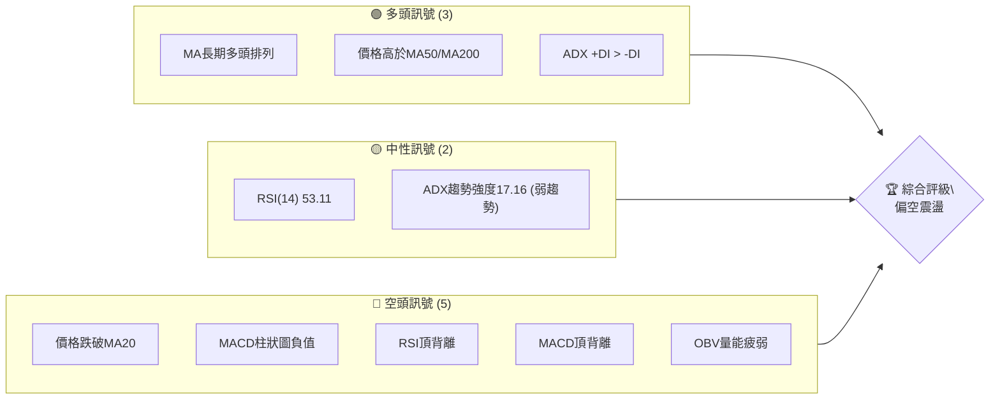
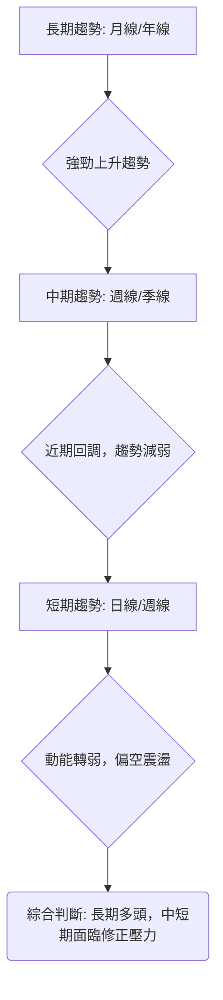
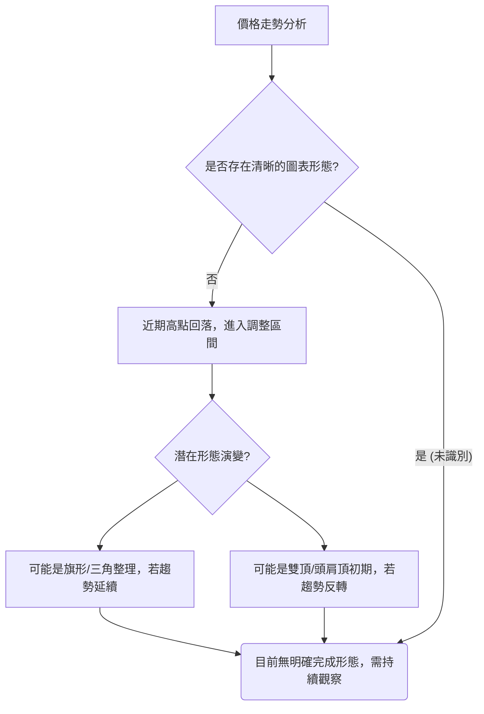
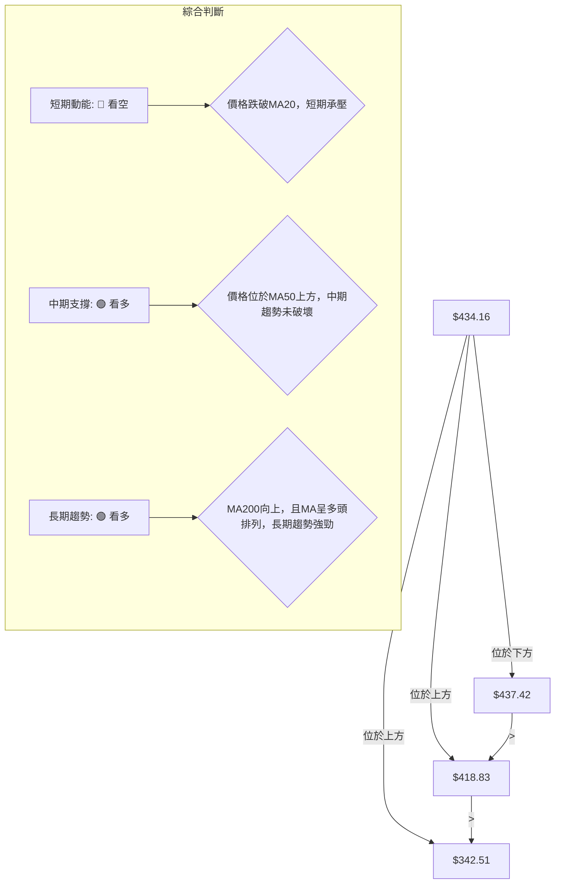
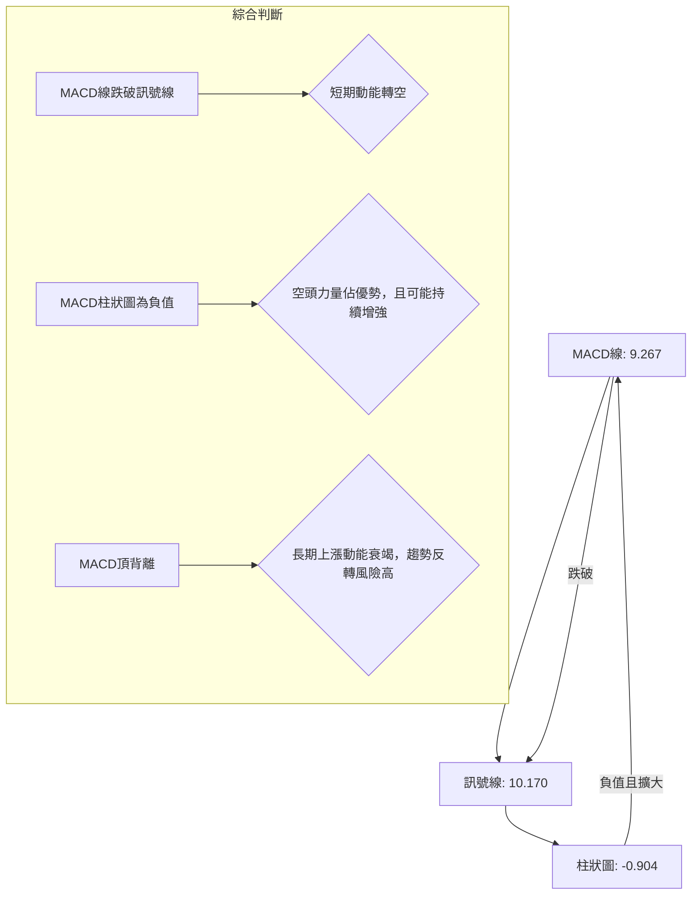
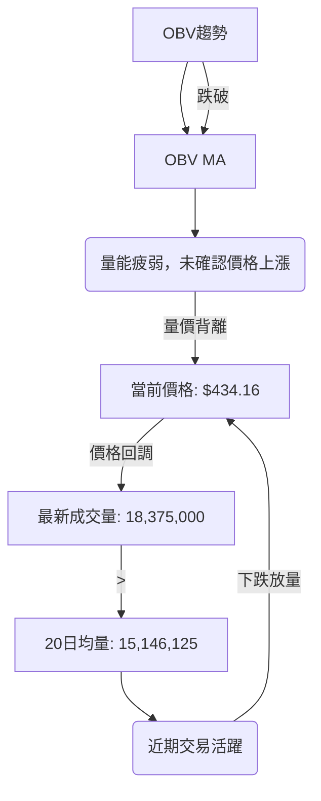

<details>
<summary>📊 靜態圖表 (點擊展開)</summary>

</details>

<html>
<head><meta charset="utf-8" /></head>
<body>
    <div style="height:500px; width:100%;">                        <script>window.PlotlyConfig = {MathJaxConfig: 'local'};</script>
        <script charset="utf-8" src="https://cdn.plot.ly/plotly-3.6.0.min.js" integrity="sha256-QaOVwtVY0T02VaHrr6pnoHLCwayMJp4O5n4YyaE3rJk=" crossorigin="anonymous"></script>                <div id="candlestick-chart" class="plotly-graph-div" style="height:100%; width:100%;"></div>            <script>                window.PLOTLYENV=window.PLOTLYENV || {};                                if (document.getElementById("candlestick-chart")) {                    Plotly.newPlot(                        "candlestick-chart",                        [{"close":{"dtype":"f8","bdata":"AAAAoC1AcEAAAABgxEtwQAAAAKCiqHBAAAAAgMlscEAAAAAA+udwQAAAAMD+h3FAAAAA4D5ocUAAAADA8ydxQAAAAKCQ83BAAAAAYIDxcEAAAAAgtFFxQAAAAGBv43FAAAAAYLjdcUAAAABAfR5yQAAAAKCSwHJAAAAA4LI7ckAAAAAAOuJyQAAAAGCRmHJAAAAAoHNncUAAAAAAWshyQAAAACAFWnJAAAAAQD7lckAAAADA7pdyQAAAACBeTHJAAAAA4PV1ckAAAADAUUNyQAAAAKDx6XFAAAAAAFAHckAAAACAdkpyQAAAAACxfnJAAAAAwMKyckAAAACgRutyQAAAAACXzXJAAAAAgEyhckAAAADAn+dyQAAAAGAEPHJAAAAAIII1ckAAAACAqO9xQAAAAEApxHFAAAAAYGJPckAAAAAATA5yQAAAAACRBXJAAAAAQOZ\u002fcUAAAADgfalxQAAAACDifHFAAAAAwMs7cUAAAAAgmYJxQAAAAIBJNXFAAAAAYI0OcUAAAABgoqZxQAAAAMBEp3FAAAAAoBb7cUAAAADAsRNyQAAAAMDk1nFAAAAA4OYcckAAAAAAPlJyQAAAAKA8KnJAAAAAQKdGckAAAACAKLhyQAAAACCb0HJAAAAA4HE7c0AAAADgh\u002fRyQAAAAMCfKHJAAAAAYC3kcUAAAABAVNZxQAAAAICVOHFAAAAAIHizcUAAAAAgcPdxQAAAAMBcPHJAAAAAwMd2ckAAAABgOpRyQAAAACCJ1HJAAAAAYPm1ckAAAADgpKByQAAAAABA5XJAAAAAAHrfc0AAAADgfwl0QAAAACD0W3RAAAAAQKzQc0AAAABAAsZzQAAAAGB3H3RAAAAAYAmhdEAAAABgH5h0QAAAACDcVnRAAAAAQCU+dUAAAAAAPkp1QAAAAOCnV3RAAAAAABpHdEAAAACg\u002f1p0QAAAAMBh0nRAAAAA4P+vdEAAAADAnQl1QAAAAKCmSHVAAAAAgOAcdUAAAADAxo10QAAAACCwOXVAAAAAoGPgdEAAAACADUF0QAAAAIB7kHRAAAAAoOmwdUAAAAAgVRl2QAAAAGDMgHZAAAAAIK1Cd0AAAABgVON2QAAAAOChx3ZAAAAAAECldkAAAACgXoZ2QAAAAICaaHZAAAAAQCsKd0AAAACgNQJ3QAAAACBH\u002fHdAAAAAgMsbeEAAAAAg+W13QAAAAOB5SndAAAAA4GfzdkAAAABgCvV1QAAAAGClOXZAAAAAAKkAdkAAAAAgXxJ1QAAAAGCGrnVAAAAAoOWUdUAAAABgzQt2QAAAAKCr73RAAAAAgCMJdUAAAACAsyd1QAAAACC\u002fknVAAAAAIG0sdUAAAADA+R91QAAAAECIh3RAAAAAYIwadUAAAAAgK2d1QAAAACAAr3VAAAAAoJFVdEAAAAAgoF90QAAAACArvHNAAAAAIJESdUAAAAAAE0t1QAAAAGD3I3VAAAAAYGJPdUAAAAAgNoh1QAAAAMC40HZAAAAAYC3KdkAAAAAAvxt3QAAAAABOC3dAAAAAAAqwd0AAAAAAlGN3QAAAAGAEqHZAAAAAYCYad0AAAAAgJtZ2QAAAACCF83ZAAAAAgI4oeEAAAABgQdx3QAAAAKBQGHlAAAAAgIpAeUAAAAAAxnZ4QAAAAMCOjnhAAAAAgCeyeEAAAADA2st4QAAAACC\u002fCnlAAAAAANGXeEAAAACAUSh6QAAAAADr0nlAAAAAgH2reUAAAACAhDl5QAAAAAChxXhAAAAAwNrteEAAAACg5wt6QAAAACB8NnlAAAAAIGaweEAAAABAFXt4QAAAACDoCnlAAAAAAC5jeUAAAADAMjl5QAAAAOC0tXlAAAAAoOBbekAAAACg4H16QAAAAMCOF3pAAAAAoMspe0AAAACAV9p7QAAAAEC3OntAAAAAoBa+e0AAAABAM+N5QAAAAGDYnHpAAAAAQLmuekAAAABguHx5QAAAAMAeUXpAAAAAQOF+ekAAAABgZpZ7QAAAAKBHnXpAAAAAYGYCe0AAAACA6+F8QAAAAGC4On1AAAAAgD1Ge0AAAACgR417QAAAAADXL3tAAAAAoJkFe0AAAACgmXF8QAAAAMAe2X1AAAAAIK7De0AAAABgjyJ7QA=="},"high":{"dtype":"f8","bdata":"AEFz3LWFcEDGxgKQ1WtwQBEOrCfMxnBAE9xgT8aHcEDygsuNMCNxQJM7bEQ5vHFAUrQF3S5wcUB\u002fWtyAki9xQLpPQ5iJFXFAZ5F\u002fHelacUCXZpDY4FRxQFbwBwJYA3JARyE3SGdmckBXb4nR7FtyQJ1qaxZcDnNACEBjEi8Lc0BxmJBLEgBzQJfTNQhmx3JAga0VwqWdckCjSa1H+eNyQKHSF9FAtnJA0AnUx2cDc0Cph2Nl+E5zQCxdQQTcznJA+2gQdmrUckCovrmdeJByQE5y5PxFTnJAD2785qY8ckBLi9Tf7XlyQPjqWbYXonJAqp4ZKUm8ckCGcto31hhzQM7\u002fSKaEDnNANs7QVGQUc0BaKBBOIDtzQHkmqlwQunJA\u002fYU4FTd+ckBfF2cSYkVyQFnCnTw62nFAQs2vb+lsckC87CLp00lyQO30EOcISXJAtrjLOsnzcUAUs1VM4MlxQJ78WkGjxHFAQJCWnP1fcUB2eJWQNKVxQCWNtJD3KHJAIRUxoS1IcUBsff0sTa1xQJzMYtGysnFAA3uw+1QockD90zD6GyZyQMd\u002f4G4jDnJADR69EilDckDbXo7I0GRyQK13JgazO3JAbzanLCynckCqJXJ7EMRyQAkqnFTE5HJAHbAaiGd4c0AiGJgISgRzQEV30BF163JAFURHcXlkckBwqexmo+9xQCap9mzT+XFAK5RaCvLacUBtlPt1sSpyQMV7cHTmV3JAhYQ3qg+GckB1I8Br9ZlyQNKVrKEh3XJAnwI9ovXuckC+byVfwe9yQI3aYlH2HHNAkLf9cP7+c0BKLFlnwph0QE6\u002fHY7jtXRAnt2OVPdJdECIkGafUC10QO7PNcCcMXRAxH\u002fsxl69dEBnBxjxDet0QKG5RTuignRAc0NlYWPYdUDHbpxo1MB1QObexExDRnVAbrIjsM2+dEAytaExP9V0QKI4QqCs9nRARKdkDwvWdEAsYcXc7zd1QH4ME4KWe3VAzbOhipJfdUBWLXq\u002fciJ1QO5VEhblZnVAFvJoe0KUdUBkHWBP8BB1QOIexkibzXRAWZZRz8K+dUD3d0oqB1x2QEkbSQAqrnZAS28jjBCad0DX+CU7wKB3QFc2uOA9E3dATC845RXFdkBnLsoF3fd2QFazyAP3jnZAUAG0rZckd0DZqOyhKzh3QFiQjCrgMnhAnN9kSkVDeED2xhYjvQd4QM+ZR0rna3dA92EyAOsyd0DDi1wAaCJ2QJke6+i+c3ZA5qa2hfVZdkCPBazO1651QEL7jsOquXVA9DczDu76dUDEP2qDNjh2QITGDLC2kXVAui+54\u002fxrdUDqP7g+vW11QCz7FIkyn3VA84wJbjGydUBtZrSgsTF1QOnnIN\u002f6DHVAgu7CCLlpdUDd4KYGMIF1QBi1XokZ2nVAvVwc3dBBdUAQRETjo4x0QCXWWWJHjXRAk9QT2egZdUB9amNx2L11QC3vAEFVVHVA2v84RlV2dUBcJY09kIt1QJbx6LzOVndA9zhfGvX0dkDcs7GO3pF3QFphvEl5KXdALfXHJkbUd0BleuyoZtF3QP5EFHJcFXdA31+mYj1rd0DCTeA4SRN3QHJeuvIjHndAieaMIA8weEB52bOfoD14QH30QDmIiHlACcn9RIHYeUA0ijH0C894QGlUN2vNrnhA4\u002fnEf7vdeEAoNeDkvDB5QNQ8DJj1a3lAE\u002fbp9+VSeUCLCADWgit6QOFqGaRMMHpA06x\u002fVmkAekDUduU4cGx5QD9VuKjNFHlA1pSljMA7eUAzqAz0vk96QPjZ6yyZjnlA9Gg3x95eeUAqARE\u002fK994QLV+V3\u002f7LnlAN8v8gPqneUAFdXFlXpt5QLtT8jdF+HlAKXjOabTYekAU6zmHnal6QFbG+AHz1npA20Tr8XAFfECpQrOTUfV7QAVmjHi7EXxAlM\u002f+rWnve0DCqqUBLg57QOAHdkq+DHtA4+BEQS5Se0BmKCD8LpV6QAAAAAAAZHpAAAAAQAqvekAAAACgR6l7QAAAAKBHhXtAAAAAAACoe0AAAAAghRN9QAAAAOCjzH1AAAAAoEf1e0AAAACAwr17QAAAAGBmTnxAAAAAgBRCe0AAAACgmYF8QAAAAAAA8H1AAAAAAClIfUAAAAAghdd8QA=="},"hovertemplate":"\u003cb\u003e%{x|%Y-%m-%d}\u003c\u002fb\u003e\u003cbr\u003e\u958b: $%{open:.2f}\u003cbr\u003e\u9ad8: $%{high:.2f}\u003cbr\u003e\u4f4e: $%{low:.2f}\u003cbr\u003e\u6536: $%{close:.2f}\u003cextra\u003e\u003c\u002fextra\u003e","low":{"dtype":"f8","bdata":"rhRKzygpcEDvYwqeMBtwQKKzaj\u002fR\u002fm9AftPDtxVMcEA0Tj6t\u002fnVwQFjtlGj5XHFAsBrDpecocUCXlzHRPcFwQFzbTl4RyHBAAAAAYIDxcEA7DeG4BvtwQN62yXwMMHFAWbiWVZPMcUCpkM5wgANyQI9YuUaFmXJACdyY5MovckD4EpzH5zpyQLhb4AaEcXJAJOh+cTZicUDI0TW8jSByQDV4SM\u002f+EHJA6J6kdpWbckBmGJA\u002f7WVyQMaWdv\u002fTSXJAXa3W3sxrckCtvF5Y0zVyQI2a6PbSonFAOWDNmdn1cUB2faogakFyQPrw5UZNNnJAOzinBz5cckA51XBIQcByQLsaG3t9p3JAPTRWlsRlckA04KJ+ILxyQKxlr+pxM3JAPPXcJ4kTckBiUjqQIdJxQDiqg89pL3FA6cuvOIEXckD2d8dfa+pxQCf72W0O9XFAlNWrc\u002flccUCur11mgPFwQPhipqXMWXFALEeZs2fpcEDRY1gdjiJxQJQ6ycf7I3FAawmBP76LcECux+zK3fBwQAJTj5ke73BA7lpZCbDXcUBYWUYh2etxQMpO7oidj3FAnppFsLTucUBfo6vgVb1xQCoPYQzm\u002fnFA1zX6MlEvckB4gwUMZ2ZyQAWcSfyognJAwEQOCCnCckCuYHpumaFyQM\u002fSv1DAF3JAotAAICfhcUDF4jA80p1xQCv1CpSoGnFADTvBjtSEcUC7Tul6h85xQJLC55NpG3JAHfisvysrckDXYH3aUWtyQNEbR1LFj3JAB7LnKdeRckBHtng8k55yQGluNG\u002ft3XJAhKrCRZFhc0D65g2qj\u002f1zQOpyx0m\u002fLnRA11Rv0nHOc0BD9\u002f0dPqhzQBlsziLUyXNAbLMhuI72c0AyVmctR5F0QKJ0gZVoMnRA5\u002fpecO4CdUCfDRaKRzt1QOS5TFmEU3RAt2dRAxlAdEAKaANlhFN0QN1ZxW6rmnRAZaJ2FYaIdEC8R\u002f9zcs10QP56FOG1DnVAmObu8DVodEDRNGhciXZ0QLh2clmJdnRA0s6KIS6FdEA7mruq4dZzQH7UfwId4HNAFj\u002fCNbfudEAbhZ61MqB1QED9N7XuKHZAxfqX\u002f\u002fHndkA0IaHEHAd0QG+USu6mbnZAVTiqU4smdkDD7p1hsm12QAGArlqlOXZAYu\u002ff1RFUdkAImD4+Ocl2QE8q0RTgYXdA\u002fQJkDaLtd0C4zQdOzPx2QPjyoDib63ZA91yppGmsdkCwWhKi8GV1QENFSrekC3ZAXvHACIdgdUCz6acwWu90QAKgK8Fso3RAlxtoRqVodUBXPLeL8sh1QGfFa\u002fJq6nRAEVXg397ndEADXKvBLCF1QMFDRuq\u002fGXVAkYR\u002fM8EodUCJXvJF4kZ0QIlNhpY3UnRApuhqFjmldEDOZZlU1dN0QG3f3ssoa3VAOBXrtMFJdEAx8whF6Rh0QHKWv7YRkXNAg6NtPjwGdEAueMKmTC91QJFDB2KVYHRAbt297EIddUCs2iFK2u10QAekTBxpZnZAB721JQl+dkAc22+CLQ53QNlUrq8d03ZAdTvJdJFFd0DrkCQocjV3QA9QzUtSe3ZAYydQK5fEdkC\u002fREIrYrZ2QHh4NmwcxHZAatoPhmIcd0A1kbVN6W53QL1ti4XgjnhAY\u002fCTlG73eEDw0gG90fx3QMEmv3FeNHhA1TNk7PAMeEDRkk3ka3N4QIvSyTdtpHhAu64ykux6eEAKIK9DbPt4QK8BY+2AcnlAKNTrGhj\u002feEBMzrakJ9R4QPyab2x8E3hAlLVX1+JoeEBR+\u002feakRJ5QLVJJ\u002fNe3nhATGFMhC5ieECy\u002fLrAkAJ4QJVniiJmsHhAn4wbvTnpeEB2\u002fbxCsx55QJQYSGjKkXlAnnDPVo3meUBvaHVi29t5QFmP4vtmBHpAG3GoxjRYekDqya103C97QFYVros8GHtAhhBKntOkekD4xb6GNb15QK+D31yvWHpAK7bIVQBJeUCj5k+s9Wt5QAAAAIDCjXlAAAAAIFwTekAAAABA4f56QAAAAEAzk3pAAAAAgD36ekAAAACAPWZ7QAAAAGC4En1AAAAAQAoje0AAAACgRwl7QAAAAEAKB3tAAAAAQAozekAAAACgcPF6QAAAAAAAUHxAAAAAIIW3e0AAAAAAANh6QA=="},"name":"\u50f9\u683c","open":{"dtype":"f8","bdata":"1Sdao3R9cEC3zBt9X2RwQEFWrLdz\u002f29AVLcRd5mEcEDNJoFlTIdwQD9CXu0Sg3FAw9MhT+VhcUAAyA49we9wQD1o2Kb6+3BAc8K72kAlcUCq\u002f8ohrhJxQNu9ebE1RHFA4qfjbzpjckACIXALIClyQNrlz8ihmnJAG3WUUZADc0CZ0qf9GEtyQIxNDc8kv3JAXELJUdaZckBpf5ZoiH5yQJCgY00ZVXJA\u002f3UAZ1P+ckBnQoQ8\u002fEdzQLJogo4SgXJAdpq0+HiackALSvT2mIpyQCTTezBZK3JALSxKaIz4cUBsFBiXJVRyQETA2JAKhXJAud7Ga81\u002fckARGIIDjPZyQHFn1vtdy3JALdBhM5D5ckCOVYiRlsNyQOWDzn\u002fxaHJAXY8hylAlckBzl2l9zzxyQMXTh6+ur3FAnaMpJPBAckAZ5dLfbBxyQDUlbh52NnJAKXkFLIzucUBEUeLTCxxxQI5B5KDVc3FAYEBopxQ2cUDYUoqGFCxxQP8Fi4\u002fOHnJAPHuEbdXqcECux+zK3fBwQO63ERJQiHFAlOQlqm\u002ftcUBQ1djPFyNyQJjvTjbUynFAZbnKIXkbckBFWWi3VB5yQMg+89\u002fnOnJA\u002fZfaSMRbckD6d5G0ha1yQG\u002f2UkVQmnJAimIhoLjvckCyev8aA\u002fxyQEV30BF163JA2YdewCBackBqRxGKidxxQIS08azA8HFAiGBeI5C4cUC7Tul6h85xQB66yPx8UnJAd+R8nEU+ckBDF7HwWoNyQJap3sS8pXJAQ08\u002fxanDckAd6bw55cxyQBkCQS8A53JA0Gm+QAZmc0B+SGCsOot0QGeXn0NdiHRAWHwxRQUwdEBtdCVwkCt0QJrern\u002f64nNA5GsjsxwHdECQZ5LNi7J0QKG5RTuignRAZ+GO3sRQdUDAmVEZqot1QBtKSm6dMHVABFkE3HW7dED2KS0iTbt0QJqjJvLPpXRAdrHC8EWxdEDa3YLcU+x0QEmhumFFVHVA6+ypPNsgdUAknaoPI9t0QLrMFsf1kHRA+p5kKr50dUDcOiGNAN50QOMEEqaSEnRAc\u002f3N8D78dEC8z6a\u002feq91QIUR1q1Rp3ZAFiygi9gCd0BNY3dI1ZB3QCS6vgML9HZAVxVfTSmAdkD3HiVx1p92QPLG8TrwXXZAA5gsxeRedkC03PWJ+tF2QME1cS4zl3dAnN9kSkVDeEAbJQpeHwN4QP5qrDjNA3dAyHk80ra3dkCNl+n9Dbx1QEIz8pV8OXZApSgK+zYRdkDBHiKTwFt1QC9lbYgA3nRAOh+pEt2qdUAksl8jxgF2QF+X96VugnVADAU\u002fBXBidUASz+Hm7zd1QH+gdxzePHVALWpM0o2PdUChBhCVNod0QEVwCE1L\u002fnRApuhqFjmldEDLyzVfk+x0QEunPd8Qk3VA20aEq2owdUDg8lAHI0F0QKjyFfr3ZnRADSodTOkYdECLccpPi3F1QNCYA+A4YXRAsuhVnEwvdUCdBynlWSp1QJuN7jzMFndAE9UnFTindkBlX\u002fs+Zmt3QP7gkKVRFndAqHZrgniid0DYOV1dTch3QPlbB4X4\u002f3ZAqUtMyT9Fd0BMYUy7twV3QAAAACCF83ZAFfQ6\u002fZQud0BhLLLIovV3QLSsRHtus3hApFVqcojMeUCku\u002fn6QnN4QNSA1k3ff3hA4aGwwBbOeEAhkPoaVYh4QPDCyKYyOXlAGSIpvHk6eUC+Z3KEWxd5QNNfaIvPEXpAqcb2EJ3\u002feUDag1KSolx5QJMxkKAhzXhAR1xKhG7VeECw56V7SSR5QLMB3ezNWHlA9Gg3x95eeUBc8KJqmUl4QGGOPdYowXhAn4wbvTnpeEBds0ojk4d5QG6IG\u002fh5wnlAhRH3UVugekDns7GDvFN6QOKIDcInoXpAR2n7fzJ+ekA+F8tYz3h7QCQxDrkED3xAF4hFgPvZekBROrIHQcx6QCs+En96bHpAtn9hDPndekDtCE6k4s95QAAAAAAp1HlAAAAAwMxAekAAAABA4Wp7QAAAAOBRQHtAAAAAAAAse0AAAACAFG57QAAAAKBwwX1AAAAAQOFye0AAAAAgrh97QAAAAGBmTnxAAAAAAACQekAAAAAAAFB7QAAAAIDCeXxAAAAAYLg6fUAAAADgoyh8QA=="},"x":["2025-09-16T00:00:00-04:00","2025-09-17T00:00:00-04:00","2025-09-18T00:00:00-04:00","2025-09-19T00:00:00-04:00","2025-09-22T00:00:00-04:00","2025-09-23T00:00:00-04:00","2025-09-24T00:00:00-04:00","2025-09-25T00:00:00-04:00","2025-09-26T00:00:00-04:00","2025-09-29T00:00:00-04:00","2025-09-30T00:00:00-04:00","2025-10-01T00:00:00-04:00","2025-10-02T00:00:00-04:00","2025-10-03T00:00:00-04:00","2025-10-06T00:00:00-04:00","2025-10-07T00:00:00-04:00","2025-10-08T00:00:00-04:00","2025-10-09T00:00:00-04:00","2025-10-10T00:00:00-04:00","2025-10-13T00:00:00-04:00","2025-10-14T00:00:00-04:00","2025-10-15T00:00:00-04:00","2025-10-16T00:00:00-04:00","2025-10-17T00:00:00-04:00","2025-10-20T00:00:00-04:00","2025-10-21T00:00:00-04:00","2025-10-22T00:00:00-04:00","2025-10-23T00:00:00-04:00","2025-10-24T00:00:00-04:00","2025-10-27T00:00:00-04:00","2025-10-28T00:00:00-04:00","2025-10-29T00:00:00-04:00","2025-10-30T00:00:00-04:00","2025-10-31T00:00:00-04:00","2025-11-03T00:00:00-05:00","2025-11-04T00:00:00-05:00","2025-11-05T00:00:00-05:00","2025-11-06T00:00:00-05:00","2025-11-07T00:00:00-05:00","2025-11-10T00:00:00-05:00","2025-11-11T00:00:00-05:00","2025-11-12T00:00:00-05:00","2025-11-13T00:00:00-05:00","2025-11-14T00:00:00-05:00","2025-11-17T00:00:00-05:00","2025-11-18T00:00:00-05:00","2025-11-19T00:00:00-05:00","2025-11-20T00:00:00-05:00","2025-11-21T00:00:00-05:00","2025-11-24T00:00:00-05:00","2025-11-25T00:00:00-05:00","2025-11-26T00:00:00-05:00","2025-11-28T00:00:00-05:00","2025-12-01T00:00:00-05:00","2025-12-02T00:00:00-05:00","2025-12-03T00:00:00-05:00","2025-12-04T00:00:00-05:00","2025-12-05T00:00:00-05:00","2025-12-08T00:00:00-05:00","2025-12-09T00:00:00-05:00","2025-12-10T00:00:00-05:00","2025-12-11T00:00:00-05:00","2025-12-12T00:00:00-05:00","2025-12-15T00:00:00-05:00","2025-12-16T00:00:00-05:00","2025-12-17T00:00:00-05:00","2025-12-18T00:00:00-05:00","2025-12-19T00:00:00-05:00","2025-12-22T00:00:00-05:00","2025-12-23T00:00:00-05:00","2025-12-24T00:00:00-05:00","2025-12-26T00:00:00-05:00","2025-12-29T00:00:00-05:00","2025-12-30T00:00:00-05:00","2025-12-31T00:00:00-05:00","2026-01-02T00:00:00-05:00","2026-01-05T00:00:00-05:00","2026-01-06T00:00:00-05:00","2026-01-07T00:00:00-05:00","2026-01-08T00:00:00-05:00","2026-01-09T00:00:00-05:00","2026-01-12T00:00:00-05:00","2026-01-13T00:00:00-05:00","2026-01-14T00:00:00-05:00","2026-01-15T00:00:00-05:00","2026-01-16T00:00:00-05:00","2026-01-20T00:00:00-05:00","2026-01-21T00:00:00-05:00","2026-01-22T00:00:00-05:00","2026-01-23T00:00:00-05:00","2026-01-26T00:00:00-05:00","2026-01-27T00:00:00-05:00","2026-01-28T00:00:00-05:00","2026-01-29T00:00:00-05:00","2026-01-30T00:00:00-05:00","2026-02-02T00:00:00-05:00","2026-02-03T00:00:00-05:00","2026-02-04T00:00:00-05:00","2026-02-05T00:00:00-05:00","2026-02-06T00:00:00-05:00","2026-02-09T00:00:00-05:00","2026-02-10T00:00:00-05:00","2026-02-11T00:00:00-05:00","2026-02-12T00:00:00-05:00","2026-02-13T00:00:00-05:00","2026-02-17T00:00:00-05:00","2026-02-18T00:00:00-05:00","2026-02-19T00:00:00-05:00","2026-02-20T00:00:00-05:00","2026-02-23T00:00:00-05:00","2026-02-24T00:00:00-05:00","2026-02-25T00:00:00-05:00","2026-02-26T00:00:00-05:00","2026-02-27T00:00:00-05:00","2026-03-02T00:00:00-05:00","2026-03-03T00:00:00-05:00","2026-03-04T00:00:00-05:00","2026-03-05T00:00:00-05:00","2026-03-06T00:00:00-05:00","2026-03-09T00:00:00-04:00","2026-03-10T00:00:00-04:00","2026-03-11T00:00:00-04:00","2026-03-12T00:00:00-04:00","2026-03-13T00:00:00-04:00","2026-03-16T00:00:00-04:00","2026-03-17T00:00:00-04:00","2026-03-18T00:00:00-04:00","2026-03-19T00:00:00-04:00","2026-03-20T00:00:00-04:00","2026-03-23T00:00:00-04:00","2026-03-24T00:00:00-04:00","2026-03-25T00:00:00-04:00","2026-03-26T00:00:00-04:00","2026-03-27T00:00:00-04:00","2026-03-30T00:00:00-04:00","2026-03-31T00:00:00-04:00","2026-04-01T00:00:00-04:00","2026-04-02T00:00:00-04:00","2026-04-06T00:00:00-04:00","2026-04-07T00:00:00-04:00","2026-04-08T00:00:00-04:00","2026-04-09T00:00:00-04:00","2026-04-10T00:00:00-04:00","2026-04-13T00:00:00-04:00","2026-04-14T00:00:00-04:00","2026-04-15T00:00:00-04:00","2026-04-16T00:00:00-04:00","2026-04-17T00:00:00-04:00","2026-04-20T00:00:00-04:00","2026-04-21T00:00:00-04:00","2026-04-22T00:00:00-04:00","2026-04-23T00:00:00-04:00","2026-04-24T00:00:00-04:00","2026-04-27T00:00:00-04:00","2026-04-28T00:00:00-04:00","2026-04-29T00:00:00-04:00","2026-04-30T00:00:00-04:00","2026-05-01T00:00:00-04:00","2026-05-04T00:00:00-04:00","2026-05-05T00:00:00-04:00","2026-05-06T00:00:00-04:00","2026-05-07T00:00:00-04:00","2026-05-08T00:00:00-04:00","2026-05-11T00:00:00-04:00","2026-05-12T00:00:00-04:00","2026-05-13T00:00:00-04:00","2026-05-14T00:00:00-04:00","2026-05-15T00:00:00-04:00","2026-05-18T00:00:00-04:00","2026-05-19T00:00:00-04:00","2026-05-20T00:00:00-04:00","2026-05-21T00:00:00-04:00","2026-05-22T00:00:00-04:00","2026-05-26T00:00:00-04:00","2026-05-27T00:00:00-04:00","2026-05-28T00:00:00-04:00","2026-05-29T00:00:00-04:00","2026-06-01T00:00:00-04:00","2026-06-02T00:00:00-04:00","2026-06-03T00:00:00-04:00","2026-06-04T00:00:00-04:00","2026-06-05T00:00:00-04:00","2026-06-08T00:00:00-04:00","2026-06-09T00:00:00-04:00","2026-06-10T00:00:00-04:00","2026-06-11T00:00:00-04:00","2026-06-12T00:00:00-04:00","2026-06-15T00:00:00-04:00","2026-06-16T00:00:00-04:00","2026-06-17T00:00:00-04:00","2026-06-18T00:00:00-04:00","2026-06-22T00:00:00-04:00","2026-06-23T00:00:00-04:00","2026-06-24T00:00:00-04:00","2026-06-25T00:00:00-04:00","2026-06-26T00:00:00-04:00","2026-06-29T00:00:00-04:00","2026-06-30T00:00:00-04:00","2026-07-01T00:00:00-04:00","2026-07-02T00:00:00-04:00"],"type":"candlestick"},{"hovertemplate":"MA30: $%{y:.2f}\u003cextra\u003e\u003c\u002fextra\u003e","line":{"color":"#2196F3","dash":"dash","width":2},"mode":"lines","name":"MA30","x":["2025-09-16T00:00:00-04:00","2025-09-17T00:00:00-04:00","2025-09-18T00:00:00-04:00","2025-09-19T00:00:00-04:00","2025-09-22T00:00:00-04:00","2025-09-23T00:00:00-04:00","2025-09-24T00:00:00-04:00","2025-09-25T00:00:00-04:00","2025-09-26T00:00:00-04:00","2025-09-29T00:00:00-04:00","2025-09-30T00:00:00-04:00","2025-10-01T00:00:00-04:00","2025-10-02T00:00:00-04:00","2025-10-03T00:00:00-04:00","2025-10-06T00:00:00-04:00","2025-10-07T00:00:00-04:00","2025-10-08T00:00:00-04:00","2025-10-09T00:00:00-04:00","2025-10-10T00:00:00-04:00","2025-10-13T00:00:00-04:00","2025-10-14T00:00:00-04:00","2025-10-15T00:00:00-04:00","2025-10-16T00:00:00-04:00","2025-10-17T00:00:00-04:00","2025-10-20T00:00:00-04:00","2025-10-21T00:00:00-04:00","2025-10-22T00:00:00-04:00","2025-10-23T00:00:00-04:00","2025-10-24T00:00:00-04:00","2025-10-27T00:00:00-04:00","2025-10-28T00:00:00-04:00","2025-10-29T00:00:00-04:00","2025-10-30T00:00:00-04:00","2025-10-31T00:00:00-04:00","2025-11-03T00:00:00-05:00","2025-11-04T00:00:00-05:00","2025-11-05T00:00:00-05:00","2025-11-06T00:00:00-05:00","2025-11-07T00:00:00-05:00","2025-11-10T00:00:00-05:00","2025-11-11T00:00:00-05:00","2025-11-12T00:00:00-05:00","2025-11-13T00:00:00-05:00","2025-11-14T00:00:00-05:00","2025-11-17T00:00:00-05:00","2025-11-18T00:00:00-05:00","2025-11-19T00:00:00-05:00","2025-11-20T00:00:00-05:00","2025-11-21T00:00:00-05:00","2025-11-24T00:00:00-05:00","2025-11-25T00:00:00-05:00","2025-11-26T00:00:00-05:00","2025-11-28T00:00:00-05:00","2025-12-01T00:00:00-05:00","2025-12-02T00:00:00-05:00","2025-12-03T00:00:00-05:00","2025-12-04T00:00:00-05:00","2025-12-05T00:00:00-05:00","2025-12-08T00:00:00-05:00","2025-12-09T00:00:00-05:00","2025-12-10T00:00:00-05:00","2025-12-11T00:00:00-05:00","2025-12-12T00:00:00-05:00","2025-12-15T00:00:00-05:00","2025-12-16T00:00:00-05:00","2025-12-17T00:00:00-05:00","2025-12-18T00:00:00-05:00","2025-12-19T00:00:00-05:00","2025-12-22T00:00:00-05:00","2025-12-23T00:00:00-05:00","2025-12-24T00:00:00-05:00","2025-12-26T00:00:00-05:00","2025-12-29T00:00:00-05:00","2025-12-30T00:00:00-05:00","2025-12-31T00:00:00-05:00","2026-01-02T00:00:00-05:00","2026-01-05T00:00:00-05:00","2026-01-06T00:00:00-05:00","2026-01-07T00:00:00-05:00","2026-01-08T00:00:00-05:00","2026-01-09T00:00:00-05:00","2026-01-12T00:00:00-05:00","2026-01-13T00:00:00-05:00","2026-01-14T00:00:00-05:00","2026-01-15T00:00:00-05:00","2026-01-16T00:00:00-05:00","2026-01-20T00:00:00-05:00","2026-01-21T00:00:00-05:00","2026-01-22T00:00:00-05:00","2026-01-23T00:00:00-05:00","2026-01-26T00:00:00-05:00","2026-01-27T00:00:00-05:00","2026-01-28T00:00:00-05:00","2026-01-29T00:00:00-05:00","2026-01-30T00:00:00-05:00","2026-02-02T00:00:00-05:00","2026-02-03T00:00:00-05:00","2026-02-04T00:00:00-05:00","2026-02-05T00:00:00-05:00","2026-02-06T00:00:00-05:00","2026-02-09T00:00:00-05:00","2026-02-10T00:00:00-05:00","2026-02-11T00:00:00-05:00","2026-02-12T00:00:00-05:00","2026-02-13T00:00:00-05:00","2026-02-17T00:00:00-05:00","2026-02-18T00:00:00-05:00","2026-02-19T00:00:00-05:00","2026-02-20T00:00:00-05:00","2026-02-23T00:00:00-05:00","2026-02-24T00:00:00-05:00","2026-02-25T00:00:00-05:00","2026-02-26T00:00:00-05:00","2026-02-27T00:00:00-05:00","2026-03-02T00:00:00-05:00","2026-03-03T00:00:00-05:00","2026-03-04T00:00:00-05:00","2026-03-05T00:00:00-05:00","2026-03-06T00:00:00-05:00","2026-03-09T00:00:00-04:00","2026-03-10T00:00:00-04:00","2026-03-11T00:00:00-04:00","2026-03-12T00:00:00-04:00","2026-03-13T00:00:00-04:00","2026-03-16T00:00:00-04:00","2026-03-17T00:00:00-04:00","2026-03-18T00:00:00-04:00","2026-03-19T00:00:00-04:00","2026-03-20T00:00:00-04:00","2026-03-23T00:00:00-04:00","2026-03-24T00:00:00-04:00","2026-03-25T00:00:00-04:00","2026-03-26T00:00:00-04:00","2026-03-27T00:00:00-04:00","2026-03-30T00:00:00-04:00","2026-03-31T00:00:00-04:00","2026-04-01T00:00:00-04:00","2026-04-02T00:00:00-04:00","2026-04-06T00:00:00-04:00","2026-04-07T00:00:00-04:00","2026-04-08T00:00:00-04:00","2026-04-09T00:00:00-04:00","2026-04-10T00:00:00-04:00","2026-04-13T00:00:00-04:00","2026-04-14T00:00:00-04:00","2026-04-15T00:00:00-04:00","2026-04-16T00:00:00-04:00","2026-04-17T00:00:00-04:00","2026-04-20T00:00:00-04:00","2026-04-21T00:00:00-04:00","2026-04-22T00:00:00-04:00","2026-04-23T00:00:00-04:00","2026-04-24T00:00:00-04:00","2026-04-27T00:00:00-04:00","2026-04-28T00:00:00-04:00","2026-04-29T00:00:00-04:00","2026-04-30T00:00:00-04:00","2026-05-01T00:00:00-04:00","2026-05-04T00:00:00-04:00","2026-05-05T00:00:00-04:00","2026-05-06T00:00:00-04:00","2026-05-07T00:00:00-04:00","2026-05-08T00:00:00-04:00","2026-05-11T00:00:00-04:00","2026-05-12T00:00:00-04:00","2026-05-13T00:00:00-04:00","2026-05-14T00:00:00-04:00","2026-05-15T00:00:00-04:00","2026-05-18T00:00:00-04:00","2026-05-19T00:00:00-04:00","2026-05-20T00:00:00-04:00","2026-05-21T00:00:00-04:00","2026-05-22T00:00:00-04:00","2026-05-26T00:00:00-04:00","2026-05-27T00:00:00-04:00","2026-05-28T00:00:00-04:00","2026-05-29T00:00:00-04:00","2026-06-01T00:00:00-04:00","2026-06-02T00:00:00-04:00","2026-06-03T00:00:00-04:00","2026-06-04T00:00:00-04:00","2026-06-05T00:00:00-04:00","2026-06-08T00:00:00-04:00","2026-06-09T00:00:00-04:00","2026-06-10T00:00:00-04:00","2026-06-11T00:00:00-04:00","2026-06-12T00:00:00-04:00","2026-06-15T00:00:00-04:00","2026-06-16T00:00:00-04:00","2026-06-17T00:00:00-04:00","2026-06-18T00:00:00-04:00","2026-06-22T00:00:00-04:00","2026-06-23T00:00:00-04:00","2026-06-24T00:00:00-04:00","2026-06-25T00:00:00-04:00","2026-06-26T00:00:00-04:00","2026-06-29T00:00:00-04:00","2026-06-30T00:00:00-04:00","2026-07-01T00:00:00-04:00","2026-07-02T00:00:00-04:00"],"y":{"dtype":"f8","bdata":"AAAAAAAA+H8AAAAAAAD4fwAAAAAAAPh\u002fAAAAAAAA+H8AAAAAAAD4fwAAAAAAAPh\u002fAAAAAAAA+H8AAAAAAAD4fwAAAAAAAPh\u002fAAAAAAAA+H8AAAAAAAD4fwAAAAAAAPh\u002fAAAAAAAA+H8AAAAAAAD4fwAAAAAAAPh\u002fAAAAAAAA+H8AAAAAAAD4fwAAAAAAAPh\u002fAAAAAAAA+H8AAAAAAAD4fwAAAAAAAPh\u002fAAAAAAAA+H8AAAAAAAD4fwAAAAAAAPh\u002fAAAAAAAA+H8AAAAAAAD4fwAAAAAAAPh\u002fAAAAAAAA+H8AAAAAAAD4f6uqqhp4zHFAERER8VrhcUBmZmYmvfdxQAAAAJAJCnJAq6qqutocckCamZnJ6C1yQJqZmfnoM3JAzczMjMA6ckBVVVW1aEFyQKuqqrpcSHJAVVVVZQZUckCamZm5T1pyQKuqqvpyW3JAAAAAYFJYckDv7u7+a1RyQImIiNihSXJAREREJBpBckBERESUYTVyQJqZmdmJKXJA3t3dPZMmckDNzMz86hxyQERERKT1FnJAVVVVhScPckBmZmYWvwpyQERERKTUBnJAzczMrNwDckBEREQEXARyQGZmZqaABnJAiYiIKJ0IckCamZk5RQxyQKuqqjoAD3JAmpmZmY4TckAzMzOT3RNyQN7d3d1dDnJAd3d3BxAIckCamZnp8\u002f5xQFVVVRVO9nFAq6qqavjxcUDe3d3NOvJxQFVVVYU89nFAMzMzs4z3cUBERESUA\u002fxxQHd3d7fpAnJAAAAAsD8NckCJiIi4fBVyQJqZmdl\u002fIXJAiYiIqAU4ckAiIiLilU1yQAAAAHB5aHJAAAAAAAOAckC8u7vLH5JyQM3MzIwyp3JAVVVVtcu9ckBERETURtNyQAAAAOCb6HJAd3d3J1EDc0DNzMx8phxzQBERESE7L3NAVVVVBVBAc0AAAAAgRk5zQImIiFhmX3NAq6qqetFrc0CamZl5ln1zQO\u002fu7l5BmHNA7+7uzr6zc0CrqqpK7cpzQImIiNgY7XNAMzMzwzEIdEAiIiICtxt0QGZmZuaVL3RAAAAAkB9LdEDNzMz8KGl0QAAAAJCAiHRAq6qqWlOvdECamZmJrtN0QO\u002fu7u7T9HRAq6qqqnwMdUCrqqpKtyF1QN7d3U00M3VAmpmZibhOdUCamZnZU2p1QFVVVbVJi3VAiYiI2PqodUBVVVXFLMF1QCIiIrJc2nVAvLu7++\u002fodUBmZmZ2oe51QCIiInKy\u002fnVAmpmZaWoNdkAiIiIyhxN2QAAAAMDdGnZAIiIiAn8idkAiIiIyGit2QFVVVeUiKHZAZmZmdnondkBERET0myx2QLy7u+uTL3ZAVVVVxRwydkC8u7sLizl2QLy7u6s+OXZAAAAAkDs0dkCrqqo6Sy52QERERPRMJ3ZAIiIiklQOdkARERGh3\u002fh1QERERDTk3nVAmpmZ+XfRdUBERER09cZ1QHd3dzcjvHVAmpmZyWCtdUBEREQ0x6B1QN7d3f3KlnVAzczM\u002fImLdUARERFRzIh1QBEREUGxhnVAzczM7PqMdUBmZma2Mpl1QLy7u4vgnHVAd3d3l0KmdUAiIiLCUbV1QM3MzAwnwHVAVVVVJSTWdUCrqqp6n+V1QCIiInIcCXZAiYiIWBctdkAiIiKyU0l2QM3MzIzJYnZAvLu7S9iAdkCJiIiYLKB2QM3MzGyuxnZAq6qq+nTkdkAzMzNTBw13QERERPRbMHdAERER0eNdd0C8u7tLSYd3QBEREbFEsndAvLu7iy3Td0Crqqoqvft3QDMzM1N9HnhAiYiIyFI7eECrqqpafFR4QO\u002fu7u59Z3hA7+7unqh9eEAzMzMDtY94QM3MzCx0pnhAiYiImD+9eEDe3d2dudd4QHd3dwcL9XhAvLu7q7IXeUDe3d0dgUJ5QJqZmckCZ3lAREREZJiFeUCJiIi45JZ5QN7d3S3Yo3lAAAAA8AyweUB3d3c3yLh5QERERATNx3lAq6qqiijXeUDv7u7++e55QCIiIvJk\u002fHlAZmZmhgMRekBERERkRCh6QFVVVcVTRXpAZmZm1gRTekDNzMys4GZ6QDMzMxN8e3pAVVVVxVeNekAzMzOjzKF6QHd3d5dayXpAmpmZuZjjekDe3d3tPvp6QA=="},"type":"scatter"},{"hovertemplate":"MA60: $%{y:.2f}\u003cextra\u003e\u003c\u002fextra\u003e","line":{"color":"#9C27B0","dash":"dash","width":2},"mode":"lines","name":"MA60","x":["2025-09-16T00:00:00-04:00","2025-09-17T00:00:00-04:00","2025-09-18T00:00:00-04:00","2025-09-19T00:00:00-04:00","2025-09-22T00:00:00-04:00","2025-09-23T00:00:00-04:00","2025-09-24T00:00:00-04:00","2025-09-25T00:00:00-04:00","2025-09-26T00:00:00-04:00","2025-09-29T00:00:00-04:00","2025-09-30T00:00:00-04:00","2025-10-01T00:00:00-04:00","2025-10-02T00:00:00-04:00","2025-10-03T00:00:00-04:00","2025-10-06T00:00:00-04:00","2025-10-07T00:00:00-04:00","2025-10-08T00:00:00-04:00","2025-10-09T00:00:00-04:00","2025-10-10T00:00:00-04:00","2025-10-13T00:00:00-04:00","2025-10-14T00:00:00-04:00","2025-10-15T00:00:00-04:00","2025-10-16T00:00:00-04:00","2025-10-17T00:00:00-04:00","2025-10-20T00:00:00-04:00","2025-10-21T00:00:00-04:00","2025-10-22T00:00:00-04:00","2025-10-23T00:00:00-04:00","2025-10-24T00:00:00-04:00","2025-10-27T00:00:00-04:00","2025-10-28T00:00:00-04:00","2025-10-29T00:00:00-04:00","2025-10-30T00:00:00-04:00","2025-10-31T00:00:00-04:00","2025-11-03T00:00:00-05:00","2025-11-04T00:00:00-05:00","2025-11-05T00:00:00-05:00","2025-11-06T00:00:00-05:00","2025-11-07T00:00:00-05:00","2025-11-10T00:00:00-05:00","2025-11-11T00:00:00-05:00","2025-11-12T00:00:00-05:00","2025-11-13T00:00:00-05:00","2025-11-14T00:00:00-05:00","2025-11-17T00:00:00-05:00","2025-11-18T00:00:00-05:00","2025-11-19T00:00:00-05:00","2025-11-20T00:00:00-05:00","2025-11-21T00:00:00-05:00","2025-11-24T00:00:00-05:00","2025-11-25T00:00:00-05:00","2025-11-26T00:00:00-05:00","2025-11-28T00:00:00-05:00","2025-12-01T00:00:00-05:00","2025-12-02T00:00:00-05:00","2025-12-03T00:00:00-05:00","2025-12-04T00:00:00-05:00","2025-12-05T00:00:00-05:00","2025-12-08T00:00:00-05:00","2025-12-09T00:00:00-05:00","2025-12-10T00:00:00-05:00","2025-12-11T00:00:00-05:00","2025-12-12T00:00:00-05:00","2025-12-15T00:00:00-05:00","2025-12-16T00:00:00-05:00","2025-12-17T00:00:00-05:00","2025-12-18T00:00:00-05:00","2025-12-19T00:00:00-05:00","2025-12-22T00:00:00-05:00","2025-12-23T00:00:00-05:00","2025-12-24T00:00:00-05:00","2025-12-26T00:00:00-05:00","2025-12-29T00:00:00-05:00","2025-12-30T00:00:00-05:00","2025-12-31T00:00:00-05:00","2026-01-02T00:00:00-05:00","2026-01-05T00:00:00-05:00","2026-01-06T00:00:00-05:00","2026-01-07T00:00:00-05:00","2026-01-08T00:00:00-05:00","2026-01-09T00:00:00-05:00","2026-01-12T00:00:00-05:00","2026-01-13T00:00:00-05:00","2026-01-14T00:00:00-05:00","2026-01-15T00:00:00-05:00","2026-01-16T00:00:00-05:00","2026-01-20T00:00:00-05:00","2026-01-21T00:00:00-05:00","2026-01-22T00:00:00-05:00","2026-01-23T00:00:00-05:00","2026-01-26T00:00:00-05:00","2026-01-27T00:00:00-05:00","2026-01-28T00:00:00-05:00","2026-01-29T00:00:00-05:00","2026-01-30T00:00:00-05:00","2026-02-02T00:00:00-05:00","2026-02-03T00:00:00-05:00","2026-02-04T00:00:00-05:00","2026-02-05T00:00:00-05:00","2026-02-06T00:00:00-05:00","2026-02-09T00:00:00-05:00","2026-02-10T00:00:00-05:00","2026-02-11T00:00:00-05:00","2026-02-12T00:00:00-05:00","2026-02-13T00:00:00-05:00","2026-02-17T00:00:00-05:00","2026-02-18T00:00:00-05:00","2026-02-19T00:00:00-05:00","2026-02-20T00:00:00-05:00","2026-02-23T00:00:00-05:00","2026-02-24T00:00:00-05:00","2026-02-25T00:00:00-05:00","2026-02-26T00:00:00-05:00","2026-02-27T00:00:00-05:00","2026-03-02T00:00:00-05:00","2026-03-03T00:00:00-05:00","2026-03-04T00:00:00-05:00","2026-03-05T00:00:00-05:00","2026-03-06T00:00:00-05:00","2026-03-09T00:00:00-04:00","2026-03-10T00:00:00-04:00","2026-03-11T00:00:00-04:00","2026-03-12T00:00:00-04:00","2026-03-13T00:00:00-04:00","2026-03-16T00:00:00-04:00","2026-03-17T00:00:00-04:00","2026-03-18T00:00:00-04:00","2026-03-19T00:00:00-04:00","2026-03-20T00:00:00-04:00","2026-03-23T00:00:00-04:00","2026-03-24T00:00:00-04:00","2026-03-25T00:00:00-04:00","2026-03-26T00:00:00-04:00","2026-03-27T00:00:00-04:00","2026-03-30T00:00:00-04:00","2026-03-31T00:00:00-04:00","2026-04-01T00:00:00-04:00","2026-04-02T00:00:00-04:00","2026-04-06T00:00:00-04:00","2026-04-07T00:00:00-04:00","2026-04-08T00:00:00-04:00","2026-04-09T00:00:00-04:00","2026-04-10T00:00:00-04:00","2026-04-13T00:00:00-04:00","2026-04-14T00:00:00-04:00","2026-04-15T00:00:00-04:00","2026-04-16T00:00:00-04:00","2026-04-17T00:00:00-04:00","2026-04-20T00:00:00-04:00","2026-04-21T00:00:00-04:00","2026-04-22T00:00:00-04:00","2026-04-23T00:00:00-04:00","2026-04-24T00:00:00-04:00","2026-04-27T00:00:00-04:00","2026-04-28T00:00:00-04:00","2026-04-29T00:00:00-04:00","2026-04-30T00:00:00-04:00","2026-05-01T00:00:00-04:00","2026-05-04T00:00:00-04:00","2026-05-05T00:00:00-04:00","2026-05-06T00:00:00-04:00","2026-05-07T00:00:00-04:00","2026-05-08T00:00:00-04:00","2026-05-11T00:00:00-04:00","2026-05-12T00:00:00-04:00","2026-05-13T00:00:00-04:00","2026-05-14T00:00:00-04:00","2026-05-15T00:00:00-04:00","2026-05-18T00:00:00-04:00","2026-05-19T00:00:00-04:00","2026-05-20T00:00:00-04:00","2026-05-21T00:00:00-04:00","2026-05-22T00:00:00-04:00","2026-05-26T00:00:00-04:00","2026-05-27T00:00:00-04:00","2026-05-28T00:00:00-04:00","2026-05-29T00:00:00-04:00","2026-06-01T00:00:00-04:00","2026-06-02T00:00:00-04:00","2026-06-03T00:00:00-04:00","2026-06-04T00:00:00-04:00","2026-06-05T00:00:00-04:00","2026-06-08T00:00:00-04:00","2026-06-09T00:00:00-04:00","2026-06-10T00:00:00-04:00","2026-06-11T00:00:00-04:00","2026-06-12T00:00:00-04:00","2026-06-15T00:00:00-04:00","2026-06-16T00:00:00-04:00","2026-06-17T00:00:00-04:00","2026-06-18T00:00:00-04:00","2026-06-22T00:00:00-04:00","2026-06-23T00:00:00-04:00","2026-06-24T00:00:00-04:00","2026-06-25T00:00:00-04:00","2026-06-26T00:00:00-04:00","2026-06-29T00:00:00-04:00","2026-06-30T00:00:00-04:00","2026-07-01T00:00:00-04:00","2026-07-02T00:00:00-04:00"],"y":{"dtype":"f8","bdata":"AAAAAAAA+H8AAAAAAAD4fwAAAAAAAPh\u002fAAAAAAAA+H8AAAAAAAD4fwAAAAAAAPh\u002fAAAAAAAA+H8AAAAAAAD4fwAAAAAAAPh\u002fAAAAAAAA+H8AAAAAAAD4fwAAAAAAAPh\u002fAAAAAAAA+H8AAAAAAAD4fwAAAAAAAPh\u002fAAAAAAAA+H8AAAAAAAD4fwAAAAAAAPh\u002fAAAAAAAA+H8AAAAAAAD4fwAAAAAAAPh\u002fAAAAAAAA+H8AAAAAAAD4fwAAAAAAAPh\u002fAAAAAAAA+H8AAAAAAAD4fwAAAAAAAPh\u002fAAAAAAAA+H8AAAAAAAD4fwAAAAAAAPh\u002fAAAAAAAA+H8AAAAAAAD4fwAAAAAAAPh\u002fAAAAAAAA+H8AAAAAAAD4fwAAAAAAAPh\u002fAAAAAAAA+H8AAAAAAAD4fwAAAAAAAPh\u002fAAAAAAAA+H8AAAAAAAD4fwAAAAAAAPh\u002fAAAAAAAA+H8AAAAAAAD4fwAAAAAAAPh\u002fAAAAAAAA+H8AAAAAAAD4fwAAAAAAAPh\u002fAAAAAAAA+H8AAAAAAAD4fwAAAAAAAPh\u002fAAAAAAAA+H8AAAAAAAD4fwAAAAAAAPh\u002fAAAAAAAA+H8AAAAAAAD4fwAAAAAAAPh\u002fAAAAAAAA+H8AAAAAAAD4f6uqqiq87XFAVVVVxXT6cUDNzMxczQVyQO\u002fu7rYzDHJAERERYXUSckCamZlZbhZyQHd3d4cbFXJAvLu7e1wWckCamZnB0RlyQAAAAKBMH3JAREREjMklckDv7u6mKStyQBEREVkuL3JAAAAACMkyckC8u7tb9DRyQBEREdmQNXJAZmZm5o88ckAzMzO7e0FyQM3MzKQBSXJA7+7uHktTckBERERkhVdyQImIiBgUX3JAVVVVnXlmckBVVVX1Am9yQCIiIkK4d3JAIiIi6paDckCJiIhAgZByQLy7u+PdmnJA7+7ulnakckDNzMysRa1yQJqZmUkzt3JAIiIiCrC\u002fckBmZmYGushyQGZmZp5P03JAMzMza+fdckAiIiKa8ORyQO\u002fu7naz8XJA7+7uFhX9ckAAAADo+AZzQN7d3TXpEnNAmpmZIVYhc0CJiIhIljJzQLy7uyO1RXNAVVVVhUlec0ARERGhlXRzQEREROQpi3NAmpmZKUGic0BmZmaWprdzQO\u002fu7t7WzXNAzczMxF3nc0CrqqrSOf5zQBERESE+GXRA7+7uRmMzdEDNzMzMOUp0QBEREUl8YXRAmpmZkSB2dECamZn5o4V0QJqZmcn2lnRAd3d3N92mdEARERGp5rB0QERERAwivXRAZmZmPijHdEDe3d1VWNR0QCIiIiIy4HRAq6qqopztdEB3d3efxPt0QCIiImJWDnVARERERCcddUDv7u4GoSp1QBEREUlqNHVAAAAAkK0\u002fdUC8u7sbukt1QCIiIsLmV3VAZmZm9tNedUBVVVUVR2Z1QJqZmRHcaXVAIiIiUvpudUB3d3dfVnR1QKuqqsKrd3VAmpmZqQx+dUDv7u6GjYV1QJqZmVkKkXVAq6qqakKadUAzMzOL\u002fKR1QJqZmfmGsHVAREREdPW6dUBmZmYW6sN1QO\u002fu7n7JzXVAiYiIgNbZdUAiIiJ6bOR1QGZmZmaC7XVAvLu7k1H8dUBmZmbWXAh2QLy7u6ufGHZAd3d350gqdkAzMzPT9zp2QERERLwuSXZAiYiIiHpZdkAiIiLS22x2QERERIz2f3ZAVVVVRViMdkDv7u5GqZ12QERERHTUq3ZAmpmZMRy2dkBmZmZ2FMB2QKuqqnKUyHZAq6qqwlLSdkB3d3dPWeF2QFVVVUVQ7XZAERERyVn0dkB3d3fHofp2QGZmZnYk\u002f3ZA3t3dTZkEd0AiIiKqQAx3QO\u002fu7raSFndAq6qqQh0ld0AiIiIqdjh3QJqZmcn1SHdAmpmZofped0AAAABw6Xt3QDMzM+uUk3dAzczMRN6td0CamZkZQr53QAAAAFB61ndAREREJJLud0DNzMz0DQF4QImIiEhLFXhAMzMzawAseEC8u7tLk0d4QHd3d6+JYXhAiYiIQLx6eEC8u7vbpZp4QM3MzNzXunhAvLu7U3TYeEBERET8FPd4QCIiImLgFnlAiYiIqEIweUDv7u7mxE55QFVVVfXrc3lAERERwXWPeUBERESkXad5QA=="},"type":"scatter"},{"hovertemplate":"MA200: $%{y:.2f}\u003cextra\u003e\u003c\u002fextra\u003e","line":{"color":"#FF6F00","dash":"solid","width":2},"mode":"lines","name":"MA200","x":["2025-09-16T00:00:00-04:00","2025-09-17T00:00:00-04:00","2025-09-18T00:00:00-04:00","2025-09-19T00:00:00-04:00","2025-09-22T00:00:00-04:00","2025-09-23T00:00:00-04:00","2025-09-24T00:00:00-04:00","2025-09-25T00:00:00-04:00","2025-09-26T00:00:00-04:00","2025-09-29T00:00:00-04:00","2025-09-30T00:00:00-04:00","2025-10-01T00:00:00-04:00","2025-10-02T00:00:00-04:00","2025-10-03T00:00:00-04:00","2025-10-06T00:00:00-04:00","2025-10-07T00:00:00-04:00","2025-10-08T00:00:00-04:00","2025-10-09T00:00:00-04:00","2025-10-10T00:00:00-04:00","2025-10-13T00:00:00-04:00","2025-10-14T00:00:00-04:00","2025-10-15T00:00:00-04:00","2025-10-16T00:00:00-04:00","2025-10-17T00:00:00-04:00","2025-10-20T00:00:00-04:00","2025-10-21T00:00:00-04:00","2025-10-22T00:00:00-04:00","2025-10-23T00:00:00-04:00","2025-10-24T00:00:00-04:00","2025-10-27T00:00:00-04:00","2025-10-28T00:00:00-04:00","2025-10-29T00:00:00-04:00","2025-10-30T00:00:00-04:00","2025-10-31T00:00:00-04:00","2025-11-03T00:00:00-05:00","2025-11-04T00:00:00-05:00","2025-11-05T00:00:00-05:00","2025-11-06T00:00:00-05:00","2025-11-07T00:00:00-05:00","2025-11-10T00:00:00-05:00","2025-11-11T00:00:00-05:00","2025-11-12T00:00:00-05:00","2025-11-13T00:00:00-05:00","2025-11-14T00:00:00-05:00","2025-11-17T00:00:00-05:00","2025-11-18T00:00:00-05:00","2025-11-19T00:00:00-05:00","2025-11-20T00:00:00-05:00","2025-11-21T00:00:00-05:00","2025-11-24T00:00:00-05:00","2025-11-25T00:00:00-05:00","2025-11-26T00:00:00-05:00","2025-11-28T00:00:00-05:00","2025-12-01T00:00:00-05:00","2025-12-02T00:00:00-05:00","2025-12-03T00:00:00-05:00","2025-12-04T00:00:00-05:00","2025-12-05T00:00:00-05:00","2025-12-08T00:00:00-05:00","2025-12-09T00:00:00-05:00","2025-12-10T00:00:00-05:00","2025-12-11T00:00:00-05:00","2025-12-12T00:00:00-05:00","2025-12-15T00:00:00-05:00","2025-12-16T00:00:00-05:00","2025-12-17T00:00:00-05:00","2025-12-18T00:00:00-05:00","2025-12-19T00:00:00-05:00","2025-12-22T00:00:00-05:00","2025-12-23T00:00:00-05:00","2025-12-24T00:00:00-05:00","2025-12-26T00:00:00-05:00","2025-12-29T00:00:00-05:00","2025-12-30T00:00:00-05:00","2025-12-31T00:00:00-05:00","2026-01-02T00:00:00-05:00","2026-01-05T00:00:00-05:00","2026-01-06T00:00:00-05:00","2026-01-07T00:00:00-05:00","2026-01-08T00:00:00-05:00","2026-01-09T00:00:00-05:00","2026-01-12T00:00:00-05:00","2026-01-13T00:00:00-05:00","2026-01-14T00:00:00-05:00","2026-01-15T00:00:00-05:00","2026-01-16T00:00:00-05:00","2026-01-20T00:00:00-05:00","2026-01-21T00:00:00-05:00","2026-01-22T00:00:00-05:00","2026-01-23T00:00:00-05:00","2026-01-26T00:00:00-05:00","2026-01-27T00:00:00-05:00","2026-01-28T00:00:00-05:00","2026-01-29T00:00:00-05:00","2026-01-30T00:00:00-05:00","2026-02-02T00:00:00-05:00","2026-02-03T00:00:00-05:00","2026-02-04T00:00:00-05:00","2026-02-05T00:00:00-05:00","2026-02-06T00:00:00-05:00","2026-02-09T00:00:00-05:00","2026-02-10T00:00:00-05:00","2026-02-11T00:00:00-05:00","2026-02-12T00:00:00-05:00","2026-02-13T00:00:00-05:00","2026-02-17T00:00:00-05:00","2026-02-18T00:00:00-05:00","2026-02-19T00:00:00-05:00","2026-02-20T00:00:00-05:00","2026-02-23T00:00:00-05:00","2026-02-24T00:00:00-05:00","2026-02-25T00:00:00-05:00","2026-02-26T00:00:00-05:00","2026-02-27T00:00:00-05:00","2026-03-02T00:00:00-05:00","2026-03-03T00:00:00-05:00","2026-03-04T00:00:00-05:00","2026-03-05T00:00:00-05:00","2026-03-06T00:00:00-05:00","2026-03-09T00:00:00-04:00","2026-03-10T00:00:00-04:00","2026-03-11T00:00:00-04:00","2026-03-12T00:00:00-04:00","2026-03-13T00:00:00-04:00","2026-03-16T00:00:00-04:00","2026-03-17T00:00:00-04:00","2026-03-18T00:00:00-04:00","2026-03-19T00:00:00-04:00","2026-03-20T00:00:00-04:00","2026-03-23T00:00:00-04:00","2026-03-24T00:00:00-04:00","2026-03-25T00:00:00-04:00","2026-03-26T00:00:00-04:00","2026-03-27T00:00:00-04:00","2026-03-30T00:00:00-04:00","2026-03-31T00:00:00-04:00","2026-04-01T00:00:00-04:00","2026-04-02T00:00:00-04:00","2026-04-06T00:00:00-04:00","2026-04-07T00:00:00-04:00","2026-04-08T00:00:00-04:00","2026-04-09T00:00:00-04:00","2026-04-10T00:00:00-04:00","2026-04-13T00:00:00-04:00","2026-04-14T00:00:00-04:00","2026-04-15T00:00:00-04:00","2026-04-16T00:00:00-04:00","2026-04-17T00:00:00-04:00","2026-04-20T00:00:00-04:00","2026-04-21T00:00:00-04:00","2026-04-22T00:00:00-04:00","2026-04-23T00:00:00-04:00","2026-04-24T00:00:00-04:00","2026-04-27T00:00:00-04:00","2026-04-28T00:00:00-04:00","2026-04-29T00:00:00-04:00","2026-04-30T00:00:00-04:00","2026-05-01T00:00:00-04:00","2026-05-04T00:00:00-04:00","2026-05-05T00:00:00-04:00","2026-05-06T00:00:00-04:00","2026-05-07T00:00:00-04:00","2026-05-08T00:00:00-04:00","2026-05-11T00:00:00-04:00","2026-05-12T00:00:00-04:00","2026-05-13T00:00:00-04:00","2026-05-14T00:00:00-04:00","2026-05-15T00:00:00-04:00","2026-05-18T00:00:00-04:00","2026-05-19T00:00:00-04:00","2026-05-20T00:00:00-04:00","2026-05-21T00:00:00-04:00","2026-05-22T00:00:00-04:00","2026-05-26T00:00:00-04:00","2026-05-27T00:00:00-04:00","2026-05-28T00:00:00-04:00","2026-05-29T00:00:00-04:00","2026-06-01T00:00:00-04:00","2026-06-02T00:00:00-04:00","2026-06-03T00:00:00-04:00","2026-06-04T00:00:00-04:00","2026-06-05T00:00:00-04:00","2026-06-08T00:00:00-04:00","2026-06-09T00:00:00-04:00","2026-06-10T00:00:00-04:00","2026-06-11T00:00:00-04:00","2026-06-12T00:00:00-04:00","2026-06-15T00:00:00-04:00","2026-06-16T00:00:00-04:00","2026-06-17T00:00:00-04:00","2026-06-18T00:00:00-04:00","2026-06-22T00:00:00-04:00","2026-06-23T00:00:00-04:00","2026-06-24T00:00:00-04:00","2026-06-25T00:00:00-04:00","2026-06-26T00:00:00-04:00","2026-06-29T00:00:00-04:00","2026-06-30T00:00:00-04:00","2026-07-01T00:00:00-04:00","2026-07-02T00:00:00-04:00"],"y":{"dtype":"f8","bdata":"AAAAAAAA+H8AAAAAAAD4fwAAAAAAAPh\u002fAAAAAAAA+H8AAAAAAAD4fwAAAAAAAPh\u002fAAAAAAAA+H8AAAAAAAD4fwAAAAAAAPh\u002fAAAAAAAA+H8AAAAAAAD4fwAAAAAAAPh\u002fAAAAAAAA+H8AAAAAAAD4fwAAAAAAAPh\u002fAAAAAAAA+H8AAAAAAAD4fwAAAAAAAPh\u002fAAAAAAAA+H8AAAAAAAD4fwAAAAAAAPh\u002fAAAAAAAA+H8AAAAAAAD4fwAAAAAAAPh\u002fAAAAAAAA+H8AAAAAAAD4fwAAAAAAAPh\u002fAAAAAAAA+H8AAAAAAAD4fwAAAAAAAPh\u002fAAAAAAAA+H8AAAAAAAD4fwAAAAAAAPh\u002fAAAAAAAA+H8AAAAAAAD4fwAAAAAAAPh\u002fAAAAAAAA+H8AAAAAAAD4fwAAAAAAAPh\u002fAAAAAAAA+H8AAAAAAAD4fwAAAAAAAPh\u002fAAAAAAAA+H8AAAAAAAD4fwAAAAAAAPh\u002fAAAAAAAA+H8AAAAAAAD4fwAAAAAAAPh\u002fAAAAAAAA+H8AAAAAAAD4fwAAAAAAAPh\u002fAAAAAAAA+H8AAAAAAAD4fwAAAAAAAPh\u002fAAAAAAAA+H8AAAAAAAD4fwAAAAAAAPh\u002fAAAAAAAA+H8AAAAAAAD4fwAAAAAAAPh\u002fAAAAAAAA+H8AAAAAAAD4fwAAAAAAAPh\u002fAAAAAAAA+H8AAAAAAAD4fwAAAAAAAPh\u002fAAAAAAAA+H8AAAAAAAD4fwAAAAAAAPh\u002fAAAAAAAA+H8AAAAAAAD4fwAAAAAAAPh\u002fAAAAAAAA+H8AAAAAAAD4fwAAAAAAAPh\u002fAAAAAAAA+H8AAAAAAAD4fwAAAAAAAPh\u002fAAAAAAAA+H8AAAAAAAD4fwAAAAAAAPh\u002fAAAAAAAA+H8AAAAAAAD4fwAAAAAAAPh\u002fAAAAAAAA+H8AAAAAAAD4fwAAAAAAAPh\u002fAAAAAAAA+H8AAAAAAAD4fwAAAAAAAPh\u002fAAAAAAAA+H8AAAAAAAD4fwAAAAAAAPh\u002fAAAAAAAA+H8AAAAAAAD4fwAAAAAAAPh\u002fAAAAAAAA+H8AAAAAAAD4fwAAAAAAAPh\u002fAAAAAAAA+H8AAAAAAAD4fwAAAAAAAPh\u002fAAAAAAAA+H8AAAAAAAD4fwAAAAAAAPh\u002fAAAAAAAA+H8AAAAAAAD4fwAAAAAAAPh\u002fAAAAAAAA+H8AAAAAAAD4fwAAAAAAAPh\u002fAAAAAAAA+H8AAAAAAAD4fwAAAAAAAPh\u002fAAAAAAAA+H8AAAAAAAD4fwAAAAAAAPh\u002fAAAAAAAA+H8AAAAAAAD4fwAAAAAAAPh\u002fAAAAAAAA+H8AAAAAAAD4fwAAAAAAAPh\u002fAAAAAAAA+H8AAAAAAAD4fwAAAAAAAPh\u002fAAAAAAAA+H8AAAAAAAD4fwAAAAAAAPh\u002fAAAAAAAA+H8AAAAAAAD4fwAAAAAAAPh\u002fAAAAAAAA+H8AAAAAAAD4fwAAAAAAAPh\u002fAAAAAAAA+H8AAAAAAAD4fwAAAAAAAPh\u002fAAAAAAAA+H8AAAAAAAD4fwAAAAAAAPh\u002fAAAAAAAA+H8AAAAAAAD4fwAAAAAAAPh\u002fAAAAAAAA+H8AAAAAAAD4fwAAAAAAAPh\u002fAAAAAAAA+H8AAAAAAAD4fwAAAAAAAPh\u002fAAAAAAAA+H8AAAAAAAD4fwAAAAAAAPh\u002fAAAAAAAA+H8AAAAAAAD4fwAAAAAAAPh\u002fAAAAAAAA+H8AAAAAAAD4fwAAAAAAAPh\u002fAAAAAAAA+H8AAAAAAAD4fwAAAAAAAPh\u002fAAAAAAAA+H8AAAAAAAD4fwAAAAAAAPh\u002fAAAAAAAA+H8AAAAAAAD4fwAAAAAAAPh\u002fAAAAAAAA+H8AAAAAAAD4fwAAAAAAAPh\u002fAAAAAAAA+H8AAAAAAAD4fwAAAAAAAPh\u002fAAAAAAAA+H8AAAAAAAD4fwAAAAAAAPh\u002fAAAAAAAA+H8AAAAAAAD4fwAAAAAAAPh\u002fAAAAAAAA+H8AAAAAAAD4fwAAAAAAAPh\u002fAAAAAAAA+H8AAAAAAAD4fwAAAAAAAPh\u002fAAAAAAAA+H8AAAAAAAD4fwAAAAAAAPh\u002fAAAAAAAA+H8AAAAAAAD4fwAAAAAAAPh\u002fAAAAAAAA+H8AAAAAAAD4fwAAAAAAAPh\u002fAAAAAAAA+H8AAAAAAAD4fwAAAAAAAPh\u002fAAAAAAAA+H9SuB69NGh1QA=="},"type":"scatter"}],                        {"template":{"data":{"barpolar":[{"marker":{"line":{"color":"rgb(17,17,17)","width":0.5},"pattern":{"fillmode":"overlay","size":10,"solidity":0.2}},"type":"barpolar"}],"bar":[{"error_x":{"color":"#f2f5fa"},"error_y":{"color":"#f2f5fa"},"marker":{"line":{"color":"rgb(17,17,17)","width":0.5},"pattern":{"fillmode":"overlay","size":10,"solidity":0.2}},"type":"bar"}],"carpet":[{"aaxis":{"endlinecolor":"#A2B1C6","gridcolor":"#506784","linecolor":"#506784","minorgridcolor":"#506784","startlinecolor":"#A2B1C6"},"baxis":{"endlinecolor":"#A2B1C6","gridcolor":"#506784","linecolor":"#506784","minorgridcolor":"#506784","startlinecolor":"#A2B1C6"},"type":"carpet"}],"choropleth":[{"colorbar":{"outlinewidth":0,"ticks":""},"type":"choropleth"}],"contourcarpet":[{"colorbar":{"outlinewidth":0,"ticks":""},"type":"contourcarpet"}],"contour":[{"colorbar":{"outlinewidth":0,"ticks":""},"colorscale":[[0.0,"#0d0887"],[0.1111111111111111,"#46039f"],[0.2222222222222222,"#7201a8"],[0.3333333333333333,"#9c179e"],[0.4444444444444444,"#bd3786"],[0.5555555555555556,"#d8576b"],[0.6666666666666666,"#ed7953"],[0.7777777777777778,"#fb9f3a"],[0.8888888888888888,"#fdca26"],[1.0,"#f0f921"]],"type":"contour"}],"heatmap":[{"colorbar":{"outlinewidth":0,"ticks":""},"colorscale":[[0.0,"#0d0887"],[0.1111111111111111,"#46039f"],[0.2222222222222222,"#7201a8"],[0.3333333333333333,"#9c179e"],[0.4444444444444444,"#bd3786"],[0.5555555555555556,"#d8576b"],[0.6666666666666666,"#ed7953"],[0.7777777777777778,"#fb9f3a"],[0.8888888888888888,"#fdca26"],[1.0,"#f0f921"]],"type":"heatmap"}],"histogram2dcontour":[{"colorbar":{"outlinewidth":0,"ticks":""},"colorscale":[[0.0,"#0d0887"],[0.1111111111111111,"#46039f"],[0.2222222222222222,"#7201a8"],[0.3333333333333333,"#9c179e"],[0.4444444444444444,"#bd3786"],[0.5555555555555556,"#d8576b"],[0.6666666666666666,"#ed7953"],[0.7777777777777778,"#fb9f3a"],[0.8888888888888888,"#fdca26"],[1.0,"#f0f921"]],"type":"histogram2dcontour"}],"histogram2d":[{"colorbar":{"outlinewidth":0,"ticks":""},"colorscale":[[0.0,"#0d0887"],[0.1111111111111111,"#46039f"],[0.2222222222222222,"#7201a8"],[0.3333333333333333,"#9c179e"],[0.4444444444444444,"#bd3786"],[0.5555555555555556,"#d8576b"],[0.6666666666666666,"#ed7953"],[0.7777777777777778,"#fb9f3a"],[0.8888888888888888,"#fdca26"],[1.0,"#f0f921"]],"type":"histogram2d"}],"histogram":[{"marker":{"pattern":{"fillmode":"overlay","size":10,"solidity":0.2}},"type":"histogram"}],"mesh3d":[{"colorbar":{"outlinewidth":0,"ticks":""},"type":"mesh3d"}],"parcoords":[{"line":{"colorbar":{"outlinewidth":0,"ticks":""}},"type":"parcoords"}],"pie":[{"automargin":true,"type":"pie"}],"scatter3d":[{"line":{"colorbar":{"outlinewidth":0,"ticks":""}},"marker":{"colorbar":{"outlinewidth":0,"ticks":""}},"type":"scatter3d"}],"scattercarpet":[{"marker":{"colorbar":{"outlinewidth":0,"ticks":""}},"type":"scattercarpet"}],"scattergeo":[{"marker":{"colorbar":{"outlinewidth":0,"ticks":""}},"type":"scattergeo"}],"scattergl":[{"marker":{"line":{"color":"#283442"}},"type":"scattergl"}],"scattermapbox":[{"marker":{"colorbar":{"outlinewidth":0,"ticks":""}},"type":"scattermapbox"}],"scattermap":[{"marker":{"colorbar":{"outlinewidth":0,"ticks":""}},"type":"scattermap"}],"scatterpolargl":[{"marker":{"colorbar":{"outlinewidth":0,"ticks":""}},"type":"scatterpolargl"}],"scatterpolar":[{"marker":{"colorbar":{"outlinewidth":0,"ticks":""}},"type":"scatterpolar"}],"scatter":[{"marker":{"line":{"color":"#283442"}},"type":"scatter"}],"scatterternary":[{"marker":{"colorbar":{"outlinewidth":0,"ticks":""}},"type":"scatterternary"}],"surface":[{"colorbar":{"outlinewidth":0,"ticks":""},"colorscale":[[0.0,"#0d0887"],[0.1111111111111111,"#46039f"],[0.2222222222222222,"#7201a8"],[0.3333333333333333,"#9c179e"],[0.4444444444444444,"#bd3786"],[0.5555555555555556,"#d8576b"],[0.6666666666666666,"#ed7953"],[0.7777777777777778,"#fb9f3a"],[0.8888888888888888,"#fdca26"],[1.0,"#f0f921"]],"type":"surface"}],"table":[{"cells":{"fill":{"color":"#506784"},"line":{"color":"rgb(17,17,17)"}},"header":{"fill":{"color":"#2a3f5f"},"line":{"color":"rgb(17,17,17)"}},"type":"table"}]},"layout":{"annotationdefaults":{"arrowcolor":"#f2f5fa","arrowhead":0,"arrowwidth":1},"autotypenumbers":"strict","coloraxis":{"colorbar":{"outlinewidth":0,"ticks":""}},"colorscale":{"diverging":[[0,"#8e0152"],[0.1,"#c51b7d"],[0.2,"#de77ae"],[0.3,"#f1b6da"],[0.4,"#fde0ef"],[0.5,"#f7f7f7"],[0.6,"#e6f5d0"],[0.7,"#b8e186"],[0.8,"#7fbc41"],[0.9,"#4d9221"],[1,"#276419"]],"sequential":[[0.0,"#0d0887"],[0.1111111111111111,"#46039f"],[0.2222222222222222,"#7201a8"],[0.3333333333333333,"#9c179e"],[0.4444444444444444,"#bd3786"],[0.5555555555555556,"#d8576b"],[0.6666666666666666,"#ed7953"],[0.7777777777777778,"#fb9f3a"],[0.8888888888888888,"#fdca26"],[1.0,"#f0f921"]],"sequentialminus":[[0.0,"#0d0887"],[0.1111111111111111,"#46039f"],[0.2222222222222222,"#7201a8"],[0.3333333333333333,"#9c179e"],[0.4444444444444444,"#bd3786"],[0.5555555555555556,"#d8576b"],[0.6666666666666666,"#ed7953"],[0.7777777777777778,"#fb9f3a"],[0.8888888888888888,"#fdca26"],[1.0,"#f0f921"]]},"colorway":["#636efa","#EF553B","#00cc96","#ab63fa","#FFA15A","#19d3f3","#FF6692","#B6E880","#FF97FF","#FECB52"],"font":{"color":"#f2f5fa"},"geo":{"bgcolor":"rgb(17,17,17)","lakecolor":"rgb(17,17,17)","landcolor":"rgb(17,17,17)","showlakes":true,"showland":true,"subunitcolor":"#506784"},"hoverlabel":{"align":"left"},"hovermode":"closest","mapbox":{"style":"dark"},"paper_bgcolor":"rgb(17,17,17)","plot_bgcolor":"rgb(17,17,17)","polar":{"angularaxis":{"gridcolor":"#506784","linecolor":"#506784","ticks":""},"bgcolor":"rgb(17,17,17)","radialaxis":{"gridcolor":"#506784","linecolor":"#506784","ticks":""}},"scene":{"xaxis":{"backgroundcolor":"rgb(17,17,17)","gridcolor":"#506784","gridwidth":2,"linecolor":"#506784","showbackground":true,"ticks":"","zerolinecolor":"#C8D4E3"},"yaxis":{"backgroundcolor":"rgb(17,17,17)","gridcolor":"#506784","gridwidth":2,"linecolor":"#506784","showbackground":true,"ticks":"","zerolinecolor":"#C8D4E3"},"zaxis":{"backgroundcolor":"rgb(17,17,17)","gridcolor":"#506784","gridwidth":2,"linecolor":"#506784","showbackground":true,"ticks":"","zerolinecolor":"#C8D4E3"}},"shapedefaults":{"line":{"color":"#f2f5fa"}},"sliderdefaults":{"bgcolor":"#C8D4E3","bordercolor":"rgb(17,17,17)","borderwidth":1,"tickwidth":0},"ternary":{"aaxis":{"gridcolor":"#506784","linecolor":"#506784","ticks":""},"baxis":{"gridcolor":"#506784","linecolor":"#506784","ticks":""},"bgcolor":"rgb(17,17,17)","caxis":{"gridcolor":"#506784","linecolor":"#506784","ticks":""}},"title":{"x":0.05},"updatemenudefaults":{"bgcolor":"#506784","borderwidth":0},"xaxis":{"automargin":true,"gridcolor":"#283442","linecolor":"#506784","ticks":"","title":{"standoff":15},"zerolinecolor":"#283442","zerolinewidth":2},"yaxis":{"automargin":true,"gridcolor":"#283442","linecolor":"#506784","ticks":"","title":{"standoff":15},"zerolinecolor":"#283442","zerolinewidth":2}}},"xaxis":{"rangeslider":{"visible":false},"title":{"text":"\u65e5\u671f"}},"font":{"size":11},"title":{"text":"TSM  |  MA(30\u002f60\u002f200)  |  \u6700\u8fd1200\u4ea4\u6613\u65e5"},"yaxis":{"title":{"text":"\u80a1\u50f9 (USD)"}},"hovermode":"x unified","height":500},                        {"responsive": true}                    )                };            </script>        </div>
</body>
</html>

# TSM 技術分析報告

> **報告日期**：2026-07-04 ｜ **語言**：繁體中文 ｜ **數據來源**：提供數據 ｜ **當前價格**：$434.16

---

## 目錄

| 章節 | 內容 |
|------|------|
| [1. 技術面概覽](#1-技術面概覽) | 訊號儀表板、核心指標、評分卡 |
| [2. 趨勢分析](#2-趨勢分析) | 多時框趨勢、長中短期走勢 |
| [3. 圖表形態分析](#3-圖表形態分析) | 形態識別、K線組合、目標價 |
| [4. 支撐與阻力](#4-支撐與阻力) | 關鍵價位、斐波那契回調 |
| [5. 技術指標深度解讀](#5-技術指標深度解讀) | MA/RSI/MACD/布林/成交量 |
| [6. 動能與波動率](#6-動能與波動率) | 動能評估、ATR、Beta |
| [7. 多時框架總結](#7-多時框架總結) | 時框架評分矩陣 |
| [8. 交易策略建議](#8-交易策略建議) | 多空策略、風險報酬比 |
| [9. 風險提示與監控](#9-風險提示與監控) | 監控指標、風險場景 |

---

## 1. 技術面概覽

### 🎯 技術訊號儀表板

本儀表板綜合評估 TSM 當前技術面訊號，提供多空傾向的快速判斷。


**解讀**：目前多頭訊號主要來自長期均線的良好排列和 ADX 趨勢方向的確認。然而，空頭訊號數量較多且強度顯著，包括價格跌破短期均線、MACD 柱狀圖轉負、以及最重要的 RSI 和 MACD 頂背離，加上 OBV 量能疲弱，顯示短期動能明顯轉弱，中期上漲動能存在隱憂。整體市場情緒傾向於偏空震盪。

### 📊 核心指標速覽表

以下表格彙整了 TSM 當前關鍵技術指標的數值與初步解讀。

| 指標類別 | 指標名稱 | 當前數值 | 訊號 | 解讀 |
|----------|----------|----------|------|------|
| **價格** | 當前價格 | $434.16 | 🟡 | 位於52週高點區間82.6%，但近期回落 |
| **均線** | MA20 | $437.42 | 🔴 | 價格位於MA20下方，短期動能承壓 |
| **均線** | MA50 | $418.83 | 🟢 | 價格位於MA50上方，中期支撐尚存 |
| **均線** | MA200 | $342.51 | 🟢 | 價格位於MA200上方，長期多頭趨勢不變 |
| **動能** | RSI(14) | 53.11 | 🟡 | 中性區間，未超買或超賣，但存在頂背離風險 |
| **動能** | MACD | 9.267 (MACD線) | 🔴 | MACD線跌破Signal線，柱狀圖轉負 (-0.904)，動能轉弱 |
| **波動** | ATR | $22.02 | 🟡 | 日均波動幅度約5.07%，屬中等波動水平 |
| **趨勢** | ADX(14) | 17.16 | 🟡 | 趨勢強度較弱，可能進入盤整或弱勢趨勢 |
| **量能** | OBV趨勢 | OBV < MA | 🔴 | 量能未能配合價格上漲，有潛在背離風險 |

### 🏆 技術評分卡

根據各項技術指標的表現，對 TSM 的技術面進行綜合評分。

```
╔══════════════════════════════════════════════════════════════╗
║                技術評分卡 — TSM (2026-07-04)                   ║
╠══════════════════════════════════════════════════════════════╣
║ 趨勢強度      ████████░░░░░░░░░░░░  40/100  🟡 (ADX弱趨勢，但長期均線多頭)   ║
║ 動能指標      ████░░░░░░░░░░░░░░░░  20/100  🔴 (MACD轉弱，RSI/MACD頂背離) ║
║ 支撐穩定度    ████████████░░░░░░░░  60/100  🟡 (MA50/MA200提供支撐，但短期承壓)║
║ 成交量配合    ████░░░░░░░░░░░░░░░░  20/100  🔴 (OBV疲弱，下跌放量)        ║
║ 形態完整度    ██████░░░░░░░░░░░░░░  30/100  🟡 (無明確形態，處於回調階段)   ║
║ 均線排列      ██████████████░░░░░░  70/100  🟢 (長期多頭排列穩固，短期有壓力)║
╠══════════════════════════════════════════════════════════════╣
║ 綜合評分      ██████░░░░░░░░░░░░░░  40/100  ⚖️ 偏空震盪                     ║
╚══════════════════════════════════════════════════════════════╝
```
**評分總結**：TSM 的技術評分顯示其正處於一個關鍵的轉折點。儘管長期均線保持多頭排列，提供了一定的基礎支撐，但短期動能指標（RSI, MACD）和量能（OBV）均發出強烈的空頭訊號，特別是明顯的頂背離現象預示著潛在的趨勢反轉或深度回調。趨勢強度 ADX 較弱，意味著市場可能進入盤整階段，但方向上偏向空頭。

---

## 2. 趨勢分析

### 🌐 多時框趨勢分析

多時框架分析揭示了 TSM 在不同時間尺度下的市場行為，有助於理解當前價格走勢的背景與潛在方向。


**解讀**：
*   **長期趨勢 (月線/年線)**：從過去24個月的價格歷史來看，TSM 股價從2024年7月的$161.64一路穩步上升，到2026年6月達到高點$477.57，展現出一個非常強勁且清晰的上升趨勢。MA200持續向上，且價格遠高於MA200，確認了長期多頭格局。
*   **中期趨勢 (週線/季線)**：觀察過去12個月的走勢，股價在2025年下半年加速上漲，並在2026年上半年創下歷史新高。然而，近期從2026年6月的$477.57高點回落至$434.16，顯示中期上漲動能有所減弱，進入調整階段。儘管價格仍高於MA50，但回調的力度和速度值得關注。
*   **短期趨勢 (日線/週線)**：當前價格$434.16已跌破MA20 ($437.42)，MACD 柱狀圖轉負，RSI 呈現頂背離，這些訊號都表明短期動能偏弱，市場情緒偏向空頭。ADX 趨勢強度較低，暗示短期可能以震盪整理為主，但下行風險較高。

### 📈 長期趨勢 — 12個月走勢圖（Unicode）

以下為 TSM 過去12個月的月線收盤價走勢圖，標註了關鍵高低點。

```
TSM 月線走勢圖（過去12個月: 2025-07 至 2026-07）
價格軸 ($)
$480 ┤                                    ●(477.57, 2026-06)
$460 ┤                                   ╱
$440 ┤                                  ╱  ●(434.16, 2026-07)
$420 ┤                                 ╱
$400 ┤                             ●  ╱
$380 ┤                           ╱
$360 ┤                         ╱
$340 ┤                       ●
$320 ┤                     ╱
$300 ┤                   ●
$280 ┤                 ●
$260 ┤               ╱
$240 ┤             ●
$220 ┤           ●(228.34, 2025-08)
     └─────────────────────────────────────────────────────
       25-07  25-08  25-09  25-10  25-11  25-12  26-01  26-02  26-03  26-04  26-05  26-06  26-07
```

**走勢特徵分析表格**：
| 期間 | 起始價 | 結束價 | 漲跌幅 | 走勢特徵 |
|------|--------|--------|--------|----------|
| 2025-07 | $238.98 | $238.98 | 0.00% | 橫盤整理，積蓄動能 |
| 2025-08 | $238.98 | $228.34 | -4.45% | 短期回調，但未破壞上升結構 |
| 2025-09 | $228.34 | $277.11 | +21.36% | 強勁反彈，突破前期高點 |
| 2025-10 | $277.11 | $298.08 | +7.57% | 延續漲勢，動能持續 |
| 2025-11 | $298.08 | $289.23 | -2.97% | 短暫回調，但隨即止跌 |
| 2025-12 | $289.23 | $302.33 | +4.53% | 再度上漲，突破$300關口 |
| 2026-01 | $302.33 | $328.86 | +8.78% | 漲勢加速，創階段新高 |
| 2026-02 | $328.86 | $372.65 | +13.31% | 強勁上漲，動能充沛 |
| 2026-03 | $372.65 | $337.16 | -9.52% | 較大幅度回調，市場獲利了結 |
| 2026-04 | $337.16 | $395.13 | +17.18% | 快速反彈，收復大部分失地 |
| 2026-05 | $395.13 | $417.47 | +5.65% | 延續漲勢，再創歷史新高 |
| 2026-06 | $417.47 | $477.57 | +14.39% | 飆升創歷史新高，動能極強 |
| 2026-07 | $477.57 | $434.16 | -9.09% | 近期快速回調，短期賣壓沉重 |

**總結**：過去12個月 TSM 股價整體呈現強勁的上升趨勢，期間雖有數次回調，但均能迅速恢復並創出新高。然而，2026年7月的顯著回調（-9.09%）是這段時間內較為劇烈的調整，顯示高位存在較大賣壓，短期風險正在累積。

### 📊 中期趨勢（週線分析）

中期趨勢主要關注 TSM 過去20週的週線走勢，以識別更細緻的價格行為和關鍵轉折點。

```
TSM 近期週線走勢與壓力/支撐示意圖
價格軸 ($)
$480 ┤                R1: 477.57 (6月高點)
$460 ┤            ╱╲
$440 ┤          ╱   ╲  ◄ 現價 434.16
$420 ┤        ╱─────── S1: 417.47 (5月高點/潛在支撐)
$400 ┤      ╱
$380 ┤    ╱
$360 ┤  ╱
$340 ┤─────── S2: 337.16 (3月低點/強支撐)
$320 ┤
     └───────────────────────────────────
      W1  W2  W3 ... W20 (2026-02 至 2026-07)
```
**分析**：
*   **2026年2月至4月**：股價在$368.64至$401.52之間經歷了一次明顯的震盪上行，期間RSI曾達到76.5的超買區。
*   **2026年5月至6月**：股價再次加速上漲，從$396.74快速拉升至$477.57，創下歷史新高。這段上漲伴隨著較高的成交量，顯示市場對其前景的樂觀預期。
*   **2026年6月底至7月初**：股價在高點$477.57附近遭遇強勁阻力，並在隨後兩週出現快速回調，從$462.12跌至$434.16。這次回調伴隨著較高的成交量，表明獲利了結壓力較大。
*   **關鍵觀察**：
    *   **阻力位R1 ($477.57)**：這是近期的高點，也是一個強勁的心理和技術阻力位。
    *   **支撐位S1 ($417.47 - $423.93)**：2026年5月的高點，以及6月初的盤整區間，有望在回調中提供初步支撐。
    *   **支撐位S2 ($337.16)**：2026年3月的低點，若股價跌破S1，此處將是更強的長期支撐。

### ⚡ 趨勢強度評估（ADX 解讀）

ADX 指標用於衡量趨勢的強度，而非方向。+DI 和 -DI 則指示多空力量的相對強弱。

```mermaid
graph TD
    A[ADX(14): 17.16] --> B{ADX < 25?}
    B -- 是 --> C[趨勢強度: 弱]
    C --> D[市場狀態: 盤整或弱勢趨勢]
    A --> E[+DI: 27.98]
    A --> F[-DI: 23.65]
    E --> G{+DI > -DI?}
    G -- 是 --> H[多頭主導]
    H --> I(結論: 雖然趨勢強度較弱，但多頭力量仍佔優勢，處於多頭主導下的盤整階段。)
```

**ADX 強度對照表**：
| ADX 數值 | 趨勢強度 | 市場狀態 |
|----------|----------|----------|
| 0-25     | 弱趨勢   | 盤整或震盪 |
| 25-50    | 中等趨勢 | 明顯趨勢 |
| 50-75    | 強趨勢   | 強勁趨勢 |
| 75-100   | 極強趨勢 | 異常強勁趨勢 |

**解讀**：
*   **ADX(14) 數值為 17.16**：根據對照表，這表示 TSM 目前處於一個**弱趨勢或盤整行情**。這與其近期從高點回落，但尚未形成明確下行趨勢的狀態相符。市場缺乏強勁的單邊動能。
*   **+DI (27.98) 與 -DI (23.65)**：+DI 略高於 -DI，表明在當前弱勢趨勢中，**多頭力量仍佔據主導地位**。雖然股價正在回調，但多頭的防守意願或潛在買盤力量仍然存在，阻止了股價快速深跌。
*   **綜合判斷**：TSM 目前處於一個由多頭主導的盤整階段，但趨勢強度不足。這意味著股價可能會在一段時間內橫向震盪，或者在尋找新的方向之前進行更深層次的回調。投資者應警惕趨勢反轉的風險，尤其是在動能指標出現背離的情況下。

---

## 3. 圖表形態分析

### 🔍 形態識別系統

在當前數據下，TSM 尚未形成教科書式的經典反轉或延續形態，但可以觀察到其在強勁上漲後進入了調整階段，這可能演變為多種形態。


**解讀**：根據提供的月線和週線數據，TSM 股價在經歷了2025年下半年到2026年6月的強勁上漲後，於2026年6月創下歷史新高$477.57，隨後在7月份出現顯著回調。目前價格處於從高點回落的初期階段，尚未形成明確的頭肩頂、雙頂、三角形或旗形等經典圖表形態。這種情況下，股價可能正在構建一個新的整理平台，或者在高位形成潛在的反轉形態。需要密切關注未來幾週的價格行為，以判斷其是否會形成如「頭肩頂」或「雙頂」之類的反轉形態，或「旗形」/「矩形」等延續形態。當前階段，更傾向於認為是上漲後的**高位震盪調整**。

### 🕯️ 重要K線形態分析

根據近20週的週線收盤數據，我們可以觀察到一些 K 線形態，反映了市場情緒的變化。

| 月份 (週) | 收盤價 | K線形態 (推測) | 解讀 | 訊號 |
|-----------|--------|-----------------|------|------|
| 2026-04-26 | $401.52 | 長陽線 / 突破 | 股價突破整理區間，上漲動能強勁。RSI 76.5超買，需警惕。 | 🟢 |
| 2026-05-03 | $396.74 | 陰線 / 吊人線 | 價格回落，上影線可能較長，顯示上行阻力。RSI從超買區回落。 | 🟡 |
| 2026-05-17 | $403.41 | 陰線 / 星線 | 價格下跌，市場猶豫不決，可能為短期頂部訊號。 | 🟡 |
| 2026-06-21 | $462.12 | 長陽線 / 大陽線 | 股價加速上漲，創階段新高，買盤力量強大。 | 🟢 |
| 2026-06-28 | $432.35 | 長陰線 / 烏雲蓋頂 | 在高位出現大陰線，且吞噬前一週部分漲幅，伴隨放量，顯示賣壓沉重，有反轉可能。 | 🔴 |
| 2026-07-05 | $434.16 | 小陽線 / 錘子線 | 價格經歷大幅下跌後企穩，下影線可能較長，暗示下方有初步支撐，但上漲動能仍弱。 | 🟡 |

**分析**：
*   **2026年6月28日當週的長陰線**：在股價創歷史新高後出現，且伴隨較大成交量，形成了類似「烏雲蓋頂」或「看跌吞噬」的形態，這是非常重要的反轉訊號，預示著短期上升趨勢可能結束或進入深度調整。
*   **2026年7月5日當週的小陽線**：雖然收陽，但實體較小，且位於高位大陰線之後，更像是下跌後的技術性反彈或暫時的喘息。如果下影線較長，可能暗示下方有買盤嘗試介入，但需後續K線確認。
*   **綜合判斷**：近期出現的看跌K線形態，結合動能指標的背離，強化了短期看空的觀點。

### 📉 ASCII 走勢形態示意圖

鑑於目前沒有明確的經典圖表形態，我們繪製一個近期高位回落的走勢示意圖，並標註可能形成的整理區間。

```
TSM 高位回落與潛在整理區間示意圖
價格軸 ($)
$480 ┤R1 (477.57) 
$460 ┤          ╲
$440 ┤           ╲   ◄ 現價 (434.16)
$420 ┤            ═════ (潛在整理區間上沿)
$400 ┤           ╱
$380 ┤          ╱
$360 ┤ ────────── S2 (337.16)
$340 ┤S1 (417.47)
     └───────────────────────────────
      高點回落      回調中      潛在支撐
```
**分析**：
*   圖中顯示 TSM 從歷史高點$477.57回落，目前正在尋找新的平衡點。
*   $417.47（5月高點）和$403.57（5月底低點）附近可能形成一個初步的支撐區域，作為潛在整理區間的下沿。
*   如果股價在此區域獲得支撐，則可能形成一個高位矩形或三角形整理形態。
*   若跌破此區間，則可能向下測試$337.16的強支撐位。

### 🎯 形態目標價計算

由於目前沒有明確的完成形態可以進行經典形態目標價計算（如頭肩頂或雙頂），我們將基於近期高點回調的潛在幅度，並結合斐波那契回調位來設定目標價。

**假設**：若當前回調被視為對前期強勁上漲趨勢的修正，其目標價可能指向斐波那契回調位。
**前期上漲波段**：從2025年8月低點 $228.34 到 2026年6月高點 $477.57。
**回調幅度計算**：
*   **23.6% 回調位**：$477.57 - (($477.57 - $228.34) * 0.236) = $418.51
*   **38.2% 回調位**：$477.57 - (($477.57 - $228.34) * 0.382) = $382.02
*   **50.0% 回調位**：$477.57 - (($477.57 - $228.34) * 0.500) = $352.95

**形態目標價建議**：
1.  **短期目標價 (回調第一階段)**：若回調持續，初步目標可能指向 $418.51 (斐波那契 23.6% 回調位)，此處亦接近 MA50 ($418.83) 和布林下軌 ($402.23) 的上沿。
2.  **中期目標價 (回調第二階段)**：若 $418.51 無法有效支撐，則更深層次的回調目標將是 $382.02 (斐波那契 38.2% 回調位)。此處也是一個重要的心理關口。
3.  **長期目標價 (極端回調)**：在極端情況下，若市場情緒進一步惡化，$352.95 (斐波那契 50% 回調位) 甚至 MA200 ($342.51) 將是更強的支撐目標。

**總結**：目前 TSM 正在經歷高位回調，雖然沒有明確的圖表形態，但基於斐波那契回調和關鍵支撐位，我們可以預估其潛在的下行目標。

---

## 4. 支撐與阻力

### 🗺️ 關鍵價位分布圖（Unicode）

以下為 TSM 重要的支撐與阻力價位分布圖，幫助識別關鍵的買賣點。

```
TSM 價位結構分布圖 (2026-07-04)
═══════════════════════════════════════════════════════
$479.00 ║████████████████████████║ 強阻力 R3 (52週高點)
$477.57 ║████████████████████████║ 阻力 R2 (6月歷史高點)
$437.42 ║████████████████████████║ 關鍵阻力 R1 (MA20 / 布林中軌)
$434.16 ╠════════════════════════╣ ◄ 現價
$418.83 ║▓▓▓▓▓▓▓▓▓▓▓▓▓▓▓▓▓▓▓▓▓▓▓▓║ 近期支撐 S1 (MA50 / 斐波那契23.6%)
$402.23 ║▓▓▓▓▓▓▓▓▓▓▓▓▓▓▓▓▓▓▓▓▓▓▓▓║ 強支撐 S2 (布林下軌 / 心理關口)
$382.02 ║▓▓▓▓▓▓▓▓▓▓▓▓▓▓▓▓▓▓▓▓▓▓▓▓║ 次強支撐 S3 (斐波那契38.2%)
$342.51 ║████████████████████████║ 極強支撐 S4 (MA200)
═══════════════════════════════════════════════════════
```

### 🚧 阻力位分析表

| 阻力級別 | 價位 | 形成原因 | 突破難度 | 重要性 |
|----------|------|----------|----------|--------|
| **R1**   | $437.42 | MA20 / 布林中軌。短期賣壓集中處。 | 中等 | 高 (短期趨勢關鍵點) |
| **R2**   | $462.12 | 6月下旬反彈高點，短期套牢盤。 | 中等 | 中 (短期壓力) |
| **R3**   | $477.57 | 6月歷史最高點。大量獲利盤與套牢盤。 | 高   | 極高 (趨勢延續關鍵) |
| **R4**   | $479.00 | 52週最高點。強勁心理與技術阻力。 | 極高 | 極高 (長期趨勢關鍵點) |

**分析**：
*   **短期阻力 (R1)**：$437.42 是當前股價上方最近的阻力，由 MA20 和布林通道中軌構成。若能有效突破並站穩此位，短期下跌動能將有所緩解。
*   **關鍵阻力 (R2/R3)**：$462.12 和 $477.57 是近期的高點，代表了大量獲利盤和潛在套牢盤的壓力。突破這些價位需要強勁的買盤和利好消息的配合。
*   **歷史阻力 (R4)**：$479.00 則是52週最高點，也是歷史高點附近，突破將意味著趨勢的進一步延續。

### 🛡️ 支撐位分析表

| 支撐級別 | 價位 | 形成原因 | 守住機率 | 重要性 |
|----------|------|----------|----------|--------|
| **S1**   | $418.83 | MA50。同時接近斐波那契23.6%回調位 ($418.51)。 | 中等 | 高 (中期趨勢關鍵點) |
| **S2**   | $402.23 | 布林下軌。也是重要的心理關口 ($400)。 | 中等 | 高 (短期止跌關鍵) |
| **S3**   | $382.02 | 斐波那契38.2%回調位。 | 高   | 中 (深度回調目標) |
| **S4**   | $342.51 | MA200。長期上升趨勢的最後防線。 | 極高 | 極高 (長期趨勢有效性) |
| **S5**   | $337.16 | 3月低點。歷史成交密集區。 | 極高 | 中 (歷史強支撐) |

**分析**：
*   **初步支撐 (S1)**：$418.83 (MA50) 是目前股價下方的重要支撐，同時與斐波那契23.6%回調位重疊，增加了其支撐強度。若能在此處止跌反彈，則回調可能較淺。
*   **關鍵支撐 (S2)**：$402.23 (布林下軌) 是一個重要的技術支撐，同時接近$400的心理關口。若跌破此處，則意味著短期跌勢將加速。
*   **中期支撐 (S3)**：$382.02 (斐波那契38.2%回調位) 是若回調進一步加深後的潛在支撐。
*   **長期支撐 (S4/S5)**：$342.51 (MA200) 和 $337.16 (3月低點) 是 TSM 長期上升趨勢的關鍵防線。一旦跌破，長期多頭格局將受到嚴重挑戰。

### 📐 斐波那契回調位分析

我們以 TSM 從 2025年8月低點 $228.34 到 2026年6月歷史高點 $477.57 的上漲波段作為參考，計算其關鍵斐波那契回調位，以預測潛在的支撐區域。

```mermaid
graph TD
    H[高點: $477.57 (2026-06)]
    L[低點: $228.34 (2025-08)]
    H --> F1(23.6%回調: $418.51)
    F1 --> F2(38.2%回調: $382.02)
    F2 --> F3(50.0%回調: $352.95)
    F3 --> F4(61.8%回調: $323.88)
    F4 --> L
    F1 -- 接近MA50 --> S1_F(第一道支撐區間)
    F2 -- 心理關口 --> S2_F(第二道支撐區間)
    F3 -- 強支撐 --> S3_F(第三道支撐區間)
    F4 -- 趨勢轉變點 --> S4_F(關鍵防線)
```

**斐波那契回調位計算**：
*   **23.6% 回調位**：$418.51
*   **38.2% 回調位**：$382.02
*   **50.0% 回調位**：$352.95
*   **61.8% 回調位**：$323.88

**分析**：
*   **$418.51 (23.6% 回調位)**：這是第一個重要的回調支撐位。巧合的是，它與 MA50 ($418.83) 幾乎重合，極大地增強了此處的支撐強度。若股價能在此處止跌，則表明市場對回調的預期相對樂觀，認為這僅是牛市中的健康調整。
*   **$382.02 (38.2% 回調位)**：如果 $418.51 無法守住，股價將可能測試此處。這是一個更深層次的回調，可能意味著市場情緒有所惡化，但仍被視為牛市中的正常修正。
*   **$352.95 (50% 回調位)**：若跌至此處，將表明市場對 TSM 的短期前景持謹慎態度。此處通常被視為一個重要的心理支撐位，因為它代表了上漲波段的一半被回吐。
*   **$323.88 (61.8% 回調位)**：這是黃金分割位，如果股價跌破此處，將對長期上升趨勢構成嚴重威脅，可能預示著趨勢的逆轉或更長時間的盤整。

**總結**：目前 TSM 股價 $434.16 位於 23.6% 回調位 $418.51 上方不遠處。這個區域將是判斷短期回調深度的關鍵。

---

## 5. 技術指標深度解讀

### 🎛️ 指標訊號總覽

以下 Mermaid 圖表展示了各關鍵技術指標當前的訊號及其相互關係。

```mermaid
graph TD
    P[當前價格: $434.16]

    subgraph 均線系統
        MA20[$437.42]
        MA50[$418.83]
        MA200[$342.51]
        P -- 跌破 --> MA20
        P -- 位於上方 --> MA50
        P -- 位於上方 --> MA200
        MA20 -- > --> MA50 -- > --> MA200
    end

    subgraph 動能指標
        RSI[RSI(14): 53.11]
        MACD_LINE[MACD: 9.267]
        MACD_SIGNAL[Signal: 10.170]
        MACD_HIST[Hist: -0.904]
        RSI -- 頂背離 --> P
        MACD_LINE -- 跌破 --> MACD_SIGNAL
        MACD_HIST -- 負值 --> MACD_LINE
        MACD_HIST -- 頂背離 --> P
    end

    subgraph 趨勢與波動
        ADX[ADX(14): 17.16]
        PDI[+DI: 27.98]
        MDI[-DI: 23.65]
        ATR[ATR(14): $22.02]
        ADX -- 弱趨勢 --> P
        PDI -- > --> MDI
    end

    subgraph 成交量
        VOL[最新成交量: 18.37M]
        AVG_VOL[20日均量: 15.15M]
        OBV[OBV趨勢: OBV < MA]
        VOL -- > --> AVG_VOL
        OBV -- 量價背離 --> P
    end

    MA20 --> 訊號1(短期看空)
    MA50 --> 訊號2(中期支撐)
    MA200 --> 訊號3(長期看多)
    RSI --> 訊號4(中性，但有背離)
    MACD_HIST --> 訊號5(短期看空)
    ADX --> 訊號6(弱趨勢)
    OBV --> 訊號7(量能疲弱)

    P --> 均線系統
    P --> 動能指標
    P --> 趨勢與波動
    P --> 成交量
```

### 📈 移動平均線排列分析

移動平均線 (MA) 是判斷趨勢方向和強度的重要工具。



**分析**：
*   **均線排列 (MA20 > MA50 > MA200)**：TSM 的均線系統呈現完美的「多頭排列」，即短期均線在最上方，中期均線居中，長期均線在最下方。這是一個非常強勁的長期多頭趨勢訊號。這表明從長期來看，買盤力量仍然佔據主導，每次回調都可能是買入機會。
*   **價格與均線關係**：
    *   **價格 ($434.16) 跌破 MA20 ($437.42)**：這是短期動能轉弱的訊號。MA20 往往被視為短期趨勢的生命線，跌破意味著短期上漲動能耗盡，可能進入盤整或回調。
    *   **價格 ($434.16) 仍位於 MA50 ($418.83) 和 MA200 ($342.51) 上方**：這表明儘管短期出現回調，但中期和長期趨勢依然健康，尚未被破壞。MA50 將提供重要的中期支撐。
*   **綜合判斷**：TSM 目前處於「長期多頭，短期回調」的狀態。雖然短期走勢偏弱，但只要能守住 MA50 甚至 MA200，長期上升趨勢就依然有效。投資者應關注 MA50 的支撐作用，以及價格何時能重新站上 MA20。

### 📉 RSI(14) 分析

相對強弱指標 (RSI) 用於衡量價格變動的速度和幅度，判斷超買或超賣狀態。

**RSI 數值進度條**：
RSI(14): 53.11  ▓▓▓▓▓▓▓▓▓▓░░░░░░░░░░  53.11% (中性偏強)

**超買超賣區間分析**：
*   **RSI 53.11**：位於 30-70 的中性區間，既非超買也非超賣。這表明股價在經歷近期回調後，市場情緒相對平衡，但並不代表沒有風險。
*   **RSI 歷史走勢**：
    *   在 2026年4月26日當週，RSI 曾高達 76.5，處於嚴重超買區，隨後股價有所回調。
    *   在 2026年3月22日當週，RSI 曾低至 31.0，接近超賣區，隨後股價出現反彈。

**背離判斷 (頂背離/底背離)**：
*   **頂背離**：
    *   **價格走勢**：2026年4月26日 $401.52 -> 2026年5月10日 $410.72 -> 2026年6月21日 $462.12 (價格創下更高的高點)。
    *   **RSI 走勢**：2026年4月26日 RSI 76.5 -> 2026年5月10日 RSI 70.6 -> 2026年6月21日 RSI 61.5 (RSI 創下更低的高點)。
    *   **結論**：存在明顯的**三重頂背離**訊號。價格屢創新高，但RSI動能卻持續減弱，未能同步創出新高。這是一個非常強烈的看跌訊號，預示著上漲動能衰竭，趨勢可能反轉或進入深度回調。

**綜合判斷**：儘管當前 RSI 處於中性區間，但前期形成的多重頂背離訊號是極為重要的警示。它表明市場內在的上漲力量已經疲憊，近期股價的回調正是這種動能衰竭的體現。投資者應高度警惕。

### 📊 MACD(12/26/9) 訊號解讀

平滑異同移動平均線 (MACD) 用於識別趨勢變化、動能和潛在的買賣訊號。



**分析**：
*   **MACD 線 (9.267) 低於訊號線 (10.170)**：這是一個經典的**看跌交叉**訊號，表明短期動能已轉為向下，賣壓開始增大。
*   **MACD 柱狀圖 (-0.904) 為負值**：MACD 柱狀圖從正值轉為負值，並可能持續擴大，這進一步確認了空頭動能的增強。負值越大，表明空頭動能越強。
*   **背離判斷 (頂背離)**：
    *   **價格走勢**：2026年4月26日 $401.52 -> 2026年5月10日 $410.72 -> 2026年6月21日 $462.12 (價格創下更高的高點)。
    *   **MACD 柱狀圖走勢**：2026年4月26日 MACD Hist +3.566 -> 2026年5月10日 MACD Hist +1.534 -> 2026年6月21日 MACD Hist +1.073 (MACD 柱狀圖創下更低的高點)。
    *   **結論**：與 RSI 類似，MACD 也存在明顯的**三重頂背離**訊號。價格創出新高，但 MACD 柱狀圖的峰值卻不斷降低，這是強烈的看跌訊號，預示著潛在的趨勢反轉或深度修正。

**綜合判斷**：MACD 的看跌交叉、負值柱狀圖以及最關鍵的頂背離訊號，都發出了強烈的空頭警示。這與 RSI 的背離相互印證，極大地增加了短期和中期看跌的可能性。

### 📦 布林通道分析

布林通道 (Bollinger Bands) 用於衡量價格波動的範圍，並判斷價格的相對高低。

```
TSM 布林通道示意圖
價格軸 ($)
$480 ┤                        BB上軌: $472.61
$460 ┤                       ╱
$440 ┤────── BB中軌(MA20): $437.42 ◄ 現價: $434.16
$420 ┤                     ╱
$400 ┤────────────────── BB下軌: $402.23
     └───────────────────────────────────
      價格在布林通道內波動
```

**分析**：
*   **布林通道軌道**：
    *   上軌：$472.61
    *   中軌 (MA20)：$437.42
    *   下軌：$402.23
*   **價格與軌道關係**：當前價格 $434.16 位於布林通道中軌 ($437.42) 之下，但仍在下軌 ($402.23) 之上。
*   **BB %B 數值 (0.45)**：這表示價格位於布林通道的中下部區域 (0.5 為中軌，0 為下軌)。這確認了價格處於中軌下方，短期動能偏弱。
*   **通道寬度 (Upper - Lower = $70.38)**：通道的絕對寬度約為 $70.38，相對於當前價格 $434.16 而言，波動率約為 16.2%。ATR(14) 為 $22.02 (5.07%)，兩者數據結合顯示波動性處於中等水平，通道並未顯著收窄或擴張。
*   **綜合判斷**：價格跌破中軌，表明短期趨勢轉弱。若價格持續在中軌下方運行，並向下觸及下軌 $402.23，則下軌將提供初步支撐。若跌破下軌，則可能預示著更深層次的回調。目前通道寬度適中，市場處於調整階段。

### 💹 成交量分析（量價配合度）

成交量是價格走勢的燃料，量價配合度可以判斷趨勢的可靠性。



**分析**：
*   **最新成交量 (18,375,000) 與 20日均量 (15,146,125)**：最新成交量高於20日均量 (量比 1.21x)。這表明近期交易活躍度有所增加。
*   **量價關係**：
    *   在2026年6月21日當週，股價達到 $462.12，隨後在2026年6月28日當週，股價回落至 $432.35，成交量為 76,785,500。在2026年7月5日當週，股價小幅反彈至 $434.16，成交量為 66,865,500。
    *   **下跌放量**：近期股價從高點回落的過程中，成交量相對較大 (6月28日當週和7月5日當週的週成交量均高於20日均量)。這是一個**看跌訊號**，表明在高位存在大量的獲利了結盤或新的空頭介入，下跌趨勢得到了量的確認。
*   **OBV 趨勢 (OBV < MA → 量能疲弱)**：OBV (On Balance Volume) 趨勢線低於其移動平均線，這是一個明確的**量價背離訊號**。在股價此前上漲的過程中，如果 OBV 未能同步創出新高，甚至呈現下降趨勢，則表明上漲缺乏真實的買盤動能支撐。當前 OBV 疲弱的狀態，進一步確認了市場上漲動能的不足，以及潛在的賣壓。

**綜合判斷**：成交量分析發出了強烈的看跌訊號。近期下跌伴隨放量，且 OBV 趨勢疲弱，均表明市場對 TSM 的短期前景持謹慎態度。這與 RSI 和 MACD 的頂背離訊號相互印證，形成了一個非常一致的空頭共振。

---

## 6. 動能與波動率

### ⚡ 動能評估四象限

我們將 TSM 當前的動能和波動率進行評估，以了解其市場特性和潛在交易機會。本報告使用表格形式呈現動能評估。

| 象限 | 動能 | 波動 | 當前狀態 (TSM) | 評估 |
|------|------|------|----------------|------|
| Q1   | 強   | 低   | -              | 最佳機會：趨勢明確且穩定，風險較低 |
| Q2   | 弱   | 低   | -              | 謹慎觀望：趨勢不明顯，缺乏交易機會 |
| Q3   | 強   | 高   | -              | 高風險高收益：趨勢明確但波動劇烈，需嚴格風控 |
| Q4   | 弱   | 高   | **✓**          | 避免進場：趨勢不明且波動劇烈，風險極高 |

**TSM 當前狀態分析**：
*   **動能評估**：
    *   RSI(14) 53.11 處於中性區間。
    *   MACD 線跌破訊號線，柱狀圖為負值 (-0.904)，顯示短期動能轉弱。
    *   RSI 和 MACD 均存在明顯的頂背離。
    *   ADX(14) 17.16 顯示趨勢強度較弱。
    *   **結論**：綜合來看，TSM 當前動能處於**弱勢**。
*   **波動率評估**：
    *   ATR(14) $22.02，佔當前價格的 5.07%。
    *   布林通道寬度適中，並未極度收窄或擴張。
    *   **結論**：TSM 的波動率屬**中等偏高**（考慮到其作為半導體股的特性和近期回調幅度）。

**綜合判斷**：TSM 目前處於「**弱動能，中等偏高波動**」的狀態。這將其置於 Q4 象限。此類股票的特點是價格走勢缺乏明確的方向性，但波動幅度不小，容易出現來回震盪，且風險較高。對於趨勢交易者而言，此時並非理想的進場時機；對於短線交易者，則需嚴格控制風險並謹慎操作。

### 📊 ATR 波動率分析

平均真實波幅 (ATR) 用於衡量資產價格的波動性，是設定止損和目標價的重要參考。

**ATR(14): $22.02 (佔當前價格 5.07%)**

**分析**：
*   **波動性水平**：ATR 數值 $22.02 表示 TSM 在過去14個交易日中，平均每日的價格波動範圍約為 $22.02。5.07% 的佔比顯示其波動性屬於中等偏高水平，這對於大型藍籌股而言，相對活躍。
*   **止損距離建議**：ATR 可以作為動態止損的參考。一般建議將止損點設定在入場價下方 1.5 倍至 3 倍 ATR 的距離。
    *   **保守止損 (1.5 x ATR)**：$22.02 * 1.5 = $33.03
    *   **激進止損 (2.0 x ATR)**：$22.02 * 2.0 = $44.04
    *   **應用**：如果從 $434.16 進場，保守止損點約為 $434.16 - $33.03 = $401.13，激進止損點約為 $434.16 - $44.04 = $390.12。這些點位與前述的斐波那契回調位和布林下軌支撐位有重疊，增加了其參考價值。
*   **目標價參考**：ATR 也可以用於設定獲利目標，例如在入場點上方 2 倍或 3 倍 ATR 處設置目標價。

**總結**：TSM 的中等偏高波動性意味著其股價在短期內可能會出現較大的波動。投資者應利用 ATR 數值來合理設置止損點，以保護資本，並根據波動性來調整倉位大小。

### 📐 Beta 與市場相關性

Beta 值衡量單一資產相對於整體市場的波動性。

**數據說明**：提供的技術數據中未包含 Beta 值。

**分析**：
*   **未提供 Beta 數據**：由於提供的數據中缺少 Beta 值，我們無法直接計算 TSM 與大盤的相關性。
*   **產業特性推斷**：然而，TSM 作為全球領先的半導體製造商，其所屬的半導體產業通常被視為**高 Beta 產業**。半導體產業對全球經濟景氣循環高度敏感，其盈利和股價波動性往往大於整體市場。
*   **預期 Beta 值**：基於產業特性和 TSM 的市場地位，可以合理預期其 Beta 值會**大於 1** (例如在 1.2 至 1.8 之間)。這意味著在市場上漲時，TSM 股價的漲幅可能會大於大盤；而在市場下跌時，其跌幅也可能大於大盤。
*   **投資影響**：對於投資者而言，TSM 的高 Beta 特性意味著其股票具有較高的系統性風險。在市場情緒樂觀時，它能提供超額收益；但在市場情緒悲觀時，它也可能帶來更大的損失。因此，在配置 TSM 時，應充分考慮其與大盤的協同波動性，並在整體投資組合中進行風險對沖或分散。

---

## 7. 多時框架總結

### 📋 時框架評分表

以下表格綜合評估 TSM 在不同時間框架下的技術狀況。

| 時框架 | 趨勢方向 | 動能 | 均線排列 | 形態 | 綜合評分 | 建議 |
|--------|----------|------|----------|------|----------|------|
| **短期** | 🔴 下行 | 🔴 弱  | 🔴 價格跌破MA20 | 🟡 回調中 | 2/10     | 🔴 謹慎/觀望 |
| **中期** | 🟡 盤整 | 🔴 弱  | 🟢 價格高於MA50 | 🟡 整理中 | 4/10     | 🟡 觀察支撐 |
| **長期** | 🟢 上行 | 🟢 強  | 🟢 多頭排列 | 🟢 上升趨勢 | 8/10     | 🟢 逢低關注 |

**總結**：
*   **短期 (日線/週線)**：TSM 處於明顯的短期回調中，價格跌破MA20，MACD和RSI均顯示動能疲弱且存在頂背離，成交量配合下跌。短期技術面極為不利。
*   **中期 (週線/月線)**：股價雖然仍高於MA50，但中期上漲動能已顯著減弱，ADX指示弱趨勢。市場可能進入中期盤整或尋找更深層次的支撐。
*   **長期 (月線/年線)**：儘管中短期面臨壓力，但MA20>MA50>MA200的多頭排列依然穩固，價格遠高於MA200，表明長期上升趨勢未變。這波回調可能被視為長期牛市中的健康修正。

### 🔲 綜合訊號矩陣

以下矩陣分析了不同時間框架下各技術維度訊號的一致性。

```mermaid
graph TD
    subgraph 短期 (Short-Term)
        ST_Price[價格: 🔴 下行]
        ST_Momentum[動能: 🔴 弱]
        ST_MA[均線: 🔴 跌破MA20]
        ST_Volume[成交量: 🔴 下跌放量]
    end

    subgraph 中期 (Medium-Term)
        MT_Price[價格: 🟡 回調/盤整]
        MT_Momentum[動能: 🔴 減弱]
        MT_MA[均線: 🟢 高於MA50]
        MT_ADX[趨勢強度: 🟡 弱趨勢]
    end

    subgraph 長期 (Long-Term)
        LT_Price[價格: 🟢 上行]
        LT_MA[均線: 🟢 多頭排列]
        LT_Support[支撐: 🟢 強勁MA200]
    end

    ST_Price --> ST_Momentum
    ST_Momentum --> ST_MA
    ST_MA --> ST_Volume
    ST_Volume --> ST_Conclusion(短期: 強烈看空)

    MT_Price --> MT_Momentum
    MT_Momentum --> MT_MA
    MT_MA --> MT_ADX
    MT_ADX --> MT_Conclusion(中期: 偏空震盪)

    LT_Price --> LT_MA
    LT_MA --> LT_Support
    LT_Support --> LT_Conclusion(長期: 堅定看多)

    ST_Conclusion --> Overall(整體判斷: 長期趨勢健康，但中短期面臨顯著修正壓力)
    MT_Conclusion --> Overall
    LT_Conclusion --> Overall
```

**分析**：
*   **短期與中期的一致性**：短期和中期訊號高度一致，均指向價格回調、動能減弱和潛在的盤整。RSI和MACD的頂背離是導致這種一致性的核心原因。
*   **長期與中短期的矛盾**：長期趨勢依然強勁，均線系統保持多頭排列，與中短期的疲軟形成鮮明對比。這表明當前的下跌更可能是一次深度調整，而非趨勢反轉。
*   **操作建議**：在這種多空交織的局面下，投資者應避免在短期內盲目追高，而應耐心等待股價在關鍵支撐位（如MA50或斐波那契回調位）企穩，並出現明確的底部形態和動能回升訊號後，再考慮逢低佈局，以順應長期趨勢。

---

## 8. 交易策略建議

### 🗺️ 策略決策流程圖

基於多時框架分析，以下是針對 TSM 的交易策略決策流程圖。

```mermaid
graph TD
    A[TSM 技術面概覽] --> B{長期趨勢: 🟢 上行}
    B --> C{中短期趨勢: 🔴 偏空}
    C --> D{動能指標: 🔴 頂背離/轉弱}
    D --> E{關鍵支撐位是否有效?}
    E -- 否 --> F[執行空頭策略 / 觀望]
    E -- 是 --> G{是否出現反轉訊號?}
    G -- 否 --> H[觀望，等待確認]
    G -- 是 --> I[執行多頭策略 (逢低佈局)]
    F --> J(風險管理為重)
    H --> J
    I --> J
```

### 🟢 多頭策略詳情

鑑於長期趨勢依然看好，但中短期面臨修正壓力，多頭策略應以「逢低佈局，等待企穩反彈」為主。

| 策略要素 | 策略 A (穩健反彈) | 策略 B (激進反轉) |
|----------|-------------------|-------------------|
| 進場條件 | 股價站穩 MA50 ($418.83) 上方，且MACD柱狀圖轉正，RSI向上突破50。 | 股價在布林下軌 ($402.23) 附近形成明顯底部形態 (如錘子線/啟明星)，並伴隨放量。 |
| 進場價格 | $425.00 - $430.00 | $405.00 - $410.00 |
| 目標價 T1 | $462.12 (近期高點) | $437.42 (MA20 / 布林中軌) |
| 目標價 T2 | $477.57 (歷史高點) | $462.12 (近期高點) |
| 止損價格 | $401.00 (布林下軌下方) | $395.00 (布林下軌下方約1 ATR) |
| 風險報酬比 | 1:2.5 (以 $427.5進場, T1 $462.12, 止損 $401) | 1:2.0 (以 $407.5進場, T1 $437.42, 止損 $395) |
| 成功機率 | 55% | 45% |
| 建議倉位 | 20% | 10% |

**策略 A 分析**：此策略較為穩健，等待股價在重要支撐位 (MA50與斐波那契23.6%回調位重疊) 獲得確認性反彈。MACD和RSI的轉強將提供額外的確認訊號。風險報酬比良好。
**策略 B 分析**：此策略較為激進，嘗試在更低的支撐位捕捉反彈。雖然潛在收益更高，但風險也相對較大，需要更精確的入場時機和嚴格的止損。

### 🔴 空頭策略詳情

鑑於短期動能轉弱，且存在RSI/MACD頂背離和下跌放量等空頭訊號，短期可考慮執行空頭策略。

| 策略要素 | 策略 A (短線回調) | 策略 B (破位加速) |
|----------|-------------------|-------------------|
| 進場條件 | 股價未能有效站穩MA20 ($437.42)，且MACD柱狀圖持續為負。 | 股價跌破MA50 ($418.83) 和斐波那契23.6%回調位 ($418.51)，並伴隨放量。 |
| 進場價格 | $435.00 - $430.00 | $415.00 - $410.00 |
| 目標價 T1 | $418.83 (MA50) | $402.23 (布林下軌) |
| 目標價 T2 | $402.23 (布林下軌) | $382.02 (斐波那契38.2%回調) |
| 止損價格 | $440.00 (MA20上方) | $425.00 (MA50上方約1 ATR) |
| 風險報酬比 | 1:1.5 (以 $432.5進場, T1 $418.83, 止損 $440) | 1:2.2 (以 $412.5進場, T1 $382.02, 止損 $425) |
| 成功機率 | 60% | 50% |
| 建議倉位 | 15% | 15% |

**策略 A 分析**：此策略利用短期下跌動能，在關鍵阻力位下方做空。風險報酬比一般，但成功機率較高。
**策略 B 分析**：此策略是追蹤破位下跌的加速行情。一旦MA50被有效跌破，可能引發止損盤和更深層次的回調。潛在收益較高，但需密切監控止損。

### ⭐ 整體訊號強度評星

```
╔══════════════════════════════════════════════════════════════╗
║                    TSM 整體訊號強度評星                        ║
╠══════════════════════════════════════════════════════════════╣
║ 做多訊號強度：★★☆☆☆  (2/5星)                               ║
║   理由：長期趨勢雖好，但中短期動能疲弱，缺乏明確反彈訊號，風險較高。   ║
╠══════════════════════════════════════════════════════════════╣
║ 做空訊號強度：★★★☆☆  (3/5星)                               ║
║   理由：多重頂背離，MACD/RSI轉弱，下跌放量，短期做空機會較明確。       ║
╠══════════════════════════════════════════════════════════════╣
║ 整體可信度：  ★★★☆☆  (3/5星)                               ║
║   理由：市場處於關鍵調整期，訊號雖多，但方向仍有待確認，風險需嚴控。   ║
╚══════════════════════════════════════════════════════════════╝
```

---

## 9. 風險提示與監控

### ✅ 關鍵監控指標 Checklist

以下為投資 TSM 時需要密切關注的關鍵技術指標清單，有助於及時調整交易策略。

```
╔══════════════════════════════════════════════════════════════╗
║               TSM 關鍵監控指標 Checklist                       ║
╠══════════════════════════════════════════════════════════════╣
║ ├─ 價格行為：                                                 ║
║ ║  ├── 是否能重新站穩 $437.42 (MA20 / 布林中軌)?               ║
║ ║  ├── 是否跌破 $418.83 (MA50 / 斐波那契23.6%)?                ║
║ ║  └── 是否能守住 $402.23 (布林下軌 / 心理關口)?               ║
║ ├─ 動能指標：                                                 ║
║ ║  ├── RSI 是否從中性區間轉為向下，跌破50?                    ║
║ ║  ├── MACD 線是否持續位於訊號線下方，且柱狀圖負值擴大?         ║
║ ║  └── RSI/MACD 的頂背離是否得到修復或繼續惡化?                ║
║ ├─ 成交量：                                                   ║
║ ║  ├── 下跌時是否持續放量，上漲時是否縮量?                    ║
║ ║  └── OBV 趨勢是否能止跌回升，確認買盤動能?                  ║
║ ├─ 趨勢強度：                                                 ║
║ ║  └── ADX 是否從弱趨勢轉為中等趨勢，並確認方向?              ║
║ └─ 產業與宏觀：                                               ║
║    └── 半導體產業基本面變化、全球宏觀經濟數據、地緣政治風險。 ║
╚══════════════════════════════════════════════════════════════╝
```

### ⚠️ 風險場景分析

針對 TSM 當前的技術面，我們預測以下三種主要風險情境。

```mermaid
graph TD
    A[當前狀態: 高位回調，動能轉弱] --> B{樂觀情境}
    A --> C{基本情境}
    A --> D{悲觀情境}

    B[股價在 $418.83 (MA50) 獲得強勁支撐] --> B1[形成W底或V型反轉]
    B1 --> B2[突破MA20，重新站穩上升趨勢]
    B2 --> B3[目標價: $477.57 - $490.34]

    C[股價在 $402.23 - $418.83 區間震盪] --> C1[形成高位矩形或三角形整理]
    C1 --> C2[弱勢盤整持續，等待新的催化劑]
    C2 --> C3[目標價: 區間震盪，無明確方向]

    D[股價跌破 $402.23 (布林下軌)] --> D1[加速下跌，向下測試 $382.02 (斐波那契38.2%)]
    D1 --> D2[若 $382.02 失守，可能測試 $342.51 (MA200)]
    D2 --> D3[目標價: $382.02 - $342.51]
```

**分析**：
*   **樂觀情境**：TSM 股價在關鍵支撐位 ($418.83 或 MA50) 獲得有效支撐，並迅速形成反轉形態，重新站上 MA20，恢復上漲動能。這可能需要強勁的利好消息或市場情緒的整體改善。
*   **基本情境**：股價在當前回調後，進入 $402.23 至 $437.42 之間的震盪整理區間。動能指標維持弱勢，ADX 繼續指示弱趨勢。市場等待新的方向指引，可能持續數週甚至數月。
*   **悲觀情境**：股價未能守住 $402.23 的支撐，進一步跌破，加速向下測試斐波那契38.2%回調位 ($382.02) 甚至 MA200 ($342.51)。這將對中長期上升趨勢構成嚴峻考驗，可能引發更多止損盤和空頭力量。

### 🛡️ 風險管理重要提醒

1.  **嚴格止損**：在任何交易策略中，都必須設置並嚴格執行止損點。特別是在當前動能轉弱，波動性較高的市場環境下，止損是保護資本的關鍵。
2.  **倉位管理**：避免重倉單一股票，尤其是在市場存在不確定性時。根據風險承受能力和策略的成功機率，合理分配倉位。對於高風險策略，倉位應較小。
3.  **分批佈局**：若計劃逢低買入，建議採用分批佈局策略，而非一次性滿倉。這有助於平攤成本，並在股價繼續下跌時仍有資金加碼。
4.  **監控關鍵指標**：持續關注本報告中列出的關鍵監控指標。一旦指標發出與預期相反的訊號，應及時調整策略或止盈止損。
5.  **結合基本面**：技術分析應與基本面分析相結合。儘管本報告專注於技術面，但 TSM 作為半導體巨頭，其基本面（如營收、盈利預期、新技術進展等）的變化將對股價產生深遠影響。
6.  **市場情緒**：密切關注整體市場情緒和半導體板塊的動態。市場的恐慌或狂熱情緒可能會超越單一股票的技術面。

---

## 📋 報告總結

```
╔══════════════════════════════════════════════════════════════════════════════╗
║                         TSM 技術分析報告總結                                 ║
╠══════════════════════════════════════════════════════════════════════════════╣
║ 報告日期：2026-07-04                                                         ║
║ 當前價格：$434.16                                                            ║
║ 分析評級：⚖️ 偏空震盪 (短期動能轉弱，長期趨勢未變，處於關鍵調整期)               ║
╠══════════════════════════════════════════════════════════════════════════════╣
║ 關鍵結論：                                                                   ║
║ ├─ 長期趨勢：🟢 穩健上行。MA多頭排列，價格遠高於MA200。                      ║
║ ├─ 中期趨勢：🟡 弱勢盤整。價格高於MA50，但動能減弱，ADX指示弱趨勢。           ║
║ ├─ 短期趨勢：🔴 明顯回調。價格跌破MA20，MACD/RSI顯示頂背離，下跌放量。       ║
║ ├─ 關鍵支撐：$418.83 (MA50 / 斐波那契23.6%)，其次是 $402.23 (布林下軌)。     ║
║ ├─ 關鍵阻力：$437.42 (MA20 / 布林中軌)，其次是 $462.12 (近期高點)。         ║
║ └─ 分析師目標：提供數據中位數目標價為 $490.34 (長期看好，但短期存在背離)。    ║
╠══════════════════════════════════════════════════════════════════════════════╣
║ 最優策略組合：                                                               ║
║ 1. 🥇 **最佳機會 (短期)**：考慮執行 **空頭策略 A (短線回調)**。在未能站穩 $437.42 阻力位時，於 $430-$435 區間入場做空，目標 $418.83 (T1) 和 $402.23 (T2)，止損 $440.00。風險報酬比約 1:1.5。此策略利用短期下跌動能。                                                                 ║
║ 2. 🥈 **次選機會 (中期)**：若股價跌破 $418.83，可考慮執行 **空頭策略 B (破位加速)**。在 $410-$415 區間入場做空，目標 $382.02 (T1)，止損 $425.00。風險報酬比約 1:2.2。此策略旨在捕捉更深的回調。                                                                  ║
║ 3. 🥉 **保守選擇 (長期)**：對於長期投資者，應觀望等待。若股價在 $418.83 (MA50) 或 $402.23 (布林下軌) 附近獲得明確支撐，並出現底部反轉訊號 (如MACD柱狀圖轉正，RSI向上)，可考慮執行 **多頭策略 A (穩健反彈)**，逢低佈局，目標 $462.12 - $477.57，止損 $401.00。風險報酬比約 1:2.5。                                                                                                    ║
╚══════════════════════════════════════════════════════════════════════════════╝
```

---

> ⚠️ **免責聲明**：本報告為 AI 自動生成之技術分析，所有數據及估算均基於提供的歷史價格資訊。本報告**僅供研究與學術參考**，**不構成任何投資建議**。投資有風險，入市需謹慎。

---

*報告生成時間：2026-07-04 ｜ 數據來源：提供數據 ｜ 分析框架：多時框技術分析*