<details>
<summary>📊 靜態圖表 (點擊展開)</summary>
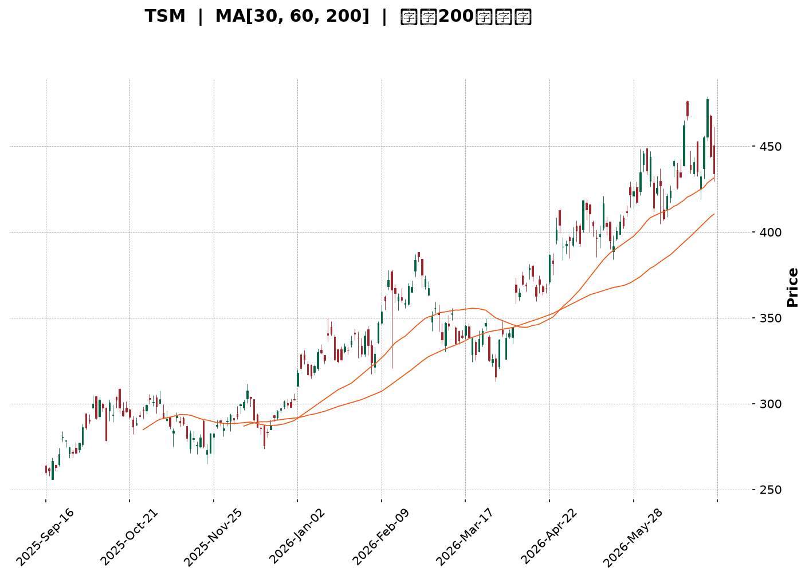
</details>

<html>
<head><meta charset="utf-8" /></head>
<body>
    <div style="height:500px; width:100%;">                        <script>window.PlotlyConfig = {MathJaxConfig: 'local'};</script>
        <script charset="utf-8" src="https://cdn.plot.ly/plotly-3.6.0.min.js" integrity="sha256-QaOVwtVY0T02VaHrr6pnoHLCwayMJp4O5n4YyaE3rJk=" crossorigin="anonymous"></script>                <div id="candlestick-chart" class="plotly-graph-div" style="height:100%; width:100%;"></div>            <script>                window.PLOTLYENV=window.PLOTLYENV || {};                                if (document.getElementById("candlestick-chart")) {                    Plotly.newPlot(                        "candlestick-chart",                        [{"close":{"dtype":"f8","bdata":"AAAAoC1AcEAAAABgxEtwQAAAAMCiqHBAAAAAgMlscEAAAAAA+udwQAAAAMD+h3FAAAAA4D5ocUAAAADA8ydxQAAAAICQ83BAAAAAYIDxcEAAAAAgtFFxQAAAAGBv43FAAAAAQLjdcUAAAABgfR5yQAAAAICSwHJAAAAAALM7ckAAAAAAOuJyQAAAAECRmHJAAAAAoHNncUAAAAAAWshyQAAAACAFWnJAAAAAYD7lckAAAACg7pdyQAAAACBeTHJAAAAA4PV1ckAAAADAUUNyQAAAAIDx6XFAAAAAAFAHckAAAACAdkpyQAAAACCxfnJAAAAAwMKyckAAAACgRutyQAAAAOCWzXJAAAAAYEyhckAAAADAn+dyQAAAAGAEPHJAAAAAIII1ckAAAACAqO9xQAAAAEApxHFAAAAAQGJPckAAAAAATA5yQAAAAOCQBXJAAAAAQOZ\u002fcUAAAADAfalxQAAAACDifHFAAAAAwMs7cUAAAAAgmYJxQAAAAIBJNXFAAAAAQI0OcUAAAABgoqZxQAAAAOBEp3FAAAAAoBb7cUAAAADAsRNyQAAAAMDk1nFAAAAA4OYcckAAAAAAPlJyQAAAAKA8KnJAAAAAIKdGckAAAACAKLhyQAAAACCb0HJAAAAA4HE7c0AAAADgh\u002fRyQAAAAMCfKHJAAAAAYC3kcUAAAABAVNZxQAAAAICVOHFAAAAAIHizcUAAAAAgcPdxQAAAAMBcPHJAAAAAwMd2ckAAAABgOpRyQAAAACCJ1HJAAAAAYPm1ckAAAADgpKByQAAAAABA5XJAAAAAAHrfc0AAAADgfwl0QAAAACD0W3RAAAAAQKzQc0AAAABAAsZzQAAAAGB3H3RAAAAAYAmhdEAAAABgH5h0QAAAACDcVnRAAAAAQCU+dUAAAAAAPkp1QAAAAOCnV3RAAAAAABpHdEAAAACg\u002f1p0QAAAAMBh0nRAAAAA4P+vdEAAAADAnQl1QAAAAKCmSHVAAAAAgOAcdUAAAADAxo10QAAAACCwOXVAAAAAoGPgdEAAAACADUF0QAAAAIB7kHRAAAAAoOmwdUAAAAAgVRl2QAAAAGDMgHZAAAAAIK1Cd0AAAABgVON2QAAAAOChx3ZAAAAAAECldkAAAACgXoZ2QAAAAICaaHZAAAAAQCsKd0AAAACgNQJ3QAAAACBH\u002fHdAAAAAgMsbeEAAAAAg+W13QAAAAOB5SndAAAAA4GfzdkAAAABgCvV1QAAAAGClOXZAAAAAAKkAdkAAAAAgXxJ1QAAAAGCGrnVAAAAAoOWUdUAAAABgzQt2QAAAAKCr73RAAAAAgCMJdUAAAACAsyd1QAAAACC\u002fknVAAAAAIG0sdUAAAADA+R91QAAAAECIh3RAAAAAYIwadUAAAAAgK2d1QAAAACAAr3VAAAAAoJFVdEAAAAAgoF90QAAAACArvHNAAAAAIJESdUAAAAAAE0t1QAAAAGD3I3VAAAAAYGJPdUAAAAAgNoh1QAAAAMC40HZAAAAAYC3KdkAAAAAAvxt3QAAAAABOC3dAAAAAAAqwd0AAAAAAlGN3QAAAAGAEqHZAAAAAYCYad0AAAAAgJtZ2QAAAACCF83ZAAAAAgI4oeEAAAABgQdx3QAAAAKBQGHlAAAAAgIpAeUAAAAAAxnZ4QAAAAMCOjnhAAAAAgCeyeEAAAADA2st4QAAAACC\u002fCnlAAAAAANGXeEAAAACAUSh6QAAAAADr0nlAAAAAgH2reUAAAACAhDl5QAAAAAChxXhAAAAAwNrteEAAAACg5wt6QAAAACB8NnlAAAAAIGaweEAAAABAFXt4QAAAACDoCnlAAAAAAC5jeUAAAADAMjl5QAAAAOC0tXlAAAAAoOBbekAAAACg4H16QAAAAMCOF3pAAAAAoMspe0AAAACAV9p7QAAAAEC3OntAAAAAoBa+e0AAAABAM+N5QAAAAGDYnHpAAAAAQLmuekAAAABguHx5QAAAAMAeUXpAAAAAQOF+ekAAAABgZpZ7QAAAAKBHnXpAAAAAYGYCe0AAAACA6+F8QAAAAGC4On1AAAAAgD1Ge0AAAACgR417QAAAAADXL3tAAAAAoJkFe0AAAACgmXF8QAAAAMAe2X1AAAAAIK7De0AAAABgjyJ7QA=="},"high":{"dtype":"f8","bdata":"AEFz3LWFcEDGxgKQ1WtwQHf+5UfMxnBAE9xgT8aHcEDygsuNMCNxQJM7bEQ5vHFAUrQF3S5wcUB\u002fWtyAki9xQAwuA3iJFXFAZ5F\u002fHelacUCXZpDY4FRxQFbwBwJYA3JA\u002fVBCJ2dmckCt7\u002fXx7FtyQAat5vVbDnNAG2XPMy8Lc0BxmJBLEgBzQHk95edlx3JAga0VwqWdckCjSa1H+eNyQKHSF9FAtnJAbh4H6GcDc0AehChE+E5zQCxdQQTcznJA+2gQdmrUckCovrmdeJByQJs5MdxFTnJAD2785qY8ckBLi9Tf7XlyQFkrl9YXonJAqp4ZKUm8ckCGcto31hhzQEeA2oWEDnNAkx0LNGQUc0BaKBBOIDtzQHkmqlwQunJA\u002fYU4FTd+ckBfF2cSYkVyQFnCnTw62nFAhDJ8T+lsckC87CLp00lyQF4omcYISXJAtrjLOsnzcUCPBhss4MlxQJ78WkGjxHFAQJCWnP1fcUB2eJWQNKVxQCWNtJD3KHJAufjEgC1IcUBsff0sTa1xQKSEd\u002fGysnFAA3uw+1QockD90zD6GyZyQMd\u002f4G4jDnJADR69EilDckDbXo7I0GRyQK13JgazO3JAzjb+CyynckCqJXJ7EMRyQAkqnFTE5HJAHbAaiGd4c0AiGJgISgRzQEV30BF163JAFURHcXlkckBwqexmo+9xQCap9mzT+XFAK5RaCvLacUBtlPt1sSpyQMV7cHTmV3JAhYQ3qg+GckB1I8Br9ZlyQNKVrKEh3XJAnwI9ovXuckC+byVfwe9yQI3aYlH2HHNAkLf9cP7+c0BKLFlnwph0QE6\u002fHY7jtXRAnt2OVPdJdECIkGafUC10QO7PNcCcMXRAxH\u002fsxl69dEBnBxjxDet0QKG5RTuignRAc0NlYWPYdUDHbpxo1MB1QObexExDRnVAbrIjsM2+dEAytaExP9V0QKI4QqCs9nRARKdkDwvWdEAsYcXc7zd1QH4ME4KWe3VAzbOhipJfdUBWLXq\u002fciJ1QO5VEhblZnVAFvJoe0KUdUBkHWBP8BB1QOIexkibzXRAWZZRz8K+dUD3d0oqB1x2QEkbSQAqrnZAS28jjBCad0DX+CU7wKB3QFc2uOA9E3dATC845RXFdkBnLsoF3fd2QFazyAP3jnZAUAG0rZckd0DZqOyhKzh3QFiQjCrgMnhAnN9kSkVDeED2xhYjvQd4QM+ZR0rna3dA92EyAOsyd0DDi1wAaCJ2QJke6+i+c3ZA5qa2hfVZdkCPBazO1651QEL7jsOquXVA9DczDu76dUDEP2qDNjh2QITGDLC2kXVAui+54\u002fxrdUDqP7g+vW11QCz7FIkyn3VA84wJbjGydUBtZrSgsTF1QOnnIN\u002f6DHVAgu7CCLlpdUDd4KYGMIF1QBi1XokZ2nVAvVwc3dBBdUAQRETjo4x0QCXWWWJHjXRAk9QT2egZdUB9amNx2L11QC3vAEFVVHVA2v84RlV2dUBcJY09kIt1QJbx6LzOVndA9zhfGvX0dkDcs7GO3pF3QFphvEl5KXdALfXHJkbUd0BleuyoZtF3QP5EFHJcFXdA31+mYj1rd0DCTeA4SRN3QHJeuvIjHndAieaMIA8weEB52bOfoD14QH30QDmIiHlACcn9RIHYeUA0ijH0C894QGlUN2vNrnhA4\u002fnEf7vdeEAoNeDkvDB5QNQ8DJj1a3lAE\u002fbp9+VSeUCLCADWgit6QOFqGaRMMHpA06x\u002fVmkAekDUduU4cGx5QD9VuKjNFHlA1pSljMA7eUAzqAz0vk96QPjZ6yyZjnlA9Gg3x95eeUAqARE\u002fK994QLV+V3\u002f7LnlAN8v8gPqneUAFdXFlXpt5QLtT8jdF+HlAKXjOabTYekAU6zmHnal6QFbG+AHz1npA20Tr8XAFfECpQrOTUfV7QAVmjHi7EXxAlM\u002f+rWnve0DCqqUBLg57QOAHdkq+DHtA4+BEQS5Se0BmKCD8LpV6QAAAAAAAZHpAAAAAQAqvekAAAACgR6l7QAAAAKBHhXtAAAAAAACoe0AAAAAghRN9QAAAAOCjzH1AAAAAoEf1e0AAAACAwr17QAAAAGBmTnxAAAAAgBRCe0AAAACgmYF8QAAAAAAA8H1AAAAAAClIfUAAAAAghdd8QA=="},"hovertemplate":"\u003cb\u003e%{x|%Y-%m-%d}\u003c\u002fb\u003e\u003cbr\u003e\u958b: $%{open:.2f}\u003cbr\u003e\u9ad8: $%{high:.2f}\u003cbr\u003e\u4f4e: $%{low:.2f}\u003cbr\u003e\u6536: $%{close:.2f}\u003cextra\u003e\u003c\u002fextra\u003e","low":{"dtype":"f8","bdata":"rhRKzygpcEDvYwqeMBtwQOiP4HzR\u002fm9AftPDtxVMcEA0Tj6t\u002fnVwQFjtlGj5XHFAsBrDpecocUCXlzHRPcFwQOf3oD4RyHBAAAAAYIDxcEA7DeG4BvtwQN62yXwMMHFAkW21NZPMcUAR556QgANyQKr8+yaFmXJAtPaDBMsvckD4EpzH5zpyQDCPI+eDcXJAJOh+cTZicUDI0TW8jSByQDV4SM\u002f+EHJAb+AnlpWbckA1KOYf7WVyQMaWdv\u002fTSXJAXa3W3sxrckCtvF5Y0zVyQJ+lZ9fSonFAOWDNmdn1cUB2faogakFyQECxaGZNNnJAOzinBz5cckA51XBIQcByQL7xW1t9p3JAHnW8dsRlckA04KJ+ILxyQKxlr+pxM3JAPPXcJ4kTckBiUjqQIdJxQDiqg89pL3FAmXQRGYEXckD2d8dfa+pxQP5L900O9XFAlNWrc\u002flccUC7CatHgPFwQPhipqXMWXFALEeZs2fpcEDRY1gdjiJxQJQ6ycf7I3FA8HF2IL6LcECux+zK3fBwQD+FQbge73BA7lpZCbDXcUBYWUYh2etxQMpO7oidj3FAnppFsLTucUBfo6vgVb1xQCoPYQzm\u002fnFA\u002fhEjE1EvckB4gwUMZ2ZyQAWcSfyognJAwEQOCCnCckCuYHpumaFyQM\u002fSv1DAF3JAotAAICfhcUDF4jA80p1xQCv1CpSoGnFADTvBjtSEcUC7Tul6h85xQJLC55NpG3JAHfisvysrckDXYH3aUWtyQNEbR1LFj3JAB7LnKdeRckBHtng8k55yQGluNG\u002ft3XJAhKrCRZFhc0D65g2qj\u002f1zQOpyx0m\u002fLnRA11Rv0nHOc0BD9\u002f0dPqhzQBlsziLUyXNAbLMhuI72c0AyVmctR5F0QKJ0gZVoMnRA5\u002fpecO4CdUCfDRaKRzt1QOS5TFmEU3RAt2dRAxlAdEAKaANlhFN0QN1ZxW6rmnRAZaJ2FYaIdEC8R\u002f9zcs10QP56FOG1DnVAmObu8DVodEDRNGhciXZ0QLh2clmJdnRA0s6KIS6FdEA7mruq4dZzQH7UfwId4HNAFj\u002fCNbfudEAbhZ61MqB1QED9N7XuKHZAxfqX\u002f\u002fHndkA0IaHEHAd0QG+USu6mbnZAVTiqU4smdkDD7p1hsm12QAGArlqlOXZAYu\u002ff1RFUdkAImD4+Ocl2QE8q0RTgYXdA\u002fQJkDaLtd0C4zQdOzPx2QPjyoDib63ZA91yppGmsdkCwWhKi8GV1QENFSrekC3ZAXvHACIdgdUCz6acwWu90QAKgK8Fso3RAlxtoRqVodUBXPLeL8sh1QGfFa\u002fJq6nRAEVXg397ndEADXKvBLCF1QMFDRuq\u002fGXVAkYR\u002fM8EodUCJXvJF4kZ0QIlNhpY3UnRApuhqFjmldEDOZZlU1dN0QG3f3ssoa3VAOBXrtMFJdEAx8whF6Rh0QHKWv7YRkXNAg6NtPjwGdEAueMKmTC91QJFDB2KVYHRAbt297EIddUCs2iFK2u10QAekTBxpZnZAB721JQl+dkAc22+CLQ53QNlUrq8d03ZAdTvJdJFFd0DrkCQocjV3QA9QzUtSe3ZAYydQK5fEdkC\u002fREIrYrZ2QHh4NmwcxHZAatoPhmIcd0A1kbVN6W53QL1ti4XgjnhAY\u002fCTlG73eEDw0gG90fx3QMEmv3FeNHhA1TNk7PAMeEDRkk3ka3N4QIvSyTdtpHhAu64ykux6eEAKIK9DbPt4QK8BY+2AcnlAKNTrGhj\u002feEBMzrakJ9R4QPyab2x8E3hAlLVX1+JoeEBR+\u002feakRJ5QLVJJ\u002fNe3nhATGFMhC5ieECy\u002fLrAkAJ4QJVniiJmsHhAn4wbvTnpeEB2\u002fbxCsx55QJQYSGjKkXlAnnDPVo3meUBvaHVi29t5QFmP4vtmBHpAG3GoxjRYekDqya103C97QFYVros8GHtAhhBKntOkekD4xb6GNb15QK+D31yvWHpAK7bIVQBJeUCj5k+s9Wt5QAAAAIDCjXlAAAAAIFwTekAAAABA4f56QAAAAEAzk3pAAAAAgD36ekAAAACAPWZ7QAAAAGC4En1AAAAAQAoje0AAAACgRwl7QAAAAEAKB3tAAAAAQAozekAAAACgcPF6QAAAAAAAUHxAAAAAIIW3e0AAAAAAANh6QA=="},"name":"\u50f9\u683c","open":{"dtype":"f8","bdata":"1Sdao3R9cEC3zBt9X2RwQJ5qI\u002fVz\u002f29AVLcRd5mEcEDNJoFlTIdwQD9CXu0Sg3FAw9MhT+VhcUAAyA49we9wQPuFyIb6+3BAc8K72kAlcUCq\u002f8ohrhJxQNu9ebE1RHFAe4f0TjpjckC36YIrIClyQHWkEKmhmnJAiDrzcpADc0CZ0qf9GEtyQN\u002fryq4kv3JAXELJUdaZckBpf5ZoiH5yQJCgY00ZVXJAY\u002fAqh1P+ckBYRFUb\u002fEdzQLJogo4SgXJAdpq0+HiackALSvT2mIpyQKX9BhBZK3JALSxKaIz4cUBsFBiXJVRyQNa847AKhXJAud7Ga81\u002fckARGIIDjPZyQNIv2ttdy3JAmzTKEpD5ckCOVYiRlsNyQOWDzn\u002fxaHJAXY8hylAlckBzl2l9zzxyQMXTh6+ur3FA6OJCBPBAckAZ5dLfbBxyQGZTF\u002f51NnJAKXkFLIzucUBRluK0CxxxQI5B5KDVc3FAYEBopxQ2cUDYUoqGFCxxQP8Fi4\u002fOHnJAAn7HTdXqcECux+zK3fBwQACb2TFQiHFAlOQlqm\u002ftcUBQ1djPFyNyQJjvTjbUynFAZbnKIXkbckBFWWi3VB5yQMg+89\u002fnOnJAJaC1KMRbckD6d5G0ha1yQG\u002f2UkVQmnJAimIhoLjvckCyev8aA\u002fxyQEV30BF163JA2YdewCBackBqRxGKidxxQIS08azA8HFAiGBeI5C4cUC7Tul6h85xQB66yPx8UnJAd+R8nEU+ckBDF7HwWoNyQJap3sS8pXJAQ08\u002fxanDckAd6bw55cxyQBkCQS8A53JA0Gm+QAZmc0B+SGCsOot0QGeXn0NdiHRAWHwxRQUwdEBtdCVwkCt0QJrern\u002f64nNA5GsjsxwHdECQZ5LNi7J0QKG5RTuignRAZ+GO3sRQdUDAmVEZqot1QBtKSm6dMHVABFkE3HW7dED2KS0iTbt0QJqjJvLPpXRAdrHC8EWxdEDa3YLcU+x0QEmhumFFVHVA6+ypPNsgdUAknaoPI9t0QLrMFsf1kHRA+p5kKr50dUDcOiGNAN50QOMEEqaSEnRAc\u002f3N8D78dEC8z6a\u002feq91QIUR1q1Rp3ZAFiygi9gCd0BNY3dI1ZB3QCS6vgML9HZAVxVfTSmAdkD3HiVx1p92QPLG8TrwXXZAA5gsxeRedkC03PWJ+tF2QME1cS4zl3dAnN9kSkVDeEAbJQpeHwN4QP5qrDjNA3dAyHk80ra3dkCNl+n9Dbx1QEIz8pV8OXZApSgK+zYRdkDBHiKTwFt1QC9lbYgA3nRAOh+pEt2qdUAksl8jxgF2QF+X96VugnVADAU\u002fBXBidUASz+Hm7zd1QH+gdxzePHVALWpM0o2PdUChBhCVNod0QEVwCE1L\u002fnRApuhqFjmldEDLyzVfk+x0QEunPd8Qk3VA20aEq2owdUDg8lAHI0F0QKjyFfr3ZnRADSodTOkYdECLccpPi3F1QNCYA+A4YXRAsuhVnEwvdUCdBynlWSp1QJuN7jzMFndAE9UnFTindkBlX\u002fs+Zmt3QP7gkKVRFndAqHZrgniid0DYOV1dTch3QPlbB4X4\u002f3ZAqUtMyT9Fd0BMYUy7twV3QAAAACCF83ZAFfQ6\u002fZQud0BhLLLIovV3QLSsRHtus3hApFVqcojMeUCku\u002fn6QnN4QNSA1k3ff3hA4aGwwBbOeEAhkPoaVYh4QPDCyKYyOXlAGSIpvHk6eUC+Z3KEWxd5QNNfaIvPEXpAqcb2EJ3\u002feUDag1KSolx5QJMxkKAhzXhAR1xKhG7VeECw56V7SSR5QLMB3ezNWHlA9Gg3x95eeUBc8KJqmUl4QGGOPdYowXhAn4wbvTnpeEBds0ojk4d5QG6IG\u002fh5wnlAhRH3UVugekDns7GDvFN6QOKIDcInoXpAR2n7fzJ+ekA+F8tYz3h7QCQxDrkED3xAF4hFgPvZekBROrIHQcx6QCs+En96bHpAtn9hDPndekDtCE6k4s95QAAAAAAp1HlAAAAAwMxAekAAAABA4Wp7QAAAAOBRQHtAAAAAAAAse0AAAACAFG57QAAAAKBwwX1AAAAAQOFye0AAAAAgrh97QAAAAGBmTnxAAAAAAACQekAAAAAAAFB7QAAAAIDCeXxAAAAAYLg6fUAAAADgoyh8QA=="},"x":["2025-09-16T00:00:00-04:00","2025-09-17T00:00:00-04:00","2025-09-18T00:00:00-04:00","2025-09-19T00:00:00-04:00","2025-09-22T00:00:00-04:00","2025-09-23T00:00:00-04:00","2025-09-24T00:00:00-04:00","2025-09-25T00:00:00-04:00","2025-09-26T00:00:00-04:00","2025-09-29T00:00:00-04:00","2025-09-30T00:00:00-04:00","2025-10-01T00:00:00-04:00","2025-10-02T00:00:00-04:00","2025-10-03T00:00:00-04:00","2025-10-06T00:00:00-04:00","2025-10-07T00:00:00-04:00","2025-10-08T00:00:00-04:00","2025-10-09T00:00:00-04:00","2025-10-10T00:00:00-04:00","2025-10-13T00:00:00-04:00","2025-10-14T00:00:00-04:00","2025-10-15T00:00:00-04:00","2025-10-16T00:00:00-04:00","2025-10-17T00:00:00-04:00","2025-10-20T00:00:00-04:00","2025-10-21T00:00:00-04:00","2025-10-22T00:00:00-04:00","2025-10-23T00:00:00-04:00","2025-10-24T00:00:00-04:00","2025-10-27T00:00:00-04:00","2025-10-28T00:00:00-04:00","2025-10-29T00:00:00-04:00","2025-10-30T00:00:00-04:00","2025-10-31T00:00:00-04:00","2025-11-03T00:00:00-05:00","2025-11-04T00:00:00-05:00","2025-11-05T00:00:00-05:00","2025-11-06T00:00:00-05:00","2025-11-07T00:00:00-05:00","2025-11-10T00:00:00-05:00","2025-11-11T00:00:00-05:00","2025-11-12T00:00:00-05:00","2025-11-13T00:00:00-05:00","2025-11-14T00:00:00-05:00","2025-11-17T00:00:00-05:00","2025-11-18T00:00:00-05:00","2025-11-19T00:00:00-05:00","2025-11-20T00:00:00-05:00","2025-11-21T00:00:00-05:00","2025-11-24T00:00:00-05:00","2025-11-25T00:00:00-05:00","2025-11-26T00:00:00-05:00","2025-11-28T00:00:00-05:00","2025-12-01T00:00:00-05:00","2025-12-02T00:00:00-05:00","2025-12-03T00:00:00-05:00","2025-12-04T00:00:00-05:00","2025-12-05T00:00:00-05:00","2025-12-08T00:00:00-05:00","2025-12-09T00:00:00-05:00","2025-12-10T00:00:00-05:00","2025-12-11T00:00:00-05:00","2025-12-12T00:00:00-05:00","2025-12-15T00:00:00-05:00","2025-12-16T00:00:00-05:00","2025-12-17T00:00:00-05:00","2025-12-18T00:00:00-05:00","2025-12-19T00:00:00-05:00","2025-12-22T00:00:00-05:00","2025-12-23T00:00:00-05:00","2025-12-24T00:00:00-05:00","2025-12-26T00:00:00-05:00","2025-12-29T00:00:00-05:00","2025-12-30T00:00:00-05:00","2025-12-31T00:00:00-05:00","2026-01-02T00:00:00-05:00","2026-01-05T00:00:00-05:00","2026-01-06T00:00:00-05:00","2026-01-07T00:00:00-05:00","2026-01-08T00:00:00-05:00","2026-01-09T00:00:00-05:00","2026-01-12T00:00:00-05:00","2026-01-13T00:00:00-05:00","2026-01-14T00:00:00-05:00","2026-01-15T00:00:00-05:00","2026-01-16T00:00:00-05:00","2026-01-20T00:00:00-05:00","2026-01-21T00:00:00-05:00","2026-01-22T00:00:00-05:00","2026-01-23T00:00:00-05:00","2026-01-26T00:00:00-05:00","2026-01-27T00:00:00-05:00","2026-01-28T00:00:00-05:00","2026-01-29T00:00:00-05:00","2026-01-30T00:00:00-05:00","2026-02-02T00:00:00-05:00","2026-02-03T00:00:00-05:00","2026-02-04T00:00:00-05:00","2026-02-05T00:00:00-05:00","2026-02-06T00:00:00-05:00","2026-02-09T00:00:00-05:00","2026-02-10T00:00:00-05:00","2026-02-11T00:00:00-05:00","2026-02-12T00:00:00-05:00","2026-02-13T00:00:00-05:00","2026-02-17T00:00:00-05:00","2026-02-18T00:00:00-05:00","2026-02-19T00:00:00-05:00","2026-02-20T00:00:00-05:00","2026-02-23T00:00:00-05:00","2026-02-24T00:00:00-05:00","2026-02-25T00:00:00-05:00","2026-02-26T00:00:00-05:00","2026-02-27T00:00:00-05:00","2026-03-02T00:00:00-05:00","2026-03-03T00:00:00-05:00","2026-03-04T00:00:00-05:00","2026-03-05T00:00:00-05:00","2026-03-06T00:00:00-05:00","2026-03-09T00:00:00-04:00","2026-03-10T00:00:00-04:00","2026-03-11T00:00:00-04:00","2026-03-12T00:00:00-04:00","2026-03-13T00:00:00-04:00","2026-03-16T00:00:00-04:00","2026-03-17T00:00:00-04:00","2026-03-18T00:00:00-04:00","2026-03-19T00:00:00-04:00","2026-03-20T00:00:00-04:00","2026-03-23T00:00:00-04:00","2026-03-24T00:00:00-04:00","2026-03-25T00:00:00-04:00","2026-03-26T00:00:00-04:00","2026-03-27T00:00:00-04:00","2026-03-30T00:00:00-04:00","2026-03-31T00:00:00-04:00","2026-04-01T00:00:00-04:00","2026-04-02T00:00:00-04:00","2026-04-06T00:00:00-04:00","2026-04-07T00:00:00-04:00","2026-04-08T00:00:00-04:00","2026-04-09T00:00:00-04:00","2026-04-10T00:00:00-04:00","2026-04-13T00:00:00-04:00","2026-04-14T00:00:00-04:00","2026-04-15T00:00:00-04:00","2026-04-16T00:00:00-04:00","2026-04-17T00:00:00-04:00","2026-04-20T00:00:00-04:00","2026-04-21T00:00:00-04:00","2026-04-22T00:00:00-04:00","2026-04-23T00:00:00-04:00","2026-04-24T00:00:00-04:00","2026-04-27T00:00:00-04:00","2026-04-28T00:00:00-04:00","2026-04-29T00:00:00-04:00","2026-04-30T00:00:00-04:00","2026-05-01T00:00:00-04:00","2026-05-04T00:00:00-04:00","2026-05-05T00:00:00-04:00","2026-05-06T00:00:00-04:00","2026-05-07T00:00:00-04:00","2026-05-08T00:00:00-04:00","2026-05-11T00:00:00-04:00","2026-05-12T00:00:00-04:00","2026-05-13T00:00:00-04:00","2026-05-14T00:00:00-04:00","2026-05-15T00:00:00-04:00","2026-05-18T00:00:00-04:00","2026-05-19T00:00:00-04:00","2026-05-20T00:00:00-04:00","2026-05-21T00:00:00-04:00","2026-05-22T00:00:00-04:00","2026-05-26T00:00:00-04:00","2026-05-27T00:00:00-04:00","2026-05-28T00:00:00-04:00","2026-05-29T00:00:00-04:00","2026-06-01T00:00:00-04:00","2026-06-02T00:00:00-04:00","2026-06-03T00:00:00-04:00","2026-06-04T00:00:00-04:00","2026-06-05T00:00:00-04:00","2026-06-08T00:00:00-04:00","2026-06-09T00:00:00-04:00","2026-06-10T00:00:00-04:00","2026-06-11T00:00:00-04:00","2026-06-12T00:00:00-04:00","2026-06-15T00:00:00-04:00","2026-06-16T00:00:00-04:00","2026-06-17T00:00:00-04:00","2026-06-18T00:00:00-04:00","2026-06-22T00:00:00-04:00","2026-06-23T00:00:00-04:00","2026-06-24T00:00:00-04:00","2026-06-25T00:00:00-04:00","2026-06-26T00:00:00-04:00","2026-06-29T00:00:00-04:00","2026-06-30T00:00:00-04:00","2026-07-01T00:00:00-04:00","2026-07-02T00:00:00-04:00"],"type":"candlestick"},{"hovertemplate":"MA30: $%{y:.2f}\u003cextra\u003e\u003c\u002fextra\u003e","line":{"color":"#2196F3","dash":"dash","width":2},"mode":"lines","name":"MA30","x":["2025-09-16T00:00:00-04:00","2025-09-17T00:00:00-04:00","2025-09-18T00:00:00-04:00","2025-09-19T00:00:00-04:00","2025-09-22T00:00:00-04:00","2025-09-23T00:00:00-04:00","2025-09-24T00:00:00-04:00","2025-09-25T00:00:00-04:00","2025-09-26T00:00:00-04:00","2025-09-29T00:00:00-04:00","2025-09-30T00:00:00-04:00","2025-10-01T00:00:00-04:00","2025-10-02T00:00:00-04:00","2025-10-03T00:00:00-04:00","2025-10-06T00:00:00-04:00","2025-10-07T00:00:00-04:00","2025-10-08T00:00:00-04:00","2025-10-09T00:00:00-04:00","2025-10-10T00:00:00-04:00","2025-10-13T00:00:00-04:00","2025-10-14T00:00:00-04:00","2025-10-15T00:00:00-04:00","2025-10-16T00:00:00-04:00","2025-10-17T00:00:00-04:00","2025-10-20T00:00:00-04:00","2025-10-21T00:00:00-04:00","2025-10-22T00:00:00-04:00","2025-10-23T00:00:00-04:00","2025-10-24T00:00:00-04:00","2025-10-27T00:00:00-04:00","2025-10-28T00:00:00-04:00","2025-10-29T00:00:00-04:00","2025-10-30T00:00:00-04:00","2025-10-31T00:00:00-04:00","2025-11-03T00:00:00-05:00","2025-11-04T00:00:00-05:00","2025-11-05T00:00:00-05:00","2025-11-06T00:00:00-05:00","2025-11-07T00:00:00-05:00","2025-11-10T00:00:00-05:00","2025-11-11T00:00:00-05:00","2025-11-12T00:00:00-05:00","2025-11-13T00:00:00-05:00","2025-11-14T00:00:00-05:00","2025-11-17T00:00:00-05:00","2025-11-18T00:00:00-05:00","2025-11-19T00:00:00-05:00","2025-11-20T00:00:00-05:00","2025-11-21T00:00:00-05:00","2025-11-24T00:00:00-05:00","2025-11-25T00:00:00-05:00","2025-11-26T00:00:00-05:00","2025-11-28T00:00:00-05:00","2025-12-01T00:00:00-05:00","2025-12-02T00:00:00-05:00","2025-12-03T00:00:00-05:00","2025-12-04T00:00:00-05:00","2025-12-05T00:00:00-05:00","2025-12-08T00:00:00-05:00","2025-12-09T00:00:00-05:00","2025-12-10T00:00:00-05:00","2025-12-11T00:00:00-05:00","2025-12-12T00:00:00-05:00","2025-12-15T00:00:00-05:00","2025-12-16T00:00:00-05:00","2025-12-17T00:00:00-05:00","2025-12-18T00:00:00-05:00","2025-12-19T00:00:00-05:00","2025-12-22T00:00:00-05:00","2025-12-23T00:00:00-05:00","2025-12-24T00:00:00-05:00","2025-12-26T00:00:00-05:00","2025-12-29T00:00:00-05:00","2025-12-30T00:00:00-05:00","2025-12-31T00:00:00-05:00","2026-01-02T00:00:00-05:00","2026-01-05T00:00:00-05:00","2026-01-06T00:00:00-05:00","2026-01-07T00:00:00-05:00","2026-01-08T00:00:00-05:00","2026-01-09T00:00:00-05:00","2026-01-12T00:00:00-05:00","2026-01-13T00:00:00-05:00","2026-01-14T00:00:00-05:00","2026-01-15T00:00:00-05:00","2026-01-16T00:00:00-05:00","2026-01-20T00:00:00-05:00","2026-01-21T00:00:00-05:00","2026-01-22T00:00:00-05:00","2026-01-23T00:00:00-05:00","2026-01-26T00:00:00-05:00","2026-01-27T00:00:00-05:00","2026-01-28T00:00:00-05:00","2026-01-29T00:00:00-05:00","2026-01-30T00:00:00-05:00","2026-02-02T00:00:00-05:00","2026-02-03T00:00:00-05:00","2026-02-04T00:00:00-05:00","2026-02-05T00:00:00-05:00","2026-02-06T00:00:00-05:00","2026-02-09T00:00:00-05:00","2026-02-10T00:00:00-05:00","2026-02-11T00:00:00-05:00","2026-02-12T00:00:00-05:00","2026-02-13T00:00:00-05:00","2026-02-17T00:00:00-05:00","2026-02-18T00:00:00-05:00","2026-02-19T00:00:00-05:00","2026-02-20T00:00:00-05:00","2026-02-23T00:00:00-05:00","2026-02-24T00:00:00-05:00","2026-02-25T00:00:00-05:00","2026-02-26T00:00:00-05:00","2026-02-27T00:00:00-05:00","2026-03-02T00:00:00-05:00","2026-03-03T00:00:00-05:00","2026-03-04T00:00:00-05:00","2026-03-05T00:00:00-05:00","2026-03-06T00:00:00-05:00","2026-03-09T00:00:00-04:00","2026-03-10T00:00:00-04:00","2026-03-11T00:00:00-04:00","2026-03-12T00:00:00-04:00","2026-03-13T00:00:00-04:00","2026-03-16T00:00:00-04:00","2026-03-17T00:00:00-04:00","2026-03-18T00:00:00-04:00","2026-03-19T00:00:00-04:00","2026-03-20T00:00:00-04:00","2026-03-23T00:00:00-04:00","2026-03-24T00:00:00-04:00","2026-03-25T00:00:00-04:00","2026-03-26T00:00:00-04:00","2026-03-27T00:00:00-04:00","2026-03-30T00:00:00-04:00","2026-03-31T00:00:00-04:00","2026-04-01T00:00:00-04:00","2026-04-02T00:00:00-04:00","2026-04-06T00:00:00-04:00","2026-04-07T00:00:00-04:00","2026-04-08T00:00:00-04:00","2026-04-09T00:00:00-04:00","2026-04-10T00:00:00-04:00","2026-04-13T00:00:00-04:00","2026-04-14T00:00:00-04:00","2026-04-15T00:00:00-04:00","2026-04-16T00:00:00-04:00","2026-04-17T00:00:00-04:00","2026-04-20T00:00:00-04:00","2026-04-21T00:00:00-04:00","2026-04-22T00:00:00-04:00","2026-04-23T00:00:00-04:00","2026-04-24T00:00:00-04:00","2026-04-27T00:00:00-04:00","2026-04-28T00:00:00-04:00","2026-04-29T00:00:00-04:00","2026-04-30T00:00:00-04:00","2026-05-01T00:00:00-04:00","2026-05-04T00:00:00-04:00","2026-05-05T00:00:00-04:00","2026-05-06T00:00:00-04:00","2026-05-07T00:00:00-04:00","2026-05-08T00:00:00-04:00","2026-05-11T00:00:00-04:00","2026-05-12T00:00:00-04:00","2026-05-13T00:00:00-04:00","2026-05-14T00:00:00-04:00","2026-05-15T00:00:00-04:00","2026-05-18T00:00:00-04:00","2026-05-19T00:00:00-04:00","2026-05-20T00:00:00-04:00","2026-05-21T00:00:00-04:00","2026-05-22T00:00:00-04:00","2026-05-26T00:00:00-04:00","2026-05-27T00:00:00-04:00","2026-05-28T00:00:00-04:00","2026-05-29T00:00:00-04:00","2026-06-01T00:00:00-04:00","2026-06-02T00:00:00-04:00","2026-06-03T00:00:00-04:00","2026-06-04T00:00:00-04:00","2026-06-05T00:00:00-04:00","2026-06-08T00:00:00-04:00","2026-06-09T00:00:00-04:00","2026-06-10T00:00:00-04:00","2026-06-11T00:00:00-04:00","2026-06-12T00:00:00-04:00","2026-06-15T00:00:00-04:00","2026-06-16T00:00:00-04:00","2026-06-17T00:00:00-04:00","2026-06-18T00:00:00-04:00","2026-06-22T00:00:00-04:00","2026-06-23T00:00:00-04:00","2026-06-24T00:00:00-04:00","2026-06-25T00:00:00-04:00","2026-06-26T00:00:00-04:00","2026-06-29T00:00:00-04:00","2026-06-30T00:00:00-04:00","2026-07-01T00:00:00-04:00","2026-07-02T00:00:00-04:00"],"y":{"dtype":"f8","bdata":"AAAAAAAA+H8AAAAAAAD4fwAAAAAAAPh\u002fAAAAAAAA+H8AAAAAAAD4fwAAAAAAAPh\u002fAAAAAAAA+H8AAAAAAAD4fwAAAAAAAPh\u002fAAAAAAAA+H8AAAAAAAD4fwAAAAAAAPh\u002fAAAAAAAA+H8AAAAAAAD4fwAAAAAAAPh\u002fAAAAAAAA+H8AAAAAAAD4fwAAAAAAAPh\u002fAAAAAAAA+H8AAAAAAAD4fwAAAAAAAPh\u002fAAAAAAAA+H8AAAAAAAD4fwAAAAAAAPh\u002fAAAAAAAA+H8AAAAAAAD4fwAAAAAAAPh\u002fAAAAAAAA+H8AAAAAAAD4f5qZmRl4zHFAAAAA8FrhcUBVVVUlvfdxQM3MzIwJCnJAZmZmttocckBVVVXF6C1yQFVVVfXoM3JAiYiIiMA6ckARERGxaEFyQHd3d7dcSHJAERERYQZUckBVVVW1T1pyQFVVVfVyW3JAvLu7W1JYckCJiIj4a1RyQDMzM9OhSXJA3t3dHRpBckDe3d2NYTVyQERERNSJKXJAd3d3N5MmckBmZmb26hxyQO\u002fu7p71FnJA7+7uficPckARERERvwpyQO\u002fu7p7UBnJAd3d3p9wDckDv7u7+WwRyQCIiIqKABnJAMzMzI50IckBEREQ0RQxyQERERDQAD3JAMzMzk44TckDNzMyM3RNyQImIiNhdDnJAMzMzAxAIckBVVVXl8\u002f5xQBERERFO9nFAZmZmZvjxcUCamZnJOvJxQBEREYE89nFAAAAAsIz3cUARERGRA\u002fxxQFVVVbXpAnJA3t3drT8NckB3d3e3fBVyQImIiNh\u002fIXJAd3d3pwU4ckARERHhlU1yQO\u002fu7m55aHJAAAAAAAOAckC8u7vLH5JyQLy7u4syp3JAREREtMu9ckAzMzPTRtNyQO\u002fu7t6b6HJAZmZmJlEDc0C8u7t7phxzQAAAACA7L3NAVVVVBVBAc0AAAAAgRk5zQImIiFhmX3NAq6qqetFrc0CamZl5ln1zQO\u002fu7l5BmHNA7+7uzr6zc0CrqqpK7cpzQImIiNgY7XNAMzMzwzEIdEAiIiICtxt0QGZmZuaVL3RAAAAAkB9LdEDNzMz8KGl0QAAAAJCAiHRAq6qqWlOvdECamZmJrtN0QO\u002fu7u7T9HRAq6qqqnwMdUCrqqpKtyF1QN7d3U00M3VAmpmZibhOdUCamZnZU2p1QFVVVbVJi3VAiYiI2PqodUBVVVXFLMF1QCIiIrJc2nVAvLu7++\u002fodUBmZmZ2oe51QCIiInKy\u002fnVAmpmZaWoNdkAiIiIyhxN2QAAAAMDdGnZAIiIiAn8idkAiIiIyGit2QFVVVeUiKHZAZmZmdnondkBERET0myx2QLy7u+uTL3ZAVVVVxRwydkC8u7sLizl2QLy7u6s+OXZAAAAAkDs0dkCrqqo6Sy52QERERPRMJ3ZAIiIiklQOdkARERGh3\u002fh1QERERDTk3nVAmpmZ+XfRdUBERER09cZ1QHd3dzcjvHVAmpmZyWCtdUBEREQ0x6B1QN7d3f3KlnVAzczM\u002fImLdUARERFRzIh1QBEREUGxhnVAzczM7PqMdUBmZma2Mpl1QLy7u4vgnHVAd3d3l0KmdUAiIiLCUbV1QM3MzAwnwHVAVVVVJSTWdUCrqqp6n+V1QCIiInIcCXZAiYiIWBctdkAiIiKyU0l2QM3MzIzJYnZAvLu7S9iAdkCJiIiYLKB2QM3MzGyuxnZAq6qq+nTkdkAzMzNTBw13QERERPRbMHdAERER0eNdd0C8u7tLSYd3QBEREbFEsndAvLu7iy3Td0Crqqoqvft3QDMzM1N9HnhAiYiIyFI7eECrqqpafFR4QO\u002fu7u59Z3hA7+7unqh9eEAzMzMDtY94QM3MzCx0pnhAiYiImD+9eEDe3d2dudd4QHd3dwcL9XhAvLu7q7IXeUDe3d0dgUJ5QJqZmckCZ3lAREREZJiFeUCJiIi45JZ5QN7d3S3Yo3lAAAAA8AyweUB3d3c3yLh5QERERATNx3lAq6qqiijXeUDv7u7++e55QCIiIvJk\u002fHlAZmZmhgMRekBERERkRCh6QFVVVcVTRXpAZmZm1gRTekDNzMys4GZ6QDMzMxN8e3pAVVVVxVeNekAzMzOjzKF6QHd3d5dayXpAmpmZuZjjekDe3d3tPvp6QA=="},"type":"scatter"},{"hovertemplate":"MA60: $%{y:.2f}\u003cextra\u003e\u003c\u002fextra\u003e","line":{"color":"#9C27B0","dash":"dash","width":2},"mode":"lines","name":"MA60","x":["2025-09-16T00:00:00-04:00","2025-09-17T00:00:00-04:00","2025-09-18T00:00:00-04:00","2025-09-19T00:00:00-04:00","2025-09-22T00:00:00-04:00","2025-09-23T00:00:00-04:00","2025-09-24T00:00:00-04:00","2025-09-25T00:00:00-04:00","2025-09-26T00:00:00-04:00","2025-09-29T00:00:00-04:00","2025-09-30T00:00:00-04:00","2025-10-01T00:00:00-04:00","2025-10-02T00:00:00-04:00","2025-10-03T00:00:00-04:00","2025-10-06T00:00:00-04:00","2025-10-07T00:00:00-04:00","2025-10-08T00:00:00-04:00","2025-10-09T00:00:00-04:00","2025-10-10T00:00:00-04:00","2025-10-13T00:00:00-04:00","2025-10-14T00:00:00-04:00","2025-10-15T00:00:00-04:00","2025-10-16T00:00:00-04:00","2025-10-17T00:00:00-04:00","2025-10-20T00:00:00-04:00","2025-10-21T00:00:00-04:00","2025-10-22T00:00:00-04:00","2025-10-23T00:00:00-04:00","2025-10-24T00:00:00-04:00","2025-10-27T00:00:00-04:00","2025-10-28T00:00:00-04:00","2025-10-29T00:00:00-04:00","2025-10-30T00:00:00-04:00","2025-10-31T00:00:00-04:00","2025-11-03T00:00:00-05:00","2025-11-04T00:00:00-05:00","2025-11-05T00:00:00-05:00","2025-11-06T00:00:00-05:00","2025-11-07T00:00:00-05:00","2025-11-10T00:00:00-05:00","2025-11-11T00:00:00-05:00","2025-11-12T00:00:00-05:00","2025-11-13T00:00:00-05:00","2025-11-14T00:00:00-05:00","2025-11-17T00:00:00-05:00","2025-11-18T00:00:00-05:00","2025-11-19T00:00:00-05:00","2025-11-20T00:00:00-05:00","2025-11-21T00:00:00-05:00","2025-11-24T00:00:00-05:00","2025-11-25T00:00:00-05:00","2025-11-26T00:00:00-05:00","2025-11-28T00:00:00-05:00","2025-12-01T00:00:00-05:00","2025-12-02T00:00:00-05:00","2025-12-03T00:00:00-05:00","2025-12-04T00:00:00-05:00","2025-12-05T00:00:00-05:00","2025-12-08T00:00:00-05:00","2025-12-09T00:00:00-05:00","2025-12-10T00:00:00-05:00","2025-12-11T00:00:00-05:00","2025-12-12T00:00:00-05:00","2025-12-15T00:00:00-05:00","2025-12-16T00:00:00-05:00","2025-12-17T00:00:00-05:00","2025-12-18T00:00:00-05:00","2025-12-19T00:00:00-05:00","2025-12-22T00:00:00-05:00","2025-12-23T00:00:00-05:00","2025-12-24T00:00:00-05:00","2025-12-26T00:00:00-05:00","2025-12-29T00:00:00-05:00","2025-12-30T00:00:00-05:00","2025-12-31T00:00:00-05:00","2026-01-02T00:00:00-05:00","2026-01-05T00:00:00-05:00","2026-01-06T00:00:00-05:00","2026-01-07T00:00:00-05:00","2026-01-08T00:00:00-05:00","2026-01-09T00:00:00-05:00","2026-01-12T00:00:00-05:00","2026-01-13T00:00:00-05:00","2026-01-14T00:00:00-05:00","2026-01-15T00:00:00-05:00","2026-01-16T00:00:00-05:00","2026-01-20T00:00:00-05:00","2026-01-21T00:00:00-05:00","2026-01-22T00:00:00-05:00","2026-01-23T00:00:00-05:00","2026-01-26T00:00:00-05:00","2026-01-27T00:00:00-05:00","2026-01-28T00:00:00-05:00","2026-01-29T00:00:00-05:00","2026-01-30T00:00:00-05:00","2026-02-02T00:00:00-05:00","2026-02-03T00:00:00-05:00","2026-02-04T00:00:00-05:00","2026-02-05T00:00:00-05:00","2026-02-06T00:00:00-05:00","2026-02-09T00:00:00-05:00","2026-02-10T00:00:00-05:00","2026-02-11T00:00:00-05:00","2026-02-12T00:00:00-05:00","2026-02-13T00:00:00-05:00","2026-02-17T00:00:00-05:00","2026-02-18T00:00:00-05:00","2026-02-19T00:00:00-05:00","2026-02-20T00:00:00-05:00","2026-02-23T00:00:00-05:00","2026-02-24T00:00:00-05:00","2026-02-25T00:00:00-05:00","2026-02-26T00:00:00-05:00","2026-02-27T00:00:00-05:00","2026-03-02T00:00:00-05:00","2026-03-03T00:00:00-05:00","2026-03-04T00:00:00-05:00","2026-03-05T00:00:00-05:00","2026-03-06T00:00:00-05:00","2026-03-09T00:00:00-04:00","2026-03-10T00:00:00-04:00","2026-03-11T00:00:00-04:00","2026-03-12T00:00:00-04:00","2026-03-13T00:00:00-04:00","2026-03-16T00:00:00-04:00","2026-03-17T00:00:00-04:00","2026-03-18T00:00:00-04:00","2026-03-19T00:00:00-04:00","2026-03-20T00:00:00-04:00","2026-03-23T00:00:00-04:00","2026-03-24T00:00:00-04:00","2026-03-25T00:00:00-04:00","2026-03-26T00:00:00-04:00","2026-03-27T00:00:00-04:00","2026-03-30T00:00:00-04:00","2026-03-31T00:00:00-04:00","2026-04-01T00:00:00-04:00","2026-04-02T00:00:00-04:00","2026-04-06T00:00:00-04:00","2026-04-07T00:00:00-04:00","2026-04-08T00:00:00-04:00","2026-04-09T00:00:00-04:00","2026-04-10T00:00:00-04:00","2026-04-13T00:00:00-04:00","2026-04-14T00:00:00-04:00","2026-04-15T00:00:00-04:00","2026-04-16T00:00:00-04:00","2026-04-17T00:00:00-04:00","2026-04-20T00:00:00-04:00","2026-04-21T00:00:00-04:00","2026-04-22T00:00:00-04:00","2026-04-23T00:00:00-04:00","2026-04-24T00:00:00-04:00","2026-04-27T00:00:00-04:00","2026-04-28T00:00:00-04:00","2026-04-29T00:00:00-04:00","2026-04-30T00:00:00-04:00","2026-05-01T00:00:00-04:00","2026-05-04T00:00:00-04:00","2026-05-05T00:00:00-04:00","2026-05-06T00:00:00-04:00","2026-05-07T00:00:00-04:00","2026-05-08T00:00:00-04:00","2026-05-11T00:00:00-04:00","2026-05-12T00:00:00-04:00","2026-05-13T00:00:00-04:00","2026-05-14T00:00:00-04:00","2026-05-15T00:00:00-04:00","2026-05-18T00:00:00-04:00","2026-05-19T00:00:00-04:00","2026-05-20T00:00:00-04:00","2026-05-21T00:00:00-04:00","2026-05-22T00:00:00-04:00","2026-05-26T00:00:00-04:00","2026-05-27T00:00:00-04:00","2026-05-28T00:00:00-04:00","2026-05-29T00:00:00-04:00","2026-06-01T00:00:00-04:00","2026-06-02T00:00:00-04:00","2026-06-03T00:00:00-04:00","2026-06-04T00:00:00-04:00","2026-06-05T00:00:00-04:00","2026-06-08T00:00:00-04:00","2026-06-09T00:00:00-04:00","2026-06-10T00:00:00-04:00","2026-06-11T00:00:00-04:00","2026-06-12T00:00:00-04:00","2026-06-15T00:00:00-04:00","2026-06-16T00:00:00-04:00","2026-06-17T00:00:00-04:00","2026-06-18T00:00:00-04:00","2026-06-22T00:00:00-04:00","2026-06-23T00:00:00-04:00","2026-06-24T00:00:00-04:00","2026-06-25T00:00:00-04:00","2026-06-26T00:00:00-04:00","2026-06-29T00:00:00-04:00","2026-06-30T00:00:00-04:00","2026-07-01T00:00:00-04:00","2026-07-02T00:00:00-04:00"],"y":{"dtype":"f8","bdata":"AAAAAAAA+H8AAAAAAAD4fwAAAAAAAPh\u002fAAAAAAAA+H8AAAAAAAD4fwAAAAAAAPh\u002fAAAAAAAA+H8AAAAAAAD4fwAAAAAAAPh\u002fAAAAAAAA+H8AAAAAAAD4fwAAAAAAAPh\u002fAAAAAAAA+H8AAAAAAAD4fwAAAAAAAPh\u002fAAAAAAAA+H8AAAAAAAD4fwAAAAAAAPh\u002fAAAAAAAA+H8AAAAAAAD4fwAAAAAAAPh\u002fAAAAAAAA+H8AAAAAAAD4fwAAAAAAAPh\u002fAAAAAAAA+H8AAAAAAAD4fwAAAAAAAPh\u002fAAAAAAAA+H8AAAAAAAD4fwAAAAAAAPh\u002fAAAAAAAA+H8AAAAAAAD4fwAAAAAAAPh\u002fAAAAAAAA+H8AAAAAAAD4fwAAAAAAAPh\u002fAAAAAAAA+H8AAAAAAAD4fwAAAAAAAPh\u002fAAAAAAAA+H8AAAAAAAD4fwAAAAAAAPh\u002fAAAAAAAA+H8AAAAAAAD4fwAAAAAAAPh\u002fAAAAAAAA+H8AAAAAAAD4fwAAAAAAAPh\u002fAAAAAAAA+H8AAAAAAAD4fwAAAAAAAPh\u002fAAAAAAAA+H8AAAAAAAD4fwAAAAAAAPh\u002fAAAAAAAA+H8AAAAAAAD4fwAAAAAAAPh\u002fAAAAAAAA+H8AAAAAAAD4f+\u002fu7ia87XFAmpmZwXT6cUARERFZzQVyQKuqqrIzDHJAzczMXHUSckBVVVVVbhZyQDMzM4MbFXJAd3d3d1wWckBVVVW90RlyQERERJxMH3JAiYiIiMklckAzMzOjKStyQFVVVVUuL3JAzczMBMkyckAAAABY9DRyQN7d3dWQNXJAq6qq4o88ckB3d3e3e0FyQJqZmaEBSXJAvLu7G0tTckARERFhhVdyQFVVVRUUX3JAmpmZmXlmckAiIiLyAm9yQO\u002fu7j64d3JA7+7u5paDckBVVVU9gZByQBEREeHdmnJARERElHakckAiIiKqRa1yQGZmZkYzt3JA7+7uBrC\u002fckAzMzMDushyQLy7u5tP03JAERERaefdckAAAACY8ORyQM3MzHSz8XJAzczMFBX9ckDe3d3l+AZzQLy7uzPpEnNAAAAAIFYhc0Dv7u5GljJzQKuqqiK1RXNAREREhElec0CJiIiglXRzQLy7u+Mpi3NAERERKUGic0De3d2VprdzQGZmZt7WzXNAzczMxF3nc0CrqqrSOf5zQImIiCA+GXRAZmZmRmMzdEBERETMOUp0QImIiEh8YXRAERERkSB2dEARERH5o4V0QBEREcn2lnRAd3d3N92mdEARERGp5rB0QERERAwivXRAZmZmPijHdEDe3d1VWNR0QCIiIiIy4HRAq6qqopztdEB3d3efxPt0QCIiImJWDnVARERERCcddUDv7u4GoSp1QBEREUlqNHVAAAAAkK0\u002fdUC8u7sbukt1QCIiIsLmV3VAZmZm9tNedUBVVVUVR2Z1QJqZmRHcaXVAIiIiUvpudUB3d3dfVnR1QKuqqsKrd3VAmpmZqQx+dUDv7u6GjYV1QJqZmVkKkXVAq6qqakKadUAzMzOL\u002fKR1QJqZmfmGsHVAREREdPW6dUBmZmYW6sN1QO\u002fu7n7JzXVAiYiIgNbZdUAiIiJ6bOR1QGZmZmaC7XVAvLu7k1H8dUBmZmbWXAh2QLy7u6ufGHZAd3d350gqdkAzMzPT9zp2QERERLwuSXZAiYiIiHpZdkAiIiLS22x2QERERIz2f3ZAVVVVRViMdkDv7u5GqZ12QERERHTUq3ZAmpmZMRy2dkBmZmZ2FMB2QKuqqnKUyHZAq6qqwlLSdkB3d3dPWeF2QFVVVUVQ7XZAERERyVn0dkB3d3fHofp2QGZmZnYk\u002f3ZA3t3dTZkEd0AiIiKqQAx3QO\u002fu7raSFndAq6qqQh0ld0AiIiIqdjh3QJqZmcn1SHdAmpmZofped0AAAABw6Xt3QDMzM+uUk3dAzczMRN6td0CamZkZQr53QAAAAFB61ndAREREJJLud0DNzMz0DQF4QImIiEhLFXhAMzMzawAseEC8u7tLk0d4QHd3d6+JYXhAiYiIQLx6eEC8u7vbpZp4QM3MzNzXunhAvLu7U3TYeEBERET8FPd4QCIiImLgFnlAiYiIqEIweUDv7u7mxE55QFVVVfXrc3lAERERwXWPeUBERESkXad5QA=="},"type":"scatter"},{"hovertemplate":"MA200: $%{y:.2f}\u003cextra\u003e\u003c\u002fextra\u003e","line":{"color":"#FF6F00","dash":"solid","width":2},"mode":"lines","name":"MA200","x":["2025-09-16T00:00:00-04:00","2025-09-17T00:00:00-04:00","2025-09-18T00:00:00-04:00","2025-09-19T00:00:00-04:00","2025-09-22T00:00:00-04:00","2025-09-23T00:00:00-04:00","2025-09-24T00:00:00-04:00","2025-09-25T00:00:00-04:00","2025-09-26T00:00:00-04:00","2025-09-29T00:00:00-04:00","2025-09-30T00:00:00-04:00","2025-10-01T00:00:00-04:00","2025-10-02T00:00:00-04:00","2025-10-03T00:00:00-04:00","2025-10-06T00:00:00-04:00","2025-10-07T00:00:00-04:00","2025-10-08T00:00:00-04:00","2025-10-09T00:00:00-04:00","2025-10-10T00:00:00-04:00","2025-10-13T00:00:00-04:00","2025-10-14T00:00:00-04:00","2025-10-15T00:00:00-04:00","2025-10-16T00:00:00-04:00","2025-10-17T00:00:00-04:00","2025-10-20T00:00:00-04:00","2025-10-21T00:00:00-04:00","2025-10-22T00:00:00-04:00","2025-10-23T00:00:00-04:00","2025-10-24T00:00:00-04:00","2025-10-27T00:00:00-04:00","2025-10-28T00:00:00-04:00","2025-10-29T00:00:00-04:00","2025-10-30T00:00:00-04:00","2025-10-31T00:00:00-04:00","2025-11-03T00:00:00-05:00","2025-11-04T00:00:00-05:00","2025-11-05T00:00:00-05:00","2025-11-06T00:00:00-05:00","2025-11-07T00:00:00-05:00","2025-11-10T00:00:00-05:00","2025-11-11T00:00:00-05:00","2025-11-12T00:00:00-05:00","2025-11-13T00:00:00-05:00","2025-11-14T00:00:00-05:00","2025-11-17T00:00:00-05:00","2025-11-18T00:00:00-05:00","2025-11-19T00:00:00-05:00","2025-11-20T00:00:00-05:00","2025-11-21T00:00:00-05:00","2025-11-24T00:00:00-05:00","2025-11-25T00:00:00-05:00","2025-11-26T00:00:00-05:00","2025-11-28T00:00:00-05:00","2025-12-01T00:00:00-05:00","2025-12-02T00:00:00-05:00","2025-12-03T00:00:00-05:00","2025-12-04T00:00:00-05:00","2025-12-05T00:00:00-05:00","2025-12-08T00:00:00-05:00","2025-12-09T00:00:00-05:00","2025-12-10T00:00:00-05:00","2025-12-11T00:00:00-05:00","2025-12-12T00:00:00-05:00","2025-12-15T00:00:00-05:00","2025-12-16T00:00:00-05:00","2025-12-17T00:00:00-05:00","2025-12-18T00:00:00-05:00","2025-12-19T00:00:00-05:00","2025-12-22T00:00:00-05:00","2025-12-23T00:00:00-05:00","2025-12-24T00:00:00-05:00","2025-12-26T00:00:00-05:00","2025-12-29T00:00:00-05:00","2025-12-30T00:00:00-05:00","2025-12-31T00:00:00-05:00","2026-01-02T00:00:00-05:00","2026-01-05T00:00:00-05:00","2026-01-06T00:00:00-05:00","2026-01-07T00:00:00-05:00","2026-01-08T00:00:00-05:00","2026-01-09T00:00:00-05:00","2026-01-12T00:00:00-05:00","2026-01-13T00:00:00-05:00","2026-01-14T00:00:00-05:00","2026-01-15T00:00:00-05:00","2026-01-16T00:00:00-05:00","2026-01-20T00:00:00-05:00","2026-01-21T00:00:00-05:00","2026-01-22T00:00:00-05:00","2026-01-23T00:00:00-05:00","2026-01-26T00:00:00-05:00","2026-01-27T00:00:00-05:00","2026-01-28T00:00:00-05:00","2026-01-29T00:00:00-05:00","2026-01-30T00:00:00-05:00","2026-02-02T00:00:00-05:00","2026-02-03T00:00:00-05:00","2026-02-04T00:00:00-05:00","2026-02-05T00:00:00-05:00","2026-02-06T00:00:00-05:00","2026-02-09T00:00:00-05:00","2026-02-10T00:00:00-05:00","2026-02-11T00:00:00-05:00","2026-02-12T00:00:00-05:00","2026-02-13T00:00:00-05:00","2026-02-17T00:00:00-05:00","2026-02-18T00:00:00-05:00","2026-02-19T00:00:00-05:00","2026-02-20T00:00:00-05:00","2026-02-23T00:00:00-05:00","2026-02-24T00:00:00-05:00","2026-02-25T00:00:00-05:00","2026-02-26T00:00:00-05:00","2026-02-27T00:00:00-05:00","2026-03-02T00:00:00-05:00","2026-03-03T00:00:00-05:00","2026-03-04T00:00:00-05:00","2026-03-05T00:00:00-05:00","2026-03-06T00:00:00-05:00","2026-03-09T00:00:00-04:00","2026-03-10T00:00:00-04:00","2026-03-11T00:00:00-04:00","2026-03-12T00:00:00-04:00","2026-03-13T00:00:00-04:00","2026-03-16T00:00:00-04:00","2026-03-17T00:00:00-04:00","2026-03-18T00:00:00-04:00","2026-03-19T00:00:00-04:00","2026-03-20T00:00:00-04:00","2026-03-23T00:00:00-04:00","2026-03-24T00:00:00-04:00","2026-03-25T00:00:00-04:00","2026-03-26T00:00:00-04:00","2026-03-27T00:00:00-04:00","2026-03-30T00:00:00-04:00","2026-03-31T00:00:00-04:00","2026-04-01T00:00:00-04:00","2026-04-02T00:00:00-04:00","2026-04-06T00:00:00-04:00","2026-04-07T00:00:00-04:00","2026-04-08T00:00:00-04:00","2026-04-09T00:00:00-04:00","2026-04-10T00:00:00-04:00","2026-04-13T00:00:00-04:00","2026-04-14T00:00:00-04:00","2026-04-15T00:00:00-04:00","2026-04-16T00:00:00-04:00","2026-04-17T00:00:00-04:00","2026-04-20T00:00:00-04:00","2026-04-21T00:00:00-04:00","2026-04-22T00:00:00-04:00","2026-04-23T00:00:00-04:00","2026-04-24T00:00:00-04:00","2026-04-27T00:00:00-04:00","2026-04-28T00:00:00-04:00","2026-04-29T00:00:00-04:00","2026-04-30T00:00:00-04:00","2026-05-01T00:00:00-04:00","2026-05-04T00:00:00-04:00","2026-05-05T00:00:00-04:00","2026-05-06T00:00:00-04:00","2026-05-07T00:00:00-04:00","2026-05-08T00:00:00-04:00","2026-05-11T00:00:00-04:00","2026-05-12T00:00:00-04:00","2026-05-13T00:00:00-04:00","2026-05-14T00:00:00-04:00","2026-05-15T00:00:00-04:00","2026-05-18T00:00:00-04:00","2026-05-19T00:00:00-04:00","2026-05-20T00:00:00-04:00","2026-05-21T00:00:00-04:00","2026-05-22T00:00:00-04:00","2026-05-26T00:00:00-04:00","2026-05-27T00:00:00-04:00","2026-05-28T00:00:00-04:00","2026-05-29T00:00:00-04:00","2026-06-01T00:00:00-04:00","2026-06-02T00:00:00-04:00","2026-06-03T00:00:00-04:00","2026-06-04T00:00:00-04:00","2026-06-05T00:00:00-04:00","2026-06-08T00:00:00-04:00","2026-06-09T00:00:00-04:00","2026-06-10T00:00:00-04:00","2026-06-11T00:00:00-04:00","2026-06-12T00:00:00-04:00","2026-06-15T00:00:00-04:00","2026-06-16T00:00:00-04:00","2026-06-17T00:00:00-04:00","2026-06-18T00:00:00-04:00","2026-06-22T00:00:00-04:00","2026-06-23T00:00:00-04:00","2026-06-24T00:00:00-04:00","2026-06-25T00:00:00-04:00","2026-06-26T00:00:00-04:00","2026-06-29T00:00:00-04:00","2026-06-30T00:00:00-04:00","2026-07-01T00:00:00-04:00","2026-07-02T00:00:00-04:00"],"y":{"dtype":"f8","bdata":"AAAAAAAA+H8AAAAAAAD4fwAAAAAAAPh\u002fAAAAAAAA+H8AAAAAAAD4fwAAAAAAAPh\u002fAAAAAAAA+H8AAAAAAAD4fwAAAAAAAPh\u002fAAAAAAAA+H8AAAAAAAD4fwAAAAAAAPh\u002fAAAAAAAA+H8AAAAAAAD4fwAAAAAAAPh\u002fAAAAAAAA+H8AAAAAAAD4fwAAAAAAAPh\u002fAAAAAAAA+H8AAAAAAAD4fwAAAAAAAPh\u002fAAAAAAAA+H8AAAAAAAD4fwAAAAAAAPh\u002fAAAAAAAA+H8AAAAAAAD4fwAAAAAAAPh\u002fAAAAAAAA+H8AAAAAAAD4fwAAAAAAAPh\u002fAAAAAAAA+H8AAAAAAAD4fwAAAAAAAPh\u002fAAAAAAAA+H8AAAAAAAD4fwAAAAAAAPh\u002fAAAAAAAA+H8AAAAAAAD4fwAAAAAAAPh\u002fAAAAAAAA+H8AAAAAAAD4fwAAAAAAAPh\u002fAAAAAAAA+H8AAAAAAAD4fwAAAAAAAPh\u002fAAAAAAAA+H8AAAAAAAD4fwAAAAAAAPh\u002fAAAAAAAA+H8AAAAAAAD4fwAAAAAAAPh\u002fAAAAAAAA+H8AAAAAAAD4fwAAAAAAAPh\u002fAAAAAAAA+H8AAAAAAAD4fwAAAAAAAPh\u002fAAAAAAAA+H8AAAAAAAD4fwAAAAAAAPh\u002fAAAAAAAA+H8AAAAAAAD4fwAAAAAAAPh\u002fAAAAAAAA+H8AAAAAAAD4fwAAAAAAAPh\u002fAAAAAAAA+H8AAAAAAAD4fwAAAAAAAPh\u002fAAAAAAAA+H8AAAAAAAD4fwAAAAAAAPh\u002fAAAAAAAA+H8AAAAAAAD4fwAAAAAAAPh\u002fAAAAAAAA+H8AAAAAAAD4fwAAAAAAAPh\u002fAAAAAAAA+H8AAAAAAAD4fwAAAAAAAPh\u002fAAAAAAAA+H8AAAAAAAD4fwAAAAAAAPh\u002fAAAAAAAA+H8AAAAAAAD4fwAAAAAAAPh\u002fAAAAAAAA+H8AAAAAAAD4fwAAAAAAAPh\u002fAAAAAAAA+H8AAAAAAAD4fwAAAAAAAPh\u002fAAAAAAAA+H8AAAAAAAD4fwAAAAAAAPh\u002fAAAAAAAA+H8AAAAAAAD4fwAAAAAAAPh\u002fAAAAAAAA+H8AAAAAAAD4fwAAAAAAAPh\u002fAAAAAAAA+H8AAAAAAAD4fwAAAAAAAPh\u002fAAAAAAAA+H8AAAAAAAD4fwAAAAAAAPh\u002fAAAAAAAA+H8AAAAAAAD4fwAAAAAAAPh\u002fAAAAAAAA+H8AAAAAAAD4fwAAAAAAAPh\u002fAAAAAAAA+H8AAAAAAAD4fwAAAAAAAPh\u002fAAAAAAAA+H8AAAAAAAD4fwAAAAAAAPh\u002fAAAAAAAA+H8AAAAAAAD4fwAAAAAAAPh\u002fAAAAAAAA+H8AAAAAAAD4fwAAAAAAAPh\u002fAAAAAAAA+H8AAAAAAAD4fwAAAAAAAPh\u002fAAAAAAAA+H8AAAAAAAD4fwAAAAAAAPh\u002fAAAAAAAA+H8AAAAAAAD4fwAAAAAAAPh\u002fAAAAAAAA+H8AAAAAAAD4fwAAAAAAAPh\u002fAAAAAAAA+H8AAAAAAAD4fwAAAAAAAPh\u002fAAAAAAAA+H8AAAAAAAD4fwAAAAAAAPh\u002fAAAAAAAA+H8AAAAAAAD4fwAAAAAAAPh\u002fAAAAAAAA+H8AAAAAAAD4fwAAAAAAAPh\u002fAAAAAAAA+H8AAAAAAAD4fwAAAAAAAPh\u002fAAAAAAAA+H8AAAAAAAD4fwAAAAAAAPh\u002fAAAAAAAA+H8AAAAAAAD4fwAAAAAAAPh\u002fAAAAAAAA+H8AAAAAAAD4fwAAAAAAAPh\u002fAAAAAAAA+H8AAAAAAAD4fwAAAAAAAPh\u002fAAAAAAAA+H8AAAAAAAD4fwAAAAAAAPh\u002fAAAAAAAA+H8AAAAAAAD4fwAAAAAAAPh\u002fAAAAAAAA+H8AAAAAAAD4fwAAAAAAAPh\u002fAAAAAAAA+H8AAAAAAAD4fwAAAAAAAPh\u002fAAAAAAAA+H8AAAAAAAD4fwAAAAAAAPh\u002fAAAAAAAA+H8AAAAAAAD4fwAAAAAAAPh\u002fAAAAAAAA+H8AAAAAAAD4fwAAAAAAAPh\u002fAAAAAAAA+H8AAAAAAAD4fwAAAAAAAPh\u002fAAAAAAAA+H8AAAAAAAD4fwAAAAAAAPh\u002fAAAAAAAA+H8AAAAAAAD4fwAAAAAAAPh\u002fAAAAAAAA+H8AAAAAAAD4fwAAAAAAAPh\u002fAAAAAAAA+H8AAAC8NGh1QA=="},"type":"scatter"}],                        {"template":{"data":{"barpolar":[{"marker":{"line":{"color":"rgb(17,17,17)","width":0.5},"pattern":{"fillmode":"overlay","size":10,"solidity":0.2}},"type":"barpolar"}],"bar":[{"error_x":{"color":"#f2f5fa"},"error_y":{"color":"#f2f5fa"},"marker":{"line":{"color":"rgb(17,17,17)","width":0.5},"pattern":{"fillmode":"overlay","size":10,"solidity":0.2}},"type":"bar"}],"carpet":[{"aaxis":{"endlinecolor":"#A2B1C6","gridcolor":"#506784","linecolor":"#506784","minorgridcolor":"#506784","startlinecolor":"#A2B1C6"},"baxis":{"endlinecolor":"#A2B1C6","gridcolor":"#506784","linecolor":"#506784","minorgridcolor":"#506784","startlinecolor":"#A2B1C6"},"type":"carpet"}],"choropleth":[{"colorbar":{"outlinewidth":0,"ticks":""},"type":"choropleth"}],"contourcarpet":[{"colorbar":{"outlinewidth":0,"ticks":""},"type":"contourcarpet"}],"contour":[{"colorbar":{"outlinewidth":0,"ticks":""},"colorscale":[[0.0,"#0d0887"],[0.1111111111111111,"#46039f"],[0.2222222222222222,"#7201a8"],[0.3333333333333333,"#9c179e"],[0.4444444444444444,"#bd3786"],[0.5555555555555556,"#d8576b"],[0.6666666666666666,"#ed7953"],[0.7777777777777778,"#fb9f3a"],[0.8888888888888888,"#fdca26"],[1.0,"#f0f921"]],"type":"contour"}],"heatmap":[{"colorbar":{"outlinewidth":0,"ticks":""},"colorscale":[[0.0,"#0d0887"],[0.1111111111111111,"#46039f"],[0.2222222222222222,"#7201a8"],[0.3333333333333333,"#9c179e"],[0.4444444444444444,"#bd3786"],[0.5555555555555556,"#d8576b"],[0.6666666666666666,"#ed7953"],[0.7777777777777778,"#fb9f3a"],[0.8888888888888888,"#fdca26"],[1.0,"#f0f921"]],"type":"heatmap"}],"histogram2dcontour":[{"colorbar":{"outlinewidth":0,"ticks":""},"colorscale":[[0.0,"#0d0887"],[0.1111111111111111,"#46039f"],[0.2222222222222222,"#7201a8"],[0.3333333333333333,"#9c179e"],[0.4444444444444444,"#bd3786"],[0.5555555555555556,"#d8576b"],[0.6666666666666666,"#ed7953"],[0.7777777777777778,"#fb9f3a"],[0.8888888888888888,"#fdca26"],[1.0,"#f0f921"]],"type":"histogram2dcontour"}],"histogram2d":[{"colorbar":{"outlinewidth":0,"ticks":""},"colorscale":[[0.0,"#0d0887"],[0.1111111111111111,"#46039f"],[0.2222222222222222,"#7201a8"],[0.3333333333333333,"#9c179e"],[0.4444444444444444,"#bd3786"],[0.5555555555555556,"#d8576b"],[0.6666666666666666,"#ed7953"],[0.7777777777777778,"#fb9f3a"],[0.8888888888888888,"#fdca26"],[1.0,"#f0f921"]],"type":"histogram2d"}],"histogram":[{"marker":{"pattern":{"fillmode":"overlay","size":10,"solidity":0.2}},"type":"histogram"}],"mesh3d":[{"colorbar":{"outlinewidth":0,"ticks":""},"type":"mesh3d"}],"parcoords":[{"line":{"colorbar":{"outlinewidth":0,"ticks":""}},"type":"parcoords"}],"pie":[{"automargin":true,"type":"pie"}],"scatter3d":[{"line":{"colorbar":{"outlinewidth":0,"ticks":""}},"marker":{"colorbar":{"outlinewidth":0,"ticks":""}},"type":"scatter3d"}],"scattercarpet":[{"marker":{"colorbar":{"outlinewidth":0,"ticks":""}},"type":"scattercarpet"}],"scattergeo":[{"marker":{"colorbar":{"outlinewidth":0,"ticks":""}},"type":"scattergeo"}],"scattergl":[{"marker":{"line":{"color":"#283442"}},"type":"scattergl"}],"scattermapbox":[{"marker":{"colorbar":{"outlinewidth":0,"ticks":""}},"type":"scattermapbox"}],"scattermap":[{"marker":{"colorbar":{"outlinewidth":0,"ticks":""}},"type":"scattermap"}],"scatterpolargl":[{"marker":{"colorbar":{"outlinewidth":0,"ticks":""}},"type":"scatterpolargl"}],"scatterpolar":[{"marker":{"colorbar":{"outlinewidth":0,"ticks":""}},"type":"scatterpolar"}],"scatter":[{"marker":{"line":{"color":"#283442"}},"type":"scatter"}],"scatterternary":[{"marker":{"colorbar":{"outlinewidth":0,"ticks":""}},"type":"scatterternary"}],"surface":[{"colorbar":{"outlinewidth":0,"ticks":""},"colorscale":[[0.0,"#0d0887"],[0.1111111111111111,"#46039f"],[0.2222222222222222,"#7201a8"],[0.3333333333333333,"#9c179e"],[0.4444444444444444,"#bd3786"],[0.5555555555555556,"#d8576b"],[0.6666666666666666,"#ed7953"],[0.7777777777777778,"#fb9f3a"],[0.8888888888888888,"#fdca26"],[1.0,"#f0f921"]],"type":"surface"}],"table":[{"cells":{"fill":{"color":"#506784"},"line":{"color":"rgb(17,17,17)"}},"header":{"fill":{"color":"#2a3f5f"},"line":{"color":"rgb(17,17,17)"}},"type":"table"}]},"layout":{"annotationdefaults":{"arrowcolor":"#f2f5fa","arrowhead":0,"arrowwidth":1},"autotypenumbers":"strict","coloraxis":{"colorbar":{"outlinewidth":0,"ticks":""}},"colorscale":{"diverging":[[0,"#8e0152"],[0.1,"#c51b7d"],[0.2,"#de77ae"],[0.3,"#f1b6da"],[0.4,"#fde0ef"],[0.5,"#f7f7f7"],[0.6,"#e6f5d0"],[0.7,"#b8e186"],[0.8,"#7fbc41"],[0.9,"#4d9221"],[1,"#276419"]],"sequential":[[0.0,"#0d0887"],[0.1111111111111111,"#46039f"],[0.2222222222222222,"#7201a8"],[0.3333333333333333,"#9c179e"],[0.4444444444444444,"#bd3786"],[0.5555555555555556,"#d8576b"],[0.6666666666666666,"#ed7953"],[0.7777777777777778,"#fb9f3a"],[0.8888888888888888,"#fdca26"],[1.0,"#f0f921"]],"sequentialminus":[[0.0,"#0d0887"],[0.1111111111111111,"#46039f"],[0.2222222222222222,"#7201a8"],[0.3333333333333333,"#9c179e"],[0.4444444444444444,"#bd3786"],[0.5555555555555556,"#d8576b"],[0.6666666666666666,"#ed7953"],[0.7777777777777778,"#fb9f3a"],[0.8888888888888888,"#fdca26"],[1.0,"#f0f921"]]},"colorway":["#636efa","#EF553B","#00cc96","#ab63fa","#FFA15A","#19d3f3","#FF6692","#B6E880","#FF97FF","#FECB52"],"font":{"color":"#f2f5fa"},"geo":{"bgcolor":"rgb(17,17,17)","lakecolor":"rgb(17,17,17)","landcolor":"rgb(17,17,17)","showlakes":true,"showland":true,"subunitcolor":"#506784"},"hoverlabel":{"align":"left"},"hovermode":"closest","mapbox":{"style":"dark"},"paper_bgcolor":"rgb(17,17,17)","plot_bgcolor":"rgb(17,17,17)","polar":{"angularaxis":{"gridcolor":"#506784","linecolor":"#506784","ticks":""},"bgcolor":"rgb(17,17,17)","radialaxis":{"gridcolor":"#506784","linecolor":"#506784","ticks":""}},"scene":{"xaxis":{"backgroundcolor":"rgb(17,17,17)","gridcolor":"#506784","gridwidth":2,"linecolor":"#506784","showbackground":true,"ticks":"","zerolinecolor":"#C8D4E3"},"yaxis":{"backgroundcolor":"rgb(17,17,17)","gridcolor":"#506784","gridwidth":2,"linecolor":"#506784","showbackground":true,"ticks":"","zerolinecolor":"#C8D4E3"},"zaxis":{"backgroundcolor":"rgb(17,17,17)","gridcolor":"#506784","gridwidth":2,"linecolor":"#506784","showbackground":true,"ticks":"","zerolinecolor":"#C8D4E3"}},"shapedefaults":{"line":{"color":"#f2f5fa"}},"sliderdefaults":{"bgcolor":"#C8D4E3","bordercolor":"rgb(17,17,17)","borderwidth":1,"tickwidth":0},"ternary":{"aaxis":{"gridcolor":"#506784","linecolor":"#506784","ticks":""},"baxis":{"gridcolor":"#506784","linecolor":"#506784","ticks":""},"bgcolor":"rgb(17,17,17)","caxis":{"gridcolor":"#506784","linecolor":"#506784","ticks":""}},"title":{"x":0.05},"updatemenudefaults":{"bgcolor":"#506784","borderwidth":0},"xaxis":{"automargin":true,"gridcolor":"#283442","linecolor":"#506784","ticks":"","title":{"standoff":15},"zerolinecolor":"#283442","zerolinewidth":2},"yaxis":{"automargin":true,"gridcolor":"#283442","linecolor":"#506784","ticks":"","title":{"standoff":15},"zerolinecolor":"#283442","zerolinewidth":2}}},"xaxis":{"rangeslider":{"visible":false},"title":{"text":"\u65e5\u671f"}},"font":{"size":11},"title":{"text":"TSM  |  MA(30\u002f60\u002f200)  |  \u6700\u8fd1200\u4ea4\u6613\u65e5"},"yaxis":{"title":{"text":"\u80a1\u50f9 (USD)"}},"hovermode":"x unified","height":500},                        {"responsive": true}                    )                };            </script>        </div>
</body>
</html>

# TSM 技術分析報告

> **報告日期**：2026-07-05 ｜ **語言**：繁體中文 ｜ **數據來源**：Yahoo Finance ｜ **當前價格**：$434.16

---

## 目錄

| 章節 | 內容 |
|------|------|
| [1. 技術面概覽](#1-技術面概覽) | 訊號儀表板、核心指標、評分卡 |
| [2. 趨勢分析](#2-趨勢分析) | 多時框趨勢、長中短期走勢 |
| [3. 圖表形態分析](#3-圖表形態分析) | 形態識別、K線組合、目標價 |
| [4. 支撐與阻力](#4-支撐與阻力) | 關鍵價位、斐波那契回調 |
| [5. 技術指標深度解讀](#5-技術指標深度解讀) | MA/RSI/MACD/布林/成交量 |
| [6. 動能與波動率](#6-動能與波動率) | 動能評估、ATR、Beta |
| [7. 多時框架總結](#7-多時框架總結) | 時框架評分矩陣 |
| [8. 交易策略建議](#8-交易策略建議) | 多空策略、風險報酬比 |
| [9. 風險提示與監控](#9-風險提示與監控) | 監控指標、風險場景 |

---

## 1. 技術面概覽

本章節旨在提供 TSM 當前技術狀況的快速總覽，透過整合多項指標，呈現清晰的訊號儀表板、核心指標速覽及全面的技術評分卡。

### 🎯 技術訊號儀表板

TSM 目前的技術訊號呈現多空交織的局面，長期趨勢依然強勁，但短期動能有所回落，顯示近期可能處於盤整或修正階段。

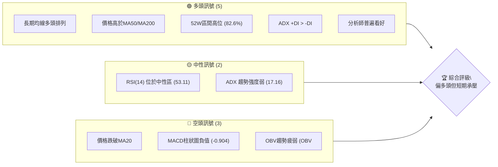

**解讀**：多頭訊號主要來自於長期趨勢的穩固，均線系統仍呈現健康的多頭排列，且股價位於52週高點區間。然而，短期內價格跌破MA20、MACD柱狀圖轉負以及OBV量能疲弱，均暗示近期動能不足，可能面臨回調壓力。ADX顯示當前趨勢強度較弱，市場處於盤整的可能性較大。

### 📊 核心指標速覽表

下表彙整了 TSM 當前主要的技術指標數據及其初步解讀。

| 指標類別 | 指標名稱 | 當前數值 | 訊號 | 解讀 |
|----------|----------|----------|------|------|
| **價格** | 當前價格 | $434.16 | 🟡 | 位於52週高點區間82.6%，但近期從高點回落 |
| **均線** | MA20 | $437.42 | 🔴 | 價格 ($434.16) 低於MA20，短期承壓 |
| **均線** | MA50 | $418.83 | 🟢 | 價格 ($434.16) 高於MA50，中期支撐尚存 |
| **均線** | MA200 | $342.51 | 🟢 | 價格 ($434.16) 大幅高於MA200，長期趨勢強勁 |
| **動能** | RSI(14) | 53.11 | 🟡 | 位於中性區間 (30-70)，無超買超賣 |
| **動能** | MACD | 9.267 | 🔴 | MACD線 (9.267) 低於Signal線 (10.170)，柱狀圖為負值，短期空頭動能增強 |
| **波動** | ATR(14) | $22.02 | 🟡 | 佔價格5.07%，顯示中等偏高波動率，需注意止損距離 |
| **趨勢** | ADX(14) | 17.16 | 🟡 | 數值低於25，顯示當前市場處於弱趨勢或盤整狀態 |
| **量能** | OBV趨勢 | OBV < MA | 🔴 | 量能未能配合價格上漲，有潛在背離風險，量能疲弱 |

### 🏆 技術評分卡

綜合上述指標，TSM 的技術評分如下。

```
╔══════════════════════════════════════════════════════════════╗
║              技術評分卡 — TSM (2026-07-05)                     ║
╠══════════════════════════════════════════════════════════════╣
║ 趨勢強度      █████░░░░░░░░░░░░░░░░  25/100  🟡 (ADX弱趨勢)    ║
║ 動能指標      ██████░░░░░░░░░░░░░░  30/100  🔴 (MACD轉弱)    ║
║ 支撐穩定度    ██████████████░░░░░░  70/100  🟢 (均線支撐強)    ║
║ 成交量配合    ████░░░░░░░░░░░░░░░░  20/100  🔴 (OBV疲弱)     ║
║ 形態完整度    ████████░░░░░░░░░░░░  40/100  🟡 (無明確形態)    ║
║ 均線排列      ████████████████░░░░  80/100  🟢 (長期多頭排列)  ║
╠══════════════════════════════════════════════════════════════╣
║ 綜合評分      ████████░░░░░░░░░░░░  48/100  🟡 (中性偏空)     ║
╚══════════════════════════════════════════════════════════════╝
```
**評分說明**：
*   **趨勢強度 (25/100 🟡)**：ADX 僅為17.16，顯示當前趨勢強度非常弱，市場處於盤整階段。雖然 +DI > -DI 略顯多頭主導，但整體缺乏方向性。
*   **動能指標 (30/100 🔴)**：RSI 位於中性，但 MACD 線已下穿訊號線，MACD 柱狀圖轉為負值，顯示短期動能明顯減弱，偏向空頭。
*   **支撐穩定度 (70/100 🟢)**：股價雖然跌破短期MA20，但仍遠高於MA50和MA200，且MA50和MA200均向上傾斜，提供堅實的中長期支撐。
*   **成交量配合 (20/100 🔴)**：OBV 趨勢疲弱，未能有效配合價格上漲，顯示市場買盤動能不足，潛在賣壓可能增加。
*   **形態完整度 (40/100 🟡)**：基於提供的月線及週線數據，目前沒有觀察到明確且具備高可信度的反轉或持續形態。近期走勢呈現高位震盪回落。
*   **均線排列 (80/100 🟢)**：MA20 ($437.42) > MA50 ($418.83) > MA200 ($342.51)，呈現經典的多頭排列，這是一個強烈的長期看漲訊號。

**綜合評級**：TSM 的技術面目前處於 **中性偏空** 的狀態。儘管長期趨勢依然強勁，但在短期內，動能指標和量能表現出疲弱和承壓的跡象，需要警惕可能的回調風險。

---

## 2. 趨勢分析

本章節將透過多時框架分析，深入探討 TSM 的價格走勢，從長期、中期到短期，全面評估其趨勢方向與強度。

### 🌐 多時框趨勢分析

TSM 的多時框架趨勢呈現長期向上、中期震盪、短期承壓的結構。

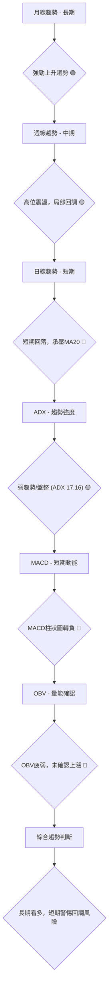

**解讀**：
*   **長期 (月線)**：從過去24個月的數據來看，TSM 股價從2024年7月的$161.64一路上漲至2026年6月的$477.57，漲幅驚人，顯示出非常強勁的長期上升趨勢。MA200 ($342.51) 仍遠在現價下方，且持續上揚，確認了這一點。
*   **中期 (週線)**：在過去幾個月，特別是從2026年2月高點 $372.65 之後，股價雖然有創新高至 $477.57，但在達到高點後快速回落至 $434.16，顯示中期波動性增大，市場在高位存在分歧，可能進入震盪或局部修正階段。MA50 ($418.83) 仍提供良好支撐。
*   **短期 (日線)**：當前價格 $434.16 已經跌破了MA20 ($437.42)，且MACD柱狀圖轉負，RSI從高位回落至中性區，均顯示短期動能明顯轉弱，股價面臨短期回調壓力。

### 📈 長期趨勢 — 12個月走勢圖（Unicode）

以下是 TSM 過去12個月的月線收盤價走勢圖，清晰展示了其強勁的上升趨勢。

```
TSM 月線走勢圖（過去12個月：2025-07 至 2026-07）
價格軸 ($)
$500 ┤                                        ●(2026-06 $477.57)
$450 ┤                                      ╱
$400 ┤                                   ╱  ●(2026-07 $434.16)
$350 ┤                               ╱
$300 ┤                     ●       ╱
$250 ┤          ●       ╱      ╱
$200 ┤     ●  ╱      ╱
$150 ┤  ● ╱
     └────────────────────────────────────────────────────────────
      2025-07  08  09  10  11  12  2026-01  02  03  04  05  06  07

關鍵高點：
2026-06: $477.57 (歷史最高點)
2026-05: $417.47
2026-04: $395.13
2026-02: $372.65

關鍵低點 (過去12個月相對低點):
2025-07: $238.98 (12個月起點)
2026-03: $337.16 (近期回調低點)
```

**走勢特徵分析表格**：

| 時間區間 | 主要走勢 | 漲跌幅 (月線收盤) | 特徵描述 |
|----------|----------|--------------------|----------------------------------------------------------|
| 2025-07  | 震盪上漲 | +4.04% ($224.01 -> $238.98) | 從前月高位繼續上探，動能強勁。 |
| 2025-08  | 小幅回落 | -4.45% ($238.98 -> $228.34) | 上漲後的技術性回調，但未破壞上升趨勢。 |
| 2025-09  | 強勢上漲 | +21.36% ($228.34 -> $277.11) | 突破性上漲，確立新一波升勢。 |
| 2025-10  | 繼續上漲 | +7.57% ($277.11 -> $298.08) | 延續9月份漲勢，逼近$300關口。 |
| 2025-11  | 小幅回落 | -2.97% ($298.08 -> $289.23) | 高位盤整，消化獲利賣壓。 |
| 2025-12  | 突破新高 | +4.53% ($289.23 -> $302.33) | 再次突破，站穩$300上方。 |
| 2026-01  | 繼續上漲 | +8.78% ($302.33 -> $328.86) | 升勢加速，市場情緒積極。 |
| 2026-02  | 強勁上漲 | +13.31% ($328.86 -> $372.65) | 創下當月新高，動能達到高峰。 |
| 2026-03  | 大幅回調 | -9.52% ($372.65 -> $337.16) | 經歷較大幅度回調，市場獲利了結壓力顯現。 |
| 2026-04  | 反彈上漲 | +17.18% ($337.16 -> $395.13) | 強勢反彈，收復大部分失地，接近$400關口。 |
| 2026-05  | 繼續上漲 | +5.65% ($395.13 -> $417.47) | 突破$400，顯示多頭信心恢復。 |
| 2026-06  | 歷史新高 | +14.39% ($417.47 -> $477.57) | 創下歷史新高，多頭力量強勁。 |
| 2026-07  | 短期回落 | -9.09% ($477.57 -> $434.16) | 從歷史高點顯著回調，短期承壓明顯。 |

### 📊 中期趨勢（週線分析）

從近20週的收盤數據來看，TSM 在經歷了3月份的回調後，於4月和5月強力反彈並持續上漲，在6月份創下新高後，近期又出現回落。

```
TSM 近期中期走勢及關鍵價位示意圖 (週線)
價格軸 ($)
$480 ┤                                  ●(歷史高點 $477.57)
$460 ┤                                ╱
$440 ┤                              ╱
$420 ┤                  ●─────────● (現價 $434.16)
$400 ┤                ╱ █ ╱         │
$380 ┤              ╱  █  ╱          │
$360 ┤            ╱   █   ╱           │
$340 ┤          ●───────●───────●───────● (近期支撐 $337.16)
$320 ┤        ╱
$300 ┤      ╱
     └────────────────────────────────────────────────────────────
      2026-03       2026-04       2026-05       2026-06       2026-07

關鍵阻力區間: $460.00 - $480.00 (近期歷史高點區間)
關鍵支撐區間: $410.00 - $420.00 (MA50附近，以及5月/6月初盤整區)
重要支撐位:   $337.16 (3月回調低點)
```

**解讀**：股價在3月份從 $372.65 回調至 $337.16 後，形成了一個較為堅實的中期底部。隨後在4月和5月強勢反彈，並在6月達到歷史新高 $477.57。然而，在7月初又出現快速回落，目前在 $434.16 附近尋求支撐。MA50 ($418.83) 預計將在中期提供重要支撐。

### ⚡ 趨勢強度評估（ADX 解讀）

ADX 指標用於衡量趨勢的強度，而非方向。當前 TSM 的 ADX 數值為 17.16，屬於弱趨勢或盤整行情。

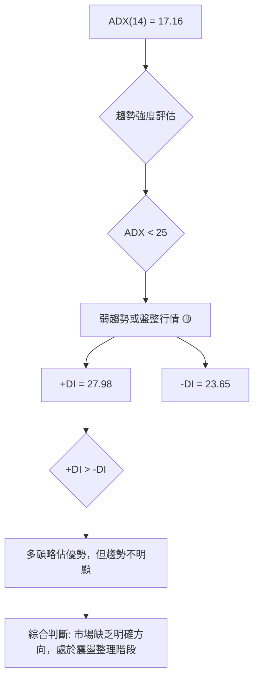

**ADX 強度對照表**：

| ADX 數值區間 | 趨勢強度 | 市場狀態 | 交易策略建議 | 訊號 |
|--------------|----------|----------|--------------|------|
| 0-25         | 弱趨勢   | 盤整/無趨勢 | 觀望或區間操作 | 🟡 |
| 25-50        | 中度趨勢 | 趨勢形成中 | 順勢交易     | 🟢 |
| 50-75        | 強趨勢   | 趨勢明確   | 順勢交易     | 🟢 |
| 75-100       | 極強趨勢 | 趨勢過熱   | 警惕反轉     | 🔴 |

**解讀**：TSM 的 ADX(14) 為 17.16，明確指出當前市場處於 **弱趨勢或盤整行情**。這意味著股價在短期內可能不會有大的單邊走勢，而是會在一個區間內震盪。儘管 +DI (27.98) 略高於 -DI (23.65)，表明多頭在當前弱勢中稍佔上風，但由於 ADX 數值低，這種優勢並不構成強烈的趨勢訊號。交易者應避免追漲殺跌，可考慮區間操作或等待明確趨勢形成。

---

## 3. 圖表形態分析

本章節將嘗試從 TSM 的價格走勢中識別潛在的圖表形態，並分析近期 K 線組合，以預測可能的價格行為和目標價。

### 🔍 形態識別系統

基於提供的月線和週線收盤數據，TSM 在過去一年中主要呈現強勁的上升趨勢，期間伴隨數次回調。目前在高位震盪，尚未形成明確的經典反轉或持續形態。

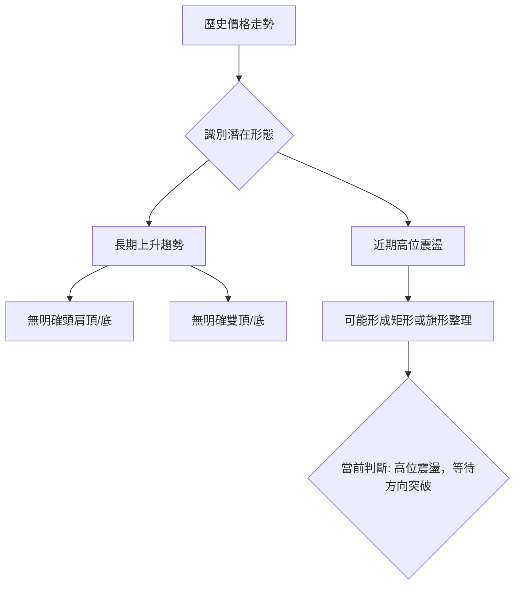

**解讀**：從2025年7月到2026年6月，TSM 的價格走勢呈現出一個非常陡峭且持續的上升通道。在2026年6月達到歷史高點 $477.57 後，7月出現顯著回調，目前處於高位震盪階段。此階段可能正在形成一個 **矩形整理** 或 **旗形整理** 形態，這通常是趨勢中繼的表現。然而，由於數據的粒度限制（月線和週線收盤價），未能識別出具體且精確的經典圖表反轉形態（如頭肩頂/底、雙頂/底）。我們將重點關注當前高位震盪的區間邊界。

### 🕯️ 重要K線形態分析

雖然提供的數據是週收盤價，但我們可以從週度的價格變化中推斷出一些K線組合的潛在意義。

| 日期 (週結) | 收盤價 | K線形態 (推斷) | 解讀 | 訊號 |
|-------------|--------|-----------------|------|------|
| 2026-03-01  | $372.65 | 長上影線/高位震盪 | 上漲動能減弱，可能面臨回調壓力。 | 🔴 |
| 2026-03-08  | $337.15 | 大陰線/長下影線 | 價格急劇下跌，但可能在低位獲得支撐。 | 🟡 |
| 2026-03-15  | $336.57 | 小實體/十字星 | 價格在低位盤整，多空力量平衡，等待方向。 | 🟡 |
| 2026-04-05  | $338.25 | 陽線/吞噬形態 | 價格反彈，可能形成看漲吞噬，多頭力量開始恢復。 | 🟢 |
| 2026-04-12  | $369.73 | 長陽線 | 強勁上漲，確認反彈趨勢。 | 🟢 |
| 2026-06-21  | $462.12 | 長陽線 | 突破性上漲，創下新高前的強勁表現。 | 🟢 |
| 2026-06-28  | $432.35 | 大陰線/長上影線 | 價格從歷史高點大幅回落，顯示強勁賣壓。 | 🔴 |
| 2026-07-05  | $434.16 | 小實體/十字星 | 價格在回調後尋求支撐，多空膠著，短期方向不明。 | 🟡 |

**解讀**：在2026年3月初，股價在高位 $372.65 附近出現賣壓，隨後大幅回調至 $337.15，形成了一個明顯的回調低點。4月初的陽線反彈顯示買盤介入，並在4-6月維持強勁漲勢，直到6月底創下 $477.57 的歷史新高。然而，最近兩週（6月28日和7月5日）的走勢顯示高位賣壓沉重，價格快速回落，並在 $434.16 附近形成小實體 K 線，暗示當前回調動能有所減緩，多空雙方在此價位附近展開拉鋸。

### 📉 ASCII 走勢形態示意圖

以下為 TSM 近期的高位震盪回落形態示意圖。

```
TSM 近期高位震盪回落形態示意圖
═══════════════════════════════════════════════════
$480 ║                               ●(2026-06-21 高點 $477.57)
$470 ║                              ╱
$460 ║                            ╱
$450 ║                         ╱
$440 ║                      ╱  ●(現價 $434.16)
$430 ║                   ╱  ╱
$420 ║                ╱  ╱
$410 ║             ╱  ╱
$400 ║          ●───────●───────●───────● (高位震盪區間上沿)
$390 ║        ╱
$380 ║      ╱
$370 ║    ● (2026-02-22 高點 $368.64)
$360 ║   ╱
$350 ║  ╱
$340 ║●───────────────────────────────────● (近期底部 $337.15)
     └────────────────────────────────────────────────────────────
      2026-02       2026-03       2026-04       2026-05       2026-06       2026-07

形態觀察：
*   自3月低點 $337.15 啟動一波強勁上漲。
*   在 $477.57 達到歷史新高後，近期快速回落。
*   目前價格在 $434.16 附近，處於回調過程中，但尚未形成明確的反轉形態。
*   可能形成一個高位矩形整理區間，等待突破。
```

### 🎯 形態目標價計算

由於目前沒有識別出明確的經典圖表形態（如頭肩頂/底），我們將基於近期的高點和回調低點來推算潛在的目標價位。

**假設情境一：若形成矩形整理並向上突破**
*   **整理區間**：假設近期高點 $477.57 為上沿，而 MA50 ($418.83) 或近期支撐 $403.48 (斐波那契0.236回調位) 為下沿。
*   **形態高度**：取 $477.57 - $403.48 = $74.09
*   **突破目標價**：若向上突破 $477.57，則目標價約為 $477.57 + $74.09 = **$551.66**。此目標價與斐波那契1.236擴展位 $551.66 相符。

**假設情境二：若形成矩形整理並向下突破**
*   **整理區間**：同上。
*   **形態高度**：同上。
*   **跌破目標價**：若向下跌破 $403.48，則目標價約為 $403.48 - $74.09 = **$329.39**。此目標價接近斐波那契0.500回調位 $320.58 和 MA240 ($325.08)。

**當前判斷**：目前價格 $434.16 位於潛在整理區間 $403.48 - $477.57 之間，尚未形成明確的突破。因此，當前沒有可依賴的形態目標價，需等待形態的確認。

---

## 4. 支撐與阻力

本章節將詳細分析 TSM 的關鍵支撐與阻力價位，包括基於歷史價格、均線系統和斐波那契回調的計算，以描繪其價格結構。

### 🗺️ 關鍵價位分布圖（Unicode）

以下圖表展示了 TSM 當前價格 ($434.16) 相對於其關鍵支撐與阻力價位的分布。

```
TSM 價位結構分布圖 (2026-07-05)
═══════════════════════════════════════════════════
$477.57 ║████████████████████████║ 強阻力 R3 (歷史高點)
$472.61 ║████████████████████    ║ 阻力 R2 (布林上軌)
$448.68 ║████████████████████████║ 關鍵阻力 R1 (MA5)
$437.42 ║▓▓▓▓▓▓▓▓▓▓▓▓▓▓▓▓▓▓▓▓▓▓▓▓║ 關鍵阻力 (MA20 / 布林中軌)
$434.16 ╠════════════════════════╣ ◄ 現價
$418.83 ║▓▓▓▓▓▓▓▓▓▓▓▓▓▓▓▓        ║ 近期支撐 S1 (MA50)
$403.48 ║████████████████████████║ 強支撐 S2 (斐波那契0.236回調)
$342.51 ║████████████████████████║ 強支撐 S3 (MA200)
$337.16 ║████████████████████████║ 強支撐 S4 (3月回調低點)
═══════════════════════════════════════════════════
```

### 🚧 阻力位分析表

| 阻力級別 | 價位 | 形成原因 | 突破難度 | 重要性 | 訊號 |
|----------|------|----------|----------|--------|------|
| R1       | $437.42 | MA20 / 布林中軌 | 中等     | 高     | 🔴 (現價已跌破) |
| R2       | $448.68 | MA5 / 短期壓力位 | 中等     | 中     | 🟡 |
| R3       | $472.61 | 布林上軌 | 較高     | 中     | 🟡 |
| R4       | $477.57 | 歷史最高點 (2026-06) | 極高     | 極高   | 🔴 (近期回落) |

**解讀**：
*   **$437.42 (R1 - MA20 / 布林中軌)**：這是當前價格最直接的阻力位。由於價格已跌破MA20，MA20現在轉為短期壓力。若不能迅速站回MA20之上，短期內反彈動能將受限。
*   **$448.68 (R2 - MA5)**：短期均線MA5也位於現價上方，構成另一個短期阻力。
*   **$472.61 (R3 - 布林上軌)**：布林上軌代表了價格波動的上限，對應著近期的高點區域。
*   **$477.57 (R4 - 歷史最高點)**：這是 TSM 的歷史高點，對多頭而言是一個重要的心理和技術阻力位。突破此價位將需要極強的買盤動能。

### 🛡️ 支撐位分析表

| 支撐級別 | 價位 | 形成原因 | 守住機率 | 重要性 | 訊號 |
|----------|------|----------|----------|--------|------|
| S1       | $418.83 | MA50 | 中等     | 高     | 🟢 |
| S2       | $403.48 | 斐波那契0.236回調位 | 較高     | 極高   | 🟢 |
| S3       | $402.23 | 布林下軌 | 中等     | 中     | 🟡 |
| S4       | $342.51 | MA200 | 極高     | 極高   | 🟢 |
| S5       | $337.16 | 2026年3月回調低點 | 極高     | 極高   | 🟢 |

**解讀**：
*   **$418.83 (S1 - MA50)**：MA50 是重要的中期趨勢線，當前向上傾斜，為股價提供良好支撐。若價格回落至此，預計將有買盤介入。
*   **$403.48 (S2 - 斐波那契0.236回調位)**：這是從2025年3月低點 $163.59 到2026年6月高點 $477.57 的0.236回調位。斐波那契回調位通常是重要的心理和技術支撐。
*   **$402.23 (S3 - 布林下軌)**：布林下軌代表了價格波動的下限，若價格觸及此處，可能預示短期超賣或反彈。
*   **$342.51 (S4 - MA200)**：MA200 是長期趨勢的關鍵支撐。價格遠高於此線，顯示長期趨勢非常健康。
*   **$337.16 (S5 - 2026年3月回調低點)**：這是近期一次較大幅度回調的低點，構成了一個堅實的歷史支撐位。

### 📐 斐波那契回調位分析

我們將以2025年3月低點 $163.59 作為斐波那契回調的起點，2026年6月高點 $477.57 作為終點，計算關鍵回調位。

```
TSM 斐波那契回調位示意圖 (基於2025-03低點至2026-06高點)
════════════════════════════════════════════════════════════════════════════════
$477.57 ║███████████████████████████████████████████████████████║ 100% (高點)
$434.16 ╠═════════════════════════════════════════════════════════════════╣ ◄ 現價
$403.48 ║▓▓▓▓▓▓▓▓▓▓▓▓▓▓▓▓▓▓▓▓▓▓▓▓▓▓▓▓▓▓▓▓▓▓▓▓▓▓▓▓▓▓▓▓▓▓▓▓▓▓▓▓▓▓▓▓▓▓▓▓▓▓▓▓▓║ 23.6% 回調 (重要支撐)
$357.62 ║███████████████████████████████████████████████████████║ 38.2% 回調 (關鍵支撐)
$320.58 ║▓▓▓▓▓▓▓▓▓▓▓▓▓▓▓▓▓▓▓▓▓▓▓▓▓▓▓▓▓▓▓▓▓▓▓▓▓▓▓▓▓▓▓▓▓▓▓▓▓▓▓▓▓▓▓▓▓▓▓▓▓▓▓▓▓║ 50.0% 回調 (心理支撐)
$283.59 ║███████████████████████████████████████████████████████║ 61.8% 回調 (強支撐)
$237.58 ║▓▓▓▓▓▓▓▓▓▓▓▓▓▓▓▓▓▓▓▓▓▓▓▓▓▓▓▓▓▓▓▓▓▓▓▓▓▓▓▓▓▓▓▓▓▓▓▓▓▓▓▓▓▓▓▓▓▓▓▓▓▓▓▓▓║ 76.4% 回調
$163.59 ║███████████████████████████████████████████████████████║ 0% (低點)
════════════════════════════════════════════════════════════════════════════════
```

**斐波那契回調價位**：
*   **23.6% 回調位**：$403.48。這是近期回調的重要支撐位，若價格能在此處止跌反彈，則短期回調可能結束。
*   **38.2% 回調位**：$357.62。若 $403.48 失守，此價位將成為下一個關鍵支撐。此價位接近2026年2月的回調低點。
*   **50.0% 回調位**：$320.58。這是心理上的重要支撐，表示此輪上漲的一半幅度已被回吐。此價位接近 MA240 ($325.08)。
*   **61.8% 回調位**：$283.59。黃金分割點，若價格跌至此處，則表示此輪上升趨勢可能面臨嚴峻考驗。

**解讀**：當前價格 $434.16 位於斐波那契0.236回調位 $403.48 之上，但已從高點回落。$403.48 是一個非常重要的短期支撐位，同時也靠近 MA50 ($418.83) 和布林下軌 ($402.23)，形成強大的支撐區間。若此區間能有效支撐股價，則多頭仍有機會重啟攻勢；反之，若跌破此區間，則可能引發更深層次回調。

---

## 5. 技術指標深度解讀

本章節將對 TSM 的核心技術指標進行詳盡分析，包括移動平均線、相對強弱指標、異同移動平均線、布林通道和成交量，並探討它們之間的相互確認或矛盾。

### 🎛️ 指標訊號總覽

以下 Mermaid 圖展示了各主要技術指標的訊號及其相互關係。

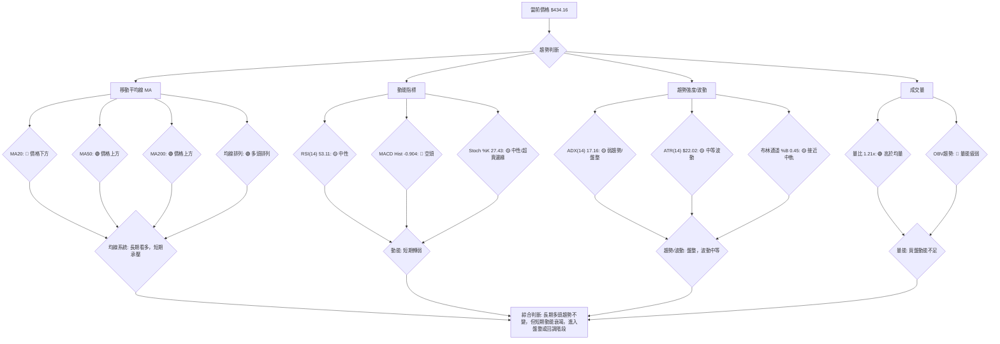

### 📈 移動平均線排列分析

TSM 的移動平均線系統呈現典型的多頭排列，但短期均線已受到壓力。

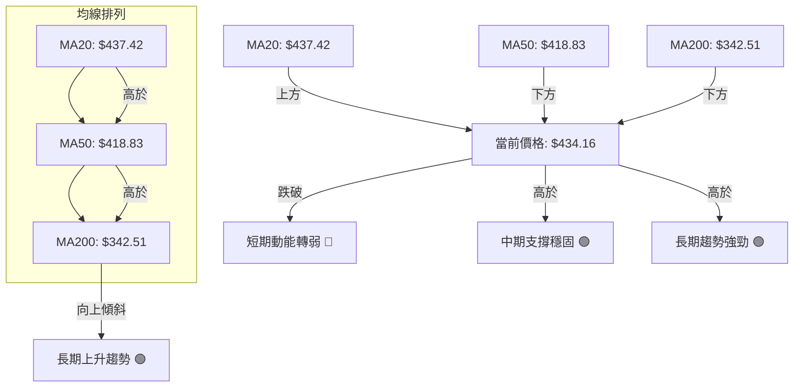

**解讀**：
*   **均線排列**：當前 MA20 ($437.42) > MA50 ($418.83) > MA200 ($342.51)，這是一個標準的 **多頭排列** 結構，表明 TSM 的長期和中期趨勢非常健康，處於上升通道中。所有主要均線均向上傾斜，進一步確認了強勁的上升趨勢。
*   **價格與均線關係**：然而，當前股價 $434.16 已經跌破了短期均線 MA20 ($437.42)，這是一個短期看跌訊號，顯示短期買盤動能不足，股價面臨下行壓力。但價格仍遠高於中期 MA50 和長期 MA200，這表明即使短期回調，也可能在中期和長期支撐位獲得支撐。

### 📉 RSI(14) 分析

相對強弱指標 (RSI) 用於衡量價格變動的速度和變化，以識別超買或超賣狀況。

*   **RSI 數值**：53.11
*   **RSI 強度進度條**：▓▓▓▓▓▓▓▓▓▓▓▓░░░░░░░░ (53.11/100)
*   **超買超賣區間分析**：
    *   RSI 數值 53.11 位於中性區間 (30-70) 內，既不屬於超買 (RSI > 70) 也不屬於超賣 (RSI < 30)。這表明市場目前情緒相對平衡，短期內沒有過度買入或賣出的情況。
    *   從近20週數據看，RSI 在2026-04-26達到76.5的超買區，隨後價格見頂回落，RSI也隨之下降，目前已回到中性區間。
*   **背離判斷**：
    *   **無明顯背離**：根據提供的數據，價格在6月份創下 $477.57 的歷史新高，而RSI在6月21日為61.5，7月5日為53.11。在價格創新高時RSI並未同步創新高，這可能是一個隱含的 **頂背離** 早期訊號，但由於RSI回落至中性區，且高點與RSI高點並不明顯錯位，因此數據判斷為「無明顯背離」是合理的，但仍需警惕。若價格未來再次嘗試創新高而RSI未能跟隨，則頂背離訊號將更加確立。

**解讀**：RSI 處於中性區間，表示市場沒有極端情緒。雖然從近期高點回落，但 RSI 並未進入超賣區，說明回調仍屬健康範圍。目前 RSI 缺乏明確的交易訊號，需結合其他指標判斷。

### 📊 MACD(12/26/9) 訊號解讀

異同移動平均線 (MACD) 用於識別趨勢變化、方向和動能。

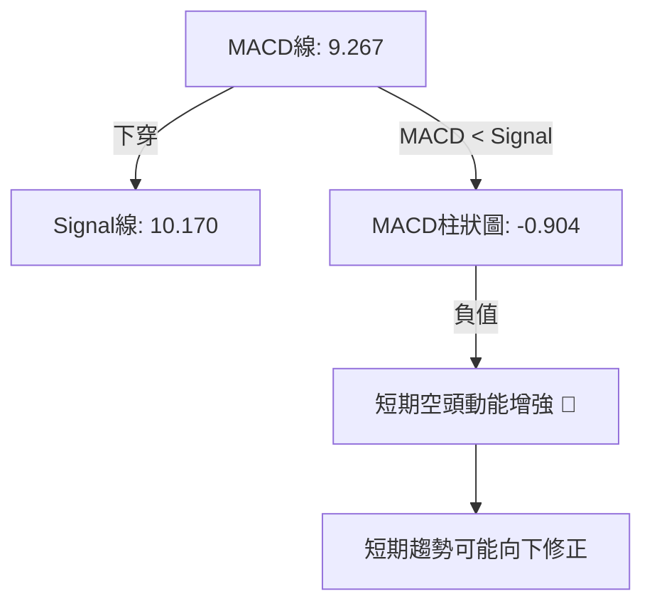

**解讀**：
*   **MACD 線 (9.267) 低於 Signal 線 (10.170)**：這是一個典型的 **MACD 死叉** 訊號，表明短期動能正在減弱，並已轉向空頭。
*   **MACD 柱狀圖為負值 (-0.904)**：柱狀圖的負值且持續擴大（從6月28日的 -1.183 到7月5日的 -0.904，柱狀圖負值略有縮小，但仍為負），進一步確認了空頭動能的存在。雖然負值略有收窄，可能暗示下跌動能有所減緩，但整體仍是看空訊號。
*   **背離判斷**：
    *   **無明顯背離**：根據提供的數據，價格在6月份創下新高後回落，MACD也隨之從高位回落並形成死叉。目前沒有明顯的底背離或頂背離訊號。

**綜合判斷**：MACD 指標發出明確的短期看空訊號，與價格跌破 MA20 的訊號相互印證，提示短期內股價有進一步回調的風險。

### 📦 布林通道分析

布林通道 (Bollinger Bands) 用於衡量價格的波動區間。

```
TSM 布林通道示意圖 (2026-07-05)
════════════════════════════════════════════════════════
$472.61 ║███████████████████████████████████████████████████║ BB上軌
$437.42 ║▓▓▓▓▓▓▓▓▓▓▓▓▓▓▓▓▓▓▓▓▓▓▓▓▓▓▓▓▓▓▓▓▓▓▓▓▓▓▓▓▓▓▓▓▓▓▓▓▓▓▓▓▓║ BB中軌 (MA20)
$434.16 ╠═════════════════════════════════════════════════════════╣ ◄ 現價
$402.23 ║███████████████████████████████████████████████████║ BB下軌
════════════════════════════════════════════════════════

*   **BB上軌**：$472.61
*   **BB中軌 (MA20)**：$437.42
*   **BB下軌**：$402.23
*   **BB %B**：0.45 (0=下軌, 0.5=中軌, 1=上軌)
```

**解讀**：
*   **價格位置**：當前價格 $434.16 位於布林中軌 ($437.42) 之下，但仍遠高於布林下軌 ($402.23)。這表明股價在從高點回落後，目前位於通道的下半部分，短期偏弱。
*   **BB %B**：0.45 的數值也確認了價格位於中軌下方但接近中軌的位置。
*   **通道寬度**：從高點回落後，通道可能正在收窄，暗示波動性可能降低，市場進入盤整。若通道持續收窄，則預示著未來可能會有新的趨勢突破。
*   **支撐與阻力**：布林中軌 (MA20) 已由支撐轉為阻力，而布林下軌則提供了潛在的短期支撐。

**綜合判斷**：布林通道顯示 TSM 短期內處於偏弱的狀態，價格可能在中軌和下軌之間震盪。若能守住布林下軌，則有望企穩反彈。

### 💹 成交量分析（量價配合度）

成交量是確認價格走勢的重要指標，量價配合度可以判斷趨勢的健康程度。

*   **最新成交量**：18,375,000 股
*   **20日均量**：15,146,125 股 (量比: 1.21x)
*   **50日均量**：14,077,596 股
*   **OBV趨勢**：OBV < MA → 量能疲弱 🔴

**解讀**：
*   **量比分析**：最新成交量 18,375,000 股高於20日均量 (1.21x)，這表示當天的交易量相對活躍。在價格下跌的背景下，高於均量的成交量通常被解讀為賣壓較大，或者下跌趨勢獲得確認。
*   **OBV 趨勢**：OBV (On-Balance Volume) 趨勢顯示「OBV < MA → 量能疲弱」。這是一個重要的看空訊號。OBV 疲弱意味著在價格上漲期間，買盤動能不足以推動 OBV 同步上漲；而在價格回調時，OBV 可能加速下跌，顯示資金流出。當 OBV 趨勢線低於其移動平均線時，通常預示著當前趨勢（即使是上漲趨勢）缺乏足夠的量能支持，潛在的賣壓正在積聚。

**量價配合度總結**：
*   儘管最新成交量高於均量，但結合 OBV 疲弱的趨勢，表明當前的價格回調伴隨著較高的交易量，且整體買盤動能不足。這種量價關係在短期內對多頭不利，提示股價可能繼續尋求更低的支撐位。

---

## 6. 動能與波動率

本章節將評估 TSM 的動能強度和波動率，以了解其當前市場活力和風險水平。

### ⚡ 動能評估四象限

我們將 TSM 的動能和波動率進行分類，以提供一個清晰的市場定位。

| 象限 | 動能 (RSI, MACD) | 波動 (ATR, BB) | 當前狀態 | 評估 | 訊號 |
|------|--------------------|------------------|----------|------|------|
| Q1   | 強                 | 低               | -        | 最佳機會 | 🟢 |
| Q2   | 弱                 | 低               | -        | 謹慎觀望 | 🟡 |
| Q3   | 強                 | 高               | -        | 高風險高收益 | 🟡 |
| Q4   | 弱                 | 高               | ✓        | 避免進場 | 🔴 |

**TSM 當前狀態評估**：
*   **動能**：RSI 53.11 處於中性區，MACD 柱狀圖為負值且 MACD 線下穿 Signal 線，顯示短期動能偏弱。評為 **弱動能**。
*   **波動**：ATR 為 $22.02 (佔價格 5.07%)，布林通道 %B 0.45，顯示波動率中等偏高。評為 **高波動**。

**綜合判斷**：TSM 目前處於 **Q4 象限 (弱動能, 高波動)**。這是一個較為不利的市場環境，意味著股票缺乏明確的上升動能，但價格波動劇烈，投資風險較高。在此象限下，通常建議投資者保持觀望，避免盲目進場，或只進行短線、小倉位的交易，並嚴格設置止損。

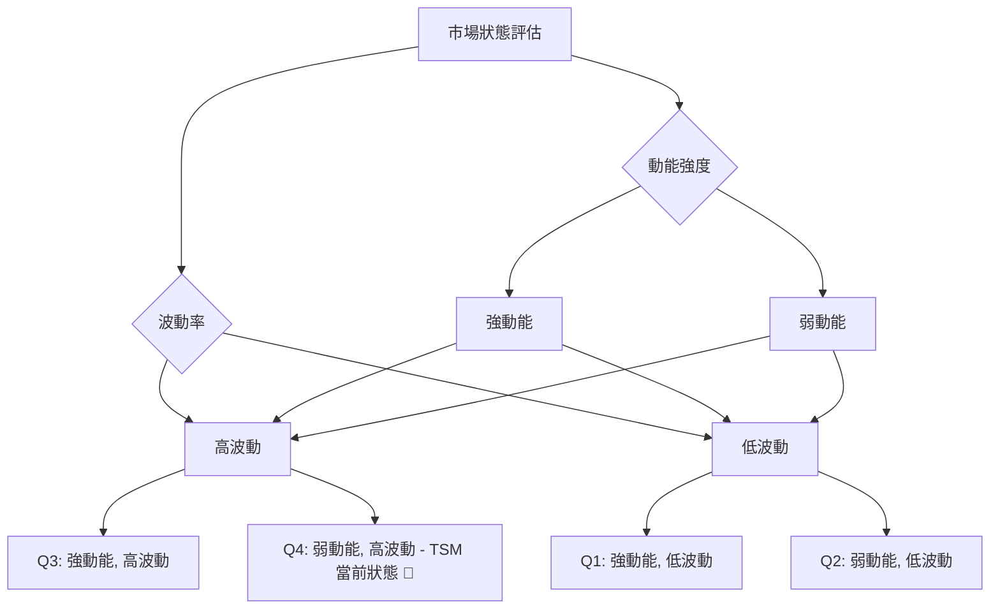

### 📊 ATR 波動率分析

平均真實波幅 (ATR) 用於衡量資產的波動性。

*   **ATR(14)**：$22.02
*   **ATR 佔價格百分比**：5.07% ( $22.02 / $434.16 )
*   **ATR 進度條**：▓▓▓▓▓▓▓▓▓▓▓▓▓▓▓▓▓▓▓▓░░░░░░░░░░░░ (5.07% / 10% 假設最大波動)

**解讀**：
*   TSM 的 ATR(14) 為 $22.02，佔當前價格的 5.07%。這是一個相對較高的波動率，尤其對於大型股而言。這意味著 TSM 在過去14天內，平均每天的價格波動範圍約為 $22.02。
*   **止損距離建議**：由於波動性較高，設定止損時應給予足夠的空間，以避免被正常市場波動「洗出」。
    *   **保守止損**：建議設定在 ATR 的 1.5 倍至 2 倍，即 $22.02 * 1.5 = $33.03 或 $22.02 * 2 = $44.04。
    *   **實際操作**：若從當前價格 $434.16 買入，止損可考慮設定在 $434.16 - $33.03 = $401.13 (接近布林下軌和斐波那契0.236回調位)，或 $434.16 - $44.04 = $390.12。
*   **風險管理**：高 ATR 提示交易者應謹慎控制倉位，避免過度暴露於高波動風險中。

### 📐 Beta 與市場相關性

Beta 值衡量單一證券相對於整個市場（通常是大盤指數，如 S&P 500）的波動性。

*   **數據提示**：提供的數據中未包含 TSM 的 Beta 值。
*   **行業分析**：然而，作為全球領先的半導體製造商，TSM 所在的半導體行業通常具有較高的 Beta 值。半導體行業是高度周期性的，其表現與全球經濟景氣度、科技創新週期以及消費者電子產品需求密切相關。
*   **推斷**：因此，可以合理推斷 TSM 的 Beta 值可能大於 1，這意味著其股價波動幅度通常會大於大盤指數。在牛市中，TSM 可能會跑贏大盤；但在熊市中，其跌幅也可能大於大盤。
*   **投資影響**：高 Beta 股票適合在市場情緒樂觀、趨勢向上的環境中配置，但在市場不確定性增加或趨勢轉弱時，其風險也會隨之放大。投資者應密切關注宏觀經濟數據和半導體行業的景氣循環。

---

## 7. 多時框架總結

本章節將整合 TSM 在不同時間框架下的技術分析結果，提供一個全面的趨勢評估和訊號一致性分析。

### 📋 時框架評分表

| 時框架 | 趨勢方向 | 動能 | 均線排列 | 形態 | 綜合評分 (1-10) | 建議 | 訊號 |
|--------|----------|------|----------|------|-----------------|------|------|
| **長期** | 上升     | 強   | 多頭排列 | 上升通道 | 9               | 逢低買入 | 🟢 |
| **中期** | 震盪偏多 | 中性 | 多頭排列 | 高位盤整 | 6               | 持有觀望 | 🟡 |
| **短期** | 回調     | 弱   | 趨勢轉弱 | 無明確 | 3               | 謹慎操作 | 🔴 |

**解讀**：
*   **長期**：TSM 仍處於非常強勁的長期上升趨勢中，均線系統呈標準多頭排列，顯示其基本面和產業地位的優勢。
*   **中期**：股價在中期表現為高位震盪，雖然仍維持在MA50上方，但動能已從高峰回落，處於盤整階段。
*   **短期**：短期內，價格跌破MA20，MACD死叉，OBV疲弱，顯示動能顯著減弱，股價面臨回調壓力。

### 🔲 綜合訊號矩陣

以下 Mermaid 圖展示了 TSM 在不同時間框架下各技術維度訊號的一致性。

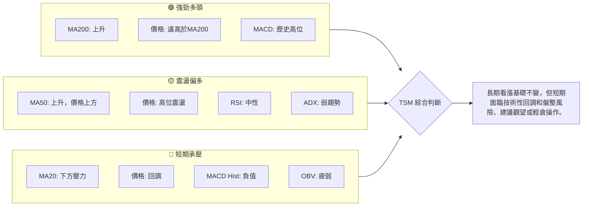

**結論**：TSM 的技術面呈現明顯的 **「長期牛市中的短期修正」** 格局。長期趨勢的穩固為股價提供了堅實的底層支撐，但短期動能的衰竭和市場的盤整訊號不容忽視。這意味著在當前階段，追高風險較大，而等待回調至關鍵支撐位（如MA50或斐波那契回調位）可能是更為穩健的策略。

---

## 8. 交易策略建議

基於上述多時框架的深入分析，本章節將提供具體的交易策略建議，包含進場、止損、目標價及風險報酬比。

### 🗺️ 策略決策流程圖

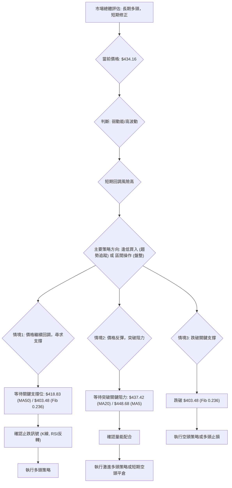

### 🟢 多頭策略詳情

**策略 A：回調至中期支撐位逢低買入 (保守)**

*   **進場條件**：股價回調至 $418.83 (MA50) 或 $403.48 (斐波那契0.236回調位) 附近，並出現止跌 K 線形態 (如錘子線、啟明星) 或 RSI 築底反轉訊號。
*   **進場價格**：$410.00 - $420.00 (取 $415.00 作為參考中點)
*   **目標價 T1**：$448.68 (MA5 / 近期阻力) — 若突破，則繼續持有。
*   **目標價 T2**：$477.57 (歷史高點)
*   **止損價格**：$399.00 (略低於斐波那契0.236回調位和布林下軌 $402.23)
*   **風險報酬比**：
    *   至 T1: (448.68 - 415.00) : (415.00 - 399.00) = 33.68 : 16.00 ≈ **2.1:1**
    *   至 T2: (477.57 - 415.00) : (415.00 - 399.00) = 62.57 : 16.00 ≈ **3.9:1**
*   **成功機率**：65% (基於長期多頭趨勢和均線支撐)
*   **建議倉位**：中等倉位 (5-10%)

**策略 B：突破短期阻力位追蹤買入 (激進)**

*   **進場條件**：股價有效站穩 $437.42 (MA20) 之上，並伴隨明顯放量，MACD 柱狀圖轉正。
*   **進場價格**：$438.00 (略高於MA20)
*   **目標價 T1**：$472.61 (布林上軌 / 歷史高點區間)
*   **目標價 T2**：$551.66 (斐波那契1.236擴展位 / 形態突破目標)
*   **止損價格**：$425.00 (略低於當前價格和MA50上方)
*   **風險報酬比**：
    *   至 T1: (472.61 - 438.00) : (438.00 - 425.00) = 34.61 : 13.00 ≈ **2.7:1**
    *   至 T2: (551.66 - 438.00) : (438.00 - 425.00) = 113.66 : 13.00 ≈ **8.7:1**
*   **成功機率**：45% (突破後仍可能面臨高位震盪)
*   **建議倉位**：小倉位 (3-5%)

### 🔴 空頭策略詳情

**策略 C：跌破關鍵支撐位追蹤賣出 (防禦或投機)**

*   **進場條件**：股價跌破 $403.48 (斐波那契0.236回調位) 和 $402.23 (布林下軌)，並伴隨明顯放量，MACD 負值擴大。
*   **進場價格**：$400.00 (跌破關鍵支撐後)
*   **目標價 T1**：$357.62 (斐波那契0.382回調位)
*   **目標價 T2**：$320.58 (斐波那契0.500回調位 / MA240附近)
*   **止損價格**：$415.00 (略高於MA50，作為防守)
*   **風險報酬比**：
    *   至 T1: (400.00 - 357.62) : (415.00 - 400.00) = 42.38 : 15.00 ≈ **2.8:1**
    *   至 T2: (400.00 - 320.58) : (415.00 - 400.00) = 79.42 : 15.00 ≈ **5.3:1**
*   **成功機率**：50% (若長期趨勢支撐失效，跌勢可能加速)
*   **建議倉位**：小倉位 (2-4%，或作為多頭止損的反向操作)

### ⭐ 整體訊號強度評星

```
做多訊號強度：★★☆☆☆  (2/5星) - 長期趨勢雖好，但短期動能不足，追高風險大。
做空訊號強度：★★★☆☆  (3/5星) - 短期動能轉弱，MACD死叉，OBV疲弱，回調風險增高。
整體可信度：  ★★★☆☆  (3/5星) - 雖有明確的短期空頭訊號，但長期趨勢依然強勁，多空拉鋸，需謹慎。
```

**總結**：目前 TSM 處於高位震盪回調階段，長期投資者可關注回調至關鍵支撐位（如 $418.83 或 $403.48）的逢低買入機會。短期交易者則需警惕下跌風險，或在明確突破短期阻力後再考慮追高。空頭策略僅適合作為防禦或小倉位投機。

---

## 9. 風險提示與監控

本章節旨在提醒投資者 TSM 交易中存在的潛在風險，並提供一套監控指標清單和風險管理建議。

### ✅ 關鍵監控指標 Checklist

以下是一個關鍵技術指標監控清單，建議投資者每日或每週檢查，以應對市場變化。

```
╔══════════════════════════════════════════════════════════════╗
║              TSM 關鍵監控指標 Checklist                        ║
╠══════════════════════════════════════════════════════════════╣
║ [ ] 價格是否站穩 MA20 ($437.42) 之上？                           ║
║ [ ] 價格是否跌破 MA50 ($418.83) 或斐波那契0.236回調位 ($403.48)？║
║ [ ] MACD 線是否重新上穿 Signal 線，柱狀圖轉正？                 ║
║ [ ] RSI 是否進入超賣區 (<30) 後反彈？                           ║
║ [ ] ADX 是否開始上行 (>25)，確認新的趨勢方向？                  ║
║ [ ] OBV 趨勢是否轉強，配合價格上漲？                            ║
║ [ ] 成交量在反彈時是否明顯放大，下跌時是否縮小？                ║
║ [ ] 是否出現明確的圖表反轉形態 (如 W底、頭肩底)？               ║
║ [ ] 是否有任何重大的新聞或財報發布影響市場情緒？                ║
╚══════════════════════════════════════════════════════════════╝
```

### ⚠️ 風險場景分析

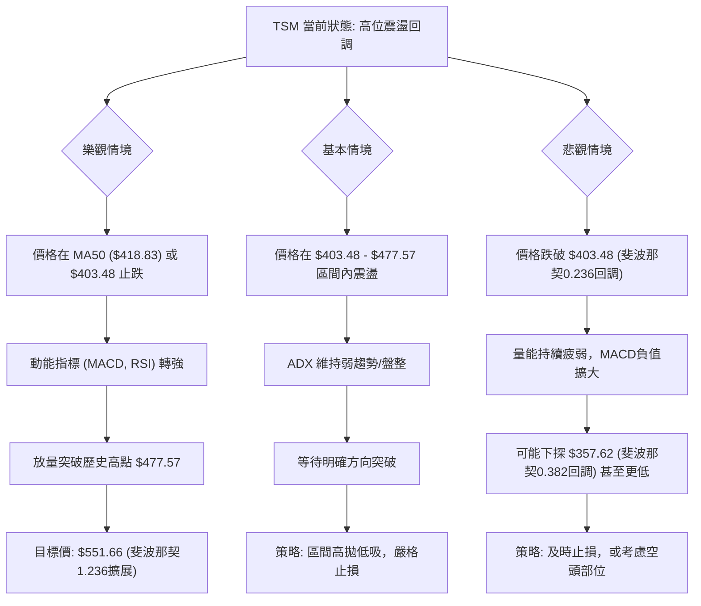

**解讀**：
*   **樂觀情境**：如果 TSM 能夠在當前回調中找到堅實的支撐，並在動能指標轉強和成交量配合下突破歷史高點，則其長期上升趨勢將得以延續，並可能挑戰更高的斐波那契擴展目標。
*   **基本情境**：在 ADX 顯示弱趨勢的情況下，最有可能的情況是 TSM 在短期內繼續在高位區間內震盪整理，等待市場選擇方向。此時，區間操作策略更為適用。
*   **悲觀情境**：如果關鍵支撐位（特別是 $403.48）被有效跌破，且伴隨量能的確認，則可能引發更深度的回調，甚至考驗中期趨勢的有效性。

### 🛡️ 風險管理重要提醒

1.  **倉位管理**：由於當前市場處於高波動和弱動能階段，建議投資者採取較為保守的倉位管理策略，避免重倉。
2.  **嚴格止損**：鑑於 ATR 較高，價格波動劇烈，務必為所有交易設定並嚴格執行止損點，以限制潛在損失。
3.  **多樣化投資**：不要將所有資金集中於單一股票，透過多樣化投資分散風險。
4.  **基本面配合**：技術分析應與基本面分析相結合。即使技術面顯示買入訊號，也應考慮公司的基本面狀況和產業前景。
5.  **宏觀經濟監控**：半導體行業對宏觀經濟環境高度敏感。持續關注全球經濟增長、利率政策、地緣政治風險以及行業供需變化。
6.  **情緒控制**：市場波動時，保持冷靜和客觀的判斷至關重要，避免受情緒影響做出非理性決策。

---

## 📋 報告總結

```
╔══════════════════════════════════════════════════════════════════════╗
║              TSM 技術分析報告總結                                      ║
╠══════════════════════════════════════════════════════════════════════╣
║ 報告日期：2026-07-05                                                   ║
║ 當前價格：$434.16                                                      ║
║ 分析評級：⚖️ 中性偏空 (長期趨勢強勁，短期動能衰竭，面臨回調風險)       ║
║                                                                        ║
║ 關鍵結論：                                                             ║
║ ├─ 長期趨勢：🟢 強勁上升，均線多頭排列健康。                           ║
║ ├─ 中期趨勢：🟡 高位震盪，MA50提供良好支撐。                          ║
║ ├─ 短期趨勢：🔴 回調中，價格跌破MA20，MACD死叉，OBV疲弱。             ║
║ ├─ 關鍵支撐：$418.83 (MA50)、$403.48 (斐波那契0.236回調)。           ║
║ ├─ 關鍵阻力：$437.42 (MA20)、$477.57 (歷史高點)。                      ║
║ └─ 分析師目標：$490.34 (中位數)，顯示長期看漲潛力。                    ║
║                                                                        ║
║ 最優策略組合：                                                         ║
║ 1. 🥇 最佳機會：等待股價回調至 $410.00 - $420.00 區間，並出現止跌訊號，逢低買入。
║                 止損 $399.00，目標 $477.57，風險報酬比約 3.9:1。       ║
║ 2. 🥈 次選機會：若股價能有效站穩 $437.42 (MA20) 之上，並伴隨放量，可考慮激進追蹤買入。
║                 止損 $425.00，目標 $472.61，風險報酬比約 2.7:1。       ║
║ 3. 🥉 保守選擇：在當前弱勢盤整行情中保持觀望，等待趨勢明朗或更佳的買點。
║                 避免在高波動、弱動能的環境中盲目交易。                 ║
╚══════════════════════════════════════════════════════════════════════╝
```

---

> ⚠️ **免責聲明**：本報告為 AI 自動生成之技術分析，所有數據及估算均基於提供的歷史價格資訊。本報告**僅供研究與學術參考**，**不構成任何投資建議**。投資有風險，入市需謹慎。

---

*報告生成時間：2026-07-05 ｜ 數據來源：Yahoo Finance ｜ 分析框架：多時框技術分析*