<details>
<summary>📊 靜態圖表 (點擊展開)</summary>
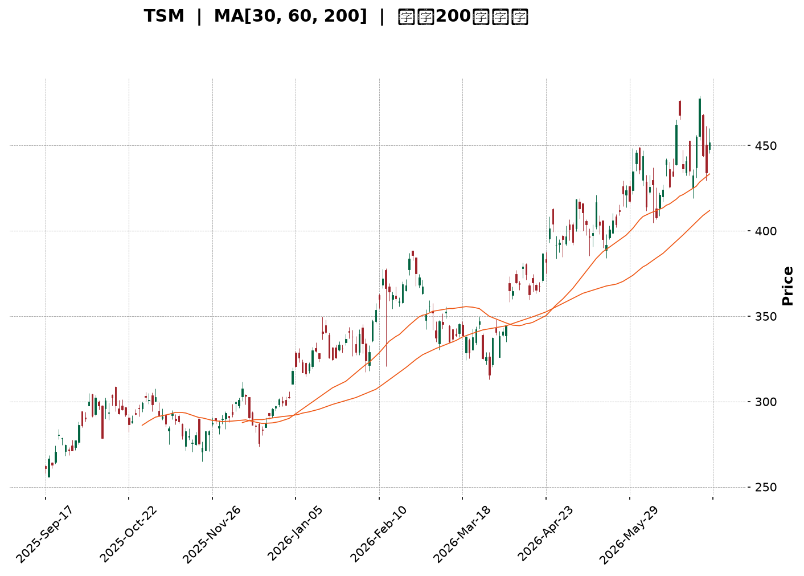
</details>

<html>
<head><meta charset="utf-8" /></head>
<body>
    <div style="height:500px; width:100%;">                        <script>window.PlotlyConfig = {MathJaxConfig: 'local'};</script>
        <script charset="utf-8" src="https://cdn.plot.ly/plotly-3.6.0.min.js" integrity="sha256-QaOVwtVY0T02VaHrr6pnoHLCwayMJp4O5n4YyaE3rJk=" crossorigin="anonymous"></script>                <div id="candlestick-chart" class="plotly-graph-div" style="height:100%; width:100%;"></div>            <script>                window.PLOTLYENV=window.PLOTLYENV || {};                                if (document.getElementById("candlestick-chart")) {                    Plotly.newPlot(                        "candlestick-chart",                        [{"close":{"dtype":"f8","bdata":"AAAAgMRLcEAAAADAoqhwQAAAAGDJbHBAAAAAAPrncEAAAADg\u002fodxQAAAAMA+aHFAAAAAwPMncUAAAACAkPNwQAAAAGCA8XBAAAAAALRRcUAAAABAb+NxQAAAAEC43XFAAAAAQH0eckAAAACAksByQAAAAACzO3JAAAAAADrickAAAABgkZhyQAAAAKBzZ3FAAAAAAFrIckAAAABABVpyQAAAAGA+5XJAAAAAwO6XckAAAAAgXkxyQAAAAOD1dXJAAAAA4FFDckAAAACA8elxQAAAAOBPB3JAAAAAgHZKckAAAAAgsX5yQAAAAODCsnJAAAAAoEbrckAAAADgls1yQAAAAIBMoXJAAAAA4J\u002fnckAAAABABDxyQAAAACCCNXJAAAAAgKjvcUAAAABAKcRxQAAAAEBiT3JAAAAAIEwOckAAAADgkAVyQAAAAGDmf3FAAAAAwH2pcUAAAAAA4nxxQAAAAODLO3FAAAAAIJmCcUAAAACASTVxQAAAAGCNDnFAAAAAYKKmcUAAAADgRKdxQAAAAKAW+3FAAAAA4LETckAAAADA5NZxQAAAAODmHHJAAAAAAD5SckAAAACgPCpyQAAAAECnRnJAAAAAgCi4ckAAAAAgm9ByQAAAAOBxO3NAAAAA4If0ckAAAADgnyhyQAAAAIAt5HFAAAAAQFTWcUAAAACAlThxQAAAACB4s3FAAAAAQHD3cUAAAACgXDxyQAAAAODHdnJAAAAAYDqUckAAAAAgidRyQAAAAGD5tXJAAAAAwKSgckAAAAAAQOVyQAAAAAB633NAAAAA4H8JdEAAAAAg9Ft0QAAAAGCs0HNAAAAAIALGc0AAAABgdx90QAAAAIAJoXRAAAAAYB+YdEAAAAAg3FZ0QAAAAEAlPnVAAAAAID5KdUAAAADgp1d0QAAAAAAaR3RAAAAAoP9adEAAAADAYdJ0QAAAAOD\u002fr3RAAAAA4J0JdUAAAACgpkh1QAAAAIDgHHVAAAAAwMaNdEAAAAAgsDl1QAAAAMBj4HRAAAAAgA1BdEAAAACAe5B0QAAAAKDpsHVAAAAAQFUZdkAAAABgzIB2QAAAAECtQndAAAAAQFTjdkAAAADgocd2QAAAACBApXZAAAAAoF6GdkAAAACAmmh2QAAAAEArCndAAAAAwDUCd0AAAAAgR\u002fx3QAAAAIDLG3hAAAAAIPltd0AAAADgeUp3QAAAAOBn83ZAAAAAYAr1dUAAAABgpTl2QAAAAACpAHZAAAAAIF8SdUAAAABghq51QAAAAKDllHVAAAAAgM0LdkAAAACgq+90QAAAAIAjCXVAAAAAoLMndUAAAAAgv5J1QAAAACBtLHVAAAAAwPkfdUAAAABAiId0QAAAAGCMGnVAAAAAICtndUAAAAAgAK91QAAAAKCRVXRAAAAAIKBfdEAAAAAgK7xzQAAAACCREnVAAAAAABNLdUAAAABg9yN1QAAAAGBiT3VAAAAAIDaIdUAAAADAuNB2QAAAAGAtynZAAAAAAL8bd0AAAAAATgt3QAAAAAAKsHdAAAAAAJRjd0AAAABgBKh2QAAAAGAmGndAAAAAICbWdkAAAAAghfN2QAAAAICOKHhAAAAAYEHcd0AAAACgUBh5QAAAAICKQHlAAAAAAMZ2eEAAAADAjo54QAAAAIAnsnhAAAAAwNrLeEAAAAAgvwp5QAAAAADRl3hAAAAAgFEoekAAAAAA69J5QAAAAIB9q3lAAAAAgIQ5eUAAAAAAocV4QAAAAMDa7XhAAAAAoOcLekAAAAAgfDZ5QAAAACBmsHhAAAAAQBV7eEAAAAAg6Ap5QAAAAAAuY3lAAAAAwDI5eUAAAADgtLV5QAAAAKDgW3pAAAAAoOB9ekAAAADAjhd6QAAAAKDLKXtAAAAAgFfae0AAAABAtzp7QAAAAKAWvntAAAAAQDPjeUAAAABg2Jx6QAAAAEC5rnpAAAAAYLh8eUAAAADAHlF6QAAAAEDhfnpAAAAAYGaWe0AAAACgR516QAAAAGBmAntAAAAAgOvhfEAAAABguDp9QAAAAIA9RntAAAAAoEeNe0AAAAAA1y97QAAAAKCZBXtAAAAAoJlxfEAAAADAHtl9QAAAACCuw3tAAAAAYI8ie0AAAADgozx8QA=="},"high":{"dtype":"f8","bdata":"9r5BsNVrcEB3\u002fuVHzMZwQPJHLC\u002fGh3BA8oLLjTAjcUD3kMtkObxxQOAc97wucHFAf1rcgJIvcUAMLgN4iRVxQGeRfx3pWnFA9YiKuOBUcUC9287hVwNyQP1QQidnZnJAV2+J0exbckAGreb1Ww5zQBtlzzMvC3NAcZiQSxIAc0CX0zUIZsdyQIGtFcKlnXJAo0mtR\u002fnjckCmprjxQLZyQG4eB+hnA3NAqYdjZfhOc0AsXUEE3M5yQPtoEHZq1HJAue1AvniQckCbOTHcRU5yQCTBncamPHJAS4vU3+15ckBZK5fWF6JyQLrrKUlJvHJAhnLaN9YYc0BHgNqFhA5zQDbO0FRkFHNAToCdbiA7c0C28sw7ELpyQP2FOBU3fnJAXxdnEmJFckBZwp08OtpxQIQyfE\u002fpbHJAHG6MCdRJckBeKJnGCElyQB+in1vJ83FAjwYbLODJcUD4r9cgo8RxQHnF2bz9X3FAdniVkDSlcUAljbSQ9yhyQCEVMaEtSHFAbH39LE2tcUCkhHfxsrJxQAN7sPtUKHJALG1RGhwmckDHf+BuIw5yQA0evRIpQ3JA216OyNBkckCtdyYGsztyQG82pywsp3JAqiVyexDEckAJKpxUxORyQB2wGohneHNAIhiYCEoEc0AszyczdetyQDu8LJJ5ZHJAcKnsZqPvcUAmqfZs0\u002flxQCuUWgry2nFArN5WlrEqckAEKUBU5ldyQEYAUsoPhnJAdSPAa\u002fWZckDSlayhId1yQJ8CPaL17nJANYidPsHvckCN2mJR9hxzQJC3\u002fXD+\u002fnNASixZZ8KYdEBOvx2O47V0QN6+UnX3SXRAlGG\u002fflAtdEDuzzXAnDF0QFJzGOdevXRAZwcY8Q3rdEChuUU7ooJ0QHNDZWFj2HVAD61OidTAdUDm3sRMQ0Z1QG6yI7DNvnRAMrWhMT\u002fVdECiOEKgrPZ0QESnZA8L1nRAatYL\u002fe83dUB+DBOClnt1QM2zoYqSX3VAVi16v3IidUDuVRIW5WZ1QL6nfJxClHVAZB1gT\u002fAQdUDiHsZIm810QFmWUc\u002fCvnVAugurSgdcdkBJG0kAKq52QDuom6wQmndAySMdGsCgd0BXNrjgPRN3QMgrZQUWxXZAZy7KBd33dkBWs8gD9452QFABtK2XJHdAIbU3wis4d0BYkIwq4DJ4QJzfZEpFQ3hA9sYWI70HeEDPmUdK52t3QPdhMgDrMndAw4tcAGgidkCZHuvovnN2QOamtoX1WXZAjwWszteudUBC+47Dqrl1QPQ3Mw7u+nVAHLaqozY4dkCExgywtpF1QLovueP8a3VAJDEiX71tdUAs+xSJMp91QPOMCW4xsnVAbWa0oLExdUDp5yDf+gx1QILuwgi5aXVA3eCmBjCBdUAYtV6JGdp1QL1cHN3QQXVAEERE46OMdEAl1lliR410QJPUE9noGXVAfWpjcdi9dUAt7wBBVVR1QNr\u002fOEZVdnVAXCWNPZCLdUCW8ei8zlZ3QPc4Xxr19HZA3LOxjt6Rd0BaYbxJeSl3QC31xyZG1HdAZXrsqGbRd0D+RBRyXBV3QN9fpmI9a3dAwk3gOEkTd0ByXrryIx53QInmjCAPMHhAedmzn6A9eEB99EA5iIh5QAnJ\u002fUSB2HlANIox9AvPeEBpVDdrza54QOP5xH+73XhAKDXg5LwweUDUPAyY9Wt5QBP26fflUnlAiwgA1oIrekDhahmkTDB6QNOsf1ZpAHpA1HblOHBseUA\u002fVbiozRR5QNaUpYzAO3lAM6gM9L5PekD42essmY55QPRoN8feXnlAKgERPyvfeEC1fld\u002f+y55QDfL\u002fID6p3lABXVxZV6beUC7U\u002fI3Rfh5QCl4zmm02HpAFOs5h52pekBWxvgB89Z6QNtE6\u002fFwBXxAqUKzk1H1e0AFZox4uxF8QJTP\u002fq1p73tAwqqlAS4Oe0DgB3ZKvgx7QOPgREEuUntAZigg\u002fC6VekAAAAAAAGR6QAAAAEAKr3pAAAAAoEepe0AAAACgR4V7QAAAAAAAqHtAAAAAIIUTfUAAAADgo8x9QAAAAKBH9XtAAAAAgMK9e0AAAABgZk58QAAAAIAUQntAAAAAoJmBfEAAAAAAAPB9QAAAAAApSH1AAAAAIIXXfEAAAABgZsB8QA=="},"hovertemplate":"\u003cb\u003e%{x|%Y-%m-%d}\u003c\u002fb\u003e\u003cbr\u003e\u958b: $%{open:.2f}\u003cbr\u003e\u9ad8: $%{high:.2f}\u003cbr\u003e\u4f4e: $%{low:.2f}\u003cbr\u003e\u6536: $%{close:.2f}\u003cextra\u003e\u003c\u002fextra\u003e","low":{"dtype":"f8","bdata":"IgCrvTAbcEDoj+B80f5vQN2JA5gVTHBANE4+rf51cECKZkaI+VxxQHKLN4bnKHFAl5cx0T3BcEDn96A+EchwQAAAAGCA8XBA0jOBmQb7cEDOnApeDDBxQJFttTWTzHFAqZDOcIADckCq\u002fPsmhZlyQLT2gwTLL3JA+BKcx+c6ckC4W+AGhHFyQCTofnE2YnFAyNE1vI0gckCuIsnu\u002fhByQG\u002fgJ5aVm3JAZhiQP+1lckDGlnb\u002f00lyQF2t1t7Ma3JA8BdHeNM1ckCfpWfX0qJxQAJf7HnZ9XFAdn2qIGpBckBAsWhmTTZyQDMnEyc+XHJAOdVwSEHAckC+8VtbfadyQD00VpbEZXJAoT9ZniC8ckDFcL7KcTNyQDz13CeJE3JAYlI6kCHScUA4qoPPaS9xQJl0ERmBF3JAPeKHf2vqcUD+S\u002fdNDvVxQFP4a5P5XHFAuwmrR4DxcECuleaFzFlxQJtKANNn6XBA0WNYHY4icUCUOsnH+yNxQGsJgT++i3BArsfsyt3wcEA\u002fhUG4Hu9wQO5aWQmw13FAFtD\u002fQNnrcUDKTu6InY9xQJ6aRbC07nFAX6Or4FW9cUAqD2EM5v5xQNc1+jJRL3JAeIMFDGdmckAFnEn8qIJyQMBEDggpwnJArmB6bpmhckDrFqJwwBdyQNRn+z8n4XFAxeIwPNKdcUAr9QqUqBpxQA07wY7UhHFACnKgmofOcUCJlCF0aRtyQCjuKd8rK3JA12B92lFrckDRG0dSxY9yQAey5ynXkXJAJER8HJOeckBpbjRv7d1yQISqwkWRYXNA+uYNqo\u002f9c0DqcsdJvy50QKS7a\u002fJxznNAJyMu\u002fj2oc0AZbM4i1MlzQHlAGdeO9nNAMlZnLUeRdECidIGVaDJ0QOf6XnDuAnVAPJD\u002fqUc7dUDkuUxZhFN0QLdnUQMZQHRACmgDZYRTdEDdWcVuq5p0QGWidhWGiHRA9cGjk3LNdED+ehThtQ51QJjm7vA1aHRA0TRoXIl2dEC4dnJZiXZ0QDEA\u002f0AuhXRAO5q7quHWc0B+1H8CHeBzQBY\u002fwjW37nRABR3v1DKgdUBA\u002fTe17ih2QJ8oGx\u002fy53ZA\u002fNmgqBwHdEBvlErupm52QJgs93KLJnZAw+6dYbJtdkABgK5apTl2QGLv39URVHZAxFbvXTnJdkBPKtEU4GF3QP0CZA2i7XdAuM0HTsz8dkD48qA4m+t2QPdcqaRprHZAsFoSovBldUBDRUq3pAt2QF7xwAiHYHVAs+mnMFrvdEACoCvBbKN0QJcbaEalaHVAGjJWq\u002fLIdUBnxWvyaup0QBFV4N\u002fe53RAx3yh4SwhdUDBQ0bqvxl1QJGEfzPBKHVAiV7yReJGdECJTYaWN1J0QKboahY5pXRAzmWZVNXTdEBt397LKGt1QDgV67TBSXRAMfMIRekYdEBylr+2EZFzQIOjbT48BnRALnjCpkwvdUCRQwdilWB0QG7dvexCHXVArNohStrtdEAHpEwcaWZ2QAe9tSUJfnZAHNtvgi0Od0DZVK6vHdN2QHU7yXSRRXdA65AkKHI1d0APUM1LUnt2QGMnUCuXxHZAv0RCK2K2dkB4eDZsHMR2QGraD4ZiHHdANZG1Telud0C9bYuF4I54QGPwk5Ru93hA8NIBvdH8d0DBJr9xXjR4QNUzZOzwDHhA0ZJN5GtzeECL0sk3baR4QLuuMpLsenhACiCvQ2z7eECvAWPtgHJ5QCjU6xoY\u002f3hATM62pCfUeED8mm9sfBN4QJS1V9fiaHhAUfv3mpESeUC1SSfzXt54QExhTIQuYnhAsvy6wJACeECVZ4oiZrB4QJ+MG7056XhAdv28QrMeeUCUGEhoypF5QJ5wz1aN5nlAb2h1YtvbeUBZj+L7ZgR6QBtxqMY0WHpA6smtdNwve0BWFa6LPBh7QIYQSp7TpHpA+MW+hjW9eUCvg99cr1h6QCu2yFUASXlAo+ZPrPVreUAAAACAwo15QAAAACBcE3pAAAAAQOH+ekAAAABAM5N6QAAAAIA9+npAAAAAgD1me0AAAABguBJ9QAAAAEAKI3tAAAAAoEcJe0AAAABACgd7QAAAAEAKM3pAAAAAoHDxekAAAAAAAFB8QAAAACCFt3tAAAAAAADYekAAAACgmdl7QA=="},"name":"\u50f9\u683c","open":{"dtype":"f8","bdata":"Ix5MnV9kcECeaiP1c\u002f9vQNRS41aZhHBAzSaBZUyHcECtRlUNE4NxQBKALS\u002flYXFAAMgOPcHvcED7hciG+vtwQHPCu9pAJXFA4nE\u002fAq4ScUAUk5aSNURxQHuH9E46Y3JAAiFwCyApckB1pBCpoZpyQIg683KQA3NAmdKn\u002fRhLckCMTQ3PJL9yQFxCyVHWmXJAaX+WaIh+ckDLC1ttGVVyQGPwKodT\u002fnJAZ0KEPPxHc0CyaIKOEoFyQHaatPh4mnJAci5xF5mKckCl\u002fQYQWStyQM5gZEiM+HFAbBQYlyVUckDWvOOwCoVyQB6pb4vNf3JAERiCA4z2ckDSL9rbXctyQC3QYTOQ+XJAJ1ZLsZbDckBVrH9f8WhyQF2PIcpQJXJAc5dpfc88ckDF04evrq9xQOjiQgTwQHJANe\u002fr\u002f2wcckBmUxf+dTZyQEzOz0yM7nFAUZbitAsccUBj0PSA1XNxQKOjXccUNnFA2FKKhhQscUD\u002fBYuPzh5yQDx7hG3V6nBArsfsyt3wcEAAm9kxUIhxQJTkJapv7XFAmRf07xcjckCY70421MpxQGW5yiF5G3JARVlot1QeckDIPvPf5zpyQP2X2kjEW3JA+neRtIWtckBv9lJFUJpyQIpiIaC473JAsnr\u002fGgP8ckAszyczdetyQJt+MeEgWnJAakcRionccUCEtPGswPBxQIhgXiOQuHFACnKgmofOcUCQ5qHcfFJyQCb1GrxFPnJAQxex8FqDckCWqd7EvKVyQENPP8Wpw3JAReRwGeXMckAZAkEvAOdyQNBpvkAGZnNAfkhgrDqLdEBnl59DXYh0QCZ3y2UFMHRAyRqBT5ArdECa3q5\u002f+uJzQPGmNNIcB3RAkGeSzYuydEChuUU7ooJ0QGfhjt7EUHVABe+zOaqLdUAbSkpunTB1QARZBNx1u3RA9iktIk27dECaoybyz6V0QHaxwvBFsXRA5lBW\u002fFPsdEBJobphRVR1QOvsqTzbIHVAJJ2qDyPbdEC6zBbH9ZB0QFYFSEu+dHVA3DohjQDedEDjBBKmkhJ0QHP9zfA+\u002fHRAaYgN33qvdUCFEdatUad2QO9bSKvYAndAe8+EJ9WQd0Akur4DC\u002fR2QImsKm0pgHZA9x4lcdafdkDyxvE68F12QAOYLMXkXnZAmMiyqfrRdkDBNXEuM5d3QJzfZEpFQ3hAGyUKXh8DeED+aqw4zQN3QMh5PNK2t3ZAjZfp\u002fQ28dUBCM\u002fKVfDl2QKUoCvs2EXZAwR4ik8BbdUAvZW2IAN50QDofqRLdqnVAySNRQ8YBdkBfl\u002felboJ1QAwFPwVwYnVANF76BvA3dUB\u002foHcc3jx1QC1qTNKNj3VAoQYQlTaHdEBFcAhNS\u002f50QKboahY5pXRAy8s1X5PsdEBLpz3fEJN1QNtGhKtqMHVA4PJQByNBdECo8hX692Z0QA0qHUzpGHRAi3HKT4txdUDQmAPgOGF0QLLoVZxML3VAnQcp5VkqdUCbje48zBZ3QBPVJxU4p3ZAZV\u002f7PmZrd0D+4JClURZ3QKh2a4J4ondA2DldXU3Id0D5WweF+P92QKlLTMk\u002fRXdATGFMu7cFd0AAAAAghfN2QBX0Ov2ULndAYSyyyKL1d0C0rER7brN4QKRVanKIzHlApLv5+kJzeEDUgNZN3394QOGhsMAWznhAIZD6GlWIeEDwwsimMjl5QBkiKbx5OnlAvmdyhFsXeUDTX2iLzxF6QKnG9hCd\u002f3lA2oNSkqJceUCTMZCgIc14QEdcSoRu1XhAsOele0kkeUCzAd3szVh5QPRoN8feXnlAXPCiaplJeEBhjj3WKMF4QJ+MG7056XhAXbNKI5OHeUBuiBv4ecJ5QIUR91FboHpA57Oxg7xTekDiiA3CJ6F6QEdp+38yfnpAPhfLWM94e0AkMQ65BA98QBeIRYD72XpAUTqyB0HMekArPhJ\u002femx6QLZ\u002fYQz53XpA7QhOpOLPeUAAAAAAKdR5QAAAAMDMQHpAAAAAQOFqe0AAAADgUUB7QAAAAAAALHtAAAAAgBRue0AAAACgcMF9QAAAAEDhcntAAAAAIK4fe0AAAABgZk58QAAAAAAAkHpAAAAAAABQe0AAAACAwnl8QAAAAGC4On1AAAAA4KMofEAAAABgZvx7QA=="},"x":["2025-09-17T00:00:00-04:00","2025-09-18T00:00:00-04:00","2025-09-19T00:00:00-04:00","2025-09-22T00:00:00-04:00","2025-09-23T00:00:00-04:00","2025-09-24T00:00:00-04:00","2025-09-25T00:00:00-04:00","2025-09-26T00:00:00-04:00","2025-09-29T00:00:00-04:00","2025-09-30T00:00:00-04:00","2025-10-01T00:00:00-04:00","2025-10-02T00:00:00-04:00","2025-10-03T00:00:00-04:00","2025-10-06T00:00:00-04:00","2025-10-07T00:00:00-04:00","2025-10-08T00:00:00-04:00","2025-10-09T00:00:00-04:00","2025-10-10T00:00:00-04:00","2025-10-13T00:00:00-04:00","2025-10-14T00:00:00-04:00","2025-10-15T00:00:00-04:00","2025-10-16T00:00:00-04:00","2025-10-17T00:00:00-04:00","2025-10-20T00:00:00-04:00","2025-10-21T00:00:00-04:00","2025-10-22T00:00:00-04:00","2025-10-23T00:00:00-04:00","2025-10-24T00:00:00-04:00","2025-10-27T00:00:00-04:00","2025-10-28T00:00:00-04:00","2025-10-29T00:00:00-04:00","2025-10-30T00:00:00-04:00","2025-10-31T00:00:00-04:00","2025-11-03T00:00:00-05:00","2025-11-04T00:00:00-05:00","2025-11-05T00:00:00-05:00","2025-11-06T00:00:00-05:00","2025-11-07T00:00:00-05:00","2025-11-10T00:00:00-05:00","2025-11-11T00:00:00-05:00","2025-11-12T00:00:00-05:00","2025-11-13T00:00:00-05:00","2025-11-14T00:00:00-05:00","2025-11-17T00:00:00-05:00","2025-11-18T00:00:00-05:00","2025-11-19T00:00:00-05:00","2025-11-20T00:00:00-05:00","2025-11-21T00:00:00-05:00","2025-11-24T00:00:00-05:00","2025-11-25T00:00:00-05:00","2025-11-26T00:00:00-05:00","2025-11-28T00:00:00-05:00","2025-12-01T00:00:00-05:00","2025-12-02T00:00:00-05:00","2025-12-03T00:00:00-05:00","2025-12-04T00:00:00-05:00","2025-12-05T00:00:00-05:00","2025-12-08T00:00:00-05:00","2025-12-09T00:00:00-05:00","2025-12-10T00:00:00-05:00","2025-12-11T00:00:00-05:00","2025-12-12T00:00:00-05:00","2025-12-15T00:00:00-05:00","2025-12-16T00:00:00-05:00","2025-12-17T00:00:00-05:00","2025-12-18T00:00:00-05:00","2025-12-19T00:00:00-05:00","2025-12-22T00:00:00-05:00","2025-12-23T00:00:00-05:00","2025-12-24T00:00:00-05:00","2025-12-26T00:00:00-05:00","2025-12-29T00:00:00-05:00","2025-12-30T00:00:00-05:00","2025-12-31T00:00:00-05:00","2026-01-02T00:00:00-05:00","2026-01-05T00:00:00-05:00","2026-01-06T00:00:00-05:00","2026-01-07T00:00:00-05:00","2026-01-08T00:00:00-05:00","2026-01-09T00:00:00-05:00","2026-01-12T00:00:00-05:00","2026-01-13T00:00:00-05:00","2026-01-14T00:00:00-05:00","2026-01-15T00:00:00-05:00","2026-01-16T00:00:00-05:00","2026-01-20T00:00:00-05:00","2026-01-21T00:00:00-05:00","2026-01-22T00:00:00-05:00","2026-01-23T00:00:00-05:00","2026-01-26T00:00:00-05:00","2026-01-27T00:00:00-05:00","2026-01-28T00:00:00-05:00","2026-01-29T00:00:00-05:00","2026-01-30T00:00:00-05:00","2026-02-02T00:00:00-05:00","2026-02-03T00:00:00-05:00","2026-02-04T00:00:00-05:00","2026-02-05T00:00:00-05:00","2026-02-06T00:00:00-05:00","2026-02-09T00:00:00-05:00","2026-02-10T00:00:00-05:00","2026-02-11T00:00:00-05:00","2026-02-12T00:00:00-05:00","2026-02-13T00:00:00-05:00","2026-02-17T00:00:00-05:00","2026-02-18T00:00:00-05:00","2026-02-19T00:00:00-05:00","2026-02-20T00:00:00-05:00","2026-02-23T00:00:00-05:00","2026-02-24T00:00:00-05:00","2026-02-25T00:00:00-05:00","2026-02-26T00:00:00-05:00","2026-02-27T00:00:00-05:00","2026-03-02T00:00:00-05:00","2026-03-03T00:00:00-05:00","2026-03-04T00:00:00-05:00","2026-03-05T00:00:00-05:00","2026-03-06T00:00:00-05:00","2026-03-09T00:00:00-04:00","2026-03-10T00:00:00-04:00","2026-03-11T00:00:00-04:00","2026-03-12T00:00:00-04:00","2026-03-13T00:00:00-04:00","2026-03-16T00:00:00-04:00","2026-03-17T00:00:00-04:00","2026-03-18T00:00:00-04:00","2026-03-19T00:00:00-04:00","2026-03-20T00:00:00-04:00","2026-03-23T00:00:00-04:00","2026-03-24T00:00:00-04:00","2026-03-25T00:00:00-04:00","2026-03-26T00:00:00-04:00","2026-03-27T00:00:00-04:00","2026-03-30T00:00:00-04:00","2026-03-31T00:00:00-04:00","2026-04-01T00:00:00-04:00","2026-04-02T00:00:00-04:00","2026-04-06T00:00:00-04:00","2026-04-07T00:00:00-04:00","2026-04-08T00:00:00-04:00","2026-04-09T00:00:00-04:00","2026-04-10T00:00:00-04:00","2026-04-13T00:00:00-04:00","2026-04-14T00:00:00-04:00","2026-04-15T00:00:00-04:00","2026-04-16T00:00:00-04:00","2026-04-17T00:00:00-04:00","2026-04-20T00:00:00-04:00","2026-04-21T00:00:00-04:00","2026-04-22T00:00:00-04:00","2026-04-23T00:00:00-04:00","2026-04-24T00:00:00-04:00","2026-04-27T00:00:00-04:00","2026-04-28T00:00:00-04:00","2026-04-29T00:00:00-04:00","2026-04-30T00:00:00-04:00","2026-05-01T00:00:00-04:00","2026-05-04T00:00:00-04:00","2026-05-05T00:00:00-04:00","2026-05-06T00:00:00-04:00","2026-05-07T00:00:00-04:00","2026-05-08T00:00:00-04:00","2026-05-11T00:00:00-04:00","2026-05-12T00:00:00-04:00","2026-05-13T00:00:00-04:00","2026-05-14T00:00:00-04:00","2026-05-15T00:00:00-04:00","2026-05-18T00:00:00-04:00","2026-05-19T00:00:00-04:00","2026-05-20T00:00:00-04:00","2026-05-21T00:00:00-04:00","2026-05-22T00:00:00-04:00","2026-05-26T00:00:00-04:00","2026-05-27T00:00:00-04:00","2026-05-28T00:00:00-04:00","2026-05-29T00:00:00-04:00","2026-06-01T00:00:00-04:00","2026-06-02T00:00:00-04:00","2026-06-03T00:00:00-04:00","2026-06-04T00:00:00-04:00","2026-06-05T00:00:00-04:00","2026-06-08T00:00:00-04:00","2026-06-09T00:00:00-04:00","2026-06-10T00:00:00-04:00","2026-06-11T00:00:00-04:00","2026-06-12T00:00:00-04:00","2026-06-15T00:00:00-04:00","2026-06-16T00:00:00-04:00","2026-06-17T00:00:00-04:00","2026-06-18T00:00:00-04:00","2026-06-22T00:00:00-04:00","2026-06-23T00:00:00-04:00","2026-06-24T00:00:00-04:00","2026-06-25T00:00:00-04:00","2026-06-26T00:00:00-04:00","2026-06-29T00:00:00-04:00","2026-06-30T00:00:00-04:00","2026-07-01T00:00:00-04:00","2026-07-02T00:00:00-04:00","2026-07-06T00:00:00-04:00"],"type":"candlestick"},{"hovertemplate":"MA30: $%{y:.2f}\u003cextra\u003e\u003c\u002fextra\u003e","line":{"color":"#2196F3","dash":"dash","width":2},"mode":"lines","name":"MA30","x":["2025-09-17T00:00:00-04:00","2025-09-18T00:00:00-04:00","2025-09-19T00:00:00-04:00","2025-09-22T00:00:00-04:00","2025-09-23T00:00:00-04:00","2025-09-24T00:00:00-04:00","2025-09-25T00:00:00-04:00","2025-09-26T00:00:00-04:00","2025-09-29T00:00:00-04:00","2025-09-30T00:00:00-04:00","2025-10-01T00:00:00-04:00","2025-10-02T00:00:00-04:00","2025-10-03T00:00:00-04:00","2025-10-06T00:00:00-04:00","2025-10-07T00:00:00-04:00","2025-10-08T00:00:00-04:00","2025-10-09T00:00:00-04:00","2025-10-10T00:00:00-04:00","2025-10-13T00:00:00-04:00","2025-10-14T00:00:00-04:00","2025-10-15T00:00:00-04:00","2025-10-16T00:00:00-04:00","2025-10-17T00:00:00-04:00","2025-10-20T00:00:00-04:00","2025-10-21T00:00:00-04:00","2025-10-22T00:00:00-04:00","2025-10-23T00:00:00-04:00","2025-10-24T00:00:00-04:00","2025-10-27T00:00:00-04:00","2025-10-28T00:00:00-04:00","2025-10-29T00:00:00-04:00","2025-10-30T00:00:00-04:00","2025-10-31T00:00:00-04:00","2025-11-03T00:00:00-05:00","2025-11-04T00:00:00-05:00","2025-11-05T00:00:00-05:00","2025-11-06T00:00:00-05:00","2025-11-07T00:00:00-05:00","2025-11-10T00:00:00-05:00","2025-11-11T00:00:00-05:00","2025-11-12T00:00:00-05:00","2025-11-13T00:00:00-05:00","2025-11-14T00:00:00-05:00","2025-11-17T00:00:00-05:00","2025-11-18T00:00:00-05:00","2025-11-19T00:00:00-05:00","2025-11-20T00:00:00-05:00","2025-11-21T00:00:00-05:00","2025-11-24T00:00:00-05:00","2025-11-25T00:00:00-05:00","2025-11-26T00:00:00-05:00","2025-11-28T00:00:00-05:00","2025-12-01T00:00:00-05:00","2025-12-02T00:00:00-05:00","2025-12-03T00:00:00-05:00","2025-12-04T00:00:00-05:00","2025-12-05T00:00:00-05:00","2025-12-08T00:00:00-05:00","2025-12-09T00:00:00-05:00","2025-12-10T00:00:00-05:00","2025-12-11T00:00:00-05:00","2025-12-12T00:00:00-05:00","2025-12-15T00:00:00-05:00","2025-12-16T00:00:00-05:00","2025-12-17T00:00:00-05:00","2025-12-18T00:00:00-05:00","2025-12-19T00:00:00-05:00","2025-12-22T00:00:00-05:00","2025-12-23T00:00:00-05:00","2025-12-24T00:00:00-05:00","2025-12-26T00:00:00-05:00","2025-12-29T00:00:00-05:00","2025-12-30T00:00:00-05:00","2025-12-31T00:00:00-05:00","2026-01-02T00:00:00-05:00","2026-01-05T00:00:00-05:00","2026-01-06T00:00:00-05:00","2026-01-07T00:00:00-05:00","2026-01-08T00:00:00-05:00","2026-01-09T00:00:00-05:00","2026-01-12T00:00:00-05:00","2026-01-13T00:00:00-05:00","2026-01-14T00:00:00-05:00","2026-01-15T00:00:00-05:00","2026-01-16T00:00:00-05:00","2026-01-20T00:00:00-05:00","2026-01-21T00:00:00-05:00","2026-01-22T00:00:00-05:00","2026-01-23T00:00:00-05:00","2026-01-26T00:00:00-05:00","2026-01-27T00:00:00-05:00","2026-01-28T00:00:00-05:00","2026-01-29T00:00:00-05:00","2026-01-30T00:00:00-05:00","2026-02-02T00:00:00-05:00","2026-02-03T00:00:00-05:00","2026-02-04T00:00:00-05:00","2026-02-05T00:00:00-05:00","2026-02-06T00:00:00-05:00","2026-02-09T00:00:00-05:00","2026-02-10T00:00:00-05:00","2026-02-11T00:00:00-05:00","2026-02-12T00:00:00-05:00","2026-02-13T00:00:00-05:00","2026-02-17T00:00:00-05:00","2026-02-18T00:00:00-05:00","2026-02-19T00:00:00-05:00","2026-02-20T00:00:00-05:00","2026-02-23T00:00:00-05:00","2026-02-24T00:00:00-05:00","2026-02-25T00:00:00-05:00","2026-02-26T00:00:00-05:00","2026-02-27T00:00:00-05:00","2026-03-02T00:00:00-05:00","2026-03-03T00:00:00-05:00","2026-03-04T00:00:00-05:00","2026-03-05T00:00:00-05:00","2026-03-06T00:00:00-05:00","2026-03-09T00:00:00-04:00","2026-03-10T00:00:00-04:00","2026-03-11T00:00:00-04:00","2026-03-12T00:00:00-04:00","2026-03-13T00:00:00-04:00","2026-03-16T00:00:00-04:00","2026-03-17T00:00:00-04:00","2026-03-18T00:00:00-04:00","2026-03-19T00:00:00-04:00","2026-03-20T00:00:00-04:00","2026-03-23T00:00:00-04:00","2026-03-24T00:00:00-04:00","2026-03-25T00:00:00-04:00","2026-03-26T00:00:00-04:00","2026-03-27T00:00:00-04:00","2026-03-30T00:00:00-04:00","2026-03-31T00:00:00-04:00","2026-04-01T00:00:00-04:00","2026-04-02T00:00:00-04:00","2026-04-06T00:00:00-04:00","2026-04-07T00:00:00-04:00","2026-04-08T00:00:00-04:00","2026-04-09T00:00:00-04:00","2026-04-10T00:00:00-04:00","2026-04-13T00:00:00-04:00","2026-04-14T00:00:00-04:00","2026-04-15T00:00:00-04:00","2026-04-16T00:00:00-04:00","2026-04-17T00:00:00-04:00","2026-04-20T00:00:00-04:00","2026-04-21T00:00:00-04:00","2026-04-22T00:00:00-04:00","2026-04-23T00:00:00-04:00","2026-04-24T00:00:00-04:00","2026-04-27T00:00:00-04:00","2026-04-28T00:00:00-04:00","2026-04-29T00:00:00-04:00","2026-04-30T00:00:00-04:00","2026-05-01T00:00:00-04:00","2026-05-04T00:00:00-04:00","2026-05-05T00:00:00-04:00","2026-05-06T00:00:00-04:00","2026-05-07T00:00:00-04:00","2026-05-08T00:00:00-04:00","2026-05-11T00:00:00-04:00","2026-05-12T00:00:00-04:00","2026-05-13T00:00:00-04:00","2026-05-14T00:00:00-04:00","2026-05-15T00:00:00-04:00","2026-05-18T00:00:00-04:00","2026-05-19T00:00:00-04:00","2026-05-20T00:00:00-04:00","2026-05-21T00:00:00-04:00","2026-05-22T00:00:00-04:00","2026-05-26T00:00:00-04:00","2026-05-27T00:00:00-04:00","2026-05-28T00:00:00-04:00","2026-05-29T00:00:00-04:00","2026-06-01T00:00:00-04:00","2026-06-02T00:00:00-04:00","2026-06-03T00:00:00-04:00","2026-06-04T00:00:00-04:00","2026-06-05T00:00:00-04:00","2026-06-08T00:00:00-04:00","2026-06-09T00:00:00-04:00","2026-06-10T00:00:00-04:00","2026-06-11T00:00:00-04:00","2026-06-12T00:00:00-04:00","2026-06-15T00:00:00-04:00","2026-06-16T00:00:00-04:00","2026-06-17T00:00:00-04:00","2026-06-18T00:00:00-04:00","2026-06-22T00:00:00-04:00","2026-06-23T00:00:00-04:00","2026-06-24T00:00:00-04:00","2026-06-25T00:00:00-04:00","2026-06-26T00:00:00-04:00","2026-06-29T00:00:00-04:00","2026-06-30T00:00:00-04:00","2026-07-01T00:00:00-04:00","2026-07-02T00:00:00-04:00","2026-07-06T00:00:00-04:00"],"y":{"dtype":"f8","bdata":"AAAAAAAA+H8AAAAAAAD4fwAAAAAAAPh\u002fAAAAAAAA+H8AAAAAAAD4fwAAAAAAAPh\u002fAAAAAAAA+H8AAAAAAAD4fwAAAAAAAPh\u002fAAAAAAAA+H8AAAAAAAD4fwAAAAAAAPh\u002fAAAAAAAA+H8AAAAAAAD4fwAAAAAAAPh\u002fAAAAAAAA+H8AAAAAAAD4fwAAAAAAAPh\u002fAAAAAAAA+H8AAAAAAAD4fwAAAAAAAPh\u002fAAAAAAAA+H8AAAAAAAD4fwAAAAAAAPh\u002fAAAAAAAA+H8AAAAAAAD4fwAAAAAAAPh\u002fAAAAAAAA+H8AAAAAAAD4fxEREfFa4XFAVVVVJb33cUDNzMyMCQpyQImIiLjaHHJAiYiIyOgtckBmZmb26DNyQKuqqorAOnJAMzMzs2hBckCamZm5XEhyQDMzM2MGVHJAmpmZuU9ackCrqqr6cltyQCIiImJSWHJAAAAAAGxUckCamZnZoUlyQFVVVSUaQXJAVVVVlWE1ckCrqqraiSlyQO\u002fu7j6TJnJA3t3d\u002feocckBVVVWl9RZyQFVVVYUnD3JAd3d3F78KckBVVVWl1AZyQN7d3a3cA3JAREREBFwEckB3d3engAZyQKuqqiqdCHJAvLu7O0UMckC8u7s7AA9yQJqZmZmOE3JAMzMzk90TckAAAADgXQ5yQKuqqgoQCHJAvLu76\u002fP+cUCJiIgYTvZxQN7d3W348XFAIiIi0jrycUCJiIiIPPZxQImIiLiM93FAiYiImAP8cUDNzMy86QJyQERERLQ\u002fDXJAzczMvHwVckDv7u7efyFyQM3MzKwFOHJAZmZm5pVNckBERER0eWhyQFVVVQUDgHJAAAAA0B+SckAAAACQMqdyQJqZmbnLvXJAd3d310bTckAzMzPjm+hyQKuqqipRA3NAERERgaYcc0BVVVUlOy9zQJqZmQlQQHNAREREJEZOc0DNzMxcZl9zQO\u002fu7n7Ra3NA7+7ufpZ9c0AzMzNjQZhzQCIiItK+s3NA3t3dTe3Kc0C8u7vbGO1zQHd3d8cxCHRAVVVVBbcbdECrqqrqlS90QDMzM5MfS3RAERERASlpdEBERESUgIh0QAAAAGBTr3RA7+7ujq7TdEBERET00\u002fR0QBEREbF8DHVAERERUbchdUBERERUNDN1QO\u002fu7o64TnVAERER4VNqdUDNzMy8SYt1QO\u002fu7t76qHVAvLu7yyzBdUCJiIi4XNp1QCIiIgLw6HVAvLu7e6HudUB3d3d3sv51QO\u002fu7m5qDXZAd3d3N4cTdkBVVVXF3Rp2QHd3dwd\u002fInZAd3d3NxordkCrqqrqIih2QLy7u3t6J3ZAq6qq+pssdkAiIiLyky92QKuqqsocMnZAEREREYs5dkARERGxPjl2QFVVVZU7NHZA7+7uPksudkCJiIj4TCd2QFVVVZVUDnZAVVVVpd\u002f4dUCJiIg45N51QM3MzPx30XVAd3d3d\u002fXGdUCrqqo6I7x1QM3MzMxgrXVAZmZmNsegdUAAAAAAy5Z1QO\u002fu7v6Ji3VAMzMzU8yIdUAzMzNDsYZ1QO\u002fu7u76jHVAiYiIuDKZdUDe3d2N4Jx1QJqZmZlCpnVARERExFG1dUDv7u4OJ8B1QHd3dyck1nVAvLu7e5\u002fldUAzMzNzHAl2QJqZmVkXLXZAIiIislNJdkDNzMyMyWJ2QLy7u0vYgHZAiYiImCygdkDNzMxsrsZ2QKuqqvp05HZAMzMzUwcNd0BERET0WzB3QBEREdHjXXdAvLu7S0mHd0ARERGxRLJ3QLy7u4st03dAq6qqKr37d0AzMzNTfR54QImIiMhSO3hAq6qqWnxUeEDv7u7ufWd4QO\u002fu7p6ofXhAMzMzA7WPeEDNzMwsdKZ4QImIiJg\u002fvXhA3t3dnbnXeEB3d3cHC\u002fV4QLy7u6uyF3lA3t3dHYFCeUCamZnJAmd5QERERGSYhXlAiYiIuOSWeUDe3d0t2KN5QAAAAPAMsHlAd3d3N8i4eUBEREQEzcd5QKuqqooo13lA7+7u\u002fvnueUAiIiLyZPx5QGZmZoYDEXpAREREZEQoekBVVVXFU0V6QGZmZtYEU3pAzczMrOBmekAzMzMTfHt6QFVVVcVXjXpAMzMzo8yhekB3d3eXWsl6QJqZmbmY43pA3t3d7T76ekC8u7vrgBV7QA=="},"type":"scatter"},{"hovertemplate":"MA60: $%{y:.2f}\u003cextra\u003e\u003c\u002fextra\u003e","line":{"color":"#9C27B0","dash":"dash","width":2},"mode":"lines","name":"MA60","x":["2025-09-17T00:00:00-04:00","2025-09-18T00:00:00-04:00","2025-09-19T00:00:00-04:00","2025-09-22T00:00:00-04:00","2025-09-23T00:00:00-04:00","2025-09-24T00:00:00-04:00","2025-09-25T00:00:00-04:00","2025-09-26T00:00:00-04:00","2025-09-29T00:00:00-04:00","2025-09-30T00:00:00-04:00","2025-10-01T00:00:00-04:00","2025-10-02T00:00:00-04:00","2025-10-03T00:00:00-04:00","2025-10-06T00:00:00-04:00","2025-10-07T00:00:00-04:00","2025-10-08T00:00:00-04:00","2025-10-09T00:00:00-04:00","2025-10-10T00:00:00-04:00","2025-10-13T00:00:00-04:00","2025-10-14T00:00:00-04:00","2025-10-15T00:00:00-04:00","2025-10-16T00:00:00-04:00","2025-10-17T00:00:00-04:00","2025-10-20T00:00:00-04:00","2025-10-21T00:00:00-04:00","2025-10-22T00:00:00-04:00","2025-10-23T00:00:00-04:00","2025-10-24T00:00:00-04:00","2025-10-27T00:00:00-04:00","2025-10-28T00:00:00-04:00","2025-10-29T00:00:00-04:00","2025-10-30T00:00:00-04:00","2025-10-31T00:00:00-04:00","2025-11-03T00:00:00-05:00","2025-11-04T00:00:00-05:00","2025-11-05T00:00:00-05:00","2025-11-06T00:00:00-05:00","2025-11-07T00:00:00-05:00","2025-11-10T00:00:00-05:00","2025-11-11T00:00:00-05:00","2025-11-12T00:00:00-05:00","2025-11-13T00:00:00-05:00","2025-11-14T00:00:00-05:00","2025-11-17T00:00:00-05:00","2025-11-18T00:00:00-05:00","2025-11-19T00:00:00-05:00","2025-11-20T00:00:00-05:00","2025-11-21T00:00:00-05:00","2025-11-24T00:00:00-05:00","2025-11-25T00:00:00-05:00","2025-11-26T00:00:00-05:00","2025-11-28T00:00:00-05:00","2025-12-01T00:00:00-05:00","2025-12-02T00:00:00-05:00","2025-12-03T00:00:00-05:00","2025-12-04T00:00:00-05:00","2025-12-05T00:00:00-05:00","2025-12-08T00:00:00-05:00","2025-12-09T00:00:00-05:00","2025-12-10T00:00:00-05:00","2025-12-11T00:00:00-05:00","2025-12-12T00:00:00-05:00","2025-12-15T00:00:00-05:00","2025-12-16T00:00:00-05:00","2025-12-17T00:00:00-05:00","2025-12-18T00:00:00-05:00","2025-12-19T00:00:00-05:00","2025-12-22T00:00:00-05:00","2025-12-23T00:00:00-05:00","2025-12-24T00:00:00-05:00","2025-12-26T00:00:00-05:00","2025-12-29T00:00:00-05:00","2025-12-30T00:00:00-05:00","2025-12-31T00:00:00-05:00","2026-01-02T00:00:00-05:00","2026-01-05T00:00:00-05:00","2026-01-06T00:00:00-05:00","2026-01-07T00:00:00-05:00","2026-01-08T00:00:00-05:00","2026-01-09T00:00:00-05:00","2026-01-12T00:00:00-05:00","2026-01-13T00:00:00-05:00","2026-01-14T00:00:00-05:00","2026-01-15T00:00:00-05:00","2026-01-16T00:00:00-05:00","2026-01-20T00:00:00-05:00","2026-01-21T00:00:00-05:00","2026-01-22T00:00:00-05:00","2026-01-23T00:00:00-05:00","2026-01-26T00:00:00-05:00","2026-01-27T00:00:00-05:00","2026-01-28T00:00:00-05:00","2026-01-29T00:00:00-05:00","2026-01-30T00:00:00-05:00","2026-02-02T00:00:00-05:00","2026-02-03T00:00:00-05:00","2026-02-04T00:00:00-05:00","2026-02-05T00:00:00-05:00","2026-02-06T00:00:00-05:00","2026-02-09T00:00:00-05:00","2026-02-10T00:00:00-05:00","2026-02-11T00:00:00-05:00","2026-02-12T00:00:00-05:00","2026-02-13T00:00:00-05:00","2026-02-17T00:00:00-05:00","2026-02-18T00:00:00-05:00","2026-02-19T00:00:00-05:00","2026-02-20T00:00:00-05:00","2026-02-23T00:00:00-05:00","2026-02-24T00:00:00-05:00","2026-02-25T00:00:00-05:00","2026-02-26T00:00:00-05:00","2026-02-27T00:00:00-05:00","2026-03-02T00:00:00-05:00","2026-03-03T00:00:00-05:00","2026-03-04T00:00:00-05:00","2026-03-05T00:00:00-05:00","2026-03-06T00:00:00-05:00","2026-03-09T00:00:00-04:00","2026-03-10T00:00:00-04:00","2026-03-11T00:00:00-04:00","2026-03-12T00:00:00-04:00","2026-03-13T00:00:00-04:00","2026-03-16T00:00:00-04:00","2026-03-17T00:00:00-04:00","2026-03-18T00:00:00-04:00","2026-03-19T00:00:00-04:00","2026-03-20T00:00:00-04:00","2026-03-23T00:00:00-04:00","2026-03-24T00:00:00-04:00","2026-03-25T00:00:00-04:00","2026-03-26T00:00:00-04:00","2026-03-27T00:00:00-04:00","2026-03-30T00:00:00-04:00","2026-03-31T00:00:00-04:00","2026-04-01T00:00:00-04:00","2026-04-02T00:00:00-04:00","2026-04-06T00:00:00-04:00","2026-04-07T00:00:00-04:00","2026-04-08T00:00:00-04:00","2026-04-09T00:00:00-04:00","2026-04-10T00:00:00-04:00","2026-04-13T00:00:00-04:00","2026-04-14T00:00:00-04:00","2026-04-15T00:00:00-04:00","2026-04-16T00:00:00-04:00","2026-04-17T00:00:00-04:00","2026-04-20T00:00:00-04:00","2026-04-21T00:00:00-04:00","2026-04-22T00:00:00-04:00","2026-04-23T00:00:00-04:00","2026-04-24T00:00:00-04:00","2026-04-27T00:00:00-04:00","2026-04-28T00:00:00-04:00","2026-04-29T00:00:00-04:00","2026-04-30T00:00:00-04:00","2026-05-01T00:00:00-04:00","2026-05-04T00:00:00-04:00","2026-05-05T00:00:00-04:00","2026-05-06T00:00:00-04:00","2026-05-07T00:00:00-04:00","2026-05-08T00:00:00-04:00","2026-05-11T00:00:00-04:00","2026-05-12T00:00:00-04:00","2026-05-13T00:00:00-04:00","2026-05-14T00:00:00-04:00","2026-05-15T00:00:00-04:00","2026-05-18T00:00:00-04:00","2026-05-19T00:00:00-04:00","2026-05-20T00:00:00-04:00","2026-05-21T00:00:00-04:00","2026-05-22T00:00:00-04:00","2026-05-26T00:00:00-04:00","2026-05-27T00:00:00-04:00","2026-05-28T00:00:00-04:00","2026-05-29T00:00:00-04:00","2026-06-01T00:00:00-04:00","2026-06-02T00:00:00-04:00","2026-06-03T00:00:00-04:00","2026-06-04T00:00:00-04:00","2026-06-05T00:00:00-04:00","2026-06-08T00:00:00-04:00","2026-06-09T00:00:00-04:00","2026-06-10T00:00:00-04:00","2026-06-11T00:00:00-04:00","2026-06-12T00:00:00-04:00","2026-06-15T00:00:00-04:00","2026-06-16T00:00:00-04:00","2026-06-17T00:00:00-04:00","2026-06-18T00:00:00-04:00","2026-06-22T00:00:00-04:00","2026-06-23T00:00:00-04:00","2026-06-24T00:00:00-04:00","2026-06-25T00:00:00-04:00","2026-06-26T00:00:00-04:00","2026-06-29T00:00:00-04:00","2026-06-30T00:00:00-04:00","2026-07-01T00:00:00-04:00","2026-07-02T00:00:00-04:00","2026-07-06T00:00:00-04:00"],"y":{"dtype":"f8","bdata":"AAAAAAAA+H8AAAAAAAD4fwAAAAAAAPh\u002fAAAAAAAA+H8AAAAAAAD4fwAAAAAAAPh\u002fAAAAAAAA+H8AAAAAAAD4fwAAAAAAAPh\u002fAAAAAAAA+H8AAAAAAAD4fwAAAAAAAPh\u002fAAAAAAAA+H8AAAAAAAD4fwAAAAAAAPh\u002fAAAAAAAA+H8AAAAAAAD4fwAAAAAAAPh\u002fAAAAAAAA+H8AAAAAAAD4fwAAAAAAAPh\u002fAAAAAAAA+H8AAAAAAAD4fwAAAAAAAPh\u002fAAAAAAAA+H8AAAAAAAD4fwAAAAAAAPh\u002fAAAAAAAA+H8AAAAAAAD4fwAAAAAAAPh\u002fAAAAAAAA+H8AAAAAAAD4fwAAAAAAAPh\u002fAAAAAAAA+H8AAAAAAAD4fwAAAAAAAPh\u002fAAAAAAAA+H8AAAAAAAD4fwAAAAAAAPh\u002fAAAAAAAA+H8AAAAAAAD4fwAAAAAAAPh\u002fAAAAAAAA+H8AAAAAAAD4fwAAAAAAAPh\u002fAAAAAAAA+H8AAAAAAAD4fwAAAAAAAPh\u002fAAAAAAAA+H8AAAAAAAD4fwAAAAAAAPh\u002fAAAAAAAA+H8AAAAAAAD4fwAAAAAAAPh\u002fAAAAAAAA+H8AAAAAAAD4fwAAAAAAAPh\u002fAAAAAAAA+H8AAAAAAAD4f1VVVcV0+nFAREREXM0FckBmZma2MwxyQJqZmWF1EnJAIiIiWm4WckB3d3eHGxVyQERERHxcFnJAq6qqwtEZckARERGhTB9yQN7d3Y3JJXJAERERqSkrckC8u7tbLi9yQDMzMwvJMnJAZmZmXvQ0ckBERETckDVyQBEREemPPHJA3t3dvXtBckB3d3enAUlyQCIiIiJLU3JA7+7uZoVXckCrqqoaFF9yQHd3d595ZnJAd3d39wJvckBEREREuHdyQEREROyWg3JAq6qqQoGQckBmZmbm3ZpyQCIiIpp2pHJAAAAAsEWtckBERERMM7dyQERERAywv3JAERERCbrIckCamZmhT9NyQGZmZm7n3XJAzczMnPDkckAiIiJ6s\u002fFyQKuqqhoV\u002fXJAvLu76\u002fgGc0CamZk56RJzQN7d3SVWIXNAzczMTJYyc0CJiIgotUVzQCIiIopJXnNA3t3dpZV0c0CamZnpKYtzQO\u002fu7i5BonNAvLu7m6a3c0BERETk1s1zQCIiIspd53NAiYiI2Dn+c0BmZmYmPhl0QERERExjM3RAmpmZ0TlKdEDe3d1NfGF0QGZmZpYgdnRAZmZm\u002fqOFdEBmZmbO9pZ0QERERDzdpnRA3t3dreawdEARERERIr10QDMzM0Mox3RAMzMzW1jUdEDv7u4mMuB0QO\u002fu7qac7XRAREREpMT7dEDv7u5mVg51QBEREUknHXVAMzMzC6EqdUDe3d1NajR1QERERJStP3VAAAAAILpLdUBmZmbG5ld1QKuqqvrTXnVAIiIiGkdmdUBmZmYW3Gl1QO\u002fu7lb6bnVAREREZFZ0dUB3d3fHq3d1QN7d3a0MfnVAvLu7i42FdUBmZmZeCpF1QO\u002fu7m5CmnVAd3d3j\u002fykdUDe3d39hrB1QImIiHj1unVAIiIiGurDdUCrqqqCyc11QERERITW2XVA3t3dfWzkdUAiIiJqgu11QHd3d5dR\u002fHVAmpmZ2VwIdkDv7u6unxh2QKuqqupIKnZAZmZm1vc6dkB3d3e\u002fLkl2QDMzM4t6WXZAzczM1NtsdkDv7u6O9n92QAAAAEhYjHZAERERSamddkBmZmZ21Kt2QDMzMzMctnZAiYiIeBTAdkDNzMx0lMh2QERERMRS0nZAERERUVnhdkDv7u5GUO12QKuqqspZ9HZAiYiIyKH6dkB3d3d3JP92QO\u002fu7k6ZBHdAMzMzq0AMd0AAAAC4khZ3QLy7u0MdJXdAMzMzK3Y4d0CrqqrK9Uh3QKuqqqL6XndAERERcel7d0BERETslJN3QN7d3UXerXdAIiIiGkK+d0CJiIhQetZ3QM3MzCSS7ndAzczM9A0BeECJiIhISxV4QDMzM2sALHhAvLu7S5NHeEB3d3eviWF4QImIiEC8enhAvLu726WaeEDNzMzc17p4QLy7u1N02HhARERE\u002fBT3eEAiIiJi4BZ5QImIiKhCMHlA7+7u5sROeUBVVVX163N5QBEREcF1j3lAREREpF2neUBVVVVtf755QA=="},"type":"scatter"},{"hovertemplate":"MA200: $%{y:.2f}\u003cextra\u003e\u003c\u002fextra\u003e","line":{"color":"#FF6F00","dash":"solid","width":2},"mode":"lines","name":"MA200","x":["2025-09-17T00:00:00-04:00","2025-09-18T00:00:00-04:00","2025-09-19T00:00:00-04:00","2025-09-22T00:00:00-04:00","2025-09-23T00:00:00-04:00","2025-09-24T00:00:00-04:00","2025-09-25T00:00:00-04:00","2025-09-26T00:00:00-04:00","2025-09-29T00:00:00-04:00","2025-09-30T00:00:00-04:00","2025-10-01T00:00:00-04:00","2025-10-02T00:00:00-04:00","2025-10-03T00:00:00-04:00","2025-10-06T00:00:00-04:00","2025-10-07T00:00:00-04:00","2025-10-08T00:00:00-04:00","2025-10-09T00:00:00-04:00","2025-10-10T00:00:00-04:00","2025-10-13T00:00:00-04:00","2025-10-14T00:00:00-04:00","2025-10-15T00:00:00-04:00","2025-10-16T00:00:00-04:00","2025-10-17T00:00:00-04:00","2025-10-20T00:00:00-04:00","2025-10-21T00:00:00-04:00","2025-10-22T00:00:00-04:00","2025-10-23T00:00:00-04:00","2025-10-24T00:00:00-04:00","2025-10-27T00:00:00-04:00","2025-10-28T00:00:00-04:00","2025-10-29T00:00:00-04:00","2025-10-30T00:00:00-04:00","2025-10-31T00:00:00-04:00","2025-11-03T00:00:00-05:00","2025-11-04T00:00:00-05:00","2025-11-05T00:00:00-05:00","2025-11-06T00:00:00-05:00","2025-11-07T00:00:00-05:00","2025-11-10T00:00:00-05:00","2025-11-11T00:00:00-05:00","2025-11-12T00:00:00-05:00","2025-11-13T00:00:00-05:00","2025-11-14T00:00:00-05:00","2025-11-17T00:00:00-05:00","2025-11-18T00:00:00-05:00","2025-11-19T00:00:00-05:00","2025-11-20T00:00:00-05:00","2025-11-21T00:00:00-05:00","2025-11-24T00:00:00-05:00","2025-11-25T00:00:00-05:00","2025-11-26T00:00:00-05:00","2025-11-28T00:00:00-05:00","2025-12-01T00:00:00-05:00","2025-12-02T00:00:00-05:00","2025-12-03T00:00:00-05:00","2025-12-04T00:00:00-05:00","2025-12-05T00:00:00-05:00","2025-12-08T00:00:00-05:00","2025-12-09T00:00:00-05:00","2025-12-10T00:00:00-05:00","2025-12-11T00:00:00-05:00","2025-12-12T00:00:00-05:00","2025-12-15T00:00:00-05:00","2025-12-16T00:00:00-05:00","2025-12-17T00:00:00-05:00","2025-12-18T00:00:00-05:00","2025-12-19T00:00:00-05:00","2025-12-22T00:00:00-05:00","2025-12-23T00:00:00-05:00","2025-12-24T00:00:00-05:00","2025-12-26T00:00:00-05:00","2025-12-29T00:00:00-05:00","2025-12-30T00:00:00-05:00","2025-12-31T00:00:00-05:00","2026-01-02T00:00:00-05:00","2026-01-05T00:00:00-05:00","2026-01-06T00:00:00-05:00","2026-01-07T00:00:00-05:00","2026-01-08T00:00:00-05:00","2026-01-09T00:00:00-05:00","2026-01-12T00:00:00-05:00","2026-01-13T00:00:00-05:00","2026-01-14T00:00:00-05:00","2026-01-15T00:00:00-05:00","2026-01-16T00:00:00-05:00","2026-01-20T00:00:00-05:00","2026-01-21T00:00:00-05:00","2026-01-22T00:00:00-05:00","2026-01-23T00:00:00-05:00","2026-01-26T00:00:00-05:00","2026-01-27T00:00:00-05:00","2026-01-28T00:00:00-05:00","2026-01-29T00:00:00-05:00","2026-01-30T00:00:00-05:00","2026-02-02T00:00:00-05:00","2026-02-03T00:00:00-05:00","2026-02-04T00:00:00-05:00","2026-02-05T00:00:00-05:00","2026-02-06T00:00:00-05:00","2026-02-09T00:00:00-05:00","2026-02-10T00:00:00-05:00","2026-02-11T00:00:00-05:00","2026-02-12T00:00:00-05:00","2026-02-13T00:00:00-05:00","2026-02-17T00:00:00-05:00","2026-02-18T00:00:00-05:00","2026-02-19T00:00:00-05:00","2026-02-20T00:00:00-05:00","2026-02-23T00:00:00-05:00","2026-02-24T00:00:00-05:00","2026-02-25T00:00:00-05:00","2026-02-26T00:00:00-05:00","2026-02-27T00:00:00-05:00","2026-03-02T00:00:00-05:00","2026-03-03T00:00:00-05:00","2026-03-04T00:00:00-05:00","2026-03-05T00:00:00-05:00","2026-03-06T00:00:00-05:00","2026-03-09T00:00:00-04:00","2026-03-10T00:00:00-04:00","2026-03-11T00:00:00-04:00","2026-03-12T00:00:00-04:00","2026-03-13T00:00:00-04:00","2026-03-16T00:00:00-04:00","2026-03-17T00:00:00-04:00","2026-03-18T00:00:00-04:00","2026-03-19T00:00:00-04:00","2026-03-20T00:00:00-04:00","2026-03-23T00:00:00-04:00","2026-03-24T00:00:00-04:00","2026-03-25T00:00:00-04:00","2026-03-26T00:00:00-04:00","2026-03-27T00:00:00-04:00","2026-03-30T00:00:00-04:00","2026-03-31T00:00:00-04:00","2026-04-01T00:00:00-04:00","2026-04-02T00:00:00-04:00","2026-04-06T00:00:00-04:00","2026-04-07T00:00:00-04:00","2026-04-08T00:00:00-04:00","2026-04-09T00:00:00-04:00","2026-04-10T00:00:00-04:00","2026-04-13T00:00:00-04:00","2026-04-14T00:00:00-04:00","2026-04-15T00:00:00-04:00","2026-04-16T00:00:00-04:00","2026-04-17T00:00:00-04:00","2026-04-20T00:00:00-04:00","2026-04-21T00:00:00-04:00","2026-04-22T00:00:00-04:00","2026-04-23T00:00:00-04:00","2026-04-24T00:00:00-04:00","2026-04-27T00:00:00-04:00","2026-04-28T00:00:00-04:00","2026-04-29T00:00:00-04:00","2026-04-30T00:00:00-04:00","2026-05-01T00:00:00-04:00","2026-05-04T00:00:00-04:00","2026-05-05T00:00:00-04:00","2026-05-06T00:00:00-04:00","2026-05-07T00:00:00-04:00","2026-05-08T00:00:00-04:00","2026-05-11T00:00:00-04:00","2026-05-12T00:00:00-04:00","2026-05-13T00:00:00-04:00","2026-05-14T00:00:00-04:00","2026-05-15T00:00:00-04:00","2026-05-18T00:00:00-04:00","2026-05-19T00:00:00-04:00","2026-05-20T00:00:00-04:00","2026-05-21T00:00:00-04:00","2026-05-22T00:00:00-04:00","2026-05-26T00:00:00-04:00","2026-05-27T00:00:00-04:00","2026-05-28T00:00:00-04:00","2026-05-29T00:00:00-04:00","2026-06-01T00:00:00-04:00","2026-06-02T00:00:00-04:00","2026-06-03T00:00:00-04:00","2026-06-04T00:00:00-04:00","2026-06-05T00:00:00-04:00","2026-06-08T00:00:00-04:00","2026-06-09T00:00:00-04:00","2026-06-10T00:00:00-04:00","2026-06-11T00:00:00-04:00","2026-06-12T00:00:00-04:00","2026-06-15T00:00:00-04:00","2026-06-16T00:00:00-04:00","2026-06-17T00:00:00-04:00","2026-06-18T00:00:00-04:00","2026-06-22T00:00:00-04:00","2026-06-23T00:00:00-04:00","2026-06-24T00:00:00-04:00","2026-06-25T00:00:00-04:00","2026-06-26T00:00:00-04:00","2026-06-29T00:00:00-04:00","2026-06-30T00:00:00-04:00","2026-07-01T00:00:00-04:00","2026-07-02T00:00:00-04:00","2026-07-06T00:00:00-04:00"],"y":{"dtype":"f8","bdata":"AAAAAAAA+H8AAAAAAAD4fwAAAAAAAPh\u002fAAAAAAAA+H8AAAAAAAD4fwAAAAAAAPh\u002fAAAAAAAA+H8AAAAAAAD4fwAAAAAAAPh\u002fAAAAAAAA+H8AAAAAAAD4fwAAAAAAAPh\u002fAAAAAAAA+H8AAAAAAAD4fwAAAAAAAPh\u002fAAAAAAAA+H8AAAAAAAD4fwAAAAAAAPh\u002fAAAAAAAA+H8AAAAAAAD4fwAAAAAAAPh\u002fAAAAAAAA+H8AAAAAAAD4fwAAAAAAAPh\u002fAAAAAAAA+H8AAAAAAAD4fwAAAAAAAPh\u002fAAAAAAAA+H8AAAAAAAD4fwAAAAAAAPh\u002fAAAAAAAA+H8AAAAAAAD4fwAAAAAAAPh\u002fAAAAAAAA+H8AAAAAAAD4fwAAAAAAAPh\u002fAAAAAAAA+H8AAAAAAAD4fwAAAAAAAPh\u002fAAAAAAAA+H8AAAAAAAD4fwAAAAAAAPh\u002fAAAAAAAA+H8AAAAAAAD4fwAAAAAAAPh\u002fAAAAAAAA+H8AAAAAAAD4fwAAAAAAAPh\u002fAAAAAAAA+H8AAAAAAAD4fwAAAAAAAPh\u002fAAAAAAAA+H8AAAAAAAD4fwAAAAAAAPh\u002fAAAAAAAA+H8AAAAAAAD4fwAAAAAAAPh\u002fAAAAAAAA+H8AAAAAAAD4fwAAAAAAAPh\u002fAAAAAAAA+H8AAAAAAAD4fwAAAAAAAPh\u002fAAAAAAAA+H8AAAAAAAD4fwAAAAAAAPh\u002fAAAAAAAA+H8AAAAAAAD4fwAAAAAAAPh\u002fAAAAAAAA+H8AAAAAAAD4fwAAAAAAAPh\u002fAAAAAAAA+H8AAAAAAAD4fwAAAAAAAPh\u002fAAAAAAAA+H8AAAAAAAD4fwAAAAAAAPh\u002fAAAAAAAA+H8AAAAAAAD4fwAAAAAAAPh\u002fAAAAAAAA+H8AAAAAAAD4fwAAAAAAAPh\u002fAAAAAAAA+H8AAAAAAAD4fwAAAAAAAPh\u002fAAAAAAAA+H8AAAAAAAD4fwAAAAAAAPh\u002fAAAAAAAA+H8AAAAAAAD4fwAAAAAAAPh\u002fAAAAAAAA+H8AAAAAAAD4fwAAAAAAAPh\u002fAAAAAAAA+H8AAAAAAAD4fwAAAAAAAPh\u002fAAAAAAAA+H8AAAAAAAD4fwAAAAAAAPh\u002fAAAAAAAA+H8AAAAAAAD4fwAAAAAAAPh\u002fAAAAAAAA+H8AAAAAAAD4fwAAAAAAAPh\u002fAAAAAAAA+H8AAAAAAAD4fwAAAAAAAPh\u002fAAAAAAAA+H8AAAAAAAD4fwAAAAAAAPh\u002fAAAAAAAA+H8AAAAAAAD4fwAAAAAAAPh\u002fAAAAAAAA+H8AAAAAAAD4fwAAAAAAAPh\u002fAAAAAAAA+H8AAAAAAAD4fwAAAAAAAPh\u002fAAAAAAAA+H8AAAAAAAD4fwAAAAAAAPh\u002fAAAAAAAA+H8AAAAAAAD4fwAAAAAAAPh\u002fAAAAAAAA+H8AAAAAAAD4fwAAAAAAAPh\u002fAAAAAAAA+H8AAAAAAAD4fwAAAAAAAPh\u002fAAAAAAAA+H8AAAAAAAD4fwAAAAAAAPh\u002fAAAAAAAA+H8AAAAAAAD4fwAAAAAAAPh\u002fAAAAAAAA+H8AAAAAAAD4fwAAAAAAAPh\u002fAAAAAAAA+H8AAAAAAAD4fwAAAAAAAPh\u002fAAAAAAAA+H8AAAAAAAD4fwAAAAAAAPh\u002fAAAAAAAA+H8AAAAAAAD4fwAAAAAAAPh\u002fAAAAAAAA+H8AAAAAAAD4fwAAAAAAAPh\u002fAAAAAAAA+H8AAAAAAAD4fwAAAAAAAPh\u002fAAAAAAAA+H8AAAAAAAD4fwAAAAAAAPh\u002fAAAAAAAA+H8AAAAAAAD4fwAAAAAAAPh\u002fAAAAAAAA+H8AAAAAAAD4fwAAAAAAAPh\u002fAAAAAAAA+H8AAAAAAAD4fwAAAAAAAPh\u002fAAAAAAAA+H8AAAAAAAD4fwAAAAAAAPh\u002fAAAAAAAA+H8AAAAAAAD4fwAAAAAAAPh\u002fAAAAAAAA+H8AAAAAAAD4fwAAAAAAAPh\u002fAAAAAAAA+H8AAAAAAAD4fwAAAAAAAPh\u002fAAAAAAAA+H8AAAAAAAD4fwAAAAAAAPh\u002fAAAAAAAA+H8AAAAAAAD4fwAAAAAAAPh\u002fAAAAAAAA+H8AAAAAAAD4fwAAAAAAAPh\u002fAAAAAAAA+H8AAAAAAAD4fwAAAAAAAPh\u002fAAAAAAAA+H8AAAAAAAD4fwAAAAAAAPh\u002fAAAAAAAA+H9I4XpgjHd1QA=="},"type":"scatter"}],                        {"template":{"data":{"barpolar":[{"marker":{"line":{"color":"rgb(17,17,17)","width":0.5},"pattern":{"fillmode":"overlay","size":10,"solidity":0.2}},"type":"barpolar"}],"bar":[{"error_x":{"color":"#f2f5fa"},"error_y":{"color":"#f2f5fa"},"marker":{"line":{"color":"rgb(17,17,17)","width":0.5},"pattern":{"fillmode":"overlay","size":10,"solidity":0.2}},"type":"bar"}],"carpet":[{"aaxis":{"endlinecolor":"#A2B1C6","gridcolor":"#506784","linecolor":"#506784","minorgridcolor":"#506784","startlinecolor":"#A2B1C6"},"baxis":{"endlinecolor":"#A2B1C6","gridcolor":"#506784","linecolor":"#506784","minorgridcolor":"#506784","startlinecolor":"#A2B1C6"},"type":"carpet"}],"choropleth":[{"colorbar":{"outlinewidth":0,"ticks":""},"type":"choropleth"}],"contourcarpet":[{"colorbar":{"outlinewidth":0,"ticks":""},"type":"contourcarpet"}],"contour":[{"colorbar":{"outlinewidth":0,"ticks":""},"colorscale":[[0.0,"#0d0887"],[0.1111111111111111,"#46039f"],[0.2222222222222222,"#7201a8"],[0.3333333333333333,"#9c179e"],[0.4444444444444444,"#bd3786"],[0.5555555555555556,"#d8576b"],[0.6666666666666666,"#ed7953"],[0.7777777777777778,"#fb9f3a"],[0.8888888888888888,"#fdca26"],[1.0,"#f0f921"]],"type":"contour"}],"heatmap":[{"colorbar":{"outlinewidth":0,"ticks":""},"colorscale":[[0.0,"#0d0887"],[0.1111111111111111,"#46039f"],[0.2222222222222222,"#7201a8"],[0.3333333333333333,"#9c179e"],[0.4444444444444444,"#bd3786"],[0.5555555555555556,"#d8576b"],[0.6666666666666666,"#ed7953"],[0.7777777777777778,"#fb9f3a"],[0.8888888888888888,"#fdca26"],[1.0,"#f0f921"]],"type":"heatmap"}],"histogram2dcontour":[{"colorbar":{"outlinewidth":0,"ticks":""},"colorscale":[[0.0,"#0d0887"],[0.1111111111111111,"#46039f"],[0.2222222222222222,"#7201a8"],[0.3333333333333333,"#9c179e"],[0.4444444444444444,"#bd3786"],[0.5555555555555556,"#d8576b"],[0.6666666666666666,"#ed7953"],[0.7777777777777778,"#fb9f3a"],[0.8888888888888888,"#fdca26"],[1.0,"#f0f921"]],"type":"histogram2dcontour"}],"histogram2d":[{"colorbar":{"outlinewidth":0,"ticks":""},"colorscale":[[0.0,"#0d0887"],[0.1111111111111111,"#46039f"],[0.2222222222222222,"#7201a8"],[0.3333333333333333,"#9c179e"],[0.4444444444444444,"#bd3786"],[0.5555555555555556,"#d8576b"],[0.6666666666666666,"#ed7953"],[0.7777777777777778,"#fb9f3a"],[0.8888888888888888,"#fdca26"],[1.0,"#f0f921"]],"type":"histogram2d"}],"histogram":[{"marker":{"pattern":{"fillmode":"overlay","size":10,"solidity":0.2}},"type":"histogram"}],"mesh3d":[{"colorbar":{"outlinewidth":0,"ticks":""},"type":"mesh3d"}],"parcoords":[{"line":{"colorbar":{"outlinewidth":0,"ticks":""}},"type":"parcoords"}],"pie":[{"automargin":true,"type":"pie"}],"scatter3d":[{"line":{"colorbar":{"outlinewidth":0,"ticks":""}},"marker":{"colorbar":{"outlinewidth":0,"ticks":""}},"type":"scatter3d"}],"scattercarpet":[{"marker":{"colorbar":{"outlinewidth":0,"ticks":""}},"type":"scattercarpet"}],"scattergeo":[{"marker":{"colorbar":{"outlinewidth":0,"ticks":""}},"type":"scattergeo"}],"scattergl":[{"marker":{"line":{"color":"#283442"}},"type":"scattergl"}],"scattermapbox":[{"marker":{"colorbar":{"outlinewidth":0,"ticks":""}},"type":"scattermapbox"}],"scattermap":[{"marker":{"colorbar":{"outlinewidth":0,"ticks":""}},"type":"scattermap"}],"scatterpolargl":[{"marker":{"colorbar":{"outlinewidth":0,"ticks":""}},"type":"scatterpolargl"}],"scatterpolar":[{"marker":{"colorbar":{"outlinewidth":0,"ticks":""}},"type":"scatterpolar"}],"scatter":[{"marker":{"line":{"color":"#283442"}},"type":"scatter"}],"scatterternary":[{"marker":{"colorbar":{"outlinewidth":0,"ticks":""}},"type":"scatterternary"}],"surface":[{"colorbar":{"outlinewidth":0,"ticks":""},"colorscale":[[0.0,"#0d0887"],[0.1111111111111111,"#46039f"],[0.2222222222222222,"#7201a8"],[0.3333333333333333,"#9c179e"],[0.4444444444444444,"#bd3786"],[0.5555555555555556,"#d8576b"],[0.6666666666666666,"#ed7953"],[0.7777777777777778,"#fb9f3a"],[0.8888888888888888,"#fdca26"],[1.0,"#f0f921"]],"type":"surface"}],"table":[{"cells":{"fill":{"color":"#506784"},"line":{"color":"rgb(17,17,17)"}},"header":{"fill":{"color":"#2a3f5f"},"line":{"color":"rgb(17,17,17)"}},"type":"table"}]},"layout":{"annotationdefaults":{"arrowcolor":"#f2f5fa","arrowhead":0,"arrowwidth":1},"autotypenumbers":"strict","coloraxis":{"colorbar":{"outlinewidth":0,"ticks":""}},"colorscale":{"diverging":[[0,"#8e0152"],[0.1,"#c51b7d"],[0.2,"#de77ae"],[0.3,"#f1b6da"],[0.4,"#fde0ef"],[0.5,"#f7f7f7"],[0.6,"#e6f5d0"],[0.7,"#b8e186"],[0.8,"#7fbc41"],[0.9,"#4d9221"],[1,"#276419"]],"sequential":[[0.0,"#0d0887"],[0.1111111111111111,"#46039f"],[0.2222222222222222,"#7201a8"],[0.3333333333333333,"#9c179e"],[0.4444444444444444,"#bd3786"],[0.5555555555555556,"#d8576b"],[0.6666666666666666,"#ed7953"],[0.7777777777777778,"#fb9f3a"],[0.8888888888888888,"#fdca26"],[1.0,"#f0f921"]],"sequentialminus":[[0.0,"#0d0887"],[0.1111111111111111,"#46039f"],[0.2222222222222222,"#7201a8"],[0.3333333333333333,"#9c179e"],[0.4444444444444444,"#bd3786"],[0.5555555555555556,"#d8576b"],[0.6666666666666666,"#ed7953"],[0.7777777777777778,"#fb9f3a"],[0.8888888888888888,"#fdca26"],[1.0,"#f0f921"]]},"colorway":["#636efa","#EF553B","#00cc96","#ab63fa","#FFA15A","#19d3f3","#FF6692","#B6E880","#FF97FF","#FECB52"],"font":{"color":"#f2f5fa"},"geo":{"bgcolor":"rgb(17,17,17)","lakecolor":"rgb(17,17,17)","landcolor":"rgb(17,17,17)","showlakes":true,"showland":true,"subunitcolor":"#506784"},"hoverlabel":{"align":"left"},"hovermode":"closest","mapbox":{"style":"dark"},"paper_bgcolor":"rgb(17,17,17)","plot_bgcolor":"rgb(17,17,17)","polar":{"angularaxis":{"gridcolor":"#506784","linecolor":"#506784","ticks":""},"bgcolor":"rgb(17,17,17)","radialaxis":{"gridcolor":"#506784","linecolor":"#506784","ticks":""}},"scene":{"xaxis":{"backgroundcolor":"rgb(17,17,17)","gridcolor":"#506784","gridwidth":2,"linecolor":"#506784","showbackground":true,"ticks":"","zerolinecolor":"#C8D4E3"},"yaxis":{"backgroundcolor":"rgb(17,17,17)","gridcolor":"#506784","gridwidth":2,"linecolor":"#506784","showbackground":true,"ticks":"","zerolinecolor":"#C8D4E3"},"zaxis":{"backgroundcolor":"rgb(17,17,17)","gridcolor":"#506784","gridwidth":2,"linecolor":"#506784","showbackground":true,"ticks":"","zerolinecolor":"#C8D4E3"}},"shapedefaults":{"line":{"color":"#f2f5fa"}},"sliderdefaults":{"bgcolor":"#C8D4E3","bordercolor":"rgb(17,17,17)","borderwidth":1,"tickwidth":0},"ternary":{"aaxis":{"gridcolor":"#506784","linecolor":"#506784","ticks":""},"baxis":{"gridcolor":"#506784","linecolor":"#506784","ticks":""},"bgcolor":"rgb(17,17,17)","caxis":{"gridcolor":"#506784","linecolor":"#506784","ticks":""}},"title":{"x":0.05},"updatemenudefaults":{"bgcolor":"#506784","borderwidth":0},"xaxis":{"automargin":true,"gridcolor":"#283442","linecolor":"#506784","ticks":"","title":{"standoff":15},"zerolinecolor":"#283442","zerolinewidth":2},"yaxis":{"automargin":true,"gridcolor":"#283442","linecolor":"#506784","ticks":"","title":{"standoff":15},"zerolinecolor":"#283442","zerolinewidth":2}}},"xaxis":{"rangeslider":{"visible":false},"title":{"text":"\u65e5\u671f"}},"font":{"size":11},"title":{"text":"TSM  |  MA(30\u002f60\u002f200)  |  \u6700\u8fd1200\u4ea4\u6613\u65e5"},"yaxis":{"title":{"text":"\u80a1\u50f9 (USD)"}},"hovermode":"x unified","height":500},                        {"responsive": true}                    )                };            </script>        </div>
</body>
</html>

# TSM 技術分析報告

> **報告日期**：2026-07-06 ｜ **語言**：繁體中文 ｜ **數據來源**：提供資料 ｜ **當前價格**：$451.79

---

## 目錄

| 章節 | 內容 |
|------|------|
| [1. 技術面概覽](#1-技術面概覽) | 訊號儀表板、核心指標、評分卡 |
| [2. 趨勢分析](#2-趨勢分析) | 多時框趨勢、長中短期走勢 |
| [3. 圖表形態分析](#3-圖表形態分析) | 形態識別、K線組合、目標價 |
| [4. 支撐與阻力](#4-支撐與阻力) | 關鍵價位、斐波那契回調 |
| [5. 技術指標深度解讀](#5-技術指標深度解讀) | MA/RSI/MACD/布林/成交量 |
| [6. 動能與波動率](#6-動能與波動率) | 動能評估、ATR、Beta |
| [7. 多時框架總結](#7-多時框架總結) | 時框架評分矩陣 |
| [8. 交易策略建議](#8-交易策略建議) | 多空策略、風險報酬比 |
| [9. 風險提示與監控](#9-風險提示與監控) | 監控指標、風險場景 |

---

## 1. 技術面概覽

### 🎯 技術訊號儀表板

TSM 目前整體技術面呈現長期強勢多頭趨勢中的短期盤整或輕微回調。儘管長期均線保持完美多頭排列，顯示強勁的上升動能，但短期 MACD 柱狀圖轉負、ADX 趨勢強度較弱以及近期成交量略低於均值，暗示市場可能正在消化前期漲幅，進入一個整理階段。

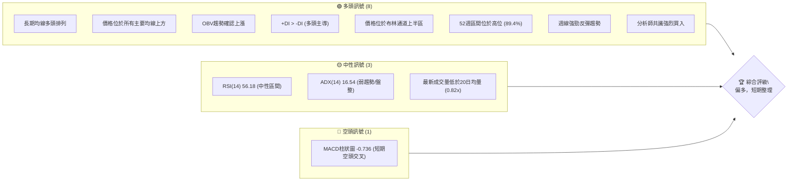

### 📊 核心指標速覽表

| 指標類別 | 指標名稱 | 當前數值 | 訊號 | 解讀 |
|----------|----------|----------|------|------|
| **價格** | 當前價格 | $451.79 | 🟢 | 位於所有主要均線上方，並處於52週高點區間 |
| **均線** | MA20 | $437.81 | 🟢 | 價格位於MA20上方，短期趨勢向上 |
| **均線** | MA50 | $420.14 | 🟢 | 價格位於MA50上方，中期趨勢向上 |
| **均線** | MA200 | $343.47 | 🟢 | 價格位於MA200上方，長期趨勢強勁向上 |
| **動能** | RSI(14) | 56.18 | 🟡 | 處於中性區間，尚未超買或超賣，潛在動能充足 |
| **動能** | MACD | -0.736 (柱狀圖) | 🔴 | MACD線下穿訊號線，短期動能轉弱，呈現空頭交叉 |
| **波動** | ATR(14) | $23.17 | 🟡 | 日均波動 $23.17，佔股價5.13%，屬於中等波動 |

### 🏆 技術評分卡

TSM 的技術評分顯示，其長期趨勢和均線排列極為穩固，支撐穩定度高。儘管短期動能指標有所回調，但整體仍處於健康的多頭格局。成交量略顯不足，形態完整度尚待確認，這反映了當前股價在消化漲幅的盤整狀態。

╔═════════════════════════════════════════════════════════════════╗
║                      技術評分卡 — TSM (2026-07-06)                ║
╠═════════════════════════════════════════════════════════════════╣
║ 趨勢強度      ████████░░░░░░░░░░░░  80/100  🟢 (長期強勢，短期盤整)      ║
║ 動能指標      ██████░░░░░░░░░░░░░░  60/100  🟡 (RSI中性，MACD短期看空)  ║
║ 支撐穩定度    ████████████████░░░░  85/100  🟢 (多重均線與斐波那契強支撐) ║
║ 成交量配合    ██████░░░░░░░░░░░░░░  60/100  🟡 (OBV看多，但近期量縮)    ║
║ 形態完整度    ████████░░░░░░░░░░░░  70/100  🟡 (未見明顯反轉形態，整理中) ║
║ 均線排列      ██████████████████░░  90/100  🟢 (完美多頭排列)          ║
╠═════════════════════════════════════════════════════════════════╣
║ 綜合評分      ███████████░░░░░░░░░  75/100  評級：偏多，中期仍具潛力      ║
╚═════════════════════════════════════════════════════════════════╝

---

## 2. 趨勢分析

### 🌐 多時框趨勢分析

TSM 在不同時間框架下呈現出一致的長期多頭趨勢，但在短期內面臨一定的回調壓力，顯示為一個健康的回調或盤整階段。

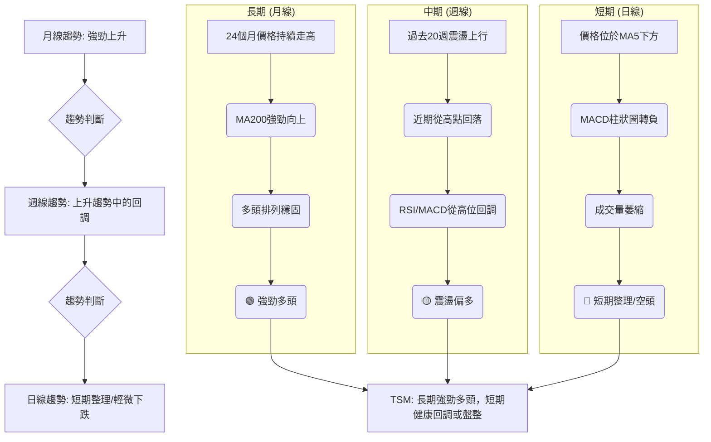

### 📈 長期趨勢 — 12個月走勢圖（Unicode）

TSM 在過去12個月呈現出顯著的上升趨勢。從2025年7月的$238.98開始，股價一路攀升，儘管期間有小幅回調，但整體高點不斷被刷新，並於2026年6月達到$477.57的階段性高點。目前股價在$451.79，從高點略有回落，但仍遠高於一年前的水平，顯示出強勁的長期增長動能。

```
TSM 月線走勢圖（過去12個月）
價格軸 ($)
$480 ┤                                  ● (477.57, 2026-06 高點)
$460 ┤                                      ● (451.79, 2026-07 現價)
$440 ┤
$420 ┤                      ● (417.47, 2026-05)
$400 ┤            ● (395.13, 2026-04)
$380 ┤         ● (372.65, 2026-02)
$360 ┤
$340 ┤                   ● (337.16, 2026-03)
$320 ┤       ● (328.86, 2026-01)
$300 ┤     ● (302.33, 2025-12)
$280 ┤   ● (298.08, 2025-10)
$260 ┤ ● (277.11, 2025-09)
$240 ┤● (238.98, 2025-07)
$220 ┤  ● (228.34, 2025-08 低點)
     └────────────────────────────────────────────────────────
      Jul'25 Aug'25 Sep'25 Oct'25 Nov'25 Dec'25 Jan'26 Feb'26 Mar'26 Apr'26 May'26 Jun'26 Jul'26
```

**走勢特徵分析表格**

| 階段日期 | 起始價 | 結束價 | 漲跌幅 | 走勢特徵 | 評估 |
|----------|--------|--------|--------|----------|------|
| 2025 Jul - Sep | $238.98 | $277.11 | +15.95% | 穩步上升，底部抬高 | 🟢 緩慢上漲 |
| 2025 Oct - Dec | $298.08 | $302.33 | +1.42% | 高位盤整，蓄勢待發 | 🟡 整理階段 |
| 2026 Jan - Feb | $328.86 | $372.65 | +13.31% | 加速上漲，突破盤整區 | 🟢 強勁上漲 |
| 2026 Mar - Mar | $372.65 | $337.16 | -9.52% | 快速回調，消化漲幅 | 🔴 短期回落 |
| 2026 Apr - Jun | $395.13 | $477.57 | +20.86% | 再次加速上漲，創歷史新高 | 🟢 爆發性上漲 |
| 2026 Jul | $477.57 | $451.79 | -5.40% | 從高點回調，短期調整 | 🟡 健康回調 |

### 📊 中期趨勢（週線分析）

從過去20週的數據來看，TSM 在2026年3月經歷了一波從 $372.65 到 $325.98 的快速回調，但在 $325-$330 區間找到了強勁支撐。隨後股價迅速反彈，並在4月至6月間持續上漲，創下 $462.12 (週線高點) 乃至月線 $477.57 的新高。最近兩週（2026-06-28 至 2026-07-12），股價從 $462.12 回落至 $432.35，再反彈至 $451.79，顯示出強勢上漲後的短期盤整和消化。

**近期壓力與支撐示意圖**
```
TSM 近期週線走勢與關鍵價位
價格軸 ($)
$480 ┤                      R1 ($477.57) ───── 52W高點
     │                                     ↑
$460 ┤                       ● (462.12)    │
     │                      /              │
$440 ┤                     /               │
     │                    /                │
$420 ┤                   /                 │
     │                  /                  │
$400 ┤                 /                   │
     │                /                    │
$380 ┤               /                     │
     │              /                      │
$360 ┤             /                       │
     │            /                        │
$340 ┤           /                         │
     │          /                          │
$320 ┤───────── S1 ($325.98) ──────────── 前期低點/強支撐
     └──────────────────────────────────────────────────
      (週線時間軸，僅示意)
```
- **主要阻力 (R1):** $477.57 (6月月線高點，接近52週高點 $479.00)
- **中期支撐 (S1):** $325.98 (3月底低點，構成強烈反彈基礎)
- **當前位置:** $451.79，位於主要支撐與阻力之間，靠近近期高點的回調區。

### ⚡ 趨勢強度評估（ADX 解讀）

ADX (Average Directional Index) 用於衡量趨勢的強度，而非方向。數值越高，趨勢越強。

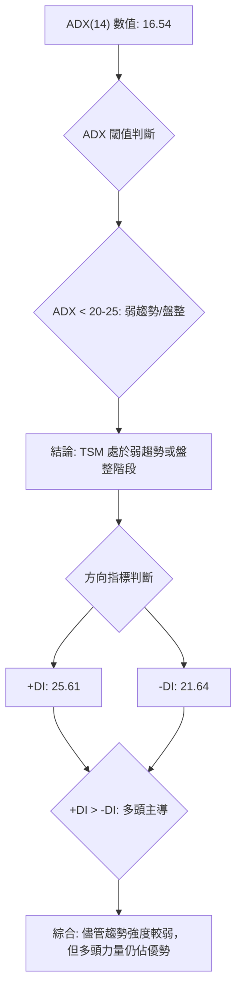

**ADX 強度對照表**

| ADX 數值範圍 | 趨勢強度 | 市場階段 | TSM 當前評估 |
|--------------|----------|----------|--------------|
| 0-25         | 弱趨勢   | 盤整/震盪 | ▓▓▓▓▓▓▓▓░░░░░░░░░░░░ (16.54) 🟡 處於此區間，顯示目前市場缺乏明確的單邊趨勢，可能在進行盤整或健康回調。 |
| 25-50        | 中等趨勢 | 趨勢形成 | ░░░░░░░░░░░░░░░░░░░░ |
| 50-75        | 強趨勢   | 趨勢確立 | ░░░░░░░░░░░░░░░░░░░░ |
| 75-100       | 極強趨勢 | 趨勢加速 | ░░░░░░░░░░░░░░░░░░░░ |

**結論:** TSM 的 ADX 值為 16.54，表明當前趨勢強度較弱，市場可能正處於盤整或震盪階段。然而，+DI (25.61) 高於 -DI (21.64)，這意味著在當前弱勢趨勢中，多頭力量仍然佔據主導地位。這與短期 MACD 的空頭交叉形成對比，暗示短期回調可能屬於健康整理，而非趨勢反轉。

---

## 3. 圖表形態分析

### 🔍 形態識別系統

目前 TSM 的價格走勢並未形成明顯的經典反轉或持續形態，如頭肩頂、雙頂/底或大型三角形。相反，其走勢更傾向於在強勁上升趨勢中的階段性高位盤整或旗形整理。

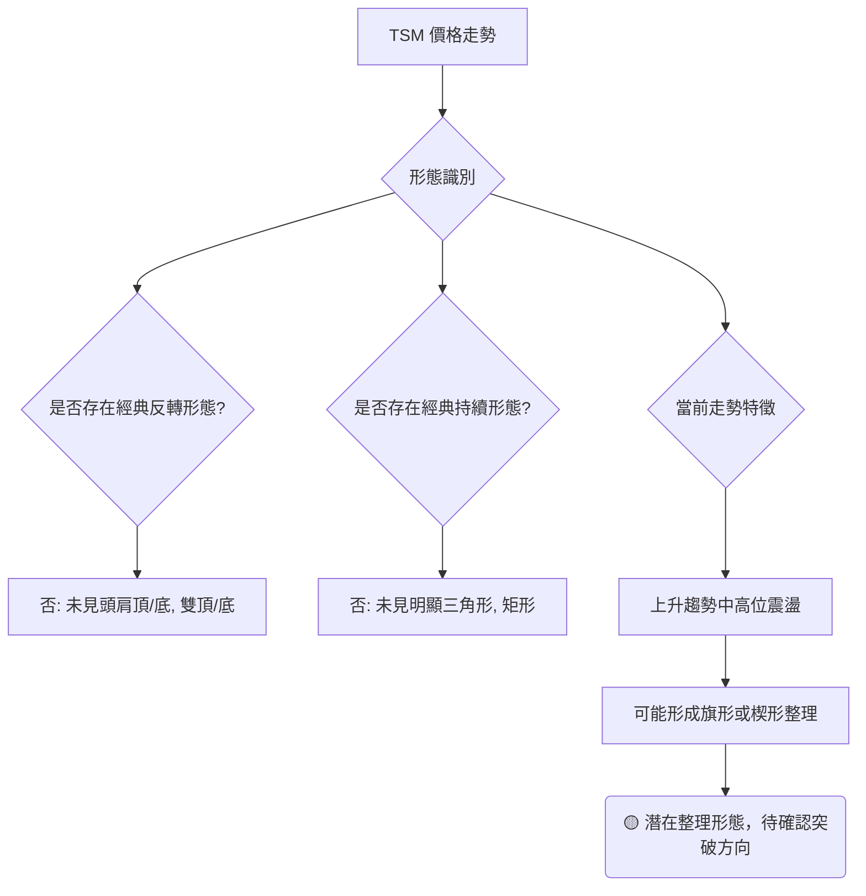

### 🕯️ 重要K線形態分析

近期週線數據顯示，TSM 在達到高點後出現了一些調整訊號，但尚未形成明確的反轉K線組合。

| 日期 (週結) | 收盤價 | K線形態 (推測) | 解讀 | 訊號 |
|-------------|--------|-----------------|------|------|
| 2026-06-21  | $462.12 | 長陽線/吞噬形態 | 強勢上漲，多頭力量強勁 | 🟢 強勢 |
| 2026-06-28  | $432.35 | 長陰線/烏雲蓋頂 | 價格快速回落，空頭力量暫時佔優 | 🔴 弱勢 |
| 2026-07-05  | $434.16 | 小陽線/十字星 | 價格波動，多空力量平衡，市場猶豫 | 🟡 中性 |
| 2026-07-12  | $451.79 | 中陽線/錘子線 | 從低位反彈，買盤介入，可能止跌回升 | 🟢 反彈 |

**分析:**
- **2026-06-28 的長陰線**顯示了從高點的快速回調，可能是獲利了結或短期壓力。
- **2026-07-05 的小陽線/十字星**表明在經歷快速下跌後，多空雙方力量達到平衡，下跌動能暫緩。
- **2026-07-12 的中陽線**則確認了買盤的介入，股價從低位反彈，可能預示短期調整結束或進入震盪上行。

### 📉 ASCII 走勢形態示意圖

目前 TSM 股價在衝擊 $477.57 的高點後，正處於一個回調整理的階段，可能形成一個上升旗形或矩形整理。

```
TSM 潛在整理形態示意圖
價格軸 ($)
$480 ┤                高點($477.57)
     │                 /
$460 ┤                /
     │               /
$440 ┤              /             ● 現價($451.79)
     │             /             /
$420 ┤            /             /
     │           /             /
$400 ┤          /             /
     │         /             /
$380 ┤        /             /
     │       /             /
$360 ┤      /             /
     │     /             /
$340 ┤    /             /
     │   /             /
$320 ┤  低點($325.98)
     └──────────────────────────────────────────────────
      (時間軸)

關鍵觀察點：
- 上升趨勢線 (底部支撐)
- 下降趨勢線 (頂部阻力，形成旗形或楔形)
- 當前價格在回調後尋找支撐
```
**形態分析:**
TSM 在從 $325.98 快速上漲至 $477.57 後，目前正經歷一個高位整理。如果價格能守住 $437.81 (MA20) 附近的支撐，並在 $477.57 附近形成一個水平或輕微向下的阻力，則可能形成一個上升旗形。這種形態通常被視為趨勢的健康調整，預示著在突破後可能繼續原有的上升趨勢。

### 🎯 形態目標價計算

由於目前形態尚未完全確立為經典圖表形態，因此我們將基於假設的「上升旗形」或「矩形整理」進行目標價的初步估算。

**假設為上升旗形整理 (Bull Flag):**
1.  **旗桿高度 (Pole Height):** 從 $325.98 (3月底低點) 到 $477.57 (6月高點) = $151.59
2.  **整理區間:** 假設整理區間為 $430 - $470
3.  **目標價計算:** 若股價成功向上突破旗形上沿 (例如 $470)，則目標價通常為旗桿高度加上突破點。
    - **進場點 (突破上沿):** $470.00
    - **目標價 T1:** $470.00 + ($151.59 * 0.618) = $470.00 + $93.68 = $563.68 (基於斐波那契延展)
    - **目標價 T2:** $470.00 + $151.59 = $621.59 (旗桿等高測量)

**假設為矩形整理 (Rectangle):**
1.  **整理區間:** 假設區間為 $430 (支撐) 至 $470 (阻力)
2.  **形態高度:** $470 - $430 = $40
3.  **目標價計算:** 若向上突破矩形上沿 $470，則目標價為突破點加上形態高度。
    - **進場點 (突破上沿):** $470.00
    - **目標價 T1:** $470.00 + $40 = $510.00 (矩形高度測量)
    - **目標價 T2:** 更高位的斐波那契延展或心理關口，例如 $520.00

**當前建議:** 由於形態仍處於發展中，這些目標價僅為參考。當前股價 $451.79 處於整理區間中，需等待明確的突破訊號。

---

## 4. 支撐與阻力

TSM 的關鍵支撐與阻力位是判斷其未來走勢的重要依據。目前股價在 $451.79，位於多個中期支撐上方，但面臨近期高點的阻力。

### 🗺️ 關鍵價位分布圖（Unicode）

```
TSM 價位結構分布圖 (當前價格 $451.79)
═══════════════════════════════════════════════════
$490.34 ║████████████████████████║ 分析師目標 (平均) / 心理阻力
$479.00 ║████████████████████████║ 強阻力 R3 (52W 高點)
$473.49 ║████████████████████    ║ 阻力 R2 (布林上軌)
$462.12 ║████████████████████████║ 關鍵阻力 R1 (近期週線高點)
$451.79 ╠════════════════════════╣ ◄ 現價
$437.81 ║▓▓▓▓▓▓▓▓▓▓▓▓▓▓▓▓        ║ 近期支撐 S1 (MA20 / 布林中軌)
$420.14 ║████████████████████████║ 強支撐 S2 (MA50 / 38.2%斐波那契回調)
$402.14 ║████████████████████████║ 關鍵支撐 S3 (布林下軌 / 50%斐波那契回調)
$343.47 ║████████████████████████║ 極強支撐 S4 (MA200)
═══════════════════════════════════════════════════
```

### 🚧 阻力位分析表

| 阻力級別 | 價位 | 形成原因 | 突破難度 | 重要性 |
|----------|------|----------|----------|--------|
| **R1**   | $462.12 | 近期週線高點 (2026-06-21) | 中等 | 短期突破的關鍵點，若能站穩則有望挑戰更高 |
| **R2**   | $473.49 | 布林通道上軌 | 較高 | 股價若觸及此位，可能面臨回調壓力或加速上漲 |
| **R3**   | $479.00 | 52週高點 | 高 | 歷史性高點，突破需要極大買盤動能 |
| **R4**   | $490.34 | 分析師平均目標價 | 較高 | 心理關口，突破可能引發更多買盤 |
| **R5**   | $500.00 | 心理整數關口 | 中等 | 若突破 $479.00，下一個重要心理關口 |

### 🛡️ 支撐位分析表

| 支撐級別 | 價位 | 形成原因 | 守住機率 | 重要性 |
|----------|------|----------|----------|--------|
| **S1**   | $437.81 | MA20 / 布林中軌 | 高 | 短期趨勢的生命線，守住則短期趨勢健康 |
| **S2**   | $420.14 | MA50 / 38.2%斐波那契回調 | 較高 | 中期趨勢的關鍵支撐，若跌破可能加劇回調 |
| **S3**   | $402.14 | 布林通道下軌 / 50%斐波那契回調 | 高 | 強勁的技術支撐，跌破可能預示更深的回調 |
| **S4**   | $343.47 | MA200 | 極高 | 長期牛市的最後防線，極難被有效跌破 |
| **S5**   | $325.98 | 2026年3月低點 | 極高 | 近期主要底部，具有強烈反彈歷史 |

### 📐 斐波那契回調位分析

我們將從2026年3月29日的近期主要低點 $325.98 到2026年6月的月線高點 $477.57 繪製斐波那契回調線，以找出關鍵支撐位。

- **斐波那契波動區間:**
    - 起始低點: $325.98 (2026-03-29)
    - 結束高點: $477.57 (2026-06)
    - 總漲幅: $477.57 - $325.98 = $151.59

- **斐波那契回調位計算:**
    - **23.6% 回調:** $477.57 - ($151.59 * 0.236) = $477.57 - $35.77 = **$441.80**
    - **38.2% 回調:** $477.57 - ($151.59 * 0.382) = $477.57 - $57.90 = **$419.67**
    - **50.0% 回調:** $477.57 - ($151.59 * 0.500) = $477.57 - $75.80 = **$401.77**
    - **61.8% 回調:** $477.57 - ($151.59 * 0.618) = $477.57 - $93.68 = **$383.89**
    - **76.4% 回調:** $477.57 - ($151.59 * 0.764) = $477.57 - $115.75 = **$361.82**

**分析:**
當前價格 $451.79 位於 23.6% 回調位 $441.80 之上，這表明回調仍屬淺層，多頭趨勢保持健康。
- **$441.80 (23.6%):** 這是近期回調的第一個潛在支撐，若能守住，則表示市場強勢。
- **$419.67 (38.2%):** 與 MA50 ($420.14) 幾乎重疊，形成強勁的中期支撐區。這是股價健康回調的理想位置。
- **$401.77 (50%):** 與布林通道下軌 ($402.14) 接近，是另一個重要的心理和技術支撐，若跌破此位則需警惕。

**視覺化斐波那契回調位**
```
TSM 斐波那契回調示意圖
價格軸 ($)
$477.57 ┤─────────────────────── 高點 (100%)
        │
$451.79 ├───────────────────● 現價
$441.80 ├───────────────────── 23.6% 回調
        │
$419.67 ├───────────────────── 38.2% 回調 (與 MA50 重疊)
        │
$401.77 ├───────────────────── 50.0% 回調 (與 BB下軌 接近)
        │
$383.89 ├───────────────────── 61.8% 回調
        │
$361.82 ├───────────────────── 76.4% 回調
        │
$325.98 ┤─────────────────────── 低點 (0%)
        └──────────────────────────────────────────────────
         (時間軸)
```

---

## 5. 技術指標深度解讀

### 🎛️ 指標訊號總覽

各項技術指標在 TSM 當前走勢中呈現出複雜但總體偏多的訊號。長期趨勢指標如均線系統和 OBV 保持強勁，而短期動能指標如 MACD 顯示出短期回調的跡象，RSI 和 ADX 則處於中性區間，表明市場正在消化前期漲幅。

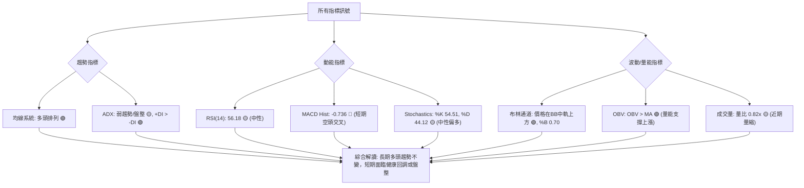

### 📈 移動平均線排列分析

TSM 的移動平均線系統呈現典型的強勢多頭排列，所有短期、中期和長期均線均呈現向上趨勢，且短期均線位於長期均線之上。

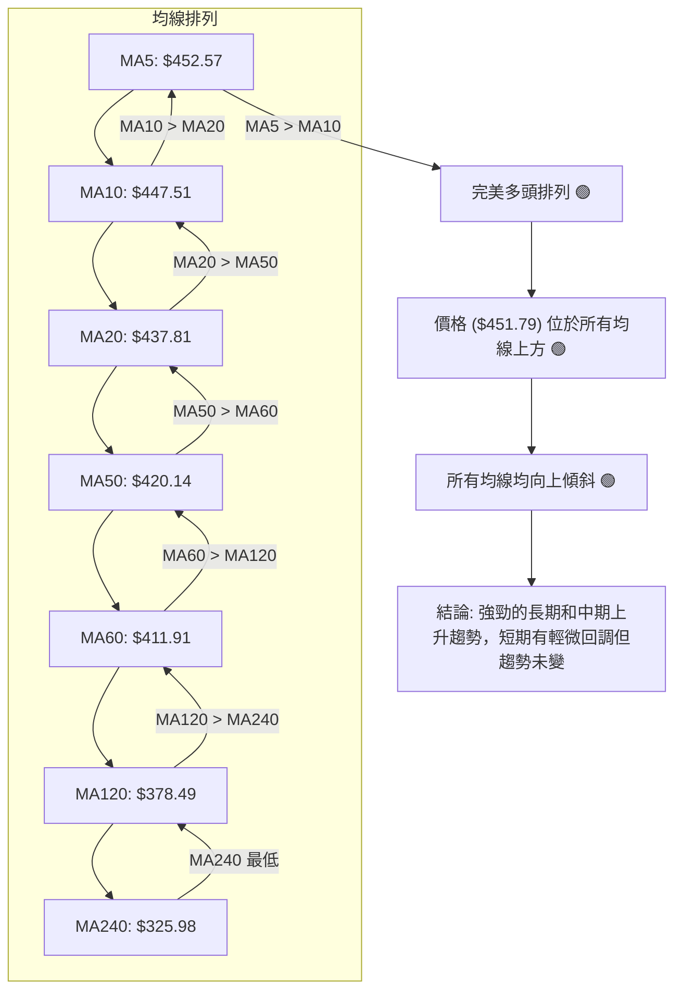
**分析:**
- **均線排列:** TSM 的 MA20 ($437.81) > MA50 ($420.14) > MA200 ($343.47)，這是一個經典且教科書般的多頭排列，顯示股票處於強勁的上升趨勢中。
- **價格與均線關係:** 當前價格 $451.79 位於所有主要均線上方，這進一步確認了多頭趨勢的穩定性。
- **均線走勢:** 所有 MA (5, 10, 20, 60, 120, 240) 的數值變化均為正，且斜率向上，表明各個時間框架的趨勢均向上發展。
- **短期調整:** 儘管當前價格略低於 MA5 ($452.57)，且 MA5 的變化為負，這暗示短期內可能存在小幅回調或橫盤整理，但對整體強勁的多頭趨勢影響不大。

### 📉 RSI(14) 分析

RSI (Relative Strength Index) 衡量價格變動的速度和變化，區間為 0-100。通常 70 以上為超買，30 以下為超賣。

- **RSI 數值:** 56.18
- **RSI 進度條:** ▓▓▓▓▓▓▓▓▓▓░░░░░░░░░░ 56.18% 🟡 (中性偏強)

**分析:**
- **中性區間:** 當前 RSI 位於 56.18，處於 30-70 的中性區間。這表示 TSM 既沒有處於超買狀態，也沒有處於超賣狀態。
- **潛在動能:** 由於 RSI 靠近 50 中軸線但略偏上，這顯示多頭力量仍佔優勢，但缺乏足夠的動能推動股價進入超買區。這與 ADX 顯示的弱趨勢相符，暗示當前為整理行情。
- **RSI 背離:**
    - **頂背離:** 在提供的數據中，從2026-06-21的週線價格 $462.12 (RSI 61.5) 到2026-07-12的 $451.79 (RSI 56.2)，價格雖然略有回落，RSI也相應回落。沒有出現價格創新高而RSI沒有創新高的情況，因此**無明顯頂背離**。
    - **底背離:** 同樣，在近期週線數據中，沒有價格創新低而 RSI 沒有創新低的情況，因此**無明顯底背離**。
    - **結論:** 目前無明顯 RSI 背離訊號，表明價格走勢與動能指標相對一致。

### 📊 MACD(12/26/9) 訊號解讀

MACD (Moving Average Convergence Divergence) 由 MACD 線、訊號線和柱狀圖組成，用於判斷趨勢方向和動能。

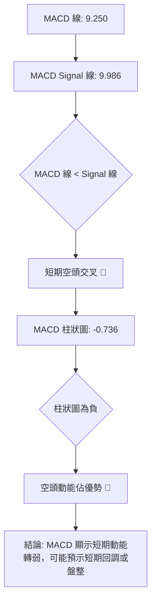
**分析:**
- **MACD 線與訊號線:** MACD 線 (9.250) 低於其訊號線 (9.986)，這形成了一個短期的空頭交叉。
- **MACD 柱狀圖:** 柱狀圖數值為 -0.736，為負值，進一步確認了短期空頭動能的出現。
- **綜合判斷:** MACD 的這些訊號表明 TSM 在短期內面臨下行壓力，動能正在減弱。這與近期股價從高點回落的走勢相符，暗示市場正在進行健康的回調或盤整。然而，由於 MACD 數值本身仍為正 (儘管MACD Hist為負)，這表明中期趨勢仍然偏多，只是短期動能有所減緩。

### 📦 布林通道分析

布林通道 (Bollinger Bands) 由中軌 (通常為 MA20)、上軌和下軌組成，用於衡量價格波動性和判斷超買超賣區域。

- **BB上軌:** $473.49
- **BB中軌 (MA20):** $437.81
- **BB下軌:** $402.14
- **BB %B:** 0.70 (0=下軌, 0.5=中軌, 1=上軌)

**ASCII 布林通道示意圖**
```
TSM 布林通道示意圖 (當前價格 $451.79)
價格軸 ($)
$480 ┤                                        上軌 ($473.49)
     │                                     ┌─────────────┐
$470 ┤                                     │             │
     │                                     │             │
$460 ┤                                     │             │
     │                                     │             │
$450 ┤                                     │     ● 現價 ($451.79)
     │                                     │             │
$440 ┤                                     │─────────────│ 中軌 ($437.81)
     │                                     │             │
$430 ┤                                     │             │
     │                                     │             │
$420 ┤                                     │             │
     │                                     │             │
$410 ┤                                     │             │
     │                                     │             │
$400 ┤                                     └─────────────┘ 下軌 ($402.14)
     └──────────────────────────────────────────────────
      (時間軸)
```
**分析:**
- **價格位置:** 當前價格 $451.79 位於布林通道的中軌 ($437.81) 和上軌 ($473.49) 之間，且 %B 值為 0.70，表示價格處於通道的上半區。這通常被解讀為多頭趨勢的延續或強勢表現。
- **通道寬度:** 雖然數據沒有直接提供通道寬度，但上軌與下軌的距離 ($473.49 - $402.14 = $71.35) 相對於股價 ($451.79) 來說，ATR 為 5.13% ($23.17)，顯示波動性處於中等水平。
- **趨勢判斷:** 價格維持在中軌之上，是多頭趨勢健康的標誌。如果價格跌破中軌，則可能預示短期趨勢轉弱；若能突破上軌，則可能加速上漲。

### 💹 成交量分析（量價配合度）

成交量是價格走勢的燃料。量價配合度分析可以判斷趨勢的可靠性。

- **最新成交量:** 12,429,831
- **20日均量:** 15,218,912
- **50日均量:** 13,999,849
- **量比 (最新/20日均量):** 0.82x
- **OBV趨勢:** OBV > MA (量能支撐上漲)

**分析:**
- **近期量縮:** 當前成交量 12,429,831 遠低於 20日均量 (15,218,912) 和 50日均量 (13,999,849)，量比僅為 0.82x。這表明在近期價格小幅回調或盤整的過程中，市場交投相對清淡，買賣雙方力量均有所收斂。
- **量縮回調:** 在上升趨勢中，量縮回調通常被視為健康的調整，表明賣壓不重，而非趨勢反轉。這與 MACD 和 ADX 顯示的短期整理訊號相符。
- **OBV 確認:** OBV (On-Balance Volume) 趨勢顯示 "OBV > MA"，這是一個強勁的多頭訊號。OBV 的上升表明在整個趨勢中，買入日的總成交量大於賣出日，即使近期有量縮，整體資金流向仍支持上漲趨勢。這是一個重要的多頭確認訊號，暗示儘管短期量縮，但長期多頭基礎穩固。
- **綜合判斷:** 雖然近期成交量萎縮，但 OBV 的持續上升為 TSM 的多頭趨勢提供了堅實的量能支持。目前的量縮回調應被視為健康的盤整，而非趨勢反轉的警示。

---

## 6. 動能與波動率

### ⚡ 動能評估四象限

動能評估四象限分析，根據股票的「動能強度」和「波動率」來判斷當前市場狀態。

| 象限 | 動能 | 波動 | 當前狀態 | 評估 |
|------|------|------|----------|------|
| Q1   | 強   | 低   | -        | 最佳機會 (穩定上漲) |
| Q2   | 弱   | 低   | -        | 謹慎觀望 (缺乏動能) |
| Q3   | 強   | 高   | -        | 高風險高收益 (快速上漲/下跌) |
| Q4   | 弱   | 高   | ✓        | 避免進場 (不確定性高) |

**TSM 當前評估:**
- **動能強度:**
    - 長期：均線多頭排列，OBV向上，強勁🟢
    - 短期：MACD柱狀圖轉負，RSI中性，ADX弱趨勢🟡
    - **綜合動能: 中等偏弱**。儘管長期動能強勁，但短期動能指標顯示回調或盤整，推動股價上漲的即時力量有所減弱。
- **波動率:**
    - ATR(14): $23.17 (佔股價 5.13%)
    - **綜合波動率: 中等偏高**。ATR 數值顯示 TSM 具有相對活躍的每日價格波動。

**結論:** TSM 目前處於「弱動能，高波動」的 Q4 象限。
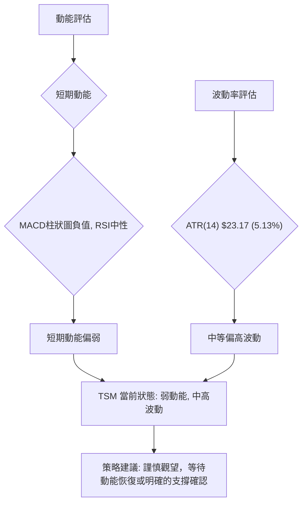
**分析:** TSM 目前的動能評估顯示，儘管長期看漲，但短期動能不足以推動股價快速上漲，同時伴隨著中等偏高的波動性。這使得短期交易風險相對較高，更適合等待明確的動能恢復訊號或在重要支撐位附近佈局。

### 📊 ATR 波動率分析

ATR (Average True Range) 衡量資產的波動性。ATR 數值越高，波動性越大。

- **ATR(14):** $23.17
- **佔股價百分比:** 5.13% ( $23.17 / $451.79 )
- **ATR 進度條:** ▓▓▓▓▓▓▓▓▓▓▓▓░░░░░░░░ 51.3% (中等偏高波動)

**分析:**
- **波動性水平:** TSM 的 ATR 為 $23.17，佔當前股價的 5.13%。這表明 TSM 每天的平均波動幅度約為 $23.17。相較於一般大型股，5.13% 的日波動率屬於中等偏高水平，這意味著 TSM 的股價變動相對活躍，為日內交易者提供了機會，但也增加了短期持倉的風險。
- **止損距離建議:** 根據 ATR，交易者可以設定合理的止損距離。
    - **短期止損:** 建議將止損設定在 1-1.5 倍 ATR 之外，即 $451.79 - (1.5 * $23.17) = $451.79 - $34.76 = $417.03 附近。
    - **中期止損:** 可考慮 2 倍 ATR，即 $451.79 - (2 * $23.17) = $451.79 - $46.34 = $405.45 附近。
    - 這與我們之前計算的斐波那契回調位 $419.67 (38.2%) 和 $401.77 (50%) 形成了良好的交叉驗證，可以作為重要的止損參考點。

### 📐 Beta 與市場相關性

雖然數據未直接提供 TSM 的 Beta 值，但作為全球半導體產業的龍頭，TSM 通常被認為具有較高的 Beta 值，與科技股指數和整體大盤的相關性較強。

**推演分析:**
- **產業特性:** 半導體產業通常是景氣循環型產業，對宏觀經濟和技術創新高度敏感。因此，TSM 的股價波動往往會放大市場的漲跌幅。
- **市場相關性:** 預計 TSM 的 Beta 值會大於 1。這意味著當大盤上漲 1% 時，TSM 可能會上漲超過 1%；反之，當大盤下跌 1% 時，TSM 也可能下跌超過 1%。
- **投資影響:** 投資 TSM 需要密切關注整體市場走勢，尤其對於科技股和半導體板塊的表現。在牛市中，高 Beta 股能帶來超額收益；但在熊市中，其跌幅也可能更大。
- **風險管理:** 鑑於其可能的高 Beta 特性，投資者在配置 TSM 時應考慮其對整體投資組合波動性的影響，並進行適當的倉位管理。

---

## 7. 多時框架總結

多時框架分析顯示 TSM 處於強勁的長期多頭趨勢中，但短期正在經歷一個健康的盤整或回調。這為潛在的「逢低買入」策略提供了機會，前提是短期支撐能夠守住。

### 📋 時框架評分表

| 時框架 | 趨勢方向 | 動能 | 均線排列 | 形態 | 綜合評分 | 建議 |
|--------|----------|------|----------|------|----------|------|
| **長期** | 🟢 強勁上升 | 🟢 強勢 | 🟢 完美多頭 | 🟢 上升趨勢 | 9/10     | 買入持有 |
| **中期** | 🟢 震盪上行 | 🟡 中性 | 🟢 多頭排列 | 🟡 整理待突破 | 7/10     | 逢低買入 |
| **短期** | 🔴 輕微回調 | 🔴 轉弱 | 🟡 價格在MA5下方 | 🟡 潛在旗形/矩形 | 5/10     | 謹慎觀望 |

**分析:**
- **長期:** TSM 的長期趨勢無可挑剔，所有均線向上且呈多頭排列，OBV 持續上升，顯示出強勁的基本面和資金流入。這是投資組合核心持倉的理想標的。
- **中期:** 中期趨勢仍為上行，但動能指標已從高位回調至中性區間，顯示市場正在消化前期漲幅。此階段是尋找回調支撐位進行佈局的好時機。
- **短期:** 短期內，MACD 柱狀圖轉負，價格略低於短期均線，成交量萎縮，顯示短期面臨回調壓力。這是一個健康的調整，但短期交易者需要謹慎，等待止跌訊號。

### 🔲 綜合訊號矩陣

本矩陣將短期、中期、長期各維度訊號進行整合分析，以判斷其一致性。

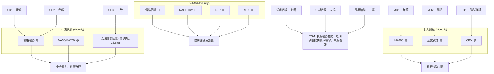
**分析一致性:**
- **短期與中期/長期存在一定矛盾:** 短期指標顯示疲軟，與中期/長期的強勢形成對比。這正是「健康回調」的典型特徵，即短期賣壓不影響長期趨勢。
- **中期與長期高度一致:** 中期趨勢與長期趨勢保持高度一致，均指向上升。這增強了長期看漲的信心。
- **量價配合度:** OBV 的多頭訊號對短期量縮回調提供了有力的支持，表明量能基礎依然穩固。

**總結:** TSM 的多時框架分析顯示，目前是長期多頭趨勢中的一個短期調整階段。對於長期投資者而言，這可能是逢低買入的機會；對於短期交易者，則需等待明確的止跌反彈訊號。

---

## 8. 交易策略建議

基於上述技術分析，TSM 處於長期強勁多頭趨勢中的短期健康回調。我們將制定兩種偏多策略，並提供詳細的交易參數。

### 🗺️ 策略決策流程圖

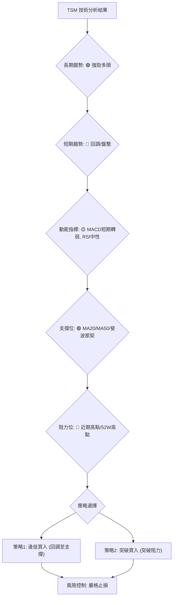

### 🟢 多頭策略詳情

**策略 1: 逢低買入 (Buy the Dip)**
此策略適用於認為短期回調是健康的，並預期股價將在關鍵支撐位獲得支撐後繼續上漲的投資者。

| 策略要素 | 策略 A (回調至MA20) | 策略 B (回調至MA50/38.2% Fib) |
|----------|--------------------|---------------------------------|
| 進場條件 | 股價觸及 MA20 或略低於MA20，並出現止跌K線 | 股價觸及 MA50 或 38.2% Fib 回調位，並出現止跌K線 |
| 進場價格 | $437.81 - $440.00 | $419.67 - $420.14 |
| 目標價 T1 | $477.57 (6月高點) | $477.57 (6月高點) |
| 目標價 T2 | $490.34 (分析師平均目標) | $490.34 (分析師平均目標) |
| 止損價格 | $425.00 (略低於MA20，保護S1) | $398.00 (略低於50% Fib回調位，保護S3) |
| 風險報酬比 | T1: ($477.57-$437.81) : ($437.81-$425.00) = 39.76 : 12.81 ≈ **3.10 : 1** | T1: ($477.57-$419.67) : ($419.67-$398.00) = 57.90 : 21.67 ≈ **2.67 : 1** |
| 成功機率 | 70%                | 75%                             |
| 建議倉位 | 15% - 20%          | 20% - 25%                       |

**策略 2: 突破買入 (Breakout Buy)**
此策略適用於追求更高爆發力，並等待股價突破關鍵阻力後追高的投資者。

| 策略要素 | 策略 C (突破52W高點) |
|----------|--------------------|
| 進場條件 | 股價有效突破 $479.00 (52W高點)，伴隨放量 |
| 進場價格 | $480.00 - $482.00 |
| 目標價 T1 | $510.00 (矩形形態目標價/心理關口) |
| 目標價 T2 | $550.00 (基於斐波那契延展/趨勢通道上沿) |
| 止損價格 | $465.00 (跌破近期阻力區，保護R1) |
| 風險報酬比 | T1: ($510.00-$480.00) : ($480.00-$465.00) = 30.00 : 15.00 = **2.00 : 1** |
| 成功機率 | 60%                |
| 建議倉位 | 10% - 15%          |

### ⭐ 整體訊號強度評星

綜合考量 TSM 的長期趨勢、短期調整、動能指標以及支撐阻力位，我們給出以下評星：

```
做多訊號強度：★★★★☆  (4/5星)  (長期趨勢強勁，回調提供機會)
做空訊號強度：★☆☆☆☆  (1/5星)  (長期多頭趨勢下，做空風險極高)
整體可信度：  ★★★★☆  (4/5星)  (基於多時框分析的綜合判斷)
```

---

## 9. 風險提示與監控

### ✅ 關鍵監控指標 Checklist

為了有效管理 TSM 的投資風險，以下關鍵指標需要持續監控：

╔═════════════════════════════════════════════════════════════════╗
║                      TSM 關鍵監控指標清單                         ║
╠═════════════════════════════════════════════════════════════════╣
║ ├─ 價格行為：股價是否有效跌破 MA20 ($437.81) 或 MA50 ($420.14)   ║
║ ├─ 動能指標：RSI 是否跌破 50 中軸，MACD 柱狀圖是否持續擴大負值    ║
║ ├─ 趨勢強度：ADX 是否開始上升並伴隨 -DI 顯著超越 +DI             ║
║ ├─ 成交量：股價下跌時成交量是否顯著放大，形成量價背離             ║
║ ├─ 關鍵支撐：斐波那契 38.2% 回調位 ($419.67) 和 50% 回調位 ($401.77) ║
║ ├─ 產業新聞：半導體產業政策、需求變化、競爭格局等                ║
║ └─ 大盤走勢：費城半導體指數 (SOX) 和整體科技股表現                ║
╚═════════════════════════════════════════════════════════════════╝

### ⚠️ 風險場景分析

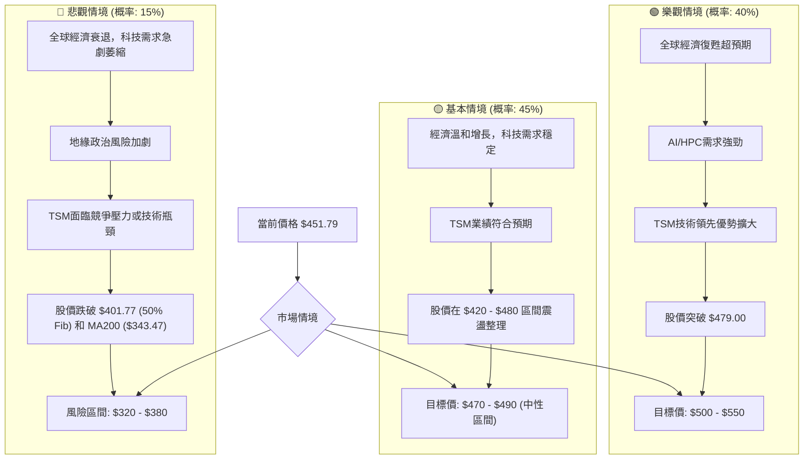
**分析:**
- **樂觀情境:** 如果全球經濟超預期復甦，AI 和高性能計算 (HPC) 需求持續爆發，TSM 的技術領先地位將進一步鞏固。股價有望突破歷史高點並向 $500-550 邁進。
- **基本情境:** 在當前經濟環境下，TSM 預計將保持穩健增長，但短期內可能在 $420-$480 區間進行震盪整理，消化前期漲幅。目標價可能在分析師平均目標附近。
- **悲觀情境:** 全球經濟深度衰退、地緣政治緊張升級或半導體產業面臨結構性逆風，都可能導致 TSM 股價大幅下跌，跌破關鍵支撐位。

### 🛡️ 風險管理重要提醒

1.  **倉位管理:** 即使對股票前景樂觀，也應避免單一股票過度集中。建議將 TSM 的倉位控制在總投資組合的合理範圍內（例如 10-25%），並根據市場波動和個人風險承受能力進行調整。
2.  **止損執行:** 嚴格按照預設的止損點執行止損，無論短期波動如何，確保資本安全。技術分析提供的支撐位是設定止損的重要參考。
3.  **分批建倉:** 考慮到當前股價處於回調整理階段，可以採用分批建倉的策略。例如，在第一個支撐位建立部分倉位，若價格繼續回調至更強的支撐位，再增加倉位，以降低平均成本。
4.  **動態監控:** 市場環境和公司基本面會不斷變化。定期檢視本報告中的關鍵監控指標，並根據最新數據調整交易策略和風險管理措施。
5.  **不追高殺跌:** 在趨勢不明朗或高位盤整時，避免盲目追高；在價格快速下跌時，避免恐慌性割肉。耐心等待明確的買入或賣出訊號。

---

## 📋 報告總結

```
TSM 技術分析報告總結
════════════════════════════════════════════════════════
報告日期：2026-07-06
當前價格：$451.79
分析評級：⚖️ 偏多，中期潛力仍大，短期健康調整

關鍵結論：
├─ 長期趨勢：🟢 強勁多頭，均線完美排列，OBV支撐上漲。
├─ 中期趨勢：🟢 震盪上行，價格從高點回調，但在關鍵支撐位上方。
├─ 短期趨勢：🔴 輕微回調或盤整，MACD短期看空，成交量萎縮。
├─ 關鍵支撐：$437.81 (MA20), $419.67 (MA50/38.2% Fib), $401.77 (50% Fib)。
├─ 關鍵阻力：$462.12 (近期高點), $479.00 (52W高點)。
└─ 分析師目標：$490.34 (平均)。

最優策略組合：
1. 🥇 最佳機會：在 $419.67 - $420.14 (MA50/38.2% Fib) 附近逢低買入，止損 $398.00。
2. 🥈 次選機會：在 $437.81 - $440.00 (MA20) 附近逢低買入，止損 $425.00。
3. 🥉 保守選擇：等待股價有效突破 $479.00 (52W高點) 並放量後追漲，止損 $465.00。
════════════════════════════════════════════════════════
```

---

> ⚠️ **免責聲明**：本報告為 AI 自動生成之技術分析，所有數據及估算均基於提供的歷史價格資訊。本報告**僅供研究與學術參考**，**不構成任何投資建議**。投資有風險，入市需謹慎。

---

*報告生成時間：2026-07-06 ｜ 數據來源：提供資料 ｜ 分析框架：多時框技術分析*