<details>
<summary>📊 靜態圖表 (點擊展開)</summary>
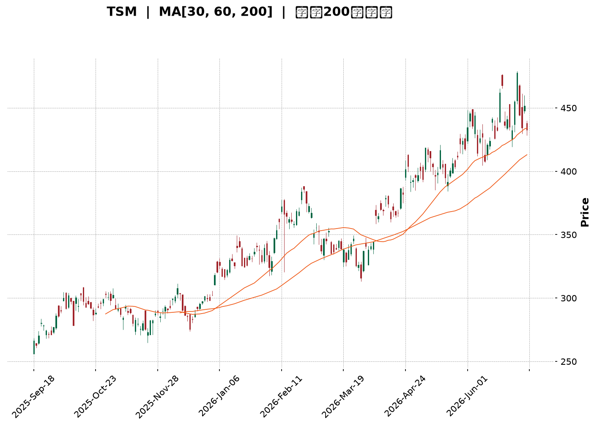
</details>

<html>
<head><meta charset="utf-8" /></head>
<body>
    <div style="height:500px; width:100%;">                        <script>window.PlotlyConfig = {MathJaxConfig: 'local'};</script>
        <script charset="utf-8" src="https://cdn.plot.ly/plotly-3.6.0.min.js" integrity="sha256-QaOVwtVY0T02VaHrr6pnoHLCwayMJp4O5n4YyaE3rJk=" crossorigin="anonymous"></script>                <div id="candlestick-chart" class="plotly-graph-div" style="height:100%; width:100%;"></div>            <script>                window.PLOTLYENV=window.PLOTLYENV || {};                                if (document.getElementById("candlestick-chart")) {                    Plotly.newPlot(                        "candlestick-chart",                        [{"close":{"dtype":"f8","bdata":"AAAAwKKocEAAAABgyWxwQAAAAAD653BAAAAA4P6HcUAAAADAPmhxQAAAAMDzJ3FAAAAAgJDzcEAAAABggPFwQAAAAAC0UXFAAAAAQG\u002fjcUAAAABAuN1xQAAAAEB9HnJAAAAAgJLAckAAAAAAsztyQAAAAAA64nJAAAAAYJGYckAAAACgc2dxQAAAAABayHJAAAAAQAVackAAAABgPuVyQAAAAMDul3JAAAAAIF5MckAAAADg9XVyQAAAAOBRQ3JAAAAAgPHpcUAAAADgTwdyQAAAAIB2SnJAAAAAILF+ckAAAADgwrJyQAAAAKBG63JAAAAA4JbNckAAAACATKFyQAAAAOCf53JAAAAAQAQ8ckAAAAAggjVyQAAAAICo73FAAAAAQCnEcUAAAABAYk9yQAAAACBMDnJAAAAA4JAFckAAAABg5n9xQAAAAMB9qXFAAAAAAOJ8cUAAAADgyztxQAAAACCZgnFAAAAAgEk1cUAAAABgjQ5xQAAAAGCipnFAAAAA4ESncUAAAACgFvtxQAAAAOCxE3JAAAAAwOTWcUAAAADg5hxyQAAAAAA+UnJAAAAAoDwqckAAAABAp0ZyQAAAAIAouHJAAAAAIJvQckAAAADgcTtzQAAAAOCH9HJAAAAA4J8ockAAAACALeRxQAAAAEBU1nFAAAAAgJU4cUAAAAAgeLNxQAAAAEBw93FAAAAAoFw8ckAAAADgx3ZyQAAAAGA6lHJAAAAAIInUckAAAABg+bVyQAAAAMCkoHJAAAAAAEDlckAAAAAAet9zQAAAAOB\u002fCXRAAAAAIPRbdEAAAABgrNBzQAAAACACxnNAAAAAYHcfdEAAAACACaF0QAAAAGAfmHRAAAAAINxWdEAAAABAJT51QAAAACA+SnVAAAAA4KdXdEAAAAAAGkd0QAAAAKD\u002fWnRAAAAAwGHSdEAAAADg\u002f690QAAAAOCdCXVAAAAAoKZIdUAAAACA4Bx1QAAAAMDGjXRAAAAAILA5dUAAAADAY+B0QAAAAIANQXRAAAAAgHuQdEAAAACg6bB1QAAAAEBVGXZAAAAAYMyAdkAAAABArUJ3QAAAAEBU43ZAAAAA4KHHdkAAAAAgQKV2QAAAAKBehnZAAAAAgJpodkAAAABAKwp3QAAAAMA1AndAAAAAIEf8d0AAAACAyxt4QAAAACD5bXdAAAAA4HlKd0AAAADgZ\u002fN2QAAAAGAK9XVAAAAAYKU5dkAAAAAAqQB2QAAAACBfEnVAAAAAYIaudUAAAACg5ZR1QAAAAIDNC3ZAAAAAoKvvdEAAAACAIwl1QAAAAKCzJ3VAAAAAIL+SdUAAAAAgbSx1QAAAAMD5H3VAAAAAQIiHdEAAAABgjBp1QAAAACArZ3VAAAAAIACvdUAAAACgkVV0QAAAACCgX3RAAAAAICu8c0AAAAAgkRJ1QAAAAAATS3VAAAAAYPcjdUAAAABgYk91QAAAACA2iHVAAAAAwLjQdkAAAABgLcp2QAAAAAC\u002fG3dAAAAAAE4Ld0AAAAAACrB3QAAAAACUY3dAAAAAYASodkAAAABgJhp3QAAAACAm1nZAAAAAIIXzdkAAAACAjih4QAAAAGBB3HdAAAAAoFAYeUAAAACAikB5QAAAAADGdnhAAAAAwI6OeEAAAACAJ7J4QAAAAMDay3hAAAAAIL8KeUAAAAAA0Zd4QAAAAIBRKHpAAAAAAOvSeUAAAACAfat5QAAAAICEOXlAAAAAAKHFeEAAAADA2u14QAAAAKDnC3pAAAAAIHw2eUAAAAAgZrB4QAAAAEAVe3hAAAAAIOgKeUAAAAAALmN5QAAAAMAyOXlAAAAA4LS1eUAAAACg4Ft6QAAAAKDgfXpAAAAAwI4XekAAAACgyyl7QAAAAIBX2ntAAAAAQLc6e0AAAACgFr57QAAAAEAz43lAAAAAYNicekAAAABAua56QAAAAGC4fHlAAAAAwB5RekAAAABA4X56QAAAAGBmlntAAAAAoEedekAAAABgZgJ7QAAAAIDr4XxAAAAAYLg6fUAAAACAPUZ7QAAAAKBHjXtAAAAAANcve0AAAACgmQV7QAAAAKCZcXxAAAAAwB7ZfUAAAAAgrsN7QAAAAGCPIntAAAAA4KM8fEAAAADAHgl7QA=="},"high":{"dtype":"f8","bdata":"d\u002f7lR8zGcEDyRywvxodwQPKCy40wI3FA95DLZDm8cUDgHPe8LnBxQH9a3ICSL3FADC4DeIkVcUBnkX8d6VpxQPWIirjgVHFAvdvO4VcDckD9UEInZ2ZyQFdvidHsW3JABq3m9VsOc0AbZc8zLwtzQHGYkEsSAHNAl9M1CGbHckCBrRXCpZ1yQKNJrUf543JApqa48UC2ckBuHgfoZwNzQKmHY2X4TnNALF1BBNzOckD7aBB2atRyQLntQL54kHJAmzkx3EVOckAkwZ3GpjxyQEuL1N\u002fteXJAWSuX1heickC66ylJSbxyQIZy2jfWGHNAR4DahYQOc0A2ztBUZBRzQE6AnW4gO3NAtvLMOxC6ckD9hTgVN35yQF8XZxJiRXJAWcKdPDracUCEMnxP6WxyQBxujAnUSXJAXiiZxghJckAfop9byfNxQI8GGyzgyXFA+K\u002fXIKPEcUB5xdm8\u002fV9xQHZ4lZA0pXFAJY20kPcockAhFTGhLUhxQGx9\u002fSxNrXFApIR38bKycUADe7D7VChyQCxtURocJnJAx3\u002fgbiMOckANHr0SKUNyQNtejsjQZHJArXcmBrM7ckBvNqcsLKdyQKolcnsQxHJACSqcVMTkckAdsBqIZ3hzQCIYmAhKBHNALM8nM3XrckA7vCySeWRyQHCp7Gaj73FAJqn2bNP5cUArlFoK8tpxQKzeVpaxKnJABClAVOZXckBGAFLKD4ZyQHUjwGv1mXJA0pWsoSHdckCfAj2i9e5yQDWInT7B73JAjdpiUfYcc0CQt\u002f1w\u002fv5zQEosWWfCmHRATr8djuO1dEDevlJ190l0QJRhv35QLXRA7s81wJwxdEBScxjnXr10QGcHGPEN63RAoblFO6KCdEBzQ2VhY9h1QA+tTonUwHVA5t7ETENGdUBusiOwzb50QDK1oTE\u002f1XRAojhCoKz2dEBEp2QPC9Z0QGrWC\u002f3vN3VAfgwTgpZ7dUDNs6GKkl91QFYter9yInVA7lUSFuVmdUC+p3ycQpR1QGQdYE\u002fwEHVA4h7GSJvNdEBZllHPwr51QLoLq0oHXHZASRtJACqudkA7qJusEJp3QMkjHRrAoHdAVza44D0Td0DIK2UFFsV2QGcuygXd93ZAVrPIA\u002feOdkBQAbStlyR3QCG1N8IrOHdAWJCMKuAyeECc32RKRUN4QPbGFiO9B3hAz5lHSudrd0D3YTIA6zJ3QMOLXABoInZAmR7r6L5zdkDmpraF9Vl2QI8FrM7XrnVAQvuOw6q5dUD0NzMO7vp1QBy2qqM2OHZAhMYMsLaRdUC6L7nj\u002fGt1QCQxIl+9bXVALPsUiTKfdUDzjAluMbJ1QG1mtKCxMXVA6ecg3\u002foMdUCC7sIIuWl1QN3gpgYwgXVAGLVeiRnadUC9XBzd0EF1QBBEROOjjHRAJdZZYkeNdECT1BPZ6Bl1QH1qY3HYvXVALe8AQVVUdUDa\u002fzhGVXZ1QFwljT2Qi3VAlvHovM5Wd0D3OF8a9fR2QNyzsY7ekXdAWmG8SXkpd0At9ccmRtR3QGV67Khm0XdA\u002fkQUclwVd0DfX6ZiPWt3QMJN4DhJE3dAcl668iMed0CJ5owgDzB4QHnZs5+gPXhAffRAOYiIeUAJyf1Egdh5QDSKMfQLz3hAaVQ3a82ueEDj+cR\u002fu914QCg14OS8MHlA1DwMmPVreUAT9un35VJ5QIsIANaCK3pA4WoZpEwwekDTrH9WaQB6QNR25ThwbHlAP1W4qM0UeUDWlKWMwDt5QDOoDPS+T3pA+NnrLJmOeUD0aDfH3l55QCoBET8r33hAtX5Xf\u002fsueUA3y\u002fyA+qd5QAV1cWVem3lAu1PyN0X4eUApeM5ptNh6QBTrOYedqXpAVsb4AfPWekDbROvxcAV8QKlCs5NR9XtABWaMeLsRfECUz\u002f6tae97QMKqpQEuDntA4Ad2Sr4Me0Dj4ERBLlJ7QGYoIPwulXpAAAAAAABkekAAAABACq96QAAAAKBHqXtAAAAAoEeFe0AAAAAAAKh7QAAAACCFE31AAAAA4KPMfUAAAACgR\u002fV7QAAAAIDCvXtAAAAAYGZOfEAAAACAFEJ7QAAAAKCZgXxAAAAAAADwfUAAAAAAKUh9QAAAACCF13xAAAAA4HrAfEAAAADAzHx7QA=="},"hovertemplate":"\u003cb\u003e%{x|%Y-%m-%d}\u003c\u002fb\u003e\u003cbr\u003e\u958b: $%{open:.2f}\u003cbr\u003e\u9ad8: $%{high:.2f}\u003cbr\u003e\u4f4e: $%{low:.2f}\u003cbr\u003e\u6536: $%{close:.2f}\u003cextra\u003e\u003c\u002fextra\u003e","low":{"dtype":"f8","bdata":"6I\u002fgfNH+b0DdiQOYFUxwQDROPq3+dXBAimZGiPlccUByizeG5yhxQJeXMdE9wXBA5\u002fegPhHIcEAAAABggPFwQNIzgZkG+3BAzpwKXgwwcUCRbbU1k8xxQKmQznCAA3JAqvz7JoWZckC09oMEyy9yQPgSnMfnOnJAuFvgBoRxckAk6H5xNmJxQMjRNbyNIHJAriLJ7v4QckBv4CeWlZtyQGYYkD\u002ftZXJAxpZ2\u002f9NJckBdrdbezGtyQPAXR3jTNXJAn6Vn19KicUACX+x52fVxQHZ9qiBqQXJAQLFoZk02ckAzJxMnPlxyQDnVcEhBwHJAvvFbW32nckA9NFaWxGVyQKE\u002fWZ4gvHJAxXC+ynEzckA89dwniRNyQGJSOpAh0nFAOKqDz2kvcUCZdBEZgRdyQD3ih39r6nFA\u002fkv3TQ71cUBT+GuT+VxxQLsJq0eA8XBArpXmhcxZcUCbSgDTZ+lwQNFjWB2OInFAlDrJx\u002fsjcUBrCYE\u002fvotwQK7H7Mrd8HBAP4VBuB7vcEDuWlkJsNdxQBbQ\u002f0DZ63FAyk7uiJ2PcUCemkWwtO5xQF+jq+BVvXFAKg9hDOb+cUDXNfoyUS9yQHiDBQxnZnJABZxJ\u002fKiCckDARA4IKcJyQK5gem6ZoXJA6xaicMAXckDUZ\u002fs\u002fJ+FxQMXiMDzSnXFAK\u002fUKlKgacUANO8GO1IRxQApyoJqHznFAiZQhdGkbckAo7infKytyQNdgfdpRa3JA0RtHUsWPckAHsucp15FyQCREfByTnnJAaW40b+3dckCEqsJFkWFzQPrmDaqP\u002fXNA6nLHSb8udECku2vycc5zQCcjLv49qHNAGWzOItTJc0B5QBnXjvZzQDJWZy1HkXRAonSBlWgydEDn+l5w7gJ1QDyQ\u002f6lHO3VA5LlMWYRTdEC3Z1EDGUB0QApoA2WEU3RA3VnFbquadEBlonYVhoh0QPXBo5NyzXRA\u002fnoU4bUOdUCY5u7wNWh0QNE0aFyJdnRAuHZyWYl2dEAxAP9ALoV0QDuau6rh1nNAftR\u002fAh3gc0AWP8I1t+50QAUd79QyoHVAQP03te4odkCfKBsf8ud2QPzZoKgcB3RAb5RK7qZudkCYLPdyiyZ2QMPunWGybXZAAYCuWqU5dkBi79\u002fVEVR2QMRW7105yXZATyrRFOBhd0D9AmQNou13QLjNB07M\u002fHZA+PKgOJvrdkD3XKmkaax2QLBaEqLwZXVAQ0VKt6QLdkBe8cAIh2B1QLPppzBa73RAAqArwWyjdECXG2hGpWh1QBoyVqvyyHVAZ8Vr8mrqdEARVeDf3ud0QMd8oeEsIXVAwUNG6r8ZdUCRhH8zwSh1QIle8kXiRnRAiU2GljdSdECm6GoWOaV0QM5lmVTV03RAbd\u002feyyhrdUA4Feu0wUl0QDHzCEXpGHRAcpa\u002fthGRc0CDo20+PAZ0QC54wqZML3VAkUMHYpVgdEBu3b3sQh11QKzaIUra7XRAB6RMHGlmdkAHvbUlCX52QBzbb4ItDndA2VSurx3TdkB1O8l0kUV3QOuQJChyNXdAD1DNS1J7dkBjJ1Arl8R2QL9EQititnZAeHg2bBzEdkBq2g+GYhx3QDWRtU3pbndAvW2LheCOeEBj8JOUbvd4QPDSAb3R\u002fHdAwSa\u002fcV40eEDVM2Ts8Ax4QNGSTeRrc3hAi9LJN22keEC7rjKS7Hp4QAogr0Ns+3hArwFj7YByeUAo1OsaGP94QEzOtqQn1HhA\u002fJpvbHwTeECUtVfX4mh4QFH795qREnlAtUkn817eeEBMYUyELmJ4QLL8usCQAnhAlWeKImaweECfjBu9Oel4QHb9vEKzHnlAlBhIaMqReUCecM9WjeZ5QG9odWLb23lAWY\u002fi+2YEekAbcajGNFh6QOrJrXTcL3tAVhWuizwYe0CGEEqe06R6QPjFvoY1vXlAr4PfXK9YekArtshVAEl5QKPmT6z1a3lAAAAAgMKNeUAAAAAgXBN6QAAAAEDh\u002fnpAAAAAQDOTekAAAACAPfp6QAAAAIA9ZntAAAAAYLgSfUAAAABACiN7QAAAAKBHCXtAAAAAQAoHe0AAAABACjN6QAAAAKBw8XpAAAAAAABQfEAAAAAghbd7QAAAAAAA2HpAAAAAoJnZe0AAAACA68F6QA=="},"name":"\u50f9\u683c","open":{"dtype":"f8","bdata":"nmoj9XP\u002fb0DUUuNWmYRwQM0mgWVMh3BArUZVDRODcUASgC0v5WFxQADIDj3B73BA+4XIhvr7cEBzwrvaQCVxQOJxPwKuEnFAFJOWkjVEcUB7h\u002fROOmNyQAIhcAsgKXJAdaQQqaGackCIOvNykANzQJnSp\u002f0YS3JAjE0NzyS\u002fckBcQslR1plyQGl\u002flmiIfnJAywtbbRlVckBj8CqHU\u002f5yQGdChDz8R3NAsmiCjhKBckB2mrT4eJpyQHIucReZinJApf0GEFkrckDOYGRIjPhxQGwUGJclVHJA1rzjsAqFckAeqW+LzX9yQBEYggOM9nJA0i\u002fa213LckAt0GEzkPlyQCdWS7GWw3JAVax\u002fX\u002fFockBdjyHKUCVyQHOXaX3PPHJAxdOHr66vcUDo4kIE8EByQDXv6\u002f9sHHJAZlMX\u002fnU2ckBMzs9MjO5xQFGW4rQLHHFAY9D0gNVzcUCjo13HFDZxQNhSioYULHFA\u002fwWLj84eckA8e4Rt1epwQK7H7Mrd8HBAAJvZMVCIcUCU5CWqb+1xQJkX9O8XI3JAmO9ONtTKcUBlucoheRtyQEVZaLdUHnJAyD7z3+c6ckD9l9pIxFtyQPp3kbSFrXJAb\u002fZSRVCackCKYiGguO9yQLJ6\u002fxoD\u002fHJALM8nM3XrckCbfjHhIFpyQGpHEYqJ3HFAhLTxrMDwcUCIYF4jkLhxQApyoJqHznFAkOah3HxSckAm9Rq8RT5yQEMXsfBag3JAlqnexLylckBDTz\u002fFqcNyQEXkcBnlzHJAGQJBLwDnckDQab5ABmZzQH5IYKw6i3RAZ5efQ12IdEAmd8tlBTB0QMkagU+QK3RAmt6uf\u002fric0DxpjTSHAd0QJBnks2LsnRAoblFO6KCdEBn4Y7exFB1QAXvszmqi3VAG0pKbp0wdUAEWQTcdbt0QPYpLSJNu3RAmqMm8s+ldEB2scLwRbF0QOZQVvxT7HRASaG6YUVUdUDr7Kk82yB1QCSdqg8j23RAuswWx\u002fWQdEBWBUhLvnR1QNw6IY0A3nRA4wQSppISdEBz\u002fc3wPvx0QGmIDd96r3VAhRHWrVGndkDvW0ir2AJ3QHvPhCfVkHdAJLq+Awv0dkCJrCptKYB2QPceJXHWn3ZA8sbxOvBddkADmCzF5F52QJjIsqn60XZAwTVxLjOXd0Cc32RKRUN4QBslCl4fA3hA\u002fmqsOM0Dd0DIeTzStrd2QI2X6f0NvHVAQjPylXw5dkClKAr7NhF2QMEeIpPAW3VAL2VtiADedEA6H6kS3ap1QMkjUUPGAXZAX5f3pW6CdUAMBT8FcGJ1QDRe+gbwN3VAf6B3HN48dUAtakzSjY91QKEGEJU2h3RARXAITUv+dECm6GoWOaV0QMvLNV+T7HRAS6c93xCTdUDbRoSrajB1QODyUAcjQXRAqPIV+vdmdEANKh1M6Rh0QItxyk+LcXVA0JgD4DhhdECy6FWcTC91QJ0HKeVZKnVAm43uPMwWd0AT1ScVOKd2QGVf+z5ma3dA\u002fuCQpVEWd0CodmuCeKJ3QNg5XV1NyHdA+VsHhfj\u002fdkCpS0zJP0V3QExhTLu3BXdAAAAAIIXzdkAV9Dr9lC53QGEsssii9XdAtKxEe26zeECkVWpyiMx5QKS7+fpCc3hA1IDWTd9\u002feEDhobDAFs54QCGQ+hpViHhA8MLIpjI5eUAZIim8eTp5QL5ncoRbF3lA019oi88RekCpxvYQnf95QNqDUpKiXHlAkzGQoCHNeEBHXEqEbtV4QLDnpXtJJHlAswHd7M1YeUD0aDfH3l55QFzwomqZSXhAYY491ijBeECfjBu9Oel4QF2zSiOTh3lAbogb+HnCeUCFEfdRW6B6QOezsYO8U3pA4ogNwiehekBHaft\u002fMn56QD4Xy1jPeHtAJDEOuQQPfEAXiEWA+9l6QFE6sgdBzHpAKz4Sf3psekC2f2EM+d16QO0ITqTiz3lAAAAAACnUeUAAAADAzEB6QAAAAEDhantAAAAA4FFAe0AAAAAAACx7QAAAAIAUbntAAAAAoHDBfUAAAABA4XJ7QAAAACCuH3tAAAAAYGZOfEAAAAAAAJB6QAAAAAAAUHtAAAAAgMJ5fEAAAABguDp9QAAAAOCjKHxAAAAA4Hr8e0AAAADgUWB7QA=="},"x":["2025-09-18T00:00:00-04:00","2025-09-19T00:00:00-04:00","2025-09-22T00:00:00-04:00","2025-09-23T00:00:00-04:00","2025-09-24T00:00:00-04:00","2025-09-25T00:00:00-04:00","2025-09-26T00:00:00-04:00","2025-09-29T00:00:00-04:00","2025-09-30T00:00:00-04:00","2025-10-01T00:00:00-04:00","2025-10-02T00:00:00-04:00","2025-10-03T00:00:00-04:00","2025-10-06T00:00:00-04:00","2025-10-07T00:00:00-04:00","2025-10-08T00:00:00-04:00","2025-10-09T00:00:00-04:00","2025-10-10T00:00:00-04:00","2025-10-13T00:00:00-04:00","2025-10-14T00:00:00-04:00","2025-10-15T00:00:00-04:00","2025-10-16T00:00:00-04:00","2025-10-17T00:00:00-04:00","2025-10-20T00:00:00-04:00","2025-10-21T00:00:00-04:00","2025-10-22T00:00:00-04:00","2025-10-23T00:00:00-04:00","2025-10-24T00:00:00-04:00","2025-10-27T00:00:00-04:00","2025-10-28T00:00:00-04:00","2025-10-29T00:00:00-04:00","2025-10-30T00:00:00-04:00","2025-10-31T00:00:00-04:00","2025-11-03T00:00:00-05:00","2025-11-04T00:00:00-05:00","2025-11-05T00:00:00-05:00","2025-11-06T00:00:00-05:00","2025-11-07T00:00:00-05:00","2025-11-10T00:00:00-05:00","2025-11-11T00:00:00-05:00","2025-11-12T00:00:00-05:00","2025-11-13T00:00:00-05:00","2025-11-14T00:00:00-05:00","2025-11-17T00:00:00-05:00","2025-11-18T00:00:00-05:00","2025-11-19T00:00:00-05:00","2025-11-20T00:00:00-05:00","2025-11-21T00:00:00-05:00","2025-11-24T00:00:00-05:00","2025-11-25T00:00:00-05:00","2025-11-26T00:00:00-05:00","2025-11-28T00:00:00-05:00","2025-12-01T00:00:00-05:00","2025-12-02T00:00:00-05:00","2025-12-03T00:00:00-05:00","2025-12-04T00:00:00-05:00","2025-12-05T00:00:00-05:00","2025-12-08T00:00:00-05:00","2025-12-09T00:00:00-05:00","2025-12-10T00:00:00-05:00","2025-12-11T00:00:00-05:00","2025-12-12T00:00:00-05:00","2025-12-15T00:00:00-05:00","2025-12-16T00:00:00-05:00","2025-12-17T00:00:00-05:00","2025-12-18T00:00:00-05:00","2025-12-19T00:00:00-05:00","2025-12-22T00:00:00-05:00","2025-12-23T00:00:00-05:00","2025-12-24T00:00:00-05:00","2025-12-26T00:00:00-05:00","2025-12-29T00:00:00-05:00","2025-12-30T00:00:00-05:00","2025-12-31T00:00:00-05:00","2026-01-02T00:00:00-05:00","2026-01-05T00:00:00-05:00","2026-01-06T00:00:00-05:00","2026-01-07T00:00:00-05:00","2026-01-08T00:00:00-05:00","2026-01-09T00:00:00-05:00","2026-01-12T00:00:00-05:00","2026-01-13T00:00:00-05:00","2026-01-14T00:00:00-05:00","2026-01-15T00:00:00-05:00","2026-01-16T00:00:00-05:00","2026-01-20T00:00:00-05:00","2026-01-21T00:00:00-05:00","2026-01-22T00:00:00-05:00","2026-01-23T00:00:00-05:00","2026-01-26T00:00:00-05:00","2026-01-27T00:00:00-05:00","2026-01-28T00:00:00-05:00","2026-01-29T00:00:00-05:00","2026-01-30T00:00:00-05:00","2026-02-02T00:00:00-05:00","2026-02-03T00:00:00-05:00","2026-02-04T00:00:00-05:00","2026-02-05T00:00:00-05:00","2026-02-06T00:00:00-05:00","2026-02-09T00:00:00-05:00","2026-02-10T00:00:00-05:00","2026-02-11T00:00:00-05:00","2026-02-12T00:00:00-05:00","2026-02-13T00:00:00-05:00","2026-02-17T00:00:00-05:00","2026-02-18T00:00:00-05:00","2026-02-19T00:00:00-05:00","2026-02-20T00:00:00-05:00","2026-02-23T00:00:00-05:00","2026-02-24T00:00:00-05:00","2026-02-25T00:00:00-05:00","2026-02-26T00:00:00-05:00","2026-02-27T00:00:00-05:00","2026-03-02T00:00:00-05:00","2026-03-03T00:00:00-05:00","2026-03-04T00:00:00-05:00","2026-03-05T00:00:00-05:00","2026-03-06T00:00:00-05:00","2026-03-09T00:00:00-04:00","2026-03-10T00:00:00-04:00","2026-03-11T00:00:00-04:00","2026-03-12T00:00:00-04:00","2026-03-13T00:00:00-04:00","2026-03-16T00:00:00-04:00","2026-03-17T00:00:00-04:00","2026-03-18T00:00:00-04:00","2026-03-19T00:00:00-04:00","2026-03-20T00:00:00-04:00","2026-03-23T00:00:00-04:00","2026-03-24T00:00:00-04:00","2026-03-25T00:00:00-04:00","2026-03-26T00:00:00-04:00","2026-03-27T00:00:00-04:00","2026-03-30T00:00:00-04:00","2026-03-31T00:00:00-04:00","2026-04-01T00:00:00-04:00","2026-04-02T00:00:00-04:00","2026-04-06T00:00:00-04:00","2026-04-07T00:00:00-04:00","2026-04-08T00:00:00-04:00","2026-04-09T00:00:00-04:00","2026-04-10T00:00:00-04:00","2026-04-13T00:00:00-04:00","2026-04-14T00:00:00-04:00","2026-04-15T00:00:00-04:00","2026-04-16T00:00:00-04:00","2026-04-17T00:00:00-04:00","2026-04-20T00:00:00-04:00","2026-04-21T00:00:00-04:00","2026-04-22T00:00:00-04:00","2026-04-23T00:00:00-04:00","2026-04-24T00:00:00-04:00","2026-04-27T00:00:00-04:00","2026-04-28T00:00:00-04:00","2026-04-29T00:00:00-04:00","2026-04-30T00:00:00-04:00","2026-05-01T00:00:00-04:00","2026-05-04T00:00:00-04:00","2026-05-05T00:00:00-04:00","2026-05-06T00:00:00-04:00","2026-05-07T00:00:00-04:00","2026-05-08T00:00:00-04:00","2026-05-11T00:00:00-04:00","2026-05-12T00:00:00-04:00","2026-05-13T00:00:00-04:00","2026-05-14T00:00:00-04:00","2026-05-15T00:00:00-04:00","2026-05-18T00:00:00-04:00","2026-05-19T00:00:00-04:00","2026-05-20T00:00:00-04:00","2026-05-21T00:00:00-04:00","2026-05-22T00:00:00-04:00","2026-05-26T00:00:00-04:00","2026-05-27T00:00:00-04:00","2026-05-28T00:00:00-04:00","2026-05-29T00:00:00-04:00","2026-06-01T00:00:00-04:00","2026-06-02T00:00:00-04:00","2026-06-03T00:00:00-04:00","2026-06-04T00:00:00-04:00","2026-06-05T00:00:00-04:00","2026-06-08T00:00:00-04:00","2026-06-09T00:00:00-04:00","2026-06-10T00:00:00-04:00","2026-06-11T00:00:00-04:00","2026-06-12T00:00:00-04:00","2026-06-15T00:00:00-04:00","2026-06-16T00:00:00-04:00","2026-06-17T00:00:00-04:00","2026-06-18T00:00:00-04:00","2026-06-22T00:00:00-04:00","2026-06-23T00:00:00-04:00","2026-06-24T00:00:00-04:00","2026-06-25T00:00:00-04:00","2026-06-26T00:00:00-04:00","2026-06-29T00:00:00-04:00","2026-06-30T00:00:00-04:00","2026-07-01T00:00:00-04:00","2026-07-02T00:00:00-04:00","2026-07-06T00:00:00-04:00","2026-07-07T00:00:00-04:00"],"type":"candlestick"},{"hovertemplate":"MA30: $%{y:.2f}\u003cextra\u003e\u003c\u002fextra\u003e","line":{"color":"#2196F3","dash":"dash","width":2},"mode":"lines","name":"MA30","x":["2025-09-18T00:00:00-04:00","2025-09-19T00:00:00-04:00","2025-09-22T00:00:00-04:00","2025-09-23T00:00:00-04:00","2025-09-24T00:00:00-04:00","2025-09-25T00:00:00-04:00","2025-09-26T00:00:00-04:00","2025-09-29T00:00:00-04:00","2025-09-30T00:00:00-04:00","2025-10-01T00:00:00-04:00","2025-10-02T00:00:00-04:00","2025-10-03T00:00:00-04:00","2025-10-06T00:00:00-04:00","2025-10-07T00:00:00-04:00","2025-10-08T00:00:00-04:00","2025-10-09T00:00:00-04:00","2025-10-10T00:00:00-04:00","2025-10-13T00:00:00-04:00","2025-10-14T00:00:00-04:00","2025-10-15T00:00:00-04:00","2025-10-16T00:00:00-04:00","2025-10-17T00:00:00-04:00","2025-10-20T00:00:00-04:00","2025-10-21T00:00:00-04:00","2025-10-22T00:00:00-04:00","2025-10-23T00:00:00-04:00","2025-10-24T00:00:00-04:00","2025-10-27T00:00:00-04:00","2025-10-28T00:00:00-04:00","2025-10-29T00:00:00-04:00","2025-10-30T00:00:00-04:00","2025-10-31T00:00:00-04:00","2025-11-03T00:00:00-05:00","2025-11-04T00:00:00-05:00","2025-11-05T00:00:00-05:00","2025-11-06T00:00:00-05:00","2025-11-07T00:00:00-05:00","2025-11-10T00:00:00-05:00","2025-11-11T00:00:00-05:00","2025-11-12T00:00:00-05:00","2025-11-13T00:00:00-05:00","2025-11-14T00:00:00-05:00","2025-11-17T00:00:00-05:00","2025-11-18T00:00:00-05:00","2025-11-19T00:00:00-05:00","2025-11-20T00:00:00-05:00","2025-11-21T00:00:00-05:00","2025-11-24T00:00:00-05:00","2025-11-25T00:00:00-05:00","2025-11-26T00:00:00-05:00","2025-11-28T00:00:00-05:00","2025-12-01T00:00:00-05:00","2025-12-02T00:00:00-05:00","2025-12-03T00:00:00-05:00","2025-12-04T00:00:00-05:00","2025-12-05T00:00:00-05:00","2025-12-08T00:00:00-05:00","2025-12-09T00:00:00-05:00","2025-12-10T00:00:00-05:00","2025-12-11T00:00:00-05:00","2025-12-12T00:00:00-05:00","2025-12-15T00:00:00-05:00","2025-12-16T00:00:00-05:00","2025-12-17T00:00:00-05:00","2025-12-18T00:00:00-05:00","2025-12-19T00:00:00-05:00","2025-12-22T00:00:00-05:00","2025-12-23T00:00:00-05:00","2025-12-24T00:00:00-05:00","2025-12-26T00:00:00-05:00","2025-12-29T00:00:00-05:00","2025-12-30T00:00:00-05:00","2025-12-31T00:00:00-05:00","2026-01-02T00:00:00-05:00","2026-01-05T00:00:00-05:00","2026-01-06T00:00:00-05:00","2026-01-07T00:00:00-05:00","2026-01-08T00:00:00-05:00","2026-01-09T00:00:00-05:00","2026-01-12T00:00:00-05:00","2026-01-13T00:00:00-05:00","2026-01-14T00:00:00-05:00","2026-01-15T00:00:00-05:00","2026-01-16T00:00:00-05:00","2026-01-20T00:00:00-05:00","2026-01-21T00:00:00-05:00","2026-01-22T00:00:00-05:00","2026-01-23T00:00:00-05:00","2026-01-26T00:00:00-05:00","2026-01-27T00:00:00-05:00","2026-01-28T00:00:00-05:00","2026-01-29T00:00:00-05:00","2026-01-30T00:00:00-05:00","2026-02-02T00:00:00-05:00","2026-02-03T00:00:00-05:00","2026-02-04T00:00:00-05:00","2026-02-05T00:00:00-05:00","2026-02-06T00:00:00-05:00","2026-02-09T00:00:00-05:00","2026-02-10T00:00:00-05:00","2026-02-11T00:00:00-05:00","2026-02-12T00:00:00-05:00","2026-02-13T00:00:00-05:00","2026-02-17T00:00:00-05:00","2026-02-18T00:00:00-05:00","2026-02-19T00:00:00-05:00","2026-02-20T00:00:00-05:00","2026-02-23T00:00:00-05:00","2026-02-24T00:00:00-05:00","2026-02-25T00:00:00-05:00","2026-02-26T00:00:00-05:00","2026-02-27T00:00:00-05:00","2026-03-02T00:00:00-05:00","2026-03-03T00:00:00-05:00","2026-03-04T00:00:00-05:00","2026-03-05T00:00:00-05:00","2026-03-06T00:00:00-05:00","2026-03-09T00:00:00-04:00","2026-03-10T00:00:00-04:00","2026-03-11T00:00:00-04:00","2026-03-12T00:00:00-04:00","2026-03-13T00:00:00-04:00","2026-03-16T00:00:00-04:00","2026-03-17T00:00:00-04:00","2026-03-18T00:00:00-04:00","2026-03-19T00:00:00-04:00","2026-03-20T00:00:00-04:00","2026-03-23T00:00:00-04:00","2026-03-24T00:00:00-04:00","2026-03-25T00:00:00-04:00","2026-03-26T00:00:00-04:00","2026-03-27T00:00:00-04:00","2026-03-30T00:00:00-04:00","2026-03-31T00:00:00-04:00","2026-04-01T00:00:00-04:00","2026-04-02T00:00:00-04:00","2026-04-06T00:00:00-04:00","2026-04-07T00:00:00-04:00","2026-04-08T00:00:00-04:00","2026-04-09T00:00:00-04:00","2026-04-10T00:00:00-04:00","2026-04-13T00:00:00-04:00","2026-04-14T00:00:00-04:00","2026-04-15T00:00:00-04:00","2026-04-16T00:00:00-04:00","2026-04-17T00:00:00-04:00","2026-04-20T00:00:00-04:00","2026-04-21T00:00:00-04:00","2026-04-22T00:00:00-04:00","2026-04-23T00:00:00-04:00","2026-04-24T00:00:00-04:00","2026-04-27T00:00:00-04:00","2026-04-28T00:00:00-04:00","2026-04-29T00:00:00-04:00","2026-04-30T00:00:00-04:00","2026-05-01T00:00:00-04:00","2026-05-04T00:00:00-04:00","2026-05-05T00:00:00-04:00","2026-05-06T00:00:00-04:00","2026-05-07T00:00:00-04:00","2026-05-08T00:00:00-04:00","2026-05-11T00:00:00-04:00","2026-05-12T00:00:00-04:00","2026-05-13T00:00:00-04:00","2026-05-14T00:00:00-04:00","2026-05-15T00:00:00-04:00","2026-05-18T00:00:00-04:00","2026-05-19T00:00:00-04:00","2026-05-20T00:00:00-04:00","2026-05-21T00:00:00-04:00","2026-05-22T00:00:00-04:00","2026-05-26T00:00:00-04:00","2026-05-27T00:00:00-04:00","2026-05-28T00:00:00-04:00","2026-05-29T00:00:00-04:00","2026-06-01T00:00:00-04:00","2026-06-02T00:00:00-04:00","2026-06-03T00:00:00-04:00","2026-06-04T00:00:00-04:00","2026-06-05T00:00:00-04:00","2026-06-08T00:00:00-04:00","2026-06-09T00:00:00-04:00","2026-06-10T00:00:00-04:00","2026-06-11T00:00:00-04:00","2026-06-12T00:00:00-04:00","2026-06-15T00:00:00-04:00","2026-06-16T00:00:00-04:00","2026-06-17T00:00:00-04:00","2026-06-18T00:00:00-04:00","2026-06-22T00:00:00-04:00","2026-06-23T00:00:00-04:00","2026-06-24T00:00:00-04:00","2026-06-25T00:00:00-04:00","2026-06-26T00:00:00-04:00","2026-06-29T00:00:00-04:00","2026-06-30T00:00:00-04:00","2026-07-01T00:00:00-04:00","2026-07-02T00:00:00-04:00","2026-07-06T00:00:00-04:00","2026-07-07T00:00:00-04:00"],"y":{"dtype":"f8","bdata":"AAAAAAAA+H8AAAAAAAD4fwAAAAAAAPh\u002fAAAAAAAA+H8AAAAAAAD4fwAAAAAAAPh\u002fAAAAAAAA+H8AAAAAAAD4fwAAAAAAAPh\u002fAAAAAAAA+H8AAAAAAAD4fwAAAAAAAPh\u002fAAAAAAAA+H8AAAAAAAD4fwAAAAAAAPh\u002fAAAAAAAA+H8AAAAAAAD4fwAAAAAAAPh\u002fAAAAAAAA+H8AAAAAAAD4fwAAAAAAAPh\u002fAAAAAAAA+H8AAAAAAAD4fwAAAAAAAPh\u002fAAAAAAAA+H8AAAAAAAD4fwAAAAAAAPh\u002fAAAAAAAA+H8AAAAAAAD4f1VVVSW993FAzczMjAkKckCJiIi42hxyQImIiMjoLXJAZmZm9ugzckCrqqqKwDpyQDMzM7NoQXJAmpmZuVxIckAzMzNjBlRyQJqZmblPWnJAq6qq+nJbckAiIiJiUlhyQAAAAABsVHJAmpmZ2aFJckBVVVUlGkFyQFVVVZVhNXJAq6qq2okpckDv7u4+kyZyQN7d3f3qHHJAVVVVpfUWckBVVVWFJw9yQHd3dxe\u002fCnJAVVVVpdQGckDe3d2t3ANyQERERARcBHJAd3d3p4AGckCrqqoqnQhyQLy7uztFDHJAvLu7OwAPckCamZmZjhNyQDMzM5PdE3JAAAAA4F0OckCrqqoKEAhyQLy7u+vz\u002fnFAiYiIGE72cUDe3d1t+PFxQCIiItI68nFAiYiIiDz2cUCJiIi4jPdxQImIiJgD\u002fHFAzczMvOkCckBERES0Pw1yQM3MzLx8FXJA7+7u3n8hckDNzMysBThyQGZmZuaVTXJAREREdHlockBVVVUFA4ByQAAAANAfknJAAAAAkDKnckCamZm5y71yQHd3d9dG03JAMzMz45vockCrqqoqUQNzQBEREYGmHHNAVVVVJTsvc0CamZkJUEBzQERERCRGTnNAzczMXGZfc0Dv7u5+0WtzQO\u002fu7n6WfXNAMzMzY0GYc0AiIiLSvrNzQN7d3U3tynNAvLu72xjtc0B3d3fHMQh0QFVVVQW3G3RAq6qq6pUvdEAzMzOTH0t0QBEREQEpaXRARERElICIdEAAAABgU690QO\u002fu7o6u03RARERE9NP0dEARERGxfAx1QBEREVG3IXVAREREVDQzdUDv7u6OuE51QBEREeFTanVAzczMvEmLdUDv7u7e+qh1QLy7u8sswXVAiYiIuFzadUAiIiIC8Oh1QLy7u3uh7nVAd3d3d7L+dUDv7u5uag12QHd3dzeHE3ZAVVVVxd0adkB3d3cHfyJ2QHd3dzcaK3ZAq6qq6iIodkC8u7t7eid2QKuqqvqbLHZAIiIi8pMvdkCrqqrKHDJ2QBERERGLOXZAERERsT45dkBVVVWVOzR2QO\u002fu7j5LLnZAiYiI+EwndkBVVVWVVA52QFVVVaXf+HVAiYiIOOTedUDNzMz8d9F1QHd3d3f1xnVAq6qqOiO8dUDNzMzMYK11QGZmZjbHoHVAAAAAAMuWdUDv7u7+iYt1QDMzM1PMiHVAMzMzQ7GGdUDv7u7u+ox1QImIiLgymXVA3t3djeCcdUCamZmZQqZ1QERERMRRtXVA7+7uDifAdUB3d3cnJNZ1QLy7u3uf5XVAMzMzcxwJdkCamZlZFy12QCIiIrJTSXZAzczMjMlidkC8u7tL2IB2QImIiJgsoHZAzczMbK7GdkCrqqr6dOR2QDMzM1MHDXdARERE9Fswd0ARERHR4113QLy7u0tJh3dAERERsUSyd0C8u7uLLdN3QKuqqiq9+3dAMzMzU30eeECJiIjIUjt4QKuqqlp8VHhA7+7u7n1neEDv7u6eqH14QDMzMwO1j3hAzczMLHSmeECJiIiYP714QN7d3Z2513hAd3d3Bwv1eEC8u7urshd5QN7d3R2BQnlAmpmZyQJneUBERERkmIV5QImIiLjklnlA3t3dLdijeUAAAADwDLB5QHd3dzfIuHlAREREBM3HeUCrqqqKKNd5QO\u002fu7v757nlAIiIi8mT8eUBmZmaGAxF6QERERGREKHpAVVVVxVNFekBmZmbWBFN6QM3MzKzgZnpAMzMzE3x7ekBVVVXFV416QDMzM6PMoXpAd3d3l1rJekCamZm5mON6QN7d3e0++npAvLu764AVe0Crqqp6kSN7QA=="},"type":"scatter"},{"hovertemplate":"MA60: $%{y:.2f}\u003cextra\u003e\u003c\u002fextra\u003e","line":{"color":"#9C27B0","dash":"dash","width":2},"mode":"lines","name":"MA60","x":["2025-09-18T00:00:00-04:00","2025-09-19T00:00:00-04:00","2025-09-22T00:00:00-04:00","2025-09-23T00:00:00-04:00","2025-09-24T00:00:00-04:00","2025-09-25T00:00:00-04:00","2025-09-26T00:00:00-04:00","2025-09-29T00:00:00-04:00","2025-09-30T00:00:00-04:00","2025-10-01T00:00:00-04:00","2025-10-02T00:00:00-04:00","2025-10-03T00:00:00-04:00","2025-10-06T00:00:00-04:00","2025-10-07T00:00:00-04:00","2025-10-08T00:00:00-04:00","2025-10-09T00:00:00-04:00","2025-10-10T00:00:00-04:00","2025-10-13T00:00:00-04:00","2025-10-14T00:00:00-04:00","2025-10-15T00:00:00-04:00","2025-10-16T00:00:00-04:00","2025-10-17T00:00:00-04:00","2025-10-20T00:00:00-04:00","2025-10-21T00:00:00-04:00","2025-10-22T00:00:00-04:00","2025-10-23T00:00:00-04:00","2025-10-24T00:00:00-04:00","2025-10-27T00:00:00-04:00","2025-10-28T00:00:00-04:00","2025-10-29T00:00:00-04:00","2025-10-30T00:00:00-04:00","2025-10-31T00:00:00-04:00","2025-11-03T00:00:00-05:00","2025-11-04T00:00:00-05:00","2025-11-05T00:00:00-05:00","2025-11-06T00:00:00-05:00","2025-11-07T00:00:00-05:00","2025-11-10T00:00:00-05:00","2025-11-11T00:00:00-05:00","2025-11-12T00:00:00-05:00","2025-11-13T00:00:00-05:00","2025-11-14T00:00:00-05:00","2025-11-17T00:00:00-05:00","2025-11-18T00:00:00-05:00","2025-11-19T00:00:00-05:00","2025-11-20T00:00:00-05:00","2025-11-21T00:00:00-05:00","2025-11-24T00:00:00-05:00","2025-11-25T00:00:00-05:00","2025-11-26T00:00:00-05:00","2025-11-28T00:00:00-05:00","2025-12-01T00:00:00-05:00","2025-12-02T00:00:00-05:00","2025-12-03T00:00:00-05:00","2025-12-04T00:00:00-05:00","2025-12-05T00:00:00-05:00","2025-12-08T00:00:00-05:00","2025-12-09T00:00:00-05:00","2025-12-10T00:00:00-05:00","2025-12-11T00:00:00-05:00","2025-12-12T00:00:00-05:00","2025-12-15T00:00:00-05:00","2025-12-16T00:00:00-05:00","2025-12-17T00:00:00-05:00","2025-12-18T00:00:00-05:00","2025-12-19T00:00:00-05:00","2025-12-22T00:00:00-05:00","2025-12-23T00:00:00-05:00","2025-12-24T00:00:00-05:00","2025-12-26T00:00:00-05:00","2025-12-29T00:00:00-05:00","2025-12-30T00:00:00-05:00","2025-12-31T00:00:00-05:00","2026-01-02T00:00:00-05:00","2026-01-05T00:00:00-05:00","2026-01-06T00:00:00-05:00","2026-01-07T00:00:00-05:00","2026-01-08T00:00:00-05:00","2026-01-09T00:00:00-05:00","2026-01-12T00:00:00-05:00","2026-01-13T00:00:00-05:00","2026-01-14T00:00:00-05:00","2026-01-15T00:00:00-05:00","2026-01-16T00:00:00-05:00","2026-01-20T00:00:00-05:00","2026-01-21T00:00:00-05:00","2026-01-22T00:00:00-05:00","2026-01-23T00:00:00-05:00","2026-01-26T00:00:00-05:00","2026-01-27T00:00:00-05:00","2026-01-28T00:00:00-05:00","2026-01-29T00:00:00-05:00","2026-01-30T00:00:00-05:00","2026-02-02T00:00:00-05:00","2026-02-03T00:00:00-05:00","2026-02-04T00:00:00-05:00","2026-02-05T00:00:00-05:00","2026-02-06T00:00:00-05:00","2026-02-09T00:00:00-05:00","2026-02-10T00:00:00-05:00","2026-02-11T00:00:00-05:00","2026-02-12T00:00:00-05:00","2026-02-13T00:00:00-05:00","2026-02-17T00:00:00-05:00","2026-02-18T00:00:00-05:00","2026-02-19T00:00:00-05:00","2026-02-20T00:00:00-05:00","2026-02-23T00:00:00-05:00","2026-02-24T00:00:00-05:00","2026-02-25T00:00:00-05:00","2026-02-26T00:00:00-05:00","2026-02-27T00:00:00-05:00","2026-03-02T00:00:00-05:00","2026-03-03T00:00:00-05:00","2026-03-04T00:00:00-05:00","2026-03-05T00:00:00-05:00","2026-03-06T00:00:00-05:00","2026-03-09T00:00:00-04:00","2026-03-10T00:00:00-04:00","2026-03-11T00:00:00-04:00","2026-03-12T00:00:00-04:00","2026-03-13T00:00:00-04:00","2026-03-16T00:00:00-04:00","2026-03-17T00:00:00-04:00","2026-03-18T00:00:00-04:00","2026-03-19T00:00:00-04:00","2026-03-20T00:00:00-04:00","2026-03-23T00:00:00-04:00","2026-03-24T00:00:00-04:00","2026-03-25T00:00:00-04:00","2026-03-26T00:00:00-04:00","2026-03-27T00:00:00-04:00","2026-03-30T00:00:00-04:00","2026-03-31T00:00:00-04:00","2026-04-01T00:00:00-04:00","2026-04-02T00:00:00-04:00","2026-04-06T00:00:00-04:00","2026-04-07T00:00:00-04:00","2026-04-08T00:00:00-04:00","2026-04-09T00:00:00-04:00","2026-04-10T00:00:00-04:00","2026-04-13T00:00:00-04:00","2026-04-14T00:00:00-04:00","2026-04-15T00:00:00-04:00","2026-04-16T00:00:00-04:00","2026-04-17T00:00:00-04:00","2026-04-20T00:00:00-04:00","2026-04-21T00:00:00-04:00","2026-04-22T00:00:00-04:00","2026-04-23T00:00:00-04:00","2026-04-24T00:00:00-04:00","2026-04-27T00:00:00-04:00","2026-04-28T00:00:00-04:00","2026-04-29T00:00:00-04:00","2026-04-30T00:00:00-04:00","2026-05-01T00:00:00-04:00","2026-05-04T00:00:00-04:00","2026-05-05T00:00:00-04:00","2026-05-06T00:00:00-04:00","2026-05-07T00:00:00-04:00","2026-05-08T00:00:00-04:00","2026-05-11T00:00:00-04:00","2026-05-12T00:00:00-04:00","2026-05-13T00:00:00-04:00","2026-05-14T00:00:00-04:00","2026-05-15T00:00:00-04:00","2026-05-18T00:00:00-04:00","2026-05-19T00:00:00-04:00","2026-05-20T00:00:00-04:00","2026-05-21T00:00:00-04:00","2026-05-22T00:00:00-04:00","2026-05-26T00:00:00-04:00","2026-05-27T00:00:00-04:00","2026-05-28T00:00:00-04:00","2026-05-29T00:00:00-04:00","2026-06-01T00:00:00-04:00","2026-06-02T00:00:00-04:00","2026-06-03T00:00:00-04:00","2026-06-04T00:00:00-04:00","2026-06-05T00:00:00-04:00","2026-06-08T00:00:00-04:00","2026-06-09T00:00:00-04:00","2026-06-10T00:00:00-04:00","2026-06-11T00:00:00-04:00","2026-06-12T00:00:00-04:00","2026-06-15T00:00:00-04:00","2026-06-16T00:00:00-04:00","2026-06-17T00:00:00-04:00","2026-06-18T00:00:00-04:00","2026-06-22T00:00:00-04:00","2026-06-23T00:00:00-04:00","2026-06-24T00:00:00-04:00","2026-06-25T00:00:00-04:00","2026-06-26T00:00:00-04:00","2026-06-29T00:00:00-04:00","2026-06-30T00:00:00-04:00","2026-07-01T00:00:00-04:00","2026-07-02T00:00:00-04:00","2026-07-06T00:00:00-04:00","2026-07-07T00:00:00-04:00"],"y":{"dtype":"f8","bdata":"AAAAAAAA+H8AAAAAAAD4fwAAAAAAAPh\u002fAAAAAAAA+H8AAAAAAAD4fwAAAAAAAPh\u002fAAAAAAAA+H8AAAAAAAD4fwAAAAAAAPh\u002fAAAAAAAA+H8AAAAAAAD4fwAAAAAAAPh\u002fAAAAAAAA+H8AAAAAAAD4fwAAAAAAAPh\u002fAAAAAAAA+H8AAAAAAAD4fwAAAAAAAPh\u002fAAAAAAAA+H8AAAAAAAD4fwAAAAAAAPh\u002fAAAAAAAA+H8AAAAAAAD4fwAAAAAAAPh\u002fAAAAAAAA+H8AAAAAAAD4fwAAAAAAAPh\u002fAAAAAAAA+H8AAAAAAAD4fwAAAAAAAPh\u002fAAAAAAAA+H8AAAAAAAD4fwAAAAAAAPh\u002fAAAAAAAA+H8AAAAAAAD4fwAAAAAAAPh\u002fAAAAAAAA+H8AAAAAAAD4fwAAAAAAAPh\u002fAAAAAAAA+H8AAAAAAAD4fwAAAAAAAPh\u002fAAAAAAAA+H8AAAAAAAD4fwAAAAAAAPh\u002fAAAAAAAA+H8AAAAAAAD4fwAAAAAAAPh\u002fAAAAAAAA+H8AAAAAAAD4fwAAAAAAAPh\u002fAAAAAAAA+H8AAAAAAAD4fwAAAAAAAPh\u002fAAAAAAAA+H8AAAAAAAD4fwAAAAAAAPh\u002fAAAAAAAA+H8AAAAAAAD4f0RERFzNBXJAZmZmtjMMckCamZlhdRJyQCIiIlpuFnJAd3d3hxsVckBERER8XBZyQKuqqsLRGXJAERERoUwfckDe3d2NySVyQBEREakpK3JAvLu7Wy4vckAzMzMLyTJyQGZmZl70NHJARERE3JA1ckARERHpjzxyQN7d3b17QXJAd3d3pwFJckAiIiIiS1NyQO\u002fu7maFV3JAq6qqGhRfckB3d3efeWZyQHd3d\u002fcCb3JARERERLh3ckBERETsloNyQKuqqkKBkHJAZmZm5t2ackAiIiKadqRyQAAAALBFrXJARERETDO3ckBEREQMsL9yQBEREQm6yHJAmpmZoU\u002fTckBmZmZu591yQM3MzJzw5HJAIiIierPxckCrqqoaFf1yQLy7u+v4BnNAmpmZOekSc0De3d0lViFzQM3MzEyWMnNAiYiIKLVFc0AiIiKKSV5zQN7d3aWVdHNAmpmZ6SmLc0Dv7u4uQaJzQLy7u5umt3NARERE5NbNc0AiIiLKXedzQImIiNg5\u002fnNAZmZmJj4ZdEBERERMYzN0QJqZmdE5SnRA3t3dTXxhdEBmZmaWIHZ0QGZmZv6jhXRAZmZmzvaWdEBEREQ83aZ0QN7d3a3msHRAERERESK9dEAzMzNDKMd0QDMzM1tY1HRA7+7uJjLgdEDv7u6mnO10QERERKTE+3RA7+7uZlYOdUARERFJJx11QDMzMwuhKnVA3t3dTWo0dUBERESUrT91QAAAACC6S3VAZmZmxuZXdUCrqqr60151QCIiIhpHZnVAZmZmFtxpdUDv7u5W+m51QERERGRWdHVAd3d3x6t3dUDe3d2tDH51QLy7u4uNhXVAZmZmXgqRdUDv7u5uQpp1QHd3d4\u002f8pHVA3t3d\u002fYawdUCJiIh49bp1QCIiIhrqw3VAq6qqgsnNdUBERESE1tl1QN7d3X1s5HVAIiIiaoLtdUB3d3eXUfx1QJqZmdlcCHZA7+7urp8YdkCrqqrqSCp2QGZmZtb3OnZAd3d3vy5JdkAzMzOLell2QM3MzNTbbHZA7+7ujvZ\u002fdkAAAABIWIx2QBEREUmpnXZAZmZmdtSrdkAzMzMzHLZ2QImIiHgUwHZAzczMdJTIdkBERETEUtJ2QBEREVFZ4XZA7+7uRlDtdkCrqqrKWfR2QImIiMih+nZAd3d3dyT\u002fdkDv7u5OmQR3QDMzM6tADHdAAAAAuJIWd0C8u7tDHSV3QDMzMyt2OHdAq6qqyvVId0Crqqqi+l53QBEREXHpe3dARERE7JSTd0De3d1F3q13QCIiIhpCvndAiYiIUHrWd0DNzMwkku53QM3MzPQNAXhAiYiISEsVeEAzMzNrACx4QLy7u0uTR3hAd3d3r4lheECJiIhAvHp4QLy7u9ulmnhAzczM3Ne6eEC8u7tTdNh4QERERPwU93hAIiIiYuAWeUCJiIioQjB5QO\u002fu7ubETnlAVVVV9etzeUARERHBdY95QERERKRdp3lAVVVVbX++eUDNzMwMndB5QA=="},"type":"scatter"},{"hovertemplate":"MA200: $%{y:.2f}\u003cextra\u003e\u003c\u002fextra\u003e","line":{"color":"#FF6F00","dash":"solid","width":2},"mode":"lines","name":"MA200","x":["2025-09-18T00:00:00-04:00","2025-09-19T00:00:00-04:00","2025-09-22T00:00:00-04:00","2025-09-23T00:00:00-04:00","2025-09-24T00:00:00-04:00","2025-09-25T00:00:00-04:00","2025-09-26T00:00:00-04:00","2025-09-29T00:00:00-04:00","2025-09-30T00:00:00-04:00","2025-10-01T00:00:00-04:00","2025-10-02T00:00:00-04:00","2025-10-03T00:00:00-04:00","2025-10-06T00:00:00-04:00","2025-10-07T00:00:00-04:00","2025-10-08T00:00:00-04:00","2025-10-09T00:00:00-04:00","2025-10-10T00:00:00-04:00","2025-10-13T00:00:00-04:00","2025-10-14T00:00:00-04:00","2025-10-15T00:00:00-04:00","2025-10-16T00:00:00-04:00","2025-10-17T00:00:00-04:00","2025-10-20T00:00:00-04:00","2025-10-21T00:00:00-04:00","2025-10-22T00:00:00-04:00","2025-10-23T00:00:00-04:00","2025-10-24T00:00:00-04:00","2025-10-27T00:00:00-04:00","2025-10-28T00:00:00-04:00","2025-10-29T00:00:00-04:00","2025-10-30T00:00:00-04:00","2025-10-31T00:00:00-04:00","2025-11-03T00:00:00-05:00","2025-11-04T00:00:00-05:00","2025-11-05T00:00:00-05:00","2025-11-06T00:00:00-05:00","2025-11-07T00:00:00-05:00","2025-11-10T00:00:00-05:00","2025-11-11T00:00:00-05:00","2025-11-12T00:00:00-05:00","2025-11-13T00:00:00-05:00","2025-11-14T00:00:00-05:00","2025-11-17T00:00:00-05:00","2025-11-18T00:00:00-05:00","2025-11-19T00:00:00-05:00","2025-11-20T00:00:00-05:00","2025-11-21T00:00:00-05:00","2025-11-24T00:00:00-05:00","2025-11-25T00:00:00-05:00","2025-11-26T00:00:00-05:00","2025-11-28T00:00:00-05:00","2025-12-01T00:00:00-05:00","2025-12-02T00:00:00-05:00","2025-12-03T00:00:00-05:00","2025-12-04T00:00:00-05:00","2025-12-05T00:00:00-05:00","2025-12-08T00:00:00-05:00","2025-12-09T00:00:00-05:00","2025-12-10T00:00:00-05:00","2025-12-11T00:00:00-05:00","2025-12-12T00:00:00-05:00","2025-12-15T00:00:00-05:00","2025-12-16T00:00:00-05:00","2025-12-17T00:00:00-05:00","2025-12-18T00:00:00-05:00","2025-12-19T00:00:00-05:00","2025-12-22T00:00:00-05:00","2025-12-23T00:00:00-05:00","2025-12-24T00:00:00-05:00","2025-12-26T00:00:00-05:00","2025-12-29T00:00:00-05:00","2025-12-30T00:00:00-05:00","2025-12-31T00:00:00-05:00","2026-01-02T00:00:00-05:00","2026-01-05T00:00:00-05:00","2026-01-06T00:00:00-05:00","2026-01-07T00:00:00-05:00","2026-01-08T00:00:00-05:00","2026-01-09T00:00:00-05:00","2026-01-12T00:00:00-05:00","2026-01-13T00:00:00-05:00","2026-01-14T00:00:00-05:00","2026-01-15T00:00:00-05:00","2026-01-16T00:00:00-05:00","2026-01-20T00:00:00-05:00","2026-01-21T00:00:00-05:00","2026-01-22T00:00:00-05:00","2026-01-23T00:00:00-05:00","2026-01-26T00:00:00-05:00","2026-01-27T00:00:00-05:00","2026-01-28T00:00:00-05:00","2026-01-29T00:00:00-05:00","2026-01-30T00:00:00-05:00","2026-02-02T00:00:00-05:00","2026-02-03T00:00:00-05:00","2026-02-04T00:00:00-05:00","2026-02-05T00:00:00-05:00","2026-02-06T00:00:00-05:00","2026-02-09T00:00:00-05:00","2026-02-10T00:00:00-05:00","2026-02-11T00:00:00-05:00","2026-02-12T00:00:00-05:00","2026-02-13T00:00:00-05:00","2026-02-17T00:00:00-05:00","2026-02-18T00:00:00-05:00","2026-02-19T00:00:00-05:00","2026-02-20T00:00:00-05:00","2026-02-23T00:00:00-05:00","2026-02-24T00:00:00-05:00","2026-02-25T00:00:00-05:00","2026-02-26T00:00:00-05:00","2026-02-27T00:00:00-05:00","2026-03-02T00:00:00-05:00","2026-03-03T00:00:00-05:00","2026-03-04T00:00:00-05:00","2026-03-05T00:00:00-05:00","2026-03-06T00:00:00-05:00","2026-03-09T00:00:00-04:00","2026-03-10T00:00:00-04:00","2026-03-11T00:00:00-04:00","2026-03-12T00:00:00-04:00","2026-03-13T00:00:00-04:00","2026-03-16T00:00:00-04:00","2026-03-17T00:00:00-04:00","2026-03-18T00:00:00-04:00","2026-03-19T00:00:00-04:00","2026-03-20T00:00:00-04:00","2026-03-23T00:00:00-04:00","2026-03-24T00:00:00-04:00","2026-03-25T00:00:00-04:00","2026-03-26T00:00:00-04:00","2026-03-27T00:00:00-04:00","2026-03-30T00:00:00-04:00","2026-03-31T00:00:00-04:00","2026-04-01T00:00:00-04:00","2026-04-02T00:00:00-04:00","2026-04-06T00:00:00-04:00","2026-04-07T00:00:00-04:00","2026-04-08T00:00:00-04:00","2026-04-09T00:00:00-04:00","2026-04-10T00:00:00-04:00","2026-04-13T00:00:00-04:00","2026-04-14T00:00:00-04:00","2026-04-15T00:00:00-04:00","2026-04-16T00:00:00-04:00","2026-04-17T00:00:00-04:00","2026-04-20T00:00:00-04:00","2026-04-21T00:00:00-04:00","2026-04-22T00:00:00-04:00","2026-04-23T00:00:00-04:00","2026-04-24T00:00:00-04:00","2026-04-27T00:00:00-04:00","2026-04-28T00:00:00-04:00","2026-04-29T00:00:00-04:00","2026-04-30T00:00:00-04:00","2026-05-01T00:00:00-04:00","2026-05-04T00:00:00-04:00","2026-05-05T00:00:00-04:00","2026-05-06T00:00:00-04:00","2026-05-07T00:00:00-04:00","2026-05-08T00:00:00-04:00","2026-05-11T00:00:00-04:00","2026-05-12T00:00:00-04:00","2026-05-13T00:00:00-04:00","2026-05-14T00:00:00-04:00","2026-05-15T00:00:00-04:00","2026-05-18T00:00:00-04:00","2026-05-19T00:00:00-04:00","2026-05-20T00:00:00-04:00","2026-05-21T00:00:00-04:00","2026-05-22T00:00:00-04:00","2026-05-26T00:00:00-04:00","2026-05-27T00:00:00-04:00","2026-05-28T00:00:00-04:00","2026-05-29T00:00:00-04:00","2026-06-01T00:00:00-04:00","2026-06-02T00:00:00-04:00","2026-06-03T00:00:00-04:00","2026-06-04T00:00:00-04:00","2026-06-05T00:00:00-04:00","2026-06-08T00:00:00-04:00","2026-06-09T00:00:00-04:00","2026-06-10T00:00:00-04:00","2026-06-11T00:00:00-04:00","2026-06-12T00:00:00-04:00","2026-06-15T00:00:00-04:00","2026-06-16T00:00:00-04:00","2026-06-17T00:00:00-04:00","2026-06-18T00:00:00-04:00","2026-06-22T00:00:00-04:00","2026-06-23T00:00:00-04:00","2026-06-24T00:00:00-04:00","2026-06-25T00:00:00-04:00","2026-06-26T00:00:00-04:00","2026-06-29T00:00:00-04:00","2026-06-30T00:00:00-04:00","2026-07-01T00:00:00-04:00","2026-07-02T00:00:00-04:00","2026-07-06T00:00:00-04:00","2026-07-07T00:00:00-04:00"],"y":{"dtype":"f8","bdata":"AAAAAAAA+H8AAAAAAAD4fwAAAAAAAPh\u002fAAAAAAAA+H8AAAAAAAD4fwAAAAAAAPh\u002fAAAAAAAA+H8AAAAAAAD4fwAAAAAAAPh\u002fAAAAAAAA+H8AAAAAAAD4fwAAAAAAAPh\u002fAAAAAAAA+H8AAAAAAAD4fwAAAAAAAPh\u002fAAAAAAAA+H8AAAAAAAD4fwAAAAAAAPh\u002fAAAAAAAA+H8AAAAAAAD4fwAAAAAAAPh\u002fAAAAAAAA+H8AAAAAAAD4fwAAAAAAAPh\u002fAAAAAAAA+H8AAAAAAAD4fwAAAAAAAPh\u002fAAAAAAAA+H8AAAAAAAD4fwAAAAAAAPh\u002fAAAAAAAA+H8AAAAAAAD4fwAAAAAAAPh\u002fAAAAAAAA+H8AAAAAAAD4fwAAAAAAAPh\u002fAAAAAAAA+H8AAAAAAAD4fwAAAAAAAPh\u002fAAAAAAAA+H8AAAAAAAD4fwAAAAAAAPh\u002fAAAAAAAA+H8AAAAAAAD4fwAAAAAAAPh\u002fAAAAAAAA+H8AAAAAAAD4fwAAAAAAAPh\u002fAAAAAAAA+H8AAAAAAAD4fwAAAAAAAPh\u002fAAAAAAAA+H8AAAAAAAD4fwAAAAAAAPh\u002fAAAAAAAA+H8AAAAAAAD4fwAAAAAAAPh\u002fAAAAAAAA+H8AAAAAAAD4fwAAAAAAAPh\u002fAAAAAAAA+H8AAAAAAAD4fwAAAAAAAPh\u002fAAAAAAAA+H8AAAAAAAD4fwAAAAAAAPh\u002fAAAAAAAA+H8AAAAAAAD4fwAAAAAAAPh\u002fAAAAAAAA+H8AAAAAAAD4fwAAAAAAAPh\u002fAAAAAAAA+H8AAAAAAAD4fwAAAAAAAPh\u002fAAAAAAAA+H8AAAAAAAD4fwAAAAAAAPh\u002fAAAAAAAA+H8AAAAAAAD4fwAAAAAAAPh\u002fAAAAAAAA+H8AAAAAAAD4fwAAAAAAAPh\u002fAAAAAAAA+H8AAAAAAAD4fwAAAAAAAPh\u002fAAAAAAAA+H8AAAAAAAD4fwAAAAAAAPh\u002fAAAAAAAA+H8AAAAAAAD4fwAAAAAAAPh\u002fAAAAAAAA+H8AAAAAAAD4fwAAAAAAAPh\u002fAAAAAAAA+H8AAAAAAAD4fwAAAAAAAPh\u002fAAAAAAAA+H8AAAAAAAD4fwAAAAAAAPh\u002fAAAAAAAA+H8AAAAAAAD4fwAAAAAAAPh\u002fAAAAAAAA+H8AAAAAAAD4fwAAAAAAAPh\u002fAAAAAAAA+H8AAAAAAAD4fwAAAAAAAPh\u002fAAAAAAAA+H8AAAAAAAD4fwAAAAAAAPh\u002fAAAAAAAA+H8AAAAAAAD4fwAAAAAAAPh\u002fAAAAAAAA+H8AAAAAAAD4fwAAAAAAAPh\u002fAAAAAAAA+H8AAAAAAAD4fwAAAAAAAPh\u002fAAAAAAAA+H8AAAAAAAD4fwAAAAAAAPh\u002fAAAAAAAA+H8AAAAAAAD4fwAAAAAAAPh\u002fAAAAAAAA+H8AAAAAAAD4fwAAAAAAAPh\u002fAAAAAAAA+H8AAAAAAAD4fwAAAAAAAPh\u002fAAAAAAAA+H8AAAAAAAD4fwAAAAAAAPh\u002fAAAAAAAA+H8AAAAAAAD4fwAAAAAAAPh\u002fAAAAAAAA+H8AAAAAAAD4fwAAAAAAAPh\u002fAAAAAAAA+H8AAAAAAAD4fwAAAAAAAPh\u002fAAAAAAAA+H8AAAAAAAD4fwAAAAAAAPh\u002fAAAAAAAA+H8AAAAAAAD4fwAAAAAAAPh\u002fAAAAAAAA+H8AAAAAAAD4fwAAAAAAAPh\u002fAAAAAAAA+H8AAAAAAAD4fwAAAAAAAPh\u002fAAAAAAAA+H8AAAAAAAD4fwAAAAAAAPh\u002fAAAAAAAA+H8AAAAAAAD4fwAAAAAAAPh\u002fAAAAAAAA+H8AAAAAAAD4fwAAAAAAAPh\u002fAAAAAAAA+H8AAAAAAAD4fwAAAAAAAPh\u002fAAAAAAAA+H8AAAAAAAD4fwAAAAAAAPh\u002fAAAAAAAA+H8AAAAAAAD4fwAAAAAAAPh\u002fAAAAAAAA+H8AAAAAAAD4fwAAAAAAAPh\u002fAAAAAAAA+H8AAAAAAAD4fwAAAAAAAPh\u002fAAAAAAAA+H8AAAAAAAD4fwAAAAAAAPh\u002fAAAAAAAA+H8AAAAAAAD4fwAAAAAAAPh\u002fAAAAAAAA+H8AAAAAAAD4fwAAAAAAAPh\u002fAAAAAAAA+H8AAAAAAAD4fwAAAAAAAPh\u002fAAAAAAAA+H8AAAAAAAD4fwAAAAAAAPh\u002fAAAAAAAA+H+F61GMS4V1QA=="},"type":"scatter"}],                        {"template":{"data":{"barpolar":[{"marker":{"line":{"color":"rgb(17,17,17)","width":0.5},"pattern":{"fillmode":"overlay","size":10,"solidity":0.2}},"type":"barpolar"}],"bar":[{"error_x":{"color":"#f2f5fa"},"error_y":{"color":"#f2f5fa"},"marker":{"line":{"color":"rgb(17,17,17)","width":0.5},"pattern":{"fillmode":"overlay","size":10,"solidity":0.2}},"type":"bar"}],"carpet":[{"aaxis":{"endlinecolor":"#A2B1C6","gridcolor":"#506784","linecolor":"#506784","minorgridcolor":"#506784","startlinecolor":"#A2B1C6"},"baxis":{"endlinecolor":"#A2B1C6","gridcolor":"#506784","linecolor":"#506784","minorgridcolor":"#506784","startlinecolor":"#A2B1C6"},"type":"carpet"}],"choropleth":[{"colorbar":{"outlinewidth":0,"ticks":""},"type":"choropleth"}],"contourcarpet":[{"colorbar":{"outlinewidth":0,"ticks":""},"type":"contourcarpet"}],"contour":[{"colorbar":{"outlinewidth":0,"ticks":""},"colorscale":[[0.0,"#0d0887"],[0.1111111111111111,"#46039f"],[0.2222222222222222,"#7201a8"],[0.3333333333333333,"#9c179e"],[0.4444444444444444,"#bd3786"],[0.5555555555555556,"#d8576b"],[0.6666666666666666,"#ed7953"],[0.7777777777777778,"#fb9f3a"],[0.8888888888888888,"#fdca26"],[1.0,"#f0f921"]],"type":"contour"}],"heatmap":[{"colorbar":{"outlinewidth":0,"ticks":""},"colorscale":[[0.0,"#0d0887"],[0.1111111111111111,"#46039f"],[0.2222222222222222,"#7201a8"],[0.3333333333333333,"#9c179e"],[0.4444444444444444,"#bd3786"],[0.5555555555555556,"#d8576b"],[0.6666666666666666,"#ed7953"],[0.7777777777777778,"#fb9f3a"],[0.8888888888888888,"#fdca26"],[1.0,"#f0f921"]],"type":"heatmap"}],"histogram2dcontour":[{"colorbar":{"outlinewidth":0,"ticks":""},"colorscale":[[0.0,"#0d0887"],[0.1111111111111111,"#46039f"],[0.2222222222222222,"#7201a8"],[0.3333333333333333,"#9c179e"],[0.4444444444444444,"#bd3786"],[0.5555555555555556,"#d8576b"],[0.6666666666666666,"#ed7953"],[0.7777777777777778,"#fb9f3a"],[0.8888888888888888,"#fdca26"],[1.0,"#f0f921"]],"type":"histogram2dcontour"}],"histogram2d":[{"colorbar":{"outlinewidth":0,"ticks":""},"colorscale":[[0.0,"#0d0887"],[0.1111111111111111,"#46039f"],[0.2222222222222222,"#7201a8"],[0.3333333333333333,"#9c179e"],[0.4444444444444444,"#bd3786"],[0.5555555555555556,"#d8576b"],[0.6666666666666666,"#ed7953"],[0.7777777777777778,"#fb9f3a"],[0.8888888888888888,"#fdca26"],[1.0,"#f0f921"]],"type":"histogram2d"}],"histogram":[{"marker":{"pattern":{"fillmode":"overlay","size":10,"solidity":0.2}},"type":"histogram"}],"mesh3d":[{"colorbar":{"outlinewidth":0,"ticks":""},"type":"mesh3d"}],"parcoords":[{"line":{"colorbar":{"outlinewidth":0,"ticks":""}},"type":"parcoords"}],"pie":[{"automargin":true,"type":"pie"}],"scatter3d":[{"line":{"colorbar":{"outlinewidth":0,"ticks":""}},"marker":{"colorbar":{"outlinewidth":0,"ticks":""}},"type":"scatter3d"}],"scattercarpet":[{"marker":{"colorbar":{"outlinewidth":0,"ticks":""}},"type":"scattercarpet"}],"scattergeo":[{"marker":{"colorbar":{"outlinewidth":0,"ticks":""}},"type":"scattergeo"}],"scattergl":[{"marker":{"line":{"color":"#283442"}},"type":"scattergl"}],"scattermapbox":[{"marker":{"colorbar":{"outlinewidth":0,"ticks":""}},"type":"scattermapbox"}],"scattermap":[{"marker":{"colorbar":{"outlinewidth":0,"ticks":""}},"type":"scattermap"}],"scatterpolargl":[{"marker":{"colorbar":{"outlinewidth":0,"ticks":""}},"type":"scatterpolargl"}],"scatterpolar":[{"marker":{"colorbar":{"outlinewidth":0,"ticks":""}},"type":"scatterpolar"}],"scatter":[{"marker":{"line":{"color":"#283442"}},"type":"scatter"}],"scatterternary":[{"marker":{"colorbar":{"outlinewidth":0,"ticks":""}},"type":"scatterternary"}],"surface":[{"colorbar":{"outlinewidth":0,"ticks":""},"colorscale":[[0.0,"#0d0887"],[0.1111111111111111,"#46039f"],[0.2222222222222222,"#7201a8"],[0.3333333333333333,"#9c179e"],[0.4444444444444444,"#bd3786"],[0.5555555555555556,"#d8576b"],[0.6666666666666666,"#ed7953"],[0.7777777777777778,"#fb9f3a"],[0.8888888888888888,"#fdca26"],[1.0,"#f0f921"]],"type":"surface"}],"table":[{"cells":{"fill":{"color":"#506784"},"line":{"color":"rgb(17,17,17)"}},"header":{"fill":{"color":"#2a3f5f"},"line":{"color":"rgb(17,17,17)"}},"type":"table"}]},"layout":{"annotationdefaults":{"arrowcolor":"#f2f5fa","arrowhead":0,"arrowwidth":1},"autotypenumbers":"strict","coloraxis":{"colorbar":{"outlinewidth":0,"ticks":""}},"colorscale":{"diverging":[[0,"#8e0152"],[0.1,"#c51b7d"],[0.2,"#de77ae"],[0.3,"#f1b6da"],[0.4,"#fde0ef"],[0.5,"#f7f7f7"],[0.6,"#e6f5d0"],[0.7,"#b8e186"],[0.8,"#7fbc41"],[0.9,"#4d9221"],[1,"#276419"]],"sequential":[[0.0,"#0d0887"],[0.1111111111111111,"#46039f"],[0.2222222222222222,"#7201a8"],[0.3333333333333333,"#9c179e"],[0.4444444444444444,"#bd3786"],[0.5555555555555556,"#d8576b"],[0.6666666666666666,"#ed7953"],[0.7777777777777778,"#fb9f3a"],[0.8888888888888888,"#fdca26"],[1.0,"#f0f921"]],"sequentialminus":[[0.0,"#0d0887"],[0.1111111111111111,"#46039f"],[0.2222222222222222,"#7201a8"],[0.3333333333333333,"#9c179e"],[0.4444444444444444,"#bd3786"],[0.5555555555555556,"#d8576b"],[0.6666666666666666,"#ed7953"],[0.7777777777777778,"#fb9f3a"],[0.8888888888888888,"#fdca26"],[1.0,"#f0f921"]]},"colorway":["#636efa","#EF553B","#00cc96","#ab63fa","#FFA15A","#19d3f3","#FF6692","#B6E880","#FF97FF","#FECB52"],"font":{"color":"#f2f5fa"},"geo":{"bgcolor":"rgb(17,17,17)","lakecolor":"rgb(17,17,17)","landcolor":"rgb(17,17,17)","showlakes":true,"showland":true,"subunitcolor":"#506784"},"hoverlabel":{"align":"left"},"hovermode":"closest","mapbox":{"style":"dark"},"paper_bgcolor":"rgb(17,17,17)","plot_bgcolor":"rgb(17,17,17)","polar":{"angularaxis":{"gridcolor":"#506784","linecolor":"#506784","ticks":""},"bgcolor":"rgb(17,17,17)","radialaxis":{"gridcolor":"#506784","linecolor":"#506784","ticks":""}},"scene":{"xaxis":{"backgroundcolor":"rgb(17,17,17)","gridcolor":"#506784","gridwidth":2,"linecolor":"#506784","showbackground":true,"ticks":"","zerolinecolor":"#C8D4E3"},"yaxis":{"backgroundcolor":"rgb(17,17,17)","gridcolor":"#506784","gridwidth":2,"linecolor":"#506784","showbackground":true,"ticks":"","zerolinecolor":"#C8D4E3"},"zaxis":{"backgroundcolor":"rgb(17,17,17)","gridcolor":"#506784","gridwidth":2,"linecolor":"#506784","showbackground":true,"ticks":"","zerolinecolor":"#C8D4E3"}},"shapedefaults":{"line":{"color":"#f2f5fa"}},"sliderdefaults":{"bgcolor":"#C8D4E3","bordercolor":"rgb(17,17,17)","borderwidth":1,"tickwidth":0},"ternary":{"aaxis":{"gridcolor":"#506784","linecolor":"#506784","ticks":""},"baxis":{"gridcolor":"#506784","linecolor":"#506784","ticks":""},"bgcolor":"rgb(17,17,17)","caxis":{"gridcolor":"#506784","linecolor":"#506784","ticks":""}},"title":{"x":0.05},"updatemenudefaults":{"bgcolor":"#506784","borderwidth":0},"xaxis":{"automargin":true,"gridcolor":"#283442","linecolor":"#506784","ticks":"","title":{"standoff":15},"zerolinecolor":"#283442","zerolinewidth":2},"yaxis":{"automargin":true,"gridcolor":"#283442","linecolor":"#506784","ticks":"","title":{"standoff":15},"zerolinecolor":"#283442","zerolinewidth":2}}},"xaxis":{"rangeslider":{"visible":false},"title":{"text":"\u65e5\u671f"}},"font":{"size":11},"title":{"text":"TSM  |  MA(30\u002f60\u002f200)  |  \u6700\u8fd1200\u4ea4\u6613\u65e5"},"yaxis":{"title":{"text":"\u80a1\u50f9 (USD)"}},"hovermode":"x unified","height":500},                        {"responsive": true}                    )                };            </script>        </div>
</body>
</html>

# TSM 技術分析報告

> **報告日期**：2026-07-07 ｜ **語言**：繁體中文 ｜ **數據來源**：提供數據 ｜ **當前價格**：$432.57

---

## 目錄

| 章節 | 內容 |
|------|------|
| [1. 技術面概覽](#1-技術面概覽) | 訊號儀表板、核心指標、評分卡 |
| [2. 趨勢分析](#2-趨勢分析) | 多時框趨勢、長中短期走勢 |
| [3. 圖表形態分析](#3-圖表形態分析) | 形態識別、K線組合、目標價 |
| [4. 支撐與阻力](#4-支撐與阻力) | 關鍵價位、斐波那契回調 |
| [5. 技術指標深度解讀](#5-技術指標深度解讀) | MA/RSI/MACD/布林/成交量 |
| [6. 動能與波動率](#6-動能與波動率) | 動能評估、ATR、Beta |
| [7. 多時框架總結](#7-多時框架總結) | 時框架評分矩陣 |
| [8. 交易策略建議](#8-交易策略建議) | 多空策略、風險報酬比 |
| [9. 風險提示與監控](#9-風險提示與監控) | 監控指標、風險場景 |

---

## 1. 技術面概覽

### 🎯 技術訊號儀表板

TSM 目前技術面訊號複雜，長期趨勢維持多頭，但中短期動能顯著轉弱，並出現明顯的空頭背離訊號。

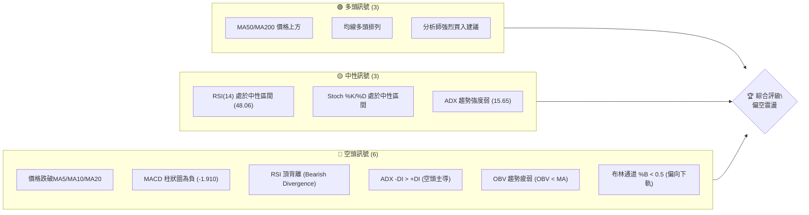

**解讀**：目前多空訊號數量上空方佔優，特別是RSI頂背離、MACD空頭、OBV量能疲弱等關鍵動能指標均指向空頭。儘管長期均線仍維持多頭排列，但短期價格已跌破多條短期均線，顯示短期市場情緒轉為謹慎或悲觀。

### 📊 核心指標速覽表

| 指標類別 | 指標名稱 | 當前數值 | 訊號 | 解讀 |
|----------|----------|----------|------|------|
| **價格** | 當前價格 | $432.57 | 🔴 | 跌破短期均線，從高點回落 |
| **均線** | MA20 | $438.73 | 🔴 | 價格位於MA20下方，短期壓力 |
| **均線** | MA50 | $421.15 | 🟢 | 價格位於MA50上方，中期支撐 |
| **均線** | MA200 | $344.33 | 🟢 | 價格位於MA200上方，長期多頭 |
| **動能** | RSI(14) | 48.06 | 🟡 | 處於中性區間，但存在頂背離 |
| **動能** | MACD | -1.910 (Hist) | 🔴 | MACD線下穿訊號線，空頭動能增強 |
| **波動** | ATR | $23.53 | 🟡 | 日均波動幅度約5.44%，波動中等偏高 |

### 🏆 技術評分卡

```
技術評分卡 — TSM (2026-07-07)
════════════════════════════════════════════════════
趨勢強度      ███░░░░░░░░░░░░░░░░░  15/100  🔴 (ADX低於25，趨勢不明顯，-DI>+DI)
動能指標      ████░░░░░░░░░░░░░░░░  30/100  🔴 (RSI頂背離，MACD空頭，Stoch中性偏弱)
支撐穩定度    ███████░░░░░░░░░░░░░  60/100  🟡 (MA50/MA200提供支撐，但短期回調壓力大)
成交量配合    ███░░░░░░░░░░░░░░░░░  25/100  🔴 (OBV疲弱，量能未有效配合價格)
形態完整度    █████░░░░░░░░░░░░░░░  45/100  🟡 (短期回調，潛在M頭形態，未完全確認)
均線排列      ████████░░░░░░░░░░░░  70/100  🟢 (MA20>MA50>MA200，長期趨勢仍多頭)
════════════════════════════════════════════════════
綜合評分      ████░░░░░░░░░░░░░░░░  49/100  評級：⚖️ 偏空震盪
════════════════════════════════════════════════════
```

**評分解讀**：TSM的技術評分顯示整體偏空。儘管長期均線結構仍然健康，但短期價格動能嚴重不足，且多個關鍵動能指標發出空頭訊號。趨勢強度低，成交量配合不佳，使得近期股價在缺乏支撐下，有進一步回調的風險。

---

## 2. 趨勢分析

### 🌐 多時框趨勢分析

TSM 的多時框趨勢呈現出「長期強勢、中期調整、短期走弱」的複雜格局。

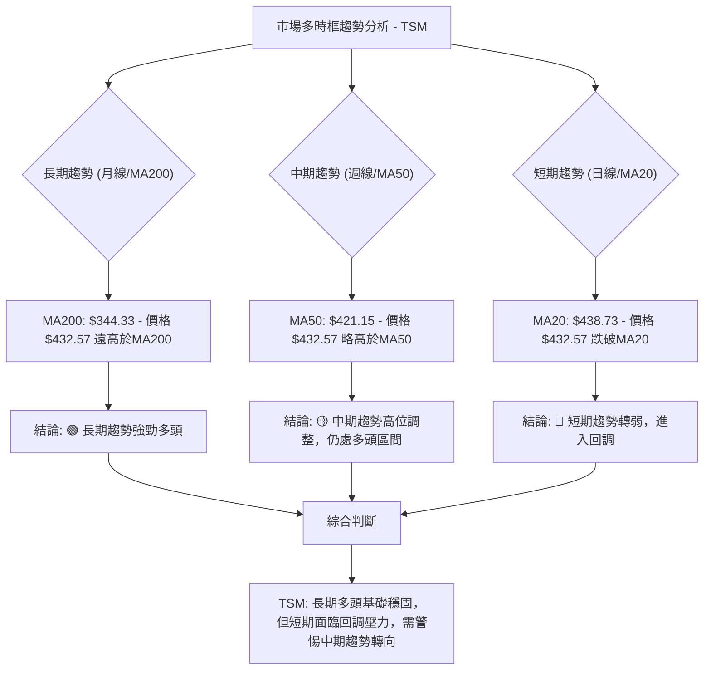

### 📈 長期趨勢 — 12個月走勢圖（Unicode）

以下為 TSM 過去 12 個月的月線收盤價格走勢圖，標註了關鍵高點與低點。

```
TSM 月線走勢圖（過去12個月）
價格軸 ($)
$480 ┤                                        ●(477.57)
$460 ┤
$440 ┤                                      ●(432.57)
$420 ┤                             ●(417.47)
$400 ┤                           ●(395.13)
$380 ┤                   ●(372.65)
$360 ┤
$340 ┤             ●(337.16)
$320 ┤          ●(328.86)
$300 ┤        ●(302.33)
$280 ┤    ●(277.11)
$260 ┤●(238.98)
$240 ┤
$220 ┤ ●(228.34)
     └────────────────────────────────────────────────────────
      J25 A25 S25 O25 N25 D25 J26 F26 M26 A26 M26 J26 J26
      月收盤價點:
      2025-07: $238.98
      2025-08: $228.34 (12個月最低點)
      2025-09: $277.11
      2025-10: $298.08
      2025-11: $289.23
      2025-12: $302.33
      2026-01: $328.86
      2026-02: $372.65
      2026-03: $337.16
      2026-04: $395.13
      2026-05: $417.47
      2026-06: $477.57 (12個月最高點)
      2026-07: $432.57 (當前價格)
```

**走勢特徵分析表格**：

| 時間區間 | 價格變動 | 走勢特徵 | 關鍵點位 | 解讀 |
|----------|----------|----------|----------|------|
| 2025-07 ~ 2025-08 | 跌幅 4.45% | 築底階段 | $228.34 (低點) | 經歷短期回調後，形成一年內低點，為後續上漲奠定基礎。 |
| 2025-09 ~ 2026-02 | 漲幅 63.29% | 穩健上漲 | $372.65 (階段高點) | 價格從低點穩步攀升，突破多個阻力，顯示強勁的多頭動能。 |
| 2026-02 ~ 2026-03 | 跌幅 9.47% | 短期回調 | $337.16 (回調低點) | 快速拉升後的正常技術性回調，但在MA50上方獲得支撐。 |
| 2026-03 ~ 2026-06 | 漲幅 41.60% | 加速上漲 | $477.57 (歷史高點) | 擺脫回調後加速上行，創下歷史新高，市場情緒極度樂觀。 |
| 2026-06 ~ 2026-07 | 跌幅 9.42% | 快速回調 | $432.57 (當前價格) | 觸及高點後快速下跌，跌破短期均線，顯示高位壓力沉重。 |

### 📊 中期趨勢（週線分析）

從近20週的週線數據來看，TSM 在 2026年4月至6月經歷了一波強勁的拉升，從 $325.98 上漲至 $462.12 (週收盤高點)，隨後在6月底至7月出現明顯的回調。

```
TSM 近期週線壓力與支撐示意圖
價格軸 ($)
$480 ┤                     (歷史高點 $477.57)
$470 ┤
$460 ┤                R1: $462.12 (前期週線高點)
$450 ┤
$440 ┤
$430 ├─────────────────────◄ 現價 $432.57
$420 ┤              S1: $421.15 (MA50 - 中期支撐)
$410 ┤
$400 ┤              S2: $403.41 (前期週線低點)
$390 ┤
$380 ┤
$370 ┤
$360 ┤
$350 ┤
$340 ┤
$330 ┤              S3: $337.16 (中期關鍵支撐)
     └──────────────────────────────────────────────
      時間軸
```

**分析**：
- **近期阻力**：首先是MA20所在的 $438.73，其次是前期週線高點 $462.12。歷史最高點 $477.57 構成強大心理及技術阻力。
- **近期支撐**：MA50所在的 $421.15 是中期趨勢的重要支撐。若跌破，下一個支撐位將是 $403.41 (2026-05-17週收盤價)，以及更重要的斐波那契回調位 $382.32 和 $352.95。
- **中期格局**：目前價格位於 MA50 上方，表明中期趨勢仍偏多頭，但價格從高位回落，顯示中期上漲動能正在減弱，可能進入盤整或更深度的回調。

### ⚡ 趨勢強度評估（ADX 解讀）

ADX 指標用於衡量趨勢的強度，而非方向。+DI 和 -DI 則指示趨勢的方向。

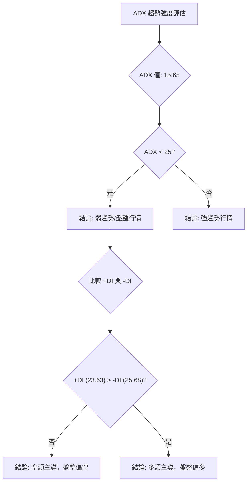

**ADX 強度對照表**：

| ADX 數值範圍 | 趨勢強度 | 市場判斷 | 當前 TSM |
|--------------|----------|----------|-----------|
| 0-25         | 弱趨勢/盤整 | 價格在區間內波動 | 15.65 (🔴 弱趨勢) |
| 25-50        | 中等趨勢 | 趨勢開始確立或延續 | - |
| 50-75        | 強趨勢   | 趨勢強勁，動能十足 | - |
| 75-100       | 極強趨勢 | 極端趨勢，可能超買/賣 | - |

**解讀**：
TSM 的 ADX(14) 值為 15.65，遠低於 25，明確指出目前市場處於**弱趨勢或盤整行情**。這意味著股價缺乏明確的方向性動能，可能在一個區間內波動。進一步觀察 +DI (23.63) 和 -DI (25.68)，發現 **-DI 略大於 +DI**，表明在當前弱勢盤整中，**空頭力量略佔上風**。這與價格跌破短期均線的現象相符，暗示短期內下行壓力較大，市場可能處於一個偏空的盤整區間。

---

## 3. 圖表形態分析

### 🔍 形態識別系統

根據 TSM 近期的價格走勢，特別是從 2026年6月高點 $477.57 回落至當前 $432.57 的情況，目前尚未形成明確的經典圖表反轉或持續形態。然而，可以觀察到一個潛在的頂部結構正在發展，類似於「M頭」或「雙頂」的左側，或者說是高位回調的初期。

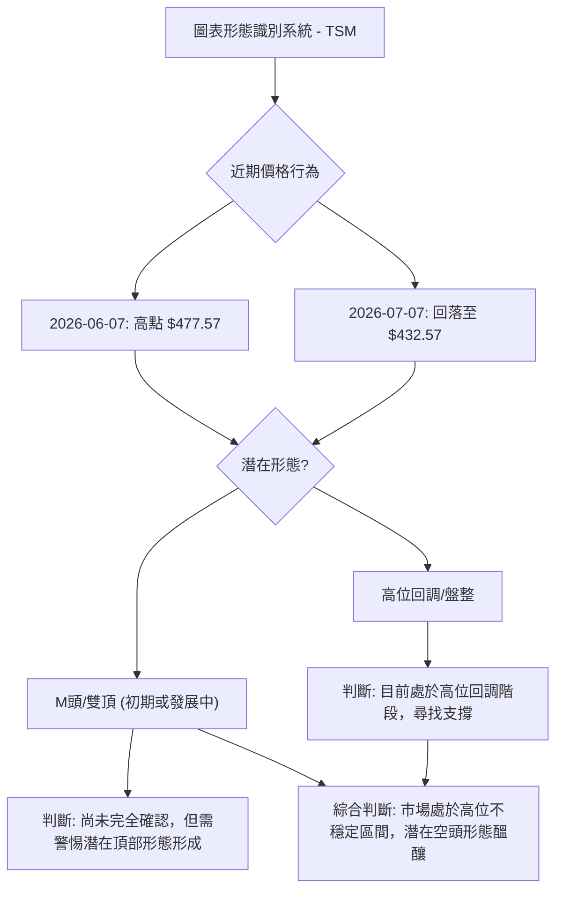

**解讀**：
TSM 在 2026年6月創出歷史新高 $477.57 後，迅速回落，未能有效站穩高位。這種快速的沖高回落，結合動能指標的背離（詳見RSI分析），增加了形成頂部形態的可能性。如果價格繼續下破關鍵支撐位，例如 MA50 ($421.15) 或斐波那契回調位，則 M 頭或雙頂形態將更加明確。目前可以將其視為一個高位回調的過程，但潛在的空頭形態值得高度警惕。

### 🕯️ 重要K線形態分析

根據提供的近20週收盤走勢，我們觀察到以下關鍵K線形態及其組合。需要注意的是，這裡的數據是週收盤價，K線形態的判斷是基於週線的整體趨勢和相對位置。

| 月份 (週) | 收盤價 | RSI | MACD柱 | 週成交量 | K線形態 (推測) | 解讀 | 訊號 |
|-----------|--------|-----|--------|----------|-----------------|------|------|
| 2026-04-26 | 401.52 | 76.5| +3.566 | 71.59M   | 長陽線/突破形態 | 突破前期盤整區間，RSI超買，動能強勁。 | 🟢 |
| 2026-05-03 | 396.74 | 63.4| +1.847 | 64.30M   | 陰線/回調 | 突破後的小幅回調，RSI從超買區下降。 | 🟡 |
| 2026-05-10 | 410.72 | 70.6| +1.534 | 74.22M   | 長陽線/反彈 | 再次上漲，但RSI未創新高 (與04-26相比)，暗示動能減弱。 | 🟡 |
| 2026-05-17 | 403.41 | 49.7| -0.993 | 76.37M   | 陰線/下跌 | 跌破 MA20 (假設)，MACD轉負，顯示短期壓力。 | 🔴 |
| 2026-05-24 | 403.57 | 51.2| -1.990 | 52.50M   | 小陽線/十字星 | 價格止跌企穩，但成交量萎縮，市場觀望情緒濃。 | 🟡 |
| 2026-05-31 | 417.47 | 53.3| +0.302 | 44.96M   | 長陽線/反轉 | 從低點反彈，MACD柱轉正，但成交量較低。 | 🟢 |
| 2026-06-21 | 462.12 | 61.5| +1.073 | 58.87M   | 長陽線/高位震盪 | 創近期新高，但RSI未跟隨創新高 (頂背離)，量能不濟。 | 🟡 (⚠️背離) |
| 2026-06-28 | 432.35 | 55.4| -1.183 | 76.78M   | 長陰線/吞噬 | 從高點大幅回落，吞噬前一週漲幅，空頭力量強勁。 | 🔴 |
| 2026-07-12 | 432.57 | 48.1| -1.910 | 27.61M   | 小陽線/陰線 (當前) | 價格止跌企穩，但成交量大幅萎縮，動能不足，MACD柱持續為負。 | 🔴 |

**總結**：
在 2026年6月21日達到週線高點 $462.12 時，雖然價格強勢，但RSI卻出現明顯的頂背離現象，這是重要的空頭訊號。隨後一週（2026-06-28）出現長陰線，形成吞噬形態，確認了短期空頭趨勢的確立。目前的 K線形態（2026-07-12）為小實體，成交量萎縮，顯示市場在回調後觀望情緒濃厚，缺乏明確的反彈動能。

### 📉 ASCII 走勢形態示意圖

以下示意圖描繪了 TSM 近期從高點回落的走勢，暗示潛在的頂部形態。

```
TSM 潛在頂部形態示意圖 (M-頂/雙頂發展中)
價格軸 ($)
$480 ┤                                      ● (高點 $477.57)
$460 ┤                                     / \
$440 ┤                                    /   \
$430 ├────────────────────────────────────● ← 現價 ($432.57)
$420 ┤                                   /
$400 ┤                                  /
$380 ┤                                 /
$360 ┤                                /
$340 ┤                               ● (頸線/關鍵支撐區間)
     └─────────────────────────────────────────────────────
      時間軸 (近期)
      
      觀察點:
      1. 價格在 $477.57 附近達到高點。
      2. 隨後快速回落至當前價格 $432.57。
      3. 若未來價格反彈未能突破前高，並再次下行突破 $432.35 (2026-06-28低點) 或 $421.15 (MA50)，則雙頂或M頭形態將確立。
      4. 目前 $432.57 位於回調階段，正在尋找短期支撐。
```

### 🎯 形態目標價計算

由於目前潛在的「M頭」或「雙頂」形態尚未完全確立，我們基於當前回調的深度和潛在形態的頸線位置進行預估。
假設：
- 第一個頂部：$477.57 (2026-06 月收盤高點)
- 回調低點 (潛在頸線區)：可以參考 2026-06-28 週收盤價 $432.35 或 MA50 $421.15。我們取 MA50 $421.15 作為更具代表性的潛在頸線支撐。

**計算方法**：
形態高度 (H) = 第一個頂部 - 潛在頸線 = $477.57 - $421.15 = $56.42
如果形態最終確立並跌破頸線，則目標價 = 頸線 - 形態高度

**潛在形態目標價**：
- **目標價 T1 (基於 MA50 頸線)**：$421.15 - $56.42 = **$364.73**
- **目標價 T2 (若跌破 MA50，考慮斐波那契回調)**：參考斐波那契 50% 回調位 **$352.95**。

**解讀**：
這些目標價是基於潛在空頭形態的預估。如果 TSM 股價未能有效站穩 MA50 ($421.15)，並持續下行，則 $364.73 將是潛在的形態目標。若進一步跌破，斐波那契 50% 回調位 $352.95 將提供更深層次的支撐。交易者應密切關注 $421.15 附近支撐的有效性。

---

## 4. 支撐與阻力

### 🗺️ 關鍵價位分布圖（Unicode）

TSM 當前價格為 $432.57，以下是其重要的支撐與阻力價位分佈圖。

```
TSM 價位結構分布圖 (2026-07-07)
═══════════════════════════════════════════════════════════════════
$479.00 ║████████████████████████████████████████████████║ 52週高點 R4
$477.57 ║████████████████████████████████████████████████║ 歷史月收盤高點 R3
$472.75 ║████████████████████████████████████████████████║ 布林上軌 R2
$438.73 ║████████████████████████████████████████████████║ MA20 / 布林中軌 R1
$432.57 ╠═══════════════════════════════════════════════════════════════════╣ ◄ 現價
$421.15 ║▓▓▓▓▓▓▓▓▓▓▓▓▓▓▓▓▓▓▓▓▓▓▓▓▓▓▓▓▓▓▓▓▓▓▓▓▓▓▓▓▓▓▓▓▓▓▓▓║ MA50 S1
$404.72 ║████████████████████████████████████████████████║ 布林下軌 S2
$382.32 ║████████████████████████████████████████████████║ 斐波那契 38.2% 回調 S3
$354.00 ║████████████████████████████████████████████████║ 分析師最低目標價 S4
$352.95 ║████████████████████████████████████████████████║ 斐波那契 50% 回調 S5
$344.33 ║████████████████████████████████████████████████║ MA200 S6
$228.34 ║████████████████████████████████████████████████║ 斐波那契起點 / 2025-08 低點 S7
$221.25 ║████████████████████████████████████████████████║ 52週低點 S8
═══════════════════════════════════════════════════════════════════
```

### 🚧 阻力位分析表

| 阻力級別 | 價位 | 形成原因 | 突破難度 | 重要性 |
|----------|------|----------|----------|--------|
| **R1**   | $438.73 | MA20 / 布林中軌 | 中等 | 短期趨勢反轉的關鍵點，站穩此位有助於短期止跌。 |
| **R2**   | $472.75 | 布林上軌 | 較高 | 價格波動區間的上限，突破需強勁動能與量能配合。 |
| **R3**   | $477.57 | 歷史月收盤高點 (2026-06) | 高 | 歷史最高水平，形成強大心理和技術阻力，突破意味著新一輪上漲。 |
| **R4**   | $479.00 | 52週高點 | 極高 | 最高阻力，突破則開啟新的上漲空間。 |

### 🛡️ 支撐位分析表

| 支撐級別 | 價位 | 形成原因 | 守住機率 | 重要性 |
|----------|------|----------|----------|--------|
| **S1**   | $421.15 | MA50 | 中等 | 中期趨勢的關鍵支撐，守住則中期多頭不變，跌破則中期趨勢轉弱。 |
| **S2**   | $404.72 | 布林下軌 | 中等 | 價格波動區間的下限，通常在超賣區提供反彈支撐。 |
| **S3**   | $382.32 | 斐波那契 38.2% 回調位 | 較高 | 從一年大漲幅回調的關鍵點，跌破可能引發更深回調。 |
| **S4**   | $352.95 | 斐波那契 50% 回調位 | 高 | 從一年大漲幅回調的重要關口，通常是強勁反彈點，也是潛在M頭形態的目標價附近。 |
| **S5**   | $344.33 | MA200 | 極高 | 長期趨勢的生命線，跌破則長期趨勢可能逆轉。 |

### 📐 斐波那契回調位分析

我們以 TSM 過去一年多的主要上漲波段為基準，從 2025年8月的低點 $228.34 到 2026年6月的月收盤高點 $477.57 進行斐波那契回調分析。

**計算基礎**：
- 波段低點 (0%)：$228.34
- 波段高點 (100%)：$477.57
- 波段漲幅：$477.57 - $228.34 = $249.23

**斐波那契回調位**：
- **23.6% 回調**：$477.57 - ($249.23 * 0.236) = $477.57 - $58.82 = **$418.75** (此位接近 MA50，增強其支撐力)
- **38.2% 回調**：$477.57 - ($249.23 * 0.382) = $477.57 - $95.25 = **$382.32**
- **50.0% 回調**：$477.57 - ($249.23 * 0.500) = $477.57 - $124.62 = **$352.95**
- **61.8% 回調**：$477.57 - ($249.23 * 0.618) = $477.57 - $154.04 = **$323.53**

**視覺化**：
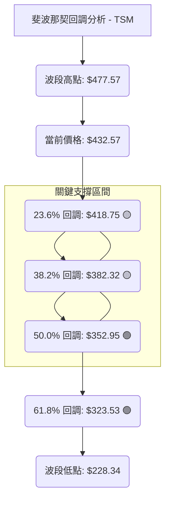

**解讀**：
當前價格 $432.57 已經跌破了斐波那契 23.6% 回調位 ($418.75) 與 MA50 ($421.15) 之間形成的短期支撐區間。若短期止跌無效，下一個重要的支撐考驗將是 **38.2% 回調位 $382.32**。此位通常是第一道較強的技術性回調支撐。如果此位也未能守住，則股價可能進一步探底至 **50% 回調位 $352.95**。50% 回調位通常被視為一個健康回調的極限，也是強勁反彈的潛在起點。同時，分析師的最低目標價 $354.00 也非常接近此位，增加了其重要性。若連 50% 回調位也跌破，則可能預示著更深度的趨勢逆轉，股價可能向 61.8% 回調位 $323.53 甚至 MA200 $344.33 靠攏。

---

## 5. 技術指標深度解讀

### 🎛️ 指標訊號總覽

以下 Mermaid 圖表展示了 TSM 各項技術指標的訊號及其相互關係。

```mermaid
graph TD
    A["TSM 技術指標訊號總覽"] --> B{"價格行為: $432.57"}
    B -- 跌破 --> C["短期均線: MA5, MA10, MA20 🔴"]
    B -- 位於上方 --> D["中期/長期均線: MA50, MA200 🟢"]

    A --> E{"動能指標"}
    E --> E1["RSI(14): 48.06 🟡"]
    E1 -- 存在 --> E2["RSI 頂背離 🔴"]
    E -- E3["MACD: 7.598, Signal: 9.508, Hist: -1.910 🔴"]
    E3 -- 訊號線下穿 --> E4["MACD 空頭交叉 🔴"]
    E -- E5["Stoch %K: 22.37, %D: 34.77 🟡"]
    E5 -- 接近超賣 --> E6["潛在超賣反彈機會"]

    A --> F{"趨勢強度 & 波動率"}
    F --> F1["ADX(14): 15.65 🔴"]
    F1 -- -DI > +DI --> F2["弱勢盤整，空頭主導 🔴"]
    F --> F3["ATR(14): $23.53 🟡"]
    F3 -- 波動率適中 --> F4["提供止損參考"]

    A --> G{"成交量指標"}
    G --> G1["最新成交量: 14.8M vs 20日均量: 14.9M 🟡"]
    G1 -- 略低於平均 --> G2["量能不濟"]
    G --> G3["OBV 趨勢: OBV < MA 🔴"]
    G3 -- 量價背離 --> G4["確認空頭回調趨勢"]

    A --> H{"布林通道"}
    H --> H1["BB %B: 0.41 🟡"]
    H1 -- 靠近下軌 --> H2["價格偏弱，向支撐區間移動"]

    C & E2 & E4 & F2 & G4 & H1 --> I["綜合判斷: 短期空頭動能強勁，中期面臨考驗，長期多頭基礎仍存"]
```

### 📈 移動平均線排列分析

TSM 的移動平均線系統呈現出一個多空交織的局面，長期趨勢與短期趨勢之間存在明顯的矛盾。

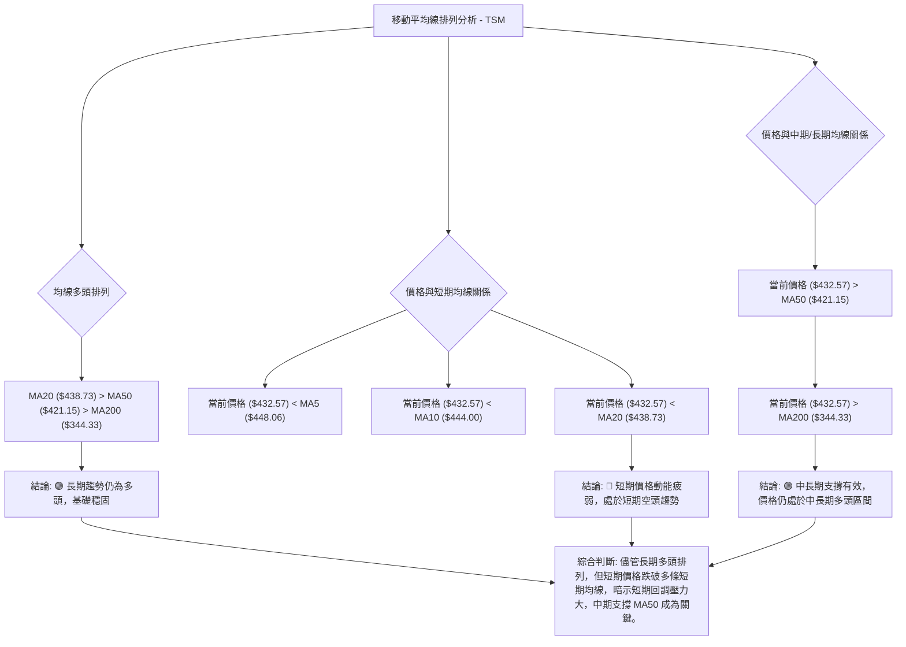

**解讀**：
當前 TSM 的均線排列為 MA20 ($438.73) > MA50 ($421.15) > MA200 ($344.33)，這是一個典型的**多頭排列**，表明其長期上升趨勢依然健康。然而，當前股價 $432.57 已跌破 MA5、MA10 和 MA20，顯示**短期趨勢已轉為空頭**。這是一個重要的警示訊號：雖然大方向是上漲，但短期內股價正處於一個回調或調整階段。MA50 ($421.15) 將是中期趨勢的重要支撐，若此位失守，可能引發更深度的回調，甚至影響到整體多頭排列的穩定性。交易者應密切關注價格能否重新站上 MA20，或 MA50 能否提供有效支撐。

### 📉 RSI(14) 分析

RSI(14) 當前數值為 48.06，處於中性區間 (30-70)。

**RSI 強度進度條**：
RSI(14): ▓▓▓▓▓▓▓▓▓▓▓▓▓▓▓▓▓▓▓▓▓▓▓▓▓▓▓▓▓▓▓▓▓▓▓▓▓▓▓▓▓▓▓▓▓▓▓▓░░░░░░░░░░░░░░░░░░░░░░░░░░░░░░░░░░░░░░░░░░░░░░░░░░░░ 48.06%

**超買超賣區間分析**：
- RSI 70 以上為超買區，RSI 30 以下為超賣區。
- TSM 目前 RSI 位於 48.06，既非超買也非超賣，表明當前市場動能相對平衡，但偏弱。

**背離判斷 (頂背離/底背離)**：
數據明確指出：「**RSI 背離: ⚠️ 頂背離 (Bearish Divergence)**」。
- **頂背離確認**：根據近20週數據，我們觀察到：
    - 2026-04-26 週收盤價 $401.52，RSI 達到 76.5 (高點)。
    - 2026-06-21 週收盤價 $462.12，價格創下新高，但此時 RSI 僅為 61.5。
    - 這種「**價格創新高，RSI 未能創新高反而走低**」的現象，是典型的**空頭頂背離**訊號。

**解讀**：
RSI 頂背離是一個非常強烈的反轉訊號，預示著上漲動能的衰竭和潛在的趨勢反轉。儘管當前 RSI 數值已從高位回落至中性區間，但頂背離的出現已經對隨後的價格下跌提供了預警。這表明市場在高位時，雖然價格仍在衝高，但內部買盤力量已顯不足。結合當前價格的下跌，RSI 頂背離確認了近期從高點回落的趨勢是動能不足所致，而非單純的技術性回調。這是一個需要高度警惕的空頭訊號。

### 📊 MACD(12/26/9) 訊號解讀

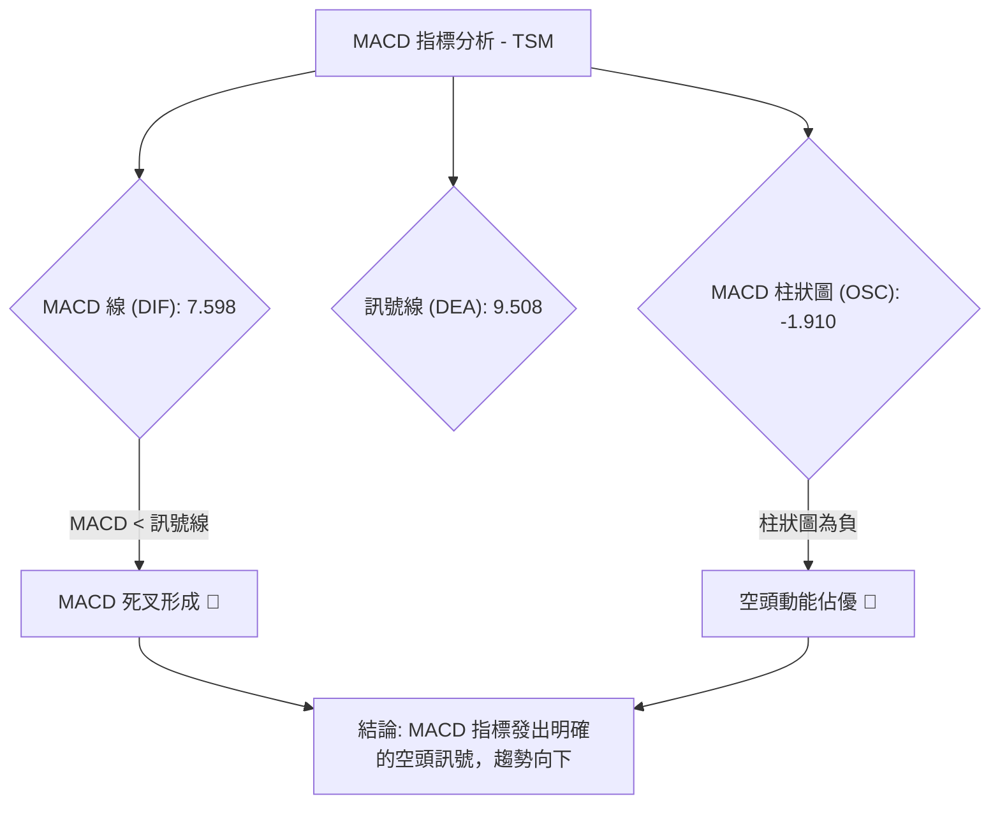

**解讀**：
- **MACD 線 (DIF)**：7.598
- **訊號線 (DEA)**：9.508
- **MACD 柱狀圖 (OSC)**：-1.910 (MACD - Signal)

由於 MACD 線 (7.598) 已經下穿訊號線 (9.508)，形成一個**死亡交叉 (Death Cross)**，這是一個典型的**空頭訊號**。同時，MACD 柱狀圖為負值 (-1.910)，且仍在擴大（從近20週數據看，MACD柱從正轉負並持續為負），這表明**空頭動能正在增強**。MACD 的空頭交叉和負柱狀圖與 RSI 頂背離訊號相互印證，共同強化了 TSM 當前處於回調或下跌趨勢中的判斷，且空頭力量不容小覷。這對多頭而言是一個嚴峻的挑戰。

### 📦 布林通道分析

```
TSM 布林通道示意圖 (2026-07-07)
價格軸 ($)
$480 ┤
$470 ┤                     BB上軌: $472.75
$460 ┤                       ████████████████████
$450 ┤                     ██████████████████████████
$440 ┤                   ██████████████████████████████ MA20 (中軌): $438.73
$430 ├───────────────────●────────────────────────◄ 現價 ($432.57)
$420 ┤                 ██████████████████████████████
$410 ┤               ██████████████████████████████
$400 ┤             BB下軌: $404.72
     └────────────────────────────────────────────────────────
      時間軸
```

**布林通道關鍵數據**：
- BB上軌: $472.75
- BB中軌 (MA20): $438.73
- BB下軌: $404.72
- 當前價格: $432.57
- BB %B: 0.41 (0=下軌, 0.5=中軌, 1=上軌)

**解讀**：
當前價格 $432.57 位於布林通道中軌 ($438.73) 和下軌 ($404.72) 之間，且靠近中軌下方。BB %B 值為 0.41，確認了價格偏向下軌的弱勢狀態。這表明股價在從高點回落後，正在向布林通道的下部區域移動，顯示出一定的下行壓力。
- **中軌壓力**：中軌 (MA20) $438.73 成為短期重要的壓力位。若價格未能有效站穩中軌之上，則難以扭轉短期跌勢。
- **下軌支撐**：下軌 $404.72 將提供一個潛在的技術支撐。價格觸及下軌後，通常會出現技術性反彈。
- **通道收斂/擴張**：數據中未明確指出布林通道的寬度變化，但若通道在價格下跌中擴張，則意味著波動性增加，下跌動能可能持續；若通道收斂，則可能預示著盤整行情的到來。

### 💹 成交量分析（量價配合度）

- **最新成交量**: 14,824,086
- **20日均量**: 14,995,839 (量比: 0.99x)
- **50日均量**: 14,059,006
- **OBV趨勢**: OBV < MA → 量能疲弱

**解讀**：
- **當前成交量**：最新成交量 (14.8M) 略低於 20日均量 (14.9M)，這表明在當前價格回調的過程中，市場的活躍度有所下降，缺乏強勁的買盤支撐。
- **OBV (On-Balance Volume)**：OBV 趨勢顯示「OBV < MA」，這是一個明確的**量能疲弱**訊號。OBV 是一個累積性指標，當 OBV 走低而價格走高時，構成量價背離。在 TSM 的情況下，價格從高點回落，而 OBV 趨勢疲弱，表明在價格上漲期間，量能未能持續有效配合，或在下跌時賣壓較重而買盤不濟。這強化了 RSI 頂背離的空頭訊號，暗示近期價格下跌是真實的賣壓所致，而非簡單的洗盤。
- **量價配合**：在當前價格下跌的背景下，量能未能有效放大以提供止跌反彈的動力，反而呈現疲弱狀態。這不是一個健康的止跌訊號，反而增加了股價進一步下跌的風險。如果未來價格要反彈，需要看到成交量明顯放大，並且 OBV 趨勢轉強，才能確認反彈的有效性。

---

## 6. 動能與波動率

### ⚡ 動能評估四象限

我們將 TSM 當前的動能與波動率進行評估，並將其定位在四個象限中。

| 象限 | 動能 | 波動 | 當前狀態 (TSM) | 評估 |
|------|------|------|----------------|------|
| Q1 | 強 | 低 | - | **最佳機會**：趨勢明確，風險可控，適合趨勢追蹤。 |
| Q2 | 弱 | 低 | - | **謹慎觀望**：市場缺乏方向，波動小，不確定性高。 |
| Q3 | 強 | 高 | - | **高風險高收益**：趨勢強勁但波動劇烈，適合高風險偏好者。 |
| Q4 | 弱 | 高 | ✓ | **避免進場**：市場混亂，方向不明，風險高，應避免交易。 |

**TSM 動能評估流程**：
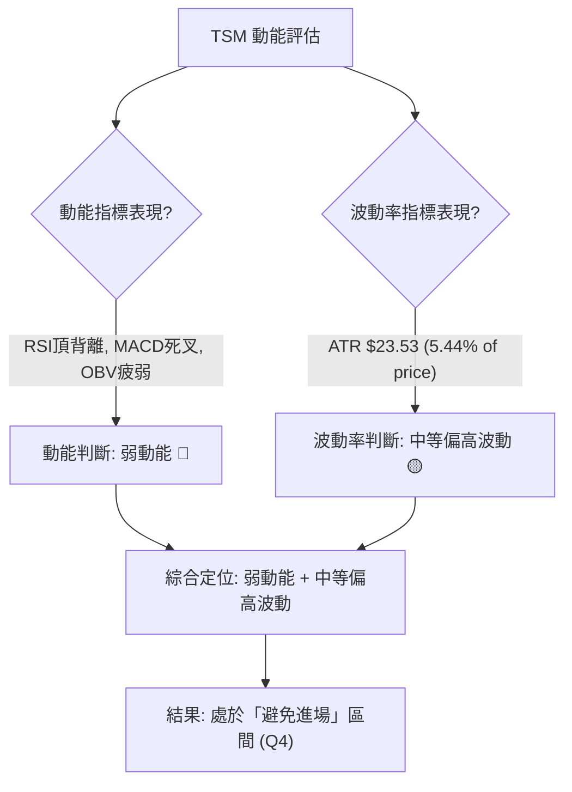

**解讀**：
TSM 目前處於「**弱動能，中等偏高波動**」的狀態，這將其定位在 Q4 象限。這是一個對交易者而言風險較高的區間。弱動能意味著股價缺乏明確的方向性，難以形成持續趨勢，而中等偏高的波動率則增加了價格波動的不確定性和交易難度。在這種情況下，盲目進場容易遭受雙向洗盤。建議投資者保持謹慎，等待市場動能重新積聚並出現明確的方向訊號。

### 📊 ATR 波動率分析

- **ATR(14)**: $23.53
- **佔當前價格比例**: 5.44%

**解讀**：
ATR(14) 衡量的是過去 14 天的平均真實波幅。TSM 的 ATR 為 $23.53，佔其當前價格 $432.57 的 5.44%。這個比例相對於許多大型股而言屬於**中等偏高的波動水平**。
- **波動性判斷**：每日潛在波動幅度約為 $23.53，這意味著 TSM 在一個交易日內可能會有較大的價格變化。對於短線交易者而言，這提供了潛在的交易機會，但同時也增加了風險。
- **止損距離建議**：ATR 是設定止損點的常用工具。一般建議將止損點設置在當前價格的 1.5 倍至 3 倍 ATR 距離。
    - 若以 1.5 倍 ATR 設置止損：$23.53 * 1.5 = $35.30。若從 $432.57 買入，止損點約為 $397.27。
    - 若以 2 倍 ATR 設置止損：$23.53 * 2 = $47.06。若從 $432.57 買入，止損點約為 $385.51。
    - 由於目前趨勢偏空，止損應更加嚴格。若做空，則止損點應設在買入價上方 1.5-2 倍 ATR 距離。

### 📐 Beta 與市場相關性

提供的數據中未包含 TSM 的 Beta 值。然而，根據其所屬的半導體產業特性，我們可以進行一般性推斷：

- **產業特性**：半導體產業通常被視為景氣循環性行業，其表現與宏觀經濟景氣度及科技創新週期高度相關。半導體公司如 TSM，其業績和股價波動性往往較大。
- **預期 Beta 值**：基於半導體產業的特性，TSM 的 Beta 值通常會**高於 1**。高 Beta 值意味著 TSM 的股價波動幅度會大於整體市場（如標普500指數）。例如，如果市場上漲 1%，TSM 可能上漲超過 1%；反之，市場下跌 1%，TSM 也可能下跌超過 1%。
- **市場相關性**：高 Beta 值表明 TSM 與整體市場的相關性較高，但其波動性更為劇烈。在市場牛市中，它可能表現優於大盤；但在市場熊市或調整期，它也可能遭受更大的跌幅。
- **對投資的影響**：對於追求穩定收益的投資者，TSM 的高波動性可能不適合。對於風險承受能力較高並希望利用市場趨勢放大的投資者，則需密切關注市場整體走勢，並做好嚴格的風險控制。

---

## 7. 多時框架總結

### 📋 時框架評分表

| 時框架 | 趨勢方向 | 動能 | 均線排列 | 形態 | 綜合評分 (1-10) | 建議 |
|--------|----------|------|----------|------|-----------------|------|
| **長期** | 🟢 強勁多頭 | 🟢 趨勢延續 | 🟢 多頭排列 | 🟢 上升趨勢 | 8 | 持有 (長期) |
| **中期** | 🟡 高位調整 | 🟡 減弱 | 🟢 多頭排列 | 🟡 潛在頂部 | 5 | 觀望/減持 |
| **短期** | 🔴 轉弱回調 | 🔴 疲弱/空頭 | 🔴 價格跌破短期MA | 🔴 頂部回落 | 3 | 賣出/做空 |

**解讀**：
- **長期**：TSM 仍處於強勁的長期上升通道中，均線多頭排列提供堅實基礎。長期投資者可繼續持有。
- **中期**：中期趨勢正經歷高位調整，雖然價格仍高於 MA50，但動能減弱，潛在頂部形態的發展增加了不確定性。
- **短期**：短期趨勢明顯轉弱，價格跌破所有短期均線，動能指標發出強烈空頭訊號。短期內存在較大的下行壓力。

### 🔲 綜合訊號矩陣

以下 Mermaid 圖表展示了 TSM 在不同時框架下各項技術指標訊號的一致性。

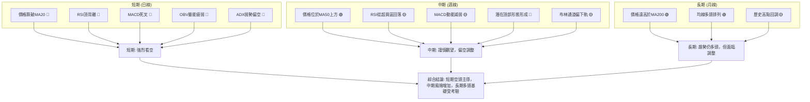

**一致性分析**：
- **短期訊號**：短期所有關鍵指標幾乎一致指向空頭，包括價格跌破短期均線、RSI頂背離、MACD死叉、OBV疲弱和ADX弱勢偏空。這表明短期內 TSM 的下跌趨勢非常明顯，且動能強勁。
- **中期訊號**：中期訊號較為複雜，價格仍在 MA50 上方，但動能指標已顯示疲態，且潛在的頂部形態正在形成。這表明中期趨勢有從強勢多頭轉向調整或盤整的風險。
- **長期訊號**：長期而言，MA200 仍提供強勁支撐，均線排列仍為多頭。這意味著即使短期和中期出現回調，長期趨勢的根基依然存在，但高位回調對長期持有者也是一種警示。

**綜合判斷**：
TSM 目前面臨嚴峻的短期空頭壓力，中期趨勢也開始顯現不穩跡象。長期多頭格局雖然尚未被打破，但若中期關鍵支撐未能守住，也可能對長期趨勢產生負面影響。目前市場的下行風險遠大於上行機會，建議採取謹慎或偏空操作策略。

---

## 8. 交易策略建議

### 🗺️ 策略決策流程圖

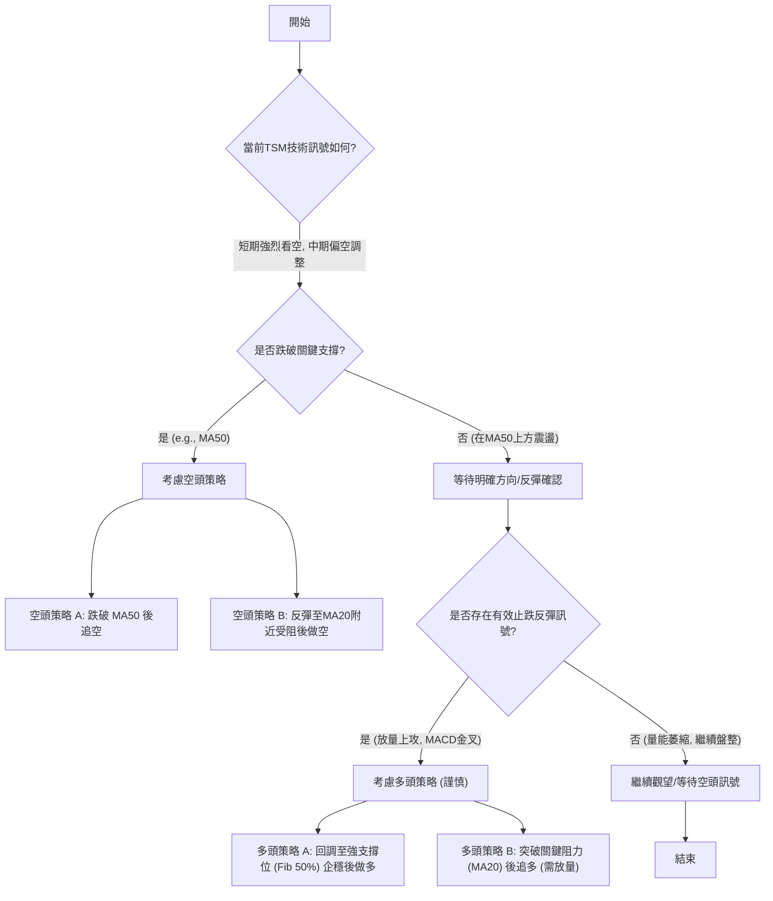

### 🟢 多頭策略詳情 (謹慎)

鑑於當前強烈的空頭訊號，多頭策略風險較高，建議僅在出現明確止跌反彈訊號或價格回調至強勁支撐位後，且必須配合嚴格的止損。

| 策略要素 | 策略 A (超跌反彈) | 策略 B (突破短期壓力) |
|----------|--------------------|------------------------|
| 進場條件 | 價格回調至 Fib 50% ($352.95) 附近，出現止跌K線 (如錘子線、啟明星) 且成交量溫和放大。 | 價格放量突破 MA20 ($438.73) 並穩固站上。 |
| 進場價格 | $355.00 - $358.00 | $440.00 - $442.00 |
| 目標價 T1 | $382.32 (Fib 38.2% 回調位) | $462.12 (前期週線高點) |
| 目標價 T2 | $404.72 (布林下軌/前期支撐) | $477.57 (歷史高點) |
| 止損價格 | $348.00 (略低於 Fib 50% 或 MA200) | $432.00 (跌破 MA20 重新進入短期空頭區間) |
| 風險報酬比 | 約 1:2.5 (T1) / 1:3.5 (T2) | 約 1:2.0 (T1) / 1:3.0 (T2) |
| 成功機率 | 30% (高風險反彈) | 40% (需強勁量能確認) |
| 建議倉位 | 輕倉 (5-10%) | 輕倉 (5-10%) |

### 🔴 空頭策略詳情

基於多個空頭訊號，空頭策略目前相對更具優勢。

| 策略要素 | 策略 A (跌破 MA50 追空) | 策略 B (反彈受阻做空) |
|----------|--------------------------|------------------------|
| 進場條件 | 價格有效跌破 MA50 ($421.15)，且 MACD 柱狀圖持續為負，成交量放大。 | 價格反彈至 MA20 ($438.73) 或布林中軌附近，未能有效突破，並出現長上影線或陰線。 |
| 進場價格 | $420.00 - $418.00 | $437.00 - $439.00 |
| 目標價 T1 | $382.32 (Fib 38.2% 回調位) | $421.15 (MA50) |
| 目標價 T2 | $352.95 (Fib 50% 回調位/分析師低目標) | $404.72 (布林下軌) |
| 止損價格 | $425.00 (站穩 MA50 上方) | $445.00 (突破 MA20 或反彈動能增強) |
| 風險報酬比 | 約 1:2.5 (T1) / 1:4.0 (T2) | 約 1:2.0 (T1) / 1:3.5 (T2) |
| 成功機率 | 60% (順應短期趨勢) | 55% (反彈動能弱) |
| 建議倉位 | 中等倉位 (10-15%) | 中等倉位 (10-15%) |

### ⭐ 整體訊號強度評星

```
做多訊號強度：★★☆☆☆  (2/5星) - 僅在超跌或明確反轉時考慮，風險高。
做空訊號強度：★★★★☆  (4/5星) - 多個指標確認，順應短期回調趨勢。
整體可信度：  ★★★☆☆  (3/5星) - 短期空頭訊號強烈，但長期趨勢仍為多頭，存在反轉可能。
```

---

## 9. 風險提示與監控

### ✅ 關鍵監控指標 Checklist

以下是交易 TSM 時需要密切關注的關鍵技術指標清單。

```
╔══════════════════════════════════════════════════════════════╗
║              TSM 關鍵監控指標 Checklist                      ║
╠══════════════════════════════════════════════════════════════╣
║ [ ] 價格能否重新站穩 MA20 ($438.73)？                      ║
║ [ ] MA50 ($421.15) 支撐是否有效？若跌破，下行壓力將加大。   ║
║ [ ] RSI 是否從超賣區反彈並突破 50 中軸線？                   ║
║ [ ] MACD 是否形成黃金交叉？MACD柱是否轉正？                ║
║ [ ] 成交量能否在反彈時溫和放大，或在下跌時縮量？             ║
║ [ ] OBV 趨勢是否轉為向上？                                   ║
║ [ ] ADX 是否開始上升並指示明確的趨勢方向？                   ║
║ [ ] 布林通道是否收斂或擴張？價格是否觸及上下軌？             ║
║ [ ] 斐波那契回調位 ($382.32, $352.95) 是否提供強勁支撐？     ║
║ [ ] 潛在的 M 頭形態是否完全確立 (跌破 $421.15 頸線)？       ║
╚══════════════════════════════════════════════════════════════╝
```

### ⚠️ 風險場景分析

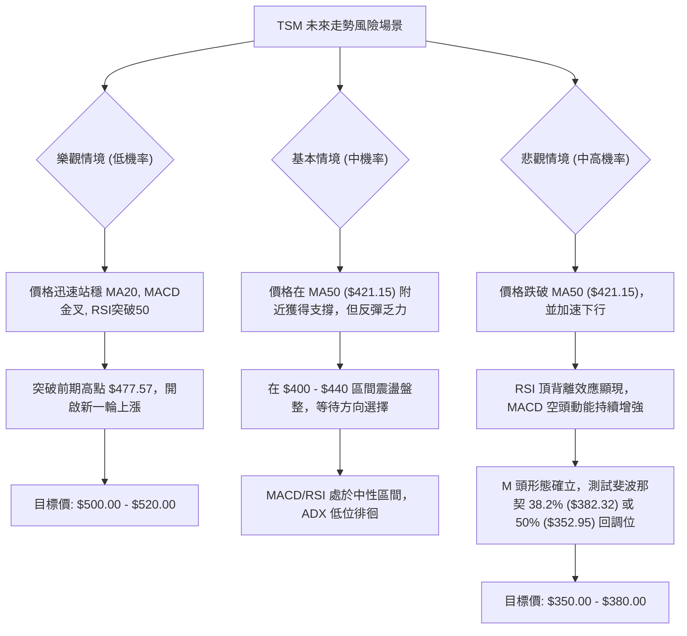

**解讀**：
目前 TSM 處於高位回調階段，悲觀情境發生的機率較高。多頭應密切關注 MA50 的支撐作用，以及能否出現明確的止跌反轉訊號。空頭則可尋找跌破關鍵支撐或反彈受阻的機會。

### 🛡️ 風險管理重要提醒

1.  **嚴格止損**：在任何交易策略中，都必須設置並嚴格執行止損點。尤其在當前波動性較高且趨勢不明朗的情況下，止損是保護資本的關鍵。
2.  **倉位控制**：鑑於 TSM 的高波動性和目前技術面的複雜性，建議採用輕倉或中等倉位操作，避免重倉博弈。
3.  **多時框架確認**：在做出交易決策前，應確保不同時框架（日線、週線）的訊號至少不互相矛盾，或有明確的主導趨勢。
4.  **市場情緒**：關注整體半導體板塊及大盤走勢，TSM 作為行業龍頭，其表現往往受到宏觀經濟和產業政策的影響。
5.  **分批建倉/平倉**：可以考慮分批建倉以平攤成本，分批平倉以鎖定利潤，避免一次性操作的巨大風險。
6.  **基本面配合**：技術分析僅為投資決策的一部分，仍需結合基本面分析來全面評估公司的長期價值。雖然本報告僅為技術分析，但在實際投資中，基本面的變化對技術走勢有深遠影響。

---

## 📋 報告總結

```
TSM 技術分析報告總結
════════════════════════════════════════════════════════
報告日期：2026-07-07
當前價格：$432.57
分析評級：⚖️ 偏空震盪 (短期空頭壓力大，中期面臨調整，長期多頭基礎仍在)

關鍵結論：
├─ 長期趨勢：🟢 強勁多頭，價格遠高於MA200，均線多頭排列。
├─ 中期趨勢：🟡 高位調整，價格位於MA50上方，但動能減弱，潛在頂部形態。
├─ 短期趨勢：🔴 轉弱回調，價格跌破MA20，RSI頂背離，MACD死叉，OBV疲弱。
├─ 關鍵支撐：S1: $421.15 (MA50), S2: $404.72 (布林下軌), S3: $382.32 (Fib 38.2%), S4: $352.95 (Fib 50%)
└─ 關鍵阻力：R1: $438.73 (MA20), R2: $472.75 (布林上軌), R3: $477.57 (歷史高點)

最優策略組合：
1. 🥇 最佳機會：跌破 MA50 ($421.15) 後追空，目標 Fib 38.2% ($382.32) 或 Fib 50% ($352.95)。
2. 🥈 次選機會：若價格反彈至 MA20 ($438.73) 或布林中軌附近受阻，可考慮做空。
3. 🥉 保守選擇：觀望，等待價格回調至 Fib 50% ($352.95) 附近並出現明確止跌訊號後，再考慮小倉位多頭反彈交易。
════════════════════════════════════════════════════════
```

---

> ⚠️ **免責聲明**：本報告為 AI 自動生成之技術分析，所有數據及估算均基於提供的歷史價格資訊。本報告**僅供研究與學術參考**，**不構成任何投資建議**。投資有風險，入市需謹慎。

---

*報告生成時間：2026-07-07 ｜ 數據來源：提供數據 ｜ 分析框架：多時框技術分析*