<details>
<summary>📊 靜態圖表 (點擊展開)</summary>
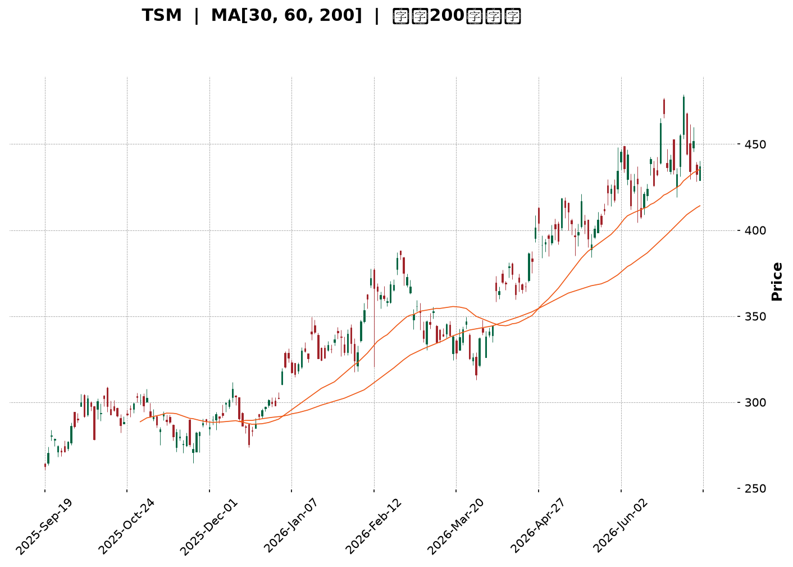
</details>

<html>
<head><meta charset="utf-8" /></head>
<body>
    <div style="height:500px; width:100%;">                        <script>window.PlotlyConfig = {MathJaxConfig: 'local'};</script>
        <script charset="utf-8" src="https://cdn.plot.ly/plotly-3.6.0.min.js" integrity="sha256-QaOVwtVY0T02VaHrr6pnoHLCwayMJp4O5n4YyaE3rJk=" crossorigin="anonymous"></script>                <div id="candlestick-chart" class="plotly-graph-div" style="height:100%; width:100%;"></div>            <script>                window.PLOTLYENV=window.PLOTLYENV || {};                                if (document.getElementById("candlestick-chart")) {                    Plotly.newPlot(                        "candlestick-chart",                        [{"close":{"dtype":"f8","bdata":"AAAAgMlscEAAAAAA+udwQAAAAMD+h3FAAAAA4D5ocUAAAADA8ydxQAAAAKCQ83BAAAAAYIDxcEAAAAAgtFFxQAAAAGBv43FAAAAAYLjdcUAAAABAfR5yQAAAAKCSwHJAAAAA4LI7ckAAAAAAOuJyQAAAAGCRmHJAAAAAoHNncUAAAAAAWshyQAAAACAFWnJAAAAAQD7lckAAAADA7pdyQAAAACBeTHJAAAAA4PV1ckAAAADAUUNyQAAAAKDx6XFAAAAAAFAHckAAAACAdkpyQAAAAACxfnJAAAAAwMKyckAAAACgRutyQAAAAACXzXJAAAAAgEyhckAAAADAn+dyQAAAAGAEPHJAAAAAIII1ckAAAACAqO9xQAAAAEApxHFAAAAAYGJPckAAAAAATA5yQAAAAACRBXJAAAAAQOZ\u002fcUAAAADgfalxQAAAACDifHFAAAAAwMs7cUAAAAAgmYJxQAAAAIBJNXFAAAAAYI0OcUAAAABgoqZxQAAAAMBEp3FAAAAAoBb7cUAAAADAsRNyQAAAAMDk1nFAAAAA4OYcckAAAAAAPlJyQAAAAKA8KnJAAAAAQKdGckAAAACAKLhyQAAAACCb0HJAAAAA4HE7c0AAAADgh\u002fRyQAAAAMCfKHJAAAAAYC3kcUAAAABAVNZxQAAAAICVOHFAAAAAIHizcUAAAAAgcPdxQAAAAMBcPHJAAAAAwMd2ckAAAABgOpRyQAAAACCJ1HJAAAAAYPm1ckAAAADgpKByQAAAAABA5XJAAAAAAHrfc0AAAADgfwl0QAAAACD0W3RAAAAAQKzQc0AAAABAAsZzQAAAAGB3H3RAAAAAYAmhdEAAAABgH5h0QAAAACDcVnRAAAAAQCU+dUAAAAAAPkp1QAAAAOCnV3RAAAAAABpHdEAAAACg\u002f1p0QAAAAMBh0nRAAAAA4P+vdEAAAADAnQl1QAAAAKCmSHVAAAAAgOAcdUAAAADAxo10QAAAACCwOXVAAAAAoGPgdEAAAACADUF0QAAAAIB7kHRAAAAAoOmwdUAAAAAgVRl2QAAAAGDMgHZAAAAAIK1Cd0AAAABgVON2QAAAAOChx3ZAAAAAAECldkAAAACgXoZ2QAAAAICaaHZAAAAAQCsKd0AAAACgNQJ3QAAAACBH\u002fHdAAAAAgMsbeEAAAAAg+W13QAAAAOB5SndAAAAA4GfzdkAAAABgCvV1QAAAAGClOXZAAAAAAKkAdkAAAAAgXxJ1QAAAAGCGrnVAAAAAoOWUdUAAAABgzQt2QAAAAKCr73RAAAAAgCMJdUAAAACAsyd1QAAAACC\u002fknVAAAAAIG0sdUAAAADA+R91QAAAAECIh3RAAAAAYIwadUAAAAAgK2d1QAAAACAAr3VAAAAAoJFVdEAAAAAgoF90QAAAACArvHNAAAAAIJESdUAAAAAAE0t1QAAAAGD3I3VAAAAAYGJPdUAAAAAgNoh1QAAAAMC40HZAAAAAYC3KdkAAAAAAvxt3QAAAAABOC3dAAAAAAAqwd0AAAAAAlGN3QAAAAGAEqHZAAAAAYCYad0AAAAAgJtZ2QAAAACCF83ZAAAAAgI4oeEAAAABgQdx3QAAAAKBQGHlAAAAAgIpAeUAAAAAAxnZ4QAAAAMCOjnhAAAAAgCeyeEAAAADA2st4QAAAACC\u002fCnlAAAAAANGXeEAAAACAUSh6QAAAAADr0nlAAAAAgH2reUAAAACAhDl5QAAAAAChxXhAAAAAwNrteEAAAACg5wt6QAAAACB8NnlAAAAAIGaweEAAAABAFXt4QAAAACDoCnlAAAAAAC5jeUAAAADAMjl5QAAAAOC0tXlAAAAAoOBbekAAAACg4H16QAAAAMCOF3pAAAAAoMspe0AAAACAV9p7QAAAAEC3OntAAAAAoBa+e0AAAABAM+N5QAAAAGDYnHpAAAAAQLmuekAAAABguHx5QAAAAMAeUXpAAAAAQOF+ekAAAABgZpZ7QAAAAKBHnXpAAAAAYGYCe0AAAACA6+F8QAAAAGC4On1AAAAAgD1Ge0AAAACgR417QAAAAADXL3tAAAAAoJkFe0AAAACgmXF8QAAAAMAe2X1AAAAAIK7De0AAAABgjyJ7QAAAAOCjPHxAAAAAwB4Je0AAAAAgrk97QA=="},"high":{"dtype":"f8","bdata":"E9xgT8aHcEDygsuNMCNxQJM7bEQ5vHFAUrQF3S5wcUB\u002fWtyAki9xQLpPQ5iJFXFAZ5F\u002fHelacUCXZpDY4FRxQFbwBwJYA3JARyE3SGdmckBXb4nR7FtyQJ1qaxZcDnNACEBjEi8Lc0BxmJBLEgBzQJfTNQhmx3JAga0VwqWdckCjSa1H+eNyQKHSF9FAtnJA0AnUx2cDc0Cph2Nl+E5zQCxdQQTcznJA+2gQdmrUckCovrmdeJByQE5y5PxFTnJAD2785qY8ckBLi9Tf7XlyQPjqWbYXonJAqp4ZKUm8ckCGcto31hhzQM7\u002fSKaEDnNANs7QVGQUc0BaKBBOIDtzQHkmqlwQunJA\u002fYU4FTd+ckBfF2cSYkVyQFnCnTw62nFAQs2vb+lsckC87CLp00lyQO30EOcISXJAtrjLOsnzcUAUs1VM4MlxQJ78WkGjxHFAQJCWnP1fcUB2eJWQNKVxQCWNtJD3KHJAIRUxoS1IcUBsff0sTa1xQJzMYtGysnFAA3uw+1QockD90zD6GyZyQMd\u002f4G4jDnJADR69EilDckDbXo7I0GRyQK13JgazO3JAbzanLCynckCqJXJ7EMRyQAkqnFTE5HJAHbAaiGd4c0AiGJgISgRzQEV30BF163JAFURHcXlkckBwqexmo+9xQCap9mzT+XFAK5RaCvLacUBtlPt1sSpyQMV7cHTmV3JAhYQ3qg+GckB1I8Br9ZlyQNKVrKEh3XJAnwI9ovXuckC+byVfwe9yQI3aYlH2HHNAkLf9cP7+c0BKLFlnwph0QE6\u002fHY7jtXRAnt2OVPdJdECIkGafUC10QO7PNcCcMXRAxH\u002fsxl69dEBnBxjxDet0QKG5RTuignRAc0NlYWPYdUDHbpxo1MB1QObexExDRnVAbrIjsM2+dEAytaExP9V0QKI4QqCs9nRARKdkDwvWdEAsYcXc7zd1QH4ME4KWe3VAzbOhipJfdUBWLXq\u002fciJ1QO5VEhblZnVAFvJoe0KUdUBkHWBP8BB1QOIexkibzXRAWZZRz8K+dUD3d0oqB1x2QEkbSQAqrnZAS28jjBCad0DX+CU7wKB3QFc2uOA9E3dATC845RXFdkBnLsoF3fd2QFazyAP3jnZAUAG0rZckd0DZqOyhKzh3QFiQjCrgMnhAnN9kSkVDeED2xhYjvQd4QM+ZR0rna3dA92EyAOsyd0DDi1wAaCJ2QJke6+i+c3ZA5qa2hfVZdkCPBazO1651QEL7jsOquXVA9DczDu76dUDEP2qDNjh2QITGDLC2kXVAui+54\u002fxrdUDqP7g+vW11QCz7FIkyn3VA84wJbjGydUBtZrSgsTF1QOnnIN\u002f6DHVAgu7CCLlpdUDd4KYGMIF1QBi1XokZ2nVAvVwc3dBBdUAQRETjo4x0QCXWWWJHjXRAk9QT2egZdUB9amNx2L11QC3vAEFVVHVA2v84RlV2dUBcJY09kIt1QJbx6LzOVndA9zhfGvX0dkDcs7GO3pF3QFphvEl5KXdALfXHJkbUd0BleuyoZtF3QP5EFHJcFXdA31+mYj1rd0DCTeA4SRN3QHJeuvIjHndAieaMIA8weEB52bOfoD14QH30QDmIiHlACcn9RIHYeUA0ijH0C894QGlUN2vNrnhA4\u002fnEf7vdeEAoNeDkvDB5QNQ8DJj1a3lAE\u002fbp9+VSeUCLCADWgit6QOFqGaRMMHpA06x\u002fVmkAekDUduU4cGx5QD9VuKjNFHlA1pSljMA7eUAzqAz0vk96QPjZ6yyZjnlA9Gg3x95eeUAqARE\u002fK994QLV+V3\u002f7LnlAN8v8gPqneUAFdXFlXpt5QLtT8jdF+HlAKXjOabTYekAU6zmHnal6QFbG+AHz1npA20Tr8XAFfECpQrOTUfV7QAVmjHi7EXxAlM\u002f+rWnve0DCqqUBLg57QOAHdkq+DHtA4+BEQS5Se0BmKCD8LpV6QAAAAAAAZHpAAAAAQAqvekAAAACgR6l7QAAAAKBHhXtAAAAAAACoe0AAAAAghRN9QAAAAOCjzH1AAAAAoEf1e0AAAACAwr17QAAAAGBmTnxAAAAAgBRCe0AAAACgmYF8QAAAAAAA8H1AAAAAAClIfUAAAAAghdd8QAAAAOB6wHxAAAAAwMx8e0AAAAAA14d7QA=="},"hovertemplate":"\u003cb\u003e%{x|%Y-%m-%d}\u003c\u002fb\u003e\u003cbr\u003e\u958b: $%{open:.2f}\u003cbr\u003e\u9ad8: $%{high:.2f}\u003cbr\u003e\u4f4e: $%{low:.2f}\u003cbr\u003e\u6536: $%{close:.2f}\u003cextra\u003e\u003c\u002fextra\u003e","low":{"dtype":"f8","bdata":"ftPDtxVMcEA0Tj6t\u002fnVwQFjtlGj5XHFAsBrDpecocUCXlzHRPcFwQFzbTl4RyHBAAAAAYIDxcEA7DeG4BvtwQN62yXwMMHFAWbiWVZPMcUCpkM5wgANyQI9YuUaFmXJACdyY5MovckD4EpzH5zpyQLhb4AaEcXJAJOh+cTZicUDI0TW8jSByQDV4SM\u002f+EHJA6J6kdpWbckBmGJA\u002f7WVyQMaWdv\u002fTSXJAXa3W3sxrckCtvF5Y0zVyQI2a6PbSonFAOWDNmdn1cUB2faogakFyQPrw5UZNNnJAOzinBz5cckA51XBIQcByQLsaG3t9p3JAPTRWlsRlckA04KJ+ILxyQKxlr+pxM3JAPPXcJ4kTckBiUjqQIdJxQDiqg89pL3FA6cuvOIEXckD2d8dfa+pxQCf72W0O9XFAlNWrc\u002flccUCur11mgPFwQPhipqXMWXFALEeZs2fpcEDRY1gdjiJxQJQ6ycf7I3FAawmBP76LcECux+zK3fBwQAJTj5ke73BA7lpZCbDXcUBYWUYh2etxQMpO7oidj3FAnppFsLTucUBfo6vgVb1xQCoPYQzm\u002fnFA1zX6MlEvckB4gwUMZ2ZyQAWcSfyognJAwEQOCCnCckCuYHpumaFyQM\u002fSv1DAF3JAotAAICfhcUDF4jA80p1xQCv1CpSoGnFADTvBjtSEcUC7Tul6h85xQJLC55NpG3JAHfisvysrckDXYH3aUWtyQNEbR1LFj3JAB7LnKdeRckBHtng8k55yQGluNG\u002ft3XJAhKrCRZFhc0D65g2qj\u002f1zQOpyx0m\u002fLnRA11Rv0nHOc0BD9\u002f0dPqhzQBlsziLUyXNAbLMhuI72c0AyVmctR5F0QKJ0gZVoMnRA5\u002fpecO4CdUCfDRaKRzt1QOS5TFmEU3RAt2dRAxlAdEAKaANlhFN0QN1ZxW6rmnRAZaJ2FYaIdEC8R\u002f9zcs10QP56FOG1DnVAmObu8DVodEDRNGhciXZ0QLh2clmJdnRA0s6KIS6FdEA7mruq4dZzQH7UfwId4HNAFj\u002fCNbfudEAbhZ61MqB1QED9N7XuKHZAxfqX\u002f\u002fHndkA0IaHEHAd0QG+USu6mbnZAVTiqU4smdkDD7p1hsm12QAGArlqlOXZAYu\u002ff1RFUdkAImD4+Ocl2QE8q0RTgYXdA\u002fQJkDaLtd0C4zQdOzPx2QPjyoDib63ZA91yppGmsdkCwWhKi8GV1QENFSrekC3ZAXvHACIdgdUCz6acwWu90QAKgK8Fso3RAlxtoRqVodUBXPLeL8sh1QGfFa\u002fJq6nRAEVXg397ndEADXKvBLCF1QMFDRuq\u002fGXVAkYR\u002fM8EodUCJXvJF4kZ0QIlNhpY3UnRApuhqFjmldEDOZZlU1dN0QG3f3ssoa3VAOBXrtMFJdEAx8whF6Rh0QHKWv7YRkXNAg6NtPjwGdEAueMKmTC91QJFDB2KVYHRAbt297EIddUCs2iFK2u10QAekTBxpZnZAB721JQl+dkAc22+CLQ53QNlUrq8d03ZAdTvJdJFFd0DrkCQocjV3QA9QzUtSe3ZAYydQK5fEdkC\u002fREIrYrZ2QHh4NmwcxHZAatoPhmIcd0A1kbVN6W53QL1ti4XgjnhAY\u002fCTlG73eEDw0gG90fx3QMEmv3FeNHhA1TNk7PAMeEDRkk3ka3N4QIvSyTdtpHhAu64ykux6eEAKIK9DbPt4QK8BY+2AcnlAKNTrGhj\u002feEBMzrakJ9R4QPyab2x8E3hAlLVX1+JoeEBR+\u002feakRJ5QLVJJ\u002fNe3nhATGFMhC5ieECy\u002fLrAkAJ4QJVniiJmsHhAn4wbvTnpeEB2\u002fbxCsx55QJQYSGjKkXlAnnDPVo3meUBvaHVi29t5QFmP4vtmBHpAG3GoxjRYekDqya103C97QFYVros8GHtAhhBKntOkekD4xb6GNb15QK+D31yvWHpAK7bIVQBJeUCj5k+s9Wt5QAAAAIDCjXlAAAAAIFwTekAAAABA4f56QAAAAEAzk3pAAAAAgD36ekAAAACAPWZ7QAAAAGC4En1AAAAAQAoje0AAAACgRwl7QAAAAEAKB3tAAAAAQAozekAAAACgcPF6QAAAAAAAUHxAAAAAIIW3e0AAAAAAANh6QAAAAKCZ2XtAAAAAgMLBekAAAAAAAMx6QA=="},"name":"\u50f9\u683c","open":{"dtype":"f8","bdata":"VLcRd5mEcEDNJoFlTIdwQD9CXu0Sg3FAw9MhT+VhcUAAyA49we9wQD1o2Kb6+3BAc8K72kAlcUCq\u002f8ohrhJxQNu9ebE1RHFA4qfjbzpjckACIXALIClyQNrlz8ihmnJAG3WUUZADc0CZ0qf9GEtyQIxNDc8kv3JAXELJUdaZckBpf5ZoiH5yQJCgY00ZVXJA\u002f3UAZ1P+ckBnQoQ8\u002fEdzQLJogo4SgXJAdpq0+HiackALSvT2mIpyQCTTezBZK3JALSxKaIz4cUBsFBiXJVRyQETA2JAKhXJAud7Ga81\u002fckARGIIDjPZyQHFn1vtdy3JALdBhM5D5ckCOVYiRlsNyQOWDzn\u002fxaHJAXY8hylAlckBzl2l9zzxyQMXTh6+ur3FAnaMpJPBAckAZ5dLfbBxyQDUlbh52NnJAKXkFLIzucUBEUeLTCxxxQI5B5KDVc3FAYEBopxQ2cUDYUoqGFCxxQP8Fi4\u002fOHnJAPHuEbdXqcECux+zK3fBwQO63ERJQiHFAlOQlqm\u002ftcUBQ1djPFyNyQJjvTjbUynFAZbnKIXkbckBFWWi3VB5yQMg+89\u002fnOnJA\u002fZfaSMRbckD6d5G0ha1yQG\u002f2UkVQmnJAimIhoLjvckCyev8aA\u002fxyQEV30BF163JA2YdewCBackBqRxGKidxxQIS08azA8HFAiGBeI5C4cUC7Tul6h85xQB66yPx8UnJAd+R8nEU+ckBDF7HwWoNyQJap3sS8pXJAQ08\u002fxanDckAd6bw55cxyQBkCQS8A53JA0Gm+QAZmc0B+SGCsOot0QGeXn0NdiHRAWHwxRQUwdEBtdCVwkCt0QJrern\u002f64nNA5GsjsxwHdECQZ5LNi7J0QKG5RTuignRAZ+GO3sRQdUDAmVEZqot1QBtKSm6dMHVABFkE3HW7dED2KS0iTbt0QJqjJvLPpXRAdrHC8EWxdEDa3YLcU+x0QEmhumFFVHVA6+ypPNsgdUAknaoPI9t0QLrMFsf1kHRA+p5kKr50dUDcOiGNAN50QOMEEqaSEnRAc\u002f3N8D78dEC8z6a\u002feq91QIUR1q1Rp3ZAFiygi9gCd0BNY3dI1ZB3QCS6vgML9HZAVxVfTSmAdkD3HiVx1p92QPLG8TrwXXZAA5gsxeRedkC03PWJ+tF2QME1cS4zl3dAnN9kSkVDeEAbJQpeHwN4QP5qrDjNA3dAyHk80ra3dkCNl+n9Dbx1QEIz8pV8OXZApSgK+zYRdkDBHiKTwFt1QC9lbYgA3nRAOh+pEt2qdUAksl8jxgF2QF+X96VugnVADAU\u002fBXBidUASz+Hm7zd1QH+gdxzePHVALWpM0o2PdUChBhCVNod0QEVwCE1L\u002fnRApuhqFjmldEDLyzVfk+x0QEunPd8Qk3VA20aEq2owdUDg8lAHI0F0QKjyFfr3ZnRADSodTOkYdECLccpPi3F1QNCYA+A4YXRAsuhVnEwvdUCdBynlWSp1QJuN7jzMFndAE9UnFTindkBlX\u002fs+Zmt3QP7gkKVRFndAqHZrgniid0DYOV1dTch3QPlbB4X4\u002f3ZAqUtMyT9Fd0BMYUy7twV3QAAAACCF83ZAFfQ6\u002fZQud0BhLLLIovV3QLSsRHtus3hApFVqcojMeUCku\u002fn6QnN4QNSA1k3ff3hA4aGwwBbOeEAhkPoaVYh4QPDCyKYyOXlAGSIpvHk6eUC+Z3KEWxd5QNNfaIvPEXpAqcb2EJ3\u002feUDag1KSolx5QJMxkKAhzXhAR1xKhG7VeECw56V7SSR5QLMB3ezNWHlA9Gg3x95eeUBc8KJqmUl4QGGOPdYowXhAn4wbvTnpeEBds0ojk4d5QG6IG\u002fh5wnlAhRH3UVugekDns7GDvFN6QOKIDcInoXpAR2n7fzJ+ekA+F8tYz3h7QCQxDrkED3xAF4hFgPvZekBROrIHQcx6QCs+En96bHpAtn9hDPndekDtCE6k4s95QAAAAAAp1HlAAAAAwMxAekAAAABA4Wp7QAAAAOBRQHtAAAAAAAAse0AAAACAFG57QAAAAKBwwX1AAAAAQOFye0AAAAAgrh97QAAAAGBmTnxAAAAAAACQekAAAAAAAFB7QAAAAIDCeXxAAAAAYLg6fUAAAADgoyh8QAAAAOB6\u002fHtAAAAA4FFge0AAAAAAANB6QA=="},"x":["2025-09-19T00:00:00-04:00","2025-09-22T00:00:00-04:00","2025-09-23T00:00:00-04:00","2025-09-24T00:00:00-04:00","2025-09-25T00:00:00-04:00","2025-09-26T00:00:00-04:00","2025-09-29T00:00:00-04:00","2025-09-30T00:00:00-04:00","2025-10-01T00:00:00-04:00","2025-10-02T00:00:00-04:00","2025-10-03T00:00:00-04:00","2025-10-06T00:00:00-04:00","2025-10-07T00:00:00-04:00","2025-10-08T00:00:00-04:00","2025-10-09T00:00:00-04:00","2025-10-10T00:00:00-04:00","2025-10-13T00:00:00-04:00","2025-10-14T00:00:00-04:00","2025-10-15T00:00:00-04:00","2025-10-16T00:00:00-04:00","2025-10-17T00:00:00-04:00","2025-10-20T00:00:00-04:00","2025-10-21T00:00:00-04:00","2025-10-22T00:00:00-04:00","2025-10-23T00:00:00-04:00","2025-10-24T00:00:00-04:00","2025-10-27T00:00:00-04:00","2025-10-28T00:00:00-04:00","2025-10-29T00:00:00-04:00","2025-10-30T00:00:00-04:00","2025-10-31T00:00:00-04:00","2025-11-03T00:00:00-05:00","2025-11-04T00:00:00-05:00","2025-11-05T00:00:00-05:00","2025-11-06T00:00:00-05:00","2025-11-07T00:00:00-05:00","2025-11-10T00:00:00-05:00","2025-11-11T00:00:00-05:00","2025-11-12T00:00:00-05:00","2025-11-13T00:00:00-05:00","2025-11-14T00:00:00-05:00","2025-11-17T00:00:00-05:00","2025-11-18T00:00:00-05:00","2025-11-19T00:00:00-05:00","2025-11-20T00:00:00-05:00","2025-11-21T00:00:00-05:00","2025-11-24T00:00:00-05:00","2025-11-25T00:00:00-05:00","2025-11-26T00:00:00-05:00","2025-11-28T00:00:00-05:00","2025-12-01T00:00:00-05:00","2025-12-02T00:00:00-05:00","2025-12-03T00:00:00-05:00","2025-12-04T00:00:00-05:00","2025-12-05T00:00:00-05:00","2025-12-08T00:00:00-05:00","2025-12-09T00:00:00-05:00","2025-12-10T00:00:00-05:00","2025-12-11T00:00:00-05:00","2025-12-12T00:00:00-05:00","2025-12-15T00:00:00-05:00","2025-12-16T00:00:00-05:00","2025-12-17T00:00:00-05:00","2025-12-18T00:00:00-05:00","2025-12-19T00:00:00-05:00","2025-12-22T00:00:00-05:00","2025-12-23T00:00:00-05:00","2025-12-24T00:00:00-05:00","2025-12-26T00:00:00-05:00","2025-12-29T00:00:00-05:00","2025-12-30T00:00:00-05:00","2025-12-31T00:00:00-05:00","2026-01-02T00:00:00-05:00","2026-01-05T00:00:00-05:00","2026-01-06T00:00:00-05:00","2026-01-07T00:00:00-05:00","2026-01-08T00:00:00-05:00","2026-01-09T00:00:00-05:00","2026-01-12T00:00:00-05:00","2026-01-13T00:00:00-05:00","2026-01-14T00:00:00-05:00","2026-01-15T00:00:00-05:00","2026-01-16T00:00:00-05:00","2026-01-20T00:00:00-05:00","2026-01-21T00:00:00-05:00","2026-01-22T00:00:00-05:00","2026-01-23T00:00:00-05:00","2026-01-26T00:00:00-05:00","2026-01-27T00:00:00-05:00","2026-01-28T00:00:00-05:00","2026-01-29T00:00:00-05:00","2026-01-30T00:00:00-05:00","2026-02-02T00:00:00-05:00","2026-02-03T00:00:00-05:00","2026-02-04T00:00:00-05:00","2026-02-05T00:00:00-05:00","2026-02-06T00:00:00-05:00","2026-02-09T00:00:00-05:00","2026-02-10T00:00:00-05:00","2026-02-11T00:00:00-05:00","2026-02-12T00:00:00-05:00","2026-02-13T00:00:00-05:00","2026-02-17T00:00:00-05:00","2026-02-18T00:00:00-05:00","2026-02-19T00:00:00-05:00","2026-02-20T00:00:00-05:00","2026-02-23T00:00:00-05:00","2026-02-24T00:00:00-05:00","2026-02-25T00:00:00-05:00","2026-02-26T00:00:00-05:00","2026-02-27T00:00:00-05:00","2026-03-02T00:00:00-05:00","2026-03-03T00:00:00-05:00","2026-03-04T00:00:00-05:00","2026-03-05T00:00:00-05:00","2026-03-06T00:00:00-05:00","2026-03-09T00:00:00-04:00","2026-03-10T00:00:00-04:00","2026-03-11T00:00:00-04:00","2026-03-12T00:00:00-04:00","2026-03-13T00:00:00-04:00","2026-03-16T00:00:00-04:00","2026-03-17T00:00:00-04:00","2026-03-18T00:00:00-04:00","2026-03-19T00:00:00-04:00","2026-03-20T00:00:00-04:00","2026-03-23T00:00:00-04:00","2026-03-24T00:00:00-04:00","2026-03-25T00:00:00-04:00","2026-03-26T00:00:00-04:00","2026-03-27T00:00:00-04:00","2026-03-30T00:00:00-04:00","2026-03-31T00:00:00-04:00","2026-04-01T00:00:00-04:00","2026-04-02T00:00:00-04:00","2026-04-06T00:00:00-04:00","2026-04-07T00:00:00-04:00","2026-04-08T00:00:00-04:00","2026-04-09T00:00:00-04:00","2026-04-10T00:00:00-04:00","2026-04-13T00:00:00-04:00","2026-04-14T00:00:00-04:00","2026-04-15T00:00:00-04:00","2026-04-16T00:00:00-04:00","2026-04-17T00:00:00-04:00","2026-04-20T00:00:00-04:00","2026-04-21T00:00:00-04:00","2026-04-22T00:00:00-04:00","2026-04-23T00:00:00-04:00","2026-04-24T00:00:00-04:00","2026-04-27T00:00:00-04:00","2026-04-28T00:00:00-04:00","2026-04-29T00:00:00-04:00","2026-04-30T00:00:00-04:00","2026-05-01T00:00:00-04:00","2026-05-04T00:00:00-04:00","2026-05-05T00:00:00-04:00","2026-05-06T00:00:00-04:00","2026-05-07T00:00:00-04:00","2026-05-08T00:00:00-04:00","2026-05-11T00:00:00-04:00","2026-05-12T00:00:00-04:00","2026-05-13T00:00:00-04:00","2026-05-14T00:00:00-04:00","2026-05-15T00:00:00-04:00","2026-05-18T00:00:00-04:00","2026-05-19T00:00:00-04:00","2026-05-20T00:00:00-04:00","2026-05-21T00:00:00-04:00","2026-05-22T00:00:00-04:00","2026-05-26T00:00:00-04:00","2026-05-27T00:00:00-04:00","2026-05-28T00:00:00-04:00","2026-05-29T00:00:00-04:00","2026-06-01T00:00:00-04:00","2026-06-02T00:00:00-04:00","2026-06-03T00:00:00-04:00","2026-06-04T00:00:00-04:00","2026-06-05T00:00:00-04:00","2026-06-08T00:00:00-04:00","2026-06-09T00:00:00-04:00","2026-06-10T00:00:00-04:00","2026-06-11T00:00:00-04:00","2026-06-12T00:00:00-04:00","2026-06-15T00:00:00-04:00","2026-06-16T00:00:00-04:00","2026-06-17T00:00:00-04:00","2026-06-18T00:00:00-04:00","2026-06-22T00:00:00-04:00","2026-06-23T00:00:00-04:00","2026-06-24T00:00:00-04:00","2026-06-25T00:00:00-04:00","2026-06-26T00:00:00-04:00","2026-06-29T00:00:00-04:00","2026-06-30T00:00:00-04:00","2026-07-01T00:00:00-04:00","2026-07-02T00:00:00-04:00","2026-07-06T00:00:00-04:00","2026-07-07T00:00:00-04:00","2026-07-08T00:00:00-04:00"],"type":"candlestick"},{"hovertemplate":"MA30: $%{y:.2f}\u003cextra\u003e\u003c\u002fextra\u003e","line":{"color":"#2196F3","dash":"dash","width":2},"mode":"lines","name":"MA30","x":["2025-09-19T00:00:00-04:00","2025-09-22T00:00:00-04:00","2025-09-23T00:00:00-04:00","2025-09-24T00:00:00-04:00","2025-09-25T00:00:00-04:00","2025-09-26T00:00:00-04:00","2025-09-29T00:00:00-04:00","2025-09-30T00:00:00-04:00","2025-10-01T00:00:00-04:00","2025-10-02T00:00:00-04:00","2025-10-03T00:00:00-04:00","2025-10-06T00:00:00-04:00","2025-10-07T00:00:00-04:00","2025-10-08T00:00:00-04:00","2025-10-09T00:00:00-04:00","2025-10-10T00:00:00-04:00","2025-10-13T00:00:00-04:00","2025-10-14T00:00:00-04:00","2025-10-15T00:00:00-04:00","2025-10-16T00:00:00-04:00","2025-10-17T00:00:00-04:00","2025-10-20T00:00:00-04:00","2025-10-21T00:00:00-04:00","2025-10-22T00:00:00-04:00","2025-10-23T00:00:00-04:00","2025-10-24T00:00:00-04:00","2025-10-27T00:00:00-04:00","2025-10-28T00:00:00-04:00","2025-10-29T00:00:00-04:00","2025-10-30T00:00:00-04:00","2025-10-31T00:00:00-04:00","2025-11-03T00:00:00-05:00","2025-11-04T00:00:00-05:00","2025-11-05T00:00:00-05:00","2025-11-06T00:00:00-05:00","2025-11-07T00:00:00-05:00","2025-11-10T00:00:00-05:00","2025-11-11T00:00:00-05:00","2025-11-12T00:00:00-05:00","2025-11-13T00:00:00-05:00","2025-11-14T00:00:00-05:00","2025-11-17T00:00:00-05:00","2025-11-18T00:00:00-05:00","2025-11-19T00:00:00-05:00","2025-11-20T00:00:00-05:00","2025-11-21T00:00:00-05:00","2025-11-24T00:00:00-05:00","2025-11-25T00:00:00-05:00","2025-11-26T00:00:00-05:00","2025-11-28T00:00:00-05:00","2025-12-01T00:00:00-05:00","2025-12-02T00:00:00-05:00","2025-12-03T00:00:00-05:00","2025-12-04T00:00:00-05:00","2025-12-05T00:00:00-05:00","2025-12-08T00:00:00-05:00","2025-12-09T00:00:00-05:00","2025-12-10T00:00:00-05:00","2025-12-11T00:00:00-05:00","2025-12-12T00:00:00-05:00","2025-12-15T00:00:00-05:00","2025-12-16T00:00:00-05:00","2025-12-17T00:00:00-05:00","2025-12-18T00:00:00-05:00","2025-12-19T00:00:00-05:00","2025-12-22T00:00:00-05:00","2025-12-23T00:00:00-05:00","2025-12-24T00:00:00-05:00","2025-12-26T00:00:00-05:00","2025-12-29T00:00:00-05:00","2025-12-30T00:00:00-05:00","2025-12-31T00:00:00-05:00","2026-01-02T00:00:00-05:00","2026-01-05T00:00:00-05:00","2026-01-06T00:00:00-05:00","2026-01-07T00:00:00-05:00","2026-01-08T00:00:00-05:00","2026-01-09T00:00:00-05:00","2026-01-12T00:00:00-05:00","2026-01-13T00:00:00-05:00","2026-01-14T00:00:00-05:00","2026-01-15T00:00:00-05:00","2026-01-16T00:00:00-05:00","2026-01-20T00:00:00-05:00","2026-01-21T00:00:00-05:00","2026-01-22T00:00:00-05:00","2026-01-23T00:00:00-05:00","2026-01-26T00:00:00-05:00","2026-01-27T00:00:00-05:00","2026-01-28T00:00:00-05:00","2026-01-29T00:00:00-05:00","2026-01-30T00:00:00-05:00","2026-02-02T00:00:00-05:00","2026-02-03T00:00:00-05:00","2026-02-04T00:00:00-05:00","2026-02-05T00:00:00-05:00","2026-02-06T00:00:00-05:00","2026-02-09T00:00:00-05:00","2026-02-10T00:00:00-05:00","2026-02-11T00:00:00-05:00","2026-02-12T00:00:00-05:00","2026-02-13T00:00:00-05:00","2026-02-17T00:00:00-05:00","2026-02-18T00:00:00-05:00","2026-02-19T00:00:00-05:00","2026-02-20T00:00:00-05:00","2026-02-23T00:00:00-05:00","2026-02-24T00:00:00-05:00","2026-02-25T00:00:00-05:00","2026-02-26T00:00:00-05:00","2026-02-27T00:00:00-05:00","2026-03-02T00:00:00-05:00","2026-03-03T00:00:00-05:00","2026-03-04T00:00:00-05:00","2026-03-05T00:00:00-05:00","2026-03-06T00:00:00-05:00","2026-03-09T00:00:00-04:00","2026-03-10T00:00:00-04:00","2026-03-11T00:00:00-04:00","2026-03-12T00:00:00-04:00","2026-03-13T00:00:00-04:00","2026-03-16T00:00:00-04:00","2026-03-17T00:00:00-04:00","2026-03-18T00:00:00-04:00","2026-03-19T00:00:00-04:00","2026-03-20T00:00:00-04:00","2026-03-23T00:00:00-04:00","2026-03-24T00:00:00-04:00","2026-03-25T00:00:00-04:00","2026-03-26T00:00:00-04:00","2026-03-27T00:00:00-04:00","2026-03-30T00:00:00-04:00","2026-03-31T00:00:00-04:00","2026-04-01T00:00:00-04:00","2026-04-02T00:00:00-04:00","2026-04-06T00:00:00-04:00","2026-04-07T00:00:00-04:00","2026-04-08T00:00:00-04:00","2026-04-09T00:00:00-04:00","2026-04-10T00:00:00-04:00","2026-04-13T00:00:00-04:00","2026-04-14T00:00:00-04:00","2026-04-15T00:00:00-04:00","2026-04-16T00:00:00-04:00","2026-04-17T00:00:00-04:00","2026-04-20T00:00:00-04:00","2026-04-21T00:00:00-04:00","2026-04-22T00:00:00-04:00","2026-04-23T00:00:00-04:00","2026-04-24T00:00:00-04:00","2026-04-27T00:00:00-04:00","2026-04-28T00:00:00-04:00","2026-04-29T00:00:00-04:00","2026-04-30T00:00:00-04:00","2026-05-01T00:00:00-04:00","2026-05-04T00:00:00-04:00","2026-05-05T00:00:00-04:00","2026-05-06T00:00:00-04:00","2026-05-07T00:00:00-04:00","2026-05-08T00:00:00-04:00","2026-05-11T00:00:00-04:00","2026-05-12T00:00:00-04:00","2026-05-13T00:00:00-04:00","2026-05-14T00:00:00-04:00","2026-05-15T00:00:00-04:00","2026-05-18T00:00:00-04:00","2026-05-19T00:00:00-04:00","2026-05-20T00:00:00-04:00","2026-05-21T00:00:00-04:00","2026-05-22T00:00:00-04:00","2026-05-26T00:00:00-04:00","2026-05-27T00:00:00-04:00","2026-05-28T00:00:00-04:00","2026-05-29T00:00:00-04:00","2026-06-01T00:00:00-04:00","2026-06-02T00:00:00-04:00","2026-06-03T00:00:00-04:00","2026-06-04T00:00:00-04:00","2026-06-05T00:00:00-04:00","2026-06-08T00:00:00-04:00","2026-06-09T00:00:00-04:00","2026-06-10T00:00:00-04:00","2026-06-11T00:00:00-04:00","2026-06-12T00:00:00-04:00","2026-06-15T00:00:00-04:00","2026-06-16T00:00:00-04:00","2026-06-17T00:00:00-04:00","2026-06-18T00:00:00-04:00","2026-06-22T00:00:00-04:00","2026-06-23T00:00:00-04:00","2026-06-24T00:00:00-04:00","2026-06-25T00:00:00-04:00","2026-06-26T00:00:00-04:00","2026-06-29T00:00:00-04:00","2026-06-30T00:00:00-04:00","2026-07-01T00:00:00-04:00","2026-07-02T00:00:00-04:00","2026-07-06T00:00:00-04:00","2026-07-07T00:00:00-04:00","2026-07-08T00:00:00-04:00"],"y":{"dtype":"f8","bdata":"AAAAAAAA+H8AAAAAAAD4fwAAAAAAAPh\u002fAAAAAAAA+H8AAAAAAAD4fwAAAAAAAPh\u002fAAAAAAAA+H8AAAAAAAD4fwAAAAAAAPh\u002fAAAAAAAA+H8AAAAAAAD4fwAAAAAAAPh\u002fAAAAAAAA+H8AAAAAAAD4fwAAAAAAAPh\u002fAAAAAAAA+H8AAAAAAAD4fwAAAAAAAPh\u002fAAAAAAAA+H8AAAAAAAD4fwAAAAAAAPh\u002fAAAAAAAA+H8AAAAAAAD4fwAAAAAAAPh\u002fAAAAAAAA+H8AAAAAAAD4fwAAAAAAAPh\u002fAAAAAAAA+H8AAAAAAAD4fwAAAJAJCnJAq6qqutocckCamZnJ6C1yQJqZmfnoM3JAzczMjMA6ckBVVVW1aEFyQKuqqrpcSHJAVVVVZQZUckCamZm5T1pyQKuqqvpyW3JAAAAAYFJYckDv7u7+a1RyQImIiNihSXJAREREJBpBckBERESUYTVyQJqZmdmJKXJA3t3dPZMmckDNzMz86hxyQERERKT1FnJAVVVVhScPckBmZmYWvwpyQERERKTUBnJAzczMrNwDckBEREQEXARyQGZmZqaABnJAiYiIKJ0IckCamZk5RQxyQKuqqjoAD3JAmpmZmY4TckAzMzOT3RNyQN7d3d1dDnJAd3d3BxAIckCamZnp8\u002f5xQFVVVRVO9nFAq6qqavjxcUDe3d3NOvJxQFVVVYU89nFAMzMzs4z3cUBERESUA\u002fxxQHd3d7fpAnJAAAAAsD8NckCJiIi4fBVyQJqZmdl\u002fIXJAiYiIqAU4ckAiIiLilU1yQAAAAHB5aHJAAAAAAAOAckC8u7vLH5JyQM3MzIwyp3JAVVVVtcu9ckBERETURtNyQAAAAOCb6HJAd3d3J1EDc0DNzMx8phxzQBERESE7L3NAVVVVBVBAc0AAAAAgRk5zQImIiFhmX3NAq6qqetFrc0CamZl5ln1zQO\u002fu7l5BmHNA7+7uzr6zc0CrqqpK7cpzQImIiNgY7XNAMzMzwzEIdEAiIiICtxt0QGZmZuaVL3RAAAAAkB9LdEDNzMz8KGl0QAAAAJCAiHRAq6qqWlOvdECamZmJrtN0QO\u002fu7u7T9HRAq6qqqnwMdUCrqqpKtyF1QN7d3U00M3VAmpmZibhOdUCamZnZU2p1QFVVVbVJi3VAiYiI2PqodUBVVVXFLMF1QCIiIrJc2nVAvLu7++\u002fodUBmZmZ2oe51QCIiInKy\u002fnVAmpmZaWoNdkAiIiIyhxN2QAAAAMDdGnZAIiIiAn8idkAiIiIyGit2QFVVVeUiKHZAZmZmdnondkBERET0myx2QLy7u+uTL3ZAVVVVxRwydkC8u7sLizl2QLy7u6s+OXZAAAAAkDs0dkCrqqo6Sy52QERERPRMJ3ZAIiIiklQOdkARERGh3\u002fh1QERERDTk3nVAmpmZ+XfRdUBERER09cZ1QHd3dzcjvHVAmpmZyWCtdUBEREQ0x6B1QN7d3f3KlnVAzczM\u002fImLdUARERFRzIh1QBEREUGxhnVAzczM7PqMdUBmZma2Mpl1QLy7u4vgnHVAd3d3l0KmdUAiIiLCUbV1QM3MzAwnwHVAVVVVJSTWdUCrqqp6n+V1QCIiInIcCXZAiYiIWBctdkAiIiKyU0l2QM3MzIzJYnZAvLu7S9iAdkCJiIiYLKB2QM3MzGyuxnZAq6qq+nTkdkAzMzNTBw13QERERPRbMHdAERER0eNdd0C8u7tLSYd3QBEREbFEsndAvLu7iy3Td0Crqqoqvft3QDMzM1N9HnhAiYiIyFI7eECrqqpafFR4QO\u002fu7u59Z3hA7+7unqh9eEAzMzMDtY94QM3MzCx0pnhAiYiImD+9eEDe3d2dudd4QHd3dwcL9XhAvLu7q7IXeUDe3d0dgUJ5QJqZmckCZ3lAREREZJiFeUCJiIi45JZ5QN7d3S3Yo3lAAAAA8AyweUB3d3c3yLh5QERERATNx3lAq6qqiijXeUDv7u7++e55QCIiIvJk\u002fHlAZmZmhgMRekBERERkRCh6QFVVVcVTRXpAZmZm1gRTekDNzMys4GZ6QDMzMxN8e3pAVVVVxVeNekAzMzOjzKF6QHd3d5dayXpAmpmZuZjjekDe3d3tPvp6QLy7u+uAFXtAq6qqepEje0BERERkYjV7QA=="},"type":"scatter"},{"hovertemplate":"MA60: $%{y:.2f}\u003cextra\u003e\u003c\u002fextra\u003e","line":{"color":"#9C27B0","dash":"dash","width":2},"mode":"lines","name":"MA60","x":["2025-09-19T00:00:00-04:00","2025-09-22T00:00:00-04:00","2025-09-23T00:00:00-04:00","2025-09-24T00:00:00-04:00","2025-09-25T00:00:00-04:00","2025-09-26T00:00:00-04:00","2025-09-29T00:00:00-04:00","2025-09-30T00:00:00-04:00","2025-10-01T00:00:00-04:00","2025-10-02T00:00:00-04:00","2025-10-03T00:00:00-04:00","2025-10-06T00:00:00-04:00","2025-10-07T00:00:00-04:00","2025-10-08T00:00:00-04:00","2025-10-09T00:00:00-04:00","2025-10-10T00:00:00-04:00","2025-10-13T00:00:00-04:00","2025-10-14T00:00:00-04:00","2025-10-15T00:00:00-04:00","2025-10-16T00:00:00-04:00","2025-10-17T00:00:00-04:00","2025-10-20T00:00:00-04:00","2025-10-21T00:00:00-04:00","2025-10-22T00:00:00-04:00","2025-10-23T00:00:00-04:00","2025-10-24T00:00:00-04:00","2025-10-27T00:00:00-04:00","2025-10-28T00:00:00-04:00","2025-10-29T00:00:00-04:00","2025-10-30T00:00:00-04:00","2025-10-31T00:00:00-04:00","2025-11-03T00:00:00-05:00","2025-11-04T00:00:00-05:00","2025-11-05T00:00:00-05:00","2025-11-06T00:00:00-05:00","2025-11-07T00:00:00-05:00","2025-11-10T00:00:00-05:00","2025-11-11T00:00:00-05:00","2025-11-12T00:00:00-05:00","2025-11-13T00:00:00-05:00","2025-11-14T00:00:00-05:00","2025-11-17T00:00:00-05:00","2025-11-18T00:00:00-05:00","2025-11-19T00:00:00-05:00","2025-11-20T00:00:00-05:00","2025-11-21T00:00:00-05:00","2025-11-24T00:00:00-05:00","2025-11-25T00:00:00-05:00","2025-11-26T00:00:00-05:00","2025-11-28T00:00:00-05:00","2025-12-01T00:00:00-05:00","2025-12-02T00:00:00-05:00","2025-12-03T00:00:00-05:00","2025-12-04T00:00:00-05:00","2025-12-05T00:00:00-05:00","2025-12-08T00:00:00-05:00","2025-12-09T00:00:00-05:00","2025-12-10T00:00:00-05:00","2025-12-11T00:00:00-05:00","2025-12-12T00:00:00-05:00","2025-12-15T00:00:00-05:00","2025-12-16T00:00:00-05:00","2025-12-17T00:00:00-05:00","2025-12-18T00:00:00-05:00","2025-12-19T00:00:00-05:00","2025-12-22T00:00:00-05:00","2025-12-23T00:00:00-05:00","2025-12-24T00:00:00-05:00","2025-12-26T00:00:00-05:00","2025-12-29T00:00:00-05:00","2025-12-30T00:00:00-05:00","2025-12-31T00:00:00-05:00","2026-01-02T00:00:00-05:00","2026-01-05T00:00:00-05:00","2026-01-06T00:00:00-05:00","2026-01-07T00:00:00-05:00","2026-01-08T00:00:00-05:00","2026-01-09T00:00:00-05:00","2026-01-12T00:00:00-05:00","2026-01-13T00:00:00-05:00","2026-01-14T00:00:00-05:00","2026-01-15T00:00:00-05:00","2026-01-16T00:00:00-05:00","2026-01-20T00:00:00-05:00","2026-01-21T00:00:00-05:00","2026-01-22T00:00:00-05:00","2026-01-23T00:00:00-05:00","2026-01-26T00:00:00-05:00","2026-01-27T00:00:00-05:00","2026-01-28T00:00:00-05:00","2026-01-29T00:00:00-05:00","2026-01-30T00:00:00-05:00","2026-02-02T00:00:00-05:00","2026-02-03T00:00:00-05:00","2026-02-04T00:00:00-05:00","2026-02-05T00:00:00-05:00","2026-02-06T00:00:00-05:00","2026-02-09T00:00:00-05:00","2026-02-10T00:00:00-05:00","2026-02-11T00:00:00-05:00","2026-02-12T00:00:00-05:00","2026-02-13T00:00:00-05:00","2026-02-17T00:00:00-05:00","2026-02-18T00:00:00-05:00","2026-02-19T00:00:00-05:00","2026-02-20T00:00:00-05:00","2026-02-23T00:00:00-05:00","2026-02-24T00:00:00-05:00","2026-02-25T00:00:00-05:00","2026-02-26T00:00:00-05:00","2026-02-27T00:00:00-05:00","2026-03-02T00:00:00-05:00","2026-03-03T00:00:00-05:00","2026-03-04T00:00:00-05:00","2026-03-05T00:00:00-05:00","2026-03-06T00:00:00-05:00","2026-03-09T00:00:00-04:00","2026-03-10T00:00:00-04:00","2026-03-11T00:00:00-04:00","2026-03-12T00:00:00-04:00","2026-03-13T00:00:00-04:00","2026-03-16T00:00:00-04:00","2026-03-17T00:00:00-04:00","2026-03-18T00:00:00-04:00","2026-03-19T00:00:00-04:00","2026-03-20T00:00:00-04:00","2026-03-23T00:00:00-04:00","2026-03-24T00:00:00-04:00","2026-03-25T00:00:00-04:00","2026-03-26T00:00:00-04:00","2026-03-27T00:00:00-04:00","2026-03-30T00:00:00-04:00","2026-03-31T00:00:00-04:00","2026-04-01T00:00:00-04:00","2026-04-02T00:00:00-04:00","2026-04-06T00:00:00-04:00","2026-04-07T00:00:00-04:00","2026-04-08T00:00:00-04:00","2026-04-09T00:00:00-04:00","2026-04-10T00:00:00-04:00","2026-04-13T00:00:00-04:00","2026-04-14T00:00:00-04:00","2026-04-15T00:00:00-04:00","2026-04-16T00:00:00-04:00","2026-04-17T00:00:00-04:00","2026-04-20T00:00:00-04:00","2026-04-21T00:00:00-04:00","2026-04-22T00:00:00-04:00","2026-04-23T00:00:00-04:00","2026-04-24T00:00:00-04:00","2026-04-27T00:00:00-04:00","2026-04-28T00:00:00-04:00","2026-04-29T00:00:00-04:00","2026-04-30T00:00:00-04:00","2026-05-01T00:00:00-04:00","2026-05-04T00:00:00-04:00","2026-05-05T00:00:00-04:00","2026-05-06T00:00:00-04:00","2026-05-07T00:00:00-04:00","2026-05-08T00:00:00-04:00","2026-05-11T00:00:00-04:00","2026-05-12T00:00:00-04:00","2026-05-13T00:00:00-04:00","2026-05-14T00:00:00-04:00","2026-05-15T00:00:00-04:00","2026-05-18T00:00:00-04:00","2026-05-19T00:00:00-04:00","2026-05-20T00:00:00-04:00","2026-05-21T00:00:00-04:00","2026-05-22T00:00:00-04:00","2026-05-26T00:00:00-04:00","2026-05-27T00:00:00-04:00","2026-05-28T00:00:00-04:00","2026-05-29T00:00:00-04:00","2026-06-01T00:00:00-04:00","2026-06-02T00:00:00-04:00","2026-06-03T00:00:00-04:00","2026-06-04T00:00:00-04:00","2026-06-05T00:00:00-04:00","2026-06-08T00:00:00-04:00","2026-06-09T00:00:00-04:00","2026-06-10T00:00:00-04:00","2026-06-11T00:00:00-04:00","2026-06-12T00:00:00-04:00","2026-06-15T00:00:00-04:00","2026-06-16T00:00:00-04:00","2026-06-17T00:00:00-04:00","2026-06-18T00:00:00-04:00","2026-06-22T00:00:00-04:00","2026-06-23T00:00:00-04:00","2026-06-24T00:00:00-04:00","2026-06-25T00:00:00-04:00","2026-06-26T00:00:00-04:00","2026-06-29T00:00:00-04:00","2026-06-30T00:00:00-04:00","2026-07-01T00:00:00-04:00","2026-07-02T00:00:00-04:00","2026-07-06T00:00:00-04:00","2026-07-07T00:00:00-04:00","2026-07-08T00:00:00-04:00"],"y":{"dtype":"f8","bdata":"AAAAAAAA+H8AAAAAAAD4fwAAAAAAAPh\u002fAAAAAAAA+H8AAAAAAAD4fwAAAAAAAPh\u002fAAAAAAAA+H8AAAAAAAD4fwAAAAAAAPh\u002fAAAAAAAA+H8AAAAAAAD4fwAAAAAAAPh\u002fAAAAAAAA+H8AAAAAAAD4fwAAAAAAAPh\u002fAAAAAAAA+H8AAAAAAAD4fwAAAAAAAPh\u002fAAAAAAAA+H8AAAAAAAD4fwAAAAAAAPh\u002fAAAAAAAA+H8AAAAAAAD4fwAAAAAAAPh\u002fAAAAAAAA+H8AAAAAAAD4fwAAAAAAAPh\u002fAAAAAAAA+H8AAAAAAAD4fwAAAAAAAPh\u002fAAAAAAAA+H8AAAAAAAD4fwAAAAAAAPh\u002fAAAAAAAA+H8AAAAAAAD4fwAAAAAAAPh\u002fAAAAAAAA+H8AAAAAAAD4fwAAAAAAAPh\u002fAAAAAAAA+H8AAAAAAAD4fwAAAAAAAPh\u002fAAAAAAAA+H8AAAAAAAD4fwAAAAAAAPh\u002fAAAAAAAA+H8AAAAAAAD4fwAAAAAAAPh\u002fAAAAAAAA+H8AAAAAAAD4fwAAAAAAAPh\u002fAAAAAAAA+H8AAAAAAAD4fwAAAAAAAPh\u002fAAAAAAAA+H8AAAAAAAD4fwAAAAAAAPh\u002fAAAAAAAA+H8AAAAAAAD4f+\u002fu7rYzDHJAERERYXUSckCamZlZbhZyQHd3d4cbFXJAvLu7e1wWckCamZnB0RlyQAAAAKBMH3JAREREjMklckDv7u6mKStyQBEREVkuL3JAAAAACMkyckC8u7tb9DRyQBEREdmQNXJAZmZm5o88ckAzMzO7e0FyQM3MzKQBSXJA7+7uHktTckBERERkhVdyQImIiBgUX3JAVVVVnXlmckBVVVX1Am9yQCIiIkK4d3JAIiIi6paDckCJiIhAgZByQLy7u+PdmnJA7+7ulnakckDNzMysRa1yQJqZmUkzt3JAIiIiCrC\u002fckBmZmYGushyQGZmZp5P03JAMzMza+fdckAiIiKa8ORyQO\u002fu7naz8XJA7+7uFhX9ckAAAADo+AZzQN7d3TXpEnNAmpmZIVYhc0CJiIhIljJzQLy7uyO1RXNAVVVVhUlec0ARERGhlXRzQEREROQpi3NAmpmZKUGic0BmZmaWprdzQO\u002fu7t7WzXNAzczMxF3nc0CrqqrSOf5zQBERESE+GXRA7+7uRmMzdEDNzMzMOUp0QBEREUl8YXRAmpmZkSB2dECamZn5o4V0QJqZmcn2lnRAd3d3N92mdEARERGp5rB0QERERAwivXRAZmZmPijHdEDe3d1VWNR0QCIiIiIy4HRAq6qqopztdEB3d3efxPt0QCIiImJWDnVARERERCcddUDv7u4GoSp1QBEREUlqNHVAAAAAkK0\u002fdUC8u7sbukt1QCIiIsLmV3VAZmZm9tNedUBVVVUVR2Z1QJqZmRHcaXVAIiIiUvpudUB3d3dfVnR1QKuqqsKrd3VAmpmZqQx+dUDv7u6GjYV1QJqZmVkKkXVAq6qqakKadUAzMzOL\u002fKR1QJqZmfmGsHVAREREdPW6dUBmZmYW6sN1QO\u002fu7n7JzXVAiYiIgNbZdUAiIiJ6bOR1QGZmZmaC7XVAvLu7k1H8dUBmZmbWXAh2QLy7u6ufGHZAd3d350gqdkAzMzPT9zp2QERERLwuSXZAiYiIiHpZdkAiIiLS22x2QERERIz2f3ZAVVVVRViMdkDv7u5GqZ12QERERHTUq3ZAmpmZMRy2dkBmZmZ2FMB2QKuqqnKUyHZAq6qqwlLSdkB3d3dPWeF2QFVVVUVQ7XZAERERyVn0dkB3d3fHofp2QGZmZnYk\u002f3ZA3t3dTZkEd0AiIiKqQAx3QO\u002fu7raSFndAq6qqQh0ld0AiIiIqdjh3QJqZmcn1SHdAmpmZofped0AAAABw6Xt3QDMzM+uUk3dAzczMRN6td0CamZkZQr53QAAAAFB61ndAREREJJLud0DNzMz0DQF4QImIiEhLFXhAMzMzawAseEC8u7tLk0d4QHd3d6+JYXhAiYiIQLx6eEC8u7vbpZp4QM3MzNzXunhAvLu7U3TYeEBERET8FPd4QCIiImLgFnlAiYiIqEIweUDv7u7mxE55QFVVVfXrc3lAERERwXWPeUBERESkXad5QFVVVW1\u002fvnlAzczMDJ3QeUC8u7uzi+J5QA=="},"type":"scatter"},{"hovertemplate":"MA200: $%{y:.2f}\u003cextra\u003e\u003c\u002fextra\u003e","line":{"color":"#FF6F00","dash":"solid","width":2},"mode":"lines","name":"MA200","x":["2025-09-19T00:00:00-04:00","2025-09-22T00:00:00-04:00","2025-09-23T00:00:00-04:00","2025-09-24T00:00:00-04:00","2025-09-25T00:00:00-04:00","2025-09-26T00:00:00-04:00","2025-09-29T00:00:00-04:00","2025-09-30T00:00:00-04:00","2025-10-01T00:00:00-04:00","2025-10-02T00:00:00-04:00","2025-10-03T00:00:00-04:00","2025-10-06T00:00:00-04:00","2025-10-07T00:00:00-04:00","2025-10-08T00:00:00-04:00","2025-10-09T00:00:00-04:00","2025-10-10T00:00:00-04:00","2025-10-13T00:00:00-04:00","2025-10-14T00:00:00-04:00","2025-10-15T00:00:00-04:00","2025-10-16T00:00:00-04:00","2025-10-17T00:00:00-04:00","2025-10-20T00:00:00-04:00","2025-10-21T00:00:00-04:00","2025-10-22T00:00:00-04:00","2025-10-23T00:00:00-04:00","2025-10-24T00:00:00-04:00","2025-10-27T00:00:00-04:00","2025-10-28T00:00:00-04:00","2025-10-29T00:00:00-04:00","2025-10-30T00:00:00-04:00","2025-10-31T00:00:00-04:00","2025-11-03T00:00:00-05:00","2025-11-04T00:00:00-05:00","2025-11-05T00:00:00-05:00","2025-11-06T00:00:00-05:00","2025-11-07T00:00:00-05:00","2025-11-10T00:00:00-05:00","2025-11-11T00:00:00-05:00","2025-11-12T00:00:00-05:00","2025-11-13T00:00:00-05:00","2025-11-14T00:00:00-05:00","2025-11-17T00:00:00-05:00","2025-11-18T00:00:00-05:00","2025-11-19T00:00:00-05:00","2025-11-20T00:00:00-05:00","2025-11-21T00:00:00-05:00","2025-11-24T00:00:00-05:00","2025-11-25T00:00:00-05:00","2025-11-26T00:00:00-05:00","2025-11-28T00:00:00-05:00","2025-12-01T00:00:00-05:00","2025-12-02T00:00:00-05:00","2025-12-03T00:00:00-05:00","2025-12-04T00:00:00-05:00","2025-12-05T00:00:00-05:00","2025-12-08T00:00:00-05:00","2025-12-09T00:00:00-05:00","2025-12-10T00:00:00-05:00","2025-12-11T00:00:00-05:00","2025-12-12T00:00:00-05:00","2025-12-15T00:00:00-05:00","2025-12-16T00:00:00-05:00","2025-12-17T00:00:00-05:00","2025-12-18T00:00:00-05:00","2025-12-19T00:00:00-05:00","2025-12-22T00:00:00-05:00","2025-12-23T00:00:00-05:00","2025-12-24T00:00:00-05:00","2025-12-26T00:00:00-05:00","2025-12-29T00:00:00-05:00","2025-12-30T00:00:00-05:00","2025-12-31T00:00:00-05:00","2026-01-02T00:00:00-05:00","2026-01-05T00:00:00-05:00","2026-01-06T00:00:00-05:00","2026-01-07T00:00:00-05:00","2026-01-08T00:00:00-05:00","2026-01-09T00:00:00-05:00","2026-01-12T00:00:00-05:00","2026-01-13T00:00:00-05:00","2026-01-14T00:00:00-05:00","2026-01-15T00:00:00-05:00","2026-01-16T00:00:00-05:00","2026-01-20T00:00:00-05:00","2026-01-21T00:00:00-05:00","2026-01-22T00:00:00-05:00","2026-01-23T00:00:00-05:00","2026-01-26T00:00:00-05:00","2026-01-27T00:00:00-05:00","2026-01-28T00:00:00-05:00","2026-01-29T00:00:00-05:00","2026-01-30T00:00:00-05:00","2026-02-02T00:00:00-05:00","2026-02-03T00:00:00-05:00","2026-02-04T00:00:00-05:00","2026-02-05T00:00:00-05:00","2026-02-06T00:00:00-05:00","2026-02-09T00:00:00-05:00","2026-02-10T00:00:00-05:00","2026-02-11T00:00:00-05:00","2026-02-12T00:00:00-05:00","2026-02-13T00:00:00-05:00","2026-02-17T00:00:00-05:00","2026-02-18T00:00:00-05:00","2026-02-19T00:00:00-05:00","2026-02-20T00:00:00-05:00","2026-02-23T00:00:00-05:00","2026-02-24T00:00:00-05:00","2026-02-25T00:00:00-05:00","2026-02-26T00:00:00-05:00","2026-02-27T00:00:00-05:00","2026-03-02T00:00:00-05:00","2026-03-03T00:00:00-05:00","2026-03-04T00:00:00-05:00","2026-03-05T00:00:00-05:00","2026-03-06T00:00:00-05:00","2026-03-09T00:00:00-04:00","2026-03-10T00:00:00-04:00","2026-03-11T00:00:00-04:00","2026-03-12T00:00:00-04:00","2026-03-13T00:00:00-04:00","2026-03-16T00:00:00-04:00","2026-03-17T00:00:00-04:00","2026-03-18T00:00:00-04:00","2026-03-19T00:00:00-04:00","2026-03-20T00:00:00-04:00","2026-03-23T00:00:00-04:00","2026-03-24T00:00:00-04:00","2026-03-25T00:00:00-04:00","2026-03-26T00:00:00-04:00","2026-03-27T00:00:00-04:00","2026-03-30T00:00:00-04:00","2026-03-31T00:00:00-04:00","2026-04-01T00:00:00-04:00","2026-04-02T00:00:00-04:00","2026-04-06T00:00:00-04:00","2026-04-07T00:00:00-04:00","2026-04-08T00:00:00-04:00","2026-04-09T00:00:00-04:00","2026-04-10T00:00:00-04:00","2026-04-13T00:00:00-04:00","2026-04-14T00:00:00-04:00","2026-04-15T00:00:00-04:00","2026-04-16T00:00:00-04:00","2026-04-17T00:00:00-04:00","2026-04-20T00:00:00-04:00","2026-04-21T00:00:00-04:00","2026-04-22T00:00:00-04:00","2026-04-23T00:00:00-04:00","2026-04-24T00:00:00-04:00","2026-04-27T00:00:00-04:00","2026-04-28T00:00:00-04:00","2026-04-29T00:00:00-04:00","2026-04-30T00:00:00-04:00","2026-05-01T00:00:00-04:00","2026-05-04T00:00:00-04:00","2026-05-05T00:00:00-04:00","2026-05-06T00:00:00-04:00","2026-05-07T00:00:00-04:00","2026-05-08T00:00:00-04:00","2026-05-11T00:00:00-04:00","2026-05-12T00:00:00-04:00","2026-05-13T00:00:00-04:00","2026-05-14T00:00:00-04:00","2026-05-15T00:00:00-04:00","2026-05-18T00:00:00-04:00","2026-05-19T00:00:00-04:00","2026-05-20T00:00:00-04:00","2026-05-21T00:00:00-04:00","2026-05-22T00:00:00-04:00","2026-05-26T00:00:00-04:00","2026-05-27T00:00:00-04:00","2026-05-28T00:00:00-04:00","2026-05-29T00:00:00-04:00","2026-06-01T00:00:00-04:00","2026-06-02T00:00:00-04:00","2026-06-03T00:00:00-04:00","2026-06-04T00:00:00-04:00","2026-06-05T00:00:00-04:00","2026-06-08T00:00:00-04:00","2026-06-09T00:00:00-04:00","2026-06-10T00:00:00-04:00","2026-06-11T00:00:00-04:00","2026-06-12T00:00:00-04:00","2026-06-15T00:00:00-04:00","2026-06-16T00:00:00-04:00","2026-06-17T00:00:00-04:00","2026-06-18T00:00:00-04:00","2026-06-22T00:00:00-04:00","2026-06-23T00:00:00-04:00","2026-06-24T00:00:00-04:00","2026-06-25T00:00:00-04:00","2026-06-26T00:00:00-04:00","2026-06-29T00:00:00-04:00","2026-06-30T00:00:00-04:00","2026-07-01T00:00:00-04:00","2026-07-02T00:00:00-04:00","2026-07-06T00:00:00-04:00","2026-07-07T00:00:00-04:00","2026-07-08T00:00:00-04:00"],"y":{"dtype":"f8","bdata":"AAAAAAAA+H8AAAAAAAD4fwAAAAAAAPh\u002fAAAAAAAA+H8AAAAAAAD4fwAAAAAAAPh\u002fAAAAAAAA+H8AAAAAAAD4fwAAAAAAAPh\u002fAAAAAAAA+H8AAAAAAAD4fwAAAAAAAPh\u002fAAAAAAAA+H8AAAAAAAD4fwAAAAAAAPh\u002fAAAAAAAA+H8AAAAAAAD4fwAAAAAAAPh\u002fAAAAAAAA+H8AAAAAAAD4fwAAAAAAAPh\u002fAAAAAAAA+H8AAAAAAAD4fwAAAAAAAPh\u002fAAAAAAAA+H8AAAAAAAD4fwAAAAAAAPh\u002fAAAAAAAA+H8AAAAAAAD4fwAAAAAAAPh\u002fAAAAAAAA+H8AAAAAAAD4fwAAAAAAAPh\u002fAAAAAAAA+H8AAAAAAAD4fwAAAAAAAPh\u002fAAAAAAAA+H8AAAAAAAD4fwAAAAAAAPh\u002fAAAAAAAA+H8AAAAAAAD4fwAAAAAAAPh\u002fAAAAAAAA+H8AAAAAAAD4fwAAAAAAAPh\u002fAAAAAAAA+H8AAAAAAAD4fwAAAAAAAPh\u002fAAAAAAAA+H8AAAAAAAD4fwAAAAAAAPh\u002fAAAAAAAA+H8AAAAAAAD4fwAAAAAAAPh\u002fAAAAAAAA+H8AAAAAAAD4fwAAAAAAAPh\u002fAAAAAAAA+H8AAAAAAAD4fwAAAAAAAPh\u002fAAAAAAAA+H8AAAAAAAD4fwAAAAAAAPh\u002fAAAAAAAA+H8AAAAAAAD4fwAAAAAAAPh\u002fAAAAAAAA+H8AAAAAAAD4fwAAAAAAAPh\u002fAAAAAAAA+H8AAAAAAAD4fwAAAAAAAPh\u002fAAAAAAAA+H8AAAAAAAD4fwAAAAAAAPh\u002fAAAAAAAA+H8AAAAAAAD4fwAAAAAAAPh\u002fAAAAAAAA+H8AAAAAAAD4fwAAAAAAAPh\u002fAAAAAAAA+H8AAAAAAAD4fwAAAAAAAPh\u002fAAAAAAAA+H8AAAAAAAD4fwAAAAAAAPh\u002fAAAAAAAA+H8AAAAAAAD4fwAAAAAAAPh\u002fAAAAAAAA+H8AAAAAAAD4fwAAAAAAAPh\u002fAAAAAAAA+H8AAAAAAAD4fwAAAAAAAPh\u002fAAAAAAAA+H8AAAAAAAD4fwAAAAAAAPh\u002fAAAAAAAA+H8AAAAAAAD4fwAAAAAAAPh\u002fAAAAAAAA+H8AAAAAAAD4fwAAAAAAAPh\u002fAAAAAAAA+H8AAAAAAAD4fwAAAAAAAPh\u002fAAAAAAAA+H8AAAAAAAD4fwAAAAAAAPh\u002fAAAAAAAA+H8AAAAAAAD4fwAAAAAAAPh\u002fAAAAAAAA+H8AAAAAAAD4fwAAAAAAAPh\u002fAAAAAAAA+H8AAAAAAAD4fwAAAAAAAPh\u002fAAAAAAAA+H8AAAAAAAD4fwAAAAAAAPh\u002fAAAAAAAA+H8AAAAAAAD4fwAAAAAAAPh\u002fAAAAAAAA+H8AAAAAAAD4fwAAAAAAAPh\u002fAAAAAAAA+H8AAAAAAAD4fwAAAAAAAPh\u002fAAAAAAAA+H8AAAAAAAD4fwAAAAAAAPh\u002fAAAAAAAA+H8AAAAAAAD4fwAAAAAAAPh\u002fAAAAAAAA+H8AAAAAAAD4fwAAAAAAAPh\u002fAAAAAAAA+H8AAAAAAAD4fwAAAAAAAPh\u002fAAAAAAAA+H8AAAAAAAD4fwAAAAAAAPh\u002fAAAAAAAA+H8AAAAAAAD4fwAAAAAAAPh\u002fAAAAAAAA+H8AAAAAAAD4fwAAAAAAAPh\u002fAAAAAAAA+H8AAAAAAAD4fwAAAAAAAPh\u002fAAAAAAAA+H8AAAAAAAD4fwAAAAAAAPh\u002fAAAAAAAA+H8AAAAAAAD4fwAAAAAAAPh\u002fAAAAAAAA+H8AAAAAAAD4fwAAAAAAAPh\u002fAAAAAAAA+H8AAAAAAAD4fwAAAAAAAPh\u002fAAAAAAAA+H8AAAAAAAD4fwAAAAAAAPh\u002fAAAAAAAA+H8AAAAAAAD4fwAAAAAAAPh\u002fAAAAAAAA+H8AAAAAAAD4fwAAAAAAAPh\u002fAAAAAAAA+H8AAAAAAAD4fwAAAAAAAPh\u002fAAAAAAAA+H8AAAAAAAD4fwAAAAAAAPh\u002fAAAAAAAA+H8AAAAAAAD4fwAAAAAAAPh\u002fAAAAAAAA+H8AAAAAAAD4fwAAAAAAAPh\u002fAAAAAAAA+H8AAAAAAAD4fwAAAAAAAPh\u002fAAAAAAAA+H8AAAAAAAD4fwAAAAAAAPh\u002fAAAAAAAA+H8AAAAAAAD4fwAAAAAAAPh\u002fAAAAAAAA+H\u002fNzMwo7pJ1QA=="},"type":"scatter"}],                        {"template":{"data":{"barpolar":[{"marker":{"line":{"color":"rgb(17,17,17)","width":0.5},"pattern":{"fillmode":"overlay","size":10,"solidity":0.2}},"type":"barpolar"}],"bar":[{"error_x":{"color":"#f2f5fa"},"error_y":{"color":"#f2f5fa"},"marker":{"line":{"color":"rgb(17,17,17)","width":0.5},"pattern":{"fillmode":"overlay","size":10,"solidity":0.2}},"type":"bar"}],"carpet":[{"aaxis":{"endlinecolor":"#A2B1C6","gridcolor":"#506784","linecolor":"#506784","minorgridcolor":"#506784","startlinecolor":"#A2B1C6"},"baxis":{"endlinecolor":"#A2B1C6","gridcolor":"#506784","linecolor":"#506784","minorgridcolor":"#506784","startlinecolor":"#A2B1C6"},"type":"carpet"}],"choropleth":[{"colorbar":{"outlinewidth":0,"ticks":""},"type":"choropleth"}],"contourcarpet":[{"colorbar":{"outlinewidth":0,"ticks":""},"type":"contourcarpet"}],"contour":[{"colorbar":{"outlinewidth":0,"ticks":""},"colorscale":[[0.0,"#0d0887"],[0.1111111111111111,"#46039f"],[0.2222222222222222,"#7201a8"],[0.3333333333333333,"#9c179e"],[0.4444444444444444,"#bd3786"],[0.5555555555555556,"#d8576b"],[0.6666666666666666,"#ed7953"],[0.7777777777777778,"#fb9f3a"],[0.8888888888888888,"#fdca26"],[1.0,"#f0f921"]],"type":"contour"}],"heatmap":[{"colorbar":{"outlinewidth":0,"ticks":""},"colorscale":[[0.0,"#0d0887"],[0.1111111111111111,"#46039f"],[0.2222222222222222,"#7201a8"],[0.3333333333333333,"#9c179e"],[0.4444444444444444,"#bd3786"],[0.5555555555555556,"#d8576b"],[0.6666666666666666,"#ed7953"],[0.7777777777777778,"#fb9f3a"],[0.8888888888888888,"#fdca26"],[1.0,"#f0f921"]],"type":"heatmap"}],"histogram2dcontour":[{"colorbar":{"outlinewidth":0,"ticks":""},"colorscale":[[0.0,"#0d0887"],[0.1111111111111111,"#46039f"],[0.2222222222222222,"#7201a8"],[0.3333333333333333,"#9c179e"],[0.4444444444444444,"#bd3786"],[0.5555555555555556,"#d8576b"],[0.6666666666666666,"#ed7953"],[0.7777777777777778,"#fb9f3a"],[0.8888888888888888,"#fdca26"],[1.0,"#f0f921"]],"type":"histogram2dcontour"}],"histogram2d":[{"colorbar":{"outlinewidth":0,"ticks":""},"colorscale":[[0.0,"#0d0887"],[0.1111111111111111,"#46039f"],[0.2222222222222222,"#7201a8"],[0.3333333333333333,"#9c179e"],[0.4444444444444444,"#bd3786"],[0.5555555555555556,"#d8576b"],[0.6666666666666666,"#ed7953"],[0.7777777777777778,"#fb9f3a"],[0.8888888888888888,"#fdca26"],[1.0,"#f0f921"]],"type":"histogram2d"}],"histogram":[{"marker":{"pattern":{"fillmode":"overlay","size":10,"solidity":0.2}},"type":"histogram"}],"mesh3d":[{"colorbar":{"outlinewidth":0,"ticks":""},"type":"mesh3d"}],"parcoords":[{"line":{"colorbar":{"outlinewidth":0,"ticks":""}},"type":"parcoords"}],"pie":[{"automargin":true,"type":"pie"}],"scatter3d":[{"line":{"colorbar":{"outlinewidth":0,"ticks":""}},"marker":{"colorbar":{"outlinewidth":0,"ticks":""}},"type":"scatter3d"}],"scattercarpet":[{"marker":{"colorbar":{"outlinewidth":0,"ticks":""}},"type":"scattercarpet"}],"scattergeo":[{"marker":{"colorbar":{"outlinewidth":0,"ticks":""}},"type":"scattergeo"}],"scattergl":[{"marker":{"line":{"color":"#283442"}},"type":"scattergl"}],"scattermapbox":[{"marker":{"colorbar":{"outlinewidth":0,"ticks":""}},"type":"scattermapbox"}],"scattermap":[{"marker":{"colorbar":{"outlinewidth":0,"ticks":""}},"type":"scattermap"}],"scatterpolargl":[{"marker":{"colorbar":{"outlinewidth":0,"ticks":""}},"type":"scatterpolargl"}],"scatterpolar":[{"marker":{"colorbar":{"outlinewidth":0,"ticks":""}},"type":"scatterpolar"}],"scatter":[{"marker":{"line":{"color":"#283442"}},"type":"scatter"}],"scatterternary":[{"marker":{"colorbar":{"outlinewidth":0,"ticks":""}},"type":"scatterternary"}],"surface":[{"colorbar":{"outlinewidth":0,"ticks":""},"colorscale":[[0.0,"#0d0887"],[0.1111111111111111,"#46039f"],[0.2222222222222222,"#7201a8"],[0.3333333333333333,"#9c179e"],[0.4444444444444444,"#bd3786"],[0.5555555555555556,"#d8576b"],[0.6666666666666666,"#ed7953"],[0.7777777777777778,"#fb9f3a"],[0.8888888888888888,"#fdca26"],[1.0,"#f0f921"]],"type":"surface"}],"table":[{"cells":{"fill":{"color":"#506784"},"line":{"color":"rgb(17,17,17)"}},"header":{"fill":{"color":"#2a3f5f"},"line":{"color":"rgb(17,17,17)"}},"type":"table"}]},"layout":{"annotationdefaults":{"arrowcolor":"#f2f5fa","arrowhead":0,"arrowwidth":1},"autotypenumbers":"strict","coloraxis":{"colorbar":{"outlinewidth":0,"ticks":""}},"colorscale":{"diverging":[[0,"#8e0152"],[0.1,"#c51b7d"],[0.2,"#de77ae"],[0.3,"#f1b6da"],[0.4,"#fde0ef"],[0.5,"#f7f7f7"],[0.6,"#e6f5d0"],[0.7,"#b8e186"],[0.8,"#7fbc41"],[0.9,"#4d9221"],[1,"#276419"]],"sequential":[[0.0,"#0d0887"],[0.1111111111111111,"#46039f"],[0.2222222222222222,"#7201a8"],[0.3333333333333333,"#9c179e"],[0.4444444444444444,"#bd3786"],[0.5555555555555556,"#d8576b"],[0.6666666666666666,"#ed7953"],[0.7777777777777778,"#fb9f3a"],[0.8888888888888888,"#fdca26"],[1.0,"#f0f921"]],"sequentialminus":[[0.0,"#0d0887"],[0.1111111111111111,"#46039f"],[0.2222222222222222,"#7201a8"],[0.3333333333333333,"#9c179e"],[0.4444444444444444,"#bd3786"],[0.5555555555555556,"#d8576b"],[0.6666666666666666,"#ed7953"],[0.7777777777777778,"#fb9f3a"],[0.8888888888888888,"#fdca26"],[1.0,"#f0f921"]]},"colorway":["#636efa","#EF553B","#00cc96","#ab63fa","#FFA15A","#19d3f3","#FF6692","#B6E880","#FF97FF","#FECB52"],"font":{"color":"#f2f5fa"},"geo":{"bgcolor":"rgb(17,17,17)","lakecolor":"rgb(17,17,17)","landcolor":"rgb(17,17,17)","showlakes":true,"showland":true,"subunitcolor":"#506784"},"hoverlabel":{"align":"left"},"hovermode":"closest","mapbox":{"style":"dark"},"paper_bgcolor":"rgb(17,17,17)","plot_bgcolor":"rgb(17,17,17)","polar":{"angularaxis":{"gridcolor":"#506784","linecolor":"#506784","ticks":""},"bgcolor":"rgb(17,17,17)","radialaxis":{"gridcolor":"#506784","linecolor":"#506784","ticks":""}},"scene":{"xaxis":{"backgroundcolor":"rgb(17,17,17)","gridcolor":"#506784","gridwidth":2,"linecolor":"#506784","showbackground":true,"ticks":"","zerolinecolor":"#C8D4E3"},"yaxis":{"backgroundcolor":"rgb(17,17,17)","gridcolor":"#506784","gridwidth":2,"linecolor":"#506784","showbackground":true,"ticks":"","zerolinecolor":"#C8D4E3"},"zaxis":{"backgroundcolor":"rgb(17,17,17)","gridcolor":"#506784","gridwidth":2,"linecolor":"#506784","showbackground":true,"ticks":"","zerolinecolor":"#C8D4E3"}},"shapedefaults":{"line":{"color":"#f2f5fa"}},"sliderdefaults":{"bgcolor":"#C8D4E3","bordercolor":"rgb(17,17,17)","borderwidth":1,"tickwidth":0},"ternary":{"aaxis":{"gridcolor":"#506784","linecolor":"#506784","ticks":""},"baxis":{"gridcolor":"#506784","linecolor":"#506784","ticks":""},"bgcolor":"rgb(17,17,17)","caxis":{"gridcolor":"#506784","linecolor":"#506784","ticks":""}},"title":{"x":0.05},"updatemenudefaults":{"bgcolor":"#506784","borderwidth":0},"xaxis":{"automargin":true,"gridcolor":"#283442","linecolor":"#506784","ticks":"","title":{"standoff":15},"zerolinecolor":"#283442","zerolinewidth":2},"yaxis":{"automargin":true,"gridcolor":"#283442","linecolor":"#506784","ticks":"","title":{"standoff":15},"zerolinecolor":"#283442","zerolinewidth":2}}},"xaxis":{"rangeslider":{"visible":false},"title":{"text":"\u65e5\u671f"}},"font":{"size":11},"title":{"text":"TSM  |  MA(30\u002f60\u002f200)  |  \u6700\u8fd1200\u4ea4\u6613\u65e5"},"yaxis":{"title":{"text":"\u80a1\u50f9 (USD)"}},"hovermode":"x unified","height":500},                        {"responsive": true}                    )                };            </script>        </div>
</body>
</html>

# TSM 技術分析報告

> **報告日期**：2026-07-08 ｜ **語言**：繁體中文 ｜ **數據來源**：Yahoo Finance ｜ **當前價格**：$436.98

---

## 目錄

| 章節 | 內容 |
|------|------|
| [1. 技術面概覽](#1-技術面概覽) | 訊號儀表板、核心指標、評分卡 |
| [2. 趨勢分析](#2-趨勢分析) | 多時框趨勢、長中短期走勢 |
| [3. 圖表形態分析](#3-圖表形態分析) | 形態識別、K線組合、目標價 |
| [4. 支撐與阻力](#4-支撐與阻力) | 關鍵價位、斐波那契回調 |
| [5. 技術指標深度解讀](#5-技術指標深度解讀) | MA/RSI/MACD/布林/成交量 |
| [6. 動能與波動率](#6-動能與波動率) | 動能評估、ATR、Beta |
| [7. 多時框架總結](#7-多時框架總結) | 時框架評分矩陣 |
| [8. 交易策略建議](#8-交易策略建議) | 多空策略、風險報酬比 |
| [9. 風險提示與監控](#9-風險提示與監控) | 監控指標、風險場景 |

---

## 1. 技術面概覽

### 🎯 技術訊號儀表板

TSM 目前市場情緒複雜，長期趨勢仍為多頭排列，但短期動能指標顯示疲軟，且趨勢強度不足，進入盤整區間。

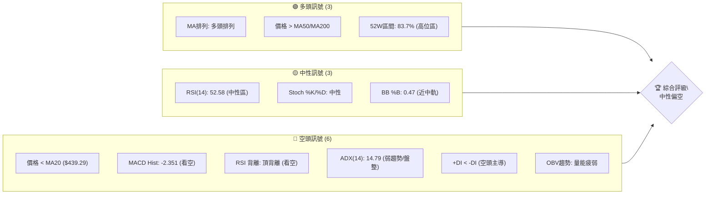

### 📊 核心指標速覽表

| 指標類別 | 指標名稱 | 當前數值 | 訊號 | 解讀 |
|----------|----------|----------|------|------|
| **價格** | 當前價格 | $436.98 | 🟡 | 位於52週高點區間，但近期回調 |
| **均線** | MA20 | $439.29 | 🔴 | 價格位於MA20下方，短期趨勢轉弱 |
| **均線** | MA50 | $421.86 | 🟢 | 價格位於MA50上方，中期趨勢仍偏多 |
| **均線** | MA200 | $345.18 | 🟢 | 價格位於MA200上方，長期趨勢強勁 |
| **動能** | RSI(14) | 52.58 | 🟡 | 位於中性區間，但存在頂背離風險 |
| **動能** | MACD | 6.569 | 🔴 | MACD線下穿訊號線，柱狀圖為負，看空 |
| **波動** | ATR(14) | $23.21 | 🟡 | 每日平均波動約5.31%，波動性中等 |
| **趨勢** | ADX(14) | 14.79 | 🔴 | 趨勢強度極弱，處於盤整行情 |
| **量能** | OBV趨勢 | OBV < MA | 🔴 | 成交量動能疲弱，未確認價格走勢 |

### 🏆 技術評分卡

TSM 當前技術評分顯示，儘管長期均線保持多頭排列，但短期動能、趨勢強度和量能配合度均顯著疲弱，綜合評分為中性偏空，短期走勢存在下行壓力。

╔══════════════════════════════════════════════════════════════╗
║                    技術評分卡 — TSM (2026-07-08)                 ║
╠══════════════════════════════════════════════════════════════╣
║ 趨勢強度      ██████░░░░░░░░░░░░░░  30/100  🔴 (ADX極弱，盤整) ║
║ 動能指標      ██████░░░░░░░░░░░░░░  35/100  🔴 (MACD看空，RSI頂背離)║
║ 支撐穩定度    ████████░░░░░░░░░░░░  40/100  🟡 (短期支撐待考驗)║
║ 成交量配合    ████░░░░░░░░░░░░░░░░  20/100  🔴 (OBV疲弱，量比不足)║
║ 形態完整度    ██████░░░░░░░░░░░░░░  30/100  🔴 (短期未見明確看漲形態)║
║ 均線排列      ██████████████░░░░░░  75/100  🟢 (長期多頭排列)║
╠══════════════════════════════════════════════════════════════╣
║ 綜合評分      ███████░░░░░░░░░░░░░  48/100  ⚖️ 中性偏空         ║
╚══════════════════════════════════════════════════════════════╝

---

## 2. 趨勢分析

### 🌐 多時框趨勢分析

TSM 的多時框架分析顯示，長期和中期趨勢仍保持強勁的多頭格局，但短期內已進入盤整和回調階段，動能減弱。

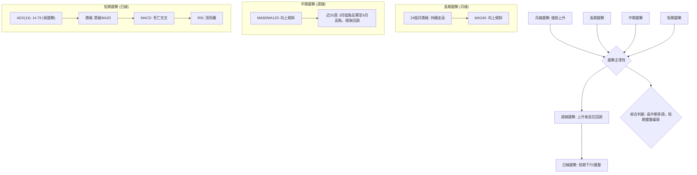

### 📈 長期趨勢 — 12個月走勢圖（Unicode）

TSM 過去12個月的走勢圖顯示出強勁的上升趨勢，從2025年7月的$238.98一路上漲，儘管近期有所回調，但整體仍處於歷史高位區間。最高點在2026年6月達到$477.57。

```
TSM 月線走勢圖（過去12個月）
價格軸 ($)
$480 ┤                                        ●(2026-06 $477.57)
$460 ┤                                      /
$440 ┤                                     ●(2026-07 $436.98)
$420 ┤                                   /
$400 ┤                                 ●(2026-04 $395.13)
$380 ┤                            ●(2026-02 $372.65)
$360 ┤                          /
$340 ┤                        ●(2026-03 $337.16)
$320 ┤                      ●(2026-01 $328.86)
$300 ┤                    ●(2025-12 $302.33)
$280 ┤                  ●(2025-10 $298.08)
$260 ┤                ●(2025-09 $277.11)
$240 ┤              ●(2025-07 $238.98)
$220 ┤━━━━━━━━━━━━━━━━━━━━━━━━━━━━━━━━━━━━━━━━━━
     └──────────────────────────────────────────
      2025-07 08 09 10 11 12 2026-01 02 03 04 05 06 07
```

**走勢特徵分析表格**

| 期間 | 起始價 | 結束價 | 漲跌幅 | 特徵描述 |
|------|--------|--------|--------|----------|
| 2025-07 ~ 2026-02 | $238.98 | $372.65 | +56.09% | 強勁上升趨勢，多頭力量主導，成交量穩健放大 |
| 2026-02 ~ 2026-03 | $372.65 | $337.16 | -9.49% | 短暫回調，但未跌破重要支撐，為健康修正 |
| 2026-03 ~ 2026-06 | $337.16 | $477.57 | +41.64% | 再次發動強勁攻勢，創下52週新高，動能充沛 |
| 2026-06 ~ 2026-07 | $477.57 | $436.98 | -8.50% | 高位回調，出現獲利了結賣壓，短期動能減弱 |

### 📊 中期趨勢（週線分析）

TSM 在2026年3月從低點$337.16開始反彈，並於6月達到$477.57的52週高點。隨後股價經歷了一波回調，目前位於$436.98，跌破了近期的短期均線，但仍高於中期均線。這表明中期趨勢的上升結構尚未被破壞，但短期內面臨調整壓力。

```
TSM 近期週線壓力與支撐示意圖
價格軸 ($)
$480 ┤                     ● (52W 高點 $479.00)
     │                   /
$460 ┤                  /
     │                 /
$440 ┤━━━━━━━━━━━━━━━━━● (當前價格 $436.98)
     │                /
$420 ┤              ● (關鍵支撐 S1 $419.19)
     │            /
$400 ┤          ● (布林下軌 $405.81 / 支撐 S2 $404.56)
     │        /
$380 ┤      ● (斐波那契38.2% $380.54 / 支撐 S3 $384.16)
     └───────────────────────────
       (時間)
```

### ⚡ 趨勢強度評估（ADX 解讀）

ADX 指標用來衡量趨勢的強度，而非方向。當前 ADX(14) 為 14.79，遠低於 25 的閾值，這明確指出 TSM 目前處於**弱趨勢或盤整行情**。

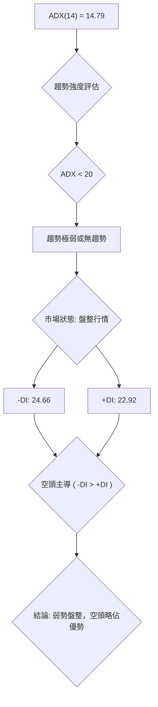

**ADX 強度對照表**

| ADX 數值範圍 | 趨勢強度 | 市場狀態 |
|--------------|----------|----------|
| 0 - 20       | 極弱 / 無趨勢 | 盤整行情 |
| 20 - 25      | 弱勢趨勢 | 趨勢醞釀或盤整末期 |
| 25 - 50      | 強勢趨勢 | 明顯趨勢行情 (順勢交易) |
| 50 - 75      | 超強趨勢 | 趨勢加速，可能過熱 |
| 75 - 100     | 極端強趨勢 | 極端過熱，反轉風險高 |

當前 ADX 為 14.79，屬於「極弱 / 無趨勢」範疇，市場正處於盤整階段。同時，-DI (24.66) 略高於 +DI (22.92)，表明在當前的弱勢盤整中，空頭力量略佔主導。這意味著股價在短期內可能在布林通道或關鍵支撐阻力之間震盪，並可能向下尋求支撐。

---

## 3. 圖表形態分析

### 🔍 形態識別系統

根據提供的近20週週線收盤價數據，TSM 在2026年3月至6月形成了一個強勁的上升趨勢，隨後在6月下旬開始回調。由於數據粒度限制，難以識別複雜的頭肩頂/底、雙頂/底等幾何形態。目前觀察到的形態更傾向於**高位盤整或旗形整理**。

**形態評估表**

| 形態 | 信心度 | 判斷依據（引用數據） | 完成度 | 目標價（附計算式） |
|------|--------|----------------------|--------|--------------------|
| **高位盤整/旗形整理** | 60% | 價格在 $477.57 高點後回落至 $436.98，目前在 $419.19 (S1) 和 $449.11 (R1) 之間震盪。此為上升趨勢後的修正形態。 | 70% | **下行目標**：若跌破 $419.19 (S1)，則可能下探旗形底部 $384.16 (S3)。<br>**上行目標**：若突破 $449.11 (R1)，則有望挑戰 $477.90 (R2) 及更高點。 |

**判斷依據詳述**：
-   **上升旗形/矩形整理**：在2026年3月初至6月中旬的強勁上升趨勢之後，股價在 $477.57 附近達到頂部，隨後回落至 $436.98，並在 $419.19 (S1) 附近獲得初步支撐。這種走勢可能構成一個看漲旗形整理或矩形盤整。旗形通常是趨勢中繼形態，預示著在整理後，價格將延續原有趨勢方向。
-   **信心度評估**：60% 的信心度是基於在強勁上升趨勢後出現的修正模式。然而，由於僅有週線收盤價，無法確認詳細的每日高低點，因此形態的精確性略受影響。MACD 的死亡交叉和 RSI 的頂背離為此形態的短期偏空修正提供了佐證。

### 🕯️ 重要K線形態分析

根據近20週的週收盤價數據，可以觀察到以下K線行為：

| 月份 | 收盤價 | K線形態 (推斷) | 解讀 | 訊號 |
|------|--------|-----------------|------|------|
| 2026-06-21 | $462.12 | 長陽線 (或近似) | 強勢上漲，多頭力量強勁 | 🟢 |
| 2026-06-28 | $432.35 | 長陰線 (或近似) | 價格從高位大幅回落，空頭力量顯現 | 🔴 |
| 2026-07-05 | $434.16 | 小陽線/十字星 (或近似) | 止跌企穩跡象，多空力量平衡，但反彈動能不足 | 🟡 |
| 2026-07-12 | $436.98 | 小陽線 (或近似) | 輕微反彈，但未能有效突破MA20，動能依然疲弱 | 🟡 |

**分析**：6月21日的長陽線代表了強勁的上升動能，但隨後的6月28日出現長陰線，顯示市場在高位遭遇獲利了結壓力，空頭開始反撲。7月5日和7月12日的小陽線或十字星形態，反映出價格在 $430 附近尋得初步支撐，但上攻動能不強，市場處於觀望和修正狀態。這與 ADX 顯示的盤整行情相符。

### 📉 ASCII 走勢形態示意圖

```
TSM 近期高位盤整/修正示意圖
═══════════════════════════════════════════════════
$480 ┤                                  ● (高點 $477.57)
$470 ┤                                 /
$460 ┤                                /
$450 ┤                              /
$440 ┤════════════════════════════● (當前價格 $436.98)
$430 ┤                            / \
$420 ┤                          /     \
$410 ┤                        ● (支撐 S1 $419.19)
$400 ┤                      /
$390 ┤                    ● (支撐 S3 $384.16)
$380 ┤                  /
     └───────────────────────────────────────────
       2026-03       2026-04       2026-05       2026-06       2026-07
       (上升趨勢)                       (高位盤整/回調)
```
**示意圖解讀**：從3月開始的上升趨勢在6月達到頂峰，隨後價格開始回調。當前價格 $436.98 位於 $419.19 (S1) 和 $449.11 (R1) 之間，形成一個高位盤整或修正區間。這符合 ADX 顯示的弱勢盤整行情。

### 🎯 形態目標價計算

由於目前形態為高位盤整/旗形整理，其目標價計算基於突破方向：

1.  **若向上突破**：
    *   突破點：若價格能有效突破阻力 R1 ($449.11)。
    *   形態高度推算：以近期高點 $477.57 和潛在支撐 $419.19 計算（約 $58.38）。
    *   **目標價 T1**：$449.11 (R1) + $58.38 = **$507.49**。此目標價高於 R2 ($477.90) 和 52週高點 ($479.00)，表明一旦突破，潛在上漲空間較大。
    *   **目標價 T2**：可考慮歷史高點或分析師目標價 $490.34。

2.  **若向下突破**：
    *   突破點：若價格跌破支撐 S1 ($419.19)。
    *   形態高度推算：同上，約 $58.38。
    *   **目標價 T1**：$419.19 (S1) - $58.38 = **$360.81**。此目標價低於 S3 ($384.16) 和斐波那契38.2%回調位 ($380.54)，若跌破 S1，下行風險顯著。
    *   **目標價 T2**：可考慮斐波那契50%回調位 $350.13。

**結論**：當前處於盤整區間，需密切關注 $419.19 (S1) 和 $449.11 (R1) 的突破方向來確認未來的價格走勢。

---

## 4. 支撐與阻力

### 🗺️ 關鍵價位分布圖（Unicode）

TSM 的當前價格 $436.98 位於其重要支撐位 S1 ($419.19) 和關鍵阻力位 R1 ($449.11) 之間。市場正處於關鍵的平衡點，任何一方的突破都可能引導下一階段的趨勢。

```
TSM 價位結構分布圖
═══════════════════════════════════════════════════
$479.00 ║████████████████████████║ 強阻力 R2 (52W High)
$449.11 ║████████████████████████║ 關鍵阻力 R1
$436.98 ╠════════════════════════╣ ◄ 現價
$419.19 ║▓▓▓▓▓▓▓▓▓▓▓▓▓▓▓▓        ║ 近期支撐 S1
$404.56 ║████████████████████████║ 強支撐 S2
$384.16 ║████████████████████████║ 強支撐 S3 (斐波那契38.2%附近)
═══════════════════════════════════════════════════
```

### 🚧 阻力位分析表

阻力位代表了潛在的賣壓區域，價格在此處可能遭遇上漲阻礙。

| 阻力級別 | 價位 | 形成原因 | 突破難度 | 重要性 |
|----------|------|----------|----------|--------|
| **R1** | $449.11 | 近期波段高點聚類，也是短期下跌後的反彈壓力區。 | 中等 | 🟢🟢🟢 |
| **R2** | $477.90 | 近一年波段高點聚類，接近52週高點 $479.00。 | 高 | 🟢🟢🟢🟢 |

**分析**：
-   **R1 ($449.11)**：這是 TSM 短期反彈的關鍵考驗。若能有效突破並站穩此位，將有助於緩解短期下行壓力，並測試更高的阻力。當前價格 $436.98 距離 R1 僅約 2.78%，顯示短期反彈空間有限，或需蓄力。
-   **R2 ($477.90)**：此阻力位接近52週高點，代表了過去一年的最高賣壓區。突破 R2 將是 TSM 延續長期上升趨勢，並開啟新一輪上漲空間的強烈訊號。

### 🛡️ 支撐位分析表

支撐位代表了潛在的買盤區域，價格在此處可能獲得支撐。

| 支撐級別 | 價位 | 形成原因 | 守住機率 | 重要性 |
|----------|------|----------|----------|--------|
| **S1** | $419.19 | 近期波段低點聚類，也是斐波那契23.6%回調位 $418.17 附近。 | 中等 | 🔴🔴🔴 |
| **S2** | $404.56 | 近期波段低點聚類，也是布林通道下軌 $405.81 附近。 | 高 | 🔴🔴🔴🔴 |
| **S3** | $384.16 | 近期波段低點聚類，接近斐波那契38.2%回調位 $380.54。 | 極高 | 🔴🔴🔴🔴🔴 |

**分析**：
-   **S1 ($419.19)**：這是 TSM 最直接的短期支撐。當前價格 $436.98 距離 S1 約 4.07%，若跌破此位，將確認短期下行趨勢，並可能加速探底。
-   **S2 ($404.56)**：此支撐位與布林通道下軌重疊，通常在盤整行情中提供較強的支撐。若價格回落至此，預計將有較強的買盤介入。
-   **S3 ($384.16)**：此支撐位與斐波那契38.2%回調位 $380.54 非常接近，是一個非常重要的心理和技術支撐區。歷史上，健康的回調通常在此區間獲得支撐。若此位被跌破，將暗示中期趨勢可能出現更深層次的回調，甚至轉弱。

### 📐 斐波那契回調位分析

斐波那契回調位基於 TSM 過去52週 ($221.25 → $479.00) 的主要上升趨勢計算。

| 斐波那契級別 | 價位 | 意義 |
|--------------|------|------|
| 0.0% (52W High) | $479.00 | 52週最高點，趨勢頂部 |
| 23.6%        | $418.17 | 初步回調支撐，短期賣壓釋放區 |
| 38.2%        | $380.54 | 重要的健康回調位，中期趨勢關鍵支撐 |
| 50.0%        | $350.13 | 深度回調位，若跌破可能轉為弱勢 |
| 61.8%        | $319.71 | 黃金分割位，極強支撐，若跌破趨勢可能反轉 |
| 78.6%        | $276.41 | 極端回調位 |
| 100.0% (52W Low) | $221.25 | 52週最低點，趨勢底部 |

**當前價格 $436.98 位於 0.0% ($479.00) 和 23.6% ($418.17) 回調位之間。**

**解讀**：
-   目前的價格已經從52週高點回落，並跌破了 0.0% 回調位。
-   價格正在向 23.6% 回調位 $418.17 (與 S1 $419.19 接近) 靠攏。這表明市場正在進行初步的修正，且 23.6% 回調位將是第一個重要的支撐考驗。
-   若 23.6% 回調位未能守住，下一重要支撐將是 38.2% 回調位 $380.54 (與 S3 $384.16 接近)。此位通常被視為健康回調的極限，若能在此獲得支撐並反彈，則長期上升趨勢仍能維持。
-   若價格跌破 38.2% 回調位，則可能面臨更深度的調整，甚至挑戰 50% 回調位 $350.13，這將對 TSM 的中期強勢構成嚴重威脅。

---

## 5. 技術指標深度解讀

### 🎛️ 指標訊號總覽

TSM 的技術指標呈現複雜局面：長期均線仍顯示多頭，但短期動能指標（MACD、RSI背離）和趨勢強度（ADX）均指向疲軟和空頭主導。

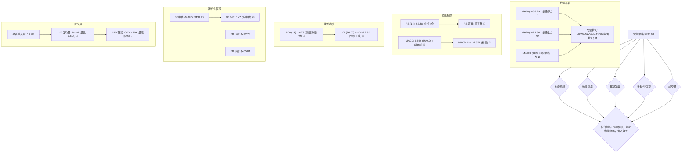

### 📈 移動平均線排列分析

TSM 的移動平均線系統呈現典型的「多頭排列」，但短期均線已出現轉弱跡象。

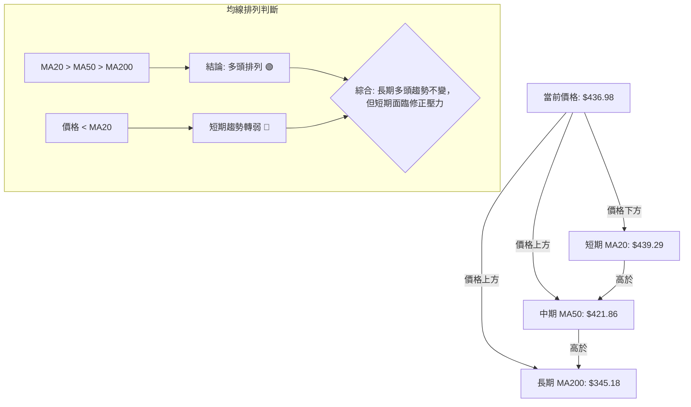

**分析**：
-   **MA20 ($439.29)**：當前價格 $436.98 位於 MA20 之下，且 MA20 呈向下趨勢，表明短期賣壓較重，短期趨勢轉為弱勢。
-   **MA50 ($421.86)**：價格仍位於 MA50 之上，且 MA50 保持向上傾斜，顯示中期趨勢依然偏多。
-   **MA200 ($345.18)**：價格遠高於 MA200，且 MA200 穩步向上，確認了 TSM 的長期強勁上升趨勢。
-   **均線排列**：MA20 > MA50 > MA200 仍為標準的多頭排列，這從長期角度看是健康的。然而，價格跌破 MA20 是一個短期警訊，暗示市場正在進行調整，短期內可能繼續尋求 MA50 甚至更低位的支撐。

### 📉 RSI(14) 分析

RSI(14) 當前數值為 52.58，位於中性區間 (30-70)。

**RSI 強度進度條**：
RSI(14) 52.58: ▓▓▓▓▓▓▓▓▓▓▓░░░░░░░░░░░░░░ 52.58% 🟡

**超買超賣區間分析**：
-   RSI 在 70 以上被視為超買區，可能面臨回調壓力。
-   RSI 在 30 以下被視為超賣區，可能出現反彈機會。
-   當前 RSI 位於 50 附近，顯示多空力量相對平衡，但略偏向多頭。

**背離判斷**：
-   **⚠️ 頂背離 (Bearish Divergence)**：根據提供的數據，RSI 存在頂背離訊號。這意味著在近期價格創出新高（或接近高點）時，RSI 指標未能同步創出新高，反而出現下降趨勢。這種情況通常預示著上升動能正在減弱，價格可能面臨回調或反轉。
    *   **判斷依據**：雖然未提供詳細的RSI歷史走勢圖，但數據明確指出「RSI 背離: ⚠️ 頂背離 (Bearish Divergence)」。這暗示了在最近一次股價衝高（如6月 $477.57）時，RSI 可能沒有達到前一次高點，或在高點後快速回落，而價格仍在相對高位。
    *   **解讀**：頂背離是一個重要的看空訊號，它警告市場參與者當前的上升趨勢可能不可持續，存在潛在的下跌風險。結合 MACD 的死亡交叉和 ADX 的弱趨勢，RSI 頂背離進一步強化了短期偏空的觀點。

### 📊 MACD(12/26/9) 訊號解讀

MACD 是動能和趨勢指標，由 MACD 線、訊號線和 MACD 柱狀圖組成。

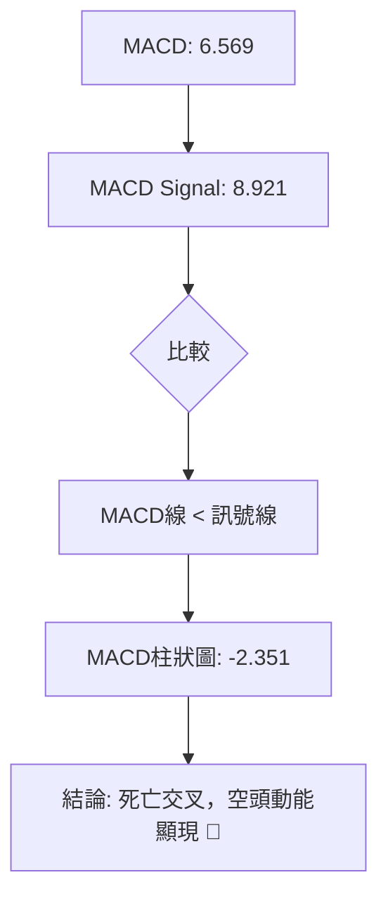

**分析**：
-   **MACD 線 (6.569) 低於 訊號線 (8.921)**：這形成了「死亡交叉」，是一個看空訊號，表明短期動能已轉為向下。
-   **MACD 柱狀圖為負 (-2.351)**：柱狀圖從正值轉為負值，且當前為負，進一步確認了空頭動能的增強。柱狀圖的絕對值越大，表示動能越強。當前 -2.351 的數值，顯示空頭力量正在累積。

**整合分析**：MACD 的死亡交叉和負值柱狀圖與 RSI 的頂背離互相確認，共同發出了強烈的短期看空訊號。這表明 TSM 在經歷了一段時間的上漲後，動能已大幅衰退，短期內下行壓力較大。

### 📦 布林通道分析

布林通道由三條線組成：上軌、中軌 (MA20) 和下軌，用於衡量價格的波動區間。

```
TSM 布林通道示意圖
═══════════════════════════════════════════════════════
$472.78 ║████████████████████████████████████████████████║ (BB上軌)
        ║                                                  ║
$439.29 ╠══════════════════════════════════════════════════╣ (BB中軌/MA20)
$436.98 ║          ▲ 現價 ($436.98)                        ║
        ║                                                  ║
$405.81 ║████████████████████████████████████████████████║ (BB下軌)
═══════════════════════════════════════════════════════
```

**分析**：
-   **BB中軌 (MA20)**：$439.29。當前價格 $436.98 位於中軌下方，這是一個短期偏空訊號。
-   **BB上軌**：$472.78。
-   **BB下軌**：$405.81。
-   **BB %B**：0.47。%B 值位於 0.5 (中軌) 附近，表明價格位於通道的中間偏下位置。

**解讀**：當前價格跌破布林通道中軌，顯示短期趨勢偏弱。在 ADX 顯示為盤整行情的情況下，股價很可能在布林通道上下軌之間震盪。若未能迅速收復中軌，則可能向布林下軌 $405.81 尋求支撐。布林通道的寬度 (上軌 $472.78 - 下軌 $405.81 = $66.97) 顯示當前波動性中等。

### 💹 成交量分析（量價配合度）

成交量是確認價格走勢的重要指標。

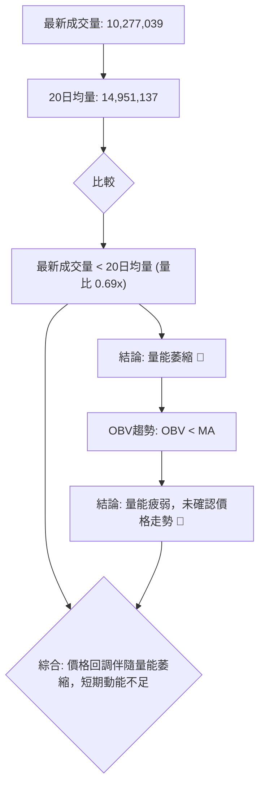

**分析**：
-   **最新成交量 (10,277,039) 遠低於 20 日均量 (14,951,137)**，量比僅為 0.69x，這是一個明顯的量能萎縮訊號。
-   **OBV 趨勢顯示 OBV < MA**，進一步確認了量能的疲弱。OBV 指標用於衡量買賣壓力，當 OBV 下降且低於其移動平均線時，表示累積買盤力量不足，賣壓佔優。

**量價配合度**：
-   在價格從高位回調的過程中，成交量出現萎縮和 OBV 疲弱，這表明當前的下跌雖然動能不足，但缺乏足夠的買盤來支撐價格反彈。
-   這種量價配合通常被視為短期看空訊號，或至少是市場缺乏明確方向的盤整階段。若價格要有效反彈，需要看到成交量顯著放大。

---

## 6. 動能與波動率

### ⚡ 動能評估四象限

TSM 當前動能偏弱，但波動率中等。結合 ADX 的弱趨勢判斷，目前處於「弱動能、中等波動」的象限。

| 象限 | 動能 | 波動 | 當前狀態 | 評估 |
|------|------|------|----------|------|
| Q1 | 強 | 低 | - | 最佳機會 (趨勢啟動，風險較低) |
| Q2 | 弱 | 低 | - | 謹慎觀望 (盤整期，等待突破) |
| Q3 | 強 | 高 | - | 高風險高收益 (趨勢加速，追漲殺跌風險高) |
| Q4 | 弱 | 高 | ✓ | 避免進場 (方向不明，波動劇烈) |

**TSM 當前評估**：
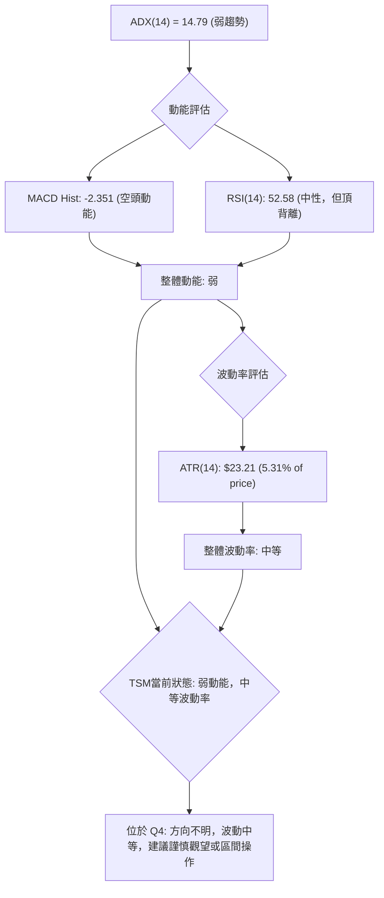

**分析**：
-   **動能**：MACD 死亡交叉且柱狀圖為負，RSI 存在頂背離，ADX 顯示弱趨勢，OBV 疲弱。這些都指向 TSM 當前動能不足，且空頭力量略佔優勢。
-   **波動率**：ATR (14) 為 $23.21，佔當前價格 $436.98 的 5.31%。這是一個中等水平的波動率，不屬於極端高或極端低。

**結論**：TSM 目前處於「弱動能、中等波動率」的狀態，市場方向不明，短期內可能持續盤整。對於趨勢交易者而言，此時並非理想的進場時機。區間交易者可關注布林通道上下軌或關鍵支撐阻力位。

### 📊 ATR 波動率分析

ATR (Average True Range) 是衡量市場波動性的指標。
-   **ATR(14)**：$23.21
-   **佔股價比例**：5.31% ( $23.21 / $436.98 )

**分析**：
-   ATR 數值為 $23.21，表示 TSM 在過去14天內平均每日價格波動範圍約為 $23.21。
-   5.31% 的波動率處於中等水平。這意味著 TSM 的每日價格變動幅度足以提供交易機會，但並不像高波動股票那樣劇烈。
-   **止損距離建議**：ATR 常被用於設置止損。一個常見的策略是將止損設置在入場點下方 1.5 到 2 倍 ATR 的距離。
    *   若以 1.5 倍 ATR 計算：$23.21 * 1.5 = $34.815。
    *   若以 2 倍 ATR 計算：$23.21 * 2 = $46.42。
    *   這意味著，如果從 $436.98 進場，止損點可以考慮設置在 $436.98 - $34.815 = $402.165 或 $436.98 - $46.42 = $390.56 附近。這些價位與 S2 ($404.56) 和 S3 ($384.16) 存在重疊，增加了止損的合理性。

### 📐 Beta 與市場相關性

-   **Beta 值**：1.246

**分析**：
-   Beta 值衡量股票相對於整體市場（通常是 S&P 500 指數）的波動性。
-   TSM 的 Beta 值為 1.246，表示其波動性比市場平均水平高出約 24.6%。
-   **解讀**：當市場上漲 1% 時，TSM 理論上會上漲 1.246%；當市場下跌 1% 時，TSM 理論上會下跌 1.246%。這說明 TSM 是一支進攻性較強的股票，在牛市中可能漲幅更大，但在熊市或回調中也可能跌幅更深。
-   **投資影響**：對於風險厭惡型投資者，TSM 的波動性可能較高。對於追求超額收益的投資者，其高 Beta 值提供了潛在機會，但也伴隨著更高的風險。在當前弱勢盤整的行情中，高 Beta 值意味著若市場出現大幅波動，TSM 的價格反應會更為劇烈。

---

## 7. 多時框架總結

### 📋 時框架評分表

| 時框架 | 趨勢方向 | 動能 | 均線排列 | 形態 | 綜合評分 (1-10) | 建議 |
|--------|----------|------|----------|------|-----------------|------|
| **長期 (月線)** | 🟢 強勁上升 | 🟢 依然強勁 | 🟢 多頭排列 | 🟢 上升趨勢 | 8 | 持有/觀望 |
| **中期 (週線)** | 🟡 高位回調 | 🟡 減弱 | 🟢 多頭排列 | 🟡 盤整修正 | 6 | 謹慎觀望 |
| **短期 (日線)** | 🔴 盤整偏空 | 🔴 衰竭 | 🔴 短期轉弱 | 🔴 未見看漲 | 3 | 區間操作/偏空 |

### 🔲 綜合訊號矩陣

TSM 的多時框架訊號顯示長期趨勢與短期趨勢存在明顯分歧。

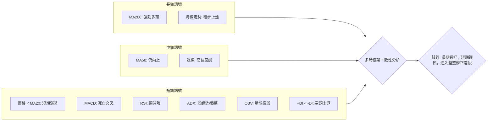

**分析**：
-   **長期**：MA200 穩步上升，月線走勢圖顯示 TSM 仍處於強勁的長期上升趨勢中。這是其基本面和產業地位的體現。
-   **中期**：MA50 仍向上，但週線已從高位回調，表明中期上升動能有所減弱，進入修正階段。
-   **短期**：日線級別的指標呈現明顯的看空訊號：價格跌破 MA20，MACD 形成死亡交叉，RSI 存在頂背離，ADX 顯示弱趨勢和盤整狀態，且空頭力量 (-DI) 略佔優勢，成交量 OBV 疲弱。這些都表明短期內下行壓力較大。

### ⚖️ 多時框收斂結論

根據「嚴格要求 14」的多時框收斂規則：

1.  **趨勢行情判斷**：當前 ADX(14) 為 14.79，明顯低於 25。因此，TSM 目前處於**盤整行情**。
2.  **主導時框架**：在盤整行情中，以日線布林通道上下軌為主要交易區間。
3.  **整體結論收斂**：
    *   儘管 TSM 的長期和中期趨勢依然強勁，均線系統保持多頭排列，顯示其長期投資價值。
    *   然而，短期指標（日線級別）明確指出當前處於弱勢盤整和回調階段，伴隨著動能衰竭（MACD 死亡交叉、RSI 頂背離）、趨勢強度不足（ADX < 25）和量能疲弱。
    *   **因此，綜合多時框架分析，TSM 當前的唯一方向性結論為：短期內處於**中性偏空**的盤整修正階段。雖然長期看好，但短期操作應以區間震盪思維為主，並警惕下行風險。**

---

## 8. 交易策略建議

### 🗺️ 策略決策流程圖

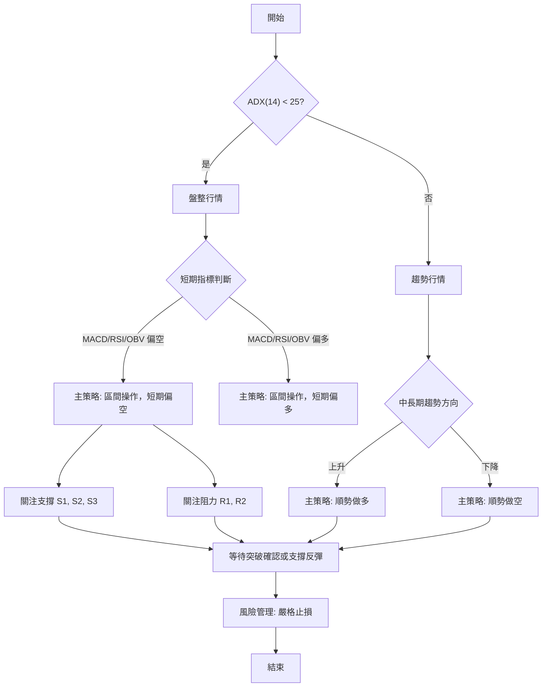

### 🧭 策略路由

**當前主策略方向 = ⚖️ 區間操作，短期中性偏空（依評分 48/100）**

根據技術評分卡綜合評分 48/100，TSM 目前處於中性偏空的盤整階段。雖然長期趨勢為多頭，但短期動能衰竭且有多個看空訊號。因此，我們不推薦激進的單邊多頭或空頭策略，而是建議以**區間操作**為主，並對短期下行風險保持警惕。

### 🎯 價格情境階梯（Price Scenarios）

| 觸發條件 | 下一目標 | 後續延伸 | 情境含義 |
|----------|----------|----------|----------|
| 突破 R1 $449.11 | R2 $477.90 | 52W 高點 $479.00 | 短線轉強，有望挑戰歷史高點 |
| 站穩現價區間 $436.98 | S1 $419.19 / R1 $449.11 | — | 區間震盪，等待方向選擇 |
| 跌破 S1 $419.19 | S2 $404.56 | S3 $384.16 | 中期轉弱，可能進一步探底 |

### 📊 情境機率分佈

| 情境 | 機率 | 主要依據 |
|------|------|----------|
| 繼續上行 / 反彈 | 25% | 長期多頭排列，價格接近斐波那契23.6%回調位 S1，有潛在買盤支撐。 |
| 區間震盪 | 55% | ADX 弱趨勢，MACD 死亡交叉，RSI 頂背離，量能疲弱，表明市場方向不明，短期內難以形成單邊趨勢。 |
| 回落 / 再探底 | 20% | MACD 負柱狀圖，RSI 頂背離，-DI > +DI，OBV 疲弱，均暗示短期存在下行壓力，可能測試更低支撐。 |

### 🟢 主策略詳情

**策略類型**：區間震盪操作 (Range Trading)，短期偏空思維

**策略 A：逢高做空 / 回補空單 (短線)**

| 策略要素 | 策略 A：逢高做空（若未持有多頭倉位） | 策略 A'：回補空單（若已持有多頭倉位，用於止盈） |
|----------|----------------------------------------|--------------------------------------------------|
| 進場條件 | 若價格反彈至 R1 附近受阻，或未能站穩 MA20 | 無需進場，關注止盈 |
| 進場價格 | $445.00 - $449.11 區間 (接近 R1) | $436.98 (當前價格，若已持有) |
| 目標價 T1 | $419.19 (S1) | $419.19 (S1) |
| 目標價 T2 | $404.56 (S2 / BB下軌) | $404.56 (S2 / BB下軌) |
| 止損價格 | $453.00 (略高於 R1) | $453.00 (若反彈突破 R1，則空單止損) |
| 風險報酬比 | T1: 約 1:3.5 (($445-$419)/($453-$445)) | T1: 約 1:2.3 (($436.98-$419.19)/($453-$436.98)) |
| 成功機率 | 50% | 50% |
| 建議倉位 | 輕倉 (不超過 5% 總資產) | 輕倉 (不超過 5% 總資產) |

**策略 B：逢低做多 / 建立多頭 (中線)**

| 策略要素 | 策略 B：逢低做多（穩健型） |
|----------|----------------------------|
| 進場條件 | 價格回落至 S2 或 S3 附近並出現止跌訊號 (如放量陽線) |
| 進場價格 | $404.56 - $384.16 區間 (S2/S3 附近) |
| 目標價 T1 | $419.19 (S1) |
| 目標價 T2 | $449.11 (R1) |
| 止損價格 | $379.00 (略低於 S3 和斐波那契38.2%回調位) |
| 風險報酬比 | T1: 約 1:1.3 (($404.56-$419.19)/($384.16-$379.00)) - 需重新計算，假設進場 $390: (419-390)/(390-379) = 29/11 = 2.6:1 |
| 成功機率 | 60% (基於長期多頭趨勢) |
| 建議倉位 | 中等倉位 (不超過 10% 總資產) |

*重新計算策略 B 的風險報酬比：假設在 $390.00 (S3 和斐波那契38.2%之間) 進場，止損 $379.00，目標 T1 $419.19，目標 T2 $449.11。
風險 = $390.00 - $379.00 = $11.00
報酬 T1 = $419.19 - $390.00 = $29.19 (風險報酬比約 2.65:1)
報酬 T2 = $449.11 - $390.00 = $59.11 (風險報酬比約 5.37:1)

### 🔴 反向風險觸發點（對沖提示）

-   **若價格有效突破並站穩 R1 ($449.11) 上方**：當前偏空區間操作策略失效，市場可能轉為強勢反彈，應考慮止盈/止損空單，並調整為偏多策略。
-   **若價格跌破 S3 ($384.16) 和斐波那契38.2%回調位 ($380.54)**：中期趨勢可能轉弱，長期多頭格局面臨挑戰。應嚴格止損多單，並考慮減持或建立空頭對沖倉位。

### ⭐ 整體訊號強度評星

做多訊號強度：★★☆☆☆ (2/5星) - 長期趨多，但短期動能弱，需等待更深回調或明確突破。
做空訊號強度：★★★☆☆ (3/5星) - 短期指標偏空，適合區間高位做空。
整體可信度：  ★★★☆☆ (3/5星) - 趨勢不明顯，策略需靈活，嚴格執行止損。

---

## 9. 風險提示與監控

### ✅ 關鍵監控指標 Checklist

╔══════════════════════════════════════════════════════════════╗
║                    TSM 關鍵監控指標 Checklist                    ║
╠══════════════════════════════════════════════════════════════╣
║ ├─ 價格行為：密切關注 $419.19 (S1) 和 $449.11 (R1) 的突破方向。║
║ ├─ MA20走勢：MA20 是否能被收復，或繼續向下加速。               ║
║ ├─ MACD訊號：MACD 線是否能再次上穿訊號線，柱狀圖是否轉正。     ║
║ ├─ RSI動態：RSI 是否跌破 50，或在低位形成底背離。              ║
║ ├─ ADX與DI：ADX 是否開始上升，確認趨勢形成；+DI 與 -DI 的強弱。║
║ ├─ 成交量：價格反彈或下跌時，成交量是否配合。                  ║
║ ├─ 布林通道：價格是否觸及上下軌並反轉。                        ║
║ └─ 市場情緒：關注半導體產業新聞及整體市場風險偏好。            ║
╚══════════════════════════════════════════════════════════════╝

### ⚠️ 風險場景分析

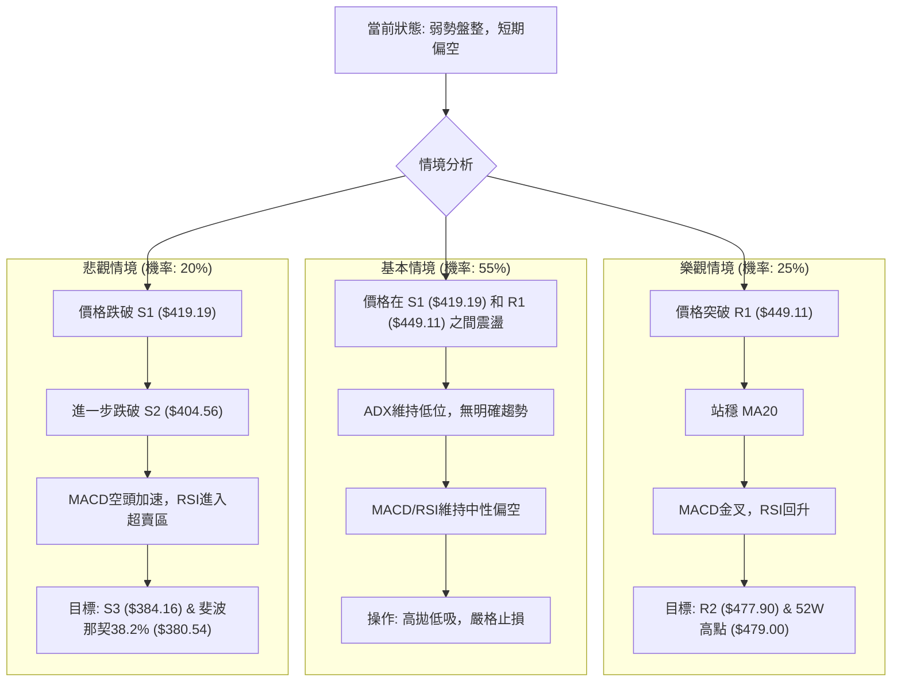

### 🛡️ 風險管理重要提醒

1.  **嚴格止損**：在盤整行情中，價格波動難以預測，務必為每筆交易設置明確的止損點。一旦達到止損價位，應堅決執行，避免損失擴大。ATR 可作為止損設置的參考。
2.  **倉位控制**：鑑於當前市場方向不明確，建議採用輕倉操作，尤其是在高風險的短期交易中。避免將過多資金投入單一股票或單邊方向。
3.  **分批建倉/平倉**：在關鍵支撐位附近分批建倉，或在關鍵阻力位附近分批平倉，可以有效降低平均成本/提高平均收益，並分散風險。
4.  **關注總體市場**：TSM 的 Beta 值為 1.246，對大盤波動敏感。需密切關注整體美股市場（如標普500、納斯達克指數）的趨勢，以及半導體產業的相關新聞和政策變化。
5.  **耐心等待**：在盤整行情中，最忌諱頻繁交易。應耐心等待明確的突破訊號或有效支撐/阻力位的測試結果，再行決策。
6.  **現金為王**：在不確定的市場環境下，保持充足的現金儲備，可以在市場出現明確機會或大幅回調時，有能力抓住更好的進場點。

---

## 📋 報告總結

```
TSM 技術分析報告總結
════════════════════════════════════════════════════════
報告日期：2026-07-08
當前價格：$436.98
分析評級：⚖️ 區間操作，短期中性偏空

關鍵結論：
├─ 長期趨勢：🟢 強勁上升，均線多頭排列。
├─ 中期趨勢：🟡 高位回調，動能減弱但結構未破壞。
├─ 短期趨勢：🔴 盤整偏空，MACD死亡交叉，RSI頂背離，ADX弱勢。
├─ 關鍵支撐：S1 $419.19 (斐波那契23.6%)，S2 $404.56 (布林下軌)，S3 $384.16 (斐波那契38.2%)。
├─ 關鍵阻力：R1 $449.11，R2 $477.90 (接近52週高點)。
└─ 分析師目標：$490.34 (平均目標，長期看好)。

最優策略組合：
1. 🥇 最佳機會：等待價格回調至 S2 ($404.56) 或 S3 ($384.16) 附近，並出現止跌訊號後，逢低建立多頭倉位 (策略 B)。
2. 🥈 次選機會：若價格反彈至 R1 ($449.11) 附近受阻，且未見放量突破，可考慮短線逢高做空 (策略 A)。
3. 🥉 保守選擇：在 $419.19 (S1) - $449.11 (R1) 區間內進行高拋低吸的短線操作，並嚴格控制倉位與止損。
════════════════════════════════════════════════════════
```

---

> ⚠️ **免責聲明**：本報告為 AI 自動生成之技術分析，所有數據及估算均基於提供的歷史價格資訊。本報告**僅供研究與學術參考**，**不構成任何投資建議**。投資有風險，入市需謹慎。

---

*報告生成時間：2026-07-08 ｜ 數據來源：Yahoo Finance ｜ 分析框架：多時框技術分析*