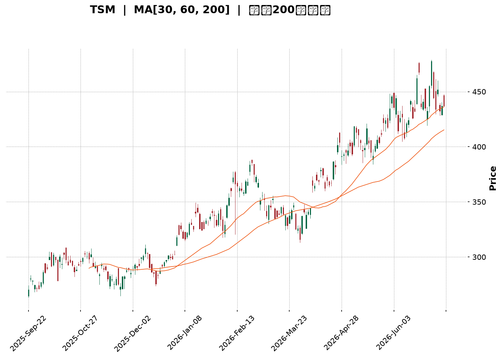
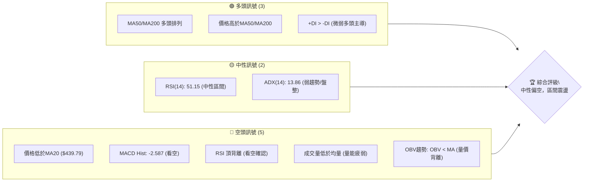
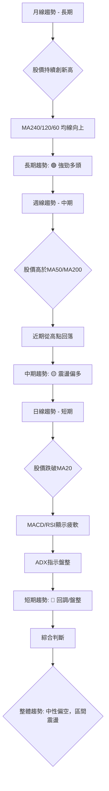
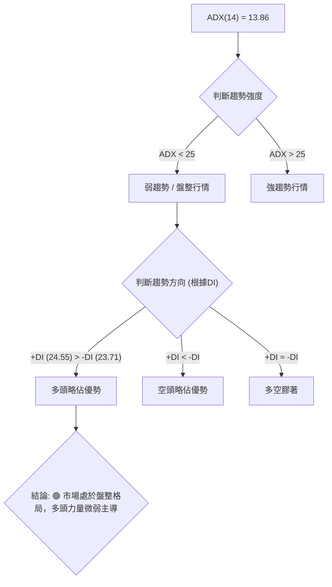
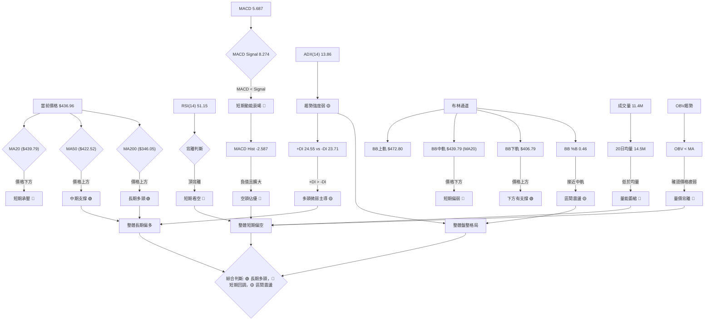
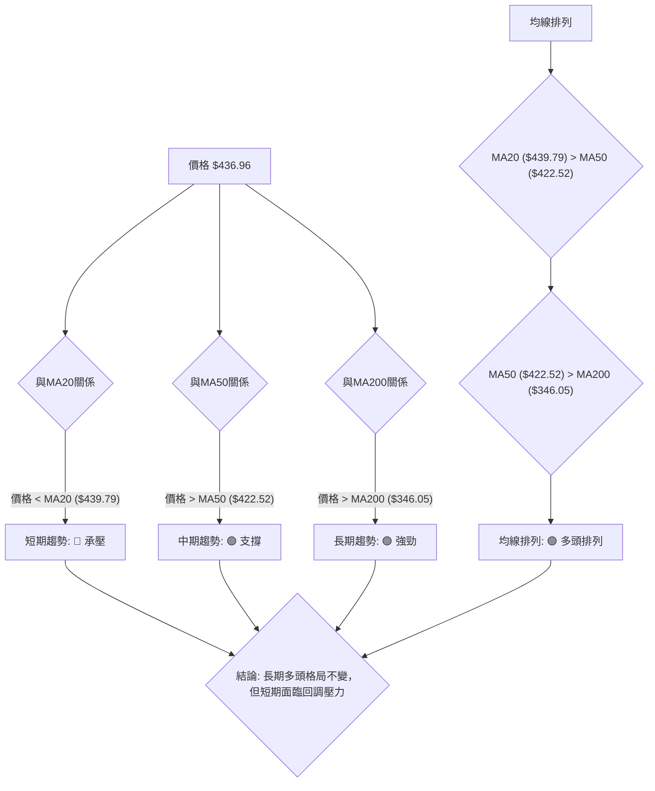
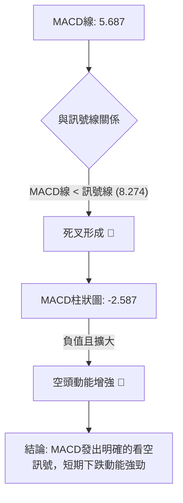
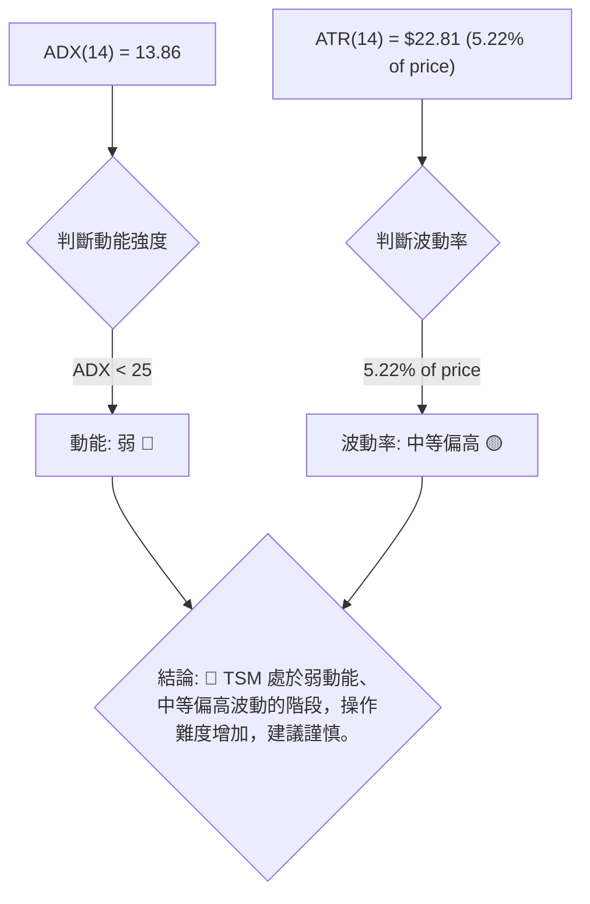
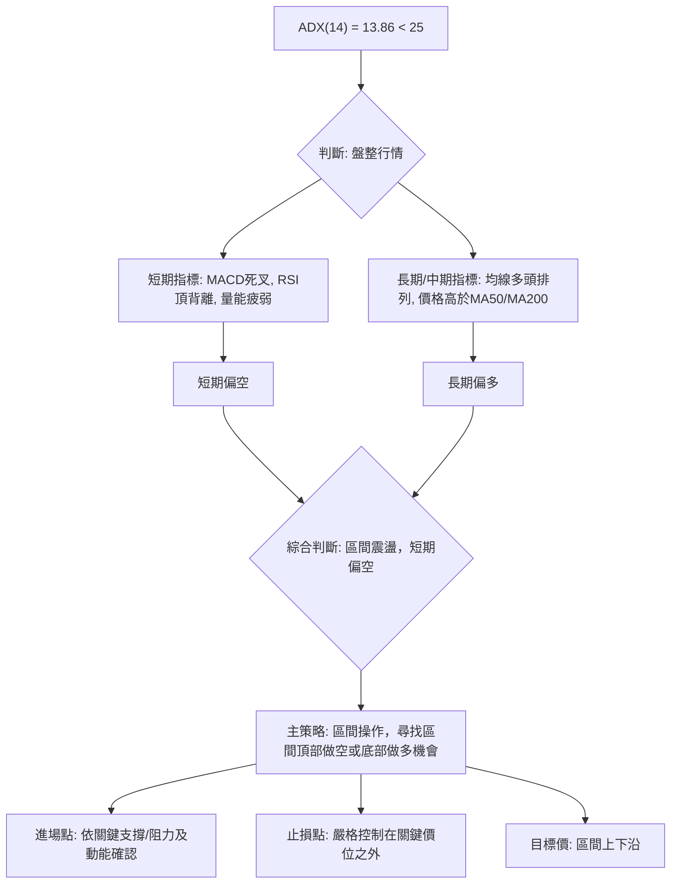
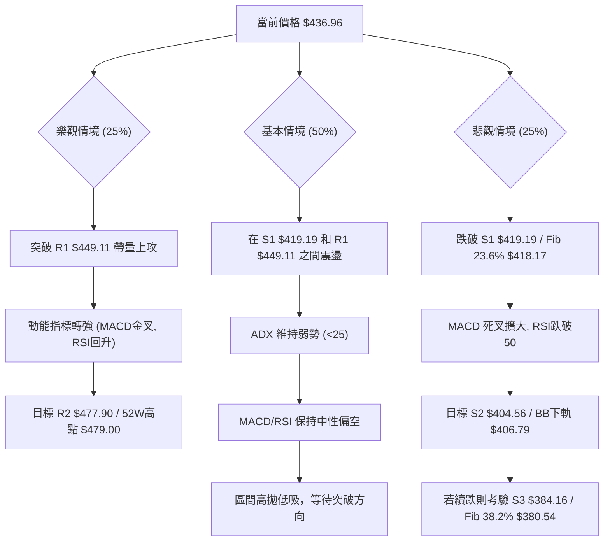

<details>
<summary>📊 靜態圖表 (點擊展開)</summary>

</details>

<html>
<head><meta charset="utf-8" /></head>
<body>
    <div style="height:500px; width:100%;">                        <script>window.PlotlyConfig = {MathJaxConfig: 'local'};</script>
        <script charset="utf-8" src="https://cdn.plot.ly/plotly-3.7.0.min.js" integrity="sha256-jvTGqxNp8AGWEcvNLVuKr+8j5dGe9Yw51LQkmDH+IYA=" crossorigin="anonymous"></script>                <div id="candlestick-chart" class="plotly-graph-div" style="height:100%; width:100%;"></div>            <script>                window.PLOTLYENV=window.PLOTLYENV || {};                                if (document.getElementById("candlestick-chart")) {                    Plotly.newPlot(                        "candlestick-chart",                        [{"close":{"dtype":"f8","bdata":"AAAAAPrncEAAAADA\u002fodxQAAAAOA+aHFAAAAAwPMncUAAAACgkPNwQAAAAGCA8XBAAAAAILRRcUAAAABgb+NxQAAAAGC43XFAAAAAQH0eckAAAACgksByQAAAAOCyO3JAAAAAADrickAAAABgkZhyQAAAAKBzZ3FAAAAAAFrIckAAAAAgBVpyQAAAAEA+5XJAAAAAwO6XckAAAAAgXkxyQAAAAOD1dXJAAAAAwFFDckAAAACg8elxQAAAAABQB3JAAAAAgHZKckAAAAAAsX5yQAAAAMDCsnJAAAAAoEbrckAAAAAAl81yQAAAAIBMoXJAAAAAwJ\u002fnckAAAABgBDxyQAAAACCCNXJAAAAAgKjvcUAAAABAKcRxQAAAAGBiT3JAAAAAAEwOckAAAAAAkQVyQAAAAEDmf3FAAAAA4H2pcUAAAAAg4nxxQAAAAMDLO3FAAAAAIJmCcUAAAACASTVxQAAAAGCNDnFAAAAAYKKmcUAAAADARKdxQAAAAKAW+3FAAAAAwLETckAAAADA5NZxQAAAAODmHHJAAAAAAD5SckAAAACgPCpyQAAAAECnRnJAAAAAgCi4ckAAAAAgm9ByQAAAAOBxO3NAAAAA4If0ckAAAADAnyhyQAAAAGAt5HFAAAAAQFTWcUAAAACAlThxQAAAACB4s3FAAAAAIHD3cUAAAADAXDxyQAAAAMDHdnJAAAAAYDqUckAAAAAgidRyQAAAAGD5tXJAAAAA4KSgckAAAAAAQOVyQAAAAAB633NAAAAA4H8JdEAAAAAg9Ft0QAAAAECs0HNAAAAAQALGc0AAAABgdx90QAAAAGAJoXRAAAAAYB+YdEAAAAAg3FZ0QAAAAEAlPnVAAAAAAD5KdUAAAADgp1d0QAAAAAAaR3RAAAAAoP9adEAAAADAYdJ0QAAAAOD\u002fr3RAAAAAwJ0JdUAAAACgpkh1QAAAAIDgHHVAAAAAwMaNdEAAAAAgsDl1QAAAAKBj4HRAAAAAgA1BdEAAAACAe5B0QAAAAKDpsHVAAAAAIFUZdkAAAABgzIB2QAAAACCtQndAAAAAYFTjdkAAAADgocd2QAAAAABApXZAAAAAoF6GdkAAAACAmmh2QAAAAEArCndAAAAAoDUCd0AAAAAgR\u002fx3QAAAAIDLG3hAAAAAIPltd0AAAADgeUp3QAAAAOBn83ZAAAAAYAr1dUAAAABgpTl2QAAAAACpAHZAAAAAIF8SdUAAAABghq51QAAAAKDllHVAAAAAYM0LdkAAAACgq+90QAAAAIAjCXVAAAAAgLMndUAAAAAgv5J1QAAAACBtLHVAAAAAwPkfdUAAAABAiId0QAAAAGCMGnVAAAAAICtndUAAAAAgAK91QAAAAKCRVXRAAAAAIKBfdEAAAAAgK7xzQAAAACCREnVAAAAAABNLdUAAAABg9yN1QAAAAGBiT3VAAAAAIDaIdUAAAADAuNB2QAAAAGAtynZAAAAAAL8bd0AAAAAATgt3QAAAAAAKsHdAAAAAAJRjd0AAAABgBKh2QAAAAGAmGndAAAAAICbWdkAAAAAghfN2QAAAAICOKHhAAAAAYEHcd0AAAACgUBh5QAAAAICKQHlAAAAAAMZ2eEAAAADAjo54QAAAAIAnsnhAAAAAwNrLeEAAAAAgvwp5QAAAAADRl3hAAAAAgFEoekAAAAAA69J5QAAAAIB9q3lAAAAAgIQ5eUAAAAAAocV4QAAAAMDa7XhAAAAAoOcLekAAAAAgfDZ5QAAAACBmsHhAAAAAQBV7eEAAAAAg6Ap5QAAAAAAuY3lAAAAAwDI5eUAAAADgtLV5QAAAAKDgW3pAAAAAoOB9ekAAAADAjhd6QAAAAKDLKXtAAAAAgFfae0AAAABAtzp7QAAAAKAWvntAAAAAQDPjeUAAAABg2Jx6QAAAAEC5rnpAAAAAYLh8eUAAAADAHlF6QAAAAEDhfnpAAAAAYGaWe0AAAACgR516QAAAAGBmAntAAAAAgOvhfEAAAABguDp9QAAAAIA9RntAAAAAoEeNe0AAAAAA1y97QAAAAKCZBXtAAAAAoJlxfEAAAADAHtl9QAAAACCuw3tAAAAAYI8ie0AAAADgozx8QAAAAMAeCXtAAAAAIK5Pe0AAAAAgXE97QA=="},"high":{"dtype":"f8","bdata":"8oLLjTAjcUCTO2xEObxxQFK0Bd0ucHFAf1rcgJIvcUC6T0OYiRVxQGeRfx3pWnFAl2aQ2OBUcUBW8AcCWANyQEchN0hnZnJAV2+J0exbckCdamsWXA5zQAhAYxIvC3NAcZiQSxIAc0CX0zUIZsdyQIGtFcKlnXJAo0mtR\u002fnjckCh0hfRQLZyQNAJ1MdnA3NAqYdjZfhOc0AsXUEE3M5yQPtoEHZq1HJAqL65nXiQckBOcuT8RU5yQA9u\u002fOamPHJAS4vU3+15ckD46lm2F6JyQKqeGSlJvHJAhnLaN9YYc0DO\u002f0imhA5zQDbO0FRkFHNAWigQTiA7c0B5JqpcELpyQP2FOBU3fnJAXxdnEmJFckBZwp08OtpxQELNr2\u002fpbHJAvOwi6dNJckDt9BDnCElyQLa4yzrJ83FAFLNVTODJcUCe\u002fFpBo8RxQECQlpz9X3FAdniVkDSlcUAljbSQ9yhyQCEVMaEtSHFAbH39LE2tcUCczGLRsrJxQAN7sPtUKHJA\u002fdMw+hsmckDHf+BuIw5yQA0evRIpQ3JA216OyNBkckCtdyYGsztyQG82pywsp3JAqiVyexDEckAJKpxUxORyQB2wGohneHNAIhiYCEoEc0BFd9ARdetyQBVER3F5ZHJAcKnsZqPvcUAmqfZs0\u002flxQCuUWgry2nFAbZT7dbEqckDFe3B05ldyQIWEN6oPhnJAdSPAa\u002fWZckDSlayhId1yQJ8CPaL17nJAvm8lX8HvckCN2mJR9hxzQJC3\u002fXD+\u002fnNASixZZ8KYdEBOvx2O47V0QJ7djlT3SXRAiJBmn1AtdEDuzzXAnDF0QMR\u002f7MZevXRAZwcY8Q3rdEChuUU7ooJ0QHNDZWFj2HVAx26caNTAdUDm3sRMQ0Z1QG6yI7DNvnRAMrWhMT\u002fVdECiOEKgrPZ0QESnZA8L1nRALGHF3O83dUB+DBOClnt1QM2zoYqSX3VAVi16v3IidUDuVRIW5WZ1QBbyaHtClHVAZB1gT\u002fAQdUDiHsZIm810QFmWUc\u002fCvnVA93dKKgdcdkBJG0kAKq52QEtvI4wQmndA1\u002fglO8Cgd0BXNrjgPRN3QEwvOOUVxXZAZy7KBd33dkBWs8gD9452QFABtK2XJHdA2ajsoSs4d0BYkIwq4DJ4QJzfZEpFQ3hA9sYWI70HeEDPmUdK52t3QPdhMgDrMndAw4tcAGgidkCZHuvovnN2QOamtoX1WXZAjwWszteudUBC+47Dqrl1QPQ3Mw7u+nVAxD9qgzY4dkCExgywtpF1QLovueP8a3VA6j+4Pr1tdUAs+xSJMp91QPOMCW4xsnVAbWa0oLExdUDp5yDf+gx1QILuwgi5aXVA3eCmBjCBdUAYtV6JGdp1QL1cHN3QQXVAEERE46OMdEAl1lliR410QJPUE9noGXVAfWpjcdi9dUAt7wBBVVR1QNr\u002fOEZVdnVAXCWNPZCLdUCW8ei8zlZ3QPc4Xxr19HZA3LOxjt6Rd0BaYbxJeSl3QC31xyZG1HdAZXrsqGbRd0D+RBRyXBV3QN9fpmI9a3dAwk3gOEkTd0ByXrryIx53QInmjCAPMHhAedmzn6A9eEB99EA5iIh5QAnJ\u002fUSB2HlANIox9AvPeEBpVDdrza54QOP5xH+73XhAKDXg5LwweUDUPAyY9Wt5QBP26fflUnlAiwgA1oIrekDhahmkTDB6QNOsf1ZpAHpA1HblOHBseUA\u002fVbiozRR5QNaUpYzAO3lAM6gM9L5PekD42essmY55QPRoN8feXnlAKgERPyvfeEC1fld\u002f+y55QDfL\u002fID6p3lABXVxZV6beUC7U\u002fI3Rfh5QCl4zmm02HpAFOs5h52pekBWxvgB89Z6QNtE6\u002fFwBXxAqUKzk1H1e0AFZox4uxF8QJTP\u002fq1p73tAwqqlAS4Oe0DgB3ZKvgx7QOPgREEuUntAZigg\u002fC6VekAAAAAAAGR6QAAAAEAKr3pAAAAAoEepe0AAAACgR4V7QAAAAAAAqHtAAAAAIIUTfUAAAADgo8x9QAAAAKBH9XtAAAAAgMK9e0AAAABgZk58QAAAAIAUQntAAAAAoJmBfEAAAAAAAPB9QAAAAAApSH1AAAAAIIXXfEAAAADgesB8QAAAAMDMfHtAAAAAANeHe0AAAABACvt7QA=="},"hovertemplate":"\u003cb\u003e%{x|%Y-%m-%d}\u003c\u002fb\u003e\u003cbr\u003e\u958b: $%{open:.2f}\u003cbr\u003e\u9ad8: $%{high:.2f}\u003cbr\u003e\u4f4e: $%{low:.2f}\u003cbr\u003e\u6536: $%{close:.2f}\u003cextra\u003e\u003c\u002fextra\u003e","low":{"dtype":"f8","bdata":"NE4+rf51cEBY7ZRo+VxxQLAaw6XnKHFAl5cx0T3BcEBc205eEchwQAAAAGCA8XBAOw3huAb7cEDetsl8DDBxQFm4llWTzHFAqZDOcIADckCPWLlGhZlyQAncmOTKL3JA+BKcx+c6ckC4W+AGhHFyQCTofnE2YnFAyNE1vI0gckA1eEjP\u002fhByQOiepHaVm3JAZhiQP+1lckDGlnb\u002f00lyQF2t1t7Ma3JArbxeWNM1ckCNmuj20qJxQDlgzZnZ9XFAdn2qIGpBckD68OVGTTZyQDs4pwc+XHJAOdVwSEHAckC7Ght7fadyQD00VpbEZXJANOCifiC8ckCsZa\u002fqcTNyQDz13CeJE3JAYlI6kCHScUA4qoPPaS9xQOnLrziBF3JA9nfHX2vqcUAn+9ltDvVxQJTVq3P5XHFArq9dZoDxcED4YqalzFlxQCxHmbNn6XBA0WNYHY4icUCUOsnH+yNxQGsJgT++i3BArsfsyt3wcEACU4+ZHu9wQO5aWQmw13FAWFlGIdnrcUDKTu6InY9xQJ6aRbC07nFAX6Or4FW9cUAqD2EM5v5xQNc1+jJRL3JAeIMFDGdmckAFnEn8qIJyQMBEDggpwnJArmB6bpmhckDP0r9QwBdyQKLQACAn4XFAxeIwPNKdcUAr9QqUqBpxQA07wY7UhHFAu07peofOcUCSwueTaRtyQB34rL8rK3JA12B92lFrckDRG0dSxY9yQAey5ynXkXJAR7Z4PJOeckBpbjRv7d1yQISqwkWRYXNA+uYNqo\u002f9c0DqcsdJvy50QNdUb9JxznNAQ\u002ff9HT6oc0AZbM4i1MlzQGyzIbiO9nNAMlZnLUeRdECidIGVaDJ0QOf6XnDuAnVAnw0Wikc7dUDkuUxZhFN0QLdnUQMZQHRACmgDZYRTdEDdWcVuq5p0QGWidhWGiHRAvEf\u002fc3LNdED+ehThtQ51QJjm7vA1aHRA0TRoXIl2dEC4dnJZiXZ0QNLOiiEuhXRAO5q7quHWc0B+1H8CHeBzQBY\u002fwjW37nRAG4WetTKgdUBA\u002fTe17ih2QMX6l\u002f\u002fx53ZANCGhxBwHdEBvlErupm52QFU4qlOLJnZAw+6dYbJtdkABgK5apTl2QGLv39URVHZACJg+PjnJdkBPKtEU4GF3QP0CZA2i7XdAuM0HTsz8dkD48qA4m+t2QPdcqaRprHZAsFoSovBldUBDRUq3pAt2QF7xwAiHYHVAs+mnMFrvdEACoCvBbKN0QJcbaEalaHVAVzy3i\u002fLIdUBnxWvyaup0QBFV4N\u002fe53RAA1yrwSwhdUDBQ0bqvxl1QJGEfzPBKHVAiV7yReJGdECJTYaWN1J0QKboahY5pXRAzmWZVNXTdEBt397LKGt1QDgV67TBSXRAMfMIRekYdEBylr+2EZFzQIOjbT48BnRALnjCpkwvdUCRQwdilWB0QG7dvexCHXVArNohStrtdEAHpEwcaWZ2QAe9tSUJfnZAHNtvgi0Od0DZVK6vHdN2QHU7yXSRRXdA65AkKHI1d0APUM1LUnt2QGMnUCuXxHZAv0RCK2K2dkB4eDZsHMR2QGraD4ZiHHdANZG1Telud0C9bYuF4I54QGPwk5Ru93hA8NIBvdH8d0DBJr9xXjR4QNUzZOzwDHhA0ZJN5GtzeECL0sk3baR4QLuuMpLsenhACiCvQ2z7eECvAWPtgHJ5QCjU6xoY\u002f3hATM62pCfUeED8mm9sfBN4QJS1V9fiaHhAUfv3mpESeUC1SSfzXt54QExhTIQuYnhAsvy6wJACeECVZ4oiZrB4QJ+MG7056XhAdv28QrMeeUCUGEhoypF5QJ5wz1aN5nlAb2h1YtvbeUBZj+L7ZgR6QBtxqMY0WHpA6smtdNwve0BWFa6LPBh7QIYQSp7TpHpA+MW+hjW9eUCvg99cr1h6QCu2yFUASXlAo+ZPrPVreUAAAACAwo15QAAAACBcE3pAAAAAQOH+ekAAAABAM5N6QAAAAIA9+npAAAAAgD1me0AAAABguBJ9QAAAAEAKI3tAAAAAoEcJe0AAAABACgd7QAAAAEAKM3pAAAAAoHDxekAAAAAAAFB8QAAAACCFt3tAAAAAAADYekAAAACgmdl7QAAAAIDCwXpAAAAAAADMekAAAACgmUl7QA=="},"name":"\u50f9\u683c","open":{"dtype":"f8","bdata":"zSaBZUyHcEA\u002fQl7tEoNxQMPTIU\u002flYXFAAMgOPcHvcEA9aNim+vtwQHPCu9pAJXFAqv\u002fKIa4ScUDbvXmxNURxQOKn4286Y3JAAiFwCyApckDa5c\u002fIoZpyQBt1lFGQA3NAmdKn\u002fRhLckCMTQ3PJL9yQFxCyVHWmXJAaX+WaIh+ckCQoGNNGVVyQP91AGdT\u002fnJAZ0KEPPxHc0CyaIKOEoFyQHaatPh4mnJAC0r09piKckAk03swWStyQC0sSmiM+HFAbBQYlyVUckBEwNiQCoVyQLnexmvNf3JAERiCA4z2ckBxZ9b7XctyQC3QYTOQ+XJAjlWIkZbDckDlg85\u002f8WhyQF2PIcpQJXJAc5dpfc88ckDF04evrq9xQJ2jKSTwQHJAGeXS32wcckA1JW4edjZyQCl5BSyM7nFARFHi0wsccUCOQeSg1XNxQGBAaKcUNnFA2FKKhhQscUD\u002fBYuPzh5yQDx7hG3V6nBArsfsyt3wcEDutxESUIhxQJTkJapv7XFAUNXYzxcjckCY70421MpxQGW5yiF5G3JARVlot1QeckDIPvPf5zpyQP2X2kjEW3JA+neRtIWtckBv9lJFUJpyQIpiIaC473JAsnr\u002fGgP8ckBFd9ARdetyQNmHXsAgWnJAakcRionccUCEtPGswPBxQIhgXiOQuHFAu07peofOcUAeusj8fFJyQHfkfJxFPnJAQxex8FqDckCWqd7EvKVyQENPP8Wpw3JAHem8OeXMckAZAkEvAOdyQNBpvkAGZnNAfkhgrDqLdEBnl59DXYh0QFh8MUUFMHRAbXQlcJArdECa3q5\u002f+uJzQORrI7McB3RAkGeSzYuydEChuUU7ooJ0QGfhjt7EUHVAwJlRGaqLdUAbSkpunTB1QARZBNx1u3RA9iktIk27dECaoybyz6V0QHaxwvBFsXRA2t2C3FPsdEBJobphRVR1QOvsqTzbIHVAJJ2qDyPbdEC6zBbH9ZB0QPqeZCq+dHVA3DohjQDedEDjBBKmkhJ0QHP9zfA+\u002fHRAvM+mv3qvdUCFEdatUad2QBYsoIvYAndATWN3SNWQd0Akur4DC\u002fR2QFcVX00pgHZA9x4lcdafdkDyxvE68F12QAOYLMXkXnZAtNz1ifrRdkDBNXEuM5d3QJzfZEpFQ3hAGyUKXh8DeED+aqw4zQN3QMh5PNK2t3ZAjZfp\u002fQ28dUBCM\u002fKVfDl2QKUoCvs2EXZAwR4ik8BbdUAvZW2IAN50QDofqRLdqnVAJLJfI8YBdkBfl\u002felboJ1QAwFPwVwYnVAEs\u002fh5u83dUB\u002foHcc3jx1QC1qTNKNj3VAoQYQlTaHdEBFcAhNS\u002f50QKboahY5pXRAy8s1X5PsdEBLpz3fEJN1QNtGhKtqMHVA4PJQByNBdECo8hX692Z0QA0qHUzpGHRAi3HKT4txdUDQmAPgOGF0QLLoVZxML3VAnQcp5VkqdUCbje48zBZ3QBPVJxU4p3ZAZV\u002f7PmZrd0D+4JClURZ3QKh2a4J4ondA2DldXU3Id0D5WweF+P92QKlLTMk\u002fRXdATGFMu7cFd0AAAAAghfN2QBX0Ov2ULndAYSyyyKL1d0C0rER7brN4QKRVanKIzHlApLv5+kJzeEDUgNZN3394QOGhsMAWznhAIZD6GlWIeEDwwsimMjl5QBkiKbx5OnlAvmdyhFsXeUDTX2iLzxF6QKnG9hCd\u002f3lA2oNSkqJceUCTMZCgIc14QEdcSoRu1XhAsOele0kkeUCzAd3szVh5QPRoN8feXnlAXPCiaplJeEBhjj3WKMF4QJ+MG7056XhAXbNKI5OHeUBuiBv4ecJ5QIUR91FboHpA57Oxg7xTekDiiA3CJ6F6QEdp+38yfnpAPhfLWM94e0AkMQ65BA98QBeIRYD72XpAUTqyB0HMekArPhJ\u002femx6QLZ\u002fYQz53XpA7QhOpOLPeUAAAAAAKdR5QAAAAMDMQHpAAAAAQOFqe0AAAADgUUB7QAAAAAAALHtAAAAAgBRue0AAAACgcMF9QAAAAEDhcntAAAAAIK4fe0AAAABgZk58QAAAAAAAkHpAAAAAAABQe0AAAACAwnl8QAAAAGC4On1AAAAA4KMofEAAAADgevx7QAAAAOBRYHtAAAAAAADQekAAAACgmet7QA=="},"x":["2025-09-22T00:00:00-04:00","2025-09-23T00:00:00-04:00","2025-09-24T00:00:00-04:00","2025-09-25T00:00:00-04:00","2025-09-26T00:00:00-04:00","2025-09-29T00:00:00-04:00","2025-09-30T00:00:00-04:00","2025-10-01T00:00:00-04:00","2025-10-02T00:00:00-04:00","2025-10-03T00:00:00-04:00","2025-10-06T00:00:00-04:00","2025-10-07T00:00:00-04:00","2025-10-08T00:00:00-04:00","2025-10-09T00:00:00-04:00","2025-10-10T00:00:00-04:00","2025-10-13T00:00:00-04:00","2025-10-14T00:00:00-04:00","2025-10-15T00:00:00-04:00","2025-10-16T00:00:00-04:00","2025-10-17T00:00:00-04:00","2025-10-20T00:00:00-04:00","2025-10-21T00:00:00-04:00","2025-10-22T00:00:00-04:00","2025-10-23T00:00:00-04:00","2025-10-24T00:00:00-04:00","2025-10-27T00:00:00-04:00","2025-10-28T00:00:00-04:00","2025-10-29T00:00:00-04:00","2025-10-30T00:00:00-04:00","2025-10-31T00:00:00-04:00","2025-11-03T00:00:00-05:00","2025-11-04T00:00:00-05:00","2025-11-05T00:00:00-05:00","2025-11-06T00:00:00-05:00","2025-11-07T00:00:00-05:00","2025-11-10T00:00:00-05:00","2025-11-11T00:00:00-05:00","2025-11-12T00:00:00-05:00","2025-11-13T00:00:00-05:00","2025-11-14T00:00:00-05:00","2025-11-17T00:00:00-05:00","2025-11-18T00:00:00-05:00","2025-11-19T00:00:00-05:00","2025-11-20T00:00:00-05:00","2025-11-21T00:00:00-05:00","2025-11-24T00:00:00-05:00","2025-11-25T00:00:00-05:00","2025-11-26T00:00:00-05:00","2025-11-28T00:00:00-05:00","2025-12-01T00:00:00-05:00","2025-12-02T00:00:00-05:00","2025-12-03T00:00:00-05:00","2025-12-04T00:00:00-05:00","2025-12-05T00:00:00-05:00","2025-12-08T00:00:00-05:00","2025-12-09T00:00:00-05:00","2025-12-10T00:00:00-05:00","2025-12-11T00:00:00-05:00","2025-12-12T00:00:00-05:00","2025-12-15T00:00:00-05:00","2025-12-16T00:00:00-05:00","2025-12-17T00:00:00-05:00","2025-12-18T00:00:00-05:00","2025-12-19T00:00:00-05:00","2025-12-22T00:00:00-05:00","2025-12-23T00:00:00-05:00","2025-12-24T00:00:00-05:00","2025-12-26T00:00:00-05:00","2025-12-29T00:00:00-05:00","2025-12-30T00:00:00-05:00","2025-12-31T00:00:00-05:00","2026-01-02T00:00:00-05:00","2026-01-05T00:00:00-05:00","2026-01-06T00:00:00-05:00","2026-01-07T00:00:00-05:00","2026-01-08T00:00:00-05:00","2026-01-09T00:00:00-05:00","2026-01-12T00:00:00-05:00","2026-01-13T00:00:00-05:00","2026-01-14T00:00:00-05:00","2026-01-15T00:00:00-05:00","2026-01-16T00:00:00-05:00","2026-01-20T00:00:00-05:00","2026-01-21T00:00:00-05:00","2026-01-22T00:00:00-05:00","2026-01-23T00:00:00-05:00","2026-01-26T00:00:00-05:00","2026-01-27T00:00:00-05:00","2026-01-28T00:00:00-05:00","2026-01-29T00:00:00-05:00","2026-01-30T00:00:00-05:00","2026-02-02T00:00:00-05:00","2026-02-03T00:00:00-05:00","2026-02-04T00:00:00-05:00","2026-02-05T00:00:00-05:00","2026-02-06T00:00:00-05:00","2026-02-09T00:00:00-05:00","2026-02-10T00:00:00-05:00","2026-02-11T00:00:00-05:00","2026-02-12T00:00:00-05:00","2026-02-13T00:00:00-05:00","2026-02-17T00:00:00-05:00","2026-02-18T00:00:00-05:00","2026-02-19T00:00:00-05:00","2026-02-20T00:00:00-05:00","2026-02-23T00:00:00-05:00","2026-02-24T00:00:00-05:00","2026-02-25T00:00:00-05:00","2026-02-26T00:00:00-05:00","2026-02-27T00:00:00-05:00","2026-03-02T00:00:00-05:00","2026-03-03T00:00:00-05:00","2026-03-04T00:00:00-05:00","2026-03-05T00:00:00-05:00","2026-03-06T00:00:00-05:00","2026-03-09T00:00:00-04:00","2026-03-10T00:00:00-04:00","2026-03-11T00:00:00-04:00","2026-03-12T00:00:00-04:00","2026-03-13T00:00:00-04:00","2026-03-16T00:00:00-04:00","2026-03-17T00:00:00-04:00","2026-03-18T00:00:00-04:00","2026-03-19T00:00:00-04:00","2026-03-20T00:00:00-04:00","2026-03-23T00:00:00-04:00","2026-03-24T00:00:00-04:00","2026-03-25T00:00:00-04:00","2026-03-26T00:00:00-04:00","2026-03-27T00:00:00-04:00","2026-03-30T00:00:00-04:00","2026-03-31T00:00:00-04:00","2026-04-01T00:00:00-04:00","2026-04-02T00:00:00-04:00","2026-04-06T00:00:00-04:00","2026-04-07T00:00:00-04:00","2026-04-08T00:00:00-04:00","2026-04-09T00:00:00-04:00","2026-04-10T00:00:00-04:00","2026-04-13T00:00:00-04:00","2026-04-14T00:00:00-04:00","2026-04-15T00:00:00-04:00","2026-04-16T00:00:00-04:00","2026-04-17T00:00:00-04:00","2026-04-20T00:00:00-04:00","2026-04-21T00:00:00-04:00","2026-04-22T00:00:00-04:00","2026-04-23T00:00:00-04:00","2026-04-24T00:00:00-04:00","2026-04-27T00:00:00-04:00","2026-04-28T00:00:00-04:00","2026-04-29T00:00:00-04:00","2026-04-30T00:00:00-04:00","2026-05-01T00:00:00-04:00","2026-05-04T00:00:00-04:00","2026-05-05T00:00:00-04:00","2026-05-06T00:00:00-04:00","2026-05-07T00:00:00-04:00","2026-05-08T00:00:00-04:00","2026-05-11T00:00:00-04:00","2026-05-12T00:00:00-04:00","2026-05-13T00:00:00-04:00","2026-05-14T00:00:00-04:00","2026-05-15T00:00:00-04:00","2026-05-18T00:00:00-04:00","2026-05-19T00:00:00-04:00","2026-05-20T00:00:00-04:00","2026-05-21T00:00:00-04:00","2026-05-22T00:00:00-04:00","2026-05-26T00:00:00-04:00","2026-05-27T00:00:00-04:00","2026-05-28T00:00:00-04:00","2026-05-29T00:00:00-04:00","2026-06-01T00:00:00-04:00","2026-06-02T00:00:00-04:00","2026-06-03T00:00:00-04:00","2026-06-04T00:00:00-04:00","2026-06-05T00:00:00-04:00","2026-06-08T00:00:00-04:00","2026-06-09T00:00:00-04:00","2026-06-10T00:00:00-04:00","2026-06-11T00:00:00-04:00","2026-06-12T00:00:00-04:00","2026-06-15T00:00:00-04:00","2026-06-16T00:00:00-04:00","2026-06-17T00:00:00-04:00","2026-06-18T00:00:00-04:00","2026-06-22T00:00:00-04:00","2026-06-23T00:00:00-04:00","2026-06-24T00:00:00-04:00","2026-06-25T00:00:00-04:00","2026-06-26T00:00:00-04:00","2026-06-29T00:00:00-04:00","2026-06-30T00:00:00-04:00","2026-07-01T00:00:00-04:00","2026-07-02T00:00:00-04:00","2026-07-06T00:00:00-04:00","2026-07-07T00:00:00-04:00","2026-07-08T00:00:00-04:00","2026-07-09T00:00:00-04:00"],"type":"candlestick"},{"hovertemplate":"MA30: $%{y:.2f}\u003cextra\u003e\u003c\u002fextra\u003e","line":{"color":"#2196F3","dash":"dash","width":2},"mode":"lines","name":"MA30","x":["2025-09-22T00:00:00-04:00","2025-09-23T00:00:00-04:00","2025-09-24T00:00:00-04:00","2025-09-25T00:00:00-04:00","2025-09-26T00:00:00-04:00","2025-09-29T00:00:00-04:00","2025-09-30T00:00:00-04:00","2025-10-01T00:00:00-04:00","2025-10-02T00:00:00-04:00","2025-10-03T00:00:00-04:00","2025-10-06T00:00:00-04:00","2025-10-07T00:00:00-04:00","2025-10-08T00:00:00-04:00","2025-10-09T00:00:00-04:00","2025-10-10T00:00:00-04:00","2025-10-13T00:00:00-04:00","2025-10-14T00:00:00-04:00","2025-10-15T00:00:00-04:00","2025-10-16T00:00:00-04:00","2025-10-17T00:00:00-04:00","2025-10-20T00:00:00-04:00","2025-10-21T00:00:00-04:00","2025-10-22T00:00:00-04:00","2025-10-23T00:00:00-04:00","2025-10-24T00:00:00-04:00","2025-10-27T00:00:00-04:00","2025-10-28T00:00:00-04:00","2025-10-29T00:00:00-04:00","2025-10-30T00:00:00-04:00","2025-10-31T00:00:00-04:00","2025-11-03T00:00:00-05:00","2025-11-04T00:00:00-05:00","2025-11-05T00:00:00-05:00","2025-11-06T00:00:00-05:00","2025-11-07T00:00:00-05:00","2025-11-10T00:00:00-05:00","2025-11-11T00:00:00-05:00","2025-11-12T00:00:00-05:00","2025-11-13T00:00:00-05:00","2025-11-14T00:00:00-05:00","2025-11-17T00:00:00-05:00","2025-11-18T00:00:00-05:00","2025-11-19T00:00:00-05:00","2025-11-20T00:00:00-05:00","2025-11-21T00:00:00-05:00","2025-11-24T00:00:00-05:00","2025-11-25T00:00:00-05:00","2025-11-26T00:00:00-05:00","2025-11-28T00:00:00-05:00","2025-12-01T00:00:00-05:00","2025-12-02T00:00:00-05:00","2025-12-03T00:00:00-05:00","2025-12-04T00:00:00-05:00","2025-12-05T00:00:00-05:00","2025-12-08T00:00:00-05:00","2025-12-09T00:00:00-05:00","2025-12-10T00:00:00-05:00","2025-12-11T00:00:00-05:00","2025-12-12T00:00:00-05:00","2025-12-15T00:00:00-05:00","2025-12-16T00:00:00-05:00","2025-12-17T00:00:00-05:00","2025-12-18T00:00:00-05:00","2025-12-19T00:00:00-05:00","2025-12-22T00:00:00-05:00","2025-12-23T00:00:00-05:00","2025-12-24T00:00:00-05:00","2025-12-26T00:00:00-05:00","2025-12-29T00:00:00-05:00","2025-12-30T00:00:00-05:00","2025-12-31T00:00:00-05:00","2026-01-02T00:00:00-05:00","2026-01-05T00:00:00-05:00","2026-01-06T00:00:00-05:00","2026-01-07T00:00:00-05:00","2026-01-08T00:00:00-05:00","2026-01-09T00:00:00-05:00","2026-01-12T00:00:00-05:00","2026-01-13T00:00:00-05:00","2026-01-14T00:00:00-05:00","2026-01-15T00:00:00-05:00","2026-01-16T00:00:00-05:00","2026-01-20T00:00:00-05:00","2026-01-21T00:00:00-05:00","2026-01-22T00:00:00-05:00","2026-01-23T00:00:00-05:00","2026-01-26T00:00:00-05:00","2026-01-27T00:00:00-05:00","2026-01-28T00:00:00-05:00","2026-01-29T00:00:00-05:00","2026-01-30T00:00:00-05:00","2026-02-02T00:00:00-05:00","2026-02-03T00:00:00-05:00","2026-02-04T00:00:00-05:00","2026-02-05T00:00:00-05:00","2026-02-06T00:00:00-05:00","2026-02-09T00:00:00-05:00","2026-02-10T00:00:00-05:00","2026-02-11T00:00:00-05:00","2026-02-12T00:00:00-05:00","2026-02-13T00:00:00-05:00","2026-02-17T00:00:00-05:00","2026-02-18T00:00:00-05:00","2026-02-19T00:00:00-05:00","2026-02-20T00:00:00-05:00","2026-02-23T00:00:00-05:00","2026-02-24T00:00:00-05:00","2026-02-25T00:00:00-05:00","2026-02-26T00:00:00-05:00","2026-02-27T00:00:00-05:00","2026-03-02T00:00:00-05:00","2026-03-03T00:00:00-05:00","2026-03-04T00:00:00-05:00","2026-03-05T00:00:00-05:00","2026-03-06T00:00:00-05:00","2026-03-09T00:00:00-04:00","2026-03-10T00:00:00-04:00","2026-03-11T00:00:00-04:00","2026-03-12T00:00:00-04:00","2026-03-13T00:00:00-04:00","2026-03-16T00:00:00-04:00","2026-03-17T00:00:00-04:00","2026-03-18T00:00:00-04:00","2026-03-19T00:00:00-04:00","2026-03-20T00:00:00-04:00","2026-03-23T00:00:00-04:00","2026-03-24T00:00:00-04:00","2026-03-25T00:00:00-04:00","2026-03-26T00:00:00-04:00","2026-03-27T00:00:00-04:00","2026-03-30T00:00:00-04:00","2026-03-31T00:00:00-04:00","2026-04-01T00:00:00-04:00","2026-04-02T00:00:00-04:00","2026-04-06T00:00:00-04:00","2026-04-07T00:00:00-04:00","2026-04-08T00:00:00-04:00","2026-04-09T00:00:00-04:00","2026-04-10T00:00:00-04:00","2026-04-13T00:00:00-04:00","2026-04-14T00:00:00-04:00","2026-04-15T00:00:00-04:00","2026-04-16T00:00:00-04:00","2026-04-17T00:00:00-04:00","2026-04-20T00:00:00-04:00","2026-04-21T00:00:00-04:00","2026-04-22T00:00:00-04:00","2026-04-23T00:00:00-04:00","2026-04-24T00:00:00-04:00","2026-04-27T00:00:00-04:00","2026-04-28T00:00:00-04:00","2026-04-29T00:00:00-04:00","2026-04-30T00:00:00-04:00","2026-05-01T00:00:00-04:00","2026-05-04T00:00:00-04:00","2026-05-05T00:00:00-04:00","2026-05-06T00:00:00-04:00","2026-05-07T00:00:00-04:00","2026-05-08T00:00:00-04:00","2026-05-11T00:00:00-04:00","2026-05-12T00:00:00-04:00","2026-05-13T00:00:00-04:00","2026-05-14T00:00:00-04:00","2026-05-15T00:00:00-04:00","2026-05-18T00:00:00-04:00","2026-05-19T00:00:00-04:00","2026-05-20T00:00:00-04:00","2026-05-21T00:00:00-04:00","2026-05-22T00:00:00-04:00","2026-05-26T00:00:00-04:00","2026-05-27T00:00:00-04:00","2026-05-28T00:00:00-04:00","2026-05-29T00:00:00-04:00","2026-06-01T00:00:00-04:00","2026-06-02T00:00:00-04:00","2026-06-03T00:00:00-04:00","2026-06-04T00:00:00-04:00","2026-06-05T00:00:00-04:00","2026-06-08T00:00:00-04:00","2026-06-09T00:00:00-04:00","2026-06-10T00:00:00-04:00","2026-06-11T00:00:00-04:00","2026-06-12T00:00:00-04:00","2026-06-15T00:00:00-04:00","2026-06-16T00:00:00-04:00","2026-06-17T00:00:00-04:00","2026-06-18T00:00:00-04:00","2026-06-22T00:00:00-04:00","2026-06-23T00:00:00-04:00","2026-06-24T00:00:00-04:00","2026-06-25T00:00:00-04:00","2026-06-26T00:00:00-04:00","2026-06-29T00:00:00-04:00","2026-06-30T00:00:00-04:00","2026-07-01T00:00:00-04:00","2026-07-02T00:00:00-04:00","2026-07-06T00:00:00-04:00","2026-07-07T00:00:00-04:00","2026-07-08T00:00:00-04:00","2026-07-09T00:00:00-04:00"],"y":{"dtype":"f8","bdata":"AAAAAAAA+H8AAAAAAAD4fwAAAAAAAPh\u002fAAAAAAAA+H8AAAAAAAD4fwAAAAAAAPh\u002fAAAAAAAA+H8AAAAAAAD4fwAAAAAAAPh\u002fAAAAAAAA+H8AAAAAAAD4fwAAAAAAAPh\u002fAAAAAAAA+H8AAAAAAAD4fwAAAAAAAPh\u002fAAAAAAAA+H8AAAAAAAD4fwAAAAAAAPh\u002fAAAAAAAA+H8AAAAAAAD4fwAAAAAAAPh\u002fAAAAAAAA+H8AAAAAAAD4fwAAAAAAAPh\u002fAAAAAAAA+H8AAAAAAAD4fwAAAAAAAPh\u002fAAAAAAAA+H8AAAAAAAD4f6uqqrraHHJAmpmZyegtckCamZn56DNyQM3MzIzAOnJAVVVVtWhBckCrqqq6XEhyQFVVVWUGVHJAmpmZuU9ackCrqqr6cltyQAAAAGBSWHJA7+7u\u002fmtUckCJiIjYoUlyQERERCQaQXJARERElGE1ckCamZnZiSlyQN7d3T2TJnJAzczM\u002fOocckBERESk9RZyQFVVVYUnD3JAZmZmFr8KckBERESk1AZyQM3MzKzcA3JAREREBFwEckBmZmamgAZyQImIiCidCHJAmpmZOUUMckCrqqo6AA9yQJqZmZmOE3JAMzMzk90TckDe3d3dXQ5yQHd3dwcQCHJAmpmZ6fP+cUBVVVUVTvZxQKuqqmr48XFA3t3dzTrycUBVVVWFPPZxQDMzM7OM93FARERElAP8cUB3d3e36QJyQAAAALA\u002fDXJAiYiIuHwVckCamZnZfyFyQImIiKgFOHJAIiIi4pVNckAAAABweWhyQAAAAAADgHJAvLu7yx+SckDNzMyMMqdyQFVVVbXLvXJARERE1EbTckAAAADgm+hyQHd3dydRA3NAzczMfKYcc0AREREhOy9zQFVVVQVQQHNAAAAAIEZOc0CJiIhYZl9zQKuqqnrRa3NAmpmZeZZ9c0Dv7u5eQZhzQO\u002fu7s6+s3NAq6qqSu3Kc0CJiIjYGO1zQDMzM8MxCHRAIiIiArcbdEBmZmbmlS90QAAAAJAfS3RAzczM\u002fChpdEAAAACQgIh0QKuqqlpTr3RAmpmZia7TdEDv7u7u0\u002fR0QKuqqqp8DHVAq6qqSrchdUDe3d1NNDN1QJqZmYm4TnVAmpmZ2VNqdUBVVVW1SYt1QImIiNj6qHVAVVVVxSzBdUAiIiKyXNp1QLy7u\u002fvv6HVAZmZmdqHudUAiIiJysv51QJqZmWlqDXZAIiIiMocTdkAAAADA3Rp2QCIiIgJ\u002fInZAIiIiMhordkBVVVXlIih2QGZmZnZ6J3ZARERE9JssdkC8u7vrky92QFVVVcUcMnZAvLu7C4s5dkC8u7urPjl2QAAAAJA7NHZAq6qqOksudkBERET0TCd2QCIiIpJUDnZAERERod\u002f4dUBEREQ05N51QJqZmfl30XVAREREdPXGdUB3d3c3I7x1QJqZmclgrXVARERENMegdUDe3d39ypZ1QM3MzPyJi3VAERERUcyIdUARERFBsYZ1QM3MzOz6jHVAZmZmtjKZdUC8u7uL4Jx1QHd3d5dCpnVAIiIiwlG1dUDNzMwMJ8B1QFVVVSUk1nVAq6qqep\u002fldUAiIiJyHAl2QImIiFgXLXZAIiIislNJdkDNzMyMyWJ2QLy7u0vYgHZAiYiImCygdkDNzMxsrsZ2QKuqqvp05HZAMzMzUwcNd0BERET0WzB3QBEREdHjXXdAvLu7S0mHd0ARERGxRLJ3QLy7u4st03dAq6qqKr37d0AzMzNTfR54QImIiMhSO3hAq6qqWnxUeEDv7u7ufWd4QO\u002fu7p6ofXhAMzMzA7WPeEDNzMwsdKZ4QImIiJg\u002fvXhA3t3dnbnXeEB3d3cHC\u002fV4QLy7u6uyF3lA3t3dHYFCeUCamZnJAmd5QERERGSYhXlAiYiIuOSWeUDe3d0t2KN5QAAAAPAMsHlAd3d3N8i4eUBEREQEzcd5QKuqqooo13lA7+7u\u002fvnueUAiIiLyZPx5QGZmZoYDEXpAREREZEQoekBVVVXFU0V6QGZmZtYEU3pAzczMrOBmekAzMzMTfHt6QFVVVcVXjXpAMzMzo8yhekB3d3eXWsl6QJqZmbmY43pA3t3d7T76ekC8u7vrgBV7QKuqqnqRI3tAREREZGI1e0CamZkZCkN7QA=="},"type":"scatter"},{"hovertemplate":"MA60: $%{y:.2f}\u003cextra\u003e\u003c\u002fextra\u003e","line":{"color":"#9C27B0","dash":"dash","width":2},"mode":"lines","name":"MA60","x":["2025-09-22T00:00:00-04:00","2025-09-23T00:00:00-04:00","2025-09-24T00:00:00-04:00","2025-09-25T00:00:00-04:00","2025-09-26T00:00:00-04:00","2025-09-29T00:00:00-04:00","2025-09-30T00:00:00-04:00","2025-10-01T00:00:00-04:00","2025-10-02T00:00:00-04:00","2025-10-03T00:00:00-04:00","2025-10-06T00:00:00-04:00","2025-10-07T00:00:00-04:00","2025-10-08T00:00:00-04:00","2025-10-09T00:00:00-04:00","2025-10-10T00:00:00-04:00","2025-10-13T00:00:00-04:00","2025-10-14T00:00:00-04:00","2025-10-15T00:00:00-04:00","2025-10-16T00:00:00-04:00","2025-10-17T00:00:00-04:00","2025-10-20T00:00:00-04:00","2025-10-21T00:00:00-04:00","2025-10-22T00:00:00-04:00","2025-10-23T00:00:00-04:00","2025-10-24T00:00:00-04:00","2025-10-27T00:00:00-04:00","2025-10-28T00:00:00-04:00","2025-10-29T00:00:00-04:00","2025-10-30T00:00:00-04:00","2025-10-31T00:00:00-04:00","2025-11-03T00:00:00-05:00","2025-11-04T00:00:00-05:00","2025-11-05T00:00:00-05:00","2025-11-06T00:00:00-05:00","2025-11-07T00:00:00-05:00","2025-11-10T00:00:00-05:00","2025-11-11T00:00:00-05:00","2025-11-12T00:00:00-05:00","2025-11-13T00:00:00-05:00","2025-11-14T00:00:00-05:00","2025-11-17T00:00:00-05:00","2025-11-18T00:00:00-05:00","2025-11-19T00:00:00-05:00","2025-11-20T00:00:00-05:00","2025-11-21T00:00:00-05:00","2025-11-24T00:00:00-05:00","2025-11-25T00:00:00-05:00","2025-11-26T00:00:00-05:00","2025-11-28T00:00:00-05:00","2025-12-01T00:00:00-05:00","2025-12-02T00:00:00-05:00","2025-12-03T00:00:00-05:00","2025-12-04T00:00:00-05:00","2025-12-05T00:00:00-05:00","2025-12-08T00:00:00-05:00","2025-12-09T00:00:00-05:00","2025-12-10T00:00:00-05:00","2025-12-11T00:00:00-05:00","2025-12-12T00:00:00-05:00","2025-12-15T00:00:00-05:00","2025-12-16T00:00:00-05:00","2025-12-17T00:00:00-05:00","2025-12-18T00:00:00-05:00","2025-12-19T00:00:00-05:00","2025-12-22T00:00:00-05:00","2025-12-23T00:00:00-05:00","2025-12-24T00:00:00-05:00","2025-12-26T00:00:00-05:00","2025-12-29T00:00:00-05:00","2025-12-30T00:00:00-05:00","2025-12-31T00:00:00-05:00","2026-01-02T00:00:00-05:00","2026-01-05T00:00:00-05:00","2026-01-06T00:00:00-05:00","2026-01-07T00:00:00-05:00","2026-01-08T00:00:00-05:00","2026-01-09T00:00:00-05:00","2026-01-12T00:00:00-05:00","2026-01-13T00:00:00-05:00","2026-01-14T00:00:00-05:00","2026-01-15T00:00:00-05:00","2026-01-16T00:00:00-05:00","2026-01-20T00:00:00-05:00","2026-01-21T00:00:00-05:00","2026-01-22T00:00:00-05:00","2026-01-23T00:00:00-05:00","2026-01-26T00:00:00-05:00","2026-01-27T00:00:00-05:00","2026-01-28T00:00:00-05:00","2026-01-29T00:00:00-05:00","2026-01-30T00:00:00-05:00","2026-02-02T00:00:00-05:00","2026-02-03T00:00:00-05:00","2026-02-04T00:00:00-05:00","2026-02-05T00:00:00-05:00","2026-02-06T00:00:00-05:00","2026-02-09T00:00:00-05:00","2026-02-10T00:00:00-05:00","2026-02-11T00:00:00-05:00","2026-02-12T00:00:00-05:00","2026-02-13T00:00:00-05:00","2026-02-17T00:00:00-05:00","2026-02-18T00:00:00-05:00","2026-02-19T00:00:00-05:00","2026-02-20T00:00:00-05:00","2026-02-23T00:00:00-05:00","2026-02-24T00:00:00-05:00","2026-02-25T00:00:00-05:00","2026-02-26T00:00:00-05:00","2026-02-27T00:00:00-05:00","2026-03-02T00:00:00-05:00","2026-03-03T00:00:00-05:00","2026-03-04T00:00:00-05:00","2026-03-05T00:00:00-05:00","2026-03-06T00:00:00-05:00","2026-03-09T00:00:00-04:00","2026-03-10T00:00:00-04:00","2026-03-11T00:00:00-04:00","2026-03-12T00:00:00-04:00","2026-03-13T00:00:00-04:00","2026-03-16T00:00:00-04:00","2026-03-17T00:00:00-04:00","2026-03-18T00:00:00-04:00","2026-03-19T00:00:00-04:00","2026-03-20T00:00:00-04:00","2026-03-23T00:00:00-04:00","2026-03-24T00:00:00-04:00","2026-03-25T00:00:00-04:00","2026-03-26T00:00:00-04:00","2026-03-27T00:00:00-04:00","2026-03-30T00:00:00-04:00","2026-03-31T00:00:00-04:00","2026-04-01T00:00:00-04:00","2026-04-02T00:00:00-04:00","2026-04-06T00:00:00-04:00","2026-04-07T00:00:00-04:00","2026-04-08T00:00:00-04:00","2026-04-09T00:00:00-04:00","2026-04-10T00:00:00-04:00","2026-04-13T00:00:00-04:00","2026-04-14T00:00:00-04:00","2026-04-15T00:00:00-04:00","2026-04-16T00:00:00-04:00","2026-04-17T00:00:00-04:00","2026-04-20T00:00:00-04:00","2026-04-21T00:00:00-04:00","2026-04-22T00:00:00-04:00","2026-04-23T00:00:00-04:00","2026-04-24T00:00:00-04:00","2026-04-27T00:00:00-04:00","2026-04-28T00:00:00-04:00","2026-04-29T00:00:00-04:00","2026-04-30T00:00:00-04:00","2026-05-01T00:00:00-04:00","2026-05-04T00:00:00-04:00","2026-05-05T00:00:00-04:00","2026-05-06T00:00:00-04:00","2026-05-07T00:00:00-04:00","2026-05-08T00:00:00-04:00","2026-05-11T00:00:00-04:00","2026-05-12T00:00:00-04:00","2026-05-13T00:00:00-04:00","2026-05-14T00:00:00-04:00","2026-05-15T00:00:00-04:00","2026-05-18T00:00:00-04:00","2026-05-19T00:00:00-04:00","2026-05-20T00:00:00-04:00","2026-05-21T00:00:00-04:00","2026-05-22T00:00:00-04:00","2026-05-26T00:00:00-04:00","2026-05-27T00:00:00-04:00","2026-05-28T00:00:00-04:00","2026-05-29T00:00:00-04:00","2026-06-01T00:00:00-04:00","2026-06-02T00:00:00-04:00","2026-06-03T00:00:00-04:00","2026-06-04T00:00:00-04:00","2026-06-05T00:00:00-04:00","2026-06-08T00:00:00-04:00","2026-06-09T00:00:00-04:00","2026-06-10T00:00:00-04:00","2026-06-11T00:00:00-04:00","2026-06-12T00:00:00-04:00","2026-06-15T00:00:00-04:00","2026-06-16T00:00:00-04:00","2026-06-17T00:00:00-04:00","2026-06-18T00:00:00-04:00","2026-06-22T00:00:00-04:00","2026-06-23T00:00:00-04:00","2026-06-24T00:00:00-04:00","2026-06-25T00:00:00-04:00","2026-06-26T00:00:00-04:00","2026-06-29T00:00:00-04:00","2026-06-30T00:00:00-04:00","2026-07-01T00:00:00-04:00","2026-07-02T00:00:00-04:00","2026-07-06T00:00:00-04:00","2026-07-07T00:00:00-04:00","2026-07-08T00:00:00-04:00","2026-07-09T00:00:00-04:00"],"y":{"dtype":"f8","bdata":"AAAAAAAA+H8AAAAAAAD4fwAAAAAAAPh\u002fAAAAAAAA+H8AAAAAAAD4fwAAAAAAAPh\u002fAAAAAAAA+H8AAAAAAAD4fwAAAAAAAPh\u002fAAAAAAAA+H8AAAAAAAD4fwAAAAAAAPh\u002fAAAAAAAA+H8AAAAAAAD4fwAAAAAAAPh\u002fAAAAAAAA+H8AAAAAAAD4fwAAAAAAAPh\u002fAAAAAAAA+H8AAAAAAAD4fwAAAAAAAPh\u002fAAAAAAAA+H8AAAAAAAD4fwAAAAAAAPh\u002fAAAAAAAA+H8AAAAAAAD4fwAAAAAAAPh\u002fAAAAAAAA+H8AAAAAAAD4fwAAAAAAAPh\u002fAAAAAAAA+H8AAAAAAAD4fwAAAAAAAPh\u002fAAAAAAAA+H8AAAAAAAD4fwAAAAAAAPh\u002fAAAAAAAA+H8AAAAAAAD4fwAAAAAAAPh\u002fAAAAAAAA+H8AAAAAAAD4fwAAAAAAAPh\u002fAAAAAAAA+H8AAAAAAAD4fwAAAAAAAPh\u002fAAAAAAAA+H8AAAAAAAD4fwAAAAAAAPh\u002fAAAAAAAA+H8AAAAAAAD4fwAAAAAAAPh\u002fAAAAAAAA+H8AAAAAAAD4fwAAAAAAAPh\u002fAAAAAAAA+H8AAAAAAAD4fwAAAAAAAPh\u002fAAAAAAAA+H8AAAAAAAD4fxEREWF1EnJAmpmZWW4WckB3d3eHGxVyQLy7u3tcFnJAmpmZwdEZckAAAACgTB9yQERERIzJJXJA7+7upikrckARERFZLi9yQAAAAAjJMnJAvLu7W\u002fQ0ckARERHZkDVyQGZmZuaPPHJAMzMzu3tBckDNzMykAUlyQO\u002fu7h5LU3JAREREZIVXckCJiIgYFF9yQFVVVZ15ZnJAVVVV9QJvckAiIiJCuHdyQCIiIuqWg3JAiYiIQIGQckC8u7vj3ZpyQO\u002fu7pZ2pHJAzczMrEWtckCamZlJM7dyQCIiIgqwv3JAZmZmBrrIckBmZmaeT9NyQDMzM2vn3XJAIiIimvDkckDv7u52s\u002fFyQO\u002fu7hYV\u002fXJAAAAA6PgGc0De3d016RJzQJqZmSFWIXNAiYiISJYyc0C8u7sjtUVzQFVVVYVJXnNAERERoZV0c0BERETkKYtzQJqZmSlBonNAZmZmlqa3c0Dv7u7e1s1zQM3MzMRd53NAq6qq0jn+c0AREREhPhl0QO\u002fu7kZjM3RAzczMzDlKdEARERFJfGF0QJqZmZEgdnRAmpmZ+aOFdECamZnJ9pZ0QHd3dzfdpnRAERERqeawdEBEREQMIr10QGZmZj4ox3RA3t3dVVjUdEAiIiIiMuB0QKuqqqKc7XRAd3d3n8T7dEAiIiJiVg51QEREREQnHXVA7+7uBqEqdUARERFJajR1QAAAAJCtP3VAvLu7G7pLdUAiIiLC5ld1QGZmZvbTXnVAVVVVFUdmdUCamZkR3Gl1QCIiIlL6bnVAd3d3X1Z0dUCrqqrCq3d1QJqZmakMfnVA7+7uho2FdUCamZlZCpF1QKuqqmpCmnVAMzMzi\u002fykdUCamZn5hrB1QERERHT1unVAZmZmFurDdUDv7u5+yc11QImIiIDW2XVAIiIiemzkdUBmZmZmgu11QLy7u5NR\u002fHVAZmZm1lwIdkC8u7urnxh2QHd3d+dIKnZAMzMz0\u002fc6dkBERES8Lkl2QImIiIh6WXZAIiIi0ttsdkBERESM9n92QFVVVUVYjHZA7+7uRqmddkBERER01Kt2QJqZmTEctnZAZmZmdhTAdkCrqqpylMh2QKuqqsJS0nZAd3d3T1nhdkBVVVVFUO12QBEREclZ9HZAd3d3x6H6dkBmZmZ2JP92QN7d3U2ZBHdAIiIiqkAMd0Dv7u62khZ3QKuqqkIdJXdAIiIiKnY4d0CamZnJ9Uh3QJqZmaH6XndAAAAAcOl7d0AzMzPrlJN3QM3MzETerXdAmpmZGUK+d0AAAABQetZ3QERERCSS7ndAzczM9A0BeECJiIhISxV4QDMzM2sALHhAvLu7S5NHeEB3d3eviWF4QImIiEC8enhAvLu726WaeEDNzMzc17p4QLy7u1N02HhARERE\u002fBT3eEAiIiJi4BZ5QImIiKhCMHlA7+7u5sROeUBVVVX163N5QBEREcF1j3lAREREpF2neUBVVVVtf755QM3MzAyd0HlAvLu7s4vieUAzMzMjv\u002fR5QA=="},"type":"scatter"},{"hovertemplate":"MA200: $%{y:.2f}\u003cextra\u003e\u003c\u002fextra\u003e","line":{"color":"#FF6F00","dash":"solid","width":2},"mode":"lines","name":"MA200","x":["2025-09-22T00:00:00-04:00","2025-09-23T00:00:00-04:00","2025-09-24T00:00:00-04:00","2025-09-25T00:00:00-04:00","2025-09-26T00:00:00-04:00","2025-09-29T00:00:00-04:00","2025-09-30T00:00:00-04:00","2025-10-01T00:00:00-04:00","2025-10-02T00:00:00-04:00","2025-10-03T00:00:00-04:00","2025-10-06T00:00:00-04:00","2025-10-07T00:00:00-04:00","2025-10-08T00:00:00-04:00","2025-10-09T00:00:00-04:00","2025-10-10T00:00:00-04:00","2025-10-13T00:00:00-04:00","2025-10-14T00:00:00-04:00","2025-10-15T00:00:00-04:00","2025-10-16T00:00:00-04:00","2025-10-17T00:00:00-04:00","2025-10-20T00:00:00-04:00","2025-10-21T00:00:00-04:00","2025-10-22T00:00:00-04:00","2025-10-23T00:00:00-04:00","2025-10-24T00:00:00-04:00","2025-10-27T00:00:00-04:00","2025-10-28T00:00:00-04:00","2025-10-29T00:00:00-04:00","2025-10-30T00:00:00-04:00","2025-10-31T00:00:00-04:00","2025-11-03T00:00:00-05:00","2025-11-04T00:00:00-05:00","2025-11-05T00:00:00-05:00","2025-11-06T00:00:00-05:00","2025-11-07T00:00:00-05:00","2025-11-10T00:00:00-05:00","2025-11-11T00:00:00-05:00","2025-11-12T00:00:00-05:00","2025-11-13T00:00:00-05:00","2025-11-14T00:00:00-05:00","2025-11-17T00:00:00-05:00","2025-11-18T00:00:00-05:00","2025-11-19T00:00:00-05:00","2025-11-20T00:00:00-05:00","2025-11-21T00:00:00-05:00","2025-11-24T00:00:00-05:00","2025-11-25T00:00:00-05:00","2025-11-26T00:00:00-05:00","2025-11-28T00:00:00-05:00","2025-12-01T00:00:00-05:00","2025-12-02T00:00:00-05:00","2025-12-03T00:00:00-05:00","2025-12-04T00:00:00-05:00","2025-12-05T00:00:00-05:00","2025-12-08T00:00:00-05:00","2025-12-09T00:00:00-05:00","2025-12-10T00:00:00-05:00","2025-12-11T00:00:00-05:00","2025-12-12T00:00:00-05:00","2025-12-15T00:00:00-05:00","2025-12-16T00:00:00-05:00","2025-12-17T00:00:00-05:00","2025-12-18T00:00:00-05:00","2025-12-19T00:00:00-05:00","2025-12-22T00:00:00-05:00","2025-12-23T00:00:00-05:00","2025-12-24T00:00:00-05:00","2025-12-26T00:00:00-05:00","2025-12-29T00:00:00-05:00","2025-12-30T00:00:00-05:00","2025-12-31T00:00:00-05:00","2026-01-02T00:00:00-05:00","2026-01-05T00:00:00-05:00","2026-01-06T00:00:00-05:00","2026-01-07T00:00:00-05:00","2026-01-08T00:00:00-05:00","2026-01-09T00:00:00-05:00","2026-01-12T00:00:00-05:00","2026-01-13T00:00:00-05:00","2026-01-14T00:00:00-05:00","2026-01-15T00:00:00-05:00","2026-01-16T00:00:00-05:00","2026-01-20T00:00:00-05:00","2026-01-21T00:00:00-05:00","2026-01-22T00:00:00-05:00","2026-01-23T00:00:00-05:00","2026-01-26T00:00:00-05:00","2026-01-27T00:00:00-05:00","2026-01-28T00:00:00-05:00","2026-01-29T00:00:00-05:00","2026-01-30T00:00:00-05:00","2026-02-02T00:00:00-05:00","2026-02-03T00:00:00-05:00","2026-02-04T00:00:00-05:00","2026-02-05T00:00:00-05:00","2026-02-06T00:00:00-05:00","2026-02-09T00:00:00-05:00","2026-02-10T00:00:00-05:00","2026-02-11T00:00:00-05:00","2026-02-12T00:00:00-05:00","2026-02-13T00:00:00-05:00","2026-02-17T00:00:00-05:00","2026-02-18T00:00:00-05:00","2026-02-19T00:00:00-05:00","2026-02-20T00:00:00-05:00","2026-02-23T00:00:00-05:00","2026-02-24T00:00:00-05:00","2026-02-25T00:00:00-05:00","2026-02-26T00:00:00-05:00","2026-02-27T00:00:00-05:00","2026-03-02T00:00:00-05:00","2026-03-03T00:00:00-05:00","2026-03-04T00:00:00-05:00","2026-03-05T00:00:00-05:00","2026-03-06T00:00:00-05:00","2026-03-09T00:00:00-04:00","2026-03-10T00:00:00-04:00","2026-03-11T00:00:00-04:00","2026-03-12T00:00:00-04:00","2026-03-13T00:00:00-04:00","2026-03-16T00:00:00-04:00","2026-03-17T00:00:00-04:00","2026-03-18T00:00:00-04:00","2026-03-19T00:00:00-04:00","2026-03-20T00:00:00-04:00","2026-03-23T00:00:00-04:00","2026-03-24T00:00:00-04:00","2026-03-25T00:00:00-04:00","2026-03-26T00:00:00-04:00","2026-03-27T00:00:00-04:00","2026-03-30T00:00:00-04:00","2026-03-31T00:00:00-04:00","2026-04-01T00:00:00-04:00","2026-04-02T00:00:00-04:00","2026-04-06T00:00:00-04:00","2026-04-07T00:00:00-04:00","2026-04-08T00:00:00-04:00","2026-04-09T00:00:00-04:00","2026-04-10T00:00:00-04:00","2026-04-13T00:00:00-04:00","2026-04-14T00:00:00-04:00","2026-04-15T00:00:00-04:00","2026-04-16T00:00:00-04:00","2026-04-17T00:00:00-04:00","2026-04-20T00:00:00-04:00","2026-04-21T00:00:00-04:00","2026-04-22T00:00:00-04:00","2026-04-23T00:00:00-04:00","2026-04-24T00:00:00-04:00","2026-04-27T00:00:00-04:00","2026-04-28T00:00:00-04:00","2026-04-29T00:00:00-04:00","2026-04-30T00:00:00-04:00","2026-05-01T00:00:00-04:00","2026-05-04T00:00:00-04:00","2026-05-05T00:00:00-04:00","2026-05-06T00:00:00-04:00","2026-05-07T00:00:00-04:00","2026-05-08T00:00:00-04:00","2026-05-11T00:00:00-04:00","2026-05-12T00:00:00-04:00","2026-05-13T00:00:00-04:00","2026-05-14T00:00:00-04:00","2026-05-15T00:00:00-04:00","2026-05-18T00:00:00-04:00","2026-05-19T00:00:00-04:00","2026-05-20T00:00:00-04:00","2026-05-21T00:00:00-04:00","2026-05-22T00:00:00-04:00","2026-05-26T00:00:00-04:00","2026-05-27T00:00:00-04:00","2026-05-28T00:00:00-04:00","2026-05-29T00:00:00-04:00","2026-06-01T00:00:00-04:00","2026-06-02T00:00:00-04:00","2026-06-03T00:00:00-04:00","2026-06-04T00:00:00-04:00","2026-06-05T00:00:00-04:00","2026-06-08T00:00:00-04:00","2026-06-09T00:00:00-04:00","2026-06-10T00:00:00-04:00","2026-06-11T00:00:00-04:00","2026-06-12T00:00:00-04:00","2026-06-15T00:00:00-04:00","2026-06-16T00:00:00-04:00","2026-06-17T00:00:00-04:00","2026-06-18T00:00:00-04:00","2026-06-22T00:00:00-04:00","2026-06-23T00:00:00-04:00","2026-06-24T00:00:00-04:00","2026-06-25T00:00:00-04:00","2026-06-26T00:00:00-04:00","2026-06-29T00:00:00-04:00","2026-06-30T00:00:00-04:00","2026-07-01T00:00:00-04:00","2026-07-02T00:00:00-04:00","2026-07-06T00:00:00-04:00","2026-07-07T00:00:00-04:00","2026-07-08T00:00:00-04:00","2026-07-09T00:00:00-04:00"],"y":{"dtype":"f8","bdata":"AAAAAAAA+H8AAAAAAAD4fwAAAAAAAPh\u002fAAAAAAAA+H8AAAAAAAD4fwAAAAAAAPh\u002fAAAAAAAA+H8AAAAAAAD4fwAAAAAAAPh\u002fAAAAAAAA+H8AAAAAAAD4fwAAAAAAAPh\u002fAAAAAAAA+H8AAAAAAAD4fwAAAAAAAPh\u002fAAAAAAAA+H8AAAAAAAD4fwAAAAAAAPh\u002fAAAAAAAA+H8AAAAAAAD4fwAAAAAAAPh\u002fAAAAAAAA+H8AAAAAAAD4fwAAAAAAAPh\u002fAAAAAAAA+H8AAAAAAAD4fwAAAAAAAPh\u002fAAAAAAAA+H8AAAAAAAD4fwAAAAAAAPh\u002fAAAAAAAA+H8AAAAAAAD4fwAAAAAAAPh\u002fAAAAAAAA+H8AAAAAAAD4fwAAAAAAAPh\u002fAAAAAAAA+H8AAAAAAAD4fwAAAAAAAPh\u002fAAAAAAAA+H8AAAAAAAD4fwAAAAAAAPh\u002fAAAAAAAA+H8AAAAAAAD4fwAAAAAAAPh\u002fAAAAAAAA+H8AAAAAAAD4fwAAAAAAAPh\u002fAAAAAAAA+H8AAAAAAAD4fwAAAAAAAPh\u002fAAAAAAAA+H8AAAAAAAD4fwAAAAAAAPh\u002fAAAAAAAA+H8AAAAAAAD4fwAAAAAAAPh\u002fAAAAAAAA+H8AAAAAAAD4fwAAAAAAAPh\u002fAAAAAAAA+H8AAAAAAAD4fwAAAAAAAPh\u002fAAAAAAAA+H8AAAAAAAD4fwAAAAAAAPh\u002fAAAAAAAA+H8AAAAAAAD4fwAAAAAAAPh\u002fAAAAAAAA+H8AAAAAAAD4fwAAAAAAAPh\u002fAAAAAAAA+H8AAAAAAAD4fwAAAAAAAPh\u002fAAAAAAAA+H8AAAAAAAD4fwAAAAAAAPh\u002fAAAAAAAA+H8AAAAAAAD4fwAAAAAAAPh\u002fAAAAAAAA+H8AAAAAAAD4fwAAAAAAAPh\u002fAAAAAAAA+H8AAAAAAAD4fwAAAAAAAPh\u002fAAAAAAAA+H8AAAAAAAD4fwAAAAAAAPh\u002fAAAAAAAA+H8AAAAAAAD4fwAAAAAAAPh\u002fAAAAAAAA+H8AAAAAAAD4fwAAAAAAAPh\u002fAAAAAAAA+H8AAAAAAAD4fwAAAAAAAPh\u002fAAAAAAAA+H8AAAAAAAD4fwAAAAAAAPh\u002fAAAAAAAA+H8AAAAAAAD4fwAAAAAAAPh\u002fAAAAAAAA+H8AAAAAAAD4fwAAAAAAAPh\u002fAAAAAAAA+H8AAAAAAAD4fwAAAAAAAPh\u002fAAAAAAAA+H8AAAAAAAD4fwAAAAAAAPh\u002fAAAAAAAA+H8AAAAAAAD4fwAAAAAAAPh\u002fAAAAAAAA+H8AAAAAAAD4fwAAAAAAAPh\u002fAAAAAAAA+H8AAAAAAAD4fwAAAAAAAPh\u002fAAAAAAAA+H8AAAAAAAD4fwAAAAAAAPh\u002fAAAAAAAA+H8AAAAAAAD4fwAAAAAAAPh\u002fAAAAAAAA+H8AAAAAAAD4fwAAAAAAAPh\u002fAAAAAAAA+H8AAAAAAAD4fwAAAAAAAPh\u002fAAAAAAAA+H8AAAAAAAD4fwAAAAAAAPh\u002fAAAAAAAA+H8AAAAAAAD4fwAAAAAAAPh\u002fAAAAAAAA+H8AAAAAAAD4fwAAAAAAAPh\u002fAAAAAAAA+H8AAAAAAAD4fwAAAAAAAPh\u002fAAAAAAAA+H8AAAAAAAD4fwAAAAAAAPh\u002fAAAAAAAA+H8AAAAAAAD4fwAAAAAAAPh\u002fAAAAAAAA+H8AAAAAAAD4fwAAAAAAAPh\u002fAAAAAAAA+H8AAAAAAAD4fwAAAAAAAPh\u002fAAAAAAAA+H8AAAAAAAD4fwAAAAAAAPh\u002fAAAAAAAA+H8AAAAAAAD4fwAAAAAAAPh\u002fAAAAAAAA+H8AAAAAAAD4fwAAAAAAAPh\u002fAAAAAAAA+H8AAAAAAAD4fwAAAAAAAPh\u002fAAAAAAAA+H8AAAAAAAD4fwAAAAAAAPh\u002fAAAAAAAA+H8AAAAAAAD4fwAAAAAAAPh\u002fAAAAAAAA+H8AAAAAAAD4fwAAAAAAAPh\u002fAAAAAAAA+H8AAAAAAAD4fwAAAAAAAPh\u002fAAAAAAAA+H8AAAAAAAD4fwAAAAAAAPh\u002fAAAAAAAA+H8AAAAAAAD4fwAAAAAAAPh\u002fAAAAAAAA+H8AAAAAAAD4fwAAAAAAAPh\u002fAAAAAAAA+H8AAAAAAAD4fwAAAAAAAPh\u002fAAAAAAAA+H8AAAAAAAD4fwAAAAAAAPh\u002fAAAAAAAA+H+PwvX43KB1QA=="},"type":"scatter"}],                        {"template":{"data":{"barpolar":[{"marker":{"line":{"color":"rgb(17,17,17)","width":0.5},"pattern":{"fillmode":"overlay","size":10,"solidity":0.2}},"type":"barpolar"}],"bar":[{"error_x":{"color":"#f2f5fa"},"error_y":{"color":"#f2f5fa"},"marker":{"line":{"color":"rgb(17,17,17)","width":0.5},"pattern":{"fillmode":"overlay","size":10,"solidity":0.2}},"type":"bar"}],"carpet":[{"aaxis":{"endlinecolor":"#A2B1C6","gridcolor":"#506784","linecolor":"#506784","minorgridcolor":"#506784","startlinecolor":"#A2B1C6"},"baxis":{"endlinecolor":"#A2B1C6","gridcolor":"#506784","linecolor":"#506784","minorgridcolor":"#506784","startlinecolor":"#A2B1C6"},"type":"carpet"}],"choropleth":[{"colorbar":{"outlinewidth":0,"ticks":""},"type":"choropleth"}],"contourcarpet":[{"colorbar":{"outlinewidth":0,"ticks":""},"type":"contourcarpet"}],"contour":[{"colorbar":{"outlinewidth":0,"ticks":""},"colorscale":[[0.0,"#0d0887"],[0.1111111111111111,"#46039f"],[0.2222222222222222,"#7201a8"],[0.3333333333333333,"#9c179e"],[0.4444444444444444,"#bd3786"],[0.5555555555555556,"#d8576b"],[0.6666666666666666,"#ed7953"],[0.7777777777777778,"#fb9f3a"],[0.8888888888888888,"#fdca26"],[1.0,"#f0f921"]],"type":"contour"}],"heatmap":[{"colorbar":{"outlinewidth":0,"ticks":""},"colorscale":[[0.0,"#0d0887"],[0.1111111111111111,"#46039f"],[0.2222222222222222,"#7201a8"],[0.3333333333333333,"#9c179e"],[0.4444444444444444,"#bd3786"],[0.5555555555555556,"#d8576b"],[0.6666666666666666,"#ed7953"],[0.7777777777777778,"#fb9f3a"],[0.8888888888888888,"#fdca26"],[1.0,"#f0f921"]],"type":"heatmap"}],"histogram2dcontour":[{"colorbar":{"outlinewidth":0,"ticks":""},"colorscale":[[0.0,"#0d0887"],[0.1111111111111111,"#46039f"],[0.2222222222222222,"#7201a8"],[0.3333333333333333,"#9c179e"],[0.4444444444444444,"#bd3786"],[0.5555555555555556,"#d8576b"],[0.6666666666666666,"#ed7953"],[0.7777777777777778,"#fb9f3a"],[0.8888888888888888,"#fdca26"],[1.0,"#f0f921"]],"type":"histogram2dcontour"}],"histogram2d":[{"colorbar":{"outlinewidth":0,"ticks":""},"colorscale":[[0.0,"#0d0887"],[0.1111111111111111,"#46039f"],[0.2222222222222222,"#7201a8"],[0.3333333333333333,"#9c179e"],[0.4444444444444444,"#bd3786"],[0.5555555555555556,"#d8576b"],[0.6666666666666666,"#ed7953"],[0.7777777777777778,"#fb9f3a"],[0.8888888888888888,"#fdca26"],[1.0,"#f0f921"]],"type":"histogram2d"}],"histogram":[{"marker":{"pattern":{"fillmode":"overlay","size":10,"solidity":0.2}},"type":"histogram"}],"mesh3d":[{"colorbar":{"outlinewidth":0,"ticks":""},"type":"mesh3d"}],"parcoords":[{"line":{"colorbar":{"outlinewidth":0,"ticks":""}},"type":"parcoords"}],"pie":[{"automargin":true,"type":"pie"}],"scatter3d":[{"line":{"colorbar":{"outlinewidth":0,"ticks":""}},"marker":{"colorbar":{"outlinewidth":0,"ticks":""}},"type":"scatter3d"}],"scattercarpet":[{"marker":{"colorbar":{"outlinewidth":0,"ticks":""}},"type":"scattercarpet"}],"scattergeo":[{"marker":{"colorbar":{"outlinewidth":0,"ticks":""}},"type":"scattergeo"}],"scattergl":[{"marker":{"line":{"color":"#283442"}},"type":"scattergl"}],"scattermapbox":[{"marker":{"colorbar":{"outlinewidth":0,"ticks":""}},"type":"scattermapbox"}],"scattermap":[{"marker":{"colorbar":{"outlinewidth":0,"ticks":""}},"type":"scattermap"}],"scatterpolargl":[{"marker":{"colorbar":{"outlinewidth":0,"ticks":""}},"type":"scatterpolargl"}],"scatterpolar":[{"marker":{"colorbar":{"outlinewidth":0,"ticks":""}},"type":"scatterpolar"}],"scatter":[{"marker":{"line":{"color":"#283442"}},"type":"scatter"}],"scatterternary":[{"marker":{"colorbar":{"outlinewidth":0,"ticks":""}},"type":"scatterternary"}],"surface":[{"colorbar":{"outlinewidth":0,"ticks":""},"colorscale":[[0.0,"#0d0887"],[0.1111111111111111,"#46039f"],[0.2222222222222222,"#7201a8"],[0.3333333333333333,"#9c179e"],[0.4444444444444444,"#bd3786"],[0.5555555555555556,"#d8576b"],[0.6666666666666666,"#ed7953"],[0.7777777777777778,"#fb9f3a"],[0.8888888888888888,"#fdca26"],[1.0,"#f0f921"]],"type":"surface"}],"table":[{"cells":{"fill":{"color":"#506784"},"line":{"color":"rgb(17,17,17)"}},"header":{"fill":{"color":"#2a3f5f"},"line":{"color":"rgb(17,17,17)"}},"type":"table"}]},"layout":{"annotationdefaults":{"arrowcolor":"#f2f5fa","arrowhead":0,"arrowwidth":1},"autotypenumbers":"strict","coloraxis":{"colorbar":{"outlinewidth":0,"ticks":""}},"colorscale":{"diverging":[[0,"#8e0152"],[0.1,"#c51b7d"],[0.2,"#de77ae"],[0.3,"#f1b6da"],[0.4,"#fde0ef"],[0.5,"#f7f7f7"],[0.6,"#e6f5d0"],[0.7,"#b8e186"],[0.8,"#7fbc41"],[0.9,"#4d9221"],[1,"#276419"]],"sequential":[[0.0,"#0d0887"],[0.1111111111111111,"#46039f"],[0.2222222222222222,"#7201a8"],[0.3333333333333333,"#9c179e"],[0.4444444444444444,"#bd3786"],[0.5555555555555556,"#d8576b"],[0.6666666666666666,"#ed7953"],[0.7777777777777778,"#fb9f3a"],[0.8888888888888888,"#fdca26"],[1.0,"#f0f921"]],"sequentialminus":[[0.0,"#0d0887"],[0.1111111111111111,"#46039f"],[0.2222222222222222,"#7201a8"],[0.3333333333333333,"#9c179e"],[0.4444444444444444,"#bd3786"],[0.5555555555555556,"#d8576b"],[0.6666666666666666,"#ed7953"],[0.7777777777777778,"#fb9f3a"],[0.8888888888888888,"#fdca26"],[1.0,"#f0f921"]]},"colorway":["#636efa","#EF553B","#00cc96","#ab63fa","#FFA15A","#19d3f3","#FF6692","#B6E880","#FF97FF","#FECB52"],"font":{"color":"#f2f5fa"},"geo":{"bgcolor":"rgb(17,17,17)","lakecolor":"rgb(17,17,17)","landcolor":"rgb(17,17,17)","showlakes":true,"showland":true,"subunitcolor":"#506784"},"hoverlabel":{"align":"left"},"hovermode":"closest","mapbox":{"style":"dark"},"paper_bgcolor":"rgb(17,17,17)","plot_bgcolor":"rgb(17,17,17)","polar":{"angularaxis":{"gridcolor":"#506784","linecolor":"#506784","ticks":""},"bgcolor":"rgb(17,17,17)","radialaxis":{"gridcolor":"#506784","linecolor":"#506784","ticks":""}},"scene":{"xaxis":{"backgroundcolor":"rgb(17,17,17)","gridcolor":"#506784","gridwidth":2,"linecolor":"#506784","showbackground":true,"ticks":"","zerolinecolor":"#C8D4E3"},"yaxis":{"backgroundcolor":"rgb(17,17,17)","gridcolor":"#506784","gridwidth":2,"linecolor":"#506784","showbackground":true,"ticks":"","zerolinecolor":"#C8D4E3"},"zaxis":{"backgroundcolor":"rgb(17,17,17)","gridcolor":"#506784","gridwidth":2,"linecolor":"#506784","showbackground":true,"ticks":"","zerolinecolor":"#C8D4E3"}},"shapedefaults":{"line":{"color":"#f2f5fa"}},"sliderdefaults":{"bgcolor":"#C8D4E3","bordercolor":"rgb(17,17,17)","borderwidth":1,"tickwidth":0},"ternary":{"aaxis":{"gridcolor":"#506784","linecolor":"#506784","ticks":""},"baxis":{"gridcolor":"#506784","linecolor":"#506784","ticks":""},"bgcolor":"rgb(17,17,17)","caxis":{"gridcolor":"#506784","linecolor":"#506784","ticks":""}},"title":{"x":0.05},"updatemenudefaults":{"bgcolor":"#506784","borderwidth":0},"xaxis":{"automargin":true,"gridcolor":"#283442","linecolor":"#506784","ticks":"","title":{"standoff":15},"zerolinecolor":"#283442","zerolinewidth":2},"yaxis":{"automargin":true,"gridcolor":"#283442","linecolor":"#506784","ticks":"","title":{"standoff":15},"zerolinecolor":"#283442","zerolinewidth":2}}},"xaxis":{"rangeslider":{"visible":false},"title":{"text":"\u65e5\u671f"}},"font":{"size":11},"title":{"text":"TSM  |  MA(30\u002f60\u002f200)  |  \u6700\u8fd1200\u4ea4\u6613\u65e5"},"yaxis":{"title":{"text":"\u80a1\u50f9 (USD)"}},"hovermode":"x unified","height":500},                        {"responsive": true}                    )                };            </script>        </div>
</body>
</html>

# TSM 技術分析報告

> **報告日期**：2026-07-09 ｜ **語言**：繁體中文 ｜ **數據來源**：Yahoo Finance ｜ **當前價格**：$436.96

---

## 目錄

| 章節 | 內容 |
|------|------|
| [1. 技術面概覽](#1-技術面概覽) | 訊號儀表板、核心指標、評分卡 |
| [2. 趨勢分析](#2-趨勢分析) | 多時框趨勢、長中短期走勢 |
| [3. 圖表形態分析](#3-圖表形態分析) | 形態識別、K線組合、目標價 |
| [4. 支撐與阻力](#4-支撐與阻力) | 關鍵價位、斐波那契回調 |
| [5. 技術指標深度解讀](#5-技術指標深度解讀) | MA/RSI/MACD/布林/成交量 |
| [6. 動能與波動率](#6-動能與波動率) | 動能評估、ATR、Beta |
| [7. 多時框架總結](#7-多時框架總結) | 時框架評分矩陣 |
| [8. 交易策略建議](#8-交易策略建議) | 多空策略、風險報酬比 |
| [9. 風險提示與監控](#9-風險提示與監控) | 監控指標、風險場景 |

---

## 1. 技術面概覽

### 🎯 技術訊號儀表板

本儀表板匯集了 TSM 當前多個關鍵技術指標的訊號，旨在提供一個快速而全面的市場情緒視圖。當前市場處於一個複雜的階段，長期趨勢依然強勁，但短期動能指標顯示出疲軟和潛在的下行壓力。



### 📊 核心指標速覽表

| 指標類別 | 指標名稱 | 當前數值 | 訊號 | 解讀 |
|----------|----------|----------|------|------|
| **價格** | 當前價格 | $436.96 | 🟡 | 位於52週區間83.7%，接近近期高點，但短期回落 |
| **均線** | MA20 | $439.79 | 🔴 | 價格位於MA20下方，短期承壓 |
| **均線** | MA50 | $422.52 | 🟢 | 價格位於MA50上方，中期支撐強勁 |
| **均線** | MA200 | $346.05 | 🟢 | 價格位於MA200上方，長期多頭趨勢不變 |
| **動能** | RSI(14) | 51.15 | 🟡 | 位於中性區間，但存在頂背離，暗示潛在跌勢 |
| **動能** | MACD | 5.687 | 🔴 | MACD線下穿訊號線，MACD柱為負，短期動能偏空 |
| **波動** | ATR | $22.81 | 🟡 | 每日波動約5.22%，屬中等偏高，提供足夠交易空間 |
| **趨勢** | ADX(14) | 13.86 | 🟡 | 趨勢強度較弱，市場處於盤整或震盪階段 |
| **成交量** | 量比 | 0.79x | 🔴 | 成交量萎縮，低於20日均量，市場缺乏買盤動能 |

### 🏆 技術評分卡

TSM 的技術評分顯示，儘管長期趨勢依然穩固，但短期內動能不足且面臨下行風險。ADX 指出當前市場為盤整格局，使得區間操作成為當前較為合適的策略。

```
技術評分卡 — TSM (2026-07-09)
════════════════════════════════════════════════════
趨勢強度      ██████░░░░░░░░░░░░░░  30/100  🟡 (ADX弱趨勢)
動能指標      ████░░░░░░░░░░░░░░░░  20/100  🔴 (RSI頂背離，MACD看空)
支撐穩定度    ██████████░░░░░░░░░░  50/100  🟡 (接近S1，但S2/S3尚遠)
成交量配合    ████░░░░░░░░░░░░░░░░  20/100  🔴 (量能疲弱，OBV背離)
形態完整度    ██████░░░░░░░░░░░░░░  30/100  🟡 (無明確幾何形態，處於區間震盪)
均線排列      ████████████░░░░░░░░  60/100  🟢 (長期多頭排列，但短期價格跌破MA20)
════════════════════════════════════════════════════
綜合評分      ██████░░░░░░░░░░░░░░  45/100  ⚖️ 中性偏空
════════════════════════════════════════════════════
```

---

## 2. 趨勢分析

### 🌐 多時框趨勢分析

TSM 在不同時間框架下呈現出複雜的趨勢結構。長期來看，其多頭格局未變，但中期和短期則顯示出回調和盤整的跡象。



### 📈 長期趨勢 — 12個月走勢圖（Unicode）

TSM 在過去12個月中展現了強勁的上升趨勢。從2025年7月的$238.98，一路震盪走高，於2026年6月達到$477.57的高點。儘管近期有所回調，但整體軌跡仍是清晰的多頭。

```
TSM 月線走勢圖（過去12個月）
價格軸 ($)
$479.00 ┤                                           ●(26-06 高點 $477.57)
$450.00 ┤                                        ●
$425.00 ┤                                     ●
$400.00 ┤                                  ●
$375.00 ┤                             ●
$350.00 ┤                          ●
$325.00 ┤                       ●
$300.00 ┤                   ●
$275.00 ┤             ●
$250.00 ┤          ●
$225.00 ┤●━━━━━━━━━━━━━━━━━━━━━━━━━━━━━━━━━━━━━━━━━━━━━━━━━━●←現在 ($436.96)
     └──────────────────────────────────────────────────────────
      2025-07  08  09  10  11  12  2026-01  02  03  04  05  06  07
```

**走勢特徵分析表格**

| 階段 | 時間區間 | 價格區間 | 漲跌幅 | 主要特徵 | 訊號 |
|------|----------|----------|--------|----------|------|
| **啟動期** | 2025-07 ~ 2025-09 | $238.98 ~ $277.11 | +15.95% | 強勁反彈，突破關鍵阻力 | 🟢 |
| **加速期** | 2025-09 ~ 2026-02 | $277.11 ~ $372.65 | +34.40% | 快速拉升，多頭動能強勁 | 🟢 |
| **短期回調** | 2026-02 ~ 2026-03 | $372.65 ~ $337.16 | -9.52% | 獲利了結，但守住中期支撐 | 🟡 |
| **再次上攻** | 2026-03 ~ 2026-06 | $337.16 ~ $477.57 | +41.63% | 再度發力，創歷史新高 | 🟢 |
| **近期回落** | 2026-06 ~ 2026-07 | $477.57 ~ $436.96 | -8.51% | 技術性回調，動能開始減弱 | 🔴 |

### 📊 中期趨勢（週線分析）

中期來看，TSM 股價自2026年3月觸底回升後，經歷了一波強勁的漲勢，並在6月份創下新高。然而，最近幾週（2026-06-28 和 2026-07-05）股價出現連續回落，顯示出中期上漲動能的減緩。雖然MA50 ($422.52) 和MA200 ($346.05) 仍維持多頭排列，並提供下方支撐，但價格已跌破近期上升趨勢線，並在MA20 ($439.79) 附近徘徊。

**近期壓力與支撐示意圖（週線視角）**

```
TSM 週線壓力與支撐示意圖
價格軸 ($)
$479.00 ┤                                  R2 ($477.90)
$460.00 ┤                                       ▲ (近期高點 $462.12)
$449.11 ┤                              R1 ($449.11)
$436.96 ╠═════════════════════════════► 現價
$430.00 ┤
$419.19 ┤                         S1 ($419.19)
$406.79 ┤                      BB下軌 ($406.79)
$404.56 ┤                     S2 ($404.56)
$384.16 ┤                   S3 ($384.16)
     └────────────────────────────────────────────
      時間軸
```

### ⚡ 趨勢強度評估（ADX 解讀）

ADX 指標用於衡量趨勢的強度，而非方向。當前 ADX(14) 為 13.86，遠低於 25 的閾值，明確指示 TSM 股票目前處於**弱趨勢或盤整行情**。



**ADX 強度對照表**

| ADX 數值範圍 | 趨勢強度 | 市場解讀 |
|--------------|----------|----------|
| 0 - 25       | 弱趨勢   | 盤整、震盪、無明顯方向 |
| 25 - 50      | 中等趨勢 | 趨勢確立，動能增強 |
| 50 - 75      | 強趨勢   | 趨勢非常強勁，慣性強 |
| 75 - 100     | 極強趨勢 | 趨勢極端強勁，可能過熱 |

當前 TSM 的 ADX 處於弱趨勢區間，表明儘管多頭力量 (+DI) 略高於空頭力量 (-DI)，但整體市場缺乏明確的方向性動能。這意味著股價更可能在既定區間內震盪，而不是形成強勁的單邊趨勢。因此，應避免追漲殺跌，轉而採取區間操作策略。

---

## 3. 圖表形態分析

### 🔍 形態識別系統

根據提供的數據，TSM 在當前價格區間內並未形成經典的幾何圖表形態，例如頭肩頂/底、雙頂/底或各種三角形收斂形態。股價近期呈現從高點回落後的盤整狀態，更多是基於均線和指標的行為來判斷。我們將主要關注價格行為在關鍵支撐與阻力之間的表現，以及K線組合的短期意義。

由於缺乏足夠的數據來判斷明確的幾何形態，本報告將主要側重於價格在關鍵水平附近的行為模式。

**形態信心度表格**

| 形態 | 信心度 | 判斷依據（引用數據） | 完成度 | 目標價（附計算式） |
|------|--------|----------------------|--------|--------------------|
| **短期盤整區間** | 70% | 價格在 $419.19 (S1) 和 $449.11 (R1) 之間震盪 | 100% | 無明確形態目標價，以區間上下沿為目標 |
| **無明確幾何形態** | 0% | 數據中未偵測到頭肩、雙底、旗形等經典形態 | N/A | 訊號不足，僅做指標型解讀 |

### 🕯️ 重要K線形態分析

分析近20週收盤走勢，尋找重要的週K線形態。

| 月份 | 收盤價 | K線形態 (週線) | 解讀 | 訊號 |
|------|--------|------------------|------|------|
| 2026-03-08 | $337.15 | 大陰線 | 快速下跌，空頭強勢，跌破多條均線 | 🔴 |
| 2026-03-15 | $336.57 | 小實體陰線 | 跌勢放緩，市場觀望情緒濃重 | 🟡 |
| 2026-04-05 | $338.25 | 陽線包覆陰線 (吞噬) | 止跌回升，多頭開始反攻 | 🟢 |
| 2026-04-26 | $401.52 | 大陽線 | 強勢突破，多頭動能充足 | 🟢 |
| 2026-05-17 | $403.41 | 陰線 | 短期回調，但未跌破關鍵支撐 | 🟡 |
| 2026-06-21 | $462.12 | 大陽線 | 強勢上漲，突破前高 | 🟢 |
| 2026-06-28 | $432.35 | 大陰線 | 快速回落，空頭力量顯現 | 🔴 |
| 2026-07-05 | $434.16 | 小實體陽線 | 止跌跡象，但量能不足，反彈動能弱 | 🟡 |
| 2026-07-12 | $436.96 | 小實體陽線 | 繼續小幅反彈，但未能有效突破MA20，仍處於盤整 | 🟡 |

綜合來看，近期（2026年6月底至7月）週線出現大陰線回落後，連續兩週小幅反彈，但未能有效收復失地，顯示多頭動能不足。這與日線層面的RSI頂背離和MACD看空訊號相符，暗示短期內仍有下探需求。

### 📉 ASCII 走勢形態示意圖

當前 TSM 的價格走勢更傾向於一個區間震盪，而非明確的幾何形態。以下示意圖展示了當前價格在關鍵支撐與阻力之間的波動。

```
TSM 短期區間震盪示意圖
價格軸 ($)
$449.11 ┤─────────────────────── R1 (區間上沿)
        │       ╱╲
$439.79 ┤───────╳─────── MA20 (中軸壓力)
$436.96 ╠════════╳═════════════► 現價
        │      ╱  ╲
$419.19 ┤─────╳───── S1 (區間下沿)
        │    ╱      ╲
$406.79 ┤──╳───────── BB下軌
        └──────────────────────────────────
         時間軸
```
**形態描述**：
- **區間上沿**：由阻力位 R1 $449.11 構成，也是近期股價反彈的壓力點。
- **區間下沿**：由支撐位 S1 $419.19 和斐波那契23.6%回調位 $418.17 共同構成，是短期回調的重要防線。
- **中軸**：MA20 $439.79 充當短期多空分界線，價格在其下方運行。

當前價格 $436.96 位於 MA20 之下，R1 與 S1 之間，表明市場正在尋找方向，並可能在這些關鍵水平之間來回測試。

### 🎯 形態目標價計算

由於當前未形成明確的幾何形態，我們不進行形態目標價的計算。當前的策略重點是識別區間的上下沿，並根據價格突破或跌破這些關鍵水平來調整交易策略。

- **區間上沿（阻力）**: R1 $449.11
- **區間下沿（支撐）**: S1 $419.19
- **近期高點**: R2 $477.90 (同時接近52W高點 $479.00)
- **中期支撐**: S2 $404.56, S3 $384.16

---

## 4. 支撐與阻力

### 🗺️ 關鍵價位分布圖（Unicode）

TSM 的關鍵價位分布圖清晰地展示了當前價格 $436.96 附近的多空爭奪焦點。上方阻力密集，下方支撐相對明確。

```
TSM 價位結構分布圖
═══════════════════════════════════════════════════
$479.00 ║████████████████████████║ 52W高點 (斐波那契0.0%)
$477.90 ║████████████████████    ║ 強阻力 R2 (潛在目標)
$472.80 ║████████████████████████║ 布林上軌
$449.11 ║▓▓▓▓▓▓▓▓▓▓▓▓▓▓▓▓        ║ 關鍵阻力 R1 (短期壓力)
$439.79 ║▓▓▓▓▓▓▓▓▓▓▓▓▓▓▓▓        ║ 布林中軌 / MA20
$436.96 ╠════════════════════════╣ ◄ 現價
$419.19 ║▓▓▓▓▓▓▓▓▓▓▓▓▓▓▓▓        ║ 近期支撐 S1
$418.17 ║▓▓▓▓▓▓▓▓▓▓▓▓▓▓▓▓        ║ 斐波那契23.6%
$406.79 ║████████████████████████║ 布林下軌
$404.56 ║████████████████████████║ 強支撐 S2
$384.16 ║████████████████████████║ 強支撐 S3
$380.54 ║████████████████████████║ 斐波那契38.2%
═══════════════════════════════════════════════════
```

### 🚧 阻力位分析表

當前 TSM 股價面臨多重阻力，特別是來自近期高點的回調壓力。

| 阻力級別 | 價位 | 形成原因 | 突破難度 | 重要性 |
|----------|------|----------|----------|--------|
| **R1**   | $449.11 | 近期波段高點聚類，且接近MA20 ($439.79) | 中等偏高 | 🟢 (短期多空分界線，突破則有機會挑戰更高點) |
| **R2**   | $477.90 | 近一年波段高點聚類，接近52週高點 $479.00 | 高 | 🟢 (中期上漲目標，突破則開啟新一輪漲勢) |
| **BB上軌** | $472.80 | 布林通道上沿，動態阻力 | 中等 | 🟢 (區間震盪交易的賣出點位) |

### 🛡️ 支撐位分析表

TSM 股價下方存在多重支撐，為股價提供了一定的安全邊際。

| 支撐級別 | 價位 | 形成原因 | 守住機率 | 重要性 |
|----------|------|----------|----------|--------|
| **S1**   | $419.19 | 近期波段低點聚類，與斐波那契23.6%回調位 $418.17 重疊 | 中等偏高 | 🔴 (短期關鍵支撐，跌破可能加速下跌) |
| **S2**   | $404.56 | 近期波段低點聚類，接近布林下軌 $406.79 | 高 | 🔴 (中期重要支撐，跌破可能觸發止損) |
| **S3**   | $384.16 | 近期波段低點聚類，接近斐波那契38.2%回調位 $380.54 | 極高 | 🔴 (長期趨勢關鍵支撐，跌破則長期趨勢有變) |
| **BB下軌** | $406.79 | 布林通道下沿，動態支撐 | 中等 | 🔴 (區間震盪交易的買入點位) |

### 📐 斐波那契回調位分析

TSM 在過去52週的價格區間 ($221.25 至 $479.00) 內，當前股價 $436.96 正處於從高點 $479.00 回調後的淺層區間。

| 回調比例 | 斐波那契價位 | 解讀 |
|----------|--------------|------|
| **0.0%** | $479.00       | 52週高點，也是潛在的強大阻力。 |
| **23.6%**| $418.17       | 淺層回調位，與 S1 ($419.19) 緊密重疊，構成當前最重要的短期支撐區。股價若能在此企穩，則回調可能結束。 |
| **38.2%**| $380.54       | 中期回調位，與 S3 ($384.16) 接近。若跌破23.6%回調位，此處將是下一個重要考驗。 |
| **50.0%**| $350.13       | 深度回調位，通常被視為多頭趨勢健康的極限。 |
| **61.8%**| $319.71       | 黃金分割位，若跌至此處，則長期趨勢可能受到嚴峻考驗。 |
| **78.6%**| $276.41       | 更深的回調位，暗示趨勢可能反轉。 |
| **100.0%**| $221.25       | 52週低點。 |

當前價格 $436.96 位於 0.0% ($479.00) 和 23.6% ($418.17) 斐波那契回調位之間，且更接近 23.6% 回調位。這表明股價在經歷一波上漲後，正處於一個相對健康的淺層回調階段。然而，RSI 頂背離和 MACD 柱狀圖的負值提示，股價有較大機率會進一步下探至 23.6% 回調位 ($418.17) 尋求支撐。若此處無法守穩，則將考驗 38.2% 回調位。

---

## 5. 技術指標深度解讀

### 🎛️ 指標訊號總覽

當前 TSM 的技術指標呈現多空交織的複雜局面。長期趨勢仍由均線系統支持，但短期動能指標如 RSI 和 MACD 已發出明確的看空訊號，且成交量配合度不佳，顯示市場缺乏足夠的買盤動能。



### 📈 移動平均線排列分析

TSM 的移動平均線系統呈現出經典的多頭排列，但短期價格已跌破短期均線，顯示出近期回調壓力。



**均線排列狀態**

| 均線指標 | 當前數值 | 與價格關係 | 趨勢判斷 | 訊號 |
|----------|----------|------------|----------|------|
| MA5      | $438.49   | 價格下方   | 短期回調 | 🔴 |
| MA10     | $443.67   | 價格下方   | 短期回調 | 🔴 |
| MA20     | $439.79   | 價格下方   | 短期承壓 | 🔴 |
| MA50     | $422.52   | 價格上方   | 中期支撐 | 🟢 |
| MA200    | $346.05   | 價格上方   | 長期多頭 | 🟢 |

當前 MA20 ($439.79) 位於現價 $436.96 之上，顯示短期趨勢偏弱。然而，MA50 ($422.52) 和 MA200 ($346.05) 均位於現價之下，且 MA20 > MA50 > MA200 的多頭排列依然維持，表明 TSM 的長期和中期上升趨勢依然健康。目前的價格回調被視為在上升趨勢中的一次技術性調整。

### 📉 RSI(14) 分析

RSI(14) 當前數值為 51.15，位於中性區間 (30-70) 內，表面上未顯示超買或超賣。然而，數據中明確指出存在 **⚠️ 頂背離 (Bearish Divergence)** 訊號，這是一個重要的看空警示。

**RSI(14) 強度進度條**：
RSI 強度: ▓▓▓▓▓▓▓▓▓▓▓▓▓▓▓▓▓▓▓▓▓▓▓▓▓▓▓▓▓▓▓▓▓▓▓▓▓▓▓▓▓▓▓▓▓▓▓▓▓▓░░░░░░░░░░░░░░░░░░░░░░░░░░░░░░░░░░░░░░░░░░░░░░░░░░ 51.15%

**RSI 背離判斷**：
- **頂背離 (Bearish Divergence)**: 根據提供的數據，RSI 存在頂背離。這意味著在股價創出更高的高點時，RSI 指標未能同步創出更高的高點，反而出現了下行的高點。這通常預示著當前上漲動能的衰竭，未來股價有較大概率會出現回調或下跌。
- **結論**：RSI 的頂背離訊號是一個強烈的看空警示 🔴，即使當前數值在中性區間，也應高度警惕股價下跌的風險。這與 MACD 的看空訊號相互印證，加強了短期回調的可能性。

### 📊 MACD(12/26/9) 訊號解讀

MACD 指標當前顯示空頭動能正在增強，確認了短期趨勢的疲軟。



- **MACD 線 (5.687) 與訊號線 (8.274)**：MACD 線已下穿訊號線，形成**死叉 (Bearish Crossover)**，這是傳統的看空訊號。
- **MACD 柱狀圖 (-2.587)**：柱狀圖為負值，且從數據中觀察，其絕對值在增大，這表明空頭動能正在累積並釋放。
- **結論**：MACD 指標的雙重看空訊號（死叉和負值擴大的柱狀圖）與 RSI 頂背離相互印證，共同指向 TSM 短期內將面臨較大的下行壓力 🔴。

### 📦 布林通道分析

布林通道反映了股價的波動範圍和相對位置。當前價格 $436.96 位於布林通道中軌 ($439.79) 之下，但仍在下軌 ($406.79) 之上，顯示股價正在中軌與下軌之間運行。

**ASCII 布林通道示意圖**

```
TSM 布林通道示意圖
價格軸 ($)
$472.80 ┤─────────────────────────── BB上軌
        │                          ╱╲
$439.79 ┤──────────────────────────╳─ BB中軌 (MA20)
$436.96 ╠═══════════════════════════► 現價
        │                        ╱
        │                      ╱
$406.79 ┤────────────────────╳───── BB下軌
        └───────────────────────────
         時間軸
```

- **布林通道中軌 (MA20)**：$439.79。現價 $436.96 位於中軌下方，表明短期趨勢偏弱，中軌構成短期壓力。
- **布林通道上軌**：$472.80。
- **布林通道下軌**：$406.79。現價位於下軌之上，暗示下方仍有支撐。
- **%B 指標**：0.46。該值接近 0.5 (中軌)，但略低，表明股價在中軌附近，偏向下半區間。
- **結論**：結合 ADX < 25 的弱趨勢判斷，布林通道顯示 TSM 處於區間震盪之中，中軌 $439.79 成為短期阻力，而下軌 $406.79 則為重要支撐。考慮到其他動能指標的看空訊號，股價短期內有較大機率會向布林下軌測試 🔴。

### 💹 成交量分析（量價配合度）

成交量是確認價格走勢的重要指標。

- **最新成交量**：11,404,790
- **20日均量**：14,518,110
- **50日均量**：13,753,516
- **量比 (最新/20日均量)**：0.79x

當前成交量明顯低於20日和50日均量，量比僅為0.79x。這表明市場交易活動不活躍，買盤動能不足。

- **OBV 趨勢**：數據顯示 "OBV < MA → 量能疲弱"。這是一個重要的量價背離訊號。通常，在價格上漲時，OBV 應同步上漲；在價格下跌時，OBV 應同步下跌。然而，如果價格下跌而 OBV 未能大幅下跌，或者在價格反彈時 OBV 未能同步上漲，都可能預示著趨勢的不可持續性。當前 "OBV < MA" 且量能疲弱，暗示市場對當前價格水平的買入意願不高，對近期的小幅反彈缺乏量能支持。

- **結論**：成交量萎縮和 OBV 趨勢疲弱 🔴 共同確認了當前市場的疲軟態勢。這使得近期的小幅反彈顯得缺乏說服力，也加劇了短期回調的風險。如果價格持續下跌，而成交量未能放大，則可能預示著底部尚未形成；反之，如果價格在支撐位企穩並伴隨成交量放大，則可能預示著反彈的開始。

---

## 6. 動能與波動率

### ⚡ 動能評估四象限

根據 ADX 判斷為弱趨勢 (ADX 13.86 < 25)，表明動能不足。ATR 佔價格的 5.22% ($22.81)，對於 TSM 這樣的大市值股票而言，屬於中等偏高波動率。

| 象限 | 動能 | 波動 | 當前狀態 | 評估 | 訊號 |
|------|------|------|----------|------|------|
| Q1   | 強   | 低   | -        | 最佳機會 (趨勢強勁，風險可控) | 🟢 |
| Q2   | 弱   | 低   | -        | 謹慎觀望 (缺乏方向，波動小) | 🟡 |
| Q3   | 強   | 高   | -        | 高風險高收益 (趨勢強勁，但波動大) | 🟡 |
| Q4   | 弱   | 高   | ✓        | 避免進場 (缺乏方向，波動大，風險難控) | 🔴 |

**當前 TSM 處於「弱動能，中等偏高波動」的 Q4 象限。**

**分析結果流程圖**



這種狀態意味著市場缺乏明確的方向性指引，但價格波動性卻不低，容易出現假突破或快速反轉，對於趨勢追隨者而言風險較高。區間操作者需嚴格控制止損和倉位。

### 📊 ATR 波動率分析

平均真實波幅 (ATR) 用於衡量市場的波動性。
- **ATR(14)**: $22.81
- **ATR 佔價格比重**: 5.22%

ATR 數值 $22.81 意味著 TSM 在過去14天內，平均每天的價格波動範圍約為 $22.81。這個數值佔當前股價的 5.22%，對於一個市值超過2兆美元的半導體巨頭而言，屬於中等偏高的波動水平。

**止損距離建議**：
ATR 常用於設定動態止損點。一般建議將止損距離設定為 1 到 2 倍的 ATR。
- **1x ATR 止損**：約 $22.81。若在 $436.96 買入，止損點約為 $436.96 - $22.81 = $414.15。
- **2x ATR 止損**：約 $45.62。若在 $436.96 買入，止損點約為 $436.96 - $45.62 = $391.34。

**結論**：較高的 ATR 提供了足夠的每日價格波動空間，這對日內交易者可能意味著機會，但對波段或中長期持有者而言，則需要設置較寬的止損，以避免被日常波動震出。當前 ATR 數值支持了區間操作策略中，止損點應設置在關鍵支撐/阻力之外，並留有足夠緩衝空間的原則。

### 📐 Beta 與市場相關性

- **Beta**: 1.246

Beta 值衡量的是個股相對於整體市場的波動性。TSM 的 Beta 值為 1.246，這意味著：
- **市場敏感度**：當整體市場（例如 S&P 500 指數）上漲 1% 時，TSM 的股價平均會上漲約 1.246%。反之，當市場下跌 1% 時，TSM 的股價平均會下跌約 1.246%。
- **波動性特徵**：TSM 是一隻相對市場而言更具波動性的股票。在牛市中，它可能會有更強的表現；在熊市中，其跌幅也可能超過市場平均水平。
- **產業背景**：作為半導體產業的龍頭，TSM 的表現與科技產業景氣高度相關。半導體產業通常被視為高成長、高波動的產業，其 Beta 值高於 1 是符合產業特徵的。

**結論**：投資者應意識到 TSM 具有較高的市場敏感性。在當前市場整體波動較大的環境下，TSM 的股價波動會被放大。這也增加了其短期交易的風險與潛在收益，需密切關注大盤走勢，並將大盤風險納入考量。

---

## 7. 多時框架總結

### 📋 時框架評分表

本表綜合了 TSM 在不同時間框架下的技術訊號，提供一個整體概覽。

| 時框架 | 趨勢方向 | 動能 | 均線排列 | 形態 | 綜合評分 (1-10) | 建議 |
|--------|----------|------|----------|------|-----------------|------|
| **長期 (月線)** | 🟢 多頭 | 🟢 強勁 | 🟢 多頭 | 🟡 上升趨勢 | 8 | 繼續持有，關注基本面 |
| **中期 (週線)** | 🟡 震盪 | 🟡 減弱 | 🟢 多頭 | 🟡 盤整 | 6 | 謹慎觀望，關注關鍵支撐 |
| **短期 (日線)** | 🔴 回調 | 🔴 疲弱 | 🔴 承壓 | 🔴 區間下探 | 3 | 暫避鋒芒，等待止跌訊號 |

### 🔲 綜合訊號矩陣

此矩陣展示了各時框架下關鍵技術訊號的一致性，以判斷整體市場偏向。

| 指標/時框架 | 長期 (月線) | 中期 (週線) | 短期 (日線) | 一致性 |
|-------------|-------------|-------------|-------------|--------|
| **價格趨勢**| 🟢 上漲     | 🟡 回調     | 🔴 下跌     | 衝突   |
| **均線系統**| 🟢 多頭排列 | 🟢 多頭排列 | 🔴 價格跌破MA20 | 衝突   |
| **RSI(14)** | 🟡 中性     | 🟡 中性     | 🔴 頂背離   | 衝突   |
| **MACD**    | 🟢 金叉     | 🟡 柱狀圖縮小 | 🔴 死叉     | 衝突   |
| **ADX(14)** | 🟢 強趨勢   | 🟡 弱趨勢   | 🟡 弱趨勢   | 衝突   |
| **成交量**  | 🟢 配合     | 🟡 正常     | 🔴 萎縮/背離 | 衝突   |

**一致性分析**：
- **長期**：強勁多頭，所有指標均支持上漲。
- **中期**：雖然均線仍維持多頭，但價格已出現回調，且動能有所減弱，MACD柱狀圖縮小，顯示多頭力量放緩。
- **短期**：多數指標發出看空訊號（價格跌破MA20、RSI頂背離、MACD死叉與負柱狀圖、成交量萎縮和OBV背離）。
- **ADX**：長期可能為強趨勢，但中期和短期均顯示為弱趨勢或盤整。

整體來看，長期趨勢與短期趨勢存在顯著衝突。長期是健康的多頭，但短期內面臨強烈的回調壓力。

### ⚖️ 多時框收斂結論

根據「嚴格要求 14」的多時框收斂規則，我們首先判斷 ADX。
- **當前 ADX(14) 為 13.86，遠小於 25**。這明確指示 TSM 股票目前處於**盤整行情 (Consolidation/Range-bound Market)**。
- 在盤整行情中，**日線布林通道的上下軌將作為主要的交易區間**。

**主導時框與方向性結論**：
- **長期趨勢 (月線)**：TSM 仍處於清晰的上升通道中，MA240/120/60 均線向上，顯示強勁的多頭基礎。
- **中期趨勢 (週線)**：股價位於 MA50 和 MA200 之上，多頭排列未變，但近期回調顯示上漲動能減弱。
- **短期趨勢 (日線)**：價格已跌破 MA20，MACD 形成死叉且柱狀圖為負，RSI 存在頂背離，成交量萎縮且 OBV 疲弱。這些都指向短期內股價面臨下行壓力，可能測試下方支撐。

**收斂結論**：
儘管長期和中期趨勢保持多頭，但由於 ADX 顯示為盤整行情，且短期日線指標（RSI頂背離、MACD死叉、價格跌破MA20、量能疲弱）均發出強烈看空訊號，預示著在當前的區間震盪中，股價更有可能向區間下沿測試。因此，**TSM 當前的整體方向性結論為：中性偏空，區間震盪。** 短期內應警惕進一步回調至關鍵支撐位的風險，並以布林通道為主要操作區間。

---

## 8. 交易策略建議

### 🗺️ 策略決策流程圖



### 🧭 策略路由（依評分卡分流，不得兩頭下注）

當前主策略方向 = **中性偏空，區間震盪 (依評分 45/100)**。

基於 ADX 判斷為盤整行情，且短期指標偏空，本報告建議採取**區間操作策略**。考慮到 RSI 頂背離、MACD 死叉及成交量疲弱等短期看空訊號，我們將優先關注在區間上沿做空或等待價格回落至強支撐位後再考慮做多。

### 🎯 價格情境階梯（Price Scenarios）

| 觸發條件 | 下一目標 | 後續延伸 | 情境含義 |
|----------|----------|----------|----------|
| **突破 R1 $449.11** | R2 $477.90 | 52W高點 $479.00 | 短線轉強，解除短期下行壓力，有望恢復上漲動能 |
| **站穩現價區間** | — | — | 價格在 $419.19 (S1) 至 $449.11 (R1) 之間震盪 |
| **跌破 S1 $419.19** | S2 $404.56 | S3 $384.16 | 中期轉弱，可能觸發更多止損，加速跌向更深支撐 |

### 📊 情境機率分佈

| 情境 | 機率 | 主要依據 |
|------|------|----------|
| 繼續上行 / 反彈 | 25% | 長期均線多頭排列，+DI 略高於 -DI，部分分析師看好 |
| 區間震盪 | 50% | ADX 弱趨勢，價格位於布林通道中下軌，多空指標衝突 |
| 回落 / 再探底 | 25% | RSI 頂背離，MACD 死叉，成交量萎縮，價格跌破MA20 |

### 🟢 主策略詳情（方向依上方路由）

基於當前中性偏空且為盤整行情的判斷，我們提供兩種區間操作策略。

| 策略要素 | 策略 A：區間頂部放空 | 策略 B：區間底部做多 |
|----------|----------------------|----------------------|
| 進場條件 | 價格反彈至 MA20 或 R1 附近，動能指標未轉強，出現滯漲K線。 | 價格跌至 S1 或 BB下軌附近，動能指標出現止跌訊號，伴隨量能溫和放大。 |
| 進場價格 | $439.79 (MA20) 或 $449.11 (R1) | $419.19 (S1) 或 $406.79 (BB下軌) |
| 目標價 T1 | $419.19 (S1) | $439.79 (MA20) |
| 目標價 T2 | $406.79 (BB下軌) | $449.11 (R1) |
| 止損價格 | $455.00 (略高於 R1) | $400.00 (略低於 S2) |
| 風險報酬比 | 若從 $439.79 進場，止損 $455.00 (風險 $15.21)，目標 T1 $419.19 (收益 $20.60)。風險報酬比約 1:1.35。 | 若從 $419.19 進場，止損 $400.00 (風險 $19.19)，目標 T1 $439.79 (收益 $20.60)。風險報酬比約 1:1.07。 |
| 成功機率 | 55% | 50% |
| 建議倉位 | 輕倉 (不超過總資金 5%) | 輕倉 (不超過總資金 5%) |

### 🔴 反向風險觸發點（對沖提示）

以下是可能推翻當前區間震盪且偏空策略的關鍵訊號，供風險管理參考：
1. **突破 R1 $449.11 並站穩**：若股價帶量突破並連續兩日收盤價站穩 $449.11 以上，且 MACD 柱狀圖轉正，RSI 脫離頂背離狀態，則短期空頭壓力解除，可能轉為上攻 R2。
2. **跌破 S2 $404.56 並持續下行**：若股價帶量跌破 $404.56，且 ADX 突然轉強 (>25)，則可能進入新的下跌趨勢，需考慮更深的回調，甚至改變長期多頭判斷。

### ⭐ 整體訊號強度評星

```
做多訊號強度：★★☆☆☆  (2/5星)
做空訊號強度：★★★☆☆  (3/5星)
整體可信度：  ★★★☆☆  (3/5星)
```

---

## 9. 風險提示與監控

### ✅ 關鍵監控指標 Checklist

以下為投資者應持續監控的關鍵技術指標，以應對 TSM 股價的潛在變化。

```
╔══════════════════════════════════════════════════════════════╗
║              TSM 關鍵監控指標清單                            ║
╠══════════════════════════════════════════════════════════════╣
║ [ ] 價格對MA20/MA50/MA200的關係：關注MA20是否被收復，MA50是否被跌破。
║ [ ] RSI(14) 動向：密切觀察RSI是否跌破50中軸，或頂背離是否得到確認。
║ [ ] MACD 線與訊號線：關注MACD是否重新形成金叉，或死叉是否持續擴大。
║ [ ] MACD 柱狀圖：柱狀圖是否由負轉正，或負值是否持續擴大。
║ [ ] ADX(14) 趨勢強度：ADX是否突破25，指示趨勢確立。
║ [ ] +DI/-DI 交叉：+DI是否重新上穿-DI，確認多頭主導。
║ [ ] 布林通道位置：價格是否觸及布林上下軌，或突破中軌。
║ [ ] 成交量：價格變動是否伴隨有效成交量放大。
║ [ ] OBV趨勢：OBV是否能配合價格反彈上漲，或確認下跌。
║ [ ] 關鍵支撐位 ($419.19, $404.56) 是否被有效守住。
║ [ ] 關鍵阻力位 ($449.11, $477.90) 是否被有效突破。
╚══════════════════════════════════════════════════════════════╝
```

### ⚠️ 風險場景分析



### 🛡️ 風險管理重要提醒

1.  **嚴格止損**：鑑於當前市場處於盤整且短期動能偏空，波動性較高，務必設置並嚴格執行止損點。不要讓小幅虧損演變成重大損失。
2.  **倉位管理**：在趨勢不明確的盤整行情中，應降低倉位，避免重倉操作。建議將單筆交易的風險控制在總資金的 1-2% 以內。
3.  **耐心等待確認訊號**：避免在關鍵阻力位附近追漲，或在關鍵支撐位被跌破時盲目抄底。等待價格在關鍵點位形成明確的突破或反轉訊號，並伴隨成交量確認，再考慮入場。
4.  **多指標驗證**：切勿孤立使用單一指標。始終結合多個技術指標（價格行為、均線、動能、成交量）進行綜合判斷，提高決策的準確性。
5.  **關注大盤走勢**：TSM 的 Beta 值高於 1，其股價表現容易受到整體市場情緒的影響。密切關注主要股指（如納斯達克、S&P 500）的走勢，作為輔助判斷依據。
6.  **避免情緒化交易**：市場的短期波動容易引發恐慌或貪婪情緒。堅持紀律性交易，避免追漲殺跌，不受短期噪音干擾。

---

## 📋 報告總結

```
TSM 技術分析報告總結
════════════════════════════════════════════════════════
報告日期：2026-07-09
當前價格：$436.96
分析評級：⚖️ 中性偏空，區間震盪

關鍵結論：
├─ 長期趨勢：🟢 強勁多頭，均線系統健康。
├─ 中期趨勢：🟡 震盪偏多，價格位於MA50/MA200上方，但近期動能減弱。
├─ 短期趨勢：🔴 回調/盤整，價格跌破MA20，RSI頂背離，MACD死叉，量能疲弱。
├─ 關鍵支撐：S1 $419.19 (與斐波那契23.6%重疊)，S2 $404.56。
├─ 關鍵阻力：R1 $449.11，R2 $477.90。
└─ 分析師目標：均值 $490.34 (參考，技術面短期偏弱)。

最優策略組合：
1. 🥇 最佳機會：等待價格回落至 S1 $419.19 或 BB下軌 $406.79 附近，並出現止跌K線及動能轉強訊號時，輕倉做多，目標區間上沿。
2. 🥈 次選機會：若價格反彈至 MA20 $439.79 或 R1 $449.11 附近，動能指標未轉強且出現滯漲K線，可考慮輕倉做空，目標區間下沿。
3. 🥉 保守選擇：維持觀望，等待股價突破當前盤整區間 ($419.19 - $449.11) 並伴隨有效成交量確認，再順勢操作。
════════════════════════════════════════════════════════
```

---

> ⚠️ **免責聲明**：本報告為 AI 自動生成之技術分析，所有數據及估算均基於提供的歷史價格資訊。本報告**僅供研究與學術參考**，**不構成任何投資建議**。投資有風險，入市需謹慎。

---

*報告生成時間：2026-07-09 ｜ 數據來源：Yahoo Finance ｜ 分析框架：多時框技術分析*