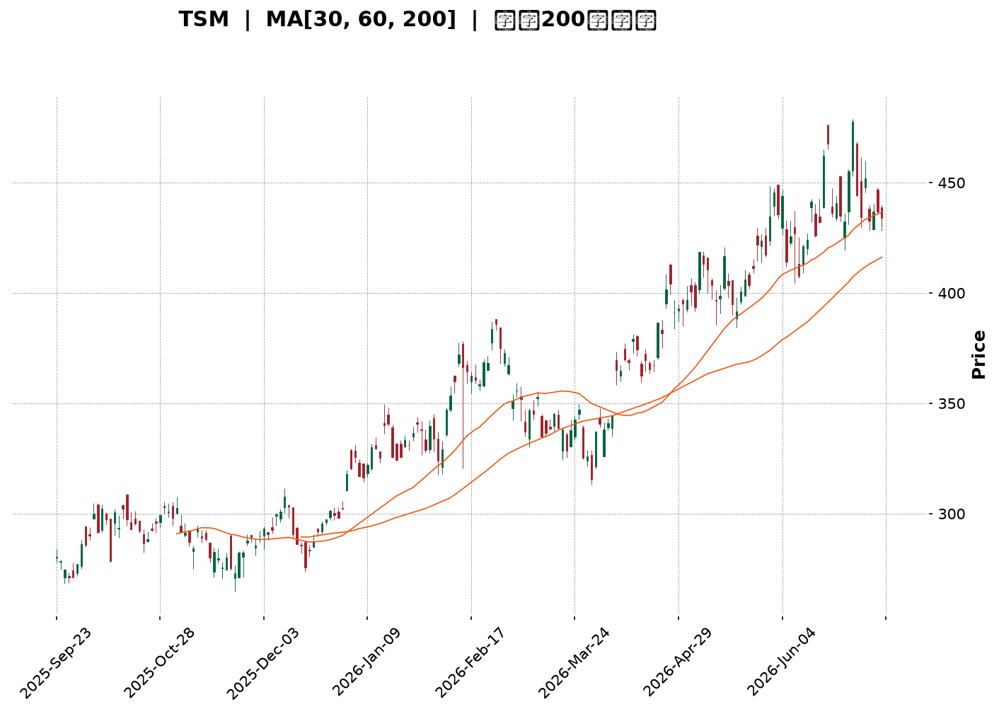
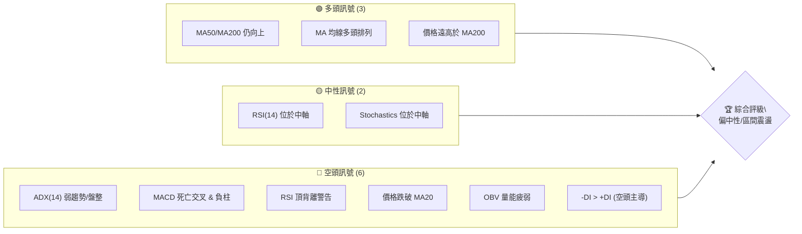
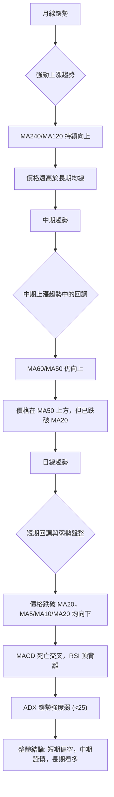
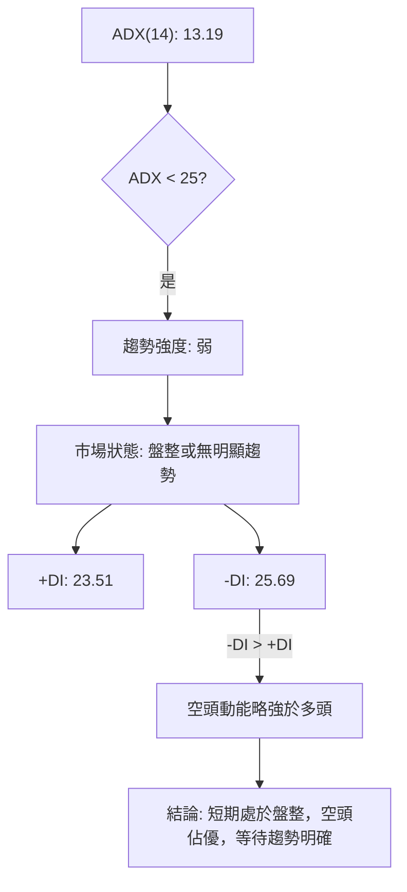
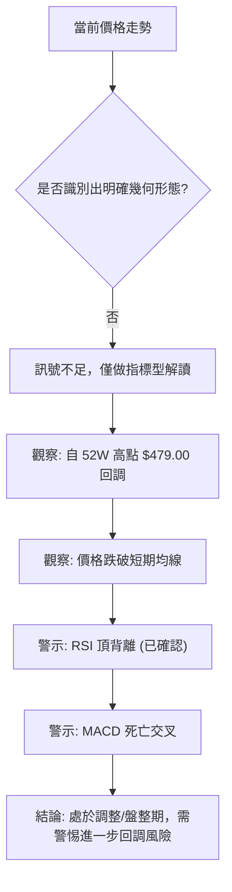
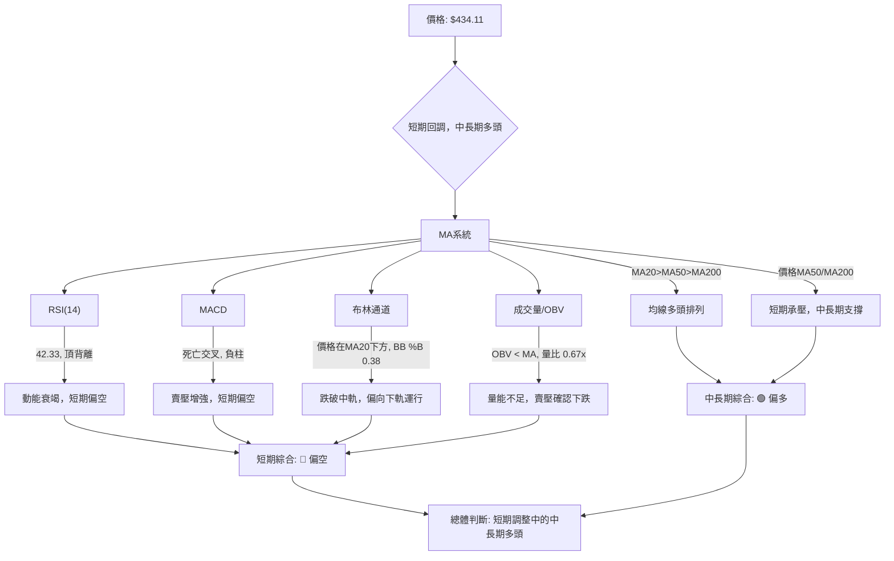
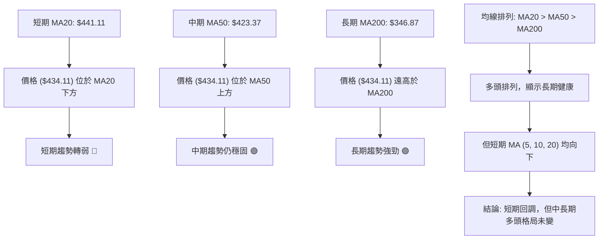
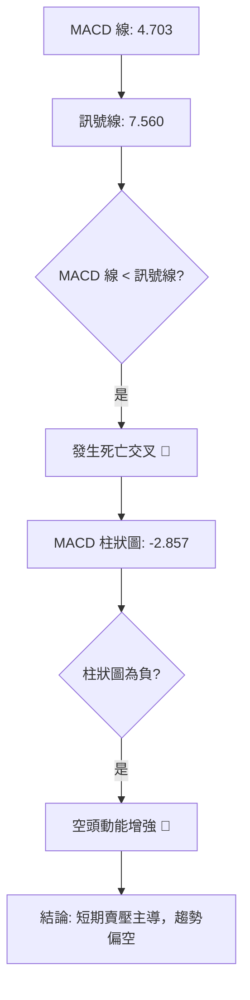
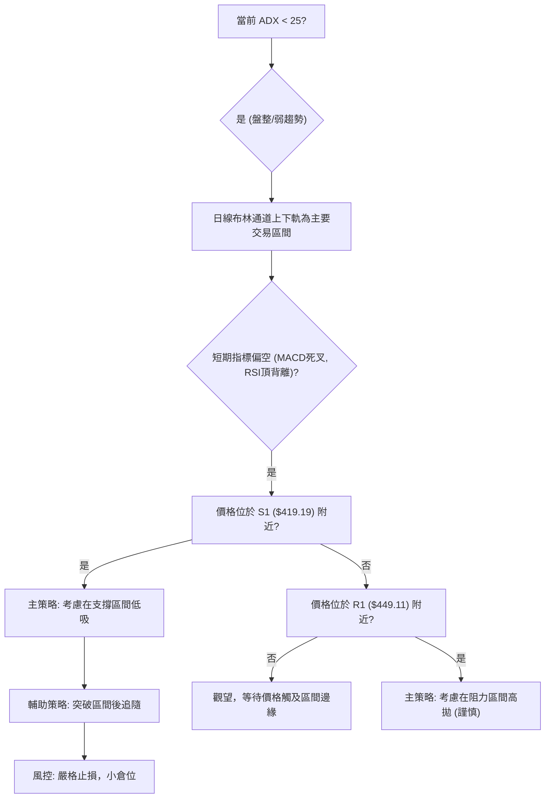
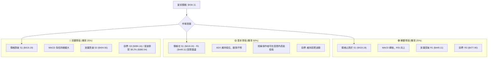

<details>
<summary>📊 靜態圖表 (點擊展開)</summary>

</details>

<html>
<head><meta charset="utf-8" /></head>
<body>
    <div style="height:500px; width:100%;">                        <script>window.PlotlyConfig = {MathJaxConfig: 'local'};</script>
        <script charset="utf-8" src="https://cdn.plot.ly/plotly-3.7.0.min.js" integrity="sha256-jvTGqxNp8AGWEcvNLVuKr+8j5dGe9Yw51LQkmDH+IYA=" crossorigin="anonymous"></script>                <div id="candlestick-chart" class="plotly-graph-div" style="height:100%; width:100%;"></div>            <script>                window.PLOTLYENV=window.PLOTLYENV || {};                                if (document.getElementById("candlestick-chart")) {                    Plotly.newPlot(                        "candlestick-chart",                        [{"close":{"dtype":"f8","bdata":"AAAA4P6HcUAAAADgPmhxQAAAAODzJ3FAAAAAoJDzcEAAAACAgPFwQAAAACC0UXFAAAAAQG\u002fjcUAAAABAuN1xQAAAAGB9HnJAAAAAoJLAckAAAAAAsztyQAAAAEA64nJAAAAAYJGYckAAAACgc2dxQAAAAABayHJAAAAAYAVackAAAABAPuVyQAAAAKDul3JAAAAAQF5MckAAAAAA9nVyQAAAAMBRQ3JAAAAAoPHpcUAAAAAAUAdyQAAAAKB2SnJAAAAAILF+ckAAAADgwrJyQAAAAIBG63JAAAAAAJfNckAAAABgTKFyQAAAAOCf53JAAAAAQAQ8ckAAAAAggjVyQAAAAICo73FAAAAAYCnEcUAAAABAYk9yQAAAACBMDnJAAAAA4JAFckAAAABg5n9xQAAAAOB9qXFAAAAAAOJ8cUAAAADAyztxQAAAACCZgnFAAAAAgEk1cUAAAABgjQ5xQAAAAGCipnFAAAAA4ESncUAAAACAFvtxQAAAAMCxE3JAAAAA4OTWcUAAAADg5hxyQAAAAAA+UnJAAAAAwDwqckAAAABAp0ZyQAAAAKAouHJAAAAAQJvQckAAAADAcTtzQAAAAOCH9HJAAAAA4J8ockAAAACALeRxQAAAAEBU1nFAAAAAgJU4cUAAAAAgeLNxQAAAAEBw93FAAAAAoFw8ckAAAADgx3ZyQAAAAGA6lHJAAAAAIInUckAAAABg+bVyQAAAAMCkoHJAAAAAAEDlckAAAAAAet9zQAAAAOB\u002fCXRAAAAAIPRbdEAAAABgrNBzQAAAACACxnNAAAAAYHcfdEAAAACACaF0QAAAAGAfmHRAAAAAINxWdEAAAABAJT51QAAAACA+SnVAAAAA4KdXdEAAAAAAGkd0QAAAAKD\u002fWnRAAAAAwGHSdEAAAADg\u002f690QAAAAOCdCXVAAAAAoKZIdUAAAACA4Bx1QAAAAMDGjXRAAAAAILA5dUAAAADAY+B0QAAAAIANQXRAAAAAgHuQdEAAAACg6bB1QAAAAEBVGXZAAAAAYMyAdkAAAABArUJ3QAAAAEBU43ZAAAAA4KHHdkAAAAAgQKV2QAAAAKBehnZAAAAAgJpodkAAAABAKwp3QAAAAMA1AndAAAAAIEf8d0AAAACAyxt4QAAAACD5bXdAAAAA4HlKd0AAAADgZ\u002fN2QAAAAGAK9XVAAAAAYKU5dkAAAAAAqQB2QAAAACBfEnVAAAAAYIaudUAAAACg5ZR1QAAAAIDNC3ZAAAAAoKvvdEAAAACAIwl1QAAAAKCzJ3VAAAAAIL+SdUAAAAAgbSx1QAAAAMD5H3VAAAAAQIiHdEAAAABgjBp1QAAAACArZ3VAAAAAIACvdUAAAACgkVV0QAAAACCgX3RAAAAAICu8c0AAAAAgkRJ1QAAAAAATS3VAAAAAYPcjdUAAAABgYk91QAAAACA2iHVAAAAAwLjQdkAAAABgLcp2QAAAAAC\u002fG3dAAAAAAE4Ld0AAAAAACrB3QAAAAACUY3dAAAAAYASodkAAAABgJhp3QAAAACAm1nZAAAAAIIXzdkAAAACAjih4QAAAAGBB3HdAAAAAoFAYeUAAAACAikB5QAAAAADGdnhAAAAAwI6OeEAAAACAJ7J4QAAAAMDay3hAAAAAIL8KeUAAAAAA0Zd4QAAAAIBRKHpAAAAAAOvSeUAAAACAfat5QAAAAICEOXlAAAAAAKHFeEAAAADA2u14QAAAAKDnC3pAAAAAIHw2eUAAAAAgZrB4QAAAAEAVe3hAAAAAIOgKeUAAAAAALmN5QAAAAMAyOXlAAAAA4LS1eUAAAACg4Ft6QAAAAKDgfXpAAAAAwI4XekAAAACgyyl7QAAAAIBX2ntAAAAAQLc6e0AAAACgFr57QAAAAEAz43lAAAAAYNicekAAAABAua56QAAAAGC4fHlAAAAAwB5RekAAAABA4X56QAAAAGBmlntAAAAAoEedekAAAABgZgJ7QAAAAIDr4XxAAAAAYLg6fUAAAACAPUZ7QAAAAKBHjXtAAAAAANcve0AAAACgmQV7QAAAAKCZcXxAAAAAwB7ZfUAAAAAgrsN7QAAAAGCPIntAAAAA4KM8fEAAAADAHgl7QAAAACCuT3tAAAAAIFxPe0AAAACAwiF7QA=="},"high":{"dtype":"f8","bdata":"95DLZDm8cUBStAXdLnBxQBmR6qCSL3FAuk9DmIkVcUD+pUY+6VpxQJdmkNjgVHFAvdvO4VcDckD9UEInZ2ZyQK3v9fHsW3JAnWprFlwOc0AbZc8zLwtzQK2+9YsSAHNAl9M1CGbHckCBrRXCpZ1yQKNJrUf543JArHpZEkG2ckDQCdTHZwNzQB6EKET4TnNAPJElJdzOckC2I7SWatRyQKi+uZ14kHJATnLk\u002fEVOckAPbvzmpjxyQDSWJwDueXJAWSuX1heickC66ylJSbxyQIVijRfWGHNAzv9IpoQOc0CTHQs0ZBRzQE6AnW4gO3NAtvLMOxC6ckD9hTgVN35yQF8XZxJiRXJAHoHFXDracUCEMnxP6WxyQBxujAnUSXJAXiiZxghJckAfop9byfNxQBSzVUzgyXFA+K\u002fXIKPEcUBAkJac\u002fV9xQHZ4lZA0pXFAJY20kPcockAhFTGhLUhxQGx9\u002fSxNrXFApIR38bKycUAv9l\u002fbVChyQP3TMPobJnJAoZhDjyMOckANHr0SKUNyQNtejsjQZHJA3zpFJrM7ckBvNqcsLKdyQBGAhpsQxHJAIHS+dMTkckA+QrVnZ3hzQCIYmAhKBHNALM8nM3XrckA7vCySeWRyQHCp7Gaj73FAJqn2bNP5cUArlFoK8tpxQKzeVpaxKnJABClAVOZXckBGAFLKD4ZyQHUjwGv1mXJA0pWsoSHdckCfAj2i9e5yQDWInT7B73JAjdpiUfYcc0CQt\u002f1w\u002fv5zQEosWWfCmHRATr8djuO1dEDevlJ190l0QJRhv35QLXRA7s81wJwxdEBScxjnXr10QGcHGPEN63RAoblFO6KCdEBzQ2VhY9h1QA+tTonUwHVA5t7ETENGdUBusiOwzb50QDK1oTE\u002f1XRAojhCoKz2dEBEp2QPC9Z0QGrWC\u002f3vN3VAfgwTgpZ7dUDNs6GKkl91QFYter9yInVA7lUSFuVmdUC+p3ycQpR1QGQdYE\u002fwEHVA4h7GSJvNdEBZllHPwr51QLoLq0oHXHZASRtJACqudkA7qJusEJp3QMkjHRrAoHdAVza44D0Td0DIK2UFFsV2QGcuygXd93ZAVrPIA\u002feOdkBQAbStlyR3QCG1N8IrOHdAWJCMKuAyeECc32RKRUN4QPbGFiO9B3hAz5lHSudrd0D3YTIA6zJ3QMOLXABoInZAmR7r6L5zdkDmpraF9Vl2QI8FrM7XrnVAQvuOw6q5dUD0NzMO7vp1QBy2qqM2OHZAhMYMsLaRdUC6L7nj\u002fGt1QCQxIl+9bXVALPsUiTKfdUDzjAluMbJ1QG1mtKCxMXVA6ecg3\u002foMdUCC7sIIuWl1QN3gpgYwgXVAGLVeiRnadUC9XBzd0EF1QBBEROOjjHRAJdZZYkeNdECT1BPZ6Bl1QH1qY3HYvXVALe8AQVVUdUDa\u002fzhGVXZ1QFwljT2Qi3VAlvHovM5Wd0D3OF8a9fR2QNyzsY7ekXdAWmG8SXkpd0At9ccmRtR3QGV67Khm0XdA\u002fkQUclwVd0DfX6ZiPWt3QMJN4DhJE3dAcl668iMed0CJ5owgDzB4QHnZs5+gPXhAffRAOYiIeUAJyf1Egdh5QDSKMfQLz3hAaVQ3a82ueEDj+cR\u002fu914QCg14OS8MHlA1DwMmPVreUAT9un35VJ5QIsIANaCK3pA4WoZpEwwekDTrH9WaQB6QNR25ThwbHlAP1W4qM0UeUDWlKWMwDt5QDOoDPS+T3pA+NnrLJmOeUD0aDfH3l55QCoBET8r33hAtX5Xf\u002fsueUA3y\u002fyA+qd5QAV1cWVem3lAu1PyN0X4eUApeM5ptNh6QBTrOYedqXpAVsb4AfPWekDbROvxcAV8QKlCs5NR9XtABWaMeLsRfECUz\u002f6tae97QMKqpQEuDntA4Ad2Sr4Me0Dj4ERBLlJ7QGYoIPwulXpAAAAAAABkekAAAABACq96QAAAAKBHqXtAAAAAoEeFe0AAAAAAAKh7QAAAACCFE31AAAAA4KPMfUAAAACgR\u002fV7QAAAAIDCvXtAAAAAYGZOfEAAAACAFEJ7QAAAAKCZgXxAAAAAAADwfUAAAAAAKUh9QAAAACCF13xAAAAA4HrAfEAAAADAzHx7QAAAAADXh3tAAAAAQAr7e0AAAADgenp7QA=="},"hovertemplate":"\u003cb\u003e%{x|%Y-%m-%d}\u003c\u002fb\u003e\u003cbr\u003e\u958b: $%{open:.2f}\u003cbr\u003e\u9ad8: $%{high:.2f}\u003cbr\u003e\u4f4e: $%{low:.2f}\u003cbr\u003e\u6536: $%{close:.2f}\u003cextra\u003e\u003c\u002fextra\u003e","low":{"dtype":"f8","bdata":"imZGiPlccUCwGsOl5yhxQF0DcvA9wXBAXNtOXhHIcEAAAACAgPFwQDsN4bgG+3BAzpwKXgwwcUCRbbU1k8xxQBHnnpCAA3JAj1i5RoWZckC09oMEyy9yQKf+ZAXoOnJAuFvgBoRxckAk6H5xNmJxQMjRNbyNIHJAKM1JDv8QckDonqR2lZtyQDUo5h\u002ftZXJA1SVyH9RJckDFEMX+zGtyQK28XljTNXJAjZro9tKicUA5YM2Z2fVxQPOomkBqQXJAQLFoZk02ckAzJxMnPlxyQGCZuShBwHJAuxobe32nckAedbx2xGVyQKE\u002fWZ4gvHJAxXC+ynEzckA89dwniRNyQGJSOpAh0nFAxr537mkvcUCZdBEZgRdyQD3ih39r6nFA\u002fkv3TQ71cUBT+GuT+VxxQK6vXWaA8XBArpXmhcxZcUAsR5mzZ+lwQNFjWB2OInFAlDrJx\u002fsjcUBrCYE\u002fvotwQK7H7Mrd8HBAP4VBuB7vcEBjW5jpr9dxQFhZRiHZ63FATnNuqJ2PcUCemkWwtO5xQF+jq+BVvXFAnrYULOb+cUDXNfoyUS9yQGvBeStnZnJAXQrFG6mCckAqEtjoKMJyQK5gem6ZoXJA6xaicMAXckDUZ\u002fs\u002fJ+FxQMXiMDzSnXFAK\u002fUKlKgacUANO8GO1IRxQApyoJqHznFAiZQhdGkbckAo7infKytyQNdgfdpRa3JA0RtHUsWPckAHsucp15FyQCREfByTnnJAaW40b+3dckCEqsJFkWFzQPrmDaqP\u002fXNA6nLHSb8udECku2vycc5zQCcjLv49qHNAGWzOItTJc0B5QBnXjvZzQDJWZy1HkXRAonSBlWgydEDn+l5w7gJ1QDyQ\u002f6lHO3VA5LlMWYRTdEC3Z1EDGUB0QApoA2WEU3RA3VnFbquadEBlonYVhoh0QPXBo5NyzXRA\u002fnoU4bUOdUCY5u7wNWh0QNE0aFyJdnRAuHZyWYl2dEAxAP9ALoV0QDuau6rh1nNAftR\u002fAh3gc0AWP8I1t+50QAUd79QyoHVAQP03te4odkCfKBsf8ud2QPzZoKgcB3RAb5RK7qZudkCYLPdyiyZ2QMPunWGybXZAAYCuWqU5dkBi79\u002fVEVR2QMRW7105yXZATyrRFOBhd0D9AmQNou13QLjNB07M\u002fHZA+PKgOJvrdkD3XKmkaax2QLBaEqLwZXVAQ0VKt6QLdkBe8cAIh2B1QLPppzBa73RAAqArwWyjdECXG2hGpWh1QBoyVqvyyHVAZ8Vr8mrqdEARVeDf3ud0QMd8oeEsIXVAwUNG6r8ZdUCRhH8zwSh1QIle8kXiRnRAiU2GljdSdECm6GoWOaV0QM5lmVTV03RAbd\u002feyyhrdUA4Feu0wUl0QDHzCEXpGHRAcpa\u002fthGRc0CDo20+PAZ0QC54wqZML3VAkUMHYpVgdEBu3b3sQh11QKzaIUra7XRAB6RMHGlmdkAHvbUlCX52QBzbb4ItDndA2VSurx3TdkB1O8l0kUV3QOuQJChyNXdAD1DNS1J7dkBjJ1Arl8R2QL9EQititnZAeHg2bBzEdkBq2g+GYhx3QDWRtU3pbndAvW2LheCOeEBj8JOUbvd4QPDSAb3R\u002fHdAwSa\u002fcV40eEDVM2Ts8Ax4QNGSTeRrc3hAi9LJN22keEC7rjKS7Hp4QAogr0Ns+3hArwFj7YByeUAo1OsaGP94QEzOtqQn1HhA\u002fJpvbHwTeECUtVfX4mh4QFH795qREnlAtUkn817eeEBMYUyELmJ4QLL8usCQAnhAlWeKImaweECfjBu9Oel4QHb9vEKzHnlAlBhIaMqReUCecM9WjeZ5QG9odWLb23lAWY\u002fi+2YEekAbcajGNFh6QOrJrXTcL3tAVhWuizwYe0CGEEqe06R6QPjFvoY1vXlAr4PfXK9YekArtshVAEl5QKPmT6z1a3lAAAAAgMKNeUAAAAAgXBN6QAAAAEDh\u002fnpAAAAAQDOTekAAAACAPfp6QAAAAIA9ZntAAAAAYLgSfUAAAABACiN7QAAAAKBHCXtAAAAAQAoHe0AAAABACjN6QAAAAKBw8XpAAAAAAABQfEAAAAAghbd7QAAAAAAA2HpAAAAAoJnZe0AAAACAwsF6QAAAAAAAzHpAAAAAgD1Ge0AAAACgmcF6QA=="},"name":"\u50f9\u683c","open":{"dtype":"f8","bdata":"rUZVDRODcUDD0yFP5WFxQNr1pVzB73BAPWjYpvr7cEAfgB37QCVxQKr\u002fyiGuEnFAFJOWkjVEcUB7h\u002fROOmNyQLfpgisgKXJA2uXPyKGackCIOvNykANzQBifpzsZS3JAjE0NzyS\u002fckBcQslR1plyQGl\u002flmiIfnJABndSjRlVckD\u002fdQBnU\u002f5yQFhEVRv8R3NAMpTerhKBckDC5PMYeZpyQAtK9PaYinJAJNN7MFkrckAtLEpojPhxQJsFKbclVHJA1rzjsAqFckAeqW+LzX9yQKwHb+OL9nJAcWfW+13LckCbNMoSkPlyQCdWS7GWw3JAVax\u002fX\u002fFockBdjyHKUCVyQHOXaX3PPHJACfFiz66vcUDo4kIE8EByQDXv6\u002f9sHHJAZlMX\u002fnU2ckBMzs9MjO5xQERR4tMLHHFAY9D0gNVzcUBgQGinFDZxQNhSioYULHFA\u002fwWLj84eckA8e4Rt1epwQK7H7Mrd8HBAAJvZMVCIcUB5MD6Kb+1xQFDV2M8XI3JAcEs5VtTKcUBlucoheRtyQEVZaLdUHnJAGpwQAOg6ckD9l9pIxFtyQHlJf9SFrXJAgZ\u002f2ZFCackAvYZ+AuO9yQLJ6\u002fxoD\u002fHJALM8nM3XrckCbfjHhIFpyQGpHEYqJ3HFAhLTxrMDwcUCIYF4jkLhxQApyoJqHznFAkOah3HxSckAm9Rq8RT5yQEMXsfBag3JAlqnexLylckBDTz\u002fFqcNyQEXkcBnlzHJAGQJBLwDnckDQab5ABmZzQH5IYKw6i3RAZ5efQ12IdEAmd8tlBTB0QMkagU+QK3RAmt6uf\u002fric0DxpjTSHAd0QJBnks2LsnRAoblFO6KCdEBn4Y7exFB1QAXvszmqi3VAG0pKbp0wdUAEWQTcdbt0QPYpLSJNu3RAmqMm8s+ldEB2scLwRbF0QOZQVvxT7HRASaG6YUVUdUDr7Kk82yB1QCSdqg8j23RAuswWx\u002fWQdEBWBUhLvnR1QNw6IY0A3nRA4wQSppISdEBz\u002fc3wPvx0QGmIDd96r3VAhRHWrVGndkDvW0ir2AJ3QHvPhCfVkHdAJLq+Awv0dkCJrCptKYB2QPceJXHWn3ZA8sbxOvBddkADmCzF5F52QJjIsqn60XZAwTVxLjOXd0Cc32RKRUN4QBslCl4fA3hA\u002fmqsOM0Dd0DIeTzStrd2QI2X6f0NvHVAQjPylXw5dkClKAr7NhF2QMEeIpPAW3VAL2VtiADedEA6H6kS3ap1QMkjUUPGAXZAX5f3pW6CdUAMBT8FcGJ1QDRe+gbwN3VAf6B3HN48dUAtakzSjY91QKEGEJU2h3RARXAITUv+dECm6GoWOaV0QMvLNV+T7HRAS6c93xCTdUDbRoSrajB1QODyUAcjQXRAqPIV+vdmdEANKh1M6Rh0QItxyk+LcXVA0JgD4DhhdECy6FWcTC91QJ0HKeVZKnVAm43uPMwWd0AT1ScVOKd2QGVf+z5ma3dA\u002fuCQpVEWd0CodmuCeKJ3QNg5XV1NyHdA+VsHhfj\u002fdkCpS0zJP0V3QExhTLu3BXdAAAAAIIXzdkAV9Dr9lC53QGEsssii9XdAtKxEe26zeECkVWpyiMx5QKS7+fpCc3hA1IDWTd9\u002feEDhobDAFs54QCGQ+hpViHhA8MLIpjI5eUAZIim8eTp5QL5ncoRbF3lA019oi88RekCpxvYQnf95QNqDUpKiXHlAkzGQoCHNeEBHXEqEbtV4QLDnpXtJJHlAswHd7M1YeUD0aDfH3l55QFzwomqZSXhAYY491ijBeECfjBu9Oel4QF2zSiOTh3lAbogb+HnCeUCFEfdRW6B6QOezsYO8U3pA4ogNwiehekBHaft\u002fMn56QD4Xy1jPeHtAJDEOuQQPfEAXiEWA+9l6QFE6sgdBzHpAKz4Sf3psekC2f2EM+d16QO0ITqTiz3lAAAAAACnUeUAAAADAzEB6QAAAAEDhantAAAAA4FFAe0AAAAAAACx7QAAAAIAUbntAAAAAoHDBfUAAAABA4XJ7QAAAACCuH3tAAAAAYGZOfEAAAAAAAJB6QAAAAAAAUHtAAAAAgMJ5fEAAAABguDp9QAAAAOCjKHxAAAAA4Hr8e0AAAADgUWB7QAAAAAAA0HpAAAAAIK7re0AAAADgo2p7QA=="},"x":["2025-09-23T00:00:00-04:00","2025-09-24T00:00:00-04:00","2025-09-25T00:00:00-04:00","2025-09-26T00:00:00-04:00","2025-09-29T00:00:00-04:00","2025-09-30T00:00:00-04:00","2025-10-01T00:00:00-04:00","2025-10-02T00:00:00-04:00","2025-10-03T00:00:00-04:00","2025-10-06T00:00:00-04:00","2025-10-07T00:00:00-04:00","2025-10-08T00:00:00-04:00","2025-10-09T00:00:00-04:00","2025-10-10T00:00:00-04:00","2025-10-13T00:00:00-04:00","2025-10-14T00:00:00-04:00","2025-10-15T00:00:00-04:00","2025-10-16T00:00:00-04:00","2025-10-17T00:00:00-04:00","2025-10-20T00:00:00-04:00","2025-10-21T00:00:00-04:00","2025-10-22T00:00:00-04:00","2025-10-23T00:00:00-04:00","2025-10-24T00:00:00-04:00","2025-10-27T00:00:00-04:00","2025-10-28T00:00:00-04:00","2025-10-29T00:00:00-04:00","2025-10-30T00:00:00-04:00","2025-10-31T00:00:00-04:00","2025-11-03T00:00:00-05:00","2025-11-04T00:00:00-05:00","2025-11-05T00:00:00-05:00","2025-11-06T00:00:00-05:00","2025-11-07T00:00:00-05:00","2025-11-10T00:00:00-05:00","2025-11-11T00:00:00-05:00","2025-11-12T00:00:00-05:00","2025-11-13T00:00:00-05:00","2025-11-14T00:00:00-05:00","2025-11-17T00:00:00-05:00","2025-11-18T00:00:00-05:00","2025-11-19T00:00:00-05:00","2025-11-20T00:00:00-05:00","2025-11-21T00:00:00-05:00","2025-11-24T00:00:00-05:00","2025-11-25T00:00:00-05:00","2025-11-26T00:00:00-05:00","2025-11-28T00:00:00-05:00","2025-12-01T00:00:00-05:00","2025-12-02T00:00:00-05:00","2025-12-03T00:00:00-05:00","2025-12-04T00:00:00-05:00","2025-12-05T00:00:00-05:00","2025-12-08T00:00:00-05:00","2025-12-09T00:00:00-05:00","2025-12-10T00:00:00-05:00","2025-12-11T00:00:00-05:00","2025-12-12T00:00:00-05:00","2025-12-15T00:00:00-05:00","2025-12-16T00:00:00-05:00","2025-12-17T00:00:00-05:00","2025-12-18T00:00:00-05:00","2025-12-19T00:00:00-05:00","2025-12-22T00:00:00-05:00","2025-12-23T00:00:00-05:00","2025-12-24T00:00:00-05:00","2025-12-26T00:00:00-05:00","2025-12-29T00:00:00-05:00","2025-12-30T00:00:00-05:00","2025-12-31T00:00:00-05:00","2026-01-02T00:00:00-05:00","2026-01-05T00:00:00-05:00","2026-01-06T00:00:00-05:00","2026-01-07T00:00:00-05:00","2026-01-08T00:00:00-05:00","2026-01-09T00:00:00-05:00","2026-01-12T00:00:00-05:00","2026-01-13T00:00:00-05:00","2026-01-14T00:00:00-05:00","2026-01-15T00:00:00-05:00","2026-01-16T00:00:00-05:00","2026-01-20T00:00:00-05:00","2026-01-21T00:00:00-05:00","2026-01-22T00:00:00-05:00","2026-01-23T00:00:00-05:00","2026-01-26T00:00:00-05:00","2026-01-27T00:00:00-05:00","2026-01-28T00:00:00-05:00","2026-01-29T00:00:00-05:00","2026-01-30T00:00:00-05:00","2026-02-02T00:00:00-05:00","2026-02-03T00:00:00-05:00","2026-02-04T00:00:00-05:00","2026-02-05T00:00:00-05:00","2026-02-06T00:00:00-05:00","2026-02-09T00:00:00-05:00","2026-02-10T00:00:00-05:00","2026-02-11T00:00:00-05:00","2026-02-12T00:00:00-05:00","2026-02-13T00:00:00-05:00","2026-02-17T00:00:00-05:00","2026-02-18T00:00:00-05:00","2026-02-19T00:00:00-05:00","2026-02-20T00:00:00-05:00","2026-02-23T00:00:00-05:00","2026-02-24T00:00:00-05:00","2026-02-25T00:00:00-05:00","2026-02-26T00:00:00-05:00","2026-02-27T00:00:00-05:00","2026-03-02T00:00:00-05:00","2026-03-03T00:00:00-05:00","2026-03-04T00:00:00-05:00","2026-03-05T00:00:00-05:00","2026-03-06T00:00:00-05:00","2026-03-09T00:00:00-04:00","2026-03-10T00:00:00-04:00","2026-03-11T00:00:00-04:00","2026-03-12T00:00:00-04:00","2026-03-13T00:00:00-04:00","2026-03-16T00:00:00-04:00","2026-03-17T00:00:00-04:00","2026-03-18T00:00:00-04:00","2026-03-19T00:00:00-04:00","2026-03-20T00:00:00-04:00","2026-03-23T00:00:00-04:00","2026-03-24T00:00:00-04:00","2026-03-25T00:00:00-04:00","2026-03-26T00:00:00-04:00","2026-03-27T00:00:00-04:00","2026-03-30T00:00:00-04:00","2026-03-31T00:00:00-04:00","2026-04-01T00:00:00-04:00","2026-04-02T00:00:00-04:00","2026-04-06T00:00:00-04:00","2026-04-07T00:00:00-04:00","2026-04-08T00:00:00-04:00","2026-04-09T00:00:00-04:00","2026-04-10T00:00:00-04:00","2026-04-13T00:00:00-04:00","2026-04-14T00:00:00-04:00","2026-04-15T00:00:00-04:00","2026-04-16T00:00:00-04:00","2026-04-17T00:00:00-04:00","2026-04-20T00:00:00-04:00","2026-04-21T00:00:00-04:00","2026-04-22T00:00:00-04:00","2026-04-23T00:00:00-04:00","2026-04-24T00:00:00-04:00","2026-04-27T00:00:00-04:00","2026-04-28T00:00:00-04:00","2026-04-29T00:00:00-04:00","2026-04-30T00:00:00-04:00","2026-05-01T00:00:00-04:00","2026-05-04T00:00:00-04:00","2026-05-05T00:00:00-04:00","2026-05-06T00:00:00-04:00","2026-05-07T00:00:00-04:00","2026-05-08T00:00:00-04:00","2026-05-11T00:00:00-04:00","2026-05-12T00:00:00-04:00","2026-05-13T00:00:00-04:00","2026-05-14T00:00:00-04:00","2026-05-15T00:00:00-04:00","2026-05-18T00:00:00-04:00","2026-05-19T00:00:00-04:00","2026-05-20T00:00:00-04:00","2026-05-21T00:00:00-04:00","2026-05-22T00:00:00-04:00","2026-05-26T00:00:00-04:00","2026-05-27T00:00:00-04:00","2026-05-28T00:00:00-04:00","2026-05-29T00:00:00-04:00","2026-06-01T00:00:00-04:00","2026-06-02T00:00:00-04:00","2026-06-03T00:00:00-04:00","2026-06-04T00:00:00-04:00","2026-06-05T00:00:00-04:00","2026-06-08T00:00:00-04:00","2026-06-09T00:00:00-04:00","2026-06-10T00:00:00-04:00","2026-06-11T00:00:00-04:00","2026-06-12T00:00:00-04:00","2026-06-15T00:00:00-04:00","2026-06-16T00:00:00-04:00","2026-06-17T00:00:00-04:00","2026-06-18T00:00:00-04:00","2026-06-22T00:00:00-04:00","2026-06-23T00:00:00-04:00","2026-06-24T00:00:00-04:00","2026-06-25T00:00:00-04:00","2026-06-26T00:00:00-04:00","2026-06-29T00:00:00-04:00","2026-06-30T00:00:00-04:00","2026-07-01T00:00:00-04:00","2026-07-02T00:00:00-04:00","2026-07-06T00:00:00-04:00","2026-07-07T00:00:00-04:00","2026-07-08T00:00:00-04:00","2026-07-09T00:00:00-04:00","2026-07-10T00:00:00-04:00"],"type":"candlestick"},{"hovertemplate":"MA30: $%{y:.2f}\u003cextra\u003e\u003c\u002fextra\u003e","line":{"color":"#2196F3","dash":"dash","width":2},"mode":"lines","name":"MA30","x":["2025-09-23T00:00:00-04:00","2025-09-24T00:00:00-04:00","2025-09-25T00:00:00-04:00","2025-09-26T00:00:00-04:00","2025-09-29T00:00:00-04:00","2025-09-30T00:00:00-04:00","2025-10-01T00:00:00-04:00","2025-10-02T00:00:00-04:00","2025-10-03T00:00:00-04:00","2025-10-06T00:00:00-04:00","2025-10-07T00:00:00-04:00","2025-10-08T00:00:00-04:00","2025-10-09T00:00:00-04:00","2025-10-10T00:00:00-04:00","2025-10-13T00:00:00-04:00","2025-10-14T00:00:00-04:00","2025-10-15T00:00:00-04:00","2025-10-16T00:00:00-04:00","2025-10-17T00:00:00-04:00","2025-10-20T00:00:00-04:00","2025-10-21T00:00:00-04:00","2025-10-22T00:00:00-04:00","2025-10-23T00:00:00-04:00","2025-10-24T00:00:00-04:00","2025-10-27T00:00:00-04:00","2025-10-28T00:00:00-04:00","2025-10-29T00:00:00-04:00","2025-10-30T00:00:00-04:00","2025-10-31T00:00:00-04:00","2025-11-03T00:00:00-05:00","2025-11-04T00:00:00-05:00","2025-11-05T00:00:00-05:00","2025-11-06T00:00:00-05:00","2025-11-07T00:00:00-05:00","2025-11-10T00:00:00-05:00","2025-11-11T00:00:00-05:00","2025-11-12T00:00:00-05:00","2025-11-13T00:00:00-05:00","2025-11-14T00:00:00-05:00","2025-11-17T00:00:00-05:00","2025-11-18T00:00:00-05:00","2025-11-19T00:00:00-05:00","2025-11-20T00:00:00-05:00","2025-11-21T00:00:00-05:00","2025-11-24T00:00:00-05:00","2025-11-25T00:00:00-05:00","2025-11-26T00:00:00-05:00","2025-11-28T00:00:00-05:00","2025-12-01T00:00:00-05:00","2025-12-02T00:00:00-05:00","2025-12-03T00:00:00-05:00","2025-12-04T00:00:00-05:00","2025-12-05T00:00:00-05:00","2025-12-08T00:00:00-05:00","2025-12-09T00:00:00-05:00","2025-12-10T00:00:00-05:00","2025-12-11T00:00:00-05:00","2025-12-12T00:00:00-05:00","2025-12-15T00:00:00-05:00","2025-12-16T00:00:00-05:00","2025-12-17T00:00:00-05:00","2025-12-18T00:00:00-05:00","2025-12-19T00:00:00-05:00","2025-12-22T00:00:00-05:00","2025-12-23T00:00:00-05:00","2025-12-24T00:00:00-05:00","2025-12-26T00:00:00-05:00","2025-12-29T00:00:00-05:00","2025-12-30T00:00:00-05:00","2025-12-31T00:00:00-05:00","2026-01-02T00:00:00-05:00","2026-01-05T00:00:00-05:00","2026-01-06T00:00:00-05:00","2026-01-07T00:00:00-05:00","2026-01-08T00:00:00-05:00","2026-01-09T00:00:00-05:00","2026-01-12T00:00:00-05:00","2026-01-13T00:00:00-05:00","2026-01-14T00:00:00-05:00","2026-01-15T00:00:00-05:00","2026-01-16T00:00:00-05:00","2026-01-20T00:00:00-05:00","2026-01-21T00:00:00-05:00","2026-01-22T00:00:00-05:00","2026-01-23T00:00:00-05:00","2026-01-26T00:00:00-05:00","2026-01-27T00:00:00-05:00","2026-01-28T00:00:00-05:00","2026-01-29T00:00:00-05:00","2026-01-30T00:00:00-05:00","2026-02-02T00:00:00-05:00","2026-02-03T00:00:00-05:00","2026-02-04T00:00:00-05:00","2026-02-05T00:00:00-05:00","2026-02-06T00:00:00-05:00","2026-02-09T00:00:00-05:00","2026-02-10T00:00:00-05:00","2026-02-11T00:00:00-05:00","2026-02-12T00:00:00-05:00","2026-02-13T00:00:00-05:00","2026-02-17T00:00:00-05:00","2026-02-18T00:00:00-05:00","2026-02-19T00:00:00-05:00","2026-02-20T00:00:00-05:00","2026-02-23T00:00:00-05:00","2026-02-24T00:00:00-05:00","2026-02-25T00:00:00-05:00","2026-02-26T00:00:00-05:00","2026-02-27T00:00:00-05:00","2026-03-02T00:00:00-05:00","2026-03-03T00:00:00-05:00","2026-03-04T00:00:00-05:00","2026-03-05T00:00:00-05:00","2026-03-06T00:00:00-05:00","2026-03-09T00:00:00-04:00","2026-03-10T00:00:00-04:00","2026-03-11T00:00:00-04:00","2026-03-12T00:00:00-04:00","2026-03-13T00:00:00-04:00","2026-03-16T00:00:00-04:00","2026-03-17T00:00:00-04:00","2026-03-18T00:00:00-04:00","2026-03-19T00:00:00-04:00","2026-03-20T00:00:00-04:00","2026-03-23T00:00:00-04:00","2026-03-24T00:00:00-04:00","2026-03-25T00:00:00-04:00","2026-03-26T00:00:00-04:00","2026-03-27T00:00:00-04:00","2026-03-30T00:00:00-04:00","2026-03-31T00:00:00-04:00","2026-04-01T00:00:00-04:00","2026-04-02T00:00:00-04:00","2026-04-06T00:00:00-04:00","2026-04-07T00:00:00-04:00","2026-04-08T00:00:00-04:00","2026-04-09T00:00:00-04:00","2026-04-10T00:00:00-04:00","2026-04-13T00:00:00-04:00","2026-04-14T00:00:00-04:00","2026-04-15T00:00:00-04:00","2026-04-16T00:00:00-04:00","2026-04-17T00:00:00-04:00","2026-04-20T00:00:00-04:00","2026-04-21T00:00:00-04:00","2026-04-22T00:00:00-04:00","2026-04-23T00:00:00-04:00","2026-04-24T00:00:00-04:00","2026-04-27T00:00:00-04:00","2026-04-28T00:00:00-04:00","2026-04-29T00:00:00-04:00","2026-04-30T00:00:00-04:00","2026-05-01T00:00:00-04:00","2026-05-04T00:00:00-04:00","2026-05-05T00:00:00-04:00","2026-05-06T00:00:00-04:00","2026-05-07T00:00:00-04:00","2026-05-08T00:00:00-04:00","2026-05-11T00:00:00-04:00","2026-05-12T00:00:00-04:00","2026-05-13T00:00:00-04:00","2026-05-14T00:00:00-04:00","2026-05-15T00:00:00-04:00","2026-05-18T00:00:00-04:00","2026-05-19T00:00:00-04:00","2026-05-20T00:00:00-04:00","2026-05-21T00:00:00-04:00","2026-05-22T00:00:00-04:00","2026-05-26T00:00:00-04:00","2026-05-27T00:00:00-04:00","2026-05-28T00:00:00-04:00","2026-05-29T00:00:00-04:00","2026-06-01T00:00:00-04:00","2026-06-02T00:00:00-04:00","2026-06-03T00:00:00-04:00","2026-06-04T00:00:00-04:00","2026-06-05T00:00:00-04:00","2026-06-08T00:00:00-04:00","2026-06-09T00:00:00-04:00","2026-06-10T00:00:00-04:00","2026-06-11T00:00:00-04:00","2026-06-12T00:00:00-04:00","2026-06-15T00:00:00-04:00","2026-06-16T00:00:00-04:00","2026-06-17T00:00:00-04:00","2026-06-18T00:00:00-04:00","2026-06-22T00:00:00-04:00","2026-06-23T00:00:00-04:00","2026-06-24T00:00:00-04:00","2026-06-25T00:00:00-04:00","2026-06-26T00:00:00-04:00","2026-06-29T00:00:00-04:00","2026-06-30T00:00:00-04:00","2026-07-01T00:00:00-04:00","2026-07-02T00:00:00-04:00","2026-07-06T00:00:00-04:00","2026-07-07T00:00:00-04:00","2026-07-08T00:00:00-04:00","2026-07-09T00:00:00-04:00","2026-07-10T00:00:00-04:00"],"y":{"dtype":"f8","bdata":"AAAAAAAA+H8AAAAAAAD4fwAAAAAAAPh\u002fAAAAAAAA+H8AAAAAAAD4fwAAAAAAAPh\u002fAAAAAAAA+H8AAAAAAAD4fwAAAAAAAPh\u002fAAAAAAAA+H8AAAAAAAD4fwAAAAAAAPh\u002fAAAAAAAA+H8AAAAAAAD4fwAAAAAAAPh\u002fAAAAAAAA+H8AAAAAAAD4fwAAAAAAAPh\u002fAAAAAAAA+H8AAAAAAAD4fwAAAAAAAPh\u002fAAAAAAAA+H8AAAAAAAD4fwAAAAAAAPh\u002fAAAAAAAA+H8AAAAAAAD4fwAAAAAAAPh\u002fAAAAAAAA+H8AAAAAAAD4f0RERNToLXJAIiIiAukzckBVVVWVwDpyQM3MzLxoQXJAMzMzw1xIckC8u7trBlRyQBEREcFPWnJAIiIiAnNbckCamZlpUlhyQHd3dwdsVHJAAAAA4KFJckCrqqoqGkFyQImIiJhhNXJA3t3d3YkpckAiIiJCkyZyQBEREQHrHHJAd3d3p\u002fUWckB3d3eHJw9yQJqZmRm\u002fCnJAd3d3p9QGckDv7u6u3ANyQGZmZgZcBHJAmpmZqYAGckC8u7srnQhyQM3MzDxFDHJA3t3dPQAPckCrqqqajhNyQFVVVZXdE3JAERER4V0OckDNzMwMEAhyQN7d3e3z\u002fnFAq6qqGk72cUAAAABw+PFxQERERNQ68nFAmpmZiTz2cUCamZm5jPdxQJqZmZkD\u002fHFA3t3dvekCckBVVVW1Pw1yQM3MzLx8FXJA7+7u3n8hckDe3d2tBThyQHd3d+eVTXJAVVVVdXlockBmZmYGA4ByQBEREdEfknJAERERkTKnckC8u7u7y71yQKuqqtpG03JAVVVV5ZvockDNzMwsUQNzQDMzM4OmHHNAZmZmJjsvc0CrqqoKUEBzQERERCRGTnNAvLu7W2Zfc0Dv7u5+0WtzQO\u002fu7n6WfXNAMzMzY0GYc0AiIiLSvrNzQN7d3U3tynNAvLu72xjtc0B3d3fHMQh0QFVVVQW3G3RAq6qq6pUvdEAzMzOTH0t0QBEREQEpaXRARERElICIdEAAAABgU690QO\u002fu7o6u03RARERE9NP0dEARERGxfAx1QBEREVG3IXVAREREVDQzdUDv7u6OuE51QBEREeFTanVAzczMvEmLdUDv7u7e+qh1QLy7u8sswXVAiYiIuFzadUAiIiIC8Oh1QLy7u3uh7nVAd3d3d7L+dUDv7u5uag12QHd3dzeHE3ZAVVVVxd0adkB3d3cHfyJ2QHd3dzcaK3ZAq6qq6iIodkC8u7t7eid2QKuqqvqbLHZAIiIi8pMvdkCrqqrKHDJ2QBERERGLOXZAERERsT45dkBVVVWVOzR2QO\u002fu7j5LLnZAiYiI+EwndkBVVVWVVA52QFVVVaXf+HVAiYiIOOTedUDNzMz8d9F1QHd3d3f1xnVAq6qqOiO8dUDNzMzMYK11QGZmZjbHoHVAAAAAAMuWdUDv7u7+iYt1QDMzM1PMiHVAMzMzQ7GGdUDv7u7u+ox1QImIiLgymXVA3t3djeCcdUCamZmZQqZ1QERERMRRtXVA7+7uDifAdUB3d3cnJNZ1QLy7u3uf5XVAMzMzcxwJdkCamZlZFy12QCIiIrJTSXZAzczMjMlidkC8u7tL2IB2QImIiJgsoHZAzczMbK7GdkCrqqr6dOR2QDMzM1MHDXdARERE9Fswd0ARERHR4113QLy7u0tJh3dAERERsUSyd0C8u7uLLdN3QKuqqiq9+3dAMzMzU30eeECJiIjIUjt4QKuqqlp8VHhA7+7u7n1neEDv7u6eqH14QDMzMwO1j3hAzczMLHSmeECJiIiYP714QN7d3Z2513hAd3d3Bwv1eEC8u7urshd5QN7d3R2BQnlAmpmZyQJneUBERERkmIV5QImIiLjklnlA3t3dLdijeUAAAADwDLB5QHd3dzfIuHlAREREBM3HeUCrqqqKKNd5QO\u002fu7v757nlAIiIi8mT8eUBmZmaGAxF6QERERGREKHpAVVVVxVNFekBmZmbWBFN6QM3MzKzgZnpAMzMzE3x7ekBVVVXFV416QDMzM6PMoXpAd3d3l1rJekCamZm5mON6QN7d3e0++npAvLu764AVe0Crqqp6kSN7QERERGRiNXtAmpmZGQpDe0AiIiKyokl7QA=="},"type":"scatter"},{"hovertemplate":"MA60: $%{y:.2f}\u003cextra\u003e\u003c\u002fextra\u003e","line":{"color":"#9C27B0","dash":"dash","width":2},"mode":"lines","name":"MA60","x":["2025-09-23T00:00:00-04:00","2025-09-24T00:00:00-04:00","2025-09-25T00:00:00-04:00","2025-09-26T00:00:00-04:00","2025-09-29T00:00:00-04:00","2025-09-30T00:00:00-04:00","2025-10-01T00:00:00-04:00","2025-10-02T00:00:00-04:00","2025-10-03T00:00:00-04:00","2025-10-06T00:00:00-04:00","2025-10-07T00:00:00-04:00","2025-10-08T00:00:00-04:00","2025-10-09T00:00:00-04:00","2025-10-10T00:00:00-04:00","2025-10-13T00:00:00-04:00","2025-10-14T00:00:00-04:00","2025-10-15T00:00:00-04:00","2025-10-16T00:00:00-04:00","2025-10-17T00:00:00-04:00","2025-10-20T00:00:00-04:00","2025-10-21T00:00:00-04:00","2025-10-22T00:00:00-04:00","2025-10-23T00:00:00-04:00","2025-10-24T00:00:00-04:00","2025-10-27T00:00:00-04:00","2025-10-28T00:00:00-04:00","2025-10-29T00:00:00-04:00","2025-10-30T00:00:00-04:00","2025-10-31T00:00:00-04:00","2025-11-03T00:00:00-05:00","2025-11-04T00:00:00-05:00","2025-11-05T00:00:00-05:00","2025-11-06T00:00:00-05:00","2025-11-07T00:00:00-05:00","2025-11-10T00:00:00-05:00","2025-11-11T00:00:00-05:00","2025-11-12T00:00:00-05:00","2025-11-13T00:00:00-05:00","2025-11-14T00:00:00-05:00","2025-11-17T00:00:00-05:00","2025-11-18T00:00:00-05:00","2025-11-19T00:00:00-05:00","2025-11-20T00:00:00-05:00","2025-11-21T00:00:00-05:00","2025-11-24T00:00:00-05:00","2025-11-25T00:00:00-05:00","2025-11-26T00:00:00-05:00","2025-11-28T00:00:00-05:00","2025-12-01T00:00:00-05:00","2025-12-02T00:00:00-05:00","2025-12-03T00:00:00-05:00","2025-12-04T00:00:00-05:00","2025-12-05T00:00:00-05:00","2025-12-08T00:00:00-05:00","2025-12-09T00:00:00-05:00","2025-12-10T00:00:00-05:00","2025-12-11T00:00:00-05:00","2025-12-12T00:00:00-05:00","2025-12-15T00:00:00-05:00","2025-12-16T00:00:00-05:00","2025-12-17T00:00:00-05:00","2025-12-18T00:00:00-05:00","2025-12-19T00:00:00-05:00","2025-12-22T00:00:00-05:00","2025-12-23T00:00:00-05:00","2025-12-24T00:00:00-05:00","2025-12-26T00:00:00-05:00","2025-12-29T00:00:00-05:00","2025-12-30T00:00:00-05:00","2025-12-31T00:00:00-05:00","2026-01-02T00:00:00-05:00","2026-01-05T00:00:00-05:00","2026-01-06T00:00:00-05:00","2026-01-07T00:00:00-05:00","2026-01-08T00:00:00-05:00","2026-01-09T00:00:00-05:00","2026-01-12T00:00:00-05:00","2026-01-13T00:00:00-05:00","2026-01-14T00:00:00-05:00","2026-01-15T00:00:00-05:00","2026-01-16T00:00:00-05:00","2026-01-20T00:00:00-05:00","2026-01-21T00:00:00-05:00","2026-01-22T00:00:00-05:00","2026-01-23T00:00:00-05:00","2026-01-26T00:00:00-05:00","2026-01-27T00:00:00-05:00","2026-01-28T00:00:00-05:00","2026-01-29T00:00:00-05:00","2026-01-30T00:00:00-05:00","2026-02-02T00:00:00-05:00","2026-02-03T00:00:00-05:00","2026-02-04T00:00:00-05:00","2026-02-05T00:00:00-05:00","2026-02-06T00:00:00-05:00","2026-02-09T00:00:00-05:00","2026-02-10T00:00:00-05:00","2026-02-11T00:00:00-05:00","2026-02-12T00:00:00-05:00","2026-02-13T00:00:00-05:00","2026-02-17T00:00:00-05:00","2026-02-18T00:00:00-05:00","2026-02-19T00:00:00-05:00","2026-02-20T00:00:00-05:00","2026-02-23T00:00:00-05:00","2026-02-24T00:00:00-05:00","2026-02-25T00:00:00-05:00","2026-02-26T00:00:00-05:00","2026-02-27T00:00:00-05:00","2026-03-02T00:00:00-05:00","2026-03-03T00:00:00-05:00","2026-03-04T00:00:00-05:00","2026-03-05T00:00:00-05:00","2026-03-06T00:00:00-05:00","2026-03-09T00:00:00-04:00","2026-03-10T00:00:00-04:00","2026-03-11T00:00:00-04:00","2026-03-12T00:00:00-04:00","2026-03-13T00:00:00-04:00","2026-03-16T00:00:00-04:00","2026-03-17T00:00:00-04:00","2026-03-18T00:00:00-04:00","2026-03-19T00:00:00-04:00","2026-03-20T00:00:00-04:00","2026-03-23T00:00:00-04:00","2026-03-24T00:00:00-04:00","2026-03-25T00:00:00-04:00","2026-03-26T00:00:00-04:00","2026-03-27T00:00:00-04:00","2026-03-30T00:00:00-04:00","2026-03-31T00:00:00-04:00","2026-04-01T00:00:00-04:00","2026-04-02T00:00:00-04:00","2026-04-06T00:00:00-04:00","2026-04-07T00:00:00-04:00","2026-04-08T00:00:00-04:00","2026-04-09T00:00:00-04:00","2026-04-10T00:00:00-04:00","2026-04-13T00:00:00-04:00","2026-04-14T00:00:00-04:00","2026-04-15T00:00:00-04:00","2026-04-16T00:00:00-04:00","2026-04-17T00:00:00-04:00","2026-04-20T00:00:00-04:00","2026-04-21T00:00:00-04:00","2026-04-22T00:00:00-04:00","2026-04-23T00:00:00-04:00","2026-04-24T00:00:00-04:00","2026-04-27T00:00:00-04:00","2026-04-28T00:00:00-04:00","2026-04-29T00:00:00-04:00","2026-04-30T00:00:00-04:00","2026-05-01T00:00:00-04:00","2026-05-04T00:00:00-04:00","2026-05-05T00:00:00-04:00","2026-05-06T00:00:00-04:00","2026-05-07T00:00:00-04:00","2026-05-08T00:00:00-04:00","2026-05-11T00:00:00-04:00","2026-05-12T00:00:00-04:00","2026-05-13T00:00:00-04:00","2026-05-14T00:00:00-04:00","2026-05-15T00:00:00-04:00","2026-05-18T00:00:00-04:00","2026-05-19T00:00:00-04:00","2026-05-20T00:00:00-04:00","2026-05-21T00:00:00-04:00","2026-05-22T00:00:00-04:00","2026-05-26T00:00:00-04:00","2026-05-27T00:00:00-04:00","2026-05-28T00:00:00-04:00","2026-05-29T00:00:00-04:00","2026-06-01T00:00:00-04:00","2026-06-02T00:00:00-04:00","2026-06-03T00:00:00-04:00","2026-06-04T00:00:00-04:00","2026-06-05T00:00:00-04:00","2026-06-08T00:00:00-04:00","2026-06-09T00:00:00-04:00","2026-06-10T00:00:00-04:00","2026-06-11T00:00:00-04:00","2026-06-12T00:00:00-04:00","2026-06-15T00:00:00-04:00","2026-06-16T00:00:00-04:00","2026-06-17T00:00:00-04:00","2026-06-18T00:00:00-04:00","2026-06-22T00:00:00-04:00","2026-06-23T00:00:00-04:00","2026-06-24T00:00:00-04:00","2026-06-25T00:00:00-04:00","2026-06-26T00:00:00-04:00","2026-06-29T00:00:00-04:00","2026-06-30T00:00:00-04:00","2026-07-01T00:00:00-04:00","2026-07-02T00:00:00-04:00","2026-07-06T00:00:00-04:00","2026-07-07T00:00:00-04:00","2026-07-08T00:00:00-04:00","2026-07-09T00:00:00-04:00","2026-07-10T00:00:00-04:00"],"y":{"dtype":"f8","bdata":"AAAAAAAA+H8AAAAAAAD4fwAAAAAAAPh\u002fAAAAAAAA+H8AAAAAAAD4fwAAAAAAAPh\u002fAAAAAAAA+H8AAAAAAAD4fwAAAAAAAPh\u002fAAAAAAAA+H8AAAAAAAD4fwAAAAAAAPh\u002fAAAAAAAA+H8AAAAAAAD4fwAAAAAAAPh\u002fAAAAAAAA+H8AAAAAAAD4fwAAAAAAAPh\u002fAAAAAAAA+H8AAAAAAAD4fwAAAAAAAPh\u002fAAAAAAAA+H8AAAAAAAD4fwAAAAAAAPh\u002fAAAAAAAA+H8AAAAAAAD4fwAAAAAAAPh\u002fAAAAAAAA+H8AAAAAAAD4fwAAAAAAAPh\u002fAAAAAAAA+H8AAAAAAAD4fwAAAAAAAPh\u002fAAAAAAAA+H8AAAAAAAD4fwAAAAAAAPh\u002fAAAAAAAA+H8AAAAAAAD4fwAAAAAAAPh\u002fAAAAAAAA+H8AAAAAAAD4fwAAAAAAAPh\u002fAAAAAAAA+H8AAAAAAAD4fwAAAAAAAPh\u002fAAAAAAAA+H8AAAAAAAD4fwAAAAAAAPh\u002fAAAAAAAA+H8AAAAAAAD4fwAAAAAAAPh\u002fAAAAAAAA+H8AAAAAAAD4fwAAAAAAAPh\u002fAAAAAAAA+H8AAAAAAAD4fwAAAAAAAPh\u002fAAAAAAAA+H8AAAAAAAD4fxEREWFuFnJAZmZmjhsVckCrqqqCXBZyQImIiMjRGXJAZmZmpkwfckCrqqqSySVyQFVVVa0pK3JAAAAAYC4vckB3d3cPyTJyQCIiImL0NHJAd3d335A1ckBERETsjzxyQAAAAMB7QXJAmpmZqQFJckBEREQkS1NyQBEREWmFV3JAREREHBRfckCamZmheWZyQCIiIvoCb3JAZmZmRrh3ckDe3d3tloNyQM3MzESBkHJAAAAA6N2ackAzMzObdqRyQImIiLBFrXJAzczMTDO3ckDNzMwMsL9yQCIiIgq6yHJAIiIiok\u002fTckB3d3dv591yQN7d3Z3w5HJAMzMze7PxckC8u7sbFf1yQM3MzOz4BnNAIiIiOukSc0BmZmYmViFzQFVVVU2WMnNAERERKbVFc0CrqqqKSV5zQN7d3aWVdHNAmpmZ6SmLc0B3d3cvQaJzQERERJymt3NAzczM5NbNc0CrqqrKXedzQBEREdk5\u002fnNA7+7uJj4ZdEBVVVVNYzN0QDMzM9M5SnRA7+7uTnxhdEB3d3eXIHZ0QHd3d\u002f+jhXRA7+7uzvaWdEDNzMw83aZ0QN7d3a3msHRAiYiIECK9dEAzMzNDKMd0QDMzM1tY1HRA7+7uJjLgdEDv7u6mnO10QERERKTE+3RA7+7uZlYOdUARERFJJx11QDMzMwuhKnVA3t3dTWo0dUBERESUrT91QAAAACC6S3VAZmZmxuZXdUCrqqr60151QCIiIhpHZnVAZmZmFtxpdUDv7u5W+m51QERERGRWdHVAd3d3x6t3dUDe3d2tDH51QLy7u4uNhXVAZmZmXgqRdUDv7u5uQpp1QHd3d4\u002f8pHVA3t3d\u002fYawdUCJiIh49bp1QCIiIhrqw3VAq6qqgsnNdUBERESE1tl1QN7d3X1s5HVAIiIiaoLtdUB3d3eXUfx1QJqZmdlcCHZA7+7urp8YdkCrqqrqSCp2QGZmZtb3OnZAd3d3vy5JdkAzMzOLell2QM3MzNTbbHZA7+7ujvZ\u002fdkAAAABIWIx2QBEREUmpnXZAZmZmdtSrdkAzMzMzHLZ2QImIiHgUwHZAzczMdJTIdkBERETEUtJ2QBEREVFZ4XZA7+7uRlDtdkCrqqrKWfR2QImIiMih+nZAd3d3dyT\u002fdkDv7u5OmQR3QDMzM6tADHdAAAAAuJIWd0C8u7tDHSV3QDMzMyt2OHdAq6qqyvVId0Crqqqi+l53QBEREXHpe3dARERE7JSTd0De3d1F3q13QCIiIhpCvndAiYiIUHrWd0DNzMwkku53QM3MzPQNAXhAiYiISEsVeEAzMzNrACx4QLy7u0uTR3hAd3d3r4lheECJiIhAvHp4QLy7u9ulmnhAzczM3Ne6eEC8u7tTdNh4QERERPwU93hAIiIiYuAWeUCJiIioQjB5QO\u002fu7ubETnlAVVVV9etzeUARERHBdY95QERERKRdp3lAVVVVbX++eUDNzMwMndB5QLy7u7OL4nlAMzMzI7\u002f0eUBVVVUlcQN6QA=="},"type":"scatter"},{"hovertemplate":"MA200: $%{y:.2f}\u003cextra\u003e\u003c\u002fextra\u003e","line":{"color":"#FF6F00","dash":"solid","width":2},"mode":"lines","name":"MA200","x":["2025-09-23T00:00:00-04:00","2025-09-24T00:00:00-04:00","2025-09-25T00:00:00-04:00","2025-09-26T00:00:00-04:00","2025-09-29T00:00:00-04:00","2025-09-30T00:00:00-04:00","2025-10-01T00:00:00-04:00","2025-10-02T00:00:00-04:00","2025-10-03T00:00:00-04:00","2025-10-06T00:00:00-04:00","2025-10-07T00:00:00-04:00","2025-10-08T00:00:00-04:00","2025-10-09T00:00:00-04:00","2025-10-10T00:00:00-04:00","2025-10-13T00:00:00-04:00","2025-10-14T00:00:00-04:00","2025-10-15T00:00:00-04:00","2025-10-16T00:00:00-04:00","2025-10-17T00:00:00-04:00","2025-10-20T00:00:00-04:00","2025-10-21T00:00:00-04:00","2025-10-22T00:00:00-04:00","2025-10-23T00:00:00-04:00","2025-10-24T00:00:00-04:00","2025-10-27T00:00:00-04:00","2025-10-28T00:00:00-04:00","2025-10-29T00:00:00-04:00","2025-10-30T00:00:00-04:00","2025-10-31T00:00:00-04:00","2025-11-03T00:00:00-05:00","2025-11-04T00:00:00-05:00","2025-11-05T00:00:00-05:00","2025-11-06T00:00:00-05:00","2025-11-07T00:00:00-05:00","2025-11-10T00:00:00-05:00","2025-11-11T00:00:00-05:00","2025-11-12T00:00:00-05:00","2025-11-13T00:00:00-05:00","2025-11-14T00:00:00-05:00","2025-11-17T00:00:00-05:00","2025-11-18T00:00:00-05:00","2025-11-19T00:00:00-05:00","2025-11-20T00:00:00-05:00","2025-11-21T00:00:00-05:00","2025-11-24T00:00:00-05:00","2025-11-25T00:00:00-05:00","2025-11-26T00:00:00-05:00","2025-11-28T00:00:00-05:00","2025-12-01T00:00:00-05:00","2025-12-02T00:00:00-05:00","2025-12-03T00:00:00-05:00","2025-12-04T00:00:00-05:00","2025-12-05T00:00:00-05:00","2025-12-08T00:00:00-05:00","2025-12-09T00:00:00-05:00","2025-12-10T00:00:00-05:00","2025-12-11T00:00:00-05:00","2025-12-12T00:00:00-05:00","2025-12-15T00:00:00-05:00","2025-12-16T00:00:00-05:00","2025-12-17T00:00:00-05:00","2025-12-18T00:00:00-05:00","2025-12-19T00:00:00-05:00","2025-12-22T00:00:00-05:00","2025-12-23T00:00:00-05:00","2025-12-24T00:00:00-05:00","2025-12-26T00:00:00-05:00","2025-12-29T00:00:00-05:00","2025-12-30T00:00:00-05:00","2025-12-31T00:00:00-05:00","2026-01-02T00:00:00-05:00","2026-01-05T00:00:00-05:00","2026-01-06T00:00:00-05:00","2026-01-07T00:00:00-05:00","2026-01-08T00:00:00-05:00","2026-01-09T00:00:00-05:00","2026-01-12T00:00:00-05:00","2026-01-13T00:00:00-05:00","2026-01-14T00:00:00-05:00","2026-01-15T00:00:00-05:00","2026-01-16T00:00:00-05:00","2026-01-20T00:00:00-05:00","2026-01-21T00:00:00-05:00","2026-01-22T00:00:00-05:00","2026-01-23T00:00:00-05:00","2026-01-26T00:00:00-05:00","2026-01-27T00:00:00-05:00","2026-01-28T00:00:00-05:00","2026-01-29T00:00:00-05:00","2026-01-30T00:00:00-05:00","2026-02-02T00:00:00-05:00","2026-02-03T00:00:00-05:00","2026-02-04T00:00:00-05:00","2026-02-05T00:00:00-05:00","2026-02-06T00:00:00-05:00","2026-02-09T00:00:00-05:00","2026-02-10T00:00:00-05:00","2026-02-11T00:00:00-05:00","2026-02-12T00:00:00-05:00","2026-02-13T00:00:00-05:00","2026-02-17T00:00:00-05:00","2026-02-18T00:00:00-05:00","2026-02-19T00:00:00-05:00","2026-02-20T00:00:00-05:00","2026-02-23T00:00:00-05:00","2026-02-24T00:00:00-05:00","2026-02-25T00:00:00-05:00","2026-02-26T00:00:00-05:00","2026-02-27T00:00:00-05:00","2026-03-02T00:00:00-05:00","2026-03-03T00:00:00-05:00","2026-03-04T00:00:00-05:00","2026-03-05T00:00:00-05:00","2026-03-06T00:00:00-05:00","2026-03-09T00:00:00-04:00","2026-03-10T00:00:00-04:00","2026-03-11T00:00:00-04:00","2026-03-12T00:00:00-04:00","2026-03-13T00:00:00-04:00","2026-03-16T00:00:00-04:00","2026-03-17T00:00:00-04:00","2026-03-18T00:00:00-04:00","2026-03-19T00:00:00-04:00","2026-03-20T00:00:00-04:00","2026-03-23T00:00:00-04:00","2026-03-24T00:00:00-04:00","2026-03-25T00:00:00-04:00","2026-03-26T00:00:00-04:00","2026-03-27T00:00:00-04:00","2026-03-30T00:00:00-04:00","2026-03-31T00:00:00-04:00","2026-04-01T00:00:00-04:00","2026-04-02T00:00:00-04:00","2026-04-06T00:00:00-04:00","2026-04-07T00:00:00-04:00","2026-04-08T00:00:00-04:00","2026-04-09T00:00:00-04:00","2026-04-10T00:00:00-04:00","2026-04-13T00:00:00-04:00","2026-04-14T00:00:00-04:00","2026-04-15T00:00:00-04:00","2026-04-16T00:00:00-04:00","2026-04-17T00:00:00-04:00","2026-04-20T00:00:00-04:00","2026-04-21T00:00:00-04:00","2026-04-22T00:00:00-04:00","2026-04-23T00:00:00-04:00","2026-04-24T00:00:00-04:00","2026-04-27T00:00:00-04:00","2026-04-28T00:00:00-04:00","2026-04-29T00:00:00-04:00","2026-04-30T00:00:00-04:00","2026-05-01T00:00:00-04:00","2026-05-04T00:00:00-04:00","2026-05-05T00:00:00-04:00","2026-05-06T00:00:00-04:00","2026-05-07T00:00:00-04:00","2026-05-08T00:00:00-04:00","2026-05-11T00:00:00-04:00","2026-05-12T00:00:00-04:00","2026-05-13T00:00:00-04:00","2026-05-14T00:00:00-04:00","2026-05-15T00:00:00-04:00","2026-05-18T00:00:00-04:00","2026-05-19T00:00:00-04:00","2026-05-20T00:00:00-04:00","2026-05-21T00:00:00-04:00","2026-05-22T00:00:00-04:00","2026-05-26T00:00:00-04:00","2026-05-27T00:00:00-04:00","2026-05-28T00:00:00-04:00","2026-05-29T00:00:00-04:00","2026-06-01T00:00:00-04:00","2026-06-02T00:00:00-04:00","2026-06-03T00:00:00-04:00","2026-06-04T00:00:00-04:00","2026-06-05T00:00:00-04:00","2026-06-08T00:00:00-04:00","2026-06-09T00:00:00-04:00","2026-06-10T00:00:00-04:00","2026-06-11T00:00:00-04:00","2026-06-12T00:00:00-04:00","2026-06-15T00:00:00-04:00","2026-06-16T00:00:00-04:00","2026-06-17T00:00:00-04:00","2026-06-18T00:00:00-04:00","2026-06-22T00:00:00-04:00","2026-06-23T00:00:00-04:00","2026-06-24T00:00:00-04:00","2026-06-25T00:00:00-04:00","2026-06-26T00:00:00-04:00","2026-06-29T00:00:00-04:00","2026-06-30T00:00:00-04:00","2026-07-01T00:00:00-04:00","2026-07-02T00:00:00-04:00","2026-07-06T00:00:00-04:00","2026-07-07T00:00:00-04:00","2026-07-08T00:00:00-04:00","2026-07-09T00:00:00-04:00","2026-07-10T00:00:00-04:00"],"y":{"dtype":"f8","bdata":"AAAAAAAA+H8AAAAAAAD4fwAAAAAAAPh\u002fAAAAAAAA+H8AAAAAAAD4fwAAAAAAAPh\u002fAAAAAAAA+H8AAAAAAAD4fwAAAAAAAPh\u002fAAAAAAAA+H8AAAAAAAD4fwAAAAAAAPh\u002fAAAAAAAA+H8AAAAAAAD4fwAAAAAAAPh\u002fAAAAAAAA+H8AAAAAAAD4fwAAAAAAAPh\u002fAAAAAAAA+H8AAAAAAAD4fwAAAAAAAPh\u002fAAAAAAAA+H8AAAAAAAD4fwAAAAAAAPh\u002fAAAAAAAA+H8AAAAAAAD4fwAAAAAAAPh\u002fAAAAAAAA+H8AAAAAAAD4fwAAAAAAAPh\u002fAAAAAAAA+H8AAAAAAAD4fwAAAAAAAPh\u002fAAAAAAAA+H8AAAAAAAD4fwAAAAAAAPh\u002fAAAAAAAA+H8AAAAAAAD4fwAAAAAAAPh\u002fAAAAAAAA+H8AAAAAAAD4fwAAAAAAAPh\u002fAAAAAAAA+H8AAAAAAAD4fwAAAAAAAPh\u002fAAAAAAAA+H8AAAAAAAD4fwAAAAAAAPh\u002fAAAAAAAA+H8AAAAAAAD4fwAAAAAAAPh\u002fAAAAAAAA+H8AAAAAAAD4fwAAAAAAAPh\u002fAAAAAAAA+H8AAAAAAAD4fwAAAAAAAPh\u002fAAAAAAAA+H8AAAAAAAD4fwAAAAAAAPh\u002fAAAAAAAA+H8AAAAAAAD4fwAAAAAAAPh\u002fAAAAAAAA+H8AAAAAAAD4fwAAAAAAAPh\u002fAAAAAAAA+H8AAAAAAAD4fwAAAAAAAPh\u002fAAAAAAAA+H8AAAAAAAD4fwAAAAAAAPh\u002fAAAAAAAA+H8AAAAAAAD4fwAAAAAAAPh\u002fAAAAAAAA+H8AAAAAAAD4fwAAAAAAAPh\u002fAAAAAAAA+H8AAAAAAAD4fwAAAAAAAPh\u002fAAAAAAAA+H8AAAAAAAD4fwAAAAAAAPh\u002fAAAAAAAA+H8AAAAAAAD4fwAAAAAAAPh\u002fAAAAAAAA+H8AAAAAAAD4fwAAAAAAAPh\u002fAAAAAAAA+H8AAAAAAAD4fwAAAAAAAPh\u002fAAAAAAAA+H8AAAAAAAD4fwAAAAAAAPh\u002fAAAAAAAA+H8AAAAAAAD4fwAAAAAAAPh\u002fAAAAAAAA+H8AAAAAAAD4fwAAAAAAAPh\u002fAAAAAAAA+H8AAAAAAAD4fwAAAAAAAPh\u002fAAAAAAAA+H8AAAAAAAD4fwAAAAAAAPh\u002fAAAAAAAA+H8AAAAAAAD4fwAAAAAAAPh\u002fAAAAAAAA+H8AAAAAAAD4fwAAAAAAAPh\u002fAAAAAAAA+H8AAAAAAAD4fwAAAAAAAPh\u002fAAAAAAAA+H8AAAAAAAD4fwAAAAAAAPh\u002fAAAAAAAA+H8AAAAAAAD4fwAAAAAAAPh\u002fAAAAAAAA+H8AAAAAAAD4fwAAAAAAAPh\u002fAAAAAAAA+H8AAAAAAAD4fwAAAAAAAPh\u002fAAAAAAAA+H8AAAAAAAD4fwAAAAAAAPh\u002fAAAAAAAA+H8AAAAAAAD4fwAAAAAAAPh\u002fAAAAAAAA+H8AAAAAAAD4fwAAAAAAAPh\u002fAAAAAAAA+H8AAAAAAAD4fwAAAAAAAPh\u002fAAAAAAAA+H8AAAAAAAD4fwAAAAAAAPh\u002fAAAAAAAA+H8AAAAAAAD4fwAAAAAAAPh\u002fAAAAAAAA+H8AAAAAAAD4fwAAAAAAAPh\u002fAAAAAAAA+H8AAAAAAAD4fwAAAAAAAPh\u002fAAAAAAAA+H8AAAAAAAD4fwAAAAAAAPh\u002fAAAAAAAA+H8AAAAAAAD4fwAAAAAAAPh\u002fAAAAAAAA+H8AAAAAAAD4fwAAAAAAAPh\u002fAAAAAAAA+H8AAAAAAAD4fwAAAAAAAPh\u002fAAAAAAAA+H8AAAAAAAD4fwAAAAAAAPh\u002fAAAAAAAA+H8AAAAAAAD4fwAAAAAAAPh\u002fAAAAAAAA+H8AAAAAAAD4fwAAAAAAAPh\u002fAAAAAAAA+H8AAAAAAAD4fwAAAAAAAPh\u002fAAAAAAAA+H8AAAAAAAD4fwAAAAAAAPh\u002fAAAAAAAA+H8AAAAAAAD4fwAAAAAAAPh\u002fAAAAAAAA+H8AAAAAAAD4fwAAAAAAAPh\u002fAAAAAAAA+H8AAAAAAAD4fwAAAAAAAPh\u002fAAAAAAAA+H8AAAAAAAD4fwAAAAAAAPh\u002fAAAAAAAA+H8AAAAAAAD4fwAAAAAAAPh\u002fAAAAAAAA+H8AAAAAAAD4fwAAAAAAAPh\u002fAAAAAAAA+H89Cte\u002f8611QA=="},"type":"scatter"}],                        {"template":{"data":{"barpolar":[{"marker":{"line":{"color":"rgb(17,17,17)","width":0.5},"pattern":{"fillmode":"overlay","size":10,"solidity":0.2}},"type":"barpolar"}],"bar":[{"error_x":{"color":"#f2f5fa"},"error_y":{"color":"#f2f5fa"},"marker":{"line":{"color":"rgb(17,17,17)","width":0.5},"pattern":{"fillmode":"overlay","size":10,"solidity":0.2}},"type":"bar"}],"carpet":[{"aaxis":{"endlinecolor":"#A2B1C6","gridcolor":"#506784","linecolor":"#506784","minorgridcolor":"#506784","startlinecolor":"#A2B1C6"},"baxis":{"endlinecolor":"#A2B1C6","gridcolor":"#506784","linecolor":"#506784","minorgridcolor":"#506784","startlinecolor":"#A2B1C6"},"type":"carpet"}],"choropleth":[{"colorbar":{"outlinewidth":0,"ticks":""},"type":"choropleth"}],"contourcarpet":[{"colorbar":{"outlinewidth":0,"ticks":""},"type":"contourcarpet"}],"contour":[{"colorbar":{"outlinewidth":0,"ticks":""},"colorscale":[[0.0,"#0d0887"],[0.1111111111111111,"#46039f"],[0.2222222222222222,"#7201a8"],[0.3333333333333333,"#9c179e"],[0.4444444444444444,"#bd3786"],[0.5555555555555556,"#d8576b"],[0.6666666666666666,"#ed7953"],[0.7777777777777778,"#fb9f3a"],[0.8888888888888888,"#fdca26"],[1.0,"#f0f921"]],"type":"contour"}],"heatmap":[{"colorbar":{"outlinewidth":0,"ticks":""},"colorscale":[[0.0,"#0d0887"],[0.1111111111111111,"#46039f"],[0.2222222222222222,"#7201a8"],[0.3333333333333333,"#9c179e"],[0.4444444444444444,"#bd3786"],[0.5555555555555556,"#d8576b"],[0.6666666666666666,"#ed7953"],[0.7777777777777778,"#fb9f3a"],[0.8888888888888888,"#fdca26"],[1.0,"#f0f921"]],"type":"heatmap"}],"histogram2dcontour":[{"colorbar":{"outlinewidth":0,"ticks":""},"colorscale":[[0.0,"#0d0887"],[0.1111111111111111,"#46039f"],[0.2222222222222222,"#7201a8"],[0.3333333333333333,"#9c179e"],[0.4444444444444444,"#bd3786"],[0.5555555555555556,"#d8576b"],[0.6666666666666666,"#ed7953"],[0.7777777777777778,"#fb9f3a"],[0.8888888888888888,"#fdca26"],[1.0,"#f0f921"]],"type":"histogram2dcontour"}],"histogram2d":[{"colorbar":{"outlinewidth":0,"ticks":""},"colorscale":[[0.0,"#0d0887"],[0.1111111111111111,"#46039f"],[0.2222222222222222,"#7201a8"],[0.3333333333333333,"#9c179e"],[0.4444444444444444,"#bd3786"],[0.5555555555555556,"#d8576b"],[0.6666666666666666,"#ed7953"],[0.7777777777777778,"#fb9f3a"],[0.8888888888888888,"#fdca26"],[1.0,"#f0f921"]],"type":"histogram2d"}],"histogram":[{"marker":{"pattern":{"fillmode":"overlay","size":10,"solidity":0.2}},"type":"histogram"}],"mesh3d":[{"colorbar":{"outlinewidth":0,"ticks":""},"type":"mesh3d"}],"parcoords":[{"line":{"colorbar":{"outlinewidth":0,"ticks":""}},"type":"parcoords"}],"pie":[{"automargin":true,"type":"pie"}],"scatter3d":[{"line":{"colorbar":{"outlinewidth":0,"ticks":""}},"marker":{"colorbar":{"outlinewidth":0,"ticks":""}},"type":"scatter3d"}],"scattercarpet":[{"marker":{"colorbar":{"outlinewidth":0,"ticks":""}},"type":"scattercarpet"}],"scattergeo":[{"marker":{"colorbar":{"outlinewidth":0,"ticks":""}},"type":"scattergeo"}],"scattergl":[{"marker":{"line":{"color":"#283442"}},"type":"scattergl"}],"scattermapbox":[{"marker":{"colorbar":{"outlinewidth":0,"ticks":""}},"type":"scattermapbox"}],"scattermap":[{"marker":{"colorbar":{"outlinewidth":0,"ticks":""}},"type":"scattermap"}],"scatterpolargl":[{"marker":{"colorbar":{"outlinewidth":0,"ticks":""}},"type":"scatterpolargl"}],"scatterpolar":[{"marker":{"colorbar":{"outlinewidth":0,"ticks":""}},"type":"scatterpolar"}],"scatter":[{"marker":{"line":{"color":"#283442"}},"type":"scatter"}],"scatterternary":[{"marker":{"colorbar":{"outlinewidth":0,"ticks":""}},"type":"scatterternary"}],"surface":[{"colorbar":{"outlinewidth":0,"ticks":""},"colorscale":[[0.0,"#0d0887"],[0.1111111111111111,"#46039f"],[0.2222222222222222,"#7201a8"],[0.3333333333333333,"#9c179e"],[0.4444444444444444,"#bd3786"],[0.5555555555555556,"#d8576b"],[0.6666666666666666,"#ed7953"],[0.7777777777777778,"#fb9f3a"],[0.8888888888888888,"#fdca26"],[1.0,"#f0f921"]],"type":"surface"}],"table":[{"cells":{"fill":{"color":"#506784"},"line":{"color":"rgb(17,17,17)"}},"header":{"fill":{"color":"#2a3f5f"},"line":{"color":"rgb(17,17,17)"}},"type":"table"}]},"layout":{"annotationdefaults":{"arrowcolor":"#f2f5fa","arrowhead":0,"arrowwidth":1},"autotypenumbers":"strict","coloraxis":{"colorbar":{"outlinewidth":0,"ticks":""}},"colorscale":{"diverging":[[0,"#8e0152"],[0.1,"#c51b7d"],[0.2,"#de77ae"],[0.3,"#f1b6da"],[0.4,"#fde0ef"],[0.5,"#f7f7f7"],[0.6,"#e6f5d0"],[0.7,"#b8e186"],[0.8,"#7fbc41"],[0.9,"#4d9221"],[1,"#276419"]],"sequential":[[0.0,"#0d0887"],[0.1111111111111111,"#46039f"],[0.2222222222222222,"#7201a8"],[0.3333333333333333,"#9c179e"],[0.4444444444444444,"#bd3786"],[0.5555555555555556,"#d8576b"],[0.6666666666666666,"#ed7953"],[0.7777777777777778,"#fb9f3a"],[0.8888888888888888,"#fdca26"],[1.0,"#f0f921"]],"sequentialminus":[[0.0,"#0d0887"],[0.1111111111111111,"#46039f"],[0.2222222222222222,"#7201a8"],[0.3333333333333333,"#9c179e"],[0.4444444444444444,"#bd3786"],[0.5555555555555556,"#d8576b"],[0.6666666666666666,"#ed7953"],[0.7777777777777778,"#fb9f3a"],[0.8888888888888888,"#fdca26"],[1.0,"#f0f921"]]},"colorway":["#636efa","#EF553B","#00cc96","#ab63fa","#FFA15A","#19d3f3","#FF6692","#B6E880","#FF97FF","#FECB52"],"font":{"color":"#f2f5fa"},"geo":{"bgcolor":"rgb(17,17,17)","lakecolor":"rgb(17,17,17)","landcolor":"rgb(17,17,17)","showlakes":true,"showland":true,"subunitcolor":"#506784"},"hoverlabel":{"align":"left"},"hovermode":"closest","mapbox":{"style":"dark"},"paper_bgcolor":"rgb(17,17,17)","plot_bgcolor":"rgb(17,17,17)","polar":{"angularaxis":{"gridcolor":"#506784","linecolor":"#506784","ticks":""},"bgcolor":"rgb(17,17,17)","radialaxis":{"gridcolor":"#506784","linecolor":"#506784","ticks":""}},"scene":{"xaxis":{"backgroundcolor":"rgb(17,17,17)","gridcolor":"#506784","gridwidth":2,"linecolor":"#506784","showbackground":true,"ticks":"","zerolinecolor":"#C8D4E3"},"yaxis":{"backgroundcolor":"rgb(17,17,17)","gridcolor":"#506784","gridwidth":2,"linecolor":"#506784","showbackground":true,"ticks":"","zerolinecolor":"#C8D4E3"},"zaxis":{"backgroundcolor":"rgb(17,17,17)","gridcolor":"#506784","gridwidth":2,"linecolor":"#506784","showbackground":true,"ticks":"","zerolinecolor":"#C8D4E3"}},"shapedefaults":{"line":{"color":"#f2f5fa"}},"sliderdefaults":{"bgcolor":"#C8D4E3","bordercolor":"rgb(17,17,17)","borderwidth":1,"tickwidth":0},"ternary":{"aaxis":{"gridcolor":"#506784","linecolor":"#506784","ticks":""},"baxis":{"gridcolor":"#506784","linecolor":"#506784","ticks":""},"bgcolor":"rgb(17,17,17)","caxis":{"gridcolor":"#506784","linecolor":"#506784","ticks":""}},"title":{"x":0.05},"updatemenudefaults":{"bgcolor":"#506784","borderwidth":0},"xaxis":{"automargin":true,"gridcolor":"#283442","linecolor":"#506784","ticks":"","title":{"standoff":15},"zerolinecolor":"#283442","zerolinewidth":2},"yaxis":{"automargin":true,"gridcolor":"#283442","linecolor":"#506784","ticks":"","title":{"standoff":15},"zerolinecolor":"#283442","zerolinewidth":2}}},"xaxis":{"rangeslider":{"visible":false},"title":{"text":"\u65e5\u671f"}},"font":{"size":11},"title":{"text":"TSM  |  MA(30\u002f60\u002f200)  |  \u6700\u8fd1200\u4ea4\u6613\u65e5"},"yaxis":{"title":{"text":"\u80a1\u50f9 (USD)"}},"hovermode":"x unified","height":500},                        {"responsive": true}                    )                };            </script>        </div>
</body>
</html>

# TSM 技術分析報告

> **報告日期**：2026-07-10 ｜ **語言**：繁體中文 ｜ **數據來源**：Yahoo Finance ｜ **當前價格**：$434.11

---

## 目錄

| 章節 | 內容 |
|------|------|
| [1. 技術面概覽](#1-技術面概覽) | 訊號儀表板、核心指標、評分卡 |
| [2. 趨勢分析](#2-趨勢分析) | 多時框趨勢、長中短期走勢 |
| [3. 圖表形態分析](#3-圖表形態分析) | 形態識別、K線組合、目標價 |
| [4. 支撐與阻力](#4-支撐與阻力) | 關鍵價位、斐波那契回調 |
| [5. 技術指標深度解讀](#5-技術指標深度解讀) | MA/RSI/MACD/布林/成交量 |
| [6. 動能與波動率](#6-動能與波動率) | 動能評估、ATR、Beta |
| [7. 多時框架總結](#7-多時框架總結) | 時框架評分矩陣 |
| [8. 交易策略建議](#8-交易策略建議) | 多空策略、風險報酬比 |
| [9. 風險提示與監控](#9-風險提示與監控) | 監控指標、風險場景 |

---

## 1. 技術面概覽

### 🎯 技術訊號儀表板

當前 TSM 的技術面呈現短期偏弱但中長期趨勢仍維持多頭的複雜局面。多數短期動能指標顯示賣壓，但關鍵長期均線仍提供支撐。



**解讀**：
目前 TSM 的多頭訊號主要來自於其穩固的中長期趨勢基礎，特別是移動平均線的良好排列以及價格相對於長期均線的顯著溢價。然而，短期內空頭訊號佔據主導，包括趨勢強度減弱（ADX低於25）、MACD死亡交叉、RSI頂背離警示、價格跌破短期MA20，以及成交量動能的不足。RSI和Stochastics雖然處於中性區間，但其近期走勢偏向下，暗示動能減弱。綜合來看，市場處於一個短期調整或盤整階段，多頭力量正在觀望，而空頭則佔據了短期的主動權。

### 📊 核心指標速覽表

| 指標類別 | 指標名稱 | 當前數值 | 訊號 | 解讀 |
|----------|----------|----------|------|------|
| **價格** | 當前價格 | $434.11 | 🟡 | 位於52週高點區間 82.6%，但近期回調 |
| **均線** | MA20 | $441.11 | 🔴 | 價格位於短期均線下方，短期看空 |
| **均線** | MA50 | $423.37 | 🟢 | 價格位於中期均線上方，中期看多 |
| **均線** | MA200 | $346.87 | 🟢 | 價格遠高於長期均線，長期強勁多頭 |
| **動能** | RSI(14) | 42.33 | 🟡 | 處於中性區間，但有頂背離警示 |
| **動能** | MACD | -2.857 | 🔴 | MACD線下穿Signal線，柱狀圖為負，看空 |
| **波動** | ATR | $21.29 | 🟡 | 日均波動 $21.29，約 4.90% 的中等波動 |

**解讀**：
TSM 目前價格 $434.11 位於 52 週高點 $479.00 和低點 $221.25 的 82.6% 區間，顯示其仍處於相對高位。然而，短期趨勢指標發出警示：價格已跌破 MA20，MACD 形成死亡交叉且柱狀圖為負值，RSI 雖然在中性區間，但伴隨著明確的頂背離訊號，暗示上漲動能衰竭。成交量方面，OBV 趨勢疲弱，顯示買盤不足。ADX 處於低位（13.19），表明當前趨勢不明顯，更傾向於盤整。儘管如此，MA50 和 MA200 仍呈多頭排列且價格位於其上方，為中長期提供了堅實的支撐。

### 🏆 技術評分卡

```
技術評分卡 — TSM (2026-07-10)
════════════════════════════════════════════════════
趨勢強度      ████░░░░░░░░░░░░░░░░  20/100  🔴
動能指標      ████░░░░░░░░░░░░░░░░  20/100  🔴
支撐穩定度    ██████████░░░░░░░░░░  50/100  🟡
成交量配合    ████░░░░░░░░░░░░░░░░  20/100  🔴
形態完整度    ████░░░░░░░░░░░░░░░░  20/100  🔴
均線排列      ████████████░░░░░░░░  60/100  🟢
════════════════════════════════════════════════════
綜合評分      ██████░░░░░░░░░░░░░░  32/100  偏空/中性
════════════════════════════════════════════════════
```

**評分理由**：
*   **趨勢強度 (20/100, 🔴)**：ADX(14) 僅 13.19，遠低於 25，顯示當前趨勢非常弱或處於盤整。此外，-DI (25.69) 高於 +DI (23.51)，短期空頭佔優。
*   **動能指標 (20/100, 🔴)**：RSI(14) 42.33 雖在中性區間，但存在頂背離警示，且 MACD 柱狀圖為負 (-2.857)，MACD 線已下穿訊號線，顯示短期動能偏空。
*   **支撐穩定度 (50/100, 🟡)**：價格接近 S1 $419.19，斐波那契 23.6% 回調位 $418.17 也在此附近，形成初步支撐。但若跌破，下方 S2 $404.56 和 S3 $384.16 仍有較強支撐，提供一定緩衝。
*   **成交量配合 (20/100, 🔴)**：最新成交量 9.5M 遠低於 20 日均量 14.3M (量比 0.67x)，OBV 趨勢也顯示量能疲弱，未能確認價格走勢，短期買盤不積極。
*   **形態完整度 (20/100, 🔴)**：目前數據不足以識別出高信心度的經典反轉或持續形態，主要為自高點回落後的盤整/調整。
*   **均線排列 (60/100, 🟢)**：MA20 ($441.11) > MA50 ($423.37) > MA200 ($346.87)，整體均線仍維持多頭排列，但價格已跌破 MA20，短期承壓。

**綜合評級**：32/100，評級為 **偏空/中性**。這表明 TSM 短期內面臨較大賣壓和趨勢不明朗的挑戰，儘管其長期基本面和均線結構仍保持健康。投資者應採取謹慎態度，等待明確的止跌訊號或趨勢確認。

---

## 2. 趨勢分析

### 🌐 多時框趨勢分析

TSM 的多時框分析揭示了一個從長期強勁多頭轉變為短期回調與盤整的過程。



**詳細解讀**：
*   **月線趨勢 (長期)**：從過去 24 個月的價格歷史來看，TSM 展現了非常強勁的長期上漲趨勢。從 2024 年 7 月的 $161.64 穩步攀升至 2026 年 6 月的 $477.57，漲幅巨大。儘管 2026 年 7 月出現回調，但整體趨勢線和長期移動平均線（如 MA240, MA120）仍呈現明確的多頭排列和上升斜率，價格也遠高於這些長期均線，顯示長期基本面和市場信心依然堅挺。
*   **週線趨勢 (中期)**：在過去 20 週的觀察中，TSM 經歷了一輪強勁的拉升，從 2026 年 3 月的 $372.65 附近上升至 2026 年 6 月的 $462.12。隨後，在最近幾週出現了明顯的回調。MA60 和 MA50 仍保持上升趨勢，且當前價格 $434.11 仍位於 MA50 ($423.37) 之上，這表明中期趨勢的上升結構尚未被破壞，當前視為中期上漲趨勢中的一個健康回調或修正。
*   **日線趨勢 (短期)**：短期趨勢則呈現明顯的弱勢。當前價格 $434.11 已跌破 MA20 ($441.11)，且短期均線 MA5、MA10、MA20 均已轉頭向下，形成空頭排列。MACD 發生死亡交叉，RSI 存在頂背離警示，ADX 趨勢強度極弱（13.19），且 -DI 高於 +DI，這些都強烈暗示短期內多頭動能不足，市場處於盤整或下跌修正階段。

**多時框收斂**：根據嚴格要求 14，由於 ADX (13.19) 低於 25，判斷當前為 **盤整行情 (consolidation/weak trend)**。在此情況下，日線布林通道的上下軌將作為主要的交易區間參考。儘管短期指標偏空，但中長期趨勢依然強勁，這表明目前的下跌更可能是一種修正，而非趨勢反轉。因此，策略上應以區間操作為主，並留意在重要支撐位附近尋找止跌反彈的機會。

### 📈 長期趨勢 — 12個月走勢圖（Unicode）

TSM 月線走勢圖（2025年7月 - 2026年7月）

```
TSM 月線走勢圖（過去12個月）
價格軸 ($)
$477.57 ┤                                ● (2026-06 高點)
$434.11 ┤                               ╭─●←現在 (2026-07)
$395.13 ┤                          ●
$372.65 ┤                       ●
$328.86 ┤                     ●
$302.33 ┤                   ●
$298.08 ┤                 ●
$277.11 ┤               ●
$238.98 ┤●───────────────● (2025-07)
$228.34 ┤  ● (2025-08 低點)
     └────────────────────────────────────────────────────────
      2025-07 08 09 10 11 12 2026-01 02 03 04 05 06 07
```

**走勢特徵分析表格**：

| 階段 | 時間區間 | 價格區間 | 漲跌幅 | 走勢特徵 | 評估 |
|------|----------|----------|--------|----------|------|
| **初期上漲** | 2025-07 ~ 2025-10 | $238.98 ~ $298.08 | +24.7% | 穩步上漲，突破前高 | 🟢 強勁 |
| **高位盤整** | 2025-10 ~ 2025-12 | $289.23 ~ $302.33 | +4.5% | 窄幅震盪，為後續上漲蓄力 | 🟡 整理 |
| **加速上漲** | 2026-01 ~ 2026-02 | $328.86 ~ $372.65 | +13.3% | 動能強勁，快速拉升 | 🟢 爆發 |
| **短期回調** | 2026-02 ~ 2026-03 | $372.65 ~ $337.16 | -9.6% | 獲利了結，但未跌破關鍵支撐 | 🟡 修正 |
| **再次上漲** | 2026-03 ~ 2026-06 | $337.16 ~ $477.57 | +41.6% | 創歷史新高，動能強勁 | 🟢 極強 |
| **近期回調** | 2026-06 ~ 2026-07 | $477.57 ~ $434.11 | -9.0% | 從高點回落，短期壓力顯現 | 🔴 調整 |

**總結**：過去 12 個月 TSM 展現了顯著的牛市格局，價格從 $238.98 大幅上漲至 $477.57，漲幅接近一倍。期間雖有短期修正，但每次修正後都能恢復上漲趨勢並創出新高。目前正處於自歷史高點 $477.57 回落的調整階段，跌幅約 9.0%，這在強勁上漲趨勢中是相對常見的獲利了結行為。

### 📊 中期趨勢（週線分析）

中期走勢圖顯示了近期從高點回落的過程，關鍵支撐與阻力位將決定下一階段方向。

```
TSM 週線壓力與支撐示意圖 (近20週)
價格軸 ($)
$477.90 ┤           R2 阻力
$470.66 ┤           BB上軌
$462.12 ┤         ● (近期高點)
$449.11 ┤         R1 阻力
$441.11 ┤         MA20/BB中軌
$434.11 ┤           ●←現在
$419.19 ┤         S1 支撐 (斐波那契 23.6%)
$411.56 ┤         BB下軌
$404.56 ┤         S2 支撐
$384.16 ┤         S3 支撐
     └───────────────────────────
      2026-03       2026-05       2026-07
```

**解讀**：
從中期週線來看，TSM 在 2026 年 3 月底至 6 月初經歷了一波強勁的上升，期間價格多次突破阻力並創下新高。近期高點落在 $462.12 (2026-06-21)，隨後價格開始回調，目前已跌至 $434.11。
*   **近期阻力**：R1 ($449.11) 和 MA20/BB中軌 ($441.11) 構成當前最直接的阻力。若能有效突破並站穩 $449.11，則有望挑戰更高的 R2 ($477.90) 甚至 52W 高點 $479.00。
*   **近期支撐**：S1 ($419.19) 和斐波那契 23.6% 回調位 ($418.17) 形成重要的共振支撐區。此區域也是布林通道下軌 $411.56 的上方，若能在此處止跌反彈，則中期上漲趨勢仍有機會延續。若跌破此區，則需關注 S2 ($404.56) 和 S3 ($384.16) 的防守情況。

### ⚡ 趨勢強度評估（ADX 解讀）

ADX (Average Directional Index) 用於衡量趨勢的強度，而非方向。



**ADX 強度對照表**：

| ADX 數值 | 趨勢強度 | 市場狀態 |
|----------|----------|----------|
| 0-25     | 弱趨勢   | 盤整/無趨勢 |
| 25-50    | 中等趨勢 | 趨勢形成中 |
| 50-75    | 強趨勢   | 明顯趨勢 |
| 75-100   | 極強趨勢 | 趨勢運行強勁 |

**解讀**：
當前 TSM 的 ADX(14) 為 13.19，遠低於 25 的閾值。這強烈表明市場目前處於 **弱趨勢或盤整行情**。這與價格在短期內缺乏明確方向，以及多空雙方力量均衡（但短期空頭略佔優）的現狀相符。
同時，+DI (23.51) 代表多頭趨勢力量，-DI (25.69) 代表空頭趨勢力量。當前 -DI 略高於 +DI，指示在缺乏整體趨勢的情況下，短期內空頭的影響力稍大於多頭，這與 MACD 和 RSI 的短期偏空訊號相互印證。投資者在此階段應避免追漲殺跌，更適合採取區間操作策略或等待趨勢明確後再入場。

---

## 3. 圖表形態分析

### 🔍 形態識別系統

在缺乏詳細日線 OHLCV 數據的情況下，識別經典的幾何圖表形態（如頭肩頂、雙底、三角形等）存在較高難度，信心度也較低。根據提供的週線收盤價及技術指標，目前更傾向於將當前走勢解讀為從高點回落後的**短期調整或盤整**，並伴有動能指標的警示。



**形態信心度表格**：

| 形態 | 信心度 | 判斷依據（引用數據） | 完成度 | 目標價（附計算式） |
|------|--------|----------------------|--------|--------------------|
| **頂背離** | 75% | RSI 頂背離 (Bearish Divergence) 已在數據中明確標示。價格在 6 月份創下高點 $477.57 (52W High)，而 RSI 隨後未能同步創出新高，或在更早的高點時已出現背離跡象。這通常預示著上漲動能的衰竭和潛在的趨勢反轉或大幅回調。 | 100% | 無直接形態目標價，但預示下跌風險增加。 |
| **矩形盤整** | 55% | 價格在 $419.19 (S1) 和 $449.11 (R1) 之間波動，形成潛在的矩形區間。 ADX 低於 25 也支持盤整判斷。 | 60% | 若突破 $449.11，目標價約為 $449.11 + ($449.11 - $419.19) = $479.03。若跌破 $419.19，目標價約為 $419.19 - ($449.11 - $419.19) = $389.27。 |

**解讀**：
目前 TSM 的價格走勢更像是從一個強勁的上升趨勢中進行回調和盤整。雖然沒有明確的經典圖表反轉形態（如頭肩頂），但數據中明確指出的 **RSI 頂背離**是一個非常重要的警示訊號，其信心度較高。頂背離表明價格在創新高或維持高位時，相對強弱指標卻未能同步，顯示市場內部買盤力量正在減弱，賣壓可能正在積聚。這通常預示著股價短期內可能面臨調整或下跌的風險。

此外，考慮到 ADX 處於低位且價格在關鍵支撐和阻力之間波動，也可能正在形成一個**矩形盤整形態**。這種形態通常在趨勢不明朗時出現，市場在一個相對固定的區間內震盪。若能確認，則區間突破將提供明確的交易訊號。

### 🕯️ 重要K線形態分析

由於僅提供週線收盤價，無法進行詳細的日線 K 線形態分析。但我們可以從週線收盤價的變化來推斷其所蘊含的市場情緒。

| 月份 | 收盤價 | K線形態 (週線趨勢推斷) | 解讀 | 訊號 |
|------|--------|------------------------|------|------|
| 2026-06-21 | $462.12 | 長陽線或實體飽滿 | 強勁上漲，多頭主導 | 🟢 |
| 2026-06-28 | $432.35 | 長陰線或實體飽滿 | 價格大幅回落，空頭力量強勁 | 🔴 |
| 2026-07-05 | $434.16 | 小陽線或十字星 | 止跌企穩，多空力量暫時平衡 | 🟡 |
| 2026-07-12 | $434.11 | 小陰線或十字星 | 繼續盤整，多空僵持 | 🟡 |

**解讀**：
最近幾週的週線走勢顯示，在 2026 年 6 月 21 日達到高點 $462.12 後，次週 (2026-06-28) 立即出現一根大幅下跌的週線，收盤價 $432.35，這暗示了強勁的賣壓和獲利了結。隨後的兩週，價格在 $432-$434 區間窄幅波動，形成小實體 K 線，顯示市場在經歷大跌後進入了暫時的平衡或猶豫期，多空雙方力量相對均衡，但多頭未能形成有效的反攻。這與 ADX 顯示的弱趨勢/盤整狀態一致。

### 📉 ASCII 走勢形態示意圖

以下示意圖展示了 TSM 近期的從高點回落的走勢，並標註了可能的矩形盤整區間。

```
TSM 近期走勢形態示意圖
價格軸 ($)
$479.00 ┤        ▲ (52W High)
$477.90 ┤        R2
$449.11 ┤╔═══════════════════════════════════════╗ ← R1 (阻力線)
$434.11 ┤║              ● (現價)                ║
$419.19 ┤║          ●                      ●    ║ ← S1 (支撐線)
$404.56 ┤╚═══════════════════════════════════════╝ ← S2
$384.16 ┤
     └───────────────────────────────────────────
      時間軸 (高點回落至當前盤整)

形態解讀：
自 52W 高點 $479.00 回落，目前在 $419.19 - $449.11 區間內進行潛在的矩形盤整。
RSI 頂背離警示了上漲動能衰竭。
```

### 🎯 形態目標價計算

基於上述對矩形盤整形態的初步判斷 (信心度 55%)：
*   **形態高度**：$449.11 (R1) - $419.19 (S1) = $29.92
*   **向上突破目標價**：
    *   若股價向上突破 R1 ($449.11) 並站穩，則第一個目標價為：
        $449.11 + $29.92 = **$479.03**
    *   此目標價非常接近 52W High $479.00 和 R2 $477.90，具有較強的技術意義。
*   **向下突破目標價**：
    *   若股價向下突破 S1 ($419.19) 並確認跌破，則第一個目標價為：
        $419.19 - $29.92 = **$389.27**
    *   此目標價位於 S3 $384.16 的上方，也接近斐波那契 38.2% 回調位 $380.54，顯示該區域將提供強勁支撐。

**重要提示**：由於此形態的信心度僅為 55%，這些目標價僅供參考，需結合其他指標和實際價格行為進行確認。在 ADX 較低的情況下，區間突破的有效性需要更多成交量和動能的配合。

---

## 4. 支撐與阻力

### 🗺️ 關鍵價位分布圖（Unicode）

```
TSM 價位結構分布圖
═══════════════════════════════════════════════════
$479.00 ║████████████████████████║ 52W High
$477.90 ║████████████████████    ║ 強阻力 R2 (接近歷史高點)
$449.11 ║████████████████████████║ 關鍵阻力 R1 (近期高點區間)
$441.11 ║▓▓▓▓▓▓▓▓▓▓▓▓▓▓▓▓▓▓▓▓▓▓▓▓║ MA20 / BB中軌 (短期阻力)
$434.11 ╠════════════════════════╣ ◄ 現價
$419.19 ║▓▓▓▓▓▓▓▓▓▓▓▓▓▓▓▓        ║ 近期支撐 S1 (斐波那契 23.6%)
$411.56 ║▓▓▓▓▓▓▓▓▓▓▓▓▓▓▓▓▓▓▓▓▓▓▓▓║ BB下軌
$404.56 ║████████████████████████║ 強支撐 S2 (重要波段低點)
$384.16 ║████████████████████████║ 強支撐 S3 (前期整理平台)
$380.54 ║▓▓▓▓▓▓▓▓▓▓▓▓▓▓▓▓▓▓▓▓▓▓▓▓║ 斐波那契 38.2% 回調
$346.87 ║████████████████████████║ MA200 (長期趨勢線)
$221.25 ║                        ║ 52W Low
═══════════════════════════════════════════════════
```

**解讀**：
TSM 的價格結構顯示其當前正處於一個關鍵的轉折點。上方阻力密集，下方支撐也層層疊疊。現價 $434.11 位於 MA20 和 S1 之間，面臨短期方向選擇。

### 🚧 阻力位分析表

| 阻力級別 | 價位 | 形成原因 | 突破難度 | 重要性 |
|----------|------|----------|----------|--------|
| **短期阻力** | $441.11 | 日線 MA20 / 布林通道中軌。價格已跌破此線，反彈時將構成初步壓力。 | 中等 | 關鍵 |
| **R1 (關鍵)** | $449.11 | 近期波段高點聚類；也是潛在矩形盤整的上沿。 | 高 | 極高 |
| **R2 (強阻力)** | $477.90 | 近一年波段高點聚類，接近 52 週高點 $479.00。 | 極高 | 極高 |

**解讀**：
當前最直接的阻力位於 MA20 所在的 $441.11。若能突破並站穩此位，則下一個重大考驗是 R1 $449.11。R1 是一個重要的心理和技術關口，一旦突破，將為重新測試 52 週高點 $479.00 提供動能。R2 $477.90 則代表了歷史高位區域，突破此處意味著強勁的多頭趨勢恢復。

### 🛡️ 支撐位分析表

| 支撐級別 | 價位 | 形成原因 | 守住機率 | 重要性 |
|----------|------|----------|----------|--------|
| **S1 (近期)** | $419.19 | 近期波段低點聚類；斐波那契 23.6% 回調位 $418.17 形成共振支撐。 | 中等 | 極高 |
| **S2 (強支撐)** | $404.56 | 近期波段低點聚類；也是前期整理區間的下沿。 | 高 | 極高 |
| **S3 (強支撐)** | $384.16 | 近期波段低點聚類；接近斐波那契 38.2% 回調位 $380.54。 | 極高 | 極高 |

**解讀**：
現價 $434.11 距離 S1 $419.19 不遠，此處是當前最重要的防線。S1 與 52 週高點回調的 23.6% 斐波那契位 ($418.17) 重疊，增加了其支撐強度。若 S1 失守，則市場可能繼續下探至 S2 $404.56。S2 和 S3 ($384.16) 則構成更強的支撐區域，特別是 S3 接近斐波那契 38.2% 回調位，這些區域在過去的走勢中扮演過重要的角色，預計將提供堅實的買盤。

### 📐 斐波那契回調位分析

斐波那契回調位基於 TSM 過去 52 週的區間 ($221.25 → $479.00) 計算。

| 回調比例 | 價位 | 意義與解讀 |
|----------|------|----------|
| 0.0% (52W High) | $479.00 | 52週高點，也是當前回調的起點。 |
| 23.6%            | $418.17 | **關鍵短期支撐**。當前價格 $434.11 位於此位上方不遠，且已跌破 MA20。若跌破此位，則回調可能加深。與 S1 $419.19 重疊。 |
| 38.2%            | $380.54 | **重要中期支撐**。若 23.6% 失守，此位將是下一個主要回調目標。與 S3 $384.16 接近。 |
| 50.0%            | $350.13 | **強勁中期支撐**。通常代表健康回調的極限，若跌破，則趨勢可能轉弱。 |
| 61.8%            | $319.71 | **長期趨勢支撐**。黃金分割點，若跌至此位，意味著此前上升趨勢的很大一部分已被回吐。 |
| 78.6%            | $276.41 | **最後防線**。若跌破此位，則此前 52 週的上升趨勢可能被視為結束，趨勢有反轉風險。 |
| 100.0% (52W Low) | $221.25 | 52週低點，極端情況下的最終支撐。 |

**解讀**：
當前價格 $434.11 位於 0.0% ($479.00) 和 23.6% ($418.17) 斐波那契回調位之間，且較接近 23.6% 回調位。這表示 TSM 自 52 週高點以來已經經歷了初步的調整。23.6% 回調位 ($418.17) 與技術支撐位 S1 ($419.19) 形成強烈共振區，這是一個非常關鍵的短期支撐。若此區域能夠有效守住並止跌反彈，則目前的調整可能僅是健康的回調。然而，一旦跌破 23.6% 回調位，則市場將目光轉向 38.2% 回調位 ($380.54) 和 S3 ($384.16)，屆時回調深度將會加劇。

---

## 5. 技術指標深度解讀

### 🎛️ 指標訊號總覽



**解讀**：
綜合來看，TSM 的技術指標呈現短期承壓與中長期支撐的拉鋸戰。動能指標（RSI, MACD）和成交量都發出短期偏空訊號，而移動平均線則維持中長期多頭格局。布林通道顯示價格正在向下軌靠攏，進一步確認短期弱勢。

### 📈 移動平均線排列分析



**詳細分析**：
*   **均線排列**：數據顯示 MA20 ($441.11) > MA50 ($423.37) > MA200 ($346.87)，這是一個標準的**多頭排列**，表明 TSM 的中長期趨勢依然非常健康和強勁。這為股價提供了堅實的長期支撐。
*   **短期均線走勢**：然而，從「移動平均線 (MA) 走勢」數據中可以看出，MA5、MA10、MA20 在近期均呈現下降趨勢，且當前價格 $434.11 已經跌破了 MA20 ($441.11)。這是一個明確的**短期看空訊號**，表示短期賣壓正在主導市場，股價正處於回調或調整階段。
*   **中長期均線支撐**：儘管短期承壓，但價格仍遠高於 MA50 ($423.37) 和 MA200 ($346.87)。MA50 位於當前價格下方，形成重要的中期支撐。MA200 更是長期牛市的基石。這意味著即使短期回調，其下方仍有強勁的支撐等待。

**總結**：均線系統發出混合訊號。中長期趨勢依然強勁，但短期動能明顯減弱，價格已跌破短期均線，預示著短期內可能繼續承壓，但大幅下跌的空間可能受到中長期均線的限制。

### 📉 RSI(14) 分析

**RSI 數值進度條**：

RSI(14): 42.33  ▓▓▓▓▓▓▓▓░░░░░░░░░░░░  42.33% (中性偏弱)

**詳細分析**：
*   **RSI 數值**：當前 RSI(14) 為 42.33，位於 30-70 的中性區間內。這本身並不代表超買或超賣，但其位置更靠近 30 (超賣區) 而非 70 (超買區)，顯示市場動能偏向疲弱。
*   **RSI 趨勢**：根據近 20 週數據，RSI 從 2026-04-26 的 76.5 (超買) 一路下滑至當前的 42.3。這表明市場的買盤力量在持續減弱，賣壓正在逐漸釋放。
*   **RSI 背離**：數據中明確指出「RSI 背離: ⚠️ 頂背離 (Bearish Divergence)」。這是一個非常重要的空頭訊號。頂背離發生時，價格創出新高（或更高的高點），但 RSI 卻未能創出新高（或創出更低的高點）。這表明市場上漲的內在動能已經衰竭，買盤追高意願不足，預示著股價可能面臨下跌或大幅回調。這個訊號與 MACD 的死亡交叉相互印證，增強了短期看空的判斷。

**總結**：RSI 雖然在中性區間，但其下降趨勢和更關鍵的頂背離訊號，都強烈指示市場上漲動能已顯疲態，需警惕短期回調風險。

### 📊 MACD(12/26/9) 訊號解讀



**詳細分析**：
*   **MACD 線與訊號線**：當前 MACD 線 (4.703) 位於訊號線 (7.560) 之下，這表示 MACD 已經形成了一個**死亡交叉 (Death Cross)**。死亡交叉是一個經典的賣出訊號，指示短期動能已轉弱並可能開啟下跌趨勢。
*   **MACD 柱狀圖**：MACD 柱狀圖的數值為 -2.857，為負值。這表明空頭動能正在增強，且柱狀圖的絕對值越大，空頭力量越強。從近 20 週數據看，MACD 柱狀圖從 5 月初的 +3.566 轉為負值，並持續擴大，明確顯示市場賣壓正在累積。
*   **與 RSI 配合**：MACD 的死亡交叉和負柱狀圖，與 RSI 的頂背離訊號相互確認，共同發出了強烈的短期看空警示。這表明 TSM 在經歷了一段時間的強勁上漲後，正處於一個動能轉弱、賣壓主導的調整階段。

**總結**：MACD 指標發出明確的看空訊號，死亡交叉和負柱狀圖均支持股價短期回調或盤整的判斷。

### 📦 布林通道分析

```
TSM 布林通道示意圖
價格軸 ($)
$470.66 ┤═════════════════════════════════════ BB上軌
$441.11 ┤─────────── MA20 (中軌) ────────────
$434.11 ┤         ●←現價 ($434.11)
$411.56 ┤═════════════════════════════════════ BB下軌
     └───────────────────────────────────────
      時間軸 (近期走勢)
```

**詳細分析**：
*   **布林通道參數**：
    *   BB 上軌: $470.66
    *   BB 中軌 (MA20): $441.11
    *   BB 下軌: $411.56
*   **價格位置**：當前價格 $434.11 位於布林通道中軌 ($441.11) 之下，且更接近下軌 ($411.56)。BB %B 值為 0.38 (0=下軌, 0.5=中軌, 1=上軌)，也印證了價格偏向布林下軌運行。
*   **市場解讀**：
    *   價格跌破中軌通常被視為短期趨勢轉弱的訊號。
    *   價格向布林下軌靠近，且 ADX 處於弱趨勢狀態，表明市場可能正在測試下軌支撐，或在下軌附近形成區間震盪。
    *   布林帶寬度 (上軌 - 下軌 = $470.66 - $411.56 = $59.10) 相對較寬，顯示近期波動性較大，這與 ATR ($21.29) 所示的中等波動性相符。
*   **與 ADX 配合**：由於 ADX 低於 25，市場處於盤整或弱趨勢。在這種情況下，布林通道的上下軌通常被視為有效的交易區間。價格偏向下軌，表明短期內可能繼續向下探底，或在下軌附近找到支撐。

**總結**：布林通道分析支持短期偏空觀點，價格已跌破中軌並向布林下軌靠攏。在 ADX 弱勢下，布林通道上下軌將是重要的區間交易參考。

### 💹 成交量分析（量價配合度）

**詳細分析**：
*   **最新成交量**：9,558,426 股。
*   **20 日均量**：14,341,586 股。
*   **量比**：0.67x。當前成交量遠低於 20 日均量，顯示市場活躍度顯著下降，買賣雙方都較為觀望。
*   **OBV 趨勢**：數據顯示「OBV趨勢: OBV < MA → 量能疲弱」。OBV (On Balance Volume) 是一種累積性指標，通過累計成交量來判斷市場的買賣壓力。OBV 趨勢低於其移動平均線，表明在價格下跌的過程中，賣出量佔優，且買盤未能有效跟進，顯示當前價格下跌是有量能配合的，但整體市場的買盤意願不足。
*   **量價配合度**：
    *   近期價格從高點回落 ($462.12 → $434.11)，成交量低於均量，這在某種程度上減輕了下跌的恐慌程度（如果放量大跌會更糟糕）。然而，OBV 趨勢疲弱，表明市場缺乏積極的買盤，使得價格在下跌後難以迅速反彈。
    *   從週線數據看，2026-06-21 (高點 $462.12) 週成交量為 58,879,600。隨後一週 (2026-06-28，價格跌至 $432.35) 週成交量為 76,785,500。這是一個**放量下跌**的訊號，意味著下跌趨勢獲得了成交量的確認，賣壓較為真實。而最近兩週的成交量 (66.8M, 60.1M) 則有所下降，顯示賣壓暫緩，但買盤也未見積極。

**總結**：成交量分析顯示市場買盤力量不足，且近期下跌伴隨放量，OBV 趨勢疲弱，均支持短期價格繼續承壓或在低位盤整的判斷。

---

## 6. 動能與波動率

### ⚡ 動能評估四象限

動能評估四象限分析旨在評估當前股票在「動能強度」與「波動率」兩個維度上的位置，以輔助交易決策。

| 象限 | 動能 | 波動 | 當前狀態 (TSM) | 評估 |
|------|------|------|----------------|------|
| Q1 | 強 | 低 | - | 最佳機會 (強勁趨勢，風險可控) |
| Q2 | 弱 | 低 | - | 謹慎觀望 (趨勢不明，波動小，缺乏交易機會) |
| Q3 | 強 | 高 | - | 高風險高收益 (趨勢強勁但波動劇烈，考驗風險承受) |
| Q4 | 弱 | 高 | **✓** | **避免進場 / 區間操作** (趨勢不明，波動大，風險高) |

**詳細評估**：
1.  **動能評估**：
    *   RSI(14) 位於 42.33，處於中性區間，但存在明確的頂背離訊號。
    *   MACD 已經死亡交叉，柱狀圖為負值且持續擴大。
    *   OBV 趨勢疲弱，量能不足。
    *   ADX(14) 僅 13.19，指示趨勢強度弱。
    *   **結論**：綜合來看，TSM 的當前動能評估為 **弱**。
2.  **波動率評估**：
    *   ATR(14) 為 $21.29，佔當前價格 $434.11 的 4.90%。這是一個相對中等偏高的日均波動百分比。
    *   布林帶寬度 ($59.10) 顯示近期價格區間較大。
    *   Beta 值為 1.246，表明其波動性高於大盤。
    *   **結論**：綜合來看，TSM 的當前波動率評估為 **中高**。

**四象限結論**：
TSM 目前處於 **Q4 (弱動能 & 中高波動)**。這是一個相對不利於趨勢交易的市場環境。動能不足意味著價格難以形成持續性趨勢，而高波動性則增加了交易的不確定性和風險。在此情況下，**應避免追漲殺跌，更適合採取區間操作策略**，即在明確的支撐位買入，在阻力位賣出，並嚴格控制止損。或者，對於風險厭惡型投資者，應選擇觀望，等待動能恢復和趨勢明確。

### 📊 ATR 波動率分析

**詳細分析**：
*   **ATR(14) 數值**：$21.29。ATR (Average True Range) 表示過去 14 天 TSM 的平均每日價格波動範圍為 $21.29。
*   **波動性百分比**：$21.29 / $434.11 = 4.90%。這意味著 TSM 平均每天有接近 5% 的價格波動，屬於中等偏高的波動性股票。
*   **交易意義**：
    *   **風險衡量**：高 ATR 意味著股票價格變動劇烈，潛在的收益和損失都較大。這要求投資者有更高的風險承受能力和更嚴格的資金管理。
    *   **止損距離建議**：ATR 可以作為設定止損點的參考。一般建議將止損點設定在入場價下方 1.5 倍至 3 倍 ATR 的距離。
        *   若以現價 $434.11 作為參考，1.5 倍 ATR = 1.5 * $21.29 = $31.94。
        *   2 倍 ATR = 2 * $21.29 = $42.58。
        *   因此，止損點可以考慮設置在 $434.11 - $31.94 = **$402.17** 附近，或 $434.11 - $42.58 = **$391.53** 附近。這些價位與 S2 ($404.56) 和 S3 ($384.16) 存在重疊，增加了止損點的合理性。
    *   **倉位管理**：對於高 ATR 的股票，應適當降低倉位，以控制單筆交易的潛在損失。

**總結**：TSM 的 ATR 顯示其具有中高波動性，這對交易者而言既是機會也是風險。在制定交易策略時，應充分考慮 ATR 值來設定合理的止損點和管理倉位。

### 📐 Beta 與市場相關性

**詳細分析**：
*   **Beta 數值**：1.246。Beta 值衡量股票相對於整體市場的波動性。Beta 大於 1 表示該股票的波動性高於市場平均水平。
*   **市場相關性解讀**：
    *   TSM 的 Beta 值 1.246 意味著，當整體市場（例如標普 500 指數）上漲 1% 時，TSM 理論上會上漲 1.246%；當市場下跌 1% 時，TSM 理論上會下跌 1.246%。
    *   這表明 TSM 是一隻**進攻型股票**，在牛市中可能會有更強的表現，但在熊市或市場回調時，其跌幅也可能大於市場。
*   **投資影響**：
    *   **風險暴露**：投資 TSM 意味著承擔比市場更高的系統性風險。
    *   **組合配置**：對於希望降低投資組合整體波動性的投資者，TSM 可能不是最佳選擇。但對於追求超額收益且能承受較高風險的投資者，它具有吸引力。
    *   **宏觀因素**：在市場情緒不佳或經濟前景不明朗時，高 Beta 股票更容易受到負面影響。目前 TSM 處於短期回調階段，市場整體情緒的變化將對其走勢產生放大效應。

**總結**：TSM 的高 Beta 值確認了其較高的市場敏感性和波動性。投資者在交易 TSM 時，除了關注公司自身的基本面和技術面，還需密切留意大盤走勢和宏觀經濟環境的變化。

---

## 7. 多時框架總結

### 📋 時框架評分表

| 時框架 | 趨勢方向 | 動能 | 均線排列 | 形態 | 綜合評分 | 建議 |
|--------|----------|------|----------|------|----------|------|
| **長期 (月線/MA200)** | 🟢 強勁多頭 | 🟢 穩健 | 🟢 多頭排列 | 🟢 上升趨勢 | 8/10 | 長期持有 |
| **中期 (週線/MA50)** | 🟢 多頭回調 | 🟡 中性偏弱 | 🟢 多頭排列 | 🟡 回調/盤整 | 6/10 | 謹慎觀察 |
| **短期 (日線/MA20)** | 🔴 偏空/盤整 | 🔴 賣壓主導 | 🔴 承壓 | 🔴 頂背離/調整 | 3/10 | 觀望/區間操作 |

**解讀**：
長期來看，TSM 依然處於非常強勁的多頭趨勢中，所有指標都支持這一判斷，適合長期持有。中期趨勢也保持多頭格局，但目前正經歷一輪回調或盤整，動能有所減弱，需謹慎觀察。短期趨勢則明顯偏空，動能指標和價格行為都顯示賣壓主導，市場處於調整或盤整狀態。

### 🔲 綜合訊號矩陣

| 指標類別 | 短期 (日線) | 中期 (週線) | 長期 (月線) | 一致性 |
|----------|-------------|-------------|-------------|--------|
| **趨勢方向** | 🔴 偏空 | 🟢 多頭回調 | 🟢 強勁多頭 | 矛盾 |
| **均線系統** | 🔴 價格跌破MA20 | 🟢 價格高於MA50 | 🟢 價格高於MA200 | 矛盾 |
| **動能指標** | 🔴 MACD死叉/RSI頂背離 | 🟡 RSI從超買區回落 | 🟢 RSI/MACD仍支持上漲 | 矛盾 |
| **成交量** | 🔴 OBV疲弱/量縮 | 🟡 震盪 | 🟢 穩健 | 矛盾 |
| **關鍵價位** | 🟡 接近S1 | 🟡 測試支撐 | 🟢 遠離重要支撐 | 矛盾 |
| **整體結論** | 🔴 弱勢盤整/回調 | 🟡 修正中 | 🟢 牛市 | 矛盾 |

**解讀**：
TSM 的多時框架訊號呈現明顯的矛盾性。長期和中期訊號顯示其仍處於健康的上升趨勢中，但短期訊號卻發出強烈的賣壓和回調警示。這種矛盾性是當前市場複雜性的體現，也是許多強勢股在經歷大幅上漲後常見的技術修正模式。

### ⚖️ 多時框收斂結論

根據「嚴格要求 14」的多時框收斂規則：

1.  **趨勢行情判斷**：當前 ADX(14) 為 13.19，明確低於 25。因此，市場處於**盤整行情 (Consolidation/Weak Trend)**。
2.  **主導時框**：在盤整行情中，應以日線布林通道上下軌作為主要交易區間。
3.  **整體方向性結論**：
    儘管長期和中期趨勢仍為強勁的多頭，但短期內價格已跌破 MA20，MACD 死亡交叉，RSI 頂背離，且 ADX 顯示趨勢強度極弱。這表明 TSM 正處於從高點回落後的**短期調整或盤整階段**。空頭力量在短期內佔據主導，但下方有堅實的斐波那契回調位和長期均線支撐。
    因此，最終結論為：**中性偏空觀望，等待止跌訊號或區間下緣支撐。** 預計股價將在 $419.19 (S1) 至 $449.11 (R1) 之間進行區間震盪，或向下測試更深的支撐。在此階段，保守的投資者應保持觀望，激進的投資者可嘗試在關鍵支撐位附近低吸高拋，但需嚴格控制風險。

---

## 8. 交易策略建議

### 🗺️ 策略決策流程圖



### 🧭 策略路由（依評分卡分流）

**當前主策略方向 = 區間操作 / 中性偏空 (等待止跌) (依評分 32/100)**

根據第 1 章的技術評分卡，TSM 綜合評分僅為 32/100，處於偏空/中性區間。結合 ADX < 25 判斷為盤整行情，因此，主策略應聚焦於**區間操作**，並在當前偏空環境下，以**等待止跌反彈**為主，而非追高。

### 🎯 價格情境階梯（Price Scenarios）

| 觸發條件 | 下一目標 | 後續延伸 | 情境含義 |
|----------|----------|----------|----------|
| **突破 R1 $449.11** | R2 $477.90 | 52W High $479.00 | **短線轉強**，確認突破矩形盤整，多頭動能恢復。 |
| **站穩現價區間** | — | — | **區間震盪**，在 $419.19 - $449.11 之間波動，等待突破方向。 |
| **跌破 S1 $419.19** | S2 $404.56 | S3 $384.16 / 斐波那契 38.2% $380.54 | **中期轉弱**，回調加深，可能測試更深支撐，空頭力量強化。 |

### 📊 情境機率分佈

| 情境 | 機率 | 主要依據 |
|------|------|----------|
| 繼續上行 / 反彈 | 25% | 長期均線支撐 (MA50/MA200)，前期強勁上升趨勢的慣性。 |
| 區間震盪 | 50% | ADX 弱趨勢 (<25)，價格在 S1-R1 之間波動，布林通道上下軌提供區間參考。 |
| 回落 / 再探底 | 25% | RSI 頂背離，MACD 死亡交叉，價格跌破 MA20，OBV 量能疲弱，跌破斐波那契 23.6% 回調位。 |

**解讀**：
目前市場最有可能的情境是**區間震盪 (50%)**，因為 ADX 指示趨勢不明，且價格在關鍵支撐阻力之間。繼續上行或反彈的機率較低 (25%)，因為短期動能指標嚴重偏空。回落或再探底的機率也較高 (25%)，因為多個短期指標發出賣出訊號，且價格已跌破短期關鍵位。

### 🟢 主策略詳情（方向：區間操作，偏向在支撐位買入）

鑑於 ADX < 25 且短期偏空，但中長期仍為多頭，我們建議採用**區間操作**，並在靠近關鍵支撐時尋找買入機會。

| 策略要素 | 策略 A (短線反彈) | 策略 B (跌破 S1 後逢低買入) |
|----------|--------------------|----------------------------|
| 進場條件 | 價格在 S1 附近獲得有效支撐，出現止跌 K 線形態。 | 價格跌破 S1，並在 S2 附近 ($404.56) 獲得止跌訊號。 |
| 進場價格 | $420.00 (略高於 S1 $419.19) | $405.00 (略高於 S2 $404.56) |
| 目標價 T1 | $441.11 (MA20/BB中軌) | $419.19 (S1，反彈阻力) |
| 目標價 T2 | $449.11 (R1) | $434.11 (現價附近，反彈阻力) |
| 止損價格 | $410.00 (略低於 BB下軌 $411.56) | $395.00 (略低於 S3 $384.16) |
| 風險報酬比 | T1: ($441.11-$420)/($420-$410) = 2.11:1 <br> T2: ($449.11-$420)/($420-$410) = 2.91:1 | T1: ($419.19-$405)/($405-$395) = 1.42:1 <br> T2: ($434.11-$405)/($405-$395) = 2.91:1 |
| 成功機率 | 55% | 60% |
| 建議倉位 | 5-8% | 8-12% |

**策略 A (短線反彈)**：適用於認為 S1 能夠有效支撐，並期待價格反彈至 MA20 或 R1 的交易者。風險報酬比尚可，但需密切關注 S1 的支撐力度。
**策略 B (跌破 S1 後逢低買入)**：更保守的策略，等待價格進一步回調至更強的 S2 支撐區。此策略的成功機率略高，因為 S2 支撐更強，且回報潛力較大。

### 🔴 反向風險觸發點（對沖提示）

以下情況可能推翻主策略，應作為風險監控和對沖的觸發點：

*   **跌破 S2 $404.56**：若價格持續下跌並有效跌破 $404.56，則中期回調將加深，可能向下測試 S3 $384.16 甚至斐波那契 38.2% 回調位 $380.54。這將是強烈的空頭訊號，應考慮減倉或對沖。
*   **放量跌破布林下軌 $411.56**：若伴隨巨量跌破布林下軌，可能預示著加速下跌。
*   **MACD 柱狀圖持續擴大為負值**：若 MACD 柱狀圖的負值持續擴大，表明賣壓仍在加劇，短期內難以止跌。
*   **RSI 跌破 30 (超賣區) 後未能迅速反彈**：若進入超賣區後未能有效反彈，可能意味著市場極度弱勢。

### ⭐ 整體訊號強度評星

```
做多訊號強度：★★☆☆☆  (2/5星)
做空訊號強度：★★★☆☆  (3/5星)
整體可信度：  ★★★☆☆  (3/5星)
```
**解讀**：
做多訊號強度偏弱，主要來自於長期趨勢的支撐，但短期動能不足。做空訊號強度中等，多個短期動能指標發出警示。整體可信度中等，因為 ADX 顯示趨勢不明朗，市場處於盤整，交易機會存在於區間操作，但需要謹慎。

---

## 9. 風險提示與監控

### ✅ 關鍵監控指標 Checklist

```
TSM 風險監控清單 (2026-07-10)
════════════════════════════════════════════════════════
[ ] 價格行為:
    ├─ 是否有效跌破 S1 ($419.19)?
    ├─ 是否有效突破 R1 ($449.11)?
    └─ 是否在布林通道上下軌之間有效運行?
[ ] 動能指標:
    ├─ MACD 柱狀圖是否轉正或收斂? (看多)
    ├─ RSI 是否從低位反彈並突破 50? (看多)
    └─ RSI 頂背離訊號是否被化解?
[ ] 趨勢強度:
    ├─ ADX 是否回升並突破 25? (趨勢形成)
    └─ +DI 是否重新超越 -DI? (多頭主導)
[ ] 成交量:
    ├─ 價格上漲時是否伴隨放量? (看多)
    └─ 價格下跌時是否縮量? (看多)
[ ] 均線系統:
    ├─ 價格是否重新站上 MA20 ($441.11)? (看多)
    └─ MA5/MA10/MA20 是否重新形成多頭排列? (看多)
════════════════════════════════════════════════════════
```

### ⚠️ 風險場景分析



**詳細分析**：
*   **樂觀情境 (25%)**：如果市場情緒好轉，TSM 能在 $419.19 (S1) 附近獲得強勁支撐並止跌反彈。隨著買盤力量的介入，RSI 和 MACD 等動能指標將會轉強，並伴隨成交量放大。一旦價格成功突破並站穩 R1 ($449.11)，將確認短線轉強，有望重新挑戰 R2 ($477.90) 甚至 52 週高點。
*   **基本情境 (50%)**：這是目前最有可能發生的情境。在 ADX 顯示弱趨勢的情況下，TSM 將在 $419.19 (S1) 和 $449.11 (R1) 之間進行區間震盪。價格可能在中軌和下軌之間波動，多空雙方力量處於膠著狀態。短線交易者可以在此區間內進行高拋低吸，但應避免追漲殺跌。
*   **悲觀情境 (25%)**：如果市場賣壓持續，或者出現新的負面消息，TSM 可能會跌破 $419.19 (S1) 的關鍵支撐。MACD 的負柱狀圖將進一步擴大，RSI 可能跌入超賣區。一旦 $404.56 (S2) 也被有效跌破，將確認中期回調加深，價格可能向下測試 $384.16 (S3) 甚至斐波那契 38.2% 回調位 $380.54。這將是對長期多頭趨勢的嚴峻考驗。

### 🛡️ 風險管理重要提醒

1.  **嚴格止損**：在當前趨勢不明、波動較大的市場環境下，任何交易策略都必須設定明確且嚴格的止損點。一旦價格觸及止損，無論盈虧，都應果斷離場，以避免小幅虧損演變成重大損失。根據 ATR 建議，止損可以設置在 1.5-2 倍 ATR 範圍。
2.  **倉位管理**：由於 TSM 具有中高波動性和高 Beta 值，建議採取較小的倉位進行交易，尤其是在盤整或回調階段。不應將過多資金集中在單一股票上，以分散風險。
3.  **分批建倉/減倉**：在不確定性較高的情況下，可以考慮分批建倉或減倉。例如，在支撐位附近分批買入，在阻力位附近分批賣出，以平滑平均成本，降低單次決策的風險。
4.  **耐心等待**：在趨勢不明顯的盤整行情中，最大的敵人是缺乏耐心。盲目追漲殺跌往往會導致虧損。應耐心等待明確的趨勢訊號或價格觸及關鍵支撐/阻力位，再行介入。
5.  **關注大盤**：TSM 具有較高的 Beta 值，其走勢與大盤密切相關。在交易 TSM 時，應持續關注整體市場的趨勢和情緒，以及相關板塊（半導體）的動態。
6.  **技術與基本面結合**：儘管本報告側重技術分析，但長期投資仍需結合基本面。TSM 作為半導體龍頭，其長期成長潛力仍在。短期技術調整不應影響對其長期價值的判斷，但應作為短期操作的依據。

---

## 📋 報告總結

```
TSM 技術分析報告總結
════════════════════════════════════════════════════════
報告日期：2026-07-10
當前價格：$434.11
分析評級：⚖️ 偏中性/區間震盪 (綜合評分 32/100)

關鍵結論：
├─ 長期趨勢：🟢 強勁多頭，價格遠高於長期均線。
├─ 中期趨勢：🟢 多頭回調，價格仍位於 MA50 上方。
├─ 短期趨勢：🔴 偏空/盤整，價格跌破 MA20，動能指標疲弱。
├─ 關鍵支撐：S1 $419.19 (與斐波那契 23.6% 回調位 $418.17 共振)
├─ 關鍵阻力：R1 $449.11 (近期波段高點聚類)
└─ 分析師目標：均值 $490.34 (基本面分析師普遍看好長期前景)

最優策略組合：
1. 🥇 最佳機會：等待價格回落至 S1 ($419.19) 或 S2 ($404.56) 附近，並出現明確止跌訊號時，嘗試小倉位逢低買入，目標為 MA20 ($441.11) 或 R1 ($449.11)。
2. 🥈 次選機會：若價格放量突破 R1 ($449.11) 並站穩，可考慮追漲，目標為 R2 ($477.90)，但需嚴格止損。
3. 🥉 保守選擇：保持觀望，等待 ADX 趨勢強度回升至 25 以上，或價格有效突破盤整區間並確認方向後再入場。
════════════════════════════════════════════════════════
```

---

> ⚠️ **免責聲明**：本報告為 AI 自動生成之技術分析，所有數據及估算均基於提供的歷史價格資訊。本報告**僅供研究與學術參考**，**不構成任何投資建議**。投資有風險，入市需謹慎。

---

*報告生成時間：2026-07-10 ｜ 數據來源：Yahoo Finance ｜ 分析框架：多時框技術分析*