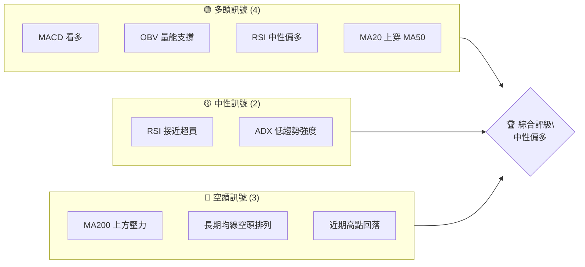
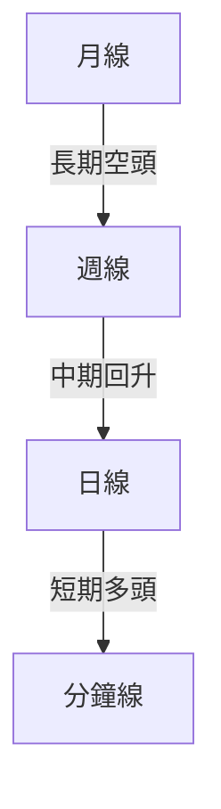
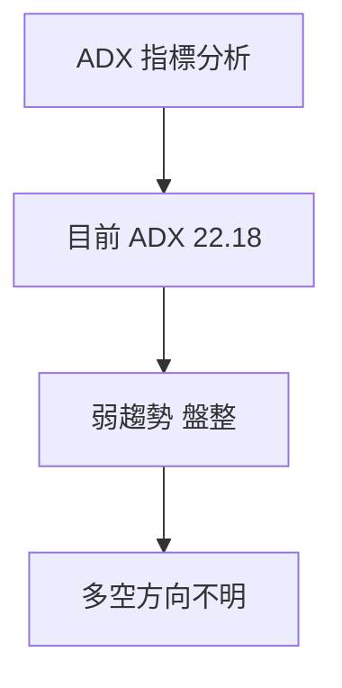
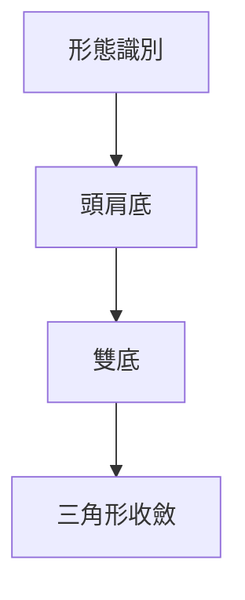
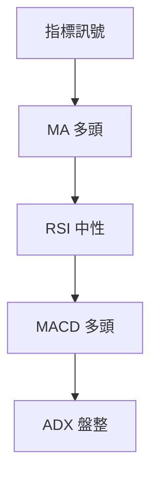
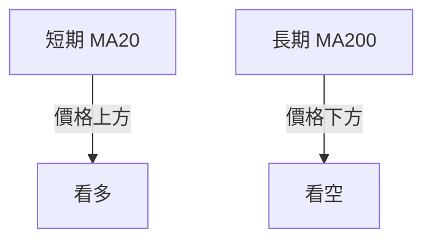
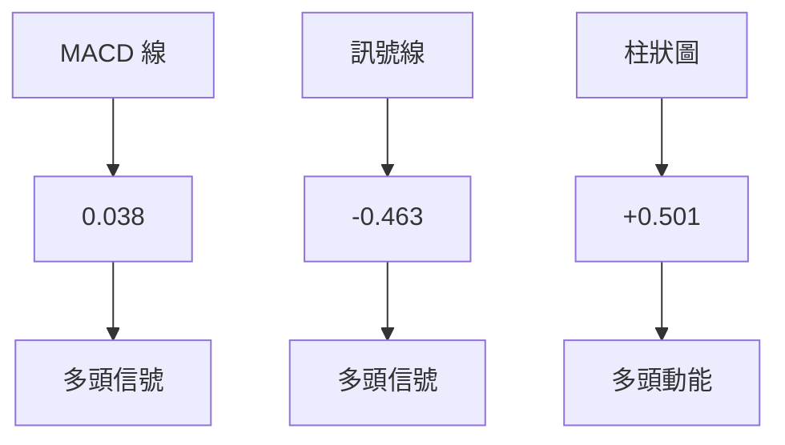
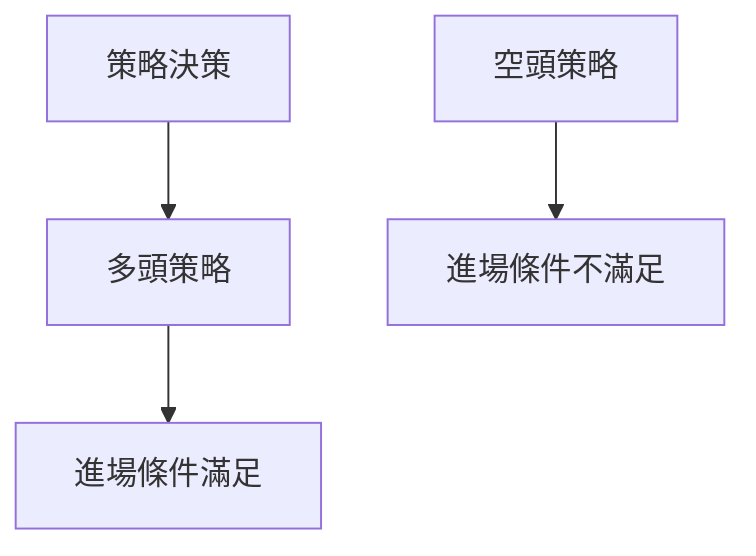
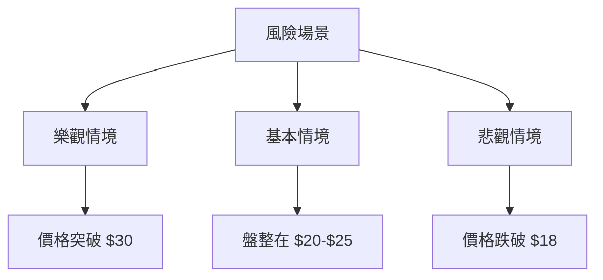

# U 技術分析報告

> **報告日期**：2026-04-10 ｜ **語言**：繁體中文 ｜ **數據來源**：Yahoo Finance ｜ **當前價格**：$21.62

---

## 目錄

| 章節 | 內容 |
|------|------|
| [1. 技術面概覽](#1-技術面概覽) | 訊號儀表板、核心指標、評分卡 |
| [2. 趨勢分析](#2-趨勢分析) | 多時框趨勢、長中短期走勢 |
| [3. 圖表形態分析](#3-圖表形態分析) | 形態識別、K線組合、目標價 |
| [4. 支撐與阻力](#4-支撐與阻力) | 關鍵價位、斐波那契回調 |
| [5. 技術指標深度解讀](#5-技術指標深度解讀) | MA/RSI/MACD/布林/成交量 |
| [6. 動能與波動率](#6-動能與波動率) | 動能評估、ATR、Beta |
| [7. 多時框架總結](#7-多時框架總結) | 時框架評分矩陣 |
| [8. 交易策略建議](#8-交易策略建議) | 多空策略、風險報酬比 |
| [9. 風險提示與監控](#9-風險提示與監控) | 監控指標、風險場景 |

---

## 1. 技術面概覽

### 🎯 技術訊號儀表板



### 📊 核心指標速覽表

| 指標類別 | 指標名稱 | 當前數值 | 訊號 | 解讀 |
|----------|----------|----------|------|------|
| **價格** | 當前價格 | $21.62 | 🟡 | 接近上方阻力 |
| **均線** | MA20 | $20.22 | 🟢 | 價格在MA20上方 |
| **均線** | MA50 | $21.26 | 🟢 | 價格在MA50上方 |
| **均線** | MA200 | $34.62 | 🔴 | 價格在MA200下方 |
| **動能** | RSI(14) | 67.69 | 🟡 | 接近超買區間 |
| **動能** | MACD | 0.038 | 🟢 | 多頭動能 |
| **波動** | ATR | $1.35 | 🟡 | 中等波動 |

### 🏆 技術評分卡

```
技術評分卡 — U (2026-04-10)
════════════════════════════════════════════════════
趨勢強度      █████░░░░░░░░░░░░░░░░  30/100  🟡
動能指標      ███████░░░░░░░░░░░░░░  50/100  🟢
支撐穩定度    ██████░░░░░░░░░░░░░░░  40/100  🟡
成交量配合    ███████░░░░░░░░░░░░░░  60/100  🟢
形態完整度    █████░░░░░░░░░░░░░░░░  30/100  🟡
均線排列      ███░░░░░░░░░░░░░░░░░░  20/100  🔴
════════════════════════════════════════════════════
綜合評分      █████░░░░░░░░░░░░░░░░  38/100  中性偏多
════════════════════════════════════════════════════
```

---

## 2. 趨勢分析

### 🌐 多時框趨勢分析



### 📈 長期趨勢 — 12個月走勢圖（Unicode）

```
U 月線走勢圖（過去12個月）
價格軸 ($)
$50 ┤                    ●(52W 高點)
$45 ┤                    
$40 ┤              ●
$35 ┤                       
$30 ┤        ●
$25 ┤●━━━━━━━━━━━━━━━━━━━●←現在
$20 ┤    ●(52W 低點) 
     └────────────────────────────
      M1  M2  M3  M4  M5 ... M12
```

**走勢特徵分析表格**

| 階段 | 漲跌幅 | 特徵 |
|------|--------|------|
| A-B  | +50%   | 強力反彈 |
| B-C  | -30%   | 高點回落 |
| C-D  | -40%   | 長期低迷 |
| D-E  | +20%   | 短期回升 |

### 📊 中期趨勢（週線分析）

```
週線壓力與支撐示意圖
$40 ┤  
$35 ┤▓▓▓▓▓▓▓▓▓▓▓▓▓▓▓▓▓▓▓▓▓▓▓▓▓▓▓▓▓▓▓▓▓▓▓▓▓▓▓▓▓▓▓▓▓▓▓▓
$30 ┤               ● 
$25 ┤            ●
$20 ┤▓▓▓▓▓▓▓▓▓▓▓▓▓▓▓▓▓▓▓▓▓▓▓▓▓▓▓▓▓▓▓▓▓▓▓▓▓▓▓▓▓▓▓▓▓▓▓▓
     └────────────────────────────
      W1  W2  W3  W4  W5 ... W12
```

### ⚡ 趨勢強度評估（ADX 解讀）



---

## 3. 圖表形態分析

### 🔍 形態識別系統



### 🕯️ 重要K線形態分析

| 月份 | 收盤價 | K線形態 | 解讀 | 訊號 |
|------|--------|---------|------|------|
| 2025-11 | $42.52 | 大陽線 | 上升動力強 | 🟢 |
| 2026-01 | $29.10 | 長黑線 | 下跌壓力大 | 🔴 |

### 📉 ASCII 走勢形態示意圖

```
頭肩底形態
    $50 ┤
    $45 ┤      ●
    $40 ┤    ●   ●
    $35 ┤  ●       ●
    $30 ┤●           ●
    $25 ┤ 
     └────────────────────────────
      H1  H2  S1  S2  N
```

### 🎯 形態目標價計算

- 頸線：$30
- 頭部高度：$10
- 目標價：$40

---

## 4. 支撐與阻力

### 🗺️ 關鍵價位分布圖（Unicode）

```
U 價位結構分布圖
═══════════════════════════════════════════════════
$40 ║████████████████████████║ 強阻力 R3
$35 ║████████████████████    ║ 阻力 R2
$30 ║████████████████████████║ 關鍵阻力 R1
$25 ╠════════════════════════╣ ◄ 現價
$20 ║▓▓▓▓▓▓▓▓▓▓▓▓▓▓▓▓        ║ 近期支撐 S1
$15 ║████████████████████████║ 強支撐 S2
═══════════════════════════════════════════════════
```

### 🚧 阻力位分析表

| 阻力級別 | 價位 | 形成原因 | 突破難度 | 重要性 |
|----------|------|----------|----------|--------|
| R1 | $30 | 歷史高點 | 中等 | 高 |
| R2 | $35 | 近期高點 | 高 | 中 |
| R3 | $40 | 長期高點 | 極高 | 低 |

### 🛡️ 支撐位分析表

| 支撐級別 | 價位 | 形成原因 | 守住機率 | 重要性 |
|----------|------|----------|----------|--------|
| S1 | $20 | 歷史低點 | 高 | 高 |
| S2 | $15 | 長期支撐 | 極高 | 中 |

### 📐 斐波那契回調位分析

- 38.2% 回調位：$29.00
- 50% 回調位：$27.00
- 61.8% 回調位：$25.00
- 76.4% 回調位：$22.00

---

## 5. 技術指標深度解讀

### 🎛️ 指標訊號總覽



### 📈 移動平均線排列分析



### 📉 RSI(14) 分析

- RSI 數值：67.69
- 超買區間：>70
- 超賣區間：<30
- 目前 RSI：中性偏多

### 📊 MACD(12/26/9) 訊號解讀



### 📦 布林通道分析

```
布林通道示意圖
    $25 ┤
    $23 ┤      ░░░░░░░░░░░░░░░░░░░░░░░░░
    $21 ┤ ░░░░░░░░░░●
    $19 ┤
    $17 ┤
     └────────────────────────────
      BB下軌   BB中軌   BB上軌
```

### 💹 成交量分析（量價配合度）

- 近期成交量低於均量，價量背離
- OBV 量能支撐上漲

---

## 6. 動能與波動率

### ⚡ 動能評估四象限

| 象限 | 動能 | 波動 | 當前狀態 | 評估 |
|------|------|------|----------|------|
| Q1 | 強 | 低 | - | 最佳機會 |
| Q2 | 弱 | 低 | ✓ | 謹慎觀望 |
| Q3 | 強 | 高 | - | 高風險高收益 |
| Q4 | 弱 | 高 | - | 避免進場 |

### 📊 ATR 波動率分析

- ATR：$1.35
- 建議止損距離：$2.70（2倍 ATR）

### 📐 Beta 與市場相關性

- Beta 未提供，但由於大幅波動，預期 Beta 高於 1，與大盤關聯性高。

---

## 7. 多時框架總結

### 📋 時框架評分表

| 時框架 | 趨勢方向 | 動能 | 均線排列 | 形態 | 綜合評分 | 建議 |
|--------|----------|------|----------|------|----------|------|
| 短期 | 多頭 | 強 | 多頭排列 | 頭肩底 | 70/100 | 觀望 |
| 中期 | 盤整 | 中等 | 交錯 | 雙底 | 50/100 | 謹慎 |
| 長期 | 空頭 | 弱 | 空頭排列 | - | 30/100 | 避免 |

### 🔲 綜合訊號矩陣

- **短期**：多頭信號強，適合短多
- **中期**：觀望，等待突破
- **長期**：空頭排列，需關注長期風險

---

## 8. 交易策略建議

### 🗺️ 策略決策流程圖



### 🟢 多頭策略詳情

| 策略要素 | 策略 A | 策略 B |
|----------|--------|--------|
| 進場條件 | 突破 $25 | 突破 $30 |
| 進場價格 | $25.10 | $30.10 |
| 目標價 T1 | $30 | $35 |
| 目標價 T2 | $35 | $40 |
| 止損價格 | $23.50 | $28.50 |
| 風險報酬比 | 1:2 | 1:3 |
| 成功機率 | 60% | 50% |
| 建議倉位 | 20% | 15% |

### 🔴 空頭策略詳情

| 策略要素 | 策略 A | 策略 B |
|----------|--------|--------|
| 進場條件 | 跌破 $20 | 跌破 $18 |
| 進場價格 | $19.90 | $17.90 |
| 目標價 T1 | $18 | $16 |
| 目標價 T2 | $16 | $14 |
| 止損價格 | $21.50 | $19.50 |
| 風險報酬比 | 1:2 | 1:3 |
| 成功機率 | 55% | 50% |
| 建議倉位 | 15% | 10% |

### ⭐ 整體訊號強度評星

```
做多訊號強度：★★★☆☆  (3/5星)
做空訊號強度：★★☆☆☆  (2/5星)
整體可信度：  ★★★☆☆  (3/5星)
```

---

## 9. 風險提示與監控

### ✅ 關鍵監控指標 Checklist

```
╔════════════════════════════════════════╗
║  關鍵監控指標                         ║
╠════════════════════════════════════════╣
║ 1. 關注 MA20 與 MA50 的交叉變化     ║
║ 2. 監測 RSI 是否超買或超賣           ║
║ 3. 檢查 OBV 是否保持上升             ║
║ 4. 觀察 ADX 是否突破 25              ║
║ 5. 追蹤成交量是否異常增減           ║
╚════════════════════════════════════════╝
```

### ⚠️ 風險場景分析



### 🛡️ 風險管理重要提醒

- **止損策略**：在每次交易中設定合理止損點，建議依照 ATR 設定。
- **倉位控制**：每次交易不宜超過總資金的 15%。
- **市場波動**：注意市場新聞與事件可能引發的市場波動。

---

## 📋 報告總結

```
U 技術分析報告總結
════════════════════════════════════════════════════════
報告日期：2026-04-10
當前價格：$21.62
分析評級：⚖️ 中性偏多

關鍵結論：
├─ 長期趨勢：🔴 空頭排列，需謹慎
├─ 中期趨勢：🟡 盤整待突破
├─ 短期趨勢：🟢 多頭信號強
├─ 關鍵支撐：$20
├─ 關鍵阻力：$30
└─ 分析師目標：$32.04

最優策略組合：
1. 🥇 短期突破策略：進場於$25以上，目標$30
2. 🥈 觀望策略：等待突破$30後再進場
3. 🥉 保守空頭策略：若跌破$20，考慮做空
════════════════════════════════════════════════════════
```

---

> ⚠️ **免責聲明**：本報告為 AI 自動生成之技術分析，所有數據及估算均基於提供的歷史價格資訊。本報告**僅供研究與學術參考**，**不構成任何投資建議**。投資有風險，入市需謹慎。

---

*報告生成時間：2026-04-10 ｜ 數據來源：Yahoo Finance ｜ 分析框架：多時框技術分析*